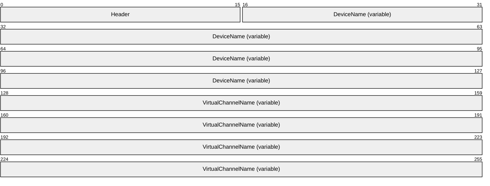
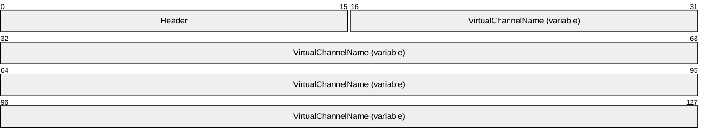
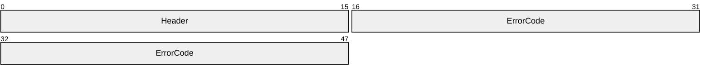
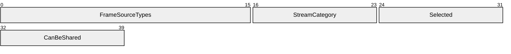
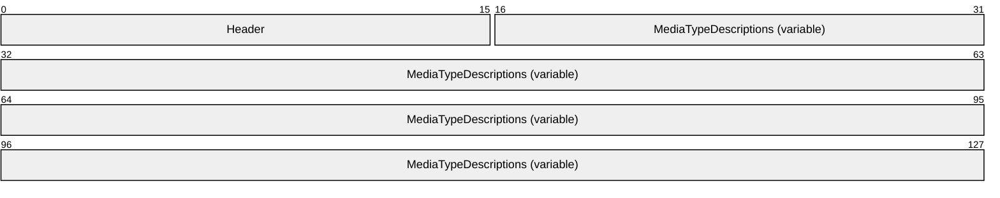
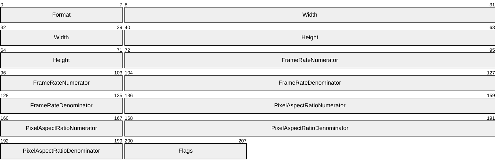
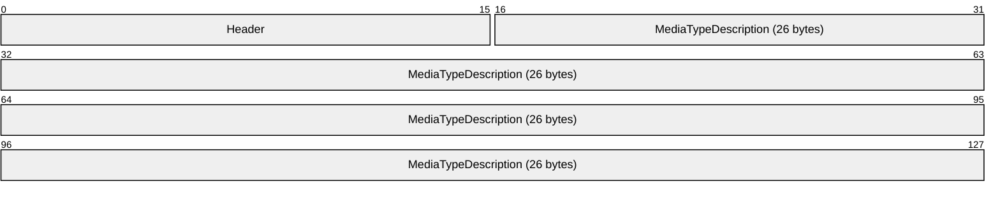
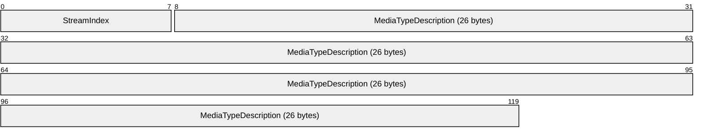

# [MS-RDPECAM]: Remote Desktop Protocol: Video Capture Virtual Channel Extension

Table of Contents

<details>
<summary>1 Introduction</summary>

- [1 Introduction](#Section_1)
  - [1.1 Glossary](#Section_1.1)
  - [1.2 References](#Section_1.2)
    - [1.2.1 Normative References](#Section_1.2.1)
    - [1.2.2 Informative References](#Section_1.2.2)
  - [1.3 Overview](#Section_1.3)
    - [1.3.1 Version Negotiation sequence](#Section_1.3.1)
    - [1.3.2 New Device sequence](#Section_1.3.2)
    - [1.3.3 Device Removal sequence](#Section_1.3.3)
    - [1.3.4 Device Initialization sequence](#Section_1.3.4)
    - [1.3.5 Video Capture sequence](#Section_1.3.5)
    - [1.3.6 Device Control Initialization sequence](#Section_1.3.6)
    - [1.3.7 Device Control sequence](#Section_1.3.7)
  - [1.4 Relationship to Other Protocols](#Section_1.4)
  - [1.5 Prerequisites/Preconditions](#Section_1.5)
  - [1.6 Applicability Statement](#Section_1.6)
  - [1.7 Versioning and Capability Negotiation](#Section_1.7)
  - [1.8 Vendor-Extensible Fields](#Section_1.8)
  - [1.9 Standards Assignments](#Section_1.9)
</details>

<details>
<summary>2 Messages</summary>

- [2 Messages](#Section_2)
  - [2.1 Transport](#Section_2.1)
  - [2.2 Message Syntax](#Section_2.2)
    - [2.2.1 Shared Message Header (SHARED_MSG_HEADER)](#Section_2.2.1)
    - [2.2.2 Messages Exchanged on the Device Enumeration Channel](#Section_2.2.2)
      - [2.2.2.1 Select Version Request](#Section_2.2.2.1)
      - [2.2.2.2 Select Version Response](#Section_2.2.2.2)
      - [2.2.2.3 Device Added Notification](#Section_2.2.2.3)
      - [2.2.2.4 Device Removed Notification](#Section_2.2.2.4)
    - [2.2.3 Messages Exchanged on Device Channels](#Section_2.2.3)
      - [2.2.3.1 Success Response](#Section_2.2.3.1)
      - [2.2.3.2 Error Response](#Section_2.2.3.2)
      - [2.2.3.3 Activate Device Request](#Section_2.2.3.3)
      - [2.2.3.4 Deactivate Device Request](#Section_2.2.3.4)
      - [2.2.3.5 Stream List Request](#Section_2.2.3.5)
      - [2.2.3.6 Stream List Response](#Section_2.2.3.6)
        - [2.2.3.6.1 STREAM_DESCRIPTION](#Section_2.2.3.6.1)
      - [2.2.3.7 Media Type List Request](#Section_2.2.3.7)
      - [2.2.3.8 Media Type List Response](#Section_2.2.3.8)
        - [2.2.3.8.1 MEDIA_TYPE_DESCRIPTION](#Section_2.2.3.8.1)
      - [2.2.3.9 Current Media Type Request](#Section_2.2.3.9)
      - [2.2.3.10 Current Media Type Response](#Section_2.2.3.10)
      - [2.2.3.11 Start Streams Request](#Section_2.2.3.11)
        - [2.2.3.11.1 START_STREAM_INFO](#Section_2.2.3.11.1)
      - [2.2.3.12 Stop Streams Request](#Section_2.2.3.12)
      - [2.2.3.13 Sample Request](#Section_2.2.3.13)
      - [2.2.3.14 Sample Response](#Section_2.2.3.14)
      - [2.2.3.15 Sample Error Response](#Section_2.2.3.15)
      - [2.2.3.16 Property List Request](#Section_2.2.3.16)
      - [2.2.3.17 Property List Response](#Section_2.2.3.17)
        - [2.2.3.17.1 PROPERTY_DESCRIPTION](#Section_2.2.3.17.1)
      - [2.2.3.18 Property Value Request](#Section_2.2.3.18)
      - [2.2.3.19 Property Value Response](#Section_2.2.3.19)
        - [2.2.3.19.1 PROPERTY_VALUE](#Section_2.2.3.19.1)
      - [2.2.3.20 Set Property Value Request](#Section_2.2.3.20)
  - [2.3 Directory Service Schema Elements](#Section_2.3)
</details>

<details>
<summary>3 Protocol Details</summary>

- [3 Protocol Details](#Section_3)
  - [3.1 Common Details](#Section_3.1)
    - [3.1.1 Abstract Data Model](#Section_3.1.1)
    - [3.1.2 Timers](#Section_3.1.2)
    - [3.1.3 Initialization](#Section_3.1.3)
    - [3.1.4 Higher-Layer Triggered Events](#Section_3.1.4)
    - [3.1.5 Message Processing Events and Sequencing Rules](#Section_3.1.5)
    - [3.1.6 Timer Events](#Section_3.1.6)
    - [3.1.7 Other Local Events](#Section_3.1.7)
  - [3.2 Client Details](#Section_3.2)
    - [3.2.1 Abstract Data Model](#Section_3.2.1)
    - [3.2.2 Timers](#Section_3.2.2)
    - [3.2.3 Initialization](#Section_3.2.3)
    - [3.2.4 Higher-Layer Triggered Events](#Section_3.2.4)
    - [3.2.5 Message Processing Events and Sequencing Rules](#Section_3.2.5)
      - [3.2.5.1 Sending a Select Version Request](#Section_3.2.5.1)
      - [3.2.5.2 Processing a Select Version Response](#Section_3.2.5.2)
      - [3.2.5.3 Sending a Device Added Notification](#Section_3.2.5.3)
      - [3.2.5.4 Sending a Device Removed Notification](#Section_3.2.5.4)
      - [3.2.5.5 Processing an Activate Device Request](#Section_3.2.5.5)
      - [3.2.5.6 Processing a Stream List Request](#Section_3.2.5.6)
      - [3.2.5.7 Sending a Stream List Response](#Section_3.2.5.7)
      - [3.2.5.8 Processing a Media Type List Request](#Section_3.2.5.8)
      - [3.2.5.9 Sending a Media Type List Response](#Section_3.2.5.9)
      - [3.2.5.10 Processing a Current Media Type Request](#Section_3.2.5.10)
      - [3.2.5.11 Sending a Current Media Type Response](#Section_3.2.5.11)
      - [3.2.5.12 Processing a Start Streams Request](#Section_3.2.5.12)
      - [3.2.5.13 Processing a Sample Request](#Section_3.2.5.13)
      - [3.2.5.14 Sending a Sample Response](#Section_3.2.5.14)
      - [3.2.5.15 Processing a Stop Streams Request](#Section_3.2.5.15)
      - [3.2.5.16 Processing a Property List Request](#Section_3.2.5.16)
      - [3.2.5.17 Sending a Property List Response](#Section_3.2.5.17)
      - [3.2.5.18 Processing a Property Value Request](#Section_3.2.5.18)
      - [3.2.5.19 Sending a Property Value Response](#Section_3.2.5.19)
      - [3.2.5.20 Processing a Set Property Value Request](#Section_3.2.5.20)
      - [3.2.5.21 Processing a Deactivate Device Request](#Section_3.2.5.21)
      - [3.2.5.22 Sending a Success Response](#Section_3.2.5.22)
      - [3.2.5.23 Sending an Error Response](#Section_3.2.5.23)
      - [3.2.5.24 Sending a Sample Error Response](#Section_3.2.5.24)
    - [3.2.6 Timer Events](#Section_3.2.6)
    - [3.2.7 Other Local Events](#Section_3.2.7)
  - [3.3 Server Details](#Section_3.3)
    - [3.3.1 Abstract Data Model](#Section_3.3.1)
    - [3.3.2 Timers](#Section_3.3.2)
    - [3.3.3 Initialization](#Section_3.3.3)
    - [3.3.4 Higher-Layer Triggered Events](#Section_3.3.4)
    - [3.3.5 Message Processing Events and Sequencing Rules](#Section_3.3.5)
      - [3.3.5.1 Processing a Select Version Request](#Section_3.3.5.1)
      - [3.3.5.2 Sending a Select Version Response](#Section_3.3.5.2)
      - [3.3.5.3 Processing a Device Added Notification](#Section_3.3.5.3)
      - [3.3.5.4 Processing a Device Removed Notification](#Section_3.3.5.4)
      - [3.3.5.5 Sending an Activate Device Request](#Section_3.3.5.5)
      - [3.3.5.6 Sending a Stream List Request](#Section_3.3.5.6)
      - [3.3.5.7 Processing a Stream List Response](#Section_3.3.5.7)
      - [3.3.5.8 Sending a Media Type List Request](#Section_3.3.5.8)
      - [3.3.5.9 Processing a Media Type List Response](#Section_3.3.5.9)
      - [3.3.5.10 Sending a Current Media Type Request](#Section_3.3.5.10)
      - [3.3.5.11 Processing a Current Media Type Response](#Section_3.3.5.11)
      - [3.3.5.12 Sending a Start Streams Request](#Section_3.3.5.12)
      - [3.3.5.13 Sending a Sample Request](#Section_3.3.5.13)
      - [3.3.5.14 Processing a Sample Response](#Section_3.3.5.14)
      - [3.3.5.15 Sending a Stop Streams Request](#Section_3.3.5.15)
      - [3.3.5.16 Sending a Property List Request](#Section_3.3.5.16)
      - [3.3.5.17 Processing a Property List Response](#Section_3.3.5.17)
      - [3.3.5.18 Sending a Property Value Request](#Section_3.3.5.18)
      - [3.3.5.19 Processing a Property Value Response](#Section_3.3.5.19)
      - [3.3.5.20 Sending a Set Property Value Request](#Section_3.3.5.20)
      - [3.3.5.21 Sending a Deactivate Device Request](#Section_3.3.5.21)
      - [3.3.5.22 Processing a Success Response](#Section_3.3.5.22)
      - [3.3.5.23 Processing an Error Response](#Section_3.3.5.23)
      - [3.3.5.24 Processing a Sample Error Response](#Section_3.3.5.24)
    - [3.3.6 Timer Events](#Section_3.3.6)
    - [3.3.7 Other Local Events](#Section_3.3.7)
</details>

<details>
<summary>4 Protocol Examples</summary>

- [4 Protocol Examples](#Section_4)
  - [4.1 Annotated Version Negotiation sequence](#Section_4.1)
    - [4.1.1 Select Version Request](#Section_4.1.1)
    - [4.1.2 Select Version Response](#Section_4.1.2)
  - [4.2 Annotated New Device sequence](#Section_4.2)
    - [4.2.1 Device Added Notification](#Section_4.2.1)
  - [4.3 Annotated Device Removal sequence](#Section_4.3)
    - [4.3.1 Device Removed Notification](#Section_4.3.1)
  - [4.4 Annotated Device Initialization sequence](#Section_4.4)
    - [4.4.1 Activate Device Request](#Section_4.4.1)
    - [4.4.2 Success Response](#Section_4.4.2)
    - [4.4.3 Stream List Request](#Section_4.4.3)
    - [4.4.4 Stream List Response](#Section_4.4.4)
    - [4.4.5 Media Type List Request](#Section_4.4.5)
    - [4.4.6 Media Type List Response](#Section_4.4.6)
    - [4.4.7 Current Media Type Request](#Section_4.4.7)
    - [4.4.8 Current Media Type Response](#Section_4.4.8)
    - [4.4.9 Deactivate Device Request](#Section_4.4.9)
  - [4.5 Annotated Video Capture sequence](#Section_4.5)
    - [4.5.1 Start Streams Request](#Section_4.5.1)
    - [4.5.2 Sample Request](#Section_4.5.2)
    - [4.5.3 Sample Response](#Section_4.5.3)
    - [4.5.4 Stop Streams Request](#Section_4.5.4)
  - [4.6 Annotated Device Control Initialization sequence](#Section_4.6)
    - [4.6.1 Property List Request](#Section_4.6.1)
    - [4.6.2 Property List Response](#Section_4.6.2)
    - [4.6.3 Property Value Request](#Section_4.6.3)
    - [4.6.4 Property Value Response](#Section_4.6.4)
  - [4.7 Annotated Device Control sequence](#Section_4.7)
    - [4.7.1 Set Property Value Request](#Section_4.7.1)
  - [4.8 Annotated Error Response](#Section_4.8)
</details>

<details>
<summary>5 Security</summary>

- [5 Security](#Section_5)
  - [5.1 Security Considerations for Implementers](#Section_5.1)
  - [5.2 Index of Security Parameters](#Section_5.2)
</details>

<details>
<summary>6 Appendix A: Product Behavior</summary>

- [6 Appendix A: Product Behavior](#Section_6)
</details>

<details>
<summary>7 Change Tracking</summary>

- [7 Change Tracking](#Section_7)
</details>

For the legal notice and IP terms, see [LEGAL.md](../LEGAL.md).
Last updated: 4/23/2024.
See [Revision History](#revision-history) for full version history.

<a id="Section_1"></a>
# 1 Introduction

Remote Desktop Protocol: Video Capture Virtual Channel Extension is used to transfer video capture data from a Remote Desktop Protocol client to a Remote Desktop Protocol server.

Sections 1.5, 1.8, 1.9, 2, and 3 of this specification are normative. All other sections and examples in this specification are informative.

<a id="Section_1.1"></a>
## 1.1 Glossary

This document uses the following terms:

<a id="gt_ansi-character"></a>
**ANSI character**: An 8-bit Windows-1252 character set unit.

<a id="gt_device-channel"></a>
**device channel**: A dynamic virtual channel created for each redirected video capture device and used to communicate with that device.

<a id="gt_device-enumeration-channel"></a>
**device enumeration channel**: A dynamic virtual channel used to negotiate the protocol version and to notify the server when a video-capture device is added or removed. The dynamic virtual channel name of the device enumeration channel is the null-terminated ANSI-encoded character string "RDCamera_Device_Enumerator".

<a id="gt_dynamic-virtual-channel"></a>
**dynamic virtual channel**: A transport used for lossless communication between an RDP client and a server component over a main data connection, as specified in [MS-RDPEDYC].

<a id="gt_joint-photographic-experts-group-jpeg"></a>
**Joint Photographic Experts Group (JPEG)**: A raster graphics file format for displaying high-resolution color graphics. JPEG graphics apply a user-specified compression scheme that can significantly reduce the file sizes of photo-realistic color graphics. A higher level of compression results in lower quality, whereas a lower level of compression results in higher quality. JPEG-format files have a .jpg or .jpeg file name extension.

<a id="gt_remote-desktop-protocol-rdp-client"></a>
**Remote Desktop Protocol (RDP) client**: The client that initiated a remote desktop connection.

<a id="gt_remote-desktop-protocol-rdp-server"></a>
**Remote Desktop Protocol (RDP) server**: The server to which a client initiated a remote desktop connection.

<a id="gt_sample"></a>
**sample**: The smallest fundamental unit (such as a frame) in which media is stored and processed.

<a id="gt_sequence-parameter-setpicture-parameter-set-spspps"></a>
**sequence parameter set/picture parameter set (SPS/PPS)**: Data units in an H.264 stream that include metadata about the stream.

<a id="gt_stream-format"></a>
**stream format**: A specification for encoding a particular type of data as a stream.

<a id="gt_unicode-character"></a>
**Unicode character**: Unless otherwise specified, a 16-bit UTF-16 code unit.

<a id="gt_video-frame"></a>
**video frame**: A single still image that is shown as part of a quick succession of images in a video.

**MAY, SHOULD, MUST, SHOULD NOT, MUST NOT:** These terms (in all caps) are used as defined in [[RFC2119]](https://go.microsoft.com/fwlink/?LinkId=90317). All statements of optional behavior use either MAY, SHOULD, or SHOULD NOT.

<a id="Section_1.2"></a>
## 1.2 References

Links to a document in the Microsoft Open Specifications library point to the correct section in the most recently published version of the referenced document. However, because individual documents in the library are not updated at the same time, the section numbers in the documents may not match. You can confirm the correct section numbering by checking the [Errata](https://go.microsoft.com/fwlink/?linkid=850906).

<a id="Section_1.2.1"></a>
### 1.2.1 Normative References

We conduct frequent surveys of the normative references to assure their continued availability. If you have any issue with finding a normative reference, please contact [dochelp@microsoft.com](mailto:dochelp@microsoft.com). We will assist you in finding the relevant information.

[ITU-H.264-201704] ITU-T, "Advanced video coding for generic audiovisual services", Recommendation: H.264 April 2017, [https://www.itu.int/rec/T-REC-H.264-201704-I/en](https://go.microsoft.com/fwlink/?linkid=875332)

[MS-RDPBCGR] Microsoft Corporation, "[Remote Desktop Protocol: Basic Connectivity and Graphics Remoting](../MS-RDPBCGR/MS-RDPBCGR.md)".

[MS-RDPEDYC] Microsoft Corporation, "[Remote Desktop Protocol: Dynamic Channel Virtual Channel Extension](../MS-RDPEDYC/MS-RDPEDYC.md)".

[MSDN-YUVFormats] Microsoft Corporation, "Recommended 8-Bit YUV Formats for Video Rendering", [https://msdn.microsoft.com/en-us/library/windows/desktop/dd206750(v=vs.85).aspx](https://go.microsoft.com/fwlink/?linkid=875333)

[RFC2119] Bradner, S., "Key words for use in RFCs to Indicate Requirement Levels", BCP 14, RFC 2119, March 1997, [https://www.rfc-editor.org/info/rfc2119](https://go.microsoft.com/fwlink/?LinkId=90317)

<a id="Section_1.2.2"></a>
### 1.2.2 Informative References

None.

<a id="Section_1.3"></a>
## 1.3 Overview

This section provides a high-level overview of the operation of the Remote Desktop Protocol: Video Capture Virtual Channel Extension. The purpose of this protocol is to transfer video capture data from a [**Remote Desktop Protocol (RDP) client**](#gt_remote-desktop-protocol-rdp-client) to a [**Remote Desktop Protocol (RDP) server**](#gt_remote-desktop-protocol-rdp-server), hereinafter referred to as client and server, respectively. For example, an application running on a server can request to record video capture data. This data will be transferred from the client to the server, allowing a server application to record from a video capture device installed on the client.

The protocol uses multiple [**dynamic virtual channels**](#gt_dynamic-virtual-channel). A channel is utilized for version negotiation and device enumeration and another for video capture device communication, hereinafter referred to as the [**device enumeration channel**](#gt_device-enumeration-channel) and [**device channel**](#gt_device-channel), respectively. There are multiple instances of the device channel (one instance for each video capture device), each instance being identified by a unique channel ID ([MS-RDPEDYC](../MS-RDPEDYC/MS-RDPEDYC.md) section 1.3.3.1).

The protocol is divided into the following logical sequences:

**Version Negotiation sequence:** The client and the server negotiate the protocol version.

**New Device sequence:** The client creates a new device channel for every new video capture device available for redirection and notifies the server.

**Device Removal sequence:** The client notifies the server when a specific video capture device is no longer available for redirection.

**Device Initialization sequence:** The server uses this sequence to enumerate streams and video formats supported by the video capture device.

**Video Capture sequence:** The server uses this sequence to receive video data from the video capture device.

**Device Control Initialization sequence:** The server uses this sequence to enumerate device properties supported by the video capture device.

**Device Control sequence:** The server uses this sequence to control device properties of the video capture device.

<a id="Section_1.3.1"></a>
### 1.3.1 Version Negotiation sequence

This sequence occurs on the [**device enumeration channel**](#gt_device-enumeration-channel). The client and the server negotiate the protocol version by exchanging the Select Version Request (section [2.2.2.1](#Section_2.2.2.1)) and Select Version Response messages (section [2.2.2.2](#Section_2.2.2.2)). The client sends the highest protocol version it supports in the Select Version Request and receives the protocol version selected by the server in the Select Version Response. These two messages MUST be the first messages exchanged. All subsequent protocol messages MUST use the negotiated protocol version. The client MUST support all the protocol versions less than the highest one it supports.<1>


**Figure 1: Version Negotiation sequence**

<a id="Section_1.3.2"></a>
### 1.3.2 New Device sequence

This sequence occurs on the [**device enumeration channel**](#gt_device-enumeration-channel). Immediately after the Version Negotiation sequence (section [1.3.1](#Section_1.3.1)), the client enumerates all the video capture devices available for redirection, creates a dynamic virtual channel for each of them, and sends a Device Added Notification (section [2.2.2.3](#Section_2.2.2.3)) to the server for each device. Whenever the client detects a new video capture device, it creates a new dynamic virtual channel and sends another Device Added Notification to the server.


**Figure 2: New Device sequence**

<a id="Section_1.3.3"></a>
### 1.3.3 Device Removal sequence

This sequence occurs on the [**device enumeration channel**](#gt_device-enumeration-channel). If a redirected video capture device becomes unavailable on the client, the client sends a Device Removed Notification (section [2.2.2.4](#Section_2.2.2.4)) to the server. After receiving the Device Removed Notification, the server MUST stop using the corresponding [**device channel**](#gt_device-channel) and notify applications that the device has been removed.


**Figure 3: Device Removal sequence**

<a id="Section_1.3.4"></a>
### 1.3.4 Device Initialization sequence

This sequence occurs on the [**device channel**](#gt_device-channel). The server uses this sequence to enumerate video streams and [**stream formats**](#gt_stream-format) supported by the video capture device associated with this channel. First, the server sends an Activate Device Request (section [2.2.3.3](#Section_2.2.3.3)) to make the device ready for use. Next, the server sends a Stream List Request (section [2.2.3.5](#Section_2.2.3.5)) to enumerate video streams on the device. Then, for each stream the server sends a Media Type List Request (section [2.2.3.7](#Section_2.2.3.7)) to obtain a list of supported stream formats for that stream. Finally, the server sends a Current Media Type Request (section [2.2.3.9](#Section_2.2.3.9)) to obtain the stream format currently selected for each stream. At the end of the sequence, the server sends a Deactivate Device Request (section [2.2.3.4](#Section_2.2.3.4)) to allow the client to free resources associated with the device.


**Figure 4: Device Initialization sequence**

<a id="Section_1.3.5"></a>
### 1.3.5 Video Capture sequence

This sequence occurs on the [**device channel**](#gt_device-channel). The server uses this sequence to receive video data from the video capture device on the client associated with this channel. First, the server sends an Activate Device Request (section [2.2.3.3](#Section_2.2.3.3)), if it did not do so yet, to ensure that the device is ready for use. Next, the server sends a Start Streams Request (section [2.2.3.11](#Section_2.2.3.11)) to select the video stream(s) to produce video [**samples**](#gt_sample) and to select the current [**stream format**](#gt_stream-format) for each stream. Then, for each stream the server starts sending Sample Requests (section [2.2.3.13](#Section_2.2.3.13)). For each Sample Request, when a new sample is ready, the client sends back a Sample Response (section [2.2.3.14](#Section_2.2.3.14)) containing the video sample. When the server does not require any more video data, it sends a Stop Streams Request (section [2.2.3.12](#Section_2.2.3.12)). At the end of the sequence, the server sends a Deactivate Device Request (section [2.2.3.4](#Section_2.2.3.4)) to allow the client to free resources associated with the device.


**Figure 5: Video Capture sequence**

<a id="Section_1.3.6"></a>
### 1.3.6 Device Control Initialization sequence

This sequence occurs on the [**device channel**](#gt_device-channel). The server uses this sequence to discover which device properties (such as Brightness, Focus, and so on) the redirected video capture device supports, their value ranges, and current values. First, the server sends an Activate Device Request (section [2.2.3.3](#Section_2.2.3.3)), if it did not do so yet, to ensure that the device is ready for use. Next, the server sends a Property List Request (section [2.2.3.16](#Section_2.2.3.16)) to obtain a list of device properties supported by the device. Then, for each supported device property the server sends a Property Value Request (section [2.2.3.18](#Section_2.2.3.18)) to obtain the current value of the property. At the end of the sequence, the server sends a Deactivate Device Request (section [2.2.3.4](#Section_2.2.3.4)) to allow the client to free resources associated with the device.


**Figure 6: Device Control Initialization sequence**

<a id="Section_1.3.7"></a>
### 1.3.7 Device Control sequence

This sequence occurs on the [**device channel**](#gt_device-channel). The server uses this sequence to change the values of various device properties on the video capture device associated with this channel. First, the server sends an Activate Device Request (section [2.2.3.3](#Section_2.2.3.3)), if it did not do so yet, to ensure that the device is ready for use. Next, the server sends a Set Property Value Request (section [2.2.3.20](#Section_2.2.3.20)) for each device property which needs to be adjusted. At the end of the sequence, the server sends a Deactivate Device Request (section [2.2.3.4](#Section_2.2.3.4)) to allow the client to free resources associated with the device.


**Figure 7: Device Control sequence**

<a id="Section_1.4"></a>
## 1.4 Relationship to Other Protocols

The Remote Desktop Protocol: Video Capture Virtual Channel Extension is embedded in a [**dynamic virtual channel**](#gt_dynamic-virtual-channel) transport, as specified in [MS-RDPEDYC](../MS-RDPEDYC/MS-RDPEDYC.md) sections 1 to 3.

<a id="Section_1.5"></a>
## 1.5 Prerequisites/Preconditions

The Remote Desktop Protocol: Video Capture Virtual Channel Extension operates only after the [**dynamic virtual channel**](#gt_dynamic-virtual-channel) transport is fully established. If the dynamic virtual channel transport is terminated, the Remote Desktop Protocol: Video Capture Virtual Channel Extension is also terminated. The protocol is terminated by closing the underlying virtual channel. For details about closing the dynamic virtual channel, refer to [MS-RDPEDYC](../MS-RDPEDYC/MS-RDPEDYC.md) section 3.2.5.2.

<a id="Section_1.6"></a>
## 1.6 Applicability Statement

The Remote Desktop Protocol: Video Capture Virtual Channel Extension is designed to run within the context of a Remote Desktop Protocol (RDP) [**dynamic virtual channel**](#gt_dynamic-virtual-channel) established between a [**Remote Desktop Protocol (RDP) client**](#gt_remote-desktop-protocol-rdp-client) and [**Remote Desktop Protocol (RDP) server**](#gt_remote-desktop-protocol-rdp-server). This protocol is applicable when any local client video capture devices needs to be accessible (redirected) in the remote session hosted on the server.

<a id="Section_1.7"></a>
## 1.7 Versioning and Capability Negotiation

The Remote Desktop Protocol: Video Capture Virtual Channel Extension performs explicit version negotiation as described in section [1.3.1](#Section_1.3.1).

<a id="Section_1.8"></a>
## 1.8 Vendor-Extensible Fields

None.

<a id="Section_1.9"></a>
## 1.9 Standards Assignments

None.

<a id="Section_2"></a>
# 2 Messages

<a id="Section_2.1"></a>
## 2.1 Transport

This protocol is designed to operate over [**dynamic virtual channels**](#gt_dynamic-virtual-channel), as specified in [MS-RDPEDYC](../MS-RDPEDYC/MS-RDPEDYC.md) sections 1 to 3. A single channel is used during the device enumeration phase of the protocol, and separate channels are created for each redirected video capture device. The name of the [**device enumeration channel**](#gt_device-enumeration-channel) MUST be the null-terminated ANSI-encoded character string "RDCamera_Device_Enumerator". The name of a [**device channel**](#gt_device-channel) MUST be a null-terminated ANSI encoded character string containing a maximum of 256 characters. The usage of a channel name when opening a dynamic virtual channel is specified in [MS-RDPEDYC] section 2.2.2.1. The RDP layer manages the creation, setup, and transmission of data over dynamic virtual channels.

<a id="Section_2.2"></a>
## 2.2 Message Syntax

The following sections define the syntax for the various messages in the protocol. All multiple-byte fields within a message MUST be marshaled in little-endian byte order, unless otherwise specified.

<a id="Section_2.2.1"></a>
### 2.2.1 Shared Message Header (SHARED_MSG_HEADER)

The SHARED_MSG_HEADER structure is a common header included in every message of the protocol.


**Version (1 byte):** An 8-bit unsigned integer that specifies the protocol version of the message. This field MUST be set to either 1 or 2.

**MessageId (1 byte):** An 8-bit unsigned integer that specifies the type of the message.

| Value | Meaning |
| --- | --- |
| SuccessResponse 0x01 | A Success Response (section [2.2.3.1](#Section_2.2.3.1)) message. |
| ErrorResponse 0x02 | An Error Response (section [2.2.3.2](#Section_2.2.3.2)) message. |
| SelectVersionRequest 0x03 | A Select Version Request (section [2.2.2.1](#Section_2.2.2.1)) message. |
| SelectVersionResponse 0x04 | A Select Version Response (section [2.2.2.2](#Section_2.2.2.2)) message. |
| DeviceAddedNotification 0x05 | A Device Added Notification (section [2.2.2.3](#Section_2.2.2.3)) message. |
| DeviceRemovedNotification 0x06 | A Device Removed Notification (section [2.2.2.4](#Section_2.2.2.4)) message. |
| ActivateDeviceRequest 0x07 | An Activate Device Request (section [2.2.3.3](#Section_2.2.3.3)) message. |
| DeactivateDeviceRequest 0x08 | A Deactivate Device Request (section [2.2.3.4](#Section_2.2.3.4)) message. |
| StreamListRequest 0x09 | A Stream List Request (section [2.2.3.5](#Section_2.2.3.5)) message. |
| StreamListResponse 0x0A | A Stream List Response (section [2.2.3.6](#Section_2.2.3.6)) message. |
| MediaTypeListRequest 0x0B | A Media Type List Request (section [2.2.3.7](#Section_2.2.3.7)) message. |
| MediaTypeListResponse 0x0C | A Media Type List Response (section [2.2.3.8](#Section_2.2.3.8)) message. |
| CurrentMediaTypeRequest 0x0D | A Current Media Type Request (section [2.2.3.9](#Section_2.2.3.9)) message. |
| CurrentMediaTypeResponse 0x0E | A Current Media Type Response (section [2.2.3.10](#Section_2.2.3.10)) message. |
| StartStreamsRequest 0x0F | A Start Streams Request (section [2.2.3.11](#Section_2.2.3.11)) message. |
| StopStreamsRequest 0x10 | A Stop Streams Request (section [2.2.3.12](#Section_2.2.3.12)) message. |
| SampleRequest 0x11 | A Sample Request (section [2.2.3.13](#Section_2.2.3.13)) message. |
| SampleResponse 0x12 | A Sample Response (section [2.2.3.14](#Section_2.2.3.14)) message. |
| SampleErrorResponse 0x13 | A Sample Error Response (section [2.2.3.15](#Section_2.2.3.15)) message. |
| PropertyListRequest 0x14 | A Property List Request (section [2.2.3.16](#Section_2.2.3.16)) message. This message is supported only by version 2 of the protocol. |
| PropertyListResponse 0x15 | A Property List Response (section [2.2.3.17](#Section_2.2.3.17)) message. This message is supported only by version 2 of the protocol. |
| PropertyValueRequest 0x16 | A Property Value Request (section [2.2.3.18](#Section_2.2.3.18)) message. This message is supported only by version 2 of the protocol. |
| PropertyValueResponse 0x17 | A Property Value Response (section [2.2.3.19](#Section_2.2.3.19)) message. This message is supported only by version 2 of the protocol. |
| SetPropertyValueRequest 0x18 | A Set Property Value Request (section [2.2.3.20](#Section_2.2.3.20)) message. This message is supported only by version 2 of the protocol. |

<a id="Section_2.2.2"></a>
### 2.2.2 Messages Exchanged on the Device Enumeration Channel

<a id="Section_2.2.2.1"></a>
#### 2.2.2.1 Select Version Request

The Select Version Request message is sent by the client over the [**device enumeration channel**](#gt_device-enumeration-channel) to allow the server to select the protocol version. The client MUST set the **Version** field to the maximum version number supported. In response the server MUST send the Select Version Response (section [2.2.2.2](#Section_2.2.2.2)) message.


**Header (2 bytes):** A SHARED_MSG_HEADER (section [2.2.1](#Section_2.2.1)) structure. The **Version** field MUST be set to the maximum version number supported by the client. The **MessageId** field MUST be set to SelectVersionRequest (3).

<a id="Section_2.2.2.2"></a>
#### 2.2.2.2 Select Version Response

The Select Version Response message is sent by the server over the [**device enumeration channel**](#gt_device-enumeration-channel) in response to the Select Version Request (section [2.2.2.1](#Section_2.2.2.1)) message.


**Header (2 bytes):** A SHARED_MSG_HEADER (section [2.2.1](#Section_2.2.1)) structure. The **Version** field MUST be set to the maximum version number supported by the server which is not greater than the version number received from the client in the Select Version Request message. The **MessageId** field MUST be set to SelectVersionResponse (4).

<a id="Section_2.2.2.3"></a>
#### 2.2.2.3 Device Added Notification

The Device Added Notification message is sent by the client over the [**device enumeration channel**](#gt_device-enumeration-channel) for each redirected video capture device.



**Header (2 bytes):** A SHARED_MSG_HEADER (section [2.2.1](#Section_2.2.1)) structure. The **Version** field MUST be set to the same value as in the Select Version Response (section [2.2.2.2](#Section_2.2.2.2)) message. The **MessageId** field MUST be set to DeviceAddedNotification (5).

**DeviceName (variable):** A null-terminated, variable-length array of [**Unicode characters**](#gt_unicode-character) containing the display name of the redirected device.

**VirtualChannelName (variable):** A null-terminated, variable-length array of [**ANSI characters**](#gt_ansi-character) containing the name of the dynamic virtual channel associated with the redirected device.

<a id="Section_2.2.2.4"></a>
#### 2.2.2.4 Device Removed Notification

The Device Removed Notification message is sent by the client over the [**device enumeration channel**](#gt_device-enumeration-channel) when redirection of a specific video capture device needs to be stopped (for example, when a device is disconnected from the client).



**Header (2 bytes):** A SHARED_MSG_HEADER (section [2.2.1](#Section_2.2.1)) structure. The **Version** field MUST be set to the same value as in the Select Version Response (section [2.2.2.2](#Section_2.2.2.2)) message. The **MessageId** field MUST be set to DeviceRemovedNotification (6).

**VirtualChannelName (variable):** A null-terminated, variable-length array of [**ANSI characters**](#gt_ansi-character) containing the name of the dynamic virtual channel associated with the removed device.

<a id="Section_2.2.3"></a>
### 2.2.3 Messages Exchanged on Device Channels

<a id="Section_2.2.3.1"></a>
#### 2.2.3.1 Success Response

The Success Response message is sent by the client over a [**device channel**](#gt_device-channel) to indicate that a request from the server succeeded.


**Header (2 bytes):** A SHARED_MSG_HEADER (section [2.2.1](#Section_2.2.1)) structure. The **Version** field MUST be set to the same value as in the Select Version Response (section [2.2.2.2](#Section_2.2.2.2)) message. The **MessageId** field MUST be set to SuccessResponse (1).

<a id="Section_2.2.3.2"></a>
#### 2.2.3.2 Error Response

The Error Response message is sent by the client over a [**device channel**](#gt_device-channel) if an error occurs while processing a request from the server.



**Header (2 bytes):** A SHARED_MSG_HEADER (section [2.2.1](#Section_2.2.1)) structure. The **Version** field MUST be set to the same value as in the Select Version Response (section [2.2.2.2](#Section_2.2.2.2)) message. The **MessageId** field MUST be set to ErrorResponse (2).

**ErrorCode (4 bytes):** A 32-bit unsigned integer containing an error code.

| Value | Meaning |
| --- | --- |
| UnexpectedError 0x00000001 | An unexpected error occurred. |
| InvalidMessage 0x00000002 | An invalid message was received. Either the message is malformed, or the protocol version or message type is unexpected. |
| NotInitialized 0x00000003 | The object MUST be initialized before the requested operation can be carried out. This error could be returned, for example, when attempting to communicate with a deactivated camera device. |
| InvalidRequest 0x00000004 | The request is invalid in the current state. |
| InvalidStreamNumber 0x00000005 | The provided stream number was invalid. |
| InvalidMediaType 0x00000006 | The data specified for the [**stream format**](#gt_stream-format) is invalid, inconsistent, or not supported. |
| OutOfMemory 0x00000007 | The client ran out of memory. |
| ItemNotFound 0x00000008 | The device does not support the requested property. This error code is generated only by version 2 of the protocol. |
| SetNotFound 0x00000009 | The device does not support the requested property set. This error code is generated only by version 2 of the protocol. |
| OperationNotSupported 0x0000000A | The requested operation is not supported. This error code is generated only by version 2 of the protocol. |

<a id="Section_2.2.3.3"></a>
#### 2.2.3.3 Activate Device Request

The Activate Device Request message is sent by the server over a [**device channel**](#gt_device-channel) to activate the video capture device associated with the channel. In response the client MUST send either the Success Response (section [2.2.3.1](#Section_2.2.3.1)) or Error Response (section [2.2.3.2](#Section_2.2.3.2)) message.


**Header (2 bytes):** A SHARED_MSG_HEADER (section [2.2.1](#Section_2.2.1)) structure. The **Version** field MUST be set to the same value as in the Select Version Response (section [2.2.2.2](#Section_2.2.2.2)) message. The **MessageId** field MUST be set to ActivateDeviceRequest (7).

<a id="Section_2.2.3.4"></a>
#### 2.2.3.4 Deactivate Device Request

The Deactivate Device Request message is sent by the server over a [**device channel**](#gt_device-channel) to deactivate the video capture device associated with the channel. In response the client MUST send either the Success Response (section [2.2.3.1](#Section_2.2.3.1)) or Error Response (section [2.2.3.2](#Section_2.2.3.2)) message.


**Header (2 bytes):** A SHARED_MSG_HEADER (section [2.2.1](#Section_2.2.1)) structure. The **Version** field MUST be set to the same value as in the Select Version Response (section [2.2.2.2](#Section_2.2.2.2)) message. The **MessageId** field MUST be set to DeactivateDeviceRequest (8).

<a id="Section_2.2.3.5"></a>
#### 2.2.3.5 Stream List Request

The Stream List Request message is sent by the server over a [**device channel**](#gt_device-channel) to retrieve the list of video streams supported by the video capture device associated with the channel. In response the client MUST send either the Stream List Response (section [2.2.3.6](#Section_2.2.3.6)) or Error Response (section [2.2.3.2](#Section_2.2.3.2)) message.


**Header (2 bytes):** A SHARED_MSG_HEADER (section [2.2.1](#Section_2.2.1)) structure. The **Version** field MUST be set to the same value as in the Select Version Response (section [2.2.2.2](#Section_2.2.2.2)) message. The **MessageId** field MUST be set to StreamListRequest (9).

<a id="Section_2.2.3.6"></a>
#### 2.2.3.6 Stream List Response

The Stream List Response message is sent by the client over a [**device channel**](#gt_device-channel) in response to the Stream List Request (section [2.2.3.5](#Section_2.2.3.5)) message. It contains the list of video streams supported by the video capture device associated with the channel.


**Header (2 bytes):** A SHARED_MSG_HEADER (section [2.2.1](#Section_2.2.1)) structure. The **Version** field MUST be set to the same value as in the Select Version Response (section [2.2.2.2](#Section_2.2.2.2)) message. The **MessageId** field MUST be set to StreamListResponse (10).

**StreamDescriptions (variable):** An array of 1 to 255 STREAM_DESCRIPTION (section [2.2.3.6.1](#Section_2.2.3.6.1)) structures.

<a id="Section_2.2.3.6.1"></a>
##### 2.2.3.6.1 STREAM_DESCRIPTION

The STREAM_DESCRIPTION structure contains properties of a video stream.



**FrameSourceTypes (2 bytes):** A 16-bit unsigned integer that specifies the type of data the stream provides. This field MUST contain a combination of one or more of the following flags.

| Flag | Meaning |
| --- | --- |
| Color 0x0001 | This stream provides color data. |
| Infrared 0x0002 | This stream provides infrared data. |
| Custom 0x0008 | This stream provides custom data. |

**StreamCategory (1 byte):** An 8-bit unsigned integer that specifies the category of the stream.

| Value | Meaning |
| --- | --- |
| Capture 0x01 | Capture category streams provide a stream of compressed or uncompressed digital video. |

**Selected (1 byte):** An 8-bit unsigned integer that MUST be set to 1 if the stream is currently selected to produce video data, otherwise it MUST be set to 0.

**CanBeShared (1 byte):** An 8-bit unsigned integer that MUST be set to 1 if the stream can be shared between applications, otherwise it MUST be set to 0.

<a id="Section_2.2.3.7"></a>
#### 2.2.3.7 Media Type List Request

The Media Type List Request message is sent by the server over a [**device channel**](#gt_device-channel) to retrieve the list of [**stream formats**](#gt_stream-format) supported on the specified stream by the video capture device associated with the channel. In response the client MUST send either the Media Type List Response (section [2.2.3.8](#Section_2.2.3.8)) or Error Response (section [2.2.3.2](#Section_2.2.3.2)) message.


**Header (2 bytes):** A SHARED_MSG_HEADER (section [2.2.1](#Section_2.2.1)) structure. The **Version** field MUST be set to the same value as in the Select Version Response (section [2.2.2.2](#Section_2.2.2.2)) message. The **MessageId** field MUST be set to MediaTypeListRequest (11).

**StreamIndex (1 byte):** An 8-bit unsigned integer that MUST be set to the index of the stream being queried. This index MUST match the index in the STREAM_DESCRIPTION array returned in the Stream List Response (section [2.2.3.6](#Section_2.2.3.6)) message.

<a id="Section_2.2.3.8"></a>
#### 2.2.3.8 Media Type List Response

The Media Type List Response is sent by the client over a [**device channel**](#gt_device-channel) in response to a Media Type List Request (section [2.2.3.7](#Section_2.2.3.7)) message. It contains the list of [**stream formats**](#gt_stream-format) supported by the specified stream of the video capture device associated with the channel.



**Header (2 bytes):** A SHARED_MSG_HEADER (section [2.2.1](#Section_2.2.1)) structure. The **Version** field MUST be set to the same value as in the Select Version Response (section [2.2.2.2](#Section_2.2.2.2)) message. The **MessageId** field MUST be set to MediaTypeListResponse (12).

**MediaTypeDescriptions (variable):** An array of 1 or more MEDIA_TYPE_DESCRIPTION (section [2.2.3.8.1](#Section_2.2.3.8.1)) structures.

<a id="Section_2.2.3.8.1"></a>
##### 2.2.3.8.1 MEDIA_TYPE_DESCRIPTION

The MEDIA_TYPE_DESCRIPTION structure specifies the properties of a [**stream format**](#gt_stream-format).



**Format (1 byte):** An 8-bit unsigned integer that specifies the stream codec.

| Value | Meaning |
| --- | --- |
| H264 0x01 | H.264 video as described in [[ITU-H.264-201704]](https://go.microsoft.com/fwlink/?linkid=875332). Media samples contain H.264 bitstream data with start codes and interleaved [**sequence parameter set/picture parameter set (SPS/PPS)**](#gt_sequence-parameter-setpicture-parameter-set-spspps) packets. Each [**sample**](#gt_sample) contains one complete picture, either one field or one frame. |
| MJPG 0x02 | Motion JPEG. Motion JPEG is a video compression format in which each [**video frame**](#gt_video-frame) of a digital video sequence is independently compressed as a [**JPEG**](#gt_joint-photographic-experts-group-jpeg) image. |
| YUY2 0x03 | YUY2 video as specified in [[MSDN-YUVFormats]](https://go.microsoft.com/fwlink/?linkid=875333). |
| NV12 0x04 | NV12 video as described in [MSDN-YUVFormats]. |
| I420 0x05 | I420 video. Identical to YV12 as described in [MSDN-YUVFormats] except that the order of the U and V planes is reversed. |
| RGB24 0x06 | RGB, 24 bits per pixel. |
| RGB32 0x07 | RGB, 32 bits per pixel. |

**Width (4 bytes):** A 32-bit unsigned integer that MUST be set to the width of the image in pixels.

**Height (4 bytes):** A 32-bit unsigned integer that MUST be set to the height of the image in pixels.

**FrameRateNumerator (4 bytes):** A 32-bit unsigned integer containing the numerator of the frame rate. The frame rate is expressed as a ratio. For example, if the frame rate is 30 frames per second (fps), the ratio is 30/1. If the frame rate is 29.97 fps, the ratio is 30,000/1001.

**FrameRateDenominator (4 bytes):** A 32-bit unsigned integer containing the denominator of the frame rate.

**PixelAspectRatioNumerator (4 bytes):** A 32-bit unsigned integer that MUST be set to the horizontal component of the pixel aspect ratio.

**PixelAspectRatioDenominator (4 bytes):** A 32-bit unsigned integer that MUST be set to the vertical component of the pixel aspect ratio.

**Flags (1 byte):** An 8-bit unsigned integer that MUST contain a combination of zero or more flags.

| Flag | Meaning |
| --- | --- |
| DecodingRequired 0x01 | The video samples from the stream format SHOULD be decoded on the server. |
| BottomUpImage 0x02 | The images from the stream format are bottom-up. In a bottom-up image, the last row of pixels appears first in memory. |

<a id="Section_2.2.3.9"></a>
#### 2.2.3.9 Current Media Type Request

The Current Media Type Request message is sent by the server over a [**device channel**](#gt_device-channel) to retrieve the [**stream format**](#gt_stream-format) currently selected on the specified stream of the video capture device associated with the channel. In response the client MUST send either the Current Media Type Response (section [2.2.3.10](#Section_2.2.3.10)) or Error Response (section [2.2.3.2](#Section_2.2.3.2)) message.


**Header (2 bytes):** A SHARED_MSG_HEADER (section [2.2.1](#Section_2.2.1)) structure. The **Version** field MUST be set to the same value as in the Select Version Response (section [2.2.2.2](#Section_2.2.2.2)) message. The **MessageId** field MUST be set to CurrentMediaTypeRequest (13).

**StreamIndex (1 byte):** An 8-bit unsigned integer that MUST be set to the index of the stream being queried. This index MUST match the index in the STREAM_DESCRIPTION array returned in the Stream List Response (section [2.2.3.6](#Section_2.2.3.6)) message.

<a id="Section_2.2.3.10"></a>
#### 2.2.3.10 Current Media Type Response

The Current Media Type Response message is sent by the client over a [**device channel**](#gt_device-channel) in response to the Current Media Type Request (section [2.2.3.9](#Section_2.2.3.9)) message. It contains the [**stream format**](#gt_stream-format) currently selected on the specified stream of the video capture device associated with the channel.



**Header (2 bytes):** A SHARED_MSG_HEADER (section [2.2.1](#Section_2.2.1)) structure. The **Version** field MUST be set to the same value as in the Select Version Response (section [2.2.2.2](#Section_2.2.2.2)) message. The **MessageId** field MUST be set to CurrentMediaTypeResponse (14).

**MediaTypeDescription (26 bytes):** A MEDIA_TYPE_DESCRIPTION (section [2.2.3.8.1](#Section_2.2.3.8.1)) structure containing properties of the stream format currently selected on the specified stream of the video capture device associated with the channel.

<a id="Section_2.2.3.11"></a>
#### 2.2.3.11 Start Streams Request

The Start Streams Request message is sent by the server over a [**device channel**](#gt_device-channel) to start the specified streams on the video capture device associated with the channel. In response the client MUST send either the Success Response (section [2.2.3.1](#Section_2.2.3.1)) or Error Response (section [2.2.3.2](#Section_2.2.3.2)) message.


**Header (2 bytes):** A SHARED_MSG_HEADER (section [2.2.1](#Section_2.2.1)) structure. The **Version** field MUST be set to the same value as in the Select Version Response (section [2.2.2.2](#Section_2.2.2.2)) message. The **MessageId** field MUST be set to StartStreamsRequest (15).

**StartStreamsInfo (variable):** An array of 1 to 255 START_STREAM_INFO (section [2.2.3.11.1](#Section_2.2.3.11.1)) structures.

<a id="Section_2.2.3.11.1"></a>
##### 2.2.3.11.1 START_STREAM_INFO

The START_STREAM_INFO structure contains information required to start a stream.



**StreamIndex (1 byte):** An 8-bit unsigned integer containing the index of the stream being started. This index MUST match the index in the STREAM_DESCRIPTION array returned in the Stream List Response (section [2.2.3.6](#Section_2.2.3.6)) message.

**MediaTypeDescription (26 bytes):** A MEDIA_TYPE_DESCRIPTION (section [2.2.3.8.1](#Section_2.2.3.8.1)) structure containing properties of the [**stream format**](#gt_stream-format) that the stream MUST produce.

<a id="Section_2.2.3.12"></a>
#### 2.2.3.12 Stop Streams Request

The Stop Streams Request message is sent by the server over a [**device channel**](#gt_device-channel) to stop all streams of the video capture device associated with the channel. In response the client MUST send either the Success Response (section [2.2.3.1](#Section_2.2.3.1)) or Error Response (section [2.2.3.2](#Section_2.2.3.2)) message.


**Header (2 bytes):** A SHARED_MSG_HEADER (section [2.2.1](#Section_2.2.1)) structure. The **Version** field MUST be set to the same value as in the Select Version Response (section [2.2.2.2](#Section_2.2.2.2)) message. The **MessageId** field MUST be set to StopStreamsRequest (16).

<a id="Section_2.2.3.13"></a>
#### 2.2.3.13 Sample Request

The Sample Request message is sent by the server over a [**device channel**](#gt_device-channel) to request a video [**sample**](#gt_sample) from the specified stream on the video capture device associated with the channel. For each Sample Request message received the client MUST send back either a Sample Response (section [2.2.3.14](#Section_2.2.3.14)) message when a new sample is ready or a Sample Error Response (section [2.2.3.15](#Section_2.2.3.15)) message if it failed to produce a sample.

```mermaid
packet-beta
  0-15: "Header"
  16-23: "StreamIndex"
```

**Header (2 bytes):** A SHARED_MSG_HEADER (section [2.2.1](#Section_2.2.1)) structure. The **Version** field MUST be set to the same value as in the Select Version Response (section [2.2.2.2](#Section_2.2.2.2)) message. The **MessageId** field MUST be set to SampleRequest (17).

**StreamIndex (1 byte):** An 8-bit unsigned integer containing the index of the stream being queried. This index MUST match the index in the STREAM_DESCRIPTION array returned in the Stream List Response (section [2.2.3.6](#Section_2.2.3.6)) message.

<a id="Section_2.2.3.14"></a>
#### 2.2.3.14 Sample Response

The Sample Response message is sent by the client over a [**device channel**](#gt_device-channel) when a new video [**sample**](#gt_sample) is available and there are outstanding Sample Requests (section [2.2.3.13](#Section_2.2.3.13)). It contains the video sample bits.

```mermaid
packet-beta
  0-15: "Header"
  16-23: "StreamIndex"
  24-127: "Sample (variable)"
```

**Header (2 bytes):** A SHARED_MSG_HEADER (section [2.2.1](#Section_2.2.1)) structure. The **Version** field MUST be set to the same value as in the Select Version Response (section [2.2.2.2](#Section_2.2.2.2)) message. The **MessageId** field MUST be set to SampleResponse (18).

**StreamIndex (1 byte):** An 8-bit unsigned integer containing the index of the stream which produced the sample. This index MUST match the index in the STREAM_DESCRIPTION array returned in the Stream List Response (section [2.2.3.6](#Section_2.2.3.6)) message.

**Sample (variable):** A variable-length array of bytes containing the sample data. The data format depends on the [**stream format**](#gt_stream-format) selected in the Start Streams Request (section [2.2.3.11](#Section_2.2.3.11)) message.

<a id="Section_2.2.3.15"></a>
#### 2.2.3.15 Sample Error Response

The Sample Error Response is sent by the client over a [**device channel**](#gt_device-channel) if an error occurred while producing a video [**sample**](#gt_sample) and there is at least one outstanding Sample Request (section [2.2.3.13](#Section_2.2.3.13)) message.

```mermaid
packet-beta
  0-15: "Header"
  16-23: "StreamIndex"
  24-55: "ErrorCode"
```

**Header (2 bytes):** A SHARED_MSG_HEADER (section [2.2.1](#Section_2.2.1)) structure. The **Version** field MUST be set to the same value as in the Select Version Response (section [2.2.2.2](#Section_2.2.2.2)) message. The **MessageId** field MUST be set to SampleErrorResponse (19).

**StreamIndex (1 byte):** An 8-bit unsigned integer containing the index of the stream from which a sample was requested. This index MUST match the index in the STREAM_DESCRIPTION array returned in the Stream List Response (section [2.2.3.6](#Section_2.2.3.6)) message.

**ErrorCode (4 bytes):** A 32-bit unsigned integer containing one of the error codes listed in section [2.2.3.2](#Section_2.2.3.2).

<a id="Section_2.2.3.16"></a>
#### 2.2.3.16 Property List Request

The Stream List Request message is sent by the server over a [**device channel**](#gt_device-channel) to retrieve the list of device properties supported by the video capture device. In response the client MUST send either the Property List Response (section [2.2.3.17](#Section_2.2.3.17)) or Error Response (section [2.2.3.2](#Section_2.2.3.2)) message.

```mermaid
packet-beta
  0-15: "Header"
```

**Header (2 bytes):** A SHARED_MSG_HEADER (section [2.2.1](#Section_2.2.1)) structure. The **Version** field MUST be set to the same value as in the Select Version Response (section [2.2.2.2](#Section_2.2.2.2)) message. The **MessageId** field MUST be set to PropertyListRequest (20).

<a id="Section_2.2.3.17"></a>
#### 2.2.3.17 Property List Response

The Property List Response message is sent by the client over a [**device channel**](#gt_device-channel) in response to the Property List Request (section [2.2.3.16](#Section_2.2.3.16)) message. It contains the list of device properties supported by the video capture device associated with the channel.

```mermaid
packet-beta
  0-15: "Header"
  16-127: "Properties (variable)"
```

**Header (2 bytes):** A SHARED_MSG_HEADER (section [2.2.1](#Section_2.2.1)) structure. The **Version** field MUST be set to the same value as in the Select Version Response (section [2.2.2.2](#Section_2.2.2.2)) message. The **MessageId** field MUST be set to PropertyListResponse (21).

**Properties (variable):** A variable-length array of zero or more PROPERTY_DESCRIPTION (section [2.2.3.17.1](#Section_2.2.3.17.1)) structures.

<a id="Section_2.2.3.17.1"></a>
##### 2.2.3.17.1 PROPERTY_DESCRIPTION

The PROPERTY_DESCRIPTION structure specifies a device property.

```mermaid
packet-beta
  0-7: "PropertySet"
  8-15: "PropertyId"
  16-23: "Capabilities"
  24-55: "MinValue"
  56-87: "MaxValue"
  88-119: "Step"
  120-151: "DefaultValue"
```

**PropertySet (1 byte):** An 8-bit unsigned integer that specifies the property set.

| Value | Meaning |
| --- | --- |
| CameraControl 0x01 | This property set category controls camera device settings. |
| VideoProcAmp 0x02 | This property set controls devices that can adjust the image color attributes of analog or digital signals. |

**PropertyId (1 byte):** An 8-bit unsigned integer that contains the identifier of the property within the property set specified by the **PropertySet** field.

CameraControl properties:

| Value | Meaning |
| --- | --- |
| Exposure 0x01 | This property controls the exposure time of the device. |
| Focus 0x02 | This property controls the focus setting of the device. |
| Pan 0x03 | This property controls the pan setting of the device. |
| Roll 0x04 | This property controls the roll setting of the device. |
| Tilt 0x05 | This property controls the tilt setting of the device. |
| Zoom 0x06 | This property controls the zoom setting of the device. |

VideoProcAmp properties:

| Value | Meaning |
| --- | --- |
| BacklightCompensation 0x01 | This property controls the backlight compensation setting of the device. This value MUST be either 0 or 1. The value 0 indicates that backlight compensation is disabled. The value 1 indicates that backlight compensation is enabled. |
| Brightness 0x02 | This property controls the brightness setting of the device. |
| Contrast 0x03 | This property controls the contrast setting of the device. |
| Hue 0x04 | This property controls the hue setting of the device. |
| WhiteBalance 0x05 | This property controls the white balance setting of the device. |

**Capabilities (1 byte):** An 8-bit unsigned integer that specifies how a property is controlled. This field MUST contain a combination of one or more of the following flags.

| Flag | Meaning |
| --- | --- |
| Manual 0x01 | Indicates that the property can be controlled manually. |
| Auto 0x02 | Indicates that the property can be controlled automatically. |

**MinValue (4 bytes):** A 32-bit signed integer containing the minimum allowed value of this property.

**MaxValue (4 bytes):** A 32-bit signed integer containing the maximum allowed value of this property.

**Step (4 bytes):** A 32-bit signed integer containing the minimum allowed value by which this property can be incremented or decremented.

**DefaultValue (4 bytes):** A 32-bit signed integer containing the step value that SHOULD be used to create values within the range defined by the **MinValue** and **MaxValue** fields.

<a id="Section_2.2.3.18"></a>
#### 2.2.3.18 Property Value Request

The Property Value Request message is sent by the server over a [**device channel**](#gt_device-channel) to retrieve the current value of the specified device property of the video capture device. In response the client MUST send either the Property Value Response (section [2.2.3.19](#Section_2.2.3.19)) or Error Response (section [2.2.3.2](#Section_2.2.3.2)) message.

```mermaid
packet-beta
  0-15: "Header"
  16-23: "PropertySet"
  24-31: "PropertyId"
```

**Header (2 bytes):** A SHARED_MSG_HEADER (section [2.2.1](#Section_2.2.1)) structure. The **Version** field MUST be set to the same value as in the Select Version Response (section [2.2.2.2](#Section_2.2.2.2)) message. The **MessageId** field MUST be set to PropertyValueRequest (22).

**PropertySet (1 byte):** An 8-bit unsigned integer that specifies the property set of the property being queried. Valid property sets are defined in the description of the **PropertySet** field of the PROPERTY_DESCRIPTION (section [2.2.3.17.1](#Section_2.2.3.17.1)) structure.

**PropertyId (1 byte):** An 8-bit unsigned integer that specifies the ID of the property being queried. Valid IDs are defined in the description of the **PropertyId** field of the PROPERTY_DESCRIPTION structure.

<a id="Section_2.2.3.19"></a>
#### 2.2.3.19 Property Value Response

The Property Value Response message is sent by the client over a [**device channel**](#gt_device-channel) in response to the Property Value Request (section [2.2.3.18](#Section_2.2.3.18)) message. It contains the current value of the requested device property of the video capture device associated with the channel.

```mermaid
packet-beta
  0-15: "Header"
  16-55: "PropertyValue"
```

**Header (2 bytes):** A SHARED_MSG_HEADER (section [2.2.1](#Section_2.2.1)) structure. The **Version** field MUST be set to the same value as in the Select Version Response (section [2.2.2.2](#Section_2.2.2.2)) message. The **MessageId** field MUST be set to PropertyValueResponse (23).

**PropertyValue (5 bytes):** A PROPERTY_VALUE (section [2.2.3.19.1](#Section_2.2.3.19.1)) structure containing the current value of the device property requested in the corresponding Property Value Request (section 2.2.3.18) message.

<a id="Section_2.2.3.19.1"></a>
##### 2.2.3.19.1 PROPERTY_VALUE

The PROPERTY_VALUE structure contains the current value of a video capture device property.

```mermaid
packet-beta
  0-7: "Mode"
  8-39: "Value"
```

**Mode (1 byte):** An 8-bit unsigned integer that specifies how the property was set.

| Value | Meaning |
| --- | --- |
| Manual 0x01 | The value was set manually. |
| Auto 0x02 | The value was set automatically. |

**Value (4 bytes):** A 32-bit signed integer containing the current value of the property.

<a id="Section_2.2.3.20"></a>
#### 2.2.3.20 Set Property Value Request

The Set Property Value Request message is sent by the server over a [**device channel**](#gt_device-channel) to set the current value of the specified device property of the video capture device or to switch the property between manual and automatic mode. In response the client MUST send either the Success Response (section [2.2.3.1](#Section_2.2.3.1)) or Error Response (section [2.2.3.2](#Section_2.2.3.2)) message.

```mermaid
packet-beta
  0-15: "Header"
  16-23: "PropertySet"
  24-31: "PropertyId"
  32-71: "PropertyValue"
```

**Header (2 bytes):** A SHARED_MSG_HEADER (section [2.2.1](#Section_2.2.1)) structure. The **Version** field MUST be set to the same value as in the Select Version Response (section [2.2.2.2](#Section_2.2.2.2)) message. The **MessageId** field MUST be set to SetPropertyValueRequest (24).

**PropertySet (1 byte):** An 8-bit unsigned integer that specifies the property set of the property being queried. Valid property sets are defined in the description of the **PropertySet** field of the PROPERTY_DESCRIPTION (section [2.2.3.17.1](#Section_2.2.3.17.1)) structure.

**PropertyId (1 byte):** An 8-bit unsigned integer that specifies the ID of the property being queried. Valid IDs are defined in the description of the **PropertyId** field of the PROPERTY_DESCRIPTION structure.

**PropertyValue (5 bytes):** A PROPERTY_VALUE (section [2.2.3.19.1](#Section_2.2.3.19.1)) structure. If the **Mode** field is set to Auto (2) the **Value** field MUST be ignored.

<a id="Section_2.3"></a>
## 2.3 Directory Service Schema Elements

None.

<a id="Section_3"></a>
# 3 Protocol Details

<a id="Section_3.1"></a>
## 3.1 Common Details

<a id="Section_3.1.1"></a>
### 3.1.1 Abstract Data Model

This section describes a conceptual model of possible data organization that an implementation maintains to participate in this protocol. The described organization is provided to facilitate the explanation of how the protocol behaves. This document does not mandate that implementations adhere to this model as long as their external behavior is consistent with that described in this document.

**Protocol Version:** The client and the server maintain the protocol version negotiated during the Version Negotiation sequence (section [1.3.1](#Section_1.3.1)). The **Version** field of Shared Message Header (section [2.2.1](#Section_2.2.1)) of any message exchanged after the Version Negotiation sequence MUST contain the negotiated version number.

**Device List:** The client and server maintain a list of redirected video capture devices together with the corresponding [**device channel**](#gt_device-channel) names. The server obtains the name of each device and the corresponding device channel name during the New Device sequence (section [1.3.2](#Section_1.3.2)). Devices can be removed from this list during the Device Removal sequence (section [1.3.3](#Section_1.3.3)).

**Stream Array:** The client and server maintain an array of video streams for each redirected video capture device. The server receives the stream array from the client in the Stream List Response (section [2.2.3.6](#Section_2.2.3.6)) message and MUST use indexes from that array when constructing requests containing a stream index.

**Media Type List:** The client and server maintain a list of supported [**stream formats**](#gt_stream-format) for each stream of each redirected video capture device. When sending a Start Streams Request (section [2.2.3.11](#Section_2.2.3.11)) message the server MUST include a stream format from this list for each stream being started.

A redirected video capture device has the following states:

**Deactivated:** This is the initial state of the device. It also enters this state after a Deactivate Device Request (section [2.2.3.4](#Section_2.2.3.4)) message has been processed. In this state any requests sent to the device, except for the Activate Device Request (section [2.2.3.3](#Section_2.2.3.3)) message, MUST fail with a **NotInitialized** (3) error code.

**Activated:** A device enters this state after an Activate Device Request (section 2.2.3.3) message has been successfully processed. It remains in this state until a Deactivate Device Request (section 2.2.3.4) or Start Streams Request (section 2.2.3.11) message has been processed. In this state the server can send any request to the device, except for the Sample Request (section [2.2.3.13](#Section_2.2.3.13)) message. If the device receives multiple Activate Device Request messages, it does not enter the **Deactivated** state until it receives the same number of Deactivate Device Request messages.

**Streaming:** A device enters this state after a Start Streams Request (section 2.2.3.11) message has been successfully processed. It remains in this state until the Stop Streams Request (section [2.2.3.12](#Section_2.2.3.12)) or Deactivate Device Request (section 2.2.3.4) message has been processed. In this state the device accepts any request including Sample Request (section 2.2.3.13) messages.

<a id="Section_3.1.2"></a>
### 3.1.2 Timers

None.

<a id="Section_3.1.3"></a>
### 3.1.3 Initialization

Before camera redirection begins, the [**dynamic virtual channel**](#gt_dynamic-virtual-channel) transport MUST be established as specified in section [2.1](#Section_2.1). The client first creates a [**device enumeration channel**](#gt_device-enumeration-channel) to which the server connects. The server and client negotiate the protocol version as described in section [1.3.1](#Section_1.3.1). The client then enumerates all the redirected video capture devices, and for each of them creates a [**device channel**](#gt_device-channel) and sends a Device Added Notification message to the server (section [1.3.2](#Section_1.3.2)).

<a id="Section_3.1.4"></a>
### 3.1.4 Higher-Layer Triggered Events

None.

<a id="Section_3.1.5"></a>
### 3.1.5 Message Processing Events and Sequencing Rules

Malformed and out-of-sequence messages that do not adhere to the rules described in sections [2](#Section_2) and [3](#Section_3) MUST be discarded by the server and the client.

<a id="Section_3.1.6"></a>
### 3.1.6 Timer Events

None.

<a id="Section_3.1.7"></a>
### 3.1.7 Other Local Events

None.

<a id="Section_3.2"></a>
## 3.2 Client Details

<a id="Section_3.2.1"></a>
### 3.2.1 Abstract Data Model

The abstract data model is specified in section [3.1.1](#Section_3.1.1).

<a id="Section_3.2.2"></a>
### 3.2.2 Timers

None.

<a id="Section_3.2.3"></a>
### 3.2.3 Initialization

Initialization is specified in section [3.1.3](#Section_3.1.3).

<a id="Section_3.2.4"></a>
### 3.2.4 Higher-Layer Triggered Events

None.

<a id="Section_3.2.5"></a>
### 3.2.5 Message Processing Events and Sequencing Rules

Malformed and out-of-sequence messages are processed as specified in section [3.1.5](#Section_3.1.5). In addition, when encountering a malformed or out-of-sequence request message on the Device channel, the client MUST send an Error Response (section [2.2.3.2](#Section_2.2.3.2)) message to the server with an appropriate **ErrorCode** value. In the case of a malformed message the **ErrorCode** SHOULD be set to **InvalidMessage** (2).

<a id="Section_3.2.5.1"></a>
#### 3.2.5.1 Sending a Select Version Request

The structure and fields of the Select Version Request message are specified in section [2.2.2.1](#Section_2.2.2.1).

This message MUST be sent first in the protocol Version Negotiation sequence as described in section [1.3.1](#Section_1.3.1).

The **Version** field in the SHARED_MSG_HEADER (section [2.2.1](#Section_2.2.1)) structure MUST be set to the highest protocol version supported by the client.

<a id="Section_3.2.5.2"></a>
#### 3.2.5.2 Processing a Select Version Response

The structure and fields of the Select Version Response message are specified in section [2.2.2.2](#Section_2.2.2.2).

If the value of the **Version** field in the SHARED_MSG_HEADER (section [2.2.1](#Section_2.2.1)) structure does not match one of the protocol versions supported by the client, the client MUST not continue with the protocol.

Malformed and out-of-sequence messages are handled as specified in section [3.2.5](#Section_3.2.5).

<a id="Section_3.2.5.3"></a>
#### 3.2.5.3 Sending a Device Added Notification

The structure and fields of the Device Added Notification message are specified in section [2.2.2.3](#Section_2.2.2.3).

The client MUST send this message for each new video capture device available for redirection, as described in section [1.3.2](#Section_1.3.2).

<a id="Section_3.2.5.4"></a>
#### 3.2.5.4 Sending a Device Removed Notification

The structure and fields of the Device Removed Notification message are specified in section [2.2.2.4](#Section_2.2.2.4).

The client MUST send this message for each video capture device that becomes unavailable for redirection, as described in section [1.3.3](#Section_1.3.3).

<a id="Section_3.2.5.5"></a>
#### 3.2.5.5 Processing an Activate Device Request

The structure and fields of the Activate Device Request message are specified in section [2.2.3.3](#Section_2.2.3.3).

The client SHOULD use this message to verify that the video capture device is functional and pre-fetch information about the device. Upon success the device SHOULD be considered to be in the **Activated** state as described in section [3.1.1](#Section_3.1.1).

Upon success the client MUST respond with a Success Response (section [2.2.3.1](#Section_2.2.3.1)) message.

Upon failure, the client MUST respond with an Error Response (section [2.2.3.2](#Section_2.2.3.2)) message. The value of the **ErrorCode** field MUST be set to one of the error codes supported in the current protocol version (section 2.2.3.2).

Malformed and out-of-sequence messages are handled as specified in section [3.2.5](#Section_3.2.5).

<a id="Section_3.2.5.6"></a>
#### 3.2.5.6 Processing a Stream List Request

The structure and fields of the Stream List Request message are specified in section [2.2.3.5](#Section_2.2.3.5).

After receiving this message, the client enumerates the streams supported by the device.

Upon success the client MUST respond with a Stream List Response (section [2.2.3.6](#Section_2.2.3.6)) message.

Upon failure, the client MUST respond with an Error Response (section [2.2.3.2](#Section_2.2.3.2)) message. The value of the **ErrorCode** field MUST be set to one of the error codes supported in the current protocol version (section 2.2.3.2).

Malformed and out-of-sequence messages are handled as specified in section [3.2.5](#Section_3.2.5).

<a id="Section_3.2.5.7"></a>
#### 3.2.5.7 Sending a Stream List Response

The structure and fields of the Stream List Response message are specified in section [2.2.3.6](#Section_2.2.3.6).

The client MUST send this message after successfully processing a Stream List Request as specified in section [3.2.5.6](#Section_3.2.5.6). The message MUST contain information about the video streams supported by the video capture device.

<a id="Section_3.2.5.8"></a>
#### 3.2.5.8 Processing a Media Type List Request

The structure and fields of the Media Type List Request message are specified in section [2.2.3.7](#Section_2.2.3.7).

After receiving this message, the client parses it to obtain the **StreamIndex** value. Next, it enumerates the [**stream formats**](#gt_stream-format) supported by the specified video stream.

Upon success the client MUST respond with a Media Type List Response (section [2.2.3.8](#Section_2.2.3.8)) message.

Upon failure, the client MUST respond with an Error Response (section [2.2.3.2](#Section_2.2.3.2)) message. The value of the **ErrorCode** field MUST be set to one of the error codes supported in the current protocol version (section 2.2.3.2).

Malformed and out-of-sequence messages are handled as specified in section [3.2.5](#Section_3.2.5).

<a id="Section_3.2.5.9"></a>
#### 3.2.5.9 Sending a Media Type List Response

The structure and fields of the Media Type List Response message are specified in section [2.2.3.8](#Section_2.2.3.8).

The client MUST send this message after successfully processing a Media Type List Request as specified in section [3.2.5.8](#Section_3.2.5.8). The message MUST contain information about the [**stream formats**](#gt_stream-format) supported by the specified video stream.

<a id="Section_3.2.5.10"></a>
#### 3.2.5.10 Processing a Current Media Type Request

The structure and fields of the Current Media Type Request message are specified in section [2.2.3.9](#Section_2.2.3.9).

After receiving this message, the client parses it to obtain the **StreamIndex** value. Next, it acquires the [**stream format**](#gt_stream-format) currently selected on the specified video stream.

Upon success the client MUST respond with a Current Media Type Response (section [2.2.3.10](#Section_2.2.3.10)) message.

Upon failure, the client MUST respond with an Error Response (section [2.2.3.2](#Section_2.2.3.2)) message. The value of the **ErrorCode** field MUST be set to one of the error codes supported in the current protocol version (section 2.2.3.2).

Malformed and out-of-sequence messages are handled as specified in section [3.2.5](#Section_3.2.5).

<a id="Section_3.2.5.11"></a>
#### 3.2.5.11 Sending a Current Media Type Response

The structure and fields of the Current Media Type Response message are specified in section [2.2.3.10](#Section_2.2.3.10).

The client MUST send this message after successfully processing a Current Media Type Request as specified in section [3.2.5.10](#Section_3.2.5.10). The message MUST contain information about the [**stream format**](#gt_stream-format) currently selected on the specified video stream.

<a id="Section_3.2.5.12"></a>
#### 3.2.5.12 Processing a Start Streams Request

The structure and fields of the Start Streams Request message are specified in section [2.2.3.11](#Section_2.2.3.11).

After receiving this message, the client determines the number of the START_STREAM_INFO (section [2.2.3.11.1](#Section_2.2.3.11.1)) structures it contains by subtracting the size of the SHARED_MSG_HEADER (section [2.2.1](#Section_2.2.1)) structure from the size of the message and dividing the result by the size of the START_STREAM_INFO structure. Next, it iterates over each START_STREAM_INFO structure, obtains the stream index and selected [**stream format**](#gt_stream-format) for each stream to be started, and starts the streams. Upon success, the device SHOULD be considered to be in the **Streaming** state as described in section [3.1.1](#Section_3.1.1).

Upon success the client MUST respond with a Success Response (section [2.2.3.1](#Section_2.2.3.1)) message.

Upon failure, the client MUST respond with an Error Response (section [2.2.3.2](#Section_2.2.3.2)) message. The value of the **ErrorCode** field MUST be set to one of the error codes supported in the current protocol version (section 2.2.3.2).

Malformed and out-of-sequence messages are handled as specified in section [3.2.5](#Section_3.2.5).

<a id="Section_3.2.5.13"></a>
#### 3.2.5.13 Processing a Sample Request

The structure and fields of the Sample Request message are specified in section [2.2.3.13](#Section_2.2.3.13).

After receiving this message, the client parses it to obtain the **StreamIndex** value. Next, it acquires a video [**sample**](#gt_sample) from the specified stream.

Upon success the client MUST respond with a Sample Response (section [2.2.3.14](#Section_2.2.3.14)) message.

Upon failure, the client MUST respond with a Sample Error Response (section [2.2.3.15](#Section_2.2.3.15)) message. The value of the **ErrorCode** field MUST be set to one of the error codes supported in the current protocol version (section [2.2.3.2](#Section_2.2.3.2)).

Malformed and out-of-sequence messages are handled as specified in section [3.2.5](#Section_3.2.5).

<a id="Section_3.2.5.14"></a>
#### 3.2.5.14 Sending a Sample Response

The structure and fields of the Sample Response message are specified in section [2.2.3.14](#Section_2.2.3.14).

The client MUST send this message after successfully processing a Sample Request as specified in section [3.2.5.13](#Section_3.2.5.13). The message MUST contain video [**sample**](#gt_sample) data from the specified video stream.

<a id="Section_3.2.5.15"></a>
#### 3.2.5.15 Processing a Stop Streams Request

The structure and fields of the Stop Streams Request message are specified in section [2.2.3.12](#Section_2.2.3.12).

After receiving this message, the client MUST stop all the active video streams associated with the video capture device. Upon success the device SHOULD be considered as being in the **Activated** state as described in section [3.1.1](#Section_3.1.1).

Upon success the client MUST respond with a Success Response (section [2.2.3.1](#Section_2.2.3.1)) message.

Upon failure, the client MUST respond with an Error Response (section [2.2.3.2](#Section_2.2.3.2)) message. The value of the **ErrorCode** field MUST be set to one of the error codes supported in the current protocol version (section 2.2.3.2).

Malformed and out-of-sequence messages are handled as specified in section [3.2.5](#Section_3.2.5).

<a id="Section_3.2.5.16"></a>
#### 3.2.5.16 Processing a Property List Request

The structure and fields of the Property List Request message are specified in section [2.2.3.16](#Section_2.2.3.16).

After receiving this message, the client enumerates all of the device properties supported by the video capture device.

Upon success the client MUST respond with a Property List Response (section [2.2.3.17](#Section_2.2.3.17)) message.

Upon failure, the client MUST respond with an Error Response (section [2.2.3.2](#Section_2.2.3.2)) message. The value of the **ErrorCode** field MUST be set to one of the error codes supported in the current protocol version (section 2.2.3.2).

Malformed and out-of-sequence messages are handled as specified in section [3.2.5](#Section_3.2.5).

<a id="Section_3.2.5.17"></a>
#### 3.2.5.17 Sending a Property List Response

The structure and fields of the Property List Response message are specified in section [2.2.3.17](#Section_2.2.3.17).

The client MUST send this message after successfully processing a Property List Request as specified in section [3.2.5.16](#Section_3.2.5.16). The message MUST contain the list of device properties supported by the video capture device.

<a id="Section_3.2.5.18"></a>
#### 3.2.5.18 Processing a Property Value Request

The structure and fields of the Property Value Request message are specified in section [2.2.3.18](#Section_2.2.3.18).

After receiving this message, the client parses it to obtain the **PropertySet** and **PropertyId** values and uses them to locate the device property. Next, it acquires the current value of the specified property.

Upon success the client MUST respond with a Property Value Response (section [2.2.3.19](#Section_2.2.3.19)) message.

Upon failure, the client MUST respond with an Error Response (section [2.2.3.2](#Section_2.2.3.2)) message. The value of the **ErrorCode** field MUST be set to one of the error codes supported in the current protocol version (section 2.2.3.2).

Malformed and out-of-sequence messages are handled as specified in section [3.2.5](#Section_3.2.5).

<a id="Section_3.2.5.19"></a>
#### 3.2.5.19 Sending a Property Value Response

The structure and fields of the Property Value Response message are specified in section [2.2.3.19](#Section_2.2.3.19).

The client MUST send this message after successfully processing a Property Value Request as specified in section [3.2.5.18](#Section_3.2.5.18). The message MUST contain information about the current value of the specified device property.

<a id="Section_3.2.5.20"></a>
#### 3.2.5.20 Processing a Set Property Value Request

The structure and fields of the Set Property Value Request message are specified in section [2.2.3.20](#Section_2.2.3.20).

After receiving this message, the client parses it to obtain the **PropertySet** and **PropertyId** values and the PROPERTY_VALUE (section [2.2.3.19.1](#Section_2.2.3.19.1)) structure. The **PropertySet** and **PropertyId** values are used to locate the device property. Next, the specified property value is set according to the received PROPERTY_VALUE structure.

Upon success the client MUST respond with a Success Response (section [2.2.3.1](#Section_2.2.3.1)) message.

Upon failure, the client MUST respond with an Error Response (section [2.2.3.2](#Section_2.2.3.2)) message. The value of the **ErrorCode** field MUST be set to one of the error codes supported in the current protocol version (section 2.2.3.2).

Malformed and out-of-sequence messages are handled as specified in section [3.2.5](#Section_3.2.5).

<a id="Section_3.2.5.21"></a>
#### 3.2.5.21 Processing a Deactivate Device Request

The structure and fields of the Deactivate Device Request message are specified in section [2.2.3.4](#Section_2.2.3.4).

The client SHOULD use this message to free the internal resources associated with the video capture device. Upon success the device SHOULD be considered as being in the **Deactivated** state as described in section [3.1.1](#Section_3.1.1).

Upon success the client MUST respond with a Success Response (section [2.2.3.1](#Section_2.2.3.1)) message.

Upon failure, the client MUST respond with an Error Response (section [2.2.3.2](#Section_2.2.3.2)) message. The value of the **ErrorCode** field MUST be set to one of the error codes supported in the current protocol version (section 2.2.3.2).

Malformed and out-of-sequence messages are handled as specified in section [3.2.5](#Section_3.2.5).

<a id="Section_3.2.5.22"></a>
#### 3.2.5.22 Sending a Success Response

The structure and fields of the Success Response message are specified in section [2.2.3.1](#Section_2.2.3.1).

The client MUST send this message after successfully processing any request message from the server on a [**device channel**](#gt_device-channel) for which there is no specific response message. See sections [3.2.5.5](#Section_3.2.5.5), [3.2.5.12](#Section_3.2.5.12), [3.2.5.15](#Section_3.2.5.15), [3.2.5.20](#Section_3.2.5.20), and [3.2.5.21](#Section_3.2.5.21) for the information on specific request messages that require this response.

<a id="Section_3.2.5.23"></a>
#### 3.2.5.23 Sending an Error Response

The structure and fields of the Error Response message are specified in section [2.2.3.2](#Section_2.2.3.2).

The client MUST send this message when it fails to process any request message from the server on a [**device channel**](#gt_device-channel), except for the Sample Request (section [3.2.5.13](#Section_3.2.5.13)) message.

<a id="Section_3.2.5.24"></a>
#### 3.2.5.24 Sending a Sample Error Response

The structure and fields of the Sample Error Response message are specified in section [2.2.3.15](#Section_2.2.3.15).

The client MUST send this message when it fails to process a Sample Request (section [3.2.5.13](#Section_3.2.5.13)) message.

<a id="Section_3.2.6"></a>
### 3.2.6 Timer Events

None.

<a id="Section_3.2.7"></a>
### 3.2.7 Other Local Events

When a new video capture device is plugged in on the client side it SHOULD trigger the New Device sequence (section [1.3.2](#Section_1.3.2)). When a redirected video capture device is removed the client MUST start the Device Removal sequence (section [1.3.3](#Section_1.3.3)).

<a id="Section_3.3"></a>
## 3.3 Server Details

<a id="Section_3.3.1"></a>
### 3.3.1 Abstract Data Model

The abstract data model is specified in section [3.1.1](#Section_3.1.1)

<a id="Section_3.3.2"></a>
### 3.3.2 Timers

The server SHOULD implement a timeout when waiting for a response to any request message sent to the client. If the response does not arrive in time the server SHOULD assume the request failed and convey this to user applications.

<a id="Section_3.3.3"></a>
### 3.3.3 Initialization

Initialization is specified in section [3.1.3](#Section_3.1.3).

<a id="Section_3.3.4"></a>
### 3.3.4 Higher-Layer Triggered Events

None.

<a id="Section_3.3.5"></a>
### 3.3.5 Message Processing Events and Sequencing Rules

Malformed and out-of-sequence messages are processed as specified in section [3.1.5](#Section_3.1.5).

<a id="Section_3.3.5.1"></a>
#### 3.3.5.1 Processing a Select Version Request

The structure and fields of the Select Version Request message are specified in section [2.2.2.1](#Section_2.2.2.1).

After receiving this message the server extracts the **Version** value from the SHARED_MSG_HEADER (section [2.2.1](#Section_2.2.1)) structure, compares it with the highest protocol version it supports, and selects the smallest of the two to be sent back in the Select Version Response (section [2.2.2.2](#Section_2.2.2.2)) message.

Malformed and out-of-sequence messages are handled as specified in section [3.3.5](#Section_3.3.5).

<a id="Section_3.3.5.2"></a>
#### 3.3.5.2 Sending a Select Version Response

The structure and fields of the Select Version Response message are specified in section [2.2.2.2](#Section_2.2.2.2).

The server sends this message in response to the Select Version Request (section [2.2.2.1](#Section_2.2.2.1)) message. The **Version** field MUST be set to the maximum version number supported by the server which is not greater than the version number received from the client in the Select Version Request message.

<a id="Section_3.3.5.3"></a>
#### 3.3.5.3 Processing a Device Added Notification

The structure and fields of the Device Added Notification message are specified in section [2.2.2.3](#Section_2.2.2.3).

After receiving this message, the server parses it to obtain the **DeviceName** and **VirtualChannelName** strings. Next, it uses the device name to construct the display name of the video capture device for applications, while the virtual channel name is used to connect to the [**device channel**](#gt_device-channel) on the client.

Malformed and out-of-sequence messages are handled as specified in section [3.3.5](#Section_3.3.5).

<a id="Section_3.3.5.4"></a>
#### 3.3.5.4 Processing a Device Removed Notification

The structure and fields of the Device Removed Notification message are specified in section [2.2.2.4](#Section_2.2.2.4).

After receiving this message, the server parses it to obtain the **VirtualChannelName** string. Next, it notifies the applications that the video capture device associated with the specified [**device channel**](#gt_device-channel) has been removed.

Malformed and out-of-sequence messages are handled as specified in section [3.3.5](#Section_3.3.5).

<a id="Section_3.3.5.5"></a>
#### 3.3.5.5 Sending an Activate Device Request

The structure and fields of the Activate Device Request message are specified in section [2.2.3.3](#Section_2.2.3.3).

The server sends this message to allow the client to initialize the device. It is the first message in the Device Initialization (section [1.3.4](#Section_1.3.4)), Video Capture (section [1.3.5](#Section_1.3.5)), Device Control Initialization (section [1.3.6](#Section_1.3.6)), and Device Control (section [1.3.7](#Section_1.3.7)) sequences.

<a id="Section_3.3.5.6"></a>
#### 3.3.5.6 Sending a Stream List Request

The structure and fields of the Stream List Request message are specified in section [2.2.3.5](#Section_2.2.3.5).

The server sends this message to obtain a list of video streams supported by the video capture device. The server MUST send this message only after a successful Activate Device Request (section [3.3.5.5](#Section_3.3.5.5)) message and before any Deactivate Device Request (section [3.3.5.21](#Section_3.3.5.21)) message.

<a id="Section_3.3.5.7"></a>
#### 3.3.5.7 Processing a Stream List Response

The structure and fields of the Stream List Response message are specified in section [2.2.3.6](#Section_2.2.3.6).

After receiving this message, the server calculates the number of STREAM_DESCRIPTION (section [2.2.3.6.1](#Section_2.2.3.6.1)) structures it contains by subtracting the size of the SHARED_MSG_HEADER (section [2.2.1](#Section_2.2.1)) structure from the size of the message and dividing the result by the size of the STREAM_DESCRIPTION structure. Next, it iterates over each STREAM_DESCRIPTION structure and stores the information to be used by applications.

Malformed and out-of-sequence messages are handled as specified in section [3.3.5](#Section_3.3.5).

<a id="Section_3.3.5.8"></a>
#### 3.3.5.8 Sending a Media Type List Request

The structure and fields of the Media Type List Request message are specified in section [2.2.3.7](#Section_2.2.3.7).

The server sends this message to obtain a list of [**stream formats**](#gt_stream-format) supported by the specified video stream. The server MUST send this message only after a successful Activate Device Request (section [3.3.5.5](#Section_3.3.5.5)) message and before any Deactivate Device Request (section [3.3.5.21](#Section_3.3.5.21)) message.

<a id="Section_3.3.5.9"></a>
#### 3.3.5.9 Processing a Media Type List Response

The structure and fields of the Media Type List Response message are specified in section [2.2.3.8](#Section_2.2.3.8).

After receiving this message, the server calculates the number of MEDIA_TYPE_DESCRIPTION (section [2.2.3.8.1](#Section_2.2.3.8.1)) structures it contains by subtracting the size of the SHARED_MSG_HEADER (section [2.2.1](#Section_2.2.1)) structure from the size of the message and dividing the result by the size of the MEDIA_TYPE_DESCRIPTION structure. Next, it iterates over each MEDIA_TYPE_DESCRIPTION structure and stores the information to be used by applications.

Malformed and out-of-sequence messages are handled as specified in section [3.3.5](#Section_3.3.5).

<a id="Section_3.3.5.10"></a>
#### 3.3.5.10 Sending a Current Media Type Request

The structure and fields of the Current Media Type Request message are specified in section [2.2.3.9](#Section_2.2.3.9).

The server sends this message to obtain the [**stream format**](#gt_stream-format) currently selected on the specified video stream. The server MUST send this message only after a successful Activate Device Request (section [3.3.5.5](#Section_3.3.5.5)) message and before any Deactivate Device Request (section [3.3.5.21](#Section_3.3.5.21)) message.

<a id="Section_3.3.5.11"></a>
#### 3.3.5.11 Processing a Current Media Type Response

The structure and fields of the Current Media Type Response message are specified in section [2.2.3.10](#Section_2.2.3.10).

After receiving this message, the server parses the message to obtain the MEDIA_TYPE_DESCRIPTION (section [2.2.3.8.1](#Section_2.2.3.8.1)) structure. Next, it stores the information to be used by applications.

Malformed and out-of-sequence messages are handled as specified in section [3.3.5](#Section_3.3.5).

<a id="Section_3.3.5.12"></a>
#### 3.3.5.12 Sending a Start Streams Request

The structure and fields of the Start Streams Request message are specified in section [2.2.3.11](#Section_2.2.3.11).

The server sends this message to start the specified streams on the video capture device. The server MUST send this message only after a successful Activate Device Request (section [3.3.5.5](#Section_3.3.5.5)) message and before any Deactivate Device Request (section [3.3.5.21](#Section_3.3.5.21)) message.

<a id="Section_3.3.5.13"></a>
#### 3.3.5.13 Sending a Sample Request

The structure and fields of the Sample Request message are specified in section [2.2.3.13](#Section_2.2.3.13).

The server sends this message to obtain a video [**sample**](#gt_sample) from the specified stream. The server MUST send this message only after a successful Start Streams Request (section [3.3.5.12](#Section_3.3.5.12)) message and before any Stop Streams Request (section [3.3.5.15](#Section_3.3.5.15)) message.

<a id="Section_3.3.5.14"></a>
#### 3.3.5.14 Processing a Sample Response

The structure and fields of the Sample Response message are specified in section [2.2.3.14](#Section_2.2.3.14).

After receiving this message, the server parses it to obtain the **StreamIndex** and the video [**sample**](#gt_sample) data. The sample size is calculated by subtracting the sum of the size of the SHARED_MSG_HEADER (section [2.2.1](#Section_2.2.1)) structure and the size of the **StreamIndex** field from the size of the message. Next, the server passes the sample data to applications.

Malformed and out-of-sequence messages are handled as specified in section [3.3.5](#Section_3.3.5).

<a id="Section_3.3.5.15"></a>
#### 3.3.5.15 Sending a Stop Streams Request

The structure and fields of the Stop Streams Request message are specified in section [2.2.3.12](#Section_2.2.3.12).

The server sends this message to stop the specified streams on the video capture device. The server MUST send this message only after a successful Activate Device Request (section [3.3.5.5](#Section_3.3.5.5)) message and before any Deactivate Device Request (section [3.3.5.21](#Section_3.3.5.21)) message.

<a id="Section_3.3.5.16"></a>
#### 3.3.5.16 Sending a Property List Request

The structure and fields of the Property List Request message are specified in section [2.2.3.16](#Section_2.2.3.16).

The server sends this message to obtain a list of device properties supported by the video capture device. The server MUST send this message only after a successful Activate Device Request (section [3.3.5.5](#Section_3.3.5.5)) message and before any Deactivate Device Request (section [3.3.5.21](#Section_3.3.5.21)) message.

<a id="Section_3.3.5.17"></a>
#### 3.3.5.17 Processing a Property List Response

The structure and fields of the Property List Response message are specified in section [2.2.3.17](#Section_2.2.3.17).

After receiving this message, the server calculates the number of PROPERTY_DESCRIPTION (section [2.2.3.17.1](#Section_2.2.3.17.1)) structures it contains by subtracting the size of the SHARED_MSG_HEADER (section [2.2.1](#Section_2.2.1)) structure from the size of the message and dividing the result by the size of the PROPERTY_DESCRIPTION structure. Next, it iterates over each PROPERTY_DESCRIPTION structure and stores the information to be used by applications.

Malformed and out-of-sequence messages are handled as specified in section [3.3.5](#Section_3.3.5).

<a id="Section_3.3.5.18"></a>
#### 3.3.5.18 Sending a Property Value Request

The structure and fields of the Property Value Request message are specified in section [2.2.3.18](#Section_2.2.3.18).

The server sends this message to obtain the current value of the specified device property of the video capture device. The server MUST send this message only after a successful Activate Device Request (section [3.3.5.5](#Section_3.3.5.5)) message and before any Deactivate Device Request (section [3.3.5.21](#Section_3.3.5.21)).

<a id="Section_3.3.5.19"></a>
#### 3.3.5.19 Processing a Property Value Response

The structure and fields of the Property Value Response message are specified in section [2.2.3.19](#Section_2.2.3.19).

After receiving this message, the server parses it to obtain the PROPERTY_VALUE (section [2.2.3.19.1](#Section_2.2.3.19.1)) structure. Next, it stores the property value information to be used by applications.

Malformed and out-of-sequence messages are handled as specified in section [3.3.5](#Section_3.3.5).

<a id="Section_3.3.5.20"></a>
#### 3.3.5.20 Sending a Set Property Value Request

The structure and fields of the Set Property Value Request message are specified in section [2.2.3.20](#Section_2.2.3.20).

The server sends this message to change the current value of the specified device property of the video capture device. The server MUST send this message only after a successful Activate Device Request (section [3.3.5.5](#Section_3.3.5.5)) message and before any Deactivate Device Request (section [3.3.5.21](#Section_3.3.5.21)) message.

<a id="Section_3.3.5.21"></a>
#### 3.3.5.21 Sending a Deactivate Device Request

The structure and fields of the Deactivate Device Request message are specified in section [2.2.3.4](#Section_2.2.3.4).

The server sends this message at the end of the Device Initialization (section [1.3.4](#Section_1.3.4)), Video Capture (section [1.3.5](#Section_1.3.5)), Device Control Initialization (section [1.3.6](#Section_1.3.6)), and Device Control (section [1.3.7](#Section_1.3.7)) sequences. For each successful Activate Device Request (section [2.2.3.3](#Section_2.2.3.3)) message the server MUST send one Deactivate Device Request message.

<a id="Section_3.3.5.22"></a>
#### 3.3.5.22 Processing a Success Response

The structure and fields of the Success Response message are specified in section [2.2.3.1](#Section_2.2.3.1).

The server uses the Success Response message as an indication that a request was successful.

Malformed and out-of-sequence messages are handled as specified in section [3.3.5](#Section_3.3.5).

<a id="Section_3.3.5.23"></a>
#### 3.3.5.23 Processing an Error Response

The structure and fields of the Error Response message are specified in section [2.2.3.2](#Section_2.2.3.2).

After receiving this message, the server parses it to obtain the **ErrorCode** value. This value SHOULD be used when notifying applications about the error.

Malformed and out-of-sequence messages are handled as specified in section [3.3.5](#Section_3.3.5).

<a id="Section_3.3.5.24"></a>
#### 3.3.5.24 Processing a Sample Error Response

The structure and fields of the Sample Error Response message are specified in section [2.2.3.15](#Section_2.2.3.15).

After receiving this message, the server parses it to obtain the **StreamIndex** and the **ErrorCode** values. These values SHOULD be used when notifying applications about the error.

Malformed and out-of-sequence messages are handled as specified in section [3.3.5](#Section_3.3.5).

<a id="Section_3.3.6"></a>
### 3.3.6 Timer Events

None.

<a id="Section_3.3.7"></a>
### 3.3.7 Other Local Events

None.

<a id="Section_4"></a>
# 4 Protocol Examples

<a id="Section_4.1"></a>
## 4.1 Annotated Version Negotiation sequence

The following is an annotated dump of the Version Negotiation sequence, as described in section [1.3.1](#Section_1.3.1).

<a id="Section_4.1.1"></a>
### 4.1.1 Select Version Request

The following is an annotated dump of a Select Version Request (section [2.2.2.1](#Section_2.2.2.1)).

00000000 02 03 ..

02 -> SHARED_MSG_HEADER::Version = 2 (Maximum version supported by the client)

03 -> SHARED_MSG_HEADER::MessageId = SelectVersionRequest(3)

<a id="Section_4.1.2"></a>
### 4.1.2 Select Version Response

The following is an annotated dump of a Select Version Response (section [2.2.2.2](#Section_2.2.2.2)).

00000000 02 04 ..

02 -> SHARED_MSG_HEADER::Version = 2

04 -> SHARED_MSG_HEADER::MessageId = SelectVersionResponse(4)

<a id="Section_4.2"></a>
## 4.2 Annotated New Device sequence

The following is an annotated dump of the New Device sequence, as described in section [1.3.2](#Section_1.3.2).

<a id="Section_4.2.1"></a>
### 4.2.1 Device Added Notification

The following is an annotated dump of a Device Added Notification (section [2.2.2.3](#Section_2.2.2.3)).

00000000 02 05 4d 00 6f 00 63 00 6b 00 20 00 43 00 61 00 ..M.o.c.k. .C.a.

00000010 6d 00 65 00 72 00 61 00 20 00 31 00 00 00 52 44 m.e.r.a. .1...RD

00000020 43 61 6d 65 72 61 5f 44 65 76 69 63 65 5f 30 00 Camera_Device_0.

02 -> SHARED_MSG_HEADER::Version = 2

05 -> SHARED_MSG_HEADER::MessageId = DeviceAddedNotification(5)

4d 00 6f 00 63 00 6b 00 20 00 43 00 61 00 6d 00

65 00 72 00 61 00 20 00 31 00 00 00 -> DeviceName = "Mock Camera 1"

52 44 43 61 6d 65 72 61 5f 44 65 76 69 63 65 5f

30 00 -> VirtualChannelName = "Camera_Device_0"

<a id="Section_4.3"></a>
## 4.3 Annotated Device Removal sequence

The following is an annotated dump of the Device Removal sequence, as described in section [1.3.3](#Section_1.3.3).

<a id="Section_4.3.1"></a>
### 4.3.1 Device Removed Notification

The following is an annotated dump of a Device Removed Notification (section [2.2.2.4](#Section_2.2.2.4)).

00000000 02 06 52 44 43 61 6d 65 72 61 5f 44 65 76 69 63 ..RDCamera_Devic

00000010 65 5f 31 00 e_1.

02 -> SHARED_MSG_HEADER::Version = 2

06 -> SHARED_MSG_HEADER::MessageId = DeviceRemovedNotification(6)

52 44 43 61 6d 65 72 61 5f 44 65 76 69 63 65 5f

31 00 -> VirtualChannelName = "Camera_Device_1"

<a id="Section_4.4"></a>
## 4.4 Annotated Device Initialization sequence

The following is an annotated dump of the Device Initialization sequence, as described in section [1.3.4](#Section_1.3.4).

<a id="Section_4.4.1"></a>
### 4.4.1 Activate Device Request

The following is an annotated dump of an Activate Device Request (section [2.2.3.3](#Section_2.2.3.3)).

00000000 02 07 ..

02 -> SHARED_MSG_HEADER::Version = 2

07 -> SHARED_MSG_HEADER::MessageId = ActivateDeviceRequest(7)

<a id="Section_4.4.2"></a>
### 4.4.2 Success Response

The following is an annotated dump of a Success Response (section [2.2.3.1](#Section_2.2.3.1)).

00000000 02 01 ..

02 -> SHARED_MSG_HEADER::Version = 2

01 -> SHARED_MSG_HEADER::MessageId = SuccessResponse(1)

<a id="Section_4.4.3"></a>
### 4.4.3 Stream List Request

The following is an annotated dump of a Stream List Request (section [2.2.3.5](#Section_2.2.3.5)).

00000000 02 09 ..

02 -> SHARED_MSG_HEADER::Version = 2

09 -> SHARED_MSG_HEADER::MessageId = StreamListRequest(9)

<a id="Section_4.4.4"></a>
### 4.4.4 Stream List Response

The following is an annotated dump of a Stream List Response (section [2.2.3.6](#Section_2.2.3.6)).

00000000 02 0a 01 00 01 01 01 01 00 01 00 01 ............

02 -> SHARED_MSG_HEADER::Version = 2

0a -> SHARED_MSG_HEADER::MessageId = StreamListResponse(10)

01 00-> StreamDescriptions[0]::FrameSourceTypes = Color(1)

01 -> StreamDescriptions[0]::StreamCategory = Capture(1)

01 -> StreamDescriptions[0]::Selected = true(1)

01 -> StreamDescriptions[0]::CanBeShared = true(1)

01 00-> StreamDescriptions[1]::FrameSourceTypes = Color(1)

01 -> StreamDescriptions[1]::StreamCategory = Capture(1)

00 -> StreamDescriptions[1]::Selected = false(0)

01 -> StreamDescriptions[1]::CanBeShared = true(1)

<a id="Section_4.4.5"></a>
### 4.4.5 Media Type List Request

The following is an annotated dump of a Media Type List Request (section [2.2.3.7](#Section_2.2.3.7)).

00000000 02 0b 00 ...

02 -> SHARED_MSG_HEADER::Version = 2

0b -> SHARED_MSG_HEADER::MessageId = MediaTypeListRequest(11)

00 -> StreamIndex = 0

<a id="Section_4.4.6"></a>
### 4.4.6 Media Type List Response

The following is an annotated dump of a Media Type List Response (section [2.2.3.8](#Section_2.2.3.8)).

00000000 02 0c 01 80 02 00 00 e0 01 00 00 1e 00 00 00 01 ................

00000010 00 00 00 01 00 00 00 01 00 00 00 01 01 20 03 00 ............. ..

00000020 00 58 02 00 00 1e 00 00 00 01 00 00 00 01 00 00 .X..............

00000030 00 01 00 00 00 01 01 00 05 00 00 d0 02 00 00 1e ................

00000040 00 00 00 01 00 00 00 01 00 00 00 01 00 00 00 01 ................

00000050 01 80 07 00 00 38 04 00 00 1e 00 00 00 01 00 00 .....8..........

00000060 00 01 00 00 00 01 00 00 00 01 ..........

02 -> SHARED_MSG_HEADER::Version = 2

0c -> SHARED_MSG_HEADER::MessageId = MediaTypeListResponse(12)

01 -> MediaTypeDescriptions[0]::Format = H264(1)

80 02 00 00 -> MediaTypeDescriptions[0]::Width = 640

e0 01 00 00 -> MediaTypeDescriptions[0]::Height = 480

1e 00 00 00 -> MediaTypeDescriptions[0]::FrameRateNumerator = 30

01 00 00 00 -> MediaTypeDescriptions[0]::FrameRateDenominator = 1

01 00 00 00 -> MediaTypeDescriptions[0]::PixelAspectRatioNumerator = 1

01 00 00 00 -> MediaTypeDescriptions[0]::PixelAspectRatioDenominator = 1

01 -> MediaTypeDescriptions[0]::Flags = DecodingRequired(1)

01 -> MediaTypeDescriptions[1]::Format = H264(1)

20 03 00 00 -> MediaTypeDescriptions[1]::Width = 800

58 02 00 00 -> MediaTypeDescriptions[1]::Height = 600

1e 00 00 00 -> MediaTypeDescriptions[1]::FrameRateNumerator = 30

01 00 00 00 -> MediaTypeDescriptions[1]::FrameRateDenominator = 1

01 00 00 00 -> MediaTypeDescriptions[1]::PixelAspectRatioNumerator = 1

01 00 00 00 -> MediaTypeDescriptions[1]::PixelAspectRatioDenominator = 1

01 -> MediaTypeDescriptions[1]::Flags = DecodingRequired(1)

01 -> MediaTypeDescriptions[2]::Format = H264(1)

00 05 00 00 -> MediaTypeDescriptions[2]::Width = 1280

d0 02 00 00 -> MediaTypeDescriptions[2]::Height = 720

1e 00 00 00 -> MediaTypeDescriptions[2]::FrameRateNumerator = 30

01 00 00 00 -> MediaTypeDescriptions[2]::FrameRateDenominator = 1

01 00 00 00 -> MediaTypeDescriptions[2]::PixelAspectRatioNumerator = 1

01 00 00 00 -> MediaTypeDescriptions[2]::PixelAspectRatioDenominator = 1

01 -> MediaTypeDescriptions[2]::Flags = DecodingRequired(1)

01 -> MediaTypeDescriptions[3]::Format = H264(1)

80 07 00 00 -> MediaTypeDescriptions[3]::Width = 1920

38 04 00 00 -> MediaTypeDescriptions[3]::Height = 1080

1e 00 00 00 -> MediaTypeDescriptions[3]::FrameRateNumerator = 30

01 00 00 00 -> MediaTypeDescriptions[3]::FrameRateDenominator = 1

01 00 00 00 -> MediaTypeDescriptions[3]::PixelAspectRatioNumerator = 1

01 00 00 00 -> MediaTypeDescriptions[3]::PixelAspectRatioDenominator = 1

01 -> MediaTypeDescriptions[3]::Flags = DecodingRequired(1)

<a id="Section_4.4.7"></a>
### 4.4.7 Current Media Type Request

The following is an annotated dump of a Current Media Type Request (section [2.2.3.9](#Section_2.2.3.9)).

00000000 02 0d 00 ...

02 -> SHARED_MSG_HEADER::Version = 2

0d -> SHARED_MSG_HEADER::MessageId = CurrentMediaTypeRequest(13)

00 -> StreamIndex = 0

<a id="Section_4.4.8"></a>
### 4.4.8 Current Media Type Response

The following is an annotated dump of a Current Media Type Response (section [2.2.3.10](#Section_2.2.3.10)).

00000000 02 0e 01 80 07 00 00 38 04 00 00 1e 00 00 00 01 .......8........

00000010 00 00 00 01 00 00 00 01 00 00 00 01 ............

02 -> SHARED_MSG_HEADER::Version = 2

0e -> SHARED_MSG_HEADER::MessageId = CurrentMediaTypeResponse(14)

01 -> MediaTypeDescription::Format = H264(1)

80 07 00 00 -> MediaTypeDescription::Width = 1920

38 04 00 00 -> MediaTypeDescription::Height = 1080

1e 00 00 00 -> MediaTypeDescription::FrameRateNumerator = 30

01 00 00 00 -> MediaTypeDescription::FrameRateDenominator = 1

01 00 00 00 -> MediaTypeDescription::PixelAspectRatioNumerator = 1

01 00 00 00 -> MediaTypeDescription::PixelAspectRatioDenominator = 1

01 -> MediaTypeDescription::Flags = DecodingRequired(1)

<a id="Section_4.4.9"></a>
### 4.4.9 Deactivate Device Request

The following is an annotated dump of a Deactivate Device Request (section [2.2.3.4](#Section_2.2.3.4)).

00000000 02 08 ..

02 -> SHARED_MSG_HEADER::Version = 2

08 -> SHARED_MSG_HEADER::MessageId = DeactivateDeviceRequest(8)

<a id="Section_4.5"></a>
## 4.5 Annotated Video Capture sequence

The following is an annotated dump of the Video Capture sequence, as described in section [1.3.5](#Section_1.3.5).

<a id="Section_4.5.1"></a>
### 4.5.1 Start Streams Request

The following is an annotated dump of a Start Streams Request (section [2.2.3.11](#Section_2.2.3.11)).

00000000 02 0f 00 01 80 07 00 00 38 04 00 00 1e 00 00 00 ........8.......

00000010 01 00 00 00 01 00 00 00 01 00 00 00 01 .............

02 -> SHARED_MSG_HEADER::Version = 2

0f -> SHARED_MSG_HEADER::MessageId = StartStreamsRequest(15)

00 -> StartStreamsInfo[0]::StreamIndex = 0

01 -> StartStreamsInfo[0]::MediaTypeDescription::Format = H264(1)

80 07 00 00 -> StartStreamsInfo[0]::MediaTypeDescription::Width = 1920

38 04 00 00 -> StartStreamsInfo[0]::MediaTypeDescription::Height = 1080

1e 00 00 00 -> StartStreamsInfo[0]::MediaTypeDescription::FrameRateNumerator = 30

01 00 00 00 -> StartStreamsInfo[0]::MediaTypeDescription::FrameRateDenominator = 1

01 00 00 00 -> StartStreamsInfo[0]::MediaTypeDescription::PixelAspectRatioNumerator = 1

01 00 00 00 -> StartStreamsInfo[0]::MediaTypeDescription::PixelAspectRatioDenominator = 1

01 -> StartStreamsInfo[0]::MediaTypeDescription::Flags = DecodingRequired(1)

<a id="Section_4.5.2"></a>
### 4.5.2 Sample Request

The following is an annotated dump of a Sample Request (section [2.2.3.13](#Section_2.2.3.13)).

00000000 02 11 00 ...

02 -> SHARED_MSG_HEADER::Version = 2

11 -> SHARED_MSG_HEADER::MessageId = SampleRequest(17)

00 -> StreamIndex = 0

<a id="Section_4.5.3"></a>
### 4.5.3 Sample Response

The following is an annotated dump of a Sample Response (section [2.2.3.14](#Section_2.2.3.14)).

00000000 02 12 00 00 00 00 01 09 30 00 00 00 01 61 e0 42 ........0....a.B

00000010 2f ff 47 0f 5e 50 09 95 e0 06 e4 d1 78 7c 3c c1 /.G.^P......x|<.

00000020 67 e4 99 90 2f 8a 62 b9 ca 08 b4 9f db 91 b7 01 g.../.b.........

00000030 e1 78 71 2b f6 f2 77 6d 4f 08 05 bc f6 0e 59 5d .xq+..wmO.....Y]

00000040 f7 db 7d 91 93 d3 94 03 5d 73 13 bb 8e d2 dd b3 ..}.....]s......

00000050 04 65 6d aa 65 80 77 39 95 6a c7 f9 46 0e e0 78 .em.e.w9.j..F..x

00000060 c4 44 e0 25 f3 e7 74 21 3a b3 26 6d 52 a8 02 4d .D.%..t!:.&mR..M

00000070 da 8d fa d7 c9 69 32 4b 95 46 3d 1a a2 74 f0 98 .....i2K.F=..t..

00000080 11 2c 08 96 d4 f0 80 45 ba 8d b4 d5 50 69 33 95 .,.....E....Pi3.

00000090 46 3d 1a a2 74 f0 98 11 2c 08 96 d4 f0 80 45 ba F=..t...,.....E.

000000a0 0a 1f ad 45 65 4c 62 f8 7f 6e 82 78 d8 78 e1 08 ...EeLb..n.x.x..

000000b0 4e ac c9 9b 54 aa 00 93 74 08 6e 11 33 a3 18 be N...T...t.n.3...

000000c0 1f db a0 9e 36 1e 38 42 13 ab 31 d1 81 7b 03 1e ....6.8B..1..{..

000000d0 6d aa 65 80 5b 1c 6e 33 0c 9a ce b5 4f 78 14 96 m.e.[.n3....Ox..

000000e0 b4 b4 b4 69 6a 8c ce c5 a7 53 54 a3 ed a9 e1 00 ...ij....ST.....

000000f0 8b 6e da 34 af ff fc 2c df 5c 88 2b be a1 df 97 .n.4...,.\.+....

00000100 e8 4e ac c7 2d 51 6d c8 b0 7c db 6a 99 60 15 b0 .N..-Qm..|.j.`..

02 -> SHARED_MSG_HEADER::Version = 2

12 -> SHARED_MSG_HEADER::MessageId = SampleResponse(18)

00 -> StreamIndex = 0

00 00 00 01 09 30 ... -> Video [**sample**](#gt_sample) data.

<a id="Section_4.5.4"></a>
### 4.5.4 Stop Streams Request

The following is an annotated dump of a Stop Streams Request (section [2.2.3.12](#Section_2.2.3.12)).

00000000 02 10 ..

02 -> SHARED_MSG_HEADER::Version = 2

10 -> SHARED_MSG_HEADER::MessageId = StopStreamsRequest(16)

<a id="Section_4.6"></a>
## 4.6 Annotated Device Control Initialization sequence

The following is an annotated dump of the Device Control Initialization sequence, as described in section [1.3.6](#Section_1.3.6).

<a id="Section_4.6.1"></a>
### 4.6.1 Property List Request

The following is an annotated dump of a Property List Request (section [2.2.3.16](#Section_2.2.3.16)).

00000000 02 14 ..

02 -> SHARED_MSG_HEADER::Version = 2

14 -> SHARED_MSG_HEADER::MessageId = PropertyListRequest(20)

<a id="Section_4.6.2"></a>
### 4.6.2 Property List Response

The following is an annotated dump of a Property List Response (section [2.2.3.17](#Section_2.2.3.17)).

00000000 02 15 01 02 03 00 00 00 00 fa 00 00 00 05 00 00 ................

00000010 00 00 00 00 00 02 02 01 00 00 00 00 ff 00 00 00 ................

00000020 01 00 00 00 80 00 00 00 ........

02->SHARED_MSG_HEADER::Version = 2

15->SHARED_MSG_HEADER::MessageId = PropertyListResponse(21)

01->PropertyDescription[0]::PropertySet = CameraControl(1)

02->PropertyDescription[0]::PropertyId = Focus(2)

03->PropertyDescription[0]::Capabilities = Manual and Auto(1 + 2)

00 00 00 00->PropertyDescription[0]::MinValue = 0

fa 00 00 00->PropertyDescription[0]::MaxValue = 250

05 00 00 00->PropertyDescription[0]::Step = 5

00 00 00 00->PropertyDescription[0]::DefaultValue = 0

02->PropertyDescription[1]::PropertySet = VideoProcAmp(2)

02->PropertyDescription[1]::PropertyId = Brightness(2)

01->PropertyDescription[1]::Capabilities = Manual(1)

00 00 00 00->PropertyDescription[1]::MinValue = 0

ff 00 00 00->PropertyDescription[1]::MaxValue = 255

01 00 00 00->PropertyDescription[1]::Step = 1

80 00 00 00->PropertyDescription[1]::DefaultValue = 128

<a id="Section_4.6.3"></a>
### 4.6.3 Property Value Request

The following is an annotated dump of a Property Value Request (section [2.2.3.18](#Section_2.2.3.18)).

00000000 02 16 02 02 ....

02 -> SHARED_MSG_HEADER::Version = 2

16 -> SHARED_MSG_HEADER::MessageId = PropertyValueRequest(22)

02 -> PropertySet = VideoProcAmp(2)

02 -> PropertyId = Brightness(2)

<a id="Section_4.6.4"></a>
### 4.6.4 Property Value Response

The following is an annotated dump of a Property Value Response (section [2.2.3.19](#Section_2.2.3.19)).

00000000 02 17 01 64 00 00 00 ...d...

02 -> SHARED_MSG_HEADER::Version = 2

17 -> SHARED_MSG_HEADER::MessageId = PropertyValueResponse(23)

01 -> PropertyValue::Mode = Manual(1)

64 00 00 00 -> PropertyValue::Value = 100

<a id="Section_4.7"></a>
## 4.7 Annotated Device Control sequence

The following is an annotated dump of the Device Control sequence, as described in section [1.3.7](#Section_1.3.7).

<a id="Section_4.7.1"></a>
### 4.7.1 Set Property Value Request

The following is an annotated dump of a Set Property Value Request (section [2.2.3.20](#Section_2.2.3.20)).

00000000 02 18 02 02 01 64 00 00 00 .....d...

02 -> SHARED_MSG_HEADER::Version = 2

18 -> SHARED_MSG_HEADER::MessageId = SetPropertyValueRequest(24)

02 -> PropertySet = VideoProcAmp(2)

02 -> PropertyId = Brightness(2)

01 -> PropertyValue::Mode = Manual(1)

64 00 00 00 -> PropertyValue::Value = 100

<a id="Section_4.8"></a>
## 4.8 Annotated Error Response

The following is an annotated dump of an Error Response (section [2.2.3.2](#Section_2.2.3.2))

00000000 02 02 03 00 00 00 ......

02 -> SHARED_MSG_HEADER::Version = 2

02 -> SHARED_MSG_HEADER::MessageId = ErrorResponse(2)

03 00 00 00 -> ErrorCode = NotInitialized(3)

<a id="Section_5"></a>
# 5 Security

<a id="Section_5.1"></a>
## 5.1 Security Considerations for Implementers

All dynamic virtual traffic is secured by the underlying core RDP. An overview of the implemented security-related mechanisms is provided in [MS-RDPBCGR](../MS-RDPBCGR/MS-RDPBCGR.md) section 5.

<a id="Section_5.2"></a>
## 5.2 Index of Security Parameters

None.

<a id="Section_6"></a>
# 6 Appendix A: Product Behavior

The information in this specification is applicable to the following Microsoft products or supplemental software. References to product versions include updates to those products.

- Windows 10 v1803 operating system
- Windows 11 operating system
- Windows Server 2019 operating system
- Windows Server 2022 operating system
- Windows Server 2025 operating system
Exceptions, if any, are noted in this section. If an update version, service pack or Knowledge Base (KB) number appears with a product name, the behavior changed in that update. The new behavior also applies to subsequent updates unless otherwise specified. If a product edition appears with the product version, behavior is different in that product edition.

Unless otherwise specified, any statement of optional behavior in this specification that is prescribed using the terms "SHOULD" or "SHOULD NOT" implies product behavior in accordance with the SHOULD or SHOULD NOT prescription. Unless otherwise specified, the term "MAY" implies that the product does not follow the prescription.

<1> Section 1.3.1: Windows 10 v1803 supports protocol version 1. Windows 10 v1809 operating system supports protocol version 2.

<a id="Section_7"></a>
# 7 Change Tracking

This section identifies changes that were made to this document since the last release. Changes are classified as Major, Minor, or None.

The revision class **Major** means that the technical content in the document was significantly revised. Major changes affect protocol interoperability or implementation. Examples of major changes are:

- A document revision that incorporates changes to interoperability requirements.
- A document revision that captures changes to protocol functionality.
The revision class **Minor** means that the meaning of the technical content was clarified. Minor changes do not affect protocol interoperability or implementation. Examples of minor changes are updates to clarify ambiguity at the sentence, paragraph, or table level.

The revision class **None** means that no new technical changes were introduced. Minor editorial and formatting changes may have been made, but the relevant technical content is identical to the last released version.

The changes made to this document are listed in the following table. For more information, please contact [dochelp@microsoft.com](mailto:dochelp@microsoft.com).

| Section | Description | Revision class |
| --- | --- | --- |
| [1.3](#Section_1.3) Overview | 11683 : Adjusted channel utilization statements to allow for multiple channel openings. Added multiple instances of the device channel with link to [MS-RDPEDYC]. | Major |
| [6](#Section_6) Appendix A: Product Behavior | Added Windows Server 2025 to the list of applicable products. | Major |

<a id="revision-history"></a>

## Revision History

| Date | Version | Revision Class | Comments |
| --- | --- | --- | --- |
| 9/12/2018 | 1.0 | New | Released new document. |
| 4/7/2021 | 2.0 | Major | Significantly changed the technical content. |
| 6/25/2021 | 3.0 | Major | Significantly changed the technical content. |
| 2/14/2024 | 4.0 | Major | Significantly changed the technical content. |
| 4/23/2024 | 5.0 | Major | Significantly changed the technical content. |
