# [MS-RDPECLIP]: Remote Desktop Protocol: Clipboard Virtual Channel Extension

Table of Contents

<details>
<summary>1 Introduction</summary>

- [1 Introduction](#Section_1)
  - [1.1 Glossary](#Section_1.1)
  - [1.2 References](#Section_1.2)
    - [1.2.1 Normative References](#Section_1.2.1)
    - [1.2.2 Informative References](#Section_1.2.2)
  - [1.3 Overview](#Section_1.3)
    - [1.3.1 Clipboard Basics](#Section_1.3.1)
      - [1.3.1.1 Data Types](#Section_1.3.1.1)
        - [1.3.1.1.1 Generic](#Section_1.3.1.1.1)
        - [1.3.1.1.2 Palette](#Section_1.3.1.1.2)
        - [1.3.1.1.3 Metafile](#Section_1.3.1.1.3)
        - [1.3.1.1.4 File List](#Section_1.3.1.1.4)
        - [1.3.1.1.5 File Stream](#Section_1.3.1.1.5)
      - [1.3.1.2 Clipboard Format](#Section_1.3.1.2)
      - [1.3.1.3 Monitoring Clipboard Updates](#Section_1.3.1.3)
      - [1.3.1.4 Delayed Rendering of Clipboard Data](#Section_1.3.1.4)
    - [1.3.2 Clipboard Redirection Virtual Channel Protocol](#Section_1.3.2)
      - [1.3.2.1 Initialization Sequence](#Section_1.3.2.1)
      - [1.3.2.2 Data Transfer Sequences](#Section_1.3.2.2)
        - [1.3.2.2.1 Copy Sequence](#Section_1.3.2.2.1)
        - [1.3.2.2.2 Locking and Unlocking Clipboard Data](#Section_1.3.2.2.2)
        - [1.3.2.2.3 Paste Sequence](#Section_1.3.2.2.3)
      - [1.3.2.3 Interacting with Local Clipboard and Applications](#Section_1.3.2.3)
  - [1.4 Relationship to Other Protocols](#Section_1.4)
  - [1.5 Prerequisites/Preconditions](#Section_1.5)
  - [1.6 Applicability Statement](#Section_1.6)
  - [1.7 Versioning and Capability Negotiation](#Section_1.7)
  - [1.8 Vendor-Extensible Fields](#Section_1.8)
  - [1.9 Standards Assignments](#Section_1.9)
</details>

<details>
<summary>2 Messages</summary>

- [2 Messages](#Section_2)
  - [2.1 Transport](#Section_2.1)
  - [2.2 Message Syntax](#Section_2.2)
    - [2.2.1 Clipboard PDU Header (CLIPRDR_HEADER)](#Section_2.2.1)
    - [2.2.2 Initialization Sequence](#Section_2.2.2)
      - [2.2.2.1 Clipboard Capabilities PDU (CLIPRDR_CAPS)](#Section_2.2.2.1)
        - [2.2.2.1.1 Capability Set (CLIPRDR_CAPS_SET)](#Section_2.2.2.1.1)
          - [2.2.2.1.1.1 General Capability Set (CLIPRDR_GENERAL_CAPABILITY)](#Section_2.2.2.1.1.1)
      - [2.2.2.2 Server Monitor Ready PDU (CLIPRDR_MONITOR_READY)](#Section_2.2.2.2)
      - [2.2.2.3 Client Temporary Directory PDU (CLIPRDR_TEMP_DIRECTORY)](#Section_2.2.2.3)
    - [2.2.3 Copy Sequence](#Section_2.2.3)
      - [2.2.3.1 Format List PDU (CLIPRDR_FORMAT_LIST)](#Section_2.2.3.1)
        - [2.2.3.1.1 Short Format Names (CLIPRDR_SHORT_FORMAT_NAMES)](#Section_2.2.3.1.1)
          - [2.2.3.1.1.1 Short Format Name (CLIPRDR_SHORT_FORMAT_NAME)](#Section_2.2.3.1.1.1)
        - [2.2.3.1.2 Long Format Names (CLIPRDR_LONG_FORMAT_NAMES)](#Section_2.2.3.1.2)
          - [2.2.3.1.2.1 Long Format Name (CLIPRDR_LONG_FORMAT_NAME)](#Section_2.2.3.1.2.1)
      - [2.2.3.2 Format List Response PDU (FORMAT_LIST_RESPONSE)](#Section_2.2.3.2)
    - [2.2.4 Locking and Unlocking Clipboard Data](#Section_2.2.4)
      - [2.2.4.1 Lock Clipboard Data PDU (CLIPRDR_LOCK_CLIPDATA)](#Section_2.2.4.1)
      - [2.2.4.2 Unlock Clipboard Data PDU (CLIPRDR_UNLOCK_CLIPDATA)](#Section_2.2.4.2)
    - [2.2.5 Paste Sequence](#Section_2.2.5)
      - [2.2.5.1 Format Data Request PDU (CLIPRDR_FORMAT_DATA_REQUEST)](#Section_2.2.5.1)
      - [2.2.5.2 Format Data Response PDU (CLIPRDR_FORMAT_DATA_RESPONSE)](#Section_2.2.5.2)
        - [2.2.5.2.1 Packed Metafile Payload (CLIPRDR_MFPICT)](#Section_2.2.5.2.1)
        - [2.2.5.2.2 Packed Palette Payload (CLIPRDR_PALETTE)](#Section_2.2.5.2.2)
          - [2.2.5.2.2.1 Palette Entry (PALETTEENTRY)](#Section_2.2.5.2.2.1)
        - [2.2.5.2.3 Packed File List (CLIPRDR_FILELIST)](#Section_2.2.5.2.3)
          - [2.2.5.2.3.1 File Descriptor (CLIPRDR_FILEDESCRIPTOR)](#Section_2.2.5.2.3.1)
      - [2.2.5.3 File Contents Request PDU (CLIPRDR_FILECONTENTS_REQUEST)](#Section_2.2.5.3)
      - [2.2.5.4 File Contents Response PDU (CLIPRDR_FILECONTENTS_RESPONSE)](#Section_2.2.5.4)
</details>

<details>
<summary>3 Protocol Details</summary>

- [3 Protocol Details](#Section_3)
  - [3.1 Common Details](#Section_3.1)
    - [3.1.1 Abstract Data Model](#Section_3.1.1)
      - [3.1.1.1 Clipboard Format ID Map](#Section_3.1.1.1)
      - [3.1.1.2 File List](#Section_3.1.1.2)
      - [3.1.1.3 Direct File Access](#Section_3.1.1.3)
    - [3.1.2 Timers](#Section_3.1.2)
    - [3.1.3 Initialization](#Section_3.1.3)
    - [3.1.4 Higher-Layer Triggered Events](#Section_3.1.4)
      - [3.1.4.1 Local Clipboard Update](#Section_3.1.4.1)
      - [3.1.4.2 Local Paste Operation](#Section_3.1.4.2)
    - [3.1.5 Processing Events and Sequencing Rules](#Section_3.1.5)
      - [3.1.5.1 Processing a Clipboard PDU](#Section_3.1.5.1)
      - [3.1.5.2 Copy Sequence](#Section_3.1.5.2)
        - [3.1.5.2.1 Sending a Format List PDU](#Section_3.1.5.2.1)
        - [3.1.5.2.2 Processing a Format List PDU](#Section_3.1.5.2.2)
        - [3.1.5.2.3 Sending a Format List Response PDU](#Section_3.1.5.2.3)
        - [3.1.5.2.4 Processing a Format List Response PDU](#Section_3.1.5.2.4)
      - [3.1.5.3 Locking and Unlocking Clipboard Data](#Section_3.1.5.3)
        - [3.1.5.3.1 Sending a Lock Clipboard Data PDU](#Section_3.1.5.3.1)
        - [3.1.5.3.2 Processing a Lock Clipboard Data PDU](#Section_3.1.5.3.2)
        - [3.1.5.3.3 Sending an Unlock Clipboard Data PDU](#Section_3.1.5.3.3)
        - [3.1.5.3.4 Processing a Unlock Clipboard Data PDU](#Section_3.1.5.3.4)
      - [3.1.5.4 Paste Sequence](#Section_3.1.5.4)
        - [3.1.5.4.1 Sending a Format Data Request PDU](#Section_3.1.5.4.1)
        - [3.1.5.4.2 Processing a Format Data Request PDU](#Section_3.1.5.4.2)
        - [3.1.5.4.3 Sending a Format Data Response PDU](#Section_3.1.5.4.3)
        - [3.1.5.4.4 Processing a Format Data Response PDU](#Section_3.1.5.4.4)
        - [3.1.5.4.5 Sending a File Contents Request PDU](#Section_3.1.5.4.5)
        - [3.1.5.4.6 Processing a File Contents Request PDU](#Section_3.1.5.4.6)
        - [3.1.5.4.7 Sending a File Contents Response PDU](#Section_3.1.5.4.7)
        - [3.1.5.4.8 Processing a File Contents Response PDU](#Section_3.1.5.4.8)
    - [3.1.6 Timer Events](#Section_3.1.6)
    - [3.1.7 Other Local Events](#Section_3.1.7)
  - [3.2 Client Details](#Section_3.2)
    - [3.2.1 Abstract Data Model](#Section_3.2.1)
      - [3.2.1.1 Server Capabilities](#Section_3.2.1.1)
    - [3.2.2 Timers](#Section_3.2.2)
    - [3.2.3 Initialization](#Section_3.2.3)
    - [3.2.4 Higher-Layer Triggered Events](#Section_3.2.4)
    - [3.2.5 Processing Events and Sequencing Rules](#Section_3.2.5)
      - [3.2.5.1 Initialization Sequence](#Section_3.2.5.1)
        - [3.2.5.1.1 Processing a Server Clipboard Capabilities PDU](#Section_3.2.5.1.1)
        - [3.2.5.1.2 Processing a Monitor Ready PDU](#Section_3.2.5.1.2)
        - [3.2.5.1.3 Sending a Client Clipboard Capabilities PDU](#Section_3.2.5.1.3)
        - [3.2.5.1.4 Sending a Temporary Directory PDU](#Section_3.2.5.1.4)
    - [3.2.6 Timer Events](#Section_3.2.6)
    - [3.2.7 Other Local Events](#Section_3.2.7)
  - [3.3 Server Details](#Section_3.3)
    - [3.3.1 Abstract Data Model](#Section_3.3.1)
      - [3.3.1.1 Client Capabilities](#Section_3.3.1.1)
      - [3.3.1.2 Client Temporary Directory](#Section_3.3.1.2)
    - [3.3.2 Timers](#Section_3.3.2)
    - [3.3.3 Initialization](#Section_3.3.3)
    - [3.3.4 Higher-Layer Triggered Events](#Section_3.3.4)
    - [3.3.5 Processing Events and Sequencing Rules](#Section_3.3.5)
      - [3.3.5.1 Initialization Sequence](#Section_3.3.5.1)
        - [3.3.5.1.1 Sending a Server Clipboard Capabilities PDU](#Section_3.3.5.1.1)
        - [3.3.5.1.2 Sending a Monitor Ready PDU](#Section_3.3.5.1.2)
        - [3.3.5.1.3 Processing a Client Clipboard Capabilities PDU](#Section_3.3.5.1.3)
        - [3.3.5.1.4 Processing a Temporary Directory PDU](#Section_3.3.5.1.4)
    - [3.3.6 Timer Events](#Section_3.3.6)
    - [3.3.7 Other Local Events](#Section_3.3.7)
</details>

<details>
<summary>4 Protocol Examples</summary>

- [4 Protocol Examples](#Section_4)
  - [4.1 Annotated Initialization Sequence](#Section_4.1)
    - [4.1.1 Server Clipboard Capabilities PDU](#Section_4.1.1)
    - [4.1.2 Server Monitor Ready PDU](#Section_4.1.2)
    - [4.1.3 Client Clipboard Capabilities PDU](#Section_4.1.3)
    - [4.1.4 Client Temporary Directory PDU](#Section_4.1.4)
    - [4.1.5 Format List PDU](#Section_4.1.5)
    - [4.1.6 Format List Response PDU](#Section_4.1.6)
  - [4.2 Annotated Copy Sequence](#Section_4.2)
    - [4.2.1 Format List PDU](#Section_4.2.1)
    - [4.2.2 Format List Response PDU](#Section_4.2.2)
  - [4.3 Locking and Unlocking Clipboard Data](#Section_4.3)
    - [4.3.1 Lock Clipboard Data PDU](#Section_4.3.1)
    - [4.3.2 Unlock Clipboard Data PDU](#Section_4.3.2)
  - [4.4 Annotated Paste Sequence](#Section_4.4)
    - [4.4.1 Format Data Request PDU](#Section_4.4.1)
    - [4.4.2 Format Data Response PDU](#Section_4.4.2)
    - [4.4.3 File Contents Request PDU](#Section_4.4.3)
      - [4.4.3.1 Requesting the Size of a File](#Section_4.4.3.1)
      - [4.4.3.2 Requesting the Contents of a File](#Section_4.4.3.2)
    - [4.4.4 File Contents Response PDU](#Section_4.4.4)
      - [4.4.4.1 Sending the Size of a File](#Section_4.4.4.1)
      - [4.4.4.2 Sending the Contents of a File](#Section_4.4.4.2)
    - [4.4.5 Metafile Data Contained in a Format Data Response PDU](#Section_4.4.5)
    - [4.4.6 Palette Data Contained in a Format Data Response PDU](#Section_4.4.6)
  - [4.5 Retrieving a File List](#Section_4.5)
    - [4.5.1 Format List PDU](#Section_4.5.1)
    - [4.5.2 Format List Response PDU](#Section_4.5.2)
    - [4.5.3 Format Data Request PDU](#Section_4.5.3)
    - [4.5.4 Format Data Response PDU](#Section_4.5.4)
</details>

<details>
<summary>5 Security</summary>

- [5 Security](#Section_5)
  - [5.1 Security Considerations for Implementers](#Section_5.1)
  - [5.2 Index of Security Parameters](#Section_5.2)
</details>

<details>
<summary>6 Appendix A: Product Behavior</summary>

- [6 Appendix A: Product Behavior](#Section_6)
</details>

<details>
<summary>7 Change Tracking</summary>

- [7 Change Tracking](#Section_7)
</details>

For the legal notice and IP terms, see [LEGAL.md](../LEGAL.md).
Last updated: 4/23/2024.
See [Revision History](#revision-history) for full version history.

<a id="Section_1"></a>
# 1 Introduction

The goal of the Remote Desktop Protocol: Clipboard Virtual Channel Extension is to allow users to seamlessly transfer data, via the system clipboard, between applications that are running on different computers. To accomplish this objective, the Remote Desktop Protocol: Clipboard Virtual Channel Extension specifies how to keep two distinct system clipboards in sync so that at any given time, the data available to an application on one computer (via its local clipboard) is identical to the data available to another application on a remote computer (via its local clipboard).

Sections 1.5, 1.8, 1.9, 2, and 3 of this specification are normative. All other sections and examples in this specification are informative.

<a id="Section_1.1"></a>
## 1.1 Glossary

This document uses the following terms:

<a id="gt_client"></a>
**client**: A computer on which the remote procedure call (RPC) client is executing.

<a id="gt_endpoint"></a>
**endpoint**: A network-specific address of a remote procedure call (RPC) server process for remote procedure calls. The actual name and type of the endpoint depends on the RPC protocol sequence that is being used. For example, for RPC over TCP (RPC Protocol Sequence ncacn_ip_tcp), an endpoint might be TCP port 1025. For RPC over Server Message Block (RPC Protocol Sequence ncacn_np), an endpoint might be the name of a named pipe. For more information, see [[C706]](https://go.microsoft.com/fwlink/?LinkId=89824).

<a id="gt_little-endian"></a>
**little-endian**: Multiple-byte values that are byte-ordered with the least significant byte stored in the memory location with the lowest address.

<a id="gt_peer"></a>
**peer**: The entity being authenticated by the authenticator.

<a id="gt_protocol-data-unit-pdu"></a>
**protocol data unit (PDU)**: Information that is delivered as a unit among peer entities of a network and that can contain control information, address information, or data. For more information on remote procedure call (RPC)-specific PDUs, see [C706] section 12.

<a id="gt_server"></a>
**server**: A computer on which the remote procedure call (RPC) server is executing.

<a id="gt_unicode"></a>
**Unicode**: A character encoding standard developed by the Unicode Consortium that represents almost all of the written languages of the world. The [**Unicode**](#gt_unicode) standard [[UNICODE5.0.0/2007]](https://go.microsoft.com/fwlink/?LinkId=154659) provides three forms (UTF-8, UTF-16, and UTF-32) and seven schemes (UTF-8, UTF-16, UTF-16 BE, UTF-16 LE, UTF-32, UTF-32 LE, and UTF-32 BE).

<a id="gt_virtual-channel"></a>
**virtual channel**: A transport used for communication between a client and a server component over a main data connection, in 1600-byte chunks, as specified in Static Virtual Channels in [MS-RDPBCGR](../MS-RDPBCGR/MS-RDPBCGR.md).

**MAY, SHOULD, MUST, SHOULD NOT, MUST NOT:** These terms (in all caps) are used as defined in [[RFC2119]](https://go.microsoft.com/fwlink/?LinkId=90317). All statements of optional behavior use either MAY, SHOULD, or SHOULD NOT.

<a id="Section_1.2"></a>
## 1.2 References

Links to a document in the Microsoft Open Specifications library point to the correct section in the most recently published version of the referenced document. However, because individual documents in the library are not updated at the same time, the section numbers in the documents may not match. You can confirm the correct section numbering by checking the [Errata](https://go.microsoft.com/fwlink/?linkid=850906).

<a id="Section_1.2.1"></a>
### 1.2.1 Normative References

We conduct frequent surveys of the normative references to assure their continued availability. If you have any issue with finding a normative reference, please contact [dochelp@microsoft.com](mailto:dochelp@microsoft.com). We will assist you in finding the relevant information.

[MS-RDPBCGR] Microsoft Corporation, "[Remote Desktop Protocol: Basic Connectivity and Graphics Remoting](../MS-RDPBCGR/MS-RDPBCGR.md)".

[MS-WMF] Microsoft Corporation, "[Windows Metafile Format](../MS-WMF/MS-WMF.md)".

[RFC2119] Bradner, S., "Key words for use in RFCs to Indicate Requirement Levels", BCP 14, RFC 2119, March 1997, [https://www.rfc-editor.org/info/rfc2119](https://go.microsoft.com/fwlink/?LinkId=90317)

<a id="Section_1.2.2"></a>
### 1.2.2 Informative References

[MSDN-SHELLCLIP] Microsoft Corporation, "Shell Clipboard Formats", [http://msdn.microsoft.com/en-us/library/bb776902.aspx](https://go.microsoft.com/fwlink/?LinkId=90131)

<a id="Section_1.3"></a>
## 1.3 Overview

This section describes the fundamentals of the system clipboard and gives a high-level overview of the operation of the Remote Desktop Protocol: Clipboard Virtual Channel Extension.

<a id="Section_1.3.1"></a>
### 1.3.1 Clipboard Basics

The system clipboard provided by modern operating systems allows users to transfer data of various formats between applications that are running on the same computer.

To copy data from one application to another, a user first places a selection of data onto the clipboard. This is called a "copy operation". The user then switches to another application and, after having navigated to an appropriate location within this application, the data is extracted from the clipboard and inserted into the target location. This is called a "paste" operation.

The copy and paste operations are two distinct actions and form the basis for clipboard manipulation. The copy operation always takes place before the paste operation to guarantee that the correct data is transferred. The passage of time between the copy and paste operations does not affect the outcome of the transfer of data.

System clipboards are not limited to holding one particular format of data at a given time. Instead, they provide the ability to store data of various formats simultaneously. For example, assume that a user has copied some text to the clipboard. The application that places the text onto the clipboard can place multiple formats of that text onto the clipboard, such as [**Unicode**](#gt_unicode), ASCII 8, or a graphical image representation. This flexibility enables a wide spectrum of applications to extract data from the clipboard. For example, some applications might be able to manipulate only ASCII 8 text. By allowing both Unicode and ASCII 8 formats to coexist on the clipboard, ASCII 8-only applications can obtain text from applications that natively manipulate Unicode characters, but are flexible enough to place data onto the clipboard in a wider array of formats.

Basic programmatic access to the clipboard provided by an operating system usually ensures that any application has the ability to do the following:

- Place data onto the clipboard.
- Extract data from the clipboard.
- Enumerate the data formats available on the clipboard.
- Register to receive notifications when the system clipboard is updated.
Applications that leverage operating system-supplied clipboard functionality can share data seamlessly, provided that the data is of the appropriate format. Of course, if an application does not make use of system-supplied clipboard functionality, its ability to exchange data with other applications is constrained and limited to ad-hoc or proprietary mechanisms.

<a id="Section_1.3.1.1"></a>
#### 1.3.1.1 Data Types

Data placed onto the clipboard can conform to any format, and any application can use this data as long as it is able to correctly interpret the format. The type of data that can be transferred by using the Remote Desktop Protocol: Clipboard Virtual Channel Extension is divided into five categories:

- [Generic data (section 1.3.1.1.1)](#Section_1.3.1.1.1)
- [Palette data (section 1.3.1.1.2)](#Section_1.3.1.1.2)
- [Metafile data (section 1.3.1.1.3)](#Section_1.3.1.1.3)
- [File List data (section 1.3.1.1.4)](#Section_1.3.1.1.4)
- [File Stream data (section 1.3.1.1.5)](#Section_1.3.1.1.5)
These five classes of data are the only data formats manipulated by the Remote Desktop Protocol: Clipboard Virtual Channel Extension.

<a id="Section_1.3.1.1.1"></a>
##### 1.3.1.1.1 Generic

Generic data is not manipulated or re-encoded by the Remote Desktop Protocol: Clipboard Virtual Channel Extension. It is treated as opaque and passed from one [**virtual channel**](#gt_virtual-channel) [**endpoint**](#gt_endpoint) to another without any modification.

<a id="Section_1.3.1.1.2"></a>
##### 1.3.1.1.2 Palette

Palette data contains a predefined set of mappings from a given index to a red, green, and blue (RGB) triplet. Each triplet represents a color in the additive RGB color space. Palette data to be transferred between [**virtual channel**](#gt_virtual-channel) [**endpoints**](#gt_endpoint) is specially encoded for transport on the wire by the Remote Desktop Protocol: Clipboard Virtual Channel Extension.

<a id="Section_1.3.1.1.3"></a>
##### 1.3.1.1.3 Metafile

A Windows metafile (as specified in [MS-WMF](../MS-WMF/MS-WMF.md) section 2) is a collection of structures that can store an image in an application-independent format. The stored image can be recreated by processing the metafile structures. Also called a vector image, a metafile contains a sequence of drawing commands and settings. The commands and settings recorded in a metafile object can be rendered on a display, output by a printer or plotter, stored in memory, or saved to a file or stream. Metafile data to be transferred between virtual channel endpoints is specially encoded and decoded for transport on the wire by the Remote Desktop Protocol: Clipboard Virtual Channel Extension.

<a id="Section_1.3.1.1.4"></a>
##### 1.3.1.1.4 File List

A File List contains a list of files to be transferred.

<a id="Section_1.3.1.1.5"></a>
##### 1.3.1.1.5 File Stream

A File Stream encapsulates the contents of a file that resides on some form of long-term storage. The Remote Desktop Protocol: Clipboard Virtual Channel Extension provides the ability to transfer selected chunks of a file between virtual channel endpoints, as opposed to having to transfer the entire file image. A File Stream can also be part of a larger collection of streams, where each stream can be referenced independently (for example, when transferring a group of files).

<a id="Section_1.3.1.2"></a>
#### 1.3.1.2 Clipboard Format

All data copied to a system clipboard has to conform to a format specification, known as a Clipboard Format. Each Clipboard Format is identified by a unique numeric format ID. This format ID is used to tag the data on the clipboard so that any application enumerating the contents of the clipboard is able to determine the format of the data without having to extract and analyze it.

A textual name can also be associated with each Clipboard Format. This format name is required when the Clipboard Format ID that identifies the format is not constant across computer systems. For example, the Clipboard Format name for "XYZ Drawing Image" can be identified by the Clipboard Format ID "0x1234" on one system, but "0x4321" on another.

Some formats can be implicit to an operating system and hence be represented by a hard-coded numeric Clipboard Format ID that is constant across all computers running that operating system. In this case, a Clipboard Format name is not required because the well-known Clipboard Format ID can always be used to uniquely identify the type.

It is the responsibility of the operating system to assign unique Clipboard Format IDs and to manage the associated Clipboard Format names of data that can be placed on the system clipboard.

Within the context of the Remote Desktop Protocol: Clipboard Virtual Channel Extension, the [Palette (section 1.3.1.1.2)](#Section_1.3.1.1.2) and [Metafile (section 1.3.1.1.3)](#Section_1.3.1.1.3) format types use the following hard-coded Clipboard Format IDs.

| Format name | Format ID |
| --- | --- |
| Palette (section 1.3.1.1.2) | 9 |
| Metafile (section 1.3.1.1.3) | 3 |

When referring to palette or metafile data within the context of the Remote Desktop Protocol: Clipboard Virtual Channel Extension [**PDUs**](#gt_protocol-data-unit-pdu), these Clipboard Format IDs are always used.

Within the context of the Remote Desktop Protocol: Clipboard Virtual Channel Extension, the File List format type uses the following hard-coded Clipboard Format name.

| Format name | Format Name |
| --- | --- |
| [File List (section 1.3.1.1.4)](#Section_1.3.1.1.4) | "FileGroupDescriptorW" |

When referring to File List data within the context of the Remote Desktop Protocol: Clipboard Virtual Channel Extension PDUs, this Clipboard Format name is always used.

<a id="Section_1.3.1.3"></a>
#### 1.3.1.3 Monitoring Clipboard Updates

To be able to keep two independent system clipboards in sync, it is necessary to monitor both in order to detect when one of them has been updated with new [Clipboard Formats (section 1.3.1.2)](#Section_1.3.1.2). This monitoring can be carried out by polling the contents of both clipboards on a regular basis to determine if the contents have been updated. A more efficient mechanism than polling is to register for update notifications when the clipboard is changed; however, the ability to register for update notifications might not be available on all operating systems.

<a id="Section_1.3.1.4"></a>
#### 1.3.1.4 Delayed Rendering of Clipboard Data

Delayed rendering is a data transfer principle that makes it possible to keep two clipboards in sync while minimizing the network bandwidth required for communication. The underlying premise of delayed rendering is that data needs to be provided only when requested. When a copy operation takes place, the actual data associated with the [Clipboard Format (section 1.3.1.2)](#Section_1.3.1.2) is not copied onto the remote clipboard. Only the format ID that represents the Clipboard Format is placed on the clipboard. The data associated with the Clipboard Format is sent only if a paste operation is executed. The Remote Desktop Protocol: Clipboard Virtual Channel Extension requires that the system clipboard support delayed rendering of data to ensure the efficiency of clipboard synchronization.

<a id="Section_1.3.2"></a>
### 1.3.2 Clipboard Redirection Virtual Channel Protocol

The Remote Desktop Protocol: Clipboard Virtual Channel Extension is divided into two distinct sequences:

- [Initialization Sequence (section 1.3.2.1)](#Section_1.3.2.1)
- [Data Transfer Sequence (section 1.3.2.2)](#Section_1.3.2.2)
During the Initialization Sequence, the connection is set up and capabilities and settings exchanged. The transfer of [Clipboard Format](#Section_1.3.1.2) IDs, names, and data takes place during the Data Transfer Sequence.

<a id="Section_1.3.2.1"></a>
#### 1.3.2.1 Initialization Sequence

The goal of the Initialization Sequence is to establish the [**client**](#gt_client) and the [**server**](#gt_server) capabilities, exchange settings, and synchronize the initial state of the client and server clipboards.


Figure 1: Clipboard Redirection Initialization Sequence

- The server sends a [Clipboard Capabilities PDU](#Section_4.1.1) to the client to advertise the capabilities that it supports.
- The server sends a [Monitor Ready PDU](#Section_4.1.2) to the client.
- Upon receiving the Monitor Ready PDU, the client transmits its capabilities to the server by using a Clipboard Capabilities PDU.
- The client sends the [Temporary Directory PDU](#Section_4.1.4) to inform the server of a location on the client file system that can be used to deposit files being copied to the client. To make use of this location, the server has to be able to access it directly. At this point, the client and the server capability negotiation is complete.
- The final stage of the Initialization Sequence involves synchronizing the [Clipboard Formats](#Section_1.3.1.2) on the server clipboard with the client. This is accomplished by effectively mimicking a copy operation on the client by forcing it to send a [Format List PDU](#Section_4.1.5).
- The server responds with a [Format List Response PDU](#Section_4.1.6).
<a id="Section_1.3.2.2"></a>
#### 1.3.2.2 Data Transfer Sequences

The goal of the Data Transfer Sequences is to perform a copy or paste operation. The diagram that follows presents a possible data transfer sequence.


Figure 2: Data transfer using the shared clipboard

- The sequence of messages for a copy operation is the same for all format types, as specified in section [1.3.2.2.1](#Section_1.3.2.2.1).
- However, the messages exchanged to transfer File Stream data during a paste operation differs from those used to transfer other format data, as specified in section [1.3.2.2.3](#Section_1.3.2.2.3).
<a id="Section_1.3.2.2.1"></a>
##### 1.3.2.2.1 Copy Sequence

The goal of the Copy Sequence is to synchronize the list of available formats across the client and the server clipboards.

The [Format List PDU](#Section_4.1.5) is sent by the Remote Desktop Protocol: Clipboard Virtual Channel Extension [**virtual channel**](#gt_virtual-channel) [**endpoint**](#gt_endpoint) on which the local clipboard has been updated. This endpoint is called the "Shared Clipboard Owner." The Format List PDU contains a list of the updated formats that are available on the clipboard of the Shared Owner. The recipient of the Format List PDU has to update its local system clipboard with IDs of the [Clipboard Formats](#Section_1.3.1.2) that are available on the Shared Owner, and then send the [Format List Response PDU](#Section_4.1.6) in response. The sender of the Format List Response PDU is called the "Local Clipboard Owner." The format data is delay rendered, as specified in section [1.3.1.4](#Section_1.3.1.4).

<a id="Section_1.3.2.2.2"></a>
##### 1.3.2.2.2 Locking and Unlocking Clipboard Data

The [Lock Clipboard Data PDU](#Section_4.3.1) can be sent at any point in time by a Local Clipboard Owner after the clipboard capabilities and temporary directory have been exchanged in the Clipboard Initialization Sequence. The purpose of this PDU is to request that the Shared Clipboard Owner retain all File Stream data on the clipboard until the [Unlock Clipboard Data PDU](#Section_4.3.2) is received.

<a id="Section_1.3.2.2.3"></a>
##### 1.3.2.2.3 Paste Sequence

The goal of the Paste Sequence is to transfer the data for a single format from the Shared Clipboard Owner to the Local Clipboard Owner.

The [Format Data Request PDU](#Section_4.4.1) is sent by the Local Clipboard Owner in response to a paste operation. This [**PDU**](#gt_protocol-data-unit-pdu) contains the Clipboard Format ID, relative to the Shared Clipboard Owner's system, of the data that is required to complete the paste operation on the Local Clipboard Owner. The Shared Clipboard Owner retrieves the requested data from its local system clipboard and sends it to the Local Clipboard Owner in a [Format Data Response PDU](#Section_4.4.2).

The [File Contents Request PDU](#Section_4.4.3) and [File Contents Response PDU](#Section_4.4.4) are used to implement the transfer of files. The Local Clipboard Owner first requests the list of files available from the clipboard. Upon receipt of this list, the Local Clipboard Owner can request the contents of a file listed therein by sending a File Contents Request PDU to the Shared Clipboard Owner. The resultant file contents data is transmitted by the Shared Clipboard Owner to the Local Clipboard Owner by using a File Contents Response PDU.

<a id="Section_1.3.2.3"></a>
#### 1.3.2.3 Interacting with Local Clipboard and Applications

The following diagram and accompanying explanation illustrate how an application, the system clipboards, and the Remote Desktop Protocol: Clipboard Virtual Channel Extension endpoints interact during a copy-and-paste operation.


Figure 3: Interaction of applications, the system clipboards, and virtual channel endpoints

The copy phase is performed in steps 1 through 5 and the paste phase is performed in steps 6 through 15:

- Local Application A copies data to System Clipboard A.
- Virtual Channel Endpoint A is notified of the clipboard update.
- A list of formats on System Clipboard A are sent to Virtual Channel Endpoint B in a [Format List PDU](#Section_4.1.5).
- Virtual Channel Endpoint B updates System Clipboard B.
- Virtual Channel Endpoint B confirms success of System Clipboard B update in a [Format List Response PDU](#Section_4.1.6).
- Virtual Channel Endpoint B sends the optional [Lock Clipboard Data PDU](#Section_4.3.1) to request that any File Stream data on System Clipboard A remain accessible until the [Unlock Clipboard Data PDU](#Section_4.3.2) is sent.
- Local Application B requests data from System Clipboard B.
- System Clipboard B requests delay-rendered data from Virtual Channel Endpoint B.
- Virtual Channel Endpoint B sends a request for data of requested type using a [Format Data Request PDU](#Section_4.4.1) or [File Contents Request PDU](#Section_4.4.3).
- Virtual Channel Endpoint A requests data from System Clipboard A.
- System Clipboard A returns data to Virtual Channel Endpoint A.
- Data is sent to Virtual Channel Endpoint B using a [Format Data Response PDU](#Section_4.4.2) or [File Contents Response PDU](#Section_4.4.4).
- Virtual Channel Endpoint B supplies System Clipboard B with data.
- System Clipboard B supplies Application B with data.
- Virtual Channel Endpoint B sends the optional Unlock Clipboard Data PDU.
<a id="Section_1.4"></a>
## 1.4 Relationship to Other Protocols

The Remote Desktop Protocol: Clipboard Virtual Channel Extension is embedded in a static [**virtual channel**](#gt_virtual-channel) transport, as specified in [MS-RDPBCGR](../MS-RDPBCGR/MS-RDPBCGR.md) sections 1.3.3, 2.2.6 and 3.1.5.2.

<a id="Section_1.5"></a>
## 1.5 Prerequisites/Preconditions

The Remote Desktop Protocol: Clipboard Virtual Channel Extension operates only after the static [**virtual channel**](#gt_virtual-channel) transport (as specified in [MS-RDPBCGR](../MS-RDPBCGR/MS-RDPBCGR.md) sections 1.3.3, 2.2.6 and 3.1.5.2) is fully established and the Confirm Active PDU ([MS-RDPBCGR] section 2.2.1.13.2) has been transmitted from the client to the server. If the static virtual channel transport is terminated, no other communication over the Remote Desktop Protocol: Clipboard Virtual Channel Extension occurs.

<a id="Section_1.6"></a>
## 1.6 Applicability Statement

The Remote Desktop Protocol: Clipboard Virtual Channel Extension is designed to be run within the context of a Remote Desktop Protocol virtual channel established between a client and server. This protocol is applicable when bidirectional data transfer between the local client clipboard and the clipboard in the remote session (hosted on the server) is required.

<a id="Section_1.7"></a>
## 1.7 Versioning and Capability Negotiation

The Remote Desktop Protocol: Clipboard Virtual Channel Extension is capability-based. The client and the server exchange capabilities during the protocol [Initialization Sequence (section 1.3.2.1)](#Section_1.3.2.1) by using the [Clipboard Capabilities PDU](#Section_4.1.1). Capability sets are packaged in a combined capability set structure. This structure contains a count of the number of capability sets, followed by the contents of the individual capability sets.


Figure 4: Combined capability set structure

After the capabilities have been received and stored, the client and the server do not send [**PDUs**](#gt_protocol-data-unit-pdu) or data formats that cannot be processed by the [**peer**](#gt_peer).

<a id="Section_1.8"></a>
## 1.8 Vendor-Extensible Fields

None.

<a id="Section_1.9"></a>
## 1.9 Standards Assignments

None.

<a id="Section_2"></a>
# 2 Messages

<a id="Section_2.1"></a>
## 2.1 Transport

The Remote Desktop Protocol: Clipboard Virtual Channel Extension is designed to operate over a static [**virtual channel**](#gt_virtual-channel), as specified in [MS-RDPBCGR](../MS-RDPBCGR/MS-RDPBCGR.md) sections 1.3.3, 2.2.6 and 3.1.5.2. The virtual channel name is "CLIPRDR". The Remote Desktop Protocol layer manages the creation, setup, and transmission of data over the virtual channel.

<a id="Section_2.2"></a>
## 2.2 Message Syntax

The following sections contain Remote Desktop Protocol: Desktop Composition Virtual Channel Extension message syntax.

<a id="Section_2.2.1"></a>
### 2.2.1 Clipboard PDU Header (CLIPRDR_HEADER)

The CLIPRDR_HEADER structure is present in all clipboard [**PDUs**](#gt_protocol-data-unit-pdu). It is used to identify the PDU type, specify the length of the PDU, and convey message flags.

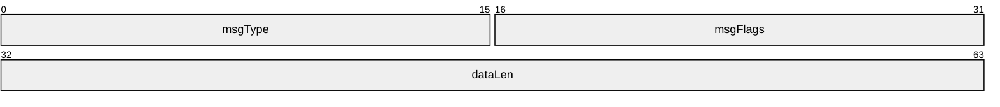

**msgType (2 bytes):** An unsigned, 16-bit integer that specifies the type of the clipboard PDU that follows the **dataLen** field.

| Value | Meaning |
| --- | --- |
| CB_MONITOR_READY 0x0001 | [Monitor Ready PDU](#Section_4.1.2) |
| CB_FORMAT_LIST 0x0002 | [Format List PDU](#Section_4.1.5) |
| CB_FORMAT_LIST_RESPONSE 0x0003 | [Format List Response PDU](#Section_4.1.6) |
| CB_FORMAT_DATA_REQUEST 0x0004 | [Format Data Request PDU](#Section_4.4.1) |
| CB_FORMAT_DATA_RESPONSE 0x0005 | [Format Data Response PDU](#Section_4.4.2) |
| CB_TEMP_DIRECTORY 0x0006 | [Temporary Directory PDU](#Section_4.1.4) |
| CB_CLIP_CAPS 0x0007 | [Clipboard Capabilities PDU](#Section_4.1.1) |
| CB_FILECONTENTS_REQUEST 0x0008 | [File Contents Request PDU](#Section_4.4.3) |
| CB_FILECONTENTS_RESPONSE 0x0009 | [File Contents Response PDU](#Section_4.4.4) |
| CB_LOCK_CLIPDATA 0x000A | [Lock Clipboard Data PDU](#Section_4.3.1) |
| CB_UNLOCK_CLIPDATA 0x000B | [Unlock Clipboard Data PDU](#Section_4.3.2) |

**msgFlags (2 bytes):** An unsigned, 16-bit integer that indicates message flags.

| Value | Meaning |
| --- | --- |
| CB_RESPONSE_OK 0x0001 | Used by the Format List Response PDU, Format Data Response PDU, and File Contents Response PDU to indicate that the associated request Format List PDU, Format Data Request PDU, and File Contents Request PDU were processed successfully. |
| CB_RESPONSE_FAIL 0x0002 | Used by the Format List Response PDU, Format Data Response PDU, and File Contents Response PDU to indicate that the associated Format List PDU, Format Data Request PDU, and File Contents Request PDU were not processed successfully. |
| CB_ASCII_NAMES 0x0004 | Used by the [Short Format Name](#Section_2.2.3.1.1) variant of the Format List Response PDU to indicate that the format names are in ASCII 8. |

**dataLen (4 bytes):** An unsigned, 32-bit integer that specifies the size, in bytes, of the data which follows the Clipboard PDU Header.<1>

<a id="Section_2.2.2"></a>
### 2.2.2 Initialization Sequence

The following sections contain Remote Desktop Protocol: Desktop Composition Virtual Channel Extension message syntax for the [Initialization Sequence (section 1.3.2.1)](#Section_1.3.2.1).

<a id="Section_2.2.2.1"></a>
#### 2.2.2.1 Clipboard Capabilities PDU (CLIPRDR_CAPS)

The Clipboard Capabilities PDU is an optional [**PDU**](#gt_protocol-data-unit-pdu) used to exchange capability information. It is first sent from the [**server**](#gt_server) to the [**client**](#gt_client). Upon receipt of the [Monitor Ready PDU](#Section_4.1.2), the client sends the Clipboard Capabilities PDU to the server.

If this PDU is not sent by a Remote Desktop Protocol: Clipboard Virtual Channel Extension [**endpoint**](#gt_endpoint), it is assumed that the endpoint is using the default values for each capability field.

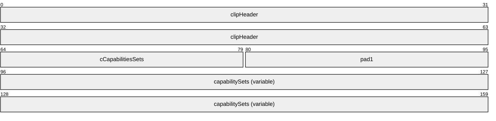

**clipHeader (8 bytes):** A [Clipboard PDU Header](#Section_2.2.1). The **msgType** field of the Clipboard PDU Header MUST be set to CB_CLIP_CAPS (0x0007), while the **msgFlags** field MUST be set to 0x0000.

**cCapabilitiesSets (2 bytes):** An unsigned, 16-bit integer that specifies the number of [CLIPRDR_CAPS_SETs](#Section_2.2.2.1.1), present in the **capabilitySets** field.

**pad1 (2 bytes):** An unsigned, 16-bit integer used for padding. Values in this field are ignored.

**capabilitySets (variable):** A variable-sized array of capability sets, each conforming in structure to the CLIPRDR_CAPS_SET.

<a id="Section_2.2.2.1.1"></a>
##### 2.2.2.1.1 Capability Set (CLIPRDR_CAPS_SET)

The CLIPRDR_CAPS_SET structure is used to wrap capability set data and to specify the type and size of this data exchanged between the client and the server. All capability sets conform to this basic structure.

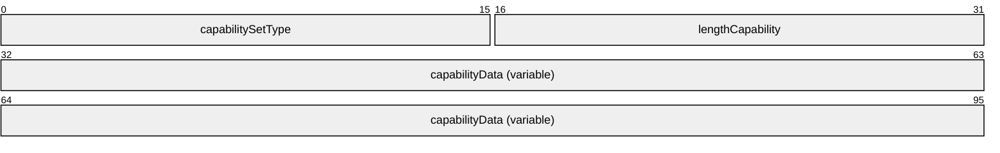

**capabilitySetType (2 bytes):** An unsigned, 16-bit integer used as a type identifier of the capability set.

| Value | Meaning |
| --- | --- |
| CB_CAPSTYPE_GENERAL 0x0001 | [General Capability Set](#Section_2.2.2.1.1.1) |

**lengthCapability (2 bytes):** An unsigned, 16-bit integer that specifies the combined length, in bytes, of the **capabilitySetType**, **capabilityData** and **lengthCapability** fields.

**capabilityData (variable):** Capability set data specified by the type given in the **capabilitySetType** field. This field is a variable number of bytes.

<a id="Section_2.2.2.1.1.1"></a>
###### 2.2.2.1.1.1 General Capability Set (CLIPRDR_GENERAL_CAPABILITY)

The CLIPRDR_GENERAL_CAPABILITY structure is used to advertise general clipboard settings.

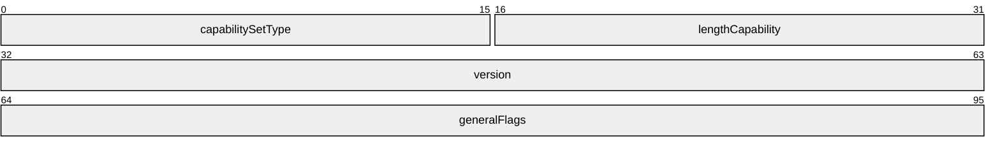

**capabilitySetType (2 bytes):** An unsigned 16-bit integer that specifies the type of the capability set. This field MUST be set to CB_CAPSTYPE_GENERAL (0x0001).

**lengthCapability (2 bytes):** An unsigned, 16-bit integer that specifies the length, in bytes, of the **capabilitySetType**, **capability data** and **lengthCapability** fields.

**version (4 bytes):** An unsigned, 32-bit integer that specifies the Remote Desktop Protocol: Clipboard Virtual Channel Extension version number. This field is for informational purposes and MUST NOT be used to make protocol capability decisions. The actual features supported are specified in the **generalFlags** field.

| Value | Meaning |
| --- | --- |
| CB_CAPS_VERSION_1 0x00000001 | Version 1 |
| CB_CAPS_VERSION_2 0x00000002 | Version 2 |

**generalFlags (4 bytes):** An unsigned, 32-bit integer that specifies the general capability flags.

| Value | Meaning |
| --- | --- |
| CB_USE_LONG_FORMAT_NAMES 0x00000002 | The [Long Format Name](#Section_2.2.3.1.2) variant of the [Format List PDU](#Section_4.1.5) is supported for exchanging updated format names. If this flag is not set, the [Short Format Name](#Section_2.2.3.1.1) variant MUST be used. If this flag is set by both protocol endpoints, then the Long Format Name variant MUST be used. |
| CB_STREAM_FILECLIP_ENABLED 0x00000004 | File copy and paste using stream-based operations are supported using the [File Contents Request PDU](#Section_4.4.3) and [File Contents Response PDU](#Section_4.4.4). |
| CB_FILECLIP_NO_FILE_PATHS 0x00000008 | Indicates that any description of files to copy and paste MUST NOT include the source path of the files. |
| CB_CAN_LOCK_CLIPDATA 0x00000010 | Locking and unlocking of File Stream data on the clipboard is supported using the [Lock Clipboard Data PDU](#Section_4.3.1) and [Unlock Clipboard Data PDU](#Section_4.3.2). |
| CB_HUGE_FILE_SUPPORT_ENABLED 0x00000020 | Indicates support for transferring files that are larger than 4,294,967,295 bytes in size. If this flag is not set, then only files of size less than or equal to 4,294,967,295 bytes can be exchanged using the **File Contents Request PDU** and **File Contents Response PDU**. |

If the General Capability Set is not present in the [Clipboard Capabilities PDU](#Section_4.1.1), then the default set of general capabilities MUST be assumed. By definition the default set does not specify any flags in the **generalFlags** field, that is the **generalFlags** field is set to 0x00000000.

<a id="Section_2.2.2.2"></a>
#### 2.2.2.2 Server Monitor Ready PDU (CLIPRDR_MONITOR_READY)

The Monitor Ready PDU is sent from the server to the client to indicate that the server is initialized and ready. This [**PDU**](#gt_protocol-data-unit-pdu) is transmitted by the server after it has sent the [Clipboard Capabilities PDU](#Section_4.1.1) to the client.

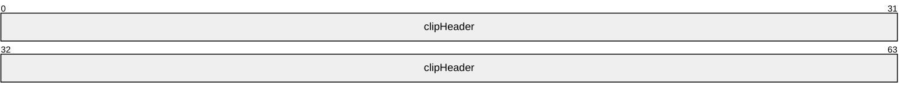

**clipHeader (8 bytes):** A [Clipboard PDU Header](#Section_2.2.1). The **msgType** field of the Clipboard PDU Header MUST be set to CB_MONITOR_READY (0x0001), while the **msgFlags** field MUST be set to 0x0000.

<a id="Section_2.2.2.3"></a>
#### 2.2.2.3 Client Temporary Directory PDU (CLIPRDR_TEMP_DIRECTORY)

The Temporary Directory PDU is an optional [**PDU**](#gt_protocol-data-unit-pdu) sent from the client to the server. This PDU informs the server of a location on the client file system that MUST be used to deposit files being copied to the client. The location MUST be accessible by the server to be useful. Section [3.1.1.3](#Section_3.1.1.3) specifies how direct file access impacts file copy and paste. This PDU is sent by the client after receiving the [Monitor Ready PDU](#Section_4.1.2).

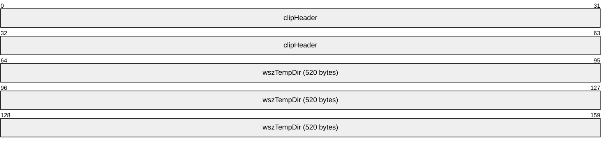

**clipHeader (8 bytes):** A [Clipboard PDU Header](#Section_2.2.1). The **msgType** field of the Clipboard PDU Header MUST be set to CB_TEMP_DIRECTORY (0x0006), while the **msgFlags** field MUST be set to 0x0000.

**wszTempDir (520 bytes):** A 520-byte block that contains a null-terminated string that represents the directory on the client that MUST be used to store temporary clipboard related information. The supplied path MUST be absolute and relative to the local client system, for example, "c:\temp\clipdata". Any space not used in this field SHOULD be filled with null characters.

<a id="Section_2.2.3"></a>
### 2.2.3 Copy Sequence

The following sections contain Remote Desktop Protocol: Desktop Composition Virtual Channel Extension message syntax for the [Copy Sequence (section 1.3.2.2.1)](#Section_1.3.2.2.1).

<a id="Section_2.2.3.1"></a>
#### 2.2.3.1 Format List PDU (CLIPRDR_FORMAT_LIST)

The Format List PDU is sent by either the client or the server when its local system clipboard is updated with new clipboard data. This [**PDU**](#gt_protocol-data-unit-pdu) contains the [Clipboard Format](#Section_1.3.1.2) ID and name pairs of the new Clipboard Formats on the clipboard.

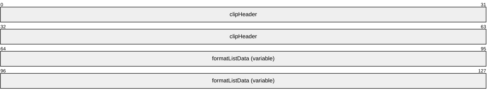

**clipHeader (8 bytes):** A [Clipboard PDU Header](#Section_2.2.1). The **msgType** field of the Clipboard PDU Header MUST be set to CB_FORMAT_LIST (0x0002), while the **msgFlags** field MUST be set to 0x0000 or CB_ASCII_NAMES (0x0004) depending on the type of data present in the **formatListData** field.

**formatListData (variable):** An array consisting solely of either [Short Format Names](#Section_2.2.3.1.1) or [Long Format Names](#Section_2.2.3.1.2). The type of structure used in the array is determined by the presence of the CB_USE_LONG_FORMAT_NAMES (0x00000002) flag in the **generalFlags** field of the [General Capability Set (section 2.2.2.1.1.1)](#Section_2.2.2.1.1.1). Each array holds a list of the Clipboard Format ID and name pairs available on the local system clipboard of the sender. If Short Format Names are being used, and the embedded Clipboard Format names are in ASCII 8 format, then the **msgFlags** field of the **clipHeader** must contain the CB_ASCII_NAMES (0x0004) flag.

<a id="Section_2.2.3.1.1"></a>
##### 2.2.3.1.1 Short Format Names (CLIPRDR_SHORT_FORMAT_NAMES)

The CLIPRDR_SHORT_FORMAT_NAMES structure holds a collection of [CLIPRDR_SHORT_FORMAT_NAME](#Section_2.2.3.1.1) structures.

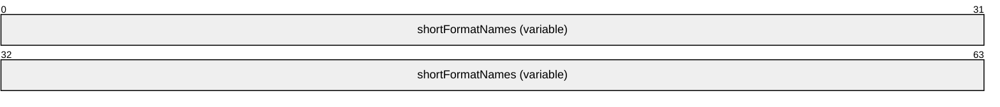

**shortFormatNames (variable):** An array of CLIPRDR_SHORT_FORMAT_NAME structures.

<a id="Section_2.2.3.1.1.1"></a>
###### 2.2.3.1.1.1 Short Format Name (CLIPRDR_SHORT_FORMAT_NAME)

The CLIPRDR_SHORT_FORMAT_NAME structure holds a [Clipboard Format](#Section_1.3.1.2) ID and Clipboard Format name pair.

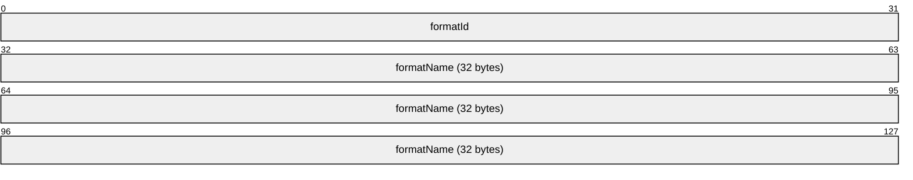

**formatId (4 bytes):** An unsigned, 32-bit integer specifying the Clipboard Format ID.

**formatName (32 bytes):** A 32-byte block containing the null-terminated name assigned to the Clipboard Format (32 ASCII 8 characters or 16 [**Unicode**](#gt_unicode) characters). If the name does not fit, it MUST be truncated. Not all Clipboard Formats have a name, and in that case the **formatName** field MUST contain only zeros.

<a id="Section_2.2.3.1.2"></a>
##### 2.2.3.1.2 Long Format Names (CLIPRDR_LONG_FORMAT_NAMES)

The CLIPRDR_LONG_FORMAT_NAMES structure holds a collection of [CLIPRDR_LONG_FORMAT_NAME](#Section_2.2.3.1.2) structures.


**longFormatNames (variable):** An array of CLIPRDR_LONG_FORMAT_NAME structures.

<a id="Section_2.2.3.1.2.1"></a>
###### 2.2.3.1.2.1 Long Format Name (CLIPRDR_LONG_FORMAT_NAME)

The CLIPRDR_LONG_FORMAT_NAME structure holds a [Clipboard Format](#Section_1.3.1.2) ID and a Clipboard Format name pair.

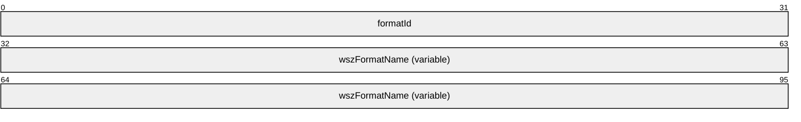

**formatId (4 bytes):** An unsigned, 32-bit integer that specifies the Clipboard Format ID.

**wszFormatName (variable):** A variable length null-terminated [**Unicode**](#gt_unicode) string name that contains the Clipboard Format name. Not all Clipboard Formats have a name; in such cases, the **formatName** field MUST consist of a single Unicode null character.

<a id="Section_2.2.3.2"></a>
#### 2.2.3.2 Format List Response PDU (FORMAT_LIST_RESPONSE)

The Format List Response PDU is sent as a reply to the [Format List PDU](#Section_4.1.5). It is used to indicate whether processing of the Format List PDU was successful.


**clipHeader (8 bytes):** A [Clipboard PDU Header](#Section_2.2.1). The **msgType** field of the Clipboard PDU Header MUST be set to CB_FORMAT_LIST_RESPONSE (0x0003). The CB_RESPONSE_OK (0x0001) or CB_RESPONSE_FAIL (0x0002) flag MUST be set in the **msgFlags** field of the Clipboard PDU Header.

<a id="Section_2.2.4"></a>
### 2.2.4 Locking and Unlocking Clipboard Data

<a id="Section_2.2.4.1"></a>
#### 2.2.4.1 Lock Clipboard Data PDU (CLIPRDR_LOCK_CLIPDATA)

The Lock Clipboard Data PDU can be sent at any point in time after the clipboard capabilities and temporary directory have been exchanged in the Clipboard Initialization Sequence (section [1.3.2.1](#Section_1.3.2.1)) by a Local Clipboard Owner (section [1.3.2.2.1](#Section_1.3.2.2.1)). The purpose of this PDU is to request that the Shared Clipboard Owner (section 1.3.2.2.1) retain all File Stream (section [1.3.1.1.5](#Section_1.3.1.1.5)) data on the clipboard until the Unlock Clipboard Data PDU (section [2.2.4.2](#Section_2.2.4.2)) is received. This ensures that File Stream data can be requested by the Local Owner in a subsequent File Contents Paste Sequence (section [1.3.2.2.3](#Section_1.3.2.2.3)) by using the File Contents Request PDU (section [2.2.5.3](#Section_2.2.5.3)) even when the Shared Owner clipboard has changed and the File Stream data is no longer available.

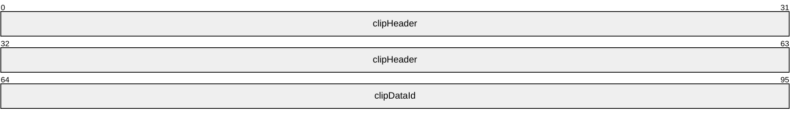

**clipHeader (8 bytes):** A [Clipboard PDU Header](#Section_2.2.1). The **msgType** field of the Clipboard PDU Header MUST be set to CB_LOCK_CLIPDATA (0x000A), while the **msgFlags** field MUST be set to 0x0000.

**clipDataId (4 bytes):** An unsigned, 32-bit integer that is used to tag File Stream data on the Shared Owner clipboard so that it can be requested in a subsequent File Contents Request PDU (section 2.2.5.3).

<a id="Section_2.2.4.2"></a>
#### 2.2.4.2 Unlock Clipboard Data PDU (CLIPRDR_UNLOCK_CLIPDATA)

The Unlock Clipboard Data PDU can be sent at any point in time after the Clipboard Initialization Sequence (section [1.3.2.1](#Section_1.3.2.1)) by a Local Clipboard Owner (section [1.3.2.2.1](#Section_1.3.2.2.1)). The purpose of this PDU is to notify the Shared Clipboard Owner (section 1.3.2.2.1) that File Stream data that was locked in response to the Lock Clipboard Data PDU (section [2.2.4.1](#Section_2.2.4.1)) can be released.


**clipHeader (8 bytes):** A [Clipboard PDU Header](#Section_2.2.1). The **msgType** field of the Clipboard PDU Header MUST be set to CB_UNLOCK_CLIPDATA (0x000B), while the **msgFlags** field MUST be set to 0x0000.

**clipDataId (4 bytes):** An unsigned, 32-bit integer that identifies the File Stream data that was locked by the Lock Clipboard Data PDU (section 2.2.4.1) and can now be released.

<a id="Section_2.2.5"></a>
### 2.2.5 Paste Sequence

The following sections contain Remote Desktop Protocol: Desktop Composition Virtual Channel Extension message syntax for the [Paste Sequence (section 1.3.2.2.3)](#Section_1.3.2.2.3).

<a id="Section_2.2.5.1"></a>
#### 2.2.5.1 Format Data Request PDU (CLIPRDR_FORMAT_DATA_REQUEST)

The Format Data Request PDU is sent by the recipient of the [Format List PDU](#Section_4.1.5). It is used to request the data for one of the formats that was listed in the Format List PDU.

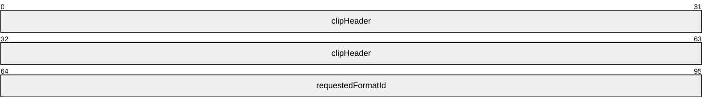

**clipHeader (8 bytes):** A [Clipboard PDU Header](#Section_2.2.1). The **msgType** field of the Clipboard PDU Header MUST be set to CB_FORMAT_DATA_REQUEST (0x0004), while the **msgFlags** field MUST be set to 0x0000.

**requestedFormatId (4 bytes):** An unsigned, 32-bit integer that specifies the [Clipboard Format](#Section_1.3.1.2) ID of the clipboard data. The Clipboard Format ID MUST be one listed previously in the Format List PDU.

<a id="Section_2.2.5.2"></a>
#### 2.2.5.2 Format Data Response PDU (CLIPRDR_FORMAT_DATA_RESPONSE)

The Format Data Response PDU is sent as a reply to the [Format Data Request PDU](#Section_4.4.1). It is used to indicate whether processing of the Format Data Request PDU was successful. If the processing was successful, the Format Data Response PDU includes the contents of the requested clipboard data.


**clipHeader (8 bytes):** A [Clipboard PDU Header](#Section_2.2.1). The **msgType** field of the Clipboard PDU Header MUST be set to CB_FORMAT_DATA_RESPONSE (0x0005). The CB_RESPONSE_OK (0x0001) or CB_RESPONSE_FAIL (0x0002) flag MUST be set in the **msgFlags** field of the Clipboard PDU Header structure.

**requestedFormatData (variable):** Variable length clipboard format data. The contents of this field MUST be one of the following types: generic, [Packed Metafile Payload](#Section_2.2.5.2.1), or [Packed Palette Payload](#Section_2.2.5.2.2).

<a id="Section_2.2.5.2.1"></a>
##### 2.2.5.2.1 Packed Metafile Payload (CLIPRDR_MFPICT)

The CLIPRDR_MFPICT structure is used to transfer a Windows metafile. The Windows metafile format is specified in [MS-WMF](../MS-WMF/MS-WMF.md) section 2.

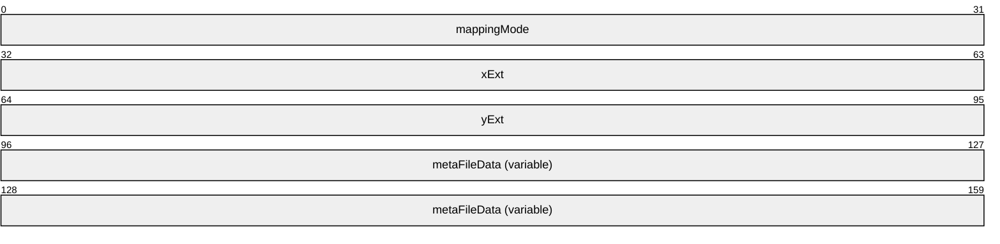

**mappingMode (4 bytes):** An unsigned, 32-bit integer specifying the mapping mode in which the picture is drawn.

| Value | Meaning |
| --- | --- |
| MM_TEXT 0x00000001 | Each logical unit is mapped to one device pixel. Positive x is to the right; positive y is down. |
| MM_LOMETRIC 0x00000002 | Each logical unit is mapped to 0.1 millimeter. Positive x is to the right; positive y is up. |
| MM_HIMETRIC 0x00000003 | Each logical unit is mapped to 0.01 millimeter. Positive x is to the right; positive y is up. |
| MM_LOENGLISH 0x00000004 | Each logical unit is mapped to 0.01 inch. Positive x is to the right; positive y is up. |
| MM_HIENGLISH 0x00000005 | Each logical unit is mapped to 0.001 inch. Positive x is to the right; positive y is up. |
| MM_TWIPS 0x00000006 | Each logical unit is mapped to 1/20 of a printer's point (1/1440 of an inch), also called a twip. Positive x is to the right; positive y is up. |
| MM_ISOTROPIC 0x00000007 | Logical units are mapped to arbitrary units with equally scaled axes; one unit along the x-axis is equal to one unit along the y-axis. |
| MM_ANISOTROPIC 0x00000008 | Logical units are mapped to arbitrary units with arbitrarily scaled axes. |

For MM_ISOTROPIC and MM_ANISOTROPIC modes, which can be scaled, the **xExt** and **yExt** fields contain an optional suggested size in MM_HIMETRIC units. For MM_ANISOTROPIC pictures, **xExt** and **yExt** SHOULD be zero when no suggested size is given. For MM_ISOTROPIC pictures, an aspect ratio MUST be supplied even when no suggested size is given. If a suggested size is given, the aspect ratio is implied by the size. To give an aspect ratio without implying a suggested size, the **xExt** and **yExt** fields are set to negative values whose ratio is the appropriate aspect ratio. The magnitude of the negative **xExt** and **yExt** values is ignored; only the ratio is used.

**xExt (4 bytes):** An unsigned, 32-bit integer that specifies the width of the rectangle within which the picture is drawn, except in the MM_ISOTROPIC and MM_ANISOTROPIC modes. The coordinates are in units that correspond to the mapping mode.

**yExt (4 bytes):** An unsigned, 32-bit integer that specifies the height of the rectangle within which the picture is drawn, except in the MM_ISOTROPIC and MM_ANISOTROPIC modes. The coordinates are in units that correspond to the mapping mode.

**metaFileData (variable):** The variable sized contents of the metafile as specified in [MS-WMF] section 2.

<a id="Section_2.2.5.2.2"></a>
##### 2.2.5.2.2 Packed Palette Payload (CLIPRDR_PALETTE)

The CLIPRDR_PALETTE structure is used to transfer palette format data.

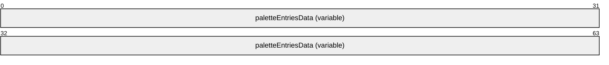

**paletteEntriesData (variable):** A variable sized array of [PALETTEENTRY](#Section_2.2.5.2.2.1) structures.

<a id="Section_2.2.5.2.2.1"></a>
###### 2.2.5.2.2.1 Palette Entry (PALETTEENTRY)

The PALETTEENTRY structure contains a single palette entry that specifies the red, green, and blue components for a given color index, in addition to any application-specific information related to the entry.


**red (1 byte):** An unsigned, 8-bit red color component.

**green (1 byte):** An unsigned, 8-bit green color component.

**blue (1 byte):** An unsigned, 8-bit blue color component.

**extra (1 byte):** This field MAY be used to convey application-specific palette information. Some applications use this field to specify how the palette entry is used.

<a id="Section_2.2.5.2.3"></a>
##### 2.2.5.2.3 Packed File List (CLIPRDR_FILELIST)

The CLIPRDR_FILELIST structure is used to describe a list of files, each file in the list being represented by a File Descriptor (section [2.2.5.2.3.1](#Section_2.2.5.2.3.1)).

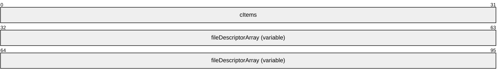

**cItems (4 bytes):** An unsigned 32-bit integer that specifies the number of entries in the **fileDescriptorArray** field.

**fileDescriptorArray (variable):** An array of File Descriptors (section 2.2.5.2.3.1). The number of elements in the array is specified by the **cItems** field.

<a id="Section_2.2.5.2.3.1"></a>
###### 2.2.5.2.3.1 File Descriptor (CLIPRDR_FILEDESCRIPTOR)

The CLIPRDR_FILEDESCRIPTOR structure describes the properties of a file.

```mermaid
packet-beta
  0-31: "flags"
  32-127: "reserved1 (32 bytes)"
  128-159: "fileAttributes"
  160-255: "reserved2 (16 bytes)"
  256-319: "lastWriteTime"
  320-351: "fileSizeHigh"
  352-383: "fileSizeLow"
  384-479: "fileName (520 bytes)"
```

**flags (4 bytes):** An unsigned 32-bit integer that specifies which fields contain valid data and the usage of progress UI during a copy operation.

| Value | Meaning |
| --- | --- |
| FD_ATTRIBUTES 0x00000004 | The **fileAttributes** field contains valid data. |
| FD_FILESIZE 0x00000040 | The **fileSizeHigh** and **fileSizeLow** fields contain valid data. |
| FD_WRITESTIME 0x00000020 | The **lastWriteTime** field contains valid data. |
| FD_SHOWPROGRESSUI 0x00004000 | A progress indicator SHOULD be shown when copying the file. |

**reserved1 (32 bytes):** An array of 32 bytes. This field MUST be initialized with zeros when sent and MUST be ignored on receipt.

**fileAttributes (4 bytes):** An unsigned 32-bit integer that specifies file attribute flags.

| Value | Meaning |
| --- | --- |
| FILE_ATTRIBUTE_READONLY 0x00000001 | A file that is read-only. Applications can read the file, but cannot write to it or delete it. |
| FILE_ATTRIBUTE_HIDDEN 0x00000002 | The file or directory is hidden. It is not included in an ordinary directory listing. |
| FILE_ATTRIBUTE_SYSTEM 0x00000004 | A file or directory that the operating system uses a part of, or uses exclusively. |
| FILE_ATTRIBUTE_DIRECTORY 0x00000010 | Identifies a directory. |
| FILE_ATTRIBUTE_ARCHIVE 0x00000020 | A file or directory that is an archive file or directory. Applications typically use this attribute to mark files for backup or removal. |
| FILE_ATTRIBUTE_NORMAL 0x00000080 | A file that does not have other attributes set. This attribute is valid only when used alone. |

**reserved2 (16 bytes):** An array of 16 bytes. This field MUST be initialized with zeros when sent and MUST be ignored on receipt.

**lastWriteTime (8 bytes):** An unsigned 64-bit integer that specifies the number of 100-nanoseconds intervals that have elapsed since 1 January 1601 to the time of the last write operation on the file.

**fileSizeHigh (4 bytes):** An unsigned 32-bit integer that contains the most significant 4 bytes of the file size.

**fileSizeLow (4 bytes):** An unsigned 32-bit integer that contains the least significant 4 bytes of the file size.

**fileName (520 bytes):** A null-terminated 260 character Unicode string that contains the name of the file.

<a id="Section_2.2.5.3"></a>
#### 2.2.5.3 File Contents Request PDU (CLIPRDR_FILECONTENTS_REQUEST)

The File Contents Request PDU is sent by the recipient of the [Format List PDU](#Section_4.1.5). It is used to request either the size of a remote file copied to the clipboard or a portion of the data in the file.

```mermaid
packet-beta
  0-63: "clipHeader"
  64-95: "streamId"
  96-127: "lindex"
  128-159: "dwFlags"
  160-191: "nPositionLow"
  192-223: "nPositionHigh"
  224-255: "cbRequested"
  256-287: "clipDataId (optional)"
```

**clipHeader (8 bytes):** A [Clipboard PDU Header](#Section_2.2.1). The **msgType** field of the Clipboard PDU Header MUST be set to CB_FILECONTENTS_REQUEST (0x0008), while the **msgFlags** field MUST be set to 0x0000.

**streamId (4 bytes):** An unsigned, 32-bit format ID used to associate the File Contents Request PDU with the corresponding [File Contents Response PDU](#Section_4.4.4). The File Contents Response PDU is sent as a reply and contains an identical value in the **streamId** field.

**lindex (4 bytes):** A signed, 32-bit integer that specifies the numeric ID of the remote file that is the target of the File Contents Request PDU. This field is used as an index that identifies a particular file in a [File List](#Section_3.1.1.2). This File List SHOULD have been obtained as clipboard data in a prior [Format Data Request PDU](#Section_4.4.1) and [Format Data Response PDU](#Section_4.4.2) exchange.

**dwFlags (4 bytes):** An unsigned, 32-bit integer that specifies the type of operation to be performed by the recipient.

| Value | Meaning |
| --- | --- |
| FILECONTENTS_SIZE 0x00000001 | A request for the size of the file identified by the **lindex** field. The size MUST be returned as a 64-bit, unsigned integer. The **cbRequested** field MUST be set to 0x00000008 and both the **nPositionLow** and **nPositionHigh** fields MUST be set to 0x00000000. |
| FILECONTENTS_RANGE 0x00000002 | A request for the data present in the file identified by the **lindex** field. The data to be retrieved is extracted starting from the offset given by the **nPositionLow** and **nPositionHigh** fields. The maximum number of bytes to extract is specified by the **cbRequested** field. |

The FILECONTENTS_SIZE and FILECONTENTS_RANGE flags MUST NOT be set at the same time.

**nPositionLow (4 bytes):** An unsigned, 32-bit integer that specifies the low bytes of the offset into the remote file, identified by the **lindex** field, from where the data needs to be extracted to satisfy a FILECONTENTS_RANGE operation. This field SHOULD be set to a value less than 2,147,483,648 unless the recipient of the FILECONTENTS_RANGE operation has specified support for huge files by setting the CB_HUGE_FILE_SUPPORT_ENABLED (0x00000020) flag in the **General Capability Set** (section [2.2.2.1.1.1](#Section_2.2.2.1.1.1)) of the **Clipboard Capabilities PDU** (section [2.2.2.1](#Section_2.2.2.1)).<2>

**nPositionHigh (4 bytes):** An unsigned, 32-bit integer that specifies the high bytes of the offset into the remote file, identified by the **lindex** field, from where the data needs to be extracted to satisfy a FILECONTENTS_RANGE operation. This field SHOULD be set to zero unless the recipient of the FILECONTENTS_RANGE operation has specified support for huge files by setting the CB_HUGE_FILE_SUPPORT_ENABLED (0x00000020) flag in the **General Capability Set** (section 2.2.2.1.1.1) of the **Clipboard Capabilities PDU** (section 2.2.2.1).

**cbRequested (4 bytes):** An unsigned, 32-bit integer that specifies the size, in bytes, of the data to retrieve. For a FILECONTENTS_SIZE operation, this field MUST be set to 0x00000008. In the case of a FILECONTENTS_RANGE operation, this field contains the maximum number of bytes to read from the remote file.

**clipDataId (4 bytes):** An optional unsigned, 32-bit integer that identifies File Stream data which was tagged in a prior Lock Clipboard Data PDU (section [2.2.4.1](#Section_2.2.4.1)).

<a id="Section_2.2.5.4"></a>
#### 2.2.5.4 File Contents Response PDU (CLIPRDR_FILECONTENTS_RESPONSE)

The File Contents Response PDU is sent as a reply to the [File Contents Request PDU](#Section_4.4.3). It is used to indicate whether processing of the File Contents Request PDU was successful. If the processing was successful, the File Contents Response PDU includes either a file size or extracted file data, based on the operation requested in the corresponding File Contents Request PDU.

```mermaid
packet-beta
  0-63: "clipHeader"
  64-95: "streamId"
  96-159: "requestedFileContentsData (variable)"
```

**clipHeader (8 bytes):** A [Clipboard PDU Header](#Section_2.2.1). The **msgType** field of the Clipboard PDU Header MUST be set to CB_FILECONTENTS_RESPONSE (0x0009). The CB_RESPONSE_OK (0x0001) or CB_RESPONSE_FAIL (0x0002) flag MUST be set in the **msgFlags** field of the Clipboard PDU Header.

**streamId (4 bytes):** An unsigned, 32-bit numeric ID used to associate the File Contents Response PDU with the corresponding File Contents Request PDU. The File Contents Request PDU that triggered the response MUST contain an identical value in the **streamId** field.

**requestedFileContentsData (variable):** This field contains a variable number of bytes. If the response is to a FILECONTENTS_SIZE (0x00000001) operation, the **requestedFileContentsData** field holds a 64-bit, unsigned integer containing the size of the file. In the case of a FILECONTENTS_RANGE (0x00000002) operation, the **requestedFileContentsData** field contains a byte-stream of data extracted from the file.

<a id="Section_3"></a>
# 3 Protocol Details

<a id="Section_3.1"></a>
## 3.1 Common Details

<a id="Section_3.1.1"></a>
### 3.1.1 Abstract Data Model

<a id="Section_3.1.1.1"></a>
#### 3.1.1.1 Clipboard Format ID Map

The Clipboard Format ID Map is used to translate local [Clipboard Format](#Section_1.3.1.2) IDs to remote Clipboard Format IDs.

For example, assume that on System A, the Clipboard Format with a format name of "Format X" maps to the format ID 0x00001111; and on System B, the format ID corresponding to the format name "Format X" might be 0x00002222:

- On System A, the format map entry for "Format X" would appear as follows:
Format X: Local ID 0x00001111 maps to Remote ID 0x00002222

- On System B, the format map entry for "Format X" would appear as follows:
Format X: Local ID 0x00002222 maps to Remote ID 0x00001111

The Clipboard Format ID Map is cleared and initialized whenever a [Format List PDU](#Section_4.1.5) is processed (section 3.1.5.2.2).

<a id="Section_3.1.1.2"></a>
#### 3.1.1.2 File List

When a collection of files is copied to the system clipboard, accompanying metadata containing the list of files, called the "file list," is also placed onto the clipboard using a generic, operating system-defined format. This list contains information about each file on the clipboard, such as the file name, size, and access permissions. Applications can examine the file list to enumerate the list of files available on the system clipboard.

When a paste operation is initiated to obtain the contents of a file on the clipboard, the index of the file in the file list, along with a description of the file chunks required, is sent to the system clipboard. The system clipboard responds by returning the file contents data that was requested.

The usage of the file list is best illustrated with a practical example:

- Assume that a user copies two files to the clipboard so that the associated file list on the clipboard appears as follows (notice that the exact location of the files is not specified in the file list):
- temp\file1.txt (20 bytes)
- temp\file2.txt (10 bytes)
- Next, assume that the user decides to paste the first 15 bytes of file1.txt into a target application that can accept file data. In this case, the target application examines the file list on the clipboard and issues a request for the first 15 bytes of the file in the file list at Index 1 (the system clipboard MUST be contacted because the exact location of the file on the local file system is not necessarily advertised in the file list). The system clipboard responds with the appropriate data.<3>
<a id="Section_3.1.1.3"></a>
#### 3.1.1.3 Direct File Access

If the [**client**](#gt_client) or [**server**](#gt_server) has direct access to the local file system of the [**peer**](#gt_peer), a [File List](#Section_3.1.1.2) that uses absolute paths (as opposed to relative paths) MAY be used to point directly to the source files, thus bypassing having to contact the system clipboard for the actual file contents.

For example:

- Assume that the server is able to view the client files via a network share such that the client file c:\temp\file1.txt is accessible as: \\client-files\c\temp\file1.txt.
- Next, assume that a File List (which contains the files c:\temp\file1.txt and c:\temp\file2.txt) is copied to the client's local clipboard. Then, when transmitting the data in the File List to the server, the client MAY modify the File List contents as follows:
- \\client-files\c\temp\file1.txt (20 bytes)
- \\client-files\c\temp\file2.txt (10 bytes)
Thus the server merely needs to retrieve the File List and directly access any of the files therein via the mapped network share to perform a file paste operation.

If direct access to the local file system of the peer endpoint is not possible, then file copy and paste using direct access MUST NOT be attempted. To enforce this condition, any attempt to request a File List with a Format Data Request PDU (section [2.2.5.1](#Section_2.2.5.1)) MUST fail and the resulting Format Data Response PDU (section [2.2.5.2](#Section_2.2.5.2)) MUST contain the CB_RESPONSE_FAIL (0x0002) flag.

<a id="Section_3.1.2"></a>
### 3.1.2 Timers

None.

<a id="Section_3.1.3"></a>
### 3.1.3 Initialization

The static [**virtual channel**](#gt_virtual-channel) MUST be established, using the parameters specified in section [2.1](#Section_2.1), before protocol operation can commence.

<a id="Section_3.1.4"></a>
### 3.1.4 Higher-Layer Triggered Events

This section contains details about the higher-layer triggered events.

<a id="Section_3.1.4.1"></a>
#### 3.1.4.1 Local Clipboard Update

When the local system clipboard is updated, the client or the server associated with the clipboard MUST send the [Format List PDU (section 3.1.5.2.1)](#Section_3.1.5.2.1) to ensure that the formats available on the remote clipboards are kept in sync.

<a id="Section_3.1.4.2"></a>
#### 3.1.4.2 Local Paste Operation

When a local application requests data from the clipboard, and that data resides on the clipboard of a remote computer, the local computer MUST send the [Format Data Request PDU](#Section_4.4.1) or the [File Contents Request PDU](#Section_4.4.3), depending on the type of data requested.

<a id="Section_3.1.5"></a>
### 3.1.5 Processing Events and Sequencing Rules

<a id="Section_3.1.5.1"></a>
#### 3.1.5.1 Processing a Clipboard PDU

All clipboard [**PDUs**](#gt_protocol-data-unit-pdu) are prefaced by the [Clipboard PDU Header](#Section_2.2.1) structure.

When processing a clipboard PDU, the **msgType** field in the header MUST first be examined to determine if the PDU is within the subset of expected messages. If the PDU is not expected, it SHOULD be ignored.

After determining that the PDU is in the correct sequence, the **dataLen** field MUST be examined to make sure that it is consistent with the amount of data read from the "CLIPRDR" static [**virtual channel**](#gt_virtual-channel). If this is not the case, the connection SHOULD be dropped.

<a id="Section_3.1.5.2"></a>
#### 3.1.5.2 Copy Sequence

<a id="Section_3.1.5.2.1"></a>
##### 3.1.5.2.1 Sending a Format List PDU

The fields of the [Format List PDU](#Section_4.1.5) are specified in section 2.2.3.1.

To construct the Format List PDU, the sender MUST enumerate all of the formats that are currently available from the local system clipboard, and for each format:

- Obtain the format ID associated with the [Clipboard Format](#Section_1.3.1.2).
- Determine if the Clipboard Format has a corresponding format name.
The Format List PDU MUST be populated with this data. The usage of the [Short Format Names](#Section_2.2.3.1.1) structure or [Long Format Names](#Section_2.2.3.1.2) structure MUST be based on the capabilities specified by the [General Capability Set](#Section_2.2.2.1.1.1). If short format names in ASCII 8 format are being used, the CB_ASCII_NAMES flag MUST be set in the **msgFlags** field of the **clipHeader** field. [**Unicode**](#gt_unicode) names MUST always be used with the long format names.

<a id="Section_3.1.5.2.2"></a>
##### 3.1.5.2.2 Processing a Format List PDU

The fields of the [Format List PDU](#Section_4.1.5) are specified in section 2.2.3.1.

The **clipHeader** field MUST be processed as specified in section [3.1.5.1](#Section_3.1.5.1). If the [**PDU**](#gt_protocol-data-unit-pdu) is valid, the format types present in the PDU MUST be extracted, processed, and placed on the local system clipboard.

For each [Clipboard Format](#Section_1.3.1.2) listed in the Format List PDU, the recipient of the PDU MUST do the following:

- Store the mapping of the remote Clipboard Format ID to the local Clipboard Format ID in the [Clipboard Format ID Map](#Section_3.1.1.1). The remote format ID is specified in the **formatId** field of the [Short Format Name](#Section_2.2.3.1.1) structure and the [Long Format Name](#Section_2.2.3.1.2) structure.
- Update the local system clipboard by registering the local Clipboard Format ID as an available format for transfer. The system clipboard MUST support delayed rendering (as specified in section [1.3.1.4](#Section_1.3.1.4)) for this step to be possible.
If the PDU was processed successfully and the local system clipboard was updated with all the received Clipboard Formats, the recipient MUST send a [Format List Response PDU](#Section_4.1.6) indicating success, as specified in section [3.1.5.2.3](#Section_3.1.5.2.3). If the PDU could not be processed, or the local clipboard could not be updated, a Format List Response PDU indicating failure MUST be sent, as specified in section 3.1.5.2.3.

<a id="Section_3.1.5.2.3"></a>
##### 3.1.5.2.3 Sending a Format List Response PDU

The fields of the [Format List Response PDU](#Section_4.1.6) are specified in section 2.2.3.2.

The Format List Response PDU is sent to indicate the success or failure of processing the [Format List PDU](#Section_4.1.5), as specified in section [3.1.5.2.2](#Section_3.1.5.2.2). On success, the **msgFlags** field of the **clipHeader** field MUST contain the CB_RESPONSE_OK flag. On failure, it MUST contain the CB_RESPONSE_FAIL flag.

<a id="Section_3.1.5.2.4"></a>
##### 3.1.5.2.4 Processing a Format List Response PDU

The fields of the [Format List Response PDU](#Section_4.1.6) are specified in section 2.2.3.2.

The **clipHeader** field MUST be processed as specified in section [3.1.5.1](#Section_3.1.5.1). If the [**PDU**](#gt_protocol-data-unit-pdu) is valid, the response code MUST be extracted from the **msgFlags** field of the **clipHeader** field.

If the response code indicates that the associated [Format List PDU](#Section_4.1.5) was processed successfully, then the recipient MUST be prepared to receive and process a [Format Data Request PDU](#Section_4.4.1) or a [File Contents Request PDU](#Section_4.4.4) with a request for format or file data, respectively.

If the response code indicates that processing of the Format List PDU was unsuccessful, then the recipient MUST respond to any subsequent Format Data Request PDUs or File Contents Request PDUs by sending a Format Data Response or File Contents Response indicating failure (sections [3.1.5.4.3](#Section_3.1.5.4.3) and [3.1.5.4.7](#Section_3.1.5.4.7)).

<a id="Section_3.1.5.3"></a>
#### 3.1.5.3 Locking and Unlocking Clipboard Data

<a id="Section_3.1.5.3.1"></a>
##### 3.1.5.3.1 Sending a Lock Clipboard Data PDU

The fields of the Lock Clipboard Data PDU are specified in section [2.2.4.1](#Section_2.2.4.1).

It is permissible to send the Lock Clipboard Data at any point in time after the clipboard capabilities and temporary directory have been exchanged in the Clipboard Initialization Sequence (section [1.3.2.1](#Section_1.3.2.1)) has completed. The sender MUST be the Local Clipboard Owner (section 1.3.2.1).

The **clipDataId** field MUST contain an unsigned integer value that will serve as an identifier to uniquely tag any File Stream data (section [1.3.1.1.5](#Section_1.3.1.1.5)) on the clipboard of the Shared Clipboard Owner (section 1.3.2.1).

<a id="Section_3.1.5.3.2"></a>
##### 3.1.5.3.2 Processing a Lock Clipboard Data PDU

The fields of the Lock Clipboard Data PDU are specified in section [2.2.4.1](#Section_2.2.4.1).

The **clipHeader** field MUST be processed as specified in section [3.1.5.1](#Section_3.1.5.1). If the PDU is valid and there is File Stream data (section [1.3.1.1.5](#Section_1.3.1.1.5)) on the clipboard, then the File Stream data MUST be stored so that any subsequent File Contents Request PDU (section [2.2.5.3](#Section_2.2.5.3)) can be serviced, even if the data is no longer available on the clipboard. The File Stream data MUST be stored until an Unlock Clipboard Data PDU (section [2.2.4.2](#Section_2.2.4.2)) is received.

<a id="Section_3.1.5.3.3"></a>
##### 3.1.5.3.3 Sending an Unlock Clipboard Data PDU

The fields of the Unlock Clipboard Data PDU are specified in section [2.2.4.2](#Section_2.2.4.2).

It is permissible to send the Unlock Clipboard Data at any point in time after the Clipboard Initialization Sequence (section [1.3.2.1](#Section_1.3.2.1)) has completed. The **clipDataId** field MUST contain an ID that was previously sent in a Lock Clipboard Data PDU (section [2.2.4.1](#Section_2.2.4.1)), but has not been sent in an Unlock Clipboard Data PDU.

<a id="Section_3.1.5.3.4"></a>
##### 3.1.5.3.4 Processing a Unlock Clipboard Data PDU

The fields of the Unlock Clipboard Data PDU are specified in section [2.2.4.2](#Section_2.2.4.2).

The **clipHeader** field MUST be processed as specified in section [3.1.5.1](#Section_3.1.5.1). If the PDU is valid then the File Stream data that was stored and associated with the ID in the **clipDataId** field (section [3.1.5.3.2](#Section_3.1.5.3.2)) MUST be released. If there is no File Stream data associated with the ID, then the PDU MUST be ignored.

<a id="Section_3.1.5.4"></a>
#### 3.1.5.4 Paste Sequence

<a id="Section_3.1.5.4.1"></a>
##### 3.1.5.4.1 Sending a Format Data Request PDU

The fields of the [Format Data Request PDU](#Section_4.4.1) are specified in section 2.2.5.1.

The [Clipboard Format](#Section_1.3.1.2) ID of the clipboard data MUST be specified in the **requestedFormatId** field.

- If Palette data is being requested, the **requestedFormatId** field MUST be set to 9.
- If Metafile data is being requested, the **requestedFormatId** field MUST be set to 3.
- If a File List is being requested, the Clipboard Format ID Map MUST be used to map the local Clipboard Format ID for the "FileGroupDescriptorW" Clipboard Format name to the remote Clipboard Format ID. The **requestedFormatId** field MUST then be populated with that value.
For all other formats the Clipboard Format ID Map MUST be used to map the local Clipboard Format ID of the requested clipboard data to the equivalent value on the remote system and then the **requestedFormatId** field MUST be populated with that value.

<a id="Section_3.1.5.4.2"></a>
##### 3.1.5.4.2 Processing a Format Data Request PDU

The fields of the [Format Data Request PDU](#Section_4.4.1) are specified in section 2.2.5.1.

The **clipHeader** field MUST be processed as specified in section [3.1.5.1](#Section_3.1.5.1). If the [**PDU**](#gt_protocol-data-unit-pdu) is valid, the requested [Clipboard Format](#Section_1.3.1.2) ID MUST be extracted from the PDU and the clipboard data retrieved from the local clipboard. The retrieved clipboard data MUST then be encoded appropriately, depending on the type:

- Metafile data MUST be encoded using the [Packed Metafile Payload](#Section_2.2.5.2.1) structure.
- Palette data MUST be encoded using the [Packed Palette Payload](#Section_2.2.5.2.2) structure.
- File List data MUST be encoded using the [Packed File List](#Section_2.2.5.2.3) structure.
- If the clipboard data is not a metafile, palette, or file list, it is left unchanged.
The clipboard data MUST then be sent to the remote computer by using a [Format Data Response PDU](#Section_4.4.2), as specified in section [3.1.5.4.3](#Section_3.1.5.4.3).

<a id="Section_3.1.5.4.3"></a>
##### 3.1.5.4.3 Sending a Format Data Response PDU

The fields of the [Format Data Response PDU](#Section_4.4.2) are specified in section 2.2.5.2.

The Format Data Response PDU is sent in response to the [Format Data Request PDU](#Section_4.4.1). During the processing of the [Format Data Request PDU (section 3.1.5.4.2)](#Section_3.1.5.4.2), the requested format data is retrieved from the local clipboard.

If there is format data to send, it MUST be copied into the **requestedFormatData** field and the **clipHeader** field MUST contain the CB_RESPONSE_OK (0x0001) flag. If the requested format data could not be retrieved or the sender received an unsuccessful Format List Response PDU (section [3.1.5.2.4](#Section_3.1.5.2.4)), then the **clipHeader** field MUST contain the CB_RESPONSE_FAIL (0x0002) flag and the **requestedFormatData** field MUST contain no data (zero-length).

<a id="Section_3.1.5.4.4"></a>
##### 3.1.5.4.4 Processing a Format Data Response PDU

The fields of the [Format Data Response PDU](#Section_4.4.2) are specified in section 2.2.5.2.

The **clipHeader** field MUST be processed as specified in section [3.1.5.1](#Section_3.1.5.1). If the [**PDU**](#gt_protocol-data-unit-pdu) is valid, the attached data MUST be extracted if the **msgFlags** indicate success:

- Metafile data MUST be decoded using the [Packed Metafile Payload](#Section_2.2.5.2.1) structure.
- Palette data MUST be decoded using the [Packed Palette Payload](#Section_2.2.5.2.2) structure.
- File List data MUST be decoded using the [Packed File List](#Section_2.2.5.2.3) structure.
- If the data is not a metafile, palette, or file list, it does not need to be decoded.
The processed clipboard data MUST be returned to the system clipboard so that the paste operation can be completed.

<a id="Section_3.1.5.4.5"></a>
##### 3.1.5.4.5 Sending a File Contents Request PDU

The fields of the [File Contents Request PDU](#Section_4.4.3) are specified in section 2.2.5.3.

Prior to requesting any file contents data, the sender of the File Contents Request PDU MUST determine the appropriate index (specified in the **lindex** field) to identify the file on the remote clipboard. This index can be obtained through a [File List](#Section_3.1.1.2), which is transferred via the [Format Data Request PDU](#Section_4.4.1) and the [Format Data Response PDU](#Section_4.4.2).

Knowledge of the size of a file on the remote clipboard, identified by a particular index value, is a prerequisite to requesting the actual contents of the file by using the File Contents Request PDU. The size, in bytes, of a particular file can be obtained from the File List associated with the file, or the File Contents Request PDU can be used to request the size by setting the FILECONTENTS_SIZE (0x00000001) flag on the **dwFlags** field and populating the [**PDU**](#gt_protocol-data-unit-pdu) fields.

If the size of a file on the remote clipboard is known, the File Contents Request PDU MUST be used to obtain the file contents at a particular offset by setting the FILECONTENTS_RANGE (0x00000002) flag on the **dwFlags** field and populating the PDU fields. The specified range MUST be within the bounds of the file size.

<a id="Section_3.1.5.4.6"></a>
##### 3.1.5.4.6 Processing a File Contents Request PDU

The fields of the [Format Data Response PDU](#Section_4.4.2) are specified in section 2.2.5.2.

The **clipHeader** field MUST be processed as specified in section [3.1.5.1](#Section_3.1.5.1). If the [**PDU**](#gt_protocol-data-unit-pdu) is valid, the data requested for the file (specified by the **lindex** field) MUST be returned to the sender. If the **clipDataId** field is present, then the locked File Stream data associated with the ID MUST be used to service the request.

The recipient of the [File Contents Request PDU](#Section_4.4.3) MUST perform a lookup using the **lindex** field to find the file that is the target of the request. The lookup most likely involves accessing the [File List](#Section_3.1.1.2) with which the current transaction is associated and using it to obtain the file information and contents.

After the file information has been acquired, the size or contents MUST be sent to the Remote Desktop Protocol: Clipboard Virtual Channel Extension [**endpoint**](#gt_endpoint) by using the [File Contents Response PDU](#Section_4.4.4), and sent as specified in section [3.1.5.4.7](#Section_3.1.5.4.7). If the request cannot be satisfied, a File Contents Response PDU that contains the CB_RESPONSE_FAIL (0x0002) flag MUST be sent; otherwise, the CB_RESPONSE_OK (0x0001) flag MUST be specified.

<a id="Section_3.1.5.4.7"></a>
##### 3.1.5.4.7 Sending a File Contents Response PDU

The fields of the [File Contents Response PDU](#Section_4.4.4) are specified in section 2.2.5.4.

If there is response data to send, the data MUST be copied into the **requestedFileContentsData** field and the **clipHeader** field MUST contain the CB_RESPONSE_OK (0x0001) flag. If the requested file data could not be retrieved or the sender received an unsuccessful Format List Response PDU (section [3.1.5.2.4](#Section_3.1.5.2.4)), then the **clipHeader** field MUST contain the CB_RESPONSE_FAIL (0x0002) flag and the **requestedFileContentsData** field MUST contain no data (zero-length).

<a id="Section_3.1.5.4.8"></a>
##### 3.1.5.4.8 Processing a File Contents Response PDU

The fields of the [File Contents Response PDU](#Section_4.4.4) are specified in section 2.2.5.4.

The **clipHeader** field MUST be processed as specified in section [3.1.5.1](#Section_3.1.5.1). If the [**PDU**](#gt_protocol-data-unit-pdu) is valid and contains file contents data, the bytes MUST be extracted from the PDU and returned to the clipboard to satisfy the paste operation. If the PDU contains the size of the file, it MUST be read from the **requestedFileContentsData** field as a 64-bit [**little-endian**](#gt_little-endian) unsigned integer.

<a id="Section_3.1.6"></a>
### 3.1.6 Timer Events

None.

<a id="Section_3.1.7"></a>
### 3.1.7 Other Local Events

None.

<a id="Section_3.2"></a>
## 3.2 Client Details

<a id="Section_3.2.1"></a>
### 3.2.1 Abstract Data Model

<a id="Section_3.2.1.1"></a>
#### 3.2.1.1 Server Capabilities

The Server Capabilities store contains capability data received from the server in the [Clipboard Capabilities PDU](#Section_4.1.1). The client MUST ensure that it does not violate any of the server capabilities when sending data.

If a Clipboard Capabilities PDU is not received from the server, it MUST be assumed that the server is using the default capability values as specified in section 2.2.2.1.

<a id="Section_3.2.2"></a>
### 3.2.2 Timers

None.

<a id="Section_3.2.3"></a>
### 3.2.3 Initialization

The static [**virtual channel**](#gt_virtual-channel) MUST be established, using the parameters as specified in section [2.1](#Section_2.1), before protocol operation can commence.

<a id="Section_3.2.4"></a>
### 3.2.4 Higher-Layer Triggered Events

None.

<a id="Section_3.2.5"></a>
### 3.2.5 Processing Events and Sequencing Rules

<a id="Section_3.2.5.1"></a>
#### 3.2.5.1 Initialization Sequence

<a id="Section_3.2.5.1.1"></a>
##### 3.2.5.1.1 Processing a Server Clipboard Capabilities PDU

The fields of the [Clipboard Capabilities PDU](#Section_4.1.1) are as specified in section 2.2.2.1.

The **clipHeader** field MUST be processed as specified in section [3.1.5.1](#Section_3.1.5.1). If the [**PDU**](#gt_protocol-data-unit-pdu) is valid, the capability data MUST be extracted and stored in the [Server Capabilities](#Section_3.2.1.1) store.

<a id="Section_3.2.5.1.2"></a>
##### 3.2.5.1.2 Processing a Monitor Ready PDU

The fields of the [Monitor Ready PDU](#Section_4.1.2) are as specified in section 2.2.2.2.

The **clipHeader** field MUST be processed as specified in section [3.1.5.1](#Section_3.1.5.1). If the [**PDU**](#gt_protocol-data-unit-pdu) is valid, the client SHOULD do the following:

- Send a [Clipboard Capabilities PDU](#Section_4.1.1) (as specified in section [3.2.5.1.3](#Section_3.2.5.1.3)) to the server if it received the capabilities from the server.
- Send a [Temporary Directory PDU](#Section_4.1.4) (as specified in section [3.2.5.1.4](#Section_3.2.5.1.4)) to the server if it is necessary to inform the server of a location on the local client file system that MUST be used to deposit files being copied to the client.
After possibly sending the Clipboard Capabilities PDU and Temporary Directory PDU, the client MUST send a [Format List PDU](#Section_4.1.5) to the server, as specified in section [3.1.5.2.1](#Section_3.1.5.2.1). This ensures that the [**peer**](#gt_peer) system clipboards are in sync.

<a id="Section_3.2.5.1.3"></a>
##### 3.2.5.1.3 Sending a Client Clipboard Capabilities PDU

The fields of the [Clipboard Capabilities PDU](#Section_4.1.1) are as specified in section 2.2.2.1.

The client MUST initialize the **generalFlags** field of the General Capability Set (section [2.2.2.1.1.1](#Section_2.2.2.1.1.1)) and indicate whether it supports the following features:

- Long format names
- File copy and paste using stream-based operations
- The removal of path data from the description of files to copy and paste
- Locking and unlocking clipboard data
If the [Server Capabilities](#Section_3.2.1.1) store indicates that the server does not support a particular feature, then the client SHOULD NOT indicate support for that feature.

<a id="Section_3.2.5.1.4"></a>
##### 3.2.5.1.4 Sending a Temporary Directory PDU

The fields of the [Temporary Directory PDU](#Section_4.1.4) are specified in section 2.2.2.3.

Prior to sending the Temporary Directory PDU, the client MUST ensure that the location specified is accessible to the server. If this location is inaccessible or becomes inaccessible at a later time, all server-to-client file copies using direct file (section [3.1.1.3](#Section_3.1.1.3)) access MUST fail.

<a id="Section_3.2.6"></a>
### 3.2.6 Timer Events

None.

<a id="Section_3.2.7"></a>
### 3.2.7 Other Local Events

None.

<a id="Section_3.3"></a>
## 3.3 Server Details

<a id="Section_3.3.1"></a>
### 3.3.1 Abstract Data Model

<a id="Section_3.3.1.1"></a>
#### 3.3.1.1 Client Capabilities

The Client Capabilities store contains capability data received from the [**client**](#gt_client) in the [Clipboard Capabilities PDU](#Section_4.1.1). The [**server**](#gt_server) MUST ensure that it does not violate any of the client capabilities when sending data.

If a Clipboard Capabilities PDU is not received from the client, it MUST be assumed that the client is using the default capability values as specified in section 2.2.2.1.

<a id="Section_3.3.1.2"></a>
#### 3.3.1.2 Client Temporary Directory

The Client Temporary Directory store holds the path to a location on the client file system that MUST be used to deposit files being copied to the client. This information is received when processing the [Temporary Directory PDU](#Section_4.1.4), as specified in section [3.3.5.1.4](#Section_3.3.5.1.4). If the Temporary Directory PDU is not received from the client, the server MUST NOT copy files to the client using direct file access techniques (section [3.1.1.3](#Section_3.1.1.3)).

<a id="Section_3.3.2"></a>
### 3.3.2 Timers

None.

<a id="Section_3.3.3"></a>
### 3.3.3 Initialization

The static [**virtual channel**](#gt_virtual-channel) MUST be established, using the parameters as specified in section [2.1](#Section_2.1), before protocol operation can commence.

<a id="Section_3.3.4"></a>
### 3.3.4 Higher-Layer Triggered Events

None.

<a id="Section_3.3.5"></a>
### 3.3.5 Processing Events and Sequencing Rules

<a id="Section_3.3.5.1"></a>
#### 3.3.5.1 Initialization Sequence

<a id="Section_3.3.5.1.1"></a>
##### 3.3.5.1.1 Sending a Server Clipboard Capabilities PDU

The fields of the [Clipboard Capabilities PDU](#Section_4.1.1) are as specified in section 2.2.2.1.

The server MUST initialize the **generalFlags** field of the General Capability Set (section [2.2.2.1.1.1](#Section_2.2.2.1.1.1)) and indicate whether it supports the following features:

- Long format names
- File copy and paste using stream-based operations
- The removal of path data from the description of files to copy and paste
- Locking and unlocking clipboard data
After sending the Clipboard Capabilities PDU, the server MUST send the [Monitor Ready PDU](#Section_4.1.2) to the client, as specified in section [3.3.5.1.2](#Section_3.3.5.1.2).

<a id="Section_3.3.5.1.2"></a>
##### 3.3.5.1.2 Sending a Monitor Ready PDU

The fields of the [Monitor Ready PDU](#Section_4.1.2) are specified in section 2.2.2.2.

After sending the Monitor Ready PDU, the server MUST be prepared to start processing clipboard updates contained in [Format List PDUs](#Section_4.1.5), which it receives from the client, as specified in section [3.1.5.2.2](#Section_3.1.5.2.2). The server MUST still be prepared to receive and process the client [Clipboard Capabilities PDU](#Section_4.1.1) (as specified in section [3.3.5.1.3](#Section_3.3.5.1.3)) and [Temporary Directory PDU](#Section_4.1.4), as specified in section [3.3.5.1.4](#Section_3.3.5.1.4).

<a id="Section_3.3.5.1.3"></a>
##### 3.3.5.1.3 Processing a Client Clipboard Capabilities PDU

The fields of the [Clipboard Capabilities PDU](#Section_4.1.1) are specified in section 2.2.2.1.

The **clipHeader** field MUST be processed as specified in section [3.1.5.1](#Section_3.1.5.1). If the [**PDU**](#gt_protocol-data-unit-pdu) is valid, the capability data MUST be extracted and stored in the [Client Capabilities](#Section_3.3.1.1) store as specified in 3.3.1.1.

<a id="Section_3.3.5.1.4"></a>
##### 3.3.5.1.4 Processing a Temporary Directory PDU

The fields of the [Temporary Directory PDU](#Section_4.1.4) are specified in section 2.2.2.3.

The **clipHeader** field MUST be processed as specified in section [3.1.5.1](#Section_3.1.5.1). If the [**PDU**](#gt_protocol-data-unit-pdu) is valid, the temporary directory path MUST be extracted and stored in the [Client Temporary Directory store (section 3.3.1.2)](#Section_3.3.1.2).

<a id="Section_3.3.6"></a>
### 3.3.6 Timer Events

None.

<a id="Section_3.3.7"></a>
### 3.3.7 Other Local Events

None.

<a id="Section_4"></a>
# 4 Protocol Examples

<a id="Section_4.1"></a>
## 4.1 Annotated Initialization Sequence

The following is an annotated dump of an [Initialization Sequence (section 1.3.2.1)](#Section_1.3.2.1).

<a id="Section_4.1.1"></a>
### 4.1.1 Server Clipboard Capabilities PDU

The following is an annotated dump of a server-to-client [Clipboard Capabilities PDU (section 2.2.2.1)](#Section_2.2.2.1).

00000000 07 00 00 00 10 00 00 00 01 00 00 00 01 00 0c 00 ................

00000010 02 00 00 00 0e 00 00 00 ........

07 00 -> CLIPRDR_HEADER::msgType = CB_CLIP_CAPS (7)

00 00 -> CLIPRDR_HEADER::msgFlags = 0

10 00 00 00 -> CLIPRDR_HEADER::dataLen = 0x10 = 16 bytes

01 00 -> CLIPRDR_CAPS::cCapabilitiesSets = 1

00 00 -> CLIPRDR_CAPS::pad1

01 00 -> CLIPRDR_CAPS_SET::capabilitySetType = CB_CAPSTYPE_GENERAL (1)

0c 00 -> CLIPRDR_CAPS_SET::lengthCapability = 0x0c = 12 bytes

02 00 00 00 -> CLIPRDR_GENERAL_CAPABILITY::version = CB_CAPS_VERSION_2 (2)

0e 00 00 00 -> CLIPRDR_GENERAL_CAPABILITY::capabilityFlags = 0x0000000e

0x0e

= 0x02 |

0x04 |

0x08

= CB_USE_LONG_FORMAT_NAMES |

CB_STREAM_FILECLIP_ENABLED |

CB_FILECLIP_NO_FILE_PATHS

<a id="Section_4.1.2"></a>
### 4.1.2 Server Monitor Ready PDU

The following is an annotated dump of a [Monitor Ready PDU (section 2.2.2.2)](#Section_2.2.2.2).

00000000 01 00 00 00 00 00 00 00 ........

01 00 -> CLIPRDR_HEADER::msgType = CB_MONITOR_READY (1)

00 00 -> CLIPRDR_HEADER::msgFlags = 0

00 00 00 00 -> CLIPRDR_HEADER::dataLen = 0 bytes

<a id="Section_4.1.3"></a>
### 4.1.3 Client Clipboard Capabilities PDU

The following is an annotated dump of a client-to-server [Clipboard Capabilities PDU (section 2.2.2.1)](#Section_2.2.2.1).

00000000 07 00 00 00 10 00 00 00 01 00 00 00 01 00 0c 00 ................

00000010 02 00 00 00 0e 00 00 00 ........

07 00 -> CLIPRDR_HEADER::msgType = CB_CLIP_CAPS (7)

00 00 -> CLIPRDR_HEADER::msgFlags = 0

10 00 00 00 -> CLIPRDR_HEADER::dataLen = 0x10 = 16 bytes

01 00 -> CLIPRDR_CAPS::cCapabilitiesSets = 1

00 00 -> CLIPRDR_CAPS::pad1

01 00 -> CLIPRDR_CAPS_SET::capabilitySetType = CB_CAPSTYPE_GENERAL (1)

0c 00 -> CLIPRDR_CAPS_SET::lengthCapability = 0x0c = 12 bytes

02 00 00 00 -> CLIPRDR_GENERAL_CAPABILITY::version = CB_CAPS_VERSION_2 (2)

0e 00 00 00 -> CLIPRDR_GENERAL_CAPABILITY::capabilityFlags = 0x0000000e

0x0e

= 0x02 |

0x04 |

0x08

= CB_USE_LONG_FORMAT_NAMES |

CB_STREAM_FILECLIP_ENABLED |

CB_FILECLIP_NO_FILE_PATHS

<a id="Section_4.1.4"></a>
### 4.1.4 Client Temporary Directory PDU

The following is an annotated dump of a [Temporary Directory PDU (section 2.2.2.3)](#Section_2.2.2.3).

00000000 06 00 00 00 08 02 00 00 43 00 3a 00 5c 00 44 00 ........C.:.\.D.

00000010 4f 00 43 00 55 00 4d 00 45 00 7e 00 31 00 5c 00 O.C.U.M.E.~.1.\.

00000020 45 00 4c 00 54 00 4f 00 4e 00 53 00 7e 00 31 00 E.L.T.O.N.S.~.1.

00000030 2e 00 4e 00 54 00 44 00 5c 00 4c 00 4f 00 43 00 ..N.T.D.\.L.O.C.

00000040 41 00 4c 00 53 00 7e 00 31 00 5c 00 54 00 65 00 A.L.S.~.1.\.T.e.

00000050 6d 00 70 00 5c 00 63 00 64 00 65 00 70 00 6f 00 m.p.\.c.d.e.p.o.

00000060 74 00 73 00 6c 00 68 00 72 00 64 00 70 00 5f 00 t.s.l.h.r.d.p._.

00000070 31 00 5c 00 5f 00 54 00 53 00 41 00 42 00 44 00 1.\._.T.S.A.B.D.

00000080 2e 00 74 00 6d 00 70 00 00 00 00 00 00 00 00 00 ..t.m.p.........

00000090 00 00 00 00 00 00 00 00 00 00 00 00 00 00 00 00 ................

000000a0 00 00 00 00 00 00 00 00 00 00 00 00 00 00 00 00 ................

000000b0 00 00 00 00 00 00 00 00 00 00 00 00 00 00 00 00 ................

000000c0 00 00 00 00 00 00 00 00 00 00 00 00 00 00 00 00 ................

000000d0 00 00 00 00 00 00 00 00 00 00 00 00 00 00 00 00 ................

000000e0 00 00 00 00 00 00 00 00 00 00 00 00 00 00 00 00 ................

000000f0 00 00 00 00 00 00 00 00 00 00 00 00 00 00 00 00 ................

00000100 00 00 00 00 00 00 00 00 00 00 00 00 00 00 00 00 ................

00000110 00 00 00 00 00 00 00 00 00 00 00 00 00 00 00 00 ................

00000120 00 00 00 00 00 00 00 00 00 00 00 00 00 00 00 00 ................

00000130 00 00 00 00 00 00 00 00 00 00 00 00 00 00 00 00 ................

00000140 00 00 00 00 00 00 00 00 00 00 00 00 00 00 00 00 ................

00000150 00 00 00 00 00 00 00 00 00 00 00 00 00 00 00 00 ................

00000160 00 00 00 00 00 00 00 00 00 00 00 00 00 00 00 00 ................

00000170 00 00 00 00 00 00 00 00 00 00 00 00 00 00 00 00 ................

00000180 00 00 00 00 00 00 00 00 00 00 00 00 00 00 00 00 ................

00000190 00 00 00 00 00 00 00 00 00 00 00 00 00 00 00 00 ................

000001a0 00 00 00 00 00 00 00 00 00 00 00 00 00 00 00 00 ................

000001b0 00 00 00 00 00 00 00 00 00 00 00 00 00 00 00 00 ................

000001c0 00 00 00 00 00 00 00 00 00 00 00 00 00 00 00 00 ................

000001d0 00 00 00 00 00 00 00 00 00 00 00 00 00 00 00 00 ................

000001e0 00 00 00 00 00 00 00 00 00 00 00 00 00 00 00 00 ................

000001f0 00 00 00 00 00 00 00 00 00 00 00 00 00 00 00 00 ................

00000200 00 00 00 00 00 00 00 00 00 00 00 00 00 00 00 00 ................

06 00 -> CLIPRDR_HEADER::msgType = CB_TEMP_DIRECTORY (6)

00 00 -> CLIPRDR_HEADER::msgFlags = 0

08 02 00 00 -> CLIPRDR_HEADER::dataLen = 0x208 = 520 bytes

43 00 3a 00 5c 00 44 00 4f 00 43 00 55 00 4d 00

45 00 7e 00 31 00 5c 00 45 00 4c 00 54 00 4f 00

4e 00 53 00 7e 00 31 00 2e 00 4e 00 54 00 44 00

5c 00 4c 00 4f 00 43 00 41 00 4c 00 53 00 7e 00

31 00 5c 00 54 00 65 00 6d 00 70 00 5c 00 63 00

64 00 65 00 70 00 6f 00 74 00 73 00 6c 00 68 00

72 00 64 00 70 00 5f 00 31 00 5c 00 5f 00 54 00

53 00 41 00 42 00 44 00 2e 00 74 00 6d 00 70 00

00 00 00 00 00 00 00 00 00 00 00 00 00 00 00 00

00 00 00 00 00 00 00 00 00 00 00 00 00 00 00 00

00 00 00 00 00 00 00 00 00 00 00 00 00 00 00 00

00 00 00 00 00 00 00 00 00 00 00 00 00 00 00 00

00 00 00 00 00 00 00 00 00 00 00 00 00 00 00 00

00 00 00 00 00 00 00 00 00 00 00 00 00 00 00 00

00 00 00 00 00 00 00 00 00 00 00 00 00 00 00 00

00 00 00 00 00 00 00 00 00 00 00 00 00 00 00 00

00 00 00 00 00 00 00 00 00 00 00 00 00 00 00 00

00 00 00 00 00 00 00 00 00 00 00 00 00 00 00 00

00 00 00 00 00 00 00 00 00 00 00 00 00 00 00 00

00 00 00 00 00 00 00 00 00 00 00 00 00 00 00 00

00 00 00 00 00 00 00 00 00 00 00 00 00 00 00 00

00 00 00 00 00 00 00 00 00 00 00 00 00 00 00 00

00 00 00 00 00 00 00 00 00 00 00 00 00 00 00 00

00 00 00 00 00 00 00 00 00 00 00 00 00 00 00 00

00 00 00 00 00 00 00 00 00 00 00 00 00 00 00 00

00 00 00 00 00 00 00 00 00 00 00 00 00 00 00 00

00 00 00 00 00 00 00 00 00 00 00 00 00 00 00 00

00 00 00 00 00 00 00 00 00 00 00 00 00 00 00 00

00 00 00 00 00 00 00 00 00 00 00 00 00 00 00 00

00 00 00 00 00 00 00 00 00 00 00 00 00 00 00 00

00 00 00 00 00 00 00 00 00 00 00 00 00 00 00 00

00 00 00 00 00 00 00 00 00 00 00 00 00 00 00 00

00 00 00 00 00 00 00 00 -> CLIPRDR_TEMP_DIRECTORY::wszTempDir =

"c:\docume~1\eltons~1.ntd\locals~1\Temp\cdepotslhrdp_1\_TSABD.tmp"

<a id="Section_4.1.5"></a>
### 4.1.5 Format List PDU

The following is an annotated dump of a [Format List PDU (section 2.2.3.1)](#Section_2.2.3.1).

00000000 02 00 00 00 24 00 00 00 04 c0 00 00 4e 00 61 00 ....$.......N.a.

00000010 74 00 69 00 76 00 65 00 00 00 03 00 00 00 00 00 t.i.v.e.........

00000020 08 00 00 00 00 00 11 00 00 00 00 00 ............

02 00 -> CLIPRDR_HEADER::msgType = CB_FORMAT_LIST (2)

00 00 -> CLIPRDR_HEADER::msgFlags = 0

24 00 00 00 -> CLIPRDR_HEADER::dataLen = 0x24 = 36 bytes

04 c0 00 00 -> CLIPRDR_LONG_FORMAT_NAME::formatId = 0xc004

4e 00 61 00 74 00 69 00 76 00 65 00 00 00 -> CLIPRDR_LONG_FORMAT_NAME::formatName = "Native"

03 00 00 00 -> CLIPRDR_LONG_FORMAT_NAME::formatId = 0x03 = 3

00 00 -> CLIPRDR_LONG_FORMAT_NAME::formatName = ""

08 00 00 00 -> CLIPRDR_LONG_FORMAT_NAME::formatId = 0x08 = 8

00 00 -> CLIPRDR_LONG_FORMAT_NAME::formatName = ""

11 00 00 00 -> CLIPRDR_LONG_FORMAT_NAME::formatId = 0x11 = 17

00 00 -> CLIPRDR_LONG_FORMAT_NAME::formatName = ""

<a id="Section_4.1.6"></a>
### 4.1.6 Format List Response PDU

The following is an annotated dump of a [Format List Response PDU (section 2.2.3.2)](#Section_2.2.3.2).

00000000 03 00 01 00 00 00 00 00 ........

03 00 -> CLIPRDR_HEADER::msgType = CB_FORMAT_LIST_RESPONSE (3)

01 00 -> CLIPRDR_HEADER::msgFlags = 0x0001 = CB_RESPONSE_OK

00 00 00 00 -> CLIPRDR_HEADER::dataLen = 0 bytes

<a id="Section_4.2"></a>
## 4.2 Annotated Copy Sequence

The following is an annotated dump of a [Copy Sequence (section 1.3.2.2.1)](#Section_1.3.2.2.1).

<a id="Section_4.2.1"></a>
### 4.2.1 Format List PDU

The following is an annotated dump of a [Format List PDU (section 2.2.3.1)](#Section_2.2.3.1).

00000000 02 00 00 00 e0 00 00 00 8a c0 00 00 52 00 69 00 ............R.i.

00000010 63 00 68 00 20 00 54 00 65 00 78 00 74 00 20 00 c.h. .T.e.x.t. .

00000020 46 00 6f 00 72 00 6d 00 61 00 74 00 00 00 45 c1 F.o.r.m.a.t...E.

00000030 00 00 52 00 69 00 63 00 68 00 20 00 54 00 65 00 ..R.i.c.h. .T.e.

00000040 78 00 74 00 20 00 46 00 6f 00 72 00 6d 00 61 00 x.t. .F.o.r.m.a.

00000050 74 00 20 00 57 00 69 00 74 00 68 00 6f 00 75 00 t. .W.i.t.h.o.u.

00000060 74 00 20 00 4f 00 62 00 6a 00 65 00 63 00 74 00 t. .O.b.j.e.c.t.

00000070 73 00 00 00 43 c1 00 00 52 00 54 00 46 00 20 00 s...C...R.T.F. .

00000080 41 00 73 00 20 00 54 00 65 00 78 00 74 00 00 00 A.s. .T.e.x.t...

00000090 01 00 00 00 00 00 0d 00 00 00 00 00 04 c0 00 00 ................

000000a0 4e 00 61 00 74 00 69 00 76 00 65 00 00 00 0e c0 N.a.t.i.v.e.....

000000b0 00 00 4f 00 62 00 6a 00 65 00 63 00 74 00 20 00 ..O.b.j.e.c.t. .

000000c0 44 00 65 00 73 00 63 00 72 00 69 00 70 00 74 00 D.e.s.c.r.i.p.t.

000000d0 6f 00 72 00 00 00 03 00 00 00 00 00 10 00 00 00 o.r.............

000000e0 00 00 07 00 00 00 00 00 ........

02 00 -> CLIPRDR_HEADER::msgType = CB_FORMAT_LIST (2)

00 00 -> CLIPRDR_HEADER::msgFlags = 0

e0 00 00 00 -> CLIPRDR_HEADER::dataLen = 0xe0 = 224 bytes

8a c0 00 00 -> CLIPRDR_LONG_FORMAT_NAME::formatId = 0xc08a = 49290

52 00 69 00 63 00 68 00 20 00 54 00 65 00 78 00

74 00 20 00 46 00 6f 00 72 00 6d 00 61 00 74 00

00 00 -> CLIPRDR_LONG_FORMAT_NAME::formatName = "Rich Text Format"

45 c1 00 00 -> CLIPRDR_LONG_FORMAT_NAME::formatId = 0xc145 = 49477

52 00 69 00 63 00 68 00 20 00 54 00 65 00 78 00

74 00 20 00 46 00 6f 00 72 00 6d 00 61 00 74 00

20 00 57 00 69 00 74 00 68 00 6f 00 75 00 74 00

20 00 4f 00 62 00 6a 00 65 00 63 00 74 00 73 00

00 00 -> CLIPRDR_LONG_FORMAT_NAME::formatName = "Rich Text Format Without Objects"

43 c1 00 00 -> CLIPRDR_LONG_FORMAT_NAME::formatId = 0xc143 = 49475

52 00 54 00 46 00 20 00 41 00 73 00 20 00 54 00

65 00 78 00 74 00 00 00 -> CLIPRDR_LONG_FORMAT_NAME::formatName = "RTF As Text"

01 00 00 00 -> CLIPRDR_LONG_FORMAT_NAME::formatId = 1

00 00 -> CLIPRDR_LONG_FORMAT_NAME::formatName = ""

0d 00 00 00 -> CLIPRDR_LONG_FORMAT_NAME::formatId = 0x0d = 13

00 00 -> CLIPRDR_LONG_FORMAT_NAME::formatName = ""

04 c0 00 00 -> CLIPRDR_LONG_FORMAT_NAME::formatId = 0xc004 = 49156

4e 00 61 00 74 00 69 00 76 00 65 00 00 00 -> "Native"

0e c0 00 00 -> CLIPRDR_LONG_FORMAT_NAME::formatId = 0xc00e = 49166

4f 00 62 00 6a 00 65 00 63 00 74 00 20 00 44 00

65 00 73 00 63 00 72 00 69 00 70 00 74 00 6f 00

72 00 00 00 -> CLIPRDR_LONG_FORMAT_NAME::formatName = "Object Descriptor"

03 00 00 00 -> CLIPRDR_LONG_FORMAT_NAME::formatId = 3

00 00 -> CLIPRDR_LONG_FORMAT_NAME::formatName = ""

10 00 00 00 -> CLIPRDR_LONG_FORMAT_NAME::formatId = 16

00 00 -> CLIPRDR_LONG_FORMAT_NAME::formatName = ""

07 00 00 00 -> CLIPRDR_LONG_FORMAT_NAME::formatId = 7

00 00 -> CLIPRDR_LONG_FORMAT_NAME::formatName = ""

<a id="Section_4.2.2"></a>
### 4.2.2 Format List Response PDU

The following is an annotated dump of a [Format List Response PDU (section 2.2.3.2)](#Section_2.2.3.2).

00000000 03 00 01 00 00 00 00 00 ........

03 00 -> CLIPRDR_HEADER::msgType = CB_FORMAT_LIST_RESPONSE (3)

01 00 -> CLIPRDR_HEADER::msgFlags = 0x0001 = CB_RESPONSE_OK

00 00 00 00 -> CLIPRDR_HEADER::dataLen = 0 bytes

<a id="Section_4.3"></a>
## 4.3 Locking and Unlocking Clipboard Data

<a id="Section_4.3.1"></a>
### 4.3.1 Lock Clipboard Data PDU

The following is an annotated dump of a Lock Clipboard Data Request PDU (section [2.2.4.1](#Section_2.2.4.1)).

00000000 0a 00 00 00 04 00 00 00 08 00 00 00 ............

0a 00 -> CLIPRDR_HEADER::msgType = CB_LOCK_CLIPDATA (10)

00 00 -> CLIPRDR_HEADER::msgFlags = 0

04 00 00 00 -> CLIPRDR_HEADER::dataLen = 4 bytes

08 00 00 00 -> CLIPRDR_LOCK_CLIPDATA::clipDataId = 0x08

<a id="Section_4.3.2"></a>
### 4.3.2 Unlock Clipboard Data PDU

The following is an annotated dump of an Unlock Clipboard Data Request PDU (section [2.2.4.2](#Section_2.2.4.2)).

00000000 0b 00 00 00 04 00 00 00 08 00 00 00 ............

0b 00 -> CLIPRDR_HEADER::msgType = CB_UNLOCK_CLIPDATA (11)

00 00 -> CLIPRDR_HEADER::msgFlags = 0

04 00 00 00 -> CLIPRDR_HEADER::dataLen = 4 bytes

08 00 00 00 -> CLIPRDR_UNLOCK_CLIPDATA::clipDataId = 0x08

<a id="Section_4.4"></a>
## 4.4 Annotated Paste Sequence

The following is an annotated dump of a [Paste Sequence (section 1.3.2.2.3)](#Section_1.3.2.2.3).

<a id="Section_4.4.1"></a>
### 4.4.1 Format Data Request PDU

The following is an annotated dump of a [Format Data Request PDU (section 2.2.5.1)](#Section_2.2.5.1).

00000000 04 00 00 00 04 00 00 00 0d 00 00 00 ............

04 00 -> CLIPRDR_HEADER::msgType = CB_FORMAT_DATA_REQUEST (4)

00 00 -> CLIPRDR_HEADER::msgFlags = 0

04 00 00 00 -> CLIPRDR_HEADER::dataLen = 4 bytes

0d 00 00 00 -> CLIPRDR_FORMAT_DATA_REQUEST::requestedFormatId = 0x0d

<a id="Section_4.4.2"></a>
### 4.4.2 Format Data Response PDU

The following is an annotated dump of a [Format Data Response PDU (section 2.2.5.2)](#Section_2.2.5.2).

00000010 05 00 01 00 18 00 00 00 68 00 65 00 6c 00 6c 00 ........h.e.l.l.

00000020 6f 00 20 00 77 00 6f 00 72 00 6c 00 64 00 00 00 o. .w.o.r.l.d...

05 00 -> CLIPRDR_HEADER::msgType = CB_FORMAT_DATA_RESPONSE (5)

01 00 -> CLIPRDR_HEADER::msgFlags = 0x0001 = CB_RESPONSE_OK

18 00 00 00 -> CLIPRDR_HEADER::dataLen = 0x18 = 24 bytes

68 00 65 00 6c 00 6c 00 6f 00 20 00 77 00 6f 00

72 00 6c 00 64 00 00 00 -> CLIPRDR_FORMAT_DATA_RESPONSE::requestedFormatData

<a id="Section_4.4.3"></a>
### 4.4.3 File Contents Request PDU

<a id="Section_4.4.3.1"></a>
#### 4.4.3.1 Requesting the Size of a File

The following is an annotated dump of a [File Contents Request PDU (section 2.2.5.3)](#Section_2.2.5.3).

00000000 08 00 00 00 18 00 00 00 02 00 00 00 01 00 00 00 ................

00000010 01 00 00 00 00 00 00 00 00 00 00 00 08 00 00 00 ................

08 00 -> -> CLIPRDR_HEADER::msgType = CB_FILECONTENTS_REQUEST (8)

00 00 -> -> CLIPRDR_HEADER::msgFlags = 0

18 00 00 00 -> CLIPRDR_HEADER::dataLen = 24 bytes

02 00 00 00 -> CLIPRDR_FILECONTENTS_REQUEST::streamId = 2

01 00 00 00 -> CLIPRDR_FILECONTENTS_REQUEST::lindex = 1

01 00 00 00 -> CLIPRDR_FILECONTENTS_REQUEST::dwFlags = 0x000000001 = FILECONTENTS_SIZE

00 00 00 00 -> CLIPRDR_FILECONTENTS_REQUEST::nPositionLow = 0

00 00 00 00 -> CLIPRDR_FILECONTENTS_REQUEST::nPositionHigh = 0

08 00 00 00 -> CLIPRDR_FILECONTENTS_REQUEST::cbRequested = 8

<a id="Section_4.4.3.2"></a>
#### 4.4.3.2 Requesting the Contents of a File

The following is an annotated dump of a [File Contents Request PDU (section 2.2.5.3)](#Section_2.2.5.3).

00000000 08 00 00 00 18 00 00 00 02 00 00 00 01 00 00 00 ................

00000010 02 00 00 00 00 00 00 00 00 00 00 00 00 00 01 00 ................

08 00 -> CLIPRDR_HEADER::msgType = CB_FILECONTENTS_REQUEST (8)

00 00 -> CLIPRDR_HEADER::msgFlags = 0

18 00 00 00 -> CLIPRDR_HEADER::dataLen = 24 bytes

02 00 00 00 -> CLIPRDR_FILECONTENTS_REQUEST::streamId = 2

01 00 00 00 -> CLIPRDR_FILECONTENTS_REQUEST::lindex = 1

02 00 00 00 -> CLIPRDR_FILECONTENTS_REQUEST::dwFlags = 0x000000002 = FILECONTENTS_RANGE

00 00 00 00 -> CLIPRDR_FILECONTENTS_REQUEST::nPositionLow = 0

00 00 00 00 -> CLIPRDR_FILECONTENTS_REQUEST::nPositionHigh = 0

00 00 01 00 -> CLIPRDR_FILECONTENTS_REQUEST::cbRequested = 0x00010000 = 65536 bytes

<a id="Section_4.4.4"></a>
### 4.4.4 File Contents Response PDU

<a id="Section_4.4.4.1"></a>
#### 4.4.4.1 Sending the Size of a File

The following is an annotated dump of a [File Contents Response PDU (section 2.2.5.4)](#Section_2.2.5.4).

00000000 09 00 01 00 0c 00 00 00 02 00 00 00 2c 00 00 00 ............,...

00000010 00 00 00 00 ....

09 00 -> CLIPRDR_HEADER::msgType = CB_FILECONTENTS_RESPONSE (9)

01 00 -> CLIPRDR_HEADER::msgFlags = 0x0001 = CB_RESPONSE_OK

0c 00 00 00 -> CLIPRDR_HEADER::dataLen = 12 bytes

02 00 00 00 -> CLIPRDR_FILECONTENTS_RESPONSE::streamId = 2

2c 00 00 00 00 00 00 00 -> CLIPRDR_FILECONTENTS_RESPONSE::requestedFileContentsData = 44 bytes

<a id="Section_4.4.4.2"></a>
#### 4.4.4.2 Sending the Contents of a File

The following is an annotated dump of a [File Contents Response PDU (section 2.2.5.4)](#Section_2.2.5.4).

00000000 09 00 01 00 30 00 00 00 02 00 00 00 54 68 65 20 ....0.......The

00000010 71 75 69 63 6b 20 62 72 6f 77 6e 20 66 6f 78 20 quick brown fox

00000020 6a 75 6d 70 73 20 6f 76 65 72 20 74 68 65 20 6c jumps over the l

00000030 61 7a 79 20 64 6f 67 2e azy dog.

09 00 -> CLIPRDR_HEADER::msgType = CB_FILECONTENTS_RESPONSE (9)

01 00 -> CLIPRDR_HEADER::msgFlags = 0x0001 = CB_RESPONSE_OK

30 00 00 00 -> CLIPRDR_HEADER::dataLen = 48 bytes

02 00 00 00 -> CLIPRDR_FILECONTENTS_RESPONSE::streamId = 2

54 68 65 20 71 75 69 63 6b 20 62 72 6f 77 6e 20

66 6f 78 20 6a 75 6d 70 73 20 6f 76 65 72 20 74

68 65 20 6c 61 7a 79 20 64 6f 67 2e -> CLIPRDR_FILECONTENTS_RESPONSE::requestedFileContentsData

<a id="Section_4.4.5"></a>
### 4.4.5 Metafile Data Contained in a Format Data Response PDU

The following is an annotated dump of a [Format Data Response PDU (section 2.2.5.2)](#Section_2.2.5.2) that contains a Windows metafile ([MS-WMF](../MS-WMF/MS-WMF.md) section 2) wrapped in a [Packed Metafile Payload (section 2.2.5.2.1)](#Section_2.2.5.2.1) structure.

00000000 05 00 01 00 1a 0a 00 00 08 00 00 00 2c 02 00 00 ............,...

00000010 a7 01 00 00 01 00 09 00 00 03 07 05 00 00 01 00 ................

00000020 e1 02 00 00 00 00 04 00 00 00 03 01 08 00 05 00 ................

00000030 00 00 0c 02 f0 ff 15 00 05 00 00 00 0b 02 00 00 ................

00000040 00 00 05 02 00 00 f7 00 00 03 00 01 00 00 00 00 ................

00000050 80 80 80 00 80 00 00 00 80 80 00 00 00 80 00 00 ................

00000060 00 80 80 00 00 00 80 00 80 00 80 00 80 80 40 00 ..............@.

00000070 00 40 40 00 00 80 ff 00 00 40 80 00 80 00 ff 00 .@@......@......

00000080 80 40 00 00 ff ff ff 00 c0 c0 c0 00 ff 00 00 00 .@..............

00000090 ff ff 00 00 00 ff 00 00 00 ff ff 00 00 00 ff 00 ................

000000a0 ff 00 ff 00 ff ff 80 00 00 ff 80 00 80 ff ff 00 ................

000000b0 80 80 ff 00 ff 00 80 00 ff 80 40 00 00 00 00 00 ..........@.....

000000c0 00 00 00 00 00 00 00 00 00 00 00 00 00 00 00 00 ................

000000d0 00 00 00 00 00 00 00 00 00 00 00 00 00 00 00 00 ................

000000e0 00 00 00 00 00 00 00 00 00 00 00 00 00 00 00 00 ................

000000f0 00 00 00 00 00 00 00 00 00 00 00 00 00 00 00 00 ................

00000100 00 00 00 00 00 00 00 00 00 00 00 00 00 00 00 00 ................

00000110 00 00 00 00 00 00 00 00 00 00 00 00 00 00 00 00 ................

00000120 00 00 00 00 00 00 00 00 00 00 00 00 00 00 00 00 ................

00000130 00 00 00 00 00 00 00 00 00 00 00 00 00 00 00 00 ................

00000140 00 00 00 00 00 00 00 00 00 00 00 00 00 00 00 00 ................

00000150 00 00 00 00 00 00 00 00 00 00 00 00 00 00 00 00 ................

00000160 00 00 00 00 00 00 00 00 00 00 00 00 00 00 00 00 ................

00000170 00 00 00 00 00 00 00 00 00 00 00 00 00 00 00 00 ................

00000180 00 00 00 00 00 00 00 00 00 00 00 00 00 00 00 00 ................

00000190 00 00 00 00 00 00 00 00 00 00 00 00 00 00 00 00 ................

000001a0 00 00 00 00 00 00 00 00 00 00 00 00 00 00 00 00 ................

000001b0 00 00 00 00 00 00 00 00 00 00 00 00 00 00 00 00 ................

000001c0 00 00 00 00 00 00 00 00 00 00 00 00 00 00 00 00 ................

000001d0 00 00 00 00 00 00 00 00 00 00 00 00 00 00 00 00 ................

000001e0 00 00 00 00 00 00 00 00 00 00 00 00 00 00 00 00 ................

000001f0 00 00 00 00 00 00 00 00 00 00 00 00 00 00 00 00 ................

00000200 00 00 00 00 00 00 00 00 00 00 00 00 00 00 00 00 ................

00000210 00 00 00 00 00 00 00 00 00 00 00 00 00 00 00 00 ................

00000220 00 00 00 00 00 00 00 00 00 00 00 00 00 00 00 00 ................

00000230 00 00 00 00 00 00 00 00 00 00 00 00 00 00 00 00 ................

00000240 00 00 00 00 00 00 00 00 00 00 00 00 00 00 00 00 ................

00000250 00 00 00 00 00 00 00 00 00 00 00 00 00 00 00 00 ................

00000260 00 00 00 00 00 00 00 00 00 00 00 00 00 00 00 00 ................

00000270 00 00 00 00 00 00 00 00 00 00 00 00 00 00 00 00 ................

00000280 00 00 00 00 00 00 00 00 00 00 00 00 00 00 00 00 ................

00000290 00 00 00 00 00 00 00 00 00 00 00 00 00 00 00 00 ................

000002a0 00 00 00 00 00 00 00 00 00 00 00 00 00 00 00 00 ................

000002b0 00 00 00 00 00 00 00 00 00 00 00 00 00 00 00 00 ................

000002c0 00 00 00 00 00 00 00 00 00 00 00 00 00 00 00 00 ................

000002d0 00 00 00 00 00 00 00 00 00 00 00 00 00 00 00 00 ................

000002e0 00 00 00 00 00 00 00 00 00 00 00 00 00 00 00 00 ................

000002f0 00 00 00 00 00 00 00 00 00 00 00 00 00 00 00 00 ................

00000300 00 00 00 00 00 00 00 00 00 00 00 00 00 00 00 00 ................

00000310 00 00 00 00 00 00 00 00 00 00 00 00 00 00 00 00 ................

00000320 00 00 00 00 00 00 00 00 00 00 00 00 00 00 00 00 ................

00000330 00 00 00 00 00 00 00 00 00 00 00 00 00 00 00 00 ................

00000340 00 00 00 00 00 00 00 00 00 00 00 00 00 00 00 00 ................

00000350 00 00 00 00 00 00 00 00 00 00 00 00 00 00 00 00 ................

00000360 00 00 00 00 00 00 00 00 00 00 00 00 00 00 00 00 ................

00000370 00 00 00 00 00 00 00 00 00 00 00 00 00 00 00 00 ................

00000380 00 00 00 00 00 00 00 00 00 00 00 00 00 00 00 00 ................

00000390 00 00 00 00 00 00 00 00 00 00 00 00 00 00 00 00 ................

000003a0 00 00 00 00 00 00 00 00 00 00 00 00 00 00 00 00 ................

000003b0 00 00 00 00 00 00 00 00 00 00 00 00 00 00 00 00 ................

000003c0 00 00 00 00 00 00 00 00 00 00 00 00 00 00 00 00 ................

000003d0 00 00 00 00 00 00 00 00 00 00 00 00 00 00 00 00 ................

000003e0 00 00 00 00 00 00 00 00 00 00 00 00 00 00 00 00 ................

000003f0 00 00 00 00 00 00 00 00 00 00 00 00 00 00 00 00 ................

00000400 00 00 00 00 00 00 00 00 00 00 00 00 00 00 00 00 ................

00000410 00 00 00 00 00 00 00 00 00 00 00 00 00 00 00 00 ................

00000420 00 00 00 00 00 00 00 00 00 00 00 00 00 00 00 00 ................

00000430 00 00 00 00 00 00 00 00 00 00 00 00 00 00 00 00 ................

00000440 00 00 00 00 00 00 00 00 00 00 00 00 04 00 00 00 ................

00000450 34 02 00 00 03 00 00 00 35 00 e1 02 00 00 41 0b 4.......5.....A.

00000460 20 00 cc 00 10 00 15 00 00 00 00 00 f0 ff 15 00 ...............

00000470 00 00 00 00 28 00 00 00 15 00 00 00 10 00 00 00 ....(...........

00000480 01 00 08 00 00 00 00 00 80 01 00 00 00 00 00 00 ................

00000490 00 00 00 00 00 00 00 00 00 00 00 00 00 00 00 00 ................

000004a0 80 80 80 00 00 00 80 00 00 80 80 00 00 80 00 00 ................

000004b0 80 80 00 00 80 00 00 00 80 00 80 00 40 80 80 00 ............@...

000004c0 40 40 00 00 ff 80 00 00 80 40 00 00 ff 00 80 00 @@.......@......

000004d0 00 40 80 00 ff ff ff 00 c0 c0 c0 00 00 00 ff 00 .@..............

000004e0 00 ff ff 00 00 ff 00 00 ff ff 00 00 ff 00 00 00 ................

000004f0 ff 00 ff 00 80 ff ff 00 80 ff 00 00 ff ff 80 00 ................

00000500 ff 80 80 00 80 00 ff 00 40 80 ff 00 00 00 00 00 ........@.......

00000510 00 00 00 00 00 00 00 00 00 00 00 00 00 00 00 00 ................

00000520 00 00 00 00 00 00 00 00 00 00 00 00 00 00 00 00 ................

00000530 00 00 00 00 00 00 00 00 00 00 00 00 00 00 00 00 ................

00000540 00 00 00 00 00 00 00 00 00 00 00 00 00 00 00 00 ................

00000550 00 00 00 00 00 00 00 00 00 00 00 00 00 00 00 00 ................

00000560 00 00 00 00 00 00 00 00 00 00 00 00 00 00 00 00 ................

00000570 00 00 00 00 00 00 00 00 00 00 00 00 00 00 00 00 ................

00000580 00 00 00 00 00 00 00 00 00 00 00 00 00 00 00 00 ................

00000590 00 00 00 00 00 00 00 00 00 00 00 00 00 00 00 00 ................

000005a0 00 00 00 00 00 00 00 00 00 00 00 00 00 00 00 00 ................

000005b0 00 00 00 00 00 00 00 00 00 00 00 00 00 00 00 00 ................

000005c0 00 00 00 00 00 00 00 00 00 00 00 00 00 00 00 00 ................

000005d0 00 00 00 00 00 00 00 00 00 00 00 00 00 00 00 00 ................

000005e0 00 00 00 00 00 00 00 00 00 00 00 00 00 00 00 00 ................

000005f0 00 00 00 00 00 00 00 00 00 00 00 00 00 00 00 00 ................

00000600 00 00 00 00 00 00 00 00 00 00 00 00 00 00 00 00 ................

00000610 00 00 00 00 00 00 00 00 00 00 00 00 00 00 00 00 ................

00000620 00 00 00 00 00 00 00 00 00 00 00 00 00 00 00 00 ................

00000630 00 00 00 00 00 00 00 00 00 00 00 00 00 00 00 00 ................

00000640 00 00 00 00 00 00 00 00 00 00 00 00 00 00 00 00 ................

00000650 00 00 00 00 00 00 00 00 00 00 00 00 00 00 00 00 ................

00000660 00 00 00 00 00 00 00 00 00 00 00 00 00 00 00 00 ................

00000670 00 00 00 00 00 00 00 00 00 00 00 00 00 00 00 00 ................

00000680 00 00 00 00 00 00 00 00 00 00 00 00 00 00 00 00 ................

00000690 00 00 00 00 00 00 00 00 00 00 00 00 00 00 00 00 ................

000006a0 00 00 00 00 00 00 00 00 00 00 00 00 00 00 00 00 ................

000006b0 00 00 00 00 00 00 00 00 00 00 00 00 00 00 00 00 ................

000006c0 00 00 00 00 00 00 00 00 00 00 00 00 00 00 00 00 ................

000006d0 00 00 00 00 00 00 00 00 00 00 00 00 00 00 00 00 ................

000006e0 00 00 00 00 00 00 00 00 00 00 00 00 00 00 00 00 ................

000006f0 00 00 00 00 00 00 00 00 00 00 00 00 00 00 00 00 ................

00000700 00 00 00 00 00 00 00 00 00 00 00 00 00 00 00 00 ................

00000710 00 00 00 00 00 00 00 00 00 00 00 00 00 00 00 00 ................

00000720 00 00 00 00 00 00 00 00 00 00 00 00 00 00 00 00 ................

00000730 00 00 00 00 00 00 00 00 00 00 00 00 00 00 00 00 ................

00000740 00 00 00 00 00 00 00 00 00 00 00 00 00 00 00 00 ................

00000750 00 00 00 00 00 00 00 00 00 00 00 00 00 00 00 00 ................

00000760 00 00 00 00 00 00 00 00 00 00 00 00 00 00 00 00 ................

00000770 00 00 00 00 00 00 00 00 00 00 00 00 00 00 00 00 ................

00000780 00 00 00 00 00 00 00 00 00 00 00 00 00 00 00 00 ................

00000790 00 00 00 00 00 00 00 00 00 00 00 00 00 00 00 00 ................

000007a0 00 00 00 00 00 00 00 00 00 00 00 00 00 00 00 00 ................

000007b0 00 00 00 00 00 00 00 00 00 00 00 00 00 00 00 00 ................

000007c0 00 00 00 00 00 00 00 00 00 00 00 00 00 00 00 00 ................

000007d0 00 00 00 00 00 00 00 00 00 00 00 00 00 00 00 00 ................

000007e0 00 00 00 00 00 00 00 00 00 00 00 00 00 00 00 00 ................

000007f0 00 00 00 00 00 00 00 00 00 00 00 00 00 00 00 00 ................

00000800 00 00 00 00 00 00 00 00 00 00 00 00 00 00 00 00 ................

00000810 00 00 00 00 00 00 00 00 00 00 00 00 00 00 00 00 ................

00000820 00 00 00 00 00 00 00 00 00 00 00 00 00 00 00 00 ................

00000830 00 00 00 00 00 00 00 00 00 00 00 00 00 00 00 00 ................

00000840 00 00 00 00 00 00 00 00 00 00 00 00 00 00 00 00 ................

00000850 00 00 00 00 00 00 00 00 00 00 00 00 00 00 00 00 ................

00000860 00 00 00 00 00 00 00 00 00 00 00 00 00 00 00 00 ................

00000870 00 00 00 00 00 00 00 00 00 00 00 00 00 00 00 00 ................

00000880 00 00 00 00 00 00 00 00 00 00 00 00 00 00 00 00 ................

00000890 00 00 00 00 00 00 00 00 00 00 00 00 0e 0e 0e 0e ................

000008a0 0e 0e 0e 0e 0e 0e 0e 0e 0e 0e 0e 0e 0e 0e 0e 0e ................

000008b0 0e 00 00 00 0e 0e 0e 0e 0e 0e 0e 0e 0e 0e 0e 0e ................

000008c0 0e 0e 0e 0e 0e 0e 0e 0e 0e 00 00 00 0e 0e 0e 0e ................

000008d0 0e 0e 0e 0e 0e 0e 0e 0e 0e 0e 0e 0e 0e 0e 0e 0e ................

000008e0 0e 00 00 00 0e 0e 0e 0e 0e 0e 0e 0e 0e 0e 0e 0e ................

000008f0 0e 0e 0e 0e 0e 0e 0e 0e 0e 00 00 00 0e 0e 0e 0e ................

00000900 00 00 00 00 00 00 00 00 00 00 00 00 00 0e 0e 0e ................

00000910 0e 00 00 00 0e 0e 0e 0e 00 0e 0e 0e 0e 0e 0e 0e ................

00000920 0e 0e 0e 0e 00 0e 0e 0e 0e 00 00 00 0e 0e 0e 0e ................

00000930 00 0e 0e 0e 0e 0e 0e 0e 0e 0e 0e 0e 00 0e 0e 0e ................

00000940 0e 00 00 00 0e 0e 0e 0e 00 0e 0e 0e 0e 0e 0e 0e ................

00000950 0e 0e 0e 0e 00 0e 0e 0e 0e 00 00 00 0e 0e 0e 0e ................

00000960 00 0e 0e 0e 0e 0e 0e 0e 0e 0e 0e 0e 00 0e 0e 0e ................

00000970 0e 00 00 00 0e 0e 0e 0e 00 0e 0e 0e 0e 0e 0e 0e ................

00000980 0e 0e 0e 0e 00 0e 0e 0e 0e 00 00 00 0e 0e 0e 0e ................

00000990 00 0e 0e 0e 0e 0e 0e 0e 0e 0e 0e 0e 00 0e 0e 0e ................

000009a0 0e 00 00 00 0e 0e 0e 0e 00 0e 0e 0e 0e 0e 0e 0e ................

000009b0 0e 0e 0e 0e 00 0e 0e 0e 0e 00 00 00 0e 0e 0e 0e ................

000009c0 00 00 00 00 00 00 00 00 00 00 00 00 00 0e 0e 0e ................

000009d0 0e 00 00 00 0e 0e 0e 0e 0e 0e 0e 0e 0e 0e 0e 0e ................

000009e0 0e 0e 0e 0e 0e 0e 0e 0e 0e 00 00 00 0e 0e 0e 0e ................

000009f0 0e 0e 0e 0e 0e 0e 0e 0e 0e 0e 0e 0e 0e 0e 0e 0e ................

00000a00 0e 00 00 00 0e 0e 0e 0e 0e 0e 0e 0e 0e 0e 0e 0e ................

00000a10 0e 0e 0e 0e 0e 0e 0e 0e 0e 00 00 00 03 00 00 00 ................

00000a20 00 00 ..

05 00 -> CLIPRDR_HEADER::msgType = CB_FORMAT_DATA_RESPONSE (5)

01 00 -> CLIPRDR_HEADER::msgFlags = 0x0001 = CB_RESPONSE_OK

1a 0a 00 00 -> CLIPRDR_HEADER::dataLen = 0xa1a = 2586 bytes

08 00 00 00 -> CLIPRDR_MFPICT::mappingMode = MM_ANISOTROPIC (0x00000008)

2c 02 00 00 -> CLIPRDR_MFPICT::xExt = 0x22c = 556

a7 01 00 00 -> CLIPRDR_MFPICT::yExt = 0x1a7 = 423

01 00 09 00 00 03 07 05 00 00 01 00 e1 02 00 00

00 00 04 00 00 00 03 01 08 00 05 00 00 00 0c 02

f0 ff 15 00 05 00 00 00 0b 02 00 00 00 00 05 02

00 00 f7 00 00 03 00 01 00 00 00 00 80 80 80 00

80 00 00 00 80 80 00 00 00 80 00 00 00 80 80 00

00 00 80 00 80 00 80 00 80 80 40 00 00 40 40 00

00 80 ff 00 00 40 80 00 80 00 ff 00 80 40 00 00

ff ff ff 00 c0 c0 c0 00 ff 00 00 00 ff ff 00 00

00 ff 00 00 00 ff ff 00 00 00 ff 00 ff 00 ff 00

ff ff 80 00 00 ff 80 00 80 ff ff 00 80 80 ff 00

ff 00 80 00 ff 80 40 00 00 00 00 00 00 00 00 00

00 00 00 00 00 00 00 00 00 00 00 00 00 00 00 00

00 00 00 00 00 00 00 00 00 00 00 00 00 00 00 00

00 00 00 00 00 00 00 00 00 00 00 00 00 00 00 00

00 00 00 00 00 00 00 00 00 00 00 00 00 00 00 00

00 00 00 00 00 00 00 00 00 00 00 00 00 00 00 00

00 00 00 00 00 00 00 00 00 00 00 00 00 00 00 00

00 00 00 00 00 00 00 00 00 00 00 00 00 00 00 00

00 00 00 00 00 00 00 00 00 00 00 00 00 00 00 00

00 00 00 00 00 00 00 00 00 00 00 00 00 00 00 00

00 00 00 00 00 00 00 00 00 00 00 00 00 00 00 00

00 00 00 00 00 00 00 00 00 00 00 00 00 00 00 00

00 00 00 00 00 00 00 00 00 00 00 00 00 00 00 00

00 00 00 00 00 00 00 00 00 00 00 00 00 00 00 00

00 00 00 00 00 00 00 00 00 00 00 00 00 00 00 00

00 00 00 00 00 00 00 00 00 00 00 00 00 00 00 00

00 00 00 00 00 00 00 00 00 00 00 00 00 00 00 00

00 00 00 00 00 00 00 00 00 00 00 00 00 00 00 00

00 00 00 00 00 00 00 00 00 00 00 00 00 00 00 00

00 00 00 00 00 00 00 00 00 00 00 00 00 00 00 00

00 00 00 00 00 00 00 00 00 00 00 00 00 00 00 00

00 00 00 00 00 00 00 00 00 00 00 00 00 00 00 00

00 00 00 00 00 00 00 00 00 00 00 00 00 00 00 00

00 00 00 00 00 00 00 00 00 00 00 00 00 00 00 00

00 00 00 00 00 00 00 00 00 00 00 00 00 00 00 00

00 00 00 00 00 00 00 00 00 00 00 00 00 00 00 00

00 00 00 00 00 00 00 00 00 00 00 00 00 00 00 00

00 00 00 00 00 00 00 00 00 00 00 00 00 00 00 00

00 00 00 00 00 00 00 00 00 00 00 00 00 00 00 00

00 00 00 00 00 00 00 00 00 00 00 00 00 00 00 00

00 00 00 00 00 00 00 00 00 00 00 00 00 00 00 00

00 00 00 00 00 00 00 00 00 00 00 00 00 00 00 00

00 00 00 00 00 00 00 00 00 00 00 00 00 00 00 00

00 00 00 00 00 00 00 00 00 00 00 00 00 00 00 00

00 00 00 00 00 00 00 00 00 00 00 00 00 00 00 00

00 00 00 00 00 00 00 00 00 00 00 00 00 00 00 00

00 00 00 00 00 00 00 00 00 00 00 00 00 00 00 00

00 00 00 00 00 00 00 00 00 00 00 00 00 00 00 00

00 00 00 00 00 00 00 00 00 00 00 00 00 00 00 00

00 00 00 00 00 00 00 00 00 00 00 00 00 00 00 00

00 00 00 00 00 00 00 00 00 00 00 00 00 00 00 00

00 00 00 00 00 00 00 00 00 00 00 00 00 00 00 00

00 00 00 00 00 00 00 00 00 00 00 00 00 00 00 00

00 00 00 00 00 00 00 00 00 00 00 00 00 00 00 00

00 00 00 00 00 00 00 00 00 00 00 00 00 00 00 00

00 00 00 00 00 00 00 00 00 00 00 00 00 00 00 00

00 00 00 00 00 00 00 00 00 00 00 00 00 00 00 00

00 00 00 00 00 00 00 00 00 00 00 00 00 00 00 00

00 00 00 00 00 00 00 00 00 00 00 00 00 00 00 00

00 00 00 00 00 00 00 00 00 00 00 00 00 00 00 00

00 00 00 00 00 00 00 00 00 00 00 00 00 00 00 00

00 00 00 00 00 00 00 00 00 00 00 00 00 00 00 00

00 00 00 00 00 00 00 00 00 00 00 00 00 00 00 00

00 00 00 00 00 00 00 00 00 00 00 00 00 00 00 00

00 00 00 00 00 00 00 00 00 00 00 00 00 00 00 00

00 00 00 00 00 00 00 00 00 00 00 00 00 00 00 00

00 00 00 00 00 00 00 00 00 00 00 00 00 00 00 00

00 00 00 00 00 00 00 00 04 00 00 00 34 02 00 00

03 00 00 00 35 00 e1 02 00 00 41 0b 20 00 cc 00

10 00 15 00 00 00 00 00 f0 ff 15 00 00 00 00 00

28 00 00 00 15 00 00 00 10 00 00 00 01 00 08 00

00 00 00 00 80 01 00 00 00 00 00 00 00 00 00 00

00 00 00 00 00 00 00 00 00 00 00 00 80 80 80 00

00 00 80 00 00 80 80 00 00 80 00 00 80 80 00 00

80 00 00 00 80 00 80 00 40 80 80 00 40 40 00 00

ff 80 00 00 80 40 00 00 ff 00 80 00 00 40 80 00

ff ff ff 00 c0 c0 c0 00 00 00 ff 00 00 ff ff 00

00 ff 00 00 ff ff 00 00 ff 00 00 00 ff 00 ff 00

80 ff ff 00 80 ff 00 00 ff ff 80 00 ff 80 80 00

80 00 ff 00 40 80 ff 00 00 00 00 00 00 00 00 00

00 00 00 00 00 00 00 00 00 00 00 00 00 00 00 00

00 00 00 00 00 00 00 00 00 00 00 00 00 00 00 00

00 00 00 00 00 00 00 00 00 00 00 00 00 00 00 00

00 00 00 00 00 00 00 00 00 00 00 00 00 00 00 00

00 00 00 00 00 00 00 00 00 00 00 00 00 00 00 00

00 00 00 00 00 00 00 00 00 00 00 00 00 00 00 00

00 00 00 00 00 00 00 00 00 00 00 00 00 00 00 00

00 00 00 00 00 00 00 00 00 00 00 00 00 00 00 00

00 00 00 00 00 00 00 00 00 00 00 00 00 00 00 00

00 00 00 00 00 00 00 00 00 00 00 00 00 00 00 00

00 00 00 00 00 00 00 00 00 00 00 00 00 00 00 00

00 00 00 00 00 00 00 00 00 00 00 00 00 00 00 00

00 00 00 00 00 00 00 00 00 00 00 00 00 00 00 00

00 00 00 00 00 00 00 00 00 00 00 00 00 00 00 00

00 00 00 00 00 00 00 00 00 00 00 00 00 00 00 00

00 00 00 00 00 00 00 00 00 00 00 00 00 00 00 00

00 00 00 00 00 00 00 00 00 00 00 00 00 00 00 00

00 00 00 00 00 00 00 00 00 00 00 00 00 00 00 00

00 00 00 00 00 00 00 00 00 00 00 00 00 00 00 00

00 00 00 00 00 00 00 00 00 00 00 00 00 00 00 00

00 00 00 00 00 00 00 00 00 00 00 00 00 00 00 00

00 00 00 00 00 00 00 00 00 00 00 00 00 00 00 00

00 00 00 00 00 00 00 00 00 00 00 00 00 00 00 00

00 00 00 00 00 00 00 00 00 00 00 00 00 00 00 00

00 00 00 00 00 00 00 00 00 00 00 00 00 00 00 00

00 00 00 00 00 00 00 00 00 00 00 00 00 00 00 00

00 00 00 00 00 00 00 00 00 00 00 00 00 00 00 00

00 00 00 00 00 00 00 00 00 00 00 00 00 00 00 00

00 00 00 00 00 00 00 00 00 00 00 00 00 00 00 00

00 00 00 00 00 00 00 00 00 00 00 00 00 00 00 00

00 00 00 00 00 00 00 00 00 00 00 00 00 00 00 00

00 00 00 00 00 00 00 00 00 00 00 00 00 00 00 00

00 00 00 00 00 00 00 00 00 00 00 00 00 00 00 00

00 00 00 00 00 00 00 00 00 00 00 00 00 00 00 00

00 00 00 00 00 00 00 00 00 00 00 00 00 00 00 00

00 00 00 00 00 00 00 00 00 00 00 00 00 00 00 00

00 00 00 00 00 00 00 00 00 00 00 00 00 00 00 00

00 00 00 00 00 00 00 00 00 00 00 00 00 00 00 00

00 00 00 00 00 00 00 00 00 00 00 00 00 00 00 00

00 00 00 00 00 00 00 00 00 00 00 00 00 00 00 00

00 00 00 00 00 00 00 00 00 00 00 00 00 00 00 00

00 00 00 00 00 00 00 00 00 00 00 00 00 00 00 00

00 00 00 00 00 00 00 00 00 00 00 00 00 00 00 00

00 00 00 00 00 00 00 00 00 00 00 00 00 00 00 00

00 00 00 00 00 00 00 00 00 00 00 00 00 00 00 00

00 00 00 00 00 00 00 00 00 00 00 00 00 00 00 00

00 00 00 00 00 00 00 00 00 00 00 00 00 00 00 00

00 00 00 00 00 00 00 00 00 00 00 00 00 00 00 00

00 00 00 00 00 00 00 00 00 00 00 00 00 00 00 00

00 00 00 00 00 00 00 00 00 00 00 00 00 00 00 00

00 00 00 00 00 00 00 00 00 00 00 00 00 00 00 00

00 00 00 00 00 00 00 00 00 00 00 00 00 00 00 00

00 00 00 00 00 00 00 00 00 00 00 00 00 00 00 00

00 00 00 00 00 00 00 00 00 00 00 00 00 00 00 00

00 00 00 00 00 00 00 00 00 00 00 00 00 00 00 00

00 00 00 00 00 00 00 00 00 00 00 00 00 00 00 00

00 00 00 00 00 00 00 00 0e 0e 0e 0e 0e 0e 0e 0e

0e 0e 0e 0e 0e 0e 0e 0e 0e 0e 0e 0e 0e 00 00 00

0e 0e 0e 0e 0e 0e 0e 0e 0e 0e 0e 0e 0e 0e 0e 0e

0e 0e 0e 0e 0e 00 00 00 0e 0e 0e 0e 0e 0e 0e 0e

0e 0e 0e 0e 0e 0e 0e 0e 0e 0e 0e 0e 0e 00 00 00

0e 0e 0e 0e 0e 0e 0e 0e 0e 0e 0e 0e 0e 0e 0e 0e

0e 0e 0e 0e 0e 00 00 00 0e 0e 0e 0e 00 00 00 00

00 00 00 00 00 00 00 00 00 0e 0e 0e 0e 00 00 00

0e 0e 0e 0e 00 0e 0e 0e 0e 0e 0e 0e 0e 0e 0e 0e

00 0e 0e 0e 0e 00 00 00 0e 0e 0e 0e 00 0e 0e 0e

0e 0e 0e 0e 0e 0e 0e 0e 00 0e 0e 0e 0e 00 00 00

0e 0e 0e 0e 00 0e 0e 0e 0e 0e 0e 0e 0e 0e 0e 0e

00 0e 0e 0e 0e 00 00 00 0e 0e 0e 0e 00 0e 0e 0e

0e 0e 0e 0e 0e 0e 0e 0e 00 0e 0e 0e 0e 00 00 00

0e 0e 0e 0e 00 0e 0e 0e 0e 0e 0e 0e 0e 0e 0e 0e

00 0e 0e 0e 0e 00 00 00 0e 0e 0e 0e 00 0e 0e 0e

0e 0e 0e 0e 0e 0e 0e 0e 00 0e 0e 0e 0e 00 00 00

0e 0e 0e 0e 00 0e 0e 0e 0e 0e 0e 0e 0e 0e 0e 0e

00 0e 0e 0e 0e 00 00 00 0e 0e 0e 0e 00 00 00 00

00 00 00 00 00 00 00 00 00 0e 0e 0e 0e 00 00 00

0e 0e 0e 0e 0e 0e 0e 0e 0e 0e 0e 0e 0e 0e 0e 0e

0e 0e 0e 0e 0e 00 00 00 0e 0e 0e 0e 0e 0e 0e 0e

0e 0e 0e 0e 0e 0e 0e 0e 0e 0e 0e 0e 0e 00 00 00

0e 0e 0e 0e 0e 0e 0e 0e 0e 0e 0e 0e 0e 0e 0e 0e

0e 0e 0e 0e 0e 00 00 00 03 00 00 00 00 00 -> CLIPRDR_MFPICT::metaFileData

<a id="Section_4.4.6"></a>
### 4.4.6 Palette Data Contained in a Format Data Response PDU

The following is an annotated dump of a [Format Data Response PDU (section 2.2.5.2)](#Section_2.2.5.2) that contains a 216-color palette wrapped in a [Packed Palette Payload (section 2.2.5.2.2)](#Section_2.2.5.2.2) structure.

00000000 05 00 01 00 60 03 00 00 00 00 00 00 33 00 00 00 ....`.......3...

00000010 66 00 00 00 99 00 00 00 cc 00 00 00 ff 00 00 00 f...............

00000020 00 33 00 00 33 33 00 00 66 33 00 00 99 33 00 00 .3..33..f3...3..

00000030 cc 33 00 00 ff 33 00 00 00 66 00 00 33 66 00 00 .3...3...f..3f..

00000040 66 66 00 00 99 66 00 00 cc 66 00 00 ff 66 00 00 ff...f...f...f..

00000050 00 99 00 00 33 99 00 00 66 99 00 00 99 99 00 00 ....3...f.......

00000060 cc 99 00 00 ff 99 00 00 00 cc 00 00 33 cc 00 00 ............3...

00000070 66 cc 00 00 99 cc 00 00 cc cc 00 00 ff cc 00 00 f...............

00000080 00 ff 00 00 33 ff 00 00 66 ff 00 00 99 ff 00 00 ....3...f.......

00000090 cc ff 00 00 ff ff 00 00 00 00 33 00 33 00 33 00 ..........3.3.3.

000000a0 66 00 33 00 99 00 33 00 cc 00 33 00 ff 00 33 00 f.3...3...3...3.

000000b0 00 33 33 00 33 33 33 00 66 33 33 00 99 33 33 00 .33.333.f33..33.

000000c0 cc 33 33 00 ff 33 33 00 00 66 33 00 33 66 33 00 .33..33..f3.3f3.

000000d0 66 66 33 00 99 66 33 00 cc 66 33 00 ff 66 33 00 ff3..f3..f3..f3.

000000e0 00 99 33 00 33 99 33 00 66 99 33 00 99 99 33 00 ..3.3.3.f.3...3.

000000f0 cc 99 33 00 ff 99 33 00 00 cc 33 00 33 cc 33 00 ..3...3...3.3.3.

00000100 66 cc 33 00 99 cc 33 00 cc cc 33 00 ff cc 33 00 f.3...3...3...3.

00000110 00 ff 33 00 33 ff 33 00 66 ff 33 00 99 ff 33 00 ..3.3.3.f.3...3.

00000120 cc ff 33 00 ff ff 33 00 00 00 66 00 33 00 66 00 ..3...3...f.3.f.

00000130 66 00 66 00 99 00 66 00 cc 00 66 00 ff 00 66 00 f.f...f...f...f.

00000140 00 33 66 00 33 33 66 00 66 33 66 00 99 33 66 00 .3f.33f.f3f..3f.

00000150 cc 33 66 00 ff 33 66 00 00 66 66 00 33 66 66 00 .3f..3f..ff.3ff.

00000160 66 66 66 00 99 66 66 00 cc 66 66 00 ff 66 66 00 fff..ff..ff..ff.

00000170 00 99 66 00 33 99 66 00 66 99 66 00 99 99 66 00 ..f.3.f.f.f...f.

00000180 cc 99 66 00 ff 99 66 00 00 cc 66 00 33 cc 66 00 ..f...f...f.3.f.

00000190 66 cc 66 00 99 cc 66 00 cc cc 66 00 ff cc 66 00 f.f...f...f...f.

000001a0 00 ff 66 00 33 ff 66 00 66 ff 66 00 99 ff 66 00 ..f.3.f.f.f...f.

000001b0 cc ff 66 00 ff ff 66 00 00 00 99 00 33 00 99 00 ..f...f.....3...

000001c0 66 00 99 00 99 00 99 00 cc 00 99 00 ff 00 99 00 f...............

000001d0 00 33 99 00 33 33 99 00 66 33 99 00 99 33 99 00 .3..33..f3...3..

000001e0 cc 33 99 00 ff 33 99 00 00 66 99 00 33 66 99 00 .3...3...f..3f..

000001f0 66 66 99 00 99 66 99 00 cc 66 99 00 ff 66 99 00 ff...f...f...f..

00000200 00 99 99 00 33 99 99 00 66 99 99 00 99 99 99 00 ....3...f.......

00000210 cc 99 99 00 ff 99 99 00 00 cc 99 00 33 cc 99 00 ............3...

00000220 66 cc 99 00 99 cc 99 00 cc cc 99 00 ff cc 99 00 f...............

00000230 00 ff 99 00 33 ff 99 00 66 ff 99 00 99 ff 99 00 ....3...f.......

00000240 cc ff 99 00 ff ff 99 00 00 00 cc 00 33 00 cc 00 ............3...

00000250 66 00 cc 00 99 00 cc 00 cc 00 cc 00 ff 00 cc 00 f...............

00000260 00 33 cc 00 33 33 cc 00 66 33 cc 00 99 33 cc 00 .3..33..f3...3..

00000270 cc 33 cc 00 ff 33 cc 00 00 66 cc 00 33 66 cc 00 .3...3...f..3f..

00000280 66 66 cc 00 99 66 cc 00 cc 66 cc 00 ff 66 cc 00 ff...f...f...f..

00000290 00 99 cc 00 33 99 cc 00 66 99 cc 00 99 99 cc 00 ....3...f.......

000002a0 cc 99 cc 00 ff 99 cc 00 00 cc cc 00 33 cc cc 00 ............3...

000002b0 66 cc cc 00 99 cc cc 00 cc cc cc 00 ff cc cc 00 f...............

000002c0 00 ff cc 00 33 ff cc 00 66 ff cc 00 99 ff cc 00 ....3...f.......

000002d0 cc ff cc 00 ff ff cc 00 00 00 ff 00 33 00 ff 00 ............3...

000002e0 66 00 ff 00 99 00 ff 00 cc 00 ff 00 ff 00 ff 00 f...............

000002f0 00 33 ff 00 33 33 ff 00 66 33 ff 00 99 33 ff 00 .3..33..f3...3..

00000300 cc 33 ff 00 ff 33 ff 00 00 66 ff 00 33 66 ff 00 .3...3...f..3f..

00000310 66 66 ff 00 99 66 ff 00 cc 66 ff 00 ff 66 ff 00 ff...f...f...f..

00000320 00 99 ff 00 33 99 ff 00 66 99 ff 00 99 99 ff 00 ....3...f.......

00000330 cc 99 ff 00 ff 99 ff 00 00 cc ff 00 33 cc ff 00 ............3...

00000340 66 cc ff 00 99 cc ff 00 cc cc ff 00 ff cc ff 00 f...............

00000350 00 ff ff 00 33 ff ff 00 66 ff ff 00 99 ff ff 00 ....3...f.......

00000360 cc ff ff 00 ff ff ff 00 ........

05 00 -> CLIPRDR_HEADER::msgType = CB_FORMAT_DATA_RESPONSE (5)

01 00 -> CLIPRDR_HEADER::msgFlags = 0x0001 = CB_RESPONSE_OK

60 03 00 00 -> CLIPRDR_HEADER::dataLen = 0x360 = 864 bytes

00 00 00 00 -> CLIPRDR_PALETTE::paletteEntriesData[0] = 0x00000000

PALETTEENTRY::red = 0x00

PALETTEENTRY::green = 0x00

PALETTEENTRY::blue = 0x00

PALETTEENTRY::extra = 0x00

33 00 00 00 -> CLIPRDR_PALETTE::paletteEntriesData[1] = 0x00000033

PALETTEENTRY::red = 0x33

PALETTEENTRY::green = 0x00

PALETTEENTRY::blue = 0x00

PALETTEENTRY::extra = 0x00

66 00 00 00 -> CLIPRDR_PALETTE::paletteEntriesData[2] = 0x00000066

PALETTEENTRY::red = 0x66

PALETTEENTRY::green = 0x00

PALETTEENTRY::blue = 0x00

PALETTEENTRY::extra = 0x00

99 00 00 00 -> CLIPRDR_PALETTE::paletteEntriesData[3] = 0x00000099

PALETTEENTRY::red = 0x99

PALETTEENTRY::green = 0x00

PALETTEENTRY::blue = 0x00

PALETTEENTRY::extra = 0x00

cc 00 00 00 -> CLIPRDR_PALETTE::paletteEntriesData[4] = 0x000000cc

PALETTEENTRY::red = 0xcc

PALETTEENTRY::green = 0x00

PALETTEENTRY::blue = 0x00

PALETTEENTRY::extra = 0x00

ff 00 00 00 -> CLIPRDR_PALETTE::paletteEntriesData[5] = 0x000000ff

PALETTEENTRY::red = 0xff

PALETTEENTRY::green = 0x00

PALETTEENTRY::blue = 0x00

PALETTEENTRY::extra = 0x00

00 33 00 00 -> CLIPRDR_PALETTE::paletteEntriesData[6] = 0x00003300

PALETTEENTRY::red = 0x00

PALETTEENTRY::green = 0x33

PALETTEENTRY::blue = 0x00

PALETTEENTRY::extra = 0x00

33 33 00 00 -> CLIPRDR_PALETTE::paletteEntriesData[7] = 0x00003333

PALETTEENTRY::red = 0x33

PALETTEENTRY::green = 0x33

PALETTEENTRY::blue = 0x00

PALETTEENTRY::extra = 0x00

66 33 00 00 -> CLIPRDR_PALETTE::paletteEntriesData[8] = 0x00003366

PALETTEENTRY::red = 0x66

PALETTEENTRY::green = 0x33

PALETTEENTRY::blue = 0x00

PALETTEENTRY::extra = 0x00

99 33 00 00 -> CLIPRDR_PALETTE::paletteEntriesData[9] = 0x00003399

PALETTEENTRY::red = 0x99

PALETTEENTRY::green = 0x33

PALETTEENTRY::blue = 0x00

PALETTEENTRY::extra = 0x00

cc 33 00 00 -> CLIPRDR_PALETTE::paletteEntriesData[10] = 0x000033cc

PALETTEENTRY::red = 0xcc

PALETTEENTRY::green = 0x33

PALETTEENTRY::blue = 0x00

PALETTEENTRY::extra = 0x00

ff 33 00 00 -> CLIPRDR_PALETTE::paletteEntriesData[11] = 0x000033ff

PALETTEENTRY::red = 0xff

PALETTEENTRY::green = 0x33

PALETTEENTRY::blue = 0x00

PALETTEENTRY::extra = 0x00

00 66 00 00 -> CLIPRDR_PALETTE::paletteEntriesData[12] = 0x00006600

PALETTEENTRY::red = 0x00

PALETTEENTRY::green = 0x66

PALETTEENTRY::blue = 0x00

PALETTEENTRY::extra = 0x00

33 66 00 00 -> CLIPRDR_PALETTE::paletteEntriesData[13] = 0x00006633

PALETTEENTRY::red = 0x33

PALETTEENTRY::green = 0x66

PALETTEENTRY::blue = 0x00

PALETTEENTRY::extra = 0x00

66 66 00 00 -> CLIPRDR_PALETTE::paletteEntriesData[14] = 0x00006666

PALETTEENTRY::red = 0x66

PALETTEENTRY::green = 0x66

PALETTEENTRY::blue = 0x00

PALETTEENTRY::extra = 0x00

99 66 00 00 -> CLIPRDR_PALETTE::paletteEntriesData[15] = 0x00006699

PALETTEENTRY::red = 0x99

PALETTEENTRY::green = 0x66

PALETTEENTRY::blue = 0x00

PALETTEENTRY::extra = 0x00

cc 66 00 00 -> CLIPRDR_PALETTE::paletteEntriesData[16] = 0x000066cc

PALETTEENTRY::red = 0xcc

PALETTEENTRY::green = 0x66

PALETTEENTRY::blue = 0x00

PALETTEENTRY::extra = 0x00

ff 66 00 00 -> CLIPRDR_PALETTE::paletteEntriesData[17] = 0x000066ff

PALETTEENTRY::red = 0xff

PALETTEENTRY::green = 0x66

PALETTEENTRY::blue = 0x00

PALETTEENTRY::extra = 0x00

00 99 00 00 -> CLIPRDR_PALETTE::paletteEntriesData[18] = 0x00009900

PALETTEENTRY::red = 0x00

PALETTEENTRY::green = 0x99

PALETTEENTRY::blue = 0x00

PALETTEENTRY::extra = 0x00

33 99 00 00 -> CLIPRDR_PALETTE::paletteEntriesData[19] = 0x00009933

PALETTEENTRY::red = 0x33

PALETTEENTRY::green = 0x99

PALETTEENTRY::blue = 0x00

PALETTEENTRY::extra = 0x00

66 99 00 00 -> CLIPRDR_PALETTE::paletteEntriesData[20] = 0x00009966

PALETTEENTRY::red = 0x66

PALETTEENTRY::green = 0x99

PALETTEENTRY::blue = 0x00

PALETTEENTRY::extra = 0x00

99 99 00 00 -> CLIPRDR_PALETTE::paletteEntriesData[21] = 0x00009999

PALETTEENTRY::red = 0x99

PALETTEENTRY::green = 0x99

PALETTEENTRY::blue = 0x00

PALETTEENTRY::extra = 0x00

cc 99 00 00 -> CLIPRDR_PALETTE::paletteEntriesData[22] = 0x000099cc

PALETTEENTRY::red = 0xcc

PALETTEENTRY::green = 0x99

PALETTEENTRY::blue = 0x00

PALETTEENTRY::extra = 0x00

ff 99 00 00 -> CLIPRDR_PALETTE::paletteEntriesData[23] = 0x000099ff

PALETTEENTRY::red = 0xff

PALETTEENTRY::green = 0x99

PALETTEENTRY::blue = 0x00

PALETTEENTRY::extra = 0x00

00 cc 00 00 -> CLIPRDR_PALETTE::paletteEntriesData[24] = 0x0000cc00

PALETTEENTRY::red = 0x00

PALETTEENTRY::green = 0xcc

PALETTEENTRY::blue = 0x00

PALETTEENTRY::extra = 0x00

33 cc 00 00 -> CLIPRDR_PALETTE::paletteEntriesData[25] = 0x0000cc33

PALETTEENTRY::red = 0x33

PALETTEENTRY::green = 0xcc

PALETTEENTRY::blue = 0x00

PALETTEENTRY::extra = 0x00

66 cc 00 00 -> CLIPRDR_PALETTE::paletteEntriesData[26] = 0x0000cc66

PALETTEENTRY::red = 0x66

PALETTEENTRY::green = 0xcc

PALETTEENTRY::blue = 0x00

PALETTEENTRY::extra = 0x00

99 cc 00 00 -> CLIPRDR_PALETTE::paletteEntriesData[27] = 0x0000cc99

PALETTEENTRY::red = 0x99

PALETTEENTRY::green = 0xcc

PALETTEENTRY::blue = 0x00

PALETTEENTRY::extra = 0x00

cc cc 00 00 -> CLIPRDR_PALETTE::paletteEntriesData[28] = 0x0000cccc

PALETTEENTRY::red = 0xcc

PALETTEENTRY::green = 0xcc

PALETTEENTRY::blue = 0x00

PALETTEENTRY::extra = 0x00

ff cc 00 00 -> CLIPRDR_PALETTE::paletteEntriesData[29] = 0x0000ccff

PALETTEENTRY::red = 0xff

PALETTEENTRY::green = 0xcc

PALETTEENTRY::blue = 0x00

PALETTEENTRY::extra = 0x00

00 ff 00 00 -> CLIPRDR_PALETTE::paletteEntriesData[30] = 0x0000ff00

PALETTEENTRY::red = 0x00

PALETTEENTRY::green = 0xff

PALETTEENTRY::blue = 0x00

PALETTEENTRY::extra = 0x00

33 ff 00 00 -> CLIPRDR_PALETTE::paletteEntriesData[31] = 0x0000ff33

PALETTEENTRY::red = 0x33

PALETTEENTRY::green = 0xff

PALETTEENTRY::blue = 0x00

PALETTEENTRY::extra = 0x00

66 ff 00 00 -> CLIPRDR_PALETTE::paletteEntriesData[32] = 0x0000ff66

PALETTEENTRY::red = 0x66

PALETTEENTRY::green = 0xff

PALETTEENTRY::blue = 0x00

PALETTEENTRY::extra = 0x00

99 ff 00 00 -> CLIPRDR_PALETTE::paletteEntriesData[33] = 0x0000ff99

PALETTEENTRY::red = 0x99

PALETTEENTRY::green = 0xff

PALETTEENTRY::blue = 0x00

PALETTEENTRY::extra = 0x00

cc ff 00 00 -> CLIPRDR_PALETTE::paletteEntriesData[34] = 0x0000ffcc

PALETTEENTRY::red = 0xcc

PALETTEENTRY::green = 0xff

PALETTEENTRY::blue = 0x00

PALETTEENTRY::extra = 0x00

ff ff 00 00 -> CLIPRDR_PALETTE::paletteEntriesData[35] = 0x0000ffff

PALETTEENTRY::red = 0xff

PALETTEENTRY::green = 0xff

PALETTEENTRY::blue = 0x00

PALETTEENTRY::extra = 0x00

00 00 33 00 -> CLIPRDR_PALETTE::paletteEntriesData[36] = 0x00330000

PALETTEENTRY::red = 0x00

PALETTEENTRY::green = 0x00

PALETTEENTRY::blue = 0x33

PALETTEENTRY::extra = 0x00

33 00 33 00 -> CLIPRDR_PALETTE::paletteEntriesData[37] = 0x00330033

PALETTEENTRY::red = 0x33

PALETTEENTRY::green = 0x00

PALETTEENTRY::blue = 0x33

PALETTEENTRY::extra = 0x00

66 00 33 00 -> CLIPRDR_PALETTE::paletteEntriesData[38] = 0x00330066

PALETTEENTRY::red = 0x66

PALETTEENTRY::green = 0x00

PALETTEENTRY::blue = 0x33

PALETTEENTRY::extra = 0x00

99 00 33 00 -> CLIPRDR_PALETTE::paletteEntriesData[39] = 0x00330099

PALETTEENTRY::red = 0x99

PALETTEENTRY::green = 0x00

PALETTEENTRY::blue = 0x33

PALETTEENTRY::extra = 0x00

cc 00 33 00 -> CLIPRDR_PALETTE::paletteEntriesData[40] = 0x003300cc

PALETTEENTRY::red = 0xcc

PALETTEENTRY::green = 0x00

PALETTEENTRY::blue = 0x33

PALETTEENTRY::extra = 0x00

ff 00 33 00 -> CLIPRDR_PALETTE::paletteEntriesData[41] = 0x003300ff

PALETTEENTRY::red = 0xff

PALETTEENTRY::green = 0x00

PALETTEENTRY::blue = 0x33

PALETTEENTRY::extra = 0x00

00 33 33 00 -> CLIPRDR_PALETTE::paletteEntriesData[42] = 0x00333300

PALETTEENTRY::red = 0x00

PALETTEENTRY::green = 0x33

PALETTEENTRY::blue = 0x33

PALETTEENTRY::extra = 0x00

33 33 33 00 -> CLIPRDR_PALETTE::paletteEntriesData[43] = 0x00333333

PALETTEENTRY::red = 0x33

PALETTEENTRY::green = 0x33

PALETTEENTRY::blue = 0x33

PALETTEENTRY::extra = 0x00

66 33 33 00 -> CLIPRDR_PALETTE::paletteEntriesData[44] = 0x00333366

PALETTEENTRY::red = 0x66

PALETTEENTRY::green = 0x33

PALETTEENTRY::blue = 0x33

PALETTEENTRY::extra = 0x00

99 33 33 00 -> CLIPRDR_PALETTE::paletteEntriesData[45] = 0x00333399

PALETTEENTRY::red = 0x99

PALETTEENTRY::green = 0x33

PALETTEENTRY::blue = 0x33

PALETTEENTRY::extra = 0x00

cc 33 33 00 -> CLIPRDR_PALETTE::paletteEntriesData[46] = 0x003333cc

PALETTEENTRY::red = 0xcc

PALETTEENTRY::green = 0x33

PALETTEENTRY::blue = 0x33

PALETTEENTRY::extra = 0x00

ff 33 33 00 -> CLIPRDR_PALETTE::paletteEntriesData[47] = 0x003333ff

PALETTEENTRY::red = 0xff

PALETTEENTRY::green = 0x33

PALETTEENTRY::blue = 0x33

PALETTEENTRY::extra = 0x00

00 66 33 00 -> CLIPRDR_PALETTE::paletteEntriesData[48] = 0x00336600

PALETTEENTRY::red = 0x00

PALETTEENTRY::green = 0x66

PALETTEENTRY::blue = 0x33

PALETTEENTRY::extra = 0x00

33 66 33 00 -> CLIPRDR_PALETTE::paletteEntriesData[49] = 0x00336633

PALETTEENTRY::red = 0x33

PALETTEENTRY::green = 0x66

PALETTEENTRY::blue = 0x33

PALETTEENTRY::extra = 0x00

66 66 33 00 -> CLIPRDR_PALETTE::paletteEntriesData[50] = 0x00336666

PALETTEENTRY::red = 0x66

PALETTEENTRY::green = 0x66

PALETTEENTRY::blue = 0x33

PALETTEENTRY::extra = 0x00

99 66 33 00 -> CLIPRDR_PALETTE::paletteEntriesData[51] = 0x00336699

PALETTEENTRY::red = 0x99

PALETTEENTRY::green = 0x66

PALETTEENTRY::blue = 0x33

PALETTEENTRY::extra = 0x00

cc 66 33 00 -> CLIPRDR_PALETTE::paletteEntriesData[52] = 0x003366cc

PALETTEENTRY::red = 0xcc

PALETTEENTRY::green = 0x66

PALETTEENTRY::blue = 0x33

PALETTEENTRY::extra = 0x00

ff 66 33 00 -> CLIPRDR_PALETTE::paletteEntriesData[53] = 0x003366ff

PALETTEENTRY::red = 0xff

PALETTEENTRY::green = 0x66

PALETTEENTRY::blue = 0x33

PALETTEENTRY::extra = 0x00

00 99 33 00 -> CLIPRDR_PALETTE::paletteEntriesData[54] = 0x00339900

PALETTEENTRY::red = 0x00

PALETTEENTRY::green = 0x99

PALETTEENTRY::blue = 0x33

PALETTEENTRY::extra = 0x00

33 99 33 00 -> CLIPRDR_PALETTE::paletteEntriesData[55] = 0x00339933

PALETTEENTRY::red = 0x33

PALETTEENTRY::green = 0x99

PALETTEENTRY::blue = 0x33

PALETTEENTRY::extra = 0x00

66 99 33 00 -> CLIPRDR_PALETTE::paletteEntriesData[56] = 0x00339966

PALETTEENTRY::red = 0x66

PALETTEENTRY::green = 0x99

PALETTEENTRY::blue = 0x33

PALETTEENTRY::extra = 0x00

99 99 33 00 -> CLIPRDR_PALETTE::paletteEntriesData[57] = 0x00339999

PALETTEENTRY::red = 0x99

PALETTEENTRY::green = 0x99

PALETTEENTRY::blue = 0x33

PALETTEENTRY::extra = 0x00

cc 99 33 00 -> CLIPRDR_PALETTE::paletteEntriesData[58] = 0x003399cc

PALETTEENTRY::red = 0xcc

PALETTEENTRY::green = 0x99

PALETTEENTRY::blue = 0x33

PALETTEENTRY::extra = 0x00

ff 99 33 00 -> CLIPRDR_PALETTE::paletteEntriesData[59] = 0x003399ff

PALETTEENTRY::red = 0xff

PALETTEENTRY::green = 0x99

PALETTEENTRY::blue = 0x33

PALETTEENTRY::extra = 0x00

00 cc 33 00 -> CLIPRDR_PALETTE::paletteEntriesData[60] = 0x0033cc00

PALETTEENTRY::red = 0x00

PALETTEENTRY::green = 0xcc

PALETTEENTRY::blue = 0x33

PALETTEENTRY::extra = 0x00

33 cc 33 00 -> CLIPRDR_PALETTE::paletteEntriesData[61] = 0x0033cc33

PALETTEENTRY::red = 0x33

PALETTEENTRY::green = 0xcc

PALETTEENTRY::blue = 0x33

PALETTEENTRY::extra = 0x00

66 cc 33 00 -> CLIPRDR_PALETTE::paletteEntriesData[62] = 0x0033cc66

PALETTEENTRY::red = 0x66

PALETTEENTRY::green = 0xcc

PALETTEENTRY::blue = 0x33

PALETTEENTRY::extra = 0x00

99 cc 33 00 -> CLIPRDR_PALETTE::paletteEntriesData[63] = 0x0033cc99

PALETTEENTRY::red = 0x99

PALETTEENTRY::green = 0xcc

PALETTEENTRY::blue = 0x33

PALETTEENTRY::extra = 0x00

cc cc 33 00 -> CLIPRDR_PALETTE::paletteEntriesData[64] = 0x0033cccc

PALETTEENTRY::red = 0xcc

PALETTEENTRY::green = 0xcc

PALETTEENTRY::blue = 0x33

PALETTEENTRY::extra = 0x00

ff cc 33 00 -> CLIPRDR_PALETTE::paletteEntriesData[65] = 0x0033ccff

PALETTEENTRY::red = 0xff

PALETTEENTRY::green = 0xcc

PALETTEENTRY::blue = 0x33

PALETTEENTRY::extra = 0x00

00 ff 33 00 -> CLIPRDR_PALETTE::paletteEntriesData[66] = 0x0033ff00

PALETTEENTRY::red = 0x00

PALETTEENTRY::green = 0xff

PALETTEENTRY::blue = 0x33

PALETTEENTRY::extra = 0x00

33 ff 33 00 -> CLIPRDR_PALETTE::paletteEntriesData[67] = 0x0033ff33

PALETTEENTRY::red = 0x33

PALETTEENTRY::green = 0xff

PALETTEENTRY::blue = 0x33

PALETTEENTRY::extra = 0x00

66 ff 33 00 -> CLIPRDR_PALETTE::paletteEntriesData[68] = 0x0033ff66

PALETTEENTRY::red = 0x66

PALETTEENTRY::green = 0xff

PALETTEENTRY::blue = 0x33

PALETTEENTRY::extra = 0x00

99 ff 33 00 -> CLIPRDR_PALETTE::paletteEntriesData[69] = 0x0033ff99

PALETTEENTRY::red = 0x99

PALETTEENTRY::green = 0xff

PALETTEENTRY::blue = 0x33

PALETTEENTRY::extra = 0x00

cc ff 33 00 -> CLIPRDR_PALETTE::paletteEntriesData[70] = 0x0033ffcc

PALETTEENTRY::red = 0xcc

PALETTEENTRY::green = 0xff

PALETTEENTRY::blue = 0x33

PALETTEENTRY::extra = 0x00

ff ff 33 00 -> CLIPRDR_PALETTE::paletteEntriesData[71] = 0x0033ffff

PALETTEENTRY::red = 0xff

PALETTEENTRY::green = 0xff

PALETTEENTRY::blue = 0x33

PALETTEENTRY::extra = 0x00

00 00 66 00 -> CLIPRDR_PALETTE::paletteEntriesData[72] = 0x00660000

PALETTEENTRY::red = 0x00

PALETTEENTRY::green = 0x00

PALETTEENTRY::blue = 0x66

PALETTEENTRY::extra = 0x00

33 00 66 00 -> CLIPRDR_PALETTE::paletteEntriesData[73] = 0x00660033

PALETTEENTRY::red = 0x33

PALETTEENTRY::green = 0x00

PALETTEENTRY::blue = 0x66

PALETTEENTRY::extra = 0x00

66 00 66 00 -> CLIPRDR_PALETTE::paletteEntriesData[74] = 0x00660066

PALETTEENTRY::red = 0x66

PALETTEENTRY::green = 0x00

PALETTEENTRY::blue = 0x66

PALETTEENTRY::extra = 0x00

99 00 66 00 -> CLIPRDR_PALETTE::paletteEntriesData[75] = 0x00660099

PALETTEENTRY::red = 0x99

PALETTEENTRY::green = 0x00

PALETTEENTRY::blue = 0x66

PALETTEENTRY::extra = 0x00

cc 00 66 00 -> CLIPRDR_PALETTE::paletteEntriesData[76] = 0x006600cc

PALETTEENTRY::red = 0xcc

PALETTEENTRY::green = 0x00

PALETTEENTRY::blue = 0x66

PALETTEENTRY::extra = 0x00

ff 00 66 00 -> CLIPRDR_PALETTE::paletteEntriesData[77] = 0x006600ff

PALETTEENTRY::red = 0xff

PALETTEENTRY::green = 0x00

PALETTEENTRY::blue = 0x66

PALETTEENTRY::extra = 0x00

00 33 66 00 -> CLIPRDR_PALETTE::paletteEntriesData[78] = 0x00663300

PALETTEENTRY::red = 0x00

PALETTEENTRY::green = 0x33

PALETTEENTRY::blue = 0x66

PALETTEENTRY::extra = 0x00

33 33 66 00 -> CLIPRDR_PALETTE::paletteEntriesData[79] = 0x00663333

PALETTEENTRY::red = 0x33

PALETTEENTRY::green = 0x33

PALETTEENTRY::blue = 0x66

PALETTEENTRY::extra = 0x00

66 33 66 00 -> CLIPRDR_PALETTE::paletteEntriesData[80] = 0x00663366

PALETTEENTRY::red = 0x66

PALETTEENTRY::green = 0x33

PALETTEENTRY::blue = 0x66

PALETTEENTRY::extra = 0x00

99 33 66 00 -> CLIPRDR_PALETTE::paletteEntriesData[81] = 0x00663399

PALETTEENTRY::red = 0x99

PALETTEENTRY::green = 0x33

PALETTEENTRY::blue = 0x66

PALETTEENTRY::extra = 0x00

cc 33 66 00 -> CLIPRDR_PALETTE::paletteEntriesData[82] = 0x006633cc

PALETTEENTRY::red = 0xcc

PALETTEENTRY::green = 0x33

PALETTEENTRY::blue = 0x66

PALETTEENTRY::extra = 0x00

ff 33 66 00 -> CLIPRDR_PALETTE::paletteEntriesData[83] = 0x006633ff

PALETTEENTRY::red = 0xff

PALETTEENTRY::green = 0x33

PALETTEENTRY::blue = 0x66

PALETTEENTRY::extra = 0x00

00 66 66 00 -> CLIPRDR_PALETTE::paletteEntriesData[84] = 0x00666600

PALETTEENTRY::red = 0x00

PALETTEENTRY::green = 0x66

PALETTEENTRY::blue = 0x66

PALETTEENTRY::extra = 0x00

33 66 66 00 -> CLIPRDR_PALETTE::paletteEntriesData[85] = 0x00666633

PALETTEENTRY::red = 0x33

PALETTEENTRY::green = 0x66

PALETTEENTRY::blue = 0x66

PALETTEENTRY::extra = 0x00

66 66 66 00 -> CLIPRDR_PALETTE::paletteEntriesData[86] = 0x00666666

PALETTEENTRY::red = 0x66

PALETTEENTRY::green = 0x66

PALETTEENTRY::blue = 0x66

PALETTEENTRY::extra = 0x00

99 66 66 00 -> CLIPRDR_PALETTE::paletteEntriesData[87] = 0x00666699

PALETTEENTRY::red = 0x99

PALETTEENTRY::green = 0x66

PALETTEENTRY::blue = 0x66

PALETTEENTRY::extra = 0x00

cc 66 66 00 -> CLIPRDR_PALETTE::paletteEntriesData[88] = 0x006666cc

PALETTEENTRY::red = 0xcc

PALETTEENTRY::green = 0x66

PALETTEENTRY::blue = 0x66

PALETTEENTRY::extra = 0x00

ff 66 66 00 -> CLIPRDR_PALETTE::paletteEntriesData[89] = 0x006666ff

PALETTEENTRY::red = 0xff

PALETTEENTRY::green = 0x66

PALETTEENTRY::blue = 0x66

PALETTEENTRY::extra = 0x00

00 99 66 00 -> CLIPRDR_PALETTE::paletteEntriesData[90] = 0x00669900

PALETTEENTRY::red = 0x00

PALETTEENTRY::green = 0x99

PALETTEENTRY::blue = 0x66

PALETTEENTRY::extra = 0x00

33 99 66 00 -> CLIPRDR_PALETTE::paletteEntriesData[91] = 0x00669933

PALETTEENTRY::red = 0x33

PALETTEENTRY::green = 0x99

PALETTEENTRY::blue = 0x66

PALETTEENTRY::extra = 0x00

66 99 66 00 -> CLIPRDR_PALETTE::paletteEntriesData[92] = 0x00669966

PALETTEENTRY::red = 0x66

PALETTEENTRY::green = 0x99

PALETTEENTRY::blue = 0x66

PALETTEENTRY::extra = 0x00

99 99 66 00 -> CLIPRDR_PALETTE::paletteEntriesData[93] = 0x00669999

PALETTEENTRY::red = 0x99

PALETTEENTRY::green = 0x99

PALETTEENTRY::blue = 0x66

PALETTEENTRY::extra = 0x00

cc 99 66 00 -> CLIPRDR_PALETTE::paletteEntriesData[94] = 0x006699cc

PALETTEENTRY::red = 0xcc

PALETTEENTRY::green = 0x99

PALETTEENTRY::blue = 0x66

PALETTEENTRY::extra = 0x00

ff 99 66 00 -> CLIPRDR_PALETTE::paletteEntriesData[95] = 0x006699ff

PALETTEENTRY::red = 0xff

PALETTEENTRY::green = 0x99

PALETTEENTRY::blue = 0x66

PALETTEENTRY::extra = 0x00

00 cc 66 00 -> CLIPRDR_PALETTE::paletteEntriesData[96] = 0x0066cc00

PALETTEENTRY::red = 0x00

PALETTEENTRY::green = 0xcc

PALETTEENTRY::blue = 0x66

PALETTEENTRY::extra = 0x00

33 cc 66 00 -> CLIPRDR_PALETTE::paletteEntriesData[97] = 0x0066cc33

PALETTEENTRY::red = 0x33

PALETTEENTRY::green = 0xcc

PALETTEENTRY::blue = 0x66

PALETTEENTRY::extra = 0x00

66 cc 66 00 -> CLIPRDR_PALETTE::paletteEntriesData[98] = 0x0066cc66

PALETTEENTRY::red = 0x66

PALETTEENTRY::green = 0xcc

PALETTEENTRY::blue = 0x66

PALETTEENTRY::extra = 0x00

99 cc 66 00 -> CLIPRDR_PALETTE::paletteEntriesData[99] = 0x0066cc99

PALETTEENTRY::red = 0x99

PALETTEENTRY::green = 0xcc

PALETTEENTRY::blue = 0x66

PALETTEENTRY::extra = 0x00

cc cc 66 00 -> CLIPRDR_PALETTE::paletteEntriesData[100] = 0x0066cccc

PALETTEENTRY::red = 0xcc

PALETTEENTRY::green = 0xcc

PALETTEENTRY::blue = 0x66

PALETTEENTRY::extra = 0x00

ff cc 66 00 -> CLIPRDR_PALETTE::paletteEntriesData[101] = 0x0066ccff

PALETTEENTRY::red = 0xff

PALETTEENTRY::green = 0xcc

PALETTEENTRY::blue = 0x66

PALETTEENTRY::extra = 0x00

00 ff 66 00 -> CLIPRDR_PALETTE::paletteEntriesData[102] = 0x0066ff00

PALETTEENTRY::red = 0x00

PALETTEENTRY::green = 0xff

PALETTEENTRY::blue = 0x66

PALETTEENTRY::extra = 0x00

33 ff 66 00 -> CLIPRDR_PALETTE::paletteEntriesData[103] = 0x0066ff33

PALETTEENTRY::red = 0x33

PALETTEENTRY::green = 0xff

PALETTEENTRY::blue = 0x66

PALETTEENTRY::extra = 0x00

66 ff 66 00 -> CLIPRDR_PALETTE::paletteEntriesData[104] = 0x0066ff66

PALETTEENTRY::red = 0x66

PALETTEENTRY::green = 0xff

PALETTEENTRY::blue = 0x66

PALETTEENTRY::extra = 0x00

99 ff 66 00 -> CLIPRDR_PALETTE::paletteEntriesData[105] = 0x0066ff99

PALETTEENTRY::red = 0x99

PALETTEENTRY::green = 0xff

PALETTEENTRY::blue = 0x66

PALETTEENTRY::extra = 0x00

cc ff 66 00 -> CLIPRDR_PALETTE::paletteEntriesData[106] = 0x0066ffcc

PALETTEENTRY::red = 0xcc

PALETTEENTRY::green = 0xff

PALETTEENTRY::blue = 0x66

PALETTEENTRY::extra = 0x00

ff ff 66 00 -> CLIPRDR_PALETTE::paletteEntriesData[107] = 0x0066ffff

PALETTEENTRY::red = 0xff

PALETTEENTRY::green = 0xff

PALETTEENTRY::blue = 0x66

PALETTEENTRY::extra = 0x00

00 00 99 00 -> CLIPRDR_PALETTE::paletteEntriesData[108] = 0x00990000

PALETTEENTRY::red = 0x00

PALETTEENTRY::green = 0x00

PALETTEENTRY::blue = 0x99

PALETTEENTRY::extra = 0x00

33 00 99 00 -> CLIPRDR_PALETTE::paletteEntriesData[109] = 0x00990033

PALETTEENTRY::red = 0x33

PALETTEENTRY::green = 0x00

PALETTEENTRY::blue = 0x99

PALETTEENTRY::extra = 0x00

66 00 99 00 -> CLIPRDR_PALETTE::paletteEntriesData[110] = 0x00990066

PALETTEENTRY::red = 0x66

PALETTEENTRY::green = 0x00

PALETTEENTRY::blue = 0x99

PALETTEENTRY::extra = 0x00

99 00 99 00 -> CLIPRDR_PALETTE::paletteEntriesData[111] = 0x00990099

PALETTEENTRY::red = 0x99

PALETTEENTRY::green = 0x00

PALETTEENTRY::blue = 0x99

PALETTEENTRY::extra = 0x00

cc 00 99 00 -> CLIPRDR_PALETTE::paletteEntriesData[112] = 0x009900cc

PALETTEENTRY::red = 0xcc

PALETTEENTRY::green = 0x00

PALETTEENTRY::blue = 0x99

PALETTEENTRY::extra = 0x00

ff 00 99 00 -> CLIPRDR_PALETTE::paletteEntriesData[113] = 0x009900ff

PALETTEENTRY::red = 0xff

PALETTEENTRY::green = 0x00

PALETTEENTRY::blue = 0x99

PALETTEENTRY::extra = 0x00

00 33 99 00 -> CLIPRDR_PALETTE::paletteEntriesData[114] = 0x00993300

PALETTEENTRY::red = 0x00

PALETTEENTRY::green = 0x33

PALETTEENTRY::blue = 0x99

PALETTEENTRY::extra = 0x00

33 33 99 00 -> CLIPRDR_PALETTE::paletteEntriesData[115] = 0x00993333

PALETTEENTRY::red = 0x33

PALETTEENTRY::green = 0x33

PALETTEENTRY::blue = 0x99

PALETTEENTRY::extra = 0x00

66 33 99 00 -> CLIPRDR_PALETTE::paletteEntriesData[116] = 0x00993366

PALETTEENTRY::red = 0x66

PALETTEENTRY::green = 0x33

PALETTEENTRY::blue = 0x99

PALETTEENTRY::extra = 0x00

99 33 99 00 -> CLIPRDR_PALETTE::paletteEntriesData[117] = 0x00993399

PALETTEENTRY::red = 0x99

PALETTEENTRY::green = 0x33

PALETTEENTRY::blue = 0x99

PALETTEENTRY::extra = 0x00

cc 33 99 00 -> CLIPRDR_PALETTE::paletteEntriesData[118] = 0x009933cc

PALETTEENTRY::red = 0xcc

PALETTEENTRY::green = 0x33

PALETTEENTRY::blue = 0x99

PALETTEENTRY::extra = 0x00

ff 33 99 00 -> CLIPRDR_PALETTE::paletteEntriesData[119] = 0x009933ff

PALETTEENTRY::red = 0xff

PALETTEENTRY::green = 0x33

PALETTEENTRY::blue = 0x99

PALETTEENTRY::extra = 0x00

00 66 99 00 -> CLIPRDR_PALETTE::paletteEntriesData[120] = 0x00996600

PALETTEENTRY::red = 0x00

PALETTEENTRY::green = 0x66

PALETTEENTRY::blue = 0x99

PALETTEENTRY::extra = 0x00

33 66 99 00 -> CLIPRDR_PALETTE::paletteEntriesData[121] = 0x00996633

PALETTEENTRY::red = 0x33

PALETTEENTRY::green = 0x66

PALETTEENTRY::blue = 0x99

PALETTEENTRY::extra = 0x00

66 66 99 00 -> CLIPRDR_PALETTE::paletteEntriesData[122] = 0x00996666

PALETTEENTRY::red = 0x66

PALETTEENTRY::green = 0x66

PALETTEENTRY::blue = 0x99

PALETTEENTRY::extra = 0x00

99 66 99 00 -> CLIPRDR_PALETTE::paletteEntriesData[123] = 0x00996699

PALETTEENTRY::red = 0x99

PALETTEENTRY::green = 0x66

PALETTEENTRY::blue = 0x99

PALETTEENTRY::extra = 0x00

cc 66 99 00 -> CLIPRDR_PALETTE::paletteEntriesData[124] = 0x009966cc

PALETTEENTRY::red = 0xcc

PALETTEENTRY::green = 0x66

PALETTEENTRY::blue = 0x99

PALETTEENTRY::extra = 0x00

ff 66 99 00 -> CLIPRDR_PALETTE::paletteEntriesData[125] = 0x009966ff

PALETTEENTRY::red = 0xff

PALETTEENTRY::green = 0x66

PALETTEENTRY::blue = 0x99

PALETTEENTRY::extra = 0x00

00 99 99 00 -> CLIPRDR_PALETTE::paletteEntriesData[126] = 0x00999900

PALETTEENTRY::red = 0x00

PALETTEENTRY::green = 0x99

PALETTEENTRY::blue = 0x99

PALETTEENTRY::extra = 0x00

33 99 99 00 -> CLIPRDR_PALETTE::paletteEntriesData[127] = 0x00999933

PALETTEENTRY::red = 0x33

PALETTEENTRY::green = 0x99

PALETTEENTRY::blue = 0x99

PALETTEENTRY::extra = 0x00

66 99 99 00 -> CLIPRDR_PALETTE::paletteEntriesData[128] = 0x00999966

PALETTEENTRY::red = 0x66

PALETTEENTRY::green = 0x99

PALETTEENTRY::blue = 0x99

PALETTEENTRY::extra = 0x00

99 99 99 00 -> CLIPRDR_PALETTE::paletteEntriesData[129] = 0x00999999

PALETTEENTRY::red = 0x99

PALETTEENTRY::green = 0x99

PALETTEENTRY::blue = 0x99

PALETTEENTRY::extra = 0x00

cc 99 99 00 -> CLIPRDR_PALETTE::paletteEntriesData[130] = 0x009999cc

PALETTEENTRY::red = 0xcc

PALETTEENTRY::green = 0x99

PALETTEENTRY::blue = 0x99

PALETTEENTRY::extra = 0x00

ff 99 99 00 -> CLIPRDR_PALETTE::paletteEntriesData[131] = 0x009999ff

PALETTEENTRY::red = 0xff

PALETTEENTRY::green = 0x99

PALETTEENTRY::blue = 0x99

PALETTEENTRY::extra = 0x00

00 cc 99 00 -> CLIPRDR_PALETTE::paletteEntriesData[132] = 0x0099cc00

PALETTEENTRY::red = 0x00

PALETTEENTRY::green = 0xcc

PALETTEENTRY::blue = 0x99

PALETTEENTRY::extra = 0x00

33 cc 99 00 -> CLIPRDR_PALETTE::paletteEntriesData[133] = 0x0099cc33

PALETTEENTRY::red = 0x33

PALETTEENTRY::green = 0xcc

PALETTEENTRY::blue = 0x99

PALETTEENTRY::extra = 0x00

66 cc 99 00 -> CLIPRDR_PALETTE::paletteEntriesData[134] = 0x0099cc66

PALETTEENTRY::red = 0x66

PALETTEENTRY::green = 0xcc

PALETTEENTRY::blue = 0x99

PALETTEENTRY::extra = 0x00

99 cc 99 00 -> CLIPRDR_PALETTE::paletteEntriesData[135] = 0x0099cc99

PALETTEENTRY::red = 0x99

PALETTEENTRY::green = 0xcc

PALETTEENTRY::blue = 0x99

PALETTEENTRY::extra = 0x00

cc cc 99 00 -> CLIPRDR_PALETTE::paletteEntriesData[136] = 0x0099cccc

PALETTEENTRY::red = 0xcc

PALETTEENTRY::green = 0xcc

PALETTEENTRY::blue = 0x99

PALETTEENTRY::extra = 0x00

ff cc 99 00 -> CLIPRDR_PALETTE::paletteEntriesData[137] = 0x0099ccff

PALETTEENTRY::red = 0xff

PALETTEENTRY::green = 0xcc

PALETTEENTRY::blue = 0x99

PALETTEENTRY::extra = 0x00

00 ff 99 00 -> CLIPRDR_PALETTE::paletteEntriesData[138] = 0x0099ff00

PALETTEENTRY::red = 0x00

PALETTEENTRY::green = 0xff

PALETTEENTRY::blue = 0x99

PALETTEENTRY::extra = 0x00

33 ff 99 00 -> CLIPRDR_PALETTE::paletteEntriesData[139] = 0x0099ff33

PALETTEENTRY::red = 0x33

PALETTEENTRY::green = 0xff

PALETTEENTRY::blue = 0x99

PALETTEENTRY::extra = 0x00

66 ff 99 00 -> CLIPRDR_PALETTE::paletteEntriesData[140] = 0x0099ff66

PALETTEENTRY::red = 0x66

PALETTEENTRY::green = 0xff

PALETTEENTRY::blue = 0x99

PALETTEENTRY::extra = 0x00

99 ff 99 00 -> CLIPRDR_PALETTE::paletteEntriesData[141] = 0x0099ff99

PALETTEENTRY::red = 0x99

PALETTEENTRY::green = 0xff

PALETTEENTRY::blue = 0x99

PALETTEENTRY::extra = 0x00

cc ff 99 00 -> CLIPRDR_PALETTE::paletteEntriesData[142] = 0x0099ffcc

PALETTEENTRY::red = 0xcc

PALETTEENTRY::green = 0xff

PALETTEENTRY::blue = 0x99

PALETTEENTRY::extra = 0x00

ff ff 99 00 -> CLIPRDR_PALETTE::paletteEntriesData[143] = 0x0099ffff

PALETTEENTRY::red = 0xff

PALETTEENTRY::green = 0xff

PALETTEENTRY::blue = 0x99

PALETTEENTRY::extra = 0x00

00 00 cc 00 -> CLIPRDR_PALETTE::paletteEntriesData[144] = 0x00cc0000

PALETTEENTRY::red = 0x00

PALETTEENTRY::green = 0x00

PALETTEENTRY::blue = 0xcc

PALETTEENTRY::extra = 0x00

33 00 cc 00 -> CLIPRDR_PALETTE::paletteEntriesData[145] = 0x00cc0033

PALETTEENTRY::red = 0x33

PALETTEENTRY::green = 0x00

PALETTEENTRY::blue = 0xcc

PALETTEENTRY::extra = 0x00

66 00 cc 00 -> CLIPRDR_PALETTE::paletteEntriesData[146] = 0x00cc0066

PALETTEENTRY::red = 0x66

PALETTEENTRY::green = 0x00

PALETTEENTRY::blue = 0xcc

PALETTEENTRY::extra = 0x00

99 00 cc 00 -> CLIPRDR_PALETTE::paletteEntriesData[147] = 0x00cc0099

PALETTEENTRY::red = 0x99

PALETTEENTRY::green = 0x00

PALETTEENTRY::blue = 0xcc

PALETTEENTRY::extra = 0x00

cc 00 cc 00 -> CLIPRDR_PALETTE::paletteEntriesData[148] = 0x00cc00cc

PALETTEENTRY::red = 0xcc

PALETTEENTRY::green = 0x00

PALETTEENTRY::blue = 0xcc

PALETTEENTRY::extra = 0x00

ff 00 cc 00 -> CLIPRDR_PALETTE::paletteEntriesData[149] = 0x00cc00ff

PALETTEENTRY::red = 0xff

PALETTEENTRY::green = 0x00

PALETTEENTRY::blue = 0xcc

PALETTEENTRY::extra = 0x00

00 33 cc 00 -> CLIPRDR_PALETTE::paletteEntriesData[150] = 0x00cc3300

PALETTEENTRY::red = 0x00

PALETTEENTRY::green = 0x33

PALETTEENTRY::blue = 0xcc

PALETTEENTRY::extra = 0x00

33 33 cc 00 -> CLIPRDR_PALETTE::paletteEntriesData[151] = 0x00cc3333

PALETTEENTRY::red = 0x33

PALETTEENTRY::green = 0x33

PALETTEENTRY::blue = 0xcc

PALETTEENTRY::extra = 0x00

66 33 cc 00 -> CLIPRDR_PALETTE::paletteEntriesData[152] = 0x00cc3366

PALETTEENTRY::red = 0x66

PALETTEENTRY::green = 0x33

PALETTEENTRY::blue = 0xcc

PALETTEENTRY::extra = 0x00

99 33 cc 00 -> CLIPRDR_PALETTE::paletteEntriesData[153] = 0x00cc3399

PALETTEENTRY::red = 0x99

PALETTEENTRY::green = 0x33

PALETTEENTRY::blue = 0xcc

PALETTEENTRY::extra = 0x00

cc 33 cc 00 -> CLIPRDR_PALETTE::paletteEntriesData[154] = 0x00cc33cc

PALETTEENTRY::red = 0xcc

PALETTEENTRY::green = 0x33

PALETTEENTRY::blue = 0xcc

PALETTEENTRY::extra = 0x00

ff 33 cc 00 -> CLIPRDR_PALETTE::paletteEntriesData[155] = 0x00cc33ff

PALETTEENTRY::red = 0xff

PALETTEENTRY::green = 0x33

PALETTEENTRY::blue = 0xcc

PALETTEENTRY::extra = 0x00

00 66 cc 00 -> CLIPRDR_PALETTE::paletteEntriesData[156] = 0x00cc6600

PALETTEENTRY::red = 0x00

PALETTEENTRY::green = 0x66

PALETTEENTRY::blue = 0xcc

PALETTEENTRY::extra = 0x00

33 66 cc 00 -> CLIPRDR_PALETTE::paletteEntriesData[157] = 0x00cc6633

PALETTEENTRY::red = 0x33

PALETTEENTRY::green = 0x66

PALETTEENTRY::blue = 0xcc

PALETTEENTRY::extra = 0x00

66 66 cc 00 -> CLIPRDR_PALETTE::paletteEntriesData[158] = 0x00cc6666

PALETTEENTRY::red = 0x66

PALETTEENTRY::green = 0x66

PALETTEENTRY::blue = 0xcc

PALETTEENTRY::extra = 0x00

99 66 cc 00 -> CLIPRDR_PALETTE::paletteEntriesData[159] = 0x00cc6699

PALETTEENTRY::red = 0x99

PALETTEENTRY::green = 0x66

PALETTEENTRY::blue = 0xcc

PALETTEENTRY::extra = 0x00

cc 66 cc 00 -> CLIPRDR_PALETTE::paletteEntriesData[160] = 0x00cc66cc

PALETTEENTRY::red = 0xcc

PALETTEENTRY::green = 0x66

PALETTEENTRY::blue = 0xcc

PALETTEENTRY::extra = 0x00

ff 66 cc 00 -> CLIPRDR_PALETTE::paletteEntriesData[161] = 0x00cc66ff

PALETTEENTRY::red = 0xff

PALETTEENTRY::green = 0x66

PALETTEENTRY::blue = 0xcc

PALETTEENTRY::extra = 0x00

00 99 cc 00 -> CLIPRDR_PALETTE::paletteEntriesData[162] = 0x00cc9900

PALETTEENTRY::red = 0x00

PALETTEENTRY::green = 0x99

PALETTEENTRY::blue = 0xcc

PALETTEENTRY::extra = 0x00

33 99 cc 00 -> CLIPRDR_PALETTE::paletteEntriesData[163] = 0x00cc9933

PALETTEENTRY::red = 0x33

PALETTEENTRY::green = 0x99

PALETTEENTRY::blue = 0xcc

PALETTEENTRY::extra = 0x00

66 99 cc 00 -> CLIPRDR_PALETTE::paletteEntriesData[164] = 0x00cc9966

PALETTEENTRY::red = 0x66

PALETTEENTRY::green = 0x99

PALETTEENTRY::blue = 0xcc

PALETTEENTRY::extra = 0x00

99 99 cc 00 -> CLIPRDR_PALETTE::paletteEntriesData[165] = 0x00cc9999

PALETTEENTRY::red = 0x99

PALETTEENTRY::green = 0x99

PALETTEENTRY::blue = 0xcc

PALETTEENTRY::extra = 0x00

cc 99 cc 00 -> CLIPRDR_PALETTE::paletteEntriesData[166] = 0x00cc99cc

PALETTEENTRY::red = 0xcc

PALETTEENTRY::green = 0x99

PALETTEENTRY::blue = 0xcc

PALETTEENTRY::extra = 0x00

ff 99 cc 00 -> CLIPRDR_PALETTE::paletteEntriesData[167] = 0x00cc99ff

PALETTEENTRY::red = 0xff

PALETTEENTRY::green = 0x99

PALETTEENTRY::blue = 0xcc

PALETTEENTRY::extra = 0x00

00 cc cc 00 -> CLIPRDR_PALETTE::paletteEntriesData[168] = 0x00cccc00

PALETTEENTRY::red = 0x00

PALETTEENTRY::green = 0xcc

PALETTEENTRY::blue = 0xcc

PALETTEENTRY::extra = 0x00

33 cc cc 00 -> CLIPRDR_PALETTE::paletteEntriesData[169] = 0x00cccc33

PALETTEENTRY::red = 0x33

PALETTEENTRY::green = 0xcc

PALETTEENTRY::blue = 0xcc

PALETTEENTRY::extra = 0x00

66 cc cc 00 -> CLIPRDR_PALETTE::paletteEntriesData[170] = 0x00cccc66

PALETTEENTRY::red = 0x66

PALETTEENTRY::green = 0xcc

PALETTEENTRY::blue = 0xcc

PALETTEENTRY::extra = 0x00

99 cc cc 00 -> CLIPRDR_PALETTE::paletteEntriesData[171] = 0x00cccc99

PALETTEENTRY::red = 0x99

PALETTEENTRY::green = 0xcc

PALETTEENTRY::blue = 0xcc

PALETTEENTRY::extra = 0x00

cc cc cc 00 -> CLIPRDR_PALETTE::paletteEntriesData[172] = 0x00cccccc

PALETTEENTRY::red = 0xcc

PALETTEENTRY::green = 0xcc

PALETTEENTRY::blue = 0xcc

PALETTEENTRY::extra = 0x00

ff cc cc 00 -> CLIPRDR_PALETTE::paletteEntriesData[173] = 0x00ccccff

PALETTEENTRY::red = 0xff

PALETTEENTRY::green = 0xcc

PALETTEENTRY::blue = 0xcc

PALETTEENTRY::extra = 0x00

00 ff cc 00 -> CLIPRDR_PALETTE::paletteEntriesData[174] = 0x00ccff00

PALETTEENTRY::red = 0x00

PALETTEENTRY::green = 0xff

PALETTEENTRY::blue = 0xcc

PALETTEENTRY::extra = 0x00

33 ff cc 00 -> CLIPRDR_PALETTE::paletteEntriesData[175] = 0x00ccff33

PALETTEENTRY::red = 0x33

PALETTEENTRY::green = 0xff

PALETTEENTRY::blue = 0xcc

PALETTEENTRY::extra = 0x00

66 ff cc 00 -> CLIPRDR_PALETTE::paletteEntriesData[176] = 0x00ccff66

PALETTEENTRY::red = 0x66

PALETTEENTRY::green = 0xff

PALETTEENTRY::blue = 0xcc

PALETTEENTRY::extra = 0x00

99 ff cc 00 -> CLIPRDR_PALETTE::paletteEntriesData[177] = 0x00ccff99

PALETTEENTRY::red = 0x99

PALETTEENTRY::green = 0xff

PALETTEENTRY::blue = 0xcc

PALETTEENTRY::extra = 0x00

cc ff cc 00 -> CLIPRDR_PALETTE::paletteEntriesData[178] = 0x00ccffcc

PALETTEENTRY::red = 0xcc

PALETTEENTRY::green = 0xff

PALETTEENTRY::blue = 0xcc

PALETTEENTRY::extra = 0x00

ff ff cc 00 -> CLIPRDR_PALETTE::paletteEntriesData[179] = 0x00ccffff

PALETTEENTRY::red = 0xff

PALETTEENTRY::green = 0xff

PALETTEENTRY::blue = 0xcc

PALETTEENTRY::extra = 0x00

00 00 ff 00 -> CLIPRDR_PALETTE::paletteEntriesData[180] = 0x00ff0000

PALETTEENTRY::red = 0x00

PALETTEENTRY::green = 0x00

PALETTEENTRY::blue = 0xff

PALETTEENTRY::extra = 0x00

33 00 ff 00 -> CLIPRDR_PALETTE::paletteEntriesData[181] = 0x00ff0033

PALETTEENTRY::red = 0x33

PALETTEENTRY::green = 0x00

PALETTEENTRY::blue = 0xff

PALETTEENTRY::extra = 0x00

66 00 ff 00 -> CLIPRDR_PALETTE::paletteEntriesData[182] = 0x00ff0066

PALETTEENTRY::red = 0x66

PALETTEENTRY::green = 0x00

PALETTEENTRY::blue = 0xff

PALETTEENTRY::extra = 0x00

99 00 ff 00 -> CLIPRDR_PALETTE::paletteEntriesData[183] = 0x00ff0099

PALETTEENTRY::red = 0x99

PALETTEENTRY::green = 0x00

PALETTEENTRY::blue = 0xff

PALETTEENTRY::extra = 0x00

cc 00 ff 00 -> CLIPRDR_PALETTE::paletteEntriesData[184] = 0x00ff00cc

PALETTEENTRY::red = 0xcc

PALETTEENTRY::green = 0x00

PALETTEENTRY::blue = 0xff

PALETTEENTRY::extra = 0x00

ff 00 ff 00 -> CLIPRDR_PALETTE::paletteEntriesData[185] = 0x00ff00ff

PALETTEENTRY::red = 0xff

PALETTEENTRY::green = 0x00

PALETTEENTRY::blue = 0xff

PALETTEENTRY::extra = 0x00

00 33 ff 00 -> CLIPRDR_PALETTE::paletteEntriesData[186] = 0x00ff3300

PALETTEENTRY::red = 0x00

PALETTEENTRY::green = 0x33

PALETTEENTRY::blue = 0xff

PALETTEENTRY::extra = 0x00

33 33 ff 00 -> CLIPRDR_PALETTE::paletteEntriesData[187] = 0x00ff3333

PALETTEENTRY::red = 0x33

PALETTEENTRY::green = 0x33

PALETTEENTRY::blue = 0xff

PALETTEENTRY::extra = 0x00

66 33 ff 00 -> CLIPRDR_PALETTE::paletteEntriesData[188] = 0x00ff3366

PALETTEENTRY::red = 0x66

PALETTEENTRY::green = 0x33

PALETTEENTRY::blue = 0xff

PALETTEENTRY::extra = 0x00

99 33 ff 00 -> CLIPRDR_PALETTE::paletteEntriesData[189] = 0x00ff3399

PALETTEENTRY::red = 0x99

PALETTEENTRY::green = 0x33

PALETTEENTRY::blue = 0xff

PALETTEENTRY::extra = 0x00

cc 33 ff 00 -> CLIPRDR_PALETTE::paletteEntriesData[190] = 0x00ff33cc

PALETTEENTRY::red = 0xcc

PALETTEENTRY::green = 0x33

PALETTEENTRY::blue = 0xff

PALETTEENTRY::extra = 0x00

ff 33 ff 00 -> CLIPRDR_PALETTE::paletteEntriesData[191] = 0x00ff33ff

PALETTEENTRY::red = 0xff

PALETTEENTRY::green = 0x33

PALETTEENTRY::blue = 0xff

PALETTEENTRY::extra = 0x00

00 66 ff 00 -> CLIPRDR_PALETTE::paletteEntriesData[192] = 0x00ff6600

PALETTEENTRY::red = 0x00

PALETTEENTRY::green = 0x66

PALETTEENTRY::blue = 0xff

PALETTEENTRY::extra = 0x00

33 66 ff 00 -> CLIPRDR_PALETTE::paletteEntriesData[193] = 0x00ff6633

PALETTEENTRY::red = 0x33

PALETTEENTRY::green = 0x66

PALETTEENTRY::blue = 0xff

PALETTEENTRY::extra = 0x00

66 66 ff 00 -> CLIPRDR_PALETTE::paletteEntriesData[194] = 0x00ff6666

PALETTEENTRY::red = 0x66

PALETTEENTRY::green = 0x66

PALETTEENTRY::blue = 0xff

PALETTEENTRY::extra = 0x00

99 66 ff 00 -> CLIPRDR_PALETTE::paletteEntriesData[195] = 0x00ff6699

PALETTEENTRY::red = 0x99

PALETTEENTRY::green = 0x66

PALETTEENTRY::blue = 0xff

PALETTEENTRY::extra = 0x00

cc 66 ff 00 -> CLIPRDR_PALETTE::paletteEntriesData[196] = 0x00ff66cc

PALETTEENTRY::red = 0xcc

PALETTEENTRY::green = 0x66

PALETTEENTRY::blue = 0xff

PALETTEENTRY::extra = 0x00

ff 66 ff 00 -> CLIPRDR_PALETTE::paletteEntriesData[197] = 0x00ff66ff

PALETTEENTRY::red = 0xff

PALETTEENTRY::green = 0x66

PALETTEENTRY::blue = 0xff

PALETTEENTRY::extra = 0x00

00 99 ff 00 -> CLIPRDR_PALETTE::paletteEntriesData[198] = 0x00ff9900

PALETTEENTRY::red = 0x00

PALETTEENTRY::green = 0x99

PALETTEENTRY::blue = 0xff

PALETTEENTRY::extra = 0x00

33 99 ff 00 -> CLIPRDR_PALETTE::paletteEntriesData[199] = 0x00ff9933

PALETTEENTRY::red = 0x33

PALETTEENTRY::green = 0x99

PALETTEENTRY::blue = 0xff

PALETTEENTRY::extra = 0x00

66 99 ff 00 -> CLIPRDR_PALETTE::paletteEntriesData[200] = 0x00ff9966

PALETTEENTRY::red = 0x66

PALETTEENTRY::green = 0x99

PALETTEENTRY::blue = 0xff

PALETTEENTRY::extra = 0x00

99 99 ff 00 -> CLIPRDR_PALETTE::paletteEntriesData[201] = 0x00ff9999

PALETTEENTRY::red = 0x99

PALETTEENTRY::green = 0x99

PALETTEENTRY::blue = 0xff

PALETTEENTRY::extra = 0x00

cc 99 ff 00 -> CLIPRDR_PALETTE::paletteEntriesData[202] = 0x00ff99cc

PALETTEENTRY::red = 0xcc

PALETTEENTRY::green = 0x99

PALETTEENTRY::blue = 0xff

PALETTEENTRY::extra = 0x00

ff 99 ff 00 -> CLIPRDR_PALETTE::paletteEntriesData[203] = 0x00ff99ff

PALETTEENTRY::red = 0xff

PALETTEENTRY::green = 0x99

PALETTEENTRY::blue = 0xff

PALETTEENTRY::extra = 0x00

00 cc ff 00 -> CLIPRDR_PALETTE::paletteEntriesData[204] = 0x00ffcc00

PALETTEENTRY::red = 0x00

PALETTEENTRY::green = 0xcc

PALETTEENTRY::blue = 0xff

PALETTEENTRY::extra = 0x00

33 cc ff 00 -> CLIPRDR_PALETTE::paletteEntriesData[205] = 0x00ffcc33

PALETTEENTRY::red = 0x33

PALETTEENTRY::green = 0xcc

PALETTEENTRY::blue = 0xff

PALETTEENTRY::extra = 0x00

66 cc ff 00 -> CLIPRDR_PALETTE::paletteEntriesData[206] = 0x00ffcc66

PALETTEENTRY::red = 0x66

PALETTEENTRY::green = 0xcc

PALETTEENTRY::blue = 0xff

PALETTEENTRY::extra = 0x00

99 cc ff 00 -> CLIPRDR_PALETTE::paletteEntriesData[207] = 0x00ffcc99

PALETTEENTRY::red = 0x99

PALETTEENTRY::green = 0xcc

PALETTEENTRY::blue = 0xff

PALETTEENTRY::extra = 0x00

cc cc ff 00 -> CLIPRDR_PALETTE::paletteEntriesData[208] = 0x00ffcccc

PALETTEENTRY::red = 0xcc

PALETTEENTRY::green = 0xcc

PALETTEENTRY::blue = 0xff

PALETTEENTRY::extra = 0x00

ff cc ff 00 -> CLIPRDR_PALETTE::paletteEntriesData[209] = 0x00ffccff

PALETTEENTRY::red = 0xff

PALETTEENTRY::green = 0xcc

PALETTEENTRY::blue = 0xff

PALETTEENTRY::extra = 0x00

00 ff ff 00 -> CLIPRDR_PALETTE::paletteEntriesData[210] = 0x00ffff00

PALETTEENTRY::red = 0x00

PALETTEENTRY::green = 0xff

PALETTEENTRY::blue = 0xff

PALETTEENTRY::extra = 0x00

33 ff ff 00 -> CLIPRDR_PALETTE::paletteEntriesData[211] = 0x00ffff33

PALETTEENTRY::red = 0x33

PALETTEENTRY::green = 0xff

PALETTEENTRY::blue = 0xff

PALETTEENTRY::extra = 0x00

66 ff ff 00 -> CLIPRDR_PALETTE::paletteEntriesData[212] = 0x00ffff66

PALETTEENTRY::red = 0x66

PALETTEENTRY::green = 0xff

PALETTEENTRY::blue = 0xff

PALETTEENTRY::extra = 0x00

99 ff ff 00 -> CLIPRDR_PALETTE::paletteEntriesData[213] = 0x00ffff99

PALETTEENTRY::red = 0x99

PALETTEENTRY::green = 0xff

PALETTEENTRY::blue = 0xff

PALETTEENTRY::extra = 0x00

cc ff ff 00 -> CLIPRDR_PALETTE::paletteEntriesData[214] = 0x00ffffcc

PALETTEENTRY::red = 0xcc

PALETTEENTRY::green = 0xff

PALETTEENTRY::blue = 0xff

PALETTEENTRY::extra = 0x00

ff ff ff 00 -> CLIPRDR_PALETTE::paletteEntriesData[215] = 0x00ffffff

PALETTEENTRY::red = 0xff

PALETTEENTRY::green = 0xff

PALETTEENTRY::blue = 0xff

PALETTEENTRY::extra = 0x00

<a id="Section_4.5"></a>
## 4.5 Retrieving a File List

The following is an annotated dump that shows the sequence of messages involved in obtaining a File List.

<a id="Section_4.5.1"></a>
### 4.5.1 Format List PDU

The following is an annotated dump of a [Format List PDU (section 2.2.3.1)](#Section_2.2.3.1). This format list advertises the fact that File List data is available from the peer (the FileGroupDescriptorW format is a File List).

00000000 02 00 00 00 2e 00 00 00 79 c0 00 00 46 00 69 00 ....z...y...F.i.

00000010 6c 00 65 00 47 00 72 00 6f 00 75 00 70 00 44 00 l.e.G.r.o.u.p.D.

00000020 65 00 73 00 63 00 72 00 69 00 70 00 74 00 6f 00 e.s.c.r.i.p.t.o.

00000030 72 00 57 00 00 00 r.W...

02 00 -> CLIPRDR_HEADER::msgType = CB_FORMAT_LIST (2)

00 00 -> CLIPRDR_HEADER::msgFlags = 0

7a 00 00 00 -> CLIPRDR_HEADER::dataLen = 0x2e = 46 bytes

79 c0 00 00 -> CLIPRDR_LONG_FORMAT_NAME::formatId = 0xc079 = 49273

46 00 69 00 6c 00 65 00 47 00 72 00 6f 00 75 00

70 00 44 00 65 00 73 00 63 00 72 00 69 00 70 00

74 00 6f 00 72 00 57 00 00 00 ->

CLIPRDR_LONG_FORMAT_NAME::formatName = "FileGroupDescriptorW"

<a id="Section_4.5.2"></a>
### 4.5.2 Format List Response PDU

The following is an annotated dump of a [Format List Response PDU (section 2.2.3.2)](#Section_2.2.3.2).

00000000 03 00 01 00 00 00 00 00 ........

03 00 -> CLIPRDR_HEADER::msgType = CB_FORMAT_LIST_RESPONSE (3)

01 00 -> CLIPRDR_HEADER::msgFlags = 0x0001 = CB_RESPONSE_OK

00 00 00 00 -> CLIPRDR_HEADER::dataLen = 0 bytes

<a id="Section_4.5.3"></a>
### 4.5.3 Format Data Request PDU

The following is an annotated dump of a [Format Data Request PDU (section 2.2.5.1)](#Section_2.2.5.1). The format being requested is the File List that was advertised in section [4.5.1](#Section_4.5.1) (the advertised ID in the Format List PDU was 49273).

00000000 04 00 00 00 04 00 00 00 79 c0 00 00 ............

04 00 -> CLIPRDR_HEADER::msgType = CB_FORMAT_DATA_REQUEST (4)

00 00 -> CLIPRDR_HEADER::msgFlags = 0

04 00 00 00 -> CLIPRDR_HEADER::dataLen = 4 bytes

79 c0 00 00 -> CLIPRDR_FORMAT_DATA_REQUEST::requestedFormatId = 0xc079 = 49273

<a id="Section_4.5.4"></a>
### 4.5.4 Format Data Response PDU

The following is an annotated dump of a [Format Data Response PDU (section 2.2.5.1)](#Section_2.2.5.1) sent in response to the File List format request in section [4.5.2](#Section_4.5.2).

00000000 05 00 01 00 a4 04 00 00 02 00 00 00 64 40 00 00 ............d@..

00000010 00 00 00 00 00 00 00 00 00 00 00 00 00 00 00 00 ................

00000020 00 00 00 00 00 00 00 00 00 00 00 00 00 00 00 00 ................

00000030 20 00 00 00 00 00 00 00 00 00 00 00 00 00 00 00 ...............

00000040 00 00 00 00 08 5d 30 2c f3 55 ca 01 00 00 00 00 .....]0,.U......

00000050 2c 00 00 00 46 00 69 00 6c 00 65 00 31 00 2e 00 ,...F.i.l.e.1...

00000060 74 00 78 00 74 00 00 00 00 00 00 00 00 00 00 00 t.x.t...........

00000070 00 00 00 00 00 00 00 00 00 00 00 00 00 00 00 00 ................

00000080 00 00 00 00 00 00 00 00 00 00 00 00 00 00 00 00 ................

00000090 00 00 00 00 00 00 00 00 00 00 00 00 00 00 00 00 ................

000000a0 00 00 00 00 00 00 00 00 00 00 00 00 00 00 00 00 ................

000000b0 00 00 00 00 00 00 00 00 00 00 00 00 00 00 00 00 ................

000000c0 00 00 00 00 00 00 00 00 00 00 00 00 00 00 00 00 ................

000000d0 00 00 00 00 00 00 00 00 00 00 00 00 00 00 00 00 ................

000000e0 00 00 00 00 00 00 00 00 00 00 00 00 00 00 00 00 ................

000000f0 00 00 00 00 00 00 00 00 00 00 00 00 00 00 00 00 ................

00000100 00 00 00 00 00 00 00 00 00 00 00 00 00 00 00 00 ................

00000110 00 00 00 00 00 00 00 00 00 00 00 00 00 00 00 00 ................

00000120 00 00 00 00 00 00 00 00 00 00 00 00 00 00 00 00 ................

00000130 00 00 00 00 00 00 00 00 00 00 00 00 00 00 00 00 ................

00000140 00 00 00 00 00 00 00 00 00 00 00 00 00 00 00 00 ................

00000150 00 00 00 00 00 00 00 00 00 00 00 00 00 00 00 00 ................

00000160 00 00 00 00 00 00 00 00 00 00 00 00 00 00 00 00 ................

00000170 00 00 00 00 00 00 00 00 00 00 00 00 00 00 00 00 ................

00000180 00 00 00 00 00 00 00 00 00 00 00 00 00 00 00 00 ................

00000190 00 00 00 00 00 00 00 00 00 00 00 00 00 00 00 00 ................

000001a0 00 00 00 00 00 00 00 00 00 00 00 00 00 00 00 00 ................

000001b0 00 00 00 00 00 00 00 00 00 00 00 00 00 00 00 00 ................

000001c0 00 00 00 00 00 00 00 00 00 00 00 00 00 00 00 00 ................

000001d0 00 00 00 00 00 00 00 00 00 00 00 00 00 00 00 00 ................

000001e0 00 00 00 00 00 00 00 00 00 00 00 00 00 00 00 00 ................

000001f0 00 00 00 00 00 00 00 00 00 00 00 00 00 00 00 00 ................

00000200 00 00 00 00 00 00 00 00 00 00 00 00 00 00 00 00 ................

00000210 00 00 00 00 00 00 00 00 00 00 00 00 00 00 00 00 ................

00000220 00 00 00 00 00 00 00 00 00 00 00 00 00 00 00 00 ................

00000230 00 00 00 00 00 00 00 00 00 00 00 00 00 00 00 00 ................

00000240 00 00 00 00 00 00 00 00 00 00 00 00 00 00 00 00 ................

00000250 00 00 00 00 00 00 00 00 00 00 00 00 64 40 00 00 ............d@..

00000260 00 00 00 00 00 00 00 00 00 00 00 00 00 00 00 00 ................

00000270 00 00 00 00 00 00 00 00 00 00 00 00 00 00 00 00 ................

00000280 20 00 00 00 00 00 00 00 00 00 00 00 00 00 00 00 ...............

00000290 00 00 00 00 08 5d 30 2c f3 55 ca 01 00 00 00 00 .....]0,.U......

000002a0 0a 00 00 00 46 00 69 00 6c 00 65 00 32 00 2e 00 ,...F.i.l.e.2...

000002b0 74 00 78 00 74 00 00 00 00 00 00 00 00 00 00 00 t.x.t...........

000002c0 00 00 00 00 00 00 00 00 00 00 00 00 00 00 00 00 ................

000002d0 00 00 00 00 00 00 00 00 00 00 00 00 00 00 00 00 ................

000002e0 00 00 00 00 00 00 00 00 00 00 00 00 00 00 00 00 ................

000002f0 00 00 00 00 00 00 00 00 00 00 00 00 00 00 00 00 ................

00000300 00 00 00 00 00 00 00 00 00 00 00 00 00 00 00 00 ................

00000310 00 00 00 00 00 00 00 00 00 00 00 00 00 00 00 00 ................

00000320 00 00 00 00 00 00 00 00 00 00 00 00 00 00 00 00 ................

00000330 00 00 00 00 00 00 00 00 00 00 00 00 00 00 00 00 ................

00000340 00 00 00 00 00 00 00 00 00 00 00 00 00 00 00 00 ................

00000350 00 00 00 00 00 00 00 00 00 00 00 00 00 00 00 00 ................

00000360 00 00 00 00 00 00 00 00 00 00 00 00 00 00 00 00 ................

00000370 00 00 00 00 00 00 00 00 00 00 00 00 00 00 00 00 ................

00000380 00 00 00 00 00 00 00 00 00 00 00 00 00 00 00 00 ................

00000390 00 00 00 00 00 00 00 00 00 00 00 00 00 00 00 00 ................

000003a0 00 00 00 00 00 00 00 00 00 00 00 00 00 00 00 00 ................

000003b0 00 00 00 00 00 00 00 00 00 00 00 00 00 00 00 00 ................

000003c0 00 00 00 00 00 00 00 00 00 00 00 00 00 00 00 00 ................

000003d0 00 00 00 00 00 00 00 00 00 00 00 00 00 00 00 00 ................

000003e0 00 00 00 00 00 00 00 00 00 00 00 00 00 00 00 00 ................

000003f0 00 00 00 00 00 00 00 00 00 00 00 00 00 00 00 00 ................

00000400 00 00 00 00 00 00 00 00 00 00 00 00 00 00 00 00 ................

00000410 00 00 00 00 00 00 00 00 00 00 00 00 00 00 00 00 ................

00000420 00 00 00 00 00 00 00 00 00 00 00 00 00 00 00 00 ................

00000430 00 00 00 00 00 00 00 00 00 00 00 00 00 00 00 00 ................

00000440 00 00 00 00 00 00 00 00 00 00 00 00 00 00 00 00 ................

00000450 00 00 00 00 00 00 00 00 00 00 00 00 00 00 00 00 ................

00000460 00 00 00 00 00 00 00 00 00 00 00 00 00 00 00 00 ................

00000470 00 00 00 00 00 00 00 00 00 00 00 00 00 00 00 00 ................

00000480 00 00 00 00 00 00 00 00 00 00 00 00 00 00 00 00 ................

00000490 00 00 00 00 00 00 00 00 00 00 00 00 00 00 00 00 ................

000004a0 00 00 00 00 00 00 00 00 00 00 00 00 ............

05 00 -> CLIPRDR_HEADER::msgType = CB_FORMAT_DATA_RESPONSE (5)

01 00 -> CLIPRDR_HEADER::msgFlags = 0x0001 = CB_RESPONSE_OK

a4 04 00 00 -> CLIPRDR_HEADER::dataLen = 0x4a4 = 1188 bytes

02 00 00 00 -> CLIPRDR_FILELIST::cItems = 2

64 40 00 00 -> CLIPRDR_FILEDESCRIPTOR::flags = 0x00004064

0x00004064

= 0x00000004 |

0x00000040 |

0x00000020 |

0x00004000

= FD_ATTRIBUTES |

FD_FILESIZE |

FD_WRITESTIME |

FD_PROGRESSUI

00 00 00 00 00 00 00 00 00 00 00 00 00 00 00 00

00 00 00 00 00 00 00 00 00 00 00 00 00 00 00 00 -> CLIPRDR_FILEDESCRIPTOR::reserved1

20 00 00 00 -> CLIPRDR_FILEDESCRIPTOR::fileAttributes = 0x00000020 = FILE_ATTRIBUTE_ARCHIVE

00 00 00 00 00 00 00 00 00 00 00 00 00 00 00 00 -> CLIPRDR_FILEDESCRIPTOR::reserved2

08 5d 30 2c f3 55 ca 01 -> CLIPRDR_FILEDESCRIPTOR::lastWriteTime

0x01ca55f32c305d09

= 129,010,042,240,261,385 100-nanoseconds intervals since 1 January 1601

= 25 October 2009, 21:17

00 00 00 00 -> CLIPRDR_FILEDESCRIPTOR::fileSizeHigh = 0 bytes

2c 00 00 00 -> CLIPRDR_FILEDESCRIPTOR::fileSizeLow = 44 bytes

46 00 69 00 6c 00 65 00 31 00 2e 00 74 00 78 00

74 00 00 00 00 00 00 00 00 00 00 00 00 00 00 00

00 00 00 00 00 00 00 00 00 00 00 00 00 00 00 00

00 00 00 00 00 00 00 00 00 00 00 00 00 00 00 00

00 00 00 00 00 00 00 00 00 00 00 00 00 00 00 00

00 00 00 00 00 00 00 00 00 00 00 00 00 00 00 00

00 00 00 00 00 00 00 00 00 00 00 00 00 00 00 00

00 00 00 00 00 00 00 00 00 00 00 00 00 00 00 00

00 00 00 00 00 00 00 00 00 00 00 00 00 00 00 00

00 00 00 00 00 00 00 00 00 00 00 00 00 00 00 00

00 00 00 00 00 00 00 00 00 00 00 00 00 00 00 00

00 00 00 00 00 00 00 00 00 00 00 00 00 00 00 00

00 00 00 00 00 00 00 00 00 00 00 00 00 00 00 00

00 00 00 00 00 00 00 00 00 00 00 00 00 00 00 00

00 00 00 00 00 00 00 00 00 00 00 00 00 00 00 00

00 00 00 00 00 00 00 00 00 00 00 00 00 00 00 00

00 00 00 00 00 00 00 00 00 00 00 00 00 00 00 00

00 00 00 00 00 00 00 00 00 00 00 00 00 00 00 00

00 00 00 00 00 00 00 00 00 00 00 00 00 00 00 00

00 00 00 00 00 00 00 00 00 00 00 00 00 00 00 00

00 00 00 00 00 00 00 00 00 00 00 00 00 00 00 00

00 00 00 00 00 00 00 00 00 00 00 00 00 00 00 00

00 00 00 00 00 00 00 00 00 00 00 00 00 00 00 00

00 00 00 00 00 00 00 00 00 00 00 00 00 00 00 00

00 00 00 00 00 00 00 00 00 00 00 00 00 00 00 00

00 00 00 00 00 00 00 00 00 00 00 00 00 00 00 00

00 00 00 00 00 00 00 00 00 00 00 00 00 00 00 00

00 00 00 00 00 00 00 00 00 00 00 00 00 00 00 00

00 00 00 00 00 00 00 00 00 00 00 00 00 00 00 00

00 00 00 00 00 00 00 00 00 00 00 00 00 00 00 00

00 00 00 00 00 00 00 00 00 00 00 00 00 00 00 00

00 00 00 00 00 00 00 00 00 00 00 00 00 00 00 00 ->

CLIPRDR_FILEDESCRIPTOR::cFileName = "File1.txt"

64 40 00 00 -> CLIPRDR_FILEDESCRIPTOR::flags = 0x00004064

0x00004064

= 0x00000004 |

0x00000040 |

0x00000020 |

0x00004000

= FD_ATTRIBUTES |

FD_FILESIZE |

FD_WRITESTIME |

FD_PROGRESSUI

00 00 00 00 00 00 00 00 00 00 00 00 00 00 00 00

00 00 00 00 00 00 00 00 00 00 00 00 00 00 00 00 -> CLIPRDR_FILEDESCRIPTOR::reserved1

20 00 00 00 -> CLIPRDR_FILEDESCRIPTOR::fileAttributes = 0x00000020 = FILE_ATTRIBUTE_ARCHIVE

00 00 00 00 00 00 00 00 00 00 00 00 00 00 00 00 -> CLIPRDR_FILEDESCRIPTOR::reserved2

08 5d 30 2c f3 55 ca 01 -> CLIPRDR_FILEDESCRIPTOR::lastWriteTime

0x01ca55f32c305d09

= 129,010,042,240,261,385 100-nanoseconds intervals since 1 January 1601

= 25 October 2009, 21:17

00 00 00 00 -> CLIPRDR_FILEDESCRIPTOR::fileSizeHigh = 0 bytes

0a 00 00 00 -> CLIPRDR_FILEDESCRIPTOR::fileSizeLow = 10 bytes

46 00 69 00 6c 00 65 00 32 00 2e 00 74 00 78 00

74 00 00 00 00 00 00 00 00 00 00 00 00 00 00 00

00 00 00 00 00 00 00 00 00 00 00 00 00 00 00 00

00 00 00 00 00 00 00 00 00 00 00 00 00 00 00 00

00 00 00 00 00 00 00 00 00 00 00 00 00 00 00 00

00 00 00 00 00 00 00 00 00 00 00 00 00 00 00 00

00 00 00 00 00 00 00 00 00 00 00 00 00 00 00 00

00 00 00 00 00 00 00 00 00 00 00 00 00 00 00 00

00 00 00 00 00 00 00 00 00 00 00 00 00 00 00 00

00 00 00 00 00 00 00 00 00 00 00 00 00 00 00 00

00 00 00 00 00 00 00 00 00 00 00 00 00 00 00 00

00 00 00 00 00 00 00 00 00 00 00 00 00 00 00 00

00 00 00 00 00 00 00 00 00 00 00 00 00 00 00 00

00 00 00 00 00 00 00 00 00 00 00 00 00 00 00 00

00 00 00 00 00 00 00 00 00 00 00 00 00 00 00 00

00 00 00 00 00 00 00 00 00 00 00 00 00 00 00 00

00 00 00 00 00 00 00 00 00 00 00 00 00 00 00 00

00 00 00 00 00 00 00 00 00 00 00 00 00 00 00 00

00 00 00 00 00 00 00 00 00 00 00 00 00 00 00 00

00 00 00 00 00 00 00 00 00 00 00 00 00 00 00 00

00 00 00 00 00 00 00 00 00 00 00 00 00 00 00 00

00 00 00 00 00 00 00 00 00 00 00 00 00 00 00 00

00 00 00 00 00 00 00 00 00 00 00 00 00 00 00 00

00 00 00 00 00 00 00 00 00 00 00 00 00 00 00 00

00 00 00 00 00 00 00 00 00 00 00 00 00 00 00 00

00 00 00 00 00 00 00 00 00 00 00 00 00 00 00 00

00 00 00 00 00 00 00 00 00 00 00 00 00 00 00 00

00 00 00 00 00 00 00 00 00 00 00 00 00 00 00 00

00 00 00 00 00 00 00 00 00 00 00 00 00 00 00 00

00 00 00 00 00 00 00 00 00 00 00 00 00 00 00 00

00 00 00 00 00 00 00 00 00 00 00 00 00 00 00 00

00 00 00 00 00 00 00 00 00 00 00 00 00 00 00 00 ->

CLIPRDR_FILEDESCRIPTOR::cFileName = "File2.txt"

<a id="Section_5"></a>
# 5 Security

The following sections specify security considerations for implementers of the Remote Desktop Protocol: Clipboard Virtual Channel Extension.

<a id="Section_5.1"></a>
## 5.1 Security Considerations for Implementers

There are no security considerations for protocol messages because all static [**virtual channel**](#gt_virtual-channel) traffic is secured by the underlying core Remote Desktop Protocol. An overview of the implemented security-related mechanisms is as specified in [MS-RDPBCGR](../MS-RDPBCGR/MS-RDPBCGR.md) section 5.

<a id="Section_5.2"></a>
## 5.2 Index of Security Parameters

None.

<a id="Section_6"></a>
# 6 Appendix A: Product Behavior

The information in this specification is applicable to the following Microsoft products or supplemental software. References to product versions include updates to those products.

- Windows 2000 Server operating system
- Windows XP operating system
- Windows Server 2003 operating system
- Windows Vista operating system
- Windows Server 2008 operating system
- Windows 7 operating system
- Windows Server 2008 R2 operating system
- Windows 8 operating system
- Windows Server 2012 operating system
- Windows 8.1 operating system
- Windows Server 2012 R2 operating system
- Windows 10 operating system
- Windows Server 2016 operating system
- Windows Server operating system
- Windows Server 2019 operating system
- Windows Server 2022 operating system
- Windows 11 operating system
- Windows Server 2025 operating system
Exceptions, if any, are noted in this section. If an update version, service pack or Knowledge Base (KB) number appears with a product name, the behavior changed in that update. The new behavior also applies to subsequent updates unless otherwise specified. If a product edition appears with the product version, behavior is different in that product edition.

Unless otherwise specified, any statement of optional behavior in this specification that is prescribed using the terms "SHOULD" or "SHOULD NOT" implies product behavior in accordance with the SHOULD or SHOULD NOT prescription. Unless otherwise specified, the term "MAY" implies that the product does not follow the prescription.

<1> Section 2.2.1: The operating systems Windows Server 2003, Windows Vista, Windows Server 2008, Windows 7, Windows Server 2008 R2, Windows 8, Windows Server 2012, Windows 8.1, and Windows Server 2012 R2 append four bytes to the end of clipboard PDUs. These four bytes are not included in the PDU size specified by the **dataLen** field and can be ignored.

<2> Section 2.2.5.3: The operating systems Windows 10 v1803 operating system, Windows Server v1803 operating system, Windows 10 v1809 operating system, and Windows Server 2019 support values larger than 2,147,483,647 and less than or equal to 4,294,967,295 in the **nPositionLow** field irrespective of the advertised huge file support.

<3> Section 3.1.1.2: On Windows-based systems, the file list is encapsulated in a "File Group Descriptor" (for more information, see [[MSDN-SHELLCLIP]](https://go.microsoft.com/fwlink/?LinkId=90131), "CFSTR_FILEDESCRIPTOR") generic data format. This format consists of an array of File Descriptors, each of which describes a single file in a collection. The Format Name of the File Group Descriptor format is "FileGroupDescriptorW" if the descriptor is in [**Unicode**](#gt_unicode) format; otherwise, it is "FileGroupDescriptor". The [Clipboard Format](#Section_1.3.1.2) ID is assigned dynamically and is not constant across computer systems.

<a id="Section_7"></a>
# 7 Change Tracking

This section identifies changes that were made to this document since the last release. Changes are classified as Major, Minor, or None.

The revision class **Major** means that the technical content in the document was significantly revised. Major changes affect protocol interoperability or implementation. Examples of major changes are:

- A document revision that incorporates changes to interoperability requirements.
- A document revision that captures changes to protocol functionality.
The revision class **Minor** means that the meaning of the technical content was clarified. Minor changes do not affect protocol interoperability or implementation. Examples of minor changes are updates to clarify ambiguity at the sentence, paragraph, or table level.

The revision class **None** means that no new technical changes were introduced. Minor editorial and formatting changes may have been made, but the relevant technical content is identical to the last released version.

The changes made to this document are listed in the following table. For more information, please contact [dochelp@microsoft.com](mailto:dochelp@microsoft.com).

| Section | Description | Revision class |
| --- | --- | --- |
| [4.4.3.1](#Section_4.4.3.1) Requesting the Size of a File | 11437 : Updated example to be consistent. | Major |
| [4.4.3.2](#Section_4.4.3.2) Requesting the Contents of a File | 11437 : Updated example to be consistent. | Major |
| [6](#Section_6) Appendix A: Product Behavior | Added Windows Server 2025 to the list of applicable products. | Major |

<a id="revision-history"></a>

## Revision History

| Date | Version | Revision Class | Comments |
| --- | --- | --- | --- |
| 4/3/2007 | 0.01 | New | Version 0.01 release |
| 7/3/2007 | 1.0 | Major | MLonghorn+90 |
| 7/20/2007 | 1.0.1 | Editorial | Changed language and formatting in the technical content. |
| 8/10/2007 | 1.0.2 | Editorial | Changed language and formatting in the technical content. |
| 9/28/2007 | 1.0.3 | Editorial | Changed language and formatting in the technical content. |
| 10/23/2007 | 1.0.4 | Editorial | Changed language and formatting in the technical content. |
| 11/30/2007 | 2.0 | Major | Updated and revised the technical content. |
| 1/25/2008 | 3.0 | Major | Updated and revised the technical content. |
| 3/14/2008 | 4.0 | Major | Updated and revised the technical content. |
| 5/16/2008 | 4.0.1 | Editorial | Changed language and formatting in the technical content. |
| 6/20/2008 | 4.0.2 | Editorial | Changed language and formatting in the technical content. |
| 7/25/2008 | 4.0.3 | Editorial | Changed language and formatting in the technical content. |
| 8/29/2008 | 4.0.4 | Editorial | Changed language and formatting in the technical content. |
| 10/24/2008 | 4.0.5 | Editorial | Changed language and formatting in the technical content. |
| 12/5/2008 | 4.0.6 | Editorial | Changed language and formatting in the technical content. |
| 1/16/2009 | 4.0.7 | Editorial | Changed language and formatting in the technical content. |
| 2/27/2009 | 4.0.8 | Editorial | Changed language and formatting in the technical content. |
| 4/10/2009 | 4.0.9 | Editorial | Changed language and formatting in the technical content. |
| 5/22/2009 | 4.0.10 | Editorial | Changed language and formatting in the technical content. |
| 7/2/2009 | 5.0 | Major | Updated and revised the technical content. |
| 8/14/2009 | 5.0.1 | Editorial | Changed language and formatting in the technical content. |
| 9/25/2009 | 5.1 | Minor | Clarified the meaning of the technical content. |
| 11/6/2009 | 6.0 | Major | Updated and revised the technical content. |
| 12/18/2009 | 7.0 | Major | Updated and revised the technical content. |
| 1/29/2010 | 8.0 | Major | Updated and revised the technical content. |
| 3/12/2010 | 8.0.1 | Editorial | Changed language and formatting in the technical content. |
| 4/23/2010 | 8.0.2 | Editorial | Changed language and formatting in the technical content. |
| 6/4/2010 | 8.1 | Minor | Clarified the meaning of the technical content. |
| 7/16/2010 | 8.1 | None | No changes to the meaning, language, or formatting of the technical content. |
| 8/27/2010 | 8.1 | None | No changes to the meaning, language, or formatting of the technical content. |
| 10/8/2010 | 8.1 | None | No changes to the meaning, language, or formatting of the technical content. |
| 11/19/2010 | 8.1 | None | No changes to the meaning, language, or formatting of the technical content. |
| 1/7/2011 | 8.1 | None | No changes to the meaning, language, or formatting of the technical content. |
| 2/11/2011 | 8.1 | None | No changes to the meaning, language, or formatting of the technical content. |
| 3/25/2011 | 8.1 | None | No changes to the meaning, language, or formatting of the technical content. |
| 5/6/2011 | 8.1 | None | No changes to the meaning, language, or formatting of the technical content. |
| 6/17/2011 | 8.2 | Minor | Clarified the meaning of the technical content. |
| 9/23/2011 | 8.2 | None | No changes to the meaning, language, or formatting of the technical content. |
| 12/16/2011 | 9.0 | Major | Updated and revised the technical content. |
| 3/30/2012 | 9.0 | None | No changes to the meaning, language, or formatting of the technical content. |
| 7/12/2012 | 9.0 | None | No changes to the meaning, language, or formatting of the technical content. |
| 10/25/2012 | 9.0 | None | No changes to the meaning, language, or formatting of the technical content. |
| 1/31/2013 | 9.0 | None | No changes to the meaning, language, or formatting of the technical content. |
| 8/8/2013 | 9.0 | None | No changes to the meaning, language, or formatting of the technical content. |
| 11/14/2013 | 9.0 | None | No changes to the meaning, language, or formatting of the technical content. |
| 2/13/2014 | 9.0 | None | No changes to the meaning, language, or formatting of the technical content. |
| 5/15/2014 | 9.0 | None | No changes to the meaning, language, or formatting of the technical content. |
| 6/30/2015 | 10.0 | Major | Significantly changed the technical content. |
| 9/8/2015 | 10.0.1 | Editorial | Changed language and formatting in the technical content. |
| 10/16/2015 | 10.0.2 | Editorial | Changed language and formatting in the technical content. |
| 7/14/2016 | 10.0.3 | Editorial | Changed language and formatting in the technical content. |
| 6/1/2017 | 10.0.3 | None | No changes to the meaning, language, or formatting of the technical content. |
| 9/15/2017 | 11.0 | Major | Significantly changed the technical content. |
| 12/1/2017 | 11.0 | None | No changes to the meaning, language, or formatting of the technical content. |
| 3/16/2018 | 12.0 | Major | Significantly changed the technical content. |
| 9/12/2018 | 13.0 | Major | Significantly changed the technical content. |
| 4/7/2021 | 14.0 | Major | Significantly changed the technical content. |
| 6/25/2021 | 15.0 | Major | Significantly changed the technical content. |
| 4/23/2024 | 16.0 | Major | Significantly changed the technical content. |
