# [MS-RDPEFS]: Remote Desktop Protocol: File System Virtual Channel Extension

Table of Contents

<details>
<summary>1 Introduction</summary>

- [1 Introduction](#Section_1)
  - [1.1 Glossary](#Section_1.1)
  - [1.2 References](#Section_1.2)
    - [1.2.1 Normative References](#Section_1.2.1)
    - [1.2.2 Informative References](#Section_1.2.2)
  - [1.3 Overview](#Section_1.3)
    - [1.3.1 Protocol Initialization](#Section_1.3.1)
    - [1.3.2 Drive Redirection](#Section_1.3.2)
  - [1.4 Relationship to Other Protocols](#Section_1.4)
  - [1.5 Prerequisites/Preconditions](#Section_1.5)
  - [1.6 Applicability Statement](#Section_1.6)
  - [1.7 Versioning and Capability Negotiation](#Section_1.7)
  - [1.8 Vendor-Extensible Fields](#Section_1.8)
  - [1.9 Standards Assignments](#Section_1.9)
</details>

<details>
<summary>2 Messages</summary>

- [2 Messages](#Section_2)
  - [2.1 Transport](#Section_2.1)
  - [2.2 Message Syntax](#Section_2.2)
    - [2.2.1 Common Data Types](#Section_2.2.1)
      - [2.2.1.1 Shared Header (RDPDR_HEADER)](#Section_2.2.1.1)
      - [2.2.1.2 Capability Header (CAPABILITY_HEADER)](#Section_2.2.1.2)
        - [2.2.1.2.1 Capability Message (CAPABILITY_SET)](#Section_2.2.1.2.1)
      - [2.2.1.3 Device Announce Header (DEVICE_ANNOUNCE)](#Section_2.2.1.3)
      - [2.2.1.4 Device I/O Request (DR_DEVICE_IOREQUEST)](#Section_2.2.1.4)
        - [2.2.1.4.1 Device Create Request (DR_CREATE_REQ)](#Section_2.2.1.4.1)
        - [2.2.1.4.2 Device Close Request (DR_CLOSE_REQ)](#Section_2.2.1.4.2)
        - [2.2.1.4.3 Device Read Request (DR_READ_REQ)](#Section_2.2.1.4.3)
        - [2.2.1.4.4 Device Write Request (DR_WRITE_REQ)](#Section_2.2.1.4.4)
        - [2.2.1.4.5 Device Control Request (DR_CONTROL_REQ)](#Section_2.2.1.4.5)
      - [2.2.1.5 Device I/O Response (DR_DEVICE_IOCOMPLETION)](#Section_2.2.1.5)
        - [2.2.1.5.1 Device Create Response (DR_CREATE_RSP)](#Section_2.2.1.5.1)
        - [2.2.1.5.2 Device Close Response (DR_CLOSE_RSP)](#Section_2.2.1.5.2)
        - [2.2.1.5.3 Device Read Response (DR_READ_RSP)](#Section_2.2.1.5.3)
        - [2.2.1.5.4 Device Write Response (DR_WRITE_RSP)](#Section_2.2.1.5.4)
        - [2.2.1.5.5 Device Control Response (DR_CONTROL_RSP)](#Section_2.2.1.5.5)
      - [2.2.1.6 RDP_LOCK_INFO](#Section_2.2.1.6)
    - [2.2.2 Initialization Messages](#Section_2.2.2)
      - [2.2.2.1 Server Device Announce Response (DR_CORE_DEVICE_ANNOUNCE_RSP)](#Section_2.2.2.1)
      - [2.2.2.2 Server Announce Request (DR_CORE_SERVER_ANNOUNCE_REQ)](#Section_2.2.2.2)
      - [2.2.2.3 Client Announce Reply (DR_CORE_CLIENT_ANNOUNCE_RSP)](#Section_2.2.2.3)
      - [2.2.2.4 Client Name Request (DR_CORE_CLIENT_NAME_REQ)](#Section_2.2.2.4)
      - [2.2.2.5 Server User Logged On (DR_CORE_USER_LOGGEDON)](#Section_2.2.2.5)
      - [2.2.2.6 Server Client ID Confirm (DR_CORE_SERVER_CLIENTID_CONFIRM)](#Section_2.2.2.6)
      - [2.2.2.7 Server Core Capability Request (DR_CORE_CAPABILITY_REQ)](#Section_2.2.2.7)
        - [2.2.2.7.1 General Capability Set (GENERAL_CAPS_SET)](#Section_2.2.2.7.1)
        - [2.2.2.7.2 Printer Capability Set (PRINTER_CAPS_SET)](#Section_2.2.2.7.2)
        - [2.2.2.7.3 Port Capability Set (PORT_CAPS_SET)](#Section_2.2.2.7.3)
        - [2.2.2.7.4 Drive Capability Set (DRIVE_CAPS_SET)](#Section_2.2.2.7.4)
        - [2.2.2.7.5 Smart Card Capability Set (SMARTCARD_CAPS_SET)](#Section_2.2.2.7.5)
      - [2.2.2.8 Client Core Capability Response (DR_CORE_CAPABILITY_RSP)](#Section_2.2.2.8)
      - [2.2.2.9 Client Device List Announce Request (DR_CORE_DEVICELIST_ANNOUNCE_REQ)](#Section_2.2.2.9)
    - [2.2.3 Drive Redirection Messages](#Section_2.2.3)
      - [2.2.3.1 Client Device List Announce (DR_DEVICELIST_ANNOUNCE)](#Section_2.2.3.1)
      - [2.2.3.2 Client Drive Device List Remove (DR_DEVICELIST_REMOVE)](#Section_2.2.3.2)
      - [2.2.3.3 Server Drive I/O Request (DR_DRIVE_CORE_DEVICE_IOREQUEST)](#Section_2.2.3.3)
        - [2.2.3.3.1 Server Create Drive Request (DR_DRIVE_CREATE_REQ)](#Section_2.2.3.3.1)
        - [2.2.3.3.2 Server Close Drive Request (DR_DRIVE_CLOSE_REQ)](#Section_2.2.3.3.2)
        - [2.2.3.3.3 Server Drive Read Request (DR_DRIVE_READ_REQ)](#Section_2.2.3.3.3)
        - [2.2.3.3.4 Server Drive Write Request (DR_DRIVE_WRITE_REQ)](#Section_2.2.3.3.4)
        - [2.2.3.3.5 Server Drive Control Request (DR_DRIVE_CONTROL_REQ)](#Section_2.2.3.3.5)
        - [2.2.3.3.6 Server Drive Query Volume Information Request (DR_DRIVE_QUERY_VOLUME_INFORMATION_REQ)](#Section_2.2.3.3.6)
        - [2.2.3.3.7 Server Drive Set Volume Information Request (DR_DRIVE_SET_VOLUME_INFORMATION_REQ)](#Section_2.2.3.3.7)
        - [2.2.3.3.8 Server Drive Query Information Request (DR_DRIVE_QUERY_INFORMATION_REQ)](#Section_2.2.3.3.8)
        - [2.2.3.3.9 Server Drive Set Information Request (DR_DRIVE_SET_INFORMATION_REQ)](#Section_2.2.3.3.9)
          - [2.2.3.3.9.1 RDP_FILE_RENAME_INFORMATION](#Section_2.2.3.3.9.1)
        - [2.2.3.3.10 Server Drive Query Directory Request (DR_DRIVE_QUERY_DIRECTORY_REQ)](#Section_2.2.3.3.10)
        - [2.2.3.3.11 Server Drive NotifyChange Directory Request (DR_DRIVE_NOTIFY_CHANGE_DIRECTORY_REQ)](#Section_2.2.3.3.11)
        - [2.2.3.3.12 Server Drive Lock Control Request (DR_DRIVE_LOCK_REQ)](#Section_2.2.3.3.12)
      - [2.2.3.4 Client Drive I/O Response (DR_DRIVE_CORE_DEVICE_IOCOMPLETION)](#Section_2.2.3.4)
        - [2.2.3.4.1 Client Drive Create Response (DR_DRIVE_CREATE_RSP)](#Section_2.2.3.4.1)
        - [2.2.3.4.2 Client Drive Close Response (DR_DRIVE_CLOSE_RSP)](#Section_2.2.3.4.2)
        - [2.2.3.4.3 Client Drive Read Response (DR_DRIVE_READ_RSP)](#Section_2.2.3.4.3)
        - [2.2.3.4.4 Client Drive Write Response (DR_DRIVE_WRITE_RSP)](#Section_2.2.3.4.4)
        - [2.2.3.4.5 Client Drive Control Response (DR_DRIVE_CONTROL_RSP)](#Section_2.2.3.4.5)
        - [2.2.3.4.6 Client Drive Query Volume Information Response (DR_DRIVE_QUERY_VOLUME_INFORMATION_RSP)](#Section_2.2.3.4.6)
        - [2.2.3.4.7 Client Drive Set Volume Information Response (DR_DRIVE_SET_VOLUME_INFORMATION_RSP)](#Section_2.2.3.4.7)
        - [2.2.3.4.8 Client Drive Query Information Response (DR_DRIVE_QUERY_INFORMATION_RSP)](#Section_2.2.3.4.8)
        - [2.2.3.4.9 Client Drive Set Information Response (DR_DRIVE_SET_INFORMATION_RSP)](#Section_2.2.3.4.9)
        - [2.2.3.4.10 Client Drive Query Directory Response (DR_DRIVE_QUERY_DIRECTORY_RSP)](#Section_2.2.3.4.10)
        - [2.2.3.4.11 Client Drive NotifyChange Directory Response (DR_DRIVE_NOTIFY_CHANGE_DIRECTORY_RSP)](#Section_2.2.3.4.11)
        - [2.2.3.4.12 Client Drive Lock Control Response (DR_DRIVE_LOCK_RSP)](#Section_2.2.3.4.12)
</details>

<details>
<summary>3 Protocol Details</summary>

- [3 Protocol Details](#Section_3)
  - [3.1 Common Details](#Section_3.1)
    - [3.1.1 Abstract Data Model](#Section_3.1.1)
    - [3.1.2 Timers](#Section_3.1.2)
    - [3.1.3 Initialization](#Section_3.1.3)
    - [3.1.4 Higher-Layer Triggered Events](#Section_3.1.4)
    - [3.1.5 Message Processing Events and Sequencing Rules](#Section_3.1.5)
      - [3.1.5.1 Processing I/O Requests and Responses](#Section_3.1.5.1)
      - [3.1.5.2 Processing Packet Errors](#Section_3.1.5.2)
    - [3.1.6 Timer Events](#Section_3.1.6)
    - [3.1.7 Other Local Events](#Section_3.1.7)
  - [3.2 Client Details](#Section_3.2)
    - [3.2.1 Abstract Data Model](#Section_3.2.1)
    - [3.2.2 Timers](#Section_3.2.2)
    - [3.2.3 Initialization](#Section_3.2.3)
    - [3.2.4 Higher-Layer Triggered Events](#Section_3.2.4)
    - [3.2.5 Message Processing Events and Sequencing Rules](#Section_3.2.5)
      - [3.2.5.1 Initialization Messages](#Section_3.2.5.1)
        - [3.2.5.1.1 Processing a Server Device Announce Response Message](#Section_3.2.5.1.1)
        - [3.2.5.1.2 Processing a Server Announce Request Message](#Section_3.2.5.1.2)
        - [3.2.5.1.3 Sending a Client Announce Reply Message](#Section_3.2.5.1.3)
        - [3.2.5.1.4 Sending a Client Name Request Message](#Section_3.2.5.1.4)
        - [3.2.5.1.5 Processing a User Logged On Message](#Section_3.2.5.1.5)
        - [3.2.5.1.6 Processing a Server Client ID Confirm Message](#Section_3.2.5.1.6)
        - [3.2.5.1.7 Processing a Server Core Capability Request Message](#Section_3.2.5.1.7)
        - [3.2.5.1.8 Sending a Client Core Capability Response Message](#Section_3.2.5.1.8)
        - [3.2.5.1.9 Sending a Client Device List Announce Request Message](#Section_3.2.5.1.9)
      - [3.2.5.2 Drive Redirection Messages](#Section_3.2.5.2)
        - [3.2.5.2.1 Sending a Client Device List Announce Message](#Section_3.2.5.2.1)
        - [3.2.5.2.2 Sending a Client Drive Device List Remove Message](#Section_3.2.5.2.2)
        - [3.2.5.2.3 Processing a Server Create Drive Request Message](#Section_3.2.5.2.3)
        - [3.2.5.2.4 Sending a Client Create Drive Response Message](#Section_3.2.5.2.4)
        - [3.2.5.2.5 Processing a Server Close Drive Request Message](#Section_3.2.5.2.5)
        - [3.2.5.2.6 Sending a Client Close Drive Response Message](#Section_3.2.5.2.6)
        - [3.2.5.2.7 Processing a Server Drive Read Request Message](#Section_3.2.5.2.7)
        - [3.2.5.2.8 Sending a Client Drive Read Response Message](#Section_3.2.5.2.8)
        - [3.2.5.2.9 Processing a Server Drive Write Request Message](#Section_3.2.5.2.9)
        - [3.2.5.2.10 Sending a Client Drive Write Response Message](#Section_3.2.5.2.10)
        - [3.2.5.2.11 Processing a Server Drive Control Request Message](#Section_3.2.5.2.11)
        - [3.2.5.2.12 Sending a Client Drive Control Response Message](#Section_3.2.5.2.12)
        - [3.2.5.2.13 Processing a Server Drive Query Volume Information Request Message](#Section_3.2.5.2.13)
        - [3.2.5.2.14 Sending a Client Drive Query Volume Information Response Message](#Section_3.2.5.2.14)
        - [3.2.5.2.15 Processing a Server Drive Set Volume Information Request Message](#Section_3.2.5.2.15)
        - [3.2.5.2.16 Sending a Client Drive Set Volume Information Response Message](#Section_3.2.5.2.16)
        - [3.2.5.2.17 Processing a Server Drive Query Information Request Message](#Section_3.2.5.2.17)
        - [3.2.5.2.18 Sending a Client Drive Query Information Response Message](#Section_3.2.5.2.18)
        - [3.2.5.2.19 Processing a Server Drive Set Information Request Message](#Section_3.2.5.2.19)
        - [3.2.5.2.20 Sending a Client Drive Set Information Response Message](#Section_3.2.5.2.20)
        - [3.2.5.2.21 Processing a Server Drive Query Directory Request Message](#Section_3.2.5.2.21)
        - [3.2.5.2.22 Sending a Client Drive Query Directory Response Message](#Section_3.2.5.2.22)
        - [3.2.5.2.23 Processing a Server Drive Notify Change Directory Request Message](#Section_3.2.5.2.23)
        - [3.2.5.2.24 Sending a Client Drive Notify Change Directory Response Message](#Section_3.2.5.2.24)
        - [3.2.5.2.25 Processing a Server Drive Lock Control Request Message](#Section_3.2.5.2.25)
        - [3.2.5.2.26 Sending a Client Drive Lock Control Response Message](#Section_3.2.5.2.26)
    - [3.2.6 Timer Events](#Section_3.2.6)
    - [3.2.7 Other Local Events](#Section_3.2.7)
  - [3.3 Server Details](#Section_3.3)
    - [3.3.1 Abstract Data Model](#Section_3.3.1)
    - [3.3.2 Timers](#Section_3.3.2)
    - [3.3.3 Initialization](#Section_3.3.3)
    - [3.3.4 Higher-Layer Triggered Events](#Section_3.3.4)
    - [3.3.5 Message Processing Events and Sequencing Rules](#Section_3.3.5)
      - [3.3.5.1 Initialization Messages](#Section_3.3.5.1)
        - [3.3.5.1.1 Sending a Server Device Announce Response Message](#Section_3.3.5.1.1)
        - [3.3.5.1.2 Sending a Server Announce Request Message](#Section_3.3.5.1.2)
        - [3.3.5.1.3 Processing a Client Announce Reply Message](#Section_3.3.5.1.3)
        - [3.3.5.1.4 Processing a Client Name Request Message](#Section_3.3.5.1.4)
        - [3.3.5.1.5 Sending a Server User Logged On Message](#Section_3.3.5.1.5)
        - [3.3.5.1.6 Sending a Server Core Capability Request Message](#Section_3.3.5.1.6)
        - [3.3.5.1.7 Sending a Server Client ID Confirm Message](#Section_3.3.5.1.7)
        - [3.3.5.1.8 Processing a Client Core Capability Response Message](#Section_3.3.5.1.8)
        - [3.3.5.1.9 Processing a Client Device List Announce Message](#Section_3.3.5.1.9)
      - [3.3.5.2 Drive Redirection Messages](#Section_3.3.5.2)
        - [3.3.5.2.1 Processing a Client List Announce Message](#Section_3.3.5.2.1)
        - [3.3.5.2.2 Processing a Client Drive Device List Remove Message](#Section_3.3.5.2.2)
        - [3.3.5.2.3 Sending a Server Create Drive Request Message](#Section_3.3.5.2.3)
        - [3.3.5.2.4 Processing a Client Create Drive Response Message](#Section_3.3.5.2.4)
        - [3.3.5.2.5 Sending a Server Close Drive Request Message](#Section_3.3.5.2.5)
        - [3.3.5.2.6 Processing a Client Close Drive Response Message](#Section_3.3.5.2.6)
        - [3.3.5.2.7 Sending a Server Drive Read Request Message](#Section_3.3.5.2.7)
        - [3.3.5.2.8 Processing a Client Drive Read Response Message](#Section_3.3.5.2.8)
        - [3.3.5.2.9 Sending a Server Drive Write Request Message](#Section_3.3.5.2.9)
        - [3.3.5.2.10 Processing a Client Drive Write Response Message](#Section_3.3.5.2.10)
        - [3.3.5.2.11 Sending a Server Drive Control Request Message](#Section_3.3.5.2.11)
        - [3.3.5.2.12 Processing a Client Drive Control Response Message](#Section_3.3.5.2.12)
        - [3.3.5.2.13 Sending a Server Drive Query Volume Information Request Message](#Section_3.3.5.2.13)
        - [3.3.5.2.14 Processing a Client Drive Query Volume Information Response Message](#Section_3.3.5.2.14)
        - [3.3.5.2.15 Sending a Server Drive Set Volume Information Request Message](#Section_3.3.5.2.15)
        - [3.3.5.2.16 Processing a Client Drive Set Volume Information Response Message](#Section_3.3.5.2.16)
        - [3.3.5.2.17 Sending a Server Drive Query Information Request Message](#Section_3.3.5.2.17)
        - [3.3.5.2.18 Processing a Client Drive Query Information Response Message](#Section_3.3.5.2.18)
        - [3.3.5.2.19 Sending a Server Drive Set Information Request Message](#Section_3.3.5.2.19)
        - [3.3.5.2.20 Processing a Client Drive Set Information Response Message](#Section_3.3.5.2.20)
        - [3.3.5.2.21 Sending a Server Drive Query Directory Request Message](#Section_3.3.5.2.21)
        - [3.3.5.2.22 Processing a Client Drive Query Directory Response Message](#Section_3.3.5.2.22)
        - [3.3.5.2.23 Sending a Server Drive Notify Change Directory Request Message](#Section_3.3.5.2.23)
        - [3.3.5.2.24 Processing a Client Drive Notify Change Directory Response Message](#Section_3.3.5.2.24)
        - [3.3.5.2.25 Sending a Server Drive Lock Control Request Message](#Section_3.3.5.2.25)
        - [3.3.5.2.26 Processing a Client Drive Lock Control Response Message](#Section_3.3.5.2.26)
    - [3.3.6 Timer Events](#Section_3.3.6)
    - [3.3.7 Other Local Events](#Section_3.3.7)
</details>

<details>
<summary>4 Protocol Examples</summary>

- [4 Protocol Examples](#Section_4)
  - [4.1 Packet Sequences](#Section_4.1)
  - [4.2 Server Device Announce Response](#Section_4.2)
  - [4.3 Server Announce Request](#Section_4.3)
  - [4.4 Client Announce Reply](#Section_4.4)
  - [4.5 Client Name Request](#Section_4.5)
  - [4.6 Server User Logged On](#Section_4.6)
  - [4.7 Server Client ID Confirm](#Section_4.7)
  - [4.8 Server Core Capability Request](#Section_4.8)
  - [4.9 Client Core Capability Response](#Section_4.9)
  - [4.10 Client Device List Announce Request](#Section_4.10)
  - [4.11 Client Drive Device List Remove](#Section_4.11)
  - [4.12 Server Create Drive Request](#Section_4.12)
  - [4.13 Client Drive Create Response](#Section_4.13)
  - [4.14 Server Close Drive Request](#Section_4.14)
  - [4.15 Client Drive Close Response](#Section_4.15)
  - [4.16 Server Drive Read Request](#Section_4.16)
  - [4.17 Client Drive Read Response](#Section_4.17)
  - [4.18 Server Drive Write Request](#Section_4.18)
  - [4.19 Client Drive Write Response](#Section_4.19)
  - [4.20 Server Drive Control Request](#Section_4.20)
  - [4.21 Client Drive Control Response](#Section_4.21)
  - [4.22 Drive Query Volume Information Request](#Section_4.22)
  - [4.23 Client Drive Query Volume Information Response](#Section_4.23)
  - [4.24 Server Drive Set Volume Information Request](#Section_4.24)
  - [4.25 Client Drive Set Volume Information Response](#Section_4.25)
  - [4.26 Server Drive Query Information Request](#Section_4.26)
  - [4.27 Client Drive Query Information Response](#Section_4.27)
  - [4.28 Server Drive Set Information Request](#Section_4.28)
  - [4.29 Client Drive Set Information Response](#Section_4.29)
  - [4.30 Server Drive Query Directory Request](#Section_4.30)
  - [4.31 Client Drive Query Directory Response](#Section_4.31)
  - [4.32 Server Drive NotifyChange Directory Request](#Section_4.32)
  - [4.33 Client Drive NotifyChange Directory Response](#Section_4.33)
  - [4.34 Server Drive Lock Control Request](#Section_4.34)
  - [4.35 Client Drive Lock Control Response](#Section_4.35)
</details>

<details>
<summary>5 Security</summary>

- [5 Security](#Section_5)
  - [5.1 Security Considerations for Implementers](#Section_5.1)
  - [5.2 Index of Security Parameters](#Section_5.2)
</details>

<details>
<summary>6 Appendix A: Product Behavior</summary>

- [6 Appendix A: Product Behavior](#Section_6)
</details>

<details>
<summary>7 Change Tracking</summary>

- [7 Change Tracking](#Section_7)
</details>

For the legal notice and IP terms, see [LEGAL.md](../LEGAL.md).
Last updated: 4/23/2024.
See [Revision History](#revision-history) for full version history.

<a id="Section_1"></a>
# 1 Introduction

This document specifies the Remote Desktop Protocol: File System Virtual Channel Extension, which runs over a [**static virtual channel**](#gt_static-virtual-channel) with the name RDPDR. The purpose of this protocol is to redirect access from the [**server**](#gt_server) to the [**client**](#gt_client) file system.

Sections 1.5, 1.8, 1.9, 2, and 3 of this specification are normative. All other sections and examples in this specification are informative.

<a id="Section_1.1"></a>
## 1.1 Glossary

This document uses the following terms:

<a id="gt_ascii"></a>
**ASCII**: The American Standard Code for Information Interchange (ASCII) is an 8-bit character-encoding scheme based on the English alphabet. ASCII codes represent text in computers, communications equipment, and other devices that work with text. ASCII refers to a single 8-bit ASCII character or an array of 8-bit ASCII characters with the high bit of each character set to zero.

<a id="gt_client"></a>
**client**: A computer on which the remote procedure call (RPC) client is executing.

<a id="gt_device-driver"></a>
**device driver**: The software that the system uses to communicate with a device such as a display, printer, mouse, or communications adapter. An abstraction layer that restricts access of applications to various hardware devices on a given computer system. It is often referred to simply as a "driver".

<a id="gt_file-system-device-driver"></a>
**file system (device) driver**: A software abstraction layer that restricts access of applications to the nonvolatile storage hardware on a given computer system.

<a id="gt_file-system-control-fsctl"></a>
**file system control (FSCTL)**: A command issued to a file system to alter or query the behavior of the file system and/or set or query metadata that is associated with a particular file or with the file system itself.

<a id="gt_protocol-data-unit-pdu"></a>
**protocol data unit (PDU)**: Information that is delivered as a unit among peer entities of a network and that can contain control information, address information, or data. For more information on remote procedure call (RPC)-specific PDUs, see [[C706]](https://go.microsoft.com/fwlink/?LinkId=89824) section 12.

<a id="gt_server"></a>
**server**: A computer on which the remote procedure call (RPC) server is executing.

<a id="gt_server-message-block-smb"></a>
**Server Message Block (SMB)**: A protocol that is used to request file and print services from server systems over a network. The SMB protocol extends the CIFS protocol with additional security, file, and disk management support. For more information, see [[CIFS]](https://go.microsoft.com/fwlink/?linkid=2109334) and [MS-SMB](../MS-SMB/MS-SMB.md).

<a id="gt_static-virtual-channel"></a>
**static virtual channel**: A static transport used for lossless communication between a client component and a server component over a main data connection, as specified in [MS-RDPBCGR].

<a id="gt_unicode-character"></a>
**Unicode character**: Unless otherwise specified, a 16-bit UTF-16 code unit.

<a id="gt_unicode-string"></a>
**Unicode string**: A Unicode 8-bit string is an ordered sequence of 8-bit units, a Unicode 16-bit string is an ordered sequence of 16-bit code units, and a Unicode 32-bit string is an ordered sequence of 32-bit code units. In some cases, it could be acceptable not to terminate with a terminating null character. Unless otherwise specified, all [**Unicode strings**](#gt_unicode-string) follow the UTF-16LE encoding scheme with no Byte Order Mark (BOM).

**MAY, SHOULD, MUST, SHOULD NOT, MUST NOT:** These terms (in all caps) are used as defined in [[RFC2119]](https://go.microsoft.com/fwlink/?LinkId=90317). All statements of optional behavior use either MAY, SHOULD, or SHOULD NOT.

<a id="Section_1.2"></a>
## 1.2 References

Links to a document in the Microsoft Open Specifications library point to the correct section in the most recently published version of the referenced document. However, because individual documents in the library are not updated at the same time, the section numbers in the documents may not match. You can confirm the correct section numbering by checking the [Errata](https://go.microsoft.com/fwlink/?linkid=850906).

<a id="Section_1.2.1"></a>
### 1.2.1 Normative References

We conduct frequent surveys of the normative references to assure their continued availability. If you have any issue with finding a normative reference, please contact [dochelp@microsoft.com](mailto:dochelp@microsoft.com). We will assist you in finding the relevant information.

[MS-ERREF] Microsoft Corporation, "[Windows Error Codes](../MS-ERREF/MS-ERREF.md)".

[MS-FSCC] Microsoft Corporation, "[File System Control Codes](../MS-FSCC/MS-FSCC.md)".

[MS-RDPBCGR] Microsoft Corporation, "[Remote Desktop Protocol: Basic Connectivity and Graphics Remoting](../MS-RDPBCGR/MS-RDPBCGR.md)".

[MS-RDPEPC] Microsoft Corporation, "[Remote Desktop Protocol: Print Virtual Channel Extension](../MS-RDPEPC/MS-RDPEPC.md)".

[MS-RDPESC] Microsoft Corporation, "[Remote Desktop Protocol: Smart Card Virtual Channel Extension](../MS-RDPESC/MS-RDPESC.md)".

[MS-RDPESP] Microsoft Corporation, "[Remote Desktop Protocol: Serial and Parallel Port Virtual Channel Extension](../MS-RDPESP/MS-RDPESP.md)".

[MS-SMB2] Microsoft Corporation, "[Server Message Block (SMB) Protocol Versions 2 and 3](../MS-SMB2/MS-SMB2.md)".

[RFC2119] Bradner, S., "Key words for use in RFCs to Indicate Requirement Levels", BCP 14, RFC 2119, March 1997, [https://www.rfc-editor.org/info/rfc2119](https://go.microsoft.com/fwlink/?LinkId=90317)

<a id="Section_1.2.2"></a>
### 1.2.2 Informative References

[MS-RDPEA] Microsoft Corporation, "[Remote Desktop Protocol: Audio Output Virtual Channel Extension](../MS-RDPEA/MS-RDPEA.md)".

<a id="Section_1.3"></a>
## 1.3 Overview

In a typical terminal [**server**](#gt_server) scenario, many of the nonvolatile resources used by the terminal server user (such as hard drives, flash drives, and floppy disks) are located on the [**client**](#gt_client). The server exposes a [**file system driver**](#gt_97348f88-b452-4d16-8215-99e44b209dd7) that is visible to server-based applications as a hard drive, which allows the applications to access the client file systems.

The Remote Desktop Protocol: File System Virtual Channel Extension allows access between the server and the client file system drivers by redirecting all input/output requests and responses between the two. This protocol is also used as a base for some non-file system drivers (section [1.4](#Section_1.4)).

<a id="Section_1.3.1"></a>
### 1.3.1 Protocol Initialization

The following figure shows the initial packet sequence that initializes the protocol. The sequence of messages complies with the following set of rules. The first packet exchange, [Server Announce Request](#Section_4.3)/[Client Announce Reply](#Section_4.4), simply consists of the client and server sides of the protocol exchanging version information that tells each side to which version it is speaking. The [**client**](#gt_client) sends a [Client Name Request](#Section_4.5) after sending a Client Announce Reply message. The Client Name Request contains a friendly display name for the client machine.

The next exchange, [Server Core Capability Request](#Section_4.8)/[Client Core Capability Response](#Section_4.9), is used to exchange capabilities between the client and the server to ensure that each side records what kinds of packets are supported by the remote side.

After sending its Server Core Capability Request message, the server also sends a [Server Client ID Confirm](#Section_4.7) message confirming the client ID that was exchanged in the Server Announce Request/Client Announce Reply sequence.

The last initialization message sequence is initiated by the client with the [Client Device List Announce Request](#Section_4.10). This packet contains information for each device that is redirected. The packet contains all redirected devices, including non–file system devices. For example, it includes the list of printers (as specified in [MS-RDPEPC](../MS-RDPEPC/MS-RDPEPC.md)), ports (as specified in [MS-RDPESP](../MS-RDPESP/MS-RDPESP.md)), and smart cards (as specified in [MS-RDPESC](../MS-RDPESC/MS-RDPESC.md)). Each client device is initialized separately. The server sends a [Server Device Announce Response](#Section_4.2) message that indicates success or failure for that initialization.


Figure 1: Protocol initialization

In general, there is no distinguishable difference between the initial connection of the protocol and subsequent reconnections. After every disconnection, the protocol is torn down and completely re-initialized on the next connection. However, there is one difference in the protocol initialization sequence upon reconnection: if a user is already logged on, the server sends a [Server User Logged On](#Section_4.6) message according to the rules specified in section [3.3.5.1.5](#Section_3.3.5.1.5).

<a id="Section_1.3.2"></a>
### 1.3.2 Drive Redirection

Drives can be announced or deleted at any point in time after the connection has been established. For example, Drive redirection sequence shows the sequence for adding and removing a file system drive. The first message pair, [Client Device List Announce Request](#Section_4.10)/[Server Device Announce Response](#Section_4.2), is optional. If the device has been announced already in the [Client Device List Announce](#Section_4.10) as part of the protocol initialization, this pair is not required. But if the device has been discovered on the client after the initial sequence, this pair of messages is used to announce the device to the server. The client announces only one drive at a time in this case.

The next pair of messages describes a series of I/O request messages exchanged between the client and the server. This set of messages describes the actual file system functionality redirection. Finally, the [Client Drive Device List Remove](#Section_4.11) message announces to the server that the file system drive has been removed from the client, and that all I/O to that device will fail in the future.


Figure 2: Drive redirection sequence

<a id="Section_1.4"></a>
## 1.4 Relationship to Other Protocols

The Remote Desktop Protocol: File System Virtual Channel Extension is embedded in a [**static virtual channel**](#gt_static-virtual-channel) transport, as specified in [MS-RDPBCGR](../MS-RDPBCGR/MS-RDPBCGR.md).

Some of the packets described in this protocol are used by the Remote Desktop protocols for printers (as specified in [MS-RDPEPC](../MS-RDPEPC/MS-RDPEPC.md)), ports (as specified in [MS-RDPESP](../MS-RDPESP/MS-RDPESP.md)), and smart cards (as specified in [MS-RDPESC](../MS-RDPESC/MS-RDPESC.md)).

**Note** Some of the structures in this protocol are mapped to [**Server Message Block (SMB2)**](#gt_09dbec39-5e75-4d9a-babf-1c9f1d499625) protocol structures. However, there are no protocol messages or processing that depend on SMB2. See [MS-SMB2](../MS-SMB2/MS-SMB2.md) for more information about the SMB2 protocol.

<a id="Section_1.5"></a>
## 1.5 Prerequisites/Preconditions

The Remote Desktop Protocol: File System Virtual Channel Extension operates only after the [**static virtual channel**](#gt_static-virtual-channel) transport (as specified in [MS-RDPBCGR](../MS-RDPBCGR/MS-RDPBCGR.md)) is fully established. If the static virtual channel transport is terminated, no other communication over the Remote Desktop Protocol: File System Virtual Channel Extension occurs.

<a id="Section_1.6"></a>
## 1.6 Applicability Statement

The Remote Desktop Protocol: File System Virtual Channel Extension is designed to be run within the context of a Remote Desktop Protocol virtual channel established between a client and a server. This protocol extension is applicable when applications running on the terminal server access the file system physically located on a client machine.

<a id="Section_1.7"></a>
## 1.7 Versioning and Capability Negotiation

The version numbers for the [**client**](#gt_client) and the [**server**](#gt_server) are sent in the [Server Announce Request (section 2.2.2.2)](#Section_2.2.2.2) and [Client Announce Reply (section 2.2.2.3)](#Section_2.2.2.3) messages. These messages are the first to be exchanged after the [**static virtual channel**](#gt_static-virtual-channel) transport is established.

The capabilities are sent in separate messages: the [Server Core Capability Request (section 2.2.2.7)](#Section_2.2.2.7) for the server and the [Client Core Capability Response (section 2.2.2.8)](#Section_2.2.2.8) for the client. Both messages have a similar structure, and are a combination of capabilities for each feature that will be transported by the static virtual channel. If a feature does not have a capability subpacket, that feature is not supported by the remote side. The following figure shows the structure of a combined capabilities message.


Figure 3: Combined capabilities

The first part of this message is a header that describes the number of capabilities in the message. After the header, an array of capabilities follows, each one of which has a common [Capability header (section 2.2.1.2)](#Section_2.2.1.2); this header describes the type of the capability and its length. The content of the capability depends on its type.

<a id="Section_1.8"></a>
## 1.8 Vendor-Extensible Fields

This protocol uses NTSTATUS values, as defined in [MS-ERREF](../MS-ERREF/MS-ERREF.md) (section 2.3). Vendors are free to choose their own values for this field, as long as the C-bit (0x20000000) is set, indicating that it is a customer code.

<a id="Section_1.9"></a>
## 1.9 Standards Assignments

This protocol contains no standards assignments.

<a id="Section_2"></a>
# 2 Messages

The following sections specify how Remote Desktop Protocol: File System Virtual Channel Extension messages are transported and Remote Desktop Protocol: File System Virtual Channel Extension message syntax.

<a id="Section_2.1"></a>
## 2.1 Transport

This protocol runs over a [**static virtual channel**](#gt_static-virtual-channel) with the null-terminated ANSI encoded name "RDPDR".<1> Static virtual channels are defined in [MS-RDPBCGR](../MS-RDPBCGR/MS-RDPBCGR.md) section 3.1.5.2.

<a id="Section_2.2"></a>
## 2.2 Message Syntax

The following sections describe Remote Desktop Protocol: File System Virtual Channel Extension message syntax.

<a id="Section_2.2.1"></a>
### 2.2.1 Common Data Types

<a id="Section_2.2.1.1"></a>
#### 2.2.1.1 Shared Header (RDPDR_HEADER)

This header is present at the beginning of every message in this protocol. The purpose of this header is to describe the type of the message.

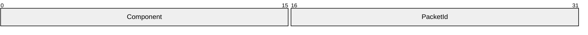

**Component (2 bytes):** A 16-bit unsigned integer that identifies the component to which the packet is sent. This field MUST be set to one of the following values.

| Value | Meaning |
| --- | --- |
| RDPDR_CTYP_CORE 0x4472 | Device redirector core component; most of the packets in this protocol are sent under this component ID. |
| RDPDR_CTYP_PRN 0x5052 | Printing component. The packets that use this ID are typically about printer cache management and identifying XPS printers. |

**PacketId (2 bytes):** A 16-bit unsigned integer. The **PacketId** field is a unique ID that identifies the packet function. This field MUST be set to one of the following values.

| Value | Meaning |
| --- | --- |
| PAKID_CORE_SERVER_ANNOUNCE 0x496E | Server Announce Request, as specified in section [2.2.2.2](#Section_2.2.2.2). |
| PAKID_CORE_CLIENTID_CONFIRM 0x4343 | Client Announce Reply and Server Client ID Confirm, as specified in sections [2.2.2.3](#Section_2.2.2.3) and [2.2.2.6](#Section_2.2.2.6). |
| PAKID_CORE_CLIENT_NAME 0x434E | Client Name Request, as specified in section [2.2.2.4](#Section_2.2.2.4). |
| PAKID_CORE_DEVICELIST_ANNOUNCE 0x4441 | Client Device List Announce Request, as specified in section [2.2.2.9](#Section_2.2.2.9). |
| PAKID_CORE_DEVICE_REPLY 0x6472 | Server Device Announce Response, as specified in section [2.2.2.1](#Section_2.2.2.1). |
| PAKID_CORE_DEVICE_IOREQUEST 0x4952 | Device I/O Request, as specified in section [2.2.1.4](#Section_2.2.1.4). |
| PAKID_CORE_DEVICE_IOCOMPLETION 0x4943 | Device I/O Response, as specified in section [2.2.1.5](#Section_2.2.1.5). |
| PAKID_CORE_SERVER_CAPABILITY 0x5350 | Server Core Capability Request, as specified in section [2.2.2.7](#Section_2.2.2.7). |
| PAKID_CORE_CLIENT_CAPABILITY 0x4350 | Client Core Capability Response, as specified in section [2.2.2.8](#Section_2.2.2.8). |
| PAKID_CORE_DEVICELIST_REMOVE 0x444D | Client Drive Device List Remove, as specified in section [2.2.3.2](#Section_2.2.3.2). |
| PAKID_PRN_CACHE_DATA 0x5043 | Add Printer Cachedata, as specified in [MS-RDPEPC](../MS-RDPEPC/MS-RDPEPC.md) section 2.2.2.3. |
| PAKID_CORE_USER_LOGGEDON 0x554C | Server User Logged On, as specified in section [2.2.2.5](#Section_2.2.2.5). |
| PAKID_PRN_USING_XPS 0x5543 | Server Printer Set XPS Mode, as specified in [MS-RDPEPC] section 2.2.2.2. |

<a id="Section_2.2.1.2"></a>
#### 2.2.1.2 Capability Header (CAPABILITY_HEADER)

This is a header that is embedded in the [Server Core Capability Request](#Section_4.8) and [Client Core Capability Response](#Section_4.9). The purpose of this header is to describe capabilities for different device types.

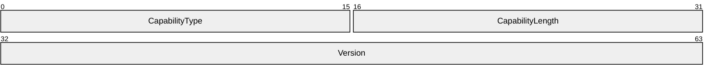

**CapabilityType (2 bytes):** A 16-bit unsigned integer that identifies the type of capability being described. It MUST be set to one of the following values.

| Value | Meaning |
| --- | --- |
| CAP_GENERAL_TYPE 0x0001 | [General capability set (GENERAL_CAPS_SET)](#Section_2.2.2.7.1) |
| CAP_PRINTER_TYPE 0x0002 | [Print capability set (PRINTER_CAPS_SET)](#Section_0c65e5e3c730453a99005ce6d8f25de6) |
| CAP_PORT_TYPE 0x0003 | [Port capability set (PORT_CAPS_SET)](#Section_2.2.2.7.3) |
| CAP_DRIVE_TYPE 0x0004 | [Drive capability set (DRIVE_CAPS_SET)](#Section_2.2.2.7.4) |
| CAP_SMARTCARD_TYPE 0x0005 | [Smart card capability set (SMARTCARD_CAPS_SET)](#Section_2.2.2.7.5)<2> |

**CapabilityLength (2 bytes):** A 16-bit unsigned integer that specifies that size, in bytes, of the capability message, this header included.

**Version (4 bytes):** A 32-bit unsigned integer that specifies the capability-specific version for the specific value of **CapabilityType**, as described in the table that follows.

| CapabilityType Value | Version Value(s) | Meaning |
| --- | --- | --- |
| CAP_GENERAL_TYPE | GENERAL_CAPABILITY_VERSION_01 0x00000001 GENERAL_CAPABILITY_VERSION_02 0x00000002 | See section 2.2.2.7.1. |
| CAP_PRINTER_TYPE | PRINT_CAPABILITY_VERSION_01 0x00000001 | Version 1 of printing capabilities. |
| CAP_PORT_TYPE | PORT_CAPABILITY_VERSION_01 0x00000001 | Version 1 of port capabilities. |
| CAP_DRIVE_TYPE | DRIVE_CAPABILITY_VERSION_01 0x00000001 DRIVE_CAPABILITY_VERSION_02 0x00000002 | If the client supports DRIVE_CAPABILITY_VERSION_02, then the drive name of the redirected device can be specified by the **DeviceData** field of a DEVICE ANNOUNCE header, as specified in the **DeviceAnnounce** field description of the Client Device List Announce message (section [2.2.3.1](#Section_2.2.3.1)). |
| CAP_SMARTCARD_TYPE | SMARTCARD_CAPABILITY_VERSION_01 0x00000001 | Version 1 of smart card capabilities. |

<a id="Section_2.2.1.2.1"></a>
##### 2.2.1.2.1 Capability Message (CAPABILITY_SET)

The CAPABILITY_SET structure is used to describe the type, size, and version of a capability set exchanged between [**clients**](#gt_client) and [**servers**](#gt_server). All Capability Messages conform to this basic structure. The Capability Message is embedded in the [Server Core Capability Request](#Section_4.8) and [Client Core Capability Response](#Section_4.9) messages.

Capability Messages are ordered as an array of CAPABILITY_SET structures contained in a Server Core Capability Request or Client Core Capability Response message; however, the presence of a Capability Message is non-compulsory. If **CapabilityMessage** data is not present in a Server Core Capability Request or Client Core Capability Response packet, it is assumed that all fields of the Capability Message are set to zero, with exception of the **CapabilityType** and **CapabilityLength** fields of the Header.

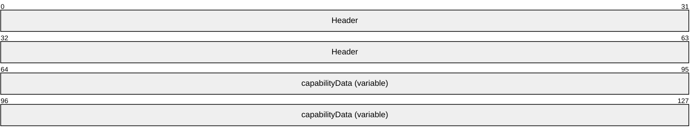

**Header (8 bytes):** A [CAPABILITY_HEADER](#Section_2.2.1.2) structure. The **CapabilityType** field of the CAPABILITY_HEADER specifies the format of the data in the **capabilityData** field.

**capabilityData (variable):** Capability set data that conforms to the structure of the type specified by the **CapabilityType** field of the CAPABILITY_HEADER.

<a id="Section_2.2.1.3"></a>
#### 2.2.1.3 Device Announce Header (DEVICE_ANNOUNCE)

This header is embedded in the [Client Device List Announce](#Section_4.10) message. Its purpose is to describe different types of devices.

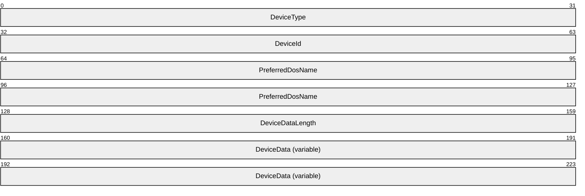

**DeviceType (4 bytes):** A 32-bit unsigned integer that identifies the device type. This field MUST be set to one of the following values.

| Value | Meaning |
| --- | --- |
| RDPDR_DTYP_SERIAL 0x00000001 | Serial port device |
| RDPDR_DTYP_PARALLEL 0x00000002 | Parallel port device |
| RDPDR_DTYP_PRINT 0x00000004 | Printer device |
| RDPDR_DTYP_FILESYSTEM 0x00000008<3> | File system device |
| RDPDR_DTYP_SMARTCARD 0x00000020<4> | Smart card device |

**DeviceId (4 bytes):** A 32-bit unsigned integer that specifies a unique ID that identifies the announced device. This ID MUST be reused if the device is removed by means of the Client Drive Device List Remove packet specified in section [2.2.3.2](#Section_2.2.3.2).

**PreferredDosName (8 bytes):** A string of [**ASCII**](#gt_ascii) characters (with a maximum length of eight characters) that represents the name of the device as it appears on the client. This field MUST be null-terminated, so the maximum device name is 7 characters long. The following characters are considered invalid for the **PreferredDosName** field:

<, >, ", /, \, |

If any of these characters are present, the [DR_CORE_DEVICE_ANNOUNC_RSP](#Section_4.2) packet for this device (section 2.2.2.1) will be sent with STATUS_ACCESS_DENIED set in the **ResultCode** field.

If **DeviceType** is set to RDPDR_DTYP_SMARTCARD, the **PreferredDosName** MUST be set to "SCARD".

**Note** A column character, ":", is valid only when present at the end of the **PreferredDosName** field, otherwise it is also considered invalid.

**DeviceDataLength (4 bytes):** A 32-bit unsigned integer that specifies the number of bytes in the **DeviceData** field.

**DeviceData (variable):** A variable-length byte array whose size is specified by the **DeviceDataLength** field. The content depends on the **DeviceType** field. See [MS-RDPEPC](../MS-RDPEPC/MS-RDPEPC.md) section 2.2.2.1 for the printer device type. See [MS-RDPESP](../MS-RDPESP/MS-RDPESP.md) section 2.2.2.1 for the serial and parallel port device types. See section 2.2.3.1 of this protocol for the file system device type. For a smart card device, the **DeviceDataLength** field MUST be set to zero. See [MS-RDPESC](../MS-RDPESC/MS-RDPESC.md) for details about the smart card device type.

<a id="Section_2.2.1.4"></a>
#### 2.2.1.4 Device I/O Request (DR_DEVICE_IOREQUEST)

This header is embedded in all server requests on a specific device.

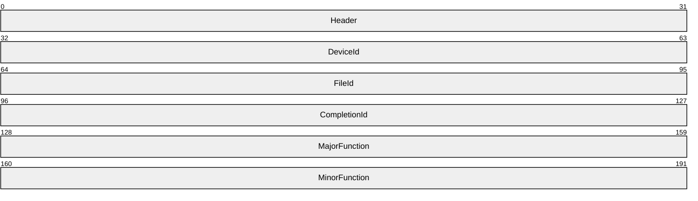

**Header (4 bytes):** An [RDPDR_HEADER](#Section_2.2.1.1) header. The **Component** field MUST be set to RDPDR_CTYP_CORE, and the **PacketId** field MUST be set to PAKID_CORE_DEVICE_IOREQUEST.

**DeviceId (4 bytes):** A 32-bit unsigned integer that is a unique ID. The value MUST match the **DeviceId** value in the [Client Device List Announce Request (section 2.2.2.9)](#Section_2.2.2.9).

**FileId (4 bytes):** A 32-bit unsigned integer that specifies a unique ID retrieved from the [Device Create Response (section 2.2.1.5.1)](#Section_2.2.1.5.1).

**CompletionId (4 bytes):** A 32-bit unsigned integer that specifies a unique ID for each request. The ID is considered valid until a [Device I/O Response (section 2.2.1.5)](#Section_2.2.1.5) is received. Subsequently, the ID MUST be reused.

**MajorFunction (4 bytes):** A 32-bit unsigned integer that identifies the request function. This field MUST have one of the following values.

| Value | Meaning |
| --- | --- |
| IRP_MJ_CREATE 0x00000000 | Create request |
| IRP_MJ_CLOSE 0x00000002 | Close request |
| IRP_MJ_READ 0x00000003 | Read request |
| IRP_MJ_WRITE 0x00000004 | Write request |
| IRP_MJ_DEVICE_CONTROL 0x0000000E | Device control request |
| IRP_MJ_QUERY_VOLUME_INFORMATION 0x0000000A | Query volume information request |
| IRP_MJ_SET_VOLUME_INFORMATION 0x0000000B | Set volume information request |
| IRP_MJ_QUERY_INFORMATION 0x00000005 | Query information request |
| IRP_MJ_SET_INFORMATION 0x00000006 | Set information request |
| IRP_MJ_DIRECTORY_CONTROL 0x0000000C | Directory control request |
| IRP_MJ_LOCK_CONTROL 0x00000011 | File lock control request |

**MinorFunction (4 bytes):** A 32-bit unsigned integer. This field is valid only when the **MajorFunction** field is set to IRP_MJ_DIRECTORY_CONTROL. If the **MajorFunction** field is set to another value, the **MinorFunction** field value SHOULD be 0x00000000;<5> otherwise, the **MinorFunction** field MUST have one of the following values.

| Value | Meaning |
| --- | --- |
| IRP_MN_QUERY_DIRECTORY 0x00000001 | Query directory request |
| IRP_MN_NOTIFY_CHANGE_DIRECTORY 0x00000002 | Notify change directory request |

<a id="Section_2.2.1.4.1"></a>
##### 2.2.1.4.1 Device Create Request (DR_CREATE_REQ)

This header initiates a create request. This message can have different purposes depending on the device for which it is issued. The device type is determined by the **DeviceId** field in the [DR_DEVICE_IOREQUEST](#Section_2.2.1.4) header.

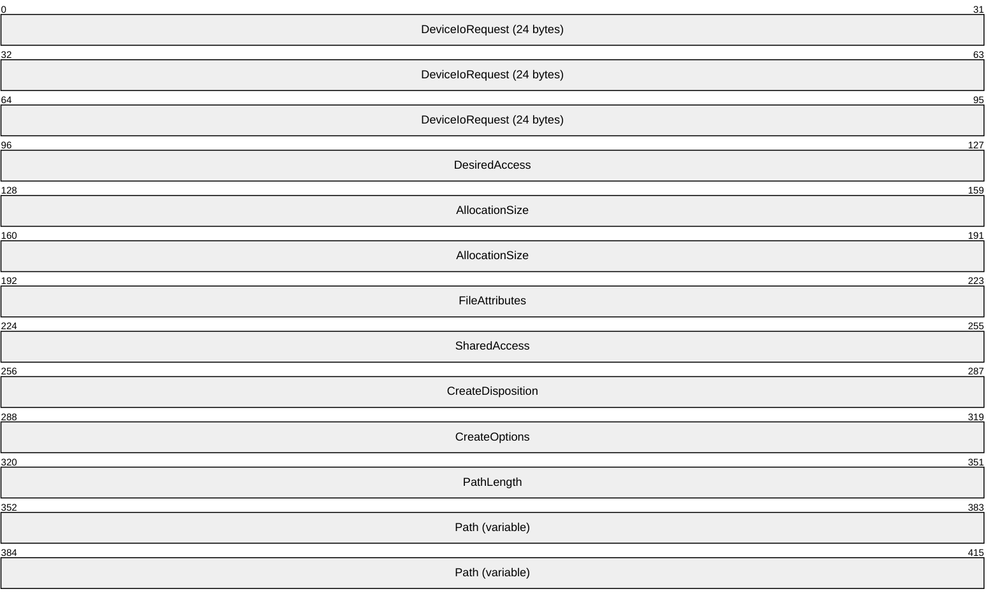

**DeviceIoRequest (24 bytes):** A DR_DEVICE_IOREQUEST header. The **MajorFunction** field in this header MUST be set to IRP_MJ_CREATE.

**DesiredAccess (4 bytes):** A 32-bit unsigned integer that specifies the level of access. This field is specified in [MS-SMB2](../MS-SMB2/MS-SMB2.md) section 2.2.13.

**AllocationSize (8 bytes):** A 64-bit unsigned integer that specifies the initial allocation size for the file.

**FileAttributes (4 bytes):** A 32-bit unsigned integer that specifies the attributes for the file being created. This field is specified in [MS-SMB2] section 2.2.13.

**SharedAccess (4 bytes):** A 32-bit unsigned integer that specifies the sharing mode for the file being opened. This field is specified in [MS-SMB2] section 2.2.13.

**CreateDisposition (4 bytes):** A 32-bit unsigned integer that specifies the action for the client to take if the file already exists. This field is specified in [MS-SMB2] section 2.2.13. For ports and other devices, this field MUST be set to FILE_OPEN (0x00000001).

**CreateOptions (4 bytes):** A 32-bit unsigned integer that specifies the options for creating the file. This field is specified in [MS-SMB2] section 2.2.13.

**PathLength (4 bytes):** A 32-bit unsigned integer that specifies the number of bytes in the **Path** field, including the null-terminator.

**Path (variable):** A variable-length array of [**Unicode characters**](#gt_unicode-character), including the null-terminator, whose size is specified by the **PathLength** field. The protocol imposes no limitations on the characters used in this field.

<a id="Section_2.2.1.4.2"></a>
##### 2.2.1.4.2 Device Close Request (DR_CLOSE_REQ)

This header initiates a close request. This message can have different purposes depending on the device for which it is issued. The device type is determined by the **DeviceId** field in the [DR_DEVICE_IOREQUEST](#Section_2.2.1.4) header.

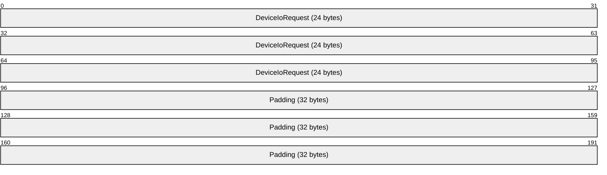

**DeviceIoRequest (24 bytes):** A DR_DEVICE_IOREQUEST header. The **MajorFunction** field in this header MUST be set to IRP_MJ_CLOSE.

**Padding (32 bytes):** An array of 32 bytes. Reserved. This field can be set to any value, and MUST be ignored.

<a id="Section_2.2.1.4.3"></a>
##### 2.2.1.4.3 Device Read Request (DR_READ_REQ)

This header initiates a read request. This message can have different purposes depending on the device for which it is issued. The device type is determined by the **DeviceId** field in the [DR_DEVICE_IOREQUEST](#Section_2.2.1.4) header.

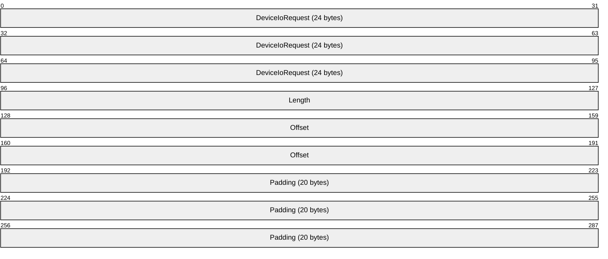

**DeviceIoRequest (24 bytes):** A DR_DEVICE_IOREQUEST header. The **MajorFunction** field in this header MUST be set to IRP_MJ_READ.

**Length (4 bytes):** A 32-bit unsigned integer. This field specifies the maximum number of bytes to be read from the device.

**Offset (8 bytes):** A 64-bit unsigned integer. This field specifies the file offset where the read operation is performed.

**Padding (20 bytes):** An array of 20 bytes. Reserved. This field can be set to any value and MUST be ignored.

<a id="Section_2.2.1.4.4"></a>
##### 2.2.1.4.4 Device Write Request (DR_WRITE_REQ)

This header initiates a write request. This message can have different purposes depending on the device for which it is issued. The device type is determined by the **DeviceId** field in the [DR_DEVICE_IOREQUEST](#Section_2.2.1.4) header.

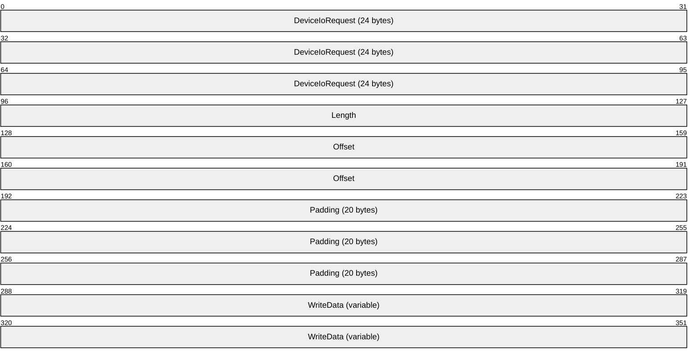

**DeviceIoRequest (24 bytes):** A DR_DEVICE_IOREQUEST header. The **MajorFunction** field in this header MUST be set to IRP_MJ_WRITE.

**Length (4 bytes):** A 32-bit unsigned integer that specifies the number of bytes in the **WriteData** field.

**Offset (8 bytes):** A 64-bit unsigned integer. This field specifies the file offset at which the data MUST be written. If the client advertised a minor version of at least 0x000D in the [Client Announce Reply](#Section_4.4) (section 2.2.2.3), then a value of 0xFFFFFFFFFFFFFFFF indicates that the client MUST treat this write request as an append operation.<6>

**Padding (20 bytes):** An array of 20 bytes. Reserved. This field can be set to any value and MUST be ignored.

**WriteData (variable):** A variable-length array of bytes, where the length is specified by the **Length** field in this packet. This array contains data to be written on the target device.

<a id="Section_2.2.1.4.5"></a>
##### 2.2.1.4.5 Device Control Request (DR_CONTROL_REQ)

This header initiates a device control request. This message can have different purposes depending on the device for which it is issued. The device type is determined by the **DeviceId** field in the [DR_DEVICE_IOREQUEST](#Section_2.2.1.4) header.

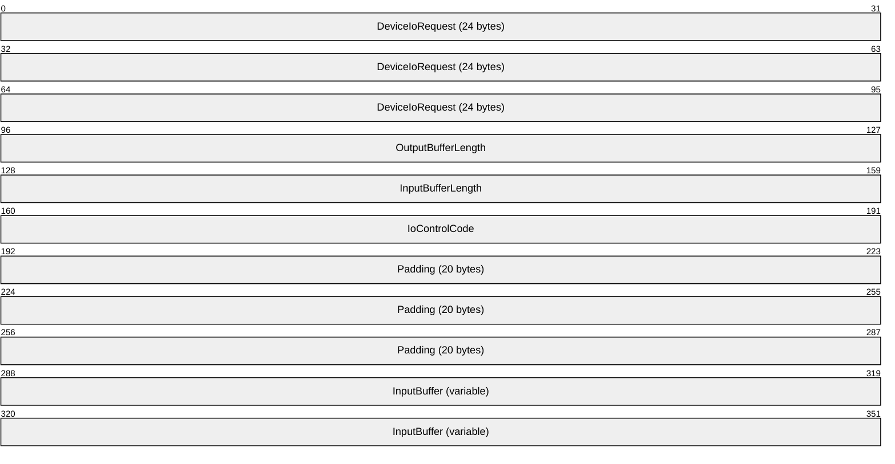

**DeviceIoRequest (24 bytes):** A DR_DEVICE_IOREQUEST header. The **MajorFunction** field in this header MUST be set to IRP_MJ_DEVICE_CONTROL.

**OutputBufferLength (4 bytes):** A 32-bit unsigned integer that specifies the maximum number of bytes expected in the **OutputBuffer** field of the [Device Control Response (section 2.2.1.5.5)](#Section_2.2.1.5.5).

**InputBufferLength (4 bytes):** A 32-bit unsigned integer that specifies the number of bytes in the **InputBuffer** field.

**IoControlCode (4 bytes):** A 32-bit unsigned integer. This field is specific to the redirected device.

**Padding (20 bytes):** An array of 20 bytes. Reserved. This field can be set to any value and MUST be ignored.

**InputBuffer (variable):** A variable-size byte array whose size is specified by the **InputBufferLength** field.

<a id="Section_2.2.1.5"></a>
#### 2.2.1.5 Device I/O Response (DR_DEVICE_IOCOMPLETION)

A message with this header indicates that the I/O request is complete. In a Device I/O Response message, a request message is matched to the [Device I/O Request (section 2.2.1.4)](#Section_2.2.1.4) header based on the **CompletionId** field value. There is only one response per request.

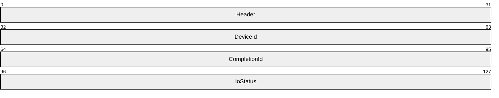

**Header (4 bytes):** An [RDPDR_HEADER](#Section_2.2.1.1) header. The **Component** field MUST be set to RDPDR_CTYP_CORE, and the **PacketId** field MUST be set to PAKID_CORE_DEVICE_IOCOMPLETION.

**DeviceId (4 bytes):** A 32-bit unsigned integer. This field MUST match the **DeviceId** field in the DR_DEVICE_IOREQUEST header for the corresponding request.

**CompletionId (4 bytes):** A 32-bit unsigned integer. This field MUST match the **CompletionId** field in the DR_DEVICE_IOREQUEST header for the corresponding request. After processing a response packet with this ID, the same ID MUST be reused in another request.

**IoStatus (4 bytes):** A 32-bit unsigned integer that specifies the NTSTATUS code that indicates success or failure for the request. NTSTATUS codes are specified in [MS-ERREF](../MS-ERREF/MS-ERREF.md) section 2.3.

<a id="Section_2.2.1.5.1"></a>
##### 2.2.1.5.1 Device Create Response (DR_CREATE_RSP)

A message with this header describes a response to a [Device Create Request (section 2.2.1.4.1)](#Section_2.2.1.4.1).

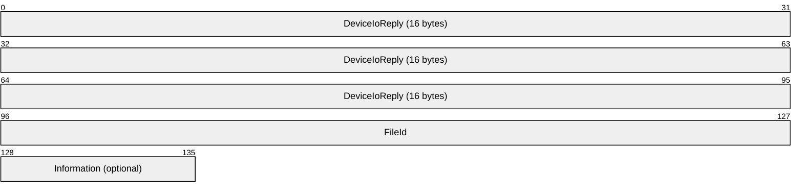

**DeviceIoReply (16 bytes):** A [DR_DEVICE_IOCOMPLETION](#Section_2.2.1.5) header. The **CompletionId** field of this header MUST match a [Device I/O Request (section 2.2.1.4)](#Section_2.2.1.4) message that had the **MajorFunction** field set to IRP_MJ_CREATE.

**FileId (4 bytes):** A 32-bit unsigned integer that specifies a unique ID for the created file object. The ID MUST be reused after sending a [Device Close Response (section 2.2.1.5.2)](#Section_2.2.1.5.2).

**Information (1 byte):** An unsigned 8-bit integer. This field indicates the success of the Device Create Request (section 2.2.1.4.1). The value of the **Information** field depends on the value of **CreateDisposition** field in the Device Create Request (section 2.2.1.4.1). If the **IoStatus** field is set to 0x00000000, this field MAY be skipped,<7> in which case the server MUST assume that the **Information** field is set to 0x00. The possible values of the **Information** field are:

| Value | Meaning |
| --- | --- |
| FILE_SUPERSEDED 0x00000000 | A new file was created. |
| FILE_OPENED 0x00000001 | An existing file was opened. |
| FILE_OVERWRITTEN 0x00000003 | An existing file was overwritten. |

The values of the **CreateDisposition** field in the Device Create Request (section 2.2.1.4.1) that determine the value of the **Information** field are associated as follows:

| Bit Range | Field | Description |
| --- | --- | --- |
| Variable | FILE_SUPERSEDED | FILE_SUPERSEDE FILE_OPEN FILE_CREATE FILE_OVERWRITE |
| Variable | FILE_OPENED | FILE_OPEN_IF |
| Variable | FILE_OVERWRITTEN | FILE_OVERWRITE_IF |

<a id="Section_2.2.1.5.2"></a>
##### 2.2.1.5.2 Device Close Response (DR_CLOSE_RSP)

This message is a reply to a [Device Close Request (section 2.2.1.4.2)](#Section_2.2.1.4.2).

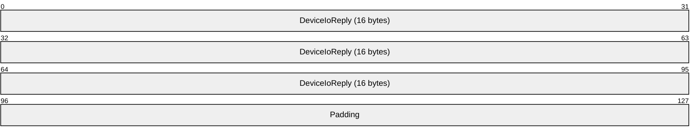

**DeviceIoReply (16 bytes):** A [DR_DEVICE_IOCOMPLETION](#Section_2.2.1.5) header. The **CompletionId** field of this header MUST match a [Device I/O Request (section 2.2.1.4)](#Section_2.2.1.4) message that had the **MajorFunction** field set to IRP_MJ_CLOSE.

**Padding (4 bytes):** An array of 4 bytes. Reserved. This field can be set to any value and MUST be ignored.

<a id="Section_2.2.1.5.3"></a>
##### 2.2.1.5.3 Device Read Response (DR_READ_RSP)

A message with this header describes a response to a [Device Read Request (section 2.2.1.4.3)](#Section_2.2.1.4.3).

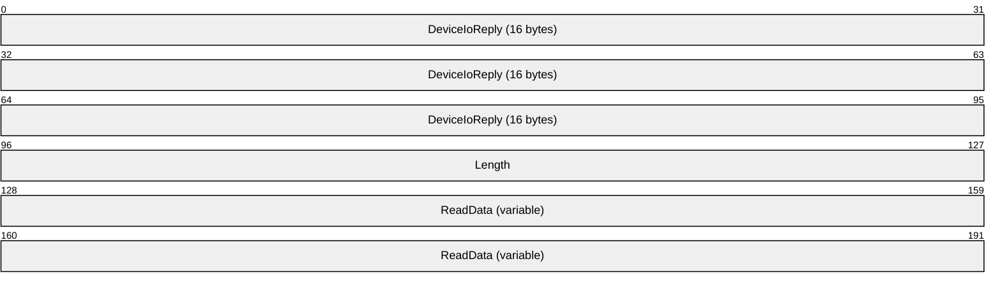

**DeviceIoReply (16 bytes):** A [DR_DEVICE_IOCOMPLETION](#Section_2.2.1.5) header. The **CompletionId** field of this header MUST match a [Device I/O Request (section 2.2.1.4)](#Section_2.2.1.4) message that had the **MajorFunction** field set to IRP_MJ_READ.

**Length (4 bytes):** A 32-bit unsigned integer that specifies the number of bytes in the **ReadData** field.

**ReadData (variable):** A variable-length array of bytes that specifies the output data from the read request. The length of **ReadData** is specified by the **Length** field in this packet.

<a id="Section_2.2.1.5.4"></a>
##### 2.2.1.5.4 Device Write Response (DR_WRITE_RSP)

A message with this header describes a response to a [Device Write Request (section 2.2.1.4.4)](#Section_2.2.1.4.4).

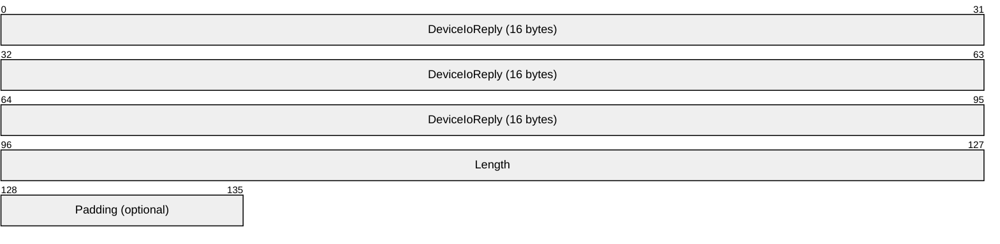

**DeviceIoReply (16 bytes):** A [DR_DEVICE_IOCOMPLETION](#Section_2.2.1.5) header. The **CompletionId** field of this header MUST match a [Device I/O Request (section 2.2.1.4)](#Section_2.2.1.4) message that had the **MajorFunction** field set to IRP_MJ_WRITE.

**Length (4 bytes):** A 32-bit unsigned integer that specifies the number of bytes written in response to the write request.

**Padding (1 byte):** An 8-bit unsigned integer intended to allow the client minor flexibility in determining the overall packet length. This field is unused and MUST be ignored.

<a id="Section_2.2.1.5.5"></a>
##### 2.2.1.5.5 Device Control Response (DR_CONTROL_RSP)

A message with this header describes a response to a [Device Control Request (section 2.2.1.4.5)](#Section_2.2.1.4.5).

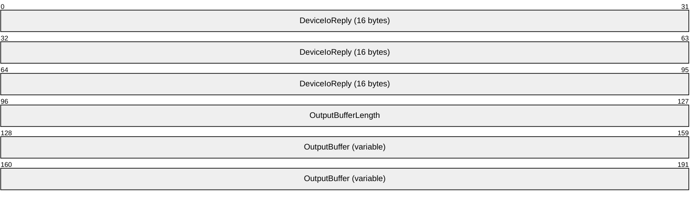

**DeviceIoReply (16 bytes):** A [DR_DEVICE_IOCOMPLETION](#Section_2.2.1.5) header. The **CompletionId** field of this header MUST match a [Device I/O Request (section 2.2.1.4)](#Section_2.2.1.4) that had the **MajorFunction** field set to IRP_MJ_DEVICE_CONTROL.

**OutputBufferLength (4 bytes):** A 32-bit unsigned integer that specifies the number of bytes in the **OutputBuffer** field.

**OutputBuffer (variable):** A variable-length array of bytes whose size is specified by the **OutputBufferLength** field.

<a id="Section_2.2.1.6"></a>
#### 2.2.1.6 RDP_LOCK_INFO

The RDP_LOCK_INFO packet specifies the region of the file to lock or unlock.

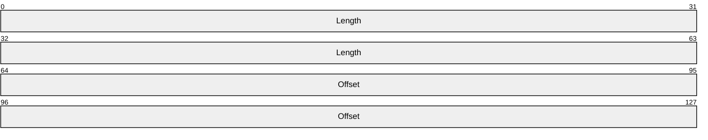

**Length (8 bytes):** A 64-bit unsigned integer that specifies the length of the region. A value of zero is valid and MUST result in locking the zero length region.

**Offset (8 bytes):** A 64-bit unsigned integer that specifies the offset at which the region starts.

<a id="Section_2.2.2"></a>
### 2.2.2 Initialization Messages

<a id="Section_2.2.2.1"></a>
#### 2.2.2.1 Server Device Announce Response (DR_CORE_DEVICE_ANNOUNCE_RSP)

The [**server**](#gt_server) responds to a [Client Device List Announce Request](#Section_4.10) with this message.

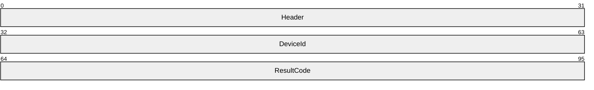

**Header (4 bytes):** An [RDPDR_HEADER](#Section_2.2.1.1) header. The **Component** field MUST be set to RDPDR_CTYP_CORE, and the **PacketId** field MUST be set to PAKID_CORE_DEVICE_REPLY.

**DeviceId (4 bytes):** A 32-bit unsigned integer. This ID MUST be the same as one of the IDs specified in the Client Device List Announce Request message. The server sends a separate Server Device Announce Response message for each announced device.

**ResultCode (4 bytes):** A 32-bit unsigned integer that specifies the NTSTATUS code that indicates the success or failure of device initialization. NTSTATUS codes are specified in [MS-ERREF](../MS-ERREF/MS-ERREF.md) section 2.3.

<a id="Section_2.2.2.2"></a>
#### 2.2.2.2 Server Announce Request (DR_CORE_SERVER_ANNOUNCE_REQ)

The server initiates the protocol with this message.

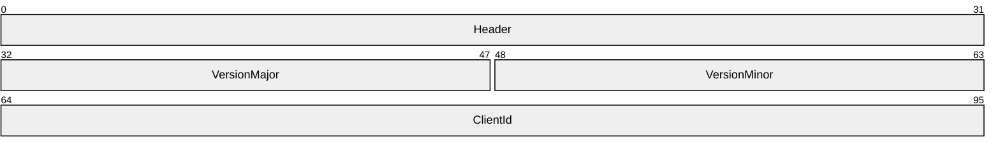

**Header (4 bytes):** An [RDPDR_HEADER](#Section_2.2.1.1) header. The **Component** field MUST be set to RDPDR_CTYP_CORE, and the **PacketId** field MUST be set to PAKID_CORE_SERVER_ANNOUNCE.

**VersionMajor (2 bytes):** A 16-bit unsigned integer that specifies the server major version number. This field MUST be set to 0x0001.

**VersionMinor (2 bytes):** A 16-bit unsigned integer that specifies the server minor version number. This field MUST be set to one of several values<8>.

**ClientId (4 bytes):** A 32-bit unsigned integer that specifies the unique ID generated by the server as specified in section [3.3.5.1.2](#Section_3.3.5.1.2).

<a id="Section_2.2.2.3"></a>
#### 2.2.2.3 Client Announce Reply (DR_CORE_CLIENT_ANNOUNCE_RSP)

The [**client**](#gt_client) replies to the [Server Announce Request](#Section_4.3) message.


**Header (4 bytes):** An [RDPDR_HEADER](#Section_2.2.1.1) header. The **Component** field MUST be set to RDPDR_CTYP_CORE, and the **PacketId** field MUST be set to PAKID_CORE_CLIENTID_CONFIRM.

**VersionMajor (2 bytes):** A 16-bit unsigned integer that specifies the major version number of the file system redirection protocol. This field MUST be set to 0x0001.

**VersionMinor (2 bytes):** A 16-bit unsigned integer that specifies the minor version number of the file system redirection protocol. This field MUST be set to one of the following values.

| Value | Meaning |
| --- | --- |
| 0x000D | Minor version 13 |
| 0x000C | Minor version 12 |
| 0x000A | Minor version 10 |
| 0x0005 | Minor version 5 |
| 0x0002 | Minor version 2 |

**ClientId (4 bytes):** A 32-bit unsigned integer that the client MUST set to either the **ClientId** field, which is supplied by the server in the Server Announce Request message, or a unique ID as specified in section [3.2.5.1.3](#Section_3.2.5.1.3).

<a id="Section_2.2.2.4"></a>
#### 2.2.2.4 Client Name Request (DR_CORE_CLIENT_NAME_REQ)

The client announces its machine name.

```mermaid
packet-beta
  0-31: "Header"
  32-63: "UnicodeFlag"
  64-95: "CodePage"
  96-127: "ComputerNameLen"
  128-191: "ComputerName (variable)"
```

**Header (4 bytes):** An [RDPDR_HEADER](#Section_2.2.1.1) header. The **Component** field MUST be set to RDPDR_CTYP_CORE, and the **PacketId** field MUST be set to PAKID_CORE_CLIENT_NAME.

**UnicodeFlag (4 bytes):** A 32-bit unsigned integer that indicates the format of the **ComputerName** field. Only the least significant bit of this field is valid (the most significant 31 bits MUST be ignored). The least significant bit MUST be set to one of the following values.

| Value | Meaning |
| --- | --- |
| 0x1 | **ComputerName** is in [**Unicode characters**](#gt_unicode-character). |
| 0x0 | **ComputerName** is in ASCII characters. |

**CodePage (4 bytes):** A 32-bit unsigned integer that specifies the code page of the **ComputerName** field; it MUST be set to 0.

**ComputerNameLen (4 bytes):** A 32-bit unsigned integer that specifies the number of bytes in the **ComputerName** field, including null terminator.

**ComputerName (variable):** A variable-length array of ASCII or Unicode characters, the format of which is determined by the **UnicodeFlag** field. This is a string that identifies the client computer name. The string MUST be null-terminated. The protocol imposes no limitations on the characters used in this field.

<a id="Section_2.2.2.5"></a>
#### 2.2.2.5 Server User Logged On (DR_CORE_USER_LOGGEDON)

The server announces that it has successfully logged on to the session.

```mermaid
packet-beta
  0-31: "Header"
```

**Header (4 bytes):** An [RDPDR_HEADER](#Section_2.2.1.1) header. The **Component** field MUST be set to RDPDR_CTYP_CORE, and the **PacketId** field MUST be set to PAKID_CORE_USER_LOGGEDON.

<a id="Section_2.2.2.6"></a>
#### 2.2.2.6 Server Client ID Confirm (DR_CORE_SERVER_CLIENTID_CONFIRM)

The server confirms the client ID sent by the client in the [Client Announce Reply](#Section_4.4) message.

```mermaid
packet-beta
  0-31: "Header"
  32-47: "VersionMajor"
  48-63: "VersionMinor"
  64-95: "ClientId"
```

**Header (4 bytes):** An [RDPDR_HEADER](#Section_2.2.1.1) header. The **Component** field MUST be set to RDPDR_CTYP_CORE, and the **PacketId** field MUST be set to PAKID_CORE_CLIENTID_CONFIRM.

**VersionMajor (2 bytes):** A 16-bit unsigned integer that specifies the major version number of the file system redirection protocol. This field MUST be set to 0x0001.

**VersionMinor (2 bytes):** A 16-bit unsigned integer that specifies the minor version number of the file system redirection protocol. This field MUST be set to one of the following values.

| Value | Meaning |
| --- | --- |
| 0x000D | Minor version 13 |
| 0x000C | Minor version 12 |
| 0x000A | Minor version 10 |
| 0x0005 | Minor version 5 |
| 0x0002 | Minor version 2 |

**ClientId (4 bytes):** A 32-bit unsigned integer that confirms the unique ID value of the **ClientId** field, which was sent by the client in the Client Announce Reply message.

<a id="Section_2.2.2.7"></a>
#### 2.2.2.7 Server Core Capability Request (DR_CORE_CAPABILITY_REQ)

The [**server**](#gt_server) announces its capabilities and requests the same from the [**client**](#gt_client).

```mermaid
packet-beta
  0-31: "Header"
  32-47: "numCapabilities"
  48-63: "Padding"
  64-127: "CapabilityMessage (variable)"
```

**Header (4 bytes):** An [RDPDR_HEADER](#Section_2.2.1.1) header. The **Component** field MUST be set to RDPDR_CTYP_CORE, and the **PacketId** field MUST be set to PAKID_CORE_SERVER_CAPABILITY.

**numCapabilities (2 bytes):** A 16-bit integer that specifies the number of items in the **CapabilityMessage** array.

**Padding (2 bytes):** A 16-bit unsigned integer of padding. This field is unused and MUST be ignored.

**CapabilityMessage (variable):** An array of CAPABILITY_SET structures (section [2.2.1.2.1](#Section_2.2.1.2.1)). The number of capabilities is specified by the **numCapabilities** field.

<a id="Section_2.2.2.7.1"></a>
##### 2.2.2.7.1 General Capability Set (GENERAL_CAPS_SET)

This packet is embedded into [Server Core Capability Request](#Section_4.8) and [Client Core Capability Response](#Section_4.9) messages. It describes non–device-specific capabilities.

```mermaid
packet-beta
  0-63: "Header"
  64-95: "osType"
  96-127: "osVersion"
  128-143: "protocolMajorVersion"
  144-159: "protocolMinorVersion"
  160-191: "ioCode1"
  192-223: "ioCode2"
  224-255: "extendedPDU"
  256-287: "extraFlags1"
  288-319: "extraFlags2"
  320-351: "SpecialTypeDeviceCap"
```

**Header (8 bytes):** A [CAPABILITY_HEADER](#Section_2.2.1.2) header. The **CapabilityType** field of this header MUST be set to CAP_GENERAL_TYPE. The **Version** field of this header MUST have one of the following values.

| Value | Meaning |
| --- | --- |
| GENERAL_CAPABILITY_VERSION_01 0x00000001 | Version 1. The **SpecialTypeDeviceCap** field of GENERAL_CAPS_SET is not present. |
| GENERAL_CAPABILITY_VERSION_02 0x00000002 | Version 2. The **SpecialTypeDeviceCap** field of GENERAL_CAPS_SET is present. |

**osType (4 bytes):** A 32-bit unsigned integer that is the identifier for the operating system that the capabilities are describing. The value of this field MUST be ignored.

**osVersion (4 bytes):** A 32-bit unsigned integer. This field is unused and SHOULD be ignored.

**protocolMajorVersion (2 bytes):** A 16-bit unsigned integer. This field MUST be set to 1.

**protocolMinorVersion (2 bytes):** A 16-bit unsigned integer. This field MUST be set to one of the values described by the **VersionMinor** field of the [Server Client ID Confirm (section 2.2.2.6)](#Section_2.2.2.6) packet.

**ioCode1 (4 bytes):** A 32-bit unsigned integer that identifies a bitmask of the supported I/O requests for the given device. If the bit is set, the I/O request is allowed. The requests are identified by the **MajorFunction** field in the [Device I/O Request (section 2.2.1.4)](#Section_2.2.1.4) header. This field MUST be set to a valid combination of the following values.

| Value | Meaning |
| --- | --- |
| RDPDR_IRP_MJ_CREATE 0x00000001 | Unused, always set. |
| RDPDR_IRP_MJ_CLEANUP 0x00000002 | Unused, always set. |
| RDPDR_IRP_MJ_CLOSE 0x00000004 | Unused, always set. |
| RDPDR_IRP_MJ_READ 0x00000008 | Unused, always set. |
| RDPDR_IRP_MJ_WRITE 0x00000010 | Unused, always set. |
| RDPDR_IRP_MJ_FLUSH_BUFFERS 0x00000020 | Unused, always set. |
| RDPDR_IRP_MJ_SHUTDOWN 0x00000040 | Unused, always set. |
| RDPDR_IRP_MJ_DEVICE_CONTROL 0x00000080 | Unused, always set. |
| RDPDR_IRP_MJ_QUERY_VOLUME_INFORMATION 0x00000100 | Unused, always set. |
| RDPDR_IRP_MJ_SET_VOLUME_INFORMATION 0x00000200 | Unused, always set. |
| RDPDR_IRP_MJ_QUERY_INFORMATION 0x00000400 | Unused, always set. |
| RDPDR_IRP_MJ_SET_INFORMATION 0x00000800 | Unused, always set. |
| RDPDR_IRP_MJ_DIRECTORY_CONTROL 0x00001000 | Unused, always set. |
| RDPDR_IRP_MJ_LOCK_CONTROL 0x00002000 | Unused, always set. |
| RDPDR_IRP_MJ_QUERY_SECURITY 0x00004000 | Enable Query Security requests (IRP_MJ_QUERY_SECURITY). |
| RDPDR_IRP_MJ_SET_SECURITY 0x00008000 | Enable Set Security requests (IRP_MJ_SET_SECURITY). |

**ioCode2 (4 bytes):** A 32-bit unsigned integer that is currently reserved for future use, and MUST be set to 0.

**extendedPDU (4 bytes):** A 32-bit unsigned integer that specifies extended [**PDU**](#gt_protocol-data-unit-pdu) flags. This field MUST be set as a bitmask of the following values.

| Value | Meaning |
| --- | --- |
| RDPDR_DEVICE_REMOVE_PDUS 0x00000001 | Allow the client to send [Client Drive Device List Remove](#Section_4.11) packets. |
| RDPDR_CLIENT_DISPLAY_NAME_PDU 0x00000002 | Unused, always set. |
| RDPDR_USER_LOGGEDON_PDU 0x00000004 | Allow the server to send a [Server User Logged On](#Section_4.6) packet. |

**extraFlags1 (4 bytes):** A 32-bit unsigned integer that specifies extended flags. The **extraFlags1** field MUST be set as a bitmask of the following value.

| Value | Meaning |
| --- | --- |
| ENABLE_ASYNCIO 0x00000001 | Optionally present only in the Client Core Capability Response. Allows the server to send multiple simultaneous read or write requests on the same file from a redirected file system.<9> |

**extraFlags2 (4 bytes):** A 32-bit unsigned integer that is currently reserved for future use, and MUST be set to 0.

**SpecialTypeDeviceCap (4 bytes):** A 32-bit unsigned integer that specifies the number of special devices to be redirected before the user is logged on. Special devices are those that are safe and/or required to be redirected before a user logs on (such as smart cards and serial ports).

<a id="Section_2.2.2.7.2"></a>
##### 2.2.2.7.2 Printer Capability Set (PRINTER_CAPS_SET)

This packet is embedded into [Server Core Capability Request](#Section_4.8) and [Client Core Capability Response](#Section_4.9) messages. It indicates that printer devices are supported.

```mermaid
packet-beta
  0-63: "Header"
```

**Header (8 bytes):** A [CAPABILITY_HEADER](#Section_2.2.1.2) header. The **CapabilityType** field of this header MUST be set to CAP_PRINTER_TYPE, and the **Version** field MUST be set to 0x00000001.

<a id="Section_2.2.2.7.3"></a>
##### 2.2.2.7.3 Port Capability Set (PORT_CAPS_SET)

This packet is embedded into [Server Core Capability Request](#Section_4.8) and [Client Core Capability Response](#Section_4.9) messages. It indicates that parallel and serial port devices are supported.

```mermaid
packet-beta
  0-63: "Header"
```

**Header (8 bytes):** A [CAPABILITY_HEADER](#Section_2.2.1.2) header. The **CapabilityType** field of this header MUST be set to CAP_PORT_TYPE, and the **Version** field MUST be set to 0x00000001.

<a id="Section_2.2.2.7.4"></a>
##### 2.2.2.7.4 Drive Capability Set (DRIVE_CAPS_SET)

This packet is embedded into [Server Core Capability Request](#Section_4.8) and [Client Core Capability Response](#Section_4.9) messages. It indicates that file system devices are supported.

```mermaid
packet-beta
  0-63: "Header"
```

**Header (8 bytes):** A [CAPABILITY_HEADER](#Section_2.2.1.2) header. The **CapabilityType** field of this header MUST be set to CAP_DRIVE_TYPE, and the **Version** field MUST be set to DRIVE_CAPABILITY_VERSION_02.

<a id="Section_2.2.2.7.5"></a>
##### 2.2.2.7.5 Smart Card Capability Set (SMARTCARD_CAPS_SET)

This packet is embedded into [Server Core Capability Request](#Section_4.8) and [Client Core Capability Response](#Section_4.9) messages. It indicates that smart card devices are supported.<10>

```mermaid
packet-beta
  0-63: "Header"
```

**Header (8 bytes):** A [CAPABILITY_HEADER](#Section_2.2.1.2) header. The **CapabilityType** field of this header MUST be set to CAP_SMARTCARD_TYPE, and the **Version** field MUST be set to 0x00000001.

<a id="Section_2.2.2.8"></a>
#### 2.2.2.8 Client Core Capability Response (DR_CORE_CAPABILITY_RSP)

This packet is identical to [Server Core Capability Request (section 2.2.2.7)](#Section_2.2.2.7) with the exception that the **PacketId** field in [RDPDR_HEADER (section 2.2.1.1)](#Section_2.2.1.1) MUST be set to PAKID_CORE_CLIENT_CAPABILITY.

<a id="Section_2.2.2.9"></a>
#### 2.2.2.9 Client Device List Announce Request (DR_CORE_DEVICELIST_ANNOUNCE_REQ)

The client announces the list of devices to redirect on the server.

```mermaid
packet-beta
  0-31: "Header"
  32-63: "DeviceCount"
  64-127: "DeviceList (variable)"
```

**Header (4 bytes):** An [RDPDR_HEADER](#Section_2.2.1.1) header. The **Component** field MUST be set to RDPDR_CTYP_CORE, and the **PacketId** field MUST be set to PAKID_CORE_DEVICELIST_ANNOUNCE.

**DeviceCount (4 bytes):** A 32-bit unsigned integer that specifies the number of items in the **DeviceList** array.

**DeviceList (variable):** A variable-length array of [DEVICE_ANNOUNCE (section 2.2.1.3)](#Section_2.2.1.3) headers. This field specifies a list of devices that are being announced. The number of entries is specified by the **DeviceCount** field. There is no alignment padding between individual DEVICE_ANNOUNCE structures. They are ordered sequentially within this packet.

<a id="Section_2.2.3"></a>
### 2.2.3 Drive Redirection Messages

<a id="Section_2.2.3.1"></a>
#### 2.2.3.1 Client Device List Announce (DR_DEVICELIST_ANNOUNCE)

The client announces a list of new file system devices to redirect on the server.

```mermaid
packet-beta
  0-31: "Header"
  32-63: "DeviceCount"
  64-127: "DeviceAnnounce (variable)"
```

**Header (4 bytes):** An [RDPDR_HEADER](#Section_2.2.1.1) header. The **Component** field MUST be set to RDPDR_CTYP_CORE, and the **PacketId** field MUST be set to PAKID_CORE_DEVICELIST_ANNOUNCE.

**DeviceCount (4 bytes):** A 32-bit unsigned integer that specifies the number of entries in the **DeviceAnnounce** field.

**DeviceAnnounce (variable):** A variable-length array of [DEVICE_ANNOUNCE (section 2.2.1.3)](#Section_2.2.1.3) headers. The number of entries is specified by the **DeviceCount** field. Each entry is a DEVICE_ANNOUNCE header in which the **DeviceType** field MUST be set to RDPDR_DTYP_FILESYSTEM.<11> The drive name MUST be specified in the **PreferredDosName** field; however, if the drive name is larger than the allocated size of the **PreferredDosName** field, then the drive name MUST be truncated to fit. If the client supports DRIVE_CAPABILITY_VERSION_02 in the Drive Capability Set, then the full name MUST also be specified in the **DeviceData** field, as a null-terminated [**Unicode string**](#gt_unicode-string). If the **DeviceDataLength** field is nonzero, the content of the **PreferredDosName** field is ignored. There is no alignment padding between individual DEVICE_ANNOUNCE headers. They are ordered sequentially within this packet.

**Note** The **PreferredDosName** field is used for all device types and is not limited to drives.

<a id="Section_2.2.3.2"></a>
#### 2.2.3.2 Client Drive Device List Remove (DR_DEVICELIST_REMOVE)

The client removes a list of already-announced devices from the server.

```mermaid
packet-beta
  0-31: "Header"
  32-63: "DeviceCount"
  64-127: "DeviceIds (variable)"
```

**Header (4 bytes):** An [RDPDR_HEADER](#Section_2.2.1.1) header. The **Component** field MUST be set to RDPDR_CTYP_CORE, and the **PacketId** field MUST be set to PAKID_CORE_DEVICELIST_REMOVE.

**DeviceCount (4 bytes):** A 32-bit unsigned integer that specifies the number of entries in the **DeviceIds** field.

**DeviceIds (variable):** A variable-length array of 32-bit unsigned integers that specifies device IDs. The IDs specified in this array match the IDs specified in the [Client Device List Announce (section 2.2.3.1)](#Section_2.2.3.1) packet.

**Note** The client can send the DR_DEVICELIST_REMOVE message for devices that are removed after a session is connected. The server can accept the DR_DEVICE_REMOVE message for any removed device, including file system and port devices. The server can also accept reused DeviceIds of devices that have been removed, providing the implementation uses the DR_DEVICE_REMOVE message to do so.

<a id="Section_2.2.3.3"></a>
#### 2.2.3.3 Server Drive I/O Request (DR_DRIVE_CORE_DEVICE_IOREQUEST)

The server issues a device I/O request on a redirected file system device. Each request begins with a [DR_DEVICE_IOREQUEST (section 2.2.1.4)](#Section_2.2.1.4) header, in which the **DeviceId** field MUST be set to a device that has been announced as a file system device.

<a id="Section_2.2.3.3.1"></a>
##### 2.2.3.3.1 Server Create Drive Request (DR_DRIVE_CREATE_REQ)

The server opens or creates a file on a redirected file system device.

```mermaid
packet-beta
  0-63: "DeviceCreateRequest (variable)"
```

**DeviceCreateRequest (variable):** A [DR_CREATE_REQ](#Section_2.2.1.4.1) header. The **PathLength** and **Path** fields contain the file name of the file to be created. The file name does not contain a drive letter, which means that the drive is specified by the **DeviceId** field of the request. The **DeviceId** is associated with a drive letter when the device is announced in the [DR_DEVICELIST_ANNOUNCE (section 2.2.3.1)](#Section_2.2.3.1) message. The drive letter is contained in the **PreferredDosName** field.

<a id="Section_2.2.3.3.2"></a>
##### 2.2.3.3.2 Server Close Drive Request (DR_DRIVE_CLOSE_REQ)

The server closes a file on a redirected file system device.

```mermaid
packet-beta
  0-95: "DeviceCloseRequest (56 bytes)"
```

**DeviceCloseRequest (56 bytes):** A [DR_CLOSE_REQ](#Section_2.2.1.4.2) header. This request closes a file opened by a [Server Create Drive Request (section 2.2.3.3.1)](#Section_2.2.3.3.1).

<a id="Section_2.2.3.3.3"></a>
##### 2.2.3.3.3 Server Drive Read Request (DR_DRIVE_READ_REQ)

The server reads from a file on a redirected file system device.

```mermaid
packet-beta
  0-95: "DeviceReadRequest (56 bytes)"
```

**DeviceReadRequest (56 bytes):** A [DR_READ_REQ](#Section_2.2.1.4.3) header. The **Length** field contains the number of bytes to be read from the file. The **Offset** field specifies the offset within the file at which the read operation starts.

<a id="Section_2.2.3.3.4"></a>
##### 2.2.3.3.4 Server Drive Write Request (DR_DRIVE_WRITE_REQ)

The server writes to a file on a redirected file system device.

```mermaid
packet-beta
  0-63: "DeviceWriteRequest (variable)"
```

**DeviceWriteRequest (variable):** A [DR_WRITE_REQ](#Section_2.2.1.4.4) header. The **Length** field contains the number of bytes to be written to the file. The **Offset** field specifies the offset within the file at which the write operation starts.

<a id="Section_2.2.3.3.5"></a>
##### 2.2.3.3.5 Server Drive Control Request (DR_DRIVE_CONTROL_REQ)

The server issues a device control request on a redirected file system device.

```mermaid
packet-beta
  0-63: "DeviceControlRequest (variable)"
```

**DeviceControlRequest (variable):** A [DR_CONTROL_REQ](#Section_2.2.1.4.5) header. The packet has a structure as defined in Device Control Request (section 2.2.1.4.5). The possible values for the **IoControlCode** field are a subset of the [**file system control (FSCTL)**](#gt_file-system-control-fsctl) commands specified in [MS-FSCC](../MS-FSCC/MS-FSCC.md) section 2.3. The content of the **InputBuffer** field is defined in the request type messages that are specified in the same section of [MS-FSCC].

The following list indicates the FSCTL commands supported by this protocol.

- FSCTL_CREATE_OR_GET_OBJECT_ID
- FSCTL_DELETE_OBJECT_ID
- FSCTL_DELETE_REPARSE_POINT
- FSCTL_FILESYSTEM_GET_STATISTICS
- FSCTL_FIND_FILES_BY_SID
- FSCTL_GET_COMPRESSION
- FSCTL_GET_NTFS_VOLUME_DATA
- FSCTL_GET_OBJECT_ID
- FSCTL_GET_REPARSE_POINT
- FSCTL_GET_RETRIEVAL_POINTERS
- FSCTL_IS_PATHNAME_VALID
- FSCTL_LMR_GET_LINK_TRACKING_INFORMATION
- FSCTL_LMR_SET_LINK_TRACKING_INFORMATION
- FSCTL_PIPE_TRANSCEIVE
- FSCTL_PIPE_WAIT
- FSCTL_QUERY_ALLOCATED_RANGES
- FSCTL_READ_FILE_USN_DATA
- FSCTL_RECALL_FILE
- FSCTL_SET_COMPRESSION
- FSCTL_SET_ENCRYPTION
- FSCTL_SET_OBJECT_ID
- FSCTL_SET_OBJECT_ID_EXTENDED
- FSCTL_SET_REPARSE_POINT
- FSCTL_SET_SHORT_NAME_BEHAVIOR
- FSCTL_SET_SPARSE
- FSCTL_SET_ZERO_DATA
- FSCTL_SET_ZERO_ON_DEALLOCATION
- FSCTL_SIS_COPYFILE
- FSCTL_WRITE_USN_CLOSE_RECORD
<a id="Section_2.2.3.3.6"></a>
##### 2.2.3.3.6 Server Drive Query Volume Information Request (DR_DRIVE_QUERY_VOLUME_INFORMATION_REQ)

The server issues a query volume information request on a redirected file system device.

```mermaid
packet-beta
  0-95: "DeviceIoRequest (24 bytes)"
  96-127: "FsInformationClass"
  128-159: "Length"
  160-255: "Padding (24 bytes)"
  256-319: "QueryVolumeBuffer (variable)"
```

**DeviceIoRequest (24 bytes):** A [DR_DEVICE_IOREQUEST (section 2.2.1.4)](#Section_2.2.1.4) header. The **MajorFunction** field in the DR_DEVICE_IOREQUEST header MUST be set to IRP_MJ_QUERY_VOLUME_INFORMATION.

**FsInformationClass (4 bytes):** A 32-bit unsigned integer. The possible values for this field are specified in [MS-FSCC](../MS-FSCC/MS-FSCC.md) section 2.5. This field MUST contain one of the following values.

| Value | Meaning |
| --- | --- |
| FileFsVolumeInformation 0x00000001 | Used to query information for a volume on which a file system is mounted. The **Reserved** field of the FileFsVolumeInformation structure ([MS-FSCC] section 2.5.9) MUST NOT be present. |
| FileFsSizeInformation 0x00000003 | Used to query sector size information for a file system volume. |
| FileFsAttributeInformation 0x00000005 | Used to query attribute information for a file system. |
| FileFsFullSizeInformation 0x00000007 | Used to query sector size information for a file system volume. |
| FileFsDeviceInformation 0x00000004 | Used to query device information for a file system volume. |

**Length (4 bytes):** A 32-bit unsigned integer that specifies the number of bytes in the **QueryVolumeBuffer** field.

**Padding (24 bytes):** An array of 24 bytes. This field is unused and MUST be ignored.

**QueryVolumeBuffer (variable):** A variable-length array of bytes. The size of the array is specified by the **Length** field. The content of this field is based on the value of the **FsInformationClass** field, which determines the different structures that MUST be contained in the **QueryVolumeBuffer** field. For a complete list of these structures, refer to [MS-FSCC] section 2.5. The "File system information class" table defines all the possible values for the **FsInformationClass** field.

<a id="Section_2.2.3.3.7"></a>
##### 2.2.3.3.7 Server Drive Set Volume Information Request (DR_DRIVE_SET_VOLUME_INFORMATION_REQ)

The server issues a set volume information request on a redirected file system device.

```mermaid
packet-beta
  0-95: "DeviceIoRequest (24 bytes)"
  96-127: "FsInformationClass"
  128-159: "Length"
  160-255: "Padding (24 bytes)"
  256-319: "SetVolumeBuffer (variable)"
```

**DeviceIoRequest (24 bytes):** A [DR_DEVICE_IOREQUEST (section 2.2.1.4)](#Section_2.2.1.4) header. The **MajorFunction** field in the DR_DEVICE_IOREQUEST header MUST be set to IRP_MJ_SET_VOLUME_INFORMATION.

**FsInformationClass (4 bytes):** A 32-bit unsigned integer. The possible values for this field are defined in [MS-FSCC](../MS-FSCC/MS-FSCC.md) section 2.5. This field MUST contain the following value.

| Value | Meaning |
| --- | --- |
| FileFsLabelInformation 0x00000002 | Used to set the label for a file system volume. |

**Length (4 bytes):** A 32-bit unsigned integer that specifies the number of bytes in the **SetVolumeBuffer** field.

**Padding (24 bytes):** An array of 24 bytes. This field is unused and MUST be ignored.

**SetVolumeBuffer (variable):** A variable-length array of bytes. The size of the array is specified by the **Length** field. The content of this field is based on the value of the **FsInformationClass** field, which determines the different structures that MUST be contained in the **SetVolumeBuffer** field. For a complete list of these structures, refer to [MS-FSCC] section 2.5. The "File system information class" table defines all the possible values for the **FsInformationClass** field.

<a id="Section_2.2.3.3.8"></a>
##### 2.2.3.3.8 Server Drive Query Information Request (DR_DRIVE_QUERY_INFORMATION_REQ)

The server issues a query information request on a redirected file system device.

```mermaid
packet-beta
  0-95: "DeviceIoRequest (24 bytes)"
  96-127: "FsInformationClass"
  128-159: "Length"
  160-255: "Padding (24 bytes)"
  256-319: "QueryBuffer (variable)"
```

**DeviceIoRequest (24 bytes):** A [DR_DEVICE_IOREQUEST (section 2.2.1.4)](#Section_2.2.1.4) header. The **MajorFunction** field in the DR_DEVICE_IOREQUEST header MUST be set to IRP_MJ_QUERY_INFORMATION.

**FsInformationClass (4 bytes):** A 32-bit unsigned integer. The possible values for this field are defined in [MS-FSCC](../MS-FSCC/MS-FSCC.md) section 2.4. This field MUST contain one of the following values.

| Value | Meaning |
| --- | --- |
| FileBasicInformation 0x00000004 | This information class is used to query a file for the times of creation, last access, last write, and change, in addition to file attribute information. The **Reserved** field of the FileBasicInformation structure ([MS-FSCC] section 2.4.7) MUST NOT be present. |
| FileStandardInformation 0x00000005 | This information class is used to query for file information such as allocation size, end-of-file position, and number of links. The **Reserved** field of the FileStandardInformation structure ([MS-FSCC] section 2.4.41) MUST NOT be present. |
| FileAttributeTagInformation 0x00000023 | This information class is used to query for file attribute and reparse tag information. |

**Length (4 bytes):** A 32-bit unsigned integer that specifies the number of bytes in the **QueryBuffer** field.

**Padding (24 bytes):** An array of 24 bytes. This field is unused and MUST be ignored.

**QueryBuffer (variable):** A variable-length array of bytes. The size of the array is specified by the **Length** field. The content of this field is based on the value of the **FsInformationClass** field, which determines the different structures that MUST be contained in the **QueryBuffer** field. For a complete list of these structures, see [MS-FSCC] section 2.4. The "File information class" table defines all the possible values for the **FsInformationClass** field.

<a id="Section_2.2.3.3.9"></a>
##### 2.2.3.3.9 Server Drive Set Information Request (DR_DRIVE_SET_INFORMATION_REQ)

The server issues a set information request on a redirected file system device.

```mermaid
packet-beta
  0-95: "DeviceIoRequest (24 bytes)"
  96-127: "FsInformationClass"
  128-159: "Length"
  160-255: "Padding (24 bytes)"
  256-319: "SetBuffer (variable)"
```

**DeviceIoRequest (24 bytes):** A [DR_DEVICE_IOREQUEST (section 2.2.1.4)](#Section_2.2.1.4) header. The **MajorFunction** field in the DR_DEVICE_IOREQUEST header MUST be set to IRP_MJ_SET_INFORMATION.

**FsInformationClass (4 bytes):** A 32-bit unsigned integer. The possible values for this field are defined in [MS-FSCC](../MS-FSCC/MS-FSCC.md) section 2.4. The **FsInformationClass** field is a 32-bit value, even though the values described in [MS-FSCC] are single byte only. For the purposes of conversion, the highest 24 bits are always set to zero. This field MUST contain one of the following values.

| Value | Meaning |
| --- | --- |
| FileBasicInformation 0x00000004 | This information class is used to set file information such as the times of creation, last access, last write, and change, in addition to file attributes. |
| FileEndOfFileInformation 0x00000014 | This information class is used to set end-of-file information for a file. |
| FileDispositionInformation 0x0000000D | This information class is used to mark a file for deletion. |
| FileRenameInformation 0x0000000A | This information class is used to rename a file. |
| FileAllocationInformation 0x00000013 | This information class is used to set the allocation size for a file. |

**Length (4 bytes):** A 32-bit unsigned integer that specifies the number of bytes in the **SetBuffer** field.

**Padding (24 bytes):** An array of 24 bytes. This field is unused and MUST be ignored.

**SetBuffer (variable):** A variable-length array of bytes. The size of the array is specified by the **Length** field. The content of this field is based on the value of the **FsInformationClass** field, which determines the different structures that MUST be contained in the **SetBuffer** field. For a complete list of these structures, refer to [MS-FSCC] section 2.4. The "File information class" table defines all the possible values for the **FsInformationClass** field with the exception of the following values.

| Bit Range | Field | Description |
| --- | --- | --- |
| Variable | FileDispositionInformation | The buffer is empty. The **Length** field is set to zero. It is implied that the **DeletePending** field of the FILE_DISPOSITION_INFORMATION structure, as described in [MS-FSCC], is set to 1. |
| Variable | FileRenameInformation | See [RDP_FILE_RENAME_INFORMATION](#Section_2.2.3.3.9.1). |

<a id="Section_2.2.3.3.9.1"></a>
###### 2.2.3.3.9.1 RDP_FILE_RENAME_INFORMATION

RDP_FILE_RENAME_INFORMATION is a structure representing FileRenameInformation as a possible value of the FsInformationClass field. All fields have the same meaning as in FILE_RENAME_INFORMATION in [MS-FSCC](../MS-FSCC/MS-FSCC.md) section 2.4.37. The differences are only in the layout of the fields.

```mermaid
packet-beta
  0-7: "ReplaceIfExists"
  8-15: "RootDirectory"
  16-47: "FileNameLength"
  48-95: "FileName (variable)"
```

**ReplaceIfExists (1 byte):** See [MS-FSCC] section 2.4.37 for a description of this field.

**RootDirectory (1 byte):** See [MS-FSCC] section 2.4.37 for a description of this field. For network operations, the value of the RootDirectory field in this structure MUST always be zero.

**FileNameLength (4 bytes):** See [MS-FSCC] section 2.4.37 for a description of this field.

**FileName (variable):** See [MS-FSCC] section 2.4.37 for a description of this field.

<a id="Section_2.2.3.3.10"></a>
##### 2.2.3.3.10 Server Drive Query Directory Request (DR_DRIVE_QUERY_DIRECTORY_REQ)

The server issues a query directory request on a redirected file system device. This request is used to obtain a directory enumeration.

```mermaid
packet-beta
  0-95: "DeviceIoRequest (24 bytes)"
  96-127: "FsInformationClass"
  128-135: "InitialQuery"
  136-167: "PathLength"
  168-255: "Padding (23 bytes)"
  256-319: "Path (variable)"
```

**DeviceIoRequest (24 bytes):** A [DR_DEVICE_IOREQUEST (section 2.2.1.4)](#Section_2.2.1.4) header. The **MajorFunction** field in the DR_DEVICE_IOREQUEST header MUST be set to IRP_MJ_DIRECTORY_CONTROL, and the **MinorFunction** field MUST be set to IRP_MN_QUERY_DIRECTORY.

**FsInformationClass (4 bytes):** A 32-bit unsigned integer. The possible values are specified in [MS-FSCC](../MS-FSCC/MS-FSCC.md) section 2.4. This field MUST contain one of the following values.

| Value | Meaning |
| --- | --- |
| FileDirectoryInformation 0x00000001 | Basic information about a file or directory. Basic information is defined as the file's name, time stamp, and size, or its attributes. |
| FileFullDirectoryInformation 0x00000002 | Full information about a file or directory. Full information is defined as all the basic information, plus extended attribute size. |
| FileBothDirectoryInformation 0x00000003 | Basic information plus extended attribute size and short name about a file or directory. The **Reserved** field of the FileBothDirectoryInformation structure ([MS-FSCC] section 2.4.8) MUST NOT be present. |
| FileNamesInformation 0x0000000C | Detailed information on the names of files in a directory. |

**InitialQuery (1 byte):** An 8-bit unsigned integer. If the value of this field is zero, the request is for the next file in the directory that was specified in a previous Server Drive Query Directory Request. If such a file does not exist, the client MUST complete this request with STATUS_NO_MORE_FILES in the **IoStatus** field of the Client Drive I/O Response packet (section [2.2.3.4](#Section_2.2.3.4)). If the value of this field is non-zero and such a file does not exist, the client MUST complete this request with STATUS_NO_SUCH_FILE in the **IoStatus** field of the Client Drive I/O Response.

**PathLength (4 bytes):** A 32-bit unsigned integer that specifies the number of bytes in the **Path** field, including the null-terminator.

**Padding (23 bytes):** An array of 23 bytes. This field is unused and MUST be ignored.

**Path (variable):** A variable-length array of [**Unicode characters**](#gt_unicode-character) that specifies the directory on which this operation will be performed. The **Path** field MUST be null-terminated. If the value of the **InitialQuery** field is zero, then the contents of the **Path** field MUST be ignored, irrespective of the value specified in the **PathLength** field.

<a id="Section_2.2.3.3.11"></a>
##### 2.2.3.3.11 Server Drive NotifyChange Directory Request (DR_DRIVE_NOTIFY_CHANGE_DIRECTORY_REQ)

The server issues a notify change directory request on a redirected file system device to request directory change notification.

```mermaid
packet-beta
  0-95: "DeviceIoRequest (24 bytes)"
  96-103: "WatchTree"
  104-135: "CompletionFilter"
  136-223: "Padding (27 bytes)"
```

**DeviceIoRequest (24 bytes):** A [DR_DEVICE_IOREQUEST (section 2.2.1.4)](#Section_2.2.1.4) header. The **MajorFunction** field in the DR_DEVICE_IOREQUEST header MUST be set to IRP_MJ_DIRECTORY_CONTROL, and the **MinorFunction** field MUST be set to IRP_MN_NOTIFY_CHANGE_DIRECTORY.

**WatchTree (1 byte):** An 8-bit unsigned integer. If nonzero, a change anywhere within the tree MUST trigger the notification response; otherwise, only a change in the root directory will do so.

**CompletionFilter (4 bytes):** A 32-bit unsigned integer. This field has the same meaning as the **CompletionFilter** field in the SMB2 CHANGE_NOTIFY Request message specified in [MS-SMB2](../MS-SMB2/MS-SMB2.md) section 2.2.35.

**Padding (27 bytes):** An array of 27 bytes. This field is unused and MUST be ignored.

<a id="Section_2.2.3.3.12"></a>
##### 2.2.3.3.12 Server Drive Lock Control Request (DR_DRIVE_LOCK_REQ)

The server issues a request to lock or unlock portions of a file.

```mermaid
packet-beta
  0-95: "DeviceIoRequest (24 bytes)"
  96-127: "Operation"
  128-128: "F"
  129-159: "Padding"
  160-191: "NumLocks"
  192-287: "Padding2 (20 bytes)"
  288-351: "Locks (variable)"
```

**DeviceIoRequest (24 bytes):** A [DR_DEVICE_IOREQUEST (section 2.2.1.4)](#Section_2.2.1.4) header. The **MajorFunction** field in the DR_DEVICE_IOREQUEST header MUST be set to IRP_MJ_LOCK_CONTROL.

**Operation (4 bytes):** A 32-bit unsigned integer that specifies the type of the locking operation. It MUST have one of the following values:

| Value | Meaning |
| --- | --- |
| RDP_LOWIO_OP_SHAREDLOCK 0x00000002 | The server is requesting a shared lock. |
| RDP_LOWIO_OP_EXCLUSIVELOCK 0x00000003 | The server is requesting an exclusive lock. |
| RDP_LOWIO_OP_UNLOCK 0x00000004 | The server is requesting to unlock a portion of the file. |
| RDP_LOWIO_OP_UNLOCK_MULTIPLE 0x00000005 | The server is requesting to unlock multiple portions of the file. |

If this field has any other value, the request MUST be failed immediately.

**F (1 bit):** If this bit is set, the client MUST wait for the locking operation to complete. If this bit is not set and the region cannot be locked, the request SHOULD fail.

**Padding (31 bits):** 31 bits of padding. This field is unused and MUST be ignored.

**NumLocks (4 bytes):** A 32-bit unsigned integer that specifies the number of [RDP_LOCK_INFO](#Section_2.2.1.6) structures in the **Locks** array.

**Padding2 (20 bytes):** An array of 20 bytes. Reserved. This field can be set to any value and MUST be ignored.

**Locks (variable):** A variable-length array of RDP_LOCK_INFO structures. This field specifies one or more regions of the file to lock or unlock.

<a id="Section_2.2.3.4"></a>
#### 2.2.3.4 Client Drive I/O Response (DR_DRIVE_CORE_DEVICE_IOCOMPLETION)

This type of message is sent by the client as a response to the [Server Drive I/O Request (section 2.2.3.3)](#Section_2.2.3.3).

```mermaid
packet-beta
  0-95: "DeviceIoResponse (16 bytes)"
```

**DeviceIoResponse (16 bytes):** A [DR_DEVICE_IOCOMPLETION](#Section_2.2.1.5) header. This common response header indicating the I/O response is the same as the Device I/O Response (section 2.2.1.5).

<a id="Section_2.2.3.4.1"></a>
##### 2.2.3.4.1 Client Drive Create Response (DR_DRIVE_CREATE_RSP)

This message is sent by the client as a response to the [Server Create Drive Request (section 2.2.3.3.1)](#Section_2.2.3.3.1).

```mermaid
packet-beta
  0-103: "DeviceCreateResponse (21 bytes)"
```

**DeviceCreateResponse (21 bytes):** A [DR_CREATE_RSP](#Section_2.2.1.5.1) header. This response indicates the success or failure of the opening of the specified file. It matches the common Device Create Response (section 2.2.1.5.1). If the create operation is successful, the content of the **Information** field in the Device Create Response message MUST have one of the following values, depending on the value of the **CreateDisposition** field of the Server Create Drive Request (section 2.2.3.3.1) message. In case of failure, the **Information** field can be set to any value, and MUST be ignored.

| Value | Meaning |
| --- | --- |
| FILE_OPENED 0x01 | The **CreateDisposition** field was set to FILE_OPEN_IF. |
| FILE_OVERWRITTEN 0x03 | The **CreateDisposition** field was set to FILE_OVERWRITE_IF. |
| FILE_SUPERSEDED 0x00 | The **CreateDisposition** field was set to any other value. |

<a id="Section_2.2.3.4.2"></a>
##### 2.2.3.4.2 Client Drive Close Response (DR_DRIVE_CLOSE_RSP)

This message is sent by the client as a response to the [Server Close Drive Request (section 2.2.3.3.2)](#Section_2.2.3.3.2).

```mermaid
packet-beta
  0-95: "DeviceCloseResponse (20 bytes)"
  96-103: "Padding"
```

**DeviceCloseResponse (20 bytes):** A [DR_CLOSE_RSP (section 2.2.1.5.2)](#Section_2.2.1.5.2) packet. The DR_CLOSE_RSP packet is sent in response to DR_DRIVE_CLOSE_REQ; it is the same as the common Device Close Response (section 2.2.1.5.2).

**Padding (1 byte):** An 8-bit unsigned integer that is intended to allow the client minor flexibility in determining the overall packet length. This field is unused and MUST be ignored.

<a id="Section_2.2.3.4.3"></a>
##### 2.2.3.4.3 Client Drive Read Response (DR_DRIVE_READ_RSP)

This message is sent by the client as a response to the [Server Drive Read Request (section 2.2.3.3.3)](#Section_2.2.3.3.3).

```mermaid
packet-beta
  0-63: "DeviceReadResponse (variable)"
```

**DeviceReadResponse (variable):** Returns the result of the DR_DRIVE_READ_REQ; it is the same as the common [Device Read Response (section 2.2.1.5.3)](#Section_2.2.1.5.3). If successful (that is, if the **IoStatus** field is equal to STATUS_SUCCESS), then the amount of data read is any number between one and the number of bytes specified by the **Length** field in the Server Drive Read Request (section 2.2.3.3.3) message.

<a id="Section_2.2.3.4.4"></a>
##### 2.2.3.4.4 Client Drive Write Response (DR_DRIVE_WRITE_RSP)

This message is sent by the client as a response to the [Server Drive Write Request (section 2.2.3.3.4)](#Section_2.2.3.3.4).

```mermaid
packet-beta
  0-63: "DeviceWriteResponse (variable)"
```

**DeviceWriteResponse (variable):** Returns the result of DR_DRIVE_WRITE_REQ; it is the same as the common [Device Write Response (section 2.2.1.5.4)](#Section_2.2.1.5.4). If successful (that is, if the **IoStatus** field is equal to STATUS_SUCCESS), then the number of bytes written is specified by the **Length** field of the Server Drive Write Request (section 2.2.3.3.4) message.

<a id="Section_2.2.3.4.5"></a>
##### 2.2.3.4.5 Client Drive Control Response (DR_DRIVE_CONTROL_RSP)

This message is sent by the client as a response to the [Server Drive Control Request (section 2.2.3.3.5)](#Section_2.2.3.3.5).

```mermaid
packet-beta
  0-63: "DeviceIoResponse (variable)"
```

**DeviceIoResponse (variable):** Returns the result of DR_DRIVE_CONROL_REQ; it is the same as the common [Device Control Response (section 2.2.1.5.5)](#Section_2.2.1.5.5). The content of the **OutputBuffer** field is described in [MS-FSCC](../MS-FSCC/MS-FSCC.md) section 2.3 as a reply type message.

<a id="Section_2.2.3.4.6"></a>
##### 2.2.3.4.6 Client Drive Query Volume Information Response (DR_DRIVE_QUERY_VOLUME_INFORMATION_RSP)

This message is sent by the client as a response to the [Server Drive Query Volume Information Request (section 2.2.3.3.6)](#Section_2.2.3.3.6).

```mermaid
packet-beta
  0-95: "DeviceIoReply (16 bytes)"
  96-127: "Length"
  128-191: "Buffer (variable)"
  192-199: "Padding (optional)"
```

**DeviceIoReply (16 bytes):** A [DR_DEVICE_IOCOMPLETION (section 2.2.1.5)](#Section_2.2.1.5) header. The **CompletionId** field of the DR_DEVICE_IOCOMPLETION header MUST match a [Device I/O Request (section 2.2.1.4)](#Section_2.2.1.4) that has the **MajorFunction** field set to IRP_MJ_QUERY_VOLUME_INFORMATION.

**Length (4 bytes):** A 32-bit unsigned integer that specifies the number of bytes in the **Buffer** field.

**Buffer (variable):** A variable-length array of bytes whose size is specified by the **Length** field. The content of this field is based on the value of the **FsInformationClass** field in the Server Drive Query Volume Information Request message, which determines the different structures that MUST be contained in the **Buffer** field. For a complete list of these structures, refer to [MS-FSCC](../MS-FSCC/MS-FSCC.md) section 2.5. The "File system information class" table defines all the possible values for the **FsInformationClass** field.

**Padding (1 byte):** An optional, 8-bit unsigned integer that is intended to allow the client minor flexibility in determining the overall packet length. This field is unused and MUST be ignored.

<a id="Section_2.2.3.4.7"></a>
##### 2.2.3.4.7 Client Drive Set Volume Information Response (DR_DRIVE_SET_VOLUME_INFORMATION_RSP)

This message is sent by the client as a response to the [Server Drive Set Volume Information Request (section 2.2.3.3.7)](#Section_2.2.3.3.7).

```mermaid
packet-beta
  0-95: "DeviceIoReply (16 bytes)"
  96-127: "Length"
```

**DeviceIoReply (16 bytes):** A [DR_DEVICE_IOCOMPLETION (section 2.2.1.5)](#Section_2.2.1.5) header. The **CompletionId** field of the DR_DEVICE_IOCOMPLETION header MUST match a [Device I/O Request (section 2.2.1.4)](#Section_2.2.1.4) that has the **MajorFunction** field set to IRP_MJ_SET_VOLUME_INFORMATION.

**Length (4 bytes):** A 32-bit unsigned integer. It MUST match the **Length** field in the Server Drive Set Volume Information Request.

<a id="Section_2.2.3.4.8"></a>
##### 2.2.3.4.8 Client Drive Query Information Response (DR_DRIVE_QUERY_INFORMATION_RSP)

This message is sent by the client as a response to the [Server Drive Query Information Request (section 2.2.3.3.8)](#Section_2.2.3.3.8).

```mermaid
packet-beta
  0-95: "DeviceIoReply (16 bytes)"
  96-127: "Length"
  128-191: "Buffer (variable)"
```

**DeviceIoReply (16 bytes):** A [DR_DEVICE_IOCOMPLETION (section 2.2.1.5)](#Section_2.2.1.5) header. The **CompletionId** field of the DR_DEVICE_IOCOMPLETION header MUST match a [Device I/O Request (section 2.2.1.4)](#Section_2.2.1.4) that has the **MajorFunction** field set to IRP_MJ_QUERY_INFORMATION.

**Length (4 bytes):** A 32-bit unsigned integer that specifies the number of bytes in the **Buffer** field.

**Buffer (variable):** A variable-length array of bytes, in which the number of bytes is specified in the **Length** field. The content of this field is based on the value of the **FsInformationClass** field in the Server Drive Query Information Request message, which determines the different structures that MUST be contained in the **Buffer** field. For a complete list of these structures, refer to [MS-FSCC](../MS-FSCC/MS-FSCC.md) section 2.4. The "File information class" table defines all the possible values for the **FsInformationClass** field.

<a id="Section_2.2.3.4.9"></a>
##### 2.2.3.4.9 Client Drive Set Information Response (DR_DRIVE_SET_INFORMATION_RSP)

This message is sent by the client as a response to the [Server Drive Set Information Request (section 2.2.3.3.9)](#Section_2.2.3.3.9).

```mermaid
packet-beta
  0-95: "DeviceIoReply (16 bytes)"
  96-127: "Length"
  128-135: "Padding (optional)"
```

**DeviceIoReply (16 bytes):** A [DR_DEVICE_IOCOMPLETION (section 2.2.1.5)](#Section_2.2.1.5) header. The **CompletionId** field of the DR_DEVICE_IOCOMPLETION header MUST match a [Device I/O Request (section 2.2.1.4)](#Section_2.2.1.4) that has the **MajorFunction** field set to IRP_MJ_SET_INFORMATION.

**Length (4 bytes):** A 32-bit unsigned integer. This field MUST be equal to the **Length** field in the Server Drive Set Information Request (section 2.2.3.3.9).

**Padding (1 byte):** An optional, 8-bit unsigned integer that is intended to allow the client minor flexibility in determining the overall packet length. This field is unused and MUST be ignored.

<a id="Section_2.2.3.4.10"></a>
##### 2.2.3.4.10 Client Drive Query Directory Response (DR_DRIVE_QUERY_DIRECTORY_RSP)

This message is sent by the client as a response to the [Server Drive Query Directory Request (section 2.2.3.3.10)](#Section_2.2.3.3.10).

```mermaid
packet-beta
  0-95: "DeviceIoReply (16 bytes)"
  96-127: "Length"
  128-191: "Buffer (variable)"
  192-199: "Padding (optional)"
```

**DeviceIoReply (16 bytes):** A [DR_DEVICE_IOCOMPLETION (section 2.2.1.5)](#Section_2.2.1.5) header. The **CompletionId** field of the DR_DEVICE_IOCOMPLETION header MUST match a [Device I/O Request (section 2.2.1.4)](#Section_2.2.1.4) that has the **MajorFunction** field set to IRP_MJ_DIRECTORY_CONTROL and the **MinorFunction** field set to IRP_MN_QUERY_DIRECTORY.

**Length (4 bytes):** A 32-bit unsigned integer that specifies the number of bytes in the **Buffer** field.

**Buffer (variable):** A variable-length array of bytes, in which the number of bytes is specified in the **Length** field. The content of this field is based on the value of the **FsInformationClass** field in the Server Drive Query Directory Request message, which determines the different structures that MUST be contained in the **Buffer** field. For a complete list of these structures, refer to [MS-FSCC](../MS-FSCC/MS-FSCC.md) section 2.4. The "File information class" table defines all the possible values for the **FsInformationClass** field.

**Padding (1 byte):** An optional, 8-bit unsigned integer intended to allow the client minor flexibility in determining the overall packet length. This field is unused and MUST be ignored.

<a id="Section_2.2.3.4.11"></a>
##### 2.2.3.4.11 Client Drive NotifyChange Directory Response (DR_DRIVE_NOTIFY_CHANGE_DIRECTORY_RSP)

This message is sent by the client as a response to the [Server Drive NotifyChange Directory Request (section 2.2.3.3.11)](#Section_2.2.3.3.11).

```mermaid
packet-beta
  0-95: "DeviceIoReply (16 bytes)"
  96-127: "Length"
  128-191: "Buffer (variable)"
  192-199: "Padding (optional)"
```

**DeviceIoReply (16 bytes):** A [DR_DEVICE_IOCOMPLETION (section 2.2.1.5)](#Section_2.2.1.5) header. The **CompletionId** field of the DR_DEVICE_IOCOMPLETION header MUST match a [Device I/O Request (section 2.2.1.4)](#Section_2.2.1.4) that has the **MajorFunction** field set to IRP_MJ_DIRECTORY_CONTROL and the **MinorFunction** field set to IRP_MN_NOTIFY_CHANGE_DIRECTORY.

**Length (4 bytes):** A 32-bit unsigned integer that specifies the number of bytes in the **Buffer** field.

**Buffer (variable):** A variable-length array of bytes, in which the number of bytes is specified in the **Length** field. This field has the same meaning as the **Buffer** field in the SMB2 CHANGE_NOTIFY Response message specified in [MS-SMB2](../MS-SMB2/MS-SMB2.md) section 2.2.36. This buffer MUST be empty when the [Server Close Drive Request (section 2.2.3.3.2)](#Section_2.2.3.3.2) message has been issued and no drive-specific events have occurred.

**Padding (1 byte):** An optional, 8-bit unsigned integer intended to allow the client minor flexibility in determining the overall packet length. This field is unused and MUST be ignored.

<a id="Section_2.2.3.4.12"></a>
##### 2.2.3.4.12 Client Drive Lock Control Response (DR_DRIVE_LOCK_RSP)

This message is sent by the client as a response to the [Server Drive Lock Control Request (section 2.2.3.3.12)](#Section_2.2.3.3.12).

```mermaid
packet-beta
  0-95: "DeviceIoReply (16 bytes)"
  96-135: "Padding"
```

**DeviceIoReply (16 bytes):** A [DR_DEVICE_IOCOMPLETION (section 2.2.1.5)](#Section_2.2.1.5) header. The **CompletionId** field of the DR_DEVICE_IOCOMPLETION header MUST match a [Device I/O Request (section 2.2.1.4)](#Section_2.2.1.4) that has the **MajorFunction** field set to IRP_MJ_LOCK_CONTROL.

**Padding (5 bytes):** 5 bytes of padding. This field is unused and MUST be ignored.

<a id="Section_3"></a>
# 3 Protocol Details

The following sections specify protocol details, including abstract data models and message processing rules.

<a id="Section_3.1"></a>
## 3.1 Common Details

<a id="Section_3.1.1"></a>
### 3.1.1 Abstract Data Model

This section describes a conceptual model of possible data organization that an implementation maintains to participate in this protocol. The organization is provided to explain how the protocol behaves. This document does not mandate that implementations adhere to this model, as long as their external behavior is consistent with that described in this document.

**ClientId**: Although this field is negotiated in the [Server Announce Request (section 2.2.2.2)](#Section_2.2.2.2) message, the [Client Announce Reply (section 2.2.2.3)](#Section_2.2.2.3) message and the [Server Client ID Confirm (section 2.2.2.6)](#Section_2.2.2.6) message, the protocol never processes this field after the ID has been established.

**DeviceId**: A unique ID that is maintained by both the [**client**](#gt_client) and the [**server**](#gt_server) for each device within a session. This unique ID is generated by the client and sent to the server in the [Device Announce Header (section 2.2.1.3)](#Section_2.2.1.3). For subsequent operations on the devices, both the client and server use this ID to refer to the device.

**FileId**: A unique ID generated by the client and sent to the server in a [Device Create Response (section 2.2.1.5.1)](#Section_2.2.1.5.1). It is used in every packet in which a [Device I/O Request (section 2.2.1.4)](#Section_2.2.1.4) is a header. The ID is valid until a [Device Close Response (section 2.2.1.5.2)](#Section_2.2.1.5.2) is issued by the client.

**CompletionId**: For I/O request calls, the server generates this unique ID and sends it to the client in the Device I/O Request (section 2.2.1.4). The client and server use this ID, in addition to the **DeviceId**, to refer to the request in subsequent messages. When a request is sent to the client, the server adds it to a list of outstanding requests. When the client completes the request, or when the request is canceled from the server by issuing a [Device Close Request (section 2.2.1.4.2)](#Section_2.2.1.4.2), the server removes the entry for the request from the outstanding requests list. This ID is valid until a [Device I/O Response (section 2.2.1.5)](#Section_2.2.1.5) packet is sent from the client to the server. A response is matched to a request if both the **CompletionId** and the **DeviceId** fields are equal.

**ResultCode**: The server generates these status codes in a [Server Device Announce Response (section 2.2.2.1)](#Section_2.2.2.1) message. If the status code is not successful, the device is not redirected and I/O operations are not issued by the server on that device.

**ComputerName**: This field is sent by the client in a [Client Name Request (section 2.2.2.4)](#Section_2.2.2.4) message, but the **ComputerName** field does not participate in any protocol decision. Typically, this field is used for display purposes on the server.

**Capabilities**: The client and server store the capability packets that they receive. Based on the fields of the capability packets, some packets will not be supported, as specified in this protocol.

<a id="Section_3.1.2"></a>
### 3.1.2 Timers

No timers are used.

<a id="Section_3.1.3"></a>
### 3.1.3 Initialization

A virtual channel MUST be established to facilitate protocol operation. The [**static virtual channel**](#gt_static-virtual-channel) is initialized as part of the basic Remote Desktop Protocol: File System Virtual Channel Extension initialization, by sending and processing a Virtual Channel PDU, as specified in [MS-RDPBCGR](../MS-RDPBCGR/MS-RDPBCGR.md) section 3.1.5.2. After establishing the virtual channel this protocol continues its initialization by executing these steps:

- The server MUST send Server Announce Request (section [2.2.2.2](#Section_2.2.2.2)): this sets server version and is indication to the client to start the client sequence.
- The client MUST reply with Client Announce Reply (section [2.2.2.3](#Section_2.2.2.3)) immediately followed by Client Name Request (section [2.2.2.4](#Section_2.2.2.4)): this establishes client version and name.
- Upon receiving Client Name Request, the server MUST send Server Core Capability Request (section [2.2.2.7](#Section_2.2.2.7)) followed by Server Client ID Confirm ([2.2.2.6](#Section_2.2.2.6)): this establishes server capabilities and confirms client version.
- Upon receiving Server Client ID Confirm, the client MUST send Client Core Capability Response (section [2.2.2.8](#Section_2.2.2.8)) and Client Device List Announce Request (section [2.2.2.9](#Section_2.2.2.9)): this establishes client capabilities and list of devices to be redirected.
<a id="Section_3.1.4"></a>
### 3.1.4 Higher-Layer Triggered Events

The announcement of different devices can be triggered by an event, such as when a user has successfully logged on to a terminal server. This behavior ensures that the required devices are visible in the different stages of the logon process. For example, when the protocol is first established, only the smart card devices are announced, because only those devices are required for the logon process. After logon completes, the rest of the devices can be announced to the server. The logged-on event triggers the server to send a [Server User Logged On (section 2.2.2.5)](#Section_2.2.2.5) packet, which the client can use as an indication that the server is logged on.

The announcement of additional drives by the client is triggered when devices are added to the client machine. After the devices are added to the client machine, the client SHOULD announce the new drives to the server using a [Client Device List Announce (section 2.2.3.1)](#Section_2.2.3.1) message. When the device is removed from the client, the client sends a [Client Drive Device List Remove (section 2.2.3.2)](#Section_2.2.3.2) message.

I/O requests are generated in response to I/O calls that server applications make on the redirected device.

<a id="Section_3.1.5"></a>
### 3.1.5 Message Processing Events and Sequencing Rules

The **DeviceId** field is valid if all of the following conditions are met:

- The **DeviceId** field has been specified in a packet that contains the [Device Announce Header (section 2.2.1.3)](#Section_2.2.1.3).
- No [Client Drive Device List Remove (section 2.2.3.2)](#Section_2.2.3.2) has been sent for this **DeviceId**.
The **FileId** field is valid if all of the following conditions are met:

- A [Device Create Response](#Section_2.2.1.5.1) has been issued with that **FileId**.
- No [Device Close Response](#Section_2.2.1.5.2) has been issued with that ID.
The **CompletionId** field is valid if all of the following conditions are met:

- The server has sent a packet that has a [Device I/O Request (section 2.2.1.4)](#Section_2.2.1.4) in its header with that ID.
- No packet that has a header [Device I/O Response (section 2.2.1.5)](#Section_2.2.1.5) has been sent by the client with that ID.
<a id="Section_3.1.5.1"></a>
#### 3.1.5.1 Processing I/O Requests and Responses

This protocol connects server-based applications and client file systems such that each component is unaware of the other's local location, as specified in section [1.3](#Section_1.3). This protocol forwards server requests from the server-based application and returns replies from the client-file system. There are no specific rules implied by this protocol as to how and when a particular message is sent from the server and what the client is to reply. The rules enforced by this protocol are described by the **ClientId**, **CompletionId**, **DeviceId**, and **FileId** fields, as specified in the Abstract Data Model (section [3.1.1](#Section_3.1.1)) and the processing instructions that follow.

There are several types of I/O requests, as specified in section [2.2.3.3](#Section_2.2.3.3). Each request is identified by its unique **CompletionId** and **DeviceId**. For each request, there is a corresponding reply, as specified in section [2.2.3.4](#Section_2.2.3.4). The **CompletionId** and **DeviceId** in the response MUST match the **CompletionId** and **DeviceId** of the request.

Each request is always initiated from the server's driver, and then sent to the client. The relevant fields for each request are retrieved from the driver. The client forwards the request to the client driver. When the request completes, the client sends an I/O response that contains the output of the request. The response is matched to its request by the **DeviceId** and **CompletionId** fields; that is, those fields MUST match.

In case of sudden termination of the underlying transport, all outstanding requests against the [**file system drivers**](#gt_97348f88-b452-4d16-8215-99e44b209dd7) are completed on both sides.

<a id="Section_3.1.5.2"></a>
#### 3.1.5.2 Processing Packet Errors

When an unrecognized or malformed packet is received by the server or the client, the implementation SHOULD terminate the virtual channel connection. This action SHOULD be taken for any unrecognized message or field values.

If a packet is received with a length shorter than the expected length, the implementation SHOULD terminate the virtual channel connection.

Out-of-sequence packets, or the receipt of multiples of packets that are supposed to be received only once, MAY terminate the virtual channel connection.

There are no timeouts for receiving a reply for any request. A request is considered incomplete until a matching reply is received or the underlying virtual channel connection is terminated.

Error checking for a [Shared Header (RDPDR_HEADER)](#Section_2.2.1.1):

- If the **Component** field has a value that is not specified by this protocol, the implementation SHOULD terminate the virtual channel connection.
- If the **PacketId** field has a value that is not specified by this protocol, the implementation SHOULD terminate the virtual channel connection.
Error checking for a [Capability Header (CAPABILITY_HEADER)](#Section_2.2.1.2):

- If the **CapabilityType** field has a value that is not specified by this protocol, the implementation SHOULD terminate the virtual channel connection.
Error checking for a [Device Announce Header (DEVICE_ANNOUNCE)](#Section_2.2.1.3):

- If the **DeviceType** field has a value that is not specified by this protocol, the server SHOULD send a [Server Device Announce Response (DR_CORE_DEVICE_ANNOUNCE_RSP)](#Section_4.2) message with the **ResultCode** field set to STATUS_NOT_SUPPORTED.
Error checking for a [Device I/O Request (DR_DEVICE_REQUEST)](#Section_2.2.1.4):

- If a request is received that contains a **DeviceId** field that was not announced by the client or has been removed, the request SHOULD be ignored by the implementation.
- If the request contains **MajorFunction** or **MinorFunction** fields that are not described by this protocol, the request SHOULD be completed with a [Device I/O Response](#Section_2.2.1.5) message that has the **IoStatus** field set to STATUS_UNSUCCESSFUL.
- If the request does not have the **MajorFunction** field set to IRP_MJ_CREATE, and the **FileId** field does not contain a valid value returned in response to a [Device Create Request](#Section_2.2.1.4.1) message, or the device has been closed by a [Device Close Request](#Section_2.2.1.4.2) message, the implementation SHOULD return a response with the **IoStatus** field set to STATUS_UNSUCCESSFUL.
Error checking for a Device I/O Response (DR_DEVICE_IOCOMPLETION):

- If a response contains a **CompletionId** value that has not been sent or has been already completed, the implementation SHOULD terminate the virtual channel.
- If a response contains a **DeviceId** field that has never been announced or has been removed, the implementation SHOULD terminate the virtual channel.
Error checking for a [DR_CORE_CLIENT_ANNOUNCE_RSP](#Section_4.4) packet:

- There is no error checking for the **VersionMinor** and **VersionMajor** fields specified by the client in the DR_CORE_CLIENT_ANNOUNCE_RSP packet. However, the behavior is different depending on the version information, as follows.
- If the value of VersionMajor on the server is less than the value of VersionMajor specified by the client, then the server does not initiate capability exchange via the [DR_CORE_CAPABILITY_REQ](#Section_4.8) packet. Otherwise, it does.
- If the value of VersionMajor on the server is identical to the value of VersionMajor specified by the client and if the value of VersionMinor is less than 5, then the server does not initiate capability exchange via the DR_CORE_CAPABILITY_REQ packet. If the value of VersionMinor is greater than or equal to 5, then the server initiates capability exchange via the DR_CORE_CAPABILITY_REQ packet.
**Note** The details for client versions are specified in [DR_CORE_SERVER_ANNOUNCE_REQ](#Section_4.3).The details for server versions are specified in DR_CORE_CLIENT_ANNOUNCE_RSP.

<a id="Section_3.1.6"></a>
### 3.1.6 Timer Events

No common timer events are used.

<a id="Section_3.1.7"></a>
### 3.1.7 Other Local Events

There are no common local events.

<a id="Section_3.2"></a>
## 3.2 Client Details

<a id="Section_3.2.1"></a>
### 3.2.1 Abstract Data Model

The abstract data model is specified in section [3.1.1](#Section_3.1.1).

<a id="Section_3.2.2"></a>
### 3.2.2 Timers

No timers are used.

<a id="Section_3.2.3"></a>
### 3.2.3 Initialization

Initialization is specified in section [3.1.3](#Section_3.1.3).

<a id="Section_3.2.4"></a>
### 3.2.4 Higher-Layer Triggered Events

Higher-layer triggered events are specified in section [3.1.4](#Section_3.1.4).

<a id="Section_3.2.5"></a>
### 3.2.5 Message Processing Events and Sequencing Rules

<a id="Section_3.2.5.1"></a>
#### 3.2.5.1 Initialization Messages

<a id="Section_3.2.5.1.1"></a>
##### 3.2.5.1.1 Processing a Server Device Announce Response Message

This response indicates the success or failure of a device announcement in the [Client Device List Announce Request](#Section_4.10). The client does not take any actions that affect the protocol state. This packet informs the client whether the device specified by the **DeviceId** field can be redirected in the future. If the **ResultCode** field is set to STATUS_SUCCESS, the device MUST be redirected; any other value indicates an error.

<a id="Section_3.2.5.1.2"></a>
##### 3.2.5.1.2 Processing a Server Announce Request Message

This request is initiated by the server and is the first packet that goes across this virtual channel. It indicates the server's version number and that the server is ready to start the protocol sequence. If the **VersionMinor** field is less than 12, the client MUST generate a new, unique **ClientId** by drawing a random number. This new **ClientId** MUST be sent in a [Client Announce Reply](#Section_4.4) message. If this packet appears after a sequence of other packets, it is a signal that the server has reconnected to a new session and the whole sequence has been reset. The client MUST treat this packet as the beginning of a new sequence. The client MUST also cancel all outstanding requests and release previous references to all devices.

<a id="Section_3.2.5.1.3"></a>
##### 3.2.5.1.3 Sending a Client Announce Reply Message

The client MUST send this reply immediately after receiving the [Server Announce Request](#Section_4.3) packet. It sends its own version number in the **VersionMajor** and **VersionMinor** fields. If the value of **VersionMinor** field from the Server Announce Request message was at least 12, the client MUST populate the **ClientId** field of its reply with the same value supplied by the server in the **ClientId** field. Otherwise, the client MUST provide a new, unique value for the **ClientId** field by generating a 32-bit random number. The **ClientId** is valid until a [Client Drive Device List Remove](#Section_4.11) packet is sent by the client or the protocol channel is disconnected. After the Client Drive Device List Remove packet is sent, the **ClientIds** in that packet MUST be reused in a subsequent [Client Device List Announce](#Section_4.10) packet.

<a id="Section_3.2.5.1.4"></a>
##### 3.2.5.1.4 Sending a Client Name Request Message

The client MUST send this packet immediately after sending the [Client Announce Reply](#Section_4.4) packet. In this packet, the client specifies the client computer name in the **ComputerName** field, and the code page in which the name is described.

<a id="Section_3.2.5.1.5"></a>
##### 3.2.5.1.5 Processing a User Logged On Message

This packet indicates that the user on the server is logged on, and that the client MUST now announce devices that are suitable for applications running on the server. Typically, the client sends an additional [Client Device List Announce Request](#Section_4.10) with an additional list of devices. If the client does not support this message, the client MUST announce its devices immediately after receiving both the [Server Core Capability Request](#Section_4.8) message and the [Server Client ID Confirm](#Section_4.7) message.

<a id="Section_3.2.5.1.6"></a>
##### 3.2.5.1.6 Processing a Server Client ID Confirm Message

This packet indicates that the server accepted the client ID that was received in the [Client Announce Reply](#Section_4.4) packet, or that the user logged on to the server (see section [3.3.5.1.7](#Section_3.3.5.1.7)). The **ClientId** field of this packet MUST be the same as the **ClientId** field of the Client Announce Reply packet.

<a id="Section_3.2.5.1.7"></a>
##### 3.2.5.1.7 Processing a Server Core Capability Request Message

This packet contains capabilities for every device type supported by this channel. The **numCapabilities** field indicates the number of sub-packets in the **CapabilityMessage**. Each sub-packet has a [CAPABILITY_HEADER](#Section_2.2.1.2) header, depending on the value of **CapabilityType** in this header. The client MUST reply with its own set of capabilities.

<a id="Section_3.2.5.1.8"></a>
##### 3.2.5.1.8 Sending a Client Core Capability Response Message

The packet is identical to the [Server Core Capability Request](#Section_4.8) packet. The client MUST list the capabilities that it can support in this packet.<12> The client MUST send this packet immediately after receiving a Server Core Capability Request packet.

<a id="Section_3.2.5.1.9"></a>
##### 3.2.5.1.9 Sending a Client Device List Announce Request Message

This packet can be sent by the client in one of the following cases:

- Immediately after receiving the [User Logged On](#Section_4.6) message.
- After receiving both the [Server Core Capability Request](#Section_4.8) and the [Server Client ID Confirm](#Section_4.7) messages from the server, if the client does not support the User Logged On message.
This packet can also be sent at any time and any number of times, to announce devices after sending the [Client Name Request](#Section_4.5) packet.

This packet MUST contain only devices that have not been announced by previous [Client Device List Announce](#Section_4.10) packets.

<a id="Section_3.2.5.2"></a>
#### 3.2.5.2 Drive Redirection Messages

This section describes data packets that are specific to drive (file system) redirection.

<a id="Section_3.2.5.2.1"></a>
##### 3.2.5.2.1 Sending a Client Device List Announce Message

The client MAY choose to send announce messages for each file system individually, all in one packet, or mixed with other devices. In all cases, the packet SHOULD start with a standard header, as specified in section [2.2.3.1](#Section_2.2.3.1); and the **DeviceType** in each announce sub-packet MUST be set to RDPDR_DTYP_FILESYSTEM.<13> The client MAY choose to send this packet if a new file system appears at any time, according to the rules defined in section [3.2.5.1.9](#Section_3.2.5.1.9).

<a id="Section_3.2.5.2.2"></a>
##### 3.2.5.2.2 Sending a Client Drive Device List Remove Message

The client MAY send this packet at any time after receiving the [Server Device Announce Response](#Section_4.2) message for the specified file system. Any requests to that device after sending this message MUST be considered invalid and the request will be discarded.<14>

**Note** The client MUST send the DR_DEVICELIST_REMOVE message for devices that are removed after a session is connected. The server can accept the DR_DEVICE_REMOVE message for any removed device, including file system and port devices. The server MUST also accept reused DeviceIds of devices that have been removed, providing the implementation uses the DR_DEVICE_REMOVE message to do so.

<a id="Section_3.2.5.2.3"></a>
##### 3.2.5.2.3 Processing a Server Create Drive Request Message

This message is processed according to the rules defined in section [3.1.5.1](#Section_3.1.5.1). If the Path field of this request is equal to any of the strings described below, the request MUST be completed with STATUS_ACCESS_DENIED. The comparison is case-insensitive.

| Bit Range | Field | Description |
| --- | --- | --- |
| Variable | LPT<X> | Where <X> has any value from 1 to 9 |
| Variable | COM<X> | Where <X> has any value from 1 to 9 |
| Variable | PRN | - |
| Variable | AUX | - |
| Variable | NUL | - |
| Variable | CON | - |
| Variable | CLOCK$ | - |

<a id="Section_3.2.5.2.4"></a>
##### 3.2.5.2.4 Sending a Client Create Drive Response Message

This packet is generated according to the rules defined in section [3.1.5.1](#Section_3.1.5.1).

<a id="Section_3.2.5.2.5"></a>
##### 3.2.5.2.5 Processing a Server Close Drive Request Message

This message is processed according to the rules defined in section [3.1.5.1](#Section_3.1.5.1). If there are any pending or incomplete I/O requests with this **FileId** that are about to be closed, those requests are canceled. That is, they are completed with an NTSTATUS code STATUS_CANCELLED (0xC0000120) value for the **IoStatus** field in the response.

<a id="Section_3.2.5.2.6"></a>
##### 3.2.5.2.6 Sending a Client Close Drive Response Message

This packet is generated according to the rules defined in section [3.1.5.1](#Section_3.1.5.1).

<a id="Section_3.2.5.2.7"></a>
##### 3.2.5.2.7 Processing a Server Drive Read Request Message

This message is processed according to the rules defined in section [3.1.5.1](#Section_3.1.5.1).

<a id="Section_3.2.5.2.8"></a>
##### 3.2.5.2.8 Sending a Client Drive Read Response Message

This packet is generated according to the rules defined in section [3.1.5.1](#Section_3.1.5.1).

<a id="Section_3.2.5.2.9"></a>
##### 3.2.5.2.9 Processing a Server Drive Write Request Message

This message is processed according to the rules defined in section [3.1.5.1](#Section_3.1.5.1).

<a id="Section_3.2.5.2.10"></a>
##### 3.2.5.2.10 Sending a Client Drive Write Response Message

This packet is generated according to the rules defined in section [3.1.5.1](#Section_3.1.5.1).

<a id="Section_3.2.5.2.11"></a>
##### 3.2.5.2.11 Processing a Server Drive Control Request Message

This message is processed according to the rules defined in section [3.1.5.1](#Section_3.1.5.1).

<a id="Section_3.2.5.2.12"></a>
##### 3.2.5.2.12 Sending a Client Drive Control Response Message

This packet is generated according to the rules defined in section [3.1.5.1](#Section_3.1.5.1).

<a id="Section_3.2.5.2.13"></a>
##### 3.2.5.2.13 Processing a Server Drive Query Volume Information Request Message

This message is processed according to the rules defined in section [3.1.5.1](#Section_3.1.5.1).

<a id="Section_3.2.5.2.14"></a>
##### 3.2.5.2.14 Sending a Client Drive Query Volume Information Response Message

This packet is generated according to the rules defined in section [3.1.5.1](#Section_3.1.5.1).

<a id="Section_3.2.5.2.15"></a>
##### 3.2.5.2.15 Processing a Server Drive Set Volume Information Request Message

This message is processed according to the rules defined in section [3.1.5.1](#Section_3.1.5.1).

<a id="Section_3.2.5.2.16"></a>
##### 3.2.5.2.16 Sending a Client Drive Set Volume Information Response Message

This packet is generated according to the rules defined in section [3.1.5.1](#Section_3.1.5.1).

<a id="Section_3.2.5.2.17"></a>
##### 3.2.5.2.17 Processing a Server Drive Query Information Request Message

This message is processed according to the rules defined in section [3.1.5.1](#Section_3.1.5.1).

<a id="Section_3.2.5.2.18"></a>
##### 3.2.5.2.18 Sending a Client Drive Query Information Response Message

This packet is generated according to the rules defined in section [3.1.5.1](#Section_3.1.5.1).

<a id="Section_3.2.5.2.19"></a>
##### 3.2.5.2.19 Processing a Server Drive Set Information Request Message

This message is processed according to the rules defined in section [3.1.5.1](#Section_3.1.5.1).

<a id="Section_3.2.5.2.20"></a>
##### 3.2.5.2.20 Sending a Client Drive Set Information Response Message

This packet is generated according to the rules defined in section [3.1.5.1](#Section_3.1.5.1).

<a id="Section_3.2.5.2.21"></a>
##### 3.2.5.2.21 Processing a Server Drive Query Directory Request Message

This message is processed according to the rules defined in section [3.1.5.1](#Section_3.1.5.1).

<a id="Section_3.2.5.2.22"></a>
##### 3.2.5.2.22 Sending a Client Drive Query Directory Response Message

This packet is generated according to the rules defined in section [3.1.5.1](#Section_3.1.5.1).

<a id="Section_3.2.5.2.23"></a>
##### 3.2.5.2.23 Processing a Server Drive Notify Change Directory Request Message

This message is processed according to the rules defined in section [3.1.5.1](#Section_3.1.5.1).

<a id="Section_3.2.5.2.24"></a>
##### 3.2.5.2.24 Sending a Client Drive Notify Change Directory Response Message

This packet is generated according to the rules defined in section [3.1.5.1](#Section_3.1.5.1). There are two distinguishable cases in which this response can indicate success:

- When any of the conditions requested in the [Server Drive NotifyChange Directory Request (section 2.2.3.3.11)](#Section_2.2.3.3.11) message are met for an event on the file system. In this case, the **Buffer** field contains the appropriate indication for the events.
- When the file is closed by a [Server Close Drive Request (section 2.2.3.3.2)](#Section_2.2.3.3.2). In this case, the **Buffer** field is empty.
<a id="Section_3.2.5.2.25"></a>
##### 3.2.5.2.25 Processing a Server Drive Lock Control Request Message

This message is processed according to the rules defined in section [3.1.5.1](#Section_3.1.5.1).

<a id="Section_3.2.5.2.26"></a>
##### 3.2.5.2.26 Sending a Client Drive Lock Control Response Message

This packet is generated according to the rules defined in section [3.1.5.1](#Section_3.1.5.1).

<a id="Section_3.2.6"></a>
### 3.2.6 Timer Events

There are no timer events.

<a id="Section_3.2.7"></a>
### 3.2.7 Other Local Events

There are no other local events.

<a id="Section_3.3"></a>
## 3.3 Server Details

<a id="Section_3.3.1"></a>
### 3.3.1 Abstract Data Model

The abstract data model is specified in section [3.1.1](#Section_3.1.1).

<a id="Section_3.3.2"></a>
### 3.3.2 Timers

No timers are used.

<a id="Section_3.3.3"></a>
### 3.3.3 Initialization

Initialization is specified in section [3.1.3](#Section_3.1.3).

<a id="Section_3.3.4"></a>
### 3.3.4 Higher-Layer Triggered Events

Higher-layer triggered events are specified in section [3.1.4](#Section_3.1.4).

<a id="Section_3.3.5"></a>
### 3.3.5 Message Processing Events and Sequencing Rules

<a id="Section_3.3.5.1"></a>
#### 3.3.5.1 Initialization Messages

<a id="Section_3.3.5.1.1"></a>
##### 3.3.5.1.1 Sending a Server Device Announce Response Message

After the server initializes its virtual [**file system drivers**](#gt_97348f88-b452-4d16-8215-99e44b209dd7) for each announced device in the [Client Device List Announce Request](#Section_4.10), the server MUST send a [Server Device Announce Response](#Section_4.2) for each device. The server initializes **ResultCode** with the appropriate NTSTATUS code of the virtual file system driver initialization. NTSTATUS codes are specified in [MS-ERREF](../MS-ERREF/MS-ERREF.md) section 2.3.

<a id="Section_3.3.5.1.2"></a>
##### 3.3.5.1.2 Sending a Server Announce Request Message

This is the first packet that the server MUST send after it establishes the transport over the virtual channel. This packet contains version information. The **ClientId** field MUST be set to a unique ID that will not collide with any other connection where this protocol is used.

<a id="Section_3.3.5.1.3"></a>
##### 3.3.5.1.3 Processing a Client Announce Reply Message

The server stores the information that it received in a [Client Announce Reply](#Section_4.4) message. Based on the information included in this packet, the server can perform analysis on the supported client version. The **ClientId** field is stored and then later sent to the client in a [Server Client ID Confirm](#Section_4.7) message.

<a id="Section_3.3.5.1.4"></a>
##### 3.3.5.1.4 Processing a Client Name Request Message

The server stores the **ComputerName** field into each virtual [**file system driver**](#gt_97348f88-b452-4d16-8215-99e44b209dd7).

<a id="Section_3.3.5.1.5"></a>
##### 3.3.5.1.5 Sending a Server User Logged On Message

With this packet, the server indicates that the user is completely logged on. It is sent when the user is logged on, or when the server reconnects to a session with an already logged-on user, immediately after it receives a [Client Core Capability Response](#Section_4.9). This packet is sent only if the client's general capability set has the RDPDR_USER_LOGGEDON_PDU bit set in the **extendedPDU** field.

<a id="Section_3.3.5.1.6"></a>
##### 3.3.5.1.6 Sending a Server Core Capability Request Message

The server MUST send its capability request immediately after it receives the [Client Announce Reply](#Section_4.4) message, if the **VersionMinor** field of the Client Announce Reply message is at least 5.<15> If the **VersionMinor** field is less than 5, the client does not support capability exchange. In this case, the server sends the [Server Client ID Confirm](#Section_4.7) message.

<a id="Section_3.3.5.1.7"></a>
##### 3.3.5.1.7 Sending a Server Client ID Confirm Message

The server MUST send this packet immediately after receiving the [Client Announce Reply](#Section_4.4) message and when all of the following conditions are met:

- The user has logged on to the server.
- The RDPDR_USER_LOGGEDON_PDU bit is not set in the **extendedPDU** field of the [Client Core Capability Response](#Section_4.9).
When the server **VersionMinor** field is less than 5, this packet MUST be sent exactly once, asynchronously with the user logged-on event.

If the client does not have the RDPDR_USER_LOGGEDON_PDU flag set, then this packet MUST be sent again when the user logs on.

The **VersionMajor** and **VersionMinor** fields of this packet are set to the server version numbers.

<a id="Section_3.3.5.1.8"></a>
##### 3.3.5.1.8 Processing a Client Core Capability Response Message

The server stores all client capabilities for later use in deciding what kinds of requests the client supports.

<a id="Section_3.3.5.1.9"></a>
##### 3.3.5.1.9 Processing a Client Device List Announce Message

The server initializes virtual [**device drivers**](#gt_device-driver) for each of the announced devices in this packet. The result of the initialization of those device drivers is sent in the [Server Device Announce Response](#Section_4.2) message. The server sends separate Server Device Announce Response messages for each device in the [Client Device List Announce](#Section_4.10) message.

<a id="Section_3.3.5.2"></a>
#### 3.3.5.2 Drive Redirection Messages

<a id="Section_3.3.5.2.1"></a>
##### 3.3.5.2.1 Processing a Client List Announce Message

The server creates a virtual [**file system driver**](#gt_97348f88-b452-4d16-8215-99e44b209dd7) for each file system device. If this message contains **DeviceIds** that were previously sent in a [Client Device List Announce](#Section_4.10) message and the **DeviceIds** have not been invalidated by a [Client Drive Device List Remove](#Section_4.11) message, the protocol MUST be terminated.

<a id="Section_3.3.5.2.2"></a>
##### 3.3.5.2.2 Processing a Client Drive Device List Remove Message

The server removes the virtual [**file system driver**](#gt_97348f88-b452-4d16-8215-99e44b209dd7) for the specified device. If the specified device was not previously announced in a [Client Device List Announce](#Section_4.10) message, the Processing a Client Drive Device List Remove message MUST be ignored.

<a id="Section_3.3.5.2.3"></a>
##### 3.3.5.2.3 Sending a Server Create Drive Request Message

The server sends the Server Create Drive Request message whenever a new file or directory is being created or when an existing file, directory, or volume is being opened. All the relevant fields are packaged in an appropriate request and are sent to the client.

<a id="Section_3.3.5.2.4"></a>
##### 3.3.5.2.4 Processing a Client Create Drive Response Message

This message is processed according to the rules defined in section [3.1.5.1](#Section_3.1.5.1).

<a id="Section_3.3.5.2.5"></a>
##### 3.3.5.2.5 Sending a Server Close Drive Request Message

This packet is generated according to the rules defined in section [3.1.5.1](#Section_3.1.5.1).

<a id="Section_3.3.5.2.6"></a>
##### 3.3.5.2.6 Processing a Client Close Drive Response Message

This message is processed according to the rules defined in section [3.1.5.1](#Section_3.1.5.1). All pending or incomplete I/O requests for this **FileId** MUST be canceled. That is, they MUST be completed with an NTSTATUS code STATUS_CANCELLED (0xC0000120).

<a id="Section_3.3.5.2.7"></a>
##### 3.3.5.2.7 Sending a Server Drive Read Request Message

This packet is generated according to the rules defined in section [3.1.5.1](#Section_3.1.5.1).

<a id="Section_3.3.5.2.8"></a>
##### 3.3.5.2.8 Processing a Client Drive Read Response Message

This message is processed according to the rules defined in section [3.1.5.1](#Section_3.1.5.1). The server MUST not send multiple read requests on the same file unless the ENABLE_ASYNCIO flag is set in [General Capability Set](#Section_2.2.2.7.1) message. If the flag is not set, then the server MUST wait for the read on a particular file to complete before sending the next read on the same file.

<a id="Section_3.3.5.2.9"></a>
##### 3.3.5.2.9 Sending a Server Drive Write Request Message

This packet is generated according to the rules defined in section [3.1.5.1](#Section_3.1.5.1). The server MUST not send multiple write requests on the same file unless the ENABLE_ASYNCIO flag is set in [General Capability Set](#Section_2.2.2.7.1) message. If the flag is not set, then the server MUST wait for the write on a particular file to complete before sending the next write on the same file.

<a id="Section_3.3.5.2.10"></a>
##### 3.3.5.2.10 Processing a Client Drive Write Response Message

This message is processed according to the rules defined in section [3.1.5.1](#Section_3.1.5.1).

<a id="Section_3.3.5.2.11"></a>
##### 3.3.5.2.11 Sending a Server Drive Control Request Message

This packet is generated according to the rules defined in section [3.1.5.1](#Section_3.1.5.1).

<a id="Section_3.3.5.2.12"></a>
##### 3.3.5.2.12 Processing a Client Drive Control Response Message

This message is processed according to the rules defined in section [3.1.5.1](#Section_3.1.5.1).

<a id="Section_3.3.5.2.13"></a>
##### 3.3.5.2.13 Sending a Server Drive Query Volume Information Request Message

This packet is generated according to the rules defined in section [3.1.5.1](#Section_3.1.5.1).

<a id="Section_3.3.5.2.14"></a>
##### 3.3.5.2.14 Processing a Client Drive Query Volume Information Response Message

This message is processed according to the rules defined in section [3.1.5.1](#Section_3.1.5.1).

<a id="Section_3.3.5.2.15"></a>
##### 3.3.5.2.15 Sending a Server Drive Set Volume Information Request Message

This packet is generated according to the rules defined in section [3.1.5.1](#Section_3.1.5.1).

<a id="Section_3.3.5.2.16"></a>
##### 3.3.5.2.16 Processing a Client Drive Set Volume Information Response Message

This message is processed according to the rules defined in section [3.1.5.1](#Section_3.1.5.1).

<a id="Section_3.3.5.2.17"></a>
##### 3.3.5.2.17 Sending a Server Drive Query Information Request Message

This packet is generated according to the rules defined in section [3.1.5.1](#Section_3.1.5.1).

<a id="Section_3.3.5.2.18"></a>
##### 3.3.5.2.18 Processing a Client Drive Query Information Response Message

This message is processed according to the rules defined in section [3.1.5.1](#Section_3.1.5.1).

<a id="Section_3.3.5.2.19"></a>
##### 3.3.5.2.19 Sending a Server Drive Set Information Request Message

This packet is generated according to the rules defined in section [3.1.5.1](#Section_3.1.5.1).

<a id="Section_3.3.5.2.20"></a>
##### 3.3.5.2.20 Processing a Client Drive Set Information Response Message

This message is processed according to the rules defined in section [3.1.5.1](#Section_3.1.5.1).

<a id="Section_3.3.5.2.21"></a>
##### 3.3.5.2.21 Sending a Server Drive Query Directory Request Message

This packet is generated according to the rules defined in section [3.1.5.1](#Section_3.1.5.1).

<a id="Section_3.3.5.2.22"></a>
##### 3.3.5.2.22 Processing a Client Drive Query Directory Response Message

This message is processed according to the rules defined in section [3.1.5.1](#Section_3.1.5.1).

<a id="Section_3.3.5.2.23"></a>
##### 3.3.5.2.23 Sending a Server Drive Notify Change Directory Request Message

This packet is generated according to the rules defined in section [3.1.5.1](#Section_3.1.5.1).

<a id="Section_3.3.5.2.24"></a>
##### 3.3.5.2.24 Processing a Client Drive Notify Change Directory Response Message

This message is processed according to the rules defined in section [3.1.5.1](#Section_3.1.5.1).

<a id="Section_3.3.5.2.25"></a>
##### 3.3.5.2.25 Sending a Server Drive Lock Control Request Message

This packet is generated according to the rules defined in section [3.1.5.1](#Section_3.1.5.1).

<a id="Section_3.3.5.2.26"></a>
##### 3.3.5.2.26 Processing a Client Drive Lock Control Response Message

This message is processed according to the rules defined in section [3.1.5.1](#Section_3.1.5.1).

<a id="Section_3.3.6"></a>
### 3.3.6 Timer Events

There are no timer events.

<a id="Section_3.3.7"></a>
### 3.3.7 Other Local Events

There are no other local events.

<a id="Section_4"></a>
# 4 Protocol Examples

The following sections describe several operations as used in common scenarios to illustrate the function of the Remote Desktop Protocol: File System Virtual Channel Extension.

<a id="Section_4.1"></a>
## 4.1 Packet Sequences

Packet sequence with the Server User Logged On message shows a sequence of packets for a client that supports the [Server User Logged On](#Section_4.6) message.


Figure 4: Packet sequence with the Server User Logged On message

Packet sequence without the Server User Logged On message shows the differences in a packet sequence for a client that does not support the Server User Logged On message. Notice that the device announcement can happen completely asynchronously with the user logon to the server.


Figure 5: Packet sequence without the Server User Logged On message

<a id="Section_4.2"></a>
## 4.2 Server Device Announce Response

12 bytes, server to client

00000000 72 44 72 64 01 00 00 00 00 00 00 00

72 44 Header->RDPDR_CTYP_CORE = 0x4472

72 64 Header->PAKID_CORE_DEVICE_REPLY = 0x6472

01 00 00 00 DeviceId = 0x00000001

00 00 00 00 ResultCode = 0x00000000

<a id="Section_4.3"></a>
## 4.3 Server Announce Request

12 bytes, server to client

00000000 72 44 6e 49 01 00 0c 00 01 00 00 00

72 44 Header->RDPDR_CTYP_CORE = 0x4472

6e 49 Header->PAKID_CORE_SERVER_ANNOUNCE = 0x496e

01 00 VersionMajor = 0x0001

0c 00 VersionMinor = 0x000c

01 00 00 00 ClientId = 0x00000001

<a id="Section_4.4"></a>
## 4.4 Client Announce Reply

12 bytes, client to server

00000000 72 44 43 43 01 00 0c 00 01 00 00 00

72 44 Header->RDPDR_CTYP_CORE = 0x4472

43 43 Header->PAKID_CORE_CLIENTID_CONFIRM = 0x4343

01 00 VersionMajor = 0x0001

0c 00 VersionMinor = 0x000c

01 00 00 00 ClientId = 0x00000001

<a id="Section_4.5"></a>
## 4.5 Client Name Request

46 bytes, client to server

00000000 72 44 4e 43 01 00 00 00 00 00 00 00 1e 00 00 00

00000010 54 00 53 00 44 00 45 00 56 00 2d 00 53 00 45 00

00000020 4c 00 46 00 48 00 4f 00 53 00 54 00 00 00

72 44 Header->RDPDR_CTYP_CORE = 0x4472

4e 43 Header->PAKID_CORE_CLIENT_NAME = 0x434e

01 00 00 00 UnicodeFlag = 0x00000001

00 00 00 00 CodePage = 0x00000000

1e 00 00 00 ComputerNameLen = 0x0000001e (30)

54 00 53 00 ComputerName

44 00 45 00 ComputerName (continued)

56 00 2d 00 ComputerName (continued)

53 00 45 00 ComputerName (continued)

4c 00 46 00 ComputerName (continued)

48 00 4f 00 ComputerName (continued)

53 00 54 00 ComputerName (continued)

00 00 ComputerName (continued)

<a id="Section_4.6"></a>
## 4.6 Server User Logged On

4 bytes, server to client

00000000 72 44 4c 55

72 44 Header->RDPDR_CTYP_CORE = 0x4472

4c 55 Header->PAKID_CORE_USER_LOGGEDON = 0x554c

<a id="Section_4.7"></a>
## 4.7 Server Client ID Confirm

12 bytes, server to client

00000000 72 44 43 43 01 00 0c 00 01 00 00 00

72 44 Header->RDPDR_CTYP_CORE = 0x4472

43 43 Header->PAKID_CORE_CLIENTID_CONFIRM = 0x4343

01 00 VersionMajor = 0x0001

0c 00 VersionMinor = 0x000c

01 00 00 00 ClientId = 0x00000001

<a id="Section_4.8"></a>
## 4.8 Server Core Capability Request

84 bytes, server to client

00000000 72 44 50 53 05 00 00 00 01 00 2c 00 02 00 00 00

00000010 02 00 00 00 00 00 00 00 01 00 0c 00 ff ff 00 00

00000020 00 00 00 00 07 00 00 00 00 00 00 00 00 00 00 00

00000030 02 00 00 00 02 00 08 00 01 00 00 00 03 00 08 00

00000040 01 00 00 00 04 00 08 00 02 00 00 00 05 00 08 00

00000050 01 00 00 00

72 44 Header->RDPDR_CTYP_CORE = 0x4472

50 53 Header->PAKID_CORE_SERVER_CAPABILITY = 0x5350

05 00 numCapabilities = 0x0005

00 00 Padding = 0x0000

CapabilityMessage

01 00 CAPABILITY_HEADER->CapabilityType =

0x0001 (CAP_GENERAL_TYPE)

2c 00 CAPABILITY_HEADER->CapabilityLength = 0x002c (44)

02 00 00 00 CAPABILITY_HEADER->version = 0x00000002 (GENERAL_CAPABILITY_VERSION_02)

02 00 00 00 osType = 0x00000002 (OS_TYPE_WINNT)

00 00 00 00 osVersion = 0x00000000

01 00 protocolMajorVersion = 0x0001

0c 00 protocolMinorVersion = 0x000c

ff ff 00 00 ioCode1 = 0x0000ffff

00 00 00 00 ioCode2 = 0x00000000

07 00 00 00 extendedPDU = 0x00000007

00 00 00 00 extraFlags1 = 0x00000000

00 00 00 00 extraFlags2 = 0x00000000

02 00 00 00 SpecialTypeDeviceCap = 0x00000002

02 00 CAPABILITY_HEADER->CapabilityType =

0x0002 (CAP_PRINTER_TYPE)

08 00 CAPABILITY_HEADER->CapabilityLength = 0x0008 (8)

01 00 00 00 CAPABILITY_HEADER->version = 0x00000001 (PRINT_CAPABILITY_VERSION_01)

03 00 CAPABILITY_HEADER->CapabilityType =

0x0003 (CAP_PORT_TYPE)

08 00 CAPABILITY_HEADER->CapabilityLength = 0x0008 (8)

01 00 00 00 CAPABILITY_HEADER->version = 0x00000001 (PORT_CAPABILITY_VERSION_01)

04 00 CAPABILITY_HEADER->CapabilityType =

0x0004 (CAP_DRIVE_TYPE)

08 00 CAPABILITY_HEADER->CapabilityLength = 0x0008 (8)

02 00 00 00 CAPABILITY_HEADER->version = 0x00000002 (DRIVE_CAPABILITY_VERSION_02)

05 00 CAPABILITY_HEADER->CapabilityType =

0x0005 (CAP_SMARTCARD_TYPE)

08 00 CAPABILITY_HEADER->CapabilityLength = 0x0008 (8)

01 00 00 00 CAPABILITY_HEADER->version = 0x00000001 (SMARTCARD_CAPABILITY_VERSION_01)

<a id="Section_4.9"></a>
## 4.9 Client Core Capability Response

84 bytes, client to server

00000000 72 44 50 43 05 00 00 00 01 00 2c 00 02 00 00 00

00000010 02 00 00 00 00 00 06 00 01 00 0c 00 ff ff 00 00

00000020 00 00 00 00 07 00 00 00 00 00 00 00 00 00 00 00

00000030 00 00 00 00 02 00 08 00 01 00 00 00 03 00 08 00

00000040 01 00 00 00 04 00 08 00 01 00 00 00 05 00 08 00

00000050 01 00 00 00

72 44 Header->RDPDR_CTYP_CORE = 0x4472

50 43 Header->PAKID_CORE_CLIENT_CAPABILITY = 0x4350

05 00 numCapabilities = 0x0005

00 00 Padding = 0x0000

CapabilityMessage

01 00 CAPABILITY_HEADER->CapabilityType =

0x0001 (CAP_GENERAL_TYPE)

2c 00 CAPABILITY_HEADER->CapabilityLength = 0x002c (44)

02 00 00 00 CAPABILITY_HEADER->version = 0x00000002 (GENERAL_CAPABILITY_VERSION_02)

02 00 00 00 osType = 0x00000002 (OS_TYPE_WINNT)

00 00 00 00 osVersion = 0x00000000

01 00 protocolMajorVersion = 0x0001

0c 00 protocolMinorVersion = 0x000c

ff ff 00 00 ioCode1 = 0x0000ffff

00 00 00 00 ioCode2 = 0x00000000

07 00 00 00 extendedPDU = 0x00000007

00 00 00 00 extraFlags1 = 0x00000000

00 00 00 00 extraFlags2 = 0x00000000

02 00 00 00 SpecialTypeDeviceCap = 0x00000002

02 00 CAPABILITY_HEADER->CapabilityType =

0x0002 (CAP_PRINTER_TYPE)

08 00 CAPABILITY_HEADER->CapabilityLength = 0x0008 (8)

01 00 00 00 CAPABILITY_HEADER->version = 0x00000001 (PRINT_CAPABILITY_VERSION_01)

03 00 CAPABILITY_HEADER->CapabilityType =

0x0003 (CAP_PORT_TYPE)

08 00 CAPABILITY_HEADER->CapabilityLength = 0x0008 (8)

01 00 00 00 CAPABILITY_HEADER->version = 0x00000001 (PORT_CAPABILITY_VERSION_01)

04 00 CAPABILITY_HEADER->CapabilityType =

0x0004 (CAP_DRIVE_TYPE)

08 00 CAPABILITY_HEADER->CapabilityLength = 0x0008 (8)

02 00 00 00 CAPABILITY_HEADER->version = 0x00000002 (DRIVE_CAPABILITY_VERSION_02)

05 00 CAPABILITY_HEADER->CapabilityType =

0x0005 (CAP_SMARTCARD_TYPE)

08 00 CAPABILITY_HEADER->CapabilityLength = 0x0008 (8)

01 00 00 00 CAPABILITY_HEADER->version = 0x00000001 (SMARTCARD_CAPABILITY_VERSION_01)

<a id="Section_4.10"></a>
## 4.10 Client Device List Announce Request

68 bytes, client to server

00000000 72 44 41 44 03 00 00 00 08 00 00 00 03 00 00 00

00000010 45 3a 00 00 00 00 00 00 00 00 00 00 08 00 00 00

00000020 02 00 00 00 44 3a 00 00 00 00 00 00 00 00 00 00

00000030 08 00 00 00 01 00 00 00 43 3a 00 00 00 00 00 00

00000040 00 00 00 00

72 44 Header->RDPDR_CTYP_CORE = 0x4472

41 44 Header->PAKID_CORE_DEVICELIST_ANNOUNCE = 0x4441

03 00 00 00 DeviceCount = 0x00000003

DeviceList

08 00 00 00 DeviceType = 0x00000008 (RDPDR_DTYP_FILESYSTEM)

03 00 00 00 DeviceId = 0x00000003

45 3a 00 00 PreferredDosName = 0x00003a45

00 00 00 00 PreferredDosName (continued) = 0x00000000

00 00 00 00 DeviceDataLength = 0x00000000

08 00 00 00 DeviceType = 0x00000008 (RDPDR_DTYP_FILESYSTEM)

02 00 00 00 DeviceId = 0x00000002

44 3a 00 00 PreferredDosName = 0x00003a44

00 00 00 00 PreferredDosName (continued) = 0x00000000

00 00 00 00 DeviceDataLength = 0x00000000

08 00 00 00 DeviceType = 0x00000008 (RDPDR_DTYP_FILESYSTEM)

01 00 00 00 DeviceId = 0x00000001

43 3a 00 00 PreferredDosName = 0x00003a43

00 00 00 00 PreferredDosName (continued) = 0x00000000

00 00 00 00 DeviceDataLength = 0x00000000

<a id="Section_4.11"></a>
## 4.11 Client Drive Device List Remove

12 bytes, client to server

00000000 72 44 4d 44 01 00 00 00 01 00 00 00

72 44 Header->RDPDR_CTYP_CORE = 0x4472

4d 44 Header->PAKID_CORE_DEVICELIST_REMOVE =

0x444d

01 00 00 00 DeviceCount = 0x00000001

01 00 00 00 DeviceIds = 0x00000001

<a id="Section_4.12"></a>
## 4.12 Server Create Drive Request

56 bytes, server to client

00000000 72 44 52 49 03 00 00 00 00 00 00 00 01 00 00 00

00000010 00 00 00 00 00 00 00 00 80 00 00 00 00 00 00 00

00000020 00 00 00 00 00 00 00 00 07 00 00 00 01 00 00 00

00000030 01 00 00 00 00 00 00 00

72 44 Header->RDPDR_CTYP_CORE = 0x4472

52 49 Header->PAKID_CORE_DEVICE_IOREQUEST = 0x4952

03 00 00 00 DeviceId = 0x00000003

00 00 00 00 FileId = 0x00000000

01 00 00 00 CompletionId = 0x00000001

00 00 00 00 MajorFunction = 0x00000000 (IRP_MJ_CREATE)

00 00 00 00 MinorFunction = 0x00000000

80 00 00 00 DesiredAccess = 0x00000080

00 00 00 00 AllocationSize = 0x00000000

00 00 00 00 FileAttributes = 0x00000000

00 00 00 00 SharedAccess = 0x00000000

07 00 00 00 Disposition = 0x00000007

01 00 00 00 CreateOptions = 0x00000001

01 00 00 00 PathLength = 0x00000001

00 00 00 00 Path = 0x00000000

<a id="Section_4.13"></a>
## 4.13 Client Drive Create Response

21 bytes, client to server

00000000 72 44 43 49 03 00 00 00 01 00 00 00 a3 00 00 c0

00000010 00 00 00 00 00

72 44 Header->RDPDR_CTYP_CORE = 0x4472

43 49 Header->PAKID_CORE_DEVICE_IOCOMPLETION = 0x4943

03 00 00 00 DeviceId = 0x00000003

01 00 00 00 CompletionId = 0x00000001

a3 00 00 c0 IoStatus = c00000a3 (STATUS_DEVICE_NOT_READY)

00 00 00 00 FileId = 0x00000000

00 Information = 0x00

<a id="Section_4.14"></a>
## 4.14 Server Close Drive Request

56 bytes, server to client

00000000 72 44 52 49 02 00 00 00 01 00 00 00 01 00 00 00

00000010 02 00 00 00 00 00 00 00 00 00 00 00 00 00 00 00

00000020 00 00 00 00 00 00 00 00 00 00 00 00 00 00 00 00

00000030 00 00 00 00 00 00 00 00

72 44 Header->RDPDR_CTYP_CORE = 0x4472

52 49 Header->PAKID_CORE_DEVICE_IOREQUEST = 0x4952

02 00 00 00 DeviceId = 0x00000002

01 00 00 00 FileId = 0x00000001

01 00 00 00 CompletionId = 0x00000001

02 00 00 00 MajorFunction = 0x00000002 (IRP_MJ_CLOSE)

00 00 00 00 MinorFunction = 0x00000000

00 00 00 00 Padding = 0x00000000

00 00 00 00 Padding (continued) = 0x00000000

00 00 00 00 Padding (continued) = 0x00000000

00 00 00 00 Padding (continued) = 0x00000000

00 00 00 00 Padding (continued) = 0x00000000

00 00 00 00 Padding (continued) = 0x00000000

00 00 00 00 Padding (continued) = 0x00000000

00 00 00 00 Padding (continued) = 0x00000000

<a id="Section_4.15"></a>
## 4.15 Client Drive Close Response

20 bytes, client to server

00000000 72 44 43 49 02 00 00 00 01 00 00 00 00 00 00 00

00000010 00 00 00 00

72 44 Header->RDPDR_CTYP_CORE = 0x4472

43 49 Header->PAKID_CORE_DEVICE_IOCOMPLETION = 0x4943

02 00 00 00 DeviceId = 0x00000002

01 00 00 00 CompletionId = 0x00000001

00 00 00 00 IoStatus = 0x00000000

00 00 00 00 Padding = 0x00000000

<a id="Section_4.16"></a>
## 4.16 Server Drive Read Request

56 bytes, server to client

00000000 72 44 52 49 01 00 00 00 32 00 00 00 03 00 00 00

00000010 03 00 00 00 00 00 00 00 00 06 00 00 00 2c 00 00

00000020 00 00 00 00 00 00 00 00 00 00 00 00 00 00 00 00

00000030 00 00 00 00 00 00 00 00

72 44 Header->RDPDR_CTYP_CORE = 0x4472

52 49 Header->PAKID_CORE_DEVICE_IOREQUEST = 0x4952

01 00 00 00 DeviceId = 0x00000001

32 00 00 00 FileId = 0x00000032

03 00 00 00 CompletionId = 0x00000003

03 00 00 00 MajorFunction = 0x00000003 (IRP_MJ_READ)

00 00 00 00 MinorFunction = 0x00000000

00 06 00 00 Length = 0x00000600

00 2c 00 00 Offset = 0x00002c00

00 00 00 00 Offset (continued) = 0x00000000

00 00 00 00 Padding = 0x00000000

00 00 00 00 Padding (continued) = 0x00000000

00 00 00 00 Padding (continued) = 0x00000000

00 00 00 00 Padding (continued) = 0x00000000

00 00 00 00 Padding (continued) = 0x00000000

<a id="Section_4.17"></a>
## 4.17 Client Drive Read Response

1556 bytes, client to server

00000000 72 44 43 49 01 00 00 00 03 00 00 00 00 00 00 00

00000010 00 06 00 00 00 00 00 00 00 00 00 00 00 00 00 00

00000020 00 00 01 00 10 00 00 00 18 00 00 80 00 00 00 00

00000030 00 00 00 00 00 00 00 00 00 00 01 00 01 00 00 00

00000040 30 00 00 80 00 00 00 00 00 00 00 00 00 00 00 00

00000050 00 00 01 00 00 00 00 00 48 00 00 00 58 60 00 00

00000060 f0 03 00 00 00 00 00 00 00 00 00 00 f0 03 34 00

00000070 00 00 56 00 53 00 5f 00 56 00 45 00 52 00 53 00

00000080 49 00 4f 00 4e 00 5f 00 49 00 4e 00 46 00 4f 00

00000090 00 00 00 00 bd 04 ef fe 00 00 01 00 00 00 06 00

000000a0 72 40 71 17 00 00 06 00 72 40 71 17 3f 00 00 00

000000b0 00 00 00 00 04 00 00 00 01 00 00 00 00 00 00 00

000000c0 00 00 00 00 00 00 00 00 44 00 00 00 01 00 56 00

000000d0 61 00 72 00 46 00 69 00 6c 00 65 00 49 00 6e 00

000000e0 66 00 6f 00 00 00 00 00 24 00 04 00 00 00 54 00

000000f0 72 00 61 00 6e 00 73 00 6c 00 61 00 74 00 69 00

00000100 6f 00 6e 00 00 00 00 00 00 00 b0 04 50 03 00 00

00000110 01 00 53 00 74 00 72 00 69 00 6e 00 67 00 46 00

00000120 69 00 6c 00 65 00 49 00 6e 00 66 00 6f 00 00 00

00000130 2c 03 00 00 01 00 30 00 30 00 30 00 30 00 30 00

00000140 34 00 62 00 30 00 00 00 1c 00 02 00 01 00 43 00

00000150 6f 00 6d 00 6d 00 65 00 6e 00 74 00 73 00 00 00

00000160 20 00 00 00 4c 00 16 00 01 00 43 00 6f 00 6d 00

00000170 70 00 61 00 6e 00 79 00 4e 00 61 00 6d 00 65 00

00000180 00 00 00 00 4d 00 69 00 63 00 72 00 6f 00 73 00

00000190 6f 00 66 00 74 00 20 00 43 00 6f 00 72 00 70 00

000001a0 6f 00 72 00 61 00 74 00 69 00 6f 00 6e 00 00 00

000001b0 2c 00 02 00 01 00 46 00 69 00 6c 00 65 00 44 00

000001c0 65 00 73 00 63 00 72 00 69 00 70 00 74 00 69 00

000001d0 6f 00 6e 00 00 00 00 00 20 00 00 00 40 00 0f 00

000001e0 01 00 46 00 69 00 6c 00 65 00 56 00 65 00 72 00

000001f0 73 00 69 00 6f 00 6e 00 00 00 00 00 36 00 2e 00

00000200 30 00 2e 00 36 00 30 00 30 00 31 00 2e 00 31 00

00000210 36 00 34 00 39 00 38 00 00 00 00 00 40 00 10 00

00000220 01 00 49 00 6e 00 74 00 65 00 72 00 6e 00 61 00

00000230 6c 00 4e 00 61 00 6d 00 65 00 00 00 54 00 73 00

00000240 6f 00 73 00 77 00 74 00 74 00 74 00 65 00 73 00

00000250 74 00 2e 00 65 00 78 00 65 00 00 00 98 00 3a 00

00000260 01 00 4c 00 65 00 67 00 61 00 6c 00 43 00 6f 00

00000270 70 00 79 00 72 00 69 00 67 00 68 00 74 00 00 00

00000280 43 00 6f 00 70 00 79 00 72 00 69 00 67 00 68 00

00000290 74 00 20 00 28 00 63 00 29 00 20 00 4d 00 69 00

000002a0 63 00 72 00 6f 00 73 00 6f 00 66 00 74 00 20 00

000002b0 43 00 6f 00 72 00 70 00 6f 00 72 00 61 00 74 00

000002c0 69 00 6f 00 6e 00 2e 00 20 00 41 00 6c 00 6c 00

000002d0 20 00 72 00 69 00 67 00 68 00 74 00 73 00 20 00

000002e0 72 00 65 00 73 00 65 00 72 00 76 00 65 00 64 00

000002f0 2e 00 00 00 2c 00 02 00 01 00 4c 00 65 00 67 00

00000300 61 00 6c 00 54 00 72 00 61 00 64 00 65 00 6d 00

00000310 61 00 72 00 6b 00 73 00 00 00 00 00 20 00 00 00

00000320 48 00 10 00 01 00 4f 00 72 00 69 00 67 00 69 00

00000330 6e 00 61 00 6c 00 46 00 69 00 6c 00 65 00 6e 00

00000340 61 00 6d 00 65 00 00 00 54 00 73 00 6f 00 73 00

00000350 77 00 74 00 74 00 74 00 65 00 73 00 74 00 2e 00

00000360 65 00 78 00 65 00 00 00 78 00 2b 00 01 00 50 00

00000370 72 00 6f 00 64 00 75 00 63 00 74 00 4e 00 61 00

00000380 6d 00 65 00 00 00 00 00 4d 00 69 00 63 00 72 00

00000390 6f 00 73 00 6f 00 66 00 74 00 20 00 28 00 52 00

000003a0 29 00 20 00 57 00 69 00 6e 00 64 00 6f 00 77 00

000003b0 73 00 20 00 28 00 52 00 29 00 20 00 4f 00 70 00

000003c0 65 00 72 00 61 00 74 00 69 00 6e 00 67 00 20 00

000003d0 53 00 79 00 73 00 74 00 65 00 6d 00 00 00 00 00

000003e0 44 00 0f 00 01 00 50 00 72 00 6f 00 64 00 75 00

000003f0 63 00 74 00 56 00 65 00 72 00 73 00 69 00 6f 00

00000400 6e 00 00 00 36 00 2e 00 30 00 2e 00 36 00 30 00

00000410 30 00 31 00 2e 00 31 00 36 00 34 00 39 00 38 00

00000420 00 00 00 00 38 00 08 00 01 00 41 00 73 00 73 00

00000430 65 00 6d 00 62 00 6c 00 79 00 20 00 56 00 65 00

00000440 72 00 73 00 69 00 6f 00 6e 00 00 00 31 00 2e 00

00000450 31 00 2e 00 30 00 2e 00 30 00 00 00 00 00 00 00

00000460 00 00 00 00 00 00 00 00 00 00 00 00 00 00 00 00

00000470 00 00 00 00 00 00 00 00 00 00 00 00 00 00 00 00

00000480 00 00 00 00 00 00 00 00 00 00 00 00 00 00 00 00

00000490 00 00 00 00 00 00 00 00 00 00 00 00 00 00 00 00

000004a0 00 00 00 00 00 00 00 00 00 00 00 00 00 00 00 00

000004b0 00 00 00 00 00 00 00 00 00 00 00 00 00 00 00 00

000004c0 00 00 00 00 00 00 00 00 00 00 00 00 00 00 00 00

000004d0 00 00 00 00 00 00 00 00 00 00 00 00 00 00 00 00

000004e0 00 00 00 00 00 00 00 00 00 00 00 00 00 00 00 00

000004f0 00 00 00 00 00 00 00 00 00 00 00 00 00 00 00 00

00000500 00 00 00 00 00 00 00 00 00 00 00 00 00 00 00 00

00000510 00 00 00 00 00 00 00 00 00 00 00 00 00 00 00 00

00000520 00 00 00 00 00 00 00 00 00 00 00 00 00 00 00 00

00000530 00 00 00 00 00 00 00 00 00 00 00 00 00 00 00 00

00000540 00 00 00 00 00 00 00 00 00 00 00 00 00 00 00 00

00000550 00 00 00 00 00 00 00 00 00 00 00 00 00 00 00 00

00000560 00 00 00 00 00 00 00 00 00 00 00 00 00 00 00 00

00000570 00 00 00 00 00 00 00 00 00 00 00 00 00 00 00 00

00000580 00 00 00 00 00 00 00 00 00 00 00 00 00 00 00 00

00000590 00 00 00 00 00 00 00 00 00 00 00 00 00 00 00 00

000005a0 00 00 00 00 00 00 00 00 00 00 00 00 00 00 00 00

000005b0 00 00 00 00 00 00 00 00 00 00 00 00 00 00 00 00

000005c0 00 00 00 00 00 00 00 00 00 00 00 00 00 00 00 00

000005d0 00 00 00 00 00 00 00 00 00 00 00 00 00 00 00 00

000005e0 00 00 00 00 00 00 00 00 00 00 00 00 00 00 00 00

000005f0 00 00 00 00 00 00 00 00 00 00 00 00 00 00 00 00

00000600 00 00 00 00 00 00 00 00 00 00 00 00 00 00 00 00

00000610 00 00 00 00

72 44 Header->RDPDR_CTYP_CORE = 0x4472

43 49 Header->PAKID_CORE_DEVICE_IOCOMPLETION = 0x4943

01 00 00 00 DeviceId = 0x00000001

03 00 00 00 CompletionId = 0x00000003

00 00 00 00 IoStatus = 0x00000000

00 06 00 00 Length = 0x00000600 (1536)

Rest Data ReadData (1536 bytes)

<a id="Section_4.18"></a>
## 4.18 Server Drive Write Request

65 bytes, server to client

00000000 72 44 52 49 01 00 00 00 23 02 00 00 06 00 00 00

00000010 04 00 00 00 00 00 00 00 09 00 00 00 00 00 00 00

00000020 00 00 00 00 00 00 00 00 00 00 00 00 00 00 00 00

00000030 00 00 00 00 00 00 00 00 73 66 64 64 73 61 66 73

00000040 61

72 44 Header->RDPDR_CTYP_CORE = 0x4472

52 49 Header->PAKID_CORE_DEVICE_IOREQUEST = 0x4952

01 00 00 00 DeviceId = 0x00000001

23 02 00 00 FileId = 0x00000223

06 00 00 00 CompletionId = 0x00000006

04 00 00 00 MajorFunction = 0x00000004 (IRP_MJ_WRITE)

00 00 00 00 MinorFunction = 0x00000000

09 00 00 00 Length = 0x00000009 (9)

00 00 00 00 Offset = 0x00000000

00 00 00 00 Offset (continued) = 0x00000000

00 00 00 00 Padding = 0x00000000

00 00 00 00 Padding (continued) = 0x00000000

00 00 00 00 Padding (continued) = 0x00000000

00 00 00 00 Padding (continued) = 0x00000000

00 00 00 00 Padding (continued) = 0x00000000

73 66 64 64 WriteData (9 bytes)

73 61 66 73

61

<a id="Section_4.19"></a>
## 4.19 Client Drive Write Response

21 bytes, client to server

00000000 72 44 43 49 01 00 00 00 06 00 00 00 00 00 00 00

00000010 09 00 00 00 00

72 44 Header->RDPDR_CTYP_CORE = 0x4472

43 49 Header->PAKID_CORE_DEVICE_IOCOMPLETION = 0x4943

01 00 00 00 DeviceId = 0x00000001

06 00 00 00 CompletionId = 0x00000006

00 00 00 00 IoStatus = 0x00000000

09 00 00 00 Length = 0x00000009 (9)

00 Padding = 0x00

<a id="Section_4.20"></a>
## 4.20 Server Drive Control Request

56 bytes, server to client

00000000 72 44 52 49 01 00 00 00 f8 01 00 00 08 00 00 00

00000010 0e 00 00 00 00 00 00 00 00 40 00 00 00 00 00 00

00000020 a8 00 09 00 00 00 00 00 00 00 00 00 00 00 00 00

00000030 00 00 00 00 00 00 00 00

72 44 Header->RDPDR_CTYP_CORE = 0x4472

52 49 Header->PAKID_CORE_DEVICE_IOREQUEST = 0x4952

01 00 00 00 DeviceId = 0x00000001

f8 01 00 00 FileId = 0x000001f8

08 00 00 00 CompletionId = 0x00000008

0e 00 00 00 MajorFunction = 0x0000000e (IRP_MJ_DEVICE_CONTROL)

00 00 00 00 MinorFunction = 0x00000000

00 40 00 00 OutputBufferLength = 0x00004000 (16384)

00 00 00 00 InputBufferLength = 0x00000000 (0)

a8 00 09 00 IoControlCode = 0x000900a8 (FSCTL_GET_REPARSE_POINT)

00 00 00 00 Padding = 0x00000000

00 00 00 00 Padding (continue) = 0x00000000

00 00 00 00 Padding (continue) = 0x00000000

00 00 00 00 Padding (continue) = 0x00000000

00 00 00 00 Padding (continue) = 0x00000000

<a id="Section_4.21"></a>
## 4.21 Client Drive Control Response

20 bytes, client to server

00000000 72 44 43 49 01 00 00 00 08 00 00 00 01 00 00 c0

00000010 00 00 00 00

72 44 Header->RDPDR_CTYP_CORE = 0x4472

43 49 Header->PAKID_CORE_DEVICE_IOCOMPLETION = 0x4943

01 00 00 00 DeviceId = 0x00000001

08 00 00 00 CompletionId = 0x00000008

01 00 00 c0 IoStatus = 0xc0000001 (STATUS_UNSUCCESSFUL)

00 00 00 00 OutputBufferLength = 0x00000000 (0)

<a id="Section_4.22"></a>
## 4.22 Drive Query Volume Information Request

56 bytes, server to client

00000000 72 44 52 49 01 00 00 00 fa 01 00 00 08 00 00 00

00000010 0a 00 00 00 00 00 00 00 05 00 00 00 00 00 00 00

00000020 00 00 00 00 00 00 00 00 00 00 00 00 00 00 00 00

00000030 00 00 00 00 00 00 00 00

72 44 Header->RDPDR_CTYP_CORE = 0x4472

52 49 Header->PAKID_CORE_DEVICE_IOREQUEST = 0x4952

01 00 00 00 DeviceId = 0x00000001

fa 01 00 00 FileId = 0x000001fa

08 00 00 00 CompletionId = 0x00000008

0a 00 00 00 MajorFunction =

0x0000000a (IRP_MJ_QUERY_VOLUME_INFORMATION)

00 00 00 00 MinorFunction = 0x00000000

05 00 00 00 FsInformationClass = 0x00000005 (FileFsAttributeInformation)

00 00 00 00 Length = 0x00000000 (0)

00 00 00 00 Padding = 0x00000000

00 00 00 00 Padding (continued) = 0x00000000

00 00 00 00 Padding (continued) = 0x00000000

00 00 00 00 Padding (continued) = 0x00000000

00 00 00 00 Padding (continued) = 0x00000000

00 00 00 00 Padding (continued) = 0x00000000

<a id="Section_4.23"></a>
## 4.23 Client Drive Query Volume Information Response

40 bytes, client to server

00000000 72 44 43 49 01 00 00 00 08 00 00 00 00 00 00 00

00000010 14 00 00 00 ff 00 27 00 ff 00 00 00 08 00 00 00

00000020 4e 00 54 00 46 00 53 00

72 44 Header->RDPDR_CTYP_CORE = 0x4472

43 49 Header->PAKID_CORE_DEVICE_IOCOMPLETION = 0x4943

01 00 00 00 DeviceId = 0x00000001

08 00 00 00 CompletionId = 0x00000008

00 00 00 00 IoStatus = 0x00000000

14 00 00 00 Length = 0x00000014 (20)

ff 00 27 00 Buffer (20 bytes)

ff 00 00 00

08 00 00 00

4e 00 54 00

46 00 53 00

<a id="Section_4.24"></a>
## 4.24 Server Drive Set Volume Information Request

84 bytes, server to client

00000000 72 44 52 49 02 00 00 00 06 00 00 00 02 00 00 00

00000010 0b 00 00 00 00 00 00 00 02 00 00 00 1c 00 00 00

00000020 00 00 00 00 00 00 00 00 00 00 00 00 00 00 00 00

00000030 00 00 00 00 00 00 00 00 16 00 00 00 54 00 65 00

00000040 73 00 74 00 20 00 56 00 6f 00 6c 00 75 00 6d 00

00000050 65 00 00 00

72 44 Header->RDPDR_CTYP_CORE = 0x4472

52 49 Header->PAKID_CORE_DEVICE_IOREQUEST = 0x4952

02 00 00 00 DeviceId = 0x00000002

06 00 00 00 FileId = 0x00000006

02 00 00 00 CompletionId = 0x00000002

0b 00 00 00 MajorFunction =

0x0000000b (IRP_MJ_SET_VOLUME_INFORMATION)

00 00 00 00 MinorFunction = 0x00000000

02 00 00 00 FsInformationClass = 0x00000002 (FileFsLabelInformation)

1c 00 00 00 Length = 0x0000001c (28)

00 00 00 00 Padding = 0x00000000

00 00 00 00 Padding (continued) = 0x00000000

00 00 00 00 Padding (continued) = 0x00000000

00 00 00 00 Padding (continued) = 0x00000000

00 00 00 00 Padding (continued) = 0x00000000

00 00 00 00 Padding (continued) = 0x00000000

16 00 00 00 SetVolumeBuffer (28 bytes)

54 00 65 00

73 00 74 00

20 00 56 00

6f 00 6c 00

75 00 6d 00

65 00 00 00

<a id="Section_4.25"></a>
## 4.25 Client Drive Set Volume Information Response

21 bytes, client to server

00000000 72 44 43 49 02 00 00 00 02 00 00 00 22 00 00 c0

00000010 1c 00 00 00 00

72 44 Header->RDPDR_CTYP_CORE = 0x4472

43 49 Header->PAKID_CORE_DEVICE_IOCOMPLETION = 0x4943

02 00 00 00 DeviceId = 0x00000002

02 00 00 00 CompletionId = 0x00000002

22 00 00 c0 IoStatus = 0xc0000022 (STATUS_ACCESS_DENIED)

1c 00 00 00 Length = 0x0000001c

00

<a id="Section_4.26"></a>
## 4.26 Server Drive Query Information Request

56 bytes, server to client

00000000 72 44 52 49 02 00 00 00 01 00 00 00 01 00 00 00

00000010 05 00 00 00 00 00 00 00 04 00 00 00 00 00 00 00

00000020 00 00 00 00 00 00 00 00 00 00 00 00 00 00 00 00

00000030 00 00 00 00 00 00 00 00

72 44 Header->RDPDR_CTYP_CORE = 0x4472

52 49 Header->PAKID_CORE_DEVICE_IOREQUEST = 0x4952

02 00 00 00 DeviceId = 0x00000002

01 00 00 00 FileId = 0x00000001

01 00 00 00 CompletionId = 0x00000001

05 00 00 00 MajorFunction =

0x00000005 (IRP_MJ_QUERY_INFORMATION)

00 00 00 00 MinorFunction = 0x00000000

04 00 00 00 FsInformatonClass = 0x00000004 (FileFsDeviceInformation)

00 00 00 00 Length = 0x00000000

00 00 00 00 Padding = 0x00000000

00 00 00 00 Padding (continued) = 0x00000000

00 00 00 00 Padding (continued) = 0x00000000

00 00 00 00 Padding (continued) = 0x00000000

00 00 00 00 Padding (continued) = 0x00000000

00 00 00 00 Padding (continued) = 0x00000000

<a id="Section_4.27"></a>
## 4.27 Client Drive Query Information Response

56 bytes, client to server

00000000 72 44 43 49 02 00 00 00 01 00 00 00 00 00 00 00

00000010 24 00 00 00 20 f7 1d 52 cc 5b c7 01 e8 60 ac be

00000020 95 a6 c7 01 e8 60 ac be 95 a6 c7 01 00 00 00 00

00000030 00 00 00 00 16 00 00 00

72 44 Header->RDPDR_CTYP_CORE = 0x4472

43 49 Header->PAKID_CORE_DEVICE_IOCOMPLETION = 0x4943

02 00 00 00 DeviceId = 0x00000002

01 00 00 00 CompletionId = 0x00000001

00 00 00 00 IoStatus = 0x00000000

24 00 00 00 Length = 0x00000024 (36)

20 f7 1d 52 Buffer

cc 5b c7 01 Buffer (continued)

e8 60 ac be Buffer (continued)

95 a6 c7 01 Buffer (continued)

e8 60 ac be Buffer (continued)

95 a6 c7 01 Buffer (continued)

00 00 00 00 Buffer (continued)

00 00 00 00 Buffer (continued)

16 00 00 00 Buffer (continued)

<a id="Section_4.28"></a>
## 4.28 Server Drive Set Information Request

92 bytes, server to client

00000000 72 44 52 49 01 00 00 00 0c 02 00 00 08 00 00 00

00000010 06 00 00 00 00 00 00 00 04 00 00 00 24 00 00 00

00000020 00 00 00 00 00 00 00 00 00 00 00 00 00 00 00 00

00000030 00 00 00 00 00 00 00 00 00 00 00 00 00 00 00 00

00000040 00 00 00 00 00 00 00 00 00 00 00 00 00 00 00 00

00000050 00 00 00 00 00 00 00 00 a0 00 00 00

72 44 Header->RDPDR_CTYP_CORE = 0x4472

52 49 Header->PAKID_CORE_DEVICE_IOREQUEST = 0x4952

01 00 00 00 DeviceId = 0x00000001

0c 02 00 00 FileId = 0x0000020c

08 00 00 00 CompletionId = 0x00000008

06 00 00 00 MajorFunction = 0x00000006 (IRP_MJ_SET_INFORMATION)

00 00 00 00 MinorFunction = 0x00000000

04 00 00 00 FsInformationClass = 0x00000004 (FileFsDeviceInformation)

24 00 00 00 Length = 0x00000024 (36)

00 00 00 00 Padding = 0x00000000

00 00 00 00 Padding (continued) = 0x00000000

00 00 00 00 Padding (continued) = 0x00000000

00 00 00 00 Padding (continued) = 0x00000000

00 00 00 00 Padding (continued) = 0x00000000

00 00 00 00 Padding (continued) = 0x00000000

00 00 00 00 SetBuffer (36 bytes)

00 00 00 00

00 00 00 00

00 00 00 00

00 00 00 00

00 00 00 00

00 00 00 00

00 00 00 00

a0 00 00 00

<a id="Section_4.29"></a>
## 4.29 Client Drive Set Information Response

21 bytes, client to server

00000000 72 44 43 49 01 00 00 00 08 00 00 00 00 00 00 00

00000010 24 00 00 00 00

72 44 Header->RDPDR_CTYP_CORE = 0x4472

43 49 Header->PAKID_CORE_DEVICE_IOCOMPLETION = 0x4943

01 00 00 00 DeviceId = 0x00000001

08 00 00 00 CompletionId = 0x00000008

00 00 00 00 IoStatus = 0x00000000

24 00 00 00 Length = 0x00000024 (36)

00 Padding

<a id="Section_4.30"></a>
## 4.30 Server Drive Query Directory Request

62 bytes, server to client

00000000 72 44 52 49 01 00 00 00 02 00 00 00 01 00 00 00

00000010 0c 00 00 00 01 00 00 00 03 00 00 00 01 06 00 00

00000020 00 00 00 00 00 00 00 00 00 00 00 00 00 00 00 00

00000030 00 00 00 00 00 00 00 00 5c 00 2a 00 00 00

72 44 Header->RDPDR_CTYP_CORE = 0x4472

52 49 Header->PAKID_DEVICE_CORE_IOREQUEST = 0x4952

01 00 00 00 DeviceId = 0x00000001

02 00 00 00 FileId = 0x00000002

01 00 00 00 CompletionId = 0x00000001

0c 00 00 00 MajorFunction = 0x0000000c (IRP_MJ_QUERY_DIRECTORY)

01 00 00 00 MinorFunction = 0x00000001 (IRP_MN_QUERY_DIRECTORY)

03 00 00 00 FsInformationClass = 0x00000003 (FileFsSizeInformation)

01 InitialQuery = 01

06 00 00 00 PathLength = 0x00000006

00 00 00 Padding = 0x000000

00 00 00 00 Padding (continued) = 0x00000000

00 00 00 00 Padding (continued) = 0x00000000

00 00 00 00 Padding (continued) = 0x00000000

00 00 00 00 Padding (continued) = 0x00000000

00 00 00 00 Padding (continued) = 0x00000000

5c 00 2a 00 Path

00 00 Path (continued)

<a id="Section_4.31"></a>
## 4.31 Client Drive Query Directory Response

137 bytes, client to server

00000000 72 44 43 49 01 00 00 00 01 00 00 00 00 00 00 00

00000010 75 00 00 00 00 00 00 00 00 00 00 00 8b eb e4 c4

00000020 63 a4 c7 01 f4 7d de 99 91 a6 c7 01 16 ad c9 8e

00000030 40 a4 c7 01 00 00 00 00 00 00 00 00 00 00 00 00

00000040 00 00 00 00 00 00 00 00 00 00 00 00 16 00 00 00

00000050 18 00 00 00 00 00 00 00 00 00 00 00 00 00 00 00

00000060 00 00 00 00 00 00 00 00 00 00 00 00 00 00 00 00

00000070 00 24 00 52 00 65 00 63 00 79 00 63 00 6c 00 65

00000080 00 2e 00 42 00 69 00 6e 00

72 44 Header->RDPDR_CTYP_CORE = 0x4472

43 49 Header->PAKID_CORE_DEVICE_IOCOMPLETION = 0x4943

01 00 00 00 DeviceId = 0x00000001

01 00 00 00 CompletionId = 0x00000001

00 00 00 00 IoStatus = 0x00000000

75 00 00 00 Length = 0x00000075 (117)

00 00 00 00 Buffer (117 bytes)

00 00 00 00

8b eb e4 c4

63 a4 c7 01

f4 7d de 99

91 a6 c7 01

16 ad c9 8e

40 a4 c7 01

00 00 00 00

00 00 00 00

00 00 00 00

00 00 00 00

00 00 00 00

00 00 00 00

16 00 00 00

18 00 00 00

00 00 00 00

00 00 00 00

00 00 00 00

00 00 00 00

00 00 00 00

00 00 00 00

00 00 00 00

00 24 00 52

00 65 00 63

00 79 00 63

00 6c 00 65

00 2e 00 42

00 69 00 6e

00

<a id="Section_4.32"></a>
## 4.32 Server Drive NotifyChange Directory Request

56 bytes, server to client

00000000 72 44 52 49 01 00 00 00 03 00 00 00 02 00 00 00

00000010 0c 00 00 00 02 00 00 00 00 17 00 00 00 00 00 00

00000020 00 00 00 00 00 00 00 00 00 00 00 00 00 00 00 00

00000030 00 00 00 00 00 00 00 00

72 44 Header->RDPDR_CTYP_CORE = 0x4472

52 49 Header->PAKID_CORE_DEVICE_IOREQUEST = 0x4952

01 00 00 00 DeviceId = 0x00000001

03 00 00 00 FileId = 0x00000003

02 00 00 00 CompletionId = 0x00000002

0c 00 00 00 MajorFunction =

0x0000000c (IRP_MJ_DIRECTORY_CONTROL)

02 00 00 00 MinorFunction =

0x00000002 (IRP_MN_NOTIFY_CHANGE_DIRECTORY)

00 WatchTree = 0x00

17 00 00 00 CompletionFilter = 0x00000017

00 00 00 Padding = 0x000000

00 00 00 00 Padding (continued) = 0x00000000

00 00 00 00 Padding (continued) = 0x00000000

00 00 00 00 Padding (continued) = 0x00000000

00 00 00 00 Padding (continued) = 0x00000000

00 00 00 00 Padding (continued) = 0x00000000

00 00 00 00 Padding (continued) = 0x00000000

<a id="Section_4.33"></a>
## 4.33 Client Drive NotifyChange Directory Response

21 bytes, client to server

00000000 72 44 43 49 01 00 00 00 02 00 00 00 00 00 00 00

00000010 00 00 00 00 00

72 44 Header->RDPDR_CTYP_CORE = 0x4472

43 49 Header->PAKID_CORE_DEVICE_IOCOMPLETION = 0x4943

01 00 00 00 DeviceId = 0x00000001

02 00 00 00 CompletionId = 0x00000002

00 00 00 00 IoStatus = 0x00000000

00 00 00 00 Length = 0x00000000

00 Padding = 0x00

<a id="Section_4.34"></a>
## 4.34 Server Drive Lock Control Request

72 bytes, server to client

00000000 72 44 52 49 0c 00 00 00-52 00 00 00 02 00 00 00

00000010 11 00 00 00 00 00 00 00-03 00 00 00 00 00 00 00

00000020 01 00 00 00 55 55 55 55-55 55 55 55 55 55 55 55

00000030 55 55 55 55 55 55 55 55-64 00 00 00 00 00 00 00

00000040 c8 00 00 00 00 00 00 00

72 44 Header->RDPDR_CTYP_CORE = 0x4472

52 49 Header->PAKID_CORE_DEVICE_IOREQUEST = 0x4952

0c 00 00 00 DeviceId = 0x0000000c

52 00 00 00 FileId = 0x00000032

02 00 00 00 CompletionId = 0x00000002

11 00 00 00 MajorFunction = 0x00000011 (IRP_MJ_LOCK_CONTROL)

00 00 00 00 MinorFunction = 0x00000000

03 00 00 00 Operation

= 0x00000003 (RDP_LOWIO_OP_EXCLUSIVELOCK)

00 00 00 00 F - 0

01 00 00 00 NumLocks = 0x00000001

55 55 55 55

55 55 55 55

55 55 55 55

55 55 55 55

55 55 55 55 Padding

64 00 00 00 00 00 00 00 - Length = 0x0000000000000064

c8 00 00 00 00 00 00 00 - Offset = 0x00000000000000c8

<a id="Section_4.35"></a>
## 4.35 Client Drive Lock Control Response

21 bytes, client to server

00000000 72 44 43 49 0c 00 00 00-02 00 00 00 00 00 00 00

00000010 00 00 00 00 00

72 44 Header->RDPDR_CTYP_CORE = 0x4472

43 49 Header->PAKID_CORE_DEVICE_IOCOMPLETION = 0x4943

0c 00 00 00 DeviceId = 0x0000000c

02 00 00 00 CompletionId = 0x00000002

00 00 00 00 IoStatus = 0x00000000

00 00 00 00 00 Padding

<a id="Section_5"></a>
# 5 Security

The following sections specify security considerations for implementers of the Remote Desktop Protocol: File System Virtual Channel Extension.

<a id="Section_5.1"></a>
## 5.1 Security Considerations for Implementers

There are no security considerations for Remote Desktop Protocol: File System Virtual Channel Extension messages because all [**static virtual channel**](#gt_static-virtual-channel) traffic is secured by the underlying Remote Desktop Protocol core protocol. For the implemented security-related mechanisms, see [MS-RDPBCGR](../MS-RDPBCGR/MS-RDPBCGR.md) section 5.

<a id="Section_5.2"></a>
## 5.2 Index of Security Parameters

There are no security parameters for the Remote Desktop Protocol: File System Virtual Channel Extension.

<a id="Section_6"></a>
# 6 Appendix A: Product Behavior

The information in this specification is applicable to the following Microsoft products or supplemental software. References to product versions include updates to those products.

- Windows XP operating system
- Windows Server 2003 operating system
- Windows Vista operating system
- Windows Server 2008 operating system
- Windows 7 operating system
- Windows Server 2008 R2 operating system
- Windows 8 operating system
- Windows Server 2012 operating system
- Windows 8.1 operating system
- Windows Server 2012 R2 operating system
- Windows 10 operating system
- Windows Server 2016 operating system
- Windows Server operating system
- Windows Server 2019 operating system
- Windows Server 2022 operating system
- Windows 11 operating system
- Windows Server 2025 operating system
Exceptions, if any, are noted in this section. If an update version, service pack or Knowledge Base (KB) number appears with a product name, the behavior changed in that update. The new behavior also applies to subsequent updates unless otherwise specified. If a product edition appears with the product version, behavior is different in that product edition.

Unless otherwise specified, any statement of optional behavior in this specification that is prescribed using the terms "SHOULD" or "SHOULD NOT" implies product behavior in accordance with the SHOULD or SHOULD NOT prescription. Unless otherwise specified, the term "MAY" implies that the product does not follow the prescription.

<1> Section 2.1: In Windows (unsupported in Windows 2000 operating system, Windows XP and Windows Server 2003), the client advertises the static virtual channel named "RDPSND", as defined in [MS-RDPEA](../MS-RDPEA/MS-RDPEA.md). If that channel is not advertised, the server will not issue any communication on the "RDPDR" channel.

<2> Section 2.2.1.2: Unsupported in Windows 2000.

<3> Section 2.2.1.3: Unsupported in Windows 2000.

<4> Section 2.2.1.3: Unsupported in Windows 2000.

<5> Section 2.2.1.4: In the Windows implementation, the **MinorFunction** field is not initialized when the **MajorFunction** field is set to IRP_MJ_DEVICE_CONTROL.

<6> Section 2.2.1.4.4: If the client did not advertise a minor version of at least 0x000D in the Client Announce Reply (section [2.2.2.3](#Section_2.2.2.3)), then it is not possible to determine whether an offset of 0x7FFFFFFF is, in fact, an offset or an indication to treat the write request as an append operation.

<7> Section 2.2.1.5.1: All Windows versions skip the **Information** field if **IoStatus** is set to 0x00000000 and **DeviceId** has **DeviceType** set to RDPDR_DTYP_PRINT.

<8> Section 2.2.2.2:

| Value | Meaning |
| --- | --- |
| 0x000D | The following versions of Windows send this value when acting as the RDP server: Windows Server 2016 and Windows 10 v1607 operating system, Windows 10 v1703 operating system, Windows 10 v1709 operating system, Windows Server operating system, Windows 10 v1803 operating system, Windows 10 v1809 operating system, and Windows Server 2019. |
| 0x000C | The following versions of Windows send this value when acting as the RDP server: Windows Vista, Windows Vista operating system with Service Pack 1 (SP1), Windows Server 2008, Windows 7, Windows Server 2008 R2, Windows 8, Windows Server 2012, Windows 8.1, Windows Server 2012 R2, Windows 10 v1507 operating system, and Windows 10 v1511 operating system. |
| 0x000A | Windows Server 2003 operating system with Service Pack 2 (SP2) sends this value when acting as the RDP server. |
| 0x0006 | Windows XP operating system Service Pack 3 (SP3) sends this value when acting as the RDP server. |
| 0x0005 | The following versions of Windows send this value when acting as the RDP server: Windows XP, Windows XP operating system Service Pack 1 (SP1), Windows XP operating system Service Pack 2 (SP2), Windows Server 2003, and Windows Server 2003 operating system with Service Pack 1 (SP1). |
| 0x0002 | Windows 2000 sends this value when acting as the RDP server. |

<9> Section 2.2.2.7.1: Unsupported in Windows 2000, Windows XP, Windows Server 2003, Windows Vista, and Windows Server 2008.

<10> Section 2.2.2.7.5: Unsupported in Windows 2000.

<11> Section 2.2.3.1: Unsupported in Windows 2000.

<12> Section 3.2.5.1.8: Unsupported in Windows 2000.

<13> Section 3.2.5.2.1: Unsupported in Windows 2000.

<14> Section 3.2.5.2.2: Unsupported in Windows 2000.

<15> Section 3.3.5.1.6: Unsupported in Windows 2000.

<a id="Section_7"></a>
# 7 Change Tracking

This section identifies changes that were made to this document since the last release. Changes are classified as Major, Minor, or None.

The revision class **Major** means that the technical content in the document was significantly revised. Major changes affect protocol interoperability or implementation. Examples of major changes are:

- A document revision that incorporates changes to interoperability requirements.
- A document revision that captures changes to protocol functionality.
The revision class **Minor** means that the meaning of the technical content was clarified. Minor changes do not affect protocol interoperability or implementation. Examples of minor changes are updates to clarify ambiguity at the sentence, paragraph, or table level.

The revision class **None** means that no new technical changes were introduced. Minor editorial and formatting changes may have been made, but the relevant technical content is identical to the last released version.

The changes made to this document are listed in the following table. For more information, please contact [dochelp@microsoft.com](mailto:dochelp@microsoft.com).

| Section | Description | Revision class |
| --- | --- | --- |
| [6](#Section_6) Appendix A: Product Behavior | Added Windows Server 2025 to the list of applicable products. | Major |

<a id="revision-history"></a>

## Revision History

| Date | Version | Revision Class | Comments |
| --- | --- | --- | --- |
| 7/20/2007 | 0.1 | Major | MCPP Milestone 5 Initial Availability |
| 9/28/2007 | 1.0 | Major | Updated and revised the technical content. |
| 10/23/2007 | 2.0 | Major | Updated and revised the technical content. |
| 11/30/2007 | 2.1 | Minor | Clarified the meaning of the technical content. |
| 1/25/2008 | 2.1.1 | Editorial | Changed language and formatting in the technical content. |
| 3/14/2008 | 2.1.2 | Editorial | Changed language and formatting in the technical content. |
| 5/16/2008 | 2.1.3 | Editorial | Changed language and formatting in the technical content. |
| 6/20/2008 | 2.2 | Minor | Clarified the meaning of the technical content. |
| 7/25/2008 | 3.0 | Major | Updated and revised the technical content. |
| 8/29/2008 | 3.0.1 | Editorial | Changed language and formatting in the technical content. |
| 10/24/2008 | 3.1 | Minor | Clarified the meaning of the technical content. |
| 12/5/2008 | 4.0 | Major | Updated and revised the technical content. |
| 1/16/2009 | 5.0 | Major | Updated and revised the technical content. |
| 2/27/2009 | 6.0 | Major | Updated and revised the technical content. |
| 4/10/2009 | 6.0.1 | Editorial | Changed language and formatting in the technical content. |
| 5/22/2009 | 7.0 | Major | Updated and revised the technical content. |
| 7/2/2009 | 8.0 | Major | Updated and revised the technical content. |
| 8/14/2009 | 9.0 | Major | Updated and revised the technical content. |
| 9/25/2009 | 10.0 | Major | Updated and revised the technical content. |
| 11/6/2009 | 11.0 | Major | Updated and revised the technical content. |
| 12/18/2009 | 12.0 | Major | Updated and revised the technical content. |
| 1/29/2010 | 13.0 | Major | Updated and revised the technical content. |
| 3/12/2010 | 14.0 | Major | Updated and revised the technical content. |
| 4/23/2010 | 14.1 | Minor | Clarified the meaning of the technical content. |
| 6/4/2010 | 15.0 | Major | Updated and revised the technical content. |
| 7/16/2010 | 15.0 | None | No changes to the meaning, language, or formatting of the technical content. |
| 8/27/2010 | 15.0 | None | No changes to the meaning, language, or formatting of the technical content. |
| 10/8/2010 | 15.0 | None | No changes to the meaning, language, or formatting of the technical content. |
| 11/19/2010 | 15.0 | None | No changes to the meaning, language, or formatting of the technical content. |
| 1/7/2011 | 15.0 | None | No changes to the meaning, language, or formatting of the technical content. |
| 2/11/2011 | 16.0 | Major | Updated and revised the technical content. |
| 3/25/2011 | 17.0 | Major | Updated and revised the technical content. |
| 5/6/2011 | 17.0 | None | No changes to the meaning, language, or formatting of the technical content. |
| 6/17/2011 | 17.1 | Minor | Clarified the meaning of the technical content. |
| 9/23/2011 | 17.1 | None | No changes to the meaning, language, or formatting of the technical content. |
| 12/16/2011 | 18.0 | Major | Updated and revised the technical content. |
| 3/30/2012 | 18.0 | None | No changes to the meaning, language, or formatting of the technical content. |
| 7/12/2012 | 19.0 | Major | Updated and revised the technical content. |
| 10/25/2012 | 20.0 | Major | Updated and revised the technical content. |
| 1/31/2013 | 20.0 | None | No changes to the meaning, language, or formatting of the technical content. |
| 8/8/2013 | 21.0 | Major | Updated and revised the technical content. |
| 11/14/2013 | 21.0 | None | No changes to the meaning, language, or formatting of the technical content. |
| 2/13/2014 | 21.0 | None | No changes to the meaning, language, or formatting of the technical content. |
| 5/15/2014 | 21.0 | None | No changes to the meaning, language, or formatting of the technical content. |
| 6/30/2015 | 22.0 | Major | Significantly changed the technical content. |
| 10/16/2015 | 22.0 | None | No changes to the meaning, language, or formatting of the technical content. |
| 7/14/2016 | 23.0 | Major | Significantly changed the technical content. |
| 6/1/2017 | 24.0 | Major | Significantly changed the technical content. |
| 9/15/2017 | 25.0 | Major | Significantly changed the technical content. |
| 12/1/2017 | 25.1 | Minor | Clarified the meaning of the technical content. |
| 9/12/2018 | 26.0 | Major | Significantly changed the technical content. |
| 4/7/2021 | 27.0 | Major | Significantly changed the technical content. |
| 6/25/2021 | 28.0 | Major | Significantly changed the technical content. |
| 4/23/2024 | 29.0 | Major | Significantly changed the technical content. |
