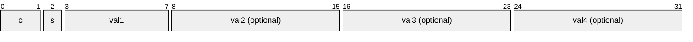
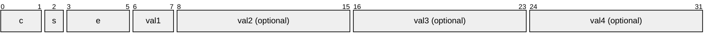
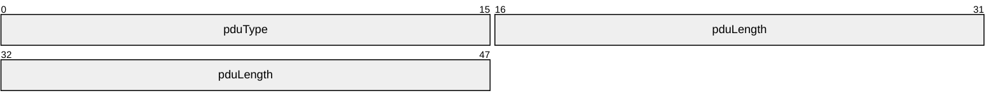
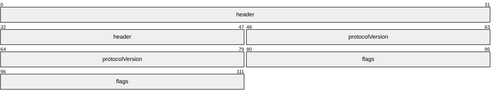
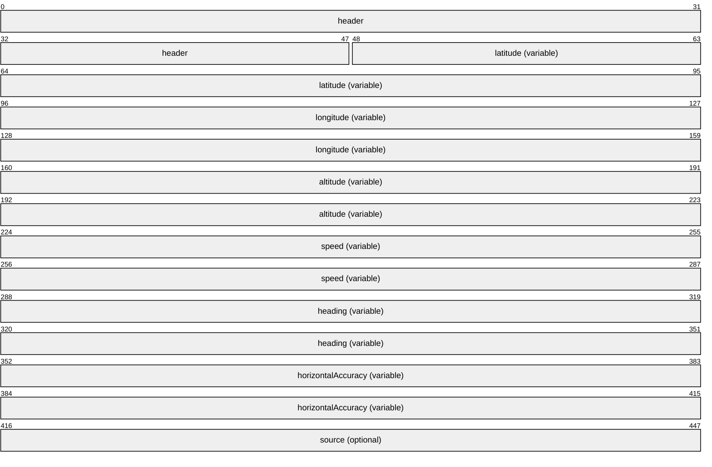
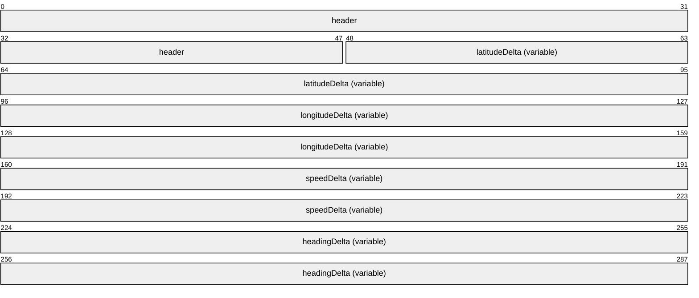
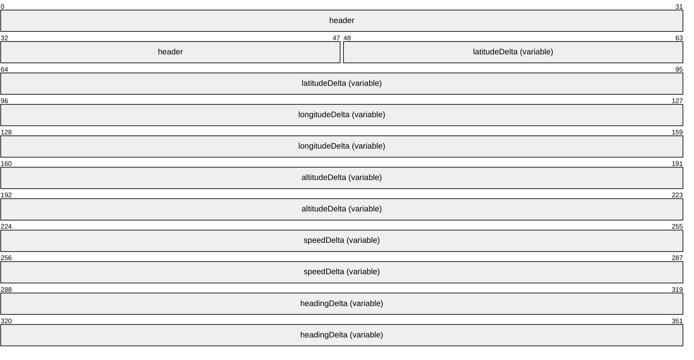

# [MS-RDPEL]: Remote Desktop Protocol: Location Virtual Channel Extension

Table of Contents

1 Introduction

- [1 Introduction](#Section_1)
  - [1.1 Glossary](#Section_1.1)
  - [1.2 References](#Section_1.2)
    - [1.2.1 Normative References](#Section_1.2.1)
    - [1.2.2 Informative References](#Section_1.2.2)
  - [1.3 Overview](#Section_1.3)
  - [1.4 Relationship to Other Protocols](#Section_1.4)
  - [1.5 Prerequisites/Preconditions](#Section_1.5)
  - [1.6 Applicability Statement](#Section_1.6)

2 Messages

- [2 Messages](#Section_2)
  - [2.1 Transport](#Section_2.1)
  - [2.2 Message Syntax](#Section_2.2)
    - [2.2.1 Common Data Types](#Section_2.2.1)
      - [2.2.1.1 FOUR_BYTE_SIGNED_INTEGER](#Section_2.2.1.1)
      - [2.2.1.2 FOUR_BYTE_FLOAT](#Section_2.2.1.2)
      - [2.2.1.3 RDPLOCATION_HEADER](#Section_2.2.1.3)
    - [2.2.2 Location Messages](#Section_2.2.2)
      - [2.2.2.1 RDPLOCATION_SERVER_READY_PDU](#Section_2.2.2.1)
      - [2.2.2.2 RDPLOCATION_CLIENT_READY_PDU](#Section_2.2.2.2)
      - [2.2.2.3 RDPLOCATION_BASE_LOCATION3D_PDU](#Section_2.2.2.3)
      - [2.2.2.4 RDPLOCATION_LOCATION2D_DELTA_PDU](#Section_2.2.2.4)
      - [2.2.2.5 RDPLOCATION_LOCATION3D_DELTA_PDU](#Section_2.2.2.5)

3 Protocol Details

- [3 Protocol Details](#Section_3)
  - [3.1 Common Details](#Section_3.1)
    - [3.1.1 Abstract Data Model](#Section_3.1.1)
      - [3.1.1.1 Latitude](#Section_3.1.1.1)
      - [3.1.1.2 Longitude](#Section_3.1.1.2)
      - [3.1.1.3 Altitude](#Section_3.1.1.3)
      - [3.1.1.4 Speed](#Section_3.1.1.4)
      - [3.1.1.5 Heading](#Section_3.1.1.5)
    - [3.1.2 Timers](#Section_3.1.2)
    - [3.1.3 Initialization](#Section_3.1.3)
    - [3.1.4 Higher-Layer Triggered Events](#Section_3.1.4)
    - [3.1.5 Message Processing Events and Sequencing Rules](#Section_3.1.5)
      - [3.1.5.1 Processing a Location Message](#Section_3.1.5.1)
    - [3.1.6 Timer Events](#Section_3.1.6)
    - [3.1.7 Other Local Events](#Section_3.1.7)
  - [3.2 Server Details](#Section_3.2)
    - [3.2.1 Abstract Data Model](#Section_3.2.1)
    - [3.2.2 Timers](#Section_3.2.2)
    - [3.2.3 Initialization](#Section_3.2.3)
    - [3.2.4 Higher-Layer Triggered Events](#Section_3.2.4)
    - [3.2.5 Message Processing Events and Sequencing Rules](#Section_3.2.5)
      - [3.2.5.1 Sending an RDPLOCATION_SERVER_READY_PDU Message](#Section_3.2.5.1)
      - [3.2.5.2 Processing an RDPLOCATION_CLIENT_READY_PDU Message](#Section_3.2.5.2)
      - [3.2.5.3 Processing an RDPLOCATION_BASE_LOCATION3D_PDU Message](#Section_3.2.5.3)
      - [3.2.5.4 Processing an RDPLOCATION_LOCATION2D_DELTA_PDU Message](#Section_3.2.5.4)
      - [3.2.5.5 Processing an RDPLOCATION_LOCATION3D_DELTA_PDU Message](#Section_3.2.5.5)
    - [3.2.6 Timer Events](#Section_3.2.6)
    - [3.2.7 Other Local Events](#Section_3.2.7)
  - [3.3 Client Details](#Section_3.3)
    - [3.3.1 Abstract Data Model](#Section_3.3.1)
    - [3.3.2 Timers](#Section_3.3.2)
    - [3.3.3 Initialization](#Section_3.3.3)
    - [3.3.4 Higher-Layer Triggered Events](#Section_3.3.4)
    - [3.3.5 Message Processing Events and Sequencing Rules](#Section_3.3.5)
      - [3.3.5.1 Processing an RDPLOCATION_SERVER_READY_PDU Message](#Section_3.3.5.1)
      - [3.3.5.2 Sending an RDPLOCATION_CLIENT_READY_PDU Message](#Section_3.3.5.2)
      - [3.3.5.3 Sending an RDPLOCATION_BASE_LOCATION3D_PDU Message](#Section_3.3.5.3)
      - [3.3.5.4 Sending an RDPLOCATION_LOCATION2D_DELTA_PDU Message](#Section_3.3.5.4)
      - [3.3.5.5 Sending an RDPLOCATION_LOCATION3D_DELTA_PDU Message](#Section_3.3.5.5)
    - [3.3.6 Timer Events](#Section_3.3.6)
    - [3.3.7 Other Local Events](#Section_3.3.7)

4 Protocol Examples

- [4 Protocol Examples](#Section_4)

5 Security

- [5 Security](#Section_5)
  - [5.1 Security Considerations for Implementers](#Section_5.1)
  - [5.2 Index of Security Parameters](#Section_5.2)

6 Appendix A: Product Behavior

- [6 Appendix A: Product Behavior](#Section_6)

7 Change Tracking

- [7 Change Tracking](#Section_7)

For the legal notice and IP terms, see [LEGAL.md](../LEGAL.md).
Last updated: 4/23/2024.
See [Revision History](#revision-history) for full version history.

# 1 Introduction

The Remote Desktop Protocol: Location Virtual Channel Extension (RDPEL) applies to the Remote Desktop Protocol: Basic Connectivity and Graphics Remoting, as defined in [MS-RDPBCGR](../MS-RDPBCGR/MS-RDPBCGR.md). RDPEL is used to remote physical location parameters such as latitude, longitude, altitude, speed, and heading from a terminal server client to a terminal server. The current physical location of the client is encoded and then sent on the wire to the server. After this location data is received and decoded by the server, it is injected into the session associated with the remote user, effectively remoting the location parameters of the client.

Sections 1.5, 1.8, 1.9, 2, and 3 of this specification are normative. All other sections and examples in this specification are informative.

## 1.1 Glossary

This document uses the following terms:

**ANSI character**: An 8-bit Windows-1252 character set unit.

**little-endian**: Multiple-byte values that are byte-ordered with the least significant byte stored in the memory location with the lowest address.

**protocol data unit (PDU)**: Information that is delivered as a unit among peer entities of a network and that can contain control information, address information, or data. For more information on remote procedure call (RPC)-specific PDUs, see [[C706]](https://go.microsoft.com/fwlink/?LinkId=89824) section 12.

**terminal server**: The server to which a client initiates a remote desktop connection. The server hosts Remote Desktop sessions and enables interaction with each of these sessions on a connected client device.

**MAY, SHOULD, MUST, SHOULD NOT, MUST NOT:** These terms (in all caps) are used as defined in [[RFC2119]](https://go.microsoft.com/fwlink/?LinkId=90317). All statements of optional behavior use either MAY, SHOULD, or SHOULD NOT.

## 1.2 References

Links to a document in the Microsoft Open Specifications library point to the correct section in the most recently published version of the referenced document. However, because individual documents in the library are not updated at the same time, the section numbers in the documents may not match. You can confirm the correct section numbering by checking the [Errata](https://go.microsoft.com/fwlink/?linkid=850906).

### 1.2.1 Normative References

We conduct frequent surveys of the normative references to assure their continued availability. If you have any issue with finding a normative reference, please contact [dochelp@microsoft.com](mailto:dochelp@microsoft.com). We will assist you in finding the relevant information.

[MS-RDPEDYC] Microsoft Corporation, "[Remote Desktop Protocol: Dynamic Channel Virtual Channel Extension](../MS-RDPEDYC/MS-RDPEDYC.md)".

[RFC2119] Bradner, S., "Key words for use in RFCs to Indicate Requirement Levels", BCP 14, RFC 2119, March 1997, [https://www.rfc-editor.org/info/rfc2119](https://go.microsoft.com/fwlink/?LinkId=90317)

### 1.2.2 Informative References

[MS-RDPBCGR] Microsoft Corporation, "[Remote Desktop Protocol: Basic Connectivity and Graphics Remoting](../MS-RDPBCGR/MS-RDPBCGR.md)".

## 1.3 Overview

The Remote Desktop Protocol: Location Virtual Channel Extension (RDPEL), defined in section [2.2](#Section_2.2), adds the ability to redirect the client's location (latitude, longitude and altitude) to a server so that location-based services running in a user session can provide a more contextualized experience where possible. It is used to remote physical location parameters such as latitude, longitude, altitude, speed, and heading from a terminal server client to a [**terminal server**](#gt_terminal-server) .

An example message flow that encapsulates the protocol phases and all the location protocol messages described in section [2.2.2](#Section_2.2.2) is presented in the following figure.

**Figure 1: Messages exchanged by the location protocol endpoints**

The location protocol is divided into two distinct phases:

- Initializing Phase
- Running Phase
The Initializing Phase occurs at the start of the connection. During this phase, the server and client exchange the RDPLOCATION_SERVER_READY_PDU (section [2.2.2.1](#Section_2.2.2.1)) and RDPLOCATION_CLIENT_READY_PDU (section [2.2.2.2](#Section_2.2.2.2)) messages. The server initiates this exchange when the dynamic virtual channel (sections [1.4](#Section_1.4) and [2.1](#Section_2.1)) over which the location update messages will flow has been opened.

Once both endpoints are ready, the Running Phase is entered. During this phase, the client sends periodic location updates to the server encapsulated in the RDPLOCATION_BASE_LOCATION3D_PDU (section [2.2.2.3](#Section_2.2.2.3)), RDPLOCATION_LOCATION2D_DELTA_PDU (section [2.2.2.4](#Section_2.2.2.4)), and RDPLOCATION_LOCATION3D_DELTA_PDU (section [2.2.2.5](#Section_2.2.2.5)) messages. The server decodes these updates and injects them into the user's session to ensure that any location-aware applications remain in-sync with the client's current position, altitude, speed, and heading.

## 1.4 Relationship to Other Protocols

The Remote Desktop Protocol: Location Virtual Channel Extension is embedded in a dynamic virtual channel transport, as specified in [MS-RDPEDYC](../MS-RDPEDYC/MS-RDPEDYC.md) sections 1 to 3.

## 1.5 Prerequisites/Preconditions

The Remote Desktop Protocol: Location Virtual Channel Extension operates only after the dynamic virtual channel transport is fully established. If the dynamic virtual channel transport is terminated, the Remote Desktop Protocol: Location Virtual Channel Extension is also terminated. The protocol is terminated by closing the underlying virtual channel. For details about closing the dynamic virtual channel, see [MS-RDPEDYC](../MS-RDPEDYC/MS-RDPEDYC.md) section 3.2.5.2.

## 1.6 Applicability Statement

The Remote Desktop Protocol: Location Virtual Channel Extension is applicable in scenarios where the location of the client device is required to provide a more relevant and contextually accurate user experience in the remote session hosted on a [**terminal server**](#gt_terminal-server).

# 2 Messages

## 2.1 Transport

The Remote Desktop Protocol: Location Virtual Channel Extension is designed to operate over a dynamic virtual channel, as specified in [MS-RDPEDYC](../MS-RDPEDYC/MS-RDPEDYC.md) sections 1 to 3. The dynamic virtual channel name is the null-terminated [**ANSI character**](#gt_ansi-character) string "Microsoft::Windows::RDS::Location". The usage of channel names in the context of opening a dynamic virtual channel is specified in [MS-RDPEDYC] section 2.2.2.1.

## 2.2 Message Syntax

The following sections specify the Remote Desktop Protocol: Location Virtual Channel Extension message syntax. All multiple-byte fields within a message MUST be marshaled in [**little-endian**](#gt_little-endian) byte order, unless otherwise specified.

### 2.2.1 Common Data Types

#### 2.2.1.1 FOUR_BYTE_SIGNED_INTEGER

The **FOUR_BYTE_SIGNED_INTEGER** structure is used to encode a value in the range -0x1FFFFFFF to 0x1FFFFFFF by using a variable number of bytes. The three most significant bits of the first byte encode the number of bytes in the structure and the sign.

**c (2 bits):** A 2-bit unsigned integer field containing an encoded representation of the number of bytes in this structure.

| Value | Meaning |
| --- | --- |
| ONE_BYTE_VAL 0 | Implies that the optional **val2**, **val3**, and **val4** fields are not present. Hence, the structure is 1 byte in size. |
| TWO_BYTE_VAL 1 | Implies that the optional **val2** field is present, while the optional **val3** and **val4** fields are not present. Hence, the structure is 2 bytes in size. |
| THREE_BYTE_VAL 2 | Implies that the optional **val2** and **val3** fields are present, while the optional **val4** field is not present. Hence, the structure is 3 bytes in size. |
| FOUR_BYTE_VAL 3 | Implies that the optional **val2**, **val3**, and **val4** fields are all present. Hence, the structure is 4 bytes in size. |

**S (1 bit):** A 1-bit unsigned integer field containing an encoded representation of whether the value is positive or negative.

| Value | Meaning |
| --- | --- |
| POSITIVE_VAL 0 | Implies that the value represented by this structure is positive. |
| NEGATIVE_VAL 1 | Implies that the value represented by this structure is negative. |

**Val1 (5 bits):** A 5-bit unsigned integer field containing the most significant 5 bits of the value represented by this structure.

**Val2 (1 byte, optional):** An 8-bit unsigned integer containing the second most significant bits of the value represented by this structure.

**Val3 (1 byte, optional):** An 8-bit unsigned integer containing the third most significant bits of the value represented by this structure.

**Val4 (1 byte, optional):** An 8-bit unsigned integer containing the least significant bits of the value represented by this structure.

#### 2.2.1.2 FOUR_BYTE_FLOAT

The **FOUR_BYTE_FLOAT** structure is used to encode a value in the range -0x3FFFFFF to 0x3FFFFFF to a precision of seven decimal places by using a variable number of bytes. The six most significant bits of the first byte encode the number of bytes in the structure, the sign and the exponent that MUST be used to reconstruct the value.

Depending on the value of the field **c**:

value = (-1 ^ s) * (val1 / (10 ^ e)) or

value = (-1 ^ s) * (((val1 << 8) + val2) / (10 ^ e)) or

value = (-1 ^ s) * (((val1 << 16) + (val2 << 8) + val3) / (10 ^ e)) or

value = (-1 ^ s) * (((val1 << 24) + (val2 << 16) + (val3 << 8) + val4) / (10 ^ e))

**c (2 bits):** A 2-bit unsigned integer field containing an encoded representation of the number of bytes in this structure.

| Value | Meaning |
| --- | --- |
| ONE_BYTE_VAL 0 | Implies that the optional **val2**, **val3**, and **val4** fields are not present. Hence, the structure is 1 byte in size. |
| TWO_BYTE_VAL 1 | Implies that the optional **val2** field is present, while the optional **val3** and **val4** fields are not present. Hence, the structure is 2 bytes in size. |
| THREE_BYTE_VAL 2 | Implies that the optional **val2** and **val3** fields are present, while the optional **val4** field is not present. Hence, the structure is 3 bytes in size. |
| FOUR_BYTE_VAL 3 | Implies that the optional **val2**, **val3**, and **val4** fields are all present. Hence, the structure is 4 bytes in size. |

**s (1 bit)**: A 1-bit unsigned integer field containing an encoded representation of whether the value is positive or negative.

| Value | Meaning |
| --- | --- |
| POSITIVE_VAL 0 | Implies that the value represented by this structure is positive. |
| NEGATIVE_VAL 1 | Implies that the value represented by this structure is negative. |

**e (3 bits):** A 3-bit unsigned integer field containing the exponent of the value represented by this structure.

**val1 (2 bits):** A 2-bit unsigned integer field containing the most significant 2 bits of the value represented by this structure.

**val2 (1 byte, optional):** An 8-bit unsigned integer containing the second most significant bits of the value represented by this structure.

**val3 (1 byte, optional):** An 8-bit unsigned integer containing the third most significant bits of the value represented by this structure.

**val4 (1 byte, optional):** An 8-bit unsigned integer containing the least significant bits of the value represented by this structure.

#### RDPLOCATION_HEADER

The **RDPLOCATION_HEADER** structure is included in all location [**protocol data units (PDUs)**](#gt_protocol-data-unit-pdu) and is used to identify the type and specify the length of the PDU.

**pduType (2 bytes):** A 16-bit unsigned integer that identifies the type of the location PDU.

| Value | Meaning |
| --- | --- |
| PDUTYPE_SERVER_READY 0x0001 | RDPLOCATION_SERVER_READY_PDU (section [2.2.2.1](#Section_2.2.2.1)) |
| PDUTYPE_CLIENT_READY 0x0002 | RDPLOCATION_CLIENT_READY_PDU (section [2.2.2.2](#Section_2.2.2.2)) |
| PDUTYPE_BASE_LOCATION3D 0x0003 | RDPLOCATION_BASE_LOCATION3D_PDU (section [2.2.2.3](#Section_2.2.2.3)) |
| PDUTYPE_LOCATION2D_DELTA 0x0004 | RDPLOCATION_LOCATION2D_DELTA_PDU (section [2.2.2.4](#Section_2.2.2.4)) |
| PDUTYPE_LOCATION3D_DELTA 0x0005 | RDPLOCATION_LOCATION3D_DELTA_PDU (section [2.2.2.5](#Section_2.2.2.5)) |

**pduLength (4 bytes)**: A 32-bit unsigned integer that specifies the length of the location PDU in bytes. This value MUST include the length of the **RDPLOCATION_HEADER** (6 bytes).

### 2.2.2 Location Messages

#### 2.2.2.1 RDPLOCATION_SERVER_READY_PDU

The RDPLOCATION_SERVER_READY_PDU message is sent by the server endpoint and is used to indicate readiness to commence with location remoting transactions.

**header (6 bytes):** An RDPLOCATION_HEADER (section [2.2.1.3](#Section_2.2.1.3)) structure. The **pduType** field MUST be set to PDUTYPE_SERVER_READY (0x0001).

**protocolVersion (4 bytes):** A 32-bit unsigned integer that specifies the location protocol version supported by the server.

| Value | Meaning |
| --- | --- |
| RDPLOCATION_PROTOCOL_VERSION_100 0x00010000 | Version 1.0.0 of the RDP location remoting protocol. Servers advertising this version support the remoting of latitude, longitude, and altitude. |
| RDPLOCATION_PROTOCOL_VERSION_200 0x00020000 | Version 2.0.0 of the RDP location remoting protocol. Servers advertising this version support the remoting of latitude, longitude, altitude, speed, heading, horizontal accuracy, and source. |

**flags (4 bytes, optional):** An optional 32-bit unsigned integer that contains protocol initialization flags. There are currently no flags to insert into this field.

#### 2.2.2.2 RDPLOCATION_CLIENT_READY_PDU

The RDPLOCATION_CLIENT_READY_PDU message is sent by the client endpoint and is used to indicate readiness to commence with location remoting transactions.

**header (6 bytes):** An RDPLOCATION_HEADER (section [2.2.1.3](#Section_2.2.1.3)) structure. The **pduType** field MUST be set to PDUTYPE_CLIENT_READY (0x0002).

**protocolVersion (4 bytes):** A 32-bit unsigned integer that specifies the location protocol version supported by the client.

| Value | Meaning |
| --- | --- |
| RDPLOCATION_PROTOCOL_VERSION_100 0x00010000 | Version 1.0.0 of the RDP location remoting protocol. Clients advertising this version support the remoting of latitude, longitude, and altitude. |
| RDPLOCATION_PROTOCOL_VERSION_200 0x00020000 | Version 2.0.0 of the RDP location remoting protocol. Clients advertising this version support the remoting of latitude, longitude, altitude, speed, heading, horizontal accuracy and source. |

**flags (4 bytes, optional):** An optional 32-bit unsigned integer that contains protocol initialization flags. Currently there are no flags to insert into this field.

#### 2.2.2.3 RDPLOCATION_BASE_LOCATION3D_PDU

The RDPLOCATION_BASE_LOCATION3D_PDU message is sent by the client endpoint and is used to specify the physical location and attributes related to the client’s position and movement.

**header (6 bytes):** An RDPLOCATION_HEADER (section [2.2.1.3](#Section_2.2.1.3)) structure. The **pduType** field MUST be set to PDUTYPE_BASE_LOCATION3D (0x0003).

**latititude (variable):** A FOUR_BYTE_FLOAT (section [2.2.1.2](#Section_2.2.1.2)) structure that specifies the latitude in degrees.

**longitude (variable):** A FOUR_BYTE_FLOAT (section 2.2.2.2) structure that specifies the longitude in degrees.

**altitude (variable):** A FOUR_BYTE_SIGNED_INTEGER (section [2.2.1.1](#Section_2.2.1.1)) structure that specifies the altitude in meters.

**speed (variable):** An optional FOUR_BYTE_FLOAT (section 2.2.2.2) structure that specifies the speed in meters per second.

**heading (variable):** An optional FOUR_BYTE_FLOAT (section 2.2.2.2) structure that specifies the heading in degrees. This field MUST be present if the **speed** field is present.

**horizontalAccuracy (variable):** An optional FOUR_BYTE_FLOAT (section 2.2.2.2) structure that specifies the horizontal accuracy in meters. This field MUST be present if the **heading** field is present.

**source (1 byte):** An optional 8-bit unsigned integer that specifies the source of the location data. This field MUST be present if the **horizontalAccuracy** field is present.

| Value | Meaning |
| --- | --- |
| LOCATIONSOURCE_IP 0x00 | IP address |
| LOCATIONSOURCE_WIFI 0x01 | WiFi |
| LOCATIONSOURCE_CELL 0x02 | Cellular |
| LOCATIONSOURCE_GNSS 0x03 | Global Navigation Satellite System |

#### 2.2.2.4 RDPLOCATION_LOCATION2D_DELTA_PDU

The RDPLOCATION_LOCATION2D_DELTA_PDU message is sent by the client endpoint and is used to specify a change in location that does not include altitude.

**header (6 bytes):** An RDPLOCATION_HEADER (section [2.2.1.3](#Section_2.2.1.3)) structure. The **pduType** field MUST be set to PDUTYPE_LOCATION2D_DELTA (0x0004).

**latititudeDelta (variable):** A FOUR_BYTE_FLOAT (section [2.2.1.2](#Section_2.2.1.2)) structure that specifies the change in latitude since the last location update.

currentLatitude = previousLatitude - **latitudeDelta**

**longitudeDelta (variable):** A FOUR_BYTE_FLOAT (section 2.2.2.2) structure that specifies the change in longitude since the last location update.

currentLongitude = previousLongitude - **longitudeDelta**

**speedDelta (variable):** A FOUR_BYTE_FLOAT (section 2.2.2.2) structure that specifies the change in speed since the last location update.

currentSpeed = previousSpeed - **speedDelta**

**headingDelta (variable):** A FOUR_BYTE_FLOAT (section 2.2.2.2) structure that specifies the change in heading since the last location update.

currentHeading = previousHeading – **headingDelta**

This field MUST be present if the **speedDelta** field is present.

#### 2.2.2.5 RDPLOCATION_LOCATION3D_DELTA_PDU

The RDPLOCATION_LOCATION3D_DELTA_PDU message is sent by the client endpoint and is used to specify a change in location.

**header (6 bytes):** An RDPLOCATION_HEADER (section [2.2.1.3](#Section_2.2.1.3)) structure. The **pduType** field MUST be set to PDUTYPE_LOCATION3D_DELTA (0x0005).

**latititudeDelta (variable):** A FOUR_BYTE_FLOAT (section [2.2.1.2](#Section_2.2.1.2)) structure that that specifies the change in latitude since the last location update.

currentLatitude = previousLatitude - **latitudeDelta**

**longitudeDelta (variable):** A FOUR_BYTE_FLOAT (section 2.2.2.2) structure that specifies the change in longitude since the last location update.

currentLongitude = previousLongitude - **longitudeDelta**

**altitudeDelta (variable):** A FOUR_BYTE_SIGNED_INTEGER (section [2.2.1.1](#Section_2.2.1.1)) structure that specifies the change in altitude since the last location update.

currentAltitude = previousAltitude - **altitudeDelta**

**speedDelta (variable):** A FOUR_BYTE_FLOAT (section 2.2.2.2) structure that specifies the change in speed since the last location update.

currentSpeed = previousSpeed - **speedDelta**

**headingDelta (variable):** A FOUR_BYTE_FLOAT (section 2.2.2.2) structure that specifies the change in heading since the last location update.

currentHeading = previousHeading – **headingDelta**

This field MUST be present if the **speedDelta** field is present.

# 3 Protocol Details

## 3.1 Common Details

### 3.1.1 Abstract Data Model

This section describes a conceptual model of possible data organization that an implementation maintains to participate in this protocol. The described organization is provided to facilitate the explanation of how the protocol behaves. This document does not mandate that implementations adhere to this model as long as their external behavior is consistent with that described in this document.

**Note** It is possible to implement the following conceptual data by using a variety of techniques as long as the implementation produces external behavior that is consistent with that described in this document.

#### 3.1.1.1 Latitude

The Latitude store contains the most recently sent or received client latitude and is used as the basis for delta calculations. This store MUST be updated when sending or processing the RDPLOCATION_BASE_LOCATION3D_PDU (section [2.2.2.3](#Section_2.2.2.3)), RDPLOCATION_LOCATION2D_DELTA_PDU (section [2.2.2.4](#Section_2.2.2.4)), or RDPLOCATION_LOCATION3D_DELTA_PDU (section [2.2.2.5](#Section_2.2.2.5)) messages.

#### 3.1.1.2 Longitude

The Longitude store contains the most recently sent or received client longitude and is used as the basis for delta calculations. This store MUST be updated when sending or processing the RDPLOCATION_BASE_LOCATION3D_PDU (section [2.2.2.3](#Section_2.2.2.3)), RDPLOCATION_LOCATION2D_DELTA_PDU (section [2.2.2.4](#Section_2.2.2.4)), or RDPLOCATION_LOCATION3D_DELTA_PDU (section [2.2.2.5](#Section_2.2.2.5)) messages.

#### 3.1.1.3 Altitude

The Altitude store contains the most recently sent or received client altitude and is used as the basis for delta calculations. This store MUST be updated when sending or processing the RDPLOCATION_BASE_LOCATION3D_PDU (section [2.2.2.3](#Section_2.2.2.3)), RDPLOCATION_LOCATION2D_DELTA_PDU (section [2.2.2.4](#Section_2.2.2.4)) or RDPLOCATION_LOCATION3D_DELTA_PDU (section [2.2.2.5](#Section_2.2.2.5)) messages.

#### 3.1.1.4 Speed

The Speed store contains the most recently sent or received client speed and is used as the basis for delta calculations. This store MUST be updated when sending or processing the RDPLOCATION_BASE_LOCATION3D_PDU (section [2.2.2.3](#Section_2.2.2.3)), RDPLOCATION_LOCATION2D_DELTA_PDU (section [2.2.2.4](#Section_2.2.2.4)) or RDPLOCATION_LOCATION3D_DELTA_PDU (section [2.2.2.5](#Section_2.2.2.5)) messages.

#### 3.1.1.5 Heading

The Heading store contains the most recently sent or received client heading and is used as the basis for delta calculations. This store MUST be updated when sending or processing the RDPLOCATION_BASE_LOCATION3D_PDU (section [2.2.2.3](#Section_2.2.2.3)), RDPLOCATION_LOCATION2D_DELTA_PDU (section [2.2.2.4](#Section_2.2.2.4)) or RDPLOCATION_LOCATION3D_DELTA_PDU (section [2.2.2.5](#Section_2.2.2.5)) messages.

### 3.1.2 Timers

None.

### 3.1.3 Initialization

None.

### 3.1.4 Higher-Layer Triggered Events

None.

### 3.1.5 Message Processing Events and Sequencing Rules

#### 3.1.5.1 Processing a Location Message

All location messages are prefaced by the RDPLOCATION_HEADER (section [2.2.1.3](#Section_2.2.1.3)) structure.

When a location message is processed, the **pduType** field in the header MUST first be examined to determine if the message is within the subset of expected messages as described in section [1.3](#Section_1.3). If the message is not expected, it SHOULD be ignored.

If the message is in the correct sequence, the **pduLength** field MUST be examined to make sure that it is consistent with the amount of data read from the "Microsoft::Windows::RDS::Location" dynamic virtual channel (section [2.1](#Section_2.1)). If this is not the case, the message SHOULD be ignored.

### 3.1.6 Timer Events

None.

### 3.1.7 Other Local Events

None.

## 3.2 Server Details

### 3.2.1 Abstract Data Model

None.

### 3.2.2 Timers

None.

### 3.2.3 Initialization

The server MUST send the RDPLOCATION_SERVER_READY_PDU (section [2.2.2.1](#Section_2.2.2.1)) message to the client, as specified in section [3.2.5.1](#Section_3.2.5.1), to initiate the process of remoting location data.

### 3.2.4 Higher-Layer Triggered Events

None.

### 3.2.5 Message Processing Events and Sequencing Rules

#### 3.2.5.1 Sending an RDPLOCATION_SERVER_READY_PDU Message

The structure and fields of the RDPLOCATION_SERVER_READY_PDU message are specified in section [2.2.2.1](#Section_2.2.2.1).

If the server does not support location injection, then it MUST NOT send this [**PDU**](#gt_protocol-data-unit-pdu) to the client. The protocolVersion field SHOULD be set to at least RDPLOCATION_PROTOCOL_V200 (0x00020000) if the server supports the injection of speed, heading, horizontal accuracy and source location data.

#### 3.2.5.2 Processing an RDPLOCATION_CLIENT_READY_PDU Message

The structure and fields of the RDPLOCATION_CLIENT_READY_PDU message are specified in section [2.2.2.2](#Section_2.2.2.2).

The **header** field MUST be processed as specified in section section [3.1.5.1](#Section_3.1.5.1). If the message is valid, the server SHOULD perform any necessary steps to initialize the location injection subsystem.

#### 3.2.5.3 Processing an RDPLOCATION_BASE_LOCATION3D_PDU Message

The structure and fields of the RDPLOCATION_BASE_LOCATION3D_PDU message are specified in section [2.2.2.3](#Section_2.2.2.3).

The header field MUST be processed as specified in section [3.1.5.1](#Section_3.1.5.1). If the message is valid, the server MUST extract the location data and inject it into the user session. After injecting the location data, the server MUST store the latitude, longitude, altitude, speed and heading to ensure that subsequent RDPLOCATION_LOCATION2D_DELTA_PDU (section [2.2.2.4](#Section_2.2.2.4)) and RDPLOCATION_LOCATION3D_DELTA_PDU (section [2.2.2.5](#Section_2.2.2.5)) messages can be processed.

#### 3.2.5.4 Processing an RDPLOCATION_LOCATION2D_DELTA_PDU Message

The structure and fields of the RDPLOCATION_LOCATION2D_DELTA_PDU message are specified in section [2.2.2.4](#Section_2.2.2.4).

The **header** field MUST be processed as specified in section [3.1.5.1](#Section_3.1.5.1). If the message is valid, the server MUST extract the location deltas, compute the current values (using the Abstract Data Model defined in section [3.1.1](#Section_3.1.1)), and inject the updated location data into the user session. After injecting the location data, the server MUST update the Abstract Data Model by storing the updated latitude, longitude, altitude, speed, and heading to ensure that subsequent RDPLOCATION_LOCATION2D_DELTA_PDU (section 2.2.3.4) and RDPLOCATION_LOCATION3D_DELTA_PDU (section [2.2.2.5](#Section_2.2.2.5)) messages can be processed.

#### 3.2.5.5 Processing an RDPLOCATION_LOCATION3D_DELTA_PDU Message

The structure and fields of the RDPLOCATION_LOCATION3D_DELTA_PDU message are specified in section [2.2.2.5](#Section_2.2.2.5).

The **header** field MUST be processed as specified in section [3.1.5.1](#Section_3.1.5.1). If the message is valid, the server MUST extract the location deltas, compute the current values (using the Abstract Data Model defined in section [3.1.1](#Section_3.1.1)), and inject the updated location data into the user session. After injecting the location data, the server MUST update the Abstract Data Model by storing the updated latitude, longitude, altitude, speed and heading to ensure that subsequent RDPLOCATION_LOCATION2D_DELTA_PDU (section [2.2.2.4](#Section_2.2.2.4)) and RDPLOCATION_LOCATION3D_DELTA_PDU (section 2.2.3.5) messages can be processed.

### 3.2.6 Timer Events

None.

### 3.2.7 Other Local Events

None.

## 3.3 Client Details

### 3.3.1 Abstract Data Model

None.

### 3.3.2 Timers

None.

### 3.3.3 Initialization

The client SHOULD NOT open the "Microsoft::Windows::RDS::Location" virtual channel transport (section [2.1](#Section_2.1)) if it is unable to query the local subsystem for location data. The client MUST send the RDPLOCATION_CLIENT_READY_PDU (section [2.2.2.2](#Section_2.2.2.2)) message to the server, as specified in section [3.3.5.2](#Section_3.3.5.2), to initiate the process of remoting location data.

### 3.3.4 Higher-Layer Triggered Events

None.

### 3.3.5 Message Processing Events and Sequencing Rules

#### 3.3.5.1 Processing an RDPLOCATION_SERVER_READY_PDU Message

The structure and fields of the RDPLOCATION_SERVER_READY_PDU message are specified in section [2.2.2.1](#Section_2.2.2.1).

The header field MUST be processed as specified in section [3.1.5.1](#Section_3.1.5.1). If the message is valid, the client SHOULD initialize the location acquisition subsystem and then send an RDPLOCATION_CLIENT_READY_PDU (section [2.2.2.2](#Section_2.2.2.2)) message to the server, as specified in section [3.3.5.2](#Section_3.3.5.2).

#### 3.3.5.2 Sending an RDPLOCATION_CLIENT_READY_PDU Message

The structure and fields of the RDPLOCATION_CLIENT_READY_PDU message are specified in section [2.2.2.2](#Section_2.2.2.2).

If the client does not support location remoting, then it MUST NOT send this PDU to the server. The **protocolVersion** field SHOULD be set to at least RDPLOCATION_PROTOCOL_V200 (0x00020000) if the client supports the acquisition and sending of speed, heading, horizontal accuracy and location data source.

#### 3.3.5.3 Sending an RDPLOCATION_BASE_LOCATION3D_PDU Message

The structure and fields of the RDPLOCATION_BASE_LOCATION3D_PDU message are specified in section [2.2.2.3](#Section_2.2.2.3).

After encoding and transmitting the location data, the client MUST store the latitude, longitude, altitude, speed, and heading in the Abstract Data Model (section [3.1.1](#Section_3.1.1)) to ensure that subsequent RDPLOCATION_LOCATION2D_DELTA_PDU (section [2.2.2.4](#Section_2.2.2.4)) and RDPLOCATION_LOCATION3D_DELTA_PDU (section [2.2.2.5](#Section_2.2.2.5)) messages can be constructed and transmitted.

#### 3.3.5.4 Sending an RDPLOCATION_LOCATION2D_DELTA_PDU Message

The structure and fields of the RDPLOCATION_LOCATION2D_DELTA_PDU message are specified in section [2.2.2.4](#Section_2.2.2.4).

The latitude, longitude, speed, and heading stored in the Abstract Data Model (section [3.1.1](#Section_3.1.1)) MUST be used to calculate the value for each delta field.

**latitudeDelta** = previousLatitude – currentLatitude

**longitudeDelta** = previousLongitude – currentLongitude

**speedDelta** = previousSpeed – currentSpeed

**headingDelta** = previousHeading – currentHeading

After encoding and transmitting the location data, the client MUST update the Abstract Data Model with the current latitude, longitude, speed, and heading.

#### 3.3.5.5 Sending an RDPLOCATION_LOCATION3D_DELTA_PDU Message

The structure and fields of the RDPLOCATION_LOCATION3D_DELTA_PDU message are specified in section [2.2.2.5](#Section_2.2.2.5).

The values stored in the Abstract Data Model (section [3.1.1](#Section_3.1.1)) MUST be used to calculate the value for each delta field.

**latitudeDelta** = previousLatitude – currentLatitude

**longitudeDelta** = previousLongitude – currentLongitude

**altitudeDelta** = previousAltitude– currentAltitude

**speedDelta** = previousSpeed – currentSpeed

**headingDelta** = previousHeading – currentHeading

After encoding and transmitting the location data, the client MUST update the Abstract Data Model with the current latitude, longitude, altitude, speed, and heading.

### 3.3.6 Timer Events

None.

### 3.3.7 Other Local Events

None.

# 4 Protocol Examples

None.

# 5 Security

## 5.1 Security Considerations for Implementers

None.

## 5.2 Index of Security Parameters

None.

# 6 Appendix A: Product Behavior

The information in this specification is applicable to the following Microsoft products or supplemental software. References to product versions include updates to those products.

- Windows 11 operating system
- Windows Server 2022, 23H2 operating system
- Windows Server 2025 operating system
Exceptions, if any, are noted in this section. If an update version, service pack or Knowledge Base (KB) number appears with a product name, the behavior changed in that update. The new behavior also applies to subsequent updates unless otherwise specified. If a product edition appears with the product version, behavior is different in that product edition.

Unless otherwise specified, any statement of optional behavior in this specification that is prescribed using the terms "SHOULD" or "SHOULD NOT" implies product behavior in accordance with the SHOULD or SHOULD NOT prescription. Unless otherwise specified, the term "MAY" implies that the product does not follow the prescription.

# 7 Change Tracking

This section identifies changes that were made to this document since the last release. Changes are classified as Major, Minor, or None.

The revision class **Major** means that the technical content in the document was significantly revised. Major changes affect protocol interoperability or implementation. Examples of major changes are:

- A document revision that incorporates changes to interoperability requirements.
- A document revision that captures changes to protocol functionality.
The revision class **Minor** means that the meaning of the technical content was clarified. Minor changes do not affect protocol interoperability or implementation. Examples of minor changes are updates to clarify ambiguity at the sentence, paragraph, or table level.

The revision class **None** means that no new technical changes were introduced. Minor editorial and formatting changes may have been made, but the relevant technical content is identical to the last released version.

The changes made to this document are listed in the following table. For more information, please contact [dochelp@microsoft.com](mailto:dochelp@microsoft.com).

| Section | Description | Revision class |
| --- | --- | --- |
| [6](#Section_6) Appendix A: Product Behavior | Added Windows Server 2025 to the list of applicable products. | Major |

## Revision History

| Date | Version | Revision Class | Comments |
| --- | --- | --- | --- |
| 9/20/2023 | 1.0 | New | Released new document. |
| 9/20/2023 | 1.0 | None | No changes to the meaning, language, or formatting of the technical content. |
| 4/23/2024 | 2.0 | Major | Significantly changed the technical content. |
