# [MS-RDPELE]: Remote Desktop Protocol: Licensing Extension

Table of Contents

1 Introduction

- [1 Introduction](#Section_1)
  - [1.1 Glossary](#Section_1.1)
  - [1.2 References](#Section_1.2)
    - [1.2.1 Normative References](#Section_1.2.1)
    - [1.2.2 Informative References](#Section_1.2.2)
  - [1.3 Overview](#Section_1.3)
    - [1.3.1 Licensing Architecture](#Section_1.3.1)
    - [1.3.2 X.509 Certificate Chains](#Section_1.3.2)
    - [1.3.3 Licensing PDU Flows](#Section_1.3.3)
      - [1.3.3.1 New License Flow](#Section_1.3.3.1)
      - [1.3.3.2 Upgrade License Flow](#Section_1.3.3.2)
  - [1.4 Relationship to Other Protocols](#Section_1.4)
  - [1.5 Prerequisites/Preconditions](#Section_1.5)
  - [1.6 Applicability Statement](#Section_1.6)
  - [1.7 Versioning and Capability Negotiation](#Section_1.7)
  - [1.8 Vendor-Extensible Fields](#Section_1.8)
  - [1.9 Standards Assignments](#Section_1.9)

2 Messages

- [2 Messages](#Section_2)
  - [2.1 Transport](#Section_2.1)
  - [2.2 Message Syntax](#Section_2.2)
    - [2.2.1 Common Data Structures](#Section_2.2.1)
      - [2.2.1.1 Security Headers](#Section_2.2.1.1)
        - [2.2.1.1.1 Basic (TS_SECURITY_HEADER)](#Section_2.2.1.1.1)
        - [2.2.1.1.2 Non-FIPS (TS_SECURITY_HEADER1)](#Section_2.2.1.1.2)
        - [2.2.1.1.3 FIPS (TS_SECURITY_HEADER2)](#Section_2.2.1.1.3)
      - [2.2.1.2 Licensing Preamble (LICENSE_PREAMBLE)](#Section_2.2.1.2)
      - [2.2.1.3 Licensing Binary BLOB (LICENSE_BINARY_BLOB)](#Section_2.2.1.3)
      - [2.2.1.4 Server Certificate (SERVER_CERTIFICATE)](#Section_2.2.1.4)
        - [2.2.1.4.1 Server Proprietary Certificate (PROPRIETARYSERVERCERTIFICATE)](#Section_2.2.1.4.1)
        - [2.2.1.4.2 X.509 Certificate Chain (X509 _CERTIFICATE_CHAIN)](#Section_2.2.1.4.2)
          - [2.2.1.4.2.1 CertBlob (CERT_BLOB)](#Section_2.2.1.4.2.1)
        - [2.2.1.4.3 Proprietary Certificate (PROPRIETARYSERVERCERTIFICATE)](#Section_2.2.1.4.3)
    - [2.2.2 Licensing PDU (TS_LICENSING_PDU)](#Section_2.2.2)
      - [2.2.2.1 Server License Request (SERVER_LICENSE_REQUEST)](#Section_2.2.2.1)
        - [2.2.2.1.1 Product Information (PRODUCT_INFO)](#Section_2.2.2.1.1)
        - [2.2.2.1.2 Scope List (SCOPE_LIST)](#Section_2.2.2.1.2)
          - [2.2.2.1.2.1 Scope (SCOPE)](#Section_2.2.2.1.2.1)
      - [2.2.2.2 Client New License Request (CLIENT_NEW_LICENSE_REQUEST)](#Section_2.2.2.2)
      - [2.2.2.3 Client License Information (CLIENT_LICENSE_INFO)](#Section_2.2.2.3)
        - [2.2.2.3.1 Client Hardware Identification (CLIENT_HARDWARE_ID)](#Section_2.2.2.3.1)
      - [2.2.2.4 Server Platform Challenge (SERVER_PLATFORM_CHALLENGE)](#Section_2.2.2.4)
      - [2.2.2.5 Client Platform Challenge Response (CLIENT_PLATFORM_CHALLENGE_RESPONSE)](#Section_2.2.2.5)
        - [2.2.2.5.1 Platform Challenge Response Data (PLATFORM_CHALLENGE_RESPONSE_DATA)](#Section_2.2.2.5.1)
      - [2.2.2.6 Server Upgrade License (SERVER_UPGRADE_LICENSE)](#Section_2.2.2.6)
        - [2.2.2.6.1 New License Information (NEW_LICENSE_INFO)](#Section_2.2.2.6.1)
      - [2.2.2.7 Server New License (SERVER_NEW_LICENSE)](#Section_2.2.2.7)
      - [2.2.2.8 Licensing Error Message (LICENSE_ERROR_MESSAGE)](#Section_2.2.2.8)
      - [2.2.2.9 X.509 Certificate Extensions](#Section_2.2.2.9)
        - [2.2.2.9.1 Licensed Product Info (LICENSED_PRODUCT_INFO)](#Section_2.2.2.9.1)
          - [2.2.2.9.1.1 Licensed Version Info (LICENSED_VERSION_INFO)](#Section_2.2.2.9.1.1)
        - [2.2.2.9.2 MS License Server Info](#Section_2.2.2.9.2)
          - [2.2.2.9.2.1 MS License Server Info Version 1 (MS_LICENSE_SERVER_INFO_V1)](#Section_2.2.2.9.2.1)
          - [2.2.2.9.2.2 MS License Server Info Version 2 (MS_LICENSE_SERVER_INFO_V2)](#Section_2.2.2.9.2.2)

3 Protocol Details

- [3 Protocol Details](#Section_3)
  - [3.1 Common Details](#Section_3.1)
    - [3.1.1 Abstract Data Model](#Section_3.1.1)
    - [3.1.2 Timers](#Section_3.1.2)
    - [3.1.3 Initialization](#Section_3.1.3)
    - [3.1.4 Higher-Layer Triggered Events](#Section_3.1.4)
    - [3.1.5 Message Processing Events and Sequencing Rules](#Section_3.1.5)
      - [3.1.5.1 Message Integrity Checking](#Section_3.1.5.1)
      - [3.1.5.2 Sending Licensing Error Messages](#Section_3.1.5.2)
      - [3.1.5.3 Processing Licensing Error Messages](#Section_3.1.5.3)
        - [3.1.5.3.1 Client State Transition](#Section_3.1.5.3.1)
        - [3.1.5.3.2 Server State Transition](#Section_3.1.5.3.2)
    - [3.1.6 Timer Events](#Section_3.1.6)
    - [3.1.7 Other Local Events](#Section_3.1.7)
  - [3.2 Server Details](#Section_3.2)
    - [3.2.1 Abstract Data Model](#Section_3.2.1)
      - [3.2.1.1 Server Random](#Section_3.2.1.1)
      - [3.2.1.2 Product Information](#Section_3.2.1.2)
      - [3.2.1.3 Server Certificate](#Section_3.2.1.3)
      - [3.2.1.4 Key Exchange List](#Section_3.2.1.4)
      - [3.2.1.5 Scope List](#Section_3.2.1.5)
      - [3.2.1.6 Platform Challenge](#Section_3.2.1.6)
      - [3.2.1.7 License](#Section_3.2.1.7)
      - [3.2.1.8 ClientUserName](#Section_3.2.1.8)
      - [3.2.1.9 ClientMachineName](#Section_3.2.1.9)
      - [3.2.1.10 Encryption Keys](#Section_3.2.1.10)
      - [3.2.1.11 Server Licensing States](#Section_3.2.1.11)
    - [3.2.2 Timers](#Section_3.2.2)
    - [3.2.3 Initialization](#Section_3.2.3)
    - [3.2.4 Higher-Layer Triggered Events](#Section_3.2.4)
    - [3.2.5 Message Processing Events and Sequencing Rules](#Section_3.2.5)
      - [3.2.5.1 Sending Server License Request PDUs](#Section_3.2.5.1)
      - [3.2.5.2 Processing Client New License Requests](#Section_3.2.5.2)
      - [3.2.5.3 Processing Client License Information](#Section_3.2.5.3)
      - [3.2.5.4 Sending Server Platform Challenges](#Section_3.2.5.4)
      - [3.2.5.5 Processing Client Platform Challenge Responses](#Section_3.2.5.5)
      - [3.2.5.6 Sending Server Upgrade Licenses](#Section_3.2.5.6)
      - [3.2.5.7 Sending Server New Licenses](#Section_3.2.5.7)
      - [3.2.5.8 Handling Out-of-Sequence or Unrecognized Messages](#Section_3.2.5.8)
      - [3.2.5.9 Handling Invalid MACs](#Section_3.2.5.9)
    - [3.2.6 Timer Events](#Section_3.2.6)
    - [3.2.7 Other Local Events](#Section_3.2.7)
  - [3.3 Client Details](#Section_3.3)
    - [3.3.1 Abstract Data Model](#Section_3.3.1)
      - [3.3.1.1 Platform ID](#Section_3.3.1.1)
      - [3.3.1.2 Client Random](#Section_3.3.1.2)
      - [3.3.1.3 Preferred Key Exchange Algorithm ID](#Section_3.3.1.3)
      - [3.3.1.4 Client User Name](#Section_3.3.1.4)
      - [3.3.1.5 Client Machine Name](#Section_3.3.1.5)
      - [3.3.1.6 Encrypted Premaster Secret](#Section_3.3.1.6)
      - [3.3.1.7 License](#Section_3.3.1.7)
      - [3.3.1.8 License Store](#Section_3.3.1.8)
      - [3.3.1.9 Client Hardware Identification](#Section_3.3.1.9)
      - [3.3.1.10 Encryption Keys](#Section_3.3.1.10)
      - [3.3.1.11 Client Licensing States](#Section_3.3.1.11)
    - [3.3.2 Timers](#Section_3.3.2)
      - [3.3.2.1 Client Packet Wait Timer](#Section_3.3.2.1)
    - [3.3.3 Initialization](#Section_3.3.3)
    - [3.3.4 Higher-Layer Triggered Events](#Section_3.3.4)
    - [3.3.5 Message Processing Events and Sequencing Rules](#Section_3.3.5)
      - [3.3.5.1 Processing Server License Requests](#Section_3.3.5.1)
      - [3.3.5.2 Sending Client New License Requests](#Section_3.3.5.2)
      - [3.3.5.3 Sending Client License Information](#Section_3.3.5.3)
      - [3.3.5.4 Processing Server Platform Challenges](#Section_3.3.5.4)
      - [3.3.5.5 Sending Client Platform Challenge Responses](#Section_3.3.5.5)
      - [3.3.5.6 Processing Server Upgrade Licenses](#Section_3.3.5.6)
      - [3.3.5.7 Processing Server New Licenses](#Section_3.3.5.7)
      - [3.3.5.8 Handling Out-of-Sequence or Unrecognized Messages](#Section_3.3.5.8)
      - [3.3.5.9 Handling Invalid MACs](#Section_3.3.5.9)
    - [3.3.6 Timer Events](#Section_3.3.6)
    - [3.3.7 Other Local Events](#Section_3.3.7)

4 Protocol Examples

- [4 Protocol Examples](#Section_4)
  - [4.1 Server License Request (SERVER_LICENSE_REQUEST)](#Section_4.1)
  - [4.2 Client New License Request (CLIENT_NEW_LICENSE_REQUEST)](#Section_4.2)
  - [4.3 Client License Information (CLIENT_LICENSE_INFO)](#Section_4.3)
  - [4.4 Server Platform Challenge (SERVER_PLATFORM_CHALLENGE)](#Section_4.4)
  - [4.5 Client Platform Challenge Response (CLIENT_PLATFORM_CHALLENGE_RESPONSE)](#Section_4.5)
  - [4.6 Server New License (SERVER_NEW_LICENSE)](#Section_4.6)
  - [4.7 Server Upgrade License (SERVER_UPGRADE_LICENSE)](#Section_4.7)

5 Security

- [5 Security](#Section_5)
  - [5.1 Security Considerations for Implementers](#Section_5.1)
    - [5.1.1 Client and Server Random Values and Premaster Secrets](#Section_5.1.1)
      - [5.1.1.1 Encrypting the Premaster Secret](#Section_5.1.1.1)
      - [5.1.1.2 Decrypting the Premaster Secret](#Section_5.1.1.2)
    - [5.1.2 Generating the Licensing Encryption and MAC Salt Keys](#Section_5.1.2)
    - [5.1.3 Encrypting Licensing Session Data](#Section_5.1.3)
    - [5.1.4 Decrypting Licensing Session Data](#Section_5.1.4)
    - [5.1.5 MAC Generation](#Section_5.1.5)
  - [5.2 Index of Security Parameters](#Section_5.2)

6 Appendix A: Product Behavior

- [6 Appendix A: Product Behavior](#Section_6)

7 Change Tracking

- [7 Change Tracking](#Section_7)

For the legal notice and IP terms, see [LEGAL.md](../LEGAL.md).
Last updated: 4/23/2024.
See [Revision History](#revision-history) for full version history.

# 1 Introduction

The Remote Desktop Protocol: Licensing Extension expands on the licensing protocol sequence specified in [MS-RDPBCGR](../MS-RDPBCGR/MS-RDPBCGR.md).

Sections 1.5, 1.8, 1.9, 2, and 3 of this specification are normative. All other sections and examples in this specification are informative.

## 1.1 Glossary

This document uses the following terms:

**Active Directory**: The Windows implementation of a general-purpose directory service, which uses LDAP as its primary access protocol. [**Active Directory**](#gt_active-directory) stores information about a variety of objects in the network such as user accounts, computer accounts, groups, and all related credential information used by Kerberos [MS-KILE](../MS-KILE/MS-KILE.md). [**Active Directory**](#gt_active-directory) is either deployed as Active Directory Domain Services (AD DS) or Active Directory Lightweight Directory Services (AD LDS), which are both described in [MS-ADOD](../MS-ADOD/MS-ADOD.md): Active Directory Protocols Overview.

**American National Standards Institute (ANSI) character set**: A character set defined by a code page approved by the American National Standards Institute (ANSI). The term "ANSI" as used to signify Windows code pages is a historical reference and a misnomer that persists in the Windows community. The source of this misnomer stems from the fact that the Windows code page 1252 was originally based on an ANSI draft, which became International Organization for Standardization (ISO) Standard 8859-1 [[ISO/IEC-8859-1]](https://go.microsoft.com/fwlink/?LinkId=90689). In Windows, the ANSI character set can be any of the following code pages: 1252, 1250, 1251, 1253, 1254, 1255, 1256, 1257, 1258, 874, 932, 936, 949, or 950. For example, "ANSI application" is usually a reference to a non-Unicode or code-page-based application. Therefore, "ANSI character set" is often misused to refer to one of the character sets defined by a Windows code page that can be used as an active system code page; for example, character sets defined by code page 1252 or character sets defined by code page 950. Windows is now based on Unicode, so the use of ANSI character sets is strongly discouraged unless they are used to interoperate with legacy applications or legacy data.

**clearing house**: A Microsoft central authority for activating a [**license server**](#gt_license-server) and registering [**client access licenses (CALs)**](#gt_client-access-license-cal).

**client**: A computer on which the remote procedure call (RPC) client is executing.

**Client Access License (CAL)**: A license that gives a user the right to access the services of a server. To legally access the server software, a CAL can be required. A CAL is not a software product.

**client license**: See [**client access license (CAL)**](#gt_client-access-license-cal).

**grace period**: The duration of time during which a [**terminal server**](#gt_terminal-server) allows [**clients**](#gt_client) to connect without requiring a [**CAL**](#gt_client-access-license-cal). The grace period ends either when the duration is complete or when the [**terminal server**](#gt_terminal-server) receives the first [**permanent license**](#gt_permanent-license) from the [**license server**](#gt_license-server).

**license encryption key**: A shared symmetric key generated by both the [**server**](#gt_server) and [**client**](#gt_client) that is used to encrypt licensing message data.

**license server**: A [**server**](#gt_server) that issues [**CALs**](#gt_client-access-license-cal).

**license server certificate**: An X.509 certificate used for signing [**CALs**](#gt_client-access-license-cal).

**license store**: A [**client**](#gt_client)-side database that stores [**CALs**](#gt_client-access-license-cal) issued by a [**terminal server**](#gt_terminal-server).

**MD5 digest**: A 128-bit message hash value generated as output by the MD5 Message-Digest algorithm. See [[RFC1321]](https://go.microsoft.com/fwlink/?LinkId=90275).

**Message Authentication Code (MAC)**: A message authenticator computed through the use of a symmetric key. A [**MAC**](#gt_message-authentication-code-mac) algorithm accepts a secret key and a data buffer, and outputs a [**MAC**](#gt_message-authentication-code-mac). The data and [**MAC**](#gt_message-authentication-code-mac) can then be sent to another party, which can verify the integrity and authenticity of the data by using the same secret key and the same [**MAC**](#gt_message-authentication-code-mac) algorithm.

**object identifier (OID)**: In the context of a directory service, a number identifying an object class or attribute. Object identifiers are issued by the ITU and form a hierarchy. An OID is represented as a dotted decimal string (for example, "1.2.3.4"). For more information on OIDs, see [[X660]](https://go.microsoft.com/fwlink/?LinkId=90592) and [[RFC3280]](https://go.microsoft.com/fwlink/?LinkId=90414) Appendix A. OIDs are used to uniquely identify certificate templates available to the certification authority (CA). Within a certificate, OIDs are used to identify standard extensions, as described in [RFC3280] section 4.2.1.x, as well as non-standard extensions.

**permanent license**: A [**CAL**](#gt_client-access-license-cal) issued to authenticated clients.

**personal terminal server**: In general context, refers to a [**client**](#gt_client) SKU target machine that hosts remote desktop sessions. From a terminal service licensing perspective, the behavior of a [**personal terminal server**](#gt_personal-terminal-server) is similar to that of a [**terminal server**](#gt_terminal-server) in [**remote administration mode**](#gt_remote-administration-mode). Thus any behavioral reference to a [**personal terminal server**](#gt_personal-terminal-server) in this document essentially implies that the particular behavior is valid for a [**terminal server**](#gt_terminal-server) in [**remote administration mode**](#gt_remote-administration-mode) as well. The term [**personal terminal server**](#gt_personal-terminal-server) is therefore used to encompass all connections where either the end point is a [**client**](#gt_client) SKU operating system or is a [**terminal server**](#gt_terminal-server) running in [**remote administration mode**](#gt_remote-administration-mode).

**premaster secret**: A 48-byte random number used in [**license encryption key**](#gt_license-encryption-key) generation.

**RC4**: A variable key-length symmetric encryption algorithm. For more information, see [[SCHNEIER]](https://go.microsoft.com/fwlink/?LinkId=817338) section 17.1.

**remote administration mode**: A [**terminal server**](#gt_terminal-server) can function in [**remote administration mode**](#gt_remote-administration-mode) if either the terminal services role is not installed on the machine or the [**client**](#gt_client) used to invoke the session has enabled the /admin switch. The administrator can log in to the [**terminal server**](#gt_terminal-server) in the [**remote administration mode**](#gt_remote-administration-mode) by using the following command from any [**Remote Desktop client**](#gt_remote-desktop-client) (with Terminal Services Client version 6.0 or 6.1). "mstsc /admin <remote machine name>"

**Remote Desktop client**: A device that connects to a [**terminal server**](#gt_terminal-server) and renders the user interface through which a user interacts with a remote session.

**Remote Desktop Protocol (RDP)**: A multi-channel protocol that allows a user to connect to a computer running Microsoft Terminal Services (TS). RDP enables the exchange of client and server settings and also enables negotiation of common settings to use for the duration of the connection, so that input, graphics, and other data can be exchanged and processed between client and server.

**server**: A computer on which the remote procedure call (RPC) server is executing.

**session encryption key**: A shared key used for confidential exchange of data between the [**client**](#gt_client) and the [**server**](#gt_server).

**SHA-1 hash**: A hashing algorithm as specified in [[FIPS180-2]](https://go.microsoft.com/fwlink/?LinkId=89868) that was developed by the National Institute of Standards and Technology (NIST) and the National Security Agency (NSA).

**temporary license**: A type of [**CAL**](#gt_client-access-license-cal) issued by a [**terminal server**](#gt_terminal-server) to a [**client**](#gt_client) in situations in which a [**permanent license**](#gt_permanent-license) is not available.

**terminal server**: The server to which a client initiates a remote desktop connection. The [**server**](#gt_server) hosts Remote Desktop sessions and enables interaction with each of these sessions on a connected [**client**](#gt_client) device.

**terminal server certificate**: A certificate that should be used to authenticate a [**terminal server**](#gt_terminal-server).

**Unicode string**: A Unicode 8-bit string is an ordered sequence of 8-bit units, a Unicode 16-bit string is an ordered sequence of 16-bit code units, and a Unicode 32-bit string is an ordered sequence of 32-bit code units. In some cases, it could be acceptable not to terminate with a terminating null character. Unless otherwise specified, all [**Unicode strings**](#gt_unicode-string) follow the UTF-16LE encoding scheme with no Byte Order Mark (BOM).

**MAY, SHOULD, MUST, SHOULD NOT, MUST NOT:** These terms (in all caps) are used as defined in [[RFC2119]](https://go.microsoft.com/fwlink/?LinkId=90317). All statements of optional behavior use either MAY, SHOULD, or SHOULD NOT.

## 1.2 References

Links to a document in the Microsoft Open Specifications library point to the correct section in the most recently published version of the referenced document. However, because individual documents in the library are not updated at the same time, the section numbers in the documents may not match. You can confirm the correct section numbering by checking the [Errata](https://go.microsoft.com/fwlink/?linkid=850906).

### 1.2.1 Normative References

We conduct frequent surveys of the normative references to assure their continued availability. If you have any issue with finding a normative reference, please contact [dochelp@microsoft.com](mailto:dochelp@microsoft.com). We will assist you in finding the relevant information.

[ISO/IEC-8859-1] International Organization for Standardization, "Information Technology -- 8-Bit Single-Byte Coded Graphic Character Sets -- Part 1: Latin Alphabet No. 1", ISO/IEC 8859-1, 1998, [http://www.iso.org/iso/home/store/catalogue_tc/catalogue_detail.htm?csnumber=28245](https://go.microsoft.com/fwlink/?LinkId=90689)

**Note** There is a charge to download the specification.

[MS-RDPBCGR] Microsoft Corporation, "[Remote Desktop Protocol: Basic Connectivity and Graphics Remoting](../MS-RDPBCGR/MS-RDPBCGR.md)".

[RFC2119] Bradner, S., "Key words for use in RFCs to Indicate Requirement Levels", BCP 14, RFC 2119, March 1997, [https://www.rfc-editor.org/info/rfc2119](https://go.microsoft.com/fwlink/?LinkId=90317)

[RFC3280] Housley, R., Polk, W., Ford, W., and Solo, D., "Internet X.509 Public Key Infrastructure Certificate and Certificate Revocation List (CRL) Profile", RFC 3280, April 2002, [http://www.rfc-editor.org/info/rfc3280](https://go.microsoft.com/fwlink/?LinkId=90414)

[T123] ITU-T, "Network-Specific Data Protocol Stacks for Multimedia Conferencing", Recommendation T.123, May 1999, [http://www.itu.int/rec/T-REC-T.123/en](https://go.microsoft.com/fwlink/?LinkId=90541)

**Note** There is a charge to download the specification.

[T125] ITU-T, "Multipoint Communication Service Protocol Specification", Recommendation T.125, February 1998, [http://www.itu.int/rec/T-REC-T.125-199802-I/en](https://go.microsoft.com/fwlink/?LinkId=90543)

**Note** There is a charge to download the specification.

[X224] ITU-T, "Information technology - Open Systems Interconnection - Protocol for Providing the Connection-Mode Transport Service", Recommendation X.224, November 1995, [http://www.itu.int/rec/T-REC-X.224-199511-I/en](https://go.microsoft.com/fwlink/?LinkId=90588)

**Note** There is a charge to download the specification.

### 1.2.2 Informative References

[MS-EERR] Microsoft Corporation, "[ExtendedError Remote Data Structure](../MS-EERR/MS-EERR.md)".

[MSDN-CAI] Microsoft Corporation, "CRYPT_ALGORITHM_IDENTIFIER structure", [http://msdn.microsoft.com/En-US/library/aa381133.aspx](https://go.microsoft.com/fwlink/?LinkID=93670)

[MSDN-MUI] Microsoft Corporation, "Language Identifier Constants and Strings", [https://learn.microsoft.com/en-us/windows/win32/intl/language-identifier-constants-and-strings](https://go.microsoft.com/fwlink/?LinkId=90048)

[MSDN-OSVER] Microsoft Corporation, "Operating System Version", [http://msdn.microsoft.com/en-us/library/ms724832(VS.85).aspx](https://go.microsoft.com/fwlink/?LinkId=200598)

[MSDN-RC4] Microsoft Corporation, "MSDN Security Glossary", [http://msdn.microsoft.com/en-us/library/ms721604.aspx](https://go.microsoft.com/fwlink/?LinkId=93773)

[SCHNEIER] Schneier, B., "Applied Cryptography, Second Edition", John Wiley and Sons, 1996, ISBN: 0471117099, [http://www.wiley.com/WileyCDA/WileyTitle/productCd-0471117099.html](https://go.microsoft.com/fwlink/?LinkId=817338)

## 1.3 Overview

The Remote Desktop Protocol: Licensing Extension is designed to allow authorized [**remote desktop clients**](#gt_remote-desktop-client) or users to connect to a [**terminal server**](#gt_terminal-server) (A reference to terminal server in this document generally implies a terminal server in app-server mode). It involves communication between a Remote Desktop client, a terminal server, and a [**license server**](#gt_license-server). The terminal server can be configured to function in per-device or per-user license mode. [**Client access licenses (CALs)**](#gt_client-access-license-cal) are installed on a license server, so that when a terminal server requests a license on a client's behalf, the license server issues a license out of its available pool of licenses.

The Licensing Extension also provides a mechanism for remote desktop clients to send their client access licenses (CALs) to [**personal terminal servers**](#gt_personal-terminal-server). The presence of these CALs in such connections is not designed to control access to the target machines but can be used to turn on or off specific RDP features reserved for licensed clients. The communication involved here is limited to communication between the Remote Desktop client and the personal terminal server. No license server is involved in any part of the communication.

### 1.3.1 Licensing Architecture

The Remote Desktop Protocol: Licensing Extension involves the following components:

- [**Remote desktop client**](#gt_remote-desktop-client): Connects to a [**terminal server**](#gt_terminal-server) and renders the user interface through which a user interacts with a remote session.
- Terminal server: Hosts remote desktop sessions and enables interaction with each of these sessions on a connected client device. A reference to terminal server generally refers to a terminal server in app-server mode.
- [**Personal terminal server**](#gt_personal-terminal-server): Hosts remote desktop session where the target operating system is either a client SKU or a terminal server in [**remote administration mode**](#gt_remote-administration-mode).
- [**License server**](#gt_license-server): Issues licenses to users or devices using remote desktop sessions.
- [**Clearing house**](#gt_clearing-house): Activates license servers and supplies CALs to license servers.
- [**Active Directory**](#gt_active-directory): Stores licenses issued to users.
- License Manager: Administers license servers.
The following diagram illustrates the relationship and interaction among these components in a typical terminal server deployment.

Figure 1: Licensing architecture components for terminal server licensing

The Remote Desktop Protocol: Licensing Extension facilitates the exchange of licensing information between the Remote Desktop client and the terminal server and is restricted between these two components only. The interaction among the remaining components (for example, between the terminal server and the license server) is not a function of the Remote Desktop Protocol: Licensing Extension.

The license server manages the terminal server CALs. It keeps track of issued and expired per-device terminal server CALs in the license database. The per-user terminal server CALs are stored in Active Directory. The terminal server communicates with the license server, using RPC to accomplish the following tasks:

- Issue a new terminal server CAL.
- Upgrade an older version terminal server CAL.
The terminal server interacts with Active Directory to retrieve information on the per-user terminal server CAL when the terminal server is configured in per-user license mode. The license server has to be registered with the Microsoft clearing house before it starts issuing terminal server CALs to the Remote desktop clients. The License Manager is the GUI application for managing the license server. The License Manager provides an interface to the administrator to register the license server with the clearing house. The administrator can use one of two methods to register the license server with the clearing house:

- HTTPS: The License Manager contacts the clearing house over HTTPS and registers the license server and terminal server CAL key-packs.
- Telephone/web: The administrator gets the license server and terminal server CAL key-pack registration information manually from the telephone or web and enters the registration information in the interface provided by the License Manager.
The Remote Desktop Protocol: The personal terminal server and the Remote Desktop client do not exchange any licensing information.

For more information about license PDU flows for personal terminal servers, see section [1.3.3](#Section_1.3.3).

### 1.3.2 X.509 Certificate Chains

A [**license server**](#gt_license-server) issues X.509 certificate chains (see [[RFC3280]](https://go.microsoft.com/fwlink/?LinkId=90414)) to terminal servers and [**Remote Desktop clients**](#gt_remote-desktop-client). A certificate chain is a sequence of certificates. The chain usually starts with a leaf certificate and terminates at a root certificate. Each certificate is signed by the subject of the subsequent certificate in the chain. The root certificate is self-signed. For the structure of X.509 certificate chains used in the Remote Desktop Protocol: Licensing Extension, see section [2.2.1.4.2](#Section_2.2.1.4.2).

The certificate encoding used is ASN.1 DER, as specified in [RFC3280] section 4.1.

### 1.3.3 Licensing PDU Flows

A target machine ([**terminal server**](#gt_terminal-server) or [**personal terminal server**](#gt_personal-terminal-server)) initiates the licensing protocol data unit (PDU) exchange by sending a **Server License Request** (section [2.2.2.1](#Section_2.2.2.1)) message on receipt of the Client Info PDU (see [MS-RDPBCGR](../MS-RDPBCGR/MS-RDPBCGR.md) sections 2.2.1.11 and 3.3.5.3.11).

When a [**Remote Desktop client**](#gt_remote-desktop-client) connects to a target machine, either the client has a license, or it does not.

If the client is connecting to a terminal server and the client does not have a license, the terminal server tries to obtain a license (See **New License Flow** (section [1.3.3.1](#Section_1.3.3.1)).) If the client has a license, the terminal server validates the version and expiry date. If the license is valid, access is allowed. If the license is expired, temporary, or a lower version than the operating system version of the terminal server, the license is upgraded. For the steps to upgrade the license, see **Upgrade License Flow** (section [1.3.3.2](#Section_1.3.3.2)).

If the target machine is a personal terminal server, whether the client sends the license or not, the server always sends a **Licensing Error Message** (section [2.2.2.8](#Section_2.2.2.8)) with the error code STATUS_VALID_CLIENT and the state transition code ST_NO_TRANSITION. Also, in the case that the client sends a license, the server does not validate it. The licensing protocol is complete at this point.

Figure 2: Licensing PDU flows in Terminal Server

This flow chart describes the logic for the following cases:

- A license is issued through the terminal server. The server issues a CAL to the client when the client does not have a license in its [**license store**](#gt_license-store).
- A license is upgraded. A CAL is upgraded when it is a [**temporary license**](#gt_temporary-license) or a [**permanent license**](#gt_permanent-license) that is going to expire in seven days. A valid license has to be upgraded if the license is meant for an older version of the terminal server or if it has expired.
- An error condition occurs.

#### 1.3.3.1 New License Flow

When the [**Remote Desktop client**](#gt_remote-desktop-client) does not have a license in its [**license store**](#gt_license-store), the message flow is as shown in the following diagram.

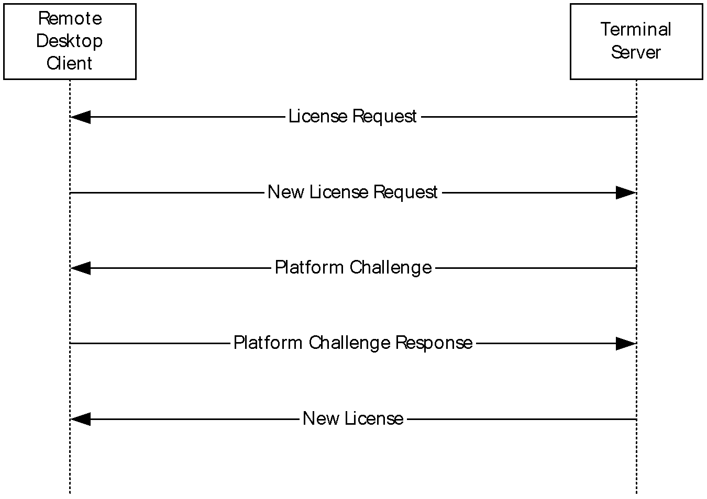

Figure 3: Remote Desktop client new license flow

#### 1.3.3.2 Upgrade License Flow

When the [**Remote Desktop client**](#gt_remote-desktop-client) has a license in its [**license store**](#gt_license-store), the message flow is as shown in the following diagram.

Figure 4: Remote Desktop client upgrade license flow

## 1.4 Relationship to Other Protocols

The Remote Desktop Protocol: Licensing Extension extends the Remote Desktop Protocol: Basic Connectivity and Graphics Remoting (as specified in [MS-RDPBCGR](../MS-RDPBCGR/MS-RDPBCGR.md)) by adding licensing capabilities.

The licensing protocol sequence is started by the server during the [**Remote Desktop Protocol (RDP)**](#gt_remote-desktop-protocol-rdp) standard connection sequence after receiving the Client Info PDU (see sections 1.3.1.1 and 2.2.11). If exchange of licensing information is required, the server sends a [Server License Request (section 2.2.2.1)](#Section_2.2.2.1) to the client at this point. Otherwise, the RDP standard connection sequence continues (see section 1.3.1.1).

## 1.5 Prerequisites/Preconditions

The Remote Desktop Protocol: Licensing Extension assumes that the system already has an IP address and is thus capable of communicating on the network. It also assumes that the initiator (or [**client**](#gt_client)) has already obtained the IP address of the [**server**](#gt_server), that the server has registered a port, and that the server is actively listening for client connections on that port.

All multiple-byte fields within a message are assumed to contain data in little-endian byte ordering, unless otherwise specified.

## 1.6 Applicability Statement

The Remote Desktop Protocol: Licensing Extension applies whenever a [**Remote Desktop client**](#gt_remote-desktop-client) attempts to connect to a [**terminal server**](#gt_terminal-server) in Application Server mode and exchange of licensing information is required. The licensing protocol details provided in this document allow a server to authorize a client connection by issuing and verifying [**CALs**](#gt_client-access-license-cal).<1>

## 1.7 Versioning and Capability Negotiation

Only one version of the Remote Desktop Protocol: Licensing Extension exists and, therefore, no version negotiation is required with the client.

There is no negotiation of capabilities; however, the client advertises its capability to support the size of license data in the **wLicenseDetailLevel** field of the [Platform Challenge Response Data (section 2.2.2.5.1)](#Section_2.2.2.5.1) structure in the [Client Platform Challenge Response (section 2.2.2.5)](#Section_2.2.2.5).

## 1.8 Vendor-Extensible Fields

None.

## 1.9 Standards Assignments

None.

# 2 Messages

## 2.1 Transport

The Remote Desktop Protocol: Licensing Extension packets are transported using TCP/IP.

## 2.2 Message Syntax

The following sections contain the Remote Desktop Protocol: Licensing Extension message syntax.

### 2.2.1 Common Data Structures

#### 2.2.1.1 Security Headers

Each licensing message PDU contains one of the RDP security headers specified in [MS-RDPBCGR](../MS-RDPBCGR/MS-RDPBCGR.md) section 2.2.8.1.1.2.

##### 2.2.1.1.1 Basic (TS_SECURITY_HEADER)

For the Basic security header, see [MS-RDPBCGR](../MS-RDPBCGR/MS-RDPBCGR.md) section 2.2.8.1.1.2.1.

##### 2.2.1.1.2 Non-FIPS (TS_SECURITY_HEADER1)

For the non-FIPS security header, [MS-RDPBCGR](../MS-RDPBCGR/MS-RDPBCGR.md) section 2.2.8.1.1.2.2.

##### 2.2.1.1.3 FIPS (TS_SECURITY_HEADER2)

For the FIPS security header, see [MS-RDPBCGR](../MS-RDPBCGR/MS-RDPBCGR.md) section 2.2.8.1.1.2.3.

#### 2.2.1.2 Licensing Preamble (LICENSE_PREAMBLE)

For the licensing preamble, see [MS-RDPBCGR](../MS-RDPBCGR/MS-RDPBCGR.md) section 2.2.1.12.1.1.

#### 2.2.1.3 Licensing Binary BLOB (LICENSE_BINARY_BLOB)

The Licensing binary large object (BLOB) is specified in [MS-RDPBCGR](../MS-RDPBCGR/MS-RDPBCGR.md) section 2.2.1.12.1.2.

#### 2.2.1.4 Server Certificate (SERVER_CERTIFICATE)

The Server Certificate structure is specified in [MS-RDPBCGR](../MS-RDPBCGR/MS-RDPBCGR.md) section 2.2.1.4.3.1. This structure holds either a server proprietary certificate (see [MS-RDPBCGR] section 2.2.1.4.3.1.1) or an X.509 certificate chain (see section [2.2.1.4.2](#Section_2.2.1.4.2)).

##### 2.2.1.4.1 Server Proprietary Certificate (PROPRIETARYSERVERCERTIFICATE)

Proprietary certificates are specified in [MS-RDPBCGR](../MS-RDPBCGR/MS-RDPBCGR.md) section 2.2.1.4.3.1.1.

##### 2.2.1.4.2 X.509 Certificate Chain (X509 _CERTIFICATE_CHAIN)

The X.509 Certificate Chain packet contains a collection of X.509 certificates.

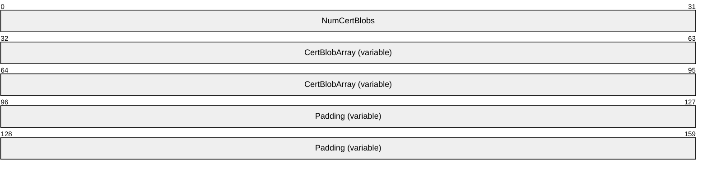

**NumCertBlobs (4 bytes):** A 32-bit unsigned integer. This field specifies the number of [CertBlob](#Section_2.2.1.4.2.1) structures in the **CertBlobArray** field. The minimum value MUST be 2 (self-signed license server certificate and terminal server certificate) and the maximum value MUST be 200 (clearing house issued license server certificate chain and terminal server certificate).

**CertBlobArray (variable):** An array of CertBlob structures. If the [**license server**](#gt_license-server) was issued an X.509 certificate chain by the [**clearing house**](#gt_clearing-house), this array contains all the certificates from that chain, in root-certificate-first order. The second-to-last element in the array is the [**license server certificate**](#gt_license-server-certificate). The [**terminal server certificate**](#gt_terminal-server-certificate) is the last element in this array. If the license server certificate is self-signed, this array contains only two elements: the license server certificate and the terminal server certificate. The license server certificate is also the root certificate, if the license server certificate is self-signed.

**Padding (variable):** A byte array of the length 8 + 4***NumCertBlobs** is appended at the end the packet.

###### 2.2.1.4.2.1 CertBlob (CERT_BLOB)

The CertBlob packet encapsulates an X.509 certificate (as specified in [[RFC3280]](https://go.microsoft.com/fwlink/?LinkId=90414) section 4).

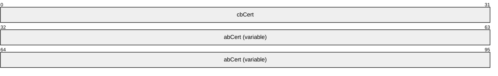

**cbCert (4 bytes):** A 32-bit unsigned integer. This field specifies the number of bytes in **abCert**.

**abCert (variable):** A byte array of length **cbCert**. This field contains binary data representing a single X.509 certificate.

##### 2.2.1.4.3 Proprietary Certificate (PROPRIETARYSERVERCERTIFICATE)

For proprietary certificates, see [MS-RDPBCGR](../MS-RDPBCGR/MS-RDPBCGR.md) section 2.2.1.4.3.1.1.

### 2.2.2 Licensing PDU (TS_LICENSING_PDU)

The **Licensing PDU** packet encapsulates licensing messages that are exchanged between a [**client**](#gt_client) and a [**terminal server**](#gt_terminal-server).

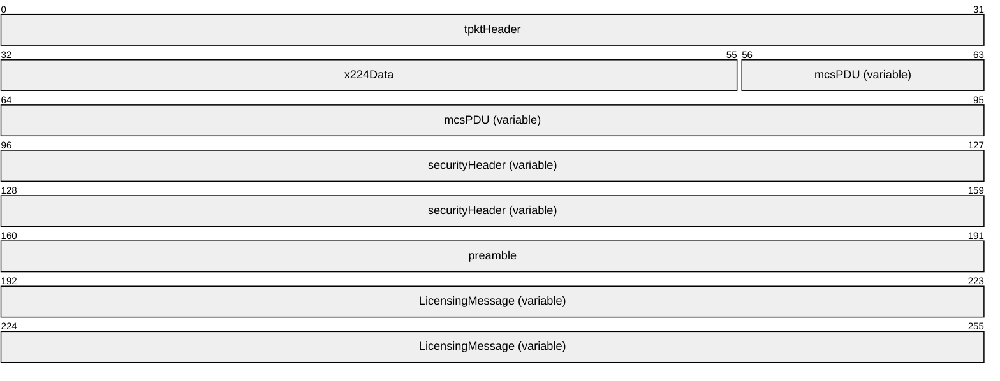

**tpktHeader (4 bytes):** A TPKT header, as specified in [[T123]](https://go.microsoft.com/fwlink/?LinkId=90541) section 8.

**x224Data (3 bytes):** An X.224 Class 0 Data TPDU, as specified in [[X224]](https://go.microsoft.com/fwlink/?LinkId=90588) section 13.7.

**mcsPDU (variable):** If the PDU is being sent from the client to the server, this field MUST contain a variable-length PER-encoded MCS Send Data Request PDU, as specified in [[T125]](https://go.microsoft.com/fwlink/?LinkId=90543) (the ASN.1 structure definition is specified in [T125] section 7 part 7). The **userData** field of the MCS Send Data Request PDU contains a security header, a [licensing preamble](#Section_2.2.1.2), and the licensing message.

If the PDU is being sent from the server to the client, this field MUST contain a variable-length PER-encoded MCS Send Data Indication PDU, as specified in [T125] (the ASN.1 structure definition is specified in [T125] section 7 part 7). The **userData** field of the MCS Send Data Indication PDU contains a security header, a licensing preamble, and the licensing message.

**securityHeader (variable):** A security header. This field contains one of the following headers.

If the PDU is being sent from the client to the server:

- The **securityHeader** field SHOULD contain at least a [Basic](../MS-RDPBCGR/MS-RDPBCGR.md) security header (see [MS-RDPBCGR](../MS-RDPBCGR/MS-RDPBCGR.md) section 2.2.8.1.1.2.1). If the embedded flags field contains the SEC_ENCRYPT(0x0008) flag, and the Encryption Level selected by the server (see sections [5.1.1](#Section_5.1.1) and [2.2.1.4.3](#Section_2.2.1.4.3)) is ENCRYPTION_LEVEL_LOW (1), ENCRYPTION_LEVEL_CLIENT_COMPATIBLE (2), or ENCRYPTION_LEVEL_HIGH (3), the securityHeader SHOULD contain a [non-FIPS](#Section_2.2.1.1.2) security header.
If the PDU is being sent from the server to the client, then the format of the security header depends on the Encryption Level and Encryption Method selected by the server (see [MS-RDPBCGR] section 5.3.2 and 2.2.1.4.3). This field MUST contain one of the following headers:

- Basic Security Header (see [MS-RDPBCGR] section 2.2.8.1.1.2.1) if the Encryption Level selected by the server (see [MS-RDPBCGR] section 5.3.2 and 2.2.1.4.3) is ENCRYPTION_LEVEL_NONE (0) or ENCRYPTION_LEVEL_LOW (1) and the embedded flags field does not contain the SEC_ENCRYPT (0x0008) flag.
- A non-FIPS Security Header (see [MS-RDPBCGR] section 2.2.8.1.1.2.2) if the Encryption Level selected by the server (see [MS-RDPBCGR] section 5.3.2 and 2.2.1.4.3) is ENCRYPTION_LEVEL_CLIENT_COMPATIBLE (2) or ENCRYPTION_LEVEL_HIGH (3) and the embedded flags field contains the SEC_ENCRYPT (0x0008) flag.
- A [FIPS](../MS-RDPBCGR/MS-RDPBCGR.md) Security Header (see [MS-RDPBCGR] section 2.2.8.1.1.2.3) if the Encryption Level selected by the server (see [MS-RDPBCGR] section 5.3.2 and 2.2.1.4.3) is ENCRYPTION_LEVEL_FIPS (4) and the embedded flags field contains the SEC_ENCRYPT (0x0008) flag.
If the Encryption Level is set to ENCRYPTION_LEVEL_CLIENT_COMPATIBLE (2), ENCRYPTION_LEVEL_HIGH (3), or ENCRYPTION_LEVEL_FIPS (4) and the flags field of the Security Header does not contain the SEC_ENCRYPT (0x0008) flag (the licensing PDU is not encrypted), then the field MUST contain a Basic Security Header (see [MS-RDPBCGR] section 2.2.8.1.1.2.1).

The SEC_LICENSE_ENCRYPT_CS (0x0200) and SEC_LICENSE_ENCRYPT_SC (0x0200) flags are used to communicate whether encryption is to be applied to the licensing PDUs (see [MS-RDPBCGR] section 2.2.8.1.1.2.1).

The **flags** field of the security header MUST contain the SEC_LICENSE_PKT (0x0080) flag (see [MS-RDPBCGR] section 2.2.8.1.1.2.1) for all the licensing messages.

**preamble (4 bytes):** A licensing preamble (see [MS-RDPBCGR] section 2.2.1.12.1.1) structure containing header information. The **bMsgType** field of the **preamble** structure specifies the type of the licensing message that follows the **preamble**.

The **bVersion** field of the **preamble** structure specifies the license protocol version and the client capability to handle extended error information in the Low nibble and High nibble respectively ([MS-RDPBCGR] section 2.2.1.12.1.1).

**LicensingMessage (variable):** A variable-length licensing message whose structure depends on the value of the **bMsgType** field in the **preamble** structure. The following table lists possible values for **bMsgType** and the associated licensing message (this table also appears in [MS-RDPBCGR] section 2.2.1.12.1.1).

Sent by the server.

| Value | Meaning |
| --- | --- |
| LICENSE_REQUEST 0x01 | The Licensing PDU is a License Request PDU, and the **LicensingMessage** contains a **SERVER_LICENSE_REQUEST** (section [2.2.2.1](#Section_2.2.2.1)) structure. |
| PLATFORM_CHALLENGE 0x02 | The Licensing PDU is a Platform Challenge PDU, and the **LicensingMessage** contains a **SERVER_PLATFORM_CHALLENGE** (section [2.2.2.4](#Section_2.2.2.4)) structure. |
| NEW_LICENSE 0x03 | The Licensing PDU is a New License PDU, and the **LicensingMessage** contains a **SERVER_NEW_LICENSE** (section [2.2.2.7](#Section_2.2.2.7)) structure. |
| UPGRADE_LICENSE 0x04 | The Licensing PDU is an Upgrade License PDU, and the **LicensingMessage** contains a **SERVER_UPGRADE_LICENSE (**section [2.2.2.6](#Section_2.2.2.6)) structure. |

Sent by the client.

| Value | Meaning |
| --- | --- |
| LICENSE_INFO 0x12 | The Licensing PDU is a License Info PDU, and the **LicensingMessage** contains a **CLIENT_LICENSE_INFO** (section [2.2.2.3](#Section_2.2.2.3)) structure. |
| NEW_LICENSE_REQUEST 0x13 | The Licensing PDU is a New License Request PDU, and the **LicensingMessage** contains a **CLIENT_NEW_LICENSE_REQUEST** (section [2.2.2.2](#Section_2.2.2.2)) structure. |
| PLATFORM_CHALLENGE_RESPONSE 0x15 | The Licensing PDU is a Platform Challenge Response PDU, and the **LicensingMessage** contains a **CLIENT_PLATFORM_CHALLENGE_RESPONSE** (section [2.2.2.5](#Section_2.2.2.5)) structure. |

Sent by either the client or the server.

| Value | Meaning |
| --- | --- |
| ERROR_ALERT 0xFF | The Licensing PDU is a Licensing Error Message PDU, and the **LicensingMessage** contains a **LICENSE_ERROR_MESSAGE** (section [2.2.2.8](#Section_2.2.2.8)) structure. |

#### 2.2.2.1 Server License Request (SERVER_LICENSE_REQUEST)

The Server License Request packet is sent to the client to initiate the RDP licensing handshake.

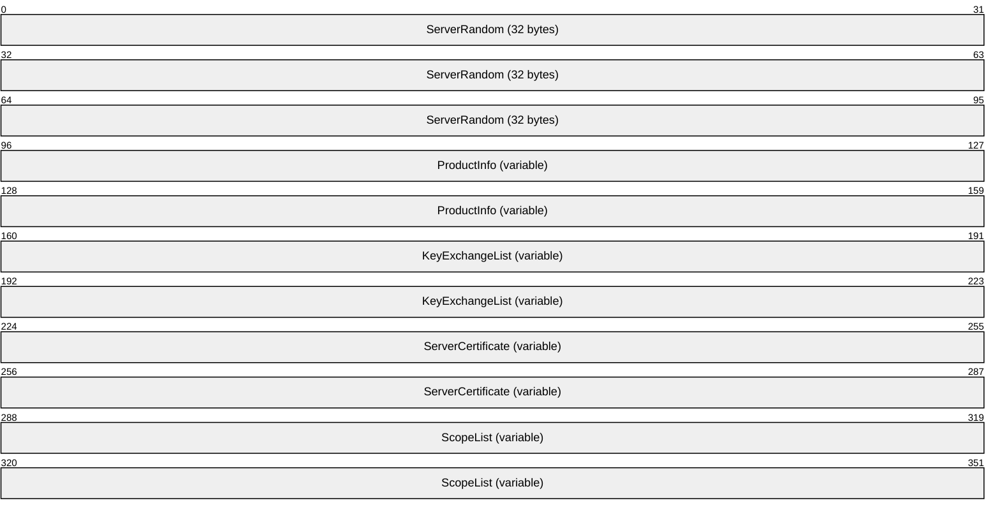

**ServerRandom (32 bytes):** A 32-byte array containing a random number. This random number is created using a cryptographically secure pseudo-random number generator and is used to generate licensing encryption keys (see section [5.1.2](#Section_5.1.2)). These keys are used to encrypt licensing data in subsequent licensing messages (see sections [5.1.3](#Section_5.1.3) and [5.1.4](#Section_5.1.4)).

**ProductInfo (variable):** A variable-length [Product Information](#Section_3.2.1.2) structure. This structure contains the details of the product license required for connecting to the [**terminal server**](#gt_terminal-server).

**KeyExchangeList (variable):** A [Licensing Binary BLOB](#Section_2.2.1.3) structure (see [MS-RDPBCGR](../MS-RDPBCGR/MS-RDPBCGR.md) section 2.2.1.12.1.2) of type BB_KEY_EXCHG_ALG_BLOB (0x000D). This BLOB contains the list of 32-bit unsigned integers specifying key exchange algorithms that the server supports. The terminal server supports only one key exchange algorithm as of now, so the BLOB contains the following value.

| Value | Meaning |
| --- | --- |
| KEY_EXCHANGE_ALG_RSA 0x00000001 | Indicates RSA key exchange algorithm with a 512-bit asymmetric key.<2> |

**ServerCertificate (variable):** A Licensing Binary BLOB structure (see [MS-RDPBCGR] section 2.2.1.12.1.2) of type BB_CERTIFICATE_BLOB (0x0003). This BLOB contains the terminal server certificate (see section [2.2.1.4](#Section_2.2.1.4)). The terminal server can choose not to send the certificate by setting the **wblobLen** field in the Licensing Binary BLOB structure to 0. If encryption is in effect and is already protecting RDP traffic, the licensing protocol MAY<3> choose not to send the server certificate (for RDP security measures, see [MS-RDPBCGR] sections 5.3 and 5.4). If the licensing protocol chooses not to send the server certificate, then the client uses the public key obtained from the server certificate sent as part of Server Security Data in the Server MCS Connect Response PDU (see [MS-RDPBCGR] section 2.2.1.4).

**ScopeList (variable):** A variable-length [Scope List](#Section_3.2.1.5) structure that contains a list of entities that issued the [**client license**](#gt_client-license). This list is used by the client in conjunction with **ProductInfo** to search for an appropriate license in its [**license store**](#gt_license-store).<4>

##### 2.2.2.1.1 Product Information (PRODUCT_INFO)

The **Product Information** packet contains the details of the product license that is required for connecting to the [**terminal server**](#gt_terminal-server). The client uses this structure together with the [scope list](#Section_3.2.1.5) to search for and identify an appropriate license in its [**license store**](#gt_license-store). Depending on the outcome of the search, the client sends a **Client New License Request** (section [2.2.2.2](#Section_2.2.2.2)), **Client License Information** packet (section [2.2.2.3](#Section_2.2.2.3)), or **Licensing Error Message** (section [2.2.2.8](#Section_2.2.2.8)) to the server.

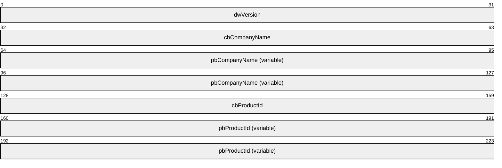

**dwVersion (4 bytes):** A 32-bit unsigned integer that contains the license version information. The high-order word contains the major version of the operating system on which the terminal server is running, while the low-order word contains the minor version.<5>

**cbCompanyName (4 bytes):** An unsigned 32-bit integer that contains the number of bytes in the **pbCompanyName** field, including the terminating null character. This value MUST be greater than zero.

**pbCompanyName (variable):** Contains a null-terminated [**Unicode string**](#gt_unicode-string) that specifies the company name.<6>

**cbProductId (4 bytes):** An unsigned 32-bit integer that contains the number of bytes in the **pbProductId** field, including the terminating null character. This value MUST be greater than zero.

**pbProductId (variable):** Contains a null-terminated Unicode string that identifies the type of the license that is required by the terminal server. It MAY have the following string value.

| Value | Meaning |
| --- | --- |
| "A02" | Per device or per user license |

##### 2.2.2.1.2 Scope List (SCOPE_LIST)

The Scope List packet contains a list of entities that issued a [**client license**](#gt_client-license). The client uses the name of the issuers in the [Scope](#Section_2.2.2.1.2.1) structures of this list in conjunction with the [Product Information](#Section_3.2.1.2) structure to search the [**license store**](#gt_license-store) for a matching client license.

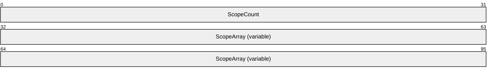

**ScopeCount (4 bytes):** A 32-bit unsigned integer containing the number of elements in the **ScopeArray** field.

**ScopeArray (variable):** An array of Scope structures containing **ScopeCount** elements. <7>

###### 2.2.2.1.2.1 Scope (SCOPE)

The Scope packet contains the name of an entity that issued a [**client license**](#gt_client-license).

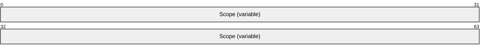

**Scope (variable):** A Licensing Binary BLOB structure (see [MS-RDPBCGR](../MS-RDPBCGR/MS-RDPBCGR.md) section 2.2.1.12.1.2) of type BB_SCOPE_BLOB (0x000E). This BLOB contains the name of a license issuer in null-terminated ANSI characters, as specified in [[ISO/IEC-8859-1]](https://go.microsoft.com/fwlink/?LinkId=90689), string format, with an implementation-specific valid code page.

#### 2.2.2.2 Client New License Request (CLIENT_NEW_LICENSE_REQUEST)

The Client New License Request packet is sent to a server when the client cannot find a license matching the product information provided in the [Server License Request](#Section_2.2.2.1) message. This message is interpreted as a new license request by the server, and the server SHOULD attempt to issue a new license to the client on receipt of this message.

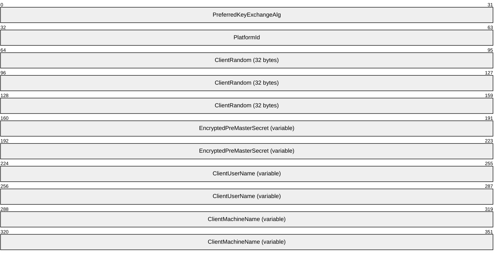

**PreferredKeyExchangeAlg (4 bytes):** A 32-bit unsigned integer that indicates the key exchange algorithm chosen by the client. It MUST be set to KEY_EXCHANGE_ALG_RSA (0x00000001), which indicates an RSA-based key exchange with a 512-bit asymmetric key.<8>

**PlatformId (4 bytes):** A 32-bit unsigned integer. This field is composed of two identifiers: the operating system identifier and the independent software vendor (ISV) identifier. The platform ID is composed of the logical OR of these two values.

The most significant byte of the **PlatformId** field contains the operating system version of the client.<9>

The second most significant byte of the **PlatformId** field identifies the ISV that provided the client image.<10>

The remaining two bytes in the **PlatformId** field are used by the ISV to identify the build number of the operating system.<11>

**ClientRandom (32 bytes):** A 32-byte random number generated by the client using a cryptographically secure pseudo-random number generator. The **ClientRandom** and **ServerRandom** (see section 2.2.2.1) values, along with the data in the **EncryptedPreMasterSecret** field, are used to generate licensing encryption keys (see section [5.1.2](#Section_5.1.2)). These keys are used to encrypt licensing protocol messages (see sections [5.1.3](#Section_5.1.3) and [5.1.4](#Section_5.1.4)).

**EncryptedPreMasterSecret (variable):** A Licensing Binary BLOB structure (see [MS-RDPBCGR](../MS-RDPBCGR/MS-RDPBCGR.md) section 2.2.1.12.1.2) of type BB_RANDOM_BLOB (0x0002). This BLOB contains an encrypted 48-byte random number. For instructions on how to encrypt this random number, see section [5.1.1.1](#Section_5.1.1.1).

**ClientUserName (variable):** A Licensing Binary BLOB structure (see [MS-RDPBCGR] section 2.2.1.12.1.2) of type BB_CLIENT_USER_NAME_BLOB (0x000F). This BLOB contains the client user name string in null-terminated [**ANSI character set**](#gt_100cd8a6-5cb1-4895-9de6-e4a3c224a583) format and is used along with the **ClientMachineName** BLOB to keep track of licenses issued to clients.

**ClientMachineName (variable):** A Licensing Binary BLOB structure (see [MS-RDPBCGR] section 2.2.1.12.1.2) of type BB_CLIENT_MACHINE_NAME_BLOB (0x0010). This BLOB contains the client machine name string in null-terminated ANSI character set format and is used along with the **ClientUserName** BLOB to keep track of licenses issued to clients.

#### 2.2.2.3 Client License Information (CLIENT_LICENSE_INFO)

The Client License Information packet is sent by a client that already has a license issued to it in response to the [Server License Request (section 2.2.2.1)](#Section_2.2.2.1) message.

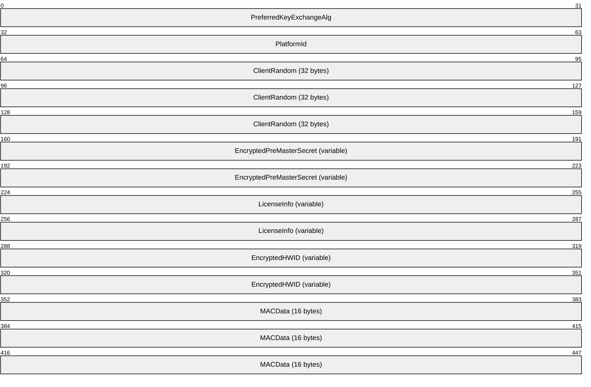

**PreferredKeyExchangeAlg (4 bytes):** The content and format of this field are the same as the **PreferredKeyExchangeAlg** field of the [Client New License Request (section 2.2.2.2)](#Section_2.2.2.2) message.

**PlatformId (4 bytes):** The content and format of this field are the same as the **PlatformId** field of the Client New License Request message.

**ClientRandom (32 bytes):** The content and format of this field are the same as the **ClientRandom** field of the Client New License Request message.

**EncryptedPreMasterSecret (variable):** The content and format of this field are the same as the **EncryptedPreMasterSecret** field of the Client New License Request message.

**LicenseInfo (variable):** A Licensing Binary BLOB structure (see [MS-RDPBCGR](../MS-RDPBCGR/MS-RDPBCGR.md) section 2.2.1.12.1.2) of type BB_DATA_BLOB (0x0001). This BLOB contains the CAL (see the **pbLicenseInfo** field in section [2.2.2.6.1](#Section_2.2.2.6.1)) that is retrieved from the client's [**license store**](#gt_license-store).

**EncryptedHWID (variable):** A Licensing Binary BLOB structure (see [MS-RDPBCGR] section 2.2.1.12.1.2). This BLOB contains a [Client Hardware Identification (section 2.2.2.3.1)](#Section_2.2.2.3.1) structure encrypted with the licensing encryption keys (see section [5.1.2](#Section_5.1.2)), using [**RC4**](#gt_rc4) (for instructions on how to perform the encryption, see section [5.1.3](#Section_5.1.3)).

**MACData (16 bytes):** An array of 16 bytes containing an [**MD5 digest**](#gt_md5-digest) ([**Message Authentication Code (MAC)**](#gt_message-authentication-code-mac)) that is generated over the unencrypted Client Hardware Identification structure. For instructions on how to generate this message digest, see section [5.1.5](#Section_5.1.5); for a description of how the server uses the **MACData** field to verify the integrity of the Client Hardware Identification structure, see section [3.1.5.1](#Section_3.1.5.1).

##### 2.2.2.3.1 Client Hardware Identification (CLIENT_HARDWARE_ID)

The Client Hardware Identification packet is used for uniquely identifying a [**Remote Desktop client**](#gt_remote-desktop-client) for the purpose of issuing a license. A [**license server**](#gt_license-server) uses the content of this structure as an index into the issued licenses in its database.

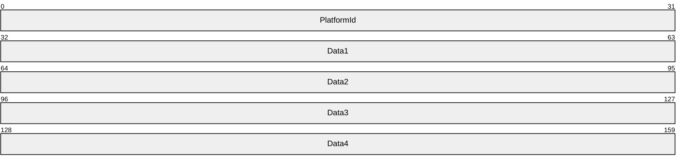

**PlatformId (4 bytes):** The content and format of this field are the same as the **PlatformId** field of the [Client New License Request](#Section_2.2.2.2).

**Data1 (4 bytes):** A 32-bit unsigned integer containing client hardware-specific data. This field MUST contain a number that helps the server uniquely identify the client.

**Data2 (4 bytes):** A 32-bit unsigned integer containing client hardware-specific data. This field MUST contain a number that helps the server uniquely identify the client.

**Data3 (4 bytes):** A 32-bit unsigned integer containing client hardware-specific data. This field MUST contain a number that helps the server uniquely identify the client.

**Data4 (4 bytes):** A 32-bit unsigned integer containing client hardware-specific data. This field MUST contain a number that helps the server uniquely identify the client.

#### 2.2.2.4 Server Platform Challenge (SERVER_PLATFORM_CHALLENGE)

The Server Platform Challenge packet is sent from the server to the client after receiving the [Client New License Request (section 2.2.2.2)](#Section_2.2.2.2) or certain cases of [Client License Information (section 2.2.2.3)](#Section_2.2.2.3). For more information on Client License Information and when Server Platform Challenge is sent, see [Processing Client License Information (section 3.2.5.3)](#Section_3.2.5.3).

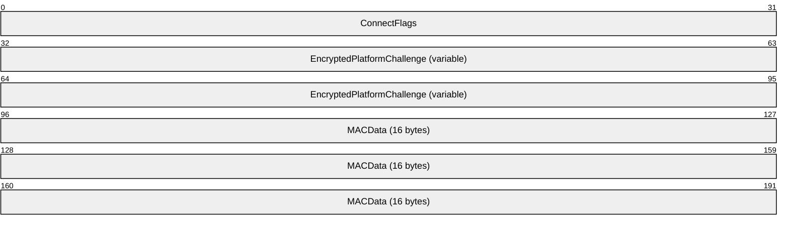

**ConnectFlags (4 bytes):** Reserved.

**EncryptedPlatformChallenge (variable):** A Licensing Binary BLOB<12> structure (see [MS-RDPBCGR](../MS-RDPBCGR/MS-RDPBCGR.md) section 2.2.1.12.1.2). This BLOB contains the encrypted server platform challenge data. The server platform challenge data is a random string generated by the server and is encrypted with the licensing encryption key (see section [5.1.2](#Section_5.1.2)) using [**RC4**](#gt_rc4) (for instructions on how to perform the encryption, see section [5.1.3](#Section_5.1.3)).

**MACData (16 bytes):** An array of 16 bytes containing an [**MD5 digest**](#gt_md5-digest) ([**MAC**](#gt_message-authentication-code-mac)) generated over the unencrypted platform challenge BLOB. For instructions on how to generate this message digest, see section [5.1.5](#Section_5.1.5); for a description of how the client uses the **MACData** field to verify the integrity of the platform challenge BLOB, see section [3.1.5.1](#Section_3.1.5.1).

#### 2.2.2.5 Client Platform Challenge Response (CLIENT_PLATFORM_CHALLENGE_RESPONSE)

The Client Platform Challenge Response packet is sent by the client in response to the [Server Platform Challenge (section 2.2.2.4)](#Section_2.2.2.4) message.

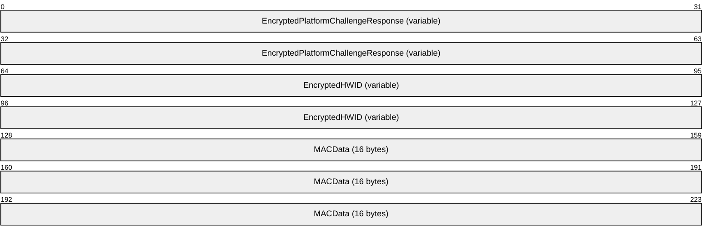

**EncryptedPlatformChallengeResponse (variable):** A LICENSE_BINARY_BLOB<13> structure (as specified in [MS-RDPBCGR](../MS-RDPBCGR/MS-RDPBCGR.md) section 2.2.1.12.1.2) of **wBlobType** BB_ENCRYPTED_DATA_BLOB (0x0009). This BLOB contains the encrypted [Platform Challenge Response Data (section 2.2.2.5.1)](#Section_2.2.2.5.1) generated by the client and is encrypted with the licensing encryption key (see section [5.1.2](#Section_5.1.2)), using [**RC4**](#gt_rc4) (for instructions on how to perform the encryption, see section [5.1.3](#Section_5.1.3)).

**EncryptedHWID (variable):** A LICENSE_BINARY_BLOB structure (as specified in [MS-RDPBCGR] section 2.2.1.12.1.2) of **wBlobType** BB_ENCRYPTED_DATA_BLOB (0x0009). This BLOB contains the encrypted [Client Hardware Identification (section 2.2.2.3.1)](#Section_2.2.2.3.1) and is encrypted with the licensing encryption key (see section 5.1.2) using RC4 (for instructions on how to perform the encryption, see section 5.1.3).

**MACData (16 bytes):** An array of 16 bytes containing an [**MD5 digest**](#gt_md5-digest) ([**MAC**](#gt_message-authentication-code-mac)) generated over the Platform Challenge Response Data and decrypted Client Hardware Identification. For instructions on how to generate this message digest, see section [5.1.5](#Section_5.1.5); for a description of how the server uses the **MACData** field to verify the integrity of the Client Hardware Identification and the Platform Challenge Response Data, see section [3.1.5.1](#Section_3.1.5.1).

##### 2.2.2.5.1 Platform Challenge Response Data (PLATFORM_CHALLENGE_RESPONSE_DATA)

The Platform Challenge Response Data packet contains information pertaining to the client's license handling capabilities and the Client Platform Challenge data sent by the server in the [Server Platform Challenge](#Section_3.2.5.4).

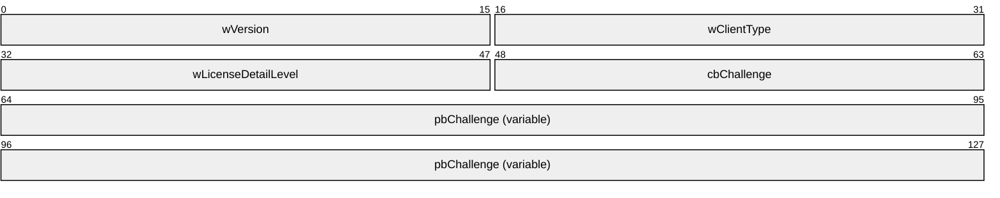

**wVersion (2 bytes):** A 16-bit unsigned integer that contains the platform challenge version. This field MUST be set to 0x0100.

**wClientType (2 bytes):** A 16-bit unsigned integer that represents the operating system type of the client and MAY contain one of following values.<14>

| Value | Meaning |
| --- | --- |
| WIN32_PLATFORMCHALLENGE_TYPE 0x0100 | Win32 Platform Challenge Type. |
| WIN16_PLATFORMCHALLENGE_TYPE 0x0200 | Win16 Platform Challenge Type. |
| WINCE_PLATFORMCHALLENGE_TYPE 0x0300 | WinCE Platform Challenge Type. |
| OTHER_PLATFORMCHALLENGE_TYPE 0xFF00 | Other Platform Challenge Type. |

**wLicenseDetailLevel (2 bytes):** A 16-bit unsigned integer. This field represents the capability of the client to handle license data. RDP version 5.0 and later clients SHOULD advertise support for large (6.5 KB or higher) licenses by setting the detail level to LICENSE_DETAIL_DETAIL (0x0003). The following table lists valid values for this field.

| Value | Meaning |
| --- | --- |
| LICENSE_DETAIL_SIMPLE 0x0001 | License Detail Simple (client license certificate and license server certificate without issuer details). |
| LICENSE_DETAIL_MODERATE 0x0002 | License Detail Moderate (client license certificate chain up to license server's certificate issuer). |
| LICENSE_DETAIL_DETAIL 0x0003 | License Detail Detail (client license certificate chain up to root certificate). |

**cbChallenge (2 bytes):** A 16-bit unsigned integer that indicates the number of bytes of binary data contained in the **pbChallenge** field.

**pbChallenge (variable):** Contains the decrypted Client Platform Challenge data sent by the server in the Server Platform Challenge message.

#### 2.2.2.6 Server Upgrade License (SERVER_UPGRADE_LICENSE)

The Server Upgrade License packet is sent from the server to the client if the client presents an existing license and the server determines that this license SHOULD be upgraded. This message contains the upgraded license information, which the client uses to replace the previously held license in the client's [**license store**](#gt_license-store).

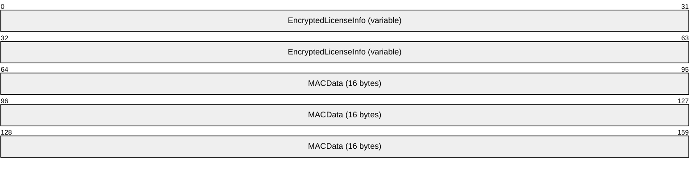

**EncryptedLicenseInfo (variable):** A LICENSE_BINARY_BLOB structure (as specified in [MS-RDPBCGR](../MS-RDPBCGR/MS-RDPBCGR.md) section 2.2.1.12.1.2) of **wBlobType** BB_ENCRYPTED_DATA_BLOB (0x0009).<15> This BLOB contains the encrypted [New License Information (section 2.2.2.6.1)](#Section_2.2.2.6.1) packet and is encrypted with the licensing encryption key (see section [5.1.2](#Section_5.1.2)), using [**RC4**](#gt_rc4) (for instructions on how to perform the encryption, see section [5.1.3](#Section_5.1.3)).

**MACData (16 bytes):** An array of 16 bytes containing an [**MD5 digest**](#gt_md5-digest) ([**Message Authentication Code**](#gt_message-authentication-code-mac)) generated over the unencrypted New License Information structure. For instructions on how to generate this message digest, see section [5.1.5](#Section_5.1.5); for a description of how the server uses the **MACData** field to verify the integrity of the New License Information packet, see section [3.1.5.1](#Section_3.1.5.1).

##### 2.2.2.6.1 New License Information (NEW_LICENSE_INFO)

The New License Information packet contains the actual [**client license**](#gt_client-license) and associated indexing information. The client stores the license in its [**license store**](#gt_license-store) using the indexing information, and uses it in subsequent connections. The **dwVersion**, **pbScope**, **pbCompanyName**, and **pbProductId** fields are used by the client to index the licenses in the client's license store.

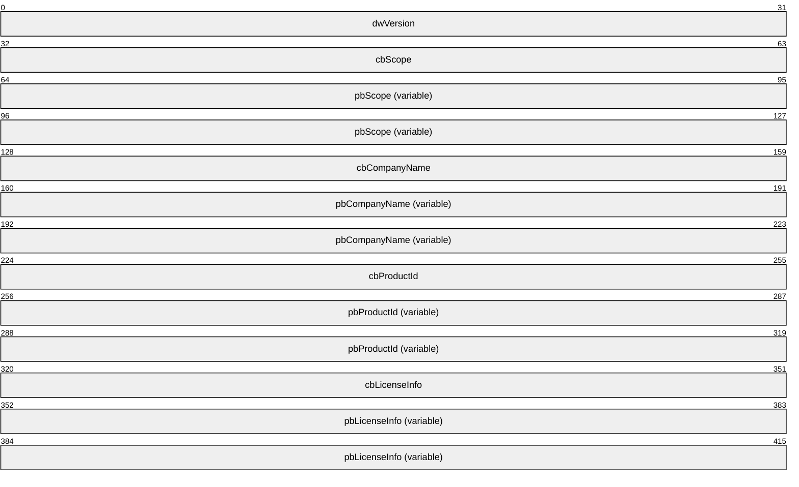

**dwVersion (4 bytes):** The content and format of this field are the same as the **dwVersion** field of the [Product Information (section 2.2.2.1.1)](#Section_2.2.2.1.1) structure.

**cbScope (4 bytes):** A 32-bit unsigned integer that contains the number of bytes in the string contained in the **pbScope** field.

**pbScope (variable):** Contains the NULL-terminated [**ANSI character set**](#gt_100cd8a6-5cb1-4895-9de6-e4a3c224a583) string giving the name of the issuer of this license. For example, for licenses issued by TailSpin Toys, this field contains the string "TailSpin Toys".

**cbCompanyName (4 bytes):** The content and format of this field are the same as the **cbCompanyName** field of the Product Information structure.

**pbCompanyName (variable):** The content and format of this field are the same as the **pbCompanyName** field of the Product Information structure.

**cbProductId (4 bytes):** The content and format of this field are the same as the **cbProductId** field of the Product Information structure.

**pbProductId (variable):** The content and format of this field are the same as the **pbProductId** field of the Product Information structure.

**cbLicenseInfo (4 bytes):** A 32-bit unsigned integer that contains the number of bytes of binary data in the **pbLicenseInfo** field.

**pbLicenseInfo (variable):** This field contains the CAL issued to the client by the license server. This license consists of an X.509 certificate chain generated by the license server (encoding of the license information in the X.509 leaf certificate is described in section [2.2.2.9](#Section_2.2.2.9)). The binary data contained in this field is opaque to the client. The client sends this information back to the server in the [Client License Information](#Section_2.2.2.3) message.

#### 2.2.2.7 Server New License (SERVER_NEW_LICENSE)

The Server New License message is sent from the server to the client when a new license is issued to the client. The structure and the content of this message are the same as the [Server Upgrade License](#Section_3.2.5.6) message.

#### 2.2.2.8 Licensing Error Message (LICENSE_ERROR_MESSAGE)

The **Licensing Error Message** specified in [MS-RDPBCGR](../MS-RDPBCGR/MS-RDPBCGR.md) section 2.2.1.12.1.3 can be used by both client and server.

If the client supports extended error, the [**terminal server**](#gt_terminal-server) includes information relevant to the error code in the **bbErrorInfo** field of the **Licensing Error Message**. For more details, see [MS-RDPBCGR] section 2.2.1.12.1.3.

#### 2.2.2.9 X.509 Certificate Extensions

License information stored in the client license store contains the certificates and the associated certificate chain generated by a license server. Certificates that [**license servers**](#gt_license-server) issue to [**terminal servers**](#gt_terminal-server) and [**Remote Desktop clients**](#gt_remote-desktop-client) conform to the X.509 Version 3 format (see [[[RFC3280]](https://go.microsoft.com/fwlink/?LinkId=90414)]) and are signed using the [**object identifier (OID)**](#gt_object-identifier-oid) "1.3.14.3.2.29" (OID_OIWSEC_sha1RSASign) (for more information, see [[[MSDN-CAI]](https://go.microsoft.com/fwlink/?LinkID=93670)]). The certificates generated by the license server include the following extension OIDs:

- "1.3.6.1.4.1.311.18.4" (szOID_PKIX_HYDRA_CERT_VERSION)
- "1.3.6.1.4.1.311.18.2" (szOID_PKIX_MANUFACTURER)
- "1.3.6.1.4.1.311.18.5" (szOID_PKIX_LICENSED_PRODUCT_INFO)
- "1.3.6.1.4.1.311.18.6" (szOID_PKIX_MS_LICENSE_SERVER_INFO)
- "1.3.6.1.4.1.311.18.7" (szOID_PKIS_PRODUCT_SPECIFIC_OID)
More than one license can be issued to a given client. In this case the license store of the client contains multiple licenses as leaf nodes, each of these licenses being issued by the same license server or different license servers.

The license server certificate can be either a self-signed certificate or a certificate issued by the [**clearing house**](#gt_clearing-house).

##### 2.2.2.9.1 Licensed Product Info (LICENSED_PRODUCT_INFO)

The certificate extension with OID "1.3.6.1.4.1.311.18.5" (szOID_PKIX_LICENSED_PRODUCT_INFO) contains product information specific to a license issued to a client and is encoded by the Licensed Product Info structure.

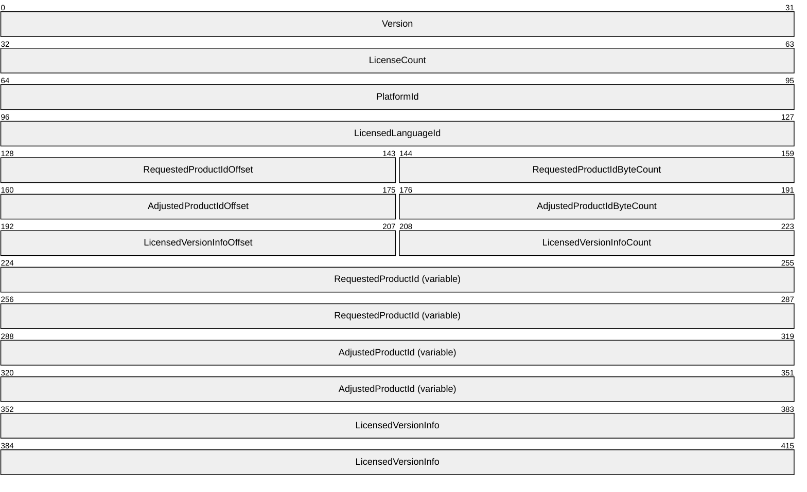

**Version (4 bytes):** A 32-bit unsigned integer that specifies the version of the LICENSED_PRODUCT_INFO structure.

**LicenseCount (4 bytes):** A 32-bit unsigned integer that specifies the number of licenses (of the type defined by the LICENSED_PRODUCT_INFO structure) that have been issued to the client.

**PlatformId (4 bytes):** A 32-bit unsigned integer that is sent by the client while requesting a license. The content and format of this field are the same as the **PlatformId** field of the Client New License Request (section [2.2.2.2](#Section_2.2.2.2)) message.

**LicensedLanguageId (4 bytes):** A 32-bit unsigned integer that specifies the active language identifier of the license server that issued the license (for a list of language identifiers, see [[[MSDN-MUI]](https://go.microsoft.com/fwlink/?LinkId=90048)]).

**RequestedProductIdOffset (2 bytes):** A 16-bit unsigned integer that specifies the offset (in bytes) from the beginning of the LICENSED_PRODUCT_INFO structure to the **RequestedProductId** field.

**RequestedProductIdByteCount (2 bytes):** A 16-bit unsigned integer that specifies the size in bytes of the **RequestedProductId** field.

**AdjustedProductIdOffset (2 bytes):** A 16-bit unsigned integer that specifies the offset (in bytes) from the beginning of the LICENSED_PRODUCT_INFO structure to the **AdjustedProductId** field.

**AdjustedProductIdByteCount (2 bytes):** A 16-bit unsigned integer that specifies the size in bytes of the **AdjustedProductId** field.

**LicensedVersionInfoOffset (2 bytes):** A 16-bit unsigned integer that specifies the offset (in bytes) from the beginning of the LICENSED_PRODUCT_INFO structure to the **LicensedVersionInfo** field.

**LicensedVersionInfoCount (2 bytes):** A 16-bit unsigned integer that specifies the number of Licensed Version Info (section [2.2.2.9.1.1](#Section_2.2.2.9.1.1)) structures encapsulated in the **LicensedVersionInfo** field. This field MUST be set to 0x0001.

**RequestedProductId (variable):** A variable-length array of bytes that specifies the product ID of the license.

**AdjustedProductId (variable):** A variable-length array of bytes that specifies the final product ID of the license (determined by the license server).

**LicensedVersionInfo (8 bytes):** A Licensed Version Info (section 2.2.2.9.1.1) structure that contains versioning information and flags indicating the license type and enforcement status.

###### 2.2.2.9.1.1 Licensed Version Info (LICENSED_VERSION_INFO)

The Licensed Version Info structure contains versioning information and flags indicating the license type and enforcement status.

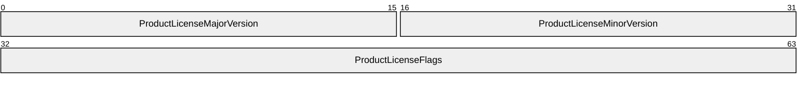

**ProductLicenseMajorVersion (2 bytes):** A 16-bit unsigned integer that specifies the major version of the Remote Desktop Session Host product for which the license has been issued.

**ProductLicenseMinorVersion (2 bytes):** A 16-bit unsigned integer that specifies the minor version of the Remote Desktop Session Host product for which the license has been issued.

**ProductLicenseFlags (4 bytes):** A 32-bit unsigned integer that contains product license flags.

| Flag | Meaning |
| --- | --- |
| LICENSE_ENFORCED 0x00008000 | Indicates that the license is enforced. |
| RTM_LICENSE 0x00800000 | Indicates that the license is an RTM license. If this flag is not set, then the license is a beta license. |
| TEMPORARY_LICENSE 0x80000000 | Indicates that the license is a temporary license. If this flag is not set, then the license is a permanent license. |

##### 2.2.2.9.2 MS License Server Info

The certificate extension with OID "1.3.6.1.4.1.311.18.6" (szOID_PKIX_MS_LICENSE_SERVER_INFO) contains information about the license server that issued a license and is encoded by the MS License Server Info Version 1 (section [2.2.2.9.2.1](#Section_2.2.2.9.2.1)) and Version 2 (section [2.2.2.9.2.2](#Section_2.2.2.9.2.2)) structures.

###### 2.2.2.9.2.1 MS License Server Info Version 1 (MS_LICENSE_SERVER_INFO_V1)

The MS License Server Info Version 1 structure contains information about the license server that issued a license.

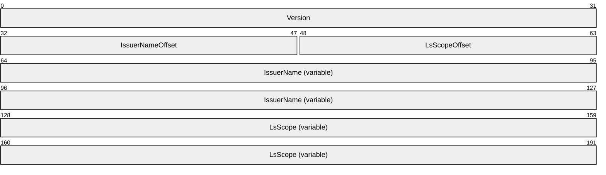

**Version (4 bytes):** A 32-bit unsigned integer that specifies the version of the MS_LICENSE_SERVER_INFO_V1 structure. This field MUST be set to 0x0001000.

**IssuerNameOffset (2 bytes):** A 16-bit unsigned integer that specifies the offset (in bytes) from the beginning of the MS_LICENSE_SERVER_INFO_V1 variable data to the **IssuerName** field. This field MUST be set to zero.

**LsScopeOffset (2 bytes):** A 16-bit unsigned integer that specifies the offset (in bytes) from the beginning of the MS_LICENSE_SERVER_INFO_V1 variable data to the **LsScope** field.

**IssuerName (variable):** A null-terminated Unicode string that specifies the name of the license server that issued the license.

**LsScope (variable):** A null-terminated Unicode string that specifies the scope of the license server. If the license server is domain joined then this field contains the domain name, and if the license server is not domain joined then it contains the workgroup name.

###### 2.2.2.9.2.2 MS License Server Info Version 2 (MS_LICENSE_SERVER_INFO_V2)

The MS License Server Info Version 2 structure contains information about the license server that issued a license.

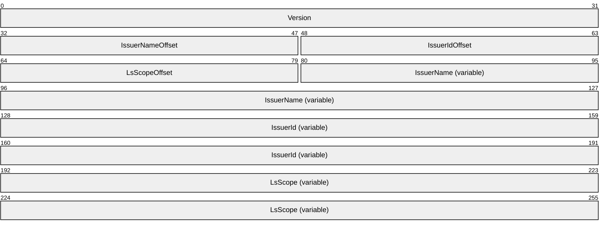

**Version (4 bytes):** A 32-bit unsigned integer that specifies the version of the MS_LICENSE_SERVER_INFO_V2 structure. This field MUST be set to 0x0003000.

**IssuerNameOffset (2 bytes):** A 16-bit unsigned integer that specifies the offset (in bytes) from the beginning of the MS_LICENSE_SERVER_INFO_V2 variable data to the **IssuerName** field. This field MUST be set to zero.

**IssuerIdOffset (2 bytes):** A 16-bit unsigned integer that specifies the offset (in bytes) from the beginning of the MS_LICENSE_SERVER_INFO_V2 variable data to the **IssuerId** field.

**LsScopeOffset (2 bytes):** A 16-bit unsigned integer that specifies the offset (in bytes) from the beginning of the MS_LICENSE_SERVER_INFO_V2 variable data to the **LsScope** field.

**IssuerName (variable):** A null-terminated Unicode string that specifies the name of the license server that issued the license.

**IssuerId (variable):** A null-terminated Unicode string that specifies the product ID of the license server that issued the license.

**LsScope (variable):** A null-terminated Unicode string that specifies the scope of the license server. If the license server is domain joined then this field contains the domain name, and if the license server is not domain joined then it contains the workgroup name.

# 3 Protocol Details

## 3.1 Common Details

### 3.1.1 Abstract Data Model

This section describes a conceptual model of possible data organization that an implementation maintains to participate in this protocol. The described organization is provided to facilitate the explanation of how the protocol behaves. This document does not mandate that implementations adhere to this model as long as their external behavior is consistent with that described in this document.

### 3.1.2 Timers

None.

### 3.1.3 Initialization

None.

### 3.1.4 Higher-Layer Triggered Events

None.

### 3.1.5 Message Processing Events and Sequencing Rules

#### 3.1.5.1 Message Integrity Checking

Both the [**server**](#gt_server) and [**client**](#gt_client) add a [**MAC**](#gt_message-authentication-code-mac) checksum to licensing messages to allow the recipient to validate the integrity of the licensing data that is contained in the message.

The sender MUST generate the MAC checksum (see section [5.1.5](#Section_5.1.5)) on selected fields of a licensing message (for fields that are used to generate the MAC checksum, see the **MACData** fields in sections [2.2.2.3](#Section_2.2.2.3) through [2.2.2.6](#Section_2.2.2.6)). It then MUST encrypt those fields of the licensing message (see [Encrypting Licensing Session Data (section 5.1.3)](#Section_5.1.3)). Next, it MUST transmit the licensing message (see [Licensing PDU (section 2.2.2)](#Section_2.2.2)) containing the encrypted fields and the MAC checksum to the receiver.

The receiver MUST decrypt the encrypted fields of the received licensing message (see [Decrypting Licensing Session Data (section 5.1.4)](#Section_5.1.4)), and then MUST generate a MAC checksum over the decrypted fields. Next, it MUST compare the generated checksum with the received checksum. If they do not match, The receiver MAY send a **Licensing Error Message** (section [2.2.2.8](#Section_2.2.2.8)) with an error code ERR_INVALID_MAC and a state transition code of ST_TOTAL_ABORT to the sender.

#### 3.1.5.2 Sending Licensing Error Messages

Both the client and the server can send a **Licensing Error Message** (section [2.2.2.8](#Section_2.2.2.8)). Whenever an error message is sent, the message type in the **Licensing Preamble** (section [2.2.1.2](#Section_2.2.1.2)) MUST be set to ERROR_ALERT (0xFF). For the PDU, see [MS-RDPBCGR](../MS-RDPBCGR/MS-RDPBCGR.md) section 2.2.1.12.1.3

The client and the server MUST also set the appropriate state transition value in the **dwStateTransition** field in the PDU. This is used to determine the next action to take. For state transitions, see **Processing Licensing Error Messages** (section [3.1.5.3](#Section_3.1.5.3)).

A more detailed reason for the error MAY be passed by using the **bbErrorInfo** BLOB. The BLOB type MUST be BB_ERROR_BLOB (see [MS-RDPBCGR] sections 2.2.1.12.1.2 and 2.2.1.12.1.3). This BLOB is empty if no detailed reason for the error is passed.

#### 3.1.5.3 Processing Licensing Error Messages

Both the server and the client can send a **Licensing Error Message** (section [2.2.2.8](#Section_2.2.2.8)) and indicate a state transition with the error code. Possible state transitions include the following:

- ST_TOTAL_ABORT aborts the licensing protocol. The server and the client can both send this state transition. Aborting the licensing protocol MAY disconnect the RDP client connection, depending on the server licensing system.<16>
ST_NO_TRANSITION is used when the server is to indicate success. It MUST set the **dwErrCode** field to STATUS_VALID_CLIENT and state transition to ST_NO_TRANSITION (see [MS-RDPBCGR](../MS-RDPBCGR/MS-RDPBCGR.md) section 2.2.1.12.1.3).

- ST_RESET_PHASE_TO_START resets the licensing protocol and client goes back to "CLIENT LICENSING AWAIT" state and server goes back to "SERVER LICENSING BEGIN" state.
- ST_RESEND_LAST_MESSAGE makes the client and server resend the previously sent message.
ST_RESET_PHASE_TO_START and ST_RESEND_LAST_MESSAGE are not shown in the **Client State Transition** diagram (section [3.1.5.3.1](#Section_3.1.5.3.1)) and **Server State Transition** diagram (section [3.1.5.3.2](#Section_3.1.5.3.2)), as they can cause confusion.<17>

##### 3.1.5.3.1 Client State Transition

Figure 5: Client state transition

##### 3.1.5.3.2 Server State Transition

Figure 6: Server state transition

### 3.1.6 Timer Events

None.

### 3.1.7 Other Local Events

None.

## 3.2 Server Details

### 3.2.1 Abstract Data Model

Refer to the common details abstract data model in section [3.1.1](#Section_3.1.1).

#### 3.2.1.1 Server Random

The Server Random is a 32-byte random number created using a cryptographically secure pseudo-random number generator. It is used to generate encryption keys that are used in later stages of the licensing protocol; see [Server License Request (section 2.2.2.1)](#Section_2.2.2.1).

The server random is unique for a given client connection. It is created at the beginning of the licensing protocol and is destroyed after the licensing protocol is completed. For information on how the Server Random is used, see sections 2.2.2.1 and [5.1.1](#Section_5.1.1).

#### 3.2.1.2 Product Information

The [Product Information](#Section_3.2.1.2) packet contains the operating system version, company name, and product ID. This information is used by the client to search for a previously issued CAL stored in the client's [**license store**](#gt_license-store).

For example, the content of the Product Information structure can be as follows.

dwVersion = 0x00050002

pbCompanyName = "Microsoft Corporation"

pbProductId = "A02"

#### 3.2.1.3 Server Certificate

A [server certificate](#Section_2.2.1.4) MUST be either a [proprietary certificate](#Section_2.2.1.4.3) or an X.509 certificate. An X.509 certificate chain is issued to a [**terminal server**](#gt_terminal-server) by a [**license server**](#gt_license-server). If a terminal server has not received an X.509 certificate from a license server, it generates a proprietary certificate and sends it in the **ServerCertificate** field of a [Server License Request](#Section_2.2.2.1) message.

#### 3.2.1.4 Key Exchange List

The Key Exchange List is a list of key exchange algorithms supported by the server. See the **KeyExchangeList** field in the [Server License Request](#Section_2.2.2.1) message.

#### 3.2.1.5 Scope List

The [Scope List](#Section_3.2.1.5) describes the list of issuers for the CAL.<18>

#### 3.2.1.6 Platform Challenge

The **Platform Challenge** is a random string generated by the server. This string is encrypted (section [5.1.3](#Section_5.1.3)) with the licensing encryption key using [**RC4**](#gt_rc4) and sent in the **EncryptedPlatformChallenge** field of the **Server Platform Challenge** (section [2.2.2.4](#Section_2.2.2.4)) message. It is created at the beginning of the licensing protocol and destroyed when the licensing protocol is completed.

#### 3.2.1.7 License

The license is an X.509 certificate chain that contains a certificate issued by the [**license server**](#gt_license-server) to the client. The leaf X.509 certificate in the certificate chain has the following information:

- Version: The version of the [**terminal server**](#gt_terminal-server) that this client is allowed to access.
- Type: Whether the license is temporary or permanent.
- Validity Period: The period of validity of this license.
The server MUST send the license to the client in the [Server New License](#Section_3.2.5.7) message or the [Server Upgrade License](#Section_3.2.5.6) message.

#### 3.2.1.8 ClientUserName

The **ClientUserName** is the name of the user initiating the remote connection to the [**terminal server**](#gt_terminal-server). The **ClientUserName** is sent from the client to the terminal server in the CLIENT_NEW_LICENSE_REQUEST message (section [2.2.2.2](#Section_2.2.2.2)).

#### 3.2.1.9 ClientMachineName

The **ClientMachineName** is the name of the device from which the remote connection is made to the terminal server. This information is sent from the client to the terminal server in the CLIENT_NEW_LICENSE_REQUEST message (section [2.2.2.2](#Section_2.2.2.2)).

#### 3.2.1.10 Encryption Keys

The server uses the 128-bit licensing encryption key (section [5.1.2](#Section_5.1.2)) to encrypt the **EncryptedPlatformChallenge** field in the **Server Platform Challenge** message (section [2.2.2.4](#Section_2.2.2.4)), and decrypt the **EncryptedHWID** field in the **Client License Information** (section [2.2.2.3](#Section_2.2.2.3)) and **Client Platform Challenge** (section [2.2.2.5](#Section_2.2.2.5)) messages.

#### 3.2.1.11 Server Licensing States

Server Licensing States is an enumeration of different licensing states that the server can have. Server licensing state transition is shown in the diagram in section [3.1.5.3.2](#Section_3.1.5.3.2). The following are the possible licensing states:

**Server Licensing Begin**: The [**terminal server**](#gt_terminal-server) licensing protocol starts in the "Server Licensing Begin" state.

**Server Process Licensing**: A successful [SERVER_LICENSE_REQUEST (section 2.2.2.1)](#Section_2.2.2.1) call brings the server to the "Server Process Licensing" state. In this state, the terminal server processes the [Client New License Requests](#Section_2.2.2.2) or [Client License Information](#Section_2.2.2.3) (as specified in sections [3.2.5.2](#Section_3.2.5.2) and [3.2.5.3](#Section_3.2.5.3)) depending on the availability of the requested license on the client.

**Server Licensing Aborted**: When the client sends Out-of-Sequence or Unrecognized Messages or Invalid MAC (as specified in sections [3.2.5.8](#Section_3.2.5.8) and [3.2.5.9](#Section_3.2.5.9)), the terminal server goes into "Server Licensing Aborted" state.

**Server Licensing Completed**: When a new license is sent to the remote client (as specified in section [3.2.5.7](#Section_3.2.5.7)), or the [**client license**](#gt_client-license) is upgraded and sent to the remote client (as specified in section [3.2.5.6](#Section_3.2.5.6)), or the remote client doesn't need any license to connect (as specified in section 3.2.5.2), the terminal server goes into "Server Licensing Completed" state.

### 3.2.2 Timers

None. The licensing protocol does not have its own timers. Events such as connection timeout are handled by RDPBCGR (see [MS-RDPBCGR](../MS-RDPBCGR/MS-RDPBCGR.md) section 3.3.6.1).

### 3.2.3 Initialization

The server licensing state MUST be initialized to "Server Licensing Begin".

### 3.2.4 Higher-Layer Triggered Events

None.

### 3.2.5 Message Processing Events and Sequencing Rules

#### 3.2.5.1 Sending Server License Request PDUs

The server initiates the licensing protocol by sending a [Server License Request](#Section_2.2.2.1) to the client. A Server License Request uses the message type of LICENSE_REQUEST (0x01) in the [licensing preamble](#Section_2.2.1.2).

#### 3.2.5.2 Processing Client New License Requests

The client MUST send the **Client New License Request** (section [2.2.2.2](#Section_2.2.2.2)) when it does not have a license.

In case of a [**personal terminal server**](#gt_personal-terminal-server), no processing is done on the server side, and the server sends a **Licensing Error Message** (section [2.2.2.8](#Section_2.2.2.8)) with the error code STATUS_VALID_CLIENT and the state transition code ST_NO_TRANSITION. The licensing protocol is complete at this point.

In the case of terminal servers, the server tries to follow the **New License Flow** (section [1.3.3.1](#Section_1.3.3.1)).

The server MUST compute the [**license encryption key**](#gt_license-encryption-key) (see section [5.1.2](#Section_5.1.2)) by using the client-generated random number and [**premaster secret**](#gt_premaster-secret). The premaster secret is obtained by decrypting the encrypted premaster secret with the terminal server's private key. This allows elements of the remainder of the licensing protocol to be encrypted.

The terminal server MUST decrypt (see section [5.1.4](#Section_5.1.4)) the **EncryptedHWID** field (see section [2.2.2.3](#Section_2.2.2.3)) using the license encryption key to get the **Client Hardware Identification** (section [2.2.2.3.1)](#Section_2.2.2.3.1) structure. It then MUST generate the [**MAC**](#gt_message-authentication-code-mac) checksum (see section [5.1.5](#Section_5.1.5)) over the decrypted **Client Hardware Identification** and MUST compare it with the MAC checksum received in the **Client License Information** (section 2.2.2.3) message to verify data integrity.

The server MUST respond by issuing a [platform challenge](#Section_3.2.1.6) to the client. The server MUST encrypt and MUST send the **Platform Challenge** (section 3.2.1.6) in a **Server Platform Challenge** (section [2.2.2.4](#Section_2.2.2.4)) message.

The **ClientUserName** and **ClientMachineName** fields are preserved for the licensing protocol session and are used to issue a CAL to the client when the client successfully responds to the **Server Platform Challenge** message.

#### 3.2.5.3 Processing Client License Information

If the client has a valid license that matches the information sent by the server in the **Server License Request** (section [2.2.2.1](#Section_2.2.2.1)) message, the client MUST send the previously issued license in the **Client License Information** (section [2.2.2.3](#Section_2.2.2.3)) message.

In the case of a [**personal terminal server**](#gt_personal-terminal-server), the sent license is cached by the server, and then the server sends a **Licensing Error Message** (section [2.2.2.8](#Section_2.2.2.8)) with error code STATUS_VALID_CLIENT and the state transition code ST_NO_TRANSITION. The licensing protocol is complete at this point.

In the case of terminal servers, the server tries to follow the upgrade **License Flow** (section [1.3.3.2](#Section_1.3.3.2)).

The server MUST compute the [**license encryption key**](#gt_license-encryption-key) by using the client-generated random number and the [**premaster secret**](#gt_premaster-secret). The premaster secret is obtained by decrypting the encrypted premaster secret with the terminal server's private key. This allows elements of the remainder of the licensing protocol to be encrypted.

The terminal server MUST decrypt (see section [5.1.4](#Section_5.1.4)) the **EncryptedHWID** field (see section 2.2.2.3) using the license encryption key to get the **Client Hardware Identification** (section [2.2.2.3.1](#Section_2.2.2.3.1)) structure. It then MUST generate the [**MAC**](#gt_message-authentication-code-mac) checksum (see section [5.1.5](#Section_5.1.5)) over the decrypted **Client Hardware Identification** and compares it with the MAC checksum received in the **Client License Information** (section 2.2.2.3) message to verify data integrity.

The server MUST validate the **License** (section [3.2.1.7](#Section_3.2.1.7)) present in the **LicenseInfo BLOB** (see section 2.2.2.3) by validating the following data:

- Valid [**license server**](#gt_license-server) signature.
- Correct product information.
- License expiration date.
- Client hardware identification.
The server MUST respond as follows, depending on the validity of the [**client license**](#gt_client-license).

**Case 1**: The client presents a valid [**permanent license**](#gt_permanent-license) that does not require an upgrade.

The server MUST send a **Licensing Error Message** with the error code STATUS_VALID_CLIENT and the state transition code ST_NO_TRANSITION. The licensing protocol is complete at this point.

**Case 2**: If the client presents a license that requires upgrading, that is:

- A valid permanent license that is expired.
- A valid permanent license that is about to expire (within seven days of its expiry).
- A valid [**temporary license**](#gt_temporary-license).
- An invalid license.
The server MUST respond back with **Server Platform Challenge** (section [2.2.2.4](#Section_2.2.2.4)) message to the client.

#### 3.2.5.4 Sending Server Platform Challenges

The [Server Platform Challenge](#Section_3.2.5.4) message MUST be sent from the [**terminal server**](#gt_terminal-server) when a new license needs to be issued to the client or when an existing [**client license**](#gt_client-license) needs to be upgraded. The message type is PLATFORM_CHALLENGE (0x02) in the [licensing preamble](#Section_2.2.1.2).

The server platform challenge is never sent when the target is a [**personal terminal server**](#gt_personal-terminal-server). This is because a personal terminal server never tries to get licenses issued or upgraded.

#### 3.2.5.5 Processing Client Platform Challenge Responses

When a server receives the **Client Platform Challenge Response** (section [2.2.2.5](#Section_2.2.2.5)) message, it decrypts the **EncryptedPlatformChallengeResponse** and **EncryptedHWID** fields in the message using the [**license encryption key**](#gt_license-encryption-key) generated while processing earlier licensing messages.

The server MUST then generate the [**MAC**](#gt_message-authentication-code-mac) checksum over the decrypted **Platform Challenge Response Data** (section [2.2.2.5.1](#Section_2.2.2.5.1)) packet and decrypted **Client Hardware Identification** (section [2.2.2.3.1](#Section_2.2.2.3.1)) packet, and MUST compare it with the received MAC checksum to verify the data integrity. **Handling invalid MACs** is specified in section [3.2.5.9](#Section_3.2.5.9).

The following cases can result:

**Case 1**: A **Client License Information** (section [2.2.2.3](#Section_2.2.2.3)) message was received earlier by the server, and the CAL (LicenseInfo BLOB) in the message required an upgrade.

If the [**license server**](#gt_license-server) cannot be contacted to upgrade the license, and the old license is still valid, the terminal server sends the **Server Upgrade License** (section [2.2.2.6](#Section_2.2.2.6)) message and returns the old license to the client.

**Case 2**: If either of the following conditions occurs:

- The CAL (LicenseInfo BLOB) received in the **Client License Information** message required an upgrade, and the license server cannot be contacted to upgrade the CAL and the old license is not valid.
Or:

- A **Client New License Request** (section [2.2.2.2](#Section_2.2.2.2)) message was received earlier, and the license server cannot be contacted to issue a new CAL.
In this case, if the server's [**grace period**](#gt_grace-period) has not been exceeded, the server responds as if the client presented a valid license by sending a **Licensing Error Message** (section [2.2.2.8](#Section_2.2.2.8)) with an error code of STATUS_VALID_CLIENT (0x00000007) and a state transition code of ST_NO_TRANSITION (0x00000002), ending the licensing protocol.

If the server's grace period has been exceeded, it sends a **Licensing Error Message** with error code ERR_NO_LICENSE_SERVER (0x00000006) and a state transition of ST_TOTAL_ABORT (0x00000001). The licensing protocol is aborted.

**Case 3**: If either of the following conditions occurs:

- The CAL (LicenseInfo BLOB) received in the **Client License Information** message required an upgrade, and the license server is available to upgrade the CAL, but it cannot upgrade the license and the old license is not valid.
Or:

- A **Client New License Request** message was received earlier, and the license server is available to issue a new CAL, but the server was not able to issue a new license.
In this case, if the grace period has not been exceeded, the server responds as if the client presented a valid license by sending a **Licensing Error Message** with an error code of STATUS_VALID_CLIENT (0x00000007) and a state transition code of ST_NO_TRANSITION (0x00000002), ending the licensing protocol.

If the server's grace period has been exceeded, it sends a **Licensing Error Message** with an error code of ERR_INVALID_CLIENT (0x00000008) and a state transition of ST_TOTAL_ABORT (0x00000001). The licensing protocol is aborted.

**Case 4**: The CAL (LicenseInfo BLOB) in the **Client License Information** message received by the server required an upgrade, and the CAL is valid and the license server available, but the license server cannot upgrade the license. In this case, the terminal server sends the Server Upgrade License message and returns the old license to the client.

**Case 5**: A **Client License Information** message was received earlier by the server; the CAL (LicenseInfo BLOB) in the message required an upgrade; the license server can be contacted; and the old license is successfully upgraded. In this case, the terminal server returns the upgraded CAL in a **Server Upgrade License** message.

**Case 6**: A **Client New License Request** message was received earlier, the license server was contacted, and it issued a new license. In this case, the terminal server sends the new license to the client in a **Server New License** (section [2.2.2.7](#Section_2.2.2.7)) message.

#### 3.2.5.6 Sending Server Upgrade Licenses

The [Server Upgrade License](#Section_3.2.5.6) message MUST be sent to the client to upgrade a license in its [**license store**](#gt_license-store). The message type is UPGRADE_LICENSE (0x04) in the [licensing preamble](#Section_2.2.1.2).

The **EncryptedLicenseInfo** field is the license information structure after encryption with the [**license encryption key**](#gt_license-encryption-key), using [**RC4**](#gt_rc4). The BLOB type is BB_ENCRYPTED_DATA_BLOB (0x0009). The **MACData** field is the 128-bit [**MD5 digest**](#gt_md5-digest) generated from the unencrypted upgraded license.

#### 3.2.5.7 Sending Server New Licenses

The [Server New License](#Section_3.2.5.7) message MUST be sent to the client when a new license is required to be issued. The message type is NEW_LICENSE (0x03) in the [licensing preamble](#Section_2.2.1.2).

#### 3.2.5.8 Handling Out-of-Sequence or Unrecognized Messages

If the server receives a message that is not expected according to the **Licensing PDU Flow** (section [1.3.3](#Section_1.3.3)), or a malformed or an unrecognized message, the server MUST send a **Licensing Error Message** (section [2.2.2.8](#Section_2.2.2.8)) with an error code of ERR_INVALID_CLIENT and a state transition code of ST_TOTAL_ABORT.

#### 3.2.5.9 Handling Invalid MACs

If the [**MAC**](#gt_message-authentication-code-mac) generated over decrypted fields of a message does not match the MAC contained in the message, the server MUST send a **Licensing Error Message** (section [2.2.2.8](#Section_2.2.2.8)) with an error code of ERR_INVALID_MAC and a state transition code of ST_TOTAL_ABORT.

### 3.2.6 Timer Events

None.

### 3.2.7 Other Local Events

None.

## 3.3 Client Details

### 3.3.1 Abstract Data Model

#### 3.3.1.1 Platform ID

The **PlatformId** field is sent by the client in the [Client New License Request](#Section_2.2.2.2) message or the [Client License Information](#Section_2.2.2.3) message, depending on whether the client has already been issued a license. It is also sent by the client in the [Client Hardware Identification](#Section_2.2.2.3.1) structure. The **PlatformId** field content is populated by the client, as specified in Client New License Request (section 2.2.2.2). The **PlatformId** field is used by the server to uniquely identify a client in conjunction with the **Data1**, **Data2**, **Data3**, and **Data4** fields of the Client Hardware Identification structure.

#### 3.3.1.2 Client Random

The **ClientRandom** field is a 32-byte random number created by using a cryptographically secure pseudo-random number generator (see sections [2.2.2.2](#Section_2.2.2.2) and [5.1.1](#Section_5.1.1)). It is created at the beginning of the licensing protocol and destroyed when the licensing protocol is completed.

#### 3.3.1.3 Preferred Key Exchange Algorithm ID

The preferred key exchange algorithm ID is the key exchange algorithm selected by the client. This MUST be set to KEY_EXCHANGE_ALG_RSA (0x00000001), which indicates RSA with a 512-bit key (see [Client New License Request (section 2.2.2.2)](#Section_2.2.2.2)).<19>

#### 3.3.1.4 Client User Name

See section [2.2.2.2](#Section_2.2.2.2).

#### 3.3.1.5 Client Machine Name

See section [2.2.2.2](#Section_2.2.2.2).

#### 3.3.1.6 Encrypted Premaster Secret

The encrypted premaster secret is a licensing BLOB containing a 48-byte random number that is encrypted using RSA with the server's public key retrieved from the [server certificate](#Section_2.2.1.4).

The [**premaster secret**](#gt_premaster-secret) (along with client and server random values) is used to generate the [**license encryption key**](#gt_license-encryption-key) for later stages of the licensing protocol.

#### 3.3.1.7 License

The license is a licensing BLOB of type BB_DATA_BLOB (0x0001). The server MUST send it to the client in the [Server New License](#Section_3.2.5.7) message or the [Server Upgrade License](#Section_3.2.5.6) message. It is stored by the client in the [**license store**](#gt_license-store).

#### 3.3.1.8 License Store

This is a client-side database used for storing [**CALs**](#gt_client-access-license-cal). This database is indexed by using the [product information](#Section_3.2.1.2) and the [scope list](#Section_3.2.1.5) associated with the license. The product information and the scope list are used for faster retrieval of the license by the client when processing the [Server License Request](#Section_2.2.2.1) message.

On receipt of the Server License Request message, the client searches its [**license store**](#gt_license-store) for a CAL. If the client has already been issued a CAL, it retrieves the binary data for the license from its license store by using the product information and the scope list as the lookup key. The client then MUST send it as a [Licensing Binary BLOB](#Section_2.2.1.3) in the [Client License Information](#Section_2.2.2.3) message.

#### 3.3.1.9 Client Hardware Identification

The **Client Hardware Identification** is an identifier that uniquely identifies the client.

The content and format of the **PlatformId** field of **Client Hardware Identification** (section [2.2.2.3.1](#Section_2.2.2.3.1)) are the same as the **PlatformId** field of the **Client License Information** (section [2.2.2.3](#Section_2.2.2.3)) and **Client New License Request** (section [2.2.2.2](#Section_2.2.2.2)) messages. This ties a particular **Client Hardware Identification** to the client's operating system. The other 16 bytes (fields **Data1** through **Data4**) of the **Client Hardware Identification** are intended to be hardware specific. Clients SHOULD attempt to use operating system-specific or hardware-specific information that is easily and consistently retrievable. Examples include hard-wired processor IDs, Ethernet addresses of nonremovable Ethernet cards, and disk subsystem serial numbers. The client SHOULD cache the Client Hardware Identification for later retrieval after it is generated.

#### 3.3.1.10 Encryption Keys

The client uses the 128-bit licensing encryption key (section [5.1.2](#Section_5.1.2)) to decrypt the **EncryptedPlatformChallenge** field in the **Server Platform Challenge** message (section [2.2.2.4](#Section_2.2.2.4)), and encrypt the **EncryptedHWID** field in the **Client License Information** (section [2.2.2.3](#Section_2.2.2.3)) and **Client Platform Challenge** (section [2.2.2.5](#Section_2.2.2.5)) messages.

#### 3.3.1.11 Client Licensing States

**Client Licensing States** is an enumeration of different licensing states that the remote client can have. Client licensing state transition is shown in the diagram in section [3.1.5.3.1](#Section_3.1.5.3.1).

**Client Licensing Await**: The client starts with the "Client Licensing Await" state.

**Client Process Licensing**: The client goes into the "Client Process Licensing" state after receiving a **SERVER_LICENSE_REQUEST** (section [2.2.2.1](#Section_2.2.2.1)) request (as specified in section [3.3.5.1](#Section_3.3.5.1)). In this state the remote client sends the license information (as specified in section [3.2.5.3](#Section_3.2.5.3)) or the new license request (as specified in section [3.2.5.2](#Section_3.2.5.2)), depending on the availability of the requested license on the client to the [**terminal server**](#gt_terminal-server).

**Client Licensing Aborted**: When the terminal server sends Out-of-Sequence or Unrecognized Messages or Invalid MAC (as specified in sections [3.2.5.8](#Section_3.2.5.8) and [3.2.5.9](#Section_3.2.5.9)), the client goes into the "Server Licensing Aborted" state.

**Client Licensing Completed**: When a new license is received from the terminal server (as specified in section [3.3.5.7](#Section_3.3.5.7)) or on receiving the license that is upgraded from the terminal server (as specified in section [3.3.5.6](#Section_3.3.5.6)) or on receiving error code STATUS_VALID_CLIENT and the state transition code ST_NO_TRANSITION from the terminal server, the client goes into the "Client Licensing Completed" state.

### 3.3.2 Timers

#### 3.3.2.1 Client Packet Wait Timer

The client MAY<20> implement a configurable **Client Packet Wait Timer**. If the client does not receive a response from the server for this time duration, the client MAY disconnect the RDP connection.

### 3.3.3 Initialization

The client licensing state MUST be initialized to "Client Licensing Await".

### 3.3.4 Higher-Layer Triggered Events

None.

### 3.3.5 Message Processing Events and Sequencing Rules

#### 3.3.5.1 Processing Server License Requests

The server initiates the licensing protocol by sending a **Server License Request** (section [2.2.2.1](#Section_2.2.2.1)) message to the client.

The client MUST respond to the **Server License Request** in the following possible ways:

- If the **Server Certificate** (section [2.2.1.4](#Section_2.2.1.4)) does not authenticate correctly, the client MUST return a **Licensing Error Message** (section [2.2.2.8](#Section_2.2.2.8)) with an error code of ERR_INVALID_SERVER_CERTIFICATE (0x01) and a state transition of ST_TOTAL_ABORT (0x01). The server MUST then end the licensing protocol.
- The client searches its [**license store**](#gt_license-store) to find a CAL that matches the **Product Information** (section [2.2.2.1.1](#Section_2.2.2.1.1)) packet provided in the **Server License Request**. If the client finds a matching license, it MUST respond with a **Client License Information** (section [2.2.2.3](#Section_2.2.2.3)) message.
- If the client does not find a license matching the **Product Information** provided in the **Server License Request**, it MUST request a new license by sending the **Client New License Request** (section [2.2.2.2](#Section_2.2.2.2)) message.
- The client MAY also choose to end the licensing protocol by sending a **Licensing Error Message** with an error code of ERR_NO_LICENSE (0x02) and a state transition of ST_TOTAL_ABORT (0x01).

#### 3.3.5.2 Sending Client New License Requests

The Sending Client New License Request message is sent when the client cannot find a license type in its [**license store**](#gt_license-store) that matches the [Product Information](#Section_3.2.1.2) given by the server in the [Server License Request](#Section_2.2.2.1) message.

The message type is NEW_LICENSE_REQUEST (0x13) in the [licensing preamble](#Section_2.2.1.2). See also [Client New License Request (section 2.2.2.2)](#Section_2.2.2.2).

#### 3.3.5.3 Sending Client License Information

The [Client License Information](#Section_2.2.2.3) message MUST be sent when a client has a license in its [**license store**](#gt_license-store) that matches the [Product Information](#Section_3.2.1.2) sent in the [Server License Request](#Section_2.2.2.1) message.

The message type in the [licensing preamble](#Section_2.2.1.2) is LICENSE_INFO (0x12).

#### 3.3.5.4 Processing Server Platform Challenges

This message is sent from the server when a new license is required to be issued to the client or when the CAL presented by the client needs to be upgraded.

The client MUST decrypt the **EncryptedPlatformChallenge** field (see section [5.1.4](#Section_5.1.4)) received in the [Server Platform Challenge (section 2.2.2.4)](#Section_2.2.2.4) message using the [**license encryption key**](#gt_license-encryption-key) to obtain the platform challenge data. It then MUST generate a [**MAC**](#gt_message-authentication-code-mac) checksum over the decrypted platform challenge data and compares it with the received MAC checksum to verify the integrity of the data.

The client MUST respond to the Server Platform Challenge with a [Client Platform Challenge Response (section 2.2.2.5)](#Section_2.2.2.5) message.

#### 3.3.5.5 Sending Client Platform Challenge Responses

The client MUST send the [Client Platform Challenge Response (section 2.2.2.5)](#Section_2.2.2.5) message in response to a [Server Platform Challenge (section 2.2.2.4)](#Section_2.2.2.4) message. The message type in the [licensing preamble](#Section_2.2.1.2) is PLATFORM_CHALLENGE_RESPONSE (0x15).

The client constructs a [Platform Challenge Response Data (section 2.2.2.5.1)](#Section_2.2.2.5.1) structure and encrypts it (see section [5.1.3](#Section_5.1.3)) by using the [**license encryption key**](#gt_license-encryption-key). This encrypted Platform Challenge Response Data is sent as the EncryptedChallengeResponse BLOB of the Client Platform Challenge Response message.

#### 3.3.5.6 Processing Server Upgrade Licenses

The client MUST receive a [Server Upgrade License (section 2.2.2.6)](#Section_2.2.2.6) message when the CAL sent by the client in the [Client License Information (section 2.2.2.3)](#Section_2.2.2.3) message needs to be upgraded.

The client MUST decrypt (see section [5.1.4](#Section_5.1.4)) the **EncryptedLicenseInfo** field of the Server Upgrade License message using the [**license encryption key**](#gt_license-encryption-key) to get a [New License Information (section 2.2.2.6.1)](#Section_2.2.2.6.1) structure.

It then MUST generate a [**MAC**](#gt_message-authentication-code-mac) checksum over the decrypted New License Information structure and compares it with the received checksum to verify the data integrity.

The client then MAY store the binary data for the CAL received in the **pbLicenseInfo** field of the New License Information structure in the client's [**license store**](#gt_license-store), using the **dwVersion**, **pbScope**, **pbCompanyName**, and **pbProductId** fields of this structure as indexing information. This binary data replaces the binary data of any previously held CAL.

#### 3.3.5.7 Processing Server New Licenses

The client MUST receive a new license in the [Server New License](#Section_3.2.5.7) message. This message is processed in the same way that the client processes the [Server Upgrade License](#Section_3.2.5.6) message (see [Processing Server Upgrade Licenses](#Section_3.3.5.6)).

#### 3.3.5.8 Handling Out-of-Sequence or Unrecognized Messages

If the client receives a message that is not expected according to the [Licensing PDU Flow](#Section_1.3.3), or a malformed or an unrecognized message, the client MUST disconnect the RDP connection.

#### 3.3.5.9 Handling Invalid MACs

If the [**MAC**](#gt_message-authentication-code-mac) generated over decrypted fields of a message does not match the MAC contained in the message, the client MAY send a **Licensing Error Message** (section [2.2.2.8](#Section_2.2.2.8)) with an error code of ERR_INVALID_MAC and a state transition code of ST_TOTAL_ABORT. The client then MUST disconnect the RDP connection.

### 3.3.6 Timer Events

None.

### 3.3.7 Other Local Events

None.

# 4 Protocol Examples

For a complete listing of RDP headers, see [MS-RDPBCGR](../MS-RDPBCGR/MS-RDPBCGR.md) section 4.

The sample protocol packets listed in sections [4.1](#Section_4.1) through [4.7](#Section_4.7) are provided as examples and should not be considered to have been generated as part of the same protocol run.

## 4.1 Server License Request (SERVER_LICENSE_REQUEST)

The **Server License Request** message is the first message sent by the server as part of the licensing protocol. See sections [2.2.2.1](#Section_2.2.2.1) and [3.2.5.1](#Section_3.2.5.1).

00000000 01 03 98 08 84 ef ae 20-b1 d5 9e 36 49 1a e8 2e ....... ...6I...

00000010 0a 99 89 ac 49 a6 47 4f-33 9b 5a b9 95 03 a6 c6 ....I.GO3.Z.....

00000020 c2 3c 3f 61 00 00 06 00-2c 00 00 00 4d 00 69 00 .<?a....,...M.i.

00000030 63 00 72 00 6f 00 73 00-6f 00 66 00 74 00 20 00 c.r.o.s.o.f.t. .

00000040 43 00 6f 00 72 00 70 00-6f 00 72 00 61 00 74 00 C.o.r.p.o.r.a.t.

00000050 69 00 6f 00 6e 00 00 00-08 00 00 00 41 00 30 00 i.o.n.......A.0.

00000060 32 00 00 00 0d 00 04 00-01 00 00 00 03 00 12 08 2...............

00000070 02 00 00 80 02 00 00 00-f5 02 00 00 30 82 02 f1 ............0...

00000080 30 82 01 dd a0 03 02 01-02 02 08 01 9e 24 a2 f2 0............$..

00000090 ae 90 80 30 09 06 05 2b-0e 03 02 1d 05 00 30 32 ...0...+......02

000000A0 31 30 30 13 06 03 55 04-03 1e 0c 00 52 00 4f 00 100...U.....R.O.

000000B0 44 00 45 00 4e 00 54 30-19 06 03 55 04 07 1e 12 D.E.N.T0...U....

000000C0 00 57 00 4f 00 52 00 4b-00 47 00 52 00 4f 00 55 .W.O.R.K.G.R.O.U

000000D0 00 50 30 1e 17 0d 37 30-30 35 32 37 30 31 31 31 .P0...7005270111

000000E0 30 33 5a 17 0d 34 39 30-35 32 37 30 31 31 31 30 03Z..49052701110

000000F0 33 5a 30 32 31 30 30 13-06 03 55 04 03 1e 0c 00 3Z02100...U.....

00000100 52 00 4f 00 44 00 45 00-4e 00 54 30 19 06 03 55 R.O.D.E.N.T0...U

00000110 04 07 1e 12 00 57 00 4f-00 52 00 4b 00 47 00 52 .....W.O.R.K.G.R

00000120 00 4f 00 55 00 50 30 82-01 22 30 0d 06 09 2a 86 .O.U.P0.."0...*.

00000130 48 86 f7 0d 01 01 01 05-00 03 82 01 0f 00 30 82 H.............0.

00000140 01 0a 02 82 01 01 00 88-ad 7c 8f 8b 82 76 5a bd .........|...vZ.

00000150 8f 6f 62 18 e1 d9 aa 41-fd ed 68 01 c6 34 35 b0 .ob....A..h..45.

00000160 29 04 ca 4a 4a 1c 7e 80-14 f7 8e 77 b8 25 ff 16 )..JJ.~....w.%..

00000170 47 6f bd e2 34 3d 2e 02-b9 53 e4 33 75 ad 73 28 Go..4=...S.3u.s(

00000180 80 a0 4d fc 6c c0 22 53-1b 2c f8 f5 01 60 19 7e ..M.l."S.,...`.~

00000190 79 19 39 8d b5 ce 39 58-dd 55 24 3b 55 7b 43 c1 y.9...9X.U$;U{C.

000001A0 7f 14 2f b0 64 3a 54 95-2b 88 49 0c 61 2d ac f8 ../.d:T.+.I.a-..

000001B0 45 f5 da 88 18 5f ae 42-f8 75 c7 26 6d b5 bb 39 E...._.B.u.&m..9

000001C0 6f cc 55 1b 32 11 38 8d-e4 e9 44 84 11 36 a2 61 o.U.2.8...D..6.a

000001D0 76 aa 4c b4 e3 55 0f e4-77 8e de e3 a9 ea b7 41 v.L..U..w......A

000001E0 94 00 58 aa c9 34 a2 98-c6 01 1a 76 14 01 a8 dc ..X..4.....v....

000001F0 30 7c 77 5a 20 71 5a a2-3f af 13 7e e8 fd 84 a2 0|wZ qZ.?..~....

00000200 5b cf 25 e9 c7 8f a8 f2-8b 84 c7 04 5e 53 73 4e [.%.........^SsN

00000210 0e 89 a3 3c e7 68 5c 24-b7 80 53 3c 54 c8 c1 53 ...<.h\$..S<T..S

00000220 aa 71 71 3d 36 15 d6 6a-9d 7d de ae f9 e6 af 57 .qq=6..j.}.....W

00000230 ae b9 01 96 5d e0 4d cd-ed c8 d7 f3 01 03 38 10 ....].M.......8.

00000240 be 7c 42 67 01 a7 23 02-03 01 00 01 a3 13 30 11 .|Bg..#.......0.

00000250 30 0f 06 03 55 1d 13 04-08 30 06 01 01 ff 02 01 0...U....0......

00000260 00 30 09 06 05 2b 0e 03-02 1d 05 00 03 82 01 01 .0...+..........

00000270 00 81 dd d2 d3 33 d4 a3-b6 8e 6e 7d 9f fd 73 9f .....3....n}..s.

00000280 31 0b dd 42 82 3f 7e 21-df 28 cc 59 ca 6a c0 a9 1..B.?~!.(.Y.j..

00000290 3d 30 7d e1 91 db 77 6b-8b 10 e6 fd bc 3c a3 58 =0}...wk.....<.X

000002A0 48 c2 36 dd a0 0b f5 8e-13 da 7b 04 08 44 b4 f2 H.6.......{..D..

000002B0 a8 0d 1e 0b 1d 1a 3f f9-9b 4b 5a 54 c5 b3 b4 03 ......?..KZT....

000002C0 93 75 b3 72 5c 3d cf 63-0f 15 e1 64 58 de 52 8d .u.r\=.c...dX.R.

000002D0 97 79 0e a4 34 d5 66 05-58 b8 6e 79 b2 09 86 d5 .y..4.f.X.ny....

000002E0 f0 ed c4 6b 4c ab 02 b8-16 5f 3b ed 88 5f d1 de ...kL...._;.._..

000002F0 44 e3 73 47 21 f7 03 ce-e1 6d 10 0f 95 cf 7c a2 D.sG!....m....|.

00000300 7a a6 bf 20 db e1 93 04-c8 5e 6a be c8 01 5d 27 z.. .....^j...]'

00000310 b2 03 0f 66 75 e7 cb ea-8d 4e 98 9d 22 ed 28 40 ...fu....N..".(@

00000320 d2 7d a4 4b ef cc bf 01-2a 6d 3a 3e be 47 38 f8 .}.K....*m:>.G8.

00000330 ea a4 c6 30 1d 5e 25 cf-fb e8 3d 42 dd 29 e8 99 ...0.^%...=B.)..

00000340 89 9e bf 39 ee 77 09 d9-3e 8b 52 36 b6 bb 8b bd ...9.w..>.R6....

00000350 0d b2 52 aa 2c cf 38 4e-4d cf 1d 6d 5d 25 17 ac ..R.,.8NM..m]%..

00000360 2c f6 f0 65 5a c9 fe 31-53 b4 f0 0c 94 4e 0d 54 ,..eZ..1S....N.T

00000370 8e fd 04 00 00 30 82 04-f9 30 82 03 e5 a0 03 02 .....0...0......

00000380 01 02 02 05 01 00 00 00-02 30 09 06 05 2b 0e 03 .........0...+..

00000390 02 1d 05 00 30 32 31 30-30 13 06 03 55 04 03 1e ....02100...U...

000003A0 0c 00 52 00 4f 00 44 00-45 00 4e 00 54 30 19 06 ..R.O.D.E.N.T0..

000003B0 03 55 04 07 1e 12 00 57-00 4f 00 52 00 4b 00 47 .U.....W.O.R.K.G

000003C0 00 52 00 4f 00 55 00 50-30 1e 17 0d 30 37 30 35 .R.O.U.P0...0705

000003D0 32 36 31 32 34 35 35 33-5a 17 0d 33 38 30 31 31 26124553Z..38011

000003E0 39 30 33 31 34 30 37 5a-30 81 92 31 81 8f 30 23 9031407Z0..1..0#

000003F0 06 03 55 04 03 1e 1c 00-6e 00 63 00 61 00 6c 00 ..U.....n.c.a.l.

00000400 72 00 70 00 63 00 3a 00-52 00 4f 00 44 00 45 00 r.p.c.:.R.O.D.E.

00000410 4e 00 54 30 23 06 03 55-04 07 1e 1c 00 6e 00 63 N.T0#..U.....n.c

00000420 00 61 00 6c 00 72 00 70-00 63 00 3a 00 52 00 4f .a.l.r.p.c.:.R.O

00000430 00 44 00 45 00 4e 00 54-30 43 06 03 55 04 05 1e .D.E.N.T0C..U...

00000440 3c 00 31 00 42 00 63 00-4b 00 65 00 62 00 68 00 <.1.B.c.K.e.b.h.

00000450 70 00 58 00 5a 00 74 00-4c 00 71 00 4f 00 37 00 p.X.Z.t.L.q.O.7.

00000460 53 00 51 00 6e 00 42 00-70 00 52 00 66 00 75 00 S.Q.n.B.p.R.f.u.

00000470 64 00 64 00 64 00 59 00-3d 00 0d 00 0a 30 82 01 d.d.d.Y.=....0..

00000480 1e 30 09 06 05 2b 0e 03-02 0f 05 00 03 82 01 0f .0...+..........

00000490 00 30 82 01 0a 02 82 01-01 00 c8 90 6b f0 c6 58 .0..........k..X

000004A0 81 a6 89 1c 0e f2 f6 d9-82 12 71 a5 6e 51 db e0 ..........q.nQ..

000004B0 32 66 aa 91 77 0e 88 ab-44 b7 d3 97 da 78 8f 0e 2f..w...D....x..

000004C0 44 26 46 7f 16 d4 c6 63-eb ca 55 e5 4e 8b 2d a6 D&F....c..U.N.-.

000004D0 6d 83 95 a7 a8 6a fa d0-be 26 80 ae ab 0a 64 90 m....j...&....d.

000004E0 32 8c df 5c f8 f9 d0 7e-d1 6b 3a 29 7e 7d bd 02 2..\...~.k:)~}..

000004F0 a3 86 6c fd a5 35 71 da-21 b4 ee a4 97 f3 a8 b2 ..l..5q.!.......

00000500 12 db a4 27 57 36 c9 08-22 5c 54 f7 99 7b a3 2f ...'W6.."\T..{./

00000510 b8 5c d5 16 b8 19 27 6b-71 97 14 5b e8 1f 23 e8 .\....'kq..[..#.

00000520 5c b8 1b 73 4b 6e 7a 03-13 ff 97 e9 62 b9 4a a0 \..sKnz.....b.J.

00000530 51 23 c3 6c 32 3e 02 f2-63 97 23 1c c5 78 d8 fc Q#.l2>..c.#..x..

00000540 b7 07 4b b0 56 0f 74 df-c5 56 28 e4 96 fd 20 8e ..K.V.t..V(... .

00000550 65 5a e6 45 ed c1 05 3e-ab 58 55 40 af e2 47 a0 eZ.E...>.XU@..G.

00000560 4c 49 a3 8d 39 e3 66 5f-93 33 6d f8 5f c5 54 e5 LI..9.f_.3m._.T.

00000570 fb 57 3a de 45 12 b5 c7-05 4b 88 1f b4 35 0f 7c .W:.E....K...5.|

00000580 c0 75 17 c6 67 dd 48 80-cb 0a be 9d f6 93 60 65 .u..g.H.......`e

00000590 34 eb 97 af 65 6d df bf-6f 5b 02 03 01 00 01 a3 4...em..o[......

000005A0 82 01 bf 30 82 01 bb 30-14 06 09 2b 06 01 04 01 ...0...0...+....

000005B0 82 37 12 04 01 01 ff 04-04 01 00 05 00 30 3c 06 .7...........0<.

000005C0 09 2b 06 01 04 01 82 37-12 02 01 01 ff 04 2c 4d .+.....7......,M

000005D0 00 69 00 63 00 72 00 6f-00 73 00 6f 00 66 00 74 .i.c.r.o.s.o.f.t

000005E0 00 20 00 43 00 6f 00 72-00 70 00 6f 00 72 00 61 . .C.o.r.p.o.r.a

000005F0 00 74 00 69 00 6f 00 6e-00 00 00 30 81 cd 06 09 .t.i.o.n...0....

00000600 2b 06 01 04 01 82 37 12-05 01 01 ff 04 81 bc 00 +.....7.........

00000610 30 00 00 01 00 00 00 02-00 00 00 09 04 00 00 1c 0...............

00000620 00 4a 00 66 00 4a 00 b0-00 01 00 33 00 64 00 32 .J.f.J.....3.d.2

00000630 00 36 00 37 00 39 00 35-00 34 00 2d 00 65 00 65 .6.7.9.5.4.-.e.e

00000640 00 62 00 37 00 2d 00 31-00 31 00 64 00 31 00 2d .b.7.-.1.1.d.1.-

00000650 00 62 00 39 00 34 00 65-00 2d 00 30 00 30 00 63 .b.9.4.e.-.0.0.c

00000660 00 30 00 34 00 66 00 61-00 33 00 30 00 38 00 30 .0.4.f.a.3.0.8.0

00000670 00 64 00 00 00 33 00 64-00 32 00 36 00 37 00 39 .d...3.d.2.6.7.9

00000680 00 35 00 34 00 2d 00 65-00 65 00 62 00 37 00 2d .5.4.-.e.e.b.7.-

00000690 00 31 00 31 00 64 00 31-00 2d 00 62 00 39 00 34 .1.1.d.1.-.b.9.4

000006A0 00 65 00 2d 00 30 00 30-00 63 00 30 00 34 00 66 .e.-.0.0.c.0.4.f

000006B0 00 61 00 33 00 30 00 38-00 30 00 64 00 00 00 00 .a.3.0.8.0.d....

000006C0 00 00 10 00 80 64 00 00-00 00 00 30 6e 06 09 2b .....d.....0n..+

000006D0 06 01 04 01 82 37 12 06-01 01 ff 04 5e 00 30 00 .....7......^.0.

000006E0 00 00 00 0e 00 3e 00 52-00 4f 00 44 00 45 00 4e .....>.R.O.D.E.N

000006F0 00 54 00 00 00 37 00 38-00 34 00 34 00 30 00 2d .T...7.8.4.4.0.-

00000700 00 30 00 30 00 36 00 2d-00 35 00 38 00 36 00 37 .0.0.6.-.5.8.6.7

00000710 00 30 00 34 00 35 00 2d-00 37 00 30 00 33 00 34 .0.4.5.-.7.0.3.4

00000720 00 37 00 00 00 57 00 4f-00 52 00 4b 00 47 00 52 .7...W.O.R.K.G.R

00000730 00 4f 00 55 00 50 00 00-00 00 00 30 25 06 03 55 .O.U.P.....0%..U

00000740 1d 23 01 01 ff 04 1b 30-19 a1 10 a4 0e 52 00 4f .#.....0.....R.O

00000750 00 44 00 45 00 4e 00 54-00 00 00 82 05 01 00 00 .D.E.N.T........

00000760 00 02 30 09 06 05 2b 0e-03 02 1d 05 00 03 82 01 ..0...+.........

00000770 01 00 2e eb c7 0d b8 1d-47 11 9d 09 88 9b 51 dc ........G.....Q.

00000780 45 dd 56 51 e2 d1 23 11-39 9b 2d da c7 fe 7a d7 E.VQ..#.9.-...z.

00000790 84 e3 3d 54 77 97 4d 19-92 30 64 a0 47 c6 2f 6d ..=Tw.M..0d.G./m

000007A0 93 d2 64 7c 76 c8 26 45-ad 5a 44 54 ea f6 4b 28 ..d|v.&E.ZDT..K(

000007B0 77 1f 77 ea ec 74 02 38-68 9e 79 14 72 83 34 74 w.w..t.8h.y.r.4t

000007C0 62 d2 c1 0c a4 0b f2 a9-b0 38 bb 7c d0 ae be bf b........8.|....

000007D0 74 47 16 a0 a2 d3 fc 1d-b9 ba 26 10 06 ef ba 1d tG........&.....

000007E0 43 01 4e 4e 6f 56 ca e0-ee d0 f9 4e a6 62 63 ff C.NNoV.....N.bc.

000007F0 da 0b c9 15 61 6c ed 6b-0b c4 58 53 86 0f 8c 0c ....al.k..XS....

00000800 1a 2e df c1 f2 43 48 d4-af 0a 78 36 b2 51 32 28 .....CH...x6.Q2(

00000810 6c c2 75 79 3f 6e 99 66-88 3e 34 d3 7f 6d 9d 07 l.uy?n.f.>4..m..

00000820 e4 6b eb 84 e2 0a bb ca-7d 3a 40 71 b0 be 47 9f .k......}:@q..G.

00000830 12 58 31 61 2b 9b 4a 9a-49 8f e5 b4 0c f5 04 4d .X1a+.J.I......M

00000840 3c ce bc d2 79 15 d9 28-f4 23 56 77 9f 38 64 3e <...y..(.#Vw.8d>

00000850 03 88 92 04 26 76 b9 b5-df 19 d0 78 4b 7a 60 40 ....&v.....xKz`@

00000860 23 91 f1 15 22 2b b4 e7-02 54 a9 16 21 5b 60 96 #..."+...T..![`.

00000870 a9 5c 00 00 00 00 00 00-00 00 00 00 00 00 00 00 .\..............

00000880 00 00 01 00 00 00 0e 00-0e 00 6d 69 63 72 6f 73 ..........micros

00000890 6f 66 74 2e 63 6f 6d 00 oft.com.

0x00: LICENSE_PREAMBLE (4 Bytes)

01 -> LICENSE_PREAMBLE::bMsgType = LICENSE_REQUEST (1 Byte)

03 -> LICENSE_PREAMBLE::bVersion = 3 (RDP 5.0, 5.2, 6.0) (1 Byte)

98 -\

08 -/ LICENSE_PREAMBLE::wMsgSize = 0x898 (2 Bytes)

0x04: ServerRandom (0x20 Bytes)

84 ef ae 20 b1 d5 9e 36 -\

49 1a e8 2e 0a 99 89 ac -|

49 a6 47 4f-33 9b 5a b9 -|

95 03 a6 c6 c2 3c 3f 61 -/ SERVER_RANDOM

0x24: Product Info (4 + 4 + 0x2c + 4 + 8 = 0x40 bytes)

00 -\

00 -|

06 -|

00 -/ PRODUCT_INFO::dwVersion = 0x00060000

2c -\

00 -|

00 -|

00 -/ PRODUCT_INFO::cbCompanyName = 0x2c (44 bytes)

4d 00 69 00 63 00 72 00 -\

6f 00 73 00 6f 00 66 00 -|

74 00 20 00 43 00 6f 00 -|

72 00 70 00 6f 00 72 00 -|

61 00 74 00 69 00 6f 00 -|

6e 00 00 00 -/ PRODUCT_INFO::pbCompanyName

08 -\

00 -|

00 -|

00 -/ PRODUCT_INFO::cbProductId = 0x8 (8 bytes)

41 00 30 00 32 00 00 00 -> PRODUCT_INFO::pbProductId

0x64: KeyExchangeList (2 + 2 + 4 = 8 bytes)

0d -\

00 -/ KeyExchangeList::wBlobType = BB_KEY_EXCHG_ALG_BLOB

04 -\

00 -/ KeyExchangeList::wBlobLen = 4

01 -\

00 -|

00 -|

00 -/ KeyExchangeList::pBlob

0x6c: Server Certificate (2 + 2 + 0x812 = 0x816 bytes)

03 -\

00 -/ ServerCertificate::wBlobType = BB_CERTIFICATE_BLOB

12 -\

08 -/ ServerCertificate::wBlobLen = 0x812 bytes

02 00 00 80-02 00 00 00 f5 02 00 00 -\

30 82 02 f1 30 82 01 dd-a0 03 02 01 02 02 08 01 -|

9e 24 a2 f2 ae 90 80 30-09 06 05 2b 0e 03 02 1d -|

05 00 30 32 31 30 30 13-06 03 55 04 03 1e 0c 00 -|

52 00 4f 00 44 00 45 00-4e 00 54 30 19 06 03 55 -|

04 07 1e 12 00 57 00 4f-00 52 00 4b 00 47 00 52 -|

00 4f 00 55 00 50 30 1e-17 0d 37 30 30 35 32 37 -|

30 31 31 31 30 33 5a 17-0d 34 39 30 35 32 37 30 -|

31 31 31 30 33 5a 30 32-31 30 30 13 06 03 55 04 -|

03 1e 0c 00 52 00 4f 00-44 00 45 00 4e 00 54 30 -|

19 06 03 55 04 07 1e 12-00 57 00 4f 00 52 00 4b -|

00 47 00 52 00 4f 00 55-00 50 30 82 01 22 30 0d -|

06 09 2a 86 48 86 f7 0d-01 01 01 05 00 03 82 01 -|

0f 00 30 82 01 0a 02 82-01 01 00 88 ad 7c 8f 8b -|

82 76 5a bd 8f 6f 62 18-e1 d9 aa 41 fd ed 68 01 -|

c6 34 35 b0 29 04 ca 4a-4a 1c 7e 80 14 f7 8e 77 -|

b8 25 ff 16 47 6f bd e2-34 3d 2e 02 b9 53 e4 33 -|

75 ad 73 28 80 a0 4d fc-6c c0 22 53 1b 2c f8 f5 -|

01 60 19 7e 79 19 39 8d-b5 ce 39 58 dd 55 24 3b -|

55 7b 43 c1 7f 14 2f b0-64 3a 54 95 2b 88 49 0c -|

61 2d ac f8 45 f5 da 88-18 5f ae 42 f8 75 c7 26 -|

6d b5 bb 39 6f cc 55 1b-32 11 38 8d e4 e9 44 84 -|

11 36 a2 61 76 aa 4c b4-e3 55 0f e4 77 8e de e3 -|

a9 ea b7 41 94 00 58 aa-c9 34 a2 98 c6 01 1a 76 -|

14 01 a8 dc 30 7c 77 5a-20 71 5a a2 3f af 13 7e -|

e8 fd 84 a2 5b cf 25 e9-c7 8f a8 f2 8b 84 c7 04 -|

5e 53 73 4e 0e 89 a3 3c-e7 68 5c 24 b7 80 53 3c -|

54 c8 c1 53 aa 71 71 3d-36 15 d6 6a 9d 7d de ae -|

f9 e6 af 57 ae b9 01 96-5d e0 4d cd ed c8 d7 f3 -|

01 03 38 10 be 7c 42 67-01 a7 23 02 03 01 00 01 -|

a3 13 30 11 30 0f 06 03-55 1d 13 04 08 30 06 01 -|

01 ff 02 01 00 30 09 06-05 2b 0e 03 02 1d 05 00 -|

03 82 01 01 00 81 dd d2-d3 33 d4 a3 b6 8e 6e 7d -|

9f fd 73 9f 31 0b dd 42-82 3f 7e 21 df 28 cc 59 -|

ca 6a c0 a9 3d 30 7d e1-91 db 77 6b 8b 10 e6 fd -|

bc 3c a3 58 48 c2 36 dd-a0 0b f5 8e 13 da 7b 04 -|

08 44 b4 f2 a8 0d 1e 0b-1d 1a 3f f9 9b 4b 5a 54 -|

c5 b3 b4 03 93 75 b3 72-5c 3d cf 63 0f 15 e1 64 -|

58 de 52 8d 97 79 0e a4-34 d5 66 05 58 b8 6e 79 -|

b2 09 86 d5 f0 ed c4 6b-4c ab 02 b8 16 5f 3b ed -|

88 5f d1 de 44 e3 73 47-21 f7 03 ce e1 6d 10 0f -|

95 cf 7c a2 7a a6 bf 20-db e1 93 04 c8 5e 6a be -|

c8 01 5d 27 b2 03 0f 66-75 e7 cb ea 8d 4e 98 9d -|

22 ed 28 40 d2 7d a4 4b-ef cc bf 01 2a 6d 3a 3e -|

be 47 38 f8 ea a4 c6 30-1d 5e 25 cf fb e8 3d 42 -|

dd 29 e8 99 89 9e bf 39-ee 77 09 d9 3e 8b 52 36 -|

b6 bb 8b bd 0d b2 52 aa-2c cf 38 4e 4d cf 1d 6d -|

5d 25 17 ac 2c f6 f0 65-5a c9 fe 31 53 b4 f0 0c -|

94 4e 0d 54 8e fd 04 00-00 30 82 04 f9 30 82 03 -|

e5 a0 03 02 01 02 02 05-01 00 00 00 02 30 09 06 -|

05 2b 0e 03 02 1d 05 00-30 32 31 30 30 13 06 03 -|

55 04 03 1e 0c 00 52 00-4f 00 44 00 45 00 4e 00 -|

54 30 19 06 03 55 04 07-1e 12 00 57 00 4f 00 52 -|

00 4b 00 47 00 52 00 4f-00 55 00 50 30 1e 17 0d -|

30 37 30 35 32 36 31 32-34 35 35 33 5a 17 0d 33 -|

38 30 31 31 39 30 33 31-34 30 37 5a 30 81 92 31 -|

81 8f 30 23 06 03 55 04-03 1e 1c 00 6e 00 63 00 -|

61 00 6c 00 72 00 70 00-63 00 3a 00 52 00 4f 00 -|

44 00 45 00 4e 00 54 30-23 06 03 55 04 07 1e 1c -|

00 6e 00 63 00 61 00 6c-00 72 00 70 00 63 00 3a -|

00 52 00 4f 00 44 00 45-00 4e 00 54 30 43 06 03 -|

55 04 05 1e 3c 00 31 00-42 00 63 00 4b 00 65 00 -|

62 00 68 00 70 00 58 00-5a 00 74 00 4c 00 71 00 -|

4f 00 37 00 53 00 51 00-6e 00 42 00 70 00 52 00 -|

66 00 75 00 64 00 64 00-64 00 59 00 3d 00 0d 00 -|

0a 30 82 01 1e 30 09 06-05 2b 0e 03 02 0f 05 00 -|

03 82 01 0f 00 30 82 01-0a 02 82 01 01 00 c8 90 -|

6b f0 c6 58 81 a6 89 1c-0e f2 f6 d9 82 12 71 a5 -|

6e 51 db e0 32 66 aa 91-77 0e 88 ab 44 b7 d3 97 -|

da 78 8f 0e 44 26 46 7f-16 d4 c6 63 eb ca 55 e5 -|

4e 8b 2d a6 6d 83 95 a7-a8 6a fa d0 be 26 80 ae -|

ab 0a 64 90 32 8c df 5c-f8 f9 d0 7e d1 6b 3a 29 -|

7e 7d bd 02 a3 86 6c fd-a5 35 71 da 21 b4 ee a4 -|

97 f3 a8 b2 12 db a4 27-57 36 c9 08 22 5c 54 f7 -|

99 7b a3 2f b8 5c d5 16-b8 19 27 6b 71 97 14 5b -|

e8 1f 23 e8 5c b8 1b 73-4b 6e 7a 03 13 ff 97 e9 -|

62 b9 4a a0 51 23 c3 6c-32 3e 02 f2 63 97 23 1c -|

c5 78 d8 fc b7 07 4b b0-56 0f 74 df c5 56 28 e4 -|

96 fd 20 8e 65 5a e6 45-ed c1 05 3e ab 58 55 40 -|

af e2 47 a0 4c 49 a3 8d-39 e3 66 5f 93 33 6d f8 -|

5f c5 54 e5 fb 57 3a de-45 12 b5 c7 05 4b 88 1f -|

b4 35 0f 7c c0 75 17 c6-67 dd 48 80 cb 0a be 9d -|

f6 93 60 65 34 eb 97 af-65 6d df bf 6f 5b 02 03 -|

01 00 01 a3 82 01 bf 30-82 01 bb 30 14 06 09 2b -|

06 01 04 01 82 37 12 04-01 01 ff 04 04 01 00 05 -|

00 30 3c 06 09 2b 06 01-04 01 82 37 12 02 01 01 -|

ff 04 2c 4d 00 69 00 63-00 72 00 6f 00 73 00 6f -|

00 66 00 74 00 20 00 43-00 6f 00 72 00 70 00 6f -|

00 72 00 61 00 74 00 69-00 6f 00 6e 00 00 00 30 -|

81 cd 06 09 2b 06 01 04-01 82 37 12 05 01 01 ff -|

04 81 bc 00 30 00 00 01-00 00 00 02 00 00 00 09 -|

04 00 00 1c 00 4a 00 66-00 4a 00 b0 00 01 00 33 -|

00 64 00 32 00 36 00 37-00 39 00 35 00 34 00 2d -|

00 65 00 65 00 62 00 37-00 2d 00 31 00 31 00 64 -|

00 31 00 2d 00 62 00 39-00 34 00 65 00 2d 00 30 -|

00 30 00 63 00 30 00 34-00 66 00 61 00 33 00 30 -|

00 38 00 30 00 64 00 00-00 33 00 64 00 32 00 36 -|

00 37 00 39 00 35 00 34-00 2d 00 65 00 65 00 62 -|

00 37 00 2d 00 31 00 31-00 64 00 31 00 2d 00 62 -|

00 39 00 34 00 65 00 2d-00 30 00 30 00 63 00 30 -|

00 34 00 66 00 61 00 33-00 30 00 38 00 30 00 64 -|

00 00 00 00 00 00 10 00-80 64 00 00 00 00 00 30 -|

6e 06 09 2b 06 01 04 01-82 37 12 06 01 01 ff 04 -|

5e 00 30 00 00 00 00 0e-00 3e 00 52 00 4f 00 44 -|

00 45 00 4e 00 54 00 00-00 37 00 38 00 34 00 34 -|

00 30 00 2d 00 30 00 30-00 36 00 2d 00 35 00 38 -|

00 36 00 37 00 30 00 34-00 35 00 2d 00 37 00 30 -|

00 33 00 34 00 37 00 00-00 57 00 4f 00 52 00 4b -|

00 47 00 52 00 4f 00 55-00 50 00 00 00 00 00 30 -|

25 06 03 55 1d 23 01 01-ff 04 1b 30 19 a1 10 a4 -|

0e 52 00 4f 00 44 00 45-00 4e 00 54 00 00 00 82 -|

05 01 00 00 00 02 30 09-06 05 2b 0e 03 02 1d 05 -|

00 03 82 01 01 00 2e eb-c7 0d b8 1d 47 11 9d 09 -|

88 9b 51 dc 45 dd 56 51-e2 d1 23 11 39 9b 2d da -|

c7 fe 7a d7 84 e3 3d 54-77 97 4d 19 92 30 64 a0 -|

47 c6 2f 6d 93 d2 64 7c-76 c8 26 45 ad 5a 44 54 -|

ea f6 4b 28 77 1f 77 ea-ec 74 02 38 68 9e 79 14 -|

72 83 34 74 62 d2 c1 0c-a4 0b f2 a9 b0 38 bb 7c -|

d0 ae be bf 74 47 16 a0-a2 d3 fc 1d b9 ba 26 10 -|

06 ef ba 1d 43 01 4e 4e-6f 56 ca e0 ee d0 f9 4e -|

a6 62 63 ff da 0b c9 15-61 6c ed 6b 0b c4 58 53 -|

86 0f 8c 0c 1a 2e df c1-f2 43 48 d4 af 0a 78 36 -|

b2 51 32 28 6c c2 75 79-3f 6e 99 66 88 3e 34 d3 -|

7f 6d 9d 07 e4 6b eb 84-e2 0a bb ca 7d 3a 40 71 -|

b0 be 47 9f 12 58 31 61-2b 9b 4a 9a 49 8f e5 b4 -|

0c f5 04 4d 3c ce bc d2-79 15 d9 28 f4 23 56 77 -|

9f 38 64 3e 03 88 92 04-26 76 b9 b5 df 19 d0 78 -|

4b 7a 60 40 23 91 f1 15-22 2b b4 e7 02 54 a9 16 -|

21 5b 60 96 a9 5c 00 00-00 00 00 00 00 00 00 00 -|

00 00 00 00 00 00 -/

ServerCertificate::pBlob

0x882: ScopeList

01 -\

00 -|

00 -|

00 -/ ScopeList::ScopeCount

0e 00 0e 00 6d 69 63 72 -\

6f 73 6f 66 74 2e 63 6f -|

6d 00 -/ ScopeList::ScopeArray

## 4.2 Client New License Request (CLIENT_NEW_LICENSE_REQUEST)

If the client does not already have a license in its store, it sends the **Client New License Request** message as a response to the **Server License Request** (section [2.2.2.1](#Section_2.2.2.1)) message. See sections [2.2.2.2](#Section_2.2.2.2) , and [3.3.5.2](#Section_3.3.5.2). For information on ExtendedError, see [MS-EERR](../MS-EERR/MS-EERR.md).

00000000: 13 83 55 01 01 00 00 00-00 00 01 04 dc 73 a0 c8 ..U..........s..

00000010: 69 25 6b 18 af 0b 94 7a-a9 a5 20 af 8b bc 0d cc i%k....z.. .....

00000020: a3 95 b7 b9 eb 81 5d be-0a 10 9c d8 02 00 08 01 ......].........

00000030: da 9c 5d a6 68 9d a3 90-67 24 f3 3a ea a1 e2 68 ..].h...g$.:...h

00000040: ad 12 f5 f6 0b 7a ac 92-b1 69 6f 42 55 8a a0 e2 .....z...ioBU...

00000050: 9b 2c d0 c7 ee 33 6c 47-79 c3 1e bf 03 8b 95 70 .,...3lGy......p

00000060: 07 a2 be ee 54 02 68 f8-90 d7 fe 2c 08 e1 6b 2d ....T.h....,..k-

00000070: ff 94 76 72 5f 7a 76 75-32 55 cc 58 61 63 a5 64 ..vr_zvu2U.Xac.d

00000080: f1 6e c3 07 81 82 6f 88-73 62 fc 28 65 91 c2 c8 .n....o.sb.(e...

00000090: 9f 05 b0 d3 93 12 bf 6a-50 18 99 2d 4d c4 7f 74 .......jP..-M..t

000000A0: d3 30 9f 16 78 a5 df aa-83 65 4f 77 30 42 e0 d7 .0..x....eOw0B..

000000B0: 69 c8 4d a5 73 11 59 35-b9 a7 e2 b0 f6 e3 b9 39 i.M.s.Y5.......9

000000C0: c3 d4 e4 6b ca 40 9a ac-66 e6 1a a4 1b 39 7e 09 ...k.@..f....9~.

000000D0: e3 72 99 dd 90 62 55 97-a9 04 c7 51 aa a2 01 cb .r...bU....Q....

000000E0: 5a 63 4d 1a e5 99 c3 b1-2a 73 e8 9a 00 46 92 59 ZcM.....*s...F.Y

000000F0: 39 a3 80 a1 ac 90 52 ea-63 81 49 7d f3 2d 5c c3 9.....R.c.I}.-\.

00000100: 19 9f ed fe 81 1d 8c 04-1c d9 23 d2 6d 80 84 f3 ..........#.m...

00000110: 00 f2 b1 69 2f cd b3 9f-69 ee 60 3e 4b b5 be 5a ...i/...i.`>K..Z

00000120: 09 83 0b bc 3d 3e 05 47-65 96 31 8c 6b c5 e6 a0 ....=>.Ge.1.k...

00000130: 00 00 00 00 00 00 00 00-0f 00 0e 00 41 64 6d 69 ............Admi

00000140: 6e 69 73 74 72 61 74 6f-72 00 10 00 07 00 52 4f nistrator.....RO

00000150: 44 45 4e 54 00 DENT.

0x00: LICENSE_PREAMBLE (4 bytes)

13 -> LICENSE_PREAMBLE::bMsgType = NEW_LICENSE_REQUEST

83 -> LICENSE_PREAMBLE::bVersion = 0x80

(ExtendedError supported) | 0x3 (RDP 5.0,5.2,6.0)

55 -\

01 -/ LICENSE_PREAMBLE::wMsgSize = 0x155

0x04: PreferredKeyGenAlgo (4 bytes)

01 -\

00 -|

00 -|

00 -/ PreferredKeyGenAlgo = 0x01

0x08: PlatformId (4 bytes)

00 -\

00 -|

01 -|

04 -/ PlatformId = CLIENT_OS_ID_WINNT_POST_52 |

CLIENT__IMAGE_ID_MICROSOFT = 0x04010000

0x0c: ClientRandom (0x20 bytes)

dc 73 a0 c8 69 25 6b 18

af 0b 94 7a a9 a5 20 af

8b bc 0d cc a3 95 b7 b9

eb 81 5d be 0a 10 9c d8

0x2c: EncryptedPreMaster (2 + 2 + 0x108 = 0x10c bytes)

02 -\

00 -/ EncryptedPreMaster::wBlobType

08 -\

01 -/ EncryptedPreMaster::wBlobLen = 0x108 bytes

da 9c 5d a6 68 9d a3 90-67 24 f3 3a ea a1 e2 68 -\

ad 12 f5 f6 0b 7a ac 92-b1 69 6f 42 55 8a a0 e2 -|

9b 2c d0 c7 ee 33 6c 47-79 c3 1e bf 03 8b 95 70 -|

07 a2 be ee 54 02 68 f8-90 d7 fe 2c 08 e1 6b 2d -|

ff 94 76 72 5f 7a 76 75-32 55 cc 58 61 63 a5 64 -|

f1 6e c3 07 81 82 6f 88-73 62 fc 28 65 91 c2 c8 -|

9f 05 b0 d3 93 12 bf 6a-50 18 99 2d 4d c4 7f 74 -|

d3 30 9f 16 78 a5 df aa-83 65 4f 77 30 42 e0 d7 -|

69 c8 4d a5 73 11 59 35-b9 a7 e2 b0 f6 e3 b9 39 -|

c3 d4 e4 6b ca 40 9a ac-66 e6 1a a4 1b 39 7e 09 -|

e3 72 99 dd 90 62 55 97-a9 04 c7 51 aa a2 01 cb -|

5a 63 4d 1a e5 99 c3 b1-2a 73 e8 9a 00 46 92 59 -|

39 a3 80 a1 ac 90 52 ea-63 81 49 7d f3 2d 5c c3 -|

19 9f ed fe 81 1d 8c 04-1c d9 23 d2 6d 80 84 f3 -|

00 f2 b1 69 2f cd b3 9f-69 ee 60 3e 4b b5 be 5a -|

09 83 0b bc 3d 3e 05 47-65 96 31 8c 6b c5 e6 a0 -|

00 00 00 00 00 00 00 00 -/

EncryptedPreMaster::pBlob

The decrypted pre-master data for the above blob is as

cf 7a db cb fb 0e 15 23-87 1c 84 81 ba 9d 4e 15

bb d2 56 bd d8 f7 f3 16-cc 35 3b e1 93 42 78 dd

92 9a e4 7a e2 99 d4 73-b1 aa 6f 55 94 3b c9 bc

0x138: ClientUserName (2 + 2 + 0xe = 0x12 bytes)

0f -\

00 -/ ClientUserName::wBlobType = BB_CLIENT_USER_NAME

0e -\

00 -/ ClientUserName::wBlobLen = 0xe bytes

41 64 6d 69 6e 69 73 74 -\

72 61 74 6f 72 00 -/ ClientUserName::blobData

0x14a: ClientMachineName (2 + 2 + 7 = 0xb bytes)

10 -\

00 -/ ClientMachineName::wBlobType = BB_CLIENT_MACHINE_NAME

07 -\

00 -/ ClientMachineName::wBlobLen = 7 bytes

52 4f 44 45 4e 54 00 -> ClientMachineName::blobData

## 4.3 Client License Information (CLIENT_LICENSE_INFO)

If the client already has a license in its [**store**](#gt_license-store), it sends the license in the **Client License Information** message as a response to the **Server License Request** (section [2.2.2.1](#Section_2.2.2.1)) message. See sections [2.2.2.3](#Section_2.2.2.3) and [3.3.5.3](#Section_3.3.5.3).

00000000: 12 83 fd 08 01 00 00 00-00 00 01 04 26 c9 32 34 ............&.24

00000010: 7d 2b e1 75 50 5e 47 7e-76 8d 78 7b bb 21 aa b7 }+.uP^G~v.x{.!..

00000020: b0 b8 ea 6c dd c1 b0 01-e6 13 be d8 02 00 08 01 ...l............

00000030: b1 fa 1c 25 d9 5e 9d 04-cd d2 d4 34 c6 a2 e6 f3 ...%.^.....4....

00000040: a2 bf bc 53 8a 0e 15 cf-1c 1a 99 bb 49 dc 9e 71 ...S........I..q

00000050: 39 03 78 ce 5d 72 29 09-3a 86 b1 1d e8 b1 38 07 9.x.]r).:.....8.

00000060: 29 62 87 84 1e cc 95 b0-49 19 a0 cf 27 90 9a ef )b......I...'...

00000070: d6 a9 9a f4 66 d9 d2 e9-64 ee 4a aa e4 22 d6 44 ....f...d.J..".D

00000080: b8 72 79 3a d2 82 09 e1-1f 85 69 3e 09 68 c3 fa .ry:......i>.h..

00000090: 36 e2 ba 3c c5 4c 46 7d-68 42 2d 03 bf e0 03 d4 6..<.LF}hB-.....

000000A0: 13 45 da 21 14 32 41 86-c4 00 d0 42 ef 68 ee 9c .E.!.2A....B.h..

000000B0: 0a 1a d9 42 6f 64 7b e4-b9 61 db be 52 e6 3e 63 ...Bod{..a..R.>c

000000C0: dc ec 7e 97 a0 0d 87 82-be 56 be 29 8b 7d 27 bd ..~......V.).}'.

000000D0: 2a 31 57 b0 3a 3a ad 35-70 d4 bd 29 20 8d 82 dc *1W.::.5p..) ...

000000E0: f5 7c f9 3a 2f 0d a2 5b-55 7a 95 37 af d5 d8 47 .|.:/..[Uz.7...G

000000F0: f9 1d a3 89 5a cf 66 b2-4d b2 83 db c2 45 c8 3b ....Z.f.M....E.;

00000100: 86 31 1c 2f a7 59 1a 09-89 56 ed 18 09 4c 35 1a .1./.Y...V...L5.

00000110: 47 5c b3 35 f2 09 01 bf-6a 02 bc fc be 75 a6 8c G\.5....j....u..

00000120: 70 2e 3b 03 73 64 b4 13-89 0c 1e a4 3e 49 e9 b9 p.;.sd......>I..

00000130: 00 00 00 00 00 00 00 00-01 00 99 07 30 82 07 95 ............0...

00000140: 06 09 2a 86 48 86 f7 0d-01 07 02 a0 82 07 86 30 ..*.H..........0

00000150: 82 07 82 02 01 01 31 00-30 0b 06 09 2a 86 48 86 ......1.0...*.H.

00000160: f7 0d 01 07 01 a0 82 07-6a 30 82 02 f1 30 82 01 ........j0...0..

00000170: dd a0 03 02 01 02 02 08-01 9e 27 4d 68 ac ed 20 ..........'Mh..

00000180: 30 09 06 05 2b 0e 03 02-1d 05 00 30 32 31 30 30 0...+......02100

00000190: 13 06 03 55 04 03 1e 0c-00 52 00 4f 00 44 00 45 ...U.....R.O.D.E

000001A0: 00 4e 00 54 30 19 06 03-55 04 07 1e 12 00 57 00 .N.T0...U.....W.

000001B0: 4f 00 52 00 4b 00 47 00-52 00 4f 00 55 00 50 30 O.R.K.G.R.O.U.P0

000001C0: 1e 17 0d 37 30 30 35 33-30 31 30 33 36 31 38 5a ...700530103618Z

000001D0: 17 0d 34 39 30 35 33 30-31 30 33 36 31 38 5a 30 ..490530103618Z0

000001E0: 32 31 30 30 13 06 03 55-04 03 1e 0c 00 52 00 4f 2100...U.....R.O

000001F0: 00 44 00 45 00 4e 00 54-30 19 06 03 55 04 07 1e .D.E.N.T0...U...

00000200: 12 00 57 00 4f 00 52 00-4b 00 47 00 52 00 4f 00 ..W.O.R.K.G.R.O.

00000210: 55 00 50 30 82 01 22 30-0d 06 09 2a 86 48 86 f7 U.P0.."0...*.H..

00000220: 0d 01 01 01 05 00 03 82-01 0f 00 30 82 01 0a 02 ...........0....

00000230: 82 01 01 00 88 ad 7c 8f-8b 82 76 5a bd 8f 6f 62 ......|...vZ..ob

00000240: 18 e1 d9 aa 41 fd ed 68-01 c6 34 35 b0 29 04 ca ....A..h..45.)..

00000250: 4a 4a 1c 7e 80 14 f7 8e-77 b8 25 ff 16 47 6f bd JJ.~....w.%..Go.

00000260: e2 34 3d 2e 02 b9 53 e4-33 75 ad 73 28 80 a0 4d .4=...S.3u.s(..M

00000270: fc 6c c0 22 53 1b 2c f8-f5 01 60 19 7e 79 19 39 .l."S.,...`.~y.9

00000280: 8d b5 ce 39 58 dd 55 24-3b 55 7b 43 c1 7f 14 2f ...9X.U$;U{C.../

00000290: b0 64 3a 54 95 2b 88 49-0c 61 2d ac f8 45 f5 da .d:T.+.I.a-..E..

000002A0: 88 18 5f ae 42 f8 75 c7-26 6d b5 bb 39 6f cc 55 .._.B.u.&m..9o.U

000002B0: 1b 32 11 38 8d e4 e9 44-84 11 36 a2 61 76 aa 4c .2.8...D..6.av.L

000002C0: b4 e3 55 0f e4 77 8e de-e3 a9 ea b7 41 94 00 58 ..U..w......A..X

000002D0: aa c9 34 a2 98 c6 01 1a-76 14 01 a8 dc 30 7c 77 ..4.....v....0|w

000002E0: 5a 20 71 5a a2 3f af 13-7e e8 fd 84 a2 5b cf 25 Z qZ.?..~....[.%

000002F0: e9 c7 8f a8 f2 8b 84 c7-04 5e 53 73 4e 0e 89 a3 .........^SsN...

00000300: 3c e7 68 5c 24 b7 80 53-3c 54 c8 c1 53 aa 71 71 <.h\$..S<T..S.qq

00000310: 3d 36 15 d6 6a 9d 7d de-ae f9 e6 af 57 ae b9 01 =6..j.}.....W...

00000320: 96 5d e0 4d cd ed c8 d7-f3 01 03 38 10 be 7c 42 .].M.......8..|B

00000330: 67 01 a7 23 02 03 01 00-01 a3 13 30 11 30 0f 06 g..#.......0.0..

00000340: 03 55 1d 13 04 08 30 06-01 01 ff 02 01 00 30 09 .U....0.......0.

00000350: 06 05 2b 0e 03 02 1d 05-00 03 82 01 01 00 70 db ..+...........p.

00000360: 21 2b 84 9a 7a c3 b1 68-fa c0 00 8b 71 ab 43 9f !+..z..h....q.C.

00000370: b6 7b b7 1f 20 83 ac 0a-b5 0e ad b6 36 ef 65 17 .{.. .......6.e.

00000380: 99 86 8a 3d ba 0c 53 2e-a3 75 a0 f3 11 3d e7 65 ...=..S..u...=.e

00000390: 4b ae 3c 42 70 11 dc ca-83 c0 be 3e 97 71 84 69 K.<Bp......>.q.i

000003A0: d6 a8 27 33 9b 3e 17 3c-a0 4c 64 ca 20 37 a4 11 ..'3.>.<.Ld. 7..

000003B0: a9 28 8f b7 18 96 69 15-0d 74 04 75 2a 00 c7 a6 .(....i..t.u*...

000003C0: 6a be ac b3 f2 fb 06 1b-6c 11 bd 96 e2 34 74 5d j.......l....4t]

000003D0: f5 98 8f 3a 8d 69 08 6f-53 12 4e 39 80 90 ce 8b ...:.i.oS.N9....

000003E0: 5e 88 23 2d fd 55 fd 58-3d 39 27 b3 7c 57 fe 3b ^.#-.U.X=9'.|W.;

000003F0: ab 62 26 60 e2 d0 c8 f4-02 23 16 c3 52 5d 9f 05 .b&`.....#..R]..

00000400: 49 a2 71 2d 6d 5b 90 dd-bf e5 a9 2e f1 85 8a 8a I.q-m[..........

00000410: b8 a9 6b 13 cc 8d 4c 22-41 ad 32 1e 3b 4b 89 37 ..k...L"A.2.;K.7

00000420: 66 df 1e a5 4a 03 52 1c-d9 19 79 22 d4 a7 3b 47 f...J.R...y"..;G

00000430: 93 a9 0c 03 6a d8 5f fc-c0 75 33 e5 26 da f7 4a ....j._..u3.&..J

00000440: 77 d8 f1 30 80 39 38 1e-86 1d 97 00 9c 0e ba 00 w..0.98.........

00000450: 54 8a c0 12 32 6f 3d c4-15 f9 50 f8 ce 95 30 82 T...2o=...P...0.

00000460: 04 71 30 82 03 5d a0 03-02 01 02 02 05 03 00 00 .q0..]..........

00000470: 00 0f 30 09 06 05 2b 0e-03 02 1d 05 00 30 32 31 ..0...+......021

00000480: 30 30 13 06 03 55 04 03-1e 0c 00 52 00 4f 00 44 00...U.....R.O.D

00000490: 00 45 00 4e 00 54 30 19-06 03 55 04 07 1e 12 00 .E.N.T0...U.....

000004A0: 57 00 4f 00 52 00 4b 00-47 00 52 00 4f 00 55 00 W.O.R.K.G.R.O.U.

000004B0: 50 30 1e 17 0d 30 37 30-36 32 30 31 34 35 31 33 P0...07062014513

000004C0: 35 5a 17 0d 30 37 30 39-31 38 31 34 35 31 33 35 5Z..070918145135

000004D0: 5a 30 7f 31 7d 30 13 06-03 55 04 03 1e 0c 00 52 Z0.1}0...U.....R

000004E0: 00 4f 00 44 00 45 00 4e-00 54 30 21 06 03 55 04 .O.D.E.N.T0!..U.

000004F0: 07 1e 1a 00 41 00 64 00-6d 00 69 00 6e 00 69 00 ....A.d.m.i.n.i.

00000500: 73 00 74 00 72 00 61 00-74 00 6f 00 72 30 43 06 s.t.r.a.t.o.r0C.

00000510: 03 55 04 05 1e 3c 00 31-00 42 00 63 00 4b 00 65 .U...<.1.B.c.K.e

00000520: 00 64 00 79 00 32 00 6b-00 72 00 4f 00 34 00 2f .d.y.2.k.r.O.4./

00000530: 00 4d 00 43 00 44 00 4c-00 49 00 31 00 41 00 48 .M.C.D.L.I.1.A.H

00000540: 00 5a 00 63 00 50 00 69-00 61 00 73 00 3d 00 0d .Z.c.P.i.a.s.=..

00000550: 00 0a 30 82 01 22 30 0d-06 09 2a 86 48 86 f7 0d ..0.."0...*.H...

00000560: 01 01 01 05 00 03 82 01-0f 00 30 82 01 0a 02 82 ..........0.....

00000570: 01 01 00 88 ad 7c 8f 8b-82 76 5a bd 8f 6f 62 18 .....|...vZ..ob.

00000580: e1 d9 aa 41 fd ed 68 01-c6 34 35 b0 29 04 ca 4a ...A..h..45.)..J

00000590: 4a 1c 7e 80 14 f7 8e 77-b8 25 ff 16 47 6f bd e2 J.~....w.%..Go..

000005A0: 34 3d 2e 02 b9 53 e4 33-75 ad 73 28 80 a0 4d fc 4=...S.3u.s(..M.

000005B0: 6c c0 22 53 1b 2c f8 f5-01 60 19 7e 79 19 39 8d l."S.,...`.~y.9.

000005C0: b5 ce 39 58 dd 55 24 3b-55 7b 43 c1 7f 14 2f b0 ..9X.U$;U{C.../.

000005D0: 64 3a 54 95 2b 88 49 0c-61 2d ac f8 45 f5 da 88 d:T.+.I.a-..E...

000005E0: 18 5f ae 42 f8 75 c7 26-6d b5 bb 39 6f cc 55 1b ._.B.u.&m..9o.U.

000005F0: 32 11 38 8d e4 e9 44 84-11 36 a2 61 76 aa 4c b4 2.8...D..6.av.L.

00000600: e3 55 0f e4 77 8e de e3-a9 ea b7 41 94 00 58 aa .U..w......A..X.

00000610: c9 34 a2 98 c6 01 1a 76-14 01 a8 dc 30 7c 77 5a .4.....v....0|wZ

00000620: 20 71 5a a2 3f af 13 7e-e8 fd 84 a2 5b cf 25 e9 qZ.?..~....[.%.

00000630: c7 8f a8 f2 8b 84 c7 04-5e 53 73 4e 0e 89 a3 3c ........^SsN...<

00000640: e7 68 5c 24 b7 80 53 3c-54 c8 c1 53 aa 71 71 3d .h\$..S<T..S.qq=

00000650: 36 15 d6 6a 9d 7d de ae-f9 e6 af 57 ae b9 01 96 6..j.}.....W....

00000660: 5d e0 4d cd ed c8 d7 f3-01 03 38 10 be 7c 42 67 ].M.......8..|Bg

00000670: 01 a7 23 02 03 01 00 01-a3 82 01 47 30 82 01 43 ..#........G0..C

00000680: 30 14 06 09 2b 06 01 04-01 82 37 12 04 01 01 ff 0...+.....7.....

00000690: 04 04 01 00 05 00 30 3c-06 09 2b 06 01 04 01 82 ......0<..+.....

000006A0: 37 12 02 01 01 ff 04 2c-4d 00 69 00 63 00 72 00 7......,M.i.c.r.

000006B0: 6f 00 73 00 6f 00 66 00-74 00 20 00 43 00 6f 00 o.s.o.f.t. .C.o.

000006C0: 72 00 70 00 6f 00 72 00-61 00 74 00 69 00 6f 00 r.p.o.r.a.t.i.o.

000006D0: 6e 00 00 00 30 56 06 09-2b 06 01 04 01 82 37 12 n...0V..+.....7.

000006E0: 05 01 01 ff 04 46 00 30-00 00 01 00 00 00 ff 00 .....F.0........

000006F0: 00 00 00 04 00 00 1c 00-08 00 24 00 16 00 3a 00 ..........$...:.

00000700: 01 00 41 00 30 00 32 00-00 00 41 00 30 00 32 00 ..A.0.2...A.0.2.

00000710: 2d 00 36 00 2e 00 30 00-30 00 2d 00 53 00 00 00 -.6...0.0.-.S...

00000720: 06 00 00 00 00 80 64 80-00 00 00 00 30 6e 06 09 ......d.....0n..

00000730: 2b 06 01 04 01 82 37 12-06 01 01 ff 04 5e 00 30 +.....7......^.0

00000740: 00 00 00 00 0e 00 3e 00-52 00 4f 00 44 00 45 00 ......>.R.O.D.E.

00000750: 4e 00 54 00 00 00 37 00-38 00 34 00 34 00 30 00 N.T...7.8.4.4.0.

00000760: 2d 00 30 00 30 00 36 00-2d 00 35 00 38 00 36 00 -.0.0.6.-.5.8.6.

00000770: 37 00 30 00 34 00 35 00-2d 00 37 00 30 00 33 00 7.0.4.5.-.7.0.3.

00000780: 34 00 37 00 00 00 57 00-4f 00 52 00 4b 00 47 00 4.7...W.O.R.K.G.

00000790: 52 00 4f 00 55 00 50 00-00 00 00 00 30 25 06 03 R.O.U.P.....0%..

000007A0: 55 1d 23 01 01 ff 04 1b-30 19 a1 10 a4 0e 52 00 U.#.....0.....R.

000007B0: 4f 00 44 00 45 00 4e 00-54 00 00 00 82 05 03 00 O.D.E.N.T.......

000007C0: 00 00 0f 30 09 06 05 2b-0e 03 02 1d 05 00 03 82 ...0...+........

000007D0: 01 01 00 13 1b dc 89 d2-fc 54 0c ee 82 45 68 6a .........T...Ehj

000007E0: 72 c3 3e 17 73 96 53 44-39 50 0e 0b 9f 95 d6 2c r.>.s.SD9P.....,

000007F0: 6b 53 14 9c e5 55 ed 65-df 2a eb 5c 64 85 70 1f kS...U.e.*.\d.p.

00000800: bc 96 cf a3 76 b1 72 3b-e1 f6 ad ad ad 2a 14 af ....v.r;.....*..

00000810: ba d0 d6 d5 6d 55 ec 1e-c3 4b ba 06 9c 59 78 93 ....mU...K...Yx.

00000820: 64 87 4b 03 f9 ee 4c dd-36 5b bd d4 e5 4c 4e da d.K...L.6[...LN.

00000830: 7b c1 ae 23 28 9e 77 6f-0f e6 94 fe 05 22 00 ab {..#(.wo....."..

00000840: 63 5b e1 82 45 a6 ec 1f-6f 2c 7b 56 de 78 25 7d c[..E...o,{V.x%}

00000850: 10 60 0e 53 42 4b 6c 7a-6b 5d c9 d5 a6 ae c8 c8 .`.SBKlzk]......

00000860: 52 29 d6 42 56 02 ec f9-23 a8 8c 8d 89 c9 7c 84 R).BV...#.....|.

00000870: 07 fc 33 e1 1e ea e2 8f-2b be 8f a9 d3 d1 e1 5e ..3.....+......^

00000880: 0b dc b6 43 6e 33 0a f4-2e 9d 0c c9 58 54 34 aa ...Cn3......XT4.

00000890: e1 d2 a2 e4 90 02 23 26-a0 92 26 26 0a 83 b4 4d ......#&..&&...M

000008A0: d9 4b ef eb 9d a9 24 3f-92 8b db 04 7b 9d 64 91 .K....$?....{.d.

000008B0: a4 4b d2 6e 51 05 08 c9-91 af 31 26 55 21 b1 ea .K.nQ.....1&U!..

000008C0: ce a3 a4 0d 5e 4c 46 db-16 2d 98 dc 60 19 b8 1b ....^LF..-..`...

000008D0: b9 cd fb 31 00 01 00 14-00 b9 30 59 3b 93 61 c9 ...1......0Y;.a.

000008E0: f6 b6 0b 1f dc 1a 85 67-39 dc 29 65 62 42 a2 13 .......g9.)ebB..

000008F0: c7 54 ae b5 d5 24 66 54-f3 1b af 8d fb .T...$fT.....

0x00: LICENSE_PREAMBLE (4 bytes)

12 -> LICENSE_PREAMBLE::bMsgType = CLIENT_LICENSE_INFO

83 -> LICENSE_PREAMBLE::bVersion = 0x80 | 0x3

fd -\

08 -/ LICENSE_PREAMBLE::wMsgSize = 0x8fd bytes

0x04: PreferredKeyExchgAlg (4 bytes)

01 -\

00 -|

00 -|

00 -/ CLIENT_LICENSE_INFO::dwPrefKeyExchangeAlg = 1

0x08: PlatformId (4 bytes)

00 -\

00 -|

01 -|

04 -/ CLIENT_LICENSE_INFO::dwPlatformId = 0x04010000

0x0c: Client Random (0x20 bytes)

26 c9 32 34 7d 2b e1 75 -\

50 5e 47 7e-76 8d 78 7b -|

bb 21 aa b7 b0 b8 ea 6c -|

dd c1 b0 01-e6 13 be d8 -/ CLIENT_LICENSE_INFO::ClientRandom

0x2c: EncryptedPreMaster (2 + 2 + 0x108 = 0x10c bytes)

02 -\

00 -/ EncryptedPreMasterSecret::wBlobType

08 -\

01 -/ EncryptedPreMasterSecret::wBlobLen

b1 fa 1c 25 d9 5e 9d 04-cd d2 d4 34 c6 a2 e6 f3 -\

a2 bf bc 53 8a 0e 15 cf-1c 1a 99 bb 49 dc 9e 71 -|

39 03 78 ce 5d 72 29 09-3a 86 b1 1d e8 b1 38 07 -|

29 62 87 84 1e cc 95 b0-49 19 a0 cf 27 90 9a ef -|

d6 a9 9a f4 66 d9 d2 e9-64 ee 4a aa e4 22 d6 44 -|

b8 72 79 3a d2 82 09 e1-1f 85 69 3e 09 68 c3 fa -|

36 e2 ba 3c c5 4c 46 7d-68 42 2d 03 bf e0 03 d4 -|

13 45 da 21 14 32 41 86-c4 00 d0 42 ef 68 ee 9c -|

0a 1a d9 42 6f 64 7b e4-b9 61 db be 52 e6 3e 63 -|

dc ec 7e 97 a0 0d 87 82-be 56 be 29 8b 7d 27 bd -|

2a 31 57 b0 3a 3a ad 35-70 d4 bd 29 20 8d 82 dc -|

f5 7c f9 3a 2f 0d a2 5b-55 7a 95 37 af d5 d8 47 -|

f9 1d a3 89 5a cf 66 b2-4d b2 83 db c2 45 c8 3b -|

86 31 1c 2f a7 59 1a 09-89 56 ed 18 09 4c 35 1a -|

47 5c b3 35 f2 09 01 bf-6a 02 bc fc be 75 a6 8c -|

70 2e 3b 03 73 64 b4 13-89 0c 1e a4 3e 49 e9 b9 -|

00 00 00 00 00 00 00 00 -/

EncryptedPreMasterSecret::pBlob

0x138: LicenseInfo (2 + 2 + 0x0799 = 0x79d bytes)

01 -\

00 -/ LicenseInfo::wBlobType = BB_DATA_BLOB

99 -\

07 -/ LicenseInfo::wBlobLen = 0x799

30 82 07 95 -\

06 09 2a 86 48 86 f7 0d-01 07 02 a0 82 07 86 30 -|

82 07 82 02 01 01 31 00-30 0b 06 09 2a 86 48 86 -|

f7 0d 01 07 01 a0 82 07-6a 30 82 02 f1 30 82 01 -|

dd a0 03 02 01 02 02 08-01 9e 27 4d 68 ac ed 20 -|

30 09 06 05 2b 0e 03 02-1d 05 00 30 32 31 30 30 -|

13 06 03 55 04 03 1e 0c-00 52 00 4f 00 44 00 45 -|

00 4e 00 54 30 19 06 03-55 04 07 1e 12 00 57 00 -|

4f 00 52 00 4b 00 47 00-52 00 4f 00 55 00 50 30

1e 17 0d 37 30 30 35 33-30 31 30 33 36 31 38 5a -|

17 0d 34 39 30 35 33 30-31 30 33 36 31 38 5a 30 -|

32 31 30 30 13 06 03 55-04 03 1e 0c 00 52 00 4f -|

00 44 00 45 00 4e 00 54-30 19 06 03 55 04 07 1e -|

12 00 57 00 4f 00 52 00-4b 00 47 00 52 00 4f 00 -|

55 00 50 30 82 01 22 30-0d 06 09 2a 86 48 86 f7 -|

0d 01 01 01 05 00 03 82-01 0f 00 30 82 01 0a 02 -|

82 01 01 00 88 ad 7c 8f-8b 82 76 5a bd 8f 6f 62 -|

18 e1 d9 aa 41 fd ed 68-01 c6 34 35 b0 29 04 ca -|

4a 4a 1c 7e 80 14 f7 8e-77 b8 25 ff 16 47 6f bd -|

e2 34 3d 2e 02 b9 53 e4-33 75 ad 73 28 80 a0 4d -|

fc 6c c0 22 53 1b 2c f8-f5 01 60 19 7e 79 19 39 -|

8d b5 ce 39 58 dd 55 24-3b 55 7b 43 c1 7f 14 2f -|

b0 64 3a 54 95 2b 88 49-0c 61 2d ac f8 45 f5 da -|

88 18 5f ae 42 f8 75 c7-26 6d b5 bb 39 6f cc 55 -|

1b 32 11 38 8d e4 e9 44-84 11 36 a2 61 76 aa 4c -|

b4 e3 55 0f e4 77 8e de-e3 a9 ea b7 41 94 00 58 -|

aa c9 34 a2 98 c6 01 1a-76 14 01 a8 dc 30 7c 77 -|

5a 20 71 5a a2 3f af 13-7e e8 fd 84 a2 5b cf 25 -|

e9 c7 8f a8 f2 8b 84 c7-04 5e 53 73 4e 0e 89 a3 -|

3c e7 68 5c 24 b7 80 53-3c 54 c8 c1 53 aa 71 71 -|

3d 36 15 d6 6a 9d 7d de-ae f9 e6 af 57 ae b9 01 -|

96 5d e0 4d cd ed c8 d7-f3 01 03 38 10 be 7c 42 -|

67 01 a7 23 02 03 01 00-01 a3 13 30 11 30 0f 06 -|

03 55 1d 13 04 08 30 06-01 01 ff 02 01 00 30 09 -|

06 05 2b 0e 03 02 1d 05-00 03 82 01 01 00 70 db -|

21 2b 84 9a 7a c3 b1 68-fa c0 00 8b 71 ab 43 9f -|

b6 7b b7 1f 20 83 ac 0a-b5 0e ad b6 36 ef 65 17 -|

99 86 8a 3d ba 0c 53 2e-a3 75 a0 f3 11 3d e7 65 -|

4b ae 3c 42 70 11 dc ca-83 c0 be 3e 97 71 84 69 -|

d6 a8 27 33 9b 3e 17 3c-a0 4c 64 ca 20 37 a4 11 -|

a9 28 8f b7 18 96 69 15-0d 74 04 75 2a 00 c7 a6 -|

6a be ac b3 f2 fb 06 1b-6c 11 bd 96 e2 34 74 5d -|

f5 98 8f 3a 8d 69 08 6f-53 12 4e 39 80 90 ce 8b -|

5e 88 23 2d fd 55 fd 58-3d 39 27 b3 7c 57 fe 3b -|

ab 62 26 60 e2 d0 c8 f4-02 23 16 c3 52 5d 9f 05 -|

49 a2 71 2d 6d 5b 90 dd-bf e5 a9 2e f1 85 8a 8a -|

b8 a9 6b 13 cc 8d 4c 22-41 ad 32 1e 3b 4b 89 37 -|

66 df 1e a5 4a 03 52 1c-d9 19 79 22 d4 a7 3b 47 -|

93 a9 0c 03 6a d8 5f fc-c0 75 33 e5 26 da f7 4a -|

77 d8 f1 30 80 39 38 1e-86 1d 97 00 9c 0e ba 00 -|

54 8a c0 12 32 6f 3d c4-15 f9 50 f8 ce 95 30 82 -|

04 71 30 82 03 5d a0 03-02 01 02 02 05 03 00 00 -|

00 0f 30 09 06 05 2b 0e-03 02 1d 05 00 30 32 31 -|

30 30 13 06 03 55 04 03-1e 0c 00 52 00 4f 00 44 -|

00 45 00 4e 00 54 30 19-06 03 55 04 07 1e 12 00 -|

57 00 4f 00 52 00 4b 00-47 00 52 00 4f 00 55 00 -|

50 30 1e 17 0d 30 37 30-36 32 30 31 34 35 31 33 -|

35 5a 17 0d 30 37 30 39-31 38 31 34 35 31 33 35 -|

5a 30 7f 31 7d 30 13 06-03 55 04 03 1e 0c 00 52 -|

00 4f 00 44 00 45 00 4e-00 54 30 21 06 03 55 04 -|

07 1e 1a 00 41 00 64 00-6d 00 69 00 6e 00 69 00 -|

73 00 74 00 72 00 61 00-74 00 6f 00 72 30 43 06 -|

03 55 04 05 1e 3c 00 31-00 42 00 63 00 4b 00 65 -|

00 64 00 79 00 32 00 6b-00 72 00 4f 00 34 00 2f -|

00 4d 00 43 00 44 00 4c-00 49 00 31 00 41 00 48 -|

00 5a 00 63 00 50 00 69-00 61 00 73 00 3d 00 0d -|

00 0a 30 82 01 22 30 0d-06 09 2a 86 48 86 f7 0d -|

01 01 01 05 00 03 82 01-0f 00 30 82 01 0a 02 82 -|

01 01 00 88 ad 7c 8f 8b-82 76 5a bd 8f 6f 62 18 -|

e1 d9 aa 41 fd ed 68 01-c6 34 35 b0 29 04 ca 4a -|

4a 1c 7e 80 14 f7 8e 77-b8 25 ff 16 47 6f bd e2 -|

34 3d 2e 02 b9 53 e4 33-75 ad 73 28 80 a0 4d fc -|

6c c0 22 53 1b 2c f8 f5-01 60 19 7e 79 19 39 8d -|

b5 ce 39 58 dd 55 24 3b-55 7b 43 c1 7f 14 2f b0 -|

64 3a 54 95 2b 88 49 0c-61 2d ac f8 45 f5 da 88 -|

18 5f ae 42 f8 75 c7 26-6d b5 bb 39 6f cc 55 1b -|

32 11 38 8d e4 e9 44 84-11 36 a2 61 76 aa 4c b4 -|

e3 55 0f e4 77 8e de e3-a9 ea b7 41 94 00 58 aa -|

c9 34 a2 98 c6 01 1a 76-14 01 a8 dc 30 7c 77 5a -|

20 71 5a a2 3f af 13 7e-e8 fd 84 a2 5b cf 25 e9 -|

c7 8f a8 f2 8b 84 c7 04-5e 53 73 4e 0e 89 a3 3c -|

e7 68 5c 24 b7 80 53 3c-54 c8 c1 53 aa 71 71 3d -|

36 15 d6 6a 9d 7d de ae-f9 e6 af 57 ae b9 01 96 -|

5d e0 4d cd ed c8 d7 f3-01 03 38 10 be 7c 42 67 -|

01 a7 23 02 03 01 00 01-a3 82 01 47 30 82 01 43 -|

30 14 06 09 2b 06 01 04-01 82 37 12 04 01 01 ff -|

04 04 01 00 05 00 30 3c-06 09 2b 06 01 04 01 82 -|

37 12 02 01 01 ff 04 2c-4d 00 69 00 63 00 72 00 -|

6f 00 73 00 6f 00 66 00-74 00 20 00 43 00 6f 00 -|

72 00 70 00 6f 00 72 00-61 00 74 00 69 00 6f 00 -|

6e 00 00 00 30 56 06 09-2b 06 01 04 01 82 37 12 -|

05 01 01 ff 04 46 00 30-00 00 01 00 00 00 ff 00 -|

00 00 00 04 00 00 1c 00-08 00 24 00 16 00 3a 00 -|

01 00 41 00 30 00 32 00-00 00 41 00 30 00 32 00 -|

2d 00 36 00 2e 00 30 00-30 00 2d 00 53 00 00 00 -|

06 00 00 00 00 80 64 80-00 00 00 00 30 6e 06 09 -|

2b 06 01 04 01 82 37 12-06 01 01 ff 04 5e 00 30 -|

00 00 00 00 0e 00 3e 00-52 00 4f 00 44 00 45 00 -|

4e 00 54 00 00 00 37 00-38 00 34 00 34 00 30 00 -|

2d 00 30 00 30 00 36 00-2d 00 35 00 38 00 36 00 -|

37 00 30 00 34 00 35 00-2d 00 37 00 30 00 33 00 -|

34 00 37 00 00 00 57 00-4f 00 52 00 4b 00 47 00 -|

52 00 4f 00 55 00 50 00-00 00 00 00 30 25 06 03 -|

55 1d 23 01 01 ff 04 1b-30 19 a1 10 a4 0e 52 00 -|

4f 00 44 00 45 00 4e 00-54 00 00 00 82 05 03 00 -|

00 00 0f 30 09 06 05 2b-0e 03 02 1d 05 00 03 82 -|

01 01 00 13 1b dc 89 d2-fc 54 0c ee 82 45 68 6a -|

72 c3 3e 17 73 96 53 44-39 50 0e 0b 9f 95 d6 2c -|

6b 53 14 9c e5 55 ed 65-df 2a eb 5c 64 85 70 1f -|

bc 96 cf a3 76 b1 72 3b-e1 f6 ad ad ad 2a 14 af -|

ba d0 d6 d5 6d 55 ec 1e-c3 4b ba 06 9c 59 78 93 -|

64 87 4b 03 f9 ee 4c dd-36 5b bd d4 e5 4c 4e da -|

7b c1 ae 23 28 9e 77 6f-0f e6 94 fe 05 22 00 ab -|

63 5b e1 82 45 a6 ec 1f-6f 2c 7b 56 de 78 25 7d -|

10 60 0e 53 42 4b 6c 7a-6b 5d c9 d5 a6 ae c8 c8 -|

52 29 d6 42 56 02 ec f9-23 a8 8c 8d 89 c9 7c 84 -|

07 fc 33 e1 1e ea e2 8f-2b be 8f a9 d3 d1 e1 5e -|

0b dc b6 43 6e 33 0a f4-2e 9d 0c c9 58 54 34 aa -|

e1 d2 a2 e4 90 02 23 26-a0 92 26 26 0a 83 b4 4d -|

d9 4b ef eb 9d a9 24 3f-92 8b db 04 7b 9d 64 91 -|

a4 4b d2 6e 51 05 08 c9-91 af 31 26 55 21 b1 ea -|

ce a3 a4 0d 5e 4c 46 db-16 2d 98 dc 60 19 b8 1b -|

b9 cd fb 31 00 -/

0x8d5: EncryptedHWID (2 + 2 + 0x14 = 0x18 bytes)

01 -\

00 -/ EncryptedHWID::wBlobType

14 -\

00 -/ EncryptedHWID::wBlobLen

b9 30 59 3b 93 61 c9 f6 -\

b6 0b 1f dc 1a 85 67 39 -|

dc 29 65 62 -/ EncryptedHWID::pBlob

0x:8ed: MACData (0x10 bytes)

42 a2 13 c7 54 ae b5 d5 -\

24 66 54 f3 1b af 8d fb -/ MACData

## 4.4 Server Platform Challenge (SERVER_PLATFORM_CHALLENGE)

The server sends the **Platform Challenge** (section [3.2.1.6](#Section_3.2.1.6)) to the client to authenticate the client. See sections [2.2.2.4](#Section_2.2.2.4) and [3.2.5.4](#Section_3.2.5.4).

00000000: 02 03 26 00 ff ff ff ff-50 f7 0a 00 46 37 85 54 ..&.....P...F7.T

00000010: 8e c5 91 34 97 5d 78 94-ad 3b 81 da 88 18 56 0f ...4.]x..;....V.

00000020: 3a d1 f1 03 ef 35 :....5

0x00: LICENSE_PREAMBLE (4 bytes)

02 -> LICENSE_PREAMBLE::bMsgType = SERVER_PLATFORM_CHALLENGE

03 -> LICENSE_PREAMBLE::bVersion = 3

26 -\

00 -/ LICENSE_PREAMBLE::wMsgSize

0x04: ConnectFlags (4 bytes)

ff -\

ff -|

ff -|

ff -/ dwConnectFlags (ignored)

0x08: EncryptedPlatformChallenge (2 + 2 + 0xa = 0xe bytes)

50 -\

f7 -/ EncryptedPlatformChallenge::wBlobType (ignored)

0a -\

00 -/ EncryptedPlatformChallenge::wBlobLen

46 37 85 54 8e c5 91 34 -\

97 5d -/ EncryptedPlatformChallenge::pBlob

The corresponding decrypted blob for the above is

0x00000000 54 00 45 00 53 00 54 00 00 00 T.E.S.T...

0x16: MACData

78 94 ad 3b 81 da 88 18 -\

56 0f 3a d1 f1 03 ef 35 -/ MACData

## 4.5 Client Platform Challenge Response (CLIENT_PLATFORM_CHALLENGE_RESPONSE)

The client sends the **Client Platform Challenge Response** message in response to a **Server Platform Challenge** (section [2.2.2.4](#Section_2.2.2.4)) message. The message type in the **Licensing Preamble** (section [2.2.1.2](#Section_2.2.1.2)) is PLATFORM_CHALLENGE_RESPONSE (0x15).

See sections [2.2.2.5](#Section_2.2.2.5) and [3.3.5.5](#Section_3.3.5.5) for more information.

00000000: 15 83 42 00 01 00 12 00-fa b4 e8 24 cf 56 b2 4e ..B........$.V.N

00000010: 80 02 bd b6 61 fc df e9-6c 44 01 00 14 00 f8 b5 ....a...lD......

00000020: e8 25 3d 0f 3f 70 1d da-60 19 16 fe 73 1a 45 7e .%=.?p..`...s.E~

00000030: 02 71 38 23 62 5d 10 8b-93 c3 f1 e4 67 1f 4a b6 .q8#b]......g.J.

00000040: 00 0a ..

0x00: LICENSE_PREAMBLE (4 bytes)

15 -> LICENSE_PREAMBLE::bMsgType = CLIENT_PLATFORM_CHALLENGE_REPSONSE

83 -> LICENSE_PREAMBLE::bVersion = 0x80 | 0x3

42 -\

00 -/ LICENSE_PREAMBLE::wMsgSize = 0x42 bytes

0x04: EncryptedPlatformChallengeResponse

(2 + 2 + 0x12 = 0x16 bytes)

01 -\

00 -/ EncryptedPlatformChallengeResponse::wBlobType (ignored)

12 -\

00 -/ EncryptedPlatformChallengeResponse::wBlobLen = 0x12

fa b4 e8 24 cf 56 b2 4e -\

80 02 bd b6 61 fc df e9 -|

6c 44 -/

EncryptedPlatformChallengeResponse::pBlob

The corresponding decrypted platform challenge response data

for the above is

00 -\

01 -/ PLATFORM_CHALLENGE_RESPONSE_DATA::wVersion

00 -\

01 -/ PLATFORM_CHALLENGE_RESPONSE_DATA::wClientType

03 -\

00 -/ PLATFORM_CHALLENGE_RESPONSE_DATA::wLicenseDetailLevel

0a -\

00 -/ PLATFORM_CHALLENGE_RESPONSE_DATA::cbChallenge

54 -\

00 -|

45 -|

00 -|

53 -|

00 -|

54 -|

00 -|

00 -|

00 -/ PLATFORM_CHALLENGE_RESPONSE_DATA::pbChallenge

0x1a: EncryptedHWID (2 + 2 + 0x14 = 0x18 bytes)

01 -\

00 -/ EncryptedHWID::wBlobType (ignored)

14 -\

00 -/ EncryptedHWID::wBlobLen

f8 b5 e8 25 3d 0f 3f 70 -\

1d da-60 19 16 fe 73 1a -|

45 7e 02 71 -/ EncryptedHWID::pBlob

The corresponding decrypted HWID for the above is

02 -\

00 -|

00 -|

00 -/ CLIENT_HARDWARE_ID::PlatformId

f1 -\

59 -|

87 -|

3e -/ CLIENT_HARDWARE_ID::Data1

c9 -\

d8 -|

98 -|

af -/ CLIENT_HARDWARE_ID::Data2

24 -\

02 -|

f8 -|

f3 -/ CLIENT_HARDWARE_ID::Data3

29 -\

3a -|

f0 -|

26 -/ CLIENT_HARDWARE_ID::Data4

0x32: MACData (0x10 bytes)

38 23 62 5d 10 8b-93 c3 -\

f1 e4 67 1f 4a b6 00 0a -/ MACData

## 4.6 Server New License (SERVER_NEW_LICENSE)

The server sends the license to the client in the **Server New License** message. See sections [2.2.2.7](#Section_2.2.2.7) and [3.2.5.7](#Section_3.2.5.7) for more information.

00000000: 03 03 07 08 09 00 ef 07-db a3 13 30 79 a3 cd 9e ...........0y...

00000010: 48 f4 8f 06 37 1b 45 dd-60 a9 2e 29 26 bf c1 96 H...7.E.`..)&...

00000020: 5e 07 93 9d f2 2d 3e a3-3a ff d5 6d f5 85 30 28 ^....->.:..m..0(

00000030: e1 46 fd 56 d1 20 41 33-94 88 0c 27 23 a0 61 38 .F.V. A3...'#.a8

00000040: 60 db 86 d6 ce 2c cd 40-39 55 23 39 12 b9 fd c2 `....,.@9U#9....

00000050: 8d 58 0a 37 33 42 5c 61-d7 c8 a0 11 66 e2 45 ba .X.73B\a....f.E.

00000060: 41 39 ea 85 2a 6e 7a b3-e7 27 75 fc 4d c0 fb 0d A9..*nz..'u.M...

00000070: e8 67 90 b3 3a 40 f0 15-8a 15 8e 2c 99 0f 1c bd .g..:@.....,....

00000080: d2 08 66 51 9e 6a e6 2c-f7 1f d0 c0 8e 89 76 64 ..fQ.j.,......vd

00000090: 18 58 a1 94 bd ce b1 2d-96 ab 53 cf f8 bf d0 c9 .X.....-..S.....

000000A0: c0 2e e6 a4 0b 50 31 4a-4e d8 47 4b af b8 21 78 .....P1JN.GK..!x

000000B0: bf 09 ac 7f 2d 2d 88 f6-d8 c7 45 33 9f ac 69 f5 ....--....E3..i.

000000C0: 88 9d 5c 6e c9 d0 ca 8c-bc a9 d6 07 36 ed 40 95 ..\n........6.@.

000000D0: 8a c1 3f 04 41 b3 c9 b3-18 9d 33 1b 04 55 cd 41 ..?.A.....3..U.A

000000E0: df 19 e1 cd a0 a4 35 6e-b7 0a f3 ec 48 10 4f 28 ......5n....H.O(

000000F0: c6 35 f3 9b a2 d5 f7 58-03 4d 9a 16 34 fb 96 0c .5.....X.M..4...

00000100: d5 3a ae 52 1b 2f 1f 1f-31 b2 d9 14 3b 73 0f e3 .:.R./..1...;s..

00000110: 04 e0 a5 52 89 68 ba 0f-99 9d 24 a6 f3 e8 9f cc ...R.h....$.....

00000120: d2 44 9f 08 8b 0a 24 89-f7 c9 07 0d 25 07 ed 3e .D....$.....%..>

00000130: 75 21 19 65 dc 98 41 9d-05 12 18 88 86 16 43 49 u!.e..A.......CI

00000140: 29 f2 e8 26 16 1e ce cd-32 e7 36 74 51 27 fd a2 )..&....2.6tQ'..

00000150: a9 62 57 60 28 e4 64 02-06 6b ff 01 ab c5 1c 25 .bW`(.d..k.....%

00000160: 98 07 e1 40 ad 19 b7 68-66 12 4e 80 bc 83 d2 de ...@...hf.N.....

00000170: cb 7e c2 32 c7 b8 4d d6-7d dd 63 a9 95 45 c1 90 .~.2..M.}.c..E..

00000180: c7 99 3c 0a 24 62 fc 24-15 db d3 d2 9b 5d 78 04 ..<.$b.$.....]x.

00000190: 78 d5 40 1d e3 4e e8 30-9f 56 91 71 00 86 2c 6a x.@..N.0.V.q..,j

000001A0: b2 78 ec 70 d9 71 e6 aa-b1 ad 18 f9 a6 84 b7 4b .x.p.q.........K

000001B0: 5f 32 b8 e3 c7 84 ef 37-fe ae 99 b5 f2 34 84 82 _2.....7.....4..

000001C0: 4a b3 d0 7c 5e 25 71 89-8b 7d 6f 5f 96 7a 1d 84 J..|^%q..}o_.z..

000001D0: 96 56 34 30 ce 09 d5 00-a8 ac 15 72 21 c4 71 57 .V40.......r!.qW

000001E0: e5 2a 3d df 82 b8 b8 63-dc 3f 2e 99 6c c3 e3 fd .*=....c.?..l...

000001F0: 92 e0 26 e1 27 b8 04 71-b0 a8 d1 df 7e 24 23 b9 ..&.'..q....~$#.

00000200: 82 01 77 dc 8f 77 54 e6-93 c8 6c 66 87 b7 aa 9d ..w..wT...lf....

00000210: 66 d4 c6 2f 5e 9e e1 cf-db b2 74 0e ea a5 e0 f7 f../^.....t.....

00000220: 00 f1 76 f7 45 2c f8 a9-3b d9 81 59 52 0f fe d9 ..v.E,..;..YR...

00000230: 28 02 59 82 39 51 6e b9-ac f9 6a 48 73 6f 2c 4d (.Y.9Qn...jHso,M

00000240: 7b c0 bf be 69 ae 0e dc-8b e6 d8 9f 66 30 1e 45 {...i.......f0.E

00000250: 1d 85 23 eb a8 02 b5 ba-c2 fd a1 ff c5 55 2b a0 ..#..........U+.

00000260: f7 5b 24 ee 81 d8 e1 b8-02 06 85 6e 41 5a b8 07 .[$........nAZ..

00000270: ff 65 db b4 59 89 71 95-d5 0c 2a 67 4d 57 fd 4a .e..Y.q...*gMW.J

00000280: e8 07 02 42 20 d9 f1 c6-d5 4c 53 b0 32 68 c0 dc ...B ....LS.2h..

00000290: d7 5d 8f ec 24 29 00 4f-46 8d d2 99 b2 f4 06 99 .]..$).OF.......

000002A0: 9a a6 31 f1 49 16 fe 94-bb 8e 15 55 06 93 16 a3 ..1.I......U....

000002B0: 2d 10 b7 b1 cf 61 78 af-93 66 5a 75 5e 97 c0 97 -....ax..fZu^...

000002C0: 4c ba a9 50 ac 1b d6 92-2a ac 0a 21 12 9e 4a f0 L..P....*..!..J.

000002D0: 40 39 4b e5 78 88 86 17-b9 eb a0 33 8a 9a fc 7c @9K.x......3...|

000002E0: 91 16 d7 52 ec 05 7e 4e-90 78 5e 45 4a dd f6 f4 ...R..~N.x^EJ...

000002F0: 2e 68 f7 8e fc 60 95 aa-6a 07 9c ea ce c1 d9 55 .h...`..j......U

00000300: 3a 78 54 9a 2a 5f 47 87-18 4a 8c 6c 34 f5 b8 e2 :xT.*_G..J.l4...

00000310: 84 36 ef 0d 2e 9d 42 d9-ff 56 e2 87 0b 2f 4d 0e .6....B..V.../M.

00000320: c0 60 35 06 9f 61 9e 4e-7b 49 41 b4 fa 04 10 bd .`5..a.N{IA.....

00000330: f6 ad 02 d9 7c ba 06 68-bb a7 a6 8a ab ab b1 2d ....|..h.......-

00000340: 69 2a f1 c6 7b 1b 71 b9-d0 91 82 6f a8 3c e1 a3 i*..{.q....o.<..

00000350: 23 3d 4e 48 74 e5 c9 c5-95 31 ad e7 a9 db 35 cd #=NHt....1....5.

00000360: 02 08 2c 29 5f f9 17 86-69 8f 13 d1 ca 83 fc ac ..,)_...i.......

00000370: 55 cf 5a e6 45 af e5 bb-e7 b5 53 4e f0 63 fc 9a U.Z.E.....SN.c..

00000380: 49 f6 45 93 c6 bf d5 b3-25 e2 93 b0 a6 a7 14 80 I.E.....%.......

00000390: 6d b2 03 15 6a ad e8 25-f1 80 d4 ba 9a 88 bc 56 m...j..%.......V

000003A0: 14 7a 4d ad c3 24 3f 4d-35 8b f6 59 5b fd c9 32 .zM..$?M5..Y[..2

000003B0: 1d f5 a5 53 b5 fb ba 83-29 0b 9c 62 9b 56 4b 44 ...S....)..b.VKD

000003C0: bc cc 19 59 7c 0b 74 d9-04 28 b3 67 ab 82 36 39 ...Y|.t..(.g..69

000003D0: 55 5f 7c ed 84 c1 16 d3-9e 9c 90 9d 55 bc 3e b9 U_|.........U.>.

000003E0: 63 12 f2 26 6d d7 cc 4f-01 a2 0b d9 66 60 ad ed c..&m..O....f`..

000003F0: 2e bd be 28 5f 4a 33 c8-e8 d4 a6 23 8a fd 66 f5 ...(_J3....#..f.

00000400: 28 90 81 27 a9 44 93 68-57 44 5e ba 90 12 03 15 (..'.D.hWD^.....

00000410: 2f 69 80 55 e8 32 63 88-30 85 50 9b b6 bc bb c6 /i.U.2c.0.P.....

00000420: fe a2 e7 32 9d 3d 7d e2-31 93 a6 4e a0 dc 11 44 ...2.=}.1..N...D

00000430: d2 93 32 94 1e c6 4c 28-de a2 a6 0d 14 02 74 8a ..2...L(......t.

00000440: 84 2a 03 67 35 1d 66 3e-e9 68 4a b2 92 1a 69 48 .*.g5.f>.hJ...iH

00000450: bd 23 fd 70 5a fd fe 74-39 c5 fa 11 ac 04 c9 94 .#.pZ..t9.......

00000460: fc 12 2e 06 04 61 8e 32-f4 f8 3b d1 d8 09 b3 e4 .....a.2..;.....

00000470: ac 0f 3e 92 f7 75 0b 32-9b d4 8a 13 99 6a 26 77 ..>..u.2.....j&w

00000480: 9f 34 08 a8 eb b3 3e 2a-5b 4a 44 f9 21 89 2a 09 .4....>*[JD.!.*.

00000490: 9c c7 0d 2a d8 d6 27 30-25 39 84 14 11 47 ff 60 ...*..'0%9...G.`

000004A0: e4 7c c3 41 fd d5 34 dd-b1 1c f2 eb b1 67 04 fa .|.A..4......g..

000004B0: fd 65 5b 20 6e 28 75 a9-74 8e c4 2f f7 b2 f5 9f .e[ n(u.t../....

000004C0: 13 44 ff b0 f0 68 b0 69-15 a6 16 a8 ac c3 06 14 .D...h.i........

000004D0: 8e 51 99 a9 4c 19 d1 25-34 b5 79 c2 a7 bf d8 3d .Q..L..%4.y....=

000004E0: 2d 4c 33 ac 1b 6c af 10-42 41 14 02 e6 87 2b e9 -L3..l..BA....+.

000004F0: ec c6 b1 eb 97 d4 35 49-97 fc e2 73 f9 98 46 7c ......5I...s..F|

00000500: f6 17 2d b5 43 07 8b 19-95 9b 65 d3 05 7e b0 68 ..-.C.....e..~.h

00000510: 0d 6e 4b 60 ad 5c 47 6e-37 fd 3f 60 43 da b2 34 .nK`.\Gn7.?`C..4

00000520: 00 d6 9c 6d 46 7f 41 e2-c1 1a d0 53 72 81 0b 3f ...mF.A....Sr..?

00000530: 77 e1 bc cc 09 0f a1 1d-73 8c ac a4 48 90 80 a8 w.......s...H...

00000540: 50 63 6a b7 76 91 91 2f-1a 5e 83 80 e6 ae 66 77 Pcj.v../.^....fw

00000550: 44 e0 0f 14 70 c9 d3 91-e8 d2 c4 89 a8 45 c0 3d D...p........E.=

00000560: bd 09 58 e0 cd e6 5c 9e-02 94 d2 be df 94 35 f7 ..X...\.......5.

00000570: 67 96 75 88 08 59 d9 19-21 da d0 a2 74 2d 22 87 g.u..Y..!...t-".

00000580: 37 27 6e 58 dc 8e 9f 50-d5 62 f3 4a a4 b2 fb f9 7'nX...P.b.J....

00000590: 3e d5 da 57 56 5c cb 0e-d1 62 4f ea 42 4a 62 b2 >..WV\...bO.BJb.

000005A0: 4e 1c d1 cc 24 1b dc ac-d4 b0 2f 5d 62 87 56 3d N...$...../]b.V=

000005B0: e4 03 ae 4a 7e 7d 05 fe-85 33 da 5f 36 cb 56 a1 ...J~}...3._6.V.

000005C0: 14 80 63 26 75 3a c2 1f-9c dd 8a d6 f8 a9 1a f6 ..c&u:..........

000005D0: c2 57 e0 7b 80 55 d5 12-f1 b4 e7 1d 95 68 02 f1 .W.{.U.......h..

000005E0: 19 ff 74 72 32 db 6c c9-a0 2d 69 fc c0 e8 27 11 ..tr2.l..-i...'.

000005F0: b8 e0 f5 83 60 3f b4 94-e5 9d b8 fd c5 9e 50 76 ....`?........Pv

00000600: 92 c7 33 6b e0 7e 9b 2c-3b 27 d8 a6 da b3 a1 45 ..3k.~.,;'.....E

00000610: ef 3b 3d 76 1d 5a 43 a4-e1 82 5f 7d 0b 10 28 1c .;=v.ZC..._}..(.

00000620: b9 8f 2b cd f9 c5 93 e3-65 a5 5b 50 a9 07 16 b3 ..+.....e.[P....

00000630: 45 4a 69 fc 58 12 7b 58-34 9f 6f 5e 7a c2 9f 7b EJi.X.{X4.o^z..{

00000640: cf 62 62 6c 1e 7d d9 72-ca 98 1e d4 e5 c7 98 27 .bbl.}.r.......'

00000650: e3 9f c5 3c 90 9e 26 ed-7e 38 2b cf c4 99 f5 b4 ...<..&.~8+.....

00000660: 78 48 7c 08 99 bc 80 47-b1 c5 58 60 17 84 11 f8 xH|....G..X`....

00000670: 70 a1 26 95 94 77 f4 8d-1d 47 96 df 95 1d 97 37 p.&..w...G.....7

00000680: 5a 12 fb 3f cd a0 fb ac-61 62 1f ee dc 6d 2c 45 Z..?....ab...m,E

00000690: 5f c0 80 7d 99 62 38 f7-6d 88 d5 e2 24 9d ed a7 _..}.b8.m...$...

000006A0: d5 e7 1c 8a 75 9b 67 0c-64 fe e7 e2 e9 a0 94 60 ....u.g.d......`

000006B0: 26 46 d8 c9 59 43 17 85-07 32 8b 0c 5a 1e 35 48 &F..YC...2..Z.5H

000006C0: 46 e5 44 5b c7 07 cd 30-97 80 fa f9 eb 0d af af F.D[...0........

000006D0: 3e be 27 43 8e 4a f2 60-eb 2b 4d 11 9a e1 d7 59 >.'C.J.`.+M....Y

000006E0: 78 29 26 3e 9b da 61 15-ab e8 6f 81 73 ac 9f 43 x)&>..a...o.s..C

000006F0: c6 b1 81 73 36 4a 1e 57-2b d9 7a 06 4f b6 37 11 ...s6J.W+.z.O.7.

00000700: e6 c6 90 41 a4 a6 b7 3a-7e c9 ce 50 2f 8c 07 db ...A...:~..P/...

00000710: 9a 19 38 51 35 50 f3 09-33 20 62 36 a8 6c 8e f2 ..8Q5P..3 b6.l..

00000720: 56 8c 82 d3 fa 16 b5 3d-74 28 dc 2a e5 ae ab 77 V......=t(.*...w

00000730: e5 22 3d 69 92 b8 56 c5-06 6b 8b da 46 18 af 93 ."=i..V..k..F...

00000740: a2 0c b5 d3 d6 94 4a 29-fd 4b 48 48 a1 73 bc de ......J).KHH.s..

00000750: cb 3a 35 27 d5 40 3a 1d-5b e3 62 a5 22 a2 7b b5 .:5'.@:.[.b.".{.

00000760: 6a f0 5e 0a 96 5c e8 3b-41 58 a1 d5 11 2c 36 9e j.^..\.;AX...,6.

00000770: e5 2b c9 fb 1b 37 d0 8e-cf c2 01 6f b6 21 96 9c .+...7.....o.!..

00000780: 14 2f 76 19 b0 6a 9d ef-69 fd d0 03 d9 eb b7 86 ./v..j..i.......

00000790: 76 20 d3 20 6a d8 cb c8-9e b7 82 28 b2 25 a7 a2 v . j......(.%..

000007A0: 6b fd 60 b0 11 09 53 5f-79 6b 72 d7 1b 21 73 f7 k.`...S_ykr..!s.

000007B0: 21 d5 5c c4 e5 52 82 73-1f 9c 95 e1 21 bf 12 67 !.\..R.s....!..g

000007C0: c9 41 e5 64 c4 d4 f9 a2-9b 29 df e5 a4 f3 b4 69 .A.d.....).....i

000007D0: 6d 2c b0 42 e3 e6 25 a7-8f f5 12 99 8c bf bb d8 m,.B..%.........

000007E0: a8 23 db 8e ec 37 b0 8e-4f ed 67 aa 3e f6 24 56 .#...7..O.g.>.$V

000007F0: 96 e3 d4 bc 25 0b 56 ed-e8 bf d6 13 a0 f5 80 4a ....%.V........J

00000800: e5 ff 85 16 fa cb 1f .......

0x00: LICENSE_PREAMBLE (4 bytes)

03 -> LICENSE_PREAMBLE::bMsgType = SERVER_NEW_LICENSE

03 -> LICENSE_PREAMBLE::bVersion = 3

07 -\

08 -/ LICENSE_PREAMBLE::wMsgSize = 0x807 bytes

0x04: EncryptedLicenseInfo (2 + 2 + 0x7ef = 0x7f3 bytes)

09 -\

00 -/ EncryptedLicenseInfo::wBlobType = BB_ENCRYPTED_DATA_BLOB

ef -\

07 -/ EncryptedLicenseInfo::wBlobLen = 0x7ef bytes

db a3 13 30 79 a3 cd 9e -\

48 f4 8f 06 37 1b 45 dd-60 a9 2e 29 26 bf c1 96 -|

5e 07 93 9d f2 2d 3e a3-3a ff d5 6d f5 85 30 28 -|

e1 46 fd 56 d1 20 41 33-94 88 0c 27 23 a0 61 38 -|

60 db 86 d6 ce 2c cd 40-39 55 23 39 12 b9 fd c2 -|

8d 58 0a 37 33 42 5c 61-d7 c8 a0 11 66 e2 45 ba -|

41 39 ea 85 2a 6e 7a b3-e7 27 75 fc 4d c0 fb 0d -|

e8 67 90 b3 3a 40 f0 15-8a 15 8e 2c 99 0f 1c bd -|

d2 08 66 51 9e 6a e6 2c-f7 1f d0 c0 8e 89 76 64 -|

18 58 a1 94 bd ce b1 2d-96 ab 53 cf f8 bf d0 c9 -|

c0 2e e6 a4 0b 50 31 4a-4e d8 47 4b af b8 21 78 -|

bf 09 ac 7f 2d 2d 88 f6-d8 c7 45 33 9f ac 69 f5 -|

88 9d 5c 6e c9 d0 ca 8c-bc a9 d6 07 36 ed 40 95 -|

8a c1 3f 04 41 b3 c9 b3-18 9d 33 1b 04 55 cd 41 -|

df 19 e1 cd a0 a4 35 6e-b7 0a f3 ec 48 10 4f 28 -|

c6 35 f3 9b a2 d5 f7 58-03 4d 9a 16 34 fb 96 0c -|

d5 3a ae 52 1b 2f 1f 1f-31 b2 d9 14 3b 73 0f e3 -|

04 e0 a5 52 89 68 ba 0f-99 9d 24 a6 f3 e8 9f cc -|

d2 44 9f 08 8b 0a 24 89-f7 c9 07 0d 25 07 ed 3e -|

75 21 19 65 dc 98 41 9d-05 12 18 88 86 16 43 49 -|

29 f2 e8 26 16 1e ce cd-32 e7 36 74 51 27 fd a2 -|

a9 62 57 60 28 e4 64 02-06 6b ff 01 ab c5 1c 25 -|

98 07 e1 40 ad 19 b7 68-66 12 4e 80 bc 83 d2 de -|

cb 7e c2 32 c7 b8 4d d6-7d dd 63 a9 95 45 c1 90 -|

c7 99 3c 0a 24 62 fc 24-15 db d3 d2 9b 5d 78 04 -|

78 d5 40 1d e3 4e e8 30-9f 56 91 71 00 86 2c 6a -|

b2 78 ec 70 d9 71 e6 aa-b1 ad 18 f9 a6 84 b7 4b -|

5f 32 b8 e3 c7 84 ef 37-fe ae 99 b5 f2 34 84 82 -|

4a b3 d0 7c 5e 25 71 89-8b 7d 6f 5f 96 7a 1d 84 -|

96 56 34 30 ce 09 d5 00-a8 ac 15 72 21 c4 71 57 -|

e5 2a 3d df 82 b8 b8 63-dc 3f 2e 99 6c c3 e3 fd -|

92 e0 26 e1 27 b8 04 71-b0 a8 d1 df 7e 24 23 b9 -|

82 01 77 dc 8f 77 54 e6-93 c8 6c 66 87 b7 aa 9d -|

66 d4 c6 2f 5e 9e e1 cf-db b2 74 0e ea a5 e0 f7 -|

00 f1 76 f7 45 2c f8 a9-3b d9 81 59 52 0f fe d9 -|

28 02 59 82 39 51 6e b9-ac f9 6a 48 73 6f 2c 4d -|

7b c0 bf be 69 ae 0e dc-8b e6 d8 9f 66 30 1e 45 -|

1d 85 23 eb a8 02 b5 ba-c2 fd a1 ff c5 55 2b a0 -|

f7 5b 24 ee 81 d8 e1 b8-02 06 85 6e 41 5a b8 07 -|

ff 65 db b4 59 89 71 95-d5 0c 2a 67 4d 57 fd 4a -|

e8 07 02 42 20 d9 f1 c6-d5 4c 53 b0 32 68 c0 dc -|

d7 5d 8f ec 24 29 00 4f-46 8d d2 99 b2 f4 06 99 -|

9a a6 31 f1 49 16 fe 94-bb 8e 15 55 06 93 16 a3 -|

2d 10 b7 b1 cf 61 78 af-93 66 5a 75 5e 97 c0 97 -|

4c ba a9 50 ac 1b d6 92-2a ac 0a 21 12 9e 4a f0 -|

40 39 4b e5 78 88 86 17-b9 eb a0 33 8a 9a fc 7c -|

91 16 d7 52 ec 05 7e 4e-90 78 5e 45 4a dd f6 f4 -|

2e 68 f7 8e fc 60 95 aa-6a 07 9c ea ce c1 d9 55 -|

3a 78 54 9a 2a 5f 47 87-18 4a 8c 6c 34 f5 b8 e2 -|

84 36 ef 0d 2e 9d 42 d9-ff 56 e2 87 0b 2f 4d 0e -|

c0 60 35 06 9f 61 9e 4e-7b 49 41 b4 fa 04 10 bd -|

f6 ad 02 d9 7c ba 06 68-bb a7 a6 8a ab ab b1 2d -|

69 2a f1 c6 7b 1b 71 b9-d0 91 82 6f a8 3c e1 a3 -|

23 3d 4e 48 74 e5 c9 c5-95 31 ad e7 a9 db 35 cd -|

02 08 2c 29 5f f9 17 86-69 8f 13 d1 ca 83 fc ac -|

55 cf 5a e6 45 af e5 bb-e7 b5 53 4e f0 63 fc 9a -|

49 f6 45 93 c6 bf d5 b3-25 e2 93 b0 a6 a7 14 80 -|

6d b2 03 15 6a ad e8 25-f1 80 d4 ba 9a 88 bc 56 -|

14 7a 4d ad c3 24 3f 4d-35 8b f6 59 5b fd c9 32 -|

1d f5 a5 53 b5 fb ba 83-29 0b 9c 62 9b 56 4b 44 -|

bc cc 19 59 7c 0b 74 d9-04 28 b3 67 ab 82 36 39 -|

55 5f 7c ed 84 c1 16 d3-9e 9c 90 9d 55 bc 3e b9 -|

63 12 f2 26 6d d7 cc 4f-01 a2 0b d9 66 60 ad ed -|

2e bd be 28 5f 4a 33 c8-e8 d4 a6 23 8a fd 66 f5 -|

28 90 81 27 a9 44 93 68-57 44 5e ba 90 12 03 15 -|

2f 69 80 55 e8 32 63 88-30 85 50 9b b6 bc bb c6 -|

fe a2 e7 32 9d 3d 7d e2-31 93 a6 4e a0 dc 11 44 -|

d2 93 32 94 1e c6 4c 28-de a2 a6 0d 14 02 74 8a -|

84 2a 03 67 35 1d 66 3e-e9 68 4a b2 92 1a 69 48 -|

bd 23 fd 70 5a fd fe 74-39 c5 fa 11 ac 04 c9 94 -|

fc 12 2e 06 04 61 8e 32-f4 f8 3b d1 d8 09 b3 e4 -|

ac 0f 3e 92 f7 75 0b 32-9b d4 8a 13 99 6a 26 77 -|

9f 34 08 a8 eb b3 3e 2a-5b 4a 44 f9 21 89 2a 09 -|

9c c7 0d 2a d8 d6 27 30-25 39 84 14 11 47 ff 60 -|

e4 7c c3 41 fd d5 34 dd-b1 1c f2 eb b1 67 04 fa -|

fd 65 5b 20 6e 28 75 a9-74 8e c4 2f f7 b2 f5 9f -|

13 44 ff b0 f0 68 b0 69-15 a6 16 a8 ac c3 06 14 -|

8e 51 99 a9 4c 19 d1 25-34 b5 79 c2 a7 bf d8 3d -|

2d 4c 33 ac 1b 6c af 10-42 41 14 02 e6 87 2b e9 -|

ec c6 b1 eb 97 d4 35 49-97 fc e2 73 f9 98 46 7c -|

f6 17 2d b5 43 07 8b 19-95 9b 65 d3 05 7e b0 68 -|

0d 6e 4b 60 ad 5c 47 6e-37 fd 3f 60 43 da b2 34 -|

00 d6 9c 6d 46 7f 41 e2-c1 1a d0 53 72 81 0b 3f -|

77 e1 bc cc 09 0f a1 1d-73 8c ac a4 48 90 80 a8 -|

50 63 6a b7 76 91 91 2f-1a 5e 83 80 e6 ae 66 77 -|

44 e0 0f 14 70 c9 d3 91-e8 d2 c4 89 a8 45 c0 3d -|

bd 09 58 e0 cd e6 5c 9e-02 94 d2 be df 94 35 f7 -|

67 96 75 88 08 59 d9 19-21 da d0 a2 74 2d 22 87 -|

37 27 6e 58 dc 8e 9f 50-d5 62 f3 4a a4 b2 fb f9 -|

3e d5 da 57 56 5c cb 0e-d1 62 4f ea 42 4a 62 b2 -|

4e 1c d1 cc 24 1b dc ac-d4 b0 2f 5d 62 87 56 3d -|

e4 03 ae 4a 7e 7d 05 fe-85 33 da 5f 36 cb 56 a1 -|

14 80 63 26 75 3a c2 1f-9c dd 8a d6 f8 a9 1a f6 -|

c2 57 e0 7b 80 55 d5 12-f1 b4 e7 1d 95 68 02 f1 -|

19 ff 74 72 32 db 6c c9-a0 2d 69 fc c0 e8 27 11 -|

b8 e0 f5 83 60 3f b4 94-e5 9d b8 fd c5 9e 50 76 -|

92 c7 33 6b e0 7e 9b 2c-3b 27 d8 a6 da b3 a1 45 -|

ef 3b 3d 76 1d 5a 43 a4-e1 82 5f 7d 0b 10 28 1c -|

b9 8f 2b cd f9 c5 93 e3-65 a5 5b 50 a9 07 16 b3 -|

45 4a 69 fc 58 12 7b 58-34 9f 6f 5e 7a c2 9f 7b -|

cf 62 62 6c 1e 7d d9 72-ca 98 1e d4 e5 c7 98 27 -|

e3 9f c5 3c 90 9e 26 ed-7e 38 2b cf c4 99 f5 b4 -|

78 48 7c 08 99 bc 80 47-b1 c5 58 60 17 84 11 f8 -|

70 a1 26 95 94 77 f4 8d-1d 47 96 df 95 1d 97 37 -|

5a 12 fb 3f cd a0 fb ac-61 62 1f ee dc 6d 2c 45 -|

5f c0 80 7d 99 62 38 f7-6d 88 d5 e2 24 9d ed a7 -|

d5 e7 1c 8a 75 9b 67 0c-64 fe e7 e2 e9 a0 94 60 -|

26 46 d8 c9 59 43 17 85-07 32 8b 0c 5a 1e 35 48 -|

46 e5 44 5b c7 07 cd 30-97 80 fa f9 eb 0d af af -|

3e be 27 43 8e 4a f2 60-eb 2b 4d 11 9a e1 d7 59 -|

78 29 26 3e 9b da 61 15-ab e8 6f 81 73 ac 9f 43 -|

c6 b1 81 73 36 4a 1e 57-2b d9 7a 06 4f b6 37 11 -|

e6 c6 90 41 a4 a6 b7 3a-7e c9 ce 50 2f 8c 07 db -|

9a 19 38 51 35 50 f3 09-33 20 62 36 a8 6c 8e f2 -|

56 8c 82 d3 fa 16 b5 3d-74 28 dc 2a e5 ae ab 77 -|

e5 22 3d 69 92 b8 56 c5-06 6b 8b da 46 18 af 93 -|

a2 0c b5 d3 d6 94 4a 29-fd 4b 48 48 a1 73 bc de -|

cb 3a 35 27 d5 40 3a 1d-5b e3 62 a5 22 a2 7b b5 -|

6a f0 5e 0a 96 5c e8 3b-41 58 a1 d5 11 2c 36 9e -|

e5 2b c9 fb 1b 37 d0 8e-cf c2 01 6f b6 21 96 9c -|

14 2f 76 19 b0 6a 9d ef-69 fd d0 03 d9 eb b7 86 -|

76 20 d3 20 6a d8 cb c8-9e b7 82 28 b2 25 a7 a2 -|

6b fd 60 b0 11 09 53 5f-79 6b 72 d7 1b 21 73 f7 -|

21 d5 5c c4 e5 52 82 73-1f 9c 95 e1 21 bf 12 67 -|

c9 41 e5 64 c4 d4 f9 a2-9b 29 df e5 a4 f3 b4 69 -|

6d 2c b0 42 e3 e6 25 a7-8f f5 12 99 8c bf bb d8 -|

a8 23 db 8e ec 37 b0 8e-4f ed 67 aa 3e f6 24 56 -|

96 e3 d4 bc 25 0b 56 -/

EncryptedLicenseInfo::pBlob

The decrypted LicenseInfo for the above data is

00 -\

00 -|

06 -|

00 -/ LicenseInfo::dwVersion = 0x060000

0e -\

00 -|

00 -|

00 -/ LicenseInfo::cbScope

6d 69 63 72 6f 73 6f 66 -\

74 2e 63 6f 6d 00 -/ LicenseInfo::pbScope

2c -\

00 -|

00 -|

00 -/ LicenseInfo::cbCompanyName

4d 00 69 00 63 00 72 00 -\

6f 00 73 00 6f 00 66 00 -|

74 00 20 00 43 00 6f 00 -|

72 00 70 00 6f 00 72 00 -|

61 00 74 00 69 00 6f 00 -|

6e 00 00 00 -/ LicenseInfo::pbCompanyName

08 -\

00 -|

00 -|

00 -/ LicenseInfo::cbProductId

41 00 30 00 32 00 00 00 ->LicenseInfo::pbProductId

99 -\

07 -|

00 -|

00 -/ LicenseInfo::cbLicenseInfo

30 82 07 95 06 09 2a 86 48 86 -\

f7 0d 01 07 02 a0 82 07-86 30 82 07 82 02 01 01 -|

31 00 30 0b 06 09 2a 86-48 86 f7 0d 01 07 01 a0 -|

82 07 6a 30 82 02 f1 30-82 01 dd a0 03 02 01 02 -|

02 08 01 9e 27 4d 68 ac-ed 20 30 09 06 05 2b 0e -|

03 02 1d 05 00 30 32 31-30 30 13 06 03 55 04 03 -|

1e 0c 00 52 00 4f 00 44-00 45 00 4e 00 54 30 19 -|

06 03 55 04 07 1e 12 00-57 00 4f 00 52 00 4b 00 -|

47 00 52 00 4f 00 55 00-50 30 1e 17 0d 37 30 30 -|

35 33 30 31 30 33 36 31-38 5a 17 0d 34 39 30 35 -|

33 30 31 30 33 36 31 38-5a 30 32 31 30 30 13 06 -|

03 55 04 03 1e 0c 00 52-00 4f 00 44 00 45 00 4e -|

00 54 30 19 06 03 55 04-07 1e 12 00 57 00 4f 00 -|

52 00 4b 00 47 00 52 00-4f 00 55 00 50 30 82 01 -|

22 30 0d 06 09 2a 86 48-86 f7 0d 01 01 01 05 00 -|

03 82 01 0f 00 30 82 01-0a 02 82 01 01 00 88 ad -|

7c 8f 8b 82 76 5a bd 8f-6f 62 18 e1 d9 aa 41 fd -|

ed 68 01 c6 34 35 b0 29-04 ca 4a 4a 1c 7e 80 14 -|

f7 8e 77 b8 25 ff 16 47-6f bd e2 34 3d 2e 02 b9 -|

53 e4 33 75 ad 73 28 80-a0 4d fc 6c c0 22 53 1b -|

2c f8 f5 01 60 19 7e 79-19 39 8d b5 ce 39 58 dd -|

55 24 3b 55 7b 43 c1 7f-14 2f b0 64 3a 54 95 2b -|

88 49 0c 61 2d ac f8 45-f5 da 88 18 5f ae 42 f8 -|

75 c7 26 6d b5 bb 39 6f-cc 55 1b 32 11 38 8d e4 -|

e9 44 84 11 36 a2 61 76-aa 4c b4 e3 55 0f e4 77 -|

8e de e3 a9 ea b7 41 94-00 58 aa c9 34 a2 98 c6 -|

01 1a 76 14 01 a8 dc 30-7c 77 5a 20 71 5a a2 3f -|

af 13 7e e8 fd 84 a2 5b-cf 25 e9 c7 8f a8 f2 8b -|

84 c7 04 5e 53 73 4e 0e-89 a3 3c e7 68 5c 24 b7 -|

80 53 3c 54 c8 c1 53 aa-71 71 3d 36 15 d6 6a 9d -|

7d de ae f9 e6 af 57 ae-b9 01 96 5d e0 4d cd ed -|

c8 d7 f3 01 03 38 10 be-7c 42 67 01 a7 23 02 03 -|

01 00 01 a3 13 30 11 30-0f 06 03 55 1d 13 04 08 -|

30 06 01 01 ff 02 01 00-30 09 06 05 2b 0e 03 02 -|

1d 05 00 03 82 01 01 00-70 db 21 2b 84 9a 7a c3 -|

b1 68 fa c0 00 8b 71 ab-43 9f b6 7b b7 1f 20 83 -|

ac 0a b5 0e ad b6 36 ef-65 17 99 86 8a 3d ba 0c -|

53 2e a3 75 a0 f3 11 3d-e7 65 4b ae 3c 42 70 11 -|

dc ca 83 c0 be 3e 97 71-84 69 d6 a8 27 33 9b 3e -|

17 3c a0 4c 64 ca 20 37-a4 11 a9 28 8f b7 18 96 -|

69 15 0d 74 04 75 2a 00-c7 a6 6a be ac b3 f2 fb -|

06 1b 6c 11 bd 96 e2 34-74 5d f5 98 8f 3a 8d 69 -|

08 6f 53 12 4e 39 80 90-ce 8b 5e 88 23 2d fd 55 -|

fd 58 3d 39 27 b3 7c 57-fe 3b ab 62 26 60 e2 d0 -|

c8 f4 02 23 16 c3 52 5d-9f 05 49 a2 71 2d 6d 5b -|

90 dd bf e5 a9 2e f1 85-8a 8a b8 a9 6b 13 cc 8d -|

4c 22 41 ad 32 1e 3b 4b-89 37 66 df 1e a5 4a 03 -|

52 1c d9 19 79 22 d4 a7-3b 47 93 a9 0c 03 6a d8 -|

5f fc c0 75 33 e5 26 da-f7 4a 77 d8 f1 30 80 39 -|

38 1e 86 1d 97 00 9c 0e-ba 00 54 8a c0 12 32 6f -|

3d c4 15 f9 50 f8 ce 95-30 82 04 71 30 82 03 5d -|

a0 03 02 01 02 02 05 03-00 00 00 0f 30 09 06 05 -|

2b 0e 03 02 1d 05 00 30-32 31 30 30 13 06 03 55 -|

04 03 1e 0c 00 52 00 4f-00 44 00 45 00 4e 00 54 -|

30 19 06 03 55 04 07 1e-12 00 57 00 4f 00 52 00 -|

4b 00 47 00 52 00 4f 00-55 00 50 30 1e 17 0d 30 -|

37 30 36 32 30 31 34 35-31 33 35 5a 17 0d 30 37 -|

30 39 31 38 31 34 35 31-33 35 5a 30 7f 31 7d 30 -|

13 06 03 55 04 03 1e 0c-00 52 00 4f 00 44 00 45 -|

00 4e 00 54 30 21 06 03-55 04 07 1e 1a 00 41 00 -|

64 00 6d 00 69 00 6e 00-69 00 73 00 74 00 72 00 -|

61 00 74 00 6f 00 72 30-43 06 03 55 04 05 1e 3c -|

00 31 00 42 00 63 00 4b-00 65 00 64 00 79 00 32 -|

00 6b 00 72 00 4f 00 34-00 2f 00 4d 00 43 00 44 -|

00 4c 00 49 00 31 00 41-00 48 00 5a 00 63 00 50 -|

00 69 00 61 00 73 00 3d-00 0d 00 0a 30 82 01 22 -|

30 0d 06 09 2a 86 48 86-f7 0d 01 01 01 05 00 03 -|

82 01 0f 00 30 82 01 0a-02 82 01 01 00 88 ad 7c -|

8f 8b 82 76 5a bd 8f 6f-62 18 e1 d9 aa 41 fd ed -|

68 01 c6 34 35 b0 29 04-ca 4a 4a 1c 7e 80 14 f7 -|

8e 77 b8 25 ff 16 47 6f-bd e2 34 3d 2e 02 b9 53 -|

e4 33 75 ad 73 28 80 a0-4d fc 6c c0 22 53 1b 2c -|

f8 f5 01 60 19 7e 79 19-39 8d b5 ce 39 58 dd 55 -|

24 3b 55 7b 43 c1 7f 14-2f b0 64 3a 54 95 2b 88 -|

49 0c 61 2d ac f8 45 f5-da 88 18 5f ae 42 f8 75 -|

c7 26 6d b5 bb 39 6f cc-55 1b 32 11 38 8d e4 e9 -|

44 84 11 36 a2 61 76 aa-4c b4 e3 55 0f e4 77 8e -|

de e3 a9 ea b7 41 94 00-58 aa c9 34 a2 98 c6 01 -|

1a 76 14 01 a8 dc 30 7c-77 5a 20 71 5a a2 3f af -|

13 7e e8 fd 84 a2 5b cf-25 e9 c7 8f a8 f2 8b 84 -|

c7 04 5e 53 73 4e 0e 89-a3 3c e7 68 5c 24 b7 80 -|

53 3c 54 c8 c1 53 aa 71-71 3d 36 15 d6 6a 9d 7d -|

de ae f9 e6 af 57 ae b9-01 96 5d e0 4d cd ed c8 -|

d7 f3 01 03 38 10 be 7c-42 67 01 a7 23 02 03 01 -|

00 01 a3 82 01 47 30 82-01 43 30 14 06 09 2b 06 -|

01 04 01 82 37 12 04 01-01 ff 04 04 01 00 05 00 -|

30 3c 06 09 2b 06 01 04-01 82 37 12 02 01 01 ff -|

04 2c 4d 00 69 00 63 00-72 00 6f 00 73 00 6f 00 -|

66 00 74 00 20 00 43 00-6f 00 72 00 70 00 6f 00 -|

72 00 61 00 74 00 69 00-6f 00 6e 00 00 00 30 56 -|

06 09 2b 06 01 04 01 82-37 12 05 01 01 ff 04 46 -|

00 30 00 00 01 00 00 00-ff 00 00 00 00 04 00 00 -|

1c 00 08 00 24 00 16 00-3a 00 01 00 41 00 30 00 -|

32 00 00 00 41 00 30 00-32 00 2d 00 36 00 2e 00 -|

30 00 30 00 2d 00 53 00-00 00 06 00 00 00 00 80 -|

64 80 00 00 00 00 30 6e-06 09 2b 06 01 04 01 82 -|

37 12 06 01 01 ff 04 5e-00 30 00 00 00 00 0e 00 -|

3e 00 52 00 4f 00 44 00-45 00 4e 00 54 00 00 00 -|

37 00 38 00 34 00 34 00-30 00 2d 00 30 00 30 00 -|

36 00 2d 00 35 00 38 00-36 00 37 00 30 00 34 00 -|

35 00 2d 00 37 00 30 00-33 00 34 00 37 00 00 00 -|

57 00 4f 00 52 00 4b 00-47 00 52 00 4f 00 55 00 -|

50 00 00 00 00 00 30 25-06 03 55 1d 23 01 01 ff -|

04 1b 30 19 a1 10 a4 0e-52 00 4f 00 44 00 45 00 -|

4e 00 54 00 00 00 82 05-03 00 00 00 0f 30 09 06 -|

05 2b 0e 03 02 1d 05 00-03 82 01 01 00 13 1b dc -|

89 d2 fc 54 0c ee 82 45-68 6a 72 c3 3e 17 73 96 -|

53 44 39 50 0e 0b 9f 95-d6 2c 6b 53 14 9c e5 55 -|

ed 65 df 2a eb 5c 64 85-70 1f bc 96 cf a3 76 b1 -|

72 3b e1 f6 ad ad ad 2a-14 af ba d0 d6 d5 6d 55 -|

ec 1e c3 4b ba 06 9c 59-78 93 64 87 4b 03 f9 ee -|

4c dd 36 5b bd d4 e5 4c-4e da 7b c1 ae 23 28 9e -|

77 6f 0f e6 94 fe 05 22-00 ab 63 5b e1 82 45 a6 -|

ec 1f 6f 2c 7b 56 de 78-25 7d 10 60 0e 53 42 4b -|

6c 7a 6b 5d c9 d5 a6 ae-c8 c8 52 29 d6 42 56 02 -|

ec f9 23 a8 8c 8d 89 c9-7c 84 07 fc 33 e1 1e ea -|

e2 8f 2b be 8f a9 d3 d1-e1 5e 0b dc b6 43 6e 33 -|

0a f4 2e 9d 0c c9 58 54-34 aa e1 d2 a2 e4 90 02 -|

23 26 a0 92 26 26 0a 83-b4 4d d9 4b ef eb 9d a9 -|

24 3f 92 8b db 04 7b 9d-64 91 a4 4b d2 6e 51 05 -|

08 c9 91 af 31 26 55 21-b1 ea ce a3 a4 0d 5e 4c -|

46 db 16 2d 98 dc 60 19-b8 1b b9 cd fb 31 00 -/

LicenseInfo::pbLicenseInfo

0x7f7: MACData (0x10 bytes)

ed-e8 bf d6 13 a0 f5 80 -\

4a e5 ff 85 16 fa cb 1f -/ MACData

## 4.7 Server Upgrade License (SERVER_UPGRADE_LICENSE)

The **Server Upgrade License** message is sent to the client to upgrade a license in its [**license store**](#gt_license-store). The message type is UPGRADE_LICENSE (0x04) in the **Licensing Preamble** (section [2.2.1.2](#Section_2.2.1.2)). See section [2.2.2.6](#Section_2.2.2.6) for more information.

00000000 04 03 95 1b 09 00 7d 1b-40 06 79 f3 66 e3 1c ef ......}.@.y.f...

00000010 a3 06 7d ab 98 9a c8 a9-7b 55 57 2a 43 43 2a 85 ..}.....{UW*CC*.

00000020 33 f3 97 39 23 b7 ca 83-88 09 85 14 fe c0 65 d8 3..9#.........e.

00000030 1b 53 e2 50 64 51 db a3-cb 4e 2c 52 ac 0d b5 40 .S.PdQ...N,R...@

00000040 3d 9f c3 04 47 ff 94 de-09 80 00 c5 4b 11 5c 0e =...G.......K.\.

00000050 3a 4a f9 45 15 a1 96 7c-34 ec ae d8 16 48 c4 05 :J.E...|4....H..

00000060 d1 cf b8 d7 05 dc 2e fe-8e bf 19 1d bd 3d f9 89 .............=..

00000070 e7 38 61 e2 95 e9 38 9e-11 ee 44 c1 46 44 77 c4 .8a...8...D.FDw.

00000080 c7 ee 38 6e a4 c2 ca 87-47 ae 3f 7d ed cb f0 01 ..8n....G.?}....

00000090 22 f7 bf 0f cc 63 29 42-40 d1 65 3f 1d 8a 6d 60 "....c)B@.e?..m`

000000A0 e7 09 2a 03 ff f5 a3 6f-d0 b0 58 6b 05 fb f1 07 ..*....o..Xk....

000000B0 da 3a fa 92 4f bc 3f ff-2d 68 bc c8 be 59 95 fd .:..O.?.-h...Y..

000000C0 60 ff 13 3f 9f da de 69-39 5d 46 b8 44 19 3d 45 `..?...i9]F.D.=E

000000D0 1c f5 18 99 d2 da fe 03-a5 6a 03 77 77 42 0a 15 .........j.wwB..

000000E0 e3 fc 27 9f b9 f7 f8 c3-20 7b 02 98 ed ec 77 6b ..'..... {....wk

000000F0 ed f2 65 3f 4d fc 3f 8d-31 92 df f3 b8 28 04 9f ..e?M.?.1....(..

00000100 f5 ac a3 e9 5e d0 cc d8-96 95 10 c7 19 3c a6 6e ....^........<.n

00000110 26 54 7d 85 68 30 30 3c-f5 6f e0 ad dc be 1c ea &T}.h00<.o......

00000120 33 53 46 3c 7f 7d c4 0c-1e d2 4e 5c 7c 6a d4 6d 3SF<.}....N\|j.m

00000130 92 9a 76 71 40 3d 61 bb-9e 69 94 2c 45 2e 7f 49 ..vq@=a..i.,E..I

00000140 3a ac 1e bc 16 1c 1f 4d-5f 23 eb 9f 4f 04 b0 28 :......M_#..O..(

00000150 77 59 bd 52 23 e0 e7 79-75 13 5d a4 93 3f fb f9 wY.R#..yu.]..?..

00000160 e0 a9 69 7f 32 a8 7c 1b-87 a9 3f 12 21 ed 54 c5 ..i.2.|...?.!.T.

00000170 4c e8 c4 57 5c c5 6f 76-79 7f b7 70 9b 19 1f 64 L..W\.ovy..p...d

00000180 9e d3 17 cf 03 6c 78 fe-71 b9 c7 aa 3f 5f 25 00 .....lx.q...?_%.

00000190 1d ff d1 74 65 f9 ef 3c-b3 ac 69 51 8b a3 b3 07 ...te..<..iQ....

000001A0 97 ca 0e b4 42 eb 15 13-e3 e2 9a 8e 3d 50 bd 28 ....B.......=P.(

000001B0 f9 98 08 bb aa 23 1a 64-0f 15 72 f8 3a d6 24 14 .....#.d..r.:.$.

000001C0 b3 73 12 5a 50 b8 61 8b-98 e0 1e c3 5c cc e7 e7 .s.ZP.a.....\...

000001D0 0b 37 3f bd f9 13 25 0b-98 48 b0 a7 5b 20 5d d6 .7?...%..H..[ ].

000001E0 d4 87 93 38 b2 99 72 ae-68 81 c2 e4 cb ed 34 21 ...8..r.h.....4!

000001F0 b5 81 62 0e af ec aa 13-88 fc 88 64 2f b3 18 04 ..b........d/...

00000200 44 c9 65 e7 e8 37 1c 43-42 c5 eb c3 0a 39 e3 df D.e..7.CB....9..

00000210 e3 04 5d 5a b2 3e 9c 3e-24 14 df 25 0d dd 3d 59 ..]Z.>.>$..%..=Y

00000220 12 ef c8 ef 53 c7 4b f0-7d c1 49 bd 5c 5f c3 07 ....S.K.}.I.\_..

00000230 0b 6b b3 07 86 8a c0 7d-20 61 17 62 45 04 69 6a .k.....} a.bE.ij

00000240 c7 19 bd a7 92 c4 fa b4-d1 bd db 9b ea 69 8a 4b .............i.K

00000250 03 22 78 95 e3 d1 a7 be-c1 2a 49 81 e8 16 86 7f ."x......*I.....

00000260 4d 87 8c 26 02 26 30 52-6b ff 72 21 ed fb c4 db M..&.&0Rk.r!....

00000270 6a ed 31 e0 a0 eb 02 6f-60 37 48 3a ac 76 d2 4c j.1....o`7H:.v.L

00000280 fb 62 5b b0 79 07 40 53-51 20 87 9c f7 20 c8 94 .b[.y.@SQ ... ..

00000290 c4 e0 d8 ed 9e ca 71 2d-4d e9 3e f2 e3 22 fd 35 ......q-M.>..".5

000002A0 62 b3 8f fa 20 d4 1f a0-e2 93 7b 21 ad 99 27 d6 b... .....{!..'.

000002B0 a4 71 e9 bd e4 d8 1a 87-df 18 15 19 da 6f df 33 .q...........o.3

000002C0 64 3c f9 bf 9e cc f3 25-22 d5 6e 67 aa 41 c0 3e d<.....%".ng.A.>

000002D0 61 f2 8a bc 7b 83 88 fa-60 91 51 42 d3 d4 30 bb a...{...`.QB..0.

000002E0 f1 62 71 a9 2e 0f 40 57-db a0 68 18 aa 57 a2 56 .bq...@W..h..W.V

000002F0 93 11 4c 17 ff 11 08 5f-13 e6 a1 9c ff 6b 83 b4 ..L...._.....k..

00000300 cf 28 de 4f fa 7b bb 65-a9 ed ab 18 40 72 4f fd .(.O.{.e....@rO.

00000310 ad 10 63 25 0f d3 db 93-eb ce 41 22 e5 a5 e9 99 ..c%......A"....

00000320 16 76 d1 f1 11 2a 55 0f-ce be 94 3a 82 b3 7a d0 .v...*U....:..z.

00000330 7d 48 8e 46 b1 89 e3 19-2d 59 c2 71 30 0e 4b 58 }H.F....-Y.q0.KX

00000340 11 33 b7 20 5a dc 63 71-2f 97 78 24 4a e9 70 8b .3. Z.cq/.x$J.p.

00000350 45 4d f2 7e b0 51 cd a2-e3 df 04 7d f0 1e f6 c6 EM.~.Q.....}....

00000360 89 63 f2 e7 f2 8e 08 bf-e3 96 99 c4 81 3b 64 cc .c...........;d.

00000370 29 6b b3 ad a8 c6 ea 67-87 12 d3 a4 9e e4 c3 5a )k.....g.......Z

00000380 48 bc 36 f1 11 75 75 4d-ba c8 ed f4 27 45 8d 5b H.6..uuM....'E.[

00000390 e9 95 8a 93 63 dd f1 6c-f9 bf 95 f4 b4 9f d0 72 ....c..l.......r

000003A0 cb d5 20 bc e8 35 6c 50-d4 62 23 16 b0 31 e2 26 .. ..5lP.b#..1.&

000003B0 7a b2 22 09 1a e1 21 b3-06 ce 23 40 a4 2f 40 66 z."...!...#@./@f

000003C0 e1 23 08 98 e4 b8 fa 52-17 64 09 f5 39 9a 64 ac .#.....R.d..9.d.

000003D0 6b 53 bc 80 5b 77 99 47-07 65 98 4a db 53 87 54 kS..[w.G.e.J.S.T

000003E0 7d 17 9c ed 7e 72 5e 8e-a9 da 0c 6b c3 89 73 1b }...~r^....k..s.

000003F0 a5 96 04 5b 47 1d 9a 6f-ac 6f 1a 60 1f f9 38 5b ...[G..o.o.`..8[

00000400 da aa cb 7c 80 f9 2d 9a-c9 03 f4 24 e4 d4 61 a8 ...|..-....$..a.

00000410 a6 b8 59 87 36 3c 3d 0f-99 0e c4 38 6d f5 5f 89 ..Y.6<=....8m._.

00000420 e1 46 8d 5c d1 6a 28 01-51 71 8b 0b 90 5d a3 ca .F.\.j(.Qq...]..

00000430 79 5b a2 32 09 11 5f 16-a6 3e 54 07 01 7d fa 65 y[.2.._..>T..}.e

00000440 6f 14 05 db 24 b6 d9 7b-6b 2d e1 89 57 5f ac ab o...$..{k-..W_..

00000450 3d 66 c5 dc 68 05 ae 02-51 7b f9 96 eb de ac dd =f..h...Q{......

00000460 5d 94 df a4 8d c0 90 e7-4b d7 20 2d 2e ba e6 2a ].......K. -...*

00000470 bb 90 68 a2 98 6d 45 7c-21 ea 03 e8 b4 64 48 a3 ..h..mE|!....dH.

00000480 42 4f ec 31 a9 71 b9 04-21 09 36 63 f4 1f 35 53 BO.1.q..!.6c..5S

00000490 19 4f bb 0a b9 fa d9 6b-4a c0 19 3f 23 9e 15 d5 .O.....kJ..?#...

000004A0 36 8c 6c 6c f9 23 4e 0f-ab e7 78 9b b4 69 03 37 6.ll.#N...x..i.7

000004B0 80 d2 60 12 14 7f 88 6a-ae 31 8e d2 49 ab 3c be ..`....j.1..I.<.

000004C0 22 b6 7b 41 b3 2e 84 e9-2f 7f e4 7a 22 a0 3f 48 ".{A..../..z".?H

000004D0 1d 7b a5 c1 c6 5c 25 b0-2c b2 ff f4 28 e6 ef 51 .{...\%.,...(..Q

000004E0 73 de 4c d3 9b eb 13 1b-a3 8a 64 ee 1f 69 00 e1 s.L.......d..i..

000004F0 8a f3 b8 08 d8 98 19 65-ee 90 67 0f 6e 04 54 10 .......e..g.n.T.

00000500 77 bb a4 b4 a8 57 33 4c-f1 c0 a9 4f e0 14 3a 19 w....W3L...O..:.

00000510 ee 8d bb c6 37 e0 cb cd-56 50 e2 16 8e 1f 17 b1 ....7...VP......

00000520 11 dc ed 9b bc 8a 14 1b-f2 dc 06 50 53 89 37 16 ...........PS.7.

00000530 37 c4 59 4b 90 88 56 b4-2b 4c c0 e3 b7 93 ca c9 7.YK..V.+L......

00000540 17 3d b7 20 49 15 12 fd-31 c1 d8 b3 97 18 11 bf .=. I...1.......

00000550 57 f3 58 d5 90 a5 c9 b3-26 0a 7a 1d cc a0 97 21 W.X.....&.z....!

00000560 0b 71 59 e8 70 63 ed 07-bd a8 96 b0 7e ad 6d 47 .qY.pc......~.mG

00000570 be e5 f5 2f c3 b2 97 bf-6a 54 a6 56 87 e5 30 e5 .../....jT.V..0.

00000580 b3 39 78 e6 5c 78 4a 94-a0 48 9f 42 91 a4 fa b5 .9x.\xJ..H.B....

00000590 c8 a4 04 79 76 dc 93 fa-b2 91 9c eb 09 8e 11 eb ...yv...........

000005A0 88 7a c2 58 91 7b 21 e6-17 ad 65 2b b5 a7 a0 eb .z.X.{!...e+....

000005B0 39 83 a2 9a 6a cb c2 2e-49 09 bb e6 ed 84 11 98 9...j...I.......

000005C0 d3 d7 32 c0 6b 4b 4a b7-46 32 79 3d aa 8e d2 47 ..2.kKJ.F2y=...G

000005D0 95 82 09 92 55 c9 8d d2-ed 80 86 7c 28 e5 5a 01 ....U......|(.Z.

000005E0 22 23 88 cc f0 07 c3 45-06 1e e7 86 9f 0c 91 c0 "#.....E........

000005F0 72 f7 ab 0c 7a bf 06 e1-6a d1 28 43 56 cc b5 6e r...z...j.(CV..n

00000600 09 3c 3a b5 b0 99 d3 2b-60 d2 bb 07 a1 c4 f3 52 .<:....+`......R

00000610 2e 71 85 41 aa 90 84 9b-40 29 95 f4 99 1b 97 27 .q.A....@).....'

00000620 cc 14 78 c3 ca fe 34 4b-7d 8a c9 c9 0c ee b8 70 ..x...4K}......p

00000630 93 fe cf 14 30 00 d8 ae-2f 80 73 61 17 cf b4 73 ....0.../.sa...s

00000640 0b 72 0f d4 ed 5c 3e cc-e8 00 dc 6d 83 9d b3 99 .r...\>....m....

00000650 90 4d 2a 49 1b 2c 3c 1e-0a 2b ee 4d 16 0e 2f 7d .M*I.,<..+.M../}

00000660 b2 33 32 10 f4 1d 2d 4f-12 19 4c 6a 71 1c ab dd .32...-O..Ljq...

00000670 de 6e e1 39 32 2e 41 f4-57 c0 a4 13 b5 56 3e 6e .n.92.A.W....V>n

00000680 a4 a3 c0 76 01 c6 4c 03-b5 8f b4 c9 42 aa a8 7b ...v..L.....B..{

00000690 da 41 08 ae d9 51 ba 84-3c 26 fc c4 ff 79 55 3d .A...Q..<&...yU=

000006A0 e0 30 2b bc 4f 98 e4 85-13 7c 17 66 34 74 d8 59 .0+.O....|.f4t.Y

000006B0 6b f1 98 c6 2b 65 7a a9-cd ea ac 3d 74 7d 3b f0 k...+ez....=t};.

000006C0 30 34 f9 b0 84 ea a0 30-66 9f e7 52 77 be cb 85 04.....0f..Rw...

000006D0 57 06 87 b9 b7 53 37 9c-2b 47 78 cb b2 21 d8 be W....S7.+Gx..!..

000006E0 14 22 56 5b ff fe 64 a8-ff 15 fe f9 6c d7 06 b4 ."V[..d.....l...

000006F0 8e 7c 77 2b 31 8f 68 46-21 ef be 09 7b cd 76 6e .|w+1.hF!...{.vn

00000700 e6 18 69 d4 80 ae e4 6c-8e 41 6a 47 f0 00 21 4e ..i....l.AjG..!N

00000710 cc 74 d3 48 26 06 c3 55-46 f9 ae 50 fa 1e aa 15 .t.H&..UF..P....

00000720 06 a6 e8 5a ac c5 29 3c-e6 be 31 fe b0 bd b1 13 ...Z..)<..1.....

00000730 d4 52 3d c8 96 68 61 34-28 5a 76 6e d6 7d 8d ca .R=..ha4(Zvn.}..

00000740 23 be 6f 0d ff fa 02 e5-83 95 b5 8b ec 6c 33 41 #.o..........l3A

00000750 fe 7f 92 60 86 e5 82 88-90 09 b2 93 6a a9 2e 97 ...`........j...

00000760 0b 59 e6 a7 e7 5e 9b fd-21 8f 4f a2 b5 a9 f8 1a .Y...^..!.O.....

00000770 7c 25 fc df d7 13 22 b0-b4 ac 63 27 f8 2e 9e b5 |%...."...c'....

00000780 ee 78 5f af f1 87 7a 45-2a 05 29 09 43 b1 4f 0d .x_...zE*.).C.O.

00000790 02 72 d7 e3 9b 14 10 a4-68 c1 f3 de 55 f6 b4 8c .r......h...U...

000007A0 26 0f 79 3f 27 03 25 ef-93 17 74 29 12 d3 59 39 &.y?'.%...t)..Y9

000007B0 89 c5 3e 01 f8 73 fe 11-4e 0f 20 0d e5 07 3c d4 ..>..s..N. ...<.

000007C0 10 b9 d9 8b 37 6b e8 cc-b5 3c 1c 07 ff 4a 93 4f ....7k...<...J.O

000007D0 df 71 7d d9 f8 40 a9 0c-e0 1d ac 98 4e 93 4e b6 .q}..@......N.N.

000007E0 fb a8 6b f5 7e 2a 34 5c-5f 98 46 d7 df 2a 99 ea ..k.~*4\_.F..*..

000007F0 59 ea b7 02 7b d5 9b 6b-20 8f 0c 1c 46 9e 64 b4 Y...{..k ...F.d.

00000800 02 de ca 95 d9 7c 23 98-db db 1b c0 25 b2 9b 8f .....|#.....%...

00000810 07 94 7d 22 1c 61 3a ec-47 eb 70 89 8a 0a a3 f8 ..}".a:.G.p.....

00000820 c8 52 86 07 8c 9b fa e9-c8 1a 5f 60 b2 2f 25 24 .R........_`./%$

00000830 ee 42 e3 a2 c7 31 00 c0-30 55 d6 b9 43 45 3f fe .B...1..0U..CE?.

00000840 e1 b3 13 cd 62 60 78 92-3e a8 c7 bc cd 0a 83 7e ....b`x.>......~

00000850 7e 13 56 4e ff fc cc 18-11 0a 08 c4 3d ba a7 85 ~.VN........=...

00000860 34 76 2d ee b8 7e 4b 9f-7e be a2 33 3b c8 8b 19 4v-..~K.~..3;...

00000870 05 2e 3d d5 2e 68 3b 7d-ce ca 64 2c a7 d2 fc c6 ..=..h;}..d,....

00000880 9d 0c a6 44 72 6b bd 5c-8a 3f 34 23 53 25 82 39 ...Drk.\.?4#S%.9

00000890 e5 e3 b6 3a 18 26 c0 e0-25 0e 2b c7 47 a7 ee 5b ...:.&..%.+.G..[

000008A0 29 38 bd 6c 8e 5e 05 09-d1 3c 8f 12 4b 6a f7 3f )8.l.^...<..Kj.?

000008B0 d0 00 6d dc a9 e9 35 65-b7 6e 86 28 b3 b2 4d 6d ..m...5e.n.(..Mm

000008C0 d9 22 77 aa 81 f2 1b c1-b8 89 67 f3 9f 0d 0b 51 ."w.......g....Q

000008D0 67 23 8f 96 55 06 b2 1f-dc 4f 83 a3 ea 09 b7 8d g#..U....O......

000008E0 9c 01 17 4d ad 51 3b 45-3a 62 00 9e aa 4f 80 70 ...M.Q;E:b...O.p

000008F0 59 d7 af 84 4f 9a fd 89-e2 a0 12 3c 5a b3 2d 0d Y...O......<Z.-.

00000900 69 81 6b bf f8 49 dc 30-ba cf 45 c8 3c d7 8d bc i.k..I.0..E.<...

00000910 05 86 11 86 84 59 6b bb-33 b1 de 14 c3 18 7e 14 .....Yk.3.....~.

00000920 0a 0c 49 f7 f3 b2 d8 5a-9c ab 1d 90 29 ad 45 76 ..I....Z....).Ev

00000930 44 34 58 69 9c fa d9 a7-cf 53 d7 a8 39 20 b2 17 D4Xi.....S..9 ..

00000940 ee 4b b1 21 a8 ea 90 3a-78 3a 84 91 14 24 75 b6 .K.!...:x:...$u.

00000950 00 d8 88 f2 e2 60 7c 2e-2f a6 3b 83 d7 15 eb ab .....`|./.;.....

00000960 04 3b 28 8a 49 ee 96 71-52 a6 9a a9 98 a8 db 6d .;(.I..qR......m

00000970 f1 ef a5 19 3b 04 5a 87-9c 8a 93 88 46 a7 70 c8 ....;.Z.....F.p.

00000980 e0 83 17 3b 58 80 d4 85-58 d3 b2 32 a8 a5 63 12 ...;X...X..2..c.

00000990 c1 45 52 8f 5f e9 76 ac-4c bf 2f 22 56 04 02 cf .ER._.v.L./"V...

000009A0 53 63 d2 9e 23 31 66 06-f3 9c ad cc 95 9a 2b 78 Sc..#1f.......+x

000009B0 72 4c 7c 21 58 c8 ba e9-5d a1 73 8f b8 cf 1f 9c rL|!X...].s.....

000009C0 98 25 6b db 4c f8 fb 7e-49 a1 26 ef b6 33 5a 63 .%k.L..~I.&..3Zc

000009D0 52 3b 64 6d db 65 6e 3b-53 4f 79 df 87 da d6 92 R;dm.en;SOy.....

000009E0 1b 84 29 1a ae 4e a6 2c-58 7e a1 b8 64 97 04 24 ..)..N.,X~..d..$

000009F0 ad bd 66 ad 2a 07 d5 71-16 86 b2 24 6e ad a2 6a ..f.*..q...$n..j

00000A00 a8 e9 33 cd 59 30 ba 7f-6f aa 65 f9 f1 bb e4 7a ..3.Y0..o.e....z

00000A10 ad 38 c6 39 f5 97 9e 03-b9 e7 da f9 09 c5 ba e3 .8.9............

00000A20 c0 82 d9 43 7f b5 23 2c-89 d1 4a 4d 90 8a 25 b9 ...C..#,..JM..%.

00000A30 8b c4 16 51 58 25 06 6e-ae 9f 59 ef 65 8e 2f 7d ...QX%.n..Y.e./}

00000A40 e5 f2 57 61 59 4f 17 6a-19 28 87 1d fc 33 92 23 ..WaYO.j.(...3.#

00000A50 79 be 53 79 7f c1 8b bb-30 2b 3c 1c 78 13 3a 9d y.Sy....0+<.x.:.

00000A60 f0 0f a3 e8 18 ed 01 15-f9 52 e4 c3 44 67 03 81 .........R..Dg..

00000A70 76 0b 73 29 6e 79 41 fc-05 bf 24 16 b3 46 1f 85 v.s)nyA...$..F..

00000A80 bc e1 a9 9b 31 f4 82 e9-c9 42 cc b7 b6 2a 0b fd ....1....B...*..

00000A90 6c df ed f9 8a fe f5 87-81 b4 30 8a 96 17 3e 15 l.........0...>.

00000AA0 29 fb 2d 67 87 4b 35 c2-51 a4 2d ba 45 f2 46 82 ).-g.K5.Q.-.E.F.

00000AB0 44 64 15 bf f5 85 c4 d9-72 39 49 ec 91 0c 8d 97 Dd......r9I.....

00000AC0 69 cf a5 b2 65 95 ee e8-f0 c8 4c 93 52 dd 7a 2a i...e.....L.R.z*

00000AD0 14 6d 19 f4 0e 13 0f 48-60 8e 0d bf 1e 7c 70 43 .m.....H`....|pC

00000AE0 df c1 1c 1f 88 2b a3 bb-d2 ce 0c 1e a4 88 c7 a0 .....+..........

00000AF0 4c 24 04 75 7d 83 4b 26-92 ea b2 1c 59 44 4e 22 L$.u}.K&....YDN"

00000B00 60 e5 95 b3 3a 03 44 6e-80 90 2c 9e 2a ef b7 9d `...:.Dn..,.*...

00000B10 c7 ee 68 39 7d 88 52 48-21 91 7f e0 7f 53 bf f3 ..h9}.RH!....S..

00000B20 64 76 6f a0 8c b2 22 44-3a 17 a6 12 8e c9 bb 61 dvo..."D:......a

00000B30 87 c6 05 f4 ed 39 14 c9-0b 20 11 6d 17 fc eb ca .....9... .m....

00000B40 10 d2 9e 0a a3 50 08 e3-d6 a8 38 96 e8 f9 f0 e8 .....P....8.....

00000B50 3d 3f 7b a8 35 f4 fe 4a-10 4f ca d2 b3 88 81 45 =?{.5..J.O.....E

00000B60 33 57 95 06 cf 78 2a 29-05 9d 19 10 f3 47 4a 2d 3W...x*).....GJ-

00000B70 da a8 80 c1 c4 26 27 e1-71 98 86 84 ee bf 8a ce .....&'.q.......

00000B80 46 e7 68 1b 75 77 36 38-cf 57 c6 29 99 fa b0 e3 F.h.uw68.W.)....

00000B90 d0 77 21 57 7c a4 70 92-00 c5 8e 31 c3 48 79 b3 .w!W|.p....1.Hy.

00000BA0 9e ab bb e5 78 12 eb df-6b 93 f6 58 a8 eb 8e 88 ....x...k..X....

00000BB0 02 9a 58 41 c4 6c 5b 7c-6e ab da 6d 77 6c 2d 20 ..XA.l[|n..mwl-

00000BC0 cf ce fd 52 c4 91 b1 b9-62 3f 3d b6 70 dd 31 72 ...R....b?=.p.1r

00000BD0 0b 20 a4 ef ea ce f2 c7-5a 86 26 d8 50 40 90 25 . ......Z.&.P@.%

00000BE0 9a 89 a9 70 ab 7d ea 9d-80 20 23 43 b2 b7 47 56 ...p.}... #C..GV

00000BF0 ea b0 47 f7 93 03 bf 69-64 4e 04 71 2c 02 61 a0 ..G....idN.q,.a.

00000C00 72 93 cf be 0d 1d 9f 73-fb 08 81 0f da 8b 1c fb r......s........

00000C10 e2 77 04 f2 6a 40 c7 12-7b 25 60 75 d5 d8 62 22 .w..j@..{%`u..b"

00000C20 03 7c 43 dd 9d f9 8b ec-e1 6f c4 67 46 4c f9 6d .|C......o.gFL.m

00000C30 b2 19 69 8d 66 43 ae 38-25 ab c8 fe dc ca 14 2d ..i.fC.8%......-

00000C40 5b c1 b9 22 70 20 63 ee-bb 2f 6c 86 1a 22 39 8b [.."p c../l.."9.

00000C50 51 fb 8e 87 5e a9 92 82-3b 67 2b 1e 5e 1a 9e 55 Q...^...;g+.^..U

00000C60 26 3a 43 c1 6e d3 be 57-3d 5a ec 5d b1 3f 34 42 &:C.n..W=Z.].?4B

00000C70 70 2d 93 05 54 6a f0 78-6c 94 67 af 8c ec c6 a3 p-..Tj.xl.g.....

00000C80 e2 f8 61 6e a0 28 61 ed-55 32 06 45 c9 47 ce be ..an.(a.U2.E.G..

00000C90 df e4 d7 40 1f 96 e0 29-a3 f1 d5 51 31 84 46 52 ...@...)...Q1.FR

00000CA0 98 e2 d1 6b 46 8c 95 f3-d2 bd fd 59 85 f4 49 39 ...kF......Y..I9

00000CB0 43 e5 b6 65 a7 2f 94 0c-47 78 d2 90 aa 31 e8 d8 C..e./..Gx...1..

00000CC0 28 1d 22 b4 9b bd d6 0a-56 4b 7b b9 8d 13 cd 34 (.".....VK{....4

00000CD0 be 97 26 b8 bc 3f e0 5e-05 ee 37 ef 96 44 7c fe ..&..?.^..7..D|.

00000CE0 7f ea da f9 c3 7b cf 90-2d 32 b0 a2 bc d8 8b 12 .....{..-2......

00000CF0 e1 17 9e a5 ef b0 ef 2e-ed 1d 21 28 5d e1 cd f7 ..........!(]...

00000D00 02 33 78 4c 0d 47 d1 3e-e8 20 43 87 e2 8a a2 67 .3xL.G.>. C....g

00000D10 33 65 cc 8c cd 98 b9 82-20 a2 da ae ee 26 fe b9 3e...... ....&..

00000D20 23 c9 f7 37 9c cc 1e 37-1b 2e 5b 34 49 4e c0 20 #..7...7..[4IN.

00000D30 36 f1 51 1f d5 f6 a1 58-42 e7 4a db 79 41 ca cd 6.Q....XB.J.yA..

00000D40 2e 61 91 dd 98 f2 5c a0-a9 21 8a 59 03 8a 04 54 .a....\..!.Y...T

00000D50 52 b0 c5 29 2b 56 2b 21-d1 b9 29 7a b4 1a dd 9f R..)+V+!..)z....

00000D60 06 eb 01 5a 96 fd f4 71-16 de 77 39 0b 18 e0 1a ...Z...q..w9....

00000D70 86 38 42 f0 2e 29 35 41-28 16 1a ed b6 e7 37 32 .8B..)5A(.....72

00000D80 be 3c 5e 4c 96 e3 7c 06-f3 cf 34 a6 99 db 39 86 .<^L..|...4...9.

00000D90 96 b2 bc 70 ef fe 34 e1-e1 50 f9 9f ee 93 1e 02 ...p..4..P......

00000DA0 fe 04 61 8f 8d 03 3e 30-42 35 6f f9 ca c9 15 2a ..a...>0B5o....*

00000DB0 16 30 f2 1f 57 44 ba 3d-be be 11 c1 8c ff 35 95 .0..WD.=......5.

00000DC0 61 42 00 0a 4e 28 04 c6-e9 d6 c8 4c 8a e3 e3 c5 aB..N(.....L....

00000DD0 fb 70 79 aa b5 8b e7 8c-dc b4 c0 fd 34 04 b6 e7 .py.........4...

00000DE0 e9 32 e1 42 ae cb a4 7c-ac 3f 95 98 d8 7d 2c 86 .2.B...|.?...},.

00000DF0 87 dd 73 ed 18 b6 9e 90-be 73 29 6e 03 51 b8 9b ..s......s)n.Q..

00000E00 77 86 c2 93 95 19 96 4e-bb 4c 84 00 61 d9 55 82 w......N.L..a.U.

00000E10 43 d5 ce 29 07 80 d9 62-a4 49 45 c2 61 a0 3f 15 C..)...b.IE.a.?.

00000E20 e5 61 a8 9a 81 dc fe 71-2b 99 47 4e 65 7a 5e e0 .a.....q+.GNez^.

00000E30 10 cc ab 48 92 3d cd f6-4d f4 fc 3d 10 ef b5 1a ...H.=..M..=....

00000E40 d1 b8 b3 00 41 84 d9 74-14 32 40 c2 4c c3 4e 62 ....A..t.2@.L.Nb

00000E50 05 dc df ab be 45 93 bf-2c 6a 01 d1 22 46 f5 87 .....E..,j.."F..

00000E60 ae 72 bf 42 39 d0 37 6a-80 38 9b 67 dd 8a 1f 1b .r.B9.7j.8.g....

00000E70 6c 17 3c 98 86 c7 c1 a8-7a 12 21 71 83 19 e2 2d l.<.....z.!q...-

00000E80 40 c1 18 24 34 03 d4 a4-5e df d0 da b2 46 19 73 @..$4...^....F.s

00000E90 44 08 52 6a f2 2c dc a4-eb fd b8 c4 e1 5e 10 48 D.Rj.,.......^.H

00000EA0 59 be 0f 71 92 2e 25 bb-27 d4 33 d1 32 80 3a fa Y..q..%.'.3.2.:.

00000EB0 53 80 c7 8d 3f 8c 2c 17-03 8e 70 5d 52 78 bf 6d S...?.,...p]Rx.m

00000EC0 a4 10 b1 de fa 8c 2f ed-0e 79 b4 17 8d fe 19 3b ....../..y.....;

00000ED0 ae d6 b1 fb 9c 63 7f 9f-d6 e2 e0 30 97 a6 05 be .....c.....0....

00000EE0 c6 74 b6 6f 0e 6f 1c e4-bd 3c 66 67 10 a4 75 42 .t.o.o...<fg..uB

00000EF0 58 ba 65 75 f2 d9 bd dc-cc bb db a7 ca 26 8e 7a X.eu.........&.z

00000F00 01 b8 98 4d 8d 36 58 55-b3 a9 a1 ee 07 2a 91 7a ...M.6XU.....*.z

00000F10 b7 79 1d 5a 58 2b 9c 9f-2c 8a 51 db 92 ec 5c d0 .y.ZX+..,.Q...\.

00000F20 d3 a5 1d 20 19 93 91 5f-37 bb fa 16 5e 20 5d 20 ... ..._7...^ ]

00000F30 b4 d2 d3 46 6b ed 1a da-1b fb b5 b2 06 1d d4 f7 ...Fk...........

00000F40 fd b1 e5 5d 9a a0 ed 58-a9 30 d2 11 95 5f 13 3f ...]...X.0..._.?

00000F50 b4 5d fc 71 0a 4c 7c ba-23 1b 12 e2 fb 19 b3 37 .].q.L|.#......7

00000F60 2f 66 e0 e1 58 70 c6 84-22 ef 7d cf 50 99 da ad /f..Xp..".}.P...

00000F70 fd 25 69 d3 0f c8 5a 7d-5a df 1d 5c 6b df 6c 35 .%i...Z}Z..\k.l5

00000F80 44 38 d5 14 95 9b 4f 42-b6 da 31 08 2a 0c 8c 55 D8....OB..1.*..U

00000F90 35 b1 8b da e7 03 bf 42-96 df 22 a9 5c 23 e5 66 5......B..".\#.f

00000FA0 e8 18 ff 34 41 4f 39 aa-53 e0 7e 15 57 6c 66 99 ...4AO9.S.~.Wlf.

00000FB0 f3 f4 58 7f f3 73 d8 8b-d2 3b d9 6c ea 26 7f c7 ..X..s...;.l.&..

00000FC0 3d 25 1a 2c 9e e8 08 fa-06 80 62 5c d4 95 ba 9e =%.,......b\....

00000FD0 d3 78 c5 fe 71 af 06 85-43 dc 6f 69 4f 7a 9a a8 .x..q...C.oiOz..

00000FE0 d7 6d a2 4b cd 4c 8d 91-52 d7 48 b9 69 c0 88 43 .m.K.L..R.H.i..C

00000FF0 33 e1 6b 76 ea 46 f0 67-ee 4b b6 b2 1c d8 e2 38 3.kv.F.g.K.....8

00001000 9c d8 50 ff e6 bc 44 4f-58 b3 2a ba 6c 5c 8d dc ..P...DOX.*.l\..

00001010 57 f2 d6 94 1a 0b ef 2c-a4 18 89 9b ad 01 06 68 W......,.......h

00001020 e3 f4 6e be bc 96 74 a3-d1 18 20 a9 4d 17 89 41 ..n...t... .M..A

00001030 84 7e c3 9b df 50 af 3a-bd 0e e5 38 63 7f e8 94 .~...P.:...8c...

00001040 33 2f 07 75 e1 21 cd 88-68 a8 80 f7 a9 c2 e4 52 3/.u.!..h......R

00001050 72 62 af 8c 53 26 a9 e1-ab a4 1f 49 0d b7 86 e9 rb..S&.....I....

00001060 79 ad c9 7f dd e6 cb 3b-17 1e 97 1d d2 23 95 31 y......;.....#.1

00001070 8a f9 47 97 3e c4 2f bc-dc 23 c1 33 78 99 e0 4e ..G.>./..#.3x..N

00001080 e1 5f 4f 24 46 58 19 32-ec 9d e4 34 1f c4 55 80 ._O$FX.2...4..U.

00001090 1e dc 78 b3 d2 3c 28 e6-79 6c 29 7f 9c 27 3c 58 ..x..<(.yl)..'<X

000010A0 1c 85 8a 52 3d 01 a4 b9-30 71 b2 4d f0 5a ab ef ...R=...0q.M.Z..

000010B0 d9 8c ff 3c c0 ac 15 de-b3 d5 62 6b db 55 a3 c8 ...<......bk.U..

000010C0 52 51 9d b7 d8 f0 62 bf-90 23 31 41 3a 15 64 68 RQ....b..#1A:.dh

000010D0 4b d8 02 cf 21 43 9c 9c-94 5f e7 48 7f 6f 58 8a K...!C..._.H.oX.

000010E0 e7 a0 0a ef 42 ae 76 5f-7d dd 46 49 da da 1f c2 ....B.v_}.FI....

000010F0 d7 10 31 7d b1 af 66 68-25 b1 74 21 ec da 98 c5 ..1}..fh%.t!....

00001100 a2 5f 25 9e 5e fa 8a 79-75 07 84 f3 11 94 7b 04 ._%.^..yu.....{.

00001110 94 0d 66 d3 2f 4c 9d fd-10 4c 6e ff 51 7c 8c 22 ..f./L...Ln.Q|."

00001120 2b e9 ba b0 3e 57 49 c8-3d 67 25 c1 87 83 29 5c +...>WI.=g%...)\

00001130 ef d2 35 03 38 ea 77 68-93 52 eb 76 e3 53 00 96 ..5.8.wh.R.v.S..

00001140 24 3d db 75 7b 47 83 86-61 e1 ff dd 3d b0 cb 48 $=.u{G..a...=..H

00001150 66 8d 9b ab 9e c5 66 f5-a0 27 5f d0 4a 7a 81 9e f.....f..'_.Jz..

00001160 f1 f9 dc 7f 40 b1 65 cf-4d 4a 98 f1 cd 7b c4 14 ....@.e.MJ...{..

00001170 af 82 43 1d fd a0 d1 e4-d5 d6 56 9b 08 46 74 b1 ..C.......V..Ft.

00001180 32 0d 99 e1 d3 6d 76 f8-10 d2 44 02 42 37 d4 17 2....mv...D.B7..

00001190 03 b1 83 75 1c 4d 12 a3-a2 c7 44 b6 99 9f 36 83 ...u.M....D...6.

000011A0 04 b6 c0 dc 21 42 98 21-1e d0 87 dc e2 1d ba 1a ....!B.!........

000011B0 28 c4 44 61 71 d5 44 b4-03 0e b0 aa 22 d7 16 91 (.Daq.D....."...

000011C0 0c ff 58 1c 5d fd 41 a4-4c b2 52 73 f7 15 43 84 ..X.].A.L.Rs..C.

000011D0 45 c6 8c fe 3d 30 4f 4a-99 c0 65 0d 15 65 0f 36 E...=0OJ..e..e.6

000011E0 f3 97 c6 b6 03 98 26 23-fe 08 d9 3e ab 8c 9d 3d ......&#...>...=

000011F0 2f 64 62 ea 49 dd fe 79-c5 b3 14 c9 1d 32 02 c8 /db.I..y.....2..

00001200 f1 20 78 7a b1 9d 3e d6-14 1f 21 5d c6 6b 6e e0 . xz..>...!].kn.

00001210 56 4b ac 51 06 85 75 e4-f2 04 c2 37 8e 8f f7 04 VK.Q..u....7....

00001220 58 b2 9b 50 b4 6b da d4-0a 87 03 f7 42 bd 35 4d X..P.k......B.5M

00001230 fb d0 fb e6 66 7f f8 53-ff 76 58 e9 b6 cc 58 f8 ....f..S.vX...X.

00001240 ec 84 21 cd b0 7e 1e a6-27 b1 bd 7a db 40 7a 23 ..!..~..'..z.@z#

00001250 06 83 b6 ae a9 a8 dd ab-f4 ca cc 6f 32 ea 1d 1d ...........o2...

00001260 d0 71 5d ea 42 f4 61 d6-ed 3a 25 0e ed 78 f4 34 .q].B.a..:%..x.4

00001270 d0 39 c1 fd f9 7d af 0c-68 2e cb 07 10 96 d4 15 .9...}..h.......

00001280 64 14 f4 67 e5 24 11 f8-37 e7 b1 a0 b3 87 b4 38 d..g.$..7......8

00001290 dc 15 48 c6 48 6c de 71-4b 67 c5 d9 00 52 6f de ..H.Hl.qKg...Ro.

000012A0 31 5f 9b 64 8e 41 f5 7a-a3 58 03 c6 54 70 b4 aa 1_.d.A.z.X..Tp..

000012B0 ad 91 d0 0a 8f 2a f9 47-86 44 12 ef f0 81 4f 9f .....*.G.D....O.

000012C0 35 e5 6a f0 47 4e 35 41-e5 a6 c2 71 03 80 73 25 5.j.GN5A...q..s%

000012D0 e0 bf 89 69 37 b1 c9 dd-41 aa dd 81 5d 53 4d 48 ...i7...A...]SMH

000012E0 12 11 a2 cf a0 8e 71 76-13 d2 89 8d 3d d1 72 a3 ......qv....=.r.

000012F0 de 80 17 85 92 95 77 02-c7 94 be e7 9c 4f 0e 11 ......w......O..

00001300 cf 17 48 0d 57 01 a8 c0-52 61 28 08 69 b4 64 f7 ..H.W...Ra(.i.d.

00001310 10 82 6b 04 22 56 d2 d7-dd 47 c7 dc 4f 73 30 b9 ..k."V...G..Os0.

00001320 50 e3 e2 d3 74 a5 7f 9c-4b 99 1e 12 07 1b 74 60 P...t...K.....t`

00001330 f6 97 ca b9 00 28 3e fa-a5 7e 5d 1b 72 70 54 8d .....(>..~].rpT.

00001340 f1 32 c5 23 a0 cf 93 c8-59 44 28 48 e4 0f be 97 .2.#....YD(H....

00001350 86 07 22 10 79 10 80 19-e2 d7 9c e1 78 eb dc 0e ..".y.......x...

00001360 00 f6 31 5e ae 0a d5 7a-40 cb f7 9a c3 b7 59 4c ..1^...z@.....YL

00001370 68 1d 73 ae 0f a0 ed 8f-f9 a4 d3 ba bf 40 e7 62 h.s..........@.b

00001380 7d 10 3f 0e 1e b2 88 e0-3e 59 96 85 82 ad c3 e1 }.?.....>Y......

00001390 ab 64 9e 2d 9c ac b0 93-3e 22 95 99 19 ae 61 97 .d.-....>"....a.

000013A0 8f 51 13 64 7d a8 a1 dc-eb 0f e8 f1 34 30 91 11 .Q.d}.......40..

000013B0 c8 cf 54 e6 07 d1 47 be-90 24 2e f5 54 4a d8 08 ..T...G..$..TJ..

000013C0 e8 b4 8f 9b e6 44 71 bc-b7 6a 76 34 ce b2 5e b9 .....Dq..jv4..^.

000013D0 29 23 06 a8 06 6e 80 35-07 f1 0e d4 65 b3 37 4a )#...n.5....e.7J

000013E0 f5 95 a5 97 60 d0 9d 91-31 30 b4 14 0a f5 c0 28 ....`...10.....(

000013F0 a6 2e 29 c5 f3 ae 08 c2-80 fd 88 aa 23 17 c1 89 ..).........#...

00001400 27 48 cb ba 11 3f 20 3f-0f 73 49 a1 7c 12 5c ef 'H...? ?.sI.|.\.

00001410 ab d6 d1 80 4e 82 41 e8-d5 73 91 d5 54 33 6a 82 ....N.A..s..T3j.

00001420 fc 9d 35 f6 eb ca fa d3-91 05 09 df fb e8 71 68 ..5...........qh

00001430 22 43 c3 70 dc ee f6 a1-10 a6 04 b1 12 55 b6 95 "C.p.........U..

00001440 a3 da d7 41 71 b3 3f bc-80 7d 14 f0 6f da 42 87 ...Aq.?..}..o.B.

00001450 34 c7 b3 48 b2 9e 9e cc-4a 80 42 4c 75 10 b7 48 4..H....J.BLu..H

00001460 5e 14 63 64 34 da e4 bf-9f ba 71 c6 df a4 8f 72 ^.cd4.....q....r

00001470 a6 cd c6 90 76 d0 04 32-35 c5 96 7d 7c e4 66 49 ....v..25..}|.fI

00001480 9e 1a 38 e3 e7 4c 5b 19-fc 55 b9 d0 41 11 e3 4b ..8..L[..U..A..K

00001490 a6 f6 72 ea 24 69 85 ec-4d 5a ca 7f ac 3b 6c 00 ..r.$i..MZ...;l.

000014A0 a1 1c ef e0 06 3d 07 47-18 cc a3 95 a6 b9 64 57 .....=.G......dW

000014B0 b8 4e 8f 8e 89 96 59 1c-46 30 21 7b 9e 78 15 d3 .N....Y.F0!{.x..

000014C0 45 87 b3 29 d2 e9 a3 ae-4f 39 33 e6 7b 31 c9 ed E..)....O93.{1..

000014D0 27 bf 9d 85 de 93 06 d6-d0 37 71 d0 70 72 e5 0f '........7q.pr..

000014E0 1c f6 85 8d 43 61 8d 80-2c 87 7d d9 16 88 8c 21 ....Ca..,.}....!

000014F0 af 38 50 e5 b5 20 f4 5c-16 ec d3 8d 2e 82 a8 fd .8P.. .\........

00001500 0e 61 e5 1a 3a 9a c3 c6-f2 0a 3d 01 c9 be 4e f2 .a..:.....=...N.

00001510 c8 1b 71 0e 8e 31 c6 4d-7b d9 d5 ec e2 4c 72 ee ..q..1.M{....Lr.

00001520 86 5c b8 a6 81 64 09 0f-62 2c bb 92 34 c2 1a d0 .\...d..b,..4...

00001530 a7 19 17 4f bd 2b af 92-61 95 1b 23 ac 31 f5 d8 ...O.+..a..#.1..

00001540 5f dd b5 79 46 41 d0 d6-47 64 4d 5d 2d f3 aa d4 _..yFA..GdM]-...

00001550 51 af ed 8b 87 5f ea 07-5e a5 ea 1b 35 ef 91 94 Q...._..^...5...

00001560 32 a4 ef ad 3d cb 5d f6-f7 36 66 e8 40 de 12 8a 2...=.]..6f.@...

00001570 7b ba 4d 06 56 1e 7d 6d-37 dd 04 2d 1e 5c d0 ce {.M.V.}m7..-.\..

00001580 e4 7c 03 4c c7 a6 5b 49-97 92 2a 60 b7 5a 59 5f .|.L..[I..*`.ZY_

00001590 2c 84 ca 08 ce 9c 69 48-41 04 b8 28 f2 7d 5d 99 ,.....iHA..(.}].

000015A0 73 c9 90 d1 ed df d7 62-ac 96 c1 e3 be fb ed 63 s......b.......c

000015B0 c7 8d 98 2f 39 0a 95 b1-41 31 92 cd 37 78 44 81 .../9...A1..7xD.

000015C0 bf fc be 5d 9e 10 67 1a-a6 fe 7d a2 af 64 c7 a4 ...]..g...}..d..

000015D0 3b a0 6b c6 f8 c9 7a bc-de 7c d0 54 32 45 f4 85 ;.k...z..|.T2E..

000015E0 ed ae 68 4b ed cc cf 52-bf bc 09 7f 65 cc d0 8a ..hK...R....e...

000015F0 83 5f 48 2c ee 68 0d d6-52 76 e5 a9 33 1c 74 cd ._H,.h..Rv..3.t.

00001600 3a 8e 7c 84 c4 4a bc 82-af bf 71 53 c6 21 6f 91 :.|..J....qS.!o.

00001610 0b 1f 29 e6 86 9e d2 66-10 24 32 f9 0b b9 e8 27 ..)....f.$2....'

00001620 c4 2a a8 2b 32 2f aa 45-a8 98 d4 c0 b0 7b b1 1d .*.+2/.E.....{..

00001630 5e c2 c8 76 9e 56 c7 02-7a 8b ee 4b f7 ce 0c dc ^..v.V..z..K....

00001640 d9 6a 22 d8 73 f3 58 ca-ed 4a 35 35 9a 28 f8 d9 .j".s.X..J55.(..

00001650 cd 11 2e 53 3a a1 18 60-c7 fc 1b 65 1a 30 aa 18 ...S:..`...e.0..

00001660 78 2e 17 13 c6 7b 12 ea-04 60 e9 90 3a e9 d3 40 x....{...`..:..@

00001670 be 0f 06 a5 43 df f8 cd-10 5f f2 af b0 c4 5a a3 ....C...._....Z.

00001680 76 79 8a 12 bd 49 4d cb-6c 87 75 e5 68 f4 60 4a vy...IM.l.u.h.`J

00001690 60 51 01 76 9c 51 68 d4-5e 2c 93 f0 85 6f c6 92 `Q.v.Qh.^,...o..

000016A0 6e 2e 2e c1 23 cb a7 b1-ab 97 6d 24 73 f1 94 39 n...#.....m$s..9

000016B0 00 1d 36 de 97 83 3a b8-37 c3 af ba 93 2d 52 2f ..6...:.7....-R/

000016C0 a6 0a cf ec c4 2e 24 5e-ae 06 69 68 2a 30 6d 4f ......$^..ih*0mO

000016D0 8b 8c 20 15 34 ab c9 06-cc db 34 89 22 9f 21 d0 .. .4.....4.".!.

000016E0 35 76 b3 96 73 e5 e5 2d-65 7a 1d 8a a6 ea 0c 01 5v..s..-ez......

000016F0 a9 25 8c 53 84 da e1 64-aa 75 90 c4 cd eb 4f 06 .%.S...d.u....O.

00001700 55 f2 f6 04 45 cb 74 d6-0f 7e dc 05 a4 47 43 0d U...E.t..~...GC.

00001710 2b da ac c1 fc 2f 3d 87-c0 ce c2 81 02 ad 10 d6 +..../=.........

00001720 0c d8 a2 df 7e 7e 2e 21-4d f9 1b 89 23 ed 89 46 ....~~.!M...#..F

00001730 8c ef ff 46 b2 d3 34 b7-66 28 16 03 e3 23 62 46 ...F..4.f(...#bF

00001740 a2 55 fc f5 a3 b9 d0 d6-5b 18 12 93 ff 1e 0b 83 .U......[.......

00001750 11 da 71 5f 3f db 87 a8-6c c0 b4 10 f5 6e 2d dd ..q_?...l....n-.

00001760 3a 09 50 89 cf 78 c4 0b-70 a6 61 97 2a ab 3d d6 :.P..x..p.a.*.=.

00001770 be d4 90 77 ae 18 58 97-fd 74 41 9e ce 3a 59 c2 ...w..X..tA..:Y.

00001780 fc 87 18 33 25 e8 24 48-4c 3a 11 2b 28 6a 2e 76 ...3%.$HL:.+(j.v

00001790 c4 1d a0 ac ea 34 96 d5-69 6d a5 8c 7e 73 d2 b7 .....4..im..~s..

000017A0 01 66 99 34 50 e9 ba ab-26 95 5f 20 90 d2 67 25 .f.4P...&._ ..g%

000017B0 71 e0 ac 61 73 73 4c cf-81 df 62 41 9f 94 12 27 q..assL...bA...'

000017C0 77 81 aa 8f c2 90 bc 43-33 26 69 6b 40 57 42 fc w......C3&ik@WB.

000017D0 30 23 56 e0 f7 a9 27 c0-0c 9f 12 8e 96 a0 96 56 0#V...'........V

000017E0 b9 c7 ee 4c 7e 7e c2 62-05 16 b9 46 f8 dd 9b 9d ...L~~.b...F....

000017F0 81 fc 9c e4 27 91 e2 f1-9e 2a b6 fd 27 71 ac 0c ....'....*..'q..

00001800 f3 d5 83 fb 1d 1c 9e 2f-6f af 37 fd 22 ff 3f cf ......./o.7.".?.

00001810 92 cf ca 9e f1 79 40 8e-0f b4 be 10 d5 eb 14 72 .....y@........r

00001820 94 89 ec db 3f 98 31 c0-cb ff 97 7b 4d e5 0b 50 ....?.1....{M..P

00001830 46 35 a4 01 50 37 5d 10-49 8a 82 1e 53 7f 27 f2 F5..P7].I...S.'.

00001840 0d ca f2 1e 22 96 13 1b-95 66 49 0a be 29 c6 8f ...."....fI..)..

00001850 6f d2 18 b5 80 b4 d1 28-df 4b 34 e9 c4 6f 39 66 o......(.K4..o9f

00001860 8f 61 a2 6e 6a b9 f8 63-d6 9c 33 e5 70 ac 45 0b .a.nj..c..3.p.E.

00001870 b1 e4 91 74 b1 6f 2c 52-0b e5 e2 9f bd 82 65 d6 ...t.o,R......e.

00001880 fa fd 12 c6 a9 b0 4f fe-bf 9e ec 45 ff aa b3 d2 ......O....E....

00001890 87 f2 c2 d0 ce 2d be 34-43 de c4 9a 86 76 d0 ce .....-.4C....v..

000018A0 d3 7f 5a 89 3c a7 38 a3-6d a7 81 b4 e3 c3 d9 b7 ..Z.<.8.m.......

000018B0 9a 46 d4 a4 eb b8 73 08-6b 4d f4 1c cd bb 92 05 .F....s.kM......

000018C0 ef e6 e1 73 cd 18 45 58-15 19 19 2b 62 9d 87 c6 ...s..EX...+b...

000018D0 2b 94 2e d9 4a da f0 d8-b8 42 c8 ac ae 2f e7 23 +...J....B.../.#

000018E0 da ff 47 bc 1e 69 c8 d2-af a8 d0 dd 2e de c0 54 ..G..i.........T

000018F0 6b 30 32 dd e8 bf 51 53-61 a9 63 f0 6f 61 33 b9 k02...QSa.c.oa3.

00001900 3d 75 72 34 d7 ba 59 69-19 1d 1e f6 15 27 ec 6f =ur4..Yi.....'.o

00001910 3e 00 03 1c 8e d2 f5 10-ba 1e 14 19 21 00 99 da >...........!...

00001920 a3 06 aa 12 18 88 96 17-de 5c 0e a0 1e 9c 03 57 .........\.....W

00001930 28 7f b1 18 79 52 07 c3-ae 01 09 ef 99 ba c6 29 (...yR.........)

00001940 89 fc bd 3c c8 a7 09 fd-3e 0b e5 d5 c9 59 89 87 ...<....>....Y..

00001950 15 c2 85 1c 16 6c fa 88-61 08 bf 78 1d ba f8 bd .....l..a..x....

00001960 c1 75 71 1e b1 4e ce 19-64 7b 7c 61 39 09 c5 3c .uq..N..d{|a9..<

00001970 c5 6b 61 f3 3a e6 37 f0-34 cf 46 bf 45 50 33 cb .ka.:.7.4.F.EP3.

00001980 95 13 52 0e 38 9d 8c 74-62 2e e8 e1 b8 4d fb 8c ..R.8..tb....M..

00001990 a7 c3 7e 6d 44 a0 0a 46-99 cd 63 b8 b7 e9 3c 72 ..~mD..F..c...<r

000019A0 ed eb 10 3b 6e dd 2e dc-0b 70 3e 69 a0 31 22 6c ...;n....p>i.1"l

000019B0 b1 7b ca 27 4d 1f ea 31-d7 ed 31 09 0d 0f 95 bd .{.'M..1..1.....

000019C0 77 e1 a4 8c df 7a 2e 62-5d 64 56 72 99 51 a3 ae w....z.b]dVr.Q..

000019D0 c3 2d 42 c8 62 f4 c0 8a-81 8c 2e 57 20 a6 b3 cb .-B.b......W ...

000019E0 6f 17 0c 18 82 6c 8b 79-c5 6e d3 3c 7a 5b 27 80 o....l.y.n.<z['.

000019F0 b6 24 ea 2e a7 4d 50 7d-a2 fd 47 3b da ef 9b a6 .$...MP}..G;....

00001A00 5a 9f 5f 71 32 f5 fc 8f-8d a4 35 01 fb d8 a7 8c Z._q2.....5.....

00001A10 14 9c 6c f2 b7 d8 0a 5f-2e a1 4f 19 e4 4b d9 71 ..l...._..O..K.q

00001A20 cc b4 58 28 2c 14 8b 07-fd a6 18 50 e0 78 a8 bf ..X(,......P.x..

00001A30 85 d6 bc 1c ff 13 e6 93-b6 32 b1 7f 0d 15 00 08 .........2......

00001A40 37 65 3b 64 62 f0 77 ad-7f 1d 6e 2b 94 31 6a 18 7e;db.w...n+.1j.

00001A50 e6 b2 ad 35 cd 60 60 17-bb bd f3 28 67 9b f7 4b ...5.``....(g..K

00001A60 37 dd 41 1a 92 d1 91 cb-31 70 3e ad 1e d2 63 ba 7.A.....1p>...c.

00001A70 a4 3b 81 81 8c e7 72 82-e6 97 57 4a d1 78 9a 60 .;....r...WJ.x.`

00001A80 0a 31 82 07 69 3c 98 d8-75 e2 46 82 26 c9 4a d1 .1..i<..u.F.&.J.

00001A90 65 63 99 72 94 13 46 a5-e9 27 ea a1 83 50 ab 44 ec.r..F..'...P.D

00001AA0 c7 75 34 5e 18 86 c5 9a-ae b3 e2 bb f9 db f5 9a .u4^............

00001AB0 96 e3 c8 f2 fc 3d 48 e5-a4 53 f6 40 68 4b bc 57 .....=H..S.@hK.W

00001AC0 c2 5a 21 45 1b 6e ae 14-a1 7a 07 6b f0 9c 3f 29 .Z!E.n...z.k..?)

00001AD0 9e 63 a7 9a 32 c4 c1 d0-9e 41 f4 ee 17 2c f0 4f .c..2....A...,.O

00001AE0 69 e8 2e 71 e8 68 42 bb-4f 7c 8a 60 cc b5 9f 3d i..q.hB.O|.`...=

00001AF0 73 8d 48 1e b7 92 6e 09-59 43 ab 1d fd 4a 03 72 s.H...n.YC...J.r

00001B00 3d 9e f9 24 b9 95 08 2a-9c f5 c7 32 8c 47 ca 0b =..$...*...2.G..

00001B10 35 6f ca d7 4c 83 24 3f-ae 40 54 57 6d 2e 9c 8e 5o..L.$?.@TWm...

00001B20 a5 2c 03 2e 12 4c 9a e9-89 58 36 69 9c 86 cb 86 .,...L...X6i....

00001B30 04 58 cb 23 5e a0 f3 31-06 51 7c a5 e8 be 4f b8 .X.#^..1.Q|...O.

00001B40 f7 04 f5 1f 67 d7 6f 29-2d f5 91 62 bd 32 4d c0 ....g.o)-..b.2M.

00001B50 c0 ff a1 e9 fa a2 95 15-07 86 b7 f2 91 4a bc d3 .............J..

00001B60 c2 fb b8 38 5b 6d 48 d3-d8 be 88 f8 fa ad 17 63 ...8[mH........c

00001B70 ae 92 77 db b3 11 54 39-21 a7 a6 54 8c 6d 4f 60 ..w...T9!..T.mO`

00001B80 3e 2b 13 fa d1 15 73 da-36 1e 92 c8 d0 78 12 c3 >+....s.6....x..

00001B90 1c d3 68 a5 c6 00 ..h...

0x00: LICENSE_PREAMBLE (4 bytes)

04 -> LICENSE_PREAMBLE::bMsgType = SERVER_UPGRADE_LICENSE

03 -> LICENSE_PREAMBLE::bVersion = 3 (RPD 5.0, 5.2, 6.0)

95 -\

1b -/ LICENSE_PREAMBLE::wMsgSize = 0x1b95 bytes

0x04: EncryptedLicenseInfo (2 + 2 + 0x1b7d = 0x1b81 bytes)

09 -\

00 -/ EncryptedLicenseInfo::wBlobType = BB_ENCRYPTED_DATA_BLOB

7d -\

1b -/ EncryptedLicenseInfo::wBlobLen = 0x1b7d bytes

The remaining part of this blob is the EncryptedLicenseInfo. The decrypted

LicenseInfo blob and data fields can be seen in section 4.1.6: Protocol

Examples, SERVER_NEW_LICENSE.

0x1b85: MACData

73 da-36 1e 92 c8 d0 78 12 c3 1c d3 68 a5 c6 00 -> MACData

# 5 Security

## 5.1 Security Considerations for Implementers

The Remote Desktop Protocol: Licensing Extension uses its own security layer in addition to the RDP security layer (see [MS-RDPBCGR](#Section_5073f4ed1e9345e1b0396e30c385867c) section 5). Certain fields of licensing messages (see sections [2.2.2.1](#Section_2.2.2.1) through [2.2.2.7](#Section_2.2.2.7)) are protected by encryption based on the [**license encryption key**](#gt_license-encryption-key).

The license encryption key is different from the [**session encryption key**](#gt_session-encryption-key) used in the RDP security layer (see [MS-RDPBCGR] section 5.3.5). The license encryption key is always generated irrespective of whether RDP encryption is in effect. The client generates the license encryption key on receipt of the Server License Request message. The server generates the license encryption key on receipt of a [Client License Information](#Section_2.2.2.3) message or a [Client New License Request](#Section_2.2.2.2) message. Both client and server use the same license encryption key for the license protocol. For information on how the license encryption key is generated, see section [5.1.2](#Section_5.1.2).

### 5.1.1 Client and Server Random Values and Premaster Secrets

The client and server both generate a 32-byte random value using a cryptographically safe random number generator.

The server generates a 32-byte server random value and sends it to the client in the [Server License Request](#Section_2.2.2.1) message. The server also sends its public key embedded in a [server certificate](#Section_2.2.1.4) as part of the Server License Request message.

On receipt of a Server License Request message, the client generates a 32-byte client random value. It also generates a 48-byte random number called the premaster secret. The client encrypts the [**premaster secret**](#gt_premaster-secret) (see section [5.1.1.1](#Section_5.1.1.1)) using the server's public key (embedded in the Server Certificate in the Server License Request message). The client then sends the client random value and the encrypted premaster secret to the server in a [Client New License Request](#Section_2.2.2.2) message or a [Client License Information](#Section_2.2.2.3) message, depending on whether the client possesses a license.

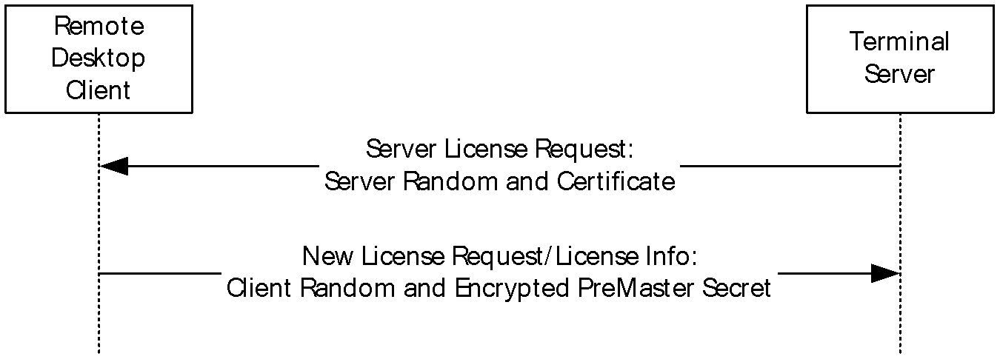

Figure 7: Client and server random values and premaster secret flows

For information on how the licensing encryption key is generated, see section [5.1.2](#Section_5.1.2).

#### 5.1.1.1 Encrypting the Premaster Secret

The client uses RSA to encrypt the [**premaster secret**](#gt_premaster-secret) with the public key of the server. The client obtains the public key from the [**terminal server certificate**](#gt_terminal-server-certificate), which is the leaf certificate in the certificate chain that is obtained from the [Server Certificate (SERVER_CERTIFICATE)](#Section_2.2.1.4) in the [Server License Request](#Section_2.2.2.1) message.

For encryption with RSA, see [MS-RDPBCGR](../MS-RDPBCGR/MS-RDPBCGR.md) sections 5.3.1 and 5.3.4.

#### 5.1.1.2 Decrypting the Premaster Secret

The server decrypts the encrypted [**premaster secret**](#gt_premaster-secret) with its private key. For decryption with RSA, see [MS-RDPBCGR](../MS-RDPBCGR/MS-RDPBCGR.md) sections 5.3.1 and 5.3.4.

### 5.1.2 Generating the Licensing Encryption and MAC Salt Keys

Both the client and the server use the licensing encryption key when necessary to encrypt and decrypt licensing message data. Both the client and the server use the method described in this section to generate the licensing encryption key. The key generating procedure is described as follows. Note that the "+" symbol is used in the following procedure to represent concatenation of the keys.

- The client and server random values and the decrypted [**premaster secret**](#gt_premaster-secret) are first used to generate a 384-bit master secret, as follows. Note that [**SHA-1 hash**](#gt_sha-1-hash) is used.
SaltedHash(S, I) = MD5(S + SHA-1 (I + S + ClientRandom + ServerRandom))

PreMasterHash(I) = SaltedHash(PremasterSecret, I)

MasterSecret = PreMasterHash('A') + PreMasterHash('BB')

+ PreMasterHash('CCC')

- A 384-bit SessionKeyBlob is generated.
SaltedHash2(S, I) = MD5(S + SHA-1 (I + S + ServerRandom + ClientRandom))

MasterHash(I) = SaltedHash2(MasterSecret, I)

SessionKeyBlob = MasterHash('A') + MasterHash('BB')

+ MasterHash('CCC')

- The first 128 bits of the SessionKeyBlob are used to generate the MAC salt key.
MAC-salt-key = First128Bits(SessionKeyBlob)

- The MAC salt key is used to generate the [**MAC**](#gt_message-authentication-code-mac) checksum that the recipient uses to check the integrity of the licensing message.
- The licensing encryption key is derived from the SessionKeyBlob. Note that the "+" symbol is used in the following procedure to represent concatenation of the keys.
FinalHash(K) = MD5(K + ClientRandom + ServerRandom)

LicensingEncryptionKey = FinalHash(Second128Bits(SessionKeyBlob))

### 5.1.3 Encrypting Licensing Session Data

The server and the client both encrypt the licensing data with the 128-bit license encryption key (obtained as described in section [5.1.2](#Section_5.1.2)) using [**RC4**](#gt_rc4). For more information, see [[SCHNEIER]](https://go.microsoft.com/fwlink/?LinkId=817338).

EncryptedData = RC4(LicensingEncryptionKey, LicensingData)

### 5.1.4 Decrypting Licensing Session Data

The server and the client both decrypt the licensing data with the 128-bit license encryption key (obtained as specified in section [5.1.2](#Section_5.1.2)), using [**RC4**](#gt_rc4) (for more information, see [[MSDN-RC4]](https://go.microsoft.com/fwlink/?LinkId=93773)).

DecryptedData = RC4(LicensingEncryptionKey, EncryptedData)

### 5.1.5 MAC Generation

Generation of a [**MAC**](#gt_message-authentication-code-mac) checksum follows a method similar to that specified in [MS-RDPBCGR](../MS-RDPBCGR/MS-RDPBCGR.md) section 5.3.6.1. Note that [**SHA-1 hash**](#gt_sha-1-hash) is used. Also note that the "+" symbol is used in the following procedure to represent concatenation of the keys.

MACData = MD5(MAC-salt-key + pad2 + SHA-1 (MAC-salt-key + pad1

+ data-length + data-content))

The **Pad1**field is the value 0x36 repeated 40 times, the **pad2** field is the value 0x5C repeated 48 times, the **data-length** field is the length of the data to encrypt expressed as a little-endian (Intel-ordered) UINT32, and the **data-content** field is the full set of data to be encoded.

The MAC salt key is given by the first 128 bits of the licensing session key BLOB. For licensing session key BLOB and MAC salt key generation, see section [5.1.2](#Section_5.1.2).

## 5.2 Index of Security Parameters

None.

# 6 Appendix A: Product Behavior

The information in this specification is applicable to the following Microsoft products or supplemental software. References to product versions include updates to those products.

- Windows XP operating system
- Windows Server 2003 operating system
- Windows Vista operating system
- Windows Server 2008 operating system
- Windows 7 operating system
- Windows Server 2008 R2 operating system
- Windows 8 operating system
- Windows Server 2012 operating system
- Windows 8.1 operating system
- Windows Server 2012 R2 operating system
- Windows 10 operating system
- Windows Server 2016 operating system
- Windows Server operating system
- Windows Server 2019 operating system
- Windows Server 2022 operating system
- Windows 11 operating system
- Windows Server 2025 operating system
Exceptions, if any, are noted in this section. If an update version, service pack or Knowledge Base (KB) number appears with a product name, the behavior changed in that update. The new behavior also applies to subsequent updates unless otherwise specified. If a product edition appears with the product version, behavior is different in that product edition.

Unless otherwise specified, any statement of optional behavior in this specification that is prescribed using the terms "SHOULD" or "SHOULD NOT" implies product behavior in accordance with the SHOULD or SHOULD NOT prescription. Unless otherwise specified, the term "MAY" implies that the product does not follow the prescription.

<1> Section 1.6: Client SKUs of the Windows operating system that support Remote Desktop (Windows XP Professional operating system, Windows Vista, and Windows 7) and server SKUs (Windows Server 2003, Windows Server 2008, and Windows Server 2008 R2 operating system) that run in Remote Administration mode never contact a license server. In such cases, the PDU flow is as specified in section [1.3.3](#Section_1.3.3).

<2> Section 2.2.2.1: Windows uses 2048-bit keys. Any client/server combinations that include Windows Server 2003 and Windows XP use 512-bit keys; for example, Windows XP as a client and Windows Server 2012 as a server, or Windows 8 as a client and Windows Server 2003 as a server.

<3> Section 2.2.2.1: The Windows Server 2008 terminal server does not send the [server certificate](#Section_2.2.1.4) if encryption is in effect and already protecting RDP traffic (for RDP security measures, see [MS-RDPBCGR](../MS-RDPBCGR/MS-RDPBCGR.md) sections 5.3 and 5.4 ).

<4> Section 2.2.2.1: The appropriate license refers to any valid license that can be used to connect to the terminal server in question. A terminal server requires a license of the same version or later to honor the connection. For instance, if the terminal server is running Windows Server 2008, the license store is searched for a Windows Server 2008 license or later version license.

<5> Section 2.2.2.1.1: The Windows Server 2008 R2 and Windows Server 2012 terminal server minor version that is specified in the low-order field of **dwVersion** is 0, which is the same value that is used for Windows Server 2008. See [[MSDN-OSVER]](https://go.microsoft.com/fwlink/?LinkId=200598) for information on getting Windows operating system version numbers.

<6> Section 2.2.2.1.1: Licenses issued by Microsoft license servers contain "Microsoft Corporation" as the company name.

<7> Section 2.2.2.1.2: Scope Lists originating from Microsoft terminal servers contain only one [Scope](#Section_2.2.2.1.2.1) structure for the entity "microsoft.com".

<8> Section 2.2.2.2: Windows uses 2048-bit keys. Any client/server combinations that include Windows Server 2003 and Windows XP use 512-bit keys; for example, Windows XP as a client and Windows Server 2012 as a server, or Windows 8 as a client and Windows Server 2003 as a server.

<9> Section 2.2.2.2: On Windows platforms, it is relative to the major version number of the operating system and has the following values.

| Value | Meaning |
| --- | --- |
| CLIENT_OS_ID_WINNT_351 0x01000000 | The client operating system version is 3.51. |
| CLIENT_OS_ID_WINNT_40 0x02000000 | The client operating system version is 4.0. |
| CLIENT_OS_ID_WINNT_50 0x03000000 | The client operating system version is 5.0. |
| CLIENT_OS_ID_WINNT_POST_52 0x04000000 | The client operating system version is between 5.2 and 6.3 (inclusive). |
| CLIENT_OS_ID_WINNT_POST_100 0x08000000 | The client operating system version is 10.0 or later. |

<10> Section 2.2.2.2: On Microsoft platforms, the second most significant byte can have the following values.

| Value | Meaning |
| --- | --- |
| CLIENT_IMAGE_ID_MICROSOFT 0x00010000 | The ISV for the client image is Microsoft. |
| CLIENT_IMAGE_ID_CITRIX 0x00020000 | The ISV for the client image is Citrix. |

<11> Section 2.2.2.2: On Microsoft platforms, the least-significant byte of the **PlatFormId** field contains the minor operating system version.

<12> Section 2.2.2.4: The **wBlobType** field is unused in **EncryptedPlatformChallenge** (part of SERVER_PLATFORM_CHALLENGE PDU), which is sent by the server to the client.

<13> Section 2.2.2.5: The **wBlobType** field is unused in **EncryptedPlatformChallengeResponse** (part of CLIENT_PLATFORM_CHALLENGE_RESPONSE PDU), which is sent by the client to the server.

<14> Section 2.2.2.5.1: The wClientType is WIN32_PLATFORMCHALLENGE_TYPE for all the Microsoft remote desktop clients except for those running in Windows CE where the wClientType is WINCE_PLATFORMCHALLENGE_TYPE.

<15> Section 2.2.2.6: For Windows Server 2008, Windows Server 2008 R2, and Windows Server 2012, the EncryptedLicenseInfo variable (part of the [Server Upgrade License](#Section_3.2.5.6) PDU) sent by the server to the client has the **wBlobType** parameter set to value BB_ENCRYPTED_DATA_BLOB (0x0009). For Windows Server 2003, the value of **wBlobType** is not defined.

<16> Section 3.1.5.3: In Windows XP, the RDP connection is not disconnected on receiving ST_TOTAL_ABORT as the state transition in the **Licensing Error Message** (section [2.2.2.8](#Section_2.2.2.8)).

<17> Section 3.1.5.3: All Microsoft implementations of Licensing Extension server and Licensing Extension client never send ST_RESET_PHASE_TO_START and ST_RESEND_LAST_MESSAGE.

<18> Section 3.2.1.5: For example, the **ScopeList** field in a [Server License Request](#Section_2.2.2.1) message sent by a [**terminal server**](#gt_terminal-server) running on a Windows operating system has the following content.

ScopeCount = 1

ScopeCountArray[0] = "microsoft.com"

<19> Section 3.3.1.3: Windows uses 2048-bit keys. Any client/server combinations that include Windows Server 2003 and Windows XP use 512-bit keys; for example, Windows XP as a client and Windows Server 2012 as a server, or Windows 8 as a client and Windows Server 2003 as a server.

<20> Section 3.3.2.1: The Windows Vista and Windows Server 2008 Remote Desktop client implements a configurable Client Packet Wait Timer. The default duration of this timer is 300 seconds.

# 7 Change Tracking

This section identifies changes that were made to this document since the last release. Changes are classified as Major, Minor, or None.

The revision class **Major** means that the technical content in the document was significantly revised. Major changes affect protocol interoperability or implementation. Examples of major changes are:

- A document revision that incorporates changes to interoperability requirements.
- A document revision that captures changes to protocol functionality.
The revision class **Minor** means that the meaning of the technical content was clarified. Minor changes do not affect protocol interoperability or implementation. Examples of minor changes are updates to clarify ambiguity at the sentence, paragraph, or table level.

The revision class **None** means that no new technical changes were introduced. Minor editorial and formatting changes may have been made, but the relevant technical content is identical to the last released version.

The changes made to this document are listed in the following table. For more information, please contact [dochelp@microsoft.com](mailto:dochelp@microsoft.com).

| Section | Description | Revision class |
| --- | --- | --- |
| [6](#Section_6) Appendix A: Product Behavior | Added Windows Server 2025 to the list of applicable products. | Major |

## Revision History

| Date | Version | Revision Class | Comments |
| --- | --- | --- | --- |
| 7/20/2007 | 0.1 | Major | MCPP Milestone 5 Initial Availability |
| 9/28/2007 | 0.2 | Minor | Clarified the meaning of the technical content. |
| 10/23/2007 | 0.3 | Minor | Clarified the meaning of the technical content. |
| 11/30/2007 | 0.4 | Minor | Clarified the meaning of the technical content. |
| 1/25/2008 | 0.4.1 | Editorial | Changed language and formatting in the technical content. |
| 3/14/2008 | 0.5 | Minor | Clarified the meaning of the technical content. |
| 5/16/2008 | 0.5.1 | Editorial | Changed language and formatting in the technical content. |
| 6/20/2008 | 1.0 | Major | Updated and revised the technical content. |
| 7/25/2008 | 2.0 | Major | Updated and revised the technical content. |
| 8/29/2008 | 2.1 | Minor | Clarified the meaning of the technical content. |
| 10/24/2008 | 2.2 | Minor | Clarified the meaning of the technical content. |
| 12/5/2008 | 3.0 | Major | Updated and revised the technical content. |
| 1/16/2009 | 3.0.1 | Editorial | Changed language and formatting in the technical content. |
| 2/27/2009 | 4.0 | Major | Updated and revised the technical content. |
| 4/10/2009 | 4.1 | Minor | Clarified the meaning of the technical content. |
| 5/22/2009 | 4.1.1 | Editorial | Changed language and formatting in the technical content. |
| 7/2/2009 | 4.1.2 | Editorial | Changed language and formatting in the technical content. |
| 8/14/2009 | 4.2 | Minor | Clarified the meaning of the technical content. |
| 9/25/2009 | 4.3 | Minor | Clarified the meaning of the technical content. |
| 11/6/2009 | 4.3.1 | Editorial | Changed language and formatting in the technical content. |
| 12/18/2009 | 5.0 | Major | Updated and revised the technical content. |
| 1/29/2010 | 5.1 | Minor | Clarified the meaning of the technical content. |
| 3/12/2010 | 6.0 | Major | Updated and revised the technical content. |
| 4/23/2010 | 7.0 | Major | Updated and revised the technical content. |
| 6/4/2010 | 8.0 | Major | Updated and revised the technical content. |
| 7/16/2010 | 8.1 | Minor | Clarified the meaning of the technical content. |
| 8/27/2010 | 9.0 | Major | Updated and revised the technical content. |
| 10/8/2010 | 10.0 | Major | Updated and revised the technical content. |
| 11/19/2010 | 10.0 | None | No changes to the meaning, language, or formatting of the technical content. |
| 1/7/2011 | 10.0 | None | No changes to the meaning, language, or formatting of the technical content. |
| 2/11/2011 | 10.0 | None | No changes to the meaning, language, or formatting of the technical content. |
| 3/25/2011 | 10.0 | None | No changes to the meaning, language, or formatting of the technical content. |
| 5/6/2011 | 10.0 | None | No changes to the meaning, language, or formatting of the technical content. |
| 6/17/2011 | 10.1 | Minor | Clarified the meaning of the technical content. |
| 9/23/2011 | 10.1 | None | No changes to the meaning, language, or formatting of the technical content. |
| 12/16/2011 | 11.0 | Major | Updated and revised the technical content. |
| 3/30/2012 | 11.0 | None | No changes to the meaning, language, or formatting of the technical content. |
| 7/12/2012 | 11.1 | Minor | Clarified the meaning of the technical content. |
| 10/25/2012 | 11.2 | Minor | Clarified the meaning of the technical content. |
| 1/31/2013 | 11.2 | None | No changes to the meaning, language, or formatting of the technical content. |
| 8/8/2013 | 11.2 | None | No changes to the meaning, language, or formatting of the technical content. |
| 11/14/2013 | 11.2 | None | No changes to the meaning, language, or formatting of the technical content. |
| 2/13/2014 | 11.2 | None | No changes to the meaning, language, or formatting of the technical content. |
| 5/15/2014 | 11.2 | None | No changes to the meaning, language, or formatting of the technical content. |
| 6/30/2015 | 12.0 | Major | Significantly changed the technical content. |
| 10/16/2015 | 12.0 | None | No changes to the meaning, language, or formatting of the technical content. |
| 7/14/2016 | 12.1 | Minor | Clarified the meaning of the technical content. |
| 6/1/2017 | 12.1 | None | No changes to the meaning, language, or formatting of the technical content. |
| 9/15/2017 | 13.0 | Major | Significantly changed the technical content. |
| 9/12/2018 | 14.0 | Major | Significantly changed the technical content. |
| 3/4/2020 | 15.0 | Major | Significantly changed the technical content. |
| 8/26/2020 | 15.1 | Minor | Clarified the meaning of the technical content. |
| 4/7/2021 | 16.0 | Major | Significantly changed the technical content. |
| 6/25/2021 | 17.0 | Major | Significantly changed the technical content. |
| 4/23/2024 | 18.0 | Major | Significantly changed the technical content. |
