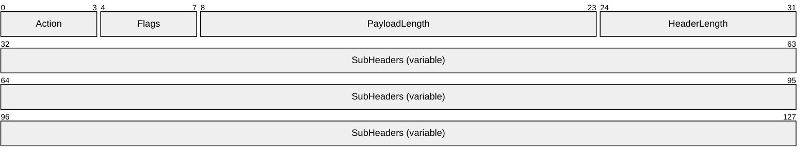
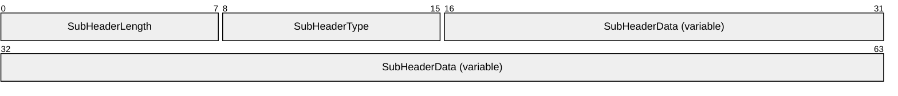
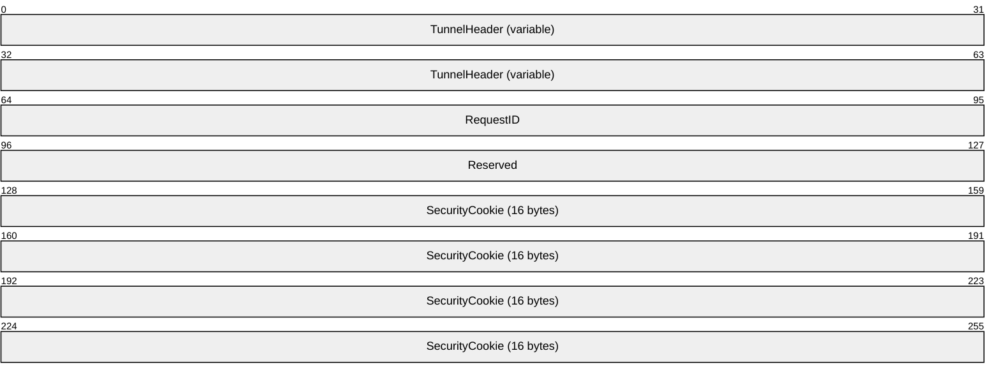
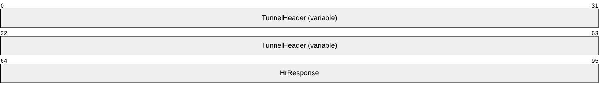
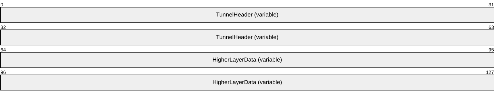

# [MS-RDPEMT]: Remote Desktop Protocol: Multitransport Extension

Table of Contents

1 Introduction

- [1 Introduction](#Section_1)
  - [1.1 Glossary](#Section_1.1)
  - [1.2 References](#Section_1.2)
    - [1.2.1 Normative References](#Section_1.2.1)
    - [1.2.2 Informative References](#Section_1.2.2)
  - [1.3 Overview](#Section_1.3)
    - [1.3.1 Messages and Intersection with Other Protocols](#Section_1.3.1)
    - [1.3.2 RDP Channels and Multitransport Connections](#Section_1.3.2)
    - [1.3.3 Connection Termination](#Section_1.3.3)
  - [1.4 Relationship to Other Protocols](#Section_1.4)
  - [1.5 Prerequisites/Preconditions](#Section_1.5)
  - [1.6 Applicability Statement](#Section_1.6)
  - [1.7 Versioning and Capability Negotiation](#Section_1.7)
  - [1.8 Vendor-Extensible Fields](#Section_1.8)
  - [1.9 Standards Assignments](#Section_1.9)

2 Messages

- [2 Messages](#Section_2)
  - [2.1 Transport](#Section_2.1)
  - [2.2 Message Syntax](#Section_2.2)
    - [2.2.1 Common Data Types](#Section_2.2.1)
      - [2.2.1.1 Tunnel PDU Header (RDP_TUNNEL_HEADER)](#Section_2.2.1.1)
        - [2.2.1.1.1 Tunnel PDU Subheader (RDP_TUNNEL_SUBHEADER)](#Section_2.2.1.1.1)
    - [2.2.2 Multitransport PDUs](#Section_2.2.2)
      - [2.2.2.1 Tunnel Create Request PDU (RDP_TUNNEL_CREATEREQUEST)](#Section_2.2.2.1)
      - [2.2.2.2 Tunnel Create Response PDU (RDP_TUNNEL_CREATERESPONSE)](#Section_2.2.2.2)
      - [2.2.2.3 Tunnel Data PDU (RDP_TUNNEL_DATA)](#Section_2.2.2.3)

3 Protocol Details

- [3 Protocol Details](#Section_3)
  - [3.1 Common Details](#Section_3.1)
    - [3.1.1 Abstract Data Model](#Section_3.1.1)
    - [3.1.2 Timers](#Section_3.1.2)
    - [3.1.3 Initialization](#Section_3.1.3)
    - [3.1.4 Higher-Layer Triggered Events](#Section_3.1.4)
    - [3.1.5 Message Processing Events and Sequencing Rules](#Section_3.1.5)
      - [3.1.5.1 Processing the Action Field of the Tunnel PDU Header](#Section_3.1.5.1)
      - [3.1.5.2 Processing the PayloadLength Field of the Tunnel PDU Header](#Section_3.1.5.2)
      - [3.1.5.3 Processing the HeaderLength Field of the Tunnel PDU Header](#Section_3.1.5.3)
      - [3.1.5.4 Processing Tunnel Data PDUs](#Section_3.1.5.4)
      - [3.1.5.5 Sequencing of PDUs on the Multitransport Connection](#Section_3.1.5.5)
    - [3.1.6 Timer Events](#Section_3.1.6)
    - [3.1.7 Other Local Events](#Section_3.1.7)
  - [3.2 Server Details](#Section_3.2)
    - [3.2.1 Abstract Data Model](#Section_3.2.1)
    - [3.2.2 Timers](#Section_3.2.2)
    - [3.2.3 Initialization](#Section_3.2.3)
    - [3.2.4 Higher-Layer Triggered Events](#Section_3.2.4)
    - [3.2.5 Message Processing Events and Sequencing Rules](#Section_3.2.5)
      - [3.2.5.1 Processing the RDP_TUNNEL_CREATEREQUEST PDU](#Section_3.2.5.1)
    - [3.2.6 Timer Events](#Section_3.2.6)
    - [3.2.7 Other Local Events](#Section_3.2.7)
  - [3.3 Client Details](#Section_3.3)
    - [3.3.1 Abstract Data Model](#Section_3.3.1)
    - [3.3.2 Timers](#Section_3.3.2)
    - [3.3.3 Initialization](#Section_3.3.3)
    - [3.3.4 Higher-Layer Triggered Events](#Section_3.3.4)
    - [3.3.5 Message Processing Events and Sequencing Rules](#Section_3.3.5)
      - [3.3.5.1 Processing the RDP_TUNNEL_CREATERESPONSE PDU](#Section_3.3.5.1)
    - [3.3.6 Timer Events](#Section_3.3.6)
    - [3.3.7 Other Local Events](#Section_3.3.7)

4 Protocol Examples

- [4 Protocol Examples](#Section_4)
  - [4.1 Tunnel Create Request PDU](#Section_4.1)
  - [4.2 Tunnel Create Response PDU](#Section_4.2)

5 Security

- [5 Security](#Section_5)
  - [5.1 Security Considerations for Implementers](#Section_5.1)
  - [5.2 Index of Security Parameters](#Section_5.2)

6 Appendix A: Product Behavior

- [6 Appendix A: Product Behavior](#Section_6)

7 Change Tracking

- [7 Change Tracking](#Section_7)

For the legal notice and IP terms, see [LEGAL.md](../LEGAL.md).
Last updated: 4/23/2024.
See [Revision History](#revision-history) for full version history.

# 1 Introduction

This document specifies the Remote Desktop Protocol: Multitransport Extension to Remote Desktop Protocol: Basic Connectivity and Graphics Remoting, as specified in [MS-RDPBCGR](../MS-RDPBCGR/MS-RDPBCGR.md) section 1, 2, 3, 4, and 5. This protocol is used to implement multiple transport connections between a [**Remote Desktop Protocol (RDP)**](#gt_remote-desktop-protocol-rdp) client and server.

Sections 1.5, 1.8, 1.9, 2, and 3 of this specification are normative. All other sections and examples in this specification are informative.

## 1.1 Glossary

This document uses the following terms:

**cookie**: A randomly generated, 16-byte sequence that is used to authenticate the client to the server during the creation of a multitransport connection.

**message mode**: A named pipe can be of two types: byte mode or [**message mode**](#gt_message-mode). In byte mode, the data sent or received on the named pipe does not have message boundaries but is treated as a continuous Stream. In message mode, message boundaries are enforced.

**protocol data unit (PDU)**: Information that is delivered as a unit among peer entities of a network and that can contain control information, address information, or data. For more information on remote procedure call (RPC)-specific PDUs, see [[C706]](https://go.microsoft.com/fwlink/?LinkId=89824) section 12.

**Remote Desktop Protocol (RDP)**: A multi-channel protocol that allows a user to connect to a computer running Microsoft Terminal Services (TS). RDP enables the exchange of client and server settings and also enables negotiation of common settings to use for the duration of the connection, so that input, graphics, and other data can be exchanged and processed between client and server.

**Transmission Control Protocol (TCP)**: A protocol used with the Internet Protocol (IP) to send data in the form of message units between computers over the Internet. TCP handles keeping track of the individual units of data (called packets) that a message is divided into for efficient routing through the Internet.

**MAY, SHOULD, MUST, SHOULD NOT, MUST NOT:** These terms (in all caps) are used as defined in [[RFC2119]](https://go.microsoft.com/fwlink/?LinkId=90317). All statements of optional behavior use either MAY, SHOULD, or SHOULD NOT.

## 1.2 References

Links to a document in the Microsoft Open Specifications library point to the correct section in the most recently published version of the referenced document. However, because individual documents in the library are not updated at the same time, the section numbers in the documents may not match. You can confirm the correct section numbering by checking the [Errata](https://go.microsoft.com/fwlink/?linkid=850906).

### 1.2.1 Normative References

We conduct frequent surveys of the normative references to assure their continued availability. If you have any issue with finding a normative reference, please contact [dochelp@microsoft.com](mailto:dochelp@microsoft.com). We will assist you in finding the relevant information.

[MS-DTYP] Microsoft Corporation, "[Windows Data Types](../MS-DTYP/MS-DTYP.md)".

[MS-ERREF] Microsoft Corporation, "[Windows Error Codes](../MS-ERREF/MS-ERREF.md)".

[MS-RDPBCGR] Microsoft Corporation, "[Remote Desktop Protocol: Basic Connectivity and Graphics Remoting](../MS-RDPBCGR/MS-RDPBCGR.md)".

[MS-RDPEDYC] Microsoft Corporation, "[Remote Desktop Protocol: Dynamic Channel Virtual Channel Extension](../MS-RDPEDYC/MS-RDPEDYC.md)".

[MS-RDPEUDP] Microsoft Corporation, "[Remote Desktop Protocol: UDP Transport Extension](../MS-RDPEUDP/MS-RDPEUDP.md)".

[RFC2119] Bradner, S., "Key words for use in RFCs to Indicate Requirement Levels", BCP 14, RFC 2119, March 1997, [https://www.rfc-editor.org/info/rfc2119](https://go.microsoft.com/fwlink/?LinkId=90317)

[RFC2246] Dierks, T., and Allen, C., "The TLS Protocol Version 1.0", RFC 2246, January 1999, [https://www.rfc-editor.org/info/rfc2246](https://go.microsoft.com/fwlink/?LinkId=90324)

[RFC4346] Dierks, T., and Rescorla, E., "The Transport Layer Security (TLS) Protocol Version 1.1", RFC 4346, April 2006, [https://www.rfc-editor.org/info/rfc4346](https://go.microsoft.com/fwlink/?LinkId=90474)

[RFC4347] Rescorla, E., and Modadugu, N., "Datagram Transport Layer Security", RFC 4347, April 2006, [https://www.rfc-editor.org/info/rfc4347](https://go.microsoft.com/fwlink/?LinkId=227111)

[RFC5246] Dierks, T., and Rescorla, E., "The Transport Layer Security (TLS) Protocol Version 1.2", RFC 5246, August 2008, [https://www.rfc-editor.org/info/rfc5246](https://go.microsoft.com/fwlink/?LinkId=129803)

### 1.2.2 Informative References

None.

## 1.3 Overview

The Remote Desktop Protocol: Multitransport Extension enables multiple side-band channels (also referred to as "multitransport connections") between an RDP client and server over different underlying transport protocols such as reliable UDP, or lossy UDP ([MS-RDPEUDP](../MS-RDPEUDP/MS-RDPEUDP.md) section 1.3.1). Each multitransport connection leverages the strengths of the underlying transport protocol to efficiently deliver different types of RDP content, thereby improving the user's experience, especially on WAN or wireless networks.

After the main RDP connection has been established and secured, the server can initiate multitransport connections if it is determined that the connection would benefit from additional transports. Each multitransport connection that is initiated is bootstrapped with data that is exchanged on the main RDP connection by using the server-to-client Initiate Multitransport Request PDU ([MS-RDPBCGR](../MS-RDPBCGR/MS-RDPBCGR.md) section 2.2.15.1) sent during the RDP connection sequence ([MS-RDPBCGR] section 1.3.1.1).

The Initiate Multitransport Request PDU contains information that uniquely identifies the multitransport connection; it contains a request ID, a [**cookie**](#gt_cookie), and a protocol identifier that identifies the type of multitransport connection that the client attempts to establish. When the client receives the Initiate Multitransport Request PDU, it attempts to establish a secure multitransport connection with the server.

All multitransport connections are secured by using either Transport Layer Security (TLS) ([[RFC2246]](https://go.microsoft.com/fwlink/?LinkId=90324), [[RFC4346]](https://go.microsoft.com/fwlink/?LinkId=90474) and [[RFC5246]](https://go.microsoft.com/fwlink/?LinkId=129803)) or Datagram Transport Layer Security (DTLS) ([[RFC4347]](https://go.microsoft.com/fwlink/?LinkId=227111)). TLS is used to secure transport connections that ensure the reliable delivery of data, while DTLS is used to secure transport connections that can potentially lose data. If the creation of the underlying transport connection is successful and the TLS or DTLS handshake succeeds, then the multitransport connection is used to transport selected dynamic virtual channel traffic.

### 1.3.1 Messages and Intersection with Other Protocols

Bootstrapping, creating, securing and finalizing a multitransport connection uses messages from a number of protocols. The following sequence diagram presents an overview of these messages and protocols.

Figure 1: Messages used by multitransport connections

The RDP server initiates a multitransport connection by sending an Initiate Multitransport Request PDU ([MS-RDPBCGR](../MS-RDPBCGR/MS-RDPBCGR.md) section 2.2.15.1) to the RDP client over the main RDP connection. Upon receiving the Initiate Multitransport Request PDU the client initiates the creation of the requested transport (reliable or lossy UDP) as described in [MS-RDPEUDP](../MS-RDPEUDP/MS-RDPEUDP.md) sections 1.3.2 and 1.3.2.1.

After the transport has been successfully set up, the connection is secured by using Transport Layer Security (TLS) or Datagram Transport Layer Security (DTLS) to set up a secure channel. TLS ([[RFC2246]](https://go.microsoft.com/fwlink/?LinkId=90324), [[RFC4346]](https://go.microsoft.com/fwlink/?LinkId=90474) and [[RFC5246]](https://go.microsoft.com/fwlink/?LinkId=129803)) is used to secure reliable UDP transport connections, while DTLS ([[RFC4347]](https://go.microsoft.com/fwlink/?LinkId=227111)) is used to secure lossy UDP transport connections.

Once the secure channel has been established, the client finalizes the creation of the multitransport connection by sending a request ID and a security [**cookie**](#gt_cookie) to the server in the Tunnel Create Request PDU (section [2.2.2.1](#Section_2.2.2.1)); this PDU is sent over the newly created and secured multitransport connection. The data sent in the Tunnel Create Request PDU has to be identical to the data that the client received over the main RDP connection as part of the Initiate Multitransport Request PDU. The server compares the data in the Tunnel Create Request PDU to the data that was sent over the main RDP connection in the Initiate Multitransport Request PDU. This comparison allows the server to match the incoming multitransport connection request to an existing main RDP connection and to authenticate the connection based on the security cookie. If the security check succeeds, the server indicates to the client that it was able to successfully initialize the multitransport connection by sending the Tunnel Create Response PDU (section [2.2.2.2](#Section_2.2.2.2)) over the multitransport connection. The server and client can then start transferring data over the multitransport connection.

If Soft-Sync ([MS-RDPEDYC](../MS-RDPEDYC/MS-RDPEDYC.md) section 3.1.5.3) is supported by the server and client, the Initiate Multitransport Response PDU ([MS-RDPBCGR] section 2.2.15.2) is sent to the server after each transport is created, and the multitransport connections are not used to send or receive dynamic virtual channel data until Soft-Sync negotiation is completed.

All data is transferred over the multitransport connection in [**message mode**](#gt_message-mode). The Tunnel PDU Header (section [2.2.1.1](#Section_2.2.1.1)) includes the size of the message that the multitransport [**protocol data unit (PDU)**](#gt_protocol-data-unit-pdu) contains; the client assembles the entire message before delivering it to the upper layers.

### 1.3.2 RDP Channels and Multitransport Connections

The main RDP connection is encapsulated in the [**Transmission Control Protocol (TCP)**](#gt_transmission-control-protocol-tcp) ([MS-RDPBCGR](../MS-RDPBCGR/MS-RDPBCGR.md) section 2.1). The I/O channel ([MS-RDPBCGR] section 3.2.1.3 and 3.3.1.3) and the optional message channel ([MS-RDPBCGR] sections 3.2.1.3 and 3.3.1.5) are encapsulated within the main RDP connection and are used to transport core RDP PDUs, input and graphics data. In addition to these two channels there is a collection of negotiated static virtual channels ([MS-RDPBCGR] section 1.3.3). One of these static virtual channels, named "DRDYNVC", multiplexes a collection of dynamic virtual channels ([MS-RDPEDYC](../MS-RDPEDYC/MS-RDPEDYC.md) sections 1, 2 and 3).

Multitransport connections run over a separate transport protocol to the main RDP connection and multiplex a collection of selected dynamic virtual channels.

The following figure illustrates the hierarchy and encapsulation of RDP channels and transports.

Figure 2: RDP channels and transport

### 1.3.3 Connection Termination

There is no explicit connection-termination protocol over a multitransport connection. The client and server terminate the multitransport connection and disconnect the underlying transports when the main RDP connection is disconnected by the server or the client.

## 1.4 Relationship to Other Protocols

The Remote Desktop Protocol: Multitransport Extension operates over the RDP-UDP protocol, as defined in [MS-RDPEUDP](../MS-RDPEUDP/MS-RDPEUDP.md) section 1, 2, and 3. Protocol traffic (section [2.2](#Section_2.2)) is secured by using Transport Layer Security (TLS) ([[RFC2246]](https://go.microsoft.com/fwlink/?LinkId=90324), [[RFC4346]](https://go.microsoft.com/fwlink/?LinkId=90474) and [[RFC5246]](https://go.microsoft.com/fwlink/?LinkId=129803)) for reliable RDP-UDP streams and Datagram Transport Layer Security (DTLS) ([[RFC4347]](https://go.microsoft.com/fwlink/?LinkId=227111)) for unreliable (lossy) RDP-UDP streams. The TLS or DTLS handshake, as well as the encrypted payload, are embedded in the RDPUDP_SOURCE_PAYLOAD_HEADER as defined in [MS-RDPEUDP].

A multitransport connection is initiated by an RDP server sending the Initiate Multitransport Request PDU ([MS-RDPBCGR](../MS-RDPBCGR/MS-RDPBCGR.md) section 2.2.1.15.1) to an RDP client over the main RDP connection.

## 1.5 Prerequisites/Preconditions

The multitransport connection must be initiated over the main RDP connection using the Initiate Multitransport Request PDU ([MS-RDPBCGR](../MS-RDPBCGR/MS-RDPBCGR.md) section 2.2.1.15.1). The underlying RDP-UDP ([MS-RDPEUDP](../MS-RDPEUDP/MS-RDPEUDP.md) section 1, 2, and 3) transport which is created must be secured with Transport Layer Security (TLS) or Datagram Transport Layer Security (DTLS).<1> Furthermore, the client and server MUST support the Remote Desktop Protocol: Dynamic Channel Virtual Channel Extension (as specified in [MS-RDPEDYC](../MS-RDPEDYC/MS-RDPEDYC.md)) and the client MUST advertise support for the "DRDYNVC" static channel in the Client Network Data block ([MS-RDPBCGR] section 2.2.1.3.4) sent in the MCS Connect Initial PDU with GCC Conference Create Request ([MS-RDPBCGR] section 2.2.1.3).

## 1.6 Applicability Statement

The Remote Desktop Protocol: Multitransport Extension is applicable in scenarios where multiple side-band channels over different underlying transport protocols are required between an RDP client and server.

## 1.7 Versioning and Capability Negotiation

Support for multitransport in the Remote Desktop Protocol: Multitransport Extension is advertised by the client using the Client Multitransport Channel Data ([MS-RDPBCGR](../MS-RDPBCGR/MS-RDPBCGR.md) section 2.2.1.3.8), while the server advertises support in the Server Multitransport Channel Data ([MS-RDPBCGR] section 2.2.1.4.6).

## 1.8 Vendor-Extensible Fields

None.

## 1.9 Standards Assignments

None.

# 2 Messages

## 2.1 Transport

The Remote Desktop Protocol: Multitransport Extension operates over the RDP-UDP protocol, as defined in [MS-RDPEUDP](../MS-RDPEUDP/MS-RDPEUDP.md), sections 1, 2 and 3.

Multitransport connections are bootstrapped using the Initiate Multitransport Request PDU ([MS-RDPBCGR](../MS-RDPBCGR/MS-RDPBCGR.md) section 2.2.15.1), which is sent from server to client over the main RDP connection.

## 2.2 Message Syntax

The following sections define the Remote Desktop Protocol: Multitransport Extension messages that are exchanged between an RDP client and server.

All multiple-byte fields within a message MUST be marshaled in little-endian byte order, unless otherwise specified.

This protocol references commonly used data types as defined in [MS-DTYP](../MS-DTYP/MS-DTYP.md).

### 2.2.1 Common Data Types

#### 2.2.1.1 Tunnel PDU Header (RDP_TUNNEL_HEADER)

The RDP_TUNNEL_HEADER structure is a common header included in every multitransport PDU specified in section [2.2.2](#Section_2.2.2).

**Action (4 bits):** A 4-bit unsigned integer that indicates the type of PDU being transmitted.

| Value | Meaning |
| --- | --- |
| RDPTUNNEL_ACTION_CREATEREQUEST 0x0 | RDP_TUNNEL_CREATEREQUEST (section [2.2.2.1](#Section_2.2.2.1)) |
| RDPTUNNEL_ACTION_CREATERESPONSE 0x1 | RDP_TUNNEL_CREATERESPONSE (section [2.2.2.2](#Section_2.2.2.2)) |
| RDPTUNNEL_ACTION_DATA 0x2 | RDP_TUNNEL_DATA (section [2.2.2.3](#Section_2.2.2.3)) |

**Flags (4 bits):** A 4-bit unsigned integer that specifies tunnel flags. This field MUST be set to zero.

**PayloadLength (2 bytes):** A 16-bit unsigned integer that specifies the length, in bytes, of the payload following the header. This length MUST NOT include the length of the RDP_TUNNEL_HEADER structure.

**HeaderLength (1 byte):** An 8-bit unsigned integer that specifies the combined length, in bytes, of the **Action**, **Flags**, **PayloadLength**, **HeaderLength,** and **SubHeaders** fields. If the value in this field is larger than 4 bytes, then the **SubHeaders** field MUST be present.

**SubHeaders (variable):** An optional, variable-length array of RDP_TUNNEL_SUBHEADER structures (section [2.2.1.1.1](#Section_2.2.1.1.1)). This field MUST be present if the value specified in the **HeaderLength** field is larger than 4 bytes.

##### 2.2.1.1.1 Tunnel PDU Subheader (RDP_TUNNEL_SUBHEADER)

The RDP_TUNNEL_SUBHEADER structure defines a variable-length generic subheader that is embedded within the RDP_TUNNEL_HEADER structure (section [2.2.1.1](#Section_2.2.1.1)).

**SubHeaderLength (1 byte):** An 8-bit unsigned integer that specifies the length, in bytes, of the header fields. This length MUST be a minimum of 0x2 bytes since the **SubHeaderLength** and **SubHeaderType** fields are an implicit part of the header. The remaining header fields (specific to the subheader type) are embedded in the **SubHeaderData** field.

**SubHeaderType (1 byte):** An 8-bit unsigned integer that specifies the high-level type of the subheader.

| Value | Meaning |
| --- | --- |
| TYPE_ID_AUTODETECT_REQUEST 0x00 | The subheader conforms to one of the following auto-detect request structures: Bandwidth Measure Start ([MS-RDPBCGR](../MS-RDPBCGR/MS-RDPBCGR.md) section 2.2.14.1.2) Bandwidth Measure Stop ([MS-RDPBCGR] section 2.2.14.1.4) Network Characteristics Result ([MS-RDPBCGR] section 2.2.14.1.5) The specific auto-detect request structure type MUST be determined by examining the common **requestType** field. |
| TYPE_ID_AUTODETECT_RESPONSE 0x01 | The subheader conforms to the Bandwidth Measure Results ([MS-RDPBCGR] section 2.2.14.2.2) auto-detect response structure. |

**SubHeaderData (variable):** A variable-length field that contains data specific to the high-level subheader type.

### 2.2.2 Multitransport PDUs

#### 2.2.2.1 Tunnel Create Request PDU (RDP_TUNNEL_CREATEREQUEST)

The RDP_TUNNEL_CREATEREQUEST [**PDU**](#gt_protocol-data-unit-pdu) is sent by the client to request the creation of a multitransport tunnel.

**TunnelHeader (variable):** An RDP_TUNNEL_HEADER structure (section [2.2.1.1](#Section_2.2.1.1)). The **Action** field MUST be set to RDPTUNNEL_ACTION_CREATEREQUEST (0x0).

**RequestID (4 bytes):** A 32-bit unsigned integer that contains the request ID included in the Initiate Multitransport Request PDU ([MS-RDPBCGR](../MS-RDPBCGR/MS-RDPBCGR.md) section 2.2.15.1) that was sent over the main RDP connection.

**Reserved (4 bytes):** A 32-bit unsigned integer that is unused and reserved for future use. This field MUST be set to zero.

**SecurityCookie (16 bytes):** A 16-byte element array of 8-bit unsigned integers that contains the security cookie included in the Initiate Multitransport Request PDU that was sent over the main RDP connection.

#### 2.2.2.2 Tunnel Create Response PDU (RDP_TUNNEL_CREATERESPONSE)

The RDP_TUNNEL_CREATERESPONSE PDU is sent by the server to confirm the creation of a multitransport tunnel.

**TunnelHeader (variable):** An RDP_TUNNEL_HEADER structure (section [2.2.1.1](#Section_2.2.1.1)). The **Action** field MUST be set to RDPTUNNEL_ACTION_CREATERESPONSE (0x1).

**HrResponse (4 bytes):** An HRESULT code ([MS-ERREF](../MS-ERREF/MS-ERREF.md) section 2.1) that indicates whether the server accepted the request to create a multitransport connection.<2>

#### 2.2.2.3 Tunnel Data PDU (RDP_TUNNEL_DATA)

The RDP_TUNNEL_DATA PDU is used by the client and server to transport higher-layer data between RDP end-points.

**TunnelHeader (variable):** An RDP_TUNNEL_HEADER structure (section [2.2.1.1](#Section_2.2.1.1)). The **Action** field MUST be set to RDPTUNNEL_ACTION_DATA (0x2).

**HigherLayerData (variable):** A variable-length array of 8-bit unsigned integers that contains the data that is being transported from one RDP endpoint to another.

# 3 Protocol Details

## 3.1 Common Details

### 3.1.1 Abstract Data Model

None.

### 3.1.2 Timers

None.

### 3.1.3 Initialization

None.

### 3.1.4 Higher-Layer Triggered Events

None.

### 3.1.5 Message Processing Events and Sequencing Rules

All the PDUs that are sent over the multitransport connection contain an RDP_TUNNEL_HEADER structure (section [2.2.1.1](#Section_2.2.1.1)) encapsulated in a mandatory **TunnelHeader** field.

#### 3.1.5.1 Processing the Action Field of the Tunnel PDU Header

The basic processing of a Tunnel PDU Header (section [2.2.1.1](#Section_2.2.1.1)) begins with the reading of the **Action** field, which determines the type of [**PDU**](#gt_protocol-data-unit-pdu) that MUST be processed. During the connection establishment phase, the client first sends an RDP_TUNNEL_CREATEREQUEST PDU (section [2.2.2.1](#Section_2.2.2.1)) over the multitransport connection. This PDU is constructed by using the information sent in the Initiate Multitransport Request PDU ([MS-RDPBCGR](../MS-RDPBCGR/MS-RDPBCGR.md) section 2.2.1.15.1) received over the main RDP connection. The PDU has an action code of RDPTUNNEL_ACTION_CREATEREQUEST (0x0), indicating to the server that it MUST process this PDU as a Tunnel Create Request PDU.

The response to this Tunnel Create Request PDU, an RDP_TUNNEL_CREATERESPONSE PDU (section [2.2.2.2](#Section_2.2.2.2)), is sent by the server to the client using an action code of RDPTUNNEL_ACTION_CREATERESPONSE (0x1). This action code indicates to the client that the PDU MUST be decoded as a Tunnel Create Response PDU, as defined in section 2.2.2.2.

After the multitransport connection is established, all data transfer from the upper layers is implemented using an action code of RDPTUNNEL_ACTION_DATA (0x2), which indicates to the receiving endpoint that the PDU contains opaque data from upper layers.

#### 3.1.5.2 Processing the PayloadLength Field of the Tunnel PDU Header

The multitransport connection operates in [**message mode**](#gt_message-mode). The **PayloadLength** field of the RDP_TUNNEL_HEADER structure (section [2.2.1.1](#Section_2.2.1.1)) indicates the total number of bytes in the [**PDU**](#gt_protocol-data-unit-pdu), excluding the length of the RDP_TUNNEL_HEADER structure. The receiving endpoint uses this value to continue reading the incoming byte stream from the lower layer until the total number of bytes read equals the length contained in the **PayloadLength** field. After the receiver has read the entire PDU, the PDU MUST be delivered to the upper layers.

#### 3.1.5.3 Processing the HeaderLength Field of the Tunnel PDU Header

For the Tunnel Create Request PDU (section [2.2.2.1](#Section_2.2.2.1)) and Tunnel Create Response PDU (section [2.2.2.2](#Section_2.2.2.2)), the **HeaderLength** field MUST be 0x04.

For Tunnel Data PDUs (section [2.2.2.3](#Section_2.2.2.3)), the **HeaderLength** field indicates the offset from the beginning of the [**PDU**](#gt_protocol-data-unit-pdu) to where the first byte of the actual payload data begins. The **HeaderLength** field MUST contain a value that is greater than or equal to the size of the RDP_TUNNEL_HEADER structure (section [2.2.1.1](#Section_2.2.1.1)). A field size greater than the size of the RDP_TUNNEL_HEADER structure indicates the presence of one or more RDP_TUNNEL_SUBHEADER structures (section [2.2.1.1.1](#Section_2.2.1.1.1)) in the **SubHeaders** field.

The multitransport connection tunnel layer provides a provision for subheaders to be embedded within the tunnel layer, thereby enabling client and server extensions of the protocol. Currently, the RDP Network Characteristics Detection structures ([MS-RDPBCGR](../MS-RDPBCGR/MS-RDPBCGR.md) section 2.2.14) can be embedded within the Tunnel Header.

Each subheader definition begins with a one byte **SubHeaderLength** field that indicates the length of the subheader. This field is followed by a one byte **SubHeaderType** field, which is used as an identifier of the high-level subheader. The data for the subheader itself follows the **SubHeaderType** field.

#### 3.1.5.4 Processing Tunnel Data PDUs

Tunnel Data PDUs (section [2.2.2.3](#Section_2.2.2.3)) are transmitted with the **Action** field of the embedded RDP_TUNNEL_HEADER structure (section [2.2.1.1](#Section_2.2.1.1)) set to RDPTUNNEL_ACTION_DATA (0x3).

The offset, in bytes, to the start of the data payload is stored in the **HeaderLength** field of the embedded RDP_TUNNEL_HEADER structure, as described in section [3.1.5.3](#Section_3.1.5.3). The total length, in bytes, of the data payload is stored in the **PayloadLength** field as described in section [3.1.5.2](#Section_3.1.5.2).

#### 3.1.5.5 Sequencing of PDUs on the Multitransport Connection

The Remote Desktop Protocol: Multitransport Extension MUST begin with the RDP_TUNNEL_CREATEREQUEST PDU (section [2.2.2.1](#Section_2.2.2.1)), which is sent from the client to the server. The client MUST NOT send any data to the server until it receives the RDP_TUNNEL_CREATERESPONSE_PDU (section [2.2.2.2](#Section_2.2.2.2)) with a successful HRESULT code. The server MUST NOT send any data until it has received the RDP_TUNNEL_CREATEREQUEST PDU, processed it, and sent an RDP_TUNNEL_CREATERESPONSE PDU with a successful HRESULT code to the client.

### 3.1.6 Timer Events

None.

### 3.1.7 Other Local Events

None.

## 3.2 Server Details

### 3.2.1 Abstract Data Model

**Connection Store**: In order to match incoming multitransport connections to existing main RDP connections, the server maintains a store of outstanding multitransport requests. The store contains the request ID and [**cookie**](#gt_cookie) that the server sent to the client as part of the Initiate Multitransport Request ([MS-RDPBCGR](../MS-RDPBCGR/MS-RDPBCGR.md) section 2.2.15.1) and a reference to the main RDP connection that initiated the multitransport request. When an incoming multitransport request is encountered, the server matches the **RequestID** field and **SecurityCookie** field presented by the multitransport connection as part of the Tunnel Create Request [**PDU**](#gt_protocol-data-unit-pdu) (section [2.2.2.1](#Section_2.2.2.1)) to an outstanding request ID and cookie in the store. If a match is found, the server hands off the incoming multitransport connection to the main RDP connection that requested it, enabling multiple connections between server and client for the same RDP session.

### 3.2.2 Timers

None.

### 3.2.3 Initialization

None.

### 3.2.4 Higher-Layer Triggered Events

None.

### 3.2.5 Message Processing Events and Sequencing Rules

#### 3.2.5.1 Processing the RDP_TUNNEL_CREATEREQUEST PDU

The RDP_TUNNEL_CREATEREQUEST PDU (section [2.2.2.1](#Section_2.2.2.1)) is used by the server for two purposes. The first purpose is to correlate incoming requests to the existing main RDP connection on the server that originally sent the Initiate Multitransport Request PDU ([MS-RDPBCGR](../MS-RDPBCGR/MS-RDPBCGR.md) section 2.2.15.1). The second is a security check that matches the incoming security [**cookie**](#gt_cookie) to the security cookie that was sent over the secured main RDP connection.

The **RequestID** and **SecurityCookie** fields of the RDP_TUNNEL_CREATEREQUEST PDU MUST be identical to the corresponding fields in the Initiate MultiTransport Request PDU that was sent from the server to the client over the main RDP connection. These fields are compared to the data stored in the **Connection Store** abstract data model element (section [3.2.1](#Section_3.2.1)).

If a match for the **RequestID** and **SecurityCookie** pair is found on the server for a pending multitransport request, the server associates the incoming multitransport connection with the existing session and MUST send the client an RDP_TUNNEL_CREATERESPONSE PDU (section [2.2.2.2](#Section_2.2.2.2)) with a successful HRESULT code.

If a match is not found, the server can either close the connection to the client or send an RDP_TUNNEL_CREATERESPONSE PDU with an unsuccessful HRESULT code.<3>

### 3.2.6 Timer Events

None.

### 3.2.7 Other Local Events

None.

## 3.3 Client Details

### 3.3.1 Abstract Data Model

None.

### 3.3.2 Timers

None.

### 3.3.3 Initialization

None.

### 3.3.4 Higher-Layer Triggered Events

None.

### 3.3.5 Message Processing Events and Sequencing Rules

#### 3.3.5.1 Processing the RDP_TUNNEL_CREATERESPONSE PDU

The RDP_TUNNEL_CREATERESPONSE PDU (section [2.2.2.2](#Section_2.2.2.2)) is sent from the RDP server to the RDP client in response to the RDP_TUNNEL_CREATEREQUEST PDU (section [2.2.2.1](#Section_2.2.2.1)). The [**PDU**](#gt_protocol-data-unit-pdu) contains an HRESULT code that indicates whether the server successfully accepted the multitransport connection.

The client MUST disconnect the connection if the RDP_TUNNEL_CREATERESPONSE PDU contains an unsuccessful HRESULT code. If the RDP_TUNNEL_CREATERESPONSE PDU contains a successful HRESULT code, the server has accepted the connection and successfully associated it with an existing RDP session. The client can then start sending data to the server and MUST be ready to receive and process data from the server.

### 3.3.6 Timer Events

None.

### 3.3.7 Other Local Events

None.

# 4 Protocol Examples

## 4.1 Tunnel Create Request PDU

The following is an annotated dump of the Tunnel Create Request [**PDU**](#gt_protocol-data-unit-pdu) (section [2.2.2.1](#Section_2.2.2.1)).

04 07 00 00 00 00 00 00 00 e2 f0 d1 08 ................

00000010 56 7f b4 3a dc f4 b3 dc 16 92 1e 3a V..:.......:

00 -> RDP_TUNNEL_HEADER::Action and RDP_TUNNEL_HEADER::Flags

RDP_TUNNEL_HEADER::Action = 0x0 (RDPTUNNEL_ACTION_CREATEREQUEST)

RDP_TUNNEL_HEADER::Flags = 0x0

18 00 -> RDP_TUNNEL_HEADER::PayloadLength = 0x18 = 24 bytes

04 -> RDP_TUNNEL_HEADER::HeaderLength = 0x04 = 4 bytes

07 00 00 00 -> RDP_TUNNEL_CREATEREQUEST::RequestID = 0x00000007

00 00 00 00 -> RDP_TUNNEL_CREATEREQUEST::Reserved

e2 f0 d1 08 56 7f b4 3a dc f4 b3 dc 16 92 1e 3a -> RDP_TUNNEL_CREATEREQUEST::SecurityCookie

## 4.2 Tunnel Create Response PDU

The following is an annotated dump of the Tunnel Create Response [**PDU**](#gt_protocol-data-unit-pdu) (section [2.2.2.2](#Section_2.2.2.2)).

00000000 01 04 00 04 00 00 00 00 ........

01 -> RDP_TUNNEL_HEADER::Action and RDP_TUNNEL_HEADER::Flags

RDP_TUNNEL_HEADER::Action = 0x1 (RDPTUNNEL_ACTION_CREATERESPONSE)

RDP_TUNNEL_HEADER::Flags = 0x0

04 00 -> RDP_TUNNEL_HEADER::PayloadLength = 0x04 = 4 bytes

04 -> RDP_TUNNEL_HEADER::HeaderLength = 0x04 = 4 bytes

00 00 00 00 -> RDP_TUNNEL_CREATERESPONSE::HrResponse = 0x00000000

# 5 Security

## 5.1 Security Considerations for Implementers

The RDP multitransport connections use SSL and DTLS, respectively, for reliable and unreliable UDP transport connections for data encryption and server certificate validation.

The client is authenticated to the server by presenting a security [**cookie**](#gt_cookie) as part of the Tunnel Create Request [**PDU**](#gt_protocol-data-unit-pdu) (section [2.2.2](#Section_2.2.2)), which the server provided to the client over the secure main RDP connection, as defined in [MS-RDPBCGR](../MS-RDPBCGR/MS-RDPBCGR.md).

## 5.2 Index of Security Parameters

None.

# 6 Appendix A: Product Behavior

The information in this specification is applicable to the following Microsoft products or supplemental software. References to product versions include updates to those products.

- Windows 8 operating system
- Windows Server 2012 operating system
- Windows 8.1 operating system
- Windows Server 2012 R2 operating system
- Windows 10 operating system
- Windows Server 2016 operating system
- Windows Server operating system
- Windows Server 2019 operating system
- Windows Server 2022 operating system
- Windows 11 operating system
- Windows Server 2025 operating system
Exceptions, if any, are noted in this section. If an update version, service pack or Knowledge Base (KB) number appears with a product name, the behavior changed in that update. The new behavior also applies to subsequent updates unless otherwise specified. If a product edition appears with the product version, behavior is different in that product edition.

Unless otherwise specified, any statement of optional behavior in this specification that is prescribed using the terms "SHOULD" or "SHOULD NOT" implies product behavior in accordance with the SHOULD or SHOULD NOT prescription. Unless otherwise specified, the term "MAY" implies that the product does not follow the prescription.

<1> Section 1.5: Microsoft RDP clients fail the TLS or DTLS handshake for a multitransport connection if Enhanced RDP Security ([MS-RDPBCGR](../MS-RDPBCGR/MS-RDPBCGR.md) section 5.4) is not in effect for the main RDP connection.

<2> Section 2.2.2.2: Windows always sends an **HrResponse** code of S_OK (0x0) if the connection is accepted, or drops the connection if the request is not accepted.

<3> Section 3.2.5.1: Windows closes the connection to the client if a successful match is not found.

# 7 Change Tracking

This section identifies changes that were made to this document since the last release. Changes are classified as Major, Minor, or None.

The revision class **Major** means that the technical content in the document was significantly revised. Major changes affect protocol interoperability or implementation. Examples of major changes are:

- A document revision that incorporates changes to interoperability requirements.
- A document revision that captures changes to protocol functionality.
The revision class **Minor** means that the meaning of the technical content was clarified. Minor changes do not affect protocol interoperability or implementation. Examples of minor changes are updates to clarify ambiguity at the sentence, paragraph, or table level.

The revision class **None** means that no new technical changes were introduced. Minor editorial and formatting changes may have been made, but the relevant technical content is identical to the last released version.

The changes made to this document are listed in the following table. For more information, please contact [dochelp@microsoft.com](mailto:dochelp@microsoft.com).

| Section | Description | Revision class |
| --- | --- | --- |
| [6](#Section_6) Appendix A: Product Behavior | Added Windows Server 2025 to the list of applicable products. | Major |

## Revision History

| Date | Version | Revision Class | Comments |
| --- | --- | --- | --- |
| 12/16/2011 | 1.0 | New | Released new document. |
| 3/30/2012 | 1.0 | None | No changes to the meaning, language, or formatting of the technical content. |
| 7/12/2012 | 2.0 | Major | Significantly changed the technical content. |
| 10/25/2012 | 3.0 | Major | Significantly changed the technical content. |
| 1/31/2013 | 4.0 | Major | Significantly changed the technical content. |
| 8/8/2013 | 5.0 | Major | Significantly changed the technical content. |
| 11/14/2013 | 6.0 | Major | Significantly changed the technical content. |
| 2/13/2014 | 6.0 | None | No changes to the meaning, language, or formatting of the technical content. |
| 5/15/2014 | 6.0 | None | No changes to the meaning, language, or formatting of the technical content. |
| 6/30/2015 | 7.0 | Major | Significantly changed the technical content. |
| 10/16/2015 | 7.0 | None | No changes to the meaning, language, or formatting of the technical content. |
| 3/2/2016 | 8.0 | Major | Significantly changed the technical content. |
| 7/14/2016 | 8.0 | None | No changes to the meaning, language, or formatting of the technical content. |
| 6/1/2017 | 8.0 | None | No changes to the meaning, language, or formatting of the technical content. |
| 9/15/2017 | 9.0 | Major | Significantly changed the technical content. |
| 12/1/2017 | 9.0 | None | No changes to the meaning, language, or formatting of the technical content. |
| 9/12/2018 | 10.0 | Major | Significantly changed the technical content. |
| 4/7/2021 | 11.0 | Major | Significantly changed the technical content. |
| 6/25/2021 | 12.0 | Major | Significantly changed the technical content. |
| 4/23/2024 | 13.0 | Major | Significantly changed the technical content. |
