# [MS-RDPEPC]: Remote Desktop Protocol: Print Virtual Channel Extension

Table of Contents

1 Introduction

- [1 Introduction](#Section_1)
  - [1.1 Glossary](#Section_1.1)
  - [1.2 References](#Section_1.2)
    - [1.2.1 Normative References](#Section_1.2.1)
    - [1.2.2 Informative References](#Section_1.2.2)
  - [1.3 Overview](#Section_1.3)
    - [1.3.1 Purpose of Print Virtual Channel Extension](#Section_1.3.1)
    - [1.3.2 Protocol Initialization](#Section_1.3.2)
  - [1.4 Relationship to Other Protocols](#Section_1.4)
  - [1.5 Prerequisites/Preconditions](#Section_1.5)
  - [1.6 Applicability Statement](#Section_1.6)
  - [1.7 Versioning and Capability Negotiation](#Section_1.7)
  - [1.8 Vendor-Extensible Fields](#Section_1.8)
  - [1.9 Standards Assignments](#Section_1.9)

2 Messages

- [2 Messages](#Section_2)
  - [2.1 Transport](#Section_2.1)
  - [2.2 Message Syntax](#Section_2.2)
    - [2.2.1 Common Data Types](#Section_2.2.1)
      - [2.2.1.1 Server Printer Cache Event (SERVER_PRINTER_CACHE_EVENT)](#Section_2.2.1.1)
    - [2.2.2 Printer Redirection Messages](#Section_2.2.2)
      - [2.2.2.1 Client Device List Announce Request (DR_PRN_DEVICE_ANNOUNCE)](#Section_2.2.2.1)
      - [2.2.2.2 Server Printer Set XPS Mode (DR_PRN_USING_XPS)](#Section_2.2.2.2)
      - [2.2.2.3 Add Printer Cachedata (DR_PRN_ADD_CACHEDATA)](#Section_2.2.2.3)
      - [2.2.2.4 Update Printer Cachedata (DR_PRN_UPDATE_CACHEDATA)](#Section_2.2.2.4)
      - [2.2.2.5 Delete Printer Cachedata (DR_PRN_DELETE_CACHEDATA)](#Section_2.2.2.5)
      - [2.2.2.6 Rename Printer Cachedata (DR_PRN_RENAME_CACHEDATA)](#Section_2.2.2.6)
      - [2.2.2.7 Server Create Request (DR_PRN_CREATE_REQ)](#Section_2.2.2.7)
      - [2.2.2.8 Server Printer Close Request (DR_PRN_CLOSE_REQ)](#Section_2.2.2.8)
      - [2.2.2.9 Server Printer Write Request (DR_PRN_WRITE_REQ)](#Section_2.2.2.9)
      - [2.2.2.10 Client Printer Create Response (DR_PRN_CREATE_RSP)](#Section_2.2.2.10)
      - [2.2.2.11 Client Printer Close Response (DR_PRN_CLOSE_RSP)](#Section_2.2.2.11)
      - [2.2.2.12 Client Printer Write Response (DR_PRN_WRITE_RSP)](#Section_2.2.2.12)

3 Protocol Details

- [3 Protocol Details](#Section_3)
  - [3.1 Common Details](#Section_3.1)
    - [3.1.1 Abstract Data Model](#Section_3.1.1)
      - [3.1.1.1 Cached Printer Config Data](#Section_3.1.1.1)
      - [3.1.1.2 XPS Mode](#Section_3.1.1.2)
    - [3.1.2 Timers](#Section_3.1.2)
    - [3.1.3 Initialization](#Section_3.1.3)
    - [3.1.4 Higher-Layer Triggered Events](#Section_3.1.4)
    - [3.1.5 Message Processing Events and Sequencing Rules](#Section_3.1.5)
    - [3.1.6 Timer Events](#Section_3.1.6)
    - [3.1.7 Other Local Events](#Section_3.1.7)
  - [3.2 Client Details](#Section_3.2)
    - [3.2.1 Abstract Data Model](#Section_3.2.1)
    - [3.2.2 Timers](#Section_3.2.2)
    - [3.2.3 Initialization](#Section_3.2.3)
    - [3.2.4 Higher-Layer Triggered Events](#Section_3.2.4)
    - [3.2.5 Message Processing Events and Sequencing Rules](#Section_3.2.5)
      - [3.2.5.1 Printer Redirection Messages](#Section_3.2.5.1)
        - [3.2.5.1.1 Sending a Client Device List Announce Request Message](#Section_3.2.5.1.1)
        - [3.2.5.1.2 Processing a Printer Set XPS Mode Message](#Section_3.2.5.1.2)
        - [3.2.5.1.3 Processing an Add Printer Cachedata Message](#Section_3.2.5.1.3)
        - [3.2.5.1.4 Processing an Update Printer Cachedata Message](#Section_3.2.5.1.4)
        - [3.2.5.1.5 Processing a Delete Printer Cachedata Message](#Section_3.2.5.1.5)
        - [3.2.5.1.6 Processing a Rename Printer Cachedata Message](#Section_3.2.5.1.6)
        - [3.2.5.1.7 Processing a Create Request Message](#Section_3.2.5.1.7)
        - [3.2.5.1.8 Processing a Close Request Message](#Section_3.2.5.1.8)
        - [3.2.5.1.9 Processing a Write Request Message](#Section_3.2.5.1.9)
        - [3.2.5.1.10 Sending a Printer Create Response Message](#Section_3.2.5.1.10)
        - [3.2.5.1.11 Sending a Printer Close Response Message](#Section_3.2.5.1.11)
        - [3.2.5.1.12 Sending a Printer Write Response Message](#Section_3.2.5.1.12)
    - [3.2.6 Timer Events](#Section_3.2.6)
    - [3.2.7 Other Local Events](#Section_3.2.7)
  - [3.3 Server Details](#Section_3.3)
    - [3.3.1 Abstract Data Model](#Section_3.3.1)
    - [3.3.2 Timers](#Section_3.3.2)
    - [3.3.3 Initialization](#Section_3.3.3)
    - [3.3.4 Higher-Layer Triggered Events](#Section_3.3.4)
    - [3.3.5 Message Processing Events and Sequencing Rules](#Section_3.3.5)
      - [3.3.5.1 Printer Redirection Messages](#Section_3.3.5.1)
        - [3.3.5.1.1 Processing a Client Device List Announce Request Message](#Section_3.3.5.1.1)
        - [3.3.5.1.2 Sending a Printer Set XPS Mode Message](#Section_3.3.5.1.2)
        - [3.3.5.1.3 Sending an Add Printer Cachedata Message](#Section_3.3.5.1.3)
        - [3.3.5.1.4 Sending an Update Printer Cachedata Message](#Section_3.3.5.1.4)
        - [3.3.5.1.5 Sending Delete Printer Cachedata](#Section_3.3.5.1.5)
        - [3.3.5.1.6 Sending a Rename Printer Cachedata Message](#Section_3.3.5.1.6)
        - [3.3.5.1.7 Sending a Printer Create Request Message](#Section_3.3.5.1.7)
        - [3.3.5.1.8 Sending a Printer Close Request Message](#Section_3.3.5.1.8)
        - [3.3.5.1.9 Sending a Printer Write Request Message](#Section_3.3.5.1.9)
        - [3.3.5.1.10 Processing a Printer Create Response Message](#Section_3.3.5.1.10)
        - [3.3.5.1.11 Processing a Printer Close Response Message](#Section_3.3.5.1.11)
        - [3.3.5.1.12 Processing a Printer Write Response Message](#Section_3.3.5.1.12)
    - [3.3.6 Timer Events](#Section_3.3.6)
    - [3.3.7 Other Local Events](#Section_3.3.7)

4 Protocol Examples

- [4 Protocol Examples](#Section_4)
  - [4.1 Annotations for Printer Redirection](#Section_4.1)
    - [4.1.1 Client Printer Device (DR_PRN_DEVICE_ANNOUNCE)](#Section_4.1.1)
    - [4.1.2 Server Printer Set XPS Mode (DR_PRN_USING_XPS)](#Section_4.1.2)
    - [4.1.3 Add Printer Cachedata (DR_PRN_ADD_CACHEDATA)](#Section_4.1.3)
    - [4.1.4 Update Printer Cachedata (DR_PRN_UPDATE_CACHEDATA)](#Section_4.1.4)
    - [4.1.5 Delete Printer Cachedata (DR_PRN_DELETE_CACHEDATA)](#Section_4.1.5)
    - [4.1.6 Rename Printer Cachedata (DR_PRN_RENAME_CACHEDATA)](#Section_4.1.6)
    - [4.1.7 Server Printer Create Request (DR_PRN_CREATE_REQ)](#Section_4.1.7)
    - [4.1.8 Server Printer Close Request (DR_PRN_CLOSE_REQ)](#Section_4.1.8)
    - [4.1.9 Server Printer Write Request (DR_PRN_WRITE_REQ)](#Section_4.1.9)
    - [4.1.10 Client Printer Create Response (DR_PRN_CREATE_RSP)](#Section_4.1.10)
    - [4.1.11 Client Printer Close Response (DR_PRN_CLOSE_RSP)](#Section_4.1.11)
    - [4.1.12 Client Printer Write Response (DR_PRN_WRITE_RSP)](#Section_4.1.12)

5 Security

- [5 Security](#Section_5)
  - [5.1 Security Considerations for Implementers](#Section_5.1)
  - [5.2 Index of Security Parameters](#Section_5.2)

6 Appendix A: Product Behavior

- [6 Appendix A: Product Behavior](#Section_6)

7 Change Tracking

- [7 Change Tracking](#Section_7)

For the legal notice and IP terms, see [LEGAL.md](../LEGAL.md).
Last updated: 4/23/2024.
See [Revision History](#revision-history) for full version history.

# 1 Introduction

This document specifies the Print Virtual Channel Extension to the Remote Desktop Protocol. This protocol is used to redirect printers from a [**terminal client**](#gt_terminal-client) to the [**terminal server**](#gt_terminal-server). This allows the [**server**](#gt_server) access to printers physically connected to the [**client**](#gt_client) as if the devices were local to the server.

Sections 1.5, 1.8, 1.9, 2, and 3 of this specification are normative. All other sections and examples in this specification are informative.

## 1.1 Glossary

This document uses the following terms:

**ASCII**: The American Standard Code for Information Interchange (ASCII) is an 8-bit character-encoding scheme based on the English alphabet. ASCII codes represent text in computers, communications equipment, and other devices that work with text. ASCII refers to a single 8-bit ASCII character or an array of 8-bit ASCII characters with the high bit of each character set to zero.

**client**: A computer on which the remote procedure call (RPC) client is executing.

**driver name**: A name assigned by the vendor of a printer driver, typically this name is the same as the name of a printer model (or family) that is serviced by a particular driver.

**manual printer redirection**: The [**terminal server**](#gt_terminal-server) [**client**](#gt_client) redirects printers that are not installed (that is, associated with a printer driver) on the [**client**](#gt_client). For such redirection to work, the user must manually specify which printer driver to use.

**printer name**: The term [**printer name**](#gt_printer-name) is used to represent a user-assigned, arbitrary name given to a printer queue. This protocol uses the term "[**printer name**](#gt_printer-name)" to identify a given printer queue.

**printer queue**: A collection of printer drivers and printer ports that maintains a list of print jobs to the printer.

**PRN file**: A type of file that contains a sequence of raw bytes that are understood by the printer hardware. The printer driver produces these files and sends them to the printer port for actual printing. In the case of [**terminal server**](#gt_terminal-server) printer redirection, this stream is captured on the [**terminal server**](#gt_terminal-server) for the redirected printers and then sent to the client hardware for printing in raw mode. The contents of this stream are opaque to the Print Virtual Channel Extension.

**remote device**: A device that is attached to a remote (or [**client**](#gt_client)) machine, in contrast to a device physically attached to a machine.

**server**: A computer on which the remote procedure call (RPC) server is executing.

**terminal client**: A [**client**](#gt_client) of a [**terminal server**](#gt_terminal-server). A terminal client program that runs on the [**client**](#gt_client) machine.

**terminal server**: A computer on which terminal services is running.

**Unicode string**: A Unicode 8-bit string is an ordered sequence of 8-bit units, a Unicode 16-bit string is an ordered sequence of 16-bit code units, and a Unicode 32-bit string is an ordered sequence of 32-bit code units. In some cases, it could be acceptable not to terminate with a terminating null character. Unless otherwise specified, all [**Unicode strings**](#gt_unicode-string) follow the UTF-16LE encoding scheme with no Byte Order Mark (BOM).

**XML Paper Specification (XPS)**: An XML-based document format. [**XML Paper Specification (XPS)**](#gt_xml-paper-specification-xps) specifies the set of conventions for the use of XML and other widely available technologies to describe the content and appearance of paginated documents. For more information, see [[MSFT-XMLPAPER]](https://go.microsoft.com/fwlink/?LinkId=90214).

**XPS file**: A type of file that contains [**XPS**](#gt_xml-paper-specification-xps) data. Such files contain all document elements as well as printer-specific rendering information.

**MAY, SHOULD, MUST, SHOULD NOT, MUST NOT:** These terms (in all caps) are used as defined in [[RFC2119]](https://go.microsoft.com/fwlink/?LinkId=90317). All statements of optional behavior use either MAY, SHOULD, or SHOULD NOT.

## 1.2 References

Links to a document in the Microsoft Open Specifications library point to the correct section in the most recently published version of the referenced document. However, because individual documents in the library are not updated at the same time, the section numbers in the documents may not match. You can confirm the correct section numbering by checking the [Errata](https://go.microsoft.com/fwlink/?linkid=850906).

### 1.2.1 Normative References

We conduct frequent surveys of the normative references to assure their continued availability. If you have any issue with finding a normative reference, please contact [dochelp@microsoft.com](mailto:dochelp@microsoft.com). We will assist you in finding the relevant information.

[MS-ERREF] Microsoft Corporation, "[Windows Error Codes](../MS-ERREF/MS-ERREF.md)".

[MS-RDPEFS] Microsoft Corporation, "[Remote Desktop Protocol: File System Virtual Channel Extension](../MS-RDPEFS/MS-RDPEFS.md)".

[MS-RDPESP] Microsoft Corporation, "[Remote Desktop Protocol: Serial and Parallel Port Virtual Channel Extension](../MS-RDPESP/MS-RDPESP.md)".

[MS-RDPEXPS] Microsoft Corporation, "[Remote Desktop Protocol: XML Paper Specification (XPS) Print Virtual Channel Extension](../MS-RDPEXPS/MS-RDPEXPS.md)".

[RFC2119] Bradner, S., "Key words for use in RFCs to Indicate Requirement Levels", BCP 14, RFC 2119, March 1997, [https://www.rfc-editor.org/info/rfc2119](https://go.microsoft.com/fwlink/?LinkId=90317)

### 1.2.2 Informative References

None.

## 1.3 Overview

The Print Virtual Channel Extension specifies the communication used to enable the redirection of printers between a [**terminal client**](#gt_terminal-client) and a [**terminal server**](#gt_terminal-server). By redirecting printers from the terminal client to the terminal server, applications running on a server machine can access the [**remote devices**](#gt_remote-device) as if they were local printers.

### 1.3.1 Purpose of Print Virtual Channel Extension

The Print Virtual Channel Extension enables printer redirection. It allows applications running a [**terminal server**](#gt_terminal-server) to access the printers attached to the [**terminal client**](#gt_terminal-client).

### 1.3.2 Protocol Initialization

This protocol relies for transportation of its packets on the Remote Desktop Protocol: File System Virtual Channel Extension as specified in [MS-RDPEFS](../MS-RDPEFS/MS-RDPEFS.md). It describes the format of messages for printer devices. This protocol is considered initialized after at least one printer device is advertised by the client, and after the "Server Device Announce Response" message that indicates successful initialization for that device is sent by the server as illustrated in the figure in section 1.3.1 of [MS-RDPEFS].

## 1.4 Relationship to Other Protocols

This protocol relies for transportation of its packets on the Remote Desktop Protocol: File System Virtual Channel Extension as specified in [MS-RDPEFS](../MS-RDPEFS/MS-RDPEFS.md). This protocol extends the File System Virtual Channel Extension to enable printer redirection.

## 1.5 Prerequisites/Preconditions

The Print Virtual Channel Extension operates only after the Remote Desktop Protocol: File System Virtual Channel Extension [MS-RDPEFS](../MS-RDPEFS/MS-RDPEFS.md) transport is fully established and a printer device is advertised by the client. This protocol describes the messages for printer devices only.

## 1.6 Applicability Statement

The Print Virtual Channel Extension is designed to be run within the context of a Remote Desktop Protocol virtual channel established between a client and server. This protocol extension is applicable when applications running on the [**terminal server**](#gt_terminal-server) need to access the printers physically connected to a client machine.

## 1.7 Versioning and Capability Negotiation

This protocol relies on the Print Virtual Channel to perform basic versioning and capability negotiation.

## 1.8 Vendor-Extensible Fields

This protocol contains no vendor-extensible fields.

## 1.9 Standards Assignments

This protocol does not use any standards assignments.

# 2 Messages

This protocol shares messages and common data types that are specified in [MS-RDPEFS](../MS-RDPEFS/MS-RDPEFS.md) section 2 of Remote Desktop Protocol: File System Virtual Channel Extension. This section describes the messages and data types used by the Print Virtual Channel Extension.

## 2.1 Transport

All messages MUST be transported over an established Remote Desktop Protocol device extensions channel (as specified in [MS-RDPEFS](../MS-RDPEFS/MS-RDPEFS.md) section 2.1).

The static virtual channel is considered terminated if the client and server are disconnected or if there are errors in processing the packet, as described in [MS-RDPEFS] section 3.1.5.2 "Processing Packet Errors".

## 2.2 Message Syntax

The following sections contain Print Virtual Channel Extension message syntax.

### 2.2.1 Common Data Types

Printer redirection uses common data types defined and explained in the Remote Desktop Protocol: File System Virtual Channel Extension. The following are the data types that are specific to the Print Virtual Channel Extension.

#### 2.2.1.1 Server Printer Cache Event (SERVER_PRINTER_CACHE_EVENT)

The Server Printer Cache Event is used to identify various [**server**](#gt_server) events associated with Printer Cached Config Data (section [3.1.1.1](#Section_3.1.1.1)) in the messages sent from the server to the [**client**](#gt_client).

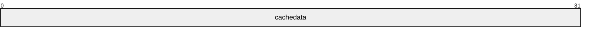

**cachedata (4 bytes):** A 32-bit unsigned integer value that MUST be set to one of the following values.

| Value | Meaning |
| --- | --- |
| RDPDR_ADD_PRINTER_EVENT 0x00000001 | Add printer cachedata event. |
| RDPDR_UPDATE_PRINTER_EVENT 0x00000002 | Update printer cachedata event. |
| RDPDR_DELETE_PRINTER_EVENT 0x00000003 | Delete printer cachedata event. |
| RDPDR_RENAME_PRINTER_EVENT 0x00000004 | Rename printer cachedata event. |

### 2.2.2 Printer Redirection Messages

#### 2.2.2.1 Client Device List Announce Request (DR_PRN_DEVICE_ANNOUNCE)

This message is specified in [MS-RDPEFS](../MS-RDPEFS/MS-RDPEFS.md) section 2.2.2.9 (Client Device List Announce Request). For each redirected printer, a DEVICE_ANNOUNCE header (as specified in [MS-RDPEFS] section 2.2.1.3) is generated by the client printer redirection extension followed by variable printer-specific data.

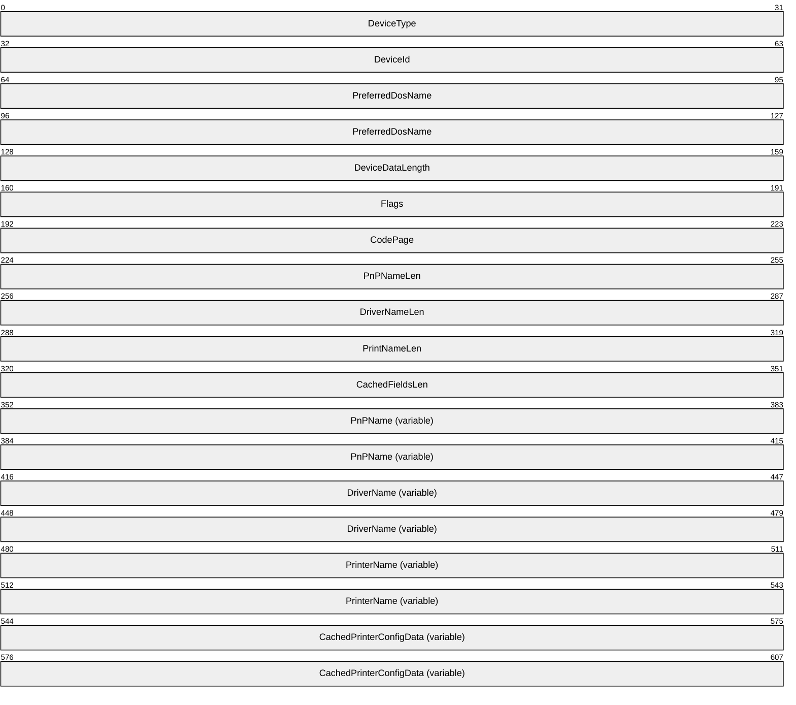

**DeviceType (4 bytes):** This field is defined in [MS-RDPEFS] section 2.2.1.3. This field MUST be set to RDPDR_DTYP_PRINT.

**DeviceId (4 bytes):** This field is defined in [MS-RDPEFS] section 2.2.1.3. The **DeviceId** field MUST be set to the unique device ID to identify this printer device. This field is later used to refer to the same printer device by both the client and the server.

**PreferredDosName (8 bytes):** This field is defined in [MS-RDPEFS] section 2.2.1.3. The **PreferredDosName** field MUST be set to the port name on which the printer is installed. The first 3 characters MUST be "PRN" and the remainder MUST be digits.

**DeviceDataLength (4 bytes):** This field is defined in [MS-RDPEFS] section 2.2.1.3. The **DeviceDataLength** field MUST be set to the length of data fields following the **DeviceDataLength** field.

**Flags (4 bytes):** A 32-bit unsigned integer that indicates the properties of the client [**printer queue**](#gt_printer-queue). This bit field MUST be a valid combination of any of the following values.

| Value | Meaning |
| --- | --- |
| RDPDR_PRINTER_ANNOUNCE_FLAG_ASCII 0x00000001 | The **DriverName** field MUST be in [**ASCII**](#gt_ascii) characters. If not set, it MUST be in Unicode. |
| RDPDR_PRINTER_ANNOUNCE_FLAG_DEFAULTPRINTER 0x00000002 | The printer is set as default. There MUST be only one printer with this flag set. |
| RDPDR_PRINTER_ANNOUNCE_FLAG_NETWORKPRINTER 0x00000004 | This printer is from the network. |
| RDPDR_PRINTER_ANNOUNCE_FLAG_TSPRINTER 0x00000008 | This flag is set when the printer to be redirected is not a local or network printer but is a [**terminal server**](#gt_terminal-server) client printer. This can happen in nested TS sessions; that is, this can happen when a TS connection is made from within a TS session. |
| RDPDR_PRINTER_ANNOUNCE_FLAG_XPSFORMAT 0x00000010 | This client/printer supports [**XML Paper Specification (XPS)**](#gt_xml-paper-specification-xps) format (section [3.1.1.2](#Section_3.1.1.2)). |

**CodePage (4 bytes):** A 32-bit unsigned integer. Reserved for future use. This field MUST be set to 0.

**PnPNameLen (4 bytes):** A 32-bit unsigned integer that specifies the number of bytes in the **PnPName** field, including its null terminator.

**DriverNameLen (4 bytes):** A 32-bit unsigned integer that specifies the number of bytes in the **DriverName** field, including its null terminator.

**PrintNameLen (4 bytes):** A 32-bit unsigned integer that specifies the number of bytes in the **PrintName** field, including its null terminator.

**CachedFieldsLen (4 bytes):** A 32-bit unsigned integer that specifies the number of bytes in the **CachedPrinterConfigData** field.

**PnPName (variable):** A null-terminated [**Unicode string**](#gt_unicode-string). This field can be set to any valid Unicode string and MUST be ignored on receipt.

**DriverName (variable):** An array of characters. The type of characters is determined by the RDPDR_PRINTER_ANNOUNCE_FLAG_ASCII flag. If the flag is set, the **DriverName** field MUST be a null-terminated ASCII string; otherwise, it MUST be a null-terminated Unicode string. The **DriverName** field specifies the [**driver name**](#gt_driver-name) used by the client for this printer. This name is used by the terminal server to determine the appropriate matching driver for the redirected printer, which is to be used on the server.<1>

**PrinterName (variable):** The **PrinterName** field is a null-terminated Unicode string. The client MUST specify the user-assigned [**printer name**](#gt_printer-name) of the local printer in this field. This name is used by the server to generate the server-side redirected printer queue.

**CachedPrinterConfigData (variable):** A variable-length array of bytes. This field is a binary large object (BLOB) of data that describes the cached printer configuration (see section [3.1.1.1](#Section_3.1.1.1)).

#### 2.2.2.2 Server Printer Set XPS Mode (DR_PRN_USING_XPS)

This message is sent from server to client to set the device in [**XPS**](#gt_xml-paper-specification-xps) mode (see section [3.1.1.2](#Section_3.1.1.2)) and indicate to the client that future Printer Write Request (section [2.2.2.9](#Section_2.2.2.9)) messages will use the XPS format.

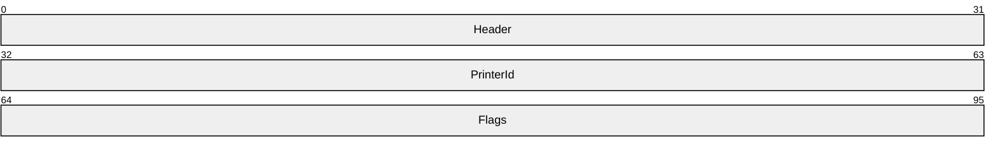

**Header (4 bytes):** The common message header (as specified in [MS-RDPEFS](../MS-RDPEFS/MS-RDPEFS.md) section 2.2.1.1). The **Component** field MUST be set to RDPDR_CTYP_PRN and the **PacketId** field MUST be set to PAKID_ PRN_USING_XPS.

**PrinterId (4 bytes):** A 32-bit unsigned integer. This message is handled by the Print Virtual Channel Extension only if the **PrinterId** field matches the previously established **DeviceId** field for a printer device, see [MS-RDPEFS] section 3.1.1.

**Flags (4 bytes):** A 32-bit unsigned integer. This field is unused. It can contain any value and MUST be ignored on receipt.

#### 2.2.2.3 Add Printer Cachedata (DR_PRN_ADD_CACHEDATA)

This message is sent from the server to the client when a [**printer queue**](#gt_printer-queue) is created manually on the redirected port (port redirection is explained in [MS-RDPESP](../MS-RDPESP/MS-RDPESP.md)) on the server.

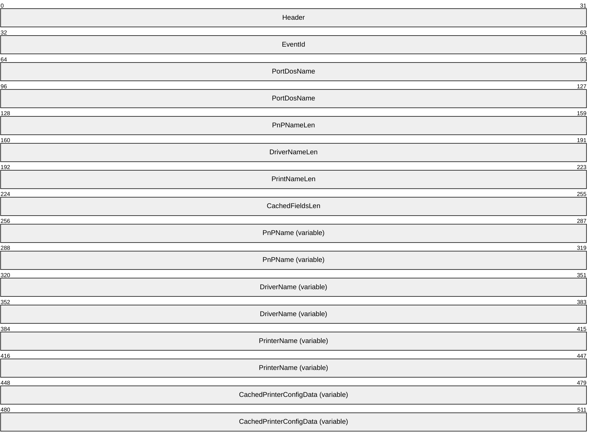

**Header (4 bytes):** The common message header (as specified in [MS-RDPEFS](../MS-RDPEFS/MS-RDPEFS.md) section 2.2.1.1). The **Component** field MUST be set to RDPDR_CTYP_PRN and the **PacketId** field MUST be set to PAKID_PRN_CACHE_DATA.

**EventId (4 bytes):** A SERVER_PRINTER_CACHE_EVENT (section [2.2.1.1](#Section_2.2.1.1)) packet. The **cachedata** field MUST be set to RDPDR_ADD_PRINTER_EVENT (0x00000001).

**PortDosName (8 bytes):** A string of [**ASCII**](#gt_ascii) characters with a maximum length of 8 characters that represent the name of the device as it appears on the client. If this field is not be null-terminated, then the **PortDosName** string is equal to all 8 characters.

**PnPNameLen (4 bytes):** A 32-bit unsigned integer that specifies the number of bytes in the **PnPName** field, including its null terminator.

**DriverNameLen (4 bytes):** A 32-bit unsigned integer that specifies the number of bytes in the **DriverName** field, including its null terminator.

**PrintNameLen (4 bytes):** A 32-bit unsigned integer that specifies the number of bytes in the **PrintName** field, including its null terminator.

**CachedFieldsLen (4 bytes):** A 32-bit unsigned integer that specifies the number of bytes in the **CachedPrinterConfigData** field.

**PnPName (variable):** A null-terminated [**Unicode string**](#gt_unicode-string). This field can be set to any valid Unicode string and MUST be ignored on receipt.

**DriverName (variable):** A null-terminated Unicode string. This string specifies the printer [**driver name**](#gt_driver-name) that is associated with the printer configuration data.

**PrinterName (variable):** A null-terminated Unicode string that specifies the client printer, which was sent for this configuration data message.

**CachedPrinterConfigData (variable):** A variable-length array of bytes. This field is a BLOB of data that describes the cached printer configuration (see section [3.1.1.1](#Section_3.1.1.1)).

#### 2.2.2.4 Update Printer Cachedata (DR_PRN_UPDATE_CACHEDATA)

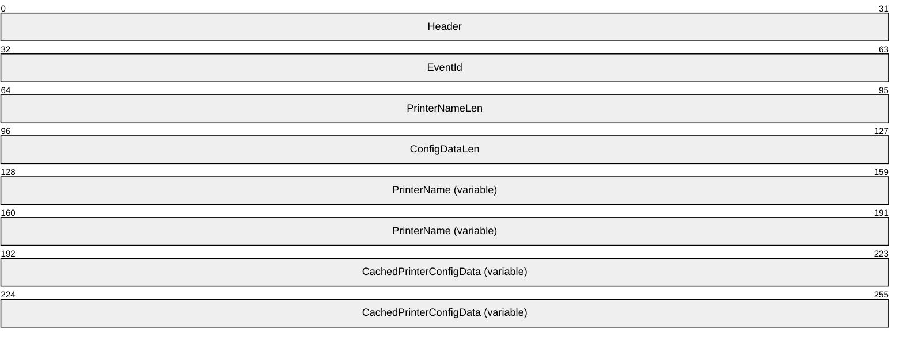

**Header (4 bytes):** The common message header (as specified in [MS-RDPEFS](../MS-RDPEFS/MS-RDPEFS.md) section 2.2.1.1). The **Component** field MUST be set to RDPDR_CTYP_PRN and the **PacketId** field MUST be set to PAKID_PRN_CACHE_DATA.

**EventId (4 bytes):** A SERVER_PRINTER_CACHE_EVENT (section [2.2.1.1](#Section_2.2.1.1)) event. The **cachedata** field MUST be set to RDPDR_UPDATE_PRINTER_EVENT (0x00000002).

**PrinterNameLen (4 bytes):** A 32-bit unsigned integer specifying the number of bytes in the **PrinterName** field, including its null terminator.

**ConfigDataLen (4 bytes):** A 32-bit unsigned integer specifying the number of bytes in the **CachedPrinterConfigData** field.

**PrinterName (variable):** A null-terminated [**Unicode string**](#gt_unicode-string) that specifies the printer, for which the updated printer configuration data is sent.

**CachedPrinterConfigData (variable):** A variable-length array of bytes. This field is a BLOB of data that describes the cached printer configuration (see section [3.1.1.1](#Section_3.1.1.1)).

#### 2.2.2.5 Delete Printer Cachedata (DR_PRN_DELETE_CACHEDATA)

This message is sent by the server when a manually created printer on the redirected port is deleted.

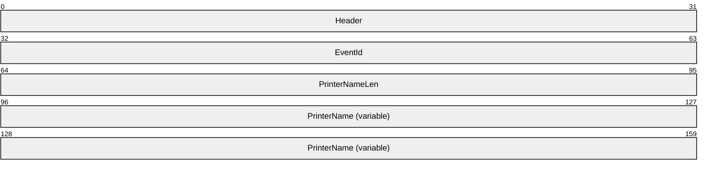

**Header (4 bytes):** The common message header (as specified in [MS-RDPEFS](../MS-RDPEFS/MS-RDPEFS.md) section 2.2.1.1). The **Component** field MUST be set to RDPDR_CTYP_PRN and the **PacketId** field MUST be set to PAKID_PRN_CACHE_DATA.

**EventId (4 bytes):** A SERVER_PRINTER_CACHE_EVENT (section [2.2.1.1](#Section_2.2.1.1)) event. The **cachedata** field MUST be set to RDPDR_DELETE_PRINTER_EVENT (0x00000003).

**PrinterNameLen (4 bytes):** A 32-bit unsigned integer that specifies the number of bytes in the **PrinterName** field, including its null terminator.

**PrinterName (variable):** A null-terminated [**Unicode string**](#gt_unicode-string) that specifies the printer that was deleted.

#### 2.2.2.6 Rename Printer Cachedata (DR_PRN_RENAME_CACHEDATA)

This message is sent by the server when the user renames a redirected printer.

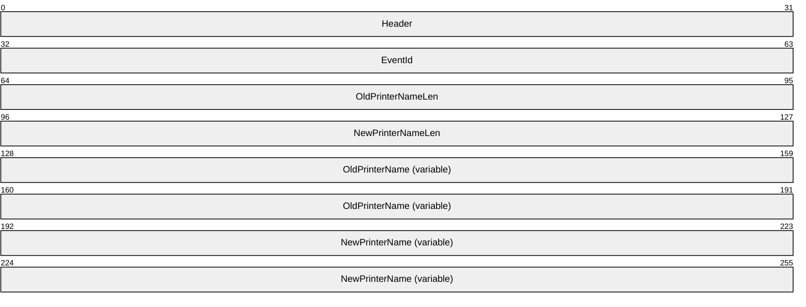

**Header (4 bytes):** The common message header (as specified in [MS-RDPEFS](../MS-RDPEFS/MS-RDPEFS.md) section 2.2.1.1). The **Component** field MUST be set to RDPDR_CTYP_PRN and the **PacketId** field MUST be set to PAKID_PRN_CACHE_DATA.

**EventId (4 bytes):** A SERVER_PRINTER_CACHE_EVENT (section [2.2.1.1](#Section_2.2.1.1)) event. The **cachedata** field MUST be set to RDPDR_RENAME_PRINTER_EVENT (0x00000004).

**OldPrinterNameLen (4 bytes):** A 32-bit unsigned integer that specifies the number of bytes in the **OldPrinterName** field, including its null terminator.

**NewPrinterNameLen (4 bytes):** A 32-bit unsigned integer that specifies the number of bytes in the **NewPrinterName** field, including its null terminator.

**OldPrinterName (variable):** A null-terminated [**Unicode string**](#gt_unicode-string) that specifies the [**printer name**](#gt_printer-name) before the rename operation.

**NewPrinterName (variable):** A null-terminated Unicode string that specifies the printer name after the rename operation.

#### 2.2.2.7 Server Create Request (DR_PRN_CREATE_REQ)

This message is sent by the server to request the opening of the client [**printer queue**](#gt_printer-queue) and to prepare for receiving print data.

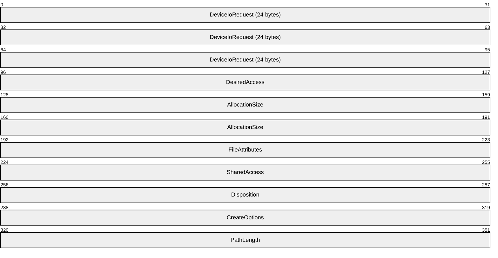

**DeviceIoRequest (24 bytes):** A DR_DEVICE_IOREQUEST header (as specified in [MS-RDPEFS](../MS-RDPEFS/MS-RDPEFS.md) section 2.2.1.4).

The **MajorFunction** in this header MUST be set to IRP_MJ_CREATE.

This message is handled by the Print Virtual Channel Extension only if the **DeviceId** field matches the previously established **DeviceId** for a printer device, see [MS-RDPEFS] section 3.1.1.

**DesiredAccess (4 bytes):** A 32-bit unsigned integer. Unused. This field can contain any value and MUST be ignored on receipt.

**AllocationSize (8 bytes):** A 64-bit unsigned integer. Unused. This field can contain any value and MUST be ignored on receipt.

**FileAttributes (4 bytes):** A 32-bit unsigned integer. Unused. This field can contain any value and MUST be ignored on receipt.

**SharedAccess (4 bytes):** A 32-bit unsigned integer. Unused. This field can contain any value and MUST be ignored on receipt.

**Disposition (4 bytes):** A 32-bit unsigned integer. Unused. This field can contain any value and MUST be ignored on receipt.

**CreateOptions (4 bytes):** A 32-bit unsigned integer. Unused. This field can contain any value and MUST be ignored on receipt.

**PathLength (4 bytes):** A 32-bit unsigned integer. This field MUST be set to 0 for the printer devices.

#### 2.2.2.8 Server Printer Close Request (DR_PRN_CLOSE_REQ)

This message is sent by the server to request the closing of the [**printer queue**](#gt_printer-queue) that was previously created by a DR_PRN_CREATE_REQ (section [2.2.2.7](#Section_2.2.2.7)).

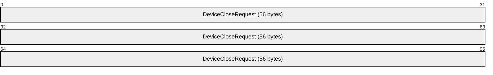

**DeviceCloseRequest (56 bytes):** A DR_CLOSE_REQ message (as specified in [MS-RDPEFS](../MS-RDPEFS/MS-RDPEFS.md) section 2.2.1.4.2). This request closes a printer opened by DR_PRN_CREATE_REQ (section 2.2.2.7).

#### 2.2.2.9 Server Printer Write Request (DR_PRN_WRITE_REQ)

This message is sent from the server to send the print data to the client printer.

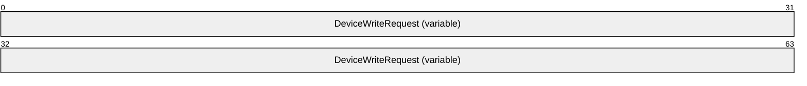

**DeviceWriteRequest (variable):** A DR_WRITE_REQ request (as specified in [MS-RDPEFS](../MS-RDPEFS/MS-RDPEFS.md) section 2.2.1.4.4). The **Offset** field of this request is unused and reserved for future use. The **Offset** field can contain any value and MUST be ignored on receipt.

The **WriteData** field of the request could be either in [**PRN file**](#gt_prn-file) or [**XPS file**](#gt_xps-file) format.

#### 2.2.2.10 Client Printer Create Response (DR_PRN_CREATE_RSP)

The client responds to the [DR_PRN_CREATE_REQ](#Section_2.2.2.7) with this message.

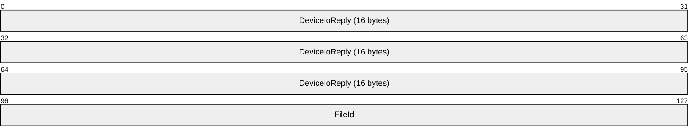

**DeviceIoReply (16 bytes):** A DR_DEVICE_IOCOMPLETION header (as specified in [MS-RDPEFS](../MS-RDPEFS/MS-RDPEFS.md) section 2.2.1.5). The **CompletionId** field of this header MUST match the **CompletionId** of a Device I/O Request message that had the **MajorFunction** field set to IRP_MJ_CREATE.

**FileId (4 bytes):** A 32-bit unsigned integer that specifies a unique ID that identifies the created file object. The ID MUST be reused after sending a Device Close Response (as specified in [MS-RDPEFS] section 2.2.1.5.2).

#### 2.2.2.11 Client Printer Close Response (DR_PRN_CLOSE_RSP)

The client responds to the [DR_PRN_CLOSE_REQ](#Section_4.1.8) with this message.

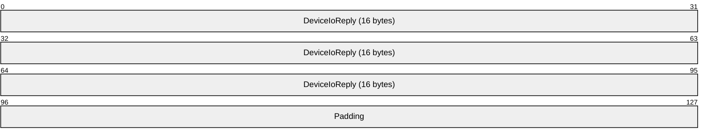

**DeviceIoReply (16 bytes):** A DR_DEVICE_IOCOMPLETION header (as specified in [MS-RDPEFS](../MS-RDPEFS/MS-RDPEFS.md) section 2.2.1.5). The **CompletionId** field of this header MUST match the **CompletionId** of a Device I/O Request message that had the **MajorFunction** field set to IRP_MJ_CLOSE.

**Padding (4 bytes):** An array of 4 bytes. This field is reserved for future use.

#### 2.2.2.12 Client Printer Write Response (DR_PRN_WRITE_RSP)

The client responds to the [DR_PRN_WRITE_REQ](#Section_2.2.2.9) with this message.

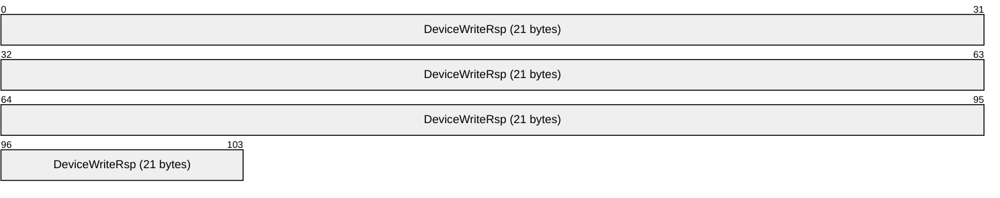

**DeviceWriteRsp (21 bytes):** A DR_WRITE_RSP request (as specified in [MS-RDPEFS](../MS-RDPEFS/MS-RDPEFS.md) section 2.2.1.5.4). The **Length** field of this response is equal to the **Length** field of the Write Request (as specified in [MS-RDPEFS] section 2.2.3.3.4).

# 3 Protocol Details

The following sections specify protocol details, including abstract data models and message processing rules.

## 3.1 Common Details

### 3.1.1 Abstract Data Model

This section describes a conceptual model of possible data organization that an implementation maintains to participate in this protocol. The organization is provided to explain how the protocol behaves. This document does not mandate that implementations adhere to this model as long as their external behavior is consistent with that described in this document.

The Remote Desktop Protocol: Print Virtual Channel Extension follows the abstract data model specified in [MS-RDPEFS](../MS-RDPEFS/MS-RDPEFS.md) section 3.1.1. The following abstract entities are specific to this protocol.

#### 3.1.1.1 Cached Printer Config Data

Printer drivers store default printing preferences for each printer. The format of these preferences is driver-specific. For the redirected printers, when a user modifies printing preferences on the [**server**](#gt_server) side, these modified printing preferences are sent back to the [**client**](#gt_client) and are cached there. When such a printer is redirected again, this cached data is sent by the client to the server along with other printer information.

The cached configuration information SHOULD be treated as an opaque data BLOB by the client. The client SHOULD treat the printer name and data BLOB pairs as records in a database. The server sends packets to the client to add, rename, delete or update the [**printer name**](#gt_printer-name) or the data BLOB of an existing record.

#### 3.1.1.2 XPS Mode

When a client redirects printers, it adds a special flag (RDPDR_PRINTER_ANNOUNCE_FLAG_XPSFORMAT) if the client can handle the XPS format for the given printer. For these printers, the server MAY<2> choose to use either the [**XPS**](#gt_xml-paper-specification-xps) format or the printer driver-specific format. The server MUST notify the client with the [DR_PRN_USING_XPS (section 2.2.2.2)](#Section_2.2.2.2) message as described in section [3.3.5.1.2](#Section_3.3.5.1.2) if it chooses to use the XPS format. When this type of message is received, the client marks the printer in XPS mode. Redirection of XPS data using the Remote Desktop Protocol: XML Paper Specification (XPS) Print Virtual Channel Extension is described in [MS-RDPEXPS](../MS-RDPEXPS/MS-RDPEXPS.md).

### 3.1.2 Timers

No common timers are used.

### 3.1.3 Initialization

The Print Virtual Channel Extension protocol MUST be initialized before the printer can be redirected.

### 3.1.4 Higher-Layer Triggered Events

No higher-layer triggered events are used.

### 3.1.5 Message Processing Events and Sequencing Rules

The common message processing events and rules that are described in [MS-RDPEFS](../MS-RDPEFS/MS-RDPEFS.md) section 3.1.5 apply to this protocol. For client-specific and server-specific message processing, see sections [3.2.5](#Section_3.2.5) and [3.3.5](#Section_3.3.5).

### 3.1.6 Timer Events

No common timer events are used.

### 3.1.7 Other Local Events

There are no common local events.

## 3.2 Client Details

### 3.2.1 Abstract Data Model

The abstract data model is specified in section [3.1.1](#Section_3.1.1).

### 3.2.2 Timers

No timers are used.

### 3.2.3 Initialization

Initialization is specified in section [3.1.3](#Section_3.1.3).

### 3.2.4 Higher-Layer Triggered Events

No client higher-layer triggered events are used.

### 3.2.5 Message Processing Events and Sequencing Rules

#### 3.2.5.1 Printer Redirection Messages

##### 3.2.5.1.1 Sending a Client Device List Announce Request Message

After the Remote Desktop Protocol: File System Virtual Channel Extension completes its initialization, the client MUST send a DR_CORE_DEVICELIST_ANNOUNCE_REQ message to the server with information for various devices. This message is specified in [MS-RDPEFS](../MS-RDPEFS/MS-RDPEFS.md) section 2.2.2.9. The Print Virtual Channel Extension prepares the printer device information that goes into this packet. The printer-specific structure is specified in section [2.2.2.1](#Section_2.2.2.1).

The printer redirection extension enumerates the [**printer queues**](#gt_printer-queue) and manually configured printers ([**manual printer redirection**](#gt_manual-printer-redirection)) and determines the devices to be redirected. For each printer, the client collects the following information and prepares DR_PRN_DEVICE_ANNOUNCE (section 2.2.2.1) packet. This packet contains the following:

- The name of the printer queue assigned by the user.
- The name of the printer driver assigned by the driver manufacturer.
- Various flags associated with the printer.
- Printer cache data, if this data exists. See section [3.1.1.1](#Section_3.1.1.1).

##### 3.2.5.1.2 Processing a Printer Set XPS Mode Message

This message MUST be received only for the printers that were marked with RDPDR_PRINTER_ANNOUNCE_FLAG_XPSFORMAT. When a server chooses to use an [**XPS**](#gt_xml-paper-specification-xps) driver for the redirected printer, it notifies the client using this message. The client MUST then mark the printer to be in XPS mode (see section [3.1.1.2](#Section_3.1.1.2)). When printer data arrives for these printers, it MUST be treated as an [**XPS file**](#gt_xps-file) and not a [**PRN file**](#gt_prn-file). For other printers, the I/O data MUST be treated as a PRN file.

##### 3.2.5.1.3 Processing an Add Printer Cachedata Message

This message is received when a [**printer queue**](#gt_printer-queue) is manually installed on the server on the client's redirected port. The name of the port is stored in the **PortDosName** field. The client SHOULD store this manual printer configuration in its persistent storage, and it MUST use this configuration to redirect the printer the next time the client connects to the same server.

##### 3.2.5.1.4 Processing an Update Printer Cachedata Message

This message is received when the configuration information of a redirected [**printer queue**](#gt_printer-queue) is updated on the server. The client MUST store the updated **CachedPrinterConfigData** field (see section [3.1.1.1](#Section_3.1.1.1)), and it MUST use it when redirecting the printer next time.

##### 3.2.5.1.5 Processing a Delete Printer Cachedata Message

This message is received when a redirected [**printer queue**](#gt_printer-queue) is deleted by the server. The client MUST delete the cached configuration data previously stored for this printer.

##### 3.2.5.1.6 Processing a Rename Printer Cachedata Message

This message is received when the user renames the redirected printer on the server. The client MUST modify its local cached data for this printer to reflect this change, and the client MUST rename the local [**printer queue**](#gt_printer-queue).

##### 3.2.5.1.7 Processing a Create Request Message

When the server starts a print job on a redirected printer, before sending the actual printing data it sends a create request. The client MUST prepare the printer specified by the **DeviceId** field to receive the printer output.

##### 3.2.5.1.8 Processing a Close Request Message

When the server finishes sending a print job to a redirected printer, it sends a close request. The client MUST end the printing process initiated when the create request was made.

##### 3.2.5.1.9 Processing a Write Request Message

Multiple write requests are received along with the printing data. These write requests are sent between create and close requests. The client MUST send the data associated with the write requests to the corresponding [**printer queue**](#gt_printer-queue). The format of this data could be either printer driver-specific (non-XPS mode) or [**XPS**](#gt_xml-paper-specification-xps) format (XPS mode).

##### 3.2.5.1.10 Sending a Printer Create Response Message

The client MUST fill out the various members of the DR_DEVICE_IOCOMPLETION message (as specified in [MS-RDPEFS](../MS-RDPEFS/MS-RDPEFS.md) section 2.2.1.5) as shown here.

For the RDPDR_HEADER:

- The **Component** field MUST be set to RDPDR_CTYP_CORE.
- The **PacketId** field MUST be set to PAKID_CORE_DEVICE_IOCOMPLETION.
For the DR_DEVICE_IOCOMPLETION header:

- The **CompletionId** field MUST be set to match the **CompletionId** field from the corresponding I/O request (section [3.2.5.1.7](#Section_3.2.5.1.7)).
- The **DeviceId** field MUST be set to match the corresponding **DeviceId** field from the I/O request.
- The **IoStatus** field MUST be set to the NTSTATUS value indicating the result of the operation. NTSTATUS codes are specified in [MS-ERREF](../MS-ERREF/MS-ERREF.md) section 2.3.

##### 3.2.5.1.11 Sending a Printer Close Response Message

The client MUST fill out the various members of the DR_DEVICE_IOCOMPLETION message (as specified in [MS-RDPEFS](../MS-RDPEFS/MS-RDPEFS.md) section 2.2.1.5) as shown here.

For the RDPDR_HEADER:

- The **Component** field MUST be set to RDPDR_CTYP_CORE.
- The **PacketId** field MUST be set to PAKID_CORE_DEVICE_IOCOMPLETION.
For the DR_DEVICE_IOCOMPLETION header:

- The **CompletionId** field MUST be set to match the **CompletionId** field from the corresponding I/O request (section [3.2.5.1.8](#Section_3.2.5.1.8)).
- The **DeviceId** MUST be set to match the corresponding **DeviceId** from the I/O request.
- The **IoStatus** field MUST be set to the NTSTATUS value indicating the result of the operation. NTSTATUS codes are specified in [MS-ERREF](../MS-ERREF/MS-ERREF.md) section 2.3.

##### 3.2.5.1.12 Sending a Printer Write Response Message

The client MUST fill out the various members of the DR_DEVICE_IOCOMPLETION message (as specified in [MS-RDPEFS](../MS-RDPEFS/MS-RDPEFS.md) section 2.2.1.5) as shown here.

For the RDPDR_HEADER:

- The **Component** field MUST be set to RDPDR_CTYP_CORE.
- The **PacketId** field MUST be set to PAKID_CORE_DEVICE_IOCOMPLETION.
For the DR_DEVICE_IOCOMPLETION header:

- The **CompletionId** field MUST be set to match the **CompletionId** field from the corresponding I/O request (section [3.2.5.1.9](#Section_3.2.5.1.9)).
- The **DeviceId** field MUST be set to match the corresponding **DeviceId** field from the I/O request.
- The **IoStatus** field MUST be set to the NTSTATUS value indicating the result of the operation.
The client MUST set the **Length** field of DR_WRITE_RSP (see [MS-RDPEFS] section 2.2.1.5.4) to the bytes written successfully to the printer device. NTSTATUS codes are specified in [MS-ERREF](../MS-ERREF/MS-ERREF.md) section 2.3.

### 3.2.6 Timer Events

No timer events are used.

### 3.2.7 Other Local Events

There are no other local events.

## 3.3 Server Details

### 3.3.1 Abstract Data Model

The abstract data model is specified in section [3.1.1](#Section_3.1.1).

### 3.3.2 Timers

No timers are used.

### 3.3.3 Initialization

Initialization is specified in section [3.1.3](#Section_3.1.3).

### 3.3.4 Higher-Layer Triggered Events

The [**server**](#gt_server) sends various messages to the [**client**](#gt_client) in response to the following application and user-driven events:

- When a printer is installed manually for the redirected port, the server sends an add printer cachedata message to the client (see section [3.3.5.1.3](#Section_3.3.5.1.3)).
- When the user modifies the redirected printer queue configuration, the server sends an update printer cachedata message to the client (see section [3.3.5.1.4](#Section_3.3.5.1.4)).
- When the user deletes the redirected printer queue, the server sends a delete printer cachedata message to the client (see section [3.3.5.1.5](#Section_3.3.5.1.5)).
- When the user renames the redirected printer queue, the server sends a rename printer cachedata message to the client (see section [3.3.5.1.6](#Section_3.3.5.1.6)).
- When an application running on the server opens the redirected printer queue for printing, the server sends a printer create request to the client (see section [3.3.5.1.7](#Section_3.3.5.1.7)).
- When an application running on the server closes the redirected printer queue, the server sends a printer close request to the client (see section [3.3.5.1.8](#Section_3.3.5.1.8)).
- When an application running on the server sends data to the redirected printer queue for printing, the server sends printer write requests to the client (see section [3.3.5.1.9](#Section_3.3.5.1.9)).

### 3.3.5 Message Processing Events and Sequencing Rules

#### 3.3.5.1 Printer Redirection Messages

##### 3.3.5.1.1 Processing a Client Device List Announce Request Message

After receiving a [Client Device List Announce Request (section 2.2.2.1)](#Section_2.2.2.1), the server creates a printer queue to represent each client-side printer device. The server MUST use the appropriate driver for this redirected printer queue. The server MAY use a pseudo driver that produces XPS-format output if the RDPDR_PRINTER_ANNOUNCE_FLAG_XPSFORMAT flag is supplied for the device. If this flag is not supplied, the server MAY use the **DriverName** field specified in this message to choose the appropriate printer driver on the server. If this message contains a **CachedPrinterConfigData** field, the server MUST use the information contained to configure the instance of the printer queue. The server MAY use the **PrinterName** field specified in the message to generate the name for the redirected printer queue.

##### 3.3.5.1.2 Sending a Printer Set XPS Mode Message

If the client printer supports [**XPS**](#gt_xml-paper-specification-xps) format, it indicates this support using the RDPDR_PRINTER_ANNOUNCE_FLAG_XPSFORMAT flag when redirecting this printer (see section [2.2.2.1](#Section_2.2.2.1)). For these redirected printers, the server can choose to send print job output in XPS format.<3> If the server chooses to send print data in XPS format, the server MUST send this message to the client prior to sending any data in the Printer Write Request (section [2.2.2.9](#Section_2.2.2.9)) message.

##### 3.3.5.1.3 Sending an Add Printer Cachedata Message

When a user manually installs a printer driver for the redirected port, the server collects the configuration data for such a [**printer queue**](#gt_printer-queue) and sends it to the client using this message.

##### 3.3.5.1.4 Sending an Update Printer Cachedata Message

When a user modifies the configuration data, such as the printing preferences for the redirected [**printer queue**](#gt_printer-queue), the server sends this message along with the configuration data to inform the client.

##### 3.3.5.1.5 Sending Delete Printer Cachedata

When a user deletes the [**printer queue**](#gt_printer-queue), the server sends this message to the client.

##### 3.3.5.1.6 Sending a Rename Printer Cachedata Message

When a user manually renames the redirected [**printer queue**](#gt_printer-queue), the server sends this message to the client specifying old and new [**printer names**](#gt_printer-name).

##### 3.3.5.1.7 Sending a Printer Create Request Message

When a server application starts printing to the redirected [**printer queue**](#gt_printer-queue), the server MUST send this message to the client before sending any printer data so that the client can prepare for receiving printer data.

##### 3.3.5.1.8 Sending a Printer Close Request Message

When the server application is done with a printing job, the server MUST send this message to the client.

##### 3.3.5.1.9 Sending a Printer Write Request Message

As a server application prints to the redirected [**printer queue**](#gt_printer-queue), the server MUST send the printer job data to the client. A print job can be distributed over multiple write requests. This message MUST be sent only after the [DR_PRN_CREATE_RSP (section 2.2.2.10)](#Section_2.2.2.10) message is received.

##### 3.3.5.1.10 Processing a Printer Create Response Message

The server MUST inspect the result of the printer create operation and abort/fail the printer operation if the create request failed.

##### 3.3.5.1.11 Processing a Printer Close Response Message

The server MUST ignore this message after validating it according to the rules specified in [MS-RDPEFS](../MS-RDPEFS/MS-RDPEFS.md) section 3.1.5.2.

##### 3.3.5.1.12 Processing a Printer Write Response Message

The server MUST inspect the amount of data written and send the next packet of data if there are any packets remaining.

### 3.3.6 Timer Events

There are no timer events used.

### 3.3.7 Other Local Events

There are no other local events.

# 4 Protocol Examples

## 4.1 Annotations for Printer Redirection

### 4.1.1 Client Printer Device (DR_PRN_DEVICE_ANNOUNCE)

The [**client**](#gt_client) sends this message to the [**server**](#gt_server) to indicate the list of printers that it wants to redirect.

Channel Name = RDPDR, 264, Client to server

00000000 72 44 41 44 03 00 00 00 04 00 00 00 04 00 00 00

00000010 50 52 4e 34 00 00 00 00 50 00 00 00 10 00 00 00

00000020 00 00 00 00 00 00 00 00 1c 00 00 00 1c 00 00 00

00000030 00 00 00 00 41 00 70 00 6f 00 6c 00 6c 00 6f 00

00000040 20 00 50 00 2d 00 31 00 32 00 30 00 30 00 00 00

00000050 41 00 70 00 6f 00 6c 00 6c 00 6f 00 20 00 50 00

00000060 2d 00 31 00 32 00 30 00 30 00 00 00 04 00 00 00

00000070 03 00 00 00 50 52 4e 33 00 00 00 00 74 00 00 00

00000080 12 00 00 00 00 00 00 00 00 00 00 00 2e 00 00 00

00000090 2e 00 00 00 00 00 00 00 43 00 61 00 6e 00 6f 00

000000a0 6e 00 20 00 42 00 75 00 62 00 62 00 6c 00 65 00

000000b0 2d 00 4a 00 65 00 74 00 20 00 42 00 4a 00 2d 00

000000c0 33 00 30 00 00 00 43 00 61 00 6e 00 6f 00 6e 00

000000d0 20 00 42 00 75 00 62 00 62 00 6c 00 65 00 2d 00

000000e0 4a 00 65 00 74 00 20 00 42 00 4a 00 2d 00 33 00

000000f0 30 00 00 00 02 00 00 00 02 00 00 00 4c 50 54 31

00000100 00 00 00 00 00 00 00 00

72 44 -> RDPDR_CTYP_CORE = 0x4472

41 44 -> PAKID_CORE_DEVICELIST_ANNOUNCE = 0x4441

03 00 00 00 -> DeviceCount = 0x00000003

04 00 00 00 -> DeviceType (RDPDR_DTYP_PRINT) = 0x00000004

04 00 00 00 -> DeviceId = 0x00000004

50 52 4e 34 00 00 00 00 -> PreferredDosName (8 characters)

50 00 00 00 -> DeviceDataLength = 0x00000050

10 00 00 00 -> Flags (RDPDR_PRINTER_ANNOUNCE_FLAG_XPSFORMAT)

= 0x00000010

00 00 00 00 -> CodePage = 0x00000000

00 00 00 00 -> PnpNameLen = 0x00000000

1c 00 00 00 -> DriverNameLen = 0x0000001c

1c 00 00 00 -> PrinterNameLen = 0x0000001c

00 00 00 00 -> CachedFieldsLen = 0x00000000

41 00 70 00 6f 00 6c 00 6c 00 6f 00 20 00 50 00 2d 00 31 00 32 00 30 00 30 00 00 00

-> DriverName (28 bytes)

41 00 70 00 6f 00 6c 00 6c 00 6f 00 20 00 50 00 2d 00 31 00 32 00 30 00 30 00 00 00

-> PrinterName (28 bytes)

04 00 00 00 -> DeviceType (RDPDR_DTYP_PRINT) = 0x00000004

03 00 00 00 -> DeviceId = 0x00000003

50 52 4e 33 00 00 00 00 -> PreferredDosName (8 characters)

74 00 00 00 -> DeviceDataLength = 0x00000074

12 00 00 00 -> Flags (RDPDR_PRINTER_ANNOUNCE_FLAG_DEFAULTPRINTER |

RDPDR_PRINTER_ANNOUNCE_FLAG_XPSFORMAT) = 0x00000012

00 00 00 00 -> CodePage = 0x00000000

00 00 00 00 -> PnpNameLen = 0x00000000

2e 00 00 00 -> DriverNameLen = 0x0000002e

2e 00 00 00 -> PrinterNameLen = 0x0000002e

00 00 00 00 -> CachedFieldsLen = 0x00000000

43 00 61 00 6e 00 6f 00 6e 00 20 00 42 00 75 00 62 00 62 00 6c 00 65 00 2d 00

4a 00 65 00 74 00 20 00 42 00 4a 00 2d 00 33 00 30 00 00 00

-> DriverName (46 bytes)

43 00 61 00 6e 00 6f 00 6e 00 20 00 42 00 75 00 62 00 62 00 6c 00 65 00 2d 00

4a 00 65 00 74 00 20 00 42 00 4a 00 2d 00 33 00 30 00 00 00

-> PrinterName (46 bytes)

02 00 00 00 -> DeviceType (RDPDR_DTYP_PARALLEL) = 0x00000002

02 00 00 00 -> DeviceId = 0x00000002

4c 50 54 31 00 00 00 00 -> PreferredDosName (8 characters)

00 00 00 00 -> DeviceDataLength = 0x00000000

### 4.1.2 Server Printer Set XPS Mode (DR_PRN_USING_XPS)

When the server decides to use the [**XPS**](#gt_xml-paper-specification-xps) format for the output, it sends this message to prepare the client.

Channel Name = RDPDR, 12, Server to client

00000000 52 50 43 55 01 00 00 00 f8 5b fa 7f

52 50 -> RDPDR_CTYP_PRN = 0x5052

43 55 -> PAKID_PRN_USING_XPS = 0x5543

01 00 00 00 -> PrinterId = 0x00000001

f8 5b fa 7f -> Flags = 0x7ffa5bf8

### 4.1.3 Add Printer Cachedata (DR_PRN_ADD_CACHEDATA)

When a printer is manually installed on the redirected port, the server sends this message to allow the client an opportunity to cache the configuration.

Channel Name = RDPDR, 116, Server to client

00000000 52 50 43 50 01 00 00 00 43 4f 4d 32 00 00 3a 00

00000010 00 00 00 00 2a 00 00 00 2a 00 00 00 00 00 00 00

00000020 42 00 72 00 6f 00 74 00 68 00 65 00 72 00 20 00

00000030 44 00 43 00 50 00 2d 00 31 00 30 00 30 00 30 00

00000040 20 00 55 00 53 00 42 00 00 00 42 00 72 00 6f 00

00000050 74 00 68 00 65 00 72 00 20 00 44 00 43 00 50 00

00000060 2d 00 31 00 30 00 30 00 30 00 20 00 55 00 53 00

00000070 42 00 00 00

52 50 -> RDPDR_CTYP_PRN = 0x5052

43 50 -> PAKID_PRN_CACHE_DATA = 0x5043

01 00 00 00 -> RDPDR_ADD_PRINTER_EVENT = 0x00000001

43 4f 4d 32 00 00 3a 00-> PortDosName (64 bits)

00 00 00 00 -> PnPNameLen = 0x00000000

2a 00 00 00 -> DriverNameLen = 0x0000002a

2a 00 00 00 -> PrintNameLen = 0x0000002a

00 00 00 00 -> CachedFieldsLen = 0x00000000

42 00 72 00 6f 00 74 00 68 00 65 00 72 00 20 00 44 00 43 00 50

00 2d 00 31 00 30 00 30 00 30 00 20 00 55 00 53 00 42 00 00 00

-> DriverName (variable - 42 bytes)

= "Brother DCP-1000 USB"

42 00 72 00 6f 00 74 00 68 00 65 00 72 00 20 00 44 00 43 00 50

00 2d 00 31 00 30 00 30 00 30 00 20 00 55 00 53 00 42 00 00 00

-> PrinterName (variable - 42 bytes)

= "Brother DCP-1000 USB"

### 4.1.4 Update Printer Cachedata (DR_PRN_UPDATE_CACHEDATA)

When printing preferences or other configuration settings are modified on the server for a redirected printer, the server notifies the client with the configuration data.

Channel Name = RDPDR, 16330, Server to client

00000000 52 50 43 50 02 00 00 00 2a 00 00 00 90 3f 00 00

00000010 42 00 72 00 6f 00 74 00 68 00 65 00 72 00 20 00

00000020 44 00 43 00 50 00 2d 00 31 00 30 00 30 00 30 00

00000030 20 00 55 00 53 00 42 00 00 00 48 00 00 00 00 00

00000040 00 00 94 20 00 00 00 00 00 00 37 00 00 00 00 00

52 50 -> RDPDR_CTYP_PRN = 0x5052

43 50 -> PAKID_PRN_CACHE_DATA = 0x5043

02 00 00 00 -> RDPDR_UPDATE_PRINTER_EVENT = 0x00000002

2a 00 00 00 -> PrinterNameLen = 0x0000002a

90 3f 00 00 -> ConfigDataLen = 0x000039e4

42 00 72 00 6f 00 74 00 68 00 65 00 72 00 20 00 44 00 43 00 50

00 2d 00 31 00 30 00 30 00 30 00 20 00 55 00 53 00 42 00 00 00

-> PrinterName (42 bytes)

= "Brother DCP-1000 USB"

48 00 00 00 00 00 ... -> ConfigData (variable)

### 4.1.5 Delete Printer Cachedata (DR_PRN_DELETE_CACHEDATA)

The redirected printer was deleted manually.

Channel Name = RDPDR, 54, Server to client

00000000 52 50 43 50 03 00 00 00 2a 00 00 00 42 00 72 00

00000010 6f 00 74 00 68 00 65 00 72 00 20 00 44 00 43 00

00000020 50 00 2d 00 31 00 30 00 30 00 30 00 20 00 55 00

00000030 53 00 42 00 00 00

52 50 -> RDPDR_CTYP_PRN = 0x5052

43 50 -> PAKID_PRN_CACHE_DATA = 0x5043

03 00 00 00 -> RDPDR_DELETE_PRINTER_EVENT

= 0x00000003

2a 00 00 00 -> PrinterNameLen = 0x0000002a

42 00 72 00 6f 00 74 00 68 00 65 00 72 00 20 00 44 00 43 00 50

00 2d 00 31 00 30 00 30 00 30 00 20 00 55 00 53 00 42 00 00 00

-> PrinterName (42 bytes)

= "Brother DCP-1000 USB"

### 4.1.6 Rename Printer Cachedata (DR_PRN_RENAME_CACHEDATA)

The redirected printer was renamed.

Channel Name = RDPDR, 120, Server to client

00000000 52 50 43 50 04 00 00 00 2a 00 00 00 3e 00 00 00

00000010 42 00 72 00 6f 00 74 00 68 00 65 00 72 00 20 00

00000020 44 00 43 00 50 00 2d 00 31 00 30 00 30 00 30 00

00000030 20 00 55 00 53 00 42 00 00 00 42 00 72 00 6f 00

00000040 74 00 68 00 65 00 72 00 20 00 44 00 43 00 50 00

00000050 2d 00 31 00 30 00 30 00 30 00 20 00 55 00 53 00

00000060 42 00 20 00 28 00 72 00 65 00 6e 00 61 00 6d 00

00000070 65 00 64 00 29 00 00 00

52 50 -> RDPDR_CTYP_PRN = 0x5052

43 50 -> PAKID_PRN_CACHE_DATA = 0x5043

04 00 00 00 -> RDPDR_RENAME_PRINTER_EVENT

= 0x00000004

2a 00 00 00 -> OldPrinterNameLen = 0x0000002a

3e 00 00 00 -> NewPrinterNameLen = 0x0000003e

42 00 72 00 6f 00 74 00 68 00 65 00 72 00 20 00 44 00 43 00 50

00 2d 00 31 00 30 00 30 00 30 00 20 00 55 00 53 00 42 00 00 00

-> OldPrinterName (42 bytes)

= "Brother DCP-1000 USB"

42 00 72 00 6f 00 74 00 68 00 65 00 72 00 20 00 44 00 43 00 50

00 2d 00 31 00 30 00 30 00 30 00 20 00 55 00 53 00 42 00 20 00

28 00 72 00 65 00 6e 00 61 00 6d 00 65 00 64 00 29 00 00 00

-> NewPrinterName (62 bytes)

= "Brother DCP-1000 USB (renamed)"

### 4.1.7 Server Printer Create Request (DR_PRN_CREATE_REQ)

The server sends a create request before starting a print job.

Channel Name = RDPDR, 56, Server to client

00000000 72 44 52 49 02 00 00 00 00 00 00 00 00 00 00 00

00000010 00 00 00 00 00 00 00 00 9f 01 12 00 00 00 00 00

00000020 00 00 00 00 00 00 00 00 03 00 00 00 01 00 00 00

00000030 40 00 00 00 00 00 00 00

72 44 -> RDPDR_CTYP_CORE = 0x4472

52 49 -> PAKID_CORE_DEVICE_IOREQUEST = 0x4952

02 00 00 00 -> DeviceId = 0x00000002

00 00 00 00 -> FileId = 0x00000000

00 00 00 00 -> CompletionId = 0x00000000

00 00 00 00 -> MajorFunction (IRP_MJ_CREATE) = 0x00000000

00 00 00 00 -> MinorFunction = 0x00000000

9f 01 12 00 -> DesiredAccess = 0x0012019f

00 00 00 00 00 00 00 00 -> AllocationSize (8 bytes)

00 00 00 00 -> FileAttributes = 0x00000000

03 00 00 00 -> SharedAccess = 0x00000003

01 00 00 00 -> Disposition = 0x00000001

40 00 00 00 -> CreateOptions = 0x00000004

00 00 00 00 -> PathLength = 0x00000000

### 4.1.8 Server Printer Close Request (DR_PRN_CLOSE_REQ)

The server sends a close message when it finishes sending a print job.

Channel Name = RDPDR, 56, Server to client

00000000 72 44 52 49 02 00 00 00 00 00 00 00 00 00 00 00

00000010 02 00 00 00 00 00 00 00 00 00 00 00 00 00 00 00

00000020 00 00 00 00 00 00 00 00 00 00 00 00 00 00 00 00

00000030 00 00 00 00 00 00 00 00

72 44 -> RDPDR_CTYP_CORE = 0x4472

52 49 -> PAKID_CORE_DEVICE_IOREQUEST = 0x4952

02 00 00 00 -> DeviceId = 0x00000002

00 00 00 00 -> FileId = 0x00000000

00 00 00 00 -> CompletionId = 0x00000000

02 00 00 00 -> MajorFunction (IRP_MJ_CLOSE) = 0x00000002

00 00 00 00 -> MinorFunction = 0x00000000

00 00 ...... -> Padding (32 bytes)

### 4.1.9 Server Printer Write Request (DR_PRN_WRITE_REQ)

The server sends multiple write requests to send the print job to the client.

Channel Name = RDPDR, 65592, Server to client

00000000 72 44 52 49 02 00 00 00 00 00 00 00 00 00 00 00

00000010 04 00 00 00 00 00 00 00 00 00 01 00 00 00 00 00

00000020 00 00 00 00 00 00 00 00 00 00 00 00 00 00 00 00

00000030 00 00 00 00 00 00 00 00 .........

72 44 -> RDPDR_CTYP_CORE = 0x4472

52 49 -> PAKID_CORE_DEVICE_IOREQUEST = 0x4952

02 00 00 00 -> DeviceId = 0x00000002

00 00 00 00 -> FileId = 0x00000000

00 00 00 00 -> CompletionId = 0x00000000

04 00 00 00 -> MajorFunction (IRP_MJ_WRITE) = 0x00000004

00 00 00 00 -> MinorFunction = 0x00000000

00 00 01 00 -> Length = 0x00010000

00 00 00 00 00 00 00 00 -> Offset (8 bytes)

00 00 .... -> Padding (20 bytes)

(skipped)

### 4.1.10 Client Printer Create Response (DR_PRN_CREATE_RSP)

The client responds to the create request from the server.

Channel Name = RDPDR, 20, Client to server

00000000 72 44 43 49 02 00 00 00 00 00 00 00 00 00 00 00

00000010 00 00 00 00

72 44 -> RDPDR_CTYP_CORE = 0x4472

43 49 -> PAKID_CORE_DEVICE_IOCOMPLETION = 0x4943

02 00 00 00 -> DeviceId = 0x00000002

00 00 00 00 -> CompletionId = 0x00000000

00 00 00 00 -> IoStatus = 0x00000000

00 00 00 00 -> FileId = 0x00000000

### 4.1.11 Client Printer Close Response (DR_PRN_CLOSE_RSP)

The client responds to the close request.

Channel Name = RDPDR, 20, Client to server

00000000 72 44 43 49 02 00 00 00 00 00 00 00 00 00 00 00

00000010 00 00 00 00

72 44 -> RDPDR_CTYP_CORE = 0x4472

43 49 -> PAKID_CORE_DEVICE_IOCOMPLETION = 0x4943

02 00 00 00 -> DeviceId = 0x00000002

00 00 00 00 -> CompletionId = 0x00000000

00 00 00 00 -> IoStatus = 0x00000000

00 00 00 00 -> Padding = 0x00000000

### 4.1.12 Client Printer Write Response (DR_PRN_WRITE_RSP)

The client responds to the write request.

Channel Name = RDPDR, 21, Client to server

00000000 72 44 43 49 02 00 00 00 00 00 00 00 00 00 00 00

00000010 00 00 01 00 00

72 44 -> RDPDR_CTYP_CORE = 0x4472

43 49 -> PAKID_CORE_DEVICE_IOCOMPLETION = 0x4943

02 00 00 00 -> DeviceId = 0x00000002

00 00 00 00 -> CompletionId = 0x00000000

00 00 00 00 -> IoStatus = 0x00000000

00 00 01 00 -> Length = 0x00010000

# 5 Security

## 5.1 Security Considerations for Implementers

There are no security considerations for Print Virtual Channel Extension.

## 5.2 Index of Security Parameters

There are no security parameters in the Remote Desktop Protocol: Print Virtual Channel Extension.

# 6 Appendix A: Product Behavior

The information in this specification is applicable to the following Microsoft products or supplemental software. References to product versions include updates to those products.

- Windows 2000 operating system
- Windows XP operating system
- Windows Server 2003 operating system
- Windows Vista operating system
- Windows Server 2008 operating system
- Windows 7 operating system
- Windows Server 2008 R2 operating system
- Windows 8 operating system
- Windows Server 2012 operating system
- Windows 8.1 operating system
- Windows Server 2012 R2 operating system
- Windows 10 operating system
- Windows Server 2016 operating system
- Windows Server operating system
- Windows Server 2019 operating system
- Windows Server 2022 operating system
- Windows 11 operating system
- Windows Server 2025 operating system
Exceptions, if any, are noted in this section. If an update version, service pack or Knowledge Base (KB) number appears with a product name, the behavior changed in that update. The new behavior also applies to subsequent updates unless otherwise specified. If a product edition appears with the product version, behavior is different in that product edition.

Unless otherwise specified, any statement of optional behavior in this specification that is prescribed using the terms "SHOULD" or "SHOULD NOT" implies product behavior in accordance with the SHOULD or SHOULD NOT prescription. Unless otherwise specified, the term "MAY" implies that the product does not follow the prescription.

<1> Section 2.2.2.1: Applicable Windows Server releases look at the [**driver name**](#gt_driver-name) specified by the client and perform an exact string comparison to find the matching printer driver on the server. The matching printer driver might not be available on the server for various reasons. If the matching printer driver is not available, the server cannot reliably load an appropriate printer driver, and it fails to redirect the printer. This is an early design limitation, which was fixed for Windows Server 2008.

For printer redirection in applicable Windows Server releases (this is not supported in Windows Server 2003), [**XPS**](#gt_xml-paper-specification-xps)-based drivers are recommended. When a client supports the XPS format (that is, the RDPDR_PRINTER_ANNOUNCE_FLAG_XPSFORMAT flag is set in the [Client Device List Announce Request (section 2.2.2.1)](#Section_2.2.2.1) message), Windows implementations use the terminal server–specific XPS-capable printer driver and ignore the **DriverName** field.

<2> Section 3.1.1.2: XPS Mode is not supported for Windows 2000, Windows XP, and Windows Server 2003.

<3> Section 3.3.5.1.2: Windows has the option of using XPS format or not, based on group policy that instructs the implementation to use the XPS format or a matching printer driver.

# 7 Change Tracking

This section identifies changes that were made to this document since the last release. Changes are classified as Major, Minor, or None.

The revision class **Major** means that the technical content in the document was significantly revised. Major changes affect protocol interoperability or implementation. Examples of major changes are:

- A document revision that incorporates changes to interoperability requirements.
- A document revision that captures changes to protocol functionality.
The revision class **Minor** means that the meaning of the technical content was clarified. Minor changes do not affect protocol interoperability or implementation. Examples of minor changes are updates to clarify ambiguity at the sentence, paragraph, or table level.

The revision class **None** means that no new technical changes were introduced. Minor editorial and formatting changes may have been made, but the relevant technical content is identical to the last released version.

The changes made to this document are listed in the following table. For more information, please contact [dochelp@microsoft.com](mailto:dochelp@microsoft.com).

| Section | Description | Revision class |
| --- | --- | --- |
| [6](#Section_6) Appendix A: Product Behavior | Added Windows Server 2025 to the list of applicable products. | Major |

## Revision History

| Date | Version | Revision Class | Comments |
| --- | --- | --- | --- |
| 7/20/2007 | 0.1 | Major | MCPP Milestone 5 Initial Availability |
| 9/28/2007 | 1.0 | Major | Updated and revised the technical content. |
| 10/23/2007 | 1.1 | Minor | Clarified the meaning of the technical content. |
| 11/30/2007 | 1.2 | Minor | Clarified the meaning of the technical content. |
| 1/25/2008 | 1.2.1 | Editorial | Changed language and formatting in the technical content. |
| 3/14/2008 | 1.2.2 | Editorial | Changed language and formatting in the technical content. |
| 5/16/2008 | 1.2.3 | Editorial | Changed language and formatting in the technical content. |
| 6/20/2008 | 1.3 | Minor | Clarified the meaning of the technical content. |
| 7/25/2008 | 1.4 | Minor | Clarified the meaning of the technical content. |
| 8/29/2008 | 1.4.1 | Editorial | Changed language and formatting in the technical content. |
| 10/24/2008 | 1.5 | Minor | Clarified the meaning of the technical content. |
| 12/5/2008 | 1.6 | Minor | Clarified the meaning of the technical content. |
| 1/16/2009 | 1.6.1 | Editorial | Changed language and formatting in the technical content. |
| 2/27/2009 | 1.6.2 | Editorial | Changed language and formatting in the technical content. |
| 4/10/2009 | 1.6.3 | Editorial | Changed language and formatting in the technical content. |
| 5/22/2009 | 1.7 | Minor | Clarified the meaning of the technical content. |
| 7/2/2009 | 1.7.1 | Editorial | Changed language and formatting in the technical content. |
| 8/14/2009 | 1.7.2 | Editorial | Changed language and formatting in the technical content. |
| 9/25/2009 | 1.8 | Minor | Clarified the meaning of the technical content. |
| 11/6/2009 | 2.0 | Major | Updated and revised the technical content. |
| 12/18/2009 | 2.0.1 | Editorial | Changed language and formatting in the technical content. |
| 1/29/2010 | 2.1 | Minor | Clarified the meaning of the technical content. |
| 3/12/2010 | 2.1.1 | Editorial | Changed language and formatting in the technical content. |
| 4/23/2010 | 2.1.2 | Editorial | Changed language and formatting in the technical content. |
| 6/4/2010 | 2.1.3 | Editorial | Changed language and formatting in the technical content. |
| 7/16/2010 | 2.1.3 | None | No changes to the meaning, language, or formatting of the technical content. |
| 8/27/2010 | 3.0 | Major | Updated and revised the technical content. |
| 10/8/2010 | 4.0 | Major | Updated and revised the technical content. |
| 11/19/2010 | 4.0 | None | No changes to the meaning, language, or formatting of the technical content. |
| 1/7/2011 | 4.0 | None | No changes to the meaning, language, or formatting of the technical content. |
| 2/11/2011 | 4.0 | None | No changes to the meaning, language, or formatting of the technical content. |
| 3/25/2011 | 4.0 | None | No changes to the meaning, language, or formatting of the technical content. |
| 5/6/2011 | 4.0 | None | No changes to the meaning, language, or formatting of the technical content. |
| 6/17/2011 | 4.1 | Minor | Clarified the meaning of the technical content. |
| 9/23/2011 | 4.1 | None | No changes to the meaning, language, or formatting of the technical content. |
| 12/16/2011 | 5.0 | Major | Updated and revised the technical content. |
| 3/30/2012 | 5.0 | None | No changes to the meaning, language, or formatting of the technical content. |
| 7/12/2012 | 5.0 | None | No changes to the meaning, language, or formatting of the technical content. |
| 10/25/2012 | 5.0 | None | No changes to the meaning, language, or formatting of the technical content. |
| 1/31/2013 | 5.0 | None | No changes to the meaning, language, or formatting of the technical content. |
| 8/8/2013 | 6.0 | Major | Updated and revised the technical content. |
| 11/14/2013 | 6.0 | None | No changes to the meaning, language, or formatting of the technical content. |
| 2/13/2014 | 6.0 | None | No changes to the meaning, language, or formatting of the technical content. |
| 5/15/2014 | 6.0 | None | No changes to the meaning, language, or formatting of the technical content. |
| 6/30/2015 | 7.0 | Major | Significantly changed the technical content. |
| 10/16/2015 | 7.0 | None | No changes to the meaning, language, or formatting of the technical content. |
| 7/14/2016 | 7.0 | None | No changes to the meaning, language, or formatting of the technical content. |
| 6/1/2017 | 8.0 | Major | Significantly changed the technical content. |
| 9/15/2017 | 9.0 | Major | Significantly changed the technical content. |
| 12/1/2017 | 9.0 | None | No changes to the meaning, language, or formatting of the technical content. |
| 9/12/2018 | 10.0 | Major | Significantly changed the technical content. |
| 4/7/2021 | 11.0 | Major | Significantly changed the technical content. |
| 6/25/2021 | 12.0 | Major | Significantly changed the technical content. |
| 4/23/2024 | 13.0 | Major | Significantly changed the technical content. |
