# [MS-RDPEPNP]: Remote Desktop Protocol: Plug and Play Devices Virtual Channel Extension

Table of Contents

<details>
<summary>1 Introduction</summary>

- [1 Introduction](#Section_1)
  - [1.1 Glossary](#Section_1.1)
  - [1.2 References](#Section_1.2)
    - [1.2.1 Normative References](#Section_1.2.1)
    - [1.2.2 Informative References](#Section_1.2.2)
  - [1.3 Overview](#Section_1.3)
    - [1.3.1 PNP Device Info Subprotocol](#Section_1.3.1)
    - [1.3.2 PNP Device I/O Subprotocol](#Section_1.3.2)
  - [1.4 Relationship to Other Protocols](#Section_1.4)
  - [1.5 Prerequisites and Preconditions](#Section_1.5)
  - [1.6 Applicability Statement](#Section_1.6)
  - [1.7 Versioning and Capability Negotiation](#Section_1.7)
  - [1.8 Vendor-Extensible Fields](#Section_1.8)
  - [1.9 Standards Assignments](#Section_1.9)
</details>

<details>
<summary>2 Messages</summary>

- [2 Messages](#Section_2)
  - [2.1 Transport](#Section_2.1)
  - [2.2 Message Syntax](#Section_2.2)
    - [2.2.1 PNP Device Info Subprotocol](#Section_2.2.1)
      - [2.2.1.1 Shared Message Header (PNP_INFO_HEADER)](#Section_2.2.1.1)
      - [2.2.1.2 PNP Device Info Initialization Messages](#Section_2.2.1.2)
        - [2.2.1.2.1 Server Version Message](#Section_2.2.1.2.1)
        - [2.2.1.2.2 Client Version Message](#Section_2.2.1.2.2)
        - [2.2.1.2.3 Authenticated Client Message](#Section_2.2.1.2.3)
      - [2.2.1.3 PNP Device Info Subprotocol Device Addition and Removal Messages](#Section_2.2.1.3)
        - [2.2.1.3.1 Client Device Addition Message](#Section_2.2.1.3.1)
          - [2.2.1.3.1.1 PNP_DEVICE_DESCRIPTION](#Section_2.2.1.3.1.1)
        - [2.2.1.3.2 Client Device Removal Message](#Section_2.2.1.3.2)
    - [2.2.2 PNP Device I/O Subprotocol](#Section_2.2.2)
      - [2.2.2.1 Shared Message Headers](#Section_2.2.2.1)
        - [2.2.2.1.1 Server Message Header (SERVER_IO_HEADER)](#Section_2.2.2.1.1)
        - [2.2.2.1.2 Client Message Header (CLIENT_IO_HEADER)](#Section_2.2.2.1.2)
      - [2.2.2.2 Initialization Messages](#Section_2.2.2.2)
        - [2.2.2.2.1 Server Capabilities Request Message](#Section_2.2.2.2.1)
        - [2.2.2.2.2 Client Capabilities Reply Message](#Section_2.2.2.2.2)
      - [2.2.2.3 Device I/O Messages](#Section_2.2.2.3)
        - [2.2.2.3.1 CreateFile Request Message](#Section_2.2.2.3.1)
        - [2.2.2.3.2 CreateFile Reply Message](#Section_2.2.2.3.2)
        - [2.2.2.3.3 Read Request Message](#Section_2.2.2.3.3)
        - [2.2.2.3.4 Read Reply Message](#Section_2.2.2.3.4)
        - [2.2.2.3.5 Write Request Message](#Section_2.2.2.3.5)
        - [2.2.2.3.6 Write Reply Message](#Section_2.2.2.3.6)
        - [2.2.2.3.7 IOControl Request Message](#Section_2.2.2.3.7)
        - [2.2.2.3.8 IOControl Reply Message](#Section_2.2.2.3.8)
        - [2.2.2.3.9 Specific IoCancel Request Message](#Section_2.2.2.3.9)
        - [2.2.2.3.10 Client Device Custom Event Message](#Section_2.2.2.3.10)
</details>

<details>
<summary>3 Protocol Details</summary>

- [3 Protocol Details](#Section_3)
  - [3.1 Common Details](#Section_3.1)
    - [3.1.1 Abstract Data Model](#Section_3.1.1)
    - [3.1.2 Timers](#Section_3.1.2)
    - [3.1.3 Initialization](#Section_3.1.3)
    - [3.1.4 Higher-Layer Triggered Events](#Section_3.1.4)
    - [3.1.5 Message-Processing Events and Sequencing Rules](#Section_3.1.5)
    - [3.1.6 Timer Events](#Section_3.1.6)
    - [3.1.7 Other Local Events](#Section_3.1.7)
  - [3.2 Client Details](#Section_3.2)
    - [3.2.1 Abstract Data Model](#Section_3.2.1)
    - [3.2.2 Timers](#Section_3.2.2)
    - [3.2.3 Initialization](#Section_3.2.3)
    - [3.2.4 Higher-Layer Triggered Events](#Section_3.2.4)
    - [3.2.5 Message-Processing Events and Sequencing Rules](#Section_3.2.5)
      - [3.2.5.1 PNP Device Info Subprotocol](#Section_3.2.5.1)
        - [3.2.5.1.1 Initialization Messages](#Section_3.2.5.1.1)
          - [3.2.5.1.1.1 Processing a Server Version Message](#Section_3.2.5.1.1.1)
          - [3.2.5.1.1.2 Sending a Client Version Message](#Section_3.2.5.1.1.2)
          - [3.2.5.1.1.3 Processing an Authenticated Client Message](#Section_3.2.5.1.1.3)
        - [3.2.5.1.2 Device Addition and Removal Messages](#Section_3.2.5.1.2)
          - [3.2.5.1.2.1 Sending a Client Device Addition Message](#Section_3.2.5.1.2.1)
          - [3.2.5.1.2.2 Sending a Client Device Removal Message](#Section_3.2.5.1.2.2)
      - [3.2.5.2 PNP Device I/O Subprotocol](#Section_3.2.5.2)
        - [3.2.5.2.1 Initialization Messages](#Section_3.2.5.2.1)
          - [3.2.5.2.1.1 Processing a Server Capabilities Request Message](#Section_3.2.5.2.1.1)
          - [3.2.5.2.1.2 Sending a Client Capabilities Reply](#Section_3.2.5.2.1.2)
        - [3.2.5.2.2 Device I/O Messages](#Section_3.2.5.2.2)
          - [3.2.5.2.2.1 Processing a CreateFile Request Message](#Section_3.2.5.2.2.1)
          - [3.2.5.2.2.2 Sending a CreateFile Reply Message](#Section_3.2.5.2.2.2)
          - [3.2.5.2.2.3 Processing a Read Request Message](#Section_3.2.5.2.2.3)
          - [3.2.5.2.2.4 Sending a Read Reply Message](#Section_3.2.5.2.2.4)
          - [3.2.5.2.2.5 Processing a Write Request Message](#Section_3.2.5.2.2.5)
          - [3.2.5.2.2.6 Sending a Write Reply Message](#Section_3.2.5.2.2.6)
          - [3.2.5.2.2.7 Processing an IOControl Request Message](#Section_3.2.5.2.2.7)
          - [3.2.5.2.2.8 Sending an IOControl Reply Message](#Section_3.2.5.2.2.8)
          - [3.2.5.2.2.9 Processing a Specific IoCancel Request Message](#Section_3.2.5.2.2.9)
          - [3.2.5.2.2.10 Sending a Client Device Custom Event Message](#Section_3.2.5.2.2.10)
    - [3.2.6 Timer Events](#Section_3.2.6)
    - [3.2.7 Other Local Events](#Section_3.2.7)
  - [3.3 Server Details](#Section_3.3)
    - [3.3.1 Abstract Data Model](#Section_3.3.1)
    - [3.3.2 Timers](#Section_3.3.2)
    - [3.3.3 Initialization](#Section_3.3.3)
    - [3.3.4 Higher-Layer Triggered Events](#Section_3.3.4)
    - [3.3.5 Message-Processing Events and Sequencing Rules](#Section_3.3.5)
      - [3.3.5.1 PNP Device Info Subprotocol](#Section_3.3.5.1)
        - [3.3.5.1.1 Initialization Messages](#Section_3.3.5.1.1)
          - [3.3.5.1.1.1 Sending a Server Version Message](#Section_3.3.5.1.1.1)
          - [3.3.5.1.1.2 Processing a Client Version Message](#Section_3.3.5.1.1.2)
          - [3.3.5.1.1.3 Sending an Authenticated Client Message](#Section_3.3.5.1.1.3)
        - [3.3.5.1.2 Device Addition and Removal Messages](#Section_3.3.5.1.2)
          - [3.3.5.1.2.1 Processing a Client Device Addition Message](#Section_3.3.5.1.2.1)
          - [3.3.5.1.2.2 Processing a Client Device Removal Message](#Section_3.3.5.1.2.2)
      - [3.3.5.2 Device I/O Subprotocol](#Section_3.3.5.2)
        - [3.3.5.2.1 Initialization Messages](#Section_3.3.5.2.1)
          - [3.3.5.2.1.1 Sending a Server Capabilities Request Message](#Section_3.3.5.2.1.1)
          - [3.3.5.2.1.2 Processing a Client Capabilities Reply Message](#Section_3.3.5.2.1.2)
        - [3.3.5.2.2 Device I/O Messages](#Section_3.3.5.2.2)
          - [3.3.5.2.2.1 Sending a CreateFile Request Message](#Section_3.3.5.2.2.1)
          - [3.3.5.2.2.2 Processing a CreateFile Reply Message](#Section_3.3.5.2.2.2)
          - [3.3.5.2.2.3 Sending a Read Request Message](#Section_3.3.5.2.2.3)
          - [3.3.5.2.2.4 Processing a Read Reply Message](#Section_3.3.5.2.2.4)
          - [3.3.5.2.2.5 Sending a Write Request Message](#Section_3.3.5.2.2.5)
          - [3.3.5.2.2.6 Processing a Write Reply Message](#Section_3.3.5.2.2.6)
          - [3.3.5.2.2.7 Sending an IOControl Request Message](#Section_3.3.5.2.2.7)
          - [3.3.5.2.2.8 Processing an IOControl Reply Message](#Section_3.3.5.2.2.8)
          - [3.3.5.2.2.9 Sending a Specific IoCancel Request Message](#Section_3.3.5.2.2.9)
          - [3.3.5.2.2.10 Processing a Client Device Custom Event Message](#Section_3.3.5.2.2.10)
    - [3.3.6 Timer Events](#Section_3.3.6)
    - [3.3.7 Other Local Events](#Section_3.3.7)
</details>

<details>
<summary>4 Protocol Examples</summary>

- [4 Protocol Examples](#Section_4)
  - [4.1 PNP Device Redirection Initialization Sequence](#Section_4.1)
  - [4.2 Device Addition and Removal Messages](#Section_4.2)
  - [4.3 Capabilities Initialization Messages](#Section_4.3)
  - [4.4 Device I/O Messages](#Section_4.4)
</details>

<details>
<summary>5 Security</summary>

- [5 Security](#Section_5)
  - [5.1 Security Considerations for Implementers](#Section_5.1)
  - [5.2 Index of Security Parameters](#Section_5.2)
</details>

<details>
<summary>6 Appendix A: Product Behavior</summary>

- [6 Appendix A: Product Behavior](#Section_6)
</details>

<details>
<summary>7 Change Tracking</summary>

- [7 Change Tracking](#Section_7)
</details>

For the legal notice and IP terms, see [LEGAL.md](../LEGAL.md).
Last updated: 4/23/2024.
See [Revision History](#revision-history) for full version history.

<a id="Section_1"></a>
# 1 Introduction

This document specifies the Remote Desktop Protocol: Plug and Play Devices Virtual Channel Extension to the Remote Desktop Protocol.<1> This protocol is used to redirect Plug and Play (PNP) devices from a [**terminal client**](#gt_terminal-client) to the [**terminal server**](#gt_terminal-server). This allows the server access to devices that are physically connected to the client as if the device were local to the server.

Sections 1.5, 1.8, 1.9, 2, and 3 of this specification are normative. All other sections and examples in this specification are informative.

<a id="Section_1.1"></a>
## 1.1 Glossary

This document uses the following terms:

<a id="gt_device-driver"></a>
**device driver**: The software that the system uses to communicate with a device such as a display, printer, mouse, or communications adapter. An abstraction layer that restricts access of applications to various hardware devices on a given computer system. It is often referred to simply as a "driver".

<a id="gt_device-interface"></a>
**device interface**: A uniform and extensible mechanism that interacts programmatically with applications and the system. A [**device driver**](#gt_device-driver) can expose zero, one, or more than one [**device interfaces**](#gt_device-interface) for a particular device. A [**device interface**](#gt_device-interface) is represented by a [**GUID**](#gt_globally-unique-identifier-guid).

<a id="gt_globally-unique-identifier-guid"></a>
**globally unique identifier (GUID)**: A term used interchangeably with universally unique identifier (UUID) in Microsoft protocol technical documents (TDs). Interchanging the usage of these terms does not imply or require a specific algorithm or mechanism to generate the value. Specifically, the use of this term does not imply or require that the algorithms described in [[RFC4122]](https://go.microsoft.com/fwlink/?LinkId=90460) or [[C706]](https://go.microsoft.com/fwlink/?LinkId=89824) must be used for generating the [**GUID**](#gt_globally-unique-identifier-guid). See also universally unique identifier (UUID).

<a id="gt_handle"></a>
**handle**: Any token that can be used to identify and access an object such as a device, file, or a window.

<a id="gt_hresult"></a>
**HRESULT**: An integer value that indicates the result or status of an operation. A particular HRESULT can have different meanings depending on the protocol using it. See [MS-ERREF](../MS-ERREF/MS-ERREF.md) section 2.1 and specific protocol documents for further details.

<a id="gt_inputoutput-io-routines"></a>
**Input/Output (I/O) routines**: A routine defined by an operating system that enables applications to interact with a [**device driver**](#gt_device-driver). Applications use these routines for tasks, such as opening a device, creating a file, reading data from a device, writing data to a device, or sending control codes to a device.

<a id="gt_multisz-string"></a>
**multisz string**: A null-terminated Unicode string composed of other null-terminated strings appended together. For example, a [**multisz string**](#gt_multisz-string) that contains "one", "brown", and "cow" would be represented as three null-terminated strings "one\0", "brown\0", "cow\0" appended together with an additional null appended, as follows: "one\0brown\0cow\0\0".

<a id="gt_remote-device"></a>
**remote device**: A device that is attached to a remote (or client) machine, in contrast to a device physically attached to a machine.

<a id="gt_terminal-client"></a>
**terminal client**: A client of a [**terminal server**](#gt_terminal-server). A terminal client program that runs on the client machine.

<a id="gt_terminal-server"></a>
**terminal server**: A computer on which terminal services is running.

<a id="gt_unicode-string"></a>
**Unicode string**: A Unicode 8-bit string is an ordered sequence of 8-bit units, a Unicode 16-bit string is an ordered sequence of 16-bit code units, and a Unicode 32-bit string is an ordered sequence of 32-bit code units. In some cases, it could be acceptable not to terminate with a terminating null character. Unless otherwise specified, all [**Unicode strings**](#gt_unicode-string) follow the UTF-16LE encoding scheme with no Byte Order Mark (BOM).

**MAY, SHOULD, MUST, SHOULD NOT, MUST NOT:** These terms (in all caps) are used as defined in [[RFC2119]](https://go.microsoft.com/fwlink/?LinkId=90317). All statements of optional behavior use either MAY, SHOULD, or SHOULD NOT.

<a id="Section_1.2"></a>
## 1.2 References

Links to a document in the Microsoft Open Specifications library point to the correct section in the most recently published version of the referenced document. However, because individual documents in the library are not updated at the same time, the section numbers in the documents may not match. You can confirm the correct section numbering by checking the [Errata](https://go.microsoft.com/fwlink/?linkid=850906).

<a id="Section_1.2.1"></a>
### 1.2.1 Normative References

We conduct frequent surveys of the normative references to assure their continued availability. If you have any issue with finding a normative reference, please contact [dochelp@microsoft.com](mailto:dochelp@microsoft.com). We will assist you in finding the relevant information.

[MS-DTYP] Microsoft Corporation, "[Windows Data Types](../MS-DTYP/MS-DTYP.md)".

[MS-ERREF] Microsoft Corporation, "[Windows Error Codes](../MS-ERREF/MS-ERREF.md)".

[MS-RDPBCGR] Microsoft Corporation, "[Remote Desktop Protocol: Basic Connectivity and Graphics Remoting](../MS-RDPBCGR/MS-RDPBCGR.md)".

[MS-RDPEDYC] Microsoft Corporation, "[Remote Desktop Protocol: Dynamic Channel Virtual Channel Extension](../MS-RDPEDYC/MS-RDPEDYC.md)".

[RFC2119] Bradner, S., "Key words for use in RFCs to Indicate Requirement Levels", BCP 14, RFC 2119, March 1997, [https://www.rfc-editor.org/info/rfc2119](https://go.microsoft.com/fwlink/?LinkId=90317)

<a id="Section_1.2.2"></a>
### 1.2.2 Informative References

None.

<a id="Section_1.3"></a>
## 1.3 Overview

The Remote Desktop Protocol: Plug and Play Devices Virtual Channel Extension specifies the communication used to enable the redirection of devices between a [**terminal client**](#gt_terminal-client) and a [**terminal server**](#gt_terminal-server). The restrictions placed on devices that can be redirected using this protocol are specified in section [1.6](#Section_1.6). By redirecting devices from the terminal client to the terminal server, applications running on a server machine can access the [**remote devices**](#gt_remote-device) as if they were local devices. For example, a user can attach an MP3 player device to the terminal client and then synchronize music using a media player application running on the terminal server.

The Remote Desktop Protocol: Plug and Play Devices Virtual Channel Extension consists of two sub-protocols:

- Plug and Play (PNP) Device Info
- Plug and Play (PNP) Device Input/Output (I/O)
<a id="Section_1.3.1"></a>
### 1.3.1 PNP Device Info Subprotocol

The [PNP Device Info Subprotocol](#Section_1.3.1) specifies the communication between the [**terminal server**](#gt_terminal-server) client and the terminal server component that handles the creation and removal of [**remote devices**](#gt_remote-device) on the server side. This subprotocol is used to create remote device instances on the server machine that correspond to the physical devices on the client machine. The following illustration shows the PNP Device Info Subprotocol message sequence. This subprotocol uses a dynamic virtual channel named PNPDR for communication between client and server.


Figure 1: PNP Device Info Subprotocol message sequence

This subprotocol consists of a versioning and capabilities negotiation phase, in addition to a device addition and removal phase. The [**terminal client**](#gt_terminal-client) sends the device information to the terminal server, and the terminal server creates the remote device instances that represent the physical devices.

<a id="Section_1.3.2"></a>
### 1.3.2 PNP Device I/O Subprotocol

The [PNP Device I/O Subprotocol](#Section_1.3.2) specifies the communication between the [**terminal client**](#gt_terminal-client) and the [**remote devices**](#gt_remote-device) on the [**terminal server**](#gt_terminal-server), for handling I/O requests. This subprotocol is used to redirect the I/O calls from applications on the terminal server side to a [**device driver**](#gt_device-driver) on the terminal client side. The following illustration shows a typical PNP Device I/O Subprotocol message sequence. This subprotocol uses a dynamic virtual channel named **FileRedirectorChannel** for communication between client and server.


Figure 2: PNP Device I/O Subprotocol message sequence

For devices redirected using the [PNP Device Info Subprotocol](#Section_1.3.1), I/O redirection takes place using the PNP Device I/O Subprotocol. The server creates a new subchannel within the **FileRedirectorChannel** main channel for each [CreateFile Request](#Section_2.2.2.3.1). Subsequent I/O operations related to the file created are passed on this subchannel. The server sends the I/O requests to the client on behalf of applications running on the server. The client completes the I/O requests and passes the results back to the server.

<a id="Section_1.4"></a>
## 1.4 Relationship to Other Protocols

The Remote Desktop Protocol: Plug and Play Devices Virtual Channel Extension is embedded in a dynamic virtual channel transport, as specified in [MS-RDPEDYC](../MS-RDPEDYC/MS-RDPEDYC.md).

<a id="Section_1.5"></a>
## 1.5 Prerequisites and Preconditions

The Remote Desktop Protocol: Plug and Play Devices Virtual Channel Extension operates only after the dynamic virtual channel transport is fully established. If the dynamic virtual channel transport is terminated, the Remote Desktop Protocol: Plug and Play Devices Virtual Channel Extension is also terminated. The protocol is terminated by closing the underlying virtual channel. For details about closing the dynamic virtual channel, see [MS-RDPEDYC](../MS-RDPEDYC/MS-RDPEDYC.md) section 3.2.5.2.

<a id="Section_1.6"></a>
## 1.6 Applicability Statement

The Remote Desktop Protocol: Plug and Play Devices Virtual Channel Extension is designed to run within the context of a Remote Desktop Protocol (RDP) virtual channel established between a client and server. This protocol is applicable when local client Plug and Play devices need to be accessible (redirected) in the remote session hosted on the server.

[**Device drivers**](#gt_device-driver) and applications have to meet the following requirements if they need to be redirected:

- This protocol is not intended for use with devices that require quality-of-service guarantees.
- For redirection to operate properly using this protocol, all communication between devices and applications is routed through the [**I/O routines**](#gt_d509dbdb-f32b-4902-88fe-636121de5245) supported by device drivers. Communication is not routed by any other means, such as shared memory, the registry, or disk files.
- This protocol redirects operating system-specific I/O calls such as Read, Write, IOControl, and CreateFile. Communication between the custom device driver and the application cannot be anything other than these basic calls. If it is, the device cannot be redirected using this protocol.
<a id="Section_1.7"></a>
## 1.7 Versioning and Capability Negotiation

This protocol defines specific messages for versioning and capability negotiations. The following messages are used for such negotiations:

- [Server Version Message](#Section_2.2.1.2.1)
- [Client Version Message](#Section_2.2.1.2.2)
- [Server Capabilities Request Message](#Section_2.2.2.2.1)
- [Client Capabilities Reply Message](#Section_2.2.2.2.2)
<a id="Section_1.8"></a>
## 1.8 Vendor-Extensible Fields

This protocol uses [**HRESULTs**](#gt_hresult), as specified in [MS-ERREF](../MS-ERREF/MS-ERREF.md) section 2.1. Vendors are free to choose their own values, as long as the C bit (0x20000000) is set, indicating that it is a customer code.

<a id="Section_1.9"></a>
## 1.9 Standards Assignments

None.

<a id="Section_2"></a>
# 2 Messages

<a id="Section_2.1"></a>
## 2.1 Transport

This protocol is designed to operate over dynamic virtual channels, as specified in [MS-RDPEDYC](../MS-RDPEDYC/MS-RDPEDYC.md), using the names PNPDR and FileRedirectorChannel.

One active instance of the PNPDR channel serves as a common control channel for adding and deleting devices. Multiple dynamic connections are established on the FileRedirectorChannel channel—one connection for each create-file request (which establishes a file [**handle**](#gt_handle)) and all corresponding I/O operations made using the file handle.

<a id="Section_2.2"></a>
## 2.2 Message Syntax

<a id="Section_2.2.1"></a>
### 2.2.1 PNP Device Info Subprotocol

The messages in the following sections specify the common header and specific messages that make up the PNP Device Info Subprotocol. All multi-byte fields within a message MUST be processed in little-endian byte order, unless otherwise specified.

<a id="Section_2.2.1.1"></a>
#### 2.2.1.1 Shared Message Header (PNP_INFO_HEADER)

All messages in the [PNP Device Info Subprotocol](#Section_1.3.1) have a common header, which is followed by a message-specific payload, as described in the following sections.

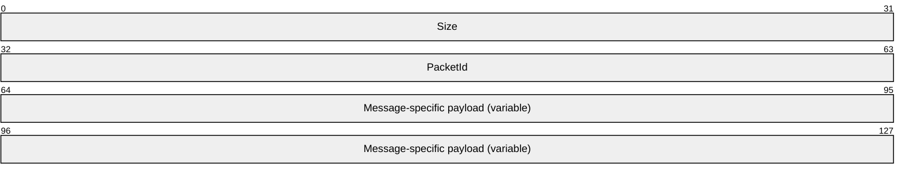

**Size (4 bytes):** A 32-bit unsigned integer that indicates the size of the packet, including the payload.

**PacketId (4 bytes):** A 32-bit unsigned integer representing a unique packet ID that identifies the message. The **PacketId** field MUST be one of the following values.

| Value | Meaning |
| --- | --- |
| IRPDR_ID_VERSION 0x00000065 | Client or Server Version message |
| IRPDR_ID_REDIRECT_DEVICES 0x00000066 | Client Device Addition message |
| IRPDR_ID_SERVER_LOGON 0x00000067 | Authenticated Client message |
| IRPDR_ID_UNREDIRECT_DEVICE 0x00000068 | Client Device Removal message |

**Message-specific payload (variable):** An array of unsigned 8-bit integers describing the payload of the message that corresponds to the interface for which the packet is sent. The specific structure of the payload is specified by the message descriptions in sections [2.2.1.2.1](#Section_2.2.1.2.1), [2.2.1.2.2](#Section_2.2.1.2.2), and [2.2.1.2.3](#Section_2.2.1.2.3).

<a id="Section_2.2.1.2"></a>
#### 2.2.1.2 PNP Device Info Initialization Messages

The messages in the following sections are used to initialize the [PNP Device Info Subprotocol](#Section_1.3.1).

<a id="Section_2.2.1.2.1"></a>
##### 2.2.1.2.1 Server Version Message

The server sends this message to the client to indicate the server protocol version and server capabilities.

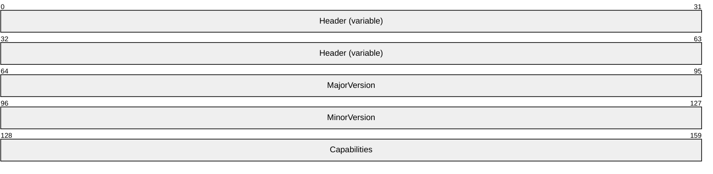

**Header (variable):** The common message header (see section [2.2.1.1](#Section_2.2.1.1)). The **PacketId** field MUST be set to IRPDR_ID_VERSION (0x00000065).

**MajorVersion (4 bytes):** A 32-bit unsigned integer. This field SHOULD indicate the server major version.<2>

**MinorVersion (4 bytes):** A 32-bit unsigned integer. This field SHOULD indicate the server minor version.<3>

**Capabilities (4 bytes):** A 32-bit unsigned integer that represents a set of bit flags indicating server protocol capabilities. A capability is enabled if its corresponding bit is set to 1. This field MUST be the following value.

| Value | Meaning |
| --- | --- |
| 0x00000001 | The server supports dynamic addition of devices. |

<a id="Section_2.2.1.2.2"></a>
##### 2.2.1.2.2 Client Version Message

The client sends this message to the server to indicate the client protocol version and supported capabilities in response to a [Server Version Message](#Section_2.2.1.2.1).


**Header (variable):** The common message header (see section [2.2.1.1](#Section_2.2.1.1)). The **PacketId** field MUST be set to IRPDR_ID_VERSION (0x00000065).

**MajorVersion (4 bytes):** A 32-bit unsigned integer. This field SHOULD indicate the client major version.<4>

**MinorVersion (4 bytes):** A 32-bit unsigned integer. This field SHOULD indicate the client minor version.<5>

**Capabilities (4 bytes):** A 32-bit unsigned integer. This represents a set of bit flags that indicate client protocol capabilities. A bit is true (or set) if its value is equal to 1. This field MUST be the following value.

| Value | Meaning |
| --- | --- |
| 0x00000001 | The client supports dynamic addition of devices. |

<a id="Section_2.2.1.2.3"></a>
##### 2.2.1.2.3 Authenticated Client Message

The server notifies the client that the user has been authenticated by sending this message. This informs the client that the server is now ready to accept any device addition or removal of PNP messages.

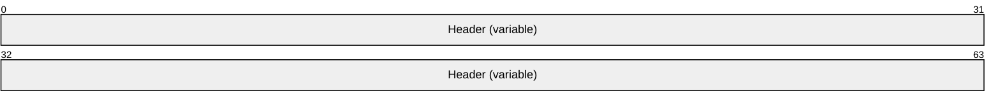

**Header (variable):** The common message header (see section [2.2.1.1](#Section_2.2.1.1)). The **PacketId** field MUST be set to IRPDR_ID_SERVER_LOGON (0x00000067).

This message MUST NOT contain any payload.

<a id="Section_2.2.1.3"></a>
#### 2.2.1.3 PNP Device Info Subprotocol Device Addition and Removal Messages

The messages in the following sections are used to start and stop device redirection.

<a id="Section_2.2.1.3.1"></a>
##### 2.2.1.3.1 Client Device Addition Message

A client sends this message to redirect one or more devices. This message MUST be sent only after an [Authenticated Client message](#Section_2.2.1.2.3) is received from the server.

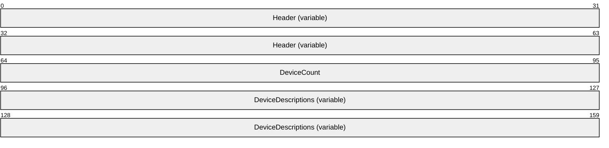

**Header (variable):** The common message header (see section [2.2.1.1](#Section_2.2.1.1)). The **PacketId** field MUST be set to IRPDR_ID_REDIRECT_DEVICES (0x00000066).

**DeviceCount (4 bytes):** A 32-bit unsigned integer. This field indicates the number of devices contained in the following **DeviceDescriptions** field.

**DeviceDescriptions (variable):** An array of [PNP_DEVICE_DESCRIPTION](#Section_2.2.1.3.1.1) structures. The number of instances of PNP_DEVICE_DESCRIPTION is specified by the **DeviceCount** field.

<a id="Section_2.2.1.3.1.1"></a>
###### 2.2.1.3.1.1 PNP_DEVICE_DESCRIPTION

A client device description structure. This structure contains the required information to redirect a particular device.

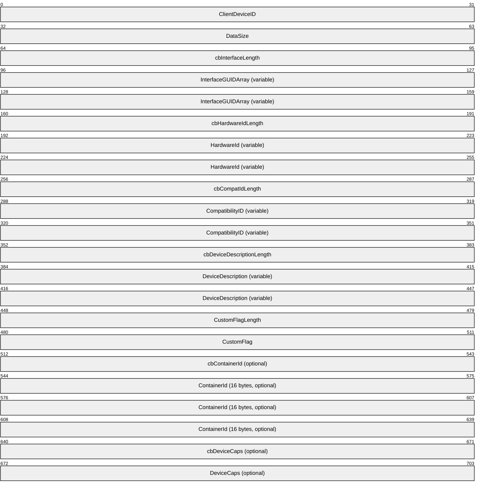

**ClientDeviceID (4 bytes):** A 32-bit unsigned integer. This value MUST be a unique ID generated by the client for the device. The server and client use this ID to refer to the device in subsequent messages.

**DataSize (4 bytes):** A 32-bit unsigned integer. This value specifies the size of the PNP_DEVICE_DESCRIPTION structure.

**cbInterfaceLength (4 bytes):** A 32-bit unsigned integer. This value MUST contain the length of the **InterfaceGUIDArray** field, in bytes. This field MAY be 0x00000000.

**InterfaceGUIDArray (variable):** An array of [**GUID**](#gt_globally-unique-identifier-guid) values, as defined in [MS-DTYP](../MS-DTYP/MS-DTYP.md) section 2.3.4, each representing a [**device interface**](#gt_device-interface) exposed by the client-side device. If the value in the **cbInterfaceLength** field is 0x00000000, the **InterfaceGUIDArray** buffer MUST NOT be present.

**cbHardwareIdLength (4 bytes):** A 32-bit unsigned integer. This field specifies the length of the **HardwareId** field of the client-side device. This field MAY be 0x00000000.

**HardwareId (variable):** An array of bytes. A variable-length field that specifies a [**multisz string**](#gt_multisz-string) representing the hardware ID of the client-side device. If the value in the **cbHardwareIdLength** field is 0x00000000, the **HardwareId** buffer MUST NOT be present.

**cbCompatIdLength (4 bytes):** A 32-bit unsigned integer that specifies the length of the **CompatibilityID** field, in bytes. This field MAY be 0x00000000.

**CompatibilityID (variable):** An array of bytes. A variable-length field that specifies a multisz string representing the compatibility ID of the client-side device. If the value in the **cbCompatIdLength** field is 0x00000000, the **CompatibilityID** buffer MUST NOT be present.

**cbDeviceDescriptionLength (4 bytes):** A 32-bit unsigned integer that specifies the length of the **DeviceDescription** field, in bytes. This field MAY be 0x00000000.

**DeviceDescription (variable):** An array of bytes. A variable-length field that contains a [**Unicode string**](#gt_unicode-string) representing the device description of the client-side device. The string is not null-terminated. If the value contained in the **cbDeviceDescriptionLength** field is 0x00000000, the **DeviceDescription** buffer MUST NOT be present.

**CustomFlagLength (4 bytes):** A 32-bit unsigned integer. This field MUST be set to 0x00000004 because the **CustomFlag** field is hard-coded to be a 32-bit unsigned integer.

**CustomFlag (4 bytes):** A 32-bit unsigned integer that contains one of the following flags that indicates whether the device is an optional device. Optional devices are devices that the server MAY redirect; for all other devices, the server MUST redirect the device.

| Value | Meaning |
| --- | --- |
| 0x00000000 0x00000002 | The device is redirectable. |
| 0x00000001 | The device is optionally redirectable. |

**cbContainerId (4 bytes):** An optional, 32-bit unsigned integer. This field MUST be set to 0x00000010 because the **ContainerId** field is hard-coded to be a GUID.

**ContainerId (16 bytes):** A GUID that identifies a collection of devices that belong to the same physical hardware. Those are identified with the same GUID value. The field is introduced on RDP 7.0 or later clients. The fact that the field is not present means that the device is not a part of a composite device.<6>

**cbDeviceCaps (4 bytes):** An optional, 32-bit unsigned integer. This field MUST be set to 0x00000004 because the **DeviceCaps** field is hard-coded to be a 32-bit unsigned integer.<7>

**DeviceCaps (4 bytes):** An optional, 32-bit unsigned integer that contains device capability flags. This field can be a bitwise OR combination of the following values.<8>

| Value | Meaning |
| --- | --- |
| PNP_DEVCAPS_LOCKSUPPORTED 0x00000001 | The device supports locking. |
| PNP_DEVCAPS_EJECTSUPPORTED 0x00000002 | The device supports ejecting. |
| PNP_DEVCAPS_REMOVABLE 0x00000004 | The device is removable. |
| PNP_DEVCAPS_SURPRISEREMOVALOK 0x00000008 | The device can be removed unexpectedly. |

<a id="Section_2.2.1.3.2"></a>
##### 2.2.1.3.2 Client Device Removal Message

A client sends this message to stop redirecting a particular device. The [**remote device**](#gt_remote-device) is removed from the server's perspective, and applications MAY no longer use it.

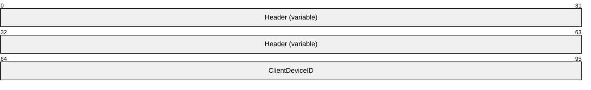

**Header (variable):** The common message header (see section [2.2.1.1](#Section_2.2.1.1)). The **PacketId** field MUST be set to IRPDR_ID_UNREDIRECT_DEVICE (0x00000068).

**ClientDeviceID (4 bytes):** A 32-bit unsigned integer. This value specifies the ID for the device to stop redirecting.

<a id="Section_2.2.2"></a>
### 2.2.2 PNP Device I/O Subprotocol

The messages in the following sections specify the common header and specific messages that make up the PNP Device I/O Subprotocol.

<a id="Section_2.2.2.1"></a>
#### 2.2.2.1 Shared Message Headers

All messages sent in the [PNP Device I/O Subprotocol](#Section_1.3.2) use either a Request or a Reply header, as specified in the following sections.

<a id="Section_2.2.2.1.1"></a>
##### 2.2.2.1.1 Server Message Header (SERVER_IO_HEADER)

All I/O Request messages (messages sent from the server to the client) use the following Request header.

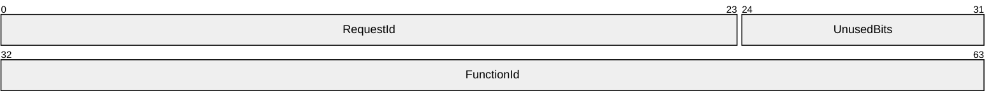

**RequestId (3 bytes):** A 24-bit unsigned integer. This server-generated value uniquely identifies the request. This value MUST be used to refer to the request in subsequent messages. A request ID MAY be reused after the reply message with that ID is received.

**UnusedBits (1 byte):** An 8-bit padding field. Values in this field MUST be ignored.

**FunctionId (4 bytes):** A 32-bit unsigned integer. This value identifies the function associated with the request. This value MUST be one of the following values. If the value does not match one of these values, the client MUST terminate the dynamic virtual channel for the PNP Device I/O Subprotocol.

| Name | Value |
| --- | --- |
| READ_REQUEST | 0x00000000 |
| WRITE_REQUEST | 0x00000001 |
| IOCONTROL_REQUEST | 0x00000002 |
| CREATE_FILE_REQUEST | 0x00000004 |
| CAPABILITIES_REQUEST | 0x00000005 |
| SPECIFIC_IOCANCEL_REQUEST | 0x00000006 |

<a id="Section_2.2.2.1.2"></a>
##### 2.2.2.1.2 Client Message Header (CLIENT_IO_HEADER)

All I/O Reply messages (messages from client to server) use the following Reply header.

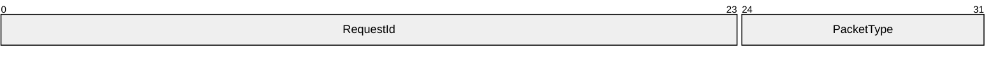

**RequestId (3 bytes):** A 24-bit unsigned integer. For I/O response messages, this value MUST contain the same value as the **RequestId** field in the [SERVER_IO_HEADER](#Section_2.2.2.1.1) of the corresponding request message. If the **PacketType** field contains 0x01, this is a Custom Event Message. This field is unused, MAY contain any value, and MUST be ignored.

**PacketType (1 byte):** An 8-bit unsigned integer that indicates the packet type. The field MUST contain one of the following values.

| Value | Meaning |
| --- | --- |
| RESPONSE_PACKET 0x00 | Indicates that the message is a response to an I/O request from the server. |
| CUSTOM_EVENT_PACKET 0x01 | Indicates that the message is a custom event message generated by the client. |

<a id="Section_2.2.2.2"></a>
#### 2.2.2.2 Initialization Messages

The messages in the following sections are used to initialize the [PNP Device I/O Subprotocol](#Section_1.3.2).

<a id="Section_2.2.2.2.1"></a>
##### 2.2.2.2.1 Server Capabilities Request Message

A server sends this message to indicate its version information to the client.

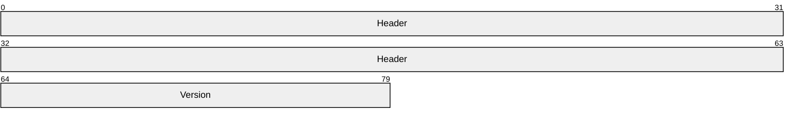

**Header (8 bytes):** A [SERVER_IO_HEADER](#Section_2.2.2.1.1) request header. The **FunctionId** field MUST be set to CAPABILITIES_REQUEST (0x00000005).

**Version (2 bytes):** A 16-bit unsigned integer. This field SHOULD indicate the version of the server-side implementation of the [PNP Device I/O Subprotocol](#Section_1.3.2).

| Value | Meaning |
| --- | --- |
| 0x0004 | This server version does not support custom event redirection. |
| 0x0006 | This server version supports custom event redirection. |

<a id="Section_2.2.2.2.2"></a>
##### 2.2.2.2.2 Client Capabilities Reply Message

The client replies to the server capabilities version with its own version.

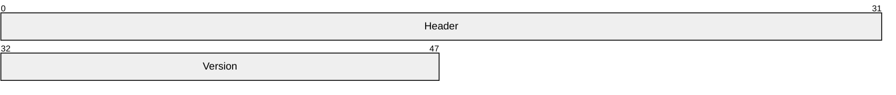

**Header (4 bytes):** A [CLIENT_IO_HEADER](#Section_2.2.2.1.2) reply header. The **PacketType** field MUST be set to RESPONSE_PACKET (0x00). The **RequestId** field MUST match the value in the **RequestId** field in the [SERVER_IO_HEADER](#Section_2.2.2.1.1) request header of the corresponding request packet.

**Version (2 bytes):** A 16-bit unsigned integer. This field SHOULD indicate the version of the client-side implementation of the [PNP Device I/O Subprotocol](#Section_1.3.2).

| Value | Meaning |
| --- | --- |
| 0x0004 | This client version does not support custom event redirection. |
| 0x0006 | This client version supports custom event redirection. |

<a id="Section_2.2.2.3"></a>
#### 2.2.2.3 Device I/O Messages

The messages in the following sections are used for device input and output operations in the [PNP Device I/O Subprotocol](#Section_1.3.2).

<a id="Section_2.2.2.3.1"></a>
##### 2.2.2.3.1 CreateFile Request Message

A server sends this message to open a file [**handle**](#gt_handle) on the client-side device. This message MUST be sent only once for a given connection within the dynamic virtual channel. A one-to-one correspondence exists between file handles opened on the client side and dynamic virtual channels used. All I/O traffic that is associated with a file handle MUST be done on the virtual channel used to create the file handle. As a result, to open multiple file handles, multiple dynamic virtual channels are established between client and server.

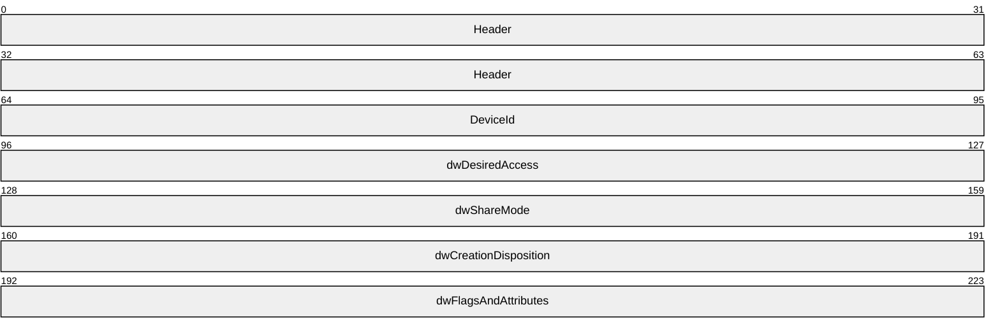

**Header (8 bytes):** A [SERVER_IO_HEADER](#Section_2.2.2.1.1) request header. The **FunctionId** field MUST be set to CREATE_FILE_REQUEST (0x00000004).

**DeviceId (4 bytes):** A 32-bit unsigned integer. This field MUST identify the device redirected by the client. Device IDs are initially established as described in section [2.2.1.3.1](#Section_2.2.1.3.1).

**dwDesiredAccess (4 bytes):** A 32-bit unsigned integer. This is a flag field that indicates various access modes to use for creating and opening the file. This value SHOULD be set to 0xC0000000, meaning generic read and generic write.<9>

**dwShareMode (4 bytes):** A 32-bit unsigned integer that represents a set of bit flags indicating the sharing mode that the server application requested. This field SHOULD be composed of the bitwise OR of one or more of the following values.

| Name | Value |
| --- | --- |
| FILE_SHARE_READ | 0x00000001 |
| FILE_SHARE_WRITE | 0x00000002 |

**dwCreationDisposition (4 bytes):** A 32-bit unsigned integer that specifies the mode for creating or opening the file. This field SHOULD be one of the following values.<10>

| Name | Value |
| --- | --- |
| CREATE_NEW | 0x00000001 |
| CREATE_ALWAYS | 0x00000002 |
| OPEN_EXISTING | 0x00000003 |
| OPEN_ALWAYS | 0x00000004 |
| TRUNCATE_EXISTING | 0x00000005 |

**dwFlagsAndAttributes (4 bytes):** A 32-bit unsigned integer that represents a set of bit flags specifying other flags and attributes associated with the request. This value MUST be composed of the bitwise OR of one or more of the following values.

| Name | Value |
| --- | --- |
| FILE_ATTRIBUTE_DIRECTORY | 0x00000010 |
| FILE_ATTRIBUTE_ARCHIVE | 0x00000020 |
| FILE_ATTRIBUTE_DEVICE | 0x00000040 |
| FILE_ATTRIBUTE_NORMAL | 0x00000080 |
| FILE_FLAG_FIRST_PIPE_INSTANCE | 0x00080000 |
| FILE_FLAG_OPEN_NO_RECALL | 0x00100000 |
| FILE_FLAG_OPEN_REPARSE_POINT | 0x00200000 |
| FILE_FLAG_POSIX_SEMANTICS | 0x01000000 |
| FILE_FLAG_BACKUP_SEMANTICS | 0x02000000 |
| FILE_FLAG_DELETE_ON_CLOSE | 0x04000000 |
| FILE_FLAG_SEQUENTIAL_SCAN | 0x08000000 |
| FILE_FLAG_RANDOM_ACCESS | 0x10000000 |
| FILE_FLAG_NO_BUFFERING | 0x20000000 |
| FILE_FLAG_OVERLAPPED | 0x40000000 |
| FILE_FLAG_WRITE_THROUGH | 0x80000000 |

<a id="Section_2.2.2.3.2"></a>
##### 2.2.2.3.2 CreateFile Reply Message

The client responds to the server create-file request with this message.

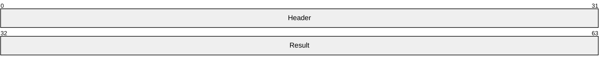

**Header (4 bytes):** A [CLIENT_IO_HEADER](#Section_2.2.2.1.2) reply header. The **PacketType** field MUST be set to RESPONSE_PACKET (0x00). The **RequestId** field MUST match the value in the **RequestId** field in the corresponding [CreateFile Request Message](#Section_2.2.2.3.1).

**Result (4 bytes):** An [**HRESULT**](#gt_hresult) value that describes the result of the operation. There are no specific HRESULT values expected by this protocol because the value is returned by the client-side device when it completes the create request. The possible values will vary depending on the device.

<a id="Section_2.2.2.3.3"></a>
##### 2.2.2.3.3 Read Request Message

The server sends this message to request a read operation from the specified redirected client device.

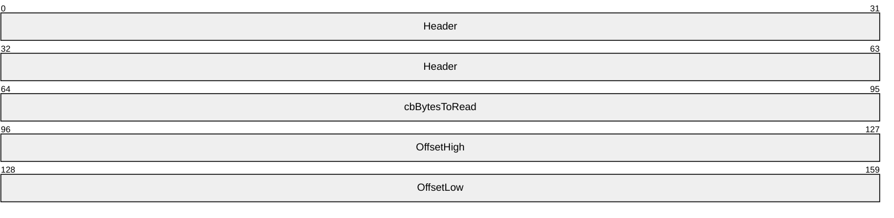

**Header (8 bytes):** A [SERVER_IO_HEADER](#Section_2.2.2.1.1) request header. The **FunctionId** field MUST be set to READ_REQUEST (0x00000000).

**cbBytesToRead (4 bytes):** A 32-bit unsigned integer. This field specifies how many bytes the server requested to read from the redirected client device.

**OffsetHigh (4 bytes):** A 32-bit unsigned integer. This field specifies the high offset value for the read operation.

**OffsetLow (4 bytes):** A 32-bit unsigned integer. This field specifies the low offset value for the read operation.

<a id="Section_2.2.2.3.4"></a>
##### 2.2.2.3.4 Read Reply Message

The client responds to the read file request from the server with this message.

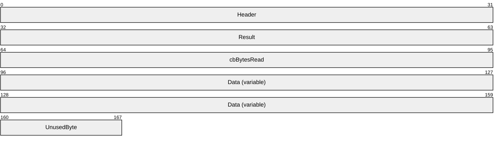

**Header (4 bytes):** A [CLIENT_IO_HEADER](#Section_2.2.2.1.2) reply header. The **PacketType** field MUST be set to RESPONSE_PACKET (0x00). The **RequestId** field MUST match the value in the **RequestId** field in the corresponding [Read Request Message](#Section_2.2.2.3.3).

**Result (4 bytes):** An [**HRESULT**](#gt_hresult) that describes the result of the read operation. There are no specific HRESULT values expected by this protocol because the value is returned by the client-side device when it completes the Read Request. The possible values will vary depending on the device.

**cbBytesRead (4 bytes):** A 32-bit unsigned integer. This field specifies the number of bytes read.

**Data (variable):** An array of bytes. A variable-length field that MUST contain the data read from the client.

**UnusedByte (1 byte):** An 8-bit unsigned integer. This field is unused and MUST be ignored.

<a id="Section_2.2.2.3.5"></a>
##### 2.2.2.3.5 Write Request Message

The server sends this message to perform a write operation on a redirected client device.

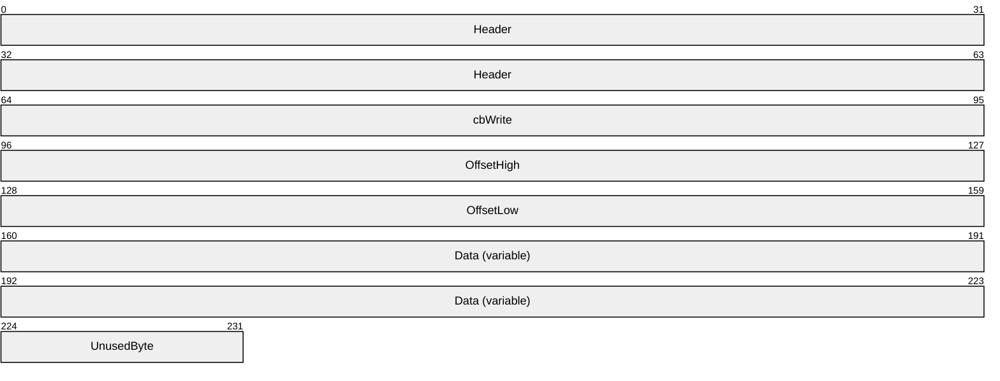

**Header (8 bytes):** A [SERVER_IO_HEADER](#Section_2.2.2.1.1) request header. The **FunctionId** field MUST be set to WRITE_REQUEST (0x00000001).

**cbWrite (4 bytes):** A 32-bit unsigned integer. This field specifies the size of the data to be written.

**OffsetHigh (4 bytes):** A 32-bit unsigned integer. This field specifies the high offset value for the write operation.

**OffsetLow (4 bytes):** A 32-bit unsigned integer. This field specifies the low offset value for the write operation.

**Data (variable):** A variable-length array of bytes. This field MUST contain the data to be written to the particular device.

**UnusedByte (1 byte):** An 8-bit unsigned integer. This field is unused and MUST be ignored.

<a id="Section_2.2.2.3.6"></a>
##### 2.2.2.3.6 Write Reply Message

A client responds to a [Write Request message](#Section_2.2.2.3.5) from the server with this message.

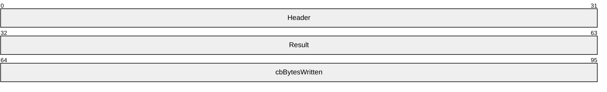

**Header (4 bytes):** A [CLIENT_IO_HEADER](#Section_2.2.2.1.2) reply header. The **PacketType** field MUST be set to RESPONSE_PACKET (0x00). The **RequestId** field MUST match the value in the **RequestId** field in the corresponding Write Request Message.

**Result (4 bytes):** An [**HRESULT**](#gt_hresult) value that specifies the result of the write operation. There are no specific HRESULT values expected by this protocol because the value is returned by the client-side device when it completes the write request. The possible values will vary depending on the device.

**cbBytesWritten (4 bytes):** A 32-bit unsigned integer. This field specifies the size, in bytes, of the data written on the client device.

<a id="Section_2.2.2.3.7"></a>
##### 2.2.2.3.7 IOControl Request Message

A server sends this message to perform an IOControl operation on the client-side device.

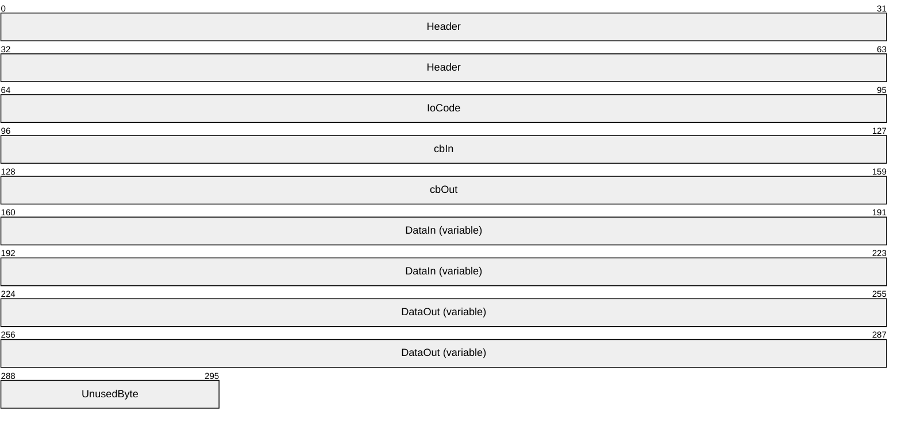

**Header (8 bytes):** A [SERVER_IO_HEADER](#Section_2.2.2.1.1) request header. The **FunctionId** field MUST be set to IOCONTROL_REQUEST (0x00000002).

**IoCode (4 bytes):** A 32-bit unsigned integer. This field specifies the I/O control code to be sent to the client device. The **IoCode** is specific to the redirected device driver; this specification cannot specify all possible values for the **IoCode** field.

**cbIn (4 bytes):** A 32-bit unsigned integer. This field specifies the input buffer size. This field MAY be 0x00000000.

**cbOut (4 bytes):** A 32-bit unsigned integer. This field specifies the output buffer size that can be returned using the **Data** field of the [IOControl Reply Message (section 2.2.2.3.8)](#Section_2.2.2.3.8). This field MAY be 0x00000000.

**DataIn (variable):** A variable-length array of bytes. The **DataIn** buffer MUST contain the input data. The length of this field is specified by the **cbIn** field of this message.

**DataOut (variable):** A variable-length, optional array of bytes. The size of field **DataOut** SHOULD be equal to the value provided in field **cbOut**.

**UnusedByte (1 byte):** An 8-bit unsigned integer. This field is unused, MAY be any value, and MUST be ignored.

<a id="Section_2.2.2.3.8"></a>
##### 2.2.2.3.8 IOControl Reply Message

The client responds to the [IOControl Request message](#Section_2.2.2.3.7) from the server with this message.

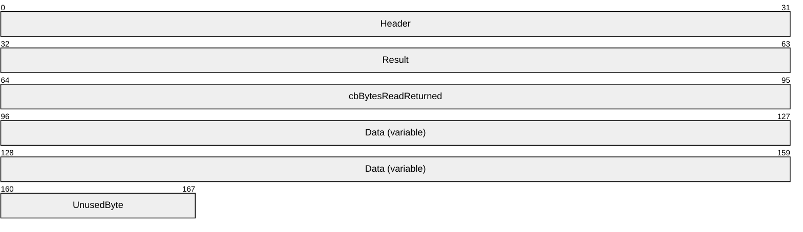

**Header (4 bytes):** A [CLIENT_IO_HEADER](#Section_2.2.2.1.2) reply header. The **PacketType** field MUST be set to RESPONSE_PACKET (0x00). The **RequestId** field MUST match the value in the **RequestId** field in the corresponding IOControl Request message.

**Result (4 bytes):** An [**HRESULT**](#gt_hresult) value that specifies the result of the IOControl operation. There are no specific HRESULT values expected by this protocol, because the value is returned by the client-side device when it completes the IOControl request. An exception is the case when the **DataOut** field has an unexpected value, as described in section 2.2.2.3.7. The possible values will vary depending on the device.

**cbBytesReadReturned (4 bytes):** A 32-bit unsigned integer. This field specifies the size, in bytes, of data read from the client device. The value of this field MUST not exceed the value of the **cbOut** field in the IOControl Request Message (section 2.2.2.3.7).

**Data (variable):** A variable-length array of bytes. This field MUST contain the data returned by the client IOControl operation.

**UnusedByte (1 byte):** An 8-bit unsigned integer. This field is unused and MUST be ignored.

<a id="Section_2.2.2.3.9"></a>
##### 2.2.2.3.9 Specific IoCancel Request Message

The server sends this message to the client to cancel a specific I/O request.

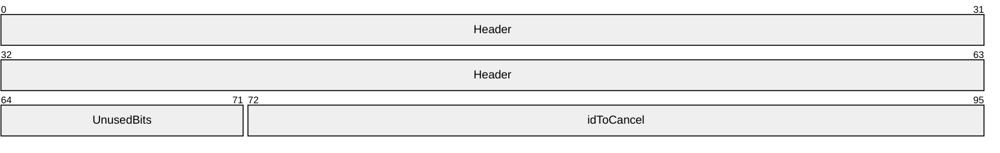

**Header (8 bytes):** A [SERVER_IO_HEADER](#Section_2.2.2.1.1) request header. The **FunctionId** field MUST be set to SPECIFIC_IOCANCEL_REQUEST (0x00000006).

**UnusedBits (1 byte):** An 8-bit unsigned integer. This field is unused and SHOULD be set to 0x00.

**idToCancel (3 bytes):** A 24-bit unsigned integer. This field specifies the RequestId for the I/O request to cancel.

<a id="Section_2.2.2.3.10"></a>
##### 2.2.2.3.10 Client Device Custom Event Message

A client sends this message to the server in response to a custom event occurring on the client device. This message MUST be sent only if both the server and client protocol version is 6 or later.

```mermaid
packet-beta
  0-31: "Header"
  32-127: "CustomEventGUID (16 bytes)"
  128-159: "cbData"
  160-223: "Data (variable)"
  224-231: "UnusedByte"
```

**Header (4 bytes):** A [CLIENT_IO_HEADER](#Section_2.2.2.1.2) reply header. The **PacketType** field MUST be set to CUSTOM_EVENT_PACKET (0x000001). The **RequestId** field SHOULD be set to 0x000000.

**CustomEventGUID (16 bytes):** A [**GUID**](#gt_globally-unique-identifier-guid) associated with the custom event generated.

**cbData (4 bytes):** A 32-bit unsigned integer. This field specifies the size of the data associated with the custom event.

**Data (variable):** A variable-length array of bytes. This field MUST contain the data associated with the custom event.

**UnusedByte (1 byte):** An 8-bit unsigned integer. This field is unused and MUST be ignored.

<a id="Section_3"></a>
# 3 Protocol Details

<a id="Section_3.1"></a>
## 3.1 Common Details

<a id="Section_3.1.1"></a>
### 3.1.1 Abstract Data Model

This section describes a conceptual model of possible data organization that an implementation maintains to participate in this protocol. The organization is provided to explain how the protocol behaves. This document does not mandate that implementations adhere to this model as long as their external behavior is consistent with that described in this document. An implementation maintains the following data.

**Client device ID:** Both client and server maintain a list of client devices being redirected. The client generates this ID for each device when it sends device information in a [Client Device Addition message](#Section_2.2.1.3.1). For subsequent operations on the devices, both client and server use this ID to refer to the device.

**Client device list:** Both client and server maintain a list of devices being redirected. This list contains the **client device ID** for each redirected device announced in a Client Device Addition message. Devices are added to the list when they are redirected and removed when either the device is removed with a [Client Device Remove message](#Section_2.2.1.3.2), or redirection is canceled.

**Request ID:** For I/O request calls, the server generates a unique, 24-bit ID and sends it with the I/O request to the client. The client and server use this ID to refer to the request in subsequent messages. When a request is sent to the client, the server adds it to the **outstanding requests list**. When the client completes the request, the server removes the entry for the request from the **outstanding requests list**. A request ID MAY be reused after the reply message with that ID is received. In the case of the client receiving a duplicate request ID, the client SHOULD terminate the underlying subprotocol dynamic virtual channel.<11>

**Outstanding requests list:** A list maintained by the server of all valid **Request IDs** sent to the client. The list is invalidated when the underlying dynamic virtual channel for sending the requests or replies is terminated.

<a id="Section_3.1.2"></a>
### 3.1.2 Timers

No common timers are used. Individual [**device drivers**](#gt_device-driver) MAY implement time-out logic for I/O requests; however, the operation of these drivers is external to this specification.

<a id="Section_3.1.3"></a>
### 3.1.3 Initialization

The dynamic virtual channel MUST be established by using the parameters described in section [2.1](#Section_2.1) before the protocol operation can commence.

<a id="Section_3.1.4"></a>
### 3.1.4 Higher-Layer Triggered Events

No higher-layer triggered events are used.

<a id="Section_3.1.5"></a>
### 3.1.5 Message-Processing Events and Sequencing Rules

There are no common message-processing events or sequencing rules. See sections [3.2.5](#Section_3.2.5) and [3.3.5](#Section_3.3.5) for client-specific and server-specific message processing.

<a id="Section_3.1.6"></a>
### 3.1.6 Timer Events

None.

<a id="Section_3.1.7"></a>
### 3.1.7 Other Local Events

None.

<a id="Section_3.2"></a>
## 3.2 Client Details

<a id="Section_3.2.1"></a>
### 3.2.1 Abstract Data Model

The abstract data model is specified in section [3.1.1](#Section_3.1.1).

<a id="Section_3.2.2"></a>
### 3.2.2 Timers

None.

<a id="Section_3.2.3"></a>
### 3.2.3 Initialization

Initialization is specified in section [3.1.3](#Section_3.1.3).

<a id="Section_3.2.4"></a>
### 3.2.4 Higher-Layer Triggered Events

None.

<a id="Section_3.2.5"></a>
### 3.2.5 Message-Processing Events and Sequencing Rules

<a id="Section_3.2.5.1"></a>
#### 3.2.5.1 PNP Device Info Subprotocol

<a id="Section_3.2.5.1.1"></a>
##### 3.2.5.1.1 Initialization Messages

Initialization messages exchange the basic information necessary to establish the connection and to perform capabilities negotiation.

<a id="Section_3.2.5.1.1.1"></a>
###### 3.2.5.1.1.1 Processing a Server Version Message

The structure and fields of the [Server Version message](#Section_2.2.1.2.1) are described in section 2.2.1.2.1.

The Server Version message MUST be the first message that the client receives in the protocol sequence.

Similarly, the client MUST acknowledge the message by sending its own version and capabilities information. This way, the server knows what messages the client supports. Future versions of the protocol MAY support new packets that current versions do not support. As a result, this negotiation is important to ensure that no packets are sent from one side that the other cannot interpret.

<a id="Section_3.2.5.1.1.2"></a>
###### 3.2.5.1.1.2 Sending a Client Version Message

The structure and fields of the [Client Version message](#Section_2.2.1.2.2) are described in section 2.2.1.2.2.

No client-specific events or rules are required.

<a id="Section_3.2.5.1.1.3"></a>
###### 3.2.5.1.1.3 Processing an Authenticated Client Message

The structure and fields of the [Authenticated Client message](#Section_2.2.1.2.3) are specified in section 2.2.1.2.3.

The server sends the Authenticated Client message after it authenticates the client to the server session. The client MUST NOT send any device addition or removal messages until it receives this message. Only after receiving this message MAY the client send one or more [Client Device Addition messages](#Section_2.2.1.3.1).

<a id="Section_3.2.5.1.2"></a>
##### 3.2.5.1.2 Device Addition and Removal Messages

<a id="Section_3.2.5.1.2.1"></a>
###### 3.2.5.1.2.1 Sending a Client Device Addition Message

The structure and fields of the [Client Device Addition message](#Section_2.2.1.3.1) are as specified in section 2.2.1.3.1.

The client MUST generate and assign a unique client device ID for each of the devices in its Client device list that it wants to redirect to the server. This message MUST be sent only after the client receives an [Authenticated Client message](#Section_2.2.1.2.3).

<a id="Section_3.2.5.1.2.2"></a>
###### 3.2.5.1.2.2 Sending a Client Device Removal Message

The structure and fields of the [Client Device Removal message](#Section_2.2.1.3.2) are as specified in section 2.2.1.3.2.

Before the client sends this message to stop redirecting a particular device, the corresponding device MUST have previously been sent as part of a [Client Device Addition message](#Section_2.2.1.3.1). The client also removes the device from its Client device list.

<a id="Section_3.2.5.2"></a>
#### 3.2.5.2 PNP Device I/O Subprotocol

<a id="Section_3.2.5.2.1"></a>
##### 3.2.5.2.1 Initialization Messages

These messages establish the logical connection between server and client, in addition to capabilities. Initialization messages MUST be sent immediately after creating a new dynamic channel connection within the **FileRedirectorChannel** channel. A new channel connection MUST be established for each CreateFile call. These messages are generally followed by the CreateFile message and then by Read, Write, or IOControl messages.

<a id="Section_3.2.5.2.1.1"></a>
###### 3.2.5.2.1.1 Processing a Server Capabilities Request Message

The structure and fields of the [Server Capabilities Request message](#Section_2.2.2.2.1) are defined in section 2.2.2.2.1.

This MUST be the first message that a client receives on each connection within the [PNP Device I/O Subprotocol](#Section_1.3.2). The client inspects the version field. For example, if the client receives a version of 6 or later (future versions of the protocol MAY send a later version, although current ones do not) from the packet described in section 2.2.2.2.1, the client MAY send packets that describe custom events, as described in section [2.2.2.3.10](#Section_2.2.2.3.10). However, if the version is earlier than 6, the client MUST NOT send packets that describe custom events.

The client MUST reply with its own version by sending a [Client Capabilities Reply message](#Section_2.2.2.2.2).

<a id="Section_3.2.5.2.1.2"></a>
###### 3.2.5.2.1.2 Sending a Client Capabilities Reply

The structure and fields of the [Client Capabilities Reply message](#Section_2.2.2.2.2) are defined in section 2.2.2.2.2.

This message MUST be sent only after receiving a [Server Capabilities Request message](#Section_2.2.2.2.1).

<a id="Section_3.2.5.2.2"></a>
##### 3.2.5.2.2 Device I/O Messages

The device I/O messages in the [PNP Device I/O Subprotocol](#Section_1.3.2) are used to perform real I/O operations on the client devices and to return the result to the server.

<a id="Section_3.2.5.2.2.1"></a>
###### 3.2.5.2.2.1 Processing a CreateFile Request Message

The structure and fields of the [CreateFile Request message](#Section_2.2.2.3.1) are defined in section 2.2.2.3.1.

The client MUST use the client device ID passed in the CreateFile Request message to identify the device to use. The client interacts with the local [**device driver**](#gt_device-driver), using the attributes and flags specified in the CreateFile Request message, to service the I/O request.

<a id="Section_3.2.5.2.2.2"></a>
###### 3.2.5.2.2.2 Sending a CreateFile Reply Message

The structure and fields of the [CreateFile Reply message](#Section_2.2.2.3.2) are defined in section 2.2.2.3.2.

The result of the client's interaction with the local [**device driver**](#gt_device-driver) in servicing the [CreateFile Request message](#Section_2.2.2.3.1) MUST be returned by the client in the CreateFile Reply message. The client MUST maintain the association of the file [**handle**](#gt_handle) obtained through the dynamic virtual channel connection on which it received the CreateFile Request message, because all I/O requests on the connection are associated with the file handle.

<a id="Section_3.2.5.2.2.3"></a>
###### 3.2.5.2.2.3 Processing a Read Request Message

The structure and fields of the [Read Request message](#Section_2.2.2.3.3) are described in section 2.2.2.3.3.

This message MUST be received only after the CreateFile request-response sequence has been sent, establishing a file [**handle**](#gt_handle) for I/O on this connection. On receiving the Read Request message, the client MUST use the associated file handle and the parameters specified in the Read Request message to interact with the local [**device driver**](#gt_device-driver) in servicing this request.

<a id="Section_3.2.5.2.2.4"></a>
###### 3.2.5.2.2.4 Sending a Read Reply Message

The structure and fields of the [Read Reply message](#Section_2.2.2.3.4) are described in section 2.2.2.3.4.

The client MUST use the **RequestId** received in the corresponding [Read Request message](#Section_2.2.2.3.3) when constructing this reply. The result of the Read operation performed, along with all data read, MUST be returned in the response message.

<a id="Section_3.2.5.2.2.5"></a>
###### 3.2.5.2.2.5 Processing a Write Request Message

The structure and fields of the [Write Request message](#Section_2.2.2.3.5) are described in section 2.2.2.3.5.

This message MUST be received only after the CreateFile request-response sequence has been sent, establishing a file [**handle**](#gt_handle) for I/O on this connection. On receiving the Write Request message, the client MUST use the associated file handle and the parameters specified in the Write Request message to interact with the local [**device driver**](#gt_device-driver) in servicing this request.

<a id="Section_3.2.5.2.2.6"></a>
###### 3.2.5.2.2.6 Sending a Write Reply Message

The structure and fields of the [Write Reply message](#Section_2.2.2.3.6) are described in section 2.2.2.3.6.

The client MUST use the RequestId received in the corresponding [Write Request message](#Section_2.2.2.3.5) when constructing this reply. The result of the Write operation performed MUST be returned in the response message.

<a id="Section_3.2.5.2.2.7"></a>
###### 3.2.5.2.2.7 Processing an IOControl Request Message

The structure and fields of the [IOControl Request message](#Section_2.2.2.3.7) are described in section 2.2.2.3.7.

This message MUST be received only after the CreateFile request-response sequence has been sent, establishing a file [**handle**](#gt_handle) for I/O on this connection. On receiving the IOControl Request message, the client MUST use the associated file handle and the parameters specified in the IOControl Request message to interact with the local [**device driver**](#gt_device-driver) in servicing this request.

The **DataIn** field MUST contain input data of the size specified in the **cbIn** field, followed by output data in **DataOut** of the size specified in the **cbOut** field.

It is possible that the actual size of the **DataOut** field MAY be smaller than the value provided in the **cbOut** field. The receiver needs to calculate the actual size of the **DataOut** field by subtracting the sum of sizes of all fields except **DataOut** from the total length of the message. If the calculated size of the **DataOut** field is nonzero and does not match the value provided in the **cbOut** field, the request will be completed with an error HRESULT that contains a Win32 error code (ERROR_INSUFFICIENT_BUFFER) as described in section 2.2 of [MS-ERREF](../MS-ERREF/MS-ERREF.md).

<a id="Section_3.2.5.2.2.8"></a>
###### 3.2.5.2.2.8 Sending an IOControl Reply Message

The structure and fields of the [IOControl Reply message](#Section_2.2.2.3.8) are described in section 2.2.2.3.8.

The client MUST use the **RequestId** received in the corresponding [IOControl Request message](#Section_2.2.2.3.7) when constructing this reply. The result of the IOControl operation performed and any output data MUST be returned in the response message.

<a id="Section_3.2.5.2.2.9"></a>
###### 3.2.5.2.2.9 Processing a Specific IoCancel Request Message

The structure and fields of the [Specific IoCancel Request message](#Section_2.2.2.3.9) are described in section 2.2.2.3.9.

This message MUST be received only after the CreateFile request-response sequence has been sent, establishing a file [**handle**](#gt_handle) for I/O on this connection. On receiving this message, the client MUST cancel the I/O operation associated with the device that is identified by the value in the **RequestId** field. The appropriate device I/O reply message for that **RequestId** MUST still be sent to the server.

If the IoCancel Request Message has been received by the client and there are no outstanding pending I/O requests, this request MUST be ignored. This applies when the client receives the IoCancel Request after the completion of the I/O request, and after the client receives multiple IoCancel requests.

<a id="Section_3.2.5.2.2.10"></a>
###### 3.2.5.2.2.10 Sending a Client Device Custom Event Message

The structure and fields of the [Client Device Custom Event message](#Section_2.2.2.3.10) are described in section 2.2.2.3.10.

When a redirected device generates any custom PNP event, the client MUST notify the server of the event by sending a Client Device Custom Event message to the server. The message MUST contain all the data regarding the custom PNP event, as described in section 2.2.2.3.10. This message MUST be sent only if the protocol version running on both the client and server is 6 or later. The version number is exchanged in packets described in sections [2.2.2.2.1](#Section_2.2.2.2.1) and [2.2.2.2.2](#Section_2.2.2.2.2).

<a id="Section_3.2.6"></a>
### 3.2.6 Timer Events

None.

<a id="Section_3.2.7"></a>
### 3.2.7 Other Local Events

None.

<a id="Section_3.3"></a>
## 3.3 Server Details

<a id="Section_3.3.1"></a>
### 3.3.1 Abstract Data Model

The abstract data model is specified in section [3.1.1](#Section_3.1.1).

<a id="Section_3.3.2"></a>
### 3.3.2 Timers

None.

<a id="Section_3.3.3"></a>
### 3.3.3 Initialization

Initialization is specified in section [3.1.3](#Section_3.1.3).

<a id="Section_3.3.4"></a>
### 3.3.4 Higher-Layer Triggered Events

None.

<a id="Section_3.3.5"></a>
### 3.3.5 Message-Processing Events and Sequencing Rules

<a id="Section_3.3.5.1"></a>
#### 3.3.5.1 PNP Device Info Subprotocol

<a id="Section_3.3.5.1.1"></a>
##### 3.3.5.1.1 Initialization Messages

This section contains information about sending version request messages, processing version response messages, sending authenticated client messages, and processing device addition and device removal messages.

<a id="Section_3.3.5.1.1.1"></a>
###### 3.3.5.1.1.1 Sending a Server Version Message

The structure and fields of the [Server Version message](#Section_2.2.1.2.1) are described in section 2.2.1.2.1.

This MUST be the first message that the server sends after creating a dynamic virtual channel connection with the client. The server indicates its version and capabilities in this message.

<a id="Section_3.3.5.1.1.2"></a>
###### 3.3.5.1.1.2 Processing a Client Version Message

The structure and fields of the [Client Version message](#Section_2.2.1.2.2) are described in section 2.2.1.2.2.

When the server receives a Client Version message, the server MUST use the version and capabilities received from the client to discover what messages the client understands. Although there is currently only one possible client protocol version, future protocol versions MAY have packets that the current version will not understand.

The server MUST receive this message before any meaningful exchange can take place.

<a id="Section_3.3.5.1.1.3"></a>
###### 3.3.5.1.1.3 Sending an Authenticated Client Message

The structure and fields of the [Authenticated Client message](#Section_2.2.1.2.3) are described in section 2.2.1.2.3.

The server SHOULD NOT accept any device redirection commands until a user has logged on to the server session. This ensures that nonauthenticated users cannot cause a denial-of-service attack by sending huge volumes of device addition or removal requests. When a user logs on to the server session, the server MUST send the Authenticated Client message, which indicates to the client that the server is ready to process device addition or removal messages.

<a id="Section_3.3.5.1.2"></a>
##### 3.3.5.1.2 Device Addition and Removal Messages

The following messages are processed only after the client and server have completed initial versioning.

<a id="Section_3.3.5.1.2.1"></a>
###### 3.3.5.1.2.1 Processing a Client Device Addition Message

The structure and fields of the [Client Device Addition message](#Section_2.2.1.3.1) are described in section 2.2.1.3.1.

For each device contained in the **DeviceDescriptions** field of the Client Device Addition message, the server MUST create a [**remote device**](#gt_remote-device) instance on the server to represent the client-side physical devices and add it to its Client device list. The server MUST also maintain a client device ID for each device. A one-to-one correspondence exists between remote devices and client device IDs. This ID MUST be used to refer to a particular device when making I/O calls.

If the **CustomFlag** field **DeviceDescription** of the device is set to 0x00000001, the server MAY choose not to redirect the device. If the server chooses not to redirect the device, the server silently drops the Client Device Addition message and does not inform the client.

In the case of the server receiving a duplicate **ClientDeviceId** in the PNP_DEVICE_DESCRIPTION subpacket as described in section [2.2.1.3.1.1](#Section_2.2.1.3.1.1), the server SHOULD terminate the underlying subprotocol dynamic virtual channel.<12> The FileRedirectorChannel channel continues to process IO for existing devices and is not terminated. These devices are removed when the session is disconnected.

<a id="Section_3.3.5.1.2.2"></a>
###### 3.3.5.1.2.2 Processing a Client Device Removal Message

The structure and fields of the [Client Device Removal message](#Section_2.2.1.3.2) are described in section 2.2.1.3.2.

For a device already instantiated on the server and identified by the value in the **ClientDeviceID** field, the server MUST remove all references to the [**remote device**](#gt_remote-device) when this message is received, and also remove it from its Client device list.

<a id="Section_3.3.5.2"></a>
#### 3.3.5.2 Device I/O Subprotocol

<a id="Section_3.3.5.2.1"></a>
##### 3.3.5.2.1 Initialization Messages

<a id="Section_3.3.5.2.1.1"></a>
###### 3.3.5.2.1.1 Sending a Server Capabilities Request Message

The structure and fields of the [Server Capabilities Request message](#Section_2.2.2.2.1) are described in section 2.2.2.2.1.

This MUST be the first message that the server sends for each dynamic virtual channel connection that it establishes with the client.

<a id="Section_3.3.5.2.1.2"></a>
###### 3.3.5.2.1.2 Processing a Client Capabilities Reply Message

The structure and fields of the [Client Capabilities Reply message](#Section_2.2.2.2.2) are described in section 2.2.2.2.2. The server MUST receive this message prior to any other message that the client sends. The server MUST NOT complete the initialization of the [**remote device**](#gt_remote-device) until it receives this message.

After receiving the Client Capabilities Reply message, the server MAY begin to process I/O messages. The server MUST NOT process any I/O messages until it receives a version from the client.

<a id="Section_3.3.5.2.2"></a>
##### 3.3.5.2.2 Device I/O Messages

For every request message, the server maintains an entry in the **outstanding requests list**. The entry is invalidated as soon as a corresponding Reply Message is received by the server. If a reply is received by the server and the **Request ID** cannot be found in the **outstanding requests list**, the server MUST ignore the client message.

<a id="Section_3.3.5.2.2.1"></a>
###### 3.3.5.2.2.1 Sending a CreateFile Request Message

The structure and fields of the [CreateFile Request message](#Section_2.2.2.3.1) are described in section 2.2.2.3.1.

The server sends a CreateFile Request message to open or create a file on the client-side device on behalf of an application. The server MUST pass the client device ID to identify the device. The server MUST generate a unique ID for this request and pass it in the **RequestId** field of the [SERVER_IO_HEADER](#Section_2.2.2.1.1) along with any flags or attributes for the create-file request.

<a id="Section_3.3.5.2.2.2"></a>
###### 3.3.5.2.2.2 Processing a CreateFile Reply Message

The structure and fields of the [CreateFile Reply message](#Section_2.2.2.3.2) are described in section 2.2.2.3.2.

No server-specific events or rules are required other than that the server MUST pass the results of the operation contained in the reply to the actual application that made the create-file request.

<a id="Section_3.3.5.2.2.3"></a>
###### 3.3.5.2.2.3 Sending a Read Request Message

The structure and fields of the [Read Request message](#Section_2.2.2.3.3) are described in section 2.2.2.3.3.

This message MUST be sent only after the CreateFile request-response sequence has been sent, establishing a file [**handle**](#gt_handle) for I/O on this connection. The server MUST generate a unique **RequestId** for this request and specify the number of bytes to read. The server also stores all necessary information required to complete the request (for example, a data buffer to store information and the location of a variable to store the result), and associates this information with the **RequestId**.

<a id="Section_3.3.5.2.2.4"></a>
###### 3.3.5.2.2.4 Processing a Read Reply Message

The structure and fields of the [Read Reply message](#Section_2.2.2.3.4) are described in section 2.2.2.3.4.

To process this reply, the server MUST use the **RequestId** specified in the reply message to find the associated information stored after sending the request message. With this information, the server completes the original request. The server MUST redirect the result of the Read operation contained in the reply to the actual application that made the read request.

<a id="Section_3.3.5.2.2.5"></a>
###### 3.3.5.2.2.5 Sending a Write Request Message

The structure and fields of the [Write Request message](#Section_2.2.2.3.5) are described in section 2.2.2.3.5.

This message MUST be sent only after the CreateFile request-response sequence has been sent, establishing a file [**handle**](#gt_handle) for I/O on this connection. The server MUST generate and pass a unique **RequestId** for this request, specify the number of bytes to write in the **cbWrite** field, and pass the actual data to be written in the **Data** buffer field. The server also stores all necessary information required to complete the request (for example, the location of a variable to store the result), and associates this information with the **RequestId**.

<a id="Section_3.3.5.2.2.6"></a>
###### 3.3.5.2.2.6 Processing a Write Reply Message

The structure and fields of the [Write Reply message](#Section_2.2.2.3.6) are described in section 2.2.2.3.6.

To process this reply, the server MUST use the **RequestId** specified in the reply message to find the associated information stored after sending the request message. With this information, the server completes the original request. The server MUST redirect the result of the Write operation contained in the reply to the actual application that made the write request.

<a id="Section_3.3.5.2.2.7"></a>
###### 3.3.5.2.2.7 Sending an IOControl Request Message

The structure and fields of the [IOControl Request message](#Section_2.2.2.3.7) are described in section 2.2.2.3.7.

This message MUST be sent only after the CreateFile request-response sequence has been sent, establishing a file [**handle**](#gt_handle) for I/O on this connection. The server MUST generate a **RequestId** for this request and the server MUST pass along the rest of the IOControl parameters. The server also stores all necessary information required to complete the request (for example, the location of a variable to store the result), and associates this information with the **RequestId**.

<a id="Section_3.3.5.2.2.8"></a>
###### 3.3.5.2.2.8 Processing an IOControl Reply Message

The structure and fields of the [IOControl Reply message](#Section_2.2.2.3.8) are described in section 2.2.2.3.8.

To process this reply, the server MUST use the **RequestId** specified in the reply message to find the associated information stored after sending the request message. With this information, the server completes the original request. The server MUST redirect the result of the I/O operation contained in the reply to the actual application that made the I/O request.

If the cbBytesReadReturned field has value bigger than cbOut field of the corresponding IOControl Request Message, the underlying dynamic virtual channel transport for this subprotocol MUST be terminated.

<a id="Section_3.3.5.2.2.9"></a>
###### 3.3.5.2.2.9 Sending a Specific IoCancel Request Message

The structure and fields of the [Specific IoCancel Request message](#Section_2.2.2.3.9) are described in section 2.2.2.3.9.

No server-specific events or rules are required. This request does not invalidate the RequestId of the I/O request message that is to be canceled. The pending application request MUST be completed only when the I/O reply message is received, either because of cancellation or normal completion of the original I/O request.

The server MUST NOT send more than one IoCancel Request Message per I/O request.

<a id="Section_3.3.5.2.2.10"></a>
###### 3.3.5.2.2.10 Processing a Client Device Custom Event Message

The structure and fields of the [Client Device Custom Event message](#Section_2.2.2.3.10) are described in section 2.2.2.3.10.

On receiving a Client Device Custom Event message, the server MUST notify all applications registered for the event on the server system by using the parameters contained in the message. If there is no such application the message MUST be ignored. This message MUST be processed only if the protocol version running on both the client side and the server side is 6 or later. Otherwise it MUST be ignored.

<a id="Section_3.3.6"></a>
### 3.3.6 Timer Events

None.

<a id="Section_3.3.7"></a>
### 3.3.7 Other Local Events

None.

<a id="Section_4"></a>
# 4 Protocol Examples

<a id="Section_4.1"></a>
## 4.1 PNP Device Redirection Initialization Sequence

(1) Server Version Message

ChannelName = PNPDR,20,server to client

00000000 14 00 00 00 65 00 00 00 01 00 00 00 06 00 00 00 ....e....

00000010 01 00 00 00 ....

14 00 00 00 -> Size = 0x00000014

65 00 00 00 -> Packet Id = 0x00000065

01 00 00 00 -> Major Version = 0x00000001

06 00 00 00 -> Minor Version = 0x00000006

01 00 00 00 -> Capabilities = 0x00000001

(2) Client Version Message

ChannelName = PNPDR,20,client to server

00000000 14 00 00 00 65 00 00 00 01 00 00 00 06 00 00 00 ....e....

00000010 01 00 00 00 ....

14 00 00 00 -> Size = 0x00000014

65 00 00 00 -> Packet Id = 0x00000065

01 00 00 00 -> Major Version = 0x00000001

06 00 00 00 -> Minor Version = 0x00000006

01 00 00 00 -> Capabilities = 0x00000001

(3) Authenticated Client Message

ChannelName = PNPDR,8,server to client

00000000 08 00 00 00 67 00 00 00 ....g...

08 00 00 00 -> Size = 0x00000008

67 00 00 00 -> Packet Id = 0x00000067

<a id="Section_4.2"></a>
## 4.2 Device Addition and Removal Messages

(1) Client Device Addition Message

ChannelName = PNPDR,106,client to server

00000000 6a 00 00 00 66 00 00 00 01 00 00 00 04 00 00 00 j...f...........

00000010 56 00 00 00 10 00 00 00 46 9c 4a 2b 8d 65 f2 4a V.......F.J+.e.J

00000020 a9 1d 1e 69 18 61 70 6c 12 00 00 00 57 00 55 00 ...i.apl....W.U.

00000030 44 00 46 00 5c 00 4c 00 42 00 00 00 00 00 00 00 D.F.\.L.B.......

00000040 00 00 1c 00 00 00 54 00 73 00 20 00 46 00 61 00 ......T.s. .F.a.

00000050 6b 00 65 00 20 00 44 00 65 00 76 00 69 00 63 00 k.e. .D.e.v.i.c.

00000060 65 00 04 00 00 00 02 00 00 00 e.........

6a 00 00 00 -> Size = 0x0000006a

66 00 00 00 -> Packet Id = 0x00000066

01 00 00 00 -> Device Count = 0x00000001

PNP_DEVICE_DESCRIPTION (variable size)

04 00 00 00 -> Client Device Id = 0x00000004

56 00 00 00 -> Data Size = 0x00000056

10 00 00 00 -> cbInterface Length = 0x00000010

46 9c 4a 2b -> Interface GUID array (variable size=cbInterface Length)

8d 65 f2 4a -> Interface GUID array (continued)

a9 1d 1e 69 -> Interface GUID array (continued)

18 61 70 6c -> Interface GUID array (continued)

12 00 00 00 -> cbHardwareID Length = 0x00000012

57 00 55 00 -> Hardware ID (variable size=cbHardwareID Length)

44 00 46 00 -> Hardware ID (continued)

5c 00 4c 00 -> Hardware ID (continued)

42 00 00 00 -> Hardware ID (continued)

00 00 -> Hardware ID (continued)

00 00 00 00 -> cbCompatId Length = 0x00000000

1c 00 00 00 -> cbDeviceDescriptionLength = 0x0000001c

54 00 73 00 -> Device Description (variable size=cbDeviceDescription Length)

20 00 46 00 -> Device Description (continued)

61 00 6b 00 -> Device Description (continued)

65 00 20 00 -> Device Description (continued)

44 00 65 00 -> Device Description (continued)

76 00 69 00 -> Device Description (continued)

63 00 65 00 -> Device Description (continued)

04 00 00 00 -> Custom flag length = 0x00000004

02 00 00 00 -> Custom flag = 0x00000002

(2) Client Device Removal Message

ChannelName = PNPDR,12,client to server

00000000 0c 00 00 00 68 00 00 00 04 00 00 00 ....h....

0c 00 00 00 -> Size = 0x0000000c

68 00 00 00 -> Packet Id = 0x00000068

04 00 00 00 -> Client Device Id = 0x00000004

<a id="Section_4.3"></a>
## 4.3 Capabilities Initialization Messages

(1) Server Capabilities Request Message

ChannelName = FileRedirectorChannel,10,server to client

00000000 00 00 00 00 05 00 00 00 06 00 .........

00 -> Unused = 0x00

00 00 00 -> Request Id = 0x000000

05 00 00 00 -> Function Id = 0x00000005

06 00 -> Version = 0x0006

(2) Client Capabilities Reply Message

ChannelName = FileRedirectorChannel,6, client to server

00000000 00 00 00 00 06 00 ......

00 -> PacketType = 0x00

00 00 00 -> Request Id = 0x000000

06 00 -> Version = 0x0006

<a id="Section_4.4"></a>
## 4.4 Device I/O Messages

(1) CreateFile Server Request Message

ChannelName = FileRedirectorChannel,28,server to client

00000000 00 00 00 00 04 00 00 00 04 00 00 00 00 00 00 c0 ................

00000010 03 00 00 00 03 00 00 00 80 00 00 40 ...........@

00 -> Unused = 0x00

00 00 00 -> Request Id = 0x000000

04 00 00 00 -> Function Id = 0x00000004

04 00 00 00 -> Device Id = 0x00000004

00 00 00 c0 -> dwDesiredAccess = 0xc0000000

03 00 00 00 -> dwShareMode = 0x00000003

03 00 00 00 -> dwCreationDisposition = 0x00000003

80 00 00 40 -> dwFlagsAndAttributes = 0x40000080

(2) CreateFile Client Response Message

ChannelName = FileRedirectorChannel,8,client to server

00000000 00 00 00 00 00 00 00 00 ........

00 -> PacketType = 0x00

00 00 00 -> Request Id = 0x000000

00 00 00 00 -> Result (HRESULT) = 0x00000000

(3) Read Request Message

ChannelName = FileRedirectorChannel,20,server to client

00000000 00 00 00 00 00 00 00 00 08 00 00 00 01 00 00 70 ...............p

00000010 ff ff ff ff ....

00 -> Unused = 0x00

00 00 00 -> Request Id = 0x000000

00 00 00 00 -> Function Id = 0x00000000

08 00 00 00 -> cbBytesToRead = 0x00000008

01 00 00 70 -> Offset High = 0x70000001

ff ff ff ff -> Offset Low = 0xffffffff

(

4) Read Reply Message

ChannelName = FileRedirectorChannel,21,client to server

00000000 00 00 00 00 00 00 00 00 08 00 00 00 2d 00 00 00 ............-...

00000010 20 72 00 00 00 r...

00 -> PacketType = 0x00

00 00 00 -> Request Id = 0x000000

00 00 00 00 -> Result = 0x00000000

08 00 00 00 -> cbBytesRead = 0x00000008

2d 00 00 00 -> Data (variable size = cbBytesRead)

20 72 00 00 -> Data (continued)

00 -> Unused = 0x00

(5) Write Request Message

ChannelName = FileRedirectorChannel,29,server to client

00000000 00 00 00 00 01 00 00 00 08 00 00 00 00 00 00 00 ................

00000010 01 00 00 00 01 00 00 00 2d 00 00 00 20 ........-...

00 -> Unused = 0x00

00 00 00 -> Request Id = 0x000000

01 00 00 00 -> Function Id = 0x00000001

08 00 00 00 -> cbWrite = 0x00000008

00 00 00 00 -> Offset High = 0x00000000

01 00 00 00 -> Offset Low = 0x00000001

01 00 00 00 -> Data (variable size = cbWrite)

2d 00 00 00 -> Data (continued)

20 -> Unused = 0x20

(6) Write Reply Message

ChannelName = FileRedirectorChannel,12,client to server

00000000 00 00 00 00 00 00 00 00 08 00 00 00 ............

00 -> PacketType = 0x00

00 00 00 -> Request Id = 0x000000

00 00 00 00 -> Result = 0x00000000

08 00 00 00 -> cbBytesWritten = 0x00000008

(7) IoControl Request Message

ChannelName = FileRedirectorChannel,37,server to client

00000000 00 00 00 00 02 00 00 00 40 24 22 00 10 00 00 00 ........@$".....

00000010 08 00 00 00 02 00 00 00 2d 00 00 00 20 72 00 00 ........-... r..

00000020 6c 59 00 00 00 lY...

00 -> Unused = 0x00

00 00 00 -> Request Id = 0x000000

02 00 00 00 -> Function Id = 0x00000002

40 24 22 00 -> IoCode = 0x00222440

10 00 00 00 -> cbIn = 0x00000010

08 00 00 00 -> cbOut = 0x00000008

02 00 00 00 -> Data (variable size = cbIn)

2d 00 00 00 -> Data (continued)

20 72 00 00 -> Data (continued)

6c 59 00 00 -> Data (continued)

00 -> Unused = 0x00

(8) IoControl Reply Message

ChannelName = FileRedirectorChannel,21,client to server

00000000 00 00 00 00 00 00 00 00 08 00 00 00 2d 00 00 00 ............-...

20 72 00 00 00 r...

00 -> PacketType = 0x00

00 00 00 -> Request Id = 0x000000

00 00 00 00 -> Result = 0x00000000

08 00 00 00 -> cbBytesReadReturned = 0x00000008

2d 00 00 00 -> Data (variable size)

20 72 00 00 -> Data (continued)

00 -> Unused = 0x00

(9) Server IoCancel Request Message

ChannelName = FileRedirectorChannel,12,server to client

00000000 ff ff ff ff 06 00 00 00 00 00 00 00

ff -> Unused = 0xff

ff ff ff -> Request Id = 0xffffff

06 00 00 00 -> Function Id = 0x00000006

00 -> Unused = 0x00

00 00 00 -> IdToCancel = 0x000000

(10) Client Device Custom Event Message

ChannelName = FileRedirectorChannel,33,client to server

00000000 00 00 00 01 11 11 11 11 80 80 5f 42 92 2a da bf .........._B.*..

00000010 3d e3 f6 9a 08 00 00 00 20 4c 0f 00 c4 00 0f 00 =....... L......

00000020 00

01 -> PacketType = 0x01

00 00 00 -> Request Id = 0x000000

11 11 11 11 -> CustomEventGUID (128 bit)

80 80 5f 42 -> CustomEventGUID (continued)

92 2a da bf -> CustomEventGUID (continued)

3d e3 f6 9a -> CustomEventGUID (continued)

08 00 00 00 -> cbData = 0x00000008

20 4c 0f 00 -> Data (variable size = cbData)

c4 00 0f 00 -> Data (continued)

00 -> Unused = 0x00

<a id="Section_5"></a>
# 5 Security

<a id="Section_5.1"></a>
## 5.1 Security Considerations for Implementers

There are no security considerations for the Remote Desktop Protocol: Plug and Play Devices Virtual Channel Extension because all traffic is secured by the underlying Remote Desktop Protocol (RDP) core protocol. For more information about implemented security-related mechanisms, see [MS-RDPBCGR](../MS-RDPBCGR/MS-RDPBCGR.md) section 5.

<a id="Section_5.2"></a>
## 5.2 Index of Security Parameters

None.

<a id="Section_6"></a>
# 6 Appendix A: Product Behavior

The information in this specification is applicable to the following Microsoft products or supplemental software. References to product versions include updates to those products.

- Windows Vista operating system
- Windows Server 2008 operating system
- Windows 7 operating system
- Windows Server 2008 R2 operating system
- Windows 8 operating system
- Windows Server 2012 operating system
- Windows 8.1 operating system
- Windows Server 2012 R2 operating system
- Windows 10 operating system
- Windows Server 2016 operating system
- Windows Server operating system
- Windows Server 2019 operating system
- Windows Server 2022 operating system
- Windows 11 operating system
- Windows Server 2025 operating system
Exceptions, if any, are noted in this section. If an update version, service pack or Knowledge Base (KB) number appears with a product name, the behavior changed in that update. The new behavior also applies to subsequent updates unless otherwise specified. If a product edition appears with the product version, behavior is different in that product edition.

Unless otherwise specified, any statement of optional behavior in this specification that is prescribed using the terms "SHOULD" or "SHOULD NOT" implies product behavior in accordance with the SHOULD or SHOULD NOT prescription. Unless otherwise specified, the term "MAY" implies that the product does not follow the prescription.

<1> Section 1: The server-side implementation of this protocol is applicable to Windows Vista Enterprise operating system, Windows Vista operating system Ultimate, Windows Server 2008, Windows 7 Enterprise operating system, Windows 7 Ultimate operating system, Windows Server 2008 R2, Windows 8 Enterprise operating system, Windows Server 2012, Windows 8.1 Enterprise, Windows Server 2012 R2, Windows 10, Windows Server 2016, Windows Server operating system, and Windows Server 2019.

<2> Section 2.2.1.2.1: In the Windows implementation of this protocol, this value is 0x00000001.

<3> Section 2.2.1.2.1: In the Windows implementation of this protocol, this value is 0x00000005.

<4> Section 2.2.1.2.2: In the Windows implementation of this protocol, this value is 0x00000001.

<5> Section 2.2.1.2.2: In the Windows implementation of this protocol, this value is 0x00000005.

<6> Section 2.2.1.3.1.1: This field is not used in Windows Vista or Windows Server 2008.

<7> Section 2.2.1.3.1.1: This field is not used in Windows Vista or Windows Server 2008.

<8> Section 2.2.1.3.1.1: This field is not used in Windows Vista or Windows Server 2008.

<9> Section 2.2.2.3.1: In the Windows implementation of this protocol, this value is set to 0xC0000000, meaning generic read and generic write.

<10> Section 2.2.2.3.1: The Windows implementation of this protocol sets this field to 0x00000003 (OPEN_EXISTING).

<11> Section 3.1.1: When handling duplicate request IDs on the client side, the Windows implementation does not terminate the subprotocol virtual channel. Instead, it ignores the condition, which can lead to the wrong I/O request being completed and returned.

<12> Section 3.3.5.1.2.1: When handling a duplicate **ClientDeviceId** on the server side, the Windows implementation does not terminate the subprotocol virtual channel. Instead, it ignores the condition, which can lead to the case where the I/O is received by the wrong device on the client side.

<a id="Section_7"></a>
# 7 Change Tracking

This section identifies changes that were made to this document since the last release. Changes are classified as Major, Minor, or None.

The revision class **Major** means that the technical content in the document was significantly revised. Major changes affect protocol interoperability or implementation. Examples of major changes are:

- A document revision that incorporates changes to interoperability requirements.
- A document revision that captures changes to protocol functionality.
The revision class **Minor** means that the meaning of the technical content was clarified. Minor changes do not affect protocol interoperability or implementation. Examples of minor changes are updates to clarify ambiguity at the sentence, paragraph, or table level.

The revision class **None** means that no new technical changes were introduced. Minor editorial and formatting changes may have been made, but the relevant technical content is identical to the last released version.

The changes made to this document are listed in the following table. For more information, please contact [dochelp@microsoft.com](mailto:dochelp@microsoft.com).

| Section | Description | Revision class |
| --- | --- | --- |
| [6](#Section_6) Appendix A: Product Behavior | Added Windows Server 2025 to the list of applicable products. | Major |

<a id="revision-history"></a>

## Revision History

| Date | Version | Revision Class | Comments |
| --- | --- | --- | --- |
| 2/22/2007 | 0.01 | New | Version 0.01 release |
| 6/1/2007 | 1.0 | Major | Updated and revised the technical content. |
| 7/3/2007 | 1.1 | Minor | Minor technical content changes. |
| 7/20/2007 | 1.1.1 | Editorial | Changed language and formatting in the technical content. |
| 8/10/2007 | 1.2 | Minor | Updated content based on feedback. |
| 9/28/2007 | 1.3 | Minor | Made technical and editorial changes based on feedback. |
| 10/23/2007 | 1.4 | Minor | Made technical and editorial changes based on feedback. |
| 11/30/2007 | 1.5 | Minor | Made technical and editorial changes based on feedback. |
| 1/25/2008 | 2.0 | Major | Updated and revised the technical content. |
| 3/14/2008 | 3.0 | Major | Updated and revised the technical content. |
| 5/16/2008 | 3.0.1 | Editorial | Changed language and formatting in the technical content. |
| 6/20/2008 | 3.1 | Minor | Clarified the meaning of the technical content. |
| 7/25/2008 | 3.1.1 | Editorial | Changed language and formatting in the technical content. |
| 8/29/2008 | 3.1.2 | Editorial | Changed language and formatting in the technical content. |
| 10/24/2008 | 3.1.3 | Editorial | Changed language and formatting in the technical content. |
| 12/5/2008 | 3.1.4 | Editorial | Changed language and formatting in the technical content. |
| 1/16/2009 | 3.1.5 | Editorial | Changed language and formatting in the technical content. |
| 2/27/2009 | 3.1.6 | Editorial | Changed language and formatting in the technical content. |
| 4/10/2009 | 4.0 | Major | Updated and revised the technical content. |
| 5/22/2009 | 5.0 | Major | Updated and revised the technical content. |
| 7/2/2009 | 6.0 | Major | Updated and revised the technical content. |
| 8/14/2009 | 7.0 | Major | Updated and revised the technical content. |
| 9/25/2009 | 7.1 | Minor | Clarified the meaning of the technical content. |
| 11/6/2009 | 7.1.1 | Editorial | Changed language and formatting in the technical content. |
| 12/18/2009 | 8.0 | Major | Updated and revised the technical content. |
| 1/29/2010 | 9.0 | Major | Updated and revised the technical content. |
| 3/12/2010 | 10.0 | Major | Updated and revised the technical content. |
| 4/23/2010 | 10.0.1 | Editorial | Changed language and formatting in the technical content. |
| 6/4/2010 | 11.0 | Major | Updated and revised the technical content. |
| 7/16/2010 | 11.0.1 | Editorial | Changed language and formatting in the technical content. |
| 8/27/2010 | 11.0.1 | None | No changes to the meaning, language, or formatting of the technical content. |
| 10/8/2010 | 11.0.1 | None | No changes to the meaning, language, or formatting of the technical content. |
| 11/19/2010 | 11.0.1 | None | No changes to the meaning, language, or formatting of the technical content. |
| 1/7/2011 | 11.0.1 | None | No changes to the meaning, language, or formatting of the technical content. |
| 2/11/2011 | 11.0.1 | None | No changes to the meaning, language, or formatting of the technical content. |
| 3/25/2011 | 11.0.1 | None | No changes to the meaning, language, or formatting of the technical content. |
| 5/6/2011 | 11.0.1 | None | No changes to the meaning, language, or formatting of the technical content. |
| 6/17/2011 | 11.1 | Minor | Clarified the meaning of the technical content. |
| 9/23/2011 | 11.1 | None | No changes to the meaning, language, or formatting of the technical content. |
| 12/16/2011 | 12.0 | Major | Updated and revised the technical content. |
| 3/30/2012 | 12.0 | None | No changes to the meaning, language, or formatting of the technical content. |
| 7/12/2012 | 12.0 | None | No changes to the meaning, language, or formatting of the technical content. |
| 10/25/2012 | 13.0 | Major | Updated and revised the technical content. |
| 1/31/2013 | 13.0 | None | No changes to the meaning, language, or formatting of the technical content. |
| 8/8/2013 | 14.0 | Major | Updated and revised the technical content. |
| 11/14/2013 | 15.0 | Major | Updated and revised the technical content. |
| 2/13/2014 | 15.0 | None | No changes to the meaning, language, or formatting of the technical content. |
| 5/15/2014 | 15.0 | None | No changes to the meaning, language, or formatting of the technical content. |
| 6/30/2015 | 16.0 | Major | Significantly changed the technical content. |
| 10/16/2015 | 16.0 | None | No changes to the meaning, language, or formatting of the technical content. |
| 7/14/2016 | 17.0 | Major | Significantly changed the technical content. |
| 6/1/2017 | 17.0 | None | No changes to the meaning, language, or formatting of the technical content. |
| 9/15/2017 | 18.0 | Major | Significantly changed the technical content. |
| 12/1/2017 | 18.0 | None | No changes to the meaning, language, or formatting of the technical content. |
| 9/12/2018 | 19.0 | Major | Significantly changed the technical content. |
| 4/7/2021 | 20.0 | Major | Significantly changed the technical content. |
| 6/25/2021 | 21.0 | Major | Significantly changed the technical content. |
| 4/23/2024 | 22.0 | Major | Significantly changed the technical content. |
