# [MS-RDPETXT]: Remote Desktop Protocol: Text Input Virtual Channel Extension

Table of Contents

<details>
<summary>1 Introduction</summary>

- [1 Introduction](#Section_1)
  - [1.1 Glossary](#Section_1.1)
  - [1.2 References](#Section_1.2)
    - [1.2.1 Normative References](#Section_1.2.1)
    - [1.2.2 Informative References](#Section_1.2.2)
  - [1.3 Overview](#Section_1.3)
    - [1.3.1 Command PDUs](#Section_1.3.1)
    - [1.3.2 Key Replay and Override](#Section_1.3.2)
      - [1.3.2.1 Asynchronous Design](#Section_1.3.2.1)
      - [1.3.2.2 Update Collisions](#Section_1.3.2.2)
      - [1.3.2.3 Detecting Collisions](#Section_1.3.2.3)
      - [1.3.2.4 Handling the Collision](#Section_1.3.2.4)
      - [1.3.2.5 Override](#Section_1.3.2.5)
    - [1.3.3 Text Paging](#Section_1.3.3)
      - [1.3.3.1 Edit Buffers](#Section_1.3.3.1)
      - [1.3.3.2 Solving the Problem of Large Documents](#Section_1.3.3.2)
      - [1.3.3.3 Page Size](#Section_1.3.3.3)
      - [1.3.3.4 Handling Text Selections](#Section_1.3.3.4)
      - [1.3.3.5 Paging in of Selected Text](#Section_1.3.3.5)
      - [1.3.3.6 PDUs that Support Text Paging](#Section_1.3.3.6)
  - [1.4 Relationship to Other Protocols](#Section_1.4)
  - [1.5 Prerequisites/Preconditions](#Section_1.5)
  - [1.6 Applicability Statement](#Section_1.6)
  - [1.7 Versioning and Capability Negotiation](#Section_1.7)
  - [1.8 Vendor-Extensible Fields](#Section_1.8)
  - [1.9 Standards Assignments](#Section_1.9)
</details>

<details>
<summary>2 Messages</summary>

- [2 Messages](#Section_2)
  - [2.1 Transport](#Section_2.1)
  - [2.2 Message Syntax](#Section_2.2)
    - [2.2.1 Namespaces](#Section_2.2.1)
      - [2.2.1.1 KeyEventHostInfo](#Section_2.2.1.1)
      - [2.2.1.2 KeyEventAttributes](#Section_2.2.1.2)
      - [2.2.1.3 KeyPressInfo](#Section_2.2.1.3)
      - [2.2.1.4 HotKeyRegistrationData](#Section_2.2.1.4)
      - [2.2.1.5 CompositionClause](#Section_2.2.1.5)
      - [2.2.1.6 CoreInputProfile](#Section_2.2.1.6)
      - [2.2.1.7 CoreInputViewOcclusion](#Section_2.2.1.7)
      - [2.2.1.8 EditControlRange](#Section_2.2.1.8)
      - [2.2.1.9 EditControlInfo](#Section_2.2.1.9)
      - [2.2.1.10 NavigateFocusInfo](#Section_2.2.1.10)
      - [2.2.1.11 NavigateFocusCompleteInfo](#Section_2.2.1.11)
      - [2.2.1.12 NonCUIConfiguration](#Section_2.2.1.12)
      - [2.2.1.13 TextInputRect](#Section_2.2.1.13)
      - [2.2.1.14 TextFormat](#Section_2.2.1.14)
      - [2.2.1.15 TextInputHostSettings](#Section_2.2.1.15)
    - [2.2.2 PDUs](#Section_2.2.2)
      - [2.2.2.1 RDPTXT_KEY_EVENT_PDU](#Section_2.2.2.1)
      - [2.2.2.2 RDPTXT_CHARACTER_EVENT_PDU](#Section_2.2.2.2)
      - [2.2.2.3 RDPTXT_FOCUS_NAVIGATING_EVENT_PDU](#Section_2.2.2.3)
      - [2.2.2.4 RDPTXT_FOCUS_DEPART_COMPLETED_PDU](#Section_2.2.2.4)
      - [2.2.2.5 RDPTXT_ENABLE_WINDOW_PDU](#Section_2.2.2.5)
      - [2.2.2.6 RDPTXT_ACTIVATION_STATE_CHANGE_PDU](#Section_2.2.2.6)
      - [2.2.2.7 RDPTXT_NON_COMPONENTUI_CONFIGURATION_CHANGE_PDU](#Section_2.2.2.7)
      - [2.2.2.8 RDPTXT_KEY_EVENT_PAYLOAD_PDU](#Section_2.2.2.8)
      - [2.2.2.9 RDPTXT_UPDATE_TEXT_PDU](#Section_2.2.2.9)
      - [2.2.2.10 RDPTXT_UPDATE_TEXT_AND_SELECTION_PDU](#Section_2.2.2.10)
      - [2.2.2.11 RDPTXT_SET_SELECTION_PDU](#Section_2.2.2.11)
      - [2.2.2.12 RDPTXT_UPDATE_FORMAT_PDU](#Section_2.2.2.12)
      - [2.2.2.13 RDPTXT_UPDATE_COMPOSITION_PDU](#Section_2.2.2.13)
      - [2.2.2.14 RDPTXT_SET_COMPOSITION_INFO_PDU](#Section_2.2.2.14)
      - [2.2.2.15 RDPTXT_RECONVERSION_CANDIDATES_PDU](#Section_2.2.2.15)
      - [2.2.2.16 RDPTXT_DO_RECONVERSION_PDU](#Section_2.2.2.16)
      - [2.2.2.17 RDPTXT_UPDATE_INPUT_LOCALE_PDU](#Section_2.2.2.17)
      - [2.2.2.18 RDPTXT_UPDATE_INPUT_PROFILE_PDU](#Section_2.2.2.18)
      - [2.2.2.19 RDPTXT_UPDATE_MODE_PDU](#Section_2.2.2.19)
      - [2.2.2.20 RDPTXT_SET_CONVERSION_MODE_PDU](#Section_2.2.2.20)
      - [2.2.2.21 RDPTXT_ACKNOWLEDGE_OPERATION_PDU](#Section_2.2.2.21)
      - [2.2.2.22 RDPTXT_ACKNOWLEDGE_HOST_OPERATION_PDU](#Section_2.2.2.22)
      - [2.2.2.23 RDPTXT_ACKNOWLEDGE_UNDO_PENDING_KEY_EVENTS_PDU](#Section_2.2.2.23)
      - [2.2.2.24 RDPTXT_REGISTER_REMOTE_TEXT_TARGET_PDU](#Section_2.2.2.24)
      - [2.2.2.25 RDPTXT_REGISTER_REMOTE_KEY_TARGET_PDU](#Section_2.2.2.25)
      - [2.2.2.26 RDPTXT_REGISTER_REMOTE_EDIT_CONTROL_PDU](#Section_2.2.2.26)
      - [2.2.2.27 RDPTXT_REGISTER_REMOTE_COREINPUTVIEW_PDU](#Section_2.2.2.27)
      - [2.2.2.28 RDPTXT_UNREGISTER_REMOTE_TEXT_TARGET_PDU](#Section_2.2.2.28)
      - [2.2.2.29 RDPTXT_UNREGISTER_REMOTE_KEY_TARGET_PDU](#Section_2.2.2.29)
      - [2.2.2.30 RDPTXT_UNREGISTER_REMOTE_EDIT_CONTROL_PDU](#Section_2.2.2.30)
      - [2.2.2.31 RDPTXT_UNREGISTER_REMOTE_COREINPUTVIEW_PDU](#Section_2.2.2.31)
      - [2.2.2.32 RDPTXT_EDIT_CONTROL_FOCUS_PDU](#Section_2.2.2.32)
      - [2.2.2.33 RDPTXT_HOST_FOCUS_PDU](#Section_2.2.2.33)
      - [2.2.2.34 RDPTXT_HOST_FOREGROUND_PDU](#Section_2.2.2.34)
      - [2.2.2.35 RDPTXT_SELECTION_CHANGED_PDU](#Section_2.2.2.35)
      - [2.2.2.36 RDPTXT_TEXT_CHANGED_PDU](#Section_2.2.2.36)
      - [2.2.2.37 RDPTXT_CONTROL_CONFIGURATION_UPDATED_PDU](#Section_2.2.2.37)
      - [2.2.2.38 RDPTXT_CONTROL_CONVERSION_MODE_UPDATED_PDU](#Section_2.2.2.38)
      - [2.2.2.39 RDPTXT_GEOMETRY_CHANGED_PDU](#Section_2.2.2.39)
      - [2.2.2.40 RDPTXT_SOFTWARE_KEYBOARD_INVOCATION_SIGNALS_PDU](#Section_2.2.2.40)
      - [2.2.2.41 RDPTXT_ACTIVE_VIEW_CHANGED_PDU](#Section_2.2.2.41)
      - [2.2.2.42 RDPTXT_FOREGROUND_HOST_INFO_UPDATED_PDU](#Section_2.2.2.42)
      - [2.2.2.43 RDPTXT_NOTIFY_SERVER_VERSION_PDU](#Section_2.2.2.43)
      - [2.2.2.44 RDPTXT_ACKNOWLEDGE_REMOTE_OPERATION_PDU](#Section_2.2.2.44)
      - [2.2.2.45 RDPTXT_ACKNOWLEDGE_KEY_EVENT_PDU](#Section_2.2.2.45)
      - [2.2.2.46 RDPTXT_INPUT_PROFILE_CHANGED_PDU](#Section_2.2.2.46)
      - [2.2.2.47 RDPTXT_VIEW_OCCLUSIONS_HANDLED_PDU](#Section_2.2.2.47)
      - [2.2.2.48 RDPTXT_EDIT_CONTROL_TEXT_SEGMENT_PDU](#Section_2.2.2.48)
      - [2.2.2.49 RDPTXT_COMPOSITION_TERMINATED_PDU](#Section_2.2.2.49)
      - [2.2.2.50 RDPTXT_SOFTWARE_KEYBOARD_POLICY_PDU](#Section_2.2.2.50)
      - [2.2.2.51 RDPTXT_SET_ENABLED_INPUT_PROFILES_PDU](#Section_2.2.2.51)
      - [2.2.2.52 RDPTXT_OCCLUDING_VIEWS_PDU](#Section_2.2.2.52)
      - [2.2.2.53 RDPTXT_NOTIFY_CLIENT_VERSION_PDU](#Section_2.2.2.53)
      - [2.2.2.54 RDPTXT_REPORT_CLIENT_OPTIONS_PDU](#Section_2.2.2.54)
      - [2.2.2.55 RDPTXT_SOFTWARE_KEYBOARD_VISIBILITY_PDU](#Section_2.2.2.55)
      - [2.2.2.56 RDPTXT_HOTKEY_REGISTRATION_PDU](#Section_2.2.2.56)
      - [2.2.2.57 RDPTXT_REFRESH_CLIENT_PDU](#Section_2.2.2.57)
      - [2.2.2.58 RDPTXT_UNDO_PENDING_KEY_EVENTS_PDU](#Section_2.2.2.58)
      - [2.2.2.59 RDPTXT_SEND_KEY_TO_HOST_PDU](#Section_2.2.2.59)
      - [2.2.2.60 RDPTXT_REMOTE_TEXT_TARGET_THREAD_PROPERTIES_PDU](#Section_2.2.2.60)
      - [2.2.2.61 RDPTXT_REREGISTRATION_REQUEST_PDU](#Section_2.2.2.61)
      - [2.2.2.62 RDPTXT_REMOTE_INTEGRATION_STATUS_PDU](#Section_2.2.2.62)
      - [2.2.2.63 RDPTXT_ERROR_REPORT_PDU](#Section_2.2.2.63)
</details>

<details>
<summary>3 Protocol Details</summary>

- [3 Protocol Details](#Section_3)
  - [3.1 Common Details](#Section_3.1)
    - [3.1.1 Abstract Data Model](#Section_3.1.1)
    - [3.1.2 Timers](#Section_3.1.2)
    - [3.1.3 Initialization](#Section_3.1.3)
    - [3.1.4 Higher-Layer Triggered Events](#Section_3.1.4)
    - [3.1.5 Message Processing Events and Sequencing Rules](#Section_3.1.5)
      - [3.1.5.1 Reconversion PDUs](#Section_3.1.5.1)
      - [3.1.5.2 PDUs that require acknowledgement](#Section_3.1.5.2)
        - [3.1.5.2.1 RDPTXT_EDIT_CONTROL_FOCUS_PDU](#Section_3.1.5.2.1)
        - [3.1.5.2.2 RDPTXT_TEXT_CHANGED_PDU](#Section_3.1.5.2.2)
        - [3.1.5.2.3 RDPTXT_SELECTION_CHANGED_PDU](#Section_3.1.5.2.3)
        - [3.1.5.2.4 RDPTXT_COMPOSITION_TERMINATED_PDU](#Section_3.1.5.2.4)
        - [3.1.5.2.5 RDPTXT_CONTROL_CONVERSION_MODE_UPDATED_PDU](#Section_3.1.5.2.5)
        - [3.1.5.2.6 RDPTXT_HOST_FOCUS_PDU](#Section_3.1.5.2.6)
        - [3.1.5.2.7 RDPTXT_UNDO_PENDING_KEY_EVENTS_PDU](#Section_3.1.5.2.7)
        - [3.1.5.2.8 RDPTXT_UPDATE_TEXT_PDU](#Section_3.1.5.2.8)
        - [3.1.5.2.9 RDPTXT_UPDATE_TEXT_AND_SELECTION_PDU](#Section_3.1.5.2.9)
        - [3.1.5.2.10 RDPTXT_SET_SELECTION_PDU](#Section_3.1.5.2.10)
        - [3.1.5.2.11 RDPTXT_UPDATE_FORMAT_PDU](#Section_3.1.5.2.11)
        - [3.1.5.2.12 RDPTXT_UPDATE_COMPOSITION_PDU](#Section_3.1.5.2.12)
        - [3.1.5.2.13 RDPTXT_KEY_EVENT_PDU](#Section_3.1.5.2.13)
        - [3.1.5.2.14 RDPTXT_KEY_EVENT_PAYLOAD_PDU](#Section_3.1.5.2.14)
      - [3.1.5.3 Input Profile Update Confirmation](#Section_3.1.5.3)
      - [3.1.5.4 CoreInputView Occlusions](#Section_3.1.5.4)
    - [3.1.6 Timer Events](#Section_3.1.6)
    - [3.1.7 Other Local Events](#Section_3.1.7)
</details>

<details>
<summary>4 Protocol Examples</summary>

- [4 Protocol Examples](#Section_4)
</details>

<details>
<summary>5 Security</summary>

- [5 Security](#Section_5)
  - [5.1 Security Considerations for Implementers](#Section_5.1)
  - [5.2 Index of Security Parameters](#Section_5.2)
</details>

<details>
<summary>6 Appendix A: Product Behavior</summary>

- [6 Appendix A: Product Behavior](#Section_6)
</details>

<details>
<summary>7 Change Tracking</summary>

- [7 Change Tracking](#Section_7)
</details>

For the legal notice and IP terms, see [LEGAL.md](../LEGAL.md).
Last updated: 11/19/2024.
See [Revision History](#revision-history) for full version history.

<a id="Section_1"></a>
# 1 Introduction

The Remote Desktop Protocol: Text Input Virtual Channel Extension is used to connect various client machine text input methods that run on a remote server to perform those text editing operations in the remote edit controls. The extension provides for a user to have the same experience entering and editing text in a remote application as is experienced in an application running on the local machine.

Sections 1.5, 1.8, 1.9, 2, and 3 of this specification are normative. All other sections and examples in this specification are informative.

<a id="Section_1.1"></a>
## 1.1 Glossary

This document uses the following terms:

<a id="gt_ansi-character"></a>
**ANSI character**: An 8-bit Windows-1252 character set unit.

<a id="gt_app"></a>
**app**: A set of instructions that a computer uses to perform a specific task, such as word processing, accounting, or data management.

<a id="gt_asynchronous-operation"></a>
**asynchronous operation**: An operation executed on the server side. The client continues executing and does not check whether a response is available from the server.

<a id="gt_caret"></a>
**caret**: A blinking line, block, or bitmap in the client area of a window. The caret typically indicates the location at which text or graphics will be inserted.

<a id="gt_dynamic-link-library-dll"></a>
**Dynamic Link Library (DLL)**: A set of executable routines that typically serve a specific function and are stored separately as a file with a .dll file name extension. The routines are loaded only when they are needed by the application that calls them.

<a id="gt_dynamic-virtual-channel"></a>
**dynamic virtual channel**: A transport used for lossless communication between an RDP client and a server component over a main data connection, as specified in [MS-RDPEDYC].

<a id="gt_input-method-editor-ime"></a>
**Input Method Editor (IME)**: An application that is used to enter characters in written Asian languages by using a standard 101-key keyboard. An IME consists of both an engine that converts keystrokes into phonetic and ideographic characters and a dictionary of commonly used ideographic words.

<a id="gt_inter-process-communication-ipc"></a>
**Inter-Process Communication (IPC)**: A set of techniques used to exchange data among two or more threads in one or more processes. These processes can also run on one or more computers connected by a network.

<a id="gt_little-endian"></a>
**little-endian**: Multiple-byte values that are byte-ordered with the least significant byte stored in the memory location with the lowest address.

<a id="gt_protocol-data-unit-pdu"></a>
**protocol data unit (PDU)**: Information that is delivered as a unit among peer entities of a network and that can contain control information, address information, or data. For more information on remote procedure call (RPC)-specific PDUs, see [[C706]](https://go.microsoft.com/fwlink/?LinkId=89824) section 12.

<a id="gt_remote-applications-integrated-locally-rail"></a>
**remote applications integrated locally (RAIL)**: A software component that enables remoting of individual windows and notification icons.

<a id="gt_remote-desktop"></a>
**Remote Desktop**: See [**Remote Desktop Protocol (RDP)**](#gt_remote-desktop-protocol-rdp).

<a id="gt_remote-desktop-protocol-rdp"></a>
**Remote Desktop Protocol (RDP)**: A multi-channel protocol that allows a user to connect to a computer running Microsoft Terminal Services (TS). RDP enables the exchange of client and server settings and also enables negotiation of common settings to use for the duration of the connection, so that input, graphics, and other data can be exchanged and processed between client and server.

<a id="gt_synchronous-operation"></a>
**synchronous operation**: An operation that is executed on the server side while the client is waiting for the response message.

<a id="gt_text-services-framework-tsf"></a>
**text services framework (TSF)**: An application programming interface (API) that provides a simple and scalable framework for the delivery of advanced text input and natural language technologies. TSF is device-independent and enables text services for multiple input devices including keyboard, pen, and microphone. A TSF text service provides multilingual support and delivers text services such as keyboard processors, handwriting recognition, and speech recognition. TSF exposes its framework to applications and text services through a set of COM interfaces.

<a id="gt_textinputclient"></a>
**TextInputClient**: A component of [**TSF**](#gt_text-services-framework-tsf) that resides in the remote application. Also referred to as a text target, it manages the registration of edit controls on its thread. All TSF communication with an edit control passes through the TextInputClient that it is registered with.

<a id="gt_virtual-channel"></a>
**virtual channel**: A transport used for communication between a client and a server component over a main data connection, in 1600-byte chunks, as specified in Static Virtual Channels in [MS-RDPBCGR](../MS-RDPBCGR/MS-RDPBCGR.md).

**MAY, SHOULD, MUST, SHOULD NOT, MUST NOT:** These terms (in all caps) are used as defined in [[RFC2119]](https://go.microsoft.com/fwlink/?LinkId=90317). All statements of optional behavior use either MAY, SHOULD, or SHOULD NOT.

<a id="Section_1.2"></a>
## 1.2 References

Links to a document in the Microsoft Open Specifications library point to the correct section in the most recently published version of the referenced document. However, because individual documents in the library are not updated at the same time, the section numbers in the documents may not match. You can confirm the correct section numbering by checking the [Errata](https://go.microsoft.com/fwlink/?linkid=850906).

<a id="Section_1.2.1"></a>
### 1.2.1 Normative References

We conduct frequent surveys of the normative references to assure their continued availability. If you have any issue with finding a normative reference, please contact [dochelp@microsoft.com](mailto:dochelp@microsoft.com). We will assist you in finding the relevant information.

[MS-DTYP] Microsoft Corporation, "[Windows Data Types](../MS-DTYP/MS-DTYP.md)".

[MS-ERREF] Microsoft Corporation, "[Windows Error Codes](../MS-ERREF/MS-ERREF.md)".

[MS-RDPEDYC] Microsoft Corporation, "[Remote Desktop Protocol: Dynamic Channel Virtual Channel Extension](../MS-RDPEDYC/MS-RDPEDYC.md)".

[RFC2119] Bradner, S., "Key words for use in RFCs to Indicate Requirement Levels", BCP 14, RFC 2119, March 1997, [https://www.rfc-editor.org/info/rfc2119](https://go.microsoft.com/fwlink/?LinkId=90317)

<a id="Section_1.2.2"></a>
### 1.2.2 Informative References

[MSLearn-CoreInputViewKind] Microsoft Corporation, "CoreInputViewKind Enum", [https://learn.microsoft.com/en-us/uwp/api/windows.ui.viewmanagement.core.coreinputviewkind?view=winrt-19041](https://go.microsoft.com/fwlink/?linkid=2263361)

[MSLEARN-CoreInputView] Microsoft Corporation, "CoreInputView Class", [https://learn.microsoft.com/en-us/uwp/api/windows.ui.viewmanagement.core.coreinputview?view=winrt-22621](https://go.microsoft.com/fwlink/?linkid=2267061)

[MSLEARN-ImeConversionMode] Microsoft Corporation, "InputMethod.ImeConversionMode Property", [https://learn.microsoft.com/en-us/dotnet/api/system.windows.input.inputmethod.imeconversionmode?view=windowsdesktop-8.0](https://go.microsoft.com/fwlink/?linkid=2263364)

[MSLEARN-InputPane] Microsoft Corporation, "InputPane Class", Soft Input Panel (SIP), [https://learn.microsoft.com/en-us/uwp/api/windows.ui.viewmanagement.inputpane?view=winrt-22621](https://go.microsoft.com/fwlink/?linkid=2267449)

[MSLEARN-InputScope] Microsoft Corporation, "InputScope enumeration (inputscope.h)", [https://learn.microsoft.com/en-us/windows/win32/api/inputscope/ne-inputscope-inputscope](https://go.microsoft.com/fwlink/?linkid=2263085)

[MSLearn-InputViewOcclusionKind] Microsoft Corporation, "CoreInputViewOcclusionKind Enum", [https://learn.microsoft.com/en-us/uwp/api/windows.ui.viewmanagement.core.coreinputviewocclusionkind?view=winrt-19041](https://go.microsoft.com/fwlink/?linkid=2263362)

[MSLEARN-TSF] Microsoft Corporation, "Text Services Framework (Text Services Framework)", [https://learn.microsoft.com/en-us/windows/win32/tsf/text-services-framework](https://go.microsoft.com/fwlink/?linkid=2263267)

[MSLEARN-UIElementType] Microsoft Corporation, "UIElementType Enum", [https://learn.microsoft.com/en-us/uwp/api/windows.ui.viewmanagement.uielementtype?view=winrt-22621](https://go.microsoft.com/fwlink/?linkid=2263363)

[MSLEARN-UnderlineType] Microsoft Corporation, "UnderlineType Enum", [https://learn.microsoft.com/en-us/uwp/api/windows.ui.text.underlinetype?view=winrt-22621](https://go.microsoft.com/fwlink/?linkid=2263255)

<a id="Section_1.3"></a>
## 1.3 Overview

The [**Remote Desktop Protocol (RDP)**](#gt_remote-desktop-protocol-rdp): Text Input [**Virtual Channel**](#gt_virtual-channel) Extension is used to connect various client machine text input methods, that includes [**input method editors (IMEs)**](#gt_input-method-editor-ime) to editable text surfaces such as edit controls, that run on a remote server to perform those text editing operations in the remote edit controls. The extension provides for a user to have the same experience entering and editing text in a remote application such as a [**remote applications integrated locally (RAIL)**](#gt_remote-applications-integrated-locally-rail) window as is experienced in an application running on the local machine.

This feature enables consistent and responsive UI on the local client while enabling rich integration with remote apps. The [**Remote Desktop**](#gt_remote-desktop) (RD) application ([**app**](#gt_app)) requires an extension [**Dynamic Link Library (DLL)**](#gt_dynamic-link-library-dll) that will be packaged with the RD client to enable this to work on the client side. On the server side there is no additional code external to the operating system that is required. The additional client-side component is required for the implementation. A 3rd party extending this protocol would build the equivalent of the extension DLL using the public API.

The following sections give overview details of the Text Input Virtual Channel extension.

- Command [**protocol data units (PDUs)**](#gt_protocol-data-unit-pdu) 12-part listing.
- Text input system’s key replay behavior and overrides.
- Text Paging feature and how that feature is manifest in the text input PDUs.
<a id="Section_1.3.1"></a>
### 1.3.1 Command PDUs

The commands specified in section [2.2](#Section_2.2) facilitate communication between input methods (with the service that controls/enables/activates those methods) and the editable text surfaces such as edit controls on a remote server. The commands can be organized into the following twelve groups:

- Commands sent from client to server to provide information about the arrival and processing of user key events and to help control where the events are delivered.
- RDPTXT_KEY_EVENT_PDU
- RDPTXT_CHARACTER_EVENT_PDU
- RDPTXT_FOCUS_NAVIGATING_EVENT_PDU
- RDPTXT_FOCUS_DEPART_COMPLETED_PDU
- RDPTXT_ENABLE_WINDOW_PDU
- RDPTXT_ACTIVATION_STATE_CHANGE_PDU
- RDPTXT_NON_COMPONENTUI_CONFIGURATION_CHANGE_PDU
- RDPTXT_KEY_EVENT_PAYLOAD_PDU
- Text input editing commands sent from client to server to update the text, selection, or insertion point in an edit control or to format text.
- RDPTXT_UPDATE_TEXT_PDU
- RDPTXT_UPDATE_TEXT_AND_SELECTION_PDU
- RDPTXT_SET_SELECTION_PDU
- RDPTXT_UPDATE_FORMAT_PDU
- RDPTXT_UPDATE_COMPOSITION_PDU
- RDPTXT_SET_COMPOSITION_INFO_PDU
- Reconversion commands that assist with the reconversion of a previously composed string. A reconversion request is sent from server to client and reconversion candidates are then sent from client to server.
- RDPTXT_RECONVERSION_CANDIDATES_PDU
- RDPTXT_DO_RECONVERSION_PDU
- Commands sent from a client to a server to update the server’s text input state.
- RDPTXT_UPDATE_INPUT_LOCALE_PDU
- RDPTXT_UPDATE_INPUT_PROFILE_PDU
- RDPTXT_UPDATE_MODE_PDU
- RDPTXT_SET_CONVERSION_MODE_PDU
- Commands that provide acknowledgements to the server to indicate that a previous command sent from the server has been received and processed.
- RDPTXT_ACKNOWLEDGE_OPERATION_PDU
- RDPTXT_ACKNOWLEDGE_HOST_OPERATION_PDU
- RDPTXT_ACKNOWLEDGE_UNDO_PENDING_KEY_EVENTS_PDU
- Commands for registering or unregistering text input entities on the server with the text input system on the client. The commands are sent from server to client.
- RDPTXT_REGISTER_REMOTE_TEXT_TARGET_PDU
- RDPTXT_REGISTER_REMOTE_KEY_TARGET_PDU
- RDPTXT_REGISTER_REMOTE_EDIT_CONTROL_PDU
- RDPTXT_REGISTER_REMOTE_COREINPUTVIEW_PDU
- RDPTXT_UNREGISTER_REMOTE_TEXT_TARGET_PDU
- RDPTXT_UNREGISTER_REMOTE_KEY_TARGET_PDU
- RDPTXT_UNREGISTER_REMOTE_EDIT_CONTROL_PDU
- RDPTXT_UNREGISTER_REMOTE_COREINPUTVIEW_PDU
- Commands sent from the server to notify the client’s text input system of text input related events.
- RDPTXT_EDIT_CONTROL_FOCUS_PDU
- RDPTXT_HOST_FOCUS_PDU
- RDPTXT_HOST_FOREGROUND_PDU
- RDPTXT_SELECTION_CHANGED_PDU
- RDPTXT_TEXT_CHANGED_PDU
- RDPTXT_CONTROL_CONFIGURATION_UPDATED_PDU
- RDPTXT_CONTROL_CONVERSION_MODE_UPDATED_PDU
- RDPTXT_GEOMETRY_CHANGED_PDU
- RDPTXT_SOFTWARE_KEYBOARD_INVOCATION_SIGNALS_PDU
- RDPTXT_ACTIVE_VIEW_CHANGED_PDU
- RDPTXT_FOREGROUND_HOST_INFO_UPDATED_PDU
- RDPTXT_NOTIFY_SERVER_VERSION_PDU
- Commands sent from a server to a client to acknowledge that a prior client command has been completed.
- RDPTXT_ACKNOWLEDGE_REMOTE_OPERATION_PDU
- RDPTXT_ACKNOWLEDGE_KEY_EVENT_PDU
- RDPTXT_INPUT_PROFILE_CHANGED_PDU
- RDPTXT_VIEW_OCCLUSIONS_HANDLED_PDU
- Commands sent from server to client to update the client’s text input state.
- RDPTXT_EDIT_CONTROL_TEXT_SEGMENT_PDU
- RDPTXT_COMPOSITION_TERMINATED_PDU
- RDPTXT_SOFTWARE_KEYBOARD_POLICY_PDU
- Commands sent from a client that provide notifications to a server about the state of the client.
- RDPTXT_SET_ENABLED_INPUT_PROFILES_PDU
- RDPTXT_OCCLUDING_VIEWS_PDU
- RDPTXT_NOTIFY_CLIENT_VERSION_PDU
- RDPTXT_REPORT_CLIENT_OPTIONS_PDU
- Miscellaneous request commands sent from server to client.
- RDPTXT_SOFTWARE_KEYBOARD_VISIBILITY_PDU
- RDPTXT_HOTKEY_REGISTRATION_PDU
- RDPTXT_REFRESH_CLIENT_PDU
- RDPTXT_UNDO_PENDING_KEY_EVENTS_PDU
- RDPTXT_SEND_KEY_TO_HOST_PDU
- RDPTXT_REMOTE_TEXT_TARGET_THREAD_PROPERTIES_PDU
- Miscellaneous request commands sent from client to server.
- RDPTXT_REREGISTRATION_REQUEST_PDU
- RDPTXT_REMOTE_INTEGRATION_STATUS_PDU
- RDPTXT_ERROR_REPORT_PDU
<a id="Section_1.3.2"></a>
### 1.3.2 Key Replay and Override

This section provides an overview of the text input system’s key replay behavior. It describes the system’s notion of overrides, when they are reported, and how they are handled.

<a id="Section_1.3.2.1"></a>
#### 1.3.2.1 Asynchronous Design

To ensure optimal performance of the text input system, all [**Text Services Framework (TSF)**](#gt_text-services-framework-tsf) communication between client machine input methods and edit controls that run in a [**RAIL**](#gt_remote-applications-integrated-locally-rail) application (app) on a remote server are [**asynchronous operations**](#gt_asynchronous-operation). This includes updates made by an input method that are sent from the client machine to the server and notifications of updates to the control such as pasted text, scripted text updates, selection changes, etc. that are reported from the RAIL app on the server to the input methods on the client.

<a id="Section_1.3.2.2"></a>
#### 1.3.2.2 Update Collisions

The [**asynchronous operation**](#gt_asynchronous-operation) communication downside is that updates can be initiated on both the client and server ends at the same time, with neither end knowing about the change happening at the other. In this situation, one or the other end is operating in an invalid state. In the [**TSF**](#gt_text-services-framework-tsf) design, the app’s state is always considered to be correct, so the input method updates are treated as invalid. This situation is referred to as an update collision.

<a id="Section_1.3.2.3"></a>
#### 1.3.2.3 Detecting Collisions

Many of the text input [**PDUs**](#gt_protocol-data-unit-pdu) include an *operationId* parameter. When an input method operation is sent from the client machine, the details of that operation with the *operationId* are kept in a list of pending operations. When the remote application has processed the operation, it sends back an acknowledgement that includes the *operationId*. When the text input system on the client machine receives this acknowledgement, it uses the *operationId* to find and remove the associated operation from the pending list.

On the other side, in the [**RAIL**](#gt_remote-applications-integrated-locally-rail) server, each time a notification of a state update is reported back to the client, the app-side code will include an operation ID with the notification and wait for an acknowledgement from the text input system.

When an update collision takes place, it is detected on both sides. On the client side, an update notification is received while there are one or more items in the pending operations list. On the server side, the operation sent from the client arrives while the count of outstanding notifications is greater than 0.

<a id="Section_1.3.2.4"></a>
#### 1.3.2.4 Handling the Collision

Since the remote app’s view of state is the "truth", it is observed that the pending operations on the client side were performed on an invalid state. As such, they need to be undone and then reapplied after the state has been corrected by applying the server update. Undone actions can be reapplied because the key presses that generated them are recalled. To reapply the undone actions is simply a matter of replaying the pending keys that originally generated them. When these keys are replayed, new actions are generated in the context of the correct state. This process is shown in the following diagram.


Figure 1: Replay of text update due to collision with selection change

In the diagram, there is only one pending action shown, but in practice, there can be multiple actions pending which can be associated with multiple pending key presses. Details of key event tracking are omitted. In such a case, all the pending actions would be undone, and then the state would be updated for a new selection or [**caret**](#gt_caret) position in the above diagram. Once the new state is applied, the pending key presses are all replayed and generates new updates and pending actions.

<a id="Section_1.3.2.5"></a>
#### 1.3.2.5 Override

In cases where the server-side update in a collision is produced in response to a key event, it is assumed that this key event would not be replayed but other pending keys would be. For example, an app could change focus between edit fields when it receives a tab key. If the user types "[tab]Hello" and the app switches to a new edit field in response to the tab key, the experience would be that focus changes to the new control and the text "Hello" is entered in it. Entering the [tab] character is not done since it already performed another action (switching focus).

If all the keys for "[tab]Hello" are pending at the time the focus change is received (via RDPTXT_EDIT_CONTROL_FOCUS_PDU (section [2.2.2.32](#Section_2.2.2.32)), all the pending actions are to be undone (which would have placed "[tab]Hello" in the old edit field). Focus then is to be switched to the new edit field and only the keys that produced "Hello" are to be replayed, meaning that the oldest pending key ([tab]) is not to be replayed.

How is it known that the server action that caused this collision was made in response to a key event? It is possible that the user tapped in the new edit field to change focus, in which case they would expect the [tab] character to be inserted in the new control.

Fortunately, it is easy to tell whether a change was made in response to the oldest pending key event. It is necessary to only check the **override** field of the RDPTXT_EDIT_CONTROL_FOCUS_PDU that delivered the colliding update. If **override** is TRUE, this shows that the update was made in response to the oldest pending key event, meaning that key is not to be replayed after the pending actions are undone.

It is not a problem if the colliding update is not RDPTXT_EDIT_CONTROL_FOCUS_PDU. All the [**PDUs**](#gt_protocol-data-unit-pdu) that send state updates from server to client and that can result in a collision include an **override** field, and **override** is always be handled the same way to undo all pending actions and replay all but the oldest pending key.

<a id="Section_1.3.3"></a>
### 1.3.3 Text Paging

This section gives an overview of the text input system’s Text Paging feature and how that feature is manifest in the text input [**PDUs**](#gt_protocol-data-unit-pdu).

<a id="Section_1.3.3.1"></a>
#### 1.3.3.1 Edit Buffers

The text input system creates an internal edit buffer for each registered [**TSF**](#gt_text-services-framework-tsf) **EditControl** in the system. The primary purpose of this edit buffer is to allow centralized TSF version 3.0 (TSF3) [**IMEs**](#gt_input-method-editor-ime) running in the dedicated TSF3 IME Host process to interact with a focused edit control as if it were running in the same process. The edit buffer hides the details of the [**Inter-Process Communication (IPC)**](#gt_inter-process-communication-ipc) between the IME and the edit control, in part, by keeping a local copy of the text that is in the edit control. This allows IMEs to query edit control text quickly and [**synchronously**](#gt_4dccb43d-a5c2-450f-9c9c-cadb68ecbd3e) regardless of the latency characteristics of the communication path to the actual control.

<a id="Section_1.3.3.2"></a>
#### 1.3.3.2 Solving the Problem of Large Documents

In the event that an edit control is created to hold and edit a large text document, the initial transfer of text to the associated edit buffer would be large and cause a longer than normal initialization time. It would also result in a large memory allocation, which would hold a copy of essentially identical data to what is already stored in the edit control. To avoid slowing initialization and wasting memory, only a window of text is transferred to the edit buffer. The range of text provided is always near the current insertion point. When the insertion point jumps to a new location, a new range of text is transferred. This behavior is similar to the paging of data into a processor cache from main memory for faster access during processing. For this reason, this process is referred to as Text Paging.

<a id="Section_1.3.3.3"></a>
#### 1.3.3.3 Page Size

First, a caveat, this section discusses page sizes using concrete values, such as 200 or 10,000 characters. These values are included for illustrative purposes only and do not represent the actual values used in the text paging solution. The actual values currently differ and can change at any time.

When paging in text, efforts are made to ensure that an [**IME**](#gt_input-method-editor-ime) will have access to all the text on the screen near where the user is working. It is assumed that the user is working at the insertion point (i.e., at the [**caret**](#gt_caret)); therefore, 10,000 characters, for example, are paged in before and 10,000 characters after the insertion point. These values have actually changed and can further change at any time. This strategy generally ensures all the text on the screen is paged into the edit buffer regardless of whether the caret is at the top of the screen, the bottom of the screen, or anywhere in between.

<a id="Section_1.3.3.4"></a>
#### 1.3.3.4 Handling Text Selections

This notion of paging in 20,000 characters around the insertion point is straightforward, but it becomes more complicated when the insertion point becomes a range of selected text instead of just the [**caret**](#gt_caret) position. When there is a text selection, the next character typed will replace the selection and that brings the user back to the state of having a simple caret insertion point. The text immediately before this caret will be the text that was before the start of the selection, and the text immediately after this caret will be the text that was after the end of the selection. Because of this a range of selected text is treated as an insertion point, in that 10,000 characters is paged in before the start of the selection and 10,000 characters is paged in after the end of the selection.

<a id="Section_1.3.3.5"></a>
#### 1.3.3.5 Paging in of Selected Text

Another complication is the selected text itself. In some cases, [**IMEs**](#gt_input-method-editor-ime) seek the selected text so candidates can be generated for updating or replacing the selected text. For this to work, the selected text is to be paged in as well. Only, it’s not quite that easy. Text selections can be arbitrarily large, and it is not at all uncommon for them to span an entire document. This means paging in full selections could defeat the purpose of Text Paging altogether. Fortunately, IMEs do not routinely generate candidates for large selections, although some context is provided at the start and end of a large selection in case they tend to produce candidates based on the text in one of those regions. Though since modified, 200 characters as the amount of text to provide as context at each end of a selection has been arbitrarily chosen i.e., the first 200 and the last 200 characters in the selection that the user will page in, in addition to the 10,000 characters before and the 10,000 characters after the selection.

So, what does that look like? For a selection of 400 or fewer characters, this results in a single, contiguous block of text starting 10,000 characters before the selection, includes the entire selection, and ending 10,000 characters after the selection. This, then, provides an upper limit on the size of the text data that will be paged into an edit buffer of 20,400 characters.

In the case of a selection with more than 400 characters, 20,400 characters will still be paged in, but the data will be sent in two strings up to 10,200 characters in size. The first string begins 10,000 characters before the start of the selection and ends 200 characters after the start of the selection. The second string begins, predictably, 200 characters before the end of the selection and ends 10,000 characters after the selection.

The following diagram shows some concrete examples.


Figure 2: Text request for paging in three scenarios

In the figure above, scenario A shows a relatively large selection in a relatively small document (note that when a text request extends beyond the end of a document, text to the end of the document will be returned). Scenario B shows the request for a short document when the [**caret**](#gt_caret) is placed less than 10,000 characters into the document and where the document length is less than 10,000 characters beyond the end of the selection. Scenario C shows a large selection in the middle of a large document.

<a id="Section_1.3.3.6"></a>
#### 1.3.3.6 PDUs that Support Text Paging

The first [**PDU**](#gt_protocol-data-unit-pdu) to support text paging is RDPTXT_TEXT_CHANGED_PDU structure (section [2.2.2.36](#Section_2.2.2.36)). This PDU includes two string fields **updatedTextRegion1** and **updatedTextRegion2** and two integer offset fields **offset1** and **offset2**. These fields represent the one or two regions of text to be paged in following a text change, based on the new selection range. The offset fields tell where the text is to be populated in the edit buffer, and the updated text region fields contain the text. When there is only one region of text to be paged in, the value of **offset2** will be set to -1.

The following diagram illustrates how the two regions might be constructed when a text insertion is reported along with a large selection.

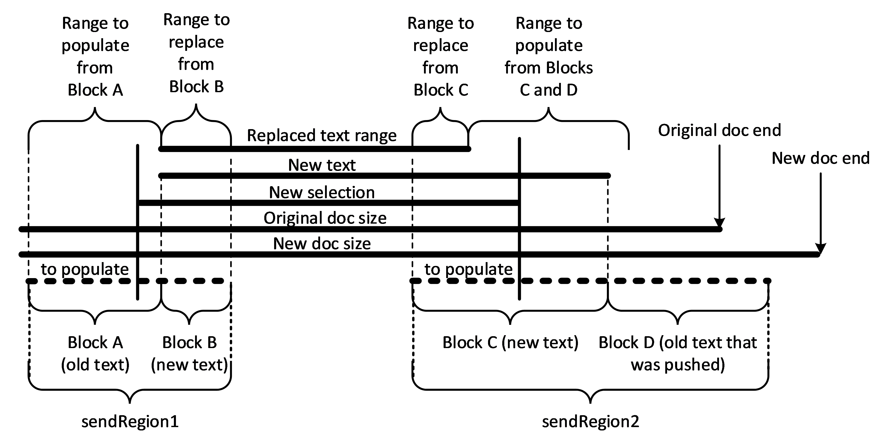

Figure 3: Paging in text for a text change notification

Note in the figure above that block A and block D cannot be included in the send regions if they were previously cached and have not been removed. Blocks B and C will always be provided in the send regions.

The other PDU that supports text paging is RDPTXT_EDIT_CONTROL_TEXT_SEGMENT_PDU (section [2.2.2.48](#Section_2.2.2.48)). This PDU provides a region of **text** to be paged in. The **cpStart** field indicates the position and the **textLength** field provides the length for the **text** field string data that is being paged in. When **text** is being paged out, the range to be cleared is indicated by the **cpStart** and **cpEnd** fields.

<a id="Section_1.4"></a>
## 1.4 Relationship to Other Protocols

The Remote Desktop Protocol: Text Input Virtual Channel Extension is embedded in dynamic virtual channel transports, as specified in [MS-RDPEDYC](../MS-RDPEDYC/MS-RDPEDYC.md) sections 1 through 3.

<a id="Section_1.5"></a>
## 1.5 Prerequisites/Preconditions

The Remote Desktop Protocol: Text Input Virtual Channel Extension operates only after its dynamic virtual channel transports are fully established. If the dynamic virtual channel transports are terminated, the Remote Desktop Protocol: Text Input Virtual Channel Extension is also terminated. The protocol is terminated by closing the underlying virtual channels. For details about closing the dynamic virtual channels, refer to [MS-RDPEDYC](../MS-RDPEDYC/MS-RDPEDYC.md) section 3.3.5.2.

<a id="Section_1.6"></a>
## 1.6 Applicability Statement

The Remote Desktop Protocol: Text Input Virtual Channel Extension is applicable in scenarios where it is desirable to use client-side input methods to input text in applications running in a terminal server.

<a id="Section_1.7"></a>
## 1.7 Versioning and Capability Negotiation

On connection of the Text Input Virtualization dynamic virtual channels, the client and server machines exchange version numbers via RDPTXT_NOTIFY_CLIENT_VERSION_PDU (section [2.2.2.53](#Section_2.2.2.53)) and RDPTXT_NOTIFY_SERVER_VERSION_PDU (section [2.2.2.43](#Section_2.2.2.43)) messages. These messages each carry two 4-byte integer version numbers, a major version number and a minor version number. The server is to send its version numbers first, on connection, via RDPTXT_NOTIFY_SERVER_VERSION_PDU. The client is to respond to this message by recording the server version numbers and then sending its own version numbers back via RDPTXT_NOTIFY_CLIENT_VERSION_PDU.

The client and server are both responsible for behaving according to the version numbers reported by their peer. This is not, however, a simple [greater than/less than] comparison. While the major version numbers are just serial values and can be trivially compared, the minor version numbers actually represent bitmasks of design updates and bug fixes introduced since the last major version release.

Having a dedicated bit for each update allows us to deliver or service individual updates or fixes independent of previous changes, allowing for more surgical updates when needed.

Whenever the protocol’s major version number is increased, that implies that all minor version updates since the previous major version update are available making the minor version bits available for new updates.

Under this design, updated behavior is to be gated per individual update for the major version where it was introduced. An example will make this clearer. For a change introduced as minor version bit 3 (0x00000004) in major version 1, the logic gating the updated code would look something like this.

if (majorVersion > 1 || (majorVersion == 1 && (minorVersion & 0x00000004) == 0x00000004))

{

// execute updated behavior

}

else

{

// execute original behavior

}

If this code encounters a peer with version numbers (1, 5), for example, it will execute the new behavior because the major version is 1 and bit 3 of the minor version is set.

If version numbers (1, 8) are encountered, however, the original code path is to be followed because even though minor version 8 is greater than 4, it does not set bit 3.

If version numbers (2, 0) are encountered, the new path is to be followed because the major version is greater than 1, implying all version 1 updates (includes the one for bit 3) are available.

Sometimes updates involve changes to the protocol definition itself such as adding a new PDU, PDU parameter, structure, or structure member. When this is the case, the major version number and minor version bit where the change was introduced will be included in the updated protocol documentation. An example of this is the **bcpTag** member of the **CoreInputProfile** structure (section [2.2.1.6](#Section_2.2.1.6)).

<a id="Section_1.8"></a>
## 1.8 Vendor-Extensible Fields

None.

<a id="Section_1.9"></a>
## 1.9 Standards Assignments

None.

<a id="Section_2"></a>
# 2 Messages

<a id="Section_2.1"></a>
## 2.1 Transport

The Remote Desktop Protocol: Text Input Virtual Channel Extension is designed to operate over non-lossy dynamic virtual channels, as specified in [MS-RDPEDYC](../MS-RDPEDYC/MS-RDPEDYC.md) sections 1 through 3. The dynamic virtual channel names are the null-terminated [**ANSI character**](#gt_ansi-character) strings "TextInput_ServerToClientDVC" for the server to client messages and "TextInput_ClientToServerDVC" for the client to server messages. The usage of channel names in the context of opening a [**dynamic virtual channel (DVC)**](#gt_fda9b8e9-bec6-4e04-9833-83bee294f3d3) is specified in [MS-RDPEDYC] section 2.2.2.1.

<a id="Section_2.2"></a>
## 2.2 Message Syntax

The following sections specify the Remote Desktop Protocol: Text Input Virtual Channel Extension message syntax. All multiple-byte fields within a message MUST be marshaled in [**little-endian**](#gt_little-endian) byte order, unless otherwise specified. Many data types can be found in [MS-DTYP](../MS-DTYP/MS-DTYP.md).

<a id="Section_2.2.1"></a>
### 2.2.1 Namespaces

<a id="Section_2.2.1.1"></a>
#### 2.2.1.1 KeyEventHostInfo

The **KeyEventHostInfo** structure provides information about a key event and is included in [**PDUs**](#gt_protocol-data-unit-pdu) relating directly to key events and in PDUs that reference an antecedent key event such as RDPTXT_TEXT_CHANGED_PDU. This structure is used in the following PDU messages:

- RDPTXT_KEY_EVENT_PDU
- RDPTXT_CHARACTER_EVENT_PDU
- RDPTXT_KEY_EVENT_PAYLOAD_PDU
- RDPTXT_SELECTION_CHANGED_PDU
- RDPTXT_TEXT_CHANGED_PDU
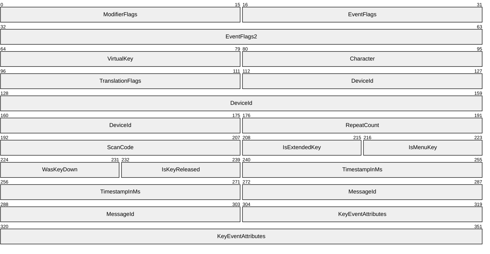

**ModifierFlags (2 bytes):** A 16-bit WORD bitmask that indicates the state of modifier keys. Supported values of the **RemoteTextModifierKeyStateFlag** enumeration are defined in the following table.

| Value | Meaning |
| --- | --- |
| None 0x0000 | No modifiers. |
| Shift 0x0001 | At least one shift key is down. |
| ShiftLeft 0x0003 | Left shift key is down. |
| ShiftRight 0x0005 | Right shift key is down. |
| ShiftMask 0x0007 | All bits related to shift – or both shift keys down. |
| Control 0x0008 | At least one control key is down. |
| ControlLeft 0x0018 | Left control key is down. |
| ControlRight 0x0028 | Right control key is down. |
| ControlMask 0x0038 | All bits related to control – or both control keys down. |
| Alt 0x0040 | At least one alt key is down. |
| AltLeft 0x00C0 | Left alt key is down. |
| AltRight 0x0140 | Right alt key is down. |
| AltMask 0x01C0 | All bits related to alt – or both alt keys down. |
| Function 0x0200 | At least one function key is down. |
| FunctionLeft 0x0600 | Left function key is down. |
| FunctionRight 0x0A00 | Right function key is down. |
| FunctionMask 0x0E00 | All bits related to function – or both function keys down. |
| LockShift 0x1000 | Caps Lock is on. |
| LockNum 0x2000 | Num Lock is on. |
| LockFunction 0x4000 | Function Lock is on. |
| LockMask 0xF000 | All lock key bits – or all lock keys are on. |

**EventFlags (2 bytes):** A 16-bit WORD bitmask of the **InputEventFlag** enumeration. Supported values are defined in the following table.

| Value | Meaning |
| --- | --- |
| None 0x0000 | No flags set |
| Down 0x0001 | Indicates a key down event |
| Move 0x0002 | Not applicable |
| Hold 0x0002 | Key already down. |
| Up 0x0004 | Indicates a key up event |
| InRange/FromISM 0x0008 | Not applicable |
| DownAndUp 0x0005 | Indicates a combined down and up key event |
| FromHWKeyboard 0x0010 | Key event source is a hardware keyboard |
| FromSyntheticHW 0x0020 | Not applicable |
| SkipHotKey 0x0040 | Indicates that hotkey processing is to be skipped for this key |
| FromOverrider 0x0080 | Input injected by an overrider (e.g. Narrator) |
| SuppressAcceleratorKey 0x0100 | Suppress accelerator key processing for this key |
| CharacterFromSoftwareKeyboard 0x0200 | This key event was generated by a software keyboard |
| ScreenReaderEnabled 0x0400 | Indicates that screen reader (Narrator) was enabled at time of key event |
| AcknowledgementRequired 0x0800 | Text input system will acknowledge processing of the key to text framework components in remote app |
| Empty 0x1000 | Not applicable |
| Invalid 0x2000 | Not applicable |
| TestInjection 0x4000 | Key generated in test scenario or by a software keyboard |
| TestSync 0x8000 | Not applicable |

**EventFlags2 (4 bytes):** A 32-bit UINT bitmask of the **InputEventFlag2** enumeration. Supported values are defined in the following table.

| Value | Meaning |
| --- | --- |
| None 0x00000000 | No flags set |
| InputServiceInjection 0x00000001 | Key event was injected by a system component |
| RawCustomText 0x00000002 | Arbitrary text string is being inserted, typically used with the VK_CUSTOMTEXT virtual key. |
| TelemetrySamplePicked 0x00000004 | Not applicable |
| TelemetryVirtualKey 0x00000008 | Not applicable |

**VirtualKey (2 bytes):** A 16-bit WORD. The virtual key value of the keyboard.

**Character (2 bytes):** A 16-bit WORD. The UTF-16 character value the key was translated into.

**TranslationFlags (2 bytes):** A 16-bit WORD. A bitmask of flags involved in key event translation. Supported values are defined in the following table.

| Value | Meaning |
| --- | --- |
| None 0x0000 | No flags set |
| AltGr 0x0001 | Translation was modified by AltGr (Alt Graph) key |
| AltNumPad 0x0002 | Character was generated from user-supplied codepoint via Alt+Numpad (on Alt key up). |
| Ctrl 0x0004 | Translation was modified by Control key |

**DeviceId (8 bytes):** A 64-bit ULONGLONG device identifier that indicates the device that produced the key (if available).

**RepeatCount (2 bytes):** A 16-bit WORD that contains the repeat count. A value of one means two events, etc.

**ScanCode (2 bytes):** The 16-bit WORD that contains the scan code reported by the source keyboard.

**IsExtendedKey (1 byte):** A BOOLEAN value. TRUE indicates this is an extended key. For enhanced 101- and 102-key keyboards, extended keys are the right ALT and CTRL keys on the main section of the keyboard; the INS, DEL, HOME, END, PAGE UP, PAGE DOWN, and arrow keys in the clusters to the left of the numeric keypad; and the divide (/) and ENTER keys in the numeric keypad.

**IsMenuKey (1 byte):** A BOOLEAN value. TRUE indicates an alt key is down.

**WasKeyDown (1 byte):** A BOOLEAN value. TRUE indicates the key being reported was already down when this report came in.

**IsKeyReleased (1 byte):** A BOOLEAN value. TRUE indicates the key has been released.

**TimestampInMs (4 bytes):** A 32-bit UINT that contains the millisecond-resolution timestamp of the client machine at the time the key was reported.

**MessageId (4 bytes):** A 32-bit UINT that contains the Message ID of the key event in the application’s user queue. Used when an acknowledgement is required.

**KeyEventAttributes (6 bytes):** A 48-bit **KeyEventAttributes** struct (section [2.2.1.2](#Section_2.2.1.2)) that provides a correlation ID and touch coordinates for a key inserted via a touch keyboard.

<a id="Section_2.2.1.2"></a>
#### 2.2.1.2 KeyEventAttributes

The **KeyEventAttributes** structure stores certain attributes related to a key event. That includes the touch point on the touch keyboard used to generate the key and an ID that the system can use to correlate additional attributes with the key event. It is included in the **KeyEventHostInfo** structure (section [2.2.1.1](#Section_2.2.1.1)).

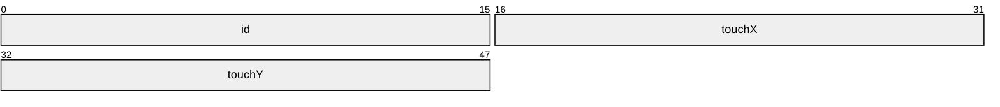

**id (2 bytes):** A 16-bit WORD. The ID of the key event.

**touchX (2 bytes):** A 16-bit SHORT. The x coordinate of the point touched on a touch keyboard used to generate the key event.

**touchY (2 bytes):** A 16-bit SHORT. The y coordinate of the point touched on a touch keyboard used to generate the key event.

<a id="Section_2.2.1.3"></a>
#### 2.2.1.3 KeyPressInfo

The **KeyPressInfo** structure contains extensive information about a key event when sent from server to client via the RDPTXT_SEND_KEY_TO_HOST_PDU message (section [2.2.2.59](#Section_2.2.2.59)). That message and this structure are not used when predicted key reporting is enabled via the RDPTXT_REPORT_CLIENT_OPTIONS_PDU message (section [2.2.2.54](#Section_2.2.2.54)).

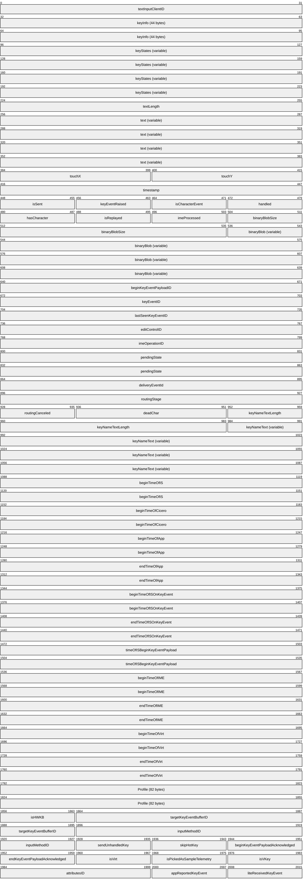

**textInputClientID (4 bytes):** A 32-bit UINT. The ID of the text input client.

**keyInfo (44 bytes):** A **KeyEventHostInfo** structure (section [2.2.1.1](#Section_2.2.1.1)) that contains information about the key event.

**keyStates (variable):** A byte array. Contains the key state for each reported virtual key. The state for each key is stored in one byte, represented as a combination of the **KEY_STATE_FLAGS** bit flags defined in the following table.

| **Value** | **Meaning** |
| --- | --- |
| KeyStateToggledFlag 0x01 | The key is toggled. |
| KeyStateGetAsyncDownFlag 0x02 | The key went down since the last GetAsyncKey call. |
| KeyStatePrevDownFlag 0x40 | The key was previously down. |
| KeyStateDownFlag 0x80 | The key is currently down. |

**textLength (4 bytes):** A 32-bit UINT. Length of **text** string.

**text (variable):** A STRING. Text associated with the key event.

**touchX (2 bytes):** A 16-bit SHORT that contains the x-coordinate of touch.

**touchY (2 bytes):** A 16-bit SHORT that contains the y-coordinate of touch.

**timestamp (4 bytes):** A 32-bit UINT. Timestamp of the key event.

**isSent (1 byte):** A BOOLEAN flag. TRUE indicates the key event has been sent.

**keyEventRaised (1 byte):** A BOOLEAN flag. TRUE indicates the key event has been raised.

**isCharacterEvent (1 byte):** A BOOLEAN flag. TRUE indicates the key event is a character event.

**handled (1 byte):** A BOOLEAN flag. TRUE indicates the key event has been handled.

**hasCharacter (1 byte):** A BOOLEAN flag. TRUE indicates the key event has an associated character.

**isReplayed (1 byte):** A BOOLEAN flag. TRUE indicates the key event has been replayed.

**imeProcessed (1 byte):** A BOOLEAN flag. TRUE indicates the key event has been processed by [**IME**](#gt_input-method-editor-ime).

**binaryBlobSize (4 bytes):** A 32-bit SIZE_T. Size of **binaryBlob** data.

**binaryBlob (variable):** A pointer to a BYTE array. Binary blob data.

**beginKeyEventPayloadID (4 bytes):** A 32-bit UINT. ID for the beginning of the key event payload.

**endKeyEventPayloadID (4 bytes):** A 32-bit UINT. ID for the end of the key event payload.

**keyEventID (4 bytes):** A 32-bit UINT. ID of the key event.

**lastSeenKeyEventID (4 bytes):** A 32-bit UINT. ID of the last seen key event.

**editControlID (4 bytes):** A 32-bit UINT. ID of the edit control.

**imeOperationID (4 bytes):** A 32-bit UINT. ID of the IME operation.

**pendingState (8 bytes):** A 64-bit State of pending key press.

| Value | Meaning |
| --- | --- |
| None 0x0000000000000000 | Key state not specified. |
| KeyDown 0x0000000000000001 | This KeyPressInfo describes a key down event. |
| KeyUp 0x0000000000000002 | This KeyPressInfo describes a key up event. |

**deliveryEventId (4 bytes):** A 32-bit UINT. ID of the delivery event.

**routingStage (4 bytes):** A 32-bit UINT. Stage of accelerator key routing. Supported values are in the following table.

| Value | Meaning |
| --- | --- |
| Tunneling 0x00000000 | Key will next be routed to children (if any). |
| Bubbling 0x00000001 | Key will next be routed to parent (if any). |
| None 0x00000002 | Not a routed accelerator key. |
| Direct 0x00000003 | Will not route to parent or child. |

**routingCanceled (1 byte):** A BOOLEAN flag. TRUE indicates routing was canceled.

**deadChar (2 bytes):** A 16-bit wchar_t. Dead character associated with the key event.

**keyNameTextLength (4 bytes):** A 32-bit UINT. Length of **keyNameText** as count of UTF-16 characters.

**keyNameText (variable):** A pointer to STRING. Text associated with the key name.

**beginTimeOfIS (8 bytes):** A 64-bit ULONGLONG. Performance measurement for the beginning of Input Service processing of the key event described by this **KeyPressInfo** structure.

**beginTimeOfCicero (8 bytes):** A 64-bit ULONGLONG. Begin time of Cicero’s processing of the key event.

**beginTimeOfApp (8 bytes):** A 64-bit ULONGLONG. Begin time of the application’s processing of the key event.

**endTimeOfApp (8 bytes):** A 64-bit ULONGLONG. End time of the application’s processing of the key event.

**beginTimeOfISOnKeyEvent (8 bytes):** A 64-bit ULONGLONG. Begin time of Input Service processing when key event is received from application.

**endTimeOfISOnKeyEvent (8 bytes):** A 64-bit ULONGLONG. End time of Input Service processing when end key event payload is about to be sent.

**timeOfISBeginKeyEventPayload (8 bytes):** A 64-bit ULONGLONG. Time that Input Service sent begin key event payload for this key event.

**beginTimeOfIME (8 bytes):** A 64-bit ULONGLONG. Begin time of IME processing of the key event.

**endTimeOfIME (8 bytes):** A 64-bit ULONGLONG. End time of IME processing of the key event.

**beginTimeOfVirt (8 bytes):** A 64-bit ULONGLONG. Time key was sent to RAIL client (non-perf-optimized design).

**endTimeOfVirt (8 bytes):** A 64-bit ULONGLONG. Time end key event payload sent for a key that came from a RAIL server (non-perf-optimized design).

**Profile (82 bytes):** A **CoreInputProfile** structure (section [2.2.1.6](#Section_2.2.1.6)).

**isHWKB (1 byte):** A BOOLEAN flag. TRUE indicates a hardware keyboard.

**targetKeyEventBufferID (4 bytes):** A 32-bit UINT. ID of target key event buffer.

**inputMethodID (4 bytes):** A 32-bit UINT. ID of the input method.

**sendUnhandledKey (1 byte):** A BOOLEAN flag. TRUE indicates unhandled key is to be sent.

**skipHotKey (1 byte):** A BOOLEAN flag. TRUE indicates hot key is to be skipped.

**beginKeyEventPayloadAcknowledged (1 byte):** A BOOLEAN flag. TRUE indicates begin key event payload was acknowledged.

**endKeyEventPayloadAcknowledged (1 byte):** A BOOLEAN flag. TRUE indicates end key event payload was acknowledged.

**isVirt (1 byte):** A BOOLEAN flag. TRUE indicates virtual key.

**isPickedAsSampleTelemetry (1 byte):** A BOOLEAN flag. TRUE indicates key was picked as sample telemetry.

**isVKey (1 byte):** A BOOLEAN flag. TRUE indicates virtual key.

**attributesID (2 bytes):** A 16-bit ID of the attributes.

**appReportedKeyEvent (1 byte):** A BOOLEAN flag. TRUE indicates application reported key event.

**liteReceivedKeyEvent (1 byte):** A BOOLEAN flag. TRUE indicates language-independent intelligence engine received key event.

<a id="Section_2.2.1.4"></a>
#### 2.2.1.4 HotKeyRegistrationData

The **HotKeyRegistrationData** structure contains information about a hotkey that an application registers with the system. This structure is used in the RDPTXT_HOTKEY_REGISTRATION_PDU message (section [2.2.2.56](#Section_2.2.2.56)).

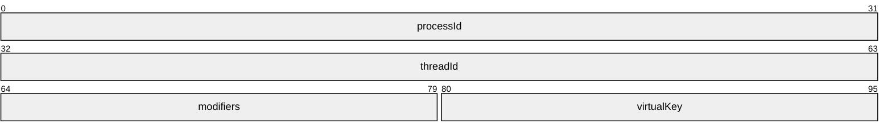

**processId (4 bytes):** A 32-bit UINT. The ID of the process registering the hotkey.

**threadId (4 bytes):** A 32-bit UINT. The ID of the thread registering the hotkey.

**modifiers (2 bytes):** A 16-bit bitmask that indicates which modifier keys (like CTRL or ALT) are to be chorded with the specified virtual key to activate the hotkey. Supported values are in the following table.

| Value | Meaning |
| --- | --- |
| ALT 0x0001 | The specified virtual key is to be chorded with an ALT key to activate the hotkey. |
| CONTROL 0x0002 | The specified virtual key is to be chorded with a CTRL key to activate the hotkey. |
| SHIFT 0x0004 | The specified virtual key is to be chorded with a Shift key to activate the hotkey. |
| WIN 0x0008 | The specified virtual key is to be chorded with a Windows key to activate the hotkey. |

**virtualKey (2 bytes):** A 16-bit UINT. The base virtual key for the hotkey.

<a id="Section_2.2.1.5"></a>
#### 2.2.1.5 CompositionClause

The **CompositionClause** structure contains information about an individual clause in a composition string. Specifically, where the clause is in the composition string and the original text associated with the clause. This structure is used in the RDPTXT_UPDATE_COMPOSITION_PDU message (section [2.2.2.13](#Section_2.2.2.13)).

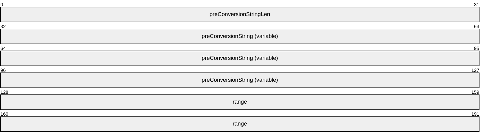

**preConversionStringLen (4 bytes):** A 32-bit UINT. Length of **preConversionString** field as a count of UTF-16 characters.

**preConversionString (variable):** A STRING that contains the current text for the segment of the composition represented by this clause.

**range (8 bytes):** A 64-bit **EditControlRange** structure (section [2.2.1.8](#Section_2.2.1.8)) that indicates which characters in the current composition are associated with this clause.

<a id="Section_2.2.1.6"></a>
#### 2.2.1.6 CoreInputProfile

The **CoreInputProfile** structure contains information about an input profile, such as its ID, the language it supports, and the keyboard layout it uses. This structure is used in the following [**PDU**](#gt_protocol-data-unit-pdu) messages:

- RD RDPTXT_INPUT_PROFILE_CHANGED_PDU
- PTXT_UPDATE_INPUT_PROFILE_PDU
- RDPTXT_SET_ENABLED_INPUT_PROFILES_PDU
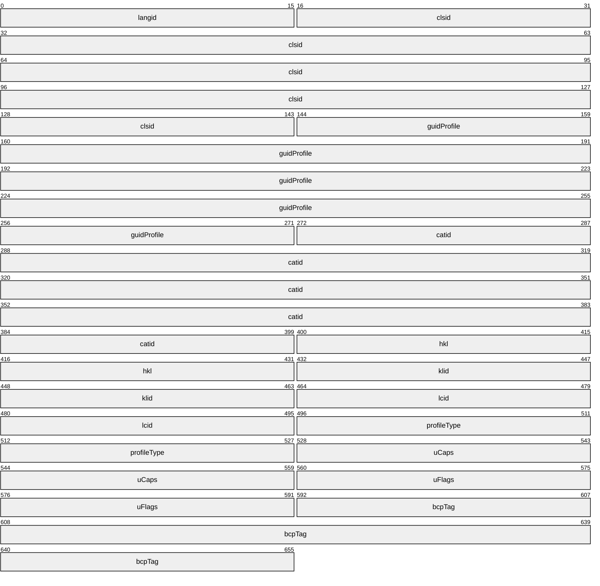

**langid (2 bytes):** A 16-bit WORD. An LCID that indicates the language of this profile. Transient LCIDs map through the registry.

**clsid (16 bytes):** A GUID ([MS-DTYP](../MS-DTYP/MS-DTYP.md) section 2.3.4.3). The CLSID of the input method associated with this profile.

**guidProfile (16 bytes):** A GUID. The ID of this profile.

**catid (16 bytes):** A GUID. The ID of this profile’s category.

**hkl (4 bytes):** A 32-bit UINT. The handle to keyboard layout for the layout associated with this input profile.

**klid (4 bytes):** A 32-bit UINT. The keyboard layout identifier for the keyboard layout associated with this input profile.

**lcid (4 bytes):** A 32-bit UINT. The language code identifier for the language associated with this input profile.

**profileType (4 bytes):** A 32-bit UINT. Indicates what kind of profile this is. Supported values are in the following table.

| Value | Meaning |
| --- | --- |
| InputProcessor 0x00000001 | This profile is for an input processor sometimes referred to as a text service (e.g., an [**IME**](#gt_input-method-editor-ime)). |
| KeyboardLayout 0x00000002 | This profile is for a keyboard layout. |

**uCaps (4 bytes):** A 32-bit UINT. Bitmask which identifies certain capabilities of the input method associated with this profile. Supported values are in the following table.

| Value | Meaning |
| --- | --- |
| None 0x00000000 | No indicated capabilities. |
| DisableOnTransitory 0x00000001 | This text service profile is disabled on transitory context. |
| SecureModeSupport 0x00000002 | This text service supports the secure mode. This is categorized in GUID_TFCAT_TIPCAP_SECUREMODE. |
| UIElementEnabled 0x00000004 | This text service supports the UIElement. This is categorized in GUID_TFCAT_TIPCAP_UIELEMENTENABLED. |
| ComlessSupport 0x00000008 | This text service can be activated without COM. This is categorized in GUID_TFCAT_TIPCAP_COMLESS. |
| Wow16Support 0x00000010 | This text service can be activated on 16bit task. This is categorized in GUID_TFCAT_TIPCAP_WOW16. |
| InputModeCompartment 0x00000020 | Uses an input mode compartment. |
| ImmersiveSupport 0x00010000 | This text service has been tested to run properly in a Windows Store app. |
| SysTraySupport 0x00020000 | This text service supports inclusion in the System Tray. This is used for text services that do not set the TF_IPP_CAPS_IMMERSIVESUPPORT flag but are still compatible with the System Tray. |
| ImmersiveOnly 0x00040000 | This text service only runs properly with Windows Store apps. |
| LocalServer 0x10000000 | The text service runs in a local COM server. |
| LocalServerModern 0x20000000 | The text service runs in a modern local server. |
| Tsf3 0x40000000 | The text service is a first-party input method that supports [**TSF**](#gt_text-services-framework-tsf)3 |
| DualMode 0x80000000 | The text service is a first-party input method that supports TSF1 and TSF3. |

**uFlags (4 bytes):** A 32-bit UINT. Bitmask of flags that indicate the state of the input profile. Supported values are in the following table.

| Value | Meaning |
| --- | --- |
| None 0x00000000 | No flags set. |
| Active 0x00000001 | The input profile is now active. |
| Enabled 0x00000002 | The input profile is enabled and eligible to become active. |
| SubstitutedByInputProcessor 0x00000004 | This profile is substituted by a text service. |

**bcpTag (8 bytes):** A 64-bit language identifier that can be converted internally to a BCP-47 language tag string. Major version introduced=1, minor version bit flag=0x00000002.

<a id="Section_2.2.1.7"></a>
#### 2.2.1.7 CoreInputViewOcclusion

The **CoreInputViewOcclusion** structure contains information about an occluding region reported by the RDPTXT_OCCLUDING_VIEWS_PDU message (section [2.2.2.52](#Section_2.2.2.52)).

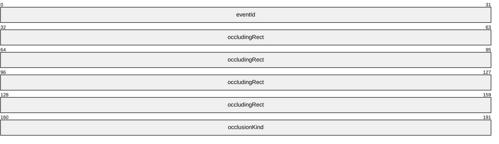

**eventId (4 bytes):** A 32-bit UINT. Identifier for this event.

**occludingRect (16 bytes):** An **TextInputRect** structure (section [2.2.1.13](#Section_2.2.1.13)) that indicates the rectangular region that is occluded by onscreen input UI.

**occlusionKind (4 bytes):** A 32-bit UINT. A value of **CoreInputViewOcclusionKind** enum that describes the kind of occlusion being reported. See [[MSLearn-InputViewOcclusionKind]](https://go.microsoft.com/fwlink/?linkid=2263362). Supported values are in the following table.

| Value | Meaning |
| --- | --- |
| Docked 0x00000000 | A docked pane, like the touch keyboard when docked. |
| Floating 0x00000001 | An undocked pane, like the floating touch keyboard. |
| Overlay 0x00000002 | Floating panes like inline ink or [**IME**](#gt_input-method-editor-ime) candidate windows. |

<a id="Section_2.2.1.8"></a>
#### 2.2.1.8 EditControlRange

The **EditControlRange** structure represents a range of text. Indicates [**caret**](#gt_caret) positions which are conceptually placed before the character at the specified index. For example, a range of 0 (begin) to 1 (end) would be a range of length 1 and would comprise the first character in the buffer or string. This structure is used in the following [**PDU**](#gt_protocol-data-unit-pdu) messages:

- RDPTXT_UPDATE_COMPOSITION_PDU
- RDPTXT_SET_COMPOSITION_INFO_PDU
- RDPTXT_RECONVERSION_CANDIDATES_PDU
- RDPTXT_UPDATE_MODE_PDU
- RDPTXT_TEXT_CHANGED_PDU
- RDPTXT_GEOMETRY_CHANGED_PDU
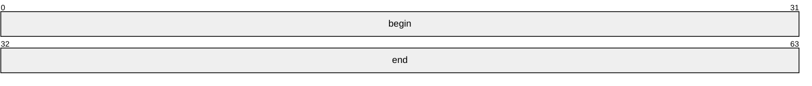

**begin (4 bytes):** A 32-bit UINT. The caret position of the beginning of the range.

**end (4 bytes):** A 32-bit UINT. The caret position of the end of the range.

<a id="Section_2.2.1.9"></a>
#### 2.2.1.9 EditControlInfo

The **EditControlInfo** structure contains settings and other information about an edit control. This structure is used in the following [**PDU**](#gt_protocol-data-unit-pdu) messages:

- RDPTXT_EDIT_CONTROL_FOCUS_PDU (section [2.2.2.32](#Section_2.2.2.32))
- RDPTXT_CONTROL_CONFIGURATION_UPDATED_PDU (section [2.2.2.37](#Section_2.2.2.37))
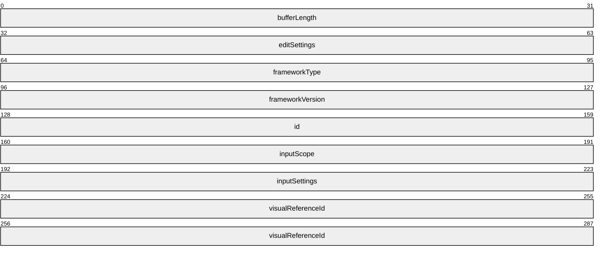

**bufferLength (4 bytes):** A 32-bit UINT. The maximum number of UTF-16 (wchar_t) characters the edit control can hold. -1 indicates that there is no limit.

**editSettings (4 bytes):** A 32-bit UINT. A bitmap of setting values in the following table.

| Value | Meaning |
| --- | --- |
| None 0x00000000 | No settings specified. |
| ReadOnly 0x00000001 | Control is read-only. |
| MultiLine 0x00000002 | This is a multi-line control. |
| VerticalWriting 0x00000004 | Control is configured for vertical writing. |
| EmbeddedHandwritingViewEnabled 0x00000040 | The embedded handwriting view is enabled. |
| EmbeddedHandwritingViewVisible 0x00000080 | The embedded handwriting view is currently visible. |
| UILessMode 0x00000100 | The application wants to show its own candidate UI. |
| SystemEditControl 0x10000000 | This is a system edit control. |
| AdaptedImmControl 0x20000000 | This is an IMM control that has been adapted to [**TSF**](#gt_text-services-framework-tsf). |
| AdaptedTSF1Control 0x40000000 | This is a TSF1 control that has been adapted to TSF3. |

**frameworkType (4 bytes):** A 32-bit UINT. Indicates the type of application the edit control lives in on the remote system. Supported values are in the following table.

| Value | Meaning |
| --- | --- |
| Default 0x00000000 | No framework specified. |
| Splash 0x00000001 | Deprecated. |
| Silverlight 0x00000002 | Deprecated. |
| Trident 0x00000003 | Deprecated. |
| Office 0x00000004 | An Office custom edit control. |
| NativeFx 0x00000005 | Deprecated. |
| Jupiter 0x00000006 | Deprecated. |
| UniversalApp 0x00000007 | A UWP app. |
| EdgeHtml 0x00000008 | Spartan Edge (deprecated). |
| ClassicWin32 0x00000009 | A Win32 app. |

**frameworkVersion (4 bytes):** A 32-bit UINT. The text input system assigns version numbers to some frameworks when their text input behavior changes over time. When frameworks are assigned a version number, it is provided here.

**id (4 bytes):** A 32-bit UINT. The ID of the edit control. Only unique in the context of the [**TextInputClient**](#gt_textinputclient) that the edit control was registered with.

**inputScope (4 bytes):** A 32-bit UINT. A value of **InputScope** enumeration that indicates the semantic purpose assigned to an edit control by the application (see [[MSLEARN-InputScope]](https://go.microsoft.com/fwlink/?linkid=2263085)).

**inputSettings (4 bytes):** A 32-bit UINT. A bitmap of additional settings. Supported values are in the following table.

| Value | Meaning |
| --- | --- |
| None 0x00000000 | No specific behavior or feature enabled. |
| EnableAutoCorrect 0x00000003 | Enables automatic correction of spelling errors during input. |
| DisableAutoCorrect 0x00000002 | Disables automatic correction of spelling errors during input. |
| EnableAutoSuggest 0x0000000C | Enables suggestions for word completion or prediction during input. |
| DisableAutoSuggest 0x00000008 | Disables suggestions for word completion or prediction during input. |
| EnableHaveTrailer 0x00000030 | Allows trailing characters (such as punctuation) after input. |
| DisableHaveTrailer 0x00000020 | Disallows trailing characters after input. |
| EnableSpellCheck 0x000000C0 | Activates spell-checking functionality during input. |
| DisableSpellCheck 0x00000080 | Deactivates spell-checking functionality during input. |
| EnableCandidatesOnDemand 0x00000300 | Provides candidate suggestions only when explicitly requested by the user. |
| DisableCandidatesOnDemand 0x00000200 | Provides candidate suggestions automatically without user request. |
| EnableAutoCapitalization 0x00000C00 | Automatically capitalizes the first letter of each word during input. |
| DisableAutoCapitalization 0x00000800 | Disables automatic capitalization of the first letter during input. |
| EnableAutoApostrophe 0x00003000 | Inserts an apostrophe automatically (e.g., for contractions) during input. |
| DisableAutoApostrophe 0x00002000 | Disables automatic insertion of apostrophes during input. |
| EnableAutoAccent 0x0000C000 | Adds accents or diacritics to characters automatically during input. |
| DisableAutoAccent 0x00008000 | Disables automatic addition of accents or diacritics during input. |
| EnablePeriodShortcut 0x00030000 | Allows shortcuts for inserting periods (e.g., double-tapping spacebar). |
| DisablePeriodShortcut 0x00020000 | Disables shortcuts for inserting periods. |
| EnablePrivateInputSetting 0x000C0000 | Enables private input settings (customized behavior) during input. |
| DisablePrivateInputSetting 0x00080000 | Disables private input settings. |
| EnableAutoCorrectFirstWordInSentence 0x00300000 | Corrects the first word of a sentence automatically. |
| DisableAutoCorrectFirstWordInSentence 0x00200000 | Does not correct the first word of a sentence automatically. |
| EmojiSipChineseSns 0x00400000 | Enables emoji input in the context of Chinese social media (SNS). |
| EnableAutoCorrectOnSubmit 0x00800000 | Corrects input automatically upon submission (e.g., pressing Enter). |
| EnableShapeWriting 0x03000000 | Enables shape writing (swiping gestures) for input. |
| DisableShapeWriting 0x02000000 | Disables shape writing gestures. |
| PasswordRevealed 0x0C000000 | Reveals password characters during input (e.g., for password entry). |
| PasswordObfuscated 0x08000000 | Obfuscates password characters (e.g., shows asterisks) during input. |
| EnableManualInputPane 0x30000000 | Allows manual control over the input pane (e.g., virtual keyboard). |
| DisableManualInputPane 0x20000000 | Disables manual control over the input pane. |
| BottomEdgeCandidateWindowAlignment 0x40000000 | Aligns the candidate window to the bottom edge of the screen. |

**visualReferenceId (8 bytes):** A 64-bit UINT64. Currently unused. Set to 0.

<a id="Section_2.2.1.10"></a>
#### 2.2.1.10 NavigateFocusInfo

The **NavigateFocusInfo** structure provides information about a move of input focus between views. This structure is used in the RDPTXT_FOCUS_NAVIGATING_EVENT_PDU message (section [2.2.2.3](#Section_2.2.2.3)).

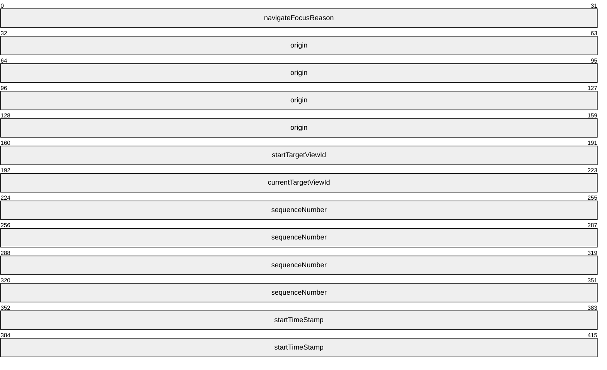

**navigateFocusReason (4 bytes):** A 32-bit UINT. A **NavigationReason** enumeration value that indicates the kind of action that resulted in the focus navigation. Supported values are defined in the following table.

| Value | Meaning |
| --- | --- |
| Programmatic 0x00000000 | Focus was set programmatically. |
| Restore 0x00000001 | Focus is being restored to a previously focused element. |
| AccessKey 0x00000002 | Not applicable |
| Next 0x00000003 | Focus set due to user tab-navigating forward through content. |
| Previous 0x00000004 | Focus set due to user shift-tab-navigating backward through content. |
| NextGroup 0x00000005 | User has tab-navigated forward to a control group. |
| PreviousGroup 0x00000006 | User has shift-tab-navigated backward to a control group. |
| Left 0x00000007 | Focus set as user navigates through content using left arrow key. |
| Up 0x00000008 | Focus set as user navigates through content using up arrow key. |
| Right 0x00000009 | Focus set as user navigates through content using right arrow key. |
| Down 0x0000000A | Focus set as user navigates through content using down arrow key. |

**origin (16 bytes, optional):** A **TextInputRect** structure (section [2.2.1.13](#Section_2.2.1.13)) that indicates the rectangular (Rect) region where focus navigation began.

**startTargetViewId (4 bytes):** A 32-bit UINT. ID of any view instance that is losing focus.

**currentTargetViewId (4 bytes):** A 32-bit UINT. ID of any view instance that is gaining focus.

**sequenceNumber (16 bytes):** A GUID value to uniquely identify a **NavigateFocusInfo** structure (section 2.2.1.10).

**startTimeStamp (8 bytes):** 64-bit DateTime. Tick count added when **NavigateFocusInfo** structure is created and used to help maintain event sequence.

<a id="Section_2.2.1.11"></a>
#### 2.2.1.11 NavigateFocusCompleteInfo

The **NavigateFocusCompleteInfo** structure provides additional focus navigation information. This structure is used in the RDPTXT_FOCUS_DEPART_COMPLETED_PDU message (section [2.2.2.4](#Section_2.2.2.4)).

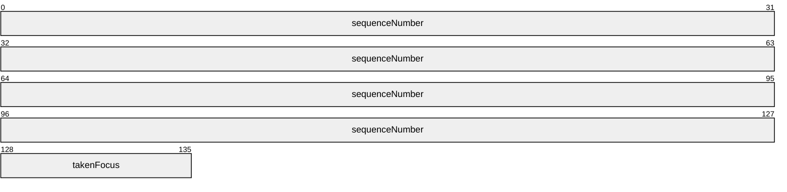

**sequenceNumber (16 bytes):** A GUID value to uniquely identify the focus navigation being completed.

**takenFocus (1 byte):** A BOOLEAN. TRUE indicates a new target window was successfully activated.

<a id="Section_2.2.1.12"></a>
#### 2.2.1.12 NonCUIConfiguration

The **NonCUIConfiguration** structure contains information delivered with RDPTXT_NON_COMPONENTUI_CONFIGURATION_CHANGE_PDU message (section [2.2.2.7](#Section_2.2.2.7)).


**enableNonCUIDepartFocus (1 byte):** A BOOLEAN. TRUE causes a ComponentUI component window to navigate focus correctly when it is hosted by Win32.

<a id="Section_2.2.1.13"></a>
#### 2.2.1.13 TextInputRect

The **TextInputRect** structure is used to represent rectangular regions that are significant to text input messages like edit control or text selection boundaries, or regions of the screen occluded by the touch keyboard. This structure is used in the following [**PDU**](#gt_protocol-data-unit-pdu) messages:

- RDPTXT_EDIT_CONTROL_FOCUS_PDU
- RDPTXT_GEOMETRY_CHANGED_PDU
- RDPTXT_SOFTWARE_KEYBOARD_INVOCATION_SIGNALS_PDU
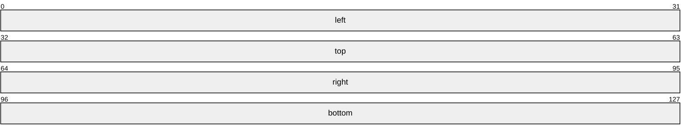

**left (4 bytes):** A 32-bit UINT. The x coordinate of the left of the rectangle.

**top (4 bytes):** A 32-bit UINT. The y coordinate of the top of the rectangle.

**right (4 bytes):** A 32-bit UINT. The x coordinate of the right of the rectangle.

**bottom (4 bytes):** A 32-bit UINT. The y coordinate of the bottom of the rectangle.

<a id="Section_2.2.1.14"></a>
#### 2.2.1.14 TextFormat

The **TextFormat** structure contains information that describes how text is to be visually displayed. It includes explicit formatting and semantic **Reason** field to describe why the formatting is being applied. This structure is used in the RDPTXT_UPDATE_FORMAT_PDU message (section [2.2.2.12](#Section_2.2.2.12)).

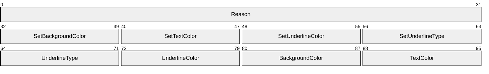

**Reason (4 bytes):** A 32-bit UINT. A **CoreTextFormatUpdatingReason** enumeration value that provides the **r**eason for this format update. Supported values are in the following table.

| Value | Meaning |
| --- | --- |
| None 0x00000000 | No reason provided. |
| CompositionUnconverted 0x00000001 | Showing that previously composed text has been unconverted. |
| CompositionConverted 0x00000002 | Showing that text entered as part of a composition has been converted. |
| CompositionTargetUnconverted 0x00000003 | Showing that previously composed text has been unconverted in a selected subphrase. |
| CompositionTargetConverted 0x00000004 | Showing that text entered as part of a composition has been converted in a selected subphrase. |

**SetBackgroundColor (1 byte):** A BOOLEAN. TRUE indicates this format update will set the background color.

**SetTextColor (1 byte):** A BOOLEAN. TRUE indicates this format update will set the text color.

**SetUnderlineColor (1 byte):** A BOOLEAN. TRUE indicates this format update will set the underline color.

**SetUnderlineType (1 byte):** A BOOLEAN. TRUE indicates this format update will set the underline type.

**UnderlineType (1 byte):** An **UnderlineType** enumeration value. See [[MSLEARN-UnderlineType]](https://go.microsoft.com/fwlink/?linkid=2263255).

**UnderlineColor (1 byte):** One of a subset of values from **UIElementType** enumeration that can be used as a text input element color. See [[MSLEARN-UIElementType]](https://go.microsoft.com/fwlink/?linkid=2263363). Supported values are in the following table.

| Value | Meaning |
| --- | --- |
| CaptionText 0x04 | Element is to be colored as appropriate for text displayed in a caption. |
| GrayText 0x05 | Color of text element is to be gray. |
| Highlight 0x06 | Element is to be colored as appropriate for a highlighted UI element. |
| HighlightText 0x07 | Element is to be colored as appropriate for highlighted text. |

**BackgroundColor (1 byte):** A **UIElementType** enumeration to define the background color.

**TextColor (1 byte):** A **UIElementType** enumeration to define the text color.

<a id="Section_2.2.1.15"></a>
#### 2.2.1.15 TextInputHostSettings

The **TextInputHostSettings** structure contains information about a **TextInputHost** (key target). This structure is used in the RDPTXT_REGISTER_REMOTE_KEY_TARGET_PDU message (section [2.2.2.25](#Section_2.2.2.25)).

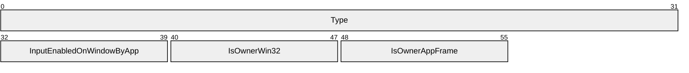

**Type (4 bytes):** A 32-bit UINT. Indicates the kind of window or window-like object input target the **TextInputHost** is attached to. Supported **TextInputHostType** enumeration values are in the following table.

| Value | Meaning |
| --- | --- |
| CoreWindow 0x00000000 | The base type for UWP windows. |
| CoreComponentInput 0x00000001 | Modern control that takes input without a CoreWindow. |
| Root 0x00000002 | A window owned by the shell that takes default keyboard input when nothing else is in focus. |
| Legacy 0x00000003 | A traditional Win32 window. |
| InputSiteWindow 0x00000004 | Modern window implementation that uses KeyboardInputWinRT. |

**InputEnabledOnWindowByApp (1 byte):** A BOOLEAN value. TRUE indicates that input is enabled on the window the **TextInputHost** is attached to.

**IsOwnerWin32 (1 byte):** A BOOLEAN value. TRUE indicates that the owning window is a Microsoft Win32 window.

**IsOwnerAppFrame (1 byte):** A BOOLEAN value. TRUE indicates the owner is an application frame, meaning a window that can contain child apps (views). View transitions aren’t notified when this value is TRUE.

<a id="Section_2.2.2"></a>
### 2.2.2 PDUs

Every message sent over the Text Input Virtual Channel Extension conforms to one of the [**PDUs**](#gt_protocol-data-unit-pdu) documented in this section. Each of these PDUs is preceded by a 6-byte header comprising the message size and the PDU ID as follows.

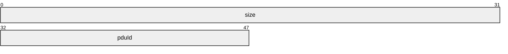

**size (4 bytes):** A 32-bit UINT. The size of the PDU, excluding **size** itself.

**pduId (2 bytes):** A 16-bit USHORT. The PDU identifier. The supported values are defined as follows.

| Value | Name |
| --- | --- |
| 0x0100 | RDPTXT_KEY_EVENT_PDU |
| 0x0101 | RDPTXT_ACKNOWLEDGE_HOST_OPERATION_PDU |
| 0x0102 | RDPTXT_CHARACTER_EVENT_PDU |
| 0x0103 | RDPTXT_FOCUS_NAVIGATING_EVENT_PDU |
| 0x0104 | RDPTXT_FOCUS_DEPART_COMPLETED_PDU |
| 0x0105 | RDPTXT_ENABLE_WINDOW_PDU |
| 0x0106 | RDPTXT_ACTIVATION_STATE_CHANGE_PDU |
| 0x0107 | RDPTXT_NON_COMPONENTUI_CONFIGURATION_CHANGE_PDU |
| 0x0108 | RDPTXT_KEY_EVENT_PAYLOAD_PDU |
| 0x0200 | RDPTXT_UPDATE_TEXT_PDU |
| 0x0201 | RDPTXT_UPDATE_TEXT_AND_SELECTION_PDU |
| 0x0202 | RDPTXT_SET_SELECTION_PDU |
| 0x0203 | RDPTXT_UPDATE_FORMAT_PDU |
| 0x0204 | RDPTXT_UPDATE_COMPOSITION_PDU |
| 0x0205 | RDPTXT_SET_COMPOSITION_INFO_PDU |
| 0x0206 | RDPTXT_RECONVERSION_CANDIDATES_PDU |
| 0x0207 | RDPTXT_UPDATE_INPUT_LOCALE_PDU |
| 0x0208 | RDPTXT_UPDATE_INPUT_PROFILE_PDU |
| 0x0209 | RDPTXT_UPDATE_MODE_PDU |
| 0x020A | RDPTXT_SET_CONVERSION_MODE_PDU |
| 0x020B | RDPTXT_ACKNOWLEDGE_OPERATION_PDU |
| 0x020C | RDPTXT_ERROR_REPORT_PDU |
| 0x0300 | RDPTXT_REGISTER_REMOTE_TEXT_TARGET_PDU |
| 0x0301 | RDPTXT_REGISTER_REMOTE_KEY_TARGET_PDU |
| 0x0302 | RDPTXT_REGISTER_REMOTE_EDIT_CONTROL_PDU |
| 0x0303 | RDPTXT_REGISTER_REMOTE_COREINPUTVIEW_PDU |
| 0x0304 | RDPTXT_UNREGISTER_REMOTE_TEXT_TARGET_PDU |
| 0x0305 | RDPTXT_UNREGISTER_REMOTE_KEY_TARGET_PDU |
| 0x0306 | RDPTXT_UNREGISTER_REMOTE_EDIT_CONTROL_PDU |
| 0x0307 | RDPTXT_UNREGISTER_REMOTE_COREINPUTVIEW_PDU |
| 0x0308 | RDPTXT_EDIT_CONTROL_FOCUS_PDU |
| 0x0309 | RDPTXT_HOST_FOCUS_PDU |
| 0x030A | RDPTXT_HOST_FOREGROUND_PDU |
| 0x030B | RDPTXT_SELECTION_CHANGED_PDU |
| 0x030C | RDPTXT_TEXT_CHANGED_PDU |
| 0x030D | RDPTXT_CONTROL_CONFIGURATION_UPDATED_PDU |
| 0x030E | RDPTXT_CONTROL_CONVERSION_MODE_UPDATED_PDU |
| 0x030F | RDPTXT_GEOMETRY_CHANGED_PDU |
| 0x0310 | RDPTXT_SOFTWARE_KEYBOARD_INVOCATION_SIGNALS_PDU |
| 0x0311 | RDPTXT_ACTIVE_VIEW_CHANGED_PDU |
| 0x0312 | RDPTXT_ACKNOWLEDGE_REMOTE_OPERATION_PDU |
| 0x0313 | RDPTXT_ACKNOWLEDGE_KEY_EVENT_PDU |
| 0x0314 | RDPTXT_INPUT_PROFILE_CHANGED_PDU |
| 0x0315 | RDPTXT_VIEW_OCCLUSIONS_HANDLED_PDU |
| 0x0316 | RDPTXT_DO_RECONVERSION_PDU |
| 0x0317 | RDPTXT_SOFTWARE_KEYBOARD_VISIBILITY_PDU |
| 0x0318 | RDPTXT_HOTKEY_REGISTRATION_PDU |
| 0x0319 | RDPTXT_EDIT_CONTROL_TEXT_SEGMENT_PDU |
| 0x031A | RDPTXT_NOTIFY_SERVER_VERSION_PDU |
| 0x0320 | RDPTXT_COMPOSITION_TERMINATED_PDU |
| 0x0321 | RDPTXT_SOFTWARE_KEYBOARD_POLICY_PDU |
| 0x0322 | RDPTXT_REMOTE_TEXT_TARGET_THREAD_PROPERTIES_PDU |
| 0x0400 | RDPTXT_OCCLUDING_VIEWS_PDU |
| 0x0500 | RDPTXT_FOREGROUND_HOST_INFO_UPDATED_PDU |
| 0x0501 | RDPTXT_UNDO_PENDING_KEY_EVENTS_PDU |
| 0x0502 | RDPTXT_REFRESH_CLIENT_PDU |
| 0x0503 | RDPTXT_SEND_KEY_TO_HOST_PDU |
| 0x0600 | RDPTXT_SET_ENABLED_INPUT_PROFILES_PDU |
| 0x0601 | RDPTXT_ACKNOWLEDGE_UNDO_PENDING_KEY_EVENTS_PDU |
| 0x0602 | RDPTXT_REMOTE_INTEGRATION_STATUS_PDU |
| 0x0603 | RDPTXT_REREGISTRATION_REQUEST_PDU |
| 0x0604 | RDPTXT_NOTIFY_CLIENT_VERSION_PDU |
| 0x0605 | RDPTXT_REPORT_CLIENT_OPTIONS_PDU |

<a id="Section_2.2.2.1"></a>
#### 2.2.2.1 RDPTXT_KEY_EVENT_PDU

The RDPTXT_KEY_EVENT_PDU message is sent from client to server to deliver a key event or an accelerator key event. Accelerator keys tunnel down through the Component UI tree<1> from parent to child then tunnel back up until handled. This gives each layer the option of handling the key before or after its children.

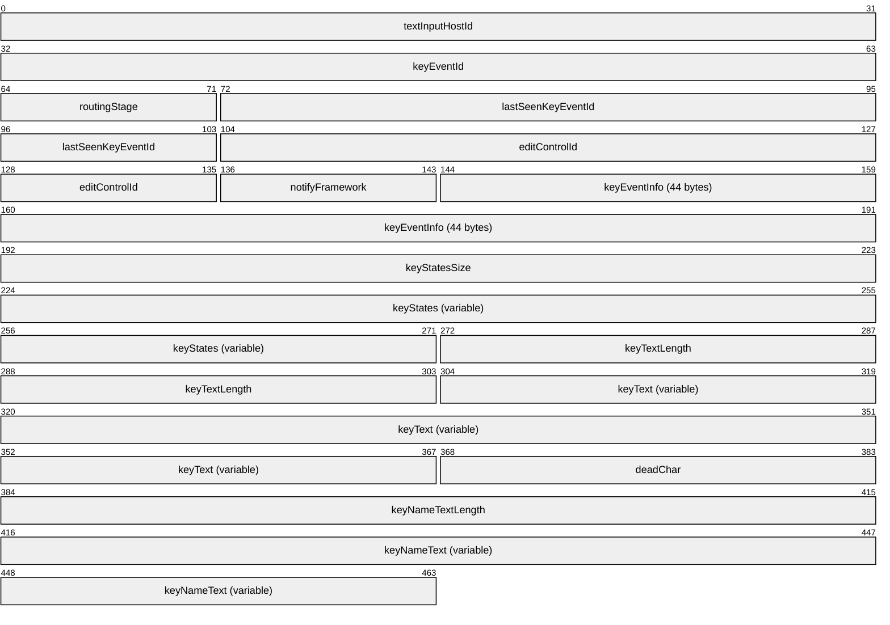

**textInputHostId (4 bytes):** A 32-bit UINT. ID of the **TextInputHost** associated with the thread or window tied to the target edit control.

**keyEventId (4 bytes):** A 32-bit UINT. ID of this key or accelerator key event.

**routingStage (1 byte):** Indicates whether the key is tunneling down through the Component UI tree<2> or bubbling back up. A value of "none" indicates that this is a normal key event and not an accelerator key event.

| Value | Meaning |
| --- | --- |
| Tunneling 0x00 | Key will next be routed to children (if any). |
| Bubbling 0x01 | Key will next be routed to parent (if any). |
| None 0x02 | Not a routed accelerator key. |
| Direct 0x03 | Will not route to parent or child. |

**lastSeenKeyEventId (4 bytes):** A 32-bit UINT. The ID of the last key event that was acknowledged back to the client via RDPTXT_KEY_EVENT_ACKNOWLEDGEMENT_PDU.

**editControlId (4 bytes):** A 32-bit UINT. ID of the current focused edit control.

**notifyFramework (1 byte):** A BOOLEAN value. TRUE indicates the key event needs to be delivered to the app or app framework. It does not typically need to be delivered to apps<3> or during composition.

**keyEventInfo (44 bytes):** A **KeyEventHostInfo** structure (section [2.2.1.1](#Section_2.2.1.1)) that contains information about the key press that this key event is generated for.

**keyStatesSize (4 bytes):** A 32-bit UINT. The number of keys (typically 256) whose states are represented in the **keyStates** field that represents all (256) virtual keys.

**keyStates (variable):** A byte array. Contains the key state for each reported virtual key. The state for each key is stored in one byte, represented as a combination of the **KEY_STATE_FLAGS** bit flags defined in the following table.

| Value | Meaning |
| --- | --- |
| KeyStateToggledFlag 0x01 | The key is toggled. |
| KeyStateGetAsyncDownFlag 0x02 | The key went down since the last GetAsyncKey call. |
| KeyStatePrevDownFlag 0x40 | The key was previously down. |
| KeyStateDownFlag 0x80 | The key is currently down. |

**keyTextLength (4 bytes):** A 32-bit UINT. The length of the **keyText** string as a count of UTF-16 characters.

**keyText (variable):** A STRING. The translated text generated for the current key, based on the current keyboard layout.

**deadChar (2 bytes):** A 16-bit UINT16. If the event is for a dead key, this field is to hold the dead key character. It is not to be filled on the next key event (the one that combines the dead key with another character). On that next key event, the **keyText** string field will hold the combined character.

**keyNameTextLength (4 bytes):** A 32-bit UINT. The length of the **keyNameText** string as a count of UTF-16 characters.

**keyNameText (variable):** A STRING UCHAR array. The text printed on the physical key that was pressed (according to the current keyboard layout). The text can hold a description such as TIL for the Tilde (~) character.

<a id="Section_2.2.2.2"></a>
#### 2.2.2.2 RDPTXT_CHARACTER_EVENT_PDU

The RDPTXT_CHARACTER_EVENT_PDU message is sent from client to server to deliver a character event to the focused edit control in the foreground app.

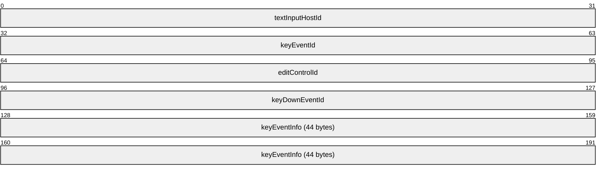

**textInputHostId (4 bytes):** A 32-bit UINT. The ID of the target **TextInputHost**.

**keyEventId (4 bytes):** A 32-bit UINT. The ID of this event.

**editControlId (4 bytes):** A 32-bit UINT. The ID of the target edit control – unique in the context of the thread it was registered on.

**keyDownEventId (4 bytes):** A 32-bit UINT. The ID of the key down event that led to this character event.

**keyEventInfo (44 bytes):** A **KeyEventHostInfo** structure (section [2.2.1.1](#Section_2.2.1.1)) contains details of the key press that this character event is produced for.

<a id="Section_2.2.2.3"></a>
#### 2.2.2.3 RDPTXT_FOCUS_NAVIGATING_EVENT_PDU

The RDPTXT_FOCUS_NAVIGATING_EVENT_PDU message is sent from client to server to raise a FocusNavigating event in the application associated with the target **TextInputHost**.

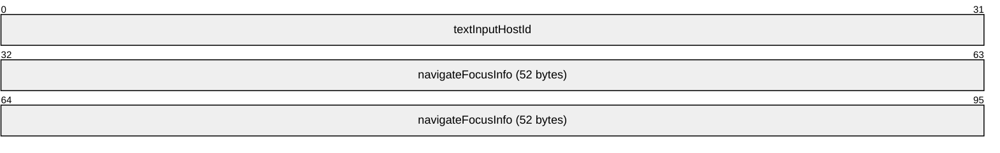

**textInputHostId (4 bytes):** A 32-bit UINT. The ID of the target **TextInputHost**.

**navigateFocusInfo (52 bytes):** A **NavigateFocusInfo** structure (section [2.2.1.10](#Section_2.2.1.10)) contains information about this focus change.

<a id="Section_2.2.2.4"></a>
#### RDPTXT_FOCUS_DEPART_COMPLETED_PDU

The RDPTXT_FOCUS_DEPART_COMPLETED_PDU message is sent from client to server to inform the app associated with the specified **TextInputHost** that the specified focus leave has completed.

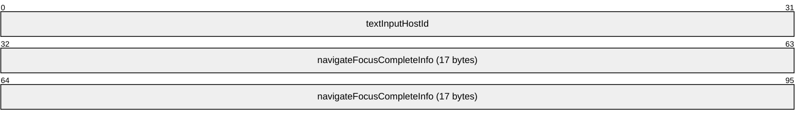

**textInputHostId (4 bytes):** A 32-bit UINT. The ID of the target **TextInputHost**.

**navigateFocusCompleteInfo (17 bytes):** A **NavigateFocusCompleteInfo** structure (section [2.2.1.11](#Section_2.2.1.11)) that contains information about the completed focus change.

<a id="Section_2.2.2.5"></a>
#### RDPTXT_ENABLE_WINDOW_PDU

The RDPTXT_ENABLE_WINDOW_PDU message is sent from client to server to enable or disable text input in the windows associated with the specified TextInputHost.

```mermaid
packet-beta
  0-31: "textInputHostId"
  32-39: "inputEnabled"
```

**textInputHostId (4 bytes):** A 32-bit UINT. The ID of the target **TextInputHost**.

**inputEnabled (1 byte):** A BOOLEAN value. TRUE enables input while FALSE disables input.

<a id="Section_2.2.2.6"></a>
#### RDPTXT_ACTIVATION_STATE_CHANGE_PDU

The RDPTXT_ACTIVATION_STATE_CHANGE_PDU message is sent from client to server to update the activation state of a view.

```mermaid
packet-beta
  0-31: "textInputHostId"
  32-63: "activationState"
  64-95: "activatedView"
```

**textInputHostId (4 bytes):** A 32-bit UINT. The ID of the target **TextInputHost**.

**activationState (4 bytes):** A 32-bit UINT. A **ViewActivationState** enumeration value that indicates the new activation state of the specified view. Values are defined in the following table.

| Value | Meaning |
| --- | --- |
| ViewDeactivated 0x00000000 | View’s new state is deactivated. |
| ViewActivated 0x00000001 | View’s new state is activated. |
| DescendentViewActivated 0x00000002 | Used with CompositeAppActivated to indicate that a descendent view is activated and foreground. |
| CompositAppActivated 0x00000004 | Indicates that a composite app is activated (can have a descendent with foreground). |
| NoDescendentViews 0x00000008 | Used with CompositeAppActivated to indicate that no descendent view is foreground. |
| Unknown 0x00000010 | Activation state is not known. |

**activatedView (4 bytes):** A 32-bit UINT. The ID of the view having its activation state changed.

<a id="Section_2.2.2.7"></a>
#### RDPTXT_NON_COMPONENTUI_CONFIGURATION_CHANGE_PDU

The RDPTXT_NON_COMPONENTUI_CONFIGURATION_CHANGE_PDU message is sent from client to server to configure a CoreWindow associated with the specified **TextInputHost** to handle a non-ComponentUI host.

```mermaid
packet-beta
  0-31: "textInputHostId"
  32-39: "nonCuiConfiguration"
```

**textInputHostId (4 bytes):** A 32-bit UINT. The ID of the target **TextInputHost**.

**nonCuiConfiguration (1 byte):** A **NonCUIConfiguration** structure (section [2.2.1.12](#Section_2.2.1.12)) that contains configuration information for the non-ComponentUI host scenario.

<a id="Section_2.2.2.8"></a>
#### 2.2.2.8 RDPTXT_KEY_EVENT_PAYLOAD_PDU

The RDPTXT_KEY_EVENT_PAYLOAD_PDU message is sent from client to server to bookend the actions (payload) associated with a given key event.

```mermaid
packet-beta
  0-31: "textInputHostId"
  32-63: "editControlId"
  64-95: "keyEventId"
  96-103: "remoteKeyEventId"
  104-159: "keyEventInfo (44 bytes)"
  160-167: "beginPayload"
  168-175: "handled"
```

**textInputHostId (4 bytes):** A 32-bit UINT. The ID of the target **TextInputHost**.

**editControlId (4 bytes):** A 32-bit UINT. The ID of the target edit control unique in the context of the thread it was registered on.

**keyEventId (4 bytes):** A 32-bit UINT. The ID of this bookend event.

**remoteKeyEventId (1 byte):** Reserved. SHOULD be set to 0.

**keyEventInfo (44 bytes):** A **KeyEventHostInfo** structure (section [2.2.1.1](#Section_2.2.1.1)) that contains information about the key event responsible for the actions that are being bookended.

**beginPayload (1 byte):** A BOOLEAN. If TRUE, indicates that this is the beginning payload bookend event. If FALSE, this is the end payload bookend event, that means all actions generated for the associated key event have been sent to the server.

**handled (1 byte):** A BOOLEAN. When **beginPayload** is FALSE, this indicates whether the current active input method handled the key event as follows.

| **Value** | **Meaning** |
| --- | --- |
| TRUE | Input method handled this key event. In this case, the app does not handle the character nor produce a character in the focused edit control. |
| FALSE | Input method did not handle this key event. |

<a id="Section_2.2.2.9"></a>
#### RDPTXT_UPDATE_TEXT_PDU

The RDPTXT_UPDATE_TEXT_PDU message is sent from client to server and includes a text string that is to replace existing text in the specified replacement range. If the string of new text is empty, the text in the replacement range is simply deleted. If the replacement range has 0 length, the text is simply inserted.

```mermaid
packet-beta
  0-31: "textInputClientId"
  32-63: "editControlId"
  64-95: "TextInputHostId"
  96-127: "operationId"
  128-159: "replaceBegin"
  160-191: "replaceEnd"
  192-223: "newTextLength"
  224-287: "newText (variable)"
```

**textInputClientId (4 bytes):** A 32-bit UINT. ID of the **TextInputClient** that holds the registration for the target edit control.

**editControlId (4 bytes):** A 32-bit UINT. The ID of the target edit control unique in the context of the **TextInputClient** that it was registered with.

**textInputHostId (4 bytes):** A 32-bit UINT. ID of the **TextInputHost** associated with the edit control’s window or thread.

**operationId (4 bytes):** A 32-bit UINT. The serial ID of this operation (see Key Replay and Override section [1.3.2](#Section_1.3.2)).

**replaceBegin (4 bytes):** A 32-bit UINT. The character position that indicates the start of the range of existing text to remove or replace.

**replaceEnd (4 bytes):** A signed integer. The character position that indicates the end of the range of existing text to remove or replace.

**newTextLength (4 bytes):** A 32-bit UINT. Length of the **newText** string in UTF-16 characters.

**newText (variable):** A UTF-16 string. The new text to insert at **replaceBegin**, after the existing text from **replaceBegin** to **replaceEnd** has been removed.

<a id="Section_2.2.2.10"></a>
#### RDPTXT_UPDATE_TEXT_AND_SELECTION_PDU

The RDPTXT_UPDATE_TEXT_AND_SELECTION_PDU message is sent from client to server and includes a text string that is to replace existing text in the specified replacement range. If the string of new text is empty, the text in the replacement range is simply deleted. If the replacement range has 0 length, the text is simply inserted.

```mermaid
packet-beta
  0-31: "textInputClientId"
  32-63: "editControlId"
  64-95: "textInputHostId"
  96-127: "operationId"
  128-159: "replaceBegin"
  160-191: "replaceEnd"
  192-223: "newTextLength"
  224-287: "newText (variable)"
  288-319: "selectionBegin"
  320-351: "selectionEnd"
```

**textInputClientId (4 bytes):** A 32-bit UINT. ID of the [**TextInputClient**](#gt_textinputclient) that holds the registration for the target edit control.

**editControlId (4 bytes):** A 32-bit UINT. The ID of the target edit control unique in the context of the **TextInputClient** that it was registered with.

**textInputHostId (4 bytes):** A 32-bit UINT. ID of the **TextInputHost** associated with the edit control’s window or thread.

**operationId (4 bytes):** A 32-bit UINT. The serial ID of this operation (see Key Replay and Override section [1.3.2](#Section_1.3.2)).

**replaceBegin (4 bytes):** A 32-bit UINT. The character position that indicates the start of the range of existing text to remove or replace.

**replaceEnd (4 bytes):** A 32-bit UINT. The character position that indicates the end of the range of existing text to remove or replace.

**newTextLength (4 bytes):** A 32-bit UINT. Length of the **newText** string in UTF-16 characters.

**newText (variable):** A UTF-16 string. The new text to insert at **replaceBegin**, after the existing text from **replaceBegin** to **replaceEnd** has been removed.

**selectionBegin (4 bytes):** A 32-bit UINT. The beginning character position of a new selection to be set after the text replacement is completed.

**selectionEnd (4 bytes):** A 32-bit UINT. The end character position of a new selection to be set after the text replacement is completed.

<a id="Section_2.2.2.11"></a>
#### RDPTXT_SET_SELECTION_PDU

The RDPTXT_SET_SELECTION_PDU message is sent from client to server to set a range of selected text in the specified edit control. If the specified range has zero length (**selectionBegin** and **selectionEnd** are the same value) then the [**caret**](#gt_caret) will be placed at the specified position.

```mermaid
packet-beta
  0-31: "textInputClientId"
  32-63: "editControlId"
  64-95: "textInputHostId"
  96-127: "operationId"
  128-159: "selectionBegin"
  160-191: "selectionEnd"
  192-223: "bindDirection"
```

**textInputClientId (4 bytes):** A 32-bit UINT. The ID of the **TextInputClient** that holds the registration for the target edit control.

**editControlId (4 bytes):** A 32-bit UINT. The ID of the target edit control unique in the context of the **TextInputClient** that it was registered with.

**textInputHostId (4 bytes):** A 32-bit UINT. The ID of the **TextInputHost** associated with the edit control’s window or thread.

**operationId (4 bytes):** A 32-bit UINT. The serial ID of this operation (see Key Replay and Override section [1.3.2](#Section_1.3.2)).

**selectionBegin (4 bytes):** A 32-bit UINT. The beginning character position of the selection to be set.

**selectionEnd (4 bytes):** A 32-bit UINT. The end character position of the selection to be set.

**bindDirection (4 bytes):** A 32-bit UINT. A **CaretBindDirection** enumeration value**.** If the new selection has zero length (therefore specifies a caret position) and if that caret position is at a line break, this field indicates whether to render the caret before or after the break. Supported values are defined in the following table.

| Value | Meaning |
| --- | --- |
| Previous 0x00000000 | If placed at a line break, render the caret next to the preceding character before the break. |
| Next 0x00000001 | If placed at a line break, render the caret next to the following character after the break. |
| Neutral 0x00000002 | If the caret is placed at a line break, the control can choose which side of the break to render it on. |

<a id="Section_2.2.2.12"></a>
#### RDPTXT_UPDATE_FORMAT_PDU

The RDPTXT_UPDATE_FORMAT_PDU message is sent from client to server to update the format for a range of text, such as a temporary color or underline.

```mermaid
packet-beta
  0-31: "textInputClientId"
  32-63: "editControlId"
  64-95: "textInputHostId"
  96-127: "operationId"
  128-159: "formatBegin"
  160-191: "formatEnd"
  192-287: "format"
  288-319: "formatBasic"
```

**textInputClientId (4 bytes):** A 32-bit UINT. The ID of the [**TextInputClient**](#gt_textinputclient) that holds the registration for the target edit control.

**editControlId (4 bytes):** A 32-bit UINT. The ID of the target edit control unique in the context of the **TextInputClient** that it was registered with.

**textInputHostId (4 bytes):** A 32-bit UINT. The ID of the **TextInputHost** associated with the edit control’s window or thread.

**operationId (4 bytes):** A 32-bit UINT. The serial ID of this operation (see Key Replay and Override section [1.3.2](#Section_1.3.2)).

**formatBegin (4 bytes):** A 32-bit UINT. The beginning [**caret**](#gt_caret) position of the range of text to format.

**formatEnd (4 bytes):** A 32-bit UINT. The end caret position of the range of text to format.

**format (12 bytes):** A **TextFormat** structure (section [2.2.1.14](#Section_2.2.1.14)). The format to be applied to the specified range. Mutually exclusive with the **formatBasic** field.

**formatBasic (4 bytes):** A 32-bit bitmask combining the following **EditStyle** values. Mutually exclusive with the **format** field.

| Value | Meaning |
| --- | --- |
| EditStyleUnderline_None 0x00000000 | No underline. |
| EditStyleUnderline_Solid 0x00000001 | Include a solid underline. |
| EditStyleUnderline_SolidBold 0x00000002 | Include a solid, bold underline. |
| EditStyleUnderline_Dotted 0x00000003 | Include a dotted underline. |
| EditStyleUnderline_Squiggled 0x00000004 | Include a wavy underline. |
| EditStyleUnderline_Mask 0x0000000F | Mask of all supported underline values. |
| EditStyleUnderlineColor_Default 0x00000000 | Use default text color for underline. |
| EditStyleUnderlineColor_Red 0x00000010 | Red underline. |
| EditStyleUnderlineColor_Blue 0x00000020 | Blue underline. |
| EditStyleUnderlineColor_Gray 0x00000040 | Gray underline. |
| EditStyleUnderlineColor_Black 0x00000050 | Black underline. |
| EditStyleUnderlineColor_White 0x00000060 | White underline. |
| EditStyleUnderlineColor_Mask 0x000000F0 | Mask of all supported underline colors. |
| EditStyleBackgroundColor_Default 0x00000000 | Use default color for background. |
| EditStyleBackgroundColor_Red 0x00000100 | Red background. |
| EditStyleBackgroundColor_Blue 0x00000200 | Blue background. |
| EditStyleBackgroundColor_Green 0x00000300 | Green background. |
| EditStyleBackgroundColor_Gray 0x00000400 | Gray background. |
| EditStyleBackgroundColor_Highlight 0x00000500 | An application-chosen highlight color for the background. |
| EditStyleBackgroundColor_Mask 0x00000F00 | Mask of all supported background colors. |
| EditStyleTextColor_Default 0x00000000 | Use default color for text. |
| EditStyleTextColor_Red 0x00001000 | Red text. |
| EditStyleTextColor_Blue 0x00002000 | Blue text. |
| EditStyleTextColor_Green 0x00003000 | Green text. |
| EditStyleTextColor_Gray 0x00004000 | Gray text. |
| EditStyleTextColor_Highlight 0x00005000 | Text color is an application-chosen highlight color. |
| EditStyleTextColor_Mask 0x0000F000 | Mask of all supported text colors. |

<a id="Section_2.2.2.13"></a>
#### RDPTXT_UPDATE_COMPOSITION_PDU

The RDPTXT_UPDATE_COMPOSITION_PDU message is sent from client to server and delivers composition updates to an edit control.

```mermaid
packet-beta
  0-31: "textInputClientId"
  32-63: "editControlId"
  64-95: "textInputHostId"
  96-127: "operationId"
  128-135: "compositionAction"
  136-167: "clausesCount"
  168-223: "clauses (variable)"
```

**textInputClientId (4 bytes):** A 32-bit UINT. The ID of the [**TextInputClient**](#gt_textinputclient) that holds the registration for the target edit control.

**editControlId (4 bytes):** A 32-bit UINT. The ID of the target edit control unique in the context of the **TextInputClient** that it was registered with.

**textInputHostId (4 bytes):** A 32-bit UINT. The ID of the **TextInputHost** associated with the edit control’s window or thread.

**operationId (4 bytes):** A 32-bit UINT. The serial ID of this operation (see Key Replay and Override section [1.3.2](#Section_1.3.2)).

**compositionAction (1 byte):** An 8-bit signed integer value that indicates whether to start, complete, or update a composition according to the following values.

| Value | Meaning |
| --- | --- |
| EnterComposition 0x01 | Starting composition. |
| LeaveComposition 0x02 | Ending composition. |
| UpdateComposition 0x03 | Updating the current composition. |

**clausesCount (4 bytes):** A 32-bit UINT. The count of **CompositionClauses** (section [2.2.1.5](#Section_2.2.1.5)) in the **clauses** field.

**clauses (variable):** An array of **CompositionClause** structures (section 2.2.1.5) that contains a list of composition clauses that are sub-strings with formatting. Each clause is prefixed by a 4-byte string length in UTF-16 characters and suffixed by an 8-byte **EditControlRange** structure (section [2.2.1.8](#Section_2.2.1.8)).

<a id="Section_2.2.2.14"></a>
#### 2.2.2.14 RDPTXT_SET_COMPOSITION_INFO_PDU

The RDPTXT_SET_COMPOSITION_INFO_PDU message is sent from client to server allowing an [**IME**](#gt_input-method-editor-ime) to specify information about the current composition.

```mermaid
packet-beta
  0-31: "textInputClientId"
  32-63: "editControlId"
  64-95: "textInputHostId"
  96-127: "operationId"
  128-191: "compositionRange"
  192-223: "determinedTextLength"
  224-287: "determinedText (variable)"
```

**textInputClientId (4 bytes):** A 32-bit UINT. The ID of the [**TextInputClient**](#gt_textinputclient) that holds the registration for the target edit control.

**editControlId (4 bytes):** A 32-bit UINT. The ID of the target edit control unique in the context of the **TextInputClient** that it was registered with.

**textInputHostId (4 bytes):** A 32-bit UINT. The ID of the **TextInputHost** associated with the edit control’s window or thread.

**operationId (4 bytes):** A 32-bit UINT. The serial ID of this operation (see Key Replay and Override section [1.3.2](#Section_1.3.2)).

**compositionRange (8 bytes):** A 64-bit **EditControlRange** structure (section [2.2.1.8](#Section_2.2.1.8)) that indicates the range of text in composition.

**determinedTextLength (4 bytes):** A 32-bit UINT. The length of the **determinedText** string in UTF-16 characters.

**determinedText (variable):** A STRING UCHAR array. Text used to replace the composition text when composition ends.

<a id="Section_2.2.2.15"></a>
#### 2.2.2.15 RDPTXT_RECONVERSION_CANDIDATES_PDU

The RDPTXT_RECONVERSION_CANDIDATES_PDU message is sent from client to server and includes a list of reconversion candidates to be delivered to the specified edit control.

```mermaid
packet-beta
  0-31: "textInputClientId"
  32-63: "candidateListSize"
  64-127: "candidateList (variable)"
  128-159: "editControlId"
  160-223: "reconvertRange"
```

**textInputClientId (4 bytes):** A 32-bit UINT. The ID of the [**TextInputClient**](#gt_textinputclient) that the edit control registered with.

**candidateListSize (4 bytes):** A 32-bit UINT. The total size of **candidateList** in bytes.

**candidateList (variable):** A contiguous series of wchar_t strings, each prefixed by a 4-byte length in characters.

**editControlId (4 bytes):** A 32-bit UINT. The ID of the edit control the reconversion candidates are to be delivered to.

**reconvertRange (8 bytes):** A 64-bit **EditControlRange** structure (section [2.2.1.8](#Section_2.2.1.8)) that indicates the range of text in the document that will be reconverted.

<a id="Section_2.2.2.16"></a>
#### 2.2.2.16 RDPTXT_DO_RECONVERSION_PDU

The RDPTXT_DO_RECONVERSION_PDU message is sent from server to client to request the active [**IME**](#gt_input-method-editor-ime) to perform reconversion in the current context.

```mermaid
packet-beta
  0-31: "textInputClientId"
  32-63: "editControlId"
  64-71: "returnCandidates"
  72-79: "returnRange"
```

**textInputClientId (4 bytes):** A 32-bit UINT. The ID of the text target associated with the control where reconversion is being requested.

**editControlId (4 bytes):** A 32-bit UINT. The ID of the edit control where reconversion is being requested.

**returnCandidates (1 byte):** A BOOLEAN that indicates a request that the reconversion range and reconversion candidates be sent back via RDPTXT_RECONVERSION_CANDIDATES_PDU (section [2.2.2.15](#Section_2.2.2.15)).

**returnRange (1 byte):** A BOOLEAN that indicates a request that the reconversion range be sent back via RDPTXT_RECONVERSION_CANDIDATES_PDU.

<a id="Section_2.2.2.17"></a>
#### 2.2.2.17 RDPTXT_UPDATE_INPUT_LOCALE_PDU

The RDPTXT_UPDATE_INPUT_LOCALE_PDU message is sent from client to server to update the input language/locale. When this PDU is sent during initialization of a thread for text input, only the **textInputClientId** and **localeId** fields will be set.

```mermaid
packet-beta
  0-31: "textInputClientId"
  32-63: "textInputHostId"
  64-95: "editControlId"
  96-127: "localeId"
  128-159: "operationId"
```

**textInputClientId (4 bytes):** A 32-bit UINT. The ID of the **TextInputClient** associated with the focused edit control.

**textInputHostId (4 bytes):** A 32-bit UINT. The ID of the foreground **TextInputHost**. Value is 0 during initialization.

**editControlId (4 bytes):** A 32-bit UINT. The ID of the focused edit control. Not used for initialization.

**localeId (4 bytes):** A 32-bit UINT. An LCID that indicates the input locale to update to. Not used for initialization.

**operationId (4 bytes):** A 32-bit UINT. The ID of the update operation. Not used for initialization.

<a id="Section_2.2.2.18"></a>
#### 2.2.2.18 RDPTXT_UPDATE_INPUT_PROFILE_PDU

The RDPTXT_UPDATE_INPUT_PROFILE_PDU message is sent from client to server to update an input profile. In the case of profile activation (not initializing) the server does its best to honor the request, then responds by sending RDPTXT_INPUT_PROFILE_CHANGED_PDU (section [2.2.2.46](#Section_2.2.2.46)) back to the client to indicate the profile that it ultimately activated.

```mermaid
packet-beta
  0-31: "textInputClientId"
  32-95: "profile (82 bytes)"
  96-103: "initializing"
```

**textInputClientId (4 bytes):** A 32-bit UINT. The ID of the [**TextInputClient**](#gt_textinputclient) associated with the focused edit control.

**profile (82 bytes):** A **CoreInputProfile** structure (section [2.2.1.6](#Section_2.2.1.6)) that contains the profile. Its usage is dependent on the value in the **initializing** field that will be one of the following.

| **Value** | **Meaning** |
| --- | --- |
| TRUE | Used to initialize the thread associated with the specified **TextInputClient**. |
| FALSE | Activated for the thread associated with the specified **TextInputClient**. |

**initializing (1 byte):** A BOOLEAN value set to TRUE when initializing a remote app thread for text input.

<a id="Section_2.2.2.19"></a>
#### 2.2.2.19 RDPTXT_UPDATE_MODE_PDU

The RDPTXT_UPDATE_MODE_PDU message is sent from client to server to adjust the mode of a text input feature.

```mermaid
packet-beta
  0-31: "textInputHostId"
  32-63: "textInputClientId"
  64-95: "editControlId"
  96-127: "features"
  128-135: "enabled"
  136-199: "customRange"
  200-231: "predictionModeTriggerLength"
  232-287: "PredictionModeTriggers (variable)"
  288-319: "operationId"
```

**textInputHostId (4 bytes):** A 32-bit UINT. The ID of the server-side foreground **TextInputHost**, ignored for prediction mode update.

**textInputClientId (4 bytes):** A 32-bit UINT. The ID of the **TextInputClient** associated with the control to update.

**editControlId (4 bytes):** A 32-bit UINT. The ID of the edit control to update, ignored for prediction mode update.

**features (4 bytes):** A 32-bit bitmask of the **TextInputFeature** enumeration that indicates which text input features to enable or disable. Supported values are defined in the following table.

| Value | Meaning |
| --- | --- |
| PredictionMode 0x00000001 | Causes the server to send context information to the client enabling candidate generation. |
| VirtualRealityDisplayMode 0x00000002 | Tells the server to provide the client with sufficient context to support virtual reality text input methods. |
| LayoutChangeTracking 0x00000004 | Causes the server to send positional notifications to the client when the focused edit control moves or is resized (see section [2.2.2.39](#Section_2.2.2.39) RDPTXT_GEOMETRY_CHANGED_PDU). |
| SelectionTracking 0x00000008 | Causes the server to send positional notifications to the client when the current selection moves (see RDPTXT_GEOMETRY_CHANGED_PDU). |
| CustomRangeTracking 0x00000010 | Causes the server to send positional notifications to the client when the specified range moves (see RDPTXT_GEOMETRY_CHAGED_PDU). |

**enabled (1 byte):** A BOOLEAN that indicates whether the specified features are turned on TRUE or off FALSE.

**customRange (8 bytes):** A 64-bit **EditControlRange** structure (section [2.2.1.8](#Section_2.2.1.8)) that contains the custom range to track when the specified **TextInputFeature** has the CustomRangeTracking value.

**predictionModeTriggerLength (4 bytes):** A 32-bit UINT. The length of the **predictionModeTriggers** string in UTF-16 characters.

**predictionModeTriggers (variable):** A STRING UCHAR array. A list of Unicode characters that will turn on prediction mode when they are typed.

**operationId (4 bytes):** A 32-bit UINT. The ID of the operation. Needs to be reported back to the client when the update is complete.

<a id="Section_2.2.2.20"></a>
#### 2.2.2.20 RDPTXT_SET_CONVERSION_MODE_PDU

The RDPTXT_SET_CONVERSION_MODE_PDU message is sent from client to server to request an update to the current [**IME**](#gt_input-method-editor-ime) conversion mode.

```mermaid
packet-beta
  0-31: "textInputClientId"
  32-63: "editControlId"
  64-95: "Mode"
```

**textInputClientId (4 bytes):** A 32-bit UINT. The ID of the text component being notified.

**editControlId (4 bytes):** A 32-bit UINT. The ID of the edit control that is to update its conversion mode.

**Mode (4 bytes):** A 32-bit **ImeConversionMode** property ([[MSLEARN-ImeConversionMode]](https://go.microsoft.com/fwlink/?linkid=2263364)) that contains the new IME conversion mode enumeration values. Supported values are in the following table.

| Value | Meaning |
| --- | --- |
| Undefined 0xFFFFFFFF | Invalid mode. |
| AlphanumericHalfWidth 0x00000000 | The input method uses half-width alphanumeric characters. |
| AlphanumericFullWidth 0x00000008 | The input method uses full-width alphanumeric characters. |
| NativeHalfWidth 0x00000001 | The input method uses half-width native (e.g. kanji) characters. |
| NativeFullWidth 0x00000009 | The input method uses full-width native (e.g. kanji) characters. |
| KatakanaHalfWidth 0x00000003 | The input method uses half-width katakana characters. |
| KatakanaFullWidth 0x0000000b | The input method uses full-width katakana characters. |
| NativeEUDC 0x00000201 | The input method uses end-user defined characters. |
| NativeHalfWidthNativeSymbol 0x00000401 | The input method uses half-width native symbols. |
| NativeFullWidthNativeSymbol 0x00000409 | The input method uses full-width native symbols. |
| NoConversion 0x00001000 | The input method will not perform conversion. Translate keys normally to produce Latin characters. |
| RequestConversion 0x00002000 | IME will select the conversion mode itself. |

<a id="Section_2.2.2.21"></a>
#### 2.2.2.21 RDPTXT_ACKNOWLEDGE_OPERATION_PDU

The RDPTXT_ACKNOWLEDGE_OPERATION_PDU message is sent from client to server to acknowledge that a notification previously sent by the server has been received and processed.

```mermaid
packet-beta
  0-31: "textInputClientId"
  32-63: "editControlId"
  64-95: "acknowledgementType"
  96-127: "operationId"
```

**textInputClientId (4 bytes):** A 32-bit UINT. An identifier that uniquely identifies the [**TextInputClient**](#gt_textinputclient) on the remote system that sent the notification being acknowledged.

**editControlId (4 bytes):** A 32-bit UINT. An ID unique to this edit control only in the context of its **TextInputClient**.

**acknowledgementType (4 bytes):** A 32-bit UINT that contains values from the **TextInputAcknowledgementType** enumeration that indicates the type of notification being acknowledged. Supported values are defined in the following table.

| **Value** | **Meaning** |
| --- | --- |
| FocusLoss 0x00000000 | Acknowledges a focus loss report. |
| FocusGain 0x00000001 | Acknowledges a focus gained report. |
| TextChange 0x00000002 | Acknowledges a text change report. |
| SelectionChange 0x00000003 | Acknowledges a selection change report. |
| Undo 0x00000004 | Acknowledges an undo operation. |
| StartNavigateFocus 0x00000005 | Acknowledges a report that a focus change started. |
| KeyEventConsumed 0x00000006 | Notifies that a key event pending in the application user queue was handled and consumed by an [**IME**](#gt_input-method-editor-ime) or input method. |
| KeyEventSkipped 0x00000007 | Notifies that a key event pending in the application user queue will not be processed by an IME or input method. |
| NavigateFocus 0x00000008 | Acknowledges a report that a focus change has completed. |
| DepartFocus 0x00000009 | Acknowledges a report that a control is losing focus. |
| CompositionTerminated 0x0000000A | Acknowledges a request to terminate the current composition. |
| ConversionModeChanged 0x0000000B | Acknowledges a request to update the IME conversion mode. |
| FocusLeaveCompleted 0x0000000C | Acknowledges a report that a control has lost focus. |

**operationId (4 bytes):** A 32-bit UINT. The ID of the notification as originally provided by the server.

<a id="Section_2.2.2.22"></a>
#### 2.2.2.22 RDPTXT_ACKNOWLEDGE_HOST_OPERATION_PDU

The RDPTXT_ACKNOWLEDGE_HOST_OPERATION_PDU message provides an acknowledgement from client to server of an operation that was requested by the server.

```mermaid
packet-beta
  0-31: "textInputHostId"
  32-63: "acknowledgementType"
```

**textInputHostId (4 bytes):** A 32-bit UINT. ID of the **TextInputHost** associated with the thread or window tied to the target edit control.

**acknowledgementType (4 bytes):** A 32-bit UINT. The kind of request being acknowledged. Supported values are in the following table.

| Value | Meaning |
| --- | --- |
| FocusLoss 0x00000000 | Acknowledges a focus loss report. |
| FocusGain 0x00000001 | Acknowledges a focus gained report. |
| TextChange 0x00000002 | Acknowledges a text change report. |
| SelectionChange 0x00000003 | Acknowledges a selection change report. |
| Undo 0x00000004 | Acknowledges an undo operation. |
| StartNavigateFocus 0x00000005 | Acknowledges a report that a focus change started. |
| KeyEventConsumed 0x00000006 | Notifies that a key event pending in the application user queue was handled and consumed by an [**IME**](#gt_input-method-editor-ime) or input method. |
| KeyEventSkipped 0x00000007 | Notifies that a key event pending in the application user queue will not be processed by an IME or input method. |
| NavigateFocus 0x00000008 | Acknowledges a report that a focus change has completed. |
| DepartFocus 0x00000009 | Acknowledges a report that a control is losing focus. |
| CompositionTerminated 0x0000000A | Acknowledges a request to terminate the current composition. |
| ConversionModeChanged 0x0000000B | Acknowledges a request to update the IME conversion mode. |
| FocusLeaveCompleted 0x0000000C | Acknowledges a report that a control has lost focus. |

<a id="Section_2.2.2.23"></a>
#### 2.2.2.23 RDPTXT_ACKNOWLEDGE_UNDO_PENDING_KEY_EVENTS_PDU

The RDPTXT_ACKNOWLEDGE_UNDO_PENDING_KEY_EVENTS_PDU message is sent from client to server to report that a key event undo request was received by the client.

```mermaid
packet-beta
  0-31: "undoRequestId"
```

**undoRequestId (4 bytes):** A 32-bit UINT. An identifier for the undo operation that was previously sent by the server and processed by the client.

<a id="Section_2.2.2.24"></a>
#### 2.2.2.24 RDPTXT_REGISTER_REMOTE_TEXT_TARGET_PDU

The RDPTXT_REGISTER_REMOTE_TEXT_TARGET_PDU message is sent from server to client to register a system text input object [**TextInputClient**](#gt_textinputclient) created in the remote application process. These objects represent text input targets.

```mermaid
packet-beta
  0-31: "textTargetId"
```

**textTargetId (4 bytes):** A 32-bit UINT. An identifier to uniquely identify the text target object **TextInputClient** on the remote system. The ID can be reused by objects from different machines.

<a id="Section_2.2.2.25"></a>
#### 2.2.2.25 RDPTXT_REGISTER_REMOTE_KEY_TARGET_PDU

The RDPTXT_REGISTER_REMOTE_KEY_TARGET_PDU message is sent from server to client to register a system text input object **TextInputHost** created in the remote application process. These objects represent keyboard input targets.

```mermaid
packet-beta
  0-31: "objectId"
  32-63: "textTargetId"
  64-119: "textInputHostSettings"
  120-183: "viewInstanceId"
  184-247: "windowInstanceId"
```

**objectId (4 bytes):** A 32-bit UINT. An identifier to uniquely identify the key target **TextInputHost**. The ID can be repeated by objects from different machines.

**textTargetId (4 bytes):** A 32-bit UINT. An identifier to correlate the key target object **TextInputHost** on the remote system with the text target [**TextInputClient**](#gt_textinputclient) on the same thread. The ID can be repeated by objects from different machines.

**textInputHostSettings (7 bytes):** A **TextInputHostSettings** structure (section [2.2.1.15](#Section_2.2.1.15)) that contains the settings for the registering object.

**viewInstanceId (8 bytes):** A 64-bit UINT. The ID of a view on remote system associated with this **TextInputHost**.

**windowInstanceId (8 bytes):** A 64-bit UINT. The ID of window on remote system associated with this **TextInputHost**.

<a id="Section_2.2.2.26"></a>
#### 2.2.2.26 RDPTXT_REGISTER_REMOTE_EDIT_CONTROL_PDU

The RDPTXT_REGISTER_REMOTE_EDIT_CONTROL_PDU message is sent from server to client to register an edit control associated with a [**TextInputClient**](#gt_textinputclient) object in the remote application.

```mermaid
packet-beta
  0-31: "appNameLength"
  32-95: "appName (variable)"
  96-127: "editClientOperationId"
  128-159: "editControlId"
  160-191: "textInputClientId"
```

**appNameLength (4 bytes):** A 32-bit UINT. The length of the **appName** string in UTF-16 characters.

**appName (variable):** A STRING UCHAR array that contains the name of the application the edit control lives in.

**editClientOperationId (4 bytes):** A 32-bit UINT. A serial operation ID that MUST be acknowledged back to the remote **TextInputClient**.

**editControlId (4 bytes):** A 32-bit UINT. An ID unique to this edit control only in the context of its **TextInputClient**.

**textInputClientId (4 bytes):** A 32-bit UINT. An identifier to uniquely identify the **TextInputClient** this edit control was registered with on the remote system.

<a id="Section_2.2.2.27"></a>
#### 2.2.2.27 RDPTXT_REGISTER_REMOTE_COREINPUTVIEW_PDU

The RDPTXT_REGISTER_REMOTE_COREINPUTVIEW_PDU message is sent from server to client to register a **CoreInputView** object ([[MSLEARN-CoreInputView]](https://go.microsoft.com/fwlink/?linkid=2267061)) created by a remote application that wishes to programmatically show or hide the Soft Input Panel (SIP) ([[MSLEARN-InputPane]](https://go.microsoft.com/fwlink/?linkid=2267449)) or receive SIP occlusion notifications.

```mermaid
packet-beta
  0-31: "objectId"
```

**objectId (4 bytes):** A 32-bit UINT. An ID that uniquely identifies the registering **CoreInputView** object on the remote system.

<a id="Section_2.2.2.28"></a>
#### 2.2.2.28 RDPTXT_UNREGISTER_REMOTE_TEXT_TARGET_PDU

The RDPTXT_UNREGISTER_REMOTE_TEXT_TARGET_PDU message is sent from server to client to unregister a remote object that was registered via RDPTXT_REGISTER_REMOTE_TEXT_TARGET_PDU (section [2.2.2.24](#Section_2.2.2.24)).

```mermaid
packet-beta
  0-31: "objectId"
```

**objectId (4 bytes):** A 32-bit UINT. The ID of the remote object being unregistered.

<a id="Section_2.2.2.29"></a>
#### 2.2.2.29 RDPTXT_UNREGISTER_REMOTE_KEY_TARGET_PDU

The RDPTXT_UNREGISTER_REMOTE_KEY_TARGET_PDU message is sent from server to client to unregister a remote object that was registered via RDPTXT_REGISTER_REMOTE_KEY_TARGET_PDU (section [2.2.2.25](#Section_2.2.2.25)).

```mermaid
packet-beta
  0-31: "objectId"
```

**objectId (4 bytes):** A 32-bit UINT. The ID of the remote object being unregistered.

<a id="Section_2.2.2.30"></a>
#### 2.2.2.30 RDPTXT_UNREGISTER_REMOTE_EDIT_CONTROL_PDU

The RDPTXT_UNREGISTER_REMOTE_EDIT_CONTROL_PDU message is sent from server to client to unregister an edit control that was previously registered via RDPTXT_REGISTER_REMOTE_EDIT_CONTROL_PDU (section [2.2.2.26](#Section_2.2.2.26)).

```mermaid
packet-beta
  0-31: "textInputClientId"
  32-63: "editControlId"
```

**textInputClientId (4 bytes):** A 32-bit UINT. The ID of the remote object being unregistered. If objectType is **EditControl**, this is the ID of the **TextInputClient** the edit control was registered with.

**editControlId (4 bytes):** A 32-bit UINT. The ID of the edit control being unregistered.

<a id="Section_2.2.2.31"></a>
#### 2.2.2.31 RDPTXT_UNREGISTER_REMOTE_COREINPUTVIEW_PDU

The RDPTXT_UNREGISTER_REMOTE_EDIT_CONTROL_PDU message is sent from server to client to unregister a remote object that was registered via RDPTXT_REGISTER_REMOTE_COREINPUTVIEW_PDU (section [2.2.2.27](#Section_2.2.2.27)).

```mermaid
packet-beta
  0-31: "objectId"
```

**objectId (4 bytes):** A 32-bit UINT. The ID of the remote object to be unregistered.

<a id="Section_2.2.2.32"></a>
#### 2.2.2.32 RDPTXT_EDIT_CONTROL_FOCUS_PDU

The RDPTXT_EDIT_CONTROL_FOCUS_PDU message is sent from the server to the client to notify the client that an edit control in the remote application has gained or lost focus.

```mermaid
packet-beta
  0-31: "textInputClientId"
  32-159: "controlBounds"
  160-223: "editInfo (36 bytes)"
  224-231: "gainingFocus"
  232-263: "losingFocusControlId"
  264-295: "losingFocusTextInputHostId"
  296-303: "override"
```

**textInputClientId (4 bytes):** A 32-bit UINT. An identifier that uniquely identifies the **TextInputClient** on the remote system associated with the control that has gained or lost focus.

**controlBounds (16 bytes):** A **TextInputRect** structure (section [2.2.1.13](#Section_2.2.1.13)) that indicates the position of the edit control that has gained focus. It is only provided on focus gained.

**editInfo (36 bytes):** An **EditControlInfo** structure (section [2.2.1.9](#Section_2.2.1.9)) that contains information about the edit control that gained or lost focus.

**gainingFocus (1 byte):** A BOOLEAN value. TRUE if the control has gained focus, FALSE if it has lost focus.

**losingFocusControlId (4 bytes):** A 32-bit UINT. Only provided on focus gained, this is the ID of the edit control that lost focus to the newly gained focus control. This is provided to assist with the focus transition and to ensure that the focus loss is properly acknowledged if focus gained is reported before focus is lost.

**losingFocusTextInputHostId (4 bytes):** A 32-bit UINT. Only provided on focus gained and only if focus is changed to a new **TextInputHost**, typically in a different window. The ID is provided to help with the focus transition and to ensure that the focus lost is properly acknowledged if the **TextInputHost** focus lost is reported late, or not at all.

**override (1 byte):** A BOOLEAN value. TRUE indicates that the focus change was triggered in response to a key event sent to the application. In this case, the oldest unacknowledged key is not to be replayed (see Key Replay and Override section [1.3.2](#Section_1.3.2)).

<a id="Section_2.2.2.33"></a>
#### 2.2.2.33 RDPTXT_HOST_FOCUS_PDU

The RDPTXT_HOST_FOCUS_PDU message is sent from the server to the client to notify the client that a **TextInputHost** in the remote server has gained or lost focus.

```mermaid
packet-beta
  0-31: "textInputHostId"
  32-63: "ordinal"
  64-71: "gainingFocus"
  72-79: "override"
```

**textInputHostId (4 bytes):** A 32-bit UINT. A value to uniquely identify the **TextInputHost**, scoped to a single remote server. Remote servers can be distinguished by local [**DVC**](#gt_fda9b8e9-bec6-4e04-9833-83bee294f3d3) thread IDs.

**ordinal (4 bytes):** A 32-bit UINT. This is a sequential value provided because the focus gained and lost notifications might come out of sequence. If this value is less than the last ordinal seen for this **TextInputHost**, the notification is to be ignored. A value of 0 means the sequence can be ignored and the notification processed.

**gainingFocus (1 byte):** A BOOLEAN value. If TRUE, the specified **TextInputHost** has gained focus, otherwise, FALSE indicates it has lost focus.

**override (1 byte):** A BOOLEAN value. TRUE indicates that this focus change resulted from a key press, that means the first pending key press, if there is one, it is not to be replayed (see Key Replay and Override section [1.3.2](#Section_1.3.2)).

<a id="Section_2.2.2.34"></a>
#### 2.2.2.34 RDPTXT_HOST_FOREGROUND_PDU

The RDPTXT_HOST_FOREGROUND_PDU message is sent from the server to the client to notify the client that a **TextInputHost** on the remote server has come to the foreground.

```mermaid
packet-beta
  0-31: "objectId"
  32-95: "windowInstanceId"
```

**objectId (4 bytes):** A 32-bit UINT. The ID of the **TextInputHost** (key target) on the remote system.

**windowInstanceId (8 bytes):** A 64-bit UINT. The ID of the window associated with the **TextInputHost** that has come to the foreground.

<a id="Section_2.2.2.35"></a>
#### 2.2.2.35 RDPTXT_SELECTION_CHANGED_PDU

The RDPTXT_SELECTION_CHANGED_PDU message is sent from the server to the client to notify the client that the range of selected text in the specified edit control has changed. When **selectionBegin** and **selectionEnd** are the same, this indicates the [**caret**](#gt_caret) position.

```mermaid
packet-beta
  0-31: "textInputClientId"
  32-63: "editControlId"
  64-95: "selectionBegin"
  96-127: "selectionEnd"
  128-135: "override"
  136-191: "originKey (44 bytes)"
```

**textInputClientId (4 bytes):** A 32-bit UINT. A value that identifies the source **TextInputClient** on the remote system.

**editControlId (4 bytes):** A 32-bit UINT. A value that identifies the source edit control registered on the specified **TextInputClient**.

**selectionBegin (4 bytes):** A 32-bit UINT. A signed integer. Start of the new selection.

**selectionEnd (4 bytes):** A 32-bit UINT. A signed integer. End of the new selection.

**override (1 byte):** A BOOLEAN value. When TRUE, indicates that the app has taken some action in response to the key event that precipitated this change, other than a basic character insertion or IME-produced update. When this happens, the IME’s state goes out-of-sync with the edit control. To restore synchronization, the text input system is to undo pending [**IME**](#gt_input-method-editor-ime) actions and then replay all pending key events except for the oldest. The oldest key event is not to be replayed because it is the key event that precipitated this update and has already been handled (see Key Replay and Override section [1.3.2](#Section_1.3.2)).

**originKey (44 bytes):** A **KeyEventHostInfo** structure (section [2.2.1.1](#Section_2.2.1.1)) that contains information on the key press that precipitated the selection change being reported, if any.

<a id="Section_2.2.2.36"></a>
#### 2.2.2.36 RDPTXT_TEXT_CHANGED_PDU

The RDPTXT_TEXT_CHANGED_PDU message is sent from server to client to notify the client about a text change in the specified edit control.

```mermaid
packet-beta
  0-31: "textInputClientId"
  32-63: "editControlId"
  64-127: "replacedTextRange"
  128-191: "newSelectionRange"
  192-223: "operationId"
  224-255: "textLength"
  256-319: "originKey (44 bytes)"
  320-327: "override"
  328-335: "noConflict"
  336-367: "offset1"
  368-399: "updatedTextRegion1Length"
  400-447: "updatedTextRegion1 (variable)"
  448-479: "offset2"
  480-511: "updatedTextRegion2Length"
  512-575: "updatedTextRegion2 (variable)"
  576-607: "keyStatesSize"
  608-671: "keyStates (variable)"
```

**textInputClientId (4 bytes):** A 32-bit UINT. A value that identifies the [**TextInputClient**](#gt_textinputclient) on the remote system.

**editControlId (4 bytes):** A 32-bit UINT. A value that identifies the source edit control registered on the specified **TextInputClient**.

**replacedTextRange (8 bytes):** A 64-bit **EditControlRange** structure (section [2.2.1.8](#Section_2.2.1.8)) that contains the **range** of text that was replaced.

**newSelectionRange (8 bytes):** A 64-bit **EditControlRange** structure (section 2.2.1.8) that contains the **range** of the new selection.

**operationId (4 bytes):** A 32-bit UINT. A value to identify this notification to the **TextInputClient** that is to be sent back to server in an acknowledgement.

**textLength (4 bytes):** A 32-bit UINT that contains the length of the new text that was added.

**originKey (44 bytes):** A **KeyEventHostInfo** structure (section [2.2.1.1](#Section_2.2.1.1)) that contains information on the key press that caused this text change (if any).

**override (1 byte):** A BOOLEAN value. When TRUE, indicates that the app has taken some action in response to the key event that precipitated this change, other than a basic character insertion or IME-produced update. When this happens, the IME’s state goes out of sync with the edit control. To restore synchronization, the text input system is to undo pending [**IME**](#gt_input-method-editor-ime) actions and then replay all pending key events except for the oldest. The oldest key event is not to be replayed because it is the key event that precipitated this update and has already been handled (see Key Replay and Override section [1.3.2](#Section_1.3.2)).

**noConflict (1 byte):** A BOOLEAN value. If this parameter is TRUE in the case of an override by the app on remote server (override param is TRUE) the client is not to take the normal override actions. Pending changes are not to be undone and pending keys are not to be replayed.

**offset1 (4 bytes):** A 32-bit UINT. A signed integer. Indicates the position to insert **updatedTextRegion1**.

**updatedTextRegion1Length (4 bytes):** A 32-bit UINT. The length of the **updatedTextRegion1** string as a count of UTF-16 characters.

**updatedTextRegion1 (variable):** A STRING UCHAR array. Contains updated text capped at the maximum text paging size (see Text Paging section [1.3.3](#Section_1.3.3)).

**offset2 (4 bytes):** A 32-bit UINT. A signed integer. Indicates the position to insert **updatedTextRegion2**.

**updatedTextRegion2Length (4 bytes):** A 32-bit UINT. The length of the **updatedTextRegion2** string as a count of UTF-16 characters.

**updatedTextRegion2 (variable):** A STRING UCHAR array. Contains additional updated text for large changes (see Text Paging section 1.3.3).

**keyStatesSize (4 bytes):** A 32-bit UINT. The size of the **keyStates** array (typically 256).

**keyStates (variable):** A byte array. Contains the key state for each reported virtual key. The state for each key is stored in one byte, represented as a combination of the **KEY_STATE_FLAGS** bit flags defined in the following table.

| Value | Meaning |
| --- | --- |
| KeyStateToggledFlag 0x01 | The key is toggled. |
| KeyStateGetAsyncDownFlag 0x02 | The key went down since the last GetAsyncKey call. |
| KeyStatePrevDownFlag 0x40 | The key was previously down. |
| KeyStateDownFlag 0x80 | The key is currently down. |

<a id="Section_2.2.2.37"></a>
#### 2.2.2.37 RDPTXT_CONTROL_CONFIGURATION_UPDATED_PDU

The RDPTXT_CONTROL_CONFIGURATION_UPDATED_PDU message is sent from server to client to notify the client about a change in settings or conversion mode in a remote edit control.

```mermaid
packet-beta
  0-31: "textInputClientId"
  32-95: "editInfo (36 bytes)"
```

**textInputClientId (4 bytes):** A 32-bit UINT. A value that identifies the [**TextInputClient**](#gt_textinputclient) on the remote system.

**editInfo (36 bytes):** An **EditControlInfo** structure (section [2.2.1.9](#Section_2.2.1.9)) that contains information about the edit control whose settings are being updated.

<a id="Section_2.2.2.38"></a>
#### 2.2.2.38 RDPTXT_CONTROL_CONVERSION_MODE_UPDATED_PDU

The RDPTXT_CONTROL_CONVERSION_MODE_UPDATED_PDU message is sent from server to client to notify the client about a settings or conversion mode change in a remote edit control.

```mermaid
packet-beta
  0-31: "textInputClientId"
  32-63: "editControlId"
  64-95: "conversionMode"
  96-223: "profileID"
```

**textInputClientId (4 bytes):** A 32-bit UINT. A value that identifies the [**TextInputClient**](#gt_textinputclient) on the remote system.

**editControlId (4 bytes):** A 32-bit UINT. A value that identifies the source edit control registered on the specified **TextInputClient**.

**conversionMode (4 bytes):** A 32-bit UINT. An **ImeConversionMode** ([[MSLEARN-ImeConversionMode]](https://go.microsoft.com/fwlink/?linkid=2263364)) that contains the new conversion mode. Supported values are in the following table.

| Value | Meaning |
| --- | --- |
| Undefined 0xFFFFFFFF | Invalid mode. |
| AlphanumericHalfWidth 0x00000000 | The input method uses half-width alphanumeric characters. |
| AlphanumericFullWidth 0x00000008 | The input method uses full-width alphanumeric characters. |
| NativeHalfWidth 0x00000001 | The input method uses half-width native (e.g. kanji) characters. |
| NativeFullWidth 0x00000009 | The input method uses full-width native (e.g. kanji) characters. |
| KatakanaHalfWidth 0x00000003 | The input method uses half-width katakana characters. |
| KatakanaFullWidth 0x0000000b | The input method uses full-width katakana characters. |
| NativeEUDC 0x00000201 | The input method uses end-user defined characters. |
| NativeHalfWidthNativeSymbol 0x00000401 | The input method uses half-width native symbols. |
| NativeFullWidthNativeSymbol 0x00000409 | The input method uses full-width native symbols. |
| NoConversion 0x00001000 | The input method will not perform conversion. Translate keys normally to produce Latin characters. |
| RequestConversion 0x00002000 | [**IME**](#gt_input-method-editor-ime) will select the conversion mode itself. |

**profileId (16 bytes):** A GUID that contains the profile ID of the targeted input method. Conversion mode is only updated if the specified input method is active.

<a id="Section_2.2.2.39"></a>
#### 2.2.2.39 RDPTXT_GEOMETRY_CHANGED_PDU

The RDPTXT_GEOMETRY_CHANGED_PDU message is sent from the server to the client to notify the client about changes to control bounds or text selection rectangles. Often used by the [**IME**](#gt_input-method-editor-ime) to position candidate windows.

```mermaid
packet-beta
  0-31: "textInputClientId"
  32-63: "editControlId"
  64-191: "controlBounds"
  192-255: "range"
  256-383: "rangeBounds"
```

**textInputClientId (4 bytes):** A 32-bit UINT. The value that identifies the [**TextInputClient**](#gt_textinputclient) associated with the edit control that the change is being reported for.

**editControlId (4 bytes):** A 32-bit UINT. The ID of the edit control that the change is being reported for.

**controlBounds (16 bytes):** A **TextInputRect** structure (section [2.2.1.13](#Section_2.2.1.13)) that contains the updated bounds of the edit control.

**range (8 bytes):** A 64-bit **EditControlRange** structure (section [2.2.1.8](#Section_2.2.1.8)) that contains the updated selection range.

**rangeBounds (16 bytes):** A **TextInputRect** structure (section 2.2.1.13) that defines the bounding box for the updated selection.

<a id="Section_2.2.2.40"></a>
#### 2.2.2.40 RDPTXT_SOFTWARE_KEYBOARD_INVOCATION_SIGNALS_PDU

The RDPTXT_SOFTWARE_KEYBOARD_INVOCATION_SIGNALS_PDU message is sent from server to client and provides signals related to how an edit control gained focus. These signals are used to determine whether to raise the Soft Input Panel (SIP) ([[MSLEARN-InputPane]](https://go.microsoft.com/fwlink/?linkid=2267449)) in response to a focus change and what input method to activate.<4>

```mermaid
packet-beta
  0-31: "textInputClientId"
  32-159: "controlBounds"
  160-167: "isFocusInEdit"
  168-175: "lastTouchInThisControl"
  176-183: "manualSipInvocation"
  184-191: "pen"
  192-199: "touch"
```

**textInputClientId (4 bytes):** A 32-bit UINT. A value that identifies the [**TextInputClient**](#gt_textinputclient) associated with the edit control that gained focus.

**controlBounds (16 bytes):** A **TextInputRect** structure (section [2.2.1.13](#Section_2.2.1.13)) that indicates the bounds of the edit control that gained focus.

**isFocusInEdit (1 byte):** A BOOLEAN value. TRUE indicates the edit control has keyboard focus.

**lastTouchInThisControl (1 byte):** A BOOLEAN value. TRUE indicates that the last touch or pen tap was within the bounds of the edit control.

**manualSipInvocation (1 byte):** A BOOLEAN value. The manual SIP ([MSLEARN-InputPane]) invocation policy. If TRUE, the programmatic focus does not show SIP.

**pen (1 byte):** A BOOLEAN value. TRUE indicates that the last pointer down in control bounds was by pen.

**touch (1 byte):** A BOOLEAN value. TRUE indicates that the last pointer down in control bounds was by touch.

<a id="Section_2.2.2.41"></a>
#### 2.2.2.41 RDPTXT_ACTIVE_VIEW_CHANGED_PDU

The RDPTXT_ACTIVE_VIEW_CHANGED_PDU message is sent from server to client to report when the active view changes.

```mermaid
packet-beta
  0-31: "processId"
  32-63: "threadId"
  64-127: "windowId"
```

**processId (4 bytes):** A 32-bit UINT. The ID of the process on the remote machine that has become active.

**threadId (4 bytes):** A 32-bit UINT. The ID of the thread on the remote machine that has become active.

**windowId (8 bytes):** A 32-bit UINT. The ID of the window on the remote machine that has been activated.

<a id="Section_2.2.2.42"></a>
#### 2.2.2.42 RDPTXT_FOREGROUND_HOST_INFO_UPDATED_PDU

The RDPTXT_FOREGROUND_HOST_INFO_UPDATED_PDU message is sent from server to client to provide updated information about the current foreground **TextInputHost**.

```mermaid
packet-beta
  0-31: "foregroundHostInfoLength"
  32-95: "foregroundHostInfo (variable)"
```

**foregroundHostInfoLength (4 bytes):** A 32-bit UINT. The length of the **foregroundHostInfo** string as a count of UTF-16 characters.

**foregroundHostInfo (variable):** A JSON-formatted string containing information about the foreground **TextInputHost**.

<a id="Section_2.2.2.43"></a>
#### 2.2.2.43 RDPTXT_NOTIFY_SERVER_VERSION_PDU

The RDPTXT_NOTIFY_SERVER_VERSION_PDU message is sent from server to client to notify the client of the server’s version of text input virtualization.

```mermaid
packet-beta
  0-127: "containerId"
  128-159: "versionMajor"
  160-191: "versionMinor"
```

**containerId (16 bytes):** A GUID. Reserved, MUST be all zeros. Indicates the ID of the connection. The server MAY pass an empty ID (all zeros). Clients MAY assign IDs for their connections.

**versionMajor (4 bytes):** A 32 bit UINT. The major version number. See version negotiation (section [1.7](#Section_1.7)).

**versionMinor (4 bytes):** A 32-bit UINT. The minor version number. See version negotiation.

<a id="Section_2.2.2.44"></a>
#### 2.2.2.44 RDPTXT_ACKNOWLEDGE_REMOTE_OPERATION_PDU

The RDPTXT_ACKNOWLEDGE_REMOTE_OPERATION_PDU message is sent from the server to the client to indicate that an operation requested by the client has been completed. The client is to keep actions it sends to the server in a pending list until this acknowledgement arrives. See Key Replay and Override section [1.3.2](#Section_1.3.2) for details.

```mermaid
packet-beta
  0-31: "textInputClientId"
  32-63: "editControlId"
  64-95: "operationId"
  96-127: "errorCode"
```

**textInputClientId (4 bytes):** A 32-bit UINT. The ID of the [**TextInputClient**](#gt_textinputclient) on the remote machine that was the target of the operation being acknowledged.

**editControlId (4 bytes):** A 32-bit UINT. The ID of the edit control that the operation was applied to.

**operationId (4 bytes):** A 32-bit UINT. The ID of the operation. This was assigned by the client when it sent the operation to the server.

**errorCode (4 bytes):** A 32-bit UINT. A signed integer. If the requested operation failed, then this field contains the failed HRESULT value. See [MS-ERREF](../MS-ERREF/MS-ERREF.md) section 2.1.

<a id="Section_2.2.2.45"></a>
#### 2.2.2.45 RDPTXT_ACKNOWLEDGE_KEY_EVENT_PDU

The RDPTXT_ACKNOWLEDGE_KEY_EVENT_PDU message is sent from the server to the client to acknowledge a key event.

```mermaid
packet-beta
  0-31: "textInputHostId"
  32-63: "keyEventId"
  64-79: "acknowledgementType"
```

**textInputHostId (4 bytes):** A 32-bit UINT. The ID of the **TextInputHost** that received the key event being acknowledged.

**keyEventId (4 bytes):** A 32-bit UINT. The ID of the event being acknowledged.

**acknowledgementType (2 bytes):** A 16-bit **KeyEventAckType** that indicates whether the app completed processing of the key event before this acknowledgement was sent (see KeyEventAckType). Supported values are in the following table.

| Value | Meaning |
| --- | --- |
| Completed 0x0001 | Key event was processed synchronously by the target app. |
| Raised 0x0002 | Key event was delivered to the target app which is processing it asynchronously. |

<a id="Section_2.2.2.46"></a>
#### 2.2.2.46 RDPTXT_INPUT_PROFILE_CHANGED_PDU

The RDPTXT_INPUT_PROFILE_CHANGED_PDU message is sent from server to client to confirm an input profile activation initiated through RDPTXT_UPDATE_INPUT_PROFILE_PDU (section [2.2.2.18](#Section_2.2.2.18)). The active input profile is also sent to the server via this PDU following a reconnect.

```mermaid
packet-beta
  0-31: "textInputClientId"
  32-95: "profile (82 bytes)"
```

**textInputClientId (4 bytes):** A 32-bit UINT. ID of the [**TextInputClient**](#gt_textinputclient) (thread) whose profile has been updated.

**profile (82 bytes):** A **CoreInputProfile** structure (section [2.2.1.6](#Section_2.2.1.6)) that contains the activated input profile.

<a id="Section_2.2.2.47"></a>
#### 2.2.2.47 RDPTXT_VIEW_OCCLUSIONS_HANDLED_PDU

The RDPTXT_VIEW_OCCLUSIONS_HANDLED_PDU message is sent from server to client to inform the client text input system whether the remote application or application framework handled a notified occlusion change.

```mermaid
packet-beta
  0-31: "eventId"
  32-39: "handled"
```

**eventId (4 bytes):** A 32 bit UINT. The ID of the occlusion notification.

**handled (1 byte):** A BOOLEAN value that indicates whether the remote application or application framework handled the specified notification.

<a id="Section_2.2.2.48"></a>
#### 2.2.2.48 RDPTXT_EDIT_CONTROL_TEXT_SEGMENT_PDU

The RDPTXT_EDIT_CONTROL_TEXT_SEGMENT_PDU message is sent from server to client to populate or remove a range of text (see Text Paging section [1.3.3](#Section_1.3.3)).

```mermaid
packet-beta
  0-31: "textInputClientId"
  32-63: "editControlId"
  64-71: "populate"
  72-103: "cpStart"
  104-135: "cpEnd"
  136-167: "textLength"
  168-223: "text (variable)"
```

**textInputClientId (4 bytes):** A 32-bit UINT. The ID of the [**TextInputClient**](#gt_textinputclient) text target associated with the edit control whose text segment is being reported.

**editControlId (4 bytes):** A 32-bit UINT. The ID of the edit control whose text segment is being reported.

**populate (1 byte):** A BOOLEAN value. If TRUE, populate with the specified text at the specified position, otherwise, remove the specified range.

**cpStart (4 bytes):** A 32-bit UINT. A signed integer. Position where new text is populated or start of range where text is unpopulated.

**cpEnd (4 bytes):** A 32-bit UINT. A signed integer. End of range where text is unpopulated.

**textLength (4 bytes):** A 32-bit UINT. The length of the **text** string field as a count of UTF-16 characters.

**text (variable):** A STRING UCHAR array. The text to populate starting at **cpStart**.

<a id="Section_2.2.2.49"></a>
#### 2.2.2.49 RDPTXT_COMPOSITION_TERMINATED_PDU

The RDPTXT_COMPOSITION_TERMINATED_PDU message is sent from server to client to inform the local text input system that a composition has been terminated on the server side.

```mermaid
packet-beta
  0-31: "textInputClientId"
  32-63: "editControlId"
  64-71: "override"
```

**textInputClientId (4 bytes):** A 32-bit UINT. The ID of the [**TextInputClient**](#gt_textinputclient) text target associated with the edit control whose composition has been terminated.

**editControlId (4 bytes):** A 32-bit UINT. The ID of the edit control whose composition has been terminated.

**override (1 byte):** A BOOLEAN value that indicates that the composition was terminated in response to a key event, meaning the first (oldest) pending key is not replayed (see Key Replay and Override section [1.3.2](#Section_1.3.2)).

<a id="Section_2.2.2.50"></a>
#### 2.2.2.50 RDPTXT_SOFTWARE_KEYBOARD_POLICY_PDU

The RDPTXT_SOFTWARE_KEYBOARD_POLICY_PDU message is sent from server to client to update a dismissal policy as set by a remote app using the **CoreInputView** API [[MSLEARN-CoreInputView]](https://go.microsoft.com/fwlink/?linkid=2267061) .

```mermaid
packet-beta
  0-31: "textInputHostId"
  32-39: "keepVisibleOnFocusLoss"
```

**textInputHostId (4 bytes):** A 32-bit UINT. The ID of the **TextInputHost** (key target) for the thread where the update was initiated.

**keepVisibleOnFocusLoss (1 byte):** A BOOLEAN value that indicates whether or not to keep the software keyboard visible on loss of edit control focus.

<a id="Section_2.2.2.51"></a>
#### 2.2.2.51 RDPTXT_SET_ENABLED_INPUT_PROFILES_PDU

The RDPTXT_SET_ENABLED_INPUT_PROFILES_PDU message is sent from client to server to inform the remote text input system of which input profiles are enabled on the client machine.

```mermaid
packet-beta
  0-31: "profilesCount"
  32-95: "profiles (variable multiple of 82)"
```

**profilesCount (4 bytes):** A 32-bit UINT. The count of **CoreInputProfile** structures (section [2.2.1.6](#Section_2.2.1.6)) in **profiles**.

**profiles (variable):** An array of **CoreInputProfile** structures that contains the list of input profiles that are enabled. Each **CoreInputProfile** is 82 bytes.

<a id="Section_2.2.2.52"></a>
#### 2.2.2.52 RDPTXT_OCCLUDING_VIEWS_PDU

The RDPTXT_OCCLUDING_VIEWS_PDU message is sent from client to server to inform the remote app of the position of the Soft Input Panel (SIP), onscreen keyboard, or other input UI. This allows the remote to reflow such that the input UI doesn’t occlude the text insertion point. The notification is only sent if the app registers for it via the **CoreInputView** API [[MSLEARN-CoreInputView]](https://go.microsoft.com/fwlink/?linkid=2267061)

```mermaid
packet-beta
  0-31: "coreInputViewId"
  32-63: "occludingViewsSize"
  64-127: "occludingViews (variable)"
  128-135: "precalculatedOcclusion"
```

**coreInputViewId (4 bytes):** A 32-bit UINT. The ID of the target **CoreInputView** instance that registered for occlusion notifications.

**occludingViewsSize (4 bytes):** A 32-bit UINT. The total size of **occludingViews** in bytes.

**occludingViews (variable):** An array of 24 byte **CoreInputViewOcclusion** structures (section [2.2.1.7](#Section_2.2.1.7)) that contains one or more occluded rectangular regions.

**precalculatedOcclusion (1 byte):** A BOOLEAN value set by API to request use of precalculated occlusion regions.

<a id="Section_2.2.2.53"></a>
#### 2.2.2.53 RDPTXT_NOTIFY_CLIENT_VERSION_PDU

The RDPTXT_NOTIFY_CLIENT_VERSION_PDU message is sent from client to server in response to RDPTXT_NOTIFY_SERVER_VERSION_PDU (section [2.2.2.43](#Section_2.2.2.43)) to notify the server of the client’s version of text input virtualization.

```mermaid
packet-beta
  0-31: "versionMajor"
  32-63: "versionMinor"
```

**versionMajor (4 bytes):** A 32-bit UINT. The major version number. See version negotiation (section [1.7](#Section_1.7)).

**versionMinor (4 bytes):** A 32-bit UINT. The minor version number. See version negotiation.

<a id="Section_2.2.2.54"></a>
#### 2.2.2.54 RDPTXT_REPORT_CLIENT_OPTIONS_PDU

The RDPTXT_REPORT_CLIENT_OPTIONS_PDU message is sent from client to server when the **RemoteDesktop** client app requests specific configuration options through its **RemoteTextConnection** object.

```mermaid
packet-beta
  0-31: "options"
```

**options (4 bytes):** A 32-bit UINT. A bitmask of the options requested by the client.

| Value | Meaning |
| --- | --- |
| None 0x00000000 | No options requested. |
| EnablePredictedKeyReporting 0x00000001 | The client app has elected to enhance performance by reporting the keys it sends to the remote server to the local text input system by calling ReportPredictedKeyEvent for each key sent. Doing so allows [**IMEs**](#gt_input-method-editor-ime) to immediately process keys without waiting for them to be reported back from the server via RDPTXT_SEND_KEY_TO_HOST_PDU (section [2.2.2.59](#Section_2.2.2.59)). |

<a id="Section_2.2.2.55"></a>
#### 2.2.2.55 RDPTXT_SOFTWARE_KEYBOARD_VISIBILITY_PDU

The RDPTXT_SOFTWARE_KEYBOARD_VISIBILITY_PDU message is sent from server to client to request that the client show or hide its software input panel (SIP). The request is generally made through the **CoreInputView** [[MSLEARN-CoreInputView]](https://go.microsoft.com/fwlink/?linkid=2267061) or **InputPane** [[MSLEARN-InputPane]](https://go.microsoft.com/fwlink/?linkid=2267449) APIs by the remote app. The request is not guaranteed to be fulfilled.

```mermaid
packet-beta
  0-31: "textInputHostId"
  32-63: "viewType"
  64-71: "visible"
```

**textInputHostId (4 bytes):** A 32-bit UINT. The ID of the **TextInputHost** (key target) for the thread where the request originated.

**viewType (4 bytes):** A 32-bit UINT. A **CoreInputViewKind** enumeration [[MSLearn-CoreInputViewKind]](https://go.microsoft.com/fwlink/?linkid=2263361) value used to specify the desired SIP layout type to show. Supports the following values.

| Value | Meaning |
| --- | --- |
| Default 0x00000000 | Default input pane view. |
| Keyboard 0x00000001 | Touch keyboard layout for the current input language. |
| Handwriting 0x00000002 | Handwriting input pane. |
| Emoji 0x00000003 | Emoji picker. |
| Symbols 0x00000004 | Symbol page of touch keyboard. |
| Clipboard 0x00000005 | Clipboard history pane. |

**visible (1 byte):** A BOOLEAN value that indicates TRUE to show or FALSE to hide the SIP.

<a id="Section_2.2.2.56"></a>
#### 2.2.2.56 RDPTXT_HOTKEY_REGISTRATION_PDU

The RDPTXT_HOTKEY_REGISTRATION_PDU message is sent from server to client to register a hotkey.

```mermaid
packet-beta
  0-95: "registration"
  96-103: "enabled"
```

**registration (12 bytes):** A **HotKeyRegistrationData** structure (section [2.2.1.4](#Section_2.2.1.4)) that contains data to define the hotkey.

**enabled (1 byte):** A BOOLEAN value that specifies whether or not the hotkey is enabled.

<a id="Section_2.2.2.57"></a>
#### 2.2.2.57 RDPTXT_REFRESH_CLIENT_PDU

The RDPTXT_REFRESH_CLIENT_PDU message is sent from server to client when the various registrations sent by the remote client need to be purged and refreshed. It is also sent on first connect and includes the server’s text virtualization version. There are no parameters.

<a id="Section_2.2.2.58"></a>
#### 2.2.2.58 RDPTXT_UNDO_PENDING_KEY_EVENTS_PDU

The RDPTXT_UNDO_PENDING_KEY_EVENTS_PDU message is sent from server to client when an inconsistency has been detected between key events and [**IME**](#gt_input-method-editor-ime) actions on the server, and requests that the client undo and replay its pending keys.

```mermaid
packet-beta
  0-31: "undoRequestId"
```

**undoRequestId (4 bytes):** A 32-bit UINT. An identifier for this undo request, which the client later acknowledges.

<a id="Section_2.2.2.59"></a>
#### 2.2.2.59 RDPTXT_SEND_KEY_TO_HOST_PDU

The RDPTXT_SEND_KEY_TO_HOST_PDU message is sent from server to client to route a key event to the client machine **InputService** for [**IME**](#gt_input-method-editor-ime) processing. This PDU is only used with non-performance-enhanced text input virtualization. It is likely to be deprecated in the future.

```mermaid
packet-beta
  0-31: "opId"
  32-63: "keyPressInfoSize"
  64-127: "keyPressInfo (variable)"
```

**opId (4 bytes):** A 32-bit UINT. An identifier for the key event, which ensures proper ordering of key events and IME actions (in the absence of performance enhancement).

**keyPressInfoSize (4 bytes):** A 32-bit UINT. Size of the **keyPressInfo** blob.

**keyPressInfo (variable):** A byte array that contains a serialized binary blob that contains a variable-sized **KeyPressInfo**. The **InputService** will convert this blob into a **KeyPressInfo** structure (section [2.2.1.3](#Section_2.2.1.3)).

<a id="Section_2.2.2.60"></a>
#### 2.2.2.60 RDPTXT_REMOTE_TEXT_TARGET_THREAD_PROPERTIES_PDU

The RDPTXT_REMOTE_TEXT_TARGET_THREAD_PROPERTIES_PDU message is sent from server to client when the first **TextInputHost** is created for a given thread [**TextInputClient**](#gt_textinputclient) to tell the client's InputService whether to treat edit controls registered on that thread as part of a Win32 app as opposed to a UWP.

```mermaid
packet-beta
  0-31: "textInputClientId"
  32-63: "threadProperties"
```

**textInputClientId (4 bytes):** A 32-bit UINT. The ID of the **TextInputClient** text target associated with the thread whose properties are being reported.

**threadProperties (4 bytes):** A 32-bit UINT. A bitmask that represents the thread’s properties. Supported values are in the following table.

| Value | Meaning |
| --- | --- |
| None 0x00000000 | No properties reported. |
| IsWin32App 0x00000001 | Indicates that the thread associated with this **TextInputClient** is treated as a Win32 app for purposes of keyboard input routing. |

<a id="Section_2.2.2.61"></a>
#### 2.2.2.61 RDPTXT_REREGISTRATION_REQUEST_PDU

The RDPTXT_REREGISTRATION_REQUEST_PDU message is sent from client to server when the client-side **InputService** restarts following a crash. It signals the server-side **InputService** to reregister its **TextInputHosts** and **TextInputClients**. There are no parameters.

<a id="Section_2.2.2.62"></a>
#### 2.2.2.62 RDPTXT_REMOTE_INTEGRATION_STATUS_PDU

The RDPTXT_REMOTE_INTEGRATION_STATUS_PDU message is sent from client to server as a notification of how remote integration of text input experiences, as facilitated by this [**DVC**](#gt_fda9b8e9-bec6-4e04-9833-83bee294f3d3) and the RDPTXT PDUs, are enabled.

```mermaid
packet-beta
  0-7: "isEnabled"
```

**isEnabled (1 byte):** A BOOLEAN value that indicates the desired state. If FALSE, remote text input integration will be turned off, but the DVC will be kept alive. While the server is in the Disabled state, it will not send any PDUs across this DVC, and any other PDUs it receives from the client (besides this one) will be ignored. If TRUE, allows the transmission of PDUs across this DVC, and adjusts behavior of client and server to support remote integration on the client.

<a id="Section_2.2.2.63"></a>
#### 2.2.2.63 RDPTXT_ERROR_REPORT_PDU

The RDPTXT_ERROR_REPORT_PDU message is sent from client to server to report that an invalid operation was attempted, indicates that the local edit buffer is likely out of sync with the control in the remote server. When the [**TextInputClient**](#gt_textinputclient) in the remote app receives this message, it will push its state back to the client machine to resynchronize.

```mermaid
packet-beta
  0-31: "textInputClientId"
  32-63: "textInputHostId"
  64-95: "editControlId"
```

**textInputClientId (4 bytes):** A 32-bit UINT. An identifier that uniquely identifies the **TextInputClient** on the remote system that sent the notification being acknowledged.

**textInputHostId (4 bytes):** A 32-bit UINT. An identifier for the window or similar key target associated with the affected control.

**editControlId (4 bytes):** A 32-bit UINT. An ID unique to this edit control in the context of its **TextInputClient**.

<a id="Section_3"></a>
# 3 Protocol Details

<a id="Section_3.1"></a>
## 3.1 Common Details

<a id="Section_3.1.1"></a>
### 3.1.1 Abstract Data Model

None.

<a id="Section_3.1.2"></a>
### 3.1.2 Timers

None.

<a id="Section_3.1.3"></a>
### 3.1.3 Initialization

None.

<a id="Section_3.1.4"></a>
### 3.1.4 Higher-Layer Triggered Events

None.

<a id="Section_3.1.5"></a>
### 3.1.5 Message Processing Events and Sequencing Rules

The Text Input Virtual Channel Extension PDUs represent commands and notifications that do not result in a specific output or response except as described in this section. In most cases where a response is expected, it is a simple acknowledgement, but there are a few exceptions. All required responses, simple acknowledgement or otherwise, are described in the following sections.

<a id="Section_3.1.5.1"></a>
#### 3.1.5.1 Reconversion PDUs

When a client machine receives an RDPTXT_DO_RECONVERSION_PDU message (section [2.2.2.16](#Section_2.2.2.16)), in response it is to produce reconversion candidates. If the **returnCandidates** or **returnRange** fields are set in the received PDU, then the client sends an RDPTXT_RECONVERSION_CANDIDATES_PDU message (section [2.2.2.15](#Section_2.2.2.15)) to the remote edit control that requested it as follows:

- If the **returnCandidates** field is set, RDPTXT_RECONVERSION_CANDIDATES_PDU includes a list of reconversion candidates in its **candidateList** field, and the range of text to be reconverted is to be provided in its **reconvertRange** field.
- If the **returnRange** field is set and the **returnCandidates** field is not set, then only the range of text to be reconverted needs to be provided in the **reconvertRange** field of RDPTXT_RECONVERSION_CANDIDATES_PDU.
- The **textInputClientId** and **editControlId** fields in the RDPTXT_RECONVERSION_CANDIDATES_PDU message are to be taken from the corresponding fields of the RDPTXT_DO_RECONVERSION_PDU message.
<a id="Section_3.1.5.2"></a>
#### 3.1.5.2 PDUs that require acknowledgement

The PDUs SHOULD provide acknowledgement messages as indicated in the following sections.

<a id="Section_3.1.5.2.1"></a>
##### 3.1.5.2.1 RDPTXT_EDIT_CONTROL_FOCUS_PDU

When a client receives a RDPTXT_EDIT_CONTROL_FOCUS_PDU message (section [2.2.2.32](#Section_2.2.2.32)) with **gainingFocus** set to FALSE (0) to acknowledge receipt of the message send an RDPTXT_ACKNOWLEDGE_OPERATION_PDU (section [2.2.2.21](#Section_2.2.2.21)) with **acknowledgementType** set to FocusLoss (0x00000000). Additionally, when a focus loss process has completed, send another RDPTXT_ACKNOWLEDGE_OPERATION_PDU with **acknowledgementType** set to FocusLeaveCompleted (0x0000000C).

<a id="Section_3.1.5.2.2"></a>
##### 3.1.5.2.2 RDPTXT_TEXT_CHANGED_PDU

When a client receives a RDPTXT_TEXT_CHANGED_PDU message (section [2.2.2.36](#Section_2.2.2.36)), it SHOULD send an acknowledgement RDPTXT_ACKNOWLEDGE_OPERATION_PDU (section [2.2.2.21](#Section_2.2.2.21)) with **acknowledgementType** set to TextChange (0x00000002).

<a id="Section_3.1.5.2.3"></a>
##### 3.1.5.2.3 RDPTXT_SELECTION_CHANGED_PDU

When a client receives a RDPTXT_SELECTION_CHANGED_PDU message (section [2.2.2.35](#Section_2.2.2.35)), it SHOULD send an acknowledgement RDPTXT_ACKNOWLEDGE_OPERATION_PDU (section [2.2.2.21](#Section_2.2.2.21)) with **acknowledgementType** set to SelectionChange (0x00000003).

<a id="Section_3.1.5.2.4"></a>
##### 3.1.5.2.4 RDPTXT_COMPOSITION_TERMINATED_PDU

When a client receives a RDPTXT_COMPOSITION_TERMINATED_PDU message (section [2.2.2.49](#Section_2.2.2.49)), it SHOULD send an acknowledgement RDPTXT_ACKNOWLEDGE_OPERATION_PDU (section [2.2.2.21](#Section_2.2.2.21)) with **acknowledgementType** set to CompositionTerminated (0x0000000A).

<a id="Section_3.1.5.2.5"></a>
##### 3.1.5.2.5 RDPTXT_CONTROL_CONVERSION_MODE_UPDATED_PDU

When a client receives a RDPTXT_CONTROL_CONVERSION_MODE_UPDATED_PDU message (section [2.2.2.38](#Section_2.2.2.38)), it SHOULD send an acknowledgement RDPTXT_ACKNOWLEDGE_OPERATION_PDU (section [2.2.2.21](#Section_2.2.2.21)) with **acknowledgementType** set to ConversionModeChanged (0x0000000B).

<a id="Section_3.1.5.2.6"></a>
##### 3.1.5.2.6 RDPTXT_HOST_FOCUS_PDU

When a client receives a RDPTXT_HOST_FOCUS_PDU message (section [2.2.2.33](#Section_2.2.2.33)) with **gainingFocus** set to FALSE (0) it SHOULD send an acknowledgement RDPTXT_ACKNOWLEDGE_HOST_OPERATION_PDU (section [2.2.2.22](#Section_2.2.2.22)) with **acknowledgementType** set to FocusLoss (0x00000000).

<a id="Section_3.1.5.2.7"></a>
##### 3.1.5.2.7 RDPTXT_UNDO_PENDING_KEY_EVENTS_PDU

When a client receives a RDPTXT_UNDO_PENDING_KEY_EVENTS_PDU message (section [2.2.2.58](#Section_2.2.2.58)), it SHOULD send an acknowledgement RDPTXT_ACKNOWLEDGE_UNDO_PENDING_KEY_EVENTS_PDU (section [2.2.2.23](#Section_2.2.2.23)).

<a id="Section_3.1.5.2.8"></a>
##### 3.1.5.2.8 RDPTXT_UPDATE_TEXT_PDU

When a server receives a RDPTXT_UPDATE_TEXT_PDU message (section [2.2.2.9](#Section_2.2.2.9)), it SHOULD respond with RDPTXT_ACKNOWLEDGE_REMOTE_OPERATION_PDU (section [2.2.2.44](#Section_2.2.2.44)), that includes the received PDU’s **operationId**.

<a id="Section_3.1.5.2.9"></a>
##### 3.1.5.2.9 RDPTXT_UPDATE_TEXT_AND_SELECTION_PDU

When a server receives a RDPTXT_UPDATE_TEXT_PDU message (section [2.2.2.9](#Section_2.2.2.9)), it SHOULD respond with RDPTXT_ACKNOWLEDGE_REMOTE_OPERATION_PDU (section [2.2.2.44](#Section_2.2.2.44)), that includes the received PDU’s **operationId**.

<a id="Section_3.1.5.2.10"></a>
##### 3.1.5.2.10 RDPTXT_SET_SELECTION_PDU

When a server receives a RDPTXT_SET_SELECTION_PDU message (section [2.2.2.11](#Section_2.2.2.11)), it SHOULD respond with RDPTXT_ACKNOWLEDGE_REMOTE_OPERATION_PDU (section [2.2.2.44](#Section_2.2.2.44)), that includes the received PDU’s **operationId**.

<a id="Section_3.1.5.2.11"></a>
##### 3.1.5.2.11 RDPTXT_UPDATE_FORMAT_PDU

When a server receives a RDPTXT_UPDATE_FORMAT_PDU message (section [2.2.2.12](#Section_2.2.2.12)) and none of the set fields of the **TextFormat** structure in the PDU’s format field are TRUE, it SHOULD respond with RDPTXT_ACKNOWLEDGE_REMOTE_OPERATION_PDU that includes the received PDU’s **operationId**.

<a id="Section_3.1.5.2.12"></a>
##### 3.1.5.2.12 RDPTXT_UPDATE_COMPOSITION_PDU

When a server receives a RDPTXT_UPDATE_FORMAT_PDU message (section [2.2.2.12](#Section_2.2.2.12)) and the **compositionAction** field is set to EnterComposition (0x01) or LeaveComposition (0x02), the server responds with RDPTXT_ACKNOWLEDGE_REMOTE_OPERATION_PDU (section [2.2.2.44](#Section_2.2.2.44)), that includes the received PDU’s **operationId**.

<a id="Section_3.1.5.2.13"></a>
##### 3.1.5.2.13 RDPTXT_KEY_EVENT_PDU

When a server receives a RDPTXT_KEY_EVENT_PDU message (section [2.2.2.1](#Section_2.2.2.1)) and the **routingStage** field is set to None (0x02), the server responds with RDPTXT_ACKNOWLEDGE_KEY_EVENT_PDU (section [2.2.2.45](#Section_2.2.2.45)), with **acknowledgementType** set to Completed (0x0001) once the key has been processed.

If processing of the key event is deferred due to outstanding edit operations, the server sends RDPTXT_ACKNOWLEDGE_KEY_EVENT_PDU back right away with **acknowledgementType** set to Raised (0x0002). A second RDPTXT_ACKNOWLEDGE_KEY_EVENT_PDU is still sent with **acknowledgementType** set to Completed (0x0001) once the key event has been processed.

<a id="Section_3.1.5.2.14"></a>
##### 3.1.5.2.14 RDPTXT_KEY_EVENT_PAYLOAD_PDU

When a server receives a RDPTXT_KEY_EVENT_PAYLOAD_PDU message (section [2.2.2.8](#Section_2.2.2.8)), it SHOULD respond with RDPTXT_ACKNOWLEDGE_KEY_EVENT_PDU (section [2.2.2.45](#Section_2.2.2.45)), with **acknowledgementType** set to Completed (0x0001) once the message has been processed.

If processing of the PDU is deferred due to outstanding edit operations, the server right away sends back a RDPTXT_ACKNOWLEDGE_KEY_EVENT_PDU with **acknowledgementType** set to Raised (0x0002). A second RDPTXT_ACKNOWLEDGE_KEY_EVENT_PDU SHOULD still be sent with **acknowledgementType** set to Completed (0x0001) once the original PDU has been processed.

<a id="Section_3.1.5.3"></a>
#### 3.1.5.3 Input Profile Update Confirmation

When a client sends a RDPTXT_UPDATE_INPUT_PROFILE_PDU message (section [2.2.2.18](#Section_2.2.2.18)) to a server to activate an input **profile**, the server does its best to fulfill the request, then sends a response RDPTXT_INPUT_PROFILE_CHANGED_PDU (section [2.2.2.46](#Section_2.2.2.46)) that includes the input **profile** that was actually activated in case it was unable to activate the exact input **profile** requested.

<a id="Section_3.1.5.4"></a>
#### 3.1.5.4 CoreInputView Occlusions

When a server receives an RDPTXT_OCCLUDING_VIEWS_PDU message (section [2.2.2.52](#Section_2.2.2.52)), it SHOULD respond with RDPTXT_VIEW_OCCLUSIONS_HANDLED_PDU (section [2.2.2.47](#Section_2.2.2.47)) to indicate whether the remote application or its framework **handled** the notification.

<a id="Section_3.1.6"></a>
### 3.1.6 Timer Events

None.

<a id="Section_3.1.7"></a>
### 3.1.7 Other Local Events

None.

<a id="Section_4"></a>
# 4 Protocol Examples

None.

<a id="Section_5"></a>
# 5 Security

<a id="Section_5.1"></a>
## 5.1 Security Considerations for Implementers

**Security Considerations for Developing with** [**Text Services Framework (TSF)**](#gt_text-services-framework-tsf)

**Digital Signatures.** Text service providers need to provide digital signatures with their binary executables. A registered text service has access to system threads and could expose information that would otherwise not be accessible. To help ensure stable and secure operation, the users need to verify the digital signature of a text service before the text service is allowed to load.

**Error Checking.** Check **e**ach method or function call for success. In the event of failure, skip the remaining method or function calls.

For more information see [[MSLEARN-TSF]](https://go.microsoft.com/fwlink/?linkid=2263267).

<a id="Section_5.2"></a>
## 5.2 Index of Security Parameters

None.

<a id="Section_6"></a>
# 6 Appendix A: Product Behavior

The information in this specification is applicable to the following Microsoft products or supplemental software. References to product versions include updates to those products.

- Windows 11 operating system
- Windows Server 2025 operating system
Exceptions, if any, are noted in this section. If an update version, service pack or Knowledge Base (KB) number appears with a product name, the behavior changed in that update. The new behavior also applies to subsequent updates unless otherwise specified. If a product edition appears with the product version, behavior is different in that product edition.

Unless otherwise specified, any statement of optional behavior in this specification that is prescribed using the terms "SHOULD" or "SHOULD NOT" implies product behavior in accordance with the SHOULD or SHOULD NOT prescription. Unless otherwise specified, the term "MAY" implies that the product does not follow the prescription.

<1> Section 2.2.2.1: The Component UI tree is Microsoft-specific.

<2> Section 2.2.2.1: The **routingStage** field and Component UI tree are Microsoft-specific.

<3> Section 2.2.2.1: Microsoft Win32 applications.

<4> Section 2.2.2.40: The Windows shell uses these signals.

<a id="Section_7"></a>
# 7 Change Tracking

This section identifies changes that were made to this document since the last release. Changes are classified as Major, Minor, or None.

The revision class **Major** means that the technical content in the document was significantly revised. Major changes affect protocol interoperability or implementation. Examples of major changes are:

- A document revision that incorporates changes to interoperability requirements.
- A document revision that captures changes to protocol functionality.
The revision class **Minor** means that the meaning of the technical content was clarified. Minor changes do not affect protocol interoperability or implementation. Examples of minor changes are updates to clarify ambiguity at the sentence, paragraph, or table level.

The revision class **None** means that no new technical changes were introduced. Minor editorial and formatting changes may have been made, but the relevant technical content is identical to the last released version.

The changes made to this document are listed in the following table. For more information, please contact [dochelp@microsoft.com](mailto:dochelp@microsoft.com).

| Section | Description | Revision class |
| --- | --- | --- |
| All | 11827 : Revised text in document to avoid using lowercase "should". | None |

<a id="revision-history"></a>

## Revision History

| Date | Version | Revision Class | Comments |
| --- | --- | --- | --- |
| 4/23/2024 | 1.0 | New | Released new document. |
| 11/19/2024 | 1.0 | None | No changes to the meaning, language, or formatting of the technical content. |
