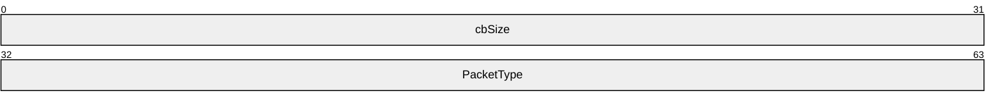
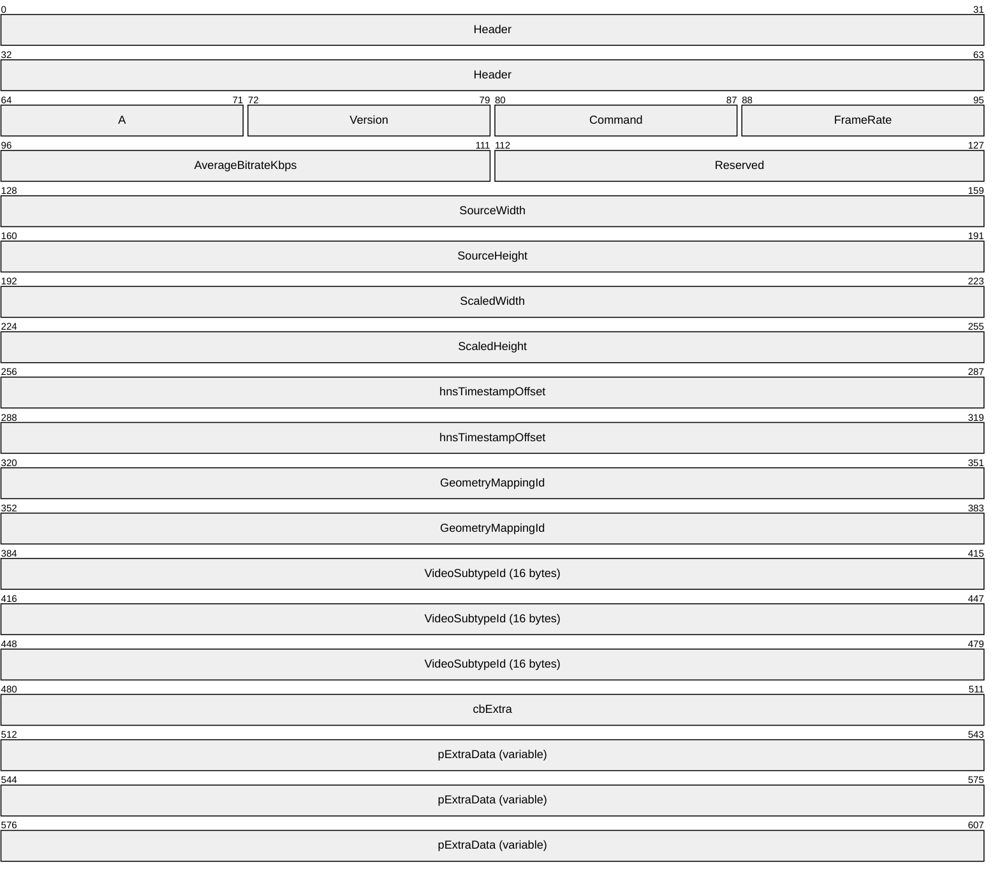
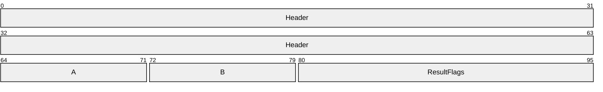
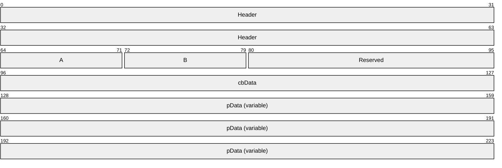
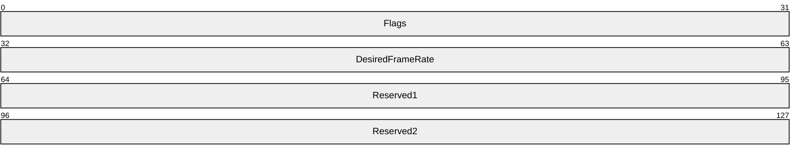
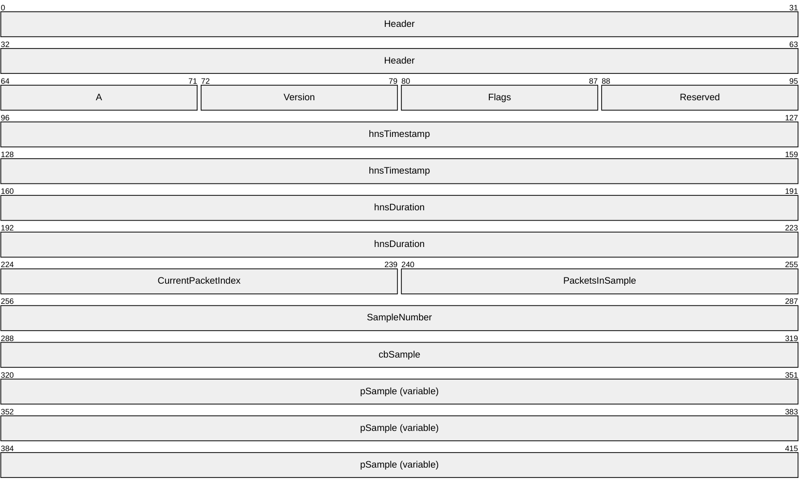

# [MS-RDPEVOR]: Remote Desktop Protocol: Video Optimized Remoting Virtual Channel Extension

Table of Contents

1 Introduction

- [1 Introduction](#Section_1)
  - [1.1 Glossary](#Section_1.1)
  - [1.2 References](#Section_1.2)
    - [1.2.1 Normative References](#Section_1.2.1)
    - [1.2.2 Informative References](#Section_1.2.2)
  - [1.3 Overview](#Section_1.3)
  - [1.4 Relationship to Other Protocols](#Section_1.4)
  - [1.5 Prerequisites/Preconditions](#Section_1.5)
  - [1.6 Applicability Statement](#Section_1.6)
  - [1.7 Versioning and Capability Negotiation](#Section_1.7)
  - [1.8 Vendor-Extensible Fields](#Section_1.8)
  - [1.9 Standards Assignments](#Section_1.9)

2 Messages

- [2 Messages](#Section_2)
  - [2.1 Transport](#Section_2.1)
  - [2.2 Message Syntax](#Section_2.2)
    - [2.2.1 Structures](#Section_2.2.1)
      - [2.2.1.1 TSMM_VIDEO_PACKET_HEADER Structure](#Section_2.2.1.1)
      - [2.2.1.2 TSMM_PRESENTATION_REQUEST Structure](#Section_2.2.1.2)
      - [2.2.1.3 TSMM_PRESENTATION_RESPONSE Structure](#Section_2.2.1.3)
      - [2.2.1.4 TSMM_CLIENT_NOTIFICATION Structure](#Section_2.2.1.4)
      - [2.2.1.5 TSMM_CLIENT_NOTIFICATION_FRAMERATE_OVERRIDE Structure](#Section_2.2.1.5)
      - [2.2.1.6 TSMM_VIDEO_DATA Structure](#Section_2.2.1.6)

3 Protocol Details

- [3 Protocol Details](#Section_3)
  - [3.1 Common Details](#Section_3.1)
    - [3.1.1 Abstract Data Model](#Section_3.1.1)
    - [3.1.2 Timers](#Section_3.1.2)
    - [3.1.3 Initialization](#Section_3.1.3)
    - [3.1.4 Higher-Layer Triggered Events](#Section_3.1.4)
    - [3.1.5 Message Processing Events and Sequencing Rules](#Section_3.1.5)
      - [3.1.5.1 Message Validation](#Section_3.1.5.1)
    - [3.1.6 Timer Events](#Section_3.1.6)
    - [3.1.7 Other Local Events](#Section_3.1.7)
  - [3.2 Client Details](#Section_3.2)
    - [3.2.1 Abstract Data Model](#Section_3.2.1)
    - [3.2.2 Timers](#Section_3.2.2)
    - [3.2.3 Initialization](#Section_3.2.3)
    - [3.2.4 Higher-Layer Triggered Events](#Section_3.2.4)
    - [3.2.5 Message Processing Events and Sequencing Rules](#Section_3.2.5)
      - [3.2.5.1 TSMM_PRESENTATION_REQUEST Message Processing](#Section_3.2.5.1)
    - [3.2.6 Timer Events](#Section_3.2.6)
    - [3.2.7 Other Local Events](#Section_3.2.7)
  - [3.3 Server Details](#Section_3.3)
    - [3.3.1 Abstract Data Model](#Section_3.3.1)
    - [3.3.2 Timers](#Section_3.3.2)
    - [3.3.3 Initialization](#Section_3.3.3)
    - [3.3.4 Higher-Layer Triggered Events](#Section_3.3.4)
    - [3.3.5 Message Processing Events and Sequencing Rules](#Section_3.3.5)
      - [3.3.5.1 Video Presentation Streaming](#Section_3.3.5.1)
      - [3.3.5.2 Video Presentation Shutdown](#Section_3.3.5.2)
    - [3.3.6 Timer Events](#Section_3.3.6)
    - [3.3.7 Other Local Events](#Section_3.3.7)

4 Protocol Examples

- [4 Protocol Examples](#Section_4)
  - [4.1 Message 1 – TSMM_PRESENTATION_REQUEST (START)](#Section_4.1)
  - [4.2 Message 2 – TSMM_PRESENTATION_RESPONSE](#Section_4.2)
  - [4.3 Message 3 – TSMM_VIDEO_DATA](#Section_4.3)
  - [4.4 Message 4 – TSMM_PRESENTATION_REQUEST (STOP)](#Section_4.4)

5 Security

- [5 Security](#Section_5)
  - [5.1 Security Considerations for Implementers](#Section_5.1)
  - [5.2 Index of Security Parameters](#Section_5.2)

6 Appendix A: Product Behavior

- [6 Appendix A: Product Behavior](#Section_6)

7 Change Tracking

- [7 Change Tracking](#Section_7)

For the legal notice and IP terms, see [LEGAL.md](../LEGAL.md).
Last updated: 4/23/2024.
See [Revision History](#revision-history) for full version history.

# 1 Introduction

The Remote Desktop Protocol: Video Optimized Remoting Virtual Channel Extension is an extension of the Remote Desktop Protocol: Basic Connectivity and Graphics Remoting protocol [MS-RDPBCGR](../MS-RDPBCGR/MS-RDPBCGR.md), which runs over a dynamic virtual channel, as specified in [MS-RDPEDYC](../MS-RDPEDYC/MS-RDPEDYC.md). The Remote Desktop Protocol: Video Optimized Remoting Virtual Channel Extension is used to redirect certain rapidly changing graphics content as a video stream from the remote desktop host to the remote desktop client. This protocol specifies the communication between a remote desktop host and a remote desktop client.

Sections 1.5, 1.8, 1.9, 2, and 3 of this specification are normative. All other sections and examples in this specification are informative.

## 1.1 Glossary

This document uses the following terms:

**Media Foundation video subtype**: A GUID that indicates a particular well-known video format. Examples include MFVideoFormat_RGB32, MFVideoFormat_IYUV, and MFVideoFormat_H264.

**terminal server**: A computer on which terminal services is running.

**Transmission Control Protocol (TCP)**: A protocol used with the Internet Protocol (IP) to send data in the form of message units between computers over the Internet. TCP handles keeping track of the individual units of data (called packets) that a message is divided into for efficient routing through the Internet.

**video sample**: A buffer containing data that describes a full or partial video frame, coupled with timing information that indicates when the sample should be rendered.

**MAY, SHOULD, MUST, SHOULD NOT, MUST NOT:** These terms (in all caps) are used as defined in [[RFC2119]](https://go.microsoft.com/fwlink/?LinkId=90317). All statements of optional behavior use either MAY, SHOULD, or SHOULD NOT.

## 1.2 References

Links to a document in the Microsoft Open Specifications library point to the correct section in the most recently published version of the referenced document. However, because individual documents in the library are not updated at the same time, the section numbers in the documents may not match. You can confirm the correct section numbering by checking the [Errata](https://go.microsoft.com/fwlink/?linkid=850906).

### 1.2.1 Normative References

We conduct frequent surveys of the normative references to assure their continued availability. If you have any issue with finding a normative reference, please contact [dochelp@microsoft.com](mailto:dochelp@microsoft.com). We will assist you in finding the relevant information.

[ITU-BT601-7] ITU-R, "Studio encoding parameters of digital television for standard 4:3 and wide-screen 16:9 aspect ratios", Recommendation BT.601-7, March 2011, [http://www.itu.int/dms_pubrec/itu-r/rec/bt/R-REC-BT.601-7-201103-I!!PDF-E.pdf](https://go.microsoft.com/fwlink/?LinkId=309941)

[MS-DTYP] Microsoft Corporation, "[Windows Data Types](../MS-DTYP/MS-DTYP.md)".

[MS-ERREF] Microsoft Corporation, "[Windows Error Codes](../MS-ERREF/MS-ERREF.md)".

[MS-RDPBCGR] Microsoft Corporation, "[Remote Desktop Protocol: Basic Connectivity and Graphics Remoting](../MS-RDPBCGR/MS-RDPBCGR.md)".

[MS-RDPEA] Microsoft Corporation, "[Remote Desktop Protocol: Audio Output Virtual Channel Extension](../MS-RDPEA/MS-RDPEA.md)".

[MS-RDPEDYC] Microsoft Corporation, "[Remote Desktop Protocol: Dynamic Channel Virtual Channel Extension](../MS-RDPEDYC/MS-RDPEDYC.md)".

[MS-RDPEGFX] Microsoft Corporation, "[Remote Desktop Protocol: Graphics Pipeline Extension](../MS-RDPEGFX/MS-RDPEGFX.md)".

[MS-RDPEGT] Microsoft Corporation, "[Remote Desktop Protocol: Geometry Tracking Virtual Channel Protocol Extension](../MS-RDPEGT/MS-RDPEGT.md)".

[RFC2119] Bradner, S., "Key words for use in RFCs to Indicate Requirement Levels", BCP 14, RFC 2119, March 1997, [https://www.rfc-editor.org/info/rfc2119](https://go.microsoft.com/fwlink/?LinkId=90317)

### 1.2.2 Informative References

None.

## 1.3 Overview

This protocol enables a protocol server to compress screen content identified as video more efficiently than if it identified the same content as a static image. This content is sent to a protocol client for decoding and rendering.

## 1.4 Relationship to Other Protocols

The Remote Desktop Protocol: Video Optimized Remoting Virtual Channel Extension is embedded in the dynamic virtual channel transport, as specified in [MS-RDPEDYC](../MS-RDPEDYC/MS-RDPEDYC.md). This protocol is concerned with transmitting the raw video stream from the server to the client. Knowing where the content will be rendered is handled by the Remote Desktop Protocol: Geometry Tracking Virtual Channel Extension as specified in [MS-RDPEGT](../MS-RDPEGT/MS-RDPEGT.md).

## 1.5 Prerequisites/Preconditions

The Remote Desktop Protocol: Video Optimized Remoting Virtual Channel Extension operates only after the dynamic virtual channel transport is fully established. If the dynamic virtual channel transport is terminated, no other communication over this protocol extension occurs.

The Remote Desktop Protocol: Video Optimized Remoting Virtual Channel is dependent on the Microsoft::Windows::RDS::Graphics protocol, as defined in [MS-RDPEGFX](../MS-RDPEGFX/MS-RDPEGFX.md). The graphics channel MUST be opened before the Video Optimized Remoting Virtual channel is opened.

To ensure high-quality graphics content and effective utilization of the transport, continuous network characteristics detection SHOULD be enabled (as specified in [MS-RDPBCGR](../MS-RDPBCGR/MS-RDPBCGR.md) sections 1.3.9 and 2.2.14) and the client SHOULD send the Client Multitransport Channel Data ([MS-RDPBCGR] section 2.2.1.3.8) to the server.

This protocol is message-based. It assumes preservation of the packet as a whole and does not allow for fragmentation. Some messages can be lost and are described in section [2](#Section_2).

## 1.6 Applicability Statement

The Remote Desktop Protocol: Video Optimized Remoting Virtual Channel Extension is designed to be run within the context of a Remote Desktop Protocol (RDP) virtual channel established between a client and a server. This protocol extension is applicable when the [**terminal server**](#gt_terminal-server) is displaying content that it classifies as video and needs to send that video data to the client.

## 1.7 Versioning and Capability Negotiation

This protocol supports versioning and capability negotiation only when the underlying virtual channel attempts to open. A client that supports this protocol does allow this virtual channel to be opened, and a client that does not support this protocol does not allow this virtual channel to be opened.

## 1.8 Vendor-Extensible Fields

The Remote Desktop Protocol: Video Optimized Remoting Virtual Channel Extension uses HRESULTs as specified in [MS-ERREF](../MS-ERREF/MS-ERREF.md) section 2.1. Vendors are free to choose their own values as long as the C bit (0x20000000) is set, indicating that it is a customer code.

This protocol also uses Win32 error codes. These values are taken from the error number space as specified in [MS-ERREF] section 2.2. Vendors SHOULD reuse those values with their indicated meanings. Choosing any other value runs the risk of a collision in the future.

## 1.9 Standards Assignments

None.

# 2 Messages

## 2.1 Transport

The Remote Desktop Protocol: Video Optimized Remoting Virtual Channel Extension is designed to operate over dynamic virtual channels, as specified in [MS-RDPEDYC](../MS-RDPEDYC/MS-RDPEDYC.md). The channel names used for this protocol are "Microsoft::Windows::RDS::Video::Control::v08.01" and "Microsoft::Windows::RDS::Video::Data::v08.01". The use of channel names when opening a dynamic virtual channel is specified in [MS-RDPEDYC] section 2.2.2.1.

The foregoing control channel MUST be implemented using a reliable protocol, such as [**TCP**](#gt_transmission-control-protocol-tcp). Messages written to this channel are assumed to arrive in their entirety and in order on the opposite side of the connection.

The foregoing data channel SHOULD be implemented using either a reliable or an unreliable channel.<1> Messages written to this channel can be lost. Messages received on the opposite side of the connection are assumed to be intact and unaltered.

All PDUs except TSMM_VIDEO_DATA flow on the control channel, whereas TSMM_VIDEO_DATA flows on the data channel.

## 2.2 Message Syntax

All messages in the Remote Desktop Protocol: Video Optimized Remoting Virtual Channel Extension begin with a TSMM_VIDEO_PACKET_HEADER structure, described in section [2.2.1.1](#Section_2.2.1.1).

The protocol references commonly used data types as defined in [MS-DTYP](../MS-DTYP/MS-DTYP.md).

### 2.2.1 Structures

#### 2.2.1.1 TSMM_VIDEO_PACKET_HEADER Structure

This message is meant to be a header on all other messages sent in the Remote Desktop Protocol: Video Optimized Remoting Virtual Channel Extension and MUST NOT be sent alone.

**cbSize (4 bytes):** UINT32 ([MS-DTYP](../MS-DTYP/MS-DTYP.md) section 2.2.49). Length, in bytes, of the entire message following and including this header.

**PacketType (4 bytes):** UINT32. The value of this integer indicates the type of message following this header. The following table defines valid values.

| Value | Symbolic name | Meaning |
| --- | --- | --- |
| 1 | TSMM_PACKET_TYPE_PRESENTATION_REQUEST | Indicates that this message is interpreted as a [TSMM_PRESENTATION_REQUEST](#Section_2.2.1.2) structure. |
| 2 | TSMM_PACKET_TYPE_PRESENTATION_RESPONSE | Indicates that this message is interpreted as a [TSMM_PRESENTATION_RESPONSE](#Section_4.2) structure. |
| 3 | TSMM_PACKET_TYPE_CLIENT_NOTIFICATION | Indicates that this message is interpreted as a [TSMM_CLIENT_NOTIFICATION](#Section_2.2.1.4) structure. |
| 4 | TSMM_PACKET_TYPE_VIDEO_DATA | Indicates that this message is interpreted as a [TSMM_VIDEO_DATA](#Section_4.3) structure. |

#### 2.2.1.2 TSMM_PRESENTATION_REQUEST Structure

The TSMM_PRESENTATION_REQUEST message is sent from the server to the client to indicate that a video stream is either starting or stopping.

**Header (8 bytes):** TSMM_VIDEO_PACKET_HEADER defined in section [2.2.1.1](#Section_2.2.1.1).

**A - PresentationId (1 byte):** UINT8 ([MS-DTYP](../MS-DTYP/MS-DTYP.md) section 2.2.47). A number that uniquely identifies the video stream on the server. The server MUST ensure that presentation IDs are unique across all active presentations.

**Version (1 byte):** UINT8. The current version of the Remote Desktop Protocol: Video Optimized Remoting Virtual Channel Extension. In RDP8, this MUST be set to 0x01. This field is used for diagnostic purposes only. Protocol version is enforced with the virtual channel name.

**Command (1 byte):** UINT8. A number that identifies which operation the client is to perform. The following values are supported:

- **0x01 – Start Presentation**
- **0x02 – Stop Presentation**
If the command is to stop the presentation, only the **Header**, **PresentationId**, **Version**, and **Command** fields are valid.

**FrameRate (1 byte):** UINT8. This field is reserved and MUST be ignored.

**AverageBitrateKbps (2 bytes):** UINT16 ([MS-DTYP] section 2.2.48). This field is reserved and MUST be ignored.

**Reserved (2 bytes):** UINT16. This field is reserved and MUST be ignored.

**SourceWidth (4 bytes):** UINT32 ([MS-DTYP] section 2.2.49). This is the width of the video stream after scaling back to the original resolution.

**SourceHeight (4 bytes):** UINT32. This is the height of the video stream after scaling back to the original resolution.

**ScaledWidth (4 bytes):** UINT32. This is the width of the video stream. The maximum value of scaled width is 1920.

**ScaledHeight (4 bytes):** UINT32. This is the height of the video stream. The maximum value of scaled height is 1080.

**hnsTimestampOffset (8 bytes):** UINT64 ([MS-DTYP] section 2.2.50). The time on the server (in 100-ns intervals since the system was started) when the video presentation was started.

**GeometryMappingId (8 bytes):** UINT64. This field is used to correlate this video data with its geometry, which is sent on another channel. See [MS-RDPEGT](../MS-RDPEGT/MS-RDPEGT.md) for more details.

**VideoSubtypeId (16 bytes):** GUID. This field identifies the [**Media Foundation video subtype**](#gt_media-foundation-video-subtype) of the video stream. In RDP8, this MUST be set to MFVideoFormat_H264 ({34363248-0000-0010-8000-00AA00389B71}).

**cbExtra (4 bytes):** UINT32. Length of extra data (in bytes) appended to this structure, starting at **pExtraData**.

**pExtraData (variable):** Array of UINT8. The data in this field depends on the format of the video indicated in the **VideoSubtypeId** field. For the case when the video subtype is MFVideoFormat_H264, set this field to the MPEG-1 or MPEG-2 sequence header data, which, for the Microsoft implementation of the H.264 encoder, can be found by querying the MF_MT_MPEG_SEQUENCE_HEADER attribute of the video media type after setting it as the encoder output. This field can also be constructed by concatenating the sequence parameter set (SPS) (as described in [ITU-H.264] section 7.3.2.1) and picture parameter set (PPS) (as described in [ITU-H.264] section 7.3.2.2) syntax structures. The total number of bytes in this field is set in the **cbExtra** field.

#### 2.2.1.3 TSMM_PRESENTATION_RESPONSE Structure

This message is sent from the client to the server in response to a [TSMM_PRESENTATION_REQUEST](#Section_2.2.1.2) message with the **Command** field set to 0x01 (Start Presentation). This message MUST be sent when the client is fully prepared to start rendering samples. If this packet is not delivered to the server, the server will not stream video data to the client. Therefore, this packet SHOULD be sent on the control channel.

**Header (8 bytes):** [TSMM_VIDEO_PACKET_HEADER](#Section_2.2.1.1) defined in section 2.2.1.1.

**A - PresentationId (1 byte):** UINT8 ([MS-DTYP](../MS-DTYP/MS-DTYP.md) section 2.2.47). This corresponds to a PresentationId of an earlier TSMM_PRESENTATION_REQUEST message.

**B - ResponseFlags (1 byte):** UINT8. This field is reserved and MUST be set to 0.

**ResultFlags (2 bytes):** UINT16 ([MS-DTYP] section 2.2.48). This field is reserved and MUST be set to 0.

#### 2.2.1.4 TSMM_CLIENT_NOTIFICATION Structure

This message is sent from the client to the server to notify of certain events happening on the client.

**Header (8 bytes):** TSMM_VIDEO_PACKET_HEADER defined in [2.2.1.1](#Section_2.2.1.1).

**A - PresentationId (1 byte):** UINT8 ([MS-DTYP](../MS-DTYP/MS-DTYP.md) section 2.2.47). This is the same number as the **PresentationId** field in the [TSMM_PRESENTATION_REQUEST](#Section_2.2.1.2) message.

**B - NotificationType (1 byte):** UINT8. A number that identifies which notification type the client is sending. The following values are supported:

- **0x01 – Network Error –** This message SHOULD be sent whenever the client detects missing or out-of-order packets. The server will then send an I-Frame (keyframe) in response to try and minimize graphics artifacts. **cbData** MUST be set to zero.
- **0x02 – Frame Rate Override –** This message MUST be sent whenever the client cannot decode incoming frames fast enough. **cbData** MUST be set to the length of pData (in bytes), and **pData** MUST contain a TSMM_CLIENT_NOTIFICATION_FRAMERATE_OVERRIDE structure.
**Reserved (2 bytes):** UINT16 ([MS-DTYP] section 2.2.48). This field is reserved and MUST be ignored.

**cbData (4 bytes):** UINT32 ([MS-DTYP] section 2.2.49). Length of extra data (in bytes) appended to this structure, starting at **pData**.

**pData (variable):** Array of UINT8. The data in the field is dependent on the value of the **NotificationType** field.

#### 2.2.1.5 TSMM_CLIENT_NOTIFICATION_FRAMERATE_OVERRIDE Structure

This structure is appended to a TSMM_CLIENT_NOTIFICATION in the **pData** field.

**Flags (4 bytes):** UINT32 ([MS-DTYP](../MS-DTYP/MS-DTYP.md) section 2.2.49). A number that identifies which operation to execute on the server. This number is a bitmask. The following values are supported:

- **0x1 – Unrestricted frame rate** – This message SHOULD be sent whenever the client can decode all frames sent from the server and spare resources still exist to decode more frames. The server sends as many frames as it can in response. **DesiredFrameRate** is ignored and SHOULD be set to zero.
- **0x2 – Override frame rate** – This message MUST be sent whenever the client cannot decode incoming frames fast enough. **DesiredFrameRate** MUST be set to the number of frames that the client can decode per second. This flag is mutually exclusive with Unrestricted frame rate (0x1).
**DesiredFrameRate (4 bytes):** UINT32. If Flags contains 0x2 – Override frame rate, this value MUST be set to the desired rate at which the server will deliver samples. This value MUST be in the range of 1 to 30.

**DesiredFrameRate** is used to calculate the minimum frame interval. The server will make sure the interval between any two frames is not less than that interval, which guarantees that the actual framerate is below the requested framerate.

The incoming frame rate is capped by the rate at which the server encodes graphics updates. The server encoding rate is not directly modifiable by clients.

**Reserved1 (4 bytes):** UINT32. This is reserved for future use and SHOULD be set to zero.

**Reserved2 (4 bytes):** UINT32. This is reserved for future use and SHOULD be set to zero.

#### 2.2.1.6 TSMM_VIDEO_DATA Structure

This message contains a potentially fragmented [**video sample**](#gt_video-sample). If the **VideoSubtypeId** of the TSMM_PRESENTATION_REQUEST (section [2.2.1.2](#Section_2.2.1.2)) message is set to MFVideoFormat_H264 ({34363248-0000-0010-8000-00AA00389B71}), then the sample (before fragmentation and encoding) is derived from RGB data that has been converted to the YUV color space by using the method outlined in [[ITU-BT601-7]](https://go.microsoft.com/fwlink/?LinkId=309941) section 2.5.4 and annex 2.1.

**Header (8 bytes):** [TSMM_VIDEO_PACKET_HEADER](#Section_2.2.1.1) defined in section 2.2.1.1.

**A - PresentationId (1 byte):** UINT8 ([MS-DTYP](../MS-DTYP/MS-DTYP.md) section 2.2.47). This is the same number as the **PresentationId** field in the TSMM_PRESENTATION_REQUEST message.

**Version (1 byte):** UINT8. This is the same number as the **Version** field in the TSMM_PRESENTATION_REQUEST message.

**Flags (1 byte):** UINT8. The bits of this integer indicate attributes of this message. The following table defines the meaning of each bit.

| Bit Range | Field | Description |
| --- | --- | --- |
| Variable | 0x01 | TSMM_VIDEO_DATA_FLAG_HAS_TIMESTAMPS Indicates that this message has a valid **hnsTimestamp** field. |
| Variable | 0x02 | TSMM_VIDEO_DATA_FLAG_KEYFRAME Indicates that the sample contained in this message is part of a keyframe. |
| Variable | 0x04 | TSMM_VIDEO_DATA_FLAG_NEW_FRAMERATE Indicates the first sample after receiving TSMM_CLIENT_NOTIFICATION_FRAMERATE_OVERRIDE. |

**Reserved (1 byte):** UINT8. This field is reserved and MUST be ignored.

**hnsTimestamp (8 bytes):** UINT64 ([MS-DTYP] section 2.2.50). Timestamp of the current packet, in 100-ns intervals since the video presentation was started. This timestamp SHOULD be used to sync the video stream with an audio stream remoted using the Remote Desktop Protocol: Audio Output Virtual Channel Extension (see the **dwAudioTimeStamp** field in [MS-RDPEA](../MS-RDPEA/MS-RDPEA.md) section 2.2.3.10).

**hnsDuration (8 bytes):** UINT64. Duration of the current packet, in 100-ns intervals. This is the length of time between the last sample and the current sample.

**CurrentPacketIndex (2 bytes):** UINT16 ([MS-DTYP] section 2.2.48). Each sample (logically one contiguous frame) is divided into packets for network transmission as atomic units. This field contains the index of the current packet within the larger sample. This field is indexed starting with 1 and increases until it is equal to the value in the **PacketsInSample** field.

**PacketsInSample (2 bytes):** UINT16. This field contains the number of packets that make up the current sample.

**SampleNumber (4 bytes):** UINT32 ([MS-DTYP] section 2.2.49). This field contains the current sample number. The first sample will have this field set to 1.

**cbSample (4 bytes):** UINT32. Length (in bytes) of the **pSample** field.

**pSample (variable):** Array of UINT8. Encoded sample data. The total number of bytes in this field is set in the **cbSample** field.

# 3 Protocol Details

## 3.1 Common Details

The Remote Desktop Protocol: Video Optimized Remoting Virtual Channel Extension has three distinct states: initialization, streaming, and termination. Initialization is started by the protocol server, and the protocol client responds with either a success or a failure. If the protocol client initialization succeeds, streaming can begin. The protocol server can stop the video presentation at any time after the presentation is initialized.

The protocol supports up to one active presentation, which means there can be only one video stream in a remote session.

Figure 1: Playback initialization, streaming, and termination

### 3.1.1 Abstract Data Model

This section describes a conceptual model of possible data organization that an implementation maintains to participate in this protocol. The described organization is provided to facilitate the explanation of how the protocol behaves. This document does not mandate that implementations adhere to this model as long as their external behavior is consistent with that described in this document.

**PresentationId:** For each presentation that is to be redirected, the server generates a unique presentation ID. The server sends this ID to the client in the **PresentationId** field of the [TSMM_PRESENTATION_REQUEST](#Section_2.2.1.2) message. This ID is then used in all subsequent messages for a presentation and is used by the client to refer all messages to the correct presentation.

### 3.1.2 Timers

None.

### 3.1.3 Initialization

None.

### 3.1.4 Higher-Layer Triggered Events

None.

### 3.1.5 Message Processing Events and Sequencing Rules

#### 3.1.5.1 Message Validation

In all cases, the protocol endpoints MUST validate messages received from the network by validating the following:

- The type of the message.
- That the length of the message matches the specified type.
- That the message is received at an appropriate time in the sequence.
- The message content.
If a packet is malformed, (e.g., incorrect length for the indicated packet type) communication MUST be terminated. If a packet is valid, but contains unexpected data, the packet MUST be ignored.

### 3.1.6 Timer Events

None.

### 3.1.7 Other Local Events

None.

## 3.2 Client Details

### 3.2.1 Abstract Data Model

The abstract data model is as specified in section [3.1.1](#Section_3.1.1).

### 3.2.2 Timers

None.

### 3.2.3 Initialization

Clients initialize in two phases. The first phase occurs when the virtual channels are opened. The client has the option to indicate support for the Remote Desktop Protocol: Video Optimized Remoting Virtual Channel Extension by allowing or disallowing the virtual channel to connect. The second phase occurs when the client receives a [TSMM_PRESENTATION_REQUEST](#Section_2.2.1.2) message from the server with the **Command** field set to 0x01 – Start Presentation. The client performs all initialization required to begin decoding and rendering data and then sends a [TSMM_PRESENTATION_RESPONSE](#Section_4.2) message to the server. Only after this has completed will the server begin streaming data.

### 3.2.4 Higher-Layer Triggered Events

None.

### 3.2.5 Message Processing Events and Sequencing Rules

#### 3.2.5.1 TSMM_PRESENTATION_REQUEST Message Processing

The processing of this message depends on the **Command** field of the message and the current presentation state.

If the **Command** field is set to 0x01 (Presentation Start) and the presentation state is Uninitialized, the client SHOULD attempt to initialize any decoders or renderers necessary for playback of the video stream. After these are initialized, the client SHOULD send a [TSMM_PRESENTATION_RESPONSE](#Section_4.2) message to the server and set the current state to Streaming. If the presentation state is not Uninitialized, the client SHOULD ignore this message.

If the **Command** field is set to 0x02 (Presentation Stop) and the presentation state is Streaming, the client SHOULD terminate any objects relating to the presentation corresponding to the presentation ID in the message and set the current state to Uninitialized. If the presentation state is Uninitialized, the client SHOULD ignore this message.

### 3.2.6 Timer Events

None.

### 3.2.7 Other Local Events

None.

## 3.3 Server Details

### 3.3.1 Abstract Data Model

The abstract data model is as specified in section [3.1.1](#Section_3.1.1).

### 3.3.2 Timers

None.

### 3.3.3 Initialization

When a video presentation is started on the server, the server MUST send a [TSMM_PRESENTATION_REQUEST](#Section_2.2.1.2) message with the **Command** field set to TSMM_VIDEO_PLAYBACK_COMMAND_START to the client and the **PresentationId** field set to a value that is unique to all video presentations in the current session. The server then MUST wait for the client to return a [TSMM_PRESENTATION_RESPONSE](#Section_4.2) message indicating whether or not to proceed with the presentation. After the server has received a TSMM_PRESENTATION_RESPONSE message indicating that it can proceed, it MAY start sending [TSMM_VIDEO_DATA](#Section_4.3) messages to the client. When the server is about to end the presentation, it MUST send a TSMM_PRESENTATION_REQUEST message with the **Command** field set to TSMM_VIDEO_PLAYBACK_COMAND_STOP.

If the client encounters an error in the TSMM_PRESENTATION_REQUEST message (for example, the **VideoSubtypeId** is not set to MFVideoFormat_H264), then it SHOULD ignore the message and not send a TSMM_PRESENTATION_RESPONSE message. The server MUST NOT send TSMM_VIDEO_DATA messages to the client in this case.

### 3.3.4 Higher-Layer Triggered Events

None.

### 3.3.5 Message Processing Events and Sequencing Rules

#### 3.3.5.1 Video Presentation Streaming

Throughout the video presentation, the server will send many [TSMM_VIDEO_DATA](#Section_4.3) messages representing the bulk of transmission. This packet does not have any acknowledgment of receipt sent from the client.

#### 3.3.5.2 Video Presentation Shutdown

When a video presentation is stopping on the server, the server MUST send a [TSMM_PRESENTATION_REQUEST](#Section_2.2.1.2) message with the **Command** field set to TSMM_VIDEO_PLAYBACK_COMMAND_STOP and the presentation ID matching a TSMM_PRESENTATION_REQUEST to start sent earlier to the client.

### 3.3.6 Timer Events

None.

### 3.3.7 Other Local Events

None.

# 4 Protocol Examples

In this section, a common scenario is outlined (see section [2](#Section_2) for information about how to parse the messages received on the wire):

- The server sends a TSMM_PRESENTATION_REQUEST message with the Command field set to 0x01 (START).
- The client sends a TSMM_PRESENTATION_RESPONSE message indicating that the client is ready to receive data.
- The server sends a TSMM_VIDEO_DATA message.
- The server sends a TSMM_PRESENTATION_REQUEST message with the Command field set to 0x02 (STOP).

## 4.1 Message 1 – TSMM_PRESENTATION_REQUEST (START)

Raw packet data:

69000000 01000000 0301011D C0120000 E0010000 F4000000 E0010000 F4000000

A47A3B82 0F000000 22020400 BA7A0080 48323634 00001000 800000AA 00389B71

25000000 00000001 6742C015 95A07821 F9E10000 03000100 0003003C 0DA08846

A0000000 0168CE3C 8000

TSMM_VIDEO_PACKET_HEADER

UINT32 **cbSize** – 69000000

105 (bytes)

UINT32 **PacketType** – 01000000

1 (TSMM_PACKET_TYPE_PRESENTATION_REQUEST)

TSMM_PRESENTATION_REQUESTUINT8 **PresentationId** – 03

3

UINT8 **Version** – 01

1

UINT8 **Command** – 01

1 (Start)

UINT8 **FrameRate** – 1D

29

UINT16 **AverageBitrateKbps** - C012

4800 Kbps

UINT16 **Reserved** – 0000

0

UINT32 **SourceWidth** - E0010000

480

UINT32 **SourceHeight** - F4000000

244

UINT32 **ScaledWidth** - E0010000

480

UINT32 **ScaledHeight** - F4000000

244

UINT64 **hnsTimestampOffset** - A47A3B82 0F000000

66609445540 (100-ns intervals)

UINT64 **GeometryMappingId** - 22020400 BA7A0080

0x80007ABA00040222

GUID **VideoSubtypeId** - 48323634 00001000 800000AA 00389B71

{34363248-0000-0010-8000-00AA00389B71}

MFVideoFormat_H264

UINT32 **cbExtra** – 25000000

37 (bytes)

BYTE **pExtraData**[37]

Since data type is H.264 video, this buffer contains the sequence header data for the stream.

UINT32 **Reserved** – 00

## 4.2 Message 2 – TSMM_PRESENTATION_RESPONSE

Raw packet data:

0C000000 02000000 03000000

TSMM_VIDEO_PACKET_HEADER

UINT32 **cbSize** – 0C000000

12 (bytes)

UINT32 **PacketType** – 02000000

2 (TSMM_PACKET_TYPE_PRESENTATION_RESPONSE)

TSMM_PRESENTATION_RESPONSEUINT8 **PresentationId** – 03

3

UINT8 **ResponseFlags** – 00

0

UINT16 **ResultFlags** – 0000

0

## 4.3 Message 3 – TSMM_VIDEO_DATA

Raw packet data:

33030000 04000000 03010300 C7C60600 00000000 00000000 00000000 01000100

01000000 0B030000 00000001 6742C015 95A07821 F9E10000 03000100 0003003C

0DA08846 A0000000 0168CE3C 80000000 0106052F 02F86150 FC704172 B73248F3

A72A3D34 4D696372 6F736F66 7420482E 32363420 456E636F 64657220 56312E35

2E330080 00000001 0605F3CB B2139298 7343DAA8 A6C74298 356CF573 72633A33

20683A32 34342077 3A343830 20667073 3A33302E 30303020 70663A36 36206C76

6C3A3620 623A3020 6271703A 3220676F 703A3735 30206964 723A3735 3020736C

633A3420 636D703A 30207263 3A312071 703A3234 20726174 653A3438 30303030

30207065 616B3A36 34303030 30302062 7566663A 38303030 30303020 7265663A

31207372 63683A33 32206173 7263683A 31207375 62703A31 20706172 3A362033

20332072 6E643A30 20636162 61633A30 206C703A 32206374 6E743A30 20617564

3A31206C 61743A31 2077726B 3A312076 75693A31 206C7972 3A31203C 3C008000

00000109 10000000 01658880 4BFFFFF0 F4500010 20F7DF7D F7DF7DF7 DF7DF7DF

7DF7DF7D F7DF7DF7 DF7DF7D7 5D75D75D 75D75D75 D75D75D7 5D75D75D 75D75D75

D75D75D7 5D75D75D 75D75D75 D75D75D7 5D75D75D 75D75D75 D75D75D7 5D75D75D

75D75D75 D75D75D7 5D75D75D 75D75E00 00000165 03C88804 BFFFFF0F 45000102

0F7DF7DF 7DF7DF7D F7DF7DF7 DF7DF7DF 7DF7DF7D F7DF7D75 D75D75D7 5D75D75D

75D75D75 D75D75D7 5D75D75D 75D75D75 D75D75D7 5D75D75D 75D75D75 D75D75D7

5D75D75D 75D75D75 D75D75D7 5D75D75D 75D75D75 D75D75D7 5D75E000 00000165

01E22201 2FFFFFC3 D1400040 83DF7DF7 DF7DF7DF 7DF7DF7D F7DF7DF7 DF7DF7DF

7DF7DF5D 75D75D75 D75D75D7 5D75D75D 75D75D75 D75D75D7 5D75D75D 75D75D75

D75D75D7 5D75D75D 75D75D75 D75D75D7 5D75D75D 75D75D75 D75D75D7 5D75D75D

75D75D75 D75D7800 00000165 00B48880 4BFFFFF0 F4500010 20F7DF7D F7DF7DF7

DF7DF7DF 7DF7DF7D F7DF7DF7 DF7DF7D7 5D75D75D 75D75D75 D75D75D7 5D75D75D

75D75D75 D75D75D7 5D75D75D 75D75D75 D75D75D7 5D75D75D 75D75D75 D75D75D7

5D75D75D 75D75D75 D75D75D7 5D75D75D 75D75E00

TSMM_VIDEO_PACKET_HEADER

UINT32 **cbSize** – 33030000

819 (bytes)

UINT32 **PacketType** – 04000000

4 (TSMM_PACKET_TYPE_VIDEO_DATA)

TSMM_VIDEO_DATAUINT8 **PresentationId** – 03

3

UINT8 **Version** – 01

0x03

UINT8 **Flags** – 03

0x03

0x01 | 0x02

TSMM_VIDEO_DATA_FLAG_HAS_TIMESTAMPS | TSMM_VIDEO_DATA_FLAG_KEYFRAME

UINT8 **Reserved** – 00

0

UINT64 **hnsTimestamp** - C7C60600 00000000

0x6C6C7

444103 (100-ns intervals) ≈ 44 (ms)

UINT64 **hnsDuration** – 00000000 00000000

0

UINT16 **CurrentPacketIndex** – 0100

1

UINT16 **PacketsInSample** – 0100

1

UINT32 **SampleNumber** – 01000000

1

UINT32 **cbSample** – 0B030000

779 (bytes)

BYTE **pSample**[779]

Raw video data

UINT32 **Reserved** – 00

## 4.4 Message 4 – TSMM_PRESENTATION_REQUEST (STOP)

Raw packet data:

44000000 01000000 03010200 00000000 00000000 00000000 00000000 00000000

00000000 00000000 00000000 00000000 00000000 00000000 00000000 00000000

00000000 00

TSMM_VIDEO_PACKET_HEADER

UINT32 **cbSize** – 44000000

68 (bytes)

UINT32 **PacketType** – 01000000

1 (TSMM_PACKET_TYPE_PRESENTATION_REQUEST)

TSMM_PRESENTATION_REQUESTUINT8 **PresentationId** – 03

3

UINT8 **Version** – 01

1

UINT8 **Command** – 02

2 (Stop)

UINT8 **FrameRate** – 00

0

UINT16 **AverageBitrateKbps** - 0000

0 Kbps

UINT16 **Reserved** – 0000

0

UINT32 **SourceWidth** - 00000000

0

UINT32 **SourceHeight** - 00000000

0

UINT32 **ScaledWidth** - 00000000

0

UINT32 **ScaledHeight** - 00000000

0

UINT64 **hnsTimestampOffset** – 00000000 00000000

0 (100-ns intervals)

UINT64 **GeometryMappingId** – 00000000 00000000

0

GUID **VideoSubtypeId** – 00000000 00000000 00000000 00000000

GUID_NULL

UINT32 **cbExtra** – 00000000

0 (bytes)

BYTE **pExtraData**[0]

There is no extra data appended to this packet.

UINT32 **Reserved** - 00

# 5 Security

## 5.1 Security Considerations for Implementers

There are no security considerations for the Remote Desktop Protocol: Video Optimized Remoting Virtual Channel Extension messages because all traffic is secured by the underlying RDP core protocol. For information about the security-related mechanisms that are implemented in the RDP core protocol, see [MS-RDPBCGR](../MS-RDPBCGR/MS-RDPBCGR.md) section 5.

## 5.2 Index of Security Parameters

The security considerations are the same as those in [MS-RDPBCGR](../MS-RDPBCGR/MS-RDPBCGR.md). The Virtual Channel security considerations that this protocol uses are covered under that protocol.

# 6 Appendix A: Product Behavior

The information in this specification is applicable to the following Microsoft products or supplemental software. References to product versions include updates to those products.

- Windows 8 operating system
- Windows Server 2012 operating system
- Windows 8.1 operating system
- Windows Server 2012 R2 operating system
- Windows 10 operating system
- Windows Server 2016 operating system
- Windows Server 2019 operating system
- Windows Server 2022 operating system
- Windows 11 operating system
- Windows Server 2025 operating system
Exceptions, if any, are noted in this section. If an update version, service pack or Knowledge Base (KB) number appears with a product name, the behavior changed in that update. The new behavior also applies to subsequent updates unless otherwise specified. If a product edition appears with the product version, behavior is different in that product edition.

Unless otherwise specified, any statement of optional behavior in this specification that is prescribed using the terms "SHOULD" or "SHOULD NOT" implies product behavior in accordance with the SHOULD or SHOULD NOT prescription. Unless otherwise specified, the term "MAY" implies that the product does not follow the prescription.

<1> Section 2.1: The "Microsoft::Windows::RDS::Video::Data::v08.01" channel is implemented using an unreliable channel only in Windows 8 and Windows Server 2012.

# 7 Change Tracking

This section identifies changes that were made to this document since the last release. Changes are classified as Major, Minor, or None.

The revision class **Major** means that the technical content in the document was significantly revised. Major changes affect protocol interoperability or implementation. Examples of major changes are:

- A document revision that incorporates changes to interoperability requirements.
- A document revision that captures changes to protocol functionality.
The revision class **Minor** means that the meaning of the technical content was clarified. Minor changes do not affect protocol interoperability or implementation. Examples of minor changes are updates to clarify ambiguity at the sentence, paragraph, or table level.

The revision class **None** means that no new technical changes were introduced. Minor editorial and formatting changes may have been made, but the relevant technical content is identical to the last released version.

The changes made to this document are listed in the following table. For more information, please contact [dochelp@microsoft.com](mailto:dochelp@microsoft.com).

| Section | Description | Revision class |
| --- | --- | --- |
| [6](#Section_6) Appendix A: Product Behavior | Added Windows Server 2025 to the list of applicable products. | Major |

## Revision History

| Date | Version | Revision Class | Comments |
| --- | --- | --- | --- |
| 12/16/2011 | 1.0 | New | Released new document. |
| 3/30/2012 | 2.0 | Major | Significantly changed the technical content. |
| 7/12/2012 | 2.0 | None | No changes to the meaning, languague, or formatting of the technical content. |
| 10/25/2012 | 3.0 | Major | Significantly changed the technical content. |
| 1/31/2013 | 4.0 | Major | Significantly changed the technical content. |
| 8/8/2013 | 5.0 | Major | Significantly changed the technical content. |
| 11/14/2013 | 5.0 | None | No changes to the meaning, languague, or formatting of the technical content. |
| 2/13/2014 | 6.0 | Major | Significantly changed the technical content. |
| 5/15/2014 | 6.0 | None | No changes to the meaning, languague, or formatting of the technical content. |
| 6/30/2015 | 7.0 | Major | Significantly changed the technical content. |
| 10/16/2015 | 7.0 | None | No changes to the meaning, language, or formatting of the technical content. |
| 7/14/2016 | 8.0 | Major | Significantly changed the technical content. |
| 6/1/2017 | 9.0 | Major | Significantly changed the technical content. |
| 9/15/2017 | 10.0 | Major | Significantly changed the technical content. |
| 12/1/2017 | 10.0 | None | No changes to the meaning, language, or formatting of the technical content. |
| 9/12/2018 | 11.0 | Major | Significantly changed the technical content. |
| 4/7/2021 | 12.0 | Major | Significantly changed the technical content. |
| 6/25/2021 | 13.0 | Major | Significantly changed the technical content. |
| 4/23/2024 | 14.0 | Major | Significantly changed the technical content. |
