
# [MS-RMPR]: Rights Management Services (RMS): Client-to-Server Protocol

Table of Contents

1 Introduction

- [1 Introduction](#Section_1)
  - [1.1 Glossary](#Section_1.1)
  - [1.2 References](#Section_1.2)
    - [1.2.1 Normative References](#Section_1.2.1)
    - [1.2.2 Informative References](#Section_1.2.2)
  - [1.3 Overview](#Section_1.3)
    - [1.3.1 Server Enrollment](#Section_1.3.1)
    - [1.3.2 Client Bootstrapping](#Section_1.3.2)
    - [1.3.3 Template Acquisition](#Section_1.3.3)
    - [1.3.4 Online Publishing](#Section_1.3.4)
    - [1.3.5 Offline Publishing](#Section_1.3.5)
    - [1.3.6 Licensing](#Section_1.3.6)
  - [1.4 Relationship to Other Protocols](#Section_1.4)
  - [1.5 Prerequisites/Preconditions](#Section_1.5)
  - [1.6 Applicability Statement](#Section_1.6)
  - [1.7 Versioning and Capability Negotiation](#Section_1.7)
  - [1.8 Vendor-Extensible Fields](#Section_1.8)
  - [1.9 Standards Assignments](#Section_1.9)

2 Messages

- [2 Messages](#Section_2)
  - [2.1 Transport](#Section_2.1)
  - [2.2 Common Message Syntax](#Section_2.2)
    - [2.2.1 Namespaces](#Section_2.2.1)
    - [2.2.2 Messages](#Section_2.2.2)
    - [2.2.3 Elements](#Section_2.2.3)
      - [2.2.3.1 Certificate Element](#Section_2.2.3.1)
      - [2.2.3.2 CertificateChain Element](#Section_2.2.3.2)
      - [2.2.3.3 VersionData Element](#Section_2.2.3.3)
      - [2.2.3.4 string Element](#Section_2.2.3.4)
      - [2.2.3.5 MaximumVersion Element](#Section_2.2.3.5)
      - [2.2.3.6 MinimumVersion Element](#Section_2.2.3.6)
      - [2.2.3.7 URL Element](#Section_2.2.3.7)
    - [2.2.4 Complex Types](#Section_2.2.4)
      - [2.2.4.1 ArrayOfXmlNode Complex Type](#Section_2.2.4.1)
      - [2.2.4.2 VersionData Complex Type](#Section_2.2.4.2)
    - [2.2.5 Simple Types](#Section_2.2.5)
    - [2.2.6 Attributes](#Section_2.2.6)
    - [2.2.7 Groups](#Section_2.2.7)
    - [2.2.8 Attribute Groups](#Section_2.2.8)
    - [2.2.9 Common Data Structures](#Section_2.2.9)
      - [2.2.9.1 Common Certificate and License Structures](#Section_2.2.9.1)
        - [2.2.9.1.1 ISSUEDTIME](#Section_2.2.9.1.1)
        - [2.2.9.1.2 VALIDITYTIME](#Section_2.2.9.1.2)
        - [2.2.9.1.3 RANGETIME](#Section_2.2.9.1.3)
        - [2.2.9.1.4 DESCRIPTOR](#Section_2.2.9.1.4)
        - [2.2.9.1.5 ISSUER](#Section_2.2.9.1.5)
        - [2.2.9.1.6 PUBLICKEY](#Section_2.2.9.1.6)
        - [2.2.9.1.7 DISTRIBUTIONPOINT](#Section_2.2.9.1.7)
        - [2.2.9.1.8 NAME](#Section_2.2.9.1.8)
        - [2.2.9.1.9 ADDRESS](#Section_2.2.9.1.9)
        - [2.2.9.1.10 SECURITYLEVEL](#Section_2.2.9.1.10)
        - [2.2.9.1.11 ISSUEDPRINCIPALS](#Section_2.2.9.1.11)
        - [2.2.9.1.12 SIGNATURE](#Section_2.2.9.1.12)
        - [2.2.9.1.13 ENABLINGBITS](#Section_2.2.9.1.13)
          - [2.2.9.1.13.1 KeyHeader](#Section_2.2.9.1.13.1)
      - [2.2.9.2 Certificate and License Chains](#Section_2.2.9.2)
      - [2.2.9.3 Issuing Certificates](#Section_2.2.9.3)
        - [2.2.9.3.1 DESCRIPTOR](#Section_2.2.9.3.1)
        - [2.2.9.3.2 ISSUER](#Section_2.2.9.3.2)
        - [2.2.9.3.3 ISSUEDPRINCIPALS](#Section_2.2.9.3.3)
        - [2.2.9.3.4 CONDITIONLIST](#Section_2.2.9.3.4)
        - [2.2.9.3.5 DISTRIBUTIONPOINT](#Section_2.2.9.3.5)
      - [2.2.9.4 Security Processor Certificate](#Section_2.2.9.4)
        - [2.2.9.4.1 DESCRIPTOR](#Section_2.2.9.4.1)
        - [2.2.9.4.2 ISSUER](#Section_2.2.9.4.2)
        - [2.2.9.4.3 DISTRIBUTIONPOINT](#Section_2.2.9.4.3)
        - [2.2.9.4.4 ISSUEDPRINCIPALS](#Section_2.2.9.4.4)
      - [2.2.9.5 RMS Account Certificate](#Section_2.2.9.5)
        - [2.2.9.5.1 DESCRIPTOR](#Section_2.2.9.5.1)
        - [2.2.9.5.2 ISSUER](#Section_2.2.9.5.2)
        - [2.2.9.5.3 DISTRIBUTIONPOINT](#Section_2.2.9.5.3)
        - [2.2.9.5.4 ISSUEDPRINCIPALS](#Section_2.2.9.5.4)
        - [2.2.9.5.5 FEDERATIONPRINCIPALS](#Section_2.2.9.5.5)
      - [2.2.9.6 Client Licensor Certificate](#Section_2.2.9.6)
        - [2.2.9.6.1 DESCRIPTOR](#Section_2.2.9.6.1)
        - [2.2.9.6.2 ISSUER](#Section_2.2.9.6.2)
        - [2.2.9.6.3 DISTRIBUTIONPOINT](#Section_2.2.9.6.3)
        - [2.2.9.6.4 ISSUEDPRINCIPALS](#Section_2.2.9.6.4)
      - [2.2.9.7 Publishing License](#Section_2.2.9.7)
        - [2.2.9.7.1 DESCRIPTOR](#Section_2.2.9.7.1)
        - [2.2.9.7.2 ISSUER](#Section_2.2.9.7.2)
        - [2.2.9.7.3 DISTRIBUTIONPOINT](#Section_2.2.9.7.3)
        - [2.2.9.7.4 ISSUEDPRINCIPALS](#Section_2.2.9.7.4)
        - [2.2.9.7.5 OWNER](#Section_2.2.9.7.5)
        - [2.2.9.7.6 AUTHENTICATEDDATA](#Section_2.2.9.7.6)
        - [2.2.9.7.7 POLICYLIST](#Section_2.2.9.7.7)
        - [2.2.9.7.8 POLICY](#Section_2.2.9.7.8)
        - [2.2.9.7.9 CONDITIONLIST](#Section_2.2.9.7.9)
      - [2.2.9.8 Encrypted Rights Data](#Section_2.2.9.8)
        - [2.2.9.8.1 DESCRIPTOR](#Section_2.2.9.8.1)
        - [2.2.9.8.2 ISSUER](#Section_2.2.9.8.2)
        - [2.2.9.8.3 DISTRIBUTIONPOINT](#Section_2.2.9.8.3)
        - [2.2.9.8.4 TIME](#Section_2.2.9.8.4)
        - [2.2.9.8.5 WORK](#Section_2.2.9.8.5)
          - [2.2.9.8.5.1 METADATA](#Section_2.2.9.8.5.1)
          - [2.2.9.8.5.2 PRECONDITIONLIST](#Section_2.2.9.8.5.2)
          - [2.2.9.8.5.3 RIGHT](#Section_2.2.9.8.5.3)
        - [2.2.9.8.6 AUTHENTICATEDDATA](#Section_2.2.9.8.6)
      - [2.2.9.9 Use License](#Section_2.2.9.9)
        - [2.2.9.9.1 DESCRIPTOR](#Section_2.2.9.9.1)
        - [2.2.9.9.2 ISSUER](#Section_2.2.9.9.2)
        - [2.2.9.9.3 ISSUEDPRINCIPALS](#Section_2.2.9.9.3)
        - [2.2.9.9.4 DISTRIBUTIONPOINT](#Section_2.2.9.9.4)
        - [2.2.9.9.5 OWNER](#Section_2.2.9.9.5)
        - [2.2.9.9.6 RIGHT](#Section_2.2.9.9.6)
        - [2.2.9.9.7 POLICYLIST](#Section_2.2.9.9.7)
        - [2.2.9.9.8 POLICY](#Section_2.2.9.9.8)
        - [2.2.9.9.9 CONDITION](#Section_2.2.9.9.9)
        - [2.2.9.9.10 CONDITIONLIST](#Section_2.2.9.9.10)
      - [2.2.9.10 Rights Policy Template](#Section_2.2.9.10)
        - [2.2.9.10.1 DESCRIPTOR](#Section_2.2.9.10.1)
        - [2.2.9.10.2 ISSUER](#Section_2.2.9.10.2)
        - [2.2.9.10.3 DISTRIBUTIONPOINT](#Section_2.2.9.10.3)
        - [2.2.9.10.4 WORK](#Section_2.2.9.10.4)
          - [2.2.9.10.4.1 PRECONDITIONLIST](#Section_2.2.9.10.4.1)
          - [2.2.9.10.4.2 RIGHTSGROUP](#Section_2.2.9.10.4.2)
            - [2.2.9.10.4.2.1 RIGHT](#Section_2.2.9.10.4.2.1)
        - [2.2.9.10.5 AUTHENTICATEDDATA](#Section_2.2.9.10.5)
  - [2.3 Directory Service Schema Elements](#Section_2.3)

3 Protocol Details

- [3 Protocol Details](#Section_3)
  - [3.1 Common Details](#Section_3.1)
    - [3.1.1 Abstract Data Model](#Section_3.1.1)
      - [3.1.1.1 Abstract Types](#Section_3.1.1.1)
        - [3.1.1.1.1 ServerConfiguration ADM Elements](#Section_3.1.1.1.1)
        - [3.1.1.1.2 TrustedLicensingServer](#Section_3.1.1.1.2)
        - [3.1.1.1.3 PLCacheEntry](#Section_3.1.1.1.3)
        - [3.1.1.1.4 ApplicationExclusionEntry](#Section_3.1.1.1.4)
        - [3.1.1.1.5 DomainAccount](#Section_3.1.1.1.5)
        - [3.1.1.1.6 FederatedAccount](#Section_3.1.1.1.6)
        - [3.1.1.1.7 Directory](#Section_3.1.1.1.7)
        - [3.1.1.1.8 RequestContext](#Section_3.1.1.1.8)
      - [3.1.1.2 Abstract Variables](#Section_3.1.1.2)
        - [3.1.1.2.1 ServerState](#Section_3.1.1.2.1)
        - [3.1.1.2.2 StoredConfiguration](#Section_3.1.1.2.2)
        - [3.1.1.2.3 serviceConnectionPoint](#Section_3.1.1.2.3)
        - [3.1.1.2.4 ForestName](#Section_3.1.1.2.4)
      - [3.1.1.3 Abstract Interfaces](#Section_3.1.1.3)
        - [3.1.1.3.1 GetDirectoryForAccount](#Section_3.1.1.3.1)
        - [3.1.1.3.2 GetEmailAddressForAccount](#Section_3.1.1.3.2)
        - [3.1.1.3.3 GetServiceLocationForDirectory](#Section_3.1.1.3.3)
        - [3.1.1.3.4 GetUserKeyPair](#Section_3.1.1.3.4)
        - [3.1.1.3.5 SetUserKeyPair](#Section_3.1.1.3.5)
    - [3.1.2 Timers](#Section_3.1.2)
    - [3.1.3 Initialization](#Section_3.1.3)
      - [3.1.3.1 Acquiring a Key Pair](#Section_3.1.3.1)
      - [3.1.3.2 Acquiring an SLC Chain](#Section_3.1.3.2)
      - [3.1.3.3 StoredConfiguration Initialization](#Section_3.1.3.3)
      - [3.1.3.4 ServerState Initialization](#Section_3.1.3.4)
    - [3.1.4 Message Processing Events and Sequencing Rules](#Section_3.1.4)
      - [3.1.4.1 Authentication](#Section_3.1.4.1)
      - [3.1.4.2 Server Endpoint URLs](#Section_3.1.4.2)
      - [3.1.4.3 Request Context](#Section_3.1.4.3)
      - [3.1.4.4 Service Connection Point](#Section_3.1.4.4)
        - [3.1.4.4.1 RightsManagementServices](#Section_3.1.4.4.1)
          - [3.1.4.4.1.1 SCP](#Section_3.1.4.4.1.1)
      - [3.1.4.5 Fault Codes](#Section_3.1.4.5)
      - [3.1.4.6 Validation](#Section_3.1.4.6)
      - [3.1.4.7 Cryptographic Modes](#Section_3.1.4.7)
    - [3.1.5 Timer Events](#Section_3.1.5)
    - [3.1.6 Other Local Events](#Section_3.1.6)
      - [3.1.6.1 StoredConfigurationChanged](#Section_3.1.6.1)
      - [3.1.6.2 SLC Expiry](#Section_3.1.6.2)
  - [3.2 ActivationProxyWebServiceSoap Server Details](#Section_3.2)
    - [3.2.1 Abstract Data Model](#Section_3.2.1)
    - [3.2.2 Timers](#Section_3.2.2)
    - [3.2.3 Initialization](#Section_3.2.3)
    - [3.2.4 Message Processing Events and Sequencing Rules](#Section_3.2.4)
      - [3.2.4.1 Activate Operation](#Section_3.2.4.1)
        - [3.2.4.1.1 Messages](#Section_3.2.4.1.1)
          - [3.2.4.1.1.1 ActivateSoapIn](#Section_3.2.4.1.1.1)
          - [3.2.4.1.1.2 ActivateSoapOut](#Section_3.2.4.1.1.2)
        - [3.2.4.1.2 Elements](#Section_3.2.4.1.2)
          - [3.2.4.1.2.1 Activate](#Section_3.2.4.1.2.1)
          - [3.2.4.1.2.2 ActivateResponse](#Section_3.2.4.1.2.2)
          - [3.2.4.1.2.3 HidXml](#Section_3.2.4.1.2.3)
          - [3.2.4.1.2.4 BinarySignature](#Section_3.2.4.1.2.4)
        - [3.2.4.1.3 Complex Types](#Section_3.2.4.1.3)
          - [3.2.4.1.3.1 ActivateParams](#Section_3.2.4.1.3.1)
          - [3.2.4.1.3.2 ActivateResponse](#Section_3.2.4.1.3.2)
          - [3.2.4.1.3.3 ArrayOfActivateParams](#Section_3.2.4.1.3.3)
          - [3.2.4.1.3.4 ArrayOfActivateResponse](#Section_3.2.4.1.3.4)
    - [3.2.5 Timer Events](#Section_3.2.5)
    - [3.2.6 Other Local Events](#Section_3.2.6)
  - [3.3 CertificationWebServiceSoap Server Details](#Section_3.3)
    - [3.3.1 Abstract Data Model](#Section_3.3.1)
    - [3.3.2 Timers](#Section_3.3.2)
    - [3.3.3 Initialization](#Section_3.3.3)
    - [3.3.4 Message Processing Events and Sequencing Rules](#Section_3.3.4)
      - [3.3.4.1 Certify Operation](#Section_3.3.4.1)
        - [3.3.4.1.1 Messages](#Section_3.3.4.1.1)
          - [3.3.4.1.1.1 CertifySoapIn](#Section_3.3.4.1.1.1)
          - [3.3.4.1.1.2 CertifySoapOut](#Section_3.3.4.1.1.2)
        - [3.3.4.1.2 Elements](#Section_3.3.4.1.2)
          - [3.3.4.1.2.1 Certify](#Section_3.3.4.1.2.1)
          - [3.3.4.1.2.2 CertifyResponse](#Section_3.3.4.1.2.2)
        - [3.3.4.1.3 Complex Types](#Section_3.3.4.1.3)
          - [3.3.4.1.3.1 CertifyParams](#Section_3.3.4.1.3.1)
          - [3.3.4.1.3.2 CertifyResponse](#Section_3.3.4.1.3.2)
          - [3.3.4.1.3.3 QuotaResponse](#Section_3.3.4.1.3.3)
    - [3.3.5 Timer Events](#Section_3.3.5)
    - [3.3.6 Other Local Events](#Section_3.3.6)
  - [3.4 LicenseSoap and TemplateDistributionWebServiceSoap Server Details](#Section_3.4)
    - [3.4.1 Abstract Data Model](#Section_3.4.1)
    - [3.4.2 Timers](#Section_3.4.2)
    - [3.4.3 Initialization](#Section_3.4.3)
    - [3.4.4 Message Processing Events and Sequencing Rules](#Section_3.4.4)
      - [3.4.4.1 AcquireLicense Operation](#Section_3.4.4.1)
        - [3.4.4.1.1 Messages](#Section_3.4.4.1.1)
          - [3.4.4.1.1.1 AcquireLicenseSoapIn](#Section_3.4.4.1.1.1)
          - [3.4.4.1.1.2 AcquireLicenseSoapOut](#Section_3.4.4.1.1.2)
        - [3.4.4.1.2 Elements](#Section_3.4.4.1.2)
          - [3.4.4.1.2.1 AcquireLicense](#Section_3.4.4.1.2.1)
          - [3.4.4.1.2.2 AcquireLicenseResponse](#Section_3.4.4.1.2.2)
          - [3.4.4.1.2.3 ApplicationData](#Section_3.4.4.1.2.3)
        - [3.4.4.1.3 Complex Types](#Section_3.4.4.1.3)
          - [3.4.4.1.3.1 ArrayOfAcquireLicenseParams](#Section_3.4.4.1.3.1)
          - [3.4.4.1.3.2 ArrayOfAcquireLicenseResponse](#Section_3.4.4.1.3.2)
          - [3.4.4.1.3.3 AcquireLicenseParams](#Section_3.4.4.1.3.3)
          - [3.4.4.1.3.4 AcquireLicenseResponse](#Section_3.4.4.1.3.4)
          - [3.4.4.1.3.5 AcquireLicenseException](#Section_3.4.4.1.3.5)
      - [3.4.4.2 AcquireTemplateInformation Operation](#Section_3.4.4.2)
        - [3.4.4.2.1 Messages](#Section_3.4.4.2.1)
          - [3.4.4.2.1.1 AcquireTemplateInformationSoapIn](#Section_3.4.4.2.1.1)
          - [3.4.4.2.1.2 AcquireTemplateInformationSoapOut](#Section_3.4.4.2.1.2)
        - [3.4.4.2.2 Elements](#Section_3.4.4.2.2)
          - [3.4.4.2.2.1 AcquireTemplateInformation](#Section_3.4.4.2.2.1)
          - [3.4.4.2.2.2 AcquireTemplateInformationResponse](#Section_3.4.4.2.2.2)
        - [3.4.4.2.3 Complex Types](#Section_3.4.4.2.3)
          - [3.4.4.2.3.1 TemplateInformation](#Section_3.4.4.2.3.1)
          - [3.4.4.2.3.2 GuidHash](#Section_3.4.4.2.3.2)
      - [3.4.4.3 AcquireTemplates Operation](#Section_3.4.4.3)
        - [3.4.4.3.1 Messages](#Section_3.4.4.3.1)
          - [3.4.4.3.1.1 AcquireTemplatesSoapIn](#Section_3.4.4.3.1.1)
          - [3.4.4.3.1.2 AcquireTemplatesSoapOut](#Section_3.4.4.3.1.2)
        - [3.4.4.3.2 Elements](#Section_3.4.4.3.2)
          - [3.4.4.3.2.1 AcquireTemplates](#Section_3.4.4.3.2.1)
          - [3.4.4.3.2.2 AcquireTemplatesResponse](#Section_3.4.4.3.2.2)
        - [3.4.4.3.3 Complex Types](#Section_3.4.4.3.3)
          - [3.4.4.3.3.1 ArrayOfGuidTemplate](#Section_3.4.4.3.3.1)
          - [3.4.4.3.3.2 GuidTemplate](#Section_3.4.4.3.3.2)
    - [3.4.5 Timer Events](#Section_3.4.5)
    - [3.4.6 Other Local Events](#Section_3.4.6)
  - [3.5 PublishSoap Server Details](#Section_3.5)
    - [3.5.1 Abstract Data Model](#Section_3.5.1)
    - [3.5.2 Timers](#Section_3.5.2)
    - [3.5.3 Initialization](#Section_3.5.3)
    - [3.5.4 Message Processing Events and Sequencing Rules](#Section_3.5.4)
      - [3.5.4.1 AcquireIssuanceLicense Operation](#Section_3.5.4.1)
        - [3.5.4.1.1 Messages](#Section_3.5.4.1.1)
          - [3.5.4.1.1.1 AcquireIssuanceLicenseSoapIn](#Section_3.5.4.1.1.1)
          - [3.5.4.1.1.2 AcquireIssuanceLicenseSoapOut](#Section_3.5.4.1.1.2)
        - [3.5.4.1.2 Elements](#Section_3.5.4.1.2)
          - [3.5.4.1.2.1 AcquireIssuanceLicense](#Section_3.5.4.1.2.1)
          - [3.5.4.1.2.2 AcquireIssuanceLicenseResponse](#Section_3.5.4.1.2.2)
          - [3.5.4.1.2.3 UnsignedIssuanceLicense](#Section_3.5.4.1.2.3)
        - [3.5.4.1.3 Complex Types](#Section_3.5.4.1.3)
          - [3.5.4.1.3.1 ArrayOfAcquireIssuanceLicenseParams](#Section_3.5.4.1.3.1)
          - [3.5.4.1.3.2 ArrayOfAcquireIssuanceLicenseResponse](#Section_3.5.4.1.3.2)
          - [3.5.4.1.3.3 AcquireIssuanceLicenseParams](#Section_3.5.4.1.3.3)
          - [3.5.4.1.3.4 AcquireIssuanceLicenseResponse](#Section_3.5.4.1.3.4)
      - [3.5.4.2 GetClientLicensorCert Operation](#Section_3.5.4.2)
        - [3.5.4.2.1 Messages](#Section_3.5.4.2.1)
          - [3.5.4.2.1.1 GetClientLicensorCertSoapIn](#Section_3.5.4.2.1.1)
          - [3.5.4.2.1.2 GetClientLicensorCertSoapOut](#Section_3.5.4.2.1.2)
        - [3.5.4.2.2 Elements](#Section_3.5.4.2.2)
          - [3.5.4.2.2.1 GetClientLicensorCert](#Section_3.5.4.2.2.1)
          - [3.5.4.2.2.2 GetClientLicensorCertResponse](#Section_3.5.4.2.2.2)
        - [3.5.4.2.3 Complex Types](#Section_3.5.4.2.3)
          - [3.5.4.2.3.1 ArrayOfGetClientLicensorCertParams](#Section_3.5.4.2.3.1)
          - [3.5.4.2.3.2 ArrayOfGetClientLicensorCertResponse](#Section_3.5.4.2.3.2)
          - [3.5.4.2.3.3 GetClientLicensorCertParams](#Section_3.5.4.2.3.3)
          - [3.5.4.2.3.4 GetClientLicensorCertResponse](#Section_3.5.4.2.3.4)
    - [3.5.5 Timer Events](#Section_3.5.5)
    - [3.5.6 Other Local Events](#Section_3.5.6)
  - [3.6 EnrollServiceSoap Server Details](#Section_3.6)
    - [3.6.1 Abstract Data Model](#Section_3.6.1)
    - [3.6.2 Timers](#Section_3.6.2)
    - [3.6.3 Initialization](#Section_3.6.3)
    - [3.6.4 Message Processing Events and Sequencing Rules](#Section_3.6.4)
      - [3.6.4.1 Synchronous Enrollment Operation](#Section_3.6.4.1)
        - [3.6.4.1.1 Messages](#Section_3.6.4.1.1)
          - [3.6.4.1.1.1 EnrollSoapIn](#Section_3.6.4.1.1.1)
          - [3.6.4.1.1.2 EnrollSoapOut](#Section_3.6.4.1.1.2)
        - [3.6.4.1.2 Simple Types](#Section_3.6.4.1.2)
          - [3.6.4.1.2.1 RevocationTypeEnum](#Section_3.6.4.1.2.1)
        - [3.6.4.1.3 Elements](#Section_3.6.4.1.3)
          - [3.6.4.1.3.1 Enroll](#Section_3.6.4.1.3.1)
          - [3.6.4.1.3.2 RevocationAuthorityInformation](#Section_3.6.4.1.3.2)
          - [3.6.4.1.3.3 EnrollResponse](#Section_3.6.4.1.3.3)
        - [3.6.4.1.4 Complex Types](#Section_3.6.4.1.4)
          - [3.6.4.1.4.1 EnrollParameters](#Section_3.6.4.1.4.1)
          - [3.6.4.1.4.2 X509Information](#Section_3.6.4.1.4.2)
          - [3.6.4.1.4.3 EnrolleeRevocationInformation](#Section_3.6.4.1.4.3)
          - [3.6.4.1.4.4 ArrayOfRevocationAuthorityInformation](#Section_3.6.4.1.4.4)
          - [3.6.4.1.4.5 RevocationAuthorityInformation](#Section_3.6.4.1.4.5)
          - [3.6.4.1.4.6 EnrolleeServerInformation](#Section_3.6.4.1.4.6)
          - [3.6.4.1.4.7 EnrollResponse](#Section_3.6.4.1.4.7)
          - [3.6.4.1.4.8 ArrayOfString](#Section_3.6.4.1.4.8)
      - [3.6.4.2 Asynchronous Enrollment Operation](#Section_3.6.4.2)
        - [3.6.4.2.1 Messages](#Section_3.6.4.2.1)
          - [3.6.4.2.1.1 Asynchronous Enrollment Request](#Section_3.6.4.2.1.1)
          - [3.6.4.2.1.2 Asynchronous Enrollment Response](#Section_3.6.4.2.1.2)
        - [3.6.4.2.2 Simple Types](#Section_3.6.4.2.2)
          - [3.6.4.2.2.1 RevocationTypeEnum](#Section_3.6.4.2.2.1)
        - [3.6.4.2.3 Elements](#Section_3.6.4.2.3)
          - [3.6.4.2.3.1 RevocationAuthorityInformation](#Section_3.6.4.2.3.1)
        - [3.6.4.2.4 Complex Types](#Section_3.6.4.2.4)
          - [3.6.4.2.4.1 EnrolleeCertificatePublicKey](#Section_3.6.4.2.4.1)
          - [3.6.4.2.4.2 EnrolleeRevocationInformation](#Section_3.6.4.2.4.2)
          - [3.6.4.2.4.3 EnrolleeServerInformation](#Section_3.6.4.2.4.3)
          - [3.6.4.2.4.4 ArrayOfRevocationAuthorityInformation](#Section_3.6.4.2.4.4)
          - [3.6.4.2.4.5 RevocationAuthorityInformation](#Section_3.6.4.2.4.5)
    - [3.6.5 Timer Events](#Section_3.6.5)
    - [3.6.6 Other Local Events](#Section_3.6.6)
  - [3.7 ServerSoap Server Details](#Section_3.7)
    - [3.7.1 Abstract Data Model](#Section_3.7.1)
    - [3.7.2 Timers](#Section_3.7.2)
    - [3.7.3 Initialization](#Section_3.7.3)
    - [3.7.4 Message Processing Events and Sequencing Rules](#Section_3.7.4)
      - [3.7.4.1 GetLicensorCertificate Operation](#Section_3.7.4.1)
        - [3.7.4.1.1 Messages](#Section_3.7.4.1.1)
          - [3.7.4.1.1.1 GetLicensorCertificateSoapIn](#Section_3.7.4.1.1.1)
          - [3.7.4.1.1.2 GetLicensorCertificateSoapOut](#Section_3.7.4.1.1.2)
        - [3.7.4.1.2 Elements](#Section_3.7.4.1.2)
          - [3.7.4.1.2.1 GetLicensorCertificate](#Section_3.7.4.1.2.1)
          - [3.7.4.1.2.2 GetLicensorCertificateResponse](#Section_3.7.4.1.2.2)
        - [3.7.4.1.3 Complex Types](#Section_3.7.4.1.3)
          - [3.7.4.1.3.1 LicensorCertChain](#Section_3.7.4.1.3.1)
      - [3.7.4.2 FindServiceLocationsForUser Operation](#Section_3.7.4.2)
        - [3.7.4.2.1 Messages](#Section_3.7.4.2.1)
          - [3.7.4.2.1.1 FindServiceLocationsForUserSoapIn](#Section_3.7.4.2.1.1)
          - [3.7.4.2.1.2 FindServiceLocationsForUserSoapOut](#Section_3.7.4.2.1.2)
        - [3.7.4.2.2 Elements](#Section_3.7.4.2.2)
          - [3.7.4.2.2.1 FindServiceLocationsForUser](#Section_3.7.4.2.2.1)
          - [3.7.4.2.2.2 FindServiceLocationsForUserResponse](#Section_3.7.4.2.2.2)
        - [3.7.4.2.3 Complex Types](#Section_3.7.4.2.3)
          - [3.7.4.2.3.1 ArrayOfServiceLocationRequest](#Section_3.7.4.2.3.1)
          - [3.7.4.2.3.2 ArrayOfServiceLocationResponse](#Section_3.7.4.2.3.2)
          - [3.7.4.2.3.3 ServiceLocationRequest](#Section_3.7.4.2.3.3)
          - [3.7.4.2.3.4 ServiceLocationResponse](#Section_3.7.4.2.3.4)
        - [3.7.4.2.4 Simple Types](#Section_3.7.4.2.4)
          - [3.7.4.2.4.1 ServiceType](#Section_3.7.4.2.4.1)
      - [3.7.4.3 GetServerInfo Operation](#Section_3.7.4.3)
        - [3.7.4.3.1 Messages](#Section_3.7.4.3.1)
          - [3.7.4.3.1.1 GetServerInfoSoapIn](#Section_3.7.4.3.1.1)
          - [3.7.4.3.1.2 GetServerInfoSoapOut](#Section_3.7.4.3.1.2)
        - [3.7.4.3.2 Elements](#Section_3.7.4.3.2)
          - [3.7.4.3.2.1 GetServerInfo](#Section_3.7.4.3.2.1)
          - [3.7.4.3.2.2 GetServerInfoResponse](#Section_3.7.4.3.2.2)
        - [3.7.4.3.3 Complex Types](#Section_3.7.4.3.3)
          - [3.7.4.3.3.1 ArrayOfServerInfoRequest](#Section_3.7.4.3.3.1)
          - [3.7.4.3.3.2 ServerInfoRequest](#Section_3.7.4.3.3.2)
          - [3.7.4.3.3.3 GetServerInfoResponse](#Section_3.7.4.3.3.3)
        - [3.7.4.3.4 Simple Types](#Section_3.7.4.3.4)
          - [3.7.4.3.4.1 ServerInfoType](#Section_3.7.4.3.4.1)
    - [3.7.5 Timer Events](#Section_3.7.5)
    - [3.7.6 Other Local Events](#Section_3.7.6)
  - [3.8 Client Details](#Section_3.8)
    - [3.8.1 Abstract Data Model](#Section_3.8.1)
      - [3.8.1.1 Abstract Elements](#Section_3.8.1.1)
      - [3.8.1.2 Abstract Interfaces](#Section_3.8.1.2)
    - [3.8.2 Timers](#Section_3.8.2)
    - [3.8.3 Initialization](#Section_3.8.3)
      - [3.8.3.1 SPC Issuer Initialization](#Section_3.8.3.1)
      - [3.8.3.2 Service Locations](#Section_3.8.3.2)
        - [3.8.3.2.1 Locating an RMS Server by Using Active Directory](#Section_3.8.3.2.1)
        - [3.8.3.2.2 Locating an RMS Server by Using Existing Client Configuration Data](#Section_3.8.3.2.2)
        - [3.8.3.2.3 Locating an RMS Server by Using Existing Licenses or Certificates](#Section_3.8.3.2.3)
      - [3.8.3.3 RAC Initialization](#Section_3.8.3.3)
      - [3.8.3.4 CLC Initialization](#Section_3.8.3.4)
    - [3.8.4 Message Processing Events and Sequencing Rules](#Section_3.8.4)
      - [3.8.4.1 Client Bootstrapping](#Section_3.8.4.1)
      - [3.8.4.2 Template Acquisition](#Section_3.8.4.2)
      - [3.8.4.3 Online Publishing](#Section_3.8.4.3)
      - [3.8.4.4 Offline Publishing](#Section_3.8.4.4)
      - [3.8.4.5 Licensing](#Section_3.8.4.5)
    - [3.8.5 Timer Events](#Section_3.8.5)
    - [3.8.6 Other Local Events](#Section_3.8.6)

4 Protocol Examples

- [4 Protocol Examples](#Section_4)
  - [4.1 Publishing Usage Policy Example](#Section_4.1)
  - [4.2 Accessing Protected Information Example](#Section_4.2)
  - [4.3 SOAP on DIME Response from Activate Method Example](#Section_4.3)
  - [4.4 Template Acquisition Example](#Section_4.4)
  - [4.5 Certificate Examples](#Section_4.5)
    - [4.5.1 Security Processor Certificate Example](#Section_4.5.1)
    - [4.5.2 RMS Account Certificate Example](#Section_4.5.2)
    - [4.5.3 Client Licensor Certificate Example](#Section_4.5.3)
    - [4.5.4 Publishing License Example](#Section_4.5.4)
    - [4.5.5 Encrypted Rights Data Example](#Section_4.5.5)
    - [4.5.6 Use License Example](#Section_4.5.6)
    - [4.5.7 Rights Policy Template Example](#Section_4.5.7)
  - [4.6 GetServerInfoResponse Example](#Section_4.6)

5 Security

- [5 Security](#Section_5)
  - [5.1 Security Considerations for Implementers](#Section_5.1)
  - [5.2 Index of Security Parameters](#Section_5.2)

6 Appendix A: Full WSDL

- [6 Appendix A: Full WSDL](#Section_6)
  - [6.1 Activation Service WSDL](#Section_6.1)
  - [6.2 Certification Service WSDL](#Section_6.2)
  - [6.3 Licensing Service WSDL](#Section_6.3)
    - [6.3.1 Template Distribution Service](#Section_6.3.1)
  - [6.4 Publishing Service WSDL](#Section_6.4)
  - [6.5 Server Service WSDL](#Section_6.5)
  - [6.6 Enrollment Cloud Service WSDL](#Section_6.6)

7 Appendix B: Product Behavior

- [7 Appendix B: Product Behavior](#Section_7)

8 Change Tracking

- [8 Change Tracking](#Section_8)

# 1 Introduction

The RMS: Client-to-Server Protocol is used to obtain and issue [**certificates**](#gt_certificate) and [**licenses**](#gt_license) used for creating and working with [**protected content**](#gt_protected-content). The RMS: Client-to-Server Protocol uses the SOAP messaging protocol for exchanging information between a client and a server. It consists of five separate interfaces:

- Server Service
- Activation Service
- Certification Service
- Licensing Service
- Publishing Service
The RMS: Client-to-Server Protocol depends on the proper use of these interfaces. In the case of the RMS 1.0 client, all five interfaces are used. Later client versions (RMS 1.0 SP1, RMS 1.0 SP2, and RMS 2.0) use all but the Activation Service. This specification contains the proper use of all five interfaces.

Sections 1.5, 1.8, 1.9, 2, and 3 of this specification are normative. All other sections and examples in this specification are informative.

## 1.1 Glossary

This document uses the following terms:

**Active Directory**: The Windows implementation of a general-purpose directory service, which uses [**LDAP**](#gt_lightweight-directory-access-protocol-ldap) as its primary access protocol. [**Active Directory**](#gt_active-directory) stores information about a variety of objects in the network such as user accounts, computer accounts, groups, and all related credential information used by Kerberos [MS-KILE](../MS-KILE/MS-KILE.md). [**Active Directory**](#gt_active-directory) is either deployed as Active Directory Domain Services (AD DS) or Active Directory Lightweight Directory Services (AD LDS), which are both described in [MS-ADOD](../MS-ADOD/MS-ADOD.md): Active Directory Protocols Overview.

**Advanced Encryption Standard (AES)**: A block cipher that supersedes the [**Data Encryption Standard (DES)**](#gt_data-encryption-standard-des). AES can be used to protect electronic data. The AES algorithm can be used to encrypt (encipher) and decrypt (decipher) information. Encryption converts data to an unintelligible form called ciphertext; decrypting the ciphertext converts the data back into its original form, called plaintext. AES is used in symmetric-key cryptography, meaning that the same key is used for the encryption and decryption operations. It is also a block cipher, meaning that it operates on fixed-size blocks of plaintext and ciphertext, and requires the size of the plaintext as well as the ciphertext to be an exact multiple of this block size. AES is also known as the Rijndael symmetric encryption algorithm [[FIPS197]](https://go.microsoft.com/fwlink/?LinkId=89870).

**ASCII**: The American Standard Code for Information Interchange (ASCII) is an 8-bit character-encoding scheme based on the English alphabet. ASCII codes represent text in computers, communications equipment, and other devices that work with text. ASCII refers to a single 8-bit ASCII character or an array of 8-bit ASCII characters with the high bit of each character set to zero.

**certificate**: As used in this document, [**certificates**](#gt_certificate) are expressed in [XRML] section 1.2.

**certificate chain**: A sequence of [**certificates**](#gt_certificate), where each certificate in the sequence is signed by the subsequent certificate. The last certificate in the chain is normally a self-signed certificate.

**certification authority (CA)**: A third party that issues public key certificates. Certificates serve to bind public keys to a user identity. Each user and certification authority (CA) can decide whether to trust another user or CA for a specific purpose, and whether this trust is to be transitive. For more information, see [[RFC3280]](https://go.microsoft.com/fwlink/?LinkId=90414).

**client licensor certificate (CLC) chain**: An XrML 1.2 [**certificate chain**](#gt_certificate-chain) that contains an asymmetric signing key pair issued to a user account by an RMS publishing service and binds that user account to a specific computer. The CLC grants the role of a user who can publish [**protected content**](#gt_protected-content).

**cloud service**: A set of one or more publicly available services that Microsoft operates.

**configuration naming context (config NC)**: A specific type of naming context (NC), or an instance of that type, that contains configuration information. In [**Active Directory**](#gt_active-directory), a single [**config NC**](#gt_configuration-naming-context-config-nc) is shared among all domain controllers (DCs) in the forest. A [**config NC**](#gt_configuration-naming-context-config-nc) cannot contain security principal objects.

**consumer**: The user who uses [**protected content**](#gt_protected-content).

**content key**: The symmetric key used to encrypt content.

**Coordinated Universal Time (UTC)**: A high-precision atomic time standard that approximately tracks Universal Time (UT). It is the basis for legal, civil time all over the Earth. Time zones around the world are expressed as positive and negative offsets from UTC. In this role, it is also referred to as Zulu time (Z) and Greenwich Mean Time (GMT). In these specifications, all references to UTC refer to the time at UTC-0 (or GMT).

**creator**: The user who creates [**protected content**](#gt_protected-content).

**Data Encryption Standard (DES)**: A specification for encryption of computer data that uses a 56-bit key developed by IBM and adopted by the U.S. government as a standard in 1976. For more information see [[FIPS46-3]](https://go.microsoft.com/fwlink/?LinkId=89872).

**domain**: A set of users and computers sharing a common namespace and management infrastructure. At least one computer member of the set has to act as a domain controller (DC) and host a member list that identifies all members of the domain, as well as optionally hosting the [**Active Directory**](#gt_active-directory) service. The domain controller provides authentication of members, creating a unit of trust for its members. Each domain has an identifier that is shared among its members. For more information, see [MS-AUTHSOD](../MS-AUTHSOD/MS-AUTHSOD.md) section 1.1.1.5 and [MS-ADTS](../MS-ADTS/MS-ADTS.md).

**domain account**: A stored set of attributes representing a principal used to authenticate a user or machine to an [**Active Directory**](#gt_active-directory) domain.

**endpoint**: A network-specific address of a remote procedure call (RPC) server process for remote procedure calls. The actual name and type of the endpoint depends on the RPC protocol sequence that is being used. For example, for RPC over TCP (RPC Protocol Sequence ncacn_ip_tcp), an endpoint might be TCP port 1025. For RPC over Server Message Block (RPC Protocol Sequence ncacn_np), an endpoint might be the name of a named pipe. For more information, see [[C706]](https://go.microsoft.com/fwlink/?LinkId=89824).

**forest**: One or more [**domains**](#gt_domain) that share a common schema and trust each other transitively. An organization can have multiple [**forests**](#gt_forest). A [**forest**](#gt_forest) establishes the security and administrative boundary for all the objects that reside within the [**domains**](#gt_domain) that belong to the [**forest**](#gt_forest). In contrast, a [**domain**](#gt_domain) establishes the administrative boundary for managing objects, such as users, groups, and computers. In addition, each [**domain**](#gt_domain) has individual security policies and trust relationships with other [**domains**](#gt_domain).

**fully qualified domain name (FQDN)**: An unambiguous domain name that gives an absolute location in the Domain Name System's (DNS) hierarchy tree, as defined in [[RFC1035]](https://go.microsoft.com/fwlink/?LinkId=90264) section 3.1 and [[RFC2181]](https://go.microsoft.com/fwlink/?LinkId=127732) section 11.

**globally unique identifier (GUID)**: A term used interchangeably with universally unique identifier (UUID) in Microsoft protocol technical documents (TDs). Interchanging the usage of these terms does not imply or require a specific algorithm or mechanism to generate the value. Specifically, the use of this term does not imply or require that the algorithms described in [[RFC4122]](https://go.microsoft.com/fwlink/?LinkId=90460) or [C706] must be used for generating the [**GUID**](#gt_globally-unique-identifier-guid). See also universally unique identifier (UUID).

**hardware ID (HID)**: A string usually derived from a fingerprint of an individual computer. The [**HID**](#gt_hardware-id-hid) is an identifier for a computer.

**hash**: A fixed-size result that is obtained by applying a one-way mathematical function, which is sometimes referred to as a hash algorithm, to an arbitrary amount of data. If the input data changes, the hash also changes. The hash can be used in many operations, including authentication and digital signing.

**language code identifier (LCID)**: A 32-bit number that identifies the user interface human language dialect or variation that is supported by an application or a client computer.

**license**: An XrML1.2 document that describes usage policy for [**protected content**](#gt_protected-content).

**license chain**: Similar to a [**certificate chain**](#gt_certificate-chain), but for a [**license**](#gt_license).

**Lightweight Directory Access Protocol (LDAP)**: The primary access protocol for [**Active Directory**](#gt_active-directory). Lightweight Directory Access Protocol (LDAP) is an industry-standard protocol, established by the Internet Engineering Task Force (IETF), which allows users to query and update information in a directory service (DS), as described in [MS-ADTS]. The Lightweight Directory Access Protocol can be either version 2 [[RFC1777]](https://go.microsoft.com/fwlink/?LinkId=90290) or version 3 [[RFC3377]](https://go.microsoft.com/fwlink/?LinkID=91337).

**little-endian**: Multiple-byte values that are byte-ordered with the least significant byte stored in the memory location with the lowest address.

**NT LAN Manager (NTLM)**: An authentication protocol that is based on a challenge-response sequence for authentication.

**NT LAN Manager (NTLM) Authentication Protocol**: A protocol using a challenge-response mechanism for authentication in which clients are able to verify their identities without sending a password to the server. It consists of three messages, commonly referred to as Type 1 (negotiation), Type 2 (challenge) and Type 3 (authentication).

**offline publishing**: The process of creating [**protected content**](#gt_protected-content) and signing the associated [**publishing license**](#gt_publishing-license) using a previously acquired CLC.

**online publishing**: The process of creating [**protected content**](#gt_protected-content) and contacting a server to have the [**publishing license**](#gt_publishing-license) signed.

**Passport Unique ID (PUID)**: A unique user name associated with a Microsoft Passport account.

**policy**: The set of rules that govern the interaction between a subject and an object or resource.

**protected content**: Any content or information (file, email) that has an RMS usage policy assigned to it, and is encrypted according to that policy. Also known as "Protected Information".

**publishing license**: An XrML 1.2 license that defines the usage policy for protected content and contains the content key with which that content is encrypted. The usage policy identifies all authorized users and the actions that they are authorized to take with the content, in addition to any usage conditions. The publishing license tells a server which usage policies apply to a specific piece of content and grants a server the right to issue use licenses (ULs) based on that policy. The publishing license is created when content is protected. Also referred to as "Issuance License (IL)."

**publishing license (PL)**: An XrML 1.2 [**license**](#gt_license) that defines usage policy for [**protected content**](#gt_protected-content) and contains the content key with which that content is encrypted. The usage policy identifies all authorized users and the actions they are authorized to take with the content, along with any conditions on that usage. The [**publishing license**](#gt_publishing-license) tells the server what usage policies apply to a given piece of content and grants the server the right to issue [**use licenses (ULs)**](#gt_use-license-ul) based on that policy. The [**PL**](#gt_publishing-license-pl) is created when content is protected. Also known as an Issuance License (IL).

**rights policy template**: An XrML 1.2 document that contains a predefined usage policy that is used to create the [**PL**](#gt_publishing-license-pl) when content is protected. Conceptually, a [**rights policy template**](#gt_rights-policy-template) (or "template") is a blueprint for a [**PL**](#gt_publishing-license-pl), identifying authorized users and the actions they are authorized to take with the content (along with any conditions on that usage). Unlike a [**PL**](#gt_publishing-license-pl), a template does not contain a content key or information about the content owner. The content key and information about the content owner are required to be added when the [**PL**](#gt_publishing-license-pl) for a given piece is created from the template. End users can use a template when protecting a document instead of defining the specifics of the usage policy themselves. When a document is published using a template, the template is used to generate the [**PL**](#gt_publishing-license-pl).

**RMS account certificate (RAC)**: An XrML 1.2 [**certificate chain**](#gt_certificate-chain) that contains an asymmetric encryption key pair that is issued to a user account by an RMS Certification Service. The [**RAC**](#gt_rms-account-certificate-rac) binds that user account to a specific computer. The [**RAC**](#gt_rms-account-certificate-rac) represents the identity of a user who can access [**protected content**](#gt_protected-content). Also known as a Group Identity Certificate (GIC).

**security identifier (SID)**: An identifier for security principals that is used to identify an account or a group. Conceptually, the [**SID**](#gt_security-identifier-sid) is composed of an account authority portion (typically a [**domain**](#gt_domain)) and a smaller integer representing an identity relative to the account authority, termed the relative identifier (RID). The [**SID**](#gt_security-identifier-sid) format is specified in [MS-DTYP](../MS-DTYP/MS-DTYP.md) section 2.4.2; a string representation of [**SIDs**](#gt_security-identifier-sid) is specified in [MS-DTYP] section 2.4.2 and [MS-AZOD](../MS-AZOD/MS-AZOD.md) section 1.1.1.2.

**security processor**: A trusted component on the client machine that enforces usage policy. It has exclusive access to the [**security processor certificate (SPC)**](#gt_security-processor-certificate-spc) private key.

**security processor certificate (SPC)**: An XrML 1.2 [**certificate chain**](#gt_certificate-chain) generated during activation that contains the public key corresponding to the [**SPC**](#gt_security-processor-certificate-spc) private key. The [**SPC**](#gt_security-processor-certificate-spc) grants the role of a machine that can be used for working with [**protected content**](#gt_protected-content).

**security processor certificate (SPC) private key**: A unique private key that is generated at activation time and issued to the machine, either by self-activation or by calling the Activate method.

**server licensor certificate (SLC)**: An XrML 1.2 [**certificate**](#gt_certificate) that contains a public key issued to an RMS server by an RMS cloud service (RMS 1.0, RMS 1.0 SP1, and RMS 1.0 SP2) or Self Enrollment (RMS 2.0). The RMS client uses the RMS server's public key to encrypt the usage policy and content key in a publish license.

**service connection point (SCP)**: An object stored in [**Active Directory**](#gt_active-directory) that specifies the location of an RMS server.

**SHA-1**: An algorithm that generates a 160-bit hash value from an arbitrary amount of input data, as described in [[RFC3174]](https://go.microsoft.com/fwlink/?LinkId=90408). SHA-1 is used with the Digital Signature Algorithm (DSA) in the Digital Signature Standard (DSS), in addition to other algorithms and standards.

**SHA-256**: An algorithm that generates a 256-bit hash value from an arbitrary amount of input data.

**SOAP fault**: A container for error and status information within a SOAP message. See [[SOAP1.2-1/2007]](https://go.microsoft.com/fwlink/?LinkId=94664) section 5.4 for more information.

**SOAP fault code**: The algorithmic mechanism for identifying a [**SOAP fault**](#gt_soap-fault). See [SOAP1.2-1/2007] section 5.6 for more information.

**Stock Keeping Unit (SKU)**: A unique identifier for a distinct product or service that is used as a source of revenue. For example, a SKU can represent a retail product such as software that is sold through a channel, a subscription program, or an online service such as MSDN.

**Uniform Resource Locator (URL)**: A string of characters in a standardized format that identifies a document or resource on the World Wide Web. The format is as specified in [[RFC1738]](https://go.microsoft.com/fwlink/?LinkId=90287).

**use license (UL)**: An XrML 1.2 [**license**](#gt_license) that authorizes a user to access a given [**protected content**](#gt_protected-content) file and describes the usage policies that apply. Also known as an "End-User License (EUL)".

**XrML**: The eXtensible rights Markup Language [[XRML]](https://go.microsoft.com/fwlink/?LinkId=324306) is a general-purpose, XML-based specification grammar for expressing rights and conditions associated with digital content, services, or any digital resource.

**MAY, SHOULD, MUST, SHOULD NOT, MUST NOT:** These terms (in all caps) are used as defined in [[RFC2119]](https://go.microsoft.com/fwlink/?LinkId=90317). All statements of optional behavior use either MAY, SHOULD, or SHOULD NOT.

## 1.2 References

Links to a document in the Microsoft Open Specifications library point to the correct section in the most recently published version of the referenced document. However, because individual documents in the library are not updated at the same time, the section numbers in the documents may not match. You can confirm the correct section numbering by checking the [Errata](https://go.microsoft.com/fwlink/?linkid=850906).

### 1.2.1 Normative References

We conduct frequent surveys of the normative references to assure their continued availability. If you have any issue with finding a normative reference, please contact [dochelp@microsoft.com](mailto:dochelp@microsoft.com). We will assist you in finding the relevant information.

[DIME] Nielsen, H., Sanders, H., Christensen, E., and Huitema, C., "Direct Internet Message Encapsulation (DIME)", July 2002, [https://datatracker.ietf.org/doc/draft-nielsen-dime/](https://go.microsoft.com/fwlink/?LinkId=89847)

[FIPS180-2] National Institute of Standards and Technology, "Secure Hash Standard", FIPS PUB 180-2, August 2002, [http://csrc.nist.gov/publications/fips/fips180-2/fips180-2.pdf](https://go.microsoft.com/fwlink/?LinkId=89868)

[MS-ADA1] Microsoft Corporation, "[Active Directory Schema Attributes A-L](../MS-ADA1/MS-ADA1.md)".

[MS-ADA2] Microsoft Corporation, "[Active Directory Schema Attributes M](../MS-ADA2/MS-ADA2.md)".

[MS-ADA3] Microsoft Corporation, "[Active Directory Schema Attributes N-Z](../MS-ADA3/MS-ADA3.md)".

[MS-ADSC] Microsoft Corporation, "[Active Directory Schema Classes](../MS-ADSC/MS-ADSC.md)".

[MS-DTYP] Microsoft Corporation, "[Windows Data Types](../MS-DTYP/MS-DTYP.md)".

[MS-KILE] Microsoft Corporation, "[Kerberos Protocol Extensions](../MS-KILE/MS-KILE.md)".

[MS-MWBE] Microsoft Corporation, "[Microsoft Web Browser Federated Sign-On Protocol Extensions](../MS-MWBE/MS-MWBE.md)".

[MS-MWBF] Microsoft Corporation, "[Microsoft Web Browser Federated Sign-On Protocol](../MS-MWBF/MS-MWBF.md)".

[MS-NLMP] Microsoft Corporation, "[NT LAN Manager (NTLM) Authentication Protocol](../MS-NLMP/MS-NLMP.md)".

[MS-NTHT] Microsoft Corporation, "[NTLM Over HTTP Protocol](../MS-NTHT/MS-NTHT.md)".

[MS-PAC] Microsoft Corporation, "[Privilege Attribute Certificate Data Structure](../MS-PAC/MS-PAC.md)".

[MS-RMPRS] Microsoft Corporation, "[Rights Management Services (RMS): Server-to-Server Protocol](../MS-RMPRS/MS-RMPRS.md)".

[MS-RMPR] Microsoft Corporation, "[Rights Management Services (RMS): Client-to-Server Protocol](#Section_2.2.9.8.5.3)".

[MS-RMSI] Microsoft Corporation, "[Rights Management Services (RMS): ISV Extension Protocol](../MS-RMSI/MS-RMSI.md)".

[MS-WKST] Microsoft Corporation, "[Workstation Service Remote Protocol](../MS-WKST/MS-WKST.md)".

[NTLM] Microsoft Corporation, "Microsoft NTLM", [http://msdn.microsoft.com/en-us/library/aa378749.aspx](https://go.microsoft.com/fwlink/?LinkId=90235)

[RFC2119] Bradner, S., "Key words for use in RFCs to Indicate Requirement Levels", BCP 14, RFC 2119, March 1997, [https://www.rfc-editor.org/info/rfc2119](https://go.microsoft.com/fwlink/?LinkId=90317)

[RFC2616] Fielding, R., Gettys, J., Mogul, J., et al., "Hypertext Transfer Protocol -- HTTP/1.1", RFC 2616, June 1999, [https://www.rfc-editor.org/info/rfc2616](https://go.microsoft.com/fwlink/?LinkId=90372)

[RFC2743] Linn, J., "Generic Security Service Application Program Interface Version 2, Update 1", RFC 2743, January 2000, [https://www.rfc-editor.org/info/rfc2743](https://go.microsoft.com/fwlink/?LinkId=90378)

[RFC3377] Hodges, J. and Morgan, R., "Lightweight Directory Access Protocol (v3): Technical Specification", RFC 3377, September 2002, [http://www.ietf.org/rfc/rfc3377.txt](https://go.microsoft.com/fwlink/?LinkID=91337)

[RFC4178] Zhu, L., Leach, P., Jaganathan, K., and Ingersoll, W., "The Simple and Protected Generic Security Service Application Program Interface (GSS-API) Negotiation Mechanism", RFC 4178, October 2005, [https://www.rfc-editor.org/info/rfc4178](https://go.microsoft.com/fwlink/?LinkId=90461)

[RFC4559] Jaganathan, K., Zhu, L., and Brezak, J., "SPNEGO-based Kerberos and NTLM HTTP Authentication in Microsoft Windows", RFC 4559, June 2006, [https://www.rfc-editor.org/info/rfc4559](https://go.microsoft.com/fwlink/?LinkId=90483)

[RFC8017] Moriarty, K., Ed., Kaliski, B., Jonsson, J., and Rusch, A., "PKCS #1: RSA Cryptography Specifications Version 2.2", November 2016, [https://www.rfc-editor.org/info/rfc8017](https://go.microsoft.com/fwlink/?linkid=2164409)

[RFC822] Crocker, D.H., "Standard for ARPA Internet Text Messages", STD 11, RFC 822, August 1982, [https://www.rfc-editor.org/info/rfc822](https://go.microsoft.com/fwlink/?LinkId=90497)

[SOAP1.1] Box, D., Ehnebuske, D., Kakivaya, G., et al., "Simple Object Access Protocol (SOAP) 1.1", W3C Note, May 2000, [https://www.w3.org/TR/2000/NOTE-SOAP-20000508/](https://go.microsoft.com/fwlink/?LinkId=90520)

[SOAP1.2/1] Gudgin, M., Hadley, M., Mendelsohn, N., Moreau, J., and Nielsen, H.F., "SOAP Version 1.2 Part 1: Messaging Framework", W3C Recommendation, June 2003, [http://www.w3.org/TR/2003/REC-soap12-part1-20030624](https://go.microsoft.com/fwlink/?LinkId=90521)

[SOAP1.2/2] Gudgin, M., Hadley, M., Mendelsohn, N., Moreau, J., and Nielsen, H.F., "SOAP Version 1.2 Part 2: Adjuncts", W3C Recommendation, June 2003, [http://www.w3.org/TR/2003/REC-soap12-part2-20030624](https://go.microsoft.com/fwlink/?LinkId=90522)

[UNICODENORMFORMS] Davis, M., "Unicode Normalization Forms", November, 1999, [https://www.unicode.org/reports/tr15/tr15-18.html](https://go.microsoft.com/fwlink/?LinkId=93485)

[WSDLExt] Nielsen, H.F., Christensen, E., and Farrell, J., "WS-Attachments", June 2002, [http://xml.coverpages.org/draft-nielsen-dime-soap-01.txt](https://go.microsoft.com/fwlink/?LinkId=90578)

[WSDL] Christensen, E., Curbera, F., Meredith, G., and Weerawarana, S., "Web Services Description Language (WSDL) 1.1", W3C Note, March 2001, [https://www.w3.org/TR/2001/NOTE-wsdl-20010315](https://go.microsoft.com/fwlink/?LinkId=90577)

[XMLNS] Bray, T., Hollander, D., Layman, A., et al., Eds., "Namespaces in XML 1.0 (Third Edition)", W3C Recommendation, December 2009, [https://www.w3.org/TR/2009/REC-xml-names-20091208/](https://go.microsoft.com/fwlink/?LinkId=191840)

[XMLSCHEMA1] Thompson, H., Beech, D., Maloney, M., and Mendelsohn, N., Eds., "XML Schema Part 1: Structures", W3C Recommendation, May 2001, [https://www.w3.org/TR/2001/REC-xmlschema-1-20010502/](https://go.microsoft.com/fwlink/?LinkId=90608)

[XMLSCHEMA2] Biron, P.V., Ed. and Malhotra, A., Ed., "XML Schema Part 2: Datatypes", W3C Recommendation, May 2001, [https://www.w3.org/TR/2001/REC-xmlschema-2-20010502/](https://go.microsoft.com/fwlink/?LinkId=90610)

[XRML] ContentGuard, Inc., "XrML: Extensible rights Markup Language Version 1.2", 2001, [http://contentguard.com/contact-us](https://go.microsoft.com/fwlink/?LinkId=324306)

**Note** Contact the owner of the XrML specification for more information.

### 1.2.2 Informative References

[ECMA-335] ECMA, "Common Language Infrastructure (CLI): Partitions I through VI", Standard ECMA-335, [https://ecma-international.org/publications-and-standards/standards/ecma-335/](https://go.microsoft.com/fwlink/?LinkId=93453)

[MS-ADTS] Microsoft Corporation, "[Active Directory Technical Specification](../MS-ADTS/MS-ADTS.md)".

[MS-LSAT] Microsoft Corporation, "[Local Security Authority (Translation Methods) Remote Protocol](../MS-LSAT/MS-LSAT.md)".

[MSDN-TaskSch] Microsoft Corporation, "Task Scheduler", [http://msdn.microsoft.com/en-us/library/aa383614.aspx](https://go.microsoft.com/fwlink/?LinkId=90142)

[RFC2251] Wahl, M., Howes, T., and Kille, S., "Lightweight Directory Access Protocol (v3)", RFC 2251, December 1997, [https://www.rfc-editor.org/info/rfc2251](https://go.microsoft.com/fwlink/?LinkId=90325)

## 1.3 Overview

The RMS: Client-to-Server Protocol provides support for information protection through content encryption and fine-grained [**policy**](#gt_policy) definition and enforcement. In doing so, the RMS: Client-to-Server Protocol enables end users to create and access protected information. This specification defines the RMS: Client-to-Server Protocol, which is a SOAP-based protocol that uses HTTP 1.1 as its transport.

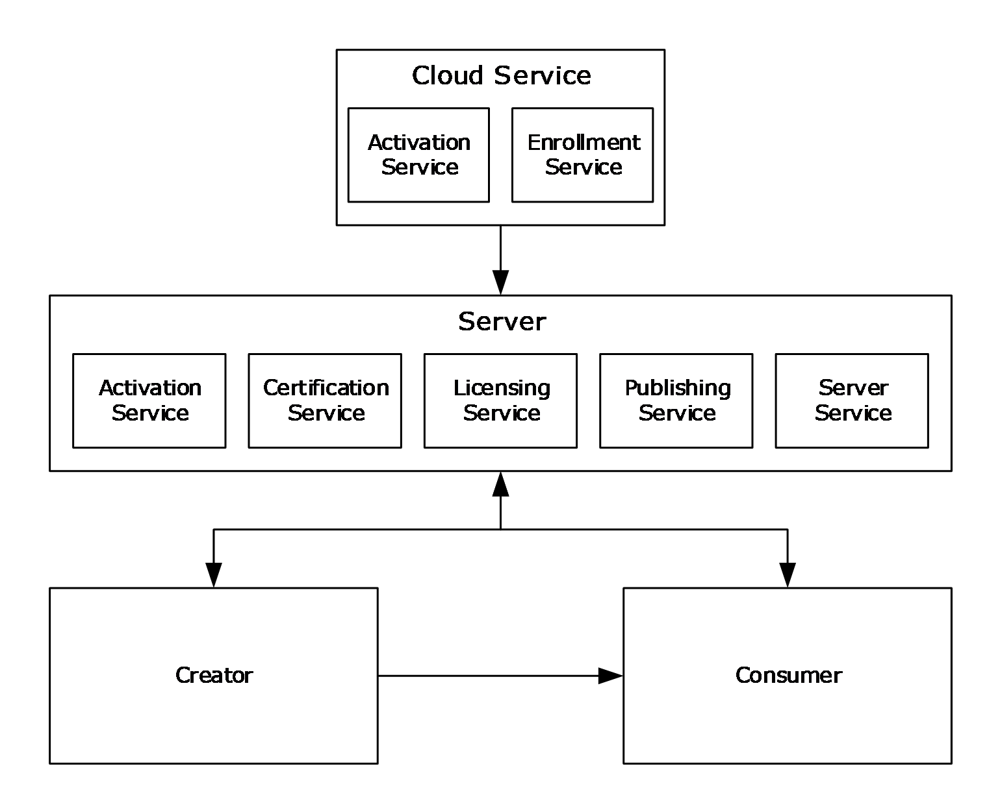

Figure 1: Rights management roles

The Rights Management Services (RMS) system involves four active entities: the [**creator**](#gt_creator), the [**consumer**](#gt_consumer), the server, and the [**cloud service**](#gt_cloud-service).

The server is required to undergo a bootstrapping process to begin functioning in the RMS system. This process results in a signed [**server licensor certificate (SLC)**](#gt_server-licensor-certificate-slc) for the server. In RMS 1.0, RMS 1.0 SP1, and RMS 1.0 SP2 servers, this operation involves contacting the cloud service. In RMS 2.0, this operation is done entirely offline. The creator and consumer contact the server for a bootstrapping process to acquire the [**RMS account certificate (RAC)**](#gt_rms-account-certificate-rac) and [**client licensor certificate (CLC)**](#gt_f5d0f10f-abb4-4219-9006-27c19ea7bb8f) that are necessary to participate in the RMS system.

The creator builds a document and chooses an access policy for that document, either by creating it directly or by using a [**rights policy template**](#gt_rights-policy-template) to apply a predefined access policy. The creator then encrypts the document using a randomly generated [**content key**](#gt_content-key) and binds both this key and the access policy to that document in the form of a [**Publishing License (PL)**](#gt_publishing-license-pl).

The consumer, upon receiving the document from the creator and opening it, supplies the server with the PL and the RMS account certificate (RAC) that was acquired during bootstrapping. If the consumer is allowed access according to the access policy in the PL, the server issues the consumer a [**use license (UL)**](#gt_use-license-ul) that specifies the access policy for the consumer and binds the content decryption key to the consumer's RAC. The RAC key is encrypted by the key of a trusted software module called the [**security processor**](#gt_security-processor). When the consumer attempts to access the document, the security processor decides whether the requesting application on the consumer machine is capable of enforcing the access policy. If so, it supplies plain text of the document to the application along with the policy that the application is to enforce. If not, access to the content is denied.

A client can play the role of a creator, a consumer, or both, depending on implementation. The client is responsible for requesting [**certificates**](#gt_certificate), [**licenses**](#gt_license), and policies from the server. It is further responsible for enforcing authorization policies as they apply to protected information and encrypting or decrypting content as appropriate. The RMS 2.0 client also acquires rights policy templates from an RMS 2.0 server.

The cloud service role in the RMS: Client-to-Server Protocol is responsible for providing enrollment services to RMS 1.0, RMS 1.0 SP1, and RMS 1.0 SP2 servers. Enrollment is a one-time bootstrapping process to begin functioning in the RMS system; the result of which is receiving a signed SLC for the server. RMS 2.0 servers perform self-enrollment and do not contact the cloud service. The cloud service also provides activation services to RMS 1.0 clients. This is accomplished by binding an encryption key pair to the machine by way of the security processor and its [**SPC**](#gt_security-processor-certificate-spc). Activation in RMS 1.0 SP1, RMS 1.0 SP2, and RMS 2.0 is performed by the client without contacting the cloud service. The cloud service role is not used in RMS 2.0.

The server role in the RMS: Client-to-Server Protocol is responsible for issuing certifications, keys, and authorization policies, and for signing these issued certificates and policies with keys it holds in escrow. It is further responsible for evaluating and issuing authorization policies based upon identity credentials the client provides in protocol requests.

The RMS: Client-to-Server Protocol consists of a number of service [**endpoints**](#gt_endpoint), and each endpoint provides one or more remote procedures that are related in function to each other. The web server implementation identifies and services the endpoints, and the web server describes the endpoint's interface using the Web Services Description Language ([[WSDL]](https://go.microsoft.com/fwlink/?LinkId=90577)), which is analogous to a COM IDL.

The remote procedures are called to:

- Acquire or exchange certificates.
- Request an authorization policy for protected information.
- Author an authorization policy for protected information.
- Discover information about the server or a user that is necessary for client operation.
- Manage the server remotely.
The RMS: Client-to-Server Protocol is stateless, and the methods on the protocol can be called in any order.

### 1.3.1 Server Enrollment

Server enrollment is an initialization step that the server completes before it services any client requests.

RMS 1.0, RMS 1.0 SP1, and RMS 1.0 SP2 servers make an enrollment request to the [**cloud service**](#gt_cloud-service). During enrollment, the server generates its key pair and builds an enrollment request that includes the public key. The server makes the enrollment request to the RMS enrollment cloud service and receives a signed [**SLC**](#gt_server-licensor-certificate-slc) in return.

On RMS 2.0 servers, the server enrollment operation occurs entirely offline.

### 1.3.2 Client Bootstrapping

Client bootstrapping is a set of initialization steps that clients complete before moving on to either [**offline publishing**](#gt_offline-publishing) or licensing. Client bootstrapping is not a prerequisite for [**online publishing**](#gt_online-publishing). During client boostrapping, the machine is activated and the user is certified for use in the RMS system. This involves various key/[**certificate**](#gt_certificate) generations and exchanges as explained in section [3.8.4.1](#Section_3.8.4.1).

Client bootstrapping involves the following request and response methods: Activate, Certify, FindServiceLocationsForUser, and GetClientLicensorCert.

### 1.3.3 Template Acquisition

The RMS 2.0 client acquires [**rights policy templates**](#gt_rights-policy-template) from an RMS 2.0 server (see section [3.8.4.2](#Section_3.8.4.2)). The client makes an AcquireTemplateInformation request to the server. The server returns information about the available templates. The client makes a subsequent AcquireTemplates request to the server for outdated and missing templates, deleting templates that are no longer present on the server from its local [**license**](#gt_license) store. The client then places the newly obtained templates from the server in its local license store.

The following request and response methods are used for template acquisition: AcquireTemplateInformation and AcquireTemplates.

### 1.3.4 Online Publishing

When publishing, templates can be used to control the rights that a user or group has on a particular piece of content. [**Online publishing**](#gt_online-publishing) does not require completion of the client bootstrapping steps. When the client is used to protect content, it generates a [**PL**](#gt_publishing-license-pl) that contains the usage [**policy**](#gt_policy) and the [**content key**](#gt_content-key), both of which are encrypted using the server's public key. The PL also contains a reference to a server that can be used to issue [**ULs**](#gt_use-license-ul) from the PL. During online publishing, the client acquires the [**SLC**](#gt_server-licensor-certificate-slc) of the server in order to encrypt the usage policy and content key to the server and build the PL chain.

The following request and response methods are used for online publishing: GetLicensorCertificate and AcquireIssuanceLicense.

### 1.3.5 Offline Publishing

[**Offline publishing**](#gt_offline-publishing) does not make a call to the server. The client is required to have a valid [**CLC chain**](#gt_f5d0f10f-abb4-4219-9006-27c19ea7bb8f), [**RAC**](#gt_rms-account-certificate-rac), and [**security processor certificate (SPC)**](#gt_security-processor-certificate-spc) to publish offline. For an overview of the bootstrapping process, see sections [1.3.1](#Section_1.3.1) and [1.3.2](#Section_1.3.2).

When the client is used to protect content, it generates a [**PL**](#gt_publishing-license-pl) that contains the usage [**policy**](#gt_policy) and the [**content key**](#gt_content-key), both of which are encrypted using the server's public key. The PL also contains a reference to a server that can be used to issue [**ULs**](#gt_use-license-ul) from the PL.

During offline publishing, the usage policy and content key are encrypted using the server's public key from the issuer of the CLC. The PL is signed using the CLC private key, and the resultant signed PL chain includes the PL, CLC, and [**SLC**](#gt_server-licensor-certificate-slc) from the CLC chain.

There are no request and response methods used for offline publishing.

### 1.3.6 Licensing

A [**UL**](#gt_use-license-ul) is required for a user to access [**protected content**](#gt_protected-content). The UL describes the usage policies that apply to the user while accessing a particular protected content file. It also contains the [**content key**](#gt_content-key) encrypted with the user's [**RAC**](#gt_rms-account-certificate-rac) public key.

The client is required to possess a valid RAC and [**SPC**](#gt_security-processor-certificate-spc) to access protected content. For an overview of the bootstrapping process, see section [1.3.1](#Section_1.3.1). The client needs a valid [**PL**](#gt_publishing-license-pl) to acquire a UL for protected content. For more information about publishing and PLs, see sections [1.3.4](#Section_1.3.4) and [1.3.5](#Section_1.3.5).

The following request and response method is used for [**licensing**](#gt_license): AcquireLicense.

## 1.4 Relationship to Other Protocols

The RMS: Client-to-Server Protocol uses the SOAP messaging protocol, as specified in [[SOAP1.1]](https://go.microsoft.com/fwlink/?LinkId=90520), for formatting requests and responses. It transmits these messages using the HTTP and/or HTTPS protocols. SOAP is considered the wire format used for messaging, and HTTP and HTTPS are the underlying transport protocols. The content files are downloaded using HTTP 1.1, as specified in [[RFC2616]](https://go.microsoft.com/fwlink/?LinkId=90372).

The RMS: Client-to-Server Protocol user certification [**endpoint**](#gt_endpoint) uses authentication to determine the requesting user's identity.

The RMS: Client-to-Server Protocol can use the Microsoft Web Browser Federated Sign-On Protocol, as specified in [MS-MWBF](../MS-MWBF/MS-MWBF.md), on requests to the licensing or user certification endpoints for providing user authentication. Its extensions are defined in the Microsoft Web Browser Federated Sign-on Protocol Extensions, as specified in [MS-MWBE](../MS-MWBE/MS-MWBE.md).

The RMS: Client-to-Server Protocol is composed of Web services using SOAP [SOAP1.1] over HTTP or HTTPS [RFC2616], for communication.

The following diagram shows the transport stack that the RMS: Client-to-Server Protocol uses.

Figure 2: RMS: Client-to-Server Protocol transport stack

Content download is accomplished using HTTP 1.1 GET Byte Range requests, as specified in [RFC2616] section 14.35.

## 1.5 Prerequisites/Preconditions

The RMS: Client-to-Server Protocol assumes that the client is able to discover the server, either by being able to access the appropriate [**Active Directory**](#gt_active-directory) object or by some other means.

It is assumed that the protected information itself can be distributed in some way, because the RMS: Client-to-Server Protocol is not involved in content distribution.

## 1.6 Applicability Statement

The RMS: Client-to-Server Protocol is information-protection technology that uses content encryption and use restrictions to safeguard digital information from unauthorized use. RMS is designed for organizations that need to protect sensitive and proprietary information such as financial reports, product specifications, customer data, and confidential email messages. The RMS: Client-to-Server Protocol can be used to help prevent sensitive information from intentionally or accidentally getting into the wrong hands.

## 1.7 Versioning and Capability Negotiation

This specification covers versioning issues in the following areas:

- Supported Transports: This protocol is implemented on top of HTTP and SOAP, as specified in section [2.1](#Section_2.1).
- Protocol Versions: The RMS: Client-to-Server Protocol client and server have versions 1.0, 1.0 SP1, 1.0 SP2, and 2.0. Version 2.0 introduced the Template Distribution service and WSDL port type.
- Security and Authentication Methods: The SOAP protocol passively supports [**NT LAN Manager (NTLM)**](#gt_nt-lan-manager-ntlm) authentication over HTTP or HTTPS, as specified in [[NTLM]](https://go.microsoft.com/fwlink/?LinkId=90235).
- Localization: The RMS: Client-to-Server Protocol has no localization-dependent behaviors.
- Capability Negotiation: The RMS: Client-to-Server Protocol supports limited capability negotiation via the VersionData type that is present on all protocol requests. On a request, the VersionData structure contains a MinimumVersion and MaximumVersion value indicating the range of versions the client is capable of understanding. On a response, the VersionData structure contains a MinimumVersion and MaximumVersion that the server is capable of understanding.<1>
This protocol can be spread across multiple servers. To determine which servers are capable of specific methods, the client calls the [FindServiceLocationsForUser (section 3.7.4.2)](#Section_3.7.4.2) method in the [Server Service (section 3.7)](#Section_3.7).

## 1.8 Vendor-Extensible Fields

This protocol does not contain any vendor-extensible fields. All XML schema are considered nonextensible in the RMS: Client-to-Server Protocol.

## 1.9 Standards Assignments

The RMS: Client-to-Server Protocol has not been ratified by any standards body or organization.

# 2 Messages

## 2.1 Transport

An RMS: Client-to-Server Protocol message MUST be formatted as specified in either [[SOAP1.1]](https://go.microsoft.com/fwlink/?LinkId=90520) or [[SOAP1.2/1]](https://go.microsoft.com/fwlink/?LinkId=90521).

Each RMS Web service MUST support SOAP [SOAP1.1] over HTTP [[RFC2616]](https://go.microsoft.com/fwlink/?LinkId=90372) over TCP/IP. Each RMS Web service SHOULD<2> support HTTPS for securing its communication with clients. Each RMS Web service MUST require HTTPS for communication with clients when making a request enabled by the Microsoft Web Browser Federated Sign-on Protocol [MS-MWBF](../MS-MWBF/MS-MWBF.md) to the Licensing or Certification Web services.

The [**Uniform Resource Locators (URLs)**](#gt_uniform-resource-locator-url) specified in section [3.1.4.2](#Section_3.1.4.2) MUST be exposed by the server as [**endpoints**](#gt_endpoint) for the HTTP and SOAP over HTTP transports.

To optimize network bandwidth, the client implementation can request that the reply be compressed by specifying the encoding format in the HTTP Accept-Encoding request-header field as specified in [RFC2616] section 14.3. The update server encodes the reply using the requested format.

## 2.2 Common Message Syntax

This section contains common definitions used by this protocol. The syntax of the definitions uses XML Schema as defined in [[XMLSCHEMA1]](https://go.microsoft.com/fwlink/?LinkId=90608) and [[XMLSCHEMA2]](https://go.microsoft.com/fwlink/?LinkId=90610), and Web Services Description Language as defined in [[WSDL]](https://go.microsoft.com/fwlink/?LinkId=90577).

This protocol uses curly-braced [**GUID**](#gt_globally-unique-identifier-guid) strings, as specified in [MS-DTYP](../MS-DTYP/MS-DTYP.md) section 2.3.4.3.

This protocol uses [**security identifier (SID)**](#gt_security-identifier-sid) string format syntax as specified in [MS-DTYP] section 2.4.2.1.

### 2.2.1 Namespaces

This specification defines and references various XML namespaces using the mechanisms specified in [[XMLNS]](https://go.microsoft.com/fwlink/?LinkId=191840). Although this specification associates a specific XML namespace prefix for each XML namespace that is used, the choice of any particular XML namespace prefix is implementation-specific and not significant for interoperability.

| Prefix | Namespace URI | Reference |
| --- | --- | --- |
| s | http://microsoft.com/DRM/AdminService | - |
| s | http://microsoft.com/DRM/CertificationService | - |
| s | http://microsoft.com/DRM/EditIssuanceLicenseService | - |
| s | http://microsoft.com/DRM/LicensingService | - |
| s | http://microsoft.com/DRM/PublishingService | - |
| s | http://schemas.xmlsoap.org/wsdl/http/ | [[WSDL]](https://go.microsoft.com/fwlink/?LinkId=90577) |
| s | http://www.w3.org/2001/XMLSchema | [[XMLSCHEMA1]](https://go.microsoft.com/fwlink/?LinkId=90608), [[XMLSCHEMA2]](https://go.microsoft.com/fwlink/?LinkId=90610) |
| s | http://schemas.xmlsoap.org/wsdl/soap/ | [[SOAP1.1]](https://go.microsoft.com/fwlink/?LinkId=90520) |
| s | http://schemas.xmlsoap.org/wsdl/soap12/ | [[SOAP1.2/1]](https://go.microsoft.com/fwlink/?LinkId=90521), [[SOAP1.2/2]](https://go.microsoft.com/fwlink/?LinkId=90522) |
| s | http://schemas.xmlsoap.org/soap/encoding/ | [SOAP1.1] |
| s | http://schemas.xmlsoap.org/wsdl/ | [WSDL] |

### 2.2.2 Messages

None.

### 2.2.3 Elements

The following table summarizes the set of common XML Schema element definitions defined by this specification. XML Schema element definitions that are specific to a particular operation are described with the operation.

| Element | Description |
| --- | --- |
| [Certificate](#Section_4.5) | Encloses any [**XrML**](#gt_xrml) [**certificate**](#gt_certificate) parameter that can be represented as a literal. |
| [CertificateChain](#Section_2.2.3.2) | Contains an array of XML elements used to represent a [**certificate chain**](#gt_certificate-chain). |
| [VersionData](#Section_2.2.3.3) | Contains versioning information that serves as a declaration of the capability support necessary to understand and process the entire request or response. |
| [string](#Section_3.6.4.1.4.8) | An extra XML wrapper for the string data type. |
| [MaximumVersion](#Section_2.2.3.5) | Used to specify the maximum capability version requirement between client and server. |
| [MinimumVersion](#Section_2.2.3.6) | Used to specify the minimum capability version requirement between client and server. |
| [URL](#Section_2.2.3.7) | Defines the use of the string data type to represent a [**URL**](#gt_uniform-resource-locator-url). |

#### 2.2.3.1 Certificate Element

The Certificate (ArrayOfXmlNode) element encloses any eXtensible Rights Markup Language (as specified in [[XRML]](https://go.microsoft.com/fwlink/?LinkId=324306)) [**certificate**](#gt_certificate) parameter that can be represented as a literal within an XML element on the protocol.

<xs:element name="Certificate">

<xs:complexType

mixed="true"

>

<xs:sequence>

<xs:any

namespace=""

/>

</xs:sequence>

</xs:complexType>

</xs:element>

#### 2.2.3.2 CertificateChain Element

The CertificateChain (LicensorCertChain) element uses an array of XML elements to represent a [**certificate chain**](#gt_certificate-chain). This element MUST contain a valid certificate chain, as specified in [2.2.9](#Section_2.2.9).

<xs:element name="CertificateChain"

type="ArrayOfXmlNode"

/>

#### 2.2.3.3 VersionData Element

The VersionData element contains versioning information that serves as a declaration of the capability support necessary to understand and process the entire request or response.

<xs:element name="VersionData"

type="VersionData"

/>

#### 2.2.3.4 string Element

The ArrayOfString element is an extra XML wrapper for the string data type. This element helps define the ArrayOfString element as an array of ordinary XML strings. This element MUST contain only one literal string.

<xs:element name="string"

type="string"

/>

#### 2.2.3.5 MaximumVersion Element

The MaximumVersion (VersionData) element is used to specify the maximum capability version requirement of the RMS: Client-to-Server Protocol between client and server.

<xs:element name="MaximumVersion"

type="string"

/>

#### 2.2.3.6 MinimumVersion Element

The MinimumVersion (VersionData) element is used to specify the minimum capability version requirement of the RMS: Client-to-Server Protocol between client and server.

<xs:element name="MinimumVersion"

type="string"

/>

#### 2.2.3.7 URL Element

The URL (ServiceLocationResponse) element defines the use of the string data type to represent a [**URL**](#gt_uniform-resource-locator-url) in the RMS: Client-to-Server Protocol. This element MUST contain a literal string.

<xs:element name="URL"

type="string"

/>

### 2.2.4 Complex Types

The following table summarizes the set of common XML Schema complex type definitions defined by this specification. XML Schema complex type definitions that are specific to a particular operation are described with the operation.

| Complex Type | Description |
| --- | --- |
| [ArrayOfXmlNode](#Section_2.2.4.1) | Contains an array of XML elements used exclusively for exchanging [**XrML**](#gt_xrml) [**certificates**](#gt_certificate). |
| [VersionData](#Section_2.2.3.3) | Represents the capability version of the client and server. |

#### 2.2.4.1 ArrayOfXmlNode Complex Type

The ArrayOfXmlNode complex type contains an array of XML elements. It is used exclusively for exchanging [**XrML**](#gt_xrml) [**certificates**](#gt_certificate), each of which MUST be represented as an XML fragment. Each XML fragment is enclosed in the [Certificate](#Section_4.5) element. For more information on XrML, see [[XRML]](https://go.microsoft.com/fwlink/?LinkId=324306).

<xs:complexType name="ArrayOfXmlNode">

<xs:sequence>

<xs:element name="Certificate"

minOccurs="0"

maxOccurs="unbounded"

>

<xs:complexType

mixed="true"

>

<xs:sequence>

<xs:any

namespace=""

/>

</xs:sequence>

</xs:complexType>

</xs:element>

</xs:sequence>

</xs:complexType>

#### 2.2.4.2 VersionData Complex Type

The VersionData complex type is used to represent the capability version of the client and server. The version data in this type MUST be represented by using a literal string and MUST conform to the format "a.b.c.d". Subversion value "a" MUST be the most major component of the version, value "b" MUST be the next most major, value "c" MUST be the next most major, and "d" MUST be the minor subversion value.

When a client makes a request, it SHOULD specify "1.0.0.0" as both the *MinimumVersion* parameter and as the *MaximumVersion* parameter, unless otherwise specified.

When the server receives a request, it SHOULD compare its capability version to the capability version range the client presents. The server SHOULD reject the request with a Microsoft.DigitalRightsManagement.Core.UnsupportedDataVersionException fault if the *MaximumVersion* value presented by the client is higher than the highest capability version of the server.

When the server responds to the client, including instances when the server responds with an error<3>, it SHOULD specify the lowest capability version it can support as the value for the *MinimumVersion* parameter. The server SHOULD specify the highest capability version it can support as the value for the *MaximumVersion* parameter.

<xs:complexType name="VersionData">

<xs:sequence>

<xs:element name="MinimumVersion"

type="string"

minOccurs="0"

maxOccurs="1"

/>

<xs:element name="MaximumVersion"

type="string"

minOccurs="0"

maxOccurs="1"

/>

</xs:sequence>

</xs:complexType>

### 2.2.5 Simple Types

None.

### 2.2.6 Attributes

None.

### 2.2.7 Groups

None.

### 2.2.8 Attribute Groups

None.

### 2.2.9 Common Data Structures

This section describes the way the RMS: Client-to-Server Protocol utilizes [[XRML]](https://go.microsoft.com/fwlink/?LinkId=324306) for [**certificates**](#gt_certificate) and [**licenses**](#gt_license).

#### 2.2.9.1 Common Certificate and License Structures

This section describes in detail common elements of RMS [**certificate**](#gt_certificate) formats. All elements MUST follow the [[XRML]](https://go.microsoft.com/fwlink/?LinkId=324306) schema.

##### 2.2.9.1.1 ISSUEDTIME

The ISSUEDTIME element specifies the time that a [**certificate**](#gt_certificate) or [**license**](#gt_license) was generated, expressed in [**Coordinated Universal Time (UTC)**](#gt_coordinated-universal-time-utc). ISSUEDTIME is specified in the [**XrML**](#gt_xrml) Document Type Definition (DTD). All certificates and licenses MUST contain an ISSUEDTIME element.

An ISSUEDTIME element MUST follow this template.

<ISSUEDTIME>

[[- issuedtime -]]

</ISSUEDTIME>

*[[- issuedtime -]]*: The time at which the certificate or license was generated, expressed in UTC.

##### 2.2.9.1.2 VALIDITYTIME

VALIDITYTIME is an optional element that specifies the time period in which a [**certificate**](#gt_certificate) or [**license**](#gt_license) can be used. The certificate or license MUST be considered invalid outside this time period. The time period is a half-closed interval in which the start time is included in the set but the end time is not. A certificate or license SHOULD contain a VALIDITYTIME element.

A VALIDITYTIME element MUST use the following template.

<VALIDITYTIME>

<FROM>[[- starttime -]]</FROM>

<UNTIL>[[- endtime -]]</UNTIL>

</VALIDITYTIME>

*[[- starttime -]]*: The beginning of the time interval in which the certificate is allowed to be considered valid, expressed in [**UTC**](#gt_coordinated-universal-time-utc).

*[[- endtime -]]*: The end of the time interval in which the certificate is allowed to be considered valid, expressed in UTC.

##### 2.2.9.1.3 RANGETIME

RANGETIME specifies a time condition on the ability to exercise a right that is granted in a [**certificate**](#gt_certificate) or [**license**](#gt_license). The time period is a half-closed interval in which the start time is included in the set but the end time is not.

The RANGETIME element MUST use the following template.

<RANGETIME>

<FROM>[[- starttime -]]</FROM>

<UNTIL>[[- endtime -]]</UNTIL>

</RANGETIME>

*[[- starttime -]]*: The beginning of the time period in which a right is allowed to be exercised, expressed in [**UTC**](#gt_coordinated-universal-time-utc).

*[[- endtime -]]*: The end of the time period in which a right is allowed to be exercised, expressed in UTC.

##### 2.2.9.1.4 DESCRIPTOR

The DESCRIPTOR element identifies the [**certificate**](#gt_certificate) or [**license**](#gt_license) and describes its type. All certificates and licenses MUST contain a DESCRIPTOR element.

The DESCRIPTOR element MUST use the following template.

<DESCRIPTOR>

[[- object -]]

</DESCRIPTOR>

*[[- object -]]*: An object that identifies the certificate or license. An object is specified in the [**XrML**](#gt_xrml) DTD. Specific content is defined for each certificate and license.

##### 2.2.9.1.5 ISSUER

The ISSUER element describes the entity that issued or signed the [**certificate**](#gt_certificate) or [**license**](#gt_license). All certificates and licenses MUST contain an ISSUER element. The ISSUER element MUST contain an object element that identifies the issuer along with a [PUBLICKEY (section 2.2.9.1.6)](#Section_2.2.9.1.6) element that contains the issuer's public key.

An ISSUER element MUST use the following template.

<ISSUER>

[[- object -]]

[[- publickey -]]

[[- optionalinfo -]]

</ISSUER>

*[[- object -]]*: An object that identifies the issuer. An object is specified in the [**XrML**](#gt_xrml) DTD. Specific content of the object depends on the certificate or license.

*[[- publickey -]]*: The issuer's public key contained in a PUBLICKEY element.

*[[- optionalinfo -]]*: Optional information about the issuer. Specific content is defined for each certificate and license.

##### 2.2.9.1.6 PUBLICKEY

A PUBLICKEY element contains an RSA public key. A PUBLICKEY element MUST use the following template.

<PUBLICKEY>

<ALGORITHM>RSA</ALGORITHM>

<PARAMETER name="public-exponent">

<VALUE encoding="integer32">

[[- exponent -]]

</VALUE>

</PARAMETER>

<PARAMETER name="modulus">

<VALUE encoding="base64" size="[[- key length -]]">

[[- modulus -]]

</VALUE>

</PARAMETER>

</PUBLICKEY>

*[[- exponent -]]*: The exponent portion of the public key. This MUST be set to 65537.

*[[- key length -]]*: The length of the public key in bits, represented as a string. This MUST be a valid key length for the RSA algorithm.

*[[- modulus -]]*: The modulus portion of the public key. This MUST be a valid modulus for the RSA algorithm.

##### 2.2.9.1.7 DISTRIBUTIONPOINT

A DISTRIBUTIONPOINT element is optional and describes an address or location for a particular service. A [**certificate**](#gt_certificate) or [**license**](#gt_license) can contain multiple DISTRIBUTIONPOINT elements.

A DISTRIBUTIONPOINT element MUST use the following template.

<DISTRIBUTIONPOINT>

[[- object -]]

[[- publickey -]]

</DISTRIBUTIONPOINT>

*[[- object -]]*: An object that identifies the DISTRIBUTIONPOINT. An object is specified in the [**XrML**](#gt_xrml) DTD. Specific content is defined for each certificate and license.

*[[- publickey -]]*: This is present if the object element of the DISTRIBUTIONPOINT element is of type "Revocation". MUST NOT be present otherwise. If present, this MUST contain one [PUBLICKEY (section 2.2.9.1.6)](#Section_2.2.9.1.6) element.

##### 2.2.9.1.8 NAME

A NAME element contains a friendly name.

A NAME element MUST use the following template.

<NAME>

[[- name -]]

</NAME>

*[[- name -]]*: A string. The value of this placeholder depends on the specific application in a [**certificate**](#gt_certificate) or [**license**](#gt_license) and is defined explicitly for each certificate and license format.

##### 2.2.9.1.9 ADDRESS

An ADDRESS element contains a [**URL**](#gt_uniform-resource-locator-url) address.

An ADDRESS element MUST use the following template.

<ADDRESS type="[[- type -]]">

[[- address -]]

</ADDRESS>

*[[- type -]]*: A string containing a type of address that can take the value of "URL" or "email_alias". The value of this placeholder depends on the specific application in a [**certificate**](#gt_certificate) or [**license**](#gt_license) and is defined explicitly for each certificate and license format.

*[[- address -]]*: A string containing the address. The value of this placeholder depends on the specific application in a certificate or license and is defined explicitly for each certificate and license format.

##### 2.2.9.1.10 SECURITYLEVEL

A SECURITYLEVEL element contains additional information in a name/value pair. A SECURITYLEVEL element MUST follow the [**XrML**](#gt_xrml) DTD.

A SECURITYLEVEL element MUST use the following template.

<SECURITYLEVEL name="[[- name -]]" value="[[- value -]]"/>

*[[- name -]]*: An arbitrary string containing the name of the name/value pair. The value of this placeholder depends on the specific application in a [**certificate**](#gt_certificate) or [**license**](#gt_license) and is defined explicitly for each certificate and license format.

*[[- value -]]*: An arbitrary string containing the value of the name/value pair. The value of this placeholder depends on the specific application in a certificate or license and is defined explicitly for each certificate and license format.

##### 2.2.9.1.11 ISSUEDPRINCIPALS

For a [**certificate**](#gt_certificate), the ISSUEDPRINCIPALS element describes the role, identity, and key being issued by the certificate. For a [**license**](#gt_license), the ISSUEDPRINCIPALS element describes the principal to which rights are being granted. All certificates and licenses MUST contain an ISSUEDPRINCIPALS element. An ISSUEDPRINCIPALS element MUST contain exactly one principal.

An ISSUEDPRINCIPALS element MUST use the following template.

<ISSUEDPRINCIPALS>

<PRINCIPAL internal-id="1">

[[- object -]]

[[- publickey -]]

[[- digest -]]

[[- optionalinfo -]]

[[- enablingbits -]]

</PRINCIPAL>

</ISSUEDPRINCIPALS>

*[[- object -]]*: An object that identifies the principal. An object is specified in the [**XrML**](#gt_xrml) DTD. The value of this placeholder depends on the specific application in a certificate or license and is defined explicitly for each certificate and license format.

*[[- publickey -]]*: The public key of a principal contained in a [PUBLICKEY](#Section_2.2.9.1.6) element. For certificates, this is the public key being issued to the principal. For licenses, this is an existing public key that has already been issued to the principal.

*[[- digest -]]*: An [**SPC**](#gt_security-processor-certificate-spc) MUST include a digest element containing a [**hardware ID (HID)**](#gt_hardware-id-hid) hash. All other certificates and licenses MUST NOT include a digest element here.

*[[- optionalinfo -]]*: Other information SHOULD be included in the form of [SECURITYLEVEL](#Section_2.2.9.1.10) elements.

*[[- enablingbits -]]*: A [**publishing license**](#gt_publishing-license) MUST include an [ENABLINGBITS](#Section_2.2.9.1.13) element that contains the encrypted rights data. All other certificates and licenses MUST NOT include an ENABLINGBITS element here.

##### 2.2.9.1.12 SIGNATURE

The SIGNATURE element contains the cryptographic signature of a [**license**](#gt_license) or [**certificate**](#gt_certificate) and is appended to the end of each license or certificate. It is computed from the body element of the license or certificate that it is contained in, including the body tags, and follows the format specified by [**XrML**](#gt_xrml).

The hash SHOULD<4> be a [**SHA-256**](#gt_sha-256) hash of the body. The signature MUST be the hash encrypted with the issuer's private key. The key length MUST be the bit length of the issuer's private key, which MUST match the length of the issuer's public key.

A SIGNATURE element MUST use the following template.

<SIGNATURE>

<ALGORITHM>RSA PKCS#1-V1.5</ALGORITHM>

<DIGEST>

<ALGORITHM>[[- hashalgorithm -]]</ALGORITHM>

<PARAMETER name="codingtype">

<VALUE encoding="string">

surface-coding

</VALUE>

</PARAMETER>

<VALUE encoding="base64" size="[[- hashsize -]]">

[[- hash -]]

</VALUE>

</DIGEST>

<VALUE encoding="base64" size="[[- size -]]">

[[- signature -]]

</VALUE>

</SIGNATURE>

*[[- hashalgorithm -]]*: The name of the hash algorithm: SHA-1 or SHA-256.

*[[- hashsize -]]*: The size of the hash, in bits.

*[[- hash -]]*: The hash of the body element, base64-encoded.

*[[- size -]]*: The size, in bits, of the issuer's private key that was used to compute the signature, represented as a string.

*[[- signature -]]*: The hash of the body element, encrypted with the issuer's private key, base64-encoded.

##### 2.2.9.1.13 ENABLINGBITS

An ENABLINGBITS element includes a key and a hash encrypted together in a [**license**](#gt_license) or [**certificate**](#gt_certificate). The format for ENABLINGBITS is as follows:

- Enabling bits in [**XrML**](#gt_xrml) license = Base64Encoded(RawEnablingBits)
- RawEnablingBits = KPublic(KeyHeader & KSession) + KSession(EnablingBitsHeader + (KeyHeader & K) + Hash)
**Note** Notation: 'K(A)' means data 'A' encrypted with key 'K'.

| License | KPublic | K | Hashed data |
| --- | --- | --- | --- |
| [**PL**](#gt_publishing-license-pl) | Licensor (RMS Server) public key | Symmetric [**content key**](#gt_content-key) | [ISSUEDPRINCIPALS](#Section_2.2.9.3.3) element of PL |
| [**UL**](#gt_use-license-ul) | [**RAC**](#gt_rms-account-certificate-rac) public key | Symmetric content key | [ISSUER](#Section_2.2.9.1.5) element of UL |
| [**CLC Chain**](#gt_f5d0f10f-abb4-4219-9006-27c19ea7bb8f) | RAC public key | CLC private key | ISSUER element of CLC |
| RAC | [**Security processor**](#gt_security-processor) public key | RAC private key | ISSUER element of RAC |

K varies depending upon the type of license. The preceding table describes what K and A are for each of the license types that contain enabling bits.

The session key MUST be either a 56-bit [**Data Encryption Standard (DES)**](#gt_data-encryption-standard-des) key or a 128-bit, 192-bit, or 256-bit [**Advanced Encryption Standard (AES)**](#gt_advanced-encryption-standard-aes) key. The [KeyHeader](#Section_2.2.9.1.13.1) for the session key describes the key type, size, and block size. For more information about the KeyHeader, see section 2.2.9.1.13.1.

A new session key is randomly generated each time the client or server has to create enabling bits. The session key is encrypted with the public key (licensor public key, group identity certificate (GIC) public key, or machine public key, depending upon the license type) and this forms the first 1,024 bits of the ENABLINGBITS, assuming a 1,024-bit RSA key was used for the encryption. The size of this equals the size of the RSA key pair encrypting the symmetric key, and since during decryption the size of the private key is already known (from the prologue of the key bits), the size of the encrypted symmetric key is also known.

The session key is used to encrypt the rest of the data in the ENABLINGBITS. The rest of the data includes an enabling bits header, the key header and key, and the hash.

The ENABLINGBITS header is defined as follows.

typedef struct _UDEBHeader

{

DWORD dwVersion;

DWORD dwcbSize;

DWORD dwReserved1;

DWORD dwReserved2;

} UDEBHeader;

The value of dwVersion is 0x00000001 for enabling bits of type "sealed-key" and 0x00000002 for enabling bits of type "sealed-key-v2". In either case, the value is a 32-bit unsigned LE integer.

The size of the header is 128 bits. The value of **dwReserved1** and **dwReserved2** MUST be 0. The dwcbSize indicates the combined size of the payload and hash. The format of the field is a 32-bit unsigned LE integer.

The key itself is either an RSA private key or a 56-bit DES or AES (128-bit, 192-bit, or 256-bit) symmetric content key. The KeyHeader in front of the key specifies the key type, size, and algorithm block size.

The hash is a hash of XrML data. The XrML data that is hashed depends on the type of XrML document, as described in the preceding table. The hash is a 160-bit [**SHA-1**](#gt_sha-1) hash for enabling bits of type "sealed-key" and a 256-bit [**SHA-256**](#gt_sha-256) hash for enabling bits of type "sealed-key-v2".

The ENABLINGBITS header, the payload, and the hash are concatenated and then encrypted with the freshly generated symmetric key. The result of this encryption is then concatenated with the encrypted symmetric key, and the result of this is base64-encoded and can be inserted into the XrML document. The encryption uses PKCS #1 padding for enabling bits of type "sealed-key" and OAEP padding for enabling bits of type "sealed-key-v2".

The ENABLINGBITS element contains the enabling bits in XrML. It MUST follow the XrML DTD and the following template.

<ENABLINGBITS type="[[- type -]]">

<VALUE encoding="base64" size="[[- size -]]">

[[- sealedkey -]]

</VALUE>

</ENABLINGBITS>

*[[- type -]]*: The type of the enabling bits: "sealed-key" or "sealed-key-v2".

*[[- size -]]*: The length, in bits, of the enabling bits.

*[[- sealedkey -]]*: The enabling bits, base64-encoded.

###### 2.2.9.1.13.1 KeyHeader

The KeyHeader for the session key describes the key type, size, and block size for the algorithm as detailed in the following table.

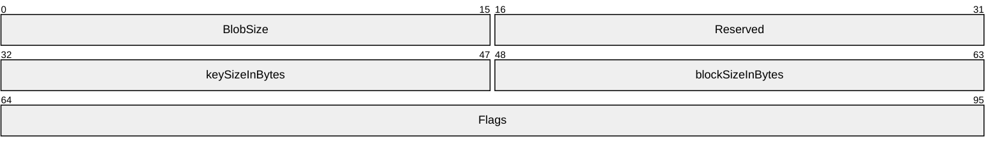

**BlobSize (2 bytes):** A 16-bit unsigned, [**little-endian**](#gt_little-endian) short integer value. The BlobSize field MUST be the size, in bytes, of the complete KeyHeader plus Key structure.

**Reserved (2 bytes):** The reserved bytes SHOULD be set to one of the following values based on the cipher mode<5>.

| Cipher Mode | Value |
| --- | --- |
| ECB | 0xFFFF |
| CBC4K No Padding | 0xFFFE |
| CBC4K With Padding | 0xFFFD |
| CBC512 No Padding | 0xFFFC |

**keySizeInBytes (2 bytes):** A 16-bit unsigned, little-endian short integer value. The keySizeInBytes field MUST be the symmetric key size in bits. For [**DES**](#gt_data-encryption-standard-des), this MUST be 56. For [**AES**](#gt_advanced-encryption-standard-aes) (Rijndael) size MUST be either 128 (the default), 192, or 256 bits.

**blockSizeInBytes (2 bytes):** A 16-bit unsigned, little-endian short integer value. The blockSizeInBytes field is the key block size, which varies depending on the cryptographic provider.

**Flags (4 bytes):** The Flags field is a bit field with the following structure.

Where the bits are defined as:

| Value | Description |
| --- | --- |
| E Electronic Code Book | This bit MUST be set to 1 to indicate the Electronic Codebook (ECB) cipher mode. This bit MUST be set to 0 if Cipher Block Chaining (CBC) cipher mode is used. |
| C Cipher Block Chaining | When set to 1, this bit indicates the Cipher Block Chaining (CBC) cipher mode. This bit MUST be set to 0 when the **KeyHeader** describes a session key. |
| A Algorithm | The Algorithm bit MUST be set to 0 if the key is a DES key. The Algorithm bit MUST be set to 1 if the key is an AES key. |

#### 2.2.9.2 Certificate and License Chains

A [**certificate**](#gt_certificate) or [**license chain**](#gt_license-chain) shows the issuing and trust hierarchy for a given certificate or [**license**](#gt_license). The following diagram shows the relationships between certificates.

Figure 3: Relationships between certificates

For version 1 clients, the [**SPC**](#gt_security-processor-certificate-spc) chain starts at the SPC leaf node certificate, followed by the version 1 [**security processor**](#gt_security-processor) [**Certification Authority (CA)**](#gt_certification-authority-ca) certificate, followed by the intermediate security processor CA certificate, and terminates at the CA certificate. For version 1 SP1 and newer clients, the SPC chain starts at the SPC leaf node certificate, followed by the SPC Issuer certificate, followed by the security processor CA certificate, followed by the intermediate security processor CA certificate, and terminates at the CA certificate. Certificates in the SPC chain are acquired during client machine activation and are never generated by the server. For more information on client machine activation, see [3.8.3.1](#Section_3.8.3.1).

The [**RAC**](#gt_rms-account-certificate-rac) chain starts at the RAC leaf node certificate, followed by the [**SLC**](#gt_server-licensor-certificate-slc), followed by the Enrollment Service certificate, followed by the Enrollment CA certificate, terminating at the CA certificate. The [**CLC chain**](#gt_f5d0f10f-abb4-4219-9006-27c19ea7bb8f) starts at the CLC leaf node certificate, followed by the SLC, followed by the Enrollment Service certificate, followed by the Enrollment CA certificate, and terminating at the CA certificate.

Certificates in dark boxes (RAC and CLC) are issued by the server. Certificates from the SLC and below are acquired during server enrollment. For more information on server enrollment, see [3.6.4.2.1.1](#Section_3.6.4.2.1.1).

Certificates in dashed boxes (SLC, version 1 security processor CA certificate, SPC Issuer certificate, security processor CA certificate, intermediate security processor CA certificate, CA certificate, Enrollment Service certificate, and Enrollment CA certificate) are issuing certificates and follow a similar format.

The following diagram shows the relationships between licenses and the certificate in their chains.

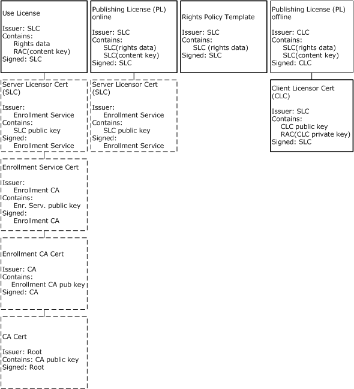

Figure 4: Relationships between licenses and certificates

The [**UL**](#gt_use-license-ul) chain starts at the UL leaf node certificate, followed by the SLC, followed by the Enrollment Service certificate, followed by the Enrollment CA certificate, terminating at the CA certificate.

For content [**published online**](#gt_online-publishing), the [**PL**](#gt_publishing-license-pl) chain starts at the PL leaf node certificate and terminates at the SLC. For content [**published offline**](#gt_offline-publishing), the PL chain starts at the PL leaf node certificate and terminates at the CLC.

The [**rights policy template**](#gt_rights-policy-template) is signed by the SLC, but exists as a single-node certificate.

Licenses in dark boxes (UL and online PL) are issued by the server. The offline PL is issued by the client.

Every license and certificate used in an RMS: Client-to-Server Protocol environment consists of a chain of certificates that leads back to a CA certificate. RMS servers provide two chains into which a license or certificate can be nested: a pre-production [**certificate chain**](#gt_certificate-chain) and a production certificate chain. During application development, the pre-production certificate is used to sign custom applications into the pre-production RMS certificate hierarchy. Once an application is ready for production, a production certificate is used to sign the application into the production certificate hierarchy.

RMS: Client-to-Server Protocol version 2.0 has a process called self-enrollment in which a self-enrollment certificate and private key are used to automatically create the SLC.<6>

#### 2.2.9.3 Issuing Certificates

This section defines the format of issuing [**certificates**](#gt_certificate). The [**SLC**](#gt_server-licensor-certificate-slc), version 1 [**security processor**](#gt_security-processor) [**CA**](#gt_certification-authority-ca) certificate, [**SPC**](#gt_security-processor-certificate-spc) issuer certificate, security processor CA certificate, intermediate security processor CA certificate, CA certificate, Enrollment Service certificate, and Enrollment CA certificate, are all Issuing certificates.

Issuing certificates MUST use the following template.

<XrML xmlns="" version="1.2">

<BODY type="LICENSE" version="3.0">

[[- issuedtime -]]

[[- validitytime -]]

[[- descriptor -]]

[[- issuer -]]

[[- issuedprincipals -]]

<WORK>

[[- workobject -]]

<RIGHTSGROUP name="Main-Rights">

<RIGHTSLIST>

<RIGHT name="ISSUE">

<CONDITIONLIST>

<TIME>

[[- rangetime -]]

</TIME>

<ACCESS>

<PRINCIPAL internal-id="1" />

</ACCESS>

</CONDITIONLIST>

</RIGHT>

</RIGHTSLIST>

</RIGHTSGROUP>

</WORK>

[[- conditionlist -]]

</BODY>

[[- signature -]]

</XrML>

*[[- issuedtime -]]*: MUST be an [ISSUEDTIME (section 2.2.9.1.1)](#Section_2.2.9.1.1) element containing the time the certificate was generated, in [**UTC**](#gt_coordinated-universal-time-utc). The time MUST fall within the [RANGETIME](#Section_2.2.9.1.3) of the issuer's certificate.

*[[- validitytime -]]*: SHOULD be a [VALIDITYTIME (section 2.2.9.1.2)](#Section_2.2.9.1.2) element describing the period of validity for the certificate, in UTC. This element SHOULD be present but is optional.

*[[- descriptor -]]*: MUST be a [DESCRIPTOR (section 2.2.9.3.1)](#Section_2.2.9.3.1) element describing the certificate.

*[[- issuer -]]*: MUST be an [ISSUER (section 2.2.9.3.2)](#Section_2.2.9.3.2) element describing the issuer of the certificate.

*[[- issuedprincipals -]]*: MUST be an [ISSUEDPRINCIPALS (section 2.2.9.3.3)](#Section_2.2.9.3.3) element describing the principal and its public key.

*[[- workobject -]]*: MUST be an OBJECT element that identifies the certificate. Copied verbatim from the OBJECT in the DESCRIPTOR (section 2.2.9.3.1) including the same [**GUID**](#gt_globally-unique-identifier-guid). This OBJECT is described in the DESCRIPTOR (section 2.2.9.3.1) section.

*[[- rangetime -]]*: MUST be a RANGETIME (section 2.2.9.1.3) element describing the period during which the certificate can be used for issuance.

*[[- conditionlist -]]*: SHOULD be present in the SLC if alternate revocation information is included. MUST NOT be present in other issuing certificates. If present, this MUST be a [CONDITIONLIST (section 2.2.9.3.4)](#Section_2.2.9.3.4) element that specifies alternate revocation information.

*[[- signature -]]*: MUST be a [SIGNATURE (section 2.2.9.1.12)](#Section_2.2.9.1.12) element containing the cryptographic signature of the body of the certificate, generated by the issuer of the certificate. The hash MUST be the hash of the body. The signature MUST be the hash encrypted with the issuer's private key. The key length MUST be the length of the issuer's private key, which MUST match the length of the issuer's public key.

##### 2.2.9.3.1 DESCRIPTOR

The DESCRIPTOR element of Issuing [**certificates**](#gt_certificate) describes the type of the certificate and MUST use the following template.

<DESCRIPTOR>

<OBJECT type="[[- type -]]">

<ID type="MS-GUID">

[[- GUID -]]

</ID>

</OBJECT>

</DESCRIPTOR>

*[[- type -]]*: MUST contain the literal string from the following table.

| Certificate | Literal String |
| --- | --- |
| [**SLC**](#gt_server-licensor-certificate-slc) | Server-Licensor-Certificate |
| Enrollment Service Certificate | Server-Licensor-Certificate |
| Enrollment CA certificate | DRM-CA-Certificate |
| Version 1 security processor CA certificate | Server-Licensor-Certificate |
| [**SPC**](#gt_security-processor-certificate-spc) issuer certificate | Server-Licensor-Certificate |
| Security processor CA certificate | DRM-CA-Certificate |
| Intermediate Security Processor CA Certificate | DRM-CA-Certificate |
| CA certificate | DRM-CA-Certificate |

*[[- GUID -]]*: MUST be a unique [**GUID**](#gt_globally-unique-identifier-guid) that identifies the certificate, represented as a literal [**ASCII**](#gt_ascii) string enclosed in braces.

##### 2.2.9.3.2 ISSUER

The ISSUER element of issuing [**certificates**](#gt_certificate) identifies the issuer of the certificate and MUST use the following template. The contents are generally copied from the principal in the [ISSUEDPRINCIPALS](#Section_2.2.9.3.3) element of the issuer's certificates.

<ISSUER>

<OBJECT type="[[- objecttype -]]">

<ID type="[[- idtype -]]">

[[- id -]]

</ID>

[[- name -]]

</OBJECT>

[[- publickey -]]

[[- cps -]]

</ISSUER>

*[[- objecttype -]]*: MUST contain the literal string found in the following table, specifying the type of the issuer. This string SHOULD be considered case-sensitive by both the client and the server.

| Certificate | Literal string |
| --- | --- |
| [**SLC**](#gt_server-licensor-certificate-slc) | MS-DRM-Server |
| Enrollment Service certificate | DRM-Certificate-Authority |
| Enrollment CA certificate | DRM-Certificate-Authority |
| Version 1 security processor CA certificate | DRM-Certificate-Authority |
| [**SPC**](#gt_security-processor-certificate-spc) issuer certificate | DRM-Desktop-Security-Processor-Certificate-Authority |
| Security processor CA certificate | DRM-Certificate-Authority |
| Intermediate security processor CA certificate | DRM-Certificate-Authority |
| CA certificate | DRM-Certificate-Authority |

*[[- idtype -]]*: MUST contain the literal string found in the following table, specifying the type of identifier used to identify the issuer.

| Certificate | Literal string |
| --- | --- |
| SLC | MS-GUID |
| Enrollment Service certificate | ascii-tag |
| Enrollment CA certificate | ascii-tag |
| Version 1 security processor CA certificate | ascii-tag |
| SPC issuer certificate | MS-GUID |
| Security processor CA certificate | ascii-tag |
| Intermediate security processor CA certificate | ascii-tag |
| CA certificate | ascii-tag |

*[[- id -]]*: MUST contain the value or literal string from the following tables, identifying the issuer. The *[[- GUID -]]* placeholder is defined immediately following the two tables.

This table is for RMS servers in the production hierarchy.

| Certificate | Literal string |
| --- | --- |
| SLC | *[[- GUID -]]* |
| Enrollment Service certificate | Microsoft DRM Production Server Enrollment CA |
| Enrollment CA certificate | Microsoft DRM Production CA |
| Version 1 security processor CA certificate | Microsoft DRM Production Machine Activation Server CA |
| SPC issuer certificate | *[[- GUID -]]* |
| Security processor CA certificate | Microsoft DRM Production Machine Activation Server CA |
| Intermediate security processor CA certificate | Microsoft DRM Production CA |
| CA certificate | Microsoft DRM Production Root |

This table is for RMS servers in the pre-production hierarchy:

| Certificate | Literal string |
| --- | --- |
| SLC | *[[- GUID -]]* |
| Enrollment Service certificate | Microsoft DRM ISV Server Enrollment CA |
| Enrollment CA certificate | Microsoft DRM ISV CA |
| Version 1 security processor CA certificate | Microsoft DRM ISV Machine Activation Server CA |
| SPC issuer certificate | *[[- GUID -]]* |
| Security processor CA certificate | Microsoft DRM ISV Machine Activation Server CA |
| Intermediate security processor CA certificate | Microsoft DRM ISV CA |
| CA certificate | Microsoft DRM ISV Root |

*[[- GUID -]]*: A unique [**GUID**](#gt_globally-unique-identifier-guid) that identifies the issuer of the certificate, represented as a literal [**ASCII**](#gt_ascii) string enclosed in braces. MUST be taken from the object of the principal of the ISSUEDPRINCIPALS of the issuer's certificate.

*[[- name -]]*: SHOULD be a name element containing the literal string from the following tables, specifying a name for the issuer.

This table is for RMS servers in the production hierarchy:

| Certificate | Literal string |
| --- | --- |
| SLC | Microsoft DRM Server Enrollment Service |
| Enrollment Service certificate | Microsoft DRM Production Server Enrollment CA |
| Enrollment CA certificate | Microsoft DRM Production CA |
| Version 1 security processor CA certificate | Microsoft DRM Production Machine Activation Server CA |
| SPC issuer certificate | Microsoft DRM Production Machine Activation Desktop Security Processor CA |
| Security processor CA certificate | Microsoft DRM Production Machine Activation Server CA |
| Intermediate security processor CA certificate | Microsoft DRM Production CA |
| CA certificate | Microsoft DRM Production Root |

If the RMS server has been self-enrolled, the *name* element's value for the SLC MUST be "Microsoft DRM Server Self Enrollment Service".

This table is for RMS servers in the pre-production hierarchy:

| Certificate | Literal string |
| --- | --- |
| SLC | Microsoft DRM ISV Server Enrollment Service |
| Enrollment Service certificate | Microsoft DRM ISV Server Enrollment CA |
| Enrollment CA certificate | Microsoft DRM ISV CA |
| Version 1 security processor CA certificate | Microsoft DRM ISV Machine Activation Server CA |
| SPC issuer certificate | Microsoft DRM ISV Machine Activation Desktop Security Processor CA |
| Security processor CA certificate | Microsoft DRM ISV Machine Activation Server CA |
| Intermediate security processor CA certificate | Microsoft DRM ISV CA |
| CA certificate | Microsoft DRM ISV Root |

*[[- publickey -]]*: MUST be a [PUBLICKEY](#Section_2.2.9.1.6) element that contains the issuer's public key. Exponent MUST be set to 65537. Modulus MUST contain the modulus of the issuer's public key. Size MUST be specified in bits and MUST follow this table.

| Certificate | Literal string |
| --- | --- |
| SLC | 1024 or 2048 |
| Enrollment Service certificate | 1024 or 2048 |
| Enrollment CA certificate | 2048 |
| Version 1 security processor CA certificate | 1024 |
| SPC issuer certificate | 1024 or 2048 |
| Security processor CA certificate | 1024 or 2048 |
| Intermediate security processor CA certificate | 2048 |
| CA certificate | 2048 |

*[[- cps -]]*: SHOULD be found in the SLC but MUST NOT be found in any other certificates. The SLC SHOULD contain a [SECURITYLEVEL](#Section_2.2.9.1.10) element with the name "Certificate Practice Statement" and value of a [**URL**](#gt_uniform-resource-locator-url) pointing to a certificate practice statement.

##### 2.2.9.3.3 ISSUEDPRINCIPALS

The ISSUEDPRINCIPALS element of an issuing [**certificate**](#gt_certificate) describes the role, identity, and key the certificate is issuing. It MUST use the following template.

<ISSUEDPRINCIPALS>

<PRINCIPAL internal-id="1">

<OBJECT type="[[- objecttype -]]">

<ID type="[[- idtype -]]">

[[- id -]

</ID>

[[- name -]]

[[- address -]]

</OBJECT>

[[- publickey -]]

[[- serverversion -]]

[[- serversku -]]

</PRINCIPAL>

</ISSUEDPRINCIPALS>

*[[- objecttype -]]*: MUST contain the literal string, as listed in the following table, specifying the type of principal the certificate is issuing.

| Certificate | Literal string |
| --- | --- |
| [**SLC**](#gt_server-licensor-certificate-slc) | MS-DRM-Server |
| Enrollment Service certificate | MS-DRM-Server |
| Enrollment CA certificate | DRM-Certificate-Authority |
| Version 1 security processor CA certificate | MS-DRM-Server |
| [**SPC**](#gt_security-processor-certificate-spc) issuer certificate | MS-DRM-Desktop-Security-Processor |
| Security processor CA certificate | DRM-Desktop-Security-Processor-Certificate-Authority |
| Intermediate security processor CA certificate | DRM-Certificate-Authority |
| CA certificate | DRM-Certificate-Authority |

*[[- idtype -]]*: MUST contain the literal string, as listed in the following table, specifying the type of identifier used to identify the principal.

| Certificate | Literal string |
| --- | --- |
| SLC | MS-GUID |
| Enrollment Service certificate | MS-GUID |
| Enrollment CA certificate | ascii-tag |
| Version 1 security processor CA certificate | MS-GUID |
| SPC issuer certificate | MS-GUID |
| Security processor CA certificate | MS-GUID |
| Intermediate security processor CA certificate | ascii-tag |
| CA certificate | ascii-tag |

*[[- id -]]*: MUST contain the value or literal string, as listed in the following tables, identifying the principal. The *[[- GUID -]]* placeholder is defined immediately following the two tables.

This table is for RMS servers in the production hierarchy:

| Certificate | String |
| --- | --- |
| SLC | *[[- GUID -]]* |
| Enrollment Service certificate | *[[- GUID -]]* |
| Enrollment CA certificate | Microsoft DRM Production Server Enrollment CA |
| Version 1 security processor CA certificate | *[[- GUID -]]* |
| SPC issuer certificate | *[[- GUID -]]* |
| Security processor CA certificate | *[[- GUID -]]* |
| Intermediate security processor CA certificate | Microsoft DRM Production Machine Activation Server CA |
| CA certificate | Microsoft DRM Production CA |

This table is for RMS servers in the pre-production hierarchy:

| Certificate | String |
| --- | --- |
| SLC | *[[- GUID -]]* |
| Enrollment Service certificate | *[[- GUID -]]* |
| Enrollment CA certificate | Microsoft DRM ISV Server Enrollment CA |
| Version 1 security processor CA certificate | *[[- GUID -]]* |
| SPC issuer certificate | *[[- GUID -]]* |
| Security processor CA certificate | *[[- GUID -]]* |
| Intermediate security processor CA certificate | Microsoft DRM ISV Machine Activation Server CA |
| CA certificate | Microsoft DRM ISV CA |

*[[- GUID -]]*: MUST be a unique [**GUID**](#gt_globally-unique-identifier-guid) that identifies the principal the certificate is issuing, represented as a literal [**ASCII**](#gt_ascii) string enclosed in braces.

*[[- name -]]*: MUST be present in all issuing certificates except for the SLC. MUST NOT be present in the SLC, except when the server has been self-enrolled and the server name is used for the *name* element. MUST be a *name* element containing the literal string, as listed in the following tables, specifying a name for the principal.

This table is for RMS servers in the production hierarchy:

| Certificate | String |
| --- | --- |
| Enrollment Service certificate | Microsoft DRM Server Enrollment Service |
| Enrollment CA certificate | Microsoft DRM Production Server Enrollment CA |
| Version 1 security processor CA certificate | Microsoft DRM Machine Activation Service |
| SPC issuer certificate | Microsoft DRM Production Desktop Security Processor Activation Certificate |
| Security processor CA certificate | Microsoft DRM Production Machine Activation Desktop Security Processor CA |
| Intermediate security processor CA certificate | Microsoft DRM Production Machine Activation Server CA |
| CA certificate | Microsoft DRM Production CA |

If the RMS server has been self-enrolled, the *name* element's value for the Enrollment Service certificate MUST be "Microsoft DRM Server Self Enrollment Service".

This table is for RMS Servers in the Pre-Production hierarchy:

| Certificate | String |
| --- | --- |
| Enrollment Service certificate | Microsoft DRM ISV Server Enrollment Service |
| Enrollment CA certificate | Microsoft DRM ISV Server Enrollment CA |
| Version 1 security processor CA certificate | Microsoft DRM Machine Activation Service |
| SPC issuer certificate | Microsoft DRM ISV Desktop Security Processor Activation Certificate |
| Security processor CA certificate | Microsoft DRM ISV Machine Activation Desktop Security Processor CA |
| Intermediate security processor CA certificate | Microsoft DRM ISV Machine Activation Server CA |
| CA certificate | Microsoft DRM ISV CA |

*[[- address -]]*: MUST be present in the SLC only. MUST NOT be present in other issuing certificates. MUST be an address element of type "URL" containing the [**URL**](#gt_uniform-resource-locator-url) of the server.

*[[- publickey -]]*: MUST contain the public key being issued. Exponent MUST be set to 65537. Modulus MUST contain the modulus of the public key. Size MUST be specified in bits, as indicated in the following table.

| Certificate | String |
| --- | --- |
| SLC | 1024 or 2048 |
| Enrollment Service certificate | 1024 or 2048 |
| Enrollment CA certificate | 1024 or 2048 |
| Version 1 security processor CA certificate | 1024 |
| SPC issuer certificate | 1024 or 2048 |
| Security processor CA certificate | 1024 or 2048 |
| Intermediate security processor CA certificate | 1024 or 2048 |
| CA certificate | 2048 |

*[[- serverversion -]]*: SHOULD be present in the SLC only. MUST NOT be present in other issuing certificates. SHOULD be a [SECURITYLEVEL](#Section_2.2.9.1.10) element. The name attribute SHOULD be set to "Server-Version" and the value attribute MAY<7> be set to a string containing additional version information of the server.

*[[- serversku -]]*: SHOULD be present in the SLC only. MUST NOT be present in other issuing certificates. SHOULD be a SECURITYLEVEL element. The name attribute SHOULD be set to "Server-SKU" and the value attribute MAY<8> be set to a string containing additional version information of the server.

##### 2.2.9.3.4 CONDITIONLIST

If the [**SLC**](#gt_server-licensor-certificate-slc) was issued with custom revocation authorities specified, it SHOULD contain a CONDITIONLIST element that describes one or more revocation authorities with its public key.

The CONDITIONLIST element MUST use the following template.

<CONDITIONLIST>

<REFRESH>

[[- distributionpoint1 -]]

[[- distributionpoint2 -]]

<INTERVALTIME />

</REFRESH>

</CONDITIONLIST>

*[[- distributionpoint1 -]]*: MUST be a [DISTRIBUTIONPOINT (section 2.2.9.3.5)](#Section_2.2.9.3.5) element that contains the public key of the issuer of the SLC, as specified in DISTRIBUTIONPOINT.

*[[- distributionpoint2 -]]*: MUST contain at least one DISTRIBUTIONPOINT element that contains the public key of a third-party revocation authority that is allowed to revoke the SLC. If more than one third-party revocation authority is allowed to revoke the SLC, this includes additional DISTRIBUTIONPOINT elements as peers, with one element for each revocation authority, as specified in DISTRIBUTIONPOINT.

##### 2.2.9.3.5 DISTRIBUTIONPOINT

The DISTRIBUTIONPOINT elements in the [CONDITIONLIST](#Section_2.2.9.3.4) describe the public keys of revocation authorities who are authorized to revoke the [**SLC**](#gt_server-licensor-certificate-slc). The DISTRIBUTIONPOINT elements MUST use the following template.

<DISTRIBUTIONPOINT>

<OBJECT type="Revocation">

<ID type="ascii-tag">

External revocation authority

</ID>

</OBJECT>

[[- publickey -]]

</DISTRIBUTIONPOINT>

*[[- publickey -]]*: MUST be a [PUBLICKEY (section 2.2.9.1.6)](#Section_2.2.9.1.6) element that contains the public key of the revocation authority.

#### 2.2.9.4 Security Processor Certificate

This section defines the format of the [**SPC**](#gt_security-processor-certificate-spc). The SPC is acquired during client initialization and is never generated by the server (section [3.8.3.1](#Section_3.8.3.1)).

The SPC MUST use the following template.

<XrML version="1.2" xmlns="">

<BODY type="LICENSE" version="3.0">

[[- issuedtime -]]

[[- descriptor -]]

[[- issuer -]]

[[- distributionpoint -]]

[[- issuedprincipals -]]

</BODY>

[[- signature -]]

</XrML>

*[[- issuedtime -]]*: MUST be an [ISSUEDTIME (section 2.2.9.1.1)](#Section_2.2.9.1.1) element containing the time the SPC was generated, in [**UTC**](#gt_coordinated-universal-time-utc).

*[[- descriptor -]]*: MUST be a [DESCRIPTOR (section 2.2.9.4.1)](#Section_2.2.9.4.1) element describing the SPC.

*[[- issuer -]]*: MUST be an [ISSUER (section 2.2.9.4.2)](#Section_2.2.9.4.2) element describing the issuer of the SPC.

*[[- distributionpoint -]]*: MUST be a [DISTRIBUTIONPOINT (section 2.2.9.4.3)](#Section_2.2.9.4.3) element describing the location of the issuer of the SPC.

*[[- issuedprincipals -]]*: MUST be an [ISSUEDPRINCIPALS (section 2.2.9.4.4)](#Section_2.2.9.4.4) element describing the principal and the SPC public key.

*[[- signature -]]*: MUST be a [SIGNATURE (section 2.2.9.1.12)](#Section_2.2.9.1.12) element containing the cryptographic signature of the body of the [**certificate**](#gt_certificate), generated by the issuer of the certificate.

##### 2.2.9.4.1 DESCRIPTOR

The DESCRIPTOR element of the [**SPC**](#gt_security-processor-certificate-spc) describes the type of [**certificate**](#gt_certificate) and MUST use the following template.

<DESCRIPTOR>

<OBJECT type="Machine-Certificate">

<ID type="MS-GUID">

[[- GUID -]]

</ID>

<NAME>

Microsoft Machine-Certificate

</NAME>

</OBJECT>

</DESCRIPTOR>

*[[- GUID -]]*: MUST be a unique [**GUID**](#gt_globally-unique-identifier-guid) that identifies the certificate, represented as a literal [**ASCII**](#gt_ascii) string enclosed in braces.

##### 2.2.9.4.2 ISSUER

The ISSUER element of the [**SPC**](#gt_security-processor-certificate-spc) identifies the issuer of the [**certificate**](#gt_certificate). The contents of the ISSUER element MUST be copied verbatim from the contents of the principal element in the [ISSUEDPRINCIPALS](#Section_2.2.9.3.3) element of the SPC issuer.

The ISSUER element MUST use the following template.

<ISSUER>

<OBJECT type="[[- type -]]">

<ID type="MS-GUID">

[[- GUID -]]

</ID>

<NAME>

[[- name -]]

</NAME>

</OBJECT>

[[- cps -]]

[[- publickey -]]

</ISSUER>

*[[- type -]]*: Optional string that describes the type of the ISSUER.<9>

*[[- GUID -]]*: MUST be a unique [**GUID**](#gt_globally-unique-identifier-guid) that identifies the issuer of the certificate, represented as a literal [**ASCII**](#gt_ascii) string enclosed in braces. MUST be taken from the OBJECT of the PRINCIPAL of the ISSUEDPRINCIPALS element belonging to the issuer's certificate.

*[[- name -]]*: Optional string that describes the issuer.<10>

*[[- cps -]]*: Optional [SECURITYLEVEL](#Section_2.2.9.1.10) element.<11>

*[[- publickey -]]*: MUST contain the issuer's public key. Exponent MUST be set to 65537. The size attribute of the VALUE element MUST be set to the size of the issuer's public key. The modulus MUST contain the modulus of the issuer's public key.

##### 2.2.9.4.3 DISTRIBUTIONPOINT

The DISTRIBUTIONPOINT element of the [**SPC**](#gt_security-processor-certificate-spc) describes the location of the issuer of the SPC.

In the case of a version 1 client, the DISTRIBUTIONPOINT element of the SPC MUST point to the RMS Machine Activation [**cloud service**](#gt_cloud-service). The [**URL**](#gt_uniform-resource-locator-url) MUST be either "https://activation.drm.microsoft.com" or "http://activation.drm.microsoft.com".<12>

<DISTRIBUTIONPOINT>

<OBJECT type="Activation">

<ID type="MS-GUID">

{99F48562-703E-4E7D-9175-DD69C66921B7}

</ID>

<NAME>

Microsoft Activation Server

</NAME>

<ADDRESS type="URL">

https://activation.drm.microsoft.com

</ADDRESS>

</OBJECT>

</DISTRIBUTIONPOINT>

In the pre-production hierarchy, the URL MUST be either "https://activation.isv.drm.microsoft.com" or "http://activation.isv.drm.microsoft.com".

In the case of a version 1 SP1, version 1 SP2 or version 2 client, this refers to the client itself. The element MUST use the following XML, where *[[activation_location]]* is a reference to the location where offline activation occurred.<13>

<DISTRIBUTIONPOINT>

<OBJECT type="Activation">

<ID type="MS-GUID">

{99F48562-703E-4E7D-9175-DD69C66921B7}

</ID>

<NAME>

Microsoft Activation

</NAME>

<ADDRESS type="URL">

[[activation location]]

</ADDRESS>

</OBJECT>

</DISTRIBUTIONPOINT>

##### 2.2.9.4.4 ISSUEDPRINCIPALS

The ISSUEDPRINCIPALS element of the [**SPC**](#gt_security-processor-certificate-spc) issues the SPC public key. It MUST use the following template.

<ISSUEDPRINCIPALS>

<PRINCIPAL>

<OBJECT type="Machine-Unique-Identifier">

<ID type="MS-GUID">

[[- GUID -]]

</ID>

<NAME>Machine</NAME>

</OBJECT>

[[- publickey -]]

<DIGEST>

<ALGORITHM>[[- hashalgorithm -]]</ALGORITHM>

<PARAMETER name="codingtype">

<VALUE encoding="string">

surface-coding

</VALUE>

</PARAMETER>

<VALUE encoding="base64" size="[[- hashsize -]]">

[[- hash -]]

</VALUE>

</DIGEST>

[[- platform -]]

[[- manufacturer -]]

[[- repository -]]

</PRINCIPAL>

</ISSUEDPRINCIPALS>

*[[- GUID -]]*: MUST be a unique [**GUID**](#gt_globally-unique-identifier-guid) that identifies the principal the [**certificate**](#gt_certificate) is issued to, represented as a literal [**ASCII**](#gt_ascii) string enclosed in braces.

*[[- publickey -]]*: MUST contain the SPC public key. The exponent MUST be set to 65537. The size attribute of the VALUE element MUST be set to the size of the SPC public key. The modulus MUST contain the modulus of the SPC public key.

*[[- hashalgorithm -]]*: MUST contain the name of the hash algorithm: [**SHA-1**](#gt_sha-1) or [**SHA-256**](#gt_sha-256).

*[[- hashsize -]]*: MUST contain the size of the hash, in bits.

*[[- hash -]]*: MUST contain a SHA-1 or SHA-256 hash of [**HID**](#gt_hardware-id-hid) information.

*[[- platform -]]*: MUST contain a [SECURITYLEVEL](#Section_2.2.9.1.10) element with the name "Platform" and the value of a string that contains the version of the client platform.

*[[- manufacturer -]]*: MUST contain a SECURITYLEVEL element with the name "Manufacturer" and the value of a string that contains identifying information about the [**creator**](#gt_creator) of the [**security processor**](#gt_security-processor).

*[[- repository -]]*: MUST contain a SECURITYLEVEL element with the name "Repository" and the value of a string that contains the version of the security processor.

#### 2.2.9.5 RMS Account Certificate

This section defines the format of the [**RAC**](#gt_rms-account-certificate-rac). The server generates the RAC when it responds to a successful Certify request.

The RAC MUST use the following template.

<XrML xmlns="" version="1.2">

<BODY type="LICENSE" version="3.0">

[[- issuedtime -]]

[[- validitytime -]]

[[- descriptor -]]

[[- issuer -]]

[[- distributionpoint-int -]]

[[- distributionpoint-ext -]]

[[- issuedprincipals -]]

[[- federationprincipals -]]

</BODY>

[[- signature -]]

</XrML>

*[[- issuedtime -]]*: MUST be an [ISSUEDTIME (section 2.2.9.1.1)](#Section_2.2.9.1.1) element containing the time the RAC was generated, in [**UTC**](#gt_coordinated-universal-time-utc).

*[[- validitytime -]]*: SHOULD be a [VALIDITYTIME (section 2.2.9.1.2)](#Section_2.2.9.1.2) element describing the period of validity for the RAC, in UTC.

*[[- descriptor -]]*: MUST be a [DESCRIPTOR (section 2.2.9.5.1)](#Section_2.2.9.5.1) element describing the RAC.

*[[- issuer -]]*: MUST be an [ISSUER (section 2.2.9.5.2)](#Section_2.2.9.5.2) element describing the issuer of the RAC.

*[[- distributionpoint-int -]]*: SHOULD be a [DISTRIBUTIONPOINT (section 2.2.9.5.3)](#Section_2.2.9.5.3) element containing the intranet [**URL**](#gt_uniform-resource-locator-url) address of the server that issued the RAC.

*[[- distributionpoint-ext -]]*: SHOULD be a DISTRIBUTIONPOINT (section 2.2.9.5.3) element containing the external URL address of the server that issued the RAC.

*[[- issuedprincipals -]]*: MUST be an [ISSUEDPRINCIPALS (section 2.2.9.5.4)](#Section_2.2.9.5.4) element describing the principal and the RAC public key.

*[[- federationprincipals -]]*: MUST be a [FEDERATIONPRINCIPALS (section 2.2.9.5.5)](#Section_2.2.9.5.5) element that issues the RAC private key to the user account.

*[[- signature -]]*: MUST be a [SIGNATURE](#Section_2.2.9.1.12) element containing the cryptographic signature of the body of the [**certificate**](#gt_certificate), generated by the issuer of the certificate. The hash MUST be the hash of the body. The signature MUST be the hash encrypted with the issuer's private key. The key length MUST be the length of the issuer's private key, which MUST match the length of the issuer's public key.

##### 2.2.9.5.1 DESCRIPTOR

The DESCRIPTOR element of the [**RAC**](#gt_rms-account-certificate-rac) describes the type of the [**certificate**](#gt_certificate) and MUST use the following template.

<DESCRIPTOR>

<OBJECT type="Group-Identity-Credential">

<ID type="MS-GUID">

[[- GUID -]]

</ID>

</OBJECT>

</DESCRIPTOR>

*[[- GUID -]]*: MUST be a unique [**GUID**](#gt_globally-unique-identifier-guid) that identifies the certificate, represented as a literal [**ASCII**](#gt_ascii) string enclosed in braces.

##### 2.2.9.5.2 ISSUER

The ISSUER element of the [**RAC**](#gt_rms-account-certificate-rac) identifies the issuer of the [**certificate**](#gt_certificate). The contents of the ISSUER element MUST be copied verbatim from the contents of the principal element in the [ISSUEDPRINCIPALS](#Section_2.2.9.3.3) element of the issuing server's [**SLC**](#gt_server-licensor-certificate-slc).

The ISSUER element MUST use the following template.

<ISSUER>

<OBJECT type="MS-DRM-Server">

<ID type="MS-GUID">

[[- GUID -]]

</ID>

[[- name -]]

[[- address -]]

</OBJECT>

[[- publickey -]]

[[- serverversion -]]

[[- serversku -]]

</ISSUER>

*[[- GUID -]]*: MUST be a unique [**GUID**](#gt_globally-unique-identifier-guid) that identifies the issuer of the certificate, represented as a literal [**ASCII**](#gt_ascii) string enclosed in braces. MUST be taken from the object of the principal of the [ISSUEDPRINCIPALS](#Section_2.2.9.3.3) of the issuer's certificate.

*[[- name -]]*: In RMS 2.0, this element SHOULD be a string that describes the server's name. This element is not present in RMS 1.0.

*[[- address -]]*: SHOULD be an [ADDRESS](#Section_2.2.9.1.9) element of type "URL" containing the [**URL**](#gt_uniform-resource-locator-url) of the server.

*[[- publickey -]]*: MUST contain the issuer's public key. The exponent MUST be set to 65537. The size attribute of the VALUE element MUST be set to the size of the issuer's public key. The modulus MUST contain the modulus of the issuer's public key.

*[[- serverversion -]]*: SHOULD be a [SECURITYLEVEL](#Section_2.2.9.1.10) element. The name attribute SHOULD be set to "Server-Version" and the value attribute MAY<14> be set to a string containing additional version information of the server.

*[[- serversku -]]*: SHOULD be a SECURITYLEVEL element. The name attribute SHOULD be set to "Server-SKU" and the value attribute MAY<15> be set to a string containing additional version information of the server.

##### 2.2.9.5.3 DISTRIBUTIONPOINT

The DISTRIBUTIONPOINT elements of the [**RAC**](#gt_rms-account-certificate-rac) describe the location of the server that issued the RAC and MUST use the following template.

<DISTRIBUTIONPOINT>

<OBJECT type="[[- type -]]">

<ID type="MS-GUID">

[[- GUID -]]

</ID>

<NAME>

Microsoft Identity Certification Server

</NAME>

[[- address -]]

</OBJECT>

</DISTRIBUTIONPOINT>

*[[- type -]]*: MUST be the type of the DISTRIBUTIONPOINT address. For an intranet address, the type is "Activation". For an external address, the type is "Extranet-Activation".

*[[- GUID -]]*: MUST be a unique [**GUID**](#gt_globally-unique-identifier-guid) that identifies this DISTRIBUTIONPOINT element, represented as a literal [**ASCII**](#gt_ascii) string enclosed in braces.<16>

*[[- address -]]*: MUST be an [ADDRESS](#Section_2.2.9.1.9) element of type "URL" containing the [**URL**](#gt_uniform-resource-locator-url) of the server. For an intranet address, this is the internal URL of the server that issued the RAC. For an extranet address, this SHOULD be the external URL of the server that issued the RAC using a [**fully qualified domain name (FQDN)**](#gt_fully-qualified-domain-name-fqdn).

##### 2.2.9.5.4 ISSUEDPRINCIPALS

The ISSUEDPRINCIPALS element of the [**RAC**](#gt_rms-account-certificate-rac) issues the RAC public key to the user account.

The ISSUEDPRINCIPALS element MUST use the following template.

<ISSUEDPRINCIPALS>

<PRINCIPAL internal-id="1">

<OBJECT type="Group-Identity">

<ID type="[[- type -]]">

[[- userid -]]

</ID>

[[- emailaddress -]]

[[- emailalias -]]

</OBJECT>

[[- publickey -]]

[[- RACtype -]]

<SECURITYLEVEL name="Group-Identity-Type"

value="Group" />

<SECURITYLEVEL name="Group-Identity-Policy"

value="Group-Identity-Credential" />

</PRINCIPAL>

</ISSUEDPRINCIPALS>

*[[- type -]]*: MUST be the type of user account, determined by the authentication scheme. There are three types of authentication: "Windows", "Federation", and "Passport". For a RAC issued by a server that has authenticated the user by an [**Active Directory**](#gt_active-directory) account, the type MUST be "Windows". For a RAC issued by a server using the Microsoft Web Browser Federated Sign-On Authentication Protocol [MS-MWBF](../MS-MWBF/MS-MWBF.md), the type MUST be "Federation".<17>

*[[- userid -]]*: MUST be the identifier of the user. For a RAC issued to a user's Active Directory credentials, this MUST be the user's [**security identifier (SID)**](#gt_security-identifier-sid). For a RAC issued to a user's MWBF credentials, this MUST be a unique [**GUID**](#gt_globally-unique-identifier-guid). For a RAC issued to a user's Passport credentials, this MUST be the user's [**Passport Unique ID (PUID)**](#gt_passport-unique-id-puid).

*[[- emailaddress -]]*: A [NAME](#Section_2.2.9.1.8) element that MUST contain the primary email address associated with the user's account.

*[[- emailalias -]]*: SHOULD contain an email alias for a Microsoft Web Browser Federated Sign-On Authentication Protocol [MS-MWBF] authenticated user. This is used for RACs of type "Federation" but not for RACs of type "Windows" or "Passport". If present, this MUST be an [ADDRESS](#Section_2.2.9.1.9) element of type "email_alias" containing an email address. MAY have multiple elements as peers with one element for each email alias.

*[[- publickey -]]*: MUST contain the RAC public key. The exponent MUST be set to 65537. The size attribute of the VALUE element MUST be set to the size of the RAC public key. The modulus MUST contain the modulus of the RAC public key.

*[[- RACtype -]]*: MUST describe whether the RAC is considered persistent or temporary. The difference between persistent and temporary RACs is the validity time. The validity time of persistent and temporary RACs is implementation-specific.<18> A [SECURITYLEVEL](#Section_2.2.9.1.10) element with the name "Group-Identity-Credential-Type" with a value of either "Persistent" or "Temporary".

##### 2.2.9.5.5 FEDERATIONPRINCIPALS

The FEDERATIONPRINCIPALS element of the [**RAC**](#gt_rms-account-certificate-rac) issues the RAC private key to the user account and binds it to the machine by encrypting it with the [**SPC**](#gt_security-processor-certificate-spc). It MUST use the following template.

<FEDERATIONPRINCIPALS>

<PRINCIPAL>

[[- machineobject -]]

[[- enablingbits -]]

[[- platform -]]

[[- manufacturer -]]

[[- repository -]]

</PRINCIPAL>

</FEDERATIONPRINCIPALS>

*[[- machineobject -]]*: MUST be an object element that identifies the machine. MUST be copied verbatim from the object in the principal element in the [ISSUEDPRINCIPALS](#Section_2.2.9.3.3) element of the SPC, including the same [**GUID**](#gt_globally-unique-identifier-guid).

*[[- enablingbits -]]*: MUST be the RAC private key encrypted with the SPC public key, contained within an [ENABLINGBITS](#Section_2.2.9.1.13) element. The encryption method can be any public key algorithm.

*[[- platform -]]*: MUST be a [SECURITYLEVEL](#Section_2.2.9.1.10) element with the name "Platform" and the value of a string that contains the version of the client platform. MUST be copied verbatim from the principal element in the ISSUEDPRINCIPALS element of the SPC.

*[[- manufacturer -]]*: MUST be a SECURITYLEVEL element with the name "Manufacturer" and the value of a string that contains identifying information about the [**creator**](#gt_creator) of the [**security processor**](#gt_security-processor). MUST be copied verbatim from the principal element in the ISSUEDPRINCIPALS element of the SPC.

*[[- repository -]]*: MUST be a SECURITYLEVEL element with the name "Repository" and the value of a string that contains the version of the security processor. MUST be copied verbatim from the principal element in the ISSUEDPRINCIPALS element of the SPC.

#### 2.2.9.6 Client Licensor Certificate

This section defines the format of the [**CLC**](#gt_f5d0f10f-abb4-4219-9006-27c19ea7bb8f). The server generates the CLC when it responds to a successful [GetClientLicensorCert](#Section_3.5.4.2.2.1) request.

The CLC MUST use the following template.

<XrML xmlns="" version="1.2">

<BODY type="LICENSE" version="3.0">

[[- issuedtime -]]

[[- descriptor -]]

[[- issuer -]]

[[- distributionpoint-int -]]

[[- distributionpoint-ext -]]

[[- issuedprincipals -]]

<WORK>

[[- workobject -]]

<RIGHTSGROUP name="Main-Rights">

<RIGHTSLIST>

<RIGHT name="ISSUE">

<CONDITIONLIST>

<TIME>

[[- rangetime -]]

</TIME>

<ACCESS>

<PRINCIPAL internal-id="1">

[[- enablingbits -]]

</PRINCIPAL>

</ACCESS>

</CONDITIONLIST>

</RIGHT>

</RIGHTSLIST>

</RIGHTSGROUP>

</WORK>

</BODY>

[[- signature -]]

</XrML>

*[[- issuedtime -]]*: MUST be an [ISSUEDTIME (section 2.2.9.1.1)](#Section_2.2.9.1.1) element containing the time the CLC was generated, in [**UTC**](#gt_coordinated-universal-time-utc).

*[[- descriptor -]]*: MUST be a [DESCRIPTOR (section 2.2.9.6.1)](#Section_2.2.9.6.1) element describing the CLC.

*[[- issuer -]]*: MUST be an [ISSUER (section 2.2.9.6.2)](#Section_2.2.9.6.2) element describing the issuer of the CLC.

*[[- distributionpoint-int -]]*: MUST be a [DISTRIBUTIONPOINT (section 2.2.9.6.3)](#Section_2.2.9.6.3) element containing the intranet [**URL**](#gt_uniform-resource-locator-url) address of the server that issued the CLC. The server at this address will issue [**ULs**](#gt_use-license-ul) from content that is published using this CLC.

*[[- distributionpoint-ext -]]*: SHOULD be a DISTRIBUTIONPOINT (section 2.2.9.6.3) element containing the external URL address of the server that issued the CLC, but this is optional. The server at this address will issue ULs from content that is published using this CLC.

*[[- issuedprincipals -]]*: MUST be an [ISSUEDPRINCIPALS (section 2.2.9.6.4)](#Section_2.2.9.6.4) element describing the principal and the CLC public key.

*[[- workobject -]]*: MUST be an object element that identifies the [**certificate**](#gt_certificate). Copied verbatim from the object in the DESCRIPTOR (section 2.2.9.6.1), including the same [**GUID**](#gt_globally-unique-identifier-guid).

*[[- rangetime -]]*: MUST be a [RANGETIME (section 2.2.9.1.3)](#Section_2.2.9.1.3) element describing the period during which the certificate can be used for issuance.

*[[- enablingbits -]]*: MUST be the CLC private key encrypted with the [**RAC**](#gt_rms-account-certificate-rac) public key, contained within an [ENABLINGBITS (section 2.2.9.1.13)](#Section_2.2.9.1.13) element.

*[[- signature -]]*: MUST be a [SIGNATURE (section 2.2.9.1.12)](#Section_2.2.9.1.12) element containing the cryptographic signature of the body of the certificate, generated by the issuer of the certificate. The hash MUST be the hash of the BODY. The signature MUST be the hash encrypted with the issuer's private key. The key length MUST be the length of the issuer's private key, which MUST match the length of the issuer's public key.

##### 2.2.9.6.1 DESCRIPTOR

The DESCRIPTOR element of the [**CLC**](#gt_f5d0f10f-abb4-4219-9006-27c19ea7bb8f) describes the type of the [**certificate**](#gt_certificate) and MUST use the following template.

<DESCRIPTOR>

<OBJECT type="Client-Licensor-Certificate">

<ID type="MS-GUID">

[[- GUID -]]

</ID>

</OBJECT>

</DESCRIPTOR>

*[[- GUID -]]*: A unique [**GUID**](#gt_globally-unique-identifier-guid) that identifies the certificate, represented as a literal [**ASCII**](#gt_ascii) string enclosed in braces.

##### 2.2.9.6.2 ISSUER

The ISSUER element of the [**CLC**](#gt_f5d0f10f-abb4-4219-9006-27c19ea7bb8f) identifies the issuer of the [**certificate**](#gt_certificate). The contents of the ISSUER element MUST be copied verbatim from the contents of the principal element in the [ISSUEDPRINCIPALS](#Section_2.2.9.3.3) element of the [**SLC**](#gt_server-licensor-certificate-slc) of the issuing server.

The ISSUER element MUST use the following template.

<ISSUER>

<OBJECT type="MS-DRM-Server">

<ID type="MS-GUID">

[[- GUID -]]

</ID>

[[- name -]]

[[- address -]]

</OBJECT>

[[- publickey -]]

[[- serverversion -]]

[[- serversku -]]

</ISSUER>

*[[- GUID -]]*: MUST be a unique [**GUID**](#gt_globally-unique-identifier-guid) that identifies the issuer of the certificate, represented as a literal [**ASCII**](#gt_ascii) string enclosed in braces. MUST be taken from the OBJECT of the PRINCIPAL of the ISSUEDPRINCIPALS element of the issuer's certificate.

*[[- name -]]*: In RMS 2.0, this element SHOULD be a string that describes the server's name. This element is not present in RMS 1.0.

*[[- address -]]*: SHOULD be an [ADDRESS](#Section_2.2.9.1.9) element of type "URL" containing the [**URL**](#gt_uniform-resource-locator-url) of the server.

*[[- publickey -]]*: MUST contain the issuer's public key. The exponent MUST be set to 65537. The size attribute of the VALUE element MUST be set to the size of the issuer's public key. The modulus MUST contain the modulus of the issuer's public key.

*[[- serverversion -]]*: SHOULD be a [SECURITYLEVEL](#Section_2.2.9.1.10) element. The name attribute SHOULD be set to "Server-Version", and the value attribute MAY<19> be set to a string containing additional version information of the server.

*[[- serversku -]]*: SHOULD be a SECURITYLEVEL element. The name attribute SHOULD be set to "Server-SKU" and the value attribute MAY<20> be set to a string containing additional version information of the server.

##### 2.2.9.6.3 DISTRIBUTIONPOINT

The DISTRIBUTIONPOINT elements of the [**CLC**](#gt_f5d0f10f-abb4-4219-9006-27c19ea7bb8f) describe the location of the server that issued the CLC. The server at these addresses is used for issuing [**ULs**](#gt_use-license-ul) from content that is published using this CLC.

The DISTRIBUTIONPOINT elements MUST use the following template.

<DISTRIBUTIONPOINT>

<OBJECT type="[[- type -]]">

<ID type="MS-GUID">

[[- GUID -]]

</ID>

<NAME>

DRM Server Cluster

</NAME>

[[- address -]]

</OBJECT>

</DISTRIBUTIONPOINT>

*[[- type -]]*: MUST be the type of the DISTRIBUTIONPOINT address. For an intranet address, the type is "License-Acquisition-URL". For an external address, the type is "Extranet-License-Acquisition-URL".

*[[- GUID -]]*: MUST be a unique [**GUID**](#gt_globally-unique-identifier-guid) that identifies this DISTRIBUTIONPOINT element, represented as a literal [**ASCII**](#gt_ascii) string enclosed in braces.<21>

*[[- address -]]*: MUST be an [ADDRESS](#Section_2.2.9.1.9) element of type "URL" containing the [**URL**](#gt_uniform-resource-locator-url) of the server. For an intranet address, this is the internal URL of the server that issued the CLC. For an extranet address, this is the external URL of the server that issued the CLC using an [**FQDN**](#gt_fully-qualified-domain-name-fqdn).

##### 2.2.9.6.4 ISSUEDPRINCIPALS

The ISSUEDPRINCIPALS element of the [**CLC**](#gt_f5d0f10f-abb4-4219-9006-27c19ea7bb8f) issues the CLC public key to the user account.

The ISSUEDPRINCIPALS element MUST use the following template.

<ISSUEDPRINCIPALS>

<PRINCIPAL internal-id="1">

<OBJECT type="Group-Identity">

<ID type="[[- type -]]">

[[- userid -]]

</ID>

[[- emailaddress -]]

[[- emailalias -]]

</OBJECT>

[[- publickey -]]

</PRINCIPAL>

</ISSUEDPRINCIPALS>

*[[- type -]]*: MUST be the type of user account, as determined by the authentication scheme. MUST be copied verbatim from the principal element in the [ISSUEDPRINCIPALS](#Section_2.2.9.3.3) element of the [**RAC**](#gt_rms-account-certificate-rac).

*[[- userid -]]*: MUST be the identifier of the user. MUST be copied verbatim from the principal element in the ISSUEDPRINCIPALS element of the RAC.

*[[- emailaddress -]]*: MUST be a [NAME](#Section_2.2.9.1.8) element that contains the primary email address associated with the user's account.

*[[- emailalias -]]*: SHOULD contain an email alias for a Microsoft Web Browser Federated Sign-On authenticated user [MS-MWBF](../MS-MWBF/MS-MWBF.md). MAY exist for CLCs issued to RACs of type "Federation". MUST NOT exist for CLCs issued to RACs of type "Windows" or "Passport". If present, this MUST be an [ADDRESS](#Section_2.2.9.1.9) element of type "email_alias" containing an email address. Multiple elements can be peers with one element for each email alias. MUST be copied verbatim from the principal element in the ISSUEDPRINCIPALS element of the RAC.

*[[- publickey -]]*: MUST contain the CLC public key. The exponent MUST be set to 65537. The size attribute of the VALUE element MUST be set to the size of the CLC public key. The modulus MUST contain the modulus of the CLC public key.

#### 2.2.9.7 Publishing License

This section defines the format of the [**PL**](#gt_publishing-license-pl). PLs generated from [**offline publishing**](#gt_offline-publishing) are built by the client and signed using the [**CLC**](#gt_f5d0f10f-abb4-4219-9006-27c19ea7bb8f). PLs generated from [**online publishing**](#gt_online-publishing) are built by the client and signed by the server.

The PL SHOULD use the following template.

<XrML version="1.2" xmlns="">

<BODY type="Microsoft Rights Label" version="3.0">

[[- issuedtime -]]

[[- descriptor -]]

[[- issuer -]]

[[- distributionpoint-int -]]

[[- distributionpoint-ext -]]

[[- issuedprincipals -]]

[[- distributionpoint-ref -]]

<WORK>

[[- workobject -]]

<METADATA>

[[- owner -]]

</METADATA>

[[- revocationpoint -]]

</WORK>

[[- authenticateddata -]]

[[- exclusionpolicy -]]

[[- inclusionpolicy -]]

</BODY>

[[- signature -]]

</XrML>

*[[- issuedtime -]]*: MUST be an [ISSUEDTIME (section 2.2.9.1.1)](#Section_2.2.9.1.1) element containing the time the PL was generated, in [**UTC**](#gt_coordinated-universal-time-utc).

*[[- descriptor -]]*: An optional element describing the [**policy**](#gt_policy) in the PL. If present, the *descriptor* MUST be a [DESCRIPTOR (section 2.2.9.7.1)](#Section_2.2.9.7.1) element.

*[[- issuer -]]*: MUST be an [ISSUER (section 2.2.9.7.2)](#Section_2.2.9.7.2) element describing the issuer of the PL.

*[[- distributionpoint-int -]]*: MUST be a [DISTRIBUTIONPOINT (section 2.2.9.7.3)](#Section_2.2.9.7.3) element containing the intranet [**URL**](#gt_uniform-resource-locator-url) address of the server that will issue [**ULs**](#gt_use-license-ul) from this PL.

*[[- distributionpoint-ext -]]*: SHOULD be a DISTRIBUTIONPOINT (section 2.2.9.7.3) element containing the external URL address of the server that will issue ULs from this PL.

*[[- issuedprincipals -]]*: MUST be an [ISSUEDPRINCIPALS (section 2.2.9.7.4)](#Section_2.2.9.7.4) element describing the principal and the server public key.

*[[- distributionpoint-ref -]]*: An optional element containing the author's referral information. If present, MUST be a DISTRIBUTIONPOINT (section 2.2.9.7.3) element of type "Referral-Info".

*[[- workobject -]]*: MUST be an object element that identifies the content that the PL applies to. This object SHOULD be created by the application used to create the PL and, therefore, SHOULD contain application-specific information.

*[[- owner -]]*: MUST be an [OWNER (section 2.2.9.7.5)](#Section_2.2.9.7.5) element that describes the author of the document.

*[[- revocationpoint -]]*: An optional field that specifies the location of a revocation list for the PL. If present, MUST be a [CONDITIONLIST (section 2.2.9.7.9)](#Section_2.2.9.7.9) element.

*[[- authenticateddata -]]*: MUST be an [AUTHENTICATEDDATA (section 2.2.9.7.6)](#Section_2.2.9.7.6) element that describes the usage policy issued by the author.

*[[- exclusionpolicy -]]*: MAY be a POLICYLIST element in an unsigned PL with type "exclusion" that identifies an exclusion policy list that applies to the PL and the information the PL protects. When the PL is signed, this is in the AUTHENTICATEDDATA element.

*[[- inclusionpolicy -]]*: MAY be a POLICYLIST element in an unsigned PL with type "inclusion" that identifies an inclusion policy list that applies to the PL and the information the PL protects. When the PL is signed, this is in the AUTHENTICATEDDATA element.

*[[- signature -]]*: MUST be a [SIGNATURE (section 2.2.9.1.12)](#Section_2.2.9.1.12) element containing the cryptographic signature of the body of the [**certificate**](#gt_certificate), generated by the issuer of the certificate. The hash MUST be the hash of the body. The signature MUST be the hash encrypted with the issuer's private key. The key length MUST be the length of the issuer's private key, which MUST match the length of the issuer's public key.

##### 2.2.9.7.1 DESCRIPTOR

The DESCRIPTOR element of the [**PL**](#gt_publishing-license-pl) describes the type of [**license**](#gt_license) and MUST use the following template.

<DESCRIPTOR>

<OBJECT>

<ID type="MS-GUID">

[[- GUID -]]

</ID>

[[- name -]]

</OBJECT>

</DESCRIPTOR>

*[[- GUID -]]*: MUST be a unique [**GUID**](#gt_globally-unique-identifier-guid) that identifies the license, represented as a literal [**ASCII**](#gt_ascii) string enclosed in braces.

*[[- name -]]*: MUST be a [NAME](#Section_2.2.9.1.8) element giving the name of the [**policy**](#gt_policy) described in the PL. The text of this element is structured as follows. One or more occurrences of the following structure MUST be present in each NAME element, separated by a semicolon.

LCID [[- lcid -]]:NAME [[- name2 -]]:DESCRIPTION [[- description -]];

*[[- lcid -]]*: MUST be the [**LCID**](#gt_language-code-identifier-lcid) describing the language in which the name and description that follow it are encoded.

*[[- name2 -]]*: MUST be the name of the policy, encoded in the language defined by the *[[- lcid -]]*.

*[[- description -]]*: MUST be the description of the policy, encoded in the language defined by the *[[- lcid -]]*.

##### 2.2.9.7.2 ISSUER

The ISSUER element of the [**PL**](#gt_publishing-license-pl) identifies the issuer of the [**license**](#gt_license). The object and [PUBLICKEY](#Section_2.2.9.1.6) elements of the ISSUER element MUST be copied verbatim from the principal element in the [ISSUEDPRINCIPALS](#Section_2.2.9.3.3) element of the [**CLC**](#gt_f5d0f10f-abb4-4219-9006-27c19ea7bb8f) for [**offline publishing**](#gt_offline-publishing). The [SECURITYLEVEL](#Section_2.2.9.1.10) element is also copied from the [ISSUEDPRINCIPALS](#Section_2.2.9.3.3) element of the issuer, but the values are optional.

The object and PUBLICKEY elements of the ISSUER element MUST also be copied verbatim from the principal element in the ISSUEDPRINCIPALS element of the [**SLC**](#gt_server-licensor-certificate-slc) by the server for [**online publishing**](#gt_online-publishing).

The ISSUER element MUST use the following template.

<ISSUER>

[[- object -]]

[[- publickey -]]

[[- securitylevel -]]

</ISSUER>

*[[- object -]]*: MUST be the object element copied verbatim from the principal element in the [ISSUEDPRINCIPALS](#Section_2.2.9.3.3) element of the issuer.

*[[- publickey -]]*: MUST contain the issuer's public key. The exponent MUST be set to 65537. The size MUST be the size of the issuer's public key in bits. The modulus MUST contain the modulus of the issuer's public key.

*[[- securitylevel -]]*: SHOULD be the SECURITYLEVEL element copied verbatim from the *principal* element in the ISSUEDPRINCIPALS element of the issuer.

##### 2.2.9.7.3 DISTRIBUTIONPOINT

The DISTRIBUTIONPOINT elements of the [**PL**](#gt_publishing-license-pl) describe the locations of the server to be used for issuing [**ULs**](#gt_use-license-ul) based on the PL.

The DISTRIBUTIONPOINT elements MUST use the following template.

<DISTRIBUTIONPOINT>

<OBJECT type="[[- type -]]">

<ID type="MS-GUID">

[[- GUID -]]

</ID>

<NAME>

[[- name -]]

</NAME>

[[- address -]]

</OBJECT>

</DISTRIBUTIONPOINT>

*[[- type -]]*: MUST be the type of the DISTRIBUTIONPOINT address. For an intranet address, the type MUST be "License-Acquisition-URL". For an external address, the type MUST be "Extranet-License-Acquisition-URL". For a reference to the author of the document, the type MUST be "Referral-Info".

*[[- GUID -]]*: MUST be a unique [**GUID**](#gt_globally-unique-identifier-guid) that identifies this DISTRIBUTIONPOINT element, represented as a literal [**ASCII**](#gt_ascii) string enclosed in braces.

*[[- name -]]*: MUST be a name for the object. For an object of type "Referral-Info", this element MUST contain the display name of the referral address. For other objects, this element MUST contain the literal string "DRM Server Cluster".

*[[- address -]]*: MUST be an [ADDRESS](#Section_2.2.9.1.9) element of type "URL" containing the [**URL**](#gt_uniform-resource-locator-url) of the server or an email address when the object type is "Referral-Info". For an intranet address, this is the internal URL of the server that issued the PL. For an extranet address, this is the external URL of the server that issued the PL using an [**FQDN**](#gt_fully-qualified-domain-name-fqdn).

##### 2.2.9.7.4 ISSUEDPRINCIPALS

The ISSUEDPRINCIPALS element identifies a server principal that will issue [**licenses**](#gt_license) from this [**PL**](#gt_publishing-license-pl). The ISSUEDPRINCIPALS element contains the server public key, as well as the symmetric [**content key**](#gt_content-key) encrypted with the server public key.

The ISSUEDPRINCIPALS element MUST use the following template.

<ISSUEDPRINCIPALS>

<PRINCIPAL internal-id="1">

<OBJECT type="MS-DRM-Server">

<ID type="MS-GUID">

[[- GUID -]]

</ID>

[[- name -]]

[[- address -]]

</OBJECT>

[[- publickey -]]

<SECURITYLEVEL name="Server-Version" value="1.0.3246.0" />

<SECURITYLEVEL name="Server-SKU" value="RMS 1.0" />

[[- enablingbits -]]

</PRINCIPAL>

</ISSUEDPRINCIPALS>

*[[- GUID -]]*: MUST be a unique [**GUID**](#gt_globally-unique-identifier-guid) that identifies the server that issues licenses from this PL, represented as a literal [**ASCII**](#gt_ascii) string enclosed in braces. For an [**offline-published**](#gt_offline-publishing) PL, this MUST be taken from the object of the [ISSUER](#Section_2.2.9.5.2) element of the [**CLC**](#gt_f5d0f10f-abb4-4219-9006-27c19ea7bb8f). For an [**online-published**](#gt_online-publishing) PL, this MUST be taken from the object of the principal of the [ISSUEDPRINCIPALS](#Section_2.2.9.3.3) element of the [**SLC**](#gt_server-licensor-certificate-slc).

*[[- name -]]*: In RMS 2.0, this element SHOULD be a string that describes the server's name. This element is not present in RMS 1.0. For an offline-published PL, this MUST be taken from the object of the ISSUER element of the CLC. For an online-published PL, this MUST be taken from the object of the principal of the ISSUEDPRINCIPALS element of the SLC.

*[[-address -]]*: MUST be an [ADDRESS](#Section_2.2.9.1.9) element of type "URL" containing the [**URL**](#gt_uniform-resource-locator-url) of the server. For an offline-published PL, this MUST be taken from the object of the ISSUER element of the CLC. For an online-published PL, this MUST be taken from the object of the principal of the ISSUEDPRINCIPALS element of the SLC.

*[[- publickey -]]*: MUST contain the server public key. The exponent MUST be set to 65537. The size MUST be the size of the public key, in bits. The modulus MUST contain the modulus of the server public key. For an offline-published PL, this MUST be taken from the [PUBLICKEY](#Section_2.2.9.1.6) of the ISSUER element of the CLC. For an online-published PL, this MUST be taken from the PUBLICKEY of the principal of the ISSUEDPRINCIPALS element of the SLC.

*[[- enablingbits -]]*: MUST contain the symmetric content key encrypted with the server public key, contained within an [ENABLINGBITS](#Section_2.2.9.1.13) element.

##### 2.2.9.7.5 OWNER

The OWNER element of the [**PL**](#gt_publishing-license-pl) describes the author of the PL as a formal principal.

The OWNER element MUST use the following template.

<OWNER>

<OBJECT>

<ID type="[[- type -]]" />

[[- emailaddress -]]

</OBJECT>

</OWNER>

*[[- type -]]*: MUST be the type of user account, as determined by the authentication scheme. For an ID authenticated by an [**Active Directory**](#gt_active-directory) account, the type MUST be "Windows". For an ID authenticated by a server using the Microsoft Web Browser Federated Sign-On Protocol [MS-MWBF](../MS-MWBF/MS-MWBF.md), the type MUST be "Federation". For an ID authenticated by Passport, the type MUST be "Passport".

*[[- emailaddress -]]*: MUST be a [NAME](#Section_2.2.9.1.8) element that contains the primary email address associated with the author's account.

##### 2.2.9.7.6 AUTHENTICATEDDATA

The AUTHENTICATEDDATA element of the [**PL**](#gt_publishing-license-pl) MUST contain the usage [**policy**](#gt_policy) defined by the author of the PL. It MUST be encrypted to the server public key, and the encrypted results MUST be base64-encoded.

The AUTHENTICATEDDATA element MUST use the following template.

<AUTHENTICATEDDATA id="Encrypted-Rights-Data">

[[- encryptedrightsdata -]]

</AUTHENTICATEDDATA>

*[[- encryptedrightsdata -]]*: MUST be the usage policy defined by the author of the PL, encrypted to the server public key, and then base64-encoded. For information on the plaintext description (prior to base64 encoding and encryption), see section [2.2.9.8](#Section_2.2.9.8).

##### 2.2.9.7.7 POLICYLIST

The **POLICYLIST** element of the [**PL**](#gt_publishing-license-pl) contains zero or more [POLICY](#Section_2.2.9.7.8) elements.

If no POLICY elements are included, the **POLICYLIST** element MUST use the following template.

<POLICYLIST type="[[- type -]]" />

If at least one POLICY element is included, the **POLICYLIST** element MUST use the following template.

<POLICYLIST type="[[- type –]]">

[[- policy -]]

</POLICYLIST>

*[[- type -]]*: MUST be the type of the policies in the list and MUST be either "inclusion" or "exclusion".

*[[- policy -]]*: MUST be a POLICY element and can have additional POLICY elements as peers.

##### 2.2.9.7.8 POLICY

The POLICY element of the [**PL**](#gt_publishing-license-pl) contains usage [**policy**](#gt_policy) other than user rights. It defines application restrictions, such as version requirements of an application that attempts to access the PL. It is created by the application that creates the PL.

If present, the POLICY element MUST use the following template.

<POLICY>

<OBJECT>

<ID type="filename">

[[- filename -]]

</ID>

<VERSIONSPAN min="[[- min -]]" max="[[- max -]]" />

</OBJECT>

</POLICY>

*[[- filename -]]*: MUST be the file name of the application to which the policy applies.

*[[- min -]]*: MUST be the minimum version of the application named by *[[- filename -]]* to be included in this policy.

*[[- max -]]*: MUST be the maximum version of the application named by *[[- filename -]]*: to be included in this policy.

##### 2.2.9.7.9 CONDITIONLIST

The CONDITIONLIST element of the [**PL**](#gt_publishing-license-pl) contains a [**URL**](#gt_uniform-resource-locator-url) where an [**XrML**](#gt_xrml) revocation list can be retrieved. The revocation list located at the specified URL MUST be a signed XrML document containing a **REVOCATIONLIST** element as specified in section 3.17 of [[XRML]](https://go.microsoft.com/fwlink/?LinkId=324306).

If present, the CONDITIONLIST element MUST use the following template.

<CONDITIONLIST>

<REFRESH>

<DISTRIBUTIONPOINT>

<OBJECT type="Revocation">

<ID type="[[- type -]]">[[- id -]]</ID>

<NAME>[[- name -]]</NAME>

<ADDRESS type="URL">[[- address -]]</ADDRESS>

</OBJECT>

[[- publickey -]]

</DISTRIBUTIONPOINT>

<INTERVALTIME days="[[- days -]]"

hours="[[- hours -]]"

minutes="[[- minutes -]]"

seconds="[[- seconds -]]" />

</REFRESH>

</CONDITIONLIST>

*[[- type -]*: MUST be the type of the ID of the issuer of the revocation list.

*[[- id -]]*: MUST be the ID of the issuer of the revocation list.

*[[- name -]]*: An optional field containing a human-readable name of the revocation list site.

*[[- address -]]*: MUST be the URL of a location to download a revocation list.

*[[- publickey -]]*: MUST be a [PUBLICKEY](#Section_2.2.9.1.6) element (section 2.2.9.1.6) that contains the public key used to sign the revocation list.

*[[- days -]]*: The number of days in the time interval for refreshing the revocation list. If this value is zero, the **days** attribute SHOULD be omitted.

*[[- hours -]]*: The number of hours in the time interval for refreshing the revocation list. If this value is zero, the **hours** attribute SHOULD be omitted.

*[[- minutes -]]*: The number of minutes in the time interval for refreshing the revocation list. If this value is zero, the **minutes** attribute SHOULD be omitted.

*[[- seconds -]]*: The number of seconds in the time interval for refreshing the revocation list. If this value is zero, the **seconds** attribute SHOULD be omitted.

#### 2.2.9.8 Encrypted Rights Data

The contents of the [**PL's**](#gt_publishing-license-pl) [AUTHENTICATEDDATA](#Section_2.2.9.7.6) element having an ID of "Encrypted-Rights-Data" MUST be an [**XrML**](#gt_xrml) document, as defined in [[XRML]](https://go.microsoft.com/fwlink/?LinkId=324306), referred to as Encrypted Rights Data (ERD). The ERD is XrML that defines the rights the author grants. It is encrypted for privacy protection and then base64-encoded. For a PL based on an official rights template, the contents of the ERD are copied verbatim from the rights template. The plaintext ERD MUST use the following template.

<XrML xmlns="" version="1.2">

<BODY type="[[- erdtype -]]" >

[[- issuedtime -]]

[[- descriptor -]]

[[- issuer -]]

[[- distributionpoint-pub -]]

[[- distributionpoint-ref -]]

[[- work -]]

[[- authenticateddata -]]

[[- exclusionpolicy -]]

[[- inclusionpolicy -]]

</BODY>

[[- signature -]]

</XrML>

*[[- erdtype -]]*: MUST be the type of ERD. If the ERD was generated based on an enterprise rights template, then this value MUST be "Microsoft Official Rights Template". Otherwise this value MUST be "Microsoft Rights Template".

*[[- issuedtime -]]*: MUST be an [ISSUEDTIME (section 2.2.9.1.1)](#Section_2.2.9.1.1) element containing the time the ERD was generated, in [**UTC**](#gt_coordinated-universal-time-utc).

*[[- descriptor -]]*: If present, MUST be a [DESCRIPTOR (section 2.2.9.8.1)](#Section_2.2.9.8.1) element describing the ERD.

*[[- issuer -]]*: MUST be present for an official rights template and MUST be an [ISSUER (section 2.2.9.8.2)](#Section_2.2.9.8.2) element describing the issuer of the ERD. The ISSUER SHOULD NOT be present if the *[[- erdtype -]]* is "Microsoft Rights Template".

*[[- distributionpoint-pub -]]*: MUST be present for an official rights template and MUST be a [DISTRIBUTIONPOINT (section 2.2.9.8.3)](#Section_2.2.9.8.3) element containing the [**URL**](#gt_uniform-resource-locator-url) address of the server that issues [**ULs**](#gt_use-license-ul) for this ERD.

*[[- distributionpoint-ref -]]*: An optional element containing the author's referral information. If present, MUST be a DISTRIBUTIONPOINT (section 2.2.9.8.3) element of type "Referral-Info".

*[[- work -]]*: A [WORK](#Section_2.2.9.8.5) element as specified in section 2.2.9.8.5. Contains a unique [**GUID**](#gt_globally-unique-identifier-guid) for the [**certificate**](#gt_certificate) and at least one [RIGHT](#Section_2.2.9.8.5.3) element. Can also include metadata specifying the owner of the PL and a list of time conditions on the usage [**policy**](#gt_policy).

*[[- authenticateddata -]]*: MAY be one or more [AUTHENTICATEDDATA](#Section_2.2.9.7.6) elements as defined in section 2.2.9.8.6.

*[[- exclusionpolicy -]]*: MAY be a [POLICYLIST (section 2.2.9.7.7)](#Section_2.2.9.7.7) element in a signed PL with type "exclusion" that identifies an exclusion policy list that applies to the PL and the information the PL protects.

*[[- inclusionpolicy -]]*: MAY be a POLICYLIST (section 2.2.9.7.7) element in a signed PL with type "inclusion" that identifies an inclusion policy list that applies to the PL and the information the PL protects.

*[[- signature -]]*: MUST only be present for an official rights template. MUST be a [SIGNATURE (section 2.2.9.1.12)](#Section_2.2.9.1.12) element containing the cryptographic signature of the body of the certificate, generated by the issuer of the certificate. The hash MUST be a hash of the body. The signature MUST be the hash encrypted with the issuer's private key. The key length MUST be the length of the issuer's private key, which MUST match the length of the issuer's public key.

##### 2.2.9.8.1 DESCRIPTOR

The DESCRIPTOR element of the ERD describes the ERD and MUST use the following template.

<DESCRIPTOR>

<OBJECT>

<ID type="MS-GUID">

[[- GUID -]]

</ID>

[[- name -]]

</OBJECT>

</DESCRIPTOR>

*[[- GUID -]]*: MUST be a unique [**GUID**](#gt_globally-unique-identifier-guid) that identifies this [DISTRIBUTIONPOINT](#Section_2.2.9.1.7) element, represented as a literal [**ASCII**](#gt_ascii) string enclosed in braces.

*[[- name -]]*: MUST be a [NAME](#Section_2.2.9.1.8) element providing the name of the [**policy**](#gt_policy) described in the ERD. The text of this element is structured as follows. One or more occurrences of the following structure MUST be present in each ERD descriptor, separated by a semicolon.

LCID [[- lcid -]]:NAME [[- name2 -]]:DESCRIPTION [[- description -]];

*[[- lcid -]]*: MUST be the locale identifier ([**LCID**](#gt_language-code-identifier-lcid)) describing the language in which the name and description that follow it are encoded.

*[[- name2 -]]*: MUST be the name of the policy, encoded in the language defined by the *[[- lcid -]]*.

*[[- description -]]*: MUST be the description of the policy, encoded in the language defined by the *[[- lcid -]]*.

##### 2.2.9.8.2 ISSUER

The ISSUER element of the ERD MUST identify the issuer of the ERD. The object and [PUBLICKEY](#Section_2.2.9.1.6) elements of the ISSUER element MUST be copied verbatim from the principal element in the [ISSUEDPRINCIPALS](#Section_2.2.9.3.3) element of the template if it is based on a template.

The object and PUBLICKEY elements of the ISSUER element MUST be copied verbatim from the PRINCIPAL element in the ISSUEDPRINCIPALS element of the CLC if a template is not used.

The ISSUER element MUST use the following template.

<ISSUER>

[[- object -]]

[[- publickey -]]

</ISSUER>

*[[- object -]]*: MUST be an object element copied verbatim from the principal element in the ISSUEDPRINCIPALS element of the issuer.

*[[- publickey -]]*: MUST contain the issuer's public key. The exponent MUST be set to 65537. The size MUST be the size of the issuer's public key, in bits. The modulus MUST contain the modulus of the issuer's public key.

##### 2.2.9.8.3 DISTRIBUTIONPOINT

The DISTRIBUTIONPOINT element of the ERD describes the location of the server to be used for issuing [**ULs**](#gt_use-license-ul) based on the ERD. The DISTRIBUTIONPOINT elements MUST use the following template.

<DISTRIBUTIONPOINT>

<OBJECT type="[[- type -]]">

<ID type="MS-GUID">

[[- GUID -]]

</ID>

<NAME>

[[- name -]]

</NAME>

[[- address -]]

</OBJECT>

</DISTRIBUTIONPOINT>

*[[- type -]]*: MUST be the type of the DISTRIBUTIONPOINT address. For an ERD *[[- distribution-pub -]]* the type is "Publishing-URL". For an ERD *[[- distribution-ref -]]* the type is "Referral-Info".

*[[- GUID -]]*: MUST be a unique [**GUID**](#gt_globally-unique-identifier-guid) that identifies this DISTRIBUTIONPOINT element, represented as a literal [**ASCII**](#gt_ascii) string enclosed in braces.

*[[- name -]]*: MUST be a name for the object. For an object of type "Publishing-URL", this element contains the text "Publishing Point". For an object of type "Referral-Info", this element MUST contain the display name of the referral address.

*[[- address -]]*: MUST be an [ADDRESS](#Section_2.2.9.1.9) element of type "URL" containing the [**URL**](#gt_uniform-resource-locator-url) of the server or an email address when the object type is "Referral-Info".

##### 2.2.9.8.4 TIME

The TIME element specifies the period of time for which the document or right can be accessed. The element MAY be present.

When present, the element is specified in one of two ways. One of the following two ways MUST be used if this element is present.

Form 1

<TIME>

<RANGETIME>

<FROM>[[- fromtime -]]</FROM>

<UNTIL>[[- untiltime -]]</UNTIL>

</RANGETIME>

</TIME>

*[[- fromtime -]]*: Specifies the beginning date and time for the document to be considered valid (as in "not expired"). The time is expressed in [**UTC**](#gt_coordinated-universal-time-utc) format.

*[[- untiltime -]]*: Specifies the end date and time for the document to be considered valid (as in "not expired"). The time is expressed in UTC format.

Form 2

<TIME>

<INTERVALTIME days="[[= numberofdays -]]"/>

</TIME>

*[[- numberofdays -]]*: Specifies the number of days from the [ISSUEDTIME](#Section_2.2.9.1.1) that the document is considered valid (as in "not expired").

##### 2.2.9.8.5 WORK

The WORK element MUST use the following template.

<WORK>

<OBJECT>

<ID type="MS-GUID">

[[- GUID -]]

</ID>

</OBJECT>

[[- owner -]]

[[- preconditionlist -]]

<RIGHTSGROUP name="Main-Rights">

<RIGHTSLIST>

[[- right -]]

</RIGHTSLIST>

</RIGHTSGROUP>

</WORK>

*[[- GUID -]]*: MUST be a unique [**GUID**](#gt_globally-unique-identifier-guid) that identifies the [**certificate**](#gt_certificate), represented as a literal [**ASCII**](#gt_ascii) string enclosed in braces.

*[[- owner -]]*: An optional element that specifies the owner of the [**PL**](#gt_publishing-license-pl). If present MUST be a [METADATA](#Section_2.2.9.8.5.1) element as specified in section 2.2.9.8.5.1.

*[[- preconditionlist -]]*: An optional element that specifies the time conditions on the usage [**policy**](#gt_policy). If present MUST be a [PRECONDITIONLIST](#Section_2.2.9.8.5.2) element as specified in section 2.2.9.8.5.2.

*[[- right -]]*: MUST be one or more [RIGHT](#Section_2.2.9.8.5.3) elements as specified in section 2.2.9.8.5.3.

###### 2.2.9.8.5.1 METADATA

The METADATA element of the ERD describes the author of the [**PL**](#gt_publishing-license-pl) as a formal principal.

The METADATA element MUST use the following template.

<METADATA>

<OWNER>

<OBJECT>

<ID type="[[- type -]]" />

[[- emailaddress -]]

</OBJECT>

</OWNER>

</METADATA>

*[[- type -]]*: MUST be the type of user account, as determined by the authentication scheme. For an ID authenticated by an [**Active Directory**](#gt_active-directory) account, the type MUST be "Windows". For an ID authenticated by a server using the Microsoft Web Browser Federated Sign-On Protocol [MS-MWBF](../MS-MWBF/MS-MWBF.md), the type MUST be "Federation". For an ID authenticated by Passport, the type MUST be "Passport".

*[[- emailaddress -]]*: MUST be a [NAME](#Section_2.2.9.1.8) element that contains the primary email address associated with the author's account.

###### 2.2.9.8.5.2 PRECONDITIONLIST

The PRECONDITONLIST element specifies the time conditions on the usage [**policy**](#gt_policy). It MUST use the following template:

<PRECONDITIONLIST>

[[- time -]]

</PRECONDITIONLIST>

*[[- time -]]*: MUST be a [TIME](#Section_2.2.9.8.4) element (section 2.2.9.8.4) specifying the time conditions of the policy.

###### 2.2.9.8.5.3 RIGHT

The RIGHT element describes a right assigned to a principal. One or more RIGHT elements MUST be present. The RIGHT element MUST follow one of the two following forms.

Form 1

<RIGHT name="[[- rightname -]]" >

<CONDITIONLIST>

[[- timecondition -]]

<ACCESS>

<PRINCIPAL>

<OBJECT>

<ID type="[[- type -]]">

[[- userid -]]

</ID>

[[- emailaddress -]]

</OBJECT>

</PRINCIPAL>

</ACCESS>

</CONDITIONLIST>

</RIGHT>

Form 2

<[[- rightname -]] >

<CONDITIONLIST>

[[- timecondition -]]

<ACCESS>

<PRINCIPAL>

<OBJECT>

<ID type="[[- type -]]">

[[- userid -]]

</ID>

[[- emailaddress -]]

</OBJECT>

</PRINCIPAL>

</ACCESS>

</CONDITIONLIST>

</[[- rightname -]] >

*[[- rightname -]]*: In form 1, the name of the right MUST be an attribute on a RIGHT element and can be any arbitrary right name. In form 2, the name of the right MUST be the name of the element, and MUST be one of a set of the following reserved values:

- VIEW
- PRINT
- EDIT
- FORWARD
- VIEWRIGHTSDATA
*[[- timecondition -]]*: MAY exist to specify a number of days for which the right can be exercised. If present, this MUST be a [TIME](#Section_2.2.9.8.4) element as specified in section 2.2.9.8.4.

*[[- type -]]*: MUST be the type of identity that possesses the right. Possible identity type values include the following literal strings: "Unspecified", "Windows", or "Internal".

*[[- userid -]]*: MAY be present if the type is "Windows". If present, MUST be the [**SID**](#gt_security-identifier-sid) of the identity that possesses the right. If the type is "Internal", MUST be present and contain either "Owner" or "Anyone".

*[[- emailaddress -]]*: MUST be present if the type is "Unspecified", or if the type is "Windows" and *[[- userid -]]* is not present. MUST be a [NAME](#Section_2.2.9.1.8) element that MUST contain the primary email address associated with the identity that possesses the right.

##### 2.2.9.8.6 AUTHENTICATEDDATA

The AUTHENTICATEDDATA element of the ERD contains the usage [**policy**](#gt_policy) defined by the [**rights policy template**](#gt_rights-policy-template) author. For an ERD, this element always represents application-specific data. One or more AUTHENTICATEDDATA elements MAY be present and MUST use the following forms.

If present, the AUTHENTICATEDDATA element MUST use the following template.

<AUTHENTICATEDDATA name="[[- name - ]]" id="APPSPECIFIC">[[- value -]]</AUTHENTICATEDDATA>

*[[- name -]]*: The name of the application-specific control. There are two predefined controls:

**VIEWER:** Specifies whether the protected document can be opened in a browser.

**NOLICCACHE:** Specifies whether the [**use license**](#gt_use-license-ul) received from the server is to be cached (stored in the client's local store).

*[[- value -]]*: The value of the application-specific control. For the preceding predefined controls, the value indicates the following:

**VIEWER:** '0', or when the element does not exist: Do not allow viewing in a browser. '1': Allow viewing in a browser.

**NOLICCACHE:** '0', or when the element does not exist: Allow UL caching. '1': Do not allow UL caching.

#### 2.2.9.9 Use License

This section defines the format of the [**UL**](#gt_use-license-ul). The UL names an issued principal via the [ISSUEDPRINCIPALS](#Section_2.2.9.3.3) element and then grants a set of rights to that principal, one right per [RIGHT](#Section_2.2.9.9.6) element.

The UL SHOULD use the following template.

<XrML version="1.2" xmlns="" purpose="Content-License">

<BODY type="LICENSE" version="3.0">

[[- issuedtime -]]

[[- descriptor -]]

[[- issuer -]]

[[- issuedprincipals -]]

[[- distributionpoint-ref -]]

<WORK>

[[- workobject -]]

<METADATA>

[[- owner -]]

</METADATA>

[[- revocationpoint -]]

<RIGHTSGROUP name="Main-Rights">

<RIGHTSLIST>

[[- right -]]

</RIGHTSLIST>

</RIGHTSGROUP>

</WORK>

<CONDITIONLIST>

[[- condition -]]

</CONDITIONLIST>

[[- exclusionpolicy -]]

[[- inclusionpolicy -]]

</BODY>

[[- signature -]]

</XrML>

*[[- issuedtime -]]*: MUST be an [ISSUEDTIME (section 2.2.9.1.1)](#Section_2.2.9.1.1) element containing the time the UL was generated, in [**UTC**](#gt_coordinated-universal-time-utc).

*[[- descriptor -]]*: MUST be a [DESCRIPTOR (section 2.2.9.9.1)](#Section_2.2.9.9.1) element describing the UL.

*[[- issuer -]]*: MUST be an [ISSUER (section 2.2.9.9.2)](#Section_2.2.9.9.2) element describing the issuer of the UL.

*[[- issuedprincipals -]]*: MUST be an ISSUEDPRINCIPALS (section 2.2.9.9.3) element describing the principal and the user public key for which the UL is issued.

*[[- distributionpoint-ref -]]*: An optional element containing the author's referral information. If present, MUST be a [DISTRIBUTIONPOINT (section 2.2.9.9.4)](#Section_2.2.9.9.4) element of type "Referral-Info".

*[[- workobject -]]*: MUST be an object element that identifies the content to which the UL applies. This object is created by the application used to create the [**PL**](#gt_publishing-license-pl) from which the UL was generated, and therefore contains application-specific information.

*[[- owner -]]*: MAY be an [OWNER (section 2.2.9.9.5)](#Section_2.2.9.9.5) element that describes the author of the document.

*[[- revocationpoint -]]*: An optional field that specifies the location of a revocation list for the UL. If present, MUST be a [CONDITIONLIST (section 2.2.9.9.10)](#Section_2.2.9.9.10) element.

*[[- right -]]*: MUST be an element, as defined in section 2.2.9.9.6, that defines a right and the principal that possesses the right.

*[[- condition -]]*: MAY be an element, as defined in section [2.2.9.9.9](#Section_2.2.9.9.9), that defines an excluded OS version span.

*[[- exclusionpolicy -]]*: MAY be a [POLICYLIST (section 2.2.9.7.7)](#Section_2.2.9.7.7) element with type "exclusion" that identifies an exclusion [**policy**](#gt_policy) list that applies to the UL and the information that the UL protects.

*[[- inclusionpolicy -]]*: MAY be a POLICYLIST (section 2.2.9.7.7) element with type "inclusion" that identifies an inclusion policy list that applies to the UL and the information that the UL protects.

*[[- signature -]]*: MUST be a [SIGNATURE (section 2.2.9.1.12)](#Section_2.2.9.1.12) element containing the cryptographic signature of the body of the [**certificate**](#gt_certificate), generated by the issuer of the certificate. The hash MUST be the hash of the body. The signature MUST be the hash encrypted with the issuer's private key. The key length MUST be the length of the issuer's private key, which MUST match the length of the issuer's public key.

##### 2.2.9.9.1 DESCRIPTOR

The DESCRIPTOR element of the [**UL**](#gt_use-license-ul) describes the UL and MUST use the following template.

<DESCRIPTOR>

<OBJECT>

<ID type="MS-GUID">

[[- GUID -]]

</ID>

[[- name -]]

</OBJECT>

</DESCRIPTOR>

*[[- GUID -]]*: MUST be a unique [**GUID**](#gt_globally-unique-identifier-guid) that identifies this [DISTRIBUTIONPOINT](#Section_2.2.9.1.7) element, represented as a literal [**ASCII**](#gt_ascii) string enclosed in braces.

*[[- name -]]*: MAY be a [NAME](#Section_2.2.9.1.8) element giving the name of the [**policy**](#gt_policy) described in the UL.

##### 2.2.9.9.2 ISSUER

The ISSUER element of the [**UL**](#gt_use-license-ul) identifies the issuer of the [**license**](#gt_license). The object and [PUBLICKEY](#Section_2.2.9.1.6) elements of the ISSUER element MUST be copied verbatim from the object and PUBLICKEY elements of the ISSUER element in the [**PL**](#gt_publishing-license-pl) used to generate this UL.

The ISSUER element MUST use the following template.

<ISSUER>

[[- object -]]

[[- publickey -]]

</ISSUER>

*[[- object -]]*: MUST be an object element copied verbatim from the principal element in the ISSUEDPRINCIPALS element of the issuer.

*[[- publickey -]]*: MUST contain the issuer's public key. The exponent MUST be set to 65537. The size MUST be the size of the issuer's public key, in bits. The modulus MUST contain the modulus of the issuer's public key.

##### 2.2.9.9.3 ISSUEDPRINCIPALS

The ISSUEDPRINCIPALS element of the [**UL**](#gt_use-license-ul) identifies the [**RAC**](#gt_rms-account-certificate-rac) to which this UL is issued. All rights in the UL are granted to this RAC. The principal element MUST be copied verbatim from the principal element in the ISSUEDPRINCIPALS element of the RAC.

The ISSUEDPRINCIPALS element MUST use the following template.

<ISSUEDPRINCIPALS>

<PRINCIPAL internal-id="1">

<OBJECT type="Group-Identity">

<ID type="[[- type -]]">[[- userid -]]</ID>

[[- emailaddress -]]

[[- emailalias -]]

</OBJECT>

[[- publickey -]]

</PRINCIPAL>

</ISSUEDPRINCIPALS>

*[[- type -]]*: MUST be the type of user account, determined by the authentication scheme. For a RAC issued by a server that has authenticated the user by an [**Active Directory**](#gt_active-directory) account, the type MUST be "Windows". For a RAC issued by a server using Microsoft Web Browser Federated Sign-On authentication [MS-MWBF](../MS-MWBF/MS-MWBF.md), the type MUST be "Federation". For a RAC issued by the RMS Account Certification [**cloud service**](#gt_cloud-service) using Passport authentication, the type is "Passport".

*[[- userid -]]*: MUST be the identity of the user. For a RAC issued to a user's Active Directory credentials, this MUST be the user's [**SID**](#gt_security-identifier-sid). For a RAC issued to a user's Microsoft Web Browser Federated Sign-On credentials, this MUST be a unique [**GUID**](#gt_globally-unique-identifier-guid). For a RAC issued to a user's Passport credentials, this MUST be the user's [**PUID**](#gt_passport-unique-id-puid).

*[[- emailaddress -]]*: MUST be a [NAME](#Section_2.2.9.1.8) element that contains the primary email address associated with the user's account.

*[[- emailalias -]]*: SHOULD contain an email alias for a Microsoft Web Browser Federated Sign-On authenticated user [MS-MWBF]. This element MAY exist for RACs of type "Federation". This element MUST NOT exist for RACs of type "Windows" or "Passport". If present, this MUST be an [ADDRESS](#Section_2.2.9.1.9) element of type "email_alias" containing an email address. There MAY be multiple ADDRESS elements as peers with one element for each email alias.

*[[- publickey -]]*: MUST contain the RAC public key. The exponent is set to 65537. The size MUST be the size of the RAC public key, in bits. The modulus MUST contain the modulus of the RAC public key.

##### 2.2.9.9.4 DISTRIBUTIONPOINT

The DISTRIBUTIONPOINT element of the [**UL**](#gt_use-license-ul) contains the referral information of the author.

The DISTRIBUTIONPOINT elements MUST use the following template.

<DISTRIBUTIONPOINT>

<OBJECT type="Referral-Info">

<ID type="MS-GUID">

[[- GUID -]]

</ID>

<NAME>

[[- name -]]

</NAME>

[[- address -]]

</OBJECT>

</DISTRIBUTIONPOINT>

*[[- GUID -]]*: MUST be a unique [**GUID**](#gt_globally-unique-identifier-guid) that identifies this DISTRIBUTIONPOINT element, represented as a literal [**ASCII**](#gt_ascii) string enclosed in braces.

*[[- name -]]*: MUST be a name for the object.

*[[- address -]]*: MUST be an [ADDRESS](#Section_2.2.9.1.9) element of type "URL" containing the [**URL**](#gt_uniform-resource-locator-url) of a server or an email address.

##### 2.2.9.9.5 OWNER

The OWNER element of the [**UL**](#gt_use-license-ul) describes the author of the [**PL**](#gt_publishing-license-pl) that was used to create the UL. It grants no rights by itself, whereas the [RIGHT](#Section_2.2.9.9.6) element with name OWNER does formally grant the owner rights.

The OWNER element MUST follow this template.

<OWNER>

<OBJECT>

<ID type="[[- type -]]" />

[[- emailalias -]]

</OBJECT>

</OWNER>

*[[- type -]]*: MUST be the type of user account, as determined by the authentication scheme. For an ID authenticated by an [**Active Directory**](#gt_active-directory) account, the type MUST be "Windows". For an ID authenticated by a server using the Microsoft Web Browser Federated Sign-On Protocol [MS-MWBF](../MS-MWBF/MS-MWBF.md), the type MUST be "Federation". For an ID authenticated by Passport, the type MUST be "Passport".

*[[- emailalias -]]*: MUST be a [NAME](#Section_2.2.9.1.8) element that contains the primary email address associated with the user's account.

##### 2.2.9.9.6 RIGHT

The RIGHT element describes a right assigned to the principal named in the [**use license**](#gt_use-license-ul). One or more RIGHT elements MUST be present.

Each RIGHT element MUST use one of the two following template forms.

Form 1

<RIGHT name="[[- rightname -]]" >

<CONDITIONLIST>

<ACCESS>

<PRINCIPAL internal-id="1">

[[- enablingbits -]]

</PRINCIPAL>

</ACCESS>

[[- rangetime -]]

[[- intervaltime -]]

</CONDITIONLIST>

</RIGHT>

Form 2

<[[- rightname -]] >

<CONDITIONLIST>

<ACCESS>

<PRINCIPAL internal-id="1">

[[- enablingbits -]]

</PRINCIPAL>

</ACCESS>

[[- rangetime -]]

[[- intervaltime -]]

</CONDITIONLIST>

</[[- rightname -]] >

*[[- rightname -]]*: In form 1, the name of the right MUST be a name attribute on a RIGHT element and can be any arbitrary right name. In form 2, the name of the right MUST be the name of the element and MUST be one of a set of the following reserved rights:

- VIEW
- PRINT
- EDIT
- FORWARD
- VIEWRIGHTSDATA
- OWNER
If the UL has been issued to the author of the original [**PL**](#gt_publishing-license-pl), then there MUST be one RIGHT element named OWNER and it MUST follow form 1. All rights to the protected information are granted to this owner and further RIGHT elements MUST NOT be present.

*[[- enablingbits -]]*: MUST contain the symmetric [**content key**](#gt_content-key) encrypted with the user's public key, contained within an [ENABLINGBITS](#Section_2.2.9.1.13) element.

*[[- rangetime -]]*: SHOULD exist to specify a period of time for which the right can be exercised. If present, this MUST take the following form.

<TIME>

<RANGETIME>

<FROM>=[[- time -]]</FROM>

<UNTIL>=[[- time -]]</UNTIL>

<RANGETIME/>

</TIME>

*[[- time -]]*: MUST be the time in the format [**Coordinated Universal Time (UTC)**](#gt_coordinated-universal-time-utc).

*[[- intervaltime -]]*: SHOULD exist to specify a number of days or a time range for which the right can be exercised. If present, this MUST take the following form.

<TIME>

<INTERVALTIME days="[[- intervaltimedays -]]" />

</TIME>

*[[- intervaltimedays -]]*: MUST be the number of days specified for the time condition.

##### 2.2.9.9.7 POLICYLIST

The **POLICYLIST** element of the UL contains zero or more [POLICY](#Section_2.2.9.9.8) elements.

If no POLICY elements are included, the **POLICYLIST** element MUST use the following template.

<POLICYLIST type="[[- type -]]" />

If at least one POLICY element is included, the **POLICYLIST** element MUST use the following template.

<POLICYLIST type="[[- type –]]">

[[- policy -]]

</POLICYLIST>

*[[- type -]]*: MUST be the type of the policies in the list and MUST be either "inclusion" or "exclusion".

*[[- policy -]]*: MUST be a POLICY element and can have additional POLICY elements as peers.

##### 2.2.9.9.8 POLICY

The POLICY element of the [**UL**](#gt_use-license-ul) contains usage [**policy**](#gt_policy) other than user rights. It MUST be copied verbatim from the [**PL**](#gt_publishing-license-pl), if present. It MAY be used to define application restrictions, such as version requirements of an application that tries to access the PL. It is created by the application that creates the PL.

The POLICY element MUST use the following template.

<POLICY>

<OBJECT>

<ID type="filename">[[- filename -]]</ID>

<VERSIONSPAN min="[[- min -]]" max="[[- max -]]" />

</OBJECT>

</POLICY>

*[[- filename -]]*: MUST be the file name of the application to which the policy applies.

*[[- min -]]*: MUST be the minimum version of the application named by *[[- filename -]]* to be included in this policy.

*[[- max-]]*: MUST be the maximum version of the application named by *[[- filename -]]* to be included in this policy.

##### 2.2.9.9.9 CONDITION

The CONDITION element of the [**UL**](#gt_use-license-ul) contains usage conditions. It MAY be used to define OS version exclusions.

The CONDITION element MUST use the following template.

<CONDITION NAME="OS-Exclusion" TYPE="versionspan">

[[- minversion -]]-[[- maxversion -]]

</CONDITION>

*[[- minversion -]]*: MUST be the minimum version of the OS exclusion [**policy**](#gt_policy).

*[[- maxversion -]]*: MUST be the maximum version of the OS exclusion policy.

##### 2.2.9.9.10 CONDITIONLIST

The CONDITIONLIST element of the [**UL**](#gt_use-license-ul) contains a [**URL**](#gt_uniform-resource-locator-url) where an [**XrML**](#gt_xrml) revocation list can be retrieved. The revocation list located at the specified URL MUST be a signed XrML document containing a **REVOCATIONLIST** element as specified in section 3.17 of [[XRML]](https://go.microsoft.com/fwlink/?LinkId=324306).

If present, the CONDITIONLIST element MUST use the following template.

<CONDITIONLIST>

<REFRESH>

<DISTRIBUTIONPOINT>

<OBJECT type="Revocation">

<ID type="[[- type -]]">[[- id -]]</ID>

<NAME>[[- name -]]</NAME>

<ADDRESS type="URL">[[- address -]]</ADDRESS>

</OBJECT>

[[- publickey -]]

</DISTRIBUTIONPOINT>

<INTERVALTIME days="[[- days -]]"

hours="[[- hours -]]"

minutes="[[- minutes -]]"

seconds="[[- seconds -]]" />

</REFRESH>

</CONDITIONLIST>

*[[- type -]]*: MUST be the type of the ID of the issuer of the revocation list.

*[[- id -]]*: MUST be the ID of the issuer of the revocation list.

*[[- name -]]*: An optional field containing a human-readable name of the revocation list site.

*[[- address -]]*: MUST be the URL of a location to download a revocation list.

*[[- publickey -]]*: MUST be a [PUBLICKEY](#Section_2.2.9.1.6) element (section 2.2.9.1.6) that contains the public key used to sign the revocation list.

*[[- days -]]*: The number of days in the time interval for refreshing the revocation list. If this value is zero, the **days** attribute SHOULD be omitted.

*[[- hours -]]*: The number of hours in the time interval for refreshing the revocation list. If this value is zero, the **hours** attribute SHOULD be omitted.

*[[- minutes -]]*: The number of minutes in the time interval for refreshing the revocation list. If this value is zero, the **minutes** attribute SHOULD be omitted.

*[[- seconds -]]*: The number of seconds in the time interval for refreshing the revocation list. If this value is zero, the **seconds** attribute SHOULD be omitted.

#### 2.2.9.10 Rights Policy Template

This section defines the format of the rights policy template. Templates are generated by an administrator on the server and then distributed to client machines. A client generates a [PL](#Section_1.3.4) from a template when a user uses it to protect a document ([**offline publishing**](#gt_offline-publishing)). The PL is signed using the [CLC](#Section_2.2.9.6).

The rights policy template MUST use the following template.

<XrML version="1.2" xmlns="">

<BODY type="Microsoft Official Rights Template">

[[- issuedtime -]]

[[- descriptor -]]

[[- issuer -]]

[[- distributionpoint-pub -]]

[[- distributionpoint-ref -]]

[[- work -]]

[[- authenticateddata -]]

</BODY>

[[- signature -]]

</XrML>

*[[- issuedtime -]]*: MUST be an [ISSUEDTIME](#Section_2.2.9.1.1) element containing the time the rights policy template was generated, in [**UTC**](#gt_coordinated-universal-time-utc).

*[[- descriptor -]]*: MUST be a [DESCRIPTOR](#Section_2.2.9.1.4) element describing the rights policy template, as defined in section [2.2.9.10.1](#Section_2.2.9.10.1).

*[[- issuer -]]*: MUST be an [ISSUER](#Section_2.2.9.1.5) element describing the issuer of the rights policy template, as defined in section [2.2.9.10.2](#Section_2.2.9.10.2).

*[[- distributionpoint-pub -]]*: MUST be a [DISTRIBUTIONPOINT](#Section_2.2.9.1.7) element containing the intranet licensing [**URL**](#gt_uniform-resource-locator-url) of the server that will issue [**ULs**](#gt_use-license-ul) for the PL generated from this rights policy template, as specified in section [2.2.9.10.3](#Section_2.2.9.10.3).

*[[- distributionpoint-ref -]]*: MUST be a DISTRIBUTIONPOINT element containing the rights request referral information, as specified in section 2.2.9.10.3.

*[[-work -]]*: MUST be a [WORK](#Section_2.2.9.10.4) element containing the [**policy**](#gt_policy), as specified in section 2.2.9.10.4.

*[[- authenticateddata -]]*: MUST be an [AUTHENTICATEDDATA](#Section_2.2.9.7.6) element that describes the usage policy issued by the author, as specified in section 2.2.9.10.5.

*[[- signature -]]*: MUST be a [SIGNATURE](#Section_2.2.9.1.12) element containing the cryptographic signature of the body of the [**certificate**](#gt_certificate), generated by the issuer of the certificate. The hash MUST be the hash of the body. The signature MUST be the hash encrypted with the issuer's private key. The key length MUST be the length of the issuer's private key, which MUST match the length of the issuer's public key.

##### 2.2.9.10.1 DESCRIPTOR

The DESCRIPTOR element of the [**rights policy template**](#gt_rights-policy-template) describes the type of the [**license**](#gt_license) and MUST use the following template.

<DESCRIPTOR>

<OBJECT>

<ID type="MS-GUID">[[- GUID -]]</ID>

[[- name -]]

</OBJECT>

</DESCRIPTOR>

*[[- GUID -]]*: MUST be a unique [**GUID**](#gt_globally-unique-identifier-guid) that identifies the rights policy template, represented as a literal [**ASCII**](#gt_ascii) string enclosed in braces.

*[[- name -]]*: MUST be a [NAME](#Section_2.2.9.1.8) element providing the name of the rights policy template. The text of this element is structured as follows. One or more occurrences of the following structure MUST be present in each NAME element, separated by a semicolon.

LCID [[- lcid -]]:NAME [[- name2 -]]:DESCRIPTION [[- description -]];

*[[- lcid -]]*: MUST be the [**LCID**](#gt_language-code-identifier-lcid) describing the language in which the *NAME* and *DESCRIPTION* that follow it are encoded.

*[[- name2 -]]*: MUST be the name of the [**policy**](#gt_policy), encoded in the language defined by the [[- lcid -]].

*[[- description -]]*: MUST be the description of the policy, encoded in the language defined by the [[- lcid -]].

##### 2.2.9.10.2 ISSUER

The ISSUER element of the [**rights policy template**](#gt_rights-policy-template) identifies the issuer of the template. The contents of the ISSUER element MUST be copied from the contents of the principal element in the [ISSUEDPRINCIPALS](#Section_2.2.9.3.3) element of the [**SPC**](#gt_security-processor-certificate-spc) of the issuing server.

The ISSUER element MUST use the following template.

<ISSUER>

<OBJECT type="MS-DRM-Server">

<ID type="MS-GUID">[[- GUID -]]</ID>

[[- name -]]

[[- address -]]

</OBJECT>

[[- publickey -]]

</ISSUER>

*[[- GUID -]]*: MUST be a unique [**GUID**](#gt_globally-unique-identifier-guid) that identifies the issuer of the [**license**](#gt_license), represented as a literal [**ASCII**](#gt_ascii) string enclosed in braces. MUST be taken from the object of the principal of the [ISSUEDPRINCIPALS](#Section_2.2.9.3.3) of the issuer's [**certificate**](#gt_certificate).

*[[- name -]]*: SHOULD be a string containing a name for the server. The [NAME](#Section_2.2.9.1.8) element MAY be omitted.

*[[- address -]]*: SHOULD be an ADDRESS element of type "URL" containing the [**URL**](#gt_uniform-resource-locator-url) of the server.

*[[- publickey -]]*: MUST contain the issuer's public key. The exponent MUST be set to 65537. The size attribute of the VALUE element MUST be set to the size of the issuer's public key. The modulus MUST contain the modulus of the issuer's public key.

##### 2.2.9.10.3 DISTRIBUTIONPOINT

The DISTRIBUTIONPOINT element of the [**rights policy template**](#gt_rights-policy-template) either describes the intranet licensing [**URL**](#gt_uniform-resource-locator-url) of the server to be used for issuing [**ULs**](#gt_use-license-ul) for the [PL](#Section_1.3.4) generated from the rights policy template (this becomes a "publishing point" element), or the URL that is used when a recipient of a protected document wants to request rights to the document (this becomes a "referral-info" element). If the element describes the location of the server, it can be either an internal or an external location.

The DISTRIBUTIONPOINT elements MUST use the following template.

<DISTRIBUTIONPOINT>

<OBJECT type="[[- type -]]">

<ID type="MS-GUID">[[- GUID -]]</ID>

[[- name -]]

[[- address -]]

</OBJECT>

</DISTRIBUTIONPOINT>

*[[- type -]]*: MUST be the type of the DISTRIBUTIONPOINT address. For the publishing point element, the type is "Publishing-URL", and for the referral-info element, the type is "Referral-Info".

*[[- GUID -]]*: MUST be a unique [**GUID**](#gt_globally-unique-identifier-guid) that identifies the DISTRIBUTIONPOINT element, represented as a literal [**ASCII**](#gt_ascii) string enclosed in braces.<22>

*[[- name -]]*: MUST be a name for the object. For an object of type "Publishing-URL", this element MUST contain the text "Publishing Point", while for an object of type "referral-info", this MUST NOT be present.

*[[- address -]]*: MUST be an [ADDRESS](#Section_2.2.9.1.9) element of type "URL". For an object of type "Publishing-URL", this element MUST contain the intranet licensing URL of the server, while for an object of type "referral-info", this element MUST contain the URL to use for requesting rights (usually an email address).

##### 2.2.9.10.4 WORK

The WORK element MUST use the following template.

<WORK>

<OBJECT>

<ID type="" />

</OBJECT>

[[- preconditionlist -]]

<RIGHTSGROUP name="Main-Rights">

<RIGHTSLIST>

<RIGHT name="OWNER">

<CONDITIONLIST>

<ACCESS>

<PRINCIPAL>

<OBJECT>

<ID type="Internal">Owner</ID>

</OBJECT>

</PRINCIPAL>

</ACCESS>

</CONDITIONLIST>

</RIGHT>

[[- right -]]

</RIGHTSLIST>

</RIGHTSGROUP>

</WORK>

*[[- preconditionlist -]]*: This element specifies the time conditions on the usage [**policy**](#gt_policy), as specified in section [2.2.9.10.4.1](#Section_2.2.9.10.4.1).

###### 2.2.9.10.4.1 PRECONDITIONLIST

The PRECONDITIONLIST element specifies the period of time for which the document can be accessed. The element MAY be present.

The element MAY be specified in two ways. One of the following two ways MUST be used if this element is present.

**Method 1**

<TIME>

<RANGETIME>

<FROM>[[- fromtime -]]</FROM>

<UNTIL>[[- untiltime -]]</UNTIL>

</RANGETIME>

</TIME>

*[[- fromtime -]]*: The *fromtime* element specifies the beginning date and time for the document to be considered valid (as in "not expired"). The time is expressed in [**UTC**](#gt_coordinated-universal-time-utc) format.

*[[- untiltime -]]*: The *untiltime* element specifies the end date and time for the document to be considered valid (as in "not expired"). The time is expressed in UTC format.

**Method 2**

<TIME>

<INTERVALTIME days="[[= numberofdays -]]"/>

</TIME>

*[[- numberofdays -]]*: The *numberofdays* element specifies the number of days from the [ISSUEDTIME](#Section_2.2.9.1.1) that the document is considered valid (as in "not expired").

###### 2.2.9.10.4.2 RIGHTSGROUP

The RIGHTSGROUP element contains [RIGHT](#Section_2.2.9.8.5.3) elements and users who have each of these rights.

RIGHT

The RIGHT element describes a right that is assigned to a principal. One or more RIGHT elements MUST be present. It MUST follow one of two forms.

Form 1

<RIGHT name="[[- rightname -]]" >

<CONDITIONLIST>

[[- timecondition -]]

<ACCESS>

<PRINCIPAL>

<OBJECT>

<ID type="Unspecified" />

[[- emailaddress -]]

</OBJECT>

</PRINCIPAL>

</ACCESS>

</CONDITIONLIST>

</RIGHT>

Form 2

<[[- rightname -]] >

<CONDITIONLIST>

[[- timecondition -]]

<ACCESS>

<PRINCIPAL>

<OBJECT>

<ID type="Unspecified" />

[[- emailaddress -]]

</OBJECT>

</PRINCIPAL>

</ACCESS>

</CONDITIONLIST>

</[[- rightname -]] >

*[[- rightname -]]*: In form 1, the name of the RIGHT MUST be an attribute on a RIGHT element and can be any arbitrary RIGHT name. In form 2, the name of the RIGHT MUST be the name of the element and MUST be one of a set of the following reserved values:

- VIEW
- PRINT
- EDIT
- EXPORT
- EXTRACT
*[[- timecondition -]]*: MAY exist to specify a number of days for which the right can be exercised. If present, this MUST take the following form:

<TIME>

<INTERVALTIME days="[[- intervaltime -]]" />

</TIME>

*[[- intervaltime -]]*: MUST be the number of days specified for the time condition.

*[[- emailaddress -]]*: MUST be a [NAME](#Section_2.2.9.1.8) element that contains the primary email address associated with the user's account that possesses the right.

##### 2.2.9.10.5 AUTHENTICATEDDATA

The AUTHENTICATEDDATA element of the template contains the usage [**policy**](#gt_policy) defined by the [**rights policy template**](#gt_rights-policy-template) author. For a template, this element always represents application-specific data. One or more AUTHENTICATEDDATA elements MAY be present and MUST use the following forms.

If present, the AUTHENTICATEDDATA element MUST use the following template.

<AUTHENTICATEDDATA name="[[- name - ]]" id="APPSPECIFIC">[[- value -]]

</AUTHENTICATEDDATA>

*[[- name -]]*: The name of the application-specific control.

There are two predefined controls:

VIEWER: Specifies whether the protected document can be opened in a browser.

NOLICCACHE: Specifies whether the [**use license**](#gt_use-license-ul) received from the server is to be cached (stored in the client's local store).

*[[- value -]]*: The value of the application-specific control. For the preceding predefined controls, the value indicates the following:

VIEWER: '0', or the element does not exist: Do not allow viewing in a browser; '1': Allow viewing in a browser.

NOLICCACHE: '0', or the element does not exist: Allow UL caching; '1': Do not allow UL caching.

## 2.3 Directory Service Schema Elements

The protocol accesses the Directory Service schema classes and attributes listed in the table below.

For the syntactic specifications of the following <Class> or <Class><Attribute> pairs, refer to one of the following Active Directory Domain Services (AD DS) documents: [MS-ADA1](../MS-ADA1/MS-ADA1.md), [MS-ADA2](../MS-ADA2/MS-ADA2.md), [MS-ADA3](../MS-ADA3/MS-ADA3.md), or [MS-ADSC](../MS-ADSC/MS-ADSC.md).

| Class | Attribute |
| --- | --- |
| computer | mail objectCategory objectSid sIDHistory |
| container | name objectClass |
| serviceConnectionPoint | keywords name objectCategory objectClass serviceBindingInfo |
| user | mail objectCategory objectSid sIDHistory |

# 3 Protocol Details

The following sections specify details of the RMS: Client-to-Server Protocol:

The RMS: Client-to-Server Protocol operates between a client (the initiator), acting as either a [**creator**](#gt_creator) or a [**consumer**](#gt_consumer), and a server (the responder). After server bootstrapping, the protocol allows for stateless server operation. The server MAY retain state where appropriate as an optimization.<23>

## 3.1 Common Details

### 3.1.1 Abstract Data Model

This section describes a conceptual model of possible data organization that an implementation maintains to participate in this protocol. The organization is provided to explain how the protocol behaves. This specification does not mandate that implementations adhere to this model as long as their external behavior is consistent with that described in this specification.

The model suggested by this section includes the use of [**Active Directory**](#gt_active-directory) as an external data store for user identity information. This is only one possible solution. Any implementation-specific internal or external data storage method can be used with the RMS Client-Server Protocol.

#### 3.1.1.1 Abstract Types

##### 3.1.1.1.1 ServerConfiguration ADM Elements

The **ServerConfiguration** type contains all of the configuration data used by the server to process requests. It contains the following fields.

**configurationVersion:** An integer that indicates the current version of the **ServerConfiguration**.

**configurationRefreshInterval:** The interval of time the server waits between checking whether the **StoredConfiguration** has changed.

**serverVersion:** A string that indicates the build version of the server.

**name:** A string that indicates the friendly name of the server.

**SKU:** A string that indicates the [**SKU**](#gt_stock-keeping-unit-sku) of the server.

**cryptographicMode:** Indicates the cryptographic mode of the server. Can be either Mode 1 or Mode 2, as described in section [3.1.4.7](#Section_3.1.4.7).

**trustedSpcCAKeys:** A list of trusted [**SPC**](#gt_security-processor-certificate-spc) issuer keys that can be used to determine whether to authorize client requests that involve a given SPC chain. The SPC issuer key can be retrieved from the SPC chain.<24>

**SLC:** An XrML 1.2 [**certificate chain**](#gt_certificate-chain) that signs the RMS server's public key into the [**certificate**](#gt_certificate) hierarchy.

**keyPair:** An asymmetric key pair used for encryption, decryption, and signing in the server.<25>

**applicationExclusionPolicy:** A set of elements of type ApplicationExclusionEntry that define the applications to be excluded in [**use licenses (ULs)**](#gt_use-license-ul) produced by the server.

**osExclusionEnabled:** A Boolean value that indicates whether OS Exclusion is enabled.

**osExclusionPolicy:** An optional minimum and maximum version to be included in an OS Exclusion condition of use licenses (ULs) produced by the server.

**spcExclusionPolicy:** An optional minimum accepted version for the Repository [SECURITYLEVEL](#Section_2.2.9.1.10) of an SPC.

**racExclusionPolicy:** A set of public keys that are not permitted in [**RACs**](#gt_rms-account-certificate-rac) trusted by the server.

**creationTimeTolerance:** The amount of time a RAC CredentialCreationTime SECURITYLEVEL is allowed to exceed the [**publishing license (PL)**](#gt_publishing-license-pl) [ISSUEDTIME](#Section_2.2.9.1.1). This SECURITYLEVEL allows for the reuse of accounts by ensuring that the account was created before the PL was issued. This [**policy**](#gt_policy) allows for an account to be created a limited time after the PL was issued.

**racValidityTime:** The length of time a RAC produced by this server is valid.

**tempRacValidityTime:** The length of time a temporary RAC produced by this server is valid.

**federatedRacValidityTime:** The length of time a RAC produced by this server is valid when Microsoft Web Browser Federated Sign-On authentication is used.

**certificateValidityTimeTolerance:** The amount of time to subtract from the ISSUEDTIME while generating a RAC in order to compute the FROM value of the [VALIDITYTIME](#Section_2.2.9.1.2). This allows for the clock on the client to differ by a specified amount from the server.

**persistRac:** A Boolean flag that indicates whether RACs produced by this server are persisted to an external store.

**baseUrl:** The base [**URL**](#gt_uniform-resource-locator-url) of the RMS server.

**licensingUrl:** The URL of an alternative RMS server to be used for operations in the "/licensing/" virtual directory.

**externalCertificationUrl:** An optional URL reachable on the Internet (or on an extranet) to be used for operations in the "/certification/" virtual directory.

**externalLicensingUrl:** An optional URL reachable on the Internet (or on an extranet) to be used for operations in the "/licensing/" virtual directory.

**federationEnabled:** A Boolean value that indicates whether the server supports Microsoft Web Browser Federated Sign-On authentication.

**serverDecommissioned:** A Boolean value that indicates whether the server has been decommissioned. A decommissioned server is not intended for normal operation, but can still provide a mechanism to decrypt documents before removing the server. Server decommissioning is specified in [MS-RMSI](../MS-RMSI/MS-RMSI.md).

**noRightsCacheEnabled:** A Boolean value that indicates whether the server will add an entry to its **plCache** when a RAC has no rights in the corresponding PL.

**onlinePublishingEnabled:** A Boolean value that indicates whether the server supports [**online publishing**](#gt_online-publishing).

**trustedRacIssuers:** A set of public keys from [**SLCs**](#gt_server-licensor-certificate-slc) of servers that are trusted to issue RACs.

**trustedLicensingServers:** A set of elements of type **TrustedLicensingServer** specifying the servers on behalf of which this server can issue use licenses (ULs).

**superUserEnabled:** A Boolean value that indicates whether the **superUserGroup** is used when processing licensing requests.

**superUserGroup:** The email address of a group whose members receive full access when requesting a UL from this server, regardless of the policy in the PL.

**publishedTemplates:** A set of zero or more XrML 1.2 certificates. Each element of the set is a [Rights Policy Template](#Section_2.2.9.10) (section 2.2.9.10). These templates are used for template distribution.

**archivedTemplates:** A set of zero or more XrML 1.2 certificates. Each element of the set is a Rights Policy Template. These templates are not distributed but can still be used for evaluation of PLs while generating ULs.

**plCache:** A set of elements of type **PLCacheEntry**. This is an optional cache that stores parsed PLs in memory to avoid parsing and validating PLs more than once across multiple requests.

**revocationType:** A string that indicates the revocation type for the server. This can be either "StandardRevocation" or "CustomRevocation".

**revocationAuthorities:** A set of zero or more elements of type [RevocationAuthorityInformation (section 3.6.4.1.3.2)](#Section_3.6.4.1.3.2) that contain the binary public keys of the revocation authorities.

##### 3.1.1.1.2 TrustedLicensingServer

A **TrustedLicensingServer** is a server on whose behalf the RMS server can issue [**licenses**](#gt_license). This provides a mechanism for one server to replace another. The **SLC**, asymmetric key pair, and the full set of templates from the trusted server are needed to be able to issue new ULs for [**PLs**](#gt_publishing-license-pl) issued to the trusted server. This type has the following fields:

**keyPair:** An asymmetric key pair used for encryption, decryption, and signing in the trusted server.

**templates:** A set of zero or more XrML 1.2 [**certificates**](#gt_certificate). Each element of the set is a Rights Policy Template.

**SLC:** An XrML 1.2 [**certificate chain**](#gt_certificate-chain) that signs the trusted server's public key into the Microsoft certificate hierarchy.

##### 3.1.1.1.3 PLCacheEntry

A **PLCacheEntry** is used to store a parsed [**PL**](#gt_publishing-license-pl) and, optionally, a set of [**RACs**](#gt_rms-account-certificate-rac) that have been determined to have no rights in the PL. XML parsing, validation, and signature verification can be expensive operations, so there can be a benefit in caching the results of this work in the event that multiple requests use the same PL. This type has the following fields.

**plSignature:** A string containing the SIGNATURE element of a PL.

**parsedPl:** An in-memory representation of a PL that has been parsed, validated, and had its signature verified.

**racsWithNoRights:** A set of identities that have previously been determined to have no rights in the PL. Each element of the set contains the ID type and value from the ID element (section [2.2.9.5.4](#Section_2.2.9.5.4)) of the RAC that had no rights.

##### 3.1.1.1.4 ApplicationExclusionEntry

An **ApplicationExclusionEntry** identifies a minimum and maximum version number of an application that is added to the exclusion [**policy**](#gt_policy) of [**ULs**](#gt_use-license-ul) issued by the server.

**minimumVersion:** A string containing the minimum version of the application to be excluded.

**maximumVersion:** A string containing the maximum version of the application to be excluded.

**filename:** A string containing the filename of the application executable to be excluded.

##### 3.1.1.1.5 DomainAccount

A **DomainAccount** represents a [**domain account**](#gt_domain-account) used for authenticating to the server. This type is passed as a parameter to the **GetDirectoryForAccount** and **GetEmailAddressForAccount** abstract interfaces. This type has the following fields:

**name:** The name of the domain account.

**SID:** The [**SID**](#gt_security-identifier-sid) of the domain account.

##### 3.1.1.1.6 FederatedAccount

A **FederatedAccount** represents an account used for authenticating to the server using Microsoft Web Browser Federated Sign-On authentication, as specified in [MS-MWBF](../MS-MWBF/MS-MWBF.md).

**emailAddress:** The value of the EmailAddress claim of the account.

**proxyAddresses:** Zero or more email addresses from the ProxyAddresses claim of the account.

##### 3.1.1.1.7 Directory

A **Directory** is a reference to a data store that contains identity information, such as an [**Active Directory**](#gt_active-directory) [**forest**](#gt_forest).

##### 3.1.1.1.8 RequestContext

A **RequestContext** is provided to the server application by the HTTP server. It contains information that is not included elsewhere in the HTTP request, including the authenticated user and authentication method. This type has the following fields:

**authenticatedAccount:** The account, if any, used for authenticating to the server. If the authenticationType is MWBF, then this field contains a **FederatedAccount**. Otherwise it contains a **DomainAccount**.

**authenticationType:** The type of authentication used to authenticate to the server, such as [**NTLM**](#gt_nt-lan-manager-ntlm) or MWBF.

**isAuthenticated:** A Boolean value that indicates whether the client was authenticated.

#### 3.1.1.2 Abstract Variables

##### 3.1.1.2.1 ServerState

The **ServerState** abstract variable is of type **ServerConfiguration**. It contains the run-time state of the server. This represents the state used by the server while processing requests.

##### 3.1.1.2.2 StoredConfiguration

The **StoredConfiguration** abstract variable is of type **ServerConfiguration**. It contains the persistent state of the server. This state can be modified outside of the RMS Client-Server Protocol. The **StoredConfiguration** is not used directly by the server while processing requests. It is used to initialize the **ServerState** and as a means to detect external configuration changes. The **PLCache** field is always empty. The **StoredConfiguration** contains sensitive data such as the private key of the server. It is important for implementations to protect this data from unauthorized access or modification.

##### 3.1.1.2.3 serviceConnectionPoint

The **serviceConnectionPoint** (SCP) is an optional object in [**Active Directory**](#gt_active-directory) that SHOULD<26> specify the location of an RMS server.

##### 3.1.1.2.4 ForestName

The fully qualified Domain Name System (DNS) name of the [**forest**](#gt_forest) to which the computer belongs. This Abstract Data Model element is shared with **ForestNameFQDN** (in [MS-WKST](../MS-WKST/MS-WKST.md) section 3.2.1.6). This element is used only when [**Active Directory**](#gt_active-directory) is used as the identity store for the implementation.

#### 3.1.1.3 Abstract Interfaces

**GetDirectoryForAccount:** An abstract interface that returns the [**forest**](#gt_forest) that contains the specified [**domain account**](#gt_domain-account).

**GetEmailAddressForAccount:** An abstract interface that returns an email address belonging to the specified domain account.

**GetServiceLocationForDirectory:** An abstract interface that returns an RMS service location of a specified service type in the specified forest.

**GetUserKeyPair:** An abstract interface that returns an asymmetric key pair for the specified user.

**SetUserKeyPair:** An abstract interface that stores an asymmetric key pair for the specified user.

Note that the preceding conceptual data can be implemented by using a variety of techniques. Any data structure that stores the preceding conceptual data MAY be used in the implementation.

##### 3.1.1.3.1 GetDirectoryForAccount

**GetDirectoryForAccount** is an abstract interface that returns the **Directory** containing a specified account. The interface takes one parameter named *account* of type **DomainAccount** and returns a **Directory**. If [**Active Directory**](#gt_active-directory) is used, the directory is found by invoking the LsarLookupNames4 method specified in [MS-LSAT](../MS-LSAT/MS-LSAT.md) section 3.1.4.5 on the primary [**domain**](#gt_domain) controller with the following parameters:

**Count:** Set to 1.

**Names:** Set to the **name** field of *account*.

**LookupLevel:** Set to LsapLookupWksta.

**LookupOptions:** Set to 0.

**ClientRevision:** Set to 2.

When LsarLookupNames4 returns, the *ReferencedDomains* parameter will contain the name of the directory containing the account. If the return value of *LsarLookupNames4* is not STATUS_SUCCESS, **GetDirectoryForAccount** returns NULL.

##### 3.1.1.3.2 GetEmailAddressForAccount

**GetEmailAddressForAccount** is an abstract interface that returns an email address belonging to a specified account. The interface takes one parameter named *account* of type **DomainAccount** and returns the email address as a string. The email address can be retrieved from an external source, such as [**Active Directory**](#gt_active-directory). If Active Directory is used, the following procedure returns the email address using [**LDAP**](#gt_lightweight-directory-access-protocol-ldap) as specified in [[RFC2251]](https://go.microsoft.com/fwlink/?LinkId=90325).

The procedure uses the following local variables:

**ActiveDirectory_Connection:** An ADConnection handle (see [MS-ADTS](../MS-ADTS/MS-ADTS.md) section 7.2).

**Return_Value:** A string containing the email address to return. This variable is initialized to NULL.

- Invoke the "Initialize ADConnection" task ([MS-ADTS] section 7.6.1.1) to construct an **ADConnection** handle, with the following parameters:
- *TaskInputTargetName*: The value of **ForestName** (section [3.1.1.2.4](#Section_3.1.1.2.4)).
- *TaskInputPortNumber*: 3268
Store the created **ADConnection** handle in the **ActiveDirectory_Connection** variable.

- Invoke the "Setting an LDAP Option on an ADConnection" task ([MS-ADTS] section 7.6.1.2) with the following parameters:
- *TaskInputADConnection*: **ActiveDirectory_Connection**
- *TaskInputOptionName*: LDAP_OPT_PROTOCOL_VERSION
- *TaskInputOptionValue*: 3
- Invoke the "Establishing an ADConnection" task ([MS-ADTS] section 7.6.1.3) with the following parameters:
- *TaskInputADConnection*: **ActiveDirectory_Connection**
If the *TaskReturnStatus* returned is not 0, skip to step 7.

- Invoke the "Performing an LDAP Bind on an ADConnection" task ([MS-ADTS] section 7.6.1.4) with the following parameters:
- *TaskInputADConnection*: **ActiveDirectory_Connection**
If the *TaskReturnStatus* returned is not 0, skip to step 7.

- Invoke the "Perform an LDAP Operation on an ADConnection" task ([MS-ADTS] section 7.6.1.6) with the following parameters:
- *TaskInputADConnection*: **ActiveDirectory_Connection**
- *TaskInputRequestMessage*: LDAP SearchRequest message ([RFC2251] section 4.5.1), as follows:
- *baseObject*: EMPTY string
- *scope*: wholeSubtree
- *filter*: `(&(|(objectSid=<SID>)(sIDHistory=<SID>))(|(objectcategory=computer)(objectcategory=person)))`, where "<SID>" is replaced with the value of the [**SID**](#gt_security-identifier-sid) field of *account*.
- *attributes*: mail
- *derefAliases*: neverDerefAliases
- *typesOnly*: FALSE
- *TaskOutputResultMessage*: Upon successful return from the task, this parameter contains the results of the LDAP search.
If the *TaskReturnStatus* returned is not 0, proceed to step 6. Otherwise, Return_Value is set to the value of the mail attribute of the SearchResultEntry of the first LDAPMessage of the *TaskOutputResultMessage*.

- Invoke the "Perform an LDAP Unbind on an ADConnection" task ([MS-ADTS] section 7.6.1.5) with the following parameters:
*TaskInputADConnection*: ActiveDirectory_Connection

- The procedure returns **Return_Value**.

##### 3.1.1.3.3 GetServiceLocationForDirectory

**GetServiceLocationForDirectory** returns the [**URL**](#gt_uniform-resource-locator-url) of an RMS service location of a specified type in a directory. The interface takes two parameters: *directory* of type **Directory** and *serviceType* of type **ServiceType**. It returns a URL as a string.

##### 3.1.1.3.4 GetUserKeyPair

**GetUserKeyPair** returns a key pair for a specified account that has been previously stored by **SetUserKeyPair**. The interface takes one parameter named *account* of type string and returns a key pair. If no key pair is available, the return value is null.

##### 3.1.1.3.5 SetUserKeyPair

**SetUserKeyPair** stores a key pair for a specified account in internal or external storage so that it can be retrieved by **GetUserKeyPair**. An implementation can choose not to store these key pairs, in which case a new key pair is generated each time it is needed. In this case, each [**RAC**](#gt_rms-account-certificate-rac) belonging to the user has a different key, so [**ULs**](#gt_use-license-ul) issued to the user will work only with the RAC that was used to request the UL. The interface takes two parameters: *account* of type string and *keyPair*, an asymmetric key pair. The interface does not have a return value.

### 3.1.2 Timers

**Configuration Refresh Timer:** A timer to control the monitoring of service configuration changes. The interval is set to the value of the **configurationRefreshInterval** field of the **ServerState**. The maximum interval is one day.

### 3.1.3 Initialization

#### 3.1.3.1 Acquiring a Key Pair

If the **keyPair** field of the **StoredConfiguration** has not been initialized, a new key pair MUST be generated and stored.

#### 3.1.3.2 Acquiring an SLC Chain

If the [**SLC**](#gt_server-licensor-certificate-slc) field of the **StoredConfiguration** has not been initialized, a new SLC chain MUST be acquired. A server MUST<27> have an SLC chain that contains its unique public key, grants the server the right to issue [**certificates**](#gt_certificate) and [**licenses**](#gt_license), and leads back to the common RMS root. Microsoft operates a publicly available RMS enrollment [**cloud service**](#gt_cloud-service) that signs an unsigned SLC and returns an SLC chain that leads back to the common RMS root. The service is open to all callers, performs no authentication and no authorization, and does not require the caller to meet any requirements. Microsoft retains no data.

This service is available for both synchronous and asynchronous requests. The server MUST send information about itself, such as its public key and [**GUID**](#gt_globally-unique-identifier-guid), to the cloud service. The cloud service uses this information to generate an SLC, sign it with its private key, append its own [**certificate chain**](#gt_certificate-chain), and return the result to the server:

- Synchronous: https://activation.drm.microsoft.com/enrollment/enrollservice.asmx
- Asynchronous: https://activation.drm.microsoft.com/offlineenroll/Enrollment.aspx

#### 3.1.3.3 StoredConfiguration Initialization

The persistent state of the server is initialized once and stored in implementation-specific storage. The following default values SHOULD be used.

**Configuration version:** This flag can be any value at initialization. At installation, this value is 0. The server SHOULD increment this value when there are configuration changes.

**configurationRefreshInterval:** The default interval is 30 seconds.

**serverVersion:** This field MUST be initialized with the product version of the server.

**name:** This field SHOULD be initialized with the friendly name of the server.

**SKU:** This field SHOULD be initialized with the [**SKU**](#gt_stock-keeping-unit-sku) of the server.

**cryptographicMode:** The default value SHOULD be Mode 1 if an implementation does not support multiple cryptographic modes. Otherwise, the value SHOULD be chosen when deploying the server.

**trustedSpcCAKeys:** This field SHOULD be initialized with a set of public keys from [**SPC**](#gt_security-processor-certificate-spc) [**CA**](#gt_certification-authority-ca) [**certificates**](#gt_certificate) that are trusted by this server to sign SPCs.

**SLC:** The default value is the [**SLC**](#gt_server-licensor-certificate-slc) acquired in section [3.1.3.2](#Section_3.1.3.2).

**keyPair:** The default value is the key pair acquired in section [3.1.3.1](#Section_3.1.3.1).

**applicationExclusionPolicy:** The default value is the empty set.

**osExclusionEnabled:** The default value is false.

**osExclusionPolicy:** The default version range is "0-2.1.5.2600".

**spcExclusionPolicy:** The default value is null.

**RAC exclusion policy:** The default value is null.

**creationTimeTolerance:** The default value is 15 days.

**racValidityTime:** The default value is 365 days.

**tempRacValidityTime:** The default value is 15 minutes.

**federatedRacValidityTime:** The default value is 1 day.

**certificateValidityTimeTolerance:** The default value is 15 minutes.

**persistRac:** The default value is false.

**baseUrl:** The value SHOULD be chosen when deploying the server.

**licensingUrl:** The default value is NULL.

**externalCertificationUrl:** The default value is NULL.

**externalLicensingUrl:** The default value is NULL.

**federationEnabled:** The default value is false.

**serverDecommissioned:** The default value is false.

**noRightsCacheEnabled:** The default value is true.

**onlinePublishingEnabled:** The default value is true.

**trustedRacIssuers:** The default value is the public key of the SLC.

**trustedLicensingServers:** The default value is the empty set.

**superUserEnabled:** The default value is false.

**superUserGroup:** The default value is NULL.

**publishedTemplates:** The default value is the empty set.

**archivedTemplates:** The default value is the empty set.

**plCache:** The default value is the empty set.

#### 3.1.3.4 ServerState Initialization

The server SHOULD initialize its run-time state, **ServerState**, with the field values from its persisted state, **StoredConfiguration**.

### 3.1.4 Message Processing Events and Sequencing Rules

The following high-level sequence diagram illustrates the operation of the protocol.

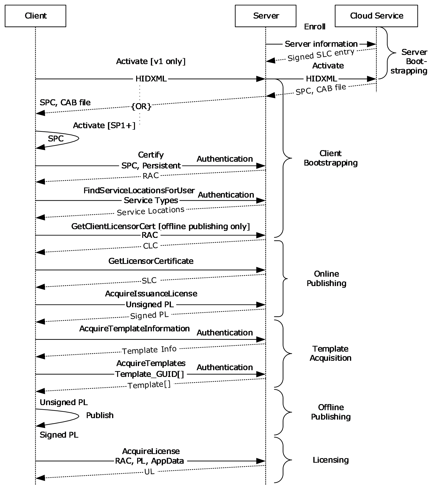

Figure 5: Protocol operation

The state data acquired from server bootstrapping previously described in section [3.1.3](#Section_3.1.3) MUST be retained on the server. Beyond this, no other state data is required on the server. The server MAY retain additional state data as an optimization, but it is not required. These operations are discussed in more detail in the following sections.

**Note** The following defined methods MUST contain a [VersionData](#Section_2.2.3.3) element in the SOAP header (as specified in [[SOAP1.1]](https://go.microsoft.com/fwlink/?LinkId=90520)). For information on the VersionData element, see section 2.2.3.3.

#### 3.1.4.1 Authentication

The RMS system uses the user's email address as a canonical identifier when specifying identities, rights, and policies. The server MUST authenticate the end user making the client request for the Certify method so that it can retrieve the user's email address from a directory or by other means, and include it in the [**RAC**](#gt_rms-account-certificate-rac). The user's email address MUST be included in the RAC. See [[RFC822]](https://go.microsoft.com/fwlink/?LinkId=90497) for the correct format of an email address.

The server SHOULD authenticate the end user making the [FindServiceLocationsForUser](#Section_3.7.4.2.2.1) method so that it can find the appropriate server for the user from the directory.

The server SHOULD<28> also support Microsoft Web Browser Federated Sign-On authentication, as specified in [MS-MWBF](../MS-MWBF/MS-MWBF.md). The client can follow the active client profile for Microsoft Web Browser Federated Sign-On. If Microsoft Web Browser Federated Sign-On authentication is used, the email address of the authenticated user MUST be made available to the server during the Certify request.

#### 3.1.4.2 Server Endpoint URLs

The server MUST expose its web methods at specific [**URLs**](#gt_uniform-resource-locator-url) for the client to find them. The server MUST provide the following URL structure, building from a base URL. This is the minimal required structure. Case-sensitivity depends on the web server being used to host the RMS server:

- [baseURL]/certification/Activation.asmx: Activate
- [baseURL]/certification/certification.asmx: Certify
- [baseURL]/certification/server.asmx: GetLicensorCertificate
- [baseURL]/certification/ServiceLocator.asmx: FindServiceLocationsForUser
- [baseURL]/licensing/license.asmx: AcquireLicense
- [baseURL]/licensing/publish.asmx: AcquireIssuanceLicense
- [baseURL]/licensing/publish.asmx: GetClientLicensorCert
- [baseURL]/licensing/templateDistribution.asmx: AcquireTemplateInformation
- [baseURL]/licensing/templateDistribution.asmx: AcquireTemplates
- [baseURL]/licensing/server.asmx: GetLicensorCertificate
- [baseURL]/licensing/ServiceLocator.asmx: FindServiceLocationsForUser
- [baseURL]/licensing/server.asmx: GetServerInfo
If the server supports Microsoft Web Browser Federated Sign-On authentication [MS-MWBF](../MS-MWBF/MS-MWBF.md) for this protocol, the following virtual directory structure MUST also exist in addition to the minimal required structure. The server SHOULD<29> use MWBF only for these paths:

- [baseURL]/certificationexternal/certification.asmx: Certify
- [baseURL]/certificationexternal/server.asmx: GetLicensorCertificate
- [baseURL]/certificationexternal/ServiceLocator.asmx: FindServiceLocationsForUser
- [baseURL]/licensingexternal/license.asmx: AcquireLicense
- [baseURL]/licensingexternal/publish.asmx: AcquireIssuanceLicense
- [baseURL]/licensingexternal/publish.asmx: GetClientLicensorCert
- [baseURL]/licensingexternal/server.asmx: GetLicensorCertificate
- [baseURL]/licensingexternal/ServiceLocator.asmx: FindServiceLocationsForUser
If the server supports clients that behave as other types of servers (such as content management servers), the following virtual directory structure MUST also exist in addition to the minimal required structure:

- [baseURL]/certification/ServerCertification.asmx: Certify
If the server supports clients on mobile platforms (such as PDAs and mobile phones), the following virtual directory structure MUST also exist in addition to the minimal required structure:

- [baseURL]/certification/MobileCertification.asmx: Certify

#### 3.1.4.3 Request Context

When the HTTP server invokes the RMS server to process a request, it MUST provide a **RequestContext** containing additional context about the HTTP request. The **isAuthenticated** field MUST indicate whether the request was authenticated. If MWBF authentication was used, **authenticationType** MUST be MWBF and **authenticatedAccount** MUST be a **FederatedAccount** containing the values of the EmailAddress and ProxyAddresses claims.

Otherwise, **authenticationType** SHOULD contain the authentication type used by the HTTP server and **authenticatedAccount** MUST be a **DomainAccount**. If the HTTP server supports the Negotiate protocol, the server SHOULD authenticate the client using SPNEGO-based Kerberos and [**NTLM**](#gt_nt-lan-manager-ntlm) HTTP Authentication [[RFC4559]](https://go.microsoft.com/fwlink/?LinkId=90483). The server establishes a security context as specified in [[RFC4178]](https://go.microsoft.com/fwlink/?LinkId=90461) section 3.2 by calling the implementation-specific equivalent of GSS_Accept_sec_context as specified in [[RFC2743]](https://go.microsoft.com/fwlink/?LinkId=90378) section 2.2.2. If the HTTP server does not support the Negotiate authentication protocol, the server authenticates the client using NTLM Over HTTP [MS-NTHT](../MS-NTHT/MS-NTHT.md). The server establishes a security context as specified in [MS-NLMP](../MS-NLMP/MS-NLMP.md) section 3.2.4 by calling the implementation-specific equivalent of GSS_Accept_sec_context as specified in [RFC2743] section 2.2.2.

The security context can be queried using the implementation-specific equivalent of GSS_Inquire_context as specified in [RFC2743] section 2.2.6. The information obtained from the context includes a Token/Authorization Context ([MS-DTYP](../MS-DTYP/MS-DTYP.md) section 2.5.2). The server obtains the [**SID**](#gt_security-identifier-sid) of the user from the value of the element **Token.Sids[Token.UserIndex]**. The SID SHOULD be stored in the **SID** field of the **DomainAccount**.

If the authentication protocol negotiated by SPNEGO-based Kerberos and NTLM HTTP Authentication [RFC4559] was Kerberos, the server obtains the **EffectiveName** and **LogonDomainName** from the KERB_VALIDATION_INFO structure ([MS-PAC](../MS-PAC/MS-PAC.md) section 2.5) returned by the KDC as specified in [MS-KILE](../MS-KILE/MS-KILE.md) section 3.3.5.6.4.1. The **name** field of the **DomainAccount** SHOULD be set to the string value made by constructing "**LogonDomainName**\**EffectiveName**".

If the authentication protocol negotiated by SPNEGO-based Kerberos and NTLM HTTP Authentication [RFC4559] was NTLM, or the server authenticated the client using NTLM Over HTTP [MS-NTHT], the server obtains the **UserName** and **DomainName** from the AUTHENTICATE_MESSAGE sent by the client as specified in [MS-NLMP] section 3.2.5.1.2. The **name** field of the **DomainAccount** SHOULD be set to the string value made by constructing "**DomainName**\**UserName**".

#### 3.1.4.4 Service Connection Point

To facilitate the discovery of an RMS server, a service connection point ([**SCP**](#gt_service-connection-point-scp)) MAY<30> be defined in [**Active Directory**](#gt_active-directory). RMS clients and servers MAY<31> use the SCP to locate an RMS server that is capable of servicing requests for that directory. The LDAPv3 protocol specified in [[RFC3377]](https://go.microsoft.com/fwlink/?LinkID=91337) SHOULD be used to retrieve the SCP element from Active Directory. The SCP object is stored in a **RightsManagementServices** container in the [**config NC**](#gt_configuration-naming-context-config-nc) of an Active Directory [**forest**](#gt_forest). When locating the SCP in Active Directory, an RMS client or server SHOULD search for an object with the **objectClass** or **objectCategory** of **serviceConnectionPoint** and the keywords "MSRMRootCluster" and "1.0". The value of the **serviceBindingInformation** attribute of the SCP object MUST be the location of an RMS service.

The following sections define the Active Directory objects related to the SCP.

##### 3.1.4.4.1 RightsManagementServices

name: RightsManagementServices

**parent**: Services ([MS-ADTS](../MS-ADTS/MS-ADTS.md) section 6.1.1.2.4)

objectClass: container

###### 3.1.4.4.1.1 SCP

name: SCP

**parent**: RightsManagementServices (section [3.1.4.4.1](#Section_3.1.4.4.1))

objectCategory: serviceConnectionPoint

objectClass: serviceConnectionPoint

keywords: MSRMRootCluster, 1.0

serviceBindingInformation: [baseURL]/certification

#### 3.1.4.5 Fault Codes

The RMS: Client-to-Server Protocol [MS-RMPR](#Section_d8ed4b1ee6054668b1736312cba6977e) allows a server to notify a client of application-level faults by generating [**SOAP fault codes**](#gt_soap-fault-code) as specified in [[SOAP1.1]](https://go.microsoft.com/fwlink/?LinkId=90520) section 4.4. A SOAP fault code returned by an RMS server always has a **faultcode** value of Server, as specified in [SOAP1.1] section 4.4.1.

When a Server [**SOAP fault**](#gt_soap-fault) is returned by the RMS server, the name of the exception causing the fault SHOULD be included in the **faultstring** sub-element of the SOAP fault. The format used when populating the **faultstring** sub-element SHOULD be a **FaultString** as specified in the following section.

FaultString = ExceptionString

ExceptionString = ExceptionName / ExceptionName DelimText 0*1(ExceptionBegin 0*1(ExceptionString))

ExceptionName = 0*(IdentifierName '.') IdentifierName

DelimText = ExceptionDelim Text

ExceptionDelim = '-' / ':' / SP

Text = 0*(CHAR)

ExceptionBegin = '--->' 0*(SP)

**IdentifierName:** The **IdentifierName** portion of a **FaultString** MUST follow Annex 7 of Technical Report 15 of the Unicode Standard 3.0 governing the set of characters permitted to start and be included in identifiers, as specified in [[UNICODENORMFORMS]](https://go.microsoft.com/fwlink/?LinkId=93485). Identifiers MUST be in the canonical format defined by Unicode Normalization Form C.

For more information, see [[ECMA-335]](https://go.microsoft.com/fwlink/?LinkId=93453) section 8.5.1.

#### 3.1.4.6 Validation

The server SHOULD validate the input for each operation and return a [**SOAP fault**](#gt_soap-fault) when validation fails.

| Exception | Description |
| --- | --- |
| Microsoft.DigitalRightsManagement.Core.UnsupportedDataVersionException | The data version requested by the client is not supported. |
| Microsoft.DigitalRightsManagement.Core.MalformedDataVersionException | A client request contained a version number that is not valid and cannot be processed. |
| System.ArgumentNullException | At least one of the required arguments was null. |

The server SHOULD validate the [VersionData](#Section_2.2.3.3) element of the request. If the **MinimumVersion** element or the **MaximumVersion** element do not contain a valid version number (specified in section 2.2.4.2), the server SHOULD return a Microsoft.DigitalRightsManagement.Core.MalformedDataVersionException fault. If the **MaximumVersion** element contains a version number that is higher than the range supported by the server for the operation, the server SHOULD return a Microsoft.DigitalRightsManagement.Core.UnsupportedDataVersionException. If any input element that is required for successful processing of the operation is set to null, the server SHOULD return a System.ArgumentNullException fault.

#### 3.1.4.7 Cryptographic Modes

RMS servers MAY<32> support operating in multiple cryptographic modes. These modes define the set of key sizes and hash algorithms that clients and servers use in [**XrML**](#gt_xrml) [**certificates**](#gt_certificate). Two modes are defined, named Mode 1 and Mode 2. Servers that do not support multiple cryptographic modes SHOULD use key sizes and hash algorithms specified for Mode 1. The following table specifies the differences between certificates in each of the cryptographic modes.

| Certificate | Mode 1 | Mode 2 |
| --- | --- | --- |
| SLC | The public key is 1,024-bit RSA. The signature hash algorithm is SHA-1. | The public key is 2,048-bit RSA. The signature hash algorithm is SHA256. |
| SLC Chain Intermediate and Root Certificates | The public key is 1,024-bit or 2,048-bit RSA. The signature hash algorithm is SHA-1. | The public key is 2,048-bit RSA. The signature hash algorithm is SHA256. |
| [**SPC**](#gt_security-processor-certificate-spc) | The public key is 1,024-bit or 2048-bit RSA. The signature hash algorithm is SHA-1. | The public key is 2,048-bit RSA. The signature hash algorithm is SHA256. |
| SPC Chain Intermediate and Root Certificates | The public key is 1,024-bit or 2,048-bit RSA. The signature hash algorithm is SHA-1. | The public key is 2,048-bit RSA. The signature hash algorithm is SHA256. |
| [**RAC**](#gt_rms-account-certificate-rac) | The public key is 1,024-bit RSA. The signature hash algorithm is SHA-1. The enabling bits type is "sealed-key". | The public key is 2,048-bit RSA. The signature hash algorithm is SHA256. The enabling bits type is "sealed-key-v2". |
| CLC | The public key is 1,024-bit RSA. The signature hash algorithm is SHA-1. The enabling bits type is "sealed-key". | The public key is 2,048-bit RSA. The signature hash algorithm is SHA256. The enabling bits type is "sealed-key-v2". |
| PL | The signature hash algorithm is SHA-1. The enabling bits type is "sealed-key". | The signature hash algorithm is SHA256. The enabling bits type is "sealed-key-v2". |
| UL | The signature hash algorithm is SHA-1. The enabling bits type is "sealed-key". | The signature hash algorithm is SHA256. The enabling bits type is "sealed-key-v2". |

### 3.1.5 Timer Events

**Configuration Refresh Timer Elapsed:** When the Configuration Refresh Timer elapses, the server SHOULD retrieve the **configurationVersion** field of the **StoredConfiguration**. If this value is different from the **configurationVersion** field of the **ServerState**, the server SHOULD replace all fields in **ServerState** with the corresponding fields in **StoredConfiguration**. The timer SHOULD be reset to the interval specified by the **configurationRefreshInterval** field of the **ServerState**.

### 3.1.6 Other Local Events

#### 3.1.6.1 StoredConfigurationChanged

When modifying the persistent state of the server, the **configurationVersion** field of the **StoredConfiguration** SHOULD be incremented to indicate to the server on the next Configuration Refresh Timer Elapsed event that the configuration has changed. If incrementing the value would cause it to be greater than one million, the **configurationVersion** SHOULD be set to 1.

#### 3.1.6.2 SLC Expiry

The [**SLC**](#gt_server-licensor-certificate-slc) grants the server the right to issue [**certificates**](#gt_certificate) and [**licenses**](#gt_license) by way of the ISSUE RIGHT inside the [WORK](#Section_2.2.9.10.4) element of the certificate. The ISSUE RIGHT has a [RANGETIME](#Section_2.2.9.1.3) condition that specifies the range during which the SLC can be used for issuing certificates and licenses. Outside this range, the server SHOULD NOT issue certificates or licenses because those licenses and certificates will be invalid.

If the RANGETIME on the ISSUE RIGHT expires, the server MUST have its SLC reissued to continue functioning. To have the SLC reissued, the server repeats the behavior specified in [3.1.3](#Section_3.1.3).

## 3.2 ActivationProxyWebServiceSoap Server Details

The complex types, simple types, and elements that are described in this section MAY<33> be used in the Activation Service.

### 3.2.1 Abstract Data Model

See the common server ADM in section [3.1.1](#Section_3.1.1).

### 3.2.2 Timers

None.

### 3.2.3 Initialization

See section [3.1.3](#Section_3.1.3).

### 3.2.4 Message Processing Events and Sequencing Rules

| Operation | Description |
| --- | --- |
| [Activate Operation](#Section_3.2.4.1.2.1) | Allows the server to act as a proxy between the version 1.0 client and the RMS Machine Activation [**cloud service**](#gt_cloud-service). |

#### 3.2.4.1 Activate Operation

During the Activate request, the server MAY<34> act as a proxy between the version 1.0 client and the RMS Machine Activation [**cloud service**](#gt_cloud-service). The request from the client to the server and the request from the server to the cloud service are identical. Likewise, the response from the cloud service to the server and the response from the server to the client are identical.

Figure 6: Activation message sequence

<wsdl:operation name="Activate">

<wsdl:input message="tns:ActivateSoapIn" />

<wsdl:output message="tns:ActivateSoapOut" />

</wsdl:operation>

The Activate web method response also includes binary data that the server returns verbatim as a DIME attachment to the SOAP response.

In the Activate operation, the client submits an [**HID**](#gt_hardware-id-hid) hash (section [3.2.4.1.2.3](#Section_3.2.4.1.2.3)) and requests a [**security processor**](#gt_security-processor) software component, signature, and [**SPC**](#gt_security-processor-certificate-spc) chain. A properly formed Activate request MUST contain a HID hash. The server treats this HID hash as an opaque BLOB and forwards it to the RMS Machine Activation cloud service.

In addition to returning an [ActivateResponse](#Section_3.2.4.1.2.2) element, the response method SHOULD also return a binary attachment using DIME, as specified in [[WSDLExt]](https://go.microsoft.com/fwlink/?LinkId=90578)). The DIME attachment is treated as an opaque BLOB by the server and forwarded from the RMS Machine Activation cloud service back to the client.

The server's role in the Activate request is to act only as a proxy to the RMS Machine Activation cloud service. This functionality exists to enable clients that do not have connectivity to the Internet beyond the corporate environment. The Activate protocol between the server and the RMS Machine Activation cloud service is identical to the Activate protocol between the client and the server.

Upon receiving an Activate request, the server SHOULD service the request. To service the request, the server MUST make an Activate request to the RMS Machine Activation cloud service using the same Activate protocol and the same request data. When the cloud service responds, the server MUST respond to the client with the same response data. The server MUST treat the request and response data as opaque BLOBs and pass the response data through to the client. A successful response includes an SPC chain, a security processor binary file containing the security processor private key, and a signature of the binary file.

After the activation step is complete, the client has a security processor with its own key pair and SPC chain.

For a successful request, the server MUST return exactly what it receives from the RMS Machine Activation cloud service. For an unsuccessful request, the server SHOULD return the same fault as the cloud service.

##### 3.2.4.1.1 Messages

| Message | Description |
| --- | --- |
| [ActivateSoapIn](#Section_3.2.4.1.1.1) | Contains a unique one-way hash of the client's hardware configuration information. |
| [ActivateSoapOut](#Section_3.2.4.1.1.2) | Contains information for verification of the binary data returned in a DIME attachment. |

###### 3.2.4.1.1.1 ActivateSoapIn

The ActivateSoapIn message contains a unique one-way hash of the client's hardware configuration information. This message is treated as an opaque BLOB by the server and forwarded to the RMS Machine Activation [**cloud service**](#gt_cloud-service).

<wsdl:message name="ActivateSoapIn">

<wsdl:part name="parameters" element="tns:Activate" />

</wsdl:message>

[Activate element](#Section_3.2.4.1.2.1): The Activate element, as specified in section 3.2.4.1.2.1. Contains an XML structure generated by the client that contains a unique string derived from a one-way hash of hardware configuration information.

###### 3.2.4.1.1.2 ActivateSoapOut

The ActivateSoapOut message contains information for verification of the binary data returned in a DIME attachment.

<wsdl:message name="ActivateSoapOut">

<wsdl:part name="parameters" element="tns:ActivateResponse" />

</wsdl:message>

[ActivateResponse element](#Section_3.2.4.1.2.2): The ActivateResponse element, as defined in section 3.2.4.1.2.2. Contains the [**SPC**](#gt_security-processor-certificate-spc) chain and a signature for verification of the binary data returned in a DIME attachment (as specified in [[WSDLExt]](https://go.microsoft.com/fwlink/?LinkId=90578)). The SPC leaf-node [**certificate**](#gt_certificate) contains the public key corresponding to the private key in the [**security processor**](#gt_security-processor). This response is treated as an opaque BLOB by the server and forwarded from the RMS Machine Activation [**cloud service**](#gt_cloud-service) back to the client.

##### 3.2.4.1.2 Elements

| Element | Description |
| --- | --- |
| [Activate](#Section_3.2.4.1.2.1) | Contains the body of the message for the Activate web method. |
| [ActivateResponse](#Section_3.2.4.1.2.2) | Contains the body of the response from the Activate method. |
| [HidXml](#Section_3.2.4.1.2.3) | Contains a base-64 encoded [**HID**](#gt_hardware-id-hid). |
| [BinarySignature](#Section_3.2.4.1.2.4) | A fragment of XML that contains a signed hash of a binary DIME attachment. |

###### 3.2.4.1.2.1 Activate

The Activate element contains the body of the message for the Activate web method. The Activate web method parameters consist of any number of [**hardware IDs (HIDs)**](#gt_hardware-id-hid) that are associated with the Activation Service.

<xs:element name="Activate">

<xs:complexType>

<xs:sequence>

<xs:element name="requestParams"

type="ArrayOfActivateParams"

minOccurs="0"

maxOccurs="1"

/>

</xs:sequence>

</xs:complexType>

</xs:element>

###### 3.2.4.1.2.2 ActivateResponse

The ActivateResponse element contains the body of the response from the Activate method. The Activate method response consists of any number of BinarySignatures and MachineCertificateChains.

<xs:element name="ActivateResponse">

<xs:complexType>

<xs:sequence>

<xs:element name="ActivateResult"

type="ArrayOfActivateResponse"

minOccurs="0"

maxOccurs="1"

/>

</xs:sequence>

</xs:complexType>

</xs:element>

###### 3.2.4.1.2.3 HidXml

The [**HID**](#gt_hardware-id-hid) MUST be base64 encoded. Otherwise, the format and content of the HID is implementation-dependent. The HID SHOULD<35> uniquely identify the client making the Activate request. The HID SHOULD<36> be a base64-encoded [**SHA-256**](#gt_sha-256) hash. The hash can be generated from any set of entropy using any input value. The hash algorithm is specified in [[FIPS180-2]](https://go.microsoft.com/fwlink/?LinkId=89868).

The server operates transparently on the HID, serving only as a pass-through to the RMS Machine Activation [**cloud service**](#gt_cloud-service). The SOAP operations that the server and the cloud service use while the server is acting as a pass-through are identical to those made between the client and the server. For information on how to use the cloud service, see section [3.1.3.2](#Section_3.1.3.2).

<xs:element name="HidXml">

<xs:complexType

mixed="true"

>

<xs:sequence>

<xs:any

namespace=""

/>

</xs:sequence>

</xs:complexType>

</xs:element>

###### 3.2.4.1.2.4 BinarySignature

The BinarySignature (ActivateResponse) element is a fragment of XML that contains a signed hash of the binary data returned by the server in a DIME attachment (as described in [[WSDLExt]](https://go.microsoft.com/fwlink/?LinkId=90578)) on the Activate web method response. The BinarySignature and attachment are passed through by the server and treated as transparent data.

<xs:element name="BinarySignature">

<xs:complexType

mixed="true"

>

<xs:sequence>

<xs:any

namespace=""

/>

</xs:sequence>

</xs:complexType>

</xs:element>

##### 3.2.4.1.3 Complex Types

| Complex Types | Description |
| --- | --- |
| [ActivateParams](#Section_3.2.4.1.3.1) | Contains a single [**HID**](#gt_hardware-id-hid) represented in XML form. |
| [ActivateResponse](#Section_3.2.4.1.2.2) | Contains an array of machine [**certificates**](#gt_certificate) and a binary signature for the DIME attachment. |
| [ArrayOfActivateParams](#Section_3.2.4.1.3.3) | Contains an array of parameters for the Activate request operation. |
| [ArrayOfActivateResponse](#Section_3.2.4.1.3.4) | Contains an array of responses to an Activate request operation. |

###### 3.2.4.1.3.1 ActivateParams

The ActivateParams complex type contains a single [**HID**](#gt_hardware-id-hid) represented in XML form.

<xs:complexType name="ActivateParams">

<xs:sequence>

<xs:element name="HidXml"

minOccurs="0"

maxOccurs="1"

>

<xs:complexType name="XmlNode"

mixed="true"

>

<xs:sequence>

<xs:any

namespace=""

/>

</xs:sequence>

</xs:complexType>

</xs:element>

</xs:sequence>

</xs:complexType>

###### 3.2.4.1.3.2 ActivateResponse

The ActivateResponse complex type contains an array of machine [**certificates**](#gt_certificate) and a binary signature to verify the binary data the server returns in a Direct Internet Message Encapsulation (DIME) attachment (as described in [[WSDLExt]](https://go.microsoft.com/fwlink/?LinkId=90578)) on this Activate web method response. The BinarySignature and attachment are passed through by the server and treated as transparent data.

<xs:complexType name="ActivateResponse">

<xs:sequence>

<xs:element name="BinarySignature"

minOccurs="0"

maxOccurs="1"

>

<xs:complexType

mixed="true"

>

<xs:sequence>

<xs:any

namespace=""

/>

</xs:sequence>

</xs:complexType>

</xs:element>

<xs:element name="MachineCertificateChain"

type="ArrayOfXmlNode"

minOccurs="1"

maxOccurs="0"

/>

</xs:sequence>

</xs:complexType>

###### 3.2.4.1.3.3 ArrayOfActivateParams

The ArrayOfActivateParams complex type contains an array of parameters for the Activate request operation. This array consists of any number of [ActivateParams (section 3.2.4.1.3.1)](#Section_3.2.4.1.3.1).

<xs:complexType name="ArrayOfActivateParams">

<xs:sequence>

<xs:element name="ActivateParams"

type="ActivateParams"

minOccurs="0"

maxOccurs="unbounded"

/>

</xs:sequence>

</xs:complexType>

###### 3.2.4.1.3.4 ArrayOfActivateResponse

The ArrayOfActivateResponse complex type contains an array of responses to an Activate request operation.

<xs:complexType name="ArrayOfActivateResponse">

<xs:sequence>

<xs:element name="ActivateResponse"

type="ActivateResponse"

minOccurs="0"

maxOccurs="unbounded"

/>

</xs:sequence>

</xs:complexType>

### 3.2.5 Timer Events

None.

### 3.2.6 Other Local Events

None.

## 3.3 CertificationWebServiceSoap Server Details

The complex types, simple types, and elements described in this section are used in the Certification Service.

### 3.3.1 Abstract Data Model

See the common server ADM in section [3.1.1](#Section_3.1.1).

### 3.3.2 Timers

None.

### 3.3.3 Initialization

See section common server [Initialization (section 3.1.3)](#Section_3.1.3).

### 3.3.4 Message Processing Events and Sequencing Rules

| Operation | Description |
| --- | --- |
| [Certify Operation](#Section_3.3.4.1.2.1) | The client uses the Certify request to acquire a [**RAC**](#gt_rms-account-certificate-rac). |

#### 3.3.4.1 Certify Operation

To access [**protected content**](#gt_protected-content), the user needs a [**RAC**](#gt_rms-account-certificate-rac) that corresponds to the user's account. The RAC grants the role of a user who can access protected content. It issues an asymmetric encryption key pair and identifies the user account in the RMS system. The client uses the Certify request to acquire a RAC. The client MUST have a valid [**SPC**](#gt_security-processor-certificate-spc) before calling Certify.

Figure 7: Certify message sequence

<wsdl:operation name="Certify">

<wsdl:input message="tns:CertifySoapIn" />

<wsdl:output message="tns:CertifySoapOut" />

</wsdl:operation>

**Exceptions Thrown:** The Certify method SHOULD return a fault code when a failure occurs. Details of the RMS: Client to Server Protocol [**SOAP fault**](#gt_soap-fault) format can be found in section [3.1.4.5](#Section_3.1.4.5).

| Exception | Description |
| --- | --- |
| System.UnauthorizedAccessException | The access is unauthorized. |
| Microsoft.DigitalRightsManagement.Core.VerifyEmailAddressFailedException | The email address is formatted incorrectly. See [[RFC822]](https://go.microsoft.com/fwlink/?LinkId=90497) for the correct format of an email address. |
| Microsoft.DigitalRightsManagement.Utilities.ADEntrySearchFailedException | Failed to find an entry in the directory. |
| Microsoft.DigitalRightsManagement.Core.VerifyMachineCertificateChainFailedException | The machine [**certificate**](#gt_certificate) provided has a [**certificate chain**](#gt_certificate-chain) that is not valid. |
| Microsoft.DigitalRightsManagement.Licensing.BlackBoxIsInvalidException | The client's RM lockbox has been revoked. The client computer MUST be reactivated to retrieve the latest RM lockbox. |
| Microsoft.RightsManagementServices.ClusterDecommissionedException | A request was received, but the server is in a decommissioned state and cannot process the request. |
| Microsoft.DigitalRightsManagement.Cryptography.UnsupportedCryptographicSetException | The given certificate does not contain an acceptable combination of asymmetric key and signature hash algorithms. |

The client MUST authenticate to the server. The client SHOULD<37> use [**NTLM**](#gt_nt-lan-manager-ntlm) authentication, as described in [MS-NTHT](../MS-NTHT/MS-NTHT.md), for Certify requests. If the **isAuthenticated** field of the **RequestContext** is false or the **authenticationType** field of the **RequestContext** is MWBF when the **federationEnabled** field of **ServerState** is set to false, the server SHOULD return a System.UnauthorizedAccessException [**SOAP fault code**](#gt_soap-fault-code). If the **authenticationType** field of the **RequestContext** is not MWBF and the **authenticatedAccount** represents a well-known local account, the server MAY<38> replace **authenticatedAccount** with a **DomainAccount** representing the machine account of the server. The SOAP request does not encapsulate the authentication.<39>

In the Certify operation, the client authenticates to the server, submits an SPC chain, identifies a RAC type, and requests a RAC chain. A properly formed Certify request MUST contain a signed SPC chain and a flag for the RAC type. If the server decommissioned flag is set, the server SHOULD return a Microsoft.RightsManagementServices.ClusterDecommissionedException fault.

Upon receiving a Certify request, the server SHOULD validate the follow items:

- The signature of each certificate in the SPC certificate chain.
- The public key of either the first or second certificate that follows the SPC in the SPC chain is present in the **trustedSpcCAKeys** field of **ServerState**.
- The Repository [SECURITYLEVEL](#Section_2.2.9.1.10) in the SPC meets the minimum required version in the **spcExclusionPolicy** field of **ServerState**.
If this validation fails, a Microsoft.DigitalRightsManagement.Core.VerifyMachineCertificateChainFailedException SOAP fault code SHOULD be returned. If the Repository SECURITYLEVEL in the SPC does not meet the minimum required version in the **spcExclusionPolicy** field of **ServerState**, the server SHOULD return the Microsoft.DigitalRightsManagement.Licensing.BlackBoxIsInvalidException SOAP fault code. The server SHOULD ignore the values of the following SPC elements: **[[- cps -]]**, **[[- type -]]** and **[[- name -]]** of the [ISSUER](#Section_2.2.9.1.5) element as described in section 2.2.9.4.2. If the SPC or any certificate in the SPC certificate chain contains public key lengths or hash algorithms that are not allowed in the cryptographic mode indicated by the **cryptographicMode** attribute of **ServerState**, the server SHOULD return a Microsoft.DigitalRightsManagement.Cryptography.UnsupportedCryptographicSetException fault.

If validation succeeds, the server SHOULD service the request. To service the request, the server SHOULD generate a new RAC chain. To generate a RAC chain, the server MUST provide a unique asymmetric key pair for the user. The server SHOULD invoke the **GetUserKeyPair** abstract interface, passing in a string identifying the user. If the **authenticationType** of the **RequestContext** is MWBF, the string SHOULD be the **emailAddress** of the **authenticatedAccount** of the **RequestContext**. Otherwise, the string SHOULD be the **SID** of the **authenticatedAccount** of the **RequestContext**. If the return value is null, the server MUST generate a unique asymmetric key pair for the user. If a new key pair is generated, the server SHOULD invoke the **SetUserKeyPair** abstract interface, passing in a string identifying the user, as described previously, and the generated key pair. The server SHOULD store the RAC if the **persistRac** field of **ServerState** is true. The [VALIDITYTIME](#Section_2.2.9.1.2) element of the RAC SHOULD be computed using the **racValidityTime** field of **ServerState**. If the request is for a temporary certificate, the **tempRacValidityTime** field of **ServerState** SHOULD be used. If the request was authenticated using Microsoft Web Browser Federated Sign-On authentication, the **federatedRacValidityTime** field of **ServerState** SHOULD be used. To account for clock differences between the clock and the server, the server SHOULD subtract an amount of time equal to the **certificateValidityTimeTolerance** field of **ServerState** from the [ISSUEDTIME](#Section_2.2.9.1.1) to compute the FROM value of the VALIDITYTIME. If the request is for a persistent RAC, the **RACtype** of the [ISSUEDPRINCIPALS (section 2.2.9.5.4)](#Section_2.2.9.5.4) MUST be a **SECURITYLEVEL** element with the name "Group-Identity-Credential-Type" and a value of "Persistent". If the request is for a temporary RAC, the **RACtype** of the ISSUEDPRINCIPALS MUST be a **SECURITYLEVEL** element with the name "Group-Identity-Credential-Type" and a value of "Temporary".

The server processes the **ISSUEDPRINCIPALS** element differently, depending on the type of authentication used:

**Microsoft Web Browser Federated Sign-On (MWBF) authentication:** The **userid** of the **ISSUEDPRINCIPALS** MUST be a [**GUID**](#gt_globally-unique-identifier-guid). This GUID MUST be unique for each authenticated email address. The **emailaddress** of the **ISSUEDPRINCIPALS** MUST be the value of the **emailAddress** field of the **authenticatedAccount** of the **RequestContext**. If the email address is not properly formatted, a Microsoft.DigitalRightsManagement.Core.VerifyEmailAddressFailedException SOAP fault code SHOULD be returned by the server. See [RFC822] for the correct format of an email address. The **emailalias** of the **ISSUEDPRINCIPALS** SHOULD be populated using the values of the **proxyAddresses** field of the **authenticatedAccount** of the **RequestContext**.

**Non-MWBF authentication:** The **userid** of the **ISSUEDPRINCIPALS** MUST be the **SID** field of the **authenticatedAccount** of the **RequestContext**. The **emailaddress** of the **ISSUEDPRINCIPALS** MUST be the value returned by **GetEmailAddressForAccount** for the **authenticatedAccount** of the **RequestContext**. If the email address is not properly formatted, a Microsoft.DigitalRightsManagement.Core.VerifyEmailAddressFailedException SOAP fault code SHOULD be returned by the server. See [RFC822] for the correct format of an email address. If **GetEmailAddressForAccount** returns NULL, the server SHOULD return a Microsoft.DigitalRightsManagement.Utilities.ADEntrySearchFailedException SOAP fault code. The **emailalias** of the **ISSUEDPRINCIPALS** MUST NOT be present when MWBF authentication is not used.

The RAC MUST contain the user's public key in the ISSUEDPRINCIPALS element. The RAC MUST contain the user's private key, encrypted to the SPC public key, in the [FEDERATIONPRINCIPALS](#Section_2.2.9.5.5) element. The server MUST include a [DISTRIBUTIONPOINT (section 2.2.9.5.3)](#Section_2.2.9.5.3) of type "Activation". The ADDRESS element SHOULD contain the **baseUrl** of the **ServerState** followed by "/certification". If the **externalCertificationUrl** of the **ServerState** is not null, the server SHOULD include a DISTRIBUTIONPOINT of type "Extranet-Activation". The ADDRESS element SHOULD contain the **externalCertificationUrl**. The [ISSUER](#Section_2.2.9.5.2) element of the RAC MUST be copied from the [ISSUEDPRINCIPALS](#Section_2.2.9.3.3) element of the server's [**SLC**](#gt_server-licensor-certificate-slc). The [SIGNATURE](#Section_2.2.9.1.12) element of the RAC MUST be generated using the server's private key. The server's entire SLC chain MUST be appended to the RAC to form the RAC chain. For more information on the RAC chain, see section [2.2.9.5](#Section_2.2.9.5).

For a successful request, the server MUST return a RAC chain. If the **federationEnabled** field of **ServerState** is true and the user is calling the interface for Federated Identity, then a RAC with the type "federation" SHOULD be returned. For an unsuccessful request, the server MUST return a SOAP fault code listed above or a generic SOAP fault code. The client MUST treat all SOAP fault codes the same. For information on Certificate formats, see section [2.2.9](#Section_2.2.9).

##### 3.3.4.1.1 Messages

| Message | Description |
| --- | --- |
| [CertifySoapIn](#Section_3.3.4.1.1.1) | Contains the client's [**SPC**](#gt_security-processor-certificate-spc) chain as well as a request flag. |
| [CertifySoapOut](#Section_3.3.4.1.1.2) | Contains a [**RAC**](#gt_rms-account-certificate-rac) chain. |

###### 3.3.4.1.1.1 CertifySoapIn

The CertifySoapIn message contains the client's [**SPC**](#gt_security-processor-certificate-spc) chain as well as a flag requesting either a persistent (long-lived) or temporary (short-lived) [**certificate**](#gt_certificate).

<wsdl:message name="CertifySoapIn">

<wsdl:part name="parameters" element="tns:Certify" />

</wsdl:message>

**Certify:** The Certify element, as specified in section [3.3.4.1.2.1](#Section_3.3.4.1.2.1).

###### 3.3.4.1.1.2 CertifySoapOut

The CertifySoapOut message contains the [**RAC**](#gt_rms-account-certificate-rac) chain. The RAC chain issues an encryption key pair to the user and binds the user's account to the machine through the [**SPC**](#gt_security-processor-certificate-spc). The [CertifyResponse](#Section_3.3.4.1.2.2) element also includes a [QuotaResponse](#Section_3.3.4.1.3.3) structure that the client SHOULD NOT use.

<wsdl:message name="CertifySoapOut">

<wsdl:part name="parameters" element="tns:CertifyResponse" />

</wsdl:message>

**CertifyResponse:** The CertifyResponse element, as specified in section 3.3.4.1.2.2.

##### 3.3.4.1.2 Elements

| Element | Description |
| --- | --- |
| [Certify](#Section_3.3.4.1.2.1) | Contains the body of the request for the Certify request operation. |
| [CertifyResponse](#Section_3.3.4.1.2.2) | Contains the response to a Certify request operation. |

###### 3.3.4.1.2.1 Certify

The Certify element contains the body of the request for the Certify web method.

<xs:element name="Certify">

<xs:complexType>

<xs:sequence>

<xs:element name="requestParams"

type="CertifyParams"

minOccurs="1"

maxOccurs="1"

/>

</xs:sequence>

</xs:complexType>

</xs:element>

###### 3.3.4.1.2.2 CertifyResponse

The CertifyResponse element contains the response to a Certify request operation. This element is used as an out parameter for the Certify operation.

<xs:element name="CertifyResponse">

<xs:complexType>

<xs:sequence>

<xs:element name="CertifyResult"

type="CertifyResponse"

minOccurs="0"

maxOccurs="1"

/>

</xs:sequence>

</xs:complexType>

</xs:element>

##### 3.3.4.1.3 Complex Types

| Complex Types | Description |
| --- | --- |
| [CertifyParams](#Section_3.3.4.1.3.1) | A list of machine certificates. |
| [CertifyResponse](#Section_3.3.4.1.2.2) | Contains an array of certificates and certificate quota data. |
| [QuotaResponse](#Section_3.3.4.1.3.3) | Not used; kept for backwards-compatibility only. |

###### 3.3.4.1.3.1 CertifyParams

The CertifyParams complex type allows the Certify request operation to accept a list of machine [**certificates**](#gt_certificate) for performing the certificate operation. The list of machine certificates is stored in an array. The [ArrayOfXmlNode (section 2.2.4.1)](#Section_2.2.4.1) complex type serves as a wrapper for this array. The Persistent parameter is a Boolean flag that indicates whether the response is a temporary identity certificate with a short validity time (when the value is TRUE), or an identity certificate with a normal validity time (when the value is FALSE).

<xs:complexType name="CertifyParams">

<xs:sequence>

<xs:element name="MachineCertificateChain"

type="ArrayOfXmlNode"

minOccurs="0"

maxOccurs="1"

/>

<xs:element name="Persistent"

type="boolean"

minOccurs="1"

maxOccurs="1"

/>

</xs:sequence>

</xs:complexType>

###### 3.3.4.1.3.2 CertifyResponse

The CertifyResponse complex type contains response parameters consisting of an array of [**certificates**](#gt_certificate) and certificate quota data. The certificates represent the user identity certificate that the server issues. The quota data SHOULD NOT be used.

<xs:complexType name="CertifyResponse">

<xs:sequence>

<xs:element name="CertificateChain"

type="ArrayOfXmlNode"

minOccurs="0"

maxOccurs="1"

/>

<xs:element name="Quota"

type="QuotaResponse"

minOccurs="0"

maxOccurs="1"

/>

</xs:sequence>

</xs:complexType>

###### 3.3.4.1.3.3 QuotaResponse

The server does not process the QuotaResponse complex type. The *Verified* parameter value MUST be set to true. The *CurrentConsumption* parameter value MUST be less than the *Maximum* parameter value, otherwise arbitrary values for these two parameters MAY<40> be used.

<xs:complexType name="QuotaResponse">

<xs:sequence>

<xs:element name="Verified"

type="boolean"

minOccurs="1"

maxOccurs="1"

/>

<xs:element name="CurrentConsumption"

type="int"

minOccurs="1"

maxOccurs="1"

/>

<xs:element name="Maximum"

type="int"

minOccurs="1"

maxOccurs="1"

/>

</xs:sequence>

</xs:complexType>

### 3.3.5 Timer Events

None.

### 3.3.6 Other Local Events

None.

## 3.4 LicenseSoap and TemplateDistributionWebServiceSoap Server Details

The complex types, simple types, and elements described in this section are used in the [**Licensing**](#gt_license) Service.

### 3.4.1 Abstract Data Model

See the common server ADM in section [3.1.1](#Section_3.1.1).

### 3.4.2 Timers

None.

### 3.4.3 Initialization

See section common server [Initialization (section 3.1.3)](#Section_3.1.3).

### 3.4.4 Message Processing Events and Sequencing Rules

| Operation | Description |
| --- | --- |
| [AcquireLicense Operation](#Section_3.4.4.1.2.1) | This request is used to acquire a [**UL**](#gt_use-license-ul) from the server. |
| [AcquireTemplateInformation Operation](#Section_3.4.4.2.2.1) | This request is used to acquire information about the [**rights policy templates**](#gt_rights-policy-template) available on the server. |
| [AcquireTemplates Operation](#Section_3.4.4.3.2.1) | This request is used to acquire specific rights policy templates from the server. |

#### 3.4.4.1 AcquireLicense Operation

The AcquireLicense request is used to acquire a [**UL**](#gt_use-license-ul) from the server. A UL is required for a user to access [**protected content**](#gt_protected-content). The UL describes what usage policies apply to the user while accessing a particular protected content file. It also contains the [**content key**](#gt_content-key) encrypted with the user's [**RAC**](#gt_rms-account-certificate-rac) public key. The UL is the authorization token that allows a user to access protected content.

Figure 8: AcquireLicense message sequence

<wsdl:operation name="AcquireLicense">

<wsdl:input message="tns:AcquireLicenseSoapIn" />

<wsdl:output message="tns:AcquireLicenseSoapOut" />

</wsdl:operation>

**Exceptions Thrown:** The AcquireLicense method SHOULD return a fault code when a failure occurs. Details of the RMS: Client to Server Protocol SOAP Fault Format can be found in section [3.1.4.5](#Section_3.1.4.5).

| Exception | Description |
| --- | --- |
| Microsoft.DigitalRightsManagement.Licensing.InvalidPersonaCertSignatureException | The account [**certificate**](#gt_certificate) the requestor supplied has been tampered with. |
| Microsoft.DigitalRightsManagement.Licensing.InvalidPersonaCertTimeException | The account certificate the requestor supplied is currently invalid. |
| Microsoft.DigitalRightsManagement.Licensing.UnexpectedPersonaCertException | An unexpected error was encountered while validating the account certificate. |
| Microsoft.DigitalRightsManagement.Licensing.UntrustedPersonaCertException | The account certificate the requestor supplied was not issued by a trusted user [**domain**](#gt_domain) server. |
| Microsoft.DigitalRightsManagement.Licensing.NoRightsForRequestedPrincipalException | The [**PL**](#gt_publishing-license-pl) contains no rights for the requested principal. |
| Microsoft.DigitalRightsManagement.Licensing.DrmacIsExcludedException | The account certificate has been excluded and is not permitted to submit this request. |
| Microsoft.DigitalRightsManagement.Licensing.InvalidRightsLabelSignatureException | The [**publishing license**](#gt_publishing-license) contains an invalid signature. |
| Microsoft.DigitalRightsManagement.Licensing.IssuanceLicenseIsNotWithinValidTimeRangeException | The publishing license has expired or the time specified is not within the valid time range. |
| Microsoft.DigitalRightsManagement.Licensing.RightsLabelNoMatchingIssuedPrincipalException | The publishing license has no issued principals corresponding to this server. |
| Microsoft.RightsManagementServices.ClusterDecommissionedException | A request was received, but the server is in a decommissioned state and cannot honor the request. |
| Microsoft.DigitalRightsManagement.Cryptography.UnsupportedCryptographicSetException | The given certificate does not contain an acceptable combination of asymmetric key and signature hash algorithms. |

In the AcquireLicense operation, the client submits a signed PL chain, a RAC chain, and application data, and requests a UL chain. A properly formed AcquireLicense request MUST contain a signed PL chain, a RAC chain, and application data XML. The application data XML MAY contain a null value by way of an empty XML element. If the client specifies "1.0.0.0" as the **MaximumVersion** field of the **VersionData** header, the request MUST contain only one **AcquireLicenseParams** element in the **RequestParams** field of the **AcquireLicense** element.

Upon receiving an AcquireLicense request, the server SHOULD perform signature validation on the PL chain and ensure that it trusts the issuer of the PL. The server MUST know the private key that corresponds to the public key of the issuer of the PL in order to issue a UL. The server SHOULD perform signature validation on the RAC chain and verify that it trusts the RAC.

- If the RAC chain fails signature validation, the server SHOULD return a Microsoft.DigitalRightsManagement.Licensing.InvalidPersonaCertSignatureException [**SOAP fault code**](#gt_soap-fault-code).
- If the RAC chain is expired or not yet valid, the server SHOULD return a Microsoft.DigitalRightsManagement.Licensing.InvalidPersonaCertTimeException SOAP fault code.
- If the RAC is signed by an [**SLC**](#gt_server-licensor-certificate-slc) that is not the SLC of one of the elements of the **trustedRacIssuers** field of **ServerState**, the server SHOULD return a Microsoft.DigitalRightsManagement.Licensing.UntrustedPersonaCertException.
- If the RAC public key is in the **racExclusionPolicy** set of **ServerState**, the server SHOULD return the [**SOAP fault**](#gt_soap-fault) Microsoft.DigitalRightsManagement.Licensing.DrmacIsExcludedException.
- If the Repository [SECURITYLEVEL](#Section_2.2.9.1.10) in the [**SPC**](#gt_security-processor-certificate-spc) does not meet the minimum required version in the **spcExclusionPolicy** field of **ServerState**, the server SHOULD return a Microsoft.DigitalRightsManagement.Licensing.BlackBoxIsInvalidException SOAP fault.
- If a Credential-Creation-Time SECURITYLEVEL is present in the RAC and exceeds the [ISSUEDTIME](#Section_2.2.9.1.1) of the PL by more than the value of the **creationTimeTolerance** field of **ServerState**, the server SHOULD return a Microsoft.DigitalRightsManagement.Licensing.CredentialCreationTimeException SOAP fault.
- If any other errors are found validating the RAC chain, the server SHOULD return a Microsoft.DigitalRightsManagement.Licensing.UnexpectedPersonaCertException SOAP fault.
- If the **federationEnabled** field of **ServerState** is false and the RAC type is "federation" (section [2.2.9.5.4](#Section_2.2.9.5.4)), the server SHOULD reject the request.
- If the PL chain fails signature validation, the server SHOULD return a Microsoft.DigitalRightsManagement.Licensing.InvalidRightsLabelSignatureException fault.
- If the current time is not within the range specified by the **VALIDITYTIME** of the PL and the **serverDecommissioned** field of **ServerState** is false, the server SHOULD return a Microsoft.DigitalRightsManagement.Licensing.IssuanceLicenseIsNotWithinValidTimeRangeException fault.
- If the **serverDecommissioned** field of **ServerState** is true, the server SHOULD return a Microsoft.RightsManagementServices.ClusterDecommissionedException fault.
- If the **ApplicationData** field of the **AcquireLicenseParams** element is greater than the maximum size supported by the implementation, the server SHOULD return a Microsoft.DigitalRightsManagement.Utilities.UnspecifiedErrorException fault.<41>
- If the RAC contains a public key length or hash algorithm that is not allowed in the cryptographic mode indicated by the **cryptographicMode** attribute of **ServerState**, the server SHOULD return a Microsoft.DigitalRightsManagement.Cryptography.UnsupportedCryptographicSetException fault.
- If the cryptographic mode indicated by the **cryptographicMode** attribute of **ServerState** is **Mode 1** cryptography and the PL contains a public key length or hash algorithm that is not allowed in **Mode 1**, the server SHOULD return a Microsoft.DigitalRightsManagement.Licensing.RightsLabelNoMatchingIssuedPrincipalException fault.
If validation succeeds, the server SHOULD service the request. To service the request, the server SHOULD determine whether the PRINCIPAL in the ISSUEDPRINCIPALS of the PL matches the PRINCIPAL in the ISSUEDPRINCIPALS of the SLC in **ServerState** or the SLC in one of the elements of the **trustedLicensingServers** set in **ServerState**. If it matches its own SLC, the **keyPair** of the **ServerState** SHOULD be used to service the request. If it matches an SLC of one of the elements of the **trustedLicensingServers**, the SLC, keyPair, and templates of the matching **TrustedLicensingServer** SHOULD be used for the purposes of decrypting the PL and evaluating [**policy**](#gt_policy). In either case, the SLC and **keyPair** of the **ServerState** SHOULD be used for issuing a UL. If no matching PRINCIPAL was found, the server SHOULD return a Microsoft.DigitalRightsManagement.Licensing.RightsLabelNoMatchingIssuedPrincipalException fault. The server SHOULD decrypt the usage policy and content key from the PL by using the **keyPair** of **ServerState**. The server SHOULD cache the parsed PL for use in subsequent requests with the same PL [SIGNATURE](#Section_2.2.9.1.12) element, by adding a new **PLCacheEntry** element to the **plCache** field of the **ServerState**. This **PLCacheEntry** SHOULD have a **plSignature** field corresponding to the SIGNATURE of the PL, and a **parsedPl** field containing an in-memory representation of the PL. If the **noRightsCacheEnabled** field of the **ServerState** is set to true, the server SHOULD check whether there is a **PLCacheEntry** in the **plCache** field of **ServerState** for the PL. If so, the server SHOULD check whether the ID type and value from the ID element of the OBJECT of the PRINCIPAL of the ISSUEDPRINCIPALS of the RAC is in the **racsWithNoRights** field of the **PLCacheEntry**. If so, the server SHOULD return a Microsoft.DigitalRightsManagement.Licensing.NoRightsForRequestedPrincipalException SOAP fault. The server MUST determine if the user identified by the RAC is allowed to access the content according to the policy in the PL.

The server SHOULD follow any level of indirection in making this determination, such as group memberships, aliases, and so on. (The **IsPrincipalMemberOf** service is specified in [MS-RMPRS](../MS-RMPRS/MS-RMPRS.md).) If the **superUserEnabled** field of **ServerState** is true and the user is a member of the group specified in the **superUserGroup** field of the **ServerState**, the user SHOULD receive the OWNER right in the UL that is generated without regard to the rights specified in the PL. If the user is the OWNER specified in the PL, the user SHOULD receive the OWNER right in the UL that is generated without regard to the rights specified in the PL. If the user is not granted any access, the server returns a Microsoft.DigitalRightsManagement.Licensing.NoRightsForRequestedPrincipalException SOAP fault. If the **noRightsCacheEnabled** field of the **ServerState** is set to true, the server SHOULD add the ID type and value from the ID of the OBJECT of the PRINCIPAL of the ISSUEDPRINCIPALS of the RAC to the **racsWithNoRights** field of the **PLCacheEntry** with a **plSignature** field matching the SIGNATURE of the PL. If the [**GUID**](#gt_globally-unique-identifier-guid) in the DESCRIPTOR of the ERD of the PL matches the GUID of a Rights Policy Template in either the **publishedTemplates** field or the **archivedTemplates** field of the **ServerState**, the server SHOULD ignore the policy in the PL and instead use the policy from the matching entry in **publishedTemplates** or **archivedTemplates**.

If the user is granted some level of access according to the policy, the server SHOULD generate a UL to return to the client. The UL MUST describe the access that has been granted along with any conditions on that access as determined by the policy. The [ISSUEDPRINCIPALS](#Section_2.2.9.1.11) element of the UL SHOULD contain a **PRINCIPAL** element with the same values as the **PRINCIPAL** element of the ISSUEDPRINCIPALS element of the RAC. If the ERD of the PL contains any POLICYLIST elements, these elements MUST be included in the UL. If the server has any **ApplicationExclusionEntry** values in the **applicationExclusionPolicy** field of **ServerState**, corresponding [POLICY](#Section_2.2.9.7.8) elements MUST be added to a POLICYLIST in the UL with type "exclusion". If the server **osExclusionEnabled** field of **ServerState** is true, a [CONDITION](#Section_2.2.9.9.9) element based on the **osExclusionPolicy** field of **ServerState** MUST be added to the [CONDITIONLIST](#Section_2.2.9.3.4) in the UL. The UL MUST contain the content key encrypted with the RAC public key. The [ISSUER](#Section_2.2.9.9.2) element of the UL MUST contain the public key of the server. The OWNER element of the **METADATA** of the UL SHOULD be copied verbatim from the [OWNER](#Section_2.2.9.7.5) element of the **METADATA** of the PL. If the *distributionpoint-ref* field of the PL is present, it SHOULD be copied verbatim to the *distributionpoint-ref* field of the UL. The body of the UL MUST be signed by the server, and the signature MUST be included in the SIGNATURE element of the UL. The server MUST append its SLC chain to the UL to complete the UL chain. For information about certificate formats, see section [2.2.9](#Section_2.2.9).

For a successful request, the server MUST return a UL chain. For an unsuccessful request, the server MUST return a SOAP fault code listed above or a generic SOAP fault code. The client MUST treat all SOAP fault codes the same.

If the client specifies "1.1.0.0" as the **MaximumVersion** field of the **VersionData** header, and the server supports version "1.1.0.0", multiple ULs can be retrieved in a single request. In this case, the **RequestParams** element of the **AcquireLicense** element can contain more than one **AcquireLicenseParams** element. The first **AcquireLicenseParams** element MUST contain a PL. For subsequent **AcquireLicenseParams** elements, the most recent non-null PL MUST be used. The server SHOULD generate a UL for each **AcquireLicenseParams** element. The **AcquireLicenseResult** element of the **AcquireLicenseResponse** element MUST have one **AcquireLicenseResponse** value for each **AcquireLicenseParams**. If an error occurs while the server is processing an individual **AcquireLicenseParams** element, the **CertificateChain** element of the **AcquireLicenseResponse** SHOULD contain an [AcquireLicenseException (section 3.4.4.1.3.5)](#Section_3.4.4.1.3.5) element with the error message in place of a UL.

##### 3.4.4.1.1 Messages

| Message | Description |
| --- | --- |
| [AcquireLicenseSoapIn](#Section_3.4.4.1.1.1) | Contains the user's [**RAC**](#gt_rms-account-certificate-rac) chain and the [**PL**](#gt_publishing-license-pl) chain for a content access request. |
| [AcquireLicenseSoapOut](#Section_3.4.4.1.1.2) | Contains a [**UL**](#gt_use-license-ul) chain. |

###### 3.4.4.1.1.1 AcquireLicenseSoapIn

The AcquireLicenseSoapIn message contains the user's [**RAC**](#gt_rms-account-certificate-rac) chain and the [**PL**](#gt_publishing-license-pl) chain for the content for which access is being requested.

<wsdl:message name="AcquireLicenseSoapIn">

<wsdl:part name="parameters" element="tns:AcquireLicense" />

</wsdl:message>

[AcquireLicense](#Section_3.4.4.1.2.1): The AcquireLicense element, as specified in section 3.4.4.1.2.1.

###### 3.4.4.1.1.2 AcquireLicenseSoapOut

The AcquireLicenseSoapOut message contains the [**UL**](#gt_use-license-ul) chain.

<wsdl:message name="AcquireLicenseSoapOut">

<wsdl:part name="parameters" element="tns:AcquireLicenseResponse" />

</wsdl:message>

[AcquireLicenseResponse](#Section_3.4.4.1.2.2): The AcquireLicenseResponse element, as specified in section 3.4.4.1.2.2.

##### 3.4.4.1.2 Elements

| Element | Description |
| --- | --- |
| [AcquireLicense](#Section_3.4.4.1.2.1) | Contains the body of the request for the AcquireLicense operation. |
| [AcquireLicenseResponse](#Section_3.4.4.1.2.2) | Contains the response to an AcquireLicense request message. |
| [ApplicationData](#Section_3.4.4.1.2.3) | Contains application data wrapped in an XML element. |

###### 3.4.4.1.2.1 AcquireLicense

The AcquireLicense element contains the body of the request for the AcquireLicense web method. The *RequestParams* parameter contains an array of any number of sets of [**license chains**](#gt_license-chain) used for [**license**](#gt_license) acquisition.

<xs:element name="AcquireLicense">

<xs:complexType>

<xs:sequence>

<xs:element name="RequestParams"

type="ArrayOfAcquireLicenseParams"

minOccurs="0"

maxOccurs="1"

/>

</xs:sequence>

</xs:complexType>

</xs:element>

###### 3.4.4.1.2.2 AcquireLicenseResponse

The AcquireLicenseResponse element contains the response to an [AcquireLicense](#Section_3.4.4.1.2.1) web method request. The *AcquireLicenseResult* parameter is an array of [**certificate chains**](#gt_certificate-chain) that contains a [**licensed**](#gt_license) [**certificate**](#gt_certificate) that corresponds to the original AcquireLicense (section 3.4.4.1.2.1) request.

<xs:element name="AcquireLicenseResponse">

<xs:complexType>

<xs:sequence>

<xs:element name="AcquireLicenseResult"

type="ArrayOfAcquireLicenseResponse"

minOccurs="0"

maxOccurs="1"

/>

</xs:sequence>

</xs:complexType>

</xs:element>

###### 3.4.4.1.2.3 ApplicationData

The ApplicationData (AcquireLicenseParams) element contains application data wrapped in an XML element. A client MAY specify a null value for this parameter.

<xs:element name="ApplicationData">

<xs:complexType

mixed="true"

>

<xs:sequence>

<xs:any

namespace=""

/>

</xs:sequence>

</xs:complexType>

</xs:element>

##### 3.4.4.1.3 Complex Types

| Complex Types | Description |
| --- | --- |
| [ArrayOfAcquireLicenseParams](#Section_3.4.4.1.3.1) | Contains any number of sets of [AcquireLicenseParams](#Section_3.4.4.1.3.3) used to acquire a [**license**](#gt_license). |
| [ArrayOfAcquireLicenseResponse](#Section_3.4.4.1.3.2) | Contains any number of [AcquireLicenseResponse](#Section_3.4.4.1.2.2) elements. |
| AcquireLicenseParams | The parameters that are used to acquire a single license. |
| AcquireLicenseResponse | The parameters returned from an [AcquireLicense](#Section_3.4.4.1.2.1) operation. |

###### 3.4.4.1.3.1 ArrayOfAcquireLicenseParams

The ArrayOfAcquireLicenseParams complex type contains any number of sets of [AcquireLicenseParams](#Section_3.4.4.1.3.3) used to acquire a [**license**](#gt_license).

<xs:complexType name="ArrayOfAcquireLicenseParams">

<xs:sequence>

<xs:element name="AcquireLicenseParams"

type="AcquireLicenseParams"

minOccurs="0"

maxOccurs="unbounded"

/>

</xs:sequence>

</xs:complexType>

###### 3.4.4.1.3.2 ArrayOfAcquireLicenseResponse

The ArrayOfAcquireLicenseResponse complex type contains any number of [AcquireLicenseResponse](#Section_3.4.4.1.2.2) elements.

<xs:complexType name="ArrayOfAcquireLicenseResponse">

<xs:sequence>

<xs:element name="AcquireLicenseResponse"

type="AcquireLicenseResponse"

minOccurs="0"

maxOccurs="unbounded"

/>

</xs:sequence>

</xs:complexType>

###### 3.4.4.1.3.3 AcquireLicenseParams

The AcquireLicenseParams complex type defines the parameters that are used to acquire a single [**license**](#gt_license). *LicenseeCerts* is an [ArrayOfXmlNode](#Section_2.2.4.1) that represents [**certificates**](#gt_certificate) that the client provides to successfully complete the request. The server SHOULD<42> impose a limit on the size of a *LicenseeCert* and the number of *LicenseeCerts* a client can provide in a single request. A user identity certificate, issued by way of the [Certify](#Section_3.3.4.1.2.1) method, MUST be presented in this parameter. The user identity MUST be signed by an issuer with which the server has a trust relationship.

*IssuanceLicense* is an ArrayOfXmlNode that represents the usage [**policy**](#gt_policy) for the protected information. The usage policy MUST be signed by an issuer with which the server has a trust relationship. The first AcquireLicenseParams present in an [ArrayOfAcquireLicenseParams](#Section_3.4.4.1.3.1) MUST contain an *IssuanceLicense*. The server SHOULD<43> impose a limit on the size of an *IssuanceLicense* a client can provide in a request.

The format of the certificates in this complex type are specified in section [2.2.9](#Section_2.2.9).

<xs:complexType name="AcquireLicenseParams">

<xs:sequence>

<xs:element name="LicenseeCerts"

type="ArrayOfXmlNode"

minOccurs="0"

maxOccurs="1"

/>

<xs:element name="IssuanceLicense"

type="ArrayOfXmlNode"

minOccurs="0"

maxOccurs="1"

/>

<xs:element name="ApplicationData"

minOccurs="0"

maxOccurs="1"

>

<xs:complexType

mixed="true"

>

<xs:sequence>

<xs:any

namespace=""

/>

</xs:sequence>

</xs:complexType>

</xs:element>

</xs:sequence>

</xs:complexType>

###### 3.4.4.1.3.4 AcquireLicenseResponse

The AcquireLicenseResponse complex type defines the parameters returned from an [AcquireLicense](#Section_3.4.4.1.2.1) operation. A valid response MUST include a [CertificateChain (LicensorCertChain)](#Section_2.2.3.2) parameter that is an [ArrayOfXmlNode](#Section_2.2.4.1) that represents the authorization [**policy**](#gt_policy) the server issues to the client. A ReferenceCertificates parameter is an ArrayOfXmlNode that represents other [**certificates**](#gt_certificate), not part of the authorization policy, that the server returns to the client. The ReferenceCertificates response parameter SHOULD<44> be empty.

<xs:complexType name="AcquireLicenseResponse">

<xs:sequence>

<xs:element name="CertificateChain"

type="ArrayOfXmlNode"

minOccurs="0"

maxOccurs="1"

/>

<xs:element name="ReferenceCertificates"

type="ArrayOfXmlNode"

minOccurs="0"

maxOccurs="1"

/>

</xs:sequence>

</xs:complexType>

###### 3.4.4.1.3.5 AcquireLicenseException

The AcquireLicenseException complex type contains information about an error that occurred while the server was generating a [**UL**](#gt_use-license-ul) for the user.

<s:complexType name="AcquireLicenseException">

<s:sequence>

<s:element minOccurs="1" maxOccurs="1" name="ExceptionString" nillable="true" type="s:string" />

<s:element minOccurs="1" maxOccurs="1" name="batchindex" type="s:int" />

</s:sequence>

</s:complexType>

**ExceptionString:** A string containing the exception that occurred while the server was generating a UL for the user.

**batchindex:** An integer corresponding to the index of the user in the batch of requests.

#### 3.4.4.2 AcquireTemplateInformation Operation

The AcquireTemplateInformation request is used to acquire information about the [**rights policy templates**](#gt_rights-policy-template) available on the server. The server returns information about the available templates in the form of a list of [**GUIDs**](#gt_globally-unique-identifier-guid) and hashes corresponding to the server templates.

Figure 9: AcquireTemplateInformation sequence

<wsdl:operation name="AcquireTemplateInformation">

<wsdl:documentation xmlns:wsdl="http://schemas.xmlsoap.org/wsdl/">Return template information (GUID + hash)</wsdl:documentation>

<wsdl:input message="tns:AcquireTemplateInformationSoapIn" />

<wsdl:output message="tns:AcquireTemplateInformationSoapOut" />

</wsdl:operation>

**Exceptions Thrown**: The AcquireTemplateInformation method SHOULD return a fault code when a failure occurs. Details of the RMS: Client to Server Protocol [**SOAP fault**](#gt_soap-fault) format can be found in section [3.1.4.5](#Section_3.1.4.5).

| Exception | Description |
| --- | --- |
| Microsoft.RightsManagementServices.ClusterDecommissionedException | A request was received, but the server is in a decommissioned state and cannot process the request. |

In the AcquireTemplateInformation operation, the client requests template information from the server. The request MUST always be the same, with no specific request parameters.

Upon receiving an AcquireTemplateInformation request, the server SHOULD enumerate the Rights Policy Templates in the **publishedTemplates** field of the **ServerState**. The server SHOULD return information from this collection of templates. This information MUST contain the GUID of the template and its hash value. For an unsuccessful request, the server MUST return a [**SOAP fault code**](#gt_soap-fault-code). If the **serverDecommissioned** field of **ServerState** is true, the server SHOULD return a Microsoft.RightsManagementServices.ClusterDecommissionedException fault.

##### 3.4.4.2.1 Messages

| Message | Description |
| --- | --- |
| [AcquireTemplateInformationSoapIn](#Section_3.4.4.2.1.1) | Contains an empty element sent to the server. This is done to indicate a request, there are no in-parameters. |
| [AcquireTemplateInformationSoapOut](#Section_3.4.4.2.1.2) | Contains information about the [**rights policy templates**](#gt_rights-policy-template) available on the server. |

###### 3.4.4.2.1.1 AcquireTemplateInformationSoapIn

The AcquireTemplateInformationSoapIn message contains an empty element sent to the server to indicate a request.

<wsdl:message name="AcquireTemplateInformationSoapIn">

<wsdl:part name="parameters" element="tns:AcquireTemplateInformation" />

</wsdl:message>

[AcquireTemplateInformation](#Section_3.4.4.2.2.1): The AcquireTemplateInformation element, as defined in section 3.4.4.2.2.1.

###### 3.4.4.2.1.2 AcquireTemplateInformationSoapOut

The AcquireTemplateInformationSoapOut message contains information about the [**rights policy templates**](#gt_rights-policy-template) available on the server.

<wsdl:message name="AcquireTemplateInformationSoapOut">

<wsdl:part name="parameters" element="tns:AcquireTemplateInformationResponse" />

</wsdl:message>

[AcquireTemplateInformationResponse](#Section_3.4.4.2.2.2): The AcquireTemplateInformationResponse element, as defined in section 3.4.4.2.2.2.

##### 3.4.4.2.2 Elements

| Element | Description |
| --- | --- |
| [AcquireTemplateInformation](#Section_3.4.4.2.2.1) | Contains the body of the request for the AcquireTemplateInformation operation. There are no in-parameters. |
| [AcquireTemplateInformationResponse](#Section_3.4.4.2.2.2) | Contains the response for an AcquireTemplateInformation operation. |

###### 3.4.4.2.2.1 AcquireTemplateInformation

The AcquireTemplateInformation element contains the body of the request for the AcquireTemplateInformation web method.

<xs:element name="AcquireTemplateInformation">

<xs:complexType />

</xs:element>

###### 3.4.4.2.2.2 AcquireTemplateInformationResponse

The AcquireTemplateInformationResponse element contains the response to an AcquireTemplateInformationResponse web method.

<xs:element name="AcquireTemplateInformationResponse">

<xs:complexType>

<xs:sequence>

<xs:element name="AcquireTemplateInformationResult"

type="TemplateInformation"

minOccurs="0"

maxOccurs="1"

/>

</xs:sequence>

</xs:complexType>

</xs:element>

##### 3.4.4.2.3 Complex Types

| Complex Types | Description |
| --- | --- |
| [TemplateInformation](#Section_3.4.4.2.3.1) | The parameters returned from an [AcquireTemplateInformation](#Section_3.4.4.2.2.1) operation, including one server public key. |
| [GuidHash](#Section_3.4.4.2.3.2) | The parameters returned from an AcquireTemplateInformation operation. |

###### 3.4.4.2.3.1 TemplateInformation

The TemplateInformation complex type contains any number of elements.

The TemplateInformation complex type defines the parameters returned from an [AcquireTemplateInformation](#Section_3.4.4.2.2.1) operation. A valid response MUST include one *ServerPublicKey* parameter. This parameter MUST be a string that represents the RSA PKCS#1-encoded public key (as specified in [[RFC8017]](https://go.microsoft.com/fwlink/?linkid=2164409)) of the server's [**SLC**](#gt_server-licensor-certificate-slc), base64-encoded. This public key string SHOULD be used only to identify the server and SHOULD NOT be used for any cryptographic operations. The client SHOULD use this public key when comparing the set of templates it already has with those available from the server. The response MUST also include one *GuidHashCount* parameter that is an integer that represents the total number of [GuidHash](#Section_3.4.4.2.3.2) elements that are included in the response. The next parameter is *GuidHash*, which is of complex type GuidHash, and represents a [**GUID**](#gt_globally-unique-identifier-guid) and hash pair for a template. The response contains a *GuidHash* parameter for all the templates available on the server. The number of GuidHash elements can range from "0" to "unlimited".

<xs:complexType name="TemplateInformation">

<xs:sequence>

<xs:element name="ServerPublicKey"

type="String"

minOccurs="0"

maxOccurs="1"

/>

<xs:element name="GuidHashCount"

type="int"

minOccurs="1"

maxOccurs="1"

/>

<xs:element name="GuidHash"

type="GuidHash"

minOccurs="0"

maxOccurs="unbounded"

/>

</xs:sequence>

</xs:complexType>

###### 3.4.4.2.3.2 GuidHash

The GuidHash complex type defines the parameters returned from an [AcquireTemplateInformation](#Section_3.4.4.2.2.1) operation. A valid response MUST include a [**GUID**](#gt_globally-unique-identifier-guid) parameter as a string that represents the GUID of a server template. The response MUST also include a hash parameter as a string that represents the hash of the server template (the hash value is the same as in the **VALUE** of the **DIGEST** in the **SIGNATURE** element of the template).

<xs:complexType name="GuidHash">

<xs:sequence>

<xs:element name="Guid"

type="string"

minOccurs="0"

maxOccurs="1"

/>

<xs:element name="Hash"

type="string"

minOccurs="0"

maxOccurs="1"

/>

</xs:sequence>

</xs:complexType>

#### 3.4.4.3 AcquireTemplates Operation

The AcquireTemplates request is used to acquire specific [**rights policy templates**](#gt_rights-policy-template) from the server. The template can then be used to create [**protected content**](#gt_protected-content). The template describes usage policies for intended recipients when they access a particular content file protected using the template.

Figure 10: AcquireTemplates message sequence

<wsdl:operation name="AcquireTemplates">

<wsdl:documentation xmlns:wsdl="http://schemas.xmlsoap.org/wsdl/">Return templates</wsdl:documentation>

<wsdl:input message="tns:AcquireTemplatesSoapIn" />

<wsdl:output message="tns:AcquireTemplatesSoapOut" />

</wsdl:operation>

**Exceptions Thrown**: The AcquireTemplates method SHOULD return a fault code when a failure occurs. Details of the RMS: Client to Server Protocol [**SOAP fault**](#gt_soap-fault) format can be found in section [3.1.4.5](#Section_3.1.4.5).

| Exception | Description |
| --- | --- |
| Microsoft.RightsManagementServices.ClusterDecommissionedException | A request was received, but the server is in a decommissioned state and cannot process the request. |

In the AcquireTemplates operation, the client MUST submit a list of rights policy template [**GUIDs**](#gt_globally-unique-identifier-guid) and request templates corresponding to these GUIDs.

Upon receiving an AcquireTemplates request, the server SHOULD check whether it has the requested rights policy templates in the **publishedTemplates** field of the **ServerState**. The server SHOULD return a list of templates corresponding to the GUID list it obtained in the request. In addition to the template XML, each returned object in the list MUST include the GUID of the template and hash value. If the server cannot find a template matching the GUID, it MUST return a null value for that template's XML field. For an unsuccessful request, the server MUST return a [**SOAP fault code**](#gt_soap-fault-code). If the **serverDecommissioned** field of **ServerState** is true, the server SHOULD return a Microsoft.RightsManagementServices.ClusterDecommissionedException fault.

##### 3.4.4.3.1 Messages

| Message | Description |
| --- | --- |
| [AcquireTemplatesSoapIn](#Section_3.4.4.3.1.1) | Contains [**GUIDs**](#gt_globally-unique-identifier-guid) of the [**rights policy templates**](#gt_rights-policy-template) that the client is requesting. |
| [AcquireTemplatesSoapOut](#Section_3.4.4.3.1.2) | Contains the rights policy templates requested by the client. |

###### 3.4.4.3.1.1 AcquireTemplatesSoapIn

The AcquireTemplatesSoapIn message contains [**GUIDs**](#gt_globally-unique-identifier-guid) of the [**rights policy templates**](#gt_rights-policy-template) that the client is requesting from the server.

<wsdl:message name="AcquireTemplatesSoapIn">

<wsdl:part name="parameters" element="tns:AcquireTemplates" />

</wsdl:message>

[AcquireTemplates](#Section_3.4.4.3.2.1): The AcquireTemplates element, as defined in section 3.4.4.3.2.1

###### 3.4.4.3.1.2 AcquireTemplatesSoapOut

The AcquireTemplatesSoapOut message contains the [**rights policy templates**](#gt_rights-policy-template) requested by the client.

<wsdl:message name="AcquireTemplatesSoapOut">

<wsdl:part name="parameters" element="tns:AcquireTemplatesResponse" />

</wsdl:message>

[AcquireTemplatesResponse](#Section_3.4.4.3.2.2): The AcquireTemplatesResponse element, as defined in section 3.4.4.3.2.2.

##### 3.4.4.3.2 Elements

| Element | Description |
| --- | --- |
| [AcquireTemplates](#Section_3.4.4.3.2.1) | Contains the body of the request for the AcquireTemplates operation, including the *guids* parameter. |
| [AcquireTemplatesResponse](#Section_3.4.4.3.2.2) | Contains the response to an AcquireTemplates operation. |

###### 3.4.4.3.2.1 AcquireTemplates

The AcquireTemplates element contains the body of the request for the AcquireTemplates web method. It MUST include a parameter named *guids*. This parameter *guids* is an [ArrayOfString](#Section_3.6.4.1.4.8) that represents a list of server template [**GUIDs**](#gt_globally-unique-identifier-guid). The request indicates the templates that the requestor is interested in obtaining from the server.

<xs:element name="AcquireTemplates">

<xs:complexType>

<xs:sequence>

<xs:element name="guids"

type="tns:ArrayOfString"

minOccurs="0"

maxOccurs="1"

/>

</xs:sequence>

</xs:complexType>

</xs:element>

###### 3.4.4.3.2.2 AcquireTemplatesResponse

The AcquireTemplatesResponse Element contains the response to an AcquireTemplates web method.

<xs:element name="AcquireTemplatesResponse">

<xs:complexType>

<xs:sequence>

<xs:element name="AcquireTemplatesResult"

type="ArrayOfGuidTemplate"

minOccurs="0"

maxOccurs="1"

/>

</xs:sequence>

</xs:complexType>

</xs:element>

##### 3.4.4.3.3 Complex Types

| Complex Types | Description |
| --- | --- |
| [ArrayOfGuidTemplate](#Section_3.4.4.3.3.1) | Contains any number of GuidTemplate elements. |
| [GuidTemplate](#Section_3.4.4.3.3.2) | The parameters returned from an [AcquireTemplates](#Section_3.4.4.3.2.1) operation. |

###### 3.4.4.3.3.1 ArrayOfGuidTemplate

The ArrayOfGuidTemplate complex type contains any number of elements.

The ArrayOfGuidTemplate complex type defines the parameters returned from an [AcquireTemplates](#Section_3.4.4.3.2.1) operation. A valid response MUST include [GuidTemplate](#Section_3.4.4.3.3.2) parameters of type GuidTemplate, each representing a server template. The number of GuidTemplate parameters ranges from 0 to 25.

<xs:complexType name="ArrayOfGuidTemplate">

<xs:sequence>

<xs:element name="GuidTemplate"

type="GuidTemplate"

minOccurs="0"

maxOccurs="unbounded"

/>

</xs:sequence>

</xs:complexType>

###### 3.4.4.3.3.2 GuidTemplate

The GuidTemplate complex type defines the parameters returned from an [AcquireTemplates](#Section_3.4.4.3.2.1) operation. A valid response MUST include a parameter named [**GUID**](#gt_globally-unique-identifier-guid). The GUID parameter is a string that represents the GUID of a server template. The response MUST also include a hash parameter. The hash parameter is a string that represents the hash of the server template (the hash value is the same as in the **VALUE** of the **DIGEST** in the **SIGNATURE** element of the template). The response MUST include a template parameter. The template parameter is a string that represents the actual template in serialized XML form.

<xs:complexType name="GuidTemplate">

<xs:sequence>

<xs:element name="Guid"

type="string"

minOccurs="0"

maxOccurs="1"

/>

<xs:element name="Hash"

type="string"

minOccurs="0"

maxOccurs="1"

/>

<xs:element name="Template"

type="string"

minOccurs="0"

maxOccurs="1"

/>

</xs:sequence>

</xs:complexType>

### 3.4.5 Timer Events

None.

### 3.4.6 Other Local Events

None.

## 3.5 PublishSoap Server Details

The complex types, simple types, and elements described in this section are used in the Publishing Service.

### 3.5.1 Abstract Data Model

See the common server ADM in section [3.1.1](#Section_3.1.1).

### 3.5.2 Timers

None.

### 3.5.3 Initialization

See section common server [Initialization (section 3.1.3)](#Section_3.1.3).

### 3.5.4 Message Processing Events and Sequencing Rules

| Operation | Description |
| --- | --- |
| [AcquireIssuanceLicense Operation](#Section_3.5.4.1) | This request is used to sign a [**PL**](#gt_publishing-license-pl) during [**online publishing**](#gt_online-publishing). |
| [GetClientLicensorCert Operation](#Section_3.5.4.2.2.1) | This request is used to obtain a [**CLC**](#gt_f5d0f10f-abb4-4219-9006-27c19ea7bb8f). |

#### 3.5.4.1 AcquireIssuanceLicense Operation

A [**PL**](#gt_publishing-license-pl) cannot be used for licensing until it has been signed by a server. The AcquireIssuanceLicense request is used to sign a PL during [**online publishing**](#gt_online-publishing).

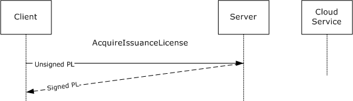

Figure 11: AcquireIssuanceLicense sequence

<wsdl:operation name="AcquireIssuanceLicense">

<wsdl:input message="tns:AcquireIssuanceLicenseSoapIn" />

<wsdl:output message="tns:AcquireIssuanceLicenseSoapOut" />

</wsdl:operation>

**Exceptions Thrown:** The AcquireIssuanceLicense method SHOULD return a fault code when a failure occurs. Details of the RMS: Client to Server Protocol SOAP Fault Format can be found in section [3.1.4.5](#Section_3.1.4.5).

| Exception | Description |
| --- | --- |
| Microsoft.DigitalRightsManagement.Licensing.OnlinePublishingDisabledException | Online publishing is not available on this server. |
| Microsoft.DigitalRightsManagement.Licensing.UnsignedIssuanceLicenseNoMatchingIssuedPrincipalException | None of the issued principals matches this server. |
| Microsoft.DigitalRightsManagement.Licensing.InvalidOfficialRightsTemplateException | The official rights template included in the PL is not valid. |
| Microsoft.RightsManagementServices.ClusterDecommissionedException | A request was received, but the server is in a decommissioned state and cannot process the request. |
| Microsoft.DigitalRightsManagement.Cryptography.CryptoUnsupportedSymKeyException | The supplied enabling bits have an unsupported [**content key**](#gt_content-key). |
| Microsoft.RightsManagementServices.EnablingBitsHashDoesNotMatchException | The supplied enabling bits are not valid. |

In the AcquireIssuanceLicense operation, the client submits an unsigned PL and requests a signed PL chain. A properly formed AcquireIssuanceLicense request MUST contain an unsigned PL.

Upon receiving an AcquireIssuanceLicense request, the server SHOULD validate the unsigned PL for format and syntax.

- If the value of the **onlinePublishingEnabled** field of **ServerState** is false on the contacted server, the server SHOULD return a Microsoft.DigitalRightsManagement.Licensing.OnlinePublishingDisabledException [**SOAP fault code**](#gt_soap-fault-code).
- The [ISSUEDPRINCIPALS](#Section_2.2.9.3.3) element of the unsigned PL MUST follow the syntax specified in section [2.2.9.7.4](#Section_2.2.9.7.4). If not, the server MUST reject the unsigned PL as invalid [**XrML**](#gt_xrml) and SHOULD return a Microsoft.DigitalRightsManagement.Utilities.UnspecifiedErrorException [**SOAP fault**](#gt_soap-fault).
- The server SHOULD determine whether the **PRINCIPAL** in the **ISSUEDPRINCIPALS** of the PL matches the **PRINCIPAL** in the **ISSUEDPRINCIPALS** of the [**SLC**](#gt_server-licensor-certificate-slc) in **ServerState** or in one of the elements of the **trustedLicensingServers** set in **ServerState**. A match is determined by comparing the **OBJECT ID** as well as the size and value of the modulus parameter in the **PUBLICKEY** element of the **ISSUEDPRINCIPALS** elements being compared. If there is no match, the server SHOULD return a Microsoft.DigitalRightsManagement.Licensing.UnsignedIssuanceLicenseNoMatchingIssuedPrincipalException SOAP fault code.
- If the type attribute of the BODY element of the Encrypted Rights Data of the PL chain is "Microsoft Official Rights Template" and the signature of the Encrypted Rights Data is not valid, the server SHOULD return a Microsoft.DigitalRightsManagement.Licensing.InvalidOfficialRightsTemplateException fault.
- If the **serverDecommissioned** field of **ServerState** is true, the server SHOULD return a Microsoft.RightsManagementServices.ClusterDecommissionedException SOAP fault code.
If any other errors are found validating the unsigned PL, the server SHOULD return a Microsoft.DigitalRightsManagement.Utilities.UnspecifiedErrorException SOAP fault.

If validation succeeds, the server SHOULD service the request.

To service the request, the server MUST validate the **ENABLINGBITS** element of the PL. If the session key of the **ENABLINGBITS** element of the PL is [**DES**](#gt_data-encryption-standard-des) symmetric key, the server SHOULD return the Microsoft.DigitalRightsManagement.Cryptography.CryptoUnsupportedSymKeyException SOAP fault code. If the hash that is extracted from the **sealedkey** field of the **ENABLINGBITS** cannot be validated, the server SHOULD return the Microsoft.DigitalRightsManagement.EnablingBitsHashDoesNotMatchException SOAP fault code. If validation succeeds, the server SHOULD regenerate the **Hash** field of the **ENABLINGBITS** element of the PL by using the **ISSUEDPRINCIPALS** element of the PL.

To service the request, the server MUST sign the body of the PL and include the signature in the [SIGNATURE](#Section_2.2.9.1.12) element of the PL.

The server MUST include a [DISTRIBUTIONPOINT (section 2.2.9.7.3)](#Section_2.2.9.7.3) of type "License-Acquisition-URL", and an optional DISTRIBUTIONPOINT of type "Extranet-License-Acquisition-URL". The **ADDRESS** element SHOULD contain the **licensingUrl** of the **ServerState** when the object type is "License-Acquisition-URL", or **externalLicensingUrl** of **ServerState** when the object type is "Extranet-License-Acquisition-URL". The **NAME** element SHOULD contain "DRM Server Cluster" when the object type is "License-Acquisition-URL" or "Extranet-License-Acquisition-URL". The **GUID** element SHOULD be a unique [**GUID**](#gt_globally-unique-identifier-guid) for this DISTRIBUTIONPOINT element. If the unsigned PL submitted by the client includes any DISTRIBUTIONPOINT of type "Referral-Info", then the same DISTRIBUTIONPOINT MUST be included in the signed PL. The server SHOULD set the [ISSUEDTIME (section 2.2.9.1.1)](#Section_2.2.9.1.1) element of the PL to the current time, expressed in [**UTC**](#gt_coordinated-universal-time-utc).

For information about [**certificate**](#gt_certificate) formats, see section [2.2.9](#Section_2.2.9).

For a successful request, the server MUST return a signed PL chain. For an unsuccessful request, the server MUST return a SOAP fault code listed earlier or a generic SOAP fault code. The client MUST treat all generic SOAP fault codes the same.

##### 3.5.4.1.1 Messages

| Message | Description |
| --- | --- |
| [AcquireIssuanceLicenseSoapIn](#Section_3.5.4.1.1.1) | Contains an unsigned [**PL**](#gt_publishing-license-pl). |
| [AcquireIssuanceLicenseSoapOut](#Section_3.5.4.1.1.2) | Contains a signed PL chain. |

###### 3.5.4.1.1.1 AcquireIssuanceLicenseSoapIn

The AcquireIssuanceLicenseSoapIn message contains an unsigned [**PL**](#gt_publishing-license-pl).

<wsdl:message name="AcquireIssuanceLicenseSoapIn">

<wsdl:part name="parameters" element="tns:AcquireIssuanceLicense" />

</wsdl:message>

[AcquireIssuanceLicense](#Section_3.5.4.1.2.1): The AcquireIssuanceLicense element, as specified in section 3.5.4.1.2.1.

###### 3.5.4.1.1.2 AcquireIssuanceLicenseSoapOut

The AcquireIssuanceLicenseSoapOut message contains a signed [**PL**](#gt_publishing-license-pl) chain.

<wsdl:message name="AcquireIssuanceLicenseSoapOut">

<wsdl:part name="parameters" element="tns:AcquireIssuanceLicenseResponse" />

</wsdl:message>

[AcquireIssuanceLicenseResponse](#Section_3.5.4.1.2.2): The AcquireIssuanceLicenseResponse element, as defined in section 3.5.4.1.2.2.

##### 3.5.4.1.2 Elements

| Element | Description |
| --- | --- |
| [AcquireIssuanceLicense](#Section_3.5.4.1.2.1) | Contains the body of the request to the AcquireIssuanceLicense operation. |
| [AcquireIssuanceLicenseResponse](#Section_3.5.4.1.2.2) | Contains the response parameters returned from an AcquireIssuanceLicense operation. |
| [UnsignedIssuanceLicense](#Section_3.5.4.1.2.3) | Contains the issuance [**license**](#gt_license) that the client requests the server to sign and is represented as an XmlNode. |

###### 3.5.4.1.2.1 AcquireIssuanceLicense

The AcquireIssuanceLicense element contains the body of the request to the AcquireIssuanceLicense web method.

<xs:element name="AcquireIssuanceLicense">

<xs:complexType>

<xs:sequence>

<xs:element name="RequestParams"

type="ArrayOfAcquireIssuanceLicenseParams"

minOccurs="0"

maxOccurs="1"

/>

</xs:sequence>

</xs:complexType>

</xs:element>

###### 3.5.4.1.2.2 AcquireIssuanceLicenseResponse

The AcquireIssuanceLicenseResponse element contains the response parameters returned from an [AcquireIssuanceLicense](#Section_3.5.4.1.2.1) web method.

<xs:element name="AcquireIssuanceLicenseResponse">

<xs:complexType>

<xs:sequence>

<xs:element name="AcquireIssuanceLicenseResult"

type="ArrayOfAcquireIssuanceLicenseResponse"

minOccurs="0"

maxOccurs="1"

/>

</xs:sequence>

</xs:complexType>

</xs:element>

###### 3.5.4.1.2.3 UnsignedIssuanceLicense

The UnsignedIssuanceLicense element contains the issuance [**license**](#gt_license) that the client requests the server to sign and is represented as an XmlNode. This license MUST conform to the parameters specified in section [2.2.9](#Section_2.2.9).

<xs:element name="UnsignedIssuanceLicense">

<xs:complexType

mixed="true"

>

<xs:sequence>

<xs:any

namespace=""

/>

</xs:sequence>

</xs:complexType>

</xs:element>

##### 3.5.4.1.3 Complex Types

| Complex Types | Description |
| --- | --- |
| [ArrayOfAcquireIssuanceLicenseParams](#Section_3.5.4.1.3.1) | An array used to provide multiple unsigned issuance [**licenses**](#gt_license) as in-parameters to the [AcquireIssuanceLicense](#Section_3.5.4.1.2.1) operation. |
| [ArrayOfAcquireIssuanceLicenseResponse](#Section_3.5.4.1.3.2) | An array of [**certificate chains**](#gt_certificate-chain) that each represent a signed issuance license. |
| [AcquireIssuanceLicenseParams](#Section_3.5.4.1.3.3) | The in-parameters for the AcquireIssuanceLicense request operation. |
| [AcquireIssuanceLicenseResponse](#Section_3.5.4.1.2.2) | Contains an [ArrayOfXmlNode](#Section_2.2.4.1) that contains the signed issuance license issued by the server. |

###### 3.5.4.1.3.1 ArrayOfAcquireIssuanceLicenseParams

The ArrayOfAcquireIssuanceLicenseParams complex type defines an array used to provide multiple unsigned issuance [**licenses**](#gt_license) as in-parameters to the [AcquireIssuanceLicense](#Section_3.5.4.1.2.1) operation.

<xs:complexType name="ArrayOfAcquireIssuanceLicenseParams">

<xs:sequence>

<xs:element name="AcquireIssuanceLicenseParams"

type="AcquireIssuanceLicenseParams"

minOccurs="0"

maxOccurs="unbounded"

/>

</xs:sequence>

</xs:complexType>

###### 3.5.4.1.3.2 ArrayOfAcquireIssuanceLicenseResponse

The ArrayOfAcquireIssuanceLicenseResponse complex type contains an array of [**certificate chains**](#gt_certificate-chain) that each represent a signed issuance [**license**](#gt_license).

<xs:complexType name="ArrayOfAcquireIssuanceLicenseResponse">

<xs:sequence>

<xs:element name="AcquireIssuanceLicenseResponse"

type="AcquireIssuanceLicenseResponse"

minOccurs="0"

maxOccurs="unbounded"

/>

</xs:sequence>

</xs:complexType>

###### 3.5.4.1.3.3 AcquireIssuanceLicenseParams

The AcquireIssuanceLicenseParams complex type defines the in-parameters for the [AcquireIssuanceLicense](#Section_3.5.4.1.2.1) request operation. The in-parameter [UnsignedIssuanceLicense](#Section_3.5.4.1.2.3) contains the unsigned issuance [**license**](#gt_license). The license format MUST correspond to the format defined in [2.2.9](#Section_2.2.9).

<xs:complexType name="AcquireIssuanceLicenseParams">

<xs:sequence>

<xs:element name="UnsignedIssuanceLicense"

minOccurs="0"

maxOccurs="1"

>

<xs:complexType

mixed="true"

>

<xs:sequence>

<xs:any

namespace=""

/>

</xs:sequence>

</xs:complexType>

</xs:element>

</xs:sequence>

</xs:complexType>

###### 3.5.4.1.3.4 AcquireIssuanceLicenseResponse

The AcquireIssuanceLicenseResponse complex type contains an [ArrayOfXmlNode](#Section_2.2.4.1) that contains the signed issuance [**license**](#gt_license) issued by the server. The issuance licenses used in this array MUST conform to the format specified in [2.2.9](#Section_2.2.9).

<xs:complexType name="AcquireIssuanceLicenseResponse">

<xs:sequence>

<xs:element name="CertificateChain"

type="ArrayOfXmlNode"

minOccurs="0"

maxOccurs="1"

/>

</xs:sequence>

</xs:complexType>

#### 3.5.4.2 GetClientLicensorCert Operation

To create [**protected content**](#gt_protected-content) without continually contacting a server, the user needs a [**CLC chain**](#gt_f5d0f10f-abb4-4219-9006-27c19ea7bb8f) that corresponds to the user's account. The CLC chain represents the identity of a user who can create protected content on behalf of the issuing server. It issues an asymmetric signing key pair that is bound to the [**RAC**](#gt_rms-account-certificate-rac).

The client uses the GetClientLicensorCert request to obtain a CLC. The client MUST have a valid RAC and [**SPC**](#gt_security-processor-certificate-spc) before calling GetClientLicensorCert. For more information about acquiring a RAC, see section [2.2.9.5](#Section_2.2.9.5). For more information about acquiring an SPC, see section [2.2.9.4](#Section_2.2.9.4).

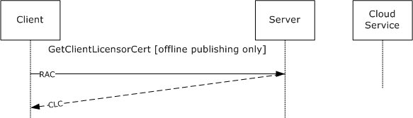

Figure 12: GetClientLicensorCert message sequence

<wsdl:operation name="GetClientLicensorCert">

<wsdl:input message="tns:GetClientLicensorCertSoapIn" />

<wsdl:output message="tns:GetClientLicensorCertSoapOut" />

</wsdl:operation>

| Exception | Description |
| --- | --- |
| Microsoft.DigitalRightsManagement.Licensing.InvalidPersonaCertSignatureException | The account [**certificate**](#gt_certificate) the requestor supplied has been tampered with. |
| Microsoft.DigitalRightsManagement.Licensing.InvalidPersonaCertTimeException | The account certificate the requestor supplied is currently invalid. |
| Microsoft.DigitalRightsManagement.Licensing.UnexpectedPersonaCertException | An unexpected error was encountered while validating the account certificate. |
| Microsoft.DigitalRightsManagement.Licensing.UntrustedPersonaCertException | The account certificate the requestor supplied was not issued by a trusted user [**domain**](#gt_domain) server. |
| Microsoft.DigitalRightsManagement.Licensing.DrmacIsExcludedException | The account certificate has been excluded and is not permitted to submit this request. |
| Microsoft.DigitalRightsManagement.Licensing.BlackBoxIsInvalidException | The client's RM lockbox has been revoked. The client computer MUST be reactivated to retrieve the latest RM lockbox. |
| Microsoft.RightsManagementServices.ClusterDecommissionedException | A request was received, but the server is in a decommissioned state and cannot process the request. |
| Microsoft.DigitalRightsManagement.Cryptography.UnsupportedCryptographicSetException | The given certificate does not contain an acceptable combination of asymmetric key and signature hash algorithms. |

In the GetClientLicensorCert request, the client submits a RAC chain and requests a CLC chain. A properly formed GetClientLicensorCert request MUST contain a RAC chain.

Upon receiving a GetClientLicensorCert request the server SHOULD perform signature validation on the RAC chain in the request and verify that it trusts the RAC.

- If the RAC chain fails signature validation the server SHOULD return a Microsoft.DigitalRightsManagement.Licensing.InvalidPersonaCertSignatureException [**SOAP fault**](#gt_soap-fault) code.
- If the RAC chain is expired or not yet valid, the server SHOULD return a Microsoft.DigitalRightsManagement.Licensing.InvalidPersonaCertTimeException [**SOAP fault code**](#gt_soap-fault-code).
- If the RAC is signed by an [**SLC**](#gt_server-licensor-certificate-slc) that is not in the **trustedRacIssuers** field of **ServerState**, the server SHOULD return a Microsoft.DigitalRightsManagement.Licensing.UntrustedPersonaCertException.
- If the RAC public key is in the **racExclusionPolicy** field of **ServerState**, the server SHOULD return the SOAP fault Microsoft.DigitalRightsManagement.Licensing.DrmacIsExcludedException.
- If any other errors are found validating the RAC chain the server SHOULD return a Microsoft.DigitalRightsManagement.Licensing.UnexpectedPersonaCertException SOAP fault.
- If the **serverDecommissioned** field of **ServerState** is true, the server SHOULD return a Microsoft.RightsManagementServices.ClusterDecommissionedException SOAP fault code.
- If the RAC contains a public key length or hash algorithm that is not allowed in the cryptographic mode indicated by the **cryptographicMode** attribute of **ServerState**, the server SHOULD return a Microsoft.DigitalRightsManagement.Cryptography.UnsupportedCryptographicSetException fault.
If validation succeeds, the server SHOULD<45> service the request by generating a CLC. To generate a CLC, the server MUST either retrieve or generate a unique asymmetric signing key pair for the user account. The server MUST encrypt the private key with the public key of the RAC so the RAC and the [**security processor**](#gt_security-processor) are required to access the signing key in the CLC. The CLC MUST contain the public key and the encrypted private key. The [ISSUER](#Section_2.2.9.6.2) element of the CLC MUST contain the public key of the server. The **ADDRESS** of the **distributionpoint-int** of the CLC SHOULD contain the **licensingUrl** of the **ServerState**. The **ADDRESS** of the **distributionpoint-ext** of the CLC SHOULD contain the **externalLicensingUrl** of the **ServerState** if the [**URL**](#gt_uniform-resource-locator-url) is not null. The **starttime** and **endtime** of the **rangetime** element of the CLC SHOULD be copied from the **starttime** and **endtime** of the **validitytime** element of the RAC. The **OBJECT** element of the **ISSUEDPRINCIPALS** of the CLC SHOULD be copied from the **OBJECT** element of the **ISSUEDPRINCIPALS** of the RAC. The body of the CLC MUST be signed by the server, and the signature MUST be included in the [SIGNATURE](#Section_2.2.9.1.12) element of the CLC. The server MUST append its SLC chain to the CLC to complete the CLC chain.

For a successful request, the server MUST return a CLC chain. For an unsuccessful request, the server MUST return a SOAP fault code.

For information about certificate formats, see section [2.2.9](#Section_2.2.9).

##### 3.5.4.2.1 Messages

| Message | Description |
| --- | --- |
| [GetClientLicensorCertSoapIn](#Section_3.5.4.2.1.1) | Contains the user's [**RAC**](#gt_rms-account-certificate-rac) chain. |
| [GetClientLicensorCertSoapOut](#Section_3.5.4.2.1.2) | Contains the [**CLC chain**](#gt_f5d0f10f-abb4-4219-9006-27c19ea7bb8f). |

###### 3.5.4.2.1.1 GetClientLicensorCertSoapIn

The GetClientLicensorCertSoapIn message contains the user's [**RAC**](#gt_rms-account-certificate-rac) chain.

<wsdl:message name="GetClientLicensorCertSoapIn">

<wsdl:part name="parameters"

element="tns:GetClientLicensorCert" />

</wsdl:message>

[GetClientLicensorCert](#Section_3.5.4.2.2.1): The GetClientLicensorCert element, as specified in section 3.5.4.2.2.1.

###### 3.5.4.2.1.2 GetClientLicensorCertSoapOut

The GetClientLicensorCertSoapOut message contains the [**CLC chain**](#gt_f5d0f10f-abb4-4219-9006-27c19ea7bb8f). The CLC chain issues a signing key pair to the user and binds the signing keys to the user's account through the [**RAC**](#gt_rms-account-certificate-rac).

<wsdl:message name="GetClientLicensorCertSoapOut">

<wsdl:part name="parameters" element="tns:GetClientLicensorCertResponse" />

</wsdl:message>

[GetClientLicensorCertResponse](#Section_3.5.4.2.2.2): The GetClientLicensorCertResponse element, as specified in section 3.5.4.2.2.2.

##### 3.5.4.2.2 Elements

| Element | Description |
| --- | --- |
| [GetClientLicensorCert](#Section_3.5.4.2.2.1) | Contains the body of the request used in the GetClientLicensorCert operation. |
| [GetClientLicensorCertResponse](#Section_3.5.4.2.2.2) | Contains the response parameters returned from the GetClientLicensorCertResponse operation. |

###### 3.5.4.2.2.1 GetClientLicensorCert

The GetClientLicensorCert element contains the body of the request used in the GetClientLicensorCert web method request. The GetClientLicensorCert operation takes as input one parameter that is an array of user identity [**certificates**](#gt_certificate).

<xs:element name="GetClientLicensorCert">

<xs:complexType>

<xs:sequence>

<xs:element name="RequestParams"

type="ArrayOfGetClientLicensorCertParams"

minOccurs="0"

maxOccurs="1"

/>

</xs:sequence>

</xs:complexType>

</xs:element>

###### 3.5.4.2.2.2 GetClientLicensorCertResponse

The GetClientLicensorCertResponse element contains the response parameters returned from the GetClientLicensorCertResponse web method request.

<xs:element name="GetClientLicensorCertResponse">

<xs:complexType>

<xs:sequence>

<xs:element name="GetClientLicensorCertResult"

type="ArrayOfGetClientLicensorCertResponse"

minOccurs="0"

maxOccurs="1"

/>

</xs:sequence>

</xs:complexType>

</xs:element>

##### 3.5.4.2.3 Complex Types

| Complex Types | Description |
| --- | --- |
| [ArrayOfGetClientLicensorCertParams](#Section_3.5.4.2.3.1) | An array of [GetClientLicensorCertParams](#Section_3.5.4.2.3.3). |
| [ArrayOfGetClientLicensorCertResponse](#Section_3.5.4.2.3.2) | Contains an array of [**CLCs**](#gt_f5d0f10f-abb4-4219-9006-27c19ea7bb8f). |
| GetClientLicensorCertParams | Contains a user identity [**certificate chain**](#gt_certificate-chain). |
| [GetClientLicensorCertResponse](#Section_3.5.4.2.2.2) | Contains an [ArrayOfXmlNode](#Section_2.2.4.1) that represents a CLC. |

###### 3.5.4.2.3.1 ArrayOfGetClientLicensorCertParams

The ArrayOfGetClientLicensorCertParams complex type is an array of [GetClientLicensorCertParams](#Section_3.5.4.2.3.3), each of which contains a set of user identity [**certificates**](#gt_certificate) used in responding to the [GetClientLicensorCert](#Section_3.5.4.2.2.1) web request.

<xs:complexType name="ArrayOfGetClientLicensorCertParams">

<xs:sequence>

<xs:element name="GetClientLicensorCertParams"

type="GetClientLicensorCertParams"

minOccurs="0"

maxOccurs="unbounded"

/>

</xs:sequence>

</xs:complexType>

###### 3.5.4.2.3.2 ArrayOfGetClientLicensorCertResponse

The ArrayOfGetClientLicensorCertResponse complex type contains an array of [GetClientLicensorCertResponse](#Section_3.5.4.2.2.2) types that each contain a [**certificate chain**](#gt_certificate-chain) representing a [**CLC**](#gt_f5d0f10f-abb4-4219-9006-27c19ea7bb8f). The CLC grants permissions to the client on behalf of the server so the client can sign issuance [**licenses**](#gt_license) itself.

<xs:complexType name="ArrayOfGetClientLicensorCertResponse">

<xs:sequence>

<xs:element name="GetClientLicensorCertResponse"

type="GetClientLicensorCertResponse"

minOccurs="0"

maxOccurs="unbounded"

/>

</xs:sequence>

</xs:complexType>

###### 3.5.4.2.3.3 GetClientLicensorCertParams

The GetClientLicensorCertParams complex type contains an element named PersonaCerts that is an [ArrayOfXmlNode](#Section_2.2.4.1), and represents a user identity [**certificate chain**](#gt_certificate-chain). The GetClientLicensorCert web method issues [**CLC chains**](#gt_f5d0f10f-abb4-4219-9006-27c19ea7bb8f) to the user identities presented via this parameter.

<xs:complexType name="GetClientLicensorCertParams">

<xs:sequence>

<xs:element name="PersonaCerts"

type="ArrayOfXmlNode"

minOccurs="0"

maxOccurs="1"

/>

</xs:sequence>

</xs:complexType>

###### 3.5.4.2.3.4 GetClientLicensorCertResponse

The GetClientLicensorCertResponse complex type contains an [ArrayOfXmlNode](#Section_2.2.4.1) that represents the [**CLC**](#gt_f5d0f10f-abb4-4219-9006-27c19ea7bb8f) response from the GetClientLicensorCert web method request. This CLC MUST conform to the parameters found in [2.2.9](#Section_2.2.9).

<xs:complexType name="GetClientLicensorCertResponse">

<xs:sequence>

<xs:element name="CertificateChain"

type="ArrayOfXmlNode"

minOccurs="0"

maxOccurs="1"

/>

</xs:sequence>

</xs:complexType>

### 3.5.5 Timer Events

None.

### 3.5.6 Other Local Events

None.

## 3.6 EnrollServiceSoap Server Details

### 3.6.1 Abstract Data Model

See the common server ADM in section [3.1.1](#Section_3.1.1).

### 3.6.2 Timers

None.

### 3.6.3 Initialization

See section common server [Initialization (section 3.1.3)](#Section_3.1.3).

### 3.6.4 Message Processing Events and Sequencing Rules

| Operation | Description |
| --- | --- |
| Synchronous Enrollment | Allows a server to enroll in Rights Management using the Microsoft Cloud Server. |
| Asynchronous Enrollment | Allows a server without connectivity to the Internet to enroll in Rights Management using the Microsoft Cloud Server. |

#### 3.6.4.1 Synchronous Enrollment Operation

The RMS enrollment [**cloud service**](#gt_cloud-service) uses a SOAP over HTTP protocol, as specified in [[SOAP1.1]](https://go.microsoft.com/fwlink/?LinkId=90520).

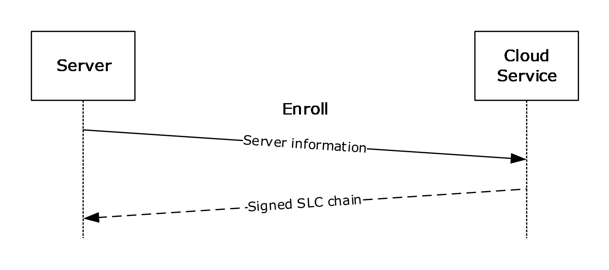

Figure 13: Enrollment message sequence

In the enrollment protocol, the server makes an Enroll request submitting information about itself, including its public key, its unique [**GUID**](#gt_globally-unique-identifier-guid), the type of revocation to use, and [**Stock Keeping Unit (SKU)**](#gt_stock-keeping-unit-sku) and version information about the server. The cloud service generates the [SIGNATURE](#Section_2.2.9.1.12) element of the [**SLC**](#gt_server-licensor-certificate-slc) using its private key, appends the element to the SLC, and appends its own [**certificate chain**](#gt_certificate-chain). It then returns the signed SLC chain to the server in the response.

In the [EnrolleeServerInformation](#Section_3.6.4.1.4.6) complex type (section 3.6.4.1.4.6), the elements SHOULD be populated as follows:

- **SKU** SHOULD be set to **SKU** from **ServerState**.
- **Version** SHOULD be set to **serverVersion** from **ServerState**.
- **Name** SHOULD be set to **name** from **ServerState**.
- **URL** SHOULD be set to **baseURL** from **ServerState**.
In the [EnrolleeRevocationInformation (section 3.6.4.1.4.3)](#Section_3.6.4.1.4.3) complex type (section 3.6.4.1.4.3), the elements MUST be populated as follows:

- The [RevocationTypeEnum (section 3.6.4.1.2.1)](#Section_3.6.4.1.2.1) MUST be set to **revocationType** from **ServerState**.
- The [ArrayOfRevocationAuthorityInformation (section 3.6.4.1.4.4)](#Section_3.6.4.1.4.4) MUST be set to **revocationAuthorities** from **ServerState**.

##### 3.6.4.1.1 Messages

| Message | Description |
| --- | --- |
| [EnrollSoapIn](#Section_3.6.4.1.1.1) | The synchronous request for enrollment. |
| [EnrollSoapOut](#Section_3.6.4.1.1.2) | The synchronous enrollment response. |

###### 3.6.4.1.1.1 EnrollSoapIn

The Enroll request message MUST be as follows. The minimum and maximum versions in the **VersionData** element in the SOAP header MUST be set to "1.0.0.0".

<wsdl:message name="EnrollSoapIn">

<wsdl:part name="parameters" element="tns:Enroll" />

</wsdl:message>

###### 3.6.4.1.1.2 EnrollSoapOut

The Enroll response MUST be as follows. The minimum and maximum versions in the **VersionData** element in the SOAP header MUST be set to "1.0.0.0".

<wsdl:message name="EnrollSoapOut">

<wsdl:part name="parameters" element="tns:EnrollResponse" />

</wsdl:message>

##### 3.6.4.1.2 Simple Types

| Simple Type | Description |
| --- | --- |
| [RevocationTypeEnum](#Section_3.6.4.1.2.1) | Indicates a particular type of revocation authority. |

###### 3.6.4.1.2.1 RevocationTypeEnum

The RevocationTypeEnum complex type indicates a particular type of revocation authority.

<s:simpleType name="RevocationTypeEnum">

<s:restriction base="s:string">

<s:enumeration value="NonRevocable" />

<s:enumeration value="StandardRevocation" />

<s:enumeration value="CustomRevocation" />

</s:restriction>

</s:simpleType>

##### 3.6.4.1.3 Elements

| Element | Description |
| --- | --- |
| [Enroll](#Section_3.6.4.1.3.1) | Contains the body of an Enroll request operation. |
| [RevocationAuthorityInformation](#Section_3.6.4.1.3.2) | Describes the public key of a third-party revocation authority that is allowed to revoke the [**SLC**](#gt_server-licensor-certificate-slc). |
| [EnrollResponse](#Section_3.6.4.1.3.3) | Contains the body of an Enroll response operation. |

###### 3.6.4.1.3.1 Enroll

The Enroll element contains the body of an Enroll request operation.

<s:element name="Enroll">

<s:complexType>

<s:sequence>

<s:element minOccurs="1" maxOccurs="1" name="oInput"

type="tns:EnrollParameters" />

</s:sequence>

</s:complexType>

</s:element>

**oInput:** A set of enrollment parameters contained inside an **EnrollParameters** element.

###### 3.6.4.1.3.2 RevocationAuthorityInformation

The RevocationAuthorityInformation element describes the public key of a third-party revocation authority that is allowed to revoke the [**SLC**](#gt_server-licensor-certificate-slc). If the Enroll request specifies CustomRevocation, at least one RevocationAuthorityInformation element MUST be present. A RevocationAuthorityInformation element MUST use the following template.

<RevocationAuthorityInformation>

<aRevocationAuthorityPublicKey>

[[- key -]]

</aRevocationAuthorityPublicKey>

</RevocationAuthorityInformation>

**[[- key -]]:** MUST contain the revocation authority's RSA PKCS#1-encoded public key as a base64-encoded string. If this revocation authority is required to issue a revocation list that revokes the SLC, it MUST be issued using this public key and signed with the corresponding private key.

###### 3.6.4.1.3.3 EnrollResponse

The EnrollResponse element contains the body of an Enroll response operation.

<s:element name="EnrollResponse">

<s:complexType>

<s:sequence>

<s:element minOccurs="1" maxOccurs="1" name="EnrollResult"

type="tns:EnrollResponse" />

</s:sequence>

</s:complexType>

</s:element>

##### 3.6.4.1.4 Complex Types

| Complex Types | Description |
| --- | --- |
| [EnrollParameters](#Section_3.6.4.1.4.1) | Contains parameters for an Enroll request. |
| [X509Information](#Section_3.6.4.1.4.2) | Contains binary-formatted X509 information. |
| [EnrolleeRevocationInformation](#Section_3.6.4.1.4.3) | Contains information about the enrollee's revocation authorities. |
| [ArrayOfRevocationAuthorityInformation](#Section_3.6.4.1.4.4) | Container for revocation authority information. |
| [RevocationAuthorityInformation](#Section_3.6.4.1.3.2) | Contains a binary public key. |
| [EnrolleeServerInformation](#Section_3.6.4.1.4.6) | Contains data about the enrollee's server. |
| [EnrollResponse](#Section_3.6.4.1.3.3) | Contains a response to an Enroll request. |
| [ArrayOfString](#Section_3.6.4.1.4.8) | Contains an array of strings. |

###### 3.6.4.1.4.1 EnrollParameters

The **EnrollParameters** complex type contains one or more parameters for the enrollment request.

<s:complexType name="EnrollParameters">

<s:sequence>

<s:element minOccurs="1" maxOccurs="1"

name="AuthorizationInformation"

type="tns:X509Information" />

<s:element minOccurs="1" maxOccurs="1"

name="RevocationInformation"

type="tns:EnrolleeRevocationInformation" />

<s:element minOccurs="1" maxOccurs="1"

name="CertificatePublicKey"

type="tns:EnrolleeCertificatePublicKey" />

<s:element minOccurs="1" maxOccurs="1"

name="EnrolleeInformation"

type="tns:EnrolleeServerInformation" />

</s:sequence>

</s:complexType>

###### 3.6.4.1.4.2 X509Information

The X509Information complex type contains binary-encoded X509 [**certificate**](#gt_certificate) information. This complex type is currently ignored.

<s:complexType name="X509Information">

<s:sequence>

<s:element minOccurs="0" maxOccurs="1"

name="SignedDataBase64Encoded"

type="s:string" />

</s:sequence>

</s:complexType>

###### 3.6.4.1.4.3 EnrolleeRevocationInformation

The EnrolleeRevocationInformation complex type contains information about the enrollee's revocation authorities.

<s:complexType name="EnrolleeRevocationInformation">

<s:sequence>

<s:element minOccurs="1" maxOccurs="1"

name="RevocationType"

type="tns:RevocationTypeEnum" />

<s:element minOccurs="0" maxOccurs="1"

name="aRevocationAuthorities"

type="tns:ArrayOfRevocationAuthorityInformation" />

</s:sequence>

</s:complexType>

**RevocationType:** The revocation type. MUST be either "StandardRevocation" or "CustomRevocation", specified as a string. Although "NonRevocable" is specified as a possible value by WSDL, it is not supported. "StandardRevocation" indicates that the issuer can revoke the [**SLC**](#gt_server-licensor-certificate-slc). "CustomRevocation" indicates that a third party specified by **aRevocationAuthorities** can revoke the SLC. "StandardRevocation" is recommended.

**aRevocationAuthorities:** MUST exist only if **RevocationType** is set to "CustomRevocation"; otherwise, MUST be empty. If **RevocationType** is set to "CustomRevocation", this MUST contain one or more [RevocationAuthorityInformation](#Section_3.6.4.1.3.2) elements.

###### 3.6.4.1.4.4 ArrayOfRevocationAuthorityInformation

The ArrayOfRevocationAuthorityInformation complex type is a container for revocation authority information.

<s:complexType name="ArrayOfRevocationAuthorityInformation">

<s:sequence>

<s:element minOccurs="0" maxOccurs="unbounded"

name="RevocationAuthorityInformation"

type="tns:RevocationAuthorityInformation" />

</s:sequence>

</s:complexType>

###### 3.6.4.1.4.5 RevocationAuthorityInformation

The RevocationAuthorityInformation complex type contains a binary public key.

<s:complexType name="RevocationAuthorityInformation">

<s:sequence>

<s:element minOccurs="0" maxOccurs="1"

name="aRevocationAuthorityPublicKey"

type="s:base64Binary" />

</s:sequence>

</s:complexType>

###### 3.6.4.1.4.6 EnrolleeServerInformation

The EnrolleeServerInformation complex type contains data about the enrollee's server.

The enrollment service validates that **Version** is not NULL and is not an empty string. The **SKU**, **Name**, and **URL** elements are ignored by the enrollment service.

<s:complexType name="EnrolleeServerInformation">

<s:sequence>

<s:element minOccurs="0" maxOccurs="1" name="SKU"

type="s:string" />

<s:element minOccurs="0" maxOccurs="1" name="Version"

type="s:string" />

<s:element minOccurs="0" maxOccurs="1" name="Name"

type="s:string" />

<s:element minOccurs="0" maxOccurs="1" name="URL"

type="s:string" />

</s:sequence>

</s:complexType>

**SKU:** A string containing [**SKU**](#gt_stock-keeping-unit-sku) or edition information for the server.

**Version:** A string containing version information for the server.

**Name:** A string containing a name for the server.

**URL:** A string containing a [**URL**](#gt_uniform-resource-locator-url) for the server.

###### 3.6.4.1.4.7 EnrollResponse

The EnrollResponse complex type contains an array of string values.

<s:complexType name="EnrollResponse">

<s:sequence>

<s:element minOccurs="0" maxOccurs="1"

name="LicensorCertificateChain"

type="tns:ArrayOfString" />

</s:sequence>

</s:complexType>

**LicensorCertificateChain:** MUST contain the following sequence of four strings:

**[[- SLC -]]:** MUST be a string containing the SLC.

**[[- EnrollmentServiceCert -]]:** MUST be a string containing the Enrollment Service [**certificate**](#gt_certificate).

**[[- EnrollmentCACert -]]:** MUST be a string containing the Enrollment [**CA**](#gt_certification-authority-ca) certificate.

**[[- CACert -]]:** MUST be a string containing the CA certificate.

###### 3.6.4.1.4.8 ArrayOfString

The ArrayOfString complex type contains an array of strings.

<s:complexType name="ArrayOfString">

<s:sequence>

<s:element minOccurs="0" maxOccurs="unbounded"

name="string"

nillable="true"

type="s:string" />

</s:sequence>

</s:complexType>

**string:** MUST contain a string.

#### 3.6.4.2 Asynchronous Enrollment Operation

To enable "airgap" networks that do not have Internet connectivity, the Enroll SOAP request can be written to an [**ASCII**](#gt_ascii) text file (using a SOAP-compatible encoding format) and submitted asynchronously at https://activation.drm.microsoft.com/offlineenroll/Enrollment.aspx.

In the [EnrolleeServerInformation](#Section_3.6.4.1.4.6) complex type (section 3.6.4.2.4.3), the elements SHOULD be populated as follows:

- **SKU** SHOULD be set to **SKU** from **ServerState**.
- **Version** SHOULD be set to **serverVersion** from **ServerState**.
- **Name** SHOULD be set to **name** from **ServerState**.
- **URL** SHOULD be set to **baseURL** from **ServerState**.
In the [EnrolleeRevocationInformation (section 3.6.4.2.4.2)](#Section_3.6.4.2.4.2) complex type (section 3.6.4.2.4.2), the elements MUST be populated as follows:

- The [RevocationTypeEnum (section 3.6.4.2.2.1)](#Section_3.6.4.2.2.1) MUST be set to **revocationType** from **ServerState**.
- The [ArrayOfRevocationAuthorityInformation (section 3.6.4.2.4.4)](#Section_3.6.4.2.4.4) MUST be set to **revocationAuthorities** from **ServerState**.

##### 3.6.4.2.1 Messages

| Message | Description |
| --- | --- |
| [Asynchronous Enrollment Message (SOAP over HTTP)](#Section_3.6.4.2.1.1) | Enables asynchronous enrollment using an [**ASCII**](#gt_ascii) file. |
| [Asynchronous Enrollment Response](#Section_3.6.4.2.1.2) | The asynchronous enrollment response. |

###### 3.6.4.2.1.1 Asynchronous Enrollment Request

To enable "airgap" networks that do not have Internet connectivity, the Enroll SOAP request can be written to an [**ASCII**](#gt_ascii) text file (using a SOAP-compatible encoding format) and submitted asynchronously at **https://activation.drm.microsoft.com/offlineenroll/Enrollment.aspx**.

The request message MUST be sent as an ASCII text file with no additional headers or footers. This schema MUST be adhered to exactly.

<?xml version="1.0"?>

<s:schema targetNamespace="http://microsoft.com/DRM/EnrollmentService"

elementFormDefault="qualified"

xmlns:xsd="http://www.w3.org/2001/XMLSchema">

<s:import namespace="http://microsoft.com/DRM/EnrollmentService"/>

<s:complexType name="EnrollParameters"

xmlns:xsd="http://www.w3.org/2001/XMLSchema"

xmlns:xsi="http://www.w3.org/2001/XMLSchema-instance">

<s:element name="RevocationInformation"

type="tns:EnrolleeRevocationInformation"/>

<s:element name="CertificatePublicKey"

type="tns:EnrolleeCertificatePublicKey"

xmlns="http://microsoft.com/DRM/EnrollmentService">/>

<s:element name="EnrolleeInformation"

type="tns:EnrolleeServerInformation"

xmlns="http://microsoft.com/DRM/EnrollmentService">/>

</s:complexType>

</s:schema>

**EnrollmentParameters.RevocationInformation:** MUST be an [EnrolleeRevocationInformation (section 3.6.4.2.4.2)](#Section_3.6.4.2.4.2) complex type. The **RevocationType** element MUST be either "StandardRevocation" or "CustomRevocation", specified as a string. "StandardRevocation" indicates that the issuer can revoke the [**SLC**](#gt_server-licensor-certificate-slc). "CustomRevocation" indicates that a third party specified by **aRevocationAuthorities** can revoke the SLC. "StandardRevocation" is recommended. The **aRevocationAuthorities** element MUST exist only if **RevocationType** is set to "CustomRevocation" and MUST be empty otherwise. If **RevocationType** is set to "CustomRevocation", this MUST contain one or more [RevocationAuthorityInformation](#Section_3.6.4.1.3.2) elements, as specified in section 3.6.4.2.4.5.

**EnrollmentParameters.CertificatePublicKey:** MUST be an [EnrolleeCertificatePublicKey (section 3.6.4.2.4.1)](#Section_3.6.4.2.4.1) complex type. The **aPublicKeyBytes** element MUST contain the server's RSA PKCS#1-encoded public key as a base64-encoded string. **GUID** MUST be a unique [**GUID**](#gt_globally-unique-identifier-guid) that identifies the server, represented as a literal ASCII string enclosed in braces.

**EnrollmentParameters.EnrolleeInformation:** MUST be an [EnrolleeServerInformation (section 3.6.4.2.4.3)](#Section_3.6.4.2.4.3) complex type. **Version** contains version information. The enrollment service validates that **Version** is not NULL and is not an empty string. The [**SKU**](#gt_stock-keeping-unit-sku), Name, and **URL** elements are ignored by the enrollment service.

###### 3.6.4.2.1.2 Asynchronous Enrollment Response

The response message MUST be sent as an [**ASCII**](#gt_ascii) text file with no additional headers or footers. This schema MUST be adhered to exactly.

<?xml version="1.0" encoding="utf-16"?>

<s:schema targetNamespace="http://microsoft.com/DRM/EnrollmentService"

elementFormDefault="qualified"

xmlns:xsd="http://www.w3.org/2001/XMLSchema">

<s:import namespace="http://microsoft.com/DRM/EnrollmentService"/>

<s:complexType name="EnrollResponse"

xmlns:xsd="http://www.w3.org/2001/XMLSchema">

<s:complexType name="LicensorCertificateChain">

<s: element name="SLC" type="xsd:string">

<s: element name="EnrollmentServiceCert" type="xsd:string">

<s: element name="EnrollmentCACert" type="xsd:string">

<s: element name="CACert" type="xsd:string">

</s:compleType>

</s:complexType>

</s:schema>

**LicensorCertificateChain.SLC:** MUST be a string containing the [**SLC**](#gt_server-licensor-certificate-slc).

**LicensorCertificateChain.EnrollmentServiceCert:** MUST be a string containing the Enrollment Service [**certificate**](#gt_certificate).

**LicensorCertificateChain.EnrollmentCACert:** MUST be a string containing the Enrollment [**CA**](#gt_certification-authority-ca) certificate.

**LicensorCertificateChain.CACert:** MUST be a string containing the CA certificate.

##### 3.6.4.2.2 Simple Types

| Simple Type | Description |
| --- | --- |
| [RevocationTypeEnum](#Section_3.6.4.1.2.1) | Indicates a particular type of revocation authority. |

###### 3.6.4.2.2.1 RevocationTypeEnum

The RevocationTypeEnum complex type indicates a particular type of revocation authority.

<s:simpleType name="RevocationTypeEnum">

<s:restriction base="s:string">

<s:enumeration value="NonRevocable" />

<s:enumeration value="StandardRevocation" />

<s:enumeration value="CustomRevocation" />

</s:restriction>

</s:simpleType>

##### 3.6.4.2.3 Elements

| Elements | Description |
| --- | --- |
| [RevocationAuthorityInformation](#Section_3.6.4.1.3.2) | Describes the public key of a third-party revocation authority that is allowed to revoke the SLC. |

###### 3.6.4.2.3.1 RevocationAuthorityInformation

Describes the public key of a third-party revocation authority that is allowed to revoke the SLC. If the Enroll request specifies CustomRevocation, at least one RevocationAuthorityInformation element MUST be present. A RevocationAuthorityInformation element MUST use the following template.

<RevocationAuthorityInformation>

<aRevocationAuthorityPublicKey>

[[- key -]]

</aRevocationAuthorityPublicKey>

</RevocationAuthorityInformation>

**[[- key -]]:** MUST contain the revocation authority's RSA PKCS#1-encoded public key as a base64-encoded string. If this revocation authority is required to issue a revocation list that revokes the SLC, it MUST be issued using this public key and signed with the corresponding private key.

##### 3.6.4.2.4 Complex Types

| Complex Types | Description |
| --- | --- |
| [EnrolleeCertificatePublicKey](#Section_3.6.4.2.4.1) | Contains a public key and an associated [**GUID**](#gt_globally-unique-identifier-guid). |
| [EnrolleeRevocationInformation](#Section_3.6.4.1.4.3) | Contains information about the enrollee's revocation authorities. |
| [EnrolleeServerInformation](#Section_3.6.4.1.4.6) | Contains data about the enrollee's server. |
| [ArrayOfRevocationAuthorityInformation](#Section_3.6.4.1.4.4) | Container for revocation authority information. |
| [RevocationAuthorityInformation](#Section_3.6.4.1.3.2) | Contains a binary public key. |

###### 3.6.4.2.4.1 EnrolleeCertificatePublicKey

The EnrolleeCertificatePublicKey complex type contains a public key and an associated [**GUID**](#gt_globally-unique-identifier-guid).

<s:complexType name="EnrolleeCertificatePublicKey">

<s:sequence>

<s:element minOccurs="0" maxOccurs="1"

name="aPublicKeyBytes"

type="s:base64Binary" />

<s:element minOccurs="1" maxOccurs="1"

name="Guid"

type="s1:guid" />

</s:sequence>

</s:complexType>

**aPublicKeyBytes:** MUST contain the server's RSA PKCS#1-encoded public key as a base64-encoded string.

**Guid:** MUST be a unique GUID that identifies the server, represented as a literal [**ASCII**](#gt_ascii) string enclosed in braces. If the server has not previously acquired an SLC chain as specified in section [3.1.3.2](#Section_3.1.3.2), the server generates a new GUID. Otherwise, the server uses the GUID specified in the [ISSUEDPRINCIPALS](#Section_2.2.9.3.3) element of its SLC as specified in section 2.2.9.3.3.

###### 3.6.4.2.4.2 EnrolleeRevocationInformation

The EnrolleeRevocationInformation complex type contains information about the enrollee's revocation authorities.

<s:complexType name="EnrolleeRevocationInformation">

<s:sequence>

<s:element minOccurs="1" maxOccurs="1"

name="RevocationType"

type="tns:RevocationTypeEnum" />

<s:element minOccurs="0" maxOccurs="1"

name="aRevocationAuthorities"

type="tns:ArrayOfRevocationAuthorityInformation" />

</s:sequence>

</s:complexType>

**RevocationType:** The revocation type. MUST be either "StandardRevocation" or "CustomRevocation", specified as a string. Although "NonRevocable" is specified as a possible value by WSDL, it is not supported. "StandardRevocation" indicates that the issuer can revoke the [**SLC**](#gt_server-licensor-certificate-slc). "CustomRevocation" indicates that a third party specified by **aRevocationAuthorities** can revoke the SLC. "StandardRevocation" is recommended.

**aRevocationAuthorities:** MUST exist only if **RevocationType** is set to "CustomRevocation" and MUST be empty otherwise. If **RevocationType** is set to "CustomRevocation", this MUST contain one or more **RevocationAuthorityInformation** elements.

###### 3.6.4.2.4.3 EnrolleeServerInformation

The EnrolleeServerInformation complex type contains data about the enrollee's server.

The enrollment service validates that **Version** is not NULL and is not an empty string. The **SKU**, **Name**, and **URL** elements are ignored by the enrollment service.

<s:complexType name="EnrolleeServerInformation">

<s:sequence>

<s:element minOccurs="0" maxOccurs="1" name="SKU"

type="s:string" />

<s:element minOccurs="0" maxOccurs="1" name="Version"

type="s:string" />

<s:element minOccurs="0" maxOccurs="1" name="Name"

type="s:string" />

<s:element minOccurs="0" maxOccurs="1" name="URL"

type="s:string" />

</s:sequence>

</s:complexType>

**SKU:** A string containing [**SKU**](#gt_stock-keeping-unit-sku) or edition information for the server.

**Version:** A string containing version information for the server.

**Name:** A string containing a name for the server.

**URL:** A string containing a [**URL**](#gt_uniform-resource-locator-url) for the server.

###### 3.6.4.2.4.4 ArrayOfRevocationAuthorityInformation

The ArrayOfRevocationAuthorityInformation complex type is a container for revocation authority information.

<s:complexType name="ArrayOfRevocationAuthorityInformation">

<s:sequence>

<s:element minOccurs="0" maxOccurs="unbounded"

name="RevocationAuthorityInformation"

type="tns:RevocationAuthorityInformation" />

</s:sequence>

</s:complexType>

###### 3.6.4.2.4.5 RevocationAuthorityInformation

The RevocationAuthorityInformation complex type contains a binary public key.

<s:complexType name="RevocationAuthorityInformation">

<s:sequence>

<s:element minOccurs="0" maxOccurs="1"

name="aRevocationAuthorityPublicKey"

type="s:base64Binary" />

</s:sequence>

</s:complexType>

### 3.6.5 Timer Events

None.

### 3.6.6 Other Local Events

None.

## 3.7 ServerSoap Server Details

The complex types, simple types, and elements described in this section are used in the Server Service.

### 3.7.1 Abstract Data Model

See the common server ADM in section [3.1.1](#Section_3.1.1).

### 3.7.2 Timers

None.

### 3.7.3 Initialization

See section common server [Initialization (section 3.1.3)](#Section_3.1.3).

### 3.7.4 Message Processing Events and Sequencing Rules

| Operation | Description |
| --- | --- |
| [GetLicensorCertificate Operation](#Section_3.7.4.1) | This request is used to acquire the [**SLC**](#gt_server-licensor-certificate-slc) chain from a server during [**online publishing**](#gt_online-publishing). |
| [FindServiceLocationsForUser Operation](#Section_3.7.4.2.2.1) | This request is used to discover the appropriate server for various services for a given user. |

#### 3.7.4.1 GetLicensorCertificate Operation

The GetLicensorCertificate request is used to acquire the [**SLC**](#gt_server-licensor-certificate-slc) chain from a server during [**online publishing**](#gt_online-publishing). The SLC is required for online publishing because the client MUST encrypt the usage [**policy**](#gt_policy) and [**content key**](#gt_content-key) with the server's public key, and the SLC contains the server's public key. The usage policy and content key are placed in the [**PL**](#gt_publishing-license-pl).

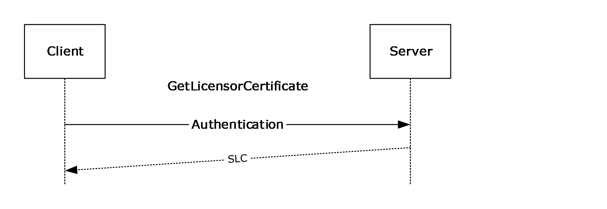

Figure 14: GetLicensorCertificate sequence

<wsdl:operation name="GetLicensorCertificate">

<wsdl:input message="tns:GetLicensorCertificateSoapIn" />

<wsdl:output message="tns:GetLicensorCertificateSoapOut" />

</wsdl:operation>

In the GetLicensorCertificate operation, the client requests the server's SLC chain.

Upon receiving a GetLicensorCertificate request, the server MUST return its SLC chain for a successful request. For an unsuccessful request, the server MUST return a [**SOAP fault code**](#gt_soap-fault-code). If the **serverDecommissioned** field of **ServerState** is true, the server SHOULD return a Microsoft.RightsManagementServices.ClusterDecommissionedException fault code. The client MUST treat all SOAP fault codes the same.

| Exception | Description |
| --- | --- |
| Microsoft.RightsManagementServices.ClusterDecommissionedException | A request was received, but the server is in a decommissioned state and cannot process the request. |

For information about [**certificate**](#gt_certificate) formats, see section [2.2.9](#Section_2.2.9).

##### 3.7.4.1.1 Messages

| Message | Description |
| --- | --- |
| [GetLicensorCertificateSoapIn](#Section_3.7.4.1.1.1) | Presents a request for the server's [**SLC**](#gt_server-licensor-certificate-slc) chain. |
| [GetLicensorCertificateSoapOut](#Section_3.7.4.1.1.2) | Contains the server's SLC chain. |

###### 3.7.4.1.1.1 GetLicensorCertificateSoapIn

The GetLicensorCertificateSoapIn message presents a request for the server's [**SLC**](#gt_server-licensor-certificate-slc) chain.

<wsdl:message name="GetLicensorCertificateSoapIn">

<wsdl:part name="parameters" element="tns:GetLicensorCertificate" />

</wsdl:message>

[GetLicensorCertificate](#Section_3.7.4.1.2.1): The GetLicensorCertificate element, as specified in section 3.7.4.1.2.1

###### 3.7.4.1.1.2 GetLicensorCertificateSoapOut

The GetLicensorCertificateSoapOut message contains the server's [**SLC**](#gt_server-licensor-certificate-slc) chain.

<wsdl:message name="GetLicensorCertificateSoapOut">

<wsdl:part name="parameters" element="tns:GetLicensorCertificateResponse" />

</wsdl:message>

[GetLicensorCertificateResponse](#Section_3.7.4.1.2.2): The GetLicensorCertificateResponse element, as defined in section 3.7.4.1.2.2.

##### 3.7.4.1.2 Elements

| Element | Description |
| --- | --- |
| [GetLicensorCertificate](#Section_3.7.4.1.2.1) | Contains the body of the request for the GetLicensorCertificate operation. There are no in-parameters. |
| [GetLicensorCertificateResponse](#Section_3.7.4.1.2.2) | Contains the response data returned from a GetLicensorCertificate operation. |

###### 3.7.4.1.2.1 GetLicensorCertificate

The GetLicensorCertificate element contains the body of the request for the GetLicensorCertificate web method. This element MUST NOT contain any elements.

<xs:element name="GetLicensorCertificate">

<xs:complexType />

</xs:element>

###### 3.7.4.1.2.2 GetLicensorCertificateResponse

The GetLicensorCertificateResponse element is a complex data type that contains the response data returned from a [GetLicensorCertificate](#Section_3.7.4.1.2.1) operation. The [**certificate chain**](#gt_certificate-chain) included here MUST correspond to the [**certificate**](#gt_certificate) formats found in [2.2.9](#Section_2.2.9).

<xs:element name="GetLicensorCertificateResponse">

<xs:complexType>

<xs:sequence>

<xs:element name="GetLicensorCertificateResult"

type="LicensorCertChain"

minOccurs="0"

maxOccurs="1"

/>

</xs:sequence>

</xs:complexType>

</xs:element>

##### 3.7.4.1.3 Complex Types

| Complex Type | Description |
| --- | --- |
| [LicensorCertChain](#Section_3.7.4.1.3.1) | Represents a set of [**certificates**](#gt_certificate) that are related to each other by successive issuers. |

###### 3.7.4.1.3.1 LicensorCertChain

The LicensorCertChain complex type represents a set of [**certificates**](#gt_certificate) that are related to each other by successive issuers. For example, in a LicensorCertChain instance that contains A, B, and C certificates, A is issued by B, and B is issued by C.

<xs:complexType name="LicensorCertChain">

<xs:sequence>

<xs:element name="CertificateChain"

type="ArrayOfXmlNode"

minOccurs="0"

maxOccurs="1"

/>

</xs:sequence>

</xs:complexType>

#### 3.7.4.2 FindServiceLocationsForUser Operation

Depending on the deployment topology of the servers in the network, different servers can be used for different functions for a given user. The client SHOULD<46> use the FindServiceLocationsForUser request to discover the appropriate server for various services for a given user, however, the client can obtain service discovery locations in any suitable, implementation-dependent manner. The client can also cache the service discovery location in an implementation-specific manner. A cached service location takes precedence over a service location obtained through the FindServiceLocationsForUser request.

Figure 15: FindServiceLocationsForUser message sequence

<wsdl:operation name="FindServiceLocationsForUser">

<wsdl:input message="tns:FindServiceLocationsForUserSoapIn" />

<wsdl:output message="tns:FindServiceLocationsForUserSoapOut" />

</wsdl:operation>

In the FindServiceLocationsForUser operation, the client MUST authenticate,<47> identify a service type, and request its location. A properly formed FindServiceLocationsForUser request MUST contain a valid [ServiceType](#Section_3.7.4.2.4.1). If the ServiceType is improperly formed, the server returns a System.InvalidOperationException fault code.

Upon receiving a FindServiceLocationsForUser request, the server SHOULD service the request. To service the request, the server SHOULD begin by accessing the **RequestContext** provided by the HTTP server. If the **isAuthenticated** field of the **RequestContext** is false, the server SHOULD return a Microsoft.DigitalRightsManagement.Utilities.UnspecifiedErrorException [**SOAP fault**](#gt_soap-fault). If the **authenticationType** field of the **RequestContext** is MWBF, the **Directory** to use for servicing the request is the directory the server is located in. Otherwise, the server SHOULD invoke the **GetDirectoryForAccount** abstract interface, passing in the **authenticatedAccount** field of the **RequestContext**, to determine the **Directory** corresponding to the DomainAccount. If **GetDirectoryForAccount** returns NULL, the server SHOULD return a Microsoft.DigitalRightsManagement.Utilities.UnspecifiedErrorException SOAP fault. If the server is in a different **Directory** than the **DomainAccount**, the server SHOULD invoke the GetServiceLocationForDirectory abstract interface, passing in the **Directory** and the requested **ServiceType**, to determine the service location for the requested ServiceType in the **Directory** of the authenticated **DomainAccount**. Otherwise the server SHOULD determine the service location based on its configuration, returning values of various ADM elements specified in section [3.1.1.1.1](#Section_3.1.1.1.1) as follows: If the client requests the CertificationService, the server SHOULD use the value of the **externalCertificationUrl** field of **ServerState**. If the client requests the LicensingInternalService, the server SHOULD use the value of the **licensingUrl** field of **ServerState**. If the client requests LicensingService, the server SHOULD use the value of the **externalLicensingUrl** field of **ServerState**. If the client requests the ActivationService or CertificationInternalService, the server SHOULD use the corresponding [**endpoint**](#gt_endpoint) [**URLs**](#gt_uniform-resource-locator-url) specified in section [3.1.4.2](#Section_3.1.4.2). For a successful request, the server MUST return the appropriate service location as a URL. This URL SHOULD be set to null for a successful request if the service does not exist. For an unsuccessful request, the server MUST return a [**SOAP fault code**](#gt_soap-fault-code). The client MUST treat all SOAP fault codes the same.

The client MUST use one of the following types in the ServiceType enumeration:

- ActivationService (version 1.0 clients only)
- CertificationInternalService
- CertificationService
- LicensingService
- LicensingInternalService

##### 3.7.4.2.1 Messages

| Message | Description |
| --- | --- |
| [FindServiceLocationsForUserSoapIn](#Section_3.7.4.2.1.1) | Contains a [ServiceType](#Section_3.7.4.2.4.1) enumeration. Specifies the type of service being requested. |
| [FindServiceLocationsForUserSoapOut](#Section_3.7.4.2.1.2) | Contains the [URL](#Section_2.2.3.7) and ServiceType of the service that was requested. |

###### 3.7.4.2.1.1 FindServiceLocationsForUserSoapIn

The FindServiceLocationsForUserSoapIn message contains a [ServiceType](#Section_3.7.4.2.4.1) enumeration to specify the type of service being requested.

<wsdl:message name="FindServiceLocationsForUserSoapIn">

<wsdl:part name="parameters" element="tns:FindServiceLocationsForUser" />

</wsdl:message>

[FindServiceLocationsForUser](#Section_3.7.4.2.2.1): The FindServiceLocationsForUser element, as specified in section 3.7.4.2.2.1.

###### 3.7.4.2.1.2 FindServiceLocationsForUserSoapOut

The FindServiceLocationsForUserSoapOut message contains the [URL](#Section_2.2.3.7) and [ServiceType](#Section_3.7.4.2.4.1) of the service that was requested.

<wsdl:message name="FindServiceLocationsForUserSoapOut">

<wsdl:part name="parameters" element="tns:FindServiceLocationsForUserResponse" />

</wsdl:message>

[FindServiceLocationsForUserResponse](#Section_3.7.4.2.2.2): The FindServiceLocationsForUserResponse element, as defined in section 3.7.4.2.2.2.

##### 3.7.4.2.2 Elements

| Element | Description |
| --- | --- |
| [FindServiceLocationsForUser](#Section_3.7.4.2.2.1) | Contains any number of ServiceNames. |
| [FindServiceLocationsForUserResponse](#Section_3.7.4.2.2.2) | Contains an array of service location response element. |

###### 3.7.4.2.2.1 FindServiceLocationsForUser

The FindServiceLocationsForUser element contains the body of the message for the [FindServiceLocationsForUser](#Section_3.7.4.2.2.1) request. This element is used as an in-parameter to the FindServiceLocationsForUser web method. This element MUST be populated by the client when sending a FindServiceLocationsForUser request. The FindServiceLocationsForUser web method parameters consist of any number of ServiceNames.

<xs:element name="FindServiceLocationsForUser">

<xs:complexType>

<xs:sequence>

<xs:element name="ServiceNames"

type="ArrayOfServiceLocationRequest"

minOccurs="0"

maxOccurs="1"

/>

</xs:sequence>

</xs:complexType>

</xs:element>

###### 3.7.4.2.2.2 FindServiceLocationsForUserResponse

The FindServiceLocationsForUserResponse element is a complex type that contains an array of service location response elements. This element is used as an out-parameter for the FindServiceLocationsForUserResponse operation.

<xs:element name="FindServiceLocationsForUserResponse">

<xs:complexType>

<xs:sequence>

<xs:element name="FindServiceLocationsForUserResult"

type="ArrayOfServiceLocationResponse"

minOccurs="0"

maxOccurs="1"

/>

</xs:sequence>

</xs:complexType>

</xs:element>

##### 3.7.4.2.3 Complex Types

| Complex Types | Description |
| --- | --- |
| [ArrayOfServiceLocationRequest](#Section_3.7.4.2.3.1) | Contains an array of [ServiceLocationRequest](#Section_3.7.4.2.3.3) elements. |
| [ArrayOfServiceLocationResponse](#Section_3.7.4.2.3.2) | Contains an array of [ServiceLocationResponse](#Section_3.7.4.2.3.4) types. |
| ServiceLocationRequest | Contains an enumeration of a service type that indicates a service to locate. |
| ServiceLocationResponse | Contains a standard [**URL**](#gt_uniform-resource-locator-url) that is associated with an RMS server and the type of that service. |

###### 3.7.4.2.3.1 ArrayOfServiceLocationRequest

The ArrayOfServiceLocationRequest complex type is an array of [ServiceLocationRequest](#Section_3.7.4.2.3.3) elements.

<xs:complexType name="ArrayOfServiceLocationRequest">

<xs:sequence>

<xs:element name="ServiceLocationRequest"

type="ServiceLocationRequest"

minOccurs="0"

maxOccurs="unbounded"

/>

</xs:sequence>

</xs:complexType>

###### 3.7.4.2.3.2 ArrayOfServiceLocationResponse

The ArrayOfServiceLocationResponse complex type contains an array of [ServiceLocationResponse](#Section_3.7.4.2.3.4) types. This array is used to respond to a [FindServiceLocationsForUser](#Section_3.7.4.2.2.1) operation.

<xs:complexType name="ArrayOfServiceLocationResponse">

<xs:sequence>

<xs:element name="ServiceLocationResponse"

type="ServiceLocationResponse"

minOccurs="0"

maxOccurs="unbounded"

/>

</xs:sequence>

</xs:complexType>

###### 3.7.4.2.3.3 ServiceLocationRequest

The ServiceLocationRequest complex type contains an enumeration of a service type that indicates a service to locate. Possible values for the enumeration are defined in [ServiceType Simple Type](#Section_3.7.4.2.4.1) 3.7.4.2.4.1. The enumeration MUST contain a literal string, as specified in ServiceType Simple Type 3.7.4.2.4.1.

<xs:complexType name="ServiceLocationRequest">

<xs:sequence>

<xs:element name="Type"

type="ServiceType"

minOccurs="1"

maxOccurs="1"

/>

</xs:sequence>

</xs:complexType>

###### 3.7.4.2.3.4 ServiceLocationResponse

The ServiceLocationResponse complex type contains a standard [**URL**](#gt_uniform-resource-locator-url) that is associated with an RMS server and the type of that service. The URL MUST be a literal string. The Type element MUST be a literal string from the set of possible values for [ServiceType](#Section_3.7.4.2.4.1).

<xs:complexType name="ServiceLocationResponse">

<xs:sequence>

<xs:element name="URL"

type="string"

minOccurs="0"

maxOccurs="1"

/>

<xs:element name="Type"

type="ServiceType"

minOccurs="1"

maxOccurs="1"

/>

</xs:sequence>

</xs:complexType>

##### 3.7.4.2.4 Simple Types

| Simple Types | Description |
| --- | --- |
| [ServiceType](#Section_3.7.4.2.4.1) | Enumerates each of the possible types of service that a rights management server might provide. |

###### 3.7.4.2.4.1 ServiceType

The ServiceType simple type enumerates each of the possible types of service that a rights management server might provide. The ServiceType simple type is used to enumerate the type of service or services offered by a rights management server and is part of both the in-parameters and out-parameters of the [FindServiceLocationsForUser](#Section_3.7.4.2.2.1) operation.

Version 1 of the RMS: Client-to-Server Protocol introduced the FindServiceLocationsForUser and the ServiceType simple type consisting of enumeration values for: EnrollmentService, LicensingService, PublishingService, CertificationService, ActivationService, PrecertificationService, ServerService, and DrmRemoteDirectoryServices.

Version 2 of the RMS: Client-to-Server Protocol client SHOULD<48> implement the following enumeration values: **GroupExpansionService**, **LicensingInternalService**, and **CertificationInternalService**.

The **PrecertificationService**, **DrmRemoteDirectoryServices**, and **GroupExpansionService** enumeration values are not used in the RMS: Client-to-Server Protocol.

<xs:simpleType name="ServiceType">

<xs:restriction

base="string"

>

<xs:enumeration

value="EnrollmentService"

/>

<xs:enumeration

value="LicensingService"

/>

<xs:enumeration

value="PublishingService"

/>

<xs:enumeration

value="CertificationService"

/>

<xs:enumeration

value="ActivationService"

/>

<xs:enumeration

value="PrecertificationService"

/>

<xs:enumeration

value="ServerService"

/>

<xs:enumeration

value="DrmRemoteDirectoryServices"

/>

<xs:enumeration

value="GroupExpansionService"

/>

<xs:enumeration

value="LicensingInternalService"

/>

<xs:enumeration

value="CertificationInternalService"

/>

</xs:restriction>

</xs:simpleType>

**EnrollmentService**: Enumerates the Enrollment service.

**LicensingService**: Enumerates the Licensing service.

**PublishingService**: Enumerates the Publishing service.

**CertificationService**: Enumerates the Certification service.

**ActivationService**: Enumerates the Activation service.

**PrecertificationService**: Enumerates the PreCertification service.

**ServerService**: Enumerates the Server service.

**DrmRemoteDirectoryServices**: Enumerates the DrmRemoteDirectory service.

**GroupExpansionService**: Enumerates the Group Expansion Service.<49>

**LicensingInternalService**: Enumerates the internal Licensing Service.<50>

**CertificationInternalService**: Enumerates the internal Certification Service.<51>

#### 3.7.4.3 GetServerInfo Operation

The **GetServerInfo** request is used to query the server for general configuration information, and in some cases duplicates information returned from other server operations. The client MUST request information about one or more of the following: the version of the RMS server software, the features enabled on the server, the [**SLC**](#gt_server-licensor-certificate-slc) (also returned from the **GetLicensorCertificate** operation, section 3.7.4.1), and the service locations (also returned from the **FindServiceLocationsForUser** operation, section 3.7.4.2).

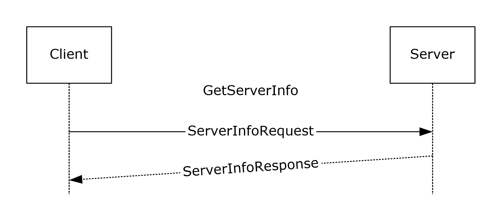

Figure 16: GetServerInfo sequence

- <wsdl:operation name="GetServerInfo">
- <wsdl:input message="tns:GetServerInfoSoapIn" />
- <wsdl:output message="tns:GetServerInfoSoapOut" />
- </wsdl:operation>
Upon receiving a **GetServerInfo** request, the server MUST return the requested **ServerInfoType** information (section [3.7.4.3.4.1](#Section_3.7.4.3.4.1)). For an unsuccessful request, the server MUST return a [**SOAP fault code**](#gt_soap-fault-code). The client MUST treat all SOAP fault codes the same.

| Exception | Description |
| --- | --- |
| System.ArgumentNullException | A request was received, but the request did not specify a valid **GetServerInfoSoapIn** message. |

##### 3.7.4.3.1 Messages

| Message | Description |
| --- | --- |
| GetServerInfoSoapIn | Presents a request for server information. |
| GetServerInfoSoapOut | Contains the server's response. |

###### 3.7.4.3.1.1 GetServerInfoSoapIn

The GetServerInfoSoapIn message presents a request for server information.

- <wsdl:message name="GetServerInfoSoapIn">
- <wsdl:part name="parameters" element="tns:GetServerInfo" />
- </wsdl:message>
**GetServerInfo:** The **GetServerInfo** element, as specified in section [3.7.4.3.2.1](#Section_3.7.4.3.2.1).

###### 3.7.4.3.1.2 GetServerInfoSoapOut

The GetServerInfoSoapOut message contains the response to the client's request.

- <wsdl:message name="GetServerInfoSoapOut">
- <wsdl:part name="parameters" element="tns:GetServerInfoResponse" />
- </wsdl:message>
**GetServerInfoResponse:** The GetServerInfoResponse element, as defined in section [3.7.4.3.2.2](#Section_3.7.4.3.2.2).

##### 3.7.4.3.2 Elements

| Element | Description |
| --- | --- |
| GetServerInfo | Contains any number of **ServerInfoRequest** objects (section [3.7.4.3.3.2](#Section_3.7.4.3.3.2)). |
| GetServerInfoResponse | Contains the response data returned from a **GetServerInfo** operation. |

###### 3.7.4.3.2.1 GetServerInfo

The **GetServerInfo** element contains the body of the request for the **GetServerInfo** web method. This element is used as an in-parameter to the **GetServerInfo** web method. This element MUST be populated by the client when sending a **GetServerInfo** request. The **GetServerInfo** web method parameters consist of any number of **ServerInfoRequest** objects.

- <s:element name="GetServerInfo">
- <s:complexType>
- <s:sequence>
- <s:element name="requests"
- type="tns:ArrayOfServerInfoRequest"
- minOccurs="0"
- maxOccurs="1"
- />
- </s:sequence>
- </s:complexType>
- </s:element>

###### 3.7.4.3.2.2 GetServerInfoResponse

The GetServerInfoResponse element is a complex data type that contains the response data returned from a **GetServerInfo** operation.

- <s:element name="GetServerInfoResponse">
- <s:complexType>
- <s:sequence>
- <s:element minOccurs="0" maxOccurs="1" name="GetServerInfoResult">
- <s:complexType mixed="true">
- <s:sequence>
- <s:any />
- </s:sequence>
- </s:complexType>
- </s:element>
- </s:sequence>
- </s:complexType>
- </s:element>

##### 3.7.4.3.3 Complex Types

| Complex Types | Description |
| --- | --- |
| ArrayOfServerInfoRequest | Contains an array of **ServerInfoRequest** elements (section [3.7.4.3.3.2](#Section_3.7.4.3.3.2)). |
| ServerInfoRequest | Represents the client request for server information. |
| GetServerInfoResponse | Represents a set of name-value pairs, in XML format, that represent the client requested server information and response from **GetServerInfo**. |

###### 3.7.4.3.3.1 ArrayOfServerInfoRequest

The **ArrayOfServerInfoRequest** complex type is an array of **ServerInfoRequest** elements (section [3.7.4.3.3.2](#Section_3.7.4.3.3.2)).

- <xs:complexType name="ArrayOfServerInfoRequest">
- <xs:sequence>
- <xs:element name="ServerInfoRequest"
- type="tns:ServerInfoRequest"
- minOccurs="0"
- maxOccurs="unbounded"
- nillable="true"
- />
- </xs:sequence>
- </xs:complexType>

###### 3.7.4.3.3.2 ServerInfoRequest

The **ServerInfoRequest** complex type contains an element indicating the type of information the client is requesting, and a string parameter called *AdditionalInfo* that represents additional context-specific information that the client is providing for the request. This type is used to make a **GetServerInfo** operation request.

- <s:complexType name="ServerInfoRequest">
- <s:sequence>
- <s:element minOccurs="1" maxOccurs="1" name="Type" type="tns:ServerInfoType" />
- <s:element minOccurs="0" maxOccurs="1" name="AdditionalInfo" type="s:string" />
- </s:sequence>
- </s:complexType>

###### 3.7.4.3.3.3 GetServerInfoResponse

The **GetServerInfoResponse** complex type contains a set of name-value pairs, in XML format, that represent the client-requested server information and response from **GetServerInfo**.

- <s:element name="GetServerInfoResponse">
- <s:complexType>
- <s:sequence>
- <s:element minOccurs="0"
- maxOccurs="1"
- name="GetServerInfoResult">
- <s:complexType mixed="true">
- <s:sequence>
- <s:any />
- </s:sequence>
- </s:complexType>
- </s:element>
- </s:sequence>
- </s:complexType>
- </s:element>

##### 3.7.4.3.4 Simple Types

| Simple Type | Description |
| --- | --- |
| ServerInfoType | Enumerates each of the possible types of information that the client can request from the server. |

###### 3.7.4.3.4.1 ServerInfoType

The ServerInfoType simple type enumerates each of the possible types of information that a client can request from a rights-management server.

- <s:simpleType name="ServerInfoType">
- <s:restriction base="s:string">
- <s:enumeration value="VersionInfo" />
- <s:enumeration value="ServerFeatureInfo" />
- <s:enumeration value="ServerLicensorCertificate" />
- <s:enumeration value="ServiceLocations" />
- </s:restriction>
- </s:simpleType>
**VersionInfo**: Requests the software version of the RMS server.

**ServerFeatureInfo**: Requests the set of capabilities that the RMS server supports.

**ServerLicensorCertificate**: Requests the [**server licensor certificate (SLC)**](#gt_server-licensor-certificate-slc) as described in section [3.7.4.1](#Section_3.7.4.1).

**ServiceLocations**: Requests the [**URLs**](#gt_uniform-resource-locator-url) for [**endpoints**](#gt_endpoint) the server exposes.

### 3.7.5 Timer Events

None.

### 3.7.6 Other Local Events

None.

## 3.8 Client Details

### 3.8.1 Abstract Data Model

This section describes a conceptual model of possible data organization that an implementation maintains to participate in this protocol. The organization is provided to explain how the protocol behaves. This specification does not mandate that implementations adhere to this model as long as their external behavior is consistent with that described in this specification.

#### 3.8.1.1 Abstract Elements

All of the following ADM elements are persisted in implementation-specific storage.

- **Trusted SPC Issuer private key**: The Trusted [**SPC**](#gt_security-processor-certificate-spc) Issuer Private key is used to sign the SPC.
- **Trusted SPC Issuer chain**: An XrML 1.2 [**certificate chain**](#gt_certificate-chain) that is used to generate the SPC chain. The SPC Issuer [**certificate**](#gt_certificate) contains the public key that corresponds to the Trusted SPC Issuer Private Key.
- [**SPC private key**](#gt_928a1701-b5b9-4964-8933-d9a5edb7e0ea): A unique private key that is generated at activation time and issued to the machine, either by self-activation or by calling the Activate method. The private key is stored securely on the client.
- **SPC chain**: An XrML 1.2 certificate chain generated during activation that contains the public key corresponding to the SPC private key. The trusted [**security processor**](#gt_security-processor) [**CA**](#gt_certification-authority-ca) key exists in the chain.
- [**RAC**](#gt_rms-account-certificate-rac) chain: An XrML 1.2 certificate chain that issues an asymmetric encryption key pair to a user account, bound to a machine. Acquired by making a Certify request to the server.
- [**CLC Chain**](#gt_f5d0f10f-abb4-4219-9006-27c19ea7bb8f): An XrML 1.2 certificate chain that issues an asymmetric signing key pair to a user account, bound to a machine. Acquired by making a [GetClientLicensorCert](#Section_3.5.4.2.2.1) request to the server.
- **List of official rights templates**: An official rights template is an XrML 1.2 certificate chain that defines usage [**policy**](#gt_policy). This usage policy is used to generate the [**PL**](#gt_publishing-license-pl) chain during [**offline publishing**](#gt_offline-publishing). A list of official rights templates is a collection of official rights templates. A list of official rights templates can be acquired by making an [AcquireTemplate (section 3.4.4.3)](#Section_3.4.4.3) request to the server.
- [**SLC chain**](#gt_server-licensor-certificate-slc): An XrML 1.2 certificate chain that signs the RMS server's public key into the certificate hierarchy. Acquired by making a [GetLicensorCertificate](#Section_3.7.4.1) request to the server.
Note that the preceding conceptual data can be implemented using a variety of techniques. Any data structure that stores the preceding conceptual data can be used in the implementation.

#### 3.8.1.2 Abstract Interfaces

**GetPolicyName:** An abstract interface provided by the client that returns the [**policy**](#gt_policy) name to use when creating a [**PL**](#gt_publishing-license-pl). This interface takes no parameters and returns the policy name as a string formatted as described in section [2.2.9.7.1](#Section_2.2.9.7.1).

**GetPLID:** An abstract interface provided by the client that returns the PL ID to use when creating a PL. This interface takes no parameters and returns the PL ID as a [**GUID**](#gt_globally-unique-identifier-guid).

**GetRevocationPoint:** An abstract interface provided by the client that returns information about the revocation point to use when creating a PL. This interface takes the PL ID as a GUID and returns the **Revocation Point** for the PL. The revocation point contains information about the revocation list. A **Revocation Point** has the following properties:

- Type: The ID type of the issuer of the revocation list.
- ID: The ID of the issuer of the revocation list.
- Name: A human-readable name of the revocation list site.
- Address: The [**URL**](#gt_uniform-resource-locator-url) of a location from which to download the revocation list.
- Time interval: The frequency with which the list is updated. The time interval contains the following properties:
- Days: The number of days in the time interval for the revocation list.
- Hours: The number of hours in the time interval for the revocation list.
- Minutes: The number of minutes in the time interval for the revocation list.
- Seconds: The number of seconds in the time interval for the revocation list.
- Revocation List Public Key: A unique public key that was used to sign the revocation list.

### 3.8.2 Timers

None.

### 3.8.3 Initialization

#### 3.8.3.1 SPC Issuer Initialization

The client loads its **Trusted SPC Issuer private key** and **Trusted SPC Issuer chain**. These items SHOULD be preconfigured on the client and MUST be trusted by the server. The **trustedSpcCAKeys** field of the **ServerState** of the server MUST contain the public key of either the first or second [**certificate**](#gt_certificate) in the Trusted [**SPC**](#gt_security-processor-certificate-spc) Issuer chain in order for the chain to be trusted by the server.

#### 3.8.3.2 Service Locations

The client MAY use any of the following discovery mechanisms to locate RMS servers:

- [**Active Directory**](#gt_active-directory)
- Existing client configuration data
- Discovery of a server from a [DISTRIBUTIONPOINT](#Section_2.2.9.1.7) element in an existing [**license**](#gt_license)
The following sections define each of the ways to discover an RMS server.<52>

##### 3.8.3.2.1 Locating an RMS Server by Using Active Directory

A client MAY locate an RMS server by finding an [**SCP**](#gt_service-connection-point-scp) in [**Active Directory**](#gt_active-directory). The client SHOULD search for an object with the objectClass or objectCategory of serviceConnectionPoint and the keywords "MSRMRootCluster" and "1.0". The value of the serviceBindingInformation attribute of the SCP object MUST be the location of an RMS service. As specified in section [3.1.4.4.1.1](#Section_3.1.4.4.1.1), the value of the serviceBindingInformation attribute is of the form [baseURL]/certification. The client SHOULD make FindServiceLocationsForUser requests using the [baseURL]/certification/ServiceLocator.asmx [**endpoint**](#gt_endpoint) specified in section [3.1.4.2](#Section_3.1.4.2) in order to determine the service locations for any service types needed by the client.

##### 3.8.3.2.2 Locating an RMS Server by Using Existing Client Configuration Data

A client machine MAY<53> be preconfigured with stored server locations.

##### 3.8.3.2.3 Locating an RMS Server by Using Existing Licenses or Certificates

If the client has access to an existing [**PL**](#gt_publishing-license-pl) or [**UL**](#gt_use-license-ul), it MAY discover a server using the [**URL**](#gt_uniform-resource-locator-url) specified in the [DISTRIBUTIONPOINT](#Section_2.2.9.1.7) element in the [**license**](#gt_license). If multiple URLs are specified, the client MAY try any or all of them.

To find the appropriate server for an [Activate](#Section_3.2.4.1.2.1) request, the client SHOULD make a [FindServiceLocationsForUser](#Section_3.7.4.2.2.1) request to the DISTRIBUTIONPOINT URL requesting [ServiceType](#Section_3.7.4.2.4.1)"ActivationService". This ServiceType is for version 1.0 clients only. All other versions of the client MUST NOT request ServiceType"ActivationService".

To find the appropriate server for a [Certify](#Section_3.3.4.1.2.1) request for the current user, the client SHOULD make a FindServiceLocationsForUser request to the DISTRIBUTIONPOINT URL requesting ServiceType"CertificationInternalService". If the response returns a URL that cannot be reached for a Certify request, the client SHOULD make another FindServiceLocationsForUser request to the DISTRIBUTIONPOINT URL requesting ServiceType"CertificationService".

To find the appropriate server for a [GetClientLicensorCert](#Section_3.5.4.2.2.1) request for the current user, the client SHOULD make a FindServiceLocationsForUser request to the DISTRIBUTIONPOINT URL requesting ServiceType"LicensingInternalService". If the response returns a URL that cannot be reached for a GetClientLicensorCert request, the client SHOULD make another FindServiceLocationsForUser request to the DISTRIBUTIONPOINT URL requesting ServiceType"LicensingService".

To find the appropriate server for [**online publishing**](#gt_online-publishing), the client MAY make a FindServiceLocationsForUser request to the DISTRIBUTIONPOINT URL requesting ServiceType"LicensingInternalService". If the response returns a URL that cannot be reached for online publishing, the client SHOULD make another FindServiceLocationsForUser request to the DISTRIBUTIONPOINT URL requesting ServiceType"LicensingService".

#### 3.8.3.3 RAC Initialization

The client loads the **RAC chain** from its persistent store. If the **RAC chain** is not found in the persistent store, the **RAC chain** is set to null.

#### 3.8.3.4 CLC Initialization

The client loads the [**CLC chain**](#gt_f5d0f10f-abb4-4219-9006-27c19ea7bb8f) from its persistent store. If the CLC chain is not found in the persistent store, the CLC Chain is set to null.

### 3.8.4 Message Processing Events and Sequencing Rules

The following illustration shows a common message sequence for the client.

Figure 17: Common message sequence for the client

Sequencing rules for the client can be divided into four sections: client bootstrapping, [**online publishing**](#gt_online-publishing), [**offline publishing**](#gt_offline-publishing), and licensing.

#### 3.8.4.1 Client Bootstrapping

Client bootstrapping is required before [**offline publishing**](#gt_offline-publishing) or licensing can take place. It is not a prerequisite for [**online publishing**](#gt_online-publishing).

The client MUST activate as a first step in bootstrapping. Activation is the process of certifying a given client machine for use in the RMS system. This is accomplished by binding an encryption key pair to the machine by way of the [**security processor**](#gt_security-processor) and its [**SPC**](#gt_security-processor-certificate-spc). Version 1.0 clients MUST make an [Activate (section 3.2.4.1)](#Section_3.2.4.1) request to the server to activate. All other versions of the client, including RMS 1.0 SP1, RMS 1.0 SP2, and RMS 2.0, activate themselves without contacting a server. The client generates its own security processor key pair and saves the private key in the **SPC private key** ADM element. The client then generates an SPC signed by the Trusted **SPC Issuer private key**. The client also creates an **SPC Chain** by appending the SPC with the **Trusted SPC Issuer chain** and saves it as the **SPC Chain** ADM element.

The user MUST be certified to participate in the RMS system. This is accomplished by binding an encryption key pair to both the user and the client machine by way of a [**RAC**](#gt_rms-account-certificate-rac). The user MUST have a RAC to access [**protected content**](#gt_protected-content) or to publish protected content offline. The client uses the [Certify (section 3.3.4.1)](#Section_3.3.4.1) method to acquire a RAC.

To publish offline, the user MUST have a signing key pair. The [**CLC**](#gt_f5d0f10f-abb4-4219-9006-27c19ea7bb8f) binds a signing key pair to a user through the RAC. A user MUST have a CLC to create protected content offline. The client uses the [FindServiceLocationsForUser (section 3.7.4.2)](#Section_3.7.4.2) method to find the [**licensing**](#gt_license) server for the user and the [GetClientLicensorCert (section 3.5.4.2)](#Section_3.5.4.2) method to acquire a CLC from that server.

#### 3.8.4.2 Template Acquisition

The RMS client SHOULD<54> acquire a list of official rights policy templates from an RMS 2.0 server. The RMS client makes an [AcquireTemplateInformation](#Section_3.4.4.2.2.1) request to the server. The server returns information about the available templates in the form of a list of [**GUIDs**](#gt_globally-unique-identifier-guid) and hashes corresponding to the server templates. The client then compares the obtained list against the list of official rights templates from that server in its local store. The client SHOULD<55> make add/delete/edit updates to the list of official rights policy templates in the client store. Through this process, the client always keeps its list of official rights policy templates in sync with the ones on the server.

#### 3.8.4.3 Online Publishing

Client bootstrapping is not required for [**online publishing**](#gt_online-publishing). To create a [**PL**](#gt_publishing-license-pl), the client MUST have the public key of the licensing server so it can encrypt the [**content key**](#gt_content-key) and usage policies to the server. As the server's public key is stored in the [**SLC**](#gt_server-licensor-certificate-slc), the client MUST use the [GetLicensorCertificate (section 3.7.4.1)](#Section_3.7.4.1) method to acquire the server's SLC.

The client MAY include [DISTRIBUTIONPOINT (section 2.2.9.7.3)](#Section_2.2.9.7.3) of type "Referral-Info". The **ADDRESS** element SHOULD contain the [**URL**](#gt_uniform-resource-locator-url) of the server or an email address when the object type is "Referral-Info". The **NAME** element SHOULD contain the display name for the URL or the email when the object type is "Referral-Info". The **GUID** element SHOULD be a unique [**GUID**](#gt_globally-unique-identifier-guid) for this **DISTRIBUTIONPOINT** element.

The client SHOULD set the [ISSUEDTIME (section 2.2.9.1.1)](#Section_2.2.9.1.1) element of the PL to the current time, expressed in [**UTC**](#gt_coordinated-universal-time-utc).

The client SHOULD include a principal element in the [ISSUEDPRINCIPALS (section 2.2.9.7.4)](#Section_2.2.9.7.4) element. The object and public key of the **principal** element SHOULD be a verbatim copy of the object and public key of **principal** element of the [ISSUEDPRINCIPALS](#Section_2.2.9.3.3) in the SLC.

For a PL based on an official rights template, the [DESCRIPTOR](#Section_2.2.9.7.1) element of the PL SHOULD be copied verbatim from the [DESCRIPTOR](#Section_2.2.9.10.1) element of the rights template. For PL's not based on an official rights template, the name field of the DESCRIPTOR element of the PL SHOULD be set to the value returned by the **GetPolicyName** abstract interface. The GUID field of the DESCRIPTOR SHOULD be set to the value returned by the **GetPLID** abstract interface.

The PL can include an [OWNER (section 2.2.9.7.5)](#Section_2.2.9.7.5) element. The OWNER element is an optional element specified by the application. The OWNER element identifies the content owner or author.

The client SHOULD call the **GetRevocationPoint** abstract interface with the GUID field of the DESCRIPTOR as a parameter to get a revocation point for the PL. If the revocation point is not null, the **revocationpoint** field of the PL SHOULD be a [CONDITIONLIST (section 2.2.9.7.9)](#Section_2.2.9.7.9) element. The **type** field of CONDITIONLIST SHOULD be set to the type property of the revocation point. The **id** field of CONDITIONLIST SHOULD be set to the ID property of the revocation point. The **address** field of CONDITIONLIST SHOULD be set to the Address property of the revocation point. The **name** field of CONDITIONLIST SHOULD be set to the Name property of the revocation point. The **days**, **hours**, **minutes** and **seconds** fields of CONDITIONLIST SHOULD be set to the revocation point's Time Interval properties: Days, Hours, Minutes, and Seconds. The **modulus** field of the **publickey** field of CONDITIONLIST SHOULD be set to the base64-encoded value of the revocation list Public Key property of the revocation point. The **key length** field of the **publickey** field of the CONDITIONLIST SHOULD be set to the length, in bits, of the revocation list Public Key property of the revocation point.

After the PL is constructed, it MUST be signed by the server before it can be used for licensing. The client MUST use the [AcquireIssuanceLicense (section 3.5.4.1)](#Section_3.5.4.1) method to have the server sign the PL.

#### 3.8.4.4 Offline Publishing

After bootstrapping is complete and the client has a valid [**SPC**](#gt_security-processor-certificate-spc), [**RAC**](#gt_rms-account-certificate-rac), and [**CLC**](#gt_f5d0f10f-abb4-4219-9006-27c19ea7bb8f), the client can publish [**protected content**](#gt_protected-content) offline without needing to contact a server to have [**PLs**](#gt_publishing-license-pl) signed. If templates are being used, they SHOULD be acquired before [**offline publishing**](#gt_offline-publishing). During offline publishing, the client generates a PL and signs it with the CLC private key. The CLC private key can be obtained from the CLC of the CLC chain. It also generates a [**UL**](#gt_use-license-ul) for the owner and signs it with the CLC private key so that the owner can continue to work with the protected content without having to contact the server again.

The signed PL is associated with the protected content using an application-specific mechanism so that [**consumers**](#gt_consumer) of the content have access to the PL.

Offline publishing is the recommended method of publishing for client applications.

#### 3.8.4.5 Licensing

To access the [**protected content**](#gt_protected-content), a user MUST have a [**UL**](#gt_use-license-ul) that binds the [**content key**](#gt_content-key) to the [**RAC**](#gt_rms-account-certificate-rac). To acquire a UL, the client MUST submit the **RAC chain** and [**PL**](#gt_publishing-license-pl) associated with the protected content to the server by using the [AcquireLicense (section 3.4.4.1)](#Section_3.4.4.1) method.

### 3.8.5 Timer Events

None.

### 3.8.6 Other Local Events

None.

# 4 Protocol Examples

## 4.1 Publishing Usage Policy Example

Publishing usage [**policy**](#gt_policy) is part of the process of protecting information. Publishing usage policy is the act of expressing who can use an author's protected information, in what way, and with what conditions and durations. Published usage policy is signed by an issuer - either the server ([**online publishing**](#gt_online-publishing)) or the author ([**offline publishing**](#gt_offline-publishing)). In the case of offline publishing, the server delegates the author to sign the usage policy on its behalf. The server honors this signature as a trusted delegate by issuing the author a [**CLC chain**](#gt_f5d0f10f-abb4-4219-9006-27c19ea7bb8f). The CLC represents an asymmetric key pair that is used to sign usage policy, thereby publishing it.

RMS is responsible only for issuing policy and [**certificates**](#gt_certificate). The application (for example, the Microsoft Office System with Information Rights Management) is responsible for persisting the policy with the protected information.

The following section describes a typical scenario involving an RM-aware application and an author who is publishing usage policy for protected information:

- Deploy client package.
Deployment of the client package installs binaries on the client machine.<56>

- Activate machine locally.
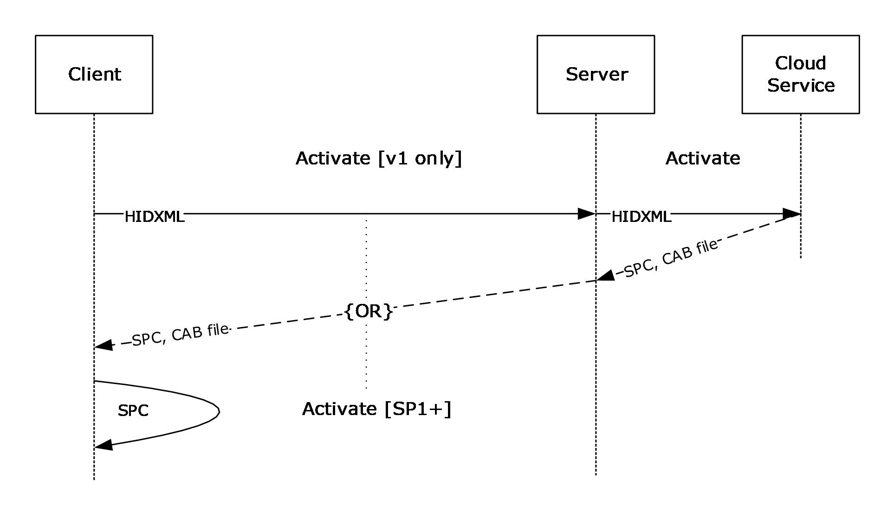

Figure 18: Local machine activation

Activation is the process by which an [**SPC**](#gt_security-processor-certificate-spc) is generated on the client machine. The SPC represents a pair of keys for the machine that is used to protect the user's keys in a subsequent step.

In the RMS 1.0 client, the activation stage involved contacting a web service run by Microsoft to acquire a binary and some metadata. RMS version 1.0 SP1, 1.0 SP2, and 2.0 clients eliminate the need for this step by providing a form of self-activation that does not contact the server.

- Call the [Certify](#Section_3.3.4.1.2.1) method.
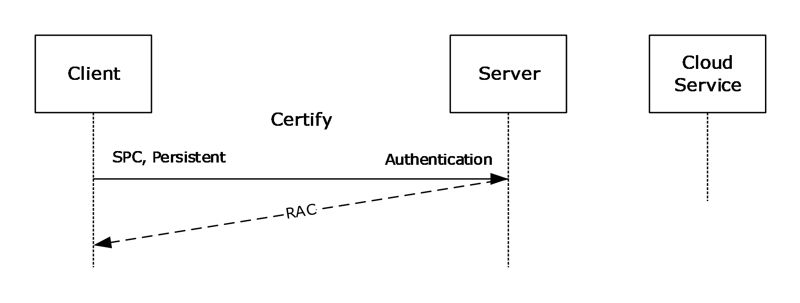

Figure 19: Certify method call

Certification is the process by which the server issues a [**RAC**](#gt_rms-account-certificate-rac). The RAC represents a pair of keys for the user that is used to protect authorization policy and [**content keys**](#gt_content-key) in subsequent steps. The RAC keys are themselves protected by the keys represented by the SPC from step 2.

The call to the Certify method provides the SPC a form of authentication and a flag that indicates whether to issue a temporary, short-lived RAC or a normal, long-lived RAC. The result of a successful Certify call is a RAC.

- Call the [GetClientLicensorCert](#Section_3.5.4.2.2.1) method.
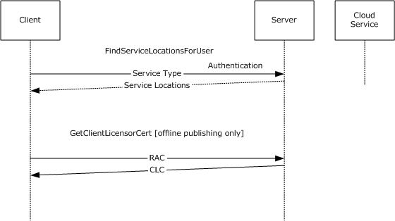

Figure 20: GetClientLicensorCert method call

To publish offline, a client possesses a CLC chain. A CLC is a form of delegation issued by the server that allows the client author to sign usage policies for protected information.

The client first calls the [FindServiceLocationsForUser](#Section_3.7.4.2.2.1) web method, providing the authentication information, to determine at which [**URL**](#gt_uniform-resource-locator-url) the server that issues CLCs is located. Once this URL is obtained, the client calls the GetClientLicensorCert web method at this URL and provides the user RAC. A successful response from the server results in a CLC being returned to the client.

- Encrypt protected information using client APIs.
At this point the application and the client have all certificates and keys needed to complete the publishing and protection step. The application encrypts the information using these certificates, keys, and the RMS client APIs.

- Construct the usage policy using client APIs.
The application uses the RM client APIs to construct the usage policy (unsigned issuance [**license**](#gt_license)) that expresses the set of users that can use this protected information, in what ways, and under what conditions. The usage policy can be created either directly or by using a [**rights policy template**](#gt_rights-policy-template).

- Sign the usage policy using client APIs and a CLC key.
The unsigned issuance license is signed using the key represented by the CLC, producing official usage policy in the form of a signed issuance license.

- Application persists policy with protected information.
Finally, the application persists the signed issuance license in a location it can access along with the protected information.

## 4.2 Accessing Protected Information Example

Accessing protected information requires requesting an authorization [**policy**](#gt_policy) from the RM server, and then decrypting the protected information.

- Client package is deployed.
Deployment of the client package installs binaries on the client machine.<57>

- The machine activates locally.

Figure 21: Local machine activation

Activation is the process by which an [**SPC**](#gt_security-processor-certificate-spc) is generated on the client machine. The SPC represents a pair of keys for the machine that is used to protect the user's keys in a subsequent step.

In the RMS 1.0 client, the activation stage involved contacting a web service run by Microsoft to acquire a binary and some metadata. RMS version 1.0 SP1, 1.0 SP2, and 2.0 clients eliminate the need for this step by providing a form of self-activation that does not contact the server.

- The [Certify](#Section_3.3.4.1.2.1) method is called.

Figure 22: Certify message sequence

Certification is the process by which the server issues a [**RAC**](#gt_rms-account-certificate-rac). The RAC represents a pair of keys for the user that is used to protect the authorization policy and [**content keys**](#gt_content-key) in subsequent steps. The RAC keys are, themselves, protected by the keys represented by the SPC from step 2.

The call to the Certify web method provides the SPC a form of authentication and a flag that indicates whether to issue a temporary, short-lived RAC or a normal, long-lived RAC. The result of a successful Certify call is a RAC.

- The application extracts the usage policy from the protected information.
The application extracts or retrieves the usage policy (signed issuance [**license**](#gt_license)) from wherever it is stored. RMS is not responsible for storing the usage policy associated with protected information; that is the responsibility of the application.

- The [AcquireLicense](#Section_3.4.4.1.2.1) method is called.

Figure 23: AcquireLicense method sequence

The signed issuance license acquired in step 4 represents the complete usage policy issued by the author of the protected information. For an individual user to access the protected information, the server issues an authorization policy, or [**UL**](#gt_use-license-ul). This authorization policy expresses what an individual user can do with the protected information.

The client calls the AcquireLicense web method, providing the RAC, the signed issuance license, and passing application data that the application provided.

The server verifies that the RAC and signed issuance license were issued from an entity or entities it trusts, and then identifies the subset of the full usage policy that applies to the specific user. It issues a UL that contains this subset of usage policy and itself. The UL is then returned to the client.

- Decryption of protected information using client APIs and authorization policy keys occurs.
Contained within the UL issued in step 5 is the symmetric key used to protect the information. The symmetric key is encrypted to the user's RAC by the server upon issuance of the UL. The application uses the UL and the RM client APIs to decrypt the protected information and to access the information.

- Application persists the UL with protected information, as needed.
Finally, the application persists the UL in a location it can access along with the protected information. Whether or not the application persists the UL and where it is persisted is implementation-specific.<58>

## 4.3 SOAP on DIME Response from Activate Method Example

This section shows a possible response from the [Activate](#Section_3.2.4.1.2.1) web method, in which a DIME attachment, as specified in [[DIME]](https://go.microsoft.com/fwlink/?LinkId=89847), is present.

DIME record 1 is as follows.

1 0 0 0000000000000

010 0000000101001

00000000000000000001001010101100

http://schemas.xmlsoap.org/soap/envelope/

<?xml version="1.0" encoding="utf-8"?>

<soap:Envelope

xmlns:xsi="http://www.w3.org/2001/XMLSchema-instance"

xmlns:xsd="http://www.w3.org/2001/XMLSchema"

xmlns:soap="http://schemas.xmlsoap.org/soap/envelope/">

<soap:Header>

<VersionData xmlns="http://microsoft.com/DRM/ActivationService">

<RequiredVersion>string</RequiredVersion>

</VersionData>

</soap:Header>

<soap:Body>

<ActivateResponse

xmlns="http://microsoft.com/DRM/ActivationService">

<ActivateResult>

<ActivateResponse>

<Binary = ""/>

<BinarySignature>xml</BinarySignature>

<MachineCertificateChain>

<Certificate xsi:nil ="true"/>

<Certificate xsi:nil ="true"/>

</MachineCertificateChain>

</ActivateResponse>

<ActivateResponse>

<Binary = ""/>

<BinarySignature>xml</BinarySignature>

<MachineCertificateChain>

<Certificate xsi:nil ="true"/>

<Certificate xsi:nil ="true"/>

</MachineCertificateChain>

</ActivateResponse>

</ActivateResult>

</ActivateResponse>

</soap:Body>

</soap:Envelope>

The DIME record is broken into three parts:

- Fixed-Length Binary Header
| Element | Contents | Explanation |
| --- | --- | --- |
| Record flags | 1 0 0 | The Message Begin (MB) flag is set. |
| ID length | 0000000000000 | No ID is set for this first record, thus the ID length is zero. |
| Type name format | 010 | The type format is a URI, expressed as 0x02. |
| Type length | 0000000101001 | The type is expressed in 41 bytes. |
| Data length | 00000000000000000001001010101100 | The data is expressed in 4,780 bytes (estimated for this example). |

- Remaining Header
| Element | Contents | Explanation |
| --- | --- | --- |
| ID | N/A | No ID necessary for this first record. |
| Type | http://schemas.xmlsoap.org/soap/envelope/ | The first record contains a SOAP message. |

- Data
| Data |
| --- |
| The data in the first record is the SOAP response containing the machine [**certificate chain**](#gt_certificate-chain) and a pointer to the DIME record that contains the binary data. |

DIME record 2 is as follows.

0 0 1 0000000010000

001 0000000011000

00000000000000011111111111111111

SecureRepository

application/octet-stream

<128KB of binary data>

DIME Record 2 is broken into three parts:

- Fixed-Length Binary Header
| Element | Contents | Explanation |
| --- | --- | --- |
| Record flags | 0 0 1 | The Chunked Flag (CF) is set. |
| ID length | 0000000010000 | This record is identified in 16 bytes. |
| Type name format | 001 | The type format is a Multipurpose Internet Mail Extension (MIME) type, expressed as 0x01. |
| Type length | 0000000011000 | The type is expressed in 24 bytes. |
| Data length | 00000000000000011111111111111111 | The data in this record is expressed in 128 KB. The rest of the secure repository archive file is sent in the following chunked records. |

- Remaining Header
| Element | Contents | Explanation |
| --- | --- | --- |
| ID | SecureRepository | This record is identified as the beginning of the records that contain the binary data. |
| Type | application/octet-stream | This record is purely binary, used to transmit the binary data. |

- Data
| Data |
| --- |
| For the purposes of this example, the binary data is taken to be 158,974 bytes in size. This example is transmitting the binary in 128-KB chunks, so this first chunked record contains 128 KB of binary data. |

DIME record 3 is as follows.

0 1 0 0000000000000

000 0000000000000

000000000000000000110110011111111

<27903 bytes of binary data>

Record 3 is also broken into three parts:

- Fixed-Length Binary Header
| Element | Contents | Explanation |
| --- | --- | --- |
| Record flags | 0 1 0 | The Message End (ME) flag is set and the CF is cleared, denoting this message as the end of the chunked binary and the end of the DIME response. |
| ID length | 0000000000000 | All chunked records inherit the ID of the first chunked record; thus this is zero. |
| Type name format | 000 | All chunked records inherit the type of the first chunked record; thus this is zero. |
| Type length | 0000000000000 | All chunked records inherit the type of the first chunked record; thus this is zero. |
| Data length | 000000000000000000110110011111111 | The data in this record is expressed in 27,903 bytes as the final record in this chunked transfer. |

- Remaining Header
| Element | Contents | Explanation |
| --- | --- | --- |
| ID | - | All chunked records inherit the ID of the first chunked record; thus this is empty. |
| Type | - | All chunked records inherit the type of the first chunked record; thus this is empty. |

- Data
| Data |
| --- |
| For the purposes of this example, the binary data is taken to be 158,974 bytes in size. Because 128 KB were transmitted in the previous record, 27,903 bytes remain. |

## 4.4 Template Acquisition Example

Template acquisition is a process by which client machines keep their local copy of templates in sync with the server.

The following section describes a typical scenario where the client synchronizes its local templates with those on the server.

Figure 24: State diagram for client template synchronization

- **AcquireTemplateInformation:** The client initially makes an [AcquireTemplateInformation](#Section_3.4.4.2.2.1) request to the server. The server returns information about the available templates in the form of a list of [**GUIDs**](#gt_globally-unique-identifier-guid) and hashes for all the server templates. The client then compares the obtained list against the list of templates from that server in its local store. The client deletes templates that are no longer present on the server.
- **AcquireTemplates:** For the templates that are either not present in the local store or that have been updated on the server, the client makes an [AcquireTemplates](#Section_3.4.4.3.2.1) request. This request sends a list of GUIDs to the server indicating the templates that the client is requesting. The server then returns the requested templates to the client. On obtaining these templates, the client puts them in the local store.

## 4.5 Certificate Examples

### 4.5.1 Security Processor Certificate Example

The following is an example of a [**Security Processor Certificate (SPC)**](#gt_security-processor-certificate-spc).

<XrML version="1.2" xmlns="">

<BODY type="LICENSE" version="3.0">

<ISSUEDTIME>2010-06-11T20:46</ISSUEDTIME>

<DESCRIPTOR>

<OBJECT type="Machine-Certificate">

<ID type="MS-GUID">{92992236-A920-4152-ABAC-1C83467C5A57}</ID>

<NAME>Microsoft Machine-Certificate</NAME>

</OBJECT>

</DESCRIPTOR>

<ISSUER>

<OBJECT type="MS-DRM-Desktop-Security-Processor">

<ID type="MS-GUID">{5b44ed92-3894-43eb-8395-2a13ae8df223}</ID>

<NAME>Microsoft DRM Production Desktop Security Processor Activation Certificate</NAME>

</OBJECT>

<PUBLICKEY>

<ALGORITHM>RSA</ALGORITHM>

<PARAMETER name="public-exponent">

<VALUE encoding="integer32">65537</VALUE>

</PARAMETER>

<PARAMETER name="modulus">

<VALUE encoding="base64" size="1024">nxosrr4IYnkcpFhYkLB+mCtnjfyJ1nT/NmgAKzkT6IMk3vHx3JobMB5c6Q8VUQzsa+YSbIFjrVkLCQ8tvtAKO7wIQGi74By1T3Z8llsZT5jJL6YZb7+ssNMNqv5SiCujbd5Y+MuasklaNdw3V938oVYh47aiJZ09qvkhieoHj6I=</VALUE>

</PARAMETER>

</PUBLICKEY>

</ISSUER>

<DISTRIBUTIONPOINT>

<OBJECT type="Activation">

<ID type="MS-GUID">{99F48562-703E-4E7D-9175-DD69C66921B7}</ID>

<NAME>Microsoft Activation</NAME>

<ADDRESS type="URL">file:///rmactivate.exe</ADDRESS>

</OBJECT>

</DISTRIBUTIONPOINT>

<ISSUEDPRINCIPALS>

<PRINCIPAL>

<OBJECT type="Machine-Unique-Identifier">

<ID type="MS-GUID">{62c84d7e-880f-404a-80d4-5628249b4073}</ID>

<NAME>Machine</NAME>

</OBJECT>

<PUBLICKEY>

<ALGORITHM>RSA</ALGORITHM>

<PARAMETER name="public-exponent">

<VALUE encoding="integer32">65537</VALUE>

</PARAMETER>

<PARAMETER name="modulus">

<VALUE encoding="base64" size="1024">SUDuFem5bjLJimqDl7n7uLQNM+rkG1C3IklFQW2rv5luNQ+o8Do4fI1/M3JGV+uz3Cci0g/ozTd9sq09+vIFXHn1QlGnY/vDmpbmsS6Ike9wMt75Np8kDoIi4QFUOmF4zE+Szi/TnjgXxTM9ZOcvUpEQBjptLIroXJE9b4LXOKE=</VALUE>

</PARAMETER>

</PUBLICKEY>

<DIGEST>

<ALGORITHM>SHA1</ALGORITHM>

<PARAMETER name="codingtype">

<VALUE encoding="string">surface-coding</VALUE>

</PARAMETER>

<VALUE encoding="base64" size="160">iQL2lmHanlVstRUFvZG75rDy4YuAD/8AdTkDAIhwAAEAAP7/XP0UAAAA/v8IDwEAi8b8/31IAgEID/8ACA//AA==</VALUE>

</DIGEST>

<SECURITYLEVEL name="Platform" value="2.6.1.7600" />

<SECURITYLEVEL name="Manufacturer" value="Microsoft Corporation mcoregen DLL 6.1.7600.16385 (RMS Client v3.0 Desktop Security Processor)" />

<SECURITYLEVEL name="Repository" value="Microsoft Corporation Windows RMS Client v3.0 secure repository 6.1.7600.16385" />

</PRINCIPAL>

</ISSUEDPRINCIPALS>

</BODY>

<SIGNATURE>

<DIGEST>

<ALGORITHM>SHA1</ALGORITHM>

<PARAMETER name="codingtype">

<VALUE encoding="string">surface-coding</VALUE>

</PARAMETER>

<VALUE encoding="base64" size="160">37Ikse/P8RaLKgS9h5AcpQPoTeE=</VALUE>

</DIGEST>

<ALGORITHM>RSA PKCS#1-V1.5</ALGORITHM>

<VALUE encoding="base64" size="1024">EEdXnFIOxJjcxaMkZwZiQHHMGOinN6BfKv3E8rLWpzMCbXvwszy/AnKP1s/tyAgMi3FF9KcF/bOZm8SKYzcweszVDFtVJB4jA8qGl4y2z0ugtMEavMMFJWvkRiuLnvae53XpxmFn/biS2qMbFYX7yRlT91H+yLYtYJZ206Yp1aA=</VALUE>

</SIGNATURE>

</XrML>

### 4.5.2 RMS Account Certificate Example

The following is an example of an [**RMS Account Certificate (RAC)**](#gt_rms-account-certificate-rac).

<XrML xmlns="" version="1.2">

<BODY type="LICENSE" version="3.0">

<ISSUEDTIME>2010-06-11T20:50</ISSUEDTIME>

<VALIDITYTIME>

<FROM>2010-06-10T20:50</FROM>

<UNTIL>2011-06-11T20:50</UNTIL>

</VALIDITYTIME>

<DESCRIPTOR>

<OBJECT type="Group-Identity-Credential">

<ID type="MS-GUID">{78647281-7120-4768-b635-087aadd4dfb6}</ID>

</OBJECT>

</DESCRIPTOR>

<ISSUER>

<OBJECT type="MS-DRM-Server">

<ID type="MS-GUID">{96c4ca87-b3ff-4ded-9c15-53272e26396f}</ID>

<NAME>CONTOSO-RMS</NAME>

<ADDRESS type="URL">HTTP://rms:80/_wmcs</ADDRESS>

</OBJECT>

<PUBLICKEY>

<ALGORITHM>RSA</ALGORITHM>

<PARAMETER name="public-exponent">

<VALUE encoding="integer32">65537</VALUE>

</PARAMETER>

<PARAMETER name="modulus">

<VALUE encoding="base64" size="1024">q8uQpk4C1HSB3bbyBskYRn8o1bJbVWYVVb0CFtFdW7qlbNojWrIx8nE1YPGAmuzJLFiIxBK6vRNbeOC0WX3K4sAKRGbKEXRFPq5WQLFAXdzG5f71uohhInRrghCM6F1s9ww10Y3gQ3G4k6F/WktX8ttmfeKHzcrniCYMId0vvJg=</VALUE>

</PARAMETER>

</PUBLICKEY>

<SECURITYLEVEL name="Server-Version" value="6.0.0.0" />

<SECURITYLEVEL name="Server-SKU" value="RMS 2.0" />

</ISSUER>

<DISTRIBUTIONPOINT>

<OBJECT type="Activation">

<ID type="MS-GUID">{8BA9EA80-99E4-4a2b-9764-4CD84F77C3A0}</ID>

<NAME>Microsoft Identity Certification Server</NAME>

<ADDRESS type="URL">http://rms/_wmcs/certification</ADDRESS>

</OBJECT>

</DISTRIBUTIONPOINT>

<ISSUEDPRINCIPALS>

<PRINCIPAL internal-id="1">

<OBJECT type="Group-Identity">

<ID type="Windows">S-1-5-21-3270430776-546919264-923996561-1118</ID>

<NAME>owner@contoso.com</NAME>

</OBJECT>

<PUBLICKEY>

<ALGORITHM>RSA</ALGORITHM>

<PARAMETER name="public-exponent">

<VALUE encoding="integer32">65537</VALUE>

</PARAMETER>

<PARAMETER name="modulus">

<VALUE encoding="base64" size="1024">G7IL1Xq8EV3LBfaM62WyYpxKhhC38rXrSbQOLMo76F9+JdTnLjW+4w19WJb6hRZjnKEb3F0FTPfhdpDT2h0I2e7ZXmBi/ddLtIGOLYtodb3qMEAK2mF3goAV5kFIYLebNUlecb6VdgqgDwcykggCoYmIgAwjBjglWdd+r5Su4sc=</VALUE>

</PARAMETER>

</PUBLICKEY>

<SECURITYLEVEL name="Group-Identity-Credential-Type" value="Persistent" />

<SECURITYLEVEL name="Group-Identity-Type" value="Group" />

<SECURITYLEVEL name="Group-Identity-Policy" value="Group-Identity-Credential" />

</PRINCIPAL>

</ISSUEDPRINCIPALS>

<FEDERATIONPRINCIPALS>

<PRINCIPAL>

<OBJECT type="Machine-Unique-Identifier">

<ID type="MS-GUID">{62c84d7e-880f-404a-80d4-5628249b4073}</ID>

<NAME>Machine</NAME>

</OBJECT>

<ENABLINGBITS type="sealed-key">

<VALUE encoding="base64" size="6144">lxZ3Acs8/ifklUvaUGYKekaMsf05JxwmimLlWy3tsXMAfxrvGv+W7A9EtIuTcr3J4Mkao4kL3IxslB54SSOot7rupnG4B3urojP90kn/TVqRX+H0Egd/S4BuY44fSEMIqiYXNLIZzBbDFmEwGX/ZJxgjuN9pgrD2+aizqPtLxMo9nYNiiSuYPexMsVZF6KUoZWJyD53CrTW5keWKyN9GFhcLksjViRD+QLiA9zGzuiFDXvUWW5jd/ddMMM1x++pzFVvytYCBMW1cqWB+X25EOeaSZ1NaKV6fiwFLiEAhSjYlU9X4PWpZ0/pzi5NB8h7s9zw/NZR9oE3xawDJrMtHQwYZC6wpVoxUZvKWAiIWBDtHrVV5ubkbz4xO5OdIA1fwpvHHSNTIUpIFhHJeasi4ec7ZHWhzpOmPrf64EHbPsgKgoW+fMemkLtM80ae5mN8fcH8pBpeV13kGhHpWCG3YRD9/4IrV0z0+vIRxuUdSm1fGXiFwQ+/GxlHwkHiT+9J+qTRcOpqXU5iYmJY0n2BPfdc1fwyGN9DvOhj1sL/UF4LY/Oj0jqB2hsQTJubQrQ95tSkxeHE2f8uD2/xRFu7lq7jo/erHX2iFvEObJ+kcbDWg9Dg+Z21PJGp/eSiyDcaQc2iwUrFfjbmWw+3dtDiiqngJl5jkbyIXHJ2jKgIofXevrbgAaqwdvhorGQ/OVWQXQfIGcKL4vHSIXgtrGjEsfbugRzdseidlBM/NTgT9z+50l0DbbQtgMknLQfuWAMYe80pONHHRfSxfrgPUspdnpX5r5qBVSSPzN2kZqpIJ/V0ydtvMCVK7dPVISRkto3qjFRn8WPfh6CxIUdScuVGyqU5kNvC8/3njLaas/Pm9eCFlH/66IT1CXypWBCPejistvLbKLxC/oFLALcZerGUh5mLhRmuFjiOAs2S2C68TS0uIkLtaNxH+HmDNYn2fezsoa8CfR+hIOBbZk0dgcxYna/jaI3Oh/+psbNlFxdOfIj1FqS6kJ1a0Ya7SnIGGoO9Q</VALUE>

</ENABLINGBITS>

<SECURITYLEVEL name="Manufacturer" value="Microsoft Corporation mcoregen DLL 6.1.7600.16385 (RMS Client v3.0 Desktop Security Processor)" />

<SECURITYLEVEL name="Platform" value="2.6.1.7600" />

<SECURITYLEVEL name="Repository" value="Microsoft Corporation Windows RMS Client v3.0 secure repository 6.1.7600.16385" />

</PRINCIPAL>

</FEDERATIONPRINCIPALS>

</BODY>

<SIGNATURE>

<DIGEST>

<ALGORITHM>SHA1</ALGORITHM>

<PARAMETER name="codingtype">

<VALUE encoding="string">surface-coding</VALUE>

</PARAMETER>

<VALUE encoding="base64" size="160">DiOe5fmkcpM4lWDQpiVUSOhDNxI=</VALUE>

</DIGEST>

<ALGORITHM>RSA PKCS#1-V1.5</ALGORITHM>

<VALUE encoding="base64" size="1024">RGh+jD0EQl+RKIhZbPEIiS+S29vTK0MFKpmhQKsG5xHy5UW98KWdO8dHN8BvMa6zF6BPab5591Pxd9qmyESsMXvxQi4+AY2k3RaGiALWghwZx0oXsSzCmBgdCcYemSwvR44ReIrIXb/ZCyAIPn+1alSHC+dhg1Y3kjl6p2iaKIM=</VALUE>

</SIGNATURE>

</XrML>

### 4.5.3 Client Licensor Certificate Example

The following is an example of a [**Client Licensor Certificate (CLC)**](#gt_f5d0f10f-abb4-4219-9006-27c19ea7bb8f).

<XrML xmlns="" version="1.2">

<BODY type="LICENSE" version="3.0">

<ISSUEDTIME>2010-06-11T20:52</ISSUEDTIME>

<DESCRIPTOR>

<OBJECT type="Client-Licensor-Certificate">

<ID type="MS-GUID">{1c4a57b8-94cd-4174-b555-881d705ee5b5}</ID>

</OBJECT>

</DESCRIPTOR>

<ISSUER>

<OBJECT type="MS-DRM-Server">

<ID type="MS-GUID">{96c4ca87-b3ff-4ded-9c15-53272e26396f}</ID>

<NAME>CONTOSO-RMS</NAME>

<ADDRESS type="URL">HTTP://rms:80/_wmcs</ADDRESS>

</OBJECT>

<PUBLICKEY>

<ALGORITHM>RSA</ALGORITHM>

<PARAMETER name="public-exponent">

<VALUE encoding="integer32">65537</VALUE>

</PARAMETER>

<PARAMETER name="modulus">

<VALUE encoding="base64" size="1024">q8uQpk4C1HSB3bbyBskYRn8o1bJbVWYVVb0CFtFdW7qlbNojWrIx8nE1YPGAmuzJLFiIxBK6vRNbeOC0WX3K4sAKRGbKEXRFPq5WQLFAXdzG5f71uohhInRrghCM6F1s9ww10Y3gQ3G4k6F/WktX8ttmfeKHzcrniCYMId0vvJg=</VALUE>

</PARAMETER>

</PUBLICKEY>

<SECURITYLEVEL name="Server-Version" value="6.0.0.0" />

<SECURITYLEVEL name="Server-SKU" value="RMS 2.0" />

</ISSUER>

<DISTRIBUTIONPOINT>

<OBJECT type="License-Acquisition-URL">

<ID type="MS-GUID">{0F45FD50-383B-43EE-90A4-ED013CD0CFE5}</ID>

<NAME>DRM Server Cluster</NAME>

<ADDRESS type="URL">http://rms/_wmcs/licensing</ADDRESS>

</OBJECT>

</DISTRIBUTIONPOINT>

<DISTRIBUTIONPOINT>

<OBJECT type="Extranet-License-Acquisition-URL">

<ID type="MS-GUID">{94BF969A-CA04-44d6-AA96-51071281FEF2}</ID>

<NAME>DRM Server Cluster</NAME>

<ADDRESS type="URL">http://rms.contoso.com/_wmcs/licensing</ADDRESS>

</OBJECT>

</DISTRIBUTIONPOINT>

<ISSUEDPRINCIPALS>

<PRINCIPAL internal-id="1">

<OBJECT type="Group-Identity">

<ID type="Windows">S-1-5-21-3270430776-546919264-923996561-1118</ID>

<NAME>owner@contoso.com</NAME>

</OBJECT>

<PUBLICKEY>

<ALGORITHM>RSA</ALGORITHM>

<PARAMETER name="public-exponent">

<VALUE encoding="integer32">65537</VALUE>

</PARAMETER>

<PARAMETER name="modulus">

<VALUE encoding="base64" size="1024">O5bWmHBkyBvEEWvENoqVkma20zURn0kXR87VIaNwnnBZCZpRIBrnBx8cvMhOIv6SEu0ei2ZCat9y6/6atYbfkRVhcFJqZFz/JVlKD3O/zyS4FZV6SQvrxdl+NDi/O5mYLGPs+yRBONi7XTvH7H1r/8Go/eZTZ6lSM+ZgUXBFts8=</VALUE>

</PARAMETER>

</PUBLICKEY>

</PRINCIPAL>

</ISSUEDPRINCIPALS>

<WORK>

<OBJECT type="Client-Licensor-Certificate">

<ID type="MS-GUID">{1c4a57b8-94cd-4174-b555-881d705ee5b5}</ID>

</OBJECT>

<RIGHTSGROUP name="Main-Rights">

<RIGHTSLIST>

<RIGHT name="ISSUE">

<CONDITIONLIST>

<TIME>

<RANGETIME>

<FROM>2010-06-10T20:50</FROM>

<UNTIL>2011-06-11T20:50</UNTIL>

</RANGETIME>

</TIME>

<ACCESS>

<PRINCIPAL internal-id="1">

<ENABLINGBITS type="sealed-key">

<VALUE encoding="base64" size="6144">lQ7OmkAQfou5yWJWkY7gXYTP0YQfZrMesL+ft/oREfmFaJhPRfMVQdKpCtXa6201TRv5dN7db779sxw2BdORSNZNsgCg4dp+8HNXRUzUq6Bgey+yMSGzyumYt+9HL6ntuQVN5r+DifsoyeN5VIjoIJNMSQzpCUfHcZViGP4pmm9/tAeoybVJoGW7aGkzIu/AQavMmgOjsj762QzhmYDK09EwAP8j20OD5kwkoMZDw+6mJ4PIQtq8vXpS/Df0NGjeFpktFYFKRErImdwFgA/HRfzjUbFsbkKOSTUh5wPyMWEQQhEWpVdD/VB8amKoDknlk0///RCAPGrbbsHCvpVWffLFMokRvP9W/qVLXBwgLmr6RueinQ/aqNHEjktCMWiVVFaE2KpFHdCeVjNS7Zj012KfT5rRIAiAWCNfhsiDWV8WiGKAzH7vnROzyuwDuqYAqe/6I33FJauCgglUVFqv6Mn6LX1vNfpKorCAbXTRt4zmY7WtrPskBzk2OBuWIPKxjxnOfbMUBBDUgoySr2dIt0pKBamViksLdOGyX9bI4BxuV9S2GNwX+iW3AHLefGPG0z6RIbJNNHhACAcxBMs4GAI2y65DVfMp+AWx/J7nR2arWcCIJir8hgWB420wxWjCejdtUSsa4GPeIsCpL7Ef728qOj4gKH59OQNZH1ybSpJWhYxJKBNSJjn2g+upp4gdoL3/SaeTTAggi3nMUttqeBgZD7v/ZEqhPCOtHzfsNLKqXbm2+K0ReXHaREsL38YCoiruSnwp2/omI5/sFMNJj2fZtNmaPkGrQtW2JAFLdhar78GYO33BJz6IYLYnm4LW01hxmLRuqSPIwv4MBwpVlaqriDT4bVZti0RJlcJs0OpLLznpF6XKUBtUUwOg3c1mi0oEMh5SfGvDplZeJ/rC4oge3MCXnlDSJSO4+E6ETozJ4oGgvquKQ+seFLIMfRZRhxgHGqw63K7xozAIBTeDaoz6s9pyiX0zky0UGmn3FtCnQvUkEWPcbcJKy7Yg1aUF</VALUE>

</ENABLINGBITS>

</PRINCIPAL>

</ACCESS>

</CONDITIONLIST>

</RIGHT>

</RIGHTSLIST>

</RIGHTSGROUP>

</WORK>

</BODY>

<SIGNATURE>

<DIGEST>

<ALGORITHM>SHA1</ALGORITHM>

<PARAMETER name="codingtype">

<VALUE encoding="string">surface-coding</VALUE>

</PARAMETER>

<VALUE encoding="base64" size="160">YLYPzANM0VdACnDw3C+HyxD5IQQ=</VALUE>

</DIGEST>

<ALGORITHM>RSA PKCS#1-V1.5</ALGORITHM>

<VALUE encoding="base64" size="1024">Gayk6Xg6M2+9Aq5sOggZQZex714msU/ONq4oMvCvpGZmsqi3kpTE0NKyKlp926vtUJXQorCdLl+usWEbunlagLZMjb368tLOBjTSAoAB7Y6TocW6JbacMvmPkkwFJHBLIrFfjWT5mCIDMbaY1oJv8W8LOAMHmFInUIZxvlfWFvc=</VALUE>

</SIGNATURE>

</XrML>

### 4.5.4 Publishing License Example

The following is an example of a [**Publishing License (PL)**](#gt_publishing-license-pl).

<XrML version="1.2" xmlns="">

<BODY type="Microsoft Rights Label" version="3.0">

<ISSUEDTIME>2010-06-11T21:41</ISSUEDTIME>

<ISSUER>

<OBJECT type="Group-Identity">

<ID type="Windows">S-1-5-21-3270430776-546919264-923996561-1118</ID>

<NAME>owner@contoso.com</NAME>

</OBJECT>

<PUBLICKEY>

<ALGORITHM>RSA</ALGORITHM>

<PARAMETER name="public-exponent">

<VALUE encoding="integer32">65537</VALUE>

</PARAMETER>

<PARAMETER name="modulus">

<VALUE encoding="base64" size="1024">O5bWmHBkyBvEEWvENoqVkma20zURn0kXR87VIaNwnnBZCZpRIBrnBx8cvMhOIv6SEu0ei2ZCat9y6/6atYbfkRVhcFJqZFz/JVlKD3O/zyS4FZV6SQvrxdl+NDi/O5mYLGPs+yRBONi7XTvH7H1r/8Go/eZTZ6lSM+ZgUXBFts8=</VALUE>

</PARAMETER>

</PUBLICKEY>

<SECURITYLEVEL name="SDK" value="6.1.7600.16385" />

</ISSUER>

<DISTRIBUTIONPOINT>

<OBJECT type="License-Acquisition-URL">

<ID type="MS-GUID">{0F45FD50-383B-43EE-90A4-ED013CD0CFE5}</ID>

<NAME>DRM Server Cluster</NAME>

<ADDRESS type="URL">http://rms/_wmcs/licensing</ADDRESS>

</OBJECT>

</DISTRIBUTIONPOINT>

<DISTRIBUTIONPOINT>

<OBJECT type="Extranet-License-Acquisition-URL">

<ID type="MS-GUID">{94BF969A-CA04-44d6-AA96-51071281FEF2}</ID>

<NAME>DRM Server Cluster</NAME>

<ADDRESS type="URL">http://rms.contoso.com/_wmcs/licensing</ADDRESS>

</OBJECT>

</DISTRIBUTIONPOINT>

<ISSUEDPRINCIPALS>

<PRINCIPAL internal-id="1">

<OBJECT type="MS-DRM-Server">

<ID type="MS-GUID">{96c4ca87-b3ff-4ded-9c15-53272e26396f}</ID>

<NAME>CONTOSO-RMS</NAME>

<ADDRESS type="URL">HTTP://rms:80/_wmcs</ADDRESS>

</OBJECT>

<PUBLICKEY>

<ALGORITHM>RSA</ALGORITHM>

<PARAMETER name="public-exponent">

<VALUE encoding="integer32">65537</VALUE>

</PARAMETER>

<PARAMETER name="modulus">

<VALUE encoding="base64" size="1024">q8uQpk4C1HSB3bbyBskYRn8o1bJbVWYVVb0CFtFdW7qlbNojWrIx8nE1YPGAmuzJLFiIxBK6vRNbeOC0WX3K4sAKRGbKEXRFPq5WQLFAXdzG5f71uohhInRrghCM6F1s9ww10Y3gQ3G4k6F/WktX8ttmfeKHzcrniCYMId0vvJg=</VALUE>

</PARAMETER>

</PUBLICKEY>

<SECURITYLEVEL name="Server-Version" value="6.0.0.0" />

<SECURITYLEVEL name="Server-SKU" value="RMS 2.0" />

<ENABLINGBITS type="sealed-key">

<VALUE encoding="base64" size="1536">Sa+OwoCKm/RDqXfPNzwQ0njKJjherkTAG3GwSOTUh6w93KsOZkY8HSTvKdL/AonAKgEh9XEwd5nHrHEc27SxZLDM93q8D7fajp0odb3BQGFEj49SxLk4RwAOu7TRafSePzgWn7uASKecXpFyDY7xp8yCHQE61M2tiFWXWlUr1gkznQfOc18Qm0YyKFCqSu3LCFD9+LdrXW0Q31QrHMfxWaX7RMJU8Rl4fF0rF+We7gn5h2WglQn8GSera9GKDtfT</VALUE>

</ENABLINGBITS>

</PRINCIPAL>

</ISSUEDPRINCIPALS>

<DISTRIBUTIONPOINT>

<OBJECT type="Referral-Info">

<ID type="MS-GUID">{81C42010-208A-458A-BAB6-C3C60F06DD5F}</ID>

<NAME>owner@contoso.com</NAME>

<ADDRESS type="URL">mailto:owner@contoso.com</ADDRESS>

</OBJECT>

</DISTRIBUTIONPOINT>

<WORK>

<OBJECT>

<ID type="MS-GUID">{09D39708-DF09-4554-BD2B-D6421346DD30}</ID>

</OBJECT>

<METADATA>

<OWNER>

<OBJECT>

<ID type="Windows" />

<NAME>owner@contoso.com</NAME>

</OBJECT>

</OWNER>

</METADATA>

</WORK>

<AUTHENTICATEDDATA id="Encrypted-Rights-Data">vjC4Nrd51Ha4lHFnPBfG9egWgrbZZxGnIaREPFzO24MWgJMF/0JPqofV6hAtSh+GdE9BSS8PtvW1LUKlVbyaYIlvwlViG/DHe65gsoI9OAw3BFlZHFZZALGhYrbHnAvt+dtzf3Ug5sb2HNYJLp3JLzl/LA2UIEqNtr0QVt6oPCe87MF6+DsggWaRb0xuwrH7Vxklkp/Yk4PqSCR7HgqUUhn+8PYkW4RAI1Wmimry8JcL6t+JFvmBayTZ7PA51MmqpiJt3SwR9ched3E+HuviIkY9ja3dQVcFCfgwDJCmtP7EGdwswHNL9UP490EwgBiBrVuKsxTb/FS9mGis+X2zoWq2p0sS4vaNkljjwTi+PtrQKa69igRgAUPOM1LcMr3rRK2aVcoOuB+Z5GRXkTlOFcgvMV4T/xBob9QDFVDbpwrsOEwTacEMUkJxv7YQsralWhCckQlAZ3RhwuVZ9EeyjzLCpbPyH7y7HufiCfRbHiPwYpPh8HAY6MAcCE369wYBYyPS8RyrZR6t4k8P8M1UyXpVy+a3Ss4mCxzqSBeDNH2Emviy+s1ABY9Cxj9SdQZOLpd5wFx9bshh0+cP/glWIlaFOmsryrTj6bdmizWTUcSJRENAOGq5lvthgPqyYfkoEw/kAM+6sxPh8pbudt0Yokw58QOT67LPHQtNq35r4VOs0XapubAQJvkXnCb9GKiKvG0yRAaGkEiKL9N2YrV/zEHtaDxK8nDt2nIf5qtgClY48Gk3YBPZuhi3L+NVDs6HlnnUUz9weUPcgKIa4hjzXkZqahYe+E8+UfWI6rB8818Iw8sHY4WVJpdxZy+63rGqb9TjmyMqdqwC/5bAp91gnc2vlJ4h8PRWErnf9sSLfAXHJNMZF65KdcX4D/tJgZTWj5V75I4GCNAqxYpNITi1dLQx7vgYITi7oE4+H610o4OAaozZDXQqIVLllSXOpCIs0jJ0bnACE0qsC9X9SgXVtrTZCHcvZFCA8+AUCZkwl8diV92YhVX+MTCXjOaFVDrZu0BnZ/KR87Kfwkznxo+e52EOdaiXtqQbAZmnRvI6X1ze3EhM34x0837rnSOzuwBpD5nh8I8g5AK9hSmD7JVksRsoEIKGfSd90gBz+6j4jLZzVlPccxaCU8Us4MmszYy5ReZXiQ14PnDhPW3NTxc7nWGFKPCDsRfGnP14+i0CAQqAaozZDXQqIVLllSXOpCIs0jJ0bnACE0qsC9X9SgXVtrTxwN820ZL/JO8gZMkvHrdfQuzRDoMyiZYHIZBGIk/CCTUvYPU/NIesJXNc8CQVQtSFPDQZSgFPZtrE3B5W8MzqBaBFaYrPSNCaqLwUGPMVRadknu97o8V+67FCCrAseU7I74N22xuybbMwbfo98HjDYh6FXKnsitbqx1jdGngiV6SU+FwKh328BpvKJYDh8mAWvjCCGbSQZsM50IRznLzMh+dwHt+bcGNOACApzgevZDjU6TJ8CekK2uLic6eL+jCr2oo2pNeuQK6PqM9pjNfPtoAXY5Get2QXjiqQ3qXFQGTl0Zy2AVI6eqv3cP7HsDOj4+WGItnrx8swlAHOkJo1HYM4+Mdxl7nFi0o+wejlGQPLA26gybjAlAD2xIUgY0jvzeQnszDOZqi5kZ8DlOaqs3HIH52mhQpc/FhXuvbtT4XbB0uFncd5IeYLvItYVQDgCG5tx8k2WsarDvidztVJs1O5VGOoc9RHuFAXhD/RrlQk1zTlYC27QKsDk0Xj2XwDg42o9XdmYIh3v4fGS6c4nh3svOKhCaeK3eYz9WDfENMKbTzO8bM0HTYk7gZkSXNWU9xzFoJTxSzgyazNjLm8C+ONgGjDAbfWR5nROCF8lo3uM/5Q949vTMT5usqdFmNdjXFT6ZWoa9cgRM+LFiiD/3BDfiCYngaouk6GusKnr20qfUI18jZBgOmlvX0iTZRRX0wAUQo/dQ4gJlMOEuXXP4ssrh/BF83r//ZaSsJAE8B5NnzXrbsMd1Tv2i9Jv8p5JkAKIMTPwFALr1HzUAswA54IWhMhCzRu9R4Ig1+RU06qQDz3ZGY0xftZeFHZQWMN2fzzYeBvdpWiJ/kE5nJJP2L7nL3RiLkSmOtX0E+aYHaY5CWlEDDf/LZCjiXPpYlEQ0A4armW+2GA+rJh+SgTD+QAz7qzE+Hylu523RiiTDnxA5Prss8dC02rfmvhU6zRdqm5sBAm+RecJv0YqIp9q27QkzTv33s11Kv9vax4hQWJCrZCh+kx/Qo6MpBaHRFCfqkk11zqHLU0oPRI5ZENmYQzK7NDuXUVUsQspXM1cgwI5y4DA/bLkesYU/2LEwgq2p6tUnH+AUYWs7aT7wtjt+9lmpDcTyLCp0R9hWCvvldonqtlBusU967rHgxyEZqs+2D56Y0+8zG0ezgCErziVeW8wm3j2fgVhxeh7wVMcgwI5y4DA/bLkesYU/2LE+aDU1DEZswZeR9b6ATcElkAg5p017EXwlPNO9SMeBzeMQvhBhpqamTli8qzHO+qN4BqjNkNdCohUuWVJc6kIizSMnRucAITSqwL1f1KBdW2tPHA3zbRkv8k7yBkyS8et19C7NEOgzKJlgchkEYiT8IJNS9g9T80h6wlc1zwJBVC1IU8NBlKAU9m2sTcHlbwzOoFoEVpis9I0JqovBQY8xVFp2Se73ujxX7rsUIKsCx5cWkqcxWOv7zmWrl7RBXqATEL4QYaampk5YvKsxzvqjeSTkg55B1VeUmwQjEjffXqvSEdAGOUTPnE6UxLIPH1khPAeTZ81627DHdU79ovSb/gvtEKJMgqsZHT+1OJz02tp1e20OhPxNRpG5w3YZj2UInb1E/di6lFImYAEvwt17Bf0ersp5cjYnuQFdOWgoUDNSLX4sgqCesDUeh+NZ2cYaPLCjy/vTGF+BI/ctn5EVRo9WXpnq4hUqFlnFXKVVqFJSZZOcrm9d/oTCklW430bY5Mn8ao4HeTbhULdqk0DjrZkg3RD7u69YM7Hpti0BLt+6VYamUU/hrHjfk/wcEAvAfn/kRBKBPGVDJgniwq1lDGOt2VvhzZ5st10IMf1Psw2TOQScHprwRLNqnmnyLcqNzY+At5BL2wk03f3YKnxOKL/+xf+/g90+Tve8egeMqD0Gk8XlYRnedgnlzlwepoLyUmWTnK5vXf6EwpJVuN9G1+DYyYzmlnS6Pi8AIbbLIdYawPu9BHzII1ZDJM+vA+44rXMMTGgu1taQhqUcXDQKkBTaNJjokXWknLTB2KpRFsjvWX7BI2etdpOFr94p5h9QozMn7yKppr0v1IUuZysuWHT3kyXHfSMC+wihb1BCvANSLX4sgqCesDUeh+NZ2cYaPLCjy/vTGF+BI/ctn5EVRo9WXpnq4hUqFlnFXKVVqFJSZZOcrm9d/oTCklW430bY5Mn8ao4HeTbhULdqk0DjrZkg3RD7u69YM7Hpti0BLt+6VYamUU/hrHjfk/wcEAvAfn/kRBKBPGVDJgniwq1lDGOt2VvhzZ5st10IMf1Psw2TOQScHprwRLNqnmnyLcqNzY+At5BL2wk03f3YKnxOKL/+xf+/g90+Tve8egeMqD0Gk8XlYRnedgnlzlwepoLyUmWTnK5vXf6EwpJVuN9G1+DYyYzmlnS6Pi8AIbbLIdYawPu9BHzII1ZDJM+vA+44rXMMTGgu1taQhqUcXDQKkBTaNJjokXWknLTB2KpRFsbwtYte4gqNVKo8o8Ggb8JB2yLO0rEypqIeHeZwdxmH6vhvFKwDL2fQpcSvJJsJArn8sVVUG+E2buKOiUcZbEDs27byqWRLw4zO837QSbYmQlDui7hXp6si5OQrNEUGVAWAMbzZ4L30bNZyLnsNhtnJ0ds9l+dlYzKxX/pY654ZpVSB03Xe9w9wAybNOZ/afIAqNDqwgdS68rwtf4rdw1Rk9E9TQoRhkJJCXxz115mQaxcV9uFdvKhKoQTO6/XifVmvBx1kIWCu0SvGkSPb30os2vlJ4h8PRWErnf9sSLfAXNu28qlkS8OMzvN+0Em2JkmfIrWbSmP4bpJknpZxPaVJXyqhdA66JI/W7Fb7rJwdtfYVj8KYuCJ0NmpDCMy2UcbCmS2tl3IkLeRZB1UMq7qR5Vm3jTPCddAJqeX6joTnzXP4ssrh/BF83r//ZaSsJAE8B5NnzXrbsMd1Tv2i9Jv8p5JkAKIMTPwFALr1HzUAswA54IWhMhCzRu9R4Ig1+RU06qQDz3ZGY0xftZeFHZQWMN2fzzYeBvdpWiJ/kE5nJJP2L7nL3RiLkSmOtX0E+aYHaY5CWlEDDf/LZCjiXPpYlEQ0A4armW+2GA+rJh+SgTD+QAz7qzE+Hylu523RiiTDnxA5Prss8dC02rfmvhU6zRdqm5sBAm+RecJv0YqIp9q27QkzTv33s11Kv9vax4hQWJCrZCh+kx/Qo6MpBaHRFCfqkk11zqHLU0oPRI5ZENmYQzK7NDuXUVUsQspXM1cgwI5y4DA/bLkesYU/2LE49kpvrla5gxZodCadOcbHErDXVlgzusBQr0Z3vaY88frAIK3QgDi/xDJX6ZpG4coTUi1+LIKgnrA1HofjWdnGGjywo8v70xhfgSP3LZ+RFUaPVl6Z6uIVKhZZxVylVahSUmWTnK5vXf6EwpJVuN9G2OTJ/GqOB3k24VC3apNA462ZIN0Q+7uvWDOx6bYtAS7fulWGplFP4ax435P8HBALwH5/5EQSgTxlQyYJ4sKtZQxjrdlb4c2ebLddCDH9T7MNkzkEnB6a8ESzap5p8i3Kjc2PgLeQS9sJNN392Cp8Tii//sX/v4PdPk73vHoHjKg9BpPF5WEZ3nYJ5c5cHqaC8lJlk5yub13+hMKSVbjfRtfg2MmM5pZ0uj4vACG2yyHWGsD7vQR8yCNWQyTPrwPuOK1zDExoLtbWkIalHFw0CpTOYR6vKTBSiJ5G7OxSDRU2dTJQNjkTscnA/8Ww/zWdbs1I4WhP1zuHHvcOFZbu6+E8B5NnzXrbsMd1Tv2i9Jv8p5JkAKIMTPwFALr1HzUAswA54IWhMhCzRu9R4Ig1+RU06qQDz3ZGY0xftZeFHZQWMN2fzzYeBvdpWiJ/kE5nJyyJEzJJafzLQ5fBZL4qTNGvSHuFbJR+7sVQbqR8wFQGcurbjfv9tGMFYDSbHD4qEJNS9g9T80h6wlc1zwJBVC1IU8NBlKAU9m2sTcHlbwzOoFoEVpis9I0JqovBQY8xVFp2Se73ujxX7rsUIKsCx5cWkqcxWOv7zmWrl7RBXqATEL4QYaampk5YvKsxzvqjeSTkg55B1VeUmwQjEjffXqvSEdAGOUTPnE6UxLIPH1khPAeTZ81627DHdU79ovSb+ZMx/fCuP2ROSdWwBy76+zbRz3g9H1Mzppxyj+/rs9rzUi1+LIKgnrA1HofjWdnGGjywo8v70xhfgSP3LZ+RFUaPVl6Z6uIVKhZZxVylVahSUmWTnK5vXf6EwpJVuN9G2OTJ/GqOB3k24VC3apNA462ZIN0Q+7uvWDOx6bYtAS7Vx2XM88B9vdqhVd9GNulk5QtIGCI5WF43WeQGvv5uCnt1ZEBVwySnVCv0/pRsIeMAzZgcYMPFblankUlCmQ042pPLSwwuGxft9EgsX3MZhrkAaIatmHvuvykFrY/lMvvGQyxz/Avv2vban9v6VkoSxzE4wFEpi/uv8yyw/eQqp5HEbpMMck1eH5bi2SpKh7KZRBd+rF+v9duFWWCyoEUjI1ItfiyCoJ6wNR6H41nZxhSxYmEhAJWtKKV38fsntIEO200Bvf0c0GvR5bi9qmTS5wwHJsAATTACA/fXLyLdnQuwUeq4vAWcLhKej8iH0rKVJwm2xJkw5ES5VANVkogLE1ItfiyCoJ6wNR6H41nZxho8sKPL+9MYX4Ej9y2fkRVGj1ZemeriFSoWWcVcpVWoUlJlk5yub13+hMKSVbjfRtjkyfxqjgd5NuFQt2qTQOOtmSDdEPu7r1gzsem2LQEu1cdlzPPAfb3aoVXfRjbpZOULSBgiOVheN1nkBr7+bgp7dWRAVcMkp1Qr9P6UbCHjAM2YHGDDxW5Wp5FJQpkNONqTy0sMLhsX7fRILF9zGYa5AGiGrZh77r8pBa2P5TL7xkMsc/wL79r22p/b+lZKEscxOMBRKYv7r/MssP3kKqeRxG6TDHJNXh+W4tkqSoeymUQXfqxfr/XbhVlgsqBFIyNSLX4sgqCesDUeh+NZ2cYUsWJhIQCVrSild/H7J7SBAJCMavjZA2J1AtimdTH86PcMBybAAE0wAgP31y8i3Z0A5EEddwZ5yUDIu7SpmV7QTaou+Lox0ws2YqHgOMuknMX2FY/CmLgidDZqQwjMtlHIUMg9ZtKxaD1giD/ehHHM05yLaqKkrfX1iiAbMSOEnGlYvcthT+KOR6CiiwkO+l+UMI+ccpQ/eLVk18AZLaEu6HzdTgxfQXR6aC3FqYWfa7as8IITSDprbFKCNMW/tdUGTw4OfsBTt6uGKZ2BX9MG0Co0OrCB1LryvC1/it3DVGT0T1NChGGQkkJfHPXXmZBrFxX24V28qEqhBM7r9eJ9Wa8HHWQhYK7RK8aRI9vfSiza+UniHw9FYSud/2xIt8Bc27byqWRLw4zO837QSbYmSZ8itZtKY/hukmSelnE9pUlfKqF0Drokj9bsVvusnB219hWPwpi4InQ2akMIzLZRyqPMU58jm8ZNUtT3hK7xi38wZUQUnv/AfSG+onHoxCt/4ZCfWP6SCN7EtV5aTtqt8q9Dftman4AkMLbX9P7QVAHbIs7SsTKmoh4d5nB3GYfq+G8UrAMvZ9ClxK8kmwkCufyxVVQb4TZu4o6JRxlsQOzbtvKpZEvDjM7zftBJtiZCUO6LuFenqyLk5Cs0RQZUBYAxvNngvfRs1nIuew2G2ciOTJUHPK6iCtBHu0PmJsmSPlsIunLlRmlKKrGkhWyNthnbYuusz2Cux66ASYJIDt8NOlA6wwaGyQiPK9YU5cyO7WDYIkt+sOERLp643txcYkN6NSzHT9OZqo60EKz3HwH/qPrvzZebHrGEamM6I41/0P4ZCg91ffXR4Ui7NcwBUTn8WEPiVRe0vJK6wb3EK1n8sVVUG+E2buKOiUcZbEDgoUj21pQTQHoUwLQpgojS6vhvFKwDL2fQpcSvJJsJArBSWuGt/gkCeRKL8b3tMfIZP7ujUZVorkVJY1gQYmJ1+D/3BDfiCYngaouk6GusKnqXPpsyyQ8xTQO/xuTyxZOfVZjQO6+0wop3P8Rq1bufu7HBEYPWElUk/QVFQoXvVic1ZT3HMWglPFLODJrM2Muc8VBR2WfC2LX/7rckrxbfspkLtDfUVONLwDK2cYVIKSTTNS7EApMx5I08j8v7peg65UJNc05WAtu0CrA5NF49l8A4ONqPV3ZmCId7+HxkunOJ4d7LzioQmnit3mM/Vg3xDTCm08zvGzNB02JO4GZElzVlPccxaCU8Us4MmszYy5vAvjjYBowwG31keZ0TghfJaN7jP+UPePb0zE+brKnRZjXY1xU+mVqGvXIETPixYog/9wQ34gmJ4GqLpOhrrCp0tIMG9aZFUQoEcXIrW45xF/kW5J9RITrBQvhVdMFytnev24Hk5hdZd57NUdV48YoIrXMMTGgu1taQhqUcXDQKkQ4Omqf8S7RIYUUk6yMdYpgpCO8Gp/TtTQEtC0auLBEPlDojC+syoiGfWX7RIsoYjauUNDMLxCNBVVogpqXn9SfbNf1LsS0GGlAgfah4t85ZgXTS+TRw98lagPn9x5W60WWmgDk9osIxevqayYEzNexjrdlb4c2ebLddCDH9T7MNkzkEnB6a8ESzap5p8i3Kjc2PgLeQS9sJNN392Cp8Tii//sX/v4PdPk73vHoHjKg9BpPF5WEZ3nYJ5c5cHqaC8lJlk5yub13+hMKSVbjfRtfg2MmM5pZ0uj4vACG2yyHWGsD7vQR8yCNWQyTPrwPuOK1zDExoLtbWkIalHFw0CprkyM/NbbFdzEu2chstYVP24tJ3nidYZI2L7B7C2IR+ghI/yTG2Ja+hLcYCsnM3QAX2FY/CmLgidDZqQwjMtlHIUMg9ZtKxaD1giD/ehHHM05yLaqKkrfX1iiAbMSOEnGlYvcthT+KOR6CiiwkO+l+UMI+ccpQ/eLVk18AZLaEu6HzdTgxfQXR6aC3FqYWfa7as8IITSDprbFKCNMW/tdUGTw4OfsBTt6uGKZ2BX9MG0Co0OrCB1LryvC1/it3DVGT0T1NChGGQkkJfHPXXmZBrFxX24V28qEqhBM7r9eJ9Wa8HHWQhYK7RK8aRI9vfSiza+UniHw9FYSud/2xIt8Bc27byqWRLw4zO837QSbYmSZ8itZtKY/hukmSelnE9pUlfKqF0Drokj9bsVvusnB219hWPwpi4InQ2akMIzLZRxkWZbRr4U655FbFF8z3QrU1ciaQ/lPP5zkEsIN9DSPwDq4yfqj55nVSTKCS7HZIH6K1zDExoLtbWkIalHFw0CpEODpqn/Eu0SGFFJOsjHWKYKQjvBqf07U0BLQtGriwRD5Q6IwvrMqIhn1l+0SLKGI2rlDQzC8QjQVVaIKal5/Un2zX9S7EtBhpQIH2oeLfOWYF00vk0cPfJWoD5/ceVutFlpoA5PaLCMXr6msmBMzXveB/IMpIJGUpKaRLVYZ6avUhTw0GUoBT2baxNweVvDM6gWgRWmKz0jQmqi8FBjzFUWnZJ7ve6PFfuuxQgqwLHlxaSpzFY6/vOZauXtEFeoBMQvhBhpqamTli8qzHO+qN5JOSDnkHVV5SbBCMSN99epSPO+ZgHnU6KqhtPy6MApQKcRPG8twwcE916Ti0SjJuVQABSVMQwq7Ff/SMZGh+ZDEflC3kSRB+IQ6ef4HwcifpMGtmoyDUezFiMVcNAVQzuLwhasc8ZQGWoI2MRFqveLblyE7VOdnmMmvIpJ6V8NzivcJfGvKNtPl/+NxLWV3IJE4xRxzSAtAoJWyYFjBEVIu1FPPfZGeuADZm6dJFIt3KcRPG8twwcE916Ti0SjJuV9npaXDmwiJ0uui3B2Kzmu9IR0AY5RM+cTpTEsg8fWSE8B5NnzXrbsMd1Tv2i9Jv5kzH98K4/ZE5J1bAHLvr7MCSEZZ4cN0lDh+sx2kFygDW9v8/Mqdturh6HBeAPSpyJExSCGsv2J8sA6jzL+uuFSnjLH3h6lOEzGdnKaVMVHiBqSitsIFeC1IrH7WCmpR+WzcYpzoa9PLK315NirV+Sw=</AUTHENTICATEDDATA>

</BODY>

<SIGNATURE>

<ALGORITHM>RSA PKCS#1-V1.5</ALGORITHM>

<DIGEST>

<ALGORITHM>SHA1</ALGORITHM>

<PARAMETER name="codingtype">

<VALUE encoding="string">surface-coding</VALUE>

</PARAMETER>

<VALUE encoding="base64" size="160">VjAukPumdInHSJm20UzD2+Owa2Q=</VALUE>

</DIGEST>

<VALUE encoding="base64" size="1024">vaPFsZknBG/ZS5zizTWHp8tEvYiefg2PGAUn//MnK29PCwmakD/p2aXzajdY3uVJe5gNX6endcxi39VCF3qovru+FSDrfsnnKO4SnWO3WS4vChGI5IcmzbBVSQhzeAXMWsY6Gy0sglV3C0tvu/hZ5Lc2JSM120ZQhobnfPfDvTs=</VALUE>

</SIGNATURE>

</XrML>

### 4.5.5 Encrypted Rights Data Example

The following is an example of [Encrypted Rights Data](#Section_2.2.9.8).

<XrML version="1.2" xmlns="">

<BODY type="Microsoft Rights Template" version="3.0">

<ISSUEDTIME>2010-06-11T21:41</ISSUEDTIME>

<DISTRIBUTIONPOINT>

<OBJECT type="Referral-Info">

<ID type="MS-GUID">{81C42010-208A-458A-BAB6-C3C60F06DD5F}</ID>

<NAME>owner@contoso.com</NAME>

<ADDRESS type="URL">mailto:owner@contoso.com</ADDRESS>

</OBJECT>

</DISTRIBUTIONPOINT>

<WORK>

<OBJECT>

<ID type="MS-GUID">{09D39708-DF09-4554-BD2B-D6421346DD30}</ID>

</OBJECT>

<METADATA>

<OWNER>

<OBJECT>

<ID type="Windows" />

<NAME>owner@contoso.com</NAME>

</OBJECT>

</OWNER>

</METADATA>

<RIGHTSGROUP name="Main-Rights">

<RIGHTSLIST>

<VIEW>

<CONDITIONLIST>

<ACCESS>

<PRINCIPAL>

<OBJECT>

<ID type="Windows" />

<NAME>owner@contoso.com</NAME>

</OBJECT>

</PRINCIPAL>

</ACCESS>

</CONDITIONLIST>

</VIEW>

<PRINT>

<CONDITIONLIST>

<ACCESS>

<PRINCIPAL>

<OBJECT>

<ID type="Windows" />

<NAME>owner@contoso.com</NAME>

</OBJECT>

</PRINCIPAL>

</ACCESS>

</CONDITIONLIST>

</PRINT>

<RIGHT name = "OBJMODEL">

<CONDITIONLIST>

<ACCESS>

<PRINCIPAL>

<OBJECT>

<ID type="Windows" />

<NAME>owner@contoso.com</NAME>

</OBJECT>

</PRINCIPAL>

</ACCESS>

</CONDITIONLIST>

</RIGHT>

<RIGHT name = "OWNER">

<CONDITIONLIST>

<ACCESS>

<PRINCIPAL>

<OBJECT>

<ID type="Windows" />

<NAME>owner@contoso.com</NAME>

</OBJECT>

</PRINCIPAL>

</ACCESS>

</CONDITIONLIST>

</RIGHT>

<RIGHT name = "SIGN">

<CONDITIONLIST>

<ACCESS>

<PRINCIPAL>

<OBJECT>

<ID type="Windows" />

<NAME>owner@contoso.com</NAME>

</OBJECT>

</PRINCIPAL>

</ACCESS>

</CONDITIONLIST>

</RIGHT>

<EDIT>

<CONDITIONLIST>

<ACCESS>

<PRINCIPAL>

<OBJECT>

<ID type="Windows" />

<NAME>owner@contoso.com</NAME>

</OBJECT>

</PRINCIPAL>

</ACCESS>

</CONDITIONLIST>

</EDIT>

<EXPORT>

<CONDITIONLIST>

<ACCESS>

<PRINCIPAL>

<OBJECT>

<ID type="Windows" />

<NAME>owner@contoso.com</NAME>

</OBJECT>

</PRINCIPAL>

</ACCESS>

</CONDITIONLIST>

</EXPORT>

<EXTRACT>

<CONDITIONLIST>

<ACCESS>

<PRINCIPAL>

<OBJECT>

<ID type="Windows" />

<NAME>owner@contoso.com</NAME>

</OBJECT>

</PRINCIPAL>

</ACCESS>

</CONDITIONLIST>

</EXTRACT>

<VIEW>

<CONDITIONLIST>

<ACCESS>

<PRINCIPAL>

<OBJECT>

<ID type="Unspecified" />

<NAME>owner@contoso.com</NAME>

</OBJECT>

</PRINCIPAL>

</ACCESS>

</CONDITIONLIST>

</VIEW>

<PRINT>

<CONDITIONLIST>

<ACCESS>

<PRINCIPAL>

<OBJECT>

<ID type="Unspecified" />

<NAME>owner@contoso.com</NAME>

</OBJECT>

</PRINCIPAL>

</ACCESS>

</CONDITIONLIST>

</PRINT>

<RIGHT name = "OBJMODEL">

<CONDITIONLIST>

<ACCESS>

<PRINCIPAL>

<OBJECT>

<ID type="Unspecified" />

<NAME>owner@contoso.com</NAME>

</OBJECT>

</PRINCIPAL>

</ACCESS>

</CONDITIONLIST>

</RIGHT>

<RIGHT name = "OWNER">

<CONDITIONLIST>

<ACCESS>

<PRINCIPAL>

<OBJECT>

<ID type="Unspecified" />

<NAME>owner@contoso.com</NAME>

</OBJECT>

</PRINCIPAL>

</ACCESS>

</CONDITIONLIST>

</RIGHT>

<RIGHT name = "SIGN">

<CONDITIONLIST>

<ACCESS>

<PRINCIPAL>

<OBJECT>

<ID type="Unspecified" />

<NAME>owner@contoso.com</NAME>

</OBJECT>

</PRINCIPAL>

</ACCESS>

</CONDITIONLIST>

</RIGHT>

<EDIT>

<CONDITIONLIST>

<ACCESS>

<PRINCIPAL>

<OBJECT>

<ID type="Unspecified" />

<NAME>owner@contoso.com</NAME>

</OBJECT>

</PRINCIPAL>

</ACCESS>

</CONDITIONLIST>

</EDIT>

<EXPORT>

<CONDITIONLIST>

<ACCESS>

<PRINCIPAL>

<OBJECT>

<ID type="Unspecified" />

<NAME>owner@contoso.com</NAME>

</OBJECT>

</PRINCIPAL>

</ACCESS>

</CONDITIONLIST>

</EXPORT>

<EXTRACT>

<CONDITIONLIST>

<ACCESS>

<PRINCIPAL>

<OBJECT>

<ID type="Unspecified" />

<NAME>owner@contoso.com</NAME>

</OBJECT>

</PRINCIPAL>

</ACCESS>

</CONDITIONLIST>

</EXTRACT>

<VIEW>

<CONDITIONLIST>

<ACCESS>

<PRINCIPAL>

<OBJECT>

<ID type="Unspecified" />

<NAME>user@contoso.com</NAME>

</OBJECT>

</PRINCIPAL>

</ACCESS>

<TIME>

<RANGETIME>

<FROM>2010-06-11T21:41</FROM>

<UNTIL>2010-07-12T06:59</UNTIL>

</RANGETIME>

</TIME>

</CONDITIONLIST>

</VIEW>

</RIGHTSLIST>

</RIGHTSGROUP>

</WORK>

</BODY>

</XrML>

### 4.5.6 Use License Example

The following is an example of a [**use license (UL)**](#gt_use-license-ul).

<XrML xmlns="" version="1.2" purpose="Content-License">

<BODY type="LICENSE" version="3.0">

<ISSUEDTIME>2010-06-11T21:44</ISSUEDTIME>

<DESCRIPTOR>

<OBJECT type="Content-License">

<ID type="MS-GUID">{c542ff5d-c2ca-4eda-beec-a142f834d271}</ID>

</OBJECT>

</DESCRIPTOR>

<ISSUER>

<OBJECT type="MS-DRM-Server">

<ID type="MS-GUID">{96c4ca87-b3ff-4ded-9c15-53272e26396f}</ID>

<NAME>CONTOSO-RMS</NAME>

<ADDRESS type="URL">HTTP://rms:80/_wmcs</ADDRESS>

</OBJECT>

<PUBLICKEY>

<ALGORITHM>RSA</ALGORITHM>

<PARAMETER name="public-exponent">

<VALUE encoding="integer32">65537</VALUE>

</PARAMETER>

<PARAMETER name="modulus">

<VALUE encoding="base64" size="1024">q8uQpk4C1HSB3bbyBskYRn8o1bJbVWYVVb0CFtFdW7qlbNojWrIx8nE1YPGAmuzJLFiIxBK6vRNbeOC0WX3K4sAKRGbKEXRFPq5WQLFAXdzG5f71uohhInRrghCM6F1s9ww10Y3gQ3G4k6F/WktX8ttmfeKHzcrniCYMId0vvJg=</VALUE>

</PARAMETER>

</PUBLICKEY>

<SECURITYLEVEL name="Server-Version" value="6.0.0.0" />

<SECURITYLEVEL name="Server-SKU" value="RMS 2.0" />

</ISSUER>

<ISSUEDPRINCIPALS>

<PRINCIPAL internal-id="1">

<OBJECT type="Group-Identity">

<ID type="Windows">S-1-5-21-3270430776-546919264-923996561-1119</ID>

<NAME>user@contoso.com</NAME>

</OBJECT>

<PUBLICKEY>

<ALGORITHM>RSA</ALGORITHM>

<PARAMETER name="public-exponent">

<VALUE encoding="integer32">65537</VALUE>

</PARAMETER>

<PARAMETER name="modulus">

<VALUE encoding="base64" size="1024">f606l05Je0zOhnfn/tTFRQUd7fxCR5zCADT9CFFXuWzSV4f0e9fREa1STs6IqxWlD/Emkanc7CmNbGaSuJLKaXdQFth/skPQ2C8nEt1ZIKsT5VBWq6xk7aAL1ZvDNjojVGlUhqsiMhjxh7w3qY1Itk8QTLPbVmfo8qAhWgn+hbY=</VALUE>

</PARAMETER>

</PUBLICKEY>

</PRINCIPAL>

</ISSUEDPRINCIPALS>

<DISTRIBUTIONPOINT>

<OBJECT type="Referral-Info">

<ID type="MS-GUID">{81C42010-208A-458A-BAB6-C3C60F06DD5F}</ID>

<NAME>owner@contoso.com</NAME>

<ADDRESS type="URL">mailto:owner@contoso.com</ADDRESS>

</OBJECT>

</DISTRIBUTIONPOINT>

<WORK>

<OBJECT>

<ID type="MS-GUID">{09D39708-DF09-4554-BD2B-D6421346DD30}</ID>

</OBJECT>

<METADATA>

<OWNER>

<OBJECT>

<ID type="Windows" />

<NAME>owner@contoso.com</NAME>

</OBJECT>

</OWNER>

</METADATA>

<RIGHTSGROUP name="Main-Rights">

<RIGHTSLIST>

<VIEW>

<CONDITIONLIST>

<ACCESS>

<PRINCIPAL internal-id="1">

<ENABLINGBITS type="sealed-key">

<VALUE encoding="base64" size="1536">bOJbKEkyILmKmDDhDkTSY9AtBdJ2LHbZmggV19SzMxlZ98HIAw9F4V26fz1vIsWsQjOn0b/W4ylyhU6635K6XtNK7lrgXEMis8gDljhwe8sM3OiM+2AYTtSzlQEJ37Dt7te4dQHASL+HyzeDfU3IIX3aMpC+IVvgw9WhRX/Qy2+EP5UDwd4SpOUL/TS0IDsDfbWIE8muOV/t7LZ6WNbk/PQ0tp2DnuObIJItGAhuL9S40I8eAtmEvB6ieNKY4A+/</VALUE>

</ENABLINGBITS>

</PRINCIPAL>

</ACCESS>

<TIME>

<RANGETIME>

<FROM>2010-06-11T21:41</FROM>

<UNTIL>2010-07-12T06:59</UNTIL>

</RANGETIME>

</TIME>

</CONDITIONLIST>

</VIEW>

</RIGHTSLIST>

</RIGHTSGROUP>

</WORK>

</BODY>

<SIGNATURE>

<DIGEST>

<ALGORITHM>SHA1</ALGORITHM>

<PARAMETER name="codingtype">

<VALUE encoding="string">surface-coding</VALUE>

</PARAMETER>

<VALUE encoding="base64" size="160">iD9oAl/aE9T++2u0aBJ7IHS2Em4=</VALUE>

</DIGEST>

<ALGORITHM>RSA PKCS#1-V1.5</ALGORITHM>

<VALUE encoding="base64" size="1024">PmaokS5yZbUCW+RF9IUqpLN4wTYKCt5TjFWYuu1AMIw/CdtsQi0ZO6GUU/mYx42EaPatXT7t4JZS0l44YJ0tstLVz5K8KFVVJPHMyV1x3upusdEgBrNT5EmMpjEIpISiBOk2wTzi6pIo7Jixlyng20c6G9IjDh4ouLBuU1sgM6s=</VALUE>

</SIGNATURE>

</XrML>

### 4.5.7 Rights Policy Template Example

The following is an example of a [**rights policy template**](#gt_rights-policy-template).

<XrML xmlns="" version="1.2">

<BODY type="Microsoft Official Rights Template">

<ISSUEDTIME>2010-06-11T21:44</ISSUEDTIME>

<DESCRIPTOR>

<OBJECT>

<ID type="MS-GUID">{4b1010c0-92b8-4169-8493-b5137c6fe168}</ID>

<NAME> LCID 1033:NAME CONTOSO Template:DESCRIPTION Template for CONTOSO;</NAME>

</OBJECT>

</DESCRIPTOR>

<ISSUER>

<OBJECT type="MS-DRM-Server">

<ID type="MS-GUID">{96c4ca87-b3ff-4ded-9c15-53272e26396f}</ID>

<NAME>CONTOSO-RMS</NAME>

<ADDRESS type="URL">HTTP://rms:80/_wmcs</ADDRESS>

</OBJECT>

<PUBLICKEY>

<ALGORITHM>RSA</ALGORITHM>

<PARAMETER name="public-exponent">

<VALUE encoding="integer32">65537</VALUE>

</PARAMETER>

<PARAMETER name="modulus">

<VALUE encoding="base64" size="1024">q8uQpk4C1HSB3bbyBskYRn8o1bJbVWYVVb0CFtFdW7qlbNojWrIx8nE1YPGAmuzJLFiIxBK6vRNbeOC0WX3K4sAKRGbKEXRFPq5WQLFAXdzG5f71uohhInRrghCM6F1s9ww10Y3gQ3G4k6F/WktX8ttmfeKHzcrniCYMId0vvJg=</VALUE>

</PARAMETER>

</PUBLICKEY>

</ISSUER>

<DISTRIBUTIONPOINT>

<OBJECT type="Publishing-URL">

<ID type="MS-GUID">{9A23D98E-4449-4ba5-812A-F30808F3CB16}</ID>

<NAME>Publishing Point</NAME>

<ADDRESS type="URL">http://rms/_wmcs/licensing</ADDRESS>

</OBJECT>

</DISTRIBUTIONPOINT>

<WORK>

<OBJECT>

<ID type="" />

</OBJECT>

<RIGHTSGROUP name="Main-Rights">

<RIGHTSLIST>

<RIGHT name="OWNER">

<CONDITIONLIST>

<ACCESS>

<PRINCIPAL>

<OBJECT>

<ID type="Internal">Owner</ID>

</OBJECT>

</PRINCIPAL>

</ACCESS>

</CONDITIONLIST>

</RIGHT>

<VIEW>

<CONDITIONLIST>

<ACCESS>

<PRINCIPAL>

<OBJECT>

<ID type="Internal">ANYONE</ID>

</OBJECT>

</PRINCIPAL>

</ACCESS>

</CONDITIONLIST>

</VIEW>

<EXTRACT>

<CONDITIONLIST>

<ACCESS>

<PRINCIPAL>

<OBJECT>

<ID type="Internal">ANYONE</ID>

</OBJECT>

</PRINCIPAL>

</ACCESS>

</CONDITIONLIST>

</EXTRACT>

<RIGHT name="OBJMODEL">

<CONDITIONLIST>

<ACCESS>

<PRINCIPAL>

<OBJECT>

<ID type="Internal">ANYONE</ID>

</OBJECT>

</PRINCIPAL>

</ACCESS>

</CONDITIONLIST>

</RIGHT>

<RIGHT name="VIEWRIGHTSDATA">

<CONDITIONLIST>

<ACCESS>

<PRINCIPAL>

<OBJECT>

<ID type="Internal">ANYONE</ID>

</OBJECT>

</PRINCIPAL>

</ACCESS>

</CONDITIONLIST>

</RIGHT>

<PRINT>

<CONDITIONLIST>

<ACCESS>

<PRINCIPAL>

<OBJECT>

<ID type="Internal">ANYONE</ID>

</OBJECT>

</PRINCIPAL>

</ACCESS>

</CONDITIONLIST>

</PRINT>

<EDIT>

<CONDITIONLIST>

<ACCESS>

<PRINCIPAL>

<OBJECT>

<ID type="Internal">ANYONE</ID>

</OBJECT>

</PRINCIPAL>

</ACCESS>

</CONDITIONLIST>

</EDIT>

</RIGHTSLIST>

</RIGHTSGROUP>

</WORK>

</BODY>

<SIGNATURE>

<DIGEST>

<ALGORITHM>SHA1</ALGORITHM>

<PARAMETER name="codingtype">

<VALUE encoding="string">surface-coding</VALUE>

</PARAMETER>

<VALUE encoding="base64" size="160">JJVD6qucgGq6dypaYD+Dwo167fU=</VALUE>

</DIGEST>

<ALGORITHM>RSA PKCS#1-V1.5</ALGORITHM>

<VALUE encoding="base64" size="1024">ZZNp/Um/w6MMt/UcKSSoYV1QzZ44YCvFI5K3qEfC6YUXzjV5LaJhKwYQARlGC1AcbzqhYrKgU2s9uZ1Tj8VudQs/VIWGDI9X0eF0rFy8y0grepHt6OSIQaVOUnvMeSVE4Mv3mBN9XBoSZRB65HHjbdqSfuUVPODrk1oj5M+55lI=</VALUE>

</SIGNATURE>

</XrML>

## 4.6 GetServerInfoResponse Example

The following is an example of the response data in a GetServerInfoResponse element.

- <Results xmlns="">
- <ServerInfoRequest Type="VersionInfo" AdditionalInfo="">
- <VersionInfo Version="6.0.0.0" />
- </ServerInfoRequest>
- <ServerInfoRequest Type="ServerFeatureInfo" AdditionalInfo="">
- <ServerFeatureInfo>
- <Feature Name="GroupExpansionWebService" Value="true" />
- <Feature Name="ActiveDirectoryServicesRemoting" Value="false" />
- <Feature Name="FederatedServicesEnabled" Value="0" />
- </ServerFeatureInfo>
- </ServerInfoRequest>
- <ServerInfoRequest Type="ServerLicensorCertificate" AdditionalInfo="">
- <ServerLicensorCertificateChain>
- <XrML xmlns="" version="1.2">
- ...
- </XrML>
- <XrML xmlns="" version="1.2">
- ...
- </XrML>
- <XrML xmlns="" version="1.2">
- ...
- </XrML>
- <XrML xmlns="" version="1.2">
- ...
- </XrML>
- </ServerLicensorCertificateChain>
- </ServerInfoRequest>
- <ServerInfoRequest Type="ServiceLocations" AdditionalInfo="">
- <ServiceLocations>
- <ServiceLocation Type="LicensingService" Url="" />
- <ServiceLocation Type="PublishingService" Url="" />
- <ServiceLocation Type="CertificationService" Url="http://localhost/_wmcs/certification/" />
- <ServiceLocation Type="PrecertificationService" Url="" />
- <ServiceLocation Type="ServerService" Url="" />
- <ServiceLocation Type="GroupExpansionService" Url="HTTP://SMCCRAW64/_wmcs/GroupExpansion/GroupExpansion.asmx" />
- </ServiceLocations>
- </ServerInfoRequest>
- </Results>

# 5 Security

## 5.1 Security Considerations for Implementers

[**Certificate**](#gt_certificate) signatures are generated by computing a [**SHA-256**](#gt_sha-256) or [**SHA-1**](#gt_sha-1) hash of the contents of the body element (including start and end tags) of a certificate. The hash is then signed using an asymmetric key pair. The keys, digest, and encryption algorithm used all conform to RSA PKCS#1 version 1.5, as specified in [[RFC8017]](https://go.microsoft.com/fwlink/?linkid=2164409).

Single-[**DES**](#gt_data-encryption-standard-des) is not recommended. [**AES**](#gt_advanced-encryption-standard-aes) is preferred.

## 5.2 Index of Security Parameters

| Security parameter | Section |
| --- | --- |
| Transport authentication | [2.1](#Section_2.1) |
| Encryption algorithms | [2.2.9.1.13](#Section_2.2.9.1.13) |

# 6 Appendix A: Full WSDL

For ease of implementation, this section provides the full WSDL. The syntax uses the [**XrML**](#gt_xrml) syntax extensions, as specified in [[WSDL]](https://go.microsoft.com/fwlink/?LinkId=90577).

## 6.1 Activation Service WSDL

<?xml version="1.0" encoding="utf-8"?>

<wsdl:definitions xmlns:soap="http://schemas.xmlsoap.org/wsdl/soap/"

xmlns:tm="http://microsoft.com/wsdl/mime/textMatching/"

xmlns:soapenc="http://schemas.xmlsoap.org/soap/encoding/"

xmlns:mime="http://schemas.xmlsoap.org/wsdl/mime/"

xmlns:tns="http://microsoft.com/DRM/ActivationService"

xmlns:s="http://www.w3.org/2001/XMLSchema"

xmlns:soap12="http://schemas.xmlsoap.org/wsdl/soap12/"

xmlns:http="http://schemas.xmlsoap.org/wsdl/http/"

targetNamespace="http://microsoft.com/DRM/ActivationService"

xmlns:wsdl="http://schemas.xmlsoap.org/wsdl/">

<wsdl:types>

<s:schema elementFormDefault="qualified"

targetNamespace="http://microsoft.com/DRM/ActivationService">

<s:element name="Activate">

<s:complexType>

<s:sequence>

<s:element minOccurs="0" maxOccurs="1"

name="requestParams"

type="tns:ArrayOfActivateParams" />

</s:sequence>

</s:complexType>

</s:element>

<s:complexType name="ArrayOfActivateParams">

<s:sequence>

<s:element minOccurs="0" maxOccurs="unbounded"

name="ActivateParams" nillable="true"

type="tns:ActivateParams" />

</s:sequence>

</s:complexType>

<s:complexType name="ActivateParams">

<s:sequence>

<s:element minOccurs="0" maxOccurs="1" name="HidXml">

<s:complexType mixed="true">

<s:sequence>

<s:any />

</s:sequence>

</s:complexType>

</s:element>

</s:sequence>

</s:complexType>

<s:element name="ActivateResponse">

<s:complexType>

<s:sequence>

<s:element minOccurs="0" maxOccurs="1"

name="ActivateResult"

type="tns:ArrayOfActivateResponse" />

</s:sequence>

</s:complexType>

</s:element>

<s:complexType name="ArrayOfActivateResponse">

<s:sequence>

<s:element minOccurs="0" maxOccurs="unbounded"

name="ActivateResponse"

type="tns:ActivateResponse" />

</s:sequence>

</s:complexType>

<s:complexType name="ActivateResponse">

<s:sequence>

<s:element minOccurs="0" maxOccurs="1"

name="MachineCertificateChain"

type="tns:ArrayOfXmlNode" />

<s:element minOccurs="0" maxOccurs="1"

name="BinarySignature">

<s:complexType mixed="true">

<s:sequence>

<s:any />

</s:sequence>

</s:complexType>

</s:element>

</s:sequence>

</s:complexType>

<s:complexType name="ArrayOfXmlNode">

<s:sequence>

<s:element minOccurs="0" maxOccurs="unbounded"

name="Certificate"

nillable="true">

<s:complexType mixed="true">

<s:sequence>

<s:any />

</s:sequence>

</s:complexType>

</s:element>

</s:sequence>

</s:complexType>

<s:element name="VersionData" type="tns:VersionData" />

<s:complexType name="VersionData">

<s:sequence>

<s:element minOccurs="0" maxOccurs="1"

name="MinimumVersion" type="s:string" />

<s:element minOccurs="0" maxOccurs="1"

name="MaximumVersion" type="s:string" />

</s:sequence>

<s:anyAttribute />

</s:complexType>

</s:schema>

</wsdl:types>

<wsdl:message name="ActivateSoapIn">

<wsdl:part name="parameters" element="tns:Activate" />

</wsdl:message>

<wsdl:message name="ActivateSoapOut">

<wsdl:part name="parameters" element="tns:ActivateResponse" />

</wsdl:message>

<wsdl:message name="ActivateVersionData">

<wsdl:part name="VersionData" element="tns:VersionData" />

</wsdl:message>

<wsdl:portType name="ActivationProxyWebServiceSoap">

<wsdl:operation name="Activate">

<wsdl:input message="tns:ActivateSoapIn" />

<wsdl:output message="tns:ActivateSoapOut" />

</wsdl:operation>

</wsdl:portType>

<wsdl:binding name="ActivationProxyWebServiceSoap"

type="tns:ActivationProxyWebServiceSoap">

<soap:binding transport="http://schemas.xmlsoap.org/soap/http" />

<wsdl:operation name="Activate">

<soap:operation

soapAction="http://microsoft.com/DRM/ActivationService/Activate"

style="document" />

<wsdl:input>

<soap:body use="literal" />

<soap:header message="tns:ActivateVersionData"

part="VersionData" use="literal" />

</wsdl:input>

<wsdl:output>

<soap:body use="literal" />

<soap:header message="tns:ActivateVersionData"

part="VersionData" use="literal" />

</wsdl:output>

</wsdl:operation>

</wsdl:binding>

<wsdl:binding name="ActivationProxyWebServiceSoap12"

type="tns:ActivationProxyWebServiceSoap">

<soap12:binding transport="http://schemas.xmlsoap.org/soap/http"/>

<wsdl:operation name="Activate">

<soap12:operation

soapAction="http://microsoft.com/DRM/ActivationService/Activate"

style="document" />

<wsdl:input>

<soap12:body use="literal" />

<soap12:header message="tns:ActivateVersionData"

part="VersionData" use="literal" />

</wsdl:input>

<wsdl:output>

<soap12:body use="literal" />

<soap12:header message="tns:ActivateVersionData"

part="VersionData" use="literal" />

</wsdl:output>

</wsdl:operation>

</wsdl:binding>

<wsdl:service name="ActivationProxyWebService">

<wsdl:port name="ActivationProxyWebServiceSoap"

binding="tns:ActivationProxyWebServiceSoap">

<soap:address

location="http://rmsx86e716/_wmcs/certification/activation.asmx" />

</wsdl:port>

<wsdl:port name="ActivationProxyWebServiceSoap12"

binding="tns:ActivationProxyWebServiceSoap12">

<soap12:address

location="http://rmsx86e716/_wmcs/certification/activation.asmx" />

</wsdl:port>

</wsdl:service>

</wsdl:definitions>

## 6.2 Certification Service WSDL

<?xml version="1.0" encoding="utf-8"?>

<wsdl:definitions xmlns:soap="http://schemas.xmlsoap.org/wsdl/soap/"

xmlns:tm="http://microsoft.com/wsdl/mime/textMatching/"

xmlns:soapenc="http://schemas.xmlsoap.org/soap/encoding/"

xmlns:mime="http://schemas.xmlsoap.org/wsdl/mime/"

xmlns:tns="http://microsoft.com/DRM/CertificationService"

xmlns:s="http://www.w3.org/2001/XMLSchema"

xmlns:soap12="http://schemas.xmlsoap.org/wsdl/soap12/"

xmlns:http="http://schemas.xmlsoap.org/wsdl/http/"

targetNamespace="http://microsoft.com/DRM/CertificationService"

xmlns:wsdl="http://schemas.xmlsoap.org/wsdl/">

<wsdl:types>

<s:schema elementFormDefault="qualified"

targetNamespace="http://microsoft.com/DRM/CertificationService">

<s:element name="Certify">

<s:complexType>

<s:sequence>

<s:element minOccurs="0" maxOccurs="1"

name="requestParams"

type="tns:CertifyParams" />

</s:sequence>

</s:complexType>

</s:element>

<s:complexType name="CertifyParams">

<s:sequence>

<s:element minOccurs="0" maxOccurs="1"

name="MachineCertificateChain"

type="tns:ArrayOfXmlNode" />

<s:element minOccurs="1" maxOccurs="1"

name="Persistent"

type="s:boolean" />

</s:sequence>

</s:complexType>

<s:complexType name="ArrayOfXmlNode">

<s:sequence>

<s:element minOccurs="0" maxOccurs="unbounded"

name="Certificate" nillable="true">

<s:complexType mixed="true">

<s:sequence>

<s:any />

</s:sequence>

</s:complexType>

</s:element>

</s:sequence>

</s:complexType>

<s:element name="CertifyResponse">

<s:complexType>

<s:sequence>

<s:element minOccurs="0" maxOccurs="1"

name="CertifyResult"

type="tns:CertifyResponse" />

</s:sequence>

</s:complexType>

</s:element>

<s:complexType name="CertifyResponse">

<s:sequence>

<s:element minOccurs="0" maxOccurs="1"

name="CertificateChain" type="tns:ArrayOfXmlNode" />

<s:element minOccurs="0" maxOccurs="1"

name="Quota" type="tns:QuotaResponse" />

</s:sequence>

</s:complexType>

<s:complexType name="QuotaResponse">

<s:sequence>

<s:element minOccurs="1" maxOccurs="1"

name="Verified" type="s:boolean" />

<s:element minOccurs="1" maxOccurs="1"

name="CurrentConsumption" type="s:int" />

<s:element minOccurs="1" maxOccurs="1"

name="Maximum" type="s:int" />

</s:sequence>

</s:complexType>

<s:element name="VersionData" type="tns:VersionData" />

<s:complexType name="VersionData">

<s:sequence>

<s:element minOccurs="0" maxOccurs="1"

name="MinimumVersion" type="s:string" />

<s:element minOccurs="0" maxOccurs="1"

name="MaximumVersion" type="s:string" />

</s:sequence>

<s:anyAttribute />

</s:complexType>

</s:schema>

</wsdl:types>

<wsdl:message name="CertifySoapIn">

<wsdl:part name="parameters" element="tns:Certify" />

</wsdl:message>

<wsdl:message name="CertifySoapOut">

<wsdl:part name="parameters" element="tns:CertifyResponse" />

</wsdl:message>

<wsdl:message name="CertifyVersionData">

<wsdl:part name="VersionData" element="tns:VersionData" />

</wsdl:message>

<wsdl:portType name="CertificationWebServiceSoap">

<wsdl:operation name="Certify">

<wsdl:input message="tns:CertifySoapIn" />

<wsdl:output message="tns:CertifySoapOut" />

</wsdl:operation>

</wsdl:portType>

<wsdl:binding name="CertificationWebServiceSoap"

type="tns:CertificationWebServiceSoap">

<soap:binding transport="http://schemas.xmlsoap.org/soap/http" />

<wsdl:operation name="Certify">

<soap:operation

soapAction="http://microsoft.com/DRM/CertificationService/Certify"

style="document" />

<wsdl:input>

<soap:body use="literal" />

<soap:header message="tns:CertifyVersionData"

part="VersionData" use="literal" />

</wsdl:input>

<wsdl:output>

<soap:body use="literal" />

<soap:header message="tns:CertifyVersionData"

part="VersionData" use="literal" />

</wsdl:output>

</wsdl:operation>

</wsdl:binding>

<wsdl:binding name="CertificationWebServiceSoap12"

type="tns:CertificationWebServiceSoap">

<soap12:binding transport="http://schemas.xmlsoap.org/soap/http"/>

<wsdl:operation name="Certify">

<soap12:operation

soapAction="http://microsoft.com/DRM/CertificationService/Certify"

style="document" />

<wsdl:input>

<soap12:body use="literal" />

<soap12:header message="tns:CertifyVersionData"

part="VersionData" use="literal" />

</wsdl:input>

<wsdl:output>

<soap12:body use="literal" />

<soap12:header message="tns:CertifyVersionData"

part="VersionData" use="literal" />

</wsdl:output>

</wsdl:operation>

</wsdl:binding>

<wsdl:service name="CertificationWebService">

<wsdl:port name="CertificationWebServiceSoap"

binding="tns:CertificationWebServiceSoap">

<soap:address

location="http://rmsx86e716/_wmcs/certification/certification.asmx"/>

</wsdl:port>

<wsdl:port name="CertificationWebServiceSoap12"

binding="tns:CertificationWebServiceSoap12">

<soap12:address

location="http://rmsx86e716/_wmcs/certification/certification.asmx"/>

</wsdl:port>

</wsdl:service>

</wsdl:definitions>

## 6.3 Licensing Service WSDL

<?xml version="1.0" encoding="utf-8"?>

<wsdl:definitions

xmlns:soap="http://schemas.xmlsoap.org/wsdl/soap/"

xmlns:tm="http://microsoft.com/wsdl/mime/textMatching/"

xmlns:soapenc="http://schemas.xmlsoap.org/soap/encoding/"

xmlns:mime="http://schemas.xmlsoap.org/wsdl/mime/"

xmlns:tns="http://microsoft.com/DRM/LicensingService"

xmlns:s="http://www.w3.org/2001/XMLSchema"

xmlns:soap12="http://schemas.xmlsoap.org/wsdl/soap12/"

xmlns:http="http://schemas.xmlsoap.org/wsdl/http/"

targetNamespace="http://microsoft.com/DRM/LicensingService"

xmlns:wsdl="http://schemas.xmlsoap.org/wsdl/">

<wsdl:types>

<s:schema elementFormDefault="qualified"

targetNamespace="http://microsoft.com/DRM/LicensingService">

<s:element name="AcquireLicense">

<s:complexType>

<s:sequence>

<s:element minOccurs="0" maxOccurs="1"

name="RequestParams"

type="tns:ArrayOfAcquireLicenseParams" />

</s:sequence>

</s:complexType>

</s:element>

<s:complexType name="ArrayOfAcquireLicenseParams">

<s:sequence>

<s:element minOccurs="0" maxOccurs="unbounded"

name="AcquireLicenseParams"

nillable="true"

type="tns:AcquireLicenseParams" />

</s:sequence>

</s:complexType>

<s:complexType name="AcquireLicenseParams">

<s:sequence>

<s:element minOccurs="0" maxOccurs="1"

name="LicenseeCerts" type="tns:ArrayOfXmlNode" />

<s:element minOccurs="0" maxOccurs="1"

name="IssuanceLicense" type="tns:ArrayOfXmlNode" />

<s:element minOccurs="0" maxOccurs="1"

name="ApplicationData">

<s:complexType mixed="true">

<s:sequence>

<s:any />

</s:sequence>

</s:complexType>

</s:element>

</s:sequence>

</s:complexType>

<s:complexType name="ArrayOfXmlNode">

<s:sequence>

<s:element minOccurs="0" maxOccurs="unbounded"

name="Certificate" nillable="true">

<s:complexType mixed="true">

<s:sequence>

<s:any />

</s:sequence>

</s:complexType>

</s:element>

</s:sequence>

</s:complexType>

<s:element name="AcquireLicenseResponse">

<s:complexType>

<s:sequence>

<s:element minOccurs="0" maxOccurs="1"

name="AcquireLicenseResult"

type="tns:ArrayOfAcquireLicenseResponse" />

</s:sequence>

</s:complexType>

</s:element>

<s:complexType name="ArrayOfAcquireLicenseResponse">

<s:sequence>

<s:element minOccurs="0" maxOccurs="unbounded"

name="AcquireLicenseResponse"

nillable="true"

type="tns:AcquireLicenseResponse" />

</s:sequence>

</s:complexType>

<s:complexType name="AcquireLicenseResponse">

<s:sequence>

<s:element minOccurs="0" maxOccurs="1"

name="CertificateChain"

type="tns:ArrayOfXmlNode" />

<s:element minOccurs="0" maxOccurs="1"

name="ReferenceCertificates"

type="tns:ArrayOfXmlNode" />

</s:sequence>

</s:complexType>

<s:element name="VersionData" type="tns:VersionData" />

<s:complexType name="VersionData">

<s:sequence>

<s:element minOccurs="0" maxOccurs="1"

name="MinimumVersion" type="s:string" />

<s:element minOccurs="0" maxOccurs="1"

name="MaximumVersion" type="s:string" />

</s:sequence>

<s:anyAttribute />

</s:complexType>

<s:complexType name="ArrayOfString">

<s:sequence>

<s:element minOccurs="0" maxOccurs="unbounded"

name="string" nillable="true" type="s:string" />

</s:sequence>

</s:complexType>

</s:schema>

</wsdl:types>

<wsdl:message name="AcquireLicenseSoapIn">

<wsdl:part name="parameters" element="tns:AcquireLicense" />

</wsdl:message>

<wsdl:message name="AcquireLicenseSoapOut">

<wsdl:part name="parameters"

element="tns:AcquireLicenseResponse" />

</wsdl:message>

<wsdl:message name="AcquireLicenseVersionData">

<wsdl:part name="VersionData" element="tns:VersionData" />

</wsdl:message>

<wsdl:portType name="LicenseSoap">

<wsdl:operation name="AcquireLicense">

<wsdl:input message="tns:AcquireLicenseSoapIn" />

<wsdl:output message="tns:AcquireLicenseSoapOut" />

</wsdl:operation>

</wsdl:portType>

<wsdl:binding name="LicenseSoap" type="tns:LicenseSoap">

<soap:binding

transport="http://schemas.xmlsoap.org/soap/http" />

<wsdl:operation name="AcquireLicense">

<soap:operation soapAction=

"http://microsoft.com/DRM/LicensingService/AcquireLicense"

style="document" />

<wsdl:input>

<soap:body use="literal" />

<soap:header message="tns:AcquireLicenseVersionData"

part="VersionData" use="literal" />

</wsdl:input>

<wsdl:output>

<soap:body use="literal" />

<soap:header message="tns:AcquireLicenseVersionData"

part="VersionData" use="literal" />

</wsdl:output>

</wsdl:operation>

</wsdl:binding>

<wsdl:binding name="LicenseSoap12" type="tns:LicenseSoap">

<soap12:binding transport="http://schemas.xmlsoap.org/soap/http"/>

<wsdl:operation name="AcquireLicense">

<soap12:operation soapAction=

"http://microsoft.com/DRM/LicensingService/AcquireLicense"

style="document" />

<wsdl:input>

<soap12:body use="literal" />

<soap12:header message="tns:AcquireLicenseVersionData"

part="VersionData" use="literal" />

</wsdl:input>

<wsdl:output>

<soap12:body use="literal" />

<soap12:header message="tns:AcquireLicenseVersionData"

part="VersionData" use="literal" />

</wsdl:output>

</wsdl:operation>

</wsdl:binding>

<wsdl:service name="License">

<wsdl:port name="LicenseSoap" binding="tns:LicenseSoap">

<soap:address

location="http://rmsx86e716/_wmcs/licensing/license.asmx" />

</wsdl:port>

<wsdl:port name="LicenseSoap12" binding="tns:LicenseSoap12">

<soap12:address

location="http://rmsx86e716/_wmcs/licensing/license.asmx" />

</wsdl:port>

</wsdl:service>

</wsdl:definitions>

### 6.3.1 Template Distribution Service

<?xml version="1.0" encoding="utf-8" ?>

<wsdl:definitions xmlns:soap="http://schemas.xmlsoap.org/wsdl/soap/" xmlns:tm="http://microsoft.com/wsdl/mime/textMatching/" xmlns:soapenc="http://schemas.xmlsoap.org/soap/encoding/" xmlns:mime="http://schemas.xmlsoap.org/wsdl/mime/" xmlns:tns="http://microsoft.com/DRM/TemplateDistributionService" xmlns:s="http://www.w3.org/2001/XMLSchema" xmlns:soap12="http://schemas.xmlsoap.org/wsdl/soap12/" xmlns:http="http://schemas.xmlsoap.org/wsdl/http/" targetNamespace="http://microsoft.com/DRM/TemplateDistributionService" xmlns:wsdl="http://schemas.xmlsoap.org/wsdl/">

<wsdl:types>

<s:schema elementFormDefault="qualified" targetNamespace="http://microsoft.com/DRM/TemplateDistributionService">

<s:element name="AcquireTemplateInformation">

<s:complexType />

</s:element>

<s:element name="AcquireTemplateInformationResponse">

<s:complexType>

<s:sequence>

<s:element minOccurs="0" maxOccurs="1" name="AcquireTemplateInformationResult" type="tns:TemplateInformation" />

</s:sequence>

</s:complexType>

</s:element>

<s:complexType name="TemplateInformation">

<s:sequence>

<s:element minOccurs="0" maxOccurs="1" name="ServerPublicKey" type="s:string" />

<s:element minOccurs="1" maxOccurs="1" name="GuidHashCount" type="s:int" />

<s:element minOccurs="0" maxOccurs="unbounded" name="GuidHash" type="tns:GuidHash" />

</s:sequence>

</s:complexType>

<s:complexType name="GuidHash">

<s:sequence>

<s:element minOccurs="0" maxOccurs="1" name="Guid" type="s:string" />

<s:element minOccurs="0" maxOccurs="1" name="Hash" type="s:string" />

</s:sequence>

</s:complexType>

<s:element name="VersionData" type="tns:VersionData" />

<s:complexType name="VersionData">

<s:sequence>

<s:element minOccurs="0" maxOccurs="1" name="MinimumVersion" type="s:string" />

<s:element minOccurs="0" maxOccurs="1" name="MaximumVersion" type="s:string" />

</s:sequence>

<s:anyAttribute />

</s:complexType>

<s:element name="AcquireTemplates">

<s:complexType>

<s:sequence>

<s:element minOccurs="0" maxOccurs="1" name="guids" type="tns:ArrayOfString" />

</s:sequence>

</s:complexType>

</s:element>

<s:complexType name="ArrayOfString">

<s:sequence>

<s:element minOccurs="0" maxOccurs="unbounded" name="string" nillable="true" type="s:string" />

</s:sequence>

</s:complexType>

<s:element name="AcquireTemplatesResponse">

<s:complexType>

<s:sequence>

<s:element minOccurs="0" maxOccurs="1" name="AcquireTemplatesResult" type="tns:ArrayOfGuidTemplate" />

</s:sequence>

</s:complexType>

</s:element>

<s:complexType name="ArrayOfGuidTemplate">

<s:sequence>

<s:element minOccurs="0" maxOccurs="unbounded" name="GuidTemplate" nillable="true" type="tns:GuidTemplate" />

</s:sequence>

</s:complexType>

<s:complexType name="GuidTemplate">

<s:sequence>

<s:element minOccurs="0" maxOccurs="1" name="Guid" type="s:string" />

<s:element minOccurs="0" maxOccurs="1" name="Hash" type="s:string" />

<s:element minOccurs="0" maxOccurs="1" name="Template" type="s:string" />

</s:sequence>

</s:complexType>

</s:schema>

</wsdl:types>

<wsdl:message name="AcquireTemplateInformationSoapIn">

<wsdl:part name="parameters" element="tns:AcquireTemplateInformation" />

</wsdl:message>

<wsdl:message name="AcquireTemplateInformationSoapOut">

<wsdl:part name="parameters" element="tns:AcquireTemplateInformationResponse" />

</wsdl:message>

<wsdl:message name="AcquireTemplateInformationVersionData">

<wsdl:part name="VersionData" element="tns:VersionData" />

</wsdl:message>

<wsdl:message name="AcquireTemplatesSoapIn">

<wsdl:part name="parameters" element="tns:AcquireTemplates" />

</wsdl:message>

<wsdl:message name="AcquireTemplatesSoapOut">

<wsdl:part name="parameters" element="tns:AcquireTemplatesResponse" />

</wsdl:message>

<wsdl:message name="AcquireTemplatesVersionData">

<wsdl:part name="VersionData" element="tns:VersionData" />

</wsdl:message>

<wsdl:portType name="TemplateDistributionWebServiceSoap">

<wsdl:operation name="AcquireTemplateInformation">

<wsdl:documentation xmlns:wsdl="http://schemas.xmlsoap.org/wsdl/">Return template information (GUID + hash)</wsdl:documentation>

<wsdl:input message="tns:AcquireTemplateInformationSoapIn" />

<wsdl:output message="tns:AcquireTemplateInformationSoapOut" />

</wsdl:operation>

<wsdl:operation name="AcquireTemplates">

<wsdl:documentation xmlns:wsdl="http://schemas.xmlsoap.org/wsdl/">Return templates</wsdl:documentation>

<wsdl:input message="tns:AcquireTemplatesSoapIn" />

<wsdl:output message="tns:AcquireTemplatesSoapOut" />

</wsdl:operation>

</wsdl:portType>

<wsdl:binding name="TemplateDistributionWebServiceSoap" type="tns:TemplateDistributionWebServiceSoap">

<soap:binding transport="http://schemas.xmlsoap.org/soap/http" />

<wsdl:operation name="AcquireTemplateInformation">

<soap:operation soapAction="http://microsoft.com/DRM/TemplateDistributionService/AcquireTemplateInformation" style="document" />

<wsdl:input>

<soap:body use="literal" />

<soap:header message="tns:AcquireTemplateInformationVersionData" part="VersionData" use="literal" />

</wsdl:input>

<wsdl:output>

<soap:body use="literal" />

<soap:header message="tns:AcquireTemplateInformationVersionData" part="VersionData" use="literal" />

</wsdl:output>

</wsdl:operation>

<wsdl:operation name="AcquireTemplates">

<soap:operation soapAction="http://microsoft.com/DRM/TemplateDistributionService/AcquireTemplates" style="document" />

<wsdl:input>

<soap:body use="literal" />

<soap:header message="tns:AcquireTemplatesVersionData" part="VersionData" use="literal" />

</wsdl:input>

<wsdl:output>

<soap:body use="literal" />

<soap:header message="tns:AcquireTemplatesVersionData" part="VersionData" use="literal" />

</wsdl:output>

</wsdl:operation>

</wsdl:binding>

<wsdl:binding name="TemplateDistributionWebServiceSoap12" type="tns:TemplateDistributionWebServiceSoap">

<soap12:binding transport="http://schemas.xmlsoap.org/soap/http" />

<wsdl:operation name="AcquireTemplateInformation">

<soap12:operation soapAction="http://microsoft.com/DRM/TemplateDistributionService/AcquireTemplateInformation" style="document" />

<wsdl:input>

<soap12:body use="literal" />

<soap12:header message="tns:AcquireTemplateInformationVersionData" part="VersionData" use="literal" />

</wsdl:input>

<wsdl:output>

<soap12:body use="literal" />

<soap12:header message="tns:AcquireTemplateInformationVersionData" part="VersionData" use="literal" />

</wsdl:output>

</wsdl:operation>

<wsdl:operation name="AcquireTemplates">

<soap12:operation soapAction="http://microsoft.com/DRM/TemplateDistributionService/AcquireTemplates" style="document" />

<wsdl:input>

<soap12:body use="literal" />

<soap12:header message="tns:AcquireTemplatesVersionData" part="VersionData" use="literal" />

</wsdl:input>

<wsdl:output>

<soap12:body use="literal" />

<soap12:header message="tns:AcquireTemplatesVersionData" part="VersionData" use="literal" />

</wsdl:output>

</wsdl:operation>

</wsdl:binding>

<wsdl:service name="TemplateDistributionWebService">

<wsdl:port name="TemplateDistributionWebServiceSoap" binding="tns:TemplateDistributionWebServiceSoap">

<soap:address location="http://rmsx86e721/_wmcs/licensing/templateDistribution.asmx" />

</wsdl:port>

<wsdl:port name="TemplateDistributionWebServiceSoap12" binding="tns:TemplateDistributionWebServiceSoap12">

<soap12:address location="http://rmsx86e721/_wmcs/licensing/templateDistribution.asmx" />

</wsdl:port>

</wsdl:service>

</wsdl:definitions>

## 6.4 Publishing Service WSDL

<?xml version="1.0" encoding="utf-8"?>

<wsdl:definitions

xmlns:soap="http://schemas.xmlsoap.org/wsdl/soap/"

xmlns:tm="http://microsoft.com/wsdl/mime/textMatching/"

xmlns:soapenc="http://schemas.xmlsoap.org/soap/encoding/"

xmlns:mime="http://schemas.xmlsoap.org/wsdl/mime/"

xmlns:tns="http://microsoft.com/DRM/PublishingService"

xmlns:s="http://www.w3.org/2001/XMLSchema"

xmlns:soap12="http://schemas.xmlsoap.org/wsdl/soap12/"

xmlns:http="http://schemas.xmlsoap.org/wsdl/http/"

targetNamespace="http://microsoft.com/DRM/PublishingService"

xmlns:wsdl="http://schemas.xmlsoap.org/wsdl/">

<wsdl:types>

<s:schema elementFormDefault="qualified"

targetNamespace="http://microsoft.com/DRM/PublishingService">

<s:element name="AcquireIssuanceLicense">

<s:complexType>

<s:sequence>

<s:element minOccurs="0" maxOccurs="1"

name="RequestParams"

type="tns:ArrayOfAcquireIssuanceLicenseParams" />

</s:sequence>

</s:complexType>

</s:element>

<s:complexType name="ArrayOfAcquireIssuanceLicenseParams">

<s:sequence>

<s:element minOccurs="0" maxOccurs="unbounded"

name="AcquireIssuanceLicenseParams"

nillable="true"

type="tns:AcquireIssuanceLicenseParams" />

</s:sequence>

</s:complexType>

<s:complexType name="AcquireIssuanceLicenseParams">

<s:sequence>

<s:element minOccurs="0" maxOccurs="1"

name="UnsignedIssuanceLicense">

<s:complexType mixed="true">

<s:sequence>

<s:any />

</s:sequence>

</s:complexType>

</s:element>

</s:sequence>

</s:complexType>

<s:element name="AcquireIssuanceLicenseResponse">

<s:complexType>

<s:sequence>

<s:element minOccurs="0" maxOccurs="1"

name="AcquireIssuanceLicenseResult"

type="tns:ArrayOfAcquireIssuanceLicenseResponse" />

</s:sequence>

</s:complexType>

</s:element>

<s:complexType name="ArrayOfAcquireIssuanceLicenseResponse">

<s:sequence>

<s:element minOccurs="0" maxOccurs="unbounded"

name="AcquireIssuanceLicenseResponse"

nillable="true"

type="tns:AcquireIssuanceLicenseResponse" />

</s:sequence>

</s:complexType>

<s:complexType name="AcquireIssuanceLicenseResponse">

<s:sequence>

<s:element minOccurs="0" maxOccurs="1"

name="CertificateChain"

type="tns:ArrayOfXmlNode" />

</s:sequence>

</s:complexType>

<s:complexType name="ArrayOfXmlNode">

<s:sequence>

<s:element minOccurs="0" maxOccurs="unbounded"

name="Certificate"

nillable="true">

<s:complexType mixed="true">

<s:sequence>

<s:any />

</s:sequence>

</s:complexType>

</s:element>

</s:sequence>

</s:complexType>

<s:element name="VersionData" type="tns:VersionData" />

<s:complexType name="VersionData">

<s:sequence>

<s:element minOccurs="0" maxOccurs="1"

name="MinimumVersion"

type="s:string" />

<s:element minOccurs="0" maxOccurs="1"

name="MaximumVersion"

type="s:string" />

</s:sequence>

<s:anyAttribute />

</s:complexType>

<s:element name="GetClientLicensorCert">

<s:complexType>

<s:sequence>

<s:element minOccurs="0" maxOccurs="1"

name="RequestParams"

type="tns:ArrayOfGetClientLicensorCertParams" />

</s:sequence>

</s:complexType>

</s:element>

<s:complexType name="ArrayOfGetClientLicensorCertParams">

<s:sequence>

<s:element minOccurs="0" maxOccurs="unbounded"

name="GetClientLicensorCertParams"

nillable="true"

type="tns:GetClientLicensorCertParams" />

</s:sequence>

</s:complexType>

<s:complexType name="GetClientLicensorCertParams">

<s:sequence>

<s:element minOccurs="0" maxOccurs="1" name="PersonaCerts"

type="tns:ArrayOfXmlNode" />

</s:sequence>

</s:complexType>

<s:element name="GetClientLicensorCertResponse">

<s:complexType>

<s:sequence>

<s:element minOccurs="0" maxOccurs="1"

name="GetClientLicensorCertResult"

type="tns:ArrayOfGetClientLicensorCertResponse" />

</s:sequence>

</s:complexType>

</s:element>

<s:complexType name="ArrayOfGetClientLicensorCertResponse">

<s:sequence>

<s:element minOccurs="0" maxOccurs="unbounded"

name="GetClientLicensorCertResponse"

nillable="true"

type="tns:GetClientLicensorCertResponse" />

</s:sequence>

</s:complexType>

<s:complexType name="GetClientLicensorCertResponse">

<s:sequence>

<s:element minOccurs="0" maxOccurs="1"

name="CertificateChain"

type="tns:ArrayOfXmlNode" />

</s:sequence>

</s:complexType>

</s:schema>

</wsdl:types>

<wsdl:message name="AcquireIssuanceLicenseSoapIn">

<wsdl:part name="parameters"

element="tns:AcquireIssuanceLicense" />

</wsdl:message>

<wsdl:message name="AcquireIssuanceLicenseSoapOut">

<wsdl:part name="parameters"

element="tns:AcquireIssuanceLicenseResponse" />

</wsdl:message>

<wsdl:message name="AcquireIssuanceLicenseVersionData">

<wsdl:part name="VersionData"

element="tns:VersionData" />

</wsdl:message>

<wsdl:message name="GetClientLicensorCertSoapIn">

<wsdl:part name="parameters"

element="tns:GetClientLicensorCert" />

</wsdl:message>

<wsdl:message name="GetClientLicensorCertSoapOut">

<wsdl:part name="parameters"

element="tns:GetClientLicensorCertResponse" />

</wsdl:message>

<wsdl:message name="GetClientLicensorCertVersionData">

<wsdl:part name="VersionData" element="tns:VersionData" />

</wsdl:message>

<wsdl:portType name="PublishSoap">

<wsdl:operation name="AcquireIssuanceLicense">

<wsdl:input message="tns:AcquireIssuanceLicenseSoapIn" />

<wsdl:output message="tns:AcquireIssuanceLicenseSoapOut" />

</wsdl:operation>

<wsdl:operation name="GetClientLicensorCert">

<wsdl:input message="tns:GetClientLicensorCertSoapIn" />

<wsdl:output message="tns:GetClientLicensorCertSoapOut" />

</wsdl:operation>

</wsdl:portType>

<wsdl:binding name="PublishSoap" type="tns:PublishSoap">

<soap:binding transport="http://schemas.xmlsoap.org/soap/http" />

<wsdl:operation name="AcquireIssuanceLicense">

<soap:operation soapAction=

"http://microsoft.com/DRM/PublishingService/AcquireIssuanceLicense"

style="document" />

<wsdl:input>

<soap:body use="literal" />

<soap:header message="tns:AcquireIssuanceLicenseVersionData"

part="VersionData" use="literal" />

</wsdl:input>

<wsdl:output>

<soap:body use="literal" />

<soap:header message="tns:AcquireIssuanceLicenseVersionData"

part="VersionData" use="literal" />

</wsdl:output>

</wsdl:operation>

<wsdl:operation name="GetClientLicensorCert">

<soap:operation soapAction=

"http://microsoft.com/DRM/PublishingService/GetClientLicensorCert"

style="document" />

<wsdl:input>

<soap:body use="literal" />

<soap:header message="tns:GetClientLicensorCertVersionData"

part="VersionData" use="literal" />

</wsdl:input>

<wsdl:output>

<soap:body use="literal" />

<soap:header message="tns:GetClientLicensorCertVersionData"

part="VersionData" use="literal" />

</wsdl:output>

</wsdl:operation>

</wsdl:binding>

<wsdl:binding name="PublishSoap12" type="tns:PublishSoap">

<soap12:binding

transport="http://schemas.xmlsoap.org/soap/http" />

<wsdl:operation name="AcquireIssuanceLicense">

<soap12:operation soapAction=

"http://microsoft.com/DRM/PublishingService/AcquireIssuanceLicense"

style="document" />

<wsdl:input>

<soap12:body use="literal" />

<soap12:header

message="tns:AcquireIssuanceLicenseVersionData"

part="VersionData" use="literal" />

</wsdl:input>

<wsdl:output>

<soap12:body use="literal" />

<soap12:header

message="tns:AcquireIssuanceLicenseVersionData"

part="VersionData" use="literal" />

</wsdl:output>

</wsdl:operation>

<wsdl:operation name="GetClientLicensorCert">

<soap12:operation soapAction=

"http://microsoft.com/DRM/PublishingService/GetClientLicensorCert"

style="document" />

<wsdl:input>

<soap12:body use="literal" />

<soap12:header message="tns:GetClientLicensorCertVersionData"

part="VersionData" use="literal" />

</wsdl:input>

<wsdl:output>

<soap12:body use="literal" />

<soap12:header message="tns:GetClientLicensorCertVersionData"

part="VersionData" use="literal" />

</wsdl:output>

</wsdl:operation>

</wsdl:binding>

<wsdl:service name="Publish">

<wsdl:port name="PublishSoap" binding="tns:PublishSoap">

<soap:address

location="http://rmsx86e716/_wmcs/licensing/publish.asmx" />

</wsdl:port>

<wsdl:port name="PublishSoap12" binding="tns:PublishSoap12">

<soap12:address

location="http://rmsx86e716/_wmcs/licensing/publish.asmx" />

</wsdl:port>

</wsdl:service>

</wsdl:definitions>

## 6.5 Server Service WSDL

<?xml version="1.0" encoding="utf-8"?>

<wsdl:definitions xmlns:soap="http://schemas.xmlsoap.org/wsdl/soap/"

xmlns:tm="http://microsoft.com/wsdl/mime/textMatching/"

xmlns:soapenc="http://schemas.xmlsoap.org/soap/encoding/"

xmlns:mime="http://schemas.xmlsoap.org/wsdl/mime/"

xmlns:tns="http://microsoft.com/DRM/ServerService"

xmlns:s="http://www.w3.org/2001/XMLSchema"

xmlns:soap12="http://schemas.xmlsoap.org/wsdl/soap12/"

xmlns:http="http://schemas.xmlsoap.org/wsdl/http/"

targetNamespace="http://microsoft.com/DRM/ServerService"

xmlns:wsdl="http://schemas.xmlsoap.org/wsdl/">

<wsdl:types>

<s:schema elementFormDefault="qualified"

targetNamespace="http://microsoft.com/DRM/ServerService">

<s:element name="GetLicensorCertificate">

<s:complexType />

</s:element>

<s:element name="GetLicensorCertificateResponse">

<s:complexType>

<s:sequence>

<s:element minOccurs="0" maxOccurs="1"

name="GetLicensorCertificateResult"

type="tns:LicensorCertChain" />

</s:sequence>

</s:complexType>

</s:element>

<s:complexType name="LicensorCertChain">

<s:sequence>

<s:element minOccurs="0" maxOccurs="1"

name="CertificateChain"

type="tns:ArrayOfXmlNode" />

</s:sequence>

</s:complexType>

<s:complexType name="ArrayOfXmlNode">

<s:sequence>

<s:element minOccurs="0" maxOccurs="unbounded"

name="Certificate"

nillable="true">

<s:complexType mixed="true">

<s:sequence>

<s:any />

</s:sequence>

</s:complexType>

</s:element>

</s:sequence>

</s:complexType>

<s:element name="VersionData" type="tns:VersionData" />

<s:complexType name="VersionData">

<s:sequence>

<s:element minOccurs="0" maxOccurs="1"

name="MinimumVersion" type="s:string" />

<s:element minOccurs="0" maxOccurs="1"

name="MaximumVersion" type="s:string" />

</s:sequence>

<s:anyAttribute />

</s:complexType>

<s:element name="FindServiceLocationsForUser">

<s:complexType>

<s:sequence>

<s:element minOccurs="0" maxOccurs="1"

name="ServiceNames"

type="tns:ArrayOfServiceLocationRequest" />

</s:sequence>

</s:complexType>

</s:element>

<s:complexType name="ArrayOfServiceLocationRequest">

<s:sequence>

<s:element minOccurs="0" maxOccurs="unbounded"

name="ServiceLocationRequest" nillable="true"

type="tns:ServiceLocationRequest" />

</s:sequence>

</s:complexType>

<s:complexType name="ServiceLocationRequest">

<s:sequence>

<s:element minOccurs="1" maxOccurs="1" name="Type"

type="tns:ServiceType" />

</s:sequence>

</s:complexType>

<s:simpleType name="ServiceType">

<s:restriction base="s:string">

<s:enumeration value="EnrollmentService" />

<s:enumeration value="LicensingService" />

<s:enumeration value="PublishingService" />

<s:enumeration value="CertificationService" />

<s:enumeration value="ActivationService" />

<s:enumeration value="PrecertificationService" />

<s:enumeration value="ServerService" />

<s:enumeration value="DrmRemoteDirectoryServices" />

<s:enumeration value="GroupExpansionService" />

</s:restriction>

</s:simpleType>

<s:element name="FindServiceLocationsForUserResponse">

<s:complexType>

<s:sequence>

<s:element minOccurs="0" maxOccurs="1"

name="FindServiceLocationsForUserResult"

type="tns:ArrayOfServiceLocationResponse" />

</s:sequence>

</s:complexType>

</s:element>

<s:complexType name="ArrayOfServiceLocationResponse">

<s:sequence>

<s:element minOccurs="0" maxOccurs="unbounded"

name="ServiceLocationResponse" nillable="true"

type="tns:ServiceLocationResponse" />

</s:sequence>

</s:complexType>

<s:complexType name="ServiceLocationResponse">

<s:sequence>

<s:element minOccurs="0" maxOccurs="1" name="URL"

type="s:string" />

<s:element minOccurs="1" maxOccurs="1" name="Type"

type="tns:ServiceType" />

</s:sequence>

</s:complexType>

<s:element name="GetServerInfo">

<s:complexType>

<s:sequence>

<s:element minOccurs="0" maxOccurs="1" name="requests"

type="tns:ArrayOfServerInfoRequest" />

</s:sequence>

</s:complexType>

</s:element>

<s:complexType name="ArrayOfServerInfoRequest">

<s:sequence>

<s:element minOccurs="0" maxOccurs="unbounded"

name="ServerInfoRequest" nillable="true"

type="tns:ServerInfoRequest" />

</s:sequence>

</s:complexType>

<s:complexType name="ServerInfoRequest">

<s:sequence>

<s:element minOccurs="1" maxOccurs="1" name="Type"

type="tns:ServerInfoType" />

<s:element minOccurs="0" maxOccurs="1"

name="AdditionalInfo"

type="s:string" />

</s:sequence>

</s:complexType>

<s:simpleType name="ServerInfoType">

<s:restriction base="s:string">

<s:enumeration value="VersionInfo" />

<s:enumeration value="ServerFeatureInfo" />

<s:enumeration value="ServerLicensorCertificate" />

<s:enumeration value="ServiceLocations" />

</s:restriction>

</s:simpleType>

<s:element name="GetServerInfoResponse">

<s:complexType>

<s:sequence>

<s:element minOccurs="0" maxOccurs="1"

name="GetServerInfoResult">

<s:complexType mixed="true">

<s:sequence>

<s:any />

</s:sequence>

</s:complexType>

</s:element>

</s:sequence>

</s:complexType>

</s:element>

</s:schema>

</wsdl:types>

<wsdl:message name="GetLicensorCertificateSoapIn">

<wsdl:part name="parameters"

element="tns:GetLicensorCertificate" />

</wsdl:message>

<wsdl:message name="GetLicensorCertificateSoapOut">

<wsdl:part name="parameters"

element="tns:GetLicensorCertificateResponse" />

</wsdl:message>

<wsdl:message name="GetLicensorCertificateVersionData">

<wsdl:part name="VersionData" element="tns:VersionData" />

</wsdl:message>

<wsdl:message name="FindServiceLocationsForUserSoapIn">

<wsdl:part name="parameters"

element="tns:FindServiceLocationsForUser" />

</wsdl:message>

<wsdl:message name="FindServiceLocationsForUserSoapOut">

<wsdl:part name="parameters"

element="tns:FindServiceLocationsForUserResponse" />

</wsdl:message>

<wsdl:message name="FindServiceLocationsForUserVersionData">

<wsdl:part name="VersionData" element="tns:VersionData" />

</wsdl:message>

<wsdl:message name="GetServerInfoSoapIn">

<wsdl:part name="parameters" element="tns:GetServerInfo" />

</wsdl:message>

<wsdl:message name="GetServerInfoSoapOut">

<wsdl:part name="parameters"

element="tns:GetServerInfoResponse" />

</wsdl:message>

<wsdl:portType name="ServerSoap">

<wsdl:operation name="GetLicensorCertificate">

<wsdl:input message="tns:GetLicensorCertificateSoapIn" />

<wsdl:output message="tns:GetLicensorCertificateSoapOut" />

</wsdl:operation>

<wsdl:operation name="FindServiceLocationsForUser">

<wsdl:input message="tns:FindServiceLocationsForUserSoapIn" />

<wsdl:output message="tns:FindServiceLocationsForUserSoapOut" />

</wsdl:operation>

<wsdl:operation name="GetServerInfo">

<wsdl:input message="tns:GetServerInfoSoapIn" />

<wsdl:output message="tns:GetServerInfoSoapOut" />

</wsdl:operation>

</wsdl:portType>

<wsdl:binding name="ServerSoap" type="tns:ServerSoap">

<soap:binding transport="http://schemas.xmlsoap.org/soap/http" />

<wsdl:operation name="GetLicensorCertificate">

<soap:operation soapAction=

"http://microsoft.com/DRM/ServerService/GetLicensorCertificate"

style="document" />

<wsdl:input>

<soap:body use="literal" />

<soap:header message="tns:GetLicensorCertificateVersionData"

part="VersionData" use="literal" />

</wsdl:input>

<wsdl:output>

<soap:body use="literal" />

<soap:header message="tns:GetLicensorCertificateVersionData"

part="VersionData" use="literal" />

</wsdl:output>

</wsdl:operation>

<wsdl:operation name="FindServiceLocationsForUser">

<soap:operation soapAction=

"http://microsoft.com/DRM/ServerService/FindServiceLocationsForUser"

style="document" />

<wsdl:input>

<soap:body use="literal" />

<soap:header message="tns:FindServiceLocationsForUserVersionData"

part="VersionData" use="literal" />

</wsdl:input>

<wsdl:output>

<soap:body use="literal" />

<soap:header message="tns:FindServiceLocationsForUserVersionData"

part="VersionData" use="literal" />

</wsdl:output>

</wsdl:operation>

<wsdl:operation name="GetServerInfo">

<soap:operation

soapAction="http://microsoft.com/DRM/ServerService/GetServerInfo"

style="document" />

<wsdl:input>

<soap:body use="literal" />

</wsdl:input>

<wsdl:output>

<soap:body use="literal" />

</wsdl:output>

</wsdl:operation>

</wsdl:binding>

<wsdl:binding name="ServerSoap12" type="tns:ServerSoap">

<soap12:binding

transport="http://schemas.xmlsoap.org/soap/http"/>

<wsdl:operation name="GetLicensorCertificate">

<soap12:operation soapAction=

"http://microsoft.com/DRM/ServerService/GetLicensorCertificate"

style="document" />

<wsdl:input>

<soap12:body use="literal" />

<soap12:header

message="tns:GetLicensorCertificateVersionData"

part="VersionData" use="literal" />

</wsdl:input>

<wsdl:output>

<soap12:body use="literal" />

<soap12:header

message="tns:GetLicensorCertificateVersionData"

part="VersionData" use="literal" />

</wsdl:output>

</wsdl:operation>

<wsdl:operation name="FindServiceLocationsForUser">

<soap12:operation soapAction=

"http://microsoft.com/DRM/ServerService/FindServiceLocationsForUser"

style="document" />

<wsdl:input>

<soap12:body use="literal" />

<soap12:header

message="tns:FindServiceLocationsForUserVersionData"

part="VersionData" use="literal" />

</wsdl:input>

<wsdl:output>

<soap12:body use="literal" />

<soap12:header message="tns:FindServiceLocationsForUserVersionData"

part="VersionData" use="literal" />

</wsdl:output>

</wsdl:operation>

<wsdl:operation name="GetServerInfo">

<soap12:operation

soapAction="http://microsoft.com/DRM/ServerService/GetServerInfo"

style="document" />

<wsdl:input>

<soap12:body use="literal" />

</wsdl:input>

<wsdl:output>

<soap12:body use="literal" />

</wsdl:output>

</wsdl:operation>

</wsdl:binding>

<wsdl:service name="Server">

<wsdl:port name="ServerSoap" binding="tns:ServerSoap">

<soap:address

location="http://rmsx86e716/_wmcs/licensing/server.asmx" />

</wsdl:port>

<wsdl:port name="ServerSoap12" binding="tns:ServerSoap12">

<soap12:address

location="http://rmsx86e716/_wmcs/licensing/server.asmx" />

</wsdl:port>

</wsdl:service>

</wsdl:definitions>

## 6.6 Enrollment Cloud Service WSDL

<?xml version="1.0" encoding="utf-8" ?>

<wsdl:definitions

xmlns:s1="http://microsoft.com/wsdl/types/"

xmlns:http="http://schemas.xmlsoap.org/wsdl/http/"

xmlns:soap="http://schemas.xmlsoap.org/wsdl/soap/"

xmlns:s="http://www.w3.org/2001/XMLSchema"

xmlns:soapenc="http://schemas.xmlsoap.org/soap/encoding/"

xmlns:tns="http://microsoft.com/DRM/EnrollmentService"

xmlns:tm="http://microsoft.com/wsdl/mime/textMatching/"

xmlns:mime="http://schemas.xmlsoap.org/wsdl/mime/"

targetNamespace="http://microsoft.com/DRM/EnrollmentService"

xmlns:wsdl="http://schemas.xmlsoap.org/wsdl/">

<wsdl:types>

<s:schema elementFormDefault="qualified"

targetNamespace="http://microsoft.com/DRM/EnrollmentService">

<s:import namespace="http://microsoft.com/wsdl/types/" />

<s:element name="Enroll">

<s:complexType>

<s:sequence>

<s:element minOccurs="1" maxOccurs="1" name="oInput"

type="tns:EnrollParameters" />

</s:sequence>

</s:complexType>

</s:element>

<s:complexType name="EnrollParameters">

<s:sequence>

<s:element minOccurs="1" maxOccurs="1"

name="AuthorizationInformation"

type="tns:X509Information" />

<s:element minOccurs="1" maxOccurs="1"

name="RevocationInformation"

type="tns:EnrolleeRevocationInformation" />

<s:element minOccurs="1" maxOccurs="1"

name="CertificatePublicKey"

type="tns:EnrolleeCertificatePublicKey" />

<s:element minOccurs="1" maxOccurs="1"

name="EnrolleeInformation"

type="tns:EnrolleeServerInformation" />

</s:sequence>

</s:complexType>

<s:complexType name="X509Information">

<s:sequence>

<s:element minOccurs="0" maxOccurs="1"

name="SignedDataBase64Encoded"

type="s:string" />

</s:sequence>

</s:complexType>

<s:complexType name="EnrolleeRevocationInformation">

<s:sequence>

<s:element minOccurs="1" maxOccurs="1"

name="RevocationType"

type="tns:RevocationTypeEnum" />

<s:element minOccurs="0" maxOccurs="1"

name="aRevocationAuthorities"

type="tns:ArrayOfRevocationAuthorityInformation" />

</s:sequence>

</s:complexType>

<s:simpleType name="RevocationTypeEnum">

<s:restriction base="s:string">

<s:enumeration value="NonRevocable" />

<s:enumeration value="StandardRevocation" />

<s:enumeration value="CustomRevocation" />

</s:restriction>

</s:simpleType>

<s:complexType name="ArrayOfRevocationAuthorityInformation">

<s:sequence>

<s:element minOccurs="0" maxOccurs="unbounded"

name="RevocationAuthorityInformation"

type="tns:RevocationAuthorityInformation" />

</s:sequence>

</s:complexType>

<s:complexType name="RevocationAuthorityInformation">

<s:sequence>

<s:element minOccurs="0" maxOccurs="1"

name="aRevocationAuthorityPublicKey"

type="s:base64Binary" />

</s:sequence>

</s:complexType>

<s:complexType name="EnrolleeCertificatePublicKey">

<s:sequence>

<s:element minOccurs="0" maxOccurs="1"

name="aPublicKeyBytes"

type="s:base64Binary" />

<s:element minOccurs="1" maxOccurs="1"

name="Guid"

type="s1:guid" />

</s:sequence>

</s:complexType>

<s:complexType name="EnrolleeServerInformation">

<s:sequence>

<s:element minOccurs="0" maxOccurs="1" name="SKU"

type="s:string" />

<s:element minOccurs="0" maxOccurs="1" name="Version"

type="s:string" />

<s:element minOccurs="0" maxOccurs="1" name="Name"

type="s:string" />

<s:element minOccurs="0" maxOccurs="1" name="URL"

type="s:string" />

</s:sequence>

</s:complexType>

<s:element name="EnrollResponse">

<s:complexType>

<s:sequence>

<s:element minOccurs="1" maxOccurs="1" name="EnrollResult"

type="tns:EnrollResponse" />

</s:sequence>

</s:complexType>

</s:element>

<s:complexType name="EnrollResponse">

<s:sequence>

<s:element minOccurs="0" maxOccurs="1"

name="LicensorCertificateChain"

type="tns:ArrayOfString" />

</s:sequence>

</s:complexType>

<s:complexType name="ArrayOfString">

<s:sequence>

<s:element minOccurs="0" maxOccurs="unbounded"

name="string"

nillable="true"

type="s:string" />

</s:sequence>

</s:complexType>

<s:element name="VersionData" type="tns:VersionData" />

<s:complexType name="VersionData">

<s:sequence>

<s:element minOccurs="0" maxOccurs="1" name="MinimumVersion"

type="s:string" />

<s:element minOccurs="0" maxOccurs="1" name="MaximumVersion"

type="s:string" />

</s:sequence>

</s:complexType>

</s:schema>

<s:schema elementFormDefault="qualified"

targetNamespace="http://microsoft.com/wsdl/types/">

<s:simpleType name="guid">

<s:restriction base="s:string">

<s:pattern value=

"[0-9a-fA-F]{8}-[0-9a-fA-F]{4}-[0-9a-fA-F]{4}-[0-9a-fA-F]{4}-

[0-9a-fA-F]{12}"/>

</s:restriction>

</s:simpleType>

</s:schema>

</wsdl:types>

<wsdl:message name="EnrollSoapIn">

<wsdl:part name="parameters" element="tns:Enroll" />

</wsdl:message>

<wsdl:message name="EnrollSoapOut">

<wsdl:part name="parameters" element="tns:EnrollResponse" />

</wsdl:message>

<wsdl:message name="EnrollVersionData">

<wsdl:part name="VersionData" element="tns:VersionData" />

</wsdl:message>

<wsdl:portType name="EnrollServiceSoap">

<wsdl:operation name="Enroll">

<documentation xmlns="http://schemas.xmlsoap.org/wsdl/">

Enrollment Entry Point

</documentation>

<wsdl:input message="tns:EnrollSoapIn" />

<wsdl:output message="tns:EnrollSoapOut" />

</wsdl:operation>

</wsdl:portType>

<wsdl:binding name="EnrollServiceSoap" type="tns:EnrollServiceSoap">

<soap:binding transport="http://schemas.xmlsoap.org/soap/http"

style="document" />

<wsdl:operation name="Enroll">

<soap:operation

soapAction="http://microsoft.com/DRM/EnrollmentService/Enroll"

style="document" />

<wsdl:input>

<soap:body use="literal" />

<soap:header message="tns:EnrollVersionData" part="VersionData"

use="literal" />

</wsdl:input>

<wsdl:output>

<soap:body use="literal" />

<soap:header message="tns:EnrollVersionData" part="VersionData"

use="literal" />

</wsdl:output>

</wsdl:operation>

</wsdl:binding>

<wsdl:service name="EnrollService">

<documentation xmlns="http://schemas.xmlsoap.org/wsdl/">

A Web service used to enroll the first DRM server in an

enterprise

</documentation>

<wsdl:port name="EnrollServiceSoap" binding="tns:EnrollServiceSoap">

<soap:address location=

"https://activation.drm.microsoft.com/enrollment/enrollservice.asmx"

/>

</wsdl:port>

</wsdl:service>

</wsdl:definitions>

# 7 Appendix B: Product Behavior

The information in this specification is applicable to the following Microsoft products or supplemental software. References to product versions include updates to those products.

The terms "earlier" and "later", when used with a product version, refer to either all preceding versions or all subsequent versions, respectively. The term "through" refers to the inclusive range of versions. Applicable Microsoft products are listed chronologically in this section.

- Windows 2000 operating system
- Windows XP operating system
- Windows Server 2003 operating system
- Windows Vista operating system
- Windows Server 2008 operating system
- Windows 7 operating system
- Windows Server 2008 R2 operating system
- Windows 8 operating system
- Windows Server 2012 operating system
- Windows 8.1 operating system
- Windows Server 2012 R2 operating system
- Windows 10 operating system
- Windows Server 2016 operating system
- Windows Server operating system
- Windows Server 2019 operating system
- Windows Server 2022 operating system
- Windows 11 operating system
- Windows Server 2025 operating system
Exceptions, if any, are noted in this section. If an update version, service pack or Knowledge Base (KB) number appears with a product name, the behavior changed in that update. The new behavior also applies to subsequent updates unless otherwise specified. If a product edition appears with the product version, behavior is different in that product edition.

Unless otherwise specified, any statement of optional behavior in this specification that is prescribed using the terms "SHOULD" or "SHOULD NOT" implies product behavior in accordance with the SHOULD or SHOULD NOT prescription. Unless otherwise specified, the term "MAY" implies that the product does not follow the prescription.

<1> Section 1.7: The only capability currently versioned in Windows is the ability to batch multiple requests into a single client/server round trip. Batching capabilities are available with version 1.1.0.0 or higher. All versions of the RMS server use a <MinimumVersion> of "1.0.0.0" for all SOAP responses. RMS 1.0 and RMS 1.0 SP1 use a <MaximumVersion> of "1.0.0.0" for all SOAP responses. RMS 1.0 SP2, Windows Server 2008, and Windows Server 2008 R2 use a <MaximumVersion> of "1.1.0.0" for all SOAP responses. Windows Server 2008 R2 operating system with Service Pack 1 (SP1) and later use a <MaximumVersion> of "1.2.0.0" for all SOAP responses.

<2> Section 2.1: Protocol messages are transported using the HTTP or HTTPS protocol between client and server. Windows always attempts to use standard ports for these protocols. The Windows Rights Management client and Rights Management server always use the same transport protocol. The RMS: Client-to-Server Protocol does not directly manipulate network layers below the transport layer.

The Windows RMS implementation supports HTTPS for securing its ports, although Secure Sockets Layer (SSL) is not configured by default when RMS is installed.

<3> Section 2.2.4.2: The Windows RMS server does not return the **VersionData** header with error responses.

<4> Section 2.2.9.1.12: [**SHA-256**](#gt_sha-256) is not supported in Windows NT operating system, Windows 2000, Windows XP, Windows Server 2003, Windows Vista, Windows Server 2008, and Windows Server 2008 R2 prior to Windows Server 2008 R2 Service Pack 1 (SP1). These Windows releases use a [**SHA-1**](#gt_sha-1) hash.

<5> Section 2.2.9.1.13.1: In Windows 2000, Windows XP, Windows Server 2003, Windows Vista, Windows Server 2008, Windows 7, Windows Server 2008 R2, Windows 8, Windows Server 2012, Windows 8.1, and Windows Server 2012 R2, the **Reserved** field is always set to 0xFFFF.

<6> Section 2.2.9.2: With RMS: Client-to-Server Protocol version 2.0, you can enroll an RMS server in the appropriate hierarchy without sending information to Microsoft. When the RMS role is installed, a self-enrollment [**certificate**](#gt_certificate) and private key are also installed. These are used to automatically create the [**SLC**](#gt_server-licensor-certificate-slc).

<7> Section 2.2.9.3.3: Applicable Windows Server releases set the value attribute of the *[[- serverversion -]]* SECURITYLEVEL element to a string containing additional version information of the server. This information is not used in the RMS protocol.

<8> Section 2.2.9.3.3: Applicable Windows Server releases set the value attribute of the *[[- serversku -]]* SECURITYLEVEL element to a string containing additional version information of the server. This information is not used in the RMS protocol.

<9> Section 2.2.9.4.2: In Windows, the *[[- type -]]* element is taken from the OBJECT of the PRINCIPAL of the [ISSUEDPRINCIPALS](#Section_2.2.9.3.3) of the issuer's certificate. For a version 1 client, this element is set to "MS-DRM-Server". For a version 1 SP1, version 1 SP2, or version 2 client, this element is set to "MS-DRM-Desktop-Security-Processor".

<10> Section 2.2.9.4.2: In Windows, the *[[- name -]]* element used in the [ISSUER](#Section_2.2.9.4.2) element has the following values:

- For a version 1 client, this value is "Machine Activation Server".
- For a version 1 SP1, version 1 SP2, or version 2 client, this value is "Microsoft DRM Production Desktop Security Processor Activation Certificate".
- If the RMS server is using the pre-production hierarchy, this value is "Microsoft DRM ISV Desktop Security Processor Activation Certificate".
<11> Section 2.2.9.4.2: In Windows, the *[[- cps -]]* element used in the ISSUER element is a [SECURITYLEVEL](#Section_2.2.9.1.10) element with the name "Certificate Practice Statement" and has the value of a [**URL**](#gt_uniform-resource-locator-url) pointing to a certificate practice statement. It is present in [**SPCs**](#gt_security-processor-certificate-spc) for version 1 clients, and not be present in SPCs for version 1 SP1, version 1 SP2, or version 2 clients.

<12> Section 2.2.9.4.3: The RMS machine activation [**cloud service**](#gt_cloud-service) [**endpoint**](#gt_endpoint) used in this example is the Windows RMS machine activation cloud service endpoint. Implementations are free to use the Microsoft cloud service so long as they do not deviate from this protocol specification.

<13> Section 2.2.9.4.3: In Windows, the *[[activation location]]* used in the **DISTRIBUTIONPOINT** element is "file:///rmactivate.exe" (without quotes).

<14> Section 2.2.9.5.2: Applicable Windows Server releases set the value attribute of the *[[- serverversion -]]* SECURITYLEVEL element to a string containing additional version information of the server. This information is not used in the RMS protocol.

<15> Section 2.2.9.5.2: Applicable Windows Server releases set the value attribute of the *[[- serversku -]]* SECURITYLEVEL element to a string containing additional version information of the server. This information is not used in the RMS protocol.

<16> Section 2.2.9.5.3: In Windows, the [**GUID**](#gt_globally-unique-identifier-guid) for the [DISTRIBUTIONPOINT](#Section_2.2.9.10.3) element is 8BA9EA80-99E4-4a2b-9764-4CD84F77C3A0.

<17> Section 2.2.9.5.4: For a [**RAC**](#gt_rms-account-certificate-rac) issued by the Windows RMS Account Certification cloud service using Passport authentication, the type is "Passport".

<18> Section 2.2.9.5.4: In Windows, there is a setting in the RMS Server for the validity time of RACs. The default is 1 year validity for persistent RACs, 15 minutes for temporary RACs.

<19> Section 2.2.9.6.2: Applicable Windows Server releases set the value attribute of the *[[- serverversion -]]* SECURITYLEVEL element to a string containing additional version information of the server. This information is not used in the RMS protocol.

<20> Section 2.2.9.6.2: Applicable Windows Server releases set the value attribute of the *[[- serversku -]]* SECURITYLEVEL element to a string containing additional version information of the server. This information is not used in the RMS protocol.

<21> Section 2.2.9.6.3: In Windows, the GUID for the DISTRIBUTIONPOINT element is 0F45FD50-383B-43EE-90A4-ED013CD0CFE5 for intranet URLs and 94BF969A-CA04-44d6-AA96-51071281FEF2 for extranet URLs.

<22> Section 2.2.9.10.3: In Windows, the GUID for the DISTRIBUTIONPOINT element is 9A23D98E-4449-4ba5-812A-F30808F3CB16.

<23> Section 3: The RMS: Client-to-Server Protocol retains configuration information and RAC key data.

<24> Section 3.1.1.1.1: The Windows RMS server implementation contains the public key of the SPC [**CA**](#gt_certification-authority-ca) and checks that this key appears in the second or third certificate in the chain when validating SPC chains.

<25> Section 3.1.1.1.1: The Windows RMS server implementation currently generates a random 1,024-bit RSA key pair on installation and retains this state.

<26> Section 3.1.1.2.3: **serviceConnectionPoint** (SCP) is the [**Active Directory**](#gt_active-directory) attribute that stores the RMS service location in Windows.

<27> Section 3.1.3.2: In Windows, RMS version 1.0, 1.0 SP1, and 1.0 SP2 servers contacted the Microsoft enrollment service to sign the SLC key into the hierarchy. The RMS version 2 server has a shared enrollment private key and [**certificate chain**](#gt_certificate-chain). When the RMS version 2 server initializes, it generates its own unsigned SLC, signs it with this shared enrollment private key, and appends the certificate chain.

<28> Section 3.1.4.1: In Windows, RMS 1.0 SP2 clients and RMS 2.0 clients and servers support Microsoft Web Browser Federated Sign-On authentication, as specified in [MS-MWBF](../MS-MWBF/MS-MWBF.md).

<29> Section 3.1.4.2: In Windows, RMS 1.0 SP2 client and RMS 2.0 client and server support Microsoft Web Browser Federated Sign-On authentication, as specified in [MS-MWBF].

<30> Section 3.1.4.4: Windows provides the administrator with the option to specify the [**SCP**](#gt_service-connection-point-scp) in Active Directory.

<31> Section 3.1.4.4: Windows RMS clients search Active Directory for the SCP unless one of the following registry keys is present.

- "HKEY_LOCAL_MACHINE\SOFTWARE\Microsoft\MSDRM\ServiceLocation\Activation" can be used to specify the location of the certification service, http*(s)*://*servername*/_wmcs/certification.
- "HKEY_LOCAL_MACHINE\SOFTWARE\Microsoft\MSDRM\ServiceLocation\EnterprisePublishing" can be used to specify the location of the licensing service, http*(s)*://*servername*/_wmcs/licensing.
In addition, applications can specify an alternate service URL when invoking Windows APIs that would normally search Active Directory for the SCP.

Windows RMS servers search Active Directory for the SCP unless the GICURL value of one of the following registry keys contains the location of the certification service, http*(s)*://*servername*/_wmcs/certification.

- For RMS 1.0 SP2 or earlier, the registry key is "HKEY_LOCAL_MACHINE\Software\Microsoft\DRMS\1.0".
- For Windows Server 2008, the registry key is "HKEY_LOCAL_MACHINE\Software\Microsoft\DRMS\2.0".
- For Windows Server 2008 R2 and later, the registry key is "HKEY_LOCAL_MACHINE\Software\Microsoft\DRMS".
<32> Section 3.1.4.7: Support for multiple cryptographic modes is not implemented in Windows 2000 Server operating system, Windows Server 2003, Windows Server 2008, and Windows Server 2008 R2 prior to Windows Server 2008 R2 SP1. These Windows releases implement a single cryptographic mode equivalent to Mode 1.

<33> Section 3.2: Support for the RMS Client version 1.0 has ended, and the Cloud Service is no longer available for activation requests. Activate requests from RMS 1.0 can still be made to the RMS server, but activation calls from the RMS server to the Cloud Service will fail. This failure results in the server returning a failure to the RMS client.

RMS: Client-to-Server protocol versions 1.0 SP1, 1.0 SP2, and 2.0 use self activation. Self activation continues to function as expected.

<34> Section 3.2.4.1: Support for the RMS Client version 1.0 has ended, and the Cloud Service is no longer available for activation requests. Activate requests from RMS 1.0 can still be made to the RMS server, but activation calls from the RMS server to the Cloud Service will fail. This failure results in the server returning a failure to the RMS client.

RMS: Client-to-Server protocol versions 1.0 SP1, 1.0 SP2, and 2.0 use self-activation. Self activation continues to function as expected.

<35> Section 3.2.4.1.2.3: Windows uses a one-way hash of various machine characteristics to generate a [**HID**](#gt_hardware-id-hid). An example of machine characteristics includes the network address.

<36> Section 3.2.4.1.2.3: SHA-256 is not supported in Windows NT, Windows 2000, Windows XP, Windows Server 2003, Windows Vista, Windows Server 2008, and Windows Server 2008 R2 prior to Windows Server 2008 R2 SP1. These Windows releases use a SHA-1 hash.

<37> Section 3.3.4.1: In Windows, the RMS server uses Microsoft Internet Information Services (IIS) to authenticate [Certify](#Section_3.3.4.1.2.1) requests.

The IIS authentication for the RMS server uses [**NTLM**](#gt_nt-lan-manager-ntlm) authentication by default. It can be configured to use other types of authentication, including Microsoft Web Browser Federated Sign-On (MWBF). Kerberos, and Digest.

<38> Section 3.3.4.1: In Windows, this can only happen when the RMS client and server are on the same machine and the client is running as a well-known local account. This is not recommended in production environments. The behavior described here is implemented in Windows to support testing RMS with the client and server on the same machine.

<39> Section 3.3.4.1: In Windows, RMS supports NTLM authentication as described in [MS-NTHT](../MS-NTHT/MS-NTHT.md). RMS 2.0 server supports Microsoft Web Browser Federated Sign-On authentication, as specified in [MS-MWBF].

In Windows, authentication data comes from IIS. RMS depends on IIS to pass on the authentication details. RMS does not authenticate users; IIS does. Windows makes use of the authentication data received, which is not part of the SOAP message; it comes from the IIS in the HTTP communication.

<40> Section 3.3.4.1.3.3: The **QuotaResponse** structure is kept in the protocol for backward compatibility but is not used. The **CurrentConsumption** member is set to 5 by the current server implementation. The **Maximum** member is set to 10 by the current server implementation. The **Verified** member of this structure is set to true. If the server is in the preproduction hierarchy, the **CurrentConsumption** member is set to 1 and the **Maximum** member is set to 0.

<41> Section 3.4.4.1: Windows limits the size of an **ApplicationData** parameter to 102,400 bytes.

<42> Section 3.4.4.1.3.3: Windows limits the size of a *LicenseeCert* to 30720 bytes. Windows limits the number of *LicenseeCerts* to 100.

<43> Section 3.4.4.1.3.3: Windows limits the size of an *IssuanceLicense* to 8*1024*1024 bytes.

<44> Section 3.4.4.1.3.4: The ReferenceCertificates response parameter is always returned as an empty value.

<45> Section 3.5.4.2: In Windows, The RMS server generates a unique 1,024-bit RSA key pair each time it generates a [**CLC**](#gt_f5d0f10f-abb4-4219-9006-27c19ea7bb8f). This key pair is not stored on the server.

<46> Section 3.7.4.2: The Windows client stores the service discovery location in the registry.

<47> Section 3.7.4.2: The RMS server uses NTLM authentication according to [MS-NTHT] through Internet Information Services (IIS) for FindServiceLocationsForUser requests.

<48> Section 3.7.4.2.4.1: Windows 2000 and Windows XP prior to Windows XP operating system Service Pack 2 (SP2) do not support the **GroupExpansionService**, **LicensingInternalService**, and **CertificationInternalService** enumeration values.

<49> Section 3.7.4.2.4.1: The GroupExpansionService enumeration is not implemented in Windows 2000 and Windows XP prior to Windows XP SP2.

<50> Section 3.7.4.2.4.1: The LicensingInternalService enumeration is not implemented in Windows 2000 and Windows XP prior to Windows XP SP2.

<51> Section 3.7.4.2.4.1: The CertificationInternalService enumeration is not implemented in Windows 2000 and Windows XP prior to Windows XP SP2.

<52> Section 3.8.3.2: serviceConnectionPoint (SCP) is the Active Directory attribute that stores the RMS service location in Windows.

<53> Section 3.8.3.2.2: The RMS client checks the following string values in the Windows registry for server locations.

[HKEY_LOCAL_MACHINE\SOFTWARE\Microsoft\MSDRM\ServiceLocation]

"EnterprisePublishing"=

[URL of server used for publishing and licensing]

"Activation"=[URL of server used for the Certify request]

<54> Section 3.8.4.2: The RMS client in Windows 2000, Windows XP, Windows Server 2003, and Windows Vista prior to Windows Vista operating system with Service Pack 1 (SP1) cannot acquire [**rights policy templates**](#gt_rights-policy-template) from an RMS 2.0 server.

<55> Section 3.8.4.2: To maintain templates in the client store, Windows comes with a Task Scheduler job that can be enabled within an organization, as specified in [[MSDN-TaskSch]](https://go.microsoft.com/fwlink/?LinkId=90142). The frequency of template acquisition by the Task Scheduler job is configurable through a group policy. When the Task Scheduler job is invoked, it invokes the RMS client functionality previously explained. This Task Scheduler job is not implemented in Windows 2000, Windows XP, Windows Server 2003, and Windows Vista prior to Windows Vista SP1.

<56> Section 4.1: These binaries are installed as part of Windows except in Windows 2000, Windows XP, and Windows Server 2003. In these operating systems, a user downloads and installs a separate package that deploys the client binaries.

<57> Section 4.2: These binaries are installed as part of Windows except in Windows 2000, Windows XP, and Windows Server 2003. In these operating systems, a user downloads and installs a separate package that deploys the client binaries.

<58> Section 4.2: Microsoft Office persists the [**UL**](#gt_use-license-ul) obtained using [AcquireLicense](#Section_3.4.4.1.2.1) alongside the [**protected content**](#gt_protected-content).

# 8 Change Tracking

This section identifies changes that were made to this document since the last release. Changes are classified as Major, Minor, or None.

The revision class **Major** means that the technical content in the document was significantly revised. Major changes affect protocol interoperability or implementation. Examples of major changes are:

- A document revision that incorporates changes to interoperability requirements.
- A document revision that captures changes to protocol functionality.
The revision class **Minor** means that the meaning of the technical content was clarified. Minor changes do not affect protocol interoperability or implementation. Examples of minor changes are updates to clarify ambiguity at the sentence, paragraph, or table level.

The revision class **None** means that no new technical changes were introduced. Minor editorial and formatting changes may have been made, but the relevant technical content is identical to the last released version.

The changes made to this document are listed in the following table. For more information, please contact [dochelp@microsoft.com](mailto:dochelp@microsoft.com).

| Section | Description | Revision class |
| --- | --- | --- |
| [7](#Section_7) Appendix B: Product Behavior | Added Windows Server 2025 to the list of applicable products. | Major |

## Revision History

| Date | Version | Revision Class | Comments |
| --- | --- | --- | --- |
| 7/3/2007 | 1.0 | Major | Initial Availability |
| 8/10/2007 | 2.0 | Major | Updated and revised the technical content. |
| 9/28/2007 | 2.0.1 | Editorial | Changed language and formatting in the technical content. |
| 10/23/2007 | 2.1 | Minor | Clarified the meaning of the technical content. |
| 1/25/2008 | 2.1.1 | Editorial | Changed language and formatting in the technical content. |
| 3/14/2008 | 3.0 | Major | Updated and revised the technical content. |
| 6/20/2008 | 4.0 | Major | Updated and revised the technical content. |
| 7/25/2008 | 5.0 | Major | Updated and revised the technical content. |
| 8/29/2008 | 5.0.1 | Editorial | Changed language and formatting in the technical content. |
| 10/24/2008 | 6.0 | Major | Updated and revised the technical content. |
| 12/5/2008 | 7.0 | Major | Updated and revised the technical content. |
| 1/16/2009 | 8.0 | Major | Updated and revised the technical content. |
| 2/27/2009 | 9.0 | Major | Updated and revised the technical content. |
| 4/10/2009 | 10.0 | Major | Updated and revised the technical content. |
| 5/22/2009 | 11.0 | Major | Updated and revised the technical content. |
| 7/2/2009 | 12.0 | Major | Updated and revised the technical content. |
| 8/14/2009 | 13.0 | Major | Updated and revised the technical content. |
| 9/25/2009 | 14.0 | Major | Updated and revised the technical content. |
| 11/6/2009 | 15.0 | Major | Updated and revised the technical content. |
| 12/18/2009 | 16.0 | Major | Updated and revised the technical content. |
| 1/29/2010 | 17.0 | Major | Updated and revised the technical content. |
| 3/12/2010 | 18.0 | Major | Updated and revised the technical content. |
| 4/23/2010 | 19.0 | Major | Updated and revised the technical content. |
| 6/4/2010 | 20.0 | Major | Updated and revised the technical content. |
| 7/16/2010 | 21.0 | Major | Updated and revised the technical content. |
| 8/27/2010 | 22.0 | Major | Updated and revised the technical content. |
| 10/8/2010 | 23.0 | Major | Updated and revised the technical content. |
| 11/19/2010 | 24.0 | Major | Updated and revised the technical content. |
| 1/7/2011 | 25.0 | Major | Updated and revised the technical content. |
| 2/11/2011 | 26.0 | Major | Updated and revised the technical content. |
| 3/25/2011 | 27.0 | Major | Updated and revised the technical content. |
| 5/6/2011 | 28.0 | Major | Updated and revised the technical content. |
| 6/17/2011 | 28.1 | Minor | Clarified the meaning of the technical content. |
| 9/23/2011 | 28.1 | None | No changes to the meaning, language, or formatting of the technical content. |
| 12/16/2011 | 29.0 | Major | Updated and revised the technical content. |
| 3/30/2012 | 30.0 | Major | Updated and revised the technical content. |
| 7/12/2012 | 30.1 | Minor | Clarified the meaning of the technical content. |
| 10/25/2012 | 30.2 | Minor | Clarified the meaning of the technical content. |
| 1/31/2013 | 30.2 | None | No changes to the meaning, language, or formatting of the technical content. |
| 8/8/2013 | 31.0 | Major | Updated and revised the technical content. |
| 11/14/2013 | 32.0 | Major | Updated and revised the technical content. |
| 2/13/2014 | 32.0 | None | No changes to the meaning, language, or formatting of the technical content. |
| 5/15/2014 | 32.0 | None | No changes to the meaning, language, or formatting of the technical content. |
| 6/30/2015 | 33.0 | Major | Significantly changed the technical content. |
| 10/16/2015 | 34.0 | Major | Significantly changed the technical content. |
| 7/14/2016 | 35.0 | Major | Significantly changed the technical content. |
| 6/1/2017 | 36.0 | Major | Significantly changed the technical content. |
| 9/15/2017 | 37.0 | Major | Significantly changed the technical content. |
| 12/1/2017 | 37.0 | None | No changes to the meaning, language, or formatting of the technical content. |
| 9/12/2018 | 38.0 | Major | Significantly changed the technical content. |
| 4/7/2021 | 39.0 | Major | Significantly changed the technical content. |
| 6/25/2021 | 40.0 | Major | Significantly changed the technical content. |
| 4/23/2024 | 41.0 | Major | Significantly changed the technical content. |
