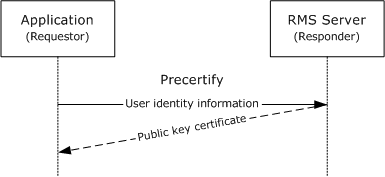

# [MS-RMSI]: Rights Management Services (RMS): ISV Extension Protocol

Table of Contents

1 Introduction

- [1 Introduction](#Section_1)
  - [1.1 Glossary](#Section_1.1)
  - [1.2 References](#Section_1.2)
    - [1.2.1 Normative References](#Section_1.2.1)
    - [1.2.2 Informative References](#Section_1.2.2)
  - [1.3 Overview](#Section_1.3)
    - [1.3.1 Decommissioning Interface](#Section_1.3.1)
    - [1.3.2 Precertification Interface](#Section_1.3.2)
    - [1.3.3 Republishing Interface](#Section_1.3.3)
    - [1.3.4 Prelicensing Interface](#Section_1.3.4)
  - [1.4 Relationship to Other Protocols](#Section_1.4)
  - [1.5 Prerequisites/Preconditions](#Section_1.5)
  - [1.6 Applicability Statement](#Section_1.6)
  - [1.7 Versioning and Capability Negotiation](#Section_1.7)
  - [1.8 Vendor-Extensible Fields](#Section_1.8)
  - [1.9 Standards Assignments](#Section_1.9)

2 Messages

- [2 Messages](#Section_2)
  - [2.1 Transport](#Section_2.1)
  - [2.2 Common Message Syntax](#Section_2.2)
    - [2.2.1 Namespaces](#Section_2.2.1)
    - [2.2.2 Messages](#Section_2.2.2)
    - [2.2.3 Elements](#Section_2.2.3)
    - [2.2.4 Complex Types](#Section_2.2.4)
      - [2.2.4.1 ArrayOfString](#Section_2.2.4.1)
      - [2.2.4.2 ArrayOfXmlNode](#Section_2.2.4.2)
      - [2.2.4.3 VersionData](#Section_2.2.4.3)
    - [2.2.5 Simple Types](#Section_2.2.5)
    - [2.2.6 Attributes](#Section_2.2.6)
    - [2.2.7 Groups](#Section_2.2.7)
    - [2.2.8 Attribute Groups](#Section_2.2.8)

3 Protocol Details

- [3 Protocol Details](#Section_3)
  - [3.1 Common Details](#Section_3.1)
    - [3.1.1 Abstract Data Model](#Section_3.1.1)
    - [3.1.2 Timers](#Section_3.1.2)
    - [3.1.3 Initialization](#Section_3.1.3)
    - [3.1.4 Message Processing Events and Sequencing Rules](#Section_3.1.4)
      - [3.1.4.1 Common SOAP Headers](#Section_3.1.4.1)
      - [3.1.4.2 Common Fault Codes](#Section_3.1.4.2)
    - [3.1.5 Timer Events](#Section_3.1.5)
    - [3.1.6 Other Local Events](#Section_3.1.6)
  - [3.2 Decommissioning Interface Server Details](#Section_3.2)
    - [3.2.1 Abstract Data Model](#Section_3.2.1)
    - [3.2.2 Timers](#Section_3.2.2)
    - [3.2.3 Initialization](#Section_3.2.3)
    - [3.2.4 Message Processing Events and Sequencing Rules](#Section_3.2.4)
      - [3.2.4.1 AcquireContentKey](#Section_3.2.4.1)
        - [3.2.4.1.1 Messages](#Section_3.2.4.1.1)
          - [3.2.4.1.1.1 AcquireContentKeySoapIn](#Section_3.2.4.1.1.1)
          - [3.2.4.1.1.2 AcquireContentKeySoapOut](#Section_3.2.4.1.1.2)
        - [3.2.4.1.2 Elements](#Section_3.2.4.1.2)
          - [3.2.4.1.2.1 AcquireContentKey](#Section_3.2.4.1.2.1)
          - [3.2.4.1.2.2 AcquireContentKeyResponse](#Section_3.2.4.1.2.2)
        - [3.2.4.1.3 Complex Types](#Section_3.2.4.1.3)
          - [3.2.4.1.3.1 ArrayOfAcquireContentKeyParams](#Section_3.2.4.1.3.1)
          - [3.2.4.1.3.2 AcquireContentKeyParams](#Section_3.2.4.1.3.2)
          - [3.2.4.1.3.3 ArrayOfAcquireContentKeyResponse](#Section_3.2.4.1.3.3)
          - [3.2.4.1.3.4 AcquireContentKeyResponse](#Section_3.2.4.1.3.4)
        - [3.2.4.1.4 Simple Types](#Section_3.2.4.1.4)
          - [3.2.4.1.4.1 KeyType](#Section_3.2.4.1.4.1)
    - [3.2.5 Timer Events](#Section_3.2.5)
    - [3.2.6 Other Local Events](#Section_3.2.6)
  - [3.3 Precertification Interface Server Details](#Section_3.3)
    - [3.3.1 Abstract Data Model](#Section_3.3.1)
    - [3.3.2 Timers](#Section_3.3.2)
    - [3.3.3 Initialization](#Section_3.3.3)
    - [3.3.4 Message Processing Events and Sequencing Rules](#Section_3.3.4)
      - [3.3.4.1 Precertify](#Section_3.3.4.1)
        - [3.3.4.1.1 Messages](#Section_3.3.4.1.1)
          - [3.3.4.1.1.1 PrecertifySoapIn](#Section_3.3.4.1.1.1)
          - [3.3.4.1.1.2 PrecertifySoapOut](#Section_3.3.4.1.1.2)
        - [3.3.4.1.2 Elements](#Section_3.3.4.1.2)
          - [3.3.4.1.2.1 Precertify](#Section_3.3.4.1.2.1)
          - [3.3.4.1.2.2 PrecertifyResponse](#Section_3.3.4.1.2.2)
        - [3.3.4.1.3 Complex Types](#Section_3.3.4.1.3)
          - [3.3.4.1.3.1 ArrayOfPrecertifyParams](#Section_3.3.4.1.3.1)
          - [3.3.4.1.3.2 PrecertifyParams](#Section_3.3.4.1.3.2)
          - [3.3.4.1.3.3 Identification](#Section_3.3.4.1.3.3)
          - [3.3.4.1.3.4 ArrayOfPrecertifyResponse](#Section_3.3.4.1.3.4)
          - [3.3.4.1.3.5 PrecertifyResponse](#Section_3.3.4.1.3.5)
        - [3.3.4.1.4 Simple Types](#Section_3.3.4.1.4)
          - [3.3.4.1.4.1 AuthenticationMode](#Section_3.3.4.1.4.1)
    - [3.3.5 Timer Events](#Section_3.3.5)
    - [3.3.6 Other Local Events](#Section_3.3.6)
  - [3.4 Republishing Interface Server Details](#Section_3.4)
    - [3.4.1 Abstract Data Model](#Section_3.4.1)
    - [3.4.2 Timers](#Section_3.4.2)
    - [3.4.3 Initialization](#Section_3.4.3)
    - [3.4.4 Message Processing Events and Sequencing Rules](#Section_3.4.4)
      - [3.4.4.1 EditIssuanceLicense](#Section_3.4.4.1)
        - [3.4.4.1.1 Messages](#Section_3.4.4.1.1)
          - [3.4.4.1.1.1 EditIssuanceLicenseSoapIn](#Section_3.4.4.1.1.1)
          - [3.4.4.1.1.2 EditIssuanceLicenseSoapOut](#Section_3.4.4.1.1.2)
        - [3.4.4.1.2 Elements](#Section_3.4.4.1.2)
          - [3.4.4.1.2.1 EditIssuanceLicense](#Section_3.4.4.1.2.1)
          - [3.4.4.1.2.2 EditIssuanceLicenseResponse](#Section_3.4.4.1.2.2)
        - [3.4.4.1.3 Complex Types](#Section_3.4.4.1.3)
          - [3.4.4.1.3.1 ArrayOfEditIssuanceLicenseParams](#Section_3.4.4.1.3.1)
          - [3.4.4.1.3.2 EditIssuanceLicenseParams](#Section_3.4.4.1.3.2)
          - [3.4.4.1.3.3 ArrayOfEditIssuanceLicenseResponse](#Section_3.4.4.1.3.3)
          - [3.4.4.1.3.4 EditIssuanceLicenseResponse](#Section_3.4.4.1.3.4)
    - [3.4.5 Timer Events](#Section_3.4.5)
    - [3.4.6 Other Local Events](#Section_3.4.6)
  - [3.5 Prelicensing Interface Server Details](#Section_3.5)
    - [3.5.1 Abstract Data Model](#Section_3.5.1)
    - [3.5.2 Timers](#Section_3.5.2)
    - [3.5.3 Initialization](#Section_3.5.3)
    - [3.5.4 Message Processing Events and Sequencing Rules](#Section_3.5.4)
      - [3.5.4.1 AcquirePreLicense](#Section_3.5.4.1)
        - [3.5.4.1.1 Messages](#Section_3.5.4.1.1)
          - [3.5.4.1.1.1 AcquirePreLicenseSoapIn](#Section_3.5.4.1.1.1)
          - [3.5.4.1.1.2 AcquirePreLicenseSoapOut](#Section_3.5.4.1.1.2)
        - [3.5.4.1.2 Elements](#Section_3.5.4.1.2)
          - [3.5.4.1.2.1 AcquirePreLicense](#Section_3.5.4.1.2.1)
          - [3.5.4.1.2.2 AcquirePreLicenseResponse](#Section_3.5.4.1.2.2)
        - [3.5.4.1.3 Complex Types](#Section_3.5.4.1.3)
          - [3.5.4.1.3.1 ArrayOfAcquirePreLicenseParams](#Section_3.5.4.1.3.1)
          - [3.5.4.1.3.2 AcquirePreLicenseParams](#Section_3.5.4.1.3.2)
          - [3.5.4.1.3.3 ArrayOfAcquirePreLicenseResponse](#Section_3.5.4.1.3.3)
          - [3.5.4.1.3.4 AcquirePreLicenseResponse](#Section_3.5.4.1.3.4)
          - [3.5.4.1.3.5 AcquirePreLicenseException](#Section_3.5.4.1.3.5)
    - [3.5.5 Timer Events](#Section_3.5.5)
    - [3.5.6 Other Local Events](#Section_3.5.6)

4 Protocol Examples

- [4 Protocol Examples](#Section_4)
  - [4.1 Using Decommissioning to Remove Protection from Content](#Section_4.1)
  - [4.2 Using Precertification to Pre-License Protected Content](#Section_4.2)

5 Security

- [5 Security](#Section_5)
  - [5.1 Security Considerations for Implementers](#Section_5.1)
    - [5.1.1 Decommissioning Interface](#Section_5.1.1)
    - [5.1.2 Precertification Interface](#Section_5.1.2)
    - [5.1.3 Republishing Interface](#Section_5.1.3)
    - [5.1.4 Prelicensing Interface](#Section_5.1.4)
  - [5.2 Index of Security Parameters](#Section_5.2)

6 Appendix A: Full WSDL

- [6 Appendix A: Full WSDL](#Section_6)
  - [6.1 Decommissioning Interface](#Section_6.1)
  - [6.2 Precertification Interface](#Section_6.2)
  - [6.3 Republishing Interface](#Section_6.3)
  - [6.4 Prelicensing Interface](#Section_6.4)

7 Appendix B: Product Behavior

- [7 Appendix B: Product Behavior](#Section_7)

8 Change Tracking

- [8 Change Tracking](#Section_8)

For the legal notice and IP terms, see [LEGAL.md](../LEGAL.md).
Last updated: 4/23/2024.
See [Revision History](#revision-history) for full version history.

# 1 Introduction

This specification describes the Rights Management Services (RMS): Independent Software Vendor (ISV) Extension Protocol which is used to communicate information between applications and RMS servers directly without using the RMS client. The RMS: ISV Extension Protocol facilitates the creation of applications that either extend the capabilities of RMS-enabled applications and/or bridge the capabilities of different software systems, by allowing for direct communication between applications and RMS servers without the use of the RMS client. This protocol enables applications to decommission [**protected content**](#gt_protected-content) and retrieve a recipient's public key [**certificate**](#gt_certificate).

Sections 1.5, 1.8, 1.9, 2, and 3 of this specification are normative. All other sections and examples in this specification are informative.

## 1.1 Glossary

This document uses the following terms:

**Active Directory**: The Windows implementation of a general-purpose directory service, which uses LDAP as its primary access protocol. [**Active Directory**](#gt_active-directory) stores information about a variety of objects in the network such as user accounts, computer accounts, groups, and all related credential information used by Kerberos [MS-KILE](../MS-KILE/MS-KILE.md). [**Active Directory**](#gt_active-directory) is either deployed as Active Directory Domain Services (AD DS) or Active Directory Lightweight Directory Services (AD LDS), which are both described in [MS-ADOD](../MS-ADOD/MS-ADOD.md): Active Directory Protocols Overview.

**certificate**: As used in this document, [**certificates**](#gt_certificate) are expressed in [XRML] section 1.2.

**certificate chain**: A sequence of [**certificates**](#gt_certificate), where each certificate in the sequence is signed by the subsequent certificate. The last certificate in the chain is normally a self-signed certificate.

**consumer**: The user who uses [**protected content**](#gt_protected-content).

**endpoint**: In the context of a web service, a network target to which a SOAP message can be addressed. See [[WSADDR]](https://go.microsoft.com/fwlink/?LinkId=113065).

**forest**: One or more domains that share a common schema and trust each other transitively. An organization can have multiple [**forests**](#gt_forest). A [**forest**](#gt_forest) establishes the security and administrative boundary for all the objects that reside within the domains that belong to the [**forest**](#gt_forest). In contrast, a domain establishes the administrative boundary for managing objects, such as users, groups, and computers. In addition, each domain has individual security policies and trust relationships with other domains.

**license**: An XrML1.2 document that describes usage policy for [**protected content**](#gt_protected-content).

**protected content**: Any content or information (file, email) that has an RMS usage policy assigned to it, and is encrypted according to that policy. Also known as "Protected Information".

**publishing license**: An XrML 1.2 license that defines the usage policy for protected content and contains the content key with which that content is encrypted. The usage policy identifies all authorized users and the actions that they are authorized to take with the content, in addition to any usage conditions. The publishing license tells a server which usage policies apply to a specific piece of content and grants a server the right to issue use licenses (ULs) based on that policy. The publishing license is created when content is protected. Also referred to as "Issuance License (IL)."

**publishing license (PL)**: An XrML 1.2 [**license**](#gt_license) that defines usage policy for [**protected content**](#gt_protected-content) and contains the content key with which that content is encrypted. The usage policy identifies all authorized users and the actions they are authorized to take with the content, along with any conditions on that usage. The [**publishing license**](#gt_publishing-license) tells the server what usage policies apply to a given piece of content and grants the server the right to issue [**use licenses (ULs)**](#gt_use-license-ul) based on that policy. The [**PL**](#gt_publishing-license-pl) is created when content is protected. Also known as an Issuance License (IL).

**RMS account certificate (RAC)**: An XrML 1.2 [**certificate chain**](#gt_certificate-chain) that contains an asymmetric encryption key pair that is issued to a user account by an RMS Certification Service. The [**RAC**](#gt_rms-account-certificate-rac) binds that user account to a specific computer. The [**RAC**](#gt_rms-account-certificate-rac) represents the identity of a user who can access [**protected content**](#gt_protected-content). Also known as a Group Identity Certificate (GIC).

**Secure Sockets Layer (SSL)**: A security protocol that supports confidentiality and integrity of messages in client and server applications that communicate over open networks. SSL supports server and, optionally, client authentication using X.509 certificates [[X509]](https://go.microsoft.com/fwlink/?LinkId=90590) and [[RFC5280]](https://go.microsoft.com/fwlink/?LinkId=131034). SSL is superseded by Transport Layer Security (TLS). TLS version 1.0 is based on SSL version 3.0 [[SSL3]](https://go.microsoft.com/fwlink/?LinkId=90534).

**security identifier (SID)**: An identifier for security principals that is used to identify an account or a group. Conceptually, the [**SID**](#gt_security-identifier-sid) is composed of an account authority portion (typically a domain) and a smaller integer representing an identity relative to the account authority, termed the relative identifier (RID). The [**SID**](#gt_security-identifier-sid) format is specified in [MS-DTYP](../MS-DTYP/MS-DTYP.md) section 2.4.2; a string representation of [**SIDs**](#gt_security-identifier-sid) is specified in [MS-DTYP] section 2.4.2 and [MS-AZOD](../MS-AZOD/MS-AZOD.md) section 1.1.1.2.

**SOAP fault**: A container for error and status information within a SOAP message. See [[SOAP1.2-1/2007]](https://go.microsoft.com/fwlink/?LinkId=94664) section 5.4 for more information.

**SOAP fault code**: The algorithmic mechanism for identifying a [**SOAP fault**](#gt_soap-fault). See [SOAP1.2-1/2007] section 5.6 for more information.

**Uniform Resource Locator (URL)**: A string of characters in a standardized format that identifies a document or resource on the World Wide Web. The format is as specified in [[RFC1738]](https://go.microsoft.com/fwlink/?LinkId=90287).

**use license (UL)**: An XrML 1.2 [**license**](#gt_license) that authorizes a user to access a given [**protected content**](#gt_protected-content) file and describes the usage policies that apply. Also known as an "End-User License (EUL)".

**MAY, SHOULD, MUST, SHOULD NOT, MUST NOT:** These terms (in all caps) are used as defined in [[RFC2119]](https://go.microsoft.com/fwlink/?LinkId=90317). All statements of optional behavior use either MAY, SHOULD, or SHOULD NOT.

## 1.2 References

Links to a document in the Microsoft Open Specifications library point to the correct section in the most recently published version of the referenced document. However, because individual documents in the library are not updated at the same time, the section numbers in the documents may not match. You can confirm the correct section numbering by checking the [Errata](https://go.microsoft.com/fwlink/?linkid=850906).

### 1.2.1 Normative References

We conduct frequent surveys of the normative references to assure their continued availability. If you have any issue with finding a normative reference, please contact [dochelp@microsoft.com](mailto:dochelp@microsoft.com). We will assist you in finding the relevant information.

[MS-DTYP] Microsoft Corporation, "[Windows Data Types](../MS-DTYP/MS-DTYP.md)".

[MS-RMPR] Microsoft Corporation, "[Rights Management Services (RMS): Client-to-Server Protocol](../MS-RMPR/MS-RMPR.md)".

[RFC2119] Bradner, S., "Key words for use in RFCs to Indicate Requirement Levels", BCP 14, RFC 2119, March 1997, [https://www.rfc-editor.org/info/rfc2119](https://go.microsoft.com/fwlink/?LinkId=90317)

[RFC2616] Fielding, R., Gettys, J., Mogul, J., et al., "Hypertext Transfer Protocol -- HTTP/1.1", RFC 2616, June 1999, [https://www.rfc-editor.org/info/rfc2616](https://go.microsoft.com/fwlink/?LinkId=90372)

[SOAP1.1] Box, D., Ehnebuske, D., Kakivaya, G., et al., "Simple Object Access Protocol (SOAP) 1.1", W3C Note, May 2000, [https://www.w3.org/TR/2000/NOTE-SOAP-20000508/](https://go.microsoft.com/fwlink/?LinkId=90520)

[SOAP1.2-1/2007] Gudgin, M., Hadley, M., Mendelsohn, N., et al., "SOAP Version 1.2 Part 1: Messaging Framework (Second Edition)", W3C Recommendation, April 2007, [http://www.w3.org/TR/2007/REC-soap12-part1-20070427/](https://go.microsoft.com/fwlink/?LinkId=94664)

[SOAP1.2-2/2007] Gudgin, M., Hadley, M., Mendelsohn, N., et al., "SOAP Version 1.2 Part 2: Adjuncts (Second Edition)", W3C Recommendation, April 2007, [http://www.w3.org/TR/2007/REC-soap12-part2-20070427](https://go.microsoft.com/fwlink/?LinkId=119124)

[WSDL] Christensen, E., Curbera, F., Meredith, G., and Weerawarana, S., "Web Services Description Language (WSDL) 1.1", W3C Note, March 2001, [https://www.w3.org/TR/2001/NOTE-wsdl-20010315](https://go.microsoft.com/fwlink/?LinkId=90577)

[XMLNS-2ED] Bray, T., Hollander, D., Layman, A., and Tobin, R., Eds., "Namespaces in XML 1.0 (Second Edition)", W3C Recommendation, August 2006, [https://www.w3.org/TR/2006/REC-xml-names-20060816/](https://go.microsoft.com/fwlink/?LinkId=90602)

[XMLSCHEMA1] Thompson, H., Beech, D., Maloney, M., and Mendelsohn, N., Eds., "XML Schema Part 1: Structures", W3C Recommendation, May 2001, [https://www.w3.org/TR/2001/REC-xmlschema-1-20010502/](https://go.microsoft.com/fwlink/?LinkId=90608)

[XMLSCHEMA2] Biron, P.V., Ed. and Malhotra, A., Ed., "XML Schema Part 2: Datatypes", W3C Recommendation, May 2001, [https://www.w3.org/TR/2001/REC-xmlschema-2-20010502/](https://go.microsoft.com/fwlink/?LinkId=90610)

[XRML] ContentGuard, Inc., "XrML: Extensible rights Markup Language Version 1.2", 2001, [http://contentguard.com/contact-us](https://go.microsoft.com/fwlink/?LinkId=324306)

**Note** Contact the owner of the XrML specification for more information.

### 1.2.2 Informative References

[KERBKEY] Microsoft Corporation, "KERB_CRYPTO_KEY", [http://msdn.microsoft.com/en-us/library/aa378058.aspx](https://go.microsoft.com/fwlink/?LinkId=89926)

[NTLM] Microsoft Corporation, "Microsoft NTLM", [http://msdn.microsoft.com/en-us/library/aa378749.aspx](https://go.microsoft.com/fwlink/?LinkId=90235)

## 1.3 Overview

Rights Management Services (RMS) is a client/server technology that provides information protection through content encryption and fine-grained policy definition and enforcement. The RMS: Client-to-Server Protocol [MS-RMPR](../MS-RMPR/MS-RMPR.md) enables the creation and consumption of [**protected content**](#gt_protected-content) and describes the functionality provided by the RMS client. However, there are additional scenarios that are not supported by the RMS: Client-to-Server Protocol:

- Decommissioning protected content
- Precertifying a user
- Republishing content
- Prelicensing content
Decommissioning is the process by which RMS protection can be completely removed from content. Precertification is the process by which a user's public key can be acquired. The requestor can use that public key to prelicense protected content, which enables the content to be delivered with the appropriate authorization token bound to the recipient user. Republishing is the process by which the rights granted in an [**issuance license (IL)**](#gt_publishing-license-pl) can be altered by issuing a new IL with the same content key as the original.

To accomplish these operations, an application can make requests directly to the RMS server using the RMS: Independent Software Vendor (ISV) Extension Protocol.

Figure 1: Typical roles in the RMS system

For the basic creation and consumption of protected information (or content), the RMS system involves three active roles: the creator, the [**consumer**](#gt_consumer), and the RMS server. The creator and consumer are both typically roles of the RMS client. The interactions between the RMS client and the RMS server are described in the RMS: Client-to-Server Protocol Specification [MS-RMPR].

Figure 2: Roles in the RMS system that use the RMS: ISV Extension Protocol

In a more complicated system, a creator, a consumer, and an RMS-enabled server application (such as a messaging transport) can be involved. In this situation, these roles are better modeled as applications which interact with the RMS client, and optionally, interact directly with the RMS server.

Figure 3: Relationships between the application, the RMS client, and the RMS server

While the RMS: Client-to-Server Protocol [MS-RMPR] supports the most common scenarios for the creation and consumption of content by an application in the RMS system, the RMS: ISV Extension Protocol can be used when additional functionality is required to enable the application to communicate directly with the RMS server. The RMS: ISV Extension Protocol provides the following interfaces to support these more advanced scenarios:

- Decommissioning: Enables RMS protection to be completely removed from protected content. When enabled on the RMS server, the [Decommissioning](#Section_6.1) interface accepts a [**publishing license**](#gt_publishing-license) and returns the content key from that [**license**](#gt_license).
- Precertification: Enables protected content to be delivered with an authorization token for the recipient user. The [Precertification](#Section_6.2) interface is used to retrieve the public key of the specified user.
- Republishing: Enables a new IL to be created by using the same content key as an existing IL. The Republishing interface is used to alter the set of rights granted by an IL.
- Prelicensing: Enables protected content to be delivered with an authorization token for the recipient user without requiring a precertification request. The Prelicensing interface is used to retrieve a [**use license**](#gt_use-license-ul) for the specified user.

### 1.3.1 Decommissioning Interface

If an organization were to decide to stop using RMS entirely and remove its deployment, it would need to remove RMS protection from content. One method is to have people with owner rights to each piece of content remove the protection. Realistically, however, it might not be possible to find these people because they might no longer belong to the organization in question. Another approach is to use the Decommissioning interface to extract the content key from a [**publishing license**](#gt_publishing-license) and return it so that it can then be used to decrypt the content. Because each protected document has a publishing license, and each publishing license has its own content key, this process is repeated for each protected document that needs to have its protection removed.

When servicing the request, the RMS server does not verify whether the requestor can be granted access to the content as specified in the publishing license. Rather, the RMS server returns the content key to any requestor. As a result, the Decommissioning interface is disabled for normal operation by default. The interface exposes one request and response message to support decommissioning via the [AcquireContentKey](#Section_3.2.4.1) operation.

### 1.3.2 Precertification Interface

When [**protected content**](#gt_protected-content) is sent to recipients, each recipient has to acquire a [**use license**](#gt_use-license-ul) that grants access to the content. The use license describes the usage policy for that user with that content and encrypts the content key to the user's public key. This process and protocol is described in the RMS: Client-to-Server Protocol Specification [MS-RMPR](../MS-RMPR/MS-RMPR.md).

As an optimization, the use license for a recipient could be generated in advance and made available with the content at the time the recipient attempted to access it. The use license could be requested on behalf of the recipient by either the sender or a server application that might be involved in delivering the content to the recipient. This use license would allow the recipient to access the content as soon as it was delivered without having to contact the RMS server, presuming that the recipient has already been bootstrapped.

In order to acquire a [**license**](#gt_license) on behalf of a recipient user, a requestor retrieves the public part of the recipient's [**RMS Account Certificate (RAC)**](#gt_rms-account-certificate-rac) using the Precertification interface and then requests a use license from the RMS Server using the RMS: Client-to-Server Protocol [MS-RMPR]. The Precertification interface exposes one request and response message to enable precertification via the [Precertify](#Section_3.3.4.1) operation.

### 1.3.3 Republishing Interface

After [**protected content**](#gt_protected-content) is published, it might become necessary to alter the set of rights that are granted to users in the original [**IL**](#gt_publishing-license-pl). The [EditIssuanceLicense (section 3.4.4.1)](#Section_3.4.4.1) operation allows a client to submit the original signed IL, as well as an unsigned IL that contains the altered rights. The RMS Server responds with a new signed IL that contains the same content key as the original IL.

Because the EditIssuanceLicense operation allows the requestor to have full control over the rights granted by the new IL, the operation is only permitted on ILs that opt-in to republishing. In addition, access to this service is typically restricted to computers or users trusted by the administrator. The Republishing interface exposes one request and response message to enable republishing via the EditIssuanceLicense operation.

### 1.3.4 Prelicensing Interface

When using the Precertification interface, the application is required to contact a server that is capable of issuing an [**RAC**](#gt_rms-account-certificate-rac) for a specific recipient. In an environment with multiple certification services, an application might require an application-specific configuration to determine which certification service to use for each user. If multiple applications prelicense content, an administrator might have to configure this data in independent ways.

The Prelicensing interface shifts this responsibility to the RMS Server. The application can specify a list of recipients by email address and provide a [**publishing license**](#gt_publishing-license). The RMS Server will determine the public key for each user and issue a [**use license**](#gt_use-license-ul) for each recipient based on the rights granted in the publishing license. The RMS Server itself can use the Precertification interface of another server to retrieve a public key for a user when their key resides on that server. The Prelicensing interface exposes one request and response message to enable prelicensing via the [AcquirePreLicense (section 3.5.4.1)](#Section_3.5.4.1) operation.

## 1.4 Relationship to Other Protocols

The RMS: ISV Extension Protocol uses the SOAP messaging protocol, as specified in [[SOAP1.1]](https://go.microsoft.com/fwlink/?LinkId=90520), for formatting requests and responses. It transmits these messages using the HTTP and/or HTTPS protocols. SOAP is considered the wire format used for messaging, and HTTP and HTTPS are the underlying transport protocols. The content files are downloaded using HTTP 1.1, as specified in [[RFC2616]](https://go.microsoft.com/fwlink/?LinkId=90372).The following diagram shows the transport stack used by the RMS: ISV Extension Protocol.

Figure 4: ISV Extension Protocol transport stack

## 1.5 Prerequisites/Preconditions

It is assumed that the RMS server has been started and is fully bootstrapped and initialized before the RMS: ISV Extension Protocol can start. Server initialization is described in the RMS: Client-to-Server Protocol Specification [MS-RMPR](../MS-RMPR/MS-RMPR.md).

## 1.6 Applicability Statement

The RMS: ISV Extension Protocol is used for the following purposes:

- **Decommissioning:** Extract a content key for [**protected content**](#gt_protected-content) so that RMS protection can be removed.
- **Precertification:** Acquire a recipient's public key for the purpose of acquiring a [**use license**](#gt_use-license-ul) from a different RMS server on behalf of a recipient.
- **Republishing:** Alter the rights granted via an [**IL**](#gt_publishing-license-pl) by issuing a new IL with the same content key as the original.
- **Prelicensing:** Acquire a use license on behalf of a recipient.

## 1.7 Versioning and Capability Negotiation

This specification covers versioning issues in the following areas:

- **Supported Transports**: This protocol is implemented using SOAP over HTTP as specified in section [2.1](#Section_2.1).
- **Protocol Versions**: This protocol has two interface versions as specified in section [2](#Section_2).
- **Security and Authentication Methods**: This protocol passively supports Kerberos authentication over HTTP or HTTPS (as specified in [[KERBKEY]](https://go.microsoft.com/fwlink/?LinkId=89926) and NT LAN Manager (NTLM) authentication over HTTP or HTTPS (as specified in [[NTLM]](https://go.microsoft.com/fwlink/?LinkId=90235)).
- **Capability Negotiation**: The RMS: ISV Extension Protocol supports limited capability negotiation via the <VersionData> type (section [2.2.4.3](#Section_2.2.4.3)) that is present on all SOAP-based protocol requests. On a request, the <VersionData> structure contains a <MinimumVersion> and <MaximumVersion> value, indicating the range of versions the client is capable of understanding. On a response, the <VersionData> structure contains <MinimumVersion> and <MaximumVersion> values that the RMS server is capable of understanding.

## 1.8 Vendor-Extensible Fields

None.

## 1.9 Standards Assignments

The RMS: ISV Extension Protocol has not been ratified by any standards body or organization.

# 2 Messages

This protocol references commonly used data types as defined in [MS-DTYP](../MS-DTYP/MS-DTYP.md).

## 2.1 Transport

The RMS: ISV Extension Protocol is composed of four SOAP-based interfaces:

- **Decommissioning**
- **Precertification**
- **Republishing**
- **Prelicensing**
Each interface MUST support SOAP (as specified in [[SOAP1.1]](https://go.microsoft.com/fwlink/?LinkId=90520) or [[SOAP1.2-1/2007]](https://go.microsoft.com/fwlink/?LinkId=94664)) over HTTP (as specified in [[RFC2616]](https://go.microsoft.com/fwlink/?LinkId=90372)) over TCP/IP. Each Web service SHOULD support HTTPS for securing communications.<1>

The interfaces MUST be exposed by the server at the following [**endpoints**](#gt_endpoint) starting from any base [**URL**](#gt_uniform-resource-locator-url):

**Decommissioning:** This interface MUST be exposed at the following URLs:

[baseURL]/decommission/decommission.asmx: [AcquireContentKey](#Section_3.2.4.1)

**Precertification:** This interface MUST be exposed at the following URL:

[baseURL]/certification/Precertification.asmx: [Precertify](#Section_3.3.4.1)

**Republishing:** This interface MUST be exposed at the following URL:

[baseURL]/licensing/editissuancelicense.asmx: [EditIssuanceLicense](#Section_3.4.4.1)

**Prelicensing:** This interface MUST be exposed at the following URL:

[baseURL]/licensing/license.asmx: [AcquirePreLicense](#Section_3.5.4.1)

## 2.2 Common Message Syntax

This section contains common definitions used by this protocol. The syntax of the definitions uses XML Schema, as defined in [[XMLSCHEMA1]](https://go.microsoft.com/fwlink/?LinkId=90608) and [[XMLSCHEMA2]](https://go.microsoft.com/fwlink/?LinkId=90610), and Web Services Description Language, as defined in [[WSDL]](https://go.microsoft.com/fwlink/?LinkId=90577).

### 2.2.1 Namespaces

This specification defines and references various XML namespaces using the mechanisms specified in [[XMLNS-2ED]](https://go.microsoft.com/fwlink/?LinkId=90602). Although this specification associates a specific XML namespace prefix for each XML namespace that is used, the choice of any particular XML namespace prefix is implementation-specific and not significant for interoperability.

| Prefix | Namespace URI | Reference |
| --- | --- | --- |
| s | http://microsoft.com/DRM/CertificationService | - |
| s | http://microsoft.com/DRM/DecommissionService | - |
| s | http://microsoft.com/DRM/EditIssuanceLicenseService | - |
| s | http://microsoft.com/DRM/LicensingService | - |
| s | http://schemas.xmlsoap.org/wsdl/http/ | [[WSDL]](https://go.microsoft.com/fwlink/?LinkId=90577) |
| s | http://www.w3.org/2001/XMLSchema | [[XMLSCHEMA1]](https://go.microsoft.com/fwlink/?LinkId=90608), [[XMLSCHEMA2]](https://go.microsoft.com/fwlink/?LinkId=90610) |
| s | http://schemas.xmlsoap.org/wsdl/soap/ | [[SOAP1.1]](https://go.microsoft.com/fwlink/?LinkId=90520) |
| s | http://schemas.xmlsoap.org/wsdl/soap12/ | [[SOAP1.2-1/2007]](https://go.microsoft.com/fwlink/?LinkId=94664), [[SOAP1.2-2/2007]](https://go.microsoft.com/fwlink/?LinkId=119124) |
| s | http://schemas.xmlsoap.org/soap/encoding/ | [SOAP1.1] |
| s | http://schemas.xmlsoap.org/wsdl/ | [WSDL] |

All interfaces in the RMS: ISV Extension Protocol use the same SOAP header for both requests and responses. The SOAP header for requests and responses to these interfaces MUST contain the [VersionData](#Section_2.2.4.3) element specified in section 2.2.4.3.

### 2.2.2 Messages

This specification does not define any common XML Schema message definitions.

### 2.2.3 Elements

This specification does not define any common XML Schema element definitions.

### 2.2.4 Complex Types

The following table summarizes the set of common XML Schema complex type definitions defined by this specification. XML Schema complex type definitions that are specific to a particular operation are described with the operation.

| Complex Type | Description |
| --- | --- |
| [<ArrayofString>](#Section_2.2.4.1) | Contains an array of strings. |
| [<ArrayofXmlNode>](#Section_2.2.4.2) | Contains an array of XML elements, each of which is represented as an XML fragment that is enclosed in the <Certificate> element. |
| [<VersionData>](#Section_2.2.4.3) | Represents the capability version of the client and server. |

#### 2.2.4.1 ArrayOfString

The <ArrayOfString> complex type is an array of strings.

<s:complexType name="ArrayOfString">

<s:sequence>

<s:element minOccurs="0" maxOccurs="unbounded" name="string"

nillable="true" type="s:string" />

</s:sequence>

</s:complexType>

**string:** Contains any string.

#### 2.2.4.2 ArrayOfXmlNode

The <ArrayOfXmlNode> complex type contains an array of XML elements, each of which is represented as an XML fragment. Each XML fragment is enclosed in the <Certificate> element.

<s:complexType name="ArrayOfXmlNode">

<s:sequence>

<s:element minOccurs="0" maxOccurs="unbounded" name="Certificate"

nillable="true">

<s:complexType mixed="true">

<s:sequence>

<s:any />

</s:sequence>

</s:complexType>

</s:element>

</s:sequence>

</s:complexType>

**Certificate:** Any eXtensible Rights Markup Language, as specified in [[XRML]](https://go.microsoft.com/fwlink/?LinkId=324306), [**certificate**](#gt_certificate) parameter that can be represented as a literal within an XML element in the protocol.

#### 2.2.4.3 VersionData

The VersionData complex type is used to represent the capability version of the requestor and the responder.

The requestor SHOULD specify "1.0.0.0" as both the <MinimumVersion> parameter and as the <MaximumVersion> parameter.

When the responder receives a request, it SHOULD compare its capability version to the capability version range the requestor presents. The responder SHOULD reject the request with a Microsoft.DigitalRightsManagement.Core.UnsupportedDataVersionException fault if the <MaximumVersion> value presented by the requestor is higher than the highest capability version of the responder.

When the responder replies to the requestor, including instances when the responder replies with an error<2>, it SHOULD specify the lowest capability version it can support as the value for the <MinimumVersion> parameter. The responder SHOULD specify the highest capability version it can support as the value for the <MaximumVersion> parameter.

<xs:complexType name="VersionData">

<xs:sequence>

<xs:element name="MinimumVersion"

type="string"

minOccurs="0"

maxOccurs="1"

/>

<xs:element name="MaximumVersion"

type="string"

minOccurs="0"

maxOccurs="1"

/>

</xs:sequence>

</xs:complexType>

**MinimumVersion:** Specifies the lowest capability version supported. The version data in this type MUST be represented with a literal string and MUST conform to the format "a.b.c.d". Subversion value "a" MUST be the most major component of the version, value "b" MUST be the next most major component, value "c" MUST be the next most major component, and "d" MUST be the minor subversion value.

**MaximumVersion:** Specifies the highest capability version supported. The version data in this type MUST be represented by a literal string and MUST conform to the format "a.b.c.d". Subversion value "a" MUST be the most major component of the version, value "b" MUST be the next most major component, value "c" MUST be the next most major components, and "d" MUST be the minor subversion value.

### 2.2.5 Simple Types

This specification does not define any common XML Schema simple type definitions.

### 2.2.6 Attributes

This specification does not define any common XML Schema attribute definitions.

### 2.2.7 Groups

This specification does not define any common XML Schema group definitions.

### 2.2.8 Attribute Groups

This specification does not define any common XML Schema attribute group definitions.

# 3 Protocol Details

The Rights Management Services (RMS): ISV Extension Protocol operates between an application and an RMS server. The initiator or requestor is the client for the protocol, and the responder is the server for the protocol.

The client side of this protocol is simply a pass-through. That is, there are no additional timers or other states required on the client side of this protocol. Calls made by the higher-layer protocol or application are passed directly to the transport, and the results returned by the transport are passed directly back to the higher-layer protocol or application.

## 3.1 Common Details

### 3.1.1 Abstract Data Model

None.

### 3.1.2 Timers

None.

### 3.1.3 Initialization

None.

### 3.1.4 Message Processing Events and Sequencing Rules

#### 3.1.4.1 Common SOAP Headers

The interfaces of the Rights Management Services (RMS): ISV Extension Protocol use the same SOAP header for both requests and responses. The SOAP header for requests and responses to these interfaces MUST contain the [VersionData](#Section_2.2.4.3) element specified in section 2.2.4.3.

**Request**

When a request is made, the requestor MUST specify the lowest capability version it can support as the <MinimumVersion> parameter. The client MUST specify the highest capability version it can support as the <MaximumVersion> parameter. The client MUST make the request in accordance with the <MaximumVersion> capability version.

| Parameter | Description |
| --- | --- |
| <MinimumVersion> | MUST specify the lowest capability version supported by the requestor. |
| <MaximumVersion> | MUST specify the highest capability version supported by the requestor. |

**Data Processing**

When a responder receives a request, it MUST compare its own capability version to the capability version range presented by the requestor. The responder MUST assume that the requestor always makes a maximum-version request. The responder MUST reject the request with an error if its highest capability version is lower than the <MaximumVersion> specified by the requestor. The responder MUST throw the Microsoft.DigitalRightsManagement.Core.MalformedDataVersionException exception if the <MinimumVersion> specified by the requestor is higher than the <MaximumVersion> specified by the requestor.

**Response**

When responding to a requestor, including when responding with an error, the responder MUST specify the lowest capability version it can support as the <MinimumVersion> parameter. The responder MUST specify the highest capability version it can support as the <MaximumVersion> parameter. If the responder's maximum capability version is lower than the requestor's maximum capability version, the requestor SHOULD resend its request and alter its request to conform to the capability version range specified by the responder.<3>

#### 3.1.4.2 Common Fault Codes

The RMS: ISV Extension Protocol notifies a requestor of application-level faults by generating [**SOAP fault code**](#gt_soap-fault-code) (as specified in [[SOAP1.1]](https://go.microsoft.com/fwlink/?LinkId=90520) section 4.4). In the [**SOAP fault**](#gt_soap-fault), the <faultcode> element contains the type of exception being thrown. The <faultstring> element contains the text of the exception being thrown.

The following table summarizes the exceptions that the server can return to the requestor.

| Exception | Description |
| --- | --- |
| System.ArgumentNullException | .NET exception. |
| Microsoft.DigitalRightsManagement.Core.MalformedDataVersionException | A client request contained an invalid version number that cannot be processed. |
| Microsoft.DigitalRightsManagement.Core.UnsupportedDataVersionException | The data version the client requested is not supported. |

The server SHOULD validate the <VersionData> element of the request. If the <MinimumVersion> element or the <MaximumVersion> element do not contain a valid version number as specified in section [2.2.4.2](#Section_2.2.4.2), the server SHOULD return a Microsoft.DigitalRightsManagement.Core.MalformedDataVersionException SOAP fault code. If the <MaximumVersion> element contains a version number that is higher than the range supported by the server for the operation, the server SHOULD return a Microsoft.DigitalRightsManagement.Core.UnsupportedDataVersionException SOAP fault code. If any input element required for successful processing of the operation is set to NULL, the server SHOULD return a System.ArgumentNullException SOAP fault code.

### 3.1.5 Timer Events

None.

### 3.1.6 Other Local Events

None.

## 3.2 Decommissioning Interface Server Details

The Decommissioning interface is used to extract the content key from a [**publishing license**](#gt_publishing-license). The complex types, simple types, and elements described in this section are used in the Decomissioning Service.

### 3.2.1 Abstract Data Model

This section describes a conceptual model of possible data organization that an implementation maintains to participate in this protocol. The described organization is provided to facilitate the explanation of how the protocol behaves. This specification does not mandate that implementations adhere to this model as long as their external behavior is consistent with that described in this specification.

**RMS Server private key:** The private key of the RMS server used for decryption and signing.

**Content key:** The key used to [**protect content**](#gt_protected-content).

**Publishing license:** An XrML 1.2 [**license**](#gt_license) that defines usage policy for protected content and contains the content key with which that content is encrypted. The usage policy and content key in the [**publishing license**](#gt_publishing-license) are encrypted with the server's public key.

### 3.2.2 Timers

None.

### 3.2.3 Initialization

None.

### 3.2.4 Message Processing Events and Sequencing Rules

| Operation | Description |
| --- | --- |
| [AcquireContentKey Operation](#Section_3.2.4.1) | Used to acquire a content key from a decommissioned RMS server. |

#### 3.2.4.1 AcquireContentKey

In the AcquireContentKey operation, the requestor submits a [**publishing license**](#gt_publishing-license) and the server returns the content key from that publishing license.

Figure 5: AcquireContentKey operation message sequence

<wsdl:operation name="AcquireContentKey">

<wsdl:input message="tns:AcquireContentKeySoapIn" />

<wsdl:output message="tns:AcquireContentKeySoapOut" />

</wsdl:operation>

To perform the request validation, the server MUST validate the input parameters upon receiving an AcquireContentKey request and the server MUST be configured to accept decommissioning requests.

If a request includes more than one publishing license, the server SHOULD ignore all but the first [**PL**](#gt_publishing-license-pl). The server decrypts the base-64 content key from the publishing license, determines its type, and returns both the key and its type in the response.

For a successful response, the server SHOULD determine whether the **PRINCIPAL** element in the **ISSUEDPRINCIPALS** element of the publishing license matches the **PRINCIPAL** in the **ISSUEDPRINCIPALS** of the SLC [**certificate chain**](#gt_certificate-chain) of the **ServerState** element, as defined in [MS-RMPR](../MS-RMPR/MS-RMPR.md) section 3.1.1.2.1, or in one of the elements in the **trustedLicensingServers** element set in the **ServerState**, as defined in [MS-RMPR] section 3.1.1.1. A match is determined by comparing the *OBJECT ID* as well as the size and value of the *modulus* parameter in the **PUBLICKEY** element of the **ISSUEDPRINCIPALS** elements being compared. If there is a match, the server MUST return the decrypted content key from the publishing license that was submitted in the request. The content key type MUST be "AES" or "DES" based on the content key itself. The response SHOULD contain a single content key.

For an unsuccessful request, if the server determines that the **PRINCIPAL** in the **ISSUEDPRINCIPALS** of the publishing license does not match the **PRINCIPAL** in the **ISSUEDPRINCIPALS** of the SLC certificate chain in **ServerState** or in one of the elements of the **trustedLicensingServers** set in the **ServerState**, the server SHOULD return a Microsoft.DigitalRightsManagement.UnsignedIssuanceLicenseNoMatchingIssuedPrincipalException [**SOAP fault code**](#gt_soap-fault-code). If the value of the **serverDecommissioned** field, as defined in [MS-RMPR] section 3.1.1.1, of the **ServerState** is False on the requested server, the server SHOULD return a Microsoft.DigitalRightsManagement.Utilities.ClusterNotDecommissionedException SOAP fault code.

**Exceptions Thrown:** The AcquireContentKey operation MUST throw [Common Fault Codes](#Section_3.1.4.2) for the RMS: ISV Extension Protocol, as described in section 3.1.4.2, or one of the following exceptions.

| Exception | Description |
| --- | --- |
| ClusterNotDecommissionedException | A decommission request was received, but [**Active Directory**](#gt_active-directory) RMS is not in a decommissioned state and cannot honor the request. |
| UnsignedIssuanceLicenseNoMatchingIssuedPrincipalException | None of the issued principals match this server. |

##### 3.2.4.1.1 Messages

| Message | Description |
| --- | --- |
| [AcquireContentKeySoapIn](#Section_3.2.4.1.1.1) | Contains a [**publishing license**](#gt_publishing-license) for a content access request. |
| [AcquireContentKeySoapOut](#Section_3.2.4.1.1.2) | Contains the key used to decrypt the content. |

###### 3.2.4.1.1.1 AcquireContentKeySoapIn

The AcquireContentKeySoapIn message contains the [**publishing license**](#gt_publishing-license) for the [**protected content**](#gt_protected-content).

<wsdl:message name="AcquireContentKeySoapIn">

<wsdl:part name="parameters" element="tns:AcquireContentKey" />

</wsdl:message>

**AcquireContentKey:** The <AcquireContentKey> element, as specified in section [3.2.4.1.2.1](#Section_3.2.4.1.2.1).

###### 3.2.4.1.1.2 AcquireContentKeySoapOut

The AcquireContentKeySoapOut message contains the content key used to decrypt the protected data corresponding to the [**publishing license**](#gt_publishing-license).

<wsdl:message name="AcquireContentKeySoapOut">

<wsdl:part name="parameters" element="tns:AcquireContentKeyResponse" />

</wsdl:message>

**AcquireContentKeyResponse:** The <AcquireContentKeyResponse> element, as specified in section [3.2.4.1.2.2](#Section_3.2.4.1.2.2).

##### 3.2.4.1.2 Elements

| Element | Description |
| --- | --- |
| [<AcquireContentKey>](#Section_3.2.4.1.2.1) | Contains the body of the request for the **AcquireContentKey** operation. |
| [<AcquireContentKeyResponse>](#Section_3.2.4.1.2.2) | Contains the response to an **AcquireContentKey** request message. |

###### 3.2.4.1.2.1 AcquireContentKey

The <AcquireContentKey> element contains the body of the request for the AcquireContentKey operation.

<s:element name="AcquireContentKey">

<s:complexType>

<s:sequence>

<s:element minOccurs="0" maxOccurs="1" name="paramsSoap"

type="tns:ArrayOfAcquireContentKeyParams" />

</s:sequence>

</s:complexType>

</s:element>

**paramsSoap:** An array in which each element contains all parameters needed for an individual request. The array is of the <[ArrayOfAcquireContentKeyParams](#Section_3.2.4.1.3.1)> complex type as defined by the schema in section 3.2.4.1.3.1, in which each element contains all parameters needed for one request. The array MUST contain at least one request for a content key. The array MAY contain more than one request for a content key. The server SHOULD only process the first element of the array.

###### 3.2.4.1.2.2 AcquireContentKeyResponse

The <AcquireContentKeyResponse> element contains a content key that corresponds to the [**publishing license**](#gt_publishing-license) submitted in the original AcquireContentKey request.

<s:element name="AcquireContentKeyResponse">

<s:complexType>

<s:sequence>

<s:element minOccurs="0" maxOccurs="1" name="AcquireContentKeyResult"

type="tns:ArrayOfAcquireContentKeyResponse" />

</s:sequence>

</s:complexType>

</s:element>

**AcquireContentKeyResult:** An array in which each element contains a content key to be returned to the requestor. The array is of the <[ArrayOfAcquireContentKeyResponse](#Section_3.2.4.1.3.1)> complex type as defined by the schema in section [3.2.4.1.3.3](#Section_3.2.4.1.3.3). The array MUST contain one element.

##### 3.2.4.1.3 Complex Types

| Complex Type | Description |
| --- | --- |
| [<ArrayOfAcquireContentKeyParams>](#Section_3.2.4.1.3.1) | Contains any number of sets of [<AcquireContentKeyParams>](#Section_3.2.4.1.3.2) used to acquire a content key. |
| <AcquireContentKeyParams> | The parameters that are used to acquire a content key. |
| [<ArrayOfAcquireContentKeyResponse>](#Section_3.2.4.1.3.3) | Contains any number of [<AcquireContentKeyResponse>](#Section_3.2.4.1.2.2) elements. |
| <AcquireContentKeyResponse> | The parameters returned from an [AcquireContentKey](#Section_3.2.4.1.2.1) operation. |

###### 3.2.4.1.3.1 ArrayOfAcquireContentKeyParams

The <ArrayOfAcquireContentKeyParams> complex type is an array that contains <[AcquireContentKeyParams](#Section_3.2.4.1.3.2)> elements. The array SHOULD contain at least one <AcquireContentKeyParams> element. The array MAY contain more than one <AcquireContentKeyParams> element. If the array does not contain an <AcquireContentKeyParams> element, the server SHOULD throw the System.ArgumentNullException exception.

<s:complexType name="ArrayOfAcquireContentKeyParams">

<s:sequence>

<s:element minOccurs="0" maxOccurs="unbounded"

name="AcquireContentKeyParams" nillable="true"

type="tns:AcquireContentKeyParams" />

</s:sequence>

</s:complexType>

**AcquireContentKeyParams:** An element that contains the parameters of the request. The element is of the <AcquireContentKeyParams> complex type as defined by the schema in section 3.2.4.1.3.2.

###### 3.2.4.1.3.2 AcquireContentKeyParams

The <AcquireContentKeyParams> complex type contains the [**publishing license**](#gt_publishing-license) for which the content key is being requested.

<s:complexType name="AcquireContentKeyParams">

<s:sequence>

<s:element minOccurs="0" maxOccurs="1" name="IssuanceLicense"

type="tns:ArrayOfXmlNode" />

</s:sequence>

</s:complexType>

**IssuanceLicense:** An element that contains the publishing license that uses the <ArrayOfXmlNode> complex type, as defined in section [2.2.4.2](#Section_2.2.4.2). The format of the publishing license is described in the RMS: Client-to-Server Protocol Specification [MS-RMPR](../MS-RMPR/MS-RMPR.md).

###### 3.2.4.1.3.3 ArrayOfAcquireContentKeyResponse

The <ArrayOfAcquireContentKeyResponse> complex type is an array that contains <AcquireContentKeyResponse> elements. The array MUST contain one <AcquireContentKeyResponse> element.

<s:complexType name="ArrayOfAcquireContentKeyResponse">

<s:sequence>

<s:element minOccurs="1" maxOccurs="unbounded"

name="AcquireContentKeyResponse" nillable="true"

type="tns:AcquireContentKeyResponse" />

</s:sequence>

</s:complexType>

**AcquireContentKeyResponse:** An element that contains the content key in the response. The element is of the <[AcquireContentKeyResponse](#Section_3.2.4.1.2.2)> complex type as defined by the schema in section 3.2.4.1.3.4.

###### 3.2.4.1.3.4 AcquireContentKeyResponse

The <AcquireContentKeyResponse> complex type contains the content key being requested.

<s:complexType name="AcquireContentKeyResponse">

<s:sequence>

<s:element minOccurs="0" maxOccurs="1" name="ContentKey"

type="s:base64Binary" />

<s:element minOccurs="1" maxOccurs="1" name="ContentKeyType"

type="tns:KeyType" />

</s:sequence>

</s:complexType>

**ContentKey**: A base-64 encoded binary content key. SHOULD NOT be NULL.

**ContentKeyType:** The type of the key. This element is a string belonging to the <[KeyType](#Section_3.2.4.1.4.1)> enumeration as defined by the schema in section 3.2.4.1.4.1.

##### 3.2.4.1.4 Simple Types

| Simple Type | Description |
| --- | --- |
| [<KeyType>](#Section_3.2.4.1.4.1) | An enumeration of strings that describe the type of the key being returned. |

###### 3.2.4.1.4.1 KeyType

The <KeyType> simple type is an enumeration of strings that describe the type of the key being returned. The <KeyType> MUST be one of the values in the enumeration.

<s:simpleType name="KeyType">

<s:restriction base="s:string">

<s:enumeration value="Unknown" />

<s:enumeration value="DES" />

<s:enumeration value="AES" />

<s:enumeration value="RSA" />

</s:restriction>

</s:simpleType>

**Unknown**: Unknown key type.

**DES:** A 56-bit DES (Data Encryption Standard) symmetric key.

**AES:** A 128-bit AES (Advanced Encryption Standard) symmetric key.

**RSA:** An RSA (Rivest, Shamir, and Adleman) asymmetric key.

### 3.2.5 Timer Events

None.

### 3.2.6 Other Local Events

None.

## 3.3 Precertification Interface Server Details

The Precertification interface is used to retrieve a user's public key [**certificate**](#gt_certificate) from a server. The complex types, simple types, and elements that are described in this section are used in the Precertification Service.

### 3.3.1 Abstract Data Model

This section describes a conceptual model of possible data organization that an implementation maintains to participate in this protocol. The described organization is provided to facilitate the explanation of how the protocol behaves. This specification does not mandate that implementations adhere to this model as long as their external behavior is consistent with that described in this specification.

**RMS Server private key:** The private key of the RMS server used for decryption and signing.

**RMS Account Certificate (RAC) Chain:** An XrML 1.2 [**certificate chain**](#gt_certificate-chain) that defines the usage policy for [**protected content**](#gt_protected-content) and contains the content key with which that content is encrypted. The usage policy and content key in the [**publishing license**](#gt_publishing-license) are encrypted with the server's public key.

**RAC key pair:** The key pair from the user's [**RAC**](#gt_rms-account-certificate-rac).

**User public key certificate:** A [**certificate**](#gt_certificate) similar to the RAC that contains only the user's public key. This certificate takes the format of the RAC minus the FEDERATIONPRINCIPALS node.

### 3.3.2 Timers

None.

### 3.3.3 Initialization

None.

### 3.3.4 Message Processing Events and Sequencing Rules

| Operation | Description |
| --- | --- |
| [Precertify Operation](#Section_3.3.4.1) | Allows an application to obtain the public key [**certificate**](#gt_certificate) of a user's [**RAC**](#gt_rms-account-certificate-rac) for prelicensing content. |

#### 3.3.4.1 Precertify

In the Precertify operation, the requestor specifies a recipient's identity and the server returns that recipient's public key [**certificate**](#gt_certificate).

Figure 6: Precertify operation message sequence

<wsdl:operation name="Precertify">

<wsdl:input message="tns:PrecertifySoapIn" />

<wsdl:output message="tns:PrecertifySoapOut" />

</wsdl:operation>

To perform the request validation, the server MUST validate the input parameters upon receiving a Precertify request. The Precertify request includes the following parameters:

| Parameter | Description |
| --- | --- |
| UserName | The name of the user, specified as an email address. A request MUST include either UserName or Identification, but it can include both. If both are included, the server SHOULD check that both UserName and Identification identify the same user and, if not, return an UnauthorizedAccessException exception. |
| Identification.AuthenticationMode | The authentication mode used by the user during bootstrapping. If Identification is present, both AuthenticationMode and Id SHOULD<4> be present. |
| Identification.Id | The identification of the user, based on the AuthenticationMode. If Identification is present, both AuthenticationMode and Id MUST be present. The Id MUST be a [**security identifier (SID)**](#gt_security-identifier-sid) as defined in [MS-DTYP](../MS-DTYP/MS-DTYP.md) section 2.4.2.1. |
| Identification.Email | SHOULD be NULL. |
| Identification.ProxyAddresses | SHOULD be NULL. |

For a successful request, the server verifies that the user specified in the request can be identified, that the information in the request is not contradictory, and that the server is able to issue an [**RAC**](#gt_rms-account-certificate-rac) for the user. Once this validation is complete, the server retrieves the user's RAC public key. If the user's RAC public key does not yet exist, the server generates it and then retrieves it. After the server has retrieved the user's RAC public key, the server generates the user's public key certificate, signs the certificate, and returns it in the response.

A successful Precertify response MUST return the public key certificate of the user specified in the request. For an unsuccessful request the server MUST throw an exception.

**Exceptions Thrown:**

The Precertify operation MUST throw either [Common Fault Codes](#Section_3.1.4.2) for the RMS: ISV Extension Protocol, as described in section 3.1.4.2, or the following exception.

| Exception | Description |
| --- | --- |
| ClusterDecommissionedException | The RMS Server is in decommissioning mode. In this mode, it will only service requests to the [Decommissioning](#Section_6.1) interface. All other requests are rejected. |
| Microsoft.DigitalRightsManagement.Core.DRMSArgumentException | An argument exception occurred. See the inner exception. |
| System.UnauthorizedAccessException | Access is unauthorized. |

##### 3.3.4.1.1 Messages

| Message | Description |
| --- | --- |
| [PrecertifySoapIn](#Section_3.3.4.1.1.1) | Contains the identity of the user. |
| [PrecertifySoapOut](#Section_3.3.4.1.1.2) | Contains the public key [**certificate**](#gt_certificate) of the user. |

###### 3.3.4.1.1.1 PrecertifySoapIn

The PrecertifySoapIn message contains the identity of the user for which the application is requesting the public key [**certificate**](#gt_certificate).

<wsdl:message name="PrecertifySoapIn">

<wsdl:part name="parameters" element="tns:Precertify" />

</wsdl:message>

**Precertify**: The <Precertify> element, as specified in section [3.3.4.1.2.1](#Section_3.3.4.1.2.1).

###### 3.3.4.1.1.2 PrecertifySoapOut

The <PrecertifySoapOut> message contains the public key [**certificate**](#gt_certificate) of the user for prelicensing content.

<wsdl:message name="PrecertifySoapOut">

<wsdl:part name="parameters" element="tns:PrecertifyResponse" />

</wsdl:message>

**PrecertifyResponse:** The <PrecertifyResponse> element, as specified in section [3.3.4.1.2.2](#Section_3.3.4.1.2.2).

##### 3.3.4.1.2 Elements

| Element | Description |
| --- | --- |
| [<Precertify>](#Section_3.3.4.1.2.1) | Contains the body of the request for the **Precertify** operation. |
| [<PrecertifyResponse>](#Section_3.3.4.1.2.2) | Contains the response to a **Precertify** request message. |

###### 3.3.4.1.2.1 Precertify

The <Precertify> element contains the body of the request for the Precertify operation.

<s:element name="Precertify">

<s:complexType>

<s:sequence>

<s:element minOccurs="0" maxOccurs="1" name="requestParams"

type="tns:ArrayOfPrecertifyParams" />

</s:sequence>

</s:complexType>

</s:element>

**requestParams:** An array in which each element contains all parameters needed for an individual request. The array is of the <[ArrayOfPrecertifyParams](#Section_3.3.4.1.3.1)> complex type as defined by the schema in section 3.3.4.1.3.1. The array SHOULD contain at least one request for a public key [**certificate**](#gt_certificate). If the array does not contain a request for a public key certificate or if it contains more than one request for a public key certificate, the server SHOULD throw the Microsoft.DigitalRightsManagement.Core.DRMSArgumentException exception.

###### 3.3.4.1.2.2 PrecertifyResponse

The <PrecertifyResponse> element contains the response to a Precertify request operation.

<s:element name="PrecertifyResponse">

<s:complexType>

<s:sequence>

<s:element minOccurs="0" maxOccurs="1" name="PrecertifyResult"

type="tns:ArrayOfPrecertifyResponse" />

</s:sequence>

</s:complexType>

</s:element>

**PrecertifyResult:** An array in which each element contains a public key [**certificate**](#gt_certificate) to be returned to the requestor. The array is of the <[ArrayOfPrecertifyResponse](#Section_3.3.4.1.3.4)> complex type as defined by the schema in section 3.3.4.1.3.4. The array MUST contain one element.

##### 3.3.4.1.3 Complex Types

| Complex Type | Description |
| --- | --- |
| [<ArrayOfPrecertifyParams>](#Section_3.3.4.1.3.1) | Contains an array that consists of <PrecertifyParams> elements. |
| [<PrecertifyParams>](#Section_3.3.4.1.3.2) | Contains the user identity information. |
| [<Identification>](#Section_3.3.4.1.3.3) | Contains information that identifies the target user. |
| [<ArrayOfPrecertifyResponse>](#Section_3.3.4.1.3.4) | Contains an array that consists of <PrecertifyResponse> elements, which in turn contain public key [**certificates**](#gt_certificate). |
| [<PrecertifyResponse>](#Section_3.3.4.1.2.2) | Contains the signed [**publishing license**](#gt_publishing-license). |

###### 3.3.4.1.3.1 ArrayOfPrecertifyParams

The <ArrayOfPrecertifyParams> complex type is an array that contains <PrecertifyParams> elements. The array MUST contain one <PrecertifyParams> element.

<s:complexType name="ArrayOfPrecertifyParams">

<s:sequence>

<s:element minOccurs="0" maxOccurs="unbounded" name="PrecertifyParams"

nillable="true" type="tns:PrecertifyParams" />

</s:sequence>

</s:complexType>

**PrecertifyParams:** An element that contains the parameters of the request. The element is of the [<PrecertifyParams>](#Section_3.3.4.1.3.2) complex type as defined by the schema in section 3.3.4.1.3.2.

###### 3.3.4.1.3.2 PrecertifyParams

The <PrecertifyParams> complex type contains the user identity information. At least one of UserName or Identification MUST be present. Both MAY be present.

<s:complexType name="PrecertifyParams">

<s:sequence>

<s:element minOccurs="0" maxOccurs="1" name="UserName" type="s:string" />

<s:element minOccurs="0" maxOccurs="1" name="Identification"

type="tns:Identification" />

</s:sequence>

</s:complexType>

**UserName:** A string that contains the name of the user, specified as the user's email address.

**Identification:** Contains further identification information for the user, and is of the [Identification](#Section_3.3.4.1.3.3) complex type as defined by the schema in section 3.3.4.1.3.3.

###### 3.3.4.1.3.3 Identification

The <Identification> complex type contains information that identifies the target user. AuthenticationMode MUST be present.

<s:complexType name="Identification">

<s:sequence>

<s:element minOccurs="1" maxOccurs="1" name="AuthenticationMode"

type="tns:AuthenticationMode" />

<s:element minOccurs="0" maxOccurs="1" name="Id" type="s:string" />

<s:element minOccurs="0" maxOccurs="1" name="Email" type="s:string" />

<s:element minOccurs="0" maxOccurs="1" name="ProxyAddresses"

type="tns:ArrayOfString" />

</s:sequence>

</s:complexType>

**AuthenticationMode:** The authentication mode that SHOULD<5> be used by the user during bootstrapping, and is of the <AuthenticationMode> simple type as defined by the schema in section [3.3.4.1.4.1](#Section_3.3.4.1.4.1).

**Id:** A string containing the identification of the user. This string MUST be a [**SID**](#gt_security-identifier-sid) as defined in [MS-DTYP](../MS-DTYP/MS-DTYP.md) section 2.4.2.1.

**Email:** SHOULD be NULL.

**ProxyAddresses:** SHOULD be NULL.

###### 3.3.4.1.3.4 ArrayOfPrecertifyResponse

The <ArrayOfPrecertifyResponse> complex type is an array that contains <PrecertifyResponse> elements, which in turn contain public key [**certificates**](#gt_certificate). The array MUST contain one <PrecertifyResponse> element.

<s:complexType name="ArrayOfPrecertifyResponse">

<s:sequence>

<s:element minOccurs="0" maxOccurs="unbounded" name="PrecertifyResponse"

type="tns:PrecertifyResponse" />

</s:sequence>

</s:complexType>

**PrecertifyResponse:** An element that contains the public key certificate in the response. The element is of the <[PrecertifyResponse](#Section_3.3.4.1.2.2)> complex type as defined by the schema in section 3.3.4.1.3.5.

###### 3.3.4.1.3.5 PrecertifyResponse

The <PrecertifyResponse> complex type contains the signed [**publishing license**](#gt_publishing-license).

<s:complexType name="PrecertifyResponse">

<s:sequence>

<s:element minOccurs="0" maxOccurs="1" name="Certificate">

<s:complexType mixed="true">

<s:sequence>

<s:any />

</s:sequence>

</s:complexType>

</s:element>

</s:sequence>

</s:complexType>

**Certificate:** An element that contains the XML of the public key [**certificate**](#gt_certificate). The public key certificate is an [**RMS Account Certificate (RAC)**](#gt_rms-account-certificate-rac) without the FEDERATIONPRINCIPALS node. The format of the RAC is described in the RMS: Client-to-Server Protocol Specification [MS-RMPR](../MS-RMPR/MS-RMPR.md).

##### 3.3.4.1.4 Simple Types

| Simple Type | Description |
| --- | --- |
| [<AuthenticationMode>](#Section_3.3.4.1.4.1) | An enumeration of possible authentication modes used by the user during bootstrapping. |

###### 3.3.4.1.4.1 AuthenticationMode

The <AuthenticationMode> simple type is an enumeration of possible authentication modes used by the user during bootstrapping.

<s:simpleType name="AuthenticationMode">

<s:restriction base="s:string">

<s:enumeration value="Windows" />

</s:restriction>

</s:simpleType>

**Windows:** Specifies Windows Integrated Authentication (either [[NTLM]](https://go.microsoft.com/fwlink/?LinkId=90235) or Kerberos).

### 3.3.5 Timer Events

None.

### 3.3.6 Other Local Events

None.

## 3.4 Republishing Interface Server Details

The Republishing interface is used to create a new signed [**publishing license**](#gt_publishing-license) that has the same content key as an existing signed publishing license. The complex types and elements that are described in this section are used in the Republishing Service.

### 3.4.1 Abstract Data Model

This section describes a conceptual model of possible data organization that an implementation maintains to participate in this protocol. The described organization is provided to facilitate the explanation of how the protocol behaves. This specification does not mandate that implementations adhere to this model as long as their external behavior is consistent with that described in this specification.

**RMS Server private key:** The private key of the RMS server used for decryption and signing.

**Content key:** The key used to protect content.

**Publishing license:** An XrML 1.2 [**license**](#gt_license) that defines the usage policy for [**protected content**](#gt_protected-content) and that contains the content key with which that content is encrypted. The usage policy and content key in the [**publishing license**](#gt_publishing-license) are encrypted with the public key of the server.

### 3.4.2 Timers

None.

### 3.4.3 Initialization

None.

### 3.4.4 Message Processing Events and Sequencing Rules

| Operation | Description |
| --- | --- |
| [EditIssuanceLicense](#Section_3.4.4.1) | Allows an application to obtain a new signed [**publishing license**](#gt_publishing-license) that has the same content key as an existing publishing license. |

#### 3.4.4.1 EditIssuanceLicense

In the EditIssuanceLicense operation, the requestor specifies a signed [**publishing license**](#gt_publishing-license) and an unsigned publishing license, and the server returns a signed publishing license.

Figure 7: EditIssuanceLicense operation message sequence

<wsdl:operation name="EditIssuanceLicense">

<wsdl:input message="tns:EditIssuanceLicenseSoapIn" />

<wsdl:output message="tns:EditIssuanceLicenseSoapOut" />

</wsdl:operation>

To perform the request validation, the server MUST validate the input parameters upon receiving an EditIssuanceLicense request. The EditIssuanceLicense request includes the following parameters.

| Parameter | Description |
| --- | --- |
| SignedIssuanceLicense | An XML node that contains the signed publishing license that will be updated. This is the leaf [**certificate**](#gt_certificate) in the publishing license chain only, not the entire chain leading back to the root issuer. |
| UnsignedIssuanceLicense | An XML node that contains the new publishing license, which includes the new rights that will replace the rights in the existing [**license**](#gt_license). This is the leaf certificate in the publishing license chain only, not the entire chain leading back to the root issuer. |

Upon receiving an EditIssuanceLicense request, the server MUST validate both [**PLs**](#gt_publishing-license-pl) for format and syntax. In addition, the server MUST validate the signature of the signed PL as follows:

- If the PL chain fails signature validation or is issued by a server that the RMS server does not trust, the server SHOULD return a Microsoft.DigitalRightsManagement.Licensing.InvalidSignedIssuanceLicenseException [**SOAP fault code**](#gt_soap-fault-code).
- If the **ISSUEDPRINCIPALS** element of the signed PL does not match the requesting server, the server SHOULD return a Microsoft.DigitalRightsManagement.InvalidSignedIssuanceLicenseException SOAP fault code.
- If the value of the **onlinePublishingEnabled** field, as defined in [MS-RMPR](../MS-RMPR/MS-RMPR.md) section 3.1.1.1.1, of the **ServerState** is False on the requested server, as defined in [MS-RMPR] section 3.1.1.2.1, the server SHOULD return a Microsoft.DigitalRightsManagement.OnlinePublishingDisabledException SOAP fault code.
- If the **ISSUEDPRINCIPALS** element of the unsigned PL does not match the requesting server, the server SHOULD return a Microsoft.DigitalRightsManagement.UnsignedIssuanceLicenseNoMatchingIssuedPrincipalException SOAP fault code.
- If the type attribute of the BODY element of the Encrypted Rights Data of the PL chain is "Microsoft Official Rights Template" and the signature of the Encrypted Rights Data is not valid, the server SHOULD return a Microsoft.DigitalRightsManagement.Licensing.InvalidOfficialRightsTemplateException fault.
- If the **serverDecommissioned** field of the **ServerState** is True, the server SHOULD return a Microsoft.RightsManagementServices.ClusterDecommissionedException SOAP fault code.
If the Encrypted Rights Data of the signed PL does not contain an AUTHENTICATEDDATA element configured as follows:

- An id of "APPSPECIFIC"
- A name set to "Allow_Server_Editing"
- A value of True
the server MUST return a Microsoft.DigitalRightsManagement.ServerRepublishIllegalException SOAP fault code.

If validation succeeds, the server SHOULD service the request. To service the request, the server MUST create a new ENABLINGBITS element for the unsigned PL by using the content key from the signed PL. The server MUST decrypt the Encrypted Rights Data of the unsigned PL by using the original content key of the unsigned PL. The server MUST re-encrypt the resulting string by using the content key of the signed PL. The server MUST sign the body of the unsigned PL and include the signature in the SIGNATURE element of the PL.

For a successful request, the server MUST return the new signed PL. The server MUST return only the leaf certificate in the PL chain. For an unsuccessful request, the server MUST return a SOAP fault code as described earlier in this section, or a generic SOAP fault code. The client MUST process all generic SOAP fault codes in the same manner.

**Exceptions Thrown:**

The EditIssuanceLicense operation MUST throw either [Common Fault Codes](#Section_3.1.4.2) for the RMS: ISV Extension Protocol, as described in section 3.1.4.2, or one of the following exceptions:

| Exception | Description |
| --- | --- |
| Microsoft.DigitalRightsManagement.ServerRepublishIllegalException | Server republishing is not allowed. |
| Microsoft.DigitalRightsManagement.InvalidSignedIssuanceLicenseException | The signed issuance license supplied by the requestor is invalid. |
| Microsoft.DigitalRightsManagement.Licensing.OnlinePublishingDisabledException | Online publishing is not available on this server. |
| Microsoft.DigitalRightsManagement.Licensing.UnsignedIssuanceLicenseNoMatchingIssuedPrincipalException | None of the issued principals match this server. |
| Microsoft.DigitalRightsManagement.Licensing.InvalidOfficialRightsTemplateException | The official rights template included in the PL is not valid. |
| Microsoft.RightsManagementServices.ClusterDecommissionedException | A request was received, but the server is in a decommissioned state and cannot process the request. |

##### 3.4.4.1.1 Messages

| Message | Description |
| --- | --- |
| [EditIssuanceLicenseSoapIn](#Section_3.4.4.1.1.1) | Contains a signed [**publishing license**](#gt_publishing-license) and an unsigned publishing license. |
| [EditIssuanceLicenseSoapOut](#Section_3.4.4.1.1.2) | Contains a new signed publishing license. |

###### 3.4.4.1.1.1 EditIssuanceLicenseSoapIn

The EditIssuanceLicenseSoapIn message contains a signed [**publishing license**](#gt_publishing-license) and an unsigned publishing license.

<wsdl:message name="EditIssuanceLicenseSoapIn">

<wsdl:part name="parameters" element="tns:EditIssuanceLicense" />

</wsdl:message>

**EditIssuanceLicense:** The <EditIssuanceLicense> element, as specified in section [3.4.4.1.2.1](#Section_3.4.4.1.2.1).

###### 3.4.4.1.1.2 EditIssuanceLicenseSoapOut

The EditIssuanceLicenseSoapOut message contains a signed [**publishing license**](#gt_publishing-license).

<wsdl:message name="EditIssuanceLicenseSoapOut">

<wsdl:part name="parameters" element="tns:EditIssuanceLicenseResponse" />

</wsdl:message>

**EditIssuanceLicenseResponse:** The <EditIssuanceLicenseResponse> element, as specified in section [3.4.4.1.2.2](#Section_3.4.4.1.2.2).

##### 3.4.4.1.2 Elements

| Element | Description |
| --- | --- |
| [<EditIssuanceLicense>](#Section_3.4.4.1.2.1) | Contains the body of the request for the EditIssuanceLicense operation. |
| [<EditIssuanceLicenseResponse>](#Section_3.4.4.1.2.2) | Contains the response to an EditIssuanceLicense request message. |

###### 3.4.4.1.2.1 EditIssuanceLicense

The <EditIssuanceLicense> element contains the body of the request for the EditIssuanceLicense operation.

<s:element name="EditIssuanceLicense">

<s:complexType>

<s:sequence>

<s:element minOccurs="0" maxOccurs="1" name="RequestParams"

type="tns:ArrayOfEditIssuanceLicenseParams" />

</s:sequence>

</s:complexType>

</s:element>

**RequestParams:** An array in which each element contains all of the parameters that are required for an individual request. The array is of the <ArrayOfEditIssuanceLicenseParams> complex type, as defined by the schema in section [3.4.4.1.3.1](#Section_3.4.4.1.3.1). The array MUST contain one request for a signed [**publishing license**](#gt_publishing-license).

###### 3.4.4.1.2.2 EditIssuanceLicenseResponse

The <EditIssuanceLicenseResponse> element contains the response to an EditIssuanceLicense request operation.

<s:element name="EditIssuanceLicenseResponse">

<s:complexType>

<s:sequence>

<s:element minOccurs="0" maxOccurs="1" name="EditIssuanceLicenseResult"

type="tns:ArrayOfEditIssuanceLicenseResponse" />

</s:sequence>

</s:complexType>

</s:element>

**EditIssuanceLicenseResult:** An array in which each element contains a signed [**publishing license**](#gt_publishing-license) to be returned to the requestor. The array is of the <ArrayOfEditIssuanceLicenseResponse> complex type, as defined by the schema in section [3.4.4.1.3.3](#Section_3.4.4.1.3.3). The array MUST contain one element.

##### 3.4.4.1.3 Complex Types

| Complex Type | Description |
| --- | --- |
| [<ArrayOfEditIssuanceLicenseParams>](#Section_3.4.4.1.3.1) | Contains an array that consists of <EditIssuanceLicenseParams> elements. |
| [<EditIssuanceLicenseParams>](#Section_8069d8ef38754e738bae3fff2a5ed763) | Contains the signed and unsigned [**publishing licenses**](#gt_publishing-license-pl). |
| [<ArrayOfEditIssuanceLicenseResponse>](#Section_3.4.4.1.3.3) | Contains an array that consists of <EditIssuanceLicenseResponse> elements. |
| [<EditIssuanceLicenseResponse>](#Section_d5803e58def54be9809d2580e060ed66) | Contains the signed [**publishing license**](#gt_publishing-license). |

###### 3.4.4.1.3.1 ArrayOfEditIssuanceLicenseParams

The <ArrayOfEditIssuanceLicenseParams> complex type is an array that contains [<EditIssuanceLicenseParams>](#Section_8069d8ef38754e738bae3fff2a5ed763) elements. The array MUST contain exactly one <EditIssuanceLicenseParams> element.

<s:complexType name="ArrayOfEditIssuanceLicenseParams">

<s:sequence>

<s:element minOccurs="0" maxOccurs="unbounded" name="EditIssuanceLicenseParams"

nillable="true" type="tns:EditIssuanceLicenseParams" />

</s:sequence>

</s:complexType>

**EditIssuanceLicenseParams:** An element that contains the parameters of the request. The element is of the <EditIssuanceLicenseParams> complex type, as defined by the schema in section 3.4.4.1.3.2.

###### 3.4.4.1.3.2 EditIssuanceLicenseParams

The <EditIssuanceLicenseParams> complex type contains the signed [**publishing license**](#gt_publishing-license) and the unsigned publishing license.

<s:complexType name="EditIssuanceLicenseParams">

<s:sequence>

<s:element minOccurs="0" maxOccurs="1" name="SignedIssuanceLicense">

<s:complexType mixed="true">

<s:sequence>

<s:any />

</s:sequence>

</s:complexType>

</s:element>

<s:element minOccurs="0" maxOccurs="1" name="UnsignedIssuanceLicense">

<s:complexType mixed="true">

<s:sequence>

<s:any />

</s:sequence>

</s:complexType>

</s:element>

</s:sequence>

</s:complexType>

**SignedIssuanceLicense:** An XML string that contains the leaf [**certificate**](#gt_certificate) of the signed publishing license.

**UnsignedIssuanceLicense:** An XML string that contains the leaf certificate of the unsigned publishing license.

###### 3.4.4.1.3.3 ArrayOfEditIssuanceLicenseResponse

The <ArrayOfEditIssuanceLicenseResponse> complex type is an array that contains [<EditIssuanceLicenseResponse>](#Section_d5803e58def54be9809d2580e060ed66) elements. The array MUST contain exactly one <EditIssuanceLicenseResponse> element.

<s:complexType name="ArrayOfEditIssuanceLicenseResponse">

<s:sequence>

<s:element minOccurs="0" maxOccurs="unbounded" name="EditIssuanceLicenseResponse"

nillable="true" type="tns:EditIssuanceLicenseResponse" />

</s:sequence>

</s:complexType>

**EditIssuanceLicenseResponse:** An element that contains the signed [**publishing license**](#gt_publishing-license) in the response. The element is of the <EditIssuanceLicenseResponse> complex type, as defined by the schema in section 3.4.4.1.3.4.

###### 3.4.4.1.3.4 EditIssuanceLicenseResponse

The <EditIssuanceLicenseResponse> complex type contains a signed [**publishing license**](#gt_publishing-license) [**certificate chain**](#gt_certificate-chain).

<s:complexType name="EditIssuanceLicenseResponse">

<s:sequence>

<s:element minOccurs="0" maxOccurs="1" name="CertificateChain" type="tns:ArrayOfXmlNode" />

</s:sequence>

</s:complexType>

**CertificateChain:** An element that contains the signed publishing license. The element is of the <ArrayOfXmlNode> complex type as defined by the schema in section [2.2.4.2](#Section_2.2.4.2).

### 3.4.5 Timer Events

None.

### 3.4.6 Other Local Events

None.

## 3.5 Prelicensing Interface Server Details

The Prelicensing interface is used to retrieve [**use licenses**](#gt_8ea9c543-0cc2-4f60-894d-c3fb9a78e065) on behalf of recipients. The complex types and elements that are described in this section are used in the Prelicensing Service.

### 3.5.1 Abstract Data Model

This section describes a conceptual model of possible data organization that an implementation maintains to participate in this protocol. The described organization is provided to facilitate the explanation of how the protocol behaves. This specification does not mandate that implementations adhere to this model as long as their external behavior is consistent with that described in this specification.

**RMS Server private key:** The private key of the RMS server that is used for decryption and signing.

**Publishing license:** An XrML 1.2 [**license**](#gt_license) that defines the usage policy for [**protected content**](#gt_protected-content) and that contains the content key with which that content is encrypted. The usage policy and content key in the [**publishing license**](#gt_publishing-license) are encrypted with the public key of the server.

**Use license:** An XrML 1.2 license that authorizes a user to access a given protected content file and that describes the applicable usage policies.

### 3.5.2 Timers

None.

### 3.5.3 Initialization

None.

### 3.5.4 Message Processing Events and Sequencing Rules

| Operation | Description |
| --- | --- |
| [AcquirePreLicense](#Section_3.5.4.1) | Allows an application to retrieve [**use licenses**](#gt_8ea9c543-0cc2-4f60-894d-c3fb9a78e065) on behalf of recipients. |

#### 3.5.4.1 AcquirePreLicense

In the AcquirePreLicense operation, the requestor specifies a list of recipient email addresses and a [**publishing license**](#gt_publishing-license), and the server returns a [**use license**](#gt_use-license-ul) for each recipient.

Figure 8: AcquirePreLicense operation message sequence

<wsdl:operation name="AcquirePreLicense">

<wsdl:input message="tns:AcquirePreLicenseSoapIn" />

<wsdl:output message="tns:AcquirePreLicenseSoapOut" />

</wsdl:operation>

To perform the request validation, the server MUST validate the input parameters upon receiving an AcquirePreLicense request. The AcquirePreLicense request includes the following parameters:

| Parameter | Description |
| --- | --- |
| LicenseeIdentities | An array of recipient email addresses. |
| IssuanceLicense | An XML node that contains the signed publishing license to be used in licensing. This is the leaf [**certificate**](#gt_certificate) in the publishing license chain only, not the entire chain leading back to the root issuer. |
| ApplicationData | Unused. |

For a successful request, the server SHOULD verify that each user that is specified in LicenseeIdentities can be identified and that the server is able to retrieve the user's [**RAC**](#gt_rms-account-certificate-rac) public key. If the server does not have enough information to retrieve a user's public key, the server SHOULD return an <AcquirePreLicenseException> element that contains the AcquirePreLicenseInvalidLicenseeException error in place of a use license for that user.

Once validation is complete, the server retrieves each user's RAC public key, evaluates the rights granted to the user by the IssuanceLicense, and generates a use license with a content key that is protected by the user's RAC public key. The process for generating a use license is defined in [MS-RMPR](../MS-RMPR/MS-RMPR.md) section 3.4.4.1.

If the server encounters an error while retrieving the user's public key, the server SHOULD return an <AcquirePreLicenseException> element that contains an exception string in place of a use license for that user.

If the server encounters an error while generating a use license for a user, the server SHOULD return an <AcquirePreLicenseException> element that contains an exception string in place of a use license for that user. The server SHOULD use exceptions listed in [MS-RMPR] section 3.4.4.1 to indicate which error occurred when attempting to generate a use license for a user.

A successful **AcquirePreLicense** response SHOULD return a use license for each user. If an error occurred while generating a [**license**](#gt_license) for a user, an AcquirePreLicenseException element that contains the error message SHOULD be used in place of the use license for that user. Error messages containing exceptions other than "Microsoft.DigitalRightsManagement.Licensing.NoRightsForRequestedPrincipalException" SHOULD be treated as a human-readable error message to assist in troubleshooting unexpected errors and clients SHOULD NOT rely on specific error messages. Clients SHOULD check for the presence of the "Microsoft.DigitalRightsManagement.Licensing.NoRightsForRequestedPrincipalException" exception to determine if a user did not have permission to access the content protected by the [**PL**](#gt_publishing-license-pl). If an error affects the entire request, rather than individual users, the server SHOULD throw an exception.

**Exceptions Thrown:**

The AcquirePreLicense operation MUST throw either [Common Fault Codes](#Section_3.1.4.2) for the RMS: ISV Extension Protocol, as described in section 3.1.4.2, or the following exceptions.

| Exception | Description |
| --- | --- |
| ClusterDecommissionedException | The RMS Server is in decommissioning mode. In this mode, it will only service requests to the Decommissioning interface (section [3.2](#Section_3.2)). All other requests are rejected. |
| AcquirePreLicenseInvalidLicenseeException | The license specified in AcquirePreLicense is invalid. |

##### 3.5.4.1.1 Messages

| Message | Description |
| --- | --- |
| [AcquirePreLicenseSoapIn](#Section_3.5.4.1.1.1) | Contains the user email addresses and a [**publishing license**](#gt_publishing-license). |
| [AcquirePreLicenseSoapOut](#Section_3.5.4.1.1.2) | Contains the [**use license**](#gt_use-license-ul) for each user. |

###### 3.5.4.1.1.1 AcquirePreLicenseSoapIn

The AcquirePreLicenseSoapIn message contains the user email addresses and a [**publishing license**](#gt_publishing-license).

<wsdl:message name="AcquirePreLicenseSoapIn">

<wsdl:part name="parameters" element="tns:AcquirePreLicense" />

</wsdl:message>

**AcquirePreLicense:** The <AcquirePreLicense> element, as specified in section [3.5.4.1.2.1](#Section_3.5.4.1.2.1).

###### 3.5.4.1.1.2 AcquirePreLicenseSoapOut

The AcquirePreLicenseSoapOut message contains the [**use license**](#gt_use-license-ul) for each user.

<wsdl:message name="AcquirePreLicenseSoapOut">

<wsdl:part name="parameters" element="tns:AcquirePreLicenseResponse" />

</wsdl:message>

**AcquirePreLicenseResponse:** The <AcquirePreLicenseResponse> element, as specified in section [3.5.4.1.2.2](#Section_3.5.4.1.2.2).

##### 3.5.4.1.2 Elements

| Element | Description |
| --- | --- |
| [<AcquirePreLicense>](#Section_3.5.4.1.2.1) | Contains the body of the request for the AcquirePreLicense operation. |
| [<AcquirePreLicenseResponse>](#Section_3.5.4.1.2.2) | Contains the response to an AcquirePreLicense request message. |

###### 3.5.4.1.2.1 AcquirePreLicense

The <AcquirePreLicense> element contains the body of the request for the AcquirePreLicense operation.

<s:element name="AcquirePreLicense">

<s:complexType>

<s:sequence>

<s:element minOccurs="0" maxOccurs="1" name="RequestParams"

type="tns:ArrayOfAcquirePreLicenseParams" />

</s:sequence>

</s:complexType>

</s:element>

**RequestParams:** An array in which each element contains all of the parameters that are required for an individual request. The array is of the <ArrayOfAcquirePreLicenseParams> element type, as defined by the schema in section [3.5.4.1.3.1](#Section_3.5.4.1.3.1).

###### 3.5.4.1.2.2 AcquirePreLicenseResponse

The <AcquirePreLicenseResponse> element contains the response to an AcquirePreLicense request operation.

<s:element name="AcquirePreLicenseResponse">

<s:complexType>

<s:sequence>

<s:element minOccurs="0" maxOccurs="1" name="AcquirePreLicenseResult"

type="tns:ArrayOfAcquirePreLicenseResponse" />

</s:sequence>

</s:complexType>

</s:element>

**AcquirePreLicenseResult:** An array in which each element contains a signed [**publishing license**](#gt_publishing-license) to be returned to the requestor. The array is of the <ArrayOfAcquirePreLicenseResponse> complex type, as defined by the schema in [3.5.4.1.3.3](#Section_3.5.4.1.3.3).

##### 3.5.4.1.3 Complex Types

| Complex type | Description |
| --- | --- |
| [<ArrayOfAcquirePreLicenseParams>](#Section_3.5.4.1.3.1) | Contains an array that consists of <AcquirePreLicenseParams> elements. |
| [<AcquirePreLicenseParams>](#Section_3.5.4.1.3.2) | Contains an array of email addresses and a [**publishing license**](#gt_publishing-license). |
| [<ArrayOfAcquirePreLicenseResponse>](#Section_3.5.4.1.3.3) | Contains an array that consists of <AcquirePreLicenseResponse> elements. |
| [<AcquirePreLicenseResponse>](#Section_3.5.4.1.3.4) | Contains an array of [**use licenses**](#gt_8ea9c543-0cc2-4f60-894d-c3fb9a78e065) and the licensor [**certificate chain**](#gt_certificate-chain) of the server. |
| [<AcquirePreLicenseException>](#Section_3.5.4.1.3.5) | Contains information about the error that occurred while generating a use license for a user. |

###### 3.5.4.1.3.1 ArrayOfAcquirePreLicenseParams

The <ArrayOfAcquirePreLicenseParams> complex type is an array that contains <AcquirePreLicenseParams> elements.

<s:complexType name="ArrayOfAcquirePreLicenseParams">

<s:sequence>

<s:element minOccurs="0" maxOccurs="unbounded" name="AcquirePreLicenseParams"

nillable="true" type="tns:AcquirePreLicenseParams" />

</s:sequence>

</s:complexType>

**AcquirePreLicenseParams:** An element that contains the parameters of the request. The element is of the <AcquirePreLicenseParams> complex type, as defined by the schema in section [3.5.4.1.3.2](#Section_3.5.4.1.3.2).

###### 3.5.4.1.3.2 AcquirePreLicenseParams

The <AcquirePreLicenseParams> complex type contains an array of email addresses and a [**publishing license**](#gt_publishing-license).

<s:complexType name="AcquirePreLicenseParams">

<s:sequence>

<s:element minOccurs="0" maxOccurs="1" name="LicenseeIdentities" type="tns:ArrayOfString" />

<s:element minOccurs="0" maxOccurs="1" name="IssuanceLicense" type="tns:ArrayOfXmlNode" />

<s:element minOccurs="0" maxOccurs="1" name="ApplicationData">

<s:complexType mixed="true">

<s:sequence>

<s:any />

</s:sequence>

</s:complexType>

</s:element>

</s:sequence>

</s:complexType>

**LicenseeIdentities:** An array of strings containing the email addresses of users for whom to issue [**use licenses**](#gt_8ea9c543-0cc2-4f60-894d-c3fb9a78e065).

**IssuanceLicense:** An array of XML nodes containing the publishing license to use for licensing. This array MUST contain only the leaf node of the publishing license. The element is of the <ArrayOfXmlNode> complex type as defined by the schema in section [2.2.4.2](#Section_2.2.4.2).

**ApplicationData:** This field is currently unused and SHOULD be empty.

###### 3.5.4.1.3.3 ArrayOfAcquirePreLicenseResponse

The <ArrayOfAcquirePreLicenseResponse> complex type is an array that contains <AcquirePreLicenseResponse> elements.

<s:complexType name="ArrayOfAcquirePreLicenseResponse">

<s:sequence>

<s:element minOccurs="0" maxOccurs="unbounded" name="AcquirePreLicenseResponse"

nillable="true" type="tns:AcquirePreLicenseResponse" />

</s:sequence>

</s:complexType>

**AcquirePreLicenseResponse:** An element that contains the response. The element is of the <AcquirePreLicenseResponse> complex type, as defined by the schema in [3.5.4.1.3.4](#Section_3.5.4.1.3.4).

###### 3.5.4.1.3.4 AcquirePreLicenseResponse

The <AcquirePreLicenseResponse> complex type contains an array of [**use licenses**](#gt_8ea9c543-0cc2-4f60-894d-c3fb9a78e065) and the licensor [**certificate chain**](#gt_certificate-chain) of the server.

<s:complexType name="AcquirePreLicenseResponse">

<s:sequence>

<s:element minOccurs="0" maxOccurs="1" name="Licenses" type="tns:ArrayOfXmlNode" />

<s:element minOccurs="0" maxOccurs="1" name="CertificateChain" type="tns:ArrayOfXmlNode" />

<s:element minOccurs="0" maxOccurs="1" name="ReferenceCertificates" type="tns:ArrayOfXmlNode" />

</s:sequence>

</s:complexType>

**Licenses:** An array of XML nodes that contain the use licenses generated by the server. Each element in this array contains the use license for the user specified by the corresponding element of the LicenseeIdentities array of the <AcquirePreLicenseParams> element. The element is of the <ArrayOfXmlNode> complex type as defined by the schema in section [2.2.4.2](#Section_2.2.4.2). If an error occurs while generating a [**license**](#gt_license) for a user, an <AcquirePreLicenseException> element (section [3.5.4.1.3.5](#Section_3.5.4.1.3.5)) SHOULD be used in place of the use license for that user.

**CertificateChain:** An array of XML nodes that contain the SLC certificate chain of the server. The element is of the <ArrayOfXmlNode> complex type as defined by the schema in section 2.2.4.2.

**ReferenceCertificates:** This field is currently unused and MUST be empty.

###### 3.5.4.1.3.5 AcquirePreLicenseException

The <AcquirePreLicenseException> complex type contains information about the error that occurred while generating a [**use license**](#gt_use-license-ul) for a user.

<s:complexType name="AcquirePreLicenseException">

<s:sequence>

<s:element minOccurs="1" maxOccurs="1" name="ExceptionString" nillable="true" type="s:string" />

<s:element minOccurs="1" maxOccurs="1" name="batchindex" type="s:int" />

</s:sequence>

</s:complexType>

**ExceptionString:** A string that contains the exception that occurred while generating a use license for a user.

**batchindex:** An integer that corresponds to the index.

### 3.5.5 Timer Events

None.

### 3.5.6 Other Local Events

None.

# 4 Protocol Examples

The following sections describe operations as used in common scenarios to illustrate the function of the RMS: ISV Extension Protocol.

## 4.1 Using Decommissioning to Remove Protection from Content

An RMS server is placed in decommissioning mode so that RMS protection can be removed across the organization and all content can be decrypted:

- Usage policy is extracted from [**protected content**](#gt_protected-content) by the application.
The application extracts or retrieves the [**publishing license**](#gt_publishing-license) from wherever the application has stored it. Storage of the publishing license associated with protected content is the responsibility of the application.

- [AcquireContentKey](#Section_3.2.4.1) operation is called.

Figure 9: AcquireContentKey operation is called

The publishing license acquired in step 1 contains both the usage policy for the content and the content key. This information has been encrypted with the server's public key. Normally, the publishing license is sent to the server so that a [**use license**](#gt_use-license-ul) can be generated, granting only the specific access rights which correspond to a specified user or entity. In the decommissioning case, however, the server does not evaluate the policy described in the publishing license. Rather, it merely decrypts the content key and returns the key to the requestor without specifying any usage policy.

- The requestor can use the returned content key to decrypt the content and remove RMS protection.

## 4.2 Using Precertification to Pre-License Protected Content

After content has been protected by a publisher and distributed to recipients, each recipient typically makes a request to the RMS server in order to acquire a [**use license**](#gt_use-license-ul) granting access to the content. Depending on the content distribution mechanism, this process can be optimized so that the content arrives with the appropriate use license for the recipient so that the recipient can access the content immediately. This optimization can help in situations where the recipient might receive [**protected content**](#gt_protected-content) and then disconnect from the network before attempting to access the content.

Figure 10: Roles in the RMS system

The transport or other server application illustrated in figure 8 is responsible for distributing the content to the [**consumer**](#gt_consumer) or recipient. This entity can request a use license on behalf of the recipient and deliver it with the content:

- Content is created and protected. A [**publishing license**](#gt_publishing-license) is generated to describe the usage policy for the content and to contain the content key. Both the protected content and the associated publishing license are sent to the recipient via the transport.
- The transport detects that the content is protected. Before delivering the protected content to the recipient, the transport locates the RMS server responsible for the [**forest**](#gt_forest) in which the recipient's user object exists. It makes a [Precertify](#Section_3.3.4.1) request to this RMS server, specifying the recipient's email address in the request. The RMS server returns the recipient's public key [**certificate**](#gt_certificate).

Figure 11: Precertify operation is called

- The transport now extracts the publishing license from the protected content and submits it and the recipient's public key certificate to the RMS server responsible for issuing use licenses for the publishing license. This communication uses the AcquireLicense operation described in the RMS: Client-to-Server Protocol Specification [MS-RMPR](../MS-RMPR/MS-RMPR.md).
![AcquireLicense operation is called using the RMS: Client-to-Server Protocol [MS-RMPR]](media/image11.png)

Figure 12: AcquireLicense operation is called using the RMS: Client-to-Server Protocol [MS-RMPR]

- The RMS server returns the use license to the transport. The transport sends both the use license and the protected content to the recipient.
- If the recipient is already bootstrapped (as described in the RMS: Client-to-Server Protocol Specification [MS-RMPR]), the content can be accessed without requiring an additional request to the RMS server.

# 5 Security

## 5.1 Security Considerations for Implementers

### 5.1.1 Decommissioning Interface

The [Decommissioning](#Section_6.1) interface allows a requestor to retrieve the content key for [**protected content**](#gt_protected-content) regardless of whether the requestor is granted access to the content by its usage policy. It is intended only as an emergency measure in case RMS protection must be removed from all content. It is therefore strongly recommended that the Decommissioning interface not be exposed during normal server operation, and reserved only for use when absolutely necessary.<6>

### 5.1.2 Precertification Interface

The [Precertification](#Section_6.2) interface might involve communicating a recipient's email address between the requestor and the RMS Server. This can be considered sensitive or private information. An attacker observing the traffic between the requestor and the RMS Server might also be able to determine whether a particular recipient has been granted access to particular [**protected content**](#gt_protected-content). Although the information in the content is not disclosed to this attacker, the attack could potentially make the recipient a target of another attack.

It is strongly recommended that communication be done over HTTPS instead of HTTP so that this traffic is protected.

### 5.1.3 Republishing Interface

The [Republishing](#Section_6.3) interface allows a requestor to alter the rights granted by any [**publishing license**](#gt_publishing-license) that allows republishing. This enables the requestor to gain access to content that is protected by the publishing license or to grant other users access to that content.

It is strongly recommended that access to this interface be limited to a set of trusted users or machines.

### 5.1.4 Prelicensing Interface

The [Prelicensing](#Section_6.4) interface involves the communication of a recipient's email address between the requestor and the RMS Server. This information could be considered sensitive or private. An attacker that observes the traffic between the requestor and the RMS Server might also be able to determine whether or not a particular recipient has been granted access to particular [**protected content**](#gt_protected-content). While the information in the content will not be disclosed to this attacker, it could potentially make the recipient a target of another attack.

It is strongly recommended that communication be transported over HTTPS, rather than HTTP, to ensure traffic protection.

## 5.2 Index of Security Parameters

None.

# 6 Appendix A: Full WSDL

This section contains the full WSDL for both interfaces of the RMS: ISV Extension Protocol.

## 6.1 Decommissioning Interface

<?xml version="1.0" encoding="utf-8"?>

<wsdl:definitions

xmlns:s="http://www.w3.org/2001/XMLSchema"

xmlns:soap12="http://schemas.xmlsoap.org/wsdl/soap12/"

xmlns:mime="http://schemas.xmlsoap.org/wsdl/mime/"

xmlns:tns="http://microsoft.com/DRM/DecommissionService"

xmlns:soap="http://schemas.xmlsoap.org/wsdl/soap/"

xmlns:tm="http://microsoft.com/wsdl/mime/textMatching/"

xmlns:http="http://schemas.xmlsoap.org/wsdl/http/"

xmlns:soapenc="http://schemas.xmlsoap.org/soap/encoding/"

targetNamespace="http://microsoft.com/DRM/DecommissionService"

xmlns:wsdl="http://schemas.xmlsoap.org/wsdl/">

<wsdl:types>

<s:schema elementFormDefault="qualified"

targetNamespace="http://microsoft.com/DRM/DecommissionService">

<s:element name="AcquireContentKey">

<s:complexType>

<s:sequence>

<s:element minOccurs="0" maxOccurs="1" name="paramsSoap"

type="tns:ArrayOfAcquireContentKeyParams" />

</s:sequence>

</s:complexType>

</s:element>

<s:complexType name="ArrayOfAcquireContentKeyParams">

<s:sequence>

<s:element minOccurs="0" maxOccurs="unbounded"

name="AcquireContentKeyParams" nillable="true"

type="tns:AcquireContentKeyParams" />

</s:sequence>

</s:complexType>

<s:complexType name="AcquireContentKeyParams">

<s:sequence>

<s:element minOccurs="0" maxOccurs="1" name="IssuanceLicense"

type="tns:ArrayOfXmlNode" />

</s:sequence>

</s:complexType>

<s:complexType name="ArrayOfXmlNode">

<s:sequence>

<s:element minOccurs="0" maxOccurs="unbounded" name="Certificate"

nillable="true">

<s:complexType mixed="true">

<s:sequence>

<s:any />

</s:sequence>

</s:complexType>

</s:element>

</s:sequence>

</s:complexType>

<s:element name="AcquireContentKeyResponse">

<s:complexType>

<s:sequence>

<s:element minOccurs="0" maxOccurs="1"

name="AcquireContentKeyResult"

type="tns:ArrayOfAcquireContentKeyResponse" />

</s:sequence>

</s:complexType>

</s:element>

<s:complexType name="ArrayOfAcquireContentKeyResponse">

<s:sequence>

<s:element minOccurs="1" maxOccurs="unbounded"

name="AcquireContentKeyResponse" nillable="true"

type="tns:AcquireContentKeyResponse" />

</s:sequence>

</s:complexType>

<s:complexType name="AcquireContentKeyResponse">

<s:sequence>

<s:element minOccurs="0" maxOccurs="1" name="ContentKey"

type="s:base64Binary" />

<s:element minOccurs="1" maxOccurs="1" name="ContentKeyType"

type="tns:KeyType" />

</s:sequence>

</s:complexType>

<s:simpleType name="KeyType">

<s:restriction base="s:string">

<s:enumeration value="Unknown" />

<s:enumeration value="DES" />

<s:enumeration value="AES" />

<s:enumeration value="RSA" />

</s:restriction>

</s:simpleType>

<s:element name="VersionData" type="tns:VersionData" />

<s:complexType name="VersionData">

<s:sequence>

<s:element minOccurs="0" maxOccurs="1" name="MinimumVersion"

type="s:string" />

<s:element minOccurs="0" maxOccurs="1" name="MaximumVersion"

type="s:string" />

</s:sequence>

<s:anyAttribute />

</s:complexType>

</s:schema>

</wsdl:types>

<wsdl:message name="AcquireContentKeySoapIn">

<wsdl:part name="parameters" element="tns:AcquireContentKey" />

</wsdl:message>

<wsdl:message name="AcquireContentKeySoapOut">

<wsdl:part name="parameters" element="tns:AcquireContentKeyResponse" />

</wsdl:message>

<wsdl:message name="AcquireContentKeyVersionData">

<wsdl:part name="VersionData" element="tns:VersionData" />

</wsdl:message>

<wsdl:portType name="DecommissionServiceSoap">

<wsdl:operation name="AcquireContentKey">

<wsdl:input message="tns:AcquireContentKeySoapIn" />

<wsdl:output message="tns:AcquireContentKeySoapOut" />

</wsdl:operation>

</wsdl:portType>

<wsdl:binding name="DecommissionServiceSoap"

type="tns:DecommissionServiceSoap">

<soap:binding transport="http://schemas.xmlsoap.org/soap/http" />

<wsdl:operation name="AcquireContentKey">

<soap:operation

soapAction="http://microsoft.com/DRM/DecommissionService/

AcquireContentKey" style="document" />

<wsdl:input>

<soap:body use="literal" />

<soap:header message="tns:AcquireContentKeyVersionData"

part="VersionData" use="literal" />

</wsdl:input>

<wsdl:output>

<soap:body use="literal" />

<soap:header message="tns:AcquireContentKeyVersionData"

part="VersionData" use="literal" />

</wsdl:output>

</wsdl:operation>

</wsdl:binding>

<wsdl:binding name="DecommissionServiceSoap12"

type="tns:DecommissionServiceSoap">

<soap12:binding transport="http://schemas.xmlsoap.org/soap/http" />

<wsdl:operation name="AcquireContentKey">

<soap12:operation

soapAction="http://microsoft.com/DRM/DecommissionService/

AcquireContentKey" style="document" />

<wsdl:input>

<soap12:body use="literal" />

<soap12:header message="tns:AcquireContentKeyVersionData"

part="VersionData" use="literal" />

</wsdl:input>

<wsdl:output>

<soap12:body use="literal" />

<soap12:header message="tns:AcquireContentKeyVersionData"

part="VersionData" use="literal" />

</wsdl:output>

</wsdl:operation>

</wsdl:binding>

<wsdl:service name="DecommissionService">

<wsdl:port name="DecommissionServiceSoap"

binding="tns:DecommissionServiceSoap">

<soap:address

location="http://luna/_wmcs/decommission/decommission.asmx" />

</wsdl:port>

<wsdl:port name="DecommissionServiceSoap12"

binding="tns:DecommissionServiceSoap12">

<soap12:address

location="http://luna/_wmcs/decommission/decommission.asmx" />

</wsdl:port>

</wsdl:service>

</wsdl:definitions>

## 6.2 Precertification Interface

<?xml version="1.0" encoding="utf-8"?>

<wsdl:definitions

xmlns:s="http://www.w3.org/2001/XMLSchema"

xmlns:soap12="http://schemas.xmlsoap.org/wsdl/soap12/"

xmlns:mime="http://schemas.xmlsoap.org/wsdl/mime/"

xmlns:tns="http://microsoft.com/DRM/CertificationService"

xmlns:soap="http://schemas.xmlsoap.org/wsdl/soap/"

xmlns:tm="http://microsoft.com/wsdl/mime/textMatching/"

xmlns:http="http://schemas.xmlsoap.org/wsdl/http/"

xmlns:soapenc="http://schemas.xmlsoap.org/soap/encoding/"

targetNamespace="http://microsoft.com/DRM/CertificationService"

xmlns:wsdl="http://schemas.xmlsoap.org/wsdl/">

<wsdl:types>

<s:schema elementFormDefault="qualified"

targetNamespace="http://microsoft.com/DRM/CertificationService">

<s:element name="Precertify">

<s:complexType>

<s:sequence>

<s:element minOccurs="0" maxOccurs="1" name="requestParams"

type="tns:ArrayOfPrecertifyParams" />

</s:sequence>

</s:complexType>

</s:element>

<s:complexType name="ArrayOfPrecertifyParams">

<s:sequence>

<s:element minOccurs="0" maxOccurs="unbounded"

name="PrecertifyParams"

nillable="true" type="tns:PrecertifyParams" />

</s:sequence>

</s:complexType>

<s:complexType name="PrecertifyParams">

<s:sequence>

<s:element minOccurs="0" maxOccurs="1" name="UserName"

type="s:string" />

<s:element minOccurs="0" maxOccurs="1" name="Identification"

type="tns:Identification" />

</s:sequence>

</s:complexType>

<s:complexType name="Identification">

<s:sequence>

<s:element minOccurs="1" maxOccurs="1" name="AuthenticationMode"

type="tns:AuthenticationMode" />

<s:element minOccurs="0" maxOccurs="1" name="Id" type="s:string" />

<s:element minOccurs="0" maxOccurs="1" name="Email"

type="s:string" />

<s:element minOccurs="0" maxOccurs="1" name="ProxyAddresses"

type="tns:ArrayOfString" />

</s:sequence>

</s:complexType>

<s:simpleType name="AuthenticationMode">

<s:restriction base="s:string">

<s:enumeration value="Windows" />

</s:restriction>

</s:simpleType>

<s:complexType name="ArrayOfString">

<s:sequence>

<s:element minOccurs="0" maxOccurs="unbounded" name="string"

nillable="true" type="s:string" />

</s:sequence>

</s:complexType>

<s:element name="PrecertifyResponse">

<s:complexType>

<s:sequence>

<s:element minOccurs="0" maxOccurs="1" name="PrecertifyResult"

type="tns:ArrayOfPrecertifyResponse" />

</s:sequence>

</s:complexType>

</s:element>

<s:complexType name="ArrayOfPrecertifyResponse">

<s:sequence>

<s:element minOccurs="0" maxOccurs="unbounded"

name="PrecertifyResponse" type="tns:PrecertifyResponse" />

</s:sequence>

</s:complexType>

<s:complexType name="PrecertifyResponse">

<s:sequence>

<s:element minOccurs="0" maxOccurs="1" name="Certificate">

<s:complexType mixed="true">

<s:sequence>

<s:any />

</s:sequence>

</s:complexType>

</s:element>

</s:sequence>

</s:complexType>

<s:element name="VersionData" type="tns:VersionData" />

<s:complexType name="VersionData">

<s:sequence>

<s:element minOccurs="0" maxOccurs="1" name="MinimumVersion"

type="s:string" />

<s:element minOccurs="0" maxOccurs="1" name="MaximumVersion"

type="s:string" />

</s:sequence>

<s:anyAttribute />

</s:complexType>

</s:schema>

</wsdl:types>

<wsdl:message name="PrecertifySoapIn">

<wsdl:part name="parameters" element="tns:Precertify" />

</wsdl:message>

<wsdl:message name="PrecertifySoapOut">

<wsdl:part name="parameters" element="tns:PrecertifyResponse" />

</wsdl:message>

<wsdl:message name="PrecertifyVersionData">

<wsdl:part name="VersionData" element="tns:VersionData" />

</wsdl:message>

<wsdl:portType name="PrecertificationWebServiceSoap">

<wsdl:operation name="Precertify">

<wsdl:input message="tns:PrecertifySoapIn" />

<wsdl:output message="tns:PrecertifySoapOut" />

</wsdl:operation>

</wsdl:portType>

<wsdl:binding name="PrecertificationWebServiceSoap"

type="tns:PrecertificationWebServiceSoap">

<soap:binding transport="http://schemas.xmlsoap.org/soap/http" />

<wsdl:operation name="Precertify">

<soap:operation

soapAction="http://microsoft.com/DRM/CertificationService/Precertify"

style="document" />

<wsdl:input>

<soap:body use="literal" />

<soap:header message="tns:PrecertifyVersionData" part="VersionData"

use="literal" />

</wsdl:input>

<wsdl:output>

<soap:body use="literal" />

<soap:header message="tns:PrecertifyVersionData" part="VersionData"

use="literal" />

</wsdl:output>

</wsdl:operation>

</wsdl:binding>

<wsdl:binding name="PrecertificationWebServiceSoap12"

type="tns:PrecertificationWebServiceSoap">

<soap12:binding transport="http://schemas.xmlsoap.org/soap/http" />

<wsdl:operation name="Precertify">

<soap12:operation

soapAction="http://microsoft.com/DRM/CertificationService/Precertify"

style="document" />

<wsdl:input>

<soap12:body use="literal" />

<soap12:header message="tns:PrecertifyVersionData" part="VersionData"

use="literal" />

</wsdl:input>

<wsdl:output>

<soap12:body use="literal" />

<soap12:header message="tns:PrecertifyVersionData" part="VersionData"

use="literal" />

</wsdl:output>

</wsdl:operation>

</wsdl:binding>

<wsdl:service name="PrecertificationWebService">

<wsdl:port name="PrecertificationWebServiceSoap"

binding="tns:PrecertificationWebServiceSoap">

<soap:address

location="http://luna/_wmcs/certification/precertification.asmx" />

</wsdl:port>

<wsdl:port name="PrecertificationWebServiceSoap12"

binding="tns:PrecertificationWebServiceSoap12">

<soap12:address

location="http://luna/_wmcs/certification/precertification.asmx" />

</wsdl:port>

</wsdl:service>

</wsdl:definitions>

## 6.3 Republishing Interface

<?xml version="1.0" encoding="utf-8"?>

<wsdl:definitions

xmlns:s="http://www.w3.org/2001/XMLSchema"

xmlns:soap12="http://schemas.xmlsoap.org/wsdl/soap12/"

xmlns:mime="http://schemas.xmlsoap.org/wsdl/mime/"

xmlns:tns="http://microsoft.com/DRM/EditIssuanceLicenseService"

xmlns:soap="http://schemas.xmlsoap.org/wsdl/soap/"

xmlns:tm="http://microsoft.com/wsdl/mime/textMatching/"

xmlns:http="http://schemas.xmlsoap.org/wsdl/http/"

xmlns:soapenc="http://schemas.xmlsoap.org/soap/encoding/"

targetNamespace="http://microsoft.com/DRM/EditIssuanceLicenseService"

xmlns:wsdl="http://schemas.xmlsoap.org/wsdl/">

<wsdl:types>

<s:schema elementFormDefault="qualified"

targetNamespace="http://microsoft.com/DRM/EditIssuanceLicenseService">

<s:element name="EditIssuanceLicense">

<s:complexType>

<s:sequence>

<s:element minOccurs="0" maxOccurs="1" name="RequestParams"

type="tns:ArrayOfEditIssuanceLicenseParams" />

</s:sequence>

</s:complexType>

</s:element>

<s:complexType name="ArrayOfEditIssuanceLicenseParams">

<s:sequence>

<s:element minOccurs="0" maxOccurs="unbounded" name="EditIssuanceLicenseParams"

nillable="true" type="tns:EditIssuanceLicenseParams" />

</s:sequence>

</s:complexType>

<s:complexType name="EditIssuanceLicenseParams">

<s:sequence>

<s:element minOccurs="0" maxOccurs="1" name="SignedIssuanceLicense">

<s:complexType mixed="true">

<s:sequence>

<s:any />

</s:sequence>

</s:complexType>

</s:element>

<s:element minOccurs="0" maxOccurs="1" name="UnsignedIssuanceLicense">

<s:complexType mixed="true">

<s:sequence>

<s:any />

</s:sequence>

</s:complexType>

</s:element>

</s:sequence>

</s:complexType>

<s:element name="EditIssuanceLicenseResponse">

<s:complexType>

<s:sequence>

<s:element minOccurs="0" maxOccurs="1" name="EditIssuanceLicenseResult"

type="tns:ArrayOfEditIssuanceLicenseResponse" />

</s:sequence>

</s:complexType>

</s:element>

<s:complexType name="ArrayOfEditIssuanceLicenseResponse">

<s:sequence>

<s:element minOccurs="0" maxOccurs="unbounded" name="EditIssuanceLicenseResponse"

nillable="true" type="tns:EditIssuanceLicenseResponse" />

</s:sequence>

</s:complexType>

<s:complexType name="EditIssuanceLicenseResponse">

<s:sequence>

<s:element minOccurs="0" maxOccurs="1" name="CertificateChain"

type="tns:ArrayOfXmlNode" />

</s:sequence>

</s:complexType>

<s:complexType name="ArrayOfXmlNode">

<s:sequence>

<s:element minOccurs="0" maxOccurs="unbounded" name="Certificate" nillable="true">

<s:complexType mixed="true">

<s:sequence>

<s:any />

</s:sequence>

</s:complexType>

</s:element>

</s:sequence>

</s:complexType>

<s:element name="VersionData" type="tns:VersionData" />

<s:complexType name="VersionData">

<s:sequence>

<s:element minOccurs="0" maxOccurs="1" name="MinimumVersion" type="s:string" />

<s:element minOccurs="0" maxOccurs="1" name="MaximumVersion" type="s:string" />

</s:sequence>

<s:anyAttribute />

</s:complexType>

</s:schema>

</wsdl:types>

<wsdl:message name="EditIssuanceLicenseSoapIn">

<wsdl:part name="parameters" element="tns:EditIssuanceLicense" />

</wsdl:message>

<wsdl:message name="EditIssuanceLicenseSoapOut">

<wsdl:part name="parameters" element="tns:EditIssuanceLicenseResponse" />

</wsdl:message>

<wsdl:message name="EditIssuanceLicenseVersionData">

<wsdl:part name="VersionData" element="tns:VersionData" />

</wsdl:message>

<wsdl:portType name="RepublishSoap">

<wsdl:operation name="EditIssuanceLicense">

<wsdl:input message="tns:EditIssuanceLicenseSoapIn" />

<wsdl:output message="tns:EditIssuanceLicenseSoapOut" />

</wsdl:operation>

</wsdl:portType>

<wsdl:binding name="RepublishSoap" type="tns:RepublishSoap">

<soap:binding transport="http://schemas.xmlsoap.org/soap/http" />

<wsdl:operation name="EditIssuanceLicense">

<soap:operation

soapAction="http://microsoft.com/DRM/EditIssuanceLicenseService/EditIssuanceLicense"

style="document" />

<wsdl:input>

<soap:body use="literal" />

<soap:header message="tns:EditIssuanceLicenseVersionData" part="VersionData"

use="literal" />

</wsdl:input>

<wsdl:output>

<soap:body use="literal" />

<soap:header message="tns:EditIssuanceLicenseVersionData" part="VersionData"

use="literal" />

</wsdl:output>

</wsdl:operation>

</wsdl:binding>

<wsdl:binding name="RepublishSoap12" type="tns:RepublishSoap">

<soap12:binding transport="http://schemas.xmlsoap.org/soap/http" />

<wsdl:operation name="EditIssuanceLicense">

<soap12:operation

soapAction="http://microsoft.com/DRM/EditIssuanceLicenseService/EditIssuanceLicense"

style="document" />

<wsdl:input>

<soap12:body use="literal" />

<soap12:header message="tns:EditIssuanceLicenseVersionData" part="VersionData"

use="literal" />

</wsdl:input>

<wsdl:output>

<soap12:body use="literal" />

<soap12:header message="tns:EditIssuanceLicenseVersionData" part="VersionData"

use="literal" />

</wsdl:output>

</wsdl:operation>

</wsdl:binding>

<wsdl:service name="Republish">

<wsdl:port name="RepublishSoap" binding="tns:RepublishSoap">

<soap:address location="http://luna/_wmcs/licensing/editissuancelicense.asmx" />

</wsdl:port>

<wsdl:port name="RepublishSoap12" binding="tns:RepublishSoap12">

<soap12:address location="http://luna/_wmcs/licensing/editissuancelicense.asmx" />

</wsdl:port>

</wsdl:service>

</wsdl:definitions>

## 6.4 Prelicensing Interface

<?xml version="1.0" encoding="utf-8"?>

<wsdl:definitions

xmlns:s="http://www.w3.org/2001/XMLSchema"

xmlns:soap12="http://schemas.xmlsoap.org/wsdl/soap12/"

xmlns:mime="http://schemas.xmlsoap.org/wsdl/mime/"

xmlns:tns="http://microsoft.com/DRM/LicensingService"

xmlns:soap="http://schemas.xmlsoap.org/wsdl/soap/"

xmlns:tm="http://microsoft.com/wsdl/mime/textMatching/"

xmlns:http="http://schemas.xmlsoap.org/wsdl/http/"

xmlns:soapenc="http://schemas.xmlsoap.org/soap/encoding/"

targetNamespace="http://microsoft.com/DRM/LicensingService"

xmlns:wsdl="http://schemas.xmlsoap.org/wsdl/">

<wsdl:types>

<s:schema elementFormDefault="qualified" targetNamespace="http://microsoft.com/DRM/LicensingService">

<s:element name="AcquireLicense">

<s:complexType>

<s:sequence>

<s:element minOccurs="0" maxOccurs="1" name="RequestParams" type="tns:ArrayOfAcquireLicenseParams" />

</s:sequence>

</s:complexType>

</s:element>

<s:complexType name="ArrayOfAcquireLicenseParams">

<s:sequence>

<s:element minOccurs="0" maxOccurs="unbounded" name="AcquireLicenseParams"

nillable="true" type="tns:AcquireLicenseParams" />

</s:sequence>

</s:complexType>

<s:complexType name="AcquireLicenseParams">

<s:sequence>

<s:element minOccurs="0" maxOccurs="1" name="LicenseeCerts" type="tns:ArrayOfXmlNode" />

<s:element minOccurs="0" maxOccurs="1" name="IssuanceLicense" type="tns:ArrayOfXmlNode" />

<s:element minOccurs="0" maxOccurs="1" name="ApplicationData">

<s:complexType mixed="true">

<s:sequence>

<s:any />

</s:sequence>

</s:complexType>

</s:element>

</s:sequence>

</s:complexType>

<s:complexType name="ArrayOfXmlNode">

<s:sequence>

<s:element minOccurs="0" maxOccurs="unbounded" name="Certificate" nillable="true">

<s:complexType mixed="true">

<s:sequence>

<s:any />

</s:sequence>

</s:complexType>

</s:element>

</s:sequence>

</s:complexType>

<s:element name="AcquireLicenseResponse">

<s:complexType>

<s:sequence>

<s:element minOccurs="0" maxOccurs="1" name="AcquireLicenseResult" type="tns:ArrayOfAcquireLicenseResponse" />

</s:sequence>

</s:complexType>

</s:element>

<s:complexType name="ArrayOfAcquireLicenseResponse">

<s:sequence>

<s:element minOccurs="0" maxOccurs="unbounded" name="AcquireLicenseResponse"

nillable="true" type="tns:AcquireLicenseResponse" />

</s:sequence>

</s:complexType>

<s:complexType name="AcquireLicenseResponse">

<s:sequence>

<s:element minOccurs="0" maxOccurs="1" name="CertificateChain" type="tns:ArrayOfXmlNode" />

<s:element minOccurs="0" maxOccurs="1" name="ReferenceCertificates" type="tns:ArrayOfXmlNode" />

</s:sequence>

</s:complexType>

<s:element name="VersionData" type="tns:VersionData" />

<s:complexType name="VersionData">

<s:sequence>

<s:element minOccurs="0" maxOccurs="1" name="MinimumVersion" type="s:string" />

<s:element minOccurs="0" maxOccurs="1" name="MaximumVersion" type="s:string" />

</s:sequence>

<s:anyAttribute />

</s:complexType>

<s:element name="AcquirePreLicense">

<s:complexType>

<s:sequence>

<s:element minOccurs="0" maxOccurs="1" name="RequestParams" type="tns:ArrayOfAcquirePreLicenseParams" />

</s:sequence>

</s:complexType>

</s:element>

<s:complexType name="ArrayOfAcquirePreLicenseParams">

<s:sequence>

<s:element minOccurs="0" maxOccurs="unbounded" name="AcquirePreLicenseParams"

nillable="true" type="tns:AcquirePreLicenseParams" />

</s:sequence>

</s:complexType>

<s:complexType name="AcquirePreLicenseParams">

<s:sequence>

<s:element minOccurs="0" maxOccurs="1" name="LicenseeIdentities" type="tns:ArrayOfString" />

<s:element minOccurs="0" maxOccurs="1" name="IssuanceLicense" type="tns:ArrayOfXmlNode" />

<s:element minOccurs="0" maxOccurs="1" name="ApplicationData">

<s:complexType mixed="true">

<s:sequence>

<s:any />

</s:sequence>

</s:complexType>

</s:element>

</s:sequence>

</s:complexType>

<s:complexType name="ArrayOfString">

<s:sequence>

<s:element minOccurs="0" maxOccurs="unbounded" name="string" nillable="true" type="s:string" />

</s:sequence>

</s:complexType>

<s:element name="AcquirePreLicenseResponse">

<s:complexType>

<s:sequence>

<s:element minOccurs="0" maxOccurs="1" name="AcquirePreLicenseResult" type="tns:ArrayOfAcquirePreLicenseResponse" />

</s:sequence>

</s:complexType>

</s:element>

<s:complexType name="ArrayOfAcquirePreLicenseResponse">

<s:sequence>

<s:element minOccurs="0" maxOccurs="unbounded" name="AcquirePreLicenseResponse"

nillable="true" type="tns:AcquirePreLicenseResponse" />

</s:sequence>

</s:complexType>

<s:complexType name="AcquirePreLicenseResponse">

<s:sequence>

<s:element minOccurs="0" maxOccurs="1" name="Licenses" type="tns:ArrayOfXmlNode" />

<s:element minOccurs="0" maxOccurs="1" name="CertificateChain" type="tns:ArrayOfXmlNode" />

<s:element minOccurs="0" maxOccurs="1" name="ReferenceCertificates" type="tns:ArrayOfXmlNode" />

</s:sequence>

</s:complexType>

</s:schema>

</wsdl:types>

<wsdl:message name="AcquireLicenseSoapIn">

<wsdl:part name="parameters" element="tns:AcquireLicense" />

</wsdl:message>

<wsdl:message name="AcquireLicenseSoapOut">

<wsdl:part name="parameters" element="tns:AcquireLicenseResponse" />

</wsdl:message>

<wsdl:message name="AcquireLicenseVersionData">

<wsdl:part name="VersionData" element="tns:VersionData" />

</wsdl:message>

<wsdl:message name="AcquirePreLicenseSoapIn">

<wsdl:part name="parameters" element="tns:AcquirePreLicense" />

</wsdl:message>

<wsdl:message name="AcquirePreLicenseSoapOut">

<wsdl:part name="parameters" element="tns:AcquirePreLicenseResponse" />

</wsdl:message>

<wsdl:message name="AcquirePreLicenseVersionData">

<wsdl:part name="VersionData" element="tns:VersionData" />

</wsdl:message>

<wsdl:portType name="LicenseSoap">

<wsdl:operation name="AcquireLicense">

<wsdl:input message="tns:AcquireLicenseSoapIn" />

<wsdl:output message="tns:AcquireLicenseSoapOut" />

</wsdl:operation>

<wsdl:operation name="AcquirePreLicense">

<wsdl:input message="tns:AcquirePreLicenseSoapIn" />

<wsdl:output message="tns:AcquirePreLicenseSoapOut" />

</wsdl:operation>

</wsdl:portType>

<wsdl:binding name="LicenseSoap" type="tns:LicenseSoap">

<soap:binding transport="http://schemas.xmlsoap.org/soap/http" />

<wsdl:operation name="AcquireLicense">

<soap:operation soapAction="http://microsoft.com/DRM/LicensingService/AcquireLicense" style="document" />

<wsdl:input>

<soap:body use="literal" />

<soap:header message="tns:AcquireLicenseVersionData" part="VersionData" use="literal" />

</wsdl:input>

<wsdl:output>

<soap:body use="literal" />

<soap:header message="tns:AcquireLicenseVersionData" part="VersionData" use="literal" />

</wsdl:output>

</wsdl:operation>

<wsdl:operation name="AcquirePreLicense">

<soap:operation soapAction="http://microsoft.com/DRM/LicensingService/AcquirePreLicense" style="document" />

<wsdl:input>

<soap:body use="literal" />

<soap:header message="tns:AcquirePreLicenseVersionData" part="VersionData" use="literal" />

</wsdl:input>

<wsdl:output>

<soap:body use="literal" />

<soap:header message="tns:AcquirePreLicenseVersionData" part="VersionData" use="literal" />

</wsdl:output>

</wsdl:operation>

</wsdl:binding>

<wsdl:binding name="LicenseSoap12" type="tns:LicenseSoap">

<soap12:binding transport="http://schemas.xmlsoap.org/soap/http" />

<wsdl:operation name="AcquireLicense">

<soap12:operation soapAction="http://microsoft.com/DRM/LicensingService/AcquireLicense" style="document" />

<wsdl:input>

<soap12:body use="literal" />

<soap12:header message="tns:AcquireLicenseVersionData" part="VersionData" use="literal" />

</wsdl:input>

<wsdl:output>

<soap12:body use="literal" />

<soap12:header message="tns:AcquireLicenseVersionData" part="VersionData" use="literal" />

</wsdl:output>

</wsdl:operation>

<wsdl:operation name="AcquirePreLicense">

<soap12:operation soapAction="http://microsoft.com/DRM/LicensingService/AcquirePreLicense" style="document" />

<wsdl:input>

<soap12:body use="literal" />

<soap12:header message="tns:AcquirePreLicenseVersionData" part="VersionData" use="literal" />

</wsdl:input>

<wsdl:output>

<soap12:body use="literal" />

<soap12:header message="tns:AcquirePreLicenseVersionData" part="VersionData" use="literal" />

</wsdl:output>

</wsdl:operation>

</wsdl:binding>

<wsdl:service name="License">

<wsdl:port name="LicenseSoap" binding="tns:LicenseSoap">

<soap:address location="https://luna/_wmcs/licensing/license.asmx" />

</wsdl:port>

<wsdl:port name="LicenseSoap12" binding="tns:LicenseSoap12">

<soap12:address location="https://luna/_wmcs/licensing/license.asmx" />

</wsdl:port>

</wsdl:service>

</wsdl:definitions>

# 7 Appendix B: Product Behavior

The information in this specification is applicable to the following Microsoft products or supplemental software. References to product versions include updates to those products.

The terms "earlier" and "later", when used with a product version, refer to either all preceding versions or all subsequent versions, respectively. The term "through" refers to the inclusive range of versions. Applicable Microsoft products are listed chronologically in this section.

- Windows Server 2003 operating system
- Windows Server 2008 operating system
- Windows Server 2008 R2 operating system
- Windows Server 2012 operating system
- Windows Server 2012 R2 operating system
- Windows Server 2016 operating system
- Windows Server operating system
- Windows Server 2019 operating system
- Windows Server 2022 operating system
- Windows Server 2025 operating system
Exceptions, if any, are noted in this section. If an update version, service pack or Knowledge Base (KB) number appears with a product name, the behavior changed in that update. The new behavior also applies to subsequent updates unless otherwise specified. If a product edition appears with the product version, behavior is different in that product edition.

Unless otherwise specified, any statement of optional behavior in this specification that is prescribed using the terms "SHOULD" or "SHOULD NOT" implies product behavior in accordance with the SHOULD or SHOULD NOT prescription. Unless otherwise specified, the term "MAY" implies that the product does not follow the prescription.

<1> Section 2.1: RMS supports HTTPS for securing its communications, although [**Secure Sockets Layer (SSL)**](#gt_secure-sockets-layer-ssl) is not configured by default.

<2> Section 2.2.4.3: The Windows RMS server does not return the **VersionData** header with error responses.

<3> Section 3.1.4.1: All versions of the RMS server use a MinimumVersion of 1.0.0.0 for all SOAP responses.

The MaximumVersion value for SOAP responses in the RMS: ISV Extension Protocol changes by version:

- RMS 1.0 and RMS 1.0 SP1 use a MaximumVersion of 1.0.0.0.
- RMS 1.0 SP2, Windows Server 2008, and Windows Server 2008 R2 use a MaximumVersion of 1.1.0.0.
- Windows Server 2008 R2 operating system with Service Pack 1 (SP1) and later use a MaximumVersion of 1.2.0.0 for all SOAP responses.
<4> Section 3.3.4.1: AuthenticationMode is Windows.

<5> Section 3.3.4.1.3.3: <AuthenticationMode> is Windows.

<6> Section 5.1.1: RMS Server disables the [Decommissioning](#Section_6.1) interface by default. If it is enabled by an administrator, all regular functions of the RMS server are disabled. Reverting from a decommissioned state is not supported.

# 8 Change Tracking

This section identifies changes that were made to this document since the last release. Changes are classified as Major, Minor, or None.

The revision class **Major** means that the technical content in the document was significantly revised. Major changes affect protocol interoperability or implementation. Examples of major changes are:

- A document revision that incorporates changes to interoperability requirements.
- A document revision that captures changes to protocol functionality.
The revision class **Minor** means that the meaning of the technical content was clarified. Minor changes do not affect protocol interoperability or implementation. Examples of minor changes are updates to clarify ambiguity at the sentence, paragraph, or table level.

The revision class **None** means that no new technical changes were introduced. Minor editorial and formatting changes may have been made, but the relevant technical content is identical to the last released version.

The changes made to this document are listed in the following table. For more information, please contact [dochelp@microsoft.com](mailto:dochelp@microsoft.com).

| Section | Description | Revision class |
| --- | --- | --- |
| [7](#Section_7) Appendix B: Product Behavior | Added Windows Server 2025 to the list of applicable products. | Major |

## Revision History

| Date | Version | Revision Class | Comments |
| --- | --- | --- | --- |
| 3/14/2008 | 0.1 | Major | MCPP March 2008 Initial Availability of Word Doc |
| 6/20/2008 | 1.0 | Major | Updated and revised the technical content. |
| 7/25/2008 | 1.0.1 | Editorial | Changed language and formatting in the technical content. |
| 8/29/2008 | 1.0.2 | Editorial | Changed language and formatting in the technical content. |
| 10/24/2008 | 1.0.3 | Editorial | Changed language and formatting in the technical content. |
| 12/5/2008 | 1.1 | Minor | Clarified the meaning of the technical content. |
| 1/16/2009 | 1.1.1 | Editorial | Changed language and formatting in the technical content. |
| 2/27/2009 | 1.1.2 | Editorial | Changed language and formatting in the technical content. |
| 4/10/2009 | 1.1.3 | Editorial | Changed language and formatting in the technical content. |
| 5/22/2009 | 1.1.4 | Editorial | Changed language and formatting in the technical content. |
| 7/2/2009 | 1.1.5 | Editorial | Changed language and formatting in the technical content. |
| 8/14/2009 | 1.1.6 | Editorial | Changed language and formatting in the technical content. |
| 9/25/2009 | 1.2 | Minor | Clarified the meaning of the technical content. |
| 11/6/2009 | 2.0 | Major | Updated and revised the technical content. |
| 12/18/2009 | 3.0 | Major | Updated and revised the technical content. |
| 1/29/2010 | 3.1 | Minor | Clarified the meaning of the technical content. |
| 3/12/2010 | 3.1.1 | Editorial | Changed language and formatting in the technical content. |
| 4/23/2010 | 4.0 | Major | Updated and revised the technical content. |
| 6/4/2010 | 4.0.1 | Editorial | Changed language and formatting in the technical content. |
| 7/16/2010 | 4.0.1 | None | No changes to the meaning, language, or formatting of the technical content. |
| 8/27/2010 | 4.0.1 | None | No changes to the meaning, language, or formatting of the technical content. |
| 10/8/2010 | 4.0.1 | None | No changes to the meaning, language, or formatting of the technical content. |
| 11/19/2010 | 4.0.1 | None | No changes to the meaning, language, or formatting of the technical content. |
| 1/7/2011 | 4.0.1 | None | No changes to the meaning, language, or formatting of the technical content. |
| 2/11/2011 | 4.0.1 | None | No changes to the meaning, language, or formatting of the technical content. |
| 3/25/2011 | 4.0.1 | None | No changes to the meaning, language, or formatting of the technical content. |
| 5/6/2011 | 4.1 | Minor | Clarified the meaning of the technical content. |
| 6/17/2011 | 5.0 | Major | Updated and revised the technical content. |
| 9/23/2011 | 5.0 | None | No changes to the meaning, language, or formatting of the technical content. |
| 12/16/2011 | 6.0 | Major | Updated and revised the technical content. |
| 3/30/2012 | 6.0 | None | No changes to the meaning, language, or formatting of the technical content. |
| 7/12/2012 | 6.1 | Minor | Clarified the meaning of the technical content. |
| 10/25/2012 | 6.1 | None | No changes to the meaning, language, or formatting of the technical content. |
| 1/31/2013 | 6.1 | None | No changes to the meaning, language, or formatting of the technical content. |
| 8/8/2013 | 7.0 | Major | Updated and revised the technical content. |
| 11/14/2013 | 8.0 | Major | Updated and revised the technical content. |
| 2/13/2014 | 8.0 | None | No changes to the meaning, language, or formatting of the technical content. |
| 5/15/2014 | 8.0 | None | No changes to the meaning, language, or formatting of the technical content. |
| 6/30/2015 | 9.0 | Major | Significantly changed the technical content. |
| 7/14/2016 | 9.0 | None | No changes to the meaning, language, or formatting of the technical content. |
| 6/1/2017 | 9.0 | None | No changes to the meaning, language, or formatting of the technical content. |
| 9/15/2017 | 10.0 | Major | Significantly changed the technical content. |
| 9/12/2018 | 11.0 | Major | Significantly changed the technical content. |
| 4/7/2021 | 12.0 | Major | Significantly changed the technical content. |
| 4/23/2024 | 13.0 | Major | Significantly changed the technical content. |
