# [MS-RRASM]: Routing and Remote Access Server (RRAS) Management Protocol

Table of Contents

<details>
<summary>1 Introduction</summary>

- [1 Introduction](#Section_1)
  - [1.1 Glossary](#Section_1.1)
  - [1.2 References](#Section_1.2)
    - [1.2.1 Normative References](#Section_1.2.1)
    - [1.2.2 Informative References](#Section_1.2.2)
  - [1.3 Overview](#Section_1.3)
    - [1.3.1 Interface Object](#Section_1.3.1)
    - [1.3.2 Transport Object](#Section_1.3.2)
    - [1.3.3 Management Information Base (MIB)](#Section_1.3.3)
    - [1.3.4 Ports Object](#Section_1.3.4)
    - [1.3.5 Connection Object](#Section_1.3.5)
  - [1.4 Relationship to Other Protocols](#Section_1.4)
  - [1.5 Prerequisites/Preconditions](#Section_1.5)
  - [1.6 Applicability Statement](#Section_1.6)
  - [1.7 Versioning and Capability Negotiation](#Section_1.7)
  - [1.8 Vendor-Extensible Fields](#Section_1.8)
  - [1.9 Standards Assignments](#Section_1.9)
</details>

<details>
<summary>2 Messages</summary>

- [2 Messages](#Section_2)
  - [2.1 Transport](#Section_2.1)
    - [2.1.1 DIMSVC Security Settings](#Section_2.1.1)
      - [2.1.1.1 Server Security Settings](#Section_2.1.1.1)
      - [2.1.1.2 Client Security Settings](#Section_2.1.1.2)
    - [2.1.2 Rasrpc Security Settings](#Section_2.1.2)
      - [2.1.2.1 Server Security Settings](#Section_2.1.2.1)
      - [2.1.2.2 Client Security Settings](#Section_2.1.2.2)
    - [2.1.3 Remras Security Settings](#Section_2.1.3)
  - [2.2 Common Data Types](#Section_2.2)
    - [2.2.1 RRASM RPC Common Messages](#Section_2.2.1)
      - [2.2.1.1 Data Types, Enumerations, and Constants](#Section_2.2.1.1)
        - [2.2.1.1.1 ROUTER_INTERFACE_TYPE](#Section_2.2.1.1.1)
        - [2.2.1.1.2 ROUTER_CONNECTION_STATE](#Section_2.2.1.1.2)
        - [2.2.1.1.3 RAS_QUARANTINE_STATE](#Section_2.2.1.1.3)
        - [2.2.1.1.4 RAS_PORT_CONDITION](#Section_2.2.1.1.4)
        - [2.2.1.1.5 RAS_HARDWARE_CONDITION](#Section_2.2.1.1.5)
        - [2.2.1.1.6 DIM_HANDLE](#Section_2.2.1.1.6)
        - [2.2.1.1.7 FORWARD_ACTION](#Section_2.2.1.1.7)
        - [2.2.1.1.8 MIB_IPFORWARD_TYPE](#Section_2.2.1.1.8)
        - [2.2.1.1.9 MIB_IPFORWARD_PROTO](#Section_2.2.1.1.9)
        - [2.2.1.1.10 MIB_IPSTATS_FORWARDING](#Section_2.2.1.1.10)
        - [2.2.1.1.11 MIB_TCP_STATE](#Section_2.2.1.1.11)
        - [2.2.1.1.12 TCP_RTO_ALGORITHM](#Section_2.2.1.1.12)
        - [2.2.1.1.13 IP_NAT_DIRECTION](#Section_2.2.1.1.13)
        - [2.2.1.1.14 OSPF_PARAM_TYPE](#Section_2.2.1.1.14)
        - [2.2.1.1.15 OSPF_FILTER_ACTION](#Section_2.2.1.1.15)
        - [2.2.1.1.16 RASDEVICETYPE](#Section_2.2.1.1.16)
        - [2.2.1.1.17 RASMAN_STATUS](#Section_2.2.1.1.17)
        - [2.2.1.1.18 ReqTypes](#Section_2.2.1.1.18)
        - [2.2.1.1.19 RASMAN_STATE](#Section_2.2.1.1.19)
        - [2.2.1.1.20 RASMAN_DISCONNECT_TYPE](#Section_2.2.1.1.20)
        - [2.2.1.1.21 RASMAN_USAGE](#Section_2.2.1.1.21)
        - [2.2.1.1.22 BGP_POLICY_DIRECTION](#Section_2.2.1.1.22)
        - [2.2.1.1.23 BGP_POLICY_TYPE](#Section_2.2.1.1.23)
        - [2.2.1.1.24 BGP_PEERING_OP_MODE](#Section_2.2.1.1.24)
      - [2.2.1.2 Structures](#Section_2.2.1.2)
        - [2.2.1.2.1 DIM_INFORMATION_CONTAINER](#Section_2.2.1.2.1)
        - [2.2.1.2.2 DIM_INTERFACE_CONTAINER](#Section_2.2.1.2.2)
        - [2.2.1.2.3 RTR_INFO_BLOCK_HEADER](#Section_2.2.1.2.3)
        - [2.2.1.2.4 RTR_TOC_ENTRY](#Section_2.2.1.2.4)
        - [2.2.1.2.5 FILTER_DESCRIPTOR](#Section_2.2.1.2.5)
        - [2.2.1.2.6 FILTER_INFO](#Section_2.2.1.2.6)
        - [2.2.1.2.7 FILTER_DESCRIPTOR_V6](#Section_2.2.1.2.7)
        - [2.2.1.2.8 FILTER_INFO_V6](#Section_2.2.1.2.8)
        - [2.2.1.2.9 GLOBAL_INFO](#Section_2.2.1.2.9)
        - [2.2.1.2.10 IN6_ADDR](#Section_2.2.1.2.10)
        - [2.2.1.2.11 INTERFACE_ROUTE_INFO](#Section_2.2.1.2.11)
        - [2.2.1.2.12 PRIORITY_INFO](#Section_2.2.1.2.12)
        - [2.2.1.2.13 PROTOCOL_METRIC](#Section_2.2.1.2.13)
        - [2.2.1.2.14 RTR_DISC_INFO](#Section_2.2.1.2.14)
        - [2.2.1.2.15 MCAST_HBEAT_INFO](#Section_2.2.1.2.15)
        - [2.2.1.2.16 MIB_MCAST_LIMIT_ROW](#Section_2.2.1.2.16)
        - [2.2.1.2.17 IPINIP_CONFIG_INFO](#Section_2.2.1.2.17)
        - [2.2.1.2.18 INTERFACE_STATUS_INFO](#Section_2.2.1.2.18)
        - [2.2.1.2.19 DIM_MIB_ENTRY_CONTAINER](#Section_2.2.1.2.19)
        - [2.2.1.2.20 MIB_IPDESTROW](#Section_2.2.1.2.20)
        - [2.2.1.2.21 MIB_IPDESTTABLE](#Section_2.2.1.2.21)
        - [2.2.1.2.22 MIB_ROUTESTATE](#Section_2.2.1.2.22)
        - [2.2.1.2.23 MIB_BEST_IF](#Section_2.2.1.2.23)
        - [2.2.1.2.24 MIB_BOUNDARYROW](#Section_2.2.1.2.24)
        - [2.2.1.2.25 MIB_ICMP](#Section_2.2.1.2.25)
        - [2.2.1.2.26 MIBICMPINFO](#Section_2.2.1.2.26)
        - [2.2.1.2.27 MIBICMPSTATS](#Section_2.2.1.2.27)
        - [2.2.1.2.28 MIB_IFNUMBER](#Section_2.2.1.2.28)
        - [2.2.1.2.29 MIB_IFROW](#Section_2.2.1.2.29)
        - [2.2.1.2.30 MIB_IFSTATUS](#Section_2.2.1.2.30)
        - [2.2.1.2.31 MIB_IFTABLE](#Section_2.2.1.2.31)
        - [2.2.1.2.32 MIB_IPADDRROW](#Section_2.2.1.2.32)
        - [2.2.1.2.33 MIB_IPADDRTABLE](#Section_2.2.1.2.33)
        - [2.2.1.2.34 MIB_IPFORWARDNUMBER](#Section_2.2.1.2.34)
        - [2.2.1.2.35 MIB_IPFORWARDROW](#Section_2.2.1.2.35)
        - [2.2.1.2.36 MIB_IPFORWARDTABLE](#Section_2.2.1.2.36)
        - [2.2.1.2.37 MIB_IPMCAST_BOUNDARY](#Section_2.2.1.2.37)
        - [2.2.1.2.38 MIB_IPMCAST_BOUNDARY_TABLE](#Section_2.2.1.2.38)
        - [2.2.1.2.39 MIB_IPMCAST_GLOBAL](#Section_2.2.1.2.39)
        - [2.2.1.2.40 MIB_IPMCAST_IF_ENTRY](#Section_2.2.1.2.40)
        - [2.2.1.2.41 MIB_IPMCAST_IF_TABLE](#Section_2.2.1.2.41)
        - [2.2.1.2.42 MIB_IPMCAST_MFE](#Section_2.2.1.2.42)
        - [2.2.1.2.43 MIB_IPMCAST_OIF](#Section_2.2.1.2.43)
        - [2.2.1.2.44 MIB_IPMCAST_MFE_STATS](#Section_2.2.1.2.44)
        - [2.2.1.2.45 MIB_IPMCAST_OIF_STATS](#Section_2.2.1.2.45)
        - [2.2.1.2.46 MIB_IPMCAST_SCOPE](#Section_2.2.1.2.46)
        - [2.2.1.2.47 MIB_IPNETROW](#Section_2.2.1.2.47)
        - [2.2.1.2.48 MIB_IPNETTABLE](#Section_2.2.1.2.48)
        - [2.2.1.2.49 MIB_IPSTATS](#Section_2.2.1.2.49)
        - [2.2.1.2.50 MIB_MFE_STATS_TABLE](#Section_2.2.1.2.50)
        - [2.2.1.2.51 MIB_MFE_TABLE](#Section_2.2.1.2.51)
        - [2.2.1.2.52 MIB_OPAQUE_INFO](#Section_2.2.1.2.52)
        - [2.2.1.2.53 MIB_OPAQUE_QUERY](#Section_2.2.1.2.53)
        - [2.2.1.2.54 MIB_PROXYARP](#Section_2.2.1.2.54)
        - [2.2.1.2.55 MIB_TCPROW](#Section_2.2.1.2.55)
        - [2.2.1.2.56 MIB_TCPSTATS](#Section_2.2.1.2.56)
        - [2.2.1.2.57 MIB_TCPTABLE](#Section_2.2.1.2.57)
        - [2.2.1.2.58 MIB_UDPROW](#Section_2.2.1.2.58)
        - [2.2.1.2.59 MIB_UDPSTATS](#Section_2.2.1.2.59)
        - [2.2.1.2.60 MIB_UDPTABLE](#Section_2.2.1.2.60)
        - [2.2.1.2.61 MPR_SERVER_0](#Section_2.2.1.2.61)
        - [2.2.1.2.62 MPR_SERVER_1](#Section_2.2.1.2.62)
        - [2.2.1.2.63 MPR_SERVER_2](#Section_2.2.1.2.63)
        - [2.2.1.2.64 PPP_NBFCP_INFO](#Section_2.2.1.2.64)
        - [2.2.1.2.65 PPP_IPCP_INFO](#Section_2.2.1.2.65)
        - [2.2.1.2.66 PPP_IPCP_INFO2](#Section_2.2.1.2.66)
        - [2.2.1.2.67 PPP_IPXCP_INFO](#Section_2.2.1.2.67)
        - [2.2.1.2.68 PPP_IPV6_CP_INFO](#Section_2.2.1.2.68)
        - [2.2.1.2.69 PPP_ATCP_INFO](#Section_2.2.1.2.69)
        - [2.2.1.2.70 PPP_CCP_INFO](#Section_2.2.1.2.70)
        - [2.2.1.2.71 PPP_LCP_INFO](#Section_2.2.1.2.71)
        - [2.2.1.2.72 PPP_INFO](#Section_2.2.1.2.72)
        - [2.2.1.2.73 PPP_INFO_2](#Section_2.2.1.2.73)
        - [2.2.1.2.74 PPP_INFO_3](#Section_2.2.1.2.74)
        - [2.2.1.2.75 RASI_PORT_0](#Section_2.2.1.2.75)
        - [2.2.1.2.76 RASI_PORT_1](#Section_2.2.1.2.76)
        - [2.2.1.2.77 RASI_CONNECTION_0](#Section_2.2.1.2.77)
        - [2.2.1.2.78 RASI_CONNECTION_1](#Section_2.2.1.2.78)
        - [2.2.1.2.79 RASI_CONNECTION_2](#Section_2.2.1.2.79)
        - [2.2.1.2.80 RASI_CONNECTION_3](#Section_2.2.1.2.80)
        - [2.2.1.2.81 MPRI_INTERFACE_0](#Section_2.2.1.2.81)
        - [2.2.1.2.82 MPRI_INTERFACE_1](#Section_2.2.1.2.82)
        - [2.2.1.2.83 MPRI_INTERFACE_2](#Section_2.2.1.2.83)
        - [2.2.1.2.84 MPRI_INTERFACE_3](#Section_2.2.1.2.84)
        - [2.2.1.2.85 MPR_DEVICE_0](#Section_2.2.1.2.85)
        - [2.2.1.2.86 MPR_DEVICE_1](#Section_2.2.1.2.86)
        - [2.2.1.2.87 MPR_CREDENTIALSEX_1](#Section_2.2.1.2.87)
        - [2.2.1.2.88 IFFILTER_INFO](#Section_2.2.1.2.88)
        - [2.2.1.2.89 MPR_FILTER_0](#Section_2.2.1.2.89)
        - [2.2.1.2.90 IPX_GLOBAL_INFO](#Section_2.2.1.2.90)
        - [2.2.1.2.91 IPX_IF_INFO](#Section_2.2.1.2.91)
        - [2.2.1.2.92 IPXWAN_IF_INFO](#Section_2.2.1.2.92)
        - [2.2.1.2.93 IPX_STATIC_ROUTE_INFO](#Section_2.2.1.2.93)
        - [2.2.1.2.94 IPX_STATIC_SERVICE_INFO](#Section_2.2.1.2.94)
        - [2.2.1.2.95 IPX_STATIC_NETBIOS_NAME_INFO](#Section_2.2.1.2.95)
        - [2.2.1.2.96 IPX_ADAPTER_INFO](#Section_2.2.1.2.96)
        - [2.2.1.2.97 IPX_TRAFFIC_FILTER_GLOBAL_INFO](#Section_2.2.1.2.97)
        - [2.2.1.2.98 IPX_TRAFFIC_FILTER_INFO](#Section_2.2.1.2.98)
        - [2.2.1.2.99 IF_TABLE_INDEX](#Section_2.2.1.2.99)
        - [2.2.1.2.100 ROUTING_TABLE_INDEX](#Section_2.2.1.2.100)
        - [2.2.1.2.101 STATIC_ROUTES_TABLE_INDEX](#Section_2.2.1.2.101)
        - [2.2.1.2.102 SERVICES_TABLE_INDEX](#Section_2.2.1.2.102)
        - [2.2.1.2.103 STATIC_SERVICES_TABLE_INDEX](#Section_2.2.1.2.103)
        - [2.2.1.2.104 IPX_MIB_INDEX](#Section_2.2.1.2.104)
        - [2.2.1.2.105 IPX_MIB_GET_INPUT_DATA](#Section_2.2.1.2.105)
        - [2.2.1.2.106 IPXMIB_BASE](#Section_2.2.1.2.106)
        - [2.2.1.2.107 IPX_IF_STATS](#Section_2.2.1.2.107)
        - [2.2.1.2.108 IPX_INTERFACE](#Section_2.2.1.2.108)
        - [2.2.1.2.109 IPX_ROUTE](#Section_2.2.1.2.109)
        - [2.2.1.2.110 IPX_MIB_ROW](#Section_2.2.1.2.110)
        - [2.2.1.2.111 IPX_MIB_SET_INPUT_DATA](#Section_2.2.1.2.111)
        - [2.2.1.2.112 SAP_SERVICE_FILTER_INFO](#Section_2.2.1.2.112)
        - [2.2.1.2.113 SAP_IF_FILTERS](#Section_2.2.1.2.113)
        - [2.2.1.2.114 SAP_IF_CONFIG](#Section_2.2.1.2.114)
        - [2.2.1.2.115 SAP_MIB_BASE](#Section_2.2.1.2.115)
        - [2.2.1.2.116 SAP_IF_STATS](#Section_2.2.1.2.116)
        - [2.2.1.2.117 SAP_INTERFACE](#Section_2.2.1.2.117)
        - [2.2.1.2.118 SAP_MIB_GET_INPUT_DATA](#Section_2.2.1.2.118)
        - [2.2.1.2.119 SAP_MIB_SET_INPUT_DATA](#Section_2.2.1.2.119)
        - [2.2.1.2.120 IPX_SERVICE](#Section_2.2.1.2.120)
        - [2.2.1.2.121 SAP_IF_INFO](#Section_2.2.1.2.121)
        - [2.2.1.2.122 RIPMIB_BASE](#Section_2.2.1.2.122)
        - [2.2.1.2.123 RIP_IF_STATS](#Section_2.2.1.2.123)
        - [2.2.1.2.124 RIP_INTERFACE](#Section_2.2.1.2.124)
        - [2.2.1.2.125 RIP_MIB_GET_INPUT_DATA](#Section_2.2.1.2.125)
        - [2.2.1.2.126 RIP_MIB_SET_INPUT_DATA](#Section_2.2.1.2.126)
        - [2.2.1.2.127 EAPTLS_HASH](#Section_2.2.1.2.127)
        - [2.2.1.2.128 EAPTLS_USER_PROPERTIES](#Section_2.2.1.2.128)
        - [2.2.1.2.129 MPRAPI_OBJECT_HEADER_IDL](#Section_2.2.1.2.129)
        - [2.2.1.2.130 PPP_PROJECTION_INFO_1](#Section_2.2.1.2.130)
        - [2.2.1.2.131 IKEV2_PROJECTION_INFO_1](#Section_2.2.1.2.131)
        - [2.2.1.2.132 PROJECTION_INFO_IDL_1](#Section_2.2.1.2.132)
        - [2.2.1.2.133 RAS_CONNECTION_EX_1_IDL](#Section_2.2.1.2.133)
        - [2.2.1.2.134 RAS_CONNECTION_EX_IDL](#Section_2.2.1.2.134)
        - [2.2.1.2.135 CERT_BLOB_1](#Section_2.2.1.2.135)
        - [2.2.1.2.136 IKEV2_TUNNEL_CONFIG_PARAMS_1](#Section_2.2.1.2.136)
        - [2.2.1.2.137 IKEV2_CONFIG_PARAMS_1](#Section_2.2.1.2.137)
        - [2.2.1.2.138 PPTP_CONFIG_PARAMS_1](#Section_2.2.1.2.138)
        - [2.2.1.2.139 L2TP_CONFIG_PARAMS_1](#Section_2.2.1.2.139)
        - [2.2.1.2.140 SSTP_CERT_INFO_1](#Section_2.2.1.2.140)
        - [2.2.1.2.141 SSTP_CONFIG_PARAMS_1](#Section_2.2.1.2.141)
        - [2.2.1.2.142 MPR_SERVER_EX_1](#Section_2.2.1.2.142)
        - [2.2.1.2.143 MPR_SERVER_EX_IDL](#Section_2.2.1.2.143)
        - [2.2.1.2.144 MPRAPI_TUNNEL_CONFIG_PARAMS_1](#Section_2.2.1.2.144)
        - [2.2.1.2.145 MPR_SERVER_SET_CONFIG_EX_1](#Section_2.2.1.2.145)
        - [2.2.1.2.146 MPR_SERVER_SET_CONFIG_EX_IDL](#Section_2.2.1.2.146)
        - [2.2.1.2.147 RAS_UPDATE_CONNECTION_1_IDL](#Section_2.2.1.2.147)
        - [2.2.1.2.148 RAS_UPDATE_CONNECTION_IDL](#Section_2.2.1.2.148)
        - [2.2.1.2.149 IPBOOTP_GLOBAL_CONFIG](#Section_2.2.1.2.149)
        - [2.2.1.2.150 IPBOOTP_IF_CONFIG](#Section_2.2.1.2.150)
        - [2.2.1.2.151 IPBOOTP_MIB_GET_INPUT_DATA](#Section_2.2.1.2.151)
        - [2.2.1.2.152 IPBOOTP_MIB_GET_OUTPUT_DATA](#Section_2.2.1.2.152)
        - [2.2.1.2.153 IPBOOTP_IF_STATS](#Section_2.2.1.2.153)
        - [2.2.1.2.154 IPBOOTP_IF_BINDING](#Section_2.2.1.2.154)
        - [2.2.1.2.155 IPBOOTP_IP_ADDRESS](#Section_2.2.1.2.155)
        - [2.2.1.2.156 DHCPV6R_MIB_GET_OUTPUT_DATA](#Section_2.2.1.2.156)
        - [2.2.1.2.157 DHCPV6R_GLOBAL_CONFIG](#Section_2.2.1.2.157)
        - [2.2.1.2.158 DHCPV6R_IF_STATS](#Section_2.2.1.2.158)
        - [2.2.1.2.159 DHCPV6R_IF_CONFIG](#Section_2.2.1.2.159)
        - [2.2.1.2.160 DHCPV6R_MIB_GET_INPUT_DATA](#Section_2.2.1.2.160)
        - [2.2.1.2.161 IPRIP_MIB_GET_INPUT_DATA](#Section_2.2.1.2.161)
        - [2.2.1.2.162 IPRIP_MIB_GET_OUTPUT_DATA](#Section_2.2.1.2.162)
        - [2.2.1.2.163 IPRIP_GLOBAL_STATS](#Section_2.2.1.2.163)
        - [2.2.1.2.164 IPRIP_GLOBAL_CONFIG](#Section_2.2.1.2.164)
        - [2.2.1.2.165 IPRIP_IF_STATS](#Section_2.2.1.2.165)
        - [2.2.1.2.166 IPRIP_IF_CONFIG](#Section_2.2.1.2.166)
        - [2.2.1.2.167 IPRIP_ROUTE_FILTER](#Section_2.2.1.2.167)
        - [2.2.1.2.168 IPRIP_IF_BINDING](#Section_2.2.1.2.168)
        - [2.2.1.2.169 IPRIP_IP_ADDRESS](#Section_2.2.1.2.169)
        - [2.2.1.2.170 IPRIP_PEER_STATS](#Section_2.2.1.2.170)
        - [2.2.1.2.171 IGMP_MIB_GET_INPUT_DATA](#Section_2.2.1.2.171)
        - [2.2.1.2.172 IGMP_MIB_GET_OUTPUT_DATA](#Section_2.2.1.2.172)
        - [2.2.1.2.173 IGMP_MIB_GLOBAL_CONFIG](#Section_2.2.1.2.173)
        - [2.2.1.2.174 IGMP_MIB_IF_CONFIG](#Section_2.2.1.2.174)
        - [2.2.1.2.175 IGMP_MIB_IF_GROUPS_LIST](#Section_2.2.1.2.175)
        - [2.2.1.2.176 IGMP_MIB_GROUP_INFO](#Section_2.2.1.2.176)
        - [2.2.1.2.177 IGMP_MIB_IF_STATS](#Section_2.2.1.2.177)
        - [2.2.1.2.178 IGMP_MIB_GROUP_IFS_LIST](#Section_2.2.1.2.178)
        - [2.2.1.2.179 IGMP_MIB_GROUP_SOURCE_INFO_V3](#Section_2.2.1.2.179)
        - [2.2.1.2.180 IGMP_MIB_GROUP_INFO_V3](#Section_2.2.1.2.180)
        - [2.2.1.2.181 INTERFACE_ROUTE_ENTRY](#Section_2.2.1.2.181)
        - [2.2.1.2.182 IP_NAT_MIB_QUERY](#Section_2.2.1.2.182)
        - [2.2.1.2.183 IP_NAT_ENUMERATE_SESSION_MAPPINGS](#Section_2.2.1.2.183)
        - [2.2.1.2.184 IP_NAT_SESSION_MAPPING](#Section_2.2.1.2.184)
        - [2.2.1.2.185 IP_NAT_INTERFACE_STATISTICS](#Section_2.2.1.2.185)
        - [2.2.1.2.186 IP_DNS_PROXY_MIB_QUERY](#Section_2.2.1.2.186)
        - [2.2.1.2.187 IP_DNS_PROXY_STATISTICS](#Section_2.2.1.2.187)
        - [2.2.1.2.188 IP_AUTO_DHCP_MIB_QUERY](#Section_2.2.1.2.188)
        - [2.2.1.2.189 IP_AUTO_DHCP_STATISTICS](#Section_2.2.1.2.189)
        - [2.2.1.2.190 MIB_DA_MSG](#Section_2.2.1.2.190)
        - [2.2.1.2.191 IP_AUTO_DHCP_GLOBAL_INFO](#Section_2.2.1.2.191)
        - [2.2.1.2.192 IP_AUTO_DHCP_INTERFACE_INFO](#Section_2.2.1.2.192)
        - [2.2.1.2.193 IP_DNS_PROXY_GLOBAL_INFO](#Section_2.2.1.2.193)
        - [2.2.1.2.194 IP_DNS_PROXY_INTERFACE_INFO](#Section_2.2.1.2.194)
        - [2.2.1.2.195 IP_NAT_GLOBAL_INFO](#Section_2.2.1.2.195)
        - [2.2.1.2.196 IP_NAT_TIMEOUT](#Section_2.2.1.2.196)
        - [2.2.1.2.197 IP_NAT_INTERFACE_INFO](#Section_2.2.1.2.197)
        - [2.2.1.2.198 IP_NAT_ADDRESS_RANGE](#Section_2.2.1.2.198)
        - [2.2.1.2.199 IP_NAT_PORT_MAPPING](#Section_2.2.1.2.199)
        - [2.2.1.2.200 IP_NAT_ADDRESS_MAPPING](#Section_2.2.1.2.200)
        - [2.2.1.2.201 IP_ALG_GLOBAL_INFO](#Section_2.2.1.2.201)
        - [2.2.1.2.202 RIP_GLOBAL_INFO](#Section_2.2.1.2.202)
        - [2.2.1.2.203 RIP_ROUTE_FILTER_INFO](#Section_2.2.1.2.203)
        - [2.2.1.2.204 RIP_IF_FILTERS](#Section_2.2.1.2.204)
        - [2.2.1.2.205 RIP_IF_INFO](#Section_2.2.1.2.205)
        - [2.2.1.2.206 RIP_IF_CONFIG](#Section_2.2.1.2.206)
        - [2.2.1.2.207 SAP_GLOBAL_INFO](#Section_2.2.1.2.207)
        - [2.2.1.2.208 OSPF_ROUTE_FILTER](#Section_2.2.1.2.208)
        - [2.2.1.2.209 OSPF_ROUTE_FILTER_INFO](#Section_2.2.1.2.209)
        - [2.2.1.2.210 OSPF_PROTO_FILTER_INFO](#Section_2.2.1.2.210)
        - [2.2.1.2.211 OSPF_GLOBAL_PARAM](#Section_2.2.1.2.211)
        - [2.2.1.2.212 OSPF_AREA_PARAM](#Section_2.2.1.2.212)
        - [2.2.1.2.213 OSPF_AREA_RANGE_PARAM](#Section_2.2.1.2.213)
        - [2.2.1.2.214 OSPF_VIRT_INTERFACE_PARAM](#Section_2.2.1.2.214)
        - [2.2.1.2.215 OSPF_INTERFACE_PARAM](#Section_2.2.1.2.215)
        - [2.2.1.2.216 OSPF_NBMA_NEIGHBOR_PARAM](#Section_2.2.1.2.216)
        - [2.2.1.2.217 RequestBuffer](#Section_2.2.1.2.217)
        - [2.2.1.2.218 DeviceConfigInfo](#Section_2.2.1.2.218)
        - [2.2.1.2.219 RAS_DEVICE_INFO](#Section_2.2.1.2.219)
        - [2.2.1.2.220 GetSetCalledId](#Section_2.2.1.2.220)
        - [2.2.1.2.221 RAS_CALLEDID_INFO](#Section_2.2.1.2.221)
        - [2.2.1.2.222 GetNdiswanDriverCapsStruct](#Section_2.2.1.2.222)
        - [2.2.1.2.223 RAS_NDISWAN_DRIVER_INFO](#Section_2.2.1.2.223)
        - [2.2.1.2.224 GetDevConfigStruct](#Section_2.2.1.2.224)
        - [2.2.1.2.225 Enum](#Section_2.2.1.2.225)
        - [2.2.1.2.226 RASMAN_PORT_32](#Section_2.2.1.2.226)
        - [2.2.1.2.227 Info](#Section_2.2.1.2.227)
        - [2.2.1.2.228 RASMAN_INFO](#Section_2.2.1.2.228)
        - [2.2.1.2.229 RASRPC_PBUSER](#Section_2.2.1.2.229)
        - [2.2.1.2.230 RASRPC_CALLBACKLIST](#Section_2.2.1.2.230)
        - [2.2.1.2.231 RASRPC_STRINGLIST](#Section_2.2.1.2.231)
        - [2.2.1.2.232 RASRPC_LOCATIONLIST](#Section_2.2.1.2.232)
        - [2.2.1.2.233 PPP_PROJECTION_INFO_2](#Section_2.2.1.2.233)
        - [2.2.1.2.234 IKEV2_PROJECTION_INFO_2](#Section_2.2.1.2.234)
        - [2.2.1.2.235 PROJECTION_INFO_IDL_2](#Section_2.2.1.2.235)
        - [2.2.1.2.236 RAS_CONNECTION_4_IDL](#Section_2.2.1.2.236)
        - [2.2.1.2.237 ROUTER_CUSTOM_IKEv2_POLICY_0](#Section_2.2.1.2.237)
        - [2.2.1.2.238 IKEV2_TUNNEL_CONFIG_PARAMS_2](#Section_2.2.1.2.238)
        - [2.2.1.2.239 IKEV2_CONFIG_PARAMS_2](#Section_2.2.1.2.239)
        - [2.2.1.2.240 MPRAPI_TUNNEL_CONFIG_PARAMS_2](#Section_2.2.1.2.240)
        - [2.2.1.2.241 MPR_SERVER_SET_CONFIG_EX_2](#Section_2.2.1.2.241)
        - [2.2.1.2.242 MPR_SERVER_EX_2](#Section_2.2.1.2.242)
        - [2.2.1.2.243 ROUTER_IKEv2_IF_CUSTOM_CONFIG_0](#Section_2.2.1.2.243)
        - [2.2.1.2.244 MPR_IF_CUSTOMINFOEX_0](#Section_2.2.1.2.244)
        - [2.2.1.2.245 MPR_IF_CUSTOMINFOEX_IDL](#Section_2.2.1.2.245)
        - [2.2.1.2.246 CERT_EKU_1](#Section_2.2.1.2.246)
        - [2.2.1.2.247 IKEV2_TUNNEL_CONFIG_PARAMS_3](#Section_2.2.1.2.247)
        - [2.2.1.2.248 IKEV2_CONFIG_PARAMS_3](#Section_2.2.1.2.248)
        - [2.2.1.2.249 MPRAPI_TUNNEL_CONFIG_PARAMS_3](#Section_2.2.1.2.249)
        - [2.2.1.2.250 MPR_SERVER_SET_CONFIG_EX_3](#Section_2.2.1.2.250)
        - [2.2.1.2.251 MPR_SERVER_EX_3](#Section_2.2.1.2.251)
        - [2.2.1.2.252 BGP_CONFIG_HEADER](#Section_2.2.1.2.252)
        - [2.2.1.2.253 BGP_TOC_ENTRY](#Section_2.2.1.2.253)
        - [2.2.1.2.254 BGP_IP_ADDRESS](#Section_2.2.1.2.254)
        - [2.2.1.2.255 BGP_IP_PREFIX](#Section_2.2.1.2.255)
        - [2.2.1.2.256 BGP_ASN_RANGE](#Section_2.2.1.2.256)
        - [2.2.1.2.257 BGP_ROUTER_CONFIG](#Section_2.2.1.2.257)
        - [2.2.1.2.258 BGP_POLICY_MATCH](#Section_2.2.1.2.258)
        - [2.2.1.2.259 BGP_POLICY_MODIFY](#Section_2.2.1.2.259)
        - [2.2.1.2.260 BGP_POLICY_ACTION](#Section_2.2.1.2.260)
        - [2.2.1.2.261 BGP_POLICY](#Section_2.2.1.2.261)
        - [2.2.1.2.262 BGP_PEER](#Section_2.2.1.2.262)
        - [2.2.1.2.263 BGP_PEER_TO_POLICIES](#Section_2.2.1.2.263)
        - [2.2.1.2.264 BGP_ADVERTISE](#Section_2.2.1.2.264)
        - [2.2.1.2.265 BGP_ROUTER_V6](#Section_2.2.1.2.265)
        - [2.2.1.2.266 PRIORITY_INFO_EX](#Section_2.2.1.2.266)
        - [2.2.1.2.267 PROTOCOL_METRIC_EX](#Section_2.2.1.2.267)
        - [2.2.1.2.268 ROUTER_IKEv2_IF_CUSTOM_CONFIG_1](#Section_2.2.1.2.268)
        - [2.2.1.2.269 MPR_IF_CUSTOMINFOEX_1](#Section_2.2.1.2.269)
        - [2.2.1.2.270 L2TP_TUNNEL_CONFIG_PARAMS_1](#Section_2.2.1.2.270)
        - [2.2.1.2.271 L2TP_CONFIG_PARAMS_2](#Section_2.2.1.2.271)
    - [2.2.2 File Format for Phonebook](#Section_2.2.2)
      - [2.2.2.1 RRAS entry section name](#Section_2.2.2.1)
      - [2.2.2.2 Phonebook entry settings](#Section_2.2.2.2)
        - [2.2.2.2.1 Encoding](#Section_2.2.2.2.1)
        - [2.2.2.2.2 PBVersion](#Section_2.2.2.2.2)
        - [2.2.2.2.3 Type](#Section_2.2.2.2.3)
        - [2.2.2.2.4 Autologon](#Section_2.2.2.2.4)
        - [2.2.2.2.5 UseRasCredentials](#Section_2.2.2.2.5)
        - [2.2.2.2.6 LowDateTime](#Section_2.2.2.2.6)
        - [2.2.2.2.7 HighDateTime](#Section_2.2.2.2.7)
        - [2.2.2.2.8 DialParamsUID](#Section_2.2.2.2.8)
        - [2.2.2.2.9 Guid](#Section_2.2.2.2.9)
        - [2.2.2.2.10 BaseProtocol](#Section_2.2.2.2.10)
        - [2.2.2.2.11 VpnStrategy](#Section_2.2.2.2.11)
        - [2.2.2.2.12 ExcludedProtocols](#Section_2.2.2.2.12)
        - [2.2.2.2.13 LcpExtensions](#Section_2.2.2.2.13)
        - [2.2.2.2.14 DataEncryption](#Section_2.2.2.2.14)
        - [2.2.2.2.15 SwCompression](#Section_2.2.2.2.15)
        - [2.2.2.2.16 NegotiateMultilinkAlways](#Section_2.2.2.2.16)
        - [2.2.2.2.17 SkipNwcWarning](#Section_2.2.2.2.17)
        - [2.2.2.2.18 SkipDownLevelDialog](#Section_2.2.2.2.18)
        - [2.2.2.2.19 SkipDoubleDialDialog](#Section_2.2.2.2.19)
        - [2.2.2.2.20 DialMode](#Section_2.2.2.2.20)
        - [2.2.2.2.21 DialPercent](#Section_2.2.2.2.21)
        - [2.2.2.2.22 DialSeconds](#Section_2.2.2.2.22)
        - [2.2.2.2.23 HangupPercent](#Section_2.2.2.2.23)
        - [2.2.2.2.24 HangupSeconds](#Section_2.2.2.2.24)
        - [2.2.2.2.25 OverridePref](#Section_2.2.2.2.25)
        - [2.2.2.2.26 RedialAttempts](#Section_2.2.2.2.26)
        - [2.2.2.2.27 RedialSeconds](#Section_2.2.2.2.27)
        - [2.2.2.2.28 IdleDisconnectSeconds](#Section_2.2.2.2.28)
        - [2.2.2.2.29 RedialOnLinkFailure](#Section_2.2.2.2.29)
        - [2.2.2.2.30 CallbackMode](#Section_2.2.2.2.30)
        - [2.2.2.2.31 CustomDialDll](#Section_2.2.2.2.31)
        - [2.2.2.2.32 CustomDialFunc](#Section_2.2.2.2.32)
        - [2.2.2.2.33 CustomRasDialDll](#Section_2.2.2.2.33)
        - [2.2.2.2.34 ForceSecureCompartment](#Section_2.2.2.2.34)
        - [2.2.2.2.35 DisableIKENameEkuCheck](#Section_2.2.2.2.35)
        - [2.2.2.2.36 AuthenticateServer](#Section_2.2.2.2.36)
        - [2.2.2.2.37 ShareMsFilePrint](#Section_2.2.2.2.37)
        - [2.2.2.2.38 BindMsNetClient](#Section_2.2.2.2.38)
        - [2.2.2.2.39 SharedPhoneNumbers](#Section_2.2.2.2.39)
        - [2.2.2.2.40 GlobalDeviceSettings](#Section_2.2.2.2.40)
        - [2.2.2.2.41 PrerequisitePbk](#Section_2.2.2.2.41)
        - [2.2.2.2.42 PrerequisiteEntry](#Section_2.2.2.2.42)
        - [2.2.2.2.43 PreferredPort](#Section_2.2.2.2.43)
        - [2.2.2.2.44 PreferredDevice](#Section_2.2.2.2.44)
        - [2.2.2.2.45 PreferredBps](#Section_2.2.2.2.45)
        - [2.2.2.2.46 PreferredHwFlow](#Section_2.2.2.2.46)
        - [2.2.2.2.47 PreferredProtocol](#Section_2.2.2.2.47)
        - [2.2.2.2.48 PreferredCompression](#Section_2.2.2.2.48)
        - [2.2.2.2.49 PreferredSpeaker](#Section_2.2.2.2.49)
        - [2.2.2.2.50 PreferredMdmProtocol](#Section_2.2.2.2.50)
        - [2.2.2.2.51 PreviewUsePw](#Section_2.2.2.2.51)
        - [2.2.2.2.52 PreviewDomain](#Section_2.2.2.2.52)
        - [2.2.2.2.53 PreviewPhoneNumber](#Section_2.2.2.2.53)
        - [2.2.2.2.54 ShowDialingProgress](#Section_2.2.2.2.54)
        - [2.2.2.2.55 ShowMonitorIconInTaskbar](#Section_2.2.2.2.55)
        - [2.2.2.2.56 CustomAuthKey](#Section_2.2.2.2.56)
        - [2.2.2.2.57 CustomAuthData](#Section_2.2.2.2.57)
        - [2.2.2.2.58 AuthRestrictions](#Section_2.2.2.2.58)
        - [2.2.2.2.59 TypicalAuth](#Section_2.2.2.2.59)
        - [2.2.2.2.60 IpPrioritizeRemote](#Section_2.2.2.2.60)
        - [2.2.2.2.61 IpInterfaceMetric](#Section_2.2.2.2.61)
        - [2.2.2.2.62 fCachedDnsSuffix](#Section_2.2.2.2.62)
        - [2.2.2.2.63 IpHeaderCompression](#Section_2.2.2.2.63)
        - [2.2.2.2.64 IpAddress](#Section_2.2.2.2.64)
        - [2.2.2.2.65 IpDnsAddress](#Section_2.2.2.2.65)
        - [2.2.2.2.66 IpDns2Address](#Section_2.2.2.2.66)
        - [2.2.2.2.67 IpWinsAddress](#Section_2.2.2.2.67)
        - [2.2.2.2.68 IpWins2Address](#Section_2.2.2.2.68)
        - [2.2.2.2.69 IpAssign](#Section_2.2.2.2.69)
        - [2.2.2.2.70 IpNameAssign](#Section_2.2.2.2.70)
        - [2.2.2.2.71 IpFrameSize](#Section_2.2.2.2.71)
        - [2.2.2.2.72 IpDnsFlags](#Section_2.2.2.2.72)
        - [2.2.2.2.73 IpNBTFlags](#Section_2.2.2.2.73)
        - [2.2.2.2.74 TcpWindowSize](#Section_2.2.2.2.74)
        - [2.2.2.2.75 UseFlags](#Section_2.2.2.2.75)
        - [2.2.2.2.76 IpSecFlags](#Section_2.2.2.2.76)
        - [2.2.2.2.77 IpDnsSuffix](#Section_2.2.2.2.77)
        - [2.2.2.2.78 IpCachedDnsSuffix](#Section_2.2.2.2.78)
        - [2.2.2.2.79 Ipv6Assign](#Section_2.2.2.2.79)
        - [2.2.2.2.80 Ipv6PrefixLength](#Section_2.2.2.2.80)
        - [2.2.2.2.81 Ipv6PrioritizeRemote](#Section_2.2.2.2.81)
        - [2.2.2.2.82 Ipv6InterfaceMetric](#Section_2.2.2.2.82)
        - [2.2.2.2.83 Ipv6NameAssign](#Section_2.2.2.2.83)
        - [2.2.2.2.84 Ipv6DnsAddress](#Section_2.2.2.2.84)
        - [2.2.2.2.85 Ipv6Dns2Address](#Section_2.2.2.2.85)
        - [2.2.2.2.86 Ipv6Prefix](#Section_2.2.2.2.86)
        - [2.2.2.2.87 Ipv6InterfaceId](#Section_2.2.2.2.87)
        - [2.2.2.2.88 DisableClassBasedDefaultRoute](#Section_2.2.2.2.88)
        - [2.2.2.2.89 DisableMobility](#Section_2.2.2.2.89)
        - [2.2.2.2.90 NetworkOutageTime](#Section_2.2.2.2.90)
        - [2.2.2.2.91 ProvisionType](#Section_2.2.2.2.91)
        - [2.2.2.2.92 PreSharedKey](#Section_2.2.2.2.92)
        - [2.2.2.2.93 NETCOMPONENTS](#Section_2.2.2.2.93)
        - [2.2.2.2.94 ms_msclient](#Section_2.2.2.2.94)
        - [2.2.2.2.95 ms_server](#Section_2.2.2.2.95)
        - [2.2.2.2.96 MEDIA](#Section_2.2.2.2.96)
        - [2.2.2.2.97 Port](#Section_2.2.2.2.97)
        - [2.2.2.2.98 Device](#Section_2.2.2.2.98)
        - [2.2.2.2.99 ConnectBPS](#Section_2.2.2.2.99)
        - [2.2.2.2.100 DEVICE](#Section_2.2.2.2.100)
        - [2.2.2.2.101 Terminal](#Section_2.2.2.2.101)
        - [2.2.2.2.102 Name](#Section_2.2.2.2.102)
        - [2.2.2.2.103 Script](#Section_2.2.2.2.103)
        - [2.2.2.2.104 X25Pad](#Section_2.2.2.2.104)
        - [2.2.2.2.105 X25Address](#Section_2.2.2.2.105)
        - [2.2.2.2.106 UserData](#Section_2.2.2.2.106)
        - [2.2.2.2.107 Facilities](#Section_2.2.2.2.107)
        - [2.2.2.2.108 PhoneNumber](#Section_2.2.2.2.108)
        - [2.2.2.2.109 AreaCode](#Section_2.2.2.2.109)
        - [2.2.2.2.110 CountryCode](#Section_2.2.2.2.110)
        - [2.2.2.2.111 CountryID](#Section_2.2.2.2.111)
        - [2.2.2.2.112 UseDialingRules](#Section_2.2.2.2.112)
        - [2.2.2.2.113 Comment](#Section_2.2.2.2.113)
        - [2.2.2.2.114 FriendlyName](#Section_2.2.2.2.114)
        - [2.2.2.2.115 LastSelectedPhone](#Section_2.2.2.2.115)
        - [2.2.2.2.116 PromoteAlternates](#Section_2.2.2.2.116)
        - [2.2.2.2.117 TryNextAlternateOnFail](#Section_2.2.2.2.117)
        - [2.2.2.2.118 HwFlowControl](#Section_2.2.2.2.118)
        - [2.2.2.2.119 Protocol](#Section_2.2.2.2.119)
        - [2.2.2.2.120 Compression](#Section_2.2.2.2.120)
        - [2.2.2.2.121 Speaker](#Section_2.2.2.2.121)
        - [2.2.2.2.122 MdmProtocol](#Section_2.2.2.2.122)
        - [2.2.2.2.123 LineType](#Section_2.2.2.2.123)
        - [2.2.2.2.124 Fallback](#Section_2.2.2.2.124)
        - [2.2.2.2.125 EnableCompression](#Section_2.2.2.2.125)
        - [2.2.2.2.126 ChannelAggregation](#Section_2.2.2.2.126)
        - [2.2.2.2.127 Proprietary](#Section_2.2.2.2.127)
    - [2.2.3 Registry Keys](#Section_2.2.3)
      - [2.2.3.1 Transport Configuration](#Section_2.2.3.1)
        - [2.2.3.1.1 ProtocolId](#Section_2.2.3.1.1)
        - [2.2.3.1.2 GlobalInfo](#Section_2.2.3.1.2)
        - [2.2.3.1.3 GlobalInterfaceInfo](#Section_2.2.3.1.3)
      - [2.2.3.2 Interface Configuration](#Section_2.2.3.2)
        - [2.2.3.2.1 Common Interface Configuration Values](#Section_2.2.3.2.1)
          - [2.2.3.2.1.1 InterfaceName](#Section_2.2.3.2.1.1)
          - [2.2.3.2.1.2 Type](#Section_2.2.3.2.1.2)
          - [2.2.3.2.1.3 Enabled](#Section_2.2.3.2.1.3)
          - [2.2.3.2.1.4 DialOutHours](#Section_2.2.3.2.1.4)
        - [2.2.3.2.2 Transport-specific Configuration](#Section_2.2.3.2.2)
          - [2.2.3.2.2.1 ProtocolId](#Section_2.2.3.2.2.1)
          - [2.2.3.2.2.2 InterfaceInfo](#Section_2.2.3.2.2.2)
        - [2.2.3.2.3 IKEv2 Custom Configuration](#Section_2.2.3.2.3)
          - [2.2.3.2.3.1 SaMaxDataSize](#Section_2.2.3.2.3.1)
          - [2.2.3.2.3.2 SaLifeTime](#Section_2.2.3.2.3.2)
          - [2.2.3.2.3.3 MachineCertificateName](#Section_2.2.3.2.3.3)
          - [2.2.3.2.3.4 IKEv2 Custom Policies](#Section_2.2.3.2.3.4)
            - [2.2.3.2.3.4.1 IntegrityMethod](#Section_2.2.3.2.3.4.1)
            - [2.2.3.2.3.4.2 EncryptionMethod](#Section_2.2.3.2.3.4.2)
            - [2.2.3.2.3.4.3 CipherTransformConstant](#Section_2.2.3.2.3.4.3)
            - [2.2.3.2.3.4.4 AuthTransformConstant](#Section_2.2.3.2.3.4.4)
            - [2.2.3.2.3.4.5 PfsGroup](#Section_2.2.3.2.3.4.5)
            - [2.2.3.2.3.4.6 DHGroup](#Section_2.2.3.2.3.4.6)
      - [2.2.3.3 Ports Configuration](#Section_2.2.3.3)
        - [2.2.3.3.1 Non-modem Device Port Configurations](#Section_2.2.3.3.1)
          - [2.2.3.3.1.1 ComponentId](#Section_2.2.3.3.1.1)
          - [2.2.3.3.1.2 DriverDesc](#Section_2.2.3.3.1.2)
          - [2.2.3.3.1.3 EnableForOutboundRouting](#Section_2.2.3.3.1.3)
          - [2.2.3.3.1.4 EnableForRas](#Section_2.2.3.3.1.4)
          - [2.2.3.3.1.5 EnableForRouting](#Section_2.2.3.3.1.5)
          - [2.2.3.3.1.6 CalledIDInformation](#Section_2.2.3.3.1.6)
          - [2.2.3.3.1.7 MaxWanEndpoints](#Section_2.2.3.3.1.7)
          - [2.2.3.3.1.8 WanEndpoints](#Section_2.2.3.3.1.8)
        - [2.2.3.3.2 Modem device Port Configurations](#Section_2.2.3.3.2)
      - [2.2.3.4 Miscellaneous Configuration Information](#Section_2.2.3.4)
        - [2.2.3.4.1 RouterType](#Section_2.2.3.4.1)
        - [2.2.3.4.2 IKEv2 Tunnel Configuration Settings](#Section_2.2.3.4.2)
          - [2.2.3.4.2.1 idleTimeout](#Section_2.2.3.4.2.1)
          - [2.2.3.4.2.2 networkBlackoutTime](#Section_2.2.3.4.2.2)
          - [2.2.3.4.2.3 saDataSize](#Section_2.2.3.4.2.3)
          - [2.2.3.4.2.4 saLifeTime](#Section_2.2.3.4.2.4)
          - [2.2.3.4.2.5 TrustedRootCert](#Section_2.2.3.4.2.5)
          - [2.2.3.4.2.6 EncryptionType](#Section_2.2.3.4.2.6)
          - [2.2.3.4.2.7 MachineCertificateName](#Section_2.2.3.4.2.7)
          - [2.2.3.4.2.8 IKEv2 Custom Policy Configuration](#Section_2.2.3.4.2.8)
            - [2.2.3.4.2.8.1 IntegrityMethod](#Section_2.2.3.4.2.8.1)
            - [2.2.3.4.2.8.2 EncryptionMethod](#Section_2.2.3.4.2.8.2)
            - [2.2.3.4.2.8.3 CipherTransformConstant](#Section_2.2.3.4.2.8.3)
            - [2.2.3.4.2.8.4 AuthTransformConstant](#Section_2.2.3.4.2.8.4)
            - [2.2.3.4.2.8.5 PfsGroup](#Section_2.2.3.4.2.8.5)
            - [2.2.3.4.2.8.6 DHGroup](#Section_2.2.3.4.2.8.6)
        - [2.2.3.4.3 SSTP Tunnel Configuration Settings](#Section_2.2.3.4.3)
          - [2.2.3.4.3.1 UseHttps](#Section_2.2.3.4.3.1)
          - [2.2.3.4.3.2 IsHashConfiguredByAdmin](#Section_2.2.3.4.3.2)
          - [2.2.3.4.3.3 SHA256CertificateHash](#Section_2.2.3.4.3.3)
          - [2.2.3.4.3.4 SHA1CertificateHash](#Section_2.2.3.4.3.4)
        - [2.2.3.4.4 QuarantineInstalled](#Section_2.2.3.4.4)
        - [2.2.3.4.5 LoggingFlags](#Section_2.2.3.4.5)
        - [2.2.3.4.6 ServerFlags](#Section_2.2.3.4.6)
        - [2.2.3.4.7 ConfigurationFlags](#Section_2.2.3.4.7)
        - [2.2.3.4.8 AllowNetworkAccess](#Section_2.2.3.4.8)
        - [2.2.3.4.9 EnableIn](#Section_2.2.3.4.9)
        - [2.2.3.4.10 EnableNetbtBcastFwd](#Section_2.2.3.4.10)
        - [2.2.3.4.11 IpAddress](#Section_2.2.3.4.11)
        - [2.2.3.4.12 IpMask](#Section_2.2.3.4.12)
        - [2.2.3.4.13 NetworkAdapterGUID](#Section_2.2.3.4.13)
        - [2.2.3.4.14 UseDhcpAddressing](#Section_2.2.3.4.14)
        - [2.2.3.4.15 StaticAddressPool](#Section_2.2.3.4.15)
        - [2.2.3.4.16 AdvertiseDefaultRoute](#Section_2.2.3.4.16)
        - [2.2.3.4.17 StaticPrefixPool](#Section_2.2.3.4.17)
        - [2.2.3.4.18 Accounting Settings](#Section_2.2.3.4.18)
          - [2.2.3.4.18.1 AcctGroupName](#Section_2.2.3.4.18.1)
          - [2.2.3.4.18.2 ActiveProvider](#Section_2.2.3.4.18.2)
          - [2.2.3.4.18.3 RADIUS-based Accounting Settings](#Section_2.2.3.4.18.3)
            - [2.2.3.4.18.3.1 Score](#Section_2.2.3.4.18.3.1)
            - [2.2.3.4.18.3.2 AcctPort](#Section_2.2.3.4.18.3.2)
            - [2.2.3.4.18.3.3 Timeout](#Section_2.2.3.4.18.3.3)
            - [2.2.3.4.18.3.4 EnableAccountingOnOff](#Section_2.2.3.4.18.3.4)
        - [2.2.3.4.19 Authentication Settings](#Section_2.2.3.4.19)
          - [2.2.3.4.19.1 AuthGroupName](#Section_2.2.3.4.19.1)
          - [2.2.3.4.19.2 CRPName](#Section_2.2.3.4.19.2)
          - [2.2.3.4.19.3 ActiveProvider](#Section_2.2.3.4.19.3)
          - [2.2.3.4.19.4 RADIUS-based Authentication Settings](#Section_2.2.3.4.19.4)
            - [2.2.3.4.19.4.1 Score](#Section_2.2.3.4.19.4.1)
            - [2.2.3.4.19.4.2 AuthPort](#Section_2.2.3.4.19.4.2)
            - [2.2.3.4.19.4.3 Timeout](#Section_2.2.3.4.19.4.3)
            - [2.2.3.4.19.4.4 SendSignature](#Section_2.2.3.4.19.4.4)
    - [2.2.4 Error Codes](#Section_2.2.4)
    - [2.2.5 REMRAS Common Messages](#Section_2.2.5)
      - [2.2.5.1 Structures](#Section_2.2.5.1)
        - [2.2.5.1.1 IPV6Address](#Section_2.2.5.1.1)
</details>

<details>
<summary>3 Protocol Details</summary>

- [3 Protocol Details](#Section_3)
  - [3.1 DIMSVC Interface Server Details](#Section_3.1)
    - [3.1.1 Abstract Data Model](#Section_3.1.1)
    - [3.1.2 Timers](#Section_3.1.2)
    - [3.1.3 Initialization](#Section_3.1.3)
    - [3.1.4 Message Processing Events and Sequencing Rules](#Section_3.1.4)
      - [3.1.4.1 RMprAdminServerGetInfo (Opnum 0)](#Section_3.1.4.1)
      - [3.1.4.2 RRasAdminConnectionEnum (Opnum 1)](#Section_3.1.4.2)
      - [3.1.4.3 RRasAdminConnectionGetInfo (Opnum 2)](#Section_3.1.4.3)
      - [3.1.4.4 RRasAdminConnectionClearStats (Opnum 3)](#Section_3.1.4.4)
      - [3.1.4.5 RRasAdminPortEnum (Opnum 4)](#Section_3.1.4.5)
      - [3.1.4.6 RRasAdminPortGetInfo (Opnum 5)](#Section_3.1.4.6)
      - [3.1.4.7 RRasAdminPortClearStats (Opnum 6)](#Section_3.1.4.7)
      - [3.1.4.8 RRasAdminPortReset (Opnum 7)](#Section_3.1.4.8)
      - [3.1.4.9 RRasAdminPortDisconnect (Opnum 8)](#Section_3.1.4.9)
      - [3.1.4.10 RRouterInterfaceTransportSetGlobalInfo (Opnum 9)](#Section_3.1.4.10)
      - [3.1.4.11 RRouterInterfaceTransportGetGlobalInfo (Opnum 10)](#Section_3.1.4.11)
      - [3.1.4.12 RRouterInterfaceGetHandle (Opnum 11)](#Section_3.1.4.12)
      - [3.1.4.13 RRouterInterfaceCreate (Opnum 12)](#Section_3.1.4.13)
      - [3.1.4.14 RRouterInterfaceGetInfo (Opnum 13)](#Section_3.1.4.14)
      - [3.1.4.15 RRouterInterfaceSetInfo (Opnum 14)](#Section_3.1.4.15)
      - [3.1.4.16 RRouterInterfaceDelete (Opnum 15)](#Section_3.1.4.16)
      - [3.1.4.17 RRouterInterfaceTransportRemove (Opnum 16)](#Section_3.1.4.17)
      - [3.1.4.18 RRouterInterfaceTransportAdd (Opnum 17)](#Section_3.1.4.18)
      - [3.1.4.19 RRouterInterfaceTransportGetInfo (Opnum 18)](#Section_3.1.4.19)
      - [3.1.4.20 RRouterInterfaceTransportSetInfo (Opnum 19)](#Section_3.1.4.20)
      - [3.1.4.21 RRouterInterfaceEnum (Opnum 20)](#Section_3.1.4.21)
      - [3.1.4.22 RRouterInterfaceConnect (Opnum 21)](#Section_3.1.4.22)
      - [3.1.4.23 RRouterInterfaceDisconnect (Opnum 22)](#Section_3.1.4.23)
      - [3.1.4.24 RRouterInterfaceUpdateRoutes (Opnum 23)](#Section_3.1.4.24)
      - [3.1.4.25 RRouterInterfaceQueryUpdateResult (Opnum 24)](#Section_3.1.4.25)
      - [3.1.4.26 RRouterInterfaceUpdatePhonebookInfo (Opnum 25)](#Section_3.1.4.26)
      - [3.1.4.27 RMIBEntryCreate (Opnum 26)](#Section_3.1.4.27)
      - [3.1.4.28 RMIBEntryDelete (Opnum 27)](#Section_3.1.4.28)
      - [3.1.4.29 RMIBEntrySet (Opnum 28)](#Section_3.1.4.29)
      - [3.1.4.30 RMIBEntryGet (Opnum 29)](#Section_3.1.4.30)
      - [3.1.4.31 RMIBEntryGetFirst (Opnum 30)](#Section_3.1.4.31)
      - [3.1.4.32 RMIBEntryGetNext (Opnum 31)](#Section_3.1.4.32)
      - [3.1.4.33 RMIBGetTrapInfo (Opnum 32)](#Section_3.1.4.33)
      - [3.1.4.34 RMIBSetTrapInfo (Opnum 33)](#Section_3.1.4.34)
      - [3.1.4.35 RRasAdminConnectionNotification (Opnum 34)](#Section_3.1.4.35)
      - [3.1.4.36 RRasAdminSendUserMessage (Opnum 35)](#Section_3.1.4.36)
      - [3.1.4.37 RRouterDeviceEnum (Opnum 36)](#Section_3.1.4.37)
      - [3.1.4.38 RRouterInterfaceTransportCreate (Opnum 37)](#Section_3.1.4.38)
      - [3.1.4.39 RRouterInterfaceDeviceGetInfo (Opnum 38)](#Section_3.1.4.39)
      - [3.1.4.40 RRouterInterfaceDeviceSetInfo (Opnum 39)](#Section_3.1.4.40)
      - [3.1.4.41 RRouterInterfaceSetCredentialsEx (Opnum 40)](#Section_3.1.4.41)
      - [3.1.4.42 RRouterInterfaceGetCredentialsEx (Opnum 41)](#Section_3.1.4.42)
      - [3.1.4.43 RRasAdminConnectionRemoveQuarantine (Opnum 42)](#Section_3.1.4.43)
      - [3.1.4.44 RMprAdminServerSetInfo (Opnum 43)](#Section_3.1.4.44)
      - [3.1.4.45 RMprAdminServerGetInfoEx (Opnum 44)](#Section_3.1.4.45)
      - [3.1.4.46 RRasAdminConnectionEnumEx (Opnum 45)](#Section_3.1.4.46)
      - [3.1.4.47 RRasAdminConnectionGetInfoEx (Opnum 46)](#Section_3.1.4.47)
      - [3.1.4.48 RMprAdminServerSetInfoEx (Opnum 47)](#Section_3.1.4.48)
      - [3.1.4.49 RRasAdminUpdateConnection (Opnum 48)](#Section_3.1.4.49)
      - [3.1.4.50 RRouterInterfaceSetCredentialsLocal (Opnum 49)](#Section_3.1.4.50)
      - [3.1.4.51 RRouterInterfaceGetCredentialsLocal (Opnum 50)](#Section_3.1.4.51)
      - [3.1.4.52 RRouterInterfaceGetCustomInfoEx (Opnum 51)](#Section_3.1.4.52)
      - [3.1.4.53 RRouterInterfaceSetCustomInfoEx (Opnum 52)](#Section_3.1.4.53)
    - [3.1.5 Timer Events](#Section_3.1.5)
    - [3.1.6 Other Local Events](#Section_3.1.6)
      - [3.1.6.1 Invoke DIMSVC Method](#Section_3.1.6.1)
      - [3.1.6.2 Start DIMSVC](#Section_3.1.6.2)
      - [3.1.6.3 Stop DIMSVC](#Section_3.1.6.3)
  - [3.2 DIMSVC Interface Client Details](#Section_3.2)
    - [3.2.1 Abstract Data Model](#Section_3.2.1)
    - [3.2.2 Timers](#Section_3.2.2)
    - [3.2.3 Initialization](#Section_3.2.3)
    - [3.2.4 Message Processing Events and Sequencing Rules](#Section_3.2.4)
      - [3.2.4.1 RMprAdminServerGetInfo (Opnum 0)](#Section_3.2.4.1)
      - [3.2.4.2 RRasAdminConnectionEnum (Opnum 1)](#Section_3.2.4.2)
      - [3.2.4.3 RRasAdminConnectionGetInfo (Opnum 2)](#Section_3.2.4.3)
      - [3.2.4.4 RRasAdminConnectionClearStats (Opnum 3)](#Section_3.2.4.4)
      - [3.2.4.5 RRasAdminPortEnum (Opnum 4)](#Section_3.2.4.5)
      - [3.2.4.6 RRasAdminPortGetInfo (Opnum 5)](#Section_3.2.4.6)
      - [3.2.4.7 RRasAdminPortClearStats (Opnum 6)](#Section_3.2.4.7)
      - [3.2.4.8 RRasAdminPortReset (Opnum 7)](#Section_3.2.4.8)
      - [3.2.4.9 RRasAdminPortDisconnect (Opnum 8)](#Section_3.2.4.9)
      - [3.2.4.10 RRouterInterfaceTransportSetGlobalInfo (Opnum 9)](#Section_3.2.4.10)
      - [3.2.4.11 RRouterInterfaceTransportGetGlobalInfo (Opnum 10)](#Section_3.2.4.11)
      - [3.2.4.12 RRouterInterfaceGetHandle (Opnum 11)](#Section_3.2.4.12)
      - [3.2.4.13 RRouterInterfaceCreate (Opnum 12)](#Section_3.2.4.13)
      - [3.2.4.14 RRouterInterfaceGetInfo (Opnum 13)](#Section_3.2.4.14)
      - [3.2.4.15 RRouterInterfaceSetInfo (Opnum 14)](#Section_3.2.4.15)
      - [3.2.4.16 RRouterInterfaceDelete (Opnum 15)](#Section_3.2.4.16)
      - [3.2.4.17 RRouterInterfaceTransportRemove (Opnum 16)](#Section_3.2.4.17)
      - [3.2.4.18 RRouterInterfaceTransportAdd (Opnum 17)](#Section_3.2.4.18)
      - [3.2.4.19 RRouterInterfaceTransportGetInfo (Opnum 18)](#Section_3.2.4.19)
      - [3.2.4.20 RRouterInterfaceTransportSetInfo (Opnum 19)](#Section_3.2.4.20)
      - [3.2.4.21 RRouterInterfaceEnum (Opnum 20)](#Section_3.2.4.21)
      - [3.2.4.22 RRouterInterfaceConnect (Opnum 21)](#Section_3.2.4.22)
      - [3.2.4.23 RRouterInterfaceDisconnect (Opnum 22)](#Section_3.2.4.23)
      - [3.2.4.24 RRouterInterfaceUpdateRoutes (Opnum 23)](#Section_3.2.4.24)
      - [3.2.4.25 RRouterInterfaceQueryUpdateResult (Opnum 24)](#Section_3.2.4.25)
      - [3.2.4.26 RRouterInterfaceUpdatePhonebookInfo (Opnum 25)](#Section_3.2.4.26)
      - [3.2.4.27 RMIBEntryCreate (Opnum 26)](#Section_3.2.4.27)
      - [3.2.4.28 RMIBEntryDelete (Opnum 27)](#Section_3.2.4.28)
      - [3.2.4.29 RMIBEntrySet (Opnum 28)](#Section_3.2.4.29)
      - [3.2.4.30 RMIBEntryGet (Opnum 29)](#Section_3.2.4.30)
      - [3.2.4.31 RMIBEntryGetFirst (Opnum 30)](#Section_3.2.4.31)
      - [3.2.4.32 RMIBEntryGetNext (Opnum 31)](#Section_3.2.4.32)
      - [3.2.4.33 RMIBGetTrapInfo (Opnum 32)](#Section_3.2.4.33)
      - [3.2.4.34 RMIBSetTrapInfo (Opnum 33)](#Section_3.2.4.34)
      - [3.2.4.35 RRasAdminConnectionNotification (Opnum 34)](#Section_3.2.4.35)
      - [3.2.4.36 RRasAdminSendUserMessage (Opnum 35)](#Section_3.2.4.36)
      - [3.2.4.37 RRouterDeviceEnum (Opnum 36)](#Section_3.2.4.37)
      - [3.2.4.38 RRouterInterfaceTransportCreate (Opnum 37)](#Section_3.2.4.38)
      - [3.2.4.39 RRouterInterfaceDeviceGetInfo (Opnum 38)](#Section_3.2.4.39)
      - [3.2.4.40 RRouterInterfaceDeviceSetInfo (Opnum 39)](#Section_3.2.4.40)
      - [3.2.4.41 RRouterInterfaceSetCredentialsEx (Opnum 40)](#Section_3.2.4.41)
      - [3.2.4.42 RRouterInterfaceGetCredentialsEx (Opnum 41)](#Section_3.2.4.42)
      - [3.2.4.43 RRasAdminConnectionRemoveQuarantine (Opnum 42)](#Section_3.2.4.43)
      - [3.2.4.44 RMprAdminServerSetInfo (Opnum 43)](#Section_3.2.4.44)
      - [3.2.4.45 RMprAdminServerGetInfoEx (Opnum 44)](#Section_3.2.4.45)
      - [3.2.4.46 RRasAdminConnectionEnumEx (Opnum 45)](#Section_3.2.4.46)
      - [3.2.4.47 RRasAdminConnectionGetInfoEx (Opnum 46)](#Section_3.2.4.47)
      - [3.2.4.48 RMprAdminServerSetInfoEx (Opnum 47)](#Section_3.2.4.48)
      - [3.2.4.49 RRasAdminUpdateConnection (Opnum 48)](#Section_3.2.4.49)
      - [3.2.4.50 RRouterInterfaceSetCredentialsLocal (Opnum 49)](#Section_3.2.4.50)
      - [3.2.4.51 RRouterInterfaceGetCredentialsLocal (Opnum 50)](#Section_3.2.4.51)
      - [3.2.4.52 RRouterInterfaceGetCustomInfoEx (Opnum 51)](#Section_3.2.4.52)
      - [3.2.4.53 RRouterInterfaceSetCustomInfoEx (Opnum 52)](#Section_3.2.4.53)
    - [3.2.5 Timer Events](#Section_3.2.5)
    - [3.2.6 Other Local Events](#Section_3.2.6)
  - [3.3 RASRPC Interface Server Details](#Section_3.3)
    - [3.3.1 Abstract Data Model](#Section_3.3.1)
    - [3.3.2 Timers](#Section_3.3.2)
    - [3.3.3 Initialization](#Section_3.3.3)
    - [3.3.4 Message Processing Events and Sequencing Rules](#Section_3.3.4)
      - [3.3.4.1 RasRpcDeleteEntry (Opnum 5)](#Section_3.3.4.1)
      - [3.3.4.2 RasRpcGetUserPreferences (Opnum 9)](#Section_3.3.4.2)
      - [3.3.4.3 RasRpcSetUserPreferences (Opnum 10)](#Section_3.3.4.3)
      - [3.3.4.4 RasRpcGetSystemDirectory (Opnum 11)](#Section_3.3.4.4)
      - [3.3.4.5 RasRpcSubmitRequest (Opnum 12)](#Section_3.3.4.5)
      - [3.3.4.6 RasRpcGetInstalledProtocolsEx (Opnum 14)](#Section_3.3.4.6)
      - [3.3.4.7 RasRpcGetVersion (Opnum 15)](#Section_3.3.4.7)
    - [3.3.5 Timer Events](#Section_3.3.5)
    - [3.3.6 Other Local Events](#Section_3.3.6)
      - [3.3.6.1 Invoke RASRPC Method](#Section_3.3.6.1)
      - [3.3.6.2 Start RASRPC](#Section_3.3.6.2)
      - [3.3.6.3 Stop RASRPC](#Section_3.3.6.3)
  - [3.4 RASRPC Interface Client Details](#Section_3.4)
    - [3.4.1 Abstract Data Model](#Section_3.4.1)
    - [3.4.2 Timers](#Section_3.4.2)
    - [3.4.3 Initialization](#Section_3.4.3)
    - [3.4.4 Message Processing Events and Sequencing Rules](#Section_3.4.4)
      - [3.4.4.1 RasRpcDeleteEntry (Opnum 5)](#Section_3.4.4.1)
      - [3.4.4.2 RasRpcGetUserPreferences (Opnum 9)](#Section_3.4.4.2)
      - [3.4.4.3 RasRpcSetUserPreferences (Opnum 10)](#Section_3.4.4.3)
      - [3.4.4.4 RasRpcGetSystemDirectory (Opnum 11)](#Section_3.4.4.4)
      - [3.4.4.5 RasRpcSubmitRequest (Opnum 12)](#Section_3.4.4.5)
      - [3.4.4.6 RasRpcGetInstalledProtocolsEx (Opnum 14)](#Section_3.4.4.6)
      - [3.4.4.7 RasRpcGetVersion (Opnum 15)](#Section_3.4.4.7)
    - [3.4.5 Timer Events](#Section_3.4.5)
    - [3.4.6 Other Local Events](#Section_3.4.6)
  - [3.5 REMRAS Interface Server Details](#Section_3.5)
    - [3.5.1 Abstract Data Model](#Section_3.5.1)
    - [3.5.2 Timers](#Section_3.5.2)
    - [3.5.3 Initialization](#Section_3.5.3)
    - [3.5.4 Message Processing Events and Sequencing Rules](#Section_3.5.4)
      - [3.5.4.1 IRemoteNetworkConfig Interface (Opnum 3)](#Section_3.5.4.1)
        - [3.5.4.1.1 UpgradeRouterConfig Method (Opnum 3)](#Section_3.5.4.1.1)
        - [3.5.4.1.2 SetUserConfig Method (Opnum 4)](#Section_3.5.4.1.2)
      - [3.5.4.2 IRemoteRouterRestart Interface (Opnum 3)](#Section_3.5.4.2)
        - [3.5.4.2.1 RestartRouter Method (Opnum 3)](#Section_3.5.4.2.1)
      - [3.5.4.3 IRemoteSetDnsConfig Interface (Opnum 3)](#Section_3.5.4.3)
        - [3.5.4.3.1 SetDnsConfig Method (Opnum 3)](#Section_3.5.4.3.1)
      - [3.5.4.4 IRemoteICFICSConfig Interface (Opnum 3)](#Section_3.5.4.4)
        - [3.5.4.4.1 GetIcfEnabled Method (Opnum 3)](#Section_3.5.4.4.1)
        - [3.5.4.4.2 GetIcsEnabled Method (Opnum 4)](#Section_3.5.4.4.2)
      - [3.5.4.5 IRemoteStringIdConfig Interface (Opnum 3)](#Section_3.5.4.5)
        - [3.5.4.5.1 GetStringFromId Method (Opnum 3)](#Section_3.5.4.5.1)
      - [3.5.4.6 IRemoteIPV6Config Interface (Opnum 3)](#Section_3.5.4.6)
        - [3.5.4.6.1 GetAddressList Method (Opnum 3)](#Section_3.5.4.6.1)
      - [3.5.4.7 IRemoteSSTPCertCheck Interface (Opnum 3)](#Section_3.5.4.7)
        - [3.5.4.7.1 CheckIfCertificateAllowedRR Method (Opnum 3)](#Section_3.5.4.7.1)
    - [3.5.5 Timer Events](#Section_3.5.5)
    - [3.5.6 Other Local Events](#Section_3.5.6)
      - [3.5.6.1 Invoke REMRAS Method](#Section_3.5.6.1)
  - [3.6 REMRAS Interface Client Details](#Section_3.6)
    - [3.6.1 Abstract Data Model](#Section_3.6.1)
    - [3.6.2 Timers](#Section_3.6.2)
    - [3.6.3 Initialization](#Section_3.6.3)
    - [3.6.4 Message Processing Events and Sequencing Rules](#Section_3.6.4)
    - [3.6.5 Timer Events](#Section_3.6.5)
    - [3.6.6 Other Local Events](#Section_3.6.6)
</details>

<details>
<summary>4 Protocol Examples</summary>

- [4 Protocol Examples](#Section_4)
  - [4.1 Querying Server Configuration Information](#Section_4.1)
  - [4.2 Disconnecting a Particular User Connection](#Section_4.2)
  - [4.3 Creating a Demand Dial Interface on RRAS with Filters](#Section_4.3)
  - [4.4 Enumerating Interfaces and Connecting "dd1"](#Section_4.4)
  - [4.5 Querying Interface Status Through MIB](#Section_4.5)
  - [4.6 Updating the Connection Endpoint of an IKEv2-Based Connection](#Section_4.6)
  - [4.7 Retrieving the Rasrpc Server Version Info](#Section_4.7)
  - [4.8 Retrieving Device Configuration Information](#Section_4.8)
  - [4.9 Retrieving Specific Port Information](#Section_4.9)
  - [4.10 Sample Phonebook File for a Demand-dial Connection](#Section_4.10)
  - [4.11 Registry Configuration](#Section_4.11)
    - [4.11.1 Transport Configuration](#Section_4.11.1)
    - [4.11.2 Interface Configuration](#Section_4.11.2)
    - [4.11.3 Ports Configuration](#Section_4.11.3)
    - [4.11.4 Other Miscellaneous Configuration Information](#Section_4.11.4)
  - [4.12 Querying validity of SSTP certificate](#Section_4.12)
</details>

<details>
<summary>5 Security</summary>

- [5 Security](#Section_5)
  - [5.1 Security Considerations for Implementers](#Section_5.1)
    - [5.1.1 Security Considerations Specific to the RRAS Management Protocol](#Section_5.1.1)
  - [5.2 Index of Security Parameters](#Section_5.2)
</details>

<details>
<summary>6 Appendix A: Full IDL</summary>

- [6 Appendix A: Full IDL](#Section_6)
</details>

<details>
<summary>7 Appendix B: Product Behavior</summary>

- [7 Appendix B: Product Behavior](#Section_7)
</details>

<details>
<summary>8 Change Tracking</summary>

- [8 Change Tracking](#Section_8)
</details>

For the legal notice and IP terms, see [LEGAL.md](../LEGAL.md).
Last updated: 4/23/2024.
See [Revision History](#revision-history) for full version history.

<a id="Section_1"></a>
# 1 Introduction

The routing and remote access service (RRAS) server management (RRASM) protocol enables remote management (configuration and monitoring) of a RRAS implementation. The RRAS implementation here refers to the components that can be configured to provide the following functionality:

- Routing
- Remote access service
- Site-to-site connectivity
The RRASM protocol is a client/server protocol based on remote procedure call (RPC). It comprises RPC methods that enable the remote management of an RRAS implementation.

It also specifies Distributed Component Object Model (DCOM) interfaces that enable the remote management of RRAS implementation. As a part of remote management of RRAS implementation, a management application uses the RPC and DCOM methods to manage the RRAS implementation actively (while RRAS is running).

This protocol also specifies the registry information that can be used to specify the overall RRAS configuration. These registry settings can be managed remotely using the [MS-RRP] protocol. When RRAS is not active, the configurations are managed through the registry information.

Additionally, for site-to-site connectivity, the settings to be used to connect to a remote site are specified in the form of a phonebook file. This protocol also specifies the format of the phonebook file used by RRAS server. The management application can use the phonebook file format to specify the connection configuration to be used for site-to-site connections.

The client-side Remote Access Service (RAS) is a point-to-point or point-to-site service that is not in the RRASM protocol. See legacy information in [[MSDOCS-RRAS]](https://go.microsoft.com/fwlink/?linkid=2150994) and [[MSDOCS-RA-API]](https://go.microsoft.com/fwlink/?linkid=2150995). RAS client uses a different phonebook file; see legacy information in [[MSDOCS-RASpbk]](https://go.microsoft.com/fwlink/?linkid=2151383).

Sections 1.5, 1.8, 1.9, 2, and 3 of this specification are normative. All other sections and examples in this specification are informative.

<a id="Section_1.1"></a>
## 1.1 Glossary

This document uses the following terms:

<a id="gt_administrator"></a>
**administrator**: A user who has complete and unrestricted access to the computer or [**domain**](#gt_domain).

<a id="gt_advanced-encryption-standard-aes"></a>
**Advanced Encryption Standard (AES)**: A block cipher that supersedes the [**Data Encryption Standard (DES)**](#gt_data-encryption-standard-des). AES can be used to protect electronic data. The AES algorithm can be used to encrypt (encipher) and decrypt (decipher) information. Encryption converts data to an unintelligible form called ciphertext; decrypting the ciphertext converts the data back into its original form, called plaintext. AES is used in symmetric-key cryptography, meaning that the same key is used for the encryption and decryption operations. It is also a block cipher, meaning that it operates on fixed-size blocks of plaintext and ciphertext, and requires the size of the plaintext as well as the ciphertext to be an exact multiple of this block size. AES is also known as the Rijndael symmetric encryption algorithm [[FIPS197]](https://go.microsoft.com/fwlink/?LinkId=89870).

<a id="gt_authentication"></a>
**authentication**: The ability of one entity to determine the identity of another entity.

<a id="gt_authentication-level"></a>
**authentication level**: A numeric value indicating the level of [**authentication**](#gt_authentication) or message protection that [**remote procedure call (RPC)**](#gt_remote-procedure-call-rpc) will apply to a specific message exchange. For more information, see [[C706]](https://go.microsoft.com/fwlink/?LinkId=89824) section 13.1.2.1 and [MS-RPCE](../MS-RPCE/MS-RPCE.md).

<a id="gt_authentication-service-as"></a>
**Authentication Service (AS)**: A service that issues ticket granting tickets (TGTs), which are used for authenticating principals within the realm or [**domain**](#gt_domain) served by the [**Authentication Service**](#gt_authentication-service-as).

<a id="gt_autonomous-system"></a>
**autonomous system**: A group of routers that share a single administrative policy. These routers all use the same [**routing protocol**](#gt_routing-protocol), called an Interior Gateway Protocol, to communicate.

<a id="gt_autonomous-system-number-asn"></a>
**autonomous system number (ASN)**: A unique number allocated to each [**autonomous system**](#gt_autonomous-system) for use in the BGP routing protocol.

<a id="gt_best-route"></a>
**best route**: The optimal route to a network destination, based on specified criteria. This concept is based on the fact that there is a certain "cost" involved in taking a route across a network. The [**best route**](#gt_best-route) to take is the one with the lowest cost, based on specified criteria. This criteria can include the number of networks crossed, the type of network crossed (for example, public or private), or a monetary or bandwidth limit.

<a id="gt_bgp-speaker"></a>
**BGP speaker**: A router that implements the Border Gateway Protocol (BGP).

<a id="gt_binary-large-object-blob"></a>
**binary large object (BLOB)**: A collection of binary data stored as a single entity in a database.

<a id="gt_border-gateway-protocol-bgp"></a>
**Border Gateway Protocol (BGP)**: An inter-autonomous system routing protocol designed for TCP/IP routing.

<a id="gt_callback"></a>
**callback**: The mechanism through which a remote access client gets called back by the server in order to establish connectivity.

<a id="gt_calledid"></a>
**CalledId**: Originating address of a call.

<a id="gt_certificate"></a>
**certificate**: A certificate is a collection of attributes and extensions that can be stored persistently. The set of attributes in a certificate can vary depending on the intended usage of the certificate. A certificate securely binds a public key to the entity that holds the corresponding private key. A certificate is commonly used for authentication and secure exchange of information on open networks, such as the Internet, extranets, and intranets. Certificates are digitally signed by the issuing certification authority (CA) and can be issued for a user, a computer, or a service. The most widely accepted format for certificates is defined by the ITU-T X.509 version 3 international standards. For more information about attributes and extensions, see [[RFC3280]](https://go.microsoft.com/fwlink/?LinkId=90414) and [[X509]](https://go.microsoft.com/fwlink/?LinkId=90590) sections 7 and 8.

<a id="gt_challenge-handshake-authentication-protocol-chap"></a>
**Challenge-Handshake Authentication Protocol (CHAP)**: A protocol for user authentication to a remote resource. For more information, see [[RFC1994]](https://go.microsoft.com/fwlink/?LinkId=90305) and [[RFC2759]](https://go.microsoft.com/fwlink/?LinkId=90379).

<a id="gt_client"></a>
**client**: A computer on which the remote procedure call (RPC) client is executing.

<a id="gt_compression-control-protocol-ccp"></a>
**Compression Control Protocol (CCP)**: Allows two computers that communicate through Point-to-Point Protocol (PPP) [[RFC1661]](https://go.microsoft.com/fwlink/?LinkId=90283) to negotiate compatible algorithms for sending and receiving compressed PPP frames. The two computers do not use CCP until the network-control-protocol phase of the PPP connection. For more information, see [[RFC1962]](https://go.microsoft.com/fwlink/?LinkId=90303).

<a id="gt_connection"></a>
**connection**: The successful completion of necessary protocol arrangements (authentication, network parameters negotiation, and so on) between a remote client computer and the RRAS server to set up a dial-up or [**virtual private networking (VPN)**](#gt_virtual-private-network-vpn) association. Connection enables the remote client computer to function on the RRAS server network as if it were connected to the server network directly.

<a id="gt_connection-point-services-cps-phonebook-file"></a>
**Connection Point Services (CPS) phonebook file**: A file that contains POP entries.

<a id="gt_credential"></a>
**credential**: Previously established, authentication data that is used by a security principal to establish its own identity. When used in reference to the Netlogon Protocol, it is the data that is stored in the NETLOGON_CREDENTIAL structure.

<a id="gt_cyclic-redundancy-check-crc"></a>
**cyclic redundancy check (CRC)**: An algorithm used to produce a checksum (a small, fixed number of bits) against a block of data, such as a packet of network traffic or a block of a computer file. The CRC is a broad class of functions used to detect errors after transmission or storage. A CRC is designed to catch random errors, as opposed to intentional errors. If errors might be introduced by a motivated and intelligent adversary, a cryptographic hash function has to be used instead.

<a id="gt_data-encryption-standard-des"></a>
**Data Encryption Standard (DES)**: A specification for encryption of computer data that uses a 56-bit key developed by IBM and adopted by the U.S. government as a standard in 1976. For more information see [[FIPS46-3]](https://go.microsoft.com/fwlink/?LinkId=89872).

<a id="gt_datagram"></a>
**datagram**: A style of communication offered by a network transport protocol where each message is contained within a single network packet. In this style, there is no requirement for establishing a session prior to communication, as opposed to a connection-oriented style.

<a id="gt_demand-dial"></a>
**demand-dial**: Dialing a preconfigured connection only when there is traffic to be sent. Interfaces configured to do so are called demand dial or dial-on-demand (DOD) interfaces.

<a id="gt_device"></a>
**device**: Any peripheral or part of a computer system that can send or receive data.

<a id="gt_dialing-rule"></a>
**dialing rule**: The rule that specifies the correct sequence of numbers to dial on a modem device. This includes rules that specify the long distance operator and international prefix that is dialed before domestic long distance or international phone numbers.

<a id="gt_distributed-component-object-model-dcom"></a>
**Distributed Component Object Model (DCOM)**: The Microsoft Component Object Model (COM) specification that defines how components communicate over networks, as specified in [MS-DCOM](../MS-DCOM/MS-DCOM.md).

<a id="gt_domain"></a>
**domain**: A set of users and computers sharing a common namespace and management infrastructure. At least one computer member of the set has to act as a domain controller (DC) and host a member list that identifies all members of the domain, as well as optionally hosting the Active Directory service. The domain controller provides authentication of members, creating a unit of trust for its members. Each domain has an identifier that is shared among its members. For more information, see [MS-AUTHSOD](../MS-AUTHSOD/MS-AUTHSOD.md) section 1.1.1.5 and [MS-ADTS](../MS-ADTS/MS-ADTS.md).

<a id="gt_domain-name"></a>
**domain name**: A domain name used by the Domain Name System (DNS).

<a id="gt_eap"></a>
**EAP**: See [**Extensible Authentication Protocol (EAP)**](#gt_extensible-authentication-protocol-eap).

<a id="gt_endpoint"></a>
**endpoint**: A [**client**](#gt_client) that is on a network and is requesting access to a network access server (NAS).

<a id="gt_enhanced-key-usage-eku"></a>
**enhanced key usage (EKU)**: An extension that is a collection of [**object identifiers (OIDs)**](#gt_object-identifier-oid) that indicate the applications that use the key.

<a id="gt_extensible-authentication-protocol-eap"></a>
**Extensible Authentication Protocol (EAP)**: A framework for [**authentication**](#gt_authentication) that is used to provide a pluggable model for adding [**authentication**](#gt_authentication) protocols for use in network access [**authentication**](#gt_authentication), as specified in [[RFC3748]](https://go.microsoft.com/fwlink/?LinkId=90444).

<a id="gt_exterior-gateway-protocol-egp"></a>
**Exterior Gateway Protocol (EGP)**: Distributes routing information to the routers that connect [**autonomous systems**](#gt_autonomous-system) to a backbone.

<a id="gt_filter"></a>
**filter**: A setting that excludes subfolders (and their contents) or files from replication. There are two types of filters: file filters and folder filters.

<a id="gt_filtering"></a>
**filtering**: To share a subset of the host applications or windows with participants instead of sharing all of the applications and windows.

<a id="gt_forwarder"></a>
**forwarder**: The [**forwarder**](#gt_forwarder) is the kernel-mode component of the router that is responsible for forwarding data from one router [**interface**](#gt_interface) to the others. The [**forwarder**](#gt_forwarder) also decides whether a packet is destined for local delivery, whether it is destined to be forwarded out of another [**interface**](#gt_interface), or both. There are two kernel-mode forwarders: unicast and [**multicast**](#gt_multicast).

<a id="gt_globally-unique-identifier-guid"></a>
**globally unique identifier (GUID)**: A term used interchangeably with [**universally unique identifier (UUID)**](#gt_universally-unique-identifier-uuid) in Microsoft protocol technical documents (TDs). Interchanging the usage of these terms does not imply or require a specific algorithm or mechanism to generate the value. Specifically, the use of this term does not imply or require that the algorithms described in [[RFC4122]](https://go.microsoft.com/fwlink/?LinkId=90460) or [C706] must be used for generating the [**GUID**](#gt_globally-unique-identifier-guid). See also [**universally unique identifier (UUID)**](#gt_universally-unique-identifier-uuid).

<a id="gt_hash-based-message-authentication-code-hmac"></a>
**Hash-based Message Authentication Code (HMAC)**: A mechanism for message authentication using cryptographic hash functions. HMAC can be used with any iterative cryptographic hash function (for example, MD5 and SHA-1) in combination with a secret shared key. The cryptographic strength of HMAC depends on the properties of the underlying hash function.

<a id="gt_interface"></a>
**interface**: Represents a network that a computer or device can reach via an adapter. Each interface has a unique interface identifier index. Active interfaces have an adapter that provides connectivity to the network they represent. Inactive interfaces do not have an adapter unless an administrator disabled the interface after an adapter was allocated. Routing a packet to a network represented by an interface will cause the router to allocate an adapter to bind to that interface and will establish a connection to that network. A local area network (LAN) interface corresponds to an actual physical device in the computer, a LAN adapter. A WAN interface receives its network layer address from the remote peer during the connection process, known as late-binding. A WAN interface is mapped to a port at the time that a connection is established. The port could be a COM port, a parallel port, or a virtual port for tunnels such as [**PPTP**](#gt_pptp) [[RFC2637]](https://go.microsoft.com/fwlink/?LinkId=92846) and [**L2TP**](#gt_l2tp) [[RFC2661]](https://go.microsoft.com/fwlink/?LinkId=92843).

<a id="gt_interface-definition-language-idl"></a>
**Interface Definition Language (IDL)**: The International Standards Organization (ISO) standard language for specifying the [**interface**](#gt_interface) for remote procedure calls. For more information, see [C706] section 4.

<a id="gt_interface-identifier-iid"></a>
**interface identifier (IID)**: A [**GUID**](#gt_globally-unique-identifier-guid) that identifies an [**interface**](#gt_interface).

<a id="gt_internal-interface"></a>
**internal interface**: The [**interface**](#gt_interface) on the RRAS server that corresponds to all the modem dial-up and virtual private networking clients connected to the RAS server. This is also referred as a dial in interface.

<a id="gt_internet-key-exchange-ike"></a>
**Internet Key Exchange (IKE)**: The protocol that is used to negotiate and provide authenticated keying material for [**security associations (SAs)**](#gt_security-association-sa) in a protected manner. For more information, see [[RFC2409]](https://go.microsoft.com/fwlink/?LinkId=90349).

<a id="gt_key-value-pair-kvp"></a>
**key value pair (KVP)**: A set of two linked data items: a key that is an identifier for some data item, and a value that is a value associated with the data item for the identifier represented by the key.

<a id="gt_l2tp"></a>
**L2TP**: Layer Two Tunneling Protocol, as defined in [RFC2661].

<a id="gt_little-endian"></a>
**little-endian**: Multiple-byte values that are byte-ordered with the least significant byte stored in the memory location with the lowest address.

<a id="gt_local-computer"></a>
**local computer**: In case of a remote access client connection endpoint on the RRAS server, the [**local computer**](#gt_local-computer) is the RRAS machine whereas remote computer is the machine from which the client has connected.

<a id="gt_locally-unique-identifier-luid"></a>
**locally unique identifier (LUID)**: A 64-bit value guaranteed to be unique within the scope of a single machine.

<a id="gt_main-mode-mm"></a>
**main mode (MM)**: The first phase of an [**Internet Key Exchange (IKE)**](#gt_internet-key-exchange-ike) negotiation that performs authentication and negotiates a [**main mode security association (MM SA)**](#gt_main-mode-security-association-mm-sa) between the peers. For more information, see [RFC2409] section 5.

<a id="gt_main-mode-security-association-mm-sa"></a>
**main mode security association (MM SA)**: A security association that is used to protect [**Internet Key Exchange (IKE)**](#gt_internet-key-exchange-ike) traffic between two peers. For more information, see [[RFC2408]](https://go.microsoft.com/fwlink/?LinkId=90348) section 2.

<a id="gt_marshal"></a>
**marshal**: To encode one or more data structures into an octet stream using a specific [**remote procedure call (RPC)**](#gt_remote-procedure-call-rpc) transfer syntax (for example, marshaling a 32-bit integer).

<a id="gt_multi-exit-discriminator-med"></a>
**multi exit discriminator (MED)**: An optional, nontransitive attribute in the BGP that is used as a hint to external neighbors about the preferred path into an autonomous system that has multiple entry points. This is also known as the external metric of a route. A route with a lower MED value is preferred over a higher value.

<a id="gt_multicast"></a>
**multicast**: Allows a host to send data to only those destinations that specifically request to receive the data. In this way, multicasting differs from sending broadcast data, because broadcast data is sent to all hosts. multicasting saves network bandwidth because [**multicast**](#gt_multicast) data is received only by those hosts that request the data, and the data travels over any link only once. multicasting saves server bandwidth because a server has to send only one [**multicast**](#gt_multicast) message per network instead of one unicast message per receiver.

<a id="gt_multicast-heartbeat"></a>
**multicast heartbeat**: The ability of the router to listen for a regular [**multicast**](#gt_multicast) notification to a specified group address. [**Multicast heartbeat**](#gt_multicast-heartbeat) is used to verify that IP [**multicast**](#gt_multicast) connectivity is available on the network. If the heartbeat is not received within a configured amount of time, the [**multicast heartbeat**](#gt_multicast-heartbeat) status of the configured [**interface**](#gt_interface) is set to inactive.

<a id="gt_multicast-routing-protocol"></a>
**multicast routing protocol**: A protocol that manages group membership and controls the path that [**multicast**](#gt_multicast) data takes over the network. Examples of [**multicast routing protocols**](#gt_multicast-routing-protocol) include Protocol Independent Multicast (PIM), Multicast Open Shortest Path First (MOSPF), and Distance Vector [**multicast routing protocol**](#gt_multicast-routing-protocol) (DVMRP). The Internet Group Management Protocol (IGMP) is a special [**multicast routing protocol**](#gt_multicast-routing-protocol) that acts as an intermediary between hosts and routers.

<a id="gt_multilink-phonebook-entry"></a>
**multilink phonebook entry**: A dial-up phonebook entry that can connect to the RAS server using multiple configured devices (or channels, in the case of an ISDN device).

<a id="gt_named-pipe"></a>
**named pipe**: A named, one-way, or duplex pipe for communication between a pipe server and one or more pipe clients.

<a id="gt_netbeui"></a>
**NetBEUI**: NetBIOS Enhanced User Interface. [**NetBEUI**](#gt_netbeui) is an enhanced NetBIOS protocol for network operating systems, originated by IBM for the LAN Manager server and now used with many other networks.

<a id="gt_netbios"></a>
**NetBIOS**: A particular network transport that is part of the LAN Manager protocol suite. [**NetBIOS**](#gt_netbios) uses a broadcast communication style that was applicable to early segmented local area networks. A protocol family including name resolution, datagram, and connection services. For more information, see [[RFC1001]](https://go.microsoft.com/fwlink/?LinkId=90260) and [[RFC1002]](https://go.microsoft.com/fwlink/?LinkId=90261).

<a id="gt_network-access-protection-nap"></a>
**Network Access Protection (NAP)**: A feature of an operating system that provides a platform for system health-validated access to private networks. [**NAP**](#gt_network-access-protection-nap) provides a way of detecting the health state of a network client that is attempting to connect to or communicate on a network, and limiting the access of the network client until the health policy requirements have been met. [**NAP**](#gt_network-access-protection-nap) is implemented through quarantines and health checks, as specified in [[TNC-IF-TNCCSPBSoH]](https://go.microsoft.com/fwlink/?LinkId=240054).

<a id="gt_network-address-translation-nat"></a>
**network address translation (NAT)**: The process of converting between IP addresses used within an intranet, or other private network, and Internet IP addresses.

<a id="gt_network-address-translator-nat"></a>
**Network Address Translator (NAT)**: An IPv4 router defined in [[RFC1631]](https://go.microsoft.com/fwlink/?LinkId=144667) that can translate the IP addresses and TCP/UDP port numbers of packets as they are forwarded.

<a id="gt_network-byte-order"></a>
**network byte order**: The order in which the bytes of a multiple-byte number are transmitted on a network, most significant byte first (in big-endian storage). This may or may not match the order in which numbers are normally stored in memory for a particular processor.

<a id="gt_network-data-representation-ndr"></a>
**Network Data Representation (NDR)**: A specification that defines a mapping from [**Interface Definition Language (IDL)**](#gt_interface-definition-language-idl) data types onto octet streams. [**NDR**](#gt_network-data-representation-ndr) also refers to the runtime environment that implements the mapping facilities (for example, data provided to [**NDR**](#gt_network-data-representation-ndr)). For more information, see [MS-RPCE] and [C706] section 14.

<a id="gt_next-hop"></a>
**next hop**: The next router on the path toward a destination. Packets from a source are forwarded to a destination on a hop-by-hop basis.

<a id="gt_next-hops"></a>
**next hops**: Routes have one or more [**next hops**](#gt_next-hops) associated with them. If the destination is not on a directly connected network, the [**next hop**](#gt_next-hop) is the address of the next router (or network) on the outgoing network that can [**best route**](#gt_best-route) data to the destination. Each [**next hop**](#gt_next-hop) is uniquely identified by the address of the [**next hop**](#gt_next-hop) and the [**interface**](#gt_interface) index used to reach the [**next hop**](#gt_next-hop). If the [**next hop**](#gt_next-hop) itself is not directly connected, it is marked as a "remote" [**next hop**](#gt_next-hop). In this case, the [**forwarder**](#gt_forwarder) must perform another lookup using the [**next hop's**](#gt_next-hop) network address. This lookup is necessary to find the "local" [**next hop**](#gt_next-hop) used to reach the remote [**next hop**](#gt_next-hop) and the destination.

<a id="gt_object-identifier-oid"></a>
**object identifier (OID)**: In the context of an object server, a 64-bit number that uniquely identifies an object.

<a id="gt_opnum"></a>
**opnum**: An operation number or numeric identifier that is used to identify a specific [**remote procedure call (RPC)**](#gt_remote-procedure-call-rpc) method or a method in an interface. For more information, see [C706] section 12.5.2.12 or [MS-RPCE].

<a id="gt_phone-book-pbk"></a>
**phone book (PBK)**: A file maintained by RRAS to store telephone numbers, and security and network settings used for RAS connections.

<a id="gt_point-to-multipoint-interface"></a>
**point-to-multipoint interface**: An [**interface**](#gt_interface) that provides communication between a single host and multiple destinations. Point-to-multipoint [**interfaces**](#gt_interface) can be thought of as a collection of point-to-point links with a single termination, such as an ATM link.

<a id="gt_point-to-point-interface"></a>
**point-to-point interface**: An [**interface**](#gt_interface) that provides communication between a single source and a single destination, such as a PPP link.

<a id="gt_port"></a>
**port**: The logical endpoint of a remote access connection on the client or server.

<a id="gt_ppp"></a>
**PPP**: Point-to-Point Protocol (PPP), as defined in [RFC1661].

<a id="gt_pppoe"></a>
**PPPoE**: Specifies a method for transmitting PPP frames over Ethernet as specified in [[RFC2516]](https://go.microsoft.com/fwlink/?LinkId=164983).

<a id="gt_pptp"></a>
**PPTP**: Point-to-Point Tunneling Protocol (PPTP) Profile, as defined in [MS-PTPT](../MS-PTPT/MS-PTPT.md).

<a id="gt_preshared-key"></a>
**preshared key**: A shared secret agreed upon by two authenticating entities ([**routing and remote access service (RRAS) server**](#gt_routing-and-remote-access-service-rras-server) or client in this document).

<a id="gt_process-identifier-pid"></a>
**process identifier (PID)**: A nonzero integer used by some operating systems (for example, Windows and UNIX) to uniquely identify a process. For more information, see [[PROCESS]](https://go.microsoft.com/fwlink/?LinkId=90251).

<a id="gt_quick-mode-security-association-qm-sa"></a>
**quick mode security association (QM SA)**: A [**security association (SA)**](#gt_security-association-sa) that is used to protect IP packets between peers (the [**Internet Key Exchange (IKE)**](#gt_internet-key-exchange-ike) traffic is protected by the [**main mode security association (MM SA)**](#gt_main-mode-security-association-mm-sa)). For more information, see [RFC2409] section 5.5.

<a id="gt_ras-port"></a>
**RAS port**: The logical endpoint of a remote access connection on the client or server.

<a id="gt_reg_sz"></a>
**REG_SZ**: A registry value type defined to be a REG_VALUE_TYPE of 1 as defined in [MS-RRP](../MS-RRP/MS-RRP.md).

<a id="gt_registry"></a>
**registry**: A local system-defined database in which applications and system components store and retrieve configuration data. It is a hierarchical data store with lightly typed elements that are logically stored in tree format. Applications use the registry API to retrieve, modify, or delete registry data. The data stored in the registry varies according to the version of the operating system.

<a id="gt_remote-authentication-dial-in-user-service-radius"></a>
**Remote Authentication Dial-In User Service (RADIUS)**: A protocol for carrying authentication, authorization, and configuration information between a network access server (NAS) that prefers to authenticate connection requests from endpoints and a shared server that performs authentication, authorization, and accounting.

<a id="gt_remote-procedure-call-rpc"></a>
**remote procedure call (RPC)**: A communication protocol used primarily between client and server. The term has three definitions that are often used interchangeably: a runtime environment providing for communication facilities between computers (the RPC runtime); a set of request-and-response message exchanges between computers (the RPC exchange); and the single message from an RPC exchange (the RPC message). For more information, see [C706].

<a id="gt_rip-for-ipx"></a>
**RIP for IPX**: Routing Information Protocol (RIP) for IPX, is the primary [**routing protocol**](#gt_routing-protocol) used in IPX internetworks.

<a id="gt_route"></a>
**route**: A "network path" to a destination that has a certain cost associated with it. The cost is represented by its administrative preference and its protocol-specific metric.

<a id="gt_router"></a>
**router**: A server that handles data forwarding and runs [**routing protocols**](#gt_routing-protocol).

<a id="gt_routing-and-remote-access-service-rras-server"></a>
**routing and remote access service (RRAS) server**: A server implementation that is managed by the RRASM protocol and provides routing and remote access service functionality.

<a id="gt_routing-protocol"></a>
**routing protocol**: Used to exchange information regarding routes to a destination. [**Routing protocols**](#gt_routing-protocol) are either unicast or [**multicast**](#gt_multicast). [**Routing protocols**](#gt_routing-protocol) advertise routes to a destination. A unicast route to a destination is used by a unicast [**routing protocol**](#gt_routing-protocol) to forward unicast data to that destination. Examples of unicast [**routing protocols**](#gt_routing-protocol) include RIP, OSPF, and Border Gateway Protocol (BGP). A [**multicast**](#gt_multicast) route to a destination is used by some [**multicast routing protocols**](#gt_multicast-routing-protocol) to create the information that is used to forward [**multicast**](#gt_multicast) data from hosts on the destination network of the route (known as reverse-path forwarding).

<a id="gt_routing-table"></a>
**routing table**: A table that consists of destinations, routes, and [**next hops**](#gt_next-hops). These entries define a route to a destination network.

<a id="gt_rpc-protocol-sequence"></a>
**RPC protocol sequence**: A character string that represents a valid combination of a [**remote procedure call (RPC)**](#gt_remote-procedure-call-rpc) protocol, a network layer protocol, and a transport layer protocol, as described in [C706] and [MS-RPCE].

<a id="gt_rras-entry-name"></a>
**RRAS entry name**: The display name for the RRAS entry.

<a id="gt_rras-entry-section"></a>
**RRAS entry section**: A grouping of the [**RRAS entry name**](#gt_rras-entry-name) and the settings associated with the RRAS entry stored as key value pairs.

<a id="gt_rras-entry-subsection"></a>
**RRAS Entry Subsection**: Refers to a group of related key value pairs in the RRAS Phonebook Entry.

<a id="gt_rras-entryrras-phonebook-entryrras-phonebook-section"></a>
**RRAS entry/RRAS phonebook entry/RRAS phonebook section**: A grouping of the demand dial connection name and the settings associated with the demand dial connection stored as key value pairs.

<a id="gt_rras-phonebook-path"></a>
**RRAS phonebook path**: Refers to the location of the phonebook file.

<a id="gt_rrasm-client"></a>
**RRASM client**: The RPC client-side implementation of the RRASM protocol, which can be used to develop management software to remotely manage the RRAS server.

<a id="gt_rrasm-server"></a>
**RRASM server**: The RPC server-side implementation of the RRASM protocol, which provides the server endpoint for remote management of the RRAS server implementation.

<a id="gt_security-association-sa"></a>
**security association (SA)**: A simplex "connection" that provides security services to the traffic carried by it. See [[RFC4301]](https://go.microsoft.com/fwlink/?LinkId=90465) for more information.

<a id="gt_server-message-block-smb"></a>
**Server Message Block (SMB)**: A protocol that is used to request file and print services from server systems over a network. The SMB protocol extends the CIFS protocol with additional security, file, and disk management support. For more information, see [[CIFS]](https://go.microsoft.com/fwlink/?linkid=2109334) and [MS-SMB](../MS-SMB/MS-SMB.md).

<a id="gt_simple-symmetric-transport-protocol-sstp"></a>
**Simple Symmetric Transport Protocol (SSTP)**: A protocol that enables two applications to engage in bi-directional, asynchronous communication. SSTP supports multiple application endpoints over a single network connection between client nodes.

<a id="gt_smart-card"></a>
**smart card**: A portable device that is shaped like a business card and is embedded with a memory chip and either a microprocessor or some non-programmable logic. [**Smart cards**](#gt_smart-card) are often used as [**authentication**](#gt_authentication) tokens and for secure key storage. [**Smart cards**](#gt_smart-card) used for secure key storage have the ability to perform cryptographic operations with the stored key without allowing the key itself to be read or otherwise extracted from the card.

<a id="gt_static-netbios-names"></a>
**static NetBIOS names**: The names that can be configured so that NetBIOS over IPX name query broadcasts for specific NetBIOS names can be forwarded using specific [**interfaces**](#gt_interface).

<a id="gt_static-route"></a>
**static route**: A route that is manually added to the [**routing table**](#gt_routing-table). A [**static route**](#gt_static-route) is associated with an [**interface**](#gt_interface) that represents the remote network. Unlike dynamic routes, [**static routes**](#gt_static-route) are retained even if the router is restarted or the [**interface**](#gt_interface) is disabled. Typically, routes to remote networks are obtained dynamically through [**routing protocols**](#gt_routing-protocol). However, the administrator can also seed the [**routing table**](#gt_routing-table) by providing routes manually. These routes are referred to as static.

<a id="gt_subinterface"></a>
**subInterface**: For each RAS client connection in RRAS, one is created and has an index similar to [**interface index**](#gt_interface) called a subInterface index. Different RAS clients on the server are associated with different subInterfaces identified by their subInterface index.

<a id="gt_telephony-application-programming-interface-tapi"></a>
**Telephony Application Programming Interface (TAPI)**: A set of functions that allows programming of telephone line-based devices in a device-independent manner. TAPI is used for the development of communications applications.

<a id="gt_terminal-window"></a>
**terminal window**: An ANSI text-only window in a graphical user interface that emulates a console. This is also referred to as a hyper terminal.

<a id="gt_transport"></a>
**transport**: routable [**transport**](#gt_transport) that fits into the router architecture, for example, IPv4, IPv6, or IPX

<a id="gt_unicode"></a>
**Unicode**: A character encoding standard developed by the Unicode Consortium that represents almost all of the written languages of the world. The [**Unicode**](#gt_unicode) standard [[UNICODE5.0.0/2007]](https://go.microsoft.com/fwlink/?LinkId=154659) provides three forms (UTF-8, UTF-16, and UTF-32) and seven schemes (UTF-8, UTF-16, UTF-16 BE, UTF-16 LE, UTF-32, UTF-32 LE, and UTF-32 BE).

<a id="gt_universally-unique-identifier-uuid"></a>
**universally unique identifier (UUID)**: A 128-bit value. UUIDs can be used for multiple purposes, from tagging objects with an extremely short lifetime, to reliably identifying very persistent objects in cross-process communication such as client and server interfaces, manager entry-point vectors, and [**RPC**](#gt_remote-procedure-call-rpc) objects. UUIDs are highly likely to be unique. UUIDs are also known as [**globally unique identifiers (GUIDs)**](#gt_globally-unique-identifier-guid) and these terms are used interchangeably in the Microsoft protocol technical documents (TDs). Interchanging the usage of these terms does not imply or require a specific algorithm or mechanism to generate the UUID. Specifically, the use of this term does not imply or require that the algorithms described in [RFC4122] or [C706] must be used for generating the UUID.

<a id="gt_upstream-partner"></a>
**Upstream Partner**: The partner that sends out change orders, files, and folders.

<a id="gt_user-datagram-protocol-udp"></a>
**User Datagram Protocol (UDP)**: The connectionless protocol within TCP/IP that corresponds to the transport layer in the ISO/OSI reference model.

<a id="gt_view"></a>
**view**: A subset of the [**routing table**](#gt_routing-table) and contains a group of related routes (for example, [**multicast**](#gt_multicast) routes). [**Views**](#gt_view) are sometimes called routing information bases (RIBs).

<a id="gt_virtual-private-network-vpn"></a>
**virtual private network (VPN)**: A network that provides secure access to a private network over public infrastructure.

**MAY, SHOULD, MUST, SHOULD NOT, MUST NOT:** These terms (in all caps) are used as defined in [[RFC2119]](https://go.microsoft.com/fwlink/?LinkId=90317). All statements of optional behavior use either MAY, SHOULD, or SHOULD NOT.

<a id="Section_1.2"></a>
## 1.2 References

Links to a document in the Microsoft Open Specifications library point to the correct section in the most recently published version of the referenced document. However, because individual documents in the library are not updated at the same time, the section numbers in the documents may not match. You can confirm the correct section numbering by checking the [Errata](https://go.microsoft.com/fwlink/?linkid=850906).

<a id="Section_1.2.1"></a>
### 1.2.1 Normative References

We conduct frequent surveys of the normative references to assure their continued availability. If you have any issue with finding a normative reference, please contact [dochelp@microsoft.com](mailto:dochelp@microsoft.com). We will assist you in finding the relevant information.

[C706] The Open Group, "DCE 1.1: Remote Procedure Call", C706, August 1997, [https://publications.opengroup.org/c706](https://go.microsoft.com/fwlink/?LinkId=89824)

**Note** Registration is required to download the document.

[IANA-EAP] IANA, "Extensible Authentication Protocol (EAP) Registry", October 2006, [http://www.iana.org/assignments/eap-numbers](https://go.microsoft.com/fwlink/?LinkId=89882)

[IANAifType] IANA, "IANAifType-MIB Definitions", January 2007, [http://www.iana.org/assignments/ianaiftype-mib](https://go.microsoft.com/fwlink/?LinkId=89884)

[MS-DCOM] Microsoft Corporation, "[Distributed Component Object Model (DCOM) Remote Protocol](../MS-DCOM/MS-DCOM.md)".

[MS-DTYP] Microsoft Corporation, "[Windows Data Types](../MS-DTYP/MS-DTYP.md)".

[MS-ERREF] Microsoft Corporation, "[Windows Error Codes](../MS-ERREF/MS-ERREF.md)".

[MS-L2TPIE] Microsoft Corporation, "[Layer 2 Tunneling Protocol (L2TP) IPsec Extensions](../MS-L2TPIE/MS-L2TPIE.md)".

[MS-RNAP] Microsoft Corporation, "[Vendor-Specific RADIUS Attributes for Network Access Protection (NAP) Data Structure](../MS-RNAP/MS-RNAP.md)".

[MS-RPCE] Microsoft Corporation, "[Remote Procedure Call Protocol Extensions](../MS-RPCE/MS-RPCE.md)".

[MS-RRP] Microsoft Corporation, "[Windows Remote Registry Protocol](../MS-RRP/MS-RRP.md)".

[MS-SSTP] Microsoft Corporation, "[Secure Socket Tunneling Protocol (SSTP)](../MS-SSTP/MS-SSTP.md)".

[MS-TRP] Microsoft Corporation, "[Telephony Remote Protocol](../MS-TRP/MS-TRP.md)".

[RFC1002] Network Working Group, "Protocol Standard for a NetBIOS Service on a TCP/UDP Transport: Detailed Specifications", STD 19, RFC 1002, March 1987, [https://www.rfc-editor.org/info/rfc1002](https://go.microsoft.com/fwlink/?LinkId=90261)

[RFC1058] Hedrick, C., "Routing Information Protocol", RFC 1058, June 1988, [https://www.rfc-editor.org/info/rfc1058](https://go.microsoft.com/fwlink/?LinkId=144668)

[RFC1144] Jacobson, V., "Compressing TCP/IP Headers for Low-Speed Serial Links", February 1990, [https://www.rfc-editor.org/info/rfc1144](https://go.microsoft.com/fwlink/?linkid=852336)

[RFC1172] Perkins, D., and Hobby, R., "The Point-to-Point Protocol (PPP) Initial Configuration Options", RFC 1172, July 1990, [https://www.rfc-editor.org/info/rfc1172](https://go.microsoft.com/fwlink/?LinkId=149928)

[RFC1256] Deering, S., "ICMP Router Discovery Messages", RFC 1256, September 1991, [https://www.rfc-editor.org/info/rfc1256](https://go.microsoft.com/fwlink/?LinkId=119991)

[RFC1301] Armstrong, S., Freier, A., and Marzullo, K., "Multicast Transport Protocol", RFC 1301, February 1992, [https://www.rfc-editor.org/info/rfc1301](https://go.microsoft.com/fwlink/?LinkID=119992)

[RFC1334] Lloyd, B., and Simpson, W., "PPP Authentication Protocols", RFC 1334, October 1992, [https://www.rfc-editor.org/info/rfc1334](https://go.microsoft.com/fwlink/?LinkId=148311)

[RFC1354] Baker, F., "IP Forwarding Table MIB", RFC 1354, July 1992, [https://www.rfc-editor.org/info/rfc1334](https://go.microsoft.com/fwlink/?LinkId=119993)

[RFC1542] Wimer, W., "Clarifications and Extensions for the Bootstrap Protocol", RFC 1542, October 1993, [http://www.ietf.org/rfc/rfc1542.txt](https://go.microsoft.com/fwlink/?LinkId=90281)

[RFC1570] Simpson, W., Ed., "PPP LCP Extensions", RFC 1570, January 1994, [https://www.rfc-editor.org/info/rfc1570](https://go.microsoft.com/fwlink/?LinkId=95580)

[RFC1634] Allen, M., "Novell IPX Over Various WAN Media (IPXWAN)", RFC 1634, May 1994, [https://www.rfc-editor.org/info/rfc1634](https://go.microsoft.com/fwlink/?LinkId=166068)

[RFC1661] Simpson, W., Ed., "The Point-to-Point Protocol (PPP)", STD 51, RFC 1661, July 1994, [https://www.rfc-editor.org/info/rfc1661](https://go.microsoft.com/fwlink/?LinkId=90283)

[RFC1700] Reynolds, J. and Postel, J., "Assigned Numbers", STD 2, RFC 1700, October 1994, [https://www.rfc-editor.org/info/rfc1700](https://go.microsoft.com/fwlink/?LinkId=90285)

[RFC1723] Malkin, G., "RIP Version 2 Carrying Additional Information", RFC 1723, November 1994, [https://www.rfc-editor.org/info/rfc1723](https://go.microsoft.com/fwlink/?LinkId=144665)

[RFC1850] Baker, F., and Coltun, R., "OSPF Version 2 Management Information Base", RFC 1850, November 1995, [https://www.rfc-editor.org/info/rfc1850](https://go.microsoft.com/fwlink/?LinkId=144664)

[RFC1962] Rand, D., "The PPP Compression Control Protocol (CCP)", RFC 1962, June 1996, [https://www.rfc-editor.org/info/rfc1962](https://go.microsoft.com/fwlink/?LinkId=90303)

[RFC1974] Friend, R., and Simpson, W., "PPP Stac LZS Compression Protocol", RFC 1974, June 1996, [https://www.rfc-editor.org/info/rfc1974](https://go.microsoft.com/fwlink/?LinkId=149932)

[RFC1990] Sklower, K., Lloyd, B., McGregor, G., et al., "The PPP Multilink Protocol (MP)", RFC 1990, August 1996, [https://www.rfc-editor.org/info/rfc1990](https://go.microsoft.com/fwlink/?LinkId=149933)

[RFC2119] Bradner, S., "Key words for use in RFCs to Indicate Requirement Levels", BCP 14, RFC 2119, March 1997, [https://www.rfc-editor.org/info/rfc2119](https://go.microsoft.com/fwlink/?LinkId=90317)

[RFC2125] Richards, C., and Smith, K., "The PPP Bandwidth Allocation Protocol (BAP) and The PPP Bandwidth Allocation Control Protocol (BACP)", RFC 2125, March 1997, [https://www.rfc-editor.org/info/rfc2125](https://go.microsoft.com/fwlink/?LinkId=166067)

[RFC2284] Blunk, L. and Vollbrecht, J., "PPP Extensible Authentication Protocol (EAP)", RFC 2284, March 1998, [https://www.rfc-editor.org/info/rfc2284](https://go.microsoft.com/fwlink/?LinkId=90332)

[RFC2328] Moy, J., "OSPF Version 2", STD 54, RFC 2328, April 1998, [https://www.rfc-editor.org/info/rfc2328](https://go.microsoft.com/fwlink/?LinkId=144662)

[RFC2365] Meyer, D., "Administratively Scoped IP Multicast", BCP 23, RFC2365, July 1998, [https://www.rfc-editor.org/info/rfc2365](https://go.microsoft.com/fwlink/?LinkId=119994)

[RFC2433] Zorn, G., and Cobb, S., "Microsoft PPP CHAP Extensions", RFC 2433, October 1998, [https://www.rfc-editor.org/info/rfc2433](https://go.microsoft.com/fwlink/?LinkId=92845)

[RFC2459] Housley, R., Ford, W., Polk, W., and Solo, D., "Internet X.509 Public Key Infrastructure Certificate and CRL Profile", RFC 2459, January 1999, [https://www.rfc-editor.org/info/rfc2459](https://go.microsoft.com/fwlink/?LinkId=90356)

[RFC2865] Rigney, C., Willens, S., Rubens, A., and Simpson, W., "Remote Authentication Dial In User Service (RADIUS)", RFC 2865, June 2000, [https://www.rfc-editor.org/info/rfc2865](https://go.microsoft.com/fwlink/?LinkId=90392)

[RFC3315] Droms, R., Bound, J., Volz, B., et al., "Dynamic Host Configuration Protocol for IPv6 (DHCPv6)", RFC 3315, July 2003, [https://www.rfc-editor.org/info/rfc3315](https://go.microsoft.com/fwlink/?LinkId=90417)

[RFC3376] Cain, B., Deering S., Kouvelas, I., et al., "Internet Group Management Protocol, Version 3", RFC 3376, October 2002, [https://www.rfc-editor.org/info/rfc3376](https://go.microsoft.com/fwlink/?LinkId=111895)

[RFC4292] Haberman, B., "IP Forwarding Table MIB", RFC 4292, April 2006, [https://www.rfc-editor.org/info/rfc4292](https://go.microsoft.com/fwlink/?LinkId=119995)

[RFC4306] Kaufman, C., "Internet Key Exchange (IKEv2) Protocol", RFC 4306, December 2005, [https://www.rfc-editor.org/info/rfc4306](https://go.microsoft.com/fwlink/?LinkId=90469)

[RFC4555] P. Eronen, Ed., "IKEv2 Mobility and Multihoming Protocol (MOBIKE)", RFC 4555, June 2006, [https://www.rfc-editor.org/info/rfc4555](https://go.microsoft.com/fwlink/?LinkId=121752)

[RFC5072] Varada, S., Ed., Haskins, D., and Allen, E., "IP Version 6 over PPP", RFC 5072, September 2007, [https://www.rfc-editor.org/info/rfc5077](https://go.microsoft.com/fwlink/?LinkId=166065)

[RFC950] Mogul, J., and Postel, J., "Internet Standard Subnetting Procedure", STD 5, RFC 950, August 1985, [https://www.rfc-editor.org/info/rfc950](https://go.microsoft.com/fwlink/?LinkId=90501)

<a id="Section_1.2.2"></a>
### 1.2.2 Informative References

[E164] ITU-T, "The International Public Telecommunication Numbering Plan", Recommendation E.164, February 2005, [http://www.itu.int/rec/T-REC-E.164/e](https://go.microsoft.com/fwlink/?LinkId=89855)

**Note** There is a charge to download the specification.

[MS-CHAP] Microsoft Corporation, "[Extensible Authentication Protocol Method for Microsoft Challenge Handshake Authentication Protocol (CHAP)](../MS-CHAP/MS-CHAP.md)".

[MS-PEAP] Microsoft Corporation, "[Protected Extensible Authentication Protocol (PEAP)](../MS-PEAP/MS-PEAP.md)".

[MSDN-NAP] Microsoft Corporation, "Network Access Protection", [http://msdn.microsoft.com/en-us/library/aa369712(VS.85).aspx](https://go.microsoft.com/fwlink/?LinkId=90049)

[MSDOCS-RA-API] Microsoft Corporation, "Remote Access", [https://learn.microsoft.com/en-us/windows/win32/rras/remote-access-start-page](https://go.microsoft.com/fwlink/?linkid=2150995)

[MSDOCS-RASENTRY] Microsoft Corporation, "RASENTRY structure", [https://learn.microsoft.com/en-us/previous-versions/windows/desktop/legacy/aa377274(v=vs.85)](https://go.microsoft.com/fwlink/?linkid=2151338)

[MSDOCS-RASpbk] Microsoft Corporation, "RAS Phone Books", [https://learn.microsoft.com/en-us/windows/win32/rras/ras-phone-books](https://go.microsoft.com/fwlink/?linkid=2151383)

[MSDOCS-ROUT-API] Microsoft Corporation, "Routing and Remote Access Service", [https://learn.microsoft.com/en-us/windows/win32/rras/portal](https://go.microsoft.com/fwlink/?linkid=2151382)

[MSDOCS-RRAS] Microsoft Corporation, "Routing and Remote Access Service", [https://learn.microsoft.com/en-us/windows/win32/api/_rras/](https://go.microsoft.com/fwlink/?linkid=2150994)

[MSFT-CERT] Microsoft Corporation, "How Certificates Work", [https://technet.microsoft.com/en-us/library/cc776447(v=ws.10).aspx](https://go.microsoft.com/fwlink/?LinkId=616138)

[MSFT-NAQC] Microsoft Corporation, "Network Access Quarantine Control in Windows Server 2003", 2004, [http://technet.microsoft.com/en-us/library/bb726973.aspx](https://go.microsoft.com/fwlink/?LinkId=90198)

[MSFT-ROUTING] Microsoft Corporation, "Routing Technologies", [http://technet.microsoft.com/en-us/library/cc786023.aspx](https://go.microsoft.com/fwlink/?LinkId=141758)

[MSFT-RRA] Microsoft Corporation, "Routing and Remote Access", [http://technet.microsoft.com/en-us/network/bb545655.aspx](https://go.microsoft.com/fwlink/?LinkId=142375)

[OB930E] ITU-T, "List of ITU-T Recommendation E.164 Assigned Country Codes", Complement to ITU-T Recommendation E.164, April 2009, [http://www.itu.int/dms_pub/itu-t/opb/sp/T-SP-E.164D-2009-PDF-E.pdf](https://go.microsoft.com/fwlink/?LinkId=164984)

[RFC1994] Simpson, W, "PPP Challenge Handshake Authentication Protocol (CHAP)", RFC 1994, August 1996, [https://www.rfc-editor.org/info/rfc1994](https://go.microsoft.com/fwlink/?LinkId=90305)

[RFC2403] Madson, C. and Glenn, R., "The Use of HMAC-MD5-96 Within ESP and AH", RFC 2403, November 1998, [https://www.rfc-editor.org/info/rfc2403](https://go.microsoft.com/fwlink/?LinkId=90343)

[RFC2404] Madson, C. and Glenn, R., "The Use of HMAC-SHA-1-96 Within ESP and AH", RFC 2404, November 1998, [http://www.ietf.org/rfc/rfc2404.txt](https://go.microsoft.com/fwlink/?LinkId=90344)

[RFC2410] Glenn, R. and Kent, S., "The NULL Encryption Algorithm and Its Use With IPsec", RFC 2410, November 1998, [https://www.rfc-editor.org/info/rfc2409](https://go.microsoft.com/fwlink/?LinkId=90350)

[RFC2451] Pereira, R. and Adams, R., "The ESP CBC-Mode Cipher Algorithms", RFC 2451, November 1998, [https://www.rfc-editor.org/info/rfc2451](https://go.microsoft.com/fwlink/?LinkId=90355)

[RFC2516] Mamakos, L., Lidl, K., Evarts, J., et al., "A Method for Transmitting PPP over Ethernet (PPPoE)", RFC 2516, February 1999, [http://www.ietf.org/rfc/rfc2516.txt](https://go.microsoft.com/fwlink/?LinkId=164983)

[RFC2759] Zorn, G., "Microsoft PPP CHAP Extensions, Version 2", RFC 2759, January 2000, [https://www.rfc-editor.org/info/rfc2759](https://go.microsoft.com/fwlink/?LinkId=90379)

[RFC2761] Dunn, J., and Martin, C., "Terminology for ATM Benchmarking", RFC 2761, February 2000, [http://www.ietf.org/rfc/rfc2761.txt](https://go.microsoft.com/fwlink/?LinkId=164982)

[RFC3602] Frankel, S., Glenn, R., and Kelly, S., "The AES-CBC Cipher Algorithm and Its Use with IPsec", RFC 3602, September 2003, [https://www.rfc-editor.org/info/rfc3602](https://go.microsoft.com/fwlink/?LinkId=90436)

[RFC3629] Yergeau, F., "UTF-8, A Transformation Format of ISO 10646", STD 63, RFC 3629, November 2003, [https://www.rfc-editor.org/info/rfc3629](https://go.microsoft.com/fwlink/?LinkId=90439)

[RFC4022] Raghunarayan, R., Ed., "Management Information Base for the Transmission Control Protocol (TCP)", RFC 4022, March 2005, [http://www.ietf.org/rfc/rfc4022.txt](https://go.microsoft.com/fwlink/?LinkId=151376)

[RFC4106] Viega, J. and McGrew, D., "The Use of Galois/Counter Mode (GCM) in IPsec Encapsulating Security Payload (ESP)", RFC 4106, June 2005, [http://www.ietf.org/rfc/rfc4106.txt](https://go.microsoft.com/fwlink/?LinkId=90457)

[SPNNAMES] Microsoft Corporation, "Name Formats for Unique SPNs", [http://msdn.microsoft.com/en-us/library/ms677601.aspx](https://go.microsoft.com/fwlink/?LinkId=90532)

[X.25] ITU-T, "Interface between Data Terminal Equipment (DTE) and Data Circuit-terminating Equipment (DCE) for Terminals Operating in the Packet Mode and Connected to Public Data Networks by Dedicated Circuit", Recommendation x.25, October 1996, [http://www.itu.int/rec/T-REC-X.25-199610-I/en](https://go.microsoft.com/fwlink/?LinkId=164933)

<a id="Section_1.3"></a>
## 1.3 Overview

The [**routing and remote access service (RRAS) server**](#gt_routing-and-remote-access-service-rras-server) management (RRASM) protocol enables remote management (configuration and monitoring) of RRAS routers. This protocol exposes the RRAS management data objects (described in sections [1.3.1](#Section_1.3.1), [1.3.2](#Section_1.3.2), [1.3.3](#Section_1.3.3), [1.3.4](#Section_1.3.4), and [1.3.5](#Section_1.3.5)) and the methods to manage these objects remotely. An RRAS implementation that exposes its configuration in the form of these objects and methods can be managed remotely using the RRASM protocol. The RRASM protocol is responsible for providing the remote management capability only. The way the management objects are used in order to provide RRAS functionality, is specific to the RRAS implementation and is outside the scope of this protocol.

The [**remote procedure call (RPC)**](#gt_remote-procedure-call-rpc) protocol provides the mechanism to define methods and data structures that are passed as parameters to these methods. It also provides the underlying with which these methods can be invoked remotely as well as the data passed as parameters.

This document, in addition, specifies the [**registry**](#gt_registry) keys and values that can be used to specify an RRAS server configuration. These registry keys can be remotely configured using the [MS-RRP](../MS-RRP/MS-RRP.md) protocol. They form the initial configuration for the RRAS implementation. Runtime configuration changes are done through the RPC protocol itself. An RRAS implementation that understands these registry keys and realizes their intended semantics can then be configured remotely using the [MS-RRP] protocol.

This document also specifies the format of the [**phonebook file**](#gt_7653fbde-27ea-4593-bf47-46064b0a1c29) that can be used to specify site-to-site [**connection**](#gt_connection) settings. An RRAS implementation that understands the semantics of this phonebook file can then be configured to provide site-to-site connectivity. The phonebook file can be created remotely at a well-known location using any remote file management mechanism such as the [**Server Message Block (SMB)**](#gt_server-message-block-smb) protocol. The RRAS implementation can read the settings and realize the configuration based on the semantics specified.

The client-side Remote Access Service (RAS) is a point-to-point or point-to-site service that is not in this RRASM protocol server site-to-site router remote access service. See legacy information in [[MSDOCS-RRAS]](https://go.microsoft.com/fwlink/?linkid=2150994) and [[MSDOCS-ROUT-API]](https://go.microsoft.com/fwlink/?linkid=2151382). Some of the functions in the RAS API are supported only on network servers, and other functions are supported only on network clients. See legacy information in [[MSDOCS-RA-API]](https://go.microsoft.com/fwlink/?linkid=2150995). RAS client uses a different phonebook file; see legacy information in [[MSDOCS-RASpbk]](https://go.microsoft.com/fwlink/?linkid=2151383).

The interaction between a RRASM client and a RRASM server itself is stateless and is accomplished through RPC method invocation. Each RPC method request is independent of others and no context is maintained by RRASM pertaining to the sequence of operations. Each method involves passing of certain parameters from the RRASM client to the RRAS implementation through the RRASM RPC server. The RRAS server performs the required operation locally in response to the RPC method request and provides the result of the operation to the RRASM server in the form of result information and associated data. The RRASM server is responsible for transporting the result information and the data associated, back to the client that originated the request. This request-response mechanism is provided by the RPC protocol as defined in [MS-RPCE](../MS-RPCE/MS-RPCE.md). In a nutshell, the RRASM client and server act as the endpoints providing remote communication to the RRAS implementation which already has these objects defined and managed locally.

The following two figures respectively show the Client/server message exchange and the RRAS conceptual model.


Figure 1: Client/server message exchange


Figure 2: RRAS conceptual model

The RRASM client and server interact with each other using RPC and [**Distributed Component Object Model (DCOM)**](#gt_distributed-component-object-model-dcom) interfaces. There are two RPC interfaces supported by RRASM: **DIMSVC** and **RASRPC**. There is a DCOM interface supported by RRAS: **REMRAS**. These interfaces are specified in section [3](#Section_3).

The RRAS implementation can be viewed as comprising the following components:

- Router Managers
- Interface Manager
- Connection Manager
**Router Managers** are responsible for managing various **routing protocols**. **Router Managers** start as a part of the RRAS server initialization. The RRAS server will read the router configuration as specified in the registry store and will initialize the Router Managers with their configuration. There is one **Router Manager** per **transport** (for example, the IPv4 Router Manager). The Router Manager in turn is responsible for configuring the various routing protocols (for example, Routing Information Protocol (RIP) for IPv4 transport) for which the configuration is available. The Router Manager interacts with Interface Manager to monitor the various interfaces and their status. This in turn enables the Router Manager (and the routing protocols) to apply the routing configuration on the various interfaces. The Router Manager is also responsible for providing status and statistical information in the form of a Management Information Base (MIB).

The **Interface Manager** is the component responsible for managing the various interfaces (LAN/WAN) on the RRAS server. The LAN interface refers to the Ethernet interfaces that can participate in routing. The WAN interface can be a dial-in interface (the interface that collectively represents all the remote access clients that are connected to the RRAS server), or a [**demand-dial**](#gt_demand-dial) interface (a WAN interface that is connected on demand to realize secure site-to-site router-level connectivity). For demand-dial interfaces, the **Interface Manager** is responsible for initiating the connection. The connection settings are managed by the **Interface Manager** using the phonebook file format. The manager reads the phonebook entry for the demand-dial connection settings and passes it to the **Connection Manager** to perform the task of setting up the connection using a specific protocol.

The **Connection Manager** is the component responsible for managing remote access connections. It provides the implementation of the various protocols as mentioned in the conceptual model (such as [**PPTP**](#gt_pptp), [**L2TP**](#gt_l2tp), [**PPP**](#gt_ppp), and so on). It is also responsible for providing authentication, accounting, auditing, and authorization (AAAA) support for the remote access connections. This provides connection-specific detailed information for monitoring purposes.

These three components of RRAS server implement their own providers for configuration and monitoring tasks based on the defined objects and semantics. RRASM can then be used to perform these tasks remotely. The way these tasks are actually realized is outside the scope of the RRASM protocol itself.

The high-level data objects defined for an RRAS implementation to understand and operate on, and remotely managed by the RRASM protocol, are as follows:

- Interface
- Transport
- Management Information Base
- Port
- Connection
- Server
The RRAS implementation is defined to be the provider of these methods and objects for local management. These methods and objects are made available for the RRASM server to call into. The RRASM protocol makes these objects and methods available remotely over RPC interfaces, thereby enabling remote management.

<a id="Section_1.3.1"></a>
### 1.3.1 Interface Object

This object provides the interface-specific information and the routing protocol configurations associated with the interface. The interfaces on the RRAS server can be enumerated using [RRouterInterfaceEnum](#Section_3.1.4.21). Each interface is associated with a handle that can be used to refer to a specific interface. This handle can be obtained through the RRouterInterfaceEnum or through [RRouterInterfaceGetHandle](#Section_3.1.4.12). For new interfaces, creating the interface through [RRouterInterfaceCreate](#Section_3.1.4.13) will also provide the reference handle. With the interface handle, specific tasks on the interface can be performed, which are as follows:

- [RRouterInterfaceDelete](#Section_3.1.4.16)
- [RRouterInterfaceGetInfo](#Section_3.1.4.14)
- [RRouterInterfaceSetInfo](#Section_3.1.4.15)
- [RRouterInterfaceUpdatePhonebookInfo](#Section_3.1.4.26)
- [RRouterInterfaceDeviceGetInfo](#Section_3.1.4.39)
- [RRouterInterfaceDeviceSetInfo](#Section_3.1.4.40)
- [RRouterInterfaceSetCredentialsEx](#Section_3.1.4.41)
- [RRouterInterfaceGetCredentialsEx](#Section_3.1.4.42)
- [RRouterInterfaceSetCredentialsLocal](#Section_3.1.4.50)
- [RRouterInterfaceGetCredentialsLocal](#Section_3.1.4.51)
An interface object corresponding to a [**demand-dial**](#gt_demand-dial) interface can also be used to perform tasks like connect and disconnect using the [RRouterInterfaceConnect](#Section_3.1.4.22) and [RRouterInterfaceDisconnect](#Section_3.1.4.23) methods.

<a id="Section_1.3.2"></a>
### 1.3.2 Transport Object

The transports are the various protocols that participate in the routing operation. The transport configurations are realized by the router managers and the routing protocols that are part of the router managers. Each transport is identified by a well-known transport identifier that specifies the protocol for which a certain operation needs to be performed. The transport-specific configuration can be managed through the following methods by specifying the appropriate transport identifier:

- [RRouterInterfaceTransportSetGlobalInfo](#Section_3.1.4.10)
- [RRouterInterfaceTransportGetGlobalInfo](#Section_3.1.4.11)
- [RRouterInterfaceTransportCreate](#Section_3.1.4.38)
Additionally, the transport configurations can be managed for a specific interface using the following methods by specifying the transport identifier and the interface handle:

- [RRouterInterfaceTransportRemove](#Section_3.1.4.17)
- [RRouterInterfaceTransportGetInfo](#Section_3.1.4.19)
- [RRouterInterfaceTransportSetInfo](#Section_3.1.4.20)
- [RRouterInterfaceTransportAdd](#Section_3.1.4.18)
For the routing functionality, the [**route**](#gt_route) configuration can be updated on the interfaces for a particular transport by using the following methods.

- [RRouterInterfaceUpdateRoutes](#Section_3.1.4.24)
- [RRouterInterfaceQueryUpdateResult](#Section_3.1.4.25)
<a id="Section_1.3.3"></a>
### 1.3.3 Management Information Base (MIB)

A number of statistics are collected as a part of the routing functionality of the various routing protocols. The MIB object provides methods and data structures with which this information can be gathered from the router managers and the routing protocols. The following methods enable these monitoring operations:

- [RMIBEntryCreate](#Section_3.1.4.27)
- [RMIBEntryDelete](#Section_3.1.4.28)
- [RMIBEntrySet](#Section_3.1.4.29)
- [RMIBEntryGet](#Section_3.1.4.30)
- [RMIBEntryGetFirst](#Section_3.1.4.31)
- [RMIBEntryGetNext](#Section_3.1.4.32)
- [RMIBGetTrapInfo](#Section_3.1.4.33)
- [RMIBSetTrapInfo](#Section_3.1.4.34)
Each of these methods takes the transport identifier and the routing protocol identifier for which the MIB operations are performed.

<a id="Section_1.3.4"></a>
### 1.3.4 Ports Object

The remote access and site-to-site connection functionality is associated with connectivity. In turn, connectivity is provided by physical devices, such as a modem or ISDN (dial-up), or by virtual devices, such as [**PPTP**](#gt_pptp), [**L2TP**](#gt_l2tp), [**PPPoE**](#gt_pppoe), [**IKEv2**](#gt_internet-key-exchange-ike), and [**SSTP**](#gt_simple-symmetric-transport-protocol-sstp). For the RRAS server to accept connectivity, the devices (physical or virtual) need to be configured to accept connections. This is specified through the port configuration. A port is associated with each device type supported. The ports can be used for various connectivity purposes like remote access or [**demand-dial**](#gt_demand-dial) routing connectivity. There can be miscellaneous configurations associated with a specific device type. Configurations of the devices can be set or retrieved through the following methods:

- [RMprAdminServerSetInfo](#Section_3.1.4.44)
- [RMprAdminServerGetInfo](#Section_3.1.4.1)
- [RMprAdminServerGetInfoEx](#Section_3.1.4.45)
- [RMprAdminServerSetInfoEx](#Section_3.1.4.48)
- [RRouterDeviceEnum](#Section_3.1.4.37)
The following request types, used by [RasRpcSubmitRequest](#Section_3.3.4.5), also enable these operations:

- REQTYPE_GETDEVICECONFIGINFO
- REQTYPE_SETDEVICECONFIGINFO
- REQTYPE_GETCALLEDID
- REQTYPE_SETCALLEDID
- REQTYPE_GETDEVCONFIG
- REQTYPE_GETNDISWANDRIVERCAPS
Each port is associated with a port handle that can be retrieved using [RRasAdminPortEnum](#Section_3.1.4.5) or the RasRpcSubmitRequest with REQTYPE_PORTENUM. This handle can be used to perform tasks or queries specific to a port using this handle as reference. For each configured port there are runtime information and statistics obtainable through [RRasAdminPortGetInfo](#Section_3.1.4.6). The specific request type REQTYPE_GETINFO of the RasRpcSubmitRequest method also enables these operations. Other than these get and set operations, there are other port-specific operations possible such as [RRasAdminPortClearStats](#Section_3.1.4.7), [RRasAdminPortReset](#Section_3.1.4.8), and [RRasAdminPortDisconnect](#Section_3.1.4.9).

<a id="Section_1.3.5"></a>
### 1.3.5 Connection Object

The ports represent an endpoint of the remote access or [**demand-dial**](#gt_demand-dial) connectivity. As a part of the individual device process of establishing the underlying connectivity, there is data available at runtime. The data is represented as connection objects. The connections can be enumerated using [RRasAdminConnectionEnumEx](#Section_3.1.4.46) or [RRasAdminConnectionEnum](#Section_3.1.4.2). Each connection is associated with a connection handle that can be used to refer to a specific connection instance. This can be obtained through the [RRasAdminPortEnum](#Section_3.1.4.5) or [RRasAdminPortGetInfo](#Section_3.1.4.6) methods. [RRasAdminConnectionGetInfo](#Section_3.1.4.3) or [RRasAdminConnectionGetInfoEx](#Section_3.1.4.47) enable the retrieval of the connection-specific information. Other than these, the connection-specific tasks that can be performed are as follows:

- [RRasAdminConnectionClearStats](#Section_3.1.4.4)
- [RRasAdminConnectionNotification](#Section_3.1.4.35)
- [RRasAdminUpdateConnection](#Section_3.1.4.49)
- [RRasAdminConnectionRemoveQuarantine](#Section_3.1.4.43)
- [RRasAdminSendUserMessage](#Section_3.1.4.36)
<a id="Section_1.4"></a>
## 1.4 Relationship to Other Protocols

The RRAS Management Protocol relies on RPC [MS-RPCE](../MS-RPCE/MS-RPCE.md) as a transport. It is used to remotely manage RRAS server implementations.

This protocol uses RPC over named pipes as specified in section [2.1](#Section_2.1). The support for the RPC protocol sequence using named pipes is as specified in the [MS-RPCE] section 2.1.1.2.

This protocol uses DCOM [MS-DCOM](../MS-DCOM/MS-DCOM.md) as specified in section 2.

The registry values that the RRASM client uses for configurations are handled using the [MS-RRP](../MS-RRP/MS-RRP.md) protocol. Any RRAS server implementation can use these registry settings to initialize the RRAS server configuration.

The client-side Remote Access Service (RAS) is a point-to-point or point-to-site service. It is not to be confused with this RRASM protocol, which is a site-to-site server-side router management protocol. Some of the functions in the RAS API are supported only on network servers, and other functions are supported only on network clients. See legacy information in [[MSDOCS-RA-API]](https://go.microsoft.com/fwlink/?linkid=2150995).

<a id="Section_1.5"></a>
## 1.5 Prerequisites/Preconditions

This protocol is implemented on top of DCOM and RPC. The pre-requisites specified in [MS-DCOM](../MS-DCOM/MS-DCOM.md) and [MS-RPCE](../MS-RPCE/MS-RPCE.md) are applicable.

The RRAS Management Protocol assumes that a client has obtained the name or the IP address of the RRAS server that implements this protocol suite before the protocol is invoked.

<a id="Section_1.6"></a>
## 1.6 Applicability Statement

This protocol is applicable when an application needs to remotely configure, manage, or monitor an RRAS server implementation.

<a id="Section_1.7"></a>
## 1.7 Versioning and Capability Negotiation

**Supported Transports:** The RRAS Management Protocol uses the RPC protocol as a transport and the [**RPC protocol sequence**](#gt_rpc-protocol-sequence) as specified in section [2.1](#Section_2.1).

**Protocol Versions:** This protocol has three interfaces named DIMSVC, RASRPC, and REMRAS. Each interface has only one interface version. The interfaces have been extended by adding additional methods at the end. The use of these methods is specified in section [3.1](#Section_3.1), section [3.3](#Section_3.3), and section [3.5](#Section_3.5).

**Security and Authentication Methods:** [**Authentication**](#gt_authentication) and security for the transport used by this protocol are specified in [MS-RPCE](../MS-RPCE/MS-RPCE.md). For the RPC and DCOM interfaces, the security and authentication mechanisms are described in section [5](#Section_5).

**Localization:** This protocol passes text strings in various methods. Localization considerations for such strings are specified where relevant.

**Capability Negotiation:** The RRAS Management Protocol does not support negotiation of the interface version to use for the RPC interfaces. Instead, this protocol uses only the interface version number specified in the [**Interface Definition Language (IDL)**](#gt_interface-definition-language-idl) for versioning and capability negotiation.

<a id="Section_1.8"></a>
## 1.8 Vendor-Extensible Fields

This protocol uses error codes as defined in [MS-ERREF](../MS-ERREF/MS-ERREF.md) section 2.2. Additional error codes are defined in section [2.2.4](#Section_2.2.4). Vendors SHOULD reuse those values with their indicated meaning. Choosing any other value runs the risk of a collision in the future.

<a id="Section_1.9"></a>
## 1.9 Standards Assignments

The following parameters are private Microsoft assignments.

| Parameter | Value | Reference |
| --- | --- | --- |
| RPC interface [**UUID**](#gt_universally-unique-identifier-uuid) for **DIMSVC** interface | 8f09f000-b7ed-11ce-bbd2-00001a181cad | [[C706]](https://go.microsoft.com/fwlink/?LinkId=89824) section A.2.5 |
| RPC interface UUID for **RASRPC** interface | 20610036-fa22-11cf-9823-00a0c911e5df | [C706] section A.2.5 |
| [**Named pipe**](#gt_named-pipe) name | \PIPE\ROUTER | - |
| CLSID for REMRAS interface | 1aa7f844-c7F5-11d0-A376-00c04fc9da04 | - |
| RPC interface **UUID** for IRemoteNetworkConfig interface | 66a2db1b-d706-11d0-a37b-00c04fc9da04 | - |
| RPC interface **UUID** for IRemoteRouterRestart interface | 66a2db20-d706-11d0-a37b-00c04fc9da04 | - |
| RPC interface **UUID** for IRemoteSetDnsConfig interface | 66a2db21-d706-11d0-a37b-00c04fc9da04 | - |
| RPC interface **UUID** for IRemoteICFICSConfig interface | 66a2db22-d706-11d0-a37b-00c04fc9da04 | - |
| RPC interface **UUID** for IRemoteStringIdConfig interface | 67e08fc2-2984-4b62-b92e-fc1aae64bbbb | - |
| RPC interface **UUID** for IRemoteIPV6Config interface | 6139d8a4-e508-4ebb-bac7-d7f275145897 | - |
| RPC interface **UUID** for IRemoteSstpCertCheck interface | 5ff9bdf6-bd91-4d8b-a614-d6317acc8dd8 | - |

<a id="Section_2"></a>
# 2 Messages

The following sections specify how Routing and Remote Access Server Management messages are transported and specifies their message syntax, Phonebook format, registry keys, and error codes.

<a id="Section_2.1"></a>
## 2.1 Transport

RRASM uses RPC over [**named pipes**](#gt_named-pipe), with the named pipe-name as \PIPE\ROUTER and [**DCOM**](#gt_distributed-component-object-model-dcom) interfaces.

The protocol MUST use the following [**UUID**](#gt_universally-unique-identifier-uuid) for the RPC interfaces:

- 8f09f000-b7ed-11ce-bbd2-00001a181cad for the **dimsvc** interface
- 20610036-fa22-11cf-9823-00a0c911e5df for the **rasrpc** interface
The protocol MUST use the following **UUIDs** for the REMRAS DCOM interfaces:

- 66a2db1b-d706-11d0-a37b-00c04fc9da04 for the **IRemoteNetworkConfig** interface
- 66a2db20-d706-11d0-a37b-00c04fc9da04 for the **IRemoteRouterRestart** interface
- 66a2db21-d706-11d0-a37b-00c04fc9da04 for the **IRemoteSetDnsConfig** interface
- 66a2db22-d706-11d0-a37b-00c04fc9da04 for the **IRemoteICFICSConfig** interface
- 67e08fc2-2984-4b62-b92e-fc1aae64bbbb for the **IRemoteStringIdConfig** interface
- 6139d8a4-e508-4ebb-bac7-d7f275145897 for the **IRemoteIPV6Config** interface
- 5ff9bdf6-bd91-4d8b-a614-d6317acc8dd8 for the **IRemoteSstpCertCheck** interface
<a id="Section_2.1.1"></a>
### 2.1.1 DIMSVC Security Settings

The following sections specify **DIMSVC** server and client security settings.

<a id="Section_2.1.1.1"></a>
#### 2.1.1.1 Server Security Settings

The server interface MUST be identified by the UUID 8f09f000-b7ed-11ce-bbd2-00001a181cad version 0.0. The server MUST specify RPC over SMB as the RPC protocol sequence to the RPC implementation, as specified in [MS-RPCE](../MS-RPCE/MS-RPCE.md). The **DIMSVC** RPC server MUST specify "Simple and Protected GSS-API Negotiation Mechanism" (0x09) as the RPC [**authentication service (AS)**](#gt_authentication-service-as) as specified in [MS-RPCE] section 2.2.1.1.7. The dimsvc RPC SHOULD<1> support RPC_C_AUTHN_LEVEL_PKT_PRIVACY (0x06) as the RPC [**authentication level**](#gt_authentication-level). This enables clients requiring data confidentiality to be able to connect to the RPC server interface with data confidentiality.

The **DIMSVC** RPC server, to perform its task, MUST impersonate the RPC client and retrieve its identity as specified in [MS-RPCE] section 3.3.3.4.3. To determine whether the client has access to an RPC method, all the RPC methods described under section [3.1.4](#Section_3.1.4) use this identity to ensure that the client belongs to the local administrators group on the server.

<a id="Section_2.1.1.2"></a>
#### 2.1.1.2 Client Security Settings

The RPC client for the **DIMSVC** RPC interface MUST use **ncacn_np** as the RPC protocol sequence. The client MUST specify "Simple and Protected GSS-API Negotiation Mechanism" (0x09) as the authentication service, as specified in [MS-RPCE](../MS-RPCE/MS-RPCE.md) section 2.2.1.1.7. The client SHOULD supply a service principal name (SPN) (for more information, see [SPNNAMES]) of "host/hostname" where hostname is the actual name of the server to which the client is connecting and "host/" is the literal string "host/". The RPC client MUST first bind to the named pipe mentioned in section [2.1](#Section_2.1) and use the binding handle obtained (as a part of the binding process) to further communicate with the server, as specified in section 2 of [[C706]](https://go.microsoft.com/fwlink/?LinkId=89824). The RPC client MAY also negotiate RPC_C_AUTHN_LEVEL_PKT_PRIVACY as the [**authentication level**](#gt_authentication-level) in order to ensure the communication to the RPC server is also protected with data confidentiality. The client MUST enable the server to impersonate the client identity by specifying RPC_C_IMPL_LEVEL_IMPERSONATE as the impersonation level, as specified in [MS-RPCE] section 2.2.1.1.9.

<a id="Section_2.1.2"></a>
### 2.1.2 Rasrpc Security Settings

The following sections specify RASRPC server and client security settings.

<a id="Section_2.1.2.1"></a>
#### 2.1.2.1 Server Security Settings

The server interface MUST be identified by the **UUID** 20610036-fa22-11cf-9823-00a0c911e5df version 1.0. The server MUST specify RPC over SMB as the RPC protocol sequence to the RPC implementation, as specified in [MS-RPCE](../MS-RPCE/MS-RPCE.md). The **RASRPC** RPC server SHOULD<2> specify "Simple and Protected GSS-API Negotiation Mechanism" (0x09) as the RPC Authentication service, as specified in [MS-RPCE] section 2.2.1.1.7. The **RASRPC** RPC server SHOULD<3> specify "NT LAN Manager (NTLM)" and "Kerberos" as additional authentication services supported, as specified in [MS-RPCE] section 2.2.1.1.7. The **RASRPC** RPC server SHOULD<4> support all authentication levels up to RPC_C_AUTHN_LEVEL_PKT_PRIVACY (0x06) to enable clients to use data confidentiality as required. It SHOULD allow clients to connect only with an [**authentication level**](#gt_authentication-level) of at least RPC_C_AUTHN_LEVEL_CONNECT.<5> Additionally, the RPC server MUST allow only clients that are part of the administrators group on the server.

<a id="Section_2.1.2.2"></a>
#### 2.1.2.2 Client Security Settings

The RPC client for **RASRPC** RPC interface MUST use **ncacn_np** as the RPC protocol sequence. The client SHOULD<6> specify "Simple and Protected GSS-API Negotiation Mechanism" (0x09) as the authentication service, as specified in [MS-RPCE](../MS-RPCE/MS-RPCE.md) section 2.2.1.1.7. The client MAY<7> use "NT LAN Manager (NTLM)" or "Kerberos" as the authentication services specifically to connect to the server. The client SHOULD supply a service principal name (SPN) (for more information, see [[SPNNAMES]](https://go.microsoft.com/fwlink/?LinkId=90532)) of "host/hostname" where "hostname" is the actual name of the server to which the client is connecting. "host/" is the literal string "host/". The RPC client MUST first bind to the named pipe mentioned in section [2.1](#Section_2.1) and use the binding handle obtained (as a part of the binding process) to further communicate with the server, as specified in section 2 of [[C706]](https://go.microsoft.com/fwlink/?LinkId=89824). The client SHOULD negotiate RPC_C_AUTHN_LEVEL_PKT_PRIVACY<8> as the authentication level in order to have a secure connection to the RPC server with data confidentiality also. The client MUST enable the server to impersonate the client identity by specifying RPC_C_IMPL_LEVEL_IMPERSONATE as the impersonation level as specified in [MS-RPCE] section 2.2.1.1.9.

<a id="Section_2.1.3"></a>
### 2.1.3 Remras Security Settings

The remras interfaces make use of the underlying DCOM security framework, as specified in [MS-DCOM](../MS-DCOM/MS-DCOM.md), and rely upon its access control.

<a id="Section_2.2"></a>
## 2.2 Common Data Types

In addition to RPC base types and definitions specified in [[C706]](https://go.microsoft.com/fwlink/?LinkId=89824) and [MS-RPCE](../MS-RPCE/MS-RPCE.md), common data types used by this protocol are specified in the following sections. Additionally, RRAS phonebook file format server registry keys and server error codes are specified in the following sections. Finally, additional structures are specified that are used for REMRAS DCOM-based common messages that are not defined in [MS-DCOM](../MS-DCOM/MS-DCOM.md).

<a id="Section_2.2.1"></a>
### 2.2.1 RRASM RPC Common Messages

In addition to RPC base types and definitions specified in [[C706]](https://go.microsoft.com/fwlink/?LinkId=89824) and [MS-RPCE](../MS-RPCE/MS-RPCE.md), additional data types are defined in this section.

All multi-byte integer values in the messages declared in this section use [**little-endian**](#gt_little-endian) byte order.

<a id="Section_2.2.1.1"></a>
#### 2.2.1.1 Data Types, Enumerations, and Constants

The data types, enumerations, and constants specified in this section are used as fields in one or more messages or structures in the **DIMSRV** and **RASRPC** RPC interfaces.

<a id="Section_2.2.1.1.1"></a>
##### 2.2.1.1.1 ROUTER_INTERFACE_TYPE

The **ROUTER_INTERFACE_TYPE** type enumerates the different kinds of interfaces on the RRAS server.

typedef enum _ROUTER_INTERFACE_TYPE

{

ROUTER_IF_TYPE_CLIENT,

ROUTER_IF_TYPE_HOME_ROUTER,

ROUTER_IF_TYPE_FULL_ROUTER,

ROUTER_IF_TYPE_DEDICATED,

ROUTER_IF_TYPE_INTERNAL,

ROUTER_IF_TYPE_LOOPBACK,

ROUTER_IF_TYPE_TUNNEL1,

ROUTER_IF_TYPE_DIALOUT

} ROUTER_INTERFACE_TYPE;

**ROUTER_IF_TYPE_CLIENT:** The interface is for a remote access client.

**ROUTER_IF_TYPE_HOME_ROUTER:** The interface is for a home RRAS server or a one-way initiated [**demand-dial**](#gt_demand-dial) interface. With one-way initiated connections, one router is always the answering router and the other router is always the calling router [[MSFT-ROUTING]](https://go.microsoft.com/fwlink/?LinkId=141758).

**ROUTER_IF_TYPE_FULL_ROUTER:** The interface is for a full router or a two-way initiated demand-dial interface. With two-way initiated connections, either router can be the answering router or the calling router, depending on which router initiates the connection [MSFT-ROUTING].

**ROUTER_IF_TYPE_DEDICATED:** The interface is always connected. It is a LAN interface, or the interface is connected over a leased line.

**ROUTER_IF_TYPE_INTERNAL:** The interface is an internal-only interface.

**ROUTER_IF_TYPE_LOOPBACK:** The interface is a loopback interface.

**ROUTER_IF_TYPE_TUNNEL1:** The interface is an IP in IP tunnel.<9>

**ROUTER_IF_TYPE_DIALOUT:** The interface is a demand-dial interface [MSFT-ROUTING].

<a id="Section_2.2.1.1.2"></a>
##### 2.2.1.1.2 ROUTER_CONNECTION_STATE

The **ROUTER_CONNECTION_STATE** type enumerates the possible states of an interface on the RRAS server.

typedef enum

{

ROUTER_IF_STATE_UNREACHABLE,

ROUTER_IF_STATE_DISCONNECTED,

ROUTER_IF_STATE_CONNECTING,

ROUTER_IF_STATE_CONNECTED

} ROUTER_CONNECTION_STATE;

**ROUTER_IF_STATE_UNREACHABLE:** The interface is unreachable.

**ROUTER_IF_STATE_DISCONNECTED:** The interface is reachable but disconnected.

**ROUTER_IF_STATE_CONNECTING:** The interface is in the process of connecting.

**ROUTER_IF_STATE_CONNECTED:** The interface is connected.

<a id="Section_2.2.1.1.3"></a>
##### 2.2.1.1.3 RAS_QUARANTINE_STATE

The **RAS_QUARANTINE_STATE** enumerated type indicates the quarantine state of a client connection [MS-RNAP](../MS-RNAP/MS-RNAP.md). For more information, see [[MSDN-NAP]](https://go.microsoft.com/fwlink/?LinkId=90049).

typedef enum _RAS_QUARANTINE_STATE

{

RAS_QUAR_STATE_NORMAL,

RAS_QUAR_STATE_QUARANTINE,

RAS_QUAR_STATE_PROBATION,

RAS_QUAR_STATE_UNKNOWN

} RAS_QUARANTINE_STATE;

**RAS_QUAR_STATE_NORMAL:** The connection state is normal.

**RAS_QUAR_STATE_QUARANTINE:** The connection is quarantined, meaning that the client did not meet the health requirements [MS-RNAP] and therefore, its access is restricted to specific servers.

**RAS_QUAR_STATE_PROBATION:** The connection is in probation, meaning that the client is not healthy [MS-RNAP] and needs to become healthy within a specified duration.

**RAS_QUAR_STATE_UNKNOWN:** The connection state is unknown.

<a id="Section_2.2.1.1.4"></a>
##### 2.2.1.1.4 RAS_PORT_CONDITION

The **RAS_PORT_CONDITION** enumerated type specifies information regarding the connection condition of a given [**RAS port**](#gt_ras-port).

typedef enum _RAS_PORT_CONDITION

{

RAS_PORT_NON_OPERATIONAL,

RAS_PORT_DISCONNECTED,

RAS_PORT_CALLING_BACK,

RAS_PORT_LISTENING,

RAS_PORT_AUTHENTICATING,

RAS_PORT_AUTHENTICATED,

RAS_PORT_INITIALIZING

} RAS_PORT_CONDITION;

**RAS_PORT_NON_OPERATIONAL:** The port is non-operational.

**RAS_PORT_DISCONNECTED:** The port is disconnected.

**RAS_PORT_CALLING_BACK:** The port is in the process of a calling back a dialed connection.

**RAS_PORT_LISTENING:** The port is listening for incoming calls.

**RAS_PORT_AUTHENTICATING:** The user connected to the port is being authenticated.

**RAS_PORT_AUTHENTICATED:** The port has authenticated a user.

**RAS_PORT_INITIALIZING:** The port is initializing.

<a id="Section_2.2.1.1.5"></a>
##### 2.2.1.1.5 RAS_HARDWARE_CONDITION

The **RAS_HARDWARE_CONDITION** enumeration type specifies hardware status information about a given [**RAS port**](#gt_ras-port).

typedef enum _RAS_HARDWARE_CONDITION

{

RAS_HARDWARE_OPERATIONAL,

RAS_HARDWARE_FAILURE

} RAS_HARDWARE_CONDITION;

**RAS_HARDWARE_OPERATIONAL:** The hardware attached to this RAS port is operational and is ready to receive client calls.

**RAS_HARDWARE_FAILURE:** The hardware attached to this RAS port has failed.

<a id="Section_2.2.1.1.6"></a>
##### 2.2.1.1.6 DIM_HANDLE

The **DIM_HANDLE** is a handle_t used by methods specified in section [3.1.4](#Section_3.1.4); details of how it is obtained are specified in section [3.1.3](#Section_3.1.3).

This type is declared as follows:

typedefhandle_tDIM_HANDLE;

<a id="Section_2.2.1.1.7"></a>
##### 2.2.1.1.7 FORWARD_ACTION

The **FORWARD_ACTION** enumeration type specifies the type of action to be taken in a [**filter**](#gt_filter).

typedef enum _FORWARD_ACTION

{

FORWARD = 0,

DROP = 1,

} FORWARD_ACTION;

**FORWARD:** Allows the traffic to pass through the filter.

**DROP:** Does not allow the traffic to pass through the filter: drops the traffic.

<a id="Section_2.2.1.1.8"></a>
##### 2.2.1.1.8 MIB_IPFORWARD_TYPE

The **MIB_IPFORWARD_TYPE** enumeration type specifies the type of the IP route.

typedef enum

{

MIB_IPROUTE_TYPE_OTHER = 1,

MIB_IPROUTE_TYPE_INVALID = 2,

MIB_IPROUTE_TYPE_DIRECT = 3,

MIB_IPROUTE_TYPE_INDIRECT = 4,

} MIB_IPFORWARD_TYPE;

**MIB_IPROUTE_TYPE_OTHER:** Other than the type specified in [[RFC1354]](https://go.microsoft.com/fwlink/?LinkId=119993).

**MIB_IPROUTE_TYPE_INVALID:** An invalid route is deleted.

**MIB_IPROUTE_TYPE_DIRECT:** A local route where the next hop is the final destination (a local interface).

**MIB_IPROUTE_TYPE_INDIRECT:** The remote route where the next hop is not the final destination (a remote destination).

<a id="Section_2.2.1.1.9"></a>
##### 2.2.1.1.9 MIB_IPFORWARD_PROTO

The **MIB_IPFORWARD_PROTO** enumeration indicates which protocols have updated routes.

typedef enum

{

MIB_IPPROTO_OTHER = 1,

MIB_IPPROTO_LOCAL = 2,

MIB_IPPROTO_NETMGMT = 3,

MIB_IPPROTO_ICMP = 4,

MIB_IPPROTO_EGP = 5,

MIB_IPPROTO_GGP = 6,

MIB_IPPROTO_HELLO = 7,

MIB_IPPROTO_RIP = 8,

MIB_IPPROTO_IS_IS = 9,

MIB_IPPROTO_ES_IS = 10,

MIB_IPPROTO_CISCO = 11,

MIB_IPPROTO_BBN = 12,

MIB_IPPROTO_OSPF = 13,

MIB_IPPROTO_BGP = 14,

MIB_IPPROTO_NT_AUTOSTATIC = 10002,

MIB_IPPROTO_NT_STATIC = 10006,

MIB_IPPROTO_NT_STATIC_NON_DOD = 10007,

} MIB_IPFORWARD_PROTO;

**MIB_IPPROTO_OTHER:** A route added by a protocol not specified in [[RFC1354]](https://go.microsoft.com/fwlink/?LinkId=119993).

**MIB_IPPROTO_LOCAL:** A route added locally on an interface.

**MIB_IPPROTO_NETMGMT:** A static route. This value is used to identify route information for IP routing set through network management such as DHCP, the Simple Network Management Protocol (SNMP), or by any other API to create routes.

**MIB_IPPROTO_ICMP:** A route added as a result of an Internet Control Message Protocol (ICMP) redirect.

**MIB_IPPROTO_EGP:** A route added by the [**Exterior Gateway Protocol (EGP)**](#gt_exterior-gateway-protocol-egp), a dynamic [**routing protocol**](#gt_routing-protocol).

**MIB_IPPROTO_GGP:** A route added by the Gateway-to-Gateway Protocol (GGP), a dynamic routing protocol.

**MIB_IPPROTO_HELLO:** A route added by the Hellospeak protocol, a dynamic routing protocol. This protocol is not supported and MUST NOT be used.

**MIB_IPPROTO_RIP:** A route added by the Berkeley Routing Information Protocol (RIP) or RIP-II, a dynamic routing protocol. See [[RFC1058]](https://go.microsoft.com/fwlink/?LinkId=144668) and [[RFC1723]](https://go.microsoft.com/fwlink/?LinkId=144665).

**MIB_IPPROTO_IS_IS:** A route added by the Intermediate System-to-Intermediate System (IS-IS) protocol, a dynamic routing protocol. The IS-IS protocol was developed for use in the Open Systems Interconnection (OSI) protocol suite.

**MIB_IPPROTO_ES_IS:** A route added by the End System-to-Intermediate System (ES-IS) protocol, a dynamic routing protocol. The ES-IS protocol was developed for use in the Open Systems Interconnection (OSI) protocol suite.

**MIB_IPPROTO_CISCO:** A route added by the Cisco Interior Gateway Routing Protocol (IGRP), a dynamic routing protocol.

**MIB_IPPROTO_BBN:** A route added by the Bolt, Beranek, and Newman (BBN) Interior Gateway Protocol (IGP) that used the Shortest Path First (SPF) algorithm, a dynamic routing protocol.

**MIB_IPPROTO_OSPF:** A route added by the Open Shortest Path First (OSPF) protocol, a dynamic routing protocol.

**MIB_IPPROTO_BGP:** A route added by the Border Gateway Protocol (BGP), a dynamic routing protocol.

**MIB_IPPROTO_NT_AUTOSTATIC:** A route that was originally generated by a routing protocol, but now is static.

**MIB_IPPROTO_NT_STATIC:** A route added as a [**static route**](#gt_static-route) from the routing user interface (5) or a routing command.

**MIB_IPPROTO_NT_STATIC_NON_DOD:** A route added as a static route from the routing user interface or a routing command. These routes do not cause [**demand-dial**](#gt_demand-dial).

<a id="Section_2.2.1.1.10"></a>
##### 2.2.1.1.10 MIB_IPSTATS_FORWARDING

The **MIB_IPSTATS_FORWARDING** enumerates different forwarding possibilities.

typedef enum

{

MIB_IP_FORWARDING = 1,

MIB_IP_NOT_FORWARDING = 2,

} MIB_IPSTATS_FORWARDING,

*PMIB_IPSTATS_FORWARDING;

**MIB_IP_FORWARDING:** Forwarding-enabled.

**MIB_IP_NOT_FORWARDING:** Not forwarding-enabled.

<a id="Section_2.2.1.1.11"></a>
##### 2.2.1.1.11 MIB_TCP_STATE

The **MIB_TCP_STATE** enumeration enumerates different possible TCP states.

typedef enum

{

MIB_TCP_STATE_CLOSED = 1,

MIB_TCP_STATE_LISTEN = 2,

MIB_TCP_STATE_SYN_SENT = 3,

MIB_TCP_STATE_SYN_RCVD = 4,

MIB_TCP_STATE_ESTAB = 5,

MIB_TCP_STATE_FIN_WAIT1 = 6,

MIB_TCP_STATE_FIN_WAIT2 = 7,

MIB_TCP_STATE_CLOSE_WAIT = 8,

MIB_TCP_STATE_CLOSING = 9,

MIB_TCP_STATE_LAST_ACK = 10,

MIB_TCP_STATE_TIME_WAIT = 11,

MIB_TCP_STATE_DELETE_TCB = 12,

} MIB_TCP_STATE;

**MIB_TCP_STATE_CLOSED:** The TCP connection is closed.

**MIB_TCP_STATE_LISTEN:** The TCP connection is in the listen state.

**MIB_TCP_STATE_SYN_SENT:** A SYN packet has been sent.

**MIB_TCP_STATE_SYN_RCVD:** A SYN packet has been received.

**MIB_TCP_STATE_ESTAB:** The TCP connection has been established.

**MIB_TCP_STATE_FIN_WAIT1:** The TCP connection is waiting for a FIN packet.

**MIB_TCP_STATE_FIN_WAIT2:** The TCP connection is waiting for a FIN packet.

**MIB_TCP_STATE_CLOSE_WAIT:** The TCP connection is in the close wait state.

**MIB_TCP_STATE_CLOSING:** The TCP connection is closing.

**MIB_TCP_STATE_LAST_ACK:** The TCP connection is in the last ACK state.

**MIB_TCP_STATE_TIME_WAIT:** The TCP connection is in the time wait state.

**MIB_TCP_STATE_DELETE_TCB:** The TCP connection is in the delete TCB state.

<a id="Section_2.2.1.1.12"></a>
##### 2.2.1.1.12 TCP_RTO_ALGORITHM

The **TCP_RTO_ALGORITHM** enumerates different TCP retransmission time-out algorithms.

typedef enum

{

MIB_TCP_RTO_OTHER = 1,

MIB_TCP_RTO_CONSTANT = 2,

MIB_TCP_RTO_RSRE = 3,

MIB_TCP_RTO_VANJ = 4,

} TCP_RTO_ALGORITHM,

*PTCP_RTO_ALGORITHM;

**MIB_TCP_RTO_OTHER:** Other.

**MIB_TCP_RTO_CONSTANT:** Constant time-out.

**MIB_TCP_RTO_RSRE:** MIL-STD-1778. See [[RFC4022]](https://go.microsoft.com/fwlink/?LinkId=151376).

**MIB_TCP_RTO_VANJ:** Van Jacobson's algorithm. See [[RFC1144]](https://go.microsoft.com/fwlink/?linkid=852336).

<a id="Section_2.2.1.1.13"></a>
##### 2.2.1.1.13 IP_NAT_DIRECTION

The **IP_NAT_DIRECTION** enumeration contains [**Network Address Translator (NAT)**](#gt_network-address-translator-nat) directions.

typedef enum _IP_NAT_DIRECTION

{

NatInboundDirection = 0,

NatOutboundDirection

} IP_NAT_DIRECTION,

*PIP_NAT_DIRECTION;

**NatInboundDirection:** The packet was received from a public address and is to be sent to private address.

**NatOutboundDirection:** The packet was received from a private address and is to be sent to public address.

<a id="Section_2.2.1.1.14"></a>
##### 2.2.1.1.14 OSPF_PARAM_TYPE

The **OSPF_PARAM_TYPE** enumeration contains an OSPF parameter type that defines the type of information in the following structures:

- **OSPF_ROUTE_FILTER_INFO**(section [2.2.1.2.209)](#Section_027f5f7aae3944f295acf557c881a069)
- **OSPF_PROTO_FILTER_INFO**(section [2.2.1.2.210)](#Section_1c930f3c6b7a4731b1243252f408f0ea)
- **OSPF_GLOBAL_PARAM**(section [2.2.1.2.211)](#Section_0fd4f4e73dc14d3993a9fbcd073e3011)
- **OSPF_AREA_PARAM**(section [2.2.1.2.212)](#Section_1c78678e4d2d4e6cb40b5c435b89bd09)
- **OSPF_AREA_RANGE_PARAM**(section [2.2.1.2.213)](#Section_d73ca99d16f64304851e15b18aaa78c5)
- **OSPF_VIRT_INTERFACE_PARAM**(section [2.2.1.2.214)](#Section_7fb02ecba32b4967bb60a49f90d348a7)
- **OSPF_INTERFACE_PARAM**(section [2.2.1.2.215)](#Section_a74c9676a5d54075833bb2276942f482)
- **OSPF_NBMA_NEIGHBOR_PARAM**(section [2.2.1.2.216)](#Section_d5c8a58cce4347919ffd59e28a5b9b54)
typedef enum

{

OSPF_END_PARAM_TYPE = 0,

OSPF_GLOBAL_PARAM_TYPE,

OSPF_AREA_PARAM_TYPE,

OSPF_AREA_RANGE_PARAM_TYPE,

OSPF_INTF_PARAM_TYPE,

OSPF_NEIGHBOR_PARAM_TYPE,

OSPF_VIRT_INTF_PARAM_TYPE,

OSPF_ROUTE_FILTER_PARAM_TYPE,

OSPF_PROTOCOL_FILTER_PARAM_TYPE

} OSPF_PARAM_TYPE;

**OSPF_END_PARAM_TYPE:** Specifies that there is no more configuration information and marks the end of the configuration.

**OSPF_GLOBAL_PARAM_TYPE:** Mapped to the **OSPF_GLOBAL_PARAM** structure.

**OSPF_AREA_PARAM_TYPE:** Mapped to the **OSPF_AREA_PARAM** structure.

**OSPF_AREA_RANGE_PARAM_TYPE:** Mapped to the **OSPF_AREA_RANGE_PARAM** structure.

**OSPF_INTF_PARAM_TYPE:** Mapped to the **OSPF_INTERFACE_PARAM** structure.

**OSPF_NEIGHBOR_PARAM_TYPE:** Mapped to the **OSPF_NBMA_NEIGHBOR_PARAM** structure.

**OSPF_VIRT_INTF_PARAM_TYPE:** Mapped to the **OSPF_VIRT_INTF_PARAM** structure.

**OSPF_ROUTE_FILTER_PARAM_TYPE:** Mapped to the **OSPF_ROUTE_FILTER_PARAM** structure.

**OSPF_PROTOCOL_FILTER_PARAM_TYPE:** Mapped to the **OSPF_PROTOCOL_FILTER_PARAM** structure.

<a id="Section_2.2.1.1.15"></a>
##### 2.2.1.1.15 OSPF_FILTER_ACTION

The **OSPF_FILTER_ACTION** enumeration is used to determine whether or not a route is added to the OSPF database.

typedef enum _OSPF_FILTER_ACTION

{

ACTION_DROP = 0,

ACTION_ACCEPT = 1

} OSPF_FILTER_ACTION,

*POSPF_FILTER_ACTION;

**ACTION_DROP:** The route is not added to the OSPF database.

**ACTION_ACCEPT:** The route is added to the OSPF database.

<a id="Section_2.2.1.1.16"></a>
##### 2.2.1.1.16 RASDEVICETYPE

The **RASDEVICETYPE** type enumeration defines the different device types on the RRAS server.

typedef enum _RASDEVICETYPE

{

RDT_Modem = 0,

RDT_X25,

RDT_Isdn,

RDT_Serial,

RDT_FrameRelay,

RDT_Atm,

RDT_Sonet,

RDT_Sw56,

RDT_Tunnel_Pptp,

RDT_Tunnel_L2tp,

RDT_Irda,

RDT_Parallel,

RDT_Other,

RDT_PPPoE,

RDT_Tunnel_Sstp,

RDT_Tunnel_Ikev2,

RDT_Tunnel = 0x00010000,

RDT_Direct = 0x00020000,

RDT_Null_Modem = 0x00040000,

RDT_Broadband = 0x00080000

} RASDEVICETYPE;

**RDT_Modem:** Modem device

**RDT_X25:** X.25 device

**RDT_Isdn:** ISDN device

**RDT_Serial:** Serial port device

**RDT_FrameRelay:** Frame relay device

**RDT_Atm:** Asynchronous transfer mode (ATM) device

**RDT_Sonet:** Sonet device

**RDT_Sw56:** Switched 56K access device

**RDT_Tunnel_Pptp:** PPTP device

**RDT_Tunnel_L2tp:** L2TP device

**RDT_Irda:** Infrared Data Association (IrDA) device.

**RDT_Parallel:** Parallel port device.

**RDT_Other:** Any other device.

**RDT_PPPoE:** PPPoE device.<10>

**RDT_Tunnel_Sstp:** SSTP device.<11>

**RDT_Tunnel_Ikev2:** IKEv2 device.<12>

**RDT_Tunnel:** Specifies the tunnel device class like PPTP, L2TP, SSTP, IKEv2.

**RDT_Direct:** Specifies the direct device class like Serial, Parallel.

**RDT_Null_Modem:** Specifies modem device class like Modem, Isdn, Irda.

**RDT_Broadband:** Specifies broadband device class like PPPoE.<13>

The final four values (RDT_Tunnel, RDT_Direct, RDT_Null_Modem, RDT_Broadband) are used to specify the class of the device.

<a id="Section_2.2.1.1.17"></a>
##### 2.2.1.1.17 RASMAN_STATUS

The **RASMAN_STATUS** type enumerates the status of the Port.

typedef enum _RASMAN_STATUS

{

OPEN = 0,

CLOSED = 1,

UNAVAILABLE = 2,

REMOVED = 3

} RASMAN_STATUS;

**OPEN:** Port is in open state for a connection.

**CLOSED:** Port is in closed state and is available for connection.

**UNAVAILABLE:** Port is in the process of being removed and is not available for connection.

**REMOVED:** Port is removed and is not available for connection.

<a id="Section_2.2.1.1.18"></a>
##### 2.2.1.1.18 ReqTypes

The **ReqTypes** enumeration indicates the different types of message requests that can be passed in the **RB_ReqType** field of [**RequestBuffer**](#Section_2.2.1.2.217) structure.

typedef enum _ReqTypes

{

REQTYPE_PORTENUM = 21,

REQTYPE_GETINFO = 22,

REQTYPE_GETDEVCONFIG = 73,

REQTYPE_SETDEVICECONFIGINFO = 94,

REQTYPE_GETDEVICECONFIGINFO = 95,

REQTYPE_GETCALLEDID = 105,

REQTYPE_SETCALLEDID = 106,

REQTYPE_GETNDISWANDRIVERCAPS = 111

} ReqTypes;

**REQTYPE_PORTENUM:** Request to enumerate all the port information on the RRAS.

**REQTYPE_GETINFO:** Request to get information about a specific port on the RRAS.

**REQTYPE_GETDEVCONFIG:** Request to get device information on the RRAS.

**REQTYPE_SETDEVICECONFIGINFO:** Request to set device configuration information on RRAS.

**REQTYPE_GETDEVICECONFIGINFO:** Request to get device configuration information on RRAS.

**REQTYPE_GETCALLEDID:** Request to get CalledId information for a specific device on RRAS.

**REQTYPE_SETCALLEDID:** Request to set CalledId information for a specific device on RRAS.

**REQTYPE_GETNDISWANDRIVERCAPS:** Request to get the encryption capabilities of the RRAS.

<a id="Section_2.2.1.1.19"></a>
##### 2.2.1.1.19 RASMAN_STATE

The **RASMAN_STATE** enumeration indicates the connection condition of a given [**RAS port**](#gt_ras-port).

typedef enum _RASMAN_STATE

{

CONNECTING = 0,

LISTENING = 1,

CONNECTED = 2,

DISCONNECTING = 3,

DISCONNECTED = 4,

LISTENCOMPLETED = 5,

} RASMAN_STATE;

**CONNECTING:** The port is in the process of connecting.

**LISTENING:** The port is listening for connection requests.

**CONNECTED:** The port is connected.

**DISCONNECTING:** The port is in the process of disconnecting.

**DISCONNECTED:** The port is disconnected.

**LISTENCOMPLETED:** The port has completed listening for connection requests.

<a id="Section_2.2.1.1.20"></a>
##### 2.2.1.1.20 RASMAN_DISCONNECT_TYPE

The **RASMAN_DISCONNECT_TYPE** enumeration indicates different types of disconnection requests for a given [**RAS port**](#gt_ras-port).

typedef enum _RASMAN_DISCONNECT_TYPE

{

USER_REQUESTED = 0,

REMOTE_DISCONNECTION = 1,

HARDWARE_FAILURE = 2,

NOT_DISCONNECTED = 3

} RASMAN_DISCONNECT_TYPE;

**USER_REQUESTED:** The local user requested the disconnect action.

**REMOTE_DISCONNECTION:** The remote dial-up or [**VPN**](#gt_virtual-private-network-vpn) client requested the disconnect action.

**HARDWARE_FAILURE:** The hardware attached to this RAS port has failed.

**NOT_DISCONNECTED:** The port is not disconnected.

<a id="Section_2.2.1.1.21"></a>
##### 2.2.1.1.21 RASMAN_USAGE

The **RASMAN_USAGE** enumerates the usage for a port. It can be any combination of the following values.

typedef enum _RASMAN_USAGE

{

CALL_NONE = 0x00,

CALL_IN = 0x01,

CALL_OUT = 0x02,

CALL_ROUTER = 0x04,

CALL_LOGON = 0x08,

CALL_OUT_ONLY = 0x10,

CALL_IN_ONLY = 0x20,

CALL_OUTBOUND_ROUTER = 0x40

} RASMAN_USAGE;

**CALL_NONE:** Port is not configured for any usage.

**CALL_IN:** Port is configured for incoming connection requests.

**CALL_OUT:** Port is configured for outgoing connection requests

**CALL_ROUTER:** Port is configured for demand-dial connection requests.

**CALL_LOGON:** Port is configured for connection during logon.

**CALL_OUT_ONLY:** Port is configured only for outgoing connection requests.

**CALL_IN_ONLY:** Port is configured only for incoming connection requests.

**CALL_OUTBOUND_ROUTER:** Port is configured for outgoing demand-dial connection requests.

<a id="Section_2.2.1.1.22"></a>
##### 2.2.1.1.22 BGP_POLICY_DIRECTION

The **BGP_POLICY_DIRECTION** enumeration<14> enumerates the values that specify the source of the [**Border Gateway Protocol (BGP)**](#gt_border-gateway-protocol-bgp) routes on which the BGP policy is applied.

typedef enum _BGP_POLICY_DIRECTION

{

DirectionIngress = 1,

DirectionEgress = 2

} BGP_POLICY_DIRECTION,

*PBGP_POLICY_DIRECTION;

**DirectionIngress:** The BGP policy is applied to the BGP routes advertised by BGP peers.

**DirectionEgress:** The BGP policy is applied to the BGP routes advertised by the BGP speaker.

<a id="Section_2.2.1.1.23"></a>
##### 2.2.1.1.23 BGP_POLICY_TYPE

The **BGP_POLICY_TYPE** enumeration<15> enumerates the type of the [**BGP**](#gt_border-gateway-protocol-bgp) policy.

typedef enum _BGP_POLICY_TYPE

{

PolicyFilter = 1,

PolicyModify = 2

} BGP_POLICY_TYPE,

*PBGP_POLICY_TYPE;

**PolicyFilter:** The policy filters the routes based on the match criteria provided.

**PolicyModify:** The policy modifies some BGP route path attributes based on the match criteria.

<a id="Section_2.2.1.1.24"></a>
##### 2.2.1.1.24 BGP_PEERING_OP_MODE

The **BGP_PEERING_OP_MODE** enumeration<16> enumerates the operation mode of a [**BGP**](#gt_border-gateway-protocol-bgp) peer.

typedef enum _BGP_PEERING_OP_MODE

{

OpModeMixed = 1,

OpModeServer = 2

} BGP_PEERING_OP_MODE,

*PBGP_PEERING_OP_MODE;

**OpModeMixed:** The [**BGP speaker**](#gt_bgp-speaker) is configured to accept an incoming connection from the BGP peer on port 179. It is also configured to initiate a connection to BGP peers.

**OpModeServer:** The BGP speaker is configured to only accept an incoming connection from the BGP peer. It never initiates the connection itself.

<a id="Section_2.2.1.2"></a>
#### 2.2.1.2 Structures

The structures specified in this section are used as fields in one or more messages or structures in the DIMSRV and RASRPC RPC interfaces.

<a id="Section_2.2.1.2.1"></a>
##### 2.2.1.2.1 DIM_INFORMATION_CONTAINER

The **DIM_INFORMATION_CONTAINER** structure specifies a generic information container used by certain methods to store and retrieve information.

typedef struct_DIM_INFORMATION_CONTAINER{

DWORDdwBufferSize;

[size_is(dwBufferSize)] LPBYTEpBuffer;

} DIM_INFORMATION_CONTAINER,

*PDIM_INFORMATION_CONTAINER;

**dwBufferSize:** This MUST be set to the size, in bytes, of the data being pointed to by **pBuffer**.

**pBuffer:** A pointer to a buffer of size **dwBufferSize** that contains the information. The information contained in this buffer is specific to the API in which this structure is used.

This information can be any of the following structures:

- [MPR_SERVER_0](#Section_2.2.1.2.61)
- [MPR_SERVER_1](#Section_2.2.1.2.62)
- [MPR_SERVER_2](#Section_2.2.1.2.63)
- [RASI_CONNECTION_0](#Section_2.2.1.2.77)
- [RASI_CONNECTION_1](#Section_2.2.1.2.78)
- [RASI_CONNECTION_2](#Section_2.2.1.2.79)
- [RASI_CONNECTION_3](#Section_2.2.1.2.80)
- [RASI_PORT_0](#Section_2.2.1.2.75)
- [RASI_PORT_1](#Section_2.2.1.2.76)
- [MPRI_INTERFACE_0](#Section_2.2.1.2.81)
- [MPRI_INTERFACE_1](#Section_2.2.1.2.82)
- [MPRI_INTERFACE_2](#Section_2.2.1.2.83)
**DIM_INFORMATION_CONTAINER** specifies a generic information container used by the following methods to store and retrieve information:

- [RMprAdminServerGetInfo(section3.1.4.1)](#Section_3.1.4.1)
- [RRasAdminConnectionEnum(section3.1.4.2)](#Section_3.1.4.2)
- [RRasAdminConnectionGetInfo(section3.1.4.3)](#Section_3.1.4.3)
- [RRasAdminPortEnum(section3.1.4.5)](#Section_3.1.4.5)
- [RRasAdminPortGetInfo(section3.1.4.6)](#Section_3.1.4.6)
- [RRouterInterfaceCreate(section3.1.4.13)](#Section_3.1.4.13)
- [RRouterInterfaceGetInfo(section3.1.4.14)](#Section_3.1.4.14)
- [RRouterInterfaceSetInfo(section3.1.4.15)](#Section_3.1.4.15)
- [RRouterInterfaceEnum(section3.1.4.21)](#Section_3.1.4.21)
- [RRouterInterfaceDeviceGetInfo(section3.1.4.39)](#Section_3.1.4.39)
- [RRouterInterfaceDeviceSetInfo(section3.1.4.40)](#Section_3.1.4.40)
- [RRouterInterfaceSetCredentialsEx(section3.1.4.41)](#Section_3.1.4.41)
- [RRouterInterfaceGetCredentialsEx(section3.1.4.42)](#Section_3.1.4.42)
- [RMprAdminServerSetInfo(section3.1.4.44)](#Section_3.1.4.44)
- [RRouterDeviceEnum(section3.1.4.37)](#Section_3.1.4.37)
<a id="Section_2.2.1.2.2"></a>
##### 2.2.1.2.2 DIM_INTERFACE_CONTAINER

The **DIM_INTERFACE_CONTAINER** structure specifies a generic structure used by certain methods to set, create, or retrieve information from the RRAS server.

typedef struct_DIM_INTERFACE_CONTAINER{

DWORDfGetInterfaceInfo;

DWORDdwInterfaceInfoSize;

[size_is(dwInterfaceInfoSize)] LPBYTEpInterfaceInfo;

DWORDfGetGlobalInfo;

DWORDdwGlobalInfoSize;

[size_is(dwGlobalInfoSize)] LPBYTEpGlobalInfo;

} DIM_INTERFACE_CONTAINER,

*PDIM_INTERFACE_CONTAINER;

**fGetInterfaceInfo:** This field is used to get interface information from the server. This MUST be set to TRUE when the client needs to retrieve interface information from the server while calling the [**RRouterInterfaceTransportGetGlobalInfo(section3.1.4.11)**](#Section_3.1.4.11) and [**RRouterInterfaceTransportGetInfo(section3.1.4.19)**](#Section_3.1.4.19) methods.

**dwInterfaceInfoSize:** This MUST be set to the size of *pInterfaceInfo*.

**pInterfaceInfo:** This MUST point to a buffer that specifies the default client [**interface**](#gt_interface) information for the [**transport**](#gt_transport). The buffer MUST contain [**RTR_INFO_BLOCK_HEADER(section2.2.1.2.3)**](#Section_2.2.1.2.3) with a valid info type of [**RTR_TOC_ENTRY(section2.2.1.2.4)**](#Section_2.2.1.2.4).

**fGetGlobalInfo:** This field is used to get or set global information. This field MUST be set to TRUE when the client needs to retrieve global information from the server while calling **RRouterInterfaceTransportGetGlobalInfo**.

**dwGlobalInfoSize:** This MUST be set to the size of *pGlobalInfo*.

**pGlobalInfo:** This MUST point to a buffer that specifies global information for the transport. The buffer MUST contain a **RTR_INFO_BLOCK_HEADER** with a valid info type of **RTR_TOC_ENTRY**.

The **DIM_INTERFACE_CONTAINER** specifies a generic structure used by the following methods to set, create, or retrieve information from the RRAS server:

- [**RRouterInterfaceTransportSetGlobalInfo(section3.1.4.10)**](#Section_3.1.4.10)
- **RRouterInterfaceTransportGetGlobalInfo(section3.1.4.11)**
- [**RRouterInterfaceTransportAdd(section3.1.4.18)**](#Section_3.1.4.18)
- **RRouterInterfaceTransportGetInfo(section3.1.4.19)**
- [**RRouterInterfaceTransportSetInfo(section3.1.4.20)**](#Section_3.1.4.20)
- [**RRouterInterfaceTransportCreate(section3.1.4.38)**](#Section_3.1.4.38)
<a id="Section_2.2.1.2.3"></a>
##### 2.2.1.2.3 RTR_INFO_BLOCK_HEADER

The **RTR_INFO_BLOCK_HEADER** structure specifies information pertaining to the protocol using a set of [**RTR_TOC_ENTRY(section2.2.1.2.4)**](#Section_2.2.1.2.4) structures. These structures are encapsulated by an **RTR_INFO_BLOCK_HEADER**.

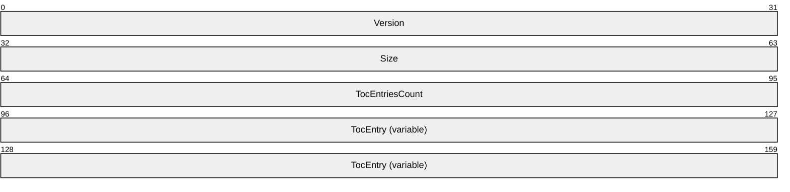

**Version (4 bytes):** A 32-bit, unsigned integer in [**network byte order**](#gt_network-byte-order) that MUST be set to 0x00000001. No other versions are defined.

**Size (4 bytes):** A 32-bit, unsigned integer in network byte order that MUST specify the size of the structure in bytes including the **Version**, **Size**, **TocEntriesCount**, and entries (**TocEntry**). The size MUST be at least 28 bytes. The total size depends on the number and type of the entries. This value MUST be the size of the blob represented by the structure. This MUST be the sum of the **InfoSize** of each element of **TocEntry** and **TocEntriesCount** times the size of **RTR_TOC_ENTRY**.

**TocEntriesCount (4 bytes):** A 32-bit, unsigned integer in network byte order that MUST specify the number of entries. It MUST be greater than 0.

**TocEntry (variable):** A list of consecutive entries, **TocEntriesCount** in number, each of which MUST be formatted as defined in **RTR_TOC_ENTRY**.

<a id="Section_2.2.1.2.4"></a>
##### 2.2.1.2.4 RTR_TOC_ENTRY

The **RTR_TOC_ENTRY** structure specifies the format in which information pertaining to the type of data is stored in [**RTR_INFO_BLOCK_HEADER(section2.2.1.2.3)**](#Section_2.2.1.2.3). The following figure shows the relationships between the block header and the entries.


Figure 3: Block header and entries

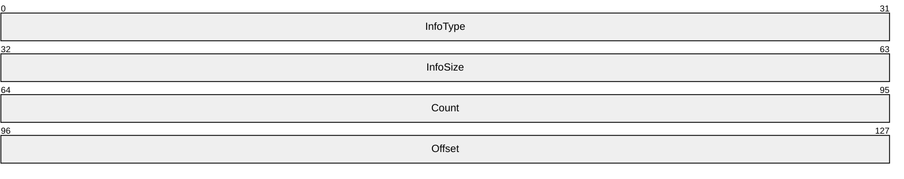

**InfoType (4 bytes):** A 32-bit, unsigned integer in network byte order that MUST indicate the type of data contained in the list. The value MUST be one of the following when the transport is IPv4 or IPv6.<17>

| Bit Range | Field | Description |
| --- | --- | --- |
| Variable | IP_IN_FILTER_INFO 0xFFFF0001 | The input filter that is applied to the IP packets sent to the RRAS server. [FILTER_DESCRIPTOR(section2.2.1.2.5)](#Section_2.2.1.2.5) |
| Variable | IP_OUT_FILTER_INFO 0xFFFF0002 | The output filter that is applied to the IP packets sent from the RRAS server. FILTER_DESCRIPTOR(section2.2.1.2.5) |
| Variable | IP_GLOBAL_INFO 0xFFFF0003 | Global IP filtering information. [GLOBAL_INFO(section2.2.1.2.9)](#Section_2.2.1.2.9) |
| Variable | IP_INTERFACE_STATUS_INFO 0xFFFF0004 | IPv4 interface status information. [INTERFACE_STATUS_INFO(section2.2.1.2.18)](#Section_2.2.1.2.18) |
| Variable | IP_ROUTE_INFO 0xFFFF0005 | Routing information is added. If bV4 of INTERFACE_ROUTE_INFO is set, an IPv4 route is added; otherwise, an IPv6 route is added. [INTERFACE_ROUTE_INFO(section2.2.1.2.11)](#Section_2.2.1.2.11) |
| Variable | IP_PROT_PRIORITY_INFO 0xFFFF0006 | Protocol priority information. [PRIORITY_INFO(section2.2.1.2.12)](#Section_2.2.1.2.12) |
| Variable | IP_PROT_PRIORITY_INFO_EX<18> 0xFFFF0017 | Protocol priority information. [PRIORITY_INFO_EX(section2.2.1.2.266)](#Section_2.2.1.2.266) |
| Variable | IP_ROUTER_DISC_INFO 0xFFFF0007 | Router discovery information. [RTR_DISC_INFO(section2.2.1.2.14)](#Section_2.2.1.2.14) |
| Variable | IP_DEMAND_DIAL_FILTER_INFO 0xFFFF0009 | The IP traffic that matches this filter indicates that a demand-dial connection is available and all the IP packets matching this filter MUST be routed into the connection. FILTER_DESCRIPTOR(section2.2.1.2.5) |
| Variable | IP_MCAST_HEARTBEAT_INFO 0xFFFF000A | Specifies the multicast heartbeat configuration for an interface. [MCAST_HBEAT_INFO(section2.2.1.2.15)](#Section_2.2.1.2.15) |
| Variable | IP_MCAST_BOUNDARY_INFO 0xFFFF000B | Multicast boundary information. [MIB_BOUNDARYROW(section2.2.1.2.24)](#Section_2.2.1.2.24) |
| Variable | IP_IPINIP_CFG_INFO 0xFFFF000C | IP in IP configuration information. [IPINIP_CONFIG_INFO(section2.2.1.2.17)](#Section_2.2.1.2.17)<19> |
| Variable | IP_IFFILTER_INFO 0xFFFF000D | IPv4 interface filter information. [IFFILTER_INFO(section2.2.1.2.88)](#Section_2.2.1.2.88) |
| Variable | IP_MCAST_LIMIT_INFO 0xFFFF000E | Multicast configuration information. [MIB_MCAST_LIMIT_ROW(section2.2.1.2.16)](#Section_2.2.1.2.16) |
| Variable | IPV6_GLOBAL_INFO 0xFFFF000F | Global lPv6 filtering information. GLOBAL_INFO(section2.2.1.2.9) |
| Variable | IP_IN_FILTER_INFO_V6 0xFFFF0011 | The input filter that MUST be applied to the IPv6 packets sent to the RRAS server. [FILTER_DESCRIPTOR_V6(section2.2.1.2.7)](#Section_2.2.1.2.7) |
| Variable | IP_OUT_FILTER_INFO_V6 0xFFFF0012 | The output filter that MUST be applied to the IPv6 packets sent from the RRAS server. FILTER_DESCRIPTOR_V6(section2.2.1.2.7) |
| Variable | IP_DEMAND_DIAL_FILTER_INFO_V6 0xFFFF0013 | IPv6 traffic that matches this filter indicates that a site-to-site connection MUST be available and all the IPv6 packets matching this filter MUST be routed into the connection. FILTER_DESCRIPTOR_V6(section2.2.1.2.7) |
| Variable | IP_IFFILTER_INFO_V6 0xFFFF0014 | IPv6 interface filter information. IFFILTER_INFO(section2.2.1.2.88) |
| Variable | IP_FILTER_ENABLE_INFO 0xFFFF0015 | Enable or disable IPv4 interface filter. [MPR_FILTER_0(section2.2.1.2.89)](#Section_2.2.1.2.89)<20> |
| Variable | IP_FILTER_ENABLE_INFO_V6 0xFFFF0016 | Enable or disable IPv6 interface filter. MPR_FILTER_0(section2.2.1.2.89) |
| Variable | MS_IP_BOOTP 0x0000270F | IP BOOTP global or interface information depending on the method that calls. [IPBOOTP_GLOBAL_CONFIG(section2.2.1.2.149)](#Section_2.2.1.2.149) [IPBOOTP_IF_CONFIG(section2.2.1.2.150)](#Section_2.2.1.2.150) |
| Variable | MS_IP_IGMP 0x4137000A | IGMP global or interface information depending on the method that calls. [IGMP_MIB_GLOBAL_CONFIG(section2.2.1.2.173)](#Section_2.2.1.2.173) [IGMP_MIB_IF_CONFIG(section2.2.1.2.174)](#Section_2.2.1.2.174) |
| Variable | MS_IP_RIP 0x00000008 | IP RIP global or interface information depending on the method that calls. [IPRIP_IF_CONFIG(section2.2.1.2.166)](#Section_2.2.1.2.166) [IPRIP_GLOBAL_CONFIG(section2.2.1.2.164)](#Section_2.2.1.2.164) |
| Variable | MS_IP_BGP 0x0137000E | BGP configuration. When the transport is IPv4, the structure pointed to at the offset is [BGP_CONFIG_HEADER(section2.2.1.2.252)](#Section_2.2.1.2.252). When the transport is IPv6, the structure pointed to at the offset is [BGP_ROUTER_V6(section2.2.1.2.265)](#Section_2.2.1.2.265). |
| Variable | MS_IP_DHCP_ALLOCATOR 0x81372714 | DHCP allocator global or interface information depending on the method that calls. IP_AUTO_DHCP_GLOBAL_INFO(section [2.2.1.2.191)](#Section_8c173961b72b4115a23aa90f8270cbc0) IP_AUTO_DHCP_INTERFACE_INFO(section [2.2.1.2.192)](#Section_5e791bf2b33e45a5a6da4a7aac04acba) |
| Variable | MS_IP_DNS_PROXY 0x81372713 | DNS Proxy global or interface information depending on the method that calls. IP_DNS_PROXY_GLOBAL_INFO(section [2.2.1.2.193)](#Section_91d787354aef4dd1a0e4b71beb6f7a2e) IP_DNS_PROXY_INTERFACE_INFO(section [2.2.1.2.194)](#Section_fd724ece760f4cd18f202fb1e587492b) |
| Variable | MS_IP_NAT 0x81372715 | IP NAT global or interface information depending on the method that calls. IP_NAT_GLOBAL_INFO(section [2.2.1.2.195)](#Section_a2965a02bfe645d19c7dc35b5b9edbbe) IP_NAT_INTERFACE_INFO(section [2.2.1.2.197)](#Section_a16a3b998c5944fab74fd154f0eca5f9) |
| Variable | MS_IP_OSPF<21> 0x0000000D | OSPF global or interface information depending on the method that calls. OSPF_ROUTE_FILTER_INFO(section [2.2.1.2.209)](#Section_027f5f7aae3944f295acf557c881a069) OSPF_PROTO_FILTER_INFO(section [2.2.1.2.210)](#Section_1c930f3c6b7a4731b1243252f408f0ea) OSPF_GLOBAL_PARAM(section [2.2.1.2.211)](#Section_0fd4f4e73dc14d3993a9fbcd073e3011) OSPF_AREA_PARAM(section [2.2.1.2.212)](#Section_1c78678e4d2d4e6cb40b5c435b89bd09) OSPF_AREA_RANGE_PARAM(section [2.2.1.2.213)](#Section_d73ca99d16f64304851e15b18aaa78c5) OSPF_VIRT_INTERFACE_PARAM(section [2.2.1.2.214)](#Section_7fb02ecba32b4967bb60a49f90d348a7) OSPF_INTERFACE_PARAM(section [2.2.1.2.215)](#Section_a74c9676a5d54075833bb2276942f482) OSPF_NBMA_NEIGHBOR_PARAM(section [2.2.1.2.216)](#Section_d5c8a58cce4347919ffd59e28a5b9b54) |
| Variable | MS_IPV6_DHCP 0x000003E7 | DHCPv6 Relay global or interface information depending on the method that calls. [DHCPV6R_IF_CONFIG(section2.2.1.2.159)](#Section_2.2.1.2.159) [DHCPV6R_GLOBAL_CONFIG(section2.2.1.2.157)](#Section_2.2.1.2.157) |

The value MUST be one of the following when the transport is IPX.<22>

| Bit Range | Field | Description |
| --- | --- | --- |
| Variable | IPX_INTERFACE_INFO_TYPE 0x00000001 | Specifies the IPX interface data. [IPX_IF_INFO(section2.2.1.2.91)](#Section_2.2.1.2.91) |
| Variable | IPX_STATIC_ROUTE_INFO_TYPE 0x00000002 | Specifies the route information for an IPX interface. [IPX_STATIC_ROUTE_INFO(section2.2.1.2.93)](#Section_2.2.1.2.93) |
| Variable | IPX_STATIC_SERVICE_INFO_TYPE 0x00000003 | Specifies information about the transport layer protocol that is being multiplexed. [IPX_STATIC_SERVICE_INFO(section2.2.1.2.94)](#Section_2.2.1.2.94) |
| Variable | IPX_IN_TRAFFIC_FILTER_INFO_TYPE 0x00000006 | Specifies the filter data for an IPX interface. [IPX_TRAFFIC_FILTER_INFO(section2.2.1.2.98)](#Section_2.2.1.2.98) |
| Variable | IPX_ADAPTER_INFO_TYPE 0x00000007 | Specifies the adapter information for the IPX. [IPX_ADAPTER_INFO(section2.2.1.2.96)](#Section_2.2.1.2.96) |
| Variable | IPXWAN_IF_INFO 0x00000008 | Specifies whether IPXWAN negotiation is to be disabled or enabled. [IPXWAN_IF_INFO(section2.2.1.2.92)](#Section_2.2.1.2.92) |
| Variable | IPX_GLOBAL_INFO_TYPE 0x00000009 | Specifies global IPX information. See IPX_GLOBAL_INFO for the actual information. [IPX_GLOBAL_INFO(section2.2.1.2.90)](#Section_2.2.1.2.90) |
| Variable | IPX_STATIC_NETBIOS_NAME_INFO_TYPE 0x0000000A | Specifies the NetBIOS name of an IPX interface. [IPX_STATIC_NETBIOS_NAME_INFO(section2.2.1.2.95)](#Section_2.2.1.2.95) |
| Variable | IPX_IN_TRAFFIC_FILTER_GLOBAL_INFO_TYPE 0x0000000B | Specifies the action for a filter match. [IPX_TRAFFIC_FILTER_GLOBAL_INFO(section2.2.1.2.97)](#Section_2.2.1.2.97) |
| Variable | IPX_OUT_TRAFFIC_FILTER_INFO_TYPE 0x0000000C | Specifies the filter data for an IPX interface. IPX_TRAFFIC_FILTER_INFO(section2.2.1.2.98) |
| Variable | IPX_OUT_TRAFFIC_FILTER_GLOBAL_INFO_TYPE 0x0000000D | Specifies the action for a filter match. IPX_TRAFFIC_FILTER_GLOBAL_INFO(section2.2.1.2.97) |
| Variable | IPX_PROTOCOL_RIP 0x00020000 | RIP global or interface information depending on the method that calls. RIP_GLOBAL_INFO(section [2.2.1.2.202)](#Section_89f466e430f345748a60dedf692ce779) RIP_IF_CONFIG(section [2.2.1.2.206)](#Section_d3d015ab15594be5994db6f9ed7522ec) |
| Variable | IPX_PROTOCOL_SAP 0x00020001 | SAP global or interface information depending on the method that calls. SAP_GLOBAL_INFO(section [2.2.1.2.207)](#Section_5b29647b29a64da6b7284bcc6a7a74e3) [SAP_IF_CONFIG(section2.2.1.2.114)](#Section_2.2.1.2.114) |

**InfoSize (4 bytes):** A 32-bit, unsigned integer, in network byte-order, that MUST specify the number of bytes in an information structure of this type in this entry.

**Count (4 bytes):** A 32-bit, unsigned integer in network byte order that MUST specify the number of information structures of this type in this entry.

**Offset (4 bytes):** A 32-bit, unsigned integer in network byte order that MUST specify the offset of start of the first structure for this entry.

<a id="Section_2.2.1.2.5"></a>
##### 2.2.1.2.5 FILTER_DESCRIPTOR

The **FILTER_DESCRIPTOR** structure MUST be used while specifying IPv4 [**filters**](#gt_filter).

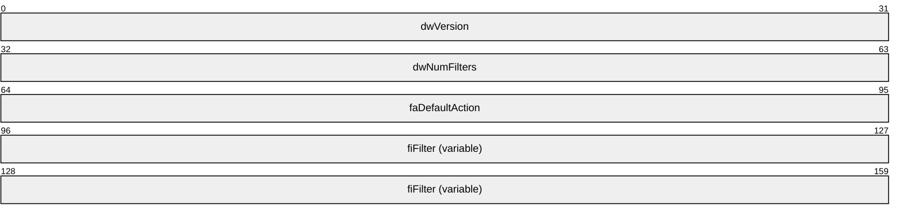

**dwVersion (4 bytes):** A 32-bit integer in [**network byte order**](#gt_network-byte-order) used to specify the version. It MUST be 0x00000001. No other versions are defined.

**dwNumFilters (4 bytes):** A 32-bit integer in network byte order used to specify the number of filters. It MUST be greater than 0.

**faDefaultAction (4 bytes):** A 32-bit integer in network byte order used to specify the action for the filter. It MUST be [**FORWARD_ACTION (section 2.2.1.1.7)**](#Section_2.2.1.1.7).

**fiFilter (variable):** This MUST contain the actual five-tuple filters as specified in section [2.2.1.2.6](#Section_2.2.1.2.6).

When this structure is used as an embedded structure in [**RTR_TOC_ENTRY(section2.2.1.2.4)**](#Section_2.2.1.2.4), the **infoType** of **RTR_TOC_ENTRY** MUST have the value 0xFFFF0001, 0xFFFF0002, or 0xFFFF0009 to specify an IPv4 in filter, an IPv4 out filter, or an IPv4 demand-dial filter respectively.

This structure is used in the following methods:

- [**RRouterInterfaceTransportAdd(section3.1.4.18)**](#Section_3.1.4.18)
- [**RRouterInterfaceTransportGetInfo(section3.1.4.19)**](#Section_3.1.4.19)
- [**RRouterInterfaceTransportSetInfo(section3.1.4.20)**](#Section_3.1.4.20)
- [**RRouterInterfaceTransportCreate(section3.1.4.38)**](#Section_3.1.4.38)
<a id="Section_2.2.1.2.6"></a>
##### 2.2.1.2.6 FILTER_INFO

The **FILTER_INFO** structure MUST specify the five-tuple [**filter**](#gt_filter) to be used in [**FILTER_DESCRIPTOR(section2.2.1.2.5)**](#Section_2.2.1.2.5).

typedef struct_FILTER_INFO{

DWORDdwSrcAddr;

DWORDdwSrcMask;

DWORDdwDstAddr;

DWORDdwDstMask;

DWORDdwProtocol;

DWORDfLateBound;

WORDwSrcPort;

WORDwDstPort;

} FILTER_INFO,

*PFILTER_INFO;

**dwSrcAddr:** A 32-bit, unsigned integer in [**network byte order**](#gt_network-byte-order) that MUST contain the IPv4 source address for which the filter (2) applies. A value of 0x00000000 in this field signifies ANY.

**dwSrcMask:** A 32-bit, unsigned integer in network byte order that MUST contain the subnet mask for the source address. See [[RFC950]](https://go.microsoft.com/fwlink/?LinkId=90501).

**dwDstAddr:** A 32-bit, unsigned integer in network byte order that MUST contain the IPv4 destination address for the filter. A value of 0x00000000 in this field signifies ANY.

**dwDstMask:** A 32-bit, unsigned integer in network byte order that MUST be the subnet mask for the destination address in network byte order. See [RFC950].

**dwProtocol:** A 32-bit, unsigned integer in little-endian byte order that MUST be the protocol number (such as TCP or UDP) for the filter. Possible values include the following.

| Value | Meaning |
| --- | --- |
| 0x00000000 | ANY |
| 0x00000001 | ICMP |
| 0x0000003A | ICMPv6 |
| 0x00000006 | TCP |
| 0x00000011 | UDP |

The complete list is specified in [[RFC1700]](https://go.microsoft.com/fwlink/?LinkId=90285).

**fLateBound:** A 32-bit, unsigned integer in [**little-endian**](#gt_little-endian) byte order that indicates to the RRAS server if the fields in the filter can be dynamically replaced by the RRAS server with values for specific endpoints at the time those endpoints request network access. This MUST be a combination of one or more of the following values.

| Value | Meaning |
| --- | --- |
| 0x00000000 | No source or destination address or mask replacement. |
| 0x00000001 | Source address replaceable with a new address. |
| 0x00000004 | Destination address replaceable with a new address. |
| 0x00000010 | Source address mask replaceable with a new mask. |
| 0x00000020 | Destination address mask replaceable with a new mask. |

**wSrcPort:** If the protocol is TCP or UDP, this MUST be a 16-bit, unsigned integer in network byte order that specifies a port number for the corresponding protocol. If the protocol is ICMP or ICMPv6, this MUST be a 16-bit, unsigned integer in little-endian byte order that specifies a type indicator for ICMP or ICMPv6 correspondingly. For all other protocol values, this MUST be set to 0 (byte order does not matter).

**wDstPort:** If the protocol is TCP or UDP, this MUST be a 16-bit, unsigned integer in network byte order that specifies a port number for the corresponding protocol. If the protocol is ICMP or ICMPv6, this MUST be a 16-bit, unsigned integer in little-endian byte order that specifies a code indicator for ICMP or ICMPv6 correspondingly. For all other protocol values, this MUST be set to 0 (byte order does not matter).

<a id="Section_2.2.1.2.7"></a>
##### 2.2.1.2.7 FILTER_DESCRIPTOR_V6

The **FILTER_DESCRIPTOR_V6** structure MUST be used while specifying IPv6 [**filters**](#gt_filter).

This structure is used in the following methods:

- [**RRouterInterfaceTransportAdd(section3.1.4.18)**](#Section_3.1.4.18)
- [**RRouterInterfaceTransportGetInfo(section3.1.4.19)**](#Section_3.1.4.19)
- [**RRouterInterfaceTransportSetInfo(section3.1.4.20)**](#Section_3.1.4.20)
- [**RRouterInterfaceTransportCreate(section3.1.4.38)**](#Section_3.1.4.38)


**dwVersion (4 bytes):** A 32-bit integer in [**network byte order**](#gt_network-byte-order) used to specify the version. It MUST be 0x00000001. No other versions are defined.

**dwNumFilters (4 bytes):** A 32-bit integer in network byte order used to specify the number of filters. It MUST be greater than 0.

**faDefaultAction (4 bytes):** A 32-bit integer in network byte order used to specify the action for the filter. It MUST be [**FORWARD_ACTION (section**](#Section_2.2.1.1.7) 2.2.1.1.7).

**fiFilter (variable):** This is defined in [**FILTER_INFO_V6 (section**](#Section_2.2.1.2.8) 2.2.1.2.8).

When this structure is used as an embedded structure in **RTR_TOC_ENTRY** (section [2.2.1.2.4)](#Section_c99955ec6d1846658d5be124de63a368), the **InfoType** of **RTR_TOC_ENTRY** MUST be 0xFFFF0011, 0xFFFF0012, or 0xFFFF0013 to specify an IPv6 in filter, an IPv6 out filter, or an IPv6 demand-dial filter respectively.<23>

<a id="Section_2.2.1.2.8"></a>
##### 2.2.1.2.8 FILTER_INFO_V6

The **FILTER_INFO_V6** structure SHOULD<24> specify the five-tuple [**filters**](#gt_filter) to be used in [**FILTER_DESCRIPTOR_V6(section2.2.1.2.7)**](#Section_2.2.1.2.7).

typedef struct_FILTER_INFO_V6{

BYTEipv6SrcAddr[16];

DWORDdwSrcPrefixLength;

BYTEipv6DstAddr[16];

DWORDdwDstPrefixLength;

DWORDdwProtocol;

DWORDfLateBound;

WORDwSrcPort;

WORDwDstPort;

} FILTER_INFO_V6,

*PFILTER_INFO_V6;

**ipv6SrcAddr:** A 128-bit, unsigned integer in network byte order that MUST contain the IPv6 source address for which the filter applies. A value of zero (0) in this field signifies ANY.

**dwSrcPrefixLength:** A 32-bit, unsigned integer in network byte order that MUST be the prefix length for the source address. A value of zero (0) in this field signifies ANY source address.

**ipv6DstAddr:** A 128-bit, unsigned integer in network byte order that MUST contain the IPv6 destination address for the filter. A value of zero (0) in this field signifies ANY.

**dwDstPrefixLength:** A 32-bit, unsigned integer in network byte order that MUST be the prefix length for the destination address. A value of zero (0) in this field signifies ANY destination address.

**dwProtocol:** A 32-bit, unsigned integer in network byte order that specifies the protocol number (such as TCP or UDP) for the filter.

Possible values include the following.

| Value | Meaning |
| --- | --- |
| 0x00000000 | ANY |
| 0x00000001 | ICMP |
| 0x0000003A | ICMPv6 |
| 0x00000006 | TCP |
| 0x00000011 | UDP |

**fLateBound:** A 32-bit, unsigned integer in network byte order that indicates if the fields in the filter can be dynamically replaced by the network access server (NAS) with values for specific endpoints.

The value MUST be one of the following values, or a bit-wise OR a combination of the following values.

| Value | Meaning |
| --- | --- |
| 0x00000000 | No source or destination address or mask replacement. |
| 0x00000001 | Source address replaceable with a new address. |
| 0x00000004 | Destination address replaceable with a new address. |
| 0x00000010 | Source address mask replaceable with a new mask. |
| 0x00000020 | Destination address mask replaceable with a new mask. |

**wSrcPort:** If the protocol is TCP or UDP, this MUST be a 16-bit, unsigned integer in network byte order that specifies a port number for the corresponding protocol. If the protocol is ICMP or ICMPv6, this MUST be a 16-bit, unsigned integer in network byte order that specifies a type indicator for ICMP or ICMPv6 correspondingly. For all other protocol values, this MUST be set to 0 (byte order does not matter).

**wDstPort:** If the protocol is TCP or UDP, this MUST be a 16-bit, unsigned integer in network byte order that specifies a port number for the corresponding protocol. If the protocol is ICMP or ICMPv6, this MUST be a 16-bit, unsigned integer in network byte order that specifies a code indicator for ICMP or ICMPv6 correspondingly. For all other protocol values, this MUST be set to 0 (byte order does not matter).

<a id="Section_2.2.1.2.9"></a>
##### 2.2.1.2.9 GLOBAL_INFO

The **GLOBAL_INFO** structure is used to set logging levels and enable [**filtering**](#gt_filtering) on the RRAS server.

This structure is used in the following methods:

- [RRouterInterfaceTransportSetGlobalInfo(section3.1.4.10)](#Section_3.1.4.10)
- [RRouterInterfaceTransportGetGlobalInfo(section3.1.4.11)](#Section_3.1.4.11)
typedef struct_GLOBAL_INFO{

IN OUT BOOLbFilteringOn;

IN OUT DWORDdwLoggingLevel;

} GLOBAL_INFO,

*PGLOBAL_INFO;

**bFilteringOn:** This is of type BOOL ([MS-DTYP](../MS-DTYP/MS-DTYP.md) section 2.2.3). This MUST be set to 0x00000001; filtering is always enabled.

**dwLoggingLevel:** This MUST be set to the logging levels so that if the RRAS server has different levels of logging information this field specifies the logging level and MUST be one of the following values.

| Value | Meaning |
| --- | --- |
| 0x00000000 | Log no messages. |
| 0x00000001 | Log all errors. |
| 0x00000002 | Log all warnings and errors. |
| 0x00000003 | Log all errors, warnings, and information. |

When this structure is used, the **InfoType** of [**RTR_TOC_ENTRY(section2.2.1.2.4)**](#Section_2.2.1.2.4) MUST be 0xFFFF0003 or 0xFFFF000F to specify global IP filtering or global lPv6 filtering.

<a id="Section_2.2.1.2.10"></a>
##### 2.2.1.2.10 IN6_ADDR

The **IN6_ADDR** structure represents an IPv6 address.

typedef structin6_addr{

union{

UCHARByte[16];

USHORTWord[8];

}u;

} IN6_ADDR,

*PIN6_ADDR,

*LPIN6_ADDR;

**Byte:** An IPv6 address represented as an array of 16 UCHAR values.

**Word:** An IPv6 address represented as an array of USHORT values.

<a id="Section_2.2.1.2.11"></a>
##### 2.2.1.2.11 INTERFACE_ROUTE_INFO

The **INTERFACE_ROUTE_INFO** structure MAY<25> be used or [**MIB_IPFORWARDROW(section2.2.1.2.35)**](#Section_2.2.1.2.35) structure MAY<26> be used to specify the routes to be added or deleted on the RRAS server. Whenever this structure is used, the **InfoType** of [**RTR_TOC_ENTRY(section2.2.1.2.4)**](#Section_2.2.1.2.4) structure MUST be 0xFFFF0005 to specify IP route information.<27>

This structure is used in the following methods:

- [RRouterInterfaceTransportAdd(section3.1.4.18)](#Section_3.1.4.18)
- [RRouterInterfaceTransportGetInfo(section3.1.4.19)](#Section_3.1.4.19)
- [RRouterInterfaceTransportSetInfo(section3.1.4.20)](#Section_3.1.4.20)
typedef struct_INTERFACE_ROUTE_INFO{

union{

struct{

DWORDdwRtInfoDest;

DWORDdwRtInfoMask;

DWORDdwRtInfoPolicy;

DWORDdwRtInfoNextHop;

DWORDdwRtInfoAge;

DWORDdwRtInfoNextHopAS;

DWORDdwRtInfoMetric1;

DWORDdwRtInfoMetric2;

DWORDdwRtInfoMetric3;

};

struct{

IN6_ADDRDestinationPrefix;

DWORDDestPrefixLength;

IN6_ADDRNextHopAddress;

ULONGValidLifeTime;

DWORDFlags;

ULONGMetric;

};

};

DWORDdwRtInfoIfIndex;

DWORDdwRtInfoType;

DWORDdwRtInfoProto;

DWORDdwRtInfoPreference;

DWORDdwRtInfoViewSet;

BOOLbV4;

} INTERFACE_ROUTE_INFO,

*PINTERFACE_ROUTE_INFO;

**dwRtInfoDest:** This MUST be the destination IPv4 address of the route. An entry with an IPv4 address of 0.0.0.0 is considered a default route. This member cannot be set to a multicast IPv4 address.

**dwRtInfoMask:** This MUST be the IPv4 subnet mask to be logically ANDed with the destination IPv4 address before being compared to the value in the **dwRtInfoDest** member. See [[RFC950]](https://go.microsoft.com/fwlink/?LinkId=90501).

**dwRtInfoPolicy:** This MUST be set to the conditions that would cause the selection of a multipath route (the set of [**next hops**](#gt_next-hops) for a given destination). This member is typically in IP TOS format. The encoding of this member is specified in [[RFC1354]](https://go.microsoft.com/fwlink/?LinkId=119993).

**dwRtInfoNextHop:** This MUST be the IPv4 address of the next system in the route. Otherwise, this member SHOULD be an IPv4 address of 0.0.0.0.

**dwRtInfoAge:** This MUST be the number of seconds since the route was added or modified in the network [**routing table**](#gt_routing-table).

**dwRtInfoNextHopAS:** This MUST be the [**autonomous system**](#gt_autonomous-system) number of the next hop. When this member is unknown or not relevant to the protocol or routing mechanism specified in **dwRtInfoProto**, this value SHOULD be set to 0. This value is documented in [RFC1354].

**dwRtInfoMetric1:** This MUST be the primary routing metric value for this route. The semantics of this metric are determined by the routing protocol specified in the **dwRtInfoProto** member. If this metric is not used, its value SHOULD be set to -1. This value is documented in [RFC1354].

**dwRtInfoMetric2:** This MUST be an alternate routing metric value for this route. The semantics of this metric are determined by the routing protocol specified in the **dwRtInfoProto** member. If this metric is not used, its value SHOULD be set to -1. This value is documented in [RFC1354].

**dwRtInfoMetric3:** This MUST be an alternate routing metric value for this route. The semantics of this metric are determined by the routing protocol specified in the **dwRtInfoProto** member. If this metric is not used, its value SHOULD be set to -1. This value is documented in [RFC1354].

**DestinationPrefix:** This MUST be the IPv6 address prefix for the destination IP address for this route.

**DestPrefixLength:** The length, in bits, of the site prefix or network part of the IP address specified in **DestinationPrefix**. Any value greater than 128 is an illegal value. A value of 255 is commonly used to represent an illegal value.

**NextHopAddress:** This MUST be the IPv6 address of the next system or gateway for a remote route. If the route is to a local loopback address or an IP address on the local link, the next hop is unspecified (all zeros). For a local loopback route, this member SHOULD be an IPv6 address of 0::0.

**ValidLifeTime:** The maximum time, in seconds, the IP route entry is valid. A value of 0xFFFFFFFF is infinite.

**Flags:** Reserved. This MUST be set to 0.

**Metric:** The route metric offset for this IP route entry. The semantics of this metric are determined by the [**routing protocol**](#gt_routing-protocol) specified in **dwRtInfoProto**. If this metric is not used, its value SHOULD be set to -1. This value is documented in [[RFC4292]](https://go.microsoft.com/fwlink/?LinkId=119995).

**dwRtInfoIfIndex:** This MUST be the index of the local interface through which the next hop of this route is reachable.

**dwRtInfoType:** This MUST be the route type as specified in [RFC1354].

The following list shows the possible values for this member.<28>

| Value | Meaning |
| --- | --- |
| MIB_IPROUTE_TYPE_OTHER 0x00000001 | A type other than what is specified in [RFC1354]. |
| MIB_IPROUTE_TYPE_INVALID 0x00000002 | An invalid route is logically deleted. |
| MIB_IPROUTE_TYPE_DIRECT 0x00000003 | A local route where the next hop is the final destination (a local interface). |
| MIB_IPROUTE_TYPE_INDIRECT 0x00000004 | The remote route where the next hop is not the final destination (a remote destination). |

**dwRtInfoProto:** The protocol or routing mechanism that generated the route. It MUST be one of the values specified in the **MIB_IPFORWARD_PROTO** enumeration.

**dwRtInfoPreference:** Specifies the route preference as determined by the routing protocol in **dwRtInfoProto**.

**dwRtInfoViewSet:** Specifies the Route Information Table [**views**](#gt_view). It MUST be a combination of the following values, or a combination of RTM_VIEW_MASK_UCAST and RTM_VIEW_MASK_MCAST.

| Value | Meaning |
| --- | --- |
| RTM_VIEW_MASK_ANY 0x00000000 | This value is used to define or set the mask for the Route Information Table view. This value is a mask for any type of route. |
| RTM_VIEW_MASK_UCAST 0x00000001 | This value is used to define or set the mask for Route Information Table view. This value is a mask for unicast routes. |
| RTM_VIEW_MASK_MCAST 0x00000002 | This value is used to define or set the mask for the Route Information Table view. This value is a mask for multicast routes. |
| RTM_VIEW_MASK_ALL 0xFFFFFFFF | This value is used to define or set the mask for the Route Information Table view. This value is a mask for all types of routes. |

**bV4:** Set to 1 if it is an IPV4 route; set to 0 to indicate an IPV6 route. For an IPV4 route, the first structure in the union is used. For an IPV6 route, the second structure in the union is used.

<a id="Section_2.2.1.2.12"></a>
##### 2.2.1.2.12 PRIORITY_INFO

The **PRIORITY_INFO** structure MUST be used to set preferences to different protocols on the RRAS server.

This structure is used in the following methods:

- [**RRouterInterfaceTransportSetGlobalInfo(section3.1.4.10)**](#Section_3.1.4.10)
- [**RRouterInterfaceTransportGetGlobalInfo(section3.1.4.11)**](#Section_3.1.4.11)
- [**RRouterInterfaceTransportCreate(section3.1.4.38)**](#Section_3.1.4.38)
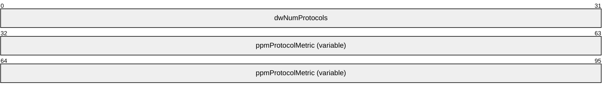

**dwNumProtocols (4 bytes):** This MUST be the number of protocols for which metric information is given in the [**PROTOCOL_METRIC (section**](#Section_2.2.1.2.13) 2.2.1.2.13) structure.

**ppmProtocolMetric (variable):** This MUST be an array of **PROTOCOL_METRIC** structures with **dwNumProtocols** specifying the number of elements in the array.

When this structure is used, the **InfoType** of [**RTR_TOC_ENTRY(section2.2.1.2.4)**](#Section_2.2.1.2.4) structure MUST be 0xFFFF0006 to specify protocol priority information. Multiple instances of this structure can be present. If multiple instances are present, and there are overlapping protocol IDs, the metric specified in the last instance will be set.

<a id="Section_2.2.1.2.13"></a>
##### 2.2.1.2.13 PROTOCOL_METRIC

The **PROTOCOL_METRIC** structure MAY<29> be used to specify the metric of a protocol in [**PRIORITY_INFO(section2.2.1.2.12)**](#Section_2.2.1.2.12) structure.

typedef struct_PROTOCOL_METRIC{

IN OUT DWORDdwProtocolId;

IN OUT DWORDdwMetric;

} PROTOCOL_METRIC,

*PPROTOCOL_METRIC;

**dwProtocolId:** The protocol ID. This SHOULD be one of the values specified in the **MIB_IPFORWARD_PROTO** structure (section [2.2.1.1.9](#Section_2.2.1.1.9) )**.**<30>

**dwMetric:** The metric for **dwProtocolId**.

<a id="Section_2.2.1.2.14"></a>
##### 2.2.1.2.14 RTR_DISC_INFO

The **RTR_DISC_INFO** structure is used to set and retrieve router discovery information according to [[RFC1256]](https://go.microsoft.com/fwlink/?LinkId=119991).

This structure is used in the following methods:

- [**RRouterInterfaceTransportSetInfo(section3.1.4.20)**](#Section_3.1.4.20)
- [**RRouterInterfaceTransportAdd(section3.1.4.18)**](#Section_3.1.4.18)
typedef struct_RTR_DISC_INFO{

IN OUT WORDwMaxAdvtInterval;

IN OUT WORDwMinAdvtInterval;

IN OUT WORDwAdvtLifetime;

IN OUT BOOLbAdvertise;

IN OUT LONGlPrefLevel;

} RTR_DISC_INFO,

*PRTR_DISC_INFO;

**wMaxAdvtInterval:** This MUST be set to the maximum time allowed between sending [**multicast**](#gt_multicast) Router Advertisements from the [**interface**](#gt_interface), in seconds. It MUST be no less than 4 seconds and no greater than 1800 seconds.

**wMinAdvtInterval:** This MUST be the minimum time allowed between sending unsolicited multicast Router Advertisements from the interface, in seconds. It MUST be no less than 3 seconds and no greater than **wMaxAdvtInterval**.

**wAdvtLifetime:** This MUST be the value to be placed in the **Lifetime** field of Router Advertisements sent from the interface, in seconds. It MUST be no less than **wMaxAdvtInterval** and no greater than 9000 seconds.

**bAdvertise:** This MUST be the flag indicating whether or not the address is to be advertised.

**lPrefLevel:** This MUST be the preference of the address as a default [**router**](#gt_router) address, relative to other router addresses on the same subnet. A 32-bit, signed, twos complement integer, with higher values meaning more preferable. The minimum value (0x80000000) is used to indicate that the address, even if advertised, is not to be used by neighboring hosts as a default router address.

When this structure is used, the **InfoType** of [**RTR_TOC_ENTRY(section2.2.1.2.4)**](#Section_2.2.1.2.4) MUST be 0xFFFF0007 to specify router discovery information.

<a id="Section_2.2.1.2.15"></a>
##### 2.2.1.2.15 MCAST_HBEAT_INFO

The **MCAST_HBEAT_INFO** is used for [**multicast heartbeat**](#gt_multicast-heartbeat) information. See [[RFC1301]](https://go.microsoft.com/fwlink/?LinkID=119992) and [[RFC3376]](https://go.microsoft.com/fwlink/?LinkId=111895) for more details.

typedef struct_MCAST_HBEAT_INFO{

WCHARpwszGroup[MAX_GROUP_LEN];

BOOLbActive;

ULONGulDeadInterval;

BYTEbyProtocol;

WORDwPort;

} MCAST_HBEAT_INFO,

*PMCAST_HBEAT_INFO;

**pwszGroup:** A null-terminated Unicode string that contains the name and address of the multicast group.

**bActive:** Indicates whether or not the heartbeat is active.

**ulDeadInterval:** The dead interval in minutes.

**byProtocol:** Specifies how the heartbeat is being carried out. This MUST have one of the following values.

| Value | Meaning |
| --- | --- |
| RAW (0xFF) | A non-UDP based protocol is specified for use as multicast heartbeat. **wPort** specifies the identifier for the protocol. |
| UDP (0x11) | UDP-based protocol is specified for use as multicast heartbeat. **wPort** specifies the UDP port number. |

**wPort:** The port or protocol for which the heartbeat is being carried out.

When this structure is used, the **InfoType** of [**RTR_TOC_ENTRY(section2.2.1.2.4)**](#Section_2.2.1.2.4) MUST be 0xFFFF000A to specify IP multicast heartbeat configuration.

<a id="Section_2.2.1.2.16"></a>
##### 2.2.1.2.16 MIB_MCAST_LIMIT_ROW

The **MIB_MCAST_LIMIT_ROW** structure is used to specify the configuration information for a [**multicast**](#gt_multicast) [**interface**](#gt_interface). It contains the configurable limit information from a corresponding [**MIB_IPMCAST_IF_ENTRY(section2.2.1.2.40)**](#Section_2.2.1.2.40) structure. Whenever this structure is used, the **InfoType** of [**RTR_TOC_ENTRY(section2.2.1.2.4)**](#Section_2.2.1.2.4) MUST be 0xFFFF000E to specify multicast configuration information.

This structure is used in the following methods:

- [**RRouterInterfaceTransportAdd(section3.1.4.18)**](#Section_3.1.4.18)
- [**RRouterInterfaceTransportGetInfo(section3.1.4.19)**](#Section_3.1.4.19)
- [**RRouterInterfaceTransportSetInfo(section3.1.4.20)**](#Section_3.1.4.20)
typedef struct{

DWORDdwTtl;

DWORDdwRateLimit;

} MIB_MCAST_LIMIT_ROW,

*PMIB_MCAST_LIMIT_ROW;

**dwTtl:** The Time to Live (TTL) value for a multicast interface.

**dwRateLimit:** The rate limit for a multicast interface. This MUST be set to 0.

When this structure is used, the **InfoType** of **RTR_TOC_ENTRY(section2.2.1.2.4)** MUST be 0xFFFF000E to specify IP multicast configuration.

<a id="Section_2.2.1.2.17"></a>
##### 2.2.1.2.17 IPINIP_CONFIG_INFO

The **IPINIP_CONFIG_INFO** structure MAY<31> be used to specify configuration information for an IP in an IP tunnel.

typedef struct_IPINIP_CONFIG_INFO{

DWORDdwRemoteAddress;

DWORDdwLocalAddress;

BYTEbyTtl;

} IPINIP_CONFIG_INFO,

*PIPINIP_CONFIG_INFO;

**dwRemoteAddress:** The destination address of the IP in the IP packet.

**dwLocalAddress:** The source address of the IP in the IP packet.

**byTtl:** The **TTL** field for the IP in the IP packet.

When this structure is used, the **InfoType** of [**RTR_TOC_ENTRY(section2.2.1.2.4)**](#Section_2.2.1.2.4) MUST be 0xFFFF000C to specify IP in IP configuration information.

<a id="Section_2.2.1.2.18"></a>
##### 2.2.1.2.18 INTERFACE_STATUS_INFO

The **INTERFACE_STATUS_INFO** structure contains the administrative status of an interface.

This structure is used in the following methods:

- [**RRouterInterfaceTransportAdd(section3.1.4.18)**](#Section_3.1.4.18)
- [**RRouterInterfaceTransportGetInfo(section3.1.4.19)**](#Section_3.1.4.19)
- [**RRouterInterfaceTransportSetInfo(section3.1.4.20)**](#Section_3.1.4.20)
typedef struct_INTERFACE_STATUS_INFO{

IN OUT DWORDdwAdminStatus;

} INTERFACE_STATUS_INFO,

*PINTERFACE_STATUS_INFO;

**dwAdminStatus:** The administrative status of the interface. It MUST be one of the following values.

| Value | Meaning |
| --- | --- |
| IF_ADMIN_STATUS_UP 0x00000001 | Interface is administratively enabled |
| IF_ADMIN_STATUS_DOWN 0x00000002 | Interface is administratively disabled |

When this structure is used, the **InfoType** of [**RTR_TOC_ENTRY(section2.2.1.2.4)**](#Section_2.2.1.2.4) MUST be 0xFFFF0004 to specify IPv4 interface status information.

<a id="Section_2.2.1.2.19"></a>
##### 2.2.1.2.19 DIM_MIB_ENTRY_CONTAINER

The **DIM_MIB_ENTRY_CONTAINER** structure contains the size and the data for the management information base (MIB) entries that are either set or retrieved from the MIB variables. This structure is used in the following methods:

- [**RMIBEntryCreate(section3.1.4.27)**](#Section_3.1.4.27)
- [**RMIBEntryDelete(section3.1.4.28)**](#Section_3.1.4.28)
- [**RMIBEntrySet(section3.1.4.29)**](#Section_3.1.4.29)
- [**RMIBEntryGet(section3.1.4.30)**](#Section_3.1.4.30)
- [**RMIBEntryGetFirst(section3.1.4.31)**](#Section_3.1.4.31)
- [**RMIBEntryGetNext(section3.1.4.32)**](#Section_3.1.4.32)
typedef struct_DIM_MIB_ENTRY_CONTAINER

{

DWORDdwMibInEntrySize;

[size_is(dwMibInEntrySize)] LPBYTEpMibInEntry;

DWORDdwMibOutEntrySize;

[size_is(dwMibOutEntrySize)] LPBYTEpMibOutEntry;

} DIM_MIB_ENTRY_CONTAINER,

*PDIM_MIB_ENTRY_CONTAINER;

**dwMibInEntrySize:** This field gives the size of the MIB entry data being input. It represents the size of the data contained in **pMibInEntry**.

**pMibInEntry:** A pointer to a protocol-specific structure that contains input data.

**dwMibOutEntrySize:** This field gives the size of the MIB entry data being output. It represents the size of the data contained in **pMibOutEntry**.

**pMibOutEntry:** This member points to the protocol-specific structure that points to the MIB.

The contents of pMibInEntry and pMibOutEntry are based on the transport and the routing protocol for which the MIB information is requested.

| Transport | Routing Protocol | pMibInEntry | pMibOutEntry |
| --- | --- | --- | --- |
| PID_IP 0x00000021 | IPRTRMGR_PID 0x00002710 | MIB_OPAQUE_QUERY(section [2.2.1.2.53](#Section_2.2.1.2.53)) | MIB_OPAQUE_QUERY(section 2.2.1.2.53) |
| PID_IP 0x00000021 | MS_IP_BOOTP 0x0000270F | [IPBOOT_MIB_GET_INPUT_DATA(section2.2.1.2.151)](#Section_2.2.1.2.151) | [IPBOOTP_MIB_GET_OUTPUT_DATA(section2.2.1.2.152)](#Section_2.2.1.2.152) |
| PID_IP 0x00000021 | MS_IP_NAT 0x81372715 | [IP_NAT_MIB_QUERY(section2.2.1.2.182)](#Section_2.2.1.2.182) | IP_NAT_MIB_QUERY(section2.2.1.2.182) |
| PID_IP 0x00000021 | MS_IP_DNS_PROXY 0x81372713 | IP_DNS_PROXY_MIB_QUERY(section [2.2.1.2.186)](#Section_c22770ac2b264bdbbb1c2b742d4d4a9d) | IP_DNS_PROXY_MIB_QUERY(section 2.2.1.2.186) |
| PID_IP 0x00000021 | MS_IP_DHCP_ALLOCATOR 0x81372714 | IP_AUTO_DHCP_MIB_QUERY(section [2.2.1.2.188)](#Section_a85fd7a5b9374daaa703a0c1fcb0069a) | IP_AUTO_DHCP_MIB_QUERY(section 2.2.1.2.188) |
| PID_IP 0x00000021 | MS_IP_OSPF 0x0000000D | MIB_DA_MSG(section [2.2.1.2.190)](#Section_3ed7b98d09e8411399b04ed4b6cf6c01) | MIB_DA_MSG(section 2.2.1.2.190) |
| PID_IP 0x00000021 | MS_IP_RIP 0x00000008 | [IPRIP_MIB_GET_INPUT_DATA(section2.2.1.2.161)](#Section_2.2.1.2.161) | [IPRIP_MIB_GET_OUTPUT_DATA(section2.2.1.2.162)](#Section_2.2.1.2.162) |
| PID_IP 0x00000021 | MS_IP_IGMP 0x4137000A | [IGMP_MIB_GET_INPUT_DATA(section2.2.1.2.171)](#Section_2.2.1.2.171) | [IGMP_MIB_GET_OUTPUT_DATA(section2.2.1.2.172)](#Section_2.2.1.2.172) |
| PID_IPV6 0x00000057 | MS_IPV6_DHCP 0x000003E7 | [DHCPV6R_MIB_GET_INPUT_DATA(section2.2.1.2.160)](#Section_2.2.1.2.160) | [DHCPV6R_MIB_GET_OUTPUT_DATA(section2.2.1.2.156)](#Section_2.2.1.2.156) |
| PID_IPV6 0x00000057 | IPRTRMGR_PID 0x00002710 | MIB_OPAQUE_QUERY(section 2.2.1.2.53) | MIB_OPAQUE_QUERY(section 2.2.1.2.53) |
| PID_IPX 0x0000002B | IPX_PROTOCOL_BASE 0x0001FFFF | [IPX_MIB_GET_INPUT_DATA(section2.2.1.2.105)](#Section_2.2.1.2.105) | IPX_MIB_GET_INPUT_DATA(section2.2.1.2.105) |
| PID_IPX 0x0000002B | IPX_PROTOCOL_RIP 0x00020000 | [RIP_MIB_GET_INPUT_DATA(section2.2.1.2.125)](#Section_2.2.1.2.125) | RIP_MIB_GET_INPUT_DATA(section2.2.1.2.125) |
| PID_IPX 0x0000002B | IPX_PROTOCOL_SAP 0x00020000 | [SAP_MIB_GET_INPUT_DATA(section2.2.1.2.118)](#Section_2.2.1.2.118) | SAP_MIB_GET_INPUT_DATA(section2.2.1.2.118) |

<a id="Section_2.2.1.2.20"></a>
##### 2.2.1.2.20 MIB_IPDESTROW

The **MIB_IPDESTROW** structure contains information about how a destination can be reached. In addition to the route information, this structure contains preference and view information. This structure is used in **MIB_OPAQUE_INFO**(section [2.2.1.2.52](#Section_2.2.1.2.52)) structure.

typedef struct_MIB_IPDESTROW{

MIB_IPFORWARDROWForwardRow;

DWORDdwForwardPreference;

DWORDdwForwardViewSet;

} MIB_IPDESTROW,

*PMIB_IPDESTROW;

**ForwardRow:** Contains the [**MIB_IPFORWARDROW(section2.2.1.2.35)**](#Section_2.2.1.2.35) structure that contains the route information.

**dwForwardPreference:** This MUST be the preference value of the **ForwardRow**. While routing packets for two routes, if the prefix length is the same, the packet with the lower **dwForwardPreference** is chosen.

**dwForwardViewSet:** This MUST be the view information of the **ForwardRow**. This member describes the type of route, for example a multicast route. For more information, see the **dwRtInfoViewSet** member of [**INTERFACE_ROUTE_INFO(section2.2.1.2.11)**](#Section_2.2.1.2.11).

<a id="Section_2.2.1.2.21"></a>
##### 2.2.1.2.21 MIB_IPDESTTABLE

The **MIB_IPDESTTABLE** structure contains a table of [**MIB_IPDESTROW(section2.2.1.2.20)**](#Section_2.2.1.2.20) structures that contains the [**interface**](#gt_interface) entries.

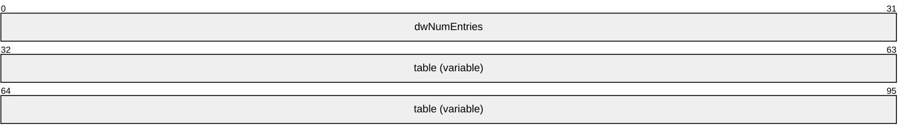

**dwNumEntries (4 bytes):** The number of interface entries in the table.

**table (variable):** An array of **MIB_IPDESTROW** structures that contains the interface entries.

<a id="Section_2.2.1.2.22"></a>
##### 2.2.1.2.22 MIB_ROUTESTATE

The **MIB_ROUTESTATE** structure contains information as to whether the [**route**](#gt_route) needs to be added to the [**forwarder**](#gt_forwarder) or not. Typically, only the [**best routes**](#gt_best-route) are added to the forwarder.

typedef struct_MIB_ROUTESTATE{

BOOLbRoutesSetToStack;

} MIB_ROUTESTATE,

*PMIB_ROUTESTATE;

**bRoutesSetToStack:** This MUST be set to 0x00000001 to set routes to the forwarder.

<a id="Section_2.2.1.2.23"></a>
##### 2.2.1.2.23 MIB_BEST_IF

The **MIB_BEST_IF** structure stores the index of the [**interface**](#gt_interface) that has the [**best route**](#gt_best-route) to a specific destination IPv4 address.

typedef struct_MIB_BEST_IF{

DWORDdwDestAddr;

DWORDdwIfIndex;

} MIB_BEST_IF,

*PMIB_BEST_IF;

**dwDestAddr:** Specifies the IPv4 address of the destination address.

**dwIfIndex:** Specifies the index of the interface that has the best route to the destination address specified by the **dwDestAddr** member.

<a id="Section_2.2.1.2.24"></a>
##### 2.2.1.2.24 MIB_BOUNDARYROW

The **MIB_BOUNDARYROW** structure contains the IPv4 group address value and mask for a [**multicast**](#gt_multicast) boundary. Whenever this structure is used, the **InfoType** of [**RTR_TOC_ENTRY(section2.2.1.2.4)**](#Section_2.2.1.2.4) MUST be 0xFFFF000B to specify multicast boundary information.

This structure is used in **MIB_OPAQUE_INFO**(section [2.2.1.2.52](#Section_2.2.1.2.52)) structure.

This structure is used in the following methods:

- [**RRouterInterfaceTransportAdd(section3.1.4.18)**](#Section_3.1.4.18)
- [**RRouterInterfaceTransportSetInfo(section3.1.4.20)**](#Section_3.1.4.20)
- [**RRouterInterfaceTransportGetInfo(section3.1.4.19)**](#Section_3.1.4.19)
typedef struct{

DWORDdwGroupAddress;

DWORDdwGroupMask;

} MIB_BOUNDARYROW,

*PMIB_BOUNDARYROW;

**dwGroupAddress:** The 32-bit integer representation of the IPv4 group address which, when combined with the corresponding value in **dwGroupMask**, identifies the group range for which the scoped boundary exists.

**Note** Scoped addresses MUST come from the range 239.*.*.* as specified in [[RFC2365]](https://go.microsoft.com/fwlink/?LinkId=119994).

**dwGroupMask:** The 32-bit integer representation of the IPv4 group address mask which, when combined with the corresponding value in **dwGroupAddress**, identifies the group range for which the scoped boundary exists.

<a id="Section_2.2.1.2.25"></a>
##### 2.2.1.2.25 MIB_ICMP

The **MIB_ICMP** structure contains the ICMP statistics. This structure is used in **MIB_OPAQUE_INFO**(section [2.2.1.2.52](#Section_2.2.1.2.52)) structure.

typedef struct_MIB_ICMP{

MIBICMPINFOstats;

} MIB_ICMP,

*PMIB_ICMP;

**stats:** An [**MIBICMPINFO(section2.2.1.2.26)**](#Section_2.2.1.2.26) structure that contains the ICMP statistics.

<a id="Section_2.2.1.2.26"></a>
##### 2.2.1.2.26 MIBICMPINFO

The **MIBICMPINFO** structure that contains the incoming and outgoing statistics for the ICMP.

This structure is used in [**MIB_ICMP(section2.2.1.2.25)**](#Section_2.2.1.2.25) structure.

typedef struct_MIBICMPINFO{

MIBICMPSTATSicmpInStats;

MIBICMPSTATSicmpOutStats;

} MIBICMPINFO;

**icmpInStats:** An [**MIBICMPSTATS(section2.2.1.2.27)**](#Section_2.2.1.2.27) structure that contains the statistics for incoming ICMP messages.

**icmpOutStats:** An **MIBICMPSTATS** structure that contains the statistics for outgoing ICMP messages.

<a id="Section_2.2.1.2.27"></a>
##### 2.2.1.2.27 MIBICMPSTATS

The **MIBICMPSTATS** structure contains statistics for the ICMP messages on a specific computer. This structure is used in [**MIBICMPINFO(section2.2.1.2.26)**](#Section_2.2.1.2.26).

typedef struct_MIBICMPSTATS{

DWORDdwMsgs;

DWORDdwErrors;

DWORDdwDestUnreachs;

DWORDdwTimeExcds;

DWORDdwParmProbs;

DWORDdwSrcQuenchs;

DWORDdwRedirects;

DWORDdwEchos;

DWORDdwEchoReps;

DWORDdwTimestamps;

DWORDdwTimestampReps;

DWORDdwAddrMasks;

DWORDdwAddrMaskReps;

} MIBICMPSTATS;

**dwMsgs:** The number of ICMP messages received or sent.

**dwErrors:** The number of errors that occurred while sending or receiving ICMP messages.

**dwDestUnreachs:** The number of destination-unreachable messages received or sent. A destination-unreachable message is sent to the originating computer when the destination address in a [**datagram**](#gt_datagram) cannot be reached.

**dwTimeExcds:** The number of TTL-exceeded messages received or sent. A TTL-exceeded message is sent to the originating computer when a datagram is discarded because the number of routers it has passed through exceeds its TTL value.

**dwParmProbs:** The number of parameter-problem messages received or sent. A parameter-problem message is sent to the originating computer when a router or host detects an error in a datagram's IP header.

**dwSrcQuenchs:** The number of source quench messages received or sent. A source quench request is sent to a computer to request that it reduce its rate of packet transmission.

**dwRedirects:** The number of redirect messages received or sent. A redirect message is sent to the originating computer when a better route is discovered for a datagram sent by that computer.

**dwEchos:** The number of echo requests received or sent. An echo request causes the receiving computer to send an echo reply message back to the originating computer.

**dwEchoReps:** The number of echo replies received or sent. A computer sends an echo reply in response to receiving an echo request message.

**dwTimestamps:** The number of time stamp requests received or sent. A time stamp request causes the receiving computer to send a time stamp reply back to the originating computer.

**dwTimestampReps:** The number of time stamp replies received or sent. A computer sends a time stamp reply in response to having received a time stamp request. Routers can use time stamp requests and replies to measure the transmission speed of datagrams on a network.

**dwAddrMasks:** The number of address mask requests received or sent. A computer sends an address mask request to determine the number of bits in the subnet mask for its local subnet.

**dwAddrMaskReps:** The number of address mask responses received or sent. A computer sends an address mask response in response to an address mask request.

<a id="Section_2.2.1.2.28"></a>
##### 2.2.1.2.28 MIB_IFNUMBER

The **MIB_IFNUMBER** structure stores the number of interfaces on a specific computer.

typedef struct_MIB_IFNUMBER{

DWORDdwValue;

} MIB_IFNUMBER,

*PMIB_IFNUMBER;

**dwValue:** The number of interfaces on the computer.

<a id="Section_2.2.1.2.29"></a>
##### 2.2.1.2.29 MIB_IFROW

The **MIB_IFROW** structure stores information about a specific interface.

typedef struct_MIB_IFROW{

WCHARwszName[256];

DWORDdwIndex;

DWORDdwType;

DWORDdwMtu;

DWORDdwSpeed;

DWORDdwPhysAddrLen;

BYTEbPhysAddr[8];

DWORDdwAdminStatus;

DWORDdwOperStatus;

DWORDdwLastChange;

DWORDdwInOctets;

DWORDdwInUcastPkts;

DWORDdwInNUcastPkts;

DWORDdwInDiscards;

DWORDdwInErrors;

DWORDdwInUnknownProtos;

DWORDdwOutOctets;

DWORDdwOutUcastPkts;

DWORDdwOutNUcastPkts;

DWORDdwOutDiscards;

DWORDdwOutErrors;

DWORDdwOutQLen;

DWORDdwDescrLen;

BYTEbDescr[256];

} MIB_IFROW;

**wszName:** A pointer to a Unicode string that contains the name of the interface.

**dwIndex:** The index that identifies the interface. This index value is not persistent and can change when a network adapter is disabled and then enabled.

**dwType:** The interface type as defined by the Internet Assigned Names Authority (IANA) [[IANAifType]](https://go.microsoft.com/fwlink/?LinkId=89884).

The following table lists common values for the interface type, although many other values are possible.

| Value | Meaning |
| --- | --- |
| IF_TYPE_OTHER 0x00000001 | Another type of network interface. |
| IF_TYPE_ETHERNET_CSMACD 0x00000006 | An Ethernet network interface. |
| IF_TYPE_ISO88025_TOKENRING 0x00000009 | A token ring network interface. |
| IF_TYPE_PPP 0x00000017 | A PPP network interface. |
| IF_TYPE_SOFTWARE_LOOPBACK 0x00000018 | A software loopback network interface. |
| IF_TYPE_ATM 0x00000027 | An ATM network interface. |
| IF_TYPE_IEEE80211 0x00000047 | An IEEE 802.11 wireless network interface. |
| IF_TYPE_TUNNEL 0x00000083 | A tunnel type encapsulation network interface. |
| IF_TYPE_IEEE1394 0x00000090 | An IEEE 1394 (FireWire) high-performance serial bus network interface. |

**dwMtu:** The maximum transmission unit (MTU) size in bytes.

**dwSpeed:** The speed of the interface in bits per second.

**dwPhysAddrLen:** The length, in bytes, of the physical address specified by the **bPhysAddr** member.

**bPhysAddr:** The physical address of the adapter for this interface.

**dwAdminStatus:** The administrative status of the interface. It can be either enabled or disabled.

**dwOperStatus:** The operational status of the interface.

This member can be one of the following values.

| Value | Meaning |
| --- | --- |
| IF_OPER_STATUS_NON_OPERATIONAL 0x00000000 | LAN adapter has been disabled, for example, because of an address conflict. |
| IF_OPER_STATUS_UNREACHABLE 0x00000001 | WAN adapter that is not connected. |
| IF_OPER_STATUS_DISCONNECTED 0x00000002 | For LAN adapters: network cable disconnected. For WAN adapters: no carrier. |
| IF_OPER_STATUS_CONNECTING 0x00000003 | WAN adapter that is in the process of connecting. |
| IF_OPER_STATUS_CONNECTED 0x00000004 | WAN adapter that is connected to a remote peer. |
| IF_OPER_STATUS_OPERATIONAL 0x00000005 | Default status for LAN adapters. |

**dwLastChange:** The length of time, in hundredths of seconds, starting from the last computer restart, when the interface entered its current operational state.<32>

**dwInOctets:** The number of octets of data received through this interface.

**dwInUcastPkts:** The number of unicast packets received through this interface.

**dwInNUcastPkts:** The number of nonunicast packets received through this interface. Broadcast and multicast packets are included.

**dwInDiscards:** The number of incoming packets that were discarded even though they did not have errors.

**dwInErrors:** The number of incoming packets that were discarded because of errors.

**dwInUnknownProtos:** The number of incoming packets that were discarded because the protocol was unknown.

**dwOutOctets:** The number of octets of data sent through this interface.

**dwOutUcastPkts:** The number of unicast packets sent through this interface.

**dwOutNUcastPkts:** The number of nonunicast packets sent through this interface. Broadcast and multicast packets are included.

**dwOutDiscards:** The number of outgoing packets that were discarded even though they did not have errors.

**dwOutErrors:** The number of outgoing packets that were discarded because of errors.

**dwOutQLen:** The transmit queue length. This field is not currently used.

**dwDescrLen:** The length, in bytes, of the **bDescr** member.

**bDescr:** A null-terminated ASCII string that contains the description of the interface.

<a id="Section_2.2.1.2.30"></a>
##### 2.2.1.2.30 MIB_IFSTATUS

The **MIB_IFSTATUS** structure stores status information for a specific interface.

typedef struct_MIB_IFSTATUS{

DWORDdwIfIndex;

DWORDdwAdminStatus;

DWORDdwOperationalStatus;

BOOLbMHbeatActive;

BOOLbMHbeatAlive;

} MIB_IFSTATUS,

*PMIB_IFSTATUS;

**dwIfIndex:** The index that identifies the interface.

**dwAdminStatus:** The administrative status of the interface, that is, whether the interface is administratively enabled or disabled.

**dwOperationalStatus:** The operational status of the interface. This member can be one of the values defined in [**ROUTER_CONNECTION_STATE(section2.2.1.1.2)**](#Section_2.2.1.1.2).

**bMHbeatActive:** Specifies whether multicast heartbeat detection is enabled. A value of TRUE indicates that heartbeat detection is enabled. A value of FALSE indicates that heartbeat detection is disabled.

| Value | Meaning |
| --- | --- |
| TRUE | Heartbeat detection is enabled. |
| FALSE | Heartbeat detection is disabled. |

**bMHbeatAlive:** Specifies whether the multicast heartbeat dead interval has been exceeded. A value of FALSE indicates that the interval has been exceeded. A value of TRUE indicates that the interval has not been exceeded.

| Value | Meaning |
| --- | --- |
| TRUE | Heartbeat dead interval has not been exceeded. |
| FALSE | Heartbeat dead interval has been exceeded. |

<a id="Section_2.2.1.2.31"></a>
##### 2.2.1.2.31 MIB_IFTABLE

The **MIB_IFTABLE** structure contains a table of interface entries. This structure is used in **MIB_OPAQUE_INFO**(section [2.2.1.2.52](#Section_2.2.1.2.52)) structure.


**dwNumEntries (4 bytes):** The number of interface entries in the table.

**table (variable):** An array of [**MIB_IFROW(section2.2.1.2.29)**](#Section_2.2.1.2.29) structures that contains interface entries.

<a id="Section_2.2.1.2.32"></a>
##### 2.2.1.2.32 MIB_IPADDRROW

The **MIB_IPADDRROW** structure specifies information for a specific IPv4 address. This structure is used in the following methods:

- **MIB_OPAQUE_INFO** (section [2.2.1.2.52](#Section_2.2.1.2.52))
- [**MIB_IPADDRTABLE(section2.2.1.2.33)**](#Section_2.2.1.2.33)
typedef struct_MIB_IPADDRROW{

DWORDdwAddr;

DWORDdwIndex;

DWORDdwMask;

DWORDdwBCastAddr;

DWORDdwReasmSize;

unsigned shortunused1;

unsigned shortwType;

} MIB_IPADDRROW,

*PMIB_IPADDRROW;

**dwAddr:** The IPv4 address.

**dwIndex:** The index of the interface associated with this IPv4 address.

**dwMask:** The subnet mask for the IPv4 address. See [[RFC950]](https://go.microsoft.com/fwlink/?LinkId=90501).

**dwBCastAddr:** The broadcast address. A broadcast address is typically the IPv4 address with the host portion set to either all zeros or all ones.

**dwReasmSize:** The maximum reassembly size for received [**datagrams**](#gt_datagram).

**unused1:** This member is reserved and SHOULD be set to 0.

**wType:** The address type or state.<33>

| Value | Meaning |
| --- | --- |
| MIB_IPADDR_PRIMARY 0x0001 | Primary IP address. |
| MIB_IPADDR_DYNAMIC 0x0004 | Dynamic IP address. |
| MIB_IPADDR_DISCONNECTED 0x0008 | Address is on a disconnected interface. |
| MIB_IPADDR_DELETED 0x0040 | Address is being deleted. |
| MIB_IPADDR_TRANSIENT 0x0080 | Transient address. |

<a id="Section_2.2.1.2.33"></a>
##### 2.2.1.2.33 MIB_IPADDRTABLE

The **MIB_IPADDRTABLE** structure contains a table of IPv4 address entries. This structure is used in **MIB_OPAQUE_INFO**(section [2.2.1.2.52](#Section_2.2.1.2.52)) structure.


**dwNumEntries (4 bytes):** The number of IPv4 address entries in the table.

**table (variable):** A pointer to a table of IPv4 address entries implemented as an array of [**MIB_IPADDRROW (section**](#Section_2.2.1.2.32) 2.2.1.2.32) structures.

<a id="Section_2.2.1.2.34"></a>
##### 2.2.1.2.34 MIB_IPFORWARDNUMBER

The **MIB_IPFORWARDNUMBER** structure stores the number of [**routes**](#gt_route) in a specific IP [**routing table**](#gt_routing-table).

typedef struct_MIB_IPFORWARDNUMBER{

DWORDdwValue;

} MIB_IPFORWARDNUMBER,

*PMIB_IPFORWARDNUMBER;

**dwValue:** Specifies the number of routes in the IP routing table.

<a id="Section_2.2.1.2.35"></a>
##### 2.2.1.2.35 MIB_IPFORWARDROW

The **MIB_IPFORWARDROW** structure contains information that describes an IPv4 network [**route**](#gt_route). This structure is used in the following methods:

- **MIB_OPAQUE_INFO** (section [2.2.1.2.52](#Section_2.2.1.2.52))
- [**MIB_IPDESTROW(section2.2.1.2.20)**](#Section_2.2.1.2.20)
- [**MIB_IPFORWARDTABLE(section2.2.1.2.36)**](#Section_2.2.1.2.36)
typedef struct_MIB_IPFORWARDROW

{

DWORDdwForwardDest;

DWORDdwForwardMask;

DWORDdwForwardPolicy;

DWORDdwForwardNextHop;

DWORDdwForwardIfIndex;

union{

DWORDdwForwardType;

MIB_IPFORWARD_TYPEForwardType;

};

union{

DWORDdwForwardProto;

MIB_IPFORWARD_PROTOForwardProto;

};

DWORDdwForwardAge;

DWORDdwForwardNextHopAS;

DWORDdwForwardMetric1;

DWORDdwForwardMetric2;

DWORDdwForwardMetric3;

DWORDdwForwardMetric4;

DWORDdwForwardMetric5;

} MIB_IPFORWARDROW,

*PMIB_IPFORWARDROW;

**dwForwardDest:** The destination IPv4 address of the route. An entry with an IPv4 address of 0.0.0.0 is considered a default route. This member MUST NOT be set to a [**multicast**](#gt_multicast) (class D) IPv4 address.

**dwForwardMask:** The IPv4 subnet mask to be logically ANDed with the destination IPv4 address before being compared to the value in the **dwForwardDest** member; see [[RFC950]](https://go.microsoft.com/fwlink/?LinkId=90501).

**dwForwardPolicy:** The set of conditions that would cause the selection of a multipath route (the set of [**next hops**](#gt_next-hops) for a given destination). This member is typically in IP TOS format. The encoding of this member is specified in [[RFC1354]](https://go.microsoft.com/fwlink/?LinkId=119993).

**dwForwardNextHop:** For remote routes, the IPv4 address of the next system in the route. Otherwise, this member SHOULD be an IPv4 address of 0x00000000.

**dwForwardIfIndex:** The index of the local [**interface**](#gt_interface) through which the [**next hop**](#gt_next-hop) of this route is reachable. This MUST be an interface index of one of the interfaces on RRAS.

**dwForwardType:** The route type as specified in [RFC1354]. The enum [**MIB_IPFORWARD_TYPE(section2.2.1.1.8)**](#Section_2.2.1.1.8) describes the possible values for this member. In addition, **dwForwardType** can also be IP_PRIORITY_MAX_METRIC (0x000000FF) or IP_PRIORITY_DEFAULT_METRIC (0x0000007F).

**ForwardType:** The route type as specified in [RFC1354].<34>

**dwForwardProto:** The protocol or routing mechanism that generated the route. It can take one of the values specified in [RFC1354]. The enum [**MIB_IPFORWARD_PROTO(section2.2.1.1.9)**](#Section_2.2.1.1.9) describes the possible values for this member.

**ForwardProto:** The protocol or routing mechanism that generated the route.<35>

**dwForwardAge:** The number of seconds since the route was added or modified in the network [**routing table**](#gt_routing-table). The **dwForwardAge** member is also used if the RRAS server is running for routes of type PROTO_IP_NETMGMT as defined on the Protocol Identifiers reference page. When **dwForwardAge** is set to INFINITE (-1) when running the RRAS server, the route will not be removed based on a time-out value.

**dwForwardNextHopAS:** The autonomous system number of the next hop. When this member is unknown or not relevant to the protocol or routing mechanism specified in **dwForwardProto**, this value SHOULD be set to 0. This value is documented in [RFC1354].

**dwForwardMetric1:** The primary routing metric value for this route. The semantics of this metric are determined by the [**routing protocol**](#gt_routing-protocol) specified in the **dwForwardProto** member. If this metric is not used, its value SHOULD be set to MIB_IPROUTE_METRIC_UNUSED (-1). This value is documented in [RFC1354].

**dwForwardMetric2:** An alternate routing metric value for this route. The semantics of this metric are determined by the routing protocol specified in the **dwForwardProto** member. If this metric is not used, its value SHOULD be set to -1. This value is documented in [RFC1354].

**dwForwardMetric3:** An alternate routing metric value for this route. The semantics of this metric are determined by the routing protocol specified in the **dwForwardProto** member. If this metric is not used, its value SHOULD be set to -1. This value is documented in [RFC1354].

**dwForwardMetric4:** An alternate routing metric value for this route. The semantics of this metric are determined by the routing protocol specified in the **dwForwardProto** member. If this metric is not used, its value SHOULD be set to -1. This value is documented in [RFC1354].

**dwForwardMetric5:** An alternate routing metric value for this route. The semantics of this metric are determined by the routing protocol specified in the **dwForwardProto** member. If this metric is not used, its value SHOULD be set to -1. This value is documented in [RFC1354].

<a id="Section_2.2.1.2.36"></a>
##### 2.2.1.2.36 MIB_IPFORWARDTABLE

The **MIB_IPFORWARDTABLE** structure contains a table of the IP [**route**](#gt_route) entries.

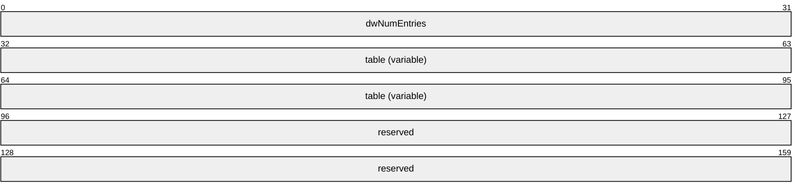

**dwNumEntries (4 bytes):** Specifies the number of route entries in the table.

**table (variable):** Pointer to a table of route entries implemented as an array of [**MIB_IPFORWARDROW (section**](#Section_2.2.1.2.35) 2.2.1.2.35) structures.

**reserved (8 bytes):** An array of 8 bytes that SHOULD be set to zero (0) and ignored on receipt.

<a id="Section_2.2.1.2.37"></a>
##### 2.2.1.2.37 MIB_IPMCAST_BOUNDARY

The **MIB_IPMCAST_BOUNDARY** structure contains a router's scoped IPv4 [**multicast**](#gt_multicast) address boundaries. This structure is used in the following methods:

- **MIB_OPAQUE_INFO** (section [2.2.1.2.52](#Section_2.2.1.2.52))
- [**MIB_IPMCAST_BOUNDARY_TABLE(section2.2.1.2.38)**](#Section_2.2.1.2.38)
typedef struct{

DWORDdwIfIndex;

DWORDdwGroupAddress;

DWORDdwGroupMask;

DWORDdwStatus;

} MIB_IPMCAST_BOUNDARY,

*PMIB_IPMCAST_BOUNDARY;

**dwIfIndex:** The index value for the interface that applies to this boundary. Packets with a destination address in the associated address/mask range are not forwarded with this interface.

**dwGroupAddress:** The 32-bit integer representation of the IPv4 group address which, when combined with the corresponding value in **dwGroupMask**, identifies the group range for which the scoped boundary exists.

**Note** Scoped addresses MUST come from the range 239.*.*.* as specified in [[RFC2365]](https://go.microsoft.com/fwlink/?LinkId=119994).

**dwGroupMask:** The 32-bit integer representation of the IPv4 group address mask which, when combined with the corresponding value in **dwGroupAddress**, identifies the group range for which the scoped boundary exists.

**dwStatus:** A status value that describes the current status of this entry in a multicast forwarding entry (MFE) boundary table.

| Value | Meaning |
| --- | --- |
| ROWSTATUS_ACTIVE 0x00000001 | The entry has an active status. |
| ROWSTATUS_NOTINSERVICE 0x00000002 | The entry has a notInService status. |
| ROWSTATUS_NOTREADY 0x00000003 | The entry has a notReady status. |
| ROWSTATUS_CREATEANDGO 0x00000004 | The entry has a createAndGo status. |
| ROWSTATUS_CREATEANDWAIT 0x00000005 | The entry has a createAndWait status. |
| ROWSTATUS_DESTROY 0x00000006 | The entry has a destroy status. |

<a id="Section_2.2.1.2.38"></a>
##### 2.2.1.2.38 MIB_IPMCAST_BOUNDARY_TABLE

The **MIB_IPMCAST_BOUNDARY_TABLE** structure contains a list of a router's scoped IPv4 [**multicast**](#gt_multicast) address boundaries. This structure is used in **MIB_OPAQUE_INFO** (section [2.2.1.2.52](#Section_2.2.1.2.52)) structure.


**dwNumEntries (4 bytes):** The number of [**MIB_IPMCAST_BOUNDARY (section**](#Section_2.2.1.2.37) 2.2.1.2.37) structures listed in **table**.

**table (variable):** An array of **MIB_IPMCAST_BOUNDARY** structures that collectively define the set of scoped IPv4 multicast address boundaries on a router

<a id="Section_2.2.1.2.39"></a>
##### 2.2.1.2.39 MIB_IPMCAST_GLOBAL

The **MIB_IPMCAST_GLOBAL** structure stores global information for IP [**multicast**](#gt_multicast) on a specific computer.

typedef struct_MIB_IPMCAST_GLOBAL{

DWORDdwEnable;

} MIB_IPMCAST_GLOBAL,

*PMIB_IPMCAST_GLOBAL;

**dwEnable:** Specifies whether or not IP multicast is enabled on the computer. This value is set to 1 if IP multicast is enabled on the computer and is set to 2 if IP multicast is not enabled on the computer.

<a id="Section_2.2.1.2.40"></a>
##### 2.2.1.2.40 MIB_IPMCAST_IF_ENTRY

The **MIB_IPMCAST_IF_ENTRY** structure stores information about an IP [**multicast**](#gt_multicast) interface.

typedef struct_MIB_IPMCAST_IF_ENTRY{

DWORDdwIfIndex;

DWORDdwTtl;

DWORDdwProtocol;

DWORDdwRateLimit;

ULONGulInMcastOctets;

ULONGulOutMcastOctets;

} MIB_IPMCAST_IF_ENTRY,

*PMIB_IPMCAST_IF_ENTRY;

**dwIfIndex:** The index of this interface.

**dwTtl:** The TTL value for this interface.

**dwProtocol:** The [**multicast routing protocol**](#gt_multicast-routing-protocol) that owns this interface.

**dwRateLimit:** The rate limit of this interface.

**ulInMcastOctets:** The number of octets of multicast data received through this interface.

**ulOutMcastOctets:** The number of octets of multicast data sent through this interface.

<a id="Section_2.2.1.2.41"></a>
##### 2.2.1.2.41 MIB_IPMCAST_IF_TABLE

The **MIB_IPMCAST_IF_TABLE** structure contains a table of IP [**multicast**](#gt_multicast) interface entries.

typedef struct_MIB_IPMCAST_IF_TABLE{

DWORDdwNumEntries;

MIB_IPMCAST_IF_ENTRYtable[1];

} MIB_IPMCAST_IF_TABLE,

*PMIB_IPMCAST_IF_TABLE;

**dwNumEntries:** Specifies the number of interface entries in the table.

**table:** A pointer to a table of interface entries implemented as an array of **MIB_IPMCAST_IF_ENTRY** (section [2.2.1.2.40](#Section_2.2.1.2.40)) structures.

<a id="Section_2.2.1.2.42"></a>
##### 2.2.1.2.42 MIB_IPMCAST_MFE

The **MIB_IPMCAST_MFE** structure stores the information for an IP [**multicast**](#gt_multicast) forwarding entry (MFE). This structure is used in **MIB_MFE_TABLE** (section [2.2.1.2.51](#Section_2.2.1.2.51)) structure.

typedef struct_MIB_IPMCAST_MFE{

DWORDdwGroup;

DWORDdwSource;

DWORDdwSrcMask;

DWORDdwUpStrmNgbr;

DWORDdwInIfIndex;

DWORDdwInIfProtocol;

DWORDdwRouteProtocol;

DWORDdwRouteNetwork;

DWORDdwRouteMask;

ULONGulUpTime;

ULONGulExpiryTime;

ULONGulTimeOut;

ULONGulNumOutIf;

DWORDfFlags;

DWORDdwReserved;

MIB_IPMCAST_OIFrgmioOutInfo[1];

} MIB_IPMCAST_MFE,

*PMIB_IPMCAST_MFE;

**dwGroup:** The range of IPv4 multicast groups for this MFE. A value of zero (0) indicates a wildcard group.

**dwSource:** The range of IPv4 source addresses for this MFE. A value of zero (0) indicates a wildcard source.

**dwSrcMask:** The IPv4 subnet mask that corresponds to **dwSource**. The **dwSource** and **dwSrcMask** members are used together to define a range of sources.

**dwUpStrmNgbr:** The [**upstream**](#gt_4daf1e81-3ffe-4656-8074-a9914b14a60c) neighbor that is related to this MFE.

**dwInIfIndex:** The index of the [**interface**](#gt_interface) to which this MFE is related.

**dwInIfProtocol:** The [**routing protocol**](#gt_routing-protocol) that owns the incoming interface to which this MFE is related.

**dwRouteProtocol:** The protocol that created the [**route**](#gt_route). This is the enum **MIB_IPFORWARD_PROTO** (section [2.2.1.1.9](#Section_2.2.1.1.9)).

**dwRouteNetwork:** The IPv4 address associated with the route referred to by **dwRouteProtocol**.

**dwRouteMask:** The IPv4 mask associated with the route referred to by **dwRouteProtocol**.

**ulUpTime:** The time, in seconds, that this MFE has been valid. This value starts from zero (0) and is incremented until it reaches the **ulTimeOut** value, at which time the MFE is deleted.

**ulExpiryTime:** The time, in seconds, that remains before the MFE expires and is deleted. This value starts from **ulTimeOut** and is decremented until it reaches zero (0), at which time the MFE is deleted.

**ulTimeOut:** The total length of time, in seconds, that this MFE remains valid. After the time-out value is exceeded, the MFE is deleted.

**ulNumOutIf:** The number of outgoing interfaces that are associated with this MFE.

**fFlags:** Reserved. This member SHOULD be NULL.

**dwReserved:** Reserved. This member SHOULD be NULL.

**rgmioOutInfo:** A pointer to a table of outgoing interface statistics that are implemented as an array of [**MIB_IPMCAST_OIF(section2.2.1.2.43)**](#Section_2.2.1.2.43) structures.

<a id="Section_2.2.1.2.43"></a>
##### 2.2.1.2.43 MIB_IPMCAST_OIF

The **MIB_IPMCAST_OIF** structure stores the information required to send an outgoing IP [**multicast**](#gt_multicast) packet.

typedef struct_MIB_IPMCAST_OIF{

DWORDdwOutIfIndex;

DWORDdwNextHopAddr;

PVOIDpvReserved;

DWORDdwReserved;

} MIB_IPMCAST_OIF,

*PMIB_IPMCAST_OIF;

**dwOutIfIndex:** The index of the interface on which to send the outgoing IP multicast packet.

**dwNextHopAddr:** The destination address for the outgoing IPv4 multicast packet.

**pvReserved:** Reserved. This member MUST be NULL.

**dwReserved:** Reserved. This member MUST be zero (0).

<a id="Section_2.2.1.2.44"></a>
##### 2.2.1.2.44 MIB_IPMCAST_MFE_STATS

The **MIB_IPMCAST_MFE_STATS** structure stores the statistics associated with an MFE.

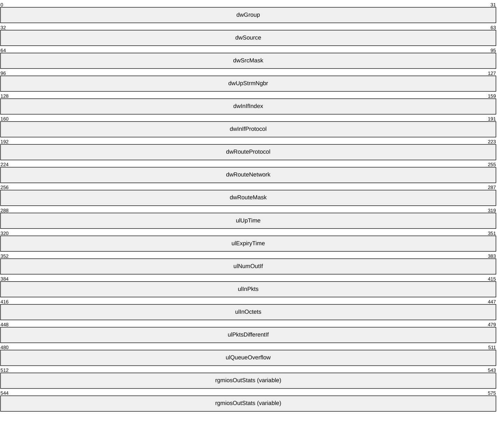

**dwGroup (4 bytes):** The multicast group for this MFE. A value of zero (0) indicates a wildcard group.

**dwSource (4 bytes):** The range of source addresses for this MFE. A value of zero (0) indicates a wildcard source.

**dwSrcMask (4 bytes):** The IPv4 subnet mask that corresponds to the **dwSource**. The **dwSource** and the **dwSrcMask** members are used together to define a range of sources.

**dwUpStrmNgbr (4 bytes):** The [**upstream**](#gt_4daf1e81-3ffe-4656-8074-a9914b14a60c) neighbor that is related to this MFE.

**dwInIfIndex (4 bytes):** The index of the incoming interface that is related to this MFE.

**dwInIfProtocol (4 bytes):** The [**routing protocol**](#gt_routing-protocol) that owns the incoming interface that is related to this MFE.

**dwRouteProtocol (4 bytes):** The protocol that created the route. It is the enum [**MIB_IPFORWARD_PROTO (section**](#Section_2.2.1.1.9) 2.2.1.1.9).

**dwRouteNetwork (4 bytes):** The address associated with the route referred to by the **dwRouteProtocol**.

**dwRouteMask (4 bytes):** The mask associated with the route referred to by the **dwRouteProtocol**.

**ulUpTime (4 bytes):** The time, in 100ths of a second, since the MFE was created.

**ulExpiryTime (4 bytes):** The time, in 100ths of a second, until the MFE will be deleted. A value of zero (0) is specified if the MFE is not subject to aging requirements.

**ulNumOutIf (4 bytes):** The number of interfaces in the outgoing interface list for this MFE.

**ulInPkts (4 bytes):** The number of packets that have been forwarded that matched this MFE.

**ulInOctets (4 bytes):** The number of octets of data forwarded that match this MFE.

**ulPktsDifferentIf (4 bytes):** The number of packets matching this MFE that were dropped due to an incoming interface check.

**ulQueueOverflow (4 bytes):** The number of packets matching this MFE that were dropped due to a queue overflow. There is one queue per MFE.

**rgmiosOutStats (variable):** A pointer to a table of outgoing interface statistics that are implemented as an array of [**MIB_IPMCAST_OIF_STATS (section**](#Section_2.2.1.2.45) 2.2.1.2.45) structures. The number of entries in the table is specified by the value of the **ulNumOutIf** member.

<a id="Section_2.2.1.2.45"></a>
##### 2.2.1.2.45 MIB_IPMCAST_OIF_STATS

The **MIB_IPMCAST_OIF_STATS** structure stores the statistics that are associated with an outgoing [**multicast**](#gt_multicast) [**interface**](#gt_interface).

typedef struct_MIB_IPMCAST_OIF_STATS{

DWORDdwOutIfIndex;

DWORDdwNextHopAddr;

PVOIDpvDialContext;

ULONGulTtlTooLow;

ULONGulFragNeeded;

ULONGulOutPackets;

ULONGulOutDiscards;

} MIB_IPMCAST_OIF_STATS,

*PMIB_IPMCAST_OIF_STATS;

**dwOutIfIndex:** Specifies the outgoing interface to which these statistics are related.

**dwNextHopAddr:** Specifies the address of the [**next hop**](#gt_next-hop) that corresponds to **dwOutIfIndex**. The **dwOutIfIndex** and **dwNextHopAddr** members uniquely identify a next hop on [**point-to-multipoint interfaces**](#gt_point-to-multipoint-interface), where one interface connects to multiple networks. Examples of point-to-multipoint interfaces include non-broadcast multiple-access (NBMA) interfaces, and the [**internal interface**](#gt_internal-interface) on which all dial-up clients connect. For Ethernet and other broadcast interfaces, specify zero (0). Also specify zero (0) for [**point-to-point interfaces**](#gt_point-to-point-interface), which are identified by only **dwOutIfIndex**.

**pvDialContext:** Reserved. This member MUST be NULL.

**ulTtlTooLow:** Specifies the number of packets on this outgoing interface that were discarded because the packet's TTL value was too low.

**ulFragNeeded:** Specifies the number of packets that required fragmentation when they were forwarded on this interface.

**ulOutPackets:** Specifies the number of packets that were forwarded out of this interface.

**ulOutDiscards:** Specifies the number of packets that were discarded on this interface.

<a id="Section_2.2.1.2.46"></a>
##### 2.2.1.2.46 MIB_IPMCAST_SCOPE

The **MIB_IPMCAST_SCOPE** structure contains a multicast scope name and the associated IPv4 multicast group address and mask that define the scope. This structure is used in **MIB_OPAQUE_INFO**(section [2.2.1.2.52](#Section_2.2.1.2.52)) structure.

typedef struct{

DWORDdwGroupAddress;

DWORDdwGroupMask;

WCHARsnNameBuffer[256];

DWORDdwStatus;

BYTEreserved[492];

} MIB_IPMCAST_SCOPE,

*PMIB_IPMCAST_SCOPE;

**dwGroupAddress:** A 32-bit integer representation of the IPv4 group address which, when combined with the corresponding value in **dwGroupMask**, identifies the group range for which the multicast scope exists.

**Note** Scoped addresses MUST come from the range 239.0.0.0 to 239.255.255.255 as specified in [[RFC2365]](https://go.microsoft.com/fwlink/?LinkId=119994).

**dwGroupMask:** A 32-bit integer representation of the IPv4 group address mask which, when combined with the corresponding value in **dwGroupAddress**, identifies the group range for which the multicast scope exists.

**snNameBuffer:** A Unicode string, suitable for display to multicast application users, that contains the text name associated with the multicast scope.

If no name is specified, the default name is the string representation of the scoped address in **dwGroupAddress** with the address and mask length appended and separated by a backslash "/" character, of the form "239.*.*.*.x/y", where **x** is the address length and **y** is the mask length.

**dwStatus:** A status value that describes the current status of this row in an MFE scope table.

| Value | Meaning |
| --- | --- |
| 0x00000001 | Row has an active status. |
| 0x00000002 | Row has a notInService status. |
| 0x00000003 | Row has a notReady status. |
| 0x00000004 | Row has a createAndGo status. |
| 0x00000005 | Row has a createAndWait status. |
| 0x00000006 | Row has a destroy status. |

**reserved:** An array of 492 bytes that SHOULD be set to 0 and ignored on receive.

<a id="Section_2.2.1.2.47"></a>
##### 2.2.1.2.47 MIB_IPNETROW

The **MIB_IPNETROW** structure contains information for an Address Resolution Protocol (ARP) table entry for an IPv4 address. This structure is used in **MIB_OPAQUE_INFO**(section [2.2.1.2.52](#Section_2.2.1.2.52)) structure.

typedef struct_MIB_IPNETROW{

DWORDdwIndex;

DWORDdwPhysAddrLen;

BYTEbPhysAddr[8];

DWORDdwAddr;

DWORDdwType;

} MIB_IPNETROW,

*PMIB_IPNETROW;

**dwIndex:** This MUST be the interface index of an adapter.

**dwPhysAddrLen:** The length, in bytes, of the physical address.

**bPhysAddr:** The physical address.

**dwAddr:** The IPv4 address.

**dwType:** The type of ARP entry. This type MUST be one of the following values.

| Value | Meaning |
| --- | --- |
| 0x00000001 | Other |
| 0x00000002 | Invalid |
| 0x00000003 | Dynamic |
| 0x00000004 | Static |

<a id="Section_2.2.1.2.48"></a>
##### 2.2.1.2.48 MIB_IPNETTABLE

The **MIB_IPNETTABLE** structure contains a table of ARP entries for IPv4 addresses.

typedef struct_MIB_IPNETTABLE{

DWORDdwNumEntries;

MIB_IPNETROWtable[1];

BYTEreserved[8];

} MIB_IPNETTABLE,

*PMIB_IPNETTABLE;

**dwNumEntries:** The number of ARP entries in the table.

**table:** A pointer to a table of ARP entries implemented as an array of [**MIB_IPNETROW(section2.2.1.2.47)**](#Section_2.2.1.2.47) structures.

**reserved:** An array of 8 bytes that SHOULD be set to 0 and ignored on receipt.

<a id="Section_2.2.1.2.49"></a>
##### 2.2.1.2.49 MIB_IPSTATS

The **MIB_IPSTATS** structure stores information about the IP protocol running on a specific computer. This structure is used in **MIB_OPAQUE_INFO**(section [2.2.1.2.52](#Section_2.2.1.2.52)) structure.

typedef struct_MIB_IPSTATS{

union{

DWORDdwForwarding;

MIB_IPSTATS_FORWARDINGForwarding;

};

DWORDdwDefaultTTL;

DWORDdwInReceives;

DWORDdwInHdrErrors;

DWORDdwInAddrErrors;

DWORDdwForwDatagrams;

DWORDdwInUnknownProtos;

DWORDdwInDiscards;

DWORDdwInDelivers;

DWORDdwOutRequests;

DWORDdwRoutingDiscards;

DWORDdwOutDiscards;

DWORDdwOutNoRoutes;

DWORDdwReasmTimeout;

DWORDdwReasmReqds;

DWORDdwReasmOks;

DWORDdwReasmFails;

DWORDdwFragOks;

DWORDdwFragFails;

DWORDdwFragCreates;

DWORDdwNumIf;

DWORDdwNumAddr;

DWORDdwNumRoutes;

} MIB_IPSTATS,

*PMIB_IPSTATS;

**dwForwarding:** Specifies whether IP forwarding is enabled or disabled. This value MUST be 0xFFFFFFFF or one of the following values. If set to 0xFFFFFFFF, [**RMIBEntrySet**](#Section_3.1.4.29) does not change the current value of **dwForwarding**.

| Value | Meaning |
| --- | --- |
| 0x00000001 | IP Forwarding enabled. |
| 0x00000002 | IP Forwarding not enabled. |

**Forwarding:** Specifies whether IP forwarding is enabled or disabled.<36>

**dwDefaultTTL:** The default initial TTL for [**datagrams**](#gt_datagram) originating on a specific computer. This value MUST be 0xFFFFFFFF or a value less than or equal to 255.

**dwInReceives:** The number of datagrams received. This is a read-only field and MUST be ignored while writing.

**dwInHdrErrors:** The number of datagrams received that have header errors. This is a read-only field and MUST be ignored while writing.

**dwInAddrErrors:** The number of datagrams received that have address errors. This is a read-only field and MUST be ignored while writing.

**dwForwDatagrams:** The number of datagrams forwarded. This is a read-only field and MUST be ignored while writing.

**dwInUnknownProtos:** The number of datagrams received that have an unknown protocol. This is a read-only field and MUST be ignored while writing.

**dwInDiscards:** The number of received datagrams discarded. This is a read-only field and MUST be ignored while writing.

**dwInDelivers:** The number of received datagrams delivered. This is a read-only field and MUST be ignored while writing.

**dwOutRequests:** The number of outgoing datagrams that the IP is requested to transmit. This number does not include forwarded datagrams. This is a read-only field and MUST be ignored while writing.

**dwRoutingDiscards:** The number of outgoing datagrams discarded. This is a read-only field and MUST be ignored while writing.

**dwOutDiscards:** The number of transmitted datagrams to be discarded. This is a read-only field and MUST be ignored while writing.

**dwOutNoRoutes:** The number of datagrams for which this computer did not have a route to the destination IP address. These datagrams were discarded. This is a read-only field and MUST be ignored while writing.

**dwReasmTimeout:** The amount of time allowed for all pieces of a fragmented datagram to arrive. If all pieces do not arrive within this time, the datagram is discarded. This is a read-only field and MUST be ignored while writing.

**dwReasmReqds:** The number of datagrams that require reassembly. This is a read-only field and MUST be ignored while writing.

**dwReasmOks:** The number of datagrams that were successfully reassembled. This is a read-only field and MUST be ignored while writing.

**dwReasmFails:** The number of datagrams that cannot be reassembled. This is a read-only field and MUST be ignored while writing.

**dwFragOks:** The number of datagrams that were fragmented successfully. This is a read-only field and MUST be ignored while writing.

**dwFragFails:** The number of datagrams that have not been fragmented because the IP header specifies no fragmentation. These datagrams are discarded. This is a read-only field and MUST be ignored while writing.

**dwFragCreates:** The number of fragments created. This is a read-only field and MUST be ignored while writing.

**dwNumIf:** The number of interfaces. This is a read-only field and MUST be ignored while writing.

**dwNumAddr:** The number of IP addresses associated with this computer. This is a read-only field and MUST be ignored while writing.

**dwNumRoutes:** The number of routes in the IP routing table. This is a read-only field and MUST be ignored while writing.

<a id="Section_2.2.1.2.50"></a>
##### 2.2.1.2.50 MIB_MFE_STATS_TABLE

The **MIB_MFE_STATS_TABLE** structure stores statistics for a group of MFEs. This structure is used in **MIB_OPAQUE_INFO**(section [2.2.1.2.52](#Section_2.2.1.2.52)) structure.


**dwNumEntries (4 bytes):** The number of MFEs in the table.

**table (variable):** A pointer to a table of MFEs that are implemented as an array of [**MIB_IPMCAST_MFE_STATS (section**](#Section_2.2.1.2.44) 2.2.1.2.44) structures.

<a id="Section_2.2.1.2.51"></a>
##### 2.2.1.2.51 MIB_MFE_TABLE

The **MIB_MFE_TABLE** structure contains a table of MFEs. This structure is used in **MIB_OPAQUE_INFO**(section [2.2.1.2.52](#Section_2.2.1.2.52)) structure.


**dwNumEntries (4 bytes):** The number of MFEs in the table.

**table (variable):** A pointer to a table of MFEs implemented as an array of [**MIB_IPMCAST_MFE (section**](#Section_2.2.1.2.42) 2.2.1.2.42) structures.

<a id="Section_2.2.1.2.52"></a>
##### 2.2.1.2.52 MIB_OPAQUE_INFO

The **MIB_OPAQUE_INFO** structure contains information related to an MIB entry. This structure is used to handle MIB data in MIB methods such as the following:

- [**RMIBEntryCreate(section3.1.4.27)**](#Section_3.1.4.27)
- [**RMIBEntrySet(section3.1.4.29)**](#Section_3.1.4.29)
- [**RMIBEntryGet(section3.1.4.30)**](#Section_3.1.4.30)
- [**RMIBEntryGetFirst(section3.1.4.31)**](#Section_3.1.4.31)
- [**RMIBEntryGetNext(section3.1.4.32)**](#Section_3.1.4.32)
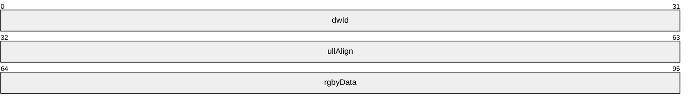

**dwId (4 bytes):** MIB ID for the type of information being submitted or returned. IPX does not use this structure. For IP transport, the MIB ID MUST be one of the following values.

| dwId Value | Meaning | Structure to be pointed to by rgbyData. |
| --- | --- | --- |
| IF_NUMBER 0x00000000 | Information about number of interfaces on the server. | [MIB_IFNUMBER(section2.2.1.2.28)](#Section_2.2.1.2.28) |
| IF_TABLE 0x00000001 | Table of interface entries. | [MIB_IFTABLE(section2.2.1.2.31)](#Section_2.2.1.2.31) |
| IF_ROW 0x00000002 | Information about a particular interface. | [MIB_IFROW(section2.2.1.2.29)](#Section_2.2.1.2.29) |
| IP_STATS 0x00000003 | Information about the IP protocol. | [MIB_IPSTATS(section2.2.1.2.49)](#Section_2.2.1.2.49) |
| IP_ADDRTABLE 0x00000004 | Table of IPv4 address entries. | [MIB_IPADDRTABLE(section2.2.1.2.33)](#Section_2.2.1.2.33) |
| IP_ADDRROW 0x00000005 | Information for a particular IPv4 address. | [MIB_IPADDRROW(section2.2.1.2.32)](#Section_2.2.1.2.32) |
| IP_FORWARDNUMBER 0x00000006 | Information about number of routes in a particular IP routing table. | [MIB_IPFORWARDNUMBER(section2.2.1.2.34)](#Section_2.2.1.2.34) |
| IP_FORWARDTABLE 0x00000007 | Table of IPv4 route entries. | [MIB_IPFORWARDTABLE(section2.2.1.2.36)](#Section_2.2.1.2.36) |
| IP_FORWARDROW 0x00000008 | Information that describes an IPv4/IPv6 network route. | [MIB_IPFORWARDROW(section2.2.1.2.35)](#Section_2.2.1.2.35) for IPv4, [INTERFACE_ROUTE_ENTRY(section2.2.1.2.181)](#Section_2.2.1.2.181) for IPv6 based on the transport |
| IP_NETTABLE 0x00000009 | Table of ARP entries for IPv4 addresses. | [MIB_IPNETTABLE(section2.2.1.2.48)](#Section_2.2.1.2.48) |
| IP_NETROW 0x0000000A | Information about an ARP table entry for an IPv4 address. | [MIB_IPNETROW(section2.2.1.2.47)](#Section_2.2.1.2.47) |
| ICMP_STATS 0x0000000B | Statistics for ICMP messages on a particular computer. | [MIB_ICMP(section2.2.1.2.25)](#Section_2.2.1.2.25) |
| TCP_STATS 0x0000000C | Statistics for the TCP protocol running on the local computer. | MIB_TCPSTATS(section [2.2.1.2.56](#Section_2.2.1.2.56)) |
| TCP_TABLE 0x0000000D | Table of IPv4 TCP connections. | MIB_TCPTABLE(section [2.2.1.2.57](#Section_2.2.1.2.57)) |
| TCP_ROW 0x0000000E | Information for an IPv4 TCP connection. | MIB_TCPROW(section [2.2.1.2.55](#Section_2.2.1.2.55)) |
| UDP_STATS 0x0000000F | Statistics for the UDP running on the local computer. | MIB_UDPSTATS(section [2.2.1.2.59](#Section_2.2.1.2.59)) |
| UDP_TABLE 0x00000010 | Table of address information for sending and receiving UDP datagrams. | MIB_UDPTABLE(section [2.2.1.2.60](#Section_2.2.1.2.60)) |
| UDP_ROW 0x00000011 | Information for a UDP session. | MIB_UDPROW(section [2.2.1.2.58](#Section_2.2.1.2.58)) |
| MCAST_MFE 0x00000012 | Information for an IP multicast forwarding entry. | MIB_MFE_TABLE(section [2.2.1.2.51](#Section_2.2.1.2.51)). *rgbyData* SHOULD be specified as NULL when the requested IP multicast forwarding entry is not found when using the RMIBEntryGet, RMIBEntryGetFirst, and RMIBEntryGetNext methods. These methods return ERROR_SUCCESS even if they do not find the requested IP multicast forwarding entry. |
| MCAST_MFE_STATS 0x00000013 | Statistics associated with an MFE. | MIB_MFE_STATS_TABLE(section [2.2.1.2.50](#Section_2.2.1.2.50)) |
| BEST_IF 0x00000014 | Information about the interface that has the best route to a particular destination IPv4 address. | [MIB_BEST_IF(section2.2.1.2.23)](#Section_2.2.1.2.23) |
| BEST_ROUTE 0x00000015 | Information about a particular route. | [INTERFACE_ROUTE_INFO(section2.2.1.2.11)](#Section_2.2.1.2.11) |
| PROXY_ARP 0x00000016 | Information for a Proxy Address Resolution Protocol (PARP) entry. | MIB_PROXYARP(section [2.2.1.2.54](#Section_2.2.1.2.54)) |
| MCAST_IF_ENTRY 0x00000017 | Information about an IP multicast interface. | [MIB_IPMCAST_IF_ENTRY(section2.2.1.2.40)](#Section_2.2.1.2.40) |
| MCAST_GLOBAL 0x00000018 | Global information for IP multicast on a particular computer. | [MIB_IPMCAST_GLOBAL(section2.2.1.2.39)](#Section_2.2.1.2.39) |
| IF_STATUS 0x00000019 | Status information for a particular interface. | [MIB_IFSTATUS(section2.2.1.2.30)](#Section_2.2.1.2.30) |
| MCAST_BOUNDARY 0x0000001A | Information about a router's scoped IPv4 multicast address boundaries. | [MIB_IPMCAST_BOUNDARY(section2.2.1.2.37)](#Section_2.2.1.2.37) |
| MCAST_SCOPE 0x0000001B | Information about a multicast scope. | [MIB_IPMCAST_SCOPE(section2.2.1.2.46)](#Section_2.2.1.2.46) |
| DEST_MATCHING 0x0000001C | Route information about a matching destination. | [MIB_IPDESTTABLE(section2.2.1.2.21)](#Section_2.2.1.2.21) |
| DEST_LONGER 0x0000001D | Information about all the possible routes to a destination. | MIB_IPDESTTABLE(section2.2.1.2.21) |
| DEST_SHORTER 0x0000001E | Information about the best matching routes to a destination. | MIB_IPDESTTABLE(section2.2.1.2.21) |
| ROUTE_MATCHING 0x0000001F | Information about a matching IP route. | MIB_IPDESTTABLE(section2.2.1.2.21) |
| ROUTE_LONGER 0x00000020 | Information about all the possible routes to a destination. | MIB_IPDESTTABLE(section2.2.1.2.21) |
| ROUTE_SHORTER 0x00000021 | Information about the best matching routes to a destination. | MIB_IPDESTTABLE(section2.2.1.2.21) |
| ROUTE_STATE 0x00000022 | Information about whether the route needs to be added to the forwarder or not. | [MIB_ROUTESTATE(section2.2.1.2.22)](#Section_2.2.1.2.22) |
| MCAST_MFE_STATS_EX 0x00000023 | Statistics associated with an MFE. | MIB_MFE_STATS_TABLE(section 2.2.1.2.50) |

**ullAlign (4 bytes):** The number of bytes that align the information returned. This is used to align the field to a long boundary so that the structure is aligned.

**rgbyData (4 bytes):** A pointer to the information returned from the opaque query.

<a id="Section_2.2.1.2.53"></a>
##### 2.2.1.2.53 MIB_OPAQUE_QUERY

The **MIB_OPAQUE_QUERY** structure contains the MIB ID and the corresponding index of the MIB object. This structure is used in the following methods:

- [**RMIBEntryGet(section3.1.4.30)**](#Section_3.1.4.30)
- [**RMIBEntryDelete(section3.1.4.28)**](#Section_3.1.4.28)
- [**RMIBEntryGetFirst(section3.1.4.31)**](#Section_3.1.4.31)
- [**RMIBEntryGetNext(section3.1.4.32)**](#Section_3.1.4.32)
The same structure is also used as a blob for querying MIB if **dwPid** is PID_IPX, or if **dwPid** is PID_IP and **dwRoutingPid** is not IPRTRMGR_PID (0x00002710) in the parameter of the methods using this structure.

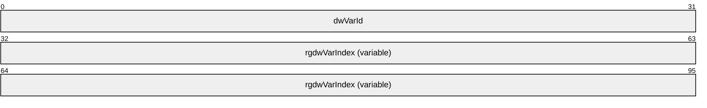

**dwVarId (4 bytes):** The identifier of the MIB object while querying IPv4 or IPv6 MIB variables. The value MUST be the same as **dwId** for **MIB_OPAQUE_INFO** (section [2.2.1.2.52](#Section_2.2.1.2.52)) structure.

**rgdwVarIndex (variable):** Place holder for data of the blob as previously mentioned. If **dwRoutingPid** is IPRTRMGR_PID (0x00002710), then this MUST indicate the index of the MIB object to query as shown in the following table.

| dwVarId | rgdwVarIndex | Structure that needs to be retrieved | Meaning of rgdwVarIndex |
| --- | --- | --- | --- |
| IF_NUMBER 0x00000000 | Not used. | [MIB_IFNUMBER(section2.2.1.2.28)](#Section_2.2.1.2.28) | Not used. |
| IF_TABLE 0x00000001 | Not used. | [MIB_IFTABLE(section2.2.1.2.31)](#Section_2.2.1.2.31) | Not used. |
| IF_ROW 0x00000002 | Index of the interface. | [MIB_IFROW(section2.2.1.2.29)](#Section_2.2.1.2.29) | The instance of the structure whose interface index matches with the value specified in **rgdwVarIndex**. |
| IP_STATS 0x00000003 | Not used. | [MIB_IPSTATS(section2.2.1.2.49)](#Section_2.2.1.2.49) | Not used. |
| 0x00000004 IP_ADDRTABLE | Not used. | [MIB_IPADDRTABLE(section2.2.1.2.33)](#Section_2.2.1.2.33) | Not used. |
| IP_ADDRROW 0x00000005 | IP address. | [MIB_IPADDRROW(section2.2.1.2.32)](#Section_2.2.1.2.32) | The instance of the structure whose **dwAddr** matches the value specified in **rgdwVarIndex**. |
| IP_FORWARDNUMBER 0x00000006 | Not used. | [MIB_IPFORWARDNUMBER(section2.2.1.2.34)](#Section_2.2.1.2.34) | Not used. |
| IP_FORWARDTABLE 0x00000007 | Not used. | [MIB_IPFORWARDTABLE(section2.2.1.2.36)](#Section_2.2.1.2.36) | Not used. |
| IP_FORWARDROW 0x00000008 | This MUST be of 4 DWORDS size (rgdwVarIndex[4]) for IPV4. For IPV6 this MUST be index. | [MIB_IPFORWARDROW(section2.2.1.2.35)](#Section_2.2.1.2.35) for IPv4, [INTERFACE_ROUTE_ENTRY(section2.2.1.2.181)](#Section_2.2.1.2.181) for IPv6 | For IPv4, the instance of the structure whose **dwForwardDest** matches **rgdwVarIndex[0]**, **dwForwardProto** matches **rgdwVarIndex**[1], **dwForwardPolicy** matches **rgdwVarIndex**[2], and **dwForwardNextHop** matches **rgdwVarIndex**[3]. For IPv6, the instance of the structure whose **dwIndex** matches **rgdwVarIndex**. |
| IP_NETTABLE 0x00000009 | MUST be of size one DWORD (rgdwVarIndex[1]) or two DWORDS (rgdwVarIndex[2]). | [MIB_IPNETTABLE(section2.2.1.2.48)](#Section_2.2.1.2.48) | If one DWORD is passed, an instance of the structure whose **dwIndex** matches the value specified in **rgdwVarIndex**[0] is returned. If two DWORDs are passed, an instance of the structure whose **dwIndex** matches the value specified in **rgdwVarIndex**[0] and whose **dwAddr** matches **rgdwVarIndex**[1] is returned. |
| IP_NETROW 0x0000000A | This MUST be of size one DWORD (rgdwVarIndex[1]) or two DWORDS (rgdwVarIndex[2]). | [MIB_IPNETROW(section2.2.1.2.47)](#Section_2.2.1.2.47) | If one DWORD is passed, an instance of the structure whose **dwIndex** matches the value specified in **rgdwVarIndex**[0] is returned. If two DWORDs are passed, an instance of the structure whose **dwIndex** matches the value specified in **rgdwVarIndex**[0] and whose **dwAddr** matches **rgdwVarIndex**[1] is returned. |
| ICMP_STATS 0x0000000B | Not used. | [MIB_ICMP(section2.2.1.2.25)](#Section_2.2.1.2.25) | Not used. |
| TCP_STATS 0x0000000C | Not used. | MIB_TCPSTATS(section [2.2.1.2.56](#Section_2.2.1.2.56)) | Not used. |
| TCP_ROW 0x0000000E | This MUST be of 4 DWORDS size (rgdwVarIndex[4]) for IPV4. | MIB_TCPROW(section [2.2.1.2.55](#Section_2.2.1.2.55)) | The instance of the structure whose **dwLocalAddr** matches **rgdwVarIndex**[0], **dwLocalPort** matches **rgdwVarIndex**[1], **dwRemoteAddr** matches **rgdwVarIndex**[2], and **dwRemotePort** matches **rgdwVarIndex**[3]. |
| UDP_STATS 0x0000000F | Not used. | MIB_UDPSTATS(section [2.2.1.2.59](#Section_2.2.1.2.59)) | Not used. |
| UDP_TABLE 0x00000010 | Not used. | MIB_UDPTABLE(section [2.2.1.2.60](#Section_2.2.1.2.60)) | Not used. |
| UDP_ROW 0x00000011 | This MUST be of size one DWORD (rgdwVarIndex[1]) or two DWORDS (rgdwVarIndex[2]). | MIB_UDPROW(section [2.2.1.2.58](#Section_2.2.1.2.58)) | If one DWORD is passed, an instance of the structure whose **dwLocalAddr** matches the value specified in **rgdwVarIndex**[0] is returned. If two DWORDs are passed, an instance of the structure whose **dwLocalAddr** matches the value specified in **rgdwVarIndex**[0] and whose **dwLocalPort** matches the value specified in **rgdwVarIndex**[1]. Both **dwLocalAddr** and **dwLocalPort** MUST be specified for RMIBEntryGet. |
| MCAST_MFE 0x00000012 | This MUST be of 3 DWORDS size (rgdwVarIndex[3]). | MIB_MFE_TABLE(section [2.2.1.2.51](#Section_2.2.1.2.51)) | The instance of the structure whose **dwGroup** matches **rgdwVarIndex**[0], **dwSource** matches **rgdwVarIndex**[1], **dwSrcMask** matches **rgdwVarIndex**[2] is returned, and **rgdwVarIndex**[2] MUST be 0xFFFFFFFF. |
| MCAST_MFE_STATS 0x00000013 | This MUST be of 3 DWORDS size (rgdwVarIndex[3]). | [MIB_IPMCAST_MFE_STATS(section2.2.1.2.44)](#Section_2.2.1.2.44) | The instance of the structure whose **dwGroup** matches **rgdwVarIndex**[0], **dwSource** matches **rgdwVarIndex**[1], **dwSrcMask** matches **rgdwVarIndex**[2] is returned, and **rgdwVarIndex**[2] MUST be 0xFFFFFFFF. |
| BEST_IF 0x00000014 | MUST be of 1 DWORDS size (rgdwVarIndex[1]). | [MIB_BEST_IF(section2.2.1.2.23)](#Section_2.2.1.2.23) | The interface having the best route for the destination specified in **rgdwVarIndex**[0] is returned. |
| BEST_ROUTE 0x00000015 | MUST be of 2 DWORDS size (rgdwVarIndex[2]) | [INTERFACE_ROUTE_INFO(section2.2.1.2.11)](#Section_2.2.1.2.11) | The best route information for the destination specified in **rgdwVarIndex**[0] is returned; **rgdwVarIndex**[1] MUST be set to 0. |
| MCAST_IF_ENTRY 0x00000017 | MUST be of 1 DWORDS size (rgdwVarIndex[1]). | [MIB_IPMCAST_IF_ENTRY(section2.2.1.2.40)](#Section_2.2.1.2.40) | The instance of the structure whose interface index matches with the value specified in **rgdwVarIndex**. |
| MCAST_GLOBAL 0x00000018 | Not used. | [MIB_IPMCAST_GLOBAL(section2.2.1.2.39)](#Section_2.2.1.2.39) | Not used. |
| IF_STATUS 0x00000019 | MUST be of 1 DWORDS size (rgdwVarIndex[1]). | [MIB_IFSTATUS(section2.2.1.2.30)](#Section_2.2.1.2.30) | The instance of the structure whose interface index matches with the value specified in **rgdwVarIndex**. |
| MCAST_BOUNDARY 0x0000001A | MUST be of 3 DWORDS size (rgdwVarIndex[3]). | [MIB_IPMCAST_BOUNDARY(section2.2.1.2.37)](#Section_2.2.1.2.37) | The instance with **dwIfIndex** equal to **rgdwVarIndex**[0], **dwGroupAddress** equal to **rgdwVarIndex**[1], and **dwGroupMask** equal to **rgdwVarIndex**[2] is returned. |
| MCAST_SCOPE 0x0000001B | MUST be of size one DWORD (rgdwVarIndex[1]) or two DWORDS (rgdwVarIndex[2]). | [MIB_IPMCAST_SCOPE(section2.2.1.2.46)](#Section_2.2.1.2.46) | If one DWORD is passed, an instance of the structure whose **dwGroupAddress** matches the value specified in **rgdwVarIndex**[0] is returned. If two DWORDs are passed, an instance of the structure whose **dwGroupAddress** matches the value specified in **rgdwVarIndex**[0] and whose **dwGroupMask** matches **rgdwVarIndex**[1] is returned. Both **dwGroupAddress** and **dwGroupMask** MUST be specified for **RMIBEntryGet**. |
| DEST_MATCHING 0x0000001C | MUST be of 4 DWORDS size (rgdwVarIndex[4]). | [MIB_IPDESTTABLE(section2.2.1.2.21)](#Section_2.2.1.2.21) | The instance of the structure whose ForwardRow fields of **dwForwardDest** matches **rgdwVarIndex**[0], **dwForwardMask** matches **rgdwVarIndex**[1], **dwForwardViewSet** matches **rgdwVarIndex**[2], and whose **dwForwardProto** matches **rgdwVarIndex**[3]. |
| DEST_LONGER 0x0000001D | MUST be of 4 DWORDS size (rgdwVarIndex[4]). | MIB_IPDESTTABLE(section2.2.1.2.21) | The instance of the structure whose ForwardRow fields of **dwForwardDest** matches **rgdwVarIndex**[0], **dwForwardMask** matches **rgdwVarIndex**[1], **dwForwardViewSet** matches **rgdwVarIndex**[2], and whose **dwForwardProto** matches **rgdwVarIndex**[3]. |
| DEST_SHORTER 0x0000001E | MUST be of 4 DWORDS size (rgdwVarIndex[4]). | MIB_IPDESTTABLE(section2.2.1.2.21) | The instance of the structure whose **ForwardRow** fields of **dwForwardDest** matches **rgdwVarIndex**[0], **dwForwardMask** matches **rgdwVarIndex**[1], **dwForwardViewSet** matches **rgdwVarIndex**[2], and whose **dwForwardProto** matches **rgdwVarIndex**[3]. |
| ROUTE_MATCHING 0x0000001F | This MUST be of 4 DWORDS size (rgdwVarIndex[4]). | MIB_IPDESTTABLE(section2.2.1.2.21) | The instance of the structure whose ForwardRow fields of **dwForwardDest** matches **rgdwVarIndex**[0], **dwForwardMask** matches **rgdwVarIndex**[1], **dwForwardViewSet** matches **rgdwVarIndex**[2], and whose **dwForwardProto** matches **rgdwVarIndex**[3]. |
| ROUTE_LONGER 0x00000020 | MUST be of 4 DWORDS size (rgdwVarIndex[4]). | MIB_IPDESTTABLE(section2.2.1.2.21) | The instance of the structure whose ForwardRow fields of **dwForwardDest** matches **rgdwVarIndex**[0], **dwForwardMask** matches **rgdwVarIndex**[1], **dwForwardViewSet** matches **rgdwVarIndex**[2], and whose **dwForwardProto** matches **rgdwVarIndex**[3]. |
| ROUTE_SHORTER 0x00000021 | MUST be of 4 DWORDS size (rgdwVarIndex[4]). | MIB_IPDESTTABLE(section2.2.1.2.21) | The instance of the structure whose **ForwardRow** fields of **dwForwardDest** matches **rgdwVarIndex**[0], **dwForwardMask** matches **rgdwVarIndex**[1], **dwForwardViewSet** matches **rgdwVarIndex[**2], and whose **dwForwardProto** matches **rgdwVarIndex**[3]. |
| ROUTE_STATE 0x00000022 | Not used. | [MIB_ROUTESTATE(section2.2.1.2.22)](#Section_2.2.1.2.22) | Not used. |
| MCAST_MFE_STATS_EX 0x00000023 | MUST be of 3 DWORDS size (rgdwVarIndex[3]). | MIB_MFE_STATS_TABLE(section [2.2.1.2.50](#Section_2.2.1.2.50)) | The instance of the structure whose **dwGroup** field matches **rgdwVarIndex**[0], **dwSource** matches **rgdwVarIndex**[1], and **rgdwVarIndex**[2] is not used. |

<a id="Section_2.2.1.2.54"></a>
##### 2.2.1.2.54 MIB_PROXYARP

The **MIB_PROXYARP** structure stores information for a Proxy Address Resolution Protocol (PARP) entry. This structure is used in **MIB_OPAQUE_INFO**(section [2.2.1.2.52](#Section_2.2.1.2.52)).

typedef struct_MIB_PROXYARP{

DWORDdwAddress;

DWORDdwMask;

DWORDdwIfIndex;

} MIB_PROXYARP,

*PMIB_PROXYARP;

**dwAddress:** The IPv4 address that acts as a proxy.

**dwMask:** The subnet mask for the IPv4 address specified by the **dwAddress** member. See [[RFC950]](https://go.microsoft.com/fwlink/?LinkId=90501).

**dwIfIndex:** The index of the interface that acts as a proxy for the address specified by the **dwAddress** member.

<a id="Section_2.2.1.2.55"></a>
##### 2.2.1.2.55 MIB_TCPROW

The **MIB_TCPROW** structure contains information for an IPv4 TCP connection. This structure is used in the following structures:

- **MIB_OPAQUE_INFO** (section [2.2.1.2.52](#Section_2.2.1.2.52))
- **MIB_TCPTABLE** (section [2.2.1.2.57](#Section_2.2.1.2.57))
typedef struct_MIB_TCPROW{

union{

DWORDdwState;

MIB_TCP_STATEState;

};

DWORDdwLocalAddr;

DWORDdwLocalPort;

DWORDdwRemoteAddr;

DWORDdwRemotePort;

} MIB_TCPROW,

*PMIB_TCPROW;

**dwState:** The state of the TCP [**connection**](#gt_connection). This member can be one of the enums in the [**MIB_TCP_STATE(section2.2.1.1.11)**](#Section_2.2.1.1.11) enumeration.

**State:** The state of the TCP connection.<37>

**dwLocalAddr:** The local IPv4 address for the TCP connection on the [**local computer**](#gt_local-computer). A value of zero (0) indicates the listener can accept a connection on any [**interface**](#gt_interface).

**dwLocalPort:** The local [**port**](#gt_port) number in [**network byte order**](#gt_network-byte-order) for the TCP connection on the local computer.

**dwRemoteAddr:** The IPv4 address for the TCP connection on the remote computer.

**dwRemotePort:** The remote port number in network byte order for the TCP connection on the remote computer.

<a id="Section_2.2.1.2.56"></a>
##### 2.2.1.2.56 MIB_TCPSTATS

The **MIB_TCPSTATS** structure contains statistics for the TCP protocol running on the local computer. This structure is used in **MIB_OPAQUE_INFO**(section [2.2.1.2.52](#Section_2.2.1.2.52)) structure.

typedef struct_MIB_TCPSTATS{

union{

DWORDdwRtoAlgorithm;

TCP_RTO_ALGORITHMRtoAlgorithm;

};

DWORDdwRtoMin;

DWORDdwRtoMax;

DWORDdwMaxConn;

DWORDdwActiveOpens;

DWORDdwPassiveOpens;

DWORDdwAttemptFails;

DWORDdwEstabResets;

DWORDdwCurrEstab;

DWORDdwInSegs;

DWORDdwOutSegs;

DWORDdwRetransSegs;

DWORDdwInErrs;

DWORDdwOutRsts;

DWORDdwNumConns;

} MIB_TCPSTATS,

*PMIB_TCPSTATS;

**dwRtoAlgorithm:** The retransmission time-out (RTO) algorithm in use. This member can be one of the enum values in [**TCP_RTO_ALGORITHM(section2.2.1.1.12)**](#Section_2.2.1.1.12).

**RtoAlgorithm:** The RTO algorithm in use.<38>

**dwRtoMin:** The minimum RTO value in milliseconds.

**dwRtoMax:** The maximum RTO value in milliseconds.

**dwMaxConn:** The maximum number of connections. If this member is -1, the maximum number of connections is variable.

**dwActiveOpens:** The number of active open connections. In an active open, the client is initiating a connection with the server.

**dwPassiveOpens:** The number of passive open connections. In a passive open, the server is listening for a connection request from a client.

**dwAttemptFails:** The number of failed connection attempts.

**dwEstabResets:** The number of established connections that were reset.

**dwCurrEstab:** The number of currently established connections.

**dwInSegs:** The number of segments received.

**dwOutSegs:** The number of segments transmitted. This number does not include retransmitted segments.

**dwRetransSegs:** The number of segments retransmitted.

**dwInErrs:** The number of errors received.

**dwOutRsts:** The number of segments transmitted with the reset flag set.

**dwNumConns:** The number of connections that are currently present in the system. This total number includes connections in all states except listening connections.

<a id="Section_2.2.1.2.57"></a>
##### 2.2.1.2.57 MIB_TCPTABLE

The **MIB_TCPTABLE** structure contains a table of IPv4 TCP connections on the local computer.

typedef struct_MIB_TCPTABLE{

DWORDdwNumEntries;

MIB_TCPROWtable[1];

BYTEreserved[8];

} MIB_TCPTABLE,

*PMIB_TCPTABLE;

**dwNumEntries:** The number of entries in the table.

**table:** A pointer to a table of TCP connections implemented as an array of MIB_TCPROW(section [2.2.1.2.55](#Section_2.2.1.2.55)) structures.

**reserved:** An array of 8 bytes that SHOULD be set to 0 and ignored on receipt.

<a id="Section_2.2.1.2.58"></a>
##### 2.2.1.2.58 MIB_UDPROW

The **MIB_UDPROW** structure contains address information for sending and receiving [**User Datagram Protocol (UDP)**](#gt_user-datagram-protocol-udp) [**datagrams**](#gt_datagram). This structure is used in the following structures:

- **MIB_OPAQUE_INFO** (section [2.2.1.2.52](#Section_2.2.1.2.52))
- **MIB_UDPTABLE** (section [2.2.1.2.60](#Section_2.2.1.2.60))
typedef struct_MIB_UDPROW{

DWORDdwLocalAddr;

DWORDdwLocalPort;

} MIB_UDPROW,

*PMIB_UDPROW;

**dwLocalAddr:** The IPv4 address on the local computer.

**dwLocalPort:** The port number on the local computer.

<a id="Section_2.2.1.2.59"></a>
##### 2.2.1.2.59 MIB_UDPSTATS

The **MIB_UDPSTATS** structure contains statistics for the UDP running on the local computer. This structure is used in **MIB_OPAQUE_INFO**(section [2.2.1.2.52](#Section_2.2.1.2.52)) structure.

typedef struct_MIB_UDPSTATS{

DWORDdwInDatagrams;

DWORDdwNoPorts;

DWORDdwInErrors;

DWORDdwOutDatagrams;

DWORDdwNumAddrs;

} MIB_UDPSTATS,

*PMIB_UDPSTATS;

**dwInDatagrams:** The number of datagrams received.

**dwNoPorts:** The number of datagrams received that were discarded because the port specified was invalid.

**dwInErrors:** The number of erroneous datagrams received. This number does not include the value contained by the **dwNoPorts** member.

**dwOutDatagrams:** The number of datagrams transmitted.

**dwNumAddrs:** The number of entries in the UDP listener table.

<a id="Section_2.2.1.2.60"></a>
##### 2.2.1.2.60 MIB_UDPTABLE

The **MIB_UDPTABLE** structure contains a table of address information for sending and receiving UDP datagrams on the local computer.

typedef struct_MIB_UDPTABLE{

DWORDdwNumEntries;

MIB_UDPROWtable[1];

BYTEreserved[8];

} MIB_UDPTABLE,

*PMIB_UDPTABLE;

**dwNumEntries:** The number of entries in the table.

**table:** Pointer to an array of MIB_UDPROW(section [2.2.1.2.58](#Section_2.2.1.2.58)) structures.

**reserved:** An array of 8 bytes that SHOULD be set to 0 and ignored on receipt.

<a id="Section_2.2.1.2.61"></a>
##### 2.2.1.2.61 MPR_SERVER_0

The **MPR_SERVER_0** structure contains configuration information for a router.

typedef structMPR_SERVER_0{

BOOLfLanOnlyMode;

DWORDdwUpTime;

DWORDdwTotalPorts;

DWORDdwPortsInUse;

} MPR_SERVER_0,

*PMPR_SERVER_0;

**fLanOnlyMode:** This is of type BOOL. It specifies whether the RRAS server is running in LAN only mode or not. If the value is 1, the RRAS server is not routing; if the value is 0, then the RRAS server is functioning as a router.

| Value | Meaning |
| --- | --- |
| 0 | The RRAS server is functioning as a router. |
| 1 | The RRAS server is not routing. |

**dwUpTime:** Specifies the elapsed time (in seconds) since the router was started.

**dwTotalPorts:** Specifies the number of ports on the router.

**dwPortsInUse:** Specifies the number of ports on the router currently in use.

<a id="Section_2.2.1.2.62"></a>
##### 2.2.1.2.62 MPR_SERVER_1

The **MPR_SERVER_1** structure is used to get and set the number of Point-to-Point Tunneling Protocol/Layer Two Tunneling Protocol ([**PPTP**](#gt_pptp)/[**L2TP**](#gt_l2tp)) ports configured on the RRAS server. It is also used to get and set the RRAS functionality and router functionality enabled on those ports.

typedef structMPR_SERVER_1{

DWORDdwNumPptpPorts;

DWORDdwPptpPortFlags;

DWORDdwNumL2tpPorts;

DWORDdwL2tpPortFlags;

} MPR_SERVER_1,

*PMPR_SERVER_1;

**dwNumPptpPorts:** Specifies the number of ports configured on that (PPTP) device. This value cannot exceed the server port limit.<39>

**dwPptpPortFlags:** Indicates the RRAS server and/or router functionality configured on the PPTP device. Possible flag values are as follows.

| Value | Meaning |
| --- | --- |
| MPR_ENABLE_RAS_ON_DEVICE 0x00000001 | Remote access is enabled for PPTP. |
| MPR_ENABLE_ROUTING_ON_DEVICE 0x00000002 | Routing is enabled for PPTP. |

**dwNumL2tpPorts:** Specifies the number of ports configured on that (L2TP) device. This value cannot exceed the server port limit.<40>

**dwL2tpPortFlags:** Indicates the RAS and/or router functionality configured on the L2TP device. Possible flag values are as follows.

| Value | Meaning |
| --- | --- |
| MPR_ENABLE_RAS_ON_DEVICE 0x00000001 | Remote access is enabled for L2TP. |
| MPR_ENABLE_ROUTING_ON_DEVICE 0x00000002 | Routing is enabled for L2TP. |

<a id="Section_2.2.1.2.63"></a>
##### 2.2.1.2.63 MPR_SERVER_2

The **MPR_SERVER_2** structure<41> is used to get and set the number of Point-to-Point Tunneling Protocol/Layer Two Tunneling Protocol/Secure Socket Tunneling Protocol (PPTP/L2TP/SSTP) ports configured on the RRAS server. It also gets and sets the RRAS functionality and router functionality enabled on the server.

typedef structMPR_SERVER_2{

DWORDdwNumPptpPorts;

DWORDdwPptpPortFlags;

DWORDdwNumL2tpPorts;

DWORDdwL2tpPortFlags;

DWORDdwNumSstpPorts;

DWORDdwSstpPortFlags;

} MPR_SERVER_2,

*PMPR_SERVER_2;

**dwNumPptpPorts:** Specifies the number of ports configured on that (PPTP) device. This value cannot exceed the server port limit.<42>

**dwPptpPortFlags:** Indicates the RRAS server and/or router functionality configured on the PPTP device. Possible flag values are as follows.

| Value | Meaning |
| --- | --- |
| MPR_ENABLE_RAS_ON_DEVICE 0x00000001 | Remote access is enabled for PPTP. |
| MPR_ENABLE_ROUTING_ON_DEVICE 0x00000002 | Routing is enabled for PPTP. |

**dwNumL2tpPorts:** Specifies the number of ports configured on that (L2TP) device. This value cannot exceed the server port limit.<43>

**dwL2tpPortFlags:** Indicates the RRAS server and/or router functionality configured on the L2TP device. Possible flag values are as follows.

| Value | Meaning |
| --- | --- |
| MPR_ENABLE_RAS_ON_DEVICE 0x00000001 | Remote access is enabled for L2TP. |
| MPR_ENABLE_ROUTING_ON_DEVICE 0x00000002 | Routing is enabled for L2TP. |

**dwNumSstpPorts:** specifies the number of ports configured on that (SSTP) device. This value cannot exceed the server port limit.<44>

**dwSstpPortFlags:** indicates the RRAS server and/or router functionality configured on the SSTP device. Possible flag values are as follows.<45>

| Value | Meaning |
| --- | --- |
| MPR_ENABLE_RAS_ON_DEVICE 0x00000001 | Remote access is enabled for SSTP. |

<a id="Section_2.2.1.2.64"></a>
##### 2.2.1.2.64 PPP_NBFCP_INFO

The **PPP_NBFCP_INFO** structure MAY<46> be used to contain the result of a PPP [**NetBEUI**](#gt_netbeui) Framer (NBF) projection operation.

typedef struct_PPP_NBFCP_INFO{

DWORDdwError;

WCHARwszWksta[17];

} PPP_NBFCP_INFO;

**dwError:** Specifies the result of the PPP control protocol negotiation. A value of zero (0) indicates success. A nonzero value indicates failure and is the actual fatal error that occurred during the control protocol negotiation.

**wszWksta:** Specifies a null-terminated [**Unicode**](#gt_unicode) string that is the local workstation's computer name. This unique computer name is the closest [**NetBIOS**](#gt_netbios) equivalent to a client's NetBEUI address on a remote access connection.

<a id="Section_2.2.1.2.65"></a>
##### 2.2.1.2.65 PPP_IPCP_INFO

The **PPP_IPCP_INFO** structure contains the result of a [**PPP**](#gt_ppp) control protocol negotiation for IP.

typedef struct_PPP_IPCP_INFO{

DWORDdwError;

WCHARwszAddress[16];

WCHARwszRemoteAddress[16];

} PPP_IPCP_INFO;

**dwError:** Specifies the result of the PPP control protocol negotiation. A value of zero (0) indicates success. A nonzero value indicates failure and is the actual fatal error that occurred during the control protocol negotiation.

**wszAddress:** Specifies a null-terminated Unicode string that holds the local computer's IP address for the connection. This string has the form a.b.c.d; for example, "10.102.235.84".

If a remote access client is connecting to a RRAS server, this member holds the IP address of the server.

**wszRemoteAddress:** Specifies a null-terminated Unicode string that holds the IP address of the remote computer. This string has the form a.b.c.d. If the address is not available, this member is an empty string.

If a remote access client is connecting to a RRAS server, this member holds the IP address of the client.

<a id="Section_2.2.1.2.66"></a>
##### 2.2.1.2.66 PPP_IPCP_INFO2

The **PPP_IPCP_INFO2** structure contains the result of a [**PPP**](#gt_ppp) control protocol negotiation for the IP.

typedef struct_PPP_IPCP_INFO2{

DWORDdwError;

WCHARwszAddress[16];

WCHARwszRemoteAddress[16];

DWORDdwOptions;

DWORDdwRemoteOptons;

} PPP_IPCP_INFO2;

**dwError:** See **dwError** in [**PPP_IPCP_INFO(section2.2.1.2.65)**](#Section_2.2.1.2.65).

**wszAddress:** See **wszAddress** in **PPP_IPCP_INFO**.

**wszRemoteAddress:** See **wszRemoteAddress** in **PPP_IPCP_INFO**.

**dwOptions:** Specifies IP Configuration Parameters (IPCP) options for the local computer.

When set to PPP_IPCP_VJ (0x00000001), indicates that IP datagrams sent by the local computer are compressed using Van Jacobson compression [[RFC1144]](https://go.microsoft.com/fwlink/?linkid=852336). Otherwise, set to 0x00000000.

**dwRemoteOptons:** Uses the same values as **dwOptions** but applies to datagrams received by the local computer.

<a id="Section_2.2.1.2.67"></a>
##### 2.2.1.2.67 PPP_IPXCP_INFO

The **PPP_IPXCP_INFO** structure MAY<47> be used to contain the result of a [**PPP**](#gt_ppp) IPX projection operation.

typedef struct_PPP_IPXCP_INFO{

DWORDdwError;

WCHARwszAddress[16];

} PPP_IPXCP_INFO;

**dwError:** Specifies the result of the PPP control protocol negotiation. As value of zero (0) indicates success. A nonzero value indicates failure and is the actual fatal error that occurred during the control protocol negotiation.

**wszAddress:** Specifies a null-terminated Unicode string that holds the client's IPX address on the RRAS server connection. This address string has the form of "net.node" (for example, "1234ABCD.12AB34CD56EF").

<a id="Section_2.2.1.2.68"></a>
##### 2.2.1.2.68 PPP_IPV6_CP_INFO

The **PPP_IPV6_CP_INFO** structure contains the result of a [**PPP**](#gt_ppp) control protocol negotiation for IPv6.

typedef struct_PPP_IPV6CP_INFO{

DWORDdwVersion;

DWORDdwSize;

DWORDdwError;

BYTEbInterfaceIdentifier[8];

BYTEbRemoteInterfaceIdentifier[8];

DWORDdwOptions;

DWORDdwRemoteOptions;

BYTEbPrefix[8];

DWORDdwPrefixLength;

} PPP_IPV6_CP_INFO,

*PPPP_IPV6_CP_INFO;

**dwVersion:** Specifies the version of the **PPP_IPV6_CP_INFO** structure used. Currently this field is not used and MUST be set to zero (0).

**dwSize:** This SHOULD be set to 0. This MAY be used to specify the size, in bytes, of this **PPP_IPV6_CP_INFO** structure.

**dwError:** Specifies the result of the PPP control protocol negotiation. A value of zero (0) indicates success. A nonzero value indicates failure and is the actual fatal error that occurred during the control protocol negotiation.

**bInterfaceIdentifier:** Specifies the 64-bit [**interface identifier**](#gt_interface-identifier-iid) of the IPv6 server interface.

**bRemoteInterfaceIdentifier:** Specifies the 64-bit interface identifier of the IPv6 client interface.

**dwOptions:** Currently this is not used and MUST be set to zero (0).

**dwRemoteOptions:** Currently this is not used and MUST be set to zero (0).

**bPrefix:** Specifies the address prefix of the IPv6 client interface.

**dwPrefixLength:** The length, in bits, of the address prefix.

<a id="Section_2.2.1.2.69"></a>
##### 2.2.1.2.69 PPP_ATCP_INFO

The **PPP_ATCP_INFO** structure MAY<48> be used to contain the result of a PPP AppleTalk projection operation.

typedef struct_PPP_ATCP_INFO{

DWORDdwError;

WCHARwszAddress[33];

} PPP_ATCP_INFO;

**dwError:** Specifies the result of the PPP control protocol negotiation. A value of zero (0) indicates success. A nonzero value indicates failure and is the actual fatal error that occurred during the control protocol negotiation.

**wszAddress:** Specifies a null-terminated Unicode string that holds the client's AppleTalk address on the RRAS server connection.

<a id="Section_2.2.1.2.70"></a>
##### 2.2.1.2.70 PPP_CCP_INFO

The **PPP_CCP_INFO** structure contains information that describes the results of a [**Compression Control Protocol (CCP)**](#gt_compression-control-protocol-ccp) negotiation.

typedef struct_PPP_CCP_INFO{

DWORDdwError;

DWORDdwCompressionAlgorithm;

DWORDdwOptions;

DWORDdwRemoteCompressionAlgorithm;

DWORDdwRemoteOptions;

} PPP_CCP_INFO;

**dwError:** Specifies an error if the negotiation were unsuccessful. Zero (0) indicates success.

**dwCompressionAlgorithm:** Specifies the compression algorithm used by the local computer. The following table shows the possible values for this member.

| Value | Meaning |
| --- | --- |
| 0x00000000 | The local computer has not negotiated any compression algorithm. |
| RASCCPCA_MPPC 0x00000006 | Microsoft Point-to-Point Compression (MPPC) Protocol. |
| RASCCPCA_STAC 0x00000005 | STAC LZS data compression algorithm [[RFC1974]](https://go.microsoft.com/fwlink/?LinkId=149932) option 4. |

**dwOptions:** Specifies the compression options on the local computer. The following options are supported.

| Value | Meaning |
| --- | --- |
| 0x00000000 | No additional compression options are available. |
| PPP_CCP_COMPRESSION 0x00000001 | Compression without encryption. |
| PPP_CCP_HISTORYLESS 0x01000000 | Microsoft Point-to-Point Encryption (MPPE) in stateless mode. The session key is changed after every packet. This mode improves performance on high-latency networks, or networks that experience significant packet loss. |
| PPP_CCP_ENCRYPTION40BIT 0x00000020 | MPPE using 40-bit keys. |
| PPP_CCP_ENCRYPTION56BIT 0x00000080 | MPPE using 56-bit keys. |
| PPP_CCP_ENCRYPTION128BIT 0x00000040 | MPPE using 128-bit keys. |

**dwRemoteCompressionAlgorithm:** Specifies the compression algorithm used by the remote computer. The following table shows the possible values for this member.

| Value | Meaning |
| --- | --- |
| 0x00000000 | The remote computer has not negotiated any compression algorithm. |
| RASCCPCA_MPPC 0x00000006 | MPPC Protocol. |
| RASCCPCA_STAC 0x00000005 | STAC option 4. |

**dwRemoteOptions:** Specifies the compression options on the remote computer. The following options are supported.

| Value | Meaning |
| --- | --- |
| 0x00000000 | No additional compression options are available. |
| PPP_CCP_COMPRESSION 0x00000001 | Compression without encryption. |
| PPP_CCP_HISTORYLESS 0x01000000 | MPPE in stateless mode. The session key is changed after every packet. This mode improves performance on high-latency networks, or networks that experience significant packet loss. |
| PPP_CCP_ENCRYPTION40BIT 0x00000020 | MPPE using 40-bit keys. |
| PPP_CCP_ENCRYPTION56BIT 0x00000080 | MPPE using 56-bit keys. |
| PPP_CCP_ENCRYPTION128BIT 0x00000040 | MPPE using 128-bit keys. |

<a id="Section_2.2.1.2.71"></a>
##### 2.2.1.2.71 PPP_LCP_INFO

The **PPP_LCP_INFO** structure contains information that describes the results of a PPP Link Control Protocol (LCP) negotiation.

typedef struct_PPP_LCP_INFO{

DWORDdwError;

DWORDdwAuthenticationProtocol;

DWORDdwAuthenticationData;

DWORDdwRemoteAuthenticationProtocol;

DWORDdwRemoteAuthenticationData;

DWORDdwTerminateReason;

DWORDdwRemoteTerminateReason;

DWORDdwOptions;

DWORDdwRemoteOptions;

DWORDdwEapTypeId;

DWORDdwRemoteEapTypeId;

} PPP_LCP_INFO;

**dwError:** Specifies the error that occurred if the negotiation were unsuccessful. Zero (0) indicates success.

**dwAuthenticationProtocol:** Specifies the [**authentication**](#gt_authentication) protocol used to authenticate the local computer. The following table shows the possible values for this member.<49>

| Value | Meaning |
| --- | --- |
| 0x00000000 | Either no authentication was negotiated by the local end, or no LCP settings are applicable for the connection (for example, an IKEv2 connection). |
| PPP_LCP_PAP 0x0000C023 | Password Authentication Protocol (PAP) |
| PPP_LCP_SPAP 0x0000C027 | Shiva Password Authentication Protocol (SPAP) |
| PPP_LCP_CHAP 0x0000C223 | [**Challenge-Handshake Authentication Protocol (CHAP)**](#gt_challenge-handshake-authentication-protocol-chap) |
| PPP_LCP_EAP 0x0000C227 | [**Extensible Authentication Protocol (EAP)**](#gt_extensible-authentication-protocol-eap) |

**dwAuthenticationData:** Specifies additional information about the authentication protocol specified by the **dwAuthenticationProtocol** member. The following table shows the possible values for this member.<50>

| Value | Meaning |
| --- | --- |
| 0x00000000 | No additional authentication data applies. |
| PPP_LCP_CHAP_MD5 0x00000005 | MD5 CHAP |
| PPP_LCP_CHAP_MS 0x00000080 | Microsoft CHAP |
| PPP_LCP_CHAP_MSV2 0x00000081 | Microsoft CHAP version 2 |

**dwRemoteAuthenticationProtocol:** Specifies the authentication protocol used to authenticate the remote computer. See the **dwAuthenticationProtocol** member for a list of possible values. The following table shows the possible values for this member.<51>

| Value | Meaning |
| --- | --- |
| 0x00000000 | Either no authentication was negotiated by the remote end, or no LCP settings are applicable for the connection (for example, an IKEv2 connection). |
| PPP_LCP_PAP 0x0000C023 | Password Authentication Protocol (PAP) |
| PPP_LCP_SPAP 0x0000C027 | Shiva Password Authentication Protocol (SPAP) |
| PPP_LCP_CHAP 0x0000C223 | Challenge-Handshake Authentication Protocol (CHAP) |
| PPP_LCP_EAP 0x0000C227 | Extensible Authentication Protocol (EAP) |

**dwRemoteAuthenticationData:** Specifies additional information about the authentication protocol specified by **dwRemoteAuthenticationProtocol**. See the **dwAuthenticationData** member for a list of possible values.

**dwTerminateReason:** Specifies the reason the connection was terminated by the local computer. This member always has a value of zero (0).

**dwRemoteTerminateReason:** Specifies the reason the connection was terminated by the remote computer. This member always has a value of zero (0).

**dwOptions:** Specifies information about the LCP options in use by the local computer. This member is a combination of the following flags.<52>

| Value | Meaning |
| --- | --- |
| 0x00000000 | No flag is set. |
| PPP_LCP_MULTILINK_FRAMING 0x00000001 | The connection is using multilink. |
| PPP_LCP_PFC 0x00000002 | Protocol Field Compression (see [[RFC1172]](https://go.microsoft.com/fwlink/?LinkId=149928)). |
| PPP_LCP_ACFC 0x00000004 | Address and Control Field Compression (see [RFC1172]). |
| PPP_LCP_SSHF 0x00000008 | Short Sequence Number Header Format (see [[RFC1990]](https://go.microsoft.com/fwlink/?LinkId=149933)). |
| PPP_LCP_DES_56 0x00000010 | [**Data Encryption Standard (DES)**](#gt_data-encryption-standard-des) 56-bit encryption. |
| PPP_LCP_3_DES 0x00000020 | Triple DES encryption. |
| PPP_LCP_AES_128 0x00000040 | 128-bit [**AES**](#gt_advanced-encryption-standard-aes) encryption. |
| PPP_LCP_AES_256 0x00000080 | 256-bit AES encryption. |
| PPP_LCP_AES_192 0x00000100 | 192-bit AES encryption. |
| PPP_LCP_GCM_AES_128 0x00000200 | 128-bit AES encryption GCM (Galois Counter Mode) mode of operation (see [[RFC4106]](https://go.microsoft.com/fwlink/?LinkId=90457)). |
| PPP_LCP_GCM_AES_192 0x00000400 | 192-bit AES encryption GCM (Galois Counter Mode) mode of operation (see [RFC4106]). |
| PPP_LCP_GCM_AES_256 0x00000800 | 256-bit AES encryption GCM (Galois Counter Mode) mode of operation (see [RFC4106]). |

**dwRemoteOptions:** Specifies information about the LCP options in use by the remote computer. See **dwOptions** member for a list of possible values.

**dwEapTypeId:** Specifies the type identifier of the EAP used to authenticate the local computer. MUST be one of the values specified in Method Types of [[IANA-EAP]](https://go.microsoft.com/fwlink/?LinkId=89882). The value of this member is valid only if **dwAuthenticationProtocol** is PPP_LCP_EAP.

**dwRemoteEapTypeId:** This field MUST be zero (0) and has no significance.

<a id="Section_2.2.1.2.72"></a>
##### 2.2.1.2.72 PPP_INFO

The **PPP_INFO** structure is used to report the results of the various PPP projection operations for a connection.

typedef struct_PPP_INFO{

PPP_NBFCP_INFOnbf;

PPP_IPCP_INFOip;

PPP_IPXCP_INFOipx;

PPP_ATCP_INFOat;

} PPP_INFO;

**nbf:** A [**PPP_NBFCP_INFO(section2.2.1.2.64)**](#Section_2.2.1.2.64) structure that contains information about the [**NetBEUI**](#gt_netbeui) Framer (NBF) for a connection.

**ip:** A [**PPP_IPCP_INFO(section2.2.1.2.65)**](#Section_2.2.1.2.65) structure that contains the IPv4 PPP information for a connection.

**ipx:** A [**PPP_IPXCP_INFO(section2.2.1.2.67)**](#Section_2.2.1.2.67) structure<53> that contains the IPX information for a connection.

**at:** A [**PPP_ATCP_INFO(section2.2.1.2.69)**](#Section_2.2.1.2.69) structure<54> that contains the AppleTalk information for a connection.

<a id="Section_2.2.1.2.73"></a>
##### 2.2.1.2.73 PPP_INFO_2

The **PPP_INFO_2** structure<55> is used to report the results of the various PPP projection operations for a connection.

typedef struct_PPP_INFO_2{

PPP_NBFCP_INFOnbf;

PPP_IPCP_INFO2ip;

PPP_IPXCP_INFOipx;

PPP_ATCP_INFOat;

PPP_CCP_INFOccp;

PPP_LCP_INFOlcp;

} PPP_INFO_2;

**nbf:** A [**PPP_NBFCP_INFO(section2.2.1.2.64)**](#Section_2.2.1.2.64) structure that contains information about the NetBEUI Framer (NBF) for a connection.

**ip:** A [**PPP_IPCP_INFO2(section2.2.1.2.66)**](#Section_2.2.1.2.66) structure that contains the IPv4 information for a connection.

**ipx:** A [**PPP_IPXCP_INFO(section2.2.1.2.67)**](#Section_2.2.1.2.67) structure<56> that contains the IPX information for a connection.

**at:** A [**PPP_ATCP_INFO(section2.2.1.2.69)**](#Section_2.2.1.2.69) structure<57> that contains AppleTalk information for a connection.

**ccp:** A [**PPP_CCP_INFO(section2.2.1.2.70)**](#Section_2.2.1.2.70) structure that contains compression information details for a given PPP connection.

**lcp:** A [**PPP_LCP_INFO(section2.2.1.2.71)**](#Section_2.2.1.2.71) structure that contains the PPP information related to the Link Control Protocol (LCP) for a given connection.

<a id="Section_2.2.1.2.74"></a>
##### 2.2.1.2.74 PPP_INFO_3

The **PPP_INFO_3** structure<58> be used to report the results of the various PPP projection operations for a connection.

typedef struct_PPP_INFO_3{

PPP_NBFCP_INFOnbf;

PPP_IPCP_INFO2ip;

PPP_IPV6_CP_INFOipv6;

PPP_CCP_INFOccp;

PPP_LCP_INFOlcp;

} PPP_INFO_3;

**nbf:** A [**PPP_NBFCP_INFO(section2.2.1.2.64)**](#Section_2.2.1.2.64) structure that contains information about NetBEUI Framer (NBF) for a connection.

**ip:** A [**PPP_IPCP_INFO2(section2.2.1.2.66)**](#Section_2.2.1.2.66) structure that contains the IPv4 information for a connection.

**ipv6:** A [**PPP_IPV6_CP_INFO(section2.2.1.2.68)**](#Section_2.2.1.2.68) structure that contains the IPv6 information for a connection.

**ccp:** A [**PPP_CCP_INFO(section2.2.1.2.70)**](#Section_2.2.1.2.70) structure that contains the compression information details for a given connection.

**lcp:** A [**PPP_LCP_INFO(section2.2.1.2.71)**](#Section_2.2.1.2.71) structure that contains the compression information related to the Link Control Protocol (LCP) for a given connection.

<a id="Section_2.2.1.2.75"></a>
##### 2.2.1.2.75 RASI_PORT_0

The **RASI_PORT_0** structure contains general information regarding a specific RRAS port, such as the port condition and the port name.

typedef struct_RASI_PORT_0{

DWORDdwPort;

DWORDdwConnection;

RAS_PORT_CONDITIONdwPortCondition;

DWORDdwTotalNumberOfCalls;

DWORDdwConnectDuration;

WCHARwszPortName[17];

WCHARwszMediaName[17];

WCHARwszDeviceName[129];

WCHARwszDeviceType[17];

} RASI_PORT_0,

*PRASI_PORT_0;

**dwPort:** A unique identifier for the port.

**dwConnection:** A unique identifier that specifies the connection.

**dwPortCondition:** A [**RAS_PORT_CONDITION(section2.2.1.1.4)**](#Section_2.2.1.1.4) enumeration value indicating the condition of a port specified in **dwPort**.

**dwTotalNumberOfCalls:** Specifies the cumulative number of calls that this port has serviced.

**dwConnectDuration:** Specifies the duration of the current connection on this port, in seconds.

**wszPortName:** Specifies the port name.

**wszMediaName:** Specifies the media name.

**wszDeviceName:** Specifies the device name.

**wszDeviceType:** Specifies the device type. This member can be one of the following string constants.

| Value | Meaning |
| --- | --- |
| MPRDT_Modem "Modem" | A modem that is accessed through a Component Object Model (COM) port. |
| MPRDT_Isdn "Isdn" | An ISDN adapter with the corresponding NDISWAN driver installed. |
| MPRDT_X25 "x25" | An X.25 adapter with the corresponding NDISWAN driver installed. |
| MPRDT_Vpn "Vpn" | A [**virtual private network (VPN)**](#gt_virtual-private-network-vpn) connection. |
| MPRDT_Pad "Pad" | A packet assembler/disassembler. |
| MPRDT_Generic "GENERIC" | Generic. |
| MPRDT_Serial "SERIAL" | Direct serial connection through a serial port. |
| MPRDT_FrameRelay "FRAMERELAY" | Frame relay. |
| MPRDT_Atm "ATM" | Asynchronous transfer mode (ATM). |
| MPRDT_Sonet "SONET" | Sonet. |
| MPRDT_SW56 "SW56" | Switched 56K access. |
| MPRDT_Irda "IRDA" | An Infrared Data Association (IrDA)-compliant device. |
| MPRDT_Parallel "PARALLEL" | Direct parallel connection through a parallel port. |

<a id="Section_2.2.1.2.76"></a>
##### 2.2.1.2.76 RASI_PORT_1

The **RASI_PORT_1** structure contains information about a RRAS port.

typedef struct_RASI_PORT_1{

DWORDdwPort;

DWORDdwConnection;

RAS_HARDWARE_CONDITIONdwHardwareCondition;

DWORDdwLineSpeed;

DWORDdwBytesXmited;

DWORDdwBytesRcved;

DWORDdwFramesXmited;

DWORDdwFramesRcved;

DWORDdwCrcErr;

DWORDdwTimeoutErr;

DWORDdwAlignmentErr;

DWORDdwHardwareOverrunErr;

DWORDdwFramingErr;

DWORDdwBufferOverrunErr;

DWORDdwCompressionRatioIn;

DWORDdwCompressionRatioOut;

} RASI_PORT_1,

*PRASI_PORT_1;

**dwPort:** A unique identifier that specifies the port.

**dwConnection:** A unique identifier that specifies the connection.

**dwHardwareCondition:** A [**RAS_HARDWARE_CONDITION(section2.2.1.1.5)**](#Section_2.2.1.1.5) value that specifies the condition of a port specified in **dwPort**.

**dwLineSpeed:** Specifies the line speed of the port, represented in bits per second.

**dwBytesXmited:** Specifies the bytes transmitted on the port. This value is the number of bytes of compressed data.

**dwBytesRcved:** Specifies the bytes received on the port. This value is the number of bytes of compressed data.

**dwFramesXmited:** Specifies the frames transmitted on the port.

**dwFramesRcved:** Specifies the frames received on the port.

**dwCrcErr:** Specifies the [**cyclic redundancy check (CRC)**](#gt_cyclic-redundancy-check-crc) errors on the port.

**dwTimeoutErr:** Specifies the time-out errors on the port.

**dwAlignmentErr:** Specifies the alignment errors on the port.

**dwHardwareOverrunErr:** Specifies the hardware-overrun errors on the port.

**dwFramingErr:** Specifies the framing errors on the port.

**dwBufferOverrunErr:** Specifies the buffer-overrun errors on the port.

**dwCompressionRatioIn:** Specifies a percentage that indicates the degree to which data received on this connection is compressed. The ratio is the size of the compressed data divided by the size of the same data in an uncompressed state.

**dwCompressionRatioOut:** Specifies a percentage indicating the degree to which data transmitted on this connection is compressed. The ratio is the size of the compressed data divided by the size of the same data in an uncompressed state.

<a id="Section_2.2.1.2.77"></a>
##### 2.2.1.2.77 RASI_CONNECTION_0

The **RASI_CONNECTION_0** structure contains general information regarding a specific connection, such as username or domain.

typedef struct_RASI_CONNECTION_0{

DWORDdwConnection;

DWORDdwInterface;

DWORDdwConnectDuration;

ROUTER_INTERFACE_TYPEdwInterfaceType;

DWORDdwConnectionFlags;

WCHARwszInterfaceName[257];

WCHARwszUserName[257];

WCHARwszLogonDomain[16];

WCHARwszRemoteComputer[17];

} RASI_CONNECTION_0,

*PRASI_CONNECTION_0;

**dwConnection:** Contains the connection handle that specifies a unique identifier of the connection.

**dwInterface:** Contains the interface handle and specifies a unique identifier of the interface through which the connection exists.

**dwConnectDuration:** Specifies the duration of the current connection, in seconds.

**dwInterfaceType:** A **ROUTER_INTERFACE_TYPE** (section [2.2.1.1.1](#Section_2.2.1.1.1)) value specifying the interface type of the current connection.

**dwConnectionFlags:** Specifies certain attributes of the connection. This member can contain the following flags.

| Value | Meaning |
| --- | --- |
| RAS_FLAGS_PPP_CONNECTION 0x00000001 | The connection is using PPP. |
| RAS_FLAGS_MESSENGER_PRESENT 0x00000002 | The messenger service is active on the client, and messages can be sent to the client using [**RRasAdminSendUserMessage(section3.1.4.36)**](#Section_3.1.4.36). |
| RAS_FLAGS_RAS_CONNECTION 0x00000004 | The connection is a NetBIOS connection. |
| RAS_FLAGS_QUARANTINE_PRESENT 0x00000008 | The connection is currently in quarantine. See [**RRasAdminConnectionRemoveQuarantine(section3.1.4.43)**](#Section_3.1.4.43) for more information. |
| RAS_FLAGS_ARAP_CONNECTION 0x00000010 | The connection is using AppleTalk Remote Access Protocol (ARAP).<59> |

**wszInterfaceName:** Specifies a null-terminated Unicode string that contains the name of the interface for this connection.

**wszUserName:** Specifies a null-terminated Unicode string that contains the name of the user logged on to the connection.

**wszLogonDomain:** Specifies a null-terminated Unicode string that contains the domain on which the connected user is authenticated.

**wszRemoteComputer:** Specifies a null-terminated Unicode string that contains the name of the remote computer.

<a id="Section_2.2.1.2.78"></a>
##### 2.2.1.2.78 RASI_CONNECTION_1

The **RASI_CONNECTION_1** structure contains detailed statistical information regarding a specific connection, such as error counts and bytes received.

typedef structRASI_CONNECTION_1{

DWORDdwConnection;

DWORDdwInterface;

PPP_INFOPppInfo;

DWORDdwBytesXmited;

DWORDdwBytesRcved;

DWORDdwFramesXmited;

DWORDdwFramesRcved;

DWORDdwCrcErr;

DWORDdwTimeoutErr;

DWORDdwAlignmentErr;

DWORDdwHardwareOverrunErr;

DWORDdwFramingErr;

DWORDdwBufferOverrunErr;

DWORDdwCompressionRatioIn;

DWORDdwCompressionRatioOut;

} RASI_CONNECTION_1,

*PRASI_CONNECTION_1;

**dwConnection:** See **dwConnection** in [**RASI_CONNECTION_0(section2.2.1.2.77)**](#Section_2.2.1.2.77).

**dwInterface:** See **dwInterface** in **RASI_CONNECTION_0**.

**PppInfo:** A [**PPP_INFO(section2.2.1.2.72)**](#Section_2.2.1.2.72) structure giving the connections details.

**dwBytesXmited:** Specifies the bytes transmitted on the current connection.

**dwBytesRcved:** Specifies the bytes received on the current connection.

**dwFramesXmited:** Specifies the frames transmitted on the current connection.

**dwFramesRcved:** Specifies the frames received on the current connection.

**dwCrcErr:** Specifies the CRC errors on the current connection.

**dwTimeoutErr:** Specifies the time-out errors on the current connection.

**dwAlignmentErr:** Specifies the alignment errors on the current connection.

**dwHardwareOverrunErr:** Specifies the number of hardware-overrun errors on the current connection.

**dwFramingErr:** Specifies the number of framing errors for the current connection.

**dwBufferOverrunErr:** Specifies the number of buffer-overrun errors.

**dwCompressionRatioIn:** Specifies a percentage that indicates the degree to which data received on this connection is compressed. The ratio is the size of the compressed data divided by the size of the same data in an uncompressed state.

**dwCompressionRatioOut:** Specifies a percentage that indicates the degree to which data transmitted on this connection is compressed. The ratio is the size of the compressed data divided by the size of the same data in an uncompressed state.

<a id="Section_2.2.1.2.79"></a>
##### 2.2.1.2.79 RASI_CONNECTION_2

The **RASI_CONNECTION_2** structure contains information for a connection, including the GUID that identifies the connection, as defined in [MS-DTYP](../MS-DTYP/MS-DTYP.md) section 2.3.4.

typedef struct_RASI_CONNECTION_2{

DWORDdwConnection;

WCHARwszUserName[257];

ROUTER_INTERFACE_TYPEdwInterfaceType;

GUIDguid;

PPP_INFO_2PppInfo2;

} RASI_CONNECTION_2,

*PRASI_CONNECTION_2;

**dwConnection:** See **dwConnection** in [**RASI_CONNECTION_0(section2.2.1.2.77)**](#Section_2.2.1.2.77).

**wszUserName:** See **wszUserName** in **RASI_CONNECTION_0**.

**dwInterfaceType:** A [**ROUTER_INTERFACE_TYPE(section2.2.1.1.1)**](#Section_2.2.1.1.1) that specifies the interface type of the current connection.

**guid:** A GUID uniquely identifying the connection.

**PppInfo2:** A [**PPP_INFO_2(section2.2.1.2.73)**](#Section_2.2.1.2.73) structure that contains information about the PPP negotiation for this connection.

<a id="Section_2.2.1.2.80"></a>
##### 2.2.1.2.80 RASI_CONNECTION_3

The **RASI_CONNECTION_3** structure contains information for a connection, including the GUID that identifies the connection, the [**Network Access Protection (NAP)**](#gt_network-access-protection-nap), and the PPP-related data for the connection.

typedef struct_RASI_CONNECTION_3{

DWORDdwVersion;

DWORDdwSize;

DWORDdwConnection;

WCHARwszUserName[257];

ROUTER_INTERFACE_TYPEdwInterfaceType;

GUIDguid;

PPP_INFO_3PppInfo3;

RAS_QUARANTINE_STATErasQuarState;

FILETIMEtimer;

} RASI_CONNECTION_3,

*PRASI_CONNECTION_3;

**dwVersion:** Determines the version of the **RASI_CONNECTION_3** structure used.

**dwSize:** This SHOULD be set to 0. This MAY be used to specify the size, in bytes, of this **RASI_CONNECTION_3** structure.

**dwConnection:** Contains the connection handle that specifies a unique identifier of a connection.

**wszUserName:** Specifies a null-terminated Unicode string that contains the name of the user on this connection.

**dwInterfaceType:** A **ROUTER_INTERFACE_TYPE** (section [2.2.1.1.1](#Section_2.2.1.1.1)) value that specifies the type of interface.

**guid:** Specifies a GUID that identifies the connection. For an incoming connection, this GUID is valid only as long as the connection is active.

**PppInfo3:** Specifies a **PPP_INFO_3** (section [2.2.1.2.74](#Section_2.2.1.2.74)) structure<60> that contains information about the PPP negotiation for this connection.

**rasQuarState:** Specifies the NAP quarantine state for the connection through the **RAS_QUARANTINE_STATE** (section [2.2.1.1.3](#Section_2.2.1.1.3)) that contains the quarantine state of this connection.

**timer:** Specifies the NAP probation time for the connection in the UTC. This value is valid only if the **rasQuarState** has a value of RAS_QUAR_STATE_PROBATION (see **RAS_QUARANTINE_STATE** section 2.2.1.1.3).

<a id="Section_2.2.1.2.81"></a>
##### 2.2.1.2.81 MPRI_INTERFACE_0

The **MPRI_INTERFACE_0** structure contains information for a particular router interface. This structure is used in the following methods:

- [**RRouterInterfaceCreate(section3.1.4.13)**](#Section_3.1.4.13)
- [**RRouterInterfaceGetInfo(section3.1.4.14)**](#Section_3.1.4.14)
- [**RRouterInterfaceSetInfo(section3.1.4.15)**](#Section_3.1.4.15)
- [**RRouterInterfaceEnum(section3.1.4.21)**](#Section_3.1.4.21)
typedef struct_MPRI_INTERFACE_0{

WCHARwszInterfaceName[257];

DWORDdwInterface;

BOOLfEnabled;

ROUTER_INTERFACE_TYPEdwIfType;

ROUTER_CONNECTION_STATEdwConnectionState;

DWORDfUnReachabilityReasons;

DWORDdwLastError;

} MPRI_INTERFACE_0,

*PMPRI_INTERFACE_0;

**wszInterfaceName:** A null-terminated Unicode string that contains the name of a valid interface. This value MUST be specified during the call to **RRouterInterfaceCreate** and cannot be modified after the interface is created.

**dwInterface:** Specifies a unique identifier of the interface. This is a read-only field that cannot be set or modified.

**fEnabled:** Specifies whether the interface is enabled. The value TRUE is greater than zero (0) if the interface is enabled, or FALSE is zero (0) if the interface is disabled by an administrator.

This member can have one of the following values.

| Value | Meaning |
| --- | --- |
| TRUE >0 | The interface is enabled. |
| FALSE 0 | The interface is disabled. |

**dwIfType:** A [**ROUTER_INTERFACE_TYPE(section2.2.1.1.1)**](#Section_2.2.1.1.1) value that specifies the interface type. This value MUST be specified during the call to **RRouterInterfaceCreate** and cannot be modified after the interface is created.

**dwConnectionState:** A [**ROUTER_CONNECTION_STATE(section2.2.1.1.2)**](#Section_2.2.1.1.2) value that specifies the current state of the interface (for example: connected, disconnected, or unreachable). This is a read-only field that cannot be set or modified.

**fUnReachabilityReasons:** Specifies a value that represents a reason the interface cannot be reached. This is a read-only field that cannot be set or modified. The following table lists constant values that indicate why an interface is unreachable.

| Value | Meaning |
| --- | --- |
| MPR_INTERFACE_OUT_OF_RESOURCES 0x00000001 | No ports or devices are available for use. |
| MPR_INTERFACE_ADMIN_DISABLED 0x00000002 | The administrator has disabled the interface. |
| MPR_INTERFACE_CONNECTION_FAILURE 0x00000004 | The previous connection attempt failed. Look at the dwLastError member for the error code. |
| MPR_INTERFACE_DIALOUT_HOURS_RESTRICTION 0x00000010 | Dialing out is not allowed at the current time. |
| MPR_INTERFACE_SERVICE_PAUSED 0x00000008 | The RRAS is paused. |
| MPR_INTERFACE_NO_MEDIA_SENSE 0x00000020 | The network cable is disconnected from the network card. |
| MPR_INTERFACE_NO_DEVICE 0x00000040 | The network card has been removed from the machine. |

**dwLastError:** Specifies a nonzero value if the interface fails to connect. The value is a Win32 error code as specified in [MS-ERREF](../MS-ERREF/MS-ERREF.md). This is a read-only field that cannot be set or modified.

<a id="Section_2.2.1.2.82"></a>
##### 2.2.1.2.82 MPRI_INTERFACE_1

The **MPRI_INTERFACE_1** structure<61> is used to contain configuration and status information for a specific router [**interface**](#gt_interface). This structure is used in the following methods:

- [**RRouterInterfaceCreate(section3.1.4.13)**](#Section_3.1.4.13)
- [**RRouterInterfaceGetInfo(section3.1.4.14)**](#Section_3.1.4.14)
- [**RRouterInterfaceSetInfo(section3.1.4.15)**](#Section_3.1.4.15)
typedef struct_MPRI_INTERFACE_1{

WCHARwszInterfaceName[257];

DWORDdwInterface;

BOOLfEnabled;

ROUTER_INTERFACE_TYPEdwIfType;

ROUTER_CONNECTION_STATEdwConnectionState;

DWORDfUnReachabilityReasons;

DWORDdwLastError;

LPWSTRlpwsDialoutHoursRestriction;

} MPRI_INTERFACE_1,

*PMPRI_INTERFACE_1;

**wszInterfaceName:** The same as **wszInterfaceName** in [**MPRI_INTERFACE_0(section2.2.1.2.81)**](#Section_2.2.1.2.81) structure.

**dwInterface:** The same as **dwInterface** in **MPRI_INTERFACE_0**.

**fEnabled:** The same as **fEnabled** in **MPRI_INTERFACE_0**.

**dwIfType:** The same as **dwIfType** in **MPRI_INTERFACE_0**.

**dwConnectionState:** The same as **dwConnectionState** in **MPRI_INTERFACE_0**.

**fUnReachabilityReasons:** The same as **fUnReachabilityReasons** in **MPRI_INTERFACE_0**.

**dwLastError:** The same as **dwLastError** in **MPRI_INTERFACE_0**.

**lpwsDialoutHoursRestriction:** Pointer to a [**Unicode**](#gt_unicode) string that specifies the times during which dial-out is restricted. The format for this string is as follows.

<day><space><time range><space><time range>. . .<NULL><day>. . .<NULL><NULL>

Where <day> is a numeral that corresponds to a day of the week.

| Value | Meaning |
| --- | --- |
| 0 | Sunday |
| 1 | Monday |
| 2 | Tuesday |
| 3 | Wednesday |
| 4 | Thursday |
| 5 | Friday |
| 6 | Saturday |

<Time range> is of the form HH:MM-HH:MM, using 24-hour notation.

<space> denotes a space character.

<NULL> denotes a null character. The restriction string is terminated by two consecutive null characters as in the following example:

2 09:00-12:00 13:00-17:30<NULL>4 09:00-12:00 13:00-17:30<NULL><NULL>

The preceding string restricts dial-out to Tuesdays and Thursdays from 9:00 A.M. to 12:00 P.M. and from 1:00 P.M. to 5:30 P.M.

<a id="Section_2.2.1.2.83"></a>
##### 2.2.1.2.83 MPRI_INTERFACE_2

The **MPRI_INTERFACE_2** structure<62> is used to contain data for a router demand-dial [**interface**](#gt_interface). This structure is used in the following methods:

- [**RRouterInterfaceCreate(section3.1.4.13)**](#Section_3.1.4.13)
- [**RRouterInterfaceGetInfo(section3.1.4.14)**](#Section_3.1.4.14)
- [**RRouterInterfaceSetInfo(section3.1.4.15)**](#Section_3.1.4.15)
typedef struct_MPRI_INTERFACE_2{

WCHARwszInterfaceName[257];

DWORDdwInterface;

BOOLfEnabled;

ROUTER_INTERFACE_TYPEdwIfType;

ROUTER_CONNECTION_STATEdwConnectionState;

DWORDfUnReachabilityReasons;

DWORDdwLastError;

DWORDdwfOptions;

WCHARszLocalPhoneNumber[129];

PWCHARszAlternates;

DWORDipaddr;

DWORDipaddrDns;

DWORDipaddrDnsAlt;

DWORDipaddrWins;

DWORDipaddrWinsAlt;

DWORDdwfNetProtocols;

WCHARszDeviceType[17];

WCHARszDeviceName[129];

WCHARszX25PadType[33];

WCHARszX25Address[201];

WCHARszX25Facilities[201];

WCHARszX25UserData[201];

DWORDdwChannels;

DWORDdwSubEntries;

DWORDdwDialMode;

DWORDdwDialExtraPercent;

DWORDdwDialExtraSampleSeconds;

DWORDdwHangUpExtraPercent;

DWORDdwHangUpExtraSampleSeconds;

DWORDdwIdleDisconnectSeconds;

DWORDdwType;

DWORDdwEncryptionType;

DWORDdwCustomAuthKey;

DWORDdwCustomAuthDataSize;

LPBYTElpbCustomAuthData;

GUIDguidId;

DWORDdwVpnStrategy;

} MPRI_INTERFACE_2,

*PMPRI_INTERFACE_2;

**wszInterfaceName:** Specifies a Unicode string that contains the name of a valid interface. This value MUST be specified during the call to the **RRouterInterfaceCreate**<63> method and cannot be modified after the interface is created.<64>

**dwInterface:** Specifies a unique identifier of the interface. This is a read-only field and cannot be set or modified.

**fEnabled:** Specifies whether the interface is enabled. The value TRUE is greater than zero (0) if the interface is enabled, or FALSE is zero (0) if the interface is disabled by an administrator.

| Value | Meaning |
| --- | --- |
| TRUE >0 | The interface is enabled. |
| FALSE 0 | The interface is disabled. |

**dwIfType:** A [**ROUTER_INTERFACE_TYPE(section2.2.1.1.1)**](#Section_2.2.1.1.1) value that specifies the type of interface.

**dwConnectionState:** A [**ROUTER_CONNECTION_STATE(section2.2.1.1.2)**](#Section_2.2.1.1.2) value that specifies the current state of the interface (for example: connected, disconnected, or unreachable). This is a read-only field and cannot be set or modified.

**fUnReachabilityReasons:** A value that describes the reason that the interface is unreachable. This is a read-only field and cannot be set or modified. The following is the list of possible values.

| Value | Meaning |
| --- | --- |
| MPR_INTERFACE_ADMIN_DISABLED 0x00000002 | The administrator has disabled the interface. |
| MPR_INTERFACE_CONNECTION_FAILURE 0x00000004 | The previous connection attempt failed. |
| MPR_INTERFACE_DIALOUT_HOURS_RESTRICTION 0x00000010 | Dial-out is not allowed at the current time. |
| MPR_INTERFACE_OUT_OF_RESOURCES 0x00000001 | No ports or devices are available for use. |
| MPR_INTERFACE_SERVICE_PAUSED 0x00000008 | The service is paused. |
| MPR_INTERFACE_NO_MEDIA_SENSE 0x00000020 | The network cable is disconnected from the network card. |
| MPR_INTERFACE_NO_DEVICE 0x00000040 | The network card has been removed from the machine. |

**dwLastError:** Contains a nonzero value if the interface fails to connect. This value is a Win32 error code as defined in [MS-ERREF](../MS-ERREF/MS-ERREF.md). This is a read-only field and cannot be set or modified.

**dwfOptions:** A value that specifies the bit flags that are used to set connection options. This value SHOULD<65> be a combination of the flags listed in the following table.

| Value | Meaning |
| --- | --- |
| MPRIO_SpecificIpAddr 0x00000002 | If this flag is set, the RRAS server attempts to use the IP address specified by the ipaddr field as the IP address for the dial-up connection. If this flag is not set, the value of the **ipaddr** member is ignored. |
| MPRIO_SpecificNameServers 0x00000004 | If this flag is set, the RRAS server uses the **ipaddrDns**, **ipaddrDnsAlt**, **ipaddrWins**, and **ipaddrWinsAlt** members to specify the name server addresses for the dial-up connection. If this flag is not set, the RRAS server ignores these members. |
| MPRIO_IpHeaderCompression 0x00000008 | If this flag is set, the RRAS server negotiates to use the IP header compression on PPP connections. The IP header compression can significantly improve performance. If this flag is not set, the IP header compression is not negotiated. |
| MPRIO_RemoteDefaultGateway 0x00000010 | If this flag is set, the default route for the IP packets is through the dial-up adapter when the connection is active. If this flag is cleared, the default route is not modified. |
| MPRIO_DisableLcpExtensions 0x00000020 | If this flag is set, the PPP LCP extensions defined in [[RFC1570]](https://go.microsoft.com/fwlink/?LinkId=95580) are disabled for the connection associated with the interface. This flag MUST not be set, unless interoperating with some older PPP implementations that do not support LCP extensions. |
| MPRIO_SwCompression 0x00000200 | If this flag is set, software compression is negotiated on the link. Setting this flag causes the PPP to attempt to negotiate a Compression Control Protocol (CCP) with the server. This flag SHOULD be set by default but clearing it can reduce the negotiation period if the server does not support a compatible compression protocol. |
| MPRIO_RequireEncryptedPw 0x00000400 | If this flag is set, only secure password schemes can be used to authenticate the client with the server. This prevents the PPP from using the PAP plaintext authentication protocol to authenticate the client. However, the [MS-CHAP](../MS-CHAP/MS-CHAP.md), MD5-CHAP, and SPAP authentication protocols are supported. For increased security, set this flag. For increased interoperability, clear this flag. |
| MPRIO_RequireMsEncryptedPw 0x00000800 | If this flag is set, it prevents the PPP from using the PAP plaintext authentication protocol, MD5-CHAP, or SPAP. For increased security, set this flag. For increased interoperability, clear this flag. This flag takes precedence over **MPRIO_RequireEncryptedPw**. |
| MPRIO_RequireDataEncryption 0x00001000 | If this flag is set, data encryption MUST be negotiated successfully or the connection is dropped. This flag is ignored unless MPRIO_RequireMsEncryptedPw is also set. |
| MPRIO_UseLogonCredentials 0x00004000 | If this flag is set, the RRAS server uses the username, password, and domain of the currently logged-on user when dialing this entry. This flag is ignored unless MPRIO_RequireMsEncryptedPw is also set. |
| MPRIO_PromoteAlternates 0x00008000 | This flag has an effect when alternate phone numbers are defined by the **szAlternates** member. If this flag is set, an alternate phone number that connects successfully becomes the primary phone number, and the current primary phone number is moved to the alternate list. |
| MPRIO_SecureLocalFiles 0x00010000 | If this flag is set, the RRAS server checks for an existing remote file system and remote printer bindings before making a connection with this entry. Typically, this flag is set on [**phone book**](#gt_phone-book-pbk) entries for public networks to remind users to break connections to their private network before connecting to a public network. |
| MPRIO_RequireEAP 0x00020000 | If this flag is set, [**Extensible Authentication Protocol (EAP)**](#gt_extensible-authentication-protocol-eap) MUST be supported for authentication. |
| MPRIO_RequirePAP 0x00040000 | If this flag is set, Password Authentication Protocol (PAP) MUST be supported for authentication. |
| MPRIO_RequireSPAP 0x00080000 | If this flag is set, Shiva's Password Authentication Protocol (SPAP) MUST be supported for authentication. |
| MPRIO_SharedPhoneNumbers 0x00800000 | This flag is not used. |
| MPRIO_RequireCHAP 0x08000000 | If this flag is set, the Challenge Handshake Authentication Protocol (CHAP) MUST be supported for authentication. |
| MPRIO_RequireMsCHAP 0x10000000 | If this flag is set, the Microsoft Challenge Handshake Authentication Protocol [MS-CHAP] MUST be supported for authentication. |
| MPRIO_RequireMsCHAP2 0x20000000 | If this flag is set, version 2 of the [MS-CHAP] MUST be supported for authentication. |
| MPRIO_IpSecPreSharedKey 0x80000000 | Configured the demand-dial interface to use [**preshared key**](#gt_preshared-key). |
| MPRIO_RequireMachineCertificates 0x01000000 | If this flag is set, the machine certificate is to be used for IKEv2 authentication. |
| MPRIO_UsePreSharedKeyForIkev2Initiator 0x02000000 | If this flag is set, a preshared key is to be used by the initiator of the IKEv2 connection for authentication. |
| MPRIO_UsePreSharedKeyForIkev2Responder 0x04000000 | If this flag is set, a preshared key is to be used by the responder of the IKEv2 connection for authentication. |

**szLocalPhoneNumber:** A null-terminated Unicode string that contains the local telephone number or the destination IP, IPv4, or IPv6 address.

**szAlternates:** Offset from the beginning of this structure where the alternate phone numbers are stored. If no alternate phone number is available, this value MUST be set to 0. Alternate phone numbers are a list of consecutive null-terminated Unicode strings. The last string is terminated by two consecutive null characters. The strings are alternate phone numbers that the router dials, in the order listed, if the primary number fails to connect. For more information, see the description of **szLocalPhoneNumber**. The alternate phone numbers MUST be stored after the CustomAuthData field that is appended at the end of this structure.

**ipaddr:** A value that specifies the IP address to be used while this connection is active. This member is ignored unless **dwfOptions** specifies the MPRIO_SpecificIpAddr flag.

**ipaddrDns:** A value that specifies the IP address of the DNS server to be used while this connection is active. This member is ignored unless **dwfOptions** specifies the MPRIO_SpecificNameServers flag.

**ipaddrDnsAlt:** A value that specifies the IP address of a secondary or backup DNS server to be used while this connection is active. This member is ignored unless **dwfOptions** specifies the MPRIO_SpecificNameServers flag.

**ipaddrWins:** A value that specifies the IP address of the WINS server to be used while this connection is active. This member is ignored unless **dwfOptions** specifies the MPRIO_SpecificNameServers flag.

**ipaddrWinsAlt:** A value that specifies the IP address of a secondary WINS server to be used while this connection is active. This member is ignored unless **dwfOptions** specifies the MPRIO_SpecificNameServers flag.

**dwfNetProtocols:** A value that specifies the network protocols to negotiate. This member can be a combination of the following flags.<66>

| Value | Meaning |
| --- | --- |
| MPRNP_Ipx 0x00000002 | Negotiate the IPX protocol. |
| MPRNP_Ip 0x00000004 | Negotiate the TCP/IPv4 protocol. |
| MPRNP_Ipv6 0x00000008 | Negotiate the TCP/IPv6 protocol. |

**szDeviceType:** A value that specifies a null-terminated Unicode string that indicates the RRAS server device type that is referenced by **szDeviceName**. This is a read-only field that is computed based on the value of **szDeviceName**. This member can be one of the following string constants.

| Value | Meaning |
| --- | --- |
| MPRDT_Modem "Modem" | A modem that is accessed through a COM port. |
| MPRDT_Isdn "Isdn" | An ISDN adapter with the corresponding NDISWAN driver installed. |
| MPRDT_X25 "x25" | An X.25 adapter with the corresponding NDISWAN driver installed. |
| MPRDT_Vpn "Vpn" | A VPN connection. |
| MPRDT_Pad "Pad" | A packet assembler/disassembler. |
| MPRDT_Generic "GENERIC" | Generic. |
| MPRDT_Serial "SERIAL" | Direct serial connection through a serial port. |
| MPRDT_FrameRelay "FRAMERELAY" | Frame relay. |
| MPRDT_Atm "ATM" | Asynchronous transfer mode. |
| MPRDT_Sonet "SONET" | Sonet. |
| MPRDT_SW56 "SW56" | Switched 56K access. |
| MPRDT_Irda "IRDA" | An Infrared Data Association (IrDA)-compliant device. |
| MPRDT_Parallel "PARALLEL" | Direct parallel connection through a parallel port. |

**szDeviceName:** Specifies a null-terminated Unicode string that contains the name of a telephony application programming interface ([**TAPI**](#gt_telephony-application-programming-interface-tapi)) device to use with this phone book entry, for example, "Fabrikam Inc 28800 External". To enumerate all available RAS-capable devices, use the [**RRouterDeviceEnum(section3.1.4.37)**](#Section_3.1.4.37) function.

**szX25PadType:** Contains a null-terminated Unicode string that identifies the X.25 PAD type. This value SHOULD be set to an empty string ("") unless the entry dials using an X.25 PAD.<67>

**szX25Address:** Contains a null-terminated Unicode string that identifies the X.25 address to connect to. This value SHOULD be set to an empty string ("") unless the entry dials using an X.25 PAD or native X.25 device.<68>

**szX25Facilities:** Contains a null-terminated Unicode string that specifies the facilities to request from the X.25 host at connection time. This member is ignored if **szX25Address** is an empty string ("").

**szX25UserData:** Contains a null-terminated Unicode string that specifies additional connection data supplied to the X.25 host at connection time. This member is ignored if **szX25Address** is an empty string ("").

**dwChannels:** Not used and MUST be set to zero (0).

**dwSubEntries:** A value that specifies the number of multilink subentries associated with this entry. This is a read-only field that cannot be set or modified. Multilink subentries can be added and configured as described in [3.1.4.40](#Section_3.1.4.40). Multilink subentries can be removed by updating the Media section of the [**phonebook file**](#gt_7653fbde-27ea-4593-bf47-46064b0a1c29) as specified in [2.2.2.2.96](#Section_2.2.2.2.96).

**dwDialMode:** Indicates whether the RRAS server dials all of this entry's multilink subentries when the entry is first connected. This member can be one of the following values.

| Value | Meaning |
| --- | --- |
| 0x00000000 | Dial the first available device only. |
| MPRDM_DialAll 0x00000001 | Dial all subentries initially. |
| MPRDM_DialAsNeeded 0x00000002 | Adjust the number of subentries as bandwidth is required. The RRAS server uses the **dwDialExtraPercent**, **dwDialExtraSampleSeconds**, **dwDialHangUpExtraPercent**, and **dwHangUpExtraSampleSeconds** members to determine when to dial or disconnect a subentry. This value SHOULD<69> be ignored and treated identically to MPRDM_DialAll. |

**dwDialExtraPercent:** A value that specifies the percentage of the total bandwidth that is available from the currently connected subentries. The RRAS server dials an additional subentry when the total bandwidth that is used exceeds the percentage limit (**dwDialExtraPercent**) of the available bandwidth for at least **dwDialExtraSampleSeconds** seconds.

This member is ignored unless the **dwDialMode** member specifies the MPRDM_DialAsNeeded flag.

**dwDialExtraSampleSeconds:** A value that specifies the time, in seconds, for which current bandwidth usage MUST exceed the threshold that is specified by **dwHangUpExtraSampleSeconds** before the RRAS server dials an additional subentry.

This member is ignored unless the **dwDialMode** member specifies the MPRDM_DialAsNeeded flag.

**dwHangUpExtraPercent:** A value that specifies the percentage of the total bandwidth that is available from the currently connected subentries. The RRAS server terminates (hangs up) an existing subentry connection when the total bandwidth used is less than the percentage limit, indicated by **dwHangUpExtraPercent**, of the available bandwidth for at least **dwHangUpExtraSampleSeconds** seconds.

This member is ignored unless the **dwDialMode** member specifies the MPRDM_DialAsNeeded flag.

**dwHangUpExtraSampleSeconds:** A value that specifies the time, in seconds, for which current bandwidth usage MUST be less than the threshold that is specified by **dwHangUpExtraPercent** before the RRAS server terminates an existing subentry connection.

This member is ignored unless the **dwDialMode** member specifies the MPRDM_DialAsNeeded flag.

**dwIdleDisconnectSeconds:** A value that specifies the time, in seconds, after which an idle connection is terminated. Unless the idle time-out is disabled, the entire connection is terminated if the connection is idle for the specified **dwIdleDisconnectSeconds**. This member can specify either a time-out value or one of the following values.

| Value | Meaning |
| --- | --- |
| MPRIDS_UseGlobalValue 0x00000000 | Use the user preference value as the default. |
| MPRIDS_Disabled 0xFFFFFFFF | There is no idle time-out for this connection. |

**dwType:** A value that specifies the type of phone book entry. This is a read-only field and specifies the type of entry based on the value of the **szDeviceType** member. This member can be one of the following types.<70>

| Value | Meaning |
| --- | --- |
| MPRET_Phone 0x00000001 | Phone line (for example: modem, ISDN, or X.25). |
| MPRET_Vpn 0x00000002 | Virtual private network (VPN). |
| MPRET_Direct 0x00000003 | Direct serial or parallel connection. |

**dwEncryptionType:** A value that specifies the type of encryption to use for Microsoft Point-to-Point Encryption (MPPE) with the connection. This member can be one of the following values.

| Value | Meaning |
| --- | --- |
| MPR_ET_None 0x00000000 | Do not use encryption. |
| MPR_ET_Require 0x00000001 | Use encryption. |
| MPR_ET_RequireMax 0x00000002 | Use maximum-strength encryption. |
| MPR_ET_Optional 0x00000003 | If possible, use encryption. |

The value of the **dwEncryptionType** does not affect how passwords are encrypted. Whether passwords are encrypted and how passwords are encrypted is determined by the authentication protocol (for example: PAP, [MS-CHAP], or [**EAP**](#gt_extensible-authentication-protocol-eap)).

**dwCustomAuthKey:** A value that specifies the authentication key to be provided to an EAP vendor.

**dwCustomAuthDataSize:** A value that specifies the size of the data pointed to by the **lpbCustomAuthData** member.

**lpbCustomAuthData:** Offset from the beginning of this structure where the **CustomAuthData** is stored. If **CustomAuthData** is not specified, it MUST be set to 0. **CustomAuthData** is the authentication data to use with EAP. **CustomAuthData** MUST be appended to the end of this structure.

**guidId:** The [**GUID**](#gt_globally-unique-identifier-guid) that represents this phone book entry. This member is read-only.

**dwVpnStrategy:** The VPN strategy to use when dialing a VPN connection. This member can have one of the following values.<71>

| Value | Meaning |
| --- | --- |
| MPR_VS_Default 0x00000000 | The RRAS server dials the PPTP first. If the PPTP fails, the L2TP is attempted. If the L2TP fails, the IKEv2 is attempted. The protocol that succeeds is tried first in subsequent dialing for this entry. |
| MPR_VS_PptpOnly 0x00000001 | The RRAS server dials only the PPTP. |
| MPR_VS_PptpFirst 0x00000002 | The RRAS server always dials the PPTP first, the L2TP second, and the IKEv2 third. |
| MPR_VS_L2tpOnly 0x00000003 | The RRAS server dials only the L2TP. |
| MPR_VS_L2tpFirst 0x00000004 | The RRAS server dials the L2TP first, the PPTP second, and the IKEv2 third. |
| MPR_VS_Ikev2Only 0x00000007 | The RRAS server dials only the IKEv2. |
| MPR_VS_Ikev2First 0x00000008 | The RRAS server dials the IKEv2 first, the PPTP second, and the L2TP third. |

<a id="Section_2.2.1.2.84"></a>
##### 2.2.1.2.84 MPRI_INTERFACE_3

The **MPRI_INTERFACE_3** structure<72> is used to contain data for a router [**demand-dial**](#gt_demand-dial) interface. This structure is used in the following methods:

- [**RRouterInterfaceCreate(section3.1.4.13)**](#Section_3.1.4.13)
- [**RRouterInterfaceGetInfo(section3.1.4.14)**](#Section_3.1.4.14)
- [**RRouterInterfaceSetInfo(section3.1.4.15)**](#Section_3.1.4.15)
typedef struct_MPR_INTERFACE_3{

WCHARwszInterfaceName[257];

DWORDdwInterface;

BOOLfEnabled;

ROUTER_INTERFACE_TYPEdwIfType;

ROUTER_CONNECTION_STATEdwConnectionState;

DWORDfUnReachabilityReasons;

DWORDdwLastError;

DWORDdwfOptions;

WCHARszLocalPhoneNumber[129];

PWCHARszAlternates;

DWORDipaddr;

DWORDipaddrDns;

DWORDipaddrDnsAlt;

DWORDipaddrWins;

DWORDipaddrWinsAlt;

DWORDdwfNetProtocols;

WCHARszDeviceType[17];

WCHARszDeviceName[129];

WCHARszX25PadType[33];

WCHARszX25Address[201];

WCHARszX25Facilities[201];

WCHARszX25UserData[201];

DWORDdwChannels;

DWORDdwSubEntries;

DWORDdwDialMode;

DWORDdwDialExtraPercent;

DWORDdwDialExtraSampleSeconds;

DWORDdwHangUpExtraPercent;

DWORDdwHangUpExtraSampleSeconds;

DWORDdwIdleDisconnectSeconds;

DWORDdwType;

DWORDdwEncryptionType;

DWORDdwCustomAuthKey;

DWORDdwCustomAuthDataSize;

LPBYTElpbCustomAuthData;

GUIDguidId;

DWORDdwVpnStrategy;

ULONGAddressCount;

IN6_ADDRipv6addrDns;

IN6_ADDRipv6addrDnsAlt;

IN6_ADDR*ipv6addr;

} MPRI_INTERFACE_3,

*PMPRI_INTERFACE_3;

**wszInterfaceName:** A pointer to a [**Unicode**](#gt_unicode) string that contains the name of the interface. This value MUST be specified during the call to the **RRouterInterfaceCreate**<73> method and cannot be modified after the interface is created.<74>

**dwInterface:** Specifies a unique identifier of the interface. This is a read-only field and cannot be set or modified.

**fEnabled:** Specifies whether the interface is enabled. The value TRUE is greater than zero (0) if the interface is enabled, or FALSE is zero (0) if the interface is disabled by an administrator.

| Value | Meaning |
| --- | --- |
| TRUE >0 | The interface is enabled. |
| FALSE 0 | The interface is disabled. |

**dwIfType:** A [**ROUTER_INTERFACE_TYPE(section2.2.1.1.1)**](#Section_2.2.1.1.1) value specifying the type of interface.

**dwConnectionState:** A [**ROUTER_CONNECTION_STATE(section2.2.1.1.2)**](#Section_2.2.1.1.2) value specifying the current state of the interface (for example: connected, disconnected, or unreachable). This is a read-only field and cannot be set or modified.

**fUnReachabilityReasons:** A value that describes the reason why the interface is unreachable. This is a read-only field and cannot be set or modified. The following table has the list of possible values.

| Value | Meaning |
| --- | --- |
| MPR_INTERFACE_ADMIN_DISABLED 0x00000002 | The administrator has disabled the interface. |
| MPR_INTERFACE_CONNECTION_FAILURE 0x00000004 | The previous connection attempt failed. |
| MPR_INTERFACE_DIALOUT_HOURS_RESTRICTION 0x00000010 | Dial-out is not allowed at the current time. |
| MPR_INTERFACE_OUT_OF_RESOURCES 0x00000001 | No ports or devices are available for use. |
| MPR_INTERFACE_SERVICE_PAUSED 0x00000008 | The service is paused. |
| MPR_INTERFACE_NO_MEDIA_SENSE 0x00000020 | The network cable is disconnected from the network card. |
| MPR_INTERFACE_NO_DEVICE 0x00000040 | The network card has been removed from the machine. |

**dwLastError:** A value that contains a nonzero value if the interface fails to connect. This value is a Win32 error code as defined in [MS-ERREF](../MS-ERREF/MS-ERREF.md). This is a read-only field and cannot be set or modified.

**dwfOptions:** A value that specifies bit flags used to set connection options. It SHOULD<75> be a combination of the flags listed in the following table.

| Value | Meaning |
| --- | --- |
| MPRIO_SpecificIpAddr 0x00000002 | If this flag is set, the RRAS server attempts to use the IP address specified by the **ipaddr** field as the IP address for the dial-up connection. If this flag is not set, the value of the **ipaddr** member is ignored. |
| MPRIO_SpecificNameServers 0x00000004 | If this flag is set, the RRAS server uses the **ipaddrDns**, **ipaddrDnsAlt**, **ipaddrWins**, and **ipaddrWinsAlt** members to specify the name server addresses for the dial-up connection. If this flag is not set, the RRAS server ignores these members. |
| MPRIO_IpHeaderCompression 0x00000008 | If this flag is set, the RRAS server negotiates to use the IP header compression on the PPP connections. The IP header compression can significantly improve performance. If this flag is not set, the IP header compression is not negotiated. |
| MPRIO_RemoteDefaultGateway 0x00000010 | If this flag is set, the default route for the IP packets is through the dial-up adapter when the connection is active. If this flag is cleared, the default route is not modified. |
| MPRIO_DisableLcpExtensions 0x00000020 | If this flag is set, the RRAS server disables the PPP LCP extensions defined in [[RFC1570]](https://go.microsoft.com/fwlink/?LinkId=95580). Disabling the PPP LCP extensions is sometimes necessary to connect to certain older PPP implementations, but it interferes with features such as server callback. This flag MUST NOT be set unless it is specifically required. |
| MPRIO_SwCompression 0x00000200 | If this flag is set, software compression is negotiated on the link. Setting this flag causes the PPP to attempt to negotiate the CCP with the server. This flag SHOULD be set by default but clearing it can reduce the negotiation period if the server does not support a compatible compression protocol. |
| MPRIO_RequireEncryptedPw 0x00000400 | If this flag is set, only secure password schemes can be used to authenticate the client with the server. This prevents the PPP from using the PAP plaintext authentication protocol to authenticate the client. However, the [MS-CHAP](../MS-CHAP/MS-CHAP.md), MD5-CHAP, and SPAP authentication protocols are supported. For increased security, set this flag. For increased interoperability, clear this flag. |
| MPRIO_RequireMsEncryptedPw 0x00000800 | If this flag is set, only the Microsoft secure password schemes can be used to authenticate the client with the server. This prevents the PPP from using the PAP plaintext authentication protocol, MD5-CHAP, or SPAP. For increased security, set this flag. For increased interoperability, clear this flag. This flag takes precedence over MPRIO_RequireEncryptedPw. |
| MPRIO_RequireDataEncryption 0x00001000 | If this flag is set, data encryption MUST be negotiated successfully or the connection is dropped. This flag is ignored unless MPRIO_RequireMsEncryptedPw is also set. |
| MPRIO_UseLogonCredentials 0x00004000 | If this flag is set, the RRAS server uses the username, password, and [**domain**](#gt_domain) of the currently logged-on user when dialing this entry. This flag is ignored unless MPRIO_RequireMsEncryptedPw is also set. |
| MPRIO_PromoteAlternates 0x00008000 | This flag has an effect when alternate phone numbers are defined by the szAlternates member. If this flag is set, an alternate phone number that connects successfully becomes the primary phone number, and the current primary phone number is moved to the alternate list. |
| MPRIO_SecureLocalFiles 0x00010000 | If this flag is set, the RRAS server checks for an existing remote file system and remote printer bindings before making a connection with this entry. Typically, this flag is set on phone book entries for public networks to remind users to break connections to their private network before connecting to a public network. |
| MPRIO_RequireEAP 0x00020000 | If this flag is set, Extensible Authentication Protocol (EAP) MUST be supported for authentication. |
| MPRIO_RequirePAP 0x00040000 | If this flag is set, Password Authentication Protocol (PAP) MUST be supported for authentication. |
| MPRIO_RequireSPAP 0x00080000 | If this flag is set, Shiva's Password Authentication Protocol (SPAP) MUST be supported for authentication. |
| MPRIO_SharedPhoneNumbers 0x00800000 | If this flag is set, phone numbers are shared. |
| MPRIO_RequireCHAP 0x08000000 | If this flag is set, the Challenge Handshake Authentication Protocol (CHAP) MUST be supported for authentication. |
| MPRIO_RequireMsCHAP 0x10000000 | If this flag is set, the Microsoft Challenge Handshake Authentication Protocol [MS-CHAP] MUST be supported for authentication. |
| MPRIO_RequireMsCHAP2 0x20000000 | If this flag is set, version 2 of the [MS-CHAP] MUST be supported for authentication. |
| MPRIO_IpSecPreSharedKey 0x80000000 | Configured the demand-dial interface to use preshared key. |
| MPRIO_RequireMachineCertificates 0x01000000 | If this flag is set, a machine certificate is to be used for IKEv2 authentication. |
| MPRIO_UsePreSharedKeyForIkev2Initiator 0x02000000 | If this flag is set, a preshared key is to be used by the initiator of the IKEv2 connection for authentication. |
| MPRIO_UsePreSharedKeyForIkev2Responder 0x04000000 | If this flag is set, a preshared key is to be used by the responder of the IKEv2 connection for authentication. |

**szLocalPhoneNumber:** A value that specifies a null-terminated Unicode string that contains a telephone number.

**szAlternates:** The offset from the beginning of this structure where the alternate phone numbers are stored. If no alternate phone number is available, this value MUST be set to 0. Alternate phone numbers are a list of consecutive null-terminated Unicode strings. The last string is terminated by two consecutive null characters. The strings are alternate phone numbers that the router dials, in the order listed, if the primary number fails to connect. For more information, see **szLocalPhoneNumber**. The alternate phone numbers MUST be stored after the custom data that is appended to this structure.

**ipaddr:** A value that specifies the IP address to be used while this connection is active. This member is ignored unless **dwfOptions** specifies the MPRIO_SpecificIpAddr flag.

**ipaddrDns:** A value that specifies the IP address of the DNS server to be used while this connection is active. This member is ignored unless dwfOptions specifies the MPRIO_SpecificNameServers flag.

**ipaddrDnsAlt:** A value that specifies the IP address of a secondary or backup DNS server to be used while this connection is active. This member is ignored unless **dwfOptions** specifies the MPRIO_SpecificNameServers flag.

**ipaddrWins:** A value that specifies the IP address of the WINS server to be used while this connection is active. This member is ignored unless **dwfOptions** specifies the MPRIO_SpecificNameServers flag.

**ipaddrWinsAlt:** A value that specifies the IP address of a secondary WINS server to be used while this connection is active. This member is ignored unless **dwfOptions** specifies the MPRIO_SpecificNameServers flag.

**dwfNetProtocols:** A value that specifies the network protocols to negotiate. This member can be a combination of the following flags.

| Value | Meaning |
| --- | --- |
| MPRNP_Ipx 0x00000002 | Negotiate the IPX protocol. |
| MPRNP_Ip 0x00000004 | Negotiate the TCP/IPv4 protocol. |
| MPRNP_Ipv6 0x00000008 | Negotiate the TCP/IPv6 protocol. |

**szDeviceType:** A value that specifies a null-terminated Unicode string that indicates the RRAS server device type that is referenced by **szDeviceName**. This is a read-only field that is computed based on the value of the **szDeviceName** member. The possible values for this member are the same as the wszDeviceName defined in **RASI_PORT_0**.

**szDeviceName:** Contains a null-terminated Unicode string that contains the name of a TAPI device to use with this phone book entry (for example, "Fabrikam Inc 28800 External"). To enumerate all available RAS-capable devices, use the [**RRouterDeviceEnum**](#Section_3.1.4.37) (section 3.1.4.37) method.

**szX25PadType:** Contains a null-terminated Unicode string that identifies the X.25 PAD type. This value SHOULD be set to an empty string ("") unless the entry dials using an X.25 PAD.<76>

**szX25Address:** Contains a null-terminated Unicode string that identifies the X.25 address to connect to. This value SHOULD be set to an empty string ("") unless the entry dials using an X.25 PAD or native X.25 device.<77>

**szX25Facilities:** Contains a null-terminated Unicode string that specifies the facilities to request from the X.25 host at connection time. This member is ignored if szX25Address is an empty string ("").

**szX25UserData:** Contains a null-terminated Unicode string that specifies the additional connection data supplied to the X.25 host at connection time. This member is ignored if szX25Address is an empty string ("").

**dwChannels:** Reserved for future use.

**dwSubEntries:** A value that specifies the number of multilink subentries associated with this entry. This is a read-only field and cannot be set or modified. Multilink entries SHOULD be specified by updating the Media section of the [**phonebook file**](#gt_7653fbde-27ea-4593-bf47-46064b0a1c29) as specified in [2.2.2.2.96](#Section_2.2.2.2.96).

**dwDialMode:** Indicates whether the RRAS server needs to dial all of this entry's multilink subentries when the entry is first connected. This member can be one of the following values.

| Value | Meaning |
| --- | --- |
| 0x00000000 | Dial the first available device only. |
| MPRDM_DialAll 0x00000001 | Dial all subentries initially. |
| MPRDM_DialAsNeeded 0x00000002 | Adjust the number of subentries as bandwidth is required. The RRAS server uses the **dwDialExtraPercent**, **dwDialExtraSampleSeconds**, **dwDialHangUpExtraPercent**, and **dwHangUpExtraSampleSeconds** members to determine when to dial or disconnect a subentry. This value SHOULD<78> be ignored and treated identically to MPRDM_DialAll. |

**dwDialExtraPercent:** A value that specifies the percentage of the total bandwidth that is available from the currently connected subentries. The RRAS server dials an additional subentry when the total bandwidth that is used exceeds **dwDialExtraPercent** percent of the available bandwidth for at least **dwDialExtraSampleSeconds** seconds.

This member is ignored unless the **dwDialMode** member specifies the MPRDM_DialAsNeeded flag.

**dwDialExtraSampleSeconds:** A value that specifies the time, in seconds, for which current bandwidth usage MUST exceed the threshold that is specified by **dwDialExtraPercent** before the RRAS server dials an additional subentry.

This member is ignored unless the **dwDialMode** member specifies the MPRDM_DialAsNeeded.

**dwHangUpExtraPercent:** A value that specifies the percentage of the total bandwidth that is available from the currently connected subentries. The RRAS server terminates (hangs up) an existing subentry connection when the total bandwidth used is less than **dwHangUpExtraPercent** percent of the available bandwidth for at least **dwHangUpExtraSampleSeconds** seconds.

This member is ignored unless the **dwDialMode** member specifies the MPRDM_DialAsNeeded flag.

**dwHangUpExtraSampleSeconds:** A value that specifies the time, in seconds, for which current bandwidth usage MUST be less than the threshold that is specified by **dwHangUpExtraPercent** before the RRAS server terminates an existing subentry connection.

This member is ignored unless the **dwDialMode** member specifies the MPRDM_DialAsNeeded flag.

**dwIdleDisconnectSeconds:** A value that specifies the time, in seconds, after which an inactive connection is terminated. Unless the idle time-out is disabled, the entire connection is terminated if the connection is idle for the specified interval. This member can specify either a time-out value or one of the following values.

| Value | Meaning |
| --- | --- |
| MPRIDS_UseGlobalValue 0x00000000 | Use the user preference value as the default. |
| MPRIDS_Disabled 0xFFFFFFFF | There is no idle time-out for this connection. |

**dwType:** A value that specifies the type of phone book entry. This is a read-only field that is calculated based on the value of the **szDeviceType** member. This member can be one of the following types.

| Value | Meaning |
| --- | --- |
| MPRET_Phone 0x00000001 | Phone line (for example: modem, ISDN, or X.25). |
| MPRET_Vpn 0x00000002 | Virtual private network (VPN). |
| MPRET_Direct 0x00000003 | Direct serial or parallel connection. |

**dwEncryptionType:** A value that specifies the type of encryption to use for Microsoft Point-to-Point Encryption (MPPE) with the connection. This member can be one of the following values.

| Value | Meaning |
| --- | --- |
| MPR_ET_None 0x00000000 | Do not use encryption. |
| MPR_ET_Require 0x00000001 | Use encryption. |
| MPR_ET_RequireMax 0x00000002 | Use maximum-strength encryption. |
| MPR_ET_Optional 0x00000003 | If possible, use encryption. |

The value of **dwEncryptionType** does not affect how passwords are encrypted. Whether passwords are encrypted and how passwords are encrypted is determined by the authentication protocol, for example: PAP, MS-CHAP, or EAP.

**dwCustomAuthKey:** A value that specifies the authentication key to be provided to an EAP ([MS-PEAP](../MS-PEAP/MS-PEAP.md)) vendor.

**dwCustomAuthDataSize:** A value that specifies the size of the data pointed to by the **lpbCustomAuthData** member.

**lpbCustomAuthData:** The offset from the beginning of this structure where the CustomAuthData is stored. If CustomAuthData are not specified, this member MUST be set to 0. CustomAuthData is the authentication data to use with EAP [MS-PEAP]. CustomAuthData MUST be appended to the end of this structure.

**guidId:** The [**GUID**](#gt_globally-unique-identifier-guid) that represents this phone book entry. This member is read-only.

**dwVpnStrategy:** The VPN strategy to use when dialing a VPN connection. This member SHOULD have one of the following values.<79>

| Value | Meaning |
| --- | --- |
| MPR_VS_Default 0x00000000 | The RRAS server dials the PPTP first. If the PPTP fails, the L2TP is attempted. If the L2TP fails, the IKEv2 is attempted. The protocol that succeeds is tried first in subsequent dialing for this entry. |
| MPR_VS_PptpOnly 0x00000001 | The RRAS server dials only the PPTP. |
| MPR_VS_PptpFirst 0x00000002 | The RRAS server always dials the PPTP first, the L2TP second, and the IKEv2 third. |
| MPR_VS_L2tpOnly 0x00000003 | The RRAS server dials only the L2TP. |
| MPR_VS_L2tpFirst 0x00000004 | The RRAS server dials the L2TP first, the PPTP second, and the IKEv2 third. |
| MPR_VS_Ikev2Only 0x00000007 | The RRAS server dials only the IKEv2. |
| MPR_VS_Ikev2First 0x00000008 | The RRAS server dials the IKEv2 first, the PPTP second, and the L2TP third. |

**AddressCount:** Not used.

**ipv6addrDns:** A value that specifies the IP address of the DNS server to be used while this connection is active.

**ipv6addrDnsAlt:** A value that specifies the IP address of a secondary or backup DNS server to be used while this connection is active.

**ipv6addr:** Not used.

<a id="Section_2.2.1.2.85"></a>
##### 2.2.1.2.85 MPR_DEVICE_0

The **MPR_DEVICE_0** structure stores information about a device used for a link in a multilinked [**demand-dial**](#gt_demand-dial) interface.

typedef struct_MPR_DEVICE_0{

WCHARszDeviceType[17];

WCHARszDeviceName[129];

} MPR_DEVICE_0,

*PMPR_DEVICE_0;

**szDeviceType:** Specifies a null-terminated Unicode string that indicates the RRAS server device type referenced by **szDeviceName**. See [**MPRI_INTERFACE_2(section2.2.1.2.83)**](#Section_2.2.1.2.83) for a list of possible device types.

**szDeviceName:** Specifies a null-terminated Unicode string that contains the name of the [**TAPI**](#gt_telephony-application-programming-interface-tapi) device to use with this phone book entry.

<a id="Section_2.2.1.2.86"></a>
##### 2.2.1.2.86 MPR_DEVICE_1

The **MPR_DEVICE_1** structure stores information about a device used for a link in a multilinked [**demand-dial**](#gt_demand-dial) interface. In addition to the information in [**MPR_DEVICE_0(section2.2.1.2.85)**](#Section_2.2.1.2.85), **MPR_DEVICE_1** contains phone number information.

typedef struct_MPR_DEVICE_1{

WCHARszDeviceType[17];

WCHARszDeviceName[129];

WCHARszLocalPhoneNumber[129];

PWCHARszAlternates;

} MPR_DEVICE_1,

*PMPR_DEVICE_1;

**szDeviceType:** Specifies a null-terminated Unicode string that indicates the device type referenced by **szDeviceName**. See [**MPRI_INTERFACE_2(section2.2.1.2.83)**](#Section_2.2.1.2.83) for a list of possible device types.

**szDeviceName:** Specifies a null-terminated Unicode string that contains the name of the TAPI device to use with this phone book entry.

**szLocalPhoneNumber:** Specifies a null-terminated Unicode string that contains a telephone number. The router uses the **szLocalPhoneNumber** string as the entire phone number.

**szAlternates:** Pointer to a list of consecutive null-terminated Unicode strings. The last string is terminated by two consecutive null characters. The strings are alternate phone numbers that the router dials in the order listed if the primary number (see **szLocalPhoneNumber**) fails to connect.

<a id="Section_2.2.1.2.87"></a>
##### 2.2.1.2.87 MPR_CREDENTIALSEX_1

The **MPR_CREDENTIALSEX_1** structure is used to contain extended credentials information (other than username/password), such as the information used by [**Extensible Authentication Protocols (EAPs)**](#gt_extensible-authentication-protocol-eap) or a [**preshared key**](#gt_preshared-key) based on the level being passed in by the methods that use this structure. This structure is used in [**RRouterInterfaceSetCredentialsEx(section3.1.4.41)**](#Section_3.1.4.41) and [**RRouterInterfaceGetCredentialsEx(section3.1.4.42)**](#Section_3.1.4.42). If a preshared key is being used **dwSsize** MUST be less than 257. Note that the preshared key here is used to specify the credential for the connection endpoint on the RRAS server. The other end of the connection endpoint MUST be configured with the same preshared key in order for the connection to be successful.

typedef struct_MPR_CREDENTIALSEX_1{

DWORDdwSize;

DWORDdwOffset;

BYTEbData[1];

} MPR_CREDENTIALSEX_1,

*PMPR_CREDENTIALSEX_1;

**dwSize:** Specifies the size of the data pointed to by the **bData** member. If dwSize is zero (0) in a call to **RRouterInterfaceSetCredentialsEx** and the key is a preshared key, the key is deleted.

**dwOffset:** Offset where the data starts in the structure.

**bData:** Pointer to the credential information. Note that bData[1] is only a placeholder and the actual data of size **dwSize** is stored at the end of the structure. The actual value stored here can be either a preshared key or the EAP information [**EAPTLS_USER_PROPERTIES(section2.2.1.2.128)**](#Section_2.2.1.2.128).

<a id="Section_2.2.1.2.88"></a>
##### 2.2.1.2.88 IFFILTER_INFO

The **IFFILTER_INFO** structure is used to specify the [**filter**](#gt_filter) settings for an interface. When this structure is encapsulated within the [**RTR_TOC_ENTRY(section2.2.1.2.4)**](#Section_2.2.1.2.4) structure, the **InfoType** value used MUST be 0xFFFF000D or 0xFFFF0014 to specify IPv4 interface filter or IPv6 interface filter information.

typedef struct_IFFILTER_INFO{

BOOLbEnableFragChk;

} IFFILTER_INFO,

*PIFFILTER_INFO;

**bEnableFragChk:** When this field is set to TRUE, the fragmented packets are filtered at the interface and dropped. If this field is set to FALSE, the fragment checking is not done at the interface.

| Value | Meaning |
| --- | --- |
| TRUE | Fragment checking is done at the interface. |
| FALSE | Fragment checking is not done at the interface. |

<a id="Section_2.2.1.2.89"></a>
##### 2.2.1.2.89 MPR_FILTER_0

The **MPR_FILTER_0** structure<80> is used to specify whether RRAS server [**filtering**](#gt_filtering) is enabled or not. When this structure is encapsulated within [**RTR_TOC_ENTRY(section2.2.1.2.4)**](#Section_2.2.1.2.4), the **InfoType** value used MUST be 0xFFFF0015 or 0xFFFF0016.

typedef struct_MPR_FILTER_0{

IN BOOLfEnable;

} MPR_FILTER_0,

*PMPR_FILTER_0;

**fEnable:** This MUST be set to 0x00000000 to disable filtering and MUST be set to 0x00000001 to enable filtering on the RRAS server.

<a id="Section_2.2.1.2.90"></a>
##### 2.2.1.2.90 IPX_GLOBAL_INFO

The **IPX_GLOBAL_INFO** structure MAY<81> be used to give the global IPX information for the RRAS server. When this structure is encapsulated in [**RTR_TOC_ENTRY(section2.2.1.2.4)**](#Section_2.2.1.2.4), the **InfoType** value used MUST be 0x00000009.

typedef struct_IPX_GLOBAL_INFO{

ULONGRoutingTableHashSize;

ULONGEventLogMask;

} IPX_GLOBAL_INFO,

*PIPX_GLOBAL_INFO;

**RoutingTableHashSize:** The hash size of the IPX routing table.

**EventLogMask:** Mask to manage event logging on the IPX interface on the RRAS server.

<a id="Section_2.2.1.2.91"></a>
##### 2.2.1.2.91 IPX_IF_INFO

The **IPX_IF_INFO** structure MAY<82> be used to specify the IPX interface data. When this structure is encapsulated in [**RTR_TOC_ENTRY(section2.2.1.2.4)**](#Section_2.2.1.2.4), the **InfoType** value used MUST be 0x00000001.

typedef struct_IPX_IF_INFO{

ULONGAdministratorState;

ULONGNetbiosAccept;

ULONGNetbiosDeliver;

} IPX_IF_INFO,

*PIPX_IF_INFO;

**AdministratorState:** This MUST be set to the desired state of the interface (5). A value of 0x00000001 disables the interface and a value of 0x00000002 enables the interface.

**NetbiosAccept:** This MUST be set to 0x00000001 for the interface to accept NetBIOS broadcast packets.

**NetbiosDeliver:** This MUST be set to 0x00000000 on a WAN interface and 0x00000001 on a LAN interface.

<a id="Section_2.2.1.2.92"></a>
##### 2.2.1.2.92 IPXWAN_IF_INFO

The **IPXWAN_IF_INFO** structure MAY<83> be used to specify the IPX interface data for the WAN interface. When this structure is encapsulated in [**RTR_TOC_ENTRY(section2.2.1.2.4)**](#Section_2.2.1.2.4), the **InfoType** value used MUST be 0x00000008.

typedef struct_IPXWAN_IF_INFO{

ULONGAdminstate;

} IPXWAN_IF_INFO,

*PIPXWAN_IF_INFO;

**Adminstate:** This MUST be set to the desired state of the interface. A value of 0x00000001 disables the interface, and a value of 0x00000002 enables the interface. This enables or disables the IPXWAN negotiation.

<a id="Section_2.2.1.2.93"></a>
##### 2.2.1.2.93 IPX_STATIC_ROUTE_INFO

The **IPX_STATIC_ROUTE_INFO** structure MAY<84> be used to carry the route information for an IPX interface. When this structure is encapsulated within the [**RTR_TOC_ENTRY(section2.2.1.2.4)**](#Section_2.2.1.2.4), the **InfoType** value used MUST be 0x00000002.

typedef struct_IPX_STATIC_ROUTE_INFO{

union{

ULONGDwordAlign;

UCHARNetwork[4];

};

USHORTTickCount;

USHORTHopCount;

UCHARNextHopMacAddress[6];

} IPX_STATIC_ROUTE_INFO,

*PIPX_STATIC_ROUTE_INFO;

**DwordAlign:** This field of the union MUST NOT be used.

**Network:** This member MUST be the 4-byte IPX network number in hexadecimal (8 hexadecimal digits). For example, 1abe32.0000.0c33.2331. The first 32 bits represent the network address and the remaining bits represent the node address; that is, the format is network.node.

**TickCount:** This MUST be the number of ticks to get to the network number. One unit of tick count is approximately 1/18 seconds.

**HopCount:** This MUST be the number of routers to be traversed to get to the network number.

**NextHopMacAddress:** This MUST be the 6-byte MAC address of the next hop in hexadecimal (12 hexadecimal digits).

<a id="Section_2.2.1.2.94"></a>
##### 2.2.1.2.94 IPX_STATIC_SERVICE_INFO

The **IPX_STATIC_SERVICE_INFO** structure MAY<85> be used to carry the IPX server information. When this structure is encapsulated in [**RTR_TOC_ENTRY(section2.2.1.2.4)**](#Section_2.2.1.2.4), the **InfoType** value used MUST be 0x00000003.

typedef IPX_SERVER_ENTRY IPX_STATIC_SERVICE_INFO, *PIPX_STATIC_SERVICE_INFO;

typedef struct_IPX_SERVER_ENTRY{

USHORTType;

UCHARName[48];

UCHARNetwork[4];

UCHARNode[6];

UCHARSocket[2];

USHORTHopCount;

} IPX_SERVER_ENTRY,

*PIPX_SERVER_ENTRY;

**Type:** Indicates the contents of the payload portion of the IPX packet. It allows a number of client protocols to use the IPX and be identified by the IPX router.

Routers can [**filter**](#gt_filter) the IPX traffic based on the Packet **Type** field. For example, some routers by default do not propagate NetBIOS over IPX broadcast traffic and MUST be manually configured to enable packets with a packet type value of 20. The following table lists some common defined values of the IPX packet type.

| Value | Meaning |
| --- | --- |
| 0x0000 | Unspecified |
| 0x0001 | RIP |
| 0x0004 | SAP/Normal IPX |
| 0x0005 | SPX |
| 0x0014 | IPX WAN broadcast (used for NetBIOS over IPX broadcasts) |

**Name:** A null-terminated Unicode string giving the name of the interface.

**Network:** This MUST be the 4-byte IPX network number in hexadecimal (8 hexadecimal digits).

**Node:** Identifies a node on an IPX network. The 6-byte fields can be used to store physical addresses, also known as media access control (MAC) addresses.

**Socket:** Identifies the software process addresses of the destination and source applications. With multiple processes communicating between the same two computers, the IPX network and node numbers are the same. The IPX socket number is a software process identifier that is used to forward the IPX payload to the proper process.

**HopCount:** This MUST be the number of routers to be traversed to get to the network number.

<a id="Section_2.2.1.2.95"></a>
##### 2.2.1.2.95 IPX_STATIC_NETBIOS_NAME_INFO

The **IPX_STATIC_NETBIOS_NAME_INFO** structure MAY<86> be used to contain the static [**NetBIOS**](#gt_netbios) name for an IPX interface. When this structure is encapsulated in [**RTR_TOC_ENTRY(section2.2.1.2.4)**](#Section_2.2.1.2.4), the **InfoType** value MUST be 0x0000000A.

typedef struct_IPX_STATIC_NETBIOS_NAME_INFO{

union{

ULONGDwordAlign;

UCHARName[16];

};

} IPX_STATIC_NETBIOS_NAME_INFO,

*PIPX_STATIC_NETBIOS_NAME_INFO;

**DwordAlign:** This field of the union MUST NOT be used.

**Name:** [**Static NetBIOS names**](#gt_static-netbios-names) MUST be used to confine NetBIOS over IPX broadcast traffic in environments where client-side NetBIOS applications need to access a small set of server-side NetBIOS applications.

<a id="Section_2.2.1.2.96"></a>
##### 2.2.1.2.96 IPX_ADAPTER_INFO

The **IPX_ADAPTER_INFO** structure MAY<87> be used to contain the adapter information for the IPX. When this structure is encapsulated in [**RTR_TOC_ENTRY(section2.2.1.2.4)**](#Section_2.2.1.2.4), the **InfoType** value used MUST be 0x00000007.

typedef struct_IPX_ADAPTER_INFO{

ULONGPacketType;

WCHARAdapterName[MAX_ADAPTOR_NAME_LEN];

} IPX_ADAPTER_INFO,

*PIPX_ADAPTER_INFO;

**PacketType:** The **PacketType** field indicates the contents of the payload portion of the IPX packet. It allows several client protocols to use the IPX and be identified by the IPX router. The following table lists some common defined values of the IPX packet type.

| Value | Meaning |
| --- | --- |
| 0x0000 | Unspecified |
| 0x0001 | RIP |
| 0x0004 | SAP/Normal IPX |
| 0x0005 | SPX |
| 0x0014 | IPX WAN broadcast (used for NetBIOS over IPX broadcasts) |

**AdapterName:** Name of the adapter. The MAX_ADAPTER_NAME_LEN value is defined as follows.

#define MAX_ADAPTOR_NAME_LEN 48

<a id="Section_2.2.1.2.97"></a>
##### 2.2.1.2.97 IPX_TRAFFIC_FILTER_GLOBAL_INFO

The **IPX_TRAFFIC_FILTER_GLOBAL_INFO** structure MAY<88> be used to specify the [**filter**](#gt_filter) action to be taken when any IPX interface filter condition is met. When this structure is encapsulated in [**RTR_TOC_ENTRY(section2.2.1.2.4)**](#Section_2.2.1.2.4), the **InfoType** value MUST be 0x0000000B or 0x0000000D. If the value in **InfoType** is 0x0000000B, the filter is applied to incoming traffic and if the value is 0x0000000D, the filter is applied to outgoing traffic.

typedef struct_IPX_TRAFFIC_FILTER_GLOBAL_INFO{

ULONGFilterAction;

} IPX_TRAFFIC_FILTER_GLOBAL_INFO,

*PIPX_TRAFFIC_FILTER_GLOBAL_INFO;

**FilterAction:** This specifies the action if there is a match with any filter on the interface. This MUST be set to 0x00000001 to permit traffic and to 0x00000002 to deny traffic.

| Value | Meaning |
| --- | --- |
| 0x00000001 | Permit traffic |
| 0x00000002 | Deny traffic |

<a id="Section_2.2.1.2.98"></a>
##### 2.2.1.2.98 IPX_TRAFFIC_FILTER_INFO

The **IPX_TRAFFIC_FILTER_INFO** structure MAY<89> be used to specify the [**filter**](#gt_filter) data for an IPX interface. When this structure is encapsulated in [**RTR_TOC_ENTRY(section2.2.1.2.4)**](#Section_2.2.1.2.4), the **InfoType** value MUST be 0x00000006 or 0x0000000C. If the value of **InfoType** is 0x00000006, the filter is applied to incoming traffic, if the value of **InfoType** is 0x0000000C, the filter is applied to outgoing traffic.

typedef struct_IPX_TRAFFIC_FILTER_INFO{

ULONGFilterDefinition;

UCHARDestinationNetwork[4];

UCHARDestinationNetworkMask[4];

UCHARDestinationNode[6];

UCHARDestinationSocket[2];

UCHARSourceNetwork[4];

UCHARSourceNetworkMask[4];

UCHARSourceNode[6];

UCHARSourceSocket[2];

UCHAR PacketType;

} IPX_TRAFFIC_FILTER_INFO,

*PIPX_TRAFFIC_FILTER_INFO;

**FilterDefinition:** Flags that specify relevant IPX address fields to filter on. The values MUST be one of the following values.

| Value | Meaning |
| --- | --- |
| IPX_TRAFFIC_FILTER_ON_SRCNET 0x00000001 | Apply filter on source network. |
| IPX_TRAFFIC_FILTER_ON_SRCNODE 0x00000002 | Apply filter on source node. |
| IPX_TRAFFIC_FILTER_ON_SRCSOCKET 0x00000004 | Apply filter on source socket. |
| IPX_TRAFFIC_FILTER_ON_DSTNET 0x00000010 | Apply filter on destination network. |
| IPX_TRAFFIC_FILTER_ON_DSTNODE 0x00000020 | Apply filter on destination node. |
| IPX_TRAFFIC_FILTER_ON_DSTSOCKET 0x00000040 | Apply filter on destination socket. |
| IPX_TRAFFIC_FILTER_ON_PKTTYPE 0x00000100 | Apply filter based on packet type. |
| IPX_TRAFFIC_FILTER_LOG_MATCHES 0x80000000 | Apply filters based on log matches. |

**DestinationNetwork:** The **DestinationNetwork** field identifies the network (a segment of the IPX internetwork bounded by the IPX routers) to which an IPX node is connected.

**DestinationNetworkMask:** The mask that MUST be logically ANDed with **DestinationNetwork**.

**DestinationNode:** Identifies a node on an IPX network. The 6-byte fields can be used to store physical addresses, also known as MAC addresses.

**DestinationSocket:** Identifies the software process addresses of the destination and source applications respectively. With multiple processes communicating between the same two computers, the IPX network and node numbers are the same. The IPX socket number is a software process identifier that is used to forward the IPX payload to the proper process.

**SourceNetwork:** Identifies the network (a segment of the IPX internetwork bounded by the IPX routers) to which an IPX node is connected.

**SourceNetworkMask:** The mask that MUST be logically ANDed with **SourceNetwork**.

**SourceNode:** Identifies a node on an IPX network. The 6-byte fields can be used to store physical addresses, also known as MAC addresses.

**SourceSocket:** Identifies the software process addresses of the destination and source applications respectively. With multiple processes communicating between the same two computers, the IPX network and node numbers are the same. The IPX socket number is a software process identifier that is used to forward the IPX payload to the proper process.

**PacketType:** The **PacketType** field indicates the contents of the payload portion of the IPX packet. It allows several client protocols to use the IPX and be identified by the IPX router. The following table lists some common defined values of the IPX packet type.

| Value | Meaning |
| --- | --- |
| 0x0000 | Unspecified |
| 0x0001 | RIP |
| 0x0004 | SAP/Normal IPX |
| 0x0005 | SPX |
| 0x0014 | IPX WAN broadcast (used for NetBIOS over IPX broadcasts) |

<a id="Section_2.2.1.2.99"></a>
##### 2.2.1.2.99 IF_TABLE_INDEX

The **IF_TABLE_INDEX** structure MAY<90> be used to specify the index within the Interface Table. It is used in the [**IPX_MIB_INDEX (section**](#Section_2.2.1.2.104) 2.2.1.2.104) structure.

typedef struct_IF_TABLE_INDEX{

ULONGInterfaceIndex;

} IF_TABLE_INDEX,

*PIF_TABLE_INDEX;

**InterfaceIndex:** The local index value for the network interface. This index value MAY change when a network adapter is disabled and then enabled, or under other circumstances, and need not be persistent.

<a id="Section_2.2.1.2.100"></a>
##### 2.2.1.2.100 ROUTING_TABLE_INDEX

The **ROUTING_TABLE_INDEX** structure MAY<91> be used to specify the index within the [**routing table**](#gt_routing-table). It is used in [**IPX_MIB_INDEX(section2.2.1.2.104)**](#Section_2.2.1.2.104).

typedef struct_ROUTING_TABLE_INDEX{

UCHARNetwork[4];

} ROUTING_TABLE_INDEX,

*PROUTING_TABLE_INDEX;

**Network:** This MUST be the 4-byte IPX network number in hexadecimal (8 hexadecimal digits).

<a id="Section_2.2.1.2.101"></a>
##### 2.2.1.2.101 STATIC_ROUTES_TABLE_INDEX

The **STATIC_ROUTES_TABLE_INDEX** structure MAY<92> be used to specify the index within the [**static routes**](#gt_static-route) table. It is used in [**IPX_MIB_INDEX(section2.2.1.2.104)**](#Section_2.2.1.2.104).

typedef struct_STATIC_ROUTES_TABLE_INDEX{

ULONGInterfaceIndex;

UCHARNetwork[4];

} STATIC_ROUTES_TABLE_INDEX,

*PSTATIC_ROUTES_TABLE_INDEX;

**InterfaceIndex:** The local index value for the network interface. This index value MAY change when a network adapter is disabled and then enabled, or under other circumstances, and need not be persistent.

**Network:** This MUST be the 4-byte IPX network number in hexadecimal (8 hexadecimal digits).

<a id="Section_2.2.1.2.102"></a>
##### 2.2.1.2.102 SERVICES_TABLE_INDEX

The **SERVICES_TABLE_INDEX** structure MAY<93> be used to specify the index within the services table. It is used in [**IPX_MIB_INDEX(section2.2.1.2.104)**](#Section_2.2.1.2.104).

typedef struct_SERVICES_TABLE_INDEX{

USHORTServiceType;

UCHARServiceName[48];

} SERVICES_TABLE_INDEX,

*PSERVICES_TABLE_INDEX;

**ServiceType:** The type of service (for example: file server, print server, or application server). Commonly used types are described in the following table.

| Service type (hexadecimal) | Server |
| --- | --- |
| 0x0000 | Unknown |
| 0x0000  0x0004 | NetWare file server |
| 0x0000  0x0007 | NetWare print server |
| 0x0006  0x0040 | Microsoft RPC server |
| 0x00FF | General SAP request |

**ServiceName:** The name of the server hosting the service.

<a id="Section_2.2.1.2.103"></a>
##### 2.2.1.2.103 STATIC_SERVICES_TABLE_INDEX

The **STATIC_SERVICES_TABLE_INDEX** structure MAY<94> be used to specify the index within the static services table. It is used in [**IPX_MIB_INDEX(section2.2.1.2.104)**](#Section_2.2.1.2.104).

typedef struct_STATIC_SERVICES_TABLE_INDEX{

ULONGInterfaceIndex;

USHORTServiceType;

UCHARServiceName[48];

} STATIC_SERVICES_TABLE_INDEX,

*PSTATIC_SERVICES_TABLE_INDEX;

**InterfaceIndex:** The local index value for the network interface. This index value MAY change when a network adapter is disabled and then enabled, or under other circumstances, and need not be persistent.

**ServiceType:** The type of service (for example: file server, print server, or application server). Commonly used types are described in the following table.

| Service Type (Hexadecimal) | Server |
| --- | --- |
| 0x0000 | Unknown |
| 0x0000  0x0004 | NetWare File Server |
| 0x0000  0x0007 | NetWare Print Server |
| 0x0006  0x0040 | Microsoft RPC Server |
| 0x00FF | General SAP Request |

**ServiceName:** The name of the server hosting the service.

<a id="Section_2.2.1.2.104"></a>
##### 2.2.1.2.104 IPX_MIB_INDEX

The **IPX_MIB_INDEX** union MAY<95> be used in the [**IPX_MIB_GET_INPUT_DATA(section2.2.1.2.105)**](#Section_2.2.1.2.105) structure to specify the MIB index for which the query is made.

typedef union_IPX_MIB_INDEX{

IF_TABLE_INDEXInterfaceTableIndex;

ROUTING_TABLE_INDEXRoutingTableIndex;

STATIC_ROUTES_TABLE_INDEXStaticRoutesTableIndex;

SERVICES_TABLE_INDEXServicesTableIndex;

STATIC_SERVICES_TABLE_INDEXStaticServicesTableIndex;

} IPX_MIB_INDEX,

*PIPX_MIB_INDEX;

**InterfaceTableIndex:** Gives the MIB index within the interface table, as specified in section [2.2.1.2.99](#Section_2.2.1.2.99).

**RoutingTableIndex:** Gives the MIB index within the [**routing table**](#gt_routing-table), as specified in section [2.2.1.2.100](#Section_2.2.1.2.100).

**StaticRoutesTableIndex:** Gives the MIB index within the [**static routes**](#gt_static-route) table, as specified in section [2.2.1.2.101](#Section_2.2.1.2.101).

**ServicesTableIndex:** Gives the MIB index within the services table, as specified in section [2.2.1.2.102](#Section_2.2.1.2.102).

**StaticServicesTableIndex:** Gives the MIB index within the static services table, as specified in section [2.2.1.2.103](#Section_2.2.1.2.103).

<a id="Section_2.2.1.2.105"></a>
##### 2.2.1.2.105 IPX_MIB_GET_INPUT_DATA

The **IPX_MIB_GET_INPUT_DATA** structure MAY<96> be used to retrieve IPX MIB entries. This structure is used in the following methods:

- [RMIBEntryGet(section3.1.4.30)](#Section_3.1.4.30)
- [RMIBEntryGetFirst(section3.1.4.31)](#Section_3.1.4.31)
- [RMIBEntryGetNext(section3.1.4.32)](#Section_3.1.4.32)
typedef struct_IPX_MIB_GET_INPUT_DATA{

ULONGTableId;

IPX_MIB_INDEXMibIndex;

} IPX_MIB_GET_INPUT_DATA,

*PIPX_MIB_GET_INPUT_DATA;

**TableId:** Specifies the type of table. Values MUST be one of the following values.

| Value | Meaning |
| --- | --- |
| IPX_BASE_ENTRY 0x00000000 | IPX base. See [IPXMIB_BASE(section2.2.1.2.106)](#Section_2.2.1.2.106). |
| IPX_INTERFACE_TABLE 0x00000001 | IPX interface table. See [IPX_INTERFACE(section2.2.1.2.108)](#Section_2.2.1.2.108). |
| IPX_DEST_TABLE 0x00000002 | IPX destination table. See [IPX_ROUTE(section2.2.1.2.109)](#Section_2.2.1.2.109). |
| IPX_STATIC_ROUTE_TABLE 0x00000003 | IPX Static Route Table. See [IPX_STATIC_ROUTE_INFO(section2.2.1.2.93)](#Section_2.2.1.2.93). |
| IPX_SERV_TABLE 0x00000004 | IPX service table. See [IPX_SERVICE(section2.2.1.2.120)](#Section_2.2.1.2.120). |
| IPX_STATIC_SERV_TABLE 0x00000005 | IPX static service table. See [IPX_STATIC_SERVICE_INFO(section2.2.1.2.94)](#Section_2.2.1.2.94). |

**MibIndex:** Specifies the MIB index for the query. See section [2.2.1.2.104](#Section_2.2.1.2.104).

<a id="Section_2.2.1.2.106"></a>
##### 2.2.1.2.106 IPXMIB_BASE

The **IPXMIB_BASE** structure MAY<97> be used to contain basic information about the IPX protocol. This structure is returned as part of the following methods:

- [**RMIBEntryGet(section3.1.4.30)**](#Section_3.1.4.30)
- [**RMIBEntryGetFirst(section3.1.4.31)**](#Section_3.1.4.31)
- [**RMIBEntryGetNext(section3.1.4.32)**](#Section_3.1.4.32)
typedef struct_IPXMIB_BASE{

ULONGOperState;

UCHARPrimaryNetNumber[4];

UCHARNode[6];

UCHARSysName[48];

ULONGMaxPathSplits;

ULONGIfCount;

ULONGDestCount;

ULONGServCount;

} IPXMIB_BASE,

*PIPXMIB_BASE;

**OperState:** The operational status of the interface. This member can be one of the following values.

| Value | Meaning |
| --- | --- |
| OPER_STATE_DOWN 0x00000001 | Nonoperational. |
| OPER_STATE_UP 0x00000002 | Operational and can pass packets. |
| OPER_STATE_SLEEPING 0x00000003 | Operational but has to connect to pass packets. |

**PrimaryNetNumber:** Every IPX WAN router has a "primary network number". This is an IPX network number unique to the entire internet. This number will be a permanently assigned network number for the router.

A 32-bit number assigned by a network administrator; set to 0 on the local network.

**Node:** A 48-bit number that identifies the LAN hardware address. If the node number is FFFF FFFF FFFF, it means broadcast. If the node number is 0000 0000 0001, that means it is the server.

**SysName:** An administratively assigned name for this managed node. By convention, this is the node's fully qualified domain name.

**MaxPathSplits:** The maximum number of path splits implies the number of network interface boards in the server that are connected to the network or the number of ports in the server that are connected to a switch. The highest possible number is 8.

**IfCount:** Indicates the number of available interfaces.

**DestCount:** This value indicates the maximum destinations (networks) that the user expects the router to learn. This is used to pre-allocate table sizes for network tables. Changing this value can greatly affect the memory used by the IPX, but it can also speed learning times.

**ServCount:** This value indicates the maximum services that the user expects the router to learn. This is used to pre-allocate table sizes for service tables. Changing this value can greatly affect the memory used by the IPX, but it can also speed learning times.

<a id="Section_2.2.1.2.107"></a>
##### 2.2.1.2.107 IPX_IF_STATS

The **IPX_IF_STATS** structure MAY<98> be used to gather the IPX interface statistics. This structure is returned as part of the following methods:

- [**RMIBEntryGet(section3.1.4.30)**](#Section_3.1.4.30)
- [**RMIBEntryGetFirst(section3.1.4.31)**](#Section_3.1.4.31)
- [**RMIBEntryGetNext(section3.1.4.32)**](#Section_3.1.4.32)
typedef struct_IPX_IF_STATS{

ULONGIfOperState;

ULONGMaxPacketSize;

ULONGInHdrErrors;

ULONGInFiltered;

ULONGInNoRoutes;

ULONGInDiscards;

ULONGInDelivers;

ULONGOutFiltered;

ULONGOutDiscards;

ULONGOutDelivers;

ULONGNetbiosReceived;

ULONGNetbiosSent;

} IPX_IF_STATS,

*PIPX_IF_STATS;

**IfOperState:** The operational status of the interface. This member can be one of the following values.

| Value | Meaning |
| --- | --- |
| OPER_STATE_DOWN 0x00000001 | Nonoperational. |
| OPER_STATE_UP 0x00000002 | Operational and can pass packets. |
| OPER_STATE_SLEEPING 0x00000003 | Operational but has to connect to pass packets. |

**MaxPacketSize:** The size of the MAX size packet received on the interface.

**InHdrErrors:** The number of packets received with header errors.

**InFiltered:** The number of incoming packets [**filtered**](#gt_filter).

**InNoRoutes:** The number of packets received with no matching routes.

**InDiscards:** The number of incoming packets discarded.

**InDelivers:** The number of incoming packets delivered.

**OutFiltered:** The number of outgoing packets filtered.

**OutDiscards:** The number of outgoing packets discarded.

**OutDelivers:** The number of outgoing packets delivered.

**NetbiosReceived:** The number of [**NetBIOS**](#gt_netbios) packets received.

**NetbiosSent:** The number of NetBIOS packets sent.

<a id="Section_2.2.1.2.108"></a>
##### 2.2.1.2.108 IPX_INTERFACE

The **IPX_INTERFACE** structure MAY<99> be used to describe the MIB Row for **IPX_INTERFACE_TABLE**. This structure is returned as part of the following methods:

- [**RMIBEntryGet(section3.1.4.30)**](#Section_3.1.4.30)
- [**RMIBEntryGetFirst(section3.1.4.31)**](#Section_3.1.4.31)
- [**RMIBEntryGetNext(section3.1.4.32)**](#Section_3.1.4.32)
typedef struct_IPX_INTERFACE{

ULONGInterfaceIndex;

ULONGAdministratorState;

ULONGAdapterIndex;

UCHARInterfaceName[48];

ULONGInterfaceType;

ULONGMediaType;

UCHARNetNumber[4];

UCHARMacAddress[6];

ULONGDelay;

ULONGThroughput;

ULONGNetbiosAccept;

ULONGNetbiosDeliver;

ULONGEnableIpxWanNegotiation;

IPX_IF_STATSIfStats;

} IPX_INTERFACE,

*PIPX_INTERFACE;

**InterfaceIndex:** The local index value for the network interface. This index value MAY change when a network adapter is disabled and then enabled, or under other circumstances, and need not be persistent.

**AdministratorState:** This MUST be set to the desired state of the interface. A value of 0x00000001 disables the interface and a value of 0x00000002 enables the interface.

**AdapterIndex:** The interface index associated with the network adapter.

**InterfaceName:** A null-terminated Unicode string that contains the name of the adapter.

**InterfaceType:** The type of the interface. The type MUST be one of the following values.

| Value | Meaning |
| --- | --- |
| IF_TYPE_OTHER 0x00000001 | Other |
| IF_TYPE_LAN 0x00000002 | LAN |
| IF_TYPE_WAN_ROUTER 0x00000003 | WAN router |
| IF_TYPE_WAN_WORKSTATION 0x00000004 | Remote workstation dialing in |
| IF_TYPE_INTERNAL 0x00000005 | Internal (virtual) interface |
| IF_TYPE_PERSONAL_WAN_ROUTER 0x00000006 | Personal WAN router |
| IF_TYPE_ROUTER_WORKSTATION_DIALOUT 0x00000007 | Local workstation dialing out |
| IF_TYPE_STANDALONE_WORKSTATION_DIALOUT 0x00000008 | Stand-alone workstation dialing out |

**MediaType:** The type of media. This MUST one of the following values.

| Value | Meaning |
| --- | --- |
| NdisMedium802_3 0x00000000 | An Ethernet (802.3) network. |
| NdisMedium802_5 0x00000001 | A Token Ring (802.5) network. |
| NdisMediumFddi 0x00000002 | A Fiber Distributed Data Interface (FDDI) network. |
| NdisMediumWan 0x00000003 | A wide area network (WAN). This type covers various forms of point-to-point and WAN NICs and variant address/header formats that MUST be negotiated between the protocol driver and the underlying driver after the binding is established. |
| NdisMediumLocalTalk 0x00000004 | A LocalTalk network. |
| NdisMediumDix 0x00000005 | An Ethernet network for which the drivers use the DIX Ethernet header format. |
| NdisMediumArcnetRaw 0x00000006 | An ARCNET network. |
| NdisMediumArcnet878_2 0x00000007 | An ARCNET (878.2) network. |
| NdisMediumAtm 0x00000008 | An ATM network. Connection-oriented client protocol drivers can bind themselves to an underlying miniport driver that returns this value. Otherwise, legacy protocol drivers bind themselves to the system-supplied LanE intermediate driver, which reports its medium type as either NdisMedium802_3 or NdisMedium802_5, depending on how the network administrator configures the LanE driver. |
| NdisMediumWirelessWan 0x00000009 | A wireless network. NDIS 5.x miniport drivers that support wireless LAN (WLAN) or wireless WAN (WWAN) packets declare their medium as NdisMedium802_3 and emulate Ethernet to higher-level NDIS drivers.<100> |
| NdisMediumIrda 0x0000000A | An infrared (IrDA) network. |
| NdisMediumBpc 0x0000000B | A broadcast computer network. |
| NdisMediumCoWan 0x0000000C | A wide area network (WAN) in a connection-oriented environment. |
| NdisMedium1394 0x0000000D | An IEEE 1394 (FireWire) network. |
| NdisMediumInfiniBand 0x0000000E | An InfiniBand network. |
| NdisMediumTunnel 0x0000000F | A tunnel network. |
| NdisMediumNative802_11 0x00000010 | A native IEEE 802.11 network. |
| NdisMediumLoopback 0x00000011 | An NDIS loopback network. |

**NetNumber:** The IPX network number that is matched to the destination network number in a packet's IPX header.

**MacAddress:** The destination MAC address of the IPX packet when it is forwarded to the next hop. For directly attached networks, the Forwarding MAC Address field is blank.

**Delay:** Link delay indicated in milliseconds.

**Throughput:** Throughput of the interface indicated in bits per second.

**NetbiosAccept:** This MUST be set to 0x00000001 for the interface to accept NetBIOS broadcast packets.

**NetbiosDeliver:** This MUST be set to 0x00000000 on the WAN interface and 0x00000001 on the LAN interface.

**EnableIpxWanNegotiation:** A value of 0x00000001 disables the WAN negotiation, and a value of 0x00000002 enables the WAN negotiation.

**IfStats:** The interface statistics. See [**IPX_IF_STATS(section2.2.1.2.107)**](#Section_2.2.1.2.107).

<a id="Section_2.2.1.2.109"></a>
##### 2.2.1.2.109 IPX_ROUTE

The **IPX_ROUTE** structure MAY<101> be used to specify the details for an IPX route in the RRAS server.

typedef struct_IPX_ROUTE{

ULONGInterfaceIndex;

ULONGProtocol;

UCHARNetwork[4];

USHORTTickCount;

USHORTHopCount;

UCHARNextHopMacAddress[6];

ULONGFlags;

} IPX_ROUTE,

*PIPX_ROUTE;

**InterfaceIndex:** The local index value for the network interface. This index value MAY change when a network adapter is disabled and then enabled, or under other circumstances, and need not be persistent.

**Protocol:** The protocol that added the route. The value MUST be one of the following values.

| Value | Meaning |
| --- | --- |
| IPX_PROTOCOL_LOCAL 0x00000000 | Local route |
| IPX_PROTOCOL_STATIC 0x00000001 | Static route |
| IPX_PROTOCOL_RIP 0x00000002 | Added by RIP |
| IPX_PROTOCOL_NLSP 0x00000004 | Added by NLSP |

**Network:** This MUST be the 4-byte IPX network number in hexadecimal (8 hexadecimal digits).

**TickCount:** The number of ticks it takes to reach the destination network where one tick is approximately 1/18 of a second. This estimate is based on ongoing RIP requests and replies and is determined by the transmission speed of network segments. LAN links are typically one tick, and WAN links, such as a T1 link, are usually six or seven ticks. The tick count is an estimated, not precise, measurement of the delay.

**HopCount:** This MUST be the number of routers to be traversed to get to the network number.

**NextHopMacAddress:** This MUST be the 6-byte MAC address of the [**next hop**](#gt_next-hop) in hexadecimal (12 hexadecimal digits).

**Flags:** Indicates the type of route being added. It MUST be one of the following values.

| Value | Meaning |
| --- | --- |
| GLOBAL_WAN_ROUTE 0x00000001 | Global route. |
| DO_NOT_ADVERTISE_ROUTE 0x00000002 | This route is not advertised. |

<a id="Section_2.2.1.2.110"></a>
##### 2.2.1.2.110 IPX_MIB_ROW

The **IPX_MIB_ROW** union MAY<102> be used to contain information about the IPX interface, route, and service.

typedef union_IPX_MIB_ROW{

IPX_INTERFACEInterface;

IPX_ROUTERoute;

IPX_SERVICEService;

} IPX_MIB_ROW,

*PIPX_MIB_ROW;

**Interface:** The [**IPX_INTERFACE(section2.2.1.2.108)**](#Section_2.2.1.2.108) structure.

**Route:** The [**IPX_ROUTE(section2.2.1.2.109)**](#Section_2.2.1.2.109) structure.

**Service:** The [**IPX_SERVICE(section2.2.1.2.120)**](#Section_2.2.1.2.120) structure.

<a id="Section_2.2.1.2.111"></a>
##### 2.2.1.2.111 IPX_MIB_SET_INPUT_DATA

The **IPX_MIB_SET_INPUT_DATA** structure MAY<103> be used in [**RMIBEntrySet(section3.1.4.29)**](#Section_3.1.4.29) method.

typedef struct_IPX_MIB_SET_INPUT_DATA{

ULONGTableId;

IPX_MIB_ROWMibRow;

} IPX_MIB_SET_INPUT_DATA,

*PIPX_MIB_SET_INPUT_DATA;

**TableId:** Specifies the type of tables. It MUST be one of the following values.

| Value | Meaning |
| --- | --- |
| 0x00000000 | IPX_BASE_ENTRY |
| 0x00000001 | IPX_INTERFACE_TABLE |
| 0x00000002 | IPX_DEST_TABLE |
| 0x00000003 | IPX_STATIC_ROUTE_TABLE |
| 0x00000004 | IPX_SERV_TABLE |
| 0x00000005 | IPX_STATIC_SERV_TABLE |

**MibRow:** An [**IPX_MIB_ROW(section2.2.1.2.110)**](#Section_2.2.1.2.110) structure.

<a id="Section_2.2.1.2.112"></a>
##### 2.2.1.2.112 SAP_SERVICE_FILTER_INFO

The **SAP_SERVICE_FILTER_INFO** structure MAY<104> be used in the structure [**SAP_IF_FILTERS(section2.2.1.2.113)**](#Section_2.2.1.2.113).

typedef struct_SAP_SERVICE_FILTER_INFO{

union{

USHORTServiceType;

ULONGServiceType_align;

};

UCHARServiceName[48];

} SAP_SERVICE_FILTER_INFO,

*PSAP_SERVICE_FILTER_INFO;

**ServiceType:** A field that indicates the type of the service. Service types are assigned uniquely by Novell, Inc. Some commonly defined SAP service types are listed in the following table.

| Service type (hexadecimal) | Server |
| --- | --- |
| 0x00 | Unknown |
| 0x00  0x04 | NetWare file server |
| 0x00  0x07 | NetWare print server |
| 0x06  0x40 | Microsoft RPC server |
| 0xFF | General SAP request |

**ServiceType_align:** Ensures alignment.

**ServiceName:** Stores the name of the server advertising the service. The combination of server name and service type uniquely identifies a service on an IPX internetwork. Server names that are fewer than 48 bytes are terminated with the ASCII NULL character.

<a id="Section_2.2.1.2.113"></a>
##### 2.2.1.2.113 SAP_IF_FILTERS

The **SAP_IF_FILTERS** structure MAY<105> be used to contain information about the SAP interface [**filters**](#gt_filter).

typedef struct_SAP_IF_FILTERS{

ULONGSupplyFilterAction;

ULONGSupplyFilterCount;

ULONGListenFilterAction;

ULONGListenFilterCount;

SAP_SERVICE_FILTER_INFOServiceFilter[1];

} SAP_IF_FILTERS,

*PSAP_IF_FILTERS;

**SupplyFilterAction:** This MUST be set to 0x00000001 to permit data and to 0x00000002 to deny data.

| Value | Meaning |
| --- | --- |
| 0x00000001 | Permit data |
| 0x00000002 | Deny data |

**SupplyFilterCount:** The count of supply filters.

**ListenFilterAction:** This MUST be set to 0x00000001 to permit data and to 0x00000002 to deny data.

| Value | Meaning |
| --- | --- |
| 0x00000001 | Permit data |
| 0x00000002 | Deny data |

**ListenFilterCount:** The count of listen filters.

**ServiceFilter:** This is a [**SAP_SERVICE_FILTER_INFO(section2.2.1.2.112)**](#Section_2.2.1.2.112).

<a id="Section_2.2.1.2.114"></a>
##### 2.2.1.2.114 SAP_IF_CONFIG

The **SAP_IF_CONFIG** structure MAY<106> be used to contain SAP InterfaceConfiguration Information. This structure MUST be used when the **InfoType** in [**RTR_TOC_ENTRY(section2.2.1.2.4)**](#Section_2.2.1.2.4) is 0x00020001.

typedef struct_SAP_IF_CONFIG{

SAP_IF_INFOSapIfInfo;

SAP_IF_FILTERSSapIfFilters;

} SAP_IF_CONFIG,

*PSAP_IF_CONFIG;

**SapIfInfo:** This MUST be a [**SAP_IF_INFO(section2.2.1.2.121)**](#Section_2.2.1.2.121) structure.

**SapIfFilters:** This is a [**SAP_IF_FILTERS(section2.2.1.2.113)**](#Section_2.2.1.2.113) structure.

<a id="Section_2.2.1.2.115"></a>
##### 2.2.1.2.115 SAP_MIB_BASE

The **SAP_MIB_BASE** structure MAY<107> be used to contain the operation status. This structure is returned as part of the following methods:

- [**RMIBEntryGet(section3.1.4.30)**](#Section_3.1.4.30)
- [**RMIBEntryGetFirst(section3.1.4.31)**](#Section_3.1.4.31)
- [**RMIBEntryGetNext(section3.1.4.32)**](#Section_3.1.4.32)
typedef struct_SAP_MIB_BASE{

ULONGSapOperState;

} SAP_MIB_BASE,

*PSAP_MIB_BASE;

**SapOperState:** Contains the operational status of the SAP. It MUST be one of the following values.

| Value | Meaning |
| --- | --- |
| OPER_STATE_DOWN 0x00000001 | Nonoperational. |
| OPER_STATE_UP 0x00000002 | Operational and can pass packets. |
| OPER_STATE_SLEEPING 0x00000003 | Sleeping. |
| OPER_STATE_STARTING 0x00000004 | Starting the router. |
| OPER_STATE_STOPPING 0x00000005 | Stopping the router. |

<a id="Section_2.2.1.2.116"></a>
##### 2.2.1.2.116 SAP_IF_STATS

The **SAP_IF_STATS** structure MAY<108> be used to contain the SAP MIB Interface Table Entry. This structure is returned as part of the following methods:

- [**RMIBEntryGet(section3.1.4.30)**](#Section_3.1.4.30)
- [**RMIBEntryGetFirst(section3.1.4.31)**](#Section_3.1.4.31)
- [**RMIBEntryGetNext(section3.1.4.32)**](#Section_3.1.4.32)
typedef struct_SAP_IF_STATS{

ULONGSapIfOperState;

ULONGSapIfInputPackets;

ULONGSapIfOutputPackets;

} SAP_IF_STATS,

*PSAP_IF_STATS;

**SapIfOperState:** Indicates the operation status of the SAP on the interface. It MUST be one of the following values.

| Value | Meaning |
| --- | --- |
| OPER_STATE_DOWN 0x00000001 | Nonoperational. |
| OPER_STATE_UP 0x00000002 | Operational and can pass packets. |
| OPER_STATE_SLEEPING 0x00000003 | Sleeping. |

**SapIfInputPackets:** Counts the SAP input packets on the interface.

**SapIfOutputPackets:** Counts the SAP output packets on the interface.

<a id="Section_2.2.1.2.117"></a>
##### 2.2.1.2.117 SAP_INTERFACE

The **SAP_INTERFACE** structure MAY<109> be used to contain information about an SAP interface. This structure is returned as part of the following methods:

- [**RMIBEntryGet(section3.1.4.30)**](#Section_3.1.4.30)
- [**RMIBEntryGetFirst(section3.1.4.31)**](#Section_3.1.4.31)
- [**RMIBEntryGetNext(section3.1.4.32)**](#Section_3.1.4.32)
typedef struct_SAP_INTERFACE{

ULONGInterfaceIndex;

SAP_IF_INFOSapIfInfo;

SAP_IF_STATSSapIfStats;

} SAP_INTERFACE,

*PSAP_INTERFACE;

**InterfaceIndex:** This MUST be the index of the interface.

**SapIfInfo:** This MUST be a [**SAP_IF_INFO(section2.2.1.2.121)**](#Section_2.2.1.2.121) structure.

**SapIfStats:** This MUST be a [**SAP_IF_STATS(section2.2.1.2.116)**](#Section_2.2.1.2.116) structure.

<a id="Section_2.2.1.2.118"></a>
##### 2.2.1.2.118 SAP_MIB_GET_INPUT_DATA

The **SAP_MIB_GET_INPUT_DATA** structure MAY<110> be used to retrieve the SAP MIB information. This structure is used in the following methods to retrieve the MIB information of the **TableId** and specified **InterfaceIndex**:

- [**RMIBEntryGet(section3.1.4.30)**](#Section_3.1.4.30)
- [**RMIBEntryGetFirst(section3.1.4.31)**](#Section_3.1.4.31)
- [**RMIBEntryGetNext(section3.1.4.32**](#Section_3.1.4.32))
typedef struct_SAP_MIB_GET_INPUT_DATA{

ULONGTableId;

ULONGInterfaceIndex;

} SAP_MIB_GET_INPUT_DATA,

*PSAP_MIB_GET_INPUT_DATA;

**TableId:** This MUST be set to 0x00000000 if the table refers to [**SAP_MIB_BASE(section2.2.1.2.115)**](#Section_2.2.1.2.115) or MUST be set to 0x00000001 if the table refers to [**SAP_INTERFACE(section2.2.1.2.117)**](#Section_2.2.1.2.117).

**InterfaceIndex:** MUST be the interface index of the interface.

<a id="Section_2.2.1.2.119"></a>
##### 2.2.1.2.119 SAP_MIB_SET_INPUT_DATA

The **SAP_MIB_SET_INPUT_DATA** structure MAY<111> be used in the [**RMIBEntrySet(section3.1.4.29)**](#Section_3.1.4.29) method to set information corresponding to the **TableId** and the **SapInterface**.

typedef struct_SAP_MIB_SET_INPUT_DATA{

ULONGTableId;

SAP_INTERFACESapInterface;

} SAP_MIB_SET_INPUT_DATA,

*PSAP_MIB_SET_INPUT_DATA;

**TableId:** This MUST be set to 0x00000001.

**SapInterface:** This MUST be a [**SAP_INTERFACE(section2.2.1.2.117)**](#Section_2.2.1.2.117) structure.

<a id="Section_2.2.1.2.120"></a>
##### 2.2.1.2.120 IPX_SERVICE

The **IPX_SERVICE** structure MAY<112> be used to contain information about the IPX service and is part of the [**IPX_MIB_ROW(section2.2.1.2.110)**](#Section_2.2.1.2.110) structure.

typedef struct_IPX_SERVICE{

ULONGInterfaceIndex;

ULONGProtocol;

IPX_SERVER_ENTRYServer;

} IPX_SERVICE,

*PIPX_SERVICE;

**InterfaceIndex:** This MUST be the interface index.

**Protocol:** This MUST be the protocol from which knowledge of the service was obtained.

**Server:** This MUST be an [**IPX_SERVER_ENTRY(section2.2.1.2.94)**](#Section_2.2.1.2.94) structure.

<a id="Section_2.2.1.2.121"></a>
##### 2.2.1.2.121 SAP_IF_INFO

The **SAP_IF_INFO** structure MAY<113> be used to contain information about the SAP interface. This structure is returned as part of the following methods:

- [**RMIBEntryGet(section3.1.4.30)**](#Section_3.1.4.30)
- [**RMIBEntryGetFirst(section3.1.4.31)**](#Section_3.1.4.31)
- [**RMIBEntryGetNext(section3.1.4.32)**](#Section_3.1.4.32)
typedef struct_SAP_IF_INFO{

ULONGAdminState;

ULONGUpdateMode;

ULONGPacketType;

ULONGSupply;

ULONGListen;

ULONGGetNearestServerReply;

ULONGPeriodicUpdateInterval;

ULONGAgeIntervalMultiplier;

} SAP_IF_INFO,

*PSAP_IF_INFO;

**AdminState:** This MUST be the desired state of the interface. A value of 0x00000001 disables the SAP on the interface, and a value of 0x00000002 enables the SAP on the interface.

**UpdateMode:** This MUST be the SAP update mechanism used on the interface.

**PacketType:** This MUST be the SAP packet type used on this interface.

**Supply:** This MUST be set to a value of 0x00000001 to disable sending SAP updates on this interface and to a value of 0x00000002 to enable.

**Listen:** This MUST be set to a value of 0x00000001 to disable listening to SAP updates on this interface and to a value of 0x00000002 to enable.

**GetNearestServerReply:** Set to a value of 0x00000001 to disable GetNearestServer and to a value of 0x00000002 to enable.

**PeriodicUpdateInterval:** This MUST be the interval, in seconds, at which the information is periodically updated. The default value is 60.

**AgeIntervalMultiplier:** Each time a periodic update is done at the server, **PeriodicUpdateInterval** is multiplied by **AgeIntervalMultiplier**. The default value is 3.

<a id="Section_2.2.1.2.122"></a>
##### 2.2.1.2.122 RIPMIB_BASE

The **RIPMIB_BASE** structure contains information about the RIP MIB base. This structure is returned as part of the following methods:

- [**RMIBEntryGet(section 3.1.4.30)**](#Section_3.1.4.30)
- [**RMIBEntryGetFirst(section3.1.4.31)**](#Section_3.1.4.31)
- [**RMIBEntryGetNext(section3.1.4.32)**](#Section_3.1.4.32)
typedef struct_RIPMIB_BASE{

ULONGRIPOperState;

} RIPMIB_BASE,

*PRIPMIB_BASE;

**RIPOperState:** RIPOperState MUST be one of the following values.

| Value | Meaning |
| --- | --- |
| OPER_STATE_DOWN 0x00000001 | Nonoperational |
| OPER_STATE_UP 0x00000002 | Operational and can pass packets |
| OPER_STATE_SLEEPING 0x00000003 | Sleeping |
| OPER_STATE_STARTING 0x00000004 | Starting the router |
| OPER_STATE_STOPPING 0x00000005 | Stopping the router |

<a id="Section_2.2.1.2.123"></a>
##### 2.2.1.2.123 RIP_IF_STATS

The **RIP_IF_STATS** structure contains the RIP interface statistics. This structure is returned as part of the following methods:

- [**RMIBEntryGet(section3.1.4.30)**](#Section_3.1.4.30)
- [**RMIBEntryGetFirst(section3.1.4.31)**](#Section_3.1.4.31)
- [**RMIBEntryGetNext(section3.1.4.32)**](#Section_3.1.4.32)
typedef struct_RIP_IF_STATS{

ULONGRipIfOperState;

ULONGRipIfInputPackets;

ULONGRipIfOutputPackets;

} RIP_IF_STATS,

*PRIP_IF_STATS;

**RipIfOperState:** This MUST be one of the following values.

| Value | Meaning |
| --- | --- |
| OPER_STATE_DOWN 0x00000001 | Nonoperational |
| OPER_STATE_UP 0x00000002 | Operational and can pass packets |
| OPER_STATE_SLEEPING 0x00000003 | Sleeping |

**RipIfInputPackets:** The count of the RIP interface input packets.

**RipIfOutputPackets:** The count of the RIP interface output packets.

<a id="Section_2.2.1.2.124"></a>
##### 2.2.1.2.124 RIP_INTERFACE

The **RIP_INTERFACE** structure contains information about a specific RIP interface. This structure is returned as part of the following methods:

- [**RMIBEntryGet(section3.1.4.30)**](#Section_3.1.4.30)
- [**RMIBEntryGetFirst(section3.1.4.31)**](#Section_3.1.4.31)
- [**RMIBEntryGetNext(section3.1.4.32)**](#Section_3.1.4.32)
typedef struct_RIP_INTERFACE{

ULONGInterfaceIndex;

RIP_IF_INFORipIfInfo;

RIP_IF_STATSRipIfStats;

} RIP_INTERFACE,

*PRIP_INTERFACE;

**InterfaceIndex:** This MUST be the interface index of the interface.

**RipIfInfo:** This MUST be the **RIP_IF_INFO**(section [2.2.1.2.205)](#Section_42b985628e14476c9205693525139eec) structure.

**RipIfStats:** This MUST be the [**RIP_IF_STATS(section2.2.1.2.123)**](#Section_2.2.1.2.123) structure.

<a id="Section_2.2.1.2.125"></a>
##### 2.2.1.2.125 RIP_MIB_GET_INPUT_DATA

The **RIP_MIB_GET_INPUT_DATA** structure MAY<114> be used to retrieve information from the IPX RIP MIB.

typedef struct_RIP_MIB_GET_INPUT_DATA{

ULONGTableId;

ULONGInterfaceIndex;

} RIP_MIB_GET_INPUT_DATA,

*PRIP_MIB_GET_INPUT_DATA;

**TableId:** This MUST contain 0x00000000 if the table refers to [**RIPMIB_BASE(section2.2.1.2.122)**](#Section_2.2.1.2.122) or it MUST contain 0x00000001 if the table refers to [**RIP_INTERFACE(section2.2.1.2.124)**](#Section_2.2.1.2.124).

**InterfaceIndex:** The interface index.

<a id="Section_2.2.1.2.126"></a>
##### 2.2.1.2.126 RIP_MIB_SET_INPUT_DATA

The **RIP_MIB_SET_INPUT_DATA** structure MAY<115> be used to set information in the IPX RIP MIB.

typedef struct_RIP_MIB_SET_INPUT_DATA{

ULONGTableId;

RIP_INTERFACERipInterface;

} RIP_MIB_SET_INPUT_DATA,

*PRIP_MIB_SET_INPUT_DATA;

**TableId:** This MUST contain 0x00000000 if the table refers to [**RIPMIB_BASE(section2.2.1.2.122)**](#Section_2.2.1.2.122) or it MUST contain 0x00000001 if the table refers to [**RIP_INTERFACE(section2.2.1.2.124)**](#Section_2.2.1.2.124).

**RipInterface:** This MUST be the **RIP_INTERFACE** structure.

<a id="Section_2.2.1.2.127"></a>
##### 2.2.1.2.127 EAPTLS_HASH

The **EAPTLS_HASH** structure contains the [**certificate**](#gt_certificate) hash.

typedef struct_EAPTLS_HASH{

DWORDcbHash;

BYTEpbHash[20];

} EAPTLS_HASH;

**cbHash:** This MUST contain the number of bytes in the hash.

**pbHash:** This MUST contain the hash of the certificate.

<a id="Section_2.2.1.2.128"></a>
##### 2.2.1.2.128 EAPTLS_USER_PROPERTIES

The **EAPTLS_USER_PROPERTIES** structure is used to store the [**EAP**](#gt_extensible-authentication-protocol-eap) Transport Layer Security (TLS) user properties.

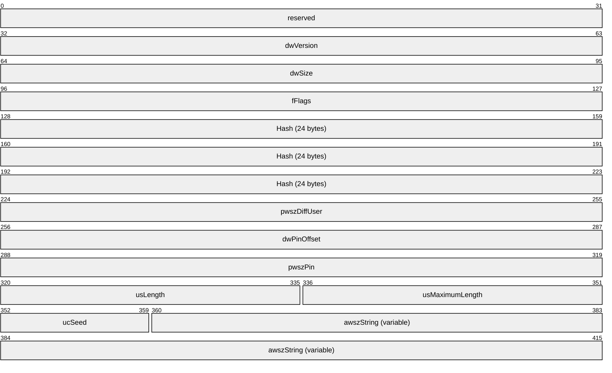

**reserved (4 bytes):** This MUST be 0x00000000.

**dwVersion (4 bytes):** This MUST be 0x00000001.

**dwSize (4 bytes):** This MUST be the number of bytes in this structure.

**fFlags (4 bytes):** Unused; it MUST be set to 0x00000000.

**Hash (24 bytes):** An [**EAPTLS_HASH (section2.2.1.2.127)**](#Section_2.2.1.2.127) structure that MUST contain the hash for the user certificate.

**pwszDiffUser (4 bytes):** Pointer to a null-terminated [**Unicode**](#gt_unicode) string that contains the EAP identity to send. The string SHOULD be stored starting at **awszString**.

**dwPinOffset (4 bytes):** Offset from the end of this structure to where the PIN is stored. This SHOULD be set to sizeof(pwszDiffUser).

**pwszPin (4 bytes):** Pointer to a null-terminated Unicode string that contains the [**smart card**](#gt_smart-card) PIN.

**usLength (2 bytes):** Unused; it MUST be set to zero (0).

**usMaximumLength (2 bytes):** Unused; it MUST be set to zero (0).

**ucSeed (1 byte):** Unused; it MUST be set to zero (0).

**awszString (variable):** Storage for **pwszDiffUser** and **pwszPin**.

<a id="Section_2.2.1.2.129"></a>
##### 2.2.1.2.129 MPRAPI_OBJECT_HEADER_IDL

The **MPRAPI_OBJECT_HEADER_IDL** structure SHOULD<116> define the version of the structure that needs to be used by the following methods and structures:

- [**RRasAdminConnectionEnumEx(section3.1.4.46)**](#Section_3.1.4.46)
- [**RRasAdminConnectionGetInfoEx(section3.1.4.47)**](#Section_3.1.4.47)
- [**RAS_CONNECTION_EX_1_IDL(section2.2.1.2.133)**](#Section_2.2.1.2.133)
- [**MPR_SERVER_EX_1(section2.2.1.2.142)**](#Section_2.2.1.2.142)
- [**MPR_SERVER_SET_CONFIG_EX_1(section2.2.1.2.145)**](#Section_2.2.1.2.145)
- [**RAS_UPDATE_CONNECTION_1_IDL(section2.2.1.2.147)**](#Section_2.2.1.2.147)
- [**MPR_SERVER_SET_CONFIG_EX_2(section2.2.1.2.241)**](#Section_2.2.1.2.241)
- [**MPR_SERVER_EX_2(section2.2.1.2.242)**](#Section_2.2.1.2.242)
- [**MPR_IF_CUSTOMINFOEX_0 (section2.2.1.2.244)**](#Section_2.2.1.2.244)
- [**MPR_SERVER_SET_CONFIG_EX_3(section2.2.1.2.250)**](#Section_2.2.1.2.250)
- [**MPR_SERVER_EX_3(section2.2.1.2.251)**](#Section_2.2.1.2.251)
- [**MPR_IF_CUSTOMINFOEX_1(section2.2.1.2.269)**](#Section_2.2.1.2.269)
typedef struct_MPRAPI_OBJECT_HEADER_IDL{

UCHARrevision;

UCHARtype;

USHORTsize;

} MPRAPI_OBJECT_HEADER_IDL,

*PMPRAPI_OBJECT_HEADER_IDL;

**revision:** This represents the version of the structure that is being used depending on the numeric value in the **type** field. The following values are supported.

| Value | Meaning |
| --- | --- |
| MPRAPI_RAS_CONNECTION_OBJECT_REVISION_1 0x01 | Represents revision 1 of the structure RAS_CONNECTION_EX_1_IDL(section2.2.1.2.133) if **type** is 0x01. |
| MPRAPI_MPR_SERVER_SET_CONFIG_OBJECT_REVISION_1 0x01 | Represents revision 1 of the structure MPR_SERVER_SET_CONFIG_EX_1(section2.2.1.2.145) if **type** is 0x03. |
| MPRAPI_MPR_SERVER_SET_CONFIG_OBJECT_REVISION_2 0x02 | Represents revision 2 of the structure MPR_SERVER_SET_CONFIG_EX_2(section2.2.1.2.241) if **type** is 0x03. |
| MPRAPI_MPR_SERVER_SET_CONFIG_OBJECT_REVISION_3 0x03 | Represents revision 3 of the structure MPR_SERVER_SET_CONFIG_EX_3(section2.2.1.2.250) if **type** is 0x03. |
| MPRAPI_MPR_SERVER_OBJECT_REVISION_1 0x01 | Represents revision 1 of the structure MPR_SERVER_EX_1(section2.2.1.2.142) if **type** is 0x02. |
| MPRAPI_MPR_SERVER_OBJECT_REVISION_2 0x02 | Represents revision 2 of the structure MPR_SERVER_EX_2(section2.2.1.2.242) if **type** is 0x02. |
| MPRAPI_MPR_SERVER_OBJECT_REVISION_3 0x03 | Represents revision 3 of the structure MPR_SERVER_EX_3(section2.2.1.2.251) if **type** is 0x02. |
| MPRAPI_RAS_UPDATE_CONNECTION_OBJECT_REVISION_1 0x01 | Represents revision 1 of the structure RAS_UPDATE_CONNECTION_1_IDL(section2.2.1.2.147) if **type** is 0x05. |
| MPRAPI_MPR_IF_CUSTOM_CONFIG_OBJECT_REVISION_1 0x01 | Represents revision 1 of the structure MPR_IF_CUSTOMINFOEX_0(section2.2.1.2.244) if **type** is 0x06. |
| MPRAPI_MPR_IF_CUSTOM_CONFIG_OBJECT_REVISION_2 0x02 | Represents revision 2 of the structure MPR_IF_CUSTOMINFOEX_1(section2.2.1.2.269) if **type** is 0x06. |

**type:** The following represents the type of structure being used.

| Value | Meaning |
| --- | --- |
| MPRAPI_OBJECT_TYPE_RAS_CONNECTION_OBJECT 0x01 | Represents a [RAS_CONNECTION_EX_IDL(section2.2.1.2.134)](#Section_2.2.1.2.134) structure. |
| MPRAPI_OBJECT_TYPE_MPR_SERVER_OBJECT 0x02 | Represents an **MPR_SERVER_EX** structure (MPR_SERVER_EX_1(section2.2.1.2.142) structure or an MPR_SERVER_EX_2(section2.2.1.2.242)) based on the value of **revision**. |
| MPRAPI_OBJECT_TYPE_MPR_SERVER_SET_CONFIG_OBJECT 0x03 | Represents an MPR_SERVER_SET_CONFIG_EX structure (an MPR_SERVER_SET_CONFIG_EX_1 or an MPR_SERVER_SET_CONFIG_EX_2(section2.2.1.2.241) structure based on the value of **revision**). |
| MPRAPI_OBJECT_TYPE_UPDATE_CONNECTION_OBJECT 0x05 | Represents a RAS_UPDATE_CONNECTION_1_IDL(section2.2.1.2.147) structure. |
| MPRAPI_OBJECT_TYPE_IF_CUSTOM_CONFIG_OBJECT 0x06 | Represents an [MPR_IF_CUSTOMINFOEX_IDL(section2.2.1.2.245)](#Section_2.2.1.2.245) structure. |

**size:** Size of the BLOB (structure) being passed based on the type and revision.

<a id="Section_2.2.1.2.130"></a>
##### 2.2.1.2.130 PPP_PROJECTION_INFO_1

The **PPP_PROJECTION_INFO_1** structure<117> contains information obtained during the PPP negotiation for the PPP-based tunnels.

typedef struct_PPP_PROJECTION_INFO_1{

DWORDdwIPv4NegotiationError;

WCHARwszAddress[16];

WCHARwszRemoteAddress[16];

DWORDdwIPv4Options;

DWORDdwIPv4RemoteOptions;

ULONG64IPv4SubInterfaceIndex;

DWORDdwIPv6NegotiationError;

UCHARbInterfaceIdentifier[8];

UCHARbRemoteInterfaceIdentifier[8];

UCHARbPrefix[8];

DWORDdwPrefixLength;

ULONG64IPv6SubInterfaceIndex;

DWORDdwLcpError;

DWORDdwAuthenticationProtocol;

DWORDdwAuthenticationData;

DWORDdwRemoteAuthenticationProtocol;

DWORDdwRemoteAuthenticationData;

DWORDdwLcpTerminateReason;

DWORDdwLcpRemoteTerminateReason;

DWORDdwLcpOptions;

DWORDdwLcpRemoteOptions;

DWORDdwEapTypeId;

DWORDdwRemoteEapTypeId;

DWORDdwCcpError;

DWORDdwCompressionAlgorithm;

DWORDdwCcpOptions;

DWORDdwRemoteCompressionAlgorithm;

DWORDdwCcpRemoteOptions;

} PPP_PROJECTION_INFO_1,

*PPPP_PROJECTION_INFO_1;

**dwIPv4NegotiationError:** Same as **dwError** in [**PPP_IPCP_INFO(section2.2.1.2.65)**](#Section_2.2.1.2.65).

**wszAddress:** Same as **wszAddress** in **PPP_IPCP_INFO**.

**wszRemoteAddress:** Same as **wszRemoteAddress** in **PPP_IPCP_INFO**.

**dwIPv4Options:** Same as **dwOptions** in **PPP_IPCP_INFO**.

**dwIPv4RemoteOptions:** Same as **dwIPv4Options**.

**IPv4SubInterfaceIndex:** Specifies the index of the [**subinterface**](#gt_subinterface) corresponding to the connection on the server.

**dwIPv6NegotiationError:** Specifies the result of PPP_IPv6. Network control protocol negotiation. A value of zero (0) indicates that either IPv6 was not negotiated or Ipv6 has been negotiated successfully. A nonzero value indicates failure and is the actual fatal error that occurred during the control protocol.

**bInterfaceIdentifier:** If **dwIPv6NegotiationError** is zero (0) and IPv6 was negotiated, this MUST be the 64-bit interface identifier of the IPv6 address of the server interface. If **dwIPv6NegotiationError** is zero, a value of zero for this indicates that IPv6 was not negotiated. It MUST be zero when **dwIPv6NegotiationError** is nonzero.

**bRemoteInterfaceIdentifier:** If **dwIPv6NegotiationError** is zero (0) and IPv6 was negotiated, this MUST be the 64-bit interface identifier of the IPv6 address of the client interface. If **dwIPv6NegotiationError** is zero, a value of zero for this indicates that IPv6 was not negotiated. It MUST be zero when **dwIPv6NegotiationError** is nonzero.

**bPrefix:** Specifies the prefix of the IPv6 address of the client interface.

**dwPrefixLength:** The length, in bits, of the address prefix.

**IPv6SubInterfaceIndex:** Specifies the index of the subInterface corresponding to the connection on the server.

**dwLcpError:** Specifies the error that occurred if the PPP negotiation was unsuccessful and it MUST be one of the following values.

| Value | Meaning |
| --- | --- |
| ERROR_NO_LOCAL_ENCRYPTION 0x000002E5 | The local computer does not support the required data encryption type. |
| ERROR_NO_REMOTE_ENCRYPTION 0x000002E6 | The remote computer does not support the required data encryption type. |
| ERROR_CHANGING_PASSWORD 0x000002C5 | There was an error changing the password on the domain. The password might have been too short or might have matched a previously used password. |
| ERROR_PPP_NO_PROTOCOLS_CONFIGURED 0x000002D0 | The PPP controlled protocols were not configured. |
| ERROR_AUTHENTICATION_FAILURE 0x000002B3 | The connection was denied because the username or password specified is not valid or because the selected authentication protocol is not permitted on the remote server. |
| ERROR_MORE_DATA 0x000000EA | More data is available. |
| ERROR_PROTOCOL_NOT_CONFIGURED 0x000002DC | The received control protocol of the PPP is not configured. |
| ERROR_AUTH_INTERNAL 0x00000285 | There was an internal error while processing authentication. |
| ERROR_NO_DIALIN_PERMISSION 0x00000289 | The user does not have permission to dial in. |
| ERROR_SERVER_POLICY 0x0000032C | The connection was prevented because of a policy configured on the RRAS. |
| ERROR_PEER_REFUSED_AUTH 0x00000397 | The connection could not be established because the authentication protocol used by the RRAS to verify username and password could not be matched with the one proposed by the client. |
| ERROR_UNKNOWN_FRAMED_PROTOCOL 0x0000031A | The Framed Protocol [**RADIUS**](#gt_remote-authentication-dial-in-user-service-radius) [[RFC2865]](https://go.microsoft.com/fwlink/?LinkId=90392) attribute for this client is not PPP. |
| ERROR_WRONG_TUNNEL_TYPE 0x0000031B | The Tunnel Type RADIUS [RFC2865] attribute for this user is not correct. |
| ERROR_UNKNOWN_SERVICE_TYPE 0x0000031C | The Service Type RADIUS [RFC2865] attribute for this user is neither Framed nor callback Framed. |
| ERROR_RESTRICTED_LOGON_HOURS 0x00000286 | The user is not permitted to log on at this time of day. |
| ERROR_ACCT_DISABLED 0x00000287 | The account is disabled. |
| ERROR_PASSWD_EXPIRED 0x00000288 | The password for this account has expired. |
| ERROR_ILL_FORMED_PASSWORD 0x0000052C | Unable to update the password. The value provided for the new password contains values that are not allowed in passwords. |

**dwAuthenticationProtocol:** The same as **dwAuthenticatedProtocol** in [**PPP_LCP_INFO**](#Section_2.2.1.2.71).

**dwAuthenticationData:** The same as **dwAuthenticationData** in **PPP_LCP_INFO** (see section 2.2.1.2.71).

**dwRemoteAuthenticationProtocol:** Specifies the authentication protocol used to authenticate the remote computer. This will be different from **dwAuthenticationProtocol** in the case of demand-dial if the authentication protocol used by the two ends are different. See the **dwAuthenticationProtocol** member for a list of possible values.

**dwRemoteAuthenticationData:** Specifies additional information about the authentication protocol specified by *dwRemoteAuthenticationProtocol*. This will be different from **dwAuthenticationData** in the case of demand-dial if the authentication protocol used by the two ends are different. See the **dwAuthenticationData** member for a list of possible values.

**dwLcpTerminateReason:** Specifies the reason the connection was terminated by the local computer. This member always has a value of zero (0).

**dwLcpRemoteTerminateReason:** Specifies the reason the connection was terminated by the remote computer. This member always has a value of zero (0).

**dwLcpOptions:** The same as **dwOptions** in **PPP_LCP_INFO** (see section 2.2.1.2.71).

**dwLcpRemoteOptions:** Specifies information about the LCP options in use by the remote computer. See the **dwLcpOptions** member for a list of possible values.

**dwEapTypeId:** Specifies the type identifier of the [**EAP**](#gt_extensible-authentication-protocol-eap) used to authenticate the local computer. The value of this member is valid only if **dwAuthenticationProtocol** is PPP_LCP_EAP. The valid values are defined in [[IANA-EAP]](https://go.microsoft.com/fwlink/?LinkId=89882).

**dwRemoteEapTypeId:** MUST be zero (0). This value has no significance.

**dwCcpError:** Specifies an error if the negotiation is unsuccessful.

**dwCompressionAlgorithm:** The same as **dwCompressionAlgorithm** in **PPP_LCP_INFO**.

**dwCcpOptions:** The same as **dwCcpOptions** in **PPP_LCP_INFO**.

**dwRemoteCompressionAlgorithm:** Specifies the compression algorithm used by the remote computer. The values are the same as those for **dwCompressionAlgorithm**.

**dwCcpRemoteOptions:** Specifies the compression options on the remote computer. The following options are supported.

| Value | Meaning |
| --- | --- |
| PPP_CCP_COMPRESSION 0x00000001 | Compression without encryption. |
| PPP_CCP_HISTORYLESS 0x01000000 | MPPE in stateless mode. The session key is changed after every packet. This mode improves performance on high-latency networks, or networks that experience significant packet loss. |
| PPP_CCP_ENCRYPTION40BITOLD 0x00000010 | PPE using 40-bit keys. |
| PPP_CCP_ENCRYPTION40BIT 0x00000020 | MPPE using 40-bit keys. |
| PPP_CCP_ENCRYPTION56BIT 0x00000080 | MPPE using 56-bit keys. |
| PPP_CCP_ENCRYPTION128BIT 0x00000040 | MPPE using 128-bit keys. |
| ERROR_PPP_NOT_CONVERGING 0x000002DC | The remote computer and RRAS could not converge on address negotiation. |

<a id="Section_2.2.1.2.131"></a>
##### 2.2.1.2.131 IKEV2_PROJECTION_INFO_1

The **IKEV2_PROJECTION_INFO_1** structure SHOULD<118> contain information obtained during [**Internet Key Exchange (IKE)**](#gt_internet-key-exchange-ike) negotiation.

typedef structIKEV2_PROJECTION_INFO_1{

DWORDdwIPv4NegotiationError;

WCHARwszAddress[16];

WCHARwszRemoteAddress[16];

ULONG64IPv4SubInterfaceIndex;

DWORDdwIPv6NegotiationError;

UCHARbInterfaceIdentifier[8];

UCHARbRemoteInterfaceIdentifier[8];

UCHARbPrefix[8];

DWORDdwPrefixLength;

ULONG64IPv6SubInterfaceIndex;

DWORDdwOptions;

DWORDdwAuthenticationProtocol;

DWORDdwEapTypeId;

DWORDdwCompressionAlgorithm;

DWORDdwEncryptionMethod;

} IKEV2_PROJECTION_INFO_1,

*PIKEV2_PROJECTION_INFO_1;

**dwIPv4NegotiationError:** Specifies if an Internal IPv4 address [[RFC4306]](https://go.microsoft.com/fwlink/?LinkId=90469) has been successfully assigned. A value of zero (0) indicates success. A nonzero value indicates failure.

**wszAddress:** The same as **wszAddress** in [**PPP_PROJECTION_INFO_1**](#Section_2.2.1.2.130).

**wszRemoteAddress:** The same as **wszRemoteAddress** in **PPP_PROJECTION_INFO_1**.

**IPv4SubInterfaceIndex:** The same as **IPv4SubInterfaceIndex** in **PPP_PROJECTION_INFO_1**.

**dwIPv6NegotiationError:** The same as **dwIPv5NegotiationError** in **PPP_PROJECTION_INFO_1**.

**bInterfaceIdentifier:** The same as **bInterfaceIdentifier** in **PPP_PROJECTION_INFO_1**.

**bRemoteInterfaceIdentifier:** The same as **bRemoteInterfaceIdentifier** in **PPP_PROJECTION_INFO_1**.

**bPrefix:** The same as **bPrefix** in **PPP_PROJECTION_INFO_1**.

**dwPrefixLength:** The same as **dwPrefixLength** in **PPP_PROJECTION_INFO_1**.

**IPv6SubInterfaceIndex:** The same as **IPv6SubInterfaceIndex** in **PPP_PROJECTION_INFO_1**.

**dwOptions:** Not used.

**dwAuthenticationProtocol:** Specifies the authentication protocol used to authenticate the remote computer. It MUST be one of the following values.

| Value | Meaning |
| --- | --- |
| MPRAPI_IKEV2_AUTH_USING_CERT 0x00000001 | Using x.509 machine certificate [[RFC2459]](https://go.microsoft.com/fwlink/?LinkId=90356). |
| MPRAPI_IKEV2_AUTH_USING_EAP 0x00000002 | [**Extensible Authentication Protocol (EAP)**](#gt_extensible-authentication-protocol-eap). |

**dwEapTypeId:** Specifies the type identifier of the EAP used to authenticate the local computer. The value of this member is valid only if **dwAuthenticationProtocol** is MPRAPI_IKEV2_AUTH_USING_EAP [[IANA-EAP]](https://go.microsoft.com/fwlink/?LinkId=89882).

**dwCompressionAlgorithm:** Not used.

**dwEncryptionMethod:** Specifies the encryption method used in the connection. It MUST be one of the following values.

| Value | Meaning |
| --- | --- |
| IPSEC_CIPHER_TYPE_3DES 2 | Specifies 3DES encryption. |
| IPSEC_CIPHER_TYPE_AES_128 3 | Specifies AES-128 encryption. |
| IPSEC_CIPHER_TYPE_AES_192 4 | Specifies AES-192 encryption. |
| IPSEC_CIPHER_TYPE_AES_256 5 | Specifies AES-256 encryption. |

<a id="Section_2.2.1.2.132"></a>
##### 2.2.1.2.132 PROJECTION_INFO_IDL_1

The **PROJECTION_INFO_IDL_1** union is used in [**RAS_CONNECTION_EX_1_IDL(section2.2.1.2.133)**](#Section_2.2.1.2.133) structure as a placeholder for [**PPP_PROJECTION_INFO_1(section2.2.1.2.130)**](#Section_2.2.1.2.130) structure or [**IKEV2_PROJECTION_INFO_1(section2.2.1.2.131)**](#Section_2.2.1.2.131) structure.

- typedef union_PROJECTION_INFO_IDL_1 switch (UCHARprojectionInfoType) ProjectInfoObject
{

case 1:

PPP_PROJECTION_INFO_1PppProjectionInfo;

case 2:

IKEV2_PROJECTION_INFO_1Ikev2ProjectionInfo;

}ProjectionInfoObject} PROJECTION_INFO_IDL_1,

*PPROJECTION_INFO_IDL_1;

**projectionInfoType:** Specifies if the projection is for a PPP-based or IKEv2-based tunnel.

| Value | Meaning |
| --- | --- |
| MPRAPI_PPP_PROJECTION_INFO_TYPE 0x01 | Data corresponds to **PPP_PROJECTION_INFO_1**. |
| MPRAPI_IKEV2_PROJECTION_INFO_TYPE 0x02 | Data corresponds to **IKEV2_PROJECTION_INFO_1**. |

**PppProjectionInfo:** Contains a **PPP_PROJECTION_INFO_1** for a PPP-based tunnel.

**Ikev2ProjectionInfo:** Contains an **IKEV2_PROJECTION_INFO_1** for an IKEv2-based tunnel.

<a id="Section_2.2.1.2.133"></a>
##### 2.2.1.2.133 RAS_CONNECTION_EX_1_IDL

The **RAS_CONNECTION_EX_1_IDL** structure contains information for a connection, including the GUID that identifies the connection, the NAP, and the PPP or the IKEv2 related data for the connection.

typedef struct_RAS_CONNECTION_EX_1_IDL{

MPRAPI_OBJECT_HEADER_IDLHeader;

DWORDdwConnectDuration;

ROUTER_INTERFACE_TYPEdwInterfaceType;

DWORDdwConnectionFlags;

WCHARwszInterfaceName[257];

WCHARwszUserName[257];

WCHARwszLogonDomain[16];

WCHARwszRemoteComputer[17];

GUIDguid;

RAS_QUARANTINE_STATErasQuarState;

FILETIMEprobationTime;

DWORDdwBytesXmited;

DWORDdwBytesRcved;

DWORDdwFramesXmited;

DWORDdwFramesRcved;

DWORDdwCrcErr;

DWORDdwTimeoutErr;

DWORDdwAlignmentErr;

DWORDdwHardwareOverrunErr;

DWORDdwFramingErr;

DWORDdwBufferOverrunErr;

DWORDdwCompressionRatioIn;

DWORDdwCompressionRatioOut;

DWORDdwNumSwitchOvers;

WCHARwszRemoteEndpointAddress[65];

WCHARwszLocalEndpointAddress[65];

PROJECTION_INFO_IDL_1ProjectionInfo;

ULONGhConnection;

ULONGhInterface;

} RAS_CONNECTION_EX_1_IDL,

*PRAS_CONNECTION_EX_1_IDL;

**Header:** A [**MPRAPI_OBJECT_HEADER_IDL(section2.2.1.2.129)**](#Section_2.2.1.2.129) whose **revision** field MUST be 0x01 and **type** field MUST be 0x01.

**dwConnectDuration:** Specifies the duration in seconds for which the current connection is active.

**dwInterfaceType:** Specifies a [**ROUTER_INTERFACE_TYPE(section2.2.1.1.1)**](#Section_2.2.1.1.1) value specifying the interface type of the current connection.

**dwConnectionFlags:** Specifies certain attributes of the connection.

This member SHOULD contain one of the following flags.<119>

| Value | Meaning |
| --- | --- |
| 0x00000000 | No flag is set. |
| RAS_FLAGS_PPP_CONNECTION 0x00000001 | The connection is using the Point-to-Point Protocol (PPP). |
| RAS_FLAGS_MESSENGER_PRESENT 0x00000002 | The messenger service is active on the client and messages can be sent to the client using [**RRasAdminSendUserMessage(section3.1.4.36)**](#Section_3.1.4.36). |
| RAS_FLAGS_QUARANTINE_PRESENT 0x00000008 | The connection is currently in quarantine. See **RRasAdminConnectionRemoveQuarantine**(section [3.1.4.43](#Section_3.1.4.43)) for more information. |
| RAS_FLAGS_ARAP_CONNECTION 0x00000010 | The connection is using the AppleTalk Remote Access Protocol (ARAP). |
| RAS_FLAGS_DORMANT 0x00000020 | The connection is using the IKEv2 and the server is not reachable. |

**wszInterfaceName:** Specifies a null-terminated Unicode string that contains the name of the interface for this connection.

**wszUserName:** Specifies a null-terminated Unicode string that contains the name of the user logged on to the connection.

**wszLogonDomain:** Specifies a null-terminated Unicode string that contains the domain on which the connected user is authenticated.

**wszRemoteComputer:** Specifies a null-terminated Unicode string that contains the name of the remote computer.

**guid:** A GUID uniquely identifying the connection.

**rasQuarState:** Specifies the NAP quarantine state for the connection through the type [**RAS_QUARANTINE_STATE(section2.2.1.1.3)**](#Section_2.2.1.1.3) that contains the quarantine state of this connection.

**probationTime:** Specifies the NAP probation time for the connection in UTC. This value is valid only if the **rasQuarState** has a value of RAS_QUAR_STATE_PROBATION (see **RAS_QUARANTINE_STATE**).

**dwBytesXmited:** Specifies the bytes transmitted on the current connection.

**dwBytesRcved:** Specifies the bytes received on the current connection.

**dwFramesXmited:** Specifies the frames transmitted on the current connection.

**dwFramesRcved:** Specifies the frames received on the current connection.

**dwCrcErr:** Specifies the CRC errors on the current connection.

**dwTimeoutErr:** Specifies the time-out errors on the current connection.

**dwAlignmentErr:** Specifies the alignment errors on the current connection.

**dwHardwareOverrunErr:** Specifies the number of hardware-overrun errors on the current connection.

**dwFramingErr:** Specifies the number of framing errors for the current connection.

**dwBufferOverrunErr:** Specifies the number of buffer-overrun errors.

**dwCompressionRatioIn:** Specifies a percentage that indicates the degree to which data received on this connection is compressed. The ratio is the size of the compressed data divided by the size of the same data in an uncompressed state.

**dwCompressionRatioOut:** Specifies a percentage that indicates the degree to which data transmitted on this connection is compressed. The ratio is the size of the compressed data divided by the size of the same data in an uncompressed state.

**dwNumSwitchOvers:** Specifies the number of MOBIKE [[RFC4555]](https://go.microsoft.com/fwlink/?LinkId=121752) switches that happened on the connection. Valid only if **dwConnectionFlags** is RAS_FLAGS_IKEV2_CONNECTION.

**wszRemoteEndpointAddress:** Specifies a null-terminated Unicode string that holds the remote computer's IP address for the connection. This string has the form a.b.c.d; for example, "10.102.235.84".

**wszLocalEndpointAddress:** Specifies a null-terminated Unicode string that holds the local computer's IP address for the connection. This string has the form a.b.c.d or a::1234; for example, "10.102.235.84" or 2ffe::1234.

**ProjectionInfo:** This is a [**PROJECTION_INFO_IDL_1**](#Section_2.2.1.2.132) structure.

**hConnection:** A handle to the connection.

**hInterface:** A handle to the interface.

<a id="Section_2.2.1.2.134"></a>
##### 2.2.1.2.134 RAS_CONNECTION_EX_IDL

The **RAS_CONNECTION_EX_IDL** union contains a placeholder for [**RAS_CONNECTION_EX_1_IDL(section2.2.1.2.133)**](#Section_2.2.1.2.133) structure. This union is used in the [**RRasAdminConnectionGetInfoEx(section3.1.4.47)**](#Section_3.1.4.47) method.

typedef union_RAS_CONNECTION_EX_IDL switch (UCHAR revision) ConnObject{

case 1: RAS_CONNECTION_EX_1_IDLRasConnection1;

} RAS_CONNECTION_EX_IDL,

*PRAS_CONNECTION_EX_IDL;

**RasConnection1:** This MUST be the structure **RAS_CONNECTION_EX_1_IDL**.

<a id="Section_2.2.1.2.135"></a>
##### 2.2.1.2.135 CERT_BLOB_1

The **CERT_BLOB_1** is a generic structure that contains x.509 [[RFC2459]](https://go.microsoft.com/fwlink/?LinkId=90356) certificate information.

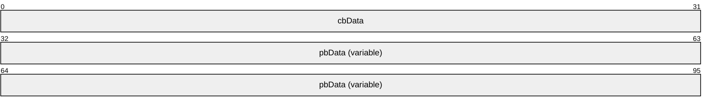

**cbData (4 bytes):** Size (in bytes) of the certificate information present in pbData.

**pbData (variable):** Pointer to the information of the certificate. This information depends on the structure in which this used. In the methods [**IKEV2_TUNNEL_CONFIG_PARAMS_1 (section 2.2.1.2.136)**](#Section_2.2.1.2.136), **IKEV2_TUNNEL_CONFIG_PARAMS_2** (section [2.2.1.2.238](#Section_2.2.1.2.238)), or [**IKEV2_TUNNEL_CONFIG_PARAMS_3 (section 2.2.1.2.247)**](#Section_2.2.1.2.247), this points to the subject name of the certificate. In [**SSTP_CERT_INFO_1**](#Section_2.2.1.2.140), **pbData** contains a SHA-1 hash.

<a id="Section_2.2.1.2.136"></a>
##### 2.2.1.2.136 IKEV2_TUNNEL_CONFIG_PARAMS_1

The **IKEV2_TUNNEL_CONFIG_PARAMS_1** structure<120> be used to get or set configured parameters for IKEv2 devices [[RFC4306]](https://go.microsoft.com/fwlink/?LinkId=90469).

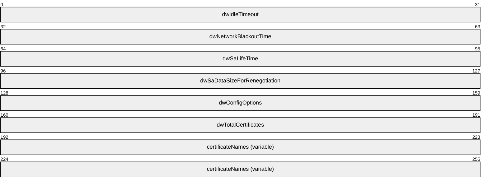

**dwIdleTimeout (4 bytes):** Duration, in seconds, after which the connection will be disconnected if there is no traffic. This value MUST be between 300 and 17,279,999.

**dwNetworkBlackoutTime (4 bytes):** Retransmission timeout, in seconds, for IKEv2 Request packets [RFC4306]. IKEv2 expects a response for every request packet sent, this value specifies the time after which the connection is deleted incase response is not received. This value MUST be greater than or equal to 120.

**dwSaLifeTime (4 bytes):** Lifetime of a security association (SA), in seconds, after which the SA is no longer valid [RFC4306]. This value MUST be between 300 and 17,279,999.

**dwSaDataSizeForRenegotiation (4 bytes):** Number of Kilobytes that are allowed to transfer using a SA. After that the SA will be renegotiated [RFC4306]. This value MUST be greater than or equal to 1024.

**dwConfigOptions (4 bytes):** Unused and MUST be set to 0.

**dwTotalCertificates (4 bytes):** Total number of certificates in member variable **certificateNames**.

**certificateNames (variable):** An array of [CERT_BLOB_1](#Section_2.2.1.2.135).

<a id="Section_2.2.1.2.137"></a>
##### 2.2.1.2.137 IKEV2_CONFIG_PARAMS_1

The **IKEV2_CONFIG_PARAMS_1** structure<121> is used to get or set configured parameters for IKEv2 devices.

typedef struct_IKEV2_CONFIG_PARAMS_1{

DWORDdwNumPorts;

DWORDdwPortFlags;

DWORDdwTunnelConfigParamFlags;

IKEV2_TUNNEL_CONFIG_PARAMS_1TunnelConfigParams;

} IKEV2_CONFIG_PARAMS_1,

*PIKEV2_CONFIG_PARAMS_1;

**dwNumPorts:** Specifies the number of ports configured on RRAS to accept IKEv2 connections. This value cannot exceed the server port limit.<122>

**dwPortFlags:** Specifies the type of port configured on IKEv2 devices. Possible flag values are as follows.

| Value | Meaning |
| --- | --- |
| MPR_ENABLE_RAS_ON_DEVICE 0x00000001 | Remote Access is enabled for IKEv2. |

**dwTunnelConfigParamFlags:** SHOULD be set to 0x00000001 when sent and SHOULD be ignored on receipt.

**TunnelConfigParams:** IKEv2 tunnel related parameters. MUST be an [**IKEV2_TUNNEL_CONFIG_PARAMS_1**](#Section_2.2.1.2.136) structure.

<a id="Section_2.2.1.2.138"></a>
##### 2.2.1.2.138 PPTP_CONFIG_PARAMS_1

The **PPTP_CONFIG_PARAMS_1** structure<123> be used to get or set the device configuration for PPTP on the RAS Server.

typedef struct_PPTP_CONFIG_PARAMS_1{

DWORDdwNumPorts;

DWORDdwPortFlags;

} PPTP_CONFIG_PARAMS_1,

*PPPTP_CONFIG_PARAMS_1;

**dwNumPorts:** Specifies the number of ports configured on that (PPTP) device. This value cannot exceed the server port limit.<124>

**dwPortFlags:** Specifies the type of port configured on PPTP devices. The possible flag values are as follows.

| Value | Meaning |
| --- | --- |
| MPR_ENABLE_RAS_ON_DEVICE 0x00000001 | PPTP is enabled to accept Remote Access client connection. |
| MPR_ENABLE_ROUTING_ON_DEVICE 0x00000002 | PPTP is enabled to accept demand-dial connections. |

<a id="Section_2.2.1.2.139"></a>
##### 2.2.1.2.139 L2TP_CONFIG_PARAMS_1

The **L2TP_CONFIG_PARAMS_1** structure<125> is used to get or set the device configuration for L2TP on RAS Server.

typedef struct_L2TP_CONFIG_PARAMS_1{

DWORDdwNumPorts;

DWORDdwPortFlags;

} L2TP_CONFIG_PARAMS_1,

*PL2TP_CONFIG_PARAMS_1;

**dwNumPorts:** Specifies the number of ports configured on the (L2TP) device. This value cannot exceed the server port limit.<126>

**dwPortFlags:** Specifies the type of port configured on L2TP devices. Possible flag values are as follows.

| Value | Meaning |
| --- | --- |
| MPR_ENABLE_RAS_ON_DEVICE 0x00000001 | L2TP is enabled to accept Remote Access client connection. |
| MPR_ENABLE_ROUTING_ON_DEVICE 0x00000002 | L2TP is enabled to accept demand-dial connections. |

<a id="Section_2.2.1.2.140"></a>
##### 2.2.1.2.140 SSTP_CERT_INFO_1

The **SSTP_CERT_INFO_1** structure<127> contain the subject name of the x.509 certificates that will be configured by the RRAS to be used in SSL/TLS negotiation as a part of the [MS-SSTP](../MS-SSTP/MS-SSTP.md) protocol.

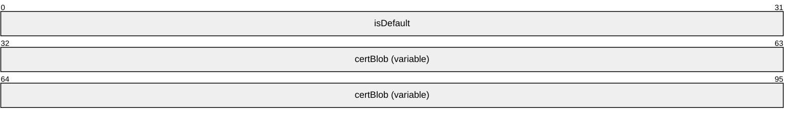

**isDefault (4 bytes):** This value specifies how the SSTP certificate hash values are configured. Possible flag values are as follows.

| Value | Meaning |
| --- | --- |
| TRUE | RRAS server chooses a certificate hash on its own automatically. |
| FALSE | The SSTP certificate hash values are configured by the administrator. |

This value SHOULD be set to FALSE when sent. The RRAS server specifies TRUE for this value if administrator has not configured the certificate and default certificate selection logic is used. This value is FALSE if the administrator has configured the certificate.

**certBlob (variable):** This MUST be a [**CERT_BLOB_1**](#Section_2.2.1.2.135). This contains the Certificate HASH Length and Certificate Hash. It accepts ONLY SHA256 HASH as the valid HASH. Thus, the value of the length field SHOULD always be 32 [[RFC2459]](https://go.microsoft.com/fwlink/?LinkId=90356). Specifying a value 0 for the **cbData** member of **CERT_BLOB_1** removes the certificate configuration. In this case, RRAS server uses its default certificate selection logic.

<a id="Section_2.2.1.2.141"></a>
##### 2.2.1.2.141 SSTP_CONFIG_PARAMS_1

The **SSTP_CONFIG_PARAMS_1** structure<128> be used to get or set the device configuration for SSTP on a RAS Server [MS-SSTP](../MS-SSTP/MS-SSTP.md).

typedef struct_SSTP_CONFIG_PARAMS_1{

DWORDdwNumPorts;

DWORDdwPortFlags;

BOOLisUseHttps;

DWORDcertAlgorithm;

SSTP_CERT_INFO_1sstpCertDetails;

} SSTP_CONFIG_PARAMS_1,

*PSSTP_CONFIG_PARAMS_1;

**dwNumPorts:** Specifies the number of ports configured on that (SSTP) device. This value cannot exceed the server port limit.<129>

**dwPortFlags:** Specifies the type of port configured on SSTP devices. Possible flag values are as follows.

| Value | Meaning |
| --- | --- |
| MPR_ENABLE_RAS_ON_DEVICE 0x00000001 | Remote Access is enabled for SSTP. |

**isUseHttps:** MUST be set to TRUE if HTTPS used, MUST be set to FALSE if HTTPS is not used.

**certAlgorithm:** MUST be set to 0x0000800C.

**sstpCertDetails:** MUST be a [**SSTP_CERT_INFO_1**](#Section_2.2.1.2.140) structure.

<a id="Section_2.2.1.2.142"></a>
##### 2.2.1.2.142 MPR_SERVER_EX_1

The **MPR_SERVER_EX_1** structure<130> be used to get or set the configuration of a RAS server.

typedef struct_MPR_SERVER_EX_1{

MPRAPI_OBJECT_HEADER_IDLHeader;

BOOLfLanOnlyMode;

DWORDdwUpTime;

DWORDdwTotalPorts;

DWORDdwPortsInUse;

DWORDReserved;

MPRAPI_TUNNEL_CONFIG_PARAMS_1ConfigParams;

} MPR_SERVER_EX_1,

*PMPR_SERVER_EX_1;

**Header:** This specifies the version of the **MPR_SERVER_EX_1** structure; and MUST be a [**MPRAPI_OBJECT_HEADER_IDL(section2.2.1.2.129)**](#Section_2.2.1.2.129) whose revision field MUST be 0x01, and whose type field MUST be 0x02.

**fLanOnlyMode:** Specifies whether RRAS is running on the router. If TRUE, RRAS is not running as the router; if FALSE, RRAS is running as router.

**dwUpTime:** Specifies the elapsed time, in seconds, since the router was started.

**dwTotalPorts:** Specifies the number of ports on the system.

**dwPortsInUse:** Specifies the number of ports currently in use.

**Reserved:** Unused, MUST be set to 0.

**ConfigParams:** This MUST be a [**MPRAPI_TUNNEL_CONFIG_PARAMS_1**](#Section_2.2.1.2.144) structure.

<a id="Section_2.2.1.2.143"></a>
##### 2.2.1.2.143 MPR_SERVER_EX_IDL

The **MPR_SERVER_EX_IDL** union<131> be a placeholder for one of the following structures: [**MPR_SERVER_EX_1(section2.2.1.2.142)**](#Section_2.2.1.2.142), [**MPR_SERVER_EX_2(section2.2.1.2.242)**](#Section_2.2.1.2.242), or [**MPR_SERVER_EX_3(section2.2.1.2.251)**](#Section_2.2.1.2.251).<132>

typedef union_MPR_SERVER_EX_IDL switch (UCHAR revision) ServerConfigObject{

case 1: MPR_SERVER_EX_1ServerConfig1;

case 2: MPR_SERVER_EX_2ServerConfig2;

case 3: MPR_SERVER_EX_3ServerConfig3;

} MPR_SERVER_EX_IDL,

*PMPR_SERVER_EX_IDL;

**ServerConfig1:** This MUST be an **MPR_SERVER_EX_1** structure.

**ServerConfig2:** This MUST be an **MPR_SERVER_EX_2** structure.

**ServerConfig3:** This MUST be an **MPR_SERVER_EX_3** structure.

<a id="Section_2.2.1.2.144"></a>
##### 2.2.1.2.144 MPRAPI_TUNNEL_CONFIG_PARAMS_1

The **MPRAPI_TUNNEL_CONFIG_PARAMS_1** structure<133> be used to get or set configuration of various tunnels on RAS server.

typedef struct_MPRAPI_TUNNEL_CONFIG_PARAMS_1{

IKEV2_CONFIG_PARAMS_1IkeConfigParams;

PPTP_CONFIG_PARAMS_1PptpConfigParams;

L2TP_CONFIG_PARAMS_1L2tpConfigParams;

SSTP_CONFIG_PARAMS_1SstpConfigParams;

} MPRAPI_TUNNEL_CONFIG_PARAMS_1,

*PMPRAPI_TUNNEL_CONFIG_PARAMS_1;

**IkeConfigParams:** MUST be a [**IKEV2_CONFIG_PARAMS_1**](#Section_2.2.1.2.137) structure and is used to get or set IKEv2 tunnel parameters.

**PptpConfigParams:** MUST be a [**PPTP_CONFIG_PARAMS_1**](#Section_2.2.1.2.138) structure and is used to get or set PPTP tunnel parameters.

**L2tpConfigParams:** MUST be a [**L2TP_CONFIG_PARAMS_1**](#Section_2.2.1.2.139) structure and is used to get or set L2TP tunnel parameters.

**SstpConfigParams:** MUST be a [**SSTP_CONFIG_PARAMS_1**](#Section_2.2.1.2.141) structure and is used to get or set SSTP tunnel parameters.

<a id="Section_2.2.1.2.145"></a>
##### 2.2.1.2.145 MPR_SERVER_SET_CONFIG_EX_1

The **MPR_SERVER_SET_CONFIG_EX_1** structure<134> be used to set the configuration parameters for the RRAS.

typedef struct_MPR_SERVER_SET_CONFIG_EX_1{

MPRAPI_OBJECT_HEADER_IDLHeader;

DWORDsetConfigForProtocols;

MPRAPI_TUNNEL_CONFIG_PARAMS_1ConfigParams;

} MPR_SERVER_SET_CONFIG_EX_1,

*PMPR_SERVER_SET_CONFIG_EX_1;

**Header:** This MUST be [**MPRAPI_OBJECT_HEADER_IDL(section2.2.1.2.129)**](#Section_2.2.1.2.129), the revision field MUST be 0x01, and the type field MUST be 0x03.

**setConfigForProtocols:** This MUST be one of the following values that specify the type of tunnel.

| Value | Meaning |
| --- | --- |
| MPRAPI_SET_CONFIG_PROTOCOL_FOR_PPTP 0x00000001 | PPTP device configuration parameters are present in the structure. |
| MPRAPI_SET_CONFIG_PROTOCOL_FOR_L2TP 0x00000002 | L2TP device configuration parameters are present in the structure. |
| MPRAPI_SET_CONFIG_PROTOCOL_FOR_SSTP 0x00000004 | SSTP device configuration parameters are present in the structure. |
| MPRAPI_SET_CONFIG_PROTOCOL_FOR_IKEV2 0x00000008 | IKEv2 device configuration parameters are present in the structure. |

**ConfigParams:** This MUST be a MPRAPI_TUNNEL_CONFIG_PARAMS_1.

<a id="Section_2.2.1.2.146"></a>
##### 2.2.1.2.146 MPR_SERVER_SET_CONFIG_EX_IDL

The **MPR_SERVER_SET_CONFIG_EX_IDL** union is used to get or set configured parameters for PPTP, L2TP, SSTP, and IKEv2 devices.

typedef union_MPR_SERVER_SET_CONFIG_EX_IDL switch (UCHAR revision) ServerSetConfigObject{

case 1: MPR_SERVER_SET_CONFIG_EX_1ServerSetConfig1;

case 2: MPR_SERVER_SET_CONFIG_EX_2ServerSetConfig2;

case 3: MPR_SERVER_SET_CONFIG_EX_3ServerSetConfig3;

} MPR_SERVER_SET_CONFIG_EX_IDL,

*PMPR_SERVER_SET_CONFIG_EX_IDL;

**ServerSetConfig1:** This MUST be an [**MPR_SERVER_SET_CONFIG_EX_1**](#Section_2.2.1.2.145) structure.

**ServerSetConfig2:** This MUST be an [**MPR_SERVER_SET_CONFIG_EX_2**](#Section_2.2.1.2.241) structure.

**ServerSetConfig3:** This MUST be an [**MPR_SERVER_SET_CONFIG_EX_3**](#Section_2.2.1.2.250) structure.

<a id="Section_2.2.1.2.147"></a>
##### 2.2.1.2.147 RAS_UPDATE_CONNECTION_1_IDL

The **RAS_UPDATE_CONNECTION_1_IDL** structure<135> contain information about the tunnel endpoint address on an IKEv2 connection.

typedef struct_RAS_UPDATE_CONNECTION_1_IDL

{

MPRAPI_OBJECT_HEADER_IDLHeader;

DWORDdwIfIndex;

WCHARwszRemoteEndpointAddress[65];

} RAS_UPDATE_CONNECTION_1_IDL,

*PRAS_UPDATE_CONNECTION_1_IDL;

**Header:** MUST be a [**MPRAPI_OBJECT_HEADER_IDL**](#Section_2.2.1.2.129).

**dwIfIndex:** MUST be set to the index of the local interface to which the connections has to be switched and on which MOBIKE [[RFC4555]](https://go.microsoft.com/fwlink/?LinkId=121752) is to be sent.

**wszRemoteEndpointAddress:** Specifies a null-terminated Unicode string that holds the remote IP address to which connections has to be switched and on which MOBIKE is to be sent for the connection. This string has the form a.b.c.d in case of IPv4 address and a::b:c in case of IPv6; for example, "10.102.235.84" or "2001::a456".

<a id="Section_2.2.1.2.148"></a>
##### 2.2.1.2.148 RAS_UPDATE_CONNECTION_IDL

The **RAS_UPDATE_CONNECTION_IDL** union<136> be used to send the MOBIKE [[RFC4555]](https://go.microsoft.com/fwlink/?LinkId=121752) on an IKEv2 connection.

typedef union_RAS_UPDATE_CONNECTION_IDL switch (UCHAR revision) UpdateConnection

{

case 1: RAS_UPDATE_CONNECTION_1_IDLUpdateConnection1;

} RAS_UPDATE_CONNECTION_IDL,

*PRAS_UPDATE_CONNECTION_IDL;

**UpdateConnection1:** This MUST be an [**RAS_UPDATE_CONNECTION_1_IDL**](#Section_2.2.1.2.147) structure.

<a id="Section_2.2.1.2.149"></a>
##### 2.2.1.2.149 IPBOOTP_GLOBAL_CONFIG

The **IPBOOTP_GLOBAL_CONFIG** structure is used to set or retrieve global configuration for the IPBOOTP. This is used in the following methods:

- [**RRouterInterfaceTransportSetGlobalInfo(section3.1.4.10)**](#Section_3.1.4.10)
- [**RRouterInterfaceTransportGetGlobalInfo(section3.1.4.11)**](#Section_3.1.4.11)
typedef struct_IPBOOTP_GLOBAL_CONFIG{

DWORDGC_LoggingLevel;

DWORDGC_MaxRecvQueueSize;

DWORDGC_ServerCount;

} IPBOOTP_GLOBAL_CONFIG,

*PIPBOOTP_GLOBAL_CONFIG;

**GC_LoggingLevel:** Specifies the logging level. It MUST be one of the following values.

| Value | Meaning |
| --- | --- |
| IPBOOTP_GLOBAL_CONFIG 0x00000000 | No Logging is done. |
| IPBOOTP_LOGGING_ERROR 0x00000001 | Only errors are logged. |
| IPBOOTP_LOGGING_WARN 0x00000002 | Errors and warnings are logged. |
| IPBOOTP_LOGGING_INFO 0x00000003 | Errors, warnings, and information are logged. |

**GC_MaxRecvQueueSize:** Specifies the maximum size in bytes of messages in the receive queue while processing.

**GC_ServerCount:** The number of BOOTP server IP addresses.

<a id="Section_2.2.1.2.150"></a>
##### 2.2.1.2.150 IPBOOTP_IF_CONFIG

The **IPBOOTP_IF_CONFIG** structure is used to set or retrieve the per-interface configuration. This is used in the following methods:

- [**RRouterInterfaceTransportAdd (section 3.1.4.18)**](#Section_3.1.4.18)
- [**RRouterInterfaceTransportGetInfo (section 3.1.4.19)**](#Section_3.1.4.19)
- [**RRouterInterfaceTransportSetInfo (section 3.1.4.20)**](#Section_3.1.4.20)
All IP address are in network order.

typedef struct_IPBOOTP_IF_CONFIG{

DWORDIC_State;

DWORDIC_RelayMode;

DWORDIC_MaxHopCount;

DWORDIC_MinSecondsSinceBoot;

} IPBOOTP_IF_CONFIG,

*PIPBOOTP_IF_CONFIG;

**IC_State:** Contains the status of the IPBOOTP. This member is read only.

| Value | Meaning |
| --- | --- |
| IPBOOTP_STATE_ENABLED 0x00000001 | The interface is enabled. |
| IPBOOTP_STATE_BOUND 0x00000002 | The socket is bound and can listen to the IP BOOTP packets [[RFC1542]](https://go.microsoft.com/fwlink/?LinkId=90281). |

**IC_RelayMode:** Contains the IPBOOTP relay mode status. It MUST be one of the following values.

| Value | Meaning |
| --- | --- |
| IPBOOTP_RELAY_DISABLED 0x00000000 | The relay is configured. |
| IPBOOTP_RELAY_ENABLED 0x00000001 | The relay is not configured. |

**IC_MaxHopCount:** The maximum number of DHCP relay agents that will handle the DHCP relayed traffic. It MUST be less than 17.

**IC_MinSecondsSinceBoot:** The number of seconds the relay agent waits before forwarding the DHCP messages; no validation is done while setting this value.

<a id="Section_2.2.1.2.151"></a>
##### 2.2.1.2.151 IPBOOTP_MIB_GET_INPUT_DATA

The **IPBOOTP_MIB_GET_INPUT_DATA** structure is passed as input data for the following methods:

- [**RMIBEntryGet(section3.1.4.30)**](#Section_3.1.4.30)
- [**RMIBEntryGetFirst(section3.1.4.31)**](#Section_3.1.4.31)
- [**RMIBEntryGetNext(section3.1.4.32)**](#Section_3.1.4.32)
typedef struct_IPBOOTP_MIB_GET_INPUT_DATA{

DWORDIMGID_TypeID;

DWORDIMGID_IfIndex;

} IPBOOTP_MIB_GET_INPUT_DATA,

*PIPBOOTP_MIB_GET_INPUT_DATA;

**IMGID_TypeID:** This MUST be one of the following values.

| Value | Meaning |
| --- | --- |
| IPBOOTP_GLOBAL_CONFIG_ID 0x00000000 | The global configuration for the IPBOOTP. |
| IPBOOTP_IF_STATS_ID 0x00000001 | The per-interface statistics. |
| IPBOOTP_IF_CONFIG_ID 0x00000002 | The per-interface configuration. |
| IPBOOTP_IF_BINDING_ID 0x00000003 | The IP addresses to which each interface is bound. |

**IMGID_IfIndex:** The index of the interface.

<a id="Section_2.2.1.2.152"></a>
##### 2.2.1.2.152 IPBOOTP_MIB_GET_OUTPUT_DATA

The **IPBOOTP_MIB_GET_OUTPUT_DATA** structure is passed as output data for the following methods:

- [**RMIBEntryGet(section3.1.4.30)**](#Section_3.1.4.30)
- [**RMIBEntryGetFirst(section3.2.4.31)**](#Section_3.2.4.31)
- [**RMIBEntryGetNext(section3.2.4.32)**](#Section_3.2.4.32)
**Note** At the end of a table **RMIBEntryGetNext** wraps to the next table.

typedef struct_IPBOOTP_MIB_GET_OUTPUT_DATA{

DWORDIMGOD_TypeID;

DWORDIMGOD_IfIndex;

BYTEIMGOD_Buffer[1];

} IPBOOTP_MIB_GET_OUTPUT_DATA,

*PIPBOOTP_MIB_GET_OUTPUT_DATA;

**IMGOD_TypeID:** It MUST be one of the following values.

| Value | Meaning |
| --- | --- |
| IPBOOTP_GLOBAL_CONFIG_ID 0x00000000 | The global configuration for the IPBOOTP, [**IPBOOTP_GLOBAL_CONFIG**](#Section_2.2.1.2.149). |
| IPBOOTP_IF_STATS_ID 0x00000001 | The per interface statistics, [**IPBOOTP_IF_STATS**](#Section_2.2.1.2.153). |
| IPBOOTP_IF_CONFIG_ID 0x00000002 | The [**IPBOOTP_IF_CONFIG**](#Section_2.2.1.2.150) Identifier. |
| IPBOOTP_IF_BINDING_ID 0x00000003 | The IP addresses to which each interface is bound, [**IPBOOTP_IF_BINDING**](#Section_2.2.1.2.154). |

**IMGOD_IfIndex:** The index of the interface.

**IMGOD_Buffer:** One of the structures in the previous table based on **IMGOD_TypeID**.

<a id="Section_2.2.1.2.153"></a>
##### 2.2.1.2.153 IPBOOTP_IF_STATS

The **IPBOOTP_IF_STATS** structure is an MIB entry, stores per interface statistics for the IPBOOTP. All of the IP addresses are in network order. This structure is read-only.

typedef struct_IPBOOTP_IF_STATS{

DWORDIS_State;

DWORDIS_SendFailures;

DWORDIS_ReceiveFailures;

DWORDIS_ArpUpdateFailures;

DWORDIS_RequestsReceived;

DWORDIS_RequestsDiscarded;

DWORDIS_RepliesReceived;

DWORDIS_RepliesDiscarded;

} IPBOOTP_IF_STATS,

*PIPBOOTP_IF_STATS;

**IS_State:** Contains status of the IPBOOTP. This member is read-only.

| Value | Meaning |
| --- | --- |
| IPBOOTP_STATE_ENABLED 0x00000001 | The interface is enabled. |
| IPBOOTP_STATE_BOUND 0x00000002 | The socket is bound and can listen to the IPBOOTP packets [[RFC1542]](https://go.microsoft.com/fwlink/?LinkId=90281). |

**IS_SendFailures:** The number of relay messages that could not be sent.

**IS_ReceiveFailures:** The number of times errors were encountered in receiving relay messages.

**IS_ArpUpdateFailures:** The number of times errors were encountered while updating the ARP cache.

**IS_RequestsReceived:** The number of IP BOOTP requests received.

**IS_RequestsDiscarded:** The number of IP BOOTP requests discarded.

**IS_RepliesReceived:** The number of IP BOOTP replies received.

**IS_RepliesDiscarded:** The number of IP BOOTP replies discarded.

<a id="Section_2.2.1.2.154"></a>
##### 2.2.1.2.154 IPBOOTP_IF_BINDING

In the **IPBOOTP_IF_BINDING** structure, the MIB entry contains the table of IP addresses to which each interface is bound. All of the IP addresses are in network order. The base structure contains the field IB_AddrCount, which gives the number of IP addresses to which the indexed interface is bound. The IP addresses themselves follow the base structure and are given as [**IPBOOTP_IP_ADDRESS(section2.2.1.2.155)**](#Section_2.2.1.2.155) structures.

typedef struct_IPBOOTP_IF_BINDING{

DWORDIB_State;

DWORDIB_AddrCount;

} IPBOOTP_IF_BINDING,

*PIPBOOTP_IF_BINDING;

**IB_State:** The state of the IPBOOTP. It MUST be one of the following values.

| Value | Meaning |
| --- | --- |
| IPBOOTP_STATE_ENABLED 0x00000001 | The interface is enabled. |
| IPBOOTP_STATE_BOUND 0x00000002 | The socket is bound and can listen to the IP BOOTP packets [[RFC1542]](https://go.microsoft.com/fwlink/?LinkId=90281). |

**IB_AddrCount:** The number of IP addresses to which the indexed interface is bound.

<a id="Section_2.2.1.2.155"></a>
##### 2.2.1.2.155 IPBOOTP_IP_ADDRESS

The **IPBOOTP_IP_ADDRESS** structure is used for storing interface bindings. A series of structures of this type follows the [**IPBOOTP_IF_BINDING**](#Section_2.2.1.2.154) structure. Both fields are IP address fields in network order.

typedef struct_IPBOOTP_IP_ADDRESS{

DWORDIA_Address;

DWORDIA_Netmask;

} IPBOOTP_IP_ADDRESS,

*PIPBOOTP_IP_ADDRESS;

**IA_Address:** The IP address in network byte order.

**IA_Netmask:** The network mask in network byte order. See [[RFC950]](https://go.microsoft.com/fwlink/?LinkId=90501).

<a id="Section_2.2.1.2.156"></a>
##### 2.2.1.2.156 DHCPV6R_MIB_GET_OUTPUT_DATA

The **DHCPV6R_MIB_GET_OUTPUT_DATA** structure is passed as output data for the following methods:

- [**RMIBEntryGet(section3.1.4.30)**](#Section_3.1.4.30)
- [**RMIBEntryGetFirst(section3.1.4.31)**](#Section_3.1.4.31)
- [**RMIBEntryGetNext(section3.1.4.32)**](#Section_3.1.4.32)
typedef struct_DHCPV6R_MIB_GET_OUTPUT_DATA{

DWORDIMGOD_TypeID;

DWORDIMGOD_IfIndex;

BYTEIMGOD_Buffer[1];

} DHCPV6R_MIB_GET_OUTPUT_DATA,

*PDHCPV6R_MIB_GET_OUTPUT_DATA;

**IMGOD_TypeID:** It MUST be the following value.

| Value | Meaning |
| --- | --- |
| DHCPV6R_IF_STATS_ID 0x00000001 | The interface statistics data, [**DHCPV6R_IF_STATS(section2.2.1.2.158)**](#Section_2.2.1.2.158), is specified in the location that starts with IMGOD_Buffer. |

**IMGOD_IfIndex:** The index of the interface.

**IMGOD_Buffer:** This specifies the output data corresponding to the type specified by IMGOD_TypeID.

<a id="Section_2.2.1.2.157"></a>
##### 2.2.1.2.157 DHCPV6R_GLOBAL_CONFIG

The **DHCPV6R_GLOBAL_CONFIG** structure contains the global configuration of the DHCPV6 Relay Agent. This structure is used in the following methods:

- [**RRouterInterfaceTransportSetGlobalInfo(section3.1.4.10)**](#Section_3.1.4.10)
- [**RRouterInterfaceTransportGetGlobalInfo(section3.1.4.11)**](#Section_3.1.4.11)
This structure is variable length, after the base structure there will be an array of GC_ServerCount in6_addr structures, each of which contains an IPv6 address of a DHCP server to which packets will be sent. All IPv6 address fields MUST be in network order.

typedef struct_DHCPV6R_GLOBAL_CONFIG{

DWORDGC_LoggingLevel;

DWORDGC_MaxRecvQueueSize;

DWORDGC_ServerCount;

} DHCPV6R_GLOBAL_CONFIG,

*PDHCPV6R_GLOBAL_CONFIG;

**GC_LoggingLevel:** Specifies the logging level. It MUST be one of the following values.

| Value | Meaning |
| --- | --- |
| DHCPV6R_LOGGING_NONE 0x00000000 | No logging is done. |
| DHCPV6R_LOGGING_ERROR 0x00000001 | Only errors are logged. |
| DHCPV6R_LOGGING_WARN 0x00000002 | Errors and warnings are logged. |
| DHCPV6R_LOGGING_INFO 0x00000003 | Errors, warnings, and information are logged. |

**GC_MaxRecvQueueSize:** Specifies the maximum size in bytes of messages in the receive queue while processing

**GC_ServerCount:** The number of the IPv6 addresses of DHCP servers.

<a id="Section_2.2.1.2.158"></a>
##### 2.2.1.2.158 DHCPV6R_IF_STATS

The **DHCPV6R_IF_STATS** structure stores per interface statistics for the DHCPv6 relay agent. This structure is read-only. This structure is part of the [**DHCPV6R_MIB_GET_OUTPUT_DATA(section2.2.1.2.156)**](#Section_2.2.1.2.156) structure.

typedef struct_DHCPV6R_IF_STATS{

DWORDIS_State;

DWORDIS_SendFailures;

DWORDIS_ReceiveFailures;

DWORDIS_RequestsReceived;

DWORDIS_RequestsDiscarded;

DWORDIS_RepliesReceived;

DWORDIS_RepliesDiscarded;

} DHCPV6R_IF_STATS,

*PDHCPV6R_IF_STATS;

**IS_State:** Contains the status of the DHCPv6 relay agent. This member is read-only and MUST be a combination of one or more of the following values.

| Value | Meaning |
| --- | --- |
| DHCPV6R_STATE_ENABLED 0x00000001 | The interface is enabled. |
| DHCPV6R_STATE_BOUND 0x00000002 | The socket is bound and can listen to the DHCPv6 relay agent packets [[RFC3315]](https://go.microsoft.com/fwlink/?LinkId=90417). |

**IS_SendFailures:** The number of relay messages that could not be sent.

**IS_ReceiveFailures:** The number of times errors were encountered while receiving relay messages.

**IS_RequestsReceived:** The number of DHCPV6 relay requests received.

**IS_RequestsDiscarded:** The number of DHCPV6 relay requests discarded.

**IS_RepliesReceived:** The number of DHCPV6 relay replies received.

**IS_RepliesDiscarded:** The number of DHCPV6 relay replies discarded.

<a id="Section_2.2.1.2.159"></a>
##### 2.2.1.2.159 DHCPV6R_IF_CONFIG

The **DHCPV6R_IF_CONFIG** structure is an MIB entry and describes the per-interface configuration. This structure is used in [**DHCPV6R_MIB_GET_INPUT_DATA(section2.2.1.2.160)**](#Section_2.2.1.2.160) and [**DHCPV6R_MIB_GET_OUTPUT_DATA(section2.2.1.2.156)**](#Section_2.2.1.2.156) structures.

typedef struct_DHCPV6R_IF_CONFIG{

DWORDIC_State;

DWORDIC_RelayMode;

DWORDIC_MaxHopCount;

DWORDIC_MinElapsedTime;

} DHCPV6R_IF_CONFIG,

*PDHCPV6R_IF_CONFIG;

**IC_State:** Contains the status of the DHCPV6 relay. This member is read-only and MUST be a combination of one or more of the following values.

| Value | Meaning |
| --- | --- |
| DHCPV6R_STATE_ENABLED 0x00000001 | The interface is enabled |
| DHCPV6R_STATE_BOUND 0x00000002 | The socket is bound and can listen to the DHCPv6 relay agent packets [[RFC3315]](https://go.microsoft.com/fwlink/?LinkId=90417). |

**IC_RelayMode:** Contains the DHCPV6 relay mode status. It MUST be one of the following values.

| Value | Meaning |
| --- | --- |
| DHCPV6R_RELAY_DISABLED 0x00000000 | The relay is configured. |
| DHCPV6R_RELAY_ENABLED 0x00000001 | The relay is not configured. |

**IC_MaxHopCount:** The maximum number of DHCPv6 relay agents that will handle the DHCPv6 relayed traffic. It MUST be less than 33.

**IC_MinElapsedTime:** The number of seconds the relay agent waits before forwarding the DHCPv6 messages.

<a id="Section_2.2.1.2.160"></a>
##### 2.2.1.2.160 DHCPV6R_MIB_GET_INPUT_DATA

The **DHCPV6R_MIB_GET_INPUT_DATA** structure is passed as input for the following methods:

- [**RMIBEntryGet(section3.1.4.30)**](#Section_3.1.4.30)
- [**RMIBEntryGetFirst(section3.1.4.31)**](#Section_3.1.4.31)
- [**RMIBEntryGetNext(section3.1.4.32)**](#Section_3.1.4.32)
typedef struct_DHCPV6R_MIB_GET_INPUT_DATA{

DWORDIMGID_TypeID;

DWORDIMGID_IfIndex;

} DHCPV6R_MIB_GET_INPUT_DATA,

*PDHCPV6R_MIB_GET_INPUT_DATA;

**IMGID_TypeID:** This MUST be one of the following values.

| Value | Meaning |
| --- | --- |
| DHCPV6R_IF_STATS_ID 0x00000001 | Interface statistics data |

**IMGID_IfIndex:** The index of the interface for which Get has to be performed.

<a id="Section_2.2.1.2.161"></a>
##### 2.2.1.2.161 IPRIP_MIB_GET_INPUT_DATA

The **IPRIP_MIB_GET_INPUT_DATA** structure is passed as input data for the following methods:

- [**RMIBEntryGet(section3.1.4.30)**](#Section_3.1.4.30)
- [**RMIBEntryGetFirst(section3.1.4.31)**](#Section_3.1.4.31)
- [**RMIBEntryGetNext(section3.1.4.32)**](#Section_3.1.4.32)
All the IP addresses MUST be in network order.

typedef struct_IPRIP_MIB_GET_INPUT_DATA{

DWORDIMGID_TypeID;

union{

DWORDIMGID_IfIndex;

DWORDIMGID_PeerAddress;

};

} IPRIP_MIB_GET_INPUT_DATA,

*PIPRIP_MIB_GET_INPUT_DATA;

**IMGID_TypeID:** This MUST be one of the following values.

| Value | Meaning |
| --- | --- |
| IPRIP_GLOBAL_STATS_ID 0x00000000 | The global statistics for the Microsoft Internet Protocol Routing Information Protocol (IPRIP). |
| IPRIP_GLOBAL_CONFIG_ID 0x00000001 | The global configuration for the IPRIP. |
| IPRIP_IF_STATS_ID 0x00000002 | The per-interface statistics for the IPRIP. |
| IPRIP_IF_CONFIG_ID 0x00000003 | The per-interface configuration. |
| IPRIP_IF_BINDING_ID 0x00000004 | The table of IP addresses to which each interface is bound. |
| IPRIP_PEER_STATS_ID 0x00000005 | The statistics kept about neighboring routers. |

**(unnamed union):** The interface index or peer IP address for which data specified by **IMGID_TypeID** needs to be retrieved.

<a id="Section_2.2.1.2.162"></a>
##### 2.2.1.2.162 IPRIP_MIB_GET_OUTPUT_DATA

The **IPRIP_MIB_GET_OUTPUT_DATA** structure is populated by the following methods:

- [**RMIBEntryGet(section3.1.4.30)**](#Section_3.1.4.30)
- [**RMIBEntryGetFirst(section3.1.4.31)**](#Section_3.1.4.31)
- [**RMIBEntryGetNext(section3.1.4.32)**](#Section_3.1.4.32)
typedef struct_IPRIP_MIB_GET_OUTPUT_DATA{

DWORDIMGOD_TypeID;

union{

DWORDIMGOD_IfIndex;

DWORDIMGOD_PeerAddress;

};

BYTEIMGOD_Buffer[1];

} IPRIP_MIB_GET_OUTPUT_DATA,

*PIPRIP_MIB_GET_OUTPUT_DATA;

**IMGOD_TypeID:** This MUST be one of the following values.

| Value | Meaning |
| --- | --- |
| IPRIP_GLOBAL_STATS_ID 0x00000000 | The global statistics for the IP RIP, [**IPRIP_GLOBAL_STATS(section2.2.1.2.163)**](#Section_2.2.1.2.163). |
| IPRIP_GLOBAL_CONFIG_ID 0x00000001 | The global configuration for the IP RIP, [**IPRIP_GLOBAL_CONFIG(section2.2.1.2.164)**](#Section_2.2.1.2.164). |
| IPRIP_IF_STATS_ID 0x00000002 | The per-interface statistics for the IP RIP, [**IPRIP_IF_STATS(section2.2.1.2.165)**](#Section_2.2.1.2.165). |
| IPRIP_IF_CONFIG_ID 0x00000003 | The per-interface configuration, [**IPRIP_IF_CONFIG(section2.2.1.2.166)**](#Section_2.2.1.2.166). |
| IPRIP_IF_BINDING_ID 0x00000004 | The table of IP addresses to which each interface is bound, [**IPRIP_IF_BINDING(section2.2.1.2.168)**](#Section_2.2.1.2.168). |
| IPRIP_PEER_STATS_ID 0x00000005 | The statistics kept about neighboring routers, [**IPRIP_PEER_STATS(section2.2.1.2.170)**](#Section_2.2.1.2.170). |

**(unnamed union):** The interface index or peer IP address for which data specified by **IMGOD_TypeID** needs to be retrieved.

**IMGOD_Buffer:** One of the structures in the previous table based on the **IMGOD_TypeID**.

<a id="Section_2.2.1.2.163"></a>
##### 2.2.1.2.163 IPRIP_GLOBAL_STATS

The **IPRIP_GLOBAL_STATS** structure contains global statistics for the IP RIP. There is only one instance, so this entry has no index. This structure is read-only. This structure is used in [**IPRIP_MIB_GET_INPUT_DATA(section2.2.1.2.161)**](#Section_2.2.1.2.161) and [**IPRIP_MIB_GET_OUTPUT_DATA(section2.2.1.2.162)**](#Section_2.2.1.2.162) structures.

typedef struct_IPRIP_GLOBAL_STATS{

DWORDGS_SystemRouteChanges;

DWORDGS_TotalResponsesSent;

} IPRIP_GLOBAL_STATS,

*PIPRIP_GLOBAL_STATS;

**GS_SystemRouteChanges:** The number of global route changes due to the IPRIP.

**GS_TotalResponsesSent:** The count of global RIP responses sent.

<a id="Section_2.2.1.2.164"></a>
##### 2.2.1.2.164 IPRIP_GLOBAL_CONFIG

The **IPRIP_GLOBAL_CONFIG** structure contains global configuration for the IPRIP. This structure is used in structures [**IPRIP_MIB_GET_INPUT_DATA(section2.2.1.2.161)**](#Section_2.2.1.2.161), [**IPRIP_MIB_GET_OUTPUT_DATA(section2.2.1.2.162)**](#Section_2.2.1.2.162), and in the following methods:

- [**RRouterInterfaceTransportSetGlobalInfo**](#Section_3.1.4.10) (section 3.1.4.10)
- [**RRouterInterfaceTransportGetGlobalInfo**](#Section_3.1.4.11) (section 3.1.4.11)
There is only one instance of this entry in the MIB. Following it is an array of **GC_PeerFilterCount** DWORDs, each of which contains an IP address which is a peer which will be accepted or rejected depending on the value of **GC_PeerFilterMode**. If the **GC_PeerFilterMode** is set to IPRIP_FILTER_EXCLUDE, routes will be rejected which come from the routers whose addresses are in the peer array, and all other routers will be accepted.

Likewise, if the **GC_PeerFilterMode** is set to IPRIP_FILTER_INCLUDE, routes will only be accepted if they are from the routers in the peer array.

typedef struct_IPRIP_GLOBAL_CONFIG {

DWORDGC_LoggingLevel;

DWORDGC_MaxRecvQueueSize;

DWORDGC_MaxSendQueueSize;

DWORDGC_MinTriggeredUpdateInterval;

DWORDGC_PeerFilterMode;

DWORDGC_PeerFilterCount;

} IPRIP_GLOBAL_CONFIG,

*PIPRIP_GLOBAL_CONFIG;

**GC_LoggingLevel:** Specifies the logging level. This MUST be one of the following values.

| Value | Meaning |
| --- | --- |
| IPRIP_LOGGING_NONE 0x00000000 | No logging is done. |
| IPRIP_LOGGING_ERROR 0x00000001 | Only errors are logged. |
| IPRIP_LOGGING_WARN 0x00000002 | Errors and warnings are logged. |
| IPRIP_LOGGING_INFO 0x00000003 | Errors, warnings, and information is logged. |

**GC_MaxRecvQueueSize:** The maximum queue size of outstanding RIP messages that need to be processed.

**GC_MaxSendQueueSize:** The maximum queue size for outstanding RIP messages that have been sent out.

**GC_MinTriggeredUpdateInterval:** The minimum amount of time router waits before it sends triggered updates.

**GC_PeerFilterMode:** Specifies whether route changes from all the IP addresses are accepted. It MUST be one of the following values.

| Value | Meaning |
| --- | --- |
| IPRIP_FILTER_DISABLED 0x00000000 | Updates from all the IP addresses are accepted. |
| IPRIP_FILTER_INCLUDE 0x00000001 | Updates only from the IP addresses specified in this structure after GC_PeerFilterCount are accepted. |
| IPRIP_FILTER_EXCLUDE 0x00000002 | Ignores updates from the IP addresses specified in this structure after GC_PeerFilterCount. |

**GC_PeerFilterCount:** The number of IP addresses in this structure after this field.

<a id="Section_2.2.1.2.165"></a>
##### 2.2.1.2.165 IPRIP_IF_STATS

The **IPRIP_IF_STATS** structure contains per-interface statistics for the IPRIP. This structure is read-only. This structure is used in [**IPRIP_MIB_GET_INPUT_DATA(section2.2.1.2.161)**](#Section_2.2.1.2.161) and [**IPRIP_MIB_GET_OUTPUT_DATA(section2.2.1.2.162)**](#Section_2.2.1.2.162).

typedef struct_IPRIP_IF_STATS{

DWORDIS_State;

DWORDIS_SendFailures;

DWORDIS_ReceiveFailures;

DWORDIS_RequestsSent;

DWORDIS_RequestsReceived;

DWORDIS_ResponsesSent;

DWORDIS_ResponsesReceived;

DWORDIS_BadResponsePacketsReceived;

DWORDIS_BadResponseEntriesReceived;

DWORDIS_TriggeredUpdatesSent;

} IPRIP_IF_STATS,

*PIPRIP_IF_STATS;

**IS_State:** The IP RIP state on the interface. It MUST be a combination of one or more of the following values.

| Value | Meaning |
| --- | --- |
| IPRIP_STATE_ENABLED 0x00000001 | IP RIP is enabled. |
| IPRIP_STATE_BOUND 0x00000002 | The socket is bound. |

**IS_SendFailures:** The number of send failures on the interface.

**IS_ReceiveFailures:** The number of receive failures on the interface.

**IS_RequestsSent:** The number of requests sent on the interface.

**IS_RequestsReceived:** The number of requests received on the interface.

**IS_ResponsesSent:** The number of responses sent on the interface.

**IS_ResponsesReceived:** The number of responses received on the interface.

**IS_BadResponsePacketsReceived:** The number of bad response packets received.

**IS_BadResponseEntriesReceived:** The number of bad response entries received.

**IS_TriggeredUpdatesSent:** The number of triggered updates sent.

<a id="Section_2.2.1.2.166"></a>
##### 2.2.1.2.166 IPRIP_IF_CONFIG

The **IPRIP_IF_CONFIG** structure contains the per-interface configuration. This structure is used in structures [**IPRIP_MIB_GET_INPUT_DATA(section2.2.1.2.161)**](#Section_2.2.1.2.161), [**IPRIP_MIB_GET_OUTPUT_DATA(section2.2.1.2.162)**](#Section_2.2.1.2.162), and in the following methods:

- [**RRouterInterfaceTransportAdd(section3.1.4.18)**](#Section_3.1.4.18)
- [**RRouterInterfaceTransportGetInfo(section3.2.4.19)**](#Section_3.2.4.19)
- [**RRouterInterfaceTransportSetInfo(section3.1.4.20)**](#Section_3.1.4.20)
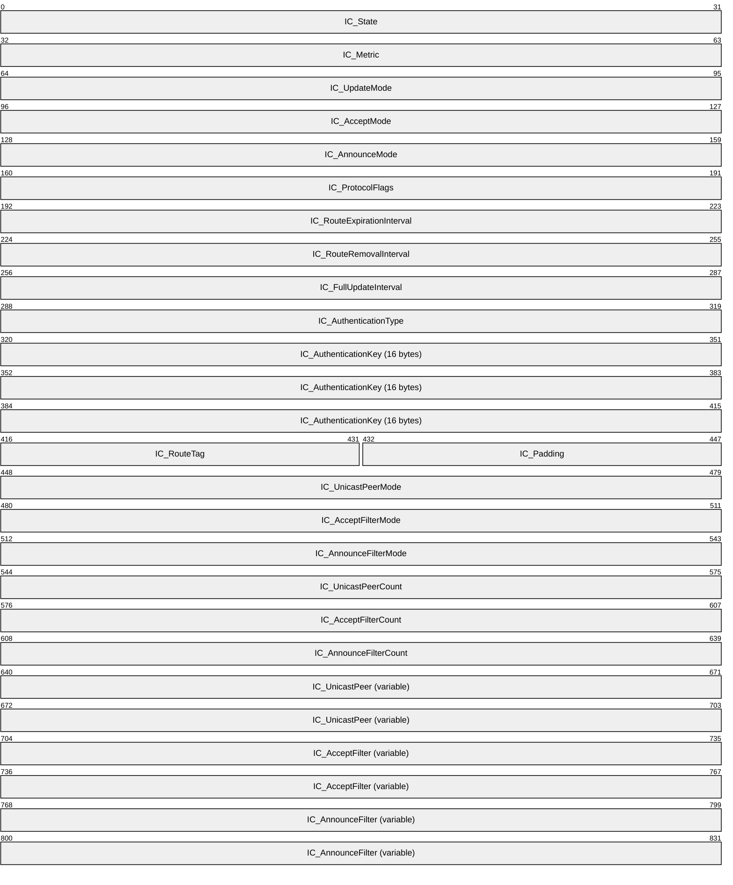

**IC_State (4 bytes):** Specifies the IP RIP state on the interface. This field MUST be read-only and MUST be ignored if modified. It MUST be a combination of one or more of the following values.

| Value | Meaning |
| --- | --- |
| IPRIP_STATE_ENABLED 0x00000001 | The IP RIP is enabled. |
| IPRIP_STATE_BOUND 0x00000002 | The socket is bound. |

**IC_Metric (4 bytes):** Specifies the metric of the interface.

**IC_UpdateMode (4 bytes):** Specifies whether the update mode is periodic or on demand.

| Value | Meaning |
| --- | --- |
| IPRIP_UPDATE_PERIODIC 0x00000000 | The RIP updates are done periodically. |
| IPRIP_UPDATE_DEMAND 0x00000001 | The RIP updates are done only when there is change. |

**IC_AcceptMode (4 bytes):** Specifies the type of routes that are accepted.

| Value | Meaning |
| --- | --- |
| IPRIP_ACCEPT_DISABLED 0x00000000 | Does not accept routes. |
| IPRIP_ACCEPT_RIP1 0x00000001 | Accepts RIPv1 routes. |
| IPRIP_ACCEPT_RIP1_COMPAT 0x00000002 | Accepts RIPv1 compatible routes (RIPv1 was designed to be compatible with future versions of the RIP. If a RIPv1 router receives a message and if the RIP version indicated in the RIP header is not 1, the RIPv1 router does not discard the RIP announcement, but instead processes only the RIPv1 defined fields.) |
| IPRIP_ACCEPT_RIP2 0x00000003 | Accepts RIPv2 routes. See [[RFC1723]](https://go.microsoft.com/fwlink/?LinkId=144665). |

**IC_AnnounceMode (4 bytes):** Specifies the type of routes that are announced.

| Value | Meaning |
| --- | --- |
| IPRIP_ANNOUNCE_DISABLED 0x00000000 | Does not announce routes. |
| IPRIP_ANNOUNCE_RIP1 0x00000001 | Announces RIPv1 routes. |
| IPRIP_ANNOUNCE_RIP1_COMPAT 0x00000002 | Accepts RIPv1 compatible routes. (RIPv1 was designed to be compatible with future versions of the RIP. If a RIPv1 router receives a message and if the RIP version indicated in the RIP header is not 1, the RIPv1 router does not discard the RIP announcement, but instead processes only the RIPv1 defined fields.) |
| IPRIP_ANNOUNCE_RIP2 0x00000003 | Announces RIPv2 routes. See [RFC1723]. |

**IC_ProtocolFlags (4 bytes):** Specifies which routes are included or excluded from RIP announcements.

| Value | Meaning |
| --- | --- |
| IPRIP_FLAG_ACCEPT_HOST_ROUTES 0x00000000 | Specifies whether host routes in received RIP announcements are accepted. |
| IPRIP_FLAG_ANNOUNCE_HOST_ROUTES 0x00000002 | Specifies whether host routes are included in RIP announcements. |
| IPRIP_FLAG_ACCEPT_DEFAULT_ROUTES 0x00000004 | Specifies whether host routes are included in RIP announcements. |
| IPRIP_FLAG_ANNOUNCE_DEFAULT_ROUTES 0x00000008 | Specifies whether default routes are included in RIP announcements. |
| IPRIP_FLAG_SPLIT_HORIZON 0x00000010 | Enables split-horizon processing. Specifies whether routes learned on a network are not announced in RIP announcements sent on that network. |
| IPRIP_FLAG_POISON_REVERSE 0x00000020 | Enables the poison-reverse processing. Specifies whether routes learned on a network are announced with a metric of 16 (unreachable) in RIP announcements sent on that network. |
| IPRIP_FLAG_GRACEFUL_SHUTDOWN 0x00000040 | Sends cleanup updates when shutting down. Specifies whether, if the RIP is stopping on this interface, the RIP sends an announcement with all routes that are marked with a metric of 15. This enables neighboring routers to immediately update their routing tables to indicate that the routes available through the router that is stopping are no longer reachable. |
| IPRIP_FLAG_TRIGGERED_UPDATES 0x00000080 | Enables triggered updates processing. Specifies whether new routes and metric changes trigger an immediate update that includes only the changes. This is called a triggered update. |
| IPRIP_FLAG_OVERWRITE_STATIC_ROUTES 0x00000100 | Overwrites the static routes on the interface. |
| IPRIP_FLAG_NO_SUBNET_SUMMARY 0x00000200 | Specifies that subnet routes are not summarized in the form of the class-based network ID when announced on a network that is not a subnet of the class-based network ID. By default, subnet summarization is disabled. |

**IC_RouteExpirationInterval (4 bytes):** The lifetime (in seconds) of a route that is learned through the RIP before it expires.

**IC_RouteRemovalInterval (4 bytes):** The amount of time (in seconds) after which a RIP-learned route that has expired is removed from the routing table.

**IC_FullUpdateInterval (4 bytes):** The number of seconds between full RIP updates.

**IC_AuthenticationType (4 bytes):** One of the following values.

| Value | Meaning |
| --- | --- |
| IPRIP_AUTHTYPE_NONE 0x00000001 | No authentication is used. |
| IPRIP_AUTHTYPE_SIMPLE_PASSWORD 0x00000002 | Password authentication is used. Plain comparison of text is made. |
| IPRIP_AUTHTYPE_MD5 0x00000003 | This is unused. |

**IC_AuthenticationKey (16 bytes):** The authentication data being sent depending on IC_AuthenticationType. This MUST be a write-only field and MUST be ignored on receive.

**IC_RouteTag (2 bytes):** A tag number for the routes advertised on this interface. Use this option if to have all packets sent over this interface to include a tag in RIP version 2 announcements. See [RFC1723].

**IC_Padding (2 bytes):** This is a padding field and MUST be set to 0 and ignored on receive.

**IC_UnicastPeerMode (4 bytes):** This MUST be one of the following values.

| Value | Meaning |
| --- | --- |
| IPRIP_PEER_DISABLED 0x00000000 | RIP packets will not be sent to peers. |
| IPRIP_PEER_ALSO 0x00000001 | RIP packets will be sent to peers, as well as being sent via broadcast or multicast. |
| IPRIP_PEER_ONLY 0x00000002 | RIP packets will only be sent to the peers specified in the structure. |

**IC_AcceptFilterMode (4 bytes):** This MUST be one of the following values.

| Value | Meaning |
| --- | --- |
| IPRIP_FILTER_DISABLED 0x00000000 | Updates from all IP addresses are accepted. |
| IPRIP_FILTER_INCLUDE 0x00000001 | Updates are only accepted from the IP addresses specified by the IC_AcceptFilter. |
| IPRIP_FILTER_EXCLUDE 0x00000002 | Ignores updates from the IP addresses specified by the IC_AcceptFilter. |

**IC_AnnounceFilterMode (4 bytes):** This MUST be one of the following values.

| Value | Meaning |
| --- | --- |
| IPRIP_FILTER_DISABLED 0x00000000 | Updates from all IP addresses are accepted. |
| IPRIP_FILTER_INCLUDE 0x00000001 | Updates are only accepted from IP addresses specified by the IC_AnnounceFilter. |
| IPRIP_FILTER_EXCLUDE 0x00000002 | Ignores updates from the IP addresses specified by the IC_AnnounceFilter. |

**IC_UnicastPeerCount (4 bytes):** The number of peer IP addresses specified in **IC_UnicastPeer** array.

**IC_AcceptFilterCount (4 bytes):** The number of accept filters specified in **IC_AcceptFilter**.

**IC_AnnounceFilterCount (4 bytes):** The number of announce filters specified in **IC_AnnounceFilter**.

**IC_UnicastPeer (variable):** This specifies an array of IPv4 address of the peers in network byte order. The array MUST have **IC_UnicastPeerCount** number of elements in it.

**IC_AcceptFilter (variable):** This specifies an array of [**IPRIP_ROUTE_FILTER (section**](#Section_2.2.1.2.167) 2.2.1.2.167) entries. The array MUST have **IC_AcceptFilterCount** number of elements in it. The default filter action to be applied for these filters is specified by **IC_AcceptFilterMode**.

**IC_AnnounceFilter (variable):** This specifies an array of **IPRIP_ROUTE_FILTER** entries. The array MUST have **IC_AnnounceFilterCount** number of elements in it. The default filter action to be applied for these filters is specified by **IC_AnnounceFilterMode**.

<a id="Section_2.2.1.2.167"></a>
##### 2.2.1.2.167 IPRIP_ROUTE_FILTER

The **IPRIP_ROUTE_FILTER** structure is used to specify a route filter for use in the **IC_AcceptFilter** and **IC_AnnounceFilter** fields of the [**IPRIP_IF_CONFIG(section2.2.1.2.166)**](#Section_2.2.1.2.166) structure.

typedef struct_IPRIP_ROUTE_FILTER{

DWORDRF_LoAddress;

DWORDRF_HiAddress;

} IPRIP_ROUTE_FILTER,

*PIPRIP_ROUTE_FILTER;

**RF_LoAddress:** The starting IPv4 address of the route filter specified in network byte order.

**RF_HiAddress:** The ending IPv4 address of the route filter specified in network byte order.

<a id="Section_2.2.1.2.168"></a>
##### 2.2.1.2.168 IPRIP_IF_BINDING

The **IPRIP_IF_BINDING** structure is an MIB entry that contains the table of IP addresses to which each interface is bound. This structure is used in [**IPRIP_MIB_GET_INPUT_DATA(section2.2.1.2.161)**](#Section_2.2.1.2.161) and [**IPRIP_MIB_GET_OUTPUT_DATA(section2.2.1.2.162)**](#Section_2.2.1.2.162) structures.

All IP addresses are in network order. This structure is variable length.

The base structure contains the field **IB_AddrCount**, which gives the number of IP addresses to which the indexed interface is bound. The IP addresses themselves follow the base structure and are given as [**IPRIP_IP_ADDRESS(section2.2.1.2.169)**](#Section_2.2.1.2.169) structures. This MIB entry is read-only.

typedef struct_IPRIP_IF_BINDING{

DWORDIB_State;

DWORDIB_AddrCount;

} IPRIP_IF_BINDING,

*PIPRIP_IF_BINDING;

**IB_State:** The IP RIP state on the interface. It MUST be a combination of one or more of the following values.

| Value | Meaning |
| --- | --- |
| IPRIP_STATE_ENABLED 0x00000001 | The IP RIP is enabled. |
| IPRIP_STATE_BOUND 0x00000002 | The socket is bound. |

**IB_AddrCount:** The number of **IPRIP_IP_ADDRESS** structures present at the end of this structure.

<a id="Section_2.2.1.2.169"></a>
##### 2.2.1.2.169 IPRIP_IP_ADDRESS

The **IPRIP_IP_ADDRESS** structure is used for storing interface bindings. A series of structures of this type follows the [**IPRIP_IF_BINDING(section2.2.1.2.168)**](#Section_2.2.1.2.168) structure. This structure is used in **IPRIP_IF_BINDING**. Both fields are IP address fields in network-order.

typedef struct_IPRIP_IP_ADDRESS{

DWORDIA_Address;

DWORDIA_Netmask;

} IPRIP_IP_ADDRESS,

*PIPRIP_IP_ADDRESS;

**IA_Address:** The IP address.

**IA_Netmask:** The net mask. See [[RFC950]](https://go.microsoft.com/fwlink/?LinkId=90501).

<a id="Section_2.2.1.2.170"></a>
##### 2.2.1.2.170 IPRIP_PEER_STATS

The **IPRIP_PEER_STATS** structure is an MIB entry that describes the statistics kept about neighboring routers. All IP addresses are in network order. This structure is read-only. This structure is used in [**IPRIP_MIB_GET_INPUT_DATA(section2.2.1.2.161)**](#Section_2.2.1.2.161) and [**IPRIP_MIB_GET_OUTPUT_DATA(section2.2.1.2.162)**](#Section_2.2.1.2.162) structures.

typedef struct_IPRIP_PEER_STATS{

DWORDPS_LastPeerRouteTag;

DWORDPS_LastPeerUpdateTickCount;

DWORDPS_LastPeerUpdateVersion;

DWORDPS_BadResponsePacketsFromPeer;

DWORDPS_BadResponseEntriesFromPeer;

} IPRIP_PEER_STATS,

*PIPRIP_PEER_STATS;

**PS_LastPeerRouteTag:** The route tag last received from the peer.

**PS_LastPeerUpdateTickCount:** The number of updates received from peer.

**PS_LastPeerUpdateVersion:** The RIP version of the last update received from peer.

**PS_BadResponsePacketsFromPeer:** The number of bad response packets received from peer.

**PS_BadResponseEntriesFromPeer:** The number of bad entries in responses received from peer.

<a id="Section_2.2.1.2.171"></a>
##### 2.2.1.2.171 IGMP_MIB_GET_INPUT_DATA

The **IGMP_MIB_GET_INPUT_DATA** structure is passed as input data for the following methods:

- [**RMIBEntryGet(section3.1.4.30)**](#Section_3.1.4.30)
- [**RMIBEntryGetFirst(section3.1.4.31)**](#Section_3.1.4.31)
- [**RMIBEntryGetNext(section3.1.4.32)**](#Section_3.1.4.32)
All IP addresses MUST be in network order.

typedef struct_IGMP_MIB_GET_INPUT_DATA{

DWORDTypeId;

USHORTFlags;

USHORTSignature;

DWORDIfIndex;

DWORDRasClientAddr;

DWORDGroupAddr;

DWORDCount;

} IGMP_MIB_GET_INPUT_DATA,

*PIGMP_MIB_GET_INPUT_DATA;

**TypeID:** Specifies the type of entry being requested. It MUST be one of the following, otherwise an error is returned.

| Value | Meaning |
| --- | --- |
| IGMP_IF_STATS_ID 0x00000004 | The Internet Group Management Protocol (IGMP) statistics for an interface. If **TypeID** is set to this value, **Count** MUST be nonzero. |
| IGMP_IF_GROUPS_LIST_ID 0x00000005 | The list of multicast group members on an interface. If **TypeID** is set to this value, **Count** MUST be nonzero. |
| IGMP_GROUP_IFS_LIST_ID 0x00000006 | The list of interfaces joined for a group. If **TypeID** is set to this value, **Count** MUST be nonzero and **GroupAddr** MUST match a valid existing IGMP group address. |
| IGMP_PROXY_IF_INDEX_ID 0x00000007 | Returns the index of the interface owned by the IGMP proxy. **RMIBEntryGetNext** is invalid as there is only one proxy interface and ERROR_NO_MORE_ITEMS is returned. |

**Flags:** This MUST be one of the following combinations, otherwise an error is returned.

| Value | Meaning |
| --- | --- |
| IGMP_ENUM_FOR_RAS_CLIENTS 0x00000001 | Enumerate for RAS clients only. |
| IGMP_ENUM_ONE_ENTRY 0x00000002 | Return only one interface group entry. |
| IGMP_ENUM_ALL_INTERFACES_GROUPS 0x00000004 | Enumerate all interfaces. If enumeration reaches end of an interface, it will go to the next interface. |
| IGMP_ENUM_ALL_TABLES 0x00000010 | Enumerate all tables. |
| IGMP_ENUM_SUPPORT_FORMAT_IGMPV3 0x00000010 | Set if IGMPv3 is supported. |

**Signature:** This MUST be set to zero (0).

**IfIndex:** The index of the interface for which information needs to be retrieved.

**RasClientAddr:** The address of the RAS client for which information needs to be retrieved.

**GroupAddr:** The IGMP group address for which information needs to be retrieved.

**Count:** The count of entries that need to be retrieved.

<a id="Section_2.2.1.2.172"></a>
##### 2.2.1.2.172 IGMP_MIB_GET_OUTPUT_DATA

The **IGMP_MIB_GET_OUTPUT_DATA** structure is written into the output data on calling the following methods:

- [**RMIBEntryGet(section3.1.4.30)**](#Section_3.1.4.30)
- [**RMIBEntryGetFirst(section3.1.4.31)**](#Section_3.1.4.31)
- [**RMIBEntryGetNext(section3.1.4.32)**](#Section_3.1.4.32)
```mermaid
packet-beta
  0-31: "TypeID"
  32-63: "Flags"
  64-95: "Count"
  96-159: "Buffer (variable)"
```

**TypeID (4 bytes):** Specifies the type of entry being populated.

| Value | Meaning |
| --- | --- |
| IGMP_IF_STATS_ID 0x00000004 | Returns the statistics for an interface, see [**IGMP_MIB_IF_STATS**](#Section_2.2.1.2.177) for more details. |
| IGMP_IF_GROUPS_LIST_ID 0x00000005 | Returns the list of multicast group members on an interface, [**IGMP_MIB_IF_GROUPS_LIST**](#Section_2.2.1.2.175). |
| IGMP_GROUP_IFS_LIST_ID 0x00000006 | Returns the list of interfaces joined for that group, [**IGMP_MIB_GROUP_IFS_LIST**](#Section_2.2.1.2.178). |
| IGMP_PROXY_IF_INDEX_ID 0x00000007 | Returns the index of interface owned by the IGMP proxy. |

**Flags (4 bytes):** This MUST be a combination of the following flags.

| Value | Meaning |
| --- | --- |
| IGMP_ENUM_FOR_RAS_CLIENTS 0x00000001 | Enumerate for RAS clients only. |
| IGMP_ENUM_ONE_ENTRY 0x00000002 | Returns only one interface group entry. |
| IGMP_ENUM_ALL_INTERFACES_GROUPS 0x00000004 | Enumerate all interfaces. If the enumeration reaches the end of an interface, it will go to the next interface. |
| IGMP_ENUM_ALL_TABLES 0x00000010 | Enumerate all tables. |
| IGMP_ENUM_SUPPORT_FORMAT_IGMPV3 0x00000010 | Set if IGMPv3 is supported. |
| IGMP_ENUM_INTERFACE_TABLE_BEGIN 0x00000100 | Indicates the beginning of the table. |
| IGMP_ENUM_INTERFACE_TABLE_CONTINUE 0x00000200 | The enumeration for the interface has to continue. |
| IGMP_ENUM_INTERFACE_TABLE_END 0x00000400 | End of the enumeration for the interface. |
| IGMP_ENUM_FORMAT_IGMPV3 0x00001000 | A set of IGMPv3 information is present. |

**Count (4 bytes):** The number of entries being returned.

**Buffer (variable):** One of the structures specified previously depending on the **TypeId**.

<a id="Section_2.2.1.2.173"></a>
##### 2.2.1.2.173 IGMP_MIB_GLOBAL_CONFIG

The **IGMP_MIB_GLOBAL_CONFIG** structure contains the global configuration for the IGMP. This structure is used in the following methods:

- [**RRouterInterfaceTransportSetGlobalInfo (section 3.1.4.10)**](#Section_3.1.4.10)
- [**RRouterInterfaceTransportGetGlobalInfo (section 3.1.4.11)**](#Section_3.1.4.11)
typedef struct_IGMP_MIB_GLOBAL_CONFIG{

DWORDVersion;

DWORDLoggingLevel;

DWORD RasClientStats;

} IGMP_MIB_GLOBAL_CONFIG,

*PIGMP_MIB_GLOBAL_CONFIG;

**Version:** It MUST be one of the following.

| Value | Meaning |
| --- | --- |
| IGMP_VERSION_1_2 0x00000201 | IGMPv1 or IGMPv2 |
| IGMP_VERSION_3 0x00000301 | IGMPv3 |

**LoggingLevel:** Specifies the logging level. It MUST be one of the following values.

| Value | Meaning |
| --- | --- |
| IGMP_LOGGING_NONE 0x00000000 | No logging is done. |
| IGMP_LOGGING_ERROR 0x00000001 | Only errors are logged. |
| IGMP_LOGGING_WARN 0x00000002 | Errors and warnings are logged. |
| IGMP_LOGGING_INFO 0x00000003 | Errors, warnings, and information is logged. |

**RasClientStats:** If **RASClientStats** is nonzero, then per RAS client statistics are maintained.

<a id="Section_2.2.1.2.174"></a>
##### 2.2.1.2.174 IGMP_MIB_IF_CONFIG

The **IGMP_MIB_IF_CONFIG** structure contains per-interface configuration. This structure is used in the following methods:

- [**RRouterInterfaceTransportAdd(section3.1.4.18)**](#Section_3.1.4.18)
- [**RRouterInterfaceTransportGetInfo(section3.2.4.19)**](#Section_3.2.4.19)
- [**RRouterInterfaceTransportSetInfo(section3.1.4.20)**](#Section_3.1.4.20)
All IP address fields MUST be in network order.

typedef struct_IGMP_MIB_IF_CONFIG{

DWORDVersion;

DWORDIfIndex;

DWORDIpAddr;

DWORDIfType;

DWORDFlags;

DWORDIgmpProtocolType;

DWORDRobustnessVariable;

DWORDStartupQueryInterval;

DWORDStartupQueryCount;

DWORDGenQueryInterval;

DWORDGenQueryMaxResponseTime;

DWORDLastMemQueryInterval;

DWORDLastMemQueryCount;

DWORDOtherQuerierPresentInterval;

DWORDGroupMembershipTimeout;

DWORDNumStaticGroups;

} IGMP_MIB_IF_CONFIG,

*PIGMP_MIB_IF_CONFIG;

**Version:** It MUST be one of the following values.

| Value | Meaning |
| --- | --- |
| IGMP_VERSION_1_2 0x00000201 | IGMPv1 or IGMPv2 |
| IGMP_VERSION_3 0x00000301 | IGMPv3 |

**IfIndex:** The index of the interface, it is read-only.

**IpAddr:** The IP address of the interface, it is read-only.

**IfType:** The type of the interface, it is read-only. It MUST be one of the following values.

| Value | Meaning |
| --- | --- |
| IGMP_IF_NOT_RAS 0x00000001 | The interface is connected to a LAN. |
| IGMP_IF_RAS_ROUTER 0x00000002 | The interface is connected to another router over RAS. |
| IGMP_IF_RAS_SERVER 0x00000003 | The entry corresponds to a RAS server if it contains statistics, then it represents summarized statistics. |
| IGMP_IF_RAS_CLIENT 0x00000004 | The entry corresponds to a RAS client. |
| IGMP_IF_PROXY 0x00000008 | One of the first four flags will still be set to enable the switch from the proxy to an IGMP router. |

**Flags:** It MUST be one of the following values.

| Value | Meaning |
| --- | --- |
| IGMP_INTERFACE_ENABLED_IN_CONFIG 0x00000001 | The interface is enabled in this configuration. |
| IGMP_ACCEPT_RTRALERT_PACKETS_ONLY 0x00000002 | Can accept only router alerts. |

**IgmpProtocolType:** Takes one of the following values.

| Value | Meaning |
| --- | --- |
| IGMP_PROXY 0x00000000 | The interface is an IGMPv2 proxy. |
| IGMP_ROUTER_V1 0x00000001 | The interface is an IGMPv1 router. |
| IGMP_ROUTER_V2 0x00000002 | The interface is an IGMPv2 router. |
| IGMP_ROUTER_V3 0x00000003 | The interface is an IGMPv3 router. |
| IGMP_PROXY_V3 0x00000010 | The interface is an IGMPv3 proxy. |

**RobustnessVariable:** The robustness variable is a way of indicating the lossy nature of the subnet to which this interface is attached. The IGMP can recover from lost IGMP packets (robustness variable is set to 1). The robustness variable SHOULD be set to a value of 2 or greater.

**StartupQueryInterval:** The startup query interval is the amount of time in seconds between successive general query messages sent by a querier during startup.

**StartupQueryCount:** The startup query count is the number of general query messages sent at startup.

**GenQueryInterval:** The query interval is the amount of time, in seconds, between the IGMP general query messages sent by the router (if the router is the querier on this subnet).

**GenQueryMaxResponseTime:** The query response interval is the maximum amount of time, in seconds, that the IGMP router waits to receive a response to a general query message.

**LastMemQueryInterval:** The last member query interval is the amount of time, in milliseconds, that the IGMP router waits to receive a response to a group-specific query message. The last member query interval is also the amount of time, in seconds, between successive group-specific query messages.

**LastMemQueryCount:** The last member query count is the number of group-specific query messages sent before the router assumes there are no members of the host group being queried on this interface.

**OtherQuerierPresentInterval:** Displays the calculated other querier present interval. The other querier present interval is the number of seconds that MUST pass before a multicast router determines that there is no other multicast router that can be the querier. The other querier present interval is (robustness variable) * (query interval) + (query response interval)/2.

**GroupMembershipTimeout:** Displays the calculated group membership interval. The group membership interval is the number of seconds that MUST pass before a multicast router determines that there are no more members of a host group on a subnet. The group membership interval is (robustness variable) * (query interval) + (query response interval).

**NumStaticGroups:** The number of static groups. This value MUST be zero (0) when calling RRouterInterfaceTransportAdd and RRouterInterfaceTransportSetInfo.

<a id="Section_2.2.1.2.175"></a>
##### 2.2.1.2.175 IGMP_MIB_IF_GROUPS_LIST

The **IGMP_MIB_IF_GROUPS_LIST** structure is an MIB entry that stores the list of multicast groups that are members of that interface. This structure has variable length. The structure is followed by **NumGroups** number of [**IGMP_MIB_GROUP_INFO(section2.2.1.2.176)**](#Section_2.2.1.2.176) structures.

typedef struct_IGMP_MIB_IF_GROUPS_LIST{

DWORDIfIndex;

DWORDIpAddr;

DWORDIfType;

DWORDNumGroups;

BYTEBuffer[1];

} IGMP_MIB_IF_GROUPS_LIST,

*PIGMP_MIB_IF_GROUPS_LIST;

**IfIndex:** Index of the interface

**IpAddr:** IP address of the interface

**IfType:** Type of the interface, MUST be one of the following values.

| Value | Meaning |
| --- | --- |
| IGMP_IF_NOT_RAS 0x00000001 | The interface is connected to a LAN |
| IGMP_IF_RAS_ROUTER 0x00000002 | The interface is connected to another router over RAS |
| IGMP_IF_RAS_SERVER 0x00000003 | The entry corresponds to a RAS server if it contains stats, then it represents summarized stats |
| IGMP_IF_RAS_CLIENT 0x00000004 | The entry corresponds to a RAS client |
| IGMP_IF_PROXY 0x00000008 | then one of the 1st 4 flags still will be set to enable switch from proxy to IGMP router |

**NumGroups:** Number of **IGMP_MIB_GROUP_INFO** structures

**Buffer:** MUST point to **IGMP_MIB_GROUP_INFO**.

<a id="Section_2.2.1.2.176"></a>
##### 2.2.1.2.176 IGMP_MIB_GROUP_INFO

The **IGMP_MIB_GROUP_INFO** structure is used in the [**IGMP_MIB_IF_GROUPS_LIST(section2.2.1.2.175)**](#Section_2.2.1.2.175) structure. If the interface is of type IGMP_IF_RAS_SERVER then the group membership of all the RAS clients is summarized, and the **GroupUpTime** and **GroupExpiryTime** is the maximum over all member RAS clients, while the **V1HostPresentTimeLeft** is set to 0. If the interface is of type IGMP_IF_RAS_CLIENT, the **IpAddr** is the next hop IP address of the RAS client.

typedef struct_IGMP_MIB_GROUP_INFO{

union{

DWORDIfIndex;

DWORDGroupAddr;

};

DWORDIpAddr;

DWORDGroupUpTime;

DWORDGroupExpiryTime;

DWORDLastReporter;

DWORDV1HostPresentTimeLeft;

DWORDFlags;

} IGMP_MIB_GROUP_INFO,

*PIGMP_MIB_GROUP_INFO;

**IfIndex/ GroupAddr:** The index of the interface or group address.

**IpAddr:** The IP address of the interface.

**GroupUpTime:** The time, in seconds, since the group is up.

**GroupExpiryTime:** The time, in seconds, before the group expires.

**LastReporter:** The IP address of the last reporter.

**V1HostPresentTimeLeft:** The time left for the present IGMPv1 hosts.

**Flags:** It MUST be one of the following values.

| Value | Meaning |
| --- | --- |
| IGMP_GROUP_TYPE_NON_STATIC 0x00000001 | The IGMP group is not static. |
| IGMP_GROUP_TYPE_STATIC 0x00000002 | The IGMP group is static. |
| IGMP_GROUP_FWD_TO_MGM 0x00000004 | The IGMP group needs to be forwarded to the multiple multicast routing protocols. |
| IGMP_GROUP_ALLOW 0x00000010 | Allows IGMP groups. |
| IGMP_GROUP_BLOCK 0x00000020 | Blocks IGMP groups. |
| IGMP_GROUP_NO_STATE 0x00000040 | There is no IGMP group state. |

<a id="Section_2.2.1.2.177"></a>
##### 2.2.1.2.177 IGMP_MIB_IF_STATS

The **IGMP_MIB_IF_STATS** structure contains statistics about an interface.

typedef struct_IGMP_MIB_IF_STATS{

DWORDIfIndex;

DWORDIpAddr;

DWORDIfType;

BYTEState;

BYTEQuerierState;

DWORDIgmpProtocolType;

DWORDQuerierIpAddr;

DWORDProxyIfIndex;

DWORDQuerierPresentTimeLeft;

DWORDLastQuerierChangeTime;

DWORDV1QuerierPresentTimeLeft;

DWORDUptime;

DWORDTotalIgmpPacketsReceived;

DWORDTotalIgmpPacketsForRouter;

DWORDGeneralQueriesReceived;

DWORDWrongVersionQueries;

DWORDJoinsReceived;

DWORDLeavesReceived;

DWORDCurrentGroupMemberships;

DWORDGroupMembershipsAdded;

DWORDWrongChecksumPackets;

DWORDShortPacketsReceived;

DWORDLongPacketsReceived;

DWORDPacketsWithoutRtrAlert;

} IGMP_MIB_IF_STATS,

*PIGMP_MIB_IF_STATS;

**IfIndex:** The index of the interface.

**IpAddr:** The IP address of the interface. If the interface is a RAS interface, then the **IpAddr** is set to the **NextHopAddress** of the RAS client.

**IfType:** The type of the interface. It MUST be one of the following values.

| Value | Meaning |
| --- | --- |
| IGMP_IF_NOT_RAS 0x00000001 | The interface is connected to a LAN. |
| IGMP_IF_RAS_ROUTER 0x00000002 | The interface is connected to another router over RAS. |
| IGMP_IF_RAS_SERVER 0x00000003 | The entry corresponds to a RAS server if it contains statistics and it represents summary statistics. |
| IGMP_IF_RAS_CLIENT 0x00000004 | The entry corresponds to a RAS client. |
| IGMP_IF_PROXY 0x00000008 | The interface is an IGMP PROXY. One of the first four flags will still be set to enable the switch from the proxy to the IGMP router. |

**State:** It MUST be a combination of one or more of the following values.

| Value | Meaning |
| --- | --- |
| IGMP_STATE_BOUND 0x01 | The socket is bound. |
| IGMP_STATE_ENABLED_BY_RTRMGR 0x02 | The interface is enabled by router. |
| IGMP_STATE_ENABLED_IN_CONFIG 0x04 | The interface is enabled in the configuration. |
| IGMP_STATE_ENABLED_BY_MGM 0x08 | The interface is enabled by component that aggregates multiple routing protocols. |

**QuerierState:** It MUST be one of the following.

| Value | Meaning |
| --- | --- |
| RTR_QUERIER 0x10 | The interface is the IGMP querier. |
| RTR_NOT_QUERIER 0x00 | The interface is not the IGMP querier. |

**IgmpProtocolType:** Takes one of the following values.

| Value | Meaning |
| --- | --- |
| IGMP_PROXY 0x00000000 | The interface is an IGMPv2 proxy. Specifies that the IGMPv2 proxy mode is enabled on this interface. An interface in IGMP proxy mode acts as a host, forwarding the IGMP host membership messages for all the IGMP host membership messages received on all other interfaces on which the IGMP router mode is enabled. Additionally, all nonlocal multicast traffic received on all other interfaces (on which the IGMP router mode is enabled) is forwarded over the IGMP proxy mode interface. |
| IGMP_ROUTER_V1 0x00000001 | The interface is an IGMPv1 router. Specifies that IGMPv1 router mode is enabled on this interface. An interface in IGMP router mode listens for IGMP messages from hosts and updates the TCP/IP multicast forwarding table. |
| IGMP_ROUTER_V2 0x00000002 | The interface is an IGMPv2 router. Specifies that IGMPv2 router mode is enabled on this interface. An interface in IGMP router mode listens for IGMP messages from hosts and updates the TCP/IP multicast forwarding table. |
| IGMP_ROUTER_V3 0x00000003 | The interface is an IGMPv3 router. Specifies that IGMPv3 router mode is enabled on this interface. An interface in IGMP router mode listens for IGMP messages from hosts and updates the TCP/IP multicast forwarding table. |
| IGMP_PROXY_V3 0x00000010 | The interface is an IGMPv3 proxy. Specifies that IGMPv3 proxy mode is enabled on this interface. An interface in IGMP proxy mode acts as a host, forwarding IGMP host membership messages for all IGMP host membership messages received on all other interfaces on which IGMP router mode is enabled. Additionally, all nonlocal multicast traffic received on all other interfaces (on which IGMP router mode is enabled) is forwarded over the IGMP proxy mode interface. |

**QuerierIpAddr:** The IP address of the querier.

**ProxyIfIndex:** The **IfIndex** of the IGMP proxy.

**QuerierPresentTimeLeft:** If no IGMPv2 queries are heard on this interface within this interval, the local router will take over the querier on the IP subnet to which this interface is attached.

**LastQuerierChangeTime:** The number of seconds since **QuerierIpAddr** was last changed.

**V1QuerierPresentTimeLeft:** The time remaining until the host assumes that there are no IGMPv1 routers present on the interface. While this is nonzero, the host will reply to all queries with version 1 membership reports.

**Uptime:** The time, in seconds, the interface has been activated.

**TotalIgmpPacketsReceived:** The total IGMP packets received.

**TotalIgmpPacketsForRouter:** The total IGMP packets received for a router.

**GeneralQueriesReceived:** The total queries received.

**WrongVersionQueries:** The count of wrong version queries received.

**JoinsReceived:** The count of IGMP joins received.

**LeavesReceived:** The count of IGMP leaved received.

**CurrentGroupMemberships:** The count of current group memberships.

**GroupMembershipsAdded:** The count of group memberships received.

**WrongChecksumPackets:** The count of packets with wrong checksum received.

**ShortPacketsReceived:** The count of short packets received.

**LongPacketsReceived:** The count of long packets received.

**PacketsWithoutRtrAlert:** The count of packets with router alerts received.

<a id="Section_2.2.1.2.178"></a>
##### 2.2.1.2.178 IGMP_MIB_GROUP_IFS_LIST

The **IGMP_MIB_GROUP_IFS_LIST** structure is an MIB entry and stores the list of interfaces that have received joins for that group. This structure has variable length. The structure is followed by the **NumInterfaces** number of structures of type [**IGMP_MIB_GROUP_INFO**](#Section_2.2.1.2.176) or [**IGMP_MIB_GROUP_INFO_V3**](#Section_2.2.1.2.180).

This structure is read only.

```mermaid
packet-beta
  0-31: "GroupAddr"
  32-63: "NumInterfaces"
  64-127: "Buffer (variable)"
```

**GroupAddr (4 bytes):** The address of the IGMP group.

**NumInterfaces (4 bytes):** The number of structures in the buffer.

**Buffer (variable):** If IGMP_ENUM_FORMAT_IGMPV3 is set, then **Flags** of [**IGMP_MIB_GET_OUTPUT_DATA**](#Section_2.2.1.2.172) contains **IGMP_MIB_GROUP_INFO_V3** structures. Otherwise, it contains **IGMP_MIB_GROUP_INFO** structures.

<a id="Section_2.2.1.2.179"></a>
##### 2.2.1.2.179 IGMP_MIB_GROUP_SOURCE_INFO_V3

The **IGMP_MIB_GROUP_SOURCE_INFO_V3** structure provides information about each source IP endpoint.

typedef struct _IGMP_MIB_GROUP_SOURCE_INFO_V3 {

DWORD Source;

DWORD SourceExpiryTime;

DWORD SourceUpTime;

DWORD Flags;

} IGMP_MIB_GROUP_SOURCE_INFO_V3, *PIGMP_MIB_GROUP_SOURCE_INFO_V3;

**Source:** IP endpoint address of a source.

**SourceExpiryTime:** The time, in seconds, that remains before source expires. Not valid for exclusion mode.

**SourceUpTime:** The time, in seconds since the source was up.

**Flags:** Reserved. This is unused and SHOULD be NULL, or MAY be set to 0x00000000.

<a id="Section_2.2.1.2.180"></a>
##### 2.2.1.2.180 IGMP_MIB_GROUP_INFO_V3

The **IGMP_MIB_GROUP_INFO_V3** provides information about a group.

typedef struct_IGMP_MIB_GROUP_INFO_V3

{

union{

DWORDIfIndex;

DWORDGroupAddr;

};

DWORDIpAddr;

DWORDGroupUpTime;

DWORDGroupExpiryTime;

DWORDLastReporter;

DWORDV1HostPresentTimeLeft;

DWORDFlags;

DWORDVersion;

DWORDSize;

DWORDFilterType;

DWORDV2HostPresentTimeLeft;

DWORDNumSources;

} IGMP_MIB_GROUP_INFO_V3,

*PIGMP_MIB_GROUP_INFO_V3;

**IfIndex:** The interface for which this entry contains information for an IP multicast group address.

**GroupAddr:** The IP multicast group address for which this entry contains information.

**IpAddr:** The IP address of the interface.

**GroupUpTime:** The time, in seconds, since the group membership was up.

**GroupExpiryTime:** The time, in seconds, before the group membership expires.

**LastReporter:** The IP address of the source of the last membership report received for this IP multicast group address on this interface. If no membership report has been received, this object has the value 0.0.0.0.

**V1HostPresentTimeLeft:** The time remaining until the local router will assume that there are no longer any IGMP version 1 members on the IP subnet attached to this interface. Upon hearing any IGMPv1 membership report, this value is reset to the group membership timer. While this time remaining is nonzero, the local router ignores any IGMPv1 leave messages for this group that it receives on this interface.

**Flags:** This MUST be 0x1000 if IGMPv3 information is available and a **IGMP_MIB_GROUP_INFO_V3** structure MUST be used. All other values have no meaning.

**Version:** The IGMP version. It MUST be 3.

**Size:** The size of the structure.

**FilterType:** Indicates whether the sources specified need to be included or excluded. It MUST be either EXCLUSION (0x00000000) or INCLUSION (0x00000001).

**V2HostPresentTimeLeft:** The time remaining until the local router will assume that there are no longer any IGMP version 2 members on the IP subnet attached to this interface. Upon hearing any IGMPv2 membership report, this value is reset to the group membership timer. While this time remaining is nonzero, the local router ignores any IGMPv2 leave messages for this group that it receives on this interface.

**NumSources:** The number of entries of **IGMP_MIB_GROUP_SOURCE_INFO_V3**.

**Sources:** The **IGMP_MIB_GROUP_SOURCE_INFO_V3** structure (section [2.2.1.2.179](#Section_2.2.1.2.179)).

<a id="Section_2.2.1.2.181"></a>
##### 2.2.1.2.181 INTERFACE_ROUTE_ENTRY

The **INTERFACE_ROUTE_ENTRY** structure is used to store and retrieve entries of the IPv6 ForwardRow based on the dwIndex.

typedef struct_INTERFACE_ROUTE_ENTRY{

DWORDdwIndex;

INTERFACE_ROUTE_INFOrouteInfo;

} INTERFACE_ROUTE_ENTRY,

*PINTERFACE_ROUTE_ENTRY;

**dwIndex:** The index to the table of [**INTERFACE_ROUTE_INFO**](#Section_2.2.1.2.11) structures defined on RRAS.

**routeInfo:** This MUST be **INTERFACE_ROUTE_INFO**.

<a id="Section_2.2.1.2.182"></a>
##### 2.2.1.2.182 IP_NAT_MIB_QUERY

The **IP_NAT_MIB_QUERY** structure is used to retrieve [**Network Address Translator (NAT)**](#gt_network-address-translator-nat) information and is passed to the following methods:

- [**RMIBEntryGet(section3.1.4.30)**](#Section_3.1.4.30)
- **RMIBEntryGetFirst**(section [3.1.4.31](#Section_3.1.4.31))
- [**RMIBEntryGetNext(section3.1.4.32)**](#Section_3.1.4.32)
typedef struct_IP_NAT_MIB_QUERY{

ULONGOid;

union{

ULONGIndex;

UCHARData;

};

} IP_NAT_MIB_QUERY,

*PIP_NAT_MIB_QUERY;

**Oid:** This is an index of the NAT MIB. It MUST be one of the following values.

| Value | Meaning |
| --- | --- |
| IP_NAT_INTERFACE_STATISTICS_OID 0x00000000 | NAT interface statistics information is retrieved. When RMIBEntryGet, RMIBEntryGetFirst, and RMIBEntryGetNext return pMibOutEntry or pInfoStruct it MUST be typecast to **IP_NAT_INTERFACE_STATISTICS**(section [2.2.1.2.185)](#Section_05b6be2d788f41fd86737b3ebb4c9e4b). |
| IP_NAT_INTERFACE_MAPPING_TABLE_OID 0x00000001 | NAT interface mapping table information. When RMIBEntryGet, RMIBEntryGetFirst, and RMIBEntryGetNext return pMibOutEntry or pInfoStruct it MUST be typecast to **IP_NAT_ENUMERATE_SESSION_MAPPINGS**(section [2.2.1.2.183)](#Section_36d57fdc36e24da7b6ab5ba99481b2b6). |
| IP_NAT_MAPPING_TABLE_OID 0x00000002 | NAT mapping table information. Retrieves the session mappings of an interface. When RMIBEntryGet, RMIBEntryGetFirst, and RMIBEntryGetNext return pMibOutEntry or pInfoStruct it MUST be typecast to IP_NAT_ENUMERATE_SESSION_MAPPINGS. |

**Index:** This MUST be the index of the interface when Oid is 0x00000000.

**Data:** This MUST be **IP_NAT_ENUMERATE_SESSION_MAPPINGS** if Oid is not 0x00000000.

<a id="Section_2.2.1.2.183"></a>
##### 2.2.1.2.183 IP_NAT_ENUMERATE_SESSION_MAPPINGS

The **IP_NAT_ENUMERATE_SESSION_MAPPINGS** structure is used for enumerating [**NAT**](#gt_network-address-translator-nat) session mappings and is part of the **IP_NAT_MIB_QUERY**(section [2.2.1.2.182)](#Section_02a17b1a22a64295bc7df3b781c01332) structure.

```mermaid
packet-beta
  0-31: "Index"
  32-127: "EnumerateContext (16 bytes)"
  128-159: "EnumerateCount"
  160-191: "EnumerateTotalHint"
  192-223: "EnumerateTable(variable)"
```

**Index (4 bytes):** This MUST be the index of the interface.

**EnumerateContext (16 bytes):** This is represented by an array of 4 ULONG values. On the first call to [**RMIBEntryGet (section**](#Section_3.1.4.30) 3.1.4.30) or [**RMIBEntryGetFirst (section**](#Section_3.1.4.31) 3.1.4.31) methods **EnumerateContext** is zeroed out. It will be filled by the NAT with the information to be passed back down as the enumeration continues. To indicate there are no items remaining, the NAT will set **EnumerateContext[0]** to 0. In [**RMIBEntryGetNext (section**](#Section_3.2.4.32) [3.2.4.32](#Section_3.2.4.32)) method, **EnumerateContext** MUST be returned to the value returned in the previous calls.

**EnumerateCount (4 bytes):** Contains the number of enumerations returned and the number of **IP_NAT_SESSION_MAPPING** (section [2.2.1.2.184)](#Section_49c1cf7d15ff4c6086b79bfdfe5d0479) structures being returned.

**EnumerateTotalHint (4 bytes):** Count of the total number of entries.

**EnumerateTable (variable):** This MUST be **IP_NAT_SESSION_MAPPING** structures.

**Note** The **EnumerateTable** field is of variable size depending on the value of **EnumerateCount**. While calculating the structure size, the size of **EnumerateTable** MUST NOT be added if value of **EnumerateCount** is zero.

<a id="Section_2.2.1.2.184"></a>
##### 2.2.1.2.184 IP_NAT_SESSION_MAPPING

The **IP_NAT_SESSION_MAPPING** structure holds information for a single NAT mapping and is part of **IP_NAT_ENUMERATE_SESSION_MAPPINGS**(section [2.2.1.2.183)](#Section_36d57fdc36e24da7b6ab5ba99481b2b6).

typedef struct_IP_NAT_SESSION_MAPPING{

UCHARProtocol;

ULONGPrivateAddress;

USHORTPrivatePort;

ULONGPublicAddress;

USHORTPublicPort;

ULONGRemoteAddress;

USHORTRemotePort;

IP_NAT_DIRECTIONDirection;

ULONGIdleTime;

} IP_NAT_SESSION_MAPPING,

*PIP_NAT_SESSION_MAPPING;

**Protocol:** This MUST be one of the following.

| Value | Meaning |
| --- | --- |
| NAT_PROTOCOL_ICMP 0x01 | ICMP Protocol |
| NAT_PROTOCOL_IGMP 0x02 | IGMP Protocol |
| NAT_PROTOCOL_TCP 0x06 | TCP Protocol |
| NAT_PROTOCOL_UDP 0x11 | UDP Protocol |
| NAT_PROTOCOL_IP6IN4 0x29 | IPv6 in IPv4 |
| NAT_PROTOCOL_PPTP 0x2F | PPTP Protocol |
| NAT_PROTOCOL_IPSEC_ESP 0x32 | IPSec ESP |
| NAT_PROTOCOL_IPSEC_AH 0x33 | IPSec AH |
| NAT_PROTOCOL_PGM 0x71 | PGM |

**PrivateAddress:** The private address of the NAT entry.

**PrivatePort:** The private port of the NAT entry.

**PublicAddress:** The public address of the NAT entry.

**PublicPort:** The public port of the NAT entry

**RemoteAddress:** The remote address of the NAT entry.

**RemotePort:** The remote port of the NAT entry.

**Direction:** This MUST be IP_NAT_DIRECTION.

**IdleTime:** The time, in seconds, since the last packet matching this entry was sent or received.

<a id="Section_2.2.1.2.185"></a>
##### 2.2.1.2.185 IP_NAT_INTERFACE_STATISTICS

The **IP_NAT_INTERFACE_STATISTICS** structure holds statistics for an interface and is part of **IP_NAT_MIB_QUERY**(section [2.2.1.2.182)](#Section_02a17b1a22a64295bc7df3b781c01332) structure.

typedef struct_IP_NAT_INTERFACE_STATISTICS{

OUT ULONGTotalMappings;

OUT ULONGInboundMappings;

OUT ULONG64BytesForward;

OUT ULONG64BytesReverse;

OUT ULONG64PacketsForward;

OUT ULONG64PacketsReverse;

OUT ULONG64RejectsForward;

OUT ULONG64RejectsReverse;

} IP_NAT_INTERFACE_STATISTICS,

*PIP_NAT_INTERFACE_STATISTICS;

**TotalMappings:** The count of the total number of mappings present in the NAT table.

**InboundMappings:** The count of the total number of inbound mappings present in the NAT table.

**BytesForward:** The count of the total bytes forwarded.

**BytesReverse:** The count of the total bytes reversed.

**PacketsForward:** The count of the packets forwarded.

**PacketsReverse:** The count of the packets reversed.

**RejectsForward:** The count of the forward packets rejected.

**RejectsReverse:** The count of the reverse packets rejected.

<a id="Section_2.2.1.2.186"></a>
##### 2.2.1.2.186 IP_DNS_PROXY_MIB_QUERY

The **IP_DNS_PROXY_MIB_QUERY** structure is passed to [**RMIBEntryGet(section3.1.4.30)**](#Section_3.1.4.30) method to retrieve the DNS proxy information.

```mermaid
packet-beta
  0-31: "Oid"
  32-63: "Index"
  64-127: "Data (variable)"
```

**Oid (4 bytes):** This MUST be set to 0x00000000.

**Index (4 bytes):** This MUST be the index of the interface.

**Data (variable):** This MUST be an [**IP_DNS_PROXY_STATISTICS**](#Section_2.2.1.2.187) structure.

**Note Index** and **Data** are of variable size and while calculating the structure size, the size of **Index** or **Data** needs to be added. **Data** is unused and has been kept for extensibility.

<a id="Section_2.2.1.2.187"></a>
##### 2.2.1.2.187 IP_DNS_PROXY_STATISTICS

The **IP_DNS_PROXY_STATISTICS** structure contains the IP DNS proxy statistics.

typedef struct_IP_DNS_PROXY_STATISTICS{

ULONGMessagesIgnored;

ULONGQueriesReceived;

ULONGResponsesReceived;

ULONGQueriesSent;

ULONGResponsesSent;

} IP_DNS_PROXY_STATISTICS,

*PIP_DNS_PROXY_STATISTICS;

**MessagesIgnored:** The count of the DNS proxy messages ignored.

**QueriesReceived:** The count of the DNS proxy queries received.

**ResponsesReceived:** The count of the DNS proxy responses received.

**QueriesSent:** The count of the DNS proxy queries sent.

**ResponsesSent:** The count of the DNS proxy responses sent.

<a id="Section_2.2.1.2.188"></a>
##### 2.2.1.2.188 IP_AUTO_DHCP_MIB_QUERY

The **IP_AUTO_DHCP_MIB_QUERY** structure is used to retrieve the DNS proxy information and is passed to the following methods:

- [**RMIBEntryGet(section3.1.4.30)**](#Section_3.1.4.30)
- [**RMIBEntryGetFirst(section3.1.4.31)**](#Section_3.1.4.31)
- [**RMIBEntryGetNext(section3.1.4.32)**](#Section_3.1.4.32)
typedef struct_IP_AUTO_DHCP_MIB_QUERY{

ULONGOid;

union{

ULONGIndex;

UCHARData;

};

ULONGReserved;

} IP_AUTO_DHCP_MIB_QUERY,

*PIP_AUTO_DHCP_MIB_QUERY;

**Oid:** This MUST be set to 0x00000000.

**Index:** This MUST be index of the interface.

**Data:** This MUST be an [**IP_AUTO_DHCP_STATISTICS**](#Section_2.2.1.2.189) structure.

**Note Index** and **Data** are variable-sized arrays. While calculating the structure size, the size of **Index** or **Data** is added. **Data** is unused and has been kept for extensibility.

**Reserved:** MUST be set to zero (0) when sent and MUST be ignored on receipt.

<a id="Section_2.2.1.2.189"></a>
##### 2.2.1.2.189 IP_AUTO_DHCP_STATISTICS

The **IP_AUTO_DHCP_STATISTICS** structure contains the DHCP auto-discovery statistics. This structure defines the statistics kept by the DHCP allocator, and is accessible to the following methods:

- [**RMIBEntryGet(section3.2.4.30)**](#Section_3.2.4.30)
- [**RMIBEntryGetFirst(section3.2.4.31)**](#Section_3.2.4.31)
- [**RMIBEntryGetNext(section3.2.4.32)**](#Section_3.2.4.32)
typedef struct_IP_AUTO_DHCP_STATISTICS{

ULONGMessagesIgnored;

ULONGBootpOffersSent;

ULONGDiscoversReceived;

ULONGInformsReceived;

ULONGOffersSent;

ULONGRequestsReceived;

ULONGAcksSent;

ULONGNaksSent;

ULONGDeclinesReceived;

ULONGReleasesReceived;

} IP_AUTO_DHCP_STATISTICS,

*PIP_AUTO_DHCP_STATISTICS;

**MessagesIgnored:** The count of the messages ignored.

**BootpOffersSent:** The count of the IPBOOTP offers sent.

**DiscoversReceived:** The count of the discover messages received.

**InformsReceived:** The count of the INFORM messages received.

**OffersSent:** The count of the OFFER messages sent.

**RequestsReceived:** The count of the REQUEST messages received.

**AcksSent:** The count of the acknowledge control packets (ACKs) sent.

**NaksSent:** The count of the negative acknowledge (NAK) messages sent.

**DeclinesReceived:** The count of the DECLINE messages received.

**ReleaseReceived:** The count of the RELEASE messages received.

<a id="Section_2.2.1.2.190"></a>
##### 2.2.1.2.190 MIB_DA_MSG

The **MIB_DA_MSG** structure MAY<137> be used for retrieving OSPF MIB entries in the following methods:

- [**RMIBEntryGet(section3.1.4.30)**](#Section_3.1.4.30)
- [**RMIBEntryGetFirst(section3.1.4.31)**](#Section_3.1.4.31)
- [**RMIBEntryGetNext(section3.1.4.32)**](#Section_3.1.4.32)
typedef struct_MIB_DA_MSG{

UINT32op_code;

UINT32ret_code;

UINT32in_snmp_id[44];

UINT32obj_id[17];

UINT32attr_id;

UINT32inst_id[23];

UINT32next_snmp_id[44];

UINT32creator;

UINT32attr_type;

UINT32inst_cnt;

UINT32map_flag;

ULONG_PTRdata[32];

} MIB_DA_MSG;

**op_code:** This MUST have one of the following values.

| Value | Meaning |
| --- | --- |
| ASN_RFC1157_GETREQUEST 0x000000A0 | MIB get request: **RMIBEntryGet(section3.1.4.30)** |
| ASN_RFC1157_GETNEXTREQUEST 0x000000A1 | MIB get next request: **RMIBEntryGetNext(section3.1.4.32)** |
| ASN_RFC1157_SETREQUEST 0x000000A3 | MIB set request: [**RMIBEntrySet(section3.1.4.29)**](#Section_3.1.4.29) |

**ret_code:** This contains a return value which MUST be one of the following values.

| Value | Meaning |
| --- | --- |
| MIB_OK 0x00000000 | The call was successful. |
| All other values | The call was not successful. |

**in_snmp_id:** Contains the index of the entry that needs to be retrieved.

**in_snmp_id[0]** contains the length (excluding the zeroth element) of the data passed in **in_snmp_id**. in_snmp_id[1] onwards contains the MIB object identifier [[RFC1850]](https://go.microsoft.com/fwlink/?LinkId=144664).

| Value in_snmp_id[1] and beyond | Meaning [RFC 1850] |
| --- | --- |
| g_oidOspfAreaEntry { 4, 1, 18, 3, 5, 3, 2, 3, 2, 1 } | Open Shortest Path First (OSPF) area entry. See ospfAreaEntry, section 3.2 in [RFC1850]. Information describing the configured parameters and cumulative statistics of one of the router's attached areas. |
| g_oidOspfLsdbEntry { 4, 1, 18, 3, 5, 3, 2, 3, 3, 1 } | A single link state advertisement. See ospfLsdbEntry, section 3.4 in [RFC1850]. |
| g_oidOspfNbrEntry { 4, 1, 18, 3, 5, 3, 2, 3, 7, 1 } | The information regarding a single neighbor. See OspfNbrEntry, section 3.10 in [RFC1850]. |
| g_oidOspfVIEntry { 4, 1, 18, 3, 5, 3, 2, 3, 6, 1 } | The information about a single Virtual Interface. See OspfVirtIfEntry, section 3.9 in [RFC1850]. |
| g_oidOspfAreaState { 4, 1, 18, 3, 5, 3, 2, 3, 2, 1, 3 } | Retrieves the state. This value indicates the state of the OSPF Area, either up(0x00000001), or down(0x00000002). See ospfAreaStatus, section 3.2 in [RFC1850]. |
| g_oidOspfAreaSpfCount { 4, 1, 18, 3, 5, 3, 2, 3, 2, 1, 9 } | Retrieves the number of times the SPF algorithm has run for the area. See ospfSpfRuns, section 3.2 in [RFC1850]. |
| g_oidOspfLsdbAge { 4, 1, 18, 3, 5, 3, 2, 3, 3, 1, 6 } | Retrieves the age of the link state advertisement in seconds. See ospfLsdbAge, section 3.4 in [RFC1850] and section 12.1.1 LS age in [[RFC2328]](https://go.microsoft.com/fwlink/?LinkId=144662). |
| g_oidOspfLsdbSequence { 4, 1, 18, 3, 5, 3, 2, 3, 3, 1, 5 } | Retrieves the sequence. The OSPF Sequence Number is a 32-bit signed integer. It starts with the value '80000001'h, or '7FFFFFFF'h, and increments until '7FFFFFFF'h. Thus, a typical sequence number will be very negative. The sequence number field is a signed 32-bit integer. It is used to detect old and duplicate link state advertisements. The space of sequence numbers is linearly ordered. The larger the sequence number the more recent the advertisement. See ospfLsdbSequence, section 3.4 of [RFC1850] and LS sequence number, section 12.1.6 in [RFC2328]. |
| g_oidOspfNbrRtrId { 4, 1, 18, 3, 5, 3, 2, 3, 7, 1, 7 } | Retrieves the router ID. A 32-bit integer uniquely identifying the neighboring router in the autonomous system. See ospfNbrRtrId, section 3.10 in [RFC1850]. |
| g_oidOspfNbrState { 4, 1, 18, 3, 5, 3, 2, 3, 7, 1, 3 } | Retrieves the state. The state of the Virtual Neighbor Relationship. It can be down (0x00000001), attempt (0x00000002), init (0x00000003), twoWay (0x00000004), exchangeStart (0x00000005), exchange (0x00000006), loading (0x00000007), and full (0x00000008) See ospfNbrState, section 3.10 in [RFC1850]. |
| g_oidOspfNbrPriority { 4, 1, 18, 3, 5, 3, 2, 3, 7, 1, 9 } | Retrieves the priority. The priority of this neighbor in the designated router election algorithm. The value 0 signifies that the neighbor is not eligible to become the designated router on this particular network. See ospfNbrPriority, section 3.10 in [RFC1850]. |
| g_oidOspfNbrEvents { 4, 1, 18, 3, 5, 3, 2, 3, 7, 1, 10 } | Retrieves the event count. The number of times this neighbor relationship has changed state, or that an error has occurred. See ospfNbrEvents, section 3.10 in [RFC1850]. |
| g_oidOspfNbrLSRetransQLen { 4, 1, 18, 3, 5, 3, 2, 3, 7, 1, 11 } | Retrieves the queue length. See ospfNbrLsRetransQLen, section 3.10 in [RFC1850]. |
| g_oidOspfVIState { 4, 1, 18, 3, 5, 3, 2, 3, 6, 1, 3 } | Retrieves the state. See ospfVirtIfState, section 3.9 in [RFC1850]. |
| g_oidOspfVIDrops { 4, 1, 18, 3, 5, 3, 2, 3, 6, 1, 21} | The number of OSPF packets dropped on Virtual Interfaces. The data returned is a 32-bit integer. |
| g_oidOspfVIRxHellos { 4, 1, 18, 3, 5, 3, 2, 3, 6, 1, 16 } | The number of OSPF Hello packets received on Virtual Interfaces. Data returned is a 32-bit integer. |
| g_oidOspfVITxHellos { 4, 1, 18, 3, 5, 3, 2, 3, 6, 1, 11 } | The number of OSPF Hello packets transmitted on the Virtual Interfaces. The data returned is a 32-bit integer. |
| g_oidOspfIfArea { 4, 1, 18, 3, 5, 3, 2, 3, 5, 1, 6 } | See ospfIfAreaId, section 3.7 in [RFC1850]. |
| g_oidOspfIfType { 4, 1, 18, 3, 5, 3, 2, 3, 5, 1, 7 } | See ospfIfType, section 3.7 in [RFC1850]. |
| g_oidOspfIfState { 4, 1, 18, 3, 5, 3, 2, 3, 5, 1, 3 } | See ospfIfState, section 3.7 in [RFC1850]. |
| g_oidOspfIfRxDBDescripts { 4, 1, 18, 3, 5, 3, 2, 3, 5, 1, 24 } | The number of OSPF DataBase Description packets received. The data returned is a 32-bit integer. |
| g_oidOspfIfRxLinkStateAcks { 4, 1, 18, 3, 5, 3, 2, 3, 5, 1, 27 } | The number of OSPF Link State Acknowledgements received. The data returned is a 32-bit integer. |
| g_oidOspfIfRxLinkStateReqs { 4, 1, 18, 3, 5, 3, 2, 3, 5, 1, 25 } | The number of OSPF Link State Requests received. The data returned is a 32-bit integer. |
| g_oidOspfIfRxLinkStateUpds { 4, 1, 18, 3, 5, 3, 2, 3, 5, 1, 26 } | The number of OSPF Link State Updates received. The ata returned is a 32-bit integer. |
| g_oidOspfIfTxDBDescripts { 4, 1, 18, 3, 5, 3, 2, 3, 5, 1, 19 } | The number of OSPF DataBase Description packets transmitted. The data returned is a 32-bit integer. |
| g_oidOspfIfTxLinkStateAcks { 4, 1, 18, 3, 5, 3, 2, 3, 5, 1, 22 } | The number of OSPF Link State Update packets transmitted. The data returned is a 32-bit integer. |
| g_oidOspfIfTxLinkStateReqs { 4, 1, 18, 3, 5, 3, 2, 3, 5, 1, 20 } | The number of OSPF Link State Request packets transmitted. The data returned is a 32-bit integer. |
| g_oidOspfIfTxLinkStateUpds { 4, 1, 18, 3, 5, 3, 2, 3, 5, 1, 21 } | The number of OSPF Link State Update packets transmitted. The data returned is a 32-bit integer. |
| g_oidOspfIfDrops { 4, 1, 18, 3, 5, 3, 2, 3, 5, 1, 28 } | The number of OSPF packets dropped because of invalid information in the packet. The data returned is a 32-bit integer. |

**obj_id:** Unused and MUST be set to zero (0).

**attr_id:** Unused and MUST be set to zero (0).

**inst_id:** Unused and MUST be set to zero (0).

**next_snmp_id:** Unused and MUST be set to zero (0).

**creator:** Unused and MUST be set to zero (0).

**attr_type:** Unused and MUST be set to zero (0).

**inst_cnt:** Unused and MUST be set to zero (0).

**map_flag:** Unused and MUST be set to zero (0).

**data:** Contains the data returned by the OSPF MIB based on the entry requested in the previous table. See [RFC1850] for more information about how to interpret the returned data. The length of the data returned is specified in **dwMibOutEntrySize** of *pInfoStruct* in the call to **RMIBEntryGet**, **RMIBEntryGetFirst**, and **RMIBEntryGetNext**.

<a id="Section_2.2.1.2.191"></a>
##### 2.2.1.2.191 IP_AUTO_DHCP_GLOBAL_INFO

The **IP_AUTO_DHCP_GLOBAL_INFO** structure holds the global configuration for the DHCP allocator and is used in the following methods:

- [**RRouterInterfaceTransportSetGlobalInfo(section3.1.4.10)**](#Section_3.1.4.10)
- [**RRouterInterfaceTransportGetGlobalInfo(section3.1.4.11)**](#Section_3.1.4.11)
The configuration consists of two things:

- The network and mask from which addresses are to be allocated.
- An optional list of addresses to be excluded from allocation. Thus, this structure is of variable length.
typedef struct_IP_AUTO_DHCP_GLOBAL_INFO{

ULONGLoggingLevel;

ULONGFlags;

ULONGLeaseTime;

ULONGScopeNetwork;

ULONGScopeMask;

ULONGExclusionCount;

ULONGExclusionArray;

} IP_AUTO_DHCP_GLOBAL_INFO,

*PIP_AUTO_DHCP_GLOBAL_INFO;

**LoggingLevel:** Specifies the logging level. It MUST be one of the following values.

| Value | Meaning |
| --- | --- |
| IPNATHLP_LOGGING_NONE 0x00000000 | No logging is done. |
| IPNATHLP_LOGGING_ERROR 0x00000001 | Only errors are logged. |
| IPNATHLP_LOGGING_WARN 0x00000002 | Errors and warnings are logged. |
| IPNATHLP_LOGGING_INFO 0x00000003 | Errors, warnings, and information is logged. |

**Flags:** This MUST be set to 0.

**LeaseTime:** The lease time, in minutes.

**ScopeNetwork:** The scope of the network from which addresses are to be allocated.

**ScopeMask:** The mask used to identify the subnet portion of the address. See [[RFC950]](https://go.microsoft.com/fwlink/?LinkId=90501). The value obtained by logically ANDing ScopeMask and ScopeNetwork MUST equal ScopeNetwork. Any ScopeMask that produces a different ANDed result is invalid.

**ExclusionCount:** The number of IP addresses that need to be excluded from being allocated. This is also indicates the size of the *ExclusionArray*.

**ExclusionArray:** An array of IP addresses that need to be excluded. The size of the array is given by *ExclusionCount*.

<a id="Section_2.2.1.2.192"></a>
##### 2.2.1.2.192 IP_AUTO_DHCP_INTERFACE_INFO

The **IP_AUTO_DHCP_INTERFACE_INFO** structure holds per-interface configuration for the DHCP allocator. This structure is used in the following methods:

- [**RRouterInterfaceTransportAdd(section3.1.4.18)**](#Section_3.1.4.18)
- [**RRouterInterfaceTransportGetInfo(section3.1.4.19)**](#Section_3.1.4.19)
- [**RRouterInterfaceTransportSetInfo(section3.1.4.20)**](#Section_3.1.4.20)
The configuration only allows the DHCP allocator to be disabled on the given interface. Since the allocator runs in promiscuous-interface mode, it is enabled by default on all interfaces. Thus, the only interfaces that require any configuration are those on which the allocator is to be disabled.

typedef struct_IP_AUTO_DHCP_INTERFACE_INFO{

ULONGFlags;

} IP_AUTO_DHCP_INTERFACE_INFO,

*PIP_AUTO_DHCP_INTERFACE_INFO;

**Flags:** Specifies whether or not the DHCP allocator is enabled.

| Value | Meaning |
| --- | --- |
| 0x00000000 | The DHCP allocator is enabled. |
| IPNATHLP_INTERFACE_FLAG_DISABLED 0x00000001 | The DHCP allocator is disabled. |

<a id="Section_2.2.1.2.193"></a>
##### 2.2.1.2.193 IP_DNS_PROXY_GLOBAL_INFO

The **IP_DNS_PROXY_GLOBAL_INFO** structure holds global configuration for the DNS proxy and is used in the following methods:

- [**RRouterInterfaceTransportSetGlobalInfo(section3.1.4.10)**](#Section_3.1.4.10)
- [**RRouterInterfaceTransportGetGlobalInfo(section3.1.4.11)**](#Section_3.1.4.11)
typedef struct _IP_DNS_PROXY_GLOBAL_INFO{

ULONGLoggingLevel;

ULONGFlags;

ULONGTimeoutSeconds;

} IP_DNS_PROXY_GLOBAL_INFO, *PIP_DNS_PROXY_GLOBAL_INFO;

**LoggingLevel:** Specifies the logging level. It MUST be one of the following values.

| Value | Meaning |
| --- | --- |
| IPNATHLP_LOGGING_NONE 0x00000000 | No logging is done. |
| IPNATHLP_LOGGING_ERROR 0x00000001 | Only errors are logged. |
| IPNATHLP_LOGGING_WARN 0x00000002 | Errors and warnings are logged. |
| IPNATHLP_LOGGING_INFO 0x00000003 | Errors, warnings, and information is logged. |

**Flags:** It MUST be one of the following values.

| Value | Meaning |
| --- | --- |
| IP_DNS_PROXY_FLAG_ENABLE_DNS 0x00000001 | DNS is enabled. |
| IP_DNS_PROXY_FLAG_ENABLE_WINS 0x00000002 | WINS is enabled. |

**TimeoutSeconds:** This MUST be the number of seconds that entry is maintained in the cache.

<a id="Section_2.2.1.2.194"></a>
##### 2.2.1.2.194 IP_DNS_PROXY_INTERFACE_INFO

The **IP_DNS_PROXY_INTERFACE_INFO** structure holds per-interface configuration for the DNS proxy. The configuration currently only allows the proxy to be disabled on a given interface. The proxy runs in promiscuous-interface mode so that all interfaces are added to it and it is enabled on all of them by default. Hence, the configuration need only be present for those interfaces on which the proxy is not to be run.

typedef struct _IP_DNS_PROXY_INTERFACE_INFO{

ULONGFlags;

} IP_DNS_PROXY_INTERFACE_INFO, *PIP_DNS_PROXY_INTERFACE_INFO;

**Flags:** It MUST be a combination of the following values.

| Value | Meaning |
| --- | --- |
| IP_DNS_PROXY_INTERFACE_FLAG_DISABLED 0x00000001 | The DNS proxy is disabled on the interface. This flag overrides the rest of the flags. The DNS proxy will not be enabled on this interface regardless of other flags being present. |
| IP_DNS_PROXY_INTERFACE_FLAG_DEFAULT 0x00000002 | The interface is marked as the default DNS proxy. All DNS queries will be sent over this interface. |
| DNS_INTERFACE_FLAG_DELETED 0x80000000 | The DNS proxy is disabled on the interface. |
| DNS_INTERFACE_FLAG_BOUND 0x40000000 | The DNS proxy socket is bound on the interface. |
| DNS_INTERFACE_FLAG_ENABLED 0x20000000 | The DNS proxy is enabled on the interface. |
| DNS_INTERFACE_FLAG_CONFIGURED 0x10000000 | The DNS proxy is configured on the interface. |

<a id="Section_2.2.1.2.195"></a>
##### 2.2.1.2.195 IP_NAT_GLOBAL_INFO

The **IP_NAT_GLOBAL_INFO** structure holds the global configuration information for NAT. This structure is used in the following methods:

- [**RRouterInterfaceTransportSetGlobalInfo(section3.1.4.10)**](#Section_3.1.4.10)
- [**RRouterInterfaceTransportGetGlobalInfo(section3.1.4.11)**](#Section_3.1.4.11)
typedef struct _IP_NAT_GLOBAL_INFO{

ULONGLoggingLevel;

ULONGFlags;

RTR_INFO_BLOCK_HEADERHeader;

} IP_NAT_GLOBAL_INFO, *PIP_NAT_GLOBAL_INFO;

**LoggingLevel:** Specifies the logging level. It MUST be one of the following values.

| Value | Meaning |
| --- | --- |
| IPNATHLP_LOGGING_NONE 0x00000000 | No logging is done. |
| IPNATHLP_LOGGING_ERROR 0x00000001 | Only errors are logged. |
| IPNATHLP_LOGGING_WARN 0x00000002 | Errors and warnings are logged. |
| IPNATHLP_LOGGING_INFO 0x00000003 | Errors, warnings, and information is logged. |

**Flags:** This MUST be set to 0.

**Header:** This MUST be [**RTR_INFO_BLOCK_HEADER(section2.2.1.2.3)**](#Section_2.2.1.2.3). The **InfoType** field of header MUST be either 0x00000000 or 0xFFFF0001. If it is 0x0000000, there is no other information beyond the header and the rest of the fields MUST be zero. If the **InfoType** is 0xFFFF0001, the Offset MUST point to a structure of type **IP_NAT_TIMEOUT**(section [2.2.1.2.196)](#Section_bd3decb954274249bd8c1b7c343c7d36).

<a id="Section_2.2.1.2.196"></a>
<a id="Section_2.2.3.4.18.3.3"></a>
##### 2.2.1.2.196 IP_NAT_TIMEOUT

The **IP_NAT_TIMEOUT** structure is used to amend the default timeouts for TCP and UDP session mappings.

typedef struct _IP_NAT_TIMEOUT{

ULONGTCPTimeoutSeconds;

ULONGUDPTimeoutSeconds;

} IP_NAT_TIMEOUT, *PIP_NAT_TIMEOUT;

**TCPTimeoutSeconds:** The number of seconds that a dynamic mapping for a TCP session remains in the translation table.

**UDPTimeoutSeconds:** The number of seconds that a dynamic mapping for a UDP session remains in the translation table.

<a id="Section_2.2.1.2.197"></a>
##### 2.2.1.2.197 IP_NAT_INTERFACE_INFO

The **IP_NAT_INTERFACE_INFO** structure is used to configure the NAT on an interface. This structure is used in the following methods:

- [**RRouterInterfaceTransportAdd(section3.1.4.18)**](#Section_3.1.4.18)
- [**RRouterInterfaceTransportSetGlobalInfo(section3.1.4.10)**](#Section_3.1.4.10)
- [**RRouterInterfaceTransportGetGlobalInfo(section3.1.4.11)**](#Section_3.1.4.11)
The configuration information uses the [**RTR_INFO_BLOCK_HEADER(section2.2.1.2.3)**](#Section_2.2.1.2.3) structure.

typedef struct _IP_NAT_INTERFACE_INFO{

ULONGIndex;

ULONGFlags;

RTR_INFO_BLOCK_HEADERHeader;

} IP_NAT_INTERFACE_INFO, *PIP_NAT_INTERFACE_INFO;

**Index:** This MUST be set to the interface index that identifies the interface to be configured.

**Flags:** This specifies the logging level. It MUST be a combination of one or more of the following values.

| Value | Meaning |
| --- | --- |
| IP_NAT_INTERFACE_FLAGS_BOUNDARY 0x00000001 | Set to mark the interface as a boundary-interface. |
| IP_NAT_INTERFACE_FLAGS_NAPT 0x00000002 | Set to enable address-sharing via port-translation. |
| IP_NAT_INTERFACE_FLAGS_DISABLE_PPTP 0x00000004 | The PPTP is disabled. |
| IP_NAT_INTERFACE_FLAGS_FW 0x00000010 | Set to enable the firewall mode on the interface. This works with all other flags. An interface in the firewall mode is much more strict on what inbound packets it will allow to propagate up the stack; in general, it will only allow packets that are part of a locally initiated connection flow (for example, packets for which a mapping or ticket exists). |
| IP_NAT_INTERFACE_FLAGS_DIALUP 0x00000040 | This is a dial-up interface. |
| IP_NAT_INTERFACE_FLAGS_ALL 0x0000007F | All of the above. |

**Header:** This MUST be **RTR_INFO_BLOCK_HEADER**. The **InfoType** field of the header MUST be one of the following and the offset MUST point to a structure specified in the following table.

| Value | Meaning |
| --- | --- |
| IP_NAT_PORT_MAPPING_TYPE 0xFFFF0003 | **IP_NAT_PORT_MAPPING**(section [2.2.1.2.199)](#Section_9426b1db0b7a454c942479dc2c716bba). |
| IP_NAT_ADDRESS_RANGE_TYPE 0xFFFF0002 | **IP_NAT_ADDRESS_RANGE**(section [2.2.1.2.198)](#Section_2.2.1.2.198). |
| IP_NAT_ADDRESS_MAPPING_TYPE 0xFFFF0004 | **IP_NAT_ADDRESS_MAPPING**(section [2.2.1.2.200)](#Section_ef0d05ebae6441e48a4048d85916e868). |
| IP_NAT_ICMP_CONFIG_TYPE 0xFFFF0005 | There is no structure for IP_NAT_ICMP_CONFIG; it's just a **ULONG**. The flags in the following table define the behavior. |

The values for **IP_NAT_ICMP_CONFIG_TYPE** are as follows:

| Value | Meaning |
| --- | --- |
| IP_NAT_ICMP_ALLOW_OB_DEST_UNREACH 0x00000008 | The data sent over the Internet that fails to reach this computer due to an error will be discarded and acknowledged with a destination unreachable message explaining the failure. |
| IP_NAT_ICMP_ALLOW_OB_SOURCE_QUENCH 0x00000010 | When this computer's ability to process incoming data cannot keep up with the rate of a transmission, data will be dropped and the sender will be asked to slow down. |
| IP_NAT_ICMP_ALLOW_REDIRECT 0x00000020 | The data sent from this computer will be rerouted if the default path changes. |
| IP_NAT_ICMP_ALLOW_IB_ECHO 0x00000100 | The messages sent to this computer will be repeated back to the sender. This is commonly used for troubleshooting, for example, to ping a machine. |
| IP_NAT_ICMP_ALLOW_IB_ROUTER 0x00000200 | This computer will respond to requests for information about the routes it recognizes. |
| IP_NAT_ICMP_ALLOW_OB_TIME_EXCEEDED 0x00000800 | When this computer discards an incomplete data transmission because the entire transmission required more time than allowed, it will reply to the sender with a time-expired message. |
| IP_NAT_ICMP_ALLOW_OB_PARAM_PROBLEM 0x00001000 | When this computer discards data it has received due to a problematic header, it will reply to the sender with a bad-header error message. |
| IP_NAT_ICMP_ALLOW_IB_TIMESTAMP 0x00002000 | The data sent to this computer can be acknowledged with a confirmation message indicating the time that the data was received. |
| IP_NAT_ICMP_ALLOW_IB_MASK 0x00020000 | This computer will listen for and respond to requests for more information about the public network to which it is attached. |

<a id="Section_2.2.1.2.198"></a>
##### 2.2.1.2.198 IP_NAT_ADDRESS_RANGE

The **IP_NAT_ADDRESS_RANGE** structure holds a range of addresses that are part of the address-pool for a boundary interface. An address pool consists of a list of these structures. Overlapping address ranges are not supported. Noncontiguous subnet masks are also unsupported.

typedef struct _IP_NAT_ADDRESS_RANGE{

ULONGStartAddress;

ULONGEndAddress;

ULONGSubnetMask;

} IP_NAT_ADDRESS_RANGE, *PIP_NAT_ADDRESS_RANGE;

**StartAddress:** The starting IP address of the address pool.

**EndAddress:** The end IP address of the address pool.

**SubnetMask:** The subnet mask of the address pool; see [[RFC950]](https://go.microsoft.com/fwlink/?LinkId=90501).

<a id="Section_2.2.1.2.199"></a>
##### 2.2.1.2.199 IP_NAT_PORT_MAPPING

The **IP_NAT_PORT_MAPPING** structure holds a static mapping that ties a public-side port on this NAT interface to a specific private machine's address or port. In the case of an interface with a pool of addresses, the "PublicAddress" specifies which of those addresses this static mapping applies to.

typedef struct _IP_NAT_PORT_MAPPING{

UCHARProtocol;

USHORTPublicPort;

ULONGPublicAddress;

USHORTPrivatePort;

ULONGPrivateAddress;

} IP_NAT_PORT_MAPPING, *PIP_NAT_PORT_MAPPING;

**Protocol:** Specifies the protocol used for data reception and transmission.

**PublicPort:** Specifies the destination port number of incoming public traffic.

**PublicAddress:** Specifies the public IPv4 address.

**PrivatePort:** The destination port number of the private traffic.

**PrivateAddress:** Specifies the private IPv4 address.

<a id="Section_2.2.1.2.200"></a>
##### 2.2.1.2.200 IP_NAT_ADDRESS_MAPPING

The **IP_NAT_ADDRESS_MAPPING** structure holds a static mapping that ties an address from this NAT interface's address pool to a specific private-machine's address.

**Note** This address MUST fall within one of the ranges comprising the pool as specified by the [**IP_NAT_ADDRESS_RANGE**](#Section_2.2.1.2.198) structures.

typedef struct _IP_NAT_ADDRESS_MAPPING{

ULONGPrivateAddress;

ULONGPublicAddress;

BOOLEANAllowInboundSessions;

} IP_NAT_ADDRESS_MAPPING, *PIP_NAT_ADDRESS_MAPPING;

**PrivateAddress:** The private IP address of the translation.

**PublicAddress:** The public IP address of the translation.

**AllowInboundSessions:** This is of type BOOLEAN ([MS-DTYP](../MS-DTYP/MS-DTYP.md) section 2.2.4). Specifies whether sessions from public networks are allowed.

<a id="Section_2.2.1.2.201"></a>
##### 2.2.1.2.201 IP_ALG_GLOBAL_INFO

The **IP_ALG_GLOBAL_INFO** structure<138> be used to hold the global configuration for the Application Layer Gateway transparent proxy and is used in the following methods:

- [**RRouterInterfaceTransportSetGlobalInfo(section3.1.4.10)**](#Section_3.1.4.10)
- [**RRouterInterfaceTransportGetGlobalInfo(section3.1.4.11)**](#Section_3.1.4.11)
typedef struct IP_ALG_GLOBAL_INFO{

ULONGLoggingLevel;

ULONGFlags;

} IP_ALG_GLOBAL_INFO, *PIP_ALG_GLOBAL_INFO;

**LoggingLevel:** Specifies the logging level. It MUST be one of the following values.

| Value | Meaning |
| --- | --- |
| IPNATHLP_LOGGING_NONE 0x00000000 | No logging is done. |
| IPNATHLP_LOGGING_ERROR 0x00000001 | Only errors are logged. |
| IPNATHLP_LOGGING_WARN 0x00000002 | Errors and warnings are logged. |
| IPNATHLP_LOGGING_INFO 0x00000003 | Errors, warnings, and information is logged. |

**Flags:** This MUST be set to 0.

<a id="Section_2.2.1.2.202"></a>
##### 2.2.1.2.202 RIP_GLOBAL_INFO

The **RIP_GLOBAL_INFO** structure<139> be used to give the global IPX RIP information for the RRAS server. When this structure is encapsulated in [**RTR_TOC_ENTRY(section2.2.1.2.4)**](#Section_2.2.1.2.4), the **InfoType** value used MUST be set to 0x00020000. This structure is used in the following methods:

- [**RRouterInterfaceTransportSetGlobalInfo(section3.1.4.10)**](#Section_3.1.4.10)
- [**RRouterInterfaceTransportGetGlobalInfo(section3.1.4.11)**](#Section_3.1.4.11)
typedef struct _RIP_GLOBAL_INFO{

DWORDEventLogMask;

} RIP_GLOBAL_INFO, *PRIP_GLOBAL_INFO;

**EventLogMask:** The mask to manage event logging on the RIP interface on the RRAS server. This MUST be set as combination of one or more of the following flags.

| Value | Meaning |
| --- | --- |
| 0x0000 | Nothing will be logged. |
| EVENTLOG_ERROR_TYPE (0x0001) | Only errors will be logged. |
| EVENTLOG_WARNING_TYPE 0x0002 | Only warnings will be logged. |
| EVENTLOG_INFORMATION_TYPE 0x0004 | Only information will be logged. |

<a id="Section_2.2.1.2.203"></a>
##### 2.2.1.2.203 RIP_ROUTE_FILTER_INFO

The **RIP_ROUTE_FILTER_INFO** structure contains the information about a route filter to which the filter actions specified in **RIP_IF_FILTERS**(section [2.2.1.2.204)](#Section_fa5639a90f0f4e2e8984fa07647f317c) are applied. This structure is used in **RIP_IF_FILTERS**.

typedef struct _RIP_ROUTE_FILTER_INFO{

UCHARNetwork[4];

UCHARMask[4];

} RIP_ROUTE_FILTER_INFO, *PRIP_ROUTE_FILTER_INFO;

**Network:** The network to which this filter is to be applied.

**Mask:** The mask that MUST be ANDed with the network and with the IP address of the packet to establish a filter match. See [[RFC950]](https://go.microsoft.com/fwlink/?LinkId=90501).

<a id="Section_2.2.1.2.204"></a>
##### 2.2.1.2.204 RIP_IF_FILTERS

The **RIP_IF_FILTERS** structure<140> specify the filter data for a [**RIP for IPX**](#gt_rip-for-ipx) interface. This structure is used in **RIP_IF_CONFIG** (section [2.2.1.2.206)](#Section_d3d015ab15594be5994db6f9ed7522ec). Supply filters are applied to the RIP updates supplied by the interface, while the listening filters are applied to the RIP updates being listened to by the interface.

typedef struct _RIP_IF_FILTERS{

ULONGSupplyFilterAction;

ULONGSupplyFilterCount;

ULONGListenFilterAction;

ULONGListenFilterCount;

RIP_ROUTE_FILTER_INFORouteFilter[1];

} RIP_IF_FILTERS, *PRIP_IF_FILTERS;

**SupplyFilterAction:** This MUST be set to 0x00000001 to permit data and to 0x00000002 to deny data.

| Value | Meaning |
| --- | --- |
| 0x00000001 | Permit data. |
| 0x00000002 | Deny data. |

**SupplyFilterCount:** The count of supply filters.

**ListenFilterAction:** This MUST be set to 0x00000001 to permit data and to 0x00000002 to deny data.

| Value | Meaning |
| --- | --- |
| 0x00000001 | Permit data. |
| 0x00000002 | Deny data. |

**ListenFilterCount:** The count of listen filters.

**RouteFilter:** This is a **RIP_ROUTE_FILTER_INFO**(section [2.2.1.2.203)](#Section_bc226bc4460f44718deb04fb6430abb2).

<a id="Section_2.2.1.2.205"></a>
##### 2.2.1.2.205 RIP_IF_INFO

The **RIP_IF_INFO** structure MAY<141> contain information about the RIP for IPX interface. This structure is used in **RIP_IF_CONFIG**(section [2.2.1.2.206)](#Section_d3d015ab15594be5994db6f9ed7522ec) and [**RIP_INTERFACE(section2.2.1.2.124)**](#Section_2.2.1.2.124) structures.

typedef struct _RIP_IF_INFO{

ULONGAdminState;

ULONGUpdateMode;

ULONGPacketType;

ULONGSupply;

ULONGListen;

ULONGPeriodicUpdateInterval;

ULONGAgeIntervalMultiplier;

} RIP_IF_INFO, *PRIP_IF_INFO;

**AdminState:** This MUST be set to the desired state of the interface. A value of 0x00000001 disables the interface, and a value of 0x00000002 enables the interface.

**UpdateMode:** This MUST be set to the RIP update mechanism used on the interface. It can have one of the following values.

| Value | Meaning |
| --- | --- |
| 0x00000001 | Periodic update. |
| 0x00000002 | No update. |
| 0x00000003 | AutoStatic triggered update. |

**PacketType:** Indicates the RIP packet type used on this interface and MUST be one of the following values.

| Value | Meaning |
| --- | --- |
| IPX_STANDARD_PACKET_TYPE 0x00000001 | IPX standard packet |
| IPX_RELIABLE_DELIVERY_PACKET_TYPE 0x00000002 | IPX reliable packet |

**Supply:** Determines whether to send RIP updates on this interface. A value of 0x00000001 disables sending of a RIP updated on this interface, and a value of 0x00000002 enables sending of a RIP updated on this interface.

**Listen:** Determines whether to listen for RIP updates on this interface. A value of 0x00000001 disables listening for a RIP updated on this interface, and a value of 0x00000002 enables listening for a RIP updated on this interface.

**PeriodicUpdateInterval:** This MUST be the interval at which the information is updated periodically, in seconds. The default value is 60.

**AgeIntervalMultiplier:** Each time a periodic update is done at the server, PeriodicUpdateInterval is multiplied by AgeIntervalMultiplier. The default value is 3.

<a id="Section_2.2.1.2.206"></a>
##### 2.2.1.2.206 RIP_IF_CONFIG

The **RIP_IF_CONFIG** structure<142> be used to specify the configuration information of a RIP for IPX interface. When this structure is encapsulated in [**RTR_TOC_ENTRY(section2.2.1.2.4)**](#Section_2.2.1.2.4), the **InfoType** value used MUST be set to 0x00020000 and the transport MUST be PID_IPX.

typedef struct _RIP_IF_CONFIG{

RIP_IF_INFORipIfInfo;

RIP_IF_FILTERSRipIfFilters;

} RIP_IF_CONFIG, *PRIP_IF_CONFIG;

**RipIfInfo:** This MUST be a **RIP_IF_INFO**(section [2.2.1.2.205)](#Section_42b985628e14476c9205693525139eec) structure.

**RipIfFilters:** This MUST be a **RIP_IF_FILTERS**(section [2.2.1.2.204)](#Section_fa5639a90f0f4e2e8984fa07647f317c) structure.

<a id="Section_2.2.1.2.207"></a>
##### 2.2.1.2.207 SAP_GLOBAL_INFO

The **SAP_GLOBAL_INFO** structure<143> be used to give the global SAP information for the RRAS server. When this structure is encapsulated in [**RTR_TOC_ENTRY(section2.2.1.2.4)**](#Section_2.2.1.2.4), the **InfoType** value used MUST be set to 0x00020001 and the transport MUST be PID_IPX.

typedef struct _SAP_GLOBAL_INFO{

DWORDEventLogMask;

} SAP_GLOBAL_INFO, *PSAP_GLOBAL_INFO;

**EventLogMask:** The mask to manage event logging on the SAP interface on the RRAS server. This MUST be set as combination of one or more following flags.

| Value | Meaning |
| --- | --- |
| 0x0000 | Nothing will be logged. |
| EVENTLOG_ERROR_TYPE (0x0001) | Only errors will be logged. |
| EVENTLOG_WARNING_TYPE 0x0002 | Only warnings will be logged. |
| EVENTLOG_INFORMATION_TYPE 0x0004 | Only information will be logged. |

<a id="Section_2.2.1.2.208"></a>
##### 2.2.1.2.208 OSPF_ROUTE_FILTER

The **OSPF_ROUTE_FILTER** structure MAY<144> be used as part of [**OSPF_ROUTE_FILTER_INFO (section 2.2.1.2.209)**](#Section_2.2.1.2.209) structure.

typedef struct _OSPF_ROUTE_FILTER{

DWORDdwAddress;

DWORDdwMask;

} OSPF_ROUTE_FILTER, *POSPF_ROUTE_FILTER;

**dwAddress:** The IPV4 address or subnet.

**dwMask:** The IP subnet mask. See [[RFC950]](https://go.microsoft.com/fwlink/?LinkId=90501).

<a id="Section_2.2.1.2.209"></a>
##### 2.2.1.2.209 OSPF_ROUTE_FILTER_INFO

The **OSPF_ROUTE_FILTER_INFO** structure MAY<145> be used to contain OSPF route filter information and is used by the following methods:

- [**RRouterInterfaceTransportSetGlobalInfo(section3.1.4.10)**](#Section_3.1.4.10)
- [**RRouterInterfaceTransportGetGlobalInfo(section3.1.4.11)**](#Section_3.1.4.11)
```mermaid
packet-beta
  0-31: "type"
  32-63: "ofaActionOnMatch"
  64-95: "dwNumFilters"
  96-159: "pFilters (variable)"
```

**type (4 bytes):** This MUST be set to **OSPF_ROUTE_FILTER_PARAM_TYPE**.

**ofaActionOnMatch (4 bytes):** Set to 0 or 1 as mentioned in [**OSPF_FILTER_ACTION (section**](#Section_2.2.1.1.15) [2.2.1.1.15](#Section_2.2.1.1.15)).

**dwNumFilters (4 bytes):** Set to the number of route filters present in the **pFilters** field.

**pFilters (variable):** List of route filters. This points to a buffer that contains a list of structures of type **OSPF_ROUTE_FILTER** (section [2.2.1.2.208)](#Section_a29247c3811948d8b5563113e75fd364).

<a id="Section_2.2.1.2.210"></a>
##### 2.2.1.2.210 OSPF_PROTO_FILTER_INFO

The **OSPF_PROTO_FILTER_INFO** structure MAY<146> be used to contain the OSPF protocol filter information and is used by the following methods:

- [**RRouterInterfaceTransportSetGlobalInfo(section3.1.4.10)**](#Section_3.1.4.10)
- [**RRouterInterfaceTransportGetGlobalInfo(section3.1.4.11)**](#Section_3.1.4.11)
typedef struct _OSPF_PROTO_FILTER_INFO{

DWORDtype;

OSPF_FILTER_ACTIONofaActionOnMatch;

DWORDdwNumProtoIds;

DWORDpdwProtoId[1];

} OSPF_PROTO_FILTER_INFO, *POSPF_PROTO_FILTER_INFO;

**type:** This MUST be set to OSPF_PROTO_FILTER_INFO_TYPE.

**ofaActionOnMatch:** Set to 0 or 1 as mentioned in [**OSPF_FILTER_ACTION(section2.2.1.1.15)**](#Section_2.2.1.1.15).

**dwNumProtoIds:** The number of protocol IDs present in the **pdwProtoId** field.

**pdwProtoId:** A list of protocol IDs. This list MUST contain one or more values defined in [**MIB_IPFORWARD_PROTO(section2.2.1.1.9)**](#Section_2.2.1.1.9). All other values are ignored.

<a id="Section_2.2.1.2.211"></a>
##### 2.2.1.2.211 OSPF_GLOBAL_PARAM

The **OSPF_GLOBAL_PARAM** structure MAY<147> be used to contain the OPSF global parameters and is used by the following methods:

- [**RRouterInterfaceTransportSetGlobalInfo(section3.1.4.10)**](#Section_3.1.4.10)
- [**RRouterInterfaceTransportGetGlobalInfo(section3.1.4.11)**](#Section_3.1.4.11)
typedef struct _OSPF_GLOBAL_PARAM{

DWORDtype;

DWORDcreate;

DWORDenable;

DWORDrouterId;

DWORDASBrdrRtr;

DWORDlogLevel;

} OSPF_GLOBAL_PARAM, *POSPF_GLOBAL_PARAM;

**type:** This MUST be set to OSPF_GLOBAL_PARAM_TYPE.

**create:** Set to 1 if the configuration needs to be created or set to 2 if it needs to be deleted.

**enable:** Set to 1 if the configuration needs to be enabled or set to 2 if it needs to be deleted.

**routerId:** This can be any value, or the IP address of the router, and MUST NOT be zero.

**ASBrdrRtr:** If it is the boundary router set to 1, otherwise set to 2.

**logLevel:** Set to 0 if no logging, 1 if an error, 2 if a warning, and 3 if information.

<a id="Section_2.2.1.2.212"></a>
##### 2.2.1.2.212 OSPF_AREA_PARAM

The **OSPF_AREA_PARAM** structure MAY<148> be used to contain the OSPF area parameters and is used by the following methods:

- [**RRouterInterfaceTransportSetGlobalInfo(section3.1.4.10)**](#Section_3.1.4.10)
- [**RRouterInterfaceTransportGetGlobalInfo(section3.1.4.11)**](#Section_3.1.4.11)
When calling **RRouterInterfaceTransportSetGlobalInfo** you MUST NOT delete the area with the areaId set to 0.0.0.0, which works as the backbone area for the OSPF, otherwise the method will return a failure.

typedef struct _OSPF_AREA_PARAM{

DWORDtype;

DWORDcreate;

DWORDenable;

DWORDareaId;

DWORDauthType;

DWORDimportASExtern;

DWORDstubMetric;

DWORDimportSumAdv;

} OSPF_AREA_PARAM, *POSPF_AREA_PARAM;

**type:** This MUST be set to OSPF_AREA_PARAM_TYPE.

**create:** Set to 1 if the configuration needs to be created or set to 2 if it needs to be deleted.

**enable:** Set to 1 if the configuration needs to be enabled or set to 2 if it needs to be deleted.

**areaId:** Set to 0 if it is border. Otherwise, set to any nonzero value.

**authType:** Set to 1 if there is no password or set to 2 for a simple password.

**importASExtern:** Set to 1 if yes, 2 for no.

**stubMetric:** Stub area metric. It MUST be set to a value between 1 and USHORTMAX/2.

**importSumAdv:** The import summary advertisement. Set to 1 if yes, 2 for no.

<a id="Section_2.2.1.2.213"></a>
##### 2.2.1.2.213 OSPF_AREA_RANGE_PARAM

The **OSPF_AREA_RANGE_PARAM** structure MAY<149> be used to contain the OSPF area range parameters. This structure is used by the following methods:

- [**RRouterInterfaceTransportSetGlobalInfo(section3.1.4.10)**](#Section_3.1.4.10)
- [**RRouterInterfaceTransportGetGlobalInfo(section3.1.4.11)**](#Section_3.1.4.11)
typedef struct _OSPF_AREA_RANGE_PARAM{

DWORDtype;

DWORDcreate;

DWORDenable;

DWORDareaId;

DWORDrangeNet;

DWORDrangeMask;

} OSPF_AREA_RANGE_PARAM, *POSPF_AREA_RANGE_PARAM;

**type:** This MUST be set to OSPF_AREA_RANGE_PARAM_TYPE.

**create:** Set to 1 if the configuration needs to be created or set to 2 if it needs to be deleted.

**enable:** Set to 1 if the configuration needs to be enabled or set to 2 if it needs to be deleted.

**areaId:** Set to 0 if it is a border. Otherwise, set it to any nonzero value.

**rangeNet:** The IP address of the subnet.

**rangeMask:** The mask of the IP address subnet.

<a id="Section_2.2.1.2.214"></a>
##### 2.2.1.2.214 OSPF_VIRT_INTERFACE_PARAM

The **OSPF_VIRT_INTERFACE_PARAM** structure MAY<150> be used to contain the OSPF virtual interface parameters and is used by the following methods:

- [**RRouterInterfaceTransportSetGlobalInfo(section3.1.4.10)**](#Section_3.1.4.10)
- [**RRouterInterfaceTransportGetGlobalInfo(section3.1.4.11)**](#Section_3.1.4.11)
typedef struct _OSPF_VIRT_INTERFACE_PARAM{

DWORDtype;

DWORDcreate;

DWORDenable;

DWORDtransitAreaId;

DWORDvirtNeighborRouterId;

DWORDtransitDelay;

DWORDretransInterval;

DWORDhelloInterval;

DWORDdeadInterval;

BYTEpassword[8];

} OSPF_VIRT_INTERFACE_PARAM, *POSPF_VIRT_INTERFACE_PARAM;

**type:** This MUST be set to OSPF_VIRT_INTF_PARAM_TYPE.

**create:** Set to 1 if the configuration needs to be created or set to 2 if it needs to be deleted.

**enable:** Set to 1 if the configuration needs to be enabled or set to 2 if it needs to be deleted.

**transitAreaId:** The transit area ID. It MUST not be set to 0; it MUST be set to an IP address.

**virtNeighborRouterId:** The virtual neighbor router ID (for example, the IP address).

**transitDelay:** This MUST be set to a value a value between 1 and 3600.

**retransInterval:** This MUST be set to a value between 1 and 3600.

**helloInterval:** This MUST be set to a value between 1 and USHORTMAX/2.

**deadInterval:** This MUST be set to a value between 1 and USHORTMAX/2.

**password:** The password.

<a id="Section_2.2.1.2.215"></a>
##### 2.2.1.2.215 OSPF_INTERFACE_PARAM

The **OSPF_INTERFACE_PARAM** structure MAY<151> be used to contain the OSPF Non-Broadcast Multiple Access (NBMA) neighbor parameters and is used in the following methods:

- [**RRouterInterfaceTransportAdd(section3.1.4.18)**](#Section_3.1.4.18)
- [**RRouterInterfaceTransportGetInfo(section3.1.4.19)**](#Section_3.1.4.19)
- [**RRouterInterfaceTransportSetInfo(section3.1.4.20)**](#Section_3.1.4.20)
typedef struct _OSPF_INTERFACE_PARAM{

DWORDtype;

DWORDcreate;

DWORDenable;

DWORDintfIpAddr;

DWORDintfSubnetMask;

DWORDareaId;

DWORDintfType;

DWORDrouterPriority;

DWORDtransitDelay;

DWORDretransInterval;

DWORDhelloInterval;

DWORDdeadInterval;

DWORDpollInterval;

DWORDmetricCost;

BYTEpassword[8];

DWORDmtuSize;

} OSPF_INTERFACE_PARAM, *POSPF_INTERFACE_PARAM;

**type:** This MUST be set to OSPF_INTF_PARAM_TYPE.

**create:** This MUST be set to 1 if the configuration needs to be created or set to 2 if it needs to be deleted.

**enable:** This MUST set to 1 if the configuration needs to be enabled or set to 2 if it needs to be deleted.

**intfIpAddr:** The interface address on which the OSPF is enabled.

**intfSubnetMask:** The interface subnet address on which the OSPF is enabled. See [[RFC950]](https://go.microsoft.com/fwlink/?LinkId=90501).

**areaId:** The area ID of the OSPF area of which the interface is a part.

**intfType:** Set to 1 for broadcast, set to 2 for NBMA, and set to 3 for point-to-point.

**routerPriority:** This MUST be set to a value between 1 and 255.

**transitDelay:** This MUST be set to a value between 1 and 3600.

**retransInterval:** This MUST be set to a value between 1 and 3600.

**helloInterval:** This MUST be set to a value between 1 and USHORTMAX/2.

**deadInterval:** This MUST be set to a value between 1 and USHORTMAX/2.

**pollInterval:** This MUST be set to a value between 1 and USHORTMAX/2.

**metricCost:** This MUST be set to a value between 1 and USHORTMAX/2.

**password[8]:** The password.

**mtuSize:** This MUST be set to a value between 1 and 10000.

<a id="Section_2.2.1.2.216"></a>
##### 2.2.1.2.216 OSPF_NBMA_NEIGHBOR_PARAM

The **OSPF_NBMA_NEIGHBOR_PARAM** structure MAY<152> be used to contain the OSPF NBMA neighbor parameters and is used in the following methods:

- [**RRouterInterfaceTransportAdd(section3.1.4.18)**](#Section_3.1.4.18)
- [**RRouterInterfaceTransportGetInfo(section3.1.4.19)**](#Section_3.1.4.19)
- [**RRouterInterfaceTransportSetInfo(section3.1.4.20)**](#Section_3.1.4.20)
typedef struct _OSPF_NBMA_NEIGHBOR_PARAM{

DWORDtype;

DWORDcreate;

DWORDenable;

DWORDneighborIpAddr;

DWORDintfIpAddr;

DWORDneighborPriority;

} OSPF_NBMA_NEIGHBOR_PARAM, *POSPF_NBMA_NEIGHBOR_PARAM;

**type:** This MUST be set to OSPF_NEIGHBOR_PARAM_TYPE.

**create:** Set to 1 if the configuration needs to be created or set to 2 if it needs to be deleted.

**enable:** Set to 1 if the configuration needs to be created or set to 2 if it needs to be deleted.

**neighborIpAddr:** The neighbor IP address.

**intfIpAddr:** The interface IP address.

**neighborPriority:** The priority of the neighbor.

<a id="Section_2.2.1.2.217"></a>
##### 2.2.1.2.217 RequestBuffer

The **RequestBuffer** structure is a generic information container used by the [**RasRpcSubmitRequest(section3.4.4.5)**](#Section_3.4.4.5) method to set or retrieve information on RRAS server.

```mermaid
packet-beta
  0-31: "RB_PCBIndex"
  32-63: "RB_Reqtype"
  64-95: "RB_Dummy (optional)"
  96-127: "RB_Done"
  128-191: "Alignment"
  192-255: "RB_Buffer (variable)"
```

**RB_PCBIndex (4 bytes):** A unique identifier for the port.

**RB_Reqtype (4 bytes):** A [**ReqTypes (section**](#Section_2.2.1.1.18) [2.2.1.1.18](#Section_2.2.1.1.18)) enumeration value indicating the request type sent to the server.

**RB_Dummy (4 bytes):** SHOULD<153> be set to the size of the ULONG_PTR on the client.

**RB_Done (4 bytes):** MUST be set to zero (0) when sent and MUST be ignored on receipt.

**Alignment (8 bytes):** MUST be set to zero (0) when sent and MUST be ignored on receipt.

**RB_Buffer (variable):** A pointer to the buffer that contains the information specific to the **RB_Reqtype** request type. This information MUST be one of the following structures depending upon the **RB_Reqtype ReqTypes**.

| ReqTypes | Structure |
| --- | --- |
| REQTYPE_SETDEVICECONFIGINFO | [**DeviceConfigInfo(section2.2.1.2.218)**](#Section_2.2.1.2.218) |
| REQTYPE_GETDEVICECONFIGINFO | **DeviceConfigInfo(section2.2.1.2.218)** |
| REQTYPE_GETCALLEDID | [**GetSetCalledId(section2.2.1.2.220)**](#Section_2.2.1.2.220) |
| REQTYPE_SETCALLEDID | **GetSetCalledId(section2.2.1.2.220)** |
| REQTYPE_GETNDISWANDRIVERCAPS | [**GetNdiswanDriverCapsStruct(section2.2.1.2.222)**](#Section_2.2.1.2.222) |
| REQTYPE_GETDEVCONFIG | [**GetDevConfigStruct(section2.2.1.2.224)**](#Section_2.2.1.2.224) |
| REQTYPE_PORTENUM | [**Enum(section2.2.1.2.225)**](#Section_2.2.1.2.225) |
| REQTYPE_GETINFO | [**Info(section2.2.1.2.227)**](#Section_2.2.1.2.227) |

<a id="Section_2.2.1.2.218"></a>
##### 2.2.1.2.218 DeviceConfigInfo

The **DeviceConfigInfo** structure contains information specific to the REQTYPE_SETDEVICECONFIGINFO and REQTYPE_GETDEVICECONFIGINFO in the [**ReqTypes(section2.2.1.1.18)**](#Section_2.2.1.1.18) enumeration.

```mermaid
packet-beta
  0-31: "retcode"
  32-63: "dwVersion"
  64-95: "cbBuffer"
  96-127: "cEntries"
  128-191: "abdata (variable)"
```

**retcode (4 bytes):** A 32-bit, unsigned integer value that indicates return status. A return value ERROR_SUCCESS (0x00000000) indicates that the operation was completed successfully; otherwise it contains an error code, specified in [MS-ERREF](../MS-ERREF/MS-ERREF.md) or in section [2.2.4](#Section_2.2.4).

**dwVersion (4 bytes):** Specifies the version of the server.<154>

**cbBuffer (4 bytes):** This MUST be set to the size, in bytes, of the buffer passed in **abdata**.

**cEntries (4 bytes):** Specifies the number of device entries as returned by the server.

**abdata (variable):** This refers to the buffer that contains the array of [**RAS_DEVICE_INFO (section**](#Section_2.2.1.2.219) [2.2.1.2.219](#Section_2.2.1.2.219)) structures as returned by the server.

<a id="Section_2.2.1.2.219"></a>
##### 2.2.1.2.219 RAS_DEVICE_INFO

The **RAS_DEVICE_INFO** structure contains device information.

typedef struct_RAS_DEVICE_INFO{

DWORDdwVersion;

BOOLfWrite;

BOOLfRasEnabled;

BOOLfRouterEnabled;

BOOLfRouterOutboundEnabled;

DWORDdwTapiLineId;

DWORDdwError;

DWORDdwNumEndPoints;

DWORDdwMaxOutCalls;

DWORDdwMaxInCalls;

DWORDdwMinWanEndPoints;

DWORDdwMaxWanEndPoints;

RASDEVICETYPEeDeviceType;

GUIDguidDevice;

CHARszPortName[17];

CHARszDeviceName[129];

WCHARwszDeviceName[129];

} RAS_DEVICE_INFO,

*PRAS_DEVICE_INFO;

**dwVersion:** Specifies the version of the Rasrpc server.<155>

**fWrite:** If set to 1, specifies that device information needs to be stored on RRAS. If set to 0, specifies that the device information does not need to be stored.

**fRasEnabled:** If set to 1, specifies that the device is enabled for incoming connections. If set to 0, specifies that the device is not enabled for incoming connections.

**fRouterEnabled:** If set to 1, specifies that the device is enabled for both incoming and outgoing demand-dial connection. If set to 0, specifies that the device is not enabled for both incoming and outgoing demand-dial connection.

**fRouterOutboundEnabled:** If set to 1, specifies that the device is enabled for outgoing Demand dial connection. This can be set to 1 only when **fRouterEnabled** is set to 0.<156>

**dwTapiLineId:** Unique **TAPI** identifier for the device.

**dwError:** Specifies the return status as explained in section [2.2.1.2.218](#Section_2.2.1.2.218) for the **retcode** field.

**dwNumEndPoints:** Specifies the number of WAN end points available for the device.

**dwMaxOutCalls:** Specifies the maximum number of outgoing connections allowed on the device.

**dwMaxInCalls:** Specifies the maximum number of incoming connections allowed on the device.

**dwMinWanEndPoints:** Specifies the minimum number of WAN **end points** allowed on the device.

**dwMaxWanEndPoints:** Specifies the maximum number of WAN **end points** allowed on the device.

**eDeviceType:** Specifies the **RASDEVICETYPE** enumeration type.

**guidDevice:** A **GUID** uniquely identifying the device. This value MUST NOT be used when eDeviceType is RDT_Modem.

**szPortName:** Specifies a null-terminated ASCII string specifying the Port Name.

**szDeviceName:** Specifies a null-terminated ASCII string specifying the Device Name.

**wszDeviceName:** SHOULD<157> contain a null-terminated Unicode string specifying the Device Name.

<a id="Section_2.2.1.2.220"></a>
##### 2.2.1.2.220 GetSetCalledId

The **GetSetCalledId** structure contains information specific to the REQTYPE_GETCALLEDID and REQTYPE_SETCALLEDID in the [**ReqTypes(section2.2.1.1.18)**](#Section_2.2.1.1.18) enumeration.

```mermaid
packet-beta
  0-31: "retcode"
  32-63: "fWrite"
  64-95: "dwSize"
  96-191: "guidDevice (16 bytes)"
  192-287: "rdi (472 bytes)"
  288-351: "rciInfo (variable)"
```

**retcode (4 bytes):** Specifies the return status as explained in section [2.2.1.2.218](#Section_2.2.1.2.218) for the retcode field.

**fWrite (4 bytes):** If set to 1, specifies that [**CalledId**](#gt_calledid) information MUST be stored on RRAS. If set to 0, CalledId information MUST not be stored.

**dwSize (4 bytes):** Specifies the size, in bytes, of the rciInfo structure, including the rciInfo.bCalledId buffer, which is specified by the **dwSize** member of the [**RAS_CALLEDID_INFO**](#Section_2.2.1.2.221) structure.

**guidDevice (16 bytes):** This value MUST be set to 0 when sent and ignored on receipt.

**rdi (472 bytes):** Specifies the **RAS_DEVICE_INFO** structure as defined in section [2.2.1.2.219](#Section_2.2.1.2.219).

**rciInfo (variable):** Specifies the **RAS_CALLEDID_INFO** structure as defined in section 2.2.1.2.221.

<a id="Section_2.2.1.2.221"></a>
##### 2.2.1.2.221 RAS_CALLEDID_INFO

The **RAS_CALLEDID_INFO** structure contains the TAPI CalledId information.

```mermaid
packet-beta
  0-31: "dwSize"
  32-95: "bCalledId (variable)"
```

**dwSize (4 bytes):** Specifies the size in bytes of the bCalledId buffer.

**bCalledId (variable):** Specifies the buffer that contains the null-terminated Unicode string representing the called device phonenumber information.

<a id="Section_2.2.1.2.222"></a>
##### 2.2.1.2.222 GetNdiswanDriverCapsStruct

The **GetNdiswanDriverCapsStruct** structure contains the information specific to the REQTYPE_GETNDISWANDRIVERCAPS in the [**ReqTypes(section2.2.1.1.18)**](#Section_2.2.1.1.18) enumeration.

typedef structGetNdiswanDriverCapsStruct{

DWORDretcode;

RAS_NDISWAN_DRIVER_INFONdiswanDriverInfo;

} GetNdiswanDriverCapsStruct;

**retcode:** Specifies the return status as explained in section [2.2.1.2.218](#Section_2.2.1.2.218) for retcode field.

**NdiswanDriverInfo:** The **RAS_NDISWAN_DRIVER_INFO** structure.

<a id="Section_2.2.1.2.223"></a>
##### 2.2.1.2.223 RAS_NDISWAN_DRIVER_INFO

The **RAS_NDISWAN_DRIVER_INFO** structure contains the encryption capabilities of the RRAS server.

typedef struct_RAS_NDISWAN_DRIVER_INFO{

ULONGDriverCaps;

ULONGReserved;

} RAS_NDISWAN_DRIVER_INFO,

*P_NDISWAN_DRIVER_INFO;

**DriverCaps:** Specifies the encryption capabilities of the RRAS. It MUST be one of the following values.

| Value | Meaning |
| --- | --- |
| RAS_NDISWAN_40BIT_ENABLED 0x00000000 | 40-bit encryption supported |
| RAS_NDISWAN_128BIT_ENABLED 0x00000001 | 128-bit encryption supported |

**Reserved:** MUST be set to zero (0) when sent and MUST be ignored on receipt.

<a id="Section_2.2.1.2.224"></a>
##### 2.2.1.2.224 GetDevConfigStruct

The **GetDevConfigStruct** structure contains information specific to the REQTYPE_GETDEVCONFIG in the [**ReqTypes(section2.2.1.1.18)**](#Section_2.2.1.1.18) enumeration.

```mermaid
packet-beta
  0-31: "retcode"
  32-135: "devicetype (17 bytes)"
  136-167: "size"
  168-223: "config (variable)"
```

**retcode (4 bytes):** Specifies the return status as explained in section [2.2.1.2.218](#Section_2.2.1.2.218) for **retcode** field.

**devicetype (17 bytes):** Specifies a null-terminated ASCII string that indicates the RRAS server device type as specified for the **wszDeviceType** field in the [**RASI_PORT_0 (section**](#Section_2.2.1.2.75) 2.2.1.2.75) structure.

**size (4 bytes):** Specifies the size in bytes of the configuration data as specified by **config**.

**config (variable): Tapi** device configuration blob as specified by **GetDevConfig.lpDeviceConfig** in section 2.2.4.1.3.33 of [MS-TRP](../MS-TRP/MS-TRP.md).

<a id="Section_2.2.1.2.225"></a>
##### 2.2.1.2.225 Enum

The **Enum** structure contains information specific to the **REQTYPE_PORTENUM** [**ReqTypes(section2.2.1.1.18)**](#Section_2.2.1.1.18) value.

```mermaid
packet-beta
  0-31: "retcode"
  32-63: "size"
  64-95: "entries"
  96-159: "buffer (variable)"
```

**retcode (4 bytes):** Specifies the return status as explained in section [2.2.1.2.218](#Section_2.2.1.2.218) for the **retcode** field.

**size (4 bytes):** Specifies the size in bytes of the **buffer**.

**entries (4 bytes):** Specifies the number of port entries as pointed by the **buffer**.

**buffer (variable):** Points to the array of [**RASMAN_PORT_32 (section**](#Section_2.2.1.2.226) 2.2.1.2.226) structures.

<a id="Section_2.2.1.2.226"></a>
##### 2.2.1.2.226 RASMAN_PORT_32

The **RASMAN_PORT_32** structure contains information regarding a specific RAS port, such as port status and port name.

typedef struct_RASMAN_PORT_32{

DWORDP_Port;

CHARP_PortName[16];

RASMAN_STATUSP_Status;

RASDEVICETYPEP_rdtDeviceType;

RASMAN_USAGEP_ConfiguredUsage;

RASMAN_USAGEP_CurrentUsage;

CHARP_MediaName[16];

CHARP_DeviceType[16];

CHARP_DeviceName[129];

DWORDP_LineDeviceId;

DWORDP_AddressId;

} RASMAN_PORT_32;

**P_Port:** A unique identifier for the port.

**P_PortName:** Specifies a null-terminated ASCII string specifying the port name.

**P_Status:** Specifies the status of the port as defined in the [**RASMAN_STATUS(section2.2.1.1.17)**](#Section_2.2.1.1.17) enumeration type.

**P_rdtDeviceType:** Specifies the device type of the port as defined in the [**RASDEVICETYPE(section2.2.1.1.16)**](#Section_2.2.1.1.16) enumeration type.

**P_ConfiguredUsage:** Specifies the configured usage of the port as defined in section [2.2.1.1.21](#Section_2.2.1.1.21).

**P_CurrentUsage:** Specifies the usage for the port currently being used as defined in section 2.2.1.1.21.

**P_MediaName:** A null-terminated ASCII string specifying the name of the media associated with the port.

**P_DeviceType:** Specifies a null-terminated ASCII string that indicates the RRAS server device type as specified for the **wszDeviceType** field of the [**RASI_PORT_0(section2.2.1.2.75)**](#Section_2.2.1.2.75) structure.

**P_DeviceName:** A null-terminated ASCII string specifying the name of the device associated with the port.

**P_LineDeviceId:** Specifies a unique identifier for the device.

**P_AddressId:** MUST be set to zero (0) when sent and ignored on receipt.

<a id="Section_2.2.1.2.227"></a>
##### 2.2.1.2.227 Info

The **Info** structure contains information specific to the **REQTYPE_GETINFO** [**ReqTypes(section2.2.1.1.18)**](#Section_2.2.1.1.18) value.

typedef structInfo{

union{

DWORDretcode;

HANDLEpaddingField;

};

RASMAN_INFOinfo;

} Info;

**retcode:** Specifies the return status as explained in section [2.2.1.2.218](#Section_2.2.1.2.218) for the **retcode** field.

**paddingField:** Reserved field to provide proper alignment of the structure.

**info:** Specifies the port information as defined in the [**RASMAN_INFO(section2.2.1.2.228)**](#Section_2.2.1.2.228) structure.

<a id="Section_2.2.1.2.228"></a>
##### 2.2.1.2.228 RASMAN_INFO

The **RASMAN_INFO** structure contains general information regarding a specific RRAS port, such as port status and port name.

typedef struct_RASMAN_INFO{

RASMAN_STATUSRI_PortStatus;

RASMAN_STATERI_ConnState;

DWORDRI_LinkSpeed;

DWORDRI_LastError;

RASMAN_USAGERI_CurrentUsage;

CHARRI_DeviceTypeConnecting[16];

CHARRI_DeviceConnecting[129];

CHARRI_szDeviceType[16];

CHARRI_szDeviceName[129];

CHARRI_szPortName[17];

RASMAN_DISCONNECT_TYPERI_DisconnectType;

DWORDRI_OwnershipFlag;

DWORDRI_ConnectDuration;

DWORDRI_BytesReceived;

CHARRI_Phonebook[261];

CHARRI_PhoneEntry[257];

HANDLERI_ConnectionHandle;

DWORDRI_SubEntry;

RASDEVICETYPERI_rdtDeviceType;

GUIDRI_GuidEntry;

DWORDRI_dwSessionId;

DWORDRI_dwFlags;

GUIDRI_CorrelationGuid;

} RASMAN_INFO;

**RI_PortStatus:** Specifies the status of the port as defined in [**RASMAN_STATUS(section2.2.1.1.17)**](#Section_2.2.1.1.17) enumeration type.

**RI_ConnState:** Specifies the connection state of the port as defined in [**RASMAN_STATE(section2.2.1.1.19)**](#Section_2.2.1.1.19).

**RI_LinkSpeed:** Specifies the link speed in bits per second (bps) of the connection using port as specified by **RI_szPortName**.

**RI_LastError:** Specifies the return status as explained in section [2.2.1.2.218](#Section_2.2.1.2.218) for **retcode** field.

**RI_CurrentUsage:** Specifies the current usage of the port as defined in section [2.2.1.1.21](#Section_2.2.1.1.21).

**RI_DeviceTypeConnecting:** Specifies a null-terminated ASCII string that indicates the RRAS server device type as specified for the **wszDeviceType** field of a [**RASI_PORT_0(section2.2.1.2.75)**](#Section_2.2.1.2.75) structure.

**RI_DeviceConnecting:** Specifies a null-terminated ASCII string that contains the name of the device associated with the port.

**RI_szDeviceType:** Specifies a null-terminated ASCII string that contains the RRAS server device type as specified for the **wszDeviceType** field of **RASI_PORT_0** structure.

**RI_szDeviceName:** Specifies a null-terminated ASCII string that contains the name of the device associated with the port.

**RI_szPortName:** Specifies a null-terminated ASCII string that contains the port name.

**RI_DisconnectType:** Specifies the disconnect type of the port as defined by the [**RASMAN_DISCONNECT_TYPE(section2.2.1.1.20)**](#Section_2.2.1.1.20) enumeration type.

**RI_OwnershipFlag:** Specifies the [**process identifier (PID)**](#gt_process-identifier-pid) of the [**client**](#gt_client) application that has opened the port.

**RI_ConnectDuration:** Specifies the duration of the current connection on this port, in milliseconds.

**RI_BytesReceived:** Specifies the number of bytes received on this port.

**RI_Phonebook:** Specifies the **RRAS Phonebook path** for the connection associated with this port.

**RI_PhoneEntry:** Specifies the **RRAS Phonebook entry** name for the connection associated with this port.

**RI_ConnectionHandle:** Specifies a unique 32-bit unsigned integer identifying the connection associated with this port.

**RI_SubEntry:** Specifies an index to the **multilink** subentry associated with this port.

**RI_rdtDeviceType:** Specifies a value giving the [**RASDEVICETYPE(section2.2.1.1.16)**](#Section_2.2.1.1.16) enumeration type.

**RI_GuidEntry:** Specifies a GUID uniquely identifying the connection associated with the port.

**RI_dwSessionId:** Specifies the unique session ID associated with the port.<158>

**RI_dwFlags:** Specifies the configuration option of the connection associated with this port.<159>

The value MUST be one of the following values or a bit-wise OR combination of the following values.

| Value | Meaning |
| --- | --- |
| 0x00000001 | Connection associated with this port is configured to store the credentials for everyone. |
| 0x00000002 | Connection associated with this port is configured as outgoing connection. |

**RI_CorrelationGuid:** Specifies a GUID that uniquely identifies the connection associated with this port.<160>

<a id="Section_2.2.1.2.229"></a>
##### 2.2.1.2.229 RASRPC_PBUSER

The **RASRPC_PBUSER** structure contains configuration information of Demand Dial connection.

typedef struct_RASRPC_PBUSER{

BOOLfOperatorDial;

BOOLfPreviewPhoneNumber;

BOOLfUseLocation;

BOOLfShowLights;

BOOLfShowConnectStatus;

BOOLfCloseOnDial;

BOOLfAllowLogonPhonebookEdits;

BOOLfAllowLogonLocationEdits;

BOOLfSkipConnectComplete;

BOOLfNewEntryWizard;

DWORDdwRedialAttempts;

DWORDdwRedialSeconds;

DWORDdwIdleDisconnectSeconds;

BOOLfRedialOnLinkFailure;

BOOLfPopupOnTopWhenRedialing;

BOOLfExpandAutoDialQuery;

DWORDdwCallbackMode;

[unique] LPRASRPC_CALLBACKLISTpCallbacks;

WCHARpszLastCallbackByCaller[129];

DWORDdwPhonebookMode;

WCHARpszPersonalFile[260];

WCHARpszAlternatePath[260];

[unique] LPRASRPC_STRINGLISTpPhonebooks;

[unique] LPRASRPC_STRINGLISTpAreaCodes;

BOOLfUseAreaAndCountry;

[unique] LPRASRPC_STRINGLISTpPrefixes;

[unique] LPRASRPC_STRINGLISTpSuffixes;

[unique] LPRASRPC_LOCATIONLISTpLocations;

DWORDdwXPhonebook;

DWORDdwYPhonebook;

WCHARpszDefaultEntry[257];

BOOLfInitialized;

BOOLfDirty;

} RASRPC_PBUSER,

*LPRASRPC_PBUSER;

**fOperatorDial:** It is unused and can be set to any value.

**fPreviewPhoneNumber:** It is unused and can be set to any value.

**fUseLocation:** It is unused can be set to any value.

**fShowLights:** It is unused and can be set to any value.

**fShowConnectStatus:** It is unused and can be set to any value.

**fCloseOnDial:** It is unused and can be set to any value.

**fAllowLogonPhonebookEdits:** It is unused and can be set to any value.

**fAllowLogonLocationEdits:** It is unused and can be set to any value.

**fSkipConnectComplete:** It is unused and can be set to any value.

**fNewEntryWizard:** It is unused and can be set to any value.

**dwRedialAttempts:** It is unused and can be set to any value.

**dwRedialSeconds:** It is unused and can be set to any value.

**dwIdleDisconnectSeconds:** It is unused and can be set to any value.

**fRedialOnLinkFailure:** It is unused and can be set to any value.

**fPopupOnTopWhenRedialing:** It is unused and can be set to any value.

**fExpandAutoDialQuery:** It is unused and can be set to any value.

**dwCallbackMode:** It is unused and can be set to any value.

**pCallbacks:** A pointer to a linked list of [**callback**](#gt_callback) information specified by [**RASRPC_CALLBACKLIST(section2.2.1.2.230)**](#Section_2.2.1.2.230) structures. Each member of the linked list specifies the callback information for a particular port associated with a device.

**pszLastCallbackByCaller:** A null-terminated Unicode string specifying the callback phone number last used.

**dwPhonebookMode:** It is unused and can be set to any value.

**pszPersonalFile:** It MUST be set to an empty string ("").

**pszAlternatePath:** It MUST be set to an empty string ("").

**pPhonebooks:** It is not used and can be set to NULL.

**pAreaCodes:** It is not used and can be set to NULL.

**fUseAreaAndCountry:** It is unused and can be set to any value.

**pPrefixes:** It MUST be set to NULL.

**pSuffixes:** It MUST be set to NULL.

**pLocations:** It MUST be set to NULL.

**dwXPhonebook:** It is unused and can be set to any value.

**dwYPhonebook:** It is unused can be set to any value.

**pszDefaultEntry:** It MUST be set to an empty string (").

**fInitialized:** If set to 1, specifies that the RASRPC_PBUSER structure is initialized if set to 0 specifies that the RASRPC_PBUSER structure is not initialized.

**fDirty:** If set to 1, specifies that the RASRPC_PBUSER structure needs to be stored on server. If set to 0, specifies that the RASRPC_PBUSER structure need not be stored on RRAS.

<a id="Section_2.2.1.2.230"></a>
##### 2.2.1.2.230 RASRPC_CALLBACKLIST

The **RASRPC_CALLBACKLIST** structure specifies the callback information such as the callback device name and the callback phonenumber.

typedef struct_RASRPC_CALLBACKLIST{

WCHARpszPortName[RASRPC_MaxPortName + 1];

WCHARpszDeviceName[RASRPC_MaxDeviceName + 1];

WCHARpszNumber[RASRPC_MaxPhoneNumber + 1];

DWORDdwDeviceType;

[unique] struct _RASRPC_CALLBACKLIST*pNext;

} RASRPC_CALLBACKLIST,

*LPRASRPC_CALLBACKLIST;

**pszPortName:** A null-terminated Unicode string specifying the port name on which callback is made.

**pszDeviceName:** A null-terminated Unicode string specifying the device name on which callback is be made.

**pszNumber:** A null-terminated Unicode string specifying the phone number to which callback is be made.

**dwDeviceType:** Specifies the device type to which callback is to be made.

This MUST take one of the following values:<161>

| Value | Meaning |
| --- | --- |
| PBDT_None 0 | No device. |
| PBDT_Null 1 | Serial or parallel port device. |
| PBDT_Other 2 | Device other than mentioned in the table. |
| PBDT_Modem 3 | A modem device. |
| PBDT_Pad 4 | An X.25 [[X.25]](https://go.microsoft.com/fwlink/?LinkId=164933) packet assembler/disassembler. |
| PBDT_Switch 5 | Switch device. |
| PBDT_Isdn 6 | An ISDN device. |
| PBDT_X25 7 | An X.25 [X.25] device. |
| PBDT_ComPort 8 | Generic COM port device. |
| PBDT_Irda 10 | An Infrared Data Association (IrDA)-compliant device. |
| PBDT_Vpn 11 | A [**virtual private networking (VPN)**](#gt_virtual-private-network-vpn) device |
| PBDT_Serial 12 | Serial port device. |
| PBDT_Atm 13 | Asynchronous Transfer Mode (ATM) device. |
| PBDT_Parallel 14 | Parallel port device. |
| PBDT_Sonet 15 | Sonet device. |
| PBDT_Sw56 16 | Switched 56K Access. |
| PBDT_FrameRelay 17 | Frame Relay device. |
| PBDT_PPPoE 18 | PPPoE device. |

**pNext:** Specifies the pointer to the next **RASRPC_CALLBACKLIST** structure. The last member of the linked list of RASRPC_CALLBACKLIST structures MUST have the **pNext** field set to NULL.

<a id="Section_2.2.1.2.231"></a>
##### 2.2.1.2.231 RASRPC_STRINGLIST

The **RASRPC_STRINGLIST** structure contains a null-terminated Unicode string.

typedef struct_RASRPC_STRINGLIST{

WCHARpsz[256];

[unique] struct _RASRPC_STRINGLIST*pNext;

} RASRPC_STRINGLIST,

*LPRASRPC_STRINGLIST;

**psz:** Specifies a null-terminated Unicode string.

**pNext:** Specifies the pointer to the next RASRPC_STRINGLIST structure.

<a id="Section_2.2.1.2.232"></a>
##### 2.2.1.2.232 RASRPC_LOCATIONLIST

The **RASRPC_LOCATIONLIST** structure contains information related to the TAPI location identifier.

typedef struct_RASRPC_LOCATIONLIST{

DWORDdwLocationId;

DWORDiPrefix;

DWORDiSuffix;

[unique] struct _RASRPC_LOCATIONLIST*pNext;

} RASRPC_LOCATIONLIST,

*LPRASRPC_LOCATIONLIST;

**dwLocationId:** Specifies the TAPI location id.

**iPrefix:** It is unused and if set MUST be ignored by RRAS.

**iSuffix:** It is unused and if set MUST be ignored by RRAS.

**pNext:** Specifies the pointer to the next RASRPC_LOCATIONLIST structure.

<a id="Section_2.2.1.2.233"></a>
##### 2.2.1.2.233 PPP_PROJECTION_INFO_2

The **PPP_PROJECTION_INFO_2** structure<162> contain information obtained during the PPP negotiation for the PPP-based tunnels.

typedef struct _PPP_PROJECTION_INFO_2{

DWORDdwIPv4NegotiationError;

WCHARwszAddress[16];

WCHARwszRemoteAddress[16];

DWORDdwIPv4Options;

DWORDdwIPv4RemoteOptions;

ULONG64IPv4SubInterfaceIndex;

DWORDdwIPv6NegotiationError;

UCHARbInterfaceIdentifier[8];

UCHARbRemoteInterfaceIdentifier[8];

UCHARbPrefix[8];

DWORDdwPrefixLength;

ULONG64IPv6SubInterfaceIndex;

DWORDdwLcpError;

DWORDdwAuthenticationProtocol;

DWORDdwAuthenticationData;

DWORDdwRemoteAuthenticationProtocol;

DWORDdwRemoteAuthenticationData;

DWORDdwLcpTerminateReason;

DWORDdwLcpRemoteTerminateReason;

DWORDdwLcpOptions;

DWORDdwLcpRemoteOptions;

DWORDdwEapTypeId;

DWORDdwEmbeddedEAPTypeId;

DWORDdwRemoteEapTypeId;

DWORDdwCcpError;

DWORDdwCompressionAlgorithm;

DWORDdwCcpOptions;

DWORDdwRemoteCompressionAlgorithm;

DWORDdwCcpRemoteOptions;

} PPP_PROJECTION_INFO_2,

*PPPP_PROJECTION_INFO_2;

**dwIPv4NegotiationError:** Same as **dwIPv4NegotiationError** in [**PPP_PROJECTION_INFO_1(section2.2.1.2.130)**](#Section_2.2.1.2.130).

**wszAddress:** Same as **wszAddress** in **PPP_PROJECTION_INFO_1**.

**wszRemoteAddress:** Same as **wszRemoteAddress** in **PPP_PROJECTION_INFO_1**.

**dwIPv4Options:** Same as **dwIPv4Options** in **PPP_PROJECTION_INFO_1**.

**dwIPv4RemoteOptions:** Same as **dwIPv4RemoteOptions** in **PPP_PROJECTION_INFO_1**.

**IPv4SubInterfaceIndex:** Same as **IPv4SubInterfaceIndex** in **PPP_PROJECTION_INFO_1**.

**dwIPv6NegotiationError:** Same as **dwIPv6NegotiationError** in **PPP_PROJECTION_INFO_1**.

**bInterfaceIdentifier:** Same as **bInterfaceIdentifier** in **PPP_PROJECTION_INFO_1**.

**bRemoteInterfaceIdentifier:** Same as **bRemoteInterfaceIdentifier** in **PPP_PROJECTION_INFO_1**.

**bPrefix:** Same as **bPrefix** in **PPP_PROJECTION_INFO_1**.

**dwPrefixLength:** Same as **bPrefix** in **PPP_PROJECTION_INFO_1**.

**IPv6SubInterfaceIndex:** Same as **IPv6SubInterfaceIndex** in **PPP_PROJECTION_INFO_1**.

**dwLcpError:** Same as **dwLcpError** in **PPP_PROJECTION_INFO_1**.

**dwAuthenticationProtocol:** Same as **dwAuthenticationProtocol** in **PPP_PROJECTION_INFO_1**.

**dwAuthenticationData:** Same as **dwAuthenticationData** in **PPP_PROJECTION_INFO_1**.

**dwRemoteAuthenticationProtocol:** Same as **dwRemoteAuthenticationProtocol** in **PPP_PROJECTION_INFO_1**.

**dwRemoteAuthenticationData:** Same as **dwRemoteAuthenticationData** in **PPP_PROJECTION_INFO_1**.

**dwLcpTerminateReason:** Same as **dwLcpTerminateReason** in **PPP_PROJECTION_INFO_1**.

**dwLcpRemoteTerminateReason:** Same as **dwLcpRemoteTerminateReason** in **PPP_PROJECTION_INFO_1**.

**dwLcpOptions:** Same as **dwLcpOptions** in **PPP_PROJECTION_INFO_1**.

**dwLcpRemoteOptions:** Same as **dwLcpRemoteOptions** in **PPP_PROJECTION_INFO_1**.

**dwEapTypeId:** Same as **dwEapTypeId** in **PPP_PROJECTION_INFO_1**.

**dwEmbeddedEAPTypeId:** Specifies the type identifier of the inner EAP method used in the EAP [MS-PEAP](../MS-PEAP/MS-PEAP.md) authentication. The value of this member is valid only if the **dwEapTypeId** member is set to PEAP (defined in [[IANA-EAP]](https://go.microsoft.com/fwlink/?LinkId=89882)). The valid values are defined in [IANA-EAP].

**dwRemoteEapTypeId:** Same as **dwRemoteEapTypeId** in **PPP_PROJECTION_INFO_1**.

**dwCcpError:** Same as **dwCcpError** in **PPP_PROJECTION_INFO_1**.

**dwCompressionAlgorithm:** Same as **dwCompressionAlgorithm** in **PPP_PROJECTION_INFO_1**.

**dwCcpOptions:** Same as **dwCcpOptions** in **PPP_PROJECTION_INFO_1**.

**dwRemoteCompressionAlgorithm:** Same as **dwRemoteCompressionAlgorithm** in **PPP_PROJECTION_INFO_1**.

**dwCcpRemoteOptions:** Same as **dwCcpRemoteOptions** in **PPP_PROJECTION_INFO_1**.

<a id="Section_2.2.1.2.234"></a>
##### 2.2.1.2.234 IKEV2_PROJECTION_INFO_2

The **IKEV2_PROJECTION_INFO_2** structure<163> contain information obtained during Internet key exchange (IKE) negotiation.

typedef structIKEV2_PROJECTION_INFO_2{

DWORDdwIPv4NegotiationError;

WCHARwszAddress[16];

WCHARwszRemoteAddress[16];

ULONG64IPv4SubInterfaceIndex;

DWORDdwIPv6NegotiationError;

UCHARbInterfaceIdentifier[8];

UCHARbRemoteInterfaceIdentifier[8];

UCHARbPrefix[8];

DWORDdwPrefixLength;

ULONG64IPv6SubInterfaceIndex;

DWORDdwOptions;

DWORDdwAuthenticationProtocol;

DWORDdwEapTypeId;

DWORDdwEmbeddedEAPTypeId;

DWORDdwCompressionAlgorithm;

DWORDdwEncryptionMethod;

} IKEV2_PROJECTION_INFO_2,

*PIKEV2_PROJECTION_INFO_2;

**dwIPv4NegotiationError:** Same as **dwIPv4NegotiationError** in [**IKEV2_PROJECTION_INFO_1**](#Section_2.2.1.2.131).

**wszAddress:** Same as **wszAddress** in **IKEV2_PROJECTION_INFO_1**.

**wszRemoteAddress:** Same as **wszRemoteAddress** in **IKEV2_PROJECTION_INFO_1**.

**IPv4SubInterfaceIndex:** Same as **IPv4SubInterfaceIndex** in **IKEV2_PROJECTION_INFO_1**.

**dwIPv6NegotiationError:** Same as **dwIPv6NegotiationError** in **IKEV2_PROJECTION_INFO_1**.

**bInterfaceIdentifier:** Same as **bInterfaceIdentifier** in **IKEV2_PROJECTION_INFO_1**.

**bRemoteInterfaceIdentifier:** Same as **bRemoteInterfaceIdentifier** in **IKEV2_PROJECTION_INFO_1**.

**bPrefix:** Same as **bPrefix** in **IKEV2_PROJECTION_INFO_1**.

**dwPrefixLength:** Same as **dwPrefixLength** in **IKEV2_PROJECTION_INFO_1**.

**IPv6SubInterfaceIndex:** Same as **IPv6SubInterfaceIndex** in **IKEV2_PROJECTION_INFO_1**.

**dwOptions:** Same as **dwOptions** in **IKEV2_PROJECTION_INFO_1**.

**dwAuthenticationProtocol:** Same as **dwAuthenticationProtocol** in **IKEV2_PROJECTION_INFO_1**.

**dwEapTypeId:** Same as **dwEapTypeId** in **IKEV2_PROJECTION_INFO_1**.

**dwEmbeddedEAPTypeId:** Same as **dwEmbeddedEAPTypeId** in **IKEV2_PROJECTION_INFO_1**.

**dwCompressionAlgorithm:** Same as **dwCompressionAlgorithm** in **IKEV2_PROJECTION_INFO_1**.

**dwEncryptionMethod:** Same as **dwEncryptionMethod** in **IKEV2_PROJECTION_INFO_1**.

<a id="Section_2.2.1.2.235"></a>
##### 2.2.1.2.235 PROJECTION_INFO_IDL_2

The **PROJECTION_INFO_IDL_2** structure<164> is used in the **RAS_CONNECTION_4_IDL** (section [2.2.1.2.236)](#Section_22701f4b672e4366ad03d9c786e68ba2) structure as a placeholder for [**PPP_PROJECTION_INFO_2(section2.2.1.2.233)**](#Section_2.2.1.2.233) structure or [**IKEV2_PROJECTION_INFO_2(section2.2.1.2.234)**](#Section_2.2.1.2.234) structure.

typedef union_PROJECTION_INFO_IDL_2switch (UCHAR projectionInfoType) ProjectionInfoObject {

case 1:

PPP_PROJECTION_INFO_2PppProjectionInfo;

case 2:

IKEV2_PROJECTION_INFO_2Ikev2ProjectionInfo;

} PROJECTION_INFO_IDL_2,

*PPROJECTION_INFO_IDL_2;

**projectionInfoType:** Specifies if the projection is for a PPP-based or IKEv2-based tunnel.

| Value | Meaning |
| --- | --- |
| MPRAPI_PPP_PROJECTION_INFO_TYPE 0x01 | Data corresponds to **PPP_PROJECTION_INFO_2**. |
| MPRAPI_IKEV2_PROJECTION_INFO_TYPE 0x02 | Data corresponds to **IKEV2_PROJECTION_INFO_2**. |

**PppProjectionInfo:** Contains a **PPP_PROJECTION_INFO_2** for a PPP-based tunnel.

**Ikev2ProjectionInfo:** Contains an **IKEV2_PROJECTION_INFO_2** for an IKEv2-based tunnel.

<a id="Section_2.2.1.2.236"></a>
##### 2.2.1.2.236 RAS_CONNECTION_4_IDL

The **RAS_CONNECTION_4_IDL** structure<165> contains information for a connection, including the GUID that identifies the connection, the NAP, and the PPP or the IKEv2- related data for the connection.

typedef struct_RAS_CONNECTION_4_IDL{

DWORDdwConnectDuration;

ROUTER_INTERFACE_TYPEdwInterfaceType;

DWORDdwConnectionFlags;

WCHARwszInterfaceName[257];

WCHARwszUserName[257];

WCHARwszLogonDomain[16];

WCHARwszRemoteComputer[17];

GUIDguid;

RAS_QUARANTINE_STATErasQuarState;

FILETIMEprobationTime;

FILETIMEconnectionStartTime;

DWORDdwBytesXmited;

DWORDdwBytesRcved;

DWORDdwFramesXmited;

DWORDdwFramesRcved;

DWORDdwCrcErr;

DWORDdwTimeoutErr;

DWORDdwAlignmentErr;

DWORDdwHardwareOverrunErr;

DWORDdwFramingErr;

DWORDdwBufferOverrunErr;

DWORDdwCompressionRatioIn;

DWORDdwCompressionRatioOut;

DWORDdwNumSwitchOvers;

WCHARwszRemoteEndpointAddress[65];

WCHARwszLocalEndpointAddress[65];

PROJECTION_INFO_IDL_2ProjectionInfo;

ULONGhConnection;

ULONGhInterface;

DWORDdwDeviceType;

} RAS_CONNECTION_4_IDL,

*PRAS_CONNECTION_4_IDL;

**dwConnectDuration:** Same as **dwConnectDuration** in [**RAS_CONNECTION_EX_1_IDL**](#Section_2.2.1.2.133) (section 2.2.1.2.133).

**dwInterfaceType:** Same as **dwInterfaceType** in RAS_CONNECTION_EX_1_IDL.

**dwConnectionFlags:** Same as **dwConnectionFlags** in RAS_CONNECTION_EX_1_IDL.

**wszInterfaceName:** Same as **wszInterfaceName** in RAS_CONNECTION_EX_1_IDL.

**wszUserName:** Same as **wszUserName** in RAS_CONNECTION_EX_1_IDL.

**wszLogonDomain:** Same as **wszLogonDomain** in RAS_CONNECTION_EX_1_IDL.

**wszRemoteComputer:** Same as **wszRemoteComputer** in RAS_CONNECTION_EX_1_IDL.

**guid:** Same as **guid** in RAS_CONNECTION_EX_1_IDL.

**rasQuarState:** Same as **rasQuarState** in RAS_CONNECTION_EX_1_IDL.

**probationTime:** Same as **probationTime** in RAS_CONNECTION_EX_1_IDL.

**connectionStartTime:** Same as **connectionStartTime** in RAS_CONNECTION_EX_1_IDL.

**dwBytesXmited:** Same as **dwBytesXmited** in RAS_CONNECTION_EX_1_IDL.

**dwBytesRcved:** Same as **dwBytesRcved** in RAS_CONNECTION_EX_1_IDL.

**dwFramesXmited:** Same as **dwFramesXmited** in RAS_CONNECTION_EX_1_IDL.

**dwFramesRcved:** Same as **dwFramesRcved** in RAS_CONNECTION_EX_1_IDL.

**dwCrcErr:** Same as **dwCrcErr** in RAS_CONNECTION_EX_1_IDL.

**dwTimeoutErr:** Same as **dwTimeoutErr** in RAS_CONNECTION_EX_1_IDL.

**dwAlignmentErr:** Same as **dwAlignmentErr** in RAS_CONNECTION_EX_1_IDL.

**dwHardwareOverrunErr:** Same as **dwHardwareOverrunErr** in RAS_CONNECTION_EX_1_IDL.

**dwFramingErr:** Same as **dwFramingErr** in RAS_CONNECTION_EX_1_IDL.

**dwBufferOverrunErr:** Same as **dwBufferOverrunErr** in RAS_CONNECTION_EX_1_IDL.

**dwCompressionRatioIn:** Same as **dwCompressionRatioIn** in RAS_CONNECTION_EX_1_IDL.

**dwCompressionRatioOut:** Same as **dwCompressionRatioOut** in RAS_CONNECTION_EX_1_IDL.

**dwNumSwitchOvers:** Same as **dwNumSwitchOvers** in RAS_CONNECTION_EX_1_IDL.

**wszRemoteEndpointAddress:** Same as **wszRemoteEndpointAddress** in RAS_CONNECTION_EX_1_IDL.

**wszLocalEndpointAddress:** Same as **wszLocalEndpointAddress** in RAS_CONNECTION_EX_1_IDL.

**ProjectionInfo:** Same as **ProjectionInfo** in RAS_CONNECTION_EX_1_IDL.

**hConnection:** Same as **hConnection** in RAS_CONNECTION_EX_1_IDL.

**hInterface:** Same as **hInterface** in RAS_CONNECTION_EX_1_IDL.

**dwDeviceType:** Specifies the device type of the port associated with the RAS connection as defined in the [**RASDEVICETYPE(section2.2.1.1.16)**](#Section_2.2.1.1.16) enumeration type.

<a id="Section_2.2.1.2.237"></a>
##### 2.2.1.2.237 ROUTER_CUSTOM_IKEv2_POLICY_0

The **ROUTER_CUSTOM_IKEv2_POLICY_0** structure<166> is used to get or set configuration parameters to be used during [**quick mode security association (QM SA)**](#gt_quick-mode-security-association-qm-sa) or [**main mode security association (MM SA)**](#gt_main-mode-security-association-mm-sa) negotiation for IKEv2 [[RFC4306]](https://go.microsoft.com/fwlink/?LinkId=90469) and L2TP devices.

typedef struct_ROUTER_CUSTOM_IKEv2_POLICY_0{

DWORDdwIntegrityMethod;

DWORDdwEncryptionMethod;

DWORDdwCipherTransformConstant;

DWORDdwAuthTransformConstant;

DWORDdwPfsGroup;

DWORDdwDhGroup;

} ROUTER_CUSTOM_IKEv2_POLICY_0,

*PROUTER_CUSTOM_IKEv2_POLICY_0,

ROUTER_CUSTOM_L2TP_POLICY_0,

*PROUTER_CUSTOM_L2TP_POLICY_0;

**dwIntegrityMethod:** Specifies the integrity check algorithm to be negotiated during MM SA negotiation [RFC4306]. This SHOULD have one of the following values.

| Value | Meaning |
| --- | --- |
| INTEGRITY_MD5 (0x0) | Specifies MD5 hash algorithm. |
| INTEGRITY_SHA1 (0x1) | Specifies SHA1 hash algorithm. |
| INTEGRITY_SHA_256 (0x2) | Specifies a 256-bit SHA encryption. |
| INTEGRITY_SHA_384 (0x3) | Specifies a 384-bit SHA encryption. |

**dwEncryptionMethod:** Specifies the encryption algorithm to be negotiated during MM SA negotiation [RFC4306]. This SHOULD have one of the following values.

| Value | Meaning |
| --- | --- |
| CIPHER_DES (0x0) | Specifies DES encryption. |
| CIPHER_3DES (0x1) | Specifies 3DES encryption. |
| CIPHER_AES_128 (0x2) | Specifies AES-128 encryption. |
| CIPHER_AES_192 (0x3) | Specifies AES-192 encryption. |
| CIPHER_AES_256 (0x4) | Specifies AES-256 encryption. |

**dwCipherTransformConstant:** Specifies the encryption algorithm to be negotiated during QM SA negotiation [RFC4306]. This SHOULD have one of the following values.

| Value | Meaning |
| --- | --- |
| CIPHER_CONFIG_CBC_DES (0x1) | DES (Data Encryption Standard) algorithm. CBC (Cipher Block Chaining) mode of operation. [[RFC2410]](https://go.microsoft.com/fwlink/?LinkId=90350) |
| CIPHER_CONFIG_CBC_3DES (0x2) | 3DES algorithm. CBC mode of operation. [[RFC2451]](https://go.microsoft.com/fwlink/?LinkId=90355) |
| CIPHER_CONFIG_CBC_AES_128 (0x3) | AES-128 (Advanced Encryption Standard) algorithm. CBC mode of operation. [[RFC3602]](https://go.microsoft.com/fwlink/?LinkId=90436) |
| CIPHER_CONFIG_CBC_AES_192 (0x4) | AES-192 algorithm. CBC mode of operation. [RFC3602] |
| CIPHER_CONFIG_CBC_AES_256 (0x5) | AES-256 algorithm. CBC mode of operation. [RFC3602] |
| CIPHER_CONFIG_GCM_AES_128 (0x6) | AES-128 algorithm. GCM (Galois Counter Mode) mode of operation. [[RFC4106]](https://go.microsoft.com/fwlink/?LinkId=90457) |
| CIPHER_CONFIG_GCM_AES_192 (0x7) | AES-192 algorithm. GCM (Galois Counter Mode) mode of operation. [RFC4106] |
| CIPHER_CONFIG_GCM_AES_256 (0x8) | AES-256 algorithm. GCM (Galois Counter Mode) mode of operation. [RFC4106] |

**dwAuthTransformConstant:** Specifies the hash algorithm to be negotiated during QM SA negotiation [RFC4306]. This SHOULD have one of the following values.

| Value | Meaning |
| --- | --- |
| AUTH_CONFIG_HMAC_MD5_96 (0x0) | [**Hash-based Message Authentication Code (HMAC)**](#gt_hash-based-message-authentication-code-hmac) secret key authentication algorithm. MD5data integrity and data origin authentication algorithm. [[RFC2403]](https://go.microsoft.com/fwlink/?LinkId=90343) |
| AUTH_CONFIG_HMAC_SHA_1_96 (0x1) | HMAC secret key authentication algorithm. SHA-1 (Secure Hash Algorithm) data integrity and data origin authentication algorithm. [[RFC2404]](https://go.microsoft.com/fwlink/?LinkId=90344) |
| AUTH_CONFIG_HMAC_SHA_256_128 (0x2) | HMAC secret key authentication algorithm. SHA-256 data integrity and data origin authentication algorithm. |
| AUTH_CONFIG_GCM_AES_128 (0x3) | GCM (Galois Counter Mode) secret key authentication algorithm. AES(Advanced Encryption Standard) data integrity and data origin authentication algorithm, with 128-bit key. |
| AUTH_CONFIG_GCM_AES_192 (0x4) | GCM secret key authentication algorithm. AES data integrity and data origin authentication algorithm, with 192-bit key. |
| AUTH_CONFIG_GCM_AES_256 (0x5) | GCM secret key authentication algorithm. AES data integrity and data origin authentication algorithm, with 256-bit key. |

**dwPfsGroup:** Specifies the Diffie-Hellman algorithm to be used for Quick Mode Perfect Forward Secrecy (PFS) [RFC4306]. This SHOULD have one of the following values.

| Value | Meaning |
| --- | --- |
| PFS_NONE (0x0) | Specifies no Quick Mode PFS. |
| PFS_1 (0x1) | Specifies Diffie- Hellman group 1. |
| PFS_2 (0x2) | Specifies Diffie- Hellman group 2. |
| PFS_2048 (0x3) | Specifies Diffie- Hellman group 2048. |
| PFS_ECP_256 (0x4) | Specifies Diffie- Hellman ECP group 256. |
| PFS_ECP_384 (0x5) | Specifies Diffie- Hellman ECP group 384. |
| PFS_MM (0x6) | Use the same Diffie- Hellman as the [**main mode (MM)**](#gt_main-mode-mm) that contains this quick mode (QM). |
| PFS_24 (0x7) | Specifies Diffie- Hellman group 24. |

**dwDhGroup:** Specifies the type of Diffie-Hellman group used for [**Internet Key Exchange (IKE)**](#gt_internet-key-exchange-ike) key generation during MM SA negotiation [RFC4306]. This SHOULD have one of the following values.

| Value | Meaning |
| --- | --- |
| DH_GROUP_NONE (0x0) | No key exchange algorithms defined. |
| DH_GROUP_1 (0x1) | Do key exchange with Diffie-Hellman group 1. |
| DH_GROUP_2 (0x2) | Do key exchange with Diffie-Hellman group 2. |
| DH_GROUP_14 (0x3) | Do key exchange with Diffie-Hellman group 14. |
| DH_GROUP_2048 (0x3) | Do key exchange with Diffie-Hellman group 14. This group was called Diffie-Hellman group 2048 when it was introduced. The name has been changed to match standard terminology. |
| DH_ECP_256 (0x4) | Do key exchange with elliptic curve Diffie-Hellman 256. |
| DH_ECP_384 (0x5) | Do key exchange with elliptic curve Diffie-Hellman 384. |
| DH_GROUP_24 (0x6) | Do key exchange with Diffie-Hellman group 24. |

<a id="Section_2.2.1.2.238"></a>
##### 2.2.1.2.238 IKEV2_TUNNEL_CONFIG_PARAMS_2

The **IKEV2_TUNNEL_CONFIG_PARAMS_2** structure<167> is used to get or set configured parameters for IKEv2 devices [[RFC4306]](https://go.microsoft.com/fwlink/?LinkId=90469).

```mermaid
packet-beta
  0-31: "dwIdleTimeout"
  32-63: "dwNetworkBlackoutTime"
  64-95: "dwSaLifeTime"
  96-127: "dwSaDataSizeForRenegotiation"
  128-159: "dwConfigOptions"
  160-191: "dwTotalCertificates"
  192-255: "certificateNames (variable)"
  256-319: "machineCertificateName (variable)"
  320-351: "dwEncryptionType"
  352-415: "customPolicy"
```

**dwIdleTimeout (4 bytes):** Same as **dwIdleTimeout** in [**IKEV2_TUNNEL_CONFIG_PARAMS_1**](#Section_2.2.1.2.136).

**dwNetworkBlackoutTime (4 bytes):** Same as **dwNetworkBlackoutTime** in **IKEV2_TUNNEL_CONFIG_PARAMS_1**.

**dwSaLifeTime (4 bytes):** Same as **dwSaLifeTime** in **IKEV2_TUNNEL_CONFIG_PARAMS_1**.

**dwSaDataSizeForRenegotiation (4 bytes):** Same as **dwSaDataSizeForRenegotiation** in **IKEV2_TUNNEL_CONFIG_PARAMS_1**.

**dwConfigOptions (4 bytes):** Same as **dwConfigOptions** in **IKEV2_TUNNEL_CONFIG_PARAMS_1**.

**dwTotalCertificates (4 bytes):** Same as **dwTotalCertificates** in **IKEV2_TUNNEL_CONFIG_PARAMS_1**.

**certificateNames (variable):** Same as **certificateNames** in **IKEV2_TUNNEL_CONFIG_PARAMS_1**.

**machineCertificateName (variable):** This MUST be a [**CERT_BLOB_1**](#Section_2.2.1.2.135). This member specifies the certificate configured to be sent to the peer for authentication during the main mode (MM SA) negotiation [RFC4306] for the IKE2 tunnel-based VPN connections. A zero (0) value for the **cbData** member of CERT_BLOB_1 indicates that no certificate is configured.

**dwEncryptionType (4 bytes):** Specifies the encryption type to be negotiated during the SA negotiation [RFC4306] for the IKE2 tunnel-based VPN connections. This SHOULD have one of the values in the following table.

| Value | Meaning |
| --- | --- |
| 0 | RRAS will not negotiate encryption. |
| 1 | RRAS requests encryption during negotiation. Negotiation will succeed even if remote RRAS does not support encryption. |
| 2 | RRAS requires encryption to be negotiated. |
| 3 | RRAS requires maximum-strength encryption to be negotiated. |

**customPolicy (8 bytes):** This MUST be a pointer to [**ROUTER_CUSTOM_IKEv2_POLICY_0**](#Section_2.2.1.2.237) that specifies the custom IKEv2 configurations to be used during the SA negotiation [RFC4306]. The NULL value for this member indicates that no custom IKEv2 configuration is available.

<a id="Section_2.2.1.2.239"></a>
##### 2.2.1.2.239 IKEV2_CONFIG_PARAMS_2

The **IKEV2_CONFIG_PARAMS_2** structure<168> is used to get or set configured parameters for IKEv2 devices.

typedef struct_IKEV2_CONFIG_PARAMS_2{

DWORDdwNumPorts;

DWORDdwPortFlags;

DWORDdwTunnelConfigParamFlags;

IKEV2_TUNNEL_CONFIG_PARAMS_2TunnelConfigParams;

} IKEV2_CONFIG_PARAMS_2,

*PIKEV2_CONFIG_PARAMS_2;

**dwNumPorts:** Same as **dwNumPorts** in [**IKEV2_CONFIG_PARAMS_1**](#Section_2.2.1.2.137).

**dwPortFlags:** Same as **dwPortFlags** in IKEV2_CONFIG_PARAMS_1.

**dwTunnelConfigParamFlags:** Same as **dwTunnelConfigParamFlags** in IKEV2_CONFIG_PARAMS_1.

**TunnelConfigParams:** IKEv2 tunnel-related parameters. MUST be an [**IKEV2_TUNNEL_CONFIG_PARAMS_2**](#Section_2.2.1.2.238) structure.

<a id="Section_2.2.1.2.240"></a>
##### 2.2.1.2.240 MPRAPI_TUNNEL_CONFIG_PARAMS_2

The **MPRAPI_TUNNEL_CONFIG_PARAMS_2** structure<169> is used to get or set configuration of various tunnels on a RAS server.

typedef struct_MPRAPI_TUNNEL_CONFIG_PARAMS_2{

IKEV2_CONFIG_PARAMS_2IkeConfigParams;

PPTP_CONFIG_PARAMS_1PptpConfigParams;

L2TP_CONFIG_PARAMS_1L2tpConfigParams;

SSTP_CONFIG_PARAMS_1SstpConfigParams;

} MPRAPI_TUNNEL_CONFIG_PARAMS_2,

*PMPRAPI_TUNNEL_CONFIG_PARAMS_2;

**IkeConfigParams:** MUST be an [**IKEV2_CONFIG_PARAMS_2**](#Section_2.2.1.2.239) structure and is used to get or set IKEv2 tunnel parameters.

**PptpConfigParams:** MUST be a [**PPTP_CONFIG_PARAMS_1**](#Section_2.2.1.2.138) structure and is used to get or set PPTP tunnel parameters.

**L2tpConfigParams:** MUST be an [**L2TP_CONFIG_PARAMS_1**](#Section_2.2.1.2.139) structure and is used to get or set L2TP tunnel parameters.

**SstpConfigParams:** MUST be an [**SSTP_CONFIG_PARAMS_1**](#Section_2.2.1.2.141) structure and is used to get or set SSTP tunnel parameters.

<a id="Section_2.2.1.2.241"></a>
##### 2.2.1.2.241 MPR_SERVER_SET_CONFIG_EX_2

The **MPR_SERVER_SET_CONFIG_EX_2** structure<170> is used to set the configuration parameters for the RRAS server.

typedef struct_MPR_SERVER_SET_CONFIG_EX_2{

MPRAPI_OBJECT_HEADER_IDLHeader;

DWORDsetConfigForProtocols;

MPRAPI_TUNNEL_CONFIG_PARAMS_2ConfigParams;

} MPR_SERVER_SET_CONFIG_EX_2,

*PMPR_SERVER_SET_CONFIG_EX_2;

**Header:** This MUST be an [**MPRAPI_OBJECT_HEADER_IDL(section2.2.1.2.129)**](#Section_2.2.1.2.129) structure, the **revision** field MUST be 0x02, and the **type** field MUST be 0x03.

**setConfigForProtocols:** Same as **setConfigForProtocols** in [**MPR_SERVER_SET_CONFIG_EX_1**](#Section_2.2.1.2.145).

**ConfigParams:** This MUST be an [**MPRAPI_TUNNEL_CONFIG_PARAMS_2**](#Section_2.2.1.2.240) structure.

<a id="Section_2.2.1.2.242"></a>
##### 2.2.1.2.242 MPR_SERVER_EX_2

The **MPR_SERVER_EX_2** structure<171> is used to get or set the configuration of a RAS server.

typedef struct_MPR_SERVER_EX_2{

MPRAPI_OBJECT_HEADER_IDLHeader;

BOOLfLanOnlyMode;

DWORDdwUpTime;

DWORDdwTotalPorts;

DWORDdwPortsInUse;

DWORDReserved;

MPRAPI_TUNNEL_CONFIG_PARAMS_2ConfigParams;

} MPR_SERVER_EX_2,

*PMPR_SERVER_EX_2;

**Header:** This specifies the version of the **MPR_SERVER_EX_2** structure and MUST be an [**MPRAPI_OBJECT_HEADER_IDL(section2.2.1.2.129)**](#Section_2.2.1.2.129) whose **revision** field MUST be 0x02 and whose **type** field MUST be 0x02.

**fLanOnlyMode:** Same as **fLanOnlyMode** in [**MPR_SERVER_EX_1**](#Section_2.2.1.2.142).

**dwUpTime:** Same as **dwUpTime** in **MPR_SERVER_EX_1**.

**dwTotalPorts:** Same as **dwTotalPorts** in **MPR_SERVER_EX_1**.

**dwPortsInUse:** Same as **dwPortsInUse** in **MPR_SERVER_EX_1**.

**Reserved:** Same as **Reserved** in **MPR_SERVER_EX_1**.

**ConfigParams:** This MUST be an [**MPRAPI_TUNNEL_CONFIG_PARAMS_2**](#Section_2.2.1.2.240) structure.

<a id="Section_2.2.1.2.243"></a>
##### 2.2.1.2.243 ROUTER_IKEv2_IF_CUSTOM_CONFIG_0

The **ROUTER_IKEv2_IF_CUSTOM_CONFIG_0** structure<172> is used to get or set IKEv2 tunnel configuration parameters for IKEv2 tunnel- based demand- dial interfaces.

typedef struct_ROUTER_IKEv2_IF_CUSTOM_CONFIG_0{

DWORDdwSaLifeTime;

DWORDdwSaDataSize;

CERT_BLOB_1certificateName;

PROUTER_CUSTOM_IKEv2_POLICY_0customPolicy;

} ROUTER_IKEv2_IF_CUSTOM_CONFIG_0,

*PROUTER_IKEv2_IF_CUSTOM_CONFIG_0;

**dwSaLifeTime:** Same as **dwSaLifeTime** in [**IKEV2_TUNNEL_CONFIG_PARAMS_1**](#Section_2.2.1.2.136).

**dwSaDataSize:** Same as **dwSaDataSize** in **IKEV2_TUNNEL_CONFIG_PARAMS_1**.

**certificateName:** Same as **certificateName** in **IKEV2_TUNNEL_CONFIG_PARAMS_1**.

**customPolicy:** MUST be a pointer to a [**ROUTER_CUSTOM_IKEv2_POLICY_0**](#Section_2.2.1.2.237) structure.

<a id="Section_2.2.1.2.244"></a>
##### 2.2.1.2.244 MPR_IF_CUSTOMINFOEX_0

The **MPR_IF_CUSTOMINFOEX_0** structure<173> contains the IKEv2 policy configuration of a demand-dial interface (see section [1.3](#Section_1.3)).

typedef struct_MPR_IF_CUSTOMINFOEX_0{

MPRAPI_OBJECT_HEADER_IDLHeader;

DWORDdwFlags;

ROUTER_IKEv2_IF_CUSTOM_CONFIG_0customIkev2Config;

} MPR_IF_CUSTOMINFOEX_0,

*PMPR_IF_CUSTOMINFOEX_0;

**Header:** This MUST be an [**MPRAPI_OBJECT_HEADER_IDL(section2.2.1.2.129)**](#Section_2.2.1.2.129). The **revision** field MUST be 0x01, and the **type** field MUST be 0x06.

**dwFlags:** This MUST be one of the following values that specify the type of tunnel.

| Value | Meaning |
| --- | --- |
| 0x00000000 | No custom configuration is available. |
| MPRAPI_IF_CUSTOM_CONFIG_FOR_IKEV2 0x00000001 | IKEv2 tunnel-specific configuration is available. |

**customIkev2Config:** Specifies the IKEv2 tunnel configuration parameters. This MUST be a pointer to [**ROUTER_IKEv2_IF_CUSTOM_CONFIG_0**](#Section_2.2.1.2.243). The value of this member is valid only if the **dwFlag** member is set to MPRAPI_IF_CUSTOM_CONFIG_FOR_IKEV2.

<a id="Section_2.2.1.2.245"></a>
##### 2.2.1.2.245 MPR_IF_CUSTOMINFOEX_IDL

The **MPR_IF_CUSTOMINFOEX_IDL** structure<174> is a placeholder for [**MPR_IF_CUSTOMINFOEX_0(section2.2.1.2.244)**](#Section_2.2.1.2.244) and [**MPR_IF_CUSTOMINFOEX_1(section2.2.1.2.269)**](#Section_2.2.1.2.269) structures.

typedef union_MPR_IF_CUSTOMINFOEX_IDL switch(UCHAR revision) IfCustomConfigObject{

case 1: MPR_IF_CUSTOMINFOEX_0IfConfigObj1;

case 2: MPR_IF_CUSTOMINFOEX_1IfConfigObj2;

} MPR_IF_CUSTOMINFOEX_IDL,

*PMPR_IF_CUSTOMINFOEX_IDL;

**IfConfigObj1:** This MUST be an **MPR_IF_CUSTOMINFOEX_0(section2.2.1.2.244)** structure.

**IfConfigObj2:** This MUST be an **MPR_IF_CUSTOMINFOEX_1(section2.2.1.2.269)** structure.

<a id="Section_2.2.1.2.246"></a>
##### 2.2.1.2.246 CERT_EKU_1

The **CERT_EKU_1** structure<175> contains the [**EKU**](#gt_enhanced-key-usage-eku) [**OID**](#gt_object-identifier-oid) or EKU name of an x.509 certificate (see [[RFC2459]](https://go.microsoft.com/fwlink/?LinkId=90356)).

```mermaid
packet-beta
  0-31: "dwSize"
  32-63: "IsEKUOID"
  64-127: "pwszEKU (variable)"
```

**dwSize (4 bytes):** The size (in bytes) of *pwszEKU*.

**IsEKUOID (4 bytes):** Specifies a Boolean value that indicates whether the *pwszEKU* parameter specifies the EKU OID or EKU name of a [**certificate**](#gt_certificate). If this parameter is a TRUE value, *pwszEKU* specifies an EKU OID of a certificate. Otherwise, *pwszEKU* specifies an EKU name of a connection.

**pwszEKU (variable):** A pointer to the EKU OID or EKU name of a certificate.

<a id="Section_2.2.1.2.247"></a>
##### 2.2.1.2.247 IKEV2_TUNNEL_CONFIG_PARAMS_3

The **IKEV2_TUNNEL_CONFIG_PARAMS_3** structure<176> is used to get or set configured parameters for IKEv2 devices (see [[RFC4306]](https://go.microsoft.com/fwlink/?LinkId=90469)).

```mermaid
packet-beta
  0-31: "dwIdleTimeout"
  32-63: "dwNetworkBlackoutTime"
  64-95: "dwSaLifeTime"
  96-127: "dwSaDataSizeForRenegotiation"
  128-159: "dwConfigOptions"
  160-191: "dwTotalCertificates"
  192-255: "certificateNames (variable)"
  256-319: "machineCertificateName (variable)"
  320-351: "dwEncryptionType"
  352-415: "customPolicy"
  416-447: "dwTotalEkus"
  448-511: "certificateEKUs (variable)"
  512-575: "machineCertificateHash (variable)"
```

**dwIdleTimeout (4 bytes):** Same as **dwIdleTimeout** in [**IKEV2_TUNNEL_CONFIG_PARAMS_1 (section**](#Section_2.2.1.2.136) 2.2.1.2.136).

**dwNetworkBlackoutTime (4 bytes):** Same as **dwNetworkBlackoutTime** in **IKEV2_TUNNEL_CONFIG_PARAMS_1**.

**dwSaLifeTime (4 bytes):** Same as **dwSaLifeTime** in **IKEV2_TUNNEL_CONFIG_PARAMS_1**.

**dwSaDataSizeForRenegotiation (4 bytes):** Same as **dwSaDataSizeForRenegotiation** in **IKEV2_TUNNEL_CONFIG_PARAMS_1**.

**dwConfigOptions (4 bytes):** Same as **dwConfigOptions** in **IKEV2_TUNNEL_CONFIG_PARAMS_1**.

**dwTotalCertificates (4 bytes):** Same as **dwTotalCertificates** in **IKEV2_TUNNEL_CONFIG_PARAMS_1**.

**certificateNames (variable):** Same as **certificateNames** in **IKEV2_TUNNEL_CONFIG_PARAMS_1**.

**machineCertificateName (variable):** Same as machineCertificateName in **IKEV2_TUNNEL_CONFIG_PARAMS_2** (section [2.2.1.2.238](#Section_2.2.1.2.238)).

**dwEncryptionType (4 bytes):** Same as **dwEncryptionType** in **IKEV2_TUNNEL_CONFIG_PARAMS_2**.

**customPolicy (8 bytes):** Same as customPolicy in **IKEV2_TUNNEL_CONFIG_PARAMS_2**.

**dwTotalEkus (4 bytes):** Total number of [**EKUs**](#gt_enhanced-key-usage-eku) in member variable certificateEKUs.

**certificateEKUs (variable):** An array of [**CERT_EKU_1 (section 2.2.1.2.246)**](#Section_2.2.1.2.246) that specifies the EKU parameter of the certificates that are accepted by the RemoteAccess server for IKEv2 tunnel-based VPN connections.

**machineCertificateHash (variable):** This MUST be a [**CERT_BLOB_1 (section**](#Section_2.2.1.2.135) 2.2.1.2.135). This member specifies the hash of the X.509 [**certificate**](#gt_certificate) that is configured to be sent to the peer for authentication during the [**MM SA**](#gt_main-mode-security-association-mm-sa) negotiation [RFC4306] for the IKE2 tunnel-based VPN connections. A zero (0) value for the **cbData** member of **CERT_BLOB_1** indicates that no certificate is configured.

<a id="Section_2.2.1.2.248"></a>
##### 2.2.1.2.248 IKEV2_CONFIG_PARAMS_3

The **IKEV2_CONFIG_PARAMS_3** structure<177> is used to get or set configured parameters for IKEv2 devices.

typedef struct_IKEV2_CONFIG_PARAMS_3{

DWORDdwNumPorts;

DWORDdwPortFlags;

DWORDdwTunnelConfigParamFlags;

IKEV2_TUNNEL_CONFIG_PARAMS_3TunnelConfigParams;

} IKEV2_CONFIG_PARAMS_3,

*PIKEV2_CONFIG_PARAMS_3;

**dwNumPorts:** Same as **dwNumPorts** in [**IKEV2_CONFIG_PARAMS_1(section2.2.1.2.137)**](#Section_2.2.1.2.137).

**dwPortFlags:** Same as **dwPortFlags** in **IKEV2_CONFIG_PARAMS_1**.

**dwTunnelConfigParamFlags:** Same as **dwTunnelConfigParamFlags** in **IKEV2_CONFIG_PARAMS_1**.

**TunnelConfigParams:** IKEv2 tunnel-related parameters. MUST be an [**IKEV2_TUNNEL_CONFIG_PARAMS_3**](#Section_2.2.1.2.247) structure.

<a id="Section_2.2.1.2.249"></a>
##### 2.2.1.2.249 MPRAPI_TUNNEL_CONFIG_PARAMS_3

The **MPRAPI_TUNNEL_CONFIG_PARAMS_3** structure<178> is used to get or set configuration of various tunnels on a RAS server.

typedef struct_MPRAPI_TUNNEL_CONFIG_PARAMS_3{

IKEV2_CONFIG_PARAMS_3IkeConfigParams;

PPTP_CONFIG_PARAMS_1PptpConfigParams;

L2TP_CONFIG_PARAMS_2L2tpConfigParams;

SSTP_CONFIG_PARAMS_1SstpConfigParams;

} MPRAPI_TUNNEL_CONFIG_PARAMS_3,

*PMPRAPI_TUNNEL_CONFIG_PARAMS_3;

**IkeConfigParams:** MUST be an [**IKEV2_CONFIG_PARAMS_3(section2.2.1.2.248**](#Section_2.2.1.2.248)8) structure. This is used to get or set IKEv2 tunnel parameters.

**PptpConfigParams:** MUST be a [**PPTP_CONFIG_PARAMS_1(section2.2.1.2.138)**](#Section_2.2.1.2.138) structure. This is used to get or set PPTP tunnel parameters.

**L2tpConfigParams:** MUST be an [**L2TP_CONFIG_PARAMS_2(section2.2.1.2.271)**](#Section_2.2.1.2.271) structure. This is used to get or set L2TP tunnel parameters.

**SstpConfigParams:** MUST be an [**SSTP_CONFIG_PARAMS_1(section2.2.1.2.141)**](#Section_2.2.1.2.141) structure. This is used to get or set SSTP tunnel parameters.

<a id="Section_2.2.1.2.250"></a>
##### 2.2.1.2.250 MPR_SERVER_SET_CONFIG_EX_3

The **MPR_SERVER_SET_CONFIG_EX_3** structure<179> is used to set the configuration parameters for the RRAS server

typedef struct_MPR_SERVER_SET_CONFIG_EX_3{

MPRAPI_OBJECT_HEADER_IDLHeader;

DWORDsetConfigForProtocols;

MPRAPI_TUNNEL_CONFIG_PARAMS_3ConfigParams;

} MPR_SERVER_SET_CONFIG_EX_3,

*PMPR_SERVER_SET_CONFIG_EX_3;

**Header:** This MUST be an [**MPRAPI_OBJECT_HEADER_IDL(section2.2.1.2.129)**](#Section_2.2.1.2.129), the **revision** field MUST be 0x03, and the **type** field MUST be 0x03.

**setConfigForProtocols:** Same as setConfigForProtocols in [**MPR_SERVER_SET_CONFIG_EX_1(section2.2.1.2.145)**](#Section_2.2.1.2.145).

**ConfigParams:** This MUST be an [**MPRAPI_TUNNEL_CONFIG_PARAMS_3(section2.2.1.2.249)**](#Section_2.2.1.2.249) structure.

<a id="Section_2.2.1.2.251"></a>
##### 2.2.1.2.251 MPR_SERVER_EX_3

The **MPR_SERVER_EX_3** structure<180> is used to get or set the configuration of a RAS server.

typedef struct_MPR_SERVER_EX_3{

MPRAPI_OBJECT_HEADER_IDLHeader;

BOOLfLanOnlyMode;

DWORDdwUpTime;

DWORDdwTotalPorts;

DWORDdwPortsInUse;

DWORDReserved;

MPRAPI_TUNNEL_CONFIG_PARAMS_3ConfigParams;

} MPR_SERVER_EX_3,

*PMPR_SERVER_EX_3;

**Header:** This specifies the version of the MPR_SERVER_EX_3 structure and MUST be an [**MPRAPI_OBJECT_HEADER_IDL(section2.2.1.2.129)**](#Section_2.2.1.2.129) whose **revision** field is 0x03 and whose **type** field is 0x02.

**fLanOnlyMode:** This is the same as **fLanOnlyMode** in [**MPR_SERVER_EX_1**](#Section_2.2.1.2.142).

**dwUpTime:** This is the same as **dwUpTime** in MPR_SERVER_EX_1.

**dwTotalPorts:** This is the same as **dwTotalPorts** in MPR_SERVER_EX_1.

**dwPortsInUse:** This is the same as **dwPortsInUse** in MPR_SERVER_EX_1.

**Reserved:** This is the same as **Reserved** in MPR_SERVER_EX_1.

**ConfigParams:** This MUST be an [**MPRAPI_TUNNEL_CONFIG_PARAMS_3**](#Section_2.2.1.2.249) structure.

<a id="Section_2.2.1.2.252"></a>
##### 2.2.1.2.252 BGP_CONFIG_HEADER

The **BGP_CONFIG_HEADER** structure<181> specifies information pertaining to the BGP protocol using a set of [**BGP_TOC_ENTRY(section2.2.1.2.253)**](#Section_2.2.1.2.253) structures.

```mermaid
packet-beta
  0-31: "Version"
  32-63: "Size"
  64-95: "TocEntriesCount"
  96-159: "TocEntry (variable)"
```

**Version (4 bytes):** This is a 32-bit, unsigned integer in [**network byte order**](#gt_network-byte-order) that MUST be set to 0x00000001. No other versions are defined.

**Size (4 bytes):** This is a 32-bit, unsigned integer in network byte order that MUST specify the size of the structure in bytes including the **Version**, **Size**, **TocEntriesCount**, and entries (**TocEntry**). The size MUST be at least 28 bytes. The total size depends on the number and type of the entries. This value MUST be the size of the [**BLOB**](#gt_binary-large-object-blob) represented by the structure. This MUST be the sum of the InfoSize of each element of **TocEntry** and **TocEntriesCount** times the size of **BGP_TOC_ENTRY**.

**TocEntriesCount (4 bytes):** This is a 32-bit, unsigned integer in network byte order that MUST specify the number of entries. It MUST be greater than zero (0).

**TocEntry (variable):** This is a list of consecutive entries, **TocEntriesCount** in number, each of which MUST be formatted as defined in **BGP_TOC_ENTRY**.

<a id="Section_2.2.1.2.253"></a>
##### 2.2.1.2.253 BGP_TOC_ENTRY

The **BGP_TOC_ENTRY** structure<182> specifies the format in which information pertaining to the type of data is stored in [**BGP_CONFIG_HEADER(section2.2.1.2.252)**](#Section_2.2.1.2.252). The following figure shows the relationships between the **BGP_CONFIG_HEADER** and the entries.


Figure 4: Relationship between the BGP_CONFIG_HEADER and the entries

```mermaid
packet-beta
  0-31: "InfoType"
  32-63: "InfoSize"
  64-95: "Count"
  96-127: "Offset"
```

**InfoType (4 bytes):** A 32-bit, unsigned integer in [**network byte order**](#gt_network-byte-order) that MUST indicate the type of data contained in the list. The value MUST be one of the following values.

| Bit Range | Field | Description |
| --- | --- | --- |
| Variable | 0x00000001 BGP_ROUTER_CONFIG | This is the BGP router configuration. [**BGP_ROUTER_CONFIG(section2.2.1.2.257)**](#Section_2.2.1.2.257) |
| Variable | 0x00000002 BGP_POLICY_INFO | This is the BGP policy configuration. [**BGP_POLICY(section2.2.1.2.261)**](#Section_2.2.1.2.261) |
| Variable | 0x00000003 BGP_PEER_INFO | This is the BGP peer configuration. [**BGP_PEER(section2.2.1.2.262)**](#Section_2.2.1.2.262) |
| Variable | 0x00000004 BGP_PEER_POLICY_MAP | This is the BGP peer to BGP policy mapping. [**BGP_PEER_TO_POLICIES(section2.2.1.2.263)**](#Section_2.2.1.2.263) |
| Variable | 0x00000005 BGP_ADVERTISE_INFO | This is the BGP route advertise configuration. [**BGP_ADVERTISE(section2.2.1.2.264)**](#Section_2.2.1.2.264) |

**InfoSize (4 bytes):** A 32-bit, unsigned integer, in network byte order, that MUST specify the number of bytes in an information structure of this type in this entry.

**Count (4 bytes):** A 32-bit, unsigned integer in network byte order that MUST specify the number of information structures of this type in this entry.

**Offset (4 bytes):** A 32-bit, unsigned integer in network byte order that MUST specify the offset starting from BGP_CONFIG_HEADER to start of the first structure for this entry.

<a id="Section_2.2.1.2.254"></a>
##### 2.2.1.2.254 BGP_IP_ADDRESS

The **BGP_IP_ADDRESS** structure<183> is used to represent an IPv4 or IPv6 address in the BGP configuration.

typedef struct_BGP_IP_ADDRESS{

union{

DWORDv4;

BYTEv6[16];

}address;

USHORTuAddressFamily;

} BGP_IP_ADDRESS,

*PBGP_IP_ADDRESS;

**v4:** A 32-bit, unsigned integer in network byte order that represents an IPv4 address.

**v6[16]:** A 128-bit, unsigned integer in network byte order that represents an IPv6 address.

**uAddressFamily:** Specifies whether the IP address is an IPv4 or IPv6 address.

| Value | Meaning |
| --- | --- |
| AF_INET 0x02 | The IP address is an IPv4 address. |
| AF_INET6 0x17 | The IP address is an IPv6 address. |

<a id="Section_2.2.1.2.255"></a>
##### 2.2.1.2.255 BGP_IP_PREFIX

The **BGP_IP_PREFIX** structure<184> is used to represent the prefix of an IPv4 or IPv6 network subnet.

typedef struct_BGP_IP_PREFIX{

union{

DWORDv4;

BYTEv6[16];

}address;

USHORTuPrefixLength;

USHORTuAddressFamily;

} BGP_IP_PREFIX,

*PBGP_IP_PREFIX;

**v4:** A 32-bit, unsigned integer in network byte order that represents an IPv4 address prefix.

**v6[16]:** A 128-bit, unsigned integer in network byte order that represents an IPv6 address prefix.

**uPrefixLength:** Specifies prefix length of the IPv4 or IPv6 network subnet.

**uAddressFamily:** Specifies whether the subnet is an IPv4 or IPv6 network subnet.

| Value | Meaning |
| --- | --- |
| AF_INET 0x02 | The IP address is an IPv4 network subnet. |
| AF_INET6 0x17 | The IP address is an IPv6 network subnet. |

<a id="Section_2.2.1.2.256"></a>
##### 2.2.1.2.256 BGP_ASN_RANGE

The **BGP_ASN_RANGE** structure<185> is used to represent an [**autonomous system number (ASN)**](#gt_autonomous-system-number-asn) range.

typedef struct_BGP_ASN_RANGE{

DWORDdwStartRange;

DWORDdwEndRange;

} BGP_ASN_RANGE,

*PBGP_ASN_RANGE;

**dwStartRange:** Specifies the first ASN in the range. This value MUST be between 1 and 65534.

**dwEndRange:** Specifies the last ASN in the range. This value MUST be greater than or equal to **dwStartRange**. This value MUST be between 1 and 65534.

<a id="Section_2.2.1.2.257"></a>
##### 2.2.1.2.257 BGP_ROUTER_CONFIG

The **BGP_ROUTER_CONFIG** structure<186> is used to get or set the [**BGP speaker**](#gt_bgp-speaker) configuration of a RAS server.

typedef struct_BGP_ROUTER_CONFIG{

DWORDdwFlags;

DWORDdwBGPIdentifier;

DWORDdwLocalASN;

BOOLbCompareMedAcrossASN;

BOOLbUseDefaultGateway;

BOOLbIPv6Routing;

in6_addrlocalIPv6Address;

} BGP_ROUTER_CONFIG,

*PBGP_ROUTER_CONFIG;

**dwFlags:** Specifies the attributes of this structure that are modified. This field is used while modifying the [**BGP**](#gt_border-gateway-protocol-bgp) configuration. This value MUST be a bitwise OR combination of one or more of the following values.

| Value | Meaning |
| --- | --- |
| 0x00000001 | The BGP identifier is modified. |
| 0x00000002 | The local autonomous system number (ASN) is modified. |
| 0x00000004 | The *bCompareMedAcrossASN* value is modified. |
| 0x00000008 | The default gateway configuration is changed. |
| 0x00000010 | The configuration regarding whether the IPv6 routing state is modified. |
| 0x00000020 | The default next hop IPv6 address is modified. |

**dwBGPIdentifier:** Specifies the unique BGP identifier that the BGP speaker uses while communicating with BGP peers.

**dwLocalASN:** Specifies the local [**autonomous system number (ASN)**](#gt_autonomous-system-number-asn) to be used for peering. This value MUST be between 1 and 65534.

**bCompareMedAcrossASN:** Specifies if the BGP speaker compares the [**multi exit discriminator (MED)**](#gt_multi-exit-discriminator-med) attribute in a BGP [**route**](#gt_route) received from BGP peers across an [**autonomous system**](#gt_autonomous-system). This value MUST be one of the following values.

| Value | Meaning |
| --- | --- |
| 0x00000000 | The BGP speaker MUST NOT compare the MED attribute in a BGP route received from BGP peers across an autonomous system. |
| 0x00000001 | The BGP speaker MUST compare the MED attribute in a BGP route received from BGP peers across an autonomous system. |

**bUseDefaultGateway:** Specifies whether the default route would be used to recursively resolve a route. This value MUST be one of the following values.

| Value | Meaning |
| --- | --- |
| 0x00000000 | The BGP speaker MUST NOT use the default route while recursively resolving a route. |
| 0x00000001 | The BGP speaker MUST use the default route while recursively resolving a route. |

**bIPv6Routing:** Specifies whether the BGP speaker would advertise the IPv6 MultiProtocol Extension capability as specified in [RFC 2545]. This value MUST be one of the following values.

| Value | Meaning |
| --- | --- |
| 0x00000000 | The BGP speaker MUST NOT advertise the IPv6 MultiProtocol Extension capability. |
| 0x00000001 | The BGP speaker MUST advertise the IPv6 MultiProtocol Extension capability. |

**localIPv6Address:** Species the default IPv6 address that the BGP server would use as next hop while advertising IPv6 routes to peers. This configuration is used only when the IPv6 addresses are advertised over peering done using IPv4 address or link-local IPv6 address.

<a id="Section_2.2.1.2.258"></a>
##### 2.2.1.2.258 BGP_POLICY_MATCH

The **BGP_POLICY_MATCH** structure<187> is used to represent a single Match clause in a BGP policy. The Match clause is used to filter the BGP routes on which the BGP policy would be allowed.

typedef struct_BGP_POLICY_MATCH{

BGP_POLICY_MATCH_TYPEeType;

union{

BGP_IP_PREFIXprefix;

BGP_ASN_RANGEasnRange;

DWORDdwCommunity;

DWORDdwMaxPrefixes;

}PolicyMatch;

} BGP_POLICY_MATCH,

*PBGP_POLICY_MATCH;

**eType:** Specifies the attribute type to be used while matching the policy for a BGP route. This value MUST be one of the following values.

| Value | Meaning |
| --- | --- |
| MatchPrefix (0x1) | The policy match is done based on the network prefix of the BGP route. The value of the **prefix** field is used for the comparison. |
| MatchIgnorePrefix (0x2) | The policy match is done based on the network prefix of the BGP route. It filters out the BGP routes whose prefix value is the same as that specified in the **prefix** field. |
| MatchAsnRange (0x3) | The policy match is done based on the ASN attribute of the BGP route. The value of the **asnRange** field is used for the comparison. |
| MatchCommunity (0x4) | The policy match is done based on the community attribute of the route. The value of the **dwCommunity** field is used for the comparison. |
| MatchMaxPrefixes (0x5) | The policy match is done based on the number of prefixes learned from a BGP peer. The value of the **dwMaxPrefixes** field is used for the comparison. |

**prefix:** Specifies the network prefix that would be compared with the network prefix of the BGP route. This MUST be of type [**BGP_IP_PREFIX(section2.2.1.2.255)**](#Section_2.2.1.2.255).

**asnRange:** Specifies the ASN range that would be compared with the ASN in the ASN path attribute of the BGP route. This MUST be of type [**BGP_ASN_RANGE(section2.2.1.2.256)**](#Section_2.2.1.2.256).

**dwCommunity:** Specifies the value of the community attribute that would be compared with the community attribute of the BGP route.

**dwMaxPrefixes:** Specifies the maximum number of prefixes that can be learned from a BGP peer.

<a id="Section_2.2.1.2.259"></a>
##### 2.2.1.2.259 BGP_POLICY_MODIFY

The **BGP_POLICY_MODIFY** structure<188> specifies an attribute of the BGP route that MUST be modified if the policy is matched.

typedef struct_BGP_POLICY_MODIFY {

BGP_POLICY_MODIFY_ATTR_TYPEeAttrType;

union{

DWORDdwCommunity;

DWORDdwLocalPref;

BGP_IP_ADDRESSnextHop;

DWORDdwMed;

}ModifyAttr;

} BGP_POLICY_MODIFY,

*PBGP_POLICY_MODIFY;

**eAttrType:** Specifies the attribute type that is used to modify a BGP route. This value MUST be one of the following values.

| Value | Meaning |
| --- | --- |
| AddCommunity (0x1) | A community attribute with the value specified in the **dwCommunity** field is added to the BGP route. |
| RemoveCommunity (0x2) | A community attribute with the value specified in the **dwCommunity** field is removed from the BGP route (if present). |
| NewLocalPref (0x3) | A Local preference attribute with the value specified in the **dwLocalPref** field is added or modified to the BGP route. |
| NewNextHop (0x4) | The next hop specified in the **nextHop** field is updated to the BGP route. |
| NewMed (0x5) | The [**MED**](#gt_multi-exit-discriminator-med) attribute in the BGP route is updated with the MED attribute specified in the **dwMed** field. |

**dwCommunity:** Specifies the value of the community attribute used to modify a BGP route.

**dwLocalPref:** Specifies the value of the local preference that is used to modify the path attribute of a BGP route.

**nextHop:** Specifies the value of the next hop that is used to modify the path attribute of a BGP route

**dwMed:** Specifies the value of the MED that is used to modify the MED attribute of a BGP route.

<a id="Section_2.2.1.2.260"></a>
##### 2.2.1.2.260 BGP_POLICY_ACTION

The **BGP_POLICY_ACTION** structure<189> specifies the modified value of a BGP attribute.

typedef struct_BGP_POLICY_ACTION{

union{

BGP_POLICY_MODIFYModify;

BOOLbDeny;

}Action;

} BGP_POLICY_ACTION,

*PBGP_POLICY_ACTION;

**Modify:** Specifies the attribute value that would be used to modify the BGP route. This MUST be of type [**BGP_POLICY_MODIFY(section2.2.1.2.259)**](#Section_2.2.1.2.259).

**bDeny:** Specifies whether the BGP route is to be filtered out. This value MUST be one of the following values.

| Value | Meaning |
| --- | --- |
| 0x00000000 | If the BGP policy is of type **PolicyFilter**, all the BGP routes that do not match the policy MUST be ignored while broadcasting to BGP peers and while receiving from BGP peers. |
| 0x00000001 | The BGP route that matches the BGP policy MUST be ignored while broadcasting to BGP peers and while receiving from BGP peers. |

<a id="Section_2.2.1.2.261"></a>
##### 2.2.1.2.261 BGP_POLICY

The **BGP_POLICY** structure<190> is used to get or set the policy configuration of a [**BGP speaker**](#gt_bgp-speaker). A policy can be composed of zero or more Match clauses and one or more Action clauses. All the Match clauses are always grouped in logical AND. Similarly, all the Action clauses are always grouped in logical AND. Action clauses are applied only if all the Match clauses are satisfied.

```mermaid
packet-beta
  0-31: "dwFlags"
  32-127: "szPolicyName (152 bytes)"
  128-159: "eType"
  160-191: "uMatchCount"
  192-223: "uActionCount"
  224-287: "Matches (variable)"
  288-351: "Actions (variable)"
```

**dwFlags (4 bytes):** Specifies the policy attribute that is being modified. This field is used while modifying the BGP policy configuration. The value MUST be a bit-wise OR combination of one or more of the following values.

| Value | Meaning |
| --- | --- |
| 0x00000001 | The Match clauses are modified. |
| 0x00000002 | The Action clauses are modified. |

**szPolicyName (152 bytes):** A null-terminated Unicode string that contains the name of the BGP policy.

**eType (4 bytes):** Specifies the policy type as defined in [**BGP_POLICY_TYPE (section**](#Section_2.2.1.1.23) 2.2.1.1.23) enumeration type.

**uMatchCount (4 bytes):** Specifies the number of Match clauses.

**uActionCount (4 bytes):** Specifies the number of Action clauses.

**Matches (variable):** A list of consecutive entries of Match clauses, **uMatchCount** in number, each of which MUST be of type [**BGP_POLICY_MATCH (section**](#Section_2.2.1.2.258) 2.2.1.2.258).

**Actions (variable):** A list of consecutive entries of Action clauses, **uActionCount** in number, each of which MUST be of type [**BGP_POLICY_ACTION (section**](#Section_2.2.1.2.260) 2.2.1.2.260). The Action clause MUST ignore the **Modify** field of **BGP_POLICY_ACTION** when the **eType** field is set to **PolicyFilter** (0x1).

A BGP policy:

- MUST NOT have more than one Match clause with **eType** in **BGP_POLICY_MATCH** set to MatchASNRange (0x3).
- MUST NOT have more than one Match clause with **eType** in **BGP_POLICY_MATCH** set to MatchMaxPrefixes (0x5).
- MUST NOT have more than one modify Action clause with **eAttrType** in [**BGP_POLICY_MODIFY(section2.2.1.2.259)**](#Section_2.2.1.2.259) set to NewLocalPref (0x3).
- MUST NOT have more than one modify Action clause with **eAttrType** in **BGP_POLICY_MODIFY** set to NewNextHop (0x4).
- MUST NOT have more than one modify Action clause with **eAttrType** in **BGP_POLICY_MODIFY** set to NewMed (0x5).
- MUST have only one Action clause with **bDeny** in BGP_POLICY_ACTION set to TRUE when a Match clause with **eType** in BGP_POLICY_MATCH is specified as MatchMaxPrefixes (0x5).
<a id="Section_2.2.1.2.262"></a>
##### 2.2.1.2.262 BGP_PEER

The **BGP_PEER** structure<191> is used to get or set the configuration of a BGP peer.

typedef struct_BGP_PEER{

DWORDdwFlags;

WCHARszPeeringName (152 bytes)[76];

BGP_IP_ADDRESSlocalIP;

BGP_IP_ADDRESSremoteIP;

USHORTuHoldTime;

DWORDdwRemoteASN;

BOOLbAutoStart;

BGP_PEERING_OP_MODEopMode;

} BGP_PEER,

*PBGP_PEER;

**dwFlags:** Specifies the BGP peer attribute that is being modified. This field is used while modifying the BGP peer configuration. This value MUST be a bitwise OR combination of one or more of the following values.

| Value | Meaning |
| --- | --- |
| 0x00000001 | The local IP address is modified. |
| 0x00000002 | The local hold timeout is modified. |
| 0x00000004 | The remote ASN is modified. |
| 0x00000010 | The operation mode of the BGP peer is modified. |

**szPeeringName (152 bytes):** A null-terminated Unicode string that specifies a unique name for the BGP peer.

**localIP:** Specifies local IP Address to be used for BGP peering. This MUST be of type [**BGP_IP_ADDRESS(section2.2.1.2.254)**](#Section_2.2.1.2.254).

**remoteIP:** Specifies remote IP address to be used for BGP peering. This MUST be of type **BGP_IP_ADDRESS**.

**uHoldTime:** Specifies the local value of the Hold Timer in seconds. This value MUST NOT be 1 or 2.

**dwRemoteASN:** Specifies the peer's [**ASN**](#gt_autonomous-system-number-asn) number. This value MUST be between 1 and 65534.

**bAutoStart:** This MUST be set to TRUE.

**opMode:** Specifies the operation mode of the BGP as defined in [**BGP_PEERING_OP_MODE(section2.2.1.1.24)**](#Section_2.2.1.1.24) enumeration type.

<a id="Section_2.2.1.2.263"></a>
##### 2.2.1.2.263 BGP_PEER_TO_POLICIES

The **BGP_PEER_TO_POLICIES** structure<192> is used to configure BGP policies for a BGP peer.

typedef struct_BGP_PEER_TO_POLICIES{

DWORDdwFlags;

BGP_IP_ADDRESSpeerIP;

BGP_POLICY_DIRECTIONeDirection;

USHORTuPolicyCount;

BYTEpolicyNames[1];

} BGP_PEER_TO_POLICIES,

*PBGP_PEER_TO_POLICIES;

**dwFlags:** This value MUST be set to one of the following values while modifying the BGP peer to policy mapping.

| Value | Meaning |
| --- | --- |
| 0x00000000 | None of the attributes in the **BGP_PEER_TO_POLICIES** structure is modified. |
| 0xFFFFFFFF | One or more attributes in the **BGP_PEER_TO_POLICIES** structure are modified. |

**peerIP:** Specifies the IP address of the BGP peer for which the policies are configured. This MUST be of type [**BGP_IP_ADDRESS(section2.2.1.2.254)**](#Section_2.2.1.2.254).

**eDirection:** Specifies the source of the BGP routes to which the BGP policies are applied. This value MUST be of type [**BGP_POLICY_DIRECTION(section2.2.1.1.22)**](#Section_2.2.1.1.22).

**uPolicyCount:** Specifies the number of policies configured for the BGP peer. This value MUST be greater than zero (0).

**policyNames:** A list of consecutive policy name entries, **uPolicyCount** in number; each entry MUST be a null-terminated Unicode string of 152 bytes.

<a id="Section_2.2.1.2.264"></a>
##### 2.2.1.2.264 BGP_ADVERTISE

The **BGP_ADVERTISE** structure<193> is used to get or set the BGP route advertisement configuration.

```mermaid
packet-beta
  0-31: "dwFlags"
  32-63: "uInterfaceCount"
  64-95: "uPrefixCount"
  96-159: "Interfaces (variable)"
  160-223: "Prefixes (variable)"
```

**dwFlags (4 bytes):** This flag MUST to set to one of the following values while modifying the BGP route advertisement configuration and MUST be ignored on receipt.

| Value | Meaning |
| --- | --- |
| 0x00000000 | None of the attributes in the **BGP_ADVERTISE** structure is modified |
| 0xFFFFFFFF | One or more attributes in the **BGP_ADVERTISE** structure are modified. |

**uInterfaceCount (4 bytes):** Specifies the number of interfaces whose static routes would be advertised.

**uPrefixCount (4 bytes):** Specifies the number of prefixes in addition to the prefixes learned from the BGP peers that would be advertised. These additional prefix values are specified in the **Prefixes** field.

**Interfaces (variable):** An array of [**LUIDs**](#gt_locally-unique-identifier-luid) of the interfaces whose static routes would be advertised. The number of entries in this array MUST be **uInterfaceCount**.

**Prefixes (variable):** An array of prefixes, **uPrefixCount** in number, each of which MUST be of type [**BGP_IP_PREFIX (section**](#Section_2.2.1.2.255) 2.2.1.2.255).

<a id="Section_2.2.1.2.265"></a>
##### 2.2.1.2.265 BGP_ROUTER_V6

The **BGP_ROUTER_V6** structure<194> is used to enable a BGP speaker to handle IPv6 address changes for the local interfaces while peering using IPv6 addresses.

typedef struct_BGP_ROUTER_V6{

DWORDdwReserved;

} BGP_ROUTER_V6,

*PBGP_ROUTER_V6;

**dwReserved:** Reserved. MUST be set to zero (0) when sent and MUST be ignored on receipt.

<a id="Section_2.2.1.2.266"></a>
##### 2.2.1.2.266 PRIORITY_INFO_EX

The **PRIORITY_INFO_EX** structure<195> is used to set preferences to different protocols on the RRAS server. This structure is used in the following methods:

- [**RRouterInterfaceTransportSetGlobalInfo(section3.1.4.10)**](#Section_3.1.4.10)
- [**RRouterInterfaceTransportGetGlobalInfo(section3.2.4.11)**](#Section_3.2.4.11)
```mermaid
packet-beta
  0-31: "dwNumProtocols"
  32-95: "ppmProtocolMetric (variable)"
```

**dwNumProtocols (4 bytes):** This MUST be the number of protocols for which metric information is given in this structure [**PROTOCOL_METRIC_EX (section**](#Section_2.2.1.2.267) 2.2.1.2.267).

**ppmProtocolMetric (variable):** This MUST be an array of **PROTOCOL_METRIC_EX** structures with **dwNumProtocols** specifying the number of elements in the array.

When this structure is used, the **InfoType** of [**RTR_TOC_ENTRY(section2.2.1.2.4)**](#Section_2.2.1.2.4) MUST be 0xFFFF0017. Multiple instances of this structure can be present. If multiple instances are present, and there are overlapping protocol IDs, the metric specified in the last instance will be set.

<a id="Section_2.2.1.2.267"></a>
##### 2.2.1.2.267 PROTOCOL_METRIC_EX

The **PROTOCOL_METRIC_EX** structure<196> is used to specify the metric of a protocol in [**PRIORITY_INFO_EX(section2.2.1.2.266)**](#Section_2.2.1.2.266).

typedef struct_PROTOCOL_METRIC_EX{

IN OUT DWORDdwProtocolId;

IN OUT DWORDdwSubProtocolId;

IN OUT DWORDdwMetric;

} PROTOCOL_METRIC_EX,

*PPROTOCOL_METRIC_EX;

**dwProtocolId:** This is same as **dwProtocolId** in [**PROTOCOL_METRIC(section2.2.1.2.13)**](#Section_2.2.1.2.13).

**dwSubProtocolId:** This is the subprotocol ID. This value MUST be set to zero (0) if the **dwProtocolId** is not set to MIB_IPPROTO_BGP (0xD). For **dwProtocolId** MIB_IPPROTO_BGP (0xD), this MUST be set to one the following values.

| Value | Meaning |
| --- | --- |
| SUB_PROTO_IP_BGP_IBGP 0x1 | Interior Border Gateway Protocol (IBGP). |
| SUB_PROTO_IP_BGP_EBGP 0x2 | Exterior Border Gateway Protocol (EBGP). |

**dwMetric:** The metric for **dwSubProtocolId**.

<a id="Section_2.2.1.2.268"></a>
##### 2.2.1.2.268 ROUTER_IKEv2_IF_CUSTOM_CONFIG_1

The **ROUTER_IKEv2_IF_CUSTOM_CONFIG_1** structure<197> is used to get or set IKEv2 tunnel configuration parameters for IKEv2 tunnel-based demand-dial interfaces.

typedef struct_ROUTER_IKEv2_IF_CUSTOM_CONFIG_1{

DWORDdwSaLifeTime;

DWORDdwSaDataSize;

CERT_BLOB_1certificateName;

PROUTER_CUSTOM_IKEv2_POLICY_0customPolicy;

CERT_BLOB_1certificateHash;

} ROUTER_IKEv2_IF_CUSTOM_CONFIG_1,

*PROUTER_IKEv2_IF_CUSTOM_CONFIG_1;

**dwSaLifeTime:** This is the same as **dwSaLifeTime** in [**ROUTER_IKEv2_IF_CUSTOM_CONFIG_0(section2.2.1.2.243)**](#Section_2.2.1.2.243).

**dwSaDataSize:** This is the same as **dwSaDataSize** in ROUTER_IKEv2_IF_CUSTOM_CONFIG_0.

**certificateName:** Same as **certificateName** in ROUTER_IKEv2_IF_CUSTOM_CONFIG_0.

**customPolicy:** This is the same as **customPolicy** in ROUTER_IKEv2_IF_CUSTOM_CONFIG_0.

**certificateHash:** This is the same as **machineCertificateHash** in [**IKEV2_TUNNEL_CONFIG_PARAMS_3**](#Section_2.2.1.2.247).

<a id="Section_2.2.1.2.269"></a>
##### 2.2.1.2.269 MPR_IF_CUSTOMINFOEX_1

The **MPR_IF_CUSTOMINFOEX_1** structure<198> contains IKEv2 policy configuration of a demand-dial interface.

typedef struct_MPR_IF_CUSTOMINFOEX_1{

MPRAPI_OBJECT_HEADER_IDLHeader;

DWORDdwFlags;

ROUTER_IKEv2_IF_CUSTOM_CONFIG_1customIkev2Config;

} MPR_IF_CUSTOMINFOEX_1,

*PMPR_IF_CUSTOMINFOEX_1;

**Header:** This MUST be an [**MPRAPI_OBJECT_HEADER_IDL(section 2.2.1.2.129)**](#Section_2.2.1.2.129). The **revision** field MUST be 0x02, and the **type** field MUST be 0x06.

**dwFlags:** This is the same as **dwFlag** in [**MPR_IF_CUSTOMINFOEX_0(section2.2.1.2.244)**](#Section_2.2.1.2.244).

**customIkev2Config:** Specifies the IKEv2 tunnel configuration parameters. This MUST be a pointer to [**ROUTER_IKEv2_IF_CUSTOM_CONFIG_1(section2.2.1.2.268)**](#Section_2.2.1.2.268). The value of this member is valid only if the **dwFlag** member is set to MPRAPI_IF_CUSTOM_CONFIG_FOR_IKEV2.

<a id="Section_2.2.1.2.270"></a>
##### 2.2.1.2.270 L2TP_TUNNEL_CONFIG_PARAMS_1

The **L2TP_TUNNEL_CONFIG_PARAMS_1** structure<199> is used to get or set configured parameters for L2TP devices.

typedef struct _L2TP_TUNNEL_CONFIG_PARAMS_1 {

DWORD dwIdleTimeout;

// encryption type to be used for L2TP

DWORD dwEncryptionType;

DWORD dwSaLifeTime;

DWORD dwSaDataSizeForRenegotiation;

PROUTER_CUSTOM_L2TP_POLICY_0 customPolicy;

}L2TP_TUNNEL_CONFIG_PARAMS_1,

*PL2TP_TUNNEL_CONFIG_PARAMS_1;

```mermaid
packet-beta
  0-31: "dwIdleTimeout"
  32-63: "dwEncryptionType"
  64-95: "dwSaLifeTime"
  96-127: "dwSaDataSizeForRenegotiation"
  128-159: "customPolicy"
```

**dwIdleTimeout (4 bytes):** Duration, in seconds, after which the connection will be disconnected if there is no traffic. This value MUST be between 300 and 17,279,999.

**dwEncryptionType (4 bytes**): Specifies the encryption type to be negotiated for the L2TP tunnel-based VPN connections. One of the following values is used.

| Value | Meaning |
| --- | --- |
| 0 | RRAS will not negotiate encryption. |
| 1 | RRAS requests encryption during negotiation. Negotiation will succeed even if remote RRAS does not support encryption. |
| 2 | RRAS requires encryption to be negotiated. |
| 3 | RRAS requires maximum-strength encryption to be negotiated. |

**dwSaLifeTime (4 bytes):** The lifetime of a [**security association (SA)**](#gt_security-association-sa), in seconds, after which the SA is no longer valid [[RFC4306]](https://go.microsoft.com/fwlink/?LinkId=90469). This value MUST be between 300 and 17,279,999.

**dwSaDataSizeForRenegotiation (4 bytes):** Number of kilobytes that are allowed to transfer using a SA. After that, the SA is renegotiated [RFC4306]. This value MUST be greater than or equal to 1024.

**customPolicy (8 bytes):** This MUST be a pointer to [**ROUTER_CUSTOM_IKEv2_POLICY_0 (section**](#Section_2.2.1.2.237) 2.2.1.2.237) that specifies the custom IPSec configurations to be used during the SA negotiation [RFC4306]. The NULL value for this member indicates that no custom IPsec configuration is available.

<a id="Section_2.2.1.2.271"></a>
##### 2.2.1.2.271 L2TP_CONFIG_PARAMS_2

The **L2TP_CONFIG_PARAMS_2** structure<200> is used to get or set the device configuration for L2TP on a RAS server.

typedef struct_L2TP_CONFIG_PARAMS_2{

DWORDdwNumPorts;

DWORDdwPortFlags;

DWORDdwTunnelConfigParamFlags;

L2TP_TUNNEL_CONFIG_PARAMS_1TunnelConfigParams;

} L2TP_CONFIG_PARAMS_2,

*PL2TP_CONFIG_PARAMS_2;

**dwNumPorts:** This is the same as **dwNumPort** in [**L2TP_CONFIG_PARAMS_1(section2.2.1.2.139)**](#Section_2.2.1.2.139).

**dwPortFlags:** Same as **dwPortFlags** in **L2TP_CONFIG_PARAMS_1**.

**dwTunnelConfigParamFlags:** This SHOULD be set to 0x00000001 when sent and ignored on receipt.

**TunnelConfigParams:** L2TP tunnel related parameters. This MUST be an [**L2TP_TUNNEL_CONFIG_PARAMS_1(section2.2.1.2.270)**](#Section_2.2.1.2.270) structure.

<a id="Section_2.2.2"></a>
### 2.2.2 File Format for Phonebook

The Phonebook<201> is an 8-bit ASCII-encoded text file that contains the names and settings for the [**demand-dial**](#gt_demand-dial) connections. It includes the connection settings that can be used for establishing the demand-dial connections. The RRASM client can remotely configure this file on the RRAS server at a well-known name and location using any remote file management protocol (such as SMB). RRAS can read the [**phonebook file**](#gt_7653fbde-27ea-4593-bf47-46064b0a1c29) from this location<202> for gathering the demand-dial connection settings.

The name and the settings for a single demand-dial connection is known as an [**RRAS phonebook section**](#gt_14e2df4d-921d-4c9a-9b83-3f6a223f4ba7) (also known as RRAS phonebook entry or RRAS entry). A RRAS entry begins with the name of the demand-dial connection, which MUST be unique. The name is followed by settings as a sequence of [**key value pairs (KVP)**](#gt_key-value-pair-kvp). The phonebook file can have zero (when there are no demand-dial connections) or more [**RRAS entry sections**](#gt_rras-entry-section).

Each RRAS entry section in the phonebook file can have the following four [**RRAS entry subsections**](#gt_rras-entry-subsection): NETCOMPONENTS, MEDIA, DEVICE, and PhoneNumber. The NETCOMPONENTS and PhoneNumber subsections are optional, whereas MEDIA and DEVICE subsections MUST be present. There can be multiple MEDIA subsections within a single RRAS entry section. Each MEDIA subsection can have multiple DEVICE subsections and each DEVICE subsection in turn can have multiple PhoneNumber subsections. When there are multiple MEDIA subsections, each subsection corresponds to a physical device.

RRASM uses the list of phonebook entries to validate the WAN interface name as a part of specific RPC methods as specified in section [3.1.1](#Section_3.1.1). For the WAN interface name to be valid, there has to be a RRAS phonebook entry with the specified name.

<a id="Section_2.2.2.1"></a>
#### 2.2.2.1 RRAS entry section name

An RRAS entry section is identified by a unique RRAS entry section name. The RRAS entry section name MUST be a minimum of one (1) character in length.

The RRAS entry section name MUST be enclosed within an open square bracket "[" and a closing square bracket "]", followed by a carriage return and line-feed. An RRAS entry section extends from the beginning of one RRAS entry section name to the start of the next RRAS entry section or the end of file. Consider the following example.

[Remote Router] CR\LF

"[Remote Router]\CR\LF" is the beginning of a RRAS entry section with the name "Remote Router".<203>

<a id="Section_2.2.2.2"></a>
#### 2.2.2.2 Phonebook entry settings

Each RRAS entry section MUST consist of a sequence of key value pairs separated by a carriage return and line feed. A key-value pair MUST be a key name followed by an equal sign "=" with the value after the equal sign.

For example:

Encoding=1\CR\LF

Encoding is the name of the key and 1 is its value.

In cases where the value is optional, the key is followed by an equal sign "=" and a carriage return and line feed. The value is not specified for the key.

For example:

Encoding=\CR\LF

Here, Encoding is the name of key and it does not take a value. The implementation can assume a default value for the key or ignore it.

The following sections provide descriptions for each key used in the phonebook file and their possible values. All the keys MUST appear in the same order in the phonebook file as they appear here, unless explicitly specified.

In the following sections, if an optional key is absent or for any key the value is not one of the specified valid values, the behavior of the RRAS is implementation-specific and outside the scope of this document. For example, if the "Encoding" key is not present, or the value of the key is not 0 or 1, a compliant implementation can assume the value of an encoding is 1.

<a id="Section_2.2.2.2.1"></a>
##### 2.2.2.2.1 Encoding

The **Encoding** key specifies the encoding format for all string values in the current RRAS entry. This key is optional. If the key is present, it SHOULD take one of the values given in the following table.

| Value | Meaning |
| --- | --- |
| 0 | All strings in the RRAS entry are encoded in 8-bit ASCII format. |
| 1 | All strings in the RRAS entry are encoded in UTF-8 format [[RFC3629]](https://go.microsoft.com/fwlink/?LinkId=90439). |

<a id="Section_2.2.2.2.2"></a>
##### 2.2.2.2.2 PBVersion

The **PBVersion** key specifies the version of the RRAS entry. This key is optional. If the key is present, the value SHOULD be "1".

<a id="Section_2.2.2.2.3"></a>
##### 2.2.2.2.3 Type

The **Type** key specifies the type of the RRAS entry. This key MAY <204> be optional. This key SHOULD take one of the values in the following table.

| Value | Meaning |
| --- | --- |
| 1 | Dial-up connection |
| 2 | VPN connection |
| 5 | Broadband connection<205> |

<a id="Section_2.2.2.2.4"></a>
##### 2.2.2.2.4 Autologon

The **Autologon** key is optional and if present MUST be ignored by RRAS.

<a id="Section_2.2.2.2.5"></a>
##### 2.2.2.2.5 UseRasCredentials

The **UseRasCredentials** key is optional and if present MUST be ignored by RRAS.

<a id="Section_2.2.2.2.6"></a>
##### 2.2.2.2.6 LowDateTime

The **LowDateTime** key is optional and if present MUST be ignored by RRAS.

<a id="Section_2.2.2.2.7"></a>
##### 2.2.2.2.7 HighDateTime

The **HighDateTime** key is optional and if present MUST be ignored by RRAS.

<a id="Section_2.2.2.2.8"></a>
##### 2.2.2.2.8 DialParamsUID

The **DialParamsUID** key specifies a unique identifier (an 8-bit ASCII-encoded string representation of a decimal number) to be used on RRAS for use as a credential key for demand-dial connection. This key is optional.

<a id="Section_2.2.2.2.9"></a>
##### 2.2.2.2.9 Guid

The **Guid** key specifies a unique identifier (GUID) for this RRAS entry. This key is optional.

<a id="Section_2.2.2.2.10"></a>
##### 2.2.2.2.10 BaseProtocol

The **BaseProtocol** key is optional and if present MUST be ignored by RRAS.

<a id="Section_2.2.2.2.11"></a>
##### 2.2.2.2.11 VpnStrategy

The **VpnStrategy** key specifies the order in which the RRAS attempts the tunnel protocol until the demand-dial connection succeeds. This key is optional. If the key is present, it is used only if the **Type** key has the value "2" and SHOULD take one of the values in the following table.<206>

| Value | Name | Meaning |
| --- | --- | --- |
| 0 | MPR_VS_Default | Try a series of tunnel protocols.<207> |
| 1 | MPR_VS_PptpOnly | RRAS attempts PPTP only. |
| 2 | MPR_VS_PptpFirst | RRAS attempts PPTP first. If PPTP fails, L2TP is tried. If L2TP fails, demand-dial connection fails. |
| 3 | MPR_VS_L2tpOnly | RRAS attempts L2TP only. |
| 4 | MPR_VS_L2tpFirst | RRAS attempts L2TP first, PPTP second, and IKEv2 third. |
| 7 | MPR_VS_Ikev2Only | RRAS attempts IKEv2 only.<208> |
| 8 | MPR_VS_Ikev2First | RRAS attempts IKEv2 first, PPTP second, and L2TP third. |

<a id="Section_2.2.2.2.12"></a>
##### 2.2.2.2.12 ExcludedProtocols

The **ExcludedProtocols** key specifies the protocols not to be negotiated by the RRAS. This key is an 8-bit ASCII-encoded string representation of a decimal number used as a bit field. This key is optional. The bits are defined in the following table.

| Bit Range | Field | Description |
| --- | --- | --- |
| Variable | 0 (LSB) | NetBEUI<209> 0  Negotiate NetBEUI 1  Don't negotiate NetBEUI |
| Variable | 1 | IPX<210> [[RFC1634]](https://go.microsoft.com/fwlink/?LinkId=166068) 0  Negotiate IPX 1  Don't negotiate IPX |
| Variable | 2 | IPv4 [[RFC1661]](https://go.microsoft.com/fwlink/?LinkId=90283) 0  Negotiate IPv4 1  Don't negotiate IPv4 |
| Variable | 3 | IPv6<211> [[RFC5072]](https://go.microsoft.com/fwlink/?LinkId=166065) 0  Negotiate IPv6 1  Don't negotiate IPv6 |

<a id="Section_2.2.2.2.13"></a>
##### 2.2.2.2.13 LcpExtensions

The **LcpExtensions** key specifies whether the option for LCP extensions, as defined in [[RFC1570]](https://go.microsoft.com/fwlink/?LinkId=95580), is enabled for the RRAS entry. This key is optional. If the key is present, it SHOULD take one of the values in the following table.

| Value | Meaning |
| --- | --- |
| 0 | Do not configure LCP extensions. |
| 1 | Configure LCP extensions. |

<a id="Section_2.2.2.2.14"></a>
##### 2.2.2.2.14 DataEncryption

The **DataEncrypton** key specifies the encryption type to be negotiated by the RRAS. This key is optional. If the key is present, it SHOULD take one of the values in the following table.

| Value | Meaning |
| --- | --- |
| 0 | RRAS will not negotiate encryption. |
| 8 | RRAS requests encryption during negotiation. Negotiation will succeed even if remote RRAS does not support encryption. |
| 256 | RRAS requires encryption to be negotiated. |
| 512 | RRAS requires maximum strength encryption to be negotiated. |

<a id="Section_2.2.2.2.15"></a>
##### 2.2.2.2.15 SwCompression

The **SwCompression** key specifies whether the option for software compression, as defined in [[RFC1962]](https://go.microsoft.com/fwlink/?LinkId=90303), is enabled on the RRAS entry. This key is optional. If the key if present, it SHOULD take one of the values in the following table.

| Value | Meaning |
| --- | --- |
| 0 | Do not use software compression. |
| 1 | Use software compression. |

<a id="Section_2.2.2.2.16"></a>
##### 2.2.2.2.16 NegotiateMultilinkAlways

The **NegotiateMultilinkAlways** key specifies whether the option for [**multilink**](#gt_multilink-phonebook-entry) is enabled on the RRAS entry. This key is optional. If the key is present, it is used only if the key Type has the value "1" and SHOULD take one of the values in the following table.

| Value | Meaning |
| --- | --- |
| 0 | RRAS will not negotiate multilink. |
| 1 | RRAS will negotiate multilink. |

<a id="Section_2.2.2.2.17"></a>
##### 2.2.2.2.17 SkipNwcWarning

The **SkipNwcWarning** key is optional and if present MUST be ignored by RRAS.

<a id="Section_2.2.2.2.18"></a>
##### 2.2.2.2.18 SkipDownLevelDialog

The **SkipDownLevelDialog** key is optional and if present MUST be ignored by RRAS.

<a id="Section_2.2.2.2.19"></a>
##### 2.2.2.2.19 SkipDoubleDialDialog

Then **SkipDoubleDialDialog** key is optional and if present MUST be ignored by RRAS.

<a id="Section_2.2.2.2.20"></a>
##### 2.2.2.2.20 DialMode

The **DialMode** key specifies the dialing mode for the RRAS entry. This key is optional. If the key is present, it is used only if the **Type** key has the value "1" and SHOULD take one of the values in the following table.

| Value | Meaning |
| --- | --- |
| 0 | RRAS dials first available subentry |
| 1 | RRAS dials all the subentries |
| 2 | RRAS dials subentries as needed<212> |

<a id="Section_2.2.2.2.21"></a>
##### 2.2.2.2.21 DialPercent

The **DialPercent** key specifies a percent of the total bandwidth available through the currently connected subentry, or subentries, for the demand-dial connection. If the bandwidth actually consumed exceeds this value, then RRAS will dial an additional subentry. This key is optional.<213> If present, it is used only if the **Type** key has the value "1" and the **DialMode** key has the value "2". The value for this key SHOULD be a decimal number in the range 0 to 100.

<a id="Section_2.2.2.2.22"></a>
##### 2.2.2.2.22 DialSeconds

The **DialSeconds** key specifies the number of seconds during which the current bandwidth usage MUST exceed the threshold specified by **DialPercent** before RRAS dials an additional subentry. This key is optional.<214> If the key is present, it is used only if the **Type** key has the value "1" and the **DialMode** key has the value "2". The value for this key SHOULD be a decimal number in the range 0 to 3600.

<a id="Section_2.2.2.2.23"></a>
##### 2.2.2.2.23 HangupPercent

The **HangupPercent** key specifies a percent of the total bandwidth available from the currently connected subentries for a demand-dial connection. RRAS terminates a currently connected subentry when the total bandwidth used is less than this value. The key is optional.<215> If present, it is used only if the **Type** key has the value "1" and the **DialMode** key has the value "2". The value for this key SHOULD be a decimal number in the range 0 to 100.

<a id="Section_2.2.2.2.24"></a>
##### 2.2.2.2.24 HangupSeconds

The **HangupSeconds** key specifies the time, in seconds, that the current bandwidth usage MUST be less than the threshold specified by **HangupPercent**, after which RRAS terminates a currently connected subentry. This key is optional.<216> If present, it is used only if the **Type** key has the value "1" and the **DialMode** key has the value "2". The value for this key SHOULD be a decimal number in the range 0 to 3600.

<a id="Section_2.2.2.2.25"></a>
##### 2.2.2.2.25 OverridePref

The **OverridePref** key is optional and if present MUST be ignored by RRAS.

<a id="Section_2.2.2.2.26"></a>
##### 2.2.2.2.26 RedialAttempts

The **RedialAttempts** key specifies the number of times RRAS attempts to redial a connection. This key is optional. If the key is present, it SHOULD be a decimal number in the range 0 to 99.

<a id="Section_2.2.2.2.27"></a>
##### 2.2.2.2.27 RedialSeconds

The **RedialSeconds** key specifies the number of seconds to wait between redial attempts. This key is optional. If the key is present, it SHOULD be a decimal number in the range 1 and 600.

<a id="Section_2.2.2.2.28"></a>
##### 2.2.2.2.28 IdleDisconnectSeconds

The **IdleDisconnectSeconds** key specifies the number of seconds after which the demand-dial connection is terminated due to inactivity. This key is optional. If the key is present, the value SHOULD be a number in the range 0 to 4294967296.

<a id="Section_2.2.2.2.29"></a>
##### 2.2.2.2.29 RedialOnLinkFailure

The **RedialOnLinkFailure** key indicates whether RRAS automatically attempts to re-establish the demand-dial connection if it is lost. This key is optional. If the key is present, it SHOULD take one of the values in the following table.

| Value | Meaning |
| --- | --- |
| 0 | RRAS does not re-establish the demand-dial connection if it is lost. |
| 1 | RRAS Server establishes the demand-dial connection if it is lost. |

<a id="Section_2.2.2.2.30"></a>
##### 2.2.2.2.30 CallbackMode

The **CallbackMode** key specifies whether the option for callback is enabled on the RRAS entry. This key is optional. If the key is present, it is used only if the **Type** key has the value "1" and SHOULD take one of the values in the following table.

| Value | Meaning |
| --- | --- |
| 0 | Do not negotiate callback. |
| 1 | Negotiating callback is optional. |
| 2 | Callback is negotiated. |

<a id="Section_2.2.2.2.31"></a>
##### 2.2.2.2.31 CustomDialDll

The **CustomDialDll** key is optional and if present MUST be ignored by RRAS.

<a id="Section_2.2.2.2.32"></a>
##### 2.2.2.2.32 CustomDialFunc

The **CustomDialFunc** key is optional and if present MUST be ignored by RRAS.

<a id="Section_2.2.2.2.33"></a>
##### 2.2.2.2.33 CustomRasDialDll

The **CustomRasDialDll** key specifies the file path to a custom dialer dynamic link library. This key is optional.

<a id="Section_2.2.2.2.34"></a>
##### 2.2.2.2.34 ForceSecureCompartment

The **ForceSecureCompartment** key is optional and if present MUST be ignored by RRAS.

<a id="Section_2.2.2.2.35"></a>
##### 2.2.2.2.35 DisableIKENameEkuCheck

The **DisableIKENameEkuCheck** key specifies whether the option for verifying that [**enhanced key usage (EKU)**](#gt_enhanced-key-usage-eku) of the RRAS certificate is enabled on the RRAS entry. This key is optional.<217> If the key is present, it is used only if the **Type** key has the value "2". It SHOULD take one of the values in the following table.

| Value | Meaning |
| --- | --- |
| 0 | The EKU of the RRAS certificate is validated to check whether it contains the Server Auth (1.3.6.1.5.5.7.3.1) [[RFC2459]](https://go.microsoft.com/fwlink/?LinkId=90356) [**Object Identifier (OID)**](#gt_object-identifier-oid). |
| 1 | The EKU of the RRAS certificate is not validated. |

<a id="Section_2.2.2.2.36"></a>
##### 2.2.2.2.36 AuthenticateServer

The **AuthenticateServer** key specifies whether the RRAS authenticates the remote RRAS when making a demand-dial connection. This key is optional. If the key is present, it SHOULD take one of the values in the following table.

| Value | Meaning |
| --- | --- |
| 0 | Do not authenticate the remote RRAS. |
| 1 | Authenticate the remote RRAS. |

<a id="Section_2.2.2.2.37"></a>
##### 2.2.2.2.37 ShareMsFilePrint

The **ShareMsFilePrint** key value indicates whether the option of file and printer sharing is enabled on the RRAS entry. This key is optional. If the key is present, it SHOULD take one of the values in the following table.

| Value | Meaning |
| --- | --- |
| 0 | Disable file and printer sharing on the RRAS entry. |
| 1 | Enable file and printer sharing on the RRAS entry. |

<a id="Section_2.2.2.2.38"></a>
##### 2.2.2.2.38 BindMsNetClient

The **BindMsNetClient** key indicates whether the option for NetBT is enabled on the RRAS entry. This key is optional. If the key is present, it SHOULD be set either to "0" or "1". This key, along with the value of the keys **ShareMsFilePrint** and **IpNBTFlags**, specifies whether NetBT is enabled or not.<218>

<a id="Section_2.2.2.2.39"></a>
##### 2.2.2.2.39 SharedPhoneNumbers

The **SharedPhoneNumbers** key specifies whether RRAS uses the same set of phone numbers for all the subentries in the RRAS entry. This key is optional. If the key is present, it SHOULD take one of the values in the following table.

| Value | Meaning |
| --- | --- |
| 0 | Do not use same phone numbers for all subentries in the RRAS entry. |
| 1 | Use same phone numbers for all subentries in the RRAS entry. |

<a id="Section_2.2.2.2.40"></a>
##### 2.2.2.2.40 GlobalDeviceSettings

The **GlobalDeviceSettings** key specifies whether the modem device settings are read from the RRAS entry or not. This key is optional. If the key is present, it is used only if the **Type** key has the value "1" and SHOULD take one of the values in the following table.

| Value | Meaning |
| --- | --- |
| 0 | Do not use the modem device settings from the RRAS entry. |
| 1 | Use the modem device settings from the RRAS entry. |

<a id="Section_2.2.2.2.41"></a>
##### 2.2.2.2.41 PrerequisitePbk

The **PrerequisitePbk** key is optional and if present MUST be ignored by RRAS.

<a id="Section_2.2.2.2.42"></a>
##### 2.2.2.2.42 PrerequisiteEntry

The **PrerequisiteEntry** key is optional and if present MUST be ignored by RRAS.

<a id="Section_2.2.2.2.43"></a>
##### 2.2.2.2.43 PreferredPort

The **PreferredPort** key contains a string that specifies the name of the preferred port to be used by the RRAS server for the demand-dial connection. This key is optional. If this key is present its value SHOULD be the same as the **Port** key.

<a id="Section_2.2.2.2.44"></a>
##### 2.2.2.2.44 PreferredDevice

The **PreferredDevice** key contains a string that specifies the name of the preferred device to be used by RRAS server for the demand-dial connection. This key is optional. If this key is present its value SHOULD be the same as that of the **Device** key.

<a id="Section_2.2.2.2.45"></a>
##### 2.2.2.2.45 PreferredBps

The **PreferredBps** key specifies the maximum connection speed for a modem, in bits per second, associated with the preferred port. For example, it can be 115200 bits per second. The value of this key SHOULD be a valid modem connection speed in the range 0 to 4294967296. This key is optional. This key is ignored unless the **DEVICE** key is set to "modem".

<a id="Section_2.2.2.2.46"></a>
##### 2.2.2.2.46 PreferredHwFlow

The **PreferredHwFlow** key specifies whether to enable hardware flow control for the modem associated with the preferred port. This key is optional.<219> This key is ignored unless the **DEVICE** key is set to "modem". If the key is present, it SHOULD take one of the values given in the following table.

| Value | Meaning |
| --- | --- |
| 0 | Disable hardware flow control. |
| 1 | Enable hardware flow control. |

<a id="Section_2.2.2.2.47"></a>
##### 2.2.2.2.47 PreferredProtocol

The **PreferredProtocol** key specifies whether the modem associated with the preferred port performs a [**cyclic redundancy check**](#gt_cyclic-redundancy-check-crc) on the inbound and outbound data stream. This key is optional.<220> This key is ignored unless the **DEVICE** key is set to "modem". If the key is present, it SHOULD take one of the values in the following table.

| Value | Meaning |
| --- | --- |
| 0 | Do not perform (CRC) error checking. |
| 1 | Perform (CRC) error checking. |

<a id="Section_2.2.2.2.48"></a>
##### 2.2.2.2.48 PreferredCompression

The **PreferredCompression** key specifies whether to compress the modem-to-modem data stream for the modem associated with the preferred port. This key is optional.<221> This key is ignored unless the **DEVICE** key is set to "modem". If the key is present, it SHOULD take one of the values in the following table.

| Value | Meaning |
| --- | --- |
| 0 | Disable hardware compression. |
| 1 | Enable hardware compression. |

<a id="Section_2.2.2.2.49"></a>
##### 2.2.2.2.49 PreferredSpeaker

The **PreferredSpeaker** key specifies whether the modem dial tone and connections sounds are heard for modem associated with the preferred port. This key is optional.<222> This key is ignored unless the **DEVICE** key is set to "modem". If the key is present, it SHOULD take one of the values given in the following table.

| Value | Meaning |
| --- | --- |
| 0 | Disable modem speaker. |
| 1 | Enable modem speaker. |

<a id="Section_2.2.2.2.50"></a>
##### 2.2.2.2.50 PreferredMdmProtocol

The **PreferredMdmProtocol** key is optional and if present MUST be ignored by RRAS.

<a id="Section_2.2.2.2.51"></a>
##### 2.2.2.2.51 PreviewUsePw

The **PreviewUsePw** key is optional and if present MUST be ignored by RRAS.

<a id="Section_2.2.2.2.52"></a>
##### 2.2.2.2.52 PreviewDomain

The **PreviewDomain** key is optional and if present MUST be ignored by RRAS.

<a id="Section_2.2.2.2.53"></a>
##### 2.2.2.2.53 PreviewPhoneNumber

The **PreviewPhoneNumber** key is optional and if present MUST be ignored by RRAS.

<a id="Section_2.2.2.2.54"></a>
##### 2.2.2.2.54 ShowDialingProgress

The **ShowDialingProgress** key is optional and if present MUST be ignored by RRAS.

<a id="Section_2.2.2.2.55"></a>
##### 2.2.2.2.55 ShowMonitorIconInTaskbar

The **ShowMonitorIconInTaskbar** key is optional and if present MUST be ignored by RRAS.

<a id="Section_2.2.2.2.56"></a>
##### 2.2.2.2.56 CustomAuthKey

The **CustomAuthKey** key specifies the [**Extensible Authentication Protocol (EAP)**](#gt_extensible-authentication-protocol-eap) method type to be used when making a demand-dial connection. This key is optional. If the key is present, it is used only if the **AuthRestrictions** key is configured to negotiate EAP. It SHOULD be an 8-bit ASCII string representation of a decimal number as defined by [[IANA-EAP]](https://go.microsoft.com/fwlink/?LinkId=89882) section 1.2.1.

<a id="Section_2.2.2.2.57"></a>
##### 2.2.2.2.57 CustomAuthData

The **CustomAuthData** key specifies the configuration blob associated with an EAP method. This key is optional. If the key is present, it is used only if **AuthRestrictions** key is configured to negotiate EAP. This key contains data specific to the EAP method specified in the **CustomAuthKey** key.

<a id="Section_2.2.2.2.58"></a>
##### 2.2.2.2.58 AuthRestrictions

The **AuthRestrictions** key is used to specify the authentication protocols configured for the RRAS entry. This key is optional.<223> If the key is present, the value is a decimal number used as a bit field. The bits are defined in the following table.

| Bit Range | Field | Description |
| --- | --- | --- |
| Variable | 4 | Password Authentication Protocol (PAP) [[RFC1334]](https://go.microsoft.com/fwlink/?LinkId=148311) 0  Do not negotiate PAP 1  Negotiate PAP. |
| Variable | 5 | Shiva Password Authentication Protocol (SPAP) [RFC1334] 0  Do not negotiate SPAP. 1  Negotiate SPAP |
| Variable | 6 | MD-5 Challenge Handshake Protocol (CHAP) [[RFC2433]](https://go.microsoft.com/fwlink/?LinkId=92845) 0  Do not negotiate MD5-CHAP. 1  Negotiate MD5-CHAP. |
| Variable | 7 | Microsoft Challenge Handshake Protocol Version 1 (MSCHAPv1) [RFC2433] 0  Do not negotiate MSCHAPv1. 1  Negotiate MSCHAPv1. |
| Variable | 8 | Extensible Authentication Protocol (EAP) [[RFC2284]](https://go.microsoft.com/fwlink/?LinkId=90332) 0  Do not negotiate EAP. 1  Negotiate EAP. |
| Variable | 10 | Microsoft Challenge Handshake Protocol Version 2 (MSCHAPv2) [[RFC2759]](https://go.microsoft.com/fwlink/?LinkId=90379) 0  Do not negotiate MSCHAPv2. 1  Negotiate MSCHAPv2. |
| Variable | 11 | Microsoft Challenge Handshake Protocol (Windows 95 operating system compatible MSCHAP) 0  Do not negotiate Windows 95 compatible MSCHAP. 1  Negotiate Windows 95 compatible MSCHAP.<224> |
| Variable | 12 | Machine certificate authentication method for IKEv2 [[RFC4306]](https://go.microsoft.com/fwlink/?LinkId=90469) 0  Do not negotiate machine certificate authentication method for IKEv2 tunnels. 1  Negotiate machine certificate authentication method for IKEv2 tunnels.<225> |
| Variable | 13 | Preshared key authentication method for IKEv2 [RFC4306] 0  Do not negotiate preshared key authentication method for IKEv2 tunnels. 1  Negotiate preshared key authentication method for IKEv2 tunnels.<226> |

<a id="Section_2.2.2.2.59"></a>
##### 2.2.2.2.59 TypicalAuth

The **TypicalAuth** key is optional and if present MUST be ignored by RRAS.

<a id="Section_2.2.2.2.60"></a>
##### 2.2.2.2.60 IpPrioritizeRemote

The **IpPrioritizeRemote** key is optional and if present MUST be ignored by RRAS.

<a id="Section_2.2.2.2.61"></a>
##### 2.2.2.2.61 IpInterfaceMetric

The **IpInterfaceMetric** key is optional and if present MUST be ignored by RRAS.

<a id="Section_2.2.2.2.62"></a>
##### 2.2.2.2.62 fCachedDnsSuffix

The **fCachedDnsSuffix** key is optional and if present MUST be ignored by RRAS.

<a id="Section_2.2.2.2.63"></a>
##### 2.2.2.2.63 IpHeaderCompression

The **IpHeaderCompression** key specifies whether the option for IP header compression is enabled on the RRAS entry. This key is optional. If the key is present, it is used only if the **Type** key has the value "1" and SHOULD take one of the values in the following table.

| Value | Meaning |
| --- | --- |
| 0 | Disable TCP/IP header compression. |
| 1 | Enable TCP/IP header compression. |

<a id="Section_2.2.2.2.64"></a>
##### 2.2.2.2.64 IpAddress

The **IpAddress** key specifies a static IPv4 address. This key is optional. If the key is present, it SHOULD take one of the values in the following table.

| Value | Meaning |
| --- | --- |
| 0.0.0.0 | RRAS ignores this key |
| A valid IPv4 address. For ex: 10.10.10.1 | If the key **IpAssign** has the value "2", RRAS requests the configured IPv4 address for the demand-dial connection when connecting to a remote RRAS endpoint. Otherwise RRAS ignores this key. |

<a id="Section_2.2.2.2.65"></a>
##### 2.2.2.2.65 IpDnsAddress

The **IpDnsAddress** key specifies a static IPv4 address. This key is optional. If the key is present, it SHOULD take one of the values in the following table.

| Value | Meaning |
| --- | --- |
| 0.0.0.0 | RRAS ignores this key. |
| A valid IPv4 address. For ex: 10.10.10.1 | If the key **IpNameAssign** has the value "2", RRAS requests the configured IPv4 address as the primary DNS server address from the remote RRAS endpoint when making a demand-dial connection. Otherwise RRAS ignores this key. |

<a id="Section_2.2.2.2.66"></a>
##### 2.2.2.2.66 IpDns2Address

The **IpDns2Address** key specifies a static IPv4 address. This key is optional. If the key is present, it SHOULD take one of the values in the following table.

| Value | Meaning |
| --- | --- |
| 0.0.0.0 | RRAS ignores this key. |
| A valid IPv4 address. For ex: 10.10.10.1 | If the key IpNameAssign has the value "2", RRAS requests the configured IPv4 address as the secondary DNS server address from the remote RRAS endpoint when making a demand-dial connection. Otherwise RRAS ignores this key. |

<a id="Section_2.2.2.2.67"></a>
##### 2.2.2.2.67 IpWinsAddress

The **IpWinsAddress** key specifies a static IPv4 address. This key is optional. If the key is present, it SHOULD take one of the values in the following table.

| Value | Meaning |
| --- | --- |
| 0.0.0.0 | RRAS ignores this key. |
| A valid IPv4 address. For ex: 10.10.10.1 | If the key **IpNameAssign** has the value "2", RRAS requests the configured IPv4 address as the primary WINS server address from the remote RRAS endpoint when making a demand-dial connection. Otherwise RRAS ignores this key. |

<a id="Section_2.2.2.2.68"></a>
##### 2.2.2.2.68 IpWins2Address

The **IpWins2Address** key specifies a static IPv4 address. This key is optional. If the key is present, it SHOULD take one of the values in the following table.

| Value | Meaning |
| --- | --- |
| 0.0.0.0 | RRAS ignores this key. |
| A valid IPv4 address such as 10.10.10.1 | If the key **IpNameAssign** has the value "2", RRAS requests the configured IPv4 address as the secondary WINS server address from the remote RRAS endpoint when making a demand-dial connection. Otherwise RRAS ignores this key. |

<a id="Section_2.2.2.2.69"></a>
##### 2.2.2.2.69 IpAssign

The **IpAssign** key specifies whether to request a specific IPv4 address from the remote RRAS endpoint for the demand-dial connection when connecting to a remote RRAS endpoint. This key is optional. If the key is present, it SHOULD take one of the values in the following table.

| Value | Meaning |
| --- | --- |
| 1 | RRAS when making a demand-dial connection does not request a specific IPv4 address from the remote RRAS endpoint. |
| 2 | RRAS requests a specific IPv4 address as specified by the value of the key **IpAddress** for the demand-dial connection when connecting to a remote RRAS endpoint. |

<a id="Section_2.2.2.2.70"></a>
##### 2.2.2.2.70 IpNameAssign

The **IpNameAssign** key specifies whether to request a specific IPv4 address for the DNS and WINS servers from the remote RRAS endpoint. This key is optional. If the key is present, it SHOULD take one of the values in the following table.

| Value | Meaning |
| --- | --- |
| 1 | RRAS, when making a demand-dial connection, does not request a specific IPv4 address for the DNS and WINS servers from the remote RRAS endpoint. |
| 2 | RRAS, when making a demand-dial connection, requests a specific IPv4 DNS and WINS server's address as specified in keys **IpDnsAddress**, **IpDns2Address**, **IpWinsAddress**, and **IpWins2Address** respectively from a remote RRAS endpoint. |
| 3 | Same as the value 1. |

<a id="Section_2.2.2.2.71"></a>
##### 2.2.2.2.71 IpFrameSize

The **IpFrameSize** key is optional and if present MUST be ignored by RRAS.

<a id="Section_2.2.2.2.72"></a>
##### 2.2.2.2.72 IpDnsFlags

The **IpDnsFlags** key specifies the DNS configuration settings on the RRAS entry. The value is a decimal number used as a bit field. The bits are defined as in the following table.

| Bit Range | Field | Description |
| --- | --- | --- |
| This bit determines whether RRAS registers IPv4 and IPv6 addresses for the demand-dial connection with DNS server. | 0 | 0  Do not register with DNS. 1  Register with DNS. |
| This bit specifies whether RRAS registers DNS suffixes specified as the value of the key **IpDnsSuffix** in the RRAS entry with the DNS server. | 1 | 0  Do not register DNS suffix with DNS. 1  Register DNS suffix with DNS. |
| This bit specifies whether RRAS registers DNS suffixes obtained when making a demand-dial connection with the DNS server. | 2 | 0  Do not register DNS suffix with DNS. 1  Register DNS suffix with DNS. |

<a id="Section_2.2.2.2.73"></a>
##### 2.2.2.2.73 IpNBTFlags

The **IpNBTFlags** key specifies whether the option for **NetBT** is enabled on the RRAS entry. This key is optional. If the key is present, it SHOULD be set either to "0" or "1". The meaning of these values is implementation-specific.<227>

<a id="Section_2.2.2.2.74"></a>
##### 2.2.2.2.74 TcpWindowSize

The **TcpWindowSize** key specifies the TCP window size for all TCP sessions created over the demand-dial connection. This key is optional.<228> If the key is present, it is set to a decimal number in the range 0 to 1073725440.

<a id="Section_2.2.2.2.75"></a>
##### 2.2.2.2.75 UseFlags

The **UseFlags** key is optional and if present MUST be ignored by RRAS.

<a id="Section_2.2.2.2.76"></a>
##### 2.2.2.2.76 IpSecFlags

The **IpSecFlags** key specifies whether a preshared key is configured on the RRAS entry. This key is optional. If the key is present, it is used only if the **Type** key is "2" and the demand-dial connection is made using either L2TP or IKEv2. It SHOULD take one of the following values.

| Value | Meaning |
| --- | --- |
| 0 | No preshared key is configured for the RRAS entry. |
| 1 | A preshared key is configured for the RRAS entry. |
| 2 | A preshared key is configured for IKEv2 tunnel in the RRAS entry and will be used to authenticate the peer. |

<a id="Section_2.2.2.2.77"></a>
##### 2.2.2.2.77 IpDnsSuffix

The **IpDnsSuffix** key specifies the DNS suffix configured for the RRAS entry. The key is optional. If present, it is used only if the **IpDnsFlags** key is configured to use it. This key SHOULD be in the [**domain name**](#gt_domain-name) format.

<a id="Section_2.2.2.2.78"></a>
##### 2.2.2.2.78 IpCachedDnsSuffix

The **IpCachedDnsSuffix** key is optional and if present is ignored by RRAS.

<a id="Section_2.2.2.2.79"></a>
##### 2.2.2.2.79 Ipv6Assign

The **Ipv6Assign** key specifies whether to request a specific IPv6 address from the remote RRAS endpoint. This key is optional.<229> If the key is present, it takes one of the values in the following table.

| Value | Meaning |
| --- | --- |
| 1 | RRAS when making a demand-dial connection does not request a specific IPv6 address from the remote RRAS endpoint. |
| 2 | RRAS requests a specific IPv4 address as specified as the value for the keys **Ipv6PrefixLength** and **IPV6Address** for the demand-dial connection when connecting to a remote RRAS endpoint. |

<a id="Section_2.2.2.2.80"></a>
##### 2.2.2.2.80 Ipv6PrefixLength

The **Ipv6PrefixLength** key specifies a static IPv6 prefix length configured for the RRAS entry. RRAS requests the configured prefix length when making a demand-dial connection to the remote RRAS endpoint. This key is optional.<230> If the key is present, it SHOULD be a decimal number in the range 0 to 128.

<a id="Section_2.2.2.2.81"></a>
##### 2.2.2.2.81 Ipv6PrioritizeRemote

The **Ipv6PrioritizeRemote** key is optional and if present is ignored by RRAS.

<a id="Section_2.2.2.2.82"></a>
##### 2.2.2.2.82 Ipv6InterfaceMetric

The **Ipv6InterfaceMetric** key is optional and if present is ignored by RRAS.

<a id="Section_2.2.2.2.83"></a>
##### 2.2.2.2.83 Ipv6NameAssign

The **Ipv6NameAssign** key specifies whether to request a specific IPv6 address for the DNS servers from the remote RRAS endpoint. This key is optional. If the key is present, it SHOULD take one of the values in the following table.

| Value | Meaning |
| --- | --- |
| 1 | RRAS when making a demand-dial connection does not request a specific IPv6 address for the DNS servers from the remote RRAS endpoint. |
| 2 | RRAS when making a demand-dial connection requests a specific IPv6 DNS server addresses as specified in keys **Ipv6DnsAddress** and **Ipv6Dns2Address** from a remote RRAS endpoint. |

<a id="Section_2.2.2.2.84"></a>
##### 2.2.2.2.84 Ipv6DnsAddress

The **Ipv6DnsAddress** key specifies a static primary IPv6 DNS server address. This key is optional.<231> If the key is present, it SHOULD take one of the values in the following table.

| Value | Meaning |
| --- | --- |
| :: | RRAS ignores this key. |
| A valid IPv6 address. For example: 3ffe::1 | If the key **Ipv6NameAssign** has the value "2", RRAS requests the configured IPv6 address as the primary DNS server address from the remote RRAS endpoint when making a demand-dial connection. Otherwise RRAS ignores this key. |

<a id="Section_2.2.2.2.85"></a>
##### 2.2.2.2.85 Ipv6Dns2Address

The **Ipv6Dns2Address** key specifies a static secondary IPv6 DNS server address. This key is optional.<232> If the key is present, it SHOULD take one of the values in the following table.

| Value | Meaning |
| --- | --- |
| :: | RRAS ignores this key. |
| A valid IPv6 address. For example: 3ffe::1 | If the key **Ipv6NameAssign** has the value "2", RRAS requests the configured IPv6 address as the secondary DNS server address from the remote RRAS endpoint when making a demand-dial connection. Otherwise RRAS ignores this key. |

<a id="Section_2.2.2.2.86"></a>
##### 2.2.2.2.86 Ipv6Prefix

The **Ipv6Prefix** key specifies a 64-bit prefix length of the IPv6 address of the demand-dial connection. This key is optional.<233> This key SHOULD be initialized to 0000000000000000 and MUST be ignored on receipt. When RRAS connects to a remote RRAS endpoint, the prefix length for the IPv6 address of the demand-dial connection is cached as a value for this key.

<a id="Section_2.2.2.2.87"></a>
##### 2.2.2.2.87 Ipv6InterfaceId

The **Ipv6InterfaceId** key specifies a 64-bit interface identifier for the IPv6 address of the demand-dial connection. This key is optional.<234> This key SHOULD be initialized to 0000000000000000 and MUST be ignored on receipt. When RRAS connects to a remote RRAS endpoint, the interface identifier for the IPv6 address of the demand-dial connection is cached as a value for this key.

<a id="Section_2.2.2.2.88"></a>
##### 2.2.2.2.88 DisableClassBasedDefaultRoute

The **DisableClassBasedDefaultRoute** key is optional and if present is ignored by RRAS.

<a id="Section_2.2.2.2.89"></a>
##### 2.2.2.2.89 DisableMobility

The **DisableMobility** key is optional and if present is ignored by RRAS.

<a id="Section_2.2.2.2.90"></a>
##### 2.2.2.2.90 NetworkOutageTime

The **NetworkOutageTime** key is optional and if present is ignored by RRAS.

<a id="Section_2.2.2.2.91"></a>
##### 2.2.2.2.91 ProvisionType

The **ProvisionType** key is optional and if present is ignored by RRAS.

<a id="Section_2.2.2.2.92"></a>
##### 2.2.2.2.92 PreSharedKey

The **PreSharedKey** key is optional and if present is ignored by RRAS.

<a id="Section_2.2.2.2.93"></a>
##### 2.2.2.2.93 NETCOMPONENTS

The **NETCOMPONENTS** key is optional and if present is ignored by RRAS.

<a id="Section_2.2.2.2.94"></a>
##### 2.2.2.2.94 ms_msclient

The **ms_msclient** key is optional and if present is ignored by RRAS.

<a id="Section_2.2.2.2.95"></a>
##### 2.2.2.2.95 ms_server

The **ms_server** key is optional and if present is ignored by RRAS.

<a id="Section_2.2.2.2.96"></a>
##### 2.2.2.2.96 MEDIA

The **MEDIA** key specifies the name of the media. This is also the beginning of the MEDIA [**RRAS Entry subsection**](#gt_rras-entry-subsection) (henceforth called MEDIA subsection). A MEDIA subsection can contain one or more DEVICE RRAS Entry subsections (section [2.2.2.2.100](#Section_2.2.2.2.100)). For a [**Multilink phonebook entry**](#gt_multilink-phonebook-entry) there are multiple MEDIA subsections, where each subsection corresponds to a physical device. All the keys in the RRAS phonebook entry starting from the **MEDIA** key until the beginning of another MEDIA subsection, or another RRAS entry or the end of RRAS [**phonebook file**](#gt_7653fbde-27ea-4593-bf47-46064b0a1c29) are part of a MEDIA subsection. This key MUST be present, and it is case sensitive. If the key is absent, the demand-dial connection cannot be made for this RRAS entry. This key SHOULD take one of the string values given in the following table.

| String | Meaning |
| --- | --- |
| Isdn | The device type is isdn. |
| x25 | The device type is x25. |
| Serial | The device type is modem, pad, or switch. |
| Rastapi | For other device types. |

<a id="Section_2.2.2.2.97"></a>
##### 2.2.2.2.97 Port

The **Port** key is a string that specifies the name of the port to be used by RRAS server for the demand-dial connection. This key MUST be present.<235> In case the key is not present, RRAS will discard this RRAS entry.

<a id="Section_2.2.2.2.98"></a>
##### 2.2.2.2.98 Device

The **Device** key contains a string that specifies the name of the device to be used by the RRAS server for the demand-dial connection. This key is optional.

<a id="Section_2.2.2.2.99"></a>
##### 2.2.2.2.99 ConnectBPS

The **ConnectBPS** key specifies the maximum connection speed for a modem, in bits per second. An example speed would be 115200 bits per second. The value of this key SHOULD take a valid modem connection speed in the range 0 to 4294967296. This key is optional. This key is ignored unless the **DEVICE** key is set to "modem".

<a id="Section_2.2.2.2.100"></a>
##### 2.2.2.2.100 DEVICE

The **DEVICE** key specifies the case sensitive name of the device type associated with a port. This key MUST be present. This key MUST take one of the string values given in the following table.

This key is also the beginning of **DEVICE** [**RRAS entry subsection**](#gt_rras-entry-subsection) (henceforth called **DEVICE** subsection). There can be multiple **DEVICE** subsections within a single **MEDIA** subsection. For serial media, there can be one to four **DEVICE** subsections, representing a pre-connect switch, modem, X.25 PAD, and post-connect switch, and MUST appear in the same order within the RRAS phonebook entry. If the switch is used before dialing a connection, it is known as a pre-connect switch. If it is used after dialing a connection, it is known as post-connect switch. For all other media, there MUST be exactly one **DEVICE** subsection. If this **DEVICE** key is missing, then RRAS will ignore the **DEVICE** subsection settings.

All the keys in the RRAS phonebook entry (from the **DEVICE** key to the beginning of another **DEVICE** subsection, or another **MEDIA** subsection, or another RRAS entry, or the end of RRAS [**phonebook file**](#gt_7653fbde-27ea-4593-bf47-46064b0a1c29)) are part of a **DEVICE** subsection. Some of the following keys will be relevant only to specific device types. Unless explicitly specified, a key will be applicable to all the device types. If a key is not applicable to a device type it can be absent.<236>

| String | Meaning |
| --- | --- |
| Generic | Generic. |
| Atm | Asynchronous Transfer Mode (ATM). |
| FrameRelay | Frame Relay. |
| Irda | Infrared Data Association (IrDA) compliant device. |
| Isdn | An ISDN card. |
| Modem | A modem accessed through a COM port. |
| Pad | A Packet Assembler/Disassembler. |
| PPPoE | Point-to-Point Protocol over Ethernet. |
| Rastap | For other devices. This is allowed only if the MEDIA key is Rastapi. |
| Serial | A serial device. |
| Sonet | Sonet. |
| SW56 | Switched 56K Access. |
| Switch | A pre-connect switch or post-connect switch. |
| Vpn | A virtual private network connection. |
| X25 | An X.25 card. |

<a id="Section_2.2.2.2.101"></a>
##### 2.2.2.2.101 Terminal

The **Terminal** key specifies whether to use a [**Terminal window**](#gt_terminal-window) for dialup connections. For example, before connecting to the remote server, a terminal window opens in which the user can type modem setup commands and view the modem's responses. This key is ignored unless the **DEVICE** key is set to "Switch". This key is optional<237> . If the key is present, it SHOULD be used only with a pre-connect switch and SHOULD take one of the values given in the following table.

| Value | Meaning |
| --- | --- |
| 0 | Do not display Terminal window for user input. |
| 1 | Display Terminal window for user input. |

<a id="Section_2.2.2.2.102"></a>
##### 2.2.2.2.102 Name

The **Name** key specifies the name of the path of the custom script file that the RRAS server executes during the demand-dial connection. This key is ignored unless the **DEVICE** key is set to "Switch". This key is optional. If the key is present, it SHOULD be used only with a post-connect switch.

<a id="Section_2.2.2.2.103"></a>
##### 2.2.2.2.103 Script

The **Script** key specifies whether a script can run. This key is ignored unless the **DEVICE** key is set to "Switch". This key is optional. If the key is present, it SHOULD be used only with a post-connect switch and SHOULD take one of the values given in the following table.

| Value | Meaning |
| --- | --- |
| 0 | Do not run the script. |
| 1 | Run the script. |

<a id="Section_2.2.2.2.104"></a>
##### 2.2.2.2.104 X25Pad

The **X25Pad** key contains a string that identifies the X.25 PAD type. This key is ignored unless the **DEVICE** key is set to "Pad". This key MAY<238> be present with a valid X.25 PAD type for making a X.25 demand-dial connection.

<a id="Section_2.2.2.2.105"></a>
##### 2.2.2.2.105 X25Address

The **X25Address** key contains a string that identifies the X.25 address to which to connect. This key is ignored unless the **DEVICE** key is set to "Pad" or "X25". This key MAY<239> be present with a valid X.25 address for making a X.25 demand-dial connection.

<a id="Section_2.2.2.2.106"></a>
##### 2.2.2.2.106 UserData

The **UserData** key contains a string that specifies additional connection information supplied to the X.25 host at connection time. This key is optional.<240> This key is ignored unless the **DEVICE** key is set to "Pad" or "X25". The value for this key is ignored if the **X25Address** key is empty.

<a id="Section_2.2.2.2.107"></a>
##### 2.2.2.2.107 Facilities

The **Facilities** key contains a string that specifies the facilities to request from the X.25 host at connection time. For example, some providers support **/R** to specify reverse charging. This key is optional.<241> This key is ignored unless the **DEVICE** key is set to "Pad" or "X25". The value of this key is ignored if the value is not an **X25Address** key.

<a id="Section_2.2.2.2.108"></a>
##### 2.2.2.2.108 PhoneNumber

The **PhoneNumber** key contains a string that specifies a device-type specific destination to dial a connection. This key is optional. This key is ignored if the **DEVICE** key is set to "Pad", "X25" or "Switch". This key SHOULD be present with a valid value for making a demand-dial connection.

There can be one or more phone number subsections within in a **DEVICE** subsection when the **Type** key is set to "1". The phone number subsection contains the following keys only **PhoneNumber**, **AreaCode**, **CountryCode**, **CountryID**, **UseDialingRules**, **Comment**, and **FriendlyName**. If there are multiple phone number subsections, then the first subsection is for the primary phone number and the others are for the alternate phone numbers.

If the **Type** key is set to "5". The following table describes the contents of the **PhoneNumber** key for various device types.

| DEVICE | PhoneNumber |
| --- | --- |
| Modem | Telephone number [[E164]](https://go.microsoft.com/fwlink/?LinkId=89855) |
| Isdn | Telephone number [E164] |
| Atm | Virtual Path Identifier (VPI) and Virtual Channel Identifier [[RFC2761]](https://go.microsoft.com/fwlink/?LinkId=164982) (VCI) values of a permanent virtual circuit. Use the following format: p(vpi),(vci) Example: "P0,40" |
| PPPoE | Service name [[RFC2516]](https://go.microsoft.com/fwlink/?LinkId=164983) |
| Vpn | DNS name, IPv4 address, or IPv6 address |

<a id="Section_2.2.2.2.109"></a>
##### 2.2.2.2.109 AreaCode

The **AreaCode** key specifies the telephonic area code. This key is optional. This key is ignored if the **DEVICE** key is set to "Pad", "X25", or "Switch". This key is ignored unless the **Type** key is set to "1". The value of key is ignored unless the **UseDialingRules** key is set to "1". If the key is present, it SHOULD be a string representation of an area code.

<a id="Section_2.2.2.2.110"></a>
##### 2.2.2.2.110 CountryCode

The **CountryCode** key specifies the country/region code portion of the phone number, as specified in [[OB930E]](https://go.microsoft.com/fwlink/?LinkId=164984). This key is optional. This key is ignored if the **DEVICE** key is set to "Pad", "X25", or "Switch". This key is ignored unless the **Type** key is set to "1". The value of the key is ignored unless the **UseDialingRules** key is set to "1". If the key is present, it SHOULD be a string representation of a country/region code.

<a id="Section_2.2.2.2.111"></a>
##### 2.2.2.2.111 CountryID

The **CountryID** key specifies the telephony application programming interface ([**TAPI**](#gt_telephony-application-programming-interface-tapi)) country/region identifier. This key is optional. This key is ignored if the **DEVICE** key is set to "Pad", "X25", or "Switch". This key is ignored unless the **Type** key is set to "1". The value of the key is ignored unless the **UseDialingRules** key is set to "1". If the key is present, it MUST be a string representation of TAPI country/region identifier.

<a id="Section_2.2.2.2.112"></a>
##### 2.2.2.2.112 UseDialingRules

The **UseDialingRules** key specifies whether the **CountryID**, **CountryCode**, **AreaCode** keys and the custom [**dialing rules**](#gt_dialing-rule) are used to construct the phone number. This key is optional. This key is ignored if the **DEVICE** key is set to "Pad", "X25", or "Switch". This key is ignored unless the **Type** key is set to "1". If the key is present, it SHOULD take one of the values given in the following table.

| Value | Meaning |
| --- | --- |
| 0 | Do not use **CountryID**, **CountryCode**, **AreaCode** keys and custom dialing rules. |
| 1 | Use **CountryID**, **CountryCode**, **AreaCode** keys and custom dialing rules. |

<a id="Section_2.2.2.2.113"></a>
##### 2.2.2.2.113 Comment

The **Comment** key is optional and if present MUST be ignored by RRAS.

<a id="Section_2.2.2.2.114"></a>
##### 2.2.2.2.114 FriendlyName

The **FriendlyName** key is optional and if present MUST be ignored by RRAS.

<a id="Section_2.2.2.2.115"></a>
##### 2.2.2.2.115 LastSelectedPhone

The **LastSelectedPhone** key is optional and if present MUST be ignored by RRAS.

<a id="Section_2.2.2.2.116"></a>
##### 2.2.2.2.116 PromoteAlternates

The **PromoteAlternates** key specifies whether to make the alternate phone number that connects successfully the primary phone number and move the primary phone number to the alternate list. This key is optional. This key is ignored if the **DEVICE** key is set to "Pad", "X25", or "Switch". This key is ignored unless the **Type** key is set to "1". If the key is present, it SHOULD take one of the values given in the following table.

| Value | Meaning |
| --- | --- |
| 0 | Do not promote alternate phone numbers. |
| 1 | Promote alternate phone numbers. |

<a id="Section_2.2.2.2.117"></a>
##### 2.2.2.2.117 TryNextAlternateOnFail

The **TryNextAlternateOnFail** key specifies whether to dial the alternate phone numbers when the primary phone number fails to connect to the remote RRAS server. This key is optional. This key is ignored if the **DEVICE** key is set to "Pad", "X25", or "Switch". This key is ignored unless the **Type** key is set to "1". If the key is present, it SHOULD take one of the values given in the following table.

| Value | Meaning |
| --- | --- |
| 0 | Do not try next alternate phone number on fail. |
| 1 | Try next alternate phone number on fail. |

<a id="Section_2.2.2.2.118"></a>
##### 2.2.2.2.118 HwFlowControl

The **HwFlowControl** key specifies whether to enable hardware flow control for the modem. This key is optional. This key is ignored unless the **DEVICE** key is set to "modem". If the key is present, it SHOULD take one of the values given in the following table.

| Value | Meaning |
| --- | --- |
| 0 | Disable hardware flow control. |
| 1 | Enable hardware flow control. |

<a id="Section_2.2.2.2.119"></a>
##### 2.2.2.2.119 Protocol

The **Protocol** key specifies whether the modem performs [**cyclic redundancy checks**](#gt_cyclic-redundancy-check-crc) on the inbound and outbound data stream. This key is optional. This key is ignored unless the **DEVICE** key is set to "modem". If the key is present, it SHOULD take one of the values given in the following table.

| Value | Meaning |
| --- | --- |
| 0 | Do not perform (CRC) error checking. |
| 1 | Perform (CRC) error checking. |

<a id="Section_2.2.2.2.120"></a>
##### 2.2.2.2.120 Compression

The **Compression** key specifies whether to compress the modem-to-modem data stream. This key is optional. This key is ignored unless the **DEVICE** key is set to "modem". If the key is present, it SHOULD take one of the values given in the following table.

| Value | Meaning |
| --- | --- |
| 0 | Disable hardware compression. |
| 1 | Enable hardware compression. |

<a id="Section_2.2.2.2.121"></a>
##### 2.2.2.2.121 Speaker

The **Speaker** key specifies whether the modem dial tone and connection sounds are heard. This key is optional. This key is ignored unless the **DEVICE** key is set to "modem". If the key is present, it SHOULD take one of the values given in the following table.

| Value | Meaning |
| --- | --- |
| 0 | Disable modem speaker. |
| 1 | Enable modem speaker. |

<a id="Section_2.2.2.2.122"></a>
##### 2.2.2.2.122 MdmProtocol

The **MdmProtocol** key is optional and if present MUST be ignored by RRAS.

<a id="Section_2.2.2.2.123"></a>
##### 2.2.2.2.123 LineType

The **LineType** key specifies the type of ISDN line. This key is optional. This key is ignored unless the **DEVICE** key is set to "Isdn". If the key is present, it SHOULD take one of the values given in the following table.

| Value | Meaning |
| --- | --- |
| 0 | 64K Digital (highest quality) |
| 1 | 56K Digital |
| 2 | 56K Analog (lowest quality) |

<a id="Section_2.2.2.2.124"></a>
##### 2.2.2.2.124 Fallback

The **Fallback** key instructs RRAS to communicate at the selected line type but to negotiate a lower quality line type if necessary. This negotiation depends on the condition of the ISDN line (for example, noise on the line affects negotiation). This key is optional. This key is ignored unless the **DEVICE** key is set to "Isdn". If the key is present, it SHOULD take one of the values given in the following table.

| Value | Meaning |
| --- | --- |
| 0 | Do not Negotiate Line Type. |
| 1 | Negotiate Line Type. |

<a id="Section_2.2.2.2.125"></a>
##### 2.2.2.2.125 EnableCompression

The **EnableCompression** key specifies whether an ISDN card will compress the data before transmitting. This key is optional. This key is ignored unless the **DEVICE** key is set to "Isdn". The value of this key is ignored unless the **Proprietary** flag is set to "1". If the key is present, it SHOULD take one of the values given in the following table.

| Value | Meaning |
| --- | --- |
| 0 | Disable hardware compression. |
| 1 | Enable hardware compression. |

<a id="Section_2.2.2.2.126"></a>
##### 2.2.2.2.126 ChannelAggregation

The **ChannelAggregation** key specifies the number of ISDN channels. This key is optional. This key is ignored unless the **DEVICE** key is set to "Isdn". The value of this key is ignored unless the **Proprietary** key is set to "1". If the key is present, it SHOULD take values ranging from 1 to 999999999 only.

<a id="Section_2.2.2.2.127"></a>
##### 2.2.2.2.127 Proprietary

The **Proprietary** key specifies whether the keys **EnableCompression** and **ChannelAggregation** are ignored. This key is optional. This key is ignored unless the **DEVICE** key is set to "Isdn". If the key is present, it SHOULD take one of the values given in the following table.

| Value | Meaning |
| --- | --- |
| 0 | Ignore **EnableCompression** and **ChannelAggregation** flags. |
| 1 | Do not ignore **EnableCompression** and **ChannelAggregation** flags. |

<a id="Section_2.2.3"></a>
### 2.2.3 Registry Keys

The following registry keys can be configured on the RRAS server to control RRAS server behavior.<242> These registry configurations can be performed remotely, by using the [MS-RRP](../MS-RRP/MS-RRP.md) protocol. RRAS reads these registry values during the initialization process and uses the registry values to initialize RRASM as specified in section [3.1.1](#Section_3.1.1).

<a id="Section_2.2.3.1"></a>
#### 2.2.3.1 Transport Configuration

The various transport-specific generic configurations that are not associated with any particular interface MUST be stored under the following registry key.

HKEY_LOCAL_MACHINE\SYSTEM\CurrentControlSet\services\RemoteAccess\RouterManagers

Under this key, there MUST be one registry key per transport with the name denoting the transport itself. Each name MUST be one of the values IPX, IP, or IPv6.<243> For example, the IPv4 transport configuration will be specified under the following registry key.

HKEY_LOCAL_MACHINE\SYSTEM\CurrentControlSet\services\RemoteAccess\RouterManagers\IP

The registry values defined under these keys are given in the following sections.

<a id="Section_2.2.3.1.1"></a>
##### 2.2.3.1.1 ProtocolId

The **ProtocolId** value represents the numeric protocol identifier corresponding to the transport protocol name. This registry value MUST be of type REG_DWORD. It MUST be defined for each supported transport. Possible values are in the following table.

| Transport Name | ProtocolId Value |
| --- | --- |
| IPX | 0x0000002B |
| IP | 0x00000021 |
| IPv6 | 0x00000057 |

<a id="Section_2.2.3.1.2"></a>
##### 2.2.3.1.2 GlobalInfo

The **GlobalInfo** value represents the global transport configuration and any specific global information for the various routing protocols and configuration that might be supported for the specific transport. This registry value when defined MUST be of type REG_BINARY. The contents of this registry value MUST be in the form of **RTR_INFO_BLOCK_HEADER** as specified in section [2.2.1.2.3](#Section_2.2.1.2.3). It SHOULD be defined for each transport supported.

<a id="Section_2.2.3.1.3"></a>
##### 2.2.3.1.3 GlobalInterfaceInfo

The **GlobalInterfaceInfo** value represents the default configuration that will be applied for each interface that is added to the specific transport. In the absence of per-interface transport configuration, this will be the configuration applied on the interface. This registry value when defined MUST be of type REG_BINARY. The contents of this registry value MUST be in the form of **RTR_INFO_BLOCK_HEADER** as specified in section [2.2.1.2.3](#Section_2.2.1.2.3). It MAY<244> be defined for each transport supported.

<a id="Section_2.2.3.2"></a>
#### 2.2.3.2 Interface Configuration

The interfaces that are present on the RRAS server MUST be stored under the registry key

HKEY_LOCAL_MACHINE\SYSTEM\CurrentControlSet\services\RemoteAccess\Interfaces

with each subkey representing the configuration information pertaining to one interface. The subkeys MUST be named with a zero-based index in a monotonically increasing order. For example, if there are three interfaces in the system, the registry keys will be as follows.

HKEY_LOCAL_MACHINE\SYSTEM\CurrentControlSet\services\RemoteAccess\Interfaces\0

HKEY_LOCAL_MACHINE\SYSTEM\CurrentControlSet\services\RemoteAccess\Interfaces\1

HKEY_LOCAL_MACHINE\SYSTEM\CurrentControlSet\services\RemoteAccess\Interfaces\2

Under each interface-specific registry key, there SHOULD be transport-specific subkeys that contain the interface-specific configuration information pertaining to the transport. For example, the IPv4 transport-specific information for an interface with index 4 will be stored under

HKEY_LOCAL_MACHINE\SYSTEM\CurrentControlSet\services\RemoteAccess\Interfaces\4\IP

<a id="Section_2.2.3.2.1"></a>
##### 2.2.3.2.1 Common Interface Configuration Values

These are the registry values that define the common properties of an interface.

<a id="Section_2.2.3.2.1.1"></a>
###### 2.2.3.2.1.1 InterfaceName

The **Interfacename** value represents the name of the interface. This MUST be a null-terminated string of type REG_SZ. For each interface, the [**InterfaceName**](#gt_4d0937bf-e8ad-42a2-975a-a8bd98b6accb) MUST be specified.

<a id="Section_2.2.3.2.1.2"></a>
###### 2.2.3.2.1.2 Type

The **Type** value represents the type of the interface. This MUST be of type REG_DWORD. The value for this MUST be as defined in the [**ROUTER_INTERFACE_TYPE (section2.2.1.1.1)**](#Section_2.2.1.1.1). For each interface, the **Type** MUST be specified.

<a id="Section_2.2.3.2.1.3"></a>
###### 2.2.3.2.1.3 Enabled

The **Enabled** value represents whether the interface is enabled or not. It MUST be of type REG_DWORD. For each interface, **Enabled** SHOULD be specified. This The value MUST be either 0 or 1. A value of 0 MUST be interpreted as the interface is disabled and a value of 1 MUST be used to indicate the interface is enabled. If the value is not specified, it MUST be treated as the interface is enabled (1).

<a id="Section_2.2.3.2.1.4"></a>
###### 2.2.3.2.1.4 DialOutHours

The **DialOutHours** is applicable only for interfaces of type ROUTER_IF_TYPE_HOME_ROUTER or ROUTER_IF_TYPE_FULL_ROUTER. This SHOULD be used to specify the dialing restrictions for the demand-dial interfaces. This represents the times during which the dialing and connecting of the demand-dial interface is allowed. This MUST be of type REG_MULTI_SZ as specified in [MS-RRP](../MS-RRP/MS-RRP.md) section 2.2.5. It MUST be specified in the following format.

<day><space><time range> <time range>\0<day><space><time range>\0\0

where

<day> is a numeral that corresponds to the day of the week starting with 1 representing Monday.

<space> is the literal corresponding to one blank space.

<time range> represents the dialing hours allowed during the particular <day> and is represented in the form "HH:MM-HH:MM" using 24-hour notation.

There can be a number of time ranges within a single day and each day's dialing hours is separated by a \0. The last of the dialing information is followed by an additional \0 as defined for REG_MULTI_SZ.

<a id="Section_2.2.3.2.2"></a>
##### 2.2.3.2.2 Transport-specific Configuration

The following are the registry values that can be configured for a given interface, and which represent transport and routing protocol-specific configuration for the interface.

<a id="Section_2.2.3.2.2.1"></a>
###### 2.2.3.2.2.1 ProtocolId

The **ProtocolId** value is similar to the **ProtocolId** as specified in **ProtocolId** section [2.2.3.1.1](#Section_2.2.3.1.1). The **ProtocolId** MUST be the value corresponding to the transport protocol subkey for which the interface information is being specified.

<a id="Section_2.2.3.2.2.2"></a>
###### 2.2.3.2.2.2 InterfaceInfo

The **InterfaceInfo** value MUST be used to specify the transport-specific configuration for the interface. This also includes the various routing protocol configurations applicable to the specific transport. This MUST be of type REG_BINARY. The contents of this registry value MUST be in the form of **RTR_INFO_BLOCK_HEADER** as specified in section [2.2.1.2.3](#Section_2.2.1.2.3).

<a id="Section_2.2.3.2.3"></a>
##### 2.2.3.2.3 IKEv2 Custom Configuration

The following are the registry values that can be configured for a given interface and that represent the IKEv2 tunnel-specific configuration for the interface.

<a id="Section_2.2.3.2.3.1"></a>
###### 2.2.3.2.3.1 SaMaxDataSize

The **SaMaxDataSize** value specifies the lifetime of the security association (SA) for IKEv2 [[RFC4306]](https://go.microsoft.com/fwlink/?LinkId=90469) in terms of the data transfer size, in kilobytes, after which the SA has to be renegotiated. This value MUST be of type REG_DWORD and MUST be at least 1024.

<a id="Section_2.2.3.2.3.2"></a>
###### 2.2.3.2.3.2 SaLifeTime

The **SaLifeTime** value specifies the lifetime of the SA for IKEv2 [[RFC4306]](https://go.microsoft.com/fwlink/?LinkId=90469), in seconds, after which the SA has to be renegotiated. This value MUST be of type REG_DWORD and MUST be at least 300.

<a id="Section_2.2.3.2.3.3"></a>
###### 2.2.3.2.3.3 MachineCertificateName

The **MachineCertificateName** registry value specifies the subject name of the certificate that is configured to be sent to the peer for authentication during the MM SA negotiation [[RFC4306]](https://go.microsoft.com/fwlink/?LinkId=90469) for the IKE2 tunnel-based VPN connections. This value MUST be of type REG_BINARY. The value itself is the binary representation of the subject name of the certificate.

<a id="Section_2.2.3.2.3.4"></a>
###### 2.2.3.2.3.4 IKEv2 Custom Policies

The following are the registry values that can be configured for a given interface and that represent the IKEv2 configurations used during MM SA and QM SA negotiation. These registry values are defined under a subkey, "IKEv2CustomPolicy".

<a id="Section_2.2.3.2.3.4.1"></a>
IntegrityMethod

The **IntegrityMethod** registry value specifies the integrity check algorithm to be negotiated during MM SA negotiation [[RFC4306]](https://go.microsoft.com/fwlink/?LinkId=90469). This value MUST be of type REG_DWORD. Allowed values for this registry value are the same as those for **dwIntegrityMethod** in [**ROUTER_CUSTOM_IKEv2_POLICY_0**](#Section_2.2.1.2.237). If the value is not specified for this registry value, or if this registry value is not present, the default value INTEGRITY_SHA_256 (0x2) is assumed.

<a id="Section_2.2.3.2.3.4.2"></a>
EncryptionMethod

The **EncryptionMethod** is a registry value that specifies the encryption algorithm to be negotiated during MM SA negotiation [[RFC4306]](https://go.microsoft.com/fwlink/?LinkId=90469). This value MUST be of type REG_DWORD. Allowed values for this registry value are the same as those for **dwEncryptionMethod** in [**ROUTER_CUSTOM_IKEv2_POLICY_0**](#Section_2.2.1.2.237). If the value is not specified for this registry value, or if this registry value is not present, the default value CIPHER_AES_256 (0x4) is assumed.

<a id="Section_2.2.3.2.3.4.3"></a>
CipherTransformConstant

The **CipherTransformConstant** registry value specifies the encryption algorithm to be negotiated during QM SA negotiation [[RFC4306]](https://go.microsoft.com/fwlink/?LinkId=90469). This value MUST be of type REG_DWORD. Allowed values for this registry value are the same as those for **dwCipherTransformConstant** in [ROUTER_CUSTOM_IKEv2_POLICY_0](#Section_2.2.1.2.237). If the value is not specified for this registry value, or if this registry value is not present, the default value CIPHER_CONFIG_CBC_3DES (0x2) is assumed.

<a id="Section_2.2.3.2.3.4.4"></a>
AuthTransformConstant

The **AuthTransformConstant** registry value specifies the hash algorithm to be negotiated during QM SA negotiation [[RFC4306]](https://go.microsoft.com/fwlink/?LinkId=90469). This value MUST be of type REG_DWORD. Allowed values for this registry value are the same as those for **dwAuthTransformConstant** in [**ROUTER_CUSTOM_IKEv2_POLICY_0**](#Section_2.2.1.2.237). If the value is not specified for this registry value, or if this registry value is not present, the default value AUTH_CONFIG_HMAC_SHA_256_128 (0x2) is assumed.

<a id="Section_2.2.3.2.3.4.5"></a>
PfsGroup

The **PfsGroup** registry value specifies the Diffie-Hellman algorithm to be used for Quick Mode Perfect Forward Secrecy (PFS) [[RFC4306]](https://go.microsoft.com/fwlink/?LinkId=90469). This value MUST be of type REG_DWORD. Allowed values for this registry value are the same as those for **dwPfsGroup** in [**ROUTER_CUSTOM_IKEv2_POLICY_0**](#Section_2.2.1.2.237). If the value is not specified for this registry value, or if this registry value is not present, the default value PFS_2048 (0x3) is assumed.

<a id="Section_2.2.3.2.3.4.6"></a>
DHGroup

The **DHGroup** registry value specifies the type of Diffie-Hellman group used for [**Internet Key Exchange (IKE)**](#gt_internet-key-exchange-ike) key generation during MM SA negotiation [[RFC4306]](https://go.microsoft.com/fwlink/?LinkId=90469). This value MUST be of type REG_DWORD. Allowed values for this registry value are the same as those for **dwDhGroup** in [**ROUTER_CUSTOM_IKEv2_POLICY_0**](#Section_2.2.1.2.237). If the value is not specified for this registry value, or if this registry value is not present, the default value DH_GROUP_2 (0x2) is assumed.

<a id="Section_2.2.3.3"></a>
#### 2.2.3.3 Ports Configuration

An RRAS server implementation can support a number of device types for remote access requirements. Each device type can be configured with a number of ports as well as the usage of the ports.

<a id="Section_2.2.3.3.1"></a>
##### 2.2.3.3.1 Non-modem Device Port Configurations

The port configuration for various device types given in the following table MUST be stored under the following registry key.

HKEY_LOCAL_MACHINE\SYSTEM\CurrentControlSet\Control\Class\{4D36E972-E325-11CE-BFC1-08002BE10318}.

The device types for which the configuration information is stored here are PPTP, L2TP, SSTP, IKEv2, and PPPoE. This registry MUST include subkeys that are numbered from 000 and monotonically increasing. Under each subkey, the value in **ComponentId** MUST be used to denote the protocol for which the (numbered) key has the configuration information. The following table specifies the **ComponentId** value and the protocol the configuration corresponds to.

| ComponentId Value | Device Type | Driver Description |
| --- | --- | --- |
| ms_sstpminiport | SSTP | WAN Miniport (SSTP) |
| ms_agilevpnminiport | IKEv2 | WAN Miniport (IKEv2) |
| ms_l2tpminiport | L2TP | WAN Miniport (L2TP) |
| ms_pptpminiport | PPTP | WAN Miniport (PPTP) |
| ms_pppoeminiport | PPPoE | WAN Miniport (PPPoE) |
| ms_ptiminiport | Direct Parallel Connection | Direct Parallel |

For example, if the subkey having name 008 has ms_sstpminiport as the ComponentId value, the registry path storing SSTP information will be as follows.

HKEY_LOCAL_MACHINE\SYSTEM\CurrentControlSet\Control\Class\{4D36E972-E325-11CE-BFC1-08002BE10318}\0008.

<a id="Section_2.2.3.3.1.1"></a>
###### 2.2.3.3.1.1 ComponentId

The **ComponentId** value specifies the protocol for which the key (under which the value is defined) comprises the configuration information. The value for this name MUST be one of the values mentioned in the preceding table. This value MUST be of type REG_SZ. This value MUST be null-terminated.

<a id="Section_2.2.3.3.1.2"></a>
###### 2.2.3.3.1.2 DriverDesc

The **DriverDesc** value specifies the name of the device. This value MUST be of type REG_SZ. If this value is not specified, the device MUST be considered as an invalid device for routing and remote access.

<a id="Section_2.2.3.3.1.3"></a>
###### 2.2.3.3.1.3 EnableForOutboundRouting

The **EnableForOutboundRouting** value MUST be used to specify whether the ports of the device type can be used for outbound demand-dial interface connections. This value MUST be of type REG_DWORD. This MUST be configured with a value of either 0 or 1. The value 0 MUST be interpreted as the device type is not enabled for outbound routing. The value 1 MUST be interpreted as the device type is enabled for outbound routing.

<a id="Section_2.2.3.3.1.4"></a>
###### 2.2.3.3.1.4 EnableForRas

The **EnableForRas** value MUST be used to specify whether or not the ports for the device type can be used for remote access. This value MUST be of type REG_DWORD. This MUST be configured with a value of either 0 or 1. The value 0 MUST be interpreted as the device type is not enabled for remote access, and a value of 1 MUST be interpreted as the device type is enabled for remote access.

<a id="Section_2.2.3.3.1.5"></a>
###### 2.2.3.3.1.5 EnableForRouting

The **EnableForRouting** value MUST be used to indicate whether the ports for the device type can be used for demand-dial (or site-to-site) connectivity. This value MUST be of type REG_DWORD. This MUST be configured with a value of 0 if the device type has to be disabled for demand-dial usage and MUST be configured with a value of 1 if the device type has to be enabled for demand-dial usage.

<a id="Section_2.2.3.3.1.6"></a>
###### 2.2.3.3.1.6 CalledIDInformation

The **CalledIDInformation** value SHOULD be used to specify the phone number of the device to be passed to the client as the called station ID in Bandwidth Allocation Protocol (BAP)-enabled connections. This MUST be of type REG_MULTI_SZ as specified in [MS-RRP](../MS-RRP/MS-RRP.md) section 2.2.5. Each string in the REG_MULTI_SZ represents one phone number. For VPN device types where a phone number is not applicable, this SHOULD be the IP address of the server configured as the called ID.

<a id="Section_2.2.3.3.1.7"></a>
###### 2.2.3.3.1.7 MaxWanEndpoints

The **MaxWanEndpoints** value MUST be used to specify the maximum number of endpoints or ports that the device type can support. This MUST be of type REG_DWORD and can take any valid 32-bit integer value.

<a id="Section_2.2.3.3.1.8"></a>
###### 2.2.3.3.1.8 WanEndpoints

The **WanEndpoints** value MUST be used to specify the number of endpoints or ports that the device type is configured with. This MUST be of type REG_DWORD and can take any valid 32-bit integer as its value. It MUST be lesser than or equal to MaxWanEndpoints value.

<a id="Section_2.2.3.3.2"></a>
##### 2.2.3.3.2 Modem device Port Configurations

Modem devices can be used for dial-up networking. Modem devices that are present on the RRAS server MUST be registered under the following registry key.

HKEY_LOCAL_MACHINE\SYSTEM\CurrentControlSet\Control\Class\{4D36E96D-E325-11CE-BFC1-08002BE10318}.

Under this registry key, for each modem, the modem-specific information MUST be present under its own subkey. The subkey MUST be a monotonically increasing number starting with 0000. For example,

HKEY_LOCAL_MACHINE\SYSTEM\CurrentControlSet\Control\Class\{4D36E96D-E325-11CE-BFC1-08002BE10318}\0005

This key can be the subkey under which modem device information is present. Under this registry key, the value in **FriendlyName** MUST be defined to specify the friendly name for the specific modem device. This value MUST be of type REG_SZ and MUST be null terminated which comprises the friendly name for the modem device.

The device usage configuration itself MUST be present under the subkey Clients\Ras. For example,

HKEY_LOCAL_MACHINE\SYSTEM\CurrentControlSet\Control\Class\{4D36E96D-E325-11CE-BFC1-08002BE10318}\0005

If this key represents a valid modem device information, the device usage information will be present in the following key.

HKEY_LOCAL_MACHINE\SYSTEM\CurrentControlSet\Control\Class\{4D36E96D-E325-11CE-BFC1-08002BE10318}\0005\Clients\Ras

The registry values, EnableForOutboundRouting, EnableForRas, EnableForRouting, and CalledIDInformation specify the device usage and these values are the same as specified in sections [2.2.3.3.1.3](#Section_2.2.3.3.1.3), [2.2.3.3.1.4](#Section_2.2.3.3.1.4), [2.2.3.3.1.5](#Section_2.2.3.3.1.5), and [2.2.3.3.1.6](#Section_2.2.3.3.1.6) respectively.

<a id="Section_2.2.3.4"></a>
#### 2.2.3.4 Miscellaneous Configuration Information

These registry keys specify information relevant for the RRAS server configuration that does not fall under the previous categories.

<a id="Section_2.2.3.4.1"></a>
##### 2.2.3.4.1 RouterType

The **RouterType** defines the mode in which the RRAS server needs to be running. This MUST be defined under the following registry key.

HKEY_LOCAL_MACHINE\SYSTEM\CurrentControlSet\services\RemoteAccess\Parameters

This MUST be of type REG_DWORD. This MUST be a combination of the following flag values.

| Flag Value | Description |
| --- | --- |
| ROUTER_TYPE_RAS 0x00000001 | RRAS is enabled for remote access connections providing connectivity using IPv4 protocol as transport. |
| ROUTER_TYPE_LAN 0x00000002 | RRAS is enabled for IPv4 routing over Ethernet interfaces only. |
| ROUTER_TYPE_WAN 0x00000004 | RRAS is enabled for IPv4 routing over Ethernet as well as demand-dial interfaces. |
| IPV6_ROUTER_TYPE_RAS 0x00000008 | RRAS is enabled for remote access connections providing connectivity using IPv6 protocol as transport. |
| IPV6_ROUTER_TYPE_LAN 0x00000010 | RRAS is enabled for IPv6 routing over Ethernet interfaces only. |
| IPV6_ROUTER_TYPE_WAN 0x00000020 | RRAS is enabled for IPv6 routing over Ethernet as well as demand-dial interfaces. |

<a id="Section_2.2.3.4.2"></a>
##### 2.2.3.4.2 IKEv2 Tunnel Configuration Settings

**IKEv2** tunnel configuration settings MUST be stored under the following registry path.

HKEY_LOCAL_MACHINE\SYSTEM\CurrentControlSet\services\RemoteAccess\Parameters\IKEV2.

<a id="Section_2.2.3.4.2.1"></a>
<a id="Section_2.2.3.4.19.4.3"></a>
###### 2.2.3.4.2.1 idleTimeout

The **idleTimeout** value specifies the idle Timeout value in seconds to be used with IKEv2 protocol. This MUST be of type REG_DWORD. This is the duration in seconds after which the connection will be disconnected if there is no traffic. This value MUST be at least 300 and have a maximum supported value of 17,279,999.

<a id="Section_2.2.3.4.2.2"></a>
###### 2.2.3.4.2.2 networkBlackoutTime

The **networkBlackoutTime** value specifies the retransmission timeout value in seconds to be used with IKEv2 protocol. This MUST be of type REG_DWORD. This value MUST be greater than or equal to 120 seconds.

<a id="Section_2.2.3.4.2.3"></a>
###### 2.2.3.4.2.3 saDataSize

The **saDataSize** value specifies the life time of the security association (SA) for IKEv2 [[RFC4306]](https://go.microsoft.com/fwlink/?LinkId=90469) in terms of the data transfer size in kilobytes, after which the SA has to be renegotiated. This value MUST be of type REG_DWORD. This value MUST be at least 1024.

<a id="Section_2.2.3.4.2.4"></a>
###### 2.2.3.4.2.4 saLifeTime

The **saLifeTime** value specifies the life time of the security association for IKEv2 [[RFC4306]](https://go.microsoft.com/fwlink/?LinkId=90469) in seconds after which the SA has to be renegotiated. This value MUST be of type REG_DWORD. This value MUST be at least 300 seconds.

<a id="Section_2.2.3.4.2.5"></a>
###### 2.2.3.4.2.5 TrustedRootCert

The **TrustedRootCert** is a registry value specifying the subject name of the certificate that will be trusted by the server for IKEv2 certificate authentication. This value MUST be of type REG_BINARY. The value itself is the binary representation of the subject name of the **certificate**. This registry value is defined under the following registry key.

HKEY_LOCAL_MACHINE\SYSTEM\CurrentControlSet\services\RemoteAccess\Parameters\IKEV2\AllowedTrustedRootCerts\nnnn

Where nnnn is a monotonically increasing number starting with 0000 with each such entry representing a unique trusted root certificate to be supported for IKEv2 peer authentication.

<a id="Section_2.2.3.4.2.6"></a>
###### 2.2.3.4.2.6 EncryptionType

The **EncryptionType** is a registry value that specifies the encryption type to be negotiated during the SA negotiation [[RFC4306]](https://go.microsoft.com/fwlink/?LinkId=90469) for the IKE2 tunnel-based VPN connections. This value MUST be of type REG_DWORD and SHOULD have one of the values in the following table.

| Value | Meaning |
| --- | --- |
| 0 | RRAS will not negotiate encryption. |
| 1 | RRAS requests encryption during negotiation. Negotiation will succeed even if remote RRAS does not support encryption. |
| 2 | RRAS requires encryption to be negotiated. |
| 3 | RRAS requires maximum strength encryption to be negotiated. |

<a id="Section_2.2.3.4.2.7"></a>
###### 2.2.3.4.2.7 MachineCertificateName

The **MachineCertificateName** is a registry value that specifies the subject name of the certificate that is configured to be sent to the peer for authentication during the MM SA negotiation [[RFC4306]](https://go.microsoft.com/fwlink/?LinkId=90469) for the IKE2 tunnel-based VPN connections. This value MUST be of type REG_BINARY. The value itself is the binary representation of the subject name of the certificate.

<a id="Section_2.2.3.4.2.8"></a>
###### 2.2.3.4.2.8 IKEv2 Custom Policy Configuration

The following sections specify the registry values that can be configured on an RRAS server and that represent the IKEv2 configurations used during MM SA and QM SA negotiation for all the incoming IKEv2 tunnel-based VPN connections. These registry values are defined under the following registry key.

HKEY_LOCAL_MACHINE\SYSTEM\CurrentControlSet\services\RemoteAccess\Parameters\IKEV2\IKEv2CustomPolicy.

<a id="Section_2.2.3.4.2.8.1"></a>
IntegrityMethod

The **IntegrityMethod** is a registry value that specifies the integrity check algorithm to be negotiated during MM SA negotiation [[RFC4306]](https://go.microsoft.com/fwlink/?LinkId=90469). This value MUST be of type REG_DWORD. Allowed values for this registry value are the same as those for **dwIntegrityMethod** in [ROUTER_CUSTOM_IKEv2_POLICY_0](#Section_2.2.1.2.237). If the value is not specified for this registry value, or if this registry value is not present, the default value INTEGRITY_SHA_256 (0x2) is assumed.

<a id="Section_2.2.3.4.2.8.2"></a>
EncryptionMethod

The **EncryptionMethod** is a registry value that specifies the encryption algorithm to be negotiated during MM SA negotiation [[RFC4306]](https://go.microsoft.com/fwlink/?LinkId=90469). This value MUST be of type REG_DWORD. Allowed values for this registry value are the same as those for **dwEncryptionMethod** in [**ROUTER_CUSTOM_IKEv2_POLICY_0**](#Section_2.2.1.2.237). If the value is not specified for this registry value, or if this registry value is not present, the default value CIPHER_AES_256 (0x4) is assumed.

<a id="Section_2.2.3.4.2.8.3"></a>
CipherTransformConstant

The **CipherTransformConstant** is a registry value that specifies the encryption algorithm to be negotiated during QM SA negotiation [[RFC4306]](https://go.microsoft.com/fwlink/?LinkId=90469). This value MUST be of type REG_DWORD. Allowed values for this registry value are the same as those for **dwCipherTransformConstant** in [**ROUTER_CUSTOM_IKEv2_POLICY_0**](#Section_2.2.1.2.237). If the value is not specified for this registry value, or if this registry value is not present, the default value CIPHER_CONFIG_CBC_3DES (0x2) is assumed.

<a id="Section_2.2.3.4.2.8.4"></a>
AuthTransformConstant

The **AuthTransformConstant** is a registry value that specifies the hash algorithm to be negotiated during QM SA negotiation [[RFC4306]](https://go.microsoft.com/fwlink/?LinkId=90469). This value MUST be of type REG_DWORD. Allowed values for this registry value are the same as those for **dwAuthTransformConstant** in [**ROUTER_CUSTOM_IKEv2_POLICY_0**](#Section_2.2.1.2.237). If the value is not specified for this registry value, or if this registry value is not present, the default value AUTH_CONFIG_HMAC_SHA_256_128 (0x2) is assumed.

<a id="Section_2.2.3.4.2.8.5"></a>
PfsGroup

The **PfsGroup** is a registry value that specifies the Diffie-Hellman algorithm that is used for Quick Mode Perfect Forward Secrecy (PFS) [[RFC4306]](https://go.microsoft.com/fwlink/?LinkId=90469). This value MUST be of type REG_DWORD. Allowed values for this registry value are the same as those for **dwPfsGroup** in [**ROUTER_CUSTOM_IKEv2_POLICY_0**](#Section_2.2.1.2.237). If the value is not specified for this registry value, or if this registry value is not present, the default value PFS_2048 (0x3) is assumed.

<a id="Section_2.2.3.4.2.8.6"></a>
DHGroup

The **DHGroup** is a registry value that specifies the type of Diffie-Hellman group used for [**Internet Key Exchange (IKE)**](#gt_internet-key-exchange-ike) key generation during MM SA negotiation [[RFC4306]](https://go.microsoft.com/fwlink/?LinkId=90469). Allowed values for this registry value are the same as those for **dwDhGroup** in [**ROUTER_CUSTOM_IKEv2_POLICY_0**](#Section_2.2.1.2.237). If the value is not specified for this registry value, or if this registry value is not present, the default value DH_GROUP_2 (0x2) is assumed.

<a id="Section_2.2.3.4.3"></a>
##### 2.2.3.4.3 SSTP Tunnel Configuration Settings

**SSTP Tunnel** configuration settings MUST be stored in the following registry key.

HKEY_LOCAL_MACHINE\SYSTEM\CurrentControlSet\services\SstpSvc\Parameters.

<a id="Section_2.2.3.4.3.1"></a>
###### 2.2.3.4.3.1 UseHttps

The **UseHttps** value specifies whether the SSTP uses HTTP or HTTPS as the underlying transport. This value MUST be of type REG_DWORD. The valid values for this are 0 and 1. A value 0 implies the use of HTTP transport and 1 implies the use of HTTPS transport. If the value not specified, a default usage of HTTPS (value 1) MUST be assumed.

<a id="Section_2.2.3.4.3.2"></a>
###### 2.2.3.4.3.2 IsHashConfiguredByAdmin

The **IsHashConfiguredByAdmin** value specifies whether the SSTP certificate hash values are configured by the administrator, or if the RRAS server chooses a certificate hash on its own automatically. This value MUST be of type REG_DWORD. The valid values for this are 0 and 1. A value 0 implies automatic certificate configuration and 1 implies the certificate was configured by the administrator. If the value is not specified for this registry value, or if this registry value is not present, the default setting of automatic certificate configuration is assumed.

<a id="Section_2.2.3.4.3.3"></a>
###### 2.2.3.4.3.3 SHA256CertificateHash

The **SHA256CertificateHash** value specifies the SHA 256 hash of the X.509 certificate to be used with SSTP. This value MUST be of type REG_BINARY. It MUST be of length 32 bytes. This registry value is used only if the registry value [**IsHashConfiguredByAdmin**](#Section_2.2.3.4.3.2) is present with the value of 1; otherwise, this value is ignored.

<a id="Section_2.2.3.4.3.4"></a>
###### 2.2.3.4.3.4 SHA1CertificateHash

The **SHA1CertificateHash** value specifies the SHA1 hash of the X.509 certificate to be used with SSTP. This value MUST be of type REG_BINARY. It MUST be of length 20 bytes. This registry value is used only if the registry value [**IsHashConfiguredByAdmin**](#Section_2.2.3.4.3.2) is present with the value of 1; otherwise, this value is ignored.

<a id="Section_2.2.3.4.4"></a>
##### 2.2.3.4.4 QuarantineInstalled

The **QuarantineInstalled** value represents whether Quarantine Service [[MSFT-NAQC]](https://go.microsoft.com/fwlink/?LinkId=90198) is installed or not. It MUST be defined under the following registry key.

HKEY_LOCAL_MACHINE\SYSTEM\CurrentControlSet\services\RemoteAccess\Parameters

This MUST be of type REG_DWORD. This SHOULD be either 0 or 1. A value 0 SHOULD be used to denote that quarantine service is not installed and a value 1 SHOULD be used to denote that quarantine service is installed.

<a id="Section_2.2.3.4.5"></a>
##### 2.2.3.4.5 LoggingFlags

The **LoggingFlags** value represents the logging levels for events for the RRAS server that are in the following table. It MUST be defined under the following registry key.

HKEY_LOCAL_MACHINE\SYSTEM\CurrentControlSet\services\RemoteAccess\Parameters

This MUST be of type REG_DWORD. This SHOULD be from 0 to 3.

| Value | Description |
| --- | --- |
| 0x00000000 | Logging SHOULD be disabled. |
| 0x00000001 | Log all the error category events only. |
| 0x00000002 | Log all the warning and error category events only. |
| 0x00000003 | Log all the informational, warning, and error category events. |

<a id="Section_2.2.3.4.6"></a>
##### 2.2.3.4.6 ServerFlags

The **ServerFlags** value specifies several configuration settings for the RRAS server implementation. It MUST be defined under the following registry key.

HKEY_LOCAL_MACHINE\SYSTEM\CurrentControlSet\services\RemoteAccess\Parameters

This MUST be of type REG_DWORD. This SHOULD be a combination of the various flag values given in the following table.

| Value | Description |
| --- | --- |
| 0x00000001 | This specifies that for Callback Control Protocol (CBCP) [[RFC1570]](https://go.microsoft.com/fwlink/?LinkId=95580) in PPP, there needs to be a delay before the RRAS server performs the actual callback. |
| 0x00000002 | Use the Microsoft Point-to-Point Compression (MPPC) protocol to compress data sent on the remote access or demand-dial connections. |
| 0x00000004 | NetBEUI Framing is enabled. |
| 0x00000008 | RRAS server is enabled for IPv4 traffic to be tunneled. |
| 0x00000010 | RRAS server is enabled for IPX traffic to be tunneled. |
| 0x00000020 | RRAS server is enabled for AppleTalk protocol traffic to be tunneled. |
| 0x00000040 | Shiva Password Authentication Protocol (SPAP) can be negotiated for remote access and demand-dial connection authentication. |
| 0x00000080 | Packets between the WAN endpoints SHOULD be encrypted. |
| 0x00000100 | MSCHAP protocol can be negotiated for remote access and demand-dial connection authentication. |
| 0x00000200 | The use of LCP extensions as defined in [RFC1570] is allowed. |
| 0x00000400 | Multilink negotiation [[RFC1990]](https://go.microsoft.com/fwlink/?LinkId=149933) is allowed for remote access and demand-dial connections. |
| 0x00000800 | PPP peer needs to be authentication. |
| 0x00001000 | Packets between WAN endpoints SHOULD be encrypted using the strongest possible algorithm. The exact algorithm is RRAS implementation-dependent. |
| 0x00002000 | Bandwidth Allocation Control Protocol (BACP) [[RFC2125]](https://go.microsoft.com/fwlink/?LinkId=166067) is allowed for remote access connections. |
| 0x00004000 | Remote access connections without authentication are allowed on the RRAS server. |
| 0x00008000 | EAP protocol can be negotiated for remote access and demand-dial connection authentication. |
| 0x00010000 | Password Authentication Protocol (PAP) [[RFC1334]](https://go.microsoft.com/fwlink/?LinkId=148311) can be negotiated for remote access and demand-dial connection authentication. |
| 0x00020000 | MD5-CHAP [[RFC1994]](https://go.microsoft.com/fwlink/?LinkId=90305) can be negotiated for remote access and demand-dial connection authentication. |
| 0x00040000 | IPsec needs to be negotiated for L2TP [MS-L2TPIE](../MS-L2TPIE/MS-L2TPIE.md) tunnel type connections. |
| 0x00080000 | Packets between WAN endpoints can be unencrypted. |
| 0x00100000 | MOBIKE [[RFC4555]](https://go.microsoft.com/fwlink/?LinkId=121752) extension support is not allowed for IKEv2 remote access connections. |
| 0x00200000 | Use of LAN Manager passwords [[RFC2433]](https://go.microsoft.com/fwlink/?LinkId=92845) is allowed for remote access and demand-dial connection authentication. |
| 0x00400000 | Connections to the RRAS server using directly connected serial ports can be accepted without authentication. |
| 0x00800000 | MSCHAPv2 [MS-CHAP](../MS-CHAP/MS-CHAP.md) can be negotiated for remote access and demand-dial connection authentication. |
| 0x01000000 | Callback functionality using CBCP [RFC1570] is enabled. |
| 0x02000000 | Machine authentication is allowed on the RRAS server. |
| 0x04000000 | Authentication using certificates is allowed on the RRAS server. |
| 0x08000000 | RRAS server is enabled for IPv6 traffic to be tunneled. |
| 0x10000000 | Preshared key can be used for authentication using L2TP over IPsec [MS-L2TPIE]. |

<a id="Section_2.2.3.4.7"></a>
##### 2.2.3.4.7 ConfigurationFlags

The **ConfigurationFlags** value specifies whether the RRAS functionality is enabled or not. It MUST be defined under the following registry key.

HKEY_LOCAL_MACHINE\SYSTEM\CurrentControlSet\services\RemoteAccess

This MUST be of type REG_DWORD. This SHOULD be either 0 or 1. A value 0 SHOULD be used to specify that RRAS is disabled and a value 1 SHOULD be used to denote that RRAS is enabled.

<a id="Section_2.2.3.4.8"></a>
##### 2.2.3.4.8 AllowNetworkAccess

The **AllowNetworkAccess** value specifies whether RRAS can route packets between interfaces or not. It MUST be defined under one of the following registry keys.

HKEY_LOCAL_MACHINE\SYSTEM\CurrentControlSet\services\RemoteAccess\Parameters\Ip

or

HKEY_LOCAL_MACHINE\SYSTEM\CurrentControlSet\services\RemoteAccess\Parameters\Ipv6

based on whether it is specifying the setting for IPv4 or IPv6. This MUST be of type REG_DWORD. This SHOULD be either 0 or 1. A value of 0 is used to specify that routing is not be allowed and a value of 1 is used to specify that routing is allowed.

<a id="Section_2.2.3.4.9"></a>
##### 2.2.3.4.9 EnableIn

The **EnableIn** value specifies whether remote access is enabled for the specific protocol (IPv4 or IPv6) or not. It MUST be defined under one of the following registry keys.

HKEY_LOCAL_MACHINE\SYSTEM\CurrentControlSet\services\RemoteAccess\Parameters\Ip

or

HKEY_LOCAL_MACHINE\SYSTEM\CurrentControlSet\services\RemoteAccess\Parameters\Ipv6

based on whether it is specifying the setting for IPv4 or IPv6. This MUST be of type REG_DWORD. This SHOULD be either 0 or 1. A value of 0 SHOULD be used to specify that remote access is not enabled for the data traffic and a value of 1 SHOULD be used to specify that the remote access is enabled for the data traffic.

<a id="Section_2.2.3.4.10"></a>
##### 2.2.3.4.10 EnableNetbtBcastFwd

The **EnableNetbtBcastFwd** value specifies whether remote access clients can use NETBIOS over TCP/IP (NETBT) [[RFC1002]](https://go.microsoft.com/fwlink/?LinkId=90261) to perform broadcast name resolution or not. It MUST be defined under one of the following registry keys.

HKEY_LOCAL_MACHINE\SYSTEM\CurrentControlSet\services\RemoteAccess\Parameters\Ip

or

HKEY_LOCAL_MACHINE\SYSTEM\CurrentControlSet\services\RemoteAccess\Parameters\Ipv6

based on whether it is specifying the setting for IPv4 or IPv6. This MUST be of type REG_DWORD. This SHOULD be either 0 or 1. A value of 0 SHOULD be used to specify that this service is disabled and a value of 1 SHOULD be used to specify that this service is enabled.

<a id="Section_2.2.3.4.11"></a>
##### 2.2.3.4.11 IpAddress

The **IpAddress** value specifies a valid IPv4 address in dotted notation which along with IpMask specifies the static address pool to be used to configure remote access clients and demand-dial peers. This registry value specifies the static address range if the [**StaticAddressPool**](#Section_2.2.3.4.15) registry is not configured. It MUST be defined under the following registry key.

HKEY_LOCAL_MACHINE\SYSTEM\CurrentControlSet\services\RemoteAccess\Parameters\Ip

This MUST be of type REG_SZ.

<a id="Section_2.2.3.4.12"></a>
##### 2.2.3.4.12 IpMask

The **IpMask** value specifies a valid IPv4 address mask in dotted notation specifying the subnet mask or the prefix which along with **IpAddress** specifies the static address pool to be used to configure remote access clients and demand-dial peers, see [[RFC950]](https://go.microsoft.com/fwlink/?LinkId=90501). This registry value specifies the static address range if [**StaticAddressPool**](#Section_2.2.3.4.15) registry is not configured. It MUST be defined under the following registry key.

HKEY_LOCAL_MACHINE\SYSTEM\CurrentControlSet\services\RemoteAccess\Parameters\Ip

This MUST be of type REG_SZ.

<a id="Section_2.2.3.4.13"></a>
##### 2.2.3.4.13 NetworkAdapterGUID

The **NetworkAdapterGUID** value specifies the GUID associated with the adapter that is used to obtain IP addresses, the DNS and WINS servers to be assigned to the remote access, and demand-dial IPv4 remote endpoints. It MUST be defined under the following registry key.

HKEY_LOCAL_MACHINE\SYSTEM\CurrentControlSet\services\RemoteAccess\Parameters\Ip

This MUST be of type REG_SZ.

<a id="Section_2.2.3.4.14"></a>
##### 2.2.3.4.14 UseDhcpAddressing

The **UseDhcpAddressing** value specifies whether the RRAS server uses a DHCP server to obtain IP addresses to be assigned for remote access and demand-dial connections. It MUST be defined under the following registry key.

HKEY_LOCAL_MACHINE\SYSTEM\CurrentControlSet\services\RemoteAccess\Parameters\Ip

This MUST be of type REG_DWORD. This SHOULD be either 0 or 1. A value of 0 specifies that IP addresses for IPv4 are assigned from the static IP address pool. A value of 1 is used to specify that IP addresses for IPv4 are obtained from a DHCP server.

<a id="Section_2.2.3.4.15"></a>
##### 2.2.3.4.15 StaticAddressPool

The **StaticAddressPool** registry subkey MUST be defined under the following registry key.

HKEY_LOCAL_MACHINE\SYSTEM\CurrentControlSet\services\RemoteAccess\Parameters\Ip

This in turn MUST comprise of subkeys numbered from 0, with each subkey specifying the values that form a static address range. For example, there can be a registry key that provides one static IPv4 address range to be used to assign IPv4 addresses to remote access and demand-dial interfaces as follows.

HKEY_LOCAL_MACHINE\SYSTEM\CurrentControlSet\services\RemoteAccess\Parameters\Ip\StaticAddressPool\0

These values MUST be of type REG_DWORD. Each range MUST be specified using the values "From" and "To". The "From" value MUST specify the starting of the IPv4 address range and the "To" value MUST specify the ending of the IPv4 address range.

<a id="Section_2.2.3.4.16"></a>
##### 2.2.3.4.16 AdvertiseDefaultRoute

The **AdvertiseDefaultRoute** value specifies whether the default route is advertised over IPv6 router advertisement for remote access or demand-dial based tunnels. It MUST be defined under the following registry key.

HKEY_LOCAL_MACHINE\SYSTEM\CurrentControlSet\services\RemoteAccess\Parameters\Ipv6.

This MUST be of type REG_DWORD. This SHOULD be either 0 or 1. A value of 0 specifies that the default route is not advertised and a value of 1 specifies that the default route is advertised.

<a id="Section_2.2.3.4.17"></a>
##### 2.2.3.4.17 StaticPrefixPool

The **StaticPrefixPool** key MUST be defined under the following registry key.

HKEY_LOCAL_MACHINE\SYSTEM\CurrentControlSet\services\RemoteAccess\Parameters\Ipv6

There MUST be a subkey for each IPv6 prefix and the subkey SHOULD be numbered from 0. For example, the registry path for an IPv6 prefix could be

HKEY_LOCAL_MACHINE\SYSTEM\CurrentControlSet\services\RemoteAccess\Parameters\Ipv6\StaticPrefixPool\0

Under this subkey, the values "From" and "To" MUST be defined of type REG_BINARY which specify the prefix to be used for IPv6 as a 16-byte value.

<a id="Section_2.2.3.4.18"></a>
##### 2.2.3.4.18 Accounting Settings

The accounting settings for the RRAS server SHOULD be defined under the following registry key.

HKEY_LOCAL_MACHINE\SYSTEM\CurrentControlSet\services\RemoteAccess\Accounting.

<a id="Section_2.2.3.4.18.1"></a>
###### 2.2.3.4.18.1 AcctGroupName

The **AccGroupName** value specifies the name of the RADIUS server or server group that provides accounting. It MUST be defined under the following registry key.

HKEY_LOCAL_MACHINE\SYSTEM\CurrentControlSet\services\RemoteAccess\Accounting

This value MUST be of type REG_SZ.

<a id="Section_2.2.3.4.18.2"></a>
###### 2.2.3.4.18.2 ActiveProvider

The **ActiveProvider** value defines a GUID corresponding to the current accounting provider. It MUST be defined under the following registry key.

HKEY_LOCAL_MACHINE\SYSTEM\CurrentControlSet\services\RemoteAccess\Accounting\Providers

This MUST be of type REG_SZ. It SHOULD be either {1AA7F846-C7F5-11D0-A376-00C04FC9DA04} to specify the default accounting provider, or {1AA7F840-C7F5-11D0-A376-00C04FC9DA04} to specify RADIUS accounting provider.

<a id="Section_2.2.3.4.18.3"></a>
###### 2.2.3.4.18.3 RADIUS-based Accounting Settings

For **RADIUS** accounting, the **RADIUS** server information SHOULD be specified under the following registry key.

HKEY_LOCAL_MACHINE\SYSTEM\CurrentControlSet\services\RemoteAccess\Accounting\Providers\{1AA7F840-C7F5-11D0-A376-00C04FC9DA04}\Servers.<245>

There SHOULD be one subkey for each RADIUS server and the RADIUS server-specific settings SHOULD be present under this subkey as registry values. For example, the accounting settings specific to a RADIUS server Server1 SHOULD be present under the following registry key.

HKEY_LOCAL_MACHINE\SYSTEM\CurrentControlSet\services\RemoteAccess\Accounting\Providers\{1AA7F840-C7F5-11D0-A376-00C04FC9DA04}\Servers\Server1.

<a id="Section_2.2.3.4.18.3.1"></a>
Score

The **Score** value specifies the initial responsiveness score of the RADIUS server. This MUST be of type REG_DWORD. This can be any valid positive integer.

<a id="Section_2.2.3.4.18.3.2"></a>
AcctPort

The **AcctPort** value specifies the UDP port that the RADIUS server is waiting on, for processing accounting requests. This MUST be of type REG_DWORD. This can be any valid UDP port number on which the RADIUS server is configured to listen for accounting messages.

Timeout

The **Timeout** value specifies the time in seconds that the RRAS server waits for a response from the RADIUS server before trying the next configured RADIUS server. This MUST be of type REG_DWORD. This can be any valid positive integer.

<a id="Section_2.2.3.4.18.3.4"></a>
EnableAccountingOnOff

The **EnableAccountingOnOff** value specifies whether RADIUS Accounting-On and Accounting-Off messages are to be sent by the RRAS server when it starts up and shuts down, respectively. This MUST be of type REG_DWORD. It SHOULD be either 0 or 1. A value 0 SHOULD be used to specify that the Accounting On/Off messages need not be sent by RRAS server and a value 1 SHOULD be used to specify that these messages need to be sent by RRAS server.

<a id="Section_2.2.3.4.19"></a>
##### 2.2.3.4.19 Authentication Settings

The Authentication settings for the RRAS server SHOULD be defined under the following registry key.

HKEY_LOCAL_MACHINE\SYSTEM\CurrentControlSet\services\RemoteAccess\Authentication.

<a id="Section_2.2.3.4.19.1"></a>
###### 2.2.3.4.19.1 AuthGroupName

The **AuthGroupName** value specifies the name of the RADIUS server or server group that provides authentication services. It MUST be of defined under the following registry key.

HKEY_LOCAL_MACHINE\SYSTEM\CurrentControlSet\services\RemoteAccess\Authentication.

This value MUST be of type REG_SZ.

<a id="Section_2.2.3.4.19.2"></a>
###### 2.2.3.4.19.2 CRPName

The **CRPName** value specifies the connection request policy (CRP) name which will designate whether connection requests are processed locally or forwarded to a remote RADIUS server. It MUST be defined under the following registry key.

HKEY_LOCAL_MACHINE\SYSTEM\CurrentControlSet\services\RemoteAccess\Authentication.

This value MUST be of type REG_SZ.

<a id="Section_2.2.3.4.19.3"></a>
###### 2.2.3.4.19.3 ActiveProvider

The **ActiveProvider** value defines a GUID corresponding to the current authentication provider. It MUST be defined under the following registry key.

HKEY_LOCAL_MACHINE\SYSTEM\CurrentControlSet\services\RemoteAccess\Authentication\Providers.

This MUST be of type REG_SZ. It SHOULD be either {1AA7F841-C7F5-11D0-A376-00C04FC9DA04} to specify the default authentication provider or {1AA7F83F-C7F5-11D0-A376-00C04FC9DA04} to specify the RADIUS authentication provider.

<a id="Section_2.2.3.4.19.4"></a>
###### 2.2.3.4.19.4 RADIUS-based Authentication Settings

For **RADIUS** authentication, the **RADIUS** server information SHOULD<246> be specified under the following registry key.

HKEY_LOCAL_MACHINE\SYSTEM\CurrentControlSet\services\RemoteAccess\Authentication\Providers\{1AA7F83F-C7F5-11D0-A376-00C04FC9DA04}\Servers

There SHOULD be one subkey for each RADIUS server and the RADIUS server specific settings SHOULD be present under this subkey as registry values. For example, the authentication settings specific to a RADIUS server Server1 SHOULD be present under the following registry key.

HKEY_LOCAL_MACHINE\SYSTEM\CurrentControlSet\services\RemoteAccess\Authentication\Providers\{1AA7F83F-C7F5-11D0-A376-00C04FC9DA04}\Servers\Server1

<a id="Section_2.2.3.4.19.4.1"></a>
Score

The **Score** value specifies the initial responsiveness score of the RADIUS server. This MUST be of type REG_DWORD. This can be any valid positive integer.

<a id="Section_2.2.3.4.19.4.2"></a>
AuthPort

The **AuthPort** value specifies the UDP port that the RADIUS server is waiting on, for processing authentication requests. This MUST be of type REG_DWORD. This can be any valid UDP port number on which the RADIUS server is configured to listen for authentication messages.

Timeout

The **Timeout** value specifies the time in seconds that the RRAS server waits for a response from the RADIUS server before trying the next configured RADIUS server. This MUST be of type REG_DWORD. This can be any valid positive integer.

<a id="Section_2.2.3.4.19.4.4"></a>
SendSignature

The **SendSignature** value specifies whether a message authenticator need to be sent with each RADIUS authentication message or not. This MUST be of type REG_DWORD. It SHOULD be either zero (0) or one (1). A zero (0) value SHOULD be used to specify that the message authenticator need not be sent with each RADIUS message and a one (1) value SHOULD be used to specify that message authenticator need to be sent with each RADIUS message.

<a id="Section_2.2.4"></a>
### 2.2.4 Error Codes

This section lists additional error codes that can be used to convey specific error conditions to the RRASM client. These codes have been implemented in addition to the common error codes defined in [MS-ERREF](../MS-ERREF/MS-ERREF.md).

| Return value | Description |
| --- | --- |
| 0x00000258 PENDING | An operation is pending. |
| 0x00000259 ERROR_INVALID_PORT_HANDLE | An invalid port handle was detected. |
| 0x0000025B ERROR_BUFFER_TOO_SMALL | The caller's buffer is too small. |
| 0x00000260 ERROR_DEVICE_DOES_NOT_EXIST | The specified device does not exist. |
| 0x00000267 ERROR_PORT_NOT_FOUND | The specified port was not found. |
| 0x0000026A ERROR_PORT_NOT_OPEN | The specified port is not open. |
| 0x0000026D ERROR_CANNOT_OPEN_PHONEBOOK | The phonebook file could not be opened. |
| 0x0000026E ERROR_CANNOT_LOAD_PHONEBOOK | The phonebook file could not be loaded. |
| 0x0000026F ERROR_CANNOT_FIND_PHONEBOOK_ENTRY | The phonebook entry for the specified connection could not be found. |
| 0x00000386 ERROR_UNKNOWN_PROTOCOL_ID | The specified protocol identifier is not known to the router. |
| 0x00000387 ERROR_DDM_NOT_RUNNING | The Demand-dial Interface Manager is not running. |
| 0x00000388 ERROR_INTERFACE_ALREADY_EXISTS | An interface with this name is already registered with the router. |
| 0x00000389 ERROR_NO_SUCH_INTERFACE | An interface with this name is not registered with the router. |
| 0x0000038A ERROR_INTERFACE_NOT_CONNECTED | The interface is not connected. |
| 0x0000038C ERROR_INTERFACE_CONNECTED | The interface cannot be deleted, because it is connected. |
| 0x0000038E ERROR_ALREADY_CONNECTING | The interface is already in the process of connecting. |
| 0x0000038F ERROR_UPDATE_IN_PROGRESS | An update of routing information on this interface is already in progress. |
| 0x00000394 ERROR_INTERFACE_DISABLED | The interface is in a disabled state. |
| 0x0000039D ERROR_INTERFACE_HAS_NO_DEVICES | There are no routing enabled ports available for use by this demand-dial interface. |
| 0x000003A0 ERROR_SERVICE_IS_PAUSED | The Demand-dial Interface Manager is in a paused state. The request could not be processed. |
| 0x000003B4 ERROR_PROTOCOL_ALREADY_INSTALLED | The transport is already installed with the router. |
| 0x8004A024 NETCFG_E_NO_WRITE_LOCK | Another application currently owns the lock on network configuration. |

<a id="Section_2.2.5"></a>
### 2.2.5 REMRAS Common Messages

In addition to DCOM base types and definitions specified in [MS-DCOM](../MS-DCOM/MS-DCOM.md), additional data types are defined in this section.

All multi-byte integer values in the messages declared in this section use [**little-endian**](#gt_little-endian) byte order.

<a id="Section_2.2.5.1"></a>
#### 2.2.5.1 Structures

The structures specified in this section are used as fields in one or more messages in the REMRAS DCOM interfaces.

<a id="Section_2.2.5.1.1"></a>
##### 2.2.5.1.1 IPV6Address

The **IPV6Address** structure SHOULD<247> contain an IPv6 Address.

typedef struct tagIPV6Address

{

unsigned char bytes[16];

}IPV6Address;

**bytes:**This is a 16-byte char array that contains IPv6 address.

<a id="Section_3"></a>
# 3 Protocol Details

There are three components to the RRAS management - the RPC and DCOM interfaces, the [**phonebook file**](#gt_7653fbde-27ea-4593-bf47-46064b0a1c29) settings, and the registry settings. The RPC and DCOM interfaces enable remote management of the RRAS runtime. It comprises two RPC interfaces **DIMSVC** and **RASRPC**, and the DCOM set of **REMRAS** interfaces.

The phonebook file specifies the site-to-site connection settings and RRASM validates the phonebook entries used as a part of RRASM RPC methods using the phonebook file. The phonebook entries (specified through the RPC methods) are valid if there are corresponding phonebook entry sections that have the same name. The phonebook file format is specified in section [2.2.2](#Section_2.2.2).

The registry settings specify the RRAS configuration. RRAS initializes its runtime configuration using the registry settings specified in section [2.2.3](#Section_2.2.3). Subsequently the RRASM RPC interfaces provide the remote management of these runtime configuration settings. RRAS is responsible for updating the configuration changes back to the registry store. RRAS initializes the RRASM RPC interfaces as given in section [3.1.6.2](#Section_3.1.6.2) and [3.3.6.2](#Section_3.3.6.2). RRAS server passes the value of two of the registry keys that impacts RRASM protocol behavior as a part of this initialization as defined in section [3.1.6](#Section_3.1.6). RRASM stores these values in the ADM variables as defined in section [3.1.1](#Section_3.1.1). The other registry settings do not impact the RRASM protocol behavior and only impact the configuration used by RRAS. Both RRASM and RRAS reside on the same server. That portion of the server which implements the management semantics, which the RRASM protocol remotely makes available remotely, is referred to as the RRAS server or RRAS implementation.

<a id="Section_3.1"></a>
## 3.1 DIMSVC Interface Server Details

For the list of methods supported by this interface, refer to [Appendix A: Full IDL (section 6)](#Section_6), **UUID** (8f09f000-b7ed-11ce-bbd2-00001a181cad).

<a id="Section_3.1.1"></a>
### 3.1.1 Abstract Data Model

This section describes a conceptual model that an implementation can maintain to participate in this protocol. The described organization is provided to facilitate the explanation of how the protocol behaves. This document does not mandate that implementations adhere to this model, as long as their external behavior is consistent with that described in this document.

RRASM protocol provides the remoting capability to the underlying RRAS implementation's management objects and methods. The following data variables affect the protocol behavior.

**RouterType:** This 4-byte variable specifies the currently defined RRAS role type. It is a combination of the flags as specified under section [2.2.3.4.1](#Section_2.2.3.4.1). As a part of the initialization, the RRAS server specifies this value for the RRASM server to initialize with **Start DIMSVC**, as defined in section [3.1.6](#Section_3.1.6). This value remains the same and will be refreshed only when the RRASM server is shut down and initialized again.

**SupportedTransportsList:** This specifies the list of transport identifiers that are supported by RRAS. As a part of the initialization, RRAS specifies this value for the RRASM server to initialize with **Start DIMSVC** as defined in section 3.1.6. This list remains static and will be refreshed only when the RRASM server is shut down and initialized again. Each transport identifier is a 4-byte value and can be one of the following values.<248>

| Value | Meaning |
| --- | --- |
| PID_IPX 0x0000002B | IPX protocol |
| PID_IP 0x00000021 | IPv4 protocol |
| PID_IPV6 0x00000057 | IPv6 protocol |

**PhonebookEntryNameList**: This specifies the list of **phonebook entry names** (section [2.2.2.1](#Section_2.2.2.1)). The RRASM server loads the [**phonebook file**](#gt_7653fbde-27ea-4593-bf47-46064b0a1c29) and regenerates this list when any of the following methods are called:

RRouterInterfaceCreate (section [3.1.4.13](#Section_3.1.4.13))

RRouterInterfaceGetInfo (section [3.1.4.14](#Section_3.1.4.14))

RRouterInterfaceSetInfo (section [3.1.4.15](#Section_3.1.4.15))

RasRpcDeleteEntry (section [3.3.4.1](#Section_3.3.4.1))

**InterfaceList**: This specifies the list of interfaces configured in the RRAS server. Each entry in this list is comprised of an interface name of type LPWSTR and an interface handle of type DWORD. This list is populated using the InterfaceName registry value (section [2.2.3.2.1.1](#Section_2.2.3.2.1.1)) for each interface as specified in section [2.2.3.2](#Section_2.2.3.2). As a part of the initialization, RRAS specifies this list with the interface name and handle specified for each entry. The interface handle is an opaque value for RRASM. This list is specified as a part of Start **DIMSVC** as defined in section 3.1.6. This list is updated when the following methods are called:

RRouterInterfaceCreate (section 3.1.4.13)

RRouterInterfaceDelete (section [3.1.4.16](#Section_3.1.4.16))

There are no additional states maintained by RRASM other than those maintained by [MS-RPCE](../MS-RPCE/MS-RPCE.md).

<a id="Section_3.1.2"></a>
### 3.1.2 Timers

No timers are required beyond those used internally by the RPC to implement resiliency to network outages, as specified in [MS-RPCE](../MS-RPCE/MS-RPCE.md) section 3.2.3.2.1.

<a id="Section_3.1.3"></a>
### 3.1.3 Initialization

The **DIMSVC** RPC interface of RRASM server MUST be initialized by RRAS as described in the Start **DIMSVC** abstract interface defined in section [3.1.6](#Section_3.1.6). As a part of the initialization process, the RRASM protocol server MUST register the RPC interface as specified in section [2.1.1](#Section_2.1.1).

<a id="Section_3.1.4"></a>
### 3.1.4 Message Processing Events and Sequencing Rules

To receive incoming remote calls for this [**interface**](#gt_interface), the server MUST implement an RPC [**endpoint**](#gt_endpoint) using the [**UUID**](#gt_universally-unique-identifier-uuid), 8f09f000-b7ed-11ce-bbd2-00001a181cad. As a part of the message processing, RRASM performs validation parameters as specified under the methods in this section. It then passes the information to the actual RRAS implementation using **Invoke DIMSVC** method. The **Invoke DIMSVC** method will return any data required and the completion status of the operation is sent back to the client over the **DIMSVC** interface of RRASM protocol.

The RRASM server MUST perform a strict [**Network Data Representation (NDR)**](#gt_network-data-representation-ndr) data consistency check at target level 5.0, as specified in [MS-RPCE](../MS-RPCE/MS-RPCE.md) section 3.

In the following table, the term "Reserved for local use" means that the clients MUST NOT send the [**opnum**](#gt_opnum), and the server behavior is undefined because it does not affect interoperability.

All methods MUST NOT throw exceptions. No exceptions are thrown beyond those thrown by the underlying RPC protocol [MS-RPCE].

Methods in RPC Opnum order

| Method | Description |
| --- | --- |
| [RMprAdminServerGetInfo](#Section_3.1.4.1) | Retrieves port-related configuration information for the specified RRAS server. Opnum: 0 |
| [RRasAdminConnectionEnum](#Section_3.1.4.2) | Retrieves the list of active connections. Opnum: 1 |
| [RRasAdminConnectionGetInfo](#Section_3.1.4.3) | Retrieves the connection information for a specific connection. Opnum: 2 |
| [RRasAdminConnectionClearStats](#Section_3.1.4.4) | Resets the statistics counters for the connection. Opnum: 3 |
| [RRasAdminPortEnum](#Section_3.1.4.5) | Retrieves the list of all ports on a RRAS server, or the ports for a specified connection. Opnum: 4 |
| [RRasAdminPortGetInfo](#Section_3.1.4.6) | Retrieves the port information for a specific port. Opnum: 5 |
| [RRasAdminPortClearStats](#Section_3.1.4.7) | Resets the counters for the specified port. Opnum: 6 |
| [RRasAdminPortReset](#Section_3.1.4.8) | Performs access validation. Opnum: 7 |
| [RRasAdminPortDisconnect](#Section_3.1.4.9) | Initiates the disconnect of the connection on a specified port. Opnum: 8 |
| [RRouterInterfaceTransportSetGlobalInfo](#Section_3.1.4.10) | Sets global information for the specified IP transport. Opnum: 9 |
| [RRouterInterfaceTransportGetGlobalInfo](#Section_3.1.4.11) | Gets the entire global information for the specified transport. Opnum: 10 |
| [RRouterInterfaceGetHandle](#Section_3.1.4.12) | Retrieves the handle of the specified interface. Opnum: 11 |
| [RRouterInterfaceCreate](#Section_3.1.4.13) | Creates an interface on a specified RRAS server. Opnum: 12 |
| [RRouterInterfaceGetInfo](#Section_3.1.4.14) | Retrieves information for a specified interface on a specified RRAS server. Opnum: 13 |
| [RRouterInterfaceSetInfo](#Section_3.1.4.15) | Sets information for a specified interface on a specified server. Opnum: 14 |
| [RRouterInterfaceDelete](#Section_3.1.4.16) | Deletes an interface on a specified server. Opnum: 15 |
| [RRouterInterfaceTransportRemove](#Section_3.1.4.17) | Removes an existing IP transport from the RRAS server. Opnum: 16 |
| [RRouterInterfaceTransportAdd](#Section_3.1.4.18) | Adds an IP transport to a specified interface. Opnum: 17 |
| [RRouterInterfaceTransportGetInfo](#Section_3.1.4.19) | Retrieves information about an IP transport running on a specified interface. Opnum: 18 |
| [RRouterInterfaceTransportSetInfo](#Section_3.1.4.20) | Sets information about an IP transport running on a specified interface. Opnum: 19 |
| [RRouterInterfaceEnum](#Section_3.1.4.21) | Retrieves the list of all the interfaces from the specified server. Opnum: 20 |
| [RRouterInterfaceConnect](#Section_3.1.4.22) | Establishes a connection for the specified interface. Opnum: 21 |
| [RRouterInterfaceDisconnect](#Section_3.1.4.23) | Disconnects the specified interface on the specified RRASM server. Opnum: 22 |
| [RRouterInterfaceUpdateRoutes](#Section_3.1.4.24) | Updates routing information for a given IP transport on a specified interface on the RRAS server. Opnum: 23 |
| [RRouterInterfaceQueryUpdateResult](#Section_3.1.4.25) | Returns the result of the last RRouterInterfaceUpdateRoutes request. Opnum: 24 |
| [RRouterInterfaceUpdatePhonebookInfo](#Section_3.1.4.26) | Forces the router to pick up changes made on a specified demand-dial interface. Opnum: 25 |
| [RMIBEntryCreate](#Section_3.1.4.27) | Creates an MIB entry that is used by the RRAS to create a route entry in the IPv4 routing table. Opnum: 26 |
| [RMIBEntryDelete](#Section_3.1.4.28) | Deletes an MIB entry in an IPv4 forwarding table. Opnum: 27 |
| [RMIBEntrySet](#Section_3.1.4.29) | Modifies an MIB entry in the IPv4 forwarding table. Opnum: 28 |
| [RMIBEntryGet](#Section_3.1.4.30) | Retrieves the value of a RRAS MIB entry that corresponds to the transport. Opnum: 29 |
| [RMIBEntryGetFirst](#Section_3.1.4.31) | Retrieves the first value of an entry corresponding to the transport, protocol, and the MIB entry. Opnum: 30 |
| [RMIBEntryGetNext](#Section_3.1.4.32) | Retrieves the next entry corresponding to the transport protocol, and the MIB entry. Opnum: 31 |
| [RMIBGetTrapInfo](#Section_3.1.4.33) | Queries the module that set a trap event for more information about the trap. Opnum: 32 |
| [RMIBSetTrapInfo](#Section_3.1.4.34) | Specifies a handle to an event that is signaled whenever a trap needs to be issued. Opnum: 33 |
| [RRasAdminConnectionNotification](#Section_3.1.4.35) | Registers an event object with the RRAS server. Opnum: 34 |
| [RRasAdminSendUserMessage](#Section_3.1.4.36) | Sends a message to the user connected on the specified connection. Opnum: 35 |
| [RRouterDeviceEnum](#Section_3.1.4.37) | Retrieves the list of all the devices from the specified server. Opnum: 36 |
| [RRouterInterfaceTransportCreate](#Section_3.1.4.38) | Creates a new transport on the RRAS server. Opnum: 37 |
| [RRouterInterfaceDeviceGetInfo](#Section_3.1.4.39) | Retrieves information for a specified device, for a specified interface on a specified server. Opnum: 38 |
| [RRouterInterfaceDeviceSetInfo](#Section_3.1.4.40) | Sets the information for a specified device, for a specified interface on a specified server. Opnum: 39 |
| [RRouterInterfaceSetCredentialsEx](#Section_3.1.4.41) | Sets extended credentials (other than username and password) information for an interface. Opnum: 40 |
| [RRouterInterfaceGetCredentialsEx](#Section_3.1.4.42) | Retrieves extended credentials information for the specified interface. Opnum: 41 |
| [RRasAdminConnectionRemoveQuarantine](#Section_3.1.4.43) | Removes quarantine filters on a dialed-in RRAS client. Opnum: 42 |
| [RMprAdminServerSetInfo](#Section_3.1.4.44) | Sets port information on a specified server. Opnum: 43 |
| [RMprAdminServerGetInfoEx](#Section_3.1.4.45) | Gets the device configuration information for PPTP, L2TP, SSTP, and IKEv2 on a server. Opnum: 44 |
| [RRasAdminConnectionEnumEx](#Section_3.1.4.46) | Retrieves the list of all active connections for a specified RRAS server. Opnum: 45 |
| [RRasAdminConnectionGetInfoEx](#Section_3.1.4.47) | Retrieves the connection information for a specific connection. Opnum: 46 |
| [RMprAdminServerSetInfoEx](#Section_3.1.4.48) | Sets the device configuration information for PPTP, L2TP, SSTP, and IKEv2 on a specified server. Opnum: 47 |
| [RRasAdminUpdateConnection](#Section_3.1.4.49) | Updates the endpoint by sending MOBIKE on a connection specified on a specified server. Opnum: 48 |
| [RRouterInterfaceSetCredentialsLocal](#Section_3.1.4.50) | Sets credentials information for an interface. Opnum: 49 |
| [RRouterInterfaceGetCredentialsLocal](#Section_3.1.4.51) | Gets credentials information for an interface. Opnum: 50 |
| [RRouterInterfaceGetCustomInfoEx](#Section_3.1.4.52) | Gets the tunnel-specific custom configuration for an interface. Opnum: 51 |
| [RRouterInterfaceSetCustomInfoEx](#Section_3.1.4.53) | Sets the tunnel-specific custom configuration for an interface. Opnum: 52 |

<a id="Section_3.1.4.1"></a>
#### 3.1.4.1 RMprAdminServerGetInfo (Opnum 0)

The **RMprAdminServerGetInfo** method retrieves [**port**](#gt_port)-related configuration information for the specified RRAS server using the handle *hDimServer*. The *dwLevel* defines the type of information requested. The caller MUST pass a pointer to a valid [**DIM_INFORMATION_CONTAINER(section2.2.1.2.1)**](#Section_2.2.1.2.1). The caller SHOULD free the memory pointed to by *pInfoStruct*.

DWORDRMprAdminServerGetInfo(

[in] DIM_HANDLEhDimServer,

[in] DWORDdwLevel,

[out] PDIM_INFORMATION_CONTAINERpInfoStruct

);

**hDimServer:** A handle to the RRASM server where the call is executed, see section [3.1.3](#Section_3.1.3).

**dwLevel:** This is of type **DWORD** and MUST be set to one of the following values.

| Value | Meaning |
| --- | --- |
| 0 | After the method returns, the memory pointed by **pInfoStruct**->**pBuffer** is interpreted as MPR_SERVER_0(section [2.2.1.2.61](#Section_2.2.1.2.61)). |
| 1 | After the method returns, the memory pointed by **pInfoStruct**->**pBuffer** is interpreted as MPR_SERVER_1(section [2.2.1.2.62](#Section_2.2.1.2.62)).<249> |
| 2 | After the method returns, the memory pointed by **pInfoStruct**->**pBuffer** is interpreted as [MPR_SERVER_2(section2.2.1.2.63)](#Section_2.2.1.2.63).<250> |

**pInfoStruct:** This is a pointer of type **DIM_INFORMATION_CONTAINER**. **DIM_INFORMATION_CONTAINER.dwBufferSize** SHOULD be initialized to zero (0). Upon successful return, the **pInfoStruct->pBuffer** is typecast to **MPR_SERVER_0**, **MPR_SERVER_1**,<251> or **MPR_SERVER_2**<252> based on the *dwLevel* value.

**Return Values:** A 32-bit, unsigned integer value that indicates return status. A return value of ERROR_SUCCESS (0x00000000) indicates that the operation was completed successfully; otherwise, the return value contains an error code, as specified in [MS-ERREF](../MS-ERREF/MS-ERREF.md) or in section [2.2.4](#Section_2.2.4). All values not in the table that follows MUST be treated the same by the RRASM client.

| Return value/code | Description |
| --- | --- |
| ERROR_SUCCESS 0x00000000 | The call was successful. |
| ERROR_ACCESS_DENIED 0x00000005 | The calling application does not have sufficient privileges as specified in section [2.1.1.1](#Section_2.1.1.1). |

The opnum field value for this method is 0.

When processing this call, the RRASM server MUST do the following:

- Validate, as specified in section 2.1.1.1, whether this method was called by a [**client**](#gt_client) that has access to the method. If the client does not have access, then return error ERROR_ACCESS_DENIED (0x00000005).
- If *pInfoStruct* is NULL, return an error other than those specified in the previous table.
- If *dwLevel* is not supported, return an error other than one of the errors specified in the preceding table.
- Call the abstract interface **Invoke DIMSVC** method specifying the operation and the parameters to enable RRAS server to perform the required management task.
- If the RRAS server processes the request successfully, populate *pInfoStruct* with the information returned by the RRAS server. Return ERROR_SUCCESS (0x00000000).
- Otherwise return the error provided by the RRAS server.
No exceptions are thrown beyond those thrown by the underlying RPC protocol [MS-RPCE](../MS-RPCE/MS-RPCE.md).

<a id="Section_3.1.4.2"></a>
#### 3.1.4.2 RRasAdminConnectionEnum (Opnum 1)

The **RRasAdminConnectionEnum** method retrieves the list of active [**connections**](#gt_connection) for a specified RRASM server identified by the handle *hDimServer*. The *dwLevel* specifies the type of information requested. The caller MUST pass a pointer to a valid [**DIM_INFORMATION_CONTAINER(section2.2.1.2.1)**](#Section_2.2.1.2.1), where **DIM_INFORMATION_CONTAINER.dwBufferSize** is initialized to zero (0). After the function returns, the caller SHOULD free the memory pointed to by **pInfoStruct**.

DWORDRRasAdminConnectionEnum(

[in] DIM_HANDLEhDimServer,

[in] DWORDdwLevel,

[in,out] PDIM_INFORMATION_CONTAINERpInfoStruct,

[in] DWORDdwPreferedMaximumLength,

[out] LPDWORDlpdwEntriesRead,

[out] LPDWORDlpdwTotalEntries,

[in,out,unique] LPDWORDlpdwResumeHandle

);

**hDimServer:** A handle to the RRASM server where the call is executed, see section [3.1.3](#Section_3.1.3).

**dwLevel:** This is of type **DWORD** and SHOULD be set to one of the following values.

| Value | Meaning |
| --- | --- |
| 0 | After the function returns, the memory pointed to by pInfoStruct->pBuffer is interpreted as an array of [**RASI_CONNECTION_0(section2.2.1.2.77)**](#Section_2.2.1.2.77). The size of the array is determined by *lpdwEntriesRead*. |
| 1 | After the function returns, the memory pointed to by pInfoStruct->pBuffer is interpreted as an array of [**RASI_CONNECTION_1(section2.2.1.2.78)**](#Section_2.2.1.2.78). The size of the array is determined by *lpdwEntriesRead*. |
| 2 | After the function returns, the memory pointed to by pInfoStruct->pBuffer is interpreted as an array of [**RASI_CONNECTION_2(section2.2.1.2.79)**](#Section_2.2.1.2.79). The size of the array is determined by *lpdwEntriesRead*. |
| 3 | After the function returns, the memory pointed to by pInfoStruct->pBuffer is interpreted as an array of [**RASI_CONNECTION_3(section2.2.1.2.80)**](#Section_2.2.1.2.80)).The size of the array is determined by *lpdwEntriesRead*. |
| 4 | After the function returns, the memory pointed to by pInfoStruct->pBuffer is interpreted as an array of **RAS_CONNECTION_4_IDL**(section [2.2.1.2.236)](#Section_22701f4b672e4366ad03d9c786e68ba2). The size of the array is determined by lpdwEntriesRead. |

**pInfoStruct:** This is a pointer of type **DIM_INFORMATION_CONTAINER**, and DIM_INFORMATION_CONTAINER.dwBufferSize is initialized to zero (0). Upon successful return, the pInfoStruct->pBuffer is a typecast array of **RASI_CONNECTION_0**, **RASI_CONNECTION_1**, **RASI_CONNECTION_2**, **RASI_CONNECTION_3**,<253> or **RAS_CONNECTION_4_IDL** based on the *dwLevel* value. The array size is determined by the value in memory pointed to by *lpdwEntriesRead*.

**dwPreferedMaximumLength:** This is of type **DWORD** and SHOULD specify the preferred maximum length of the returned data (pInfoStruct->pBuffer) in bytes.

**lpdwEntriesRead:** This is a pointer to type **DWORD** and upon a successful function-call return specifies the total number of connections enumerated from the current resume position given by *lpdwResumeHandle*.

**lpdwTotalEntries:** This is a pointer to type **DWORD** and receives the total number of connections that could have been enumerated from the current resume position given by *lpdwResumeHandle*.

**lpdwResumeHandle:** This is a pointer to type **DWORD** and specifies a resume handle that is used to continue the enumeration. The *lpdwResumeHandle* parameter is zero (0) on the first call and left unchanged on subsequent calls. The caller MUST pass the same returned value in the next call to this function; otherwise, an error is returned. If the return code is ERROR_MORE_DATA, another call can be made using this handle to retrieve more data. If the return code is not ERROR_MORE_DATA, the handle returned SHOULD be ignored. A return value of ERROR_SUCCESS indicates a successful completion of the enumeration. Any return value other than ERROR_SUCCESS or ERROR_MORE_DATA indicates the failure of the enumeration.

**Return Values:** A 32-bit, unsigned integer value that indicates return status. A return value of ERROR_SUCCESS (0x00000000) indicates that the operation was completed successfully; otherwise, the return value contains an error code, as specified in [MS-ERREF](../MS-ERREF/MS-ERREF.md) or in section [2.2.4](#Section_2.2.4). All values that are not in the table that follows MUST be treated the same by the RRASM client.

| Return value/code | Description |
| --- | --- |
| ERROR_SUCCESS 0x00000000 | The call was successful. |
| ERROR_ACCESS_DENIED 0x00000005 | The calling application does not have sufficient privileges as specified in section [2.1.1.1](#Section_2.1.1.1). |
| ERROR_MORE_DATA 0x000000EA | Not all the data was returned with this call. To obtain additional data, call the function again using the handle that was returned in the *lpdwResumeHandle* parameter. |

The opnum field value for this method is 1.

When processing this call, the RRASM server MUST do the following:

- Validate, as specified in section 2.1.1.1, whether this method was called by a client that has access to the method. If the client does not have access, then return error ERROR_ACCESS_DENIED (0x00000005).
- If the [**RouterType(section2.2.3.4.1)**](#Section_2.2.3.4.1) is ROUTER_TYPE_LAN, return an error other than those in the preceding table.
- If *pInfoStruct* is NULL, return an error other than those in the preceding table.
- If *dwLevel* is not supported, return an error other than those in the preceding table.
- Call the abstract interface **Invoke DIMSVC** method specifying the operation and the parameters to enable RRAS server to perform the required management task.
- If the RRAS server processes the request successfully, populate the information returned by RRAS server in *pInfoStruct*, along with *lpdwEntriesRead*, *lpdwTotalEntries*, and *lpdwResumeHandle*, and return ERROR_SUCCESS (0x00000000).
- Otherwise return the failure error that the RRAS server returns.
No exceptions are thrown beyond those thrown by the underlying RPC protocol [MS-RPCE](../MS-RPCE/MS-RPCE.md).

<a id="Section_3.1.4.3"></a>
#### 3.1.4.3 RRasAdminConnectionGetInfo (Opnum 2)

The **RRasAdminConnectionGetInfo** method retrieves the connection information for a particular connection identified by the passed handle of the connection given in *hDimConnection*. The RRAS server is identified by the server handle passed in *hDimServer*. The *dwLevel* defines the type of information requested. The caller MUST pass a pointer to a valid [**DIM_INFORMATION_CONTAINER(section2.2.1.2.1)**](#Section_2.2.1.2.1), where **DIM_INFORMATION_CONTAINER.dwBufferSize** is initialized to zero (0). The caller SHOULD free the memory pointed to by *pInfoStruct*.

DWORDRRasAdminConnectionGetInfo(

[in] DIM_HANDLEhDimServer,

[in] DWORDdwLevel,

[in] DWORDhDimConnection,

[out] PDIM_INFORMATION_CONTAINERpInfoStruct

);

**hDimServer:** A handle to the RRASM server where the call is executed, see section [3.1.3](#Section_3.1.3).

**dwLevel:** This is of type **DWORD** and MUST be set to one of the following values.

| Value | Meaning |
| --- | --- |
| 0 | After the function returns, the memory pointed to by pInfoStruct->pBuffer is interpreted as [**RASI_CONNECTION_0(section2.2.1.2.77)**](#Section_2.2.1.2.77). |
| 1 | After the function returns, the memory pointed to by pInfoStruct->pBuffer is interpreted as [**RASI_CONNECTION_1(section2.2.1.2.78)**](#Section_2.2.1.2.78). |
| 2 | After the function returns, the memory pointed to by pInfoStruct->pBuffer is interpreted as an array of [**RASI_CONNECTION_2(section2.2.1.2.79)**](#Section_2.2.1.2.79) structures. |
| 3 | After the function returns, the memory pointed to by pInfoStruct->pBuffer is interpreted as [**RASI_CONNECTION_3(section2.2.1.2.80)**](#Section_2.2.1.2.80). |

**hDimConnection:** This is of type **DWORD** and SHOULD be set to a particular connection identifier for which the connection information is required. Obtain this handle by calling [**RRasAdminConnectionEnum(section3.1.4.2)**](#Section_3.1.4.2). Since RRASM server does not maintain connection handle information, the validation of this handle SHOULD be done by the RRAS server implementation.

**pInfoStruct:** This is a pointer of type **DIM_INFORMATION_CONTAINER**, and **DIM_INFORMATION_CONTAINER.dwBufferSize** is initialized to zero (0). Upon successful return, the pInfoStruct->pBuffer is a cast to an array of **RASI_CONNECTION_0**, **RASI_CONNECTION_1**, **RASI_CONNECTION_2**, or **RASI_CONNECTION_3** structures, based on the *dwLevel* value.

**Return Values:** A 32-bit, unsigned integer value that indicates return status. A return value of ERROR_SUCCESS (0x00000000) indicates that the operation was completed successfully; otherwise, the value contains an error code, as specified in [MS-ERREF](../MS-ERREF/MS-ERREF.md) or section [2.2.4](#Section_2.2.4). All values that are not in the table that follows MUST be treated the same by the RRASM client.

| Return value/code | Description |
| --- | --- |
| ERROR_SUCCESS 0x00000000 | The call was successful. |
| ERROR_ACCESS_DENIED 0x00000005 | The calling application does not have sufficient privileges as specified in section [2.1.1.1](#Section_2.1.1.1). |

The opnum field value for this method is 2.

When processing this call, the RRASM server MUST do the following:

- Validate, as specified in section 2.1.1.1, whether this method was called by a client that has access to the method. If not, then return error ERROR_ACCESS_DENIED (0x00000005).
- If the [**RouterType**](#Section_2.2.3.4.1) is ROUTER_TYPE_LAN, return an error other than those in the preceding table.
- If *pInfoStruct* is NULL, return an error other than those in the preceding table.
- If *dwLevel* is not supported, return an error other than those in the preceding table.
- Call the abstract interface **Invoke DIMSVC** method specifying the operation and the parameters to enable the RRAS server to perform the required management task.
- If the RRAS server successfully processes the request, populate the *pInfoStruct* with the information returned by the RRAS server and return ERROR_SUCCESS.
- Otherwise return the error provided by the RRAS server.
No exceptions are thrown beyond those thrown by the underlying RPC protocol [MS-RPCE](../MS-RPCE/MS-RPCE.md).

<a id="Section_3.1.4.4"></a>
#### 3.1.4.4 RRasAdminConnectionClearStats (Opnum 3)

The **RRasAdminConnectionClearStats** method resets the statistics counters for the connection identified by the passed handle in *hDimConnection*. The *hDimServer* handle specifies the RRASM server on which the call is executed.

DWORDRRasAdminConnectionClearStats(

[in] DIM_HANDLEhDimServer,

[in] DWORDhDimConnection

);

**hDimServer:** A handle to the RRAS server where the call is executed, see section [3.1.3](#Section_3.1.3).

**hDimConnection:** This is of type **DWORD** and SHOULD be set to the particular connection identifier for which the connection statistics have to be cleared. Obtain this handle by calling [**RRasAdminConnectionEnum(section3.1.4.2)**](#Section_3.1.4.2). Because RRASM server does not maintain connection handle information, the validation of this handle SHOULD be done by the RRAS server implementation.

**Return Values:** A 32-bit, unsigned integer value that indicates return status. A return value of ERROR_SUCCESS (0x00000000) indicates that the operation was completed successfully; otherwise, it contains an error code, as specified in [MS-ERREF](../MS-ERREF/MS-ERREF.md) or in section [2.2.4](#Section_2.2.4). All values that are not in the table that follows MUST be treated the same by the RRASM client.

| Return value/code | Description |
| --- | --- |
| ERROR_SUCCESS 0x00000000 | The call was successful. |
| ERROR_ACCESS_DENIED 0x00000005 | The calling application does not have sufficient privileges as specified in section [2.1.1.1](#Section_2.1.1.1). |

The opnum field value for this method is 3.

When processing this call, the RRASM server MUST do the following:

- Validate, as specified in section 2.1.1.1, whether this method was called by a client that has access to the method. If the client does not have access, return error ERROR_ACCESS_DENIED (0x00000005).
- If the **RouterType** is ROUTER_TYPE_LAN, return an error other than one of the errors listed in the preceding table.
- Call the abstract interface **Invoke DIMSVC** method specifying the operation and the parameters to enable the RRAS server to perform the required management task.
- If the operation completed successfully, return ERROR_SUCCESS (0x00000000).
- Otherwise, return the error provided by the RRAS server.
No exceptions are thrown beyond those thrown by the underlying RPC protocol [MS-RPCE](../MS-RPCE/MS-RPCE.md).

<a id="Section_3.1.4.5"></a>
#### 3.1.4.5 RRasAdminPortEnum (Opnum 4)

The **RRasAdminPortEnum** method retrieves the list of all ports on a RRAS server, or the ports for a specified connection determined by *hRasConnection*. The *hDimServer* handle specifies the RRAS server on which the call is executed. The *dwLevel* defines the type of information requested. The caller MUST pass a pointer to a valid [**DIM_INFORMATION_CONTAINER(section2.2.1.2.1)**](#Section_2.2.1.2.1), where **DIM_INFORMATION_CONTAINER.dwBufferSize** is initialized to zero (0). The caller SHOULD free the memory pointed to by *pInfoStruct*.

DWORDRRasAdminPortEnum(

[in] DIM_HANDLEhDimServer,

[in] DWORDdwLevel,

[in] DWORDhRasConnection,

[in,out] PDIM_INFORMATION_CONTAINERpInfoStruct,

[in] DWORDdwPreferedMaximumLength,

[out] LPDWORDlpdwEntriesRead,

[out] LPDWORDlpdwTotalEntries,

[in,out,unique] LPDWORDlpdwResumeHandle

);

**hDimServer:** A handle to the RRASM server where the call is to be executed, see section [3.1.3](#Section_3.1.3).

**dwLevel:** This is of type **DWORD** and MUST be set to the following value.

| Value | Meaning |
| --- | --- |
| 0 | After the function returns, the memory pointed by pInfoStruct->pBuffer is interpreted as an array of [**RASI_PORT_0(section2.2.1.2.75)**](#Section_2.2.1.2.75). The size of the array is determined by *lpdwEntriesRead*. This includes information related to the Port object during runtime. The port objects SHOULD be initialized based on the port configurations defined by [**WanEndpoints(section2.2.3.3.1.8)**](#Section_2.2.3.3.1.8). The Device Name is also returned as a part of each port information. |

**hRasConnection:** This is of type **DWORD** and SHOULD be set to a particular connection identifier for which the connection information is required. Obtain this handle by calling [**RRasAdminConnectionEnum(section3.1.4.2)**](#Section_3.1.4.2). If this parameter is passed as INVALID_HANDLE_VALUE (0xFFFFFFFF), the function enumerates all the active ports configured on the RRAS server. Since RRASM server does not maintain connection handle information, the validation of this handle SHOULD be done by the RRAS server implementation.

**pInfoStruct:** This is a pointer of type **DIM_INFORMATION_CONTAINER(section2.2.1.2.1)**, and **DIM_INFORMATION_CONTAINER.dwBufferSize** is initialized to zero (0). Upon successful return, the pInfoStruct->pBuffer is typecast to an array of **RASI_PORT_0**, and the array size is determined by the value to pointer *lpdwEntriesRead*.

**dwPreferedMaximumLength:** This is of type **DWORD** and SHOULD specify the preferred maximum length of returned data (pInfoStruct->pBuffer) in bytes. If *dwPreferedMaximumLength* is -1 then all existing port entries for the specified connection are returned in the buffer.

**lpdwEntriesRead:** This is a pointer to type **DWORD**. Upon successful return, this determines the total number of ports enumerated from the current resume position given by *lpdwResumeHandle*.

**lpdwTotalEntries:** This is a pointer to type **DWORD** and receives the total number of ports that could have been enumerated from the current resume position given by *lpdwResumeHandle*.

**lpdwResumeHandle:** This is a pointer to type **DWORD** and specifies a resume handle that is used to continue the enumeration. The *lpdwResumeHandle* parameter is zero (0) on the first call and left unchanged on subsequent calls (the caller MUST pass the same returned value in the next call to this function; otherwise, an error is returned). If the return code is ERROR_MORE_DATA (0x000000EA), another call can be made using this handle to retrieve more data. If the handle is NULL upon return, the enumeration is complete. This handle is invalid (-1) for other types of error returns.

**Return Values:** A 32-bit, unsigned integer value that indicates return status. A return value of ERROR_SUCCESS (0x00000000) indicates that the operation was completed successfully; otherwise, it contains an error code, as specified in [MS-ERREF](../MS-ERREF/MS-ERREF.md) or section [2.2.4](#Section_2.2.4). All values that are not listed in the table that follows MUST be treated the same by the RRASM client.

| Return value/code | Description |
| --- | --- |
| ERROR_SUCCESS 0x00000000 | The call was successful. |
| ERROR_ACCESS_DENIED 0x00000005 | The calling application does not have sufficient privileges. |
| ERROR_MORE_DATA 0x000000EA | Not all of the data was returned with this call. To obtain additional data, call the function again using the handle that was returned in the *lpdwResumeHandle* parameter. |

The opnum field value for this method is 4.

When processing this call, the RRASM server MUST do the following:

- Validate, as specified in section [2.1.1.1](#Section_2.1.1.1), whether this method was called by a client that has access to the method. If the client does not have access, then return error ERROR_ACCESS_DENIED (0x00000005).
If the [**RouterType(section2.2.3.4.1)**](#Section_2.2.3.4.1) is ROUTER_TYPE_LAN, return an error other than those in the preceding table.

- If *pInfoStruct* is NULL, return an error other than those in the preceding table.
- If *dwLevel* is not supported, return an error other than those in the preceding table.
- Call the abstract interface **Invoke DIMSVC** method specifying the operation and the parameters to enable the RRAS server to perform the required management task.
- If the RRAS server successfully processes the request, populate *pInfoStruct* with the information returned by the RRAS server and return ERROR_SUCCESS (0x00000000).
- Otherwise return the failure error status returned by RRAS server.
No exceptions are thrown beyond those thrown by the underlying RPC protocol [MS-RPCE](../MS-RPCE/MS-RPCE.md).

<a id="Section_3.1.4.6"></a>
#### 3.1.4.6 RRasAdminPortGetInfo (Opnum 5)

The **RRasAdminPortGetInfo** method retrieves the port information for a particular port given in *hPort* for a specified RRAS server using the handle *hDimServer*. The *dwLevel* defines the type of information requested. The caller MUST pass a pointer to a valid [**DIM_INFORMATION_CONTAINER(section2.2.1.2.1)**](#Section_2.2.1.2.1), where DIM_INFORMATION_CONTAINER.dwBufferSize is initialized to zero (0). The caller SHOULD free the memory pointed to by *pInfoStruct*.

DWORDRRasAdminPortGetInfo(

[in] DIM_HANDLEhDimServer,

[in] DWORDdwLevel,

[in] DWORDhPort,

[out] PDIM_INFORMATION_CONTAINERpInfoStruct

);

**hDimServer:** A handle to the RRASM server where the call is executed, see section [3.1.3](#Section_3.1.3).

**dwLevel:** This is of type **DWORD** and MUST be set to any of the following values.

| Value | Meaning |
| --- | --- |
| 0 | After the function returns, the memory pointed to by pInfoStruct->pBuffer is typecast to [**RASI_PORT_0(section2.2.1.2.75)**](#Section_2.2.1.2.75). The size of the array is determined by *lpdwEntriesRead*. |
| 1 | After the function returns, the memory pointed to by pInfoStruct->pBuffer is typecast to [**RASI_ PORT_1 (section2.2.1.2.76)**](#Section_2.2.1.2.76). The size of the array is determined by *lpdwEntriesRead*. |

**hPort:** This is of type **DWORD** and MUST be set to the particular port identifier for which the port information is required. Obtain this handle by calling [**RRasAdminPortEnum(section3.1.4.5)**](#Section_3.1.4.5). Since RRASM server does not maintain any port handle information, the validation of this handle SHOULD be done by the RRAS server implementation.

**pInfoStruct:** This is a pointer of type **DIM_INFORMATION_CONTAINER**, and **DIM_INFORMATION_CONTAINER.dwBufferSize** is initialized to zero (0). Upon successful return, the pInfoStruct->pBuffer is typecast to an array of the **RASI_PORT_0** or **RASI_ PORT_1** structures, based on the *dwLevel* value.

**Return Values:** A 32-bit, unsigned integer value that indicates return status. A return value of ERROR_SUCCESS (0x00000000) indicates that the operation was completed successfully; otherwise, the value contains an error code, as specified in [MS-ERREF](../MS-ERREF/MS-ERREF.md) or section [2.2.4](#Section_2.2.4). All values that are not listed in the table that follows MUST be treated the same by the RRASM client.

| Return value/code | Description |
| --- | --- |
| ERROR_SUCCESS 0x00000000 | The call was successful. |
| ERROR_ACCESS_DENIED 0x00000005 | The calling application does not have sufficient privileges, as specified in section [2.1.1.1](#Section_2.1.1.1). |

The opnum field value for this method is 5.

When processing this call, the RRASM server MUST do the following:

- Validate, as specified in section 2.1.1.1, whether this method was called by a client that has access to the method. If the client does not have access, then return error ERROR_ACCESS_DENIED (0x00000005).
- If the **RouterType** is ROUTER_TYPE_LAN, return an error other than those in the preceding table.
- If *pInfoStruct* is NULL, return an error other than those in the preceding table.
- If *dwLevel* is not supported, return an error other than those in the preceding table.
- Call the abstract interface **Invoke DIMSVC** method specifying the operation and the parameters to enable RRAS server to perform the required management task.
- If the RRAS server successfully processes the request, populate *pInfoStruct* with the information returned by RRAS server. Return ERROR_SUCCESS (0x00000000).
- Otherwise return the error status returned by the RRAS server.
No exceptions are thrown beyond those thrown by the underlying RPC protocol [MS-RPCE](../MS-RPCE/MS-RPCE.md).

<a id="Section_3.1.4.7"></a>
#### 3.1.4.7 RRasAdminPortClearStats (Opnum 6)

The **RRasAdminPortClearStats** method resets the counters for the specified port on the given server *hPort*. The *hDimServer* handle specifies the RRASM server on which the call is to be executed.

DWORDRRasAdminPortClearStats(

[in] DIM_HANDLEhDimServer,

[in] DWORDhPort

);

**hDimServer:** A handle to the RRASM server where the call is executed, see section [3.1.3](#Section_3.1.3).

**hPort:** This is of type **DWORD** and MUST be set to the particular port identifier for which the port information is required. Obtain this handle by calling [**RRasAdminPortEnum(section3.1.4.5)**](#Section_3.1.4.5). Since RRASM server does not maintain port handle information, the validation of this handle SHOULD be done by the RRAS server implementation.

**Return Values:** A 32-bit, unsigned integer value that indicates return status. A return value of *ERROR_SUCCESS* (0x00000000) indicates that the operation was completed successfully; otherwise it contains an error code, as specified in [MS-ERREF](../MS-ERREF/MS-ERREF.md) or section [2.2.4](#Section_2.2.4). All values that are not in the table that follows MUST be treated the same by the RRASM client.

| Return value/code | Description |
| --- | --- |
| ERROR_SUCCESS 0x00000000 | The call was successful. |
| ERROR_ACCESS_DENIED 0x00000005 | The calling application does not have sufficient privileges. |

The opnum field value for this method is 6.

When processing this call, the RRASM server MUST do the following:

- Validate, as specified in section [2.1.1.1](#Section_2.1.1.1), whether this method was called by a client that has access to the method. If the client does not have access, then return error ERROR_ACCESS_DENIED (0x00000005).
- If **RouterType** is ROUTER_TYPE_LAN, return an error other than those in the preceding table.
- Call the abstract interface **Invoke DIMSVC** method specifying the operation and the parameters to enable RRAS server to perform the required management task.
- Return any error that the RRAS server can return while processing this request. Otherwise return ERROR_SUCCESS (0x00000000).
No exceptions are thrown beyond those thrown by the underlying RPC protocol [MS-RPCE](../MS-RPCE/MS-RPCE.md).

<a id="Section_3.1.4.8"></a>
#### 3.1.4.8 RRasAdminPortReset (Opnum 7)

The **RRasAdminPortReset** function performs no action and always returns ERROR_SUCCESS if the access validation succeeds.

DWORDRRasAdminPortReset(

[in] DIM_HANDLEhDimServer,

[in] DWORDhPort

);

**hDimServer:** A handle to the RRASM server where the call is executed, see section [3.1.3](#Section_3.1.3).

**hPort:** This is of type **DWORD** and SHOULD be set to the particular port identifier for which the port information is required. Obtain this handle by calling [**RRasAdminPortEnum(section3.1.4.5)**](#Section_3.1.4.5). This parameter is not used. Because RRASM server does not maintain port handle information, the validation of this handle SHOULD be done by the RRAS server implementation.

**Return Values:** A 32-bit, unsigned integer value that indicates return status. A return value of ERROR_SUCCESS (0x00000000) indicates that the operation was completed successfully; otherwise it contains an error code, as specified in [MS-ERREF](../MS-ERREF/MS-ERREF.md) or in section [2.2.4](#Section_2.2.4). All values not in the following table MUST be treated the same by the RRASM client.

| Return value/code | Description |
| --- | --- |
| ERROR_SUCCESS 0x00000000 | The call was successful. |
| ERROR_ACCESS_DENIED 0x00000005 | The calling application does not have sufficient privileges. |

The opnum field value for this method is 7.

When processing this call, the RRASM server MUST do the following:

- Validate, as specified in section [2.1.1.1](#Section_2.1.1.1), whether this method was called by a client that has access to the method. If the client does not have access, then return error ERROR_ACCESS_DENIED (0x00000005).
- If **RouterType** is ROUTER_TYPE_LAN, return an error other than those in the preceding table.
- Call the abstract interface **Invoke DIMSVC** method specifying the operation and the parameters to enable RRAS server to perform the required management task.
- Return any error that the RRAS server returns while processing this request. Otherwise return ERROR_SUCCESS (0x00000000).
No exceptions are thrown beyond those thrown by the underlying RPC protocol [MS-RPCE](../MS-RPCE/MS-RPCE.md).

<a id="Section_3.1.4.9"></a>
#### 3.1.4.9 RRasAdminPortDisconnect (Opnum 8)

The **RRasAdminPortDisconnect** method initiates the disconnect of the connection on a specified port. The port SHOULD have been associated with a connection. For the disconnection to be successful, the connection SHOULD have been in the connected state. The connection is the established dial-up or VPN connection that has the RRAS server as its endpoint.

DWORDRRasAdminPortDisconnect(

[in] DIM_HANDLEhDimServer,

[in] DWORDhPort

);

**hDimServer:** A handle to the RRASM server where the call is executed, see section [3.1.3](#Section_3.1.3).

**hPort:** This is of type **DWORD** and MUST be set to the port identifier of the port that is to be disconnected. Obtain this handle by calling [**RRasAdminPortEnum(section3.1.4.5)**](#Section_3.1.4.5). Since RRASM server does not maintain port handle information, the validation of this handle SHOULD be done by the RRAS server implementation.

**Return Values:** A 32-bit, unsigned integer value that indicates return status. A return value of ERROR_SUCCESS (0x00000000) indicates that the operation was completed successfully; otherwise, it contains an error code, as specified in [MS-ERREF](../MS-ERREF/MS-ERREF.md) or in section [2.2.4](#Section_2.2.4). All values that are not in the table that follows MUST be treated the same by the RRASM client.

| Return value/code | Description |
| --- | --- |
| ERROR_SUCCESS 0x00000000 | The call was successful. |
| ERROR_ACCESS_DENIED 0x00000005 | The calling application does not have sufficient privileges. |

The opnum field value for this method is 8.

When processing this call, the RRASM server MUST do the following:

- Validate, as specified in section [2.1.1.1](#Section_2.1.1.1), whether this method was called by a client that has access to the method. If the client does not have access, then return error ERROR_ACCESS_DENIED (0x00000005).
- If **RouterType** is ROUTER_TYPE_LAN, return an error other than those in the preceding table.
- Use the **RRasAdminPortEnum** method to ensure that *hPort* is a valid port handle of an active connection. If it is not, return an error other than those in the preceding table.
- Call the abstract interface **Invoke DIMSVC** method specifying the operation and the parameters to enable RRAS server to perform the required management task.
- Return any error that the RRAS server returns as a part of processing this request. Otherwise return ERROR_SUCCESS (0x00000000).
No exceptions are thrown beyond those thrown by the underlying RPC protocol [MS-RPCE](../MS-RPCE/MS-RPCE.md).

<a id="Section_3.1.4.10"></a>
#### 3.1.4.10 RRouterInterfaceTransportSetGlobalInfo (Opnum 9)

The **RRouterInterfaceTransportSetGlobalInfo** method<254> is used to set global information, for the specified transport (IPX, IPv4, or IPv6), such as disabling IPv6 filtering.

DWORDRRouterInterfaceTransportSetGlobalInfo(

[in] DIM_HANDLEhDimServer,

[in] DWORDdwTransportId,

[in] PDIM_INTERFACE_CONTAINERpInfoStruct

);

**hDimServer:** A handle to the RRASM server where the call is executed, see section [3.1.3](#Section_3.1.3).

**dwTransportId:** Specifies the transport for which the information is set (IPX, IPv4, or IPv6). It MUST be one of the following values.<255>

| Value | Meaning |
| --- | --- |
| PID_IPX 0x0000002B | IPX protocol |
| PID_IP 0x00000021 | IPv4 protocol |
| PID_IPV6 0x00000057 | IPv6 protocol |

**pInfoStruct:** Specifies the pointer to a [**DIM_INTERFACE_CONTAINER(section2.2.1.2.2)**](#Section_2.2.1.2.2).

The **fGetGlobalInfo** member of the **DIM_INTERFACE_CONTAINER** MUST be set to 0.

The **pGlobalInfo** and **dwGlobalInfoSize** of **DIM_INTERFACE_CONTAINER** MUST be set. The rest of the fields SHOULD not be set.

The **dwGlobalInfoSize** field MUST be set to the size of the information passed in **pGlobalInfo**.

The **pGlobalInfo** member MUST point to a valid [**RTR_INFO_BLOCK_HEADER(section2.2.1.2.3)**](#Section_2.2.1.2.3) and [**RTR_TOC_ENTRY(section2.2.1.2.4)**](#Section_2.2.1.2.4). Otherwise, an error code is returned. The acceptable **RTR_TOC_ENTRY** values depend on the transport and the RRAS server implementation support; hence the RRAS server implementation SHOULD check that *InfoType* of **RTR_TOC_ENTRY** is supported.

**Return Values:** A 32-bit, unsigned integer value that indicates return status. A return value of ERROR_SUCCESS (0x00000000) indicates that the operation was completed successfully; otherwise, it contains an error code, as specified in [MS-ERREF](../MS-ERREF/MS-ERREF.md) or in section [2.2.4](#Section_2.2.4). All values that are not in the table that follows MUST be treated the same by the RRASM client.

| Return value/code | Description |
| --- | --- |
| ERROR_SUCCESS 0x00000000 | The call was successful. |
| ERROR_ACCESS_DENIED 0x00000005 | The calling application does not have sufficient privileges, as specified in section [2.1.1.1](#Section_2.1.1.1). |

The opnum field value for this method is 9.

When processing this call, the RRASM server MUST do the following:

- Validate, as specified in section 2.1.1.1, whether this method was called by a client that has access to the method. If the client does not have access, then return error ERROR_ACCESS_DENIED (0x00000005).
- If *pInfoStruct* is NULL, return an error other than one of the errors specified in the preceding table.
- If *dwTransportId* is not specified in the **SupportedTransportsList**, return an error other than those specified in the preceding table.
- If the **dwGlobalInfoSize** information in *pInfoStruct* is not the same as the **Size** field of **RTR_INFO_BLOCK_HEADER**, or if the **RTR_INFO_BLOCK_HEADER** is not constructed properly according to section 2.2.1.2.3, return an error other than one of the errors in the preceding table.
- Call the abstract interface **Invoke DIMSVC** method specifying the operation and the parameters to enable the RRAS server to perform the required management task.
- Return any error value returned as a part of the RRAS server processing. Otherwise return ERROR_SUCCESS (0x00000000).
No exceptions are thrown beyond those thrown by the underlying RPC protocol [MS-RPCE](../MS-RPCE/MS-RPCE.md).

<a id="Section_3.1.4.11"></a>
#### 3.1.4.11 RRouterInterfaceTransportGetGlobalInfo (Opnum 10)

The **RRouterInterfaceTransportGetGlobalInfo** method<256> is used to get the entire global information for the specified transport.

DWORDRRouterInterfaceTransportGetGlobalInfo(

[in] DIM_HANDLEhDimServer,

[in] DWORDdwTransportId,

[in,out] PDIM_INTERFACE_CONTAINERpInfoStruct

);

**hDimServer:** A handle to the RRASM server where the call is executed, see section [3.1.3](#Section_3.1.3).

**dwTransportId:** Specifies the transport for which the information is set (IPX, IPv4, or IPv6). It MUST be one of the following values.<257>

| Value | Meaning |
| --- | --- |
| PID_IPX 0x0000002B | IPX protocol |
| PID_IP 0x00000021 | IPv4 protocol |
| PID_IPV6 0x00000057 | IPv6 protocol |

**pInfoStruct:** Pointer to [**DIM_INTERFACE_CONTAINER(section2.2.1.2.1)**](#Section_2.2.1.2.1). This pointer MUST NOT be NULL when calling this method and is allocated to the size of the **DIM_INTERFACE_CONTAINER** structure. On successful completion, the structure is populated with a **DIM_INTERFACE_CONTAINER** structure having valid values for **dwGlobalInfoSize** and **pGlobalInfo** fields which the caller SHOULD free when done using it.

The **fGetGlobalInfo** of **DIM_INTERFACE_CONTAINER** MUST be set to 1. The rest of the **DIM_INTERFACE_CONTAINER** fields SHOULD not be set.

The **pGlobalInfo** and **dwGlobalInfoSize** members of **DIM_INTERFACE_CONTAINER** will be populated on successful completion of this method.

The pGlobalInfo member will point to a valid [**RTR_INFO_BLOCK_HEADER (section2.2.1.2.3)**](#Section_2.2.1.2.3) and [**RTR_TOC_ENTRY(section2.2.1.2.4)**](#Section_2.2.1.2.4).

On successful completion **dwGlobalInfoSize** will be set to the size of the information being passed in **pGlobalInfo**.

If *dwTransportId* is PID_IP or PID_IP6 and if the **InfoType** field in the RTR_TOC_ENTRY structure is one of the following, **pGlobalInfo** MUST be interpreted as the structure in the following table.

| InfoType value | Meaning | Structure pointed to by pGlobalInfo |
| --- | --- | --- |
| MS_IP_BOOTP 0x0000270F | IP BOOTP global configuration information. | [IPBOOTP_GLOBAL_CONFIG(section2.2.1.2.149)](#Section_2.2.1.2.149) |
| MS_IP_IGMP 0x4137000A | IGMP global configuration. | [IGMP_MIB_GLOBAL_CONFIG(section2.2.1.2.173)](#Section_2.2.1.2.173) |
| MS_IP_RIP 0x00000008 | IP RIP global configuration information. | [IPRIP_GLOBAL_CONFIG(section2.2.1.2.164)](#Section_2.2.1.2.164) (values specified are overwritten) |
| MS_IP_BGP 0x0137000E | BGP configuration. | When *dwTransportId* is PID_IP, the structure pointed to, at the offset is [BGP_CONFIG_HEADER(section2.2.1.2.252)](#Section_2.2.1.2.252). When *dwTransportId* is PID_IP6, the structure pointed to, at the offset is [BGP_ROUTER_V6(section2.2.1.2.265)](#Section_2.2.1.2.265). |
| MS_IP_DHCP_ALLOCATOR 0x81372714 | DHCP global configuration information. | IP_AUTO_DHCP_GLOBAL_INFO(section [2.2.1.2.191)](#Section_8c173961b72b4115a23aa90f8270cbc0) (values specified are overwritten) |
| MS_IP_DNS_PROXY 0x81372713 | DNS proxy global configuration information. | IP_DNS_PROXY_GLOBAL_INFO(section [2.2.1.2.193)](#Section_91d787354aef4dd1a0e4b71beb6f7a2e) (values specified are overwritten) |
| MS_IP_OSPF<258> 0x0000000D | OSPF global configuration information specified is retrieved. The type field is the first field in each of the structures and this defines which of the structures MUST be used. The type field MUST be OSPF_PARAM_TYPE (section [2.2.1.1.14](#Section_2.2.1.1.14)) and the value MUST be corresponding to the structures specified. | OSPF_ROUTE_FILTER_INFO(section [2.2.1.2.209)](#Section_027f5f7aae3944f295acf557c881a069) OSPF_PROTO_FILTER_INFO(section [2.2.1.2.210)](#Section_1c930f3c6b7a4731b1243252f408f0ea) OSPF_GLOBAL_PARAM(section [2.2.1.2.211)](#Section_0fd4f4e73dc14d3993a9fbcd073e3011) OSPF_ROUTE_FILTER(section [2.2.1.2.208)](#Section_a29247c3811948d8b5563113e75fd364) |
| MS_IP_ALG<259> 0x8137271A | Application layer gateway global configuration. | IP_ALG_GLOBAL_INFO(section [2.2.1.2.201)](#Section_cdff3af8759948268a05349bc0f9d41d) |
| MS_IPV6_DHCP 0x000003E7 | DHCPv6 Relay global configuration information. | DHCPV6R_GLOBAL_CONFIG(section [2.2.1.2.157)](#Section_ce9b2f8eaaa64d39b93528815acca0ff) |
| MS_IP_NAT 0x81372715 | IP NAT global configuration information. | IP_NAT_GLOBAL_INFO(section [2.2.1.2.195)](#Section_a2965a02bfe645d19c7dc35b5b9edbbe) |

**Return Values:** A 32-bit, unsigned integer value that indicates return status. A return value of ERROR_SUCCESS (0x00000000) indicates that the operation was completed successfully; otherwise it contains an error code, as specified in [MS-ERREF](../MS-ERREF/MS-ERREF.md) or in section [2.2.4](#Section_2.2.4). All values that are not in the table that follows MUST be treated the same by the RRASM client.

| Return value/code | Description |
| --- | --- |
| ERROR_SUCCESS 0x00000000 | The call was successful. |
| ERROR_ACCESS_DENIED 0x00000005 | The calling application does not have sufficient privileges. |

The opnum field value for this method is 10.

When processing this call, the RRASM server MUST do the following:

- Validate, as specified in section [2.1.1.1](#Section_2.1.1.1), whether this method was called by a client that has access to the method. If the client does not have access, then return error ERROR_ACCESS_DENIED (0x00000005).
- If *pInfoStruct* is NULL, return an error other than one of the errors specified in the preceding table.
- If *dwTransportId* is not specified in **SupportedTransportsList**, return an error other than one of the errors specified in the preceding table.
- Call the abstract interface **Invoke DIMSVC** method specifying the operation and the parameters to enable RRAS server to perform the required management task.
- If the RRAS server successfully processes the request, populate the returned information in the *pInfoStruct* with the information returned by the RRAS server and return ERROR_SUCCESS.
- Otherwise return the error value provided by the RRAS server.
No exceptions are thrown beyond those thrown by the underlying RPC protocol [MS-RPCE](../MS-RPCE/MS-RPCE.md).

<a id="Section_3.1.4.12"></a>
#### 3.1.4.12 RRouterInterfaceGetHandle (Opnum 11)

The **RRouterInterfaceGetHandle** method<260> retrieves the handle of the specified interface *lpwsInterfaceName* among all the ROUTER_INTERFACE_TYPEs. The *hDimServer* handle determines the RRAS server on which the call is made.

DWORDRRouterInterfaceGetHandle(

[in] DIM_HANDLEhDimServer,

[in,string] LPWSTRlpwsInterfaceName,

[in,out] LPDWORDphInterface,

[in] DWORDfIncludeClientInterfaces

);

**hDimServer:** A handle to the RRAS server where the call is executed, see section [3.1.3](#Section_3.1.3).

**lpwsInterfaceName:** Pointer to a null-terminated Unicode string that specifies the name of the interface to be retrieved.

**phInterface:** This is a pointer to a **DWORD** that receives the unique identifier of the interface specified by *lpwsInterfaceName*.

**fIncludeClientInterfaces:** Specifies whether the method includes client interfaces while searching. If this parameter is 0, interfaces of type ROUTER_IF_TYPE_CLIENT are ignored in the search for the interface with the name specified by *lpwsInterfaceName*. If this parameter is a nonzero value and an interface with the specified name exists, **RRouterInterfaceGetHandle** returns a handle to an interface of type ROUTER_IF_TYPE_CLIENT. Since it is possible that there are several interfaces of type ROUTER_IF_TYPE_CLIENT, the handle returned references the first interface that is found with the name ROUTER_IF_TYPE_CLIENT specified by *lpwsInterfaceName*.

**Return Values:** A 32-bit, unsigned integer value that indicates return status. A return value of ERROR_SUCCESS (0x00000000) indicates that the operation was completed successfully; otherwise it contains an error code, as specified in [MS-ERREF](../MS-ERREF/MS-ERREF.md) or in section [2.2.4](#Section_2.2.4). All values that are not in the table that follows MUST be treated the same by the RRASM client.

| Return value/code | Description |
| --- | --- |
| ERROR_SUCCESS 0x00000000 | The call was successful. |
| ERROR_ACCESS_DENIED 0x00000005 | The calling application does not have sufficient privileges, as specified in section [2.1.1.1](#Section_2.1.1.1). |

The opnum field value for this method is 11.

When processing this call, the RRASM server MUST do the following:

- Validate, as specified in section 2.1.1.1, whether this method was called by a client that has access to the method. If the client does not have access, then return error ERROR_ACCESS_DENIED (0x00000005).
- If *lpwsInterfaceName* is NULL, return an error other than those specified in the preceding table.
- If the interface name of any entry in InterfaceList is not the same as *lpwsInterfaceName*, return an error other than one of the errors specified in the preceding table.
- Call the abstract interface **Invoke DIMSVC** method specifying the operation and the parameters to enable RRAS server to perform the required management task.
- If the RRAS server has successfully processed the request, populate the interface handle in *phInterface*. This interface handle is the same as the one present as a part of the interface-specific entry in InterfaceList. Return ERROR_SUCCESS.
- Otherwise return the error provided by the RRAS server.
No exceptions are thrown beyond those thrown by the underlying RPC protocol [MS-RPCE](../MS-RPCE/MS-RPCE.md).

<a id="Section_3.1.4.13"></a>
#### 3.1.4.13 RRouterInterfaceCreate (Opnum 12)

The **RRouterInterfaceCreate** method creates an interface on a specified RRAS server, *hDimServer*.<261>

DWORDRRouterInterfaceCreate(

[in] DIM_HANDLEhDimServer,

[in] DWORDdwLevel,

[in] PDIM_INFORMATION_CONTAINERpInfoStruct,

[in,out] LPDWORDphInterface

);

**hDimServer:** A handle to the RRASM server where the call is executed, see section [3.1.3](#Section_3.1.3).

**dwLevel:** This is of type **DWORD** and MUST be set to any of the following values.

| Value | Meaning |
| --- | --- |
| 0 | The pInfoStruct->pBuffer MUST be set to point to a [**MPRI_INTERFACE_0(section2.2.1.2.81)**](#Section_2.2.1.2.81). |
| 1 | The pInfoStruct->pBuffer MUST be set to point to a [**MPRI_INTERFACE_1(section2.2.1.2.82)**](#Section_2.2.1.2.82). |
| 2 | The pInfoStruct->pBuffer MUST be set to point to a [**MPRI_INTERFACE_2(section2.2.1.2.83)**](#Section_2.2.1.2.83). |
| 3 | The pInfoStruct->pBuffer MUST be set to point to a [**MPRI_INTERFACE_3(section2.2.1.2.84)**](#Section_2.2.1.2.84). |

**pInfoStruct:** This is a pointer of type [**DIM_INFORMATION_CONTAINER(section2.2.1.2.1)**](#Section_2.2.1.2.1) and MUST be set to following, based on *dwLevel*.

| Bit Range | Field | Description |
| --- | --- | --- |
| Variable | 0 | This MUST be set to the size of **MPRI_INTERFACE_0(section2.2.1.2.81)**. Otherwise, an error is returned. This MUST be set to point to MPRI_INTERFACE_0. Only the **wszInterfaceName**, **fEnabled**, and **dwIfType** fields of MPRI_INTERFACE_0 can be set. Setting other values has no effect. |
| Variable | 1 | This MUST be set to the size of **MPRI_INTERFACE_1(section2.2.1.2.82)**. Otherwise, an error is returned. This MUST be set to point to MPRI_INTERFACE_1. Only the **wszInterfaceName**, **fEnabled**, **dwIfType** fields of MPRI_INTERFACE_1 can be set. Setting other values has no effect. |
| Variable | 2 | This MUST be set to the size of **MPRI_INTERFACE_2(section2.2.1.2.83)**. Otherwise, an error is returned. This MUST be set to point to MPRI_INTERFACE_2. The **dwIfType** of MPRI_INTERFACE_2 SHOULD be set to ROUTER_IF_TYPE_FULL_ROUTER. The **szAlternates** of MPRI_INTERFACE_2 MUST be set to 0. |
| Variable | 3 | This MUST be set to the size of **MPRI_INTERFACE_3(section2.2.1.2.84)**. Otherwise, an error is returned. This MUST be set to point to MPRI_INTERFACE_3. The **dwIfType** of MPRI_INTERFACE_3 SHOULD be set to ROUTER_IF_TYPE_FULL_ROUTER. The **szAlternates** of MPRI_INTERFACE_3 MUST be set to 0. The values of the ipv6addrDns and ipv6addrDnsAlt members of the MPRI_INTERFACE_3 structure SHOULD be ignored by the server. |

If **dwIfType** is set to ROUTER_IF_TYPE_TUNNEL1 or ROUTER_IF_TYPE_DIALOUT in **MPRI_INTERFACE_0**, **MPRI_INTERFACE_1**, **MPRI_INTERFACE_2**, or **MPRI_INTERFACE_3**, an error is returned.<262>

If **dwIfType** is set to ROUTER_IF_TYPE_DEDICATED, ROUTER_IF_TYPE_INTERNAL, or ROUTER_IF_TYPE_LOOPBACK, and if **fEnabled** is set to FALSE, an error other than one of the errors specified in the table that follows MUST be returned.

If the **dwIfType** in **MPRI_INTERFACE_0**, **MPRI_INTERFACE_1**, **MPRI_INTERFACE_2**, or **MPRI_INTERFACE_3**, is set to ROUTER_IF_TYPE_CLIENT, ROUTER_IF_TYPE_HOME_ROUTER, or ROUTER_IF_TYPE_FULL_ROUTER, and if the **RouterType** is ROUTER_TYPE_LAN, an error SHOULD be returned.

If **dwIfType** in **MPRI_INTERFACE_0** is set to ROUTER_IF_TYPE_FULL_ROUTER, phonebook information for the interface MUST have already been configured in the [**phonebook file**](#gt_7653fbde-27ea-4593-bf47-46064b0a1c29).

If **dwLevel** is either 2 or 3 and none of the authentication protocol-related flags MPRIO_RequireMsCHAP2, MPRIO_RequireCHAP, and MPRIO_RequireEAP are specified in the **dwfOptions** member, then the **dwEncryptionType** member of the **MPRI_INTERFACE_2** or **MPRI_INTERFACE_3** structures SHOULD be initialized to MPR_ET_Require and the value of the **dwfOptions** member SHOULD be modified to enable the following flags by default:

- MPRIO_RequireEncryptedPw
- MPRIO_RequireDataEncryption
- MPRIO_RequireCHAP
- MPRIO_RequireMsCHAP2
**phInterface:** This is a pointer to a **DWORD** that specifies the unique identifier of the interface that is created. This is the same as the **dwInterface** in **MPRI_INTERFACE_0**, **MPRI_INTERFACE_1**, **MPRI_INTERFACE_2**, or **MPRI_INTERFACE_3**.

**Return Values:** A 32-bit, unsigned integer value that indicates return status. A return value of ERROR_SUCCESS (0x00000000) indicates that the operation was completed successfully; otherwise, it contains an error code, as specified in [MS-ERREF](../MS-ERREF/MS-ERREF.md) or in section [2.2.4](#Section_2.2.4). All values that are not in the table that follows MUST be treated the same by the RRASM client.

| Return value/code | Description |
| --- | --- |
| ERROR_SUCCESS 0x00000000 | The call was successful. |
| ERROR_ACCESS_DENIED 0x00000005 | The calling application does not have sufficient privileges, as specified in section [2.1.1.1](#Section_2.1.1.1). |

The opnum field value for this method is 12.

When processing this call, the RRASM server MUST do the following:

- Validate, as specified in section 2.1.1.1, whether this method was called by a client that has access to the method. If the client does not have access, then return error ERROR_ACCESS_DENIED (0x00000005).
- If *pInfoStruct* is NULL, return an error other than those in the preceding table.
- If *dwLevel* is not supported, return an error other than those in the preceding table.
- If the interface name of any entry in InterfaceList is the same as **wszInterfaceName** specified as a part of MPRI_INTERFACE_0, MPRI_INTERFACE_1, MPRI_INTERFACE_2, and MPRI_INTERFACE_3, return an error other than one of the errors specified in the preceding table.
- Call the abstract interface **Invoke DIMSVC** method specifying the operation and the parameters to enable the RRAS server to perform the required management task.
- If the RRAS server processes the request successfully, populate the *phInterface* with the interface handle returned by the RRAS server, add an interface entry to the InterfaceList comprising the interface name to be the **wszInterfaceName** (present as a part of the MPRI_INTERFACE_0, MPRI_INTERFACE_1, MPRI_INTERFACE_2, or MPRI_INTERFACE_3 structure) and the interface handle to be the value filled in for *phInterface*. If **dwLevel** value is specified as 2 or 3, add the **wszInterfaceName** specified as a part of MPRI_INTERFACE_2 or MPRI_INTERFACE_3 into **PhonebookEntryNameList** and return ERROR_SUCCESS.
- Otherwise return the error status that the RRAS server returned.
No exceptions are thrown beyond those thrown by the underlying RPC protocol [MS-RPCE](../MS-RPCE/MS-RPCE.md).

<a id="Section_3.1.4.14"></a>
#### 3.1.4.14 RRouterInterfaceGetInfo (Opnum 13)

The **RRouterInterfaceGetInfo** method<263> retrieves information for a specified interface, *hInterface*, on a specified RRAS server, *hDimServer*. This method is used to find information about existing interfaces on the RRAS. The information is returned in *pInfoStruct*. The caller SHOULD free the memory pointed to by *pInfoStruct*.

DWORDRRouterInterfaceGetInfo(

[in] DIM_HANDLEhDimServer,

[in] DWORDdwLevel,

[in,out] PDIM_INFORMATION_CONTAINERpInfoStruct,

[in] DWORDhInterface

);

**hDimServer:** A handle to the RRASM server where the call is executed, see section [3.1.3](#Section_3.1.3).

**dwLevel:** This is of type **DWORD** and MUST be set to any of the following values.

| Value | Meaning |
| --- | --- |
| 0 | After the function returns, the memory pointed to by pInfoStruct->pBuffer is interpreted as [**MPRI_INTERFACE_0(section2.2.1.2.81)**](#Section_2.2.1.2.81). |
| 1 | After the function returns, the memory pointed to by pInfoStruct->pBuffer is interpreted as [**MPRI_INTERFACE_1(section2.2.1.2.82)**](#Section_2.2.1.2.82). |
| 2 | After the function returns, the memory pointed to by pInfoStruct->pBuffer is interpreted as [**MPRI_INTERFACE_2(section2.2.1.2.83)**](#Section_2.2.1.2.83). |
| 3 | After the function returns, the memory pointed to by pInfoStruct->pBuffer is interpreted as [**MPRI_INTERFACE_3(section2.2.1.2.84)**](#Section_2.2.1.2.84). |

**pInfoStruct:** This is a pointer of type [**DIM_INFORMATION_CONTAINER(section2.2.1.2.1)**](#Section_2.2.1.2.1), and DIM_INFORMATION_CONTAINER.dwBufferSize SHOULD be initialized to zero (0). Upon successful return, the pInfoStruct->pBuffer is cast to an array of **MPRI_INTERFACE_0**, **MPRI_INTERFACE_1**, **MPRI_INTERFACE_2**, or **MPRI_INTERFACE_3** structures based on the *dwLevel* values.

The **dwfOptions** member of **MPRI_INTERFACE_2** and **MPRI_INTERFACE_3** SHOULD be updated as follows:

- If the **dwfOptions** member has neither MPRIO_RequirePAP nor MPRIO_RequireEAP, then enable MPRIO_RequireEncryptedPw.
- If the **dwfOptions** has none of the following flags set, then enable MPRIO_RequireMsEncryptedPw:
- MPRIO_RequireCHAP
- MPRIO_RequirePAP
- MPRIO_RequireEAP
- If the **dwEncryptionType** member is not set to MPR_ET_None or MPR_ET_Optional, enable the MPRIO_RequireDataEncryption flag.
**hInterface:** The unique identifier of an interface. This can be obtained from [**RRouterInterfaceCreate(section3.1.4.13)**](#Section_3.1.4.13) or [**RRouterInterfaceGetHandle(section3.1.4.12)**](#Section_3.1.4.12). The interface MUST be of type ROUTER_IF_TYPE_FULL_ROUTER if **dwLevel** is set to 2 or 3. Because the RRASM server does not maintain the interface handles, the RRAS server SHOULD check and ensure that this handle value represents a valid interface handle.

**Return Values:** A 32-bit, unsigned integer value that indicates return status. A return value of ERROR_SUCCESS (0x00000000) indicates that the operation was completed successfully; otherwise, the return value contains an error code, as specified in [MS-ERREF](../MS-ERREF/MS-ERREF.md) or in section [2.2.4](#Section_2.2.4). All values that are not listed in the table that follows MUST be treated the same by the RRASM client.

| Return value/code | Description |
| --- | --- |
| ERROR_SUCCESS 0x00000000 | The call was successful. |
| ERROR_ACCESS_DENIED 0x00000005 | The calling application does not have sufficient privileges, as specified in section [2.1.1.1](#Section_2.1.1.1). |

The opnum field value for this method is 13.

When processing this call, the RRASM server MUST do the following:

- Validate, as specified in section 2.1.1.1, whether this method was called by a client that has access to the method. If the client does not have access, then return error ERROR_ACCESS_DENIED (0x00000005).
- If *pInfoStruct* is NULL, return an error other than those in the preceding table.
- If *dwLevel* is not supported, return an error other than those in the preceding table.
- If the *hInterface* value specified is not associated with an interface entry in InterfaceList that has a matching interface handle (value being the same), return an error other than one of the errors specified in the preceding table.
- If dwLevel value is specified as 2 or 3 and *lpszEntry* is not present in **PhonebookEntryNameList**, return an error other than one of the errors specified in the preceding table.
- Call the abstract interface **Invoke DIMSVC** method specifying the operation and the parameters to enable RRAS server to perform the required management task.
- If the RRAS server has processed the request successfully, populate the *pInfoStruct* with the information returned by the RRAS server and return ERROR_SUCCESS.
- Otherwise return the error status returned by the RRAS server.
No exceptions are thrown beyond those thrown by the underlying RPC protocol [MS-RPCE](../MS-RPCE/MS-RPCE.md).

<a id="Section_3.1.4.15"></a>
#### 3.1.4.15 RRouterInterfaceSetInfo (Opnum 14)

The **RRouterInterfaceSetInfo** method<264> sets information for a specified interface, *hInterface*, on a specified server, *hDimServer*.

DWORDRRouterInterfaceSetInfo(

[in] DIM_HANDLEhDimServer,

[in] DWORDdwLevel,

[in] PDIM_INFORMATION_CONTAINERpInfoStruct,

[in] DWORDhInterface

);

**hDimServer:** A handle to the RRASM server where the call is executed, see section [3.1.3](#Section_3.1.3).

**dwLevel:** This is of type **DWORD** and SHOULD be set to any of the following values.

| Value | Meaning |
| --- | --- |
| 0 | pInfoStruct->pBuffer MUST be set to point to a [**MPRI_INTERFACE_0(section2.2.1.2.81)**](#Section_2.2.1.2.81). |
| 1 | pInfoStruct->pBuffer MUST be set to point to a [**MPRI_INTERFACE_1(section2.2.1.2.82)**](#Section_2.2.1.2.82). |
| 2 | pInfoStruct->pBuffer MUST be set to point to a [**MPRI_INTERFACE_2(section2.2.1.2.83)**](#Section_2.2.1.2.83). |
| 3 | pInfoStruct->pBuffer MUST be set to point to a [**MPRI_INTERFACE_3(section2.2.1.2.84)**](#Section_2.2.1.2.84).<265> |

**pInfoStruct:** This is a pointer of type [**DIM_INFORMATION_CONTAINER(section2.2.1.2.1)**](#Section_2.2.1.2.1) and MUST be set to the following, based on *dwLevel*.

| Bit Range | Field | Description |
| --- | --- | --- |
| Variable | 0 | This MUST be set to the size of the data being passed in MPRI_INTERFACE_0(section2.2.1.2.81). This MUST be set to point to MPRI_INTERFACE_0. Only the **fEnabled** field of this structure can be modified; the rest of the fields MUST be populated as returned by [RRouterInterfaceGetInfo(section3.1.4.14)](#Section_3.1.4.14). |
| Variable | 1 | This MUST be set to the size of the data being passed in MPRI_INTERFACE_1(section2.2.1.2.82). This MUST be set to point to MPRI_INTERFACE_1. In addition to the fields for MPRI_INTERFACE_0, **lpwsDialoutHoursRestriction** can be set. Setting other values has no effect. The values MUST be populated as returned by RRouterInterfaceGetInfo. |
| Variable | 2 | This MUST be set to the size of MPRI_INTERFACE_2(section2.2.1.2.83). Otherwise, an error is returned. This MUST be set to point to MPRI_INTERFACE_2. The **dwIfType** of MPRI_INTERFACE_0 MUST be set to ROUTER_IF_TYPE_FULL_ROUTER. The **szAlternates** of MPRI_INTERFACE_2 MUST be set to 0. |
| Variable | 3 | This MUST be set to the size of MPRI_INTERFACE_3(section2.2.1.2.84). Otherwise, an error is returned. This MUST be set to point to MPRI_INTERFACE_3. The **dwIfType** of MPRI_INTERFACE_3 MUST be set to ROUTER_IF_TYPE_FULL_ROUTER. The **szAlternates** of MPRI_INTERFACE_0 MUST be set to 0. The values of the ipv6addrDns and ipv6addrDnsAlt members of MPRI_INTERFACE_3 SHOULD be ignored by the server. |

If the interface type, specified at the time the interface was created using [**RRouterInterfaceCreate(section3.1.4.13)**](#Section_3.1.4.13), is either ROUTER_IF_TYPE_DEDICATED or ROUTER_IF_TYPE_INTERNAL and if **fEnabled** is set to FALSE, an error is returned.

When the **dwLevel** value is either 2 or 3 and the **dwfOptions** member does not contain any of the flags MPRIO_RequirePAP, MPRIO_RequireCHAP, MPRIO_RequireMsCHAP2, or MPRIO_RequireEAP, then the **dwfOptions** value SHOULD be modified to enable MPRIO_RequireMsCHAP2, MPRIO_RequireCHAP, and **MPRIO_RequirePAP**.

**hInterface:** The unique identifier of an interface. This can be obtained from **RRouterInterfaceCreate** or [**RRouterInterfaceGetHandle(section3.1.4.12)**](#Section_3.1.4.12). Since the RRASM does not manage the interface handles, the RRAS server SHOULD check to ensure that this handle is a valid interface handle.

**Return Values:** A 32-bit, unsigned integer value that indicates return status. A return value of ERROR_SUCCESS (0x00000000) indicates that the operation was completed successfully; otherwise, it contains an error code, as specified in [MS-ERREF](../MS-ERREF/MS-ERREF.md) or in section [2.2.4](#Section_2.2.4). All values that are not in the table that follows MUST be treated the same by the RRASM client.

| Return value/code | Description |
| --- | --- |
| ERROR_SUCCESS 0x00000000 | The call was successful. |
| ERROR_ACCESS_DENIED 0x00000005 | The calling application does not have sufficient privileges, as specified in section [2.1.1.1](#Section_2.1.1.1). |

The opnum field value for this method is 14.

When processing this call, the RRASM server MUST do the following:

- Validate, as specified in section 2.1.1.1, whether this method was called by a client that has access to the method. If the client does not have access, then return error ERROR_ACCESS_DENIED (0x00000005).
- If *pInfoStruct* is NULL, return an error other than those in the preceding table.
- If *dwLevel* is not supported, return an error other than those in the preceding table.
- If the *hInterface* value specified is not associated with an interface entry in **InterfaceList** that has a matching interface handle (value being the same), return an error other than one of the errors specified in the preceding table.
- Call the abstract interface **Invoke DIMSVC** method specifying the operation and the parameters to enable RRAS server to perform the required management task.
- Return any error that the RRAS server returns while processing this request. Otherwise return ERROR_SUCCESS (0x00000000).
No exceptions are thrown beyond those thrown by the underlying RPC protocol [MS-RPCE](../MS-RPCE/MS-RPCE.md).

<a id="Section_3.1.4.16"></a>
#### 3.1.4.16 RRouterInterfaceDelete (Opnum 15)

The **RRouterInterfaceDelete** method<266> deletes an interface on a specified server. The interface MUST have been created with the [**RRouterInterfaceCreate(section3.1.4.13)**](#Section_3.1.4.13) method.

DWORDRRouterInterfaceDelete(

[in] DIM_HANDLEhDimServer,

[in] DWORDhInterface

);

**hDimServer:** A handle to the RRASM server where the call is to be executed, see section [3.1.3](#Section_3.1.3).

**hInterface:** A unique identifier of an interface. This can be obtained from **RRouterInterfaceCreate** or [**RRouterInterfaceGetHandle(section3.1.4.12)**](#Section_3.1.4.12). Because the RRASM server does not maintain the interface handles, the RRAS server SHOULD check to ensure that this handle is a valid interface handle.

**Return Values:** A 32-bit, unsigned integer value that indicates the return status. A return value of ERROR_SUCCESS (0x00000000) indicates that the operation was completed successfully; otherwise, the value contains an error code, as specified in [MS-ERREF](../MS-ERREF/MS-ERREF.md) or in section [2.2.4](#Section_2.2.4). All values that are not listed in the table that follows MUST be treated the same by the RRASM client.

| Return value/code | Description |
| --- | --- |
| ERROR_SUCCESS 0x00000000 | The call was successful. |
| ERROR_ACCESS_DENIED 0x00000005 | The calling application does not have sufficient privileges, as specified in section [2.1.1.1](#Section_2.1.1.1). |
| ERROR_INTERFACE_CONNECTED 0x0000038C | The interface is connected and therefore cannot be deleted. This error is returned if the interface is of type ROUTER_IF_TYPE_CLIENT, ROUTER_IF_TYPE_HOME_ROUTER, or ROUTER_IF_TYPE_FULL_ROUTER. |

The opnum field value for this method is 15.

When processing this call, the RRASM server MUST do the following:

- Validate, as specified in section 2.1.1.1, whether this method was called by a client that has access to the method. If the client does not have access, then return error ERROR_ACCESS_DENIED (0x00000005).
- If the interface is of type ROUTER_IF_TYPE_CLIENT, ROUTER_IF_TYPE_HOME_ROUTER, or ROUTER_IF_TYPE_FULL_ROUTER, and if the interface is not connected, the RRAS implementation MUST return ERROR_INTERFACE_CONNECTED (0x0000038C).
- If the *hInterface* value specified is not associated with an interface entry in **InterfaceList** that has a matching interface handle (value being the same), return an error other than one of the errors specified in the preceding table.
- Call the abstract interface **Invoke DIMSVC** method specifying the operation and the parameters to enable RRAS server to perform the required management task.
- If the RRAS server returns successfully removing the interface context from its runtime configuration settings, and if the interface is ROUTER_IF_TYPE_FULL_ROUTER, get the interface name present in the interface entry (from the **InterfaceList**) that has the same interface handle as *hInterface*, remove the phone book entry with the specified interface name, and remove the interface name from **PhonebookEntryNameList**. Remove the interface entry from the **InterfaceList** to complete the removal of the interface.
- Return any error status provided by the RRAS server. Otherwise return ERROR_SUCCESS (0x00000000).
No exceptions are thrown beyond those thrown by the underlying RPC protocol [MS-RPCE](../MS-RPCE/MS-RPCE.md).

<a id="Section_3.1.4.17"></a>
#### 3.1.4.17 RRouterInterfaceTransportRemove (Opnum 16)

The **RRouterInterfaceTransportRemove** method<267> is used to remove an existing transport (IPX, IPv4, or IPv6) from the RRAS server on an interface.

DWORDRRouterInterfaceTransportRemove(

[in] DIM_HANDLEhDimServer,

[in] DWORDhInterface,

[in] DWORDdwTransportId

);

**hDimServer:** A handle to the RRASM server where the call is to be executed, see section [3.1.3](#Section_3.1.3).

**hInterface:** A unique identifier of an interface. This can be obtained from [**RRouterInterfaceCreate(section3.1.4.13)**](#Section_3.1.4.13) or [**RRouterInterfaceGetHandle(section3.1.4.12)**](#Section_3.1.4.12). Because the RRASM server does not maintain the interface handles, the RRAS server SHOULD check and ensure that this handle represents a valid interface handle.

**dwTransportId:** Specifies the transport (IPX, IPv4, or IPv6). It MUST be one of the following values.<268> Otherwise an error other than those in the returned values table is returned.

| Value | Meaning |
| --- | --- |
| PID_IPX 0x0000002B | IPX protocol |
| PID_IP 0x00000021 | IPv4 protocol |
| PID_IPV6 0x00000057 | IPv6 protocol |

**Return Values:** A 32-bit, unsigned integer value that indicates return status. A return value ERROR_SUCCESS (0x00000000) indicates that the operation was completed successfully; otherwise, the return value contains an error code, as specified in [MS-ERREF](../MS-ERREF/MS-ERREF.md) or in section [2.2.4](#Section_2.2.4). All values that are not in the table that follows MUST be treated the same by the RRASM client.

The return value is one of the following error codes. All other values MUST be treated the same.

| Return value/code | Description |
| --- | --- |
| ERROR_SUCCESS 0x00000000 | The call was successful. |
| ERROR_ACCESS_DENIED 0x00000005 | The calling application does not have sufficient privileges, as specified in section [2.1.1.1](#Section_2.1.1.1). |

The opnum field value for this method is 16.

When processing this call, the RRASM server MUST do the following:

- Validate, as specified in section 2.1.1.1, whether this method was called by a client that has access to the method. If the client does not have access, then return error ERROR_ACCESS_DENIED (0x00000005).
- If *dwTransportId* is not specified in the **SupportedTransportsList**, return an error other than one of the errors specified in the preceding table.
- Call the abstract interface **Invoke DIMSVC** method specifying the operation and the parameters to enable RRAS server to perform the required management task.
- Return any error status that the RRAS server returns as a result of its processing. Otherwise return ERROR_SUCCESS (0x00000000).
No exceptions are thrown beyond those thrown by the underlying RPC protocol [MS-RPCE](../MS-RPCE/MS-RPCE.md).

<a id="Section_3.1.4.18"></a>
#### 3.1.4.18 RRouterInterfaceTransportAdd (Opnum 17)

The **RRouterInterfaceTransportAdd** method SHOULD<269> add a transport (IPX, IPv4, or IPv6) to a specified interface. Note that if a transport already exists on an interface it cannot be added.

DWORDRRouterInterfaceTransportAdd(

[in] DIM_HANDLEhDimServer,

[in] DWORDhInterface,

[in] DWORDdwTransportId,

[in] PDIM_INTERFACE_CONTAINERpInfoStruct

);

**hDimServer:** A handle to the RRASM server where the call is to be executed, see section [3.1.3](#Section_3.1.3).

**hInterface:** The unique identifier of an interface. This can be obtained from [**RRouterInterfaceCreate(section3.1.4.13)**](#Section_3.1.4.13) or [**RRouterInterfaceGetHandle(section3.1.4.12)**](#Section_3.1.4.12). Because the RRASM server does not maintain the interface handles, the RRAS server SHOULD check and ensure that this handle represents a valid interface handle.

**dwTransportId:** Specifies the transport (IPX, IPv4, or IPv6) and MUST be one of the following values.<270> Otherwise an error, other than those in the return values table, is returned.

| Value | Meaning |
| --- | --- |
| PID_IPX 0x0000002B | IPX protocol |
| PID_IP 0x00000021 | IPv4 protocol |
| PID_IPV6 0x00000057 | IPv6 protocol |

**pInfoStruct:** This is a pointer of type [**DIM_INTERFACE_CONTAINER(section2.2.1.2.2)**](#Section_2.2.1.2.2).

**pInterfaceInfo** and **dwInterfaceInfoSize** of **DIM_INTERFACE_CONTAINER** MUST be set to valid values. All other **DIM_INTERFACE_CONTAINER** fields are ignored.

**pInterfaceInfo** points to a valid [**RTR_INFO_BLOCK_HEADER(section2.2.1.2.3)**](#Section_2.2.1.2.3) and [**RTR_TOC_ENTRY(section2.2.1.2.4)**](#Section_2.2.1.2.4). Otherwise, an error is returned. The RRASM server does not store the interface configurations for the various transports that the RRAS server supports. As part of its processing, the RRAS server SHOULD check that **InfoType** of **RTR_TOC_ENTRY** is supported.

Only a combination of the following entries SHOULD<271> be present in **pInterfaceInfo**.

| Bit Range | Field | Description |
| --- | --- | --- |
| Variable | IP_IN_FILTER_INFO 0xFFFF0001 | This is the input filter that MUST be applied to IP packets sent to the RRAS server. The information is overwritten. The interface MUST NOT be of type ROUTER_IF_TYPE_INTERNAL, ROUTER_IF_TYPE_LOOPBACK, or ROUTER_IF_TYPE_DIALOUT. [FILTER_DESCRIPTOR(section2.2.1.2.5)](#Section_2.2.1.2.5) |
| Variable | IP_OUT_FILTER_INFO 0xFFFF0002 | This is the output filter that MUST be applied to IP packets sent from the RRAS server. The information is overwritten. The interface MUST NOT be of type ROUTER_IF_TYPE_INTERNAL, ROUTER_IF_TYPE_LOOPBACK, or ROUTER_IF_TYPE_DIALOUT. FILTER_DESCRIPTOR(section2.2.1.2.5) |
| Variable | IP_INTERFACE_STATUS_INFO 0xFFFF0004 | The interface IP status info is overwritten. [INTERFACE_STATUS_INFO(section2.2.1.2.18)](#Section_2.2.1.2.18) |
| Variable | IP_ROUTER_DISC_INFO 0xFFFF0007 | Router discovery information is overwritten. [RTR_DISC_INFO(section2.2.1.2.14)](#Section_2.2.1.2.14) |
| Variable | IP_MCAST_BOUNDARY_INFO 0xFFFF000B | Multicast boundary information is added. [MIB_BOUNDARYROW(section2.2.1.2.24)](#Section_2.2.1.2.24) |
| Variable | IP_IFFILTER_INFO 0xFFFF000D | IP interface filter information is overwritten. Interface MUST NOT be of type ROUTER_IF_TYPE_INTERNAL, ROUTER_IF_TYPE_LOOPBACK, or ROUTER_IF_TYPE_DIALOUT. [IFFILTER_INFO(section2.2.1.2.88)](#Section_2.2.1.2.88) |
| Variable | IP_MCAST_LIMIT_INFO 0xFFFF000E | Multicast configuration information. [MIB_MCAST_LIMIT_ROW(section2.2.1.2.16)](#Section_2.2.1.2.16) |
| Variable | IP_ROUTE_INFO 0xFFFF0005 | The **dwAdminStatus** MUST be IF_ADMIN_STATUS_UP if the route information is added. If bV4 of **INTERFACE_ROUTE_INFO** is set, it indicates an IPv4 route is added; otherwise, an IPv6 route is added. [INTERFACE_ROUTE_INFO(section2.2.1.2.11)](#Section_2.2.1.2.11) |
| Variable | IP_IN_FILTER_INFO_V6 0xFFFF0011 | This is the input filter that MUST be applied to IPv6 packets sent to the RRAS server. The information is overwritten. The interface MUST NOT be of type ROUTER_IF_TYPE_INTERNAL, ROUTER_IF_TYPE_LOOPBACK, or ROUTER_IF_TYPE_DIALOUT. [FILTER_DESCRIPTOR_V6(section2.2.1.2.7)](#Section_2.2.1.2.7) |
| Variable | IP_OUT_FILTER_INFO_V6 0xFFFF0012 | This is the output filter that MUST be applied to IPv6 packets sent from the RRAS server. The information is overwritten. The interface MUST NOT be of type ROUTER_IF_TYPE_INTERNAL, ROUTER_IF_TYPE_LOOPBACK, or ROUTER_IF_TYPE_DIALOUT. FILTER_DESCRIPTOR_V6(section2.2.1.2.7) |
| Variable | IP_DEMAND_DIAL_FILTER_INFO_V6 0xFFFF0013 | IPv6 traffic that matches this filter indicates that a site-to-site connection MUST be available and all IPv6 packets matching this filter MUST be routed into the connection. The interface MUST be of type ROUTER_IF_TYPE_FULL_ROUTER or ROUTER_IF_TYPE_HOME_ROUTER and the filters are overwritten FILTER_DESCRIPTOR_V6(section2.2.1.2.7) |
| Variable | IP_IFFILTER_INFO_V6 0xFFFF0014 | IPv6 interface filter information is overwritten. The interface MUST NOT be of type ROUTER_IF_TYPE_INTERNAL, ROUTER_IF_TYPE_LOOPBACK, or ROUTER_IF_TYPE_DIALOUT. IFFILTER_INFO(section2.2.1.2.88) |
| Variable | MS_IP_BOOTP 0x0000270F | IP BOOTP interface, information depending. [IPBOOTP_IF_CONFIG(section2.2.1.2.150)](#Section_2.2.1.2.150) |
| Variable | MS_IP_IGMP 0x4137000A | IGMP interface information. [IGMP_MIB_IF_CONFIG(section2.2.1.2.174)](#Section_2.2.1.2.174) |
| Variable | MS_IP_RIP 0x00000008 | IP RIP interface information. [IPRIP_IF_CONFIG(section2.2.1.2.166)](#Section_2.2.1.2.166) |
| Variable | MS_IP_DHCP_ALLOCATOR 0x81372714 | DHCP allocator interface information. Used only with [RRouterInterfaceTransportSetGlobalInfo(section3.1.4.10)](#Section_3.1.4.10). IP_AUTO_DHCP_INTERFACE_INFO(section [2.2.1.2.192)](#Section_5e791bf2b33e45a5a6da4a7aac04acba) |
| Variable | MS_IP_DNS_PROXY 0x81372713 | DNS proxy interface information. IP_DNS_PROXY_INTERFACE_INFO(section [2.2.1.2.194)](#Section_fd724ece760f4cd18f202fb1e587492b) |
| Variable | MS_IP_NAT 0x81372715 | IP NAT interface information. IP_NAT_INTERFACE_INFO(section [2.2.1.2.197)](#Section_a16a3b998c5944fab74fd154f0eca5f9) |
| Variable | MS_IP_OSPF<272> 0x0000000D | OSPF interface information is added. OSPF_INTERFACE_PARAM(section [2.2.1.2.215)](#Section_a74c9676a5d54075833bb2276942f482) |
| Variable | MS_IPV6_DHCP 0x000003E7 | DHCPv6 Relay interface information. [DHCPV6R_IF_CONFIG(section2.2.1.2.159)](#Section_2.2.1.2.159) |

**Return Values:** A 32-bit, unsigned integer value that indicates return status. A return value of ERROR_SUCCESS (0x00000000) indicates that the operation was completed successfully; otherwise it contains an error code, as specified in [MS-ERREF](../MS-ERREF/MS-ERREF.md) or in section [2.2.4](#Section_2.2.4). All values not in the following table MUST be treated the same by the RRASM client.

| Return value/code | Description |
| --- | --- |
| ERROR_SUCCESS 0x00000000 | The call was successful. |
| ERROR_ACCESS_DENIED 0x00000005 | The calling application does not have sufficient privileges, as specified in [2.1.1.1](#Section_2.1.1.1). |

The opnum field value for this method is 17.

When processing this call, the RRASM server MUST do the following:

- Validate, as specified in 2.1.1.1, whether this method was called by a client that has access to the method. If the client does not have access, then return error ERROR_ACCESS_DENIED (0x00000005).
- If *pInfoStruct* is NULL, return an error other than those in the preceding table.
- If *dwTransportId* is not specified in the **SupportedTransportsList**, return an error other than those specified in the preceding table.
- Call the abstract interface **Invoke DIMSVC** method specifying the operation and the parameters to enable RRAS server to perform the required management task.
- Return any error status provided by the RRAS server processing. Otherwise return ERROR_SUCCESS (0x00000000).
No exceptions are thrown beyond those thrown by the underlying RPC protocol [MS-RPCE](../MS-RPCE/MS-RPCE.md).

<a id="Section_3.1.4.19"></a>
#### 3.1.4.19 RRouterInterfaceTransportGetInfo (Opnum 18)

The **RRouterInterfaceTransportGetInfo** method<273> retrieves information about a transport running on a specified interface. The information retrieved is of the type [**RTR_INFO_BLOCK_HEADER(section2.2.1.2.3)**](#Section_2.2.1.2.3), encapsulated within a [**DIM_INTERFACE_CONTAINER(section2.2.1.2.2)**](#Section_2.2.1.2.2).

DWORDRRouterInterfaceTransportGetInfo(

[in] DIM_HANDLEhDimServer,

[in] DWORDhInterface,

[in] DWORDdwTransportId,

[in,out] PDIM_INTERFACE_CONTAINERpInfoStruct

);

**hDimServer:** A handle to the RRASM server where the call is to be executed, see section [3.1.3](#Section_3.1.3).

**hInterface:** The unique identifier of an interface. This can be obtained from [**RRouterInterfaceCreate(section3.1.4.13)**](#Section_3.1.4.13) or [**RRouterInterfaceGetHandle(section3.1.4.12)**](#Section_3.1.4.12). Since the RRASM server does not maintain the interface handles, the RRAS server SHOULD check and ensure that this handle is a valid interface handle.

**dwTransportId:** Specifies the transport for which the information is retrieved (IPX, IPv4, or IPv6). It MUST be one of the following values.<274> Otherwise an error other than those in the return values table is returned.

| Value | Meaning |
| --- | --- |
| PID_IPX 0x0000002B | IPX protocol |
| PID_IP 0x00000021 | IPv4 protocol |
| PID_IPV6 0x00000057 | IPv6 protocol<275> |

**pInfoStruct:** This is a pointer of type **DIM_INTERFACE_CONTAINER**. It MUST NOT be NULL.

**fGetInterfaceInfo** of **DIM_INTERFACE_CONTAINER** MUST be set to 1.

On completion of the method, **pInterfaceInfo** and **dwInterfaceInfoSize** of the *pInfoStruct* fields are set. **pInterfaceInfo** points to a valid **RTR_INFO_BLOCK_HEADER** (section 2.2.1.2.3) and [**RTR_TOC_ENTRY(section2.2.1.2.4)**](#Section_2.2.1.2.4) on return.

**Return Values:** A 32-bit, unsigned integer value that indicates return status. A return value of ERROR_SUCCESS (0x00000000) indicates that the operation was completed successfully; otherwise, it contains an error code, as specified in [MS-ERREF](../MS-ERREF/MS-ERREF.md) or in section [2.2.4](#Section_2.2.4). All values that are not in the table that follows MUST be treated the same by the RRASM client.

| Return value/code | Description |
| --- | --- |
| ERROR_SUCCESS 0x00000000 | The call was successful. |
| ERROR_ACCESS_DENIED 0x00000005 | The calling application does not have sufficient privileges, as specified in section [2.1.1.1](#Section_2.1.1.1). |

The opnum field value for this method is 18.

When processing this call, the RRASM server MUST do the following:

- Validate, as specified in section 2.1.1.1, whether this method was called by a client that has access to the method. If the client does not have access, then return error ERROR_ACCESS_DENIED (0x00000005).
- If *pInfoStruct* is NULL, return an error other than those in the preceding table.
- If *dwTransportId* is not specified in the **SupportedTransportsList**, return an error other than those specified in the preceding table.
- Call the abstract interface **Invoke DIMSVC** method specifying the operation and the parameters to enable RRAS server to perform the required management task.
- If the RRAS server processing returns successfully, populate the interface information returned by RRAS server in *pInfoStruct* and return ERROR_SUCCESS (0x00000000).
- Otherwise return the error result provided by RRAS server.
No exceptions are thrown beyond those thrown by the underlying RPC protocol [MS-RPCE](../MS-RPCE/MS-RPCE.md).

<a id="Section_3.1.4.20"></a>
#### 3.1.4.20 RRouterInterfaceTransportSetInfo (Opnum 19)

The **RRouterInterfaceTransportSetInfo** method SHOULD<276> set information about a transport running on a specified interface. The information is overwritten using the type [**RTR_INFO_BLOCK_HEADER(section2.2.1.2.3)**](#Section_2.2.1.2.3), encapsulated within a [**DIM_INTERFACE_CONTAINER(section2.2.1.2.2)**](#Section_2.2.1.2.2).

DWORDRRouterInterfaceTransportSetInfo(

[in] DIM_HANDLEhDimServer,

[in] DWORDhInterface,

[in] DWORDdwTransportId,

[in] PDIM_INTERFACE_CONTAINERpInfoStruct

);

**hDimServer:** A handle to the RRASM server where the call is to be executed, see section [3.1.3](#Section_3.1.3).

**hInterface:** The unique identifier of an interface. This can be obtained from [**RRouterInterfaceCreate(section3.1.4.13)**](#Section_3.1.4.13) or [**RRouterInterfaceGetHandle(section3.1.4.12)**](#Section_3.1.4.12). Because the RRASM server does not maintain the interface handles, the RRAS server SHOULD check and ensure that this handle represents a valid interface handle.

**dwTransportId:** Specifies the transport for which the information is set (IPX, IPv4, or IPv6). It MUST be one of the following values.<277> Otherwise an error other than those in the return values table is returned.

| Value | Meaning |
| --- | --- |
| PID_IPX 0x0000002B | IPX protocol |
| PID_IP 0x00000021 | IPv4 protocol |
| PID_IPV6 0x00000057 | IPv6 protocol |

**pInfoStruct:** This is a pointer of type **DIM_INTERFACE_CONTAINER**.

**pInterfaceInfo** and **dwInterfaceInfoSize** of **PDIM_INTERFACE_CONTAINER** MUST be set. The rest of the fields are ignored. The RRASM server does not store the interface configurations for the various transports that the RRAS server supports. The RRAS server SHOULD check that the **InfoType** field of [**RTR_TOC_ENTRY(section2.2.1.2.4)**](#Section_2.2.1.2.4) is supported.

Only a combination of the following entries of **RTR_TOC_ENTRY** MUST be present in **pInterfaceInfo**.<278>

| Bit Range | Field | Description |
| --- | --- | --- |
| Variable | IP_INTERFACE_STATUS_INFO 0xFFFF0004 | Interface IP status information is overwritten. [INTERFACE_STATUS_INFO(section2.2.1.2.18)](#Section_2.2.1.2.18) |
| Variable | IP_ROUTER_DISC_INFO 0xFFFF0007 | Router discovery information is overwritten. [RTR_DISC_INFO(section2.2.1.2.14)](#Section_2.2.1.2.14) |
| Variable | IP_MCAST_BOUNDARY_INFO 0xFFFF000B | Multicast boundary information is added. [MIB_BOUNDARYROW(section2.2.1.2.24)](#Section_2.2.1.2.24) |
| Variable | IP_IFFILTER_INFO 0xFFFF000D | IP interface filter information is overwritten. The interface MUST NOT be of type ROUTER_IF_TYPE_INTERNAL, ROUTER_IF_TYPE_LOOPBACK, or ROUTER_IF_TYPE_DIALOUT. [IFFILTER_INFO(section2.2.1.2.88)](#Section_2.2.1.2.88) |
| Variable | IP_MCAST_LIMIT_INFO 0xFFFF000E | Multicast configuration information. [MIB_MCAST_LIMIT_ROW(section2.2.1.2.16)](#Section_2.2.1.2.16) |
| Variable | IP_ROUTE_INFO 0xFFFF0005 | The dwAdminStatus MUST be IF_ADMIN_STATUS_UP if the route information is added. If bV4 of [INTERFACE_ROUTE_INFO](#Section_2.2.1.2.11) is set, it indicates an IPv4 route is added; otherwise, an IPv6 route is added. INTERFACE_ROUTE_INFO(section2.2.1.2.11) |
| Variable | IP_IN_FILTER_INFO 0xFFFF0001 | This is the input filter that MUST be applied to IP packets sent to the RRAS server. The information is overwritten. The interface MUST NOT be of type ROUTER_IF_TYPE_INTERNAL, ROUTER_IF_TYPE_LOOPBACK, or ROUTER_IF_TYPE_DIALOUT. [FILTER_DESCRIPTOR(section2.2.1.2.5)](#Section_2.2.1.2.5) |
| Variable | IP_OUT_FILTER_INFO 0xFFFF0002 | This is the output filter that MUST be applied to IP packets sent from the RRAS server. The information is overwritten. The interface MUST NOT be of type ROUTER_IF_TYPE_INTERNAL, ROUTER_IF_TYPE_LOOPBACK, or ROUTER_IF_TYPE_DIALOUT. FILTER_DESCRIPTOR(section2.2.1.2.5) |
| Variable | IP_DEMAND_DIAL_FILTER_INFO 0xFFFF0009 | IPv4 traffic that matches this filter indicates that there is a site-to-site connection available into which all the IPv4 packets (matching this filter) are routed. The information is overwritten. The interface MUST be of type ROUTER_IF_TYPE_FULL_ROUTER or ROUTER_IF_TYPE_HOME_ROUTER. FILTER_DESCRIPTOR(section2.2.1.2.5) |
| Variable | IP_IN_FILTER_INFO_V6 0xFFFF0011 | This is the input filter that MUST be applied to IPv6 packets sent to the RRAS server. The information is overwritten. The interface MUST NOT be of type ROUTER_IF_TYPE_INTERNAL, ROUTER_IF_TYPE_LOOPBACK, or ROUTER_IF_TYPE_DIALOUT. [FILTER_DESCRIPTOR_V6(section2.2.1.2.7)](#Section_2.2.1.2.7) |
| Variable | IP_OUT_FILTER_INFO_V6 0xFFFF0012 | This is the output filter that MUST be applied to IPv6 packets sent from the RRAS server. The information is overwritten. The interface MUST NOT be of type ROUTER_IF_TYPE_INTERNAL, ROUTER_IF_TYPE_LOOPBACK, or ROUTER_IF_TYPE_DIALOUT. FILTER_DESCRIPTOR_V6(section2.2.1.2.7) |
| Variable | IP_DEMAND_DIAL_FILTER_INFO_V6 0xFFFF0013 | IPv6 traffic that matches this filter indicates that a site-to-site connection MUST be available and all IPv6 packets matching this filter MUST be routed into the connection. The interface MUST be of type ROUTER_IF_TYPE_FULL_ROUTER or ROUTER_IF_TYPE_HOME_ROUTER. The filters are overwritten. FILTER_DESCRIPTOR_V6(section2.2.1.2.7) |
| Variable | IP_IFFILTER_INFO_V6 0xFFFF0014 | The IPv6 interface filter information is overwritten. The interface MUST NOT be of type ROUTER_IF_TYPE_INTERNAL, ROUTER_IF_TYPE_LOOPBACK, or ROUTER_IF_TYPE_DIALOUT. IFFILTER_INFO(section2.2.1.2.88) |
| Variable | MS_IP_BOOTP 0x0000270F | IP BOOTP interface information. [IPBOOTP_IF_CONFIG(section2.2.1.2.150)](#Section_2.2.1.2.150) |
| Variable | MS_IP_IGMP 0x4137000A | IGMP interface information. It can only be set once. [IGMP_MIB_IF_CONFIG(section2.2.1.2.174)](#Section_2.2.1.2.174) |
| Variable | MS_IP_RIP 0x00000008 | IP RIP interface information. [IPRIP_IF_CONFIG(section2.2.1.2.166)](#Section_2.2.1.2.166) |
| Variable | MS_IP_DHCP_ALLOCATOR 0x81372714 | DHCP allocator interface information. IP_AUTO_DHCP_INTERFACE_INFO(section [2.2.1.2.192)](#Section_5e791bf2b33e45a5a6da4a7aac04acba) |
| Variable | MS_IP_DNS_PROXY 0x81372713 | DNS proxy interface information. IP_DNS_PROXY_INTERFACE_INFO(section [2.2.1.2.194)](#Section_fd724ece760f4cd18f202fb1e587492b) |
| Variable | MS_IP_NAT 0x81372715 | IP NAT interface information. IP_NAT_INTERFACE_INFO(section [2.2.1.2.197)](#Section_a16a3b998c5944fab74fd154f0eca5f9) |
| Variable | MS_IP_OSPF<279> 0x0000000D | OSPF interface information is set. This MUST end the configuration buffer by OSPF_END_PARAM_TYPE. If passed with any other structure, it will return an error. OSPF_INTERFACE_PARAM(section [2.2.1.2.215](#Section_2.2.1.2.215), OSPF_NBMA_NEIGHBOR_PARAM(section [2.2.1.2.216)](#Section_d5c8a58cce4347919ffd59e28a5b9b54) |
| Variable | MS_IPV6_DHCP 0x000003E7 | DHCPv6 Relay interface information. It can only be set once. [DHCPV6R_IF_CONFIG(section2.2.1.2.159)](#Section_2.2.1.2.159) |

**Return Values:** A 32-bit, unsigned integer value that indicates return status. A return value of ERROR_SUCCESS (0x00000000) indicates that the operation was completed successfully; otherwise, it contains an error code, as specified in [MS-ERREF](../MS-ERREF/MS-ERREF.md) or in section [2.2.4](#Section_2.2.4). All values that are not in the table that follows MUST be treated the same by the RRASM client.

| Return value/code | Description |
| --- | --- |
| ERROR_SUCCESS 0x00000000 | The call was successful. |
| ERROR_ACCESS_DENIED 0x00000005 | The calling application does not have sufficient privileges, as specified in section [2.1.1.1](#Section_2.1.1.1). |

The Opnum field value for this method is 19.

When processing this call, the RRASM server MUST do the following:

- Validate, as specified in section 2.1.1.1, whether this method was called by a client that has access to the method. If the client does not have access, then return error ERROR_ACCESS_DENIED (0x00000005).
- If **pInfoStruct** is NULL, return an error other than those in the preceding table.
- If **dwTransportId** is not specified in **SupportedTransportsList**, return an error other than those specified in the preceding table.
- Call the abstract interface **Invoke DIMSVC** method specifying the operation and the parameters to enable the RRAS server to perform the required management task.
- Return any processing error that the RRAS server fails with. Otherwise return ERROR_SUCCESS (0x00000000).
No exceptions are thrown beyond those thrown by the underlying RPC protocol [MS-RPCE](../MS-RPCE/MS-RPCE.md).

<a id="Section_3.1.4.21"></a>
#### 3.1.4.21 RRouterInterfaceEnum (Opnum 20)

The **RRouterInterfaceEnum** method<280> Retrieves the list of all the interfaces from the specified server. The *hDimServer* handle specifies the RRASM server on which the call is to be executed. The caller MUST pass a pointer to a valid [**DIM_INFORMATION_CONTAINER(section2.2.1.2.1)**](#Section_2.2.1.2.1), where **DIM_INFORMATION_CONTAINER.dwBufferSize** is initialized to zero (0). The caller SHOULD free the memory pointed to by *pInfoStruct*.

DWORDRRouterInterfaceEnum(

[in] DIM_HANDLEhDimServer,

[in] DWORDdwLevel,

[in,out] PDIM_INFORMATION_CONTAINERpInfoStruct,

[in] DWORDdwPreferedMaximumLength,

[out] LPDWORDlpdwEntriesRead,

[out] LPDWORDlpdwTotalEntries,

[in,out,unique] LPDWORDlpdwResumeHandle

);

**hDimServer:** A handle to the RRASM server where the call is to be executed, see section [3.1.3](#Section_3.1.3).

**dwLevel:** This is of type **DWORD** and SHOULD be set to zero (0).

**pInfoStruct:** This is a pointer of type **DIM_INFORMATION_CONTAINER**. **pInfoStruct.dwBufferSize** SHOULD be initialized to zero (0). Upon successful return, the pInfoStruct->pBuffer is cast to an array of [**MPRI_INTERFACE_0(section2.2.1.2.81)**](#Section_2.2.1.2.81), and the array size is determined by the value to pointer *lpdwEntriesRead*.

**dwPreferedMaximumLength:** This is of type **DWORD** and SHOULD specify the preferred maximum length of returned data (pInfoStruct->pBuffer) in bytes. If this parameter is -1, the buffer returned is large enough to hold all available information.

**lpdwEntriesRead:** This is a pointer to type **DWORD**. Upon successful return, this determines the total number of connections enumerated from the current resume position given by *lpdwResumeHandle*.

**lpdwTotalEntries:** This is a pointer to type **DWORD** and receives the total number of connections that could have been enumerated from the current resume position given by *lpdwResumeHandle*.

**lpdwResumeHandle:** This is a pointer to type **DWORD** and specifies a resume handle used to continue the enumeration. The *lpdwResumeHandle* parameter is zero (0) on the first call and left unchanged on subsequent calls (the caller MUST pass the same returned value in the next call to this function). If the return code is ERROR_MORE_DATA (0x000000EA), another call MAY be made using this handle to retrieve more data. If the handle is NULL upon return, the enumeration is complete. This handle is invalid for other types of error returns.

**Return Values:** A 32-bit, unsigned integer value that indicates return status. A return value of ERROR_SUCCESS (0x00000000) indicates that the operation was completed successfully; otherwise, it contains an error code, as specified in [MS-ERREF](../MS-ERREF/MS-ERREF.md) or in section [2.2.4](#Section_2.2.4). All values that are not in the table that follows MUST be treated the same by the RRASM client. This error code value can correspond to a RRAS Management Protocolspecific failure, which takes a value between 600 and 975, or any generic failure.

The return value is one of the following error codes. All other error values MUST be treated the same.

| Return value/code | Description |
| --- | --- |
| ERROR_SUCCESS 0x00000000 | The call was successful. |
| ERROR_ACCESS_DENIED 0x00000005 | The calling application does not have sufficient privileges, as specified in section [2.1.1.1](#Section_2.1.1.1). |
| ERROR_MORE_DATA 0x000000EA | More information is available; the enumeration can be continued. |

The opnum field value for this method is 20.

When processing this call, the RRASM server MUST do the following:

- Validate, as specified in section 2.1.1.1, whether this method was called by a client that has access to the method. If the client does not have access, then return error ERROR_ACCESS_DENIED (0x00000005).
- If *pInfoStruct* is NULL, return an error other than those in the preceding table.
- If *dwLevel* is not supported, return an error other than those in the preceding table.
- Call the abstract interface **Invoke DIMSVC** method specifying the operation and the parameters to enable RRAS server to perform the required management task.
- If the RRAS server processes the request successfully, populate the interface information in *pInfoStruct* and fill the values for *lpdwResumeHandle*, *lpdwEntriesRead*, and *lpdwTotalEntries* as returned by the RRAS server. If the RRAS server has updated the resume handle and there are more entries to be enumerated, return ERROR_MORE_DATA. Otherwise, return ERROR_SUCCESS (0x00000000).
- Otherwise return the error status provided by RRAS server.
No exceptions are thrown beyond those thrown by the underlying RPC protocol [MS-RPCE](../MS-RPCE/MS-RPCE.md).

<a id="Section_3.1.4.22"></a>
#### 3.1.4.22 RRouterInterfaceConnect (Opnum 21)

The **RRouterInterfaceConnect** method<281> establishes a connection for the specified [**interface**](#gt_interface) *hInterface* if it is not already connected. The *hDimServer* handle specifies the RRASM server on which the call is to be executed.

DWORDRRouterInterfaceConnect(

[in] DIM_HANDLEhDimServer,

[in] DWORDhInterface,

[in] ULONG_PTRhEvent,

[in] DWORDfBlocking,

[in] DWORDdwCallersProcessId

);

**hDimServer:** A handle to the RRASM server where the call is to be executed, see section [3.1.3](#Section_3.1.3).

**hInterface:** The unique identifier of an interface. This can be obtained from [**RRouterInterfaceCreate**](#Section_3.1.4.13) or [**RRouterInterfaceGetHandle(section3.1.4.12)**](#Section_3.1.4.12). Since the RRASM server does not maintain the interface handles, the RRAS server SHOULD check and ensure that this handle is a valid interface handle.

**hEvent:** The calling application MUST specify NULL for this.

**fBlocking:** If this parameter is set to 1, the function does not return until the connection attempt has completed.

If this parameter is set to 0, the function will return immediately. A return value of PENDING (0x00000258) indicates that the connection attempt was successfully initiated.

**dwCallersProcessId:** This is for internal use and SHOULD be ignored by the server.

**Return Values:** A 32-bit, unsigned integer value that indicates return status. A return value of ERROR_SUCCESS (0x00000000) indicates that the operation was completed successfully; otherwise, it contains an error code, as specified in [MS-ERREF](../MS-ERREF/MS-ERREF.md) or in section [2.2.4](#Section_2.2.4). All values that are not in the table that follows MUST be treated the same by the RRASM client.

| Return value/code | Description |
| --- | --- |
| ERROR_SUCCESS 0x00000000 | The call was successful. |
| ERROR_ACCESS_DENIED 0x00000005 | The calling application does not have sufficient privileges, as specified in section [2.1.1.1](#Section_2.1.1.1). |
| PENDING 0x00000258 | An operation is pending. |

The opnum field value for this method is 21. Whether the call returns immediately or is blocked is decided by *fBlocking* as previously described.

When processing this call, the RRASM server MUST do the following:

- Validate, as specified in section 2.1.1.1, whether this method was called by a client that has access to the method. If the client does not have access, then return error ERROR_ACCESS_DENIED (0x00000005).
- If *RouterType* is ROUTER_TYPE_LAN, return an error other than those in the preceding table.
- Call the abstract interface **Invoke DIMSVC** method specifying the operation and the parameters to enable RRAS server to perform the required management task.
- Return any error status or PENDING status that the RRAS server returns as a part of its processing. The RRAS server MUST return PENDING if **fBlocking** is set to FALSE and the task of connecting the interface is not complete. Otherwise return ERROR_SUCCESS (0x00000000).
No exceptions are thrown beyond those thrown by the underlying RPC protocol [MS-RPCE](../MS-RPCE/MS-RPCE.md).

<a id="Section_3.1.4.23"></a>
#### 3.1.4.23 RRouterInterfaceDisconnect (Opnum 22)

The **RRouterInterfaceDisconnect** method disconnects the specified interface, *hInterface*. The *hDimServer* handle specifies the RRASM server on which the call is to be executed.

DWORDRRouterInterfaceDisconnect(

[in] DIM_HANDLEhDimServer,

[in] DWORDhInterface

);

**hDimServer:** A handle to the RRASM server where the call is to be executed, see section [3.1.3](#Section_3.1.3).

**hInterface:** The unique identifier of an interface. This can be obtained from [**RRouterInterfaceCreate(section3.1.4.13)**](#Section_3.1.4.13) or [**RRouterInterfaceGetHandle(section3.1.4.12)**](#Section_3.1.4.12). Since the RRASM server does not maintain the interface handles, the RRAS server SHOULD check and ensure that this handle is a valid interface handle.

**Return Values:** A 32-bit, unsigned integer value that indicates return status. A return value of ERROR_SUCCESS (0x00000000) indicates that the operation was completed successfully; otherwise, the value contains an error code, as specified in [MS-ERREF](../MS-ERREF/MS-ERREF.md) or in section [2.2.4](#Section_2.2.4). All values that are not in the table that follows MUST be treated the same by the RRASM client.

| Return value/code | Description |
| --- | --- |
| ERROR_SUCCESS 0x00000000 | The call was successful. |
| ERROR_ACCESS_DENIED 0x00000005 | The calling application does not have sufficient privileges, as specified in section [2.1.1.1](#Section_2.1.1.1). |

The opnum field value for this method is 22.

When processing this call, the RRASM server MUST do the following:

- Validate, as specified in section 2.1.1.1, whether this method was called by a client that has access to the method. If the client does not have access, then return error ERROR_ACCESS_DENIED (0x00000005).
- If *RouterType* is ROUTER_TYPE_LAN, return an error other than those in the preceding table.
- Call the abstract interface **Invoke DIMSVC** method specifying the operation and the parameters to enable RRAS server to perform the required management task.
- Return any error status that the RRAS server returns while processing this request. Otherwise return ERROR_SUCCESS (0x00000000).
No exceptions are thrown beyond those thrown by the underlying RPC protocol [MS-RPCE](../MS-RPCE/MS-RPCE.md).

<a id="Section_3.1.4.24"></a>
#### 3.1.4.24 RRouterInterfaceUpdateRoutes (Opnum 23)

The **RRouterInterfaceUpdateRoutes** method<282> updates routing information for a given transport on a specified [**interface**](#gt_interface) on the RRAS server. If a routing protocol like RIP is running ([[RFC1058]](https://go.microsoft.com/fwlink/?LinkId=144668)), the new routes learned are updated on the interface. This interface MUST be called only when the interface state is ROUTER_IF_STATE_CONNECTED, otherwise an error is returned.

DWORDRRouterInterfaceUpdateRoutes(

[in] DIM_HANDLEhDimServer,

[in] DWORDhInterface,

[in] DWORDdwTransportId,

[in] ULONG_PTRhEvent,

[in] DWORDdwClientProcessId

);

**hDimServer:** A handle to the RRASM server where the call is to be executed, see section [3.1.3](#Section_3.1.3).

**hInterface:** The unique identifier of an interface. This can be obtained from [**RRouterInterfaceCreate(section3.1.4.13)**](#Section_3.1.4.13) or [**RRouterInterfaceGetHandle(section3.1.4.12)**](#Section_3.1.4.12). Since the RRASM server does not maintain the interface handles, the RRAS server SHOULD check and ensure that this handle represents a valid interface handle.

**dwTransportId:** Specifies the transport for which routing information needs to be updated. This MUST be one of the following values.<283>

| Value | Meaning |
| --- | --- |
| PID_IPX 0x0000002B | IPX protocol |
| PID_IP 0x00000021 | IPv4 protocol |

**hEvent:** The calling application MUST specify NULL for this parameter.

**dwClientProcessId:** The current process identifier where the function is called from. If this is a nonexistent process the method will fail with an error code, as specified in [MS-ERREF](../MS-ERREF/MS-ERREF.md). Otherwise the process specified is notified.

**Return Values:** A 32-bit, unsigned integer value that indicates return status. A return value of ERROR_SUCCESS (0x00000000) indicates that the operation was completed successfully; otherwise, it contains an error code, as specified in [MS-ERREF] or in section [2.2.4](#Section_2.2.4). All values that are not in the table that follows MUST be treated the same by the RRASM client.

| Return value/code | Description |
| --- | --- |
| ERROR_SUCCESS 0x00000000 | The call was successful. |
| ERROR_ACCESS_DENIED 0x00000005 | The calling application does not have sufficient privileges, as specified in section [2.1.1.1](#Section_2.1.1.1). |

The opnum field value for this method is 23.

When processing this call, the RRASM server MUST do the following:

- Validate, as specified in section 2.1.1.1, whether this method was called by a client that has access to the method. If the client does not have access, then return error ERROR_ACCESS_DENIED (0x00000005).
- If **RouterType** is ROUTER_TYPE_LAN, return an error other than those in the preceding table.
- If *dwTransportId* is not specified in the **SupportedTransportsList**, return an error other than those specified in the preceding table.
- Call the abstract interface **Invoke DIMSVC** method specifying the operation and the parameters to enable RRAS server to perform the required management task.
- Return any error status the RRAS server returns while processing this request. Otherwise return ERROR_SUCCESS.
No exceptions are thrown beyond those thrown by the underlying RPC protocol [MS-RPCE](../MS-RPCE/MS-RPCE.md).

<a id="Section_3.1.4.25"></a>
#### 3.1.4.25 RRouterInterfaceQueryUpdateResult (Opnum 24)

The **RRouterInterfaceQueryUpdateResult** method<284> returns the result of the last [**RRouterInterfaceUpdateRoutes(section3.1.4.24)**](#Section_3.1.4.24) request of the RRAS server for a specified transport to update its routes for an interface. This method MUST be called only once after **RRouterInterfaceUpdateRoutes**.

DWORDRRouterInterfaceQueryUpdateResult(

[in] DIM_HANDLEhDimServer,

[in] DWORDhInterface,

[in] DWORDdwTransportId,

[out] LPDWORDpUpdateResult

);

**hDimServer:** A handle to the RRASM server where the call is to be executed, see section [3.1.3](#Section_3.1.3).

**hInterface:** The unique identifier of an interface. This identifier can be obtained from [**RRouterInterfaceCreate(section3.1.4.13)**](#Section_3.1.4.13) or [**RRouterInterfaceGetHandle(section3.1.4.12)**](#Section_3.1.4.12). Because the RRASM server does not maintain interface handles, the RRAS server SHOULD check and ensure that this handle represents a valid interface handle.

**dwTransportId:** Specifies the transport for which routing information needs to be updated. This MUST be one of the following values.<285> Otherwise an error is returned.

| Value | Meaning |
| --- | --- |
| PID_IPX 0x0000002B | IPX protocol |
| PID_IP 0x00000021 | IPv4 protocol |

**pUpdateResult:** A pointer to a **DWORD** variable. This variable receives the result of the last call to **RRouterInterfaceUpdateRoutes**; see the return values of **RRouterInterfaceUpdateRoutes**.

**Return Values:** A-32 bit, unsigned integer value that indicates return status. A return value of ERROR_SUCCESS (0x00000000) indicates that the operation was completed successfully; otherwise, the return value contains an error code, as specified in [MS-ERREF](../MS-ERREF/MS-ERREF.md) or in section [2.2.4](#Section_2.2.4). All values that are not in the table that follows MUST be treated the same by the RRASM client.

| Return value/code | Description |
| --- | --- |
| ERROR_SUCCESS 0x00000000 | The call was successful. |
| ERROR_ACCESS_DENIED 0x00000005 | The calling application does not have sufficient privileges, as specified in section [2.1.1.1](#Section_2.1.1.1). |

The opnum field value for this method is 24.

When processing this call, the RRASM server MUST do the following.

- Validate, as specified in section 2.1.1.1, whether this method was called by a client that has access to the method. If the client does not have access, then return error ERROR_ACCESS_DENIED (0x00000005).
- If *dwTransportId* is not specified in the **SupportedTransportsList**, return an error other than those specified in the preceding table.
- Call the abstract interface **Invoke DIMSVC** method specifying the operation and the parameters to enable RRAS server to perform the required management task.
- If the RRAS server processes the request successfully, update the *pUdateResult* with the information provided by RRAS server and return ERROR_SUCCESS (0x00000000). Otherwise return the error status that the RRAS server returns.
No exceptions are thrown beyond those thrown by the underlying RPC protocol [MS-RPCE](../MS-RPCE/MS-RPCE.md).

<a id="Section_3.1.4.26"></a>
#### 3.1.4.26 RRouterInterfaceUpdatePhonebookInfo (Opnum 25)

The **RRouterInterfaceUpdatePhonebookInfo** method<286> forces the router to pick up changes made on a specified demand-dial interface, *hInterface*. The *hDimServer* handle specifies the RRASM server on which the call is to be executed. Call this method after changes are made to a phone-book entry for a demand-dial interface, such as ROUTER_IF_TYPE_HOME_ROUTER or ROUTER_IF_TYPE_FULL_ROUTER.

DWORDRRouterInterfaceUpdatePhonebookInfo(

[in] DIM_HANDLEhDimServer,

[in] DWORDhInterface

);

**hDimServer:** A handle to the RRASM server where the call is to be executed, see section [3.1.3](#Section_3.1.3).

**hInterface:** The unique identifier of an interface. This can be obtained from [**RRouterInterfaceCreate(section3.1.4.13)**](#Section_3.1.4.13) or [**RRouterInterfaceGetHandle(section3.1.4.12)**](#Section_3.1.4.12). Because the RRASM server does not maintain the interface handles, the RRAS server SHOULD check and ensure that this handle is a valid interface handle.

**Return Values:** A 32-bit, unsigned integer value that indicates return status. A return value of ERROR_SUCCESS (0x00000000) indicates that the operation was completed successfully; otherwise, it contains an error code, as specified in [MS-ERREF](../MS-ERREF/MS-ERREF.md) or in section [2.2.4](#Section_2.2.4). All values that are not in the table that follows MUST be treated the same by the RRASM client.

| Return value/code | Description |
| --- | --- |
| ERROR_SUCCESS 0x00000000 | The call was successful. |
| ERROR_ACCESS_DENIED 0x00000005 | The calling application does not have sufficient privileges, as specified in section [2.1.1.1](#Section_2.1.1.1). |

The opnum field value for this method is 25.

When processing this call, the RRASM server MUST do the following:

- Validate, as specified in section 2.1.1.1, whether this method was called by a client that has access to the method. If the client does not have access, then return error ERROR_ACCESS_DENIED (0x00000005).
- Call the abstract interface **Invoke DIMSVC** method specifying the operation and the parameters to enable RRAS server to perform the required management task.
- Return any error result the RRAS server might return while processing this request. Otherwise return ERROR_SUCCESS (0x00000000).
No exceptions are thrown beyond those thrown by the underlying RPC protocol [MS-RPCE](../MS-RPCE/MS-RPCE.md).

<a id="Section_3.1.4.27"></a>
#### 3.1.4.27 RMIBEntryCreate (Opnum 26)

The **RMIBEntryCreate** method<287> creates an MIB entry that is used by the RRAS to create a route entry in the IPv4 routing table.

DWORDRMIBEntryCreate(

[in] DIM_HANDLEhDimServer,

[in] DWORDdwPid,

[in] DWORDdwRoutingPid,

[in] PDIM_MIB_ENTRY_CONTAINERpInfoStuct

);

**hDimServer:** A handle to the RRASM server where the call is to be executed, see section [3.1.3](#Section_3.1.3).

**dwPid:** Specifies the transport protocol.

**dwRoutingPid:** Specifies the [**routing protocol**](#gt_routing-protocol). The value of this parameter MUST be set to IPRTRMGR_PID (0x00002710). The method MUST return an error other than those specified in the return value table for any other value.

**pInfoStuct:** This is a pointer to a [**DIM_MIB_ENTRY_CONTAINER(section2.2.1.2.19)**](#Section_2.2.1.2.19) structure with valid **dwMibInEntrySize** and **pMibInEntry** fields. The **dwMibOutEntrySize** and **pMibOutEntry** of the structure are ignored by the server for this method. **dwMibInEntrySize** MUST be set to the size of data being passed in **pMibInEntry**. If *pInfoStruct* is NULL, an error other than those specified in the return value table is returned. Otherwise, the pointer is treated as a pointer to the **DIM_MIB_ENTRY_CONTAINER** structure.

Because the *dwRoutingPid* parameter of this method MUST take the value IPRTRMGR_PID (0x00002710), the **pMibInEntry** field of *pInfoStruct* MUST be a pointer to **MIB_OPAQUE_INFO**(section [2.2.1.2.52](#Section_2.2.1.2.52)). The **dwId** and **rgbyData** fields of **MIB_OPAQUE_INFO** MUST be set to one of the following values:

- **dwId** set to the value ROUTE_MATCHING (0x0000001F).
- **rgbyData** MUST be a pointer to a **MIB_IPDESTROW** (section [2.2.1.2.20](#Section_2.2.1.2.20)) structure. A route corresponding to data in **rgbyData** is added in the IPv4 route table. The route is created with the following fields specified:
- **ForwardRow:** Contains the **MIB_IPFORWARDROW** (section [2.2.1.2.35](#Section_2.2.1.2.35)) structure that contains the route information with the following fields set:
- **dwForwardDest**
- **dwForwardMask**
- **dwForwardPolicy**
- **dwForwardNextHop**
- **ForwardType**
- **ForwardProto**
- **dwForwardAge**
- **dwForwardNextHopAS**
- **dwForwardIfIndex**
- **dwForwardProto**
- **dwForwardMetric1**
- **dwForwardMetric2**
- **dwForwardMetric3**
- **dwForwardMetric4**
- **dwForwardMetric5**
- **dwForwardPreference**
- **dwForwardViewSet:** This MUST be the view information of the **ForwardRow** with the following fields specified, see **INTERFACE_ROUTE_INFO** (section [2.2.1.2.11](#Section_2.2.1.2.11)):
- **dwRtInfoDest**
- **dwRtInfoMask**
- **dwRtInfoNextHop**
- **dwRtInfoMetric1**
- **dwRtInfoMetric2**
- **dwRtInfoMetric3**
- **dwRtInfoIfIndex**
- **dwRtInfoProto**
- **pMibInEntry:** The following fields are set to these values irrespective of the values specified:
- **dwForwardPolicy** is set to 0.
- **dwForwardMetric4** and **dwForwardMetric5** are set to MIB_IPROUTE_METRIC_UNUSED (-1).
- **dwForwardPreference** is set to IP_PRIORITY_DEFAULT_METRIC (0x0000007F).
If **pMibInEntry** is NULL, an error other than those specified in the return values table is returned. Otherwise the pointer to **pMibInEntry** is cast to a pointer to **MIB_OPAQUE_INFO**.

If **dwMibInEntrySize** does not match the size of **MIB_IPDESTROW** an error other than those specified in the return values table is returned.

**Return Values:** A 32-bit, unsigned integer value that indicates return status. A return value of ERROR_SUCCESS (0x00000000) indicates that the operation was completed successfully; otherwise, it contains an error code, as specified in [MS-ERREF](../MS-ERREF/MS-ERREF.md) or in section [2.2.4](#Section_2.2.4). All values that are not in the table that follows MUST be treated the same by the RRASM client.

| Return value/code | Description |
| --- | --- |
| ERROR_SUCCESS 0x00000000 | The call was successful. |
| ERROR_ACCESS_DENIED 0x00000005 | The calling application does not have sufficient privileges, as specified in section [2.1.1.1](#Section_2.1.1.1). |

The opnum field value for this method is 26.

When processing this call, the RRASM server MUST do the following:

- Validate, as specified in section 2.1.1.1, whether this method was called by a client that has access to the method. If the client does not have access, then return error ERROR_ACCESS_DENIED (0x00000005).
- If *pInfoStruct* is NULL, return an error other than those in the preceding table.
- If *dwPid* is not specified in the **SupportedTransportsList**, return an error other than those specified in the preceding table.
- Call the abstract interface **Invoke DIMSVC** method specifying the operation and the parameters to enable RRAS server to perform the required management task.
- Return any error that the RRAS server returns while processing this request. Otherwise return ERROR_SUCCESS (0x00000000).
No exceptions are thrown beyond those thrown by the underlying RPC protocol [MS-RPCE](../MS-RPCE/MS-RPCE.md).

<a id="Section_3.1.4.28"></a>
#### 3.1.4.28 RMIBEntryDelete (Opnum 27)

The **RMIBEntryDelete** method<288> deletes a MIB entry in an IPv4 forwarding table. This causes the IPv4 routing table entry to be deleted.

DWORDRMIBEntryDelete(

[in] DIM_HANDLEhDimServer,

[in] DWORDdwPid,

[in] DWORDdwRoutingPid,

[in] PDIM_MIB_ENTRY_CONTAINERpInfoStuct

);

**hDimServer:** A handle to the RRASM server where the call is to be executed, see section [3.1.3](#Section_3.1.3).

**dwPid:** Specifies the transport. The value of this field MUST be as follows.

| Value | Meaning |
| --- | --- |
| PID_IP 0x00000021 | An IPv4 MIB entry is to be deleted. |

**dwRoutingPid:** Specifies the routing protocol. This MUST be 0x00002710 (10000) and indicates that *pInfoStruct* MUST point to **MIB_OPAQUE_QUERY**(section [2.2.1.2.53](#Section_2.2.1.2.53)). Otherwise an error other than those specified in the return values table is returned.

**pInfoStuct:** This parameter MUST be a pointer to the structure [**DIM_MIB_ENTRY_CONTAINER(section2.2.1.2.19)**](#Section_2.2.1.2.19) with valid **dwMibInEntrySize** and **pMibInEntry** fields. The parameters *dwMibOutEntrySize* and *pMibOutEntry* are ignored by the server. **dwMibInEntrySize** MUST be set to the size of data being passed in **pMibInEntry**.

**pMibInEntry** MUST be a pointer to **MIB_OPAQUE_QUERY**. **dwVarId** and **rgdwVarIndex** of **MIB_OPAQUE_QUERY** MUST be set to one of the following values that need to be deleted.

| dwVarId Value | Structure that MUST to be pointed by rgdwVarIndex | Remarks |
| --- | --- | --- |
| ROUTE_MATCHING 0x0000001F | [MIB_IPDESTROW(section2.2.1.2.20)](#Section_2.2.1.2.20) rgdwVarIndex[0] MUST be dwForwardDest rgdwVarIndex[1] MUST be dwForwardMask rgdwVarIndex[2] MUST be dwForwardIfIndex rgdwVarIndex[3] MUST be dwForwardNextHop rgdwVarIndex[4] MUST be dwForwardProto | A route with the following matching fields specified in ForwardRow and MIB_IPDESTROW is deleted from the IPv4 route table: dwForwardDest dwForwardMask dwForwardIfIndex dwForwardNextHop dwForwardProto |
| IP_NETTABLE 0x00000009 | [MIB_IPNETTABLE(section2.2.1.2.48)](#Section_2.2.1.2.48) rgdwVarIndex[0] MUST be dwIfIndex rgdwVarIndex[1] MUST be dwAddr | An entry is deleted<289> whose interface index matches the **dwIfIndex** and whose IPv4 address matches the specified **dwAddr**. |

If **pMibInEntry** is NULL, an error other than those specified in the return value table is returned. Otherwise, the pointer to **pMibInEntry** is cast to a pointer to a **MIB_OPAQUE_QUERY**.

If *pInfoStruct* is NULL, an error other than those specified in the following return value table is returned.

If **dwMibInEntrySize** does not match the size of **MIB_IPDESTROW(section2.2.1.2.20)** an error other than those specified in the return value table is returned.

**Return Values:** A 32-bit, unsigned integer value that indicates return status. A return value of ERROR_SUCCESS (0x00000000) indicates that the operation was completed successfully; otherwise, it contains an error code, as specified in [MS-ERREF](../MS-ERREF/MS-ERREF.md) or in section [2.2.4](#Section_2.2.4). All values that are not in the following table MUST be treated the same by the RRASM client.

| Return value/code | Description |
| --- | --- |
| ERROR_SUCCESS 0x00000000 | The call was successful. |
| ERROR_ACCESS_DENIED 0x00000005 | The calling application does not have sufficient privileges, as specified in section [2.1.1.1](#Section_2.1.1.1). |

The opnum field value for this method is 27.

When processing this call, the RRASM server MUST do the following:

- Validate, as specified in section 2.1.1.1, whether this method was called by a client that has access to the method. If the client does not have access, then return error ERROR_ACCESS_DENIED (0x00000005).
- If *pInfoStruct* is NULL, return an error other than those in the preceding table.
- Validate that the *dwPid* is not specified in the **SupportedTransportsList**, return an error other than those specified in the preceding table.
- Call the abstract interface **Invoke DIMSVC** method specifying the operation and the parameters to enable RRAS server to perform the required management task.
- Return any error status returned by the RRAS server while processing the request. Otherwise return ERROR_SUCCESS (0x00000000).
No exceptions are thrown beyond those thrown by the underlying RPC protocol [MS-RPCE](../MS-RPCE/MS-RPCE.md).

<a id="Section_3.1.4.29"></a>
#### 3.1.4.29 RMIBEntrySet (Opnum 28)

The **RMIBEntrySet** method<290> modifies an MIB entry in the IPv4 forwarding table.

DWORD

RMIBEntrySet(

[in] DIM_HANDLEhDimServer,

[in] DWORDdwPid,

[in] DWORDdwRoutingPid,

[in] PDIM_MIB_ENTRY_CONTAINERpInfoStuct

);

**hDimServer:** A handle to the RRASM server where the call is to be executed, see section [3.1.3](#Section_3.1.3).

**dwPid:** Specifies the transport protocol. The value of this parameter MUST be PID_IP. The method MUST return an error other than those specified in the return value table for any other value.

| Value | Meaning |
| --- | --- |
| PID_IP 0x00000021 | An IPv4 MIB entry is to be deleted. |

**dwRoutingPid:** Specifies the routing protocol. This MUST be 0x00002710 (10000) and indicate that *pInfoStruct* MUST point to **MIB_OPAQUE_QUERY**(section [2.2.1.2.53](#Section_2.2.1.2.53)). Otherwise, an error other than those specified in the return table value is returned.

**pInfoStuct:** This MUST be a pointer to the structure [**DIM_MIB_ENTRY_CONTAINER(section2.2.1.2.19)**](#Section_2.2.1.2.19) with valid **dwMibInEntrySize** and **pMibInEntry** fields. The **dwMibOutEntrySize** and **pMibOutEntry** of the structure are ignored by the server for this method. **dwMibInEntrySize** MUST be set to the size of data being passed in **pMibInEntry**. If *pInfoStuct* is NULL, an error other than those specified in the return value table is returned. Otherwise, the pointer is treated as a pointer to the structure **DIM_MIB_ENTRY_CONTAINER**.

Since the *dwRoutingPid* parameter of this method MUST take a value IPRTRMGR_PID (0x00002710), the **pMibInEntry** field of *pInfoStuct* MUST be a pointer to **MIB_OPAQUE_INFO**(section [2.2.1.2.52](#Section_2.2.1.2.52)). The **dwId** and **rgbyData** fields of **MIB_OPAQUE_INFO** MUST be set to one of the values in the following table.

| dwId Value | Structure that MUST be pointed to by rgbyData | Remarks |
| --- | --- | --- |
| ROUTE_MATCHING 0x0000001F | [MIB_IPDESTROW(section2.2.1.2.20)](#Section_2.2.1.2.20) | A route corresponding to data in **rgbyData** is added in the IPv4 route table. The route is created with the following fields: **ForwardRow:** Contains the **MIB_IPFORWARDROW** (section [2.2.1.2.35](#Section_2.2.1.2.35)) structure that contains the route information with the following fields set: dwForwardDest dwForwardMask dwForwardPolicy dwForwardNextHop ForwardType ForwardProto dwForwardAge dwForwardNextHopAS dwForwardMetric1 dwForwardMetric2 dwForwardMetric3 dwForwardMetric4 dwForwardMetric5 dwForwardPreference dwForwardViewSet dwRtInfoDest dwRtInfoMask dwRtInfoNextHop dwRtInfoIfIndex dwRtInfoProto dwRtInfoMetric1 dwRtInfoMetric2 dwRtInfoMetric3 **pMibInEntry:** The following fields are set to these values irrespective of the values specified (**INTERFACE_ROUTE_INFO** (section [2.2.1.2.11](#Section_2.2.1.2.11))): **dwForwardPolicy** is set to 0. **dwForwardMetric4** and **dwForwardMetric5** are set to MIB_IPROUTE_METRIC_UNUSED (-1). **dwForwardPreference** is set to IP_PRIORITY_DEFAULT_METRIC (0x0000007F). |
| IF_ROW 0x00000002 | [MIB_IFROW(section2.2.1.2.29)](#Section_2.2.1.2.29) | Only **dwAdminStatus** can be set to IF_ADMIN_STATUS_DOWN or IF_ADMIN_STATUS_UP (see **dwAdminStatus** of [INTERFACE_STATUS_INFO(section2.2.1.2.18)](#Section_2.2.1.2.18). |
| MCAST_IF_ENTRY 0x00000017 | [MIB_IPMCAST_IF_ENTRY(section2.2.1.2.40)](#Section_2.2.1.2.40) | **dwTtl** MUST be set to less than or equal to 255. **dwRateLimit** MUST NOT be set to 0. **dwIfIndex** MUST be set to the index of the interface for which the entries are being updated. The following entries can be set only if the operational status of the interface is IF_OPER_STATUS_OPERATIONAL (see **dwOperStatus** of MIB_IFROW: **ulInMcastOctets** **ulOutMcastOctets** |
| MCAST_BOUNDARY 0x0000001A | [MIB_IPMCAST_BOUNDARY(section2.2.1.2.37)](#Section_2.2.1.2.37) | If **dwStatus** is set to ROWSTATUS_CREATEANDGO, the boundary information specified in MIB_IPMCAST_BOUNDARY is created. If **dwStatus** field is set to ROWSTATUS_DESTROY, the boundary information specified in MIB_IPMCAST_BOUNDARY is deleted. |

**Return Values:** A 32-bit, unsigned integer value that indicates return status. A return value of ERROR_SUCCESS (0x00000000) indicates that the operation was completed successfully; otherwise, it contains an error code, as specified in [MS-ERREF](../MS-ERREF/MS-ERREF.md) or in section [2.2.4](#Section_2.2.4). All values that are not in the table that follows MUST be treated the same by the RRASM client.

| Return value/code | Description |
| --- | --- |
| ERROR_SUCCESS 0x00000000 | The call was successful. |
| ERROR_ACCESS_DENIED 0x00000005 | The calling application does not have sufficient privileges, as specified in section [2.1.1.1](#Section_2.1.1.1). |

All error values MUST be treated the same and as long as ERROR_SUCCESS is not returned the call is deemed failed.

The opnum field value for this method is 28.

When processing this call, the RRASM server MUST do the following:

- Validate, as specified in section 2.1.1.1, whether this method was called by a client that has access to the method. If the client does not have access, then return error ERROR_ACCESS_DENIED (0x00000005).
- If *pInfoStuct* is NULL, return an error other than specified those in the preceding table.
- If *dwPid* is not specified in the **SupportedTransportsList**, return an error other than those specified in the preceding table.
- Call the abstract interface **Invoke DIMSVC** method specifying the operation and the parameters to enable RRAS server to perform the required management task.
- Return any error status that the RRAS server might return while processing the request. Otherwise return ERROR_SUCCESS (0x00000000).
No exceptions are thrown beyond those thrown by the underlying RPC protocol [MS-RPCE](../MS-RPCE/MS-RPCE.md).

<a id="Section_3.1.4.30"></a>
#### 3.1.4.30 RMIBEntryGet (Opnum 29)

The **RMIBEntryGet** method<291> retrieves the value of a RRAS MIB entry that corresponds to the transport and that matches the information specified in *pInfoStuct*.

DWORD RMIBEntryGet(

[in] DIM_HANDLEhDimServer,

[in] DWORDdwPid,

[in] DWORDdwRoutingPid,

[in,out] PDIM_MIB_ENTRY_CONTAINERpInfoStuct

);

**hDimServer:** A handle to the RRASM server where the call is to be executed, see section [3.1.3](#Section_3.1.3).

**dwPid:** Specifies the transport protocol. The value of this parameter MUST be one from the following table.<292> The method MUST return an error for any other values.

| Value | Meaning |
| --- | --- |
| PID_IPX 0x0000002B | An IPX protocol MIB entry is to be retrieved. |
| PID_IP 0x00000021 | An IPv4 protocol MIB entry is to be retrieved. |
| PID_IPV6 0x00000057 | An IPv6 protocol MIB entry is to be retrieved. |

**dwRoutingPid:** If *dwPid* is PID_IP and if *dwRoutingPid* is 10000, then **pMibInEntry** MUST point to **MIB_OPAQUE_QUERY**(section [2.2.1.2.53](#Section_2.2.1.2.53)). The **dwVarId** field of **MIB_OPAQUE_QUERY** MUST be one of the following values. **pMibOutEntry** MUST be interpreted as a pointer to **MIB_OPAQUE_QUERY**. See section 2.2.1.2.53 for details on the structure retrieved by the **rgdwVarIndex** field of **MIB_OPAQUE_QUERY** for different **dwVarId** values.

| dwVarId Value | Meaning |
| --- | --- |
| IF_NUMBER 0x00000000 | Number of interfaces on the machine. |
| IF_TABLE 0x00000001 | Information about interface table. |
| IF_ROW 0x00000002 | Information about a particular interface. |
| IP_STATS 0x00000003 | Information about the IP protocol. |
| IP_ADDRTABLE 0x00000004 | Table of IPv4 address entries. |
| IP_ADDRROW 0x00000005 | Information for a particular IPv4 address. |
| IP_FORWARDNUMBER 0x00000006 | Information about number of routes in a particular IP routing table. |
| IP_FORWARDTABLE 0x00000007 | Table of IPv4 route entries. |
| IP_NETTABLE 0x00000009 | Table of ARP entries for IPv4 addresses. |
| IP_NETROW 0x0000000A | Information about an ARP table entry for an IPv4 address. |
| ICMP_STATS 0x0000000B | Statistics for ICMP messages on a particular computer. |
| TCP_STATS 0x0000000C | Statistics for the TCP protocol running on the local computer. |
| UDP_STATS 0x0000000F | Statistics for the UDP running on the local computer. |
| MCAST_MFE 0x00000012 | Information for an IP multicast forwarding entry. |
| MCAST_MFE_STATS 0x00000013 | Statistics associated with an MFE. |
| MCAST_IF_ENTRY 0x00000017 | Information about an IP multicast interface. |
| ROUTE_MATCHING 0x0000001F | Information about a matching IP route. |
| BEST_IF 0x00000014 | Index of the interface that has the best route to a particular destination IPv4 address. |
| MCAST_GLOBAL 0x00000018 | Global information for IP multicast on a particular computer. |
| IF_STATUS 0x00000019 | Status information for a particular interface. |
| MCAST_BOUNDARY 0x0000001A | Information about a router's scoped IPv4 multicast address boundaries. |
| MCAST_SCOPE 0x0000001B | Information about a multicast scope. |

If *dwPid* is PID_IPV6 and *dwRoutingPid* is 10000, then **pMibInEntry** MUST point to **MIB_OPAQUE_QUERY**(section 2.2.1.2.53). The **dwVarId** field of **pMibInEntry** MUST be one of the following values. **pMibOutEntry** MUST be interpreted as a pointer to **MIB_OPAQUE_QUERY**. See section 2.2.1.2.53 for details on the structure retrieved by the **rgdwVarIndex** field of **MIB_OPAQUE_QUERY** for different **dwVarId** values.

| dwVarId Value | Meaning |
| --- | --- |
| 0x00000001 IF_TABLE | Information about interface table. |
| 0x00000008 IP_FORWARDROW | Information about an IPv6 network route. |

If *dwPid* is PID_IP and if *dwRoutingPid* is not IPRTRMGR_PID (0x00002710), then *dwRoutingPid* MUST be one of the entries in the **Value** column and *pMibInEntry* MUST be the corresponding entry in the **Structure to be pointed to by pMibInEntry** column in the following table. The routing protocols specified in the following table are valid only if the protocol is already initialized by [**RRAS**](#gt_routing-and-remote-access-service-rras-server) for IPv4. RRAS initializes a protocol when a RTR_TOC_ENTRY with the **InfoType** corresponding to the protocol is present in the global configuration. The [**RRouterInterfaceTransportSetGlobalInfo**](#Section_3.1.4.10) method enables specifying the global configuration through the **pGlobalInfo** member of **pInfoStruct**.

| Value | Meaning | Structure to be pointed to by pMibInEntry. | Remarks |
| --- | --- | --- | --- |
| MS_IP_BOOTP 0x0000270F | An entry in IBOOTPMIB needs to be retrieved. | **IPBOOTP_MIB_GET_INPUT_DATA** | See section [2.2.1.2.152](#Section_2.2.1.2.152) for details on how to populate **IPBOOTP_MIB_GET_INPUT_DATA** to retrieve different types of MIB entries. When this method returns **pMibOutEntry**, *pInfoStruct* MUST be cast to **IPBOOTP_MIB_GET_OUTPUT_DATA**. See section [2.2.1.2.157](#Section_2.2.1.2.157) on how to interpret the data returned. |
| MS_IP_NAT 0x81372715 | An entry in the NAT MIB needs to be retrieved. | **IP_NAT_MIB_QUERY** | See **IP_NAT_MIB_QUERY**(section [2.2.1.2.182)](#Section_02a17b1a22a64295bc7df3b781c01332) for details on how to populate this structure to retrieve the entries required. The values are returned in **IP_NAT_MIB_QUERY**. |
| MS_IP_DNS_PROXY 0x81372713 | An entry in DNS Proxy MIB needs to be retrieved. | **IP_DNS_PROXY_MIB_QUERY** | See section [2.2.1.2.186](#Section_2.2.1.2.186) for details on how to populate **IP_DNS_PROXY_MIB_QUERY**. The values are returned in **IP_DNS_PROXY_MIB_QUERY**. |
| MS_IP_DHCP_ALLOCATOR 0x81372714 | An entry in auto DHCP MIB is retrieved. | **IP_AUTO_DHCP_MIB_QUERY** | See section [2.2.1.2.188](#Section_2.2.1.2.188) for details on how to populate **IP_AUTO_DHCP_MIB_QUERY**. The values are returned in the same structure. |
| - | - | - | - |
| MS_IP_OSPF<293> 0x0000000D | An entry in OSPF MIB needs to be retrieved. | **MIB_DA_MSG** **MIB_DA_MSG** **OSPF_GLOBAL_PARAM** **OSPF_ROUTE_FILTER_INFO** **OSPF_PROTO_FILTER_INFO** **OSPF_AREA_PARAM** **OSPF_AREA_RANGE_PARAM** **OSPF_VIRT_INTERFACE_PARAM** **OSPF_NBMA_NEIGHBOR_PARAM** | - |

If *dwPid* is PID_IPV6 and if *dwRoutingPid* is not IPRTRMGR_PID (0x00002710), then dwRoutingPid MUST be one of the entries in the **Value** column and **pMibInEntry** MUST be the corresponding entry in the **Structure to be pointed to by pMibInEntry** in the following table. The routing protocols specified in the following table are valid only if the protocol is already initialized by RRAS for IPv6. RRAS initializes a protocol when a RTR_TOC_ENTRY with the **InfoType** corresponding to the protocol is present in the global configuration. The **RRouterInterfaceTransportSetGlobalInfo** method enables specifying the global configuration through the **pGlobalInfo** member of **pInfoStuct**.

| Value | Meaning | Structure to be pointed to by pMibInEntry | Remarks |
| --- | --- | --- | --- |
| MS_IPV6_DHCP 0x000003E7 | An entry in DHCPv6 Relay agent MIB needs to be retrieved. | DHCPV6R_MIB_GET_INPUT_DATA | See section [2.2.1.2.160](#Section_2.2.1.2.160) on how to populate DHCPV6R_MIB_GET_INPUT_DATA. The values are retuned in DHCPV6R_MIB_GET_OUTPUT_DATA. |

**pInfoStuct:** This MUST be a pointer to the structure [**DIM_MIB_ENTRY_CONTAINER(section2.2.1.2.19)**](#Section_2.2.1.2.19) with valid **dwMibInEntrySize** and **pMibInEntry** fields. **dwMibInEntrySize** MUST be set to the size of data being passed in **pMibInEntry**. **dwMibOutEntrySize** and **pMibOutEntry** are populated by the server. The caller frees the memory pointed to by *pInfoStuct*.

If *dwPid* is PID_IPX, *dwRoutingPid* MUST be one of the entries in the Value column and *pMibInEntry* MUST be the corresponding entry in the Structure to be pointed to by *pMibInEntry* in the return values table.

| Value | Meaning | Structure to be pointed to by pMibInEntry. | Remarks |
| --- | --- | --- | --- |
| IPX_PROTOCOL_BASE 0x00000000 | IPX related information. The call was successful. | IPX_MIB_GET_INPUT_DATA | See section [2.2.1.2.105](#Section_2.2.1.2.105) for details on how to populate IPX_MIB_GET_INPUT_DATA to retrieve different types of MIB entries and how to interpret the data returned. |

**Return Values:** A 32-bit, unsigned integer value that indicates return status. A return value of ERROR_SUCCESS (0x00000000) indicates that the operation was completed successfully; otherwise, it contains an error code, as specified in [MS-ERREF](../MS-ERREF/MS-ERREF.md) or in section [2.2.4](#Section_2.2.4). All values that are not in the table that follows MUST be treated the same by the RRASM client.

| Return value/code | Description |
| --- | --- |
| ERROR_SUCCESS 0x00000000 | The call was successful. |
| ERROR_ACCESS_DENIED 0x00000005 | The calling application does not have sufficient privileges, as specified in section [2.1.1.1](#Section_2.1.1.1). |

The opnum field value for this method is 29.

When processing this call, the RRASM server MUST do the following:

- Validate, as specified in section 2.1.1.1, whether this method was called by a client that has access to the method. If the client does not have access, then return error ERROR_ACCESS_DENIED (0x00000005).
- If *pInfoStuct* is NULL, return an error other than those in the preceding table.
- If *dwPid* is not specified in the **SupportedTransportsList**, return an error other than those specified in the preceding table.
- Call the abstract interface **Invoke DIMSVC** method specifying the operation and the parameters to enable RRAS server to perform the required management task.
- Return any error status returned by the RRAS server while processing the request. Otherwise, fill the MIB information returned by the RRAS server in the pInfoStruct and return ERROR_SUCCESS (0x00000000).
No exceptions are thrown beyond those thrown by the underlying RPC protocol [MS-RPCE](../MS-RPCE/MS-RPCE.md).

<a id="Section_3.1.4.31"></a>
#### 3.1.4.31 RMIBEntryGetFirst (Opnum 30)

The **RMIBEntryGetFirst** method SHOULD<294> retrieve the first value of an entry corresponding to the transport, protocol, and the MIB entry specified in *pInfoStuct*.

DWORD

RMIBEntryGetFirst(

[in] DIM_HANDLEhDimServer,

[in] DWORDdwPid,

[in] DWORDdwRoutingPid,

[in,out] PDIM_MIB_ENTRY_CONTAINERpInfoStuct

);

**hDimServer:** A handle to the RRASM server where the call is to be executed, see section [3.1.3](#Section_3.1.3).

**dwPid:** Specifies the transport protocol. The value of this parameter MUST be one from the following table.<295>

| Value | Meaning |
| --- | --- |
| PID_IPX 0x0000002B | An IPX MIB entry is to be retrieved. |
| PID_IP 0x00000021 | An IPv4 MIB entry is to be retrieved. |
| PID_IPV6 0x00000057 | An IPv6 MIB entry is to be retrieved. |

**dwRoutingPid:** If *dwPid* is PID_IP and if *dwRoutingPid* is 10000, then **pMibInEntry** MUST point to **MIB_OPAQUE_QUERY**(section [2.2.1.2.53](#Section_2.2.1.2.53)). The **dwVarId** field of **MIB_OPAQUE_QUERY** MUST be one of the following values. **pMibOutEntry** MUST be interpreted as a pointer to **MIB_OPAQUE_QUERY**. See section 2.2.1.2.53 for details on the structure retrieved by the **rgdwVarIndex** field of **MIB_OPAQUE_QUERY** for different **dwVarId** values.

| dwVarId Value | Meaning |
| --- | --- |
| IF_NUMBER 0x00000000 | Number of interfaces on the machine. |
| IF_TABLE 0x00000001 | Information about interface table. |
| IF_ROW 0x00000002 | Information about a particular interface. |
| IP_STATS 0x00000003 | Information about the IP protocol. |
| IP_ADDRTABLE 0x00000004 | Table of IPv4 address entries. |
| IP_ADDRROW 0x00000005 | Information for a particular IPv4 address. |
| IP_FORWARDNUMBER 0x00000006 | Information about number of routes in a particular IP routing table. |
| IP_FORWARDTABLE 0x00000007 | Table of IPv4 route entries. |
| IP_NETTABLE 0x00000009 | Table of ARP entries for IPv4 addresses. |
| IP_NETROW 0x0000000A | Information about an ARP table entry for an IPv4 address. |
| ICMP_STATS 0x0000000B | Statistics for ICMP messages on a particular computer. |
| TCP_STATS 0x0000000C | Statistics for the TCP protocol running on the local computer. |
| UDP_STATS 0x0000000F | Statistics for the UDP running on the local computer. |
| MCAST_MFE 0x00000012 | Information for an IP multicast forwarding entry. |
| MCAST_MFE_STATS 0x00000013 | Statistics associated with an MFE. |
| MCAST_IF_ENTRY 0x00000017 | Information about an IP multicast interface. |
| ROUTE_MATCHING 0x0000001F | Information about a matching IP route. |
| BEST_IF 0x00000014 | Index of the interface that has the best route to a particular destination IPv4 address. |
| MCAST_GLOBAL 0x00000018 | Global information for IP multicast on a particular computer. |
| IF_STATUS 0x00000019 | Status information for a particular interface. |
| MCAST_BOUNDARY 0x0000001A | Information about a router's scoped IPv4 multicast address boundaries. |
| MCAST_SCOPE 0x0000001B | Information about a multicast scope. |

If *dwPid* is PID_IPV6 and *dwRoutingPid* is 10000, then **pMibInEntry** MUST point to **MIB_OPAQUE_QUERY**. The **dwVarId** field of **pMibInEntry** MUST be one of the following values. **pMibOutEntry** MUST be interpreted as a pointer to **MIB_OPAQUE_QUERY**. See section 2.2.1.2.53 for details on the structure retrieved by the **rgdwVarIndex** field of **MIB_OPAQUE_QUERY** for different **dwVarId** values.

| dwVarId Value | Meaning |
| --- | --- |
| - | - |
| 0x00000008 IP_FORWARDROW | Information about an IPv6 network route. |

If *dwPid* is PID_IP and if *dwRoutingPid* is not IPRTRMGR_PID (0x00002710), then *dwRoutingPid* MUST be one of the entries in the **Value** column and *pMibInEntry* MUST be the corresponding entry in the **Structure to be pointed to by pMibInEntry** in the following table. The following specified routing protocols are valid only if the protocol is already initialized by [**RRAS**](#gt_routing-and-remote-access-service-rras-server) for IPv4. RRAS initializes a protocol when an RTR_TOC_ENTRY with the **InfoType** corresponding to the protocol is present in the global configuration. The [**RRouterInterfaceTransportSetGlobalInfo**](#Section_3.1.4.10) method enables specifying the global configuration through the *pGlobalInfo* member of *pInfoStuct*.

| Value | Meaning | Structure to be pointed to by pMibInEntry. | Remarks |
| --- | --- | --- | --- |
| MS_IP_BOOTP 0x0000270F | An entry in IBOOTPMIB needs to be retrieved. | **IPBOOTP_MIB_GET_INPUT_DATA** | See section [2.2.1.2.152](#Section_2.2.1.2.152) for details on how to populate **IPBOOTP_MIB_GET_INPUT_DATA** to retrieve different types of MIB entries. When this method returns **pMibOutEntry**, *pInfoStruct* MUST be cast to IPBOOTP_MIB_GET_OUTPUT_DATA. See section [2.2.1.2.157](#Section_2.2.1.2.157) on how to interpret the data returned. |
| MS_IP_NAT 0x81372715 | An entry in the NAT MIB needs to be retrieved. | **IP_NAT_MIB_QUERY** | See **IP_NAT_MIB_QUERY**(section [2.2.1.2.182)](#Section_02a17b1a22a64295bc7df3b781c01332) for details on how to populate this structure to retrieve the entries required. The values are returned in **IP_NAT_MIB_QUERY**. |
| MS_IP_DNS_PROXY 0x81372713 | An entry in DNS Proxy MIB needs to be retrieved. | **IP_DNS_PROXY_MIB_QUERY** | See section [2.2.1.2.186](#Section_2.2.1.2.186) for details on how to populate **IP_DNS_PROXY_MIB_QUERY**. The values are returned in **IP_DNS_PROXY_MIB_QUERY**. |
| MS_IP_DHCP_ALLOCATOR 0x81372714 | An entry in auto DHCP MIB is retrieved. | **IP_AUTO_DHCP_MIB_QUERY** | See section [2.2.1.2.188](#Section_2.2.1.2.188) for details on how to populate **IP_AUTO_DHCP_MIB_QUERY**. The values are returned in the same structure. |
| - | - | - | - |
| MS_IP_OSPF<296> 0x0000000D | An entry in OSPF MIB needs to be retrieved. | **MIB_DA_MSG** **MIB_DA_MSG** **OSPF_GLOBAL_PARAM** **OSPF_ROUTE_FILTER_INFO** **OSPF_PROTO_FILTER_INFO** **OSPF_AREA_PARAM** **OSPF_AREA_RANGE_PARAM** **OSPF_VIRT_INTERFACE_PARAM** **OSPF_NBMA_NEIGHBOR_PARAM** | - |

If *dwPid* is PID_IPV6 and if *dwRoutingPid* is not IPRTRMGR_PID (0x00002710), then *dwRoutingPid* MUST be one of the entries in the **Value** column and **pMibInEntry** MUST be the corresponding entry in the **Structure to be pointed to by pMibInEntry** in the following table. The following specified routing protocols are valid only if the protocol is already initialized by RRAS for IPv6. RRAS initializes a protocol when an RTR_TOC_ENTRY with the **InfoType** corresponding to the protocol is present in the global configuration. The **RRouterInterfaceTransportSetGlobalInfo** method enables specifying the global configuration through the *pGlobalInfo* member of *pInfoStruct*.

| Value | Meaning | Structure to be pointed to by pMibInEntry | Remarks |
| --- | --- | --- | --- |
| MS_IPV6_DHCP 0x000003E7 | An entry in DHCPv6 Relay agent MIB needs to be retrieved. | DHCPV6R_MIB_GET_INPUT_DATA | See section [2.2.1.2.160](#Section_2.2.1.2.160) on how to populate DHCPV6R_MIB_GET_INPUT_DATA. The values are retuned in DHCPV6R_MIB_GET_OUTPUT_DATA. |

**pInfoStuct:** The same as in [**RMIBEntryGet(section3.1.4.30)**](#Section_3.1.4.30).

**Return Values:** A 32-bit, unsigned integer value that indicates return status. A return value of ERROR_SUCCESS (0x00000000) indicates that the operation was completed successfully; otherwise, the return value contains an error code, as specified in [MS-ERREF](../MS-ERREF/MS-ERREF.md) or in section [2.2.4](#Section_2.2.4). All values that are not in the table that follows MUST be treated the same by the RRASM client.

| Return value/code | Description |
| --- | --- |
| ERROR_SUCCESS 0x00000000 | The call was successful. |
| ERROR_ACCESS_DENIED 0x00000005 | The calling application does not have sufficient privileges, as specified in section [2.1.1.1](#Section_2.1.1.1). |

The opnum field value for this method is 30.

When processing this call, the RRASM server MUST do the following:

- Validate, as specified in section 2.1.1.1, whether this method was called by a client that has access to the method. If the client does not have access, then return error ERROR_ACCESS_DENIED (0x00000005).
- If *pInfoStuct* is NULL, return an error other than those in the preceding table.
- If *dwPid* is not specified in the **SupportedTransportsList**, return an error other than those specified in the preceding table.
- Call the abstract interface **Invoke DIMSVC** method specifying the operation and the parameters to enable RRAS server to perform the required management task.
- Return any error status returned by the RRAS server while processing the request. Otherwise fill the MIB information returned by the RRAS server in the pInfoStruct and return ERROR_SUCCESS (0x00000000).
No exceptions are thrown beyond those thrown by the underlying RPC protocol [MS-RPCE](../MS-RPCE/MS-RPCE.md).

<a id="Section_3.1.4.32"></a>
#### 3.1.4.32 RMIBEntryGetNext (Opnum 31)

The **RMIBEntryGetNext** method<297> retrieves the next (to the previous call) entry corresponding to the transport, protocol, and the MIB entry specified in *pInfoStuct*.

DWORD

RMIBEntryGetNext(

[in] DIM_HANDLEhDimServer,

[in] DWORDdwPid,

[in] DWORDdwRoutingPid,

[in,out] PDIM_MIB_ENTRY_CONTAINERpInfoStuct

);

**hDimServer:** A handle to the RRASM server where the call is to be executed, see section [3.1.3](#Section_3.1.3).

**dwPid:** The same as in [**RMIBEntryGet(section3.1.4.30)**](#Section_3.1.4.30).

**dwRoutingPid:** The same as in [**RMIBEntryGetFirst(section3.1.4.31)**](#Section_3.1.4.31).

**pInfoStuct:** The same as in **RMIBEntryGet(section3.1.4.30)**.

**Return Values:** A 32-bit, unsigned integer value that indicates return status. A return value of ERROR_SUCCESS (0x00000000) indicates that the operation was completed successfully; otherwise, the value contains an error code, as specified in [MS-ERREF](../MS-ERREF/MS-ERREF.md) or in section [2.2.4](#Section_2.2.4). All values that are not in the table that follows MUST be treated the same by the RRASM client.

| Return value/code | Description |
| --- | --- |
| ERROR_SUCCESS 0x00000000 | The call was successful. |
| ERROR_ACCESS_DENIED 0x00000005 | The calling application does not have sufficient privileges, as specified in section [2.1.1.1](#Section_2.1.1.1). |
| ERROR_NO_MORE_ITEMS 0x00000103 | No more data available. |

The opnum field value for this method is 31.

When processing this call, the RRASM server MUST do the following:

- Validate, as specified in section 2.1.1.1, whether this method was called by a client that has access to the method. If the client does not have access, then return error ERROR_ACCESS_DENIED (0x00000005).
- If *pInfoStuct* is NULL, return an error other than those in the preceding table.
- If *dwPid* is not specified in the **SupportedTransportsList**, return an error other than those specified in the preceding table.
- Call the abstract interface **Invoke DIMSVC** method specifying the operation and the parameters to enable RRAS server to perform the required management task.
- Return any error status returned by the RRAS server while processing the request. Otherwise fill the MIB information returned by the RRAS server in the **pInfoStruct**. If there are no more MIB entries to be returned, the RRAS server MUST return ERROR_NO_MORE_ITEMS<298>; otherwise, return ERROR_SUCCESS (0x00000000).
No exceptions are thrown beyond those thrown by the underlying RPC protocol [MS-RPCE](../MS-RPCE/MS-RPCE.md).

<a id="Section_3.1.4.33"></a>
#### 3.1.4.33 RMIBGetTrapInfo (Opnum 32)

The **RMIBGetTrapInfo** method<299> queries the module that set a trap event for more information about the trap. This method cannot be called remotely.

DWORDRMIBGetTrapInfo(

[in] DIM_HANDLEhDimServer,

[in] DWORDdwPid,

[in] DWORDdwRoutingPid,

[in,out] PDIM_MIB_ENTRY_CONTAINERpInfoStruct

);

**hDimServer:** A handle to the RRASM server where the call is to be executed, see section [3.1.3](#Section_3.1.3).

**dwPid:** Specifies the transport protocol. The value of this parameter MUST be one from the following table.<300>

| Value | Meaning |
| --- | --- |
| PID_IPX 0x0000002B | An IPX MIB entry is to be retrieved. |
| PID_IP 0x00000021 | An IPv4 MIB entry is to be retrieved. |
| PID_IPV6 0x00000057 | An IPv6 entry is to be retrieved. |

**dwRoutingPid:** Specifies the routing protocol that exported the variable.

**pInfoStruct:** Pointer to an opaque data structure [**DIM_MIB_ENTRY_CONTAINER(section2.2.1.2.19)**](#Section_2.2.1.2.19). The data structure's format is determined by the router manager or router manager client that is servicing the call. The data structure MUST contain information that specifies the variable being created and the value to assign to the variable.

**Return Values:** A 32-bit, unsigned integer value that indicates return status. A return value of ERROR_SUCCESS (0x00000000) indicates that the operation was completed successfully; otherwise, the value contains an error code, as specified in [MS-ERREF](../MS-ERREF/MS-ERREF.md) or in section [2.2.4](#Section_2.2.4). All values that are not in the table that follows MUST be treated the same by the RRASM client.

| Return value/code | Description |
| --- | --- |
| ERROR_SUCCESS 0x00000000 | The call was successful. |
| ERROR_ACCESS_DENIED 0x00000005 | The calling application does not have sufficient privileges. |

The opnum field value for this method is 32.

When processing this call, the RRASM server MUST do the following:

- Validate, as specified in section [2.1.1.1](#Section_2.1.1.1), whether this method was called by a client that has access to the method. If not, then return error ERROR_ACCESS_DENIED.
- If *pInfoStruct* is NULL, return an error other than one of the errors specified in the preceding table.
- If *dwPid* is not specified in the **SupportedTransportsList**, return an error other than those specified in the preceding table.
- Call the abstract interface **Invoke DIMSVC** method specifying the operation and the parameters to enable RRAS server to perform the required management task.
- If the RRAS server successfully processes the request, return the information in pInfoStruct and with the information provided by the RRAS server and return ERROR_SUCCESS (0x00000000). Otherwise return the error result provided by the RRAS server.
No exceptions are thrown beyond those thrown by the underlying RPC protocol [MS-RPCE](../MS-RPCE/MS-RPCE.md).

<a id="Section_3.1.4.34"></a>
#### 3.1.4.34 RMIBSetTrapInfo (Opnum 33)

The **RMIBSetTrapInfo** method<301> specifies a handle to an event that is signaled whenever a trap needs to be issued.

DWORDRMIBSetTrapInfo(

[in] DIM_HANDLEhDimServer,

[in] DWORDdwPid,

[in] DWORDdwRoutingPid,

[in] ULONG_PTRhEvent,

[in] DWORDdwClientProcessId,

[in,out] PDIM_MIB_ENTRY_CONTAINERpInfoStruct

);

**hDimServer:** A handle to the RRASM server where the call is to be executed, see section [3.1.3](#Section_3.1.3).

**dwPid:** Specifies the protocol ID that exported the variable.

**dwRoutingPid:** Specifies the routing protocol that exported the variable.

**hEvent:** A handle to an event that is signaled when a trap needs to be issued. This MUST be a handle to an event on the RRAS server which is created within the process specified by **dwClientProcessId** which can be signaled whenever a trap needs to be issued. Otherwise the method SHOULD fail with an appropriate error code as specified in [MS-ERREF](../MS-ERREF/MS-ERREF.md).

**dwClientProcessId:** The current process identifier.

**pInfoStruct:** Pointer to an opaque data structure [**DIM_MIB_ENTRY_CONTAINER(section2.2.1.2.19)**](#Section_2.2.1.2.19). The data structure's format is determined by the router manager or router manager client that is servicing the call. The data structure MUST contain information that specifies the variable being created and the value to assign to the variable.

**Return Values:** A 32-bit, unsigned integer value that indicates return status. A return value of ERROR_SUCCESS (0x00000000) indicates that the operation was completed successfully; otherwise, it contains an error code, as specified in [MS-ERREF] or in section [2.2.4](#Section_2.2.4). All values that are not in the table that follows MUST be treated the same by the RRASM client.

| Return value/code | Description |
| --- | --- |
| ERROR_SUCCESS 0x00000000 | The call was successful. |
| ERROR_ACCESS_DENIED 0x00000005 | The calling application does not have sufficient privileges. |
| ERROR_INSUFFICIENT_BUFFER 0x0000007A | - |

The opnum field value for this method is 33.

When processing this call, the RRASM server MUST do the following:

- Validate, as specified in section [2.1.1.1](#Section_2.1.1.1), whether this method was called by a client that has access to the method. If not, then return error ERROR_ACCESS_DENIED.
- If *pInfoStruct* is NULL, return an error other than one of the errors specified in the preceding table.
- If *dwPid* is not specified in the **SupportedTransportsList**, return an error other than one of the errors specified in the preceding table.
- Call the abstract interface **Invoke DIMSVC** method specifying the operation and the parameters to enable RRAS server to perform the required management task.
- If the RRAS server successfully processes the request, return ERROR_SUCCESS (0x00000000). Otherwise return the error result provided by the RRAS server.
No exceptions are thrown beyond those thrown by the underlying RPC protocol [MS-RPCE](../MS-RPCE/MS-RPCE.md).

<a id="Section_3.1.4.35"></a>
#### 3.1.4.35 RRasAdminConnectionNotification (Opnum 34)

The **RRasAdminConnectionNotification** method<302> registers an event object with the RRAS server so that, if an interface connects or disconnects, the event is signaled. The *hDimServer* handle specifies on which RRAS server the call is to be executed.

DWORDRRasAdminConnectionNotification(

[in] DIM_HANDLEhDimServer,

[in] DWORDfRegister,

[in] DWORDdwClientProcessId,

[in] ULONG_PTRhEventNotification

);

**hDimServer:** A handle to the RRASM server where the call is to be executed, see section [3.1.3](#Section_3.1.3).

**fRegister:** This is of type **DWORD** and SHOULD be set to 1, if notifications are required when an interface is connected or disconnected. Set to 0 to unregister notifications.

**dwClientProcessId:** The current process identifier that determines where the function is called from.

**hEventNotification:** A handle to an event that is signaled after the connection is connected or disconnected. This MUST be a handle to an event on the RRASM server which is created within the process specified by **dwClientProcessId** which can be signaled on interface connect and disconnect events. Otherwise the method SHOULD fail with an appropriate error code as specified in [MS-ERREF](../MS-ERREF/MS-ERREF.md).

**Return Values:** A 32-bit, unsigned integer value that indicates return status. A return value of ERROR_SUCCESS (0x00000000) indicates that the operation was completed successfully; otherwise, it contains an error code, as specified in [MS-ERREF] or in section [2.2.4](#Section_2.2.4). All values that are not in the table that follows MUST be treated the same by the RRASM client.

| Return value/code | Description |
| --- | --- |
| ERROR_SUCCESS 0x00000000 | The call was successful. |
| ERROR_ACCESS_DENIED 0x00000005 | The calling application does not have sufficient privileges. |

The opnum field value for this method is 34.

When processing this call, the RRASM server MUST do the following:

- Validate, as specified in section [2.1.1.1](#Section_2.1.1.1), whether this method was called by a client that has access to the method. If not, then return error ERROR_ACCESS_DENIED.
- If *hEventNotification* is NULL, return an error other than those specified in the preceding table.
- If *RouterType* is ROUTER_TYPE_LAN, return an error other than those in the preceding table.
- Call the abstract interface **Invoke DIMSVC** method specifying the operation and the parameters to enable RRAS server to perform the required management task.
- Return any error status the RRAS server might return while processing the request. Otherwise return ERROR_SUCCESS.
No exceptions are thrown beyond those thrown by the underlying RPC protocol [MS-RPCE](../MS-RPCE/MS-RPCE.md).

<a id="Section_3.1.4.36"></a>
#### 3.1.4.36 RRasAdminSendUserMessage (Opnum 35)

The **RRasAdminSendUserMessage** method<303> sends a message to the user connected on the connection specified by *hDimServer*.<304>

DWORDRRasAdminSendUserMessage(

[in] DIM_HANDLEhDimServer,

[in] DWORDhDimConnection,

[in,string] LPWSTRlpwszMessage

);

**hDimServer:** A handle to the RRASM server where the call is to be executed, see section [3.1.3](#Section_3.1.3).

**hDimConnection:** This is of type **DWORD** and MUST be set to a particular connection identifier for which the connection information is required. Obtain this handle by calling [**RRasAdminConnectionEnum(section3.1.4.2)**](#Section_3.1.4.2). Since RRASM server does not maintain the connection handles, the RRAS server SHOULD check and ensure that this handle represents a valid interface handle.

**lpwszMessage:** A pointer to a [**Unicode**](#gt_unicode) string that specifies the message to the user. It MUST NOT be NULL.

**Return Values:** A 32-bit, unsigned integer value that indicates return status. A return value of ERROR_SUCCESS (0x00000000) indicates that the operation was completed successfully; otherwise, the value contains an error code, as specified in [MS-ERREF](../MS-ERREF/MS-ERREF.md) or in section [2.2.4](#Section_2.2.4). All values that are not in the table that follows MUST be treated the same by the RRASM client.

| Return value/code | Description |
| --- | --- |
| ERROR_SUCCESS 0x00000000 | The call was successful. |
| ERROR_ACCESS_DENIED 0x00000005 | The calling application does not have sufficient privileges. |

The opnum field value for this method is 35.

When processing this call, the RRASM server MUST do the following:

- Validate, as specified in section [2.1.1.1](#Section_2.1.1.1), whether this method was called by a client that has access to the method. If the client does not have access, then return error ERROR_ACCESS_DENIED (0x00000005).
- If *RouterType* is ROUTER_TYPE_LAN, return an error other than those specified in the preceding table.
- If *lpwszMessage* is NULL, return an error other than one of the errors specified in the preceding table.
- Call the abstract interface **Invoke DIMSVC** method specifying the operation and the parameters to enable RRAS server to perform the required management task.
- Return any error status the RRAS server might return while processing the request. Otherwise return ERROR_SUCCESS (0x00000000).
No exceptions are thrown beyond those thrown by the underlying RPC protocol [MS-RPCE](../MS-RPCE/MS-RPCE.md).

<a id="Section_3.1.4.37"></a>
#### 3.1.4.37 RRouterDeviceEnum (Opnum 36)

The **RRouterDeviceEnum** method<305> retrieves the list of all the [**devices**](#gt_device) from the specified server. The *hDimServer* handle specifies the RRASM server on which the call is executed. The caller MUST pass a pointer to a valid [**DIM_INFORMATION_CONTAINER(section2.2.1.2.1)**](#Section_2.2.1.2.1), where DIM_INFORMATION_CONTAINER.dwBufferSize is initialized to zero (0). The caller SHOULD free the memory pointed to by pInfoStruct->pBuffer.

DWORDRRouterDeviceEnum(

[in] DIM_HANDLEhDimServer,

[in] DWORDdwLevel,

[in,out] PDIM_INFORMATION_CONTAINERpInfoStruct,

[in,out] LPDWORDlpdwTotalEntries

);

**hDimServer:** A handle to the RRASM server where the call is to be executed, see section [3.1.3](#Section_3.1.3).

**dwLevel:** This is of type **DWORD** and MUST be set to the following value.

| Value | Meaning |
| --- | --- |
| 0 | After the function returns the memory pointed to by pInfoStruct->pBuffer it is interpreted as array of [**MPR_DEVICE_0(section2.2.1.2.85)**](#Section_2.2.1.2.85). The size of the array is determined by *lpdwEntriesRead*. |

**pInfoStruct:** This is a pointer of type **DIM_INFORMATION_CONTAINER(section2.2.1.2.1)**, and pInfoStruct.dwBufferSize is initialized to zero (0). Upon successful return, the pInfoStruct->pBuffer is a typecast array of **MPR_DEVICE_0(section2.2.1.2.85)** and the array size is determined by the value to pointer *lpdwTotalEntries*.

**lpdwTotalEntries:** This is a pointer to type **DWORD** and receives the total number of devices that have been enumerated.

**Return Values:** A 32-bit, unsigned integer value that indicates return status. A return value of ERROR_SUCCESS (0x00000000) indicates that the operation was completed successfully; otherwise, the return value contains an error code, as specified in [MS-ERREF](../MS-ERREF/MS-ERREF.md) or in section [2.2.4](#Section_2.2.4). All values that are not in the table that follows MUST be treated the same by the RRASM client.

| Return value/code | Description |
| --- | --- |
| ERROR_SUCCESS 0x00000000 | The call was successful. |
| ERROR_ACCESS_DENIED 0x00000005 | The calling application does not have sufficient privileges. |

The opnum field value for this method is 36.

When processing this call, the RRASM server MUST do the following:

- Validate, as specified in section [2.1.1.1](#Section_2.1.1.1), whether this method was called by a client that has access to the method. If the client does not have access, then return error ERROR_ACCESS_DENIED (0x00000005).
- If *pInfoStruct* is NULL, return an error other than one of the errors in the preceding table.
- If *dwLevel* is not supported, return an error other than those in the preceding table.
- Call the abstract interface **Invoke DIMSVC** method specifying the operation and the parameters to enable RRAS server to perform the required management task.
- If the RRAS server completes the request successfully, place the returned information in **pInfoStruct** and set *lpdwTotalEntries* to the number of entries returned by RRAS server and return ERROR_SUCCESS (0x00000000).
- Otherwise return the error status provided by RRAS server.
No exceptions are thrown beyond those thrown by the underlying RPC protocol [MS-RPCE](../MS-RPCE/MS-RPCE.md).

<a id="Section_3.1.4.38"></a>
#### 3.1.4.38 RRouterInterfaceTransportCreate (Opnum 37)

The **RRouterInterfaceTransportCreate** method<306> is used to create a new transport on the RRAS server.

DWORDRRouterInterfaceTransportCreate(

[in] DIM_HANDLEhDimServer,

[in] DWORDdwTransportId,

[in,string] LPWSTRlpwsTransportName,

[in] PDIM_INTERFACE_CONTAINERpInfoStruct,

[in,string] LPWSTRlpwsDLLPath

);

**hDimServer:** A handle to the RRASM server where the call is to be executed, see section [3.1.3](#Section_3.1.3).

**dwTransportId:** Specifies the transport for which the information is set (IPX, IPv4, or IPv6). It MUST be set to one of the following values.<307>

| Value | Meaning |
| --- | --- |
| PID_IPX 0x0000002B | IPX protocol |
| PID_IP 0x00000021 | IPv4 protocol |
| PID_IPV6 0x00000057 | IPv6 protocol |

**lpwsTransportName:** Pointer to a null-terminated [**Unicode**](#gt_unicode) string that specifies the name of the transport being added. If this parameter is not specified, the *dwTransportId* parameter is converted into a string and used as the transport name.

**pInfoStruct:** Pointer to a [**DIM_INTERFACE_CONTAINER(section2.2.1.2.2)**](#Section_2.2.1.2.2). This MUST NOT be NULL. The **pGlobalInfo** member of the **DIM_INTERFACE_CONTAINER** MUST NOT be NULL and MUST point to a valid [**RTR_INFO_BLOCK_HEADER(section2.2.1.2.3)**](#Section_2.2.1.2.3) and [**RTR_TOC_ENTRY(section2.2.1.2.4)**](#Section_2.2.1.2.4).

If *dwTransportId* is PID_IP or PID_IPV6, one or more of the following entries MUST be set in the **InfoType** field in the RTR_TOC_ENTRY(section2.2.1.2.4) structure while passing to the method.

| Bit Range | Field | Description |
| --- | --- | --- |
| Variable | IP_PROT_PRIORITY_INFO 0xFFFF0006 | IPv4 and IPv6 route priority information is specified. [**PRIORITY_INFO(section2.2.1.2.12)**](#Section_2.2.1.2.12) |
| Variable | IP_PROT_PRIORITY_INFO_EX 0xFFFF0017 | IPv4 and IPv6 route priority information is specified. [**PRIORITY_INFO_EX(section2.2.1.2.266)**](#Section_2.2.1.2.266) |
| Variable | IPV6_GLOBAL_INFO 0xFFFF000F | Global lPv6 logging and filtering information. [**GLOBAL_INFO(section2.2.1.2.9)**](#Section_2.2.1.2.9) |
| Variable | IP_GLOBAL_INFO 0xFFFF0003 | Global lPv4 logging and filtering information. **GLOBAL_INFO(section2.2.1.2.9)** |

**lpwsDLLPath:** Pointer to a null-terminated Unicode string that specifies the name of the router manager DLL for the specified transport. If this name is specified, the function sets the DLL path for this transport to this name.<308>

**Return Values:** A 32-bit, unsigned integer value that indicates return status. A return value of ERROR_SUCCESS (0x00000000) indicates that the operation was completed successfully; otherwise, it contains an error code, as specified in [MS-ERREF](../MS-ERREF/MS-ERREF.md) or in section [2.2.4](#Section_2.2.4). All values that are not in the table that follows MUST be treated the same by the RRASM client.

| Return value/code | Description |
| --- | --- |
| ERROR_SUCCESS 0x00000000 | The call was successful. |
| ERROR_ACCESS_DENIED 0x00000005 | The calling application does not have sufficient privileges. |

The opnum field value for this method is 37.

When processing this call, the RRASM server MUST do the following:

- Validate, as specified in section [2.1.1.1](#Section_2.1.1.1), whether this method was called by a client that has access to the method. If the client does not have access, then return error ERROR_ACCESS_DENIED (0x00000005).
- If *pInfoStruct* is NULL, return an error other than one of the errors specified in the preceding table.
- If *dwTransportId* is not specified in the **SupportedTransportsList**, return an error other than one of the errors specified in the preceding table.
- Call the abstract interface **Invoke DIMSVC** method specifying the operation and the parameters to enable RRAS server to perform the required management task.
- Return any error status returned by the RRAS server. Otherwise return ERROR_SUCCESS.
No exceptions are thrown beyond those thrown by the underlying RPC protocol [MS-RPCE](../MS-RPCE/MS-RPCE.md).

<a id="Section_3.1.4.39"></a>
#### 3.1.4.39 RRouterInterfaceDeviceGetInfo (Opnum 38)

The **RRouterInterfaceDeviceGetInfo** method<309> retrieves information for a specified [**device**](#gt_device), *dwIndex*, for a specified interface *hInterface*, on a specified server, *hDimServer*.

DWORDRRouterInterfaceDeviceGetInfo(

[in] DIM_HANDLEhDimServer,

[in] DWORDdwLevel,

[in,out] PDIM_INFORMATION_CONTAINERpInfoStruct,

[in] DWORDdwIndex,

[in] DWORDhInterface

);

**hDimServer:** A handle to the RRASM server where the call is executed, see section [3.1.3](#Section_3.1.3).

**dwLevel:** This is of type **DWORD** and MUST be set to any of the following values.

| Value | Meaning |
| --- | --- |
| 0 | After the function returns, the memory pointed to by pInfoStruct->pBuffer is interpreted as **MPR_DEVICE_0** (section [2.2.1.2.85](#Section_2.2.1.2.85)). |
| 1 | After the function returns, the memory pointed to by pInfoStruct->pBuffer is interpreted as [**MPR_DEVICE_1(section2.2.1.2.86)**](#Section_2.2.1.2.86). |

**pInfoStruct:** This is a pointer of type [**DIM_INFORMATION_CONTAINER(section2.2.1.2.1)**](#Section_2.2.1.2.1) and **pInfoStruct.dwBufferSize** SHOULD be initialized to zero (0). Upon successful return, the pInfoStruct->pBuffer is a typecast array of **MPR_DEVICE_0** (section 2.2.1.2.85) or **MPR_DEVICE_1(section2.2.1.2.86)**, based on the *dwLevel* value.

**dwIndex:** Specifies the one-based index of the device. A multilinked demand-dial interface uses multiple devices.

**hInterface:** The unique identifier of an interface. This can be obtained from [**RRouterInterfaceCreate(section3.1.4.13)**](#Section_3.1.4.13) or [**RRouterInterfaceGetHandle(section3.1.4.12)**](#Section_3.1.4.12). Since the RRASM server does not maintain interface handles, the RRAS server SHOULD check and ensure that this handle represents a valid interface handle.

**Return Values:** A 32-bit, unsigned integer value that indicates return status. A return value of ERROR_SUCCESS (0x00000000) indicates that the operation was completed successfully; otherwise, the return value contains an error code, as specified in [MS-ERREF](../MS-ERREF/MS-ERREF.md) or in section [2.2.4](#Section_2.2.4). All values not in the following table MUST be treated the same by the RRASM client.

| Return value/code | Description |
| --- | --- |
| ERROR_SUCCESS 0x00000000 | The call was successful. |
| ERROR_ACCESS_DENIED 0x00000005 | The calling application does not have sufficient privileges. |

The opnum field value for this method is 38.

When processing this call, the RRASM server MUST do the following:

- Validate, as specified in section [2.1.1.1](#Section_2.1.1.1), whether this method was called by a client that has access to the method. If the client does not have access, then return error ERROR_ACCESS_DENIED (0x00000005).
- If *pInfoStruct* is NULL, return an error other than those in the preceding table.
- If *dwLevel* is not supported, return an error other than those in the preceding table.
- Call the abstract interface **Invoke DIMSVC** method specifying the operation and the parameters to enable RRAS server to perform the required management task.
- If the RRAS server successfully processes the request, fill the returned information in *pInfoStruct* and return ERROR_SUCCESS (0x00000000). Otherwise return the ERROR_STATUS returned by the RRAS server.
No exceptions are thrown beyond those thrown by the underlying RPC protocol [MS-RPCE](../MS-RPCE/MS-RPCE.md).

<a id="Section_3.1.4.40"></a>
#### 3.1.4.40 RRouterInterfaceDeviceSetInfo (Opnum 39)

The **RRouterInterfaceDeviceSetInfo** method<310> sets the information for a specified [**device**](#gt_device), *dwIndex*, for a specified interface, *hInterface*, on a specified server, *hDimServer*.

DWORDRRouterInterfaceDeviceSetInfo(

[in] DIM_HANDLEhDimServer,

[in] DWORDdwLevel,

[in] PDIM_INFORMATION_CONTAINERpInfoStruct,

[in] DWORDdwIndex,

[in] DWORDhInterface

);

**hDimServer:** A handle to the RRASM server where the call is to be executed, see section [3.1.3](#Section_3.1.3).

**dwLevel:** This is of type **DWORD** and MUST be set to one of the following values.

| Value | Meaning |
| --- | --- |
| 0 | pInfoStruct->pBuffer MUST be set to point to [**MPR_DEVICE_0(section2.2.1.2.85)**](#Section_2.2.1.2.85). |
| 1 | pInfoStruct->pBuffer MUST be set to point to [**MPR_DEVICE_1(section2.2.1.2.86)**](#Section_2.2.1.2.86). |

**pInfoStruct:** This is a pointer of type [**DIM_INFORMATION_CONTAINER(section2.2.1.2.1)**](#Section_2.2.1.2.1) and MUST be set to the following, based on *dwLevel*. The *szDeviceName* MUST be one of the devices as specified by [**RRouterDeviceEnum**](#Section_3.1.4.37). The **szDeviceType** specified in the structure SHOULD be validated against the actual type of the device specified by *szDeviceName*. If the **szDeviceType** is incorrect, the actual device type SHOULD be used by the server instead.

| Bit Range | Field | Description |
| --- | --- | --- |
| Variable | 0 | Should be set to the size of **MPR_DEVICE_0(section2.2.1.2.85)**. This MUST be set to point to **MPR_DEVICE_0**. |
| Variable | 1 | Should be set to the size of **MPR_DEVICE_1(section2.2.1.2.86)**. This MUST be set to a point to **MPR_DEVICE_1**. |

**dwIndex:** Specifies the 1-based index of the device. A multilinked demand-dial interface uses multiple devices. If the device information specified for *dwIndex* 1 is either a PPPoE interface or a VPN interface, any other device information, specified (with *dwIndex* > 1), SHOULD be ignored. If the device information specified for *dwIndex* 1 is a serial or ISDN device, the connection SHOULD be treated as a multilink-capable connection. Any other device information, specified (with *dwIndex* > 1), SHOULD be treated as device information for the individual links. Device information with type **szDeviceType**, which is neither modem nor ISDN, SHOULD<311> be ignored.

**hInterface:** The unique identifier of an interface. This can be obtained from [**RRouterInterfaceCreate(section3.1.4.13)**](#Section_3.1.4.13) or [**RRouterInterfaceGetHandle(section3.1.4.12)**](#Section_3.1.4.12). Since the RRASM server does not maintain the interface handles, the RRAS server implementation SHOULD check and ensure that this handle represents a valid interface handle.

**Return Values:** A 32-bit, unsigned integer value that indicates return status. A return value of ERROR_SUCCESS (0x00000000) indicates that the operation was completed successfully; otherwise it contains an error code, as specified in [MS-ERREF](../MS-ERREF/MS-ERREF.md) or in section [2.2.4](#Section_2.2.4). All values that are not in the table that follows MUST be treated the same by the RRASM client.

| Return value/code | Description |
| --- | --- |
| ERROR_SUCCESS 0x00000000 | The call was successful. |
| ERROR_ACCESS_DENIED 0x00000005 | The calling application does not have sufficient privileges. |

The opnum field value for this method is 39.

When processing this call, the RRASM server MUST do the following:

- Validate, as specified in section [2.1.1.1](#Section_2.1.1.1), whether this method was called by a client that has access to the method. If the client does not have access, then return error ERROR_ACCESS_DENIED.
- If *pInfoStruct* is NULL, return an error other than those in the preceding table.
- If *dwLevel* is not supported, return an error other than those in the preceding table.
- Call the abstract interface **Invoke DIMSVC** method specifying the operation and the parameters to enable the RRAS server to perform the required management task.
- Return the error status that is returned by the RRAS server while processing the request. Otherwise return ERROR_SUCCESS.
No exceptions are thrown beyond those thrown by the underlying RPC protocol [MS-RPCE](../MS-RPCE/MS-RPCE.md).

<a id="Section_3.1.4.41"></a>
#### 3.1.4.41 RRouterInterfaceSetCredentialsEx (Opnum 40)

The **RRouterInterfaceSetCredentialsEx** method<312> is used to set extended [**credentials**](#gt_credential) (other than username and password) information for an interface. This function is used to set credentials information used for the [**EAP**](#gt_extensible-authentication-protocol-eap) methods or used as a key that is shared between two routers (a preshared key).

DWORDRRouterInterfaceSetCredentialsEx(

[in] DIM_HANDLEhDimServer,

[in] DWORDdwLevel,

[in] PDIM_INFORMATION_CONTAINERpInfoStruct,

[in] DWORDhInterface

);

**hDimServer:** A handle to the RRASM server where the call is executed, see section [3.1.3](#Section_3.1.3).

**dwLevel:** Specifies the format of the credentials information. This parameter MUST be one of the following values: 0x00000000, 0x0000001, 0x0000002, or 0x00000003. A value of zero (0) indicates that this is EAP information, and the [**MPR_CREDENTIALSEX_1**](#Section_2.2.1.2.87) structure MUST contain [**EAPTLS_USER_PROPERTIES(section2.2.1.2.128)**](#Section_2.2.1.2.128). A value of one, two, or three (these can be used interchangeably) indicate that the credentials information is a preshared key and is formatted as an **MPR_CREDENTIALSEX_1** structure. The preshared key specifies the preshared key to be used with IPsec for L2TP over IPsec connections.

**pInfoStruct:** Pointer to the [**DIM_INFORMATION_CONTAINER(section2.2.1.2.1)**](#Section_2.2.1.2.1), the **pBuffer** pointer of which points to the **MPR_CREDENTIALSEX_1** structure that contains the credential information to be set for the interface.

**hInterface:** Handle to the interface. This can be obtained from [**RRouterInterfaceCreate(section3.1.4.13)**](#Section_3.1.4.13) or [**RRouterInterfaceGetHandle(section3.1.4.12)**](#Section_3.1.4.12). If dwLevel is 0x0000002 and *hInterface* is NULL, the preshared key is used for L2TP. Since the RRASM server does not maintain the interface handles, the RRAS server SHOULD check and ensure that this handle is a valid interface handle.

**Return Values:** A 32-bit, unsigned integer value that indicates return status. A return value of ERROR_SUCCESS (0x00000000) indicates that the operation was completed successfully; otherwise, it contains an error code, as specified in [MS-ERREF](../MS-ERREF/MS-ERREF.md) or in section [2.2.4](#Section_2.2.4). All values that are not in the table that follows MUST be treated the same by the RRASM client.

| Return value/code | Description |
| --- | --- |
| ERROR_SUCCESS 0x00000000 | The call was successful. |
| ERROR_ACCESS_DENIED 0x00000005 | The calling application does not have sufficient privileges, as specified in section [2.1.1.1](#Section_2.1.1.1). |

The opnum field value for this method is 40.

When processing this call, the RRASM server MUST do the following:

- Validate, as specified in section 2.1.1.1, whether this method was called by a client that has access to the method. If the client does not have access, then return error ERROR_ACCESS_DENIED (0x00000005).
- If *pInfoStruct* is NULL, return an error other than those in the preceding table.
- If *dwLevel* is not supported, return an error other than those in the preceding table.
- Call the abstract interface **Invoke DIMSVC** method specifying the operation and the parameters to enable the RRAS server to perform the required management task.
- Return any error the RRAS server returns while processing the request. Otherwise return ERROR_SUCCESS (0x00000000).
No exceptions are thrown beyond those thrown by the underlying RPC protocol [MS-RPCE](../MS-RPCE/MS-RPCE.md).

<a id="Section_3.1.4.42"></a>
#### 3.1.4.42 RRouterInterfaceGetCredentialsEx (Opnum 41)

The **RRouterInterfaceGetCredentialsEx** method<313> is used to retrieve extended (other than the username or password) [**credentials**](#gt_credential) information for the specified interface.

DWORDRRouterInterfaceGetCredentialsEx(

[in] DIM_HANDLEhDimServer,

[in] DWORDdwLevel,

[in,out] PDIM_INFORMATION_CONTAINERpInfoStruct,

[in] DWORDhInterface

);

**hDimServer:** A handle to the RRASM server where the call is to be executed, see section [3.1.3](#Section_3.1.3).

**dwLevel:** Specifies the format of credentials information. This parameter takes values 0x00000000, 0x00000001, 0x00000002, or 0x00000003. An error other than one of the errors in the return values table is returned for other values. A value of 0x00000000 indicates that the credentials information is about the [**EAP**](#gt_extensible-authentication-protocol-eap) configuration. If the interface does not have EAP information, the **dwSize** field of the **MPR_CREDENTIALSEX_1** (section [2.2.1.2.87](#Section_2.2.1.2.87))structure MUST be set to zero (0). Otherwise, the **MPR_CREDENTIALSEX_1** structure MUST contain [**EAPTLS_USER_PROPERTIES(section2.2.1.2.128)**](#Section_2.2.1.2.128). A value of 0x00000001, 0x00000002, or 0x00000003 indicates that the credentials information is a preshared key. If the interface does not have a preshared key configured, an error other than one of the errors in the return values table is returned. Otherwise, the preshared key is formatted as an **MPR_CREDENTIALSEX_1** structure.

**pInfoStruct:** Pointer to a **MPR_CREDENTIALSEX_1** structure that contains the preshared key or EAP information for the interface. When the method completes successfully, the client SHOULD free this memory.

**hInterface:** A handle to the interface. This can be obtained from [**RRouterInterfaceCreate(section3.1.4.13)**](#Section_3.1.4.13) or [**RRouterInterfaceGetHandle(section3.1.4.12)**](#Section_3.1.4.12). The interface MUST be of type ROUTER_IF_TYPE_FULL_ROUTER if **dwLevel** is 0x00000000.

**Return Values:** A 32-bit, unsigned integer value that indicates return status. A return value of ERROR_SUCCESS (0x00000000) indicates that the operation was completed successfully; otherwise, it contains an error code, as specified in [MS-ERREF](../MS-ERREF/MS-ERREF.md) or in section [2.2.4](#Section_2.2.4). All values that are not in the table that follows MUST be treated the same by the RRASM client.

| Return value/code | Description |
| --- | --- |
| ERROR_SUCCESS 0x00000000 | The call was successful. |
| ERROR_ACCESS_DENIED 0x00000005 | The calling application does not have sufficient privileges, as specified in section [2.1.1.1](#Section_2.1.1.1). |

The opnum field value for this method is 41.

When processing this call, the RRASM server MUST do the following:

- Validate, as specified in section 2.1.1.1, whether this method was called by a client that has access to the method. If the client does not have access, then return error ERROR_ACCESS_DENIED (0x00000005).
- If *pInfoStruct* is NULL, return an error other than those in the preceding table.
- Call the abstract interface **Invoke DIMSVC** method specifying the operation and the parameters to enable RRAS server to perform the required management task.
- Return any error the RRAS server returns while processing the request. Otherwise return ERROR_SUCCESS (0x00000000).
No exceptions are thrown beyond those thrown by the underlying RPC protocol [MS-RPCE](../MS-RPCE/MS-RPCE.md).

<a id="Section_3.1.4.43"></a>
#### 3.1.4.43 RRasAdminConnectionRemoveQuarantine (Opnum 42)

The **RRasAdminConnectionRemoveQuarantine** method<314> removes quarantine [**filters**](#gt_filter) on a dialed-in RRAS client if the filters were applied as a result of Internet Authentication Service (IAS) policies. This function does not remove the IPv6 quarantine filters. The *hDimServer* handle specifies the RRASM server on which the call is to be executed.<315>

DWORDRRasAdminConnectionRemoveQuarantine(

[in] DIM_HANDLEhDimServer,

[in] DWORDhRasConnection,

[in] BOOLfIsIpAddress

);

**hDimServer:** A handle to the RRAS server where the call is to be executed, see section [3.1.3](#Section_3.1.3).

**hRasConnection:** This is of type **DWORD** and SHOULD be set to a particular connection identifier for which the connection information is required. Obtain this handle by calling [**RRasAdminConnectionEnum(section3.1.4.2)**](#Section_3.1.4.2). Since the RRASM server does not maintain the connection handles, the RRAS server SHOULD check and ensure that this handle is a valid connection handle.

Alternatively, this parameter specifies the IP address of the RRAS client for which to remove the quarantine filter. The IP address MUST be specified as a **DWORD** in [**network byte order**](#gt_network-byte-order). Obtain the IP address by calling **RRasAdminConnectionEnum**. If this parameter specifies an IP address, the *fIsIpAddress* parameter MUST specify a TRUE value.

**fIsIpAddress:** Specifies a Boolean value that indicates whether the *hRasConnection* parameter specifies the IP address of the client for which to remove the quarantine filters. If this parameter is a TRUE value, *hRasConnection* specifies an IP address. Otherwise, *hRasConnection* specifies a handle to a connection.

**Return Values:** A 32-bit, unsigned integer value that indicates return status. A return value of ERROR_SUCCESS (0x00000000) indicates that the operation was completed successfully; otherwise, it contains an error code, as specified in [MS-ERREF](../MS-ERREF/MS-ERREF.md) or in section [2.2.4](#Section_2.2.4). All values that are not in the table that follows MUST be treated the same by the RRASM client.

| Return value/code | Description |
| --- | --- |
| ERROR_SUCCESS 0x00000000 | The call was successful. |
| ERROR_ACCESS_DENIED 0x00000005 | The calling application does not have sufficient privileges. |

The opnum field value for this method is 42.

When processing this call, the RRASM server MUST do the following:

- Validate, as specified in section [2.1.1.1](#Section_2.1.1.1), whether this method was called by a client that is a member of the "Administrator Group". If not, then return error ERROR_ACCESS_DENIED (0x00000005).
- Call the abstract interface **Invoke DIMSVC** method specifying the operation and the parameters to enable RRAS server to perform the required management task.
- Return any error the RRAS server returns while processing the request. Otherwise return ERROR_SUCCESS (0x00000000).
No exceptions are thrown beyond those thrown by the underlying RPC protocol [MS-RPCE](../MS-RPCE/MS-RPCE.md).

<a id="Section_3.1.4.44"></a>
#### 3.1.4.44 RMprAdminServerSetInfo (Opnum 43)

The **RMprAdminServerSetInfo** method<316> sets ports information on a specified server *hDimServer*.

DWORDRMprAdminServerSetInfo(

[in] DIM_HANDLEhDimServer,

[in] DWORDdwLevel,

[in] PDIM_INFORMATION_CONTAINERpInfoStruct

);

**hDimServer:** A handle to the RRASM server where the call is to be executed, see section [3.1.3](#Section_3.1.3).

**dwLevel:** This is of type **DWORD** and MUST be set to any of the following values.

| Value | Meaning |
| --- | --- |
| 1 | pInfoStruct->pBuffer MUST be a pointer to a [MPR_SERVER_1(section2.2.1.2.62)](#Section_2.2.1.2.62). |
| 2 | pInfoStruct->pBuffer MUST be a pointer to a [MPR_SERVER_2(section2.2.1.2.63)](#Section_2.2.1.2.63). |

**pInfoStruct:** This is a pointer of type [**PDIM_INFORMATION_CONTAINER(section2.2.1.2.1)**](#Section_2.2.1.2.1) and MUST be set to the following, based on *dwLevel*.

| Bit Range | Field | Description |
| --- | --- | --- |
| Variable | 1 | This MUST be set to the size of MPR_SERVER_1(section2.2.1.2.62). This MUST be set to a pointer to a MPR_SERVER_1(section2.2.1.2.62). |
| Variable | 2 | This MUST be set to the size of MPR_SERVER_2(section2.2.1.2.63). This MUST be set to a pointer to a MPR_SERVER_2(section2.2.1.2.63). |

**Return Values:** A 32-bit, unsigned integer value that indicates return status. A return value of ERROR_SUCCESS (0x00000000) indicates that the operation was completed successfully; otherwise, the value contains an error code, as specified in [MS-ERREF](../MS-ERREF/MS-ERREF.md) or in section [2.2.4](#Section_2.2.4). All values that are not listed in the table that follows MUST be treated the same by the RRASM client.

| Return value/code | Description |
| --- | --- |
| ERROR_SUCCESS 0x00000000 | The call was successful. |
| ERROR_ACCESS_DENIED 0x00000005 | The calling application does not have sufficient privileges. |
| ERROR_SUCCESS_REBOOT_REQUIRED 0x00000BC2 | A system reboot is required for such a change to take effect.<317> |

The opnum field value for this method is 43.

When processing this call, the RRASM server MUST do the following:

- Validate, as specified in [2.1.1.1](#Section_2.1.1.1), whether this method was called by a client that has access to the method. If the client does not have access, then return error ERROR_ACCESS_DENIED.
- If *pInfoStruct* is NULL, return an error other than those in the preceding table.
- If *dwLevel* is not supported, return an error other than one of the errors listed in the preceding table.
- Call the abstract interface **Invoke DIMSVC** method specifying the operation and the parameters to enable RRAS server to perform the required management task.
- If the RRAS server completes the processing successfully return either ERROR_SUCCESS or ERROR_SUCCESS_REBOOT_REQUIRED<318> based on the impact of the configuration change as indicated by the RRAS server. Otherwise return the error status.
No exceptions are thrown beyond those thrown by the underlying RPC protocol [MS-RPCE](../MS-RPCE/MS-RPCE.md).

<a id="Section_3.1.4.45"></a>
#### 3.1.4.45 RMprAdminServerGetInfoEx (Opnum 44)

The **RMprAdminServerGetInfoEx** method<319> gets the device configuration information for PPTP, L2TP, SSTP, and IKEv2 on a server specified by *hDimServer*.

DWORDRMprAdminServerGetInfoEx(

[in] DIM_HANDLEhDimServer,

[in,out] PMPR_SERVER_EX_IDLpServerConfig

);

**hDimServer:** A handle to the RRASM server where the call is to be executed, see section [3.1.3](#Section_3.1.3).

**pServerConfig:** A valid pointer to an **MPR_SERVER_EX_IDL** structure (section [2.2.1.2.143](#Section_2.2.1.2.143)). This MUST NOT be NULL. On successful return this parameter contains port information for RRAS.

**Return Values:** A 32-bit unsigned integer value that indicates return status. A return value of ERROR_SUCCESS (0x00000000) indicates that the operation was completed successfully; otherwise, it contains an error code, as specified in [MS-ERREF](../MS-ERREF/MS-ERREF.md) or in section [2.2.4](#Section_2.2.4). All values that are not in the table that follows MUST be treated the same by the RRASM client.

| Return value/code | Description |
| --- | --- |
| ERROR_SUCCESS 0x00000000 | The call was successful. |
| ERROR_ACCESS_DENIED 0x00000005 | The calling application does not have sufficient privileges. |

The opnum field value for this method is 44.

When processing this call, the RRASM server MUST do the following:

- Validate, as specified in section [2.1.1.1](#Section_2.1.1.1), whether this method was called by a client that has access to the method. If the client does not have access, then return error ERROR_ACCESS_DENIED (0x00000005).
- Call the abstract interface **Invoke DIMSVC** method specifying the operation and the parameters to enable RRAS server to perform the required management task.
- When the RRAS server processes the request successfully, populate pServerConfig with the information returned by RRAS server and return ERROR_SUCCESS (0x00000000). Otherwise return the error status provided by the RRAS server.
No exceptions are thrown beyond those thrown by the underlying RPC protocol [MS-RPCE](../MS-RPCE/MS-RPCE.md).

<a id="Section_3.1.4.46"></a>
#### 3.1.4.46 RRasAdminConnectionEnumEx (Opnum 45)

The **RRasAdminConnectionEnumEx** method<320> retrieves the list of all active connections for a specified RRAS server using handle *hDimServer*. The caller SHOULD free the memory pointed to by *pRasConections*.

DWORDRRasAdminConnectionEnumEx(

[in] DIM_HANDLEhDimServer,

[in] PMPRAPI_OBJECT_HEADER_IDLobjectHeader,

[in] DWORDdwPreferedMaxLen,

[out] LPDWORDlpdwEntriesRead,

[out] LPDWORDlpdNumTotalElements,

[out,size_is(,*lpdwEntriesRead)]

PRAS_CONNECTION_EX_IDL*pRasConections,

[in,out,unique] LPDWORDlpdwResumeHandle

);

**hDimServer:** The handle to the RRASM server where the call is to be executed, see section [3.1.3](#Section_3.1.3).

**objectHeader:** The pointer to an MPRAPI_OBJECT_HEADER_IDL structure (section [2.2.1.2.129](#Section_2.2.1.2.129)). In the structure, the **revision** field MUST be **MPRAPI_RAS_CONNECTION_OBJECT_REVISION_1**, type filed MUST be **MPRAPI_OBJECT_TYPE_RAS_CONNECTION_OBJECT**, and size MUST be size of [**RAS_CONNECTION_EX_IDL**](#Section_2.2.1.2.134).

**dwPreferedMaxLen:** This parameter is of type DWORD and SHOULD specify the preferred maximum length of returned data (*pRasConections*) in bytes. If *dwPreferedMaxLen* is -1, the buffer returned is large enough to hold all available information. The number of entries returned is zero (0) in the case that *dwPreferedMaxLen* is less than the size of one item; otherwise, the number of entries returned is one more than what could be accommodated in *dwPreferedMaxLen* bytes.

**lpdwEntriesRead:** This is a pointer to type DWORD. Upon a successful function call return, this parameter determines the total number of connections enumerated from the current resume position given by lpdwResumeHandle.

**lpdNumTotalElements:** This is a pointer to type DWORD and receives the total number of connections that could have been enumerated from the current resume position given by lpdwResumeHandle.

**pRasConections:** Upon successful return, this is a pointer array of **RAS_CONNECTION_EX_IDL**(section2.2.1.2.134) structures and the array size is determined by value pointed to by **lpdwEntriesRead**.

**lpdwResumeHandle:** This is a pointer to type DWORD and specifies a resume handle used to continue the enumeration. The lpdwResumeHandle parameter is NULL on the first call and left unchanged on subsequent calls (caller MUST pass the same returned value in the next call to this function). If the return code is ERROR_MORE_DATA, another call MAY be made using this handle to retrieve more data. If the handle is NULL upon return, the enumeration is complete. This handle is invalid for other types of error returns.

**Return Values:** A 32-bit unsigned integer value that indicates return status. A return value of ERROR_SUCCESS (0x00000000) indicates that the operation was completed successfully; otherwise, the value contains an error code, as specified in [MS-ERREF](../MS-ERREF/MS-ERREF.md) or in section [2.2.4](#Section_2.2.4). All values that are not in the table that follows MUST be treated the same by the RRASM client.

| Return value/code | Description |
| --- | --- |
| ERROR_SUCCESS 0x00000000 | The call was successful. |
| ERROR_ACCESS_DENIED 0x00000005 | The calling application does not have sufficient privileges, as specified in section [2.1.1.1](#Section_2.1.1.1). |
| ERROR_MORE_DATA 0x000000EA | Not all of the data was returned with this call. To obtain additional data, call the function again using the resume handle. |

The opnum field value for this method is 45.

When processing this call, the RRASM server MUST do the following:

- Validate, as specified in section 2.1.1.1, whether this method was called by a client that has access to the method. If the client does not have access, then return error ERROR_ACCESS_DENIED (0x00000005).
- If *RouterType* is ROUTER_TYPE_LAN, return an error other than those in the preceding table.
- Call the abstract interface **Invoke DIMSVC** method specifying the operation and the parameters to enable RRAS server to perform the required management task.
- If the RRAS server successfully processes the request, populate *pRasConections* with information about the active connections returned by the RRAS server. For successful processing, the *lpdwEntriesRead*, *lpdwNumTotalElements*, and *lpdwResumeHandle* will be filled with the values returned by the RRAS server. If there are more entries to be enumerated, the RRAS implementation MUST return ERROR_MORE_DATA. If all the entries have been enumerated, the RRAS implementation MUST return ERROR_SUCCESS (0x00000000).
- Otherwise, return the failure error status that is returned by the RRAS server.
No exceptions are thrown beyond those thrown by the underlying RPC protocol [MS-RPCE](../MS-RPCE/MS-RPCE.md).

<a id="Section_3.1.4.47"></a>
#### 3.1.4.47 RRasAdminConnectionGetInfoEx (Opnum 46)

The **RRasAdminConnectionGetInfoEx** method<321> retrieves the connection information for a specific connection given in *hDimConnection* for a specified RRAS server using handle *hDimServer*. The caller SHOULD free the memory pointed to by *pRasConnection*.

DWORDRRasAdminConnectionGetInfoEx(

[in] DIM_HANDLEhDimServer,

[in] DWORDhDimConnection,

[in] PMPRAPI_OBJECT_HEADER_IDLobjectHeader,

[out] PRAS_CONNECTION_EX_IDLpRasConnection

);

**hDimServer:** A handle to the RRASM server where the call is to be executed, see section [3.1.3](#Section_3.1.3).

**hDimConnection:** This is of type DWORD and MUST be set to a particular connection identifier for which the connection information is required. Obtain this handle by calling [**RRasAdminConnectionEnumEx(section3.1.4.46)**](#Section_3.1.4.46). Because the RRASM server does not maintain the connection handles, the RRAS server SHOULD check and ensure that this handle represents a valid connection handle.

**objectHeader:** A pointer to [**MPRAPI_OBJECT_HEADER_IDL(section2.2.1.2.129)**](#Section_2.2.1.2.129). In the structure, the **revision** field MUST be MPRAPI_RAS_CONNECTION_OBJECT_REVISION_1, the **type** field MUST be MPRAPI_OBJECT_TYPE_RAS_CONNECTION_OBJECT, and the **size** MUST be the size of RAS_CONNECTION_EX_IDL.

**pRasConnection:** Upon successful return, this is a pointer to a [**RAS_CONNECTION_EX_IDL(section2.2.1.2.134)**](#Section_2.2.1.2.134) structure.

**Return Values:** A 32-bit unsigned integer value that indicates return status. A return value of ERROR_SUCCESS (0x00000000) indicates that the operation was completed successfully; otherwise, it contains an error code, as specified in [MS-ERREF](../MS-ERREF/MS-ERREF.md) or in section [2.2.4](#Section_2.2.4). All values that are not in the table that follows MUST be treated the same by the RRASM client.

| Return value/code | Description |
| --- | --- |
| ERROR_SUCCESS 0x00000000 | The call was successful. |
| ERROR_ACCESS_DENIED 0x00000005 | The calling application does not have sufficient privileges, as specified in section [2.1.1.1](#Section_2.1.1.1). |

The opnum field value for this method is 46.

When processing this call, the RRASM server MUST do the following:

- Validate, as specified in section 2.1.1.1, whether this method was called by a client that has access to the method. If the client does not have access, then return error ERROR_ACCESS_DENIED (0x00000005).
- If *RouterType* is ROUTER_TYPE_LAN, return an error other than those in the preceding table.
- Call the abstract interface **Invoke DIMSVC** method specifying the operation and the parameters to enable RRAS server to perform the required management task.
- If the RRAS server successfully processes the request, populate *pRasConnection* with information specific to the connection that was requested in *hDimConnection*. Return ERROR_SUCCESS to the caller. If the RRAS server doesnt complete the request successfully, return the error status returned.
No exceptions are thrown beyond those thrown by the underlying RPC protocol [MS-RPCE](../MS-RPCE/MS-RPCE.md).

<a id="Section_3.1.4.48"></a>
#### 3.1.4.48 RMprAdminServerSetInfoEx (Opnum 47)

The **RMprAdminServerSetInfoEx** method<322> sets the device configuration information for PPTP, L2TP, SSTP, and IKEv2 on a specified server *hDimServer*.

DWORDRMprAdminServerSetInfoEx(

[in] DIM_HANDLEhDimServer,

[in] PMPR_SERVER_SET_CONFIG_EX_IDLpServerConfig

);

**hDimServer:** The handle to the RRASM server where the call is to be executed, see section [3.1.3](#Section_3.1.3).

**pServerConfig:** This is a pointer to a structure **PMPR_SERVER_SET_CONFIG_EX_IDL** (section [2.2.1.2.146](#Section_2.2.1.2.146)) which contains the information required to set values on the RAS server.

**Return Values:** A 32-bit unsigned integer value that indicates return status. A return value of ERROR_SUCCESS (0x00000000) indicates the operation was completed successfully; otherwise, it contains an error code, as specified in [MS-ERREF](../MS-ERREF/MS-ERREF.md) or in section [2.2.4](#Section_2.2.4). All values not in the table that follows MUST be treated the same by the RRASM client.

| Return value/code | Description |
| --- | --- |
| ERROR_SUCCESS 0x00000000 | The call was successful. |
| ERROR_ACCESS_DENIED 0x00000005 | The calling application does not have sufficient privileges. |
| ERROR_SUCCESS_REBOOT_REQUIRED 0x00000BC2 | A system reboot is required for such a change to take effect. |
| ERROR_SUCCESS_RESTART_REQUIRED 0x00000BC3 | A remote access service restart is required for such a change to take effect. |

The opnum field value for this method is 47.

When processing this call, the RRASM server MUST do the following:

- Validate, as specified in section [2.1.1.1](#Section_2.1.1.1), whether this method was called by a client that has access to the method. If the client does not have access, then return error ERROR_ACCESS_DENIED (0x00000005).
- If *pServerConfig* is NULL, return an error other than those in the preceding table.
- Call the abstract interface **Invoke DIMSVC** method specifying the operation and the parameters to enable RRAS server to perform the required management task.
- If the RRAS server completes the processing successfully, it MUST return either ERROR_SUCCESS, ERROR_SUCCESS_REBOOT_REQUIRED<323>, or ERROR_RESTART_REQUIRED<324> based on the impact of the configuration change. Otherwise return the error status.
No exceptions are thrown beyond those thrown by the underlying RPC protocol [MS-RPCE](../MS-RPCE/MS-RPCE.md).

<a id="Section_3.1.4.49"></a>
#### 3.1.4.49 RRasAdminUpdateConnection (Opnum 48)

The **RRasAdminUpdateConnection** method<325> updates the endpoint by sending MOBIKE on a connection specified by *hDimConnection* on a specified server, *hDimServer*.

DWORDRRasAdminUpdateConnection(

[in] DIM_HANDLEhDimServer,

[in] DWORDhDimConnection,

[in] PRAS_UPDATE_CONNECTION_IDLpServerConfig

);

**hDimServer:** A handle to the RRASM server where the call is to be executed, see section [3.1.3](#Section_3.1.3).

**hDimConnection:** This is of type DWORD and SHOULD be set to a particular IKEv2 connection identifier for which the endpoint needs to be updated. Obtain this handle by calling RRasAdminConnectionEnum (see section [3.1.4.2](#Section_3.1.4.2)). Since the RRASM server does not maintain connection handles, the RRAS server SHOULD validate this handle.

**pServerConfig:** This is a pointer to a **RAS_UPDATE_CONNECTION_IDL** structure (section [2.2.1.2.148](#Section_2.2.1.2.148)) that contains the information required to set values on the RRAS server.

**Return Values:** A 32-bit unsigned integer value that indicates return status. A return value of ERROR_SUCCESS (0x00000000) indicates that the operation was completed successfully; otherwise, the return value contains an error code, as specified in [MS-ERREF](../MS-ERREF/MS-ERREF.md) or in section [2.2.4](#Section_2.2.4). All values that are not included in the table that follows MUST be treated the same by the RRASM client.

| Return value/code | Description |
| --- | --- |
| ERROR_SUCCESS 0x00000000 | The call was successful. |
| ERROR_ACCESS_DENIED 0x00000005 | The calling application does not have sufficient privileges. |

The Opnum field value for this method is 48.

When processing this call, the RRASM server MUST do the following:

- Validate, as specified in section [2.1.1.1](#Section_2.1.1.1), whether this method was called by a client that has access to the method. If the client does not have access, then return error ERROR_ACCESS_DENIED (0x00000005).
- Call the abstract interface **Invoke DIMSVC** method specifying the operation and the parameters to enable RRAS server to perform the required management task.
- Return any error status the RRAS server returns. Otherwise return ERROR_SUCCESS (0x00000000).
No exceptions are thrown beyond those thrown by the underlying RPC protocol [MS-RPCE](../MS-RPCE/MS-RPCE.md).

<a id="Section_3.1.4.50"></a>
#### 3.1.4.50 RRouterInterfaceSetCredentialsLocal (Opnum 49)

The **RRouterInterfaceSetCredentialsLocal** method<326> is used to set credentials information for an interface. Specifically, the username, domain name, and password that are used in user authentication are set using this method.

DWORDRRouterInterfaceSetCredentialsLocal(

[in] DIM_HANDLEhDimServer,

[in,string] LPWSTRlpwsInterfaceName,

[in,string] LPWSTRlpwsUserName,

[in,string] LPWSTRlpwsDomainName,

[in,string] LPWSTRlpwsPassword

);

**hDimServer:** A handle to the RRASM server where the call is to be executed, see section [3.1.3](#Section_3.1.3).

**lpwsInterfaceName:** A pointer to a null-terminated Unicode string that contains the name of the interface for which credentials need to be set. The length of the string MUST NOT be more than 256 characters, otherwise an error is returned.

**lpwsUserName:** A pointer to a null-terminated Unicode string that contains the name of the user on this connection. The string length MUST NOT be more than 256 characters, otherwise an error is returned.

**lpwsDomainName:** A pointer to a null-terminated Unicode string that contains the domain name. The string length MUST NOT be more than 16 characters, otherwise an error is returned.

**lpwsPassword:** A pointer to a null-terminated Unicode string that contains the password of the user on this connection. The string length MUST NOT be more than 256 characters, otherwise an error is returned.

**Return Values:** A 32-bit unsigned integer value that indicates return status. A return value of ERROR_SUCCESS (0x00000000) indicates the operation was completed successfully; otherwise it contains an error code, as specified in [MS-ERREF](../MS-ERREF/MS-ERREF.md) or in section [2.2.4](#Section_2.2.4). All values that are not in the table that follows MUST be treated the same by the RRASM client.

| Return value/code | Description |
| --- | --- |
| 0x00000000 ERROR_SUCCESS | The call was successful. |
| 0x00000005 ERROR_ACCESS_DENIED | The calling application does not have sufficient privileges. |

The opnum field value for this method is 49.

When processing this call, the RRASM server MUST do the following:

- Validate, as specified in section [2.1.1.1](#Section_2.1.1.1), whether this method was called by a client that has access to the method. If the client does not have access, then return error ERROR_ACCESS_DENIED (0x00000005).
- If an interface with the name *lpwsInterfaceName* does not exist on the server, return an error other than those described in the preceding table.
- Call the abstract interface **Invoke DIMSVC** method specifying the operation and the parameters to enable RRAS server to perform the required management task.
- Return any error status the RRAS server returns. Otherwise return ERROR_SUCCESS (0x00000000).
No exceptions are thrown beyond those thrown by the underlying RPC protocol [MS-RPCE](../MS-RPCE/MS-RPCE.md).

<a id="Section_3.1.4.51"></a>
#### 3.1.4.51 RRouterInterfaceGetCredentialsLocal (Opnum 50)

The **RRouterInterfaceGetCredentialsLocal** method<327> is used to get credentials information for an interface. Specifically, the username, domain name, and password used in user authentication are retrieved with this method.

DWORDRRouterInterfaceGetCredentialsLocal(

[in] DIM_HANDLEhDimServer,

[in,string] LPWSTRlpwsInterfaceName,

[out] [string] LPWSTR*lpwsUserName,

[out] [string] LPWSTR*lpwsDomainName,

[out] [string] LPWSTR*lpwsPassword

);

**hDimServer:** A handle to the RRASM server where the call is to be executed, see section [3.1.3](#Section_3.1.3).

**lpwsInterfaceName:** A pointer to a null-terminated Unicode string that contains the name of the interface for which credentials need to be set. The length of the string MUST NOT be more than 256 characters, otherwise an error is returned. The client SHOULD free this memory.

**lpwsUserName:** A pointer to a null-terminated Unicode string that contains the name of the user on this connection. The string length MUST NOT be more than 256 characters. The client SHOULD free the memory pointed to by *lpwsUserName*.

**lpwsDomainName:** A pointer to a null-terminated Unicode string that contains the domain name. The string length MUST NOT be more than 16 characters. The client SHOULD free the memory pointed to by *lpwsDomainName*.

**lpwsPassword:** A pointer to a null-terminated Unicode string that contains the password of the user on this connection. The string length MUST NOT be more than 256 characters. The client SHOULD free the memory pointed to by *lpwsPassword*.

**Return Values:** A 32-bit unsigned integer value that indicates return status. A return value of ERROR_SUCCESS (0x00000000) indicates the operation was completed successfully; otherwise it contains an error code, as specified in [MS-ERREF](../MS-ERREF/MS-ERREF.md) or in section [2.2.4](#Section_2.2.4). All values that are not in the table that follows MUST be treated the same by the RRASM client.

| Return value/code | Description |
| --- | --- |
| ERROR_SUCCESS 0x00000000 | The call was successful. |
| ERROR_ACCESS_DENIED 0x00000005 | The calling application does not have sufficient privileges. |

The opnum field value for this method is 50.

When processing this call, the RRASM server MUST do the following:

- Validate, as specified in section [2.1.1.1](#Section_2.1.1.1), whether this method was called by a client that has access to the method. If the client does not have access, then return error ERROR_ACCESS_DENIED (0x00000005).
- If an interface with the name *lpwsInterfaceName* does not exists on the server, return an error other than one of the errors listed in the preceding table.
- Call the abstract interface **Invoke DIMSVC** method specifying the operation and the parameters to enable RRAS server to perform the required management task.
- Return any error status the RRAS server returns. Otherwise return ERROR_SUCCESS (0x00000000).
No exceptions are thrown beyond those thrown by the underlying RPC protocol [MS-RPCE](../MS-RPCE/MS-RPCE.md).

<a id="Section_3.1.4.52"></a>
#### 3.1.4.52 RRouterInterfaceGetCustomInfoEx (Opnum 51)

The **RRouterInterfaceGetCustomInfoEx** method<328> is used to get the tunnel-specific custom configuration for an interface.

DWORDRRouterInterfaceGetCustomInfoEx(

[in] DIM_HANDLEhDimServer,

[in] DWORDhInterface,

[in,out] PMPR_IF_CUSTOMINFOEX_IDLpIfCustomConfig

);

**hDimServer:** A handle to the RRASM server where the call is to be executed; see section [3.1.3](#Section_3.1.3).

**hInterface:** The unique identifier of an interface. This can be obtained from [**RRouterInterfaceCreate(section3.1.4.13)**](#Section_3.1.4.13) or [**RRouterInterfaceGetHandle(section3.1.4.12)**](#Section_3.1.4.12). Because the RRASM server does not maintain the interface handles, the RRAS server SHOULD check to ensure that this handle represents a valid interface handle.

**pIfCustomConfig:** A valid pointer to an [**MPR_IF_CUSTOMINFOEX_IDL(section2.2.1.2.245)**](#Section_2.2.1.2.245) structure. This MUST NOT be NULL. On successful return, this parameter contains tunnel-specific custom configuration for the interface whose handle is specified in the *hInterface* parameter.

**Return Values:** A 32-bit unsigned integer value that indicates return status. A return value of ERROR_SUCCESS (0x00000000) indicates that the operation was completed successfully; otherwise, it contains an error code, as specified in [MS-ERREF](../MS-ERREF/MS-ERREF.md) or in section [2.2.4](#Section_2.2.4). All values that are not in the table that follows MUST be treated the same by the RRASM client.

| Return value/code | Description |
| --- | --- |
| ERROR_SUCCESS 0x00000000 | The call was successful. |
| ERROR_ACCESS_DENIED 0x00000005 | The calling application does not have sufficient privileges. |

When processing this call, the RRASM server MUST do the following:

- Validate, as specified in section [2.1.1.1](#Section_2.1.1.1), whether this method was called by a client that has access to the method. If the client does not have access, return the error ERROR_ACCESS_DENIED (0x00000005).
- Call the abstract interface **Invoke DIMSVC** method, specifying the operation and the parameters, to enable the RRAS server to perform the required management task.
- Return any error status that the RRAS server returns. Otherwise, return ERROR_SUCCESS (0x00000000).
No exceptions are thrown beyond those thrown by the underlying RPC protocol [MS-RPCE](../MS-RPCE/MS-RPCE.md).

<a id="Section_3.1.4.53"></a>
#### 3.1.4.53 RRouterInterfaceSetCustomInfoEx (Opnum 52)

The **RRouterInterfaceSetCustomInfoEx** method<329> is used to set the tunnel-specific custom configuration for an interface.

DWORDRRouterInterfaceSetCustomInfoEx(

[in] DIM_HANDLEhDimServer,

[in] DWORDhInterface,

[in,out] PMPR_IF_CUSTOMINFOEX_IDLpIfCustomConfig

);

**hDimServer:** A handle to the RRASM server where the call is to be executed; see section [3.1.3](#Section_3.1.3).

**hInterface:** The unique identifier of an interface. This can be obtained from [**RRouterInterfaceCreate(section3.1.4.13)**](#Section_3.1.4.13) or [**RRouterInterfaceGetHandle(section3.1.4.12)**](#Section_3.1.4.12). Because the RRASM server does not maintain the interface handles, the RRAS server SHOULD check to ensure that this handle represents a valid interface handle.

**pIfCustomConfig:** A valid pointer to an [**MPR_IF_CUSTOMINFOEX_IDL(section2.2.1.2.245)**](#Section_2.2.1.2.245) structure that contains custom configurations to be set for the interface whose handle is specified in the *hInterface* parameter. This MUST NOT be NULL.

**Return Values:** A 32-bit unsigned integer value that indicates return status. A return value of ERROR_SUCCESS (0x00000000) indicates that the operation was completed successfully; otherwise, it contains an error code, as specified in [MS-ERREF](../MS-ERREF/MS-ERREF.md) or in section [2.2.4](#Section_2.2.4). All values that are not in the table that follows MUST be treated the same by the RRASM client.

| Return value/code | Description |
| --- | --- |
| ERROR_SUCCESS 0x00000000 | The call was successful. |
| ERROR_ACCESS_DENIED 0x00000005 | The calling application does not have sufficient privileges. |

When processing this call, the RRASM server MUST do the following:

- Validate, as specified in section [2.2.1.1.1](#Section_2.2.1.1.1), whether this method was called by a client that has access to the method. If the client does not have access, return the error ERROR_ACCESS_DENIED (0x00000005).
- Call the abstract interface **Invoke DIMSVC** method, specifying the operation and the parameters, to enable the RRAS server to perform the required management task.
- Return any error status that the RRAS server returns. Otherwise, return ERROR_SUCCESS (0x00000000).
No exceptions are thrown beyond those thrown by the underlying RPC protocol [MS-RPCE](../MS-RPCE/MS-RPCE.md).

<a id="Section_3.1.5"></a>
### 3.1.5 Timer Events

None.

<a id="Section_3.1.6"></a>
### 3.1.6 Other Local Events

Apart from the underling [MS-RPCE](../MS-RPCE/MS-RPCE.md) specified events there are no special events for RRASM. However, the RPC interface interacts with the underlying RRAS implementation through the following interfaces.

<a id="Section_3.1.6.1"></a>
#### 3.1.6.1 Invoke DIMSVC Method

The RRASM server provides the remote management capability to the RRAS implementation. The RRAS implementation refers to the actual task of configuring and providing the routing and remote access functionality that is outside the scope of the RRASM protocol. In order to keep the implementation aspects separated from the semantics of the RRASM methods, this abstract interface is defined with the RRAS implementation. With this, any RPC method request received by the RRASM server, after the required validations done by the RRASM server, are passed to the RRAS server through the interface. As a part of the callback, the Opnum and data structures are passed as-is to the RRAS server. The RRAS as a part of this processing, will perform the actual management task as defined by the semantics of the RRASM method, and will return any information requested by the RRASM server on behalf of the remote RRASM client and return the status of the operation requested by the RRASM server (on behalf of the RRASM client). The RRASM server then relays these return values and data back to the remote RRASM client. The RRAS understands the data structures that the RRASM server requires and can process and provide information in the same manner.

<a id="Section_3.1.6.2"></a>
#### 3.1.6.2 Start DIMSVC

This interface is invoked by RRAS when it is started to initialize the **DIMSVC** interface of RRASM. RRAS reads the settings from the registry store  the configuration information in registry are explained in section [2.2.3](#Section_2.2.3). RRAS passes the initialization parameters to RRASM. RRASM stores these parameters in the corresponding ADM variables, that is, in RouterType, InterfaceList, and SupportedTransportsList as specified in section [3.1.1](#Section_3.1.1).

<a id="Section_3.1.6.3"></a>
#### 3.1.6.3 Stop DIMSVC

This interface is invoked by RRAS when it is getting stopped. This stops the **DIMSVC** interface of RRASM server and no further RPC requests are processed. RRAS in turn ensures that the runtime configuration settings are stored back to the registry store. This way the registry setting will be consistent with the active configuration that RRAS was having when the RRASM interface was running.

<a id="Section_3.2"></a>
## 3.2 DIMSVC Interface Client Details

For definitions of **DIMSVC** interface methods, see section [3.1.4](#Section_3.1.4). For the list of methods supported by this interface, refer to [**Appendix A: Full IDL (section 6)**](#Section_6).

<a id="Section_3.2.1"></a>
### 3.2.1 Abstract Data Model

This section describes a conceptual model that an implementation can maintain to participate in this protocol. The described organization is provided to facilitate the explanation of protocol behavior. This document does not mandate that implementations adhere to this model, as long as their external behavior is consistent with that described in this document.

The client is not required to maintain any information during this protocol.

<a id="Section_3.2.2"></a>
### 3.2.2 Timers

No protocol timers are required beyond those used internally by the RPC method to implement resiliency to network outages, as specified in [MS-RPCE](../MS-RPCE/MS-RPCE.md).

<a id="Section_3.2.3"></a>
### 3.2.3 Initialization

The client creates an RPC binding handle to the server RPC method endpoint when an RPC method is called. For more information on binding handles, see [[C706]](https://go.microsoft.com/fwlink/?LinkId=89824). The client MAY create a separate binding handle for each method invocation, or it MAY reuse a binding handle for multiple invocations. The client MUST create an authenticated RPC binding handle.

If the RPC interface is available, the client MUST use the RPC interface to configure the RRAS server remotely. The client SHOULD use the registry store configuration using [MS-RRP](../MS-RRP/MS-RRP.md) to configure RRAS server as defined in section [2.2.3](#Section_2.2.3) when the RPC interface is not available.

<a id="Section_3.2.4"></a>
### 3.2.4 Message Processing Events and Sequencing Rules

The client MUST pass any error received from the invocation of an RPC method to the application that issued the RPC call. For all the methods, if ERROR_ACCESS_DENIED (0x00000005) is returned, the client needs to make sure it has administrative privileges on the RRAS.

<a id="Section_3.2.4.1"></a>
#### 3.2.4.1 RMprAdminServerGetInfo (Opnum 0)

When the method completes with ERROR_SUCCESS (0x00000000) as the return value, the client MUST free the returned buffer *pInfoStruct*.

<a id="Section_3.2.4.2"></a>
#### 3.2.4.2 RRasAdminConnectionEnum (Opnum 1)

If the return code is ERROR_MORE_DATA (0x000000EA), then call RRasAdminConnectionEnum (Opnum 1)(section[3.1.4.2)](#Section_3.1.4.2) with the handle passed in *lpdwResumeHandle*. If *lpdwResumeHandle* is NULL, the enumeration cannot be continued.

When the method completes with ERROR_SUCCESS (0x00000000) as the return value, the client MUST free the returned buffer *pInfoStruct*.

<a id="Section_3.2.4.3"></a>
#### 3.2.4.3 RRasAdminConnectionGetInfo (Opnum 2)

When the method completes with ERROR_SUCCESS (0x00000000) as the return value, the client MUST free the returned buffer *pInfoStruct*.

<a id="Section_3.2.4.4"></a>
#### 3.2.4.4 RRasAdminConnectionClearStats (Opnum 3)

None beyond those specified in section [3.2.4](#Section_3.2.4).

<a id="Section_3.2.4.5"></a>
#### 3.2.4.5 RRasAdminPortEnum (Opnum 4)

If the return code is ERROR_MORE_DATA (0x000000EA), then call RRasAdminPortEnum (Opnum 4)(section[3.1.4.5)](#Section_3.1.4.5) with the handle passed in *lpdwResumeHandle*. If *lpdwResumeHandle* is NULL, the enumeration cannot be continued.

When the method completes with ERROR_SUCCESS (0x00000000) as the return value, the client MUST free the returned buffer *pInfoStruct*.

<a id="Section_3.2.4.6"></a>
#### 3.2.4.6 RRasAdminPortGetInfo (Opnum 5)

When the method completes with ERROR_SUCCESS (0x00000000) as the return value, the client MUST free the returned buffer *pInfoStruct*.

<a id="Section_3.2.4.7"></a>
#### 3.2.4.7 RRasAdminPortClearStats (Opnum 6)

None beyond those specified in section [3.2.4](#Section_3.2.4).

<a id="Section_3.2.4.8"></a>
#### 3.2.4.8 RRasAdminPortReset (Opnum 7)

None beyond those specified in section [3.2.4](#Section_3.2.4).

<a id="Section_3.2.4.9"></a>
#### 3.2.4.9 RRasAdminPortDisconnect (Opnum 8)

None beyond those specified in section [3.2.4](#Section_3.2.4).

<a id="Section_3.2.4.10"></a>
#### 3.2.4.10 RRouterInterfaceTransportSetGlobalInfo (Opnum 9)

None beyond those specified in section [3.2.4](#Section_3.2.4).

<a id="Section_3.2.4.11"></a>
#### 3.2.4.11 RRouterInterfaceTransportGetGlobalInfo (Opnum 10)

When the method completes with ERROR_SUCCESS (0x00000000) as the return value, the client MUST free the returned buffer **pGlobalInfo** pointer of the *pInfoStruct*.

<a id="Section_3.2.4.12"></a>
#### 3.2.4.12 RRouterInterfaceGetHandle (Opnum 11)

None beyond those specified in section [3.2.4](#Section_3.2.4).

<a id="Section_3.2.4.13"></a>
#### 3.2.4.13 RRouterInterfaceCreate (Opnum 12)

If **dwIfType** in [**MPRI_INTERFACE_0**](#Section_2.2.1.2.81) is set to ROUTER_IF_TYPE_FULL_ROUTER, the phone book information for the interface MUST have already been configured.

<a id="Section_3.2.4.14"></a>
#### 3.2.4.14 RRouterInterfaceGetInfo (Opnum 13)

When the method completes with ERROR_SUCCESS (0x00000000) as the return value, the client MUST free the returned buffer *pInfoStruct*.

<a id="Section_3.2.4.15"></a>
#### 3.2.4.15 RRouterInterfaceSetInfo (Opnum 14)

When the method completes with ERROR_IKEV2_PSK_INTERFACE_ALREADY_EXISTS (0x00000366)<330> as the return value, it means that the interface configuration was modified successfully with the supplied information but the interface state has been changed to disabled.<331>

<a id="Section_3.2.4.16"></a>
#### 3.2.4.16 RRouterInterfaceDelete (Opnum 15)

If ERROR_INTERFACE_CONNECTED (0x0000038C) is returned, [**RRouterInterfaceDisconnect(section3.1.4.23)**](#Section_3.1.4.23) SHOULD be called before [**RRouterInterfaceDelete(section3.1.4.16)**](#Section_3.1.4.16) can succeed.

<a id="Section_3.2.4.17"></a>
#### 3.2.4.17 RRouterInterfaceTransportRemove (Opnum 16)

None beyond those specified in section [3.2.4](#Section_3.2.4).

<a id="Section_3.2.4.18"></a>
#### 3.2.4.18 RRouterInterfaceTransportAdd (Opnum 17)

None beyond those specified in section [3.2.4](#Section_3.2.4).

<a id="Section_3.2.4.19"></a>
#### 3.2.4.19 RRouterInterfaceTransportGetInfo (Opnum 18)

When the method completes with ERROR_SUCCESS (0x00000000) as the return value, the client MUST free the returned buffer **pInterfaceInfo** of the *pInfoStruct* structure.

<a id="Section_3.2.4.20"></a>
#### 3.2.4.20 RRouterInterfaceTransportSetInfo (Opnum 19)

None beyond those specified in section [3.2.4](#Section_3.2.4).

<a id="Section_3.2.4.21"></a>
#### 3.2.4.21 RRouterInterfaceEnum (Opnum 20)

If the return code is ERROR_MORE_DATA (0x000000EA), then the call [**RRouterInterfaceEnum(section3.1.4.21)**](#Section_3.1.4.21) with the handle passed in *lpdwResumeHandle*. If *lpdwResumeHandle* is NULL, the enumeration cannot be continued.

If the method completes successfully and returns a value of either ERROR_MORE_DATA or ERROR_SUCCESS (0x00000000), the client MUST free the returned buffer *pInfoStruct*.

<a id="Section_3.2.4.22"></a>
#### 3.2.4.22 RRouterInterfaceConnect (Opnum 21)

If the return value is PENDING (0x00000258), call [**RRouterInterfaceGetInfo(section3.1.4.14)**](#Section_3.1.4.14) to find out if the connection was successful or not.

<a id="Section_3.2.4.23"></a>
#### 3.2.4.23 RRouterInterfaceDisconnect (Opnum 22)

None beyond those specified in section [3.2.4](#Section_3.2.4).

<a id="Section_3.2.4.24"></a>
#### 3.2.4.24 RRouterInterfaceUpdateRoutes (Opnum 23)

None beyond those specified in section [3.2.4](#Section_3.2.4).

<a id="Section_3.2.4.25"></a>
#### 3.2.4.25 RRouterInterfaceQueryUpdateResult (Opnum 24)

None beyond those specified in section [3.2.4](#Section_3.2.4).

<a id="Section_3.2.4.26"></a>
#### 3.2.4.26 RRouterInterfaceUpdatePhonebookInfo (Opnum 25)

When the method completes with ERROR_IKEV2_PSK_INTERFACE_ALREADY_EXISTS (0x00000366) as the return value, it means that the changes made to the demand-dial interface were picked up, but the interface state has been changed to disabled.

<a id="Section_3.2.4.27"></a>
#### 3.2.4.27 RMIBEntryCreate (Opnum 26)

None beyond those specified in section [3.2.4](#Section_3.2.4).

<a id="Section_3.2.4.28"></a>
#### 3.2.4.28 RMIBEntryDelete (Opnum 27)

None beyond those specified in section [3.2.4](#Section_3.2.4).

<a id="Section_3.2.4.29"></a>
#### 3.2.4.29 RMIBEntrySet (Opnum 28)

None beyond those specified in section [3.2.4](#Section_3.2.4).

<a id="Section_3.2.4.30"></a>
#### 3.2.4.30 RMIBEntryGet (Opnum 29)

When the method completes with ERROR_SUCCESS (0x00000000) as the return value, the client MUST free the returned buffer *pInfoStruct*.

<a id="Section_3.2.4.31"></a>
#### 3.2.4.31 RMIBEntryGetFirst (Opnum 30)

When the method completes with ERROR_SUCCESS (0x00000000) as the return value, the client MUST free the returned buffer *pInfoStruct*.

<a id="Section_3.2.4.32"></a>
#### 3.2.4.32 RMIBEntryGetNext (Opnum 31)

When the method completes with either ERROR_SUCCESS or ERROR_NO_MORE_ITEMS as the return value, the client MUST free the returned buffer *pInfoStruct*. If ERROR_NO_MORE_ITEMS is returned, the client MUST NOT call [**RMIBEntryGetNext**](#Section_3.1.4.32) for the same MIB table.

<a id="Section_3.2.4.33"></a>
#### 3.2.4.33 RMIBGetTrapInfo (Opnum 32)

When the method completes with ERROR_SUCCESS as the return value, the client MUST free the returned buffer *pInfoStruct*.

<a id="Section_3.2.4.34"></a>
#### 3.2.4.34 RMIBSetTrapInfo (Opnum 33)

None beyond those specified in section [3.2.4](#Section_3.2.4).

<a id="Section_3.2.4.35"></a>
#### 3.2.4.35 RRasAdminConnectionNotification (Opnum 34)

None beyond those specified in section [3.2.4](#Section_3.2.4).

<a id="Section_3.2.4.36"></a>
#### 3.2.4.36 RRasAdminSendUserMessage (Opnum 35)

None beyond those specified in section [3.2.4](#Section_3.2.4).

<a id="Section_3.2.4.37"></a>
#### 3.2.4.37 RRouterDeviceEnum (Opnum 36)

When the method completes with ERROR_SUCCESS as the return value, the client MUST free the returned buffer pInfoStruct->pBuffer.

<a id="Section_3.2.4.38"></a>
#### 3.2.4.38 RRouterInterfaceTransportCreate (Opnum 37)

None beyond those specified in section [3.2.4](#Section_3.2.4).

<a id="Section_3.2.4.39"></a>
#### 3.2.4.39 RRouterInterfaceDeviceGetInfo (Opnum 38)

When the method completes with ERROR_SUCCESS as the return value, the client MUST free the returned buffer pInfoStruct->pBuffer.

<a id="Section_3.2.4.40"></a>
#### 3.2.4.40 RRouterInterfaceDeviceSetInfo (Opnum 39)

None beyond those specified in section [3.2.4](#Section_3.2.4).

<a id="Section_3.2.4.41"></a>
#### 3.2.4.41 RRouterInterfaceSetCredentialsEx (Opnum 40)

None beyond those specified in section [3.2.4](#Section_3.2.4).

<a id="Section_3.2.4.42"></a>
#### 3.2.4.42 RRouterInterfaceGetCredentialsEx (Opnum 41)

When the method completes with ERROR_SUCCESS as the return value, the client MUST free the returned buffer *pInfoStruct*.

<a id="Section_3.2.4.43"></a>
#### 3.2.4.43 RRasAdminConnectionRemoveQuarantine (Opnum 42)

None beyond those specified in section [3.2.4](#Section_3.2.4).

<a id="Section_3.2.4.44"></a>
#### 3.2.4.44 RMprAdminServerSetInfo (Opnum 43)

If the return code is ERROR_SUCCESS_REBOOT_REQUIRED, then the server machine needs to be rebooted to make the changes take effect.

<a id="Section_3.2.4.45"></a>
#### 3.2.4.45 RMprAdminServerGetInfoEx (Opnum 44)

None beyond those specified in section [3.2.4](#Section_3.2.4).

<a id="Section_3.2.4.46"></a>
#### 3.2.4.46 RRasAdminConnectionEnumEx (Opnum 45)

If the return code is ERROR_MORE_DATA, then the call [**RRasAdminConnectionEnumEx(section3.1.4.46)**](#Section_3.1.4.46) with the handle passed in *lpdwResumeHandle*. If *lpdwResumeHandle* is NULL, the enumeration cannot be continued.

When the method completes with either ERROR_SUCCESS or ERROR_MORE_DATA as the return value, the client MUST free the returned buffer *pInfoStruct*.

<a id="Section_3.2.4.47"></a>
#### 3.2.4.47 RRasAdminConnectionGetInfoEx (Opnum 46)

None beyond those specified in section [3.2.4](#Section_3.2.4).

<a id="Section_3.2.4.48"></a>
#### 3.2.4.48 RMprAdminServerSetInfoEx (Opnum 47)

If the return code is ERROR_SUCCESS_RESTART_REQUIRED (0x00000BC3), then the RemoteAccess service on the server needs to be restarted to make the changes take effect.

If the return value is ERROR_SUCCESS_RESTART_REQUIRED, the RRAS implementation MUST be restarted for the changes to take effect.

<a id="Section_3.2.4.49"></a>
#### 3.2.4.49 RRasAdminUpdateConnection (Opnum 48)

None beyond those specified in section [3.2.4](#Section_3.2.4).

<a id="Section_3.2.4.50"></a>
#### 3.2.4.50 RRouterInterfaceSetCredentialsLocal (Opnum 49)

None beyond those specified in section [3.2.4](#Section_3.2.4).

<a id="Section_3.2.4.51"></a>
#### 3.2.4.51 RRouterInterfaceGetCredentialsLocal (Opnum 50)

When the method completes with ERROR_SUCCESS (0x00000000) as the return value, the client SHOULD free the memory pointed to by *lpwsUserName*, *lpwsDomainName*, and *lpwsPassword*.

<a id="Section_3.2.4.52"></a>
#### 3.2.4.52 RRouterInterfaceGetCustomInfoEx (Opnum 51)

None beyond those specified in section [3.2.4](#Section_3.2.4).

<a id="Section_3.2.4.53"></a>
#### 3.2.4.53 RRouterInterfaceSetCustomInfoEx (Opnum 52)

None beyond those specified in section [3.2.4](#Section_3.2.4).

<a id="Section_3.2.5"></a>
### 3.2.5 Timer Events

No protocol timer events are required on the client beyond the timers required in the underlying RPC protocol.

<a id="Section_3.2.6"></a>
### 3.2.6 Other Local Events

No local events are maintained on the client other than the events that are maintained in the underlying RPC protocol.

<a id="Section_3.3"></a>
## 3.3 RASRPC Interface Server Details

For the list of methods supported by this interface, refer to [**Appendix A: Full IDL (section 6)**](#Section_6) for **UUID** (20610036-fa22-11cf-9823-00a0c911e5df).

<a id="Section_3.3.1"></a>
### 3.3.1 Abstract Data Model

This section describes a conceptual model that an implementation can maintain to participate in this protocol. The described organization is provided to facilitate the explanation of how the protocol behaves. This document does not mandate that implementations adhere to this model, as long as their external behavior is consistent with that described in this document.

There are no states that are maintained for this RPC interface that would affect the RPC method behavior for this interface.

<a id="Section_3.3.2"></a>
### 3.3.2 Timers

No timers are required beyond those used internally by RPC to implement resiliency to network outages, as specified in the [MS-RPCE](../MS-RPCE/MS-RPCE.md) section 3.2.3.2.1.

<a id="Section_3.3.3"></a>
### 3.3.3 Initialization

The **RASRPC** server MUST be initialized by the RRAS server using Start RASRPC as defined in section [3.3.6](#Section_3.3.6). As a part of initialization, the RRASM protocol MUST register the RPC interface as specified in section [2.1.2](#Section_2.1.2).

<a id="Section_3.3.4"></a>
### 3.3.4 Message Processing Events and Sequencing Rules

The **RASRPC** Server interface provides methods that remotely retrieve and set the configuration of the RRAS. The version for this interface is 1.0.

To receive incoming remote calls for this interface, the Rasrpc server MUST implement an RPC endpoint using the **UUID**, 20610036-fa22-11cf-9823-00a0c911e5df. As a part of the message processing, RRASM validates parameters as specified under the following methods. It then hands over the information to the actual RRAS implementation using the **Invoke RASRPC** method. The **Invoke RASRPC** method will provide any data required and the completion status of the operation which is sent back to the client over the RASRPC interface of RRASM protocol.

The **RASRPC** server MUST perform a strict [**Network Data Representation (NDR)**](#gt_network-data-representation-ndr) data consistency check at target level 5.0, as specified in [MS-RPCE](../MS-RPCE/MS-RPCE.md) section 3.

This protocol MUST indicate to the RPC runtime that it is to reject a NULL unique or full pointer with nonzero conformant value, as specified in [MS-RPCE] section 3.

In the following table, the term "Reserved for local use" means that clients MUST NOT send the [**opnum**](#gt_opnum), and the server behavior is undefined because it does not affect interoperability.

The Rasrpc server implementation MUST check that the client invoking the method is an administrator of the RRASM server. If the client invoking the method is not an administrator of the RRASM server, the server MUST indicate the lack of access permission in the form of a specific error code. The server SHOULD<332> throw an RPC exception with the exception code RPC_S_ACCESS_DENIED (0x00000005) if the client does not have access permission. If the server is not throwing an exception, it MAY<333> return a status code of E_ACCESSDENIED (0x80070005) to indicate to the client that it does not have the required access.

The RPC methods MUST NOT throw any other exception. The other exceptions allowed are those thrown by the underlying RPC protocol [MS-RPCE].

Methods in RPC Opnum order.

| Method | Description |
| --- | --- |
| Opnum0NotUsedOnWire | Reserved for local use. Opnum: 0 |
| Opnum1NotUsedOnWire | Reserved for local use. Opnum: 1 |
| Opnum2NotUsedOnWire | Reserved for local use. Opnum: 2 |
| Opnum3NotUsedOnWire | Reserved for local use. Opnum: 3 |
| Opnum4NotUsedOnWire | Reserved for local use. Opnum: 4 |
| [RasRpcDeleteEntry](#Section_3.3.4.1) | Deletes a specific RRAS entry from an RRAS Phonebook path. Opnum: 5 |
| Opnum6NotUsedOnWire | Reserved for local use. Opnum: 6 |
| Opnum7NotUsedOnWire | Reserved for local use. Opnum: 7 |
| Opnum8NotUsedOnWire | Reserved for local use. Opnum: 8 |
| [RasRpcGetUserPreferences](#Section_3.3.4.2) | Retrieves the configuration information. Opnum: 9 |
| [RasRpcSetUserPreferences](#Section_3.3.4.3) | Sets the configuration information. Opnum: 10 |
| [RasRpcGetSystemDirectory](#Section_3.3.4.4) | Retrieves the path of the system directory. Opnum: 11 |
| [RasRpcSubmitRequest](#Section_3.3.4.5) | Retrieves or sets the configuration data on the RRAS server. Opnum: 12 |
| Opnum13NotUsedOnWire | Reserved for local use. Opnum: 13 |
| [RasRpcGetInstalledProtocolsEx](#Section_3.3.4.6) | Retrieves the protocol information on the RRAS server. Opnum: 14 |
| [RasRpcGetVersion](#Section_3.3.4.7) | Retrieves the RASRPC server interface version. Opnum: 15 |
| Opnum16NotUsedOnWire | Reserved for local use. Opnum: 16 |

<a id="Section_3.3.4.1"></a>
#### 3.3.4.1 RasRpcDeleteEntry (Opnum 5)

The **RasRpcDeleteEntry** method deletes a specific [**RRAS Entry**](#gt_14e2df4d-921d-4c9a-9b83-3f6a223f4ba7) from an [**RRAS Phonebook path**](#gt_rras-phonebook-path).

DWORDRasRpcDeleteEntry(

[in] handle_th,

[in,string] LPWSTRlpszPhonebook,

[in,string] LPWSTRlpszEntry

);

**h:** An RPC binding handle as specified in [[C706]](https://go.microsoft.com/fwlink/?LinkId=89824) section 2.

**lpszPhonebook:** A null-terminated [**Unicode**](#gt_unicode) string specifying the RRAS Phonebook path as specified in section [2.2.2](#Section_2.2.2).

**lpszEntry:** A null-terminated Unicode string specifying the [**RRAS Entry name**](#gt_rras-entry-name) as specified in section [2.2.2.1](#Section_2.2.2.1) to be deleted.

**Return Values:** Specifies the return status as explained in section [2.2.1.2.218](#Section_2.2.1.2.218) for **retcode** field.

The return value can be one of the following error codes. All other error values MUST be treated the same by the [**RRASM client**](#gt_rrasm-client).

| Return value/code | Description |
| --- | --- |
| ERROR_SUCCESS 0x00000000 | The call was successful. |

**Exceptions Thrown:** This method throws an exception with the exception code RPC_S_ACCESS_DENIED (0x00000005) if the client is not an [**administrator**](#gt_administrator) on the [**RRASM server**](#gt_rrasm-server), with access permission to perform the operation.<334>

The opnum field value for this method is 5.

When processing this call, the RRASM server SHOULD do the following:

- Validate as specified in section [3.3.4](#Section_3.3.4) whether this method was called by a client which is an administrator of the RRASM server.
- If *lpszEntry* is NULL, return an error other than one of the errors specified in the preceding table.
- If *lpszEntry* is not present in **PhonebookEntryNameList**, return an error other than one of the errors specified in the preceding table.
- Call the abstract interface **Invoke RASRPC** method, specifying the operation and the parameters necessary to enable the RRASM server to perform the required management task.
- Return any error result that the RRASM server returns as a part of the processing. Otherwise return ERROR_SUCCESS (0x00000000).
<a id="Section_3.3.4.2"></a>
#### 3.3.4.2 RasRpcGetUserPreferences (Opnum 9)

The **RasRpcGetUserPreferences** method retrieves the configuration information. The configuration information consists of the callback information associated with the various ports, and the number of the last successful callback done by the RRAS. This configuration information is set by [**RasRpcSetUserPreferences**](#Section_3.3.4.3) **(**section 3.3.4.3**)**.

DWORDRasRpcGetUserPreferences(

[in] handle_th,

[in,out] LPRASRPC_PBUSERpUser,

[in] DWORDdwMode

);

**h:** An RPC binding handle as specified in [[C706]](https://go.microsoft.com/fwlink/?LinkId=89824) section 2.

**pUser:** Pointer to the [RASRPC_PBUSER(section2.2.1.2.229)](#Section_2.2.1.2.229) structure which on successful return contains the configuration information on the RRAS server.

**dwMode:** This MUST be set to 2.

**Return Values:** Specifies the return status as explained in section [2.2.1.2.218](#Section_2.2.1.2.218) for the **retcode** field.

The return value can be one of the following error codes. All other error values MUST be treated the same by the [**RRASM client**](#gt_rrasm-client).

| Return value/code | Description |
| --- | --- |
| ERROR_SUCCESS 0x00000000 | The call was successful. |

**Exceptions Thrown:** This method throws an exception with the exception code RPC_S_ACCESS_DENIED (0x00000005) if the client is not an [**administrator**](#gt_administrator) on the [**RRASM server**](#gt_rrasm-server), with access permission to perform the operation.<335>

The Opnum field value for this method is 9.

When processing this call, the RRASM SHOULD do the following:

- Validate as specified in section [3.3.4](#Section_3.3.4) whether this method was called by a client that is an administrator of the RRASM server.<336>
- Call the abstract interface **Invoke RASRPC** method, specifying the operation and the parameters necessary to enable RRAS server to perform the required management task.
- Populate the *pUser* structure with the configuration information returned by the RRAS server and returning ERROR_SUCCESS (0x00000000).
<a id="Section_3.3.4.3"></a>
#### 3.3.4.3 RasRpcSetUserPreferences (Opnum 10)

The **RasRpcSetUserPreferences** method sets the configuration information. The configuration information consists of the callback information associated with the various ports, and the number of the last successful callback done by the RRAS.

DWORDRasRpcSetUserPreferences(

[in] handle_th,

[in] LPRASRPC_PBUSERpUser,

[in] DWORDdwMode

);

**h:** An RPC binding handle as specified in [[C706]](https://go.microsoft.com/fwlink/?LinkId=89824) section 2.

**pUser:** Pointer to the [**RASRPC_PBUSER(section2.2.1.2.229)**](#Section_2.2.1.2.229) structure which on successful return contains the configuration information on the RRAS server.

**dwMode:** This MUST be set to 2.

**Return Values:** Specifies the return status as explained in section [2.2.1.2.218](#Section_2.2.1.2.218) for the **retcode** field.

The return value can be one of the error codes that follow. All other error values MUST be treated the same by the [**RRASM client**](#gt_rrasm-client).

| Return value/code | Description |
| --- | --- |
| 0x00000000 ERROR_SUCCESS | The call was successful. |

**Exceptions Thrown:** This method throws an exception with the exception code RPC_S_ACCESS_DENIED (0x00000005) if the client is not an [**administrator**](#gt_administrator) on the [**RRASM server**](#gt_rrasm-server), with access permission to perform the operation.<337>

The opnum field value for this method is 10.

When processing this call, the RRASM SHOULD do the following:

- Validate as specified in section [3.3.4](#Section_3.3.4) whether this method was called by a client that is an administrator of the RRASM server.
- Call the abstract interface **Invoke RASRPC** method, specifying the operation and the parameters necessary to enable RRAS server to perform the required management task.
- Provide the configuration information as specified by the *pUser* structure to the RRAS server for further processing and returning ERROR_SUCCESS (0x00000000).
<a id="Section_3.3.4.4"></a>
#### 3.3.4.4 RasRpcGetSystemDirectory (Opnum 11)

The **RasRpcGetSystemDirectory** method retrieves the path of the system directory.

UINTRasRpcGetSystemDirectory(

[in] handle_th,

[in,out,string,size_is(uSize)]

LPWSTRlpBuffer,

[in,range(0, RASRPC_MAX_PATH)] UINTuSize

);

**h:** An RPC binding handle as specified in [[C706]](https://go.microsoft.com/fwlink/?LinkId=89824) section 2.

**lpBuffer:** A null-terminated [**Unicode**](#gt_unicode) string that is populated with the path of the system directory. The length of the string MUST be equal to *uSize*.

**uSize:** Specifies the size of the *lpBuffer* in Unicode characters. This value MUST be equal to 260.

**Return Values:** Specifies the return status as explained in section [2.2.1.2.218](#Section_2.2.1.2.218) for **retcode** field.

The return value can be one of the following error codes. All other error values MUST be treated the same by the [**RRASM client**](#gt_rrasm-client).

| Return value | Description |
| --- | --- |
| 0x00000000 | The actual processing to retrieve the system directory on the remote server has failed. |
| Any other values | Indicate the length of the string in Unicode characters copied to the buffer. |

**Exceptions Thrown:** This method throws an exception with the exception code RPC_S_ACCESS_DENIED (0x00000005) if the client is not an [**administrator**](#gt_administrator) on the [**RRASM server**](#gt_rrasm-server), with access permission to perform the operation.<338>

The Opnum field value for this method is 11.

When processing this call, the RRASM server SHOULD do the following:

- Validate as specified in section [3.3.4](#Section_3.3.4) whether this method was called by a client that is an administrator of the RRASM server.<339>
- If *uSize* is less than 260, return an error other than one of the errors specified in the preceding table.
- Call the abstract interface **Invoke RASRPC** method specifying the operation and the parameters to enable RRAS server to perform the required management task.
- If all validations are successful, return the processing information result for the RRAS server and populate the *lpBuffer* with the system directory path returned by the RRAS server. Return the length of the string in Unicode characters populated to the *lpBuffer*.
<a id="Section_3.3.4.5"></a>
#### 3.3.4.5 RasRpcSubmitRequest (Opnum 12)

The **RasRpcSubmitRequest** method retrieves or sets the configuration data on RRAS server.

DWORDRasRpcSubmitRequest(

[in] handle_th,

[in,out,unique,size_is(dwcbBufSize)]

PBYTEpReqBuffer,

[in] DWORDdwcbBufSize

);

**hServer:** An RPC binding handle as specified in [[C706]](https://go.microsoft.com/fwlink/?LinkId=89824) section 2.

**pReqBuffer:** A pointer to a buffer of size *dwcbBufSize*. The buffer MUST be large enough to hold the **RequestBuffer** structure (section [2.2.1.2.217](#Section_2.2.1.2.217)) and **RequestBuffer.RB_Buffer** data. **RequestBuffer.RB_Reqtype** specifies the request type which will be processed by the server and **RequestBuffer.RB_Buffer** specifies the structure specific to **RB_Reqtype** to be processed. The structure that MUST be used for each [ReqTypes](#Section_2.2.1.1.18) value is explained in section 2.2.1.2.217. The client MUST NOT send the **ReqType** other than those defined in **ReqTypes** (section 2.2.1.1.18). **RequestBuffer.RB_PCBIndex** MUST be set to the unique port identifier whose information is sought for ReqTypes **REQTYPE_GETINFO** and **REQTYPE_GETDEVCONFIG**. For other valid ReqTypes, **RequestBuffer.RB_PCBIndex** MUST be set to zero (0).

**dwcbBufSize:** Size in byte of *pReqBuffer*.

**Return Values:** Specifies the return status as explained in section [2.2.1.2.218](#Section_2.2.1.2.218) for **retcode** field.

**Exceptions Thrown**: This method throws an exception with the exception code RPC_S_ACCESS_DENIED (0x00000005) if the client is not an administrator on the RRASM server, with access permission to perform the operation.<340>

Validations which SHOULD be done by the RRASM for all ReqTypes are:

- Return ERROR_SUCCESS (0x00000000) if one of the following conditions are met without any further processing of the call:
- **dwcbBufSize** is less than the sum of size of **RequestBuffer** and 5000, i.e. if the condition (**dwcbBufSize** < size of **RequestBuffer** + 5000) is TRUE.
- **pReqBuffer** is NULL
- **pReqBuffer.RB_ReqType** is less than zero (0) or greater than maximum ReqTypes<341>
- Validate as specified in section [3.3.4](#Section_3.3.4) whether this method was called by a client that is an [**administrator**](#gt_administrator) of the [**RRASM server**](#gt_rrasm-server).
Specific RRASM behavior for each ReqTypes value follows.

**REQTYPE_GETDEVICECONFIGINFO**:

When processing this request, the RRASM SHOULD do the following:

- The *dwcbBufSize* that is passed in SHOULD be greater than or equal to the sum of the size of **RequestBuffer** (section 2.2.1.2.217) with the **RB_Buffer** field specifying the **DeviceConfigInfo** (section 2.2.1.2.218) structure, and the size of **DeviceConfigInfo.cbBuffer**. If this is not the case, RRASM MUST return the ERROR_SUCCESS (0x00000000) setting **DeviceConfigInfo.retcode** to E_INVALIDARG (0x80070057).
- If **DeviceConfigInfo.dwVersion** is not set to the version of Rasrpc Server<342>, RRASM MUST return ERROR_SUCCESS (0x00000000) setting **DeviceConfigInfo.retcode** to ERROR_NOT_SUPPORTED (0x00000032).
- Call the abstract interface **Invoke RASRPC** specifying the method and the parameters necessary to enable RRAS server to perform the required management task.
- MUST set the **cEntries** to the number of devices returned by the RRAS.
- MUST check the passed in **cbBuffer** size, and copy the device information details (**RAS_DEVICE_INFO** (section [2.2.1.2.219](#Section_2.2.1.2.219))) for the devices that fit in the **cbBuffer** size to **abdata** buffer.
- **cbBuffer** MUST be set to the total size in bytes needed to hold all the device information. It MUST be set to the value of **cEntries** multiplied by the size of **RAS_DEVICE_INFO**.
- **dwVersion** MUST be set to the version of the Rasrpc server.
- If there is no error, ERROR_SUCCESS (0x00000000) MUST be returned setting **DeviceConfigInfo.retcode** to ERROR_SUCCESS (0x00000000).
**REQTYPE_SETDEVICECONFIGINFO**:

When processing this request, the RRASM MUST do the following:

- The *dwcbBufSize* that is passed in SHOULD be greater than or equal to the sum of the size of **RequestBuffer** (section 2.2.1.2.217) with the **RB_Buffer** field specifying the **DeviceConfigInfo** (section 2.2.1.2.218) structure, and the size of **DeviceConfigInfo.cbBuffer**. The *dwcbBufSize* passed in SHOULD be equal to or greater than sum of the size of **RequestBuffer**, size of **DeviceConfigInfo** and **DeviceConfigInfo.cbBuffer**. If not, then ERROR_SUCCESS (0x00000000) MUST be returned setting **DeviceConfigInfo.retcode** to E_INVALIDARG (0x80070057).
- The **DeviceConfigInfo.cbBuffer** SHOULD be greater than or equal to size of all the device information (**RAS_DEVICE_INFO**) as specified in **DeviceConfigInfo.cEntries**. If not, RRASM MUST return ERROR_SUCCESS (0x00000000) and also set **DeviceConfigInfo.retcode** to ERROR_INVALID_PARAMETER (0x00000057).
- Call the abstract interface **Invoke RASRPC** method specifying the operation and the parameters to enable RRAS server to perform the required management task.
- If the RRAS implementation does not have any of the devices, **RAS_DEVICE_INFO.dwError** for that device MUST be set to ERROR_DEVICE_DOES_NOT_EXIST (0x00000260).
- If **RAS_DEVICE_INFO.fWrite** is set and the RRAS implementation could not succeed in storing the device information, then **DeviceConfigInfo.retcode** MUST be set to ERROR_CAN_NOT_COMPLETE (0x000003EB).
- If **RAS_DEVICE_INFO.dwNumEndPoints** or **RAS_DEVICE_INFO.dwMaxWanEndPoints** is more than the maximum supported value for the WAN endpoint on the RRAS server, it MUST be set to the maximum supported value.
- If the RRAS server returns no error status, ERROR_SUCCESS (0x00000000) MUST be returned setting **DeviceConfigInfo.retcode** to ERROR_SUCCESS. Otherwise return the error status returned by the RRAS server in **DeviceConfigInfo.retcode**.
**REQTYPE_GETINFO**:

When processing this request, the RRASM SHOULD do the following:

- The *dwcbBufSize* that is passed in SHOULD be greater than or equal to the size of **RequestBuffer** (section 2.2.1.2.217) with the **RB_Buffer** field specifying the size of the [**Info**](#Section_2.2.1.2.227) structure. If not, RRASM MUST return ERROR_SUCCESS (0x00000000) setting **Info.retcode** to E_INVALIDARG (0x80070057).
- Since the RRASM server does not manage the list of valid port identifiers, the RRAS implementation SHOULD check if the **RequestBuffer.RB_PCBIndex** refers to a valid port identifier. If the port identifier is not valid, RRASM MUST return ERROR_SUCCESS (0x00000000) and also set **Info.retcode** to ERROR_PORT_NOT_FOUND (0x00000267).
- Call the abstract interface **Invoke RASRPC** method specifying the operation and the parameters to enable RRAS server to perform the required management task.
- SHOULD<343> validate if the passed in **RequestBuffer.RB_Dummy** is equal to the size of ULONG_PTR on the server. If it is not equal and passed in **RequestBuffer.RB_Dummy** is equal to the size of DWORD, the RRASM server MUST [**marshal**](#gt_marshal) the **RASMAN_INFO.RI_ConnectionHandle** from HANDLE to ULONG.
- If the RRAS server successfully processes the request, the RRASM server MUST populate the **RequestBuffer.RB_Buffer** (Info) structure with the port information provided by RRAS server and return ERROR_SUCCESS (0x00000000).
**REQTYPE_GETCALLEDID**:

When processing this request, the RRASM MUST do the following:

- The *dwcbBufSize* that is passed in SHOULD be greater than or equal to the sum of the size of **RequestBuffer(section2.2.1.2.217)** with the **RB_Buffer** field specifying the [**GetSetCalledId(section2.2.1.2.220)**](#Section_2.2.1.2.220) structure, and the size of **GetSetCalledId.rciInfo.dwSize**. If not, RRASM MUST return ERROR_SUCCESS (0x00000000) and also set **GetSetCalledId.retcode** to E_INVALIDARG (0x80070057).
- Call the abstract interface **Invoke RASRPC** method specifying the operation and the parameters to enable RRAS server to perform the required management task.
- **GetSetCalledId.dwSize** SHOULD be equal to or greater than the sum of the size of [**RAS_CALLEDID_INFO(section2.2.1.2.221)**](#Section_2.2.1.2.221) and the size of CalledId buffer to be returned. If so, fill the **GetSetCalledId.rciInfo** buffer with the CalledId details returned by the RRAS server. Otherwise **GetSetCalledId.rciInfo** buffer is not filled with the CalledId details.
- MUST set the **GetSetCalledId.dwSize** to the sum of the size of **RAS_CALLEDID_INFO** and the size of CalledId buffer to be returned and return ERROR_SUCCESS (0x00000000).
**REQTYPE_SETCALLEDID**:

When processing this request, the RRASM MUST do the following:

- The *dwcbBufSize* that is passed in SHOULD be greater than or equal to the sum of the size of **RequestBuffer(section2.2.1.2.217)** with the **RB_Buffer** field specifying the **GetSetCalledId** structure, and the size of **GetSetCalledId.rciInfo.dwSize**. If not, RRASM MUST return ERROR_SUCCESS (0x00000000) setting **GetSetCalledId.retcode** to E_INVALIDARG (0x80070057).
- Call the abstract interface **Invoke RASRPC** method specifying the operation and the parameters to enable RRAS server to perform the required management task.
- If all validation is successful, the RRAS server MUST store the **GetSetCalledId.rciInfo** buffer that contains **CalledId** details.
- Return any error the RRAS server returns while processing the request. Otherwise return ERROR_SUCCESS (0x00000000).
**REQTYPE_PORTENUM**:

When processing this request, the RRASM MUST do the following:

- The *dwcbBufSize* that is passed in SHOULD be greater than or equal to the sum of the size of the **RequestBuffer** structure specifying the [**Enum(section2.2.1.2.225)**](#Section_2.2.1.2.225) structure, and **Enum.size**. If not, RRASM MUST return ERROR_SUCCESS (0x00000000) setting **Enum.retcode** to E_INVALIDARG (0x80070057).
- Call the abstract interface **Invoke RASRPC** method specifying the operation and the parameters to enable RRAS server to perform the required management task.
- MUST set the **Enum.entries** to the number of available port devices returned by the RRAS server.
- MUST check the passed in **Enum.size** and copy all of the port information details ([**RASMAN_PORT_32(section2.2.1.2.226)**](#Section_2.2.1.2.226)) for the ports that fit in the **Enum.size** to **Enum.buffer**.
- **Enum.size** MUST be set to the total size in bytes needed to hold all the port information.
- If there is no error, the server MUST return ERROR_SUCCESS (0x00000000).
**REQTYPE_GETNDISWANDRIVERCAPS**:

When processing this request, the RRASM MUST do the following:

- The *dwcbBufSize* that is passed in SHOULD be greater than or equal to the size of the **RequestBuffer** structure with the **RB_Buffer** field specifying the [**GetNdiswanDriverCapsStruct(section2.2.1.2.222)**](#Section_2.2.1.2.222) structure. If not, RRASM MUST return ERROR_SUCCESS (0x00000000) setting **GetNdiswanDriverCapsStruct.retcode** to E_INVALIDARG (0x80070057).
- Call the abstract interface **Invoke RASRPC** method specifying the operation and the parameters to enable the RRAS server to perform the required management task.
- If all validation is successful, populate the **GetNdiswanDriverCapsStruct** with the encryption capabilities returned by the RRAS server and set **GetNdiswanDriverCapsStruct.retcode** to ERROR_SUCCESS (0x00000000). If there is any error while retrieving the encryption capabilities of RRAS, set the **GetNdiswanDriverCapsStruct.retcode** with the error. RRASM MUST return ERROR_SUCCESS (0x00000000).
**REQTYPE_GETDEVCONFIG**:

When processing this request, the RRASM MUST do the following:

- The *dwcbBufSize* that is passed in SHOULD be greater than or equal to the sum of the size of the **RequestBuffer** structure with the **RB_Buffer** field specifying the [**GetDevConfigStruct(section2.2.1.2.224)**](#Section_2.2.1.2.224) structure, and **GetDevConfigStruct.size**. If not, RRASM MUST return ERROR_SUCCESS (0x00000000) setting **GetDevConfigStruct.retcode** to E_INVALIDARG (0x80070057).
- Because RRASM does not maintain the list of valid port identifiers, the RRAS server SHOULD check that **RequestBuffer.RB_PCBIndex** is a valid port identifier. If this is not the case, RRAS MUST return ERROR_SUCCESS (0x00000000) setting **GetDevConfigStruct.retcode** to ERROR_PORT_NOT_FOUND (0x00000267).
- If the device type specified by **GetDevConfigStruct.devicetype** does not exist on the RRAS server, the RRAS implementation MUST return ERROR_SUCCESS (0x00000000) setting GetDevConfigStruct.retcode to ERROR_DEVICE_DOES_NOT_EXIST (0x00000260).
- If the device type associated with the port as identified by **RequestBuffer.RB_PCBIndex** is a value other than "MODEM", RRASM MUST return ERROR_SUCCESS (0x00000000) setting **GetDevConfigStruct.retcode** to ERROR_SUCCESS (0x00000000) and **GetDevConfigStruct.size** to zero (0).
- Call the abstract interface **Invoke RASRPC** method specifying the operation and the parameters to enable RRAS server to perform the required management task.
- Check if **GetDevConfigStruct.size** is large enough to hold the device information as returned by RRAS. If not, RRASM MUST return ERROR_SUCCESS (0x00000000) setting **GetDevConfigStruct.retcode** to ERROR_BUFFER_TOO_SMALL (0x0000025B). Set the GetDevConfigStruct.size to the size of the required buffer to hold device information.
- If all validation is successful, the RRAS server MUST get the device configuration information associated with the port identified by **RequestBuffer.RB_PCBIndex** and fill the **GetDevConfigStruct.config** buffer with the details and set the **GetDevConfigStruct.size** to the size of the buffer copied to **GetDevConfigStruct.config**. Server MUST return ERROR_SUCCESS (0x00000000).
<a id="Section_3.3.4.6"></a>
#### 3.3.4.6 RasRpcGetInstalledProtocolsEx (Opnum 14)

The **RasRpcGetInstalledProtocolsEx** method retrieves the protocol information on the RRAS server. The list of protocols is defined in the following return value section.

DWORDRasRpcGetInstalledProtocolsEx(

[in] handle_th,

[in] BOOLfRouter,

[in] BOOLfRasCli,

[in] BOOLfRasSrv

);

**h:** An RPC binding handle as specified in [[C706]](https://go.microsoft.com/fwlink/?LinkId=89824) section 2.

**fRouter:** If set to TRUE, protocols enabled for Demand Dial are retrieved. If set to FALSE, protocols enabled for Demand Dial are not retrieved.

**fRasCli:** This flag is not used and MUST be set to FALSE.

**fRasSrv:** If set to TRUE, retrieves the protocol enabled for RRAS incoming connections. If set to FALSE, protocol for RRAS incoming connections are not retrieved.

**Return Values:** Specifies the return status as explained in section [2.2.1.2.218](#Section_2.2.1.2.218) for the **retcode** field.

The return value can be one of the error codes that follow. All other error values MUST be treated the same by the [**RRASM client**](#gt_rrasm-client).

| Return value | Description |
| --- | --- |
| 0x00000000 | There is no protocol installed on the RRAS server or there is some error when RRAS server retrieves the information. |
| 0x00000001 to 0x0000000F | Specifies the protocols enabled on the RRAS server. This value SHOULD be a combination of one or more of the following flags: NP_Nbf (0x00000001): NetBEUI protocol is enabled.<344> NP_Ipx (0x00000002): IPX protocol is enabled.<345> NP_Ip (0x00000004): TCP/IPv4 protocol is enabled. NP_Ipv6 (0x00000008): TCP/IPv6 protocol is enabled.<346> |

**Exceptions Thrown:** This method throws an exception with the exception code RPC_S_ACCESS_DENIED (0x00000005) if the client is not an [**administrator**](#gt_administrator) on the [**RRASM server**](#gt_rrasm-server), with access permission to perform the operation.<347>

The opnum field value for this method is 14.

When processing this call, the RRASM server SHOULD do the following:

- Validate as specified in section [3.3.4](#Section_3.3.4) whether this method was called by a client that is an administrator of the RRASM server.
- Call the abstract interface **Invoke RASRPC** method specifying the operation and the parameters to enable RRAS server to perform the required management task.
- If all validation is successful, return the installed protocol information as provided by the RRAS server.
<a id="Section_3.3.4.7"></a>
#### 3.3.4.7 RasRpcGetVersion (Opnum 15)

The RasRpcGetVersion method retrieves the Rasrpc server interface version.

DWORDRasRpcGetVersion(

[in] handle_th,

[in,out,ref] LPDWORDpdwVersion

);

**h:** An RPC binding handle as specified in [[C706]](https://go.microsoft.com/fwlink/?LinkId=89824) section 2.

**pdwVersion:** This is a pointer to type **DWORD** which, after a successful function call, specifies the version of the Rasrpc interface.

**Return Values:** Specifies the return status as explained in section [2.2.1.2.218](#Section_2.2.1.2.218) for the **retcode** field

The return value can be one of the error codes that follow. All other error values MUST be treated the same by the [**RRASM client**](#gt_rrasm-client).

| Return value/code | Description |
| --- | --- |
| ERROR_SUCCESS 0x00000000 | The call was successful. |

**Exceptions Thrown:** This method throws an exception with the exception code RPC_S_ACCESS_DENIED (0x00000005) if the client is not an [**administrator**](#gt_administrator) on the [**RRASM server**](#gt_rrasm-server), with access permission to perform the operation.<348>

The opnum field value for this method is 15.

When processing this call, the RRAM server SHOULD do the following:

- Validate as specified in section [3.3.4](#Section_3.3.4) whether this method was called by a client that is an administrator of the RRASM server.<349>
- Call the abstract interface **Invoke RASRPC method** specifying the operation and the parameters to enable the RRAS server to perform the required management task.
- Set the value pointed by pdwVersion to the version of RRAS server.<350>
- If there is no error, the server MUST return ERROR_SUCCESS (0x00000000).
<a id="Section_3.3.5"></a>
### 3.3.5 Timer Events

No protocol timer events are required on the server beyond the timers required in the underlying RPC protocol.

<a id="Section_3.3.6"></a>
### 3.3.6 Other Local Events

Apart from the underlying [MS-RPCE](../MS-RPCE/MS-RPCE.md) specified events there are no special events for RRASM. However, the RPC interface interacts with the underlying RRAS implementation through the following interfaces.

<a id="Section_3.3.6.1"></a>
#### 3.3.6.1 Invoke RASRPC Method

The RRASM server provides the remote management capability to the RRAS implementation. The RRAS implementation refers to the actual task of configuring and providing the routing and remote access functionality that is outside the scope of the RRASM protocol. For more information about routing and remote access, see [[MSFT-RRA]](https://go.microsoft.com/fwlink/?LinkId=142375).To keep the implementation aspects separate from the semantics of the RRASM methods, this abstract interface is defined with the RRAS implementation. With this, any RPC method request received by the RRASM server, after the required validations done by the RRASM server, are passed to the RRAS server through this interface. The Opnum and the data structures are passed as is to the RRAS server. As part of this processing, RRAS will perform the actual management task as defined by the semantics of the RRASM method and will return any information requested by the RRASM server on behalf of the remote RRASM client and return the status of the operation requested by the RRASM server (on behalf of the RRASM client). The RRASM server then relays these return values and data back to the remote RRASM client. The RRAS understands the data structures that the RRASM server requires and can process and provide information in the same manner.

<a id="Section_3.3.6.2"></a>
#### 3.3.6.2 Start RASRPC

This interface is invoked by RRAS when it is started to initialize the RASRPC interface of RRASM.

<a id="Section_3.3.6.3"></a>
#### 3.3.6.3 Stop RASRPC

This interface is invoked by RRAS when it is getting stopped. This will stop the RASRPC interface of RRASM and no further RPC requests are processed.

<a id="Section_3.4"></a>
## 3.4 RASRPC Interface Client Details

For definitions of RASRPC interface methods, see section [3.4.4](#Section_3.4.4). For the list of methods supported by this interface, refer to [**Appendix A: Full IDL (section 6)**](#Section_6).

<a id="Section_3.4.1"></a>
### 3.4.1 Abstract Data Model

This section describes a conceptual model that an implementation can maintain to participate in this protocol. The described organization is provided to help explain protocol behavior. This document does not mandate that implementations adhere to this model, as long as their external behavior is consistent with that described in this document.

The client is not required to maintain any information during this protocol.

<a id="Section_3.4.2"></a>
### 3.4.2 Timers

No protocol timers are required beyond those used internally by the RPC method to implement resiliency to network outages, as specified in [MS-RPCE](../MS-RPCE/MS-RPCE.md).

<a id="Section_3.4.3"></a>
### 3.4.3 Initialization

The client creates an RPC binding handle to the server RPC method endpoint when an RPC method is called. For more information on binding handles, see [[C706]](https://go.microsoft.com/fwlink/?LinkId=89824). The client MAY create a separate binding handle for each method invocation, or it MAY reuse a binding handle for multiple invocations. The client MUST create an authenticated RPC binding handle.

<a id="Section_3.4.4"></a>
### 3.4.4 Message Processing Events and Sequencing Rules

The client MUST pass any error that is received from the invocation of an RPC method to the application that issued the RPC call. For all of the methods, if RPC_S_ACCESS_DENIED (0x00000005) is returned as an exception or E_ACCESS_DENIED (0x80070005)<351> is returned as a return value, the client needs to make sure it has administrative privileges on the RRAS server.

The Rasrpc server MUST perform a strict [**Network Data Representation (NDR)**](#gt_network-data-representation-ndr) data consistency check at target level 5.0, as specified in [MS-RPCE](../MS-RPCE/MS-RPCE.md) section 3.

This protocol MUST indicate to the RPC runtime that it is to reject a NULL unique or full pointer with nonzero conformant value, as specified in section 3 of [MS-RPCE].

<a id="Section_3.4.4.1"></a>
#### 3.4.4.1 RasRpcDeleteEntry (Opnum 5)

None beyond those specified in section [3.4.4](#Section_3.4.4)

<a id="Section_3.4.4.2"></a>
#### 3.4.4.2 RasRpcGetUserPreferences (Opnum 9)

When the method completes successfully with a return value of ERROR_SUCCESS, the client SHOULD free the memory allocated by RPC. The following fields of **RASRPC_PBUSER** MAY contain RPC allocated memory: pCallbacks, pLocations, pPhonebooks, pAreaCodes, pPrefixes, pSuffixes.

<a id="Section_3.4.4.3"></a>
#### 3.4.4.3 RasRpcSetUserPreferences (Opnum 10)

None beyond those specified in section [3.4.4](#Section_3.4.4)

<a id="Section_3.4.4.4"></a>
#### 3.4.4.4 RasRpcGetSystemDirectory (Opnum 11)

None beyond those specified in section [3.4.4](#Section_3.4.4)

<a id="Section_3.4.4.5"></a>
#### 3.4.4.5 RasRpcSubmitRequest (Opnum 12)

Before calling the method, the client MUST set the **pReqBuffer** buffer and **dwcbBufSize** buffer size to a size at least as large as the sum of the size of **RequestBuffer** and 5000. Also, the **pReqBuffer.RB_ReqType** value MUST be set to one of the valid enumeration values as stated in section [2.2.1.1.18](#Section_2.2.1.1.18).

Client behavior for specific **ReqTypes** is as follows.

**REQTYPE_GETDEVICECONFIGINFO**

Before calling the method, the client MUST set **DeviceConfigInfo.dwVersion** to the version of Rasrpc server. The version information for the Rasrpc server can be retrieved using **RasRpcGetVersion** method as specified in section [3.3.4.7](#Section_3.3.4.7).

Also, the **DeviceConfigInfo.cbBuffer** value MUST be equal to the size of the **DeviceConfigInfo.abdata** buffer.

If the returned **DeviceConfigInfo.cbBuffer** is more than the passed in **cbBuffer** size, it implies that the passed in buffer is not big enough to hold all the device information. The client SHOULD again call the API with **DeviceConfigInfo.cbBuffer** set to the size of the returned **cbBuffer**.

**REQTYPE_SETDEVICECONFIGINFO**

Before calling the method, the client MUST set the **DeviceConfigInfo.cbBuffer** value equal to the size of **DeviceConfigInfo.abdata buffer**.

**REQTYPE_PORTENUM**

Before calling the method, the client MUST set the **Enum.size** value to the size of **Enum.buffer**.

If the returned **Enum.size** is more than the passed in **Enum.size**, it implies that the passed in buffer was not big enough to hold all the ports information. The client SHOULD again call the API with **Enum.size** set to the size of the returned **Enum.size**.

**REQTYPE_GETDEVCONFIG**

Before calling the method, the client MUST set the **GetDevConfigStruct.size** value to the size of the **GetDevConfigStruct.config** buffer.

If the returned **GetDevConfigStruct.retcode** is set to ERROR_BUFFER_TOO_SMALL (0x0000025B), the buffer that was passed in was not big enough to hold the device configuration information. The client SHOULD again call the API with **GetDevConfigStruct.siz**e set to the size of returned **GetDevConfigStruct.size**.

**REQTYPE_GETCALLEDID**

Before calling the method, the client SHOULD set the **RequestBuffer.RB_PCBIndex** to zero (0).

Also, the client MUST set the **GetSetCalledId.dwSize** to the sum of the size of RAS_CALLEDID_INFO and the size of **GetSetCalledId.rciInfo.bCalledId** buffer size.

If the returned **GetSetCalledId.dwSize** is more than the passed in **GetSetCalledId.dwSize**, it implies that the passed in buffer was not big enough to hold all the CalledId information. The client SHOULD again call the API with **GetSetCalledId.dwSize** set to sum of the size of **RAS_CALLEDID_INFO** and the returned **GetSetCalledId.dwSize**.

<a id="Section_3.4.4.6"></a>
#### 3.4.4.6 RasRpcGetInstalledProtocolsEx (Opnum 14)

None beyond those specified in section [3.4.4](#Section_3.4.4)

<a id="Section_3.4.4.7"></a>
#### 3.4.4.7 RasRpcGetVersion (Opnum 15)

None beyond those specified in section [3.4.4](#Section_3.4.4)

<a id="Section_3.4.5"></a>
### 3.4.5 Timer Events

No protocol timer events are required on the client beyond the timers required in the underlying RPC protocol.

<a id="Section_3.4.6"></a>
### 3.4.6 Other Local Events

No local events are maintained on the client other than the events that are maintained in the underlying RPC protocol.

<a id="Section_3.5"></a>
## 3.5 REMRAS Interface Server Details

For the list of interfaces and methods supported by this interface, refer to [**Appendix A: Full IDL (section 6)**](#Section_6). Each interface definition states its own **UUID** per the list specified in section [1.9](#Section_1.9).

<a id="Section_3.5.1"></a>
### 3.5.1 Abstract Data Model

This section describes a conceptual model that an implementation can maintain to participate in this protocol. The described organization is provided to facilitate the explanation of how the protocol behaves. This document does not mandate that implementations adhere to this model, as long as their external behavior is consistent with that described in this document.

There are no states that are maintained for this interface that affect the [**DCOM**](#gt_distributed-component-object-model-dcom) methods behavior for this interface.

<a id="Section_3.5.2"></a>
### 3.5.2 Timers

No timers are required beyond those used internally by RPC to implement resiliency to network outages, as specified in the [MS-RPCE](../MS-RPCE/MS-RPCE.md) section 3.2.3.2.1.

<a id="Section_3.5.3"></a>
### 3.5.3 Initialization

This interface uses DCOM initialization. The server MUST be considered to be initialized after a successful activation of one of the three interfaces that are registered with the Distributed Component Object Model (DCOM) Remote Protocol infrastructure, as specified in the [MS-DCOM](../MS-DCOM/MS-DCOM.md) section 1.3.6.

<a id="Section_3.5.4"></a>
### 3.5.4 Message Processing Events and Sequencing Rules

The **REMRAS** Server interface is composed of **DCOM** interfaces that enable the remote management of RRAS implementation. Each interface inherits the **IUnknown** interface, as specified in the [MS-DCOM](../MS-DCOM/MS-DCOM.md) section 3.1.1.5.8.

To receive incoming remote calls for each interface, the server MUST implement a DCOM object that uses the **UUID** stated in its section.

When processing an interface method call, the RRASM server MUST do the following:

- Call the abstract interface **Invoke REMRAS** method (section [3.5.6.1](#Section_3.5.6.1)) specifying the operation and the parameters to enable RRAS server to perform the required management task.
- Return any error status the RRAS server returns; otherwise, return ERROR_SUCCESS.
No exceptions are thrown beyond those thrown by the underlying RPC protocol [MS-RPCE](../MS-RPCE/MS-RPCE.md).

In these methods some error codes are implementation-specific and are referred to as nonzero implementation-specific error codes.

The following table lists the REMRAS interfaces and methods.

| Interface | Method | Description |
| --- | --- | --- |
| [**IRemoteNetworkConfig**](#Section_3.5.4.1) | [**UpgradeRouterConfig**](#Section_3.5.4.1.1) | Clears the existing transport configuration. Opnum: 3 |
| **IRemoteNetworkConfig** | [**SetUserConfig**](#Section_3.5.4.1.2) | This method is not used. Opnum: 4 |
| [**IRemoteRouterRestart**](#Section_3.5.4.2) | [**RestartRouter**](#Section_3.5.4.2.1) | The RestartRouter stops and restarts the RRAS server. Opnum: 3 |
| [**IRemoteSetDnsConfig**](#Section_3.5.4.3) | [**SetDnsConfig**](#Section_3.5.4.3.1) | Updates the behavior of the Domain Name System (DNS) name resolution on the RRAS server. Opnum: 3 |
| [**IRemoteICFICSConfig**](#Section_3.5.4.4) | [**GetIcfEnabled**](#Section_3.5.4.4.1) | Retrieves the status on whether Basic Firewall or Internet Connection Firewall feature is enabled or not on the RRAS server. Opnum: 3 |
| **IRemoteICFICSConfig** | [**GetIcsEnabled**](#Section_3.5.4.4.2) | Retrieves the status on whether Network Address Translation (NAT) or "Internet Connection Sharing" feature is enabled or not on the RRAS server. Opnum: 4 |
| [**IRemoteStringIdConfig**](#Section_3.5.4.5) | [**GetStringFromId**](#Section_3.5.4.5.1) | Returns the string corresponding to the specified string ID. Opnum: 3 |
| [**IRemoteIPV6Config**](#Section_3.5.4.6) | [**GetAddressList**](#Section_3.5.4.6.1) | Returns IPv6 address information. Opnum: 3 |
| [**IRemoteSSTPCertCheck**](#Section_3.5.4.7) | [**CheckIfCertificateAllowedRR**](#Section_3.5.4.7.1) | Checks the SSTP certificate information if it is valid for SSTP configuration. Opnum: 3 |

<a id="Section_3.5.4.1"></a>
#### 3.5.4.1 IRemoteNetworkConfig Interface (Opnum 3)

The **IRemoteNetworkConfig** interface is used to update the configuration of RRAS server.

The **IRemoteNetworkConfig** interface inherits the **IUnknown** interface, as specified in the [MS-DCOM](../MS-DCOM/MS-DCOM.md) section 3.1.1.5.8. Method opnum field values start with 3; opnum values 0 through 2 represent the **IUnknown_QueryInterface**, **AddRef**, and **Release** methods, respectively.

To receive incoming remote calls for this interface, the server MUST implement a DCOM object that uses the **UUID** (66a2db1b-d706-11d0-a37b-00c04fc9da04).

In these methods, some error codes are implementation-specific and are referred to as nonzero implementation-specific error codes.

Methods in RPC opnum Order.

| Method | Description |
| --- | --- |
| **UpgradeRouterConfig** | Clears the existing transport configuration (sections [2.2.3.1](#Section_2.2.3.1) and [2.2.3.2](#Section_2.2.3.2)). Opnum: 3 |
| **SetUserConfig** | This method is not used. Opnum: 4 |

<a id="Section_3.5.4.1.1"></a>
##### 3.5.4.1.1 UpgradeRouterConfig Method (Opnum 3)

The **UpgradeRouterConfig** method clears the existing transport configuration (section [2.2.3.1](#Section_2.2.3.1)) and interfaces (section [2.2.3.2](#Section_2.2.3.2)).

HRESULT UpgradeRouterConfig();

**Return Values:** The server MUST return zero if it successfully processes the message. If processing fails, the server MUST return a nonzero HRESULT error code as defined in the [MS-DTYP](../MS-DTYP/MS-DTYP.md) section 2.2.18, between 0x8000000 and 0xFFFFFFFF, as specified in [MS-ERREF](../MS-ERREF/MS-ERREF.md) section 2.1. For protocol purposes, all nonzero values MUST be treated as equivalent failures.

When processing this call, the RRASM server MUST do the following:

- Call the abstract interface **Invoke REMRAS** method specifying the operation and the parameters to enable RRAS server to perform the required management task.
- Return any error status the RRAS server returns. Otherwise, return ERROR_SUCCESS.
No exceptions are thrown beyond those thrown by the underlying RPC protocol [MS-RPCE](../MS-RPCE/MS-RPCE.md).

<a id="Section_3.5.4.1.2"></a>
##### 3.5.4.1.2 SetUserConfig Method (Opnum 4)

The **SetUserConfig** method is not used. The server MUST return E_NOTIMPL.

HRESULT SetUserConfig (

[in] LPCOLESTR pszService,

[in] LPCOLESTR pszNewGroup

);

<a id="Section_3.5.4.2"></a>
#### 3.5.4.2 IRemoteRouterRestart Interface (Opnum 3)

The **IRemoteRouterRestart** interface inherits the **IUnknown** interface, as specified in [MS-DCOM](../MS-DCOM/MS-DCOM.md) section 3.1.1.5.8. Method opnum field values start with 3; opnum values 0 through 2 represent the **IUnknown_QueryInterface**, **AddRef**, and **Release** methods, respectively.

To receive incoming remote calls for this interface, the server MUST implement a DCOM object that uses the **UUID** (66a2db20-d706-11d0-a37b-00c04fc9da04).

This interface contains the RestartRouter method to restart the RRAS server.

In this method, some error codes are implementation-specific and are referred to as nonzero implementation-specific error codes.

Method in RPC Opnum order.

| Method | Description |
| --- | --- |
| **RestartRouter** | The RestartRouter stops and restarts the RRAS server. Opnum: 3 |

<a id="Section_3.5.4.2.1"></a>
##### 3.5.4.2.1 RestartRouter Method (Opnum 3)

The **RestartRouter** method stops and restarts the RRAS server.

HRESULT RestartRouter([in] DWORD dwFlags);

**dwFlags**: This is unused and if set MUST be ignored by RRASM server.

**Return Values**: The server MUST return zero if it successfully processes the message. If processing fails, the server MUST return a nonzero HRESULT error code as defined in [MS-DTYP](../MS-DTYP/MS-DTYP.md) section 2.2.18, between 0x80000000 and 0xFFFFFFFF, as specified in [MS-ERREF](../MS-ERREF/MS-ERREF.md) section 2.1. For protocol purposes, all nonzero values MUST be treated as equivalent failures.

When processing this call, the RRASM server MUST do the following:

- Call the abstract interface **Invoke REMRAS** method specifying the operation and the parameters to enable RRAS server to perform the required management task.
- Return any error status the RRAS server returns. Otherwise return ERROR_SUCCESS.
No exceptions are thrown beyond those thrown by the underlying RPC protocol [MS-RPCE](../MS-RPCE/MS-RPCE.md).

<a id="Section_3.5.4.3"></a>
#### 3.5.4.3 IRemoteSetDnsConfig Interface (Opnum 3)

The **IRemoteSetDnsConfig** interface inherits the IUnknown interface, as specified in [MS-DCOM](../MS-DCOM/MS-DCOM.md) section 3.1.1.5.8. Method opnum field values start with 3; opnum values 0 through 2 represent the **IUnknown_QueryInterface**, **AddRef**, and **Release** methods, respectively.

To receive incoming remote calls for this interface, the server MUST implement a DCOM object that uses the **UUID** {66a2db21-d706-11d0-a37b-00c04fc9da04}.

This interface contains method to set the Domain Name System (DNS) name resolution configuration.

In these methods, some error codes are implementation-specific and are referred to as nonzero implementation-specific error codes.

Methods in RPC Opnum order.

| Method | Description |
| --- | --- |
| **SetDnsConfig** | Updates the behavior of the Domain Name System (DNS) name resolution on the RRAS server. Opnum: 3 |

<a id="Section_3.5.4.3.1"></a>
##### 3.5.4.3.1 SetDnsConfig Method (Opnum 3)

The **SetDnsConfig** method updates the behavior of the Domain Name System (DNS) name resolution of the Network Adapters on the RRAS server.

HRESULT SetDnsConfig(

[in] DWORD dwConfigId,

[in] DWORD dwNewValue

);

**dwConfigId**: This is of type **DWORD** and MUST be set to the following value.

| Value | Meaning |
| --- | --- |
| 0x00010011 | Indicates to the DNS name resolution on the RRAS server to not wait for name resolution response from all the adapters. |

**dwNewValue**: This is of type **DWORD** and MUST be set to 0.

**Return Values:** The server MUST return zero if it successfully processes the message. If processing fails, the server MUST return a nonzero HRESULT error code as defined in [MS-DTYP](../MS-DTYP/MS-DTYP.md) section 2.2.18, between 0x80000000 and 0xFFFFFFFF, as specified in [MS-ERREF](../MS-ERREF/MS-ERREF.md) section 2.1. For protocol purposes, all nonzero values MUST be treated as equivalent failures.

When processing this call, the RRASM server MUST do the following:

- Call the abstract interface **Invoke REMRAS** method specifying the operation and the parameters to enable RRAS server to perform the required management task.
- Return any error status the RRAS server returns. Otherwise return ERROR_SUCCESS.
No exceptions are thrown beyond those thrown by the underlying RPC protocol [MS-RPCE](../MS-RPCE/MS-RPCE.md).

<a id="Section_3.5.4.4"></a>
#### 3.5.4.4 IRemoteICFICSConfig Interface (Opnum 3)

The **IRemoteICFICSConfig** interface inherits the IUnknown interface, as specified in [MS-DCOM](../MS-DCOM/MS-DCOM.md) section 3.1.1.5.8. Method opnum field values start with 3; opnum values 0 through 2 represent the **IUnknown_QueryInterface**, **AddRef**, and **Release** methods, respectively.

To receive incoming remote calls for this interface, the server MUST implement a DCOM object that uses the UUID {66a2db22-d706-11d0-a37b-00c04fc9da04}.

This interface is used to query the status of basic firewall and Network Address Translation features on a remote RRAS server.

In these methods, some error codes are implementation-specific and are referred to as nonzero implementation-specific error codes.

Methods in RPC Opnum order.

| Method | Description |
| --- | --- |
| **GetIcfEnabled** | Retrieves the status on whether "Basic Firewall" or "Internet Connection Firewall" feature is enabled or not on RRAS server. Opnum: 3 |
| **GetIcsEnabled** | Retrieves the status on whether "Network Address Translation (NAT)" or "Internet Connection Sharing" feature is enabled or not on RRAS server. Opnum: 4 |

<a id="Section_3.5.4.4.1"></a>
##### 3.5.4.4.1 GetIcfEnabled Method (Opnum 3)

The **GetIcfEnabled** method<352> retrieves the status of whether the "Basic Firewall" or "Internet Connection Firewall" feature is enabled on RRAS server.

HRESULT GetIcfEnabled([out] BOOL * status);

**Status:** This is a pointer to a **BOOL**. The value of the method is either TRUE or FALSE. If TRUE, indicates that basic firewall is enabled on the server. If FALSE, indicates that basic firewall is disabled on the server.

**Return Values**: The server MUST return zero if it successfully processes the message. If processing fails, the server MUST return a nonzero HRESULT error code, as defined in [MS-DTYP](../MS-DTYP/MS-DTYP.md) section 2.2.18, between 0x80000000 and 0xFFFFFFFF, as specified in [MS-ERREF](../MS-ERREF/MS-ERREF.md) section 2.1. All nonzero values MUST be treated as equivalent failures.

When processing this call, the RRASM server MUST do the following:

- Call the abstract interface **Invoke REMRAS** method specifying the operation and the parameters to enable RRAS server to perform the required management task.
- Return any error status the RRAS server returns. Otherwise return ERROR_SUCCESS.
No exceptions are thrown beyond those thrown by the underlying RPC protocol [MS-RPCE](../MS-RPCE/MS-RPCE.md).

<a id="Section_3.5.4.4.2"></a>
##### 3.5.4.4.2 GetIcsEnabled Method (Opnum 4)

The **GetIcsEnabled** method retrieves the status of whether the "Network Address Translation (NAT)" or "Internet Connection Sharing" feature is enabled on RRAS.

HRESULT GetIcsEnabled([out] BOOL * status);

**Status**: A pointer to a **BOOL**. The value of the method is either TRUE or FALSE. If TRUE, indicates that NAT is enabled on the server on at least one connection. If FALSE, indicates that NAT is not enabled on any connection on the server.

**Return Values**: The server MUST return zero if it successfully processes the message. If processing fails, the server MUST return a nonzero HRESULT error code as defined in the [MS-DTYP](../MS-DTYP/MS-DTYP.md) section 2.2.18, between 0x80000000 and 0xFFFFFFFF, as specified in [MS-ERREF](../MS-ERREF/MS-ERREF.md) section 2.1. All nonzero values MUST be treated as equivalent failures.

When processing this call, the RRASM server MUST do the following:

- Call the abstract interface **Invoke REMRAS** method (section [3.5.6.1](#Section_3.5.6.1)) specifying the operation and the parameters to enable the RRAS server to perform the required management task.
- Return any error status the RRAS server returns. Otherwise return ERROR_SUCCESS.
No exceptions are thrown beyond those thrown by the underlying RPC protocol [MS-RPCE](../MS-RPCE/MS-RPCE.md).

<a id="Section_3.5.4.5"></a>
#### 3.5.4.5 IRemoteStringIdConfig Interface (Opnum 3)

The **IRemoteStringIdConfig** interface inherits the IUnknown interface, as specified in [MS-DCOM](../MS-DCOM/MS-DCOM.md) section 3.1.1.5.8. Method opnum field values start with 3; opnum values 0 through 2 represent the IUnknown_QueryInterface, AddRef, and Release methods, respectively.

To receive incoming remote calls for this interface, the server MUST implement a DCOM object that uses the UUID {67e08fc2-2984-4b62-b92e-fc1aae64bbbb}.

This interface is used to retrieve a detailed error string corresponding to an error.

In these methods, some error codes are implementation-specific and are referred to as nonzero implementation-specific error codes.

Methods in RPC Opnum order.

| Method | Description |
| --- | --- |
| **GetStringFromId** | Returns the string corresponding to the specified string ID. Opnum: 3 |

<a id="Section_3.5.4.5.1"></a>
##### 3.5.4.5.1 GetStringFromId Method (Opnum 3)

The **GetStringFromId** method returns the string corresponding to the specified string ID.

HRESULT GetStringFromId ([in] UINT stringId, [out] BSTR * pBstrName);

**stringId:** This is of type **UINT** and MUST be set to one of the values specified in the table below.

**pBstrName:** This is a localized string of type pointer to BSTR that contains the message that corresponds to the specified **stringId**.

| stringId | pBstrName (in English) |
| --- | --- |
| 0x64 | Remrras |
| 0x67 | Remote RRAS configuration |
| 0xC8 | Microsoft Routing and Remote Access Service Authentication Servers |
| 0xC9 | Microsoft Routing and Remote Access Service Accounting Servers |
| 0xCA | Microsoft Routing and Remote Access Service Policy |
| 0xFB | Remrras enables remote RRAS configuration |
| 0xFC | Routing and Remote Access Remote Management |
| 0xFD | Routing and Remote Access Remote Management (DCOM-In) |
| 0xFE | Inbound rule to allow DCOM traffic for Routing and Remote Access (RRAS) to be remotely managed |
| 0x280C | Rules for remote management of Routing and Remote Access (RRAS) through the Routing and Remote Access snap-in |
| 0x12F | Routing and Remote Access Remote management (RPC-In) |
| 0x130 | Inbound rule for Routing and Remote Access (RRAS) to be remotely managed by RPC/TCP |

**Return Values**: The server MUST return zero if it successfully processes the message. If processing fails, the server MUST return a nonzero HRESULT error code as defined in the [MS-DTYP](../MS-DTYP/MS-DTYP.md) section 2.2.18, between 0x80000000 and 0xFFFFFFFF, as specified in [MS-ERREF](../MS-ERREF/MS-ERREF.md) section 2.1. For protocol purposes, all nonzero values MUST be treated as equivalent failures.

When processing this call, the RRASM server MUST do the following:

- Call the abstract interface **Invoke REMRAS** method (section [3.5.6.1](#Section_3.5.6.1)) specifying the operation and the parameters to enable RRAS server to perform the required management task.
- Return any error status the RRAS server returns. Otherwise return ERROR_SUCCESS.
No exceptions are thrown beyond those thrown by the underlying RPC protocol [MS-RPCE](../MS-RPCE/MS-RPCE.md).

<a id="Section_3.5.4.6"></a>
#### 3.5.4.6 IRemoteIPV6Config Interface (Opnum 3)

The **IRemoteIPV6Config** interface inherits the IUnknown interface, as specified in the [MS-DCOM](../MS-DCOM/MS-DCOM.md) section 3.1.1.5.8. Method opnum field values start with 3; opnum values 0 through 2 represent the IUnknown_QueryInterface, AddRef, and Release methods, respectively.

To receive incoming remote calls for this interface, the server MUST implement a DCOM object that uses the UUID {6139d8a4-e508-4ebb-bac7-d7f275145897}.

This interface is used to retrieve IPv6 address information.

In these methods, some error codes are implementation-specific and are referred to as nonzero implementation-specific error codes.

Methods in RPC Opnum order.

| Method | Description |
| --- | --- |
| **GetAddressList** | Returns IPv6 address information. Opnum: 3 |

<a id="Section_3.5.4.6.1"></a>
##### 3.5.4.6.1 GetAddressList Method (Opnum 3)

The **GetAddressList** method retrieves IPv6 addresses on a network adapter associated with a specified interface name and index.

HRESULT GetAddressList(

[in, string] wchar_t *pszInterfaceName,

[out] DWORD *pdwNumAddresses,

[out, size_is(, *pdwNumAddresses)] IPV6Address **ppIPV6AddressList,

[in] DWORD dwIfIndex);

**pszInterfaceName**: This is a wchar string and MUST be set to the name of the network adapter whose IPv6 addresses are to be retrieved.

**pdwNumAddresses**: If the method call is successful, contains the number of IPv6 addresses in ppIPV6AddressList. If NULL, an ERROR_INVALID_ARGUMENTS error is returned.

**ppIPV6AddressList**: If the method call is successful, contains a pointer to a list of IPv6 addresses on the interface. The value of pdwNumAddresses specifies the number of IPv6 addresses in the list. Each element is of type **IPV6Address** (section 2.2.5.2.1). If NULL, ERROR_INVALID_ARGUMENTS error is returned.

**dwIfIndex**: A DWORD that contains the interface index value of the interface specified by pszInterfaceName.

**Return Values**: The server MUST return zero if it successfully processes the message. If processing fails, the server MUST return a nonzero HRESULT error code as defined in the [MS-DTYP](../MS-DTYP/MS-DTYP.md) section 2.2.18, between 0x80000000 and 0xFFFFFFFF, as specified in [MS-ERREF](../MS-ERREF/MS-ERREF.md) section 2.1. All nonzero values MUST be treated as equivalent failures.

When processing this call, the RRASM server MUST do the following:

- Call the abstract interface **Invoke REMRAS** method specifying the operation and the parameters to enable the RRAS server to perform the required management task.
- Return any error status the RRAS server returns. Otherwise return ERROR_SUCCESS.
No exceptions are thrown beyond those thrown by the underlying RPC protocol [MS-RPCE](../MS-RPCE/MS-RPCE.md).

<a id="Section_3.5.4.7"></a>
#### 3.5.4.7 IRemoteSSTPCertCheck Interface (Opnum 3)

The **IRemoteSSTPCertCheck** interface inherits the IUnknown interface, as specified in the [MS-DCOM](../MS-DCOM/MS-DCOM.md) section 3.1.1.5.8. Method opnum field values start with 3; opnum values 0 through 2 represent the IUnknown_QueryInterface, AddRef, and Release methods, respectively.<353>

To receive incoming remote calls for this interface, the server MUST implement a DCOM object that uses the **UUID** (5ff9bdf6-bd91-4d8b-a614-d6317acc8dd8).

This interface is used to check **SSTP** certificates.

In these methods, some error codes are implementation-specific and are referred to as nonzero implementation-specific error codes.

Methods in RPC Opnum order.

| Method | Description |
| --- | --- |
| **CheckIfCertificateAllowedRR** | Checks the SSTP certificate information if it is valid for SSTP configuration. Opnum: 3 |

<a id="Section_3.5.4.7.1"></a>
##### 3.5.4.7.1 CheckIfCertificateAllowedRR Method (Opnum 3)

The **CheckIfCertificateAllowedRR** method validates whether the provided certificate is valid for SSTP [MS-SSTP](../MS-SSTP/MS-SSTP.md) configuration.

HRESULT CheckIfCertificateAllowedRR(

[in] PCWSTR adminCertName,

[in, out] PSSTP_CERT_INFO_1 certSha1,

[in, out] PSSTP_CERT_INFO_1 certSha256

);

**adminCertName:** This is a wide character string that contains the display name of the certificate.

**certSha1**: A pointer to SHA1 hash of the certificate. The format is as specified in section [2.2.1.2.140](#Section_2.2.1.2.140).

**certSha256**: A pointer to SHA256 hash of the certificate. The format is as specified in section 2.2.1.2.140.

At least one of these three parameters MUST have valid information, which means the caller can pass the display name, SHA1 hash, or SHA256 hash of the certificate whose validity is being checked. If the method call is successful and certificate details passed match the configuration, details of the certificate configured are returned in **certSha1** and **certSha256**.

**Return Values**: The server MUST return zero if it successfully processes the message. If processing fails, the server MUST return a nonzero HRESULT error code as defined in the [MS-DTYP](../MS-DTYP/MS-DTYP.md) section 2.2.18, between 0x80000000 and 0xFFFFFFFF, as specified in [MS-ERREF](../MS-ERREF/MS-ERREF.md) section 2.1. For protocol purposes, all nonzero values MUST be treated as equivalent failures.

When processing this call, the RRASM server MUST do the following:

- Call the abstract interface **Invoke REMRAS** method specifying the operation and the parameters to enable the RRAS server to perform the required management task.
- Return any error status the RRAS server returns. Otherwise, return ERROR_SUCCESS.
No exceptions are thrown beyond those thrown by the underlying RPC protocol [MS-RPCE](../MS-RPCE/MS-RPCE.md).

<a id="Section_3.5.5"></a>
### 3.5.5 Timer Events

No protocol timer events are required on the server.

<a id="Section_3.5.6"></a>
### 3.5.6 Other Local Events

Apart from the underlying [MS-RPCE](../MS-RPCE/MS-RPCE.md) specified events, there are no special events for RRASM. However, the RPC interface interacts with the underlying RRAS implementation through the REMRAS interface.

<a id="Section_3.5.6.1"></a>
#### 3.5.6.1 Invoke REMRAS Method

The RRASM server provides the remote management capability to the RRAS implementation. The RRAS implementation refers to the actual task of configuring and providing the routing and remote access functionality that is outside the scope of the RRASM protocol. To keep the implementation aspects separated from the semantics of the RRASM methods, this abstract interface is defined with the RRAS implementation. Any RPC method request received by the RRASM server is passed to the RRAS server through the interface after required validations are done by the RRASM server.

As a part of the callback, the opnum and data structures are passed as-is to the RRAS server. The RRAS server performs the actual management task as defined by the semantics of the RRASM method, and returns any information requested on behalf of the remote RRASM client and return the status of the operation requested by the RRASM server (on behalf of the RRASM client). The RRASM server then relays these return values and data back to the remote RRASM client. The RRAS understands the data structures that the RRASM server requires and can process and provide information in the same manner.

<a id="Section_3.6"></a>
## 3.6 REMRAS Interface Client Details

For definitions of interfaces and methods, see section [3.5.4](#Section_3.5.4). For the list of interfaces and methods supported by this interface, refer to [**Appendix A: Full IDL (section 6)**](#Section_6).

<a id="Section_3.6.1"></a>
### 3.6.1 Abstract Data Model

This section describes a conceptual model that an implementation can maintain to participate in this protocol. The described organization is provided to facilitate the explanation of protocol behavior. This document does not mandate that implementations adhere to this model, as long as their external behavior is consistent with that described in this document.

The client is not required to maintain any information during this protocol.

<a id="Section_3.6.2"></a>
### 3.6.2 Timers

No protocol timers are required beyond those used internally by the RPC method to implement resiliency to network outages, as specified in [MS-RPCE](../MS-RPCE/MS-RPCE.md).

<a id="Section_3.6.3"></a>
### 3.6.3 Initialization

A client MUST initialize by creating an RPC binding handle to one of the interfaces. For more information and a description of how to get a client-side RPC binding handle for an interface, see [MS-DCOM](../MS-DCOM/MS-DCOM.md).

No additional initialization is required. The client can call the method of the interfaces immediately after binding.

<a id="Section_3.6.4"></a>
### 3.6.4 Message Processing Events and Sequencing Rules

The client does not maintain any state. It MUST send to the server the command that is issued by the application. All error codes are returned directly to the application.

<a id="Section_3.6.5"></a>
### 3.6.5 Timer Events

None.

<a id="Section_3.6.6"></a>
### 3.6.6 Other Local Events

None.

<a id="Section_4"></a>
# 4 Protocol Examples

<a id="Section_4.1"></a>
## 4.1 Querying Server Configuration Information

This example illustrates the use of the RPC methods defined in this specification. The methods are used to query the configuration of the RRAS server when there are 128 ports each of PPTP, L2TP, and SSTP. The RRAS server is configured for both routing and remote access.

The client calls the RPC method [**RMprAdminServerGetInfo(section3.1.4.1)**](#Section_3.1.4.1) with the following parameters:

- The [**DIM_HANDLE(section2.2.1.1.6)**](#Section_2.2.1.1.6) that the client obtains during initialization (section [3.1.3](#Section_3.1.3)).
- The level of information required. In this example, if the client specifies level 2, it will get the maximum information.
- The pointer to [**DIM_INFORMATION_CONTAINER(section2.2.1.2.1)**](#Section_2.2.1.2.1) (*pInfoStruct*) into which the server configuration information would be passed back by the RRAS server.
When the client calls the RPC method as previously described, it returns ERROR_SUCCESS. Additionally, the following parameter values are updated:

- The *dwBufferSize* in the pointer to **DIM_INFORMATION_CONTAINER** (*pInfoStruct*) will contain the size of information being passed; in this case, it will be the size of [**MPR_SERVER_2(section2.2.1.2.63)**](#Section_2.2.1.2.63).
- The *pBuffer* in the pointer to **DIM_INFORMATION_CONTAINER** (*pInfoStruct*) will contain the pointer to a buffer that contains **MPR_SERVER_2**.
- The *dwNumPptpPorts* in **MPR_SERVER_2** will contain 128, the number of PPTP ports configured on the RRAS server.
- The *dwPptpPortFlags* in **MPR_SERVER_2** will contain 0x00000003 because both routing and remote access are configured.
- The *dwNumL2tpPorts* in **MPR_SERVER_2** will contain 128, the number of L2TP ports configured on the RRAS server.
- The *dwL2tpPortFlags* in **MPR_SERVER_2** will contain 0x00000003 because both routing and remote access are configured.
- The *dwNumSstpPorts* in **MPR_SERVER_2** will contain 128, the number of SSTP ports configured on the RRAS server.
- The *dwSstpPortFlags* in **MPR_SERVER_2** will contain 0x00000003 because both routing and remote access are configured.
The client frees the buffer pointed to by *pBuffer* using midl_user_free.

<a id="Section_4.2"></a>
## 4.2 Disconnecting a Particular User Connection

This example illustrates the use of the RPC methods defined in this specification to enumerate a connection on the RRAS server. This example shows a Windows Server 2008 operating system server when 10 remote access connections are active and one of the clients (foo) has connected from a multilink (2-port) machine that is compliant with the polices on the server [MS-RNAP](../MS-RNAP/MS-RNAP.md). The connection of foo is enumerated and all the ports (2) of that connection are disconnected.

The client calls the RPC method [**RRasAdminConnectionEnum(section3.1.4.2)**](#Section_3.1.4.2) with the following parameters:

- The [**DIM_HANDLE(section2.2.1.1.6)**](#Section_2.2.1.1.6) that the client obtains during initialization (section [3.1.3](#Section_3.1.3)).
- The level of information required. In this example, the RRAS server supports level 3.<354>
- The pointer to [**DIM_INFORMATION_CONTAINER(section2.2.1.2.1)**](#Section_2.2.1.2.1) (*pInfoStruct*) that the RRAS server uses to pass the information.
- The *dwPreferedMaximumLength* is set to -1, so that the buffer returned is large enough to hold all available information.
- The *lpdwResumeHandle* parameter is zero (0) because this is the first call.
When the client calls the RPC method as previously described, the RRAS server returns ERROR_SUCCESS. Additionally, the following parameter values are updated:

- The **dwBufferSize** in the pointer to **DIM_INFORMATION_CONTAINER** (*pInfoStruct*) will contain the size of information being passed; in this case, it will be 10 times the size of [**RASI_CONNECTION_3(section2.2.1.2.80)**](#Section_2.2.1.2.80).
- The *lpdwEntriesRead* and *lpdwTotalEntries* will point to **DWORD**, which has a value of 10.
- The **pBuffer** in the pointer to **DIM_INFORMATION_CONTAINER** (*pInfoStruct*) will contain a pointer to a 10-element array of **RASI_CONNECTION_3**.
- The **dwVersion** in **RASI_CONNECTION_3** will be 1.
- The **dwSize** in each instance of **RASI_CONNECTION_3** will be the size of **RASI_CONNECTION_3** in bytes.
- The **dwConnection** in **RASI_CONNECTION_3** will be a unique handle to identify the connection.
- The **wszUserName** in one of the 10 instances of **RASI_CONNECTION_3** will be "foo".
- The **dwInterfaceType** in **RASI_CONNECTION_3** will be ROUTER_IF_TYPE_CLIENT.
- The **guid** in **RASI_CONNECTION_3** will be a unique GUID to identify a connection.
- The **PppInfo3 RASI_CONNECTION_3** will contain the PPP information of the connection.
- The **rasQuarState** in **RASI_CONNECTION_3** will be RAS_QUAR_STATE_NORMAL because the client is healthy.
- The **timer** in **RASI_CONNECTION_3** will not be valid because the client is healthy.
The client then stores the **dwConnection** in **RASI_CONNECTION_3**, which has the **wszUserName** "foo" in a local variable *hRasConnection*.

The client frees the buffer pointed to by **pBuffer**.

The client calls the RPC method [**RRasAdminPortEnum(section3.1.4.5)**](#Section_3.1.4.5) with the following parameters:

- The **DIM_HANDLE** is the same handle that the client obtains earlier during initialization.
- The *dwLevel* is set to 0.
- The *hRasConnection* is the handle that the client obtained in **dwConnection** in **RASI_CONNECTION_3** during the previous call **RRasAdminConnectionEnum**.
- The pointer to **DIM_INFORMATION_CONTAINER** (*pInfoStruct*) that the RRAS servers uses to pass the information.
- The *dwPreferedMaximumLength* is set to -1, so that the buffer returned is large enough to hold all available information.
- The *lpdwResumeHandle* parameter is zero (0) because all the information required is present.
When the client calls the RPC method as previously described, the RRAS server returns ERROR_SUCCESS. Additionally, the following parameter values are updated:

- The **dwBufferSize** in the pointer to **DIM_INFORMATION_CONTAINER** (*pInfoStruct*) will contain the size of information being passed; in this case, it will be the size of [**RASI_PORT_0(section2.2.1.2.75)**](#Section_2.2.1.2.75).
- The **pBuffer** in the pointer to **DIM_INFORMATION_CONTAINER** (*pInfoStruct*) will contain a pointer to **RASI_PORT_0**.
- The *lpdwEntriesRead* will point to a **DWORD** that contains 2.
The client stores the **dwPort** in each instance of **RASI_PORT_0** into a local variable array *hPort[2]*.

The client frees the buffer pointed to by **pBuffer**.

The client then calls the RPC method [**RRasAdminPortDisconnect(section3.1.4.9)**](#Section_3.1.4.9) twice with the following parameters:

- The **DIM_HANDLE** is the same handle that the client obtains earlier during initialization.
- The *hPort[n]* handle is obtained previously by calling **RRasAdminPortEnum** (n= 0,1).
When the client calls the RPC method as described in this section, the method returns ERROR_SUCCESS, and the user connection is disconnected.

<a id="Section_4.3"></a>
## 4.3 Creating a Demand Dial Interface on RRAS with Filters

This example illustrates the use of the RPC methods defined in this specification to create a one-way demand-dial interface named "dd1" on the RRAS on Windows Server 2008. Then, IPv4 filtering is enabled on the demand-dial interface so that the demand-dial is triggered whenever packets with the source address 1.1.1.1 reach the RRAS server.

The client updates the phone book file router.pbk under the file path C:\Windows\System32 to comprise the phonebook entry for dd1, see section [4.10](#Section_4.10) for details.

The client calls the RPC method [**RRouterInterfaceCreate(section3.1.4.13)**](#Section_3.1.4.13) with the following parameters:

- The [**DIM_HANDLE(section2.2.1.1.6)**](#Section_2.2.1.1.6) that the client obtains during initialization (section [3.1.3](#Section_3.1.3)).
- The level of information required. In this example, the client specifies level 0.
- The pointer to [**DIM_INFORMATION_CONTAINER(section2.2.1.2.1)**](#Section_2.2.1.2.1) (*pInfoStruct*) that the RRAS server uses to pass the information.
- The **dwBufferSize** in the pointer to **DIM_INFORMATION_CONTAINER** (*pInfoStruct*) will contain the size of information being passed; in this case, it will be the size of [**MPRI_INTERFACE_0(section2.2.1.2.81)**](#Section_2.2.1.2.81).
- The **pBuffer** in the pointer to **DIM_INFORMATION_CONTAINER** (*pInfoStruct*) will contain a pointer to **MPRI_INTERFACE_0**.
- The **wszInterfaceName** in the pointer to **MPRI_INTERFACE_0** is set to L"dd1".
- The **dwIfType** in the pointer to **MPRI_INTERFACE_0** is set to ROUTER_IF_TYPE_HOME_ROUTER.
When the client calls the RPC method as previously described, it returns ERROR_SUCCESS. Additionally, the following parameter value is updated:

- The *hInterface* specifies a unique identifier of the newly created interface.
The client stores the *hInterface* returned in **MPRI_INTERFACE_0** into a local variable *hInterface*.

The client frees the buffer pointed to by **pBuffer**.

The client then calls the RPC method [**RRouterInterfaceTransportAdd(section3.1.4.18)**](#Section_3.1.4.18) to add with the following parameters:

- The **DIM_HANDLE** that the client obtains during initialization (section 3.1.3).
- The pointer to [**DIM_INTERFACE_CONTAINER**](#Section_2.2.1.2.2) (*pInfoStruct*) that the RRAS server uses to pass the information.
- The *hInterface* is the handle to the interface stored locally.
- The *dwTransportId* will be set to 0x00000021 since IPv4 filters are being added.
- The pointer to DIM_INTERFACE_CONTAINER (*pInfoStruct*) that the RRAS server uses to pass the information.
- The **fGetInterfaceInfo** in the pointer to **DIM_INTERFACE_CONTAINER** (*pInfoStruct*) is set to 0 because the client is setting information.
- The **dwInterfaceInfoSize** in the pointer to **DIM_INTERFACE_CONTAINER** (*pInfoStruct*) is set to the size of [**RTR_INFO_BLOCK_HEADER(section2.2.1.2.3)**](#Section_2.2.1.2.3) with one [**RTR_TOC_ENTRY(section2.2.1.2.4)**](#Section_2.2.1.2.4) and have the quad memory aligned data for MPR_FILTER_0 0x34.
- The **pInterfaceInfo** in the pointer to **DIM_INTERFACE_CONTAINER** (*pInfoStruct*) is set to **RTR_INFO_BLOCK_HEADER**.
- The *Version* in **RTR_INFO_BLOCK_HEADER** is set to 1.
- The *Size* is set to 32.
- The *TocEntriesCount* is set to 1.
- The *InfoType* of **RTR_TOC_ENTRY** is set to IP_FILTER_ENABLE_INFO (0xFFFF0015).
- The *InfoSize* in **RTR_TOC_ENTRY** is set to 20 (TOC entry 16 byte + 4 bytes mprfilter).
- The *Count* in **RTR_TOC_ENTRY** is set to 1.
- The *Offset* is 16 and points to [**MPR_FILTER_0(section2.2.1.2.89)**](#Section_2.2.1.2.89).
- The *fEnable* in **MPR_FILTER_0** is set to 0x00000001 to enable [**filtering**](#gt_filtering) on the RRAS server.
Having enabled filtering on the [**interface**](#gt_interface), the client then adds filters on the [**demand-dial**](#gt_demand-dial) interface. In this example, filtering is enabled on all packets with the source address 1.1.1.1.

The client then calls the RPC method **RRouterInterfaceTransportAdd** with the following parameters:

- The **DIM_HANDLE** that the client obtains during initialization (section 3.1.3).
- The pointer to **DIM_INFORMATION_CONTAINER** (*pInfoStruct*) that the RRAS server uses to pass.
- The *hInterface* is the handle to the interface stored locally.
- The *dwTransportId* will be set to 0x00000021 for IPv4.
- The pointer to **DIM_INFORMATION_CONTAINER** (*pInfoStruct*) that the RRAS server uses to pass.
- The **fGetInterfaceInfo** in the pointer to **DIM_INFORMATION_CONTAINER** (*pInfoStruct*) is set to 0 because the client is setting information.
- The **dwInterfaceInfoSize** in the pointer to **DIM_INFORMATION_CONTAINER** (*pInfoStruct*) is set to 68 ([**filter**](#gt_filter) descriptor 40 bytes + TOC entry 16 bytes + **RTR_INFO_BLOCK_HEADER** -Toc 12 bytes).
- The **pInterfaceInfo** in the pointer to **DIM_INFORMATION_CONTAINER** (*pInfoStruct*) is set to **RTR_INFO_BLOCK_HEADER**.
- The *Version* in **RTR_INFO_BLOCK_HEADER** is set to 1.
- The *Size* is set to 72 (filter descriptor 40 bytes + TOC entry 32 bytes).
- The *TocEntriesCount* is set to 1.
- The *InfoType* of **RTR_TOC_ENTRY** is set to 0xFFFF0009.
- The *InfoSize* in **RTR_TOC_ENTRY** is set to 40 (the size of the filter descriptor).
- The *Count* in **RTR_TOC_ENTRY** is set to 1.
- The *Offset* is 32 and points to [**FILTER_DESCRIPTOR(section2.2.1.2.5)**](#Section_2.2.1.2.5).
- The *dwVersion* in **FILTER_DESCRIPTOR** is set to 0x00000001.
- The *dwNumFilters* in **FILTER_DESCRIPTOR** is set to 0x00000001.
- The *faDefaultAction* in **FILTER_DESCRIPTOR** is set to 0x00000000.
- The *fiFilter* contains [**FILTER_INFO(section2.2.1.2.6)**](#Section_2.2.1.2.6).
- The *dwSrcAddr* in **FILTER_INFO** is set to 0x01010101 and the rest of the fields in **FILTER_INFO** are set to 0.
<a id="Section_4.4"></a>
## 4.4 Enumerating Interfaces and Connecting "dd1"

This example illustrates the use of the RPC methods defined in this specification to enumerate interfaces on the RRAS server that has three demand-dial interfaces and connect dd1.

The client calls the RPC method [**RRouterInterfaceEnum(section3.1.4.21)**](#Section_3.1.4.21) with the following parameters:

- The [**DIM_HANDLE(section2.2.1.1.6)**](#Section_2.2.1.1.6) that the client obtains during initialization (section [3.1.3](#Section_3.1.3)).
- The level of information required is set to zero (0).
- The pointer to [**DIM_INFORMATION_CONTAINER(section2.2.1.2.1)**](#Section_2.2.1.2.1) (*pInfoStruct*) into which the information is passed by the RRAS server.
- The *dwPreferedMaximumLength* is set to -1, so that the buffer returned is large enough to hold all available information.
- The *lpdwResumeHandle* parameter is zero (0) because this is the first call.
When the client calls the RPC method as previously described, the RRAS server returns ERROR_SUCCESS. Additionally, the following parameter values are updated:

- The **dwBufferSize** in the pointer to **DIM_INFORMATION_CONTAINER** (*pInfoStruct*) will contain the size of information being passed. In this case, it will be three times the size of [**MPRI_INTERFACE_0(section2.2.1.2.81)**](#Section_2.2.1.2.81).
- The **pBuffer** in the pointer to **DIM_INFORMATION_CONTAINER** (*pInfoStruct*) will contain the pointer to the three-element array of **MPRI_INTERFACE_0**.
- The *lpdwEntriesRead* and *lpdwTotalEntries* will point to the **DWORD** whose value is 3. The client will attempt to match **wszInterfaceName** of each of the entries of **MPRI_INTERFACE_0**.
It will store the **dwInterface** of the matched **MPRI_INTERFACE_0** in the local variable *hInterface*. After ensuring that the **fEnabled** field is 1, the client calls [**RRouterInterfaceConnect(section3.1.4.22)**](#Section_3.1.4.22) with the following parameters:

- The *DIM_HANDLE* that the client obtains during initialization (section 3.1.3).
- The *hInterface* that the client has stored locally.
- The *hEvent* is set to NULL and *fBlocking* is set to 1 so that the call is blocked until the connection attempt has completed.
When the client calls the RPC method as previously described, the RRAS server returns ERROR_SUCCESS after the connection is successful.

<a id="Section_4.5"></a>
## 4.5 Querying Interface Status Through MIB

This example illustrates the use of the RPC methods defined in this specification to get the status information for an interface on the RRAS server on which no multicast protocol is running.

The client calls the RPC method [**RMIBEntryGet(section3.1.4.30)**](#Section_3.1.4.30) with the following parameters:

- The [**DIM_HANDLE(section2.2.1.1.6)**](#Section_2.2.1.1.6) that the client obtains during initialization (section [3.1.3](#Section_3.1.3)).
- The *dwPid* specifies the protocol ID that exported the variable (0x00000002) because the status is being requested.
- The *dwRoutingPid* specifies the routing protocol that exported the variable (10000) IP.
When the client calls the RPC method as previously described, the RRAS server returns ERROR_SUCCESS. Additionally, the following parameter values are updated:

- The *pInfoStuct* pointer to an opaque data structure [**DIM_MIB_ENTRY_CONTAINER(section2.2.1.2.19)**](#Section_2.2.1.2.19).
- The **dwMibOutEntrySize** in the pointer to **DIM_MIB_ENTRY_CONTAINER**.
- The **pMibOutEntry** in the pointer to **DIM_MIB_ENTRY_CONTAINER** will point to **MIB_OPAQUE_INFO**(section [2.2.1.2.52](#Section_2.2.1.2.52)).
- The *dwId* in **MIB_OPAQUE_INFO** will be set to 0x00000002.
- The *dwIfIndex* in [**MIB_IFSTATUS (section2.2.1.2.30)**](#Section_2.2.1.2.30). The index that identifies the interface.
- The *dwAdminStatus* will indicate the administrative status as UP.
- The *dwOperationalStatus* will indicate the operational status as UP.
- The *bMHbeatActive* will be zero (0).
<a id="Section_4.6"></a>
## 4.6 Updating the Connection Endpoint of an IKEv2-Based Connection

This example illustrates the use of the RPC methods defined in this specification to enumerate a connection on the RRAS server. In this example we consider a Windows Server 2008 R2 operating system when 10 remote access connections are active and one of the clients (username = joe) has connected using the IKEv2 from a machine that is compliant with the polices on the server [MS-RNAP](../MS-RNAP/MS-RNAP.md). The connection of joe is enumerated and the tunnel endpoint is updated to a different interface identified by interface index.

The client calls the RPC method [**RRasAdminConnectionEnumEx(section3.1.4.46)**](#Section_3.1.4.46) with the following parameters:

- The [**DIM_HANDLE(section2.2.1.1.6)**](#Section_2.2.1.1.6) that the client obtains during initialization (section [3.1.3](#Section_3.1.3)).
- The *objectHeader* contains the pointer to [**MPRAPI_OBJECT_HEADER_IDL(section2.2.1.2.129)**](#Section_2.2.1.2.129), revision is set to MPRAPI_RAS_CONNECTION_OBJECT_REVISION_1, type is set to MPRAPI_OBJECT_TYPE_RAS_CONNECTION_OBJECT, and size is set to sizeof(MPRAPI_OBJECT_HEADER_IDL).
- The *dwPreferedMaximumLength* is set to -1, so that the buffer returned is large enough to hold all available information.
- The *lpdwResumeHandle* parameter is zero (0) as this is the first call.
When the client calls the RPC method as described above, the RRAS server returns ERROR_SUCCESS and additionally the following parameter values are updated:

- The *lpdwEntriesRead* and *lpdNumTotalElements* will point to DWORD whose value is 10.
- The *pRasConnections* will contain pointer to 10 element array RAS_CONNECTION_EX_IDL.
- The *hConnection* in [**RAS_CONNECTION_EX_IDL**](#Section_2.2.1.2.134) will be a unique handle to identify the connection.
- The *wszUserName* in one of the 10 instances of **RAS_CONNECTION_EX_IDL** will be "joe".
- The **dwInterfaceType** in **RAS_CONNECTION_EX_IDL** will be ROUTER_IF_TYPE_CLIENT.
- The **guid** in **RAS_CONNECTION_EX_IDL** will be a unique GUID to identify a connection.
- The **ProjectionInfo** in **RAS_CONNECTION_EX_IDL** will contain the IKEv2 information of the connection.
- The **rasQuarState** in **RAS_CONNECTION_EX_IDL** will be RAS_QUAR_STATE_NORMAL as the client is healthy.
The client then stores the *hConnection* in **RAS_CONNECTION_EX_IDL** whose wszUserName is "joe" in a local variable **hRasConnection**.

The client frees the buffer pointed to by *pRasConections*.

The client calls the RPC method [**RRasAdminUpdateConnection(section3.1.4.49)**](#Section_3.1.4.49) with the following parameters:

- The *DIM_HANDLE* that the client obtains during initialization (section 3.1.3).
- *hDimConnection* contains the previously obtained *hConnection*.
- The pointer to [**RAS_UPDATE_CONNECTION_IDL(section2.2.1.2.148)**](#Section_2.2.1.2.148) (pServerConfig) which contains the interface index of the local interface to which the connection has to be switched.
When the client calls the RPC method as described above, the RRAS server returns ERROR_SUCCESS and the IKEv2 connection is switched to the new interface specified in the interface index.

<a id="Section_4.7"></a>
## 4.7 Retrieving the Rasrpc Server Version Info

This example illustrates the use of the Rasrpc Interface method **RasRpcGetVersion** as defined in this specification. The method is used to query the version information of the Rasrpc Server when the version is 6.

The client calls the RPC method **RasRpcGetVersion** (section [3.3.4.7](#Section_3.3.4.7)) with the following parameters:

- The handle to the Rasrpc Server, where the call is to be executed that the client obtains during initialization (section [3.3.3](#Section_3.3.3))
- The pointer to type DWORD, which on successful function call return contains the version of the Rasrpc server.
When the client calls the RPC method as previously described, it returns ERROR_SUCCESS. The **pdwVersion** points to a DWORD that contains 6 as the remote Rasrpc server version.

<a id="Section_4.8"></a>
## 4.8 Retrieving Device Configuration Information

This example illustrates the use of the Rasrpc Interface method **RasRpcSubmitRequest** with ReqTypes REQTYPE_GETDEVICECONFIGINFO as defined in this specification. The method is used to query all the devices configured on the RRAS server when there are 7 devices on the RRAS - 2 Modem devices, 4 tunnel devices (one each for PPTP, L2TP, SSTP and IKEv2) and 1 PPPoE device.

The client calls the RPC method **RasRpcSubmitRequest** (section [3.3.4.5](#Section_3.3.4.5)) with the following parameters:

- The handle to the Rasrpc Server where the call is to be executed that the client obtains during initialization (section [3.3.3](#Section_3.3.3)).
- *pReqBuffer* parameter is updated as follows:
- The *pReqBuffer* buffer is allocated the size of the sum of the size of **RequestBuffer** and 5000.
- **pReqBuffer.RB_PCBIndex** is set to zero (0).
- **pReqBuffer.RB_Reqtype** is set to 95 (REQTYPE_GETDEVICECONFIGINFO)
- **pReqBuffer.RB_Dummy** is set to the size of ULONG.
- **pReqBuffer.Done** is set to zero (0).
- **pReqBuffer.Alignment** is set to zero (0).
- **pReqBuffer.RB_Buffer** is interpreted as a **DeviceConfigInfo** structure and following value for **DeviceConfigInfo** are set:
- **DeviceConfigInfo.dwVersion** is set to the version of Rasrpc Server. The version information can be retrieved using **RasRpcGetVersion** method (section [3.3.4.7](#Section_3.3.4.7))
- **DeviceConfigInfo.cbBuffer** is set to zero (0).
- The *dwcbBufSize* is set to the size of *pReqBuffer*.
When the client calls the RPC method as previously described, server returns ERROR_SUCCESS. Additionally, the **DeviceConfigInfo** structure as pointed by **pReqBuffer.RB_Buffer** is updated as follows:

- **DeviceConfigInfo.cEntries** will contain 7 as the number of device entries present on the Rasrpc server.
- **DeviceConfigInfo.cbBuffer** will contain 3304 as the size of **DeviceConfigInfo.abdata** buffer needed to contain all the device information.
- **DeviceConfigInfo.dwVersion** will contain 6 as the version of the Rasrpc server.
If **DeviceConfigInfo.cbBuffer** returned size is greater than the passed-in **DeviceConfigInfo.cbBuffer** size, it implies that the passed-in size was not large enough to hold all of the devices information. In that case, the client calls the **RasRpcSubmitRequest** method again with **DeviceConfigInfo.cbBuffer** set to the returned value of **DeviceConfigInfo.cbBuffer** in the first call.

If D**eviceConfigInfo.cbBuffer** returned size is less than or equal to the passed in **DeviceConfigInfo.cbBuffer** size, **DeviceConfigInfo.abdata** contains an array of **RAS_DEVICE_INFO** structure that contains information for each device on the server.

The client will call the **RasRpcSubmitRequest** method again with **DeviceConfigInfo.cbBuffer** set to 3304 and all other parameters being same.

When the client calls the RPC method as described, the server returns ERROR_SUCCESS. Additionally, the **DeviceConfigInfo** structure as pointed by **pReqBuffer.RB_Buffer** is updated as follows by the server:

- **DeviceConfigInfo.cEntries** will contain 7 as the number of device entries present on the Rasrpc server.
- **DeviceConfigInfo.cbBuffer** will contain 3304 as the size of **DeviceConfigInfo.abdata** buffer needed to contain all the device information.
- **DeviceConfigInfo.dwVersion** will contain 6 as the version of the Rasrpc server.
- **DeviceConfigInfo.abdata** points to the array of **RAS_DEVICE_INFO** structures that contains the device information.
The client frees the memory allocated to the *pReqBuffer* structure.

<a id="Section_4.9"></a>
## 4.9 Retrieving Specific Port Information

This example illustrates the use of the Rasrpc Interface method **RasRpcSubmitRequest** with ReqTypes **REQTYPE_GETINFO** as defined in this specification. The method is used to query the information of a specific port with port identifier 2 which is a SSTP port.

The client calls the RPC method **RasRpcSubmitRequest** (section [3.3.4.5](#Section_3.3.4.5)) with the following parameters:

- The handle to the Rasrpc Server where the call is to be executed that the client obtains during initialization (section [3.3.3](#Section_3.3.3))
- *pReqBuffer* parameter is updated as follows:
- The *pReqBuffer* buffer is allocated the size of the sum of the size of **RequestBuffer** and 5000.
- **pReqBuffer.RB_PCBIndex** is set to 2. (Port identifier information for all the available ports on the server can be retrieved using the **RasRpcSubmitRequest** with **ReqTypes** as REQTYPE_PORTENUM. The RASMAN_PORT_32.P_Port contains the unique port identier for the port.)
- **pReqBuffer.RB_Reqtype** is set to 22 (REQTYPE_GETINFO)
- **pReqBuffer.RB_Dummy** is set to the size of ULONG.
- **pReqBuffer.Done** is set to zero (0).
- **pReqBuffer.Alignment** is set to zero (0).
- The *dwcbBufSize* is set to the size of **pReqBuffer**.
When the client calls the RPC method as previously described, the server returns ERROR_SUCCESS. **pReqBuffer.RB_Buffer** is interpreted as Info structure and contains the port information of the port with port ID 2.

<a id="Section_4.10"></a>
## 4.10 Sample Phonebook File for a Demand-dial Connection

This example illustrates the settings associated with a Demand-Dial connection "dd1". The description for each key/value pair is given in the following table. The format of the [**phonebook file**](#gt_7653fbde-27ea-4593-bf47-46064b0a1c29) is defined in section [2.2.2](#Section_2.2.2). The phonebook entry for "dd1" is stored inside the file **router.pbk** present under the path %windir%\system32\ras on the RRAS server. The following table describes the sample phonebook settings associated with "dd1". The first column in the following table is the sample phonebook file representing the settings for "dd1" connection. The second column is the description of the values for all of the settings.

| Phonebook file | Meaning |
| --- | --- |
| [dd1]\CR\LF | Name of the Demand-Dial connection is "dd1" |
| Encoding=1\CR\LF | Encoding format is UTF-8 |
| Type=1\CR\LF | Type of connection is dial-up |
| AutoLogon=0\ CR\LF | Ignored |
| UseRASCredentials=0\CR\LF | Ignored |
| LowDateTime=-300171584\CR\LF | Ignored |
| HighDateTime=30015653\CR\LF | Ignored |
| DialParamsUID=700993612\CR\LF | A unique number |
| Guid=ECFE1B3644EBB744A7562E43091795ED\CR\LF | A unique identifier of the Demand-Dial connection "dd1" |
| BaseProtocol=1\CR\LF | Ignored |
| VpnStrategy=0\CR\LF | Ignored for Modem connection type |
| ExcludedProtocols=0\CR\LF | Negotiate IPv4 and IPv6 |
| LcpExtensions=1\CR\LF | Enable LCP extensions |
| DataEncryption=8\CR\LF | Request data encryption |
| SwCompression=1\CR\LF | Enable software compression |
| NegotiateMultilinkAlways=0\CR\LF | Don't negotiate multilink |
| SkipNwcWarning=0\CR\LF | Ignored |
| SkipDownLevelDialog=0\CR\LF | Ignored |
| SkipDoubleDialDialog=0\CR\LF | Ignored |
| DialMode=1\CR\LF | Dial all Modems |
| DialPercent=75\CR\LF | Ignored since DialMode is 1 |
| DialSeconds=120\CR\LF | Ignored since DialMode is 1 |
| HangUpPercent=10\CR\LF | Ignored since DialMode is 1 |
| HangUpSeconds=120\CR\LF | Ignored since DialMode is 1 |
| OverridePref=32\CR\LF | Read CallbackMode from this entry |
| RedialAttempts=0\CR\LF | Redial attempts is set to 0 |
| RedialSeconds=60\CR\LF | Redial seconds is set to 60 |
| IdleDisconnectSeconds=300\CR\LF | Idle disconnect seconds is set to 300 |
| RedialOnLinkFailure=0\CR\LF | Do not redial the connection on link failure |
| CallbackMode=0\CR\LF | No callback |
| CustomDialDll=\CR\LF | The key does not have a value |
| CustomDialFunc=\CR\LF | Ignored |
| CustomRRASDialDll=\CR\LF | Ignored |
| ForceSecureCompartment=0\CR\LF | Ignored |
| DisableIKENameEkuCheck=0\CR\LF | Ignored. This is not applicable since Type is "1". |
| AuthenticateServer=0\CR\LF | Server authentication is disabled |
| ShareMsFilePrint=0\CR\LF | NetBT is disabled |
| BindMsNetClient=0\CR\LF | Microsoft Net client is disabled |
| SharedPhoneNumbers=1\CR\LF | Phone numbers are shared for all the subentries |
| GlobalDeviceSettings=0\CR\LF | Do not use the device settings present in the phonebook file |
| PrerequisiteEntry=\CR\LF | Ignored |
| PrerequisitePbk=\CR\LF | Ignored |
| PreferredPort=COM3\CR\LF | Preferred port name is "COM3" |
| PreferredDevice= Compaq 56K USB External Fax Modem \CR\LF | Preferred device name is "Compaq 56K USB External Fax Modem" |
| PreferredBps=115200\CR\LF | Maximum transfer speed is 115200 bits per second for preferred modem |
| PreferredHwFlow=1\CR\LF | Hardware flow control is enabled for preferred modem |
| PreferredProtocol=1\CR\LF | Cyclic Redundancy Check (CRC) is enabled for preferred modem |
| PreferredCompression=1\CR\LF | Enable hardware compression for preferred modem |
| PreferredSpeaker=1\CR\LF | Enable modem speaker for preferred modem |
| PreferredMdmProtocol=0\CR\LF | Ignored |
| PreviewUserPw=1\CR\LF | Ignored |
| PreviewDomain=1\CR\LF | Ignored |
| PreviewPhoneNumber=0\CR\LF | Ignored |
| ShowDialingProgress=0\CR\LF | Ignored |
| ShowMonitorIconInTaskBar=1\CR\LF | Ignored |
| CustomAuthKey=0\CR\LF | Ignored since AuthRestrictions not configured to negotiate EAP |
| AuthRestrictions=544\CR\LF | Negotiate authentication protocols Challenge Handshake Protocol (CHAP) and Microsoft Challenge Handshake Protocol Version 2 (MSCHAPv2) |
| IpPrioritizeRemote=1\CR\LF | Ignored |
| IpInterfaceMetric=0\CR\LF | Ignored |
| IpHeaderCompression=1\CR\LF | Enable IPv4 header compression |
| IpAddress=0.0.0.0\CR\LF | Ignored since IpAssign is 1 |
| IpDnsAddress=0.0.0.0\CR\LF | Ignored since IpNameAssign is 3 |
| IpDns2Address=0.0.0.0\CR\LF | Ignored since IpNameAssign is 3 |
| IpWinsAddress=0.0.0.0\CR\LF | Ignored since IpNameAssign is 3 |
| IpWins2Address=0.0.0.0\CR\LF | Ignored since IpNameAssign is 3 |
| IpAssign=1\CR\LF | RRAS assigns the IPv4 address |
| IpNameAssign=3\CR\LF | RRAS assigns the IPv4 DNS and WINS address |
| IpDnsFlags=0\CR\LF | Do not register the client IPv4 address with DNS |
| IpNBTFlags=0\CR\LF | Disable NetBT |
| TcpWindowSize=0\CR\LF | Ignored |
| UseFlags=2\CR\LF | Ignored |
| IpSecFlags=0\CR\LF | Ignored since Type is 1. |
| IpDnsSuffix=\CR\LF | Ignored |
| Ipv6PrioritizeRemote=1\CR\LF | Ignored |
| Ipv6InterfaceMetric=0\CR\LF | Ignored |
| Ipv6NameAssign=1\CR\LF | RRAS assigns the IPv6 DNS address |
| Ipv6DnsAddress=::\CR\LF | Ignored since Ipv6NameAssign is 1 |
| Ipv6Dns2Address=::\CR\LF | Ignored since Ipv6NameAssign is 1 |
| Ipv6InterfaceId=0000000000000000\CR\LF | Ignored |
| NETCOMPONENTS=\CR\LF | Ignored |
| ms_msclient=0\CR\LF | Ignored |
| ms_server=0\CR\LF | Ignored |
| MEDIA=serial\CR\LF | Media name is serial |
| Port=COM3\CR\LF | Communication port name is COM3 |
| Device=Compaq 56K USB External Fax Modem\CR\LF | Device name is "Compaq 56K USB External Fax Modem" |
| ConnectBPS=115200\CR\LF | Maximum transfer speed is 115200 bits per second |
| DEVICE=switch\CR\LF | Device type is pre-connect switch |
| Terminal=1\CR\LF | Display terminal window |
| DEVICE=modem\CR\LF | Device type is modem |
| PhoneNumber=2006034\CR\LF | Primary local phone number to dial is 2006034 |
| AreaCode=\CR\LF | Ignored as UseDialingRules is 0 |
| CountryCode=91\CR\LF | Ignored as UseDialingRules is 0 |
| CountryID=91\CR\LF | Ignored as UseDialingRules is 0 |
| UseDialingRules=0\CR\LF | Do not use the dialing rules |
| Comment=\CR\LF | Ignored |
| FriendlyName=\CR\LF | Ignored |
| PhoneNumber=2006035\CR\LF | Alternate local phone number is 2006035 |
| AreaCode=\CR\LF | Ignored because UseDialingRules is 0 |
| CountryCode=91\CR\LF | Ignored as UseDialingRules is 0 |
| CountryID=91\CR\LF | Ignored as UseDialingRules is 0 |
| UseDialingRules=0\CR\LF | Do not use the dialing rules |
| Comment=\CR\LF | Ignored |
| FriendlyName=\CR\LF | Ignored |
| LastSelectedPhone=0\CR\LF | Ignored |
| PromoteAlternates=0\CR\LF | Do not promote alternate numbers |
| TryNextAlternateOnFail=1\CR\LF | Try alternate number on failure of the primary number |
| HwFlowControl=1\CR\LF | Hardware flow control is enabled |
| Protocol=1\CR\LF | Cyclic Redundancy Check (CRC) is enabled |
| Compression=1\CR\LF | Enable hardware compression |
| Speaker=0\CR\LF | Disable modem speaker |
| MdmProtocol=0\CR\LF | Ignored |

<a id="Section_4.11"></a>
## 4.11 Registry Configuration

This section describes the sample registry settings for the various RRAS settings configured.

<a id="Section_4.11.1"></a>
### 4.11.1 Transport Configuration

The following is a sample registry setting configuration for the IPv4 transport.

**Key Name:** HKEY_LOCAL_MACHINE\SYSTEM\CurrentControlSet\services\RemoteAccess\RouterManagers\Ip

**Name:** ProtocolId

**Type:** REG_DWORD

**Data:** 0x21

**Name:** GlobalInfo

**Type:** REG_BINARY

**Data:**

00000000 01 00 00 00 78 00 00 00 - 02 00 00 00 03 00 ff ff ....x.........

00000010 08 00 00 00 01 00 00 00 - 30 00 00 00 06 00 ff ff ........0.....

00000020 34 00 00 00 01 00 00 00 - 38 00 00 00 00 00 00 00 4.......8.......

00000030 00 00 00 00 01 00 00 00 - 06 00 00 00 02 00 00 00 ................

00000040 01 00 00 00 16 27 00 00 - 03 00 00 00 17 27 00 00 .....'.......'..

00000050 05 00 00 00 12 27 00 00 - 07 00 00 00 03 00 00 00 .....'..........

00000060 0a 00 00 00 08 00 00 00 - 78 00 00 00 00 00 00 00 ........x.......

00000070 00 00 00 00 00 00 00 00 - ........

The GlobalInfo is the RTR_INFO_BLOCK_HEADER structure providing the following information:

**GLOBAL_INFO:** This specifies the transport configuration for IPv4  specifically the filtering and logging level.

bFilteringOn: FALSE

dwLoggingLevel: 0x00000001  Log Errors only.

**PRIORITY_INFO:** This specifies the priority of the routes added through various methods. The following is the information represented by the GlobalInfo blob. It is organized in terms of the route type and the priority associated with it.

- MIB_IPPROTO_LOCAL - 1
- MIB_IPPROTO_NT_STATIC - 3
- MIB_IPPROTO_NT_STATIC_NON_DOD - 5
- MIB_IPPROTO_NT_AUTOSTATIC - 7
- MIB_IPPROTO_NETMGMT - 10
- MIB_IPPROTO_RIP  120
- SUB_PROTO_IP_BGP_EBGP  20
- SUB_PROTO_IP_BGP_IBGP  200
<a id="Section_4.11.2"></a>
### 4.11.2 Interface Configuration

The following is a sample registry setting showing the IPv4 configuration for a demand-dial interface with name RR2.

**Key Name:** HKEY_LOCAL_MACHINE\SYSTEM\CurrentControlSet\services\RemoteAccess\Interfaces\5

**Name:** InterfaceName

**Type:** REG_SZ

**Data:** RR2

**Name:** Type

**Type:** REG_DWORD

**Data:** 0x2

**Name:** Enabled

**Type:** REG_DWORD

**Data:** 0x1

**Key Name:** HKEY_LOCAL_MACHINE\SYSTEM\CurrentControlSet\services\RemoteAccess\Interfaces\5\Ip

**Name:** ProtocolId

**Type:** REG_DWORD

**Data:** 0x21

**Name:** InterfaceInfo

**Type:** REG_BINARY

**Data:**

00000000 01 00 00 00 fc 00 00 00 - 04 00 00 00 0a 00 ff ff .............

00000010 8c 00 00 00 01 00 00 00 - 50 00 00 00 04 00 ff ff ........P.....

00000020 04 00 00 00 01 00 00 00 - e0 00 00 00 07 00 ff ff .............

00000030 10 00 00 00 01 00 00 00 - e8 00 00 00 0d 00 ff ff .............

00000040 04 00 00 00 01 00 00 00 - f8 00 00 00 00 00 00 00 ...............

00000050 00 00 00 00 00 00 00 00 - 00 00 00 00 00 00 00 00 ................

00000060 00 00 00 00 00 00 00 00 - 00 00 00 00 00 00 00 00 ................

00000070 00 00 00 00 00 00 00 00 - 00 00 00 00 00 00 00 00 ................

00000080 00 00 00 00 00 00 00 00 - 00 00 00 00 00 00 00 00 ................

00000090 00 00 00 00 00 00 00 00 - 00 00 00 00 00 00 00 00 ................

000000a0 00 00 00 00 00 00 00 00 - 00 00 00 00 00 00 00 00 ................

000000b0 00 00 00 00 00 00 00 00 - 00 00 00 00 00 00 00 00 ................

000000c0 00 00 00 00 00 00 00 00 - 00 00 00 00 00 00 00 00 ................

000000d0 00 00 00 00 0a 00 00 00 - 00 00 00 00 00 00 00 00 ................

000000e0 01 00 00 00 00 00 00 00 - 58 02 a4 01 08 07 00 00 ........X......

000000f0 00 00 00 00 00 00 00 00 - 00 00 00 00 ............

The InterfaceInfo is the RTR_INFO_BLOCK_HEADER specifying the following information:

**MCAST_HBEAT_INFO:** This specifies the multicast heartbeat configuration for the interface. In the preceding configuration, the multicast heartbeat is disabled.

**bActive:** FALSE

The rest of the members of the structure MCAST_HBEAT_INFO are not applicable since it is not active.

**INTERFACE_STATUS_INFO:** This specifies the administrative status of the interface. In the preceding setting, it is set to IF_ADMIN_STATUS_UP.

**dwAdminStatus:** IF_ADMIN_STATUS_UP

**RTR_DISC_INFO:** This specifies the router discovery configuration for the interface. The advertisement is disabled in the preceding interface configuration.

**wMaxAdvtInterval:** 600

**wMinAdvtInterval:** 420

**wAdvtLifetime:** 1800

**bAdvertise:** FALSE

**lPrefLevel:** 0

**IFFILTER_INFO:** This specifies the filter setting for the IP fragments. The specified configuration has the fragment filtering disabled.

**bEnableFragChk:** FALSE

<a id="Section_4.11.3"></a>
### 4.11.3 Ports Configuration

The following is a sample registry configuration for an SSTP device. The following registry key has the SSTP configured for remote access connections with 128 ports.

**Key Name:** HKEY_LOCAL_MACHINE\SYSTEM\CurrentControlSet\Control\Class\{4D36E972-E325-11CE-BFC1-08002BE10318}\0000

**Name:** ComponentId

**Type:** REG_SZ

**Data:** ms_sstpminiport

**Name:** DriverDesc

**Type:** REG_SZ

**Data:** WAN Miniport (SSTP)

**Name:** EnableForRas

**Type:** REG_DWORD

**Data:** 0x1

**Name:** EnableForRouting

**Type:** REG_DWORD

**Data:** 0

**Name:** EnableForOutboundRouting

**Type:** REG_DWORD

**Data:** 0

**Name:** MaxWanEndpoints

**Type:** REG_DWORD

**Data:** 0x3E8

**Name:** WanEndpoints

**Type:** REG_DWORD

**Data:** 0x80

<a id="Section_4.11.4"></a>
### 4.11.4 Other Miscellaneous Configuration Information

The following registry value specifies the RRAS mode configured.

**Key Name:** HKEY_LOCAL_MACHINE\SYSTEM\CurrentControlSet\services\RemoteAccess\Parameters

**Name:** RouterType

**Type:** REG_DWORD

**Data:** 0x1E

The previous value corresponds to the following enumeration flags.

ROUTER_TYPE_LAN

ROUTER_TYPE_WAN

IPV6_ROUTER_TYPE_RAS

IPV6_ROUTER_TYPE_LAN

This specifies that for IPv4 LAN routing and demand-dial is enabled and remote access connections are not enabled. For IPv6, Remote Access connections are enabled but only LAN routing is enabled.

The following registry information specifies the settings to be used for IKEv2. This specifies an idle timeout value of 5 minutes, retransmission timeout of 30minutes, SA life time of 8 hours, and SA datasize lifetime of 100 MB.

**Key Name:** HKEY_LOCAL_MACHINE\SYSTEM\CurrentControlSet\services\RemoteAccess\Parameters\IKEV2

**Name:** idleTimeout

**Type:** REG_DWORD

**Data:** 0x12C

**Name:** networkBlackoutTime

**Type:** REG_DWORD

**Data:** 0x708

**Name:** saLifeTime

**Type:** REG_DWORD

**Data:** 0x7080

**Name:** saDataSize

**Type:** REG_DWORD

**Data:** 0x19000

The following registry configuration specifies the IPv4 static address pool to be used. The address range configured is from 10.1.1.1 to 10.1.1.100.

**Key Name:** HKEY_LOCAL_MACHINE\SYSTEM\CurrentControlSet\services\RemoteAccess\Parameters\Ip

**Name:** UseDhcpAddressing

**Type:** REG_DWORD

**Data:** 0

**Key Name:** HKEY_LOCAL_MACHINE\SYSTEM\CurrentControlSet\services\RemoteAccess\Parameters\Ip\StaticAddressPool\0

**Name:** From

**Type:** REG_DWORD

**Data:** 0xA010101

**Name:** To

**Type:** REG_DWORD

**Data:** 0xA010164

<a id="Section_4.12"></a>
## 4.12 Querying validity of SSTP certificate

This example illustrates the use of a method in the REMRAS interface defined in this specification. The **CheckIfCertificateAllowedRR** method (section [3.5.4.7.1](#Section_3.5.4.7.1)) is used to query the configuration of the RRAS server. The RRAS server is configured for SSTP remote access.

The client first calls **CoCreateInstance** with the **UUID** of the REMRAS Interface **RemoteRouterConfig** to obtain a pointer to the **IUnKnown** interface.

After obtaining a pointer to the **IUnKnown** interface, the client calls the **QueryInterface** method of the **IUnKnown** interface with the **UUID** of the **IRemoteSstpCertCheck** interface to retrieve a pointer to the **IRemoteSstpCertCheck** interface.

After a pointer to **IRemoteSstpCertCheck** interface is obtained, the **CheckIfCertificateAllowedRR** (section [3.5.4.7](#Section_3.5.4.7)) method is called with the following parameters:

- A string that contains the display name of the certificate to be validated, passed as **adminCertName**
- A NULL pointer to **SSTP_CERT_INFO_1** (section [2.2.1.2.140](#Section_2.2.1.2.140)), passed as **certSha1**
- A NULL pointer to **SSTP_CERT_INFO_1** (section 2.2.1.2.140), passed as **certSha256**
When the **CheckIfCertificateAllowedRR** method is called, the server enumerates all the certificates in the SSTP certificate store [[MSFT-CERT]](https://go.microsoft.com/fwlink/?LinkId=616138) and compares the display name of each with the value passed in **adminCertName**. If there is no match, the server returns ERROR_NOT_FOUND. If there is a match, **certSha1** and **certSha256** are populated with information of SHA1 and SHA256 hashes of the certificate.

<a id="Section_5"></a>
# 5 Security

<a id="Section_5.1"></a>
## 5.1 Security Considerations for Implementers

The RRAS Management Protocol allows any user to establish a connection to the RPC server. The protocol uses the underlying RPC protocol to retrieve the identity of the caller that made the method call as specified in [MS-RPCE](../MS-RPCE/MS-RPCE.md). Clients create an authenticated RPC connection. Servers use this identity to perform specific access checks.

<a id="Section_5.1.1"></a>
### 5.1.1 Security Considerations Specific to the RRAS Management Protocol

The RRASM data and RRASM operations specified by this implementation are to be protected by access checks based on the identity of the RPC client.

Servers implementing this specification are not to allow anonymous RPC connections and are to protect RRAS access to all data and operations with access control checks based on client identity.

RPC over named pipes is not to be used by clients or servers implementing this specification because it is vulnerable to man-in-the-middle attacks. They are to use RPC over TCP/IP instead.

Using RPC_C_AUTHN_LEVEL_PKT_PRIVACY as the RPC authentication level provides data confidentiality for the communication between client and server. The server implementing this protocol is to support clients requesting RPC_C_AUTHN_LEVEL_PKT_PRIVACY. The server can enforce this in order to protect the privacy of the communication between the client and the server.

<a id="Section_5.2"></a>
## 5.2 Index of Security Parameters

| Security parameter | SECTION |
| --- | --- |
| RPC_C_AUTHN_GSS_NEGOTIATE | Section [2.1.1.1](#Section_2.1.1.1) |

<a id="Section_6"></a>
# 6 Appendix A: Full IDL

For ease of implementation, the full IDL is provided, where "ms-dtyp.idl" refers to the IDL found in [MS-DTYP](../MS-DTYP/MS-DTYP.md) Appendix A. The syntax uses the IDL syntax extensions defined in [MS-RPCE](../MS-RPCE/MS-RPCE.md) section 2.2.4. For example, as noted in [MS-RPCE] section 2.2.4.9, a pointer_default declaration is not required, and pointer_default (unique) is assumed.

import "ms-oaut.idl";

#define IN

#define OUT

typedef enum _ROUTER_INTERFACE_TYPE

{

ROUTER_IF_TYPE_CLIENT,

ROUTER_IF_TYPE_HOME_ROUTER,

ROUTER_IF_TYPE_FULL_ROUTER,

ROUTER_IF_TYPE_DEDICATED,

ROUTER_IF_TYPE_INTERNAL,

ROUTER_IF_TYPE_LOOPBACK,

ROUTER_IF_TYPE_TUNNEL1,

ROUTER_IF_TYPE_DIALOUT

} ROUTER_INTERFACE_TYPE;

typedef enum

{

ROUTER_IF_STATE_UNREACHABLE,

ROUTER_IF_STATE_DISCONNECTED,

ROUTER_IF_STATE_CONNECTING,

ROUTER_IF_STATE_CONNECTED

} ROUTER_CONNECTION_STATE;

typedef enum _RAS_QUARANTINE_STATE

{

RAS_QUAR_STATE_NORMAL,

RAS_QUAR_STATE_QUARANTINE,

RAS_QUAR_STATE_PROBATION,

RAS_QUAR_STATE_UNKNOWN

} RAS_QUARANTINE_STATE;

typedef enum _RAS_PORT_CONDITION

{

RAS_PORT_NON_OPERATIONAL,

RAS_PORT_DISCONNECTED,

RAS_PORT_CALLING_BACK,

RAS_PORT_LISTENING,

RAS_PORT_AUTHENTICATING,

RAS_PORT_AUTHENTICATED,

RAS_PORT_INITIALIZING

} RAS_PORT_CONDITION;

typedef enum _RAS_HARDWARE_CONDITION

{

RAS_HARDWARE_OPERATIONAL,

RAS_HARDWARE_FAILURE

}

RAS_HARDWARE_CONDITION;

typedef handle_t DIM_HANDLE;

typedef enum _FORWARD_ACTION

{

FORWARD = 0,

DROP = 1,

}

FORWARD_ACTION;

typedef enum {

MIB_IPROUTE_TYPE_OTHER = 1,

MIB_IPROUTE_TYPE_INVALID = 2,

MIB_IPROUTE_TYPE_DIRECT = 3,

MIB_IPROUTE_TYPE_INDIRECT = 4,

} MIB_IPFORWARD_TYPE;

typedef enum {

MIB_IPPROTO_OTHER = 1,

MIB_IPPROTO_LOCAL = 2,

MIB_IPPROTO_NETMGMT = 3,

MIB_IPPROTO_ICMP = 4,

MIB_IPPROTO_EGP = 5,

MIB_IPPROTO_GGP = 6,

MIB_IPPROTO_HELLO = 7,

MIB_IPPROTO_RIP = 8 ,

MIB_IPPROTO_IS_IS = 9,

MIB_IPPROTO_ES_IS = 10,

MIB_IPPROTO_CISCO = 11,

MIB_IPPROTO_BBN = 12,

MIB_IPPROTO_OSPF = 13,

MIB_IPPROTO_BGP = 14,

MIB_IPPROTO_NT_AUTOSTATIC = 10002,

MIB_IPPROTO_NT_STATIC = 10006,

MIB_IPPROTO_NT_STATIC_NON_DOD = 10007,

} MIB_IPFORWARD_PROTO;

typedef enum {

MIB_IP_FORWARDING = 1,

MIB_IP_NOT_FORWARDING = 2,

} MIB_IPSTATS_FORWARDING, *PMIB_IPSTATS_FORWARDING;

typedef enum {

MIB_TCP_STATE_CLOSED = 1,

MIB_TCP_STATE_LISTEN = 2,

MIB_TCP_STATE_SYN_SENT = 3,

MIB_TCP_STATE_SYN_RCVD = 4,

MIB_TCP_STATE_ESTAB = 5,

MIB_TCP_STATE_FIN_WAIT1 = 6,

MIB_TCP_STATE_FIN_WAIT2 = 7,

MIB_TCP_STATE_CLOSE_WAIT = 8,

MIB_TCP_STATE_CLOSING = 9,

MIB_TCP_STATE_LAST_ACK = 10,

MIB_TCP_STATE_TIME_WAIT = 11,

MIB_TCP_STATE_DELETE_TCB = 12,

} MIB_TCP_STATE;

typedef enum {

MIB_TCP_RTO_OTHER = 1,

MIB_TCP_RTO_CONSTANT = 2,

MIB_TCP_RTO_RSRE = 3,

MIB_TCP_RTO_VANJ = 4,

} TCP_RTO_ALGORITHM, *PTCP_RTO_ALGORITHM;

//

// IPv6 Internet address (RFC 2553)

// This is an 'on-wire' format structure.

//

typedef struct in6_addr {

union {

UCHAR Byte[16];

USHORT Word[8];

} u;

} IN6_ADDR, *PIN6_ADDR, *LPIN6_ADDR;

typedef struct _DIM_INFORMATION_CONTAINER

{

DWORD dwBufferSize;

[size_is(dwBufferSize)] LPBYTE pBuffer;

}

DIM_INFORMATION_CONTAINER, *PDIM_INFORMATION_CONTAINER;

// RAS_CONNECTION_EX structure are redefined in this IDL to make use of versioning:

// All the Versions of RAS_CONNECTION_EX will be defined here in RPC usable format:

typedef struct _MPRAPI_OBJECT_HEADER_IDL

{

UCHAR revision;

UCHAR type;

USHORT size;

}MPRAPI_OBJECT_HEADER_IDL, *PMPRAPI_OBJECT_HEADER_IDL;

typedef struct _PPP_PROJECTION_INFO_1

{

// IPv4 Projection Parameters

DWORD dwIPv4NegotiationError;

WCHAR wszAddress[16];

WCHAR wszRemoteAddress[16];

DWORD dwIPv4Options;

DWORD dwIPv4RemoteOptions;

ULONG64 IPv4SubInterfaceIndex;

// IPv6 Projection Parameters

DWORD dwIPv6NegotiationError;

UCHAR bInterfaceIdentifier[8];

UCHAR bRemoteInterfaceIdentifier[8];

UCHAR bPrefix[8];

DWORD dwPrefixLength;

ULONG64 IPv6SubInterfaceIndex;

// LCP Options

DWORD dwLcpError;

DWORD dwAuthenticationProtocol;

DWORD dwAuthenticationData;

DWORD dwRemoteAuthenticationProtocol;

DWORD dwRemoteAuthenticationData;

DWORD dwLcpTerminateReason;

DWORD dwLcpRemoteTerminateReason;

DWORD dwLcpOptions;

DWORD dwLcpRemoteOptions;

DWORD dwEapTypeId;

DWORD dwRemoteEapTypeId;

// CCP options:

DWORD dwCcpError;

DWORD dwCompressionAlgorithm;

DWORD dwCcpOptions;

DWORD dwRemoteCompressionAlgorithm;

DWORD dwCcpRemoteOptions;

}PPP_PROJECTION_INFO_1, *PPPP_PROJECTION_INFO_1;

typedef struct _PPP_PROJECTION_INFO_2

{

// IPv4 Projection Parameters

DWORD dwIPv4NegotiationError;

WCHAR wszAddress[16];

WCHAR wszRemoteAddress[16];

DWORD dwIPv4Options;

DWORD dwIPv4RemoteOptions;

ULONG64 IPv4SubInterfaceIndex;

// IPv6 Projection Parameters

DWORD dwIPv6NegotiationError;

UCHAR bInterfaceIdentifier[8];

UCHAR bRemoteInterfaceIdentifier[8];

UCHAR bPrefix[8];

DWORD dwPrefixLength;

ULONG64 IPv6SubInterfaceIndex;

// LCP Options

DWORD dwLcpError;

DWORD dwAuthenticationProtocol;

DWORD dwAuthenticationData;

DWORD dwRemoteAuthenticationProtocol;

DWORD dwRemoteAuthenticationData;

DWORD dwLcpTerminateReason;

DWORD dwLcpRemoteTerminateReason;

DWORD dwLcpOptions;

DWORD dwLcpRemoteOptions;

DWORD dwEapTypeId;

DWORD dwEmbeddedEAPTypeId;

DWORD dwRemoteEapTypeId;

// CCP options:

DWORD dwCcpError;

DWORD dwCompressionAlgorithm;

DWORD dwCcpOptions;

DWORD dwRemoteCompressionAlgorithm;

DWORD dwCcpRemoteOptions;

}

PPP_PROJECTION_INFO_2, *PPPP_PROJECTION_INFO_2;

typedef struct IKEV2_PROJECTION_INFO_1

{

DWORD dwIPv4NegotiationError;

WCHAR wszAddress[16];

WCHAR wszRemoteAddress[16];

ULONG64 IPv4SubInterfaceIndex;

DWORD dwIPv6NegotiationError;

UCHAR bInterfaceIdentifier[8];

UCHAR bRemoteInterfaceIdentifier[8];

UCHAR bPrefix[8];

DWORD dwPrefixLength;

ULONG64 IPv6SubInterfaceIndex;

DWORD dwOptions;

DWORD dwAuthenticationProtocol;

DWORD dwEapTypeId;

DWORD dwCompressionAlgorithm;

DWORD dwEncryptionMethod;

}IKEV2_PROJECTION_INFO_1, *PIKEV2_PROJECTION_INFO_1;

typedef struct IKEV2_PROJECTION_INFO_2

{

DWORD dwIPv4NegotiationError;

WCHAR wszAddress[16];

WCHAR wszRemoteAddress[16];

ULONG64 IPv4SubInterfaceIndex;

DWORD dwIPv6NegotiationError;

UCHAR bInterfaceIdentifier[8];

UCHAR bRemoteInterfaceIdentifier[8];

UCHAR bPrefix[8];

DWORD dwPrefixLength;

ULONG64 IPv6SubInterfaceIndex;

DWORD dwOptions;

DWORD dwAuthenticationProtocol;

DWORD dwEapTypeId;

DWORD dwEmbeddedEAPTypeId;

DWORD dwCompressionAlgorithm;

DWORD dwEncryptionMethod;

}

IKEV2_PROJECTION_INFO_2, *PIKEV2_PROJECTION_INFO_2;

typedef union _PROJECTION_INFO_IDL_1 switch (UCHAR projectionInfoType) ProjectionInfoObject

{

case 1:

PPP_PROJECTION_INFO_1 PppProjectionInfo;

case 2:

IKEV2_PROJECTION_INFO_1 Ikev2ProjectionInfo;

}PROJECTION_INFO_IDL_1;

typedef struct _PROJECTION_INFO_IDL_1 *PPROJECTION_INFO_IDL_1;

typedef union _PROJECTION_INFO_IDL_2 switch (UCHAR projectionInfoType) ProjectionInfoObject

{

case 1:

PPP_PROJECTION_INFO_2 PppProjectionInfo;

case 2:

IKEV2_PROJECTION_INFO_2 Ikev2ProjectionInfo;

}PROJECTION_INFO_IDL_2, *PPROJECTION_INFO_IDL_2;

typedef struct _RAS_CONNECTION_EX_1_IDL{

MPRAPI_OBJECT_HEADER_IDL Header;

DWORD dwConnectDuration;

ROUTER_INTERFACE_TYPE dwInterfaceType;

DWORD dwConnectionFlags;

WCHAR wszInterfaceName[257];

WCHAR wszUserName[257];

WCHAR wszLogonDomain[16];

WCHAR wszRemoteComputer[17];

GUID guid;

RAS_QUARANTINE_STATE rasQuarState;

// Probation time

FILETIME probationTime;

DWORD dwBytesXmited;

DWORD dwBytesRcved;

DWORD dwFramesXmited;

DWORD dwFramesRcved;

DWORD dwCrcErr;

DWORD dwTimeoutErr;

DWORD dwAlignmentErr;

DWORD dwHardwareOverrunErr;

DWORD dwFramingErr;

DWORD dwBufferOverrunErr;

DWORD dwCompressionRatioIn;

DWORD dwCompressionRatioOut;

// Currently valid only for IKEV2:

DWORD dwNumSwitchOvers;

// Endpoint Information

WCHAR wszRemoteEndpointAddress[65];

WCHAR wszLocalEndpointAddress[65];

PROJECTION_INFO_IDL_1 ProjectionInfo;

ULONG hConnection;

ULONG hInterface;

} RAS_CONNECTION_EX_1_IDL, *PRAS_CONNECTION_EX_1_IDL;

typedef union _RAS_CONNECTION_EX_IDL switch (UCHAR revision) ConnObject

{

case 1: // RAS_CONNECTION_EX with version 1: (MPRAPI_RAS_CONNECTION_OBJECT_REVISION_1)

RAS_CONNECTION_EX_1_IDL RasConnection1;

}RAS_CONNECTION_EX_IDL;

typedef struct _RAS_CONNECTION_EX_IDL *PRAS_CONNECTION_EX_IDL;

typedef struct _RAS_CONNECTION_4_IDL

{

DWORD dwConnectDuration;

ROUTER_INTERFACE_TYPE dwInterfaceType;

DWORD dwConnectionFlags;

WCHAR wszInterfaceName[257];

WCHAR wszUserName[257];

WCHAR wszLogonDomain[16];

WCHAR wszRemoteComputer[17];

GUID guid;

RAS_QUARANTINE_STATE rasQuarState;

// Probation time

FILETIME probationTime;

// Connection start time

FILETIME connectionStartTime;

DWORD dwBytesXmited;

DWORD dwBytesRcved;

DWORD dwFramesXmited;

DWORD dwFramesRcved;

DWORD dwCrcErr;

DWORD dwTimeoutErr;

DWORD dwAlignmentErr;

DWORD dwHardwareOverrunErr;

DWORD dwFramingErr;

DWORD dwBufferOverrunErr;

DWORD dwCompressionRatioIn;

DWORD dwCompressionRatioOut;

// Currently valid only for IKEV2:

DWORD dwNumSwitchOvers;

// Endpoint Information

WCHAR wszRemoteEndpointAddress[65];

WCHAR wszLocalEndpointAddress[65];

PROJECTION_INFO_IDL_2 ProjectionInfo;

ULONG hConnection;

ULONG hInterface;

// VPN Device type

DWORD dwDeviceType;

}

RAS_CONNECTION_4_IDL, *PRAS_CONNECTION_4_IDL;

typedef struct _CERT_BLOB_1

{

DWORD cbData;

[size_is(cbData)] BYTE * pbData;

}CERT_BLOB_1,*PCERT_BLOB_1;

typedef struct _CERT_EKU_1

{

DWORD dwSize;

BOOL IsEKUOID;

[size_is(dwSize)] WCHAR *pwszEKU;

}CERT_EKU_1,*PCERT_EKU_1;

typedef struct _IKEV2_TUNNEL_CONFIG_PARAMS_1 {

DWORD dwIdleTimeout;

DWORD dwNetworkBlackoutTime;

DWORD dwSaLifeTime;

DWORD dwSaDataSizeForRenegotiation;

DWORD dwConfigOptions;

DWORD dwTotalCertificates;

[size_is(dwTotalCertificates)] CERT_BLOB_1* certificateNames;

}IKEV2_TUNNEL_CONFIG_PARAMS_1, *PIKEV2_TUNNEL_CONFIG_PARAMS_1;

typedef struct _ROUTER_CUSTOM_IKEv2_POLICY_0

{

// Integrity method plumbed in IKE policy

DWORD dwIntegrityMethod;

// Encryption method plumbed in IKE policy

DWORD dwEncryptionMethod;

// ESP cipher plumbed in Ipsec policy

DWORD dwCipherTransformConstant;

// AH Auth transform plumbed in Ipsec policy

DWORD dwAuthTransformConstant;

// PFS group plumbed in Ipsec policy

DWORD dwPfsGroup;

// DH group plumbed in IKE policy

DWORD dwDhGroup;

}ROUTER_CUSTOM_IKEv2_POLICY_0, *PROUTER_CUSTOM_IKEv2_POLICY_0, ROUTER_CUSTOM_L2TP_POLICY_0, *PROUTER_CUSTOM_L2TP_POLICY_0;

typedef struct _ROUTER_IKEv2_IF_CUSTOM_CONFIG_0

{

// Lifetime of a security association (SA), in seconds,

// after which the SA is no longer valid [RFC 4306].

DWORD dwSaLifeTime;

// Number of kilobytes that are allowed to transfer using an SA.

// After that, the SA will be renegotiated [RFC 4306].

DWORD dwSaDataSize;

// SubjecName of the certificate to be used in default store

// for machine certificate authentication.

CERT_BLOB_1 certificateName;

// Custom IKEv2 Policy

PROUTER_CUSTOM_IKEv2_POLICY_0 customPolicy;

}ROUTER_IKEv2_IF_CUSTOM_CONFIG_0, *PROUTER_IKEv2_IF_CUSTOM_CONFIG_0;

typedef struct _ROUTER_IKEv2_IF_CUSTOM_CONFIG_1 {

DWORD dwSaLifeTime;

DWORD dwSaDataSize;

CERT_BLOB_1 certificateName;

PROUTER_CUSTOM_IKEv2_POLICY_0 customPolicy;

CERT_BLOB_1 certificateHash;

} ROUTER_IKEv2_IF_CUSTOM_CONFIG_1,

*PROUTER_IKEv2_IF_CUSTOM_CONFIG_1;

typedef struct _MPR_IF_CUSTOMINFOEX_0 {

MPRAPI_OBJECT_HEADER_IDL Header;

DWORD dwFlags;

ROUTER_IKEv2_IF_CUSTOM_CONFIG_0 customIkev2Config;

}MPR_IF_CUSTOMINFOEX_0, *PMPR_IF_CUSTOMINFOEX_0;

typedef struct _MPR_IF_CUSTOMINFOEX_1 {

MPRAPI_OBJECT_HEADER_IDL Header;

DWORD dwFlags;

ROUTER_IKEv2_IF_CUSTOM_CONFIG_1 customIkev2Config;

} MPR_IF_CUSTOMINFOEX_1,

*PMPR_IF_CUSTOMINFOEX_1;

typedef union _MPR_IF_CUSTOMINFOEX_IDL switch (UCHAR revision) IfCustomConfigObject

{

case 1:

MPR_IF_CUSTOMINFOEX_0 IfConfigObj1;

case 2:

MPR_IF_CUSTOMINFOEX_1 IfConfigObj2;

}MPR_IF_CUSTOMINFOEX_IDL,*PMPR_IF_CUSTOMINFOEX_IDL;

typedef struct _IKEV2_TUNNEL_CONFIG_PARAMS_2 {

DWORD dwIdleTimeout;

DWORD dwNetworkBlackoutTime;

DWORD dwSaLifeTime;

DWORD dwSaDataSizeForRenegotiation;

DWORD dwConfigOptions;

DWORD dwTotalCertificates;

[size_is(dwTotalCertificates)] CERT_BLOB_1* certificateNames;

// SubjecName of the certificate to be used in default store

// for machine certificate authentication.

CERT_BLOB_1 machineCertificateName;

DWORD dwEncryptionType;

ROUTER_CUSTOM_IKEv2_POLICY_0* customPolicy;

}

IKEV2_TUNNEL_CONFIG_PARAMS_2, *PIKEV2_TUNNEL_CONFIG_PARAMS_2;

typedef struct _IKEV2_TUNNEL_CONFIG_PARAMS_3 {

DWORD dwIdleTimeout;

DWORD dwNetworkBlackoutTime;

DWORD dwSaLifeTime;

DWORD dwSaDataSizeForRenegotiation;

DWORD dwConfigOptions;

DWORD dwTotalCertificates;

[size_is(dwTotalCertificates)] CERT_BLOB_1* certificateNames;

// SubjectName of the certificate to be used in default store

// for machine certificate authentication.

CERT_BLOB_1 machineCertificateName;

DWORD dwEncryptionType;

ROUTER_CUSTOM_IKEv2_POLICY_0* customPolicy;

DWORD dwTotalEkus;

[size_is(dwTotalEkus)] CERT_EKU_1* certificateEKUs;

CERT_BLOB_1 machineCertificateHash;

}

IKEV2_TUNNEL_CONFIG_PARAMS_3, *PIKEV2_TUNNEL_CONFIG_PARAMS_3;

typedef struct _L2TP_TUNNEL_CONFIG_PARAMS_1 {

DWORD dwIdleTimeout;

// encryption type to be used for L2TP

DWORD dwEncryptionType;

DWORD dwSaLifeTime;

DWORD dwSaDataSizeForRenegotiation;

PROUTER_CUSTOM_L2TP_POLICY_0 customPolicy;

}L2TP_TUNNEL_CONFIG_PARAMS_1, *PL2TP_TUNNEL_CONFIG_PARAMS_1;

typedef struct _IKEV2_CONFIG_PARAMS_1 {

DWORD dwNumPorts;

DWORD dwPortFlags;

DWORD dwTunnelConfigParamFlags;

IKEV2_TUNNEL_CONFIG_PARAMS_1 TunnelConfigParams;

}IKEV2_CONFIG_PARAMS_1, *PIKEV2_CONFIG_PARAMS_1;

typedef struct _IKEV2_CONFIG_PARAMS_2 {

DWORD dwNumPorts;

DWORD dwPortFlags;

DWORD dwTunnelConfigParamFlags;

IKEV2_TUNNEL_CONFIG_PARAMS_2 TunnelConfigParams;

}

IKEV2_CONFIG_PARAMS_2, *PIKEV2_CONFIG_PARAMS_2;

typedef struct _IKEV2_CONFIG_PARAMS_3 {

DWORD dwNumPorts;

DWORD dwPortFlags;

DWORD dwTunnelConfigParamFlags;

IKEV2_TUNNEL_CONFIG_PARAMS_3 TunnelConfigParams;

}

IKEV2_CONFIG_PARAMS_3, *PIKEV2_CONFIG_PARAMS_3;

typedef struct _PPTP_CONFIG_PARAMS_1 {

DWORD dwNumPorts;

DWORD dwPortFlags;

}PPTP_CONFIG_PARAMS_1, *PPPTP_CONFIG_PARAMS_1;

typedef struct _L2TP_CONFIG_PARAMS_1 {

DWORD dwNumPorts;

DWORD dwPortFlags;

}L2TP_CONFIG_PARAMS_1, *PL2TP_CONFIG_PARAMS_1;

typedef struct _L2TP_CONFIG_PARAMS_2 {

DWORD dwNumPorts;

DWORD dwPortFlags;

DWORD dwTunnelConfigParamFlags;

L2TP_TUNNEL_CONFIG_PARAMS_1 TunnelConfigParams;

}L2TP_CONFIG_PARAMS_2, *PL2TP_CONFIG_PARAMS_2;

#define MAX_SSTP_HASH_SIZE 32

typedef struct _SSTP_CERT_INFO_1

{

BOOL isDefault;

CERT_BLOB_1 certBlob;

}SSTP_CERT_INFO_1, *PSSTP_CERT_INFO_1;

typedef struct _SSTP_CONFIG_PARAMS_1 {

DWORD dwNumPorts;

DWORD dwPortFlags;

BOOL isUseHttps;

DWORD certAlgorithm; // Always CALG_SHA_256

SSTP_CERT_INFO_1 sstpCertDetails;

}SSTP_CONFIG_PARAMS_1, *PSSTP_CONFIG_PARAMS_1;

typedef struct _MPRAPI_TUNNEL_CONFIG_PARAMS_1 {

IKEV2_CONFIG_PARAMS_1 IkeConfigParams;

PPTP_CONFIG_PARAMS_1 PptpConfigParams;

L2TP_CONFIG_PARAMS_1 L2tpConfigParams;

SSTP_CONFIG_PARAMS_1 SstpConfigParams;

}MPRAPI_TUNNEL_CONFIG_PARAMS_1, *PMPRAPI_TUNNEL_CONFIG_PARAMS_1;

typedef struct _MPRAPI_TUNNEL_CONFIG_PARAMS_2 {

IKEV2_CONFIG_PARAMS_2 IkeConfigParams;

PPTP_CONFIG_PARAMS_1 PptpConfigParams;

L2TP_CONFIG_PARAMS_1 L2tpConfigParams;

SSTP_CONFIG_PARAMS_1 SstpConfigParams;

}MPRAPI_TUNNEL_CONFIG_PARAMS_2, *PMPRAPI_TUNNEL_CONFIG_PARAMS_2;

typedef struct _MPRAPI_TUNNEL_CONFIG_PARAMS_3 {

IKEV2_CONFIG_PARAMS_3 IkeConfigParams;

PPTP_CONFIG_PARAMS_1 PptpConfigParams;

L2TP_CONFIG_PARAMS_2 L2tpConfigParams;

SSTP_CONFIG_PARAMS_1 SstpConfigParams;

}MPRAPI_TUNNEL_CONFIG_PARAMS_3, *PMPRAPI_TUNNEL_CONFIG_PARAMS_3;

// MPR_SERVER_EX structure are redified in this IDL to make use of versioning:

// All the Versions of MPR_SERVER_EX will be defined here in RPC usable format:

typedef struct _MPR_SERVER_EX_1

{

MPRAPI_OBJECT_HEADER_IDL Header;

BOOL fLanOnlyMode;

DWORD dwUpTime;

DWORD dwTotalPorts;

DWORD dwPortsInUse;

DWORD Reserved; // Added so that the structure is 8 byte aligned

MPRAPI_TUNNEL_CONFIG_PARAMS_1 ConfigParams;

}MPR_SERVER_EX_1, *PMPR_SERVER_EX_1;

typedef struct _MPR_SERVER_EX_2

{

MPRAPI_OBJECT_HEADER_IDL Header;

BOOL fLanOnlyMode;

DWORD dwUpTime;

DWORD dwTotalPorts;

DWORD dwPortsInUse;

DWORD Reserved; // Added so that the structure is 8 byte aligned

MPRAPI_TUNNEL_CONFIG_PARAMS_2 ConfigParams;

}MPR_SERVER_EX_2, *PMPR_SERVER_EX_2;

typedef struct _MPR_SERVER_EX_3

{

MPRAPI_OBJECT_HEADER_IDL Header;

BOOL fLanOnlyMode;

DWORD dwUpTime;

DWORD dwTotalPorts;

DWORD dwPortsInUse;

DWORD Reserved; // Added so that the structure is 8 byte aligned

MPRAPI_TUNNEL_CONFIG_PARAMS_3 ConfigParams;

}MPR_SERVER_EX_3, *PMPR_SERVER_EX_3;

typedef union _MPR_SERVER_EX_IDL switch (UCHAR revision) ServerConfigObject

{

case 1:

MPR_SERVER_EX_1 ServerConfig1;

case 2:

MPR_SERVER_EX_2 ServerConfig2;

case 3:

MPR_SERVER_EX_3 ServerConfig3;

}MPR_SERVER_EX_IDL;

typedef struct _MPR_SERVER_EX_IDL *PMPR_SERVER_EX_IDL;

typedef struct _MPR_SERVER_SET_CONFIG_EX_1

{

MPRAPI_OBJECT_HEADER_IDL Header;

DWORD setConfigForProtocols;

MPRAPI_TUNNEL_CONFIG_PARAMS_1 ConfigParams;

}MPR_SERVER_SET_CONFIG_EX_1, *PMPR_SERVER_SET_CONFIG_EX_1;

typedef struct _MPR_SERVER_SET_CONFIG_EX_2

{

MPRAPI_OBJECT_HEADER_IDL Header;

DWORD setConfigForProtocols;

MPRAPI_TUNNEL_CONFIG_PARAMS_2 ConfigParams;

}MPR_SERVER_SET_CONFIG_EX_2, *PMPR_SERVER_SET_CONFIG_EX_2;

typedef struct _MPR_SERVER_SET_CONFIG_EX_3

{

MPRAPI_OBJECT_HEADER_IDL Header;

DWORD setConfigForProtocols;

MPRAPI_TUNNEL_CONFIG_PARAMS_3 ConfigParams;

}MPR_SERVER_SET_CONFIG_EX_3, *PMPR_SERVER_SET_CONFIG_EX_3;

typedef union _MPR_SERVER_SET_CONFIG_EX_IDL switch (UCHAR revision) ServerSetConfigObject

{

case 1:

MPR_SERVER_SET_CONFIG_EX_1 ServerSetConfig1;

case 2:

MPR_SERVER_SET_CONFIG_EX_2 ServerSetConfig2;

case 3:

MPR_SERVER_SET_CONFIG_EX_3 ServerSetConfig3;

}MPR_SERVER_SET_CONFIG_EX_IDL;

typedef struct _MPR_SERVER_SET_CONFIG_EX_IDL *PMPR_SERVER_SET_CONFIG_EX_IDL;

typedef struct _RAS_UPDATE_CONNECTION_1_IDL

{

MPRAPI_OBJECT_HEADER_IDL Header;

DWORD dwIfIndex;

WCHAR wszRemoteEndpointAddress[ 65 ];

} RAS_UPDATE_CONNECTION_1_IDL;

typedef struct _RAS_UPDATE_CONNECTION_1_IDL *PRAS_UPDATE_CONNECTION_1_IDL;

typedef union _RAS_UPDATE_CONNECTION_IDL switch (UCHAR revision) UpdateConnection

{

case 1: // MPR_SERVER_UPDATE_CONNECTION_EX with version 1: //(MPRAPI_RAS_UPDATE_CONNECTION_OBJECT_REVISION_1)

RAS_UPDATE_CONNECTION_1_IDL UpdateConnection1;

// New ones update here

}RAS_UPDATE_CONNECTION_IDL;

typedef struct _RAS_UPDATE_CONNECTION_IDL *PRAS_UPDATE_CONNECTION_IDL;

typedef struct _DIM_INTERFACE_CONTAINER

{

DWORD fGetInterfaceInfo;

DWORD dwInterfaceInfoSize;

[size_is(dwInterfaceInfoSize)] LPBYTE pInterfaceInfo;

DWORD fGetGlobalInfo;

DWORD dwGlobalInfoSize;

[size_is(dwGlobalInfoSize)] LPBYTE pGlobalInfo;

}

DIM_INTERFACE_CONTAINER, *PDIM_INTERFACE_CONTAINER;

typedef struct _RTR_TOC_ENTRY

{

ULONG InfoType;

ULONG InfoSize;

ULONG Count;

ULONG Offset;

}

RTR_TOC_ENTRY, *PRTR_TOC_ENTRY;

typedef struct _RTR_INFO_BLOCK_HEADER

{

ULONG Version;

ULONG Size;

ULONG TocEntriesCount;

RTR_TOC_ENTRY TocEntry[1]; //1 is a placeholder for TocEntriesCount

}

RTR_INFO_BLOCK_HEADER, *PRTR_INFO_BLOCK_HEADER;

typedef struct _FILTER_INFO

{

DWORD dwSrcAddr;

DWORD dwSrcMask;

DWORD dwDstAddr;

DWORD dwDstMask;

DWORD dwProtocol;

DWORD fLateBound;

WORD wSrcPort;

WORD wDstPort;

}

FILTER_INFO, *PFILTER_INFO;

typedef struct _FILTER_DESCRIPTOR

{

DWORD dwVersion;

DWORD dwNumFilters;

FORWARD_ACTION faDefaultAction;

FILTER_INFO fiFilter[1]; //1 is a placeholder for dwNumFilters

}

FILTER_DESCRIPTOR, *PFILTER_DESCRIPTOR;

typedef struct _FILTER_INFO_V6

{

BYTE ipv6SrcAddr[16];

DWORD dwSrcPrefixLength;

BYTE ipv6DstAddr[16];

DWORD dwDstPrefixLength;

DWORD dwProtocol;

DWORD fLateBound;

WORD wSrcPort;

WORD wDstPort;

}

FILTER_INFO_V6, *PFILTER_INFO_V6;

typedef struct _FILTER_DESCRIPTOR_V6

{

DWORD dwVersion;

DWORD dwNumFilters;

FORWARD_ACTION faDefaultAction;

FILTER_INFO_V6 fiFilter[1]; //1 is a placeholder for dwNumFilters

}

FILTER_DESCRIPTOR_V6, *PFILTER_DESCRIPTOR_V6;

typedef struct _GLOBAL_INFO

{

IN OUT BOOL bFilteringOn;

IN OUT DWORD dwLoggingLevel;

}

GLOBAL_INFO, *PGLOBAL_INFO;

typedef struct _INTERFACE_ROUTE_INFO

{

union

{

struct

{ // IPv4 specific

DWORD dwRtInfoDest;

DWORD dwRtInfoMask;

DWORD dwRtInfoPolicy;

DWORD dwRtInfoNextHop;

DWORD dwRtInfoAge;

DWORD dwRtInfoNextHopAS;

DWORD dwRtInfoMetric1;

DWORD dwRtInfoMetric2;

DWORD dwRtInfoMetric3;

};

struct

{ // IPv6 specific

IN6_ADDR DestinationPrefix;

DWORD DestPrefixLength;

IN6_ADDR NextHopAddress;

ULONG ValidLifeTime;

DWORD Flags;

ULONG Metric;

};

};

DWORD dwRtInfoIfIndex;

DWORD dwRtInfoType;

DWORD dwRtInfoProto;

DWORD dwRtInfoPreference;

DWORD dwRtInfoViewSet;

BOOL bV4;

}

INTERFACE_ROUTE_INFO, *PINTERFACE_ROUTE_INFO;

typedef struct _PROTOCOL_METRIC

{

IN OUT DWORD dwProtocolId;

IN OUT DWORD dwMetric;

}

PROTOCOL_METRIC, *PPROTOCOL_METRIC;

typedef struct _PRIORITY_INFO

{

IN OUT DWORD dwNumProtocols;

IN OUT PROTOCOL_METRIC ppmProtocolMetric[1];

}

PRIORITY_INFO, *PPRIORITY_INFO;

typedef struct _PROTOCOL_METRIC_EX

{

IN OUT DWORD dwProtocolId;

IN OUT DWORD dwSubProtocolId;

IN OUT DWORD dwMetric;

}PROTOCOL_METRIC_EX, *PPROTOCOL_METRIC_EX;

typedef struct _PRIORITY_INFO_EX

{

IN OUT DWORD dwNumProtocols;

IN OUT PROTOCOL_METRIC_EX ppmProtocolMetric[1];

}PRIORITY_INFO_EX, *PPRIORITY_INFO_EX;

typedef struct _RTR_DISC_INFO

{

IN OUT WORD wMaxAdvtInterval;

IN OUT WORD wMinAdvtInterval;

IN OUT WORD wAdvtLifetime;

IN OUT BOOL bAdvertise;

IN OUT LONG lPrefLevel;

}

RTR_DISC_INFO, *PRTR_DISC_INFO;

#define MAX_GROUP_LEN 64

typedef struct _MCAST_HBEAT_INFO

{

WCHAR pwszGroup[MAX_GROUP_LEN];

BOOL bActive;

ULONG ulDeadInterval;

BYTE byProtocol;

WORD wPort;

}

MCAST_HBEAT_INFO, *PMCAST_HBEAT_INFO;

typedef struct

{

DWORD dwTtl;

DWORD dwRateLimit;

}

MIB_MCAST_LIMIT_ROW,*PMIB_MCAST_LIMIT_ROW;

typedef struct _IPINIP_CONFIG_INFO

{

DWORD dwRemoteAddress;

DWORD dwLocalAddress;

BYTE byTtl;

}

IPINIP_CONFIG_INFO, *PIPINIP_CONFIG_INFO;

typedef struct _INTERFACE_STATUS_INFO

{

IN OUT DWORD dwAdminStatus;

}

INTERFACE_STATUS_INFO, *PINTERFACE_STATUS_INFO;

typedef struct _DIM_MIB_ENTRY_CONTAINER

{

DWORD dwMibInEntrySize;

[size_is(dwMibInEntrySize)] LPBYTE pMibInEntry;

DWORD dwMibOutEntrySize;

[size_is(dwMibOutEntrySize)] LPBYTE pMibOutEntry;

}

DIM_MIB_ENTRY_CONTAINER, *PDIM_MIB_ENTRY_CONTAINER;

typedef struct _MIB_IPFORWARDROW

{

DWORD dwForwardDest;

DWORD dwForwardMask;

DWORD dwForwardPolicy;

DWORD dwForwardNextHop;

DWORD dwForwardIfIndex;

union {

DWORD dwForwardType;

MIB_IPFORWARD_TYPE ForwardType;

};

union {

DWORD dwForwardProto;

MIB_IPFORWARD_PROTO ForwardProto;

};

DWORD dwForwardAge;

DWORD dwForwardNextHopAS;

DWORD dwForwardMetric1;

DWORD dwForwardMetric2;

DWORD dwForwardMetric3;

DWORD dwForwardMetric4;

DWORD dwForwardMetric5;

} MIB_IPFORWARDROW,

*PMIB_IPFORWARDROW;

typedef struct _MIB_IPDESTROW

{

MIB_IPFORWARDROW ForwardRow;

DWORD dwForwardPreference;

DWORD dwForwardViewSet;

}MIB_IPDESTROW, *PMIB_IPDESTROW;

typedef struct _MIB_IPDESTTABLE

{

DWORD dwNumEntries;

MIB_IPDESTROW table[1]; //1, placeholder for dwNumEntries

}MIB_IPDESTTABLE, *PMIB_IPDESTTABLE;

typedef struct _MIB_ROUTESTATE

{

BOOL bRoutesSetToStack;

}MIB_ROUTESTATE, *PMIB_ROUTESTATE;

typedef struct _MIB_BEST_IF {

DWORD dwDestAddr;

DWORD dwIfIndex;

} MIB_BEST_IF, *PMIB_BEST_IF;

typedef struct {

DWORD dwGroupAddress;

DWORD dwGroupMask;

} MIB_BOUNDARYROW,

*PMIB_BOUNDARYROW;

typedef struct _MIBICMPSTATS {

DWORD dwMsgs;

DWORD dwErrors;

DWORD dwDestUnreachs;

DWORD dwTimeExcds;

DWORD dwParmProbs;

DWORD dwSrcQuenchs;

DWORD dwRedirects;

DWORD dwEchos;

DWORD dwEchoReps;

DWORD dwTimestamps;

DWORD dwTimestampReps;

DWORD dwAddrMasks;

DWORD dwAddrMaskReps;

} MIBICMPSTATS;

typedef struct _MIBICMPINFO {

MIBICMPSTATS icmpInStats;

MIBICMPSTATS icmpOutStats;

} MIBICMPINFO;

typedef struct _MIB_ICMP {

MIBICMPINFO stats;

} MIB_ICMP,

*PMIB_ICMP;

typedef struct _MIB_IFNUMBER {

DWORD dwValue;

} MIB_IFNUMBER,

*PMIB_IFNUMBER;

typedef struct _MIB_IFROW {

WCHAR wszName[256];

DWORD dwIndex;

DWORD dwType;

DWORD dwMtu;

DWORD dwSpeed;

DWORD dwPhysAddrLen;

BYTE bPhysAddr[8];

DWORD dwAdminStatus;

DWORD dwOperStatus;

DWORD dwLastChange;

DWORD dwInOctets;

DWORD dwInUcastPkts;

DWORD dwInNUcastPkts;

DWORD dwInDiscards;

DWORD dwInErrors;

DWORD dwInUnknownProtos;

DWORD dwOutOctets;

DWORD dwOutUcastPkts;

DWORD dwOutNUcastPkts;

DWORD dwOutDiscards;

DWORD dwOutErrors;

DWORD dwOutQLen;

DWORD dwDescrLen;

BYTE bDescr[256]; // 256, placeholder for dwDescrLen

} MIB_IFROW;

typedef struct _MIB_IFSTATUS {

DWORD dwIfIndex;

DWORD dwAdminStatus;

DWORD dwOperationalStatus;

BOOL bMHbeatActive;

BOOL bMHbeatAlive;

} MIB_IFSTATUS,

*PMIB_IFSTATUS;

typedef struct _MIB_IFTABLE {

DWORD dwNumEntries;

MIB_IFROW table[1]; //1, placeholder for dwNumEntries

} MIB_IFTABLE, *PMIB_IFTABLE;

typedef struct _MIB_IPADDRROW {

DWORD dwAddr;

DWORD dwIndex;

DWORD dwMask;

DWORD dwBCastAddr;

DWORD dwReasmSize;

unsigned short unused1;

unsigned short wType;

} MIB_IPADDRROW,

*PMIB_IPADDRROW;

typedef struct _MIB_IPADDRTABLE {

DWORD dwNumEntries;

MIB_IPADDRROW table[1]; //1, placeholder for dwNumEntries

} MIB_IPADDRTABLE,

*PMIB_IPADDRTABLE;

typedef struct _MIB_IPFORWARDNUMBER {

DWORD dwValue;

} MIB_IPFORWARDNUMBER,

*PMIB_IPFORWARDNUMBER;

typedef struct _MIB_IPFORWARDTABLE {

DWORD dwNumEntries;

MIB_IPFORWARDROW table[1]; //1, placeholder for dwNumEntries

BYTE reserved[8];

} MIB_IPFORWARDTABLE,

*PMIB_IPFORWARDTABLE;

typedef struct {

DWORD dwIfIndex;

DWORD dwGroupAddress;

DWORD dwGroupMask;

DWORD dwStatus;

} MIB_IPMCAST_BOUNDARY,

*PMIB_IPMCAST_BOUNDARY;

typedef struct {

DWORD dwNumEntries;

MIB_IPMCAST_BOUNDARY table[1]; //1, placeholder for dwNumEntries

} MIB_IPMCAST_BOUNDARY_TABLE,

*PMIB_IPMCAST_BOUNDARY_TABLE;

typedef struct _MIB_IPMCAST_GLOBAL {

DWORD dwEnable;

} MIB_IPMCAST_GLOBAL,

*PMIB_IPMCAST_GLOBAL;

typedef struct _MIB_IPMCAST_IF_ENTRY

{

DWORD dwIfIndex;

DWORD dwTtl;

DWORD dwProtocol;

DWORD dwRateLimit;

ULONG ulInMcastOctets;

ULONG ulOutMcastOctets;

}

MIB_IPMCAST_IF_ENTRY, *PMIB_IPMCAST_IF_ENTRY;

typedef struct _MIB_IPMCAST_IF_TABLE {

DWORD dwNumEntries;

MIB_IPMCAST_IF_ENTRY table[1]; //1, placeholder for dwNumEntries

} MIB_IPMCAST_IF_TABLE,

*PMIB_IPMCAST_IF_TABLE;

typedef struct _MIB_IPMCAST_OIF {

DWORD dwOutIfIndex;

DWORD dwNextHopAddr;

PVOID pvReserved;

DWORD dwReserved;

} MIB_IPMCAST_OIF,

*PMIB_IPMCAST_OIF;

typedef struct _MIB_IPMCAST_MFE {

DWORD dwGroup;

DWORD dwSource;

DWORD dwSrcMask;

DWORD dwUpStrmNgbr;

DWORD dwInIfIndex;

DWORD dwInIfProtocol;

DWORD dwRouteProtocol;

DWORD dwRouteNetwork;

DWORD dwRouteMask;

ULONG ulUpTime;

ULONG ulExpiryTime;

ULONG ulTimeOut;

ULONG ulNumOutIf;

DWORD fFlags;

DWORD dwReserved;

MIB_IPMCAST_OIF rgmioOutInfo[1]; //1, placeholder for ulNumOutIf

} MIB_IPMCAST_MFE,

*PMIB_IPMCAST_MFE;

typedef struct _MIB_IPMCAST_OIF_STATS {

DWORD dwOutIfIndex;

DWORD dwNextHopAddr;

PVOID pvDialContext;

ULONG ulTtlTooLow;

ULONG ulFragNeeded;

ULONG ulOutPackets;

ULONG ulOutDiscards;

} MIB_IPMCAST_OIF_STATS,

*PMIB_IPMCAST_OIF_STATS;

typedef struct _MIB_IPMCAST_MFE_STATS {

DWORD dwGroup;

DWORD dwSource;

DWORD dwSrcMask;

DWORD dwUpStrmNgbr;

DWORD dwInIfIndex;

DWORD dwInIfProtocol;

DWORD dwRouteProtocol;

DWORD dwRouteNetwork;

DWORD dwRouteMask;

ULONG ulUpTime;

ULONG ulExpiryTime;

ULONG ulNumOutIf;

ULONG ulInPkts;

ULONG ulInOctets;

ULONG ulPktsDifferentIf;

ULONG ulQueueOverflow;

MIB_IPMCAST_OIF_STATS rgmiosOutStats[1]; //1, placeholder for ulNumOutIf

} MIB_IPMCAST_MFE_STATS,

*PMIB_IPMCAST_MFE_STATS;

typedef struct {

DWORD dwGroupAddress;

DWORD dwGroupMask;

WCHAR snNameBuffer[256];

DWORD dwStatus;

BYTE reserved[492];

} MIB_IPMCAST_SCOPE,

*PMIB_IPMCAST_SCOPE;

typedef struct _MIB_IPNETROW {

DWORD dwIndex;

DWORD dwPhysAddrLen;

BYTE bPhysAddr[8];

DWORD dwAddr;

DWORD dwType;

} MIB_IPNETROW,

*PMIB_IPNETROW;

typedef struct _MIB_IPNETTABLE {

DWORD dwNumEntries;

MIB_IPNETROW table[1]; //1, placeholder for dwNumEntries

BYTE reserved[8];

} MIB_IPNETTABLE,

*PMIB_IPNETTABLE;

typedef struct _MIB_IPSTATS {

union {

DWORD dwForwarding;

MIB_IPSTATS_FORWARDING Forwarding ;

};

DWORD dwDefaultTTL;

DWORD dwInReceives;

DWORD dwInHdrErrors;

DWORD dwInAddrErrors;

DWORD dwForwDatagrams;

DWORD dwInUnknownProtos;

DWORD dwInDiscards;

DWORD dwInDelivers;

DWORD dwOutRequests;

DWORD dwRoutingDiscards;

DWORD dwOutDiscards;

DWORD dwOutNoRoutes;

DWORD dwReasmTimeout;

DWORD dwReasmReqds;

DWORD dwReasmOks;

DWORD dwReasmFails;

DWORD dwFragOks;

DWORD dwFragFails;

DWORD dwFragCreates;

DWORD dwNumIf;

DWORD dwNumAddr;

DWORD dwNumRoutes;

} MIB_IPSTATS,

*PMIB_IPSTATS;

typedef struct _MIB_MFE_STATS_TABLE {

DWORD dwNumEntries;

MIB_IPMCAST_MFE_STATS table[1]; //1, placeholder for dwNumEntries

} MIB_MFE_STATS_TABLE,

*PMIB_MFE_STATS_TABLE;

typedef struct _MIB_MFE_TABLE {

DWORD dwNumEntries;

MIB_IPMCAST_MFE table[1]; //1, placeholder for dwNumEntries

} MIB_MFE_TABLE,

*PMIB_MFE_TABLE;

typedef struct _MIB_OPAQUE_INFO {

DWORD dwId;

union {

ULONGLONG ullAlign;

BYTE rgbyData[1];

};

} MIB_OPAQUE_INFO,

*PMIB_OPAQUE_INFO;

typedef struct _MIB_OPAQUE_QUERY {

DWORD dwVarId;

DWORD rgdwVarIndex[1];

} MIB_OPAQUE_QUERY,

*PMIB_OPAQUE_QUERY;

typedef struct _MIB_PROXYARP {

DWORD dwAddress;

DWORD dwMask;

DWORD dwIfIndex;

} MIB_PROXYARP,

*PMIB_PROXYARP;

typedef struct _MIB_TCPROW {

union {

DWORD dwState;

MIB_TCP_STATE State;

};

DWORD dwLocalAddr;

DWORD dwLocalPort;

DWORD dwRemoteAddr;

DWORD dwRemotePort;

} MIB_TCPROW,

*PMIB_TCPROW;

typedef struct _MIB_TCPSTATS {

union {

DWORD dwRtoAlgorithm;

TCP_RTO_ALGORITHM RtoAlgorithm;

};

DWORD dwRtoMin;

DWORD dwRtoMax;

DWORD dwMaxConn;

DWORD dwActiveOpens;

DWORD dwPassiveOpens;

DWORD dwAttemptFails;

DWORD dwEstabResets;

DWORD dwCurrEstab;

DWORD dwInSegs;

DWORD dwOutSegs;

DWORD dwRetransSegs;

DWORD dwInErrs;

DWORD dwOutRsts;

DWORD dwNumConns;

} MIB_TCPSTATS,

*PMIB_TCPSTATS;

typedef struct _MIB_TCPTABLE {

DWORD dwNumEntries;

MIB_TCPROW table[1]; //1, placeholder for dwNumEntries

BYTE reserved[8];

} MIB_TCPTABLE,

*PMIB_TCPTABLE;

typedef struct _MIB_UDPROW {

DWORD dwLocalAddr;

DWORD dwLocalPort;

} MIB_UDPROW,

*PMIB_UDPROW;

typedef struct _MIB_UDPSTATS {

DWORD dwInDatagrams;

DWORD dwNoPorts;

DWORD dwInErrors;

DWORD dwOutDatagrams;

DWORD dwNumAddrs;

} MIB_UDPSTATS,

*PMIB_UDPSTATS;

typedef struct _MIB_UDPTABLE {

DWORD dwNumEntries;

MIB_UDPROW table[1]; //1, placeholder for dwNumEntries

BYTE reserved[8];

} MIB_UDPTABLE,

*PMIB_UDPTABLE;

typedef struct MPR_SERVER_0

{

BOOL fLanOnlyMode;

DWORD dwUpTime;

DWORD dwTotalPorts;

DWORD dwPortsInUse;

}

MPR_SERVER_0,*PMPR_SERVER_0;

typedef struct MPR_SERVER_1

{

DWORD dwNumPptpPorts;

DWORD dwPptpPortFlags;

DWORD dwNumL2tpPorts;

DWORD dwL2tpPortFlags;

}

MPR_SERVER_1,*PMPR_SERVER_1;

typedef struct MPR_SERVER_2

{

DWORD dwNumPptpPorts;

DWORD dwPptpPortFlags;

DWORD dwNumL2tpPorts;

DWORD dwL2tpPortFlags;

DWORD dwNumSstpPorts;

DWORD dwSstpPortFlags;

}

MPR_SERVER_2,*PMPR_SERVER_2;

typedef struct _PPP_NBFCP_INFO

{

DWORD dwError;

WCHAR wszWksta[17];

}

PPP_NBFCP_INFO;

typedef struct _PPP_IPCP_INFO

{

DWORD dwError;

WCHAR wszAddress[16];

WCHAR wszRemoteAddress[16];

}

PPP_IPCP_INFO;

typedef struct _PPP_IPCP_INFO2

{

DWORD dwError;

WCHAR wszAddress[16];

WCHAR wszRemoteAddress[16];

DWORD dwOptions;

DWORD dwRemoteOptons;

}

PPP_IPCP_INFO2;

typedef struct _PPP_IPXCP_INFO

{

DWORD dwError;

WCHAR wszAddress[16];

}

PPP_IPXCP_INFO;

typedef struct _PPP_IPV6CP_INFO

{

DWORD dwVersion;

DWORD dwSize;

DWORD dwError;

BYTE bInterfaceIdentifier[8];

BYTE bRemoteInterfaceIdentifier[8];

DWORD dwOptions;

DWORD dwRemoteOptions;

BYTE bPrefix[8];

DWORD dwPrefixLength;

}

PPP_IPV6_CP_INFO,*PPPP_IPV6_CP_INFO;

typedef struct _PPP_ATCP_INFO

{

DWORD dwError;

WCHAR wszAddress[33];

}

PPP_ATCP_INFO;

typedef struct _PPP_CCP_INFO

{

DWORD dwError;

DWORD dwCompressionAlgorithm;

DWORD dwOptions;

DWORD dwRemoteCompressionAlgorithm;

DWORD dwRemoteOptions;

}

PPP_CCP_INFO;

typedef struct _PPP_LCP_INFO

{

DWORD dwError;

DWORD dwAuthenticationProtocol;

DWORD dwAuthenticationData;

DWORD dwRemoteAuthenticationProtocol;

DWORD dwRemoteAuthenticationData;

DWORD dwTerminateReason;

DWORD dwRemoteTerminateReason;

DWORD dwOptions;

DWORD dwRemoteOptions;

DWORD dwEapTypeId;

DWORD dwRemoteEapTypeId;

}

PPP_LCP_INFO;

typedef struct _PPP_INFO

{

PPP_NBFCP_INFO nbf;

PPP_IPCP_INFO ip;

PPP_IPXCP_INFO ipx;

PPP_ATCP_INFO at;

}

PPP_INFO;

typedef struct _PPP_INFO_2

{

PPP_NBFCP_INFO nbf;

PPP_IPCP_INFO2 ip;

PPP_IPXCP_INFO ipx;

PPP_ATCP_INFO at;

PPP_CCP_INFO ccp;

PPP_LCP_INFO lcp;

}

PPP_INFO_2;

typedef struct _PPP_INFO_3

{

PPP_NBFCP_INFO nbf;

PPP_IPCP_INFO2 ip;

PPP_IPV6_CP_INFO ipv6;

PPP_CCP_INFO ccp;

PPP_LCP_INFO lcp;

}

PPP_INFO_3;

typedef struct _RASI_PORT_0

{

DWORD dwPort;

DWORD dwConnection;

RAS_PORT_CONDITION dwPortCondition;

DWORD dwTotalNumberOfCalls;

DWORD dwConnectDuration;

WCHAR wszPortName[17];

WCHAR wszMediaName[17];

WCHAR wszDeviceName[129];

WCHAR wszDeviceType[17];

}

RASI_PORT_0,*PRASI_PORT_0;

typedef struct _RASI_PORT_1

{

DWORD dwPort;

DWORD dwConnection;

RAS_HARDWARE_CONDITION dwHardwareCondition;

DWORD dwLineSpeed;

DWORD dwBytesXmited;

DWORD dwBytesRcved;

DWORD dwFramesXmited;

DWORD dwFramesRcved;

DWORD dwCrcErr;

DWORD dwTimeoutErr;

DWORD dwAlignmentErr;

DWORD dwHardwareOverrunErr;

DWORD dwFramingErr;

DWORD dwBufferOverrunErr;

DWORD dwCompressionRatioIn;

DWORD dwCompressionRatioOut;

}

RASI_PORT_1,*PRASI_PORT_1;

typedef struct _RASI_CONNECTION_0

{

DWORD dwConnection;

DWORD dwInterface;

DWORD dwConnectDuration;

ROUTER_INTERFACE_TYPE dwInterfaceType;

DWORD dwConnectionFlags;

WCHAR wszInterfaceName[257];

WCHAR wszUserName[257];

WCHAR wszLogonDomain[16];

WCHAR wszRemoteComputer[17];

}

RASI_CONNECTION_0,*PRASI_CONNECTION_0;

typedef struct RASI_CONNECTION_1

{

DWORD dwConnection;

DWORD dwInterface;

PPP_INFO PppInfo;

DWORD dwBytesXmited;

DWORD dwBytesRcved;

DWORD dwFramesXmited;

DWORD dwFramesRcved;

DWORD dwCrcErr;

DWORD dwTimeoutErr;

DWORD dwAlignmentErr;

DWORD dwHardwareOverrunErr;

DWORD dwFramingErr;

DWORD dwBufferOverrunErr;

DWORD dwCompressionRatioIn;

DWORD dwCompressionRatioOut;

}

RASI_CONNECTION_1,*PRASI_CONNECTION_1;

typedef struct _RASI_CONNECTION_2

{

DWORD dwConnection;

WCHAR wszUserName[257];

ROUTER_INTERFACE_TYPE dwInterfaceType;

GUID guid;

PPP_INFO_2 PppInfo2;

}

RASI_CONNECTION_2,*PRASI_CONNECTION_2;

typedef struct _RASI_CONNECTION_3

{

DWORD dwVersion;

DWORD dwSize;

DWORD dwConnection;

WCHAR wszUserName[257];

ROUTER_INTERFACE_TYPE dwInterfaceType;

GUID guid;

PPP_INFO_3 PppInfo3;

RAS_QUARANTINE_STATE rasQuarState;

FILETIME timer;

}

RASI_CONNECTION_3,*PRASI_CONNECTION_3;

typedef struct _MPRI_INTERFACE_0

{

WCHAR wszInterfaceName[257];

DWORD dwInterface;

BOOL fEnabled;

ROUTER_INTERFACE_TYPE dwIfType;

ROUTER_CONNECTION_STATE dwConnectionState;

DWORD fUnReachabilityReasons;

DWORD dwLastError;

}

MPRI_INTERFACE_0,*PMPRI_INTERFACE_0;

typedef struct _MPRI_INTERFACE_1

{

WCHAR wszInterfaceName[257];

DWORD dwInterface;

BOOL fEnabled;

ROUTER_INTERFACE_TYPE dwIfType;

ROUTER_CONNECTION_STATE dwConnectionState;

DWORD fUnReachabilityReasons;

DWORD dwLastError;

LPWSTR lpwsDialoutHoursRestriction;

}

MPRI_INTERFACE_1, *PMPRI_INTERFACE_1;

typedef struct _MPRI_INTERFACE_2

{

WCHAR wszInterfaceName[257];

DWORD dwInterface;

BOOL fEnabled;

ROUTER_INTERFACE_TYPE dwIfType;

ROUTER_CONNECTION_STATE dwConnectionState;

DWORD fUnReachabilityReasons;

DWORD dwLastError;

DWORD dwfOptions;

WCHAR szLocalPhoneNumber[129];

PWCHAR szAlternates;

DWORD ipaddr;

DWORD ipaddrDns;

DWORD ipaddrDnsAlt;

DWORD ipaddrWins;

DWORD ipaddrWinsAlt;

DWORD dwfNetProtocols;

WCHAR szDeviceType[17];

WCHAR szDeviceName[129];

WCHAR szX25PadType[33];

WCHAR szX25Address[201];

WCHAR szX25Facilities[201];

WCHAR szX25UserData[201];

DWORD dwChannels;

DWORD dwSubEntries;

DWORD dwDialMode;

DWORD dwDialExtraPercent;

DWORD dwDialExtraSampleSeconds;

DWORD dwHangUpExtraPercent;

DWORD dwHangUpExtraSampleSeconds;

DWORD dwIdleDisconnectSeconds;

DWORD dwType;

DWORD dwEncryptionType;

DWORD dwCustomAuthKey;

DWORD dwCustomAuthDataSize;

LPBYTE lpbCustomAuthData;

GUID guidId;

DWORD dwVpnStrategy;

}

MPRI_INTERFACE_2, *PMPRI_INTERFACE_2;

typedef struct _MPR_INTERFACE_3

{

WCHAR wszInterfaceName[257];

DWORD dwInterface;

BOOL fEnabled;

ROUTER_INTERFACE_TYPE dwIfType;

ROUTER_CONNECTION_STATE dwConnectionState;

DWORD fUnReachabilityReasons;

DWORD dwLastError;

DWORD dwfOptions;

WCHAR szLocalPhoneNumber[129];

PWCHAR szAlternates;

DWORD ipaddr;

DWORD ipaddrDns;

DWORD ipaddrDnsAlt;

DWORD ipaddrWins;

DWORD ipaddrWinsAlt;

DWORD dwfNetProtocols;

WCHAR szDeviceType[17];

WCHAR szDeviceName[129];

WCHAR szX25PadType[33];

WCHAR szX25Address[201];

WCHAR szX25Facilities[201];

WCHAR szX25UserData[201];

DWORD dwChannels;

DWORD dwSubEntries;

DWORD dwDialMode;

DWORD dwDialExtraPercent;

DWORD dwDialExtraSampleSeconds;

DWORD dwHangUpExtraPercent;

DWORD dwHangUpExtraSampleSeconds;

DWORD dwIdleDisconnectSeconds;

DWORD dwType;

DWORD dwEncryptionType;

DWORD dwCustomAuthKey;

DWORD dwCustomAuthDataSize;

LPBYTE lpbCustomAuthData;

GUID guidId;

DWORD dwVpnStrategy;

ULONG AddressCount;

IN6_ADDR ipv6addrDns;

IN6_ADDR ipv6addrDnsAlt;

IN6_ADDR* ipv6addr;

}

MPRI_INTERFACE_3,*PMPRI_INTERFACE_3;

typedef struct _MPR_DEVICE_0

{

WCHAR szDeviceType[17];

WCHAR szDeviceName[129];

}

MPR_DEVICE_0,*PMPR_DEVICE_0;

typedef struct _MPR_DEVICE_1

{

WCHAR szDeviceType[17];

WCHAR szDeviceName[129];

WCHAR szLocalPhoneNumber[129];

PWCHAR szAlternates;

}

MPR_DEVICE_1,*PMPR_DEVICE_1;

typedef struct _MPR_CREDENTIALSEX_1

{

DWORD dwSize;

DWORD dwOffset;

BYTE bData[1];

} MPR_CREDENTIALSEX_1, *PMPR_CREDENTIALSEX_1;

typedef struct _IFFILTER_INFO

{

BOOL bEnableFragChk;

}IFFILTER_INFO, *PIFFILTER_INFO;

typedef struct _MPR_FILTER_0

{

IN BOOL fEnable;

}

MPR_FILTER_0, *PMPR_FILTER_0;

typedef struct _IPX_GLOBAL_INFO {

ULONG RoutingTableHashSize;

ULONG EventLogMask;

} IPX_GLOBAL_INFO, *PIPX_GLOBAL_INFO;

typedef struct _IPX_IF_INFO {

ULONG AdministratorState;

ULONG NetbiosAccept; //

ULONG NetbiosDeliver; // Deliver Netbios broadcast packets

} IPX_IF_INFO, *PIPX_IF_INFO;

typedef struct _IPXWAN_IF_INFO {

ULONG Adminstate;

} IPXWAN_IF_INFO, *PIPXWAN_IF_INFO;

typedef struct _IPX_STATIC_ROUTE_INFO {

union {

ULONG DwordAlign;

UCHAR Network[4];

};

USHORT TickCount;

USHORT HopCount;

UCHAR NextHopMacAddress[6];

} IPX_STATIC_ROUTE_INFO, *PIPX_STATIC_ROUTE_INFO;

typedef IPX_SERVER_ENTRY IPX_STATIC_SERVICE_INFO, *PIPX_STATIC_SERVICE_INFO;

typedef struct _IPX_SERVER_ENTRY

{

USHORT Type;

UCHAR Name[48];

UCHAR Network[4];

UCHAR Node[6];

UCHAR Socket[2];

USHORT HopCount;

} IPX_SERVER_ENTRY, *PIPX_SERVER_ENTRY;

typedef struct _IPX_STATIC_NETBIOS_NAME_INFO {

union {

ULONG DwordAlign;

UCHAR Name[16];

};

} IPX_STATIC_NETBIOS_NAME_INFO, *PIPX_STATIC_NETBIOS_NAME_INFO;

#define MAX_ADAPTOR_NAME_LEN 48

typedef struct _IPX_ADAPTER_INFO {

ULONG PacketType;

WCHAR AdapterName[MAX_ADAPTOR_NAME_LEN];

} IPX_ADAPTER_INFO, *PIPX_ADAPTER_INFO;

typedef struct _IPX_TRAFFIC_FILTER_GLOBAL_INFO {

ULONG FilterAction;

} IPX_TRAFFIC_FILTER_GLOBAL_INFO, *PIPX_TRAFFIC_FILTER_GLOBAL_INFO;

typedef struct _IPX_TRAFFIC_FILTER_INFO {

ULONG FilterDefinition;

UCHAR DestinationNetwork[4];

UCHAR DestinationNetworkMask[4];

UCHAR DestinationNode[6];

UCHAR DestinationSocket[2];

UCHAR SourceNetwork[4];

UCHAR SourceNetworkMask[4];

UCHAR SourceNode[6];

UCHAR SourceSocket[2];

UCHAR PacketType;

} IPX_TRAFFIC_FILTER_INFO, *PIPX_TRAFFIC_FILTER_INFO;

typedef struct _IF_TABLE_INDEX {

ULONG InterfaceIndex;

} IF_TABLE_INDEX, *PIF_TABLE_INDEX;

typedef struct _ROUTING_TABLE_INDEX {

UCHAR Network[4];

} ROUTING_TABLE_INDEX, *PROUTING_TABLE_INDEX;

typedef struct _STATIC_ROUTES_TABLE_INDEX {

ULONG InterfaceIndex;

UCHAR Network[4];

} STATIC_ROUTES_TABLE_INDEX, *PSTATIC_ROUTES_TABLE_INDEX;

typedef struct _SERVICES_TABLE_INDEX {

USHORT ServiceType;

UCHAR ServiceName[48];

} SERVICES_TABLE_INDEX, *PSERVICES_TABLE_INDEX;

typedef struct _STATIC_SERVICES_TABLE_INDEX {

ULONG InterfaceIndex;

USHORT ServiceType;

UCHAR ServiceName[48];

} STATIC_SERVICES_TABLE_INDEX, *PSTATIC_SERVICES_TABLE_INDEX;

typedef union _IPX_MIB_INDEX {

IF_TABLE_INDEX InterfaceTableIndex;

ROUTING_TABLE_INDEX RoutingTableIndex;

STATIC_ROUTES_TABLE_INDEX StaticRoutesTableIndex;

SERVICES_TABLE_INDEX ServicesTableIndex;

STATIC_SERVICES_TABLE_INDEX StaticServicesTableIndex;

} IPX_MIB_INDEX, *PIPX_MIB_INDEX;

typedef struct _IPX_MIB_GET_INPUT_DATA {

ULONG TableId;

IPX_MIB_INDEX MibIndex;

} IPX_MIB_GET_INPUT_DATA, *PIPX_MIB_GET_INPUT_DATA;

typedef struct _IPXMIB_BASE {

ULONG OperState;

UCHAR PrimaryNetNumber[4];

UCHAR Node[6];

UCHAR SysName[48];

ULONG MaxPathSplits;

ULONG IfCount;

ULONG DestCount;

ULONG ServCount;

} IPXMIB_BASE, *PIPXMIB_BASE;

typedef struct _IPX_IF_STATS {

ULONG IfOperState;

ULONG MaxPacketSize;

ULONG InHdrErrors;

ULONG InFiltered;

ULONG InNoRoutes;

ULONG InDiscards;

ULONG InDelivers;

ULONG OutFiltered;

ULONG OutDiscards;

ULONG OutDelivers;

ULONG NetbiosReceived;

ULONG NetbiosSent;

} IPX_IF_STATS, *PIPX_IF_STATS;

typedef struct _IPX_INTERFACE {

ULONG InterfaceIndex;

ULONG AdministratorState;

ULONG AdapterIndex;

UCHAR InterfaceName[48];

ULONG InterfaceType;

ULONG MediaType;

UCHAR NetNumber[4];

UCHAR MacAddress[6];

ULONG Delay;

ULONG Throughput;

ULONG NetbiosAccept;

ULONG NetbiosDeliver;

ULONG EnableIpxWanNegotiation;

IPX_IF_STATS IfStats;

} IPX_INTERFACE, *PIPX_INTERFACE;

typedef struct _IPX_ROUTE {

ULONG InterfaceIndex;

ULONG Protocol;

UCHAR Network[4];

USHORT TickCount;

USHORT HopCount;

UCHAR NextHopMacAddress[6];

ULONG Flags;

} IPX_ROUTE, *PIPX_ROUTE;

typedef struct _IPX_SERVICE

{

ULONG InterfaceIndex;

ULONG Protocol;

IPX_SERVER_ENTRY Server;

} IPX_SERVICE, *PIPX_SERVICE;

typedef union _IPX_MIB_ROW {

IPX_INTERFACE Interface;

IPX_ROUTE Route;

IPX_SERVICE Service;

} IPX_MIB_ROW, *PIPX_MIB_ROW;

typedef struct _IPX_MIB_SET_INPUT_DATA {

ULONG TableId;

IPX_MIB_ROW MibRow;

} IPX_MIB_SET_INPUT_DATA, *PIPX_MIB_SET_INPUT_DATA;

typedef struct _SAP_SERVICE_FILTER_INFO {

union {

USHORT ServiceType;

ULONG ServiceType_align; // Ensures alignment

};

UCHAR ServiceName[48];

} SAP_SERVICE_FILTER_INFO, *PSAP_SERVICE_FILTER_INFO;

typedef struct _SAP_IF_FILTERS {

ULONG SupplyFilterAction;

ULONG SupplyFilterCount;

ULONG ListenFilterAction;

ULONG ListenFilterCount;

SAP_SERVICE_FILTER_INFO ServiceFilter[1];

} SAP_IF_FILTERS, *PSAP_IF_FILTERS;

typedef struct _SAP_IF_INFO {

ULONG AdminState;

ULONG UpdateMode;

ULONG PacketType;

ULONG Supply;

ULONG Listen;

ULONG GetNearestServerReply;

ULONG PeriodicUpdateInterval;

ULONG AgeIntervalMultiplier;

} SAP_IF_INFO, *PSAP_IF_INFO;

typedef struct _SAP_IF_CONFIG {

SAP_IF_INFO SapIfInfo;

SAP_IF_FILTERS SapIfFilters;

} SAP_IF_CONFIG, *PSAP_IF_CONFIG;

typedef struct _SAP_MIB_BASE {

ULONG SapOperState;

} SAP_MIB_BASE, *PSAP_MIB_BASE;

typedef struct _SAP_IF_STATS {

ULONG SapIfOperState;

ULONG SapIfInputPackets;

ULONG SapIfOutputPackets;

} SAP_IF_STATS, *PSAP_IF_STATS;

typedef struct _SAP_INTERFACE {

ULONG InterfaceIndex;

SAP_IF_INFO SapIfInfo;

SAP_IF_STATS SapIfStats;

} SAP_INTERFACE, *PSAP_INTERFACE;

typedef struct _SAP_MIB_GET_INPUT_DATA {

ULONG TableId;

ULONG InterfaceIndex;

} SAP_MIB_GET_INPUT_DATA, *PSAP_MIB_GET_INPUT_DATA;

typedef struct _SAP_MIB_SET_INPUT_DATA {

ULONG TableId;

SAP_INTERFACE SapInterface;

} SAP_MIB_SET_INPUT_DATA, *PSAP_MIB_SET_INPUT_DATA;

typedef struct _RIPMIB_BASE {

ULONG RIPOperState;

} RIPMIB_BASE, *PRIPMIB_BASE;

typedef struct _RIP_IF_STATS {

ULONG RipIfOperState;

ULONG RipIfInputPackets;

ULONG RipIfOutputPackets;

} RIP_IF_STATS, *PRIP_IF_STATS;

typedef struct _RIP_IF_INFO {

ULONG AdminState;

ULONG UpdateMode;

ULONG PacketType;

ULONG Supply;

ULONG Listen;

ULONG PeriodicUpdateInterval;

ULONG AgeIntervalMultiplier;

} RIP_IF_INFO, *PRIP_IF_INFO;

typedef struct _RIP_INTERFACE {

ULONG InterfaceIndex;

RIP_IF_INFO RipIfInfo;

RIP_IF_STATS RipIfStats;

} RIP_INTERFACE, *PRIP_INTERFACE;

typedef struct _RIP_MIB_GET_INPUT_DATA {

ULONG TableId;

ULONG InterfaceIndex;

} RIP_MIB_GET_INPUT_DATA, *PRIP_MIB_GET_INPUT_DATA;

typedef struct _RIP_MIB_SET_INPUT_DATA {

ULONG TableId;

RIP_INTERFACE RipInterface;

} RIP_MIB_SET_INPUT_DATA, *PRIP_MIB_SET_INPUT_DATA;

typedef struct _EAPTLS_HASH

{

DWORD cbHash;

BYTE pbHash[20];

} EAPTLS_HASH;

typedef struct _EAPTLS_USER_PROPERTIES

{

DWORD reserved;

DWORD dwVersion;

DWORD dwSize;

DWORD fFlags;

EAPTLS_HASH Hash;

WCHAR* pwszDiffUser;

DWORD dwPinOffset;

WCHAR* pwszPin;

USHORT usLength;

USHORT usMaximumLength;

UCHAR ucSeed;

WCHAR awszString[1];

} EAPTLS_USER_PROPERTIES;

typedef struct _IPBOOTP_GLOBAL_CONFIG {

DWORD GC_LoggingLevel;

DWORD GC_MaxRecvQueueSize;

DWORD GC_ServerCount;

} IPBOOTP_GLOBAL_CONFIG, *PIPBOOTP_GLOBAL_CONFIG;

typedef struct _IPBOOTP_IF_CONFIG {

DWORD IC_State;

DWORD IC_RelayMode;

DWORD IC_MaxHopCount;

DWORD IC_MinSecondsSinceBoot;

} IPBOOTP_IF_CONFIG, *PIPBOOTP_IF_CONFIG;

typedef struct _IPBOOTP_MIB_GET_INPUT_DATA {

DWORD IMGID_TypeID;

DWORD IMGID_IfIndex;

} IPBOOTP_MIB_GET_INPUT_DATA, *PIPBOOTP_MIB_GET_INPUT_DATA;

typedef struct _IPBOOTP_MIB_GET_OUTPUT_DATA {

DWORD IMGOD_TypeID;

DWORD IMGOD_IfIndex;

BYTE IMGOD_Buffer[1];

} IPBOOTP_MIB_GET_OUTPUT_DATA, *PIPBOOTP_MIB_GET_OUTPUT_DATA;

typedef struct _IPBOOTP_IF_STATS {

DWORD IS_State;

DWORD IS_SendFailures;

DWORD IS_ReceiveFailures;

DWORD IS_ArpUpdateFailures;

DWORD IS_RequestsReceived;

DWORD IS_RequestsDiscarded;

DWORD IS_RepliesReceived;

DWORD IS_RepliesDiscarded;

} IPBOOTP_IF_STATS, *PIPBOOTP_IF_STATS;

typedef struct _IPBOOTP_IF_BINDING {

DWORD IB_State;

DWORD IB_AddrCount;

} IPBOOTP_IF_BINDING, *PIPBOOTP_IF_BINDING;

typedef struct _IPBOOTP_IP_ADDRESS {

DWORD IA_Address;

DWORD IA_Netmask;

} IPBOOTP_IP_ADDRESS, *PIPBOOTP_IP_ADDRESS;

typedef struct _DHCPV6R_MIB_GET_OUTPUT_DATA {

DWORD IMGOD_TypeID; // Type of the data received

DWORD IMGOD_IfIndex;

BYTE IMGOD_Buffer[1];

} DHCPV6R_MIB_GET_OUTPUT_DATA, *PDHCPV6R_MIB_GET_OUTPUT_DATA;

typedef struct _DHCPV6R_IF_STATS {

DWORD IS_State;

DWORD IS_SendFailures;

DWORD IS_ReceiveFailures;

DWORD IS_RequestsReceived;

DWORD IS_RequestsDiscarded;

DWORD IS_RepliesReceived;

DWORD IS_RepliesDiscarded;

} DHCPV6R_IF_STATS, *PDHCPV6R_IF_STATS;

typedef struct _DHCPV6R_MIB_GET_INPUT_DATA {

DWORD IMGID_TypeID; // Type of the data to get

DWORD IMGID_IfIndex;

} DHCPV6R_MIB_GET_INPUT_DATA, *PDHCPV6R_MIB_GET_INPUT_DATA;

typedef struct _DHCPV6R_GLOBAL_CONFIG {

DWORD GC_LoggingLevel;

DWORD GC_MaxRecvQueueSize;

DWORD GC_ServerCount;

} DHCPV6R_GLOBAL_CONFIG, *PDHCPV6R_GLOBAL_CONFIG;

typedef struct _DHCPV6R_IF_CONFIG {

DWORD IC_State;

DWORD IC_RelayMode;

DWORD IC_MaxHopCount;

DWORD IC_MinElapsedTime;

} DHCPV6R_IF_CONFIG, *PDHCPV6R_IF_CONFIG;

typedef struct _IPRIP_MIB_GET_INPUT_DATA {

DWORD IMGID_TypeID;

union {

DWORD IMGID_IfIndex;

DWORD IMGID_PeerAddress;

};

} IPRIP_MIB_GET_INPUT_DATA, *PIPRIP_MIB_GET_INPUT_DATA;

typedef struct _IPRIP_MIB_GET_OUTPUT_DATA {

DWORD IMGOD_TypeID;

union {

DWORD IMGOD_IfIndex;

DWORD IMGOD_PeerAddress;

};

BYTE IMGOD_Buffer[1];

} IPRIP_MIB_GET_OUTPUT_DATA, *PIPRIP_MIB_GET_OUTPUT_DATA;

typedef struct _IPRIP_GLOBAL_STATS {

DWORD GS_SystemRouteChanges;

DWORD GS_TotalResponsesSent;

} IPRIP_GLOBAL_STATS, *PIPRIP_GLOBAL_STATS;

typedef struct _IPRIP_GLOBAL_CONFIG {

DWORD GC_LoggingLevel;

DWORD GC_MaxRecvQueueSize;

DWORD GC_MaxSendQueueSize;

DWORD GC_MinTriggeredUpdateInterval;

DWORD GC_PeerFilterMode;

DWORD GC_PeerFilterCount;

} IPRIP_GLOBAL_CONFIG, *PIPRIP_GLOBAL_CONFIG;

typedef struct _IPRIP_IF_STATS {

DWORD IS_State;

DWORD IS_SendFailures;

DWORD IS_ReceiveFailures;

DWORD IS_RequestsSent;

DWORD IS_RequestsReceived;

DWORD IS_ResponsesSent;

DWORD IS_ResponsesReceived;

DWORD IS_BadResponsePacketsReceived;

DWORD IS_BadResponseEntriesReceived;

DWORD IS_TriggeredUpdatesSent;

} IPRIP_IF_STATS, *PIPRIP_IF_STATS;

typedef struct _IPRIP_IF_CONFIG {

DWORD IC_State;

DWORD IC_Metric;

DWORD IC_UpdateMode;

DWORD IC_AcceptMode;

DWORD IC_AnnounceMode;

DWORD IC_ProtocolFlags;

DWORD IC_RouteExpirationInterval;

DWORD IC_RouteRemovalInterval;

DWORD IC_FullUpdateInterval;

DWORD IC_AuthenticationType;

BYTE IC_AuthenticationKey[ 16];

WORD IC_RouteTag;

DWORD IC_UnicastPeerMode;

DWORD IC_AcceptFilterMode;

DWORD IC_AnnounceFilterMode;

DWORD IC_UnicastPeerCount;

DWORD IC_AcceptFilterCount;

DWORD IC_AnnounceFilterCount;

} IPRIP_IF_CONFIG, *PIPRIP_IF_CONFIG;

typedef struct _IPRIP_ROUTE_FILTER {

DWORD RF_LoAddress;

DWORD RF_HiAddress;

} IPRIP_ROUTE_FILTER, *PIPRIP_ROUTE_FILTER;

typedef struct _IPRIP_IF_BINDING {

DWORD IB_State;

DWORD IB_AddrCount;

} IPRIP_IF_BINDING, *PIPRIP_IF_BINDING;

typedef struct _IPRIP_IP_ADDRESS {

DWORD IA_Address;

DWORD IA_Netmask;

} IPRIP_IP_ADDRESS, *PIPRIP_IP_ADDRESS;

typedef struct _IPRIP_PEER_STATS {

DWORD PS_LastPeerRouteTag;

DWORD PS_LastPeerUpdateTickCount;

DWORD PS_LastPeerUpdateVersion;

DWORD PS_BadResponsePacketsFromPeer;

DWORD PS_BadResponseEntriesFromPeer;

} IPRIP_PEER_STATS, *PIPRIP_PEER_STATS;

typedef struct _IGMP_MIB_GET_INPUT_DATA {

DWORD TypeId;

USHORT Flags;

USHORT Signature;

DWORD IfIndex;

DWORD RasClientAddr;

DWORD GroupAddr;

DWORD Count;

} IGMP_MIB_GET_INPUT_DATA, *PIGMP_MIB_GET_INPUT_DATA;

typedef struct _IGMP_MIB_GET_OUTPUT_DATA {

DWORD TypeId;

DWORD Flags; //IGMP_ENUM_FORMAT_IGMPV3 set if v3 struct

DWORD Count;

BYTE Buffer[1];

} IGMP_MIB_GET_OUTPUT_DATA, *PIGMP_MIB_GET_OUTPUT_DATA;

typedef struct _IGMP_MIB_GLOBAL_CONFIG {

DWORD Version;

DWORD LoggingLevel;

DWORD RasClientStats;

} IGMP_MIB_GLOBAL_CONFIG, *PIGMP_MIB_GLOBAL_CONFIG;

typedef struct _IGMP_MIB_GLOBAL_STATS {

DWORD CurrentGroupMemberships;

DWORD GroupMembershipsAdded;

} IGMP_MIB_GLOBAL_STATS, *PIGMP_MIB_GLOBAL_STATS;

typedef struct _IGMP_MIB_IF_BINDING {

DWORD IfIndex;

DWORD IfType;

DWORD State;

DWORD AddrCount;

} IGMP_MIB_IF_BINDING, *PIGMP_MIB_IF_BINDING;

typedef struct _IGMP_MIB_IF_CONFIG {

DWORD Version;

DWORD IfIndex; //read only:index

DWORD IpAddr; //read only

DWORD IfType; //read only

DWORD Flags;

DWORD IgmpProtocolType;

DWORD RobustnessVariable;

DWORD StartupQueryInterval;

DWORD StartupQueryCount;

DWORD GenQueryInterval;

DWORD GenQueryMaxResponseTime;

DWORD LastMemQueryInterval;

DWORD LastMemQueryCount;

DWORD OtherQuerierPresentInterval;//read only

DWORD GroupMembershipTimeout; //read only

DWORD NumStaticGroups;

} IGMP_MIB_IF_CONFIG, *PIGMP_MIB_IF_CONFIG;

typedef struct _IGMP_MIB_IF_GROUPS_LIST {

DWORD IfIndex;

DWORD IpAddr;

DWORD IfType;

DWORD NumGroups;

BYTE Buffer[1];

} IGMP_MIB_IF_GROUPS_LIST, *PIGMP_MIB_IF_GROUPS_LIST;

typedef struct _IGMP_MIB_GROUP_INFO {

union {

DWORD IfIndex;

DWORD GroupAddr;

};

DWORD IpAddr;

DWORD GroupUpTime;

DWORD GroupExpiryTime;

DWORD LastReporter;

DWORD V1HostPresentTimeLeft;

DWORD Flags;

} IGMP_MIB_GROUP_INFO, *PIGMP_MIB_GROUP_INFO;

typedef struct _IGMP_MIB_IF_STATS {

DWORD IfIndex; // same as in MIB_IF_CONFIG

DWORD IpAddr; // same as in MIB_IF_CONFIG

DWORD IfType; // same as in MIB_IF_CONFIG

BYTE State; // bound/enabled

BYTE QuerierState; // (not)querier

DWORD IgmpProtocolType; // router/proxy, and ver(1/2/3)

DWORD QuerierIpAddr;

DWORD ProxyIfIndex; // IfIndex of proxy(req by mib)

DWORD QuerierPresentTimeLeft;

DWORD LastQuerierChangeTime;

DWORD V1QuerierPresentTimeLeft; //obsolete

DWORD Uptime; // seconds it has been activated

DWORD TotalIgmpPacketsReceived;

DWORD TotalIgmpPacketsForRouter;

DWORD GeneralQueriesReceived;

DWORD WrongVersionQueries;

DWORD JoinsReceived;

DWORD LeavesReceived;

DWORD CurrentGroupMemberships;

DWORD GroupMembershipsAdded;

DWORD WrongChecksumPackets;

DWORD ShortPacketsReceived;

DWORD LongPacketsReceived;

DWORD PacketsWithoutRtrAlert;

} IGMP_MIB_IF_STATS, *PIGMP_MIB_IF_STATS;

typedef struct _IGMP_MIB_GROUP_IFS_LIST {

DWORD GroupAddr;

DWORD NumInterfaces;

BYTE Buffer[1];

} IGMP_MIB_GROUP_IFS_LIST, *PIGMP_MIB_GROUP_IFS_LIST;

typedef struct _IGMP_MIB_GROUP_SOURCE_INFO_V3 {

DWORD Source;

DWORD SourceExpiryTime; //not valid for exclusion mode

DWORD SourceUpTime;

DWORD Flags;

} IGMP_MIB_GROUP_SOURCE_INFO_V3, *PIGMP_MIB_GROUP_SOURCE_INFO_V3;

typedef struct _IGMP_MIB_GROUP_INFO_V3

{

union {

DWORD IfIndex;

DWORD GroupAddr;

};

DWORD IpAddr;

DWORD GroupUpTime;

DWORD GroupExpiryTime;

DWORD LastReporter;

DWORD V1HostPresentTimeLeft;

DWORD Flags;

//v3 additions

DWORD Version; //1/2/3

DWORD Size; //size of this struct

DWORD FilterType;//EXCLUSION/INCLUSION

DWORD V2HostPresentTimeLeft;

DWORD NumSources;

//IGMP_MIB_GROUP_SOURCE_INFO_V3 Sources[0];

} IGMP_MIB_GROUP_INFO_V3, *PIGMP_MIB_GROUP_INFO_V3;

typedef struct _INTERFACE_ROUTE_ENTRY

{

DWORD dwIndex;

INTERFACE_ROUTE_INFO routeInfo;

}INTERFACE_ROUTE_ENTRY, *PINTERFACE_ROUTE_ENTRY;

typedef struct _IP_NAT_MIB_QUERY {

ULONG Oid;

union {

ULONG Index;

UCHAR Data;

};

} IP_NAT_MIB_QUERY, *PIP_NAT_MIB_QUERY;

typedef enum _IP_NAT_DIRECTION {

NatInboundDirection = 0,

NatOutboundDirection

} IP_NAT_DIRECTION, *PIP_NAT_DIRECTION;

typedef struct _IP_NAT_SESSION_MAPPING {

UCHAR Protocol; // see NAT_PROTOCOL_* above

ULONG PrivateAddress;

USHORT PrivatePort;

ULONG PublicAddress;

USHORT PublicPort;

ULONG RemoteAddress;

USHORT RemotePort;

IP_NAT_DIRECTION Direction;

ULONG IdleTime; // in seconds

} IP_NAT_SESSION_MAPPING, *PIP_NAT_SESSION_MAPPING;

typedef struct _IP_NAT_ENUMERATE_SESSION_MAPPINGS {

IN ULONG Index;

IN OUT ULONG EnumerateContext[4];

OUT ULONG EnumerateCount;

OUT ULONG EnumerateTotalHint;

OUT IP_NAT_SESSION_MAPPING EnumerateTable[1];

} IP_NAT_ENUMERATE_SESSION_MAPPINGS, *PIP_NAT_ENUMERATE_SESSION_MAPPINGS;

typedef struct _IP_NAT_INTERFACE_STATISTICS {

OUT ULONG TotalMappings;

OUT ULONG InboundMappings;

OUT ULONG64 BytesForward;

OUT ULONG64 BytesReverse;

OUT ULONG64 PacketsForward;

OUT ULONG64 PacketsReverse;

OUT ULONG64 RejectsForward;

OUT ULONG64 RejectsReverse;

} IP_NAT_INTERFACE_STATISTICS, *PIP_NAT_INTERFACE_STATISTICS;

typedef struct _IP_DNS_PROXY_MIB_QUERY {

ULONG Oid;

union {

ULONG Index;

UCHAR Data;

};

} IP_DNS_PROXY_MIB_QUERY, *PIP_DNS_PROXY_MIB_QUERY;

typedef struct _IP_DNS_PROXY_STATISTICS {

ULONG MessagesIgnored;

ULONG QueriesReceived;

ULONG ResponsesReceived;

ULONG QueriesSent;

ULONG ResponsesSent;

} IP_DNS_PROXY_STATISTICS, *PIP_DNS_PROXY_STATISTICS;

typedef struct _IP_AUTO_DHCP_MIB_QUERY {

ULONG Oid;

union {

ULONG Index;

UCHAR Data;

};

ULONG Reserved;

} IP_AUTO_DHCP_MIB_QUERY, *PIP_AUTO_DHCP_MIB_QUERY;

typedef struct _IP_AUTO_DHCP_STATISTICS {

ULONG MessagesIgnored;

ULONG BootpOffersSent;

ULONG DiscoversReceived;

ULONG InformsReceived;

ULONG OffersSent;

ULONG RequestsReceived;

ULONG AcksSent;

ULONG NaksSent;

ULONG DeclinesReceived;

ULONG ReleasesReceived;

} IP_AUTO_DHCP_STATISTICS, *PIP_AUTO_DHCP_STATISTICS;

typedef struct _MIB_DA_MSG {

UINT32 op_code; /* IN: MIB manager operation code */

UINT32 ret_code; /* OUT: MIB manager return code */

UINT32 in_snmp_id[44]; /* IN: SNMP ID array (get_next) */

UINT32 obj_id[17]; /* IN: object ID array (get, set) */

UINT32 attr_id; /* IN: attribute ID (set) */

UINT32 inst_id[23]; /* IN: instance ID array (get, set) */

UINT32 next_snmp_id[44]; /* OUT: SNMP ID array (get_next) */

UINT32 creator; /* OUT: creator of instance (get, get_next) */

UINT32 attr_type; /* OUT: for resolveVarBind */

UINT32 inst_cnt; /* OUT: # of insts for caching (get_next) */

UINT32 map_flag; /* IN: flag - is this request mapped? */

ULONG_PTR data[32]; /* IN: attribute value (set) */

/* OUT: entire record (get, get_next) */

} MIB_DA_MSG;

typedef struct _IP_AUTO_DHCP_GLOBAL_INFO {

ULONG LoggingLevel;

ULONG Flags;

ULONG LeaseTime;

ULONG ScopeNetwork;

ULONG ScopeMask;

ULONG ExclusionCount;

ULONG ExclusionArray;

} IP_AUTO_DHCP_GLOBAL_INFO, *PIP_AUTO_DHCP_GLOBAL_INFO;

typedef struct _IP_AUTO_DHCP_INTERFACE_INFO {

ULONG Flags;

} IP_AUTO_DHCP_INTERFACE_INFO, *PIP_AUTO_DHCP_INTERFACE_INFO;

typedef struct _IP_DNS_PROXY_GLOBAL_INFO {

ULONG LoggingLevel;

ULONG Flags;

ULONG TimeoutSeconds;

} IP_DNS_PROXY_GLOBAL_INFO, *PIP_DNS_PROXY_GLOBAL_INFO;

typedef struct _IP_DNS_PROXY_INTERFACE_INFO {

ULONG Flags;

} IP_DNS_PROXY_INTERFACE_INFO, *PIP_DNS_PROXY_INTERFACE_INFO;

typedef struct _IP_NAT_GLOBAL_INFO {

ULONG LoggingLevel; // see IPNATHLP.H (IPNATHLP_LOGGING_*).

ULONG Flags;

RTR_INFO_BLOCK_HEADER Header;

} IP_NAT_GLOBAL_INFO, *PIP_NAT_GLOBAL_INFO;

typedef struct _IP_NAT_TIMEOUT {

ULONG TCPTimeoutSeconds;

ULONG UDPTimeoutSeconds;

} IP_NAT_TIMEOUT, *PIP_NAT_TIMEOUT;

typedef struct _IP_NAT_INTERFACE_INFO {

ULONG Index;

ULONG Flags;

RTR_INFO_BLOCK_HEADER Header;

} IP_NAT_INTERFACE_INFO, *PIP_NAT_INTERFACE_INFO;

typedef struct _IP_NAT_ADDRESS_RANGE {

ULONG StartAddress;

ULONG EndAddress;

ULONG SubnetMask;

} IP_NAT_ADDRESS_RANGE, *PIP_NAT_ADDRESS_RANGE;

typedef struct _IP_NAT_PORT_MAPPING {

UCHAR Protocol;

USHORT PublicPort;

ULONG PublicAddress; // OPTIONAL - see IP_NAT_ADDRESS_UNSPECIFIED

USHORT PrivatePort;

ULONG PrivateAddress;

} IP_NAT_PORT_MAPPING, *PIP_NAT_PORT_MAPPING;

typedef struct _IP_NAT_ADDRESS_MAPPING {

ULONG PrivateAddress;

ULONG PublicAddress;

BOOLEAN AllowInboundSessions;

} IP_NAT_ADDRESS_MAPPING, *PIP_NAT_ADDRESS_MAPPING;

typedef struct IP_ALG_GLOBAL_INFO {

ULONG LoggingLevel;

ULONG Flags;

} IP_ALG_GLOBAL_INFO, *PIP_ALG_GLOBAL_INFO;

typedef struct _RIP_GLOBAL_INFO {

DWORD EventLogMask;

} RIP_GLOBAL_INFO,

*PRIP_GLOBAL_INFO;

typedef struct _RIP_ROUTE_FILTER_INFO {

UCHAR Network[4];

UCHAR Mask[4];

} RIP_ROUTE_FILTER_INFO,

*PRIP_ROUTE_FILTER_INFO;

typedef struct _RIP_IF_FILTERS {

ULONG SupplyFilterAction;

ULONG SupplyFilterCount;

ULONG ListenFilterAction;

ULONG ListenFilterCount;

RIP_ROUTE_FILTER_INFO RouteFilter[1];

} RIP_IF_FILTERS,

*PRIP_IF_FILTERS;

typedef struct _RIP_IF_CONFIG {

RIP_IF_INFO RipIfInfo;

RIP_IF_FILTERS RipIfFilters;

} RIP_IF_CONFIG,

*PRIP_IF_CONFIG;

typedef struct _SAP_GLOBAL_INFO {

DWORD EventLogMask;

} SAP_GLOBAL_INFO,

*PSAP_GLOBAL_INFO;

typedef struct _OSPF_ROUTE_FILTER

{

DWORD dwAddress;

DWORD dwMask;

}OSPF_ROUTE_FILTER, *POSPF_ROUTE_FILTER;

typedef enum _OSPF_FILTER_ACTION

{

ACTION_DROP = 0,

ACTION_ACCEPT = 1

}OSPF_FILTER_ACTION, *POSPF_FILTER_ACTION;

typedef struct _OSPF_ROUTE_FILTER_INFO

{

DWORD type;

OSPF_FILTER_ACTION ofaActionOnMatch;

DWORD dwNumFilters;

OSPF_ROUTE_FILTER pFilters[1];

}OSPF_ROUTE_FILTER_INFO, *POSPF_ROUTE_FILTER_INFO;

typedef struct _OSPF_PROTO_FILTER_INFO

{

DWORD type;

OSPF_FILTER_ACTION ofaActionOnMatch;

DWORD dwNumProtoIds;

DWORD pdwProtoId[1];

}OSPF_PROTO_FILTER_INFO, *POSPF_PROTO_FILTER_INFO;

typedef struct _OSPF_GLOBAL_PARAM

{

DWORD type;

DWORD create;

DWORD enable;

DWORD routerId;

DWORD ASBrdrRtr;

DWORD logLevel;

}OSPF_GLOBAL_PARAM, *POSPF_GLOBAL_PARAM;

typedef struct _OSPF_AREA_PARAM

{

DWORD type;

DWORD create;

DWORD enable;

DWORD areaId;

DWORD authType;

DWORD importASExtern;

DWORD stubMetric;

DWORD importSumAdv;

}OSPF_AREA_PARAM, *POSPF_AREA_PARAM;

typedef struct _OSPF_AREA_RANGE_PARAM

{

DWORD type;

DWORD create;

DWORD enable;

DWORD areaId;

DWORD rangeNet;

DWORD rangeMask;

}OSPF_AREA_RANGE_PARAM, *POSPF_AREA_RANGE_PARAM;

typedef struct _OSPF_VIRT_INTERFACE_PARAM

{

DWORD type;

DWORD create;

DWORD enable;

DWORD transitAreaId;

DWORD virtNeighborRouterId;

DWORD transitDelay;

DWORD retransInterval;

DWORD helloInterval;

DWORD deadInterval;

BYTE password[8];

}OSPF_VIRT_INTERFACE_PARAM, *POSPF_VIRT_INTERFACE_PARAM;

typedef struct _OSPF_INTERFACE_PARAM

{

DWORD type;

DWORD create;

DWORD enable;

DWORD intfIpAddr;

DWORD intfSubnetMask;

DWORD areaId;

DWORD intfType;

DWORD routerPriority;

DWORD transitDelay;

DWORD retransInterval;

DWORD helloInterval;

DWORD deadInterval;

DWORD pollInterval;

DWORD metricCost;

BYTE password[8];

DWORD mtuSize;

}OSPF_INTERFACE_PARAM, *POSPF_INTERFACE_PARAM;

typedef struct _OSPF_NBMA_NEIGHBOR_PARAM

{

DWORD type;

DWORD create;

DWORD enable;

DWORD neighborIpAddr;

DWORD intfIpAddr;

DWORD neighborPriority;

}OSPF_NBMA_NEIGHBOR_PARAM, *POSPF_NBMA_NEIGHBOR_PARAM;

typedef enum _RASDEVICETYPE

{

RDT_Modem = 0,

RDT_X25,

RDT_Isdn,

RDT_Serial,

RDT_FrameRelay,

RDT_Atm,

RDT_Sonet,

RDT_Sw56,

RDT_Tunnel_Pptp,

RDT_Tunnel_L2tp,

RDT_Irda,

RDT_Parallel,

RDT_Other,

RDT_PPPoE,

RDT_Tunnel_Sstp,

RDT_Tunnel_Ikev2,

RDT_Tunnel = 0x00010000,

RDT_Direct = 0x00020000,

RDT_Null_Modem = 0x00040000,

RDT_Broadband = 0x00080000

} RASDEVICETYPE;

typedef enum _RASMAN_STATUS {

OPEN = 0,

CLOSED = 1,

UNAVAILABLE = 2,

REMOVED = 3

} RASMAN_STATUS;

typedef enum _ReqTypes {

REQTYPE_PORTENUM= 21,

REQTYPE_GETINFO= 22,

REQTYPE_GETDEVCONFIG= 73,

REQTYPE_SETDEVICECONFIGINFO= 94,

REQTYPE_GETDEVICECONFIGINFO= 95,

REQTYPE_GETCALLEDID= 105,

REQTYPE_SETCALLEDID= 106,

REQTYPE_GETNDISWANDRIVERCAPS= 111

} ReqTypes;

typedef enum _RASMAN_STATE {

CONNECTING = 0,

LISTENING = 1,

CONNECTED = 2,

DISCONNECTING = 3,

DISCONNECTED = 4,

LISTENCOMPLETED = 5,

} RASMAN_STATE;

typedef enum _RASMAN_DISCONNECT_TYPE {

USER_REQUESTED = 0,

REMOTE_DISCONNECTION = 1,

HARDWARE_FAILURE = 2,

NOT_DISCONNECTED = 3

} RASMAN_DISCONNECT_TYPE;

typedef enum _RASMAN_USAGE {

CALL_NONE = 0x00,

CALL_IN = 0x01,

CALL_OUT = 0x02,

CALL_ROUTER = 0x04,

CALL_LOGON = 0x08,

CALL_OUT_ONLY = 0x10,

CALL_IN_ONLY = 0x20,

CALL_OUTBOUND_ROUTER = 0x40

} RASMAN_USAGE;

typedef struct _RequestBuffer {

DWORD RB_PCBIndex;

ReqTypes RB_Reqtype;

DWORD RB_Dummy;

DWORD RB_Done;

LONGLONG Alignment;

BYTE RB_Buffer[1];

} RequestBuffer;

typedef struct DeviceConfigInfo

{

DWORD retcode;

DWORD dwVersion;

DWORD cbBuffer;

DWORD cEntries;

BYTE abdata[1];

} DeviceConfigInfo;

typedef struct _RAS_DEVICE_INFO

{

DWORD dwVersion;

BOOL fWrite;

BOOL fRasEnabled;

BOOL fRouterEnabled;

BOOL fRouterOutboundEnabled;

DWORD dwTapiLineId;

DWORD dwError;

DWORD dwNumEndPoints;

DWORD dwMaxOutCalls;

DWORD dwMaxInCalls;

DWORD dwMinWanEndPoints;

DWORD dwMaxWanEndPoints;

RASDEVICETYPE eDeviceType;

GUID guidDevice;

CHAR szPortName[17];

CHAR szDeviceName[129];

WCHAR wszDeviceName[129];

} RAS_DEVICE_INFO, *PRAS_DEVICE_INFO;

typedef struct _RAS_CALLEDID_INFO

{

DWORD dwSize;

BYTE bCalledId[1];

} RAS_CALLEDID_INFO, *PRAS_CALLEDID_INFO;

typedef struct GetSetCalledId

{

DWORD retcode;

BOOL fWrite;

DWORD dwSize;

GUID guidDevice;

RAS_DEVICE_INFO rdi;

RAS_CALLEDID_INFO rciInfo;

} GetSetCalledId;

typedef struct _RAS_NDISWAN_DRIVER_INFO

{

ULONG DriverCaps;

ULONG Reserved;

} RAS_NDISWAN_DRIVER_INFO, *P_NDISWAN_DRIVER_INFO;

typedef struct GetNdiswanDriverCapsStruct

{

DWORD retcode;

RAS_NDISWAN_DRIVER_INFO NdiswanDriverInfo;

} GetNdiswanDriverCapsStruct;

typedef struct GetDevConfigStruct

{

DWORD retcode;

CHAR devicetype[17];

DWORD size;

BYTE config[1];

} GetDevConfigStruct;

typedef struct Enum

{

DWORD retcode;

DWORD size;

DWORD entries;

BYTE buffer[1];

} Enum;

typedef struct _RASMAN_PORT_32 {

DWORD P_Port;

CHAR P_PortName[16];

RASMAN_STATUS P_Status;

RASDEVICETYPE P_rdtDeviceType;

RASMAN_USAGE P_ConfiguredUsage;

RASMAN_USAGE P_CurrentUsage;

CHAR P_MediaName[16];

CHAR P_DeviceType[16];

CHAR P_DeviceName[129];

DWORD P_LineDeviceId;

DWORD P_AddressId;

} RASMAN_PORT_32;

typedef struct _RASMAN_INFO {

RASMAN_STATUS RI_PortStatus;

RASMAN_STATE RI_ConnState;

DWORD RI_LinkSpeed;

DWORD RI_LastError;

RASMAN_USAGE RI_CurrentUsage;

CHAR RI_DeviceTypeConnecting [16];

CHAR RI_DeviceConnecting [129];

CHAR RI_szDeviceType[16];

CHAR RI_szDeviceName[129];

CHAR RI_szPortName[17];

RASMAN_DISCONNECT_TYPE RI_DisconnectType;

DWORD RI_OwnershipFlag;

DWORD RI_ConnectDuration;

DWORD RI_BytesReceived;

CHAR RI_Phonebook[261];

CHAR RI_PhoneEntry[257];

HANDLE RI_ConnectionHandle;

DWORD RI_SubEntry;

RASDEVICETYPE RI_rdtDeviceType;

GUID RI_GuidEntry;

DWORD RI_dwSessionId;

DWORD RI_dwFlags;

GUID RI_CorrelationGuid;

}RASMAN_INFO;

typedef struct Info

{

union {

DWORD retcode;

HANDLE paddingField;

};

RASMAN_INFO info;

} Info;

#define RASRPC_MaxEntryName 256

#define RASRPC_MaxPortName 16

#define RASRPC_MaxDeviceName 128

#define RASRPC_MaxPhoneNumber 128

#define RASRPC_MAX_PATH 260

typedef struct _RASRPC_CALLBACKLIST

{

WCHAR pszPortName[RASRPC_MaxPortName + 1];

WCHAR pszDeviceName[RASRPC_MaxDeviceName + 1];

WCHAR pszNumber[RASRPC_MaxPhoneNumber + 1];

DWORD dwDeviceType;

[unique] struct _RASRPC_CALLBACKLIST *pNext;

} RASRPC_CALLBACKLIST, *LPRASRPC_CALLBACKLIST;

typedef struct _RASRPC_STRINGLIST

{

WCHAR psz[256];

[unique] struct _RASRPC_STRINGLIST *pNext;

} RASRPC_STRINGLIST, *LPRASRPC_STRINGLIST;

typedef struct _RASRPC_LOCATIONLIST

{

DWORD dwLocationId;

DWORD iPrefix;

DWORD iSuffix;

[unique] struct _RASRPC_LOCATIONLIST *pNext;

} RASRPC_LOCATIONLIST, *LPRASRPC_LOCATIONLIST;

typedef struct _RASRPC_PBUSER

{

BOOL fOperatorDial;

BOOL fPreviewPhoneNumber;

BOOL fUseLocation;

BOOL fShowLights;

BOOL fShowConnectStatus;

BOOL fCloseOnDial;

BOOL fAllowLogonPhonebookEdits;

BOOL fAllowLogonLocationEdits;

BOOL fSkipConnectComplete;

BOOL fNewEntryWizard;

DWORD dwRedialAttempts;

DWORD dwRedialSeconds;

DWORD dwIdleDisconnectSeconds;

BOOL fRedialOnLinkFailure;

BOOL fPopupOnTopWhenRedialing;

BOOL fExpandAutoDialQuery;

DWORD dwCallbackMode;

[unique] LPRASRPC_CALLBACKLIST pCallbacks;

WCHAR pszLastCallbackByCaller[129];

DWORD dwPhonebookMode;

WCHAR pszPersonalFile[260];

WCHAR pszAlternatePath[260];

[unique] LPRASRPC_STRINGLIST pPhonebooks;

[unique] LPRASRPC_STRINGLIST pAreaCodes;

BOOL fUseAreaAndCountry;

[unique] LPRASRPC_STRINGLIST pPrefixes;

[unique] LPRASRPC_STRINGLIST pSuffixes;

[unique] LPRASRPC_LOCATIONLIST pLocations;

DWORD dwXPhonebook;

DWORD dwYPhonebook;

WCHAR pszDefaultEntry[257];

BOOL fInitialized;

BOOL fDirty;

} RASRPC_PBUSER, *LPRASRPC_PBUSER;

[

uuid(8f09f000-b7ed-11ce-bbd2-00001a181cad),

version(0.0),

pointer_default(unique)

]

interface dimsvc

{

DWORD

RMprAdminServerGetInfo (

[in] DIM_HANDLE hDimServer,

[in] DWORD dwLevel,

[out] PDIM_INFORMATION_CONTAINER pInfoStruct

);

DWORD

RRasAdminConnectionEnum (

[in] DIM_HANDLE hDimServer,

[in] DWORD dwLevel,

[in,out] PDIM_INFORMATION_CONTAINER pInfoStruct,

[in] DWORD dwPreferedMaximumLength,

[out] LPDWORD lpdwEntriesRead,

[out] LPDWORD lpdwTotalEntries,

[in,out,unique] LPDWORD lpdwResumeHandle

);

DWORD

RRasAdminConnectionGetInfo (

[in] DIM_HANDLE hDimServer,

[in] DWORD dwLevel,

[in] DWORD hDimConnection,

[out] PDIM_INFORMATION_CONTAINER pInfoStruct

);

DWORD

RRasAdminConnectionClearStats (

[in] DIM_HANDLE hDimServer,

[in] DWORD hDimConnection

);

DWORD

RRasAdminPortEnum (

[in] DIM_HANDLE hDimServer,

[in] DWORD dwLevel,

[in] DWORD hRasConnection,

[in,out] PDIM_INFORMATION_CONTAINER pInfoStruct,

[in] DWORD dwPreferedMaximumLength,

[out] LPDWORD lpdwEntriesRead,

[out] LPDWORD lpdwTotalEntries,

[in,out,unique] LPDWORD lpdwResumeHandle

);

DWORD

RRasAdminPortGetInfo (

[in] DIM_HANDLE hDimServer,

[in] DWORD dwLevel,

[in] DWORD hPort,

[out] PDIM_INFORMATION_CONTAINER pInfoStruct

);

DWORD

RRasAdminPortClearStats (

[in] DIM_HANDLE hDimServer,

[in] DWORD hPort

);

DWORD

RRasAdminPortReset (

[in] DIM_HANDLE hDimServer,

[in] DWORD hPort

);

DWORD

RRasAdminPortDisconnect (

[in] DIM_HANDLE hDimServer,

[in] DWORD hPort

);

DWORD

RRouterInterfaceTransportSetGlobalInfo(

[in] DIM_HANDLE hDimServer,

[in] DWORD dwTransportId,

[in] PDIM_INTERFACE_CONTAINER pInfoStruct

);

DWORD

RRouterInterfaceTransportGetGlobalInfo(

[in] DIM_HANDLE hDimServer,

[in] DWORD dwTransportId,

[in,out] PDIM_INTERFACE_CONTAINER pInfoStruct

);

DWORD

RRouterInterfaceGetHandle(

[in] DIM_HANDLE hDimServer,

[in,string] LPWSTR lpwsInterfaceName,

[in,out] LPDWORD phInterface,

[in] DWORD fIncludeClientInterfaces

);

DWORD

RRouterInterfaceCreate(

[in] DIM_HANDLE hDimServer,

[in] DWORD dwLevel,

[in] PDIM_INFORMATION_CONTAINER pInfoStruct,

[in,out] LPDWORD phInterface

);

DWORD

RRouterInterfaceGetInfo(

[in] DIM_HANDLE hDimServer,

[in] DWORD dwLevel,

[in,out] PDIM_INFORMATION_CONTAINER pInfoStruct,

[in] DWORD hInterface

);

DWORD

RRouterInterfaceSetInfo(

[in] DIM_HANDLE hDimServer,

[in] DWORD dwLevel,

[in] PDIM_INFORMATION_CONTAINER pInfoStruct,

[in] DWORD hInterface

);

DWORD

RRouterInterfaceDelete(

[in] DIM_HANDLE hDimServer,

[in] DWORD hInterface

);

DWORD

RRouterInterfaceTransportRemove(

[in] DIM_HANDLE hDimServer,

[in] DWORD hInterface,

[in] DWORD dwTransportId

);

DWORD

RRouterInterfaceTransportAdd(

[in] DIM_HANDLE hDimServer,

[in] DWORD hInterface,

[in] DWORD dwTransportId,

[in] PDIM_INTERFACE_CONTAINER pInfoStruct

);

DWORD

RRouterInterfaceTransportGetInfo(

[in] DIM_HANDLE hDimServer,

[in] DWORD hInterface,

[in] DWORD dwTransportId,

[in,out] PDIM_INTERFACE_CONTAINER pInfoStruct

);

DWORD

RRouterInterfaceTransportSetInfo(

[in] DIM_HANDLE hDimServer,

[in] DWORD hInterface,

[in] DWORD dwTransportId,

[in] PDIM_INTERFACE_CONTAINER pInfoStruct

);

DWORD

RRouterInterfaceEnum (

[in] DIM_HANDLE hDimServer,

[in] DWORD dwLevel,

[in,out] PDIM_INFORMATION_CONTAINER pInfoStruct,

[in] DWORD dwPreferedMaximumLength,

[out] LPDWORD lpdwEntriesRead,

[out] LPDWORD lpdwTotalEntries,

[in,out,unique] LPDWORD lpdwResumeHandle

);

DWORD

RRouterInterfaceConnect(

[in] DIM_HANDLE hDimServer,

[in] DWORD hInterface,

[in] ULONG_PTR hEvent,

[in] DWORD fBlocking,

[in] DWORD dwCallersProcessId

);

DWORD

RRouterInterfaceDisconnect(

[in] DIM_HANDLE hDimServer,

[in] DWORD hInterface

);

DWORD

RRouterInterfaceUpdateRoutes(

[in] DIM_HANDLE hDimServer,

[in] DWORD hInterface,

[in] DWORD dwTransportId,

[in] ULONG_PTR hEvent,

[in] DWORD dwClientProcessId

);

DWORD

RRouterInterfaceQueryUpdateResult(

[in] DIM_HANDLE hDimServer,

[in] DWORD hInterface,

[in] DWORD dwTransportId,

[out] LPDWORD pUpdateResult

);

DWORD

RRouterInterfaceUpdatePhonebookInfo(

[in] DIM_HANDLE hDimServer,

[in] DWORD hInterface

);

DWORD

RMIBEntryCreate(

[in] DIM_HANDLE hDimServer,

[in] DWORD dwPid,

[in] DWORD dwRoutingPid,

[in] PDIM_MIB_ENTRY_CONTAINER pInfoStuct

);

DWORD

RMIBEntryDelete(

[in] DIM_HANDLE hDimServer,

[in] DWORD dwPid,

[in] DWORD dwRoutingPid,

[in] PDIM_MIB_ENTRY_CONTAINER pInfoStuct

);

DWORD

RMIBEntrySet(

[in] DIM_HANDLE hDimServer,

[in] DWORD dwPid,

[in] DWORD dwRoutingPid,

[in] PDIM_MIB_ENTRY_CONTAINER pInfoStuct

);

DWORD

RMIBEntryGet(

[in] DIM_HANDLE hDimServer,

[in] DWORD dwPid,

[in] DWORD dwRoutingPid,

[in,out] PDIM_MIB_ENTRY_CONTAINER pInfoStuct

);

DWORD

RMIBEntryGetFirst(

[in] DIM_HANDLE hDimServer,

[in] DWORD dwPid,

[in] DWORD dwRoutingPid,

[in,out] PDIM_MIB_ENTRY_CONTAINER pInfoStuct

);

DWORD

RMIBEntryGetNext(

[in] DIM_HANDLE hDimServer,

[in] DWORD dwPid,

[in] DWORD dwRoutingPid,

[in,out] PDIM_MIB_ENTRY_CONTAINER pInfoStuct

);

DWORD

RMIBGetTrapInfo(

[in] DIM_HANDLE hDimServer,

[in] DWORD dwPid,

[in] DWORD dwRoutingPid,

[in, out] PDIM_MIB_ENTRY_CONTAINER pInfoStruct

);

DWORD

RMIBSetTrapInfo(

[in] DIM_HANDLE hDimServer,

[in] DWORD dwPid,

[in] DWORD dwRoutingPid,

[in] ULONG_PTR hEvent,

[in] DWORD dwClientProcessId,

[in, out] PDIM_MIB_ENTRY_CONTAINER pInfoStruct

);

DWORD

RRasAdminConnectionNotification(

[in] DIM_HANDLE hDimServer,

[in] DWORD fRegister,

[in] DWORD dwClientProcessId,

[in] ULONG_PTR hEventNotification

);

DWORD

RRasAdminSendUserMessage(

[in] DIM_HANDLE hDimServer,

[in] DWORD hDimConnection,

[in,string] LPWSTR lpwszMessage

);

DWORD

RRouterDeviceEnum(

[in] DIM_HANDLE hDimServer,

[in] DWORD dwLevel,

[in, out] PDIM_INFORMATION_CONTAINER pInfoStruct,

[in, out] LPDWORD lpdwTotalEntries

);

DWORD

RRouterInterfaceTransportCreate(

[in] DIM_HANDLE hDimServer,

[in] DWORD dwTransportId,

[in, string] LPWSTR lpwsTransportName,

[in] PDIM_INTERFACE_CONTAINER pInfoStruct,

[in, string] LPWSTR lpwsDLLPath

);

DWORD

RRouterInterfaceDeviceGetInfo(

[in] DIM_HANDLE hDimServer,

[in] DWORD dwLevel,

[in, out] PDIM_INFORMATION_CONTAINER pInfoStruct,

[in] DWORD dwIndex,

[in] DWORD hInterface

);

DWORD

RRouterInterfaceDeviceSetInfo(

[in] DIM_HANDLE hDimServer,

[in] DWORD dwLevel,

[in] PDIM_INFORMATION_CONTAINER pInfoStruct,

[in] DWORD dwIndex,

[in] DWORD hInterface

);

DWORD

RRouterInterfaceSetCredentialsEx(

[in] DIM_HANDLE hDimServer,

[in] DWORD dwLevel,

[in] PDIM_INFORMATION_CONTAINER pInfoStruct,

[in] DWORD hInterface

);

DWORD

RRouterInterfaceGetCredentialsEx(

[in] DIM_HANDLE hDimServer,

[in] DWORD dwLevel,

[in,out] PDIM_INFORMATION_CONTAINER pInfoStruct,

[in] DWORD hInterface

);

DWORD

RRasAdminConnectionRemoveQuarantine(

[in] DIM_HANDLE hDimServer,

[in] DWORD hRasConnection,

[in] BOOL fIsIpAddress

);

DWORD

RMprAdminServerSetInfo(

[in] DIM_HANDLE hDimServer,

[in] DWORD dwLevel,

[in] PDIM_INFORMATION_CONTAINER pInfoStruct

);

DWORD

RMprAdminServerGetInfoEx(

[in] DIM_HANDLE hDimServer,

[in, out] PMPR_SERVER_EX_IDL pServerConfig

);

DWORD

RRasAdminConnectionEnumEx (

[in] DIM_HANDLE hDimServer,

[in] PMPRAPI_OBJECT_HEADER_IDL objectHeader,

[in] DWORD dwPreferedMaxLen,

[out] LPDWORD lpdwEntriesRead,

[out] LPDWORD lpdNumTotalElements,

[out, size_is(,*lpdwEntriesRead)] PRAS_CONNECTION_EX_IDL *pRasConections,

[in,out,unique] LPDWORD lpdwResumeHandle);

DWORD

RRasAdminConnectionGetInfoEx (

[in] DIM_HANDLE hDimServer,

[in] DWORD hDimConnection,

[in] PMPRAPI_OBJECT_HEADER_IDL objectHeader,

[out] PRAS_CONNECTION_EX_IDL pRasConnection

);

DWORD

RMprAdminServerSetInfoEx (

[in] DIM_HANDLE hDimServer,

[in] PMPR_SERVER_SET_CONFIG_EX_IDL pServerConfig);

DWORD

RRasAdminUpdateConnection(

[in] DIM_HANDLE hDimServer,

[in] DWORD hDimConnection,

[in] PRAS_UPDATE_CONNECTION_IDL pServerConfig);

DWORD

RRouterInterfaceSetCredentialsLocal(

[in] DIM_HANDLE hDimServer,

[in,string] LPWSTR lpwsInterfaceName,

[in,string] LPWSTR lpwsUserName,

[in,string] LPWSTR lpwsDomainName,

[in,string] LPWSTR lpwsPassword);

DWORD

RRouterInterfaceGetCredentialsLocal(

[in] DIM_HANDLE hDimServer,

[in,string] LPWSTR lpwsInterfaceName,

[out] [string] LPWSTR *lpwsUserName,

[out] [string] LPWSTR *lpwsDomainName,

[out] [string] LPWSTR *lpwsPassword);

DWORD

RRouterInterfaceGetCustomInfoEx(

[in] DIM_HANDLE hDimServer,

[in] DWORD hInterface,

[in,out] PMPR_IF_CUSTOMINFOEX_IDL pIfCustomConfig

);

DWORD

RRouterInterfaceSetCustomInfoEx(

[in] DIM_HANDLE hDimServer,

[in] DWORD hInterface,

[in,out] PMPR_IF_CUSTOMINFOEX_IDL pIfCustomConfig

);

}

[

uuid(20610036-fa22-11cf-9823-00a0c911e5df),

version(1.0)

]

interface rasrpc

{

void Opnum0NotUsedOnWire(void);

void Opnum1NotUsedOnWire(void);

void Opnum2NotUsedOnWire(void);

void Opnum3NotUsedOnWire(void);

void Opnum4NotUsedOnWire(void);

DWORD

RasRpcDeleteEntry(

[in] handle_t h,

[in, string] LPWSTR lpszPhonebook,

[in, string] LPWSTR lpszEntry

);

void Opnum6NotUsedOnWire(void);

void Opnum7NotUsedOnWire(void);

void Opnum8NotUsedOnWire(void);

DWORD

RasRpcGetUserPreferences(

[in] handle_t h,

[in, out] LPRASRPC_PBUSER pUser,

[in] DWORD dwMode

);

DWORD

RasRpcSetUserPreferences(

[in] handle_t h,

[in] LPRASRPC_PBUSER pUser,

[in] DWORD dwMode

);

UINT

RasRpcGetSystemDirectory(

[in] handle_t h,

[in, out, string, size_is(uSize)] LPWSTR lpBuffer,

[in, range(0, RASRPC_MAX_PATH)] UINT uSize

);

DWORD

RasRpcSubmitRequest (

[in] handle_t h,

[in, out, unique, size_is(dwcbBufSize)] PBYTE pReqBuffer,

[in] DWORD dwcbBufSize

);

void Opnum13NotUsedOnWire(void);

DWORD

RasRpcGetInstalledProtocolsEx(

[in] handle_t h,

[in] BOOL fRouter,

[in] BOOL fRasCli,

[in] BOOL fRasSrv

);

DWORD

RasRpcGetVersion(

[in] handle_t h,

[in, out, ref] LPDWORD pdwVersion

);

void Opnum16NotUsedOnWire(void);

}

[

uuid(66a2db1b-d706-11d0-a37b-00c04fc9da04),

helpstring("IRemoteNetworkConfig Interface"),

pointer_default(unique)

]

interface IRemoteNetworkConfig : IUnknown

{

HRESULT UpgradeRouterConfig();

HRESULT SetUserConfig(

[in] LPCOLESTR pszService,

[in] LPCOLESTR pszNewGroup

);

};

[

uuid(66a2db20-d706-11d0-a37b-00c04fc9da04),

helpstring("IRemoteRouterRestart Interface"),

pointer_default(unique)

]

interface IRemoteRouterRestart : IUnknown

{

HRESULT RestartRouter(

[in] DWORD dwFlags

);

};

[

uuid(66a2db21-d706-11d0-a37b-00c04fc9da04),

helpstring("IRemoteSetDnsConfig Interface"),

pointer_default(unique)

]

interface IRemoteSetDnsConfig : IUnknown

{

HRESULT SetDnsConfig(

[in] DWORD dwConfigId,

[in] DWORD dwNewValue

);

};

[

uuid(66a2db22-d706-11d0-a37b-00c04fc9da04),

helpstring("IRemoteICFICSConfig Interface"),

pointer_default(unique)

]

interface IRemoteICFICSConfig : IUnknown

{

//The following methods are for determining if

// ICF/ICS is enabled on any connection

HRESULT GetIcfEnabled(

[out] BOOL * status

);

HRESULT GetIcsEnabled(

[out] BOOL * status

);

};

[

uuid(67e08fc2-2984-4b62-b92e-fc1aae64bbbb),

helpstring("IRemoteStringIdConfig Interface"),

pointer_default(unique)

]

interface IRemoteStringIdConfig : IUnknown

{

HRESULT GetStringFromId([in] UINT stringId, [out] BSTR * pBstrName);

};

[

uuid(6139d8a4-e508-4ebb-bac7-d7f275145897),

helpstring("IRemoteIPV6Config Interface"),

pointer_default(unique)

]

interface IRemoteIPV6Config : IUnknown

{

typedef struct tagIPV6Address

{

unsigned char bytes[16];

}IPV6Address;

HRESULT GetAddressList(

[in, string] wchar_t *pszInterfaceName,

[out] DWORD *pdwNumAddresses,

[out, size_is(, *pdwNumAddresses)] IPV6Address **ppIPV6AddressList,

[in] DWORD dwIfIndex

);

};

[

uuid(5ff9bdf6-bd91-4d8b-a614-d6317acc8dd8),

helpstring("IRemoteSstpCertCheck Interface"),

pointer_default(unique)

]

interface IRemoteSstpCertCheck : IUnknown

{

#define PCWSTR [string] const wchar_t*

HRESULT CheckIfCertificateAllowedRR(

[in] PCWSTR adminCertName,

[in, out] PSSTP_CERT_INFO_1 certSha1,

[in, out] PSSTP_CERT_INFO_1 certSha256

);

- };
<a id="Section_7"></a>
# 7 Appendix B: Product Behavior

The information in this specification is applicable to the following Microsoft products or supplemental software. References to product versions include updates to those products.

The terms "earlier" and "later", when used with a product version, refer to either all preceding versions or all subsequent versions, respectively. The term "through" refers to the inclusive range of versions. Applicable Microsoft products are listed chronologically in this section.

- Windows 2000 operating system
- Windows 2000 Server operating system
- Windows XP operating system
- Windows Server 2003 operating system
- Windows Vista operating system
- Windows Server 2008 operating system
- Windows 7 operating system
- Windows Server 2008 R2 operating system
- Windows 8 operating system
- Windows Server 2012 operating system
- Windows 8.1 operating system
- Windows Server 2012 R2 operating system
- Windows 10 operating system
- Windows Server 2016 operating system
- Windows Server operating system
- Windows Server 2019 operating system
- Windows Server 2022 operating system
- Windows 11 operating system
- Windows Server 2025 operating system
Exceptions, if any, are noted in this section. If an update version, service pack or Knowledge Base (KB) number appears with a product name, the behavior changed in that update. The new behavior also applies to subsequent updates unless otherwise specified. If a product edition appears with the product version, behavior is different in that product edition.

Unless otherwise specified, any statement of optional behavior in this specification that is prescribed using the terms "SHOULD" or "SHOULD NOT" implies product behavior in accordance with the SHOULD or SHOULD NOT prescription. Unless otherwise specified, the term "MAY" implies that the product does not follow the prescription.

<1> Section 2.1.1.1: The RPC_C_AUTHN_LEVEL_PKT_PRIVACY authentication level is not available in Windows 2000 Server.

<2> Section 2.1.2.1: The No Authentication service registration is specified in Windows 2000 Server.

<3> Section 2.1.2.1: Additional authentication services are not supported in Windows 2000 Server.

<4> Section 2.1.2.1: The RPC_C_AUTHN_LEVEL_PKT_PRIVACY authentication level is not available in Windows 2000 Server.

<5> Section 2.1.2.1: Windows 2000 Server supported clients connect with RPC_C_AUTHN_LEVEL_NONE.

<6> Section 2.1.2.2: The "Simple and Protected GSS-API Negotiation Mechanism" is not available in Windows 2000 Server.

<7> Section 2.1.2.2: The No Authentication service is specified in Windows 2000 Server.

<8> Section 2.1.2.2: The RPC_C_AUTHN_LEVEL_PKT_PRIVACY authentication level is not supported in Windows 2000 Server.

<9> Section 2.2.1.1.1: The ROUTER_IF_TYPE_TUNNEL1 value is only defined in Windows 2000 Server.

<10> Section 2.2.1.1.16: The RDT_PPPoE value is not defined in Windows 2000 Server.

<11> Section 2.2.1.1.16: The RDT_Tunnel_Sstp value is not defined in Windows 2000 Server and Windows Server 2003.

<12> Section 2.2.1.1.16: The RDT_Tunnel_Ikev2 value is not defined in Windows 2000 Server, Windows Server 2003, and Windows Server 2008.

<13> Section 2.2.1.1.16: The RDT_Broadband value is not defined in Windows 2000 Server.

<14> Section 2.2.1.1.22: The **BGP_POLICY_DIRECTION** enumeration is not available in Windows 2000 Server, Windows Server 2003, Windows Server 2008, and Windows Server 2008 R2.

<15> Section 2.2.1.1.23: The **BGP_POLICY_TYPE** enumeration is not available in Windows 2000 Server, Windows Server 2003, Windows Server 2008, and Windows Server 2008 R2.

<16> Section 2.2.1.1.24: The **BGP_PEERING_OP_MODE** enumeration is not available in Windows 2000 Server, Windows Server 2003, Windows Server 2008, and Windows Server 2008 R2.

<17> Section 2.2.1.2.4: IPv6-related information and features are not defined in Windows 2000 Server and Windows Server 2003.

<18> Section 2.2.1.2.4: The IP_PROT_PRIORITY_INFO_EX value is not available in Windows 2000 Server, Windows Server 2003, Windows Server 2008, Windows Server 2008 R2, and Windows Server 2012 operating system.

<19> Section 2.2.1.2.4: The **IPINIP_CONFIG_INFO**structure (section [2.2.1.2.17](#Section_2.2.1.2.17)) is only defined in Windows 2000 Server.

<20> Section 2.2.1.2.4: The **MPR_FILTER_0**structure (section[2.2.1.2.89](#Section_2.2.1.2.89)) is not available on Windows 2000 Server and Windows Server 2003.

<21> Section 2.2.1.2.4: The MS_IP_OSPF value is only available on Windows 2000 Server and Windows Server 2003.

<22> Section 2.2.1.2.4: IPX-related information and features are only defined in Windows 2000 Server.

<23> Section 2.2.1.2.7: The **InfoType** values 0xFFFF0011, 0xFFFF0012, or 0xFFFF0013 for IPv6 are only defined in Windows Server 2008.

<24> Section 2.2.1.2.8: IPv6-related information and features are not defined in Windows 2000 Server and Windows Server 2003.

<25> Section 2.2.1.2.11: The **INTERFACE_ROUTE_INFO** structure is only defined in Windows Server 2008.

<26> Section 2.2.1.2.11: The **MIB_IPFORWARDROW** structure is only defined in Windows Server 2003 and Windows Server 2008.

<27> Section 2.2.1.2.11: The IP_ROUTE_INFO (0xFFFF0005) value is only defined in Windows Server 2008.

<28> Section 2.2.1.2.11: Windows implementations always return 0x00000000 for the **dwRtInfoType** field when the **INTERFACE_ROUTE_INFO** structure is queried using the **RRouterInterfaceTransportGetInfo**(section[3.1.4.19)](#Section_3.1.4.19) method.

<29> Section 2.2.1.2.13: The **PROTOCOL_METRIC** structure is defined only in Windows 2000 Server, Windows Server 2003, Windows Server 2008, Windows Server 2008 R2, and Windows Server 2012.

<30> Section 2.2.1.2.13: Windows does not validate the **dwProtocolId** member of **PROTOCOL_METRIC** structure to be one of the values specified in the **MIB_IPFORWARD_PROTO** enumeration. A set operation (using [**RRouterInterfaceTransportSetGlobalInfo**](#Section_3.1.4.10)) with a value specified outside of **MIB_IPFORWARD_PROTO** will be accepted, and the same will be returned when a get operation (using [**RRouterInterfaceTransportGetGlobalInfo**](#Section_3.1.4.11)) is performed.

<31> Section 2.2.1.2.17: The **IPINIP_CONFIG_INFO** structure is only defined in Windows 2000 Server.

<32> Section 2.2.1.2.29: The **dwLastChange** member is not currently supported by the Network Driver Interface Specification (NDIS). On Windows Vista, Windows Server 2008, Windows 7, and Windows Server 2008 R2, NDIS returns zero for this member. On other versions, an arbitrary value is returned in this member for the interfaces supported by NDIS. For interfaces supported by other interface providers, an appropriate value might be returned.

<33> Section 2.2.1.2.32: The **wType** field is not defined in Windows 2000 Server.

<34> Section 2.2.1.2.35: The **ForwardType** field is not defined in Windows 2000 Server and Windows Server 2003.

<35> Section 2.2.1.2.35: The **ForwardProto** field is not defined in Windows 2000 Server and Windows Server 2003.

<36> Section 2.2.1.2.49: The **Forwarding** field is not defined in Windows 2000 Server and Windows Server 2003.

<37> Section 2.2.1.2.55: The **State** field is not defined in Windows 2000 Server and Windows Server 2003.

<38> Section 2.2.1.2.56: The **RtoAlgorithm** field is not defined in Windows 2000 Server and Windows Server 2003.

<39> Section 2.2.1.2.62: The port limit is determined by the Windows Server license.

<40> Section 2.2.1.2.62: The port limit is determined by the Windows Server license.

<41> Section 2.2.1.2.63: The **MPR_SERVER_2** structure is not defined in Windows 2000 Server and Windows Server 2003.

<42> Section 2.2.1.2.63: The port limit is determined by the Windows Server license.

<43> Section 2.2.1.2.63: The port limit is determined by the Windows Server license.

<44> Section 2.2.1.2.63: The **dwNumSstpPorts** field is not defined in Windows 2000 Server and Windows Server 2003. The port limit is determined by the Windows Server license.

<45> Section 2.2.1.2.63: The **dwSstpPortFlags** field is not defined in Windows 2000 Server and Windows Server 2003.

<46> Section 2.2.1.2.64: The **PPP_NBFCP_INFO** structure is only defined in Windows 2000 Server.

<47> Section 2.2.1.2.67: The **PPP_IPXCP_INFO** structure is only defined in Windows 2000 Server.

<48> Section 2.2.1.2.69: The **PPP_ATCP_INFO** structure is only defined in Windows 2000 Server.

<49> Section 2.2.1.2.71: The PPP_LCP_PAP, PPP_LCP_SPAP, and PPP_LCP_CHAP values are not defined in Windows 2000 Server.

<50> Section 2.2.1.2.71: The PPP_LCP_CHAP_MD5 and PPP_LCP_CHAP_MS values apply to Windows 2000 Server and Windows Server 2003 only.

<51> Section 2.2.1.2.71: The PPP_LCP_PAP, PPP_LCP_SPAP, and PPP_LCP_CHAP values are not defined in Windows 2000 Server.

<52> Section 2.2.1.2.71: The PPP_LCP_AES_128 and PPP_LCP_AES_256 values are not defined in Windows 2000 Server and Windows Server 2003. The PPP_LCP_AES_192, PPP_LCP_GCM_AES_128, PPP_LCP_GCM_AES_192, and PPP_LCP_GCM_AES_256 values are not available in Windows 2000 Server, Windows Server 2003, Windows Server 2008, Windows Server 2008 R2.

<53> Section 2.2.1.2.72: The **PPP_IPXCP_INFO** structure is only defined in Windows 2000 Server.

<54> Section 2.2.1.2.72: The **PPP_ATCP_INFO** structure is only defined in Windows 2000 Server.

<55> Section 2.2.1.2.73: The **PPP_INFO_2** structure is not defined in Windows 2000 Server.

<56> Section 2.2.1.2.73: The **PPP_IPXCP_INFO** structure is only defined in Windows 2000 Server.

<57> Section 2.2.1.2.73: The **PPP_ATCP_INFO** structure is only defined in Windows 2000 Server.

<58> Section 2.2.1.2.74: The **PPP_INFO_3** structure is not defined in Windows 2000 Server and Windows Server 2003.

<59> Section 2.2.1.2.77: The RAS_FLAGS_ARAP_CONNECTION value is only defined in Windows 2000 Server.

<60> Section 2.2.1.2.80: The **PPP_INFO_3** structure is not defined in Windows 2000 Server and Windows Server 2003.

<61> Section 2.2.1.2.82: The **MPRI_INTERFACE_1** structure is not defined in Windows 2000 Server.

<62> Section 2.2.1.2.83: The **MPRI_INTERFACE_2** structure is not defined in Windows 2000 Server.

<63> Section 2.2.1.2.83: Windows also require that the interface be registered in the registry as specified in [2.2.3.2.1](#Section_2.2.3.2.1); otherwise, the interface will not be available for managing after the Remote Access Service is restarted.

<64> Section 2.2.1.2.83: In applicable Windows Server releases, specifying a new value for **wszInterfaceInfo** with **MPRI_INTERFACE_2** in calls to [**RRouterInterfaceSetInfo**](#Section_3.1.4.15) results in a new phonebook entry being created; that new entry will not be available for management.

<65> Section 2.2.1.2.83: The MPRIO_RequireSPAP and MPRIO_RequireMsCHAP values are available in Windows 2000 Server and Windows Server 2003. The MPRIO_RequireMachineCertificates, MPRIO_UsePreSharedKeyForIkev2Initiator, and MPRIO_UsePreSharedKeyForIkev2Responder values are not available in Windows 2000 Server, Windows Server 2003, Windows Server 2008, and Windows Server 2008 R2.

<66> Section 2.2.1.2.83: The MPRNP_Ipx value is only defined in Windows 2000 Server. The MPRNP_Ipv6 value is not defined in Windows 2000 Server and Windows Server 2003.

<67> Section 2.2.1.2.83: The X.25 PAD feature is only supported in Windows 2000 Server, Windows Server 2003, and Windows Server 2003 R2 operating system. In Windows NT operating system and Windows 2000 the **szX25PadType** string maps to a section name in **PAD.INF**.

<68> Section 2.2.1.2.83: The X.25 PAD feature is only supported in Windows 2000 Server, Windows Server 2003, and Windows Server 2003 R2.

<69> Section 2.2.1.2.83: The MPRDM_DialAsNeeded feature is only supported in Windows 2000 Server, Windows Server 2003, and Windows Server 2003 R2. On Windows Server 2008 and Windows Server 2008 R2, this value is ignored and treated identically to MPRDM_DialAll.

<70> Section 2.2.1.2.83: The MPRET_Direct value is supported only in Windows 2000 Server.

<71> Section 2.2.1.2.83: Support for dialing IKEv2 is not available in Windows 2000 Server, Windows Server 2003, Windows Server 2008, and Windows Server 2008 R2.

<72> Section 2.2.1.2.84: The **MPRI_INTERFACE_3** structure is not defined in Windows 2000 Server and Windows Server 2003.

<73> Section 2.2.1.2.84: Windows also require that the interface be registered in the registry as specified in 2.2.3.2.1; otherwise, the interface will not be available for managing after the Remote Access Service is restarted.

<74> Section 2.2.1.2.84: In applicable Windows Server releases, specifying a new value for **wszInterfaceInfo** with **MPRI_INTERFACE_3** in calls to **RRouterInterfaceSetInfo** results in a new phonebook entry being created; that new entry will not be available for management.

<75> Section 2.2.1.2.84: The following values: MPRIO_RequirePAP, MPRIO_RequireSPAP, MPRIO_RequireCHAP, and MPRIO_RequireMsCHAP are not defined in Windows 2000 Server. The values MPRIO_RequireMachineCertificates, MPRIO_UsePreSharedKeyForIkev2Initiator, and MPRIO_UsePreSharedKeyForIkev2Responder are not available in Windows 2000 Server, Windows Server 2003, Windows Server 2008, and Windows Server 2008 R2.

<76> Section 2.2.1.2.84: The X.25 PAD feature is only supported in Windows 2000 Server, Windows Server 2003, and Windows Server 2003 R2. In Windows NT and Windows 2000 the **szX25PadType** string maps to a section name in **PAD.INF**.

<77> Section 2.2.1.2.84: The X.25 PAD feature is only supported in Windows 2000 Server, Windows Server 2003, and Windows Server 2003 R2.

<78> Section 2.2.1.2.84: The MPRDM_DialAsNeeded feature is only supported in Windows 2000 Server, Windows Server 2003, and Windows Server 2003 R2. On Windows Server 2008 and Windows Server 2008 R2, this value is ignored and treated identically to MPRDM_DialAll.

<79> Section 2.2.1.2.84: In the **dwVpnStrategy** field support for dialing IKEv2 is not available in Windows 2000 Server, Windows Server 2003, Windows Server 2008, and Windows Server 2008 R2.

<80> Section 2.2.1.2.89: The **MPR_FILTER_0** structure is not available on Windows 2000 Server and Windows Server 2003.

<81> Section 2.2.1.2.90: The **IPX_GLOBAL_INFO** structure is only defined in Windows 2000 Server.

<82> Section 2.2.1.2.91: The **IPX_IF_INFO** structure is only defined in Windows 2000 Server.

<83> Section 2.2.1.2.92: The **IPXWAN_IF_INFO** structure is only defined in Windows 2000 Server.

<84> Section 2.2.1.2.93: The **IPX_STATIC_ROUTE_INFO** structure is only defined in Windows 2000 Server.

<85> Section 2.2.1.2.94: The **IPX_STATIC_SERVICE_INFO** structure is only defined in Windows 2000 Server.

<86> Section 2.2.1.2.95: The **IPX_STATIC_NETBIOS_NAME_INFO** structure is only defined in Windows 2000 Server.

<87> Section 2.2.1.2.96: The **IPX_ADAPTER_INFO** structure is only defined in Windows 2000 Server.

<88> Section 2.2.1.2.97: The **IPX_TRAFFIC_FILTER_GLOBAL_INFO** structure is only defined in Windows 2000 Server.

<89> Section 2.2.1.2.98: The **IPX_TRAFFIC_FILTER_INFO** structure is only defined in Windows 2000 Server.

<90> Section 2.2.1.2.99: The **IF_TABLE_INDEX** structure is only defined in Windows 2000 Server.

<91> Section 2.2.1.2.100: The **ROUTING_TABLE_INDEX** structure is only defined in Windows 2000 Server.

<92> Section 2.2.1.2.101: The **SERVICES_TABLE_INDEX** structure is only defined in Windows 2000 Server.

<93> Section 2.2.1.2.102: The **SERVICES_TABLE_INDEX** structure is only defined in Windows 2000 Server.

<94> Section 2.2.1.2.103: The **STATIC_SERVICES_TABLE_INDEX** structure is only defined in Windows 2000 Server.

<95> Section 2.2.1.2.104: The **IPX_MIB_INDEX** union is only defined in Windows 2000 Server.

<96> Section 2.2.1.2.105: The **IPX_MIB_GET_INPUT_DATA** structure is only defined in Windows 2000 Server.

<97> Section 2.2.1.2.106: The **IPXMIB_BASE** structure is only defined in Windows 2000 Server.

<98> Section 2.2.1.2.107: The **IPX_IF_STATS** structure is only defined in Windows 2000 Server.

<99> Section 2.2.1.2.108: The **IPX_INTERFACE** structure is only defined in Windows 2000 Server.

<100> Section 2.2.1.2.108: The NdisMediumWirelessWan media type is available only in Windows 2000, Windows XP, and Windows Server 2003.

<101> Section 2.2.1.2.109: The **IPX_ROUTE** structure is only defined in Windows 2000 Server.

<102> Section 2.2.1.2.110: The **IPX_MIB_ROW** union is only defined in Windows 2000 Server.

<103> Section 2.2.1.2.111: The **IPX_MIB_SET_INPUT_DATA** structure is only defined in Windows 2000 Server.

<104> Section 2.2.1.2.112: The **SAP_SERVICE_FILTER_INFO** structure is only defined in Windows 2000 Server.

<105> Section 2.2.1.2.113: The **SAP_IF_FILTERS** structure is only defined in Windows 2000 Server.

<106> Section 2.2.1.2.114: The **SAP_IF_CONFIG** structure is only defined in Windows 2000 Server.

<107> Section 2.2.1.2.115: The **SAP_MIB_BASE** structure is only defined in Windows 2000 Server.

<108> Section 2.2.1.2.116: The **SAP_IF_STATS** structure is only defined in Windows 2000 Server.

<109> Section 2.2.1.2.117: The **SAP_INTERFACE** structure is only defined in Windows 2000 Server.

<110> Section 2.2.1.2.118: The **SAP_MIB_GET_INPUT_DATA** structure is only defined in Windows 2000 Server.

<111> Section 2.2.1.2.119: The **SAP_MIB_SET_INPUT_DATA** structure is only defined in Windows 2000 Server.

<112> Section 2.2.1.2.120: The **IPX_SERVICE** structure is only defined in Windows 2000 Server.

<113> Section 2.2.1.2.121: The **SAP_IF_INFO** structure is only defined in Windows 2000 Server.

<114> Section 2.2.1.2.125: The **RIP_MIB_GET_INPUT_DATA** structure is only defined in Windows 2000 Server.

<115> Section 2.2.1.2.126: The **RIP_MIB_SET_INPUT_DATA** structure is only defined in Windows 2000 Server.

<116> Section 2.2.1.2.129: The **MPRAPI_OBJECT_HEADER_IDL** structure is not available in Windows 2000 Server, Windows Server 2003, and Windows Server 2008.

<117> Section 2.2.1.2.130: The **PPP_PROJECTION_INFO_1** structure is not available in Windows 2000 Server, Windows Server 2003, and Windows Server 2008.

<118> Section 2.2.1.2.131: The **IKEV2_PROJECTION_INFO_1** structure is not available in Windows 2000 Server, Windows Server 2003, and Windows Server 2008.

<119> Section 2.2.1.2.133: The RAS_FLAGS_ARAP_CONNECTION flag is defined only in Windows 2000 Server. The RAS_FLAGS_DORMANT flag is not available in Windows 2000 Server, Windows Server 2003, and Windows Server 2008.

<120> Section 2.2.1.2.136: The **IKEV2_TUNNEL_CONFIG_PARAMS_1** structure is not available in Windows 2000 Server, Windows Server 2003, and Windows Server 2008.

<121> Section 2.2.1.2.137: The **IKEV2_CONFIG_PARAMS_1** structure is not available in Windows 2000 Server, Windows Server 2003, and Windows Server 2008.

<122> Section 2.2.1.2.137: The port limit is determined by the Windows Server license.

<123> Section 2.2.1.2.138: The **PPTP_CONFIG_PARAMS_1** structure is not available in Windows 2000 Server, Windows Server 2003, and Windows Server 2008.

<124> Section 2.2.1.2.138: The port limit is determined by the Windows Server license.

<125> Section 2.2.1.2.139: The **L2TP_CONFIG_PARAMS_1** structure is not available in Windows 2000 Server, Windows Server 2003, and Windows Server 2008.

<126> Section 2.2.1.2.139: The port limit is determined by the Windows Server license.

<127> Section 2.2.1.2.140: The **SSTP_CERT_INFO_1** structure is not available in Windows 2000 Server, Windows Server 2003, and Windows Server 2008.

<128> Section 2.2.1.2.141: The **SSTP_CONFIG_PARAMS_1** structure is not available in Windows 2000 Server, Windows Server 2003, and Windows Server 2008.

<129> Section 2.2.1.2.141: The port limit is determined by the Windows Server license.

<130> Section 2.2.1.2.142: The **MPR_SERVER_EX_1** structure is not available in Windows 2000 Server, Windows Server 2003, and Windows Server 2008.

<131> Section 2.2.1.2.143: The **MPR_SERVER_EX_IDL** union is not available in Windows 2000 Server, Windows Server 2003, and Windows Server 2008.

<132> Section 2.2.1.2.143: The **MPR_SERVER_EX_3** structure is not available in Windows 2000 Server, Windows Server 2003, Windows Server 2008, Windows Server 2008 R2, and Windows Server 2012.

<133> Section 2.2.1.2.144: The **MPRAPI_TUNNEL_CONFIG_PARAMS_1** structure is not available in Windows 2000 Server, Windows Server 2003, and Windows Server 2008.

<134> Section 2.2.1.2.145: The **MPR_SERVER_SET_CONFIG_EX_1** structure is not available in Windows 2000 Server, Windows Server 2003, and Windows Server 2008.

<135> Section 2.2.1.2.147: The **RAS_UPDATE_CONNECTION_1_IDL** structure is not available in Windows 2000 Server, Windows Server 2003, and Windows Server 2008.

<136> Section 2.2.1.2.148: The **RAS_UPDATE_CONNECTION_IDL** union is not available in Windows 2000 Server, Windows Server 2003, and Windows Server 2008.

<137> Section 2.2.1.2.190: The **MIB_DA_MSG** structure is available in Windows 2000 Server and Windows Server 2003 only.

<138> Section 2.2.1.2.201: The **IP_ALG_GLOBAL_INFO** structure is not available in Windows 2000 Server.

<139> Section 2.2.1.2.202: The **RIP_GLOBAL_INFO** structure is not defined in Windows 2000 Server.

<140> Section 2.2.1.2.204: The **RIP_IF_FILTERS** structure is not defined in Windows 2000 Server.

<141> Section 2.2.1.2.205: The **RIP_IF_INFO** structure is only defined in Windows 2000 Server.

<142> Section 2.2.1.2.206: The **RIP_IF_CONFIG** structure is not defined in Windows 2000 Server.

<143> Section 2.2.1.2.207: The **SAP_GLOBAL_INFO** structure is not defined in Windows 2000 Server.

<144> Section 2.2.1.2.208: The **OSPF_ROUTE_FILTER** structure is only available in Windows 2000 Server and Windows Server 2003.

<145> Section 2.2.1.2.209: The **OSPF_ROUTE_FILTER_INFO** structure is only available in Windows 2000 Server and Windows Server 2003.

<146> Section 2.2.1.2.210: The **OSPF_PROTO_FILTER_INFO** structure is only available in Windows 2000 Server and Windows Server 2003.

<147> Section 2.2.1.2.211: The **OSPF_GLOBAL_PARAM** structure is only applicable in Windows 2000 Server and Windows Server 2003.

<148> Section 2.2.1.2.212: The **OSPF_AREA_PARAM** structure is only applicable in Windows 2000 Server and Windows Server 2003.

<149> Section 2.2.1.2.213: The **OSPF_AREA_RANGE_PARAM** structure is only applicable in Windows 2000 Server and Windows Server 2003.

<150> Section 2.2.1.2.214: The **OSPF_VIRT_INTERFACE_PARAM** structure is only applicable in Windows 2000 Server and Windows Server 2003.

<151> Section 2.2.1.2.215: The **OSPF_INTERFACE_PARAM** structure is only applicable in Windows 2000 Server and Windows Server 2003.

<152> Section 2.2.1.2.216: The **OSPF_NBMA_NEIGHBOR_PARAM** structure is only applicable in Windows 2000 Server and Windows Server 2003.

<153> Section 2.2.1.2.217: The **RB_Dummy** field is not defined in Windows 2000 Server.

<154> Section 2.2.1.2.218: For the **dwVersion** field, the server version is 5 for Windows 2000 Server. Otherwise the version is 6 in applicable Windows Server releases.

<155> Section 2.2.1.2.219: For the **dwVersion** field, the server version is 5 for Windows 2000 Server. Otherwise the version is 6 in applicable Windows Server releases.

<156> Section 2.2.1.2.219: The **fRouterOutboundEnabled** field is not defined in Windows 2000 Server.

<157> Section 2.2.1.2.219: The **wszDeviceName** field is not defined in Windows 2000 Server.

<158> Section 2.2.1.2.228: The **RI_dwSessionId** field is not defined in Windows 2000 Server.

<159> Section 2.2.1.2.228: The **RI_dwFlags** field is not defined in Windows 2000 Server.

<160> Section 2.2.1.2.228: The **RI_CorrelationGuid** field is not defined in Windows 2000 Server and Windows Server 2003.

<161> Section 2.2.1.2.230: The values PBDT_Pad and PBDT_X25 are only defined in Windows 2000 Server and Windows Server 2003. The value PBDT_PPPoE is not defined in Windows 2000 Server.

<162> Section 2.2.1.2.233: The **PPP_PROJECTION_INFO_2** structure is not available in Windows 2000 Server, Windows Server 2003, Windows Server 2008, and Windows Server 2008 R2.

<163> Section 2.2.1.2.234: The **IKEV2_PROJECTION_INFO_2** structure is not available in Windows 2000 Server, Windows Server 2003, Windows Server 2008, and Windows Server 2008 R2.

<164> Section 2.2.1.2.235: The **PROJECTION_INFO_IDL_2** structure is not available in Windows 2000 Server, Windows Server 2003, Windows Server 2008, and Windows Server 2008 R2.

<165> Section 2.2.1.2.236: The **RAS_CONNECTION_4_IDL** structure is not available in Windows 2000 Server, Windows Server 2003, Windows Server 2008, and Windows Server 2008 R2.

<166> Section 2.2.1.2.237: The **ROUTER_CUSTOM_IKEv2_POLICY_0** structure is not available in Windows 2000 Server, Windows Server 2003, Windows Server 2008, and Windows Server 2008 R2.

<167> Section 2.2.1.2.238: The **IKEV2_TUNNEL_CONFIG_PARAMS_2** structure is not available in Windows 2000 Server, Windows Server 2003, Windows Server 2008, and Windows Server 2008 R2.

<168> Section 2.2.1.2.239: The **IKEV2_CONFIG_PARAMS_2** structure is not available in Windows 2000 Server, Windows Server 2003, Windows Server 2008, and Windows Server 2008 R2.

<169> Section 2.2.1.2.240: The **MPRAPI_TUNNEL_CONFIG_PARAMS_2** structure is not available in Windows 2000 Server, Windows Server 2003, Windows Server 2008, and Windows Server 2008 R2.

<170> Section 2.2.1.2.241: The **MPR_SERVER_SET_CONFIG_EX_2** structure is not available in Windows 2000 Server, Windows Server 2003, Windows Server 2008, and Windows Server 2008 R2.

<171> Section 2.2.1.2.242: The **MPR_SERVER_EX_2** structure is not available in Windows 2000 Server, Windows Server 2003, Windows Server 2008, and Windows Server 2008 R2.

<172> Section 2.2.1.2.243: The **ROUTER_IKEv2_IF_CUSTOM_CONFIG_0** structure is not available in Windows 2000 Server, Windows Server 2003, Windows Server 2008, andWindows Server 2008 R2.

<173> Section 2.2.1.2.244: The **MPR_IF_CUSTOMINFOEX_0** structure is not available in Windows 2000 Server, Windows Server 2003, Windows Server 2008, and Windows Server 2008 R2.

<174> Section 2.2.1.2.245: The **MPR_IF_CUSTOMINFOEX_IDL** structure is not available in Windows 2000 Server, Windows Server 2003, Windows Server 2008, and Windows Server 2008 R2.

<175> Section 2.2.1.2.246: The **CERT_EKU_1** structure is not available in Windows 2000 Server, Windows Server 2003, Windows Server 2008, Windows Server 2008 R2, and Windows Server 2012.

<176> Section 2.2.1.2.247: The **IKEV2_TUNNEL_CONFIG_PARAMS_3** structure is not available in Windows 2000 Server, Windows Server 2003, Windows Server 2008, Windows Server 2008 R2, and Windows Server 2012.

<177> Section 2.2.1.2.248: The **IKEV2_CONFIG_PARAMS_3** structure is not available in Windows 2000 Server, Windows Server 2003, Windows Server 2008, Windows Server 2008 R2, and Windows Server 2012.

<178> Section 2.2.1.2.249: The **MPRAPI_TUNNEL_CONFIG_PARAMS_3** structure is not available in Windows 2000 Server, Windows Server 2003, Windows Server 2008, Windows Server 2008 R2, and Windows Server 2012.

<179> Section 2.2.1.2.250: The **MPR_SERVER_SET_CONFIG_EX_3** structure is available in Windows 2000 Server, Windows Server 2003, Windows Server 2008, Windows Server 2008 R2, and Windows Server 2012.

<180> Section 2.2.1.2.251: The **MPR_SERVER_EX_3** structure is not available in Windows 2000 Server, Windows Server 2003, Windows Server 2008, Windows Server 2008 R2, and Windows Server 2012.

<181> Section 2.2.1.2.252: The **BGP_CONFIG_HEADER** structure is not available in Windows 2000 Server, Windows Server 2003, Windows Server 2008, Windows Server 2008 R2, and Windows Server 2012.

<182> Section 2.2.1.2.253: The **BGP_TOC_ENTRY** structure is not available in Windows 2000 Server, Windows Server 2003, Windows Server 2008, Windows Server 2008 R2, and Windows Server 2012.

<183> Section 2.2.1.2.254: The **BGP_IP_ADDRESS** structure is not available in Windows 2000 Server, Windows Server 2003, Windows Server 2008, Windows Server 2008 R2, and Windows Server 2012.

<184> Section 2.2.1.2.255: The **BGP_IP_PREFIX** structure is not available in Windows 2000 Server, Windows Server 2003, Windows Server 2008, Windows Server 2008 R2, and Windows Server 2012.

<185> Section 2.2.1.2.256: The **BGP_ASN_RANGE** structure is not available in Windows 2000 Server, Windows Server 2003, Windows Server 2008, Windows Server 2008 R2, and Windows Server 2012.

<186> Section 2.2.1.2.257: The **BGP_ROUTER_CONFIG** structure is not available in Windows 2000 Server, Windows Server 2003, Windows Server 2008, Windows Server 2008 R2, and Windows Server 2012.

<187> Section 2.2.1.2.258: The **BGP_POLICY_MATCH** structure is not available in Windows 2000 Server, Windows Server 2003, Windows Server 2008, Windows Server 2008 R2, and Windows Server 2012.

<188> Section 2.2.1.2.259: The **BGP_POLICY_MODIFY** structure is not available in Windows 2000 Server, Windows Server 2003, Windows Server 2008, Windows Server 2008 R2, and Windows Server 2012.

<189> Section 2.2.1.2.260: The **BGP_POLICY_ACTION** structure is not available in Windows 2000 Server, Windows Server 2003, Windows Server 2008, Windows Server 2008 R2, and Windows Server 2012.

<190> Section 2.2.1.2.261: The **BGP_POLICY** structure is not available in Windows 2000 Server, Windows Server 2003, Windows Server 2008, Windows Server 2008 R2, and Windows Server 2012.

<191> Section 2.2.1.2.262: The **BGP_PEER** structure is not available in Windows 2000 Server, Windows Server 2003, Windows Server 2008, Windows Server 2008 R2, and Windows Server 2012.

<192> Section 2.2.1.2.263: The **BGP_PEER_TO_POLICIES** structure is not available in Windows 2000 Server, Windows Server 2003, Windows Server 2008, Windows Server 2008 R2, and Windows Server 2012.

<193> Section 2.2.1.2.264: The **BGP_ADVERTISE** structure is not available in Windows 2000 Server, Windows Server 2003, Windows Server 2008, Windows Server 2008 R2, Windows Server 2012.

<194> Section 2.2.1.2.265: The **BGP_ROUTER_V6** structure is not available in Windows 2000 Server, Windows Server 2003, Windows Server 2008, Windows Server 2008 R2, and Windows Server 2012.

<195> Section 2.2.1.2.266: The **PRIORITY_INFO_EX** structure is not available in Windows 2000 Server, Windows Server 2003, Windows Server 2008, Windows Server 2008 R2, and Windows Server 2012.

<196> Section 2.2.1.2.267: The **PROTOCOL_METRIC_EX** structure is not available in Windows 2000 Server, Windows Server 2003, Windows Server 2008, Windows Server 2008 R2, and Windows Server 2012.

<197> Section 2.2.1.2.268: The **ROUTER_IKEv2_IF_CUSTOM_CONFIG_1** structure is not available in Windows 2000 Server, Windows Server 2003, Windows Server 2008, Windows Server 2008 R2, and Windows Server 2012.

<198> Section 2.2.1.2.269: The **MPR_IF_CUSTOMINFOEX_1** structure is not available in Windows 2000 Server, Windows Server 2003, Windows Server 2008, Windows Server 2008 R2, and Windows Server 2012.

<199> Section 2.2.1.2.270: The **L2TP_TUNNEL_CONFIG_PARAMS_1** structure is not available in Windows 2000 Server, Windows Server 2003, Windows Server 2008, Windows Server 2008 R2, and Windows Server 2012.

<200> Section 2.2.1.2.271: The **L2TP_CONFIG_PARAMS_2** structure is not available in Windows 2000 Server, Windows Server 2003, Windows Server 2008, Windows Server 2008 R2, and Windows Server 2012.

<201> Section 2.2.2: The client-side Remote Access Service (RAS) is not in this server-side RRASM protocol. The client RAS creates a different default phonebook file called rasphone.pbk. If the caller does not specify a phonebook file, the default phonebook file is used. For more information, see legacy information in [[MSDOCS-RASpbk]](https://go.microsoft.com/fwlink/?linkid=2151383).

<202> Section 2.2.2: The phonebook file used by Windows servers is router.pbk present under the directory System32 under the Windows folder. For example, C:\Windows\System32\ras\router.pbk is the file used on RRAS server where Windows folder is C:\Windows.

<203> Section 2.2.2.1: On Windows 2000 Server and Windows Server 2003, the number of characters in a RRAS entry section name cannot exceed 256 bytes. Otherwise on applicable Windows Server releases the numbers of characters in a RRAS entry section name cannot exceed 1536 bytes.

<204> Section 2.2.2.2.3: The **Type** key is not optional on Windows 2000 Server, Windows Server 2003, and Windows Server 2008. Otherwise on applicable Windows Server releases the **Type** key is optional.

<205> Section 2.2.2.2.3: Broadband connection value 5 is not available on Windows 2000 Server.

<206> Section 2.2.2.2.11: The RAS client-side **RASENTRY** structure, **dwVpnStrategy** field uses a different set of **VpnStrategy** values. The following client values are not supported by the RRASM server protocol. For more information, see legacy information in [[MSDOCS-RASENTRY]](https://go.microsoft.com/fwlink/?linkid=2151338).

| Value | Name | Meaning |
| --- | --- | --- |
| 5 | VS_SstpOnly | Windows Vista operating system with Service Pack 1 (SP1) and later: RAS attempts only SSTP. |
| 6 | VS_SstpFirst | Windows Vista SP1 and later: RAS attempts SSTP first followed by IKEv2, PPTP, and then L2TP. |
| 12 | VS_PptpSstp | Windows 7 and later: RAS attempts PPTP followed only by SSTP. |
| 13 | VS_L2tpSstp | Windows 7 and later: RAS attempts L2TP followed only by SSTP. |
| 14 | VS_Ikev2Sstp | Windows 7 and later: RAS attempts IKEv2 followed only by SSTP. |
| 15 | VS_ProtocolList | Windows 10 and later: Use a Protocol List to determine the protocols to connect to. |

<207> Section 2.2.2.2.11: In Windows 2000 Server, Windows Server 2003, and Windows Server 2008, RRAS attempts L2TP first. If L2TP fails, PPTP is tried. If PPTP fails, demand-dial connection fails.

In Windows Server 2008 R2, RRAS attempts PPTP first. If PPTP fails, L2TP is tried. If L2TP fails, demand-dial connection fails.

Otherwise on applicable Windows Server releases RRAS attempts PPTP first. If PPTP fails, L2TP is tried. If L2TP fails, IKEv2 is tried. If IKEv2 fails, demand-dial connection fails.

<208> Section 2.2.2.2.11: The IKEv2 is not available in Windows 2000 Server, Windows Server 2003, Windows Server 2008, and Windows Server 2008 R2.

<209> Section 2.2.2.2.12: The NetBEUI network protocol is available only on Windows 2000 Server.

<210> Section 2.2.2.2.12: The IPX network protocol is available only on Windows 2000 Server.

<211> Section 2.2.2.2.12: The IPv6 network protocol is not available on Windows 2000 Server and Windows Server 2003.

<212> Section 2.2.2.2.20: On Windows 2000 and Windows Server 2003, RRAS adjusts the number of subentries configured for the connection as bandwidth is needed. RRAS uses **DialPercent**, **DialSeconds**, **HangupPercent**, and **HangupSeconds** to determine when to dial or disconnect a subentry. Otherwise on applicable Windows Server releases RRAS ignores this key and assumes the value to be 1.

<213> Section 2.2.2.2.21: The **DialPercent** key is only used on Windows 2000 Server and Windows Server 2003. Otherwise the key is ignored on applicable Windows Server releases.

<214> Section 2.2.2.2.22: The **DialSeconds** key is only used on Windows 2000 Server and Windows Server 2003. Otherwise the key is ignored on applicable Windows Server releases.

<215> Section 2.2.2.2.23: The **HangupPercent** key is only used on Windows 2000 Server and Windows Server 2003. Otherwise the key is ignored on applicable Windows Server releases.

<216> Section 2.2.2.2.24: The **HangupSeconds** key is only used on Windows 2000 Server and Windows Server 2003. Otherwise the key is ignored on applicable Windows Server releases.

<217> Section 2.2.2.2.35: The **DisableIKENameEkuCheck** key is ignored on Windows 2000 Server and Windows Server 2003.

<218> Section 2.2.2.2.38: In Windows 2000 Server and Windows Server 2003 the option to enable NetBT on the RRAS entry is based on the values for the keys **ShareMsFilePrint** and **BindMsNetClient**. When both key values are set to zero (0) that indicates disable NetBT. Otherwise a value of one (1) for either or both keys indicates enable NetBT.

On Windows Server 2008 and Windows Server 2008 R2, RRAS relies on the keys **ShareMsFilePrint**, **BindMsNetClient**, and **IpNBTFlags** to configure NetBT on the RRAS entry.

<219> Section 2.2.2.2.46: The **PreferredHwFlow** key is ignored on Windows 2000 Server.

<220> Section 2.2.2.2.47: The **PreferredProtocol** key is ignored on Windows 2000 Server.

<221> Section 2.2.2.2.48: The **PreferredCompression** key is ignored in Windows 2000 Server.

<222> Section 2.2.2.2.49: The **PreferredSpeaker** key is ignored in Windows 2000 Server.

<223> Section 2.2.2.2.58: The SPAP (bit 5) and MSCHAPv1 (bit 7) are present only on Windows 2000 Server and Windows Server 2003.

<224> Section 2.2.2.2.58: The Windows 95 operating system compatible MSCHAP (bit 11) is present only on Windows 2000 Server and Windows Server 2003.

<225> Section 2.2.2.2.58: The machine certificate authentication method for IKEv2 is not available in Windows 2000 Server, Windows Server 2003, Windows Server 2008, and Windows Server 2008 R2.

<226> Section 2.2.2.2.58: The preshared key authentication method for IKEv2 is not available in Windows 2000 Server, Windows Server 2003, Windows Server 2008, and Windows Server 2008 R2.

<227> Section 2.2.2.2.73: The **IpNBTFlags** key is not available on Windows 2000 Server and Windows Server 2003. The meaning for the combination of values for keys **IpNBTFlags**, **BindMsNetClient**, and **ShareMsFilePrint** is given in the following table.

| Value | Meaning |
| --- | --- |
| 0 | Disable NetBT. |
| 1 | Disable NetBT if the value for the keys **ShareMsFilePrint** and **BindMsNetClient** is set to "0". |
| 1 | Enable NetBT if the value for either of the keys **ShareMsFilePrint** and **BindMsNetClient** is "1". |

<228> Section 2.2.2.2.74: The **TcpWindowSize** key is ignored on applicable Windows Server releases except on Windows 2000 Server and Windows Server 2003.

<229> Section 2.2.2.2.79: The **Ipv6Assign** key is ignored on Windows 2000 Server, Windows Server 2003, and Windows Server 2008.

<230> Section 2.2.2.2.80: The **Ipv6PrefixLength** key is ignored on Windows 2000 Server, Windows Server 2003, and Windows Server 2008.

<231> Section 2.2.2.2.84: The **Ipv6DnsAddress** key is ignored on Windows 2000 Server and Windows Server 2003.

<232> Section 2.2.2.2.85: The **Ipv6Dns2Address** key is ignored on Windows 2000 Server and Windows Server 2003.

<233> Section 2.2.2.2.86: The **Ipv6Prefix** key is ignored on Windows 2000 Server, Windows Server 2003, and Windows Server 2008.

<234> Section 2.2.2.2.87: The **Ipv6InterfaceId** key is ignored on Windows 2000 Server, Windows Server 2003, and Windows Server 2008.

<235> Section 2.2.2.2.97: If the **PBVersion** key is present and is set to "1", and the **Type** key is present, then this key is optional on applicable Windows Server releases except on Windows 2000 Server, Windows Server 2003, and Windows Server 2008.

<236> Section 2.2.2.2.100: In Windows 2000 Server the value of **DEVICE** key is same as that of **MEDIA** key for all the device types other than Modem, Isdn, X25, Pad, and Switch. The X25 and Pad device types are supported in Windows 2000 Server and Windows Server 2003. The PPPoE device type is not supported in Windows 2000 Server.

<237> Section 2.2.2.2.101: The **Terminal** key is not available in Windows 2000 Server.

<238> Section 2.2.2.2.104: The X25 and Pad device types are present on Windows 2000 Server and Windows Server 2003. Otherwise this key is ignored in applicable Windows Server releases.

<239> Section 2.2.2.2.105: The X25 and Pad device types are present on Windows 2000 Server and Windows Server 2003. Otherwise this key is ignored in applicable Windows Server releases.

<240> Section 2.2.2.2.106: The X25 and Pad device types are present on Windows 2000 Server and Windows Server 2003. Otherwise this key is ignored in applicable Windows Server releases.

<241> Section 2.2.2.2.107: The X25 and Pad device types are present on Windows 2000 Server and Windows Server 2003. Otherwise this key is ignored in applicable Windows Server releases.

<242> Section 2.2.3: Windows clients use these registry keys to manage RRAS configuration when the RRASM server is offline.

<243> Section 2.2.3.1: The IPX value is available only in Windows 2000 Server.

<244> Section 2.2.3.1.3: The **GlobalInterfaceInfo** value is defined only for the IPX transport available only in Windows 2000.

<245> Section 2.2.3.4.18.3: The RADIUS accounting server-specific setting registry key is defined only on Windows 2000 Server and Windows Server 2003.

<246> Section 2.2.3.4.19.4: The RADIUS authentication server-specific setting registry keys are only defined on Windows 2000 Server and Windows Server 2003.

<247> Section 2.2.5.1.1: The IPv6-related information and features are not defined in Windows 2000 Server and Windows Server 2003.

<248> Section 3.1.1: The PID_IPX value is available only in Windows 2000. The PID_IPV6 value is not available in Windows 2000 Server and Windows Server 2003.

<249> Section 3.1.4.1: The **MPR_SERVER_1** structure is not defined in Windows 2000 Server.

<250> Section 3.1.4.1: The **MPR_SERVER_2** structure is not defined in Windows 2000 Server and Windows Server 2003.

<251> Section 3.1.4.1: The **MPR_SERVER_1** structure is not defined in Windows 2000 Server.

<252> Section 3.1.4.1: The **MPR_SERVER_2** structure is not defined in Windows 2000 Server and Windows Server 2003.

<253> Section 3.1.4.2: The **RASI_CONNECTION_3** structure is not defined in Windows 2000 Server and Windows Server 2003.

<254> Section 3.1.4.10: The **RRouterInterfaceTransportSetGlobalInfo** method is not available on Windows 2000, Windows XP, Windows Vista, or Windows 7.

<255> Section 3.1.4.10: The PID_IPX value is available only in Windows 2000 Server. The PID_IPV6 value is not available in Windows 2000 Server and Windows Server 2003.

<256> Section 3.1.4.11: The **RRouterInterfaceTransportGetGlobalInfo** method is not available on Windows 2000, Windows XP, Windows Vista, or Windows 7.

<257> Section 3.1.4.11: The PID_IPX value is available only in Windows 2000 Server. The PID_IPV6 value is not available in Windows 2000 Server and Windows Server 2003.

<258> Section 3.1.4.11: The MS_IP_OSPF value is only available in Windows 2000 Server and Windows Server 2003.

<259> Section 3.1.4.11: The MS_IP_ALG value is not available in Windows 2000 Server.

<260> Section 3.1.4.12: The **RRouterInterfaceGetHandle** method is not available on Windows 2000, Windows XP, Windows Vista, or Windows 7.

<261> Section 3.1.4.13: The **RRouterInterfaceCreate** method is not supported in Windows 2000, Windows XP, Windows Vista, and Windows 7.

<262> Section 3.1.4.13: If **dwIfType** is set to ROUTER_IF_TYPE_TUNNEL1, no error is returned in Windows 2000 Server.

<263> Section 3.1.4.14: The **RRouterInterfaceGetInfo** method is not available on Windows 2000, Windows XP, Windows Vista, or Windows 7.

<264> Section 3.1.4.15: The **RRouterInterfaceSetInfo** method is not available on Windows 2000, Windows XP, Windows Vista, or Windows 7.

<265> Section 3.1.4.15: The **MPRI_INTERFACE_3** structure is not available in Windows 2000 Server and Windows Server 2003.

<266> Section 3.1.4.16: The **RRouterInterfaceDelete** method is not available on Windows 2000, Windows XP, Windows Vista, or Windows 7.

<267> Section 3.1.4.17: The **RRouterInterfaceTransportRemove** method is not available on Windows 2000, Windows XP, Windows Vista, or Windows 7.

<268> Section 3.1.4.17: The PID_IPX value is available only in Windows 2000 Server. The PID_IPV6 value is not available in Windows 2000 Server and Windows Server 2003.

<269> Section 3.1.4.18: The **RRouterInterfaceTransportAdd** method is not available on Windows 2000, Windows XP, Windows Vista, or Windows 7.

<270> Section 3.1.4.18: The PID_IPX value is available only in Windows 2000 Server. The PID_IPV6 value is not available in Windows 2000 Server and Windows Server 2003.

<271> Section 3.1.4.18: IPv6-related information and features are not defined in Windows 2000 Server and Windows Server 2003.

<272> Section 3.1.4.18: The MS_IP_OSPF value is available only in Windows 2000 Server and Windows Server 2003.

<273> Section 3.1.4.19: The **RRouterInterfaceTransportGetInfo** method is not available on Windows 2000, Windows XP, Windows Vista, or Windows 7.

<274> Section 3.1.4.19: The PID_IPX value is available only in Windows 2000 Server. The PID_IPV6 value is not available in Windows 2000 Server and Windows Server 2003.

<275> Section 3.1.4.19: The **IPV6_ROUTE_INFO** and **FILTER_DESCRIPTOR_V6**(section[2.2.1.2.7)](#Section_3d3c143f3da645d0915237baa976f3c8) cannot be retrieved in Windows 2000 Server, Windows Server 2003, and in Windows Server 2008.

<276> Section 3.1.4.20: The **RRouterInterfaceTransportSetInfo** method is not available on Windows 2000, Windows XP, Windows Vista, or Windows 7.

<277> Section 3.1.4.20: The PID_IPX value is available on Windows 2000 Server only. The PID_IPV6 value is not available on Windows 2000 Server and Windows Server 2003.

<278> Section 3.1.4.20: IPv6-related information and features are not defined in Windows 2000 Server and Windows Server 2003.

<279> Section 3.1.4.20: The MS_IP_OSPF value is available only in Windows 2000 Server and Windows Server 2003.

<280> Section 3.1.4.21: The **RRouterInterfaceEnum** method is not available on Windows 2000, Windows XP, Windows Vista, or Windows 7.

<281> Section 3.1.4.22: The **RRouterInterfaceConnect** method is not available on Windows 2000, Windows XP, Windows Vista, or Windows 7.

<282> Section 3.1.4.24: The **RRouterInterfaceUpdateRoutes** method is not available on Windows 2000, Windows XP, Windows Vista, or Windows 7.

<283> Section 3.1.4.24: The PID_IPX value is available only in Windows 2000 Server.

<284> Section 3.1.4.25: The **RRouterInterfaceQueryUpdateResult** method is not available on Windows 2000, Windows XP, Windows Vista, or Windows 7.

<285> Section 3.1.4.25: The PID_IPX value is available only in Windows 2000 Server.

<286> Section 3.1.4.26: The **RRouterInterfaceUpdatePhonebookInfo** method is not available on Windows 2000, Windows XP, Windows Vista, or Windows 7.

<287> Section 3.1.4.27: The **RMIBEntryCreate** method is not available on Windows 2000, Windows XP, Windows Vista, or Windows 7.

<288> Section 3.1.4.28: The **RMIBEntryDelete** method is not available on Windows 2000, Windows XP, Windows Vista, or Windows 7.

<289> Section 3.1.4.28: Not supported in Windows Server 2008 and Windows Server 2008 R2 operating system.

<290> Section 3.1.4.29: The **RMIBEntrySet** method is not available on Windows 2000, Windows XP, Windows Vista, or Windows 7.

<291> Section 3.1.4.30: The **RMIBEntryGet** method is not available on Windows 2000, Windows XP, Windows Vista, or Windows 7.

<292> Section 3.1.4.30: The PID_IPX value is available only in Windows 2000 Server. The PID_IPV6 value is not available in Windows 2000 Server and Windows Server 2003.

<293> Section 3.1.4.30: The MS_IP_OSPF value is available only in Windows 2000 Server and Windows Server 2003.

<294> Section 3.1.4.31: The **RMIBEntryGetFirst** method is not available on Windows 2000, Windows XP, Windows Vista, or Windows 7.

<295> Section 3.1.4.31: The PID_IPX value is available only in Windows 2000 Server. The PID_IPV6 value is not available in Windows 2000 Server and Windows Server 2003.

<296> Section 3.1.4.31: The MS_IP_OSPF value is available only in Windows 2000 Server and Windows Server 2003.

<297> Section 3.1.4.32: The **RMIBEntryGetNext** method is not available on Windows 2000, Windows XP, Windows Vista, or Windows 7.

<298> Section 3.1.4.32: Windows returns ERROR_SUCCESS when the global configuration for IPBOOTP is requested. Since only one global configuration is available for IPBOOTP, **RMIBEntryGetNext** method is treated the same as **RMIBEntryGetFirst** method and the global configuration always returns the value ERROR_SUCCESS.

<299> Section 3.1.4.33: The **RMIBGetTrapInfo** method is not available on Windows 2000, Windows XP, Windows Vista, or Windows 7.

<300> Section 3.1.4.33: The PID_IPX value is available only in Windows 2000 Server. The PID_IPV6 value is not available in Windows 2000 Server and Windows Server 2003.

<301> Section 3.1.4.34: The **RMIBSetTrapInfo** method is not available on Windows 2000, Windows XP, Windows Vista, or Windows 7. This method is not invoked by Windows remotely.

<302> Section 3.1.4.35: The **RRasAdminConnectionNotification** method is not available on Windows 2000, Windows XP, Windows Vista, or Windows 7. This method is not invoked by Windows remotely.

<303> Section 3.1.4.36: The **RRasAdminSendUserMessage** method is not available on Windows 2000, Windows XP, Windows Vista, or Windows 7.

<304> Section 3.1.4.36: The *hDimServer* handle is only defined in Windows Server 2003.

<305> Section 3.1.4.37: The **RRouterDeviceEnum** method is not available on Windows 2000, Windows XP, Windows Vista, or Windows 7.

<306> Section 3.1.4.38: The **RRouterInterfaceTransportCreate** method is not available on Windows 2000, Windows XP, Windows Vista, or Windows 7.

<307> Section 3.1.4.38: The PID_IPX value is available only in Windows 2000 Server. The PID_IPV6 value is not available in Windows 2000 Server and Windows Server 2003.

<308> Section 3.1.4.38: In Windows, iprtrmgr.dll MUST be present in the %systemroot%\system32 folder.

<309> Section 3.1.4.39: The **RRouterInterfaceDeviceGetInfo** method is not available on Windows 2000, Windows XP, Windows Vista, or Windows 7.

<310> Section 3.1.4.40: The **RRouterInterfaceDeviceSetInfo** method is not available on Windows 2000, Windows XP, Windows Vista, or Windows 7.

<311> Section 3.1.4.40: Windows does not validate the type of devices being added for a connection. Thus, if the devices specified are valid serial, ISDN, PPPoE, or VPN devices (as provided by the [**RRouterDeviceEnum**](#Section_3.1.4.37) method), the addition of the VPN/PPPoE devices still succeeds and the method returns ERROR_SUCCESS, though the functionality itself is not supported.

<312> Section 3.1.4.41: The **RRouterInterfaceSetCredentialsEx** method is not available on Windows 2000, Windows XP, Windows Vista, or Windows 7.

<313> Section 3.1.4.42: The **RRouterInterfaceGetCredentialsEx** method is not available on Windows 2000, Windows XP, Windows Vista, or Windows 7.

<314> Section 3.1.4.43: The **RRasAdminConnectionRemoveQuarantine** method is not available on Windows 2000, Windows XP, Windows Vista, or Windows 7.

<315> Section 3.1.4.43: The *hDimServer* handle is only defined in Windows Server 2003.

<316> Section 3.1.4.44: The **RMprAdminServerSetInfo** method is not available on Windows 2000, Windows XP, Windows Vista, or Windows 7.

<317> Section 3.1.4.44: For each VPN Tunnel Type, Windows maintains the port configuration by using the registry keys **MaxWanEndpoints** and **WanEndpoints** as specified in section [2.2.3.3.1.7](#Section_2.2.3.3.1.7) and section [2.2.3.3.1.8](#Section_2.2.3.3.1.8), respectively. The **WanEndpoints** key corresponds to the number of ports being configured through the **MPR_SERVER_1** and **MPR_SERVER_2** structures. When **WanEndpoints** is configured to be more than **MaxWanEndpoints**, a reboot is required for the configuration change to be applied by the RRAS implementation. In such a case, Windows will return the error code ERROR_SUCCESS_REBOOT_REQUIRED.

<318> Section 3.1.4.44: Windows will return the error value ERROR_SUCCESS_REBOOT_REQUIRED when the configuration change requires a reboot of the machine for the settings to be applied. One such implementation requirement is when the number of ports configured is more than the maximum number of ports that the tunneling protocols are configured to support initially.

<319> Section 3.1.4.45: The **RMprAdminServerGetInfoEx** method was introduced in Windows Server 2008 R2 and Windows 7.

<320> Section 3.1.4.46: The **RRasAdminConnectionEnumEx** method was introduced in Windows Server 2008 R2 and Windows 7.

<321> Section 3.1.4.47: The **RRasAdminConnectionGetInfoEx** method is not available on Windows 2000, Windows 2000 Server, Windows XP, Windows Server 2003, or Windows Vista.

<322> Section 3.1.4.48: The **RMprAdminServerSetInfoEx** method is not available on Windows 2000, Windows XP, Windows Vista, or Windows 7.

<323> Section 3.1.4.48: Windows returns the error value ERROR_SUCCESS_REBOOT_REQUIRED (0x00000BC2) when the configuration change requires a reboot of the machine for the settings to be applied. One such instance is when the number of ports configured is more than the maximum number of ports that the tunneling protocols are configured to support initially.

<324> Section 3.1.4.48: Windows returns the error value ERROR_SUCCESS_RESTART_REQUIRED (0x00000BC3) when a configuration change is being done for SSTP or IKEv2, such as when the value for the setConfigForProtocols member of [**MPR_SERVER_SET_CONFIG_EX_1**](#Section_2.2.1.2.145) in pServerConfig is specified as MPRAPI_SET_CONFIG_PROTOCOL_FOR_SSTP (0x00000004) or MPRAPI_SET_CONFIG_PROTOCOL_FOR_IKEV2 (0x00000008).

<325> Section 3.1.4.49: The **RRasAdminUpdateConnection** method is not available on Windows 2000, Windows XP, Windows Vista, or Windows 7.

<326> Section 3.1.4.50: The **RRouterInterfaceSetCredentialsLocal** method is not available on Windows 2000, Windows XP, Windows Vista, or Windows 7.

<327> Section 3.1.4.51: The **RRouterInterfaceGetCredentialsLocal** method is not available in Windows 2000 Server, Windows Server 2003, and Windows Server 2008.

<328> Section 3.1.4.52: The **RRouterInterfaceGetCustomInfoEx** method is not available in Windows 2000 Server, Windows Server 2003, Windows Server 2008, and Windows Server 2008 R2.

<329> Section 3.1.4.53: The **RRouterInterfaceSetCustomInfoEx** method is not available in Windows 2000 Server, Windows Server 2003, Windows Server 2008, and Windows Server 2008 R2.

<330> Section 3.2.4.15: The error code ERROR_IKEV2_PSK_INTERFACE_ALREADY_EXISTS is not available in Windows 2000 Server, Windows Server 2003, Windows Server 2008, and Windows Server 2008 R2.

<331> Section 3.2.4.15: Windows calls **RRouterInterfaceGetInfo** method (section[3.2.4.14)](#Section_3.2.4.14) in order to construct and fill the structures with which [**RRouterInterfaceSetInfo**](#Section_3.1.4.15) will be called. After the structure is retrieved the **RRouterInterfaceGetInfo** method is used to apply the necessary configuration modifications to the structure before **RRouterInterfaceSetInfo** method is called.

<332> Section 3.3.4: Windows 2000 Server does not throw an exception to indicate the client does not have access.

<333> Section 3.3.4: Windows 2000 Server returns the status value of **E_ACCESSDENIED** (0x80070005).

<334> Section 3.3.4.1: Windows 2000 Server does not throw an RPC exception. Instead it returns an error value of E_ACCESSDENIED (0x80070005).

<335> Section 3.3.4.2: Windows 2000 Server does not throw an RPC exception. Instead it returns an error value of E_ACCESSDENIED (0x80070005).

<336> Section 3.3.4.2: Windows 2000 Server does not perform access permission validation.

<337> Section 3.3.4.3: Windows 2000 Server does not throw an RPC exception. Instead, it returns an error value of E_ACCESSDENIED (0x80070005).

<338> Section 3.3.4.4: Windows 2000 Server does not throw an RPC exception. Instead, it returns an error value of E_ACCESSDENIED (0x80070005).

<339> Section 3.3.4.4: Windows 2000 Server does not validate access permission.

<340> Section 3.3.4.5: Windows 2000 Server does not throw an RPC exception. Instead, it returns an error value of **E_ACCESSDENIED** (0x80070005).

<341> Section 3.3.4.5: The maximum for **ReqTypes** enumeration is 122 for Windows 2000 Server, 129 for Windows Server 2003, 137 for Windows Server 2008, and 141 for Windows Server 2008 R2.

<342> Section 3.3.4.5: The version is 5 for Windows 2000 Server, 6 for Windows Server 2003, Windows Server 2008, and Windows Server 2008 R2.

<343> Section 3.3.4.5: Validation is not available in Windows 2000 Server.

<344> Section 3.3.4.6: The NP_Nbf value is valid only in Windows 2000 Server.

<345> Section 3.3.4.6: The NP_Ipx value is valid only in Windows 2000 Server.

<346> Section 3.3.4.6: The NP_Ipv6 vlaue is not valid in Windows 2000 Server and Windows Server 2003.

<347> Section 3.3.4.6: Windows 2000 Server does not throw an RPC exception. Instead, it returns an error value of E_ACCESSDENIED (0x80070005).

<348> Section 3.3.4.7: Windows 2000 Server does not throw an RPC exception. Instead, it returns an error value of E_ACCESSDENIED (0x80070005).

<349> Section 3.3.4.7: Windows 2000 Server does not validate access permission.

<350> Section 3.3.4.7: The RRAS server version is 5 for Windows 2000 Server, and 6 for Windows Server 2003, Windows Server 2008, and Windows Server 2008 R2.

<351> Section 3.4.4: Windows 2000 Server will return a status of E_ACCESS_DENIED if the client is not an administrator of the RRASM server.

<352> Section 3.5.4.4.1: The **GetIcfEnabled** method is defined only in Windows 2000 Server, Windows Server 2003, and Windows Server 2003 R2.

<353> Section 3.5.4.7: **SSTP** methods in the **IRemoteSSTPCertCheck** interface are not available in Windows 2000 Server, Windows Server 2003, and Windows Server 2008.

<354> Section 4.2: The Information level 3 is not defined in Windows 2000 Server and Windows Server 2003.

<a id="Section_8"></a>
# 8 Change Tracking

This section identifies changes that were made to this document since the last release. Changes are classified as Major, Minor, or None.

The revision class **Major** means that the technical content in the document was significantly revised. Major changes affect protocol interoperability or implementation. Examples of major changes are:

- A document revision that incorporates changes to interoperability requirements.
- A document revision that captures changes to protocol functionality.
The revision class **Minor** means that the meaning of the technical content was clarified. Minor changes do not affect protocol interoperability or implementation. Examples of minor changes are updates to clarify ambiguity at the sentence, paragraph, or table level.

The revision class **None** means that no new technical changes were introduced. Minor editorial and formatting changes may have been made, but the relevant technical content is identical to the last released version.

The changes made to this document are listed in the following table. For more information, please contact [dochelp@microsoft.com](mailto:dochelp@microsoft.com).

| Section | Description | Revision class |
| --- | --- | --- |
| [7](#Section_7) Appendix B: Product Behavior | Added Windows Server 2025 to the list of applicable products. | Major |

<a id="revision-history"></a>

## Revision History

| Date | Version | Revision Class | Comments |
| --- | --- | --- | --- |
| 6/20/2008 | 0.01 | New | Version 0.01 release |
| 7/25/2008 | 0.01.1 | Editorial | Changed language and formatting in the technical content. |
| 8/29/2008 | 0.2 | Minor | Clarified the meaning of the technical content. |
| 10/24/2008 | 0.2.1 | Editorial | Changed language and formatting in the technical content. |
| 12/5/2008 | 1.0 | Major | Updated and revised the technical content. |
| 1/16/2009 | 2.0 | Major | Updated and revised the technical content. |
| 2/27/2009 | 3.0 | Major | Updated and revised the technical content. |
| 4/10/2009 | 3.0.1 | Editorial | Changed language and formatting in the technical content. |
| 5/22/2009 | 4.0 | Major | Updated and revised the technical content. |
| 7/2/2009 | 5.0 | Major | Updated and revised the technical content. |
| 8/14/2009 | 6.0 | Major | Updated and revised the technical content. |
| 9/25/2009 | 7.0 | Major | Updated and revised the technical content. |
| 11/6/2009 | 7.0.1 | Editorial | Changed language and formatting in the technical content. |
| 12/18/2009 | 7.0.2 | Editorial | Changed language and formatting in the technical content. |
| 1/29/2010 | 8.0 | Major | Updated and revised the technical content. |
| 3/12/2010 | 9.0 | Major | Updated and revised the technical content. |
| 4/23/2010 | 10.0 | Major | Updated and revised the technical content. |
| 6/4/2010 | 11.0 | Major | Updated and revised the technical content. |
| 7/16/2010 | 12.0 | Major | Updated and revised the technical content. |
| 8/27/2010 | 13.0 | Major | Updated and revised the technical content. |
| 10/8/2010 | 13.0 | None | No changes to the meaning, language, or formatting of the technical content. |
| 11/19/2010 | 13.0 | None | No changes to the meaning, language, or formatting of the technical content. |
| 1/7/2011 | 14.0 | Major | Updated and revised the technical content. |
| 2/11/2011 | 14.0 | None | No changes to the meaning, language, or formatting of the technical content. |
| 3/25/2011 | 14.1 | Minor | Clarified the meaning of the technical content. |
| 5/6/2011 | 14.1 | None | No changes to the meaning, language, or formatting of the technical content. |
| 6/17/2011 | 14.2 | Minor | Clarified the meaning of the technical content. |
| 9/23/2011 | 15.0 | Major | Updated and revised the technical content. |
| 12/16/2011 | 16.0 | Major | Updated and revised the technical content. |
| 3/30/2012 | 16.0 | None | No changes to the meaning, language, or formatting of the technical content. |
| 7/12/2012 | 16.1 | Minor | Clarified the meaning of the technical content. |
| 10/25/2012 | 17.0 | Major | Updated and revised the technical content. |
| 1/31/2013 | 17.0 | None | No changes to the meaning, language, or formatting of the technical content. |
| 8/8/2013 | 18.0 | Major | Updated and revised the technical content. |
| 11/14/2013 | 19.0 | Major | Updated and revised the technical content. |
| 2/13/2014 | 19.0 | None | No changes to the meaning, language, or formatting of the technical content. |
| 5/15/2014 | 19.0 | None | No changes to the meaning, language, or formatting of the technical content. |
| 6/30/2015 | 20.0 | Major | Significantly changed the technical content. |
| 10/16/2015 | 20.0 | None | No changes to the meaning, language, or formatting of the technical content. |
| 7/14/2016 | 21.0 | Major | Significantly changed the technical content. |
| 6/1/2017 | 21.0 | None | No changes to the meaning, language, or formatting of the technical content. |
| 9/15/2017 | 22.0 | Major | Significantly changed the technical content. |
| 12/1/2017 | 22.0 | None | No changes to the meaning, language, or formatting of the technical content. |
| 9/12/2018 | 23.0 | Major | Significantly changed the technical content. |
| 4/7/2021 | 24.0 | Major | Significantly changed the technical content. |
| 6/25/2021 | 25.0 | Major | Significantly changed the technical content. |
| 4/23/2024 | 26.0 | Major | Significantly changed the technical content. |
