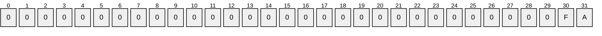

# [MS-RSMP]: Removable Storage Manager (RSM) Remote Protocol

Table of Contents

1 Introduction

- [1 Introduction](#Section_1)
  - [1.1 Glossary](#Section_1.1)
  - [1.2 References](#Section_1.2)
    - [1.2.1 Normative References](#Section_1.2.1)
    - [1.2.2 Informative References](#Section_1.2.2)
  - [1.3 Overview](#Section_1.3)
  - [1.4 Relationship to Other Protocols](#Section_1.4)
  - [1.5 Prerequisites/Preconditions](#Section_1.5)
  - [1.6 Applicability Statement](#Section_1.6)
  - [1.7 Versioning and Capability Negotiation](#Section_1.7)
    - [1.7.1 Interfaces for Storage Object Management](#Section_1.7.1)
    - [1.7.2 Interfaces for Media Library Management](#Section_1.7.2)
    - [1.7.3 Interfaces for Media Management](#Section_1.7.3)
    - [1.7.4 Interfaces for Message and Notification Distribution](#Section_1.7.4)
    - [1.7.5 Security and Authentication Methods](#Section_1.7.5)
  - [1.8 Vendor-Extensible Fields](#Section_1.8)
  - [1.9 Standards Assignments](#Section_1.9)

2 Messages

- [2 Messages](#Section_2)
  - [2.1 Transport](#Section_2.1)
  - [2.2 Message Syntax](#Section_2.2)
    - [2.2.1 Common Data Types](#Section_2.2.1)
      - [2.2.1.1 LPGUID](#Section_2.2.1.1)
      - [2.2.1.2 NTMS_GUID](#Section_2.2.1.2)
      - [2.2.1.3 LPNTMS_GUID](#Section_2.2.1.3)
      - [2.2.1.4 NTMS_HANDLE](#Section_2.2.1.4)
      - [2.2.1.5 PSECURITY_DESCRIPTOR_NTMS](#Section_2.2.1.5)
      - [2.2.1.6 NtmsObjectsTypes Enumeration](#Section_2.2.1.6)
      - [2.2.1.7 NtmsOpreqCommand Enumeration](#Section_2.2.1.7)
      - [2.2.1.8 NtmsNotificationOperations Enumeration](#Section_2.2.1.8)
      - [2.2.1.9 NtmsDismountOptions Enumeration](#Section_2.2.1.9)
      - [2.2.1.10 NtmsLmState Enumeration](#Section_2.2.1.10)
      - [2.2.1.11 NTMS_LIBRARYINFORMATION Structure](#Section_2.2.1.11)
      - [2.2.1.12 NtmsAccessMask](#Section_2.2.1.12)
    - [2.2.2 INtmsLibraryControl1 Data Types](#Section_2.2.2)
      - [2.2.2.1 NtmsEjectOperation Enumeration](#Section_2.2.2.1)
      - [2.2.2.2 NtmsInjectOperation Enumeration](#Section_2.2.2.2)
      - [2.2.2.3 NtmsInventoryMethod Enumeration](#Section_2.2.2.3)
    - [2.2.3 INtmsMediaServices1 Data Types](#Section_2.2.3)
      - [2.2.3.1 NtmsAllocateOptions Enumeration](#Section_2.2.3.1)
      - [2.2.3.2 NtmsCreateOptions Enumeration](#Section_2.2.3.2)
      - [2.2.3.3 NtmsMountOptions Enumeration](#Section_2.2.3.3)
      - [2.2.3.4 NtmsMountPriority Enumeration](#Section_2.2.3.4)
      - [2.2.3.5 SECURITY_ATTRIBUTES_NTMS Structure](#Section_2.2.3.5)
      - [2.2.3.6 NTMS_ALLOCATION_INFORMATION Structure](#Section_2.2.3.6)
      - [2.2.3.7 NTMS_MOUNT_INFORMATION Structure](#Section_2.2.3.7)
      - [2.2.3.8 NTMS_ASYNC_IO Structure](#Section_2.2.3.8)
    - [2.2.4 INtmsObjectInfo1 Data Types](#Section_2.2.4)
      - [2.2.4.1 NtmsBarCodeState Enumeration](#Section_2.2.4.1)
      - [2.2.4.2 NtmsDriveState Enumeration](#Section_2.2.4.2)
      - [2.2.4.3 NtmsLmOperation Enumeration](#Section_2.2.4.3)
      - [2.2.4.4 NtmsMediaState Enumeration](#Section_2.2.4.4)
      - [2.2.4.5 NtmsOperationalState Enumeration](#Section_2.2.4.5)
      - [2.2.4.6 NtmsOpreqState Enumeration](#Section_2.2.4.6)
      - [2.2.4.7 NtmsPartitionState Enumeration](#Section_2.2.4.7)
      - [2.2.4.8 NTMS_CHANGERINFORMATIONA Structure](#Section_2.2.4.8)
      - [2.2.4.9 NTMS_CHANGERINFORMATIONW Structure](#Section_2.2.4.9)
      - [2.2.4.10 NTMS_CHANGERTYPEINFORMATIONA Structure](#Section_2.2.4.10)
      - [2.2.4.11 NTMS_CHANGERTYPEINFORMATIONW Structure](#Section_2.2.4.11)
      - [2.2.4.12 NTMS_DRIVEINFORMATIONA Structure](#Section_2.2.4.12)
      - [2.2.4.13 NTMS_DRIVEINFORMATIONW Structure](#Section_2.2.4.13)
      - [2.2.4.14 NTMS_DRIVETYPEINFORMATIONA Structure](#Section_2.2.4.14)
      - [2.2.4.15 NTMS_DRIVETYPEINFORMATIONW Structure](#Section_2.2.4.15)
      - [2.2.4.16 NTMS_LIBREQUESTINFORMATIONA Structure](#Section_2.2.4.16)
      - [2.2.4.17 NTMS_LIBREQUESTINFORMATIONW Structure](#Section_2.2.4.17)
      - [2.2.4.18 NTMS_MEDIAPOOLINFORMATION Structure](#Section_2.2.4.18)
      - [2.2.4.19 NTMS_MEDIATYPEINFORMATION Structure](#Section_2.2.4.19)
      - [2.2.4.20 NTMS_OBJECTINFORMATIONA Structure](#Section_2.2.4.20)
      - [2.2.4.21 NTMS_OBJECTINFORMATIONW Structure](#Section_2.2.4.21)
      - [2.2.4.22 NTMS_STORAGESLOTINFORMATION Structure](#Section_2.2.4.22)
      - [2.2.4.23 NTMS_IEDOORINFORMATION Structure](#Section_2.2.4.23)
      - [2.2.4.24 NTMS_IEPORTINFORMATION Structure](#Section_2.2.4.24)
      - [2.2.4.25 NTMS_LMIDINFORMATION Structure](#Section_2.2.4.25)
      - [2.2.4.26 NTMS_COMPUTERINFORMATION Structure](#Section_2.2.4.26)
      - [2.2.4.27 NTMS_OPREQUESTINFORMATIONA Structure](#Section_2.2.4.27)
      - [2.2.4.28 NTMS_OPREQUESTINFORMATIONW Structure](#Section_2.2.4.28)
      - [2.2.4.29 NTMS_PARTITIONINFORMATIONA Structure](#Section_2.2.4.29)
      - [2.2.4.30 NTMS_PARTITIONINFORMATIONW Structure](#Section_2.2.4.30)
      - [2.2.4.31 NTMS_PMIDINFORMATIONA Structure](#Section_2.2.4.31)
      - [2.2.4.32 NTMS_PMIDINFORMATIONW Structure](#Section_2.2.4.32)
    - [2.2.5 INtmsObjectManagement2 Data Types](#Section_2.2.5)
      - [2.2.5.1 NtmsUIOperations Enumeration](#Section_2.2.5.1)
      - [2.2.5.2 NtmsUIType Enumeration](#Section_2.2.5.2)
    - [2.2.6 IMessenger Data Types](#Section_2.2.6)
      - [2.2.6.1 RSM_MESSAGE Structure](#Section_2.2.6.1)

3 Protocol Details

- [3 Protocol Details](#Section_3)
  - [3.1 Client Role Details](#Section_3.1)
    - [3.1.1 Abstract Data Model](#Section_3.1.1)
      - [3.1.1.1 Notification Callback Objects](#Section_3.1.1.1)
    - [3.1.2 Timers](#Section_3.1.2)
    - [3.1.3 Initialization](#Section_3.1.3)
    - [3.1.4 Higher-Layer Triggered Events](#Section_3.1.4)
      - [3.1.4.1 Common Details](#Section_3.1.4.1)
        - [3.1.4.1.1 Methods with Prerequisites](#Section_3.1.4.1.1)
    - [3.1.5 Message Processing Events and Sequencing Rules](#Section_3.1.5)
      - [3.1.5.1 Processing Server Replies to Method Calls](#Section_3.1.5.1)
        - [3.1.5.1.1 Processing Notifications Sent from the Server to the Client](#Section_3.1.5.1.1)
      - [3.1.5.2 Message Processing Details](#Section_3.1.5.2)
        - [3.1.5.2.1 IClientSink Interface](#Section_3.1.5.2.1)
          - [3.1.5.2.1.1 IClientSink::OnNotify (Opnum 3)](#Section_3.1.5.2.1.1)
        - [3.1.5.2.2 INtmsNotifySink Interface](#Section_3.1.5.2.2)
          - [3.1.5.2.2.1 INtmsNotifySink::ConnectCallback (Opnum 3)](#Section_3.1.5.2.2.1)
          - [3.1.5.2.2.2 INtmsNotifySink::OnNotify (Opnum 4)](#Section_3.1.5.2.2.2)
          - [3.1.5.2.2.3 INtmsNotifySink::ReleaseCallback (Opnum 5)](#Section_3.1.5.2.2.3)
    - [3.1.6 Timer Events](#Section_3.1.6)
    - [3.1.7 Other Local Events](#Section_3.1.7)
  - [3.2 Server Role Details](#Section_3.2)
    - [3.2.1 Abstract Data Model](#Section_3.2.1)
      - [3.2.1.1 Server Object](#Section_3.2.1.1)
      - [3.2.1.2 List of Objects Present in the System](#Section_3.2.1.2)
        - [3.2.1.2.1 Libraries](#Section_3.2.1.2.1)
        - [3.2.1.2.2 Media Pools](#Section_3.2.1.2.2)
        - [3.2.1.2.3 Media](#Section_3.2.1.2.3)
      - [3.2.1.3 List of Clients Connected to the Server](#Section_3.2.1.3)
      - [3.2.1.4 List of Tasks Currently Executed on the Server](#Section_3.2.1.4)
    - [3.2.2 Timers](#Section_3.2.2)
    - [3.2.3 Initialization](#Section_3.2.3)
      - [3.2.3.1 List of Storage Objects Present in the System](#Section_3.2.3.1)
      - [3.2.3.2 List of Clients Connected to the Server](#Section_3.2.3.2)
      - [3.2.3.3 List of Tasks Currently Executed on the Server](#Section_3.2.3.3)
    - [3.2.4 Higher-Layer Triggered Events](#Section_3.2.4)
    - [3.2.5 Message Processing Events and Sequencing Rules](#Section_3.2.5)
      - [3.2.5.1 Rules for Modifying the List of Storage Objects](#Section_3.2.5.1)
      - [3.2.5.2 Message Processing Details](#Section_3.2.5.2)
        - [3.2.5.2.1 INtmsLibraryControl1 Interface](#Section_3.2.5.2.1)
          - [3.2.5.2.1.1 INtmsLibraryControl1::EjectNtmsMedia (Opnum 3)](#Section_3.2.5.2.1.1)
          - [3.2.5.2.1.2 INtmsLibraryControl1::InjectNtmsMedia (Opnum 4)](#Section_3.2.5.2.1.2)
          - [3.2.5.2.1.3 INtmsLibraryControl1::AccessNtmsLibraryDoor (Opnum 5)](#Section_3.2.5.2.1.3)
          - [3.2.5.2.1.4 INtmsLibraryControl1::CleanNtmsDrive (Opnum 6)](#Section_3.2.5.2.1.4)
          - [3.2.5.2.1.5 INtmsLibraryControl1::DismountNtmsDrive (Opnum 7)](#Section_3.2.5.2.1.5)
          - [3.2.5.2.1.6 INtmsLibraryControl1::InventoryNtmsLibrary (Opnum 8)](#Section_3.2.5.2.1.6)
          - [3.2.5.2.1.7 INtmsLibraryControl1::CancelNtmsLibraryRequest (Opnum 10)](#Section_3.2.5.2.1.7)
          - [3.2.5.2.1.8 INtmsLibraryControl1::ReserveNtmsCleanerSlot (Opnum 11)](#Section_3.2.5.2.1.8)
          - [3.2.5.2.1.9 INtmsLibraryControl1::ReleaseNtmsCleanerSlot (Opnum 12)](#Section_3.2.5.2.1.9)
          - [3.2.5.2.1.10 INtmsLibraryControl1::InjectNtmsCleaner (Opnum 13)](#Section_3.2.5.2.1.10)
          - [3.2.5.2.1.11 INtmsLibraryControl1::EjectNtmsCleaner (Opnum 14)](#Section_3.2.5.2.1.11)
          - [3.2.5.2.1.12 INtmsLibraryControl1::DeleteNtmsLibrary (Opnum 15)](#Section_3.2.5.2.1.12)
          - [3.2.5.2.1.13 INtmsLibraryControl1::DeleteNtmsDrive (Opnum 16)](#Section_3.2.5.2.1.13)
          - [3.2.5.2.1.14 INtmsLibraryControl1::GetNtmsRequestOrder (Opnum 17)](#Section_3.2.5.2.1.14)
          - [3.2.5.2.1.15 INtmsLibraryControl1::SetNtmsRequestOrder (Opnum 18)](#Section_3.2.5.2.1.15)
          - [3.2.5.2.1.16 INtmsLibraryControl1::DeleteNtmsRequests (Opnum 19)](#Section_3.2.5.2.1.16)
          - [3.2.5.2.1.17 INtmsLibraryControl1::BeginNtmsDeviceChangeDetection (Opnum 20)](#Section_3.2.5.2.1.17)
          - [3.2.5.2.1.18 INtmsLibraryControl1::SetNtmsDeviceChangeDetection (Opnum 21)](#Section_3.2.5.2.1.18)
          - [3.2.5.2.1.19 INtmsLibraryControl1::EndNtmsDeviceChangeDetection (Opnum 22)](#Section_3.2.5.2.1.19)
        - [3.2.5.2.2 INtmsMediaServices1 Interface](#Section_3.2.5.2.2)
          - [3.2.5.2.2.1 INtmsMediaServices1::MountNtmsMedia (Opnum 3)](#Section_3.2.5.2.2.1)
          - [3.2.5.2.2.2 INtmsMediaServices1::DismountNtmsMedia (Opnum 4)](#Section_3.2.5.2.2.2)
          - [3.2.5.2.2.3 INtmsMediaServices1::AllocateNtmsMedia (Opnum 6)](#Section_3.2.5.2.2.3)
          - [3.2.5.2.2.4 INtmsMediaServices1::DeallocateNtmsMedia (Opnum 7)](#Section_3.2.5.2.2.4)
          - [3.2.5.2.2.5 INtmsMediaServices1::SwapNtmsMedia (Opnum 8)](#Section_3.2.5.2.2.5)
          - [3.2.5.2.2.6 INtmsMediaServices1::DecommissionNtmsMedia (Opnum 9)](#Section_3.2.5.2.2.6)
          - [3.2.5.2.2.7 INtmsMediaServices1::SetNtmsMediaComplete (Opnum 10)](#Section_3.2.5.2.2.7)
          - [3.2.5.2.2.8 INtmsMediaServices1::DeleteNtmsMedia (Opnum 11)](#Section_3.2.5.2.2.8)
          - [3.2.5.2.2.9 INtmsMediaServices1::CreateNtmsMediaPoolA (Opnum 12)](#Section_3.2.5.2.2.9)
          - [3.2.5.2.2.10 INtmsMediaServices1::CreateNtmsMediaPoolW (Opnum 13)](#Section_3.2.5.2.2.10)
          - [3.2.5.2.2.11 INtmsMediaServices1::GetNtmsMediaPoolNameA (Opnum 14)](#Section_3.2.5.2.2.11)
          - [3.2.5.2.2.12 INtmsMediaServices1::GetNtmsMediaPoolNameW (Opnum 15)](#Section_3.2.5.2.2.12)
          - [3.2.5.2.2.13 INtmsMediaServices1::MoveToNtmsMediaPool (Opnum 16)](#Section_3.2.5.2.2.13)
          - [3.2.5.2.2.14 INtmsMediaServices1::DeleteNtmsMediaPool (Opnum 17)](#Section_3.2.5.2.2.14)
          - [3.2.5.2.2.15 INtmsMediaServices1::AddNtmsMediaType (Opnum 18)](#Section_3.2.5.2.2.15)
          - [3.2.5.2.2.16 INtmsMediaServices1::DeleteNtmsMediaType (Opnum 19)](#Section_3.2.5.2.2.16)
          - [3.2.5.2.2.17 INtmsMediaServices1::ChangeNtmsMediaType (Opnum 20)](#Section_3.2.5.2.2.17)
        - [3.2.5.2.3 INtmsObjectInfo1 Interface](#Section_3.2.5.2.3)
          - [3.2.5.2.3.1 INtmsObjectInfo1::GetNtmsServerObjectInformationA (Opnum 3)](#Section_3.2.5.2.3.1)
          - [3.2.5.2.3.2 INtmsObjectInfo1::GetNtmsServerObjectInformationW (Opnum 4)](#Section_3.2.5.2.3.2)
          - [3.2.5.2.3.3 INtmsObjectInfo1::SetNtmsObjectInformationA (Opnum 5)](#Section_3.2.5.2.3.3)
          - [3.2.5.2.3.4 INtmsObjectInfo1::SetNtmsObjectInformationW (Opnum 6)](#Section_3.2.5.2.3.4)
          - [3.2.5.2.3.5 INtmsObjectInfo1::CreateNtmsMediaA (Opnum 7)](#Section_3.2.5.2.3.5)
          - [3.2.5.2.3.6 INtmsObjectInfo1::CreateNtmsMediaW (Opnum 8)](#Section_3.2.5.2.3.6)
        - [3.2.5.2.4 INtmsObjectManagement1 Interface](#Section_3.2.5.2.4)
          - [3.2.5.2.4.1 INtmsObjectManagement1::GetNtmsObjectSecurity (Opnum 3)](#Section_3.2.5.2.4.1)
          - [3.2.5.2.4.2 INtmsObjectManagement1::SetNtmsObjectSecurity (Opnum 4)](#Section_3.2.5.2.4.2)
          - [3.2.5.2.4.3 INtmsObjectManagement1::GetNtmsObjectAttributeA (Opnum 5)](#Section_3.2.5.2.4.3)
          - [3.2.5.2.4.4 INtmsObjectManagement1::GetNtmsObjectAttributeW (Opnum 6)](#Section_3.2.5.2.4.4)
          - [3.2.5.2.4.5 INtmsObjectManagement1::SetNtmsObjectAttributeA (Opnum 7)](#Section_3.2.5.2.4.5)
          - [3.2.5.2.4.6 INtmsObjectManagement1::SetNtmsObjectAttributeW (Opnum 8)](#Section_3.2.5.2.4.6)
          - [3.2.5.2.4.7 INtmsObjectManagement1::EnumerateNtmsObject (Opnum 9)](#Section_3.2.5.2.4.7)
          - [3.2.5.2.4.8 INtmsObjectManagement1::DisableNtmsObject (Opnum 10)](#Section_3.2.5.2.4.8)
          - [3.2.5.2.4.9 INtmsObjectManagement1::EnableNtmsObject (Opnum 11)](#Section_3.2.5.2.4.9)
        - [3.2.5.2.5 INtmsSession1 Interface](#Section_3.2.5.2.5)
          - [3.2.5.2.5.1 INtmsSession1::OpenNtmsServerSessionW (Opnum 3)](#Section_3.2.5.2.5.1)
          - [3.2.5.2.5.2 INtmsSession1::OpenNtmsServerSessionA (Opnum 4)](#Section_3.2.5.2.5.2)
          - [3.2.5.2.5.3 INtmsSession1::CloseNtmsSession (Opnum 5)](#Section_3.2.5.2.5.3)
          - [3.2.5.2.5.4 INtmsSession1::SubmitNtmsOperatorRequestW (Opnum 6)](#Section_3.2.5.2.5.4)
          - [3.2.5.2.5.5 INtmsSession1::SubmitNtmsOperatorRequestA (Opnum 7)](#Section_3.2.5.2.5.5)
          - [3.2.5.2.5.6 INtmsSession1::WaitForNtmsOperatorRequest (Opnum 8)](#Section_3.2.5.2.5.6)
          - [3.2.5.2.5.7 INtmsSession1::CancelNtmsOperatorRequest (Opnum 9)](#Section_3.2.5.2.5.7)
          - [3.2.5.2.5.8 INtmsSession1::SatisfyNtmsOperatorRequest (Opnum 10)](#Section_3.2.5.2.5.8)
          - [3.2.5.2.5.9 INtmsSession1::ImportNtmsDatabase (Opnum 11)](#Section_3.2.5.2.5.9)
          - [3.2.5.2.5.10 INtmsSession1::ExportNtmsDatabase (Opnum 12)](#Section_3.2.5.2.5.10)
          - [3.2.5.2.5.11 INtmsSession1::AddNotification (Opnum 14)](#Section_3.2.5.2.5.11)
          - [3.2.5.2.5.12 INtmsSession1::RemoveNotification (Opnum 15)](#Section_3.2.5.2.5.12)
          - [3.2.5.2.5.13 INtmsSession1::DispatchNotification (Opnum 16)](#Section_3.2.5.2.5.13)
        - [3.2.5.2.6 INtmsLibraryControl2 Interface](#Section_3.2.5.2.6)
          - [3.2.5.2.6.1 INtmsLibraryControl2::IdentifyNtmsSlot (Opnum 23)](#Section_3.2.5.2.6.1)
        - [3.2.5.2.7 INtmsObjectManagement2 Interface](#Section_3.2.5.2.7)
          - [3.2.5.2.7.1 INtmsObjectManagement2::EnumerateNtmsObjectR (Opnum 12)](#Section_3.2.5.2.7.1)
          - [3.2.5.2.7.2 INtmsObjectManagement2::GetNtmsUIOptionsA (Opnum 13)](#Section_3.2.5.2.7.2)
          - [3.2.5.2.7.3 INtmsObjectManagement2::GetNtmsUIOptionsW (Opnum 14)](#Section_3.2.5.2.7.3)
          - [3.2.5.2.7.4 INtmsObjectManagement2::SetNtmsUIOptionsA (Opnum 15)](#Section_3.2.5.2.7.4)
          - [3.2.5.2.7.5 INtmsObjectManagement2::SetNtmsUIOptionsW (Opnum 16)](#Section_3.2.5.2.7.5)
        - [3.2.5.2.8 INtmsObjectManagement3 Interface](#Section_3.2.5.2.8)
          - [3.2.5.2.8.1 INtmsObjectManagement3::GetNtmsObjectAttributeAR (Opnum 17)](#Section_3.2.5.2.8.1)
          - [3.2.5.2.8.2 INtmsObjectManagement3::GetNtmsObjectAttributeWR (Opnum 18)](#Section_3.2.5.2.8.2)
        - [3.2.5.2.9 IRobustNtmsMediaServices1 Interface](#Section_3.2.5.2.9)
          - [3.2.5.2.9.1 IRobustNtmsMediaServices1::GetNtmsMediaPoolNameAR (Opnum 21)](#Section_3.2.5.2.9.1)
          - [3.2.5.2.9.2 IRobustNtmsMediaServices1::GetNtmsMediaPoolNameWR (Opnum 22)](#Section_3.2.5.2.9.2)
        - [3.2.5.2.10 IMessenger Interface](#Section_3.2.5.2.10)
          - [3.2.5.2.10.1 IMessenger::SendMessage (Opnum 3)](#Section_3.2.5.2.10.1)
          - [3.2.5.2.10.2 IMessenger::RecallMessage (Opnum 4)](#Section_3.2.5.2.10.2)
    - [3.2.6 Timer Events](#Section_3.2.6)
    - [3.2.7 Other Local Events](#Section_3.2.7)
      - [3.2.7.1 Problem/Warnings for the Tape Drive](#Section_3.2.7.1)

4 Protocol Examples

- [4 Protocol Examples](#Section_4)
  - [4.1 Allocation of Media with INtmsMediaServices1](#Section_4.1)
  - [4.2 Registering for Notifications with INtmsSession1](#Section_4.2)
  - [4.3 Storage Object Management with INtmsObjectManagement1](#Section_4.3)
  - [4.4 Media Management Using INtmsMediaServices1](#Section_4.4)

5 Security

- [5 Security](#Section_5)
  - [5.1 Security Considerations for Implementers](#Section_5.1)
  - [5.2 Index of Security Parameters](#Section_5.2)

6 Appendix A: Full IDL

- [6 Appendix A: Full IDL](#Section_6)

7 Appendix B: Product Behavior

- [7 Appendix B: Product Behavior](#Section_7)

8 Change Tracking

- [8 Change Tracking](#Section_8)

For the legal notice and IP terms, see [LEGAL.md](../LEGAL.md).
Last updated: 6/1/2017.
See [Revision History](#revision-history) for full version history.

# 1 Introduction

This document specifies the Removable Storage Manager (RSM) Remote Protocol.

The RSM Remote Protocol is a set of distributed component object model (DCOM) [MS-DCOM](../MS-DCOM/MS-DCOM.md) interfaces for applications to manage [**robotic**](#gt_robotic) [**changers**](#gt_changer), media [**libraries**](#gt_library), and tape [**drives**](#gt_drive). The RSM Remote Protocol deals with detailed low-level operating system and storage concepts. Although the necessary basic concepts are outlined in this specification, this specification assumes reader familiarity with these technologies.

Sections 1.5, 1.8, 1.9, 2, and 3 of this specification are normative. All other sections and examples in this specification are informative.

## 1.1 Glossary

This document uses the following terms:

**Allocate**: To reserve an RSM resource for exclusive use by a particular client. See also [**Deallocate**](#gt_deallocate).

**application pool**: A group of media in an RSM system that is specific to a particular client. Each client that uses media managed by the RSM server uses one or more [**application pools**](#gt_application-pool).

**Bar Code**: A device-readable physical label that is attached to a [**physical medium**](#gt_physical-media).

**Bar Code Reader**: A device capable of reading a [**bar code**](#gt_bar-code) and transmitting the information encoded on it. A label with a [**bar code**](#gt_bar-code) is attached to the outside of a [**cartridge**](#gt_cartridge). The labels are designed to be both human-readable and computer-readable. [**Libraries**](#gt_library) that hold media with [**bar codes**](#gt_bar-code) attached may have a [**bar code reader**](#gt_bar-code-reader). There is only one reader per library, which is usually [**mounted**](#gt_mount) on the transport.

**Cartridge**: A unit of [**physical media**](#gt_physical-media) on which information can be stored. [**Cartridges**](#gt_cartridge) come in various types, including 8-mm tape, magnetic disks, optical disks, and CD-ROMs. Some [**cartridges**](#gt_cartridge) have multiple [**sides**](#gt_side).

**Changer**: An automated mechanical device capable of [**mounting**](#gt_mount) new media without human intervention.

**Cleaner**: A special [**cartridge**](#gt_cartridge) that cleans the read/write head.

**Deallocate**: To free up a previously [**allocated**](#gt_allocate) RSM resource, allowing it to be used by or [**allocated**](#gt_allocate) to any future client.

**Decommission**: To take [**physical media**](#gt_physical-media) out of use.

**Dismount**: To move [**physical media**](#gt_physical-media) from a [**drive**](#gt_drive) to a [**library**](#gt_library) [**slot**](#gt_slot).

**Door**: A means to gain unconstrained access to the [**physical media**](#gt_physical-media) in a [**library**](#gt_library). When the [**door**](#gt_door) is open, an administrator can add and remove media from the [**library**](#gt_library). See also Inject/Eject Port.

**drive**: A device that can read or write to a [**cartridge**](#gt_cartridge). A [**library**](#gt_library) has at least one [**drive**](#gt_drive).

**Eject**: To move a [**cartridge**](#gt_cartridge) out of an RSM system. Ejections are done through a [**door**](#gt_door) or an inject/eject (IE) port. See also [**Inject**](#gt_inject).

**endpoint**: A network-specific address of a remote procedure call (RPC) server process for remote procedure calls. The actual name and type of the endpoint depends on the [**RPC**](#gt_remote-procedure-call-rpc) protocol sequence that is being used. For example, for RPC over TCP (RPC Protocol Sequence ncacn_ip_tcp), an endpoint might be TCP port 1025. For RPC over Server Message Block (RPC Protocol Sequence ncacn_np), an endpoint might be the name of a named pipe. For more information, see [[C706]](https://go.microsoft.com/fwlink/?LinkId=89824).

**Free Pool**: A group of media in an RSM system that is freely available to any application. Media in a [**free pool**](#gt_free-pool) is blank. An application can draw on media from a [**free pool**](#gt_free-pool) when it needs additional media, and it can return media that it no longer needs to the [**free pool**](#gt_free-pool).

**globally unique identifier (GUID)**: A term used interchangeably with [**universally unique identifier (UUID)**](#gt_universally-unique-identifier-uuid) in Microsoft protocol technical documents (TDs). Interchanging the usage of these terms does not imply or require a specific algorithm or mechanism to generate the value. Specifically, the use of this term does not imply or require that the algorithms described in [[RFC4122]](https://go.microsoft.com/fwlink/?LinkId=90460) or [C706] must be used for generating the [**GUID**](#gt_globally-unique-identifier-guid). See also [**universally unique identifier (UUID)**](#gt_universally-unique-identifier-uuid).

**import**: The process of creating a conglomeration or partition on a COMA server based on modules and configurations extracted from an installer package file.

**Import Pool**: Media newly placed into the [**library**](#gt_library) that are sorted by media type. For instance, if an administrator placed a tape written by backup on one system into a [**library**](#gt_library) attached to a second system, the instance of RSM on the second system recognizes that the tape was written using Microsoft Tape Format (MTF) and places it in the proper media type [**import pool**](#gt_import-pool).

**Inject**: To move a [**cartridge**](#gt_cartridge) into an RSM system. Injection is done through a [**door**](#gt_door) or an [**IE port**](#gt_e2c6dee3-9f37-4fe2-b970-ae3c00a8ed70). See also [**Eject**](#gt_eject).

**Inject/Eject (IE) Port**: A means to gain constrained access to the [**physical media**](#gt_physical-media) in a [**library**](#gt_library). Media added to a [**library**](#gt_library) through an [**IE port**](#gt_e2c6dee3-9f37-4fe2-b970-ae3c00a8ed70) are not placed directly into a [**slot**](#gt_slot), but are instead placed in the [**IE port**](#gt_e2c6dee3-9f37-4fe2-b970-ae3c00a8ed70), whereupon the [**library**](#gt_library) uses the transport to move the media from the [**IE port**](#gt_e2c6dee3-9f37-4fe2-b970-ae3c00a8ed70) to a [**slot**](#gt_slot). [**IE ports**](#gt_e2c6dee3-9f37-4fe2-b970-ae3c00a8ed70) are also known as mailslots. See also [**Door**](#gt_door).

**Inventory**: The act of cataloguing all the [**physical media**](#gt_physical-media) in an RSM system.

**Library**: A storage device that contains one or more tape drives, a number of slots to hold tape cartridges, and an automated method for loading tapes.

**Library Request**: A request from an application for an operation to be performed on a [**library**](#gt_library).

**Logical Media**: A set of data independent of the [**physical media**](#gt_physical-media) it is recorded on. [**Logical media**](#gt_logical-media) are tracked using [**logical media**](#gt_logical-media) identifiers (LMID). Because access to the data occurs only through the LMID, RSM can manage the physical location of the data. For example, if the original [**cartridge**](#gt_cartridge) begins to fail, RSM can move the data to a new [**cartridge**](#gt_cartridge) without having to notify the application.

**Magazines**: See [**Slots**](#gt_slot).

**Media Identifier**: A unique value that identifies a particular piece of media.

**Mount**: To move [**physical media**](#gt_physical-media) from a [**library**](#gt_library) [**slot**](#gt_slot) to a [**drive**](#gt_drive).

**Offline Library**: State of [**library**](#gt_library) in which it is not usable for client. The [**library**](#gt_library) is marked as [**offline library**](#gt_offline-library) on client request or when it is disconnected from the server.

**On-Media Identifier (OMID)**: An electronically recorded label used to uniquely identify a [**side**](#gt_side) of a medium in an RSM system.

**Operator Request**: A request for a person (often an administrator, but possibly a user) to perform a task.

**Physical Media**: The tangible media that are inserted into and removed from [**libraries**](#gt_library) and [**mounted**](#gt_mount) in [**drives**](#gt_drive).

**port**: A place to add or remove [**physical media**](#gt_physical-media) from a [**library**](#gt_library).

**remote procedure call (RPC)**: A context-dependent term commonly overloaded with three meanings. Note that much of the industry literature concerning RPC technologies uses this term interchangeably for any of the three meanings. Following are the three definitions: (*) The runtime environment providing remote procedure call facilities. The preferred usage for this meaning is "RPC runtime". (*) The pattern of request and response message exchange between two parties (typically, a client and a server). The preferred usage for this meaning is "RPC exchange". (*) A single message from an exchange as defined in the previous definition. The preferred usage for this term is "RPC message". For more information about RPC, see [C706].

**Robotic**: Done by mechanical means, without human intervention.

**Side**: An area on a [**physical medium**](#gt_physical-media) that can store data. Although most [**physical media**](#gt_physical-media) have only a single [**side**](#gt_side), some may have two [**sides**](#gt_side). For instance, a magneto-optic (MO) disk has two [**sides**](#gt_side): an "A" [**side**](#gt_side) and a "B" [**side**](#gt_side). When an MO disk is placed in a [**drive**](#gt_drive) with the "A" [**side**](#gt_side) up, the "A" [**side**](#gt_side) is accessible and the "B" [**side**](#gt_side) is not. To access the "B" [**side**](#gt_side), the disk must be inserted with the "B" [**side**](#gt_side) up. The data stored on different [**sides**](#gt_side) of the same [**physical medium**](#gt_physical-media) are independent of one another.

**Slot**: A storage location within a [**library**](#gt_library). For example, a tape [**library**](#gt_library) has one [**slot**](#gt_slot) for each tape that the [**library**](#gt_library) can hold. A stand-alone [**drive**](#gt_drive) [**library**](#gt_library) has no [**slots**](#gt_slot). Most [**libraries**](#gt_library) have at least four [**slots**](#gt_slot). Sometimes [**slots**](#gt_slot) are organized into collections of [**slots**](#gt_slot) called [**magazines**](#gt_magazines). [**Magazines**](#gt_magazines) are usually removable.

**System Pools**: The default media pools present in an RSM system. The [**free pool**](#gt_free-pool), the [**import pool**](#gt_import-pool), and the [**unrecognized pool**](#gt_unrecognized-pool) are called [**system pools**](#gt_system-pools).

**Unicode**: A character encoding standard developed by the Unicode Consortium that represents almost all of the written languages of the world. The [**Unicode**](#gt_unicode) standard [[UNICODE5.0.0/2007]](https://go.microsoft.com/fwlink/?LinkId=154659) provides three forms (UTF-8, UTF-16, and UTF-32) and seven schemes (UTF-8, UTF-16, UTF-16 BE, UTF-16 LE, UTF-32, UTF-32 LE, and UTF-32 BE).

**universally unique identifier (UUID)**: A 128-bit value. UUIDs can be used for multiple purposes, from tagging objects with an extremely short lifetime, to reliably identifying very persistent objects in cross-process communication such as client and server interfaces, manager entry-point vectors, and [**RPC**](#gt_remote-procedure-call-rpc) objects. UUIDs are highly likely to be unique. UUIDs are also known as [**globally unique identifiers (GUIDs)**](#gt_globally-unique-identifier-guid) and these terms are used interchangeably in the Microsoft protocol technical documents (TDs). Interchanging the usage of these terms does not imply or require a specific algorithm or mechanism to generate the UUID. Specifically, the use of this term does not imply or require that the algorithms described in [RFC4122] or [C706] must be used for generating the UUID.

**Unrecognized Pool**: A group of media in an RSM that is not cataloged and is unreadable by the RSM. When a [**cartridge**](#gt_cartridge) is placed in a [**library**](#gt_library), the RSM tries to identify it. If it has not seen this particular medium before and is unable to determine its format or the application that last wrote data on it, the RSM places the [**cartridge**](#gt_cartridge) in the [**unrecognized pool**](#gt_unrecognized-pool) for its media type. Blank media are treated this way.

**MAY, SHOULD, MUST, SHOULD NOT, MUST NOT:** These terms (in all caps) are used as defined in [[RFC2119]](https://go.microsoft.com/fwlink/?LinkId=90317). All statements of optional behavior use either MAY, SHOULD, or SHOULD NOT.

## 1.2 References

Links to a document in the Microsoft Open Specifications library point to the correct section in the most recently published version of the referenced document. However, because individual documents in the library are not updated at the same time, the section numbers in the documents may not match. You can confirm the correct section numbering by checking the [Errata](http://msdn.microsoft.com/en-us/library/dn781092.aspx).

### 1.2.1 Normative References

We conduct frequent surveys of the normative references to assure their continued availability. If you have any issue with finding a normative reference, please contact [dochelp@microsoft.com](mailto:dochelp@microsoft.com). We will assist you in finding the relevant information.

[ANSI-131-1994] American National Standards Institute, "Information Systems - Small Computer Systems Interface-2 (SCSI-2)", ANSI INCITS 131-1994 (R1999), [http://webstore.ansi.org/RecordDetail.aspx?sku=ANSI+INCITS+131-1994+(R1999)](https://go.microsoft.com/fwlink/?LinkId=90512)

**Note** There is a charge to download the specification.

[C706] The Open Group, "DCE 1.1: Remote Procedure Call", C706, August 1997, [https://www2.opengroup.org/ogsys/catalog/c706](https://go.microsoft.com/fwlink/?LinkId=89824)

[MS-DCOM] Microsoft Corporation, "[Distributed Component Object Model (DCOM) Remote Protocol](../MS-DCOM/MS-DCOM.md)".

[MS-DTYP] Microsoft Corporation, "[Windows Data Types](../MS-DTYP/MS-DTYP.md)".

[MS-RPCE] Microsoft Corporation, "[Remote Procedure Call Protocol Extensions](../MS-RPCE/MS-RPCE.md)".

[RFC2119] Bradner, S., "Key words for use in RFCs to Indicate Requirement Levels", BCP 14, RFC 2119, March 1997, [http://www.rfc-editor.org/rfc/rfc2119.txt](https://go.microsoft.com/fwlink/?LinkId=90317)

[UNICODE] The Unicode Consortium, "The Unicode Consortium Home Page", [http://www.unicode.org/](https://go.microsoft.com/fwlink/?LinkId=90550)

### 1.2.2 Informative References

[MSDN-MoveToNtmsMediaPool] Microsoft Corporation, "MoveToNtmsMediaPool function", [http://msdn.microsoft.com/en-us/library/bb540698.aspx](https://go.microsoft.com/fwlink/?LinkId=90043)

[MSDN-SetNtmsObjectSecurity] Microsoft Corporation, "SetNtmsObjectSecurity function", [http://msdn.microsoft.com/en-us/library/bb540745.aspx](https://go.microsoft.com/fwlink/?LinkId=90130)

## 1.3 Overview

The RSM Remote Protocol provides a mechanism for the remote configuration and management of removable storage devices such as [**robotic**](#gt_robotic) [**changers**](#gt_changer), media [**libraries**](#gt_library), and tape [**drives**](#gt_drive). It allows multiple clients to manage removable media within a single-server system, and share local robotic media libraries, tape drives, and disk drives. The protocol also enables clients to obtain notifications of changes to these storage objects.

Two entities are involved in the RSM Remote Protocol: the server, whose storage is configured, and the client, which accesses and requests changes to the server's storage configuration.

The RSM Remote Protocol is expressed as a set of DCOM interfaces [MS-DCOM](../MS-DCOM/MS-DCOM.md).

The client end of the protocol invokes method calls on the interface to perform various tasks with the removable storage on the server. The client also implements some DCOM interfaces to get notifications for changes in the removable storage.

The server end of the protocol implements DCOM interfaces to provide the following functions:<1>

- **Session Management**
This interface is used to open and close sessions. Establishing a session is a prerequisite to using the other functions of the RSM Remote Protocol.

- **Media Library Management**
The Media Library Management interface provides functions that:

- [**Eject**](#gt_eject) or [**inject**](#gt_inject) media from a library.
- Reserve or release a [**slot**](#gt_slot) for cleaning.
- Clean the drive.
- Eject or inject a [**cleaner**](#gt_cleaner).
- **Object Management**
During the initialization process, the server performs an [**inventory**](#gt_inventory) of media libraries, tape drives, robotic changers, and so on. The object management functions allow a client to create, delete, modify, or enumerate these objects. The server also maintains a record of all configured objects in the RSM database, which can be used across sessions.

- **Media Management**
The media management functions enable a client to perform any of the following functions:

- Create or delete a media pool.
- [**Mount**](#gt_mount) or [**dismount**](#gt_dismount) media.
- [**Allocate**](#gt_allocate), [**deallocate**](#gt_deallocate), or [**decommission**](#gt_decommission) media.

## 1.4 Relationship to Other Protocols

The RSM Remote Protocol relies on the DCOM Remote Protocol, which uses [**RPC**](#gt_remote-procedure-call-rpc) as its transport. See the full specifications in [MS-DCOM](../MS-DCOM/MS-DCOM.md) and [[C706]](https://go.microsoft.com/fwlink/?LinkId=89824).

There are no other protocols that rely on the RSM Remote Protocol. The RSM Remote Protocol can be used by applications directly.<2>

## 1.5 Prerequisites/Preconditions

Network considerations are as specified in [MS-DCOM](../MS-DCOM/MS-DCOM.md). The RSM Remote Protocol also assumes that the client has sufficient security privileges to enumerate and configure removable storage on the server. For further specifications, see section [2.1](#Section_2.1).

## 1.6 Applicability Statement

The RSM Remote Protocol is applicable for an application to remotely enumerate or configure [**robotic**](#gt_robotic) [**changers**](#gt_changer), media [**libraries**](#gt_library), and tape [**drives**](#gt_drive).

## 1.7 Versioning and Capability Negotiation

**Supported Transports:** The RSM Remote Protocol uses the DCOM Remote Protocol [MS-DCOM](../MS-DCOM/MS-DCOM.md), which in turn uses RPC [[C706]](https://go.microsoft.com/fwlink/?LinkId=89824) over TCP as its only transport. For more information, see section [2.1](#Section_2.1).

**Protocol Version:** The RSM Remote Protocol is composed of 12 DCOM interfaces, all of which are version 1.0.

### 1.7.1 Interfaces for Storage Object Management

The common interfaces implemented by the RSM server are as follows:

- [INtmsSession1](#Section_3.2.5.2.5)
- [INtmsObjectManagement1](#Section_3.2.5.2.4)
- [INtmsObjectInfo1](#Section_2.2.4)
The optional interfaces implemented by the RSM server are as follows:

- [INtmsObjectManagement2](#Section_2.2.5)
- [INtmsObjectManagement3](#Section_3.2.5.2.8) <3>

### 1.7.2 Interfaces for Media Library Management

The interface implemented by the RSM server for [**library**](#gt_library) management is as follows:

- [INtmsLibraryControl1](#Section_2.2.2)
The optional interface implemented by the RSM server for library management is as follows:

- [INtmsLibraryControl2](#Section_3.2.5.2.6) <4>

### 1.7.3 Interfaces for Media Management

The interface implemented by the RSM server for managing media is as follows:

- [INtmsMediaServices1](#Section_2.2.3)
The optional interface implemented by the RSM server for managing media is as follows:

- [IRobustNtmsMediaServices1](#Section_3.2.5.2.9) <5>

### 1.7.4 Interfaces for Message and Notification Distribution

The interface implemented by the RSM client for supporting message distribution and client notifications is as follows:

- [INtmsNotifySink](#Section_3.1.5.2.2)
There are two optional interfaces implemented by RSM for supporting message distribution and client notifications. They are as follows:

- [IClientSink](#Section_3.1.5.2.1): This interface is implemented by the RSM client for supporting message distribution and client notifications.
- [IMessenger](#Section_2.2.6): This optional interface is implemented by the RSM server and used locally for supporting message distribution. The IMessenger interface cannot be accessed or instantiated by the client; it is internal to the server.
The client negotiates for a given set of server functionality by specifying the desired RPC interface's [**UUID**](#gt_universally-unique-identifier-uuid) via COM IUnknown::QueryInterface ([MS-DCOM](../MS-DCOM/MS-DCOM.md) section 3.1.1.5.8) when binding to the server. Certain interfaces are implemented only by particular objects on the server.<6>

### 1.7.5 Security and Authentication Methods

This protocol allows anyone to establish a connection to the RSM server, and it relies upon the underlying RPC protocol to obtain the identity of the user making the method call ([MS-RPCE](../MS-RPCE/MS-RPCE.md) section 3.3.3.4.3). The server uses this identity to perform method-specific access checks (section [3.2.5.2](#Section_3.2.5.2)).

## 1.8 Vendor-Extensible Fields

There are no vendor-extensible fields for this protocol.

## 1.9 Standards Assignments

The RSM Remote Protocol has no standards assignments. It uses the following private allocations.

| Interface | UUID |
| --- | --- |
| RPC Interface [**UUID**](#gt_universally-unique-identifier-uuid) for INtmsLibraryControl1 | 4E934F30-341A-11D1-8FB1-00A024CB6019 |
| RPC Interface UUID for INtmsMediaServices1 | D02E4BE0-3419-11D1-8FB1-00A024CB6019 |
| RPC Interface UUID for INtmsNotifySink | BB39332C-BFEE-4380-AD8A-BADC8AFF5BB6 |
| RPC Interface UUID for INtmsObjectInfo1 | 69AB7050-3059-11D1-8FAF-00A024CB6019 |
| RPC Interface UUID for INtmsObjectManagement1 | B057DC50-3059-11D1-8FAF-00A024CB6019 |
| RPC Interface UUID for INtmsSession1 | 8DA03F40-3419-11D1-8FB1-00A024CB6019 |
| RPC Interface UUID for IClientSink | 879C8BBE-41B0-11d1-BE11-00C04FB6BF70 |
| RPC Interface UUID for INtmsLibraryControl2 | DB90832F-6910-4d46-9F5E-9FD6BFA73903 |
| RPC Interface UUID for INtmsObjectManagement2 | 895A2C86-270D-489d-A6C0-DC2A9B35280E |
| RPC Interface UUID for INtmsObjectManagement3 | 3BBED8D9-2C9A-4b21-8936-ACB2F995BE6C |
| RPC Interface UUID for IRobustNtmsMediaServices1 | 7D07F313-A53F-459a-BB12-012C15B1846E |
| RPC Interface UUID for IMessenger | 081E7188-C080-4FF3-9238-29F66D6CABFD |

# 2 Messages

The following sections specify how RSM Remote Protocol messages are transported and RSM message syntax.

## 2.1 Transport

Message transport MUST use the Microsoft DCOM Remote Protocol [MS-DCOM](../MS-DCOM/MS-DCOM.md), which is based on RPC [[C706]](https://go.microsoft.com/fwlink/?LinkId=89824).

## 2.2 Message Syntax

This section specifies the enumerations, structures, and methods that the RSM Remote Protocol uses. Unless otherwise specified, all integers MUST be represented in least-significant-byte-first ("little-endian") order.

### 2.2.1 Common Data Types

The following data types are used in two or more RSM Remote Protocol interfaces.

#### 2.2.1.1 LPGUID

An LPGUID is a pointer to a GUID structure.

This type is declared as follows:

typedef GUID* LPGUID;

#### 2.2.1.2 NTMS_GUID

An NTMS_GUID structure is a GUID structure.

This type is declared as follows:

typedef GUID NTMS_GUID;

#### 2.2.1.3 LPNTMS_GUID

An LPNTMS_GUID is a pointer an [NTMS_GUID](#Section_2.2.1.2) structure.

This type is declared as follows:

typedef GUID* LPNTMS_GUID;

#### 2.2.1.4 NTMS_HANDLE

An NTMS_HANDLE is a 32-bit value identifying an RSM object.

This type is declared as follows:

typedef ULONG_PTR NTMS_HANDLE;

#### 2.2.1.5 PSECURITY_DESCRIPTOR_NTMS

A PSECURITY_DESCRIPTOR_NTMS is a pointer to a byte.

This type is declared as follows:

typedef byte* PSECURITY_DESCRIPTOR_NTMS;

#### 2.2.1.6 NtmsObjectsTypes Enumeration

The NtmsObjectsTypes enumeration defines the types of RSM objects.

enum NtmsObjectsTypes

{

NTMS_UNKNOWN = 0,

NTMS_OBJECT = 1,

NTMS_CHANGER = 2,

NTMS_CHANGER_TYPE = 3,

NTMS_COMPUTER = 4,

NTMS_DRIVE = 5,

NTMS_DRIVE_TYPE = 6,

NTMS_IEDOOR = 7,

NTMS_IEPORT = 8,

NTMS_LIBRARY = 9,

NTMS_LIBREQUEST = 10,

NTMS_LOGICAL_MEDIA = 11,

NTMS_MEDIA_POOL = 12,

NTMS_MEDIA_TYPE = 13,

NTMS_PARTITION = 14,

NTMS_PHYSICAL_MEDIA = 15,

NTMS_STORAGESLOT = 16,

NTMS_OPREQUEST = 17,

NTMS_UI_DESTINATION = 18

};

**NTMS_UNKNOWN:** The object type is unknown.

**NTMS_OBJECT:** The object type is the default.

**NTMS_CHANGER:** The object is a [**changer**](#gt_changer).

**NTMS_CHANGER_TYPE:** The object is a type of changer.

**NTMS_COMPUTER:** The object is the current computer.

**NTMS_DRIVE:** The object is a [**drive**](#gt_drive).

**NTMS_DRIVE_TYPE:** The object is a type of drive.

**NTMS_IEDOOR:** The object is the [**door**](#gt_door) access mechanism of an online library unit.

**NTMS_IEPORT:** The object is the [**IE port**](#gt_e2c6dee3-9f37-4fe2-b970-ae3c00a8ed70) of an o nline library unit.

**NTMS_LIBRARY:** The object is a media library.

**NTMS_LIBREQUEST:** The object is a [**library request**](#gt_library-request).

**NTMS_LOGICAL_MEDIA:** The object is a logical piece of media.

**NTMS_MEDIA_POOL:** The object is a media pool.

**NTMS_MEDIA_TYPE:** The object is a type of media.

**NTMS_PARTITION:** The object is a media [**side**](#gt_side).

**NTMS_PHYSICAL_MEDIA:** The object is a physical piece of media.

**NTMS_STORAGESLOT:** The object is a [**slot**](#gt_slot) that can hold media.

**NTMS_OPREQUEST:** The object is an [**operator request**](#gt_operator-request).

**NTMS_UI_DESTINATION:** The object is a user interface destination.

#### 2.2.1.7 NtmsOpreqCommand Enumeration

The NtmsOpreqCommand enumeration defines the type of an [**operator request**](#gt_operator-request).

enum NtmsOpreqCommand

{

NTMS_OPREQ_UNKNOWN = 0,

NTMS_OPREQ_NEWMEDIA = 1,

NTMS_OPREQ_CLEANER = 2,

NTMS_OPREQ_DEVICESERVICE = 3,

NTMS_OPREQ_MOVEMEDIA = 4,

NTMS_OPREQ_MESSAGE = 5

};

**NTMS_OPREQ_UNKNOWN:** The request is of an unknown type.

**NTMS_OPREQ_NEWMEDIA:** The operator requested new media.

**NTMS_OPREQ_CLEANER:** The operator requested [**cleaner**](#gt_cleaner) media.

**NTMS_OPREQ_DEVICESERVICE:** The operator requested [**drive**](#gt_drive) service.

**NTMS_OPREQ_MOVEMEDIA:** The operator requested permission to move the specified media to service a [**mount**](#gt_mount) for offline media, or to [**eject**](#gt_eject) media and move it to an [**offline library**](#gt_offline-library).

**NTMS_OPREQ_MESSAGE:** A message defined by and specific to a given application.

#### 2.2.1.8 NtmsNotificationOperations Enumeration

The NtmsNotificationOperations enumeration defines the types of sink notifications.

enum NtmsNotificationOperations

{

NTMS_OBJ_UPDATE = 1,

NTMS_OBJ_INSERT = 2,

NTMS_OBJ_DELETE = 3,

NTMS_EVENT_SIGNAL = 4,

NTMS_EVENT_COMPLETE = 5

};

**NTMS_OBJ_UPDATE:** The object has been updated.

**NTMS_OBJ_INSERT:** The object has been inserted.

**NTMS_OBJ_DELETE:** The object has been deleted.

**NTMS_EVENT_SIGNAL:** The object has changed.

**NTMS_EVENT_COMPLETE:** The object has completed its operation.

#### 2.2.1.9 NtmsDismountOptions Enumeration

The NtmsDismountOptions enumeration defines options for [**dismount**](#gt_dismount) operations.

enum NtmsDismountOptions

{

NTMS_DISMOUNT_DEFERRED = 0x0001,

NTMS_DISMOUNT_IMMEDIATE = 0x0002

};

**NTMS_DISMOUNT_DEFERRED:** Marks the media state as dismountable and keeps the medium in the [**drive**](#gt_drive). Subsequent [**mount**](#gt_mount) requests are satisfied using dismounted or dismountable drives.

**NTMS_DISMOUNT_IMMEDIATE:** Dismounts the media immediately.

#### 2.2.1.10 NtmsLmState Enumeration

The NtmsLmState enumeration defines the state of a work request.

enum NtmsLmState

{

NTMS_LM_QUEUED = 0,

NTMS_LM_INPROCESS = 1,

NTMS_LM_PASSED = 2,

NTMS_LM_FAILED = 3,

NTMS_LM_INVALID = 4,

NTMS_LM_WAITING = 5,

NTMS_LM_CANCELLED = 7,

NTMS_LM_STOPPED = 8

};

**NTMS_LM_QUEUED:** The work request is queued.

**NTMS_LM_INPROCESS:** The work request is being processed.

**NTMS_LM_PASSED:** The work request has completed successfully.

**NTMS_LM_FAILED:** The work request has completed with an error.

**NTMS_LM_INVALID:** The work request is invalid.

**NTMS_LM_WAITING:** The work request is blocked.

**NTMS_LM_CANCELLED:** The work request has been canceled.

**NTMS_LM_STOPPED:** The work request has been stopped.

#### 2.2.1.11 NTMS_LIBRARYINFORMATION Structure

The NTMS_LIBRARYINFORMATION structure defines properties specific to a [**library**](#gt_library) object.

typedef struct _NTMS_LIBRARYINFORMATION {

DWORD LibraryType;

NTMS_GUID CleanerSlot;

NTMS_GUID CleanerSlotDefault;

BOOL LibrarySupportsDriveCleaning;

BOOL BarCodeReaderInstalled;

DWORD InventoryMethod;

DWORD dwCleanerUsesRemaining;

DWORD FirstDriveNumber;

DWORD dwNumberOfDrives;

DWORD FirstSlotNumber;

DWORD dwNumberOfSlots;

DWORD FirstDoorNumber;

DWORD dwNumberOfDoors;

DWORD FirstPortNumber;

DWORD dwNumberOfPorts;

DWORD FirstChangerNumber;

DWORD dwNumberOfChangers;

DWORD dwNumberOfMedia;

DWORD dwNumberOfMediaTypes;

DWORD dwNumberOfLibRequests;

GUID Reserved;

BOOL AutoRecovery;

DWORD dwFlags;

} NTMS_LIBRARYINFORMATION;

**LibraryType:** The library type object. This MUST be one of the following values.

| Value | Meaning |
| --- | --- |
| NTMS_LIBRARYTYPE_UNKNOWN 0x00000000 | The library type cannot be determined. |
| NTMS_LIBRARYTYPE_OFFLINE 0x00000001 | The library is not accessible. |
| NTMS_LIBRARYTYPE_ONLINE 0x00000002 | A [**robotic**](#gt_robotic) element that automates the [**mounting**](#gt_mount) and [**dismounting**](#gt_dismount) of media into one or more [**drives**](#gt_drive). |
| NTMS_LIBRARYTYPE_STANDALONE 0x00000003 | A stand-alone drive that is modeled as a library with one drive in RSM. |

**CleanerSlot:** Specifies, for each library, the [**slot**](#gt_slot) that was assigned to the [**cleaner**](#gt_cleaner) [**cartridge**](#gt_cartridge). If no cleaner slot is defined for this library, this member MUST be NULL.

**CleanerSlotDefault:** Specifies a library's default or preferred cleaner slot. If there is no preferred slot, this MUST be NULL.

**LibrarySupportsDriveCleaning:** Used by drives requiring cleaning under automated control. If TRUE, automatic drive cleaning operations are enabled; otherwise, cleaning operations are not enabled.

**BarCodeReaderInstalled:** This MUST return TRUE if a [**bar code reader**](#gt_bar-code-reader) is installed in a library; otherwise, it MUST return FALSE.

**InventoryMethod:** A default or user-selected method for performing an [**inventory**](#gt_inventory) of this library. This MUST be one of the following values.

| Value | Meaning |
| --- | --- |
| NTMS_INVENTORY_NONE 0x00000000 | An inventory MUST NOT be performed after the library [**door**](#gt_door) is closed. An inventory might be required if a mount label check fails. |
| NTMS_INVENTORY_FAST 0x00000001 | If the library has a bar code reader installed, a [**bar code**](#gt_bar-code) inventory MUST be performed. If the library does not have a bar code reader, a differential inventory MUST be performed (slots that transitioned from empty to full are added). |
| NTMS_INVENTORY_OMID 0x00000002 | A full inventory MUST be performed. A full inventory involves mounting each side in a library and reading the on-media identification from the media. |

**dwCleanerUsesRemaining:** The number of uses remaining on the cleaner in the library. This member MUST be 0 if no cleaner is present, or if the library does not support cleaning.

**FirstDriveNumber:** The number of the first drive in the library.

**dwNumberOfDrives:** The number of drives in the library.

**FirstSlotNumber:** The number of the first slot in the library.

**dwNumberOfSlots:** The number of slots in the library.

**FirstDoorNumber:** The number of the first access door in the library.

**dwNumberOfDoors:** The number of access doors in the library.

**FirstPortNumber:** The number of the first [**IE port**](#gt_e2c6dee3-9f37-4fe2-b970-ae3c00a8ed70) in the library.

**dwNumberOfPorts:** The number of IE ports in the library.

**FirstChangerNumber:** The number of the first [**changer**](#gt_changer) in the library.

**dwNumberOfChangers:** The number of changers in the library.

**dwNumberOfMedia:** The number of media in the online or [**offline library**](#gt_offline-library).

**dwNumberOfMediaTypes:** The number of media types that the library supports.

**dwNumberOfLibRequests:** The number of current [**library requests**](#gt_library-request).

**Reserved:** This MUST be 0 and MUST be ignored on receipt.

**AutoRecovery:** If the mount operation fails and this member is TRUE, a full inventory MUST be performed. If this member is FALSE, a full inventory MUST NOT be performed. The failure can be either a hardware or a label mismatch. For ATAPI CD libraries, this member MUST NOT be set to FALSE. The default value is TRUE.

**dwFlags:** This member MUST be one or more of the following values.

| Value | Meaning |
| --- | --- |
| NTMS_LIBRARYFLAG_FIXEDOFFLINE 0x01 | The library is an offline library, not a library that is not present. |
| NTMS_LIBRARYFLAG_CLEANERPRESENT 0x02 | A cleaner is present in the changer. |
| NTMS_LIBRARYFLAG_IGNORECLEANERUSESREMAINING 0x08 | The cleaner cartridge MUST be used until it no longer cleans the drive, instead of keeping track of the number of cleanings left. This flag MUST NOT be set by the client. The server MUST set the flag if **dwCleanerUsesRemaining** is 0xFFFFFFFF, and the server MUST clear the flag otherwise. |
| NTMS_LIBRARYFLAG_RECOGNIZECLEANERBARCODE 0x10 | Bar-coded cartridges that have CLN as a prefix MUST be treated as cleaner cartridges, instead of mounting them in the drive to identify them. |

The NTMS_LIBRARYINFORMATION structure defines properties specific to a library object.

#### 2.2.1.12 NtmsAccessMask

The NtmsAccessMask enumeration defines generic access levels.

enum NtmsAccessMask

{

NTMS_USE_ACCESS = 1,

NTMS_MODIFY_ACCESS = 2,

NTMS_CONTROL_ACCESS = 3

};

**NTMS_USE_ACCESS:** Indicates use access to an object.

**NTMS_MODIFY_ACCESS:** Indicates modify access to an object.

**NTMS_CONTROL_ACCESS:** Indicates control access to an object.

### 2.2.2 INtmsLibraryControl1 Data Types

#### 2.2.2.1 NtmsEjectOperation Enumeration

The NtmsEjectOperation enumeration defines the types of actions to perform in an [**eject**](#gt_eject) operation.

enum NtmsEjectOperation

{

NTMS_EJECT_START = 0,

NTMS_EJECT_STOP = 1,

NTMS_EJECT_QUEUE = 2,

NTMS_EJECT_FORCE = 3,

NTMS_EJECT_IMMEDIATE = 4,

NTMS_EJECT_ASK_USER = 5

};

**NTMS_EJECT_START:** Start an eject operation on a [**port**](#gt_port). The specified medium MUST be ejected unless the action times out or NTMS_EJECT_STOP is issued. The time-out value is specified in the library object, and MUST be applied to all ejects in the library.

**NTMS_EJECT_STOP:** Terminate the ejection process.

**NTMS_EJECT_QUEUE:** Queue the specified media for ejection, for multislot NTMS_IEPORT objects.

**NTMS_EJECT_FORCE:** Start an eject operation on a port, even if the media is in use.

**NTMS_EJECT_IMMEDIATE:** Start an eject operation on a port, and block it until it completes.

**NTMS_EJECT_ASK_USER:** Confirm the ejection operation with a user interface message if the medium is in use.

#### 2.2.2.2 NtmsInjectOperation Enumeration

The NtmsInjectOperation enumeration defines the types of actions to perform in an [**inject**](#gt_inject) operation.

enum NtmsInjectOperation

{

NTMS_INJECT_START = 0,

NTMS_INJECT_STOP = 1,

NTMS_INJECT_RETRACT = 2,

NTMS_INJECT_STARTMANY = 3

};

**NTMS_INJECT_START:** Start the insert operation on a [**port**](#gt_port). All media in the port MUST be inserted until either the operation times out or NTMS_INJECT_STOP is issued.

**NTMS_INJECT_STOP:** Terminate the insertion process.

**NTMS_INJECT_RETRACT:** Direct the library to retract the [**IE port**](#gt_e2c6dee3-9f37-4fe2-b970-ae3c00a8ed70) and check for media that the operator placed there.

**NTMS_INJECT_STARTMANY:** Direct the IE port to open continually and check for media that the operator placed there. If media are found, the IE port MUST be reopened to receive more media.

#### 2.2.2.3 NtmsInventoryMethod Enumeration

The NtmsInventoryMethod enumeration defines the types of [**inventory**](#gt_inventory) actions to perform.

enum NtmsInventoryMethod

{

NTMS_INVENTORY_NONE = 0,

NTMS_INVENTORY_FAST = 1,

NTMS_INVENTORY_OMID = 2,

NTMS_INVENTORY_DEFAULT = 3,

NTMS_INVENTORY_SLOT = 4,

NTMS_INVENTORY_STOP = 5,

NTMS_INVENTORY_MAX = 6

};

**NTMS_INVENTORY_NONE:** After the user closes the [**doors**](#gt_door), the media MUST be [**mounted**](#gt_mount), and the label is checked against the label already in the database. If the labels do not match, an inventory MUST be performed; otherwise, an inventory MUST NOT be performed.

**NTMS_INVENTORY_FAST:** After the user closes the doors, a full inventory MUST be performed. If the library has a [**bar code reader**](#gt_bar-code-reader) installed, a [**bar code**](#gt_bar-code) inventory MUST be performed. If the library does not have a bar code reader, a differential inventory MUST be performed. The [**on-media identifiers**](#gt_e88a9ca7-9b8d-4dca-9338-59c98e1a5f13) MUST be checked on each medium placed in an empty [**slot**](#gt_slot) while the doors are open.

**NTMS_INVENTORY_OMID:** After the user closes the doors, a full inventory MUST be performed.

**NTMS_INVENTORY_DEFAULT:** The default inventory type specified by the user.

**NTMS_INVENTORY_SLOT:** Inventories only the storage slot.

**NTMS_INVENTORY_STOP:** Terminates the inventory process.

**NTMS_INVENTORY_MAX:** Maximum possible inventory type value.

### 2.2.3 INtmsMediaServices1 Data Types

**Structures**

The [INtmsMediaServices1](#Section_2.2.3) interface uses the following structures.

| Structure | Description |
| --- | --- |
| [SECURITY_ATTRIBUTES_NTMS](#Section_2.2.3.5) | Contains the security descriptor for an object. |
| [NTMS_ALLOCATION_INFORMATION](#Section_2.2.3.6) | Contains information about the source media pool from which a medium was taken. |
| [NTMS_MOUNT_INFORMATION](#Section_2.2.3.7) | Defines [**mount**](#gt_mount) information for the management of removable storage libraries. |

**Enumerations**

The INtmsMediaServices1 interface uses the following enumerations.

| Enumeration | Description |
| --- | --- |
| [NtmsAllocateOptions](#Section_2.2.3.1) | Defines options for media allocation. |
| [NtmsCreateOptions](#Section_2.2.3.2) | Defines the types of creation operations. |
| [NtmsMountOptions](#Section_2.2.3.3) | Defines options for mount operations. |
| [NtmsMountPriority](#Section_2.2.3.4) | Defines the priority of mount requests. |

#### 2.2.3.1 NtmsAllocateOptions Enumeration

The NtmsAllocateOptions enumeration defines options for media allocation.

enum NtmsAllocateOptions

{

NTMS_ALLOCATE_NEW = 0x0001,

NTMS_ALLOCATE_NEXT = 0x0002,

NTMS_ALLOCATE_ERROR_IF_UNAVAILABLE = 0x0004

};

**NTMS_ALLOCATE_NEW:** [**Allocates**](#gt_allocate) a [**side**](#gt_side) of the specified medium that MUST NOT be shared with another application's [**logical media**](#gt_logical-media). For example, this value could be used to reserve the second side of a piece of two-sided optical media. This value is mutually exclusive with NTMS_ALLOCATE_NEXT, and the user MUST NOT use both values in the same call.

**NTMS_ALLOCATE_NEXT:** MUST allocate the next side of the multisided medium that was previously allocated with the NTMS_ALLOCATE_NEW value. This allows a single application to use both sides of a two-sided medium, and ensures that the application owns all the data on the [**physical medium**](#gt_physical-media). If all sides of the medium are already allocated, the request MUST fail. This value is mutually exclusive with NTMS_ALLOCATE_NEW, and the user MUST NOT use both values in the same call.

**NTMS_ALLOCATE_ERROR_IF_UNAVAILABLE:** MUST prevent the submission of an [**operator request**](#gt_operator-request) for new media if none can be allocated with the specified constraints.

#### 2.2.3.2 NtmsCreateOptions Enumeration

The NtmsCreateOptions enumeration defines the types of creation operations.

enum NtmsCreateOptions

{

NTMS_OPEN_EXISTING = 0x0001,

NTMS_CREATE_NEW = 0x0002,

NTMS_OPEN_ALWAYS = 0x0003

};

**NTMS_OPEN_EXISTING:** Open an existing media pool by name.

**NTMS_CREATE_NEW:** Create a new media pool; if a media pool is already present, return ERROR_ALREADY_EXISTS.

**NTMS_OPEN_ALWAYS:** Open an existing media pool. If the pool does not already exist, it MUST be created.

#### 2.2.3.3 NtmsMountOptions Enumeration

The NtmsMountOptions enumeration defines options for [**mount**](#gt_mount) operations.

enum NtmsMountOptions

{

NTMS_MOUNT_READ = 0x0001,

NTMS_MOUNT_WRITE = 0x0002,

NTMS_MOUNT_ERROR_NOT_AVAILABLE = 0x0004,

NTMS_MOUNT_ERROR_OFFLINE = 0x0008,

NTMS_MOUNT_SPECIFIC_DRIVE = 0x0010,

NTMS_MOUNT_NOWAIT = 0x0020

};

**NTMS_MOUNT_READ:** Mount the media with read access enabled.

**NTMS_MOUNT_WRITE:** Mount the media with write access enabled. Media that are marked as completed MUST NOT be mounted with write access enabled.

**NTMS_MOUNT_ERROR_NOT_AVAILABLE:** Return an error if the media or a [**drive**](#gt_drive) is not available.

**NTMS_MOUNT_ERROR_OFFLINE:** Return an error if the media specified is not currently in an online library.

**NTMS_MOUNT_SPECIFIC_DRIVE:** Mount the media into the drives.

**NTMS_MOUNT_NOWAIT:** Specify that the server MUST NOT wait for the mount request to complete.

#### 2.2.3.4 NtmsMountPriority Enumeration

The NtmsMountPriority enumeration defines the priority of [**mount**](#gt_mount) requests.

enum NtmsMountPriority

{

NTMS_PRIORITY_DEFAULT = 0,

NTMS_PRIORITY_HIGHEST = 15,

NTMS_PRIORITY_HIGH = 7,

NTMS_PRIORITY_NORMAL = 0,

NTMS_PRIORITY_LOW = -7,

NTMS_PRIORITY_LOWEST = -15

};

**NTMS_PRIORITY_DEFAULT:** Specify the default priority.

**NTMS_PRIORITY_HIGHEST:** Specify the highest priority.

**NTMS_PRIORITY_HIGH:** Specify mounts that are time-critical.

**NTMS_PRIORITY_NORMAL:** Specify mounts that are not time-critical.

**NTMS_PRIORITY_LOW:** Specify that mounts be performed as a background activity.

**NTMS_PRIORITY_LOWEST:** Specify the lowest priority.

#### 2.2.3.5 SECURITY_ATTRIBUTES_NTMS Structure

The SECURITY_ATTRIBUTES_NTMS structure contains the security descriptor for an object.

typedef struct _SECURITY_ATTRIBUTES_NTMS {

DWORD nLength;

[size_is(nDescriptorLength)] byte* lpSecurityDescriptor;

BOOL bInheritHandle;

DWORD nDescriptorLength;

} SECURITY_ATTRIBUTES_NTMS,

*LPSECURITY_ATTRIBUTES_NTMS;

**nLength:** The size, in bytes, of the particular instance of the structure containing this field.

**lpSecurityDescriptor:** A pointer to a security descriptor for the object that controls the sharing of that object. Security descriptors are specified in [MS-DTYP](../MS-DTYP/MS-DTYP.md).

**bInheritHandle:** If set to TRUE, the new process MUST inherit the handle; if set to FALSE, the handle MUST NOT be inherited.

**nDescriptorLength:** The size, in bytes, of the descriptor.

#### 2.2.3.6 NTMS_ALLOCATION_INFORMATION Structure

The NTMS_ALLOCATION_INFORMATION structure contains information about the source media pool from which a medium was taken.

typedef struct _NTMS_ALLOCATION_INFORMATION {

DWORD dwSize;

byte* lpReserved;

NTMS_GUID AllocatedFrom;

} NTMS_ALLOCATION_INFORMATION,

*LPNTMS_ALLOCATION_INFORMATION;

**dwSize:** The size, in bytes, of the structure.

**lpReserved:** Unused. This value MUST be NULL and MUST be ignored on receipt.

**AllocatedFrom:** The [**GUID**](#gt_globally-unique-identifier-guid) of the media source (that is, an [**import pool**](#gt_import-pool) or any other user-defined pool).

#### 2.2.3.7 NTMS_MOUNT_INFORMATION Structure

The NTMS_MOUNT_INFORMATION structure defines [**mount**](#gt_mount) information for the management of removable storage libraries.

typedef struct _NTMS_MOUNT_INFORMATION {

DWORD dwSize;

#ifdef __midl

[ptr] LPNTMS_ASYNC_IO lpReserved;

#else

LPVOID lpReserved;

#endif

} NTMS_MOUNT_INFORMATION,

*LPNTMS_MOUNT_INFORMATION;

**dwSize:** The size, in bytes, of the structure.

**lpReserved:** Unused. This value MUST be NULL and MUST be ignored on receipt.

#### 2.2.3.8 NTMS_ASYNC_IO Structure

The NTMS_ASYNC_IO structure defines the state of an asynchronous request.

typedef struct _NTMS_ASYNC_IO {

NTMS_GUID OperationId;

NTMS_GUID EventId;

DWORD dwOperationType;

DWORD dwResult;

DWORD dwAsyncState;

#ifdef __midl

NTMS_HANDLE hEvent;

#else

PVOID hEvent;

#endif

BOOL bOnStateChange;

} NTMS_ASYNC_IO,

*LPNTMS_ASYNC_IO;

**OperationId:** Unused. This value MUST be NULL and MUST be ignored on receipt.

**EventId:** The [NTMS_GUID](#Section_2.2.1.2) which is used by the server to notify the client using the [INtmsNotifySink::OnNotify (section 3.1.5.2.2.2)](#Section_3.1.5.2.2.2) method.

**dwOperationType:** Unused. This value MUST be NULL and MUST be ignored on receipt.

**dwResult:** Unused. This value MUST be NULL and MUST be ignored on receipt.

**dwAsyncState:** Unused. This value MUST be NULL and MUST be ignored on receipt.

**hEvent:** Unused. This value MUST be NULL and MUST be ignored on receipt.

**bOnStateChange:** Indicates whether or not to signal on every status change. FALSE means to signal only upon completion of the request.

### 2.2.4 INtmsObjectInfo1 Data Types

**Enumerations**

The [INtmsObjectInfo1](#Section_2.2.4) interface uses the following enumerations.

| Enumeration | Description |
| --- | --- |
| [NtmsBarCodeState](#Section_2.2.4.1) | Defines the state of a [**bar code**](#gt_bar-code). |
| [NtmsDriveState](#Section_2.2.4.2) | Defines the state of a [**drive**](#gt_drive). |
| [NtmsLmOperation](#Section_2.2.4.3) | Defines the type of an operation request. |
| [NtmsMediaState](#Section_2.2.4.4) | Defines the state of a piece of [**physical media**](#gt_physical-media). |
| [NtmsOperationalState](#Section_2.2.4.5) | Defines the operational state of an RSM object. |
| [NtmsOpreqState](#Section_2.2.4.6) | Defines the state of an [**operator request**](#gt_operator-request). |
| [NtmsPartitionState](#Section_2.2.4.7) | Defines the state of a media [**side**](#gt_side). |

**Structures**

The INtmsObjectInfo1 interface uses the following structures.

| Structure | Description |
| --- | --- |
| [NTMS_CHANGERINFORMATIONA](#Section_2.2.4.8) | Describes the properties of a [**changer**](#gt_changer) object as a sequence of ASCII characters. |
| [NTMS_CHANGERINFORMATIONW](#Section_2.2.4.9) | Describes the properties of a changer object as a sequence of Unicode [[UNICODE]](https://go.microsoft.com/fwlink/?LinkId=90550) characters. |
| [NTMS_CHANGERTYPEINFORMATIONA](#Section_2.2.4.10) | Describes the properties specific to a type of changer in ASCII. |
| [NTMS_CHANGERTYPEINFORMATIONW](#Section_2.2.4.11) | Describes the properties specific to a type of changer in Unicode. |
| [NTMS_DRIVEINFORMATIONA](#Section_2.2.4.12) | Describes the properties of a drive object as a sequence of ASCII characters. |
| [NTMS_DRIVEINFORMATIONW](#Section_2.2.4.13) | Describes the properties of a drive object as a sequence of Unicode characters. |
| [NTMS_DRIVETYPEINFORMATIONA](#Section_2.2.4.14) | Describes the properties specific to a type of drive in ASCII. |
| [NTMS_DRIVETYPEINFORMATIONW](#Section_2.2.4.15) | Describes the properties specific to a type of drive in Unicode. |
| [NTMS_LIBREQUESTINFORMATIONA](#Section_2.2.4.16) | Describes the properties of a work request in ASCII. |
| [NTMS_LIBREQUESTINFORMATIONW](#Section_2.2.4.17) | Describes the properties of a work request in Unicode. |
| [NTMS_MEDIAPOOLINFORMATION](#Section_2.2.4.18) | Defines the properties specific to a media pool object. |
| [NTMS_MEDIATYPEINFORMATION](#Section_2.2.4.19) | Defines the properties specific to a type of media supported by RSM. |
| [NTMS_OBJECTINFORMATIONA](#Section_2.2.4.20) | Describes the properties of RSM objects in ASCII. |
| [NTMS_OBJECTINFORMATIONW](#Section_2.2.4.21) | Describes the properties of RSM objects in Unicode. |
| [NTMS_STORAGESLOTINFORMATION](#Section_2.2.4.22) | Defines properties specific to a storage [**slot**](#gt_slot) object. |
| [NTMS_IEDOORINFORMATION](#Section_2.2.4.23) | Defines properties specific to an I/E [**door**](#gt_door) object. |
| [NTMS_IEPORTINFORMATION](#Section_2.2.4.24) | Defines properties specific to an [**IE port**](#gt_e2c6dee3-9f37-4fe2-b970-ae3c00a8ed70) object. |
| [NTMS_LMIDINFORMATION](#Section_2.2.4.25) | Defines the properties specific to a [**logical media**](#gt_logical-media) object. |
| [NTMS_COMPUTERINFORMATION](#Section_2.2.4.26) | Defines the properties specific to the RSM server. |
| [NTMS_OPREQUESTINFORMATIONA](#Section_2.2.4.27) | Describes the properties of an operator request in ASCII. |
| [NTMS_OPREQUESTINFORMATIONW](#Section_2.2.4.28) | Describes the properties of an operator request in Unicode. |
| [NTMS_PARTITIONINFORMATIONA](#Section_2.2.4.29) | Describes the properties of a media side object as a sequence of ASCII characters. |
| [NTMS_PARTITIONINFORMATIONW](#Section_2.2.4.30) | Describes the properties of a media side object as a sequence of Unicode characters. |
| [NTMS_PMIDINFORMATIONA](#Section_2.2.4.31) | Describes the properties of a physical media object as a sequence of ASCII characters. |
| [NTMS_PMIDINFORMATIONW](#Section_2.2.4.32) | Describes the properties of a physical media object as a sequence of Unicode characters. |

#### 2.2.4.1 NtmsBarCodeState Enumeration

The NtmsBarCodeState enumeration defines the state of a [**bar code**](#gt_bar-code).

enum NtmsBarCodeState

{

NTMS_BARCODESTATE_OK = 1,

NTMS_BARCODESTATE_UNREADABLE = 2

};

**NTMS_BARCODESTATE_OK:** The medium has a readable bar code.

**NTMS_BARCODESTATE_UNREADABLE:** The medium either does not have a bar code, or the bar code is unreadable.

#### 2.2.4.2 NtmsDriveState Enumeration

The NtmsDriveState enumeration defines the states of a [**drive**](#gt_drive).

enum NtmsDriveState

{

NTMS_DRIVESTATE_DISMOUNTED = 0,

NTMS_DRIVESTATE_MOUNTED = 1,

NTMS_DRIVESTATE_LOADED = 2,

NTMS_DRIVESTATE_UNLOADED = 5,

NTMS_DRIVESTATE_BEING_CLEANED = 6,

NTMS_DRIVESTATE_DISMOUNTABLE = 7

};

**NTMS_DRIVESTATE_DISMOUNTED:** No medium is in the drive.

**NTMS_DRIVESTATE_MOUNTED:** A medium is [**mounted**](#gt_mount) in the drive, but is not yet ready for access.

**NTMS_DRIVESTATE_LOADED:** A medium is mounted in the drive, and is loaded for access.

**NTMS_DRIVESTATE_UNLOADED:** A medium has been [**dismounted**](#gt_dismount), and the drive is ready to be opened.

**NTMS_DRIVESTATE_BEING_CLEANED:** The drive is being cleaned and is unavailable.

**NTMS_DRIVESTATE_DISMOUNTABLE:** If a library is set for deferred dismounts, the medium might be left in the drive of the library when it is dismounted. RSM can satisfy mount requests for loaded and dismounted drives.

#### 2.2.4.3 NtmsLmOperation Enumeration

The NtmsLmOperation enumeration defines the types of operation requests.

enum NtmsLmOperation

{

NTMS_LM_REMOVE = 0,

NTMS_LM_DISABLECHANGER = 1,

NTMS_LM_DISABLELIBRARY = 1,

NTMS_LM_ENABLECHANGER = 2,

NTMS_LM_ENABLELIBRARY = 2,

NTMS_LM_DISABLEDRIVE = 3,

NTMS_LM_ENABLEDRIVE = 4,

NTMS_LM_DISABLEMEDIA = 5,

NTMS_LM_ENABLEMEDIA = 6,

NTMS_LM_UPDATEOMID = 7,

NTMS_LM_INVENTORY = 8,

NTMS_LM_DOORACCESS = 9,

NTMS_LM_EJECT = 10,

NTMS_LM_EJECTCLEANER = 11,

NTMS_LM_INJECT = 12,

NTMS_LM_INJECTCLEANER = 13,

NTMS_LM_PROCESSOMID = 14,

NTMS_LM_CLEANDRIVE = 15,

NTMS_LM_DISMOUNT = 16,

NTMS_LM_MOUNT = 17,

NTMS_LM_WRITESCRATCH = 18,

NTMS_LM_CLASSIFY = 19,

NTMS_LM_RESERVECLEANER = 20,

NTMS_LM_RELEASECLEANER = 21,

};

**NTMS_LM_REMOVE:** Remove a work item from the queue.

**NTMS_LM_DISABLECHANGER:** Disable a [**changer**](#gt_changer).

**NTMS_LM_DISABLELIBRARY:** Disable a library.

**NTMS_LM_ENABLECHANGER:** Enable a changer.

**NTMS_LM_ENABLELIBRARY:** Enable a library.

**NTMS_LM_DISABLEDRIVE:** Disable a [**drive**](#gt_drive).

**NTMS_LM_ENABLEDRIVE:** Enable a drive.

**NTMS_LM_DISABLEMEDIA:** Disable a piece of media.

**NTMS_LM_ENABLEMEDIA:** Enable a piece of media.

**NTMS_LM_UPDATEOMID:** Update an [**on-media identifier**](#gt_on-media-identifier-omid).

**NTMS_LM_INVENTORY:** Perform an [**inventory**](#gt_inventory) of a library.

**NTMS_LM_DOORACCESS:** Allow access to media through a library unit [**door**](#gt_door).

**NTMS_LM_EJECT:** [**Eject**](#gt_eject) a piece of media from a library.

**NTMS_LM_EJECTCLEANER:** Eject a [**cleaner**](#gt_cleaner).

**NTMS_LM_INJECT:** Insert a piece of media into a library.

**NTMS_LM_INJECTCLEANER:** Insert a cleaner.

**NTMS_LM_PROCESSOMID:** Process an on-media identifier of a piece of media.

**NTMS_LM_CLEANDRIVE:** Clean a drive.

**NTMS_LM_DISMOUNT:** [**Dismount**](#gt_dismount) a piece of media from a drive.

**NTMS_LM_MOUNT:** [**Mount**](#gt_mount) a [**side**](#gt_side) to a drive.

**NTMS_LM_WRITESCRATCH:** Write to a free label.

**NTMS_LM_CLASSIFY:** Classify a piece of media.

**NTMS_LM_RESERVECLEANER:** Reserve a cleaner [**slot**](#gt_slot).

**NTMS_LM_RELEASECLEANER:** Release a cleaner slot.

#### 2.2.4.4 NtmsMediaState Enumeration

The NtmsMediaState enumeration defines the physical states of media.

enum NtmsMediaState

{

NTMS_MEDIASTATE_IDLE = 0,

NTMS_MEDIASTATE_INUSE = 1,

NTMS_MEDIASTATE_MOUNTED = 2,

NTMS_MEDIASTATE_LOADED = 3,

NTMS_MEDIASTATE_UNLOADED = 4,

NTMS_MEDIASTATE_OPERROR = 5,

NTMS_MEDIASTATE_OPREQ = 6

};

**NTMS_MEDIASTATE_IDLE:** The medium is in a [**slot**](#gt_slot) in a library, in a [**dismounted**](#gt_dismount) [**drive**](#gt_drive), or in an [**offline library**](#gt_offline-library).

**NTMS_MEDIASTATE_INUSE:** The medium is marked as being in use.

**NTMS_MEDIASTATE_MOUNTED:** The medium is placed in a drive.

**NTMS_MEDIASTATE_LOADED:** The medium is available.

**NTMS_MEDIASTATE_UNLOADED:** The medium is ready to be removed from a drive.

**NTMS_MEDIASTATE_OPERROR:** The medium is in a recoverable error state. No operator intervention is required.

**NTMS_MEDIASTATE_OPREQ:** The medium is waiting for an [**operator request**](#gt_operator-request).

#### 2.2.4.5 NtmsOperationalState Enumeration

The NtmsOperationalState enumeration defines the operational state of an object.

enum NtmsOperationalState

{

NTMS_READY = 0,

NTMS_INITIALIZING = 10,

NTMS_NEEDS_SERVICE = 20,

NTMS_NOT_PRESENT = 21

};

**NTMS_READY:** The object is ready.

**NTMS_INITIALIZING:** The object is initializing and is not yet available.

**NTMS_NEEDS_SERVICE:** The object has failed and requires service.

**NTMS_NOT_PRESENT:** The object is not present.

#### 2.2.4.6 NtmsOpreqState Enumeration

The NtmsOpreqState enumeration defines the state of an [**operator request**](#gt_operator-request).

enum NtmsOpreqState

{

NTMS_OPSTATE_UNKNOWN = 0,

NTMS_OPSTATE_SUBMITTED = 1,

NTMS_OPSTATE_ACTIVE = 2,

NTMS_OPSTATE_INPROGRESS = 3,

NTMS_OPSTATE_REFUSED = 4,

NTMS_OPSTATE_COMPLETE = 5

};

**NTMS_OPSTATE_UNKNOWN:** The operator request is in an unknown state.

**NTMS_OPSTATE_SUBMITTED:** The operator request was submitted, but has not been read by an operator console.

**NTMS_OPSTATE_ACTIVE:** The operator request has been read by one or more operator consoles, and might be in progress.

**NTMS_OPSTATE_INPROGRESS:** The user acknowledged the operator request, and is in the process of performing the service.

**NTMS_OPSTATE_REFUSED:** The user rejected the operator service request.

**NTMS_OPSTATE_COMPLETE:** The user completed the operator service request.

#### 2.2.4.7 NtmsPartitionState Enumeration

The NtmsPartitionState enumeration defines the states of a [**side**](#gt_side).

enum NtmsPartitionState

{

NTMS_PARTSTATE_UNKNOWN = 0,

NTMS_PARTSTATE_UNPREPARED = 1,

NTMS_PARTSTATE_INCOMPATIBLE = 2,

NTMS_PARTSTATE_DECOMMISSIONED = 3,

NTMS_PARTSTATE_AVAILABLE = 4,

NTMS_PARTSTATE_ALLOCATED = 5,

NTMS_PARTSTATE_COMPLETE = 6,

NTMS_PARTSTATE_FOREIGN = 7,

NTMS_PARTSTATE_IMPORT = 8,

NTMS_PARTSTATE_RESERVED = 9

};

**NTMS_PARTSTATE_UNKNOWN:** The side is in an unknown state.

**NTMS_PARTSTATE_UNPREPARED:** The medium is waiting for a free label to be applied.

**NTMS_PARTSTATE_INCOMPATIBLE:** The medium was found to be incompatible with the [**drive**](#gt_drive) in which it is [**mounted**](#gt_mount).

**NTMS_PARTSTATE_DECOMMISSIONED:** The medium is unsuitable for data storage and is no longer usable.

**NTMS_PARTSTATE_AVAILABLE:** The medium is available to be [**allocated**](#gt_allocate).

**NTMS_PARTSTATE_ALLOCATED:** The medium has been allocated to an application.

**NTMS_PARTSTATE_COMPLETE:** The medium has been completely written and marked as complete by an application.

**NTMS_PARTSTATE_FOREIGN:** The medium is in an [**unrecognized pool**](#gt_unrecognized-pool).

**NTMS_PARTSTATE_IMPORT:** The medium is in the [**import pool**](#gt_import-pool).

**NTMS_PARTSTATE_RESERVED:** The side is reserved.

#### 2.2.4.8 NTMS_CHANGERINFORMATIONA Structure

The NTMS_CHANGERINFORMATIONA structure describes the properties of a [**changer**](#gt_changer) object as a sequence of ASCII characters.

typedef struct _NTMS_CHANGERINFORMATIONA {

DWORD Number;

NTMS_GUID ChangerType;

char szSerialNumber[32];

char szRevision[32];

char szDeviceName[64];

unsigned short ScsiPort;

unsigned short ScsiBus;

unsigned short ScsiTarget;

unsigned short ScsiLun;

NTMS_GUID Library;

} NTMS_CHANGERINFORMATIONA;

**Number:** The number of the changer within the online library.

**ChangerType:** An identifier of the type object for the changer.

**szSerialNumber:** A serial number for the changer in a null-terminated ASCII-character string. Devices that do not support serial numbers MUST report NULL for this member.

**szRevision:** A null-terminated sequence of ASCII characters specifying the revision of the changer.

**szDeviceName:** A null-terminated sequence of ASCII characters specifying the name of the device used to access the changer.

**ScsiPort:** The small computer system interface (SCSI) [[ANSI-131-1994]](https://go.microsoft.com/fwlink/?LinkId=90512) host adapter to which the changer is connected.

**ScsiBus:** The SCSI bus to which the changer is connected.

**ScsiTarget:** The SCSI target identifier of the changer.

**ScsiLun:** The SCSI logical unit identifier of the changer.

**Library:** The identifier of the library that contains the changer.

#### 2.2.4.9 NTMS_CHANGERINFORMATIONW Structure

The NTMS_CHANGERINFORMATIONW structure describes the properties of a [**changer**](#gt_changer) object as a sequence of Unicode [[UNICODE]](https://go.microsoft.com/fwlink/?LinkId=90550) characters.

typedef struct _NTMS_CHANGERINFORMATIONW {

DWORD Number;

NTMS_GUID ChangerType;

[string] wchar_t szSerialNumber[32];

[string] wchar_t szRevision[32];

[string] wchar_t szDeviceName[64];

unsigned short ScsiPort;

unsigned short ScsiBus;

unsigned short ScsiTarget;

unsigned short ScsiLun;

NTMS_GUID Library;

} NTMS_CHANGERINFORMATIONW;

**Number:** The number of the changer within the online library.

**ChangerType:** The identifier of the type object for the changer.

**szSerialNumber:** The serial number for the changer in a null-terminated string. Devices that do not support serial numbers MUST report NULL for this member.

**szRevision:** A null-terminated sequence of Unicode characters specifying the revision of the changer.

**szDeviceName:** A null-terminated sequence of Unicode characters specifying the name of the device used to access the changer.

**ScsiPort:** The SCSI [[ANSI-131-1994]](https://go.microsoft.com/fwlink/?LinkId=90512) host adapter to which the changer is connected.

**ScsiBus:** The SCSI bus to which the changer is connected.

**ScsiTarget:** The SCSI target identifier of the changer.

**ScsiLun:** The SCSI logical unit identifier of the changer.

**Library:** The identifier of the library that contains the changer.

#### 2.2.4.10 NTMS_CHANGERTYPEINFORMATIONA Structure

The NTMS_CHANGERTYPEINFORMATIONA structure describes the properties specific to a type of [**changer**](#gt_changer), as a sequence of ASCII characters.

typedef struct _NTMS_CHANGERTYPEINFORMATIONA {

char szVendor[128];

char szProduct[128];

DWORD DeviceType;

} NTMS_CHANGERTYPEINFORMATIONA;

**szVendor:** A null-terminated sequence of ASCII characters specifying the name of the changer vendor, acquired from device inquiry data. If no name is available, this MUST contain an empty string.

**szProduct:** A null-terminated sequence of ASCII characters specifying the name of the changer product, acquired through SCSI commands. If no name is available, this MUST contain an empty string.

**DeviceType:** The following SCSI device type [[ANSI-131-1994]](https://go.microsoft.com/fwlink/?LinkId=90512) acquired from device inquiry data.

| Value | Meaning |
| --- | --- |
| FILE_DEVICE_CHANGER 0x00000030 | Device is a changer. |

#### 2.2.4.11 NTMS_CHANGERTYPEINFORMATIONW Structure

The NTMS_CHANGERTYPEINFORMATIONW structure describes the properties specific to a type of [**changer**](#gt_changer), in Unicode.

typedef struct _NTMS_CHANGERTYPEINFORMATIONW {

[string] wchar_t szVendor[128];

[string] wchar_t szProduct[128];

DWORD DeviceType;

} NTMS_CHANGERTYPEINFORMATIONW;

**szVendor:** A null-terminated sequence of Unicode UTF-16 characters specifying the name of the changer vendor, acquired from device inquiry data. If no name is available, this MUST contain an empty string.

**szProduct:** A null-terminated sequence of Unicode UTF-16 characters specifying the name of the changer product, acquired from device inquiry data. If no name is available, this MUST contain an empty string.

**DeviceType:** The following SCSI device type [[ANSI-131-1994]](https://go.microsoft.com/fwlink/?LinkId=90512) acquired through SCSI commands.

| Value | Meaning |
| --- | --- |
| FILE_DEVICE_CHANGER 0x00000030 | Device is a changer. |

#### 2.2.4.12 NTMS_DRIVEINFORMATIONA Structure

The NTMS_DRIVEINFORMATIONA structure describes the properties of a [**drive**](#gt_drive) object, as a sequence of ASCII characters.

typedef struct _NTMS_DRIVEINFORMATIONA {

DWORD Number;

DWORD State;

NTMS_GUID DriveType;

char szDeviceName[64];

char szSerialNumber[32];

char szRevision[32];

unsigned short ScsiPort;

unsigned short ScsiBus;

unsigned short ScsiTarget;

unsigned short ScsiLun;

DWORD dwMountCount;

SYSTEMTIME LastCleanedTs;

NTMS_GUID SavedPartitionId;

NTMS_GUID Library;

GUID Reserved;

DWORD dwDeferDismountDelay;

} NTMS_DRIVEINFORMATIONA;

**Number:** The number of the drive in the library. Some [**changers**](#gt_changer) assign the number 0 to the first of their drives; other changers number the first drive 1.

**State:** A value from the [NtmsDriveState](#Section_2.2.4.2) enumeration specifying the state of the drive.

**DriveType:** The identifier of the type object for the drive.

**szDeviceName:** A null-terminated sequence of ASCII characters specifying the name of the device path to access the drive.

**szSerialNumber:** The null-terminated serial number of the drive.

**szRevision:** A null-terminated sequence of ASCII characters specifying the revision of the drive.

**ScsiPort:** The SCSI [[ANSI-131-1994]](https://go.microsoft.com/fwlink/?LinkId=90512) host adapter to which the drive is connected.

**ScsiBus:** The SCSI bus to which the drive is connected.

**ScsiTarget:** The SCSI target identifier of the drive.

**ScsiLun:** The SCSI logical unit identifier of the drive.

**dwMountCount:** The number of times the drive has had media [**mounted**](#gt_mount) in it. If the drive supports the reporting of a unique serial number, this value MUST be the number of times the drive has been mounted since RSM began managing this drive. If the drive does not support unique serial numbers, this member MUST indicate the number of mounts to all the drives at that mount location.

**LastCleanedTs:** A SYSTEMTIME structure that specifies the last time the drive was cleaned.

**SavedPartitionId:** The partition identifier of the medium in the drive. If this value is NULL and the drive is marked as full, the medium was loaded by a user, and it MUST be identified and given a partition identifier.

**Library:** The identifier of the library that contains the drive.

**Reserved:** This parameter is unused. It MUST be 0 and MUST be ignored on receipt.

**dwDeferDismountDelay:** Minimum number of seconds that media will remain in the drive of an online library after a deferred [**dismount**](#gt_dismount) is performed; the default is 5 minutes. This member does not apply to stand-alone libraries.

#### 2.2.4.13 NTMS_DRIVEINFORMATIONW Structure

The NTMS_DRIVEINFORMATIONW structure describes the properties of a [**drive**](#gt_drive) object, as a sequence of Unicode characters.

typedef struct _NTMS_DRIVEINFORMATIONW {

DWORD Number;

DWORD State;

NTMS_GUID DriveType;

[string] wchar_t szDeviceName[64];

[string] wchar_t szSerialNumber[32];

[string] wchar_t szRevision[32];

unsigned short ScsiPort;

unsigned short ScsiBus;

unsigned short ScsiTarget;

unsigned short ScsiLun;

DWORD dwMountCount;

SYSTEMTIME LastCleanedTs;

NTMS_GUID SavedPartitionId;

NTMS_GUID Library;

GUID Reserved;

DWORD dwDeferDismountDelay;

} NTMS_DRIVEINFORMATIONW;

**Number:** The number of the drive in the library. Some [**changers**](#gt_changer) assign the number 0 to the first drive; other changers number the first drive 1.

**State:** A value from the [NtmsDriveState](#Section_2.2.4.2) enumeration that specifies the state of the drive.

**DriveType:** The identifier of the type object for the drive.

**szDeviceName:** A null-terminated sequence of Unicode UTF-16 characters specifying the name of the device path to access the drive.

**szSerialNumber:** The null-terminated serial number of the drive.

**szRevision:** A null-terminated sequence of Unicode UTF-16 characters specifying the revision of the drive.

**ScsiPort:** The SCSI [[ANSI-131-1994]](https://go.microsoft.com/fwlink/?LinkId=90512) host adapter to which the drive is connected.

**ScsiBus:** The SCSI bus to which the drive is connected.

**ScsiTarget:** The SCSI target identifier of the drive.

**ScsiLun:** The SCSI logical unit identifier of the drive.

**dwMountCount:** The number of times the drive has had media [**mounted**](#gt_mount) in it. If the drive supports the reporting of a unique serial number, this value MUST be the number of times the drive has been mounted since the RSM began managing this drive. If the drive does not support unique serial numbers, this member MUST indicate the number of mounts to all the drives at that mount location.

**LastCleanedTs:** A SYSTEMTIME structure specifying the last time the drive was cleaned.

**SavedPartitionId:** The partition identifier of the media in the drive. If this value is NULL and the drive is marked as full, the medium was loaded by a user, and MUST be identified and given a partition identifier.

**Library:** The identifier of the library that contains the drive.

**Reserved:** This parameter is unused. It MUST be 0 and MUST be ignored on receipt.

**dwDeferDismountDelay:** The minimum number of seconds that media MUST remain in the drive of an online library after a deferred [**dismount**](#gt_dismount) is performed; the default MUST be five minutes. This member MUST NOT apply to stand-alone libraries.

#### 2.2.4.14 NTMS_DRIVETYPEINFORMATIONA Structure

The NTMS_DRIVETYPEINFORMATIONA structure describes the properties specific to a type of [**drive**](#gt_drive), in ASCII.

typedef struct _NTMS_DRIVETYPEINFORMATIONA {

char szVendor[128];

char szProduct[128];

DWORD NumberOfHeads;

DWORD DeviceType;

} NTMS_DRIVETYPEINFORMATIONA;

**szVendor:** A null-terminated sequence of ASCII characters specifying the name of the vendor of the drive, acquired from device inquiry data. If this information is not available, the member MUST specify an empty string.

**szProduct:** A null-terminated sequence of ASCII characters specifying the name of the product of the drive, acquired from device inquiry data. If this information is not available, the member MUST specify an empty string.

**NumberOfHeads:** This parameter is currently unused. It MUST be NULL and MUST be ignored on receipt.

**DeviceType:** One of the following SCSI device types [[ANSI-131-1994]](https://go.microsoft.com/fwlink/?LinkId=90512) acquired from device inquiry data.

| Value | Meaning |
| --- | --- |
| FILE_DEVICE_CD_ROM 0x00000002 | Device is a CD-ROM. |
| FILE_DEVICE_DISK 0x00000007 | Device is a direct-access drive. |
| FILE_DEVICE_DVD 0x00000033 | Device is a DVD. |
| FILE_DEVICE_TAPE 0x0000001F | Device is a sequential-access drive. |

#### 2.2.4.15 NTMS_DRIVETYPEINFORMATIONW Structure

The NTMS_DRIVETYPEINFORMATIONW structure describes the properties specific to a type of [**drive**](#gt_drive), in Unicode.

typedef struct _NTMS_DRIVETYPEINFORMATIONW {

[string] wchar_t szVendor[128];

[string] wchar_t szProduct[128];

DWORD NumberOfHeads;

DWORD DeviceType;

} NTMS_DRIVETYPEINFORMATIONW;

**szVendor:** A null-terminated sequence of Unicode UTF-16 characters specifying the name of the vendor of the drive, acquired from device inquiry data. If this information is not available, the member MUST specify an empty string.

**szProduct:** A null-terminated sequence of Unicode UTF-16 characters specifying the name of the product of the drive, acquired from device inquiry data. If this information is not available, the member MUST specify an empty string.

**NumberOfHeads:** This parameter is currently unused. It MUST be zero and MUST be ignored on receipt.

**DeviceType:** One of the following SCSI device types [[ANSI-131-1994]](https://go.microsoft.com/fwlink/?LinkId=90512) acquired from device inquiry data.

| Value | Meaning |
| --- | --- |
| FILE_DEVICE_CD_ROM 0x00000002 | Device is a CD-ROM. |
| FILE_DEVICE_DISK 0x00000007 | Device is a direct-access drive. |
| FILE_DEVICE_DVD 0x00000033 | Device is a DVD. |
| FILE_DEVICE_TAPE 0x0000001F | Device is a sequential-access drive. |

#### 2.2.4.16 NTMS_LIBREQUESTINFORMATIONA Structure

The NTMS_LIBREQUESTINFORMATIONA structure describes the properties of a work request, in ASCII.

typedef struct _NTMS_LIBREQUESTINFORMATIONA {

DWORD OperationCode;

DWORD OperationOption;

DWORD State;

NTMS_GUID PartitionId;

NTMS_GUID DriveId;

NTMS_GUID PhysMediaId;

NTMS_GUID Library;

NTMS_GUID SlotId;

SYSTEMTIME TimeQueued;

SYSTEMTIME TimeCompleted;

char szApplication[64];

char szUser[64];

char szComputer[64];

DWORD dwErrorCode;

NTMS_GUID WorkItemId;

DWORD dwPriority;

} NTMS_LIBREQUESTINFORMATIONA;

**OperationCode:** A value from the [NtmsLmOperation](#Section_2.2.4.3) enumeration specifying the type of operation requested.

**OperationOption:** Options specific to a [**library request**](#gt_library-request). The following table shows the meanings if **OperationCode** is set to LM_MOUNT, LM_DISMOUNT, or LM_EJECT.

| Value | Meaning |
| --- | --- |
| IMMEDIATE 0x00000000 | The operation MUST be completed immediately. |
| DEFERRED 0x00000001 | The operation MUST be completed only when the [**slot**](#gt_slot) is later required for an operation. |
| FORCEIMMEDIATE 0x00000002 | The operation MUST be completed immediately. The operation will complete even if there are open handles to the medium. |
| FORCEDEFERRED 0x00000003 | The operation MUST be completed only when the slot is later required for an operation. The operation MUST complete even if there are open handles to the medium. |
| INJECTMANY 0x00000004 | The operation applies to multiple slots. |

The following table shows the meanings if **OperationCode** is set to LM_INVENTORY.

| Value | Meaning |
| --- | --- |
| FULL_INVENTORY 0x00000000 | A complete [**inventory**](#gt_inventory) of media MUST be done. |
| SLOTS_ONLY 0x00000001 | Only the media loaded into slots MUST be inventoried. |

**State:** A value from the [NtmsLmState (section 2.2.1.10)](#Section_2.2.1.10) enumeration specifying the state of the work request.

**PartitionId:** The identifier of a [**side**](#gt_side) for which the request is submitted to the server.

**DriveId:** The identifier of a [**drive**](#gt_drive) that is being serviced.

**PhysMediaId:** The identifier of a piece of [**physical media**](#gt_physical-media) that is being serviced.

**Library:** The identifier of the library for the request.

**SlotId:** The identifier of the slot of the piece of physical media that is being serviced.

**TimeQueued:** A SYSTEMTIME structure specifying the time at which the request was submitted to the server.

**TimeCompleted:** A SYSTEMTIME structure specifying the time at which the request was completed.

**szApplication:** A null-terminated sequence of ASCII characters specifying the name of the application that submitted the [**operator request**](#gt_operator-request).<7>

**szUser:** A null-terminated sequence of ASCII characters specifying the name of the interactive user who submitted the operator request.<8>

**szComputer:** A null-terminated sequence of ASCII characters specifying the name of the computer that submitted the operator request.<9>

**dwErrorCode:** An implementation-specific nonzero error code that returns with **State** set to the NTMS_LM_FAILED value.<10>

**WorkItemId:** The associated identifier for the request, which was assigned by a server when it received a request from a client to perform an operation on a library.

**dwPriority:** The priority of the request.

#### 2.2.4.17 NTMS_LIBREQUESTINFORMATIONW Structure

The NTMS_LIBREQUESTINFORMATIONW structure describes the properties of a work request, in Unicode.

typedef struct _NTMS_LIBREQUESTINFORMATIONW {

DWORD OperationCode;

DWORD OperationOption;

DWORD State;

NTMS_GUID PartitionId;

NTMS_GUID DriveId;

NTMS_GUID PhysMediaId;

NTMS_GUID Library;

NTMS_GUID SlotId;

SYSTEMTIME TimeQueued;

SYSTEMTIME TimeCompleted;

[string] wchar_t szApplication[64];

[string] wchar_t szUser[64];

[string] wchar_t szComputer[64];

DWORD dwErrorCode;

NTMS_GUID WorkItemId;

DWORD dwPriority;

} NTMS_LIBREQUESTINFORMATIONW;

**OperationCode:** A value from the [NtmsLmOperation](#Section_2.2.4.3) enumeration specifying the type of operation requested.

**OperationOption:** Options specific to a [**library request**](#gt_library-request). The following table shows the meanings if **OperationCode** is set to LM_MOUNT, LM_DISMOUNT, or LM_EJECT.

| Value | Meaning |
| --- | --- |
| IMMEDIATE 0x00000000 | The operation MUST be completed immediately. |
| DEFERRED 0x00000001 | The operation MUST be completed only when the [**slot**](#gt_slot) is later required for an operation. |
| FORCEIMMEDIATE 0x00000002 | The operation MUST be completed immediately. The operation will complete even if there are open handles to the medium. |
| FORCEDEFERRED 0x00000003 | The operation MUST be completed only when the slot is later required for an operation. The operation MUST complete even if there are open handles to the medium. |
| INJECTMANY 0x00000004 | The operation applies to multiple slots. |

The following table shows the meanings if **OperationCode** is set to LM_INVENTORY.

| Value | Meaning |
| --- | --- |
| FULL_INVENTORY 0x00000000 | A complete [**inventory**](#gt_inventory) of media MUST be done. |
| SLOTS_ONLY 0x00000001 | Only the media loaded into slots MUST be inventoried. |

**State:** A value from the [NtmsLmState (section 2.2.1.10)](#Section_2.2.1.10) enumeration specifying the state of the work request.

**PartitionId:** The identifier of a [**side**](#gt_side) for which the request is submitted to the server.

**DriveId:** The identifier of a [**drive**](#gt_drive) that is being serviced.

**PhysMediaId:** The identifier of a piece of [**physical media**](#gt_physical-media) that is being serviced.

**Library:** The identifier of the library for the request.

**SlotId:** The identifier of the slot of the piece of physical media that is being serviced.

**TimeQueued:** A SYSTEMTIME structure specifying the time at which the request was queued.

**TimeCompleted:** A SYSTEMTIME structure specifying the time at which the request was completed.

**szApplication:** A null-terminated sequence of Unicode UTF-16 characters specifying the name of the application that submitted the [**operator request**](#gt_operator-request).<11>

**szUser:** A null-terminated sequence of Unicode UTF-16 characters specifying the name of the interactive user who submitted the operator request.

**szComputer:** A null-terminated sequence of Unicode UTF-16 characters specifying the name of the computer that submitted the operator request.

**dwErrorCode:** An implementation-specific nonzero error code for requests that return with **State** set to the NTMS_LM_FAILED value.<12>

**WorkItemId:** The associated identifier for the request, which is assigned by a server when it receives a request from a client to perform an operation on a library.

**dwPriority:** The priority of the request.

#### 2.2.4.18 NTMS_MEDIAPOOLINFORMATION Structure

The NTMS_MEDIAPOOLINFORMATION structure defines the properties specific to a media pool object.

typedef struct _NTMS_MEDIAPOOLINFORMATION {

DWORD PoolType;

NTMS_GUID MediaType;

NTMS_GUID Parent;

DWORD AllocationPolicy;

DWORD DeallocationPolicy;

DWORD dwMaxAllocates;

DWORD dwNumberOfPhysicalMedia;

DWORD dwNumberOfLogicalMedia;

DWORD dwNumberOfMediaPools;

} NTMS_MEDIAPOOLINFORMATION;

**PoolType:** An NTMS-supported media pool type.

| Value | Meaning |
| --- | --- |
| NTMS_POOLTYPE_UNKNOWN 0x00000000 | Unknown pool type. |
| NTMS_POOLTYPE_SCRATCH 0x00000001 | Media that are available to other applications. |
| NTMS_POOLTYPE_FOREIGN 0x00000002 | Media that have been written to and that do not contain a recognizable [**on-media identifier**](#gt_on-media-identifier-omid) label type or label ID. |
| NTMS_POOLTYPE_IMPORT 0x00000003 | Media that have been written to and that have a recognizable on-media identifier label type but an unrecognizable label ID. |
| NTMS_POOLTYPE_APPLICATION 0x00003E8 | A media pool that is created by an application. One or more application media pools can be created per system. |

**MediaType:** A single media type that makes up each media pool.

**Parent:** A parent media pool or NULL.

**AllocationPolicy:** A bitfield that specifies the action at allocation time. This MUST be the following value, or left as 0.

| Value | Meaning |
| --- | --- |
| NTMS_ALLOCATE_FROMSCRATCH 0x00000001 | Draw media from the [**free pool**](#gt_free-pool) if none is available in the pool. The default is not to draw from free pool. Return media to free when available. The default is not to return to free. |

**DeallocationPolicy:** A bitfield that specifies action at deallocation time. This member can be the following value or left as 0.

| Value | Meaning |
| --- | --- |
| NTMS_DEALLOCATE_TOSCRATCH 0x00000001 | Return media to free when available. The default is not to return to free. |

**dwMaxAllocates:** The maximum number of times the medium can be [**allocated**](#gt_allocate) and [**deallocated**](#gt_deallocate).

**dwNumberOfPhysicalMedia:** The number of [**physical media**](#gt_physical-media) in this media pool.

**dwNumberOfLogicalMedia:** The number of [**logical media**](#gt_logical-media) in this media pool.

**dwNumberOfMediaPools:** The number of media pools in this media pool.

#### 2.2.4.19 NTMS_MEDIATYPEINFORMATION Structure

The NTMS_MEDIATYPEINFORMATION structure defines the properties specific to a type of media supported by RSM.

typedef struct _NTMS_MEDIATYPEINFORMATION {

DWORD MediaType;

DWORD NumberOfSides;

DWORD ReadWriteCharacteristics;

DWORD DeviceType;

} NTMS_MEDIATYPEINFORMATION;

**MediaType:** Each disk or tape driver reports the media type enumeration value of the medium that is currently [**mounted**](#gt_mount) in the [**drive**](#gt_drive). This media type value MUST be unique, and is mapped to a human-readable string in the object **szName** member of a [NTMS_OBJECTINFORMATIONA](#Section_2.2.4.20) or [NTMS_OBJECTINFORMATIONW](#Section_2.2.4.21) structure.

**MediaType** MUST be one of the following values.

| Value | Meaning |
| --- | --- |
| DDS_4mm 0x00000020 | Tape - DAT, DDS1, DDS2, and so on (all vendors) |
| MiniQic 0x00000021 | Tape - miniQIC tape |
| Travan 0x00000022 | Tape - Travan tape (TR-1, TR-2, TR-3, and so on) |
| QIC 0x00000023 | Tape - QIC tape |
| MP_8mm 0x00000024 | Tape - 8 mm Exabyte metal particle tape |
| AME_8mm 0x00000025 | Tape - 8 mm Exabyte advanced metal evaporative tape |
| AIT1_8mm 0x00000026 | Tape - 8 mm Sony AIT |
| DLT 0x00000027 | Tape - DLT compact tape (IIIxt or IV) |
| NCTP 0x00000028 | Tape - Philips NCTP tape |
| IBM_3480 0x00000029 | Tape - IBM 3480 tape |
| IBM_3490E 0x0000002a | Tape - IBM 3490E tape |
| IBM_Magstar_3590 0x0000002b | Tape - IBM Magstar 3590 tape |
| IBM_Magstar_MP 0x0000002c | Tape - IBM Magstar MP tape |
| STK_DATA_D3 0x0000002d | Tape - STK Data D3 tape |
| SONY_DTF 0x0000002e | Tape - Sony DTF tape |
| DV_6mm 0x0000002f | Tape - 6 mm digital video tape |
| DMI 0x00000030 | Tape - Exabyte DMI tape and compatibles |
| SONY_D2 0x00000031 | Tape - Sony D2S and D2L tape |
| CLEANER_CARTRIDGE 0x00000032 | Cleaner (all drive types that support drive cleaners) |
| CD_ROM 0x00000033 | Optical disk - CD |
| CD_R 0x00000034 | Optical disk - CD-Recordable (write once) |
| CD_RW 0x00000035 | Optical disk - CD-Rewritable |
| DVD_ROM 0x00000036 | Optical disk - DVD-ROM |
| DVD_R 0x00000037 | Optical disk - DVD-Recordable (write once) |
| DVD_RW 0x00000038 | Optical disk - DVD-Rewritable |
| MO_3_RW 0x00000039 | Optical disk - 3.5 inch rewritable MO disk |
| MO_5_WO 0x0000003a | Optical disk - MO 5.25 inch write once |
| MO_5_RW 0x0000003b | Optical disk - MO 5.25 inch rewritable (not LIMDOW) |
| MO_5_LIMDOW 0x0000003c | Optical disk - MO 5.25 inch rewritable (LIMDOW) |
| PC_5_WO 0x0000003d | Optical disk - Phase change 5.25 inch write once optical |
| PC_5_RW 0x0000003e | Optical disk - Phase change 5.25 inch rewritable |
| PD_5_RW 0x0000003f | Optical disk - Phase change dual rewritable |
| ABL_5_WO 0x00000040 | Optical disk - Ablative 5.25 inch write once optical |
| PINNACLE_APEX_5_RW 0x00000041 | Optical disk - Pinnacle Apex 4.6GB rewritable optical |
| SONY_12_WO 0x00000042 | Optical disk - Sony 12 inch write once |
| PHILIPS_12_WO 0x00000043 | Optical disk - Philips/LMS 12 inch write once |
| HITACHI_12_WO 0x00000044 | Optical disk - Hitachi 12 inch write once |
| CYGNET_12_WO 0x00000045 | Optical disk - Cygnet/ATG 12 inch write once |
| KODAK_14_WO 0x00000046 | Optical disk - Kodak 14 inch write once |
| MO_NFR_525 0x00000047 | Optical disk - Near field recording (Terastor) |
| NIKON_12_RW 0x00000048 | Optical disk - Nikon 12 inch rewritable |
| IOMEGA_ZIP 0x00000049 | Magnetic disk - Iomega Zip |
| IOMEGA_JAZ 0x0000004a | Magnetic disk - Iomega Jaz |
| SYQUEST_EZ135 0x0000004b | Magnetic disk - Syquest EZ135 |
| SYQUEST_EZFLYER 0x0000004c | Magnetic disk - Syquest EzFlyer |
| SYQUEST_SYJET 0x0000004d | Magnetic disk - Syquest SyJet |
| AVATAR_F2 0x0000004e | Magnetic disk - 2.5 inch floppy |
| MP2_8mm 0x0000004f | Tape - 8 millimeter Hitachi tape |
| DST_S 0x00000050 | Ampex DST small tapes |
| DST_M 0x00000051 | Ampex DST medium tapes |
| DST_L 0x00000052 | Ampex DST large tapes |
| VXATape_1 0x00000053 | Ecrix 8 millimeter tape |
| VXATape_2 0x00000054 | Ecrix 8 millimeter tape |
| STK_9840 0x00000055 | STK 9840 |
| LTO_Ultrium 0x00000056 | IBM, HP, Seagate LTO Ultrium |
| LTO_Accelis 0x00000057 | IBM, HP, Seagate LTO Accelis |
| DVD_RAM 0x00000058 | Optical disk - DVD-RAM |
| AIT_8mm 0x00000059 | AIT2 or higher |
| ADR_1 0x0000005a | OnStream ADR Mediatypes |
| ADR_2 0x0000005b | OnStream ADR Mediatypes |
| STK_9940 0x0000005c | STK 9940 |
| SAIT 0x0000005d | SAIT tapes |

**NumberOfSides:** The number of [**sides**](#gt_side) on the media.

**ReadWriteCharacteristics:** Identifies the read/write characteristics of the media type. This MUST be one of the following values.

| Value | Meaning |
| --- | --- |
| NTMS_MEDIARW_UNKNOWN 0x00000000 | Unknown media characteristics. This value can be used to initialize **ReadWriteCharacteristics** before a final value is assigned. |
| NTMS_MEDIARW_REWRITABLE 0x00000001 | Media that can be written to more than once. This includes magnetic tape, magnetic disk, and some optical disk media. |
| NTMS_MEDIARW_WRITEONCE 0x00000002 | Media that can be written to only one time. Some optical media (for example, 5.25-inch, 12-inch, 14-inch WORM, and CD-R) are designed to be write-once. |
| NTMS_MEDIARW_READONLY 0x00000003 | Media that cannot be written to, such as a CD-ROM and a DVD-ROM. |

**DeviceType:** The SCSI device type [[ANSI-131-1994]](https://go.microsoft.com/fwlink/?LinkId=90512) as reported from device inquiry data. This MUST be one of the following values.

| Value | Meaning |
| --- | --- |
| FILE_DEVICE_CD_ROM 0x00000002 | CD-ROM device. |
| FILE_DEVICE_DISK 0x00000007 | Direct-access device. |
| FILE_DEVICE_TAPE 0x0000001F | Sequential-access device. |

#### 2.2.4.20 NTMS_OBJECTINFORMATIONA Structure

The NTMS_OBJECTINFORMATIONA structure describes the properties of RSM objects, in ASCII.

typedef struct _NTMS_OBJECTINFORMATIONA {

DWORD dwSize;

DWORD dwType;

SYSTEMTIME Created;

SYSTEMTIME Modified;

NTMS_GUID ObjectGuid;

BOOL Enabled;

DWORD dwOperationalState;

char szName[64];

char szDescription[127];

[switch_is(dwType)] union {

[case(NTMS_DRIVE)]

NTMS_DRIVEINFORMATIONA Drive;

[case(NTMS_DRIVE_TYPE)]

NTMS_DRIVETYPEINFORMATIONA DriveType;

[case(NTMS_LIBRARY)]

NTMS_LIBRARYINFORMATION Library;

[case(NTMS_CHANGER)]

NTMS_CHANGERINFORMATIONA Changer;

[case(NTMS_CHANGER_TYPE)]

NTMS_CHANGERTYPEINFORMATIONA ChangerType;

[case(NTMS_STORAGESLOT)]

NTMS_STORAGESLOTINFORMATION StorageSlot;

[case(NTMS_IEDOOR)]

NTMS_IEDOORINFORMATION IEDoor;

[case(NTMS_IEPORT)]

NTMS_IEPORTINFORMATION IEPort;

[case(NTMS_PHYSICAL_MEDIA)]

NTMS_PMIDINFORMATIONA PhysicalMedia;

[case(NTMS_LOGICAL_MEDIA)]

NTMS_LMIDINFORMATION LogicalMedia;

[case(NTMS_PARTITION)]

NTMS_PARTITIONINFORMATIONA Partition;

[case(NTMS_MEDIA_POOL)]

NTMS_MEDIAPOOLINFORMATION MediaPool;

[case(NTMS_MEDIA_TYPE)]

NTMS_MEDIATYPEINFORMATION MediaType;

[case(NTMS_LIBREQUEST)]

NTMS_LIBREQUESTINFORMATIONA LibRequest;

[case(NTMS_OPREQUEST)]

NTMS_OPREQUESTINFORMATIONA OpRequest;

[case(NTMS_COMPUTER)]

NTMS_COMPUTERINFORMATION Computer;

} Info;

} NTMS_OBJECTINFORMATIONA,

*LPNTMS_OBJECTINFORMATIONA;

**dwSize:** The size, in bytes, of the structure.

**dwType:** A value from the [NtmsObjectsTypes (section 2.2.1.6)](#Section_2.2.1.6) enumeration specifying the type of the object.

**Created:** A SYSTEMTIME structure specifying the time when the object was created.

**Modified:** A SYSTEMTIME structure specifying the time when the object was last modified.

**ObjectGuid:** The identifier of the object.

**Enabled:** If set to TRUE, the object MUST be enabled; if set to FALSE, the object MUST NOT be enabled.

**dwOperationalState:** A value from the [NtmsOperationalState (section 2.2.4.5)](#Section_2.2.4.5) enumeration specifying the operation state of the object.

**szName:** A null-terminated sequence of ASCII characters specifying the name of the object.

**szDescription:** The null-terminated description of the object.<13>

**Info:** A device or system control object information that is specific to the value of dwType.

**Drive:** An [NTMS_DRIVEINFORMATIONA](#Section_2.2.4.12) structure that describes the properties of a [**drive**](#gt_drive).

**DriveType:** An [NTMS_DRIVETYPEINFORMATIONA](#Section_2.2.4.14) structure that describes the properties specific to a type of drive.

**Library:** An [NTMS_LIBRARYINFORMATION](#Section_2.2.1.11) structure that describes the properties of a media library.

**Changer:** An [NTMS_CHANGERINFORMATIONA](#Section_2.2.4.8) structure that describes the properties of a [**changer**](#gt_changer) object.

**ChangerType:** An [NTMS_CHANGERTYPEINFORMATIONA](#Section_2.2.4.10) structure that describes the properties specific to a type of changer object.

**StorageSlot:** An [NTMS_STORAGESLOTINFORMATION](#Section_2.2.4.22) structure that describes the properties of a media storage [**slot**](#gt_slot).

**IEDoor:** An [NTMS_IEDOORINFORMATION](#Section_2.2.4.23) structure that describes the properties of an access [**door**](#gt_door).

**IEPort:** An [NTMS_IEPORTINFORMATION](#Section_2.2.4.24) structure that describes the properties of an [**inject/eject port**](#gt_e2c6dee3-9f37-4fe2-b970-ae3c00a8ed70).

**PhysicalMedia:** An [NTMS_PMIDINFORMATIONA](#Section_2.2.4.31) structure that describes the properties of a [**physical media**](#gt_physical-media) object.

**LogicalMedia:** An [NTMS_LMIDINFORMATION](#Section_2.2.4.25) structure that describes the properties of a [**logical media**](#gt_logical-media) object.

**Partition:** An [NTMS_PARTITIONINFORMATIONA](#Section_2.2.4.29) structure that describes the properties of a media-[**side**](#gt_side) object.

**MediaPool:** An [NTMS_MEDIAPOOLINFORMATION](#Section_2.2.4.18) structure that describes the properties of a media pool.

**MediaType:** An [NTMS_MEDIATYPEINFORMATION](#Section_2.2.4.19) structure that describes the properties specific to a type of media.

**LibRequest:** An [NTMS_LIBREQUESTINFORMATIONA](#Section_2.2.4.16) structure that describes the properties of a [**library request**](#gt_library-request).

**OpRequest:** An [NTMS_OPREQUESTINFORMATIONA](#Section_2.2.4.27) structure that describes the properties of an [**operator request**](#gt_operator-request).

**Computer:** An [NTMS_COMPUTERINFORMATION](#Section_2.2.4.26) structure that describes the properties of a computer.

#### 2.2.4.21 NTMS_OBJECTINFORMATIONW Structure

The NTMS_OBJECTINFORMATIONW structure describes the properties of RSM objects, in Unicode.

typedef struct _NTMS_OBJECTINFORMATIONW {

DWORD dwSize;

DWORD dwType;

SYSTEMTIME Created;

SYSTEMTIME Modified;

NTMS_GUID ObjectGuid;

BOOL Enabled;

DWORD dwOperationalState;

[string] wchar_t szName[64];

[string] wchar_t szDescription[127];

[switch_is(dwType)] union {

[case(NTMS_DRIVE)]

NTMS_DRIVEINFORMATIONW Drive;

[case(NTMS_DRIVE_TYPE)]

NTMS_DRIVETYPEINFORMATIONW DriveType;

[case(NTMS_LIBRARY)]

NTMS_LIBRARYINFORMATION Library;

[case(NTMS_CHANGER)]

NTMS_CHANGERINFORMATIONW Changer;

[case(NTMS_CHANGER_TYPE)]

NTMS_CHANGERTYPEINFORMATIONW ChangerType;

[case(NTMS_STORAGESLOT)]

NTMS_STORAGESLOTINFORMATION StorageSlot;

[case(NTMS_IEDOOR)]

NTMS_IEDOORINFORMATION IEDoor;

[case(NTMS_IEPORT)]

NTMS_IEPORTINFORMATION IEPort;

[case(NTMS_PHYSICAL_MEDIA)]

NTMS_PMIDINFORMATIONW PhysicalMedia;

[case(NTMS_LOGICAL_MEDIA)]

NTMS_LMIDINFORMATION LogicalMedia;

[case(NTMS_PARTITION)]

NTMS_PARTITIONINFORMATIONW Partition;

[case(NTMS_MEDIA_POOL)]

NTMS_MEDIAPOOLINFORMATION MediaPool;

[case(NTMS_MEDIA_TYPE)]

NTMS_MEDIATYPEINFORMATION MediaType;

[case(NTMS_LIBREQUEST)]

NTMS_LIBREQUESTINFORMATIONW LibRequest;

[case(NTMS_OPREQUEST)]

NTMS_OPREQUESTINFORMATIONW OpRequest;

[case(NTMS_COMPUTER)]

NTMS_COMPUTERINFORMATION Computer;

} Info;

} NTMS_OBJECTINFORMATIONW,

*LPNTMS_OBJECTINFORMATIONW;

**dwSize:** The size, in bytes, of the structure.

**dwType:** A value from the [NtmsObjectsTypes (section 2.2.1.6)](#Section_2.2.1.6) enumeration specifying the type of the object.

**Created:** A SYSTEMTIME structure specifying the time when the object was created.

**Modified:** A SYSTEMTIME structure specifying the time when the object was last modified.

**ObjectGuid:** The identifier of the object.

**Enabled:** If set to TRUE, the object MUST be enabled; if set to FALSE, the object MUST NOT be enabled.

**dwOperationalState:** A value from the [NtmsOperationalState (section 2.2.4.5)](#Section_2.2.4.5) enumeration specifying the operation state of the object.

**szName:** A null-terminated sequence of Unicode UTF-16 characters specifying the name of the object.

**szDescription:** The null-terminated description of the object.<14>

**Info:** A device or system control object information that is specific to the value of dwType.

**Drive:** An [NTMS_DRIVEINFORMATIONW](#Section_2.2.4.13) structure that describes the properties of a [**drive**](#gt_drive).

**DriveType:** An [NTMS_DRIVETYPEINFORMATIONW](#Section_2.2.4.15) structure that describes the properties specific to a type of drive.

**Library:** An [NTMS_LIBRARYINFORMATION](#Section_2.2.1.11) structure that describes the properties of a media library.

**Changer:** An [NTMS_CHANGERINFORMATIONW](#Section_2.2.4.9) structure that describes the properties of a [**changer**](#gt_changer) object.

**ChangerType:** An [NTMS_CHANGERTYPEINFORMATIONW](#Section_2.2.4.11) structure that describes the properties specific to a type of changer object.

**StorageSlot:** An [NTMS_STORAGESLOTINFORMATION](#Section_2.2.4.22) structure that describes the properties of a media storage [**slot**](#gt_slot).

**IEDoor:** An [NTMS_IEDOORINFORMATION](#Section_2.2.4.23) structure that describes the properties of an access [**door**](#gt_door).

**IEPort:** An [NTMS_IEPORTINFORMATION](#Section_2.2.4.24) structure that describes the properties of an [**IE port**](#gt_e2c6dee3-9f37-4fe2-b970-ae3c00a8ed70).

**PhysicalMedia:** An [NTMS_PMIDINFORMATIONW](#Section_2.2.4.32) structure that describes the properties of a [**physical media**](#gt_physical-media) object.

**LogicalMedia:** An [NTMS_LMIDINFORMATION](#Section_2.2.4.25) structure that describes the properties of a [**logical media**](#gt_logical-media) object.

**Partition:** An [NTMS_PARTITIONINFORMATIONW](#Section_2.2.4.30) structure that describes the properties of a media-[**side**](#gt_side) object.

**MediaPool:** An [NTMS_MEDIAPOOLINFORMATION](#Section_2.2.4.18) structure that describes the properties of a media pool.

**MediaType:** An [NTMS_MEDIATYPEINFORMATION](#Section_2.2.4.19) structure that describes the properties specific to a type of media.

**LibRequest:** An [NTMS_LIBREQUESTINFORMATIONW](#Section_2.2.4.17) structure that describes the properties of a [**library request**](#gt_library-request).

**OpRequest:** An [NTMS_OPREQUESTINFORMATIONW](#Section_2.2.4.28) structure that describes the properties of an [**operator request**](#gt_operator-request).

**Computer:** An [NTMS_COMPUTERINFORMATION](#Section_2.2.4.26) structure that describes the properties of a computer.

#### 2.2.4.22 NTMS_STORAGESLOTINFORMATION Structure

The NTMS_STORAGESLOTINFORMATION structure defines properties specific to a storage [**slot**](#gt_slot) object.

typedef struct _NTMS_STORAGESLOTINFORMATION {

DWORD Number;

DWORD State;

NTMS_GUID Library;

} NTMS_STORAGESLOTINFORMATION;

**Number:** The number of the slot in the library.

**State:** The current state of the slot. This MUST be one of the following values.

| Value | Meaning |
| --- | --- |
| NTMS_SLOTSTATE_UNKNOWN 0x00000000 | The slot state cannot be determined. |
| NTMS_SLOTSTATE_FULL 0x00000001 | The slot is present and contains [**physical media**](#gt_physical-media). |
| NTMS_SLOTSTATE_EMPTY 0x00000002 | The slot is present but does not contain physical media. |
| NTMS_SLOTSTATE_NOTPRESENT 0x00000003 | The slot is not present. If the library contains [**magazines**](#gt_magazines), this value is reported for each slot when the associated magazine is missing. |
| NTMS_SLOTSTATE_NEEDSINVENTORY 0x00000004 | The slot needs [**inventory**](#gt_inventory). |

**Library:** The library that contains the slot.

#### 2.2.4.23 NTMS_IEDOORINFORMATION Structure

The NTMS_IEDOORINFORMATION structure defines properties specific to an insert/eject [**door**](#gt_door) object.

typedef struct _NTMS_IEDOORINFORMATION {

DWORD Number;

DWORD State;

unsigned short MaxOpenSecs;

NTMS_GUID Library;

} NTMS_IEDOORINFORMATION;

**Number:** The number of the doors in the library. Libraries typically have one door.

**State:** The state of the door. This MUST be one of the following values.

| Value | Meaning |
| --- | --- |
| NTMS_DOORSTATE_CLOSED 0x00000001 | The library door is closed. |
| NTMS_DOORSTATE_OPEN 0x00000002 | The library door is open. |
| NTMS_DOORSTATE_UNKNOWN 0x00000000 | The state of the library is unknown. |

**MaxOpenSecs:** The maximum number of seconds the door is to remain open.

**Library:** The library that contains this door.

#### 2.2.4.24 NTMS_IEPORTINFORMATION Structure

The NTMS_IEPORTINFORMATION structure defines properties specific to an [**IE port**](#gt_e2c6dee3-9f37-4fe2-b970-ae3c00a8ed70) object.

typedef struct _NTMS_IEPORTINFORMATION {

DWORD Number;

DWORD Content;

DWORD Position;

unsigned short MaxExtendSecs;

NTMS_GUID Library;

} NTMS_IEPORTINFORMATION;

**Number:** The library [**port**](#gt_port) number.

**Content:** The full/empty state of the NTMS_IEPORT object. This MUST be one of the following values.

| Value | Meaning |
| --- | --- |
| NTMS_PORTCONTENT_UNKNOWN 0x00000000 | The content of the port is not known. |
| NTMS_PORTCONTENT_FULL 0x00000001 | The port is full. |
| NTMS_PORTCONTENT_EMPTY 0x00000002 | The port is empty. |

**Position:** The position of the NTMS_IEPORT object. This MUST be one of the following values.

| Value | Meaning |
| --- | --- |
| NTMS_PORTPOSITION_UNKNOWN 0x00000000 | The port position is unknown. |
| NTMS_PORTPOSITION_EXTENDED 0x00000001 | The port is extended. |
| NTMS_PORTPOSITION_RETRACTED 0x00000002 | The port is retracted. |

**MaxExtendSecs:** The maximum number of seconds the port is allowed to remain open before an [**operator request**](#gt_operator-request) is issued. Valid values are between zero and 65,535 seconds.

**Library:** The library that contains the port.

#### 2.2.4.25 NTMS_LMIDINFORMATION Structure

The NTMS_LMIDINFORMATION structure defines the properties specific to a [**logical media**](#gt_logical-media) object.

typedef struct _NTMS_LMIDINFORMATION {

NTMS_GUID MediaPool;

DWORD dwNumberOfPartitions;

} NTMS_LMIDINFORMATION;

**MediaPool:** The unique identifier of the media pool that contains the logical media.

**dwNumberOfPartitions:** The number of [**sides**](#gt_side) in the media object.

#### 2.2.4.26 NTMS_COMPUTERINFORMATION Structure

The NTMS_COMPUTERINFORMATION structure defines the properties specific to the RSM server.

typedef struct _NTMS_COMPUTERINFORMATION {

DWORD dwLibRequestPurgeTime;

DWORD dwOpRequestPurgeTime;

DWORD dwLibRequestFlags;

DWORD dwOpRequestFlags;

DWORD dwMediaPoolPolicy;

} NTMS_COMPUTERINFORMATION;

**dwLibRequestPurgeTime:** The total number of seconds that the completed [**library requests**](#gt_library-request) are maintained in the work queue.<15>

**dwOpRequestPurgeTime:** The total number of seconds that the completed [**operator requests**](#gt_operator-request) are maintained in the operator request queue.<16>

**dwLibRequestFlags:** The library request options. This member contains the following flag fields.

Where the bits are defined as:

| Value | Description |
| --- | --- |
| A NTMS_LIBREQFLAGS_NOAUTOPURGE | Library requests are not purged from the work queue. This MUST be set to NULL by default. |
| F NTMS_LIBREQFLAGS_NOFAILEDPURGE | Failed work items are not purged from the work queue. This MUST be set to NULL by default. |

**dwOpRequestFlags:** The operator request options. Possible values include the following.

| Value | Meaning |
| --- | --- |
| NTMS_OPREQFLAGS_NOAUTOPURGE 0x01 | Operator requests MUST NOT be purged from the work queue. This MUST be set to NULL by default. |
| NTMS_OPREQFLAGS_NOFAILEDPURGE 0x02 | Failed operator requests MUST NOT be purged from the queue. This MUST be set to NULL by default. |
| NTMS_OPREQFLAGS_NOALERTS 0x10 | The alert for operator requests MUST be disabled. |
| NTMS_OPREQFLAGS_NOTRAYICON 0x20 | The taskbar icon for operator requests MUST be disabled. |

**dwMediaPoolPolicy:** Media pool policies. Possible values include the following.

| Value | Meaning |
| --- | --- |
| NTMS_POOLPOLICY_PURGEOFFLINESCRATCH 0x01 | Any free media that is [**ejected**](#gt_eject) MUST be automatically deleted. This MUST be set to NULL by default. |
| NTMS_POOLPOLICY_KEEPOFFLINEIMPORT 0x02 | Any import media that is ejected MUST NOT be deleted automatically. This MUST be set to NULL by default. |

#### 2.2.4.27 NTMS_OPREQUESTINFORMATIONA Structure

The NTMS_OPREQUESTINFORMATIONA structure describes the properties of an [**operator request**](#gt_operator-request), in ASCII.

typedef struct _NTMS_OPREQUESTINFORMATIONA {

DWORD Request;

SYSTEMTIME Submitted;

DWORD State;

char szMessage[256];

DWORD Arg1Type;

NTMS_GUID Arg1;

DWORD Arg2Type;

NTMS_GUID Arg2;

char szApplication[64];

char szUser[64];

char szComputer[64];

} NTMS_OPREQUESTINFORMATIONA;

**Request:** The value from the [NtmsOpreqCommand](#Section_2.2.1.7) enumeration that specifies the type of the operator request.

**Submitted:** A SYSTEMTIME structure that specifies the time at which the request was submitted.

**State:** A value from the [NtmsOpreqState](#Section_2.2.4.6) enumeration that specifies the state of the operator request.

**szMessage:** A null-terminated string that contains operator message text. For example, "The [**cleaner**](#gt_cleaner) [**cartridge**](#gt_cartridge) in %s (slot #%d) has reached its maximum usage and needs to be replaced."

**Arg1Type:** A value from the [NtmsObjectsTypes](#Section_2.2.1.6) enumeration that specifies the type of object in **Arg1**.

**Arg1:** This parameter MUST be set based on the value of **Request**.

If **Request** = NTMS_OPREQ_NEWMEDIA (0x00000001), **Arg1** MUST be set to the identifier of the media pool requiring new media.

If **Request** = NTMS_OPREQ_CLEANER (0x00000002), **Arg1** MUST be set to the identifier of the library requiring the cleaner cartridge.

If **Request** = NTMS_OPREQ_DEVICESERVICE (0x00000003), **Arg1** MUST be set to the identifier of the device requiring service.

If **Request** = NTMS_OPREQ_MOVEMEDIA (0x00000004), **Arg1** MUST be set to the identifier of the [**physical medium**](#gt_physical-media) to move.

**Arg2Type:** A value from the NtmsObjectsTypes enumeration that specifies the type of object in **Arg2**.

**Arg2:** This parameter MUST be set based on the value of **Request**.

If **Request** = NTMS_OPREQ_NEWMEDIA (0x00000001), **Arg2** MAY be set to the identifier of the library in which the new media MUST be placed.

If **Request** = NTMS_OPREQ_MOVEMEDIA (0x00000004), **Arg2** MUST be set to the identifier of the library to which the physical medium MUST be moved.

**szApplication:** A null-terminated sequence of Unicode characters that specifies the name of the application that submitted the operator request.

**szUser:** A null-terminated sequence of Unicode characters that specifies the name of the interactive user who submitted the operator request.

**szComputer:** A null-terminated sequence of Unicode characters that specifies the name of the computer that submitted the operator request.

#### 2.2.4.28 NTMS_OPREQUESTINFORMATIONW Structure

The NTMS_OPREQUESTINFORMATIONW structure describes the properties of an [**operator request**](#gt_operator-request), in Unicode.

typedef struct _NTMS_OPREQUESTINFORMATIONW {

DWORD Request;

SYSTEMTIME Submitted;

DWORD State;

[string] wchar_t szMessage[256];

DWORD Arg1Type;

NTMS_GUID Arg1;

DWORD Arg2Type;

NTMS_GUID Arg2;

[string] wchar_t szApplication[64];

[string] wchar_t szUser[64];

[string] wchar_t szComputer[64];

} NTMS_OPREQUESTINFORMATIONW;

**Request:** A value from the [NtmsOpreqCommand](#Section_2.2.1.7) enumeration that specifies the type of the operator request.

**Submitted:** A SYSTEMTIME structure that specifies the time at which the request was submitted.

**State:** A value from the [NtmsOpreqState](#Section_2.2.4.6) enumeration that specifies the state of the operator request.

**szMessage:** A null-terminated operator message text.

**Arg1Type:** A value from the [NtmsObjectsTypes](#Section_2.2.1.6) enumeration that specifies the type of object in **Arg1**.

**Arg1:** This parameter MUST be set based on the value of **Request**.

If **Request** = NTMS_OPREQ_NEWMEDIA (0x00000001), **Arg1** MUST be set to the identifier of the media pool requiring new media.

If **Request** = NTMS_OPREQ_CLEANER (0x00000002), **Arg1** MUST be set to the identifier of the library requiring the [**cleaner**](#gt_cleaner) [**cartridge**](#gt_cartridge).

If **Request** = NTMS_OPREQ_DEVICESERVICE (0x00000003), **Arg1** MUST be set to the identifier of the device requiring service.

If **Request** = NTMS_OPREQ_MOVEMEDIA (0x00000004), **Arg1** MUST be set to the identifier of the [**physical medium**](#gt_physical-media) to move.

**Arg2Type:** A value from the NtmsObjectsTypes enumeration that specifies the type of object in **Arg2**.

**Arg2:** This parameter MUST be set based on the value of **Request**.

If **Request** = NTMS_OPREQ_NEWMEDIA (0x00000001), **Arg2** MAY be set to the identifier of the library in which the new media MUST be placed.

If **Request** = NTMS_OPREQ_MOVEMEDIA (0x00000004), **Arg2** MUST be set to the identifier of the library to which the physical medium MUST be moved.

**szApplication:** A null-terminated sequence of Unicode characters that specifies the name of the application that submitted the operator request.

**szUser:** A null-terminated sequence of Unicode characters that specifies the name of the interactive user who submitted the operator request.

**szComputer:** A null-terminated sequence of Unicode characters that specifies the name of the computer that submitted the operator request.

#### 2.2.4.29 NTMS_PARTITIONINFORMATIONA Structure

The NTMS_PARTITIONINFORMATIONA structure describes the properties of a media [**side**](#gt_side) object, as a sequence of ASCII characters.

typedef struct _NTMS_PARTITIONINFORMATIONA {

NTMS_GUID PhysicalMedia;

NTMS_GUID LogicalMedia;

DWORD State;

unsigned short Side;

DWORD dwOmidLabelIdLength;

byte OmidLabelId[255];

char szOmidLabelType[64];

char szOmidLabelInfo[256];

DWORD dwMountCount;

DWORD dwAllocateCount;

LARGE_INTEGER Capacity;

} NTMS_PARTITIONINFORMATIONA;

**PhysicalMedia:** The identifier of the medium that contains the side.

**LogicalMedia:** The identifier of the piece of [**logical media**](#gt_logical-media) that contains the side. This MUST be set to 0 if the side is not [**allocated**](#gt_allocate).

| Value | Meaning |
| --- | --- |
| 0 | The side is not allocated. |

**State:** The value from the [NtmsPartitionState (section 2.2.4.7)](#Section_2.2.4.7) enumeration describing the state of the side.

**Side:** A zero-relative value that indicates which side of a multisided media this is. For single-sided media, this value MUST be 0. For dual-sided media, one NTMS_PARTITIONINFORMATIONA record MUST have its member set to 0, and a second NTMS_PARTITIONINFORMATIONA record MUST have its member set to 1.

| Media\Value | Meaning |
| --- | --- |
| 0 | The only side of single-sided media, or the first side of dual-sided media. |
| 1 | The second side of dual-sided media. |

**dwOmidLabelIdLength:** The length of the label identification string of the [**on-media identifier**](#gt_on-media-identifier-omid).

**OmidLabelId:** The label identifier of the on-media identifier.

**szOmidLabelType:** A null-terminated sequence of ASCII characters specifying the label type of the on-media identifier.

**szOmidLabelInfo:** A null-terminated sequence of ASCII characters specifying the label information of the on-media identifier.

**dwMountCount:** The number of times the medium has been [**mounted**](#gt_mount) into a [**drive**](#gt_drive) since being initialized for this server. This member MUST be initialized to 0 when the object is created in the database.

**dwAllocateCount:** The number of times the medium has been allocated since being initialized for this server.

**Capacity:** The number of bytes available on this side.

#### 2.2.4.30 NTMS_PARTITIONINFORMATIONW Structure

The NTMS_PARTITIONINFORMATIONW structure describes the properties of a media [**side**](#gt_side) object, as a sequence of Unicode characters. Unicode encoding is specified in [[UNICODE]](https://go.microsoft.com/fwlink/?LinkId=90550).

typedef struct _NTMS_PARTITIONINFORMATIONW {

NTMS_GUID PhysicalMedia;

NTMS_GUID LogicalMedia;

DWORD State;

unsigned short Side;

DWORD dwOmidLabelIdLength;

byte OmidLabelId[255];

[string] wchar_t szOmidLabelType[64];

[string] wchar_t szOmidLabelInfo[256];

DWORD dwMountCount;

DWORD dwAllocateCount;

LARGE_INTEGER Capacity;

} NTMS_PARTITIONINFORMATIONW;

**PhysicalMedia:** The identifier of the medium that contains the side.

**LogicalMedia:** The identifier of the piece of [**logical media**](#gt_logical-media) that contains the side. This MUST be set to GUID_NULL if the side is not [**allocated**](#gt_allocate).

| Value | Meaning |
| --- | --- |
| "GUID_NULL" | The side is not allocated. |

**State:** A value from the [NtmsPartitionState (section 2.2.4.7)](#Section_2.2.4.7) enumeration describing the state of the side.

**Side:** A zero-relative value that indicates which side of a multisided media this is. For single-sided media, this value MUST be 0. For dual-sided media, one NTMS_PARTITIONINFORMATIONW record MUST have its member set to 0, and a second NTMS_PARTITIONINFORMATIONW record MUST have its member set to 1.

| Media\Value | Meaning |
| --- | --- |
| 0 | The only side of single-sided media or the first side of dual-sided media. |
| 1 | The second side of dual-sided media. |

**dwOmidLabelIdLength:** The length of the label identification string of the [**on-media identifier**](#gt_on-media-identifier-omid).

**OmidLabelId:** The label identifier of the on-media identifier.

**szOmidLabelType:** A null-terminated sequence of Unicode UTF-16 characters specifying the label type of the on-media identifier.

**szOmidLabelInfo:** A null-terminated sequence of Unicode characters specifying the label information of the on-media identifier.

**dwMountCount:** The number of times the medium has been [**mounted**](#gt_mount) into a [**drive**](#gt_drive). This member is initialized to 0 when the object is created in the server information database.

**dwAllocateCount:** The number of times the medium has been allocated.

**Capacity:** The number of bytes available on this side.

#### 2.2.4.31 NTMS_PMIDINFORMATIONA Structure

The NTMS_PMIDINFORMATIONA structure describes the properties of a [**physical media**](#gt_physical-media) object, as a sequence of ASCII characters.

typedef struct _NTMS_PMIDINFORMATIONA {

NTMS_GUID CurrentLibrary;

NTMS_GUID MediaPool;

NTMS_GUID Location;

DWORD LocationType;

NTMS_GUID MediaType;

NTMS_GUID HomeSlot;

char szBarCode[64];

DWORD BarCodeState;

char szSequenceNumber[32];

DWORD MediaState;

DWORD dwNumberOfPartitions;

DWORD dwMediaTypeCode;

DWORD dwDensityCode;

NTMS_GUID MountedPartition;

} NTMS_PMIDINFORMATIONA;

**CurrentLibrary:** The identifier of the library in which the media is contained.

**MediaPool:** The identifier of the media pool to which the media is assigned.

**Location:** The identifier of the physical location object for the media.

**LocationType:** Any of the NTMS_STORAGESLOT, NTMS_DRIVE, or NTMS_IEPORT values defined in the [NtmsObjectsTypes (section 2.2.1.6)](#Section_2.2.1.6) enumeration, specifying the type of the current location for a piece of physical media.

**MediaType:** The identifier of the media type object for the medium.

**HomeSlot:** The identifier of the library storage [**slot**](#gt_slot) in which the medium is stored.

**szBarCode:** The null-terminated Unicode string specifying the numeric value of the [**bar code**](#gt_bar-code) of the media. If the bar code is not available, **BarCodeState** MUST be set to NTMS_BARCODESTATE_UNREADABLE. For more information, see section [2.2.4.1](#Section_2.2.4.1).

**BarCodeState:** A value from the NtmsBarCodeState (section 2.2.4.1) enumeration specifying the state of the bar code.

**szSequenceNumber:** A sequential number assigned to the specified medium as a human-readable value.

**MediaState:** The value from the [NtmsMediaState (section 2.2.4.4)](#Section_2.2.4.4) enumeration describing the state of the media.

**dwNumberOfPartitions:** The number of [**sides**](#gt_side) on the medium.

**dwMediaTypeCode:** The SCSI [[ANSI-131-1994]](https://go.microsoft.com/fwlink/?LinkId=90512) type code of the medium.

**dwDensityCode:** The SCSI density code of the medium.

**MountedPartition:** The identifier of the media side that is currently [**mounted**](#gt_mount).

#### 2.2.4.32 NTMS_PMIDINFORMATIONW Structure

The NTMS_PMIDINFORMATIONW structure describes the properties of a [**physical media**](#gt_physical-media) object, as a sequence of Unicode characters.

typedef struct _NTMS_PMIDINFORMATIONW {

NTMS_GUID CurrentLibrary;

NTMS_GUID MediaPool;

NTMS_GUID Location;

DWORD LocationType;

NTMS_GUID MediaType;

NTMS_GUID HomeSlot;

[string] wchar_t szBarCode[64];

DWORD BarCodeState;

[string] wchar_t szSequenceNumber[32];

DWORD MediaState;

DWORD dwNumberOfPartitions;

DWORD dwMediaTypeCode;

DWORD dwDensityCode;

NTMS_GUID MountedPartition;

} NTMS_PMIDINFORMATIONW;

**CurrentLibrary:** The identifier of the library in which the medium is contained.

**MediaPool:** The identifier of the media pool to which the medium is assigned.

**Location:** The identifier of the physical location object for the medium.

**LocationType:** Any of the NTMS_STORAGESLOT, NTMS_DRIVE, or NTMS_IEPORT values defined in the [NtmsObjectsTypes (section 2.2.1.6)](#Section_2.2.1.6) enumeration, specifying the type of the current location for a piece of physical media.

**MediaType:** The identifier of the media type object for the medium.

**HomeSlot:** The identifier of the library storage [**slot**](#gt_slot) in which the medium is stored.

**szBarCode:** The null-terminated [**bar code**](#gt_bar-code) of the medium.

**BarCodeState:** The value from the [NtmsBarCodeState (section 2.2.4.1)](#Section_2.2.4.1) enumeration specifying the state of the bar code.

**szSequenceNumber:** Sequential number assigned to the specified medium as a human-readable value. This value MUST be transcribed by a user on the medium so it can be located in an [**offline library**](#gt_offline-library).

**MediaState:** The value from the [NtmsMediaState (section 2.2.4.4)](#Section_2.2.4.4) enumeration describing the state of the media.

**dwNumberOfPartitions:** The number of [**sides**](#gt_side) on the medium.

**dwMediaTypeCode:** The SCSI [[ANSI-131-1994]](https://go.microsoft.com/fwlink/?LinkId=90512) type code of the medium.

**dwDensityCode:** The SCSI density code of the medium.

**MountedPartition:** The identifier of the media side that is currently [**mounted**](#gt_mount).

### 2.2.5 INtmsObjectManagement2 Data Types

**Enumerations**

The [INtmsObjectManagement2](#Section_2.2.5) interface uses the following enumerations.

| Enumeration | Description |
| --- | --- |
| [NtmsUIOperations](#Section_2.2.5.1) | Defines the types of operations to perform on a user interface (UI) destination list. |
| [NtmsUITypes](#Section_2.2.5.2) | Defines the types of UI messages. |

#### 2.2.5.1 NtmsUIOperations Enumeration

The NtmsUIOperations enumeration defines the types of operations to perform on a UI destination list.

enum NtmsUIOperations

{

NTMS_UIDEST_ADD = 1,

NTMS_UIDEST_DELETE = 2,

NTMS_UIDEST_DELETEALL = 3

};

**NTMS_UIDEST_ADD:** Add a destination to the list.

**NTMS_UIDEST_DELETE:** Delete a destination from the list.

**NTMS_UIDEST_DELETEALL:** Clear the destination list.

#### 2.2.5.2 NtmsUIType Enumeration

The NtmsUITypes enumeration defines the type of a UI message.

enum NtmsUITypes

{

NTMS_UITYPE_INVALID = 0,

NTMS_UITYPE_INFO = 1,

NTMS_UITYPE_REQ = 2,

NTMS_UITYPE_ERR = 3,

NTMS_UITYPE_MAX = 4

};

**NTMS_UITYPE_INVALID:** Message is of an invalid type.

**NTMS_UITYPE_INFO:** Message is of the user information type and provides information.

**NTMS_UITYPE_REQ:** Message is of the user information type and is a request.

**NTMS_UITYPE_ERR:** Message is of the user information type and is an error.

**NTMS_UITYPE_MAX:** Maximum possible value.

### 2.2.6 IMessenger Data Types

**Structures**

The [IMessenger](#Section_2.2.6) interface uses the following structure.

| Structure | Description |
| --- | --- |
| [RSM_MESSAGE](#Section_2.2.6.1) | Describes a message. |

#### 2.2.6.1 RSM_MESSAGE Structure

The RSM_MESSAGE structure describes a message.

typedef struct _RSM_MESSAGE {

[unique] LPGUID lpguidOperation;

DWORD dwNtmsType;

DWORD dwState;

DWORD dwFlags;

DWORD dwPriority;

DWORD dwErrorCode;

[string, unique] wchar_t* lpszComputerName;

[string] wchar_t* lpszApplication;

[string] wchar_t* lpszUser;

[string] wchar_t* lpszTimeSubmitted;

[string] wchar_t* lpszMessage;

} RSM_MESSAGE,

*LPRSM_MESSAGE;

**lpguidOperation:** A pointer to the identifier of the operation to which the message refers.

**dwNtmsType:** A value from the [NtmsObjectsTypes (section 2.2.1.6)](#Section_2.2.1.6) enumeration specifying the type of object to which the message refers.

**dwState:** A value from the [NtmsLmState (section 2.2.1.10)](#Section_2.2.1.10) enumeration specifying the state of the operation to which the message refers.

**dwFlags:** This parameter is unused. It MUST be 0 and MUST be ignored on receipt.

**dwPriority:** The priority of the message.

**dwErrorCode:** An implementation-specific, nonzero error code.

**lpszComputerName:** A null-terminated sequence of Unicode characters specifying the name of the computer from which the message was sent.

**lpszApplication:** A null-terminated sequence of Unicode characters specifying the name of the application sending the message.

**lpszUser:** A null-terminated sequence of Unicode characters specifying the name of the user sending the message.

**lpszTimeSubmitted:** The null-terminated time at which the message was created.

**lpszMessage:** The null-terminated description of the message.

# 3 Protocol Details

The following sections specify details of the RSM Remote Protocol, including abstract data models, interface method syntax, and message processing rules. All return calls from the server are synchronous unless otherwise noted within the specific method.

## 3.1 Client Role Details

### 3.1.1 Abstract Data Model

This section describes a conceptual model of possible data organization that an implementation maintains to participate in this protocol. The described organization is provided to explain how the protocol behaves. This document does not mandate that implementations adhere to this model as long as their external behavior is consistent with that described in this document.

#### 3.1.1.1 Notification Callback Objects

Clients register callback objects if they want to receive event notifications from the server. For each client notification callback object registered with the server, the client maintains a cookie containing a unique 32-bit value identifying the callback. The cookie is maintained until the callback object is deregistered. The cookie is then assigned by the server and returned to the client so that the client can use it later to deregister the callback object. The client is not to change the identifier.

### 3.1.2 Timers

No timers are required.

### 3.1.3 Initialization

The client MUST be initialized by creating an RPC binding handle to the [INtmsSession1](#Section_3.2.5.2.5) interface. How to get a client-side RPC binding handle for an INtmsSession1 interface is specified in [MS-DCOM](../MS-DCOM/MS-DCOM.md) section 3.2.4.

If a client wants to receive event notifications from a server, the client MUST support the [INtmsNotifySink](#Section_3.1.5.2.2) interface to register and deregister a callback method with the server.

A client can implement the [IClientSink](#Section_3.1.5.2.1) interface. If a client wants to implement the IClientSink interface, the INtmsNotifySink interface MUST be implemented as a notification forwarder, and IClientSink is implemented as a client sink. To initialize a session with the server, a client MUST do the following:

- Invoke the [INtmsSession1::OpenNtmsServerSessionW](#Section_3.2.5.2.5.1) method for a UTF-16–encoded session or [INtmsSession1::OpenNtmsServerSessionA](#Section_3.2.5.2.5.2) for an ASCII-encoded session.
- Create an instance of a class that implements the IClientSink interface (the client-side notification sink that receives change notifications).
- Create and register an instance of the class that implements INtmsNotifySink if the client wants to receive notifications.
If the client does not want to implement IClientSink, the INtmsNotifySink interface MUST be implemented as a client sink.

To initialize a session with the server, the client MUST do the following:

- Invoke the INtmsSession1::OpenNtmsServerSessionW method for a Unicode session or INtmsSession1::OpenNtmsServerSessionA for an ASCII session.
- Create an instance of the class that implements INtmsNotifySink.
- Call its [INtmsNotifySink::ConnectCallback](#Section_3.1.5.2.2.1) method, passing the server's IUnknown interface and the client-side notification sink interface as NULL.
The client MUST call the [INtmsNotifySink::ReleaseCallback](#Section_3.1.5.2.2.3) method followed by [INtmsSession1::CloseNtmsSession](#Section_3.2.5.2.5.3) before ending the session.

### 3.1.4 Higher-Layer Triggered Events

All method invocations are triggered by higher-layer events, such as commands issued within administrative and diagnostic applications. The following sections provide information on method invocations.

#### 3.1.4.1 Common Details

##### 3.1.4.1.1 Methods with Prerequisites

Except for the following specified methods, there is no client-specific processing for the methods in this protocol. The methods are invoked by an application, and any information or status MUST be returned back to the application.

The exceptions to this rule are the following methods, which have the following specific sequencing behaviors:

- To open and close a session, the following MUST be done in sequence:
- The client establishes a session with the server using [INtmsSession1::OpenNtmsServerSessionA](#Section_3.2.5.2.5.2) (ASCII) or [INtmsSession1::OpenNtmsServerSessionW](#Section_3.2.5.2.5.1) (Unicode).
- The client closes the session with [INtmsSession1::CloseNtmsSession](#Section_3.2.5.2.5.3) when it no longer requires the interface's functionality.
- To receive notifications from the server, the following MUST be done in sequence:
- The client calls [INtmsNotifySink::ConnectCallback](#Section_3.1.5.2.2.1) to register with server and request notifications.
- The server calls [INtmsNotifySink::OnNotify](#Section_3.1.5.2.2.2) to send notifications to those clients that have requested them. The client can decide what it wants to do with that notification.
- The client calls [INtmsNotifySink::ReleaseCallback](#Section_3.1.5.2.2.3) to deregister from the server and receive no further notifications.

### 3.1.5 Message Processing Events and Sequencing Rules

#### 3.1.5.1 Processing Server Replies to Method Calls

Upon receiving a reply from the server in response to a method call, the client MUST validate the return code. Return codes from all method calls are HRESULTs. If the returned HRESULT is 0x00000000, indicating success, the client can assume that any output parameters are present and valid.

The client MUST release any DCOM interfaces returned by the server when the client no longer has any use for them.

##### 3.1.5.1.1 Processing Notifications Sent from the Server to the Client

The client can choose to implement the [INtmsNotifySink](#Section_3.1.5.2.2) interface and/or the [IClientSink](#Section_3.1.5.2.1) interface in order to receive notification from the server whenever there are changes to the storage objects on the server. Notifications are sent to the client for storage object creation, deletion, and modification. The client might choose to take some other action based on these notifications. The client might also choose to ignore notifications from the server.

#### 3.1.5.2 Message Processing Details

##### 3.1.5.2.1 IClientSink Interface

The IClientSink interface is implemented by the client to receive notification of RSM events. The [**UUID**](#gt_universally-unique-identifier-uuid) for this interface is "879C8BBE-41B0-11d1-BE11-00C04FB6BF70". The version for this interface is "1.0".

IClientSink inherits the IUnknown interface ([MS-DCOM](../MS-DCOM/MS-DCOM.md) section 3.1.1.5.8). Opnums 0, 1, and 2 are IUnknown::QueryInterface, IUnknown::AddRef, and IUnknown::Release.

Methods in RPC Opnum Order

| Method | Description |
| --- | --- |
| [OnNotify](#Section_3.1.5.2.1.1) | Notifies the sink of an RSM event. Opnum: 3 |

All methods MUST NOT throw exceptions.

###### 3.1.5.2.1.1 IClientSink::OnNotify (Opnum 3)

The OnNotify method notifies the sink of an RSM event.

HRESULT OnNotify(

[in] DWORD dwType,

[in] DWORD dwOperation,

[in] LPNTMS_GUID lpIdentifier

);

**dwType:** A value from the [NtmsObjectsTypes (section 2.2.1.6)](#Section_2.2.1.6) enumeration specifying the type of object to which the notification refers.

**dwOperation:** A value from the [NtmsNotificationOperations (section 2.2.1.8)](#Section_2.2.1.8) enumeration specifying the type of operation to which the notification refers.

**lpIdentifier:** A pointer to the identifier of the associated request for this event, if any.

| Return value/code | Description |
| --- | --- |
| 0x00000000 S_OK | The method completed successfully. |

The action taken by a client upon receiving event notification is implementation-specific.<17>

##### 3.1.5.2.2 INtmsNotifySink Interface

The INtmsNotifySink interface is implemented by clients to receive notifications of RSM events and distribute them to those applications registered to receive notifications. The [**UUID**](#gt_universally-unique-identifier-uuid) for this interface is "BB39332C-BFEE-4380-AD8A-BADC8AFF5BB6". The version for this interface is "1.0".

INtmsNotifySink inherits the IUnknown interface ([MS-DCOM](../MS-DCOM/MS-DCOM.md) section 3.1.1.5.8). Opnums 0, 1, and 2 are IUnknown::QueryInterface, IUnknown::AddRef, and IUnknown::Release.

Methods in RPC Opnum Order

| Method | Description |
| --- | --- |
| [ConnectCallback](#Section_3.1.5.2.2.1) | Connects a connection point to the sink. Opnum: 3 |
| [OnNotify](#Section_3.1.5.2.2.2) | Notifies the sink of an RSM event. Opnum: 4 |
| [ReleaseCallback](#Section_3.1.5.2.2.3) | Removes a connection point from the sink. Opnum: 5 |

All methods MUST NOT throw exceptions.

###### 3.1.5.2.2.1 INtmsNotifySink::ConnectCallback (Opnum 3)

The ConnectCallback method connects a connection point to the sink.

HRESULT ConnectCallback(

[in] IUnknown* pUnkCP,

[in] IUnknown* pUnkSink

);

**pUnkCP:** A pointer to the IUnknown interface ([MS-DCOM](../MS-DCOM/MS-DCOM.md) section 3.1.1.5.8) of the connection point.

**pUnkSink:** A pointer to the IUnknown interface of the sink.

| Return value/code | Description |
| --- | --- |
| 0x00000000 S_OK | The method completed successfully. |
| 0x80070057 ERROR_INVALID_PARAMETER | A parameter is missing. |

Upon receiving this message, the client sink MUST verify that both *pUnkCP* and *pUnkSink* are not NULL. If parameter validation fails, the server MUST immediately fail the operation and return ERROR_INVALID_PARAMETER (0x80070057).

Otherwise, the client MUST create a connection between the connection point of a client object (that is, *pUnkCP*) and a client's sink and return S_OK.

The client MUST save a cookie that uniquely identifies the connection.

###### 3.1.5.2.2.2 INtmsNotifySink::OnNotify (Opnum 4)

The OnNotify method notifies the sink of an RSM event.

HRESULT OnNotify(

[in] DWORD dwType,

[in] DWORD dwOperation,

[in] LPGUID lpIdentifier

);

**dwType:** A value from the [NtmsObjectsTypes (section 2.2.1.6)](#Section_2.2.1.6) enumeration specifying the type of object to which the notification refers.

**dwOperation:** A value from the [NtmsNotificationOperations (section 2.2.1.8)](#Section_2.2.1.8) enumeration specifying the type of operation to which the notification refers.

**lpIdentifier:** A pointer to the identifier of the event's associated request, if any.

| Return value/code | Description |
| --- | --- |
| 0x00000000 S_OK | The method completed successfully. |

Upon receiving this message, the client sink MUST forward the event notification message to the client whose connection point is cached, and then return the value received from the client whose connection point is cached.

###### 3.1.5.2.2.3 INtmsNotifySink::ReleaseCallback (Opnum 5)

The ReleaseCallback method removes a connection point from the sink.

HRESULT ReleaseCallback();

This method has no parameters.

| Return value/code | Description |
| --- | --- |
| 0x00000000 S_OK | The method completed successfully. |

Upon receiving this message, the client sink MUST terminate the connection that was established through [INtmsNotifySink::ConnectCallback](#Section_3.1.5.2.2.1) and return S_OK.

### 3.1.6 Timer Events

No timer events are used.

### 3.1.7 Other Local Events

No other local events require special processing on the client.

## 3.2 Server Role Details

### 3.2.1 Abstract Data Model

This section describes a conceptual model of possible data organization that an implementation maintains to participate in this protocol. The described organization is provided to facilitate the explanation of how the protocol behaves. This document does not mandate that implementations adhere to this model as long as their external behavior is consistent with that described in this document.

#### 3.2.1.1 Server Object

The server object exposes the DCOM interfaces for retrieving and interacting with all storage management objects. The server object implements the [INtmsSession1](#Section_3.2.5.2.5), [INtmsLibraryControl1](#Section_2.2.2), [INtmsMediaServices1](#Section_2.2.3), [INtmsObjectInfo1](#Section_2.2.4), and [INtmsObjectManagement1](#Section_3.2.5.2.4) interfaces.

The server object can implement the [INtmsLibraryControl2](#Section_3.2.5.2.6), [INtmsObjectManagement2](#Section_2.2.5), [INtmsObjectManagement3](#Section_3.2.5.2.8), [IRobustNtmsMediaServices1](#Section_3.2.5.2.9), and [IMessenger](#Section_2.2.6) interfaces.

The server object maintains a value indicating the server-ready state. The server-ready state can be "not ready", "ready", or "failed". On server object creation, this value will be "not ready". When the server has completed initialization, this value is changed to "ready". Once the value is "ready", do not change it.

If a client calls a server method and the server-ready state of the server is not "ready", the server returns an appropriate error indicating that the server is not ready (ERROR_NOT_READY, 0x80070015), except when the call is to [INtmsSession1::OpenNtmsServerSessionW (section 3.2.5.2.5.1)](#Section_3.2.5.2.5.1) or [INtmsSession1::OpenNtmsServerSessionA (section 3.2.5.2.5.2)](#Section_3.2.5.2.5.2).

#### 3.2.1.2 List of Objects Present in the System

An RSM system contains libraries, media pools, and media.

##### 3.2.1.2.1 Libraries

A [**library**](#gt_library) can be physically connected (online) or disconnected (offline). The server maintains information about those libraries that are currently connected (online), as well as those that were connected previously but are currently offline.

##### 3.2.1.2.2 Media Pools

A media pool is a logical collection of media that share some common attributes. A media pool contains media of only one type, but media in the media pool can be in more than one [**library**](#gt_library). Every [**cartridge**](#gt_cartridge) is in a media pool.

There are two classes of media pools: system and application. System media pools are created by the RSM for its own use and include the [**free**](#gt_free-pool), [**import**](#gt_import), and [**unrecognized pools**](#gt_unrecognized-pool). Application media pools are created by applications to group media. Grouping media is especially important if several applications are sharing the libraries attached to a system and the media they contain.

Each media pool has access permissions that control access to the media that belong to the pool. While these permissions do not control access to the data contained on the media, they do control the manipulation of the media, including an application's ability to move media from the pool or to [**allocate**](#gt_allocate) media for its own use.

Media pools can be used hierarchically. A media pool can be used to hold other media pools, or it can be used to hold media. An application that needs to group media of several types into one collection can create an application media pool for the whole collection, and additional media pools within it, one for each media type. RSM actually uses this technique for its [**system pools**](#gt_system-pools). Within the free pool, for example, is a media pool for each media type.

Both [**sides**](#gt_side) of a two-sided cartridge are to be in the same pool.

The possible types of media pools include system pools, free pools, unrecognized pools, [**import pools**](#gt_import-pool), and [**application pools**](#gt_application-pool).

##### 3.2.1.2.3 Media

Media can be either [**physical media**](#gt_physical-media) or [**logical media**](#gt_logical-media).

For each storage object, the list contains the following data elements:

- **id:** A unique identifier that remains associated with the storage object for the entire duration of the server session (defined as one instantiation of the server process from initialization to shutdown). The identifier is assigned by the server and used by the client to refer to the object in the methods of the protocol. The server is not to change the identifier and is not to assign it to another object until the server shuts down. The identifier can persist across server sessions.<18>
- **type:** One of the SCSI device types [[ANSI-131-1994]](https://go.microsoft.com/fwlink/?LinkId=90512) acquired from device inquiry data.

#### 3.2.1.3 List of Clients Connected to the Server

For each client connected to the server, the list contains the following data elements:

- **id:** A unique identifier that remains associated with the storage object for the entire duration of the server session (defined as one instantiation of the server process from initialization to shutdown). The identifier is assigned by the server and is used by the client to refer to the object in the methods of the protocol. The server is not to change the identifier and is not to assign it to another object until the server shuts down. The identifier can persist across server sessions.<19>
- **notifyInterface:** A pointer to the [INtmsNotifySink](#Section_3.1.5.2.2) or [IClientSink](#Section_3.1.5.2.1) interface that is implemented by the client to receive notifications from the server.

#### 3.2.1.4 List of Tasks Currently Executed on the Server

**Library Requests**

When applications make a [**library request**](#gt_library-request), the server places these requests in a queue and processes them as resources become available. For example, a request to [**mount**](#gt_mount) a tape in a [**library**](#gt_library) results in a mount work queue item, which might wait until a [**drive**](#gt_drive) is available.

**Operator Requests**

The server generates [**operator requests**](#gt_operator-request) in the following situations:

- Media is required to be moved online because an application has initiated a mount request for media that is offline.
- There are no available media online in the specified application media pool or in the appropriate free media pool when an application requests media allocation. The operator provides new media or available media that is offline to satisfy the request.
- A device fails and requires service.
- A drive needs to be cleaned, and there is no usable [**cleaner**](#gt_cleaner) [**cartridge**](#gt_cartridge) available in the library unit.

### 3.2.2 Timers

No timers are required.

### 3.2.3 Initialization

At start, the server registers the COM interfaces and then initializes the lists of objects and tasks.

#### 3.2.3.1 List of Storage Objects Present in the System

The server initializes an empty list and then populates it with all libraries, media pools, and tape drives connected to the server.

#### 3.2.3.2 List of Clients Connected to the Server

The server initializes an empty list.

#### 3.2.3.3 List of Tasks Currently Executed on the Server

The server initializes an empty list.

### 3.2.4 Higher-Layer Triggered Events

No higher-layer events are processed.

### 3.2.5 Message Processing Events and Sequencing Rules

#### 3.2.5.1 Rules for Modifying the List of Storage Objects

A number of protocol message processing steps result in the server modifying its list of storage objects. Possible actions include the following:

- Add storage object. This action is complete when a new storage object is created as a result of processing the protocol message.
- Delete storage object. This action is complete when a storage object is deleted as a result of processing the protocol message.
- Modify storage object. This action is complete when a storage object is modified as a result of processing the protocol message.
The server MUST follow these rules when making a change to the list of storage objects:

- When adding a storage object, the server MUST generate a unique identifier of type [**logical media**](#gt_logical-media) identifier (LMID) for the object and MUST initialize other fields of the object.
- When updating a storage object, the server MUST update all the required fields, or all the changes MUST be canceled if the update fails.
- Any change made to a storage object in the list MUST be accompanied by the sending of appropriate notification messages to all clients that are registered with the server for receiving notifications.
The following subsections list the changes that MUST be made by the server to the list of storage objects for each one of the protocol messages.

#### 3.2.5.2 Message Processing Details

Some RSM Remote Protocol functionality is provided by two parallel methods, one providing support for ASCII and the other for Unicode. The server MUST use an object's [**GUID**](#gt_globally-unique-identifier-guid) to map the object to different names given via equivalent methods and perform identical operations on an object regardless of whether the method used is ASCII or Unicode.

Before processing any of the following methods, the server SHOULD obtain the identity and authorization information about the client from the underlying DCOM or RPC runtime. These methods SHOULD impose an implementation-dependent authorization policy decision before performing the function.<20>

##### 3.2.5.2.1 INtmsLibraryControl1 Interface

The INtmsLibraryControl1 interface is implemented by the server to support management of media libraries. The [**UUID**](#gt_universally-unique-identifier-uuid) for this interface is "4E934F30-341A-11D1-8FB1-00A024CB6019". The version for this interface is "1.0".

INtmsLibraryControl1 inherits the IUnknown interface ([MS-DCOM](../MS-DCOM/MS-DCOM.md) section 3.1.1.5.8). Opnums 0, 1, and 2 are IUnknown::QueryInterface, IUnknown::AddRef, and IUnknown::Release.

Methods in RPC Opnum Order

| Method | Description |
| --- | --- |
| [EjectNtmsMedia](#Section_0cfdf1404f8446fea01c0334bdd7ca69) | [**Ejects**](#gt_eject) media from the [**port**](#gt_port) of a library. Opnum: 3 |
| [InjectNtmsMedia](#Section_613f02cc5d4648a4862a70ac6a06e741) | Allows media to be inserted into the port of an online library. Opnum: 4 |
| [AccessNtmsLibraryDoor](#Section_3.2.5.2.1.3) | Unlocks the [**door**](#gt_door) of an online library. Opnum: 5 |
| [CleanNtmsDrive](#Section_d0da45b8a765420da674293cf4ae60d7) | Queues a cleaning request for a [**drive**](#gt_drive). Opnum: 6 |
| [DismountNtmsDrive](#Section_3668b0bc05a04be2b15f82dd0c7d8166) | Moves a medium from a drive to its storage [**slot**](#gt_slot). Opnum: 7 |
| [InventoryNtmsLibrary](#Section_32bf946a1fee4a499faf91bc36301ffe) | Queues a request to perform an [**inventory**](#gt_inventory) of an online library. Opnum: 8 |
| Opnum9NotUsedOnWire | Reserved for local use. Opnum: 9 |
| [CancelNtmsLibraryRequest](#Section_23246f4951614d828a2728e35cb4f3ea) | Cancels outstanding [**library requests**](#gt_library-request). Opnum: 10 |
| [ReserveNtmsCleanerSlot](#Section_64b6e233e980446ea5dd386f260d0441) | Reserves a slot in an online library for a drive [**cleaner**](#gt_cleaner) [**cartridge**](#gt_cartridge). Opnum: 11 |
| [ReleaseNtmsCleanerSlot](#Section_a42323f4b4464fc1835c1cfc53c489ed) | Removes an existing slot reservation for a cleaner cartridge. Opnum: 12 |
| [InjectNtmsCleaner](#Section_a494b1273aa54b499cf31254f81da079) | Allows a cleaner cartridge to be inserted into an online library unit. Opnum: 13 |
| [EjectNtmsCleaner](#Section_9b910aed5fa5439cba518355c315b024) | Ejects the cleaner cartridge from the currently reserved cleaner slot. Opnum: 14 |
| [DeleteNtmsLibrary](#Section_43c9c6d02da74739b3ee646997be13b0) | Deletes a library and all the devices in it. Opnum: 15 |
| [DeleteNtmsDrive](#Section_8958776e6cc647d79bda2f3e522516ac) | Deletes a drive. Opnum: 16 |
| [GetNtmsRequestOrder](#Section_81f7d415f3d04534bcc08478f7437d9f) | Retrieves the order in which a request will be processed in the library queue. Opnum: 17 |
| [SetNtmsRequestOrder](#Section_3.2.5.2.1.15) | Sets the order in which a request will be processed in the library queue. Opnum: 18 |
| [DeleteNtmsRequests](#Section_85c4f1d25091425b8f9be7f0fe666559) | Deletes a request or a list of requests. Opnum: 19 |
| [BeginNtmsDeviceChangeDetection](#Section_3.2.5.2.1.17) | Begins a device change detection session. Opnum: 20 |
| [SetNtmsDeviceChangeDetection](#Section_3.2.5.2.1.18) | Sets one or more target devices for change detection. Opnum: 21 |
| [EndNtmsDeviceChangeDetection](#Section_3.2.5.2.1.19) | Ends device change detection for one or more target devices. Opnum: 22 |

In the preceding table, the term "Reserved for local use" means that the client MUST NOT send the opnum, and the server behavior is undefined<21> because it does not affect interoperability.

All methods MUST NOT throw exceptions.

###### 3.2.5.2.1.1 INtmsLibraryControl1::EjectNtmsMedia (Opnum 3)

The EjectNtmsMedia method [**ejects**](#gt_eject) media from the[**port**](#gt_port) of a library.

HRESULT EjectNtmsMedia(

[in, unique] LPNTMS_GUID lpMediaId,

[in, out] LPNTMS_GUID lpEjectOperation,

[in] DWORD dwAction

);

**lpMediaId:** A pointer to the [**media identifier**](#gt_media-identifier) of the media to eject.

**lpEjectOperation:** A pointer to the identifier of the eject process; MUST be used with *dwAction* set to NTMS_EJECT_STOP.

**dwAction:** A value from the [NtmsEjectOperation](#Section_2.2.2.1) enumeration that specifies the action to perform.

| Return value/code | Description |
| --- | --- |
| 0x00000000 S_OK | The call was successful. |
| 0x80070057 ERROR_INVALID_PARAMETER | A parameter is not valid. |
| 0x800700AA ERROR_BUSY | The media or drives are busy. |
| 0x800710D1 ERROR_LIBRARY_OFFLINE | The library identifier refers to an offline library. |
| 0x800710D5 ERROR_RESOURCE_DISABLED | A resource required for this operation is disabled. |
| 0x800710DD ERROR_INVALID_OPERATION | A stop was performed on an invalid operation. |

Upon receiving this message, the server MUST:

- Verify that *lpMediaId* is not NULL.
- Verify that *lpEjectOperation* is not NULL.
- Verify that the value of *dwAction* is not greater than the value of NTMS_EJECT_FORCE.
If parameter validation fails, the server MUST fail the operation immediately and return the corresponding invalid argument error as its response to the client. If parameter validation succeeds, the server MUST do the following:

- If the library is not busy, or if *dwAction* specifies NTMS_EJECT_FORCE, eject the specified medium from the port of the current library. If the library is busy and *dwAction* does not specify NTMS_EJECT_FORCE, the server MUST queue the EjectNtmsMedia message and return S_OK (0x00000000) indicating that the eject is queued.
- Move media that are ejected to the [**offline library**](#gt_offline-library) by using the EjectNtmsMedia method, or delete them from the database. [**Cleaner**](#gt_cleaner) [**cartridge**](#gt_cartridge), import media, unrecognized media, and incompatible media MUST be deleted when ejected.
- Return an ERROR_BUSY (0x800700AA) if the media are currently in use ([**mounted**](#gt_mount) or opened).
The EjectNtmsMedia method does not work with the offline library. If the library identifier refers to an offline library that cannot eject media, the server MUST return ERROR_LIBRARY_OFFLINE (0x800710D1) indicating that the media cannot be ejected. Also, if either the library or the drive is disabled, the server MUST return ERROR_RESOURCE_DISABLED (0x800710D5).

If the NTMS_EJECT_STOP flag is specified for *dwAction*, the eject operation specified by the *lpEjectOperation* parameter MUST be stopped. The *lpEjectOperation* [**GUID**](#gt_globally-unique-identifier-guid) MUST be returned when the NTMS_EJECT_START flag is used.

The NTMS_EJECT_QUEUE flag is used to bundle or batch media marked for ejection into a multislot library. Media can be queued for ejection by using the queue action when the application has queued all the necessary media. The application uses the start command to begin the physical eject operation. To do this, the application can use the NTMS_EJECT_START action on the last medium or a medium identified by all zeros. If the library does not have a port, the [AccessNtmsLibraryDoor](#Section_3.2.5.2.1.3) method can be used to insert and eject media.

On completion of an asynchronous operation, notification will be sent with the identifier lpEjectOperation.

###### 3.2.5.2.1.2 INtmsLibraryControl1::InjectNtmsMedia (Opnum 4)

The InjectNtmsMedia method allows media to be inserted into the [**port**](#gt_port) of an online library.

HRESULT InjectNtmsMedia(

[in] LPNTMS_GUID lpLibraryId,

[in, out] LPNTMS_GUID lpInjectOperation,

[in] DWORD dwAction

);

**lpLibraryId:** A pointer to the identifier of a media library.

**lpInjectOperation:** A pointer to the identifier of the insert process. In the case of a NTMS_INJECT_START or NTMS_INJECT_STARTMANY operation, this MUST be an out parameter, and the server will return the lpInjectOperation identifier immediately after starting the operation. In the case of a NTMS_INJECT_STOP or NTMS_INJECT_RETRACT operation, this MUST be an input parameter.

The lpInjectOperation identifier received in an NTMS_INJECT_START operation is used only in a NTMS_INJECT_STOP operation. The lpInjectOperation identifier received in a NTMS_INJECT_STARTMANY operation is used only in the NTMS_INJECT_STOP and NTMS_INJECT_RETRACT operations.

**dwAction:** A value from the [NtmsInjectOperation](#Section_2.2.2.2) enumeration, specifying the operation to perform.

| Return value/code | Description |
| --- | --- |
| 0x00000000 S_OK | The insert is queued. |
| 0x80070005 ERROR_ACCESS_DENIED | NTMS_CONTROL_ACCESS to the library is denied; other security errors are possible but indicate a security subsystem error. |
| 0x80070008 ERROR_NOT_ENOUGH_MEMORY | An allocation failure occurred during processing. |
| 0x80070057 ERROR_INVALID_PARAMETER | A parameter is missing. |
| 0x800710D1 ERROR_LIBRARY_OFFLINE | The library identifier refers to an offline library that cannot inject media. |
| 0x800710D9 ERROR_DATABASE_FAILURE | The database is inaccessible or damaged. |
| 0x800710DA ERROR_DATABASE_FULL | The database is full. |
| 0x800710DD ERROR_INVALID_OPERATION | The NTMS_INJECT_STOP action was performed on an invalid operation identifier. |
| 0x800710DF ERROR_DEVICE_NOT_AVAILABLE | The library is disabled. |
| 0x800710E2 ERROR_LIBRARY_FULL | The library is full, and no slot is available for use. |

Upon receiving this message, the server MUST:

- Verify that *lpLibraryId* is not NULL.
- Verify that *lpInjectOperation* is not NULL.
- Verify that *dwAction* is not greater than NTMS_INJECT_STARTMANY.
If parameter validation fails, the server MUST immediately fail the operation and return ERROR_INVALID_PARAMETER (0x80070057). If the library is offline, the method MUST return ERROR_LIBRARY_OFFLINE (0x800710D1).

Because libraries vary in functionality of the NTMS_IEPORT object, each device might operate slightly differently. The following steps specify how the RSM server generally handles a media [**inject**](#gt_inject) request:

- The server allows, unlocks, or extends the NTMS_IEPORT.
- The server checks to see whether there is a full NTMS_IEPORT, a retracted NTMS_IEPORT, a Stop Inject command, or a time-out value. If none of these have occurred, the server MUST continue to wait. (Multicartridge IE ports are not scanned for full status.)
- When one of the preceding events occurs, the NTMS_IEPORT MUST be locked; each medium in the NTMS_IEPORT is moved to a [**slot**](#gt_slot); and an Identify Medium command is queued for each medium. If there are not enough slots for the media in the NTMS_IEPORT object, the media MUST remain in the NTMS_IEPORT object and an [**operator request**](#gt_operator-request) is sent, requesting that media be removed from the library. If an NTMS_INJECT_STOP action was issued on an invalid operation identifier, the InjectNtmsMedia method MUST return ERROR_INVALID_OPERATION (0x800710DD). If there are no free slots, the InjectNtmsMedia method MUST return ERROR_LIBRARY_FULL (0x800710E2).
If the library specified by the InjectNtmsMedia method does not have a port, the [AccessNtmsLibraryDoor](#Section_3.2.5.2.1.3) method can be used to insert and [**eject**](#gt_eject) media.

On completion of an asynchronous operation, notification will be sent with the identifier lpInjectOperation.

###### 3.2.5.2.1.3 INtmsLibraryControl1::AccessNtmsLibraryDoor (Opnum 5)

The AccessNtmsLibraryDoor method unlocks the [**door**](#gt_door) of an online library.

HRESULT AccessNtmsLibraryDoor(

[in] LPNTMS_GUID lpLibraryId,

[in] DWORD dwAction

);

**lpLibraryId:** A pointer to the identifier of a media library.

**dwAction:** One of the NTMS_INVENTORY_NONE, NTMS_INVENTORY_OMID, NTMS_INVENTORY_FAST, or NTMS_INVENTORY_DEFAULT values from the [NtmsInventoryMethod](#Section_2.2.2.3) enumeration, specifying the action to perform when the door is closed.

| Return value/code | Description |
| --- | --- |
| 0x00000000 S_OK | The call was successful. |
| 0x80070005 ERROR_ACCESS_DENIED | NTMS_CONTROL_ACCESS to the library is denied; other security errors are possible but indicate a security subsystem error. |
| 0x80070057 ERROR_INVALID_PARAMETER | A parameter is not valid. |
| 0x800700D1 ERROR_LIBRARY_OFFLINE | A library identifier refers to an [**offline library**](#gt_offline-library). |
| 0x800710D5 ERROR_RESOURCE_DISABLED | The resource required for this operation is disabled. |
| 0x800710DC ERROR_RESOURCE_NOT_PRESENT | The resource that is required for this operation does not exist. |
| 0x800710D9 ERROR_DATABASE_FAILURE | The database query or update failed. |

Upon receiving this message, the server MUST:

- Verify that *lpLibraryId* is not NULL.
- Verify that *dwAction* is less than NTMS_INVENTORY_MAX.
If parameter validation fails, the server MUST immediately fail the operation and return ERROR_INVALID_PARAMETER (0x80070057).

If parameter validation succeeds, the server MUST check the access to the library and verify that the library is enabled and online before making the call. If the library is disabled, the server MUST return ERROR_RESOUCE_DISABLED (0x800710D5). If the library is offline, the server MUST return ERROR_LIBRARY_OFFLINE (0x800710D1).

If the library does not have a door, the server MUST return ERROR_RESOURCE_NOT_PRESENT (0x800710DC).

The action taken by the server depends on the value of *dwAction*. The following table lists all possible values for *dwAction*.

| Value | Meaning |
| --- | --- |
| NTMS_INVENTORY_NONE | After the user closes the door, no [**inventory**](#gt_inventory) is performed. However, if a mount-label check fails, an inventory is performed. |
| NTMS_INVENTORY_OMID | After the user closes the door, a full on-media inventory is performed. |
| NTMS_INVENTORY_FAST | If the library has a [**bar code reader**](#gt_bar-code-reader) installed, this flag causes a [**bar code**](#gt_bar-code) inventory to be performed. If the library does not have a bar code reader, this flag causes a differential inventory to be performed. The [**OMIDs**](#gt_on-media-identifier-omid) are checked on each medium placed in an empty [**slot**](#gt_slot) while the door is open. |
| NTMS_INVENTORY_DEFAULT | Use the inventory method specified in the library object (for more information, see the description of the [NTMS_LIBRARYINFORMATION](#Section_2.2.1.11) structure). |

The server programmatically unlocks the door of the specified library. If the library is busy, the server MUST queue the request and return success.

The failure or success of this method MUST NOT depend on the type of library. Some libraries provide no means for the server to programmatically lock and unlock their doors. The behavior of this method with these libraries is identical to its behavior with libraries that the server can unlock and lock.

On completion of an asynchronous operation, notification will be sent with the identifier lpLibraryId.

###### 3.2.5.2.1.4 INtmsLibraryControl1::CleanNtmsDrive (Opnum 6)

The CleanNtmsDrive method queues a cleaning request for a [**drive**](#gt_drive).

HRESULT CleanNtmsDrive(

[in] LPNTMS_GUID lpDriveId

);

**lpDriveId:** A pointer to the identifier of a drive.

| Return value/code | Description |
| --- | --- |
| 0x00000000 S_OK | The call was successful. |
| 0x80070005 ERROR_ACCESS_DENIED | Access to an object was denied. |
| 0x80070008 ERROR_NOT_ENOUGH_MEMORY | An allocation failure occurred during processing. |
| 0x8007000F ERROR_INVALID_DRIVE | The drive identifier is not valid. |
| 0x80070057 ERROR_INVALID_PARAMETER | A parameter is not valid. |
| 0x800710CD ERROR_INVALID_LIBRARY | The library identifier is not valid. |
| 0x800710D5 ERROR_RESOURCE_DISABLED | The resource required for this operation is disabled. |
| 0x800710D9 ERROR_DATABASE_FAILURE | The database query or update failed. |
| 0x800710DA ERROR_DATABASE_FULL | The database is full. |
| 0x800710DC ERROR_RESOURCE_NOT_PRESENT | The resource that is required for this operation does not exist. |
| 0x800710DF ERROR_DEVICE_NOT_AVAILABLE | The device is not available; it might be disabled or offline. |

Upon receiving this message, the server MUST verify that *lpDriveId* is not NULL. If it is NULL, the server MUST immediately fail the operation and return ERROR_INVALID_PARAMETER (0x80070057).

If the parameter validation succeeds, the server MUST check the access to the library and verify that the library is enabled and online before making the call. If the client does not have the required access rights, NTMS_CONTROL_ACCESS to the library is denied and the server MUST return ERROR_ACCESS_DENIED (0x80070005). Other security errors are possible, but they indicate a security subsystem error. If the library is disabled, the server MUST return ERROR_RESOURCE_DISABLED (0x800710D5). If the library is offline, the server MUST return ERROR_RESOURCE_NOT_PRESENT (0x800710DC).

If the drive selected in the CleanNtmsDrive method is a stand-alone drive, the drive MUST be marked as cleaned and the time is noted in the server database; otherwise, the server MUST check for a [**cleaner**](#gt_cleaner) and issue an [**operator request**](#gt_operator-request) to [**mount**](#gt_mount) one.

On completion of an asynchronous operation, notification will be sent with the identifier lpDriveId.

###### 3.2.5.2.1.5 INtmsLibraryControl1::DismountNtmsDrive (Opnum 7)

The DismountNtmsDrive method moves a medium from a [**drive**](#gt_drive) to its storage [**slot**](#gt_slot).

HRESULT DismountNtmsDrive(

[in] LPNTMS_GUID lpDriveId

);

**lpDriveId:** A pointer to the identifier of a drive.

| Return value/code | Description |
| --- | --- |
| 0x00000000 S_OK | The call was successful. |
| 0x80070005 ERROR_ACCESS_DENIED | Access to an object was denied. |
| 0x80070008 ERROR_NOT_ENOUGH_MEMORY | An allocation failure occurred during processing. |
| 0x80070057 ERROR_INVALID_PARAMETER | A parameter is not valid. |
| 0x8007000F ERROR_INVALID_DRIVE | The drive identifier is not valid. |
| 0x800710CD ERROR_INVALID_LIBRARY | The library identifier is not valid. |
| 0x800710D1 ERROR_LIBRARY_OFFLINE | The library identifier refers to an offline library. |
| 0x800710D9 ERROR_DATABASE_FAILURE | The database query or update failed. |
| 0x800710DA ERROR_DATABASE_FULL | The database is full. |
| 0x800710DF ERROR_DEVICE_NOT_AVAILABLE | The device is not available; it might be disabled or offline. |
| 0x8007139F ERROR_INVALID_STATE | An unexpected state was encountered. |

Upon receiving this message, the server MUST verify that *lpDriveId* is not NULL. If it is NULL, the server MUST immediately fail the operation and return ERROR_INVALID_PARAMETER (0x80070057).

If parameter validation succeeds, the server MUST get the selected library from the database, check the access to the library, and verify that the library is enabled and online before making the call. If the client does not have the required access rights, NTMS_CONTROL_ACCESS to the library is denied and the server MUST return ERROR_ACCESS_DENIED (0x80070005). Other security errors are possible, but they indicate a security subsystem error. If the library is disabled, the server MUST return ERROR_RESOURCE_DISABLED (0x800710D5). If the library is offline, the server MUST return ERROR_LIBRARY_OFFLINE (0x800710D1).

If the drive specified by the *lpDriveId* parameter is empty or if the media is opened, an error MUST be returned; otherwise, the media MUST be [**dismounted**](#gt_dismount) from the drive.

On completion of an asynchronous operation, notification will be sent with the identifier lpDriveId.

###### 3.2.5.2.1.6 INtmsLibraryControl1::InventoryNtmsLibrary (Opnum 8)

The InventoryNtmsLibrary method queues a request to perform an [**inventory**](#gt_inventory) of an online library.

HRESULT InventoryNtmsLibrary(

[in] LPNTMS_GUID lpLibraryId,

[in] DWORD dwAction

);

**lpLibraryId:** A pointer to the identifier of a media library.

**dwAction:** One of the NTMS_INVENTORY_STOP, NTMS_INVENTORY_OMID, NTMS_INVENTORY_FAST, or NTMS_INVENTORY_DEFAULT values from the [NtmsInventoryMethod](#Section_2.2.2.3) enumeration, specifying the action to perform.

| Return value/code | Description |
| --- | --- |
| 0x00000000 S_OK | The call was successful. |
| 0x80070005 ERROR_ACCESS_DENIED | Access to the object was denied. |
| 0x80070057 ERROR_INVALID_PARAMETER | A parameter is not valid. |
| 0x800708CA ERROR_NOT_CONNECTED | Unable to connect to the server. |
| 0x800710D1 ERROR_LIBRARY_OFFLINE | The library identifier refers to an offline library. |
| 0x800710D5 ERROR_RESOURCE_DISABLED | A resource required for this operation is disabled. |
| 0x800710CD ERROR_INVALID_LIBRARY | The library identifier is invalid. |

Upon receiving this message, the server MUST verify that **lpLibraryId** is not NULL. If parameter validation fails, the server MUST immediately fail the operation and return ERROR_INVALID_PARAMETER (0x80070057).

If parameter validation succeeds, the server MUST get the library selected from the database, check the access to the library, and verify that the library is enabled and is online before making the call. If the client does not have the required access rights, the server MUST return ERROR_ACCESS_DENIED. If the library is disabled, the server MUST return ERROR_RESOURCE_DISABLED (0x800710D5). If the library is offline, the server MUST return ERROR_LIBRARY_OFFLINE (0x800710D1).

The action taken by the server depends on the value of *dwAction*. The following table lists all possible values for *dwAction*.

| Value | Meaning |
| --- | --- |
| NTMS_INVENTORY_OMID | A full on-media inventory is performed. Each [**side**](#gt_side) of each medium MUST be [**mounted**](#gt_mount) into a [**drive**](#gt_drive). |
| NTMS_INVENTORY_FAST | If the library has a [**bar code reader**](#gt_bar-code-reader) installed, this flag causes a [**bar code**](#gt_bar-code) inventory to be performed. If the library does not have a bar code reader, this flag causes a differential inventory to be performed ([**slots**](#gt_slot) are classified). |
| NTMS_INVENTORY_DEFAULT | Use the inventory method specified in the library object (for more information, see the description of the [NTMS_LIBRARYINFORMATION](#Section_2.2.1.11) structure). |
| NTMS_INVENTORY_STOP | Stop the current inventory in the specified library. |

The libraries that are not present MUST not be inventoried.

The InventoryNtmsLibrary method MUST mark all the slots that currently contain a medium in the library for classification or identification. The InventoryNtmsLibrary method returns when all the media is marked.

On completion of an asynchronous operation, notification will be sent with the identifier lpLibraryId.

###### 3.2.5.2.1.7 INtmsLibraryControl1::CancelNtmsLibraryRequest (Opnum 10)

The CancelNtmsLibraryRequest method cancels outstanding [**library requests**](#gt_library-request).

HRESULT CancelNtmsLibraryRequest(

[in] LPNTMS_GUID lpRequestId

);

**lpRequestId:** A pointer to the identifier of the request to cancel.

| Return value/code | Description |
| --- | --- |
| 0x00000000 S_OK | Method completed successfully. |
| 0x80070005 ERROR_ACCESS_DENIED | Access to object is denied; only an administrator of the server can cancel library requests. |
| 0x80070057 ERROR_INVALID_PARAMETER | Input parameter is invalid. |
| 0x800710D8 ERROR_OBJECT_NOT_FOUND | The identifier of the library request object was not found. |

Upon receiving this message, the server MUST verify that *lpRequestId* is not NULL. If it is NULL, the server MUST immediately fail the operation and return ERROR_INVALID_PARAMETER (0x80070057).

If parameter validation succeeds, the server MUST verify that the *lpRequestId* is an outstanding request identifier. If the request identifier is not outstanding, the server MUST return ERROR_OBJECT_NOT_FOUND (0x8000710D8) and take no further action.

If the library is busy, the server MUST queue the cancellation and return success (S_OK); otherwise, the server MUST cancel the specified library request and return success (S_OK).

On completion of an asynchronous operation, notification will be sent with the identifier lpRequestId.

###### 3.2.5.2.1.8 INtmsLibraryControl1::ReserveNtmsCleanerSlot (Opnum 11)

The ReserveNtmsCleanerSlot method reserves a [**slot**](#gt_slot) in an online library for a [**drive**](#gt_drive) [**cleaner**](#gt_cleaner) [**cartridge**](#gt_cartridge).

HRESULT ReserveNtmsCleanerSlot(

[in] LPNTMS_GUID lpLibrary,

[in] LPNTMS_GUID lpSlot

);

**lpLibrary:** A pointer to the identifier of the media library in which to reserve the slot.

**lpSlot:** A pointer to the identifier of the slot to reserve.

| Return value/code | Description |
| --- | --- |
| 0x00000000 S_OK | The call was successful. |
| 0x80070005 ERROR_ACCESS_DENIED | Access to at least one object is denied. |
| 0x80070006 ERROR_INVALID_HANDLE | The session handle is invalid. |
| 0x80070057 ERROR_INVALID_PARAMETER | A parameter is missing. |
| 0x800708CA ERROR_NOT_CONNECTED | Unable to connect to the server. |
| 0x800710CD ERROR_INVALID_LIBRARY | The library identifier is invalid. |
| 0x800710DF ERROR_DEVICE_NOT_AVAILABLE | The library is not connected. |
| 0x800710EB ERROR_CLEANER_SLOT_SET | A cleaner slot is already reserved. |
| 0x8007138E ERROR_RESOURCE_NOT_AVAILABLE | The specified slot already contains a medium. |

Upon receiving this message, the server MUST verify that both *lpLibrary* and *lpSlot* are not NULL. If parameter validation fails, the server MUST immediately fail the operation and return ERROR_INVALID_PARAMETER (0x80070057).

If parameter validation succeeds, the server MUST check access rights to the library and verify that the library is enabled and online before further processing. If the client does not have the required access rights, the server MUST return ERROR_ACCESS_DENIED (0x80070005). If the specified slot is not present, the server MUST return ERROR_RESOURCE_NOT_AVAILABLE (0x8007138E). If the library is offline, the server MUST return ERROR_LIBRARY_OFFLINE (0x800710D1).

Only a single slot in a library can be reserved for a drive cleaner cartridge. If the library already has a cleaner slot reserved, the server MUST return ERROR_CLEANER_SLOT_SET (0x800710EB).

| Return value/code | Description |
| --- | --- |
| 0x00000000 S_OK | The call was successful. |
| 0x80070005 ERROR_ACCESS_DENIED | Access to at least one object is denied. |
| 0x80070006 ERROR_INVALID_HANDLE | The session handle is invalid. |
| 0x80070008 ERROR_NOT_ENOUGH_MEMORY | Not enough storage is available to process this command. |
| 0x80070057 ERROR_INVALID_PARAMETER | The parameter is incorrect. |
| 0x800701E7 ERROR_INVALID_ADDRESS | An attempt was made to access an invalid address. |
| 0x800708CA ERROR_NOT_CONNECTED | Unable to connect to the server. |
| 0x800710CD ERROR_INVALID_LIBRARY | The library identifier is invalid. |
| 0x800710D1 ERROR_LIBRARY_OFFLINE | The operation cannot be performed on an offline library. |
| 0x800710D5 ERROR_RESOURCE_DISABLED | A resource required for this operation is disabled. |
| 0x800710DC ERROR_RESOURCE_NOT_PRESENT | The resource that is required for this operation does not exist. |

If the specified slot already contains a medium, the server MUST return ERROR_RESOURCE_NOT_AVAILABLE (0x8007138E).

On completion of an asynchronous operation, notification will be sent with the identifier lpLibrary.

###### 3.2.5.2.1.9 INtmsLibraryControl1::ReleaseNtmsCleanerSlot (Opnum 12)

The ReleaseNtmsCleanerSlot method removes an existing [**slot**](#gt_slot) reservation for a cleaning [**cartridge**](#gt_cartridge).

HRESULT ReleaseNtmsCleanerSlot(

[in] LPNTMS_GUID lpLibrary

);

**lpLibrary:** A pointer to the identifier of the media library from which to remove the slot reservation.

Upon receiving this message, the server MUST validate that *lpLibrary* is not NULL. If it is NULL, the server MUST immediately fail the operation and return ERROR_INVALID_PARAMETER (0x80070057).

If parameter validation succeeds, the server MUST check access rights to the library and verify that the library is enabled and online before processing further. If the client does not have the required access rights, the server MUST return ERROR_ACCESS_DENIED (0x80070005). If the library is disabled, the server MUST return ERROR_RESOURCE_DISABLED (0x800710D5). If the library is offline, the server MUST return ERROR_LIBRARY_OFFLINE (0x800710D1).

The ReleaseNtmsCleanerSlot method removes an existing slot reservation for a cleaning cartridge. The slot can then be used for data cartridges. For the ReleaseNtmsCleanerSlot method to succeed, the slot MUST be present and empty. The library MUST also have a slot reserved for cleaning.

On completion of an asynchronous operation, notification will be sent with the identifier lpLibrary.

###### 3.2.5.2.1.10 INtmsLibraryControl1::InjectNtmsCleaner (Opnum 13)

The InjectNtmsCleaner method allows a [**cleaner**](#gt_cleaner) [**cartridge**](#gt_cartridge) to be inserted into an online library unit.

HRESULT InjectNtmsCleaner(

[in] LPNTMS_GUID lpLibrary,

[in, out] LPNTMS_GUID lpInjectOperation,

[in] DWORD dwNumberOfCleansLeft,

[in] DWORD dwAction

);

**lpLibrary:** A pointer to the identifier of the media library into which the cleaner will be inserted.

**lpInjectOperation:** A pointer to the GUID of the insert process library operation. If the value of **dwAction** is NTMS_INJECT_START, this parameter receives the GUID for the operation from server; if the value of **dwAction** is NTMS_INJECT_STOP, this parameter must be set to the GUID of the operation to be stopped.

**dwNumberOfCleansLeft:** The number of cleaning cycles remaining on the cleaning media.

**dwAction:** One of the NTMS_INJECT_START or NTMS_INJECT_STOP values from the [NtmsInjectOperation](#Section_2.2.2.2) enumeration, specifying the operation to perform.

| Return value/code | Description |
| --- | --- |
| 0x00000000 S_OK | The call was successful. |
| 0x80070005 ERROR_ACCESS_DENIED | Access to at least one object is denied. |
| 0x80070006 ERROR_INVALID_HANDLE | The session handle is invalid. |
| 0x80070008 ERROR_NOT_ENOUGH_MEMORY | Not enough storage is available to process this command. |
| 0x80070057 ERROR_INVALID_PARAMETER | The parameter is incorrect. |
| 0x800710CD ERROR_INVALID_LIBRARY | The library is not found in the database. |
| 0x800710D1 ERROR_LIBRARY_OFFLINE | The library must be online for a cleaner cartridge to be inserted. |
| 0x800710D5 ERROR_RESOURCE_DISABLED | A resource required for this operation is disabled. |
| 0x800710DF ERROR_DEVICE_NOT_AVAILABLE | The library is not connected. |
| 0x800710EC ERROR_CLEANER_SLOT_NOT_SET | A cleaner [**slot**](#gt_slot) is not reserved. |
| 0x8007138E ERROR_RESOURCE_NOT_AVAILABLE | The reserved slot is not empty. |
| 0x80070032 ERROR_NOT_SUPPORTED | The **dwaction** field is set to NTMS_INJECT_STOP, but there are no library ports. |

Upon receiving this message, the server MUST verify that both *lpLibrary* and *lpInjectOperation* are not NULL. If parameter validation fails, the server MUST fail the operation immediately and return ERROR_INVALID_PARAMETER (0x80070057).

If parameter validation succeeds, the server MUST check access rights to the library and verify that the library is enabled and online before processing further. If the client does not have the required access rights, the server MUST return ERROR_ACCESS_DENIED (0x80070005). If the library or drive is disabled, the server MUST return ERROR_RESOURCE_DISABLED (0x800710D5). If the library is offline, the server MUST return ERROR_LIBRARY_OFFLINE (0x800710D1).

The action taken by the server depends on the value of *dwAction*. The following table lists all possible values for *dwAction*.

| Value | Meaning |
| --- | --- |
| NTMS_INJECT_START | Start the insertion with either the NTMS_IEPORT or the NTMS_IEDOOR object. A single cleaner cartridge MUST be inserted. If the NTMS_IEDOOR object is used, no [**inventory**](#gt_inventory) is performed on the library. |
| NTMS_INJECT_STOP | For libraries with NTMS_IEPORT objects, terminates the insertion process that is specified by *lpEjectOperation* prior to the time-out event lapsing. For libraries without NTMS_IEPORT objects, the server MUST return ERROR_INVALID_OPERATION. |

The InjectNtmsCleaner method inserts the cleaner cartridge in the reserved library slot. To use the InjectNtmsCleaner method, the number of cleaning cycles that remain on the cleaner cartridge MUST be specified so that the server can keep track of it.

On completion of an asynchronous operation, notification will be sent with the identifier lpInjectOperation.

###### 3.2.5.2.1.11 INtmsLibraryControl1::EjectNtmsCleaner (Opnum 14)

The EjectNtmsCleaner method [**ejects**](#gt_eject) the cleaning [**cartridge**](#gt_cartridge) from the currently reserved [**cleaner**](#gt_cleaner) [**slot**](#gt_slot).

HRESULT EjectNtmsCleaner(

[in] LPNTMS_GUID lpLibrary,

[in, out] LPNTMS_GUID lpEjectOperation,

[in] DWORD dwAction

);

**lpLibrary:** A pointer to the identifier of the media library from which the cleaner will be ejected.

**lpEjectOperation:** A pointer to GUID of the insert process library operation. If the value of **dwAction** is NTMS_EJECT_START, this parameter receives the GUID of the operation from server; if the value of **dwAction** is NTMS_EJECT_STOP, this parameter must be set to the GUID of the operation to be stopped.

**dwAction:** One of the NTMS_EJECT_START or NTMS_EJECT_STOP values from the [NtmsEjectOperation (section 2.2.2.1)](#Section_2.2.2.1) enumeration, specifying the operation to perform.

| Return value/code | Description |
| --- | --- |
| 0x00000000 S_OK | The call was successful. |
| 0x80070005 ERROR_ACCESS_DENIED | Access to one or more objects is denied. |
| 0x80070006 ERROR_INVALID_HANDLE | The session handle is invalid. |
| 0x80070008 ERROR_NOT_ENOUGH_MEMORY | Not enough storage is available to process this command. |
| 0x80070057 ERROR_INVALID_PARAMETER | The parameter is incorrect. |
| 0x800708CA ERROR_NOT_CONNECTED | Unable to connect to the server. |
| 0x800710CD ERROR_INVALID_LIBRARY | The library is not found in the database. |
| 0x800710D1 ERROR_LIBRARY_OFFLINE | The library identifier refers to an offline library. |
| 0x800710D5 ERROR_RESOURCE_DISABLED | A resource required for this operation is disabled. |
| 0x800710DD ERROR_INVALID_OPERATION | The NTMS_EJECT_STOP action was performed on an invalid operation identifier. |

Upon receiving this message, the server MUST verify that both *lpLibrary* and *lpEjectOperation* are not NULL, and that dwAction is equal to NTMS_EJECT_START or NTMS_EJECT_STOP. If parameter validation fails, the server MUST immediately fail the operation and return ERROR_INVALID_PARAMETER (0x80070057).

If parameter validation succeeds, the server MUST check access rights to the library and verify that the library is enabled and online before processing further. If the client does not have the required access rights, the server MUST return ERROR_ACCESS_DENIED (0x80070005). If the library or drive is disabled, the server MUST return ERROR_RESOURCE_DISABLED (0x800710D5). If the library is offline, the server MUST return ERROR_LIBRARY_OFFLINE (0x800710D1).

The action taken by the server depends on the value of *dwAction*. The following table lists all possible values for *dwAction*.

| Value | Meaning |
| --- | --- |
| NTMS_EJECT_START | Starts the eject operation with a port. The specified medium is ejected until the time-out event occurs or the method is called again with NTMS_EJECT_STOP. The time-out value is specified in the library object and is applied to all ejections in the library. |
| NTMS_EJECT_STOP | For libraries with NTMS_IEPORT objects, terminates the ejection process that is specified by *lpEjectOperation* prior to the time-out event lapsing. For libraries without NTMS_IEPORT objects, the server MUST return ERROR_INVALID_OPERATION. |

The EjectNtmsCleaner method ejects the cleaning cartridge from the currently reserved cleaner slot.

If the library that is specified in the EjectNtmsCleaner method has an NTMS_IEPORT object, RSM uses the NTMS_IEPORT object to eject the cleaner. If there is no NTMS_IEPORT object, the NTMS_IEDOOR object is used to allow the operator to gain access to the cleaner slot.

Ejected cleaner cartridges are not tracked in the [**offline library**](#gt_offline-library).

On completion of an asynchronous operation, notification will be sent with the identifier lpEjectOperation.

###### 3.2.5.2.1.12 INtmsLibraryControl1::DeleteNtmsLibrary (Opnum 15)

The DeleteNtmsLibrary method deletes a library and all the devices in it. Any media in the library are moved to the [**offline library**](#gt_offline-library).

HRESULT DeleteNtmsLibrary(

[in] LPNTMS_GUID lpLibraryId

);

**lpLibraryId:** A pointer to the identifier of the media library to delete.

| Return value/code | Description |
| --- | --- |
| 0x00000000 S_OK | The call was successful. |
| 0x80070005 ERROR_ACCESS_DENIED | Access to the object was denied. |
| 0x80070008 ERROR_NOT_ENOUGH_MEMORY | An allocation failure occurred during processing. |
| 0x80070057 ERROR_INVALID_PARAMETER | A parameter is not valid. |
| 0x800710CD ERROR_INVALID_LIBRARY | The library identifier is invalid. |
| 0x800710D9 ERROR_DATABASE_FAILURE | The database is inaccessible or damaged. |
| 0x800710DA ERROR_DATABASE_FULL | The database is full. |
| 0x8007139F ERROR_INVALID_STATE | The library is not in expected state for this operation. |

Upon receiving this message, the server MUST verify that *lpLibrary* is not NULL. If it is NULL, the server MUST immediately fail the operation and return ERROR_INVALID_PARAMETER (0x80070057).

If the parameter validation succeeds, the server MUST check access rights to the library and verify that the library is enabled and offline before further processing. If the client does not have the required access rights, NTMS_MODIFY_ACCESS to the library is denied and the server MUST return ERROR_ACCESS_DENIED (0x80070005). Other security errors are possible but indicate a security subsystem error. If the library is disabled or online, the server MUST return ERROR_INVALID_STATE (0x80071139F).

If validation is successful, the DeleteNtmsLibrary method deletes the library and all devices contained within the library from the server database after all media in the library are moved to a location in an offline library.

###### 3.2.5.2.1.13 INtmsLibraryControl1::DeleteNtmsDrive (Opnum 16)

The DeleteNtmsDrive method deletes a [**drive**](#gt_drive).

HRESULT DeleteNtmsDrive(

[in] LPNTMS_GUID lpDriveId

);

**lpDriveId:** A pointer to the identifier of the drive to delete.

| Return value/code | Description |
| --- | --- |
| 0x00000000 S_OK | The call was successful. |
| 0x80070005 ERROR_ACCESS_DENIED | Access to an object was denied. |
| 0x8007000F ERROR_INVALID_DRIVE | The drive identifier is not valid. |
| 0x80070057 ERROR_INVALID_PARAMETER | A parameter is not valid. |
| 0x800710CD ERROR_INVALID_LIBRARY | The library identifier is not valid. |
| 0x800710D9 ERROR_DATABASE_FAILURE | The database query or update failed. |
| 0x800710DA ERROR_DATABASE_FULL | The database is full. |
| 0x8007139F ERROR_INVALID_STATE | An unexpected state was encountered. |

Upon receiving this message, the server MUST verify that *lpDriveId* is not NULL. If it is NULL, the server MUST immediately fail the operation and return ERROR_INVALID_PARAMETER (0x80070057).

If parameter validation succeeds, the server MUST check access rights to the library and verify that the library is enabled and offline before further processing. If the client does not have the required access rights, NTMS_MODIFY_ACCESS to the library is denied, and the server MUST return ERROR_ACCESS_DENIED (0x80070005). Other security errors are possible but indicate a security subsystem error. If the library is disabled or online, the server MUST return ERROR_INVALID_STATE (0x8007139F).

If this drive belongs to a standalone library (that is, the number of slots in the library is zero) the server MUST delete the library, thereby leaving the media, drive and library objects in a state that is consistent with the physical state.

The DeleteNtmsDrive method deletes a drive from the RSM database. If the drive is not a standalone drive, then the drive MUST have *dwOperationalState* set to NTMS_NOT_PRESENT. If the drive does not have *dwOperationalState* set to NTMS_NOT_PRESENT, the server MUST fail the operation and return ERROR_INVALID_STATE (0x8007139F).

###### 3.2.5.2.1.14 INtmsLibraryControl1::GetNtmsRequestOrder (Opnum 17)

The GetNtmsRequestOrder method retrieves the order in which a request will be processed in the library queue.

HRESULT GetNtmsRequestOrder(

[in] LPNTMS_GUID lpRequestId,

[out] DWORD* lpdwOrderNumber

);

**lpRequestId:** A pointer to the identifier of a [**library request**](#gt_library-request).

**lpdwOrderNumber:** A pointer to the order in the queue in which the request will be processed. This queue MUST start with order 1.

| Return value/code | Description |
| --- | --- |
| 0x00000000 S_OK | The call was successful. |
| 0x80070005 ERROR_ACCESS_DENIED | NTMS_MODIFY_ACCESS to the library is denied; other security errors are possible but indicate a security subsystem error. |
| 0x80070008 ERROR_NOT_ENOUGH_MEMORY | An allocation failure occurred during processing. |
| 0x80070057 ERROR_INVALID_PARAMETER | The library identifier is missing. |
| 0x800710D9 ERROR_DATABASE_FAILURE | The database is inaccessible or damaged. |

Upon receiving this message, the server MUST verify that both *lpRequestId* and *lpdwOrderNumber* are not NULL. If parameter validation fails, the server MUST immediately fail the operation and return ERROR_INVALID_PARAMETER (0x80070057).

The server MUST search the request queue for the request ID that is pointed to by *lpRequestId*. If the server finds the entry for *lpRequestId*, it MUST return the order of that entry in *lpdwOrderNumber*; otherwise, it MUST return 0 in *lpdwOrderNumber*.

###### 3.2.5.2.1.15 INtmsLibraryControl1::SetNtmsRequestOrder (Opnum 18)

The SetNtmsRequestOrder method sets the order in which a request will be processed in the library queue.

HRESULT SetNtmsRequestOrder(

[in] LPNTMS_GUID lpRequestId,

[in] DWORD dwOrderNumber

);

**lpRequestId:** A pointer to the identifier of a [**library request**](#gt_library-request).

**dwOrderNumber:** The order in the queue in which the request will be processed. This queue MUST start with order 1.

| Return value/code | Description |
| --- | --- |
| 0x00000000 S_OK | The call was successful. |
| 0x80070005 ERROR_ACCESS_DENIED | NTMS_CONTROL_ACCESS to the library is denied; other security errors are possible but indicate a security subsystem error. |
| 0x80070008 ERROR_NOT_ENOUGH_MEMORY | An allocation failure occurred during processing. |
| 0x80070057 ERROR_INVALID_PARAMETER | The library or operation identifiers are missing. |
| 0x800710D9 ERROR_DATABASE_FAILURE | The database is inaccessible or damaged. |

Upon receiving this message, the server MUST verify that *lpRequestId* is not NULL, and dwOrderNumber is valid. If parameter validation fails, the server MUST immediately fail the operation and return ERROR_INVALID_PARAMETER (0x80070057).

If parameter validation succeeds, the server MUST compose a response to the client after verifying that the user has the required access rights. If the client does not have the required access rights, the server MUST return ERROR_ACCESS_DENIED (0x80070005).

The SetNtmsRequestOrder method sets the order that the specified request will be processed in the library queue.

The server MUST maintain the request queue sorted by request types, as specified in section [2.2.4.3](#Section_2.2.4.3). The server MAY select its own ordering mechanism within the same type of requests.<22>

###### 3.2.5.2.1.16 INtmsLibraryControl1::DeleteNtmsRequests (Opnum 19)

The DeleteNtmsRequests method deletes a request or a list of requests. Requests that have already been submitted or are queued, waiting, or in progress MUST NOT be deleted.

HRESULT DeleteNtmsRequests(

[in, size_is(dwCount)] LPNTMS_GUID lpRequestId,

[in] DWORD dwType,

[in] DWORD dwCount

);

**lpRequestId:** An array of library or [**operator request**](#gt_operator-request) identifiers to delete.

**dwType:** One of the NTMS_LIBREQUEST or NTMS_OPREQUEST values from the [NtmsObjectsTypes (section 2.2.1.6)](#Section_2.2.1.6) enumeration, specifying the type of operation to cancel.

**dwCount:** The number of elements in the *lpRequestId* array.

| Return value/code | Description |
| --- | --- |
| 0x00000000 S_OK | The call was successful. |
| 0x80070005 ERROR_ACCESS_DENIED | Access to the object is denied; other security errors are possible but indicate a security subsystem error. |
| 0x80070057 ERROR_INVALID_PARAMETER | The parameter is invalid. |
| 0x800710D9 ERROR_DATABASE_FAILURE | The database query or update failed. |

Upon receiving this message, the server MUST verify that *lpRequestId* is not NULL. If it is NULL, the server MUST immediately fail the operation and return ERROR_INVALID_PARAMETER (0x80070057).

If parameter validation succeeds, the server MUST verify that the user has the required access rights. If the client does not have the required access rights, NTMS_MODIFY_ACCESS to the library is denied and the server MUST return ERROR_ACCESS_DENIED (0x80070005).

The action taken by the server depends on the value of *dwType*. The following table lists all possible values for *dwType*.

| Value | Meaning |
| --- | --- |
| NTMS_LIBREQUEST | [**Library request**](#gt_library-request) |
| NTMS_OPREQUEST | Operator request |

The DeleteNtmsRequests method deletes a request or a list of requests from the server database. Library or operator requests that are in a completed, failed, refused, or canceled state are removed. Submitted requests, queued requests, waiting requests, and in-progress requests are not deleted.

An error is not returned if a request or list of requests is not found.

###### 3.2.5.2.1.17 INtmsLibraryControl1::BeginNtmsDeviceChangeDetection (Opnum 20)

The BeginNtmsDeviceChangeDetection method begins a device change detection session. The libraries for which media change detection is required MUST be set using the [SetNtmsDeviceChangeDetection](#Section_3.2.5.2.1.18) method. Implementation of this method is optional.<23> The server MAY return a non-implemented error (ERROR_CALL_NOT_IMPLEMENTED, 0x80070078).<24>

HRESULT BeginNtmsDeviceChangeDetection(

[out] NTMS_HANDLE* lpDetectHandle

);

**lpDetectHandle:** A pointer to the new device change detection handle.

| Return value/code | Description |
| --- | --- |
| 0x00000000 S_OK | The call was successful. |
| 0x80070006 ERROR_INVALID_HANDLE | The session handle is not valid. |
| 0x80070057 ERROR_INVALID_PARAMETER | A parameter is not valid. |
| 0x80070078 ERROR_CALL_NOT_IMPLEMENTED | This function is not supported on this system. |

If the method is implemented, the server MUST verify that *lpDetectHandle* is not NULL. If it is NULL, the server MUST immediately fail the operation and return an invalid handler error ERROR_INVALID_HANDLE (0x80070006).

The BeginNtmsDeviceChangeDetection method allows the application to begin a device change detection session.

After calling BeginNtmsDeviceChangeDetection, the application can set the stand-alone libraries for which media change detection is required using the SetNtmsDeviceChangeDetection method. RSM continues to detect changes for the devices specified until the change detection session is closed using the [EndNtmsDeviceChangeDetection](#Section_3.2.5.2.1.19) method.

The server MUST return a pointer to the new device change detection handle in *lpDetectHandle*.

###### 3.2.5.2.1.18 INtmsLibraryControl1::SetNtmsDeviceChangeDetection (Opnum 21)

The SetNtmsDeviceChangeDetection method sets one or more target devices for change detection. Implementation of this method is optional.<25> The server MAY return a non-implemented error (ERROR_CALL_NOT_IMPLEMENTED, 0x80070078). <26>

HRESULT SetNtmsDeviceChangeDetection(

[in] NTMS_HANDLE DetectHandle,

[in, size_is(dwCount)] LPNTMS_GUID lpObjectId,

[in] DWORD dwType,

[in] DWORD dwCount

);

**DetectHandle:** The device change detection handle, or NULL for a single poll of the objects in *lpObjectId*. The handle MUST have come from a prior [BeginNtmsDeviceChangeDetection](#Section_3.2.5.2.1.17) method invocation.

**lpObjectId:** An array of media library, [**physical media**](#gt_physical-media), or media type identifiers, used to specify the target devices for change detection. All identifiers MUST be of the same type.

**dwType:** One of the NTMS_LIBRARY, NTMS_PHYSICAL_MEDIA, or NTMS_MEDIA_TYPE values defined in the [NtmsObjectsTypes (section 2.2.1.6)](#Section_2.2.1.6) enumeration, specifying the type of the objects in *lpObjectId*.

**dwCount:** The number of elements in the *lpObjectId* array.

| Return value/code | Description |
| --- | --- |
| 0x00000000 S_OK | The call was successful. |
| 0x80070006 ERROR_INVALID_HANDLE | The session handle is not valid. |
| 0x80070057 ERROR_INVALID_PARAMETER | A parameter is not valid. |
| 0x80070078 ERROR_CALL_NOT_IMPLEMENTED | This function is not supported on this system. |
| 0x800710CC ERROR_INVALID_MEDIA | The media identifier is not valid. |
| 0x800710CD ERROR_INVALID_LIBRARY | The library identifier is not valid. |

If the method is implemented, the server MUST verify that both *DetectHandle* and *lpObjectId* are not NULL. If parameter validation fails, the server MUST immediately fail the operation and return ERROR_INVALID_PARAMETER (0x80070057).

If parameter validation succeeds and dwCount is greater than one, the server MUST verify that the type of objects specified in the *lpObjectId* array are all of the same object type. If the objects specified in the *lpObjectId* array are not of the same object type, the server MUST return ERROR_INVALID_PARAMETER (0x80070057).

The SetNtmsDeviceChangeDetection method sets one or more target devices for change detection.

The device can be specified directly by passing library [**GUIDs**](#gt_globally-unique-identifier-guid), or indirectly by passing physical media or media type GUIDs. When using indirect specification, only stand-alone libraries that could contain the media or media type are detected. All devices that are specified, either directly or indirectly, continue to be detected until the device change detection handle is closed using the [EndNtmsDeviceChangeDetection](#Section_3.2.5.2.1.19) method.

This method can also be used to poll for changed media in the specified devices. This feature is typically used by a UI when opening a leaf node or implementing a refresh option.

###### 3.2.5.2.1.19 INtmsLibraryControl1::EndNtmsDeviceChangeDetection (Opnum 22)

The EndNtmsDeviceChangeDetection method ends device change detection for one or more target devices. Implementation of this method is optional.<27> The server MAY return a non-implemented error (ERROR_CALL_NOT_IMPLEMENTED, 0x80070078). <28>

HRESULT EndNtmsDeviceChangeDetection(

[in] NTMS_HANDLE DetectHandle

);

**DetectHandle:** The device change detection handle to close. The handle MUST have come from a prior [BeginNtmsDeviceChangeDetection](#Section_3.2.5.2.1.17) method invocation.

| Return value/code | Description |
| --- | --- |
| 0x00000000 S_OK | The call was successful. |
| 0x80070006 ERROR_INVALID_HANDLE | The session handle was is not valid. |
| 0x80070078 ERROR_CALL_NOT_IMPLEMENTED | This function is not supported on this system. |

If the method is implemented, the server MUST verify that *DetectHandle* is not NULL. If it is NULL, the server MUST immediately fail the operation and return an invalid handler error ERROR_INVALID_HANDLE (0x80070006).

The EndNtmsDeviceChangeDetection method ends device change detection for any target devices specified using the [SetNtmsDeviceChangeDetection](#Section_3.2.5.2.1.18) method, and closes the change detection handle.

Closing the RSM session also ends all device change detection sessions.

##### 3.2.5.2.2 INtmsMediaServices1 Interface

The INtmsMediaServices1 interface is implemented by servers to support management of media. The [**UUID**](#gt_universally-unique-identifier-uuid) for this interface is "D02E4BE0-3419-11D1-8FB1-00A024CB6019". The version for this interface is "1.0".

INtmsMediaServices1 inherits the IUnknown interface ([MS-DCOM](../MS-DCOM/MS-DCOM.md) section 3.1.1.5.8). Opnums 0, 1, and 2 are IUnknown::QueryInterface, IUnknown::AddRef, and IUnknown::Release.

Methods in RPC Opnum Order

| Method | Description |
| --- | --- |
| [MountNtmsMedia](#Section_3.2.5.2.2.1) | [**Mounts**](#gt_mount) one or more pieces of media. Opnum: 3 |
| [DismountNtmsMedia](#Section_3.2.5.2.2.2) | Queues a command to move a medium in a [**drive**](#gt_drive) to its storage. Opnum: 4 |
| Opnum5NotUsedOnWire | Reserved for local use. Opnum: 5 |
| [AllocateNtmsMedia](#Section_3.2.5.2.2.3) | [**Allocates**](#gt_allocate) a piece of available media. Opnum: 6 |
| [DeallocateNtmsMedia](#Section_3.2.5.2.2.4) | Deallocates the [**side**](#gt_side) associated with a piece of [**logical media**](#gt_logical-media). Opnum: 7 |
| [SwapNtmsMedia](#Section_4fcd66c79892461fbe356883f121291b) | Swaps the position of two media sides. Opnum: 8 |
| [DecommissionNtmsMedia](#Section_e6224cd94c2d4552b2785e464b12a76a) | [**Decommissions**](#gt_decommission) a media side. Opnum: 9 |
| [SetNtmsMediaComplete](#Section_7e1b4c18a2d643a5b654a215277f0cda) | Marks a piece of logical media as complete. Opnum: 10 |
| [DeleteNtmsMedia](#Section_b12136f68fec46aa802c00370b8c4073) | Deletes a physical piece of offline media by removing all references to a medium. Opnum: 11 |
| [CreateNtmsMediaPoolA](#Section_3.2.5.2.2.9) | Creates a new application media pool, with strings encoded using ASCII. Opnum: 12 |
| [CreateNtmsMediaPoolW](#Section_8fee463001e34961883793ec17044a50) | Creates a new application media pool, with strings encoded using Unicode. Opnum: 13 |
| [GetNtmsMediaPoolNameA](#Section_536318e3724f416e8888709290a3b3b5) | Retrieves a full name hierarchy of a media pool, with strings encoded using ASCII. Opnum: 14 |
| [GetNtmsMediaPoolNameW](#Section_9552647a43ee4ae298cfcd5c2faaf8c5) | Retrieves a full name hierarchy of a media pool, with strings encoded using Unicode. Opnum: 15 |
| [MoveToNtmsMediaPool](#Section_c67d6e20047749cba04dede061817ae3) | Moves a medium from its current media pool to another media pool. Opnum: 16 |
| [DeleteNtmsMediaPool](#Section_2241adb21e5541cba2c30c6e429c04fb) | Deletes an application media pool. Opnum: 17 |
| [AddNtmsMediaType](#Section_6e5398ecc15149c997ef2883e2a0e458) | Adds a media type to a library if there is not currently a relation in the library. Opnum: 18 |
| [DeleteNtmsMediaType](#Section_ba9ece7bb62d49c09d7298099101aae7) | Deletes a media type from a library. Opnum: 19 |
| [ChangeNtmsMediaType](#Section_a9bd984bc0ad4bf78a447abcb8f95e59) | Moves a physical [**media identifier**](#gt_media-identifier) to a new media pool, and sets the media type of the medium to that of the pool. Opnum: 20 |

In the preceding table, the phrase "Reserved for local use" means that the client MUST NOT send the opnum, and the server behavior is undefined<29> since it does not affect interoperability.

All methods MUST NOT throw exceptions.

###### 3.2.5.2.2.1 INtmsMediaServices1::MountNtmsMedia (Opnum 3)

The MountNtmsMedia method [**mounts**](#gt_mount) one or more pieces of media.

HRESULT MountNtmsMedia(

[in, size_is(dwCount)] LPNTMS_GUID lpMediaId,

[in, out, size_is(dwCount)] LPNTMS_GUID lpDriveId,

[in] DWORD dwCount,

[in] DWORD dwOptions,

[in] int dwPriority,

[in] DWORD dwTimeout,

[in, out] LPNTMS_MOUNT_INFORMATION lpMountInformation

);

**lpMediaId:** An array of [**logical media**](#gt_logical-media) identifiers or media [**side**](#gt_side) identifiers. Each entry in the array MUST be unique.

**lpDriveId:** An array of [**drive**](#gt_drive) identifiers that correspond to the media listed in the *lpMediaId* parameter. This array MUST either specify a list of drives into which media will be mounted or receive the list of drives into which media will be mounted when the operation completes.

**dwCount:** The number of elements in the *lpMediaId* and *lpDriveId* arrays.

**dwOptions:** A bitmap of mount options from the [NtmsMountOptions (section 2.2.3.3)](#Section_2.2.3.3) enumeration.

**dwPriority:** A value from the [NtmsMountPriority (section 2.2.3.4)](#Section_2.2.3.4) enumeration specifying the priority of the mount request.

**dwTimeout:** The maximum time, in milliseconds, allowed for mounting of the specified media. To wait as long as the mount takes, this parameter MUST be set to 0xFFFFFFFF. If **dwOptions** is specified as NTMS_MOUNT_NOWAIT, ignore this value.

| Value | Meaning |
| --- | --- |
| 0xFFFFFFFF | Use this value to wait as long as required for the mount to occur. |

**lpMountInformation:** This parameter is currently unused. It MUST be sent as NULL and ignored on receipt.

| Return value/code | Description |
| --- | --- |
| 0x00000000 S_OK | The call was successful. |
| 0x80070005 ERROR_ACCESS_DENIED | Access to an object was denied. |
| 0x80070008 ERROR_NOT_ENOUGH_MEMORY | A allocation failure occurred during processing. |
| 0x8007000F ERROR_INVALID_DRIVE | The drive identifier is not valid. |
| 0x80070013 ERROR_WRITE_PROTECT | The media state is set to NTMS_PARTSTATE_COMPLETE, from the [NtmsPartitionState](#Section_2.2.4.7) enumeration, and the NTMS_MOUNT_WRITE value was specified. |
| 0x80070057 ERROR_INVALID_PARAMETER | A parameter is not valid. |
| 0x800700AA ERROR_BUSY | The media or drives are busy. |
| 0x800705B4 ERROR_TIMEOUT | The time-out event expired before the medium was available. |
| 0x800710CC ERROR_INVALID_MEDIA | The media identifier is not valid. |
| 0x800710CD ERROR_INVALID_LIBRARY | The library identifier is not valid. |
| 0x800710CF ERROR_DRIVE_MEDIA_MISMATCH | The specified media and drive are not in the same library. |
| 0x800710D0 ERROR_MEDIA_OFFLINE | The specified media is offline and cannot be allocated. |
| 0x800710D5 ERROR_RESOURCE_DISABLED | A resource required for this operation is disabled. |
| 0x800710D9 ERROR_DATABASE_FAILURE | The database query or update failed. |
| 0x800710DA ERROR_DATABASE_FULL | The database is full. |
| 0x800710E0 ERROR_REQUEST_REFUSED | The request is refused as a user canceled the request through the user interface. |
| 0x8007139E ERROR_RESOURCE_NOT_AVAILABLE | The specified resource is not available. |
| 0x8007139F ERROR_INVALID_STATE | An unexpected state was encountered. |
| 0x800704C7 ERROR_CANCELLED | The request was cancelled. |

Upon receiving this message, the server MUST verify that *dwCount* is not 0, verify that *lpMediaId* is not NULL, and verify that *lpDriveId* is not NULL. If parameter validation fails, the server MUST immediately fail the operation and return ERROR_INVALID_PARAMETER (0x80070057).

The server MUST check the [**physical media**](#gt_physical-media) that are specified to verify that the mount request can be fulfilled. It MUST also check the validity of the physical media to ensure that they are in valid libraries, and verify that the drive IDs passed in are valid.

If the media state is set to NTMS_PARTSTATE_COMPLETE from the NtmsPartitionState enumeration, and the NTMS_MOUNT_WRITE value was specified, the server MUST return ERROR_WRITE_PROTECT (0x80070013).

The MountNtmsMedia method queues a request to mount the specified media, then waits the number of milliseconds specified in the *dwTimeout* parameter for the mount to complete or for an error to be detected. If the server cannot complete the mount operation before *dwTimeout* expires, the server MUST cancel the request and return an error. If the specified media are in an offline library, the server MUST return ERROR_MEDIA_OFFLINE (0x800710D0). If the specified medium is in use or a drive is not available, the process blocks up to the time-out value and returns ERROR_BUSY (0x800700AA). If the NTMS_MOUNT_ERROR_NOT_AVAILABLE value is specified, the method MUST return an immediate error when a resource (medium or drive) is unavailable.

The time-out value of 0xFFFFFFFF can be used to make the method wait without timing out. When a nonzero time-out value is specified in the *dwTimeout* parameter, the server MUST wait for all the media that are specified in *lpMediaId* to become mounted. If the specified time elapses before all the media are mounted, the MountNtmsMedia method MUST return an error and cancels the request. The application can examine the status that is returned and resubmit the request, if desired.

When multiple media to be mounted are specified with a single call, all the specified media MUST be in a single library. If any of the specified media are offline, none of the media will be mounted until all the media are online.

If the specified medium is offline, the server MUST post an [**operator request**](#gt_operator-request) to mount the media and the MountNtmsMedia method waits for the period of time that is specified in the *dwTimeout* parameter. If the wait period exceeds the parameter, the mount request is canceled, and the server MUST return ERROR_TIMEOUT (0x800705B4).

If the media cannot be mounted because either the library or media is offline and the client has specified NTMS_MOUNT_ERROR_OFFLINE in **dwOptions**, then the server MUST return ERROR_MEDIA_OFFLINE (0x800710D0).

If the specified medium is offline and the client has not specified NTMS_MOUNT_ERROR_OFFLINE in **dwOptions**, the server MUST post an operator request to mount the media and then wait for the period of time specified by the **dwTimeout** parameter.

If the specified medium is online, the server requests the mount.

If a drive or medium is unavailable, the server MUST send the request, and the MountNtmsMedia method waits for the period of time that is specified in the *dwTimeout* parameter. If the wait period exceeds the parameter, the mount request is canceled, and the server MUST return ERROR_TIMEOUT (0x800705B4).

###### 3.2.5.2.2.2 INtmsMediaServices1::DismountNtmsMedia (Opnum 4)

The DismountNtmsMedia method queues a command to move a medium in a [**drive**](#gt_drive) to its storage.

HRESULT DismountNtmsMedia(

[in, size_is(dwCount)] LPNTMS_GUID lpMediaId,

[in] DWORD dwCount,

[in] DWORD dwOptions

);

**lpMediaId:** An array of [**logical media**](#gt_logical-media) or media [**side**](#gt_side) identifiers.

**dwCount:** The number of elements in the *lpMediaId* array.

**dwOptions:** One of the options from the [NtmsDismountOptions (section 2.2.1.9)](#Section_2.2.1.9) numeration.

| Return value/code | Description |
| --- | --- |
| 0x00000000 S_OK | The call was successful. |
| 0x80070005 ERROR_ACCESS_DENIED | NTMS_USE_ACCESS to the media pool or library that contains the media is denied; other security errors are possible, but indicate a security subsystem error. |
| 0x80070057 ERROR_INVALID_PARAMETER | A parameter is missing. |
| 0x800710D9 ERROR_DATABASE_FAILURE | The database is inaccessible or damaged. |
| 0x800710DA ERROR_DATABASE_FULL | The database is full. |
| 0x800710DF ERROR_DEVICE_NOT_AVAILABLE | One or more resources required to perform the [**dismount**](#gt_dismount) are not currently available. |
| 0x800710CD ERROR_INVALID_LIBRARY | The library that contains the drives or media is not valid. |
| 0x800710CC ERROR_INVALID_MEDIA | A medium is not valid, or *lpMediaId* contains duplicate identifiers. |
| 0x8007139F ERROR_INVALID_STATE | An unexpected media or device state occurred during dismount. |
| 0x800710D0 ERROR_MEDIA_OFFLINE | The specified media is offline. |
| 0x80070008 ERROR_NOT_ENOUGH_MEMORY | A memory allocation failure occurred during processing. |
| 0x800705B4 ERROR_TIMEOUT | The time-out event expired while the application attempted to acquire one or more resources. |

Upon receiving this message, the server MUST verify that *dwCount* is not 0 and verify that *lpMediaId* is not NULL. If parameter validation fails, the server MUST immediately fail the operation and return ERROR_INVALID_PARAMETER (0x80070057).

The DismountNtmsMedia method MUST return as soon as the operation is queued with the server. The application can wait for the side state to become idle. An application MUST use the DismountNtmsMedia method to release the drive resource after the application has used the specified medium. Unreleased media cannot be used by other RSM sessions.

On completion of an asynchronous operation, notification is sent with the identifier **lpMediaId**.

###### 3.2.5.2.2.3 INtmsMediaServices1::AllocateNtmsMedia (Opnum 6)

The AllocateNtmsMedia method [**allocates**](#gt_allocate) a piece of available media.

HRESULT AllocateNtmsMedia(

[in] LPNTMS_GUID lpMediaPool,

[in, unique] LPNTMS_GUID lpPartition,

[in, out] LPNTMS_GUID lpMediaId,

[in] DWORD dwOptions,

[in] DWORD dwTimeout,

[in, out] LPNTMS_ALLOCATION_INFORMATION lpAllocateInformation

);

**lpMediaPool:** A pointer to the identifier of the media pool from which the media is allocated.

**lpPartition:** A pointer to the partition identifier of the [**side**](#gt_side) that MUST be used for a [**logical media**](#gt_logical-media) identifier. This feature MUST be used to allocate a particular side or to import media.

**lpMediaId:** A pointer to the identifier of the allocated medium.

**dwOptions:** A bitmap of allocation options from the [NtmsAllocateOptions (section 2.2.3.1)](#Section_2.2.3.1) enumeration.

**dwTimeout:** The maximum time, in milliseconds, allowed to allocate the specified media. If this parameter is -1, the function MUST NOT time out. If this parameter is 0, it MUST NOT wait for media.

**lpAllocateInformation:** A pointer to an [NTMS_ALLOCATION_INFORMATION (section 2.2.3.6)](#Section_2.2.3.6) structure that MUST be filled with the source media pool from which the medium was taken. A NULL pointer MUST be passed if this information is not needed.

| Return value/code | Description |
| --- | --- |
| 0x00000000 S_OK | The call was successful. |
| 0x80070005 ERROR_ACCESS_DENIED | NTMS_MODIFY_ACCESS to the library is denied; other security errors are possible, but indicate a security subsystem error. |
| 0x80070008 ERROR_NOT_ENOUGH_MEMORY | An allocation error occurred during processing. |
| 0x80070057 ERROR_INVALID_PARAMETER | The media or media pool identifiers are missing. |
| 0x800704C7 ERROR_CANCELLED | The operator canceled the request for new media. |
| 0x800705B4 ERROR_TIMEOUT | The time-out event expired before the medium was available. |
| 0x800710CC ERROR_INVALID_MEDIA | The partition identifier or logical [**media identifier**](#gt_media-identifier) was invalid when combined with the NTMS_ALLOCATE_NEXT flag. |
| 0x800710CE ERROR_INVALID_MEDIA_POOL | The media pool identifier is invalid. |
| 0x800710D0 ERROR_MEDIA_OFFLINE | The specified media are offline and cannot be allocated. |
| 0x800710D4 ERROR_MEDIA_UNAVAILABLE | No media have been allocated in the specified time-out. |
| 0x800710D9 ERROR_DATABASE_FAILURE | The database is inaccessible or damaged. |
| 0x800710DA ERROR_DATABASE_FULL | The database is full. |
| 0x800710DF ERROR_DEVICE_NOT_AVAILABLE | An intermediate resource is not available. |

Upon receiving this message, the server MUST verify that *lpPartition* and *lpMediaId* are not NULL. If parameter validation fails, the server MUST immediately fail the operation and return ERROR_INVALID_PARAMETER (0x80070057).

If parameter validation succeeds, the server MUST perform the following actions:

- Verify that the caller has permission to control the media pool specified in the call. If the client does not have the required access rights, the server MUST immediately fail the operation and return ERROR_ACCESS_DENIED (0x80070005).
- If no errors were found while checking the partition but the partition was not suitable, the reason for its unsuitability (ReasonCode) MUST be passed back as the error code.
- If the NTMS_ALLOCATE_NEXT option is specified, the server attempts to allocate the next partition, which MUST be on the same media as the partition (that is, pointed by *lpPartition*).
- The server looks for an available partition in all the available [**drives**](#gt_drive). If none is found, the server asks the operator to add one before repeating the search.
The AllocateNtmsMedia method returns an LMID. If the partition identifier or logical media identifier was invalid when combined with the NTMS_ALLOCATE_NEXT flag, the server MUST return ERROR_INVALID_MEDIA (0x800710CC).

If the specified media pool does not contain any available online media, AllocateNtmsMedia might, depending upon the policy of the media pool, search the free media pool for the specified medium to move to the specified media pool. Media from the designated media pool are allocated first, and then free media are moved and allocated.

If the media pool contains any available online media, a medium from the pool is allocated.

If the media pool is automatically configured to allocate media from the [**free pool**](#gt_free-pool), and the free pool contains available online media, a medium is moved to the specified pool and allocated.<30>

When the NTMS_ALLOCATE_NEXT value is specified, the *lpMediaId* parameter MUST point to a valid media ID at the time of invocation. In this case, *lpMediaId* is used as an IN and OUT parameter. The next side of the multiple-sided medium specified by *lpMediaId* MUST be allocated, and the new partition ID is returned through *lpMediaId* (overwriting the original media ID that was passed in).

If NTMS_ALLOCATE_ERROR_IF_UNAVAILABLE is specified, ERROR_MEDIA_UNAVAILABLE MUST be returned if no media are available.

When necessary, the server generates an [**operator request**](#gt_operator-request) to insert new or available media. If the time specified in the *dwTimeout* parameter elapses before the operator request is handled, RSM MUST return ERROR_TIMEOUT and delete the operator request.

If the user cancels the allocation request, the server MUST return ERROR_CANCELLED (0x800704C7).

When an application requires new media that contain data, a user or administrator places the media in a library or drive. The server identifies the media and places it in the [**import pool**](#gt_import-pool). The application searches the import pool, moves the media to its [**application pool**](#gt_application-pool), and allocates it. This routine process can be streamlined and made atomic through a single call to AllocateNtmsMedia. After searching the import pool the application can call AllocateNtmsMedia, passing the partition ID of the side as the value of the *lpPartition* parameter. The server then moves the media to the specified media pool, changes the media state to allocated, and returns an LMID.

For two-sided media, the flip side MUST remain in the Import state and is not available for use until imported.

Only application pools can be specified for allocation by using the AllocateNtmsMedia method.

On completion of an asynchronous operation, notification is sent with the identifier **lpMediaId**.

###### 3.2.5.2.2.4 INtmsMediaServices1::DeallocateNtmsMedia (Opnum 7)

The DeallocateNtmsMedia method [**deallocates**](#gt_deallocate) the [**side**](#gt_side) that is associated with a piece of [**logical media**](#gt_logical-media).

HRESULT DeallocateNtmsMedia(

[in] LPNTMS_GUID lpMediaId,

[in] DWORD dwOptions

);

**lpMediaId:** A pointer to the identifier of the logical media.

**dwOptions:** This parameter is unused. It MUST be sent as 0 and MUST be ignored on receipt.

| Return value/code | Description |
| --- | --- |
| 0x00000000 S_OK | The call was successful. |
| 0x80070005 ERROR_ACCESS_DENIED | NTMS_MODIFY_ACCESS to the library is denied; other security errors are possible, but indicate a security subsystem error. |
| 0x80070008 ERROR_NOT_ENOUGH_MEMORY | An allocation error occurred during processing. |
| 0x80070057 ERROR_INVALID_PARAMETER | The media or media pool identifiers are missing. |
| 0x800710D9 ERROR_DATABASE_FAILURE | The database is inaccessible or damaged. |
| 0x800710DA ERROR_DATABASE_FULL | The database is full. |

Upon receiving this message, the server MUST verify that *lpMediaId* is not NULL. If it is NULL, the server MUST immediately fail the operation and return ERROR_INVALID_PARAMETER (0x80070057).

If parameter validation succeeds, the server MUST verify that the user has the required access rights, and disassociate the logical media. If the client does not have the required access rights, the server MUST return ERROR_ACCESS_DENIED (0x80070005).

When a logical medium is deallocated with the DeallocateNtmsMedia method, the server puts the side that is associated with the logical media in the available or [**decommissioned**](#gt_decommission) media state, and the logical media is deleted from the system.

Sides are decommissioned upon deallocation if the side has been [**allocated**](#gt_allocate) the maximum number of times specified in the media pool. After media enters the decommissioned state, it cannot be allocated again.<31>

###### 3.2.5.2.2.5 INtmsMediaServices1::SwapNtmsMedia (Opnum 8)

The SwapNtmsMedia method swaps the position of two media [**sides**](#gt_side).

HRESULT SwapNtmsMedia(

[in] LPNTMS_GUID lpMediaId1,

[in] LPNTMS_GUID lpMediaId2

);

**lpMediaId1:** A pointer to the identifier of a [**logical medium**](#gt_logical-media).

**lpMediaId2:** A pointer to the identifier of a logical medium.

| Return value/code | Description |
| --- | --- |
| 0x00000000 S_OK | The call was successful. |
| 0x80070005 ERROR_ACCESS_DENIED | NTMS_MODIFY_ACCESS to the library is denied; other security errors are possible, but indicate a security subsystem error. |
| 0x80070008 ERROR_NOT_ENOUGH_MEMORY | An allocation error occurred during processing. |
| 0x8007000B ERROR_BAD_FORMAT | No media label library recognizes the media label. |
| 0x80070057 ERROR_INVALID_PARAMETER | At least one [**media identifier**](#gt_media-identifier) is missing. |
| 0x800710CC ERROR_INVALID_MEDIA | A media identifier is invalid. |
| 0x800710CE ERROR_INVALID_MEDIA_POOL | A media pool of the logical media is invalid. |
| 0x800710D9 ERROR_DATABASE_FAILURE | The database is inaccessible or damaged. |
| 0x800710DA ERROR_DATABASE_FULL | The database is full. |

Upon receiving this message, the server MUST verify that both *lpMediaId1* and *lpMediaId2* are not NULL. If parameter validation fails, the server MUST immediately fail the operation and return ERROR_INVALID_PARAMETER (0x80070057).

If parameter validation succeeds, the server MUST verify that the user has the required access rights. If the client does not have the required access rights, the server MUST return ERROR_ACCESS_DENIED (0x80070005).

The SwapNtmsMedia method swaps the sides that are associated with the two specified LMIDs.

If the media are not in the NTMS_PARTSTATE_ALLOCATED state of the [NtmsPartitionState](#Section_2.2.4.7) enumeration, the server MUST return ERROR_INVALID_STATE (0x8007139F).

The SwapNtmsMedia method MUST be implemented in such a way that it updates [**physical media**](#gt_physical-media) without affecting the application. For this method to succeed, the media for both LMIDs MUST NOT be in use. If any of the media is in use, the server MUST return ERROR_INVALID_MEDIA (0x800710CC).

###### 3.2.5.2.2.6 INtmsMediaServices1::DecommissionNtmsMedia (Opnum 9)

The DecommissionNtmsMedia method moves media from available state to [**decommissioned**](#gt_decommission) state. Media that are decommissioned by the DecommissionNtmsMedia method are recognized by the server, but decommissioned media does not contain any data and is never again used. Only media that are in an available state can be decommissioned.

HRESULT DecommissionNtmsMedia(

[in] LPNTMS_GUID lpMediaId

);

**lpMediaId:** A pointer to the medium identifier of the partition to be decommissioned.

| Return value/code | Description |
| --- | --- |
| 0x00000000 S_OK | The call was successful. |
| 0x80070005 ERROR_ACCESS_DENIED | Access to the object is denied; other security errors are possible, but indicate a security subsystem error. |
| 0x80070008 ERROR_NOT_ENOUGH_MEMORY | An allocation error occurred during processing. |
| 0x80070057 ERROR_INVALID_PARAMETER | The parameter is not valid. |
| 0x800710CC ERROR_INVALID_MEDIA | The [**media identifier**](#gt_media-identifier) is not valid. |
| 0x800710CE ERROR_INVALID_MEDIA_POOL | The media pool identifier is not valid. |
| 0x800710D9 ERROR_DATABASE_FAILURE | The database query or update failed. |
| 0x8007139F ERROR_INVALID_STATE | An unexpected state was encountered; might be disabled or offline. |

Upon receiving this message, the server MUST verify that *lpMediaId* is not NULL. If it is NULL, the server MUST immediately fail the operation and return ERROR_INVALID_PARAMETER (0x80070057).

If parameter validation succeeds, the server MUST verify that the user has the required access rights. If the client does not have the required access rights, NTMS_MODIFY_ACCESS to the media is denied and the server MUST return ERROR_ACCESS_DENIED (0x80070005).

If the client has the required access rights, the server MUST verify that the media is in the NTMS_PARTSTATE_AVAILABLE state as defined in [NtmsPartitionState (section 2.2.4.7)](#Section_2.2.4.7). If the media is not in an available state, the server MUST return ERROR_INVALID_STATE (0x8007139F).

###### 3.2.5.2.2.7 INtmsMediaServices1::SetNtmsMediaComplete (Opnum 10)

The SetNtmsMediaComplete method marks a piece of [**logical media**](#gt_logical-media) as complete.

HRESULT SetNtmsMediaComplete(

[in] LPNTMS_GUID lpMediaId

);

**lpMediaId:** A pointer to the identifier of the logical medium.

| Return value/code | Description |
| --- | --- |
| 0x00000000 S_OK | The call was successful. |
| 0x80070005 ERROR_ACCESS_DENIED | NTMS_MODIFY_ACCESS to the library is denied; other security errors are possible, but indicate a security subsystem error. |
| 0x80070008 ERROR_NOT_ENOUGH_MEMORY | An allocation error occurred during processing. |
| 0x80070057 ERROR_INVALID_PARAMETER | The [**media identifier**](#gt_media-identifier) is missing. |
| 0x800710CC ERROR_INVALID_MEDIA | The media identifier is invalid. |
| 0x800710CE ERROR_INVALID_MEDIA_POOL | The media pool of the media is invalid. |
| 0x800710D9 ERROR_DATABASE_FAILURE | The database is inaccessible or damaged. |
| 0x800710DA ERROR_DATABASE_FULL | The database is full. |
| 0x8007139F ERROR_INVALID_STATE | The medium is not in the [**allocated**](#gt_allocate) state, or is currently [**mounted**](#gt_mount). |

Upon receiving this message, the server MUST verify that *lpMediaId* is not NULL. If it is NULL, the server MUST immediately fail the operation and return ERROR_INVALID_PARAMETER (0x80070057).

If parameter validation succeeds, the server MUST verify that the user has the required access rights. If the client does not have the required access rights, the server MUST return ERROR_ACCESS_DENIED (0x80070005).

The SetNtmsMediaComplete method marks the specified medium as complete. An application marks the medium as complete when the application is no longer going to write to the medium. Complete media cannot be mounted with the NTMS_MOUNT_WRITE flag.

The SetNtmsMediaComplete method is typically used when an application reaches the end of the media. Media that are mounted or in use cannot be marked as complete.

###### 3.2.5.2.2.8 INtmsMediaServices1::DeleteNtmsMedia (Opnum 11)

The DeleteNtmsMedia method deletes a physical piece of offline media by removing all references to it.

HRESULT DeleteNtmsMedia(

[in] LPNTMS_GUID lpMediaId

);

**lpMediaId:** A pointer to the identifier of a [**physical medium**](#gt_physical-media).

| Return value/code | Description |
| --- | --- |
| 0x00000000 S_OK | The call was successful. |
| 0x80070005 ERROR_ACCESS_DENIED | NTMS_MODIFY_ACCESS to the library is denied; other security errors are possible but indicate a security subsystem error. |
| 0x80070008 ERROR_NOT_ENOUGH_MEMORY | An allocation error occurred during processing. |
| 0x80070057 ERROR_INVALID_PARAMETER | The [**media identifier**](#gt_media-identifier) is missing. |
| 0x800710CC ERROR_INVALID_MEDIA | The media identifier is invalid. |
| 0x800710CE ERROR_INVALID_MEDIA_POOL | The media pool of the media is invalid. |
| 0x800710D9 ERROR_DATABASE_FAILURE | The database is inaccessible or damaged. |
| 0x800710DA ERROR_DATABASE_FULL | The database is full. |
| 0x8007139F ERROR_INVALID_STATE | The media is not offline. |

Upon receiving this message, the server MUST verify that *lpMediaId* is not NULL. If it is NULL, the server MUST immediately fail the operation and return ERROR_INVALID_PARAMETER (0x80070057).

If parameter validation succeeds, the server MUST verify that the user has the required access rights. If the client does not have the required access rights, the server MUST return ERROR_ACCESS_DENIED (0x80070005).

The DeleteNtmsMedia method deletes a physical piece of offline media from the server by removing all references to the specified medium from the database.

Media specified by the DeleteNtmsMedia method MUST be located in an [**offline library**](#gt_offline-library) and not have a [**side**](#gt_side) in the [**allocated**](#gt_allocate), completed, or reserved states.

###### 3.2.5.2.2.9 INtmsMediaServices1::CreateNtmsMediaPoolA (Opnum 12)

The CreateNtmsMediaPoolA method creates a new application media pool, with strings encoded using ASCII.

HRESULT CreateNtmsMediaPoolA(

[in, string] const char* lpPoolName,

[in, unique] LPNTMS_GUID lpMediaType,

[in] DWORD dwOptions,

[in, unique] LPSECURITY_ATTRIBUTES_NTMS lpSecurityAttributes,

[out] LPNTMS_GUID lpPoolId

);

**lpPoolName:** A null-terminated sequence of ASCII characters that constitute the name of the new media pool; MUST be unique among all the media pool present in the server.

**lpMediaType:** Pointer to a unique identifier for the type of media in this media pool. [INtmsObjectManagement1::EnumerateNtmsObject](#Section_3.2.5.2.4.7) produces a list of available media types and their attributes. Use of a NULL pointer creates a media pool that contains only other media pools.

**dwOptions:** A value from the [NtmsCreateOptions (section 2.2.3.2)](#Section_2.2.3.2) enumeration that specifies the type of creation to undertake.

**lpSecurityAttributes:** A pointer to an optional [SECURITY_ATTRIBUTES_NTMS](#Section_2.2.3.5) structure that is used to restrict access to the pool.

**lpPoolId:** A pointer to the identifier of the new media pool.

| Return value/code | Description |
| --- | --- |
| 0x00000000 S_OK | The call was successful. |
| 0x80070005 ERROR_ACCESS_DENIED | NTMS_MODIFY_ACCESS to the library is denied; other security errors are possible but indicate a security subsystem error. |
| 0x80070057 ERROR_INVALID_PARAMETER | The media pool name or identifier is missing. |
| 0x8007007B ERROR_INVALID_NAME | The pool name syntax is invalid or the name is too long. |
| 0x800700B7 ERROR_ALREADY_EXISTS | A new media pool could not be created because one already exists with this name. |
| 0x800710CC ERROR_INVALID_MEDIA | The selected media type is not valid. |
| 0x800710D8 ERROR_OBJECT_NOT_FOUND | Unable to open existing media pool. |
| 0x800710D9 ERROR_DATABASE_FAILURE | The database is inaccessible or damaged. |
| 0x800710DA ERROR_DATABASE_FULL | The database is full; other security errors are possible but indicate a security subsystem error. |

When the server receives this message, it MUST verify that *lpPoolName*, *lpMediaType*, *lpPoolId*, and *lpSecurityAttributes* are not NULL. If parameter validation fails, the server MUST immediately fail the operation and return ERROR_INVALID_PARAMETER (0x80070057).

If *lpSecurityAttributes* is not NULL, the server MUST verify that the SECURITY_ATTRIBUTES_NTMS structure is valid. If validation fails, the server MUST return ERROR_INVALID_PARAMENTER (0x800750057) else the server MUST restrict access to the pool as per client input.

If parameter validation succeeds, the server MUST verify that the user has the required access rights, and check if *lpPoolName* is present. If the client does not have the required access rights, the server MUST return ERROR_ACCESS_DENIED (0x80070005).

If the media pool that is specified by *lpPoolName* is present, and if *dwOptions* is not NTMS_CREATE_NEW, the server MUST open the existing media pool and return success.

If the media pool that is specified by *lpPoolName* is present and *dwOptions* is NTMS_CREATE_NEW, the server MUST return ERROR_ALREADY_EXISTS (0x800700B7).

If the media pool that is specified by *lpPoolName* is not present and the parent media pool of *lpPoolName* is also not present, the server MUST return ERROR_OBJECT_NOT_FOUND (0x800710D8).

If the media pool that is specified by *lpPoolName* is not present, and the parent media pool of *lpPoolName* is present, the server creates a new pool under the parent pool, opens the newly created media pool, and return success (S_OK).

Application-specific media pools are created by applications. Applications create media pools for their own use under the root [**application pool**](#gt_application-pool). These media pools have names like those of file systems. Only the [**endpoint**](#gt_endpoint) of the name contains media and policy. An application can define pools such as \MyApp\Pool1 and \MyApp\Pool2. This conveys the hierarchy to the user interface and avoids duplicate names. Each pool level MUST be created individually; for example, first MyApp and then Pool1 and Pool2, in much the same way as folders and files.

Strings that are sent to this method as parameters MUST be ASCII-encoded.

###### 3.2.5.2.2.10 INtmsMediaServices1::CreateNtmsMediaPoolW (Opnum 13)

The CreateNtmsMediaPoolW method creates a new application media pool whose name is composed of a sequence of Unicode characters.

HRESULT CreateNtmsMediaPoolW(

[in, string] const wchar_t* lpPoolName,

[in, unique] LPNTMS_GUID lpMediaType,

[in] DWORD dwOptions,

[in, unique] LPSECURITY_ATTRIBUTES_NTMS lpSecurityAttributes,

[out] LPNTMS_GUID lpPoolId

);

**lpPoolName:** A null-terminated sequence of Unicode characters, encoded using UTF-16, that constitute the name of the new media pool; MUST be unique among all the media pools present in the server.

**lpMediaType:** Pointer to a unique identifier for the type of media in this media pool. [INtmsObjectManagement1::EnumerateNtmsObject](#Section_3.2.5.2.4.7) produces a list of available media types and their attributes. Use of a NULL pointer creates a media pool that contains only other media pools.

**dwOptions:** A value from the [NtmsCreateOptions (section 2.2.3.2)](#Section_2.2.3.2) enumeration specifying the type of creation to undertake.

**lpSecurityAttributes:** A pointer to an optional [SECURITY_ATTRIBUTES_NTMS (section 2.2.3.5)](#Section_2.2.3.5) structure used to restrict access to the pool.

**lpPoolId:** A pointer to the identifier of the new media pool.

| Return value/code | Description |
| --- | --- |
| 0x00000000 S_OK | The call was successful. |
| 0x80070005 ERROR_ACCESS_DENIED | NTMS_MODIFY_ACCESS to the library is denied; other security errors are possible, but indicate a security subsystem error. |
| 0x80070057 ERROR_INVALID_PARAMETER | The media pool name or identifier is missing. |
| 0x8007007B ERROR_INVALID_NAME | The pool name syntax is invalid or the name is too long. |
| 0x800700B7 ERROR_ALREADY_EXISTS | A new media pool could not be created because one already exists with this name. |
| 0x800710CC ERROR_INVALID_MEDIA | The selected media type is not valid. |
| 0x800710D8 ERROR_OBJECT_NOT_FOUND | Unable to open an existing media pool. |
| 0x800710D9 ERROR_DATABASE_FAILURE | The database is inaccessible or damaged. |
| 0x800710DA ERROR_DATABASE_FULL | The database is full; other security errors are possible, but indicate a security subsystem error. |

Upon receiving this message, the server MUST verify that *lpPoolName*, *lpMediaType*, and *lpPoolId* are not NULL. If parameter validation fails, the server MUST immediately fail the operation and return ERROR_INVALID_PARAMETER (0x80070057).

If parameter validation succeeds, the server MUST verify that the user has the required access rights, and check whether *lpPoolName* is present. If the client does not have the required access rights, the server MUST return ERROR_ACCESS_DENIED (0x80070005).

If the media pool specified by *lpPoolName* is present, and *dwOptions* is not set to NTMS_CREATE_NEW, the server MUST open the existing media pool and return success.

If the media pool specified by *lpPoolName* is present, and *dwOptions* is set to NTMS_CREATE_NEW, the server MUST return ERROR_ALREADY_EXISTS (0x800700B7).

If the media pool specified by *lpPoolName* is not present, and the parent media pool of *lpPoolName* is also not present, the server MUST return ERROR_OBJECT_NOT_FOUND (0x800710D8).

If the media Pool that is specified by *lpPoolName* is not present, and the parent media pool of *lpPoolName* is present, the server MUST create a new pool under the parent pool, open the newly created media pool, and return success.

Application-specific media pools are created by applications. Applications create media pools for their own use under the root [**application pool**](#gt_application-pool). These media pools have names like those of file systems. Only the [**endpoint**](#gt_endpoint) of the name contains media and policy. An application can define pools such as \MyApp\Pool1 and \MyApp\Pool2. This conveys the hierarchy to the user interface and avoids duplicate names. Each pool level MUST be created individually; for example, first MyApp and then Pool1 and Pool2, in much the same way as folders and files.

Strings sent to this method as parameters MUST be Unicode-encoded.

###### 3.2.5.2.2.11 INtmsMediaServices1::GetNtmsMediaPoolNameA (Opnum 14)

The GetNtmsMediaPoolNameA method retrieves the full name hierarchy of a media pool, with null-terminated strings encoded using ASCII.

HRESULT GetNtmsMediaPoolNameA(

[in] LPNTMS_GUID lpPoolId,

[out, size_is(*lpdwNameSizeBuf), length_is(*lpdwNameSizeBuf)]

unsigned char* lpBufName,

[in] DWORD* lpdwNameSizeBuf,

[out] DWORD* lpdwNameSize

);

**lpPoolId:** A pointer to the identifier of the media pool from which to retrieve the name.

**lpBufName:** A null-terminated buffer that contains the name of the media pool.

**lpdwNameSizeBuf:** A pointer to the size, in bytes, of *lpBufName*.

**lpdwNameSize:** A pointer to the length of the string in *lpBufName*, including the terminating null character.

| Return value/code | Description |
| --- | --- |
| 0x00000000 S_OK | The call was successful. |
| 0x80070005 ERROR_ACCESS_DENIED | Access to an object was denied. |
| 0x80070008 ERROR_NOT_ENOUGH_MEMORY | An allocation error occurred during processing. |
| 0x80070057 ERROR_INVALID_PARAMETER | A parameter is missing or invalid. |
| 0x8007007A ERROR_INSUFFICIENT_BUFFER | The buffer is not large enough. The required size is returned in *lpdwNameSize*. |
| 0x800710CE ERROR_INVALID_MEDIA_POOL | The media pool identifier is missing or invalid. |

Upon receiving this message, the server MUST verify that *lpPoolName*, *lpdwNameSize*, and *lpBufName* are not NULL. If parameter validation fails, the server MUST immediately fail the operation and return ERROR_INVALID_PARAMETER (0x80070057).

If parameter validation succeeds, the server MUST verify that the user has the required access rights, retrieve the name hierarchy for the given media pool, and return it to the caller in the *lpBufName* buffer. If the client does not have the required access rights, the server MUST return ERROR_ACCESS_DENIED (0x80070005).

Strings sent to this method as parameters MUST be ASCII-encoded.

###### 3.2.5.2.2.12 INtmsMediaServices1::GetNtmsMediaPoolNameW (Opnum 15)

The GetNtmsMediaPoolNameW method retrieves the full name hierarchy of a media pool, with strings encoded using Unicode.

HRESULT GetNtmsMediaPoolNameW(

[in] LPNTMS_GUID lpPoolId,

[out, size_is(*lpdwNameSizeBuf), length_is(*lpdwNameSizeBuf)]

wchar_t* lpBufName,

[in] DWORD* lpdwNameSizeBuf,

[out] DWORD* lpdwNameSize

);

**lpPoolId:** A pointer to the identifier of the media pool for which to retrieve the name.

**lpBufName:** A null-terminated buffer that contains the name of the media pool.

**lpdwNameSizeBuf:** A pointer to the size, in bytes, of the client buffer that is [**allocated**](#gt_allocate) to store *lpBufName*.

**lpdwNameSize:** A pointer to the length of the string in *lpBufName*, including the terminating null character.

| Return value/code | Description |
| --- | --- |
| 0x00000000 S_OK | The call was successful. |
| 0x80070005 ERROR_ACCESS_DENIED | Access to an object was denied. |
| 0x80070008 ERROR_NOT_ENOUGH_MEMORY | An allocation error occurred during processing. |
| 0x80070057 ERROR_INVALID_PARAMETER | A parameter is missing or invalid. |
| 0x8007007A ERROR_INSUFFICIENT_BUFFER | The buffer is not large enough. The required size is returned in *lpdwNameSize*. |
| 0x800710CE ERROR_INVALID_MEDIA_POOL | The media pool identifier is missing or invalid. |

Upon receiving this message, the server MUST verify that *lpPoolName*, *lpdwNameSize*, and *lpBufName* are not NULL. If parameter validation fails, the server MUST immediately fail the operation and return ERROR_INVALID_PARAMETER (0x80070057).

If parameter validation succeeds, the server MUST verify that the user has the required access rights, retrieve the name hierarchy for the given media pool, and return it to the caller in the *lpBufferName* buffer. If the client does not have the required access rights, the server MUST return ERROR_ACCESS_DENIED (0x80070005).

Strings sent to this method as parameters MUST be Unicode-encoded.

###### 3.2.5.2.2.13 INtmsMediaServices1::MoveToNtmsMediaPool (Opnum 16)

The MoveToNtmsMediaPool method moves a medium from its current media pool to another media pool.

HRESULT MoveToNtmsMediaPool(

[in] LPNTMS_GUID lpMediaId,

[in] LPNTMS_GUID lpPoolId );

**lpMediaId:** A pointer to the identifier of a [**physical medium**](#gt_physical-media).

**lpPoolId:** A pointer to the identifier of a media pool to which the medium is to be moved.

| Return value/code | Description |
| --- | --- |
| 0x00000000 S_OK | The call was successful. |
| 0x80070005 ERROR_ACCESS_DENIED | NTMS_MODIFY_ACCESS to the library is denied; other security errors are possible, but indicate a security subsystem error. |
| 0x80070008 ERROR_NOT_ENOUGH_MEMORY | An allocation failure occurred during processing. |
| 0x80070057 ERROR_INVALID_PARAMETER | The parameter is missing or invalid. |
| 0x800700AA ERROR_BUSY | A [**side**](#gt_side) of the media is in use or currently unavailable. |
| 0x800710CC ERROR_INVALID_MEDIA | The source media or implied source media pool is invalid. |
| 0x800710CE ERROR_INVALID_MEDIA_POOL | Either the destination media pool is invalid, or media in the unrecognized or [**import pool**](#gt_import-pool) can be moved only to the [**free pool**](#gt_free-pool). |
| 0x800710D9 ERROR_DATABASE_FAILURE | The database is inaccessible or damaged. |
| 0x800710DA ERROR_DATABASE_FULL | The database is full. |
| 0x800710DB ERROR_MEDIA_INCOMPATIBLE | The source media type differs from the media type of the destination pool. |

Upon receiving this message, the server MUST verify that *lpMediaId* and *lpPoolId* are not NULL. If parameter validation fails, the server MUST immediately fail the operation and return ERROR_INVALID_PARAMETER (0x80070057).

If parameter validation succeeds, the server MUST check that the user has the required access rights, ensure that all the partitions of the media about to be moved are currently available, and then MUST move the specified medium from its current media pool to the specified media pool. If the client does not have the required access rights, the server MUST return ERROR_ACCESS_DENIED (0x80070005).

The destination pool specified in the MoveToNtmsMediaPool method MUST be of the same media type and have compatible security.

The server MUST write an [**on-media identifier**](#gt_on-media-identifier-omid) to media before moving the media into the free media pool.

A medium having a partition in the completed, [**allocated**](#gt_allocate), or reserved state MUST NOT be moved to the free media pool. A medium MAY be moved to an import pool only if all the partitions of the medium are in the import state.<32>

On completion of an asynchronous operation, notification will be sent with the identifier lpPoolId.

###### 3.2.5.2.2.14 INtmsMediaServices1::DeleteNtmsMediaPool (Opnum 17)

The DeleteNtmsMediaPool method deletes an application media pool.

HRESULT DeleteNtmsMediaPool(

[in] LPNTMS_GUID lpPoolId

);

**lpPoolId:** A pointer to the identifier of a media pool.

| Return value/code | Description |
| --- | --- |
| 0x00000000 S_OK | The call was successful. |
| 0x80070005 ERROR_ACCESS_DENIED | NTMS_CONTROL_ACCESS to the media pool is denied (for more information, see [[MSDN-SetNtmsObjectSecurity]](https://go.microsoft.com/fwlink/?LinkId=90130)); other security errors are possible, but indicate a security subsystem error. |
| 0x80070008 ERROR_NOT_ENOUGH_MEMORY | An allocation failure occurred during processing. |
| 0x80070057 ERROR_INVALID_PARAMETER | The media pool identifier is missing. |
| 0x800710CE ERROR_INVALID_MEDIA_POOL | Unable to open the media pool or delete the free, import, or unrecognized media pools. |
| 0x800710D3 ERROR_NOT_EMPTY | The media pool must be empty to be deleted. |
| 0x800710D9 ERROR_DATABASE_FAILURE | The database is inaccessible or damaged. |

The DeleteNtmsMediaPool method deletes the specified application media pool. Only empty media pools can be deleted with the DeleteNtmsMediaPool method. Free, unrecognized, and import media pools are managed by RSM and cannot be deleted with DeleteNtmsMediaPool.

Upon receiving this message, the server MUST verify that *lpPoolId* is not NULL; otherwise, the server MUST immediately fail the operation and return ERROR_INVALID_PARAMETER (0x80070057).

The server MUST verify that the user has the required access rights.

The server MUST check that the parent is not in a SCRATCH/IMPORT/FOREIGN media pool; if it is, it MUST NOT perform the delete and MUST return ERROR_INVALID_MEDIA_POOL. Otherwise, the server MUST delete the media pool from the database.

###### 3.2.5.2.2.15 INtmsMediaServices1::AddNtmsMediaType (Opnum 18)

The AddNtmsMediaType method MUST add a media type to a library if there is not currently a relation in the library. The method MUST create the system media pools (FREE, IMPORT, and UNRECOGNIZED) if they do not exist.

HRESULT AddNtmsMediaType(

[in] LPNTMS_GUID lpMediaTypeId,

[in] LPNTMS_GUID lpLibId

);

**lpMediaTypeId:** A pointer to the identifier of a media type to add to the library.

**lpLibId:** A pointer to the identifier of the library to which the media type is to be added.

| Return value/code | Description |
| --- | --- |
| 0x00000000 S_OK | The call was successful. |
| 0x80070005 ERROR_ACCESS_DENIED | NTMS_MODIFY_ACCESS to the library is denied; other security errors are possible, but indicate a security subsystem error. |
| 0x80070008 ERROR_NOT_ENOUGH_MEMORY | An allocation failure occurred during processing. |
| 0x80070057 ERROR_INVALID_PARAMETER | The media type or library identifiers are missing. |
| 0x800710CD ERROR_INVALID_LIBRARY | The library identifier is invalid. |
| 0x800710D9 ERROR_DATABASE_FAILURE | The database is inaccessible or damaged. |
| 0x800710DA ERROR_DATABASE_FULL | The database is full. |

If the specified media type is not in the library object's list of already supported media types, the AddNtmsMediaType method adds the it to the specified library. If the specified media type is already in the library object's list of already supported media types, the AddNtmsMediaType method will not add the it to the specified library also it will not return error because of this. AddNtmsMediaType then creates the system media pools if they do not exist.

If the specified media type is not in the library object's list of already supported media types, the AddNtmsMediaType method adds it to the specified library. If the specified media type is already in the library object's list of supported media types, the specified media type is not added to the library object's list. In both instances, AddNtmsMediaType creates the system media pools if they do not exist.

Upon receiving this message, the server MUST verify that *lpLibId* and *lpMediaTypeId* are not NULL. If parameter validation fails, the server MUST immediately fail the operation and return ERROR_INVALID_PARAMETER (0x80070057).

If parameter validation succeeds, the server MUST verify that the user has the required access rights and that the library is enabled and online. If the library is offline, the server MUST return ERROR_LIBRARY_OFFLINE (0x800710D1).

###### 3.2.5.2.2.16 INtmsMediaServices1::DeleteNtmsMediaType (Opnum 19)

The DeleteNtmsMediaType method deletes a media type from a library.

HRESULT DeleteNtmsMediaType(

[in] LPNTMS_GUID lpMediaTypeId,

[in] LPNTMS_GUID lpLibId

);

**lpMediaTypeId:** A pointer to the identifier of a media type to delete from the library.

**lpLibId:** A pointer to the identifier of the library from which to delete the media type.

| Return value/code | Description |
| --- | --- |
| 0x00000000 S_OK | The call was successful. |
| 0x80070005 ERROR_ACCESS_DENIED | NTMS_MODIFY_ACCESS to the library is denied; other security errors are possible but indicate a security subsystem error. |
| 0x80070008 ERROR_NOT_ENOUGH_MEMORY | An allocation failure occurred during processing. |
| 0x80070057 ERROR_INVALID_PARAMETER | The media type or library identifiers are missing. |
| 0x800710CD ERROR_INVALID_LIBRARY | The library identifier is invalid. |
| 0x800710D3 ERROR_NOT_EMPTY | The media pool must be empty to be deleted. |
| 0x800710D9 ERROR_DATABASE_FAILURE | The database is inaccessible or damaged. |
| 0x800710DA ERROR_DATABASE_FULL | The database is full. |

Upon receiving this message, the server MUST verify that both *lpLibId* and *lpMediaTypeId* are not NULL. If parameter validation fails, the server MUST immediately fail the operation and return ERROR_INVALID_PARAMETER (0x80070057).

If parameter validation succeeds, the server MUST verify that the user has the required access rights. If the client does not have the required access rights, the server MUST return ERROR_ACCESS_DENIED (0x80070005).

The library MUST NOT have any media of the type specified by *lpMediaTypeId* in it to perform this operation. If the library contains media of the type specified by *lpMediaTypeId*, the server MUST return ERROR_NOT_EMPTY (0x800710D3).

If there are no [**physical media**](#gt_physical-media) objects of the specified media type in the server system and there are no library objects that contain the specified media type relation in the server system, the system media pools for that media type MUST be deleted. Inability to delete the system media pools does not cause the DeleteNtmsMediaType method to fail.

###### 3.2.5.2.2.17 INtmsMediaServices1::ChangeNtmsMediaType (Opnum 20)

The ChangeNtmsMediaType method moves a physical [**media identifier**](#gt_media-identifier) to a new media pool and sets the media type of the medium to that of the pool.

HRESULT ChangeNtmsMediaType(

[in] LPNTMS_GUID lpMediaId,

[in] LPNTMS_GUID lpPoolId

);

**lpMediaId:** A pointer to the identifier of the [**physical media**](#gt_physical-media) to be moved.

**lpPoolId:** A pointer to the identifier of the media pool to which the media will be [**allocated**](#gt_allocate).

| Return value/code | Description |
| --- | --- |
| 0x00000000 S_OK | The call was successful. |
| 0x80070005 ERROR_ACCESS_DENIED | NTMS_MODIFY_ACCESS to the media pool of the media is denied. |
| 0x80070008 ERROR_NOT_ENOUGH_MEMORY | An allocation failure occurred during processing. |
| 0x80070057 ERROR_INVALID_PARAMETER | The media pool or media identifiers are missing. |
| 0x800710CC ERROR_INVALID_MEDIA | The media identifier is not valid. |
| 0x800710CE ERROR_INVALID_MEDIA_POOL | The identifier of the media pool is invalid. |
| 0x800710D9 ERROR_DATABASE_FAILURE | The database is inaccessible or damaged. |
| 0x800710DA ERROR_DATABASE_FULL | The database is full. |

Upon receiving this message, the server MUST verify that both *lpMediaId* and *lpPoolId* are not NULL. If parameter validation fails, the server MUST immediately fail the operation and return ERROR_INVALID_PARAMETER (0x80070057).

If parameter validation succeeds, the server MUST verify that the user has the required access rights and that the library is enabled and online. If the client does not have the required access rights, the server MUST return ERROR_ACCESS_DENIED (0x80070005). If the library is offline, the server MUST return ERROR_LIBRARY_OFFLINE (0x800710D1).

The ChangeNtmsMediaType method uses the same policy for moving media as the method specified in [[MSDN-MoveToNtmsMediaPool]](https://go.microsoft.com/fwlink/?LinkId=90043). A medium having a partition in the completed, allocated, or reserved state MUST NOT be moved to the free media pool. A medium can be moved to an [**import pool**](#gt_import-pool) only if all the partitions of the medium are in the import state.

Unrecognized media can only be moved to the [**free pool**](#gt_free-pool).

If moving the given media to specified media pool is an invalid operation, it MUST return ERROR_INVALID_MEDIA_POOL (0x800710CE).

On completion of an asynchronous operation, notification is sent with the identifier **lpMediaId**.

##### 3.2.5.2.3 INtmsObjectInfo1 Interface

The INtmsObjectInfo1 interface is implemented by the server to support object information retrieval and media creation. The [**UUID**](#gt_universally-unique-identifier-uuid) for this interface is "69AB7050-3059-11D1-8FAF-00A024CB6019". The version for this interface is "1.0".

INtmsObjectInfo1 inherits the IUnknown interface ([MS-DCOM](../MS-DCOM/MS-DCOM.md) section 3.1.1.5.8). Opnums 0, 1, and 2 are IUnknown::QueryInterface, IUnknown::AddRef, and IUnknown::Release.

Methods in RPC Opnum Order

| Method | Description |
| --- | --- |
| [GetNtmsServerObjectInformationA](#Section_3.2.5.2.3.1) | Retrieves information about an object as a sequence of ASCII characters. Opnum: 3 |
| [GetNtmsServerObjectInformationW](#Section_3.2.5.2.3.2) | Retrieves information about an object as a sequence of Unicode characters. Opnum: 4 |
| [SetNtmsObjectInformationA](#Section_766e99495a284abda6fae7109414024f) | Changes the information of an object, with strings encoded using ASCII. Opnum: 5 |
| [SetNtmsObjectInformationW](#Section_014c0f23ec324b57ba221d584d802486) | Changes the information of an object, with strings encoded using Unicode. Opnum: 6 |
| [CreateNtmsMediaA](#Section_a5409890e40c48f28cead678fd381b28) | Creates a new offline medium for a media pool, with strings encoded using ASCII. Opnum: 7 |
| [CreateNtmsMediaW](#Section_ea3eb48bddfa4a9b82458e058de793fc) | Creates a new offline medium for a media pool, with strings encoded using Unicode. Opnum: 8 |

All methods MUST NOT throw exceptions.

###### 3.2.5.2.3.1 INtmsObjectInfo1::GetNtmsServerObjectInformationA (Opnum 3)

The GetNtmsServerObjectInformationA method retrieves information about an object, as a sequence of ASCII characters.

HRESULT GetNtmsServerObjectInformationA(

[in, unique] LPNTMS_GUID lpObjectId,

[out] LPNTMS_OBJECTINFORMATIONA lpInfo,

[in] DWORD dwType,

[in] DWORD dwSize

);

**lpObjectId:** A pointer to the identifier of the object for which to retrieve information.

**lpInfo:** A pointer to an [NTMS_OBJECTINFORMATIONA](#Section_2.2.4.20) structure describing the properties of the object.

**dwType:** A value from the [NtmsObjectsTypes](#Section_2.2.1.6) enumeration defining the type of the object.

**dwSize:** The size, in bytes, of the appropriate structure for *lpInfo*.

| Return value/code | Description |
| --- | --- |
| 0x00000000 S_OK | The call was successful. |
| 0x80070005 ERROR_ACCESS_DENIED | Access denied. |
| 0x80070008 ERROR_NOT_ENOUGH_MEMORY | An allocation failure occurred during processing. |
| 0x80070057 ERROR_INVALID_PARAMETER | A parameter is missing, or the *dwType* or *dwSize* parameter is invalid. |
| 0x800710D8 ERROR_OBJECT_NOT_FOUND | The *lpObjectId* parameter is invalid. |

Upon receiving this message, the server MUST verify that both *lpObjectId* and *lpInfo* are not NULL. If parameter validation fails, the server MUST immediately fail the operation and return ERROR_INVALID_PARAMETER (0x80070057).

If parameter validation succeeds, the server MUST verify that the user has the required access rights. If the client does not have the required access rights, the server MUST return ERROR_ACCESS_DENIED (0x80070005).

The caller MUST supply an object ID and an information structure of at least the size of the defined structure.

If the **dwType** field of a given object has a value of NTMS_UNKNOWN, the server MUST determine the object type. The information size and type of the information structure MUST be set correctly in the *lpInfo* parameter before calling the GetNtmsObjectInformationA method.

The following objects require special access rights.

| Object | Access |
| --- | --- |
| NTMS_CHANGER | Requires NTMS_USE_ACCESS to the library. |
| NTMS_CHANGER_TYPE | Requires NTMS_USE_ACCESS to the computer. |
| NTMS_COMPUTER | Requires NTMS_USE_ACCESS to the computer. |
| NTMS_DRIVE | Requires NTMS_USE_ACCESS to the library. |
| NTMS_DRIVE_TYPE | Requires NTMS_USE_ACCESS to the computer. |
| NTMS_IEDOOR | Requires NTMS_USE_ACCESS to the library. |
| NTMS_IEPORT | Requires NTMS_USE_ACCESS to the library. |
| NTMS_LIBRARY | Requires NTMS_USE_ACCESS to the library. |
| NTMS_LIBREQUEST | Requires NTMS_USE_ACCESS to the library. |
| NTMS_LOGICAL_MEDIA | Requires NTMS_USE_ACCESS to the media pool of the [**logical media**](#gt_logical-media). |
| NTMS_ MEDIA_POOL | Requires NTMS_USE_ACCESS to the media pool. |
| NTMS_MEDIA_TYPE | Requires NTMS_USE_ACCESS to the computer. |
| NTMS_OPREQUEST | Requires NTMS_USE_ACCESS to the computer. |
| NTMS_PARTITION | Requires NTMS_USE_ACCESS to the media pool of the [**side**](#gt_side). |
| NTMS_PHYSICAL_MEDIA | Requires NTMS_USE_ACCESS to the media pool. |
| NTMS_STORAGESLOT | Requires NTMS_USE_ACCESS to the library. |

Strings sent to this method as parameters MUST be ASCII-encoded.

###### 3.2.5.2.3.2 INtmsObjectInfo1::GetNtmsServerObjectInformationW (Opnum 4)

The GetNtmsServerObjectInformationW method retrieves information about an object, as a sequence of Unicode characters.

HRESULT GetNtmsServerObjectInformationW(

[in] LPNTMS_GUID lpObjectId,

[out] LPNTMS_OBJECTINFORMATIONW lpInfo,

[in] DWORD dwType,

[in] DWORD dwSize

);

**lpObjectId:** A pointer to the identifier of the object for which to retrieve information.

**lpInfo:** A pointer to an [NTMS_OBJECTINFORMATIONW](#Section_2.2.4.21) structure describing the properties of the object.

**dwType:** A value from the [NtmsObjectsTypes](#Section_2.2.1.6) enumeration defining the type of the object.

**dwSize:** The size, in bytes, of the appropriate structure for *lpInfo*.

| Return value/code | Description |
| --- | --- |
| 0x00000000 S_OK | The call was successful. |
| 0x80070005 ERROR_ACCESS_DENIED | Access denied. |
| 0x80070008 ERROR_NOT_ENOUGH_MEMORY | An allocation failure occurred during processing. |
| 0x80070057 ERROR_INVALID_PARAMETER | A parameter is missing, or the *dwType* or *dwSize* parameter is invalid. |
| 0x800710D8 ERROR_OBJECT_NOT_FOUND | The *lpObjectId* parameter is invalid. |

Upon receiving this message the server MUST verify that both *lpObjectId* and *lpInfo* are not NULL. If parameter validation fails, the server MUST immediately fail the operation and return ERROR_INVALID_PARAMETER (0x80070057).

If parameter validation succeeds, the server MUST verify that the user has the required access rights. If the client does not have the required access rights, the server MUST return ERROR_ACCESS_DENIED (0x80070005).

The caller MUST supply an object ID and an information structure of at least the size of the defined structure.

If the given object type is an NTMS_UNKNOWN structure, the server MUST determine the object type. The information size and type of the information structure MUST be set correctly in the *lpInfo* parameter before calling the GetNtmsServerObjectInformationW method.

The following objects require special access rights.

| Object | Access |
| --- | --- |
| NTMS_CHANGER | Requires NTMS_USE_ACCESS to the library. |
| NTMS_CHANGER_TYPE | Requires NTMS_USE_ACCESS to the computer. |
| NTMS_COMPUTER | Requires NTMS_USE_ACCESS to the computer. |
| NTMS_DRIVE | Requires NTMS_USE_ACCESS to the library. |
| NTMS_DRIVE_TYPE | Requires NTMS_USE_ACCESS to the computer. |
| NTMS_IEDOOR | Requires NTMS_USE_ACCESS to the library. |
| NTMS_IEPORT | Requires NTMS_USE_ACCESS to the library. |
| NTMS_LIBRARY | Requires NTMS_USE_ACCESS to the library. |
| NTMS_LIBREQUEST | Requires NTMS_USE_ACCESS to the library. |
| NTMS_LOGICAL_MEDIA | Requires NTMS_USE_ACCESS to the media pool of the [**logical media**](#gt_logical-media). |
| NTMS_ MEDIA_POOL | Requires NTMS_USE_ACCESS to the media pool. |
| NTMS_MEDIA_TYPE | Requires NTMS_USE_ACCESS to the computer. |
| NTMS_OPREQUEST | Requires NTMS_USE_ACCESS to the computer. |
| NTMS_PARTITION | Requires NTMS_USE_ACCESS to the media pool of the side. |
| NTMS_PHYSICAL_MEDIA | Requires NTMS_USE_ACCESS to the media pool. |
| NTMS_STORAGESLOT | Requires NTMS_USE_ACCESS to the library. |

Strings sent to this method as parameters MUST be Unicode-encoded.

###### 3.2.5.2.3.3 INtmsObjectInfo1::SetNtmsObjectInformationA (Opnum 5)

The SetNtmsObjectInformationA method changes the information of an object, with strings encoded using ASCII.

HRESULT SetNtmsObjectInformationA(

[in] LPNTMS_GUID lpObjectId,

[in] LPNTMS_OBJECTINFORMATIONA lpInfo

);

**lpObjectId:** A pointer to the identifier of the object to change.

**lpInfo:** A pointer to an [NTMS_OBJECTINFORMATIONA](#Section_2.2.4.20) structure describing the properties of the object to change.

| Return value/code | Description |
| --- | --- |
| 0x00000000 S_OK | The call was successful. |
| 0x80070005 ERROR_ACCESS_DENIED | Access to an object was denied. |
| 0x80070008 ERROR_NOT_ENOUGH_MEMORY | An allocation failure occurred during processing. |
| 0x80070057 ERROR_INVALID_PARAMETER | A parameter is not valid. |
| 0x800710D9 ERROR_DATABASE_FAILURE | The database query or update failed. |
| 0x800710DA ERROR_DATABASE_FULL | The database is full. |

Upon receiving this message, the server MUST verify that both *lpObjectId* and *lpInfo* are not NULL. If parameter validation fails, the server MUST immediately fail the operation and return ERROR_INVALID_PARAMETER (0x80070057).

If parameter validation succeeds, the server MUST verify that the user has the required access rights. If the client does not have the required access rights, the server MUST return ERROR_ACCESS_DENIED (0x80070005).

All writable properties (as specified in the following table) for the object MUST be read from the NTMS_OBJECTINFORMATIONA structure and written to the database, regardless of any write operations that have occurred between the time this application called the [GetNtmsServerObjectInformationA](#Section_3.2.5.2.3.1) method and the SetNtmsObjectInformationA method.

The following objects have members that can be updated.

| Object | Members |
| --- | --- |
| NTMS_CHANGER | **szDescription** MAY require NTMS_MODIFY_ACCESS to the library.<33> |
| NTMS_CHANGER_TYPE | **szDescription** MAY require NTMS_MODIFY_ACCESS to the computer.<34> |
| NTMS_COMPUTER | **dwMediaPoolPolicy** **dwLibRequestFlags** **dwLibRequestPurgeTime** **dwOpRequestFlags** **dwOpRequestPurgeTime** **szDescription** MAY require NTMS_MODIFY_ACCESS to the computer.<35> |
| NTMS_DRIVE | **dwDeferDismountDelay** **szDescription** MAY require NTMS_MODIFY_ACCESS to the library.<36> |
| NTMS_DRIVE_TYPE | **szDescription** MAY require NTMS_MODIFY_ACCESS to the computer.<37> |
| NTMS_IEDOOR | **MaxOpenSecs** **szDescription** MAY require NTMS_MODIFY_ACCESS to the library.<38> |
| NTMS_IEPORT | **MaxExtendSecs** **szDescription** MAY require NTMS_MODIFY_ACCESS to the library.<39> |
| NTMS_LIBRARY | **AutoRecovery** **dwCleanerUsesRemaining** **dwFlags** **InventoryMethod** **szDescription** **szName** MAY require NTMS_CONTROL_ACCESS to the library.<40> |
| NTMS_LIBREQUEST | **szDescription** MAY require NTMS_MODIFY_ACCESS to the library.<41> |
| NTMS_LOGICAL_MEDIA | **szDescription** **szName** MAY require NTMS_MODIFY_ACCESS to the media pool of the [**logical media**](#gt_logical-media).<42> |
| NTMS_MEDIA_POOL | **AllocationPolicy** **DeallocationPolicy** **dwMaxAllocates** **MediaType** **szDescription** **szName** MAY require NTMS_MODIFY_ACCESS to the media pool.<43> |
| NTMS_MEDIA_TYPE | **szDescription** MAY require NTMS_MODIFY_ACCESS to the computer.<44> |
| NTMS_OPREQUEST | **szDescription** MAY require NTMS_MODIFY_ACCESS to the computer.<45> |
| NTMS_PARTITION | **szName** **szDescription** MAY require NTMS_MODIFY_ACCESS to the media pool of the side.<46> |
| NTMS_PHYSICAL_MEDIA | **szDescription** **szName** MAY require NTMS_MODIFY_ACCESS to the media pool.<47> |
| NTMS_STORAGESLOT | **szDescription** MAY require NTMS_MODIFY_ACCESS to the library.<48> |

Strings sent to this method as parameters MUST be ASCII-encoded.

###### 3.2.5.2.3.4 INtmsObjectInfo1::SetNtmsObjectInformationW (Opnum 6)

The SetNtmsObjectInformationW method changes the information of an object, with strings encoded using Unicode.

HRESULT SetNtmsObjectInformationW(

[in] LPNTMS_GUID lpObjectId,

[in] LPNTMS_OBJECTINFORMATIONW lpInfo

);

**lpObjectId:** A pointer to the identifier of the object to change.

**lpInfo:** A pointer to an [NTMS_OBJECTINFORMATIONW (section 2.2.4.21)](#Section_2.2.4.21) structure describing the properties of the object to change.

| Return value/code | Description |
| --- | --- |
| 0x00000000 S_OK | The call was successful. |
| 0x80070005 ERROR_ACCESS_DENIED | Access to an object is denied. |
| 0x80070008 ERROR_NOT_ENOUGH_MEMORY | An allocation failure occurred during processing. |
| 0x80070057 ERROR_INVALID_PARAMETER | A parameter is not valid. |
| 0x800710D9 ERROR_DATABASE_FAILURE | The database query or update failed. |
| 0x800710DA ERROR_DATABASE_FULL | The database is full. |

Upon receiving this message, the server MUST verify that both *lpObjectId* and *lpInfo* are not NULL. If parameter validation fails, the server MUST immediately fail the operation and return ERROR_INVALID_PARAMETER (0x80070057).

If parameter validation succeeds, the server MUST verify that the user has the required access rights. If the client does not have the required access rights, the server MUST return ERROR_ACCESS_DENIED (0x80070005).

All writable properties for the object (as specified in the following table) MUST be read from the NTMS_OBJECTINFORMATIONW structure and written to the database, regardless of any write operations that have occurred between the time this application called the [GetNtmsServerObjectInformationW](#Section_3.2.5.2.3.2) method and the SetNtmsObjectInformationW method.

The following objects have members that can be updated.

| Object | Members |
| --- | --- |
| NTMS_CHANGER | szDescription MAY require NTMS_MODIFY_ACCESS to the library.<49> |
| NTMS_CHANGER_TYPE | szDescription MAY require NTMS_MODIFY_ACCESS to the computer.<50> |
| NTMS_COMPUTER | dwMediaPoolPolicy dwLibRequestFlags dwLibRequestPurgeTime dwOpRequestFlags dwOpRequestPurgeTime szDescription MAY require NTMS_MODIFY_ACCESS to the computer.<51> |
| NTMS_DRIVE | dwDeferDismountDelay szDescription MAY require NTMS_MODIFY_ACCESS to the library.<52> |
| NTMS_DRIVE_TYPE | szDescription MAY require NTMS_MODIFY_ACCESS to the computer.<53> |
| NTMS_IEDOOR | MaxOpenSecs szDescription MAY require NTMS_MODIFY_ACCESS to the library.<54> |
| NTMS_IEPORT | MaxExtendSecs szDescription MAY require NTMS_MODIFY_ACCESS to the library.<55> |
| NTMS_LIBRARY | AutoRecovery dwCleanerUsesRemaining dwFlags InventoryMethod szDescription szName MAY require NTMS_CONTROL_ACCESS to the library.<56> |
| NTMS_LIBREQUEST | szDescription MAY have NTMS_MODIFY_ACCESS to the library.<57> |
| NTMS_LOGICAL_MEDIA | szDescription szName MAY require NTMS_MODIFY_ACCESS to the media pool of the [**logical media**](#gt_logical-media).<58> |
| NTMS_MEDIA_POOL | AllocationPolicy DeallocationPolicy dwMaxAllocates MediaType szDescription szName MAY require NTMS_MODIFY_ACCESS to the media pool.<59> |
| NTMS_MEDIA_TYPE | szDescription MAY require NTMS_MODIFY_ACCESS to the computer.<60> |
| NTMS_OPREQUEST | szDescription MAY require NTMS_MODIFY_ACCESS to the computer.<61> |
| NTMS_PARTITION | szName szDescription MAY require NTMS_MODIFY_ACCESS to the media pool of the side.<62> |
| NTMS_PHYSICAL_MEDIA | szDescription szName MAY require NTMS_MODIFY_ACCESS to the media pool.<63> |
| NTMS_STORAGESLOT | szDescription MAY require NTMS_MODIFY_ACCESS to the library.<64> |

Strings sent to this method as parameters MUST be Unicode-encoded.

###### 3.2.5.2.3.5 INtmsObjectInfo1::CreateNtmsMediaA (Opnum 7)

The CreateNtmsMediaA method creates a new offline medium for a media pool, with strings encoded using ASCII.

HRESULT CreateNtmsMediaA(

[in, out] LPNTMS_OBJECTINFORMATIONA lpMedia,

[in, out, size_is(*lpdwListBufferSize), length_is(dwListCount)]

LPNTMS_OBJECTINFORMATIONA lpList,

[in] DWORD* lpdwListBufferSize,

[in] DWORD dwListCount,

[in] DWORD dwOptions

);

**lpMedia:** A pointer to an [NTMS_OBJECTINFORMATIONA (section 2.2.4.20)](#Section_2.2.4.20) structure describing the properties of the medium to create.

**lpList:** An array of NTMS_OBJECTINFORMATIONA (section 2.2.4.20) structures specifying the [**sides**](#gt_side) of the new medium.

**lpdwListBufferSize:** A pointer to the size of lpList, in bytes.

**dwListCount:** The number of elements in the lpList array.

**dwOptions:** A bitmap of creation options.

If a medium with the specified [**on-media identifier**](#gt_on-media-identifier-omid) already exists in the system<65> and the client does not want to duplicate the identifier, the client MUST set *dwOptions* to NTMS_ERROR_ON_DUPLICATION (0x00000001) and the server MUST NOT create a medium with the specified identifier.

If a medium with the specified on-media identifier already exists in the system<66> and the client wants to duplicate the identifier, the client MUST set *dwOptions* to 0x00000000 and the server MUST create a medium with the specified identifier.

If a medium with the specified on-media identifier does not exist in the system,<67> there is no change in the server behavior due to this option.

| Return value/code | Description |
| --- | --- |
| 0x00000000 S_OK | The call was successful. |
| 0x80070005 ERROR_ACCESS_DENIED | NTMS_USE_ACCESS to the media pool or offline media library is denied; other security errors are possible but indicate a security subsystem error. |
| 0x80070008 ERROR_NOT_ENOUGH_MEMORY | An allocation failure occurred during processing. |
| 0x80070057 ERROR_INVALID_PARAMETER | Invalid input parameter. |
| 0x800710CC ERROR_INVALID_MEDIA | The option NTMS_ERROR_ON_DUPLICATION was provided, and a medium with this on-media identifier already exists. |
| 0x800710CE ERROR_INVALID_MEDIA_POOL | The specified media pool either does not exist, or is not a valid import or application pool. |
| 0x800710D9 ERROR_DATABASE_FAILURE | The database is inaccessible or damaged. |
| 0x800710DA ERROR_DATABASE_FULL | The database is full. |
| 0x800710DB ERROR_MEDIA_INCOMPATIBLE | The number of specified sides does not match the number of sides associated with the media type of the media pool. |

Upon receiving this message, the server MUST verify that both *lpMedia* and *lpList* are not NULL. If parameter validation fails, the server MUST immediately fail the operation and return ERROR_INVALID_PARAMETER (0x80070057).

If dwOptions is NTMS_ERROR_ON_DUPLICATION (0x00000001), the server MUST verify that the medium with the specified on-media identifier does not exist.<68> If the medium with the specified on-media identifier does exist, the server MUST return ERROR_INVALID_MEDIA (0x800710CC) and take no further action.

If parameter validation succeeds, the server MUST verify that the user has the required access rights. If the client does not have the required access rights, the server MUST return ERROR_ACCESS_DENIED (0x80070005).

The server MUST create a physical media object (PMID) and side (or sides) for a new piece of offline media. For a list of [NTMS_PMIDINFORMATIONA](#Section_2.2.4.31) members and their descriptions, see section 2.2.4.31. The media MUST be placed in the media pool specified for **MediaPool**.

The *lpMedia* parameter MUST point to an NTMS_OBJECTINFORMATIONA structure. A full list of NTMS_OBJECTINFORMATIONA members and their descriptions can be found at 2.2.4.20.

The member that NTMS_OBJECTINFORMATIONA MUST contain is specified in the left column of the following table; the criteria that the respective member MUST adhere to are specified in the right column.

| Member | Description |
| --- | --- |
| **dwSize** | [in] CreateNtmsMedia MUST verify that this size equals the length of an NTMS_OBJECTINFORMATION structure containing an NTMS_PMIDINFORMATION structure. It MUST return ERROR_INVALID_PARAMETER if the size is incorrect. |
| **dwType** | [in] CreateNtmsMedia MUST verify that the value NTMS_PHYSICAL_MEDIA was provided. It MUST return ERROR_INVALID_PARAMETER if the provided type is incorrect. |
| **Created** | [out] Indicates the time the [**physical media**](#gt_physical-media) object was entered into the NTMS database. |
| **Modified** | [out] Indicates the time the PMID was last modified in the NTMS database. |
| **ObjectGuid** | [in/out] A unique identifier for the physical media object (PMID). If a non-NULL value is provided, the value MUST be used as the [**GUID**](#gt_globally-unique-identifier-guid) of the physical media; otherwise a GUID MUST be generated. |
| **Enabled** | [in] Indicates whether to enable the physical media. |
| **dwOperationalState** | [out] MUST be NTMS_READY. |
| **szName** | [in/out] CreateNtmsMedia allows an application to specify the name of a new physical medium. This functionality enables the application to continue to use the name of a medium after moving the medium from one RSM computer to another. The RSM default naming selection is: for single-sided media, [**bar code**](#gt_bar-code) and then label information value or sequence number; for multisided media, bar code and then sequence number. Note that the name that appears in the RSM user interface for a partition is this name (the name assigned to the physical media object). |
| **szDescription** | [in] An optional parameter that MAY be set using CreateNtmsMedia. Provide the empty string ("\0") to avoid passing in a value for the description. |

The *lpList* parameter MUST point to an NTMS_OBJECTINFORMATIONA structure. A full list of NTMS_OBJECTINFORMATIONA members and their descriptions can be found at 2.2.4.20.

The NTMS_OBJECTINFORMATIONA structure MUST meet the following criteria.

| Member | Description |
| --- | --- |
| **dwSize** | [in] CreateNtmsMedia MUST verify that the provided size matches the expected length of an NTMS_OBJECTINFORMATION structure containing an [NTMS_PARTITIONINFORMATION](#Section_2.2.4.29) structure. It MUST return ERROR_INVALID_PARAMETER if the size is incorrect. |
| **dwType** | [in] CreateNtmsMedia MUST verify that the value NTMS_PARTITION was provided. It MUST return ERROR_INVALID_PARAMETER if the provided type is incorrect. |
| **Created** | [out] Indicates the time that the partition object was entered into the RSM database. |
| **Modified** | [out] Indicates the time that the partition object was last modified in the RSM database. |
| **ObjectGuid** | [in/out] A unique identifier for the side. If a non-NULL value is provided, the value MUST be used as the GUID of the side; otherwise, a GUID MUST be generated. |
| **Enabled** | [in] Determines whether to enable the side. |
| **dwOperationalState** | [out] MUST be NTMS_READY. |
| **szName** | [in] The name of a new side. |
| **szDescription** | [in] An optional parameter that MAY be set using CreateNtmsMedia. Provide the empty string ("\0") to avoid passing in a value for the description. |
| **PhysicalMedia** | [out] The GUID of the newly created side object. |
| **LogicalMedia** | [in/out] An optional input parameter, as well as an output parameter. If the GUID is provided, CreateNtmsMedia MUST attempt to create a new [**logical media**](#gt_logical-media) object with the pre-assigned GUID. If the GUID is not unique, CreateNtmsMedia MUST return an error. |
| **State** | [in] Any valid side state. |
| **Side** | [out] CreateNtmsMedia sets the side number to its offset in the Partitions array. |
| **dwOmidLabelIdLength** | [in] MUST be a positive value. CreateNtmsMedia uses the **dwOmidLabelIdLength** to determine the number of significant bytes in the **OmidLabelId** member. If the value is not correct, the recorded **OmidLabelId** is incorrect. |
| **OmidLabelId** | [in] MUST be a valid media label that can be recognized by server. |
| **szOmidLabelType** | [in] MUST not be an empty string. |
| **szOmidLabelInfo** | [in] MAY be the empty string. |
| **dwMountCount** | [in] Any value is accepted. |
| **dwAllocateCount** | [in] Any value is accepted. |
| **Capacity** | [in] SCSI [[ANSI-131-1994]](https://go.microsoft.com/fwlink/?LinkId=90512) capacity code. This member MUST not be used by the RSM client, but MAY be used by applications written to RSM for additional information about the media. For a description of what this member MUST be set to, see the Hardware Manufacturer's SCSI specification for possible settings. The RSM server updates this member when it mounts the newly imported medium for the first time.<69> |

Strings sent to this method as parameters MUST be ASCII-encoded.

###### 3.2.5.2.3.6 INtmsObjectInfo1::CreateNtmsMediaW (Opnum 8)

The CreateNtmsMediaW method creates a new offline medium for a media pool, with strings encoded using Unicode.

HRESULT CreateNtmsMediaW(

[in, out] LPNTMS_OBJECTINFORMATIONW lpMedia,

[in, out, size_is(*lpdwListBufferSize), length_is(dwListCount)]

LPNTMS_OBJECTINFORMATIONW lpList,

[in] DWORD* lpdwListBufferSize,

[in] DWORD dwListCount,

[in] DWORD dwOptions

);

**lpMedia:** A pointer to an [NTMS_OBJECTINFORMATIONW (section 2.2.4.21)](#Section_2.2.4.21) structure describing the properties of the medium to create.

**lpList:** An array of NTMS_OBJECTINFORMATIONW (section 2.2.4.21) structures specifying the [**sides**](#gt_side) of the new medium.

**lpdwListBufferSize:** A pointer to the size of **lpList**, in bytes.

**dwListCount:** The number of elements in the **lpList** array.

**dwOptions:** A bitmap of creation options.

If a medium with the specified [**on-media identifier**](#gt_on-media-identifier-omid) already exists in the system<70> and the client does not want to duplicate the identifier, the client MUST set *dwOptions* to NTMS_ERROR_ON_DUPLICATION (0x00000001) and the server MUST NOT create a medium with the specified identifier.

If a medium with the specified on-media identifier already exists in the system<71> and the client wants to duplicate the identifier, the client MUST set dwOptions to 0x00000000 and the server MUST create a medium with the specified identifier.

If a medium with the specified on-media identifier does not exist in the system,<72>there is no change in the server behavior due to this option.

| Return value/code | Description |
| --- | --- |
| 0x00000000 S_OK | The call was successful. |
| 0x80070005 ERROR_ACCESS_DENIED | NTMS_USE_ACCESS to the media pool or offline media library is denied; other security errors are possible but indicate a security subsystem error. |
| 0x80070008 ERROR_NOT_ENOUGH_MEMORY | An allocation failure occurred during processing. |
| 0x80070057 ERROR_INVALID_PARAMETER | Invalid input parameter. |
| 0x800710CC ERROR_INVALID_MEDIA | The option NTMS_ERROR_ON_DUPLICATION was provided, and a medium with this on-media identifier already exists. |
| 0x800710CE ERROR_INVALID_MEDIA_POOL | The specified media pool either does not exist, or is not a valid import or application pool. |
| 0x800710D9 ERROR_DATABASE_FAILURE | The database is inaccessible or damaged. |
| 0x800710DA ERROR_DATABASE_FULL | The database is full. |
| 0x800710DB ERROR_MEDIA_INCOMPATIBLE | The number of specified sides does not match the number of sides associated with the media type of the media pool. |

Upon receiving this message, the server MUST verify that both *lpMedia* and *lpList* are not NULL. If parameter validation fails, the server MUST immediately fail the operation and return ERROR_INVALID_PARAMETER (0x80070057).

If dwOptions is NTMS_ERROR_ON_DUPLICATION (0x00000001), the server MUST verify that the medium with the specified on-media identifier does not exist.<73> If the medium with the specified on-media identifier does exist, the server MUST return ERROR_INVALID_MEDIA (0x800710CC) and take no further action.

If parameter validation succeeds, the server MUST verify that the user has the required access rights. If the client does not have the required access rights, the server MUST return ERROR_ACCESS_DENIED (0x80070005).

The server MUST create a PMID and side (or sides) for a new piece of offline media. The media MUST be placed in the media pool specified for **MediaPool**.

The *lpMedia* parameter MUST point to an NTMS_OBJECTINFORMATIONW structure. For a full list of NTMS_OBJECTINFORMATIONW members and their descriptions, see section 2.2.4.21.

The NTMS_OBJECTINFORMATIONW structure MUST meet the following criteria.

| Member | Description |
| --- | --- |
| **dwSize** | [in] CreateNtmsMedia MUST verify that this size equals the length of a NTMS_OBJECTINFORMATION structure containing an [NTMS_PMIDINFORMATIONW (section 2.2.4.32)](#Section_2.2.4.32) structure. It MUST return ERROR_INVALID_PARAMETER if the size is incorrect. |
| **dwType** | [in] CreateNtmsMedia MUST verify that the value NTMS_PHYSICAL_MEDIA was provided. It returns ERROR_INVALID_PARAMETER if the provided type is incorrect. |
| **Created** | [out] Indicates the time the [**PMID**](#gt_physical-media) was entered into the NTMS database. |
| **Modified** | [out] Indicates the time the PMID was last modified in the NTMS database. |
| **ObjectGuid** | [in/out] A unique identifier for the PMID. If a non-NULL value is provided, the value MUST be used as the [**GUID**](#gt_globally-unique-identifier-guid) of the physical medium; otherwise a GUID MUST be generated. |
| **Enabled** | [in] Indicates whether to enable the physical medium. |
| **dwOperationalState** | [out] MUST be NTMS_READY. |
| **szName** | [in/out] CreateNtmsMedia allows an application to specify the name of a new physical medium. This enables the application to continue to use the name of a medium after moving it from one RSM computer to another. The RSM default naming selection is: for single-sided media, [**bar code**](#gt_bar-code) and then label information value or sequence number; for multisided media, bar code and then sequence number. Note that the name that appears in the RSM user interface for a partition is this name (the name assigned to the physical media object). |
| **szDescription** | [in] An optional parameter that MAY be set using CreateNtmsMedia. Provide the empty string ("\0") to avoid passing in a value for the description. |

The *lpList* parameter MUST point to an NTMS_OBJECTINFORMATIONW structure. A full list of NTMS_OBJECTINFORMATIONW members and their descriptions can be found at 2.2.4.21.

The NTMS_OBJECTINFORMATIONW structure MUST meet the following criteria.

| Member | Description |
| --- | --- |
| **dwSize** | [in] CreateNtmsMedia MUST verify that the provided size matches the expected length of an NTMS_OBJECTINFORMATION structure containing an [NTMS_PARTITIONINFORMATION](#Section_2.2.4.30) structure. It MUST return ERROR_INVALID_PARAMETER if the size is incorrect. |
| **dwType** | [in] CreateNtmsMedia MUST verify that the value NTMS_PARTITION was provided. It MUST return ERROR_INVALID_PARAMETER if the provided type is incorrect. |
| **Created** | [out] Indicates the time that the partition object was entered into the RSM database. |
| **Modified** | [out] Indicates the time that the partition object was last modified in the RSM database. |
| **ObjectGuid** | [in/out] The unique identifier for the side. If a non-NULL value is provided, the value MUST be used as the GUID of the side; otherwise, a GUID is generated. |
| **Enabled** | [in] Determines whether to enable the side. |
| **dwOperationalState** | [out] MUST be NTMS_READY. |
| **szName** | [in] The name of a new side. |
| **szDescription** | [in] An optional parameter that MAY be set using CreateNtmsMedia. Provide the empty string ("\0") to avoid passing in a value for the description. |
| **PhysicalMedia** | [out] The GUID of the newly created side object. |
| **LogicalMedia** | [in/out] An optional input parameter, as well as an output parameter. If the GUID is provided, CreateNtmsMedia MUST attempt to create a new [**logical media**](#gt_logical-media) object with the pre-assigned GUID. If the GUID is not unique, CreateNtmsMedia MUST return an error. |
| **State** | [in] Any valid side state. |
| **Side** | [out] CreateNtmsMedia MUST set the side number to its offset in the partitions array. |
| **dwOmidLabelIdLength** | [in] MUST be a positive value. CreateNtmsMedia uses the **dwOmidLabelIdLength** to determine the number of significant bytes in the **OmidLabelId** member. If the value is not correct, the recorded **OmidLabelId** is incorrect. |
| **OmidLabelId** | [in] MUST be a valid media label that can be recognized by server. |
| **szOmidLabelType** | [in] MUST not be an empty string. |
| **szOmidLabelInfo** | [in] MAY be the empty string. |
| **dwMountCount** | [in] Any value is accepted. |
| **dwAllocateCount** | [in] Any value is accepted. |
| **Capacity** | [in] SCSI [[ANSI-131-1994]](https://go.microsoft.com/fwlink/?LinkId=90512) capacity code. This member MUST NOT be used by RSM, but MAY be used by applications written to RSM for additional information about the media. For a description of what this member MUST be set to, see the hardware manufacturer's SCSI specification for possible settings. RSM MUST update this member when it [**mounts**](#gt_mount) the newly imported medium for the first time. |

Strings sent to this method as parameters MUST be Unicode-encoded.

##### 3.2.5.2.4 INtmsObjectManagement1 Interface

The INtmsObjectManagement1 interface is implemented by the server to support security, attribute management, and enumeration for objects. The [**UUID**](#gt_universally-unique-identifier-uuid) for this interface is "B057DC50-3059-11D1-8FAF-00A024CB6019". The version for this interface is "1.0".

INtmsObjectManagement1 inherits the IUnknown interface ([MS-DCOM](../MS-DCOM/MS-DCOM.md) section 3.1.1.5.8). Opnums 0, 1, and 2 are IUnknown::QueryInterface, IUnknown::AddRef, and IUnknown::Release.

Methods in RPC Opnum Order

| Method | Description |
| --- | --- |
| [GetNtmsObjectSecurity](#Section_3.2.5.2.4.1) | Retrieves the security descriptor of an object. Opnum: 3 |
| [SetNtmsObjectSecurity](#Section_3.2.5.2.4.2) | Changes the security descriptor of an object. Opnum: 4 |
| [GetNtmsObjectAttributeA](#Section_3.2.5.2.4.3) | Retrieves private data from an object as a sequence of ASCII characters. Opnum: 5 |
| [GetNtmsObjectAttributeW](#Section_3.2.5.2.4.4) | Retrieves private data from an object as a sequence of Unicode characters. Opnum: 6 |
| [SetNtmsObjectAttributeA](#Section_3.2.5.2.4.5) | Changes the private data of an object, with strings encoded using ASCII. Opnum: 7 |
| [SetNtmsObjectAttributeW](#Section_3.2.5.2.4.6) | Changes the private data of an object, with strings encoded using Unicode. Opnum: 8 |
| [EnumerateNtmsObject](#Section_3.2.5.2.4.7) | Enumerates the objects of a container. Opnum: 9 |
| [DisableNtmsObject](#Section_12220163871446729f234eab1297ddf6) | Disables an object. Opnum: 10 |
| [EnableNtmsObject](#Section_3.2.5.2.4.9) | Enables an object. Opnum: 11 |

All methods MUST NOT throw exceptions.

###### 3.2.5.2.4.1 INtmsObjectManagement1::GetNtmsObjectSecurity (Opnum 3)

The GetNtmsObjectSecurity method retrieves the security descriptor of an object.

HRESULT GetNtmsObjectSecurity(

[in] LPNTMS_GUID lpObjectId,

[in] DWORD dwType,

[in] DWORD SecurityInformation,

[out, size_is(nLength)] PSECURITY_DESCRIPTOR_NTMS lpSecurityDescriptor,

[in] DWORD nLength,

[out] DWORD* lpnLengthNeeded

);

**lpObjectId:** A pointer to the identifier of the object for which to retrieve information.

**dwType:** A value from the [NtmsObjectsTypes (section 2.2.1.6)](#Section_2.2.1.6) enumeration specifying the type of the object.

**SecurityInformation:** A SECURITY_INFORMATION structure specifying the security data to retrieve.

**lpSecurityDescriptor:** A pointer to a SECURITY_DESCRIPTOR structure that describes the security of the object.

**nLength:** The size, in bytes, of the client buffer for *lpSecurityDescriptor*.

**lpnLengthNeeded:** A pointer to the required size of *lpSecurityDescriptor* if the specified client buffer was not large enough.

| Return value/code | Description |
| --- | --- |
| 0x00000000 S_OK | The call was successful. |
| 0x80070005 ERROR_ACCESS_DENIED | Access to an object was denied. |
| 0x80070057 ERROR_INVALID_PARAMETER | A parameter is not valid. |
| 0x8007007A ERROR_INSUFFICIENT_BUFFER | The specified buffer size is not large enough. |
| 0x80070546 ERROR_NO_SECURITY_ON_OBJECT | The object has no security information. |
| 0x800710D8 ERROR_OBJECT_NOT_FOUND | The object was not found. |
| 0x800710D9 ERROR_DATABASE_FAILURE | The database query or update failed. |

Upon receiving this message, the server MUST verify that *lpObjectId*, *lpSecurityDescriptor*, and *lpnLengthNeeded* are not NULL. If parameter validation fails, the server MUST immediately fail the operation and return ERROR_INVALID_PARAMETER (0x80070057).

If parameter validation succeeds, the server MUST verify that the user has the required access rights, and return security information for the database object. If the client does not have the required access rights, the server MUST return ERROR_ACCESS_DENIED (0x80070005).

If the buffer size that is specified by *nLength* is too small, the server MUST return ERROR_INSUFFICIENT_BUFFER (0x8007007A).

Server security uses the standard security descriptors and information members. This allows the standard security dialog boxes to be used to select server security.

###### 3.2.5.2.4.2 INtmsObjectManagement1::SetNtmsObjectSecurity (Opnum 4)

The SetNtmsObjectSecurity method changes the security descriptor of an object.

HRESULT SetNtmsObjectSecurity(

[in] LPNTMS_GUID lpObjectId,

[in] DWORD dwType,

[in] DWORD SecurityInformation,

[in, size_is(nLength)] PSECURITY_DESCRIPTOR_NTMS lpSecurityDescriptor,

[in] DWORD nLength

);

**lpObjectId:** A pointer to the identifier of the object for which to change security information.

**dwType:** A value from the [NtmsObjectsTypes (section 2.2.1.6)](#Section_2.2.1.6) enumeration specifying the type of the object.

**SecurityInformation:** A SECURITY_INFORMATION structure specifying the security data to change.

**lpSecurityDescriptor:** A pointer to a SECURITY_DESCRIPTOR structure that describes the security descriptor to write to the object.

**nLength:** The length, in bytes, of *lpSecurityDescriptor*.

| Return value/code | Description |
| --- | --- |
| 0x00000000 S_OK | The call was successful. |
| 0x80070005 ERROR_ACCESS_DENIED | Privileges required to modify the security descriptor are denied. |
| 0x80070057 ERROR_INVALID_PARAMETER | A parameter is not valid. |
| 0x800710D8 ERROR_OBJECT_NOT_FOUND | The object was not found. |
| 0x800710D9 ERROR_DATABASE_FAILURE | The database query or update failed. |
| 0x800710DA ERROR_DATABASE_FULL | The database is full. |

Upon receiving this message, the server MUST verify that *lpObjectId*, *lpSecurityDescriptor*, and *nLength* are not NULL. If parameter validation fails, the server MUST immediately fail the operation and return ERROR_INVALID_PARAMETER (0x80070057).

If parameter validation succeeds, the server MUST verify that the user has the required access rights, and set the security information of the given object. If the client does not have the required access rights to the object, the server MUST return ERROR_ACCESS_DENIED (0x80070005).

If an application uses SetNtmsObjectSecurity to set the discretionary access control list (DACL) of an object, the application MUST have WRITE_DAC permission or be the owner of the object.

If an application uses SetNtmsObjectSecurity to set the system DACL of an object, the SE_SECURITY_NAME privilege MUST be enabled for the application.

###### 3.2.5.2.4.3 INtmsObjectManagement1::GetNtmsObjectAttributeA (Opnum 5)

The GetNtmsObjectAttributeA method retrieves private data of an object, with strings encoded using ASCII.

HRESULT GetNtmsObjectAttributeA(

[in] LPNTMS_GUID lpObjectId,

[in] DWORD dwType,

[in] const char* lpAttributeName,

[out, size_is(*lpdwAttributeBufferSize), length_is(*lpAttributeSize)]

byte* lpAttributeData,

[in] DWORD* lpdwAttributeBufferSize,

[out] DWORD* lpAttributeSize

);

**lpObjectId:** A pointer to the identifier of the object for which to retrieve private data.

**dwType:** A value from the [NtmsObjectsTypes (section 2.2.1.6)](#Section_2.2.1.6) enumeration specifying the type of the object.

**lpAttributeName:** A null-terminated sequence of ASCII characters specifying the name of the extended attribute to retrieve. The attribute name MUST be identical to that specified when creating this attribute using [SetNtmsObjectAttributeA](#Section_3.2.5.2.4.5).

**lpAttributeData:** A buffer containing the attribute.

**lpdwAttributeBufferSize:** A pointer to the size, in bytes, of the client buffer for *lpAttributeData*.

**lpAttributeSize:** The size of lpAttributeData. If the specified client buffer was not large enough, lpAttributeSize MUST point to the required size of *lpAttributeData*; otherwise, it MUST point to the number of bytes that are returned by the server in the buffer *lpAttributeData*.

| Return value/code | Description |
| --- | --- |
| 0x00000000 S_OK | The call was successful. |
| 0x80070005 ERROR_ACCESS_DENIED | Access to the object is denied; other security errors are possible but indicate a security subsystem error. |
| 0x80070057 ERROR_INVALID_PARAMETER | The parameter is not valid. |
| 0x8007007A ERROR_INSUFFICIENT_BUFFER | The specified buffer size is not large enough. |
| 0x800700E8 ERROR_NO_DATA | The specified attribute is greater than or equal to NTMS_MAXATTR_LENGTH, defined in the Platform SDK file NTMSApi.h. |
| 0x800706C6 ERROR_RPC_S_INVALID_BOUND | The array bounds are invalid. |
| 0x800710D8 ERROR_OBJECT_NOT_FOUND | The specified attribute was not found. |
| 0x800710D9 ERROR_DATABASE_FAILURE | The database query or update failed. |

Upon receiving this message, the server MUST verify that *lpObjectId*, *lpAttributeData*, *lpAttributeName*, and *lpAttributeSize* are not NULL. If parameter validation fails, the server MUST immediately fail the operation and return ERROR_INVALID_PARAMETER (0x80070057).

If parameter validation succeeds, the server MUST verify that the user has the required access rights. If the client does not have the required access rights, NTMS_USE_ACCESS to the object specified in **lpObjectId** is denied and the server MUST return ERROR_ACCESS_DENIED (0x80070005).

The server MUST retrieve the extended attribute (named private data) for the specified object.

The GetNtmsObjectAttributeA method MUST be executed on the RSM server. Because the buffer of bytes is unmarshaled between systems of different architectures, remote execution of this method can result in unpredictable results.<74>

The following objects require special access rights.

| Object | Access |
| --- | --- |
| NTMS_CHANGER | Requires NTMS_USE_ACCESS to the library. |
| NTMS_CHANGER_TYPE | Requires NTMS_USE_ACCESS to the computer. |
| NTMS_COMPUTER | Requires NTMS_USE_ACCESS to the computer. |
| NTMS_DRIVE | Requires NTMS_USE_ACCESS to the library. |
| NTMS_DRIVE_TYPE | Requires NTMS_USE_ACCESS to the computer. |
| NTMS_IEDOOR | Requires NTMS_USE_ACCESS to the library. |
| NTMS_IEPORT | Requires NTMS_USE_ACCESS to the library. |
| NTMS_LIBRARY | Requires NTMS_USE_ACCESS to the library. |
| NTMS_LIBREQUEST | Requires NTMS_USE_ACCESS to the library. |
| NTMS_LOGICAL_MEDIA | Requires NTMS_USE_ACCESS to the media pool of the [**logical media**](#gt_logical-media). |
| NTMS_MEDIA_POOL | Requires NTMS_USE_ACCESS to the media pool. |
| NTMS_MEDIA_TYPE | Requires NTMS_USE_ACCESS to the computer. |
| NTMS_OPREQUEST | Requires NTMS_USE_ACCESS to the computer. |
| NTMS_PARTITION | Requires NTMS_USE_ACCESS to the media pool of the [**side**](#gt_side). |
| NTMS_PHYSICAL_MEDIA | Requires NTMS_USE_ACCESS to the media pool. |
| NTMS_STORAGESLOT | Requires NTMS_USE_ACCESS to the library. |

Strings sent to this method as parameters MUST be ASCII-encoded.

###### 3.2.5.2.4.4 INtmsObjectManagement1::GetNtmsObjectAttributeW (Opnum 6)

The GetNtmsObjectAttributeW method retrieves private data from an object, with strings encoded using Unicode.

HRESULT GetNtmsObjectAttributeW(

[in] LPNTMS_GUID lpObjectId,

[in] DWORD dwType,

[in, string] const wchar_t* lpAttributeName,

[out, size_is(*lpdwAttributeBufferSize), length_is(*lpAttributeSize)]

byte* lpAttributeData,

[in] DWORD* lpdwAttributeBufferSize,

[out] DWORD* lpAttributeSize

);

**lpObjectId:** A pointer to the identifier of the object for which to retrieve private data.

**dwType:** A value from the [NtmsObjectsTypes (section 2.2.1.6)](#Section_2.2.1.6) enumeration specifying the type of the object.

**lpAttributeName:** A null-terminated sequence of Unicode characters specifying the name of the extended attribute to retrieve. The attribute name MUST be identical to that specified when creating this attribute using [SetNtmsObjectAttributeW](#Section_3.2.5.2.4.6).

**lpAttributeData:** A buffer containing the attribute.

**lpdwAttributeBufferSize:** A pointer to the size, in bytes, of the client buffer for *lpAttributeData*.

**lpAttributeSize:** The size of lpAttributeData. If the specified client buffer was not large enough, lpAttributeSize MUST point to the required size of *lpAttributeData*; otherwise, it MUST point to the number of bytes that are returned by the server in the buffer *lpAttributeData*.

| Return value/code | Description |
| --- | --- |
| 0x00000000 S_OK | The call was successful. |
| 0x80070005 ERROR_ACCESS_DENIED | Access to the object is denied; other security errors are possible but indicate a security subsystem error. |
| 0x80070057 ERROR_INVALID_PARAMETER | The parameter is not valid. |
| 0x8007007A ERROR_INSUFFICIENT_BUFFER | The specified buffer size is not large enough. |
| 0x800700E8 ERROR_NO_DATA | The specified attribute is greater than or equal to NTMS_MAXATTR_LENGTH, defined in the Platform SDK file NTMSApi.h. |
| 0x800710D8 ERROR_OBJECT_NOT_FOUND | The specified attribute was not found. |
| 0x800710D9 ERROR_DATABASE_FAILURE | The database query or update failed. |

Upon receiving this message, the server MUST verify that *lpObjectId*, *lpAttributeData*, *lpAttributeName*, and *lpAttributeSize* are not NULL. If parameter validation fails, the server MUST immediately fail the operation and return ERROR_INVALID_PARAMETER (0x80070057).

If parameter validation succeeds, the server MUST verify that the user has the required access rights. If the client does not have the required access rights, NTMS_USE_ACCESS to the object specified in lpObjectId is denied and the server MUST return ERROR_ACCESS_DENIED (0x80070005).

The server MUST retrieve the extended attribute (named private data) for the specified object.

The GetNtmsObjectAttributeW method MUST be executed on the RSM server. Because the buffer of bytes is unmarshaled between systems of different architectures, remote execution of this method can result in unpredictable results.

The following is the list of objects that require special access rights.

| Object | Access |
| --- | --- |
| NTMS_CHANGER | Requires NTMS_USE_ACCESS to the library. |
| NTMS_CHANGER_TYPE | Requires NTMS_USE_ACCESS to the computer. |
| NTMS_COMPUTER | Requires NTMS_USE_ACCESS to the computer. |
| NTMS_DRIVE | Requires NTMS_USE_ACCESS to the library. |
| NTMS_DRIVE_TYPE | Requires NTMS_USE_ACCESS to the computer. |
| NTMS_IEDOOR | Requires NTMS_USE_ACCESS to the library. |
| NTMS_IEPORT | Requires NTMS_USE_ACCESS to the library. |
| NTMS_LIBRARY | Requires NTMS_USE_ACCESS to the library. |
| NTMS_LIBREQUEST | Requires NTMS_USE_ACCESS to the library. |
| NTMS_LOGICAL_MEDIA | Requires NTMS_USE_ACCESS to the media pool of the [**logical media**](#gt_logical-media). |
| NTMS_MEDIA_POOL | Requires NTMS_USE_ACCESS to the media pool. |
| NTMS_MEDIA_TYPE | Requires NTMS_USE_ACCESS to the computer. |
| NTMS_OPREQUEST | Requires NTMS_USE_ACCESS to the computer. |
| NTMS_PARTITION | Requires NTMS_USE_ACCESS to the media pool of the [**side**](#gt_side). |
| NTMS_PHYSICAL_MEDIA | Requires NTMS_USE_ACCESS to the media pool. |
| NTMS_STORAGESLOT | Requires NTMS_USE_ACCESS to the library. |

Strings sent to this method as parameters MUST be Unicode-encoded.

###### 3.2.5.2.4.5 INtmsObjectManagement1::SetNtmsObjectAttributeA (Opnum 7)

The SetNtmsObjectAttributeA method changes the private data of an object, with strings encoded using ASCII.

HRESULT SetNtmsObjectAttributeA(

[in] LPNTMS_GUID lpObjectId,

[in] DWORD dwType,

[in] const char* lpAttributeName,

[in, size_is(AttributeSize)] byte* lpAttributeData,

[in] DWORD AttributeSize

);

**lpObjectId:** A pointer to the identifier of the object for which to set private data.

**dwType:** A value from the [NtmsObjectsTypes (section 2.2.1.6)](#Section_2.2.1.6) enumeration specifying the type of the object.

**lpAttributeName:** A null-terminated sequence of ASCII characters specifying the name of the extended attribute to set. The client can give any name to the extended attribute and MUST use the same name in the [GetNtmsObjectAttributeA](#Section_3.2.5.2.4.3) method.

**lpAttributeData:** A buffer containing the attribute.

**AttributeSize:** The size of *lpAttributeData*.

| Return value/code | Description |
| --- | --- |
| 0x00000000 S_OK | The call was successful. |
| 0x80070005 ERROR_ACCESS_DENIED | Access to the object is denied; other security errors are possible but indicate a security subsystem error. |
| 0x80070008 ERROR_NOT_ENOUGH_MEMORY | An allocation failure occurred during processing. |
| 0x80070057 ERROR_INVALID_PARAMETER | The parameter is not valid. |
| 0x8007007B ERROR_INVALID_NAME | The attribute name is invalid or too long. The NTMS_MAXATTR_NAMELEN value, defined in the Platform SDK file NTMSApi.h, specifies the maximum null-terminated attribute name length. |
| 0x800710D8 ERROR_OBJECT_NOT_FOUND | The object was not found. |
| 0x800708CA ERROR_NOT_CONNECTED | Unable to connect to the RSM service. |

Upon receiving this message, the server MUST verify that *lpObjectId*, *lpAttributeData*, and *lpAttributeName* are not NULL. If parameter validation fails, the server MUST immediately fail the operation and return ERROR_INVALID_PARAMETER (0x80070057).

If parameter validation succeeds, the server MUST verify that the user has the required access rights, and determine the validity of the object. If the client does not have the required access rights, NTMS_MODIFY_ACCESS to the object is denied and the server MUST return ERROR_ACCESS_DENIED (0x80070005). If the object is valid, the server MUST update the object attribute depending on the type of object specified. If the object is not valid, the server MUST return ERROR_INVALID_PARAMETER (0x80070057). If the object is valid and *dwType* is invalid, the server MUST ignore the invalid *dwType*.

Strings sent to this method as parameters MUST be ASCII-encoded.

###### 3.2.5.2.4.6 INtmsObjectManagement1::SetNtmsObjectAttributeW (Opnum 8)

The SetNtmsObjectAttributeW method changes the private data of an object, with strings encoded using Unicode.

HRESULT SetNtmsObjectAttributeW(

[in] LPNTMS_GUID lpObjectId,

[in] DWORD dwType,

[in, string] const wchar_t* lpAttributeName,

[in, size_is(AttributeSize)] byte* lpAttributeData,

[in] DWORD AttributeSize

);

**lpObjectId:** A pointer to the identifier of the object for which to set private data.

**dwType:** A value from the [NtmsObjectsTypes (section 2.2.1.6)](#Section_2.2.1.6) enumeration specifying the type of the object.

**lpAttributeName:** A null-terminated sequence of Unicode characters specifying the name of the extended attribute to set. The client can give any name to the extended attribute and MUST use the same name in the [GetNtmsObjectAttributeW](#Section_3.2.5.2.4.4) method.

**lpAttributeData:** The buffer containing the attribute.

**AttributeSize:** The size of *lpAttributeData*.

| Return value/code | Description |
| --- | --- |
| 0x00000000 S_OK | The call was successful. |
| 0x80070005 ERROR_ACCESS_DENIED | Access to the object is denied; other security errors are possible but indicate a security subsystem error. |
| 0x80070008 ERROR_NOT_ENOUGH_MEMORY | An allocation failure occurred during processing. |
| 0x80070057 ERROR_INVALID_PARAMETER | The parameter is not valid. |
| 0x8007007B ERROR_INVALID_NAME | The attribute name is invalid or too long. The NTMS_MAXATTR_NAMELEN value, defined in the Platform SDK file NTMSApi.h, specifies the maximum null-terminated attribute name length. |
| 0x800710D8 ERROR_OBJECT_NOT_FOUND | The object was not found. |
| 0x800708CA ERROR_NOT_CONNECTED | Unable to connect to the RSM service. |

Upon receiving this message, the server MUST verify that *lpObjectId*, *lpAttributeData*, and *lpAttributeName* are not NULL.

If parameter validation succeeds, the server MUST verify that the user has the required access rights, and determine the validity of the object. If the client does not have the required access rights, NTMS_MODIFY_ACCESS to the object specified in lpOjbectID is denied and the server MUST return ERROR_ACCESS_DENIED (0x80070005). If the object is valid, the server MUST update the object attribute depending on the type of object specified. If the object is not valid, the server MUST return ERROR_INVALID_PARAMETER (0x80070057). If the object is valid and *dwType* is invalid, the server MUST ignore the invalid *dwType*.

Strings sent to this method as parameters MUST be Unicode-encoded.

###### 3.2.5.2.4.7 INtmsObjectManagement1::EnumerateNtmsObject (Opnum 9)

The EnumerateNtmsObject method enumerates the objects of the container specified by the *lpContainerId* parameter.

HRESULT EnumerateNtmsObject(

[in, unique] const LPNTMS_GUID lpContainerId,

[out, size_is(*lpdwListBufferSize), length_is(*lpdwListBufferSize)]

LPNTMS_GUID lpList,

[in] DWORD* lpdwListBufferSize,

[out] DWORD* lpdwListSize,

[in] DWORD dwType,

[in] DWORD dwOptions

);

**lpContainerId:** A pointer to the [**GUID**](#gt_globally-unique-identifier-guid) of the container for which to enumerate objects; can be set to NULL to enumerate all objects of type *dwType*.

If the *lpContainerId* parameter is set to NULL, the server MUST enumerate top-level objects (such as libraries). If more than one object is listed, the object can be enumerated from more than one container. The NULL container is the highest-level container, and enumerates all objects in a system. *lpContainerId* can be an object identifier (for example, a library identifier) which would return the objects associated with it, depending on the type of object chosen in the *dwType* parameter.

**lpList:** An array of object identifiers.

**lpdwListBufferSize:** A pointer to the size, in bytes, of *lpList*.

**lpdwListSize:** A pointer to the number of elements in *lpList*.

**dwType:** A value from the [NtmsObjectsTypes (section 2.2.1.6)](#Section_2.2.1.6) enumeration specifying the type of the object.

**dwOptions:** This parameter is unused. It MUST be 0 and MUST be ignored on receipt.

| Return value/code | Description |
| --- | --- |
| 0x00000000 S_OK | The call was successful. |
| 0x80070005 ERROR_ACCESS_DENIED | Access to an object was denied. |
| 0x80070008 ERROR_NOT_ENOUGH_MEMORY | An allocation failure occurred during processing. |
| 0x80070057 ERROR_INVALID_PARAMETER | The *lpdwListSize* pointer is NULL, or *lpContainerId* is not of the object type specified by *dwType*. |
| 0x8007007A ERROR_INSUFFICIENT_BUFFER | The specified buffer size is too small. The required size is returned in the *lpdwListSize* parameter. |
| 0x800710D8 ERROR_OBJECT_NOT_FOUND | The *lpContainerId* is not the identifier of any container in the database. |

Upon receiving this message, the server MUST verify that *lpdwListSize* is not NULL. If parameter validation fails, the server MUST immediately fail the operation and return ERROR_INVALID_PARAMETER (0x80070057).

If parameter validation succeeds, the server MUST verify that the user has the required access rights. If the client does not have the required access rights, the server MUST return ERROR_ACCESS_DENIED (0x80070005).

If the available number of IDs specified in the *lpdwListSize* parameter is greater than the current buffer size, *lpdwListSize* MUST return the required size in *lpdwListSize* and ERROR_INSUFFICIENT_BUFFER (0x8007007A). The client MUST then [**allocate**](#gt_allocate) a larger buffer and try again.

If the *lpContainerId* parameter is set to NULL, the server MUST enumerate top-level objects (such as libraries).

If more than one object is listed, the object can be enumerated from more than one container. The NULL container is the highest-level container, and enumerates all objects in a system.

###### 3.2.5.2.4.8 INtmsObjectManagement1::DisableNtmsObject (Opnum 10)

The DisableNtmsObject method disables an object.

HRESULT DisableNtmsObject(

[in] DWORD dwType,

[in] LPNTMS_GUID lpObjectId

);

**dwType:** One of the NTMS_DRIVE, NTMS_LIBRARY, or NTMS_PHYSICAL_MEDIA values from the [NtmsObjectsTypes (section 2.2.1.6)](#Section_2.2.1.6) enumeration, specifying the type of the object.

**lpObjectId:** A pointer to the identifier of the object to disable.

| Return value/code | Description |
| --- | --- |
| 0x00000000 S_OK | The call was successful. |
| 0x80070005 ERROR_ACCESS_DENIED | NTMS_CONTROL_ACCESS to the library containing the object is denied. |
| 0x80070057 ERROR_INVALID_PARAMETER | The parameter is NULL or invalid. |
| 0x800710D1 ERROR_LIBRARY_OFFLINE | The *lpObjectId* parameter refers to an offline library that cannot be enabled or disabled. |
| 0x800710D8 ERROR_OBJECT_NOT_FOUND | The *lpObjectId* parameter is invalid. |
| 0x800710D9 ERROR_DATABASE_FAILURE | The database is inaccessible or damaged. |
| 0x8007139F ERROR_INVALID_STATE | The object is already disabled. |

Upon receiving this message, the server MUST verify that *lpObjectId* is not NULL. If parameter validation fails, the server MUST immediately fail the operation and return ERROR_INVALID_PARAMETER (0x80070057).

If parameter validation succeeds, the server MUST verify that the user has the required access rights, and set the object state to DISABLED. If the client does not have the required access rights, the server MUST return ERROR_ACCESS_DENIED (0x80070005).

###### 3.2.5.2.4.9 INtmsObjectManagement1::EnableNtmsObject (Opnum 11)

The EnableNtmsObject method enables an object.

HRESULT EnableNtmsObject(

[in] DWORD dwType,

[in] LPNTMS_GUID lpObjectId

);

**dwType:** One of the NTMS_DRIVE, NTMS_LIBRARY, or NTMS_PHYSICAL_MEDIA values from the [NtmsObjectsTypes (section 2.2.1.6)](#Section_2.2.1.6) enumeration, specifying the type of the object.

**lpObjectId:** A pointer to the identifier of the object to enable.

| Return value/code | Description |
| --- | --- |
| 0x00000000 S_OK | The call was successful. |
| 0x80070005 ERROR_ACCESS_DENIED | NTMS_CONTROL_ACCESS to the library containing the object is denied. |
| 0x80070057 ERROR_INVALID_PARAMETER | The parameter is NULL or invalid. |
| 0x800710D1 ERROR_LIBRARY_OFFLINE | The *lpObjectId* parameter refers to an offline library that cannot be enabled or disabled. |
| 0x800710D8 ERROR_OBJECT_NOT_FOUND | The *lpObjectId* parameter is invalid. |
| 0x800710D9 ERROR_DATABASE_FAILURE | The database is inaccessible or damaged. |
| 0x8007139F ERROR_INVALID_STATE | The object is already enabled. |

Upon receiving this message, the server MUST verify that *lpObjectId* is not NULL. If parameter validation fails, the server MUST immediately fail the operation and return ERROR_INVALID_PARAMETER (0x80070057).

If parameter validation succeeds, the server MUST verify that the user has the required access rights, and set the object state to ENABLED. If the client does not have the required access rights, the server MUST return ERROR_ACCESS_DENIED (0x80070005).

##### 3.2.5.2.5 INtmsSession1 Interface

This interface is used to open and close sessions. Establishing a session is a prerequisite to using the other functions of the RSM Remote Protocol.

The INtmsSession1 interface is implemented by servers to support session management. The [**UUID**](#gt_universally-unique-identifier-uuid) for this interface is "8DA03F40-3419-11D1-8FB1-00A024CB6019". The version for this interface is "1.0".

INtmsSession1 inherits the IUnknown interface ([MS-DCOM](../MS-DCOM/MS-DCOM.md) section 3.1.1.5.8). Opnums 0, 1, and 2 are IUnknown::QueryInterface, IUnknown::AddRef, and IUnknown::Release.

Methods in RPC Opnum Order

| Method | Description |
| --- | --- |
| [OpenNtmsServerSessionW](#Section_3.2.5.2.5.1) | Sets up a session with the server, with strings encoded using Unicode. Opnum: 3 |
| [OpenNtmsServerSessionA](#Section_3.2.5.2.5.2) | Sets up a session with the server, with strings encoded using ASCII. Opnum: 4 |
| [CloseNtmsSession](#Section_3.2.5.2.5.3) | Closes a session. Opnum: 5 |
| [SubmitNtmsOperatorRequestW](#Section_488a24d4dd8d4a8fb7237cccd0200968) | Submits an [**operator request**](#gt_operator-request), with strings encoded using Unicode. Opnum: 6 |
| [SubmitNtmsOperatorRequestA](#Section_70454594509e495c8f251438e1707cda) | Submits an operator request, with strings encoded using ASCII. Opnum: 7 |
| [WaitForNtmsOperatorRequest](#Section_ca044408a3ab4fe1a9cd7d510efe3c31) | Waits for an operator request. Opnum: 8 |
| [CancelNtmsOperatorRequest](#Section_55a16392795b44bba6d27cf8fc8084cb) | Cancels an operator request. Opnum: 9 |
| [SatisfyNtmsOperatorRequest](#Section_e1cec116f17c4511a80f3486fddd90fb) | Completes an operator request. Opnum: 10 |
| [ImportNtmsDatabase](#Section_676e91f48610479eb6158145c1424d78) | Imports the state of the server at the next server restart. Opnum: 11 |
| [ExportNtmsDatabase](#Section_3.2.5.2.5.10) | Exports the state of the server. Opnum: 12 |
| Opnum13NotUsedOnWire | Reserved for local use. Opnum: 13 |
| [AddNotification](#Section_3.2.5.2.5.11) | Registers a client to receive change notifications for a type of object. Opnum: 14 |
| [RemoveNotification](#Section_3.2.5.2.5.12) | Unregisters a client from receiving change notifications for a type of object. Opnum: 15 |
| [DispatchNotification](#Section_3368f1406d8a4790850aff21a077aed7) | Sends a notification to all registered sinks. Opnum: 16 |

In the preceding table, the phrase "Reserved for local use" means that the client MUST NOT send the opnum, and the server behavior is undefined<75> because it does not affect interoperability.

All methods MUST NOT throw exceptions.

###### 3.2.5.2.5.1 INtmsSession1::OpenNtmsServerSessionW (Opnum 3)

The OpenNtmsServerSessionW method sets up a session with the server. All input parameters for this method are optional.

HRESULT OpenNtmsServerSessionW(

[in, string, unique] const wchar_t* lpServer,

[in, string, unique] const wchar_t* lpApplication,

[in, string] const wchar_t* lpClientName,

[in, string] const wchar_t* lpUserName,

[in] DWORD dwOptions

);

**lpServer:** The null-terminated Domain Name System (DNS) or Windows Internet Naming Service (WINS) name of the computer with which to set up the session. If this parameter is NULL, the current computer name MUST be used.

**lpApplication:** The null-terminated unique character string that identifies the application. This name identifies resources and [**operator requests**](#gt_operator-request), and is optional.<76>

**lpClientName:** The null-terminated DNS or WINS name of the computer sending the request.

**lpUserName:** A null-terminated sequence of Unicode characters specifying the name of the interactive user sending the request.

**dwOptions:** This parameter is unused. It MUST be sent as 0 and MUST be ignored on receipt.

| Return value/code | Description |
| --- | --- |
| 0x00000000 S_OK | The call was successful. |
| 0x80070005 ERROR_ACCESS_DENIED | Access to an object was denied. |
| 0x80070015 ERROR_NOT_READY | The service has not started. The application is to wait and retry its request. |
| 0x800704BA ERROR_INVALID_COMPUTERNAME | The supplied computer name format is invalid. |
| 0x80070719 RPC_S_NO_INTERFACES | The server is using a version of RSM that is older than the version that is used by the client. |

Upon receiving this message, the server MUST perform the following actions:

- Initialize a session object.
- Verify the type of session.
- Use "RSM" as the application name if none has been provided in *lpApplication*.
- Verify that the user has the required access rights.
- Initialize an RSM database.
- Return the handle that uniquely identifies the session.
If the service has not started, the server MUST return ERROR_NOT_READY (0x80070015). If the input parameters lpServer or lpClientName are not NULL, the supplied computer name format is checked for invalidity. If the name is invalid, the server MUST return ERROR_INVALID_COMPUTERNAME (0x800704BA). If the server is using a version of RSM that is older than the version that is used by the client, the server MUST return RPC_S_NO_INTERFACES (0x80070719).

Strings sent to this method as parameters MUST be Unicode-encoded.

###### 3.2.5.2.5.2 INtmsSession1::OpenNtmsServerSessionA (Opnum 4)

The OpenNtmsServerSessionA method sets up a session with the server. All input parameters for this method are optional.

HRESULT OpenNtmsServerSessionA(

[in, unique] const char* lpServer,

[in, unique] const char* lpApplication,

[in] const char* lpClientName,

[in] const char* lpUserName,

[in] DWORD dwOptions

);

**lpServer:** The null-terminated DNS or WINS name of the computer with which to set up the session. If this parameter is NULL, the current computer name MUST be used.

**lpApplication:** The null-terminated unique character string that identifies the application. This name identifies resources and requests made by the operator. It is optional and can be NULL.

**lpClientName:** The null-terminated DNS or WINS name of the computer sending the request.

**lpUserName:** A null-terminated sequence of characters specifying the name of the interactive user sending the request.

**dwOptions:** This parameter is unused. It MUST be sent as 0 and MUST be ignored on receipt.

| Return value/code | Description |
| --- | --- |
| 0x00000000 S_OK | The call was successful. |
| 0x80070005 ERROR_ACCESS_DENIED | Access to an object was denied. |
| 0x80070015 ERROR_NOT_READY | The service has not started. The application is to wait and retry its request. |
| 0x800704BA ERROR_INVALID_COMPUTERNAME | The format of the supplied computer name is invalid. |
| 0x80070719 RPC_S_NO_INTERFACES | The server is using an older version of RSM than that of the client. |

Upon receiving this message, the server MUST perform the following actions:

- Initialize a session object.
- Verify the type of session.
- Use "RSM" as the application name if none has been provided in *lpApplication*.
- Verify that the user has the required access rights.
- Initialize an RSM database.
- Return the handle that uniquely identifies the session.
If the service has not started, the server MUST return ERROR_NOT_READY (0x80070015). If the input parameters lpServer or lpClientName are not NULL, the supplied computer name format is checked for invalidity. If the name is invalid, the server MUST return ERROR_INVALID_COMPUTERNAME (0x800704BA). If the server is using an older version of RSM than that of the client, the server MUST return RPC_S_NO_INTERFACES (0x80070719).

Strings sent to this method as parameters MUST be ASCII-encoded.

###### 3.2.5.2.5.3 INtmsSession1::CloseNtmsSession (Opnum 5)

The CloseNtmsSession method closes a session.

HRESULT CloseNtmsSession();

This method has no parameters.

| Return value/code | Description |
| --- | --- |
| 0x00000000 S_OK | The call was successful. |
| 0x800704B1 ERROR_CONNECTION_UNAVAIL | The connection to the server is not available. |

This method will close the session. This method MUST be called when the client has dereferenced the session. Note, however, that the server might not yet have dereferenced the session, because one or more interfaces might still be in process. The server, therefore, does not tear down the session, but rather cleans up the session and releases the open session reference, allowing the session to be ended when the last reference is removed.

If the client has an outstanding synchronous request, the requests MUST be unwound and canceled.

###### 3.2.5.2.5.4 INtmsSession1::SubmitNtmsOperatorRequestW (Opnum 6)

The SubmitNtmsOperatorRequestW method submits an [**operator request**](#gt_operator-request), with strings encoded using Unicode.

HRESULT SubmitNtmsOperatorRequestW(

[in] DWORD dwRequest,

[in, string, unique] const wchar_t* lpMessage,

[in, unique] LPNTMS_GUID lpArg1Id,

[in, unique] LPNTMS_GUID lpArg2Id,

[out] LPNTMS_GUID lpRequestId

);

**dwRequest:** A value from the [NtmsOpreqCommand (section 2.2.1.7)](#Section_2.2.1.7) enumeration specifying the type of operation requested. If **dwRequest** is set to NTMS_OPREQ_UNKNOWN, the server MUST return ERROR_INVALID_PARAMETER and take no action.

**lpMessage:** An optional null-terminated message string to send to the user.

**lpArg1Id:** This parameter MUST be set according to the value of *dwRequest*.

| Value of dwRequest | lpArg1Id |
| --- | --- |
| NTMS_OPREQ_NEWMEDIA 0x00000001 | MUST be set to a pointer to the identifier of the media pool from which to retrieve the new media. |
| NTMS_OPREQ_CLEANER 0x00000002 | Must be set to the pointer to the identifier of the device (library or slot). |
| NTMS_OPREQ_DEVICESERVICE 0x00000003 | MUST be set to a pointer to the identifier of the device that needs service. |
| NTMS_OPREQ_MOVEMEDIA 0x00000004 | MUST be set to a pointer to the identifier of the piece of [**physical media**](#gt_physical-media) to move. |
| NTMS_OPREQ_MESSAGE 0x00000005 | MUST be set to NULL. |

**lpArg2Id:** This parameter MUST be set according to the value of *dwRequest*.

| Value of dwRequest | lpArg2Id |
| --- | --- |
| NTMS_OPREQ_NEWMEDIA 0x00000001 | MUST be set to a pointer to the identifier of the media library to which the new media MUST be added. |
| NTMS_OPREQ_CLEANER 0x00000002 | MUST be set to NULL. |
| NTMS_OPREQ_DEVICESERVICE 0x00000003 | MUST be set to NULL. |
| NTMS_OPREQ_MOVEMEDIA 0x00000004 | MUST be set to a pointer to the identifier of the target library to which the media MUST be moved. |
| NTMS_OPREQ_MESSAGE 0x00000005 | MUST be set to NULL. |

**lpRequestId:** A pointer to the identifier of the created operator request.

| Return value/code | Description |
| --- | --- |
| 0x00000000 S_OK | The call was successful. |
| 0x80070005 ERROR_ACCESS_DENIED | Access to one or more objects is denied. |
| 0x80070057 ERROR_INVALID_PARAMETER | An invalid parameter was found. |
| 0x800708CA ERROR_NOT_CONNECTED | Unable to connect to the service. |
| 0x800710D8 ERROR_OBJECT_NOT_FOUND | Unable to find the source or destination object. |
| 0x800710D9 ERROR_DATABASE_FAILURE | The database query or update failed. |

The SubmitNtmsOperatorRequestW method submits an operator request, and returns the status of the request (Satisfied or Canceled), or times out (if the operator does not act upon the request). Operator requests are used to request media, to request that the specified medium be moved from one library to another, or to request the server device service.

Upon receiving this message, the server MUST verify that *lpRequestId* and *lpMessage* are not NULL. If parameter validation fails, the server MUST immediately fail the operation and return ERROR_INVALID_PARAMETER (0x80070057).

The NTMS_OPEREQ_MESSAGE value (in the *dwRequest* parameter) is the request type most often used by applications. The server cannot use NTMS_OPEREQ_MESSAGE. RSM uses the other request types as needed.

Strings sent to this method as parameters MUST be Unicode-encoded.

###### 3.2.5.2.5.5 INtmsSession1::SubmitNtmsOperatorRequestA (Opnum 7)

The SubmitNtmsOperatorRequestA method submits an [**operator request**](#gt_operator-request), with strings encoded using ASCII.

HRESULT SubmitNtmsOperatorRequestA(

[in] DWORD dwRequest,

[in, unique] const char* lpMessage,

[in, unique] LPNTMS_GUID lpArg1Id,

[in, unique] LPNTMS_GUID lpArg2Id,

[out] LPNTMS_GUID lpRequestId

);

**dwRequest:** A value from the [NtmsOpreqCommand (section 2.2.1.7)](#Section_2.2.1.7) enumeration specifying the type of operation requested. If **dwRequest** is set to NTMS_OPREQ_UNKNOWN, the server MUST return ERROR_INVALID_PARAMETER and take no action.

**lpMessage:** An optional null-terminated message string to send to the user.

**lpArg1Id:** This parameter MUST be set according to the value of *dwRequest*.

| Value of dwRequest | lpArg1Id |
| --- | --- |
| NTMS_OPREQ_CLEANER 0x00000002 | MUST be set to NULL. |
| NTMS_OPREQ_DEVICESERVICE 0x00000003 | MUST be set to a pointer to the identifier of the device that needs service. |
| NTMS_OPREQ_MESSAGE 0x00000005 | MUST be set to NULL. |
| NTMS_OPREQ_MOVEMEDIA 0x00000004 | MUST be set to a pointer to the identifier of the piece of [**physical media**](#gt_physical-media) to move. |
| NTMS_OPREQ_NEWMEDIA 0x00000001 | MUST be set to a pointer to the identifier of the media pool from which to retrieve the new media. |

**lpArg2Id:** This parameter MUST be set according to the value of *dwRequest*.

| Value of dwRequest | lpArg2Id |
| --- | --- |
| NTMS_OPREQ_CLEANER 0x00000002 | MUST be set to NULL. |
| NTMS_OPREQ_DEVICESERVICE 0x00000003 | MUST be set to NULL. |
| NTMS_OPREQ_MESSAGE 0x00000005 | MUST be set to NULL. |
| NTMS_OPREQ_MOVEMEDIA 0x00000004 | MUST be set to a pointer to the identifier of the target library to which the media MUST be moved. |
| NTMS_OPREQ_NEWMEDIA 0x00000001 | MUST be set to a pointer to the identifier of the media library to which the new media MUST be added. |

**lpRequestId:** A pointer to the identifier of the created operator request.

| Return value/code | Description |
| --- | --- |
| 0x00000000 S_OK | The call was successful. |
| 0x80070005 ERROR_ACCESS_DENIED | Access to one or more objects is denied. |
| 0x80070057 ERROR_INVALID_PARAMETER | An invalid parameter was found. |
| 0x800708CA ERROR_NOT_CONNECTED | Unable to connect to the service. |
| 0x800710D8 ERROR_OBJECT_NOT_FOUND | Unable to find the source or destination object. |
| 0x800710D9 ERROR_DATABASE_FAILURE | The database query or update failed. |

The SubmitNtmsOperatorRequestA method submits an operator request, and returns the status of the request (Satisfied or Canceled), or times out (if the operator does not act upon the request). Operator requests are used to request media, to request that the specified medium be moved from one library to another, or to request the server device service.

Upon receiving this message, the server MUST verify that *lpRequestId* and *lpMessage* are not NULL. If parameter validation fails, the server MUST immediately fail the operation and return ERROR_INVALID_PARAMETER (0x80070057).

The NTMS_OPEREQ_MESSAGE value (in the *dwRequest* parameter) is the request type most often used by applications. The server cannot use NTMS_OPEREQ_MESSAGE. RSM uses the other request types as needed.

Strings sent to this method as parameters MUST be ASCII-encoded.

###### 3.2.5.2.5.6 INtmsSession1::WaitForNtmsOperatorRequest (Opnum 8)

The WaitForNtmsOperatorRequest method waits for an [**operator request**](#gt_operator-request).

HRESULT WaitForNtmsOperatorRequest(

[in] LPNTMS_GUID lpRequestId,

[in] DWORD dwTimeout

);

**lpRequestId:** A pointer to the identifier of the request for which to wait.

**dwTimeout:** The number of milliseconds to wait. To check for an operator request, specify a time-out value of 0. If a value of 0xFFFFFFFF is specified, this method does not time out.

| Return value/code | Description |
| --- | --- |
| 0x00000000 S_OK | The call was successful. |
| 0x80070005 ERROR_ACCESS_DENIED | Access to one or more objects is denied. |
| 0x80070057 ERROR_INVALID_PARAMETER | An invalid parameter was found. |
| 0x800704C7 ERROR_CANCELLED | The operator request was canceled by an administrator. |
| 0x800705B4 ERROR_TIMEOUT | The time specified in the *dwTimeout* parameter elapsed before completion of the operator request. |
| 0x800708CA ERROR_NOT_CONNECTED | Unable to connect to the service. |
| 0x800710D8 ERROR_OBJECT_NOT_FOUND | Unable to find the operator request object. Object requests are flushed from the database. |

Upon receiving this message, the server MUST verify that *lpRequestId* is not NULL. If parameter validation fails, the server MUST immediately fail the operation and return ERROR_INVALID_PARAMETER (0x80070057).

This method MUST wait for an operator request to complete or be refused, and return when the request is completed or refused appropriately.

The method MUST return a time-out error if the request is not completed or not refused in *dwTimeout*.

###### 3.2.5.2.5.7 INtmsSession1::CancelNtmsOperatorRequest (Opnum 9)

The CancelNtmsOperatorRequest method cancels an [**operator request**](#gt_operator-request).

HRESULT CancelNtmsOperatorRequest(

[in] LPNTMS_GUID lpRequestId

);

**lpRequestId:** A pointer to the identifier of the request to cancel.

| Return value/code | Description |
| --- | --- |
| 0x00000000 S_OK | The call was successful. |
| 0x80070005 ERROR_ACCESS_DENIED | The user who tried to execute this method does not have administrator privileges. Only a server administrator can cancel operator requests. |
| 0x80070057 ERROR_INVALID_PARAMETER | A parameter is missing. |
| 0x800710D8 ERROR_OBJECT_NOT_FOUND | The operator request object identifier was not found. This error occurs if the request is completed prior to cancellation of the operation, or when an invalid request identifier is supplied. |
| 0x8007139F ERROR_INVALID_STATE | The request has already been completed or cancelled. |

Upon receiving this message, the server MUST verify that *lpRequestId* is not NULL. If parameter validation fails, the server MUST immediately fail the operation and return ERROR_INVALID_PARAMETER (0x80070057).

This method MUST cancel the given operator request by setting the request state to NTMS_OPSTATE_REFUSED.

###### 3.2.5.2.5.8 INtmsSession1::SatisfyNtmsOperatorRequest (Opnum 10)

The SatisfyNtmsOperatorRequest method completes an [**operator request**](#gt_operator-request).

HRESULT SatisfyNtmsOperatorRequest(

[in] LPNTMS_GUID lpRequestId

);

**lpRequestId:** A pointer to the identifier of the request to complete.

| Return value/code | Description |
| --- | --- |
| 0x00000000 S_OK | The call was successful. |
| 0x80070005 ERROR_ACCESS_DENIED | The user who tried to execute this method does not have administrator privileges. Only a server administrator can satisfy operator requests. |
| 0x80070057 ERROR_INVALID_PARAMETER | A parameter is missing. |
| 0x800710D8 ERROR_OBJECT_NOT_FOUND | The operator request object identifier was not found. This error occurs if the request is completed before the operation has been satisfied, or when an invalid request identifier is supplied. |

Upon receiving this message, the server MUST verify that *lpRequestId* is not NULL. If parameter validation fails, the server MUST immediately fail the operation and return ERROR_INVALID_PARAMETER (0x80070057).

This method MUST satisfy the given operator request by setting the request state to NTMS_OPSTATE_COMPLETE.

###### 3.2.5.2.5.9 INtmsSession1::ImportNtmsDatabase (Opnum 11)

The ImportNtmsDatabase method imports the state of the server at the next server restart.

HRESULT ImportNtmsDatabase();

This method has no parameters.

| Return value/code | Description |
| --- | --- |
| 0x00000000 S_OK | The call was successful. |
| 0x80070005 ERROR_ACCESS_DENIED | Access to object was denied. For more information regarding object, see section [3.2.5.2](#Section_3.2.5.2). |
| 0x800708CA ERROR_NOT_CONNECTED | Unable to connect to the server. |
| 0x800710D9 ERROR_DATABASE_FAILURE | The database query or update failed. |

The ImportNtmsDatabase method directs the server to import the content of the export directory into the database upon the next restart. When the server restarts, it MUST import the already saved database to its current database if the import is set.

Upon receiving this message, the server MUST verify that the client has the required access rights to the database. If the client does not have the required access rights, the server MUST return ERROR_ACCESS_DENIED (0x80070005).

This database is saved by the [INtmsSession1::ExportNtmsDatabase](#Section_3.2.5.2.5.10) method.<77>

###### 3.2.5.2.5.10 INtmsSession1::ExportNtmsDatabase (Opnum 12)

The ExportNtmsDatabase method exports the state of the server.

HRESULT ExportNtmsDatabase();

This method has no parameters.

| Return value/code | Description |
| --- | --- |
| 0x00000000 S_OK | The call was successful. |
| 0x80070005 ERROR_ACCESS_DENIED | Access to object was denied. For more information regarding object, see section [3.2.5.2](#Section_3.2.5.2). |
| 0x80070020 ERROR_SHARING_VIOLATION | One of the files that needs to be written to is open. |
| 0x800708CA ERROR_NOT_CONNECTED | Unable to connect to the server. |
| 0x800710D9 ERROR_DATABASE_FAILURE | The database query or update failed. |

Upon receiving this message, the server MUST verify that the client has the required access rights to the database. If the client does not have the required access rights, the server MUST return ERROR_ACCESS_DENIED (0x80070005). If the client has the required access rights, ExportNtmsDatabase creates a consistent set of database files in the export directory under the RSM database directory. Any existing files in the export directory are overwritten by this method.<78>

###### 3.2.5.2.5.11 INtmsSession1::AddNotification (Opnum 14)

The AddNotification method registers a client to receive change notifications for a type of object.

HRESULT AddNotification(

[in] DWORD dwType

);

**dwType:** A value from the [NtmsObjectsTypes (section 2.2.1.6)](#Section_2.2.1.6) enumeration specifying the type of object for which the client wants to receive change notifications.

| Return value/code | Description |
| --- | --- |
| 0x00000000 S_OK | The call was successful. |

Upon receiving this message, the server MUST verify that *dwType* is a valid notification type, verify that the user has the required access rights, and set the server to send back notifications of *dwType* type.

If parameter validation fails, the server MUST NOT be set to send back notifications, MUST return S_OK (0x00000000), and take no further action.

###### 3.2.5.2.5.12 INtmsSession1::RemoveNotification (Opnum 15)

The RemoveNotification method unregisters a client from receiving change notifications for a type of object.

HRESULT RemoveNotification(

[in] DWORD dwType

);

**dwType:** A value from the [NtmsObjectsTypes (section 2.2.1.6)](#Section_2.2.1.6) enumeration specifying the type of object for which the client no longer wants to receive change notifications.

| Return value/code | Description |
| --- | --- |
| 0x00000000 S_OK | The call was successful. |
| 0x80070005 ERROR_ACCESS_DENIED | Access to an object was denied. |

Upon receiving this message, the server MUST verify that *dwType* is a valid notification type. If it is not, the server MUST return S_OK (0x00000000) and take no further action.

If parameter validation succeeds, the server MUST verify that the user has the required access rights, and set the server to stop sending notifications of *dwType* type. If the client does not have the required access rights, the server MUST return ERROR_ACCESS_DENIED (0x80070005) and no further action is taken.

###### 3.2.5.2.5.13 INtmsSession1::DispatchNotification (Opnum 16)

The DispatchNotification method sends a notification to all registered sinks.

HRESULT DispatchNotification(

[in] DWORD dwType,

[in] DWORD dwOperation,

[in] LPNTMS_GUID lpIdentifier

);

**dwType:** A value from the [NtmsObjectsTypes (section 2.2.1.6)](#Section_2.2.1.6) enumeration specifying the type of object to which the notification refers.

**dwOperation:** A value from the [NtmsNotificationOperations (section 2.2.1.8)](#Section_2.2.1.8) enumeration specifying the type of operation to which the notification refers.

**lpIdentifier:** A pointer to the identifier of the event for which notification is being sent.

| Return value/code | Description |
| --- | --- |
| 0x00000000 S_OK | The call was successful. |
| 0x80070005 ERROR_ACCESS_DENIED | Access to an object was denied. |

Upon receiving this message, the server MUST verify that *dwType* is a valid notification type. If it is not, the server MUST return S_OK (0x00000000) and take no further action.

If parameter validation succeeds, the server MUST verify that the user has the required access rights, and send an input notification of type *dwType* to all registered sinks. If the client does not have the required access rights, the server MUST return ERROR_ACCESS_DENIED (0x80070005) and no further action is taken.

The server MUST return value returned by client sink.

##### 3.2.5.2.6 INtmsLibraryControl2 Interface

The INtmsLibraryControl2 interface is implemented by the server to support management of media libraries. It inherits all objects and methods from the [INtmsLibraryControl1](#Section_2.2.2) interface. The [**UUID**](#gt_universally-unique-identifier-uuid) for this interface is "DB90832F-6910-4d46-9F5E-9FD6BFA73903". The version for this interface is "1.0".

This interface is optional and the server MAY implement it.<79>

Methods in RPC Opnum Order

| Method | Description |
| --- | --- |
| [IdentifyNtmsSlot](#Section_d2aae03f904a466db98793c7a168e979) | Identifies the media in a storage [**slot**](#gt_slot). Opnum: 23 |

All methods MUST NOT throw exceptions.

###### 3.2.5.2.6.1 INtmsLibraryControl2::IdentifyNtmsSlot (Opnum 23)

The IdentifyNtmsSlot method identifies the media in a storage [**slot**](#gt_slot).

HRESULT IdentifyNtmsSlot(

[in] LPNTMS_GUID lpSlotId,

[in] DWORD dwOption

);

**lpSlotId:** A pointer to the identifier of the slot containing the media to identify

**dwOption:** A value from the [NtmsDismountOptions (section 2.2.1.9)](#Section_2.2.1.9) enumeration specifying what to do with the media after identification is complete. If *dwOption* does not contain a valid value, the default value NTMS_DISMOUNT_IMMEDIATE is taken.

| Return value/code | Description |
| --- | --- |
| 0x00000000 S_OK | The call was successful. |
| 0x80070005 ERROR_ACCESS_DENIED | Access to an object was denied. |
| 0x80070057 ERROR_INVALID_PARAMETER | A parameter is not valid. |
| 0x800710D1 ERROR_LIBRARY_OFFLINE | The library identifier refers to an offline library. |
| 0x800710D8 ERROR_OBJECT_NOT_FOUND | The object was not found. |

Upon receiving this message, the server MUST verify that *lpSlotId* is not NULL and verify that *dwOption* is equal to either NTMS_DISMOUNT_DEFERRED, NTMS_DISMOUNT_IMMEDIATE, or 0. If parameter validation fails, the server MUST immediately fail the operation and return ERROR_INVALID_PARAMETER (0x80070057) as either the slot identifier or option is invalid.

If parameter validation succeeds, the server MUST check the access rights to the media, verify that the slot is valid, and determine the library that the slot belongs to. If the client does not have the required access rights, NTMS_CONTROL_ACCESS to the library is denied and the server MUST return ERROR_ACCESS_DENIED (0x80070005). Other security errors are possible, but they indicate a security subsystem error. If the slot is not valid, the server MUST return ERROR_OBJECT_NOT_FOUND (0x800710D8).

The library MUST be an online library to perform an inventory. If the library is offline, the server MUST return ERROR_LIBRARY_OFFLINE (0x800710D1.

The server then identifies the media in the specified slot. If the specified *dwOption* is equal to NTMS_DISMOUNT_DEFERRED, the server MUST leave the media in the [**drive**](#gt_drive) and mark it for deferred [**dismount**](#gt_dismount). If *dwOption* is set to NTMS_DISMOUNT_IMMEDIATE, the server MUST dismount the media immediately.

On completion of an asynchronous operation, notification will be sent with the identifier lpSlotId.

##### 3.2.5.2.7 INtmsObjectManagement2 Interface

The INtmsObjectManagement2 interface is implemented by the server to support security, attribute and user interface notification management, and enumeration for objects. It inherits all objects and methods from the [INtmsObjectManagement1](#Section_3.2.5.2.4) interface (opnums 0–11).

The [**UUID**](#gt_universally-unique-identifier-uuid) for this interface is "895A2C86-270D-489d-A6C0-DC2A9B35280E". The version for this interface is "1.0".

This interface is optional and the server MAY implement it.<80>

Methods in RPC Opnum Order

| Method | Description |
| --- | --- |
| [EnumerateNtmsObjectR](#Section_51d5d8fe503e48e4a58dca9f2868d68a) | Enumerates the objects of a container. Opnum: 12 |
| [GetNtmsUIOptionsA](#Section_c8c26452ec0040c7a7074b46b528fe03) | Enumerates the list of computer names to which the specified type of UI is being directed for an object, with strings encoded using ASCII. Opnum: 13 |
| [GetNtmsUIOptionsW](#Section_78d9001088f544c2bb8a53ae8bf21572) | Enumerates the list of computer names to which the specified type of UI is being directed for an object, with strings encoded using Unicode. Opnum: 14 |
| [SetNtmsUIOptionsA](#Section_57ccb4887f9c4994a22922074993bd8c) | Modifies the list of computer names to which the specified type of UI is being directed for an object, with strings encoded using ASCII. Opnum: 15 |
| [SetNtmsUIOptionsW](#Section_9f3c1c78b48a4b57924eccc581df4e19) | Modifies the list of computer names to which the specified type of UI is being directed for an object, with strings encoded using Unicode. Opnum: 16 |

All methods MUST NOT throw exceptions.

###### 3.2.5.2.7.1 INtmsObjectManagement2::EnumerateNtmsObjectR (Opnum 12)

The EnumerateNtmsObjectR method enumerates the objects of the container specified by *lpContainerId*.

HRESULT EnumerateNtmsObjectR(

[in, unique] const LPNTMS_GUID lpContainerId,

[out, size_is(*lpdwListBufferSize), length_is(*lpdwListSize)]

LPNTMS_GUID lpList,

[in] DWORD* lpdwListBufferSize,

[out] DWORD* lpdwListSize,

[out] DWORD* lpdwOutputSize,

[in] DWORD dwType,

[in] DWORD dwOptions

);

**lpContainerId:** A pointer to the identifier of the container for which to enumerate objects. If this parameter is set to NULL, top-level objects MUST be enumerated.

If the *lpContainerId* parameter is set to NULL, the server MUST enumerate top-level objects (such as libraries). If more than one object is listed, the object can be enumerated from more than one container. The NULL container is the highest-level container, and enumerates all objects in a system. *lpContainerId* can be an object identifier (for example, a library identifier) which would return the objects associated with it, depending on the type of object chosen in the *dwType* parameter.

**lpList:** An array of identifiers for the objects of *lpContainerId*.

**lpdwListBufferSize:** A pointer to the size, in bytes, of the *lpList* buffer.

**lpdwListSize:** A pointer to the number of elements in *lpList*.

**lpdwOutputSize:** A pointer to the required size of the *lpdwListSize* parameter if more data need to be returned than can fit in the *lpList* buffer. In such a case, *lpdwListSize* MUST be set to 0.

**dwType:** A value from the [NtmsObjectsTypes (section 2.2.1.6)](#Section_2.2.1.6) enumeration specifying the type of the container.

**dwOptions:** Enumeration options. This is applicable only when **dwType** is NTMS_MEDIA_POOL; if **dwType** is not NTMS_MEDIA_POOL, this MUST be set to NTMS_ENUM_DEFAULT

| Return value/code | Description |
| --- | --- |
| 0x00000000 S_OK | The call was successful. |
| 0x80070005 ERROR_ACCESS_DENIED | Access to an object was denied. |
| 0x80070008 ERROR_NOT_ENOUGH_MEMORY | An allocation failure occurred during processing. |
| 0x80070057 ERROR_INVALID_PARAMETER | The parameter is NULL or invalid. |
| 0x800710D8 ERROR_OBJECT_NOT_FOUND | The *lpContainerId* parameter is invalid. |
| 0x8007007A ERROR_INSUFFICIENT_BUFFER | The specified buffer size is too small. The required size is returned in the *lpdwOutputSize* parameter. |

Upon receiving this message, the server MUST verify that *lpdwListSize* is not NULL. If it is NULL, the server MUST immediately fail the operation and return ERROR_INVALID_PARAMETER (0x80070057).

If parameter validation succeeds, the server MUST verify that the user has the required access rights, and get the object type code from the RSM object type. If the client does not have the required access rights, the server MUST return ERROR_ACCESS_DENIED (0x80070005).

The server behavior depends upon the value of *dwOptions*.

| Value | Meaning |
| --- | --- |
| NTMS_ENUM_DEFAULT 0x00000000 | Do not include enumeration of the root pool when enumerating the media pools. |
| NTMS_ENUM_ROOTPOOL 0x00000001 | Enumerates the root pool, in addition to all other top-level media pools. The root pool MUST be returned as the first GUID in the list. Enumerating the root pool is only required to get or set the security attributes on the object. *dwType* MUST be NTMS_MEDIA_POOL and *lpContainerId* MUST be NULL. |

If the total size of available object IDs is greater than the current buffer size, the server MUST return ERROR_INSUFFICIENT_BUFFER (0x0000007A) and set *lpdwOutputSize* to the required size and set *lpdwListSize* to 0. The client can then [**allocate**](#gt_allocate) a larger buffer and try again.

Since an ID can be added by another process, it is possible for a subsequent method with a resized list to get an error indicating that the list is too small. If the *lpContainerId* parameter is set to NULL, RSM MUST enumerate top-level objects (such as libraries).

If more than one object is listed, the object can be enumerated from more than one container. The NULL container is the highest-level container, and enumerates all objects in a system.

###### 3.2.5.2.7.2 INtmsObjectManagement2::GetNtmsUIOptionsA (Opnum 13)

The GetNtmsUIOptionsA method enumerates the list of computer names to which the specified type of UI is being directed for an object, with strings encoded using ASCII.

HRESULT GetNtmsUIOptionsA(

[in, unique] const LPNTMS_GUID lpObjectId,

[in] DWORD dwType,

[out, size_is(*lpdwBufSize), length_is(*lpdwDataSize)]

unsigned char* lpszDestination,

[in] DWORD* lpdwBufSize,

[out] DWORD* lpdwDataSize,

[out] DWORD* lpdwOutSize

);

**lpObjectId:** A pointer to the identifier of a computer or library whose UI is being redirected. To choose all events for this session, set this parameter to NULL.

**dwType:** A value from the [NtmsUITypes (section 2.2.5.2)](#Section_2.2.5.2) enumeration specifying the type of UI messages to enumerate.

**lpszDestination:** A buffer of null-terminated destinations, with the buffer terminated by two null characters.

**lpdwBufSize:** A pointer to the size, in bytes, of *lpszDestination*.

**lpdwDataSize:** A pointer to the number of strings in *lpszDestination*.

**lpdwOutSize:** A pointer to the required size of the *lpdwDataSize* parameter if more data needs to be returned than can fit in *lpszDestination*. In such a case, *lpdwDataSize* MUST be set to 0.

| Return value/code | Description |
| --- | --- |
| 0x00000000 S_OK | The call was successful. |
| 0x80070005 ERROR_ACCESS_DENIED | Access to an object was denied. |
| 0x80070008 ERROR_NOT_ENOUGH_MEMORY | An allocation failure occurred during processing. |
| 0x80070057 ERROR_INVALID_PARAMETER | The parameter is not valid. |
| 0x8007007A ERROR_INSUFFICIENT_BUFFER | The specified buffer size is not large enough. |
| 0x800710D8 ERROR_OBJECT_NOT_FOUND | The object was not found. |

Upon receiving this message, the server MUST verify that *lpszDestination* is not NULL, verify that *dwType* is not equal to NTMS_UITYPE_INVALID, and verify that *dwType* is not equal to or greater than NTMS_UITYPE_MAX. If parameter validation fails, the server MUST immediately fail the operation and return ERROR_INVALID_PARAMETER (0x80070057).

If parameter validation succeeds, the server MUST perform the following actions:

- Ensure that the client has READ permissions on the object.
- Validate the object container.
- Allocate a large enough buffer to hold all of the destinations.
- Traverse through all the available destinations, and generate the list of machine names to which the specified type of UI is being directed for the given object.
- Return this list to the client.
If the client does not have the required access rights, the server MUST return ERROR_ACCESS_DENIED (0x80070005). If the buffer size specified by *lpdwBufSize* is too small, the server MUST return ERROR_INSUFFICIENT_BUFFER (0x8007007A) with *lpdwOutSize* set to the required size.

Strings sent to this method as parameters MUST be ASCII-encoded.

###### 3.2.5.2.7.3 INtmsObjectManagement2::GetNtmsUIOptionsW (Opnum 14)

The GetNtmsUIOptionsW method enumerates the list of computer names to which the specified type of UI is being directed for an object. This method encodes strings using Unicode.

HRESULT GetNtmsUIOptionsW(

[in, unique] const LPNTMS_GUID lpObjectId,

[in] DWORD dwType,

[out, size_is(*lpdwBufSize), length_is(*lpdwDataSize)]

wchar_t* lpszDestination,

[in] DWORD* lpdwBufSize,

[out] DWORD* lpdwDataSize,

[out] DWORD* lpdwOutSize

);

**lpObjectId:** A pointer to the identifier of a computer or library whose UI is being redirected. To choose all events for this session, set this parameter to NULL.

**dwType:** A value from the [NtmsUIType (section 2.2.5.2)](#Section_2.2.5.2) enumeration specifying the type of UI messages to enumerate.

**lpszDestination:** A buffer of null-terminated Unicode characters denoting destinations, with the buffer terminated by two null characters.

**lpdwBufSize:** A pointer to the size, in bytes, of *lpszDestination*.

**lpdwDataSize:** A pointer to the number of strings in *lpszDestination*.

**lpdwOutSize:** A pointer to the required size of the *lpdwDataSize* parameter if more data needs to be returned than can fit in *lpszDestination*. In such a case, *lpdwDataSize* is set to 0.

| Return value/code | Description |
| --- | --- |
| 0x00000000 S_OK | The call was successful. |
| 0x80070005 ERROR_ACCESS_DENIED | Access to an object is denied. |
| 0x80070008 ERROR_NOT_ENOUGH_MEMORY | An allocation failure occurred during processing. |
| 0x80070057 ERROR_INVALID_PARAMETER | A parameter is not valid. |
| 0x8007007A ERROR_INSUFFICIENT_BUFFER | The specified buffer size is not large enough. |
| 0x800710D8 ERROR_OBJECT_NOT_FOUND | The object was not found. |

Upon receiving this message, the server MUST verify that *lpszDestination* is not NULL, verify that *dwType* is not equal to NTMS_UITYPE_INVALID, and verify that *dwType* is not equal to or greater than NTMS_UITYPE_MAX. If parameter validation fails, the server MUST immediately fail the operation and return ERROR_INVALID_PARAMETER (0x80070057).

If parameter validation succeeds, the server MUST perform the following actions:

- Ensure that the client has READ permissions on the object.
- Validate the object container.
- Allocate a large enough buffer to hold all the destinations.
- Traverse through all the available destinations and generate the list of machine names to which the specified type of UI is being directed for the specified object.
- Return this list to the client.
If the client does not have the required access rights, NTMS_MODIFY_ACCESS to the library is denied and the server MUST return ERROR_ACCESS_DENIED (0x80070005). Other security errors are possible but indicate a security subsystem error. If the buffer size specified by *lpdwBufSize* is too small, the server MUST return ERROR_INSUFFICIENT_BUFFER (0x8007007A) with *lpdwOutSize* set to the required size.

Strings sent to this method as parameters MUST be Unicode-encoded.

###### 3.2.5.2.7.4 INtmsObjectManagement2::SetNtmsUIOptionsA (Opnum 15)

The SetNtmsUIOptionsA method modifies the list of computer names to which the specified type of UI is being directed for an object, with strings encoded using ASCII.

HRESULT SetNtmsUIOptionsA(

[in, unique] const LPNTMS_GUID lpObjectId,

[in] DWORD dwType,

[in] DWORD dwOperation,

[in, string] const char* lpszDestination

);

**lpObjectId:** A pointer to the identifier of a computer or library whose UI MUST be redirected. To choose all events for this session, set this parameter to NULL.

**dwType:** The value from the [NtmsUIType (section 2.2.5.2)](#Section_2.2.5.2) enumeration specifying the type of UI message to enumerate.

**dwOperation:** The value from the [NtmsUIOperations (section 2.2.5.1)](#Section_2.2.5.1) enumeration specifying the type of change to make to the destination list.

**lpszDestination:** The null-terminated destination to add to or delete from the list.

| Return value/code | Description |
| --- | --- |
| 0x00000000 S_OK | The call was successful. |
| 0x80070005 ERROR_ACCESS_DENIED | Access to an object was denied. |
| 0x80070057 ERROR_INVALID_PARAMETER | A parameter is invalid. |
| 0x80070008 ERROR_NOT_ENOUGH_MEMORY | An allocation failure occurred during processing. |

The purpose of this method is to add or delete *lpszDestination* from the list of computer names to which the specified type of UI is being directed for the specific object.

Upon receiving this message, the server MUST verify that *dwType* is not equal to NTMS_UITYPE_INVALID, and verify that *dwType* is not equal to or greater than NTMS_UITYPE_MAX. If parameter validation fails, the server MUST immediately fail the operation and return ERROR_INVALID_PARAMETER (0x80070057).

If parameter validation succeeds, the server MUST verify that the user has the required access rights. If the client does not have the required access rights, the server MUST return ERROR_ACCESS_DENIED (0x80070005).

If *lpszDestination* is NULL, the server MUST use the computer name of the client as *lpszDestination*.

The action taken depends upon the value of *dwOperation*.

| Value | Meaning |
| --- | --- |
| NTMS_UIDEST_ADD | Add a new *lpszDestination* (computer name) to the list. |
| NTMS_UIDEST_DELETE | Remove an *lpszDestination* from the list. |
| NTMS_UIDEST_DELETEALL | Clear all names from the list. |

Strings sent to this method as parameters MUST be ASCII-encoded.

###### 3.2.5.2.7.5 INtmsObjectManagement2::SetNtmsUIOptionsW (Opnum 16)

The SetNtmsUIOptionsW method modifies the list of computer names to which the specified type of UI is being directed for an object, with strings encoded using Unicode.

HRESULT SetNtmsUIOptionsW(

[in, unique] const LPNTMS_GUID lpObjectId,

[in] DWORD dwType,

[in] DWORD dwOperation,

[in, string] const wchar_t* lpszDestination

);

**ObjectId:** A pointer to the identifier of a computer or library whose user interface MUST be redirected. To choose all events for this session, set this parameter to NULL.

**dwType:** The value from the [NtmsUIType (section 2.2.5.2)](#Section_2.2.5.2) enumeration specifying the type of UI message to enumerate.

**dwOperation:** The value from the [NtmsUIOperations (section 2.2.5.1)](#Section_2.2.5.1) enumeration specifying the type of change to make to the destination list.

**lpszDestination:** The null-terminated destination to add to or delete from the list.

| Return value/code | Description |
| --- | --- |
| 0x00000000 S_OK | The call was successful. |
| 0x80070005 ERROR_ACCESS_DENIED | Access to an object was denied. |
| 0x80070057 ERROR_INVALID_PARAMETER | A parameter is invalid. |
| 0x80070008 ERROR_NOT_ENOUGH_MEMORY | An allocation failure occurred during processing. |

The purpose of this method is to add or delete *lpszDestination* from the list of computer names to which the specified type of UI is being directed for the given object.

After the server receives this message, it MUST verify that *dwType* is not equal to NTMS_UITYPE_INVALID, and verify that *dwType* is not equal to or greater than NTMS_UITYPE_MAX. If parameter validation fails, the server MUST immediately fail the operation and return ERROR_INVALID_PARAMETER (0x80070057).

If parameter validation succeeds, the server MUST compose a response to the client after verifying that the user has the required access rights. If the client does not have the required access rights, the server MUST return ERROR_ACCESS_DENIED (0x80070005).

If *lpszDestination* is NULL, the server MUST use the computer name of the client as *lpszDestination*.

The action taken depends on the value of *dwOperation*.

| Value | Meaning |
| --- | --- |
| NTMS_UIDEST_ADD | Add a new *lpszDestination* (computer name) to the list. |
| NTMS_UIDEST_DELETE | Remove an *lpszDestination* from the list. |
| NTMS_UIDEST_DELETEALL | Clear all names from the list. |

Strings that are sent to this method as parameters MUST be Unicode-encoded.

##### 3.2.5.2.8 INtmsObjectManagement3 Interface

The INtmsObjectManagement3 interface is implemented by the server to support security, attribute and user interface notification management, and enumeration for objects. It inherits all objects and methods from the [INtmsObjectManagement2](#Section_2.2.5) interface (opnums 0–16).

The [**UUID**](#gt_universally-unique-identifier-uuid) for this interface is "3BBED8D9-2C9A-4b21-8936-ACB2F995BE6C". The version for this interface is "1.0".

The INtmsObjectManagement3 interface inherits the INtmsObjectManagement2 interface, which is inherited from the [INtmsObjectManagement1](#Section_3.2.5.2.4) interface.

This interface is optional and the server MAY implement it.<81>

Methods in RPC Opnum Order

| Method | Description |
| --- | --- |
| [GetNtmsObjectAttributeAR](#Section_a952a27b64ae42fabaa157389f8b4c9b) | Retrieves private data from an object, with strings encoded using ASCII. Opnum: 17 |
| [GetNtmsObjectAttributeWR](#Section_d06948cf7b654ff4ae008779e4051fe4) | Retrieves private data from an object, with strings encoded using Unicode. Opnum: 18 |

All methods MUST NOT throw exceptions.

###### 3.2.5.2.8.1 INtmsObjectManagement3::GetNtmsObjectAttributeAR (Opnum 17)

The GetNtmsObjectAttributeAR method retrieves private data from an object, with strings encoded using ASCII.

HRESULT GetNtmsObjectAttributeAR(

[in] LPNTMS_GUID lpObjectId,

[in] DWORD dwType,

[in] const char* lpAttributeName,

[out, size_is(*lpdwAttributeBufferSize), length_is(*lpAttributeSize)]

byte* lpAttributeData,

[in] DWORD* lpdwAttributeBufferSize,

[out] DWORD* lpAttributeSize,

[out] DWORD* lpActualAttributeSize

);

**ObjectId:** A pointer to the identifier of the object for which to retrieve the attribute.

**dwType:** The value from the [NtmsObjectsTypes (section 2.2.1.6)](#Section_2.2.1.6) enumeration specifying the type of the object.

**lpAttributeName:** A null-terminated sequence of ASCII characters specifying the name of the extended attribute to retrieve.

**lpAttributeData:** A buffer containing the attribute.

**lpdwAttributeBufferSize:** A pointer to the size of the *lpAttributeData* buffer.

**lpAttributeSize:** A pointer to the size of the attribute returned in the *lpAttributeData* buffer. This will point to 0 when the function returns with an insufficient input buffer error.

**lpActualAttributeSize:** A pointer to the actual size of the attribute.

| Return value/code | Description |
| --- | --- |
| 0x00000000 S_OK | The call was successful. |
| 0x80070005 ERROR_ACCESS_DENIED | Access to an object was denied. |
| 0x80070057 ERROR_INVALID_PARAMETER | A parameter is not valid. |
| 0x8007007A ERROR_INSUFFICIENT_BUFFER | The specified buffer size is not large enough. |
| 0x800700E8 ERROR_NO_DATA | The specified attribute is greater than or equal to the NTMS_MAXATTR_LENGTH value, specified in the Platform SDK file NTMSApi.h. |
| 0x800708CA ERROR_NOT_CONNECTED | Unable to connect to the server. |
| 0x800710D8 ERROR_OBJECT_NOT_FOUND | The object was not found. |
| 0x800710D9 ERROR_DATABASE_FAILURE | The database query or update failed. |

After the server receives this message, it MUST:

- Verify that *ObjectId* is not NULL.
- Verify that *lpAttributeData* is not NULL.
- Verify that *lpAttributeName* is not NULL.
- Verify that *lpAttributeSize* is not NULL.
- Verify that *dwType* is a valid object type.
If parameter validation fails, the server MUST immediately fail the operation and return ERROR_INVALID_PARAMETER (0x80070057).

If parameter validation succeeds, the server MUST verify that the user has the required access rights, get the value of the extended attribute that is specified by *lpAttributeName*, return it to the user in the buffer that is pointed to by *lpAttributeData*, and set the size of the data that is copied in the *lpAttributeData* in *lpAttributeSize*. If the client does not have the required access rights, the server MUST return ERROR_ACCESS_DENIED (0x80070005).

If the buffer size that is specified by *lpdwAttributeBufferSize* is too small, the server MUST return ERROR_INSUFFICIENT_BUFFER (0x8007007A) with *lpActualAttributeSize* set to the required size and *lpAttributeSize* set to zero.

Strings that are sent to this method as parameters MUST be ASCII-encoded.

###### 3.2.5.2.8.2 INtmsObjectManagement3::GetNtmsObjectAttributeWR (Opnum 18)

The GetNtmsObjectAttributeWR method retrieves private data from an object, with strings encoded using Unicode.

HRESULT GetNtmsObjectAttributeWR(

[in] LPNTMS_GUID lpObjectId,

[in] DWORD dwType,

[in, string] const wchar_t* lpAttributeName,

[out, size_is(*lpdwAttributeBufferSize), length_is(*lpAttributeSize)]

byte* lpAttributeData,

[in] DWORD* lpdwAttributeBufferSize,

[out] DWORD* lpAttributeSize,

[out] DWORD* lpActualAttributeSize

);

**ObjectId:** A pointer to the identifier of the object for which to retrieve the attribute.

**dwType:** The value from the [NtmsObjectsTypes (section 2.2.1.6)](#Section_2.2.1.6) enumeration specifying the type of the object.

**lpAttributeName:** A null-terminated sequence of Unicode characters specifying the name of the extended attribute to retrieve.

**lpAttributeData:** A buffer containing the attribute.

**lpdwAttributeBufferSize:** A pointer to the size of the *lpAttributeData* buffer.

**lpAttributeSize:** A pointer to the size of the attribute returned in the *lpAttributeData* buffer. This will point to zero when the function returns with an insufficient input buffer error.

**lpActualAttributeSize:** A pointer to the size of the attribute in the *lpAttributeData* buffer.

| Return value/code | Description |
| --- | --- |
| 0x00000000 S_OK | The call was successful. |
| 0x80070005 ERROR_ACCESS_DENIED | Access to an object was denied. |
| 0x80070057 ERROR_INVALID_PARAMETER | A parameter is not valid. |
| 0x8007007A ERROR_INSUFFICIENT_BUFFER | The specified buffer size is not large enough. |
| 0x800700E8 ERROR_NO_DATA | The specified attribute is greater than or equal to the NTMS_MAXATTR_LENGTH value, specified in the Platform SDK file NTMSApi.h. |
| 0x800708CA ERROR_NOT_CONNECTED | Unable to connect to the server. |
| 0x800710D8 ERROR_OBJECT_NOT_FOUND | The object was not found. |
| 0x800710D9 ERROR_DATABASE_FAILURE | The database query or update failed. |

Upon receiving this message, the server MUST:

- Verify that *ObjectId* is not NULL.
- Verify that *lpAttributeData* is not NULL.
- Verify that *lpAttributeName* is not NULL.
- Verify that *lpAttributeSize* is not NULL.
- Verify that *dwType* is a valid object type.
If parameter validation fails, the server MUST immediately fail the operation and return ERROR_INVALID_PARAMETER (0x80070057).

If parameter validation succeeds, the server MUST verify that the user has the required access rights, get the value of the extended attribute that is specified by *lpAttributeName*, return it to the user in the buffer that is pointed to by *lpAttributeData*, and set the size of the data that is copied in the *lpAttributeData* in *lpAttributeSize*. If the client does not have the required access rights, the server MUST return ERROR_ACCESS_DENIED (0x80070005).

If the buffer size that is specified by *lpdwAttributeBufferSize* is too small, the server MUST return ERROR_INSUFFICIENT_BUFFER (0x8007007A) with *lpActualAttributeSize* set to the required size and *lpAttributeSize* set to zero.

Strings sent to this method as parameters MUST be [**Unicode**](#gt_unicode) encoded.

##### 3.2.5.2.9 IRobustNtmsMediaServices1 Interface

The IRobustNtmsMediaServices1 interface is implemented by the server to support management of media. It inherits all objects and methods from the [INtmsMediaServices1](#Section_2.2.3) interface (opnums 0–20).

The [**UUID**](#gt_universally-unique-identifier-uuid) for this interface is "7D07F313-A53F-459a-BB12-012C15B1846E". The version for this interface is "1.0".

The IRobustNtmsMediaServices1 interface inherits the [INtmsMediaServices1](#Section_2.2.3) interface.

This interface is optional and the server MAY implement it.<82>

Methods in RPC Opnum Order

| Method | Description |
| --- | --- |
| [GetNtmsMediaPoolNameAR](#Section_a15e1a0c83f1452393bfaa684486fa9d) | Retrieves the full name hierarchy of a media pool, with strings encoded using ASCII. Opnum: 21 |
| [GetNtmsMediaPoolNameWR](#Section_9d6ef313c14842588822f99e34cdc33c) | Retrieves the full name hierarchy of a media pool, with strings encoded using Unicode. Opnum: 22 |

All methods MUST NOT throw exceptions.

###### 3.2.5.2.9.1 IRobustNtmsMediaServices1::GetNtmsMediaPoolNameAR (Opnum 21)

The GetNtmsMediaPoolNameAR method retrieves the full name hierarchy of a media pool, with strings encoded using ASCII.

HRESULT GetNtmsMediaPoolNameAR(

[in] LPNTMS_GUID lpPoolId,

[out, size_is(*lpdwNameSizeBuf), length_is(*lpdwNameSize)]

unsigned char* lpBufName,

[in] DWORD* lpdwNameSizeBuf,

[out] DWORD* lpdwNameSize,

[out] DWORD* lpdwOutputSize

);

**lpPoolId:** A pointer to the identifier of the media pool for which to retrieve the name.

**lpBufName:** The null-terminated buffer that contains the name of the media pool.

**lpdwNameSizeBuf:** The size, in bytes, of *lpBufName*.

**lpdwNameSize:** The length of the string in *lpBufName*, including the terminating null character.

**lpdwOutputSize:** A pointer to the buffer size required to return the name.

| Return value/code | Description |
| --- | --- |
| 0x00000000 S_OK | The call was successful. |
| 0x80070005 ERROR_ACCESS_DENIED | Access to an object was denied. |
| 0x80070008 ERROR_NOT_ENOUGH_MEMORY | An allocation error occurred during processing. |
| 0x80070057 ERROR_INVALID_PARAMETER | The parameter is missing or invalid. |
| 0x8007007A ERROR_INSUFFICIENT_BUFFER | The specified buffer size is too small. The required size is returned in *lpdwOutputSize*. |
| 0x800710CE ERROR_INVALID_MEDIA_POOL | The media pool identifier is missing or invalid. |

Upon receiving this message, the server MUST:

- Verify that *lpPoolId* is not NULL.
- Verify that *lpdwNameSize* is not NULL.
- Verify that *lpBufName* is not NULL.
- Verify that *lpdwOutputSize* is not NULL.
If parameter validation fails, the server MUST immediately fail the operation and return ERROR_INVALID_PARAMETER (0x80070057).

If parameter validation succeeds, the server MUST verify that the user has the required access rights, retrieve the name hierarchy for the given media pool, and return it to caller in the buffer *lpBufName*. If the client does not have the required access rights, the server MUST return ERROR_ACCESS_DENIED (0x80070005).

If the output data size is bigger than the size of the buffer pointed to by *lpBufName*, the server MUST copy the required buffer size in *lpdwOutputSize* and return ERROR_INSUFFICIENT_BUFFER (0x8007007A). Otherwise, the server MUST copy the name hierarchy in the *lpBufName* parameter and return this to the user.

Strings sent to this method as parameters MUST be ASCII-encoded.

###### 3.2.5.2.9.2 IRobustNtmsMediaServices1::GetNtmsMediaPoolNameWR (Opnum 22)

The GetNtmsMediaPoolNameWR method retrieves the full name hierarchy of a media pool, with strings encoded using Unicode.

HRESULT GetNtmsMediaPoolNameWR(

[in] LPNTMS_GUID lpPoolId,

[out, size_is(*lpdwNameSizeBuf), length_is(*lpdwNameSize)]

wchar_t* lpBufName,

[in] DWORD* lpdwNameSizeBuf,

[out] DWORD* lpdwNameSize,

[out] DWORD* lpdwOutputSize

);

**lpPoolId:** A pointer to the identifier of the media pool for which to retrieve the name.

**lpBufName:** The null-terminated buffer that contains the name of the media pool.

**lpdwNameSizeBuf:** A pointer to the size, in bytes, of *lpBufName*.

**lpdwNameSize:** A pointer to the length of the string in *lpBufName*, including the terminating null character.

**lpdwOutputSize:** A pointer to the buffer size required to return the name.

| Return value/code | Description |
| --- | --- |
| 0x00000000 S_OK | The call was successful. |
| 0x80070005 ERROR_ACCESS_DENIED | Access to an object was denied. |
| 0x80070008 ERROR_NOT_ENOUGH_MEMORY | An allocation error occurred during processing. |
| 0x80070057 ERROR_INVALID_PARAMETER | The parameter is missing or invalid. |
| 0x8007007A ERROR_INSUFFICIENT_BUFFER | The specified buffer size is too small. The required size is returned in *lpdwOutputSize*. |
| 0x800710CE ERROR_INVALID_MEDIA_POOL | The media pool identifier is missing or invalid. |

Upon receiving this message, the server MUST:

- Verify that *lpPoolId* is not NULL.
- Verify that *lpdwNameSize* is not NULL.
- Verify that *lpBufName* is not NULL.
- Verify that *lpdwOutputSize* is not NULL.
If parameter validation fails, the server MUST fail the operation immediately and return ERROR_INVALID_PARAMETER (0x80070057).

If parameter validation succeeds, the server MUST verify that the user has the required access rights, retrieve all the name hierarchy for the given media pool, and return it to the caller in the buffer *lpBufName*. If the client does not have the required access rights, the server MUST return ERROR_ACCESS_DENIED (0x80070005).

If the output data size is bigger than the size of the buffer pointed to by *lpBufName*, the server MUST copy the required buffer size in *lpdwOutputSize* and return ERROR_INSUFFICIENT_BUFFER (0x8007007A). Otherwise, the server MUST copy the name hierarchy in the *lpBufName* and return this to the user.

Strings sent to this method as parameters MUST be Unicode-encoded.

##### 3.2.5.2.10 IMessenger Interface

The IMessenger interface is implemented by the server to support distribution of user interface messages. The [**UUID**](#gt_universally-unique-identifier-uuid) for this interface is "081E7188-C080-4FF3-9238-29F66D6CABFD". The version for this interface is "1.0".

IMessenger inherits the IUnknown interface ([MS-DCOM](../MS-DCOM/MS-DCOM.md) section 3.1.1.5.8). Opnums 0, 1, and 2 are IUnknown::QueryInterface, IUnknown::AddRef, and IUnknown::Release.

This interface is optional. The server MAY implement IMessenger to support message distribution.<83> As IMessenger is internal to the server, it cannot be accessed or instantiated by the client.

Methods in RPC Opnum Order

| Method | Description |
| --- | --- |
| [SendMessage](#Section_ccf9802b3573493090786c0a94f6bded) | Adds a message to the send queue. Opnum: 3 |
| [RecallMessage](#Section_aaa438e93f4b44d9b9358c58b4a83861) | Retrieves a message from the send queue. Opnum: 4 |

All methods MUST NOT throw exceptions.

###### 3.2.5.2.10.1 IMessenger::SendMessage (Opnum 3)

The SendMessage method adds a message to the send queue.

HRESULT SendMessage(

[in, unique] LPRSM_MESSAGE lpRsmMessage

);

**lpRsmMessage:** A pointer to an [RSM_MESSAGE (section 2.2.6.1)](#Section_2.2.6.1) structure describing the message that is to be sent.

| Return value/code | Description |
| --- | --- |
| 0x00000000 S_OK | The call was successful. |
| 0x80070057 ERROR_INVALID_PARAMETER | A parameter is missing. |

Upon receiving this message, the server MUST verify that *lpRsmMessage* is not NULL. If parameter validation fails, the server MUST immediately fail the operation and return ERROR_INVALID_PARAMETER (0x80070057).

Otherwise, the server MUST deliver the message to the operator.

###### 3.2.5.2.10.2 IMessenger::RecallMessage (Opnum 4)

The RecallMessage method retrieves a message from the send queue.

HRESULT RecallMessage(

[in] LPGUID lpGuid

);

**lpGuid:** A pointer to the identifier of the message to retrieve.

| Return value/code | Description |
| --- | --- |
| 0x00000000 S_OK | The call was successful. |
| 0x80070057 ERROR_INVALID_PARAMETER | A parameter is missing. |

After the server receives this message, it MUST verify that *lpGuid* is not equal to NULL. If parameter validation fails, the server MUST immediately fail the operation and return ERROR_INVALID_PARAMETER (0x80070057).

If parameter validation succeeds, the server MUST perform the following actions:

- Create an event for synchronization.
- Get the Destination List from the Sent Message List, and verify that it is not NULL.
- Find the message in the Sent Message List.
- Remove the message from the list.
If there are no more active requests, the server MUST hide any existing notifications, destroy the handler object and its corresponding dialog, and free the message object.

### 3.2.6 Timer Events

No timer events are used.

### 3.2.7 Other Local Events

The server MUST track changes in the storage configuration of the system. Such changes can be due to administrative change of the hardware configuration, hardware failures, administrative configuration of storage objects using various tools, and so on.<84>

#### 3.2.7.1 Problem/Warnings for the Tape Drive

When the operating system notifies the server that a problem exists with the tape [**drive**](#gt_drive), the server MUST respond with an action or informative message. This problem can be one of the following:

- Tape drive I/O warning.
- Tape drive I/O error.
- Tape drive read warning.
- Tape drive write warning.
- Tape drive read error.
- Tape drive write error.
- Tape drive hardware error.
- Unsupported medium is inserted in the tape drive.
- Tape drive SCSI connection error.
- Tape drive time to clean.
- Tape drive media life expired.
- Tape drive snapped tape.

# 4 Protocol Examples

## 4.1 Allocation of Media with INtmsMediaServices1

The following example illustrates the allocation of media with the RSM Remote Protocol, using the [INtmsMediaServices1](#Section_2.2.3) interface.

Figure 1: Example of media allocation

- The client calls [INtmsSession1::OpenNtmsServerSessionA](#Section_3.2.5.2.5.2) to open a session with the server.
- The server initializes the session and indicates success.
- The client calls [INtmsMediaServices1::CreateNtmsMediaPoolA](#Section_3.2.5.2.2.9), with *lpPoolName* as a pointer to the pool name that the client wants to create.
- The server creates a media pool with the name that was passed by the client, and returns a unique ID (that is, *lpPoolId*) and indicates success.
- The client calls [INtmsMediaServices1::AllocateNtmsMedia](#Section_3.2.5.2.2.3) and passes in *lpPoolId*.
- The server [**allocates**](#gt_allocate) media from the [**free pool**](#gt_free-pool), and moves the media to a pool identified by the *lpPoolId* value sent by the client. The server returns allocation information and the media ID (*lpMediaId*) to the client.
- The client calls [INtmsMediaServices1::MountNtmsMedia](#Section_3.2.5.2.2.1), passing in both *lpPoolId* and *lpMediaId*.
- The server [**mounts**](#gt_mount) the media and returns *lpDriveId*.
- The client reads and writes to the media that is identified by *lpDriveId*. The client then calls [INtmsMediaServices1::DismountNtmsMedia](#Section_3.2.5.2.2.2) and passes in *lpMediaId*.
- The server [**dismounts**](#gt_dismount) the media and indicates success.
- The client calls [INtmsMediaServices1::DeallocateNtmsMedia](#Section_3.2.5.2.2.4) and passes in *lpMediaId*.
- The server frees the media and indicates success.
- The client calls [INtmsSession1::CloseNtmsSession](#Section_3.2.5.2.5.3).
- The server closes the session and indicates success.

## 4.2 Registering for Notifications with INtmsSession1

The following example illustrates how the RSM client uses the [INtmsSession1](#Section_3.2.5.2.5) interface to register with an RSM server for receiving notifications of changes in the storage objects.

Figure 2: Example of notification registration

- The client calls [INtmsSession1::OpenNtmsServerSessionA](#Section_3.2.5.2.5.2) to open a session with the server.
- The server initializes the session and indicates success.
- The RSM client calls [INtmsSession1::AddNotification](#Section_3.2.5.2.5.11). The *dwType* parameter is set to a value from the [NtmsObjectsTypes](#Section_2.2.1.6) enumeration.
- Whenever there is a change in the storage object, the server sends notification to all the clients who are registered with the server for that particular object type. The server sends notification by calling the clients' [NtmsNotifySink::OnNotify](#Section_3.1.5.2.2.2) method.
- When a client wants to deregister for a particular storage object type, the client calls [INtmsSession1::RemoveNotification](#Section_3.2.5.2.5.12).

## 4.3 Storage Object Management with INtmsObjectManagement1

The following example illustrates how the RSM client performs storage object management using the [INtmsObjectManagement1](#Section_3.2.5.2.4) interface.

Figure 3: Example of storage object management (ASCII)

- The client calls [INtmsSession1::OpenNtmsServerSessionA](#Section_3.2.5.2.5.2) to open a session with the server.
- The server initializes the session and indicates success.
- The RSM client calls [INtmsObjectManagement1::EnumerateNtmsObject](#Section_3.2.5.2.4.7). The *dwType* parameter is set to a value from the [NtmsObjectsTypes](#Section_2.2.1.6) enumeration.
- The server returns a list of objects.
- The client calls [INtmsObjectManagement1::GetNtmsObjectAttributeA](#Section_3.2.5.2.4.3) to get the object attributes for a particular object.
- The server returns the requested object attributes.
- The client can also call [INtmsObjectManagement1::SetNtmsObjectAttributeA](#Section_3.2.5.2.4.5) to set the object attributes for the object.
- The server indicates success (S_OK).
- The client disables the object by using [INtmsObjectManagement1::EnableNtmsObject](#Section_3.2.5.2.4.9).
- The server indicates success (S_OK).

## 4.4 Media Management Using INtmsMediaServices1

The following illustrates the how an RSM client performs media management using the [INtmsMediaServices1](#Section_2.2.3) interface.

Figure 4: Example of media management (ASCII)

- The client calls [INtmsSession1::OpenNtmsServerSessionA](#Section_3.2.5.2.5.2) to open a session with the server.
- The server initializes the session and indicates success.
- The RSM client calls [INtmsObjectManagement1::EnumerateNtmsObject](#Section_3.2.5.2.4.7). The *dwType* parameter is set to a value from the [NtmsObjectsTypes](#Section_2.2.1.6) enumeration.
- The server returns a list of objects.
- The client calls [INtmsMediaServices1::MountNtmsMedia](#Section_3.2.5.2.2.1) to mount media in a drive, specifying the media ID and the drive ID it obtained through EnumerateNtmsObject.
- The server indicates success (S_OK).

# 5 Security

The following sections specify security considerations for implementers of the RSM Remote Protocol.<85>

Specific to our server implementation, mapping between RSM generic mapping and Windows standard access rights is as follows.

GENERIC_MAPPING

{

NTMS_GENERIC_READ | READ_CONTROL,

NTMS_GENERIC_WRITE | WRITE_DAC,

NTMS_GENERIC_EXECUTE | READ_CONTROL | WRITE_DAC,

NTMS_GENERIC_ALL | READ_CONTROL | WRITE_DAC

};

## 5.1 Security Considerations for Implementers

The RSM Remote Protocol allows any user to connect to the server, allowing that user to exploit security flaws in the server implementation. The server implementation enforces security on each method.

## 5.2 Index of Security Parameters

| Security parameter | Section |
| --- | --- |
| Authentication Protocol | [1.7.5](#Section_1.7.5) |

# 6 Appendix A: Full IDL

import "ms-dtyp.idl";

// typedefs

typedef GUID * REFIID;

typedef GUID * LPGUID;

typedef GUID * LPNTMS_GUID;

typedef GUID NTMS_GUID;

typedef byte * PSECURITY_DESCRIPTOR_NTMS;

typedef ULONG_PTR NTMS_HANDLE;

// enumerations

enum NtmsObjectsTypes {

NTMS_UNKNOWN = 0,

NTMS_OBJECT = 1,

NTMS_CHANGER = 2,

NTMS_CHANGER_TYPE = 3,

NTMS_COMPUTER = 4,

NTMS_DRIVE = 5,

NTMS_DRIVE_TYPE = 6,

NTMS_IEDOOR = 7,

NTMS_IEPORT = 8,

NTMS_LIBRARY = 9,

NTMS_LIBREQUEST = 10,

NTMS_LOGICAL_MEDIA = 11,

NTMS_MEDIA_POOL = 12,

NTMS_MEDIA_TYPE = 13,

NTMS_PARTITION = 14,

NTMS_PHYSICAL_MEDIA = 15,

NTMS_STORAGESLOT = 16,

NTMS_OPREQUEST = 17,

NTMS_UI_DESTINATION = 18

};

enum NtmsOpreqCommand {

NTMS_OPREQ_UNKNOWN = 0,

NTMS_OPREQ_NEWMEDIA = 1,

NTMS_OPREQ_CLEANER = 2,

NTMS_OPREQ_DEVICESERVICE = 3,

NTMS_OPREQ_MOVEMEDIA = 4,

NTMS_OPREQ_MESSAGE = 5

};

enum NtmsNotificationOperations {

NTMS_OBJ_UPDATE = 1,

NTMS_OBJ_INSERT = 2,

NTMS_OBJ_DELETE = 3,

NTMS_EVENT_SIGNAL = 4,

NTMS_EVENT_COMPLETE = 5

};

enum NtmsDismountOptions {

NTMS_DISMOUNT_DEFERRED = 0x0001,

NTMS_DISMOUNT_IMMEDIATE = 0x0002

};

enum NtmsLmState {

NTMS_LM_QUEUED = 0,

NTMS_LM_INPROCESS = 1,

NTMS_LM_PASSED = 2,

NTMS_LM_FAILED = 3,

NTMS_LM_INVALID = 4,

NTMS_LM_WAITING = 5,

NTMS_LM_CANCELLED = 7,

NTMS_LM_STOPPED = 8

};

enum NtmsEjectOperation {

NTMS_EJECT_START = 0,

NTMS_EJECT_STOP = 1,

NTMS_EJECT_QUEUE = 2,

NTMS_EJECT_FORCE = 3,

NTMS_EJECT_IMMEDIATE = 4,

NTMS_EJECT_ASK_USER = 5

};

enum NtmsInjectOperation {

NTMS_INJECT_START = 0,

NTMS_INJECT_STOP = 1,

NTMS_INJECT_RETRACT = 2,

NTMS_INJECT_STARTMANY = 3

};

enum NtmsInventoryMethod {

NTMS_INVENTORY_NONE = 0,

NTMS_INVENTORY_FAST = 1,

NTMS_INVENTORY_OMID = 2,

NTMS_INVENTORY_DEFAULT = 3,

NTMS_INVENTORY_SLOT = 4,

NTMS_INVENTORY_STOP = 5,

NTMS_INVENTORY_MAX = 6

};

enum NtmsAllocateOptions {

NTMS_ALLOCATE_NEW = 0x0001,

NTMS_ALLOCATE_NEXT = 0x0002,

NTMS_ALLOCATE_ERROR_IF_UNAVAILABLE = 0x0004

};

enum NtmsCreateOptions {

NTMS_OPEN_EXISTING = 0x0001,

NTMS_CREATE_NEW = 0x0002,

NTMS_OPEN_ALWAYS = 0x0003

};

enum NtmsMountOptions {

NTMS_MOUNT_READ = 0x0001,

NTMS_MOUNT_WRITE = 0x0002,

NTMS_MOUNT_ERROR_NOT_AVAILABLE = 0x0004,

NTMS_MOUNT_ERROR_OFFLINE = 0x0008,

NTMS_MOUNT_SPECIFIC_DRIVE = 0x0010,

NTMS_MOUNT_NOWAIT = 0x0020

};

enum NtmsMountPriority {

NTMS_PRIORITY_DEFAULT = 0,

NTMS_PRIORITY_HIGHEST = 15,

NTMS_PRIORITY_HIGH = 7,

NTMS_PRIORITY_NORMAL = 0,

NTMS_PRIORITY_LOW = -7,

NTMS_PRIORITY_LOWEST = -15

};

enum NtmsBarCodeState {

NTMS_BARCODESTATE_OK = 1,

NTMS_BARCODESTATE_UNREADABLE = 2

};

enum NtmsDriveState {

NTMS_DRIVESTATE_DISMOUNTED = 0,

NTMS_DRIVESTATE_MOUNTED = 1,

NTMS_DRIVESTATE_LOADED = 2,

NTMS_DRIVESTATE_UNLOADED = 5,

NTMS_DRIVESTATE_BEING_CLEANED = 6,

NTMS_DRIVESTATE_DISMOUNTABLE = 7

};

enum NtmsLmOperation {

NTMS_LM_REMOVE = 0,

NTMS_LM_DISABLECHANGER = 1,

NTMS_LM_DISABLELIBRARY = 1,

NTMS_LM_ENABLECHANGER = 2,

NTMS_LM_ENABLELIBRARY = 2,

NTMS_LM_DISABLEDRIVE = 3,

NTMS_LM_ENABLEDRIVE = 4,

NTMS_LM_DISABLEMEDIA = 5,

NTMS_LM_ENABLEMEDIA = 6,

NTMS_LM_UPDATEOMID = 7,

NTMS_LM_INVENTORY = 8,

NTMS_LM_DOORACCESS = 9,

NTMS_LM_EJECT = 10,

NTMS_LM_EJECTCLEANER = 11,

NTMS_LM_INJECT = 12,

NTMS_LM_INJECTCLEANER = 13,

NTMS_LM_PROCESSOMID = 14,

NTMS_LM_CLEANDRIVE = 15,

NTMS_LM_DISMOUNT = 16,

NTMS_LM_MOUNT = 17,

NTMS_LM_WRITESCRATCH = 18,

NTMS_LM_CLASSIFY = 19,

NTMS_LM_RESERVECLEANER = 20,

NTMS_LM_RELEASECLEANER = 21,

};

enum NtmsMediaState {

NTMS_MEDIASTATE_IDLE = 0,

NTMS_MEDIASTATE_INUSE = 1,

NTMS_MEDIASTATE_MOUNTED = 2,

NTMS_MEDIASTATE_LOADED = 3,

NTMS_MEDIASTATE_UNLOADED = 4,

NTMS_MEDIASTATE_OPERROR = 5,

NTMS_MEDIASTATE_OPREQ = 6

};

enum NtmsOperationalState {

NTMS_READY = 0,

NTMS_INITIALIZING = 10,

NTMS_NEEDS_SERVICE = 20,

NTMS_NOT_PRESENT = 21

};

enum NtmsOpreqState {

NTMS_OPSTATE_UNKNOWN = 0,

NTMS_OPSTATE_SUBMITTED = 1,

NTMS_OPSTATE_ACTIVE = 2,

NTMS_OPSTATE_INPROGRESS = 3,

NTMS_OPSTATE_REFUSED = 4,

NTMS_OPSTATE_COMPLETE = 5

};

enum NtmsPartitionState {

NTMS_PARTSTATE_UNKNOWN = 0,

NTMS_PARTSTATE_UNPREPARED = 1,

NTMS_PARTSTATE_INCOMPATIBLE = 2,

NTMS_PARTSTATE_DECOMMISSIONED = 3,

NTMS_PARTSTATE_AVAILABLE = 4,

NTMS_PARTSTATE_ALLOCATED = 5,

NTMS_PARTSTATE_COMPLETE = 6,

NTMS_PARTSTATE_FOREIGN = 7,

NTMS_PARTSTATE_IMPORT = 8,

NTMS_PARTSTATE_RESERVED = 9

};

enum NtmsUIOperations {

NTMS_UIDEST_ADD = 1,

NTMS_UIDEST_DELETE = 2,

NTMS_UIDEST_DELETEALL = 3

};

enum NtmsUITypes {

NTMS_UITYPE_INVALID = 0,

NTMS_UITYPE_INFO = 1,

NTMS_UITYPE_REQ = 2,

NTMS_UITYPE_ERR = 3,

NTMS_UITYPE_MAX = 4

};

enum NtmsAccessMask {

NTMS_USE_ACCESS = 1,

NTMS_MODIFY_ACCESS = 2,

NTMS_CONTROL_ACCESS = 3

};

// Generic Mappings :

#define NTMS_GENERIC_READ NTMS_USE_ACCESS

#define NTMS_GENERIC_WRITE (NTMS_USE_ACCESS | NTMS_MODIFY_ACCESS)

#define NTMS_GENERIC_EXECUTE (NTMS_USE_ACCESS | NTMS_MODIFY_ACCESS | NTMS_CONTROL_ACCESS)

#define NTMS_GENERIC_ALL (NTMS_USE_ACCESS | NTMS_MODIFY_ACCESS | NTMS_CONTROL_ACCESS)

// Structures

typedef struct _NTMS_LIBRARYINFORMATION {

DWORD LibraryType;

NTMS_GUID CleanerSlot;

NTMS_GUID CleanerSlotDefault;

BOOL LibrarySupportsDriveCleaning;

BOOL BarCodeReaderInstalled;

DWORD InventoryMethod;

DWORD dwCleanerUsesRemaining;

DWORD FirstDriveNumber;

DWORD dwNumberOfDrives;

DWORD FirstSlotNumber;

DWORD dwNumberOfSlots;

DWORD FirstDoorNumber;

DWORD dwNumberOfDoors;

DWORD FirstPortNumber;

DWORD dwNumberOfPorts;

DWORD FirstChangerNumber;

DWORD dwNumberOfChangers;

DWORD dwNumberOfMedia;

DWORD dwNumberOfMediaTypes;

DWORD dwNumberOfLibRequests;

GUID Reserved;

BOOL AutoRecovery;

DWORD dwFlags;

} NTMS_LIBRARYINFORMATION;

typedef struct _SECURITY_ATTRIBUTES_NTMS {

DWORD nLength;

[size_is(nDescriptorLength)]

byte * lpSecurityDescriptor;

BOOL bInheritHandle;

DWORD nDescriptorLength;

} SECURITY_ATTRIBUTES_NTMS, *LPSECURITY_ATTRIBUTES_NTMS;

typedef struct _NTMS_ALLOCATION_INFORMATION {

DWORD dwSize;

byte * lpReserved;

NTMS_GUID AllocatedFrom;

} NTMS_ALLOCATION_INFORMATION, *LPNTMS_ALLOCATION_INFORMATION;

typedef struct _NTMS_ASYNC_IO {

NTMS_GUID OperationId; // reserved - do not use

NTMS_GUID EventId; // GUID which will be used by server to notify the client using OnNotify method

DWORD dwOperationType; // reserved - do not use

DWORD dwResult; // reserved - do not use

DWORD dwAsyncState; // reserved - do not use

#ifdef __midl

NTMS_HANDLE hEvent; // reserved - do not use

#else

PVOID hEvent; // reserved - do not use

#endif

BOOL bOnStateChange; // indicate to signal on every status change or not; false will signal only completion

} NTMS_ASYNC_IO, *LPNTMS_ASYNC_IO;

typedef struct _NTMS_MOUNT_INFORMATION {

DWORD dwSize;

#ifdef __midl

[ptr] LPNTMS_ASYNC_IO lpReserved;

#else

LPVOID lpReserved;

#endif

} NTMS_MOUNT_INFORMATION, *LPNTMS_MOUNT_INFORMATION;

typedef struct _NTMS_CHANGERINFORMATIONA {

DWORD Number;

NTMS_GUID ChangerType;

char szSerialNumber[32];

char szRevision[32];

char szDeviceName[64];

unsigned short ScsiPort;

unsigned short ScsiBus;

unsigned short ScsiTarget;

unsigned short ScsiLun;

NTMS_GUID Library;

} NTMS_CHANGERINFORMATIONA;

typedef struct _NTMS_CHANGERINFORMATIONW {

DWORD Number;

NTMS_GUID ChangerType;

[string] wchar_t szSerialNumber[32];

[string] wchar_t szRevision[32];

[string] wchar_t szDeviceName[64];

unsigned short ScsiPort;

unsigned short ScsiBus;

unsigned short ScsiTarget;

unsigned short ScsiLun;

NTMS_GUID Library;

} NTMS_CHANGERINFORMATIONW;

typedef struct _NTMS_CHANGERTYPEINFORMATIONA {

char szVendor[128];

char szProduct[128];

DWORD DeviceType;

} NTMS_CHANGERTYPEINFORMATIONA;

typedef struct _NTMS_CHANGERTYPEINFORMATIONW {

[string] wchar_t szVendor[128];

[string] wchar_t szProduct[128];

DWORD DeviceType;

} NTMS_CHANGERTYPEINFORMATIONW;

typedef struct _NTMS_DRIVEINFORMATIONA {

DWORD Number;

DWORD State;

NTMS_GUID DriveType;

char szDeviceName[64];

char szSerialNumber[32];

char szRevision[32];

unsigned short ScsiPort;

unsigned short ScsiBus;

unsigned short ScsiTarget;

unsigned short ScsiLun;

DWORD dwMountCount;

SYSTEMTIME LastCleanedTs;

NTMS_GUID SavedPartitionId;

NTMS_GUID Library;

GUID Reserved;

DWORD dwDeferDismountDelay;

} NTMS_DRIVEINFORMATIONA;

typedef struct _NTMS_DRIVEINFORMATIONW {

DWORD Number;

DWORD State;

NTMS_GUID DriveType;

[string] wchar_t szDeviceName[64];

[string] wchar_t szSerialNumber[32];

[string] wchar_t szRevision[32];

unsigned short ScsiPort;

unsigned short ScsiBus;

unsigned short ScsiTarget;

unsigned short ScsiLun;

DWORD dwMountCount;

SYSTEMTIME LastCleanedTs;

NTMS_GUID SavedPartitionId;

NTMS_GUID Library;

GUID Reserved;

DWORD dwDeferDismountDelay;

} NTMS_DRIVEINFORMATIONW;

typedef struct _NTMS_DRIVETYPEINFORMATIONA {

char szVendor[128];

char szProduct[128];

DWORD NumberOfHeads;

DWORD DeviceType;

} NTMS_DRIVETYPEINFORMATIONA;

typedef struct _NTMS_DRIVETYPEINFORMATIONW {

[string] wchar_t szVendor[128];

[string] wchar_t szProduct[128];

DWORD NumberOfHeads;

DWORD DeviceType;

} NTMS_DRIVETYPEINFORMATIONW;

typedef struct _NTMS_LIBREQUESTINFORMATIONA {

DWORD OperationCode;

DWORD OperationOption;

DWORD State;

NTMS_GUID PartitionId;

NTMS_GUID DriveId;

NTMS_GUID PhysMediaId;

NTMS_GUID Library;

NTMS_GUID SlotId;

SYSTEMTIME TimeQueued;

SYSTEMTIME TimeCompleted;

char szApplication[64];

char szUser[64];

char szComputer[64];

DWORD dwErrorCode;

NTMS_GUID WorkItemId;

DWORD dwPriority;

} NTMS_LIBREQUESTINFORMATIONA;

typedef struct _NTMS_LIBREQUESTINFORMATIONW {

DWORD OperationCode;

DWORD OperationOption;

DWORD State;

NTMS_GUID PartitionId;

NTMS_GUID DriveId;

NTMS_GUID PhysMediaId;

NTMS_GUID Library;

NTMS_GUID SlotId;

SYSTEMTIME TimeQueued;

SYSTEMTIME TimeCompleted;

[string] wchar_t szApplication[64];

[string] wchar_t szUser[64];

[string] wchar_t szComputer[64];

DWORD dwErrorCode;

NTMS_GUID WorkItemId;

DWORD dwPriority;

} NTMS_LIBREQUESTINFORMATIONW;

typedef struct _NTMS_MEDIAPOOLINFORMATION {

DWORD PoolType;

NTMS_GUID MediaType;

NTMS_GUID Parent;

DWORD AllocationPolicy;

DWORD DeallocationPolicy;

DWORD dwMaxAllocates;

DWORD dwNumberOfPhysicalMedia;

DWORD dwNumberOfLogicalMedia;

DWORD dwNumberOfMediaPools;

} NTMS_MEDIAPOOLINFORMATION;

typedef struct _NTMS_MEDIATYPEINFORMATION {

DWORD MediaType;

DWORD NumberOfSides;

DWORD ReadWriteCharacteristics;

DWORD DeviceType;

} NTMS_MEDIATYPEINFORMATION;

typedef struct _NTMS_STORAGESLOTINFORMATION {

DWORD Number;

DWORD State;

NTMS_GUID Library;

} NTMS_STORAGESLOTINFORMATION;

typedef struct _NTMS_IEDOORINFORMATION {

DWORD Number;

DWORD State;

unsigned short MaxOpenSecs;

NTMS_GUID Library;

} NTMS_IEDOORINFORMATION;

typedef struct _NTMS_IEPORTINFORMATION {

DWORD Number;

DWORD Content;

DWORD Position;

unsigned short MaxExtendSecs;

NTMS_GUID Library;

} NTMS_IEPORTINFORMATION;

typedef struct _NTMS_LMIDINFORMATION {

NTMS_GUID MediaPool;

DWORD dwNumberOfPartitions;

} NTMS_LMIDINFORMATION;

typedef struct _NTMS_COMPUTERINFORMATION {

DWORD dwLibRequestPurgeTime;

DWORD dwOpRequestPurgeTime;

DWORD dwLibRequestFlags;

DWORD dwOpRequestFlags;

DWORD dwMediaPoolPolicy;

} NTMS_COMPUTERINFORMATION;

typedef struct _NTMS_OPREQUESTINFORMATIONA {

DWORD Request;

SYSTEMTIME Submitted;

DWORD State;

char szMessage[256];

DWORD Arg1Type;

NTMS_GUID Arg1;

DWORD Arg2Type;

NTMS_GUID Arg2;

char szApplication[64];

char szUser[64];

char szComputer[64];

} NTMS_OPREQUESTINFORMATIONA;

typedef struct _NTMS_OPREQUESTINFORMATIONW {

DWORD Request;

SYSTEMTIME Submitted;

DWORD State;

[string] wchar_t szMessage[256];

DWORD Arg1Type;

NTMS_GUID Arg1;

DWORD Arg2Type;

NTMS_GUID Arg2;

[string] wchar_t szApplication[64];

[string] wchar_t szUser[64];

[string] wchar_t szComputer[64];

} NTMS_OPREQUESTINFORMATIONW;

typedef struct _NTMS_PARTITIONINFORMATIONA {

NTMS_GUID PhysicalMedia;

NTMS_GUID LogicalMedia;

DWORD State;

unsigned short Side;

DWORD dwOmidLabelIdLength;

byte OmidLabelId[255];

char szOmidLabelType[64];

char szOmidLabelInfo[256];

DWORD dwMountCount;

DWORD dwAllocateCount;

LARGE_INTEGER Capacity;

} NTMS_PARTITIONINFORMATIONA;

typedef struct _NTMS_PARTITIONINFORMATIONW {

NTMS_GUID PhysicalMedia;

NTMS_GUID LogicalMedia;

DWORD State;

unsigned short Side;

DWORD dwOmidLabelIdLength;

byte OmidLabelId[255];

[string] wchar_t szOmidLabelType[64];

[string] wchar_t szOmidLabelInfo[256];

DWORD dwMountCount;

DWORD dwAllocateCount;

LARGE_INTEGER Capacity;

} NTMS_PARTITIONINFORMATIONW;

typedef struct _NTMS_PMIDINFORMATIONA {

NTMS_GUID CurrentLibrary;

NTMS_GUID MediaPool;

NTMS_GUID Location;

DWORD LocationType;

NTMS_GUID MediaType;

NTMS_GUID HomeSlot;

char szBarCode[64];

DWORD BarCodeState;

char szSequenceNumber[32];

DWORD MediaState;

DWORD dwNumberOfPartitions;

DWORD dwMediaTypeCode;

DWORD dwDensityCode;

NTMS_GUID MountedPartition;

} NTMS_PMIDINFORMATIONA;

typedef struct _NTMS_PMIDINFORMATIONW {

NTMS_GUID CurrentLibrary;

NTMS_GUID MediaPool;

NTMS_GUID Location;

DWORD LocationType;

NTMS_GUID MediaType;

NTMS_GUID HomeSlot;

[string] wchar_t szBarCode[64];

DWORD BarCodeState;

[string] wchar_t szSequenceNumber[32];

DWORD MediaState;

DWORD dwNumberOfPartitions;

DWORD dwMediaTypeCode;

DWORD dwDensityCode;

NTMS_GUID MountedPartition;

} NTMS_PMIDINFORMATIONW;

typedef struct _RSM_MESSAGE {

[unique] LPGUID lpguidOperation;

DWORD dwNtmsType;

DWORD dwState;

DWORD dwFlags;

DWORD dwPriority;

DWORD dwErrorCode;

[string, unique] wchar_t * lpszComputerName;

[string] wchar_t * lpszApplication;

[string] wchar_t * lpszUser;

[string] wchar_t * lpszTimeSubmitted;

[string] wchar_t * lpszMessage;

} RSM_MESSAGE, *LPRSM_MESSAGE;

typedef struct _NTMS_OBJECTINFORMATIONA {

DWORD dwSize;

DWORD dwType;

SYSTEMTIME Created;

SYSTEMTIME Modified;

NTMS_GUID ObjectGuid;

BOOL Enabled;

DWORD dwOperationalState;

char szName[64];

char szDescription[127];

[switch_is(dwType)] union {

[case(NTMS_DRIVE)] NTMS_DRIVEINFORMATIONA Drive;

[case(NTMS_DRIVE_TYPE)] NTMS_DRIVETYPEINFORMATIONA DriveType;

[case(NTMS_LIBRARY)] NTMS_LIBRARYINFORMATION Library;

[case(NTMS_CHANGER)] NTMS_CHANGERINFORMATIONA Changer;

[case(NTMS_CHANGER_TYPE)] NTMS_CHANGERTYPEINFORMATIONA ChangerType;

[case(NTMS_STORAGESLOT)] NTMS_STORAGESLOTINFORMATION StorageSlot;

[case(NTMS_IEDOOR)] NTMS_IEDOORINFORMATION IEDoor;

[case(NTMS_IEPORT)] NTMS_IEPORTINFORMATION IEPort;

[case(NTMS_PHYSICAL_MEDIA)] NTMS_PMIDINFORMATIONA PhysicalMedia;

[case(NTMS_LOGICAL_MEDIA)] NTMS_LMIDINFORMATION LogicalMedia;

[case(NTMS_PARTITION)] NTMS_PARTITIONINFORMATIONA Partition;

[case(NTMS_MEDIA_POOL)] NTMS_MEDIAPOOLINFORMATION MediaPool;

[case(NTMS_MEDIA_TYPE)] NTMS_MEDIATYPEINFORMATION MediaType;

[case(NTMS_LIBREQUEST)] NTMS_LIBREQUESTINFORMATIONA LibRequest;

[case(NTMS_OPREQUEST)] NTMS_OPREQUESTINFORMATIONA OpRequest;

[case(NTMS_COMPUTER)] NTMS_COMPUTERINFORMATION Computer;

} Info;

} NTMS_OBJECTINFORMATIONA, *LPNTMS_OBJECTINFORMATIONA;

typedef struct _NTMS_OBJECTINFORMATIONW {

DWORD dwSize;

DWORD dwType;

SYSTEMTIME Created;

SYSTEMTIME Modified;

NTMS_GUID ObjectGuid;

BOOL Enabled;

DWORD dwOperationalState;

[string] wchar_t szName[64];

[string] wchar_t szDescription[127];

[switch_is(dwType)] union {

[case(NTMS_DRIVE)] NTMS_DRIVEINFORMATIONW Drive;

[case(NTMS_DRIVE_TYPE)] NTMS_DRIVETYPEINFORMATIONW DriveType;

[case(NTMS_LIBRARY)] NTMS_LIBRARYINFORMATION Library;

[case(NTMS_CHANGER)] NTMS_CHANGERINFORMATIONW Changer;

[case(NTMS_CHANGER_TYPE)] NTMS_CHANGERTYPEINFORMATIONW ChangerType;

[case(NTMS_STORAGESLOT)] NTMS_STORAGESLOTINFORMATION StorageSlot;

[case(NTMS_IEDOOR)] NTMS_IEDOORINFORMATION IEDoor;

[case(NTMS_IEPORT)] NTMS_IEPORTINFORMATION IEPort;

[case(NTMS_PHYSICAL_MEDIA)] NTMS_PMIDINFORMATIONW PhysicalMedia;

[case(NTMS_LOGICAL_MEDIA)] NTMS_LMIDINFORMATION LogicalMedia;

[case(NTMS_PARTITION)] NTMS_PARTITIONINFORMATIONW Partition;

[case(NTMS_MEDIA_POOL)] NTMS_MEDIAPOOLINFORMATION MediaPool;

[case(NTMS_MEDIA_TYPE)] NTMS_MEDIATYPEINFORMATION MediaType;

[case(NTMS_LIBREQUEST)] NTMS_LIBREQUESTINFORMATIONW LibRequest;

[case(NTMS_OPREQUEST)] NTMS_OPREQUESTINFORMATIONW OpRequest;

[case(NTMS_COMPUTER)] NTMS_COMPUTERINFORMATION Computer;

} Info;

} NTMS_OBJECTINFORMATIONW, *LPNTMS_OBJECTINFORMATIONW;

// interfaces

[

object,

uuid(4e934f30-341a-11d1-8fb1-00a024cb6019),

helpstring("INtms Library Control Interface"),

pointer_default(unique)

]

interface INtmsLibraryControl1 : IUnknown

{

HRESULT EjectNtmsMedia(

[in, unique] LPNTMS_GUID lpMediaId,

[in, out] LPNTMS_GUID lpEjectOperation,

[in] DWORD dwAction

);

HRESULT InjectNtmsMedia(

[in] LPNTMS_GUID lpLibraryId,

[in, out] LPNTMS_GUID lpInjectOperation,

[in] DWORD dwAction

);

HRESULT AccessNtmsLibraryDoor(

[in] LPNTMS_GUID lpLibraryId,

[in] DWORD dwAction

);

HRESULT CleanNtmsDrive(

[in] LPNTMS_GUID lpDriveId

);

HRESULT DismountNtmsDrive(

[in] LPNTMS_GUID lpDriveId

);

HRESULT InventoryNtmsLibrary(

[in] LPNTMS_GUID lpLibraryId,

[in] DWORD dwAction

);

HRESULT INtmsLibraryControl1_LocalOnlyOpnum09(

);

HRESULT CancelNtmsLibraryRequest(

[in] LPNTMS_GUID lpRequestId

);

HRESULT ReserveNtmsCleanerSlot (

[in] LPNTMS_GUID lpLibrary,

[in] LPNTMS_GUID lpSlot

);

HRESULT ReleaseNtmsCleanerSlot (

[in] LPNTMS_GUID lpLibrary

);

HRESULT InjectNtmsCleaner (

[in] LPNTMS_GUID lpLibrary,

[in,out] LPNTMS_GUID lpInjectOperation,

[in] DWORD dwNumberOfCleansLeft,

[in] DWORD dwAction

);

HRESULT EjectNtmsCleaner (

[in] LPNTMS_GUID lpLibrary,

[in,out] LPNTMS_GUID lpEjectOperation,

[in] DWORD dwAction

);

HRESULT DeleteNtmsLibrary(

[in] LPNTMS_GUID lpLibraryId

);

HRESULT DeleteNtmsDrive(

[in] LPNTMS_GUID lpDriveId

);

HRESULT GetNtmsRequestOrder(

[in] LPNTMS_GUID lpRequestId,

[out] DWORD * lpdwOrderNumber

);

HRESULT SetNtmsRequestOrder(

[in] LPNTMS_GUID lpRequestId,

[in] DWORD dwOrderNumber

);

HRESULT DeleteNtmsRequests(

[in,

size_is(dwCount)]

LPNTMS_GUID lpRequestId,

[in] DWORD dwType,

[in] DWORD dwCount

);

HRESULT BeginNtmsDeviceChangeDetection(

[out] NTMS_HANDLE * lpDetectHandle

);

HRESULT SetNtmsDeviceChangeDetection(

[in] NTMS_HANDLE DetectHandle,

[in,

size_is(dwCount)]

LPNTMS_GUID lpObjectId,

[in] DWORD dwType,

[in] DWORD dwCount

);

HRESULT EndNtmsDeviceChangeDetection(

[in] NTMS_HANDLE DetectHandle

);

};

[

object,

uuid(d02e4be0-3419-11d1-8fb1-00a024cb6019),

helpstring("INtms Media Services Interface"),

pointer_default(unique)

]

interface INtmsMediaServices1 : IUnknown

{

HRESULT MountNtmsMedia(

[in,

size_is(dwCount)]

LPNTMS_GUID lpMediaId,

[in, out,

size_is(dwCount)]

LPNTMS_GUID lpDriveId,

[in] DWORD dwCount,

[in] DWORD dwOptions,

[in] int dwPriority,

[in] DWORD dwTimeout,

[in,out]

LPNTMS_MOUNT_INFORMATION lpMountInformation

);

HRESULT DismountNtmsMedia(

[in,

size_is(dwCount)]

LPNTMS_GUID lpMediaId,

[in] DWORD dwCount,

[in] DWORD dwOptions

);

HRESULT Opnum5NotUsedOnWire();

HRESULT AllocateNtmsMedia(

[in] LPNTMS_GUID lpMediaPool,

[in, unique] LPNTMS_GUID lpPartition,

[in, out] LPNTMS_GUID lpMediaId,

[in] DWORD dwOptions,

[in] DWORD dwTimeout,

[in, out] LPNTMS_ALLOCATION_INFORMATION

lpAllocateInformation

);

HRESULT DeallocateNtmsMedia(

[in] LPNTMS_GUID lpMediaId,

[in] DWORD dwOptions

);

HRESULT SwapNtmsMedia(

[in] LPNTMS_GUID lpMediaId1,

[in] LPNTMS_GUID lpMediaId2

);

HRESULT DecommissionNtmsMedia(

[in] LPNTMS_GUID lpMediaId

);

HRESULT SetNtmsMediaComplete(

[in] LPNTMS_GUID lpMediaId

);

HRESULT DeleteNtmsMedia(

[in] LPNTMS_GUID lpMediaId

);

HRESULT CreateNtmsMediaPoolA(

[in, string] const char * lpPoolName,

[in, unique] LPNTMS_GUID lpMediaType,

[in] DWORD dwOptions,

[in, unique]

LPSECURITY_ATTRIBUTES_NTMS lpSecurityAttributes,

[out] LPNTMS_GUID lpPoolId

);

HRESULT CreateNtmsMediaPoolW(

[in, string] const wchar_t * lpPoolName,

[in, unique] LPNTMS_GUID lpMediaType,

[in] DWORD dwOptions,

[in, unique]

LPSECURITY_ATTRIBUTES_NTMS lpSecurityAttributes,

[out] LPNTMS_GUID lpPoolId

);

HRESULT GetNtmsMediaPoolNameA(

[in] LPNTMS_GUID lpPoolId,

[out, size_is(*lpdwNameSizeBuf),

length_is(*lpdwNameSizeBuf)]

unsigned char * lpBufName,

[in] DWORD * lpdwNameSizeBuf,

[out] DWORD * lpdwNameSize

);

HRESULT GetNtmsMediaPoolNameW(

[in] LPNTMS_GUID lpPoolId,

[out,

size_is(*lpdwNameSizeBuf),

length_is(*lpdwNameSizeBuf)]

wchar_t * lpBufName,

[in] DWORD * lpdwNameSizeBuf,

[out] DWORD * lpdwNameSize

);

HRESULT MoveToNtmsMediaPool(

[in] LPNTMS_GUID lpMediaId,

[in] LPNTMS_GUID lpPoolId

);

HRESULT DeleteNtmsMediaPool(

[in] LPNTMS_GUID lpPoolId

);

HRESULT AddNtmsMediaType(

[in] LPNTMS_GUID lpMediaTypeId,

[in] LPNTMS_GUID lpLibId

);

HRESULT DeleteNtmsMediaType(

[in] LPNTMS_GUID lpMediaTypeId,

[in] LPNTMS_GUID lpLibId

);

HRESULT ChangeNtmsMediaType(

[in] LPNTMS_GUID lpMediaId,

[in] LPNTMS_GUID lpPoolId

);

};

[

object,

uuid(69ab7050-3059-11d1-8faf-00a024cb6019),

helpstring("INtmsObjectInfo1 Interface"),

pointer_default(unique)

]

interface INtmsObjectInfo1 : IUnknown

{

HRESULT GetNtmsServerObjectInformationA(

[in, unique] LPNTMS_GUID lpObjectId,

[out] LPNTMS_OBJECTINFORMATIONA lpInfo,

[in] DWORD dwType,

[in] DWORD dwSize

);

HRESULT GetNtmsServerObjectInformationW(

[in] LPNTMS_GUID lpObjectId,

[out] LPNTMS_OBJECTINFORMATIONW lpInfo,

[in] DWORD dwType,

[in] DWORD dwSize

);

HRESULT SetNtmsObjectInformationA(

[in] LPNTMS_GUID lpObjectId,

[in] LPNTMS_OBJECTINFORMATIONA lpInfo

);

HRESULT SetNtmsObjectInformationW(

[in] LPNTMS_GUID lpObjectId,

[in] LPNTMS_OBJECTINFORMATIONW lpInfo

);

HRESULT CreateNtmsMediaA(

[in, out] LPNTMS_OBJECTINFORMATIONA lpMedia,

[in, out,

size_is(*lpdwListBufferSize),

length_is(dwListCount)]

LPNTMS_OBJECTINFORMATIONA lpList,

[in] DWORD * lpdwListBufferSize,

[in] DWORD dwListCount,

[in] DWORD dwOptions

);

HRESULT CreateNtmsMediaW(

[in, out] LPNTMS_OBJECTINFORMATIONW lpMedia,

[in, out,

size_is(*lpdwListBufferSize),

length_is(dwListCount)]

LPNTMS_OBJECTINFORMATIONW lpList,

[in] DWORD * lpdwListBufferSize,

[in] DWORD dwListCount,

[in] DWORD dwOptions

);

};

[

object,

uuid(b057dc50-3059-11d1-8faf-00a024cb6019),

helpstring("INtms Object Management Interface"),

pointer_default(unique)

]

interface INtmsObjectManagement1 : IUnknown

{

HRESULT GetNtmsObjectSecurity(

[in] LPNTMS_GUID lpObjectId,

[in] DWORD dwType,

[in] DWORD SecurityInformation,

[out,

size_is(nLength)]

PSECURITY_DESCRIPTOR_NTMS lpSecurityDescriptor,

[in] DWORD nLength,

[out] DWORD * lpnLengthNeeded

);

HRESULT SetNtmsObjectSecurity(

[in] LPNTMS_GUID lpObjectId,

[in] DWORD dwType,

[in] DWORD SecurityInformation,

[in,

size_is(nLength)]

PSECURITY_DESCRIPTOR_NTMS lpSecurityDescriptor,

[in] DWORD nLength

);

HRESULT GetNtmsObjectAttributeA(

[in] LPNTMS_GUID lpObjectId,

[in] DWORD dwType,

[in] const char * lpAttributeName,

[out,

size_is(*lpdwAttributeBufferSize),

length_is(*lpAttributeSize)]

byte * lpAttributeData,

[in] DWORD * lpdwAttributeBufferSize,

[out] DWORD * lpAttributeSize

);

HRESULT GetNtmsObjectAttributeW(

[in] LPNTMS_GUID lpObjectId,

[in] DWORD dwType,

[in,string] const wchar_t * lpAttributeName,

[out,

size_is(*lpdwAttributeBufferSize),

length_is(*lpAttributeSize)]

byte * lpAttributeData,

[in] DWORD * lpdwAttributeBufferSize,

[out] DWORD * lpAttributeSize

);

HRESULT SetNtmsObjectAttributeA(

[in] LPNTMS_GUID lpObjectId,

[in] DWORD dwType,

[in] const char * lpAttributeName,

[in, size_is(AttributeSize)] byte * lpAttributeData,

[in] DWORD AttributeSize

);

HRESULT SetNtmsObjectAttributeW(

[in] LPNTMS_GUID lpObjectId,

[in] DWORD dwType,

[in, string] const wchar_t * lpAttributeName,

[in, size_is(AttributeSize)] byte * lpAttributeData,

[in] DWORD AttributeSize

);

HRESULT EnumerateNtmsObject(

[in, unique] const LPNTMS_GUID lpContainerId,

[out,

size_is(*lpdwListBufferSize),

length_is(*lpdwListBufferSize)]

LPNTMS_GUID lpList,

[in] DWORD * lpdwListBufferSize,

[out] DWORD * lpdwListSize,

[in] DWORD dwType,

[in] DWORD dwOptions

);

HRESULT DisableNtmsObject(

[in] DWORD dwType,

[in] LPNTMS_GUID lpObjectId

);

HRESULT EnableNtmsObject(

[in] DWORD dwType,

[in] LPNTMS_GUID lpObjectId

);

};

[

object,

uuid(8da03f40-3419-11d1-8fb1-00a024cb6019),

helpstring("INtms Session Interface"),

pointer_default(unique)

]

interface INtmsSession1 : IUnknown

{

HRESULT OpenNtmsServerSessionW(

[in, string, unique] const wchar_t * lpServer,

[in, string, unique] const wchar_t * lpApplication,

[in, string] const wchar_t * lpClientName,

[in, string] const wchar_t * lpUserName,

[in] DWORD dwOptions

);

HRESULT OpenNtmsServerSessionA(

[in, unique] const char * lpServer,

[in, unique] const char * lpApplication,

[in] const char * lpClientName,

[in] const char * lpUserName,

[in] DWORD dwOptions

);

HRESULT CloseNtmsSession(

);

HRESULT SubmitNtmsOperatorRequestW(

[in] DWORD dwRequest,

[in, string, unique] const wchar_t * lpMessage,

[in, unique] LPNTMS_GUID lpArg1Id,

[in, unique] LPNTMS_GUID lpArg2Id,

[out] LPNTMS_GUID lpRequestId

);

HRESULT SubmitNtmsOperatorRequestA(

[in] DWORD dwRequest,

[in, unique] const char * lpMessage,

[in, unique] LPNTMS_GUID lpArg1Id,

[in, unique] LPNTMS_GUID lpArg2Id,

[out] LPNTMS_GUID lpRequestId

);

HRESULT WaitForNtmsOperatorRequest(

[in] LPNTMS_GUID lpRequestId,

[in] DWORD dwTimeout

);

HRESULT CancelNtmsOperatorRequest(

[in] LPNTMS_GUID lpRequestId

);

HRESULT SatisfyNtmsOperatorRequest(

[in] LPNTMS_GUID lpRequestId

);

HRESULT ImportNtmsDatabase(

);

HRESULT ExportNtmsDatabase(

);

HRESULT Opnum13NotUsedOnWire();

HRESULT AddNotification(

[in] DWORD dwType

);

HRESULT RemoveNotification(

[in] DWORD dwType

);

HRESULT DispatchNotification(

[in] DWORD dwType,

[in] DWORD dwOperation,

[in] LPNTMS_GUID lpIdentifier

);

};

[

object,

uuid(879C8BBE-41B0-11d1-BE11-00C04FB6BF70),

helpstring("IClientSink Interface"),

pointer_default(unique)

]

interface IClientSink : IUnknown

{

HRESULT OnNotify(

[in] DWORD dwType,

[in] DWORD dwOperation,

[in] LPNTMS_GUID lpIdentifier

);

};

[

object,

uuid(DB90832F-6910-4d46-9F5E-9FD6BFA73903),

helpstring("New INtms Library Control Interface "),

pointer_default(unique)

]

interface INtmsLibraryControl2 : INtmsLibraryControl1

{

HRESULT IdentifyNtmsSlot(

[in] LPNTMS_GUID lpSlotId,

[in] DWORD dwOption

);

};

[

object,

uuid(895A2C86-270D-489d-A6C0-DC2A9B35280E),

helpstring("Robust INtms Object Management Interface"),

pointer_default(unique)

]

interface INtmsObjectManagement2 : INtmsObjectManagement1

{

HRESULT EnumerateNtmsObjectR(

[in, unique] const LPNTMS_GUID lpContainerId,

[out,

size_is(*lpdwListBufferSize),

length_is(*lpdwListSize)]

LPNTMS_GUID lpList,

[in] DWORD * lpdwListBufferSize,

[out] DWORD * lpdwListSize,

[out] DWORD * lpdwOutputSize,

[in] DWORD dwType,

[in] DWORD dwOptions

);

HRESULT GetNtmsUIOptionsA(

[in, unique] const LPNTMS_GUID lpObjectId,

[in] DWORD dwType,

[out,

size_is(*lpdwBufSize),

length_is(*lpdwDataSize)]

unsigned char * lpszDestination,

[in] DWORD * lpdwBufSize,

[out] DWORD * lpdwDataSize,

[out] DWORD * lpdwOutSize

);

HRESULT GetNtmsUIOptionsW(

[in, unique] const LPNTMS_GUID lpObjectId,

[in] DWORD dwType,

[out,

size_is(*lpdwBufSize),

length_is(*lpdwDataSize)]

wchar_t * lpszDestination,

[in] DWORD * lpdwBufSize,

[out] DWORD * lpdwDataSize,

[out] DWORD * lpdwOutSize

);

HRESULT SetNtmsUIOptionsA(

[in, unique] const LPNTMS_GUID lpObjectId,

[in] DWORD dwType,

[in] DWORD dwOperation,

[in, string] const char * lpszDestination

);

HRESULT SetNtmsUIOptionsW(

[in, unique] const LPNTMS_GUID lpObjectId,

[in] DWORD dwType,

[in] DWORD dwOperation,

[in, string] const wchar_t * lpszDestination

);

};

[

object,

uuid(3BBED8D9-2C9A-4b21-8936-ACB2F995BE6C),

helpstring("INtms Object Management Interface 3"),

pointer_default(unique)

]

interface INtmsObjectManagement3 : INtmsObjectManagement2

{

HRESULT GetNtmsObjectAttributeAR(

[in] LPNTMS_GUID lpObjectId,

[in] DWORD dwType,

[in] const char * lpAttributeName,

[out,

size_is(*lpdwAttributeBufferSize),

length_is(*lpAttributeSize)]

byte * lpAttributeData,

[in] DWORD * lpdwAttributeBufferSize,

[out] DWORD * lpAttributeSize,

[out] DWORD * lpActualAttributeSize

);

HRESULT GetNtmsObjectAttributeWR(

[in] LPNTMS_GUID lpObjectId,

[in] DWORD dwType,

[in, string] const wchar_t * lpAttributeName,

[out,

size_is(*lpdwAttributeBufferSize),

length_is(*lpAttributeSize)]

byte * lpAttributeData,

[in] DWORD * lpdwAttributeBufferSize,

[out] DWORD * lpAttributeSize,

[out] DWORD * lpActualAttributeSize

);

}

[

object,

uuid(7D07F313-A53F-459a-BB12-012C15B1846E),

helpstring("Robust INtms Media Services Interface"),

pointer_default(unique)

]

interface IRobustNtmsMediaServices1 : INtmsMediaServices1

{

HRESULT GetNtmsMediaPoolNameAR(

[in] LPNTMS_GUID lpPoolId,

[out,

size_is(*lpdwNameSizeBuf),

length_is(*lpdwNameSize)]

unsigned char * lpBufName,

[in] DWORD * lpdwNameSizeBuf,

[out] DWORD * lpdwNameSize,

[out] DWORD * lpdwOutputSize

);

HRESULT GetNtmsMediaPoolNameWR(

[in] LPNTMS_GUID lpPoolId,

[out,

size_is(*lpdwNameSizeBuf),

length_is(*lpdwNameSize)]

wchar_t * lpBufName,

[in] DWORD * lpdwNameSizeBuf,

[out] DWORD * lpdwNameSize,

[out] DWORD * lpdwOutputSize

);

};

[

object,

uuid(00000000-0000-0000-C000-000000000046),

pointer_default(unique)

]

interface IUnknown

{

typedef [unique] IUnknown *LPUNKNOWN;

HRESULT QueryInterface(

[in] REFIID riid,

[out, iid_is(riid)] void **ppvObject);

DWORD AddRef();

DWORD Release();

}

[

object,

uuid(081E7188-C080-4FF3-9238-29F66D6CABFD),

helpstring("IMessenger Interface"),

pointer_default(unique)

]

interface IMessenger : IUnknown

{

[helpstring("method SendMessage")]

HRESULT SendMessage(

[in, unique] LPRSM_MESSAGE lpRsmMessage

);

[helpstring("method RecallMessage")]

HRESULT RecallMessage(

[in] LPGUID lpGuid

);

};

[

object,

uuid(BB39332C-BFEE-4380-AD8A-BADC8AFF5BB6),

helpstring("INtmsNotifySink Interface"),

pointer_default(unique)

]

interface INtmsNotifySink : IUnknown

{

[helpstring("method ConnectCallback")]

HRESULT ConnectCallback(

[in] IUnknown* pUnkCP,

[in] IUnknown* pUnkSink

);

[helpstring("method OnNotify")]

HRESULT OnNotify(

[in] DWORD dwType,

[in] DWORD dwOperation,

[in] LPGUID lpIdentifier

);

[helpstring("method ReleaseCallback")]

HRESULT ReleaseCallback(

);

};

[

uuid(D61A27C6-8F53-11D0-BFA0-00A024151983),

helpstring("Removable Storage Manager Class"),

]

coclass CNtmsSvr

{

[default] interface INtmsSession1;

};

# 7 Appendix B: Product Behavior

The information in this specification is applicable to the following Microsoft products or supplemental software. References to product versions include released service packs.

- Windows NT operating system
- Windows 2000 operating system
- Windows XP operating system
- Windows Server 2003 operating system
- Windows Vista operating system
- Windows Server 2008 operating system
Exceptions, if any, are noted below. If a service pack or Quick Fix Engineering (QFE) number appears with the product version, behavior changed in that service pack or QFE. The new behavior also applies to subsequent service packs of the product unless otherwise specified. If a product edition appears with the product version, behavior is different in that product edition.

Unless otherwise specified, any statement of optional behavior in this specification that is prescribed using the terms "SHOULD" or "SHOULD NOT" implies product behavior in accordance with the SHOULD or SHOULD NOT prescription. Unless otherwise specified, the term "MAY" implies that the product does not follow the prescription.

<1> Section 1.3: The server end of the RSM Remote Protocol is implemented by the Windows RSM service on Windows Server 2008 operating system, Windows Server 2003 R2 operating system, Windows Server 2003, Windows Vista, Windows XP, and Windows 2000. The RSM Remote Protocol is an optional feature on Windows Server 2008 and Windows Vista machines. The client end of the RSM Remote Protocol is implemented by a number of components, including the Windows RSM user interface and the RSM.exe command-line tool. This protocol is supported on Windows Server 2008, Windows Server 2003 R2, Windows Server 2003, Windows Vista, Windows XP, and Windows 2000.

<2> Section 1.4: The RSM Remote Protocol is used by the Ntbackup.exe application.

<3> Section 1.7.1: The following interfaces are implemented by Windows Server 2008, Windows Server 2003 R2, Windows Server 2003, Windows Vista, Windows XP, and Windows 2000.

- [INtmsSession1](#Section_3.2.5.2.5)
- [INtmsObjectManagement1](#Section_3.2.5.2.4)
- [INtmsObjectInfo1](#Section_2.2.4)
The following interfaces are implemented by Windows Server 2008, Windows Server 2003 R2, Windows Server 2003, Windows Vista, and Windows XP.

- [INtmsObjectManagement2](#Section_2.2.5)
- [INtmsObjectManagement3](#Section_3.2.5.2.8)
<4> Section 1.7.2: The following interface is implemented by Windows Server 2008, Windows Server 2003 R2, Windows Server 2003, Windows Vista, Windows XP, and Windows 2000.

- [INtmsLibraryControl1](#Section_2.2.2)
The following interface is implemented by Windows Server 2008, Windows Server 2003 R2, Windows Server 2003, Windows Vista, and Windows XP.

- [INtmsLibraryControl2](#Section_3.2.5.2.6)
<5> Section 1.7.3: The following interface is implemented by Windows Server 2008, Windows Server 2003 R2, Windows Server 2003, Windows Vista, Windows XP, and Windows 2000.

- [INtmsMediaServices1](#Section_2.2.3)
The following interface is implemented by Windows Server 2008, Windows Server 2003 R2, Windows Server 2003, Windows Vista, and Windows XP.

- [IRobustNtmsMediaServices1](#Section_3.2.5.2.9)
<6> Section 1.7.4: The following interface is implemented by Windows 2000, Windows XP, Windows Server 2003, Windows Server 2003 R2, Windows Vista, and Windows Server 2008

- [INtmsNotifySink](#Section_3.1.5.2.2)
The following interfaces are implemented by Windows XP, Windows Server 2003, Windows Server 2003 R2, Windows Vista, and Windows Server 2008.

- [IClientSink](#Section_3.1.5.2.1)
- [IMessenger](#Section_2.2.6)
<7> Section 2.2.4.16: Windows uses the application name "Removable Storage".

<8> Section 2.2.4.16: Windows sets this value to the name of the user running the client.

<9> Section 2.2.4.16: Windows sets this value to the name of the client computer.

<10> Section 2.2.4.16: Windows returns the error code of the request that failed.

<11> Section 2.2.4.17: Windows uses the application name "Removable Storage".

<12> Section 2.2.4.17: Windows returns the error code of the request that failed.

<13> Section 2.2.4.20: Windows sets this value to a blank string.

<14> Section 2.2.4.21: The Windows client uses a null-terminated string.

<15> Section 2.2.4.26: In Windows, this value is 259,200.

<16> Section 2.2.4.26: In Windows, this value is 259,200.

<17> Section 3.1.5.2.1.1: Windows displays event notification to the operator, and can perform processing based on the type of the notification.

<18> Section 3.2.1.2.3: The RSM server maintains all the media IDs in a database that can persist across the server sessions.

<19> Section 3.2.1.3: The RSM server maintains all of the storage object IDs in a database that can persist across the server sessions.

<20> Section 3.2.5.2: RSM provides security for media pool and library objects. Media pool security controls access to media, including [**physical media**](#gt_physical-media), [**sides**](#gt_side), and [**logical media**](#gt_logical-media). When nested pools are used for media pools, the security of the lowest-level media pool determines the security of the media objects. Library security controls access to physical library units, including [**drives**](#gt_drive), [**changers**](#gt_changer), [**slots**](#gt_slot), and [**IE ports**](#gt_e2c6dee3-9f37-4fe2-b970-ae3c00a8ed70).

Applications can use the [SetNtmsObjectSecurity](#Section_3.2.5.2.4.2) and [GetNtmsObjectSecurity](#Section_3.2.5.2.4.1) methods to set and check security for an RSM object.

The following tables identify the security requirements for the RSM methods, which use the following key.

| Code | Value | Description |
| --- | --- | --- |
| U | NTMS_USE_ACCESS | Permission to use an NTMS object. For example, NTMS_USE_ACCESS would allow a user to get an object's attributes or [**mount**](#gt_mount) media within a library . |
| M | NTMS_MODIFY_ACCESS | Permission to make changes to an NTMS object. For example, NTMS_MODIFY_ACCESS would allow a user to change the name of an object or change its attributes. |
| C | NTMS_CONTROL_ACCESS | Permission to control an NTMS object. For example, NTMS_CONTROL_ACCESS would allow a user to [**inject**](#gt_inject) media, [**eject**](#gt_eject) media, clean, or open the [**door**](#gt_door). |
| R | READ_CONTROL | Permission to read the security attribute. |
| W | WRITE_DAC | Permission to write a security attribute. |

In Windows Server 2003, Windows Server 2003 R2, Windows Vista, and Windows Server 2008, the following table identifies the RSM methods and their security requirements.

| Method | Media Pool | Library | Computer |
| --- | --- | --- | --- |
| [INtmsLibraryControl1::AccessNtmsLibraryDoor](#Section_3.2.5.2.1.3) | - | C | - |
| [INtmsMediaServices1::AddNtmsMediaType](#Section_3.2.5.2.2.15) | - | M | - |
| [INtmsMediaServices1::AllocateNtmsMedia](#Section_3.2.5.2.2.3) | C | - | - |
| [INtmsLibraryControl1::CancelNtmsLibraryRequest](#Section_3.2.5.2.1.7) | - | C | - |
| [INtmsSession1::CancelNtmsOperatorRequest](#Section_3.2.5.2.5.7) | - | - | C |
| [INtmsMediaServices1::ChangeNtmsMediaType](#Section_3.2.5.2.2.17) | M | - | M |
| [INtmsLibraryControl1::CleanNtmsDrive](#Section_3.2.5.2.1.4) | - | C | - |
| [INtmsObjectInfo1::CreateNtmsMediaA](#Section_3.2.5.2.3.5) [INtmsObjectInfo1::CreateNtmsMediaW](#Section_3.2.5.2.3.6) | M | - | M |
| [INtmsMediaServices1::CreateNtmsMediaPoolA](#Section_3.2.5.2.2.9) [INtmsMediaServices1::CreateNtmsMediaPoolW](#Section_3.2.5.2.2.10) | C | - | - |
| [INtmsMediaServices1::DeallocateNtmsMedia](#Section_3.2.5.2.2.4) | C | - | - |
| INtmsMediaServices1::DecommissionNtmsMedia | C | - | - |
| [INtmsLibraryControl1::DeleteNtmsDrive](#Section_3.2.5.2.1.13) | - | M | - |
| [INtmsLibraryControl1::DeleteNtmsLibrary](#Section_3.2.5.2.1.12) | - | M | - |
| [INtmsMediaServices1::DeleteNtmsMedia](#Section_3.2.5.2.2.8) | M | - | M |
| [INtmsMediaServices1::DeleteNtmsMediaPool](#Section_3.2.5.2.2.14) | M | - | - |
| [INtmsMediaServices1::DeleteNtmsMediaType](#Section_3.2.5.2.2.16) | - | M | - |
| [INtmsLibraryControl1::DeleteNtmsRequests](#Section_3.2.5.2.1.16) | - | - | M |
| [INtmsObjectManagement1::DisableNtmsObject](#Section_3.2.5.2.4.8) | - | M | - |
| [INtmsLibraryControl1::DismountNtmsDrive](#Section_3.2.5.2.1.5) | - | M | - |
| [INtmsMediaServices1::DismountNtmsMedia](#Section_3.2.5.2.2.2) | U | U | - |
| [INtmsLibraryControl1::EjectNtmsCleaner](#Section_3.2.5.2.1.11) | - | C | - |
| [INtmsLibraryControl1::EjectNtmsMedia](#Section_3.2.5.2.1.1) | - | C | - |
| [INtmsObjectManagement1::EnableNtmsObject](#Section_3.2.5.2.4.9) | - | M | - |
| [INtmsSession1::ExportNtmsDatabase](#Section_3.2.5.2.5.10) | - | - | C |
| [INtmsObjectManagement1::GetNtmsObjectAttributeA](#Section_3.2.5.2.4.3) [INtmsObjectManagement1::GetNtmsObjectAttributeW](#Section_3.2.5.2.4.4) NTMS_CHANGER NTMS_CHANGER_TYPE NTMS_COMPUTER NTMS_DRIVE NTMS_DRIVE_TYPE NTMS_IEDOOR NTMS_IEPORT NTMS_LIBRARY NTMS_LIBREQUEST NTMS_LOGICAL_MEDIA NTMS_MEDIA_POOL NTMS_MEDIA_TYPE NTMS_OPREQUEST NTMS_PARTITION NTMS_PHYSICAL_MEDIA NTMS_STORAGESLOT | U U U U | U U U U U U U | U U U U U |
| [INtmsObjectInfo1::GetNtmsObjectInformationA](#Section_3.2.5.2.3.1) [INtmsObjectInfo1::GetNtmsObjectInformationW](#Section_3.2.5.2.3.2) NTMS_CHANGER NTMS_CHANGER_TYPE NTMS_COMPUTER NTMS_DRIVE NTMS_DRIVE_TYPE NTMS_IEDOOR NTMS_IEPORT NTMS_LIBRARY NTMS_LIBREQUEST NTMS_LOGICAL_MEDIA NTMS_MEDIA_POOL NTMS_MEDIA_TYPE NTMS_OPREQUEST NTMS_PARTITION NTMS_PHYSICAL_MEDIA NTMS_STORAGESLOT | U U U U | U U U U U U U | U U U U U |
| INtmsObjectManagement1::GetNtmsObjectSecurity NTMS_CHANGER NTMS_CHANGER_TYPE NTMS_COMPUTER NTMS_DRIVE NTMS_DRIVE_TYPE NTMS_IEDOOR NTMS_IEPORT NTMS_LIBRARY NTMS_LIBREQUEST NTMS_LOGICAL_MEDIA NTMS_MEDIA_POOL NTMS_MEDIA_TYPE NTMS_OPREQUEST NTMS_PARTITION NTMS_PHYSICAL_MEDIA NTMS_STORAGESLOT | R R R R | R R R R R R R | R R R R R |
| [INtmsLibraryControl1::GetNtmsRequestOrder](#Section_3.2.5.2.1.14) | - | - | C |
| INtmsObjectManagement2::GetNtmsUIOptionsA INtmsObjectManagement2::GetNtmsUIOptionsW NTMS_COMPUTER NTMS_LIBRARY | - | U | U |
| [INtmsSession1::ImportNtmsDatabase](#Section_3.2.5.2.5.9) | - | - | C |
| [INtmsLibraryControl1::InjectNtmsCleaner](#Section_3.2.5.2.1.10) | - | C | - |
| [INtmsLibraryControl1::InjectNtmsMedia](#Section_3.2.5.2.1.2) | - | C | - |
| [INtmsLibraryControl1::InventoryNtmsLibrary](#Section_3.2.5.2.1.6) | - | C | - |
| [INtmsMediaServices1::MountNtmsMedia](#Section_3.2.5.2.2.1) | U | U | - |
| [INtmsMediaServices1::MoveToNtmsMediaPool](#Section_3.2.5.2.2.13) | C | - | - |
| [INtmsSession1::OpenNtmsServerSessionA](#Section_3.2.5.2.5.2) [INtmsSession1::OpenNtmsServerSessionW](#Section_3.2.5.2.5.1) | - | - | U |
| [INtmsLibraryControl1::ReleaseNtmsCleanerSlot](#Section_3.2.5.2.1.9) | - | C | - |
| [INtmsLibraryControl1::ReserveNtmsCleanerSlot](#Section_3.2.5.2.1.8) | - | C | - |
| [INtmsSession1::SatisfyNtmsOperatorRequest](#Section_3.2.5.2.5.8) | - | - | C |
| [INtmsMediaServices1::SetNtmsMediaComplete](#Section_3.2.5.2.2.7) | C | - | - |
| [INtmsObjectManagement1::SetNtmsObjectAttributeA](#Section_3.2.5.2.4.5) [INtmsObjectManagement1::SetNtmsObjectAttributeW](#Section_3.2.5.2.4.6) NTMS_CHANGER NTMS_CHANGER_TYPE NTMS_COMPUTER NTMS_DRIVE NTMS_DRIVE_TYPE NTMS_IEDOOR NTMS_IEPORT NTMS_LIBRARY NTMS_LIBREQUEST NTMS_LOGICAL_MEDIA NTMS_MEDIA_POOL NTMS_MEDIA_TYPE NTMS_OPREQUEST NTMS_PARTITION NTMS_PHYSICAL_MEDIA NTMS_STORAGESLOT | U U U U | U U U U U U U | U U U U U |
| [INtmsObjectInfo1::SetNtmsObjectInformationA](#Section_3.2.5.2.3.3) [INtmsObjectInfo1::SetNtmsObjectInformationW](#Section_3.2.5.2.3.4) NTMS_CHANGER NTMS_CHANGER_TYPE NTMS_COMPUTER NTMS_DRIVE NTMS_DRIVE_TYPE NTMS_IEDOOR NTMS_IEPORT NTMS_LIBRARY NTMS_LIBREQUEST NTMS_LOGICAL_MEDIA NTMS_MEDIA_POOL NTMS_MEDIA_TYPE NTMS_OPREQUEST NTMS_PARTITION NTMS_PHYSICAL_MEDIA NTMS_STORAGESLOT | M M M M | M M M M C M M | M M M M M |
| INtmsObjectManagement1::SetNtmsObjectSecurity NTMS_CHANGER NTMS_CHANGER_TYPE NTMS_COMPUTER NTMS_DRIVE NTMS_DRIVE_TYPE NTMS_IEDOOR NTMS_IEPORT NTMS_LIBRARY NTMS_LIBREQUEST NTMS_LOGICAL_MEDIA NTMS_MEDIA_POOL NTMS_MEDIA_TYPE NTMS_OPREQUEST NTMS_PARTITION NTMS_PHYSICAL_MEDIA NTMS_STORAGESLOT | W W W W | W W W W W W W | W W W W W |
| INtmsLibraryControl1::SetNtmsRequestOrder | - | - | C |
| [INtmsSession1::SubmitNtmsOperatorRequestA](#Section_3.2.5.2.5.5) [INtmsSession1::SubmitNtmsOperatorRequestW](#Section_3.2.5.2.5.4) NTMS_OPREQ_CLEANER NTMS_OPREQ_DEVICESERVICE NTMS_OPREQ_MESSAGE NTMS_OPREQ_MOVEMEDIA NTMS_OPREQ_NEWMEDIA | C C | C C | U |
| [INtmsObjectManagement2::EnumerateNtmsObjectR](#Section_3.2.5.2.7.1) NTMS_CHANGER NTMS_CHANGER_TYPE NTMS_COMPUTER NTMS_DRIVE NTMS_DRIVE_TYPE NTMS_IEDOOR NTMS_IEPORT NTMS_LIBRARY NTMS_LIBREQUEST NTMS_LOGICAL_MEDIA NTMS_MEDIA_POOL NTMS_MEDIA_TYPE NTMS_OPREQUEST NTMS_PARTITION NTMS_PHYSICAL_MEDIA NTMS_STORAGESLOT | U U U U | U U U U U U U | U U U U U |
| [INtmsObjectManagement2::SetNtmsUIOptionsA](#Section_3.2.5.2.7.4) [INtmsObjectManagement2::SetNtmsUIOptionsW](#Section_3.2.5.2.7.5) NTMS_COMPUTER NTMS_LIBRARY | - | U&M | U&M |
| [INtmsMediaServices1::SwapNtmsMedia](#Section_3.2.5.2.2.5) | M | - | - |

In Windows 2000 or Windows XP, the following table identifies the RSM methods and their security requirements.

| Method | Media Pool | Library | Computer |
| --- | --- | --- | --- |
| INtmsLibraryControl1::AccessNtmsLibraryDoor | - | C | - |
| INtmsMediaServices1::AddNtmsMediaType | - | C | - |
| INtmsMediaServices1::AllocateNtmsMedia | M | - | - |
| INtmsLibraryControl1::CancelNtmsLibraryRequest | - | C | - |
| INtmsSession1::CancelNtmsOperatorRequest | - | - | C |
| INtmsMediaServices1::ChangeNtmsMediaType | M | - | - |
| INtmsLibraryControl1::CleanNtmsDrive | - | C | - |
| INtmsObjectInfo1::CreateNtmsMediaA INtmsObjectInfo1::CreateNtmsMediaW | C | M | - |
| INtmsMediaServices1::CreateNtmsMediaPoolA INtmsMediaServices1::CreateNtmsMediaPoolW | M | - | - |
| INtmsMediaServices1::DeallocateNtmsMedia | M | - | - |
| INtmsMediaServices1::DecommissionNtmsMedia | M | - | - |
| INtmsLibraryControl1::DeleteNtmsDrive | - | M | - |
| INtmsLibraryControl1::DeleteNtmsLibrary | - | M | - |
| INtmsMediaServices1::DeleteNtmsMedia | M | - | - |
| INtmsMediaServices1::DeleteNtmsMediaPool | C | - | - |
| INtmsMediaServices1::DeleteNtmsMediaType | - | C | - |
| INtmsLibraryControl1::DeleteNtmsRequests | - | - | C |
| INtmsObjectManagement1::DisableNtmsObject | - | C | - |
| INtmsLibraryControl1::DismountNtmsDrive | - | C | - |
| INtmsMediaServices1::DismountNtmsMedia | U | U | - |
| INtmsLibraryControl1::EjectNtmsCleaner | - | C | - |
| INtmsLibraryControl1::EjectNtmsMedia | - | C | - |
| INtmsObjectManagement1::EnableNtmsObject | - | C | - |
| INtmsSession1::ExportNtmsDatabase | - | - | C |
| INtmsObjectManagement2::GetNtmsUIOptionsA INtmsObjectManagement2::GetNtmsUIOptionsW NTMS_COMPUTER NTMS_LIBRARY | - | U | U |
| [INtmsLibraryControl2::IdentifyNtmsSlot](#Section_3.2.5.2.6.1) | - | C | - |
| INtmsSession1::ImportNtmsDatabase | - | - | C |
| INtmsLibraryControl1::InjectNtmsCleaner | - | C | - |
| INtmsLibraryControl1::InjectNtmsMedia | - | C | - |
| INtmsLibraryControl1::InventoryNtmsLibrary | - | C | - |
| INtmsMediaServices1::MountNtmsMedia | U | U | - |
| INtmsMediaServices1::MoveToNtmsMediaPool | M | - | - |
| INtmsSession1::OpenNtmsServerSessionA INtmsSession1::OpenNtmsServerSessionW | - | - | U |
| INtmsLibraryControl1::ReleaseNtmsCleanerSlot | - | C | - |
| INtmsLibraryControl1::ReserveNtmsCleanerSlot | - | C | - |
| INtmsSession1::SatisfyNtmsOperatorRequest | - | - | C |
| INtmsMediaServices1::SetNtmsMediaComplete | M | - | - |
| INtmsObjectManagement1::SetNtmsObjectInformationA INtmsObjectManagement1::SetNtmsObjectInformationW NTMS_LOGICAL_MEDIA NTMS_MEDIA_POOL NTMS_PARTITION NTMS_STORAGESLOT | C C C | C | - |
| INtmsObjectManagement1::SetNtmsObjectSecurity NTMS_CHANGER NTMS_CHANGER_TYPE NTMS_COMPUTER NTMS_DRIVE NTMS_DRIVE_TYPE NTMS_IEDOOR NTMS_IEPORT NTMS_LIBRARY NTMS_LIBREQUEST NTMS_LOGICAL_MEDIA NTMS_MEDIA_POOL NTMS_MEDIA_TYPE NTMS_OPREQUEST NTMS_PARTITION NTMS_PHYSICAL_MEDIA NTMS_STORAGESLOT | W W W W | W W W W W W W | W W W W W |
| INtmsObjectManagement2::EnumerateNtmsObjectR NTMS_CHANGER NTMS_CHANGER_TYPE NTMS_COMPUTER NTMS_DRIVE NTMS_DRIVE_TYPE NTMS_IEDOOR NTMS_IEPORT NTMS_LIBRARY NTMS_LIBREQUEST NTMS_LOGICAL_MEDIA NTMS_MEDIA_POOL NTMS_MEDIA_TYPE NTMS_OPREQUEST NTMS_PARTITION NTMS_PHYSICAL_MEDIA NTMS_STORAGESLOT | U U U U | U U U U U U U | U U U U U |
| INtmsObjectManagement2::SetNtmsUIOptionsA INtmsObjectManagement2::SetNtmsUIOptionsW NTMS_COMPUTER NTMS_LIBRARY | - | U&M | U&M |
| INtmsMediaServices1::SwapNtmsMedia | M | - | - |

<21> Section 3.2.5.2.1: Opnums reserved for local use apply to Windows as follows.

| Opnum | Description |
| --- | --- |
| 9 | Only used locally by Windows, never remotely. |

<22> Section 3.2.5.2.1.15: The RSM Remote Protocol servers currently sort NTMS_LM_MOUNT requests in the request queue by order number. The order number set by the [SetNtmsRequestOrder](#Section_3.2.5.2.1.15) method is specific to the type of request, because the types are processed in a predetermined order. For example, a NTMS_LM_DISMOUNT request is processed prior to a NTMS_LM_MOUNT request. Within a specific class of requests the queue can be ordered, however, with the lower-ordered requests processed first. To immediately process a request, a client can set the order number to 1. To defer processing, a client sets the order number to a large number or 0xFFFFFFFF. The order number of a request which currently has an order number of 0 cannot be changed.

<23> Section 3.2.5.2.1.17: Only RSM Remote Protocol servers on Windows 2000 support this functionality.

<24> Section 3.2.5.2.1.17: Windows XP, Windows Server 2003, Windows Vista, and Windows Server 2008 always returns S_OK (0x00000000) because no operation is performed.

<25> Section 3.2.5.2.1.18: Only RSM Remote Protocol servers on Windows 2000 support this functionality.

<26> Section 3.2.5.2.1.18: Windows XP, Windows Server 2003, Windows Vista, and Windows Server 2008 always returns S_OK (0x00000000) because no operation is performed.

<27> Section 3.2.5.2.1.19: Only RSM Remote Protocol servers on Windows 2000 support this functionality.

<28> Section 3.2.5.2.1.19: Windows XP, Windows Server 2003, Windows Vista, and Windows Server 2008 always returns S_OK (0x00000000) because no operation is performed.

<29> Section 3.2.5.2.2: Opnums reserved for local use apply to Windows as follows.

| Opnum | Description |
| --- | --- |
| 5 | Only used locally by Windows, never remotely |

<30> Section 3.2.5.2.2.3: In Windows Server 2003, if media are being [**allocated**](#gt_allocate) from the [**free pool**](#gt_free-pool), NTMS_USE_ACCESS to the free pool and NTMS_CONTROL_ACCESS to the destination pool are required. If the free pool is not the source media pool, NTMS_CONTROL_ACCESS is required on both source and destination pools.

<31> Section 3.2.5.2.2.4: In Windows Server 2003, if media are being returned to the free pool, NTMS_USE_ACCESS to the free pool and NTMS_CONTROL_ACCESS to the source pool is required. If the free pool is not the destination media pool, NTMS_CONTROL_ACCESS is required on both source and destination pools.

<32> Section 3.2.5.2.2.13: In Windows Server 2003 if the free pool is the source pool, then NTMS_USE_ACCESS to the free pool and NTMS_CONTROL_ACCESS to the destination pool are required. If the free pool is the destination pool, then NTMS_CONTROL_ACCESS to the source pool and NTMS_USE_ACCESS to the free pool are required. If the free pool is neither a source pool nor a destination pool, then NTMS_CONTROL_ACCESS is required on both source and destination pools. The free pool MUST not be both a source pool and a destination pool simultaneously.

<33> Section 3.2.5.2.3.3: In Windows XP and Windows 2000, no access rights are required.

Windows Server 2003, Windows Server 2003 R2, Windows Vista, and Windows Server 2008 require NTMS_MODIFY_ACCESS to the library.

<34> Section 3.2.5.2.3.3: In Windows XP and Windows 2000, no access rights are required.

Windows Server 2003, Windows Server 2003 R2, Windows Vista, and Windows Server 2008 require NTMS_MODIFY_ACCESS to the computer.

<35> Section 3.2.5.2.3.3: In Windows XP and Windows 2000, no access rights are required.

Windows Server 2003, Windows Server 2003 R2, Windows Vista, and Windows Server 2008 require NTMS_MODIFY_ACCESS to the computer.

<36> Section 3.2.5.2.3.3: In Windows XP and Windows 2000, no access rights are required.

Windows Server 2003, Windows Server 2003 R2, Windows Vista, and Windows Server 2008 require NTMS_MODIFY_ACCESS to the library.

<37> Section 3.2.5.2.3.3: In Windows XP and Windows 2000, no access rights are required.

Windows Server 2003, Windows Server 2003 R2, Windows Vista, and Windows Server 2008 require NTMS_MODIFY_ACCESS to the computer.

<38> Section 3.2.5.2.3.3: In Windows XP and Windows 2000, no access rights are required.

Windows Server 2003, Windows Server 2003 R2, Windows Vista, and Windows Server 2008 require NTMS_MODIFY_ACCESS to the library.

<39> Section 3.2.5.2.3.3: In Windows XP and Windows 2000, no access rights are required.

Windows Server 2003, Windows Server 2003 R2, Windows Vista, and Windows Server 2008 require NTMS_MODIFY_ACCESS to the library.

<40> Section 3.2.5.2.3.3: In Windows XP and Windows 2000, no access rights are required.

Windows Server 2003, Windows Server 2003 R2, Windows Vista, and Windows Server 2008 require NTMS_CONTROL_ACCESS to the library.

<41> Section 3.2.5.2.3.3: In Windows XP and Windows 2000, no access rights are required.

Windows Server 2003, Windows Server 2003 R2, Windows Vista, and Windows Server 2008 require NTMS_MODIFY_ACCESS to the library.

<42> Section 3.2.5.2.3.3: In Windows XP and Windows 2000, no access rights are required.

Windows Server 2003, Windows Server 2003 R2, Windows Vista, and Windows Server 2008 require NTMS_MODIFY_ACCESS to the media pool.

<43> Section 3.2.5.2.3.3: Windows XP, Windows 2000, Windows Server 2003, Windows Server 2003 R2, Windows Vista, and Windows Server 2008 require NTMS_MODIFY_ACCESS to the media pool.

<44> Section 3.2.5.2.3.3: In Windows XP and Windows 2000, no access rights are required.

Windows Server 2003, Windows Server 2003 R2, Windows Vista, and Windows Server 2008 require NTMS_MODIFY_ACCESS to the computer.

<45> Section 3.2.5.2.3.3: In Windows XP and Windows 2000, no access rights are required.

Windows Server 2003, Windows Server 2003 R2, Windows Vista, and Windows Server 2008 require NTMS_MODIFY_ACCESS to the computer.

<46> Section 3.2.5.2.3.3: Windows XP, Windows 2000, Windows Server 2003, Windows Server 2003 R2, Windows Vista, and Windows Server 2008 require NTMS_MODIFY_ACCESS to the media pool of the side.

<47> Section 3.2.5.2.3.3: In Windows XP and Windows 2000, no access rights are required.

Windows Server 2003, Windows Server 2003 R2, Windows Vista, and Windows Server 2008 require NTMS_MODIFY_ACCESS to the media pool.

<48> Section 3.2.5.2.3.3: In Windows XP and Windows 2000, no access rights are required.

Windows Server 2003, Windows Server 2003 R2, Windows Vista, and Windows Server 2008 require NTMS_MODIFY_ACCESS to the library.

<49> Section 3.2.5.2.3.4: In Windows XP and Windows 2000, no access rights are required.

Windows Server 2003, Windows Server 2003 R2, Windows Vista, and Windows Server 2008 require access rights.

<50> Section 3.2.5.2.3.4: In Windows XP and Windows 2000, no access rights are required.

Windows Server 2003, Windows Server 2003 R2, Windows Vista, and Windows Server 2008 require access rights.

<51> Section 3.2.5.2.3.4: In Windows XP and Windows 2000, no access rights are required.

Windows Server 2003, Windows Server 2003 R2, Windows Vista, and Windows Server 2008 require access rights.

<52> Section 3.2.5.2.3.4: In Windows XP and Windows 2000, no access rights are required.

Windows Server 2003, Windows Server 2003 R2, Windows Vista, and Windows Server 2008 require access rights.

<53> Section 3.2.5.2.3.4: In Windows XP and Windows 2000, no access rights are required.

Windows Server 2003, Windows Server 2003 R2, Windows Vista, and Windows Server 2008 require access rights.

<54> Section 3.2.5.2.3.4: In Windows XP and Windows 2000, no access rights are required.

Windows Server 2003, Windows Server 2003 R2, Windows Vista, and Windows Server 2008 require access rights.

<55> Section 3.2.5.2.3.4: In Windows XP and Windows 2000, no access rights are required.

Windows Server 2003, Windows Server 2003 R2, Windows Vista, and Windows Server 2008 require access rights.

<56> Section 3.2.5.2.3.4: In Windows XP and Windows 2000, no access rights are required.

Windows Server 2003, Windows Server 2003 R2, Windows Vista, and Windows Server 2008 require NTMS_CONTROL_ACCESS to the library.

<57> Section 3.2.5.2.3.4: In Windows XP and Windows 2000, no access rights are required.

Windows Server 2003, Windows Server 2003 R2, Windows Vista, and Windows Server 2008 require access rights.

<58> Section 3.2.5.2.3.4: In Windows XP and Windows 2000, no access rights are required.

Windows Server 2003, Windows Server 2003 R2, Windows Vista, and Windows Server 2008 require access rights.

<59> Section 3.2.5.2.3.4: Windows XP, Windows 2000, Windows Server 2003, Windows Server 2003 R2, Windows Vista, and Windows Server 2008 require NTMS_MODIFY_ACCESS to the media pool.

<60> Section 3.2.5.2.3.4: In Windows XP and Windows 2000, no access rights are required.

Windows Server 2003, Windows Server 2003 R2, Windows Vista, and Windows Server 2008 require access rights.

<61> Section 3.2.5.2.3.4: In Windows XP and Windows 2000, no access rights are required.

Windows Server 2003, Windows Server 2003 R2, Windows Vista, and Windows Server 2008 require access rights.

<62> Section 3.2.5.2.3.4: Windows XP, Windows 2000, Windows Server 2003, Windows Server 2003 R2, Windows Vista, and Windows Server 2008 require NTMS_MODIFY_ACCESS to the media pool of the side.

<63> Section 3.2.5.2.3.4: In Windows XP and Windows 2000, no access rights are required.

Windows Server 2003, Windows Server 2003 R2, Windows Vista, and Windows Server 2008 require access rights.

<64> Section 3.2.5.2.3.4: In Windows XP and Windows 2000, no access rights are required.

Windows Server 2003, Windows Server 2003 R2, Windows Vista, and Windows Server 2008 require access rights.

<65> Section 3.2.5.2.3.5: Windows maintains a database of all the media that are currently under RSM control and available to RSM. It checks this database for duplication.

<66> Section 3.2.5.2.3.5: Windows maintains a database of all the media that are currently under RSM control and available to RSM. It checks this database for duplication.

<67> Section 3.2.5.2.3.5: Windows maintains a database of all the media that are currently under RSM control and available to RSM. It checks this database for duplication.

<68> Section 3.2.5.2.3.5: Windows maintains a database of all the media that are currently under RSM control and available to RSM. It checks this database for duplication.

<69> Section 3.2.5.2.3.5: Windows applications do not use this member.

<70> Section 3.2.5.2.3.6: Windows maintains a database of all the media that are currently under RSM control and available to RSM. It checks this database for duplication.

<71> Section 3.2.5.2.3.6: Windows maintains a database of all the media that are currently under RSM control and available to RSM. It checks this database for duplication.

<72> Section 3.2.5.2.3.6: Windows maintains a database of all the media that are currently under RSM control and available to RSM. It checks this database for duplication.

<73> Section 3.2.5.2.3.6: Windows maintains a database of all the media that are currently under RSM control and available to RSM. It checks this database for duplication.

<74> Section 3.2.5.2.4.3: When the input parameter *lpdwAttributeBufferSize* is not large enough, ERROR_INSUFFICIENT_BUFFER (0x8007007A) is not returned. Instead, RPC_S_INVALID_BOUND (0x800706c6) is returned.

<75> Section 3.2.5.2.5: Opnums reserved for local use apply to Windows as follows.

| Opnum | Description |
| --- | --- |
| 13 | Returns ERROR_NOT_IMPLEMENTED. It is never used. |

<76> Section 3.2.5.2.5.1: If the *lpApplication* parameter has been set to NULL by the client, the server uses "RSM" as the default *lpApplication* value.

<77> Section 3.2.5.2.5.9: The Windows RSM Remote Protocol server saves the exported database by creating an export directory under the database directory. By default, the database directory is %SystemRoot%\System32\NtmsData and can be set by the user by using a registry key **HKLM\System\CurrentControlSet\Control\NTMS\NtmsData** .

<78> Section 3.2.5.2.5.10: The Windows RSM Remote Protocol server saves the exported database by creating an Export directory under the database directory. By default, the database directory is %SystemRoot%\System32\NtmsData and can be set by the user by using a registry key **HKLM\System\CurrentControlSet\Control\NTMS\NtmsData** .

<79> Section 3.2.5.2.6: This interface is not supported on Windows 2000. It is available on Windows Server 2003, Windows XP, Windows Vista, and Windows Server 2008.

This interface is implemented by the server to support management of media libraries. INtmsLibraryControl2 inherits all objects and methods from the INtmsLibraryControl1 interface (opnums 0–22).

<80> Section 3.2.5.2.7: This interface is not supported on Windows 2000. It is available on Windows Server 2003, Windows XP, Windows Vista, and Windows Server 2008.

<81> Section 3.2.5.2.8: This interface is not supported on Windows 2000. It is available on Windows Server 2003, Windows XP, Windows Vista, and Windows Server 2008.

<82> Section 3.2.5.2.9: This interface is not supported on Windows 2000. It is available on Windows Server 2003, Windows XP, Windows Vista, and Windows Server 2008.

<83> Section 3.2.5.2.10: This interface is not supported on Windows 2000. It is available on Windows XP, Windows Server 2003, Windows Server 2003 R2, Windows Vista, and Windows Server 2008.

<84> Section 3.2.7: Windows RSM Remote Protocol servers register with the operating system to receive notifications of changes to the storage devices.

<85> Section 5: On Windows Server 2003, Windows Vista and Windows Server 2008, BUILTIN\Administrators on RSM servers will have access to all RSM objects no matter what the access control list indicates.

# 8 Change Tracking

No table of changes is available. The document is either new or has had no changes since its last release.

## Revision History

| Date | Version | Revision Class | Comments |
| --- | --- | --- | --- |
| 3/2/2007 | 1.0 | New | Version 1.0 release |
| 4/3/2007 | 1.1 | Minor | Version 1.1 release |
| 5/11/2007 | 1.2 | Minor | Version 1.2 release |
| 6/1/2007 | 2.0 | Major | Updated and revised the technical content. |
| 7/3/2007 | 3.0 | Major | Changed to unified format; updated technical content |
| 8/10/2007 | 3.1 | Minor | Revised content based on feedback. |
| 9/28/2007 | 3.2 | Minor | Clarified the meaning of the technical content. |
| 10/23/2007 | 3.2.1 | Editorial | Changed language and formatting in the technical content. |
| 1/25/2008 | 3.2.2 | Editorial | Changed language and formatting in the technical content. |
| 3/14/2008 | 3.2.3 | Editorial | Changed language and formatting in the technical content. |
| 6/20/2008 | 4.0 | Major | Updated and revised the technical content. |
| 7/25/2008 | 5.0 | Major | Updated and revised the technical content. |
| 8/29/2008 | 6.0 | Major | Updated and revised the technical content. |
| 10/24/2008 | 6.0.1 | Editorial | Changed language and formatting in the technical content. |
| 12/5/2008 | 6.1 | Minor | Clarified the meaning of the technical content. |
| 1/16/2009 | 6.2 | Minor | Clarified the meaning of the technical content. |
| 2/27/2009 | 6.3 | Minor | Clarified the meaning of the technical content. |
| 4/10/2009 | 7.0 | Major | Updated and revised the technical content. |
| 5/22/2009 | 7.0.1 | Editorial | Changed language and formatting in the technical content. |
| 7/2/2009 | 8.0 | Major | Updated and revised the technical content. |
| 8/14/2009 | 9.0 | Major | Updated and revised the technical content. |
| 9/25/2009 | 10.0 | Major | Updated and revised the technical content. |
| 11/6/2009 | 10.0.1 | Editorial | Changed language and formatting in the technical content. |
| 12/18/2009 | 10.0.2 | Editorial | Changed language and formatting in the technical content. |
| 1/29/2010 | 10.1 | Minor | Clarified the meaning of the technical content. |
| 3/12/2010 | 10.1.1 | Editorial | Changed language and formatting in the technical content. |
| 4/23/2010 | 10.1.2 | Editorial | Changed language and formatting in the technical content. |
| 6/4/2010 | 10.1.3 | Editorial | Changed language and formatting in the technical content. |
| 7/16/2010 | 10.1.3 | None | No changes to the meaning, language, or formatting of the technical content. |
| 8/27/2010 | 10.1.3 | None | No changes to the meaning, language, or formatting of the technical content. |
| 10/8/2010 | 10.1.3 | None | No changes to the meaning, language, or formatting of the technical content. |
| 11/19/2010 | 10.1.3 | None | No changes to the meaning, language, or formatting of the technical content. |
| 1/7/2011 | 10.1.3 | None | No changes to the meaning, language, or formatting of the technical content. |
| 2/11/2011 | 10.1.3 | None | No changes to the meaning, language, or formatting of the technical content. |
| 3/25/2011 | 10.1.3 | None | No changes to the meaning, language, or formatting of the technical content. |
| 5/6/2011 | 10.1.3 | None | No changes to the meaning, language, or formatting of the technical content. |
| 6/17/2011 | 10.2 | Minor | Clarified the meaning of the technical content. |
| 9/23/2011 | 10.2 | None | No changes to the meaning, language, or formatting of the technical content. |
| 12/16/2011 | 10.2 | None | No changes to the meaning, language, or formatting of the technical content. |
| 3/30/2012 | 10.2 | None | No changes to the meaning, language, or formatting of the technical content. |
| 7/12/2012 | 10.2 | None | No changes to the meaning, language, or formatting of the technical content. |
| 10/25/2012 | 10.2 | None | No changes to the meaning, language, or formatting of the technical content. |
| 1/31/2013 | 10.2 | None | No changes to the meaning, language, or formatting of the technical content. |
| 8/8/2013 | 10.2 | None | No changes to the meaning, language, or formatting of the technical content. |
| 11/14/2013 | 10.2 | None | No changes to the meaning, language, or formatting of the technical content. |
| 2/13/2014 | 10.2 | None | No changes to the meaning, language, or formatting of the technical content. |
| 5/15/2014 | 11.0 | Major | Updated and revised the technical content. |
| 6/30/2015 | 11.0 | None | No changes to the meaning, language, or formatting of the technical content. |
| 10/16/2015 | 11.0 | None | No changes to the meaning, language, or formatting of the technical content. |
| 7/14/2016 | 11.0 | None | No changes to the meaning, language, or formatting of the technical content. |
| 6/1/2017 | 11.0 | None | No changes to the meaning, language, or formatting of the technical content. |
