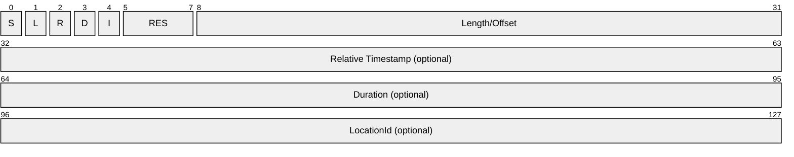
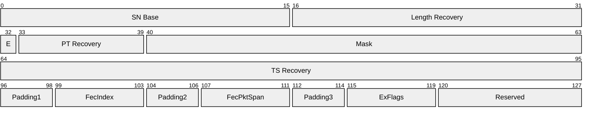
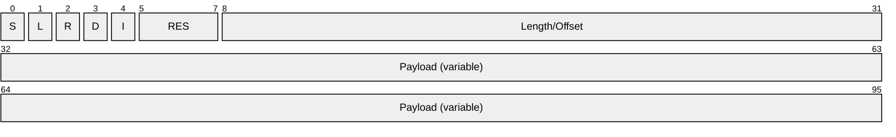

# [MS-RTSP]: Real-Time Streaming Protocol (RTSP) Windows Media Extensions

Table of Contents

1 Introduction

- [1 Introduction](#Section_1)
  - [1.1 Glossary](#Section_1.1)
  - [1.2 References](#Section_1.2)
    - [1.2.1 Normative References](#Section_1.2.1)
    - [1.2.2 Informative References](#Section_1.2.2)
  - [1.3 Overview](#Section_1.3)
  - [1.4 Relationship to Other Protocols](#Section_1.4)
  - [1.5 Prerequisites/Preconditions](#Section_1.5)
  - [1.6 Applicability Statement](#Section_1.6)
  - [1.7 Versioning and Capability Negotiation](#Section_1.7)
  - [1.8 Vendor-Extensible Fields](#Section_1.8)
  - [1.9 Standards Assignments](#Section_1.9)

2 Messages

- [2 Messages](#Section_2)
  - [2.1 Transport](#Section_2.1)
  - [2.2 Message Syntax](#Section_2.2)
    - [2.2.1 RTP Payload Format for ASF Data Packets](#Section_2.2.1)
      - [2.2.1.1 General Usage](#Section_2.2.1.1)
      - [2.2.1.2 RTP Header Usage for ASF Data](#Section_2.2.1.2)
      - [2.2.1.3 RTP Payload Format Header](#Section_2.2.1.3)
      - [2.2.1.4 ASF Data Packet Payload](#Section_2.2.1.4)
    - [2.2.2 RTP Payload Format for Forward Error Correction](#Section_2.2.2)
      - [2.2.2.1 General Usage](#Section_2.2.2.1)
      - [2.2.2.2 Vandermonde Matrix Algorithm](#Section_2.2.2.2)
        - [2.2.2.2.1 Basic Principles Used in the Encoding Technique](#Section_2.2.2.2.1)
        - [2.2.2.2.2 Generation of a Vandermonde Matrix](#Section_2.2.2.2.2)
      - [2.2.2.3 RTP Header Usage for RTP FEC Data](#Section_2.2.2.3)
      - [2.2.2.4 RTP Packet Header FEC Extension](#Section_2.2.2.4)
    - [2.2.3 RTP Payload Format for Retransmitted RTP Packets and Packet-Pair Data](#Section_2.2.3)
      - [2.2.3.1 Transmitting Copies of RTP Packets](#Section_2.2.3.1)
      - [2.2.3.2 Transmitting Packet-Pair Data](#Section_2.2.3.2)
    - [2.2.4 RTCP NACK Packet Syntax](#Section_2.2.4)
    - [2.2.5 Session Description Protocol Extensions](#Section_2.2.5)
      - [2.2.5.1 Bandwidth Modifiers for the "b=" Field](#Section_2.2.5.1)
        - [2.2.5.1.1 "AS" Bandwidth Modifier](#Section_2.2.5.1.1)
        - [2.2.5.1.2 "RS" Bandwidth Modifier](#Section_2.2.5.1.2)
        - [2.2.5.1.3 "RR" Bandwidth Modifier](#Section_2.2.5.1.3)
        - [2.2.5.1.4 "X-AV" Bandwidth Modifier](#Section_2.2.5.1.4)
      - [2.2.5.2 Attributes for the "a=" Field](#Section_2.2.5.2)
        - [2.2.5.2.1 Control URL Attribute ("a=control")](#Section_2.2.5.2.1)
        - [2.2.5.2.2 Max packetsize Attribute ("a=maxps")](#Section_2.2.5.2.2)
        - [2.2.5.2.3 Program Parameters URL Attribute ("a=pgmpu")](#Section_2.2.5.2.3)
          - [2.2.5.2.3.1 application/vnd.ms.wms-hdr.asfv1](#Section_2.2.5.2.3.1)
          - [2.2.5.2.3.2 application/x-wms-contentdesc](#Section_2.2.5.2.3.2)
        - [2.2.5.2.4 Reliable Attribute ("a=reliable")](#Section_2.2.5.2.4)
        - [2.2.5.2.5 Stream Number Attribute ("a=stream")](#Section_2.2.5.2.5)
        - [2.2.5.2.6 Type Attribute ("a=type")](#Section_2.2.5.2.6)
          - [2.2.5.2.6.1 broadcast](#Section_2.2.5.2.6.1)
          - [2.2.5.2.6.2 lastentry](#Section_2.2.5.2.6.2)
          - [2.2.5.2.6.3 notseekable](#Section_2.2.5.2.6.3)
          - [2.2.5.2.6.4 notstridable](#Section_2.2.5.2.6.4)
          - [2.2.5.2.6.5 playlist](#Section_2.2.5.2.6.5)
          - [2.2.5.2.6.6 skipbackward](#Section_2.2.5.2.6.6)
          - [2.2.5.2.6.7 skipforward](#Section_2.2.5.2.6.7)
      - [2.2.5.3 RTP Payload Format for ASF Data Packets](#Section_2.2.5.3)
      - [2.2.5.4 RTP Payload Format for FEC Data](#Section_2.2.5.4)
      - [2.2.5.5 RTP Payload Format for Retransmitted RTP Packets and Packet-Pair Data](#Section_2.2.5.5)
    - [2.2.6 RTSP Header Fields](#Section_2.2.6)
      - [2.2.6.1 Bandwidth](#Section_2.2.6.1)
      - [2.2.6.2 Cache-Control](#Section_2.2.6.2)
        - [2.2.6.2.1 max-age](#Section_2.2.6.2.1)
        - [2.2.6.2.2 must-revalidate](#Section_2.2.6.2.2)
        - [2.2.6.2.3 no-cache](#Section_2.2.6.2.3)
        - [2.2.6.2.4 no-store](#Section_2.2.6.2.4)
        - [2.2.6.2.5 no-user-cache](#Section_2.2.6.2.5)
        - [2.2.6.2.6 private](#Section_2.2.6.2.6)
        - [2.2.6.2.7 proxy-revalidate](#Section_2.2.6.2.7)
        - [2.2.6.2.8 public](#Section_2.2.6.2.8)
        - [2.2.6.2.9 x-wms-content-size](#Section_2.2.6.2.9)
        - [2.2.6.2.10 x-wms-event-subscription](#Section_2.2.6.2.10)
        - [2.2.6.2.11 x-wms-proxy-split](#Section_2.2.6.2.11)
        - [2.2.6.2.12 x-wms-stream-type](#Section_2.2.6.2.12)
      - [2.2.6.3 Content-Type](#Section_2.2.6.3)
        - [2.2.6.3.1 application/sdp](#Section_2.2.6.3.1)
        - [2.2.6.3.2 application/x-rtsp-packetpair](#Section_2.2.6.3.2)
        - [2.2.6.3.3 application/x-rtsp-udp-packetpair](#Section_2.2.6.3.3)
        - [2.2.6.3.4 application/x-wms-extension-cmd](#Section_2.2.6.3.4)
        - [2.2.6.3.5 application/x-wms-getcontentinfo](#Section_2.2.6.3.5)
        - [2.2.6.3.6 application/x-wms-Logconnectstats](#Section_2.2.6.3.6)
        - [2.2.6.3.7 application/x-wms-Logplaystats](#Section_2.2.6.3.7)
        - [2.2.6.3.8 application/x-wms-sendevent](#Section_2.2.6.3.8)
        - [2.2.6.3.9 application/x-wms-streamswitch](#Section_2.2.6.3.9)
      - [2.2.6.4 Cookie](#Section_2.2.6.4)
      - [2.2.6.5 If-Match](#Section_2.2.6.5)
      - [2.2.6.6 If-None-Match](#Section_2.2.6.6)
      - [2.2.6.7 Range](#Section_2.2.6.7)
        - [2.2.6.7.1 x-asf-byte](#Section_2.2.6.7.1)
        - [2.2.6.7.2 x-asf-packet](#Section_2.2.6.7.2)
      - [2.2.6.8 RTP-Info](#Section_2.2.6.8)
      - [2.2.6.9 Set-Cookie](#Section_2.2.6.9)
      - [2.2.6.10 Supported](#Section_2.2.6.10)
        - [2.2.6.10.1 com.microsoft.wm.eosmsg](#Section_2.2.6.10.1)
        - [2.2.6.10.2 com.microsoft.wm.fastcache](#Section_2.2.6.10.2)
        - [2.2.6.10.3 com.microsoft.wm.locid](#Section_2.2.6.10.3)
        - [2.2.6.10.4 com.microsoft.wm.packetpairssrc](#Section_2.2.6.10.4)
        - [2.2.6.10.5 com.microsoft.wm.predstrm](#Section_2.2.6.10.5)
        - [2.2.6.10.6 com.microsoft.wm.srvppair](#Section_2.2.6.10.6)
        - [2.2.6.10.7 com.microsoft.wm.sswitch](#Section_2.2.6.10.7)
        - [2.2.6.10.8 com.microsoft.wm.startupprofile](#Section_2.2.6.10.8)
      - [2.2.6.11 Transport](#Section_2.2.6.11)
      - [2.2.6.12 User-Agent](#Section_2.2.6.12)
      - [2.2.6.13 X-Accelerate-Streaming](#Section_2.2.6.13)
      - [2.2.6.14 X-Accept-Authentication](#Section_2.2.6.14)
      - [2.2.6.15 X-Accept-Proxy-Authentication](#Section_2.2.6.15)
      - [2.2.6.16 X-Broadcast-Id](#Section_2.2.6.16)
      - [2.2.6.17 X-Burst-Streaming](#Section_2.2.6.17)
      - [2.2.6.18 X-Notice](#Section_2.2.6.18)
      - [2.2.6.19 X-Player-Lag-Time](#Section_2.2.6.19)
      - [2.2.6.20 X-Playlist](#Section_2.2.6.20)
      - [2.2.6.21 X-Playlist-Change-Notice](#Section_2.2.6.21)
      - [2.2.6.22 X-Playlist-Gen-Id](#Section_2.2.6.22)
      - [2.2.6.23 X-Playlist-Seek-Id](#Section_2.2.6.23)
      - [2.2.6.24 X-Proxy-Client-Agent](#Section_2.2.6.24)
      - [2.2.6.25 X-Proxy-Client-Verb](#Section_2.2.6.25)
      - [2.2.6.26 X-Receding-PlaylistChange](#Section_2.2.6.26)
      - [2.2.6.27 X-RTP-Info](#Section_2.2.6.27)
      - [2.2.6.28 X-StartupProfile](#Section_2.2.6.28)
    - [2.2.7 Request Types](#Section_2.2.7)
      - [2.2.7.1 Announce](#Section_2.2.7.1)
      - [2.2.7.2 Describe](#Section_2.2.7.2)
      - [2.2.7.3 EndOfStream](#Section_2.2.7.3)
      - [2.2.7.4 GetContentInfo](#Section_2.2.7.4)
      - [2.2.7.5 KeepAlive](#Section_2.2.7.5)
      - [2.2.7.6 LogConnect](#Section_2.2.7.6)
      - [2.2.7.7 LogPlay](#Section_2.2.7.7)
      - [2.2.7.8 Pause](#Section_2.2.7.8)
      - [2.2.7.9 Play](#Section_2.2.7.9)
      - [2.2.7.10 SelectStream](#Section_2.2.7.10)
        - [2.2.7.10.1 SelectStream Using SETUP](#Section_2.2.7.10.1)
        - [2.2.7.10.2 SelectStream Using TEARDOWN](#Section_2.2.7.10.2)
        - [2.2.7.10.3 SelectStream Using SET_PARAMETER](#Section_2.2.7.10.3)
      - [2.2.7.11 SendEvent](#Section_2.2.7.11)
      - [2.2.7.12 TcpPacketPair](#Section_2.2.7.12)
      - [2.2.7.13 Teardown](#Section_2.2.7.13)
      - [2.2.7.14 UdpPacketPair](#Section_2.2.7.14)

3 Protocol Details

- [3 Protocol Details](#Section_3)
  - [3.1 Client Details](#Section_3.1)
    - [3.1.1 Abstract Data Model](#Section_3.1.1)
    - [3.1.2 Timers](#Section_3.1.2)
    - [3.1.3 Initialization](#Section_3.1.3)
    - [3.1.4 Higher-Layer Triggered Events](#Section_3.1.4)
      - [3.1.4.1 Request to Retrieve Caching Information](#Section_3.1.4.1)
      - [3.1.4.2 Request to Retrieve Content Information](#Section_3.1.4.2)
        - [3.1.4.2.1 Sending the Describe Request](#Section_3.1.4.2.1)
      - [3.1.4.3 Request to Start Streaming Content](#Section_3.1.4.3)
        - [3.1.4.3.1 Sending a SelectStream Request](#Section_3.1.4.3.1)
      - [3.1.4.4 Request to Change Currently Selected Streams](#Section_3.1.4.4)
      - [3.1.4.5 Streams to Play from the New Playlist Entry Are Selected](#Section_3.1.4.5)
      - [3.1.4.6 Request to Retransmit Lost RTP Packets](#Section_3.1.4.6)
      - [3.1.4.7 Request to Stop Streaming](#Section_3.1.4.7)
      - [3.1.4.8 Request to Change Playback Position](#Section_3.1.4.8)
      - [3.1.4.9 Playback of Content Has Finished](#Section_3.1.4.9)
      - [3.1.4.10 Request to Finish Streaming Session](#Section_3.1.4.10)
    - [3.1.5 Processing Events and Sequencing Rules](#Section_3.1.5)
      - [3.1.5.1 Sending a Request (All Request Types)](#Section_3.1.5.1)
      - [3.1.5.2 Receiving a Response (All Request Types)](#Section_3.1.5.2)
      - [3.1.5.3 Receiving a GetContentInfo Response](#Section_3.1.5.3)
      - [3.1.5.4 Receiving a Describe Response](#Section_3.1.5.4)
      - [3.1.5.5 Receiving a TcpPacketPair Response](#Section_3.1.5.5)
      - [3.1.5.6 Receiving a SelectStream Response for the Retransmission Stream](#Section_3.1.5.6)
      - [3.1.5.7 Receiving a UdpPacketPair Response](#Section_3.1.5.7)
      - [3.1.5.8 Receiving an RTP Packet Containing Packet-Pair Data](#Section_3.1.5.8)
      - [3.1.5.9 Receiving a SelectStream Response](#Section_3.1.5.9)
        - [3.1.5.9.1 Sending a Play Request in READY State](#Section_3.1.5.9.1)
      - [3.1.5.10 Receiving a Play Response](#Section_3.1.5.10)
      - [3.1.5.11 Receiving a LogConnect Response](#Section_3.1.5.11)
      - [3.1.5.12 Receiving RTP Packets](#Section_3.1.5.12)
        - [3.1.5.12.1 Processing of RTP Packets When FEC Is Used](#Section_3.1.5.12.1)
        - [3.1.5.12.2 Processing of RTP Packets](#Section_3.1.5.12.2)
      - [3.1.5.13 Receiving an EndOfStream Request](#Section_3.1.5.13)
      - [3.1.5.14 Receiving a LogPlay Response](#Section_3.1.5.14)
      - [3.1.5.15 Receiving an Announce Request](#Section_3.1.5.15)
      - [3.1.5.16 Receiving a SelectStream Response After Announce](#Section_3.1.5.16)
        - [3.1.5.16.1 Sending a Play Request in PLAYING State](#Section_3.1.5.16.1)
      - [3.1.5.17 Receiving a Pause Response](#Section_3.1.5.17)
      - [3.1.5.18 Receiving a KeepAlive Response](#Section_3.1.5.18)
      - [3.1.5.19 Receiving a SendEvent Response](#Section_3.1.5.19)
      - [3.1.5.20 Receiving a Teardown Response](#Section_3.1.5.20)
    - [3.1.6 Timer Events](#Section_3.1.6)
      - [3.1.6.1 Firewall Timer Expires](#Section_3.1.6.1)
      - [3.1.6.2 Keepalive Timer Expires](#Section_3.1.6.2)
    - [3.1.7 Other Local Events](#Section_3.1.7)
      - [3.1.7.1 TCP Connection Is Disconnected](#Section_3.1.7.1)
  - [3.2 Server Details](#Section_3.2)
    - [3.2.1 Abstract Data Model](#Section_3.2.1)
    - [3.2.2 Timers](#Section_3.2.2)
    - [3.2.3 Initialization](#Section_3.2.3)
    - [3.2.4 Higher-Layer Triggered Events](#Section_3.2.4)
      - [3.2.4.1 Notification that the Last RTP Packet Has Been Sent](#Section_3.2.4.1)
      - [3.2.4.2 Notification that a New ASF File Header Is Available](#Section_3.2.4.2)
      - [3.2.4.3 Notification That an ASF Packet Is Ready to Be Sent](#Section_3.2.4.3)
    - [3.2.5 Processing Events and Sequencing Rules](#Section_3.2.5)
      - [3.2.5.1 Receiving a Request (All Request Types)](#Section_3.2.5.1)
      - [3.2.5.2 Sending a Response (All Request Types)](#Section_3.2.5.2)
      - [3.2.5.3 Receiving a GetContentInfo Request](#Section_3.2.5.3)
      - [3.2.5.4 Receiving a Describe Request](#Section_3.2.5.4)
      - [3.2.5.5 Receiving a TcpPacketPair Request](#Section_3.2.5.5)
      - [3.2.5.6 Receiving a SelectStream Request](#Section_3.2.5.6)
        - [3.2.5.6.1 Receiving a SelectStream Request Using SETUP](#Section_3.2.5.6.1)
        - [3.2.5.6.2 Receiving a SelectStream Request Using TEARDOWN](#Section_3.2.5.6.2)
        - [3.2.5.6.3 Receiving a SelectStream Request Using SET_PARAMETER](#Section_3.2.5.6.3)
        - [3.2.5.6.4 Common Processing Rules for SelectStream](#Section_3.2.5.6.4)
      - [3.2.5.7 Receiving a UdpPacketPair Request](#Section_3.2.5.7)
      - [3.2.5.8 Receiving a Play Request](#Section_3.2.5.8)
      - [3.2.5.9 Receiving a LogConnect Request](#Section_3.2.5.9)
      - [3.2.5.10 Receiving an RTCP Packet](#Section_3.2.5.10)
      - [3.2.5.11 Receiving a Pause Request](#Section_3.2.5.11)
      - [3.2.5.12 Receiving a LogPlay Request](#Section_3.2.5.12)
      - [3.2.5.13 Receiving an EndOfStream Response](#Section_3.2.5.13)
      - [3.2.5.14 Receiving an Announce Response](#Section_3.2.5.14)
      - [3.2.5.15 Receiving a KeepAlive Request](#Section_3.2.5.15)
      - [3.2.5.16 Receiving a SendEvent Request](#Section_3.2.5.16)
      - [3.2.5.17 Receiving a Teardown Request](#Section_3.2.5.17)
    - [3.2.6 Timer Events](#Section_3.2.6)
      - [3.2.6.1 Lag-Timer Timer Expires](#Section_3.2.6.1)
      - [3.2.6.2 Idle-Timeout Timer Expires](#Section_3.2.6.2)
      - [3.2.6.3 Heartbeat Timer Expires](#Section_3.2.6.3)
    - [3.2.7 Other Local Events](#Section_3.2.7)
      - [3.2.7.1 Selected-Stream Adjustment](#Section_3.2.7.1)
      - [3.2.7.2 Client Closes TCP Connection](#Section_3.2.7.2)
      - [3.2.7.3 Server Role](#Section_3.2.7.3)
      - [3.2.7.4 Redirection](#Section_3.2.7.4)
      - [3.2.7.5 Cache-Control Data](#Section_3.2.7.5)
      - [3.2.7.6 RTSP Request Received](#Section_3.2.7.6)
      - [3.2.7.7 Computing Values for the X-StartupProfile Header](#Section_3.2.7.7)
        - [3.2.7.7.1 Inspecting a Single ASF Payload](#Section_3.2.7.7.1)
        - [3.2.7.7.2 MaxDiffSndTime Calculations](#Section_3.2.7.7.2)
        - [3.2.7.7.3 ChosenRate Calculations](#Section_3.2.7.7.3)
        - [3.2.7.7.4 MaxBytes, Time and ByteRate Calculations](#Section_3.2.7.7.4)
      - [3.2.7.8 Broadcast ID](#Section_3.2.7.8)
      - [3.2.7.9 AS-Bandwidth Request](#Section_3.2.7.9)
      - [3.2.7.10 Fast Start Request](#Section_3.2.7.10)
      - [3.2.7.11 Proxy Authentication](#Section_3.2.7.11)
      - [3.2.7.12 Origin Server Authentication](#Section_3.2.7.12)

4 Protocol Examples

- [4 Protocol Examples](#Section_4)
  - [4.1 RTP Packet Syntax](#Section_4.1)
  - [4.2 Vandermonde Matrix Algorithm](#Section_4.2)
  - [4.3 SDP Examples](#Section_4.3)
    - [4.3.1 Retransmission Stream](#Section_4.3.1)
  - [4.4 RTSP Examples](#Section_4.4)
    - [4.4.1 SETUP Request](#Section_4.4.1)
    - [4.4.2 Packet-Pair Bandwidth Estimation Using UDP](#Section_4.4.2)
    - [4.4.3 Packet-Pair Bandwidth Estimation Using TCP](#Section_4.4.3)
    - [4.4.4 Predictive Stream Selection and SelectStream](#Section_4.4.4)
      - [4.4.4.1 SelectStream Using SET_PARAMETER](#Section_4.4.4.1)
      - [4.4.4.2 SelectStream Using TEARDOWN](#Section_4.4.4.2)
      - [4.4.4.3 SelectStream After Predictive Stream Selection](#Section_4.4.4.3)
      - [4.4.4.4 Client Requests FEC Stream from Server](#Section_4.4.4.4)
    - [4.4.5 Server-Side Playlist Entry Switching](#Section_4.4.5)
    - [4.4.6 Stream Playback with Authentication](#Section_4.4.6)
    - [4.4.7 Streaming, Pausing, Fast-Forwarding, and Stopping Playback](#Section_4.4.7)
  - [4.5 Logging and RTSP](#Section_4.5)
    - [4.5.1 Submitting Connect-Time Statistics](#Section_4.5.1)
    - [4.5.2 Submitting a Play Log](#Section_4.5.2)
  - [4.6 RTSP Proxy Server Interaction](#Section_4.6)
    - [4.6.1 Sequencing for Playlist Content Delivery](#Section_4.6.1)
    - [4.6.2 Sequencing for Broadcast Content Delivery](#Section_4.6.2)
    - [4.6.3 Proxy Server and Origin Server Communication](#Section_4.6.3)

5 Security

- [5 Security](#Section_5)
  - [5.1 Security Considerations for Implementers](#Section_5.1)
  - [5.2 Index of Security Parameters](#Section_5.2)

6 Appendix A: Product Behavior

- [6 Appendix A: Product Behavior](#Section_6)

7 Change Tracking

- [7 Change Tracking](#Section_7)

For the legal notice and IP terms, see [LEGAL.md](../LEGAL.md).
Last updated: 4/23/2024.
See [Revision History](#revision-history) for full version history.

# 1 Introduction

The Real-Time Streaming Protocol (RTSP): Windows Media Extensions are used for transmitting real-time multimedia data such as audio and video data from a server to a client.

[**RTSP**](#gt_real-time-streaming-protocol-rtsp) [**streams**](#gt_stream) multimedia from Windows Media Services to Windows Media Player or other instances of Windows Media Services. In its primary application, the client is a multimedia player which will render or play the data, but the protocol can also be used for distributing data between two streaming media servers.

RTSP Windows Media Extensions use [**TCP**](#gt_transmission-control-protocol-tcp) and [**UDP**](#gt_user-datagram-protocol-udp).

Sections 1.5, 1.8, 1.9, 2, and 3 of this specification are normative. All other sections and examples in this specification are informative.

## 1.1 Glossary

This document uses the following terms:

**Advanced Systems Format (ASF)**: An extensible file format that is designed to facilitate streaming digital media data over a network. This file format is used by Windows Media.

**ASCII**: The American Standard Code for Information Interchange (ASCII) is an 8-bit character-encoding scheme based on the English alphabet. ASCII codes represent text in computers, communications equipment, and other devices that work with text. ASCII refers to a single 8-bit ASCII character or an array of 8-bit ASCII characters with the high bit of each character set to zero.

**Augmented Backus-Naur Form (ABNF)**: A modified version of Backus-Naur Form (BNF), commonly used by Internet specifications. ABNF notation balances compactness and simplicity with reasonable representational power. ABNF differs from standard BNF in its definitions and uses of naming rules, repetition, alternatives, order-independence, and value ranges. For more information, see [[RFC5234]](https://go.microsoft.com/fwlink/?LinkId=123096).

**big-endian**: Multiple-byte values that are byte-ordered with the most significant byte stored in the memory location with the lowest address.

**content**: Multimedia data. [**content**](#gt_content) is always in [**ASF**](#gt_advanced-systems-format-asf), for example, a single [**ASF**](#gt_advanced-systems-format-asf) music file or a single [**ASF**](#gt_advanced-systems-format-asf) video file. Data in general. A file that an application accesses. Examples of content include web pages and documents stored on either web servers or SMB file servers.

**forward error correction (FEC)**: A process in which a sender uses redundancy to enable a receiver to recover from packet loss.

**globally unique identifier (GUID)**: A term used interchangeably with [**universally unique identifier (UUID)**](#gt_universally-unique-identifier-uuid) in Microsoft protocol technical documents (TDs). Interchanging the usage of these terms does not imply or require a specific algorithm or mechanism to generate the value. Specifically, the use of this term does not imply or require that the algorithms described in [[RFC4122]](https://go.microsoft.com/fwlink/?LinkId=90460) or [[C706]](https://go.microsoft.com/fwlink/?LinkId=89824) must be used for generating the [**GUID**](#gt_globally-unique-identifier-guid). See also [**universally unique identifier (UUID)**](#gt_universally-unique-identifier-uuid).

**MIME type**: A method that is used by protocol clients to associate files of a certain type with applications that can open or access files of that type.

**Multipurpose Internet Mail Extensions (MIME)**: A set of extensions that redefines and expands support for various types of content in email messages, as described in [[RFC2045]](https://go.microsoft.com/fwlink/?LinkId=90307), [[RFC2046]](https://go.microsoft.com/fwlink/?LinkId=90308), and [[RFC2047]](https://go.microsoft.com/fwlink/?LinkId=90309).

**playlist**: One or more [**content**](#gt_content) items that are [**streamed**](#gt_streaming) sequentially.

**Real-Time Streaming Protocol (RTSP)**: A protocol used for transferring real-time multimedia data (for example, audio and video) between a server and a client, as specified in [[RFC2326]](https://go.microsoft.com/fwlink/?LinkId=90335). It is a streaming protocol; this means that [**RTSP**](#gt_real-time-streaming-protocol-rtsp) attempts to facilitate scenarios in which the multimedia data is being simultaneously transferred and rendered (that is, video is displayed and audio is played).

**Real-Time Transport Control Protocol (RTCP)**: A network transport protocol that enables monitoring of Real-Time Transport Protocol (RTP) data delivery and provides minimal control and identification functionality, as described in [[RFC3550]](https://go.microsoft.com/fwlink/?LinkId=90433).

**Real-Time Transport Protocol (RTP)**: A network transport protocol that provides end-to-end transport functions that are suitable for applications that transmit real-time data, such as audio and video, as described in [RFC3550].

**RTCP packet**: A control packet consisting of a fixed header part similar to that of [**RTP packets**](#gt_rtp-packet), followed by structured elements that vary depending upon the RTCP packet type. Typically, multiple RTCP packets are sent together as a compound RTCP packet in a single packet of the underlying protocol; this is enabled by the length field in the fixed header of each RTCP packet. See [RFC3550] section 3.

**RTP packet**: A data packet consisting of the fixed RTP header, a possibly empty list of contributing sources, and the payload data. Some underlying protocols may require an encapsulation of the RTP packet to be defined. Typically one packet of the underlying protocol contains a single RTP packet, but several RTP packets can be contained if permitted by the encapsulation method. See [RFC3550] section 3.

**session**: The state maintained by the server when it is [**streaming**](#gt_streaming) [**content**](#gt_content) to a client. If a server-side [**playlist**](#gt_playlist) is used, the same [**session**](#gt_session) is used for all [**content**](#gt_content) in the [**playlist**](#gt_playlist).

**Session Description Protocol (SDP)**: A protocol that is used for session announcement, session invitation, and other forms of multimedia session initiation. For more information see [MS-SDP](../MS-SDP/MS-SDP.md) and [RFC3264].

**stream**: A sequence of [**ASF**](#gt_advanced-systems-format-asf) media objects ([[ASF]](https://go.microsoft.com/fwlink/?LinkId=89814) section 5.2) that can be selected individually. For example, if a movie has an English and a Spanish soundtrack, each may be encoded in the [**ASF**](#gt_advanced-systems-format-asf) file as a separate [**stream**](#gt_stream). The video data would also be a separate [**stream**](#gt_stream).

**streaming**: The act of transferring [**content**](#gt_content) from a sender to a receiver.

**Transmission Control Protocol (TCP)**: A protocol used with the Internet Protocol (IP) to send data in the form of message units between computers over the Internet. TCP handles keeping track of the individual units of data (called packets) that a message is divided into for efficient routing through the Internet.

**Unicode**: A character encoding standard developed by the Unicode Consortium that represents almost all of the written languages of the world. The [**Unicode**](#gt_unicode) standard [[UNICODE5.0.0/2007]](https://go.microsoft.com/fwlink/?LinkId=154659) provides three forms (UTF-8, UTF-16, and UTF-32) and seven schemes (UTF-8, UTF-16, UTF-16 BE, UTF-16 LE, UTF-32, UTF-32 LE, and UTF-32 BE).

**Uniform Resource Identifier (URI)**: A string that identifies a resource. The URI is an addressing mechanism defined in Internet Engineering Task Force (IETF) Uniform Resource Identifier (URI): Generic Syntax [[RFC3986]](https://go.microsoft.com/fwlink/?LinkId=90453).

**Uniform Resource Locator (URL)**: A string of characters in a standardized format that identifies a document or resource on the World Wide Web. The format is as specified in [[RFC1738]](https://go.microsoft.com/fwlink/?LinkId=90287).

**universally unique identifier (UUID)**: A 128-bit value. UUIDs can be used for multiple purposes, from tagging objects with an extremely short lifetime, to reliably identifying very persistent objects in cross-process communication such as client and server interfaces, manager entry-point vectors, and RPC objects. UUIDs are highly likely to be unique. UUIDs are also known as [**globally unique identifiers (GUIDs)**](#gt_globally-unique-identifier-guid) and these terms are used interchangeably in the Microsoft protocol technical documents (TDs). Interchanging the usage of these terms does not imply or require a specific algorithm or mechanism to generate the UUID. Specifically, the use of this term does not imply or require that the algorithms described in [RFC4122] or [C706] must be used for generating the UUID.

**User Datagram Protocol (UDP)**: The connectionless protocol within TCP/IP that corresponds to the transport layer in the ISO/OSI reference model.

**UTF-8**: A byte-oriented standard for encoding Unicode characters, defined in the Unicode standard. Unless specified otherwise, this term refers to the UTF-8 encoding form specified in [UNICODE5.0.0/2007] section 3.9.

**MAY, SHOULD, MUST, SHOULD NOT, MUST NOT:** These terms (in all caps) are used as defined in [[RFC2119]](https://go.microsoft.com/fwlink/?LinkId=90317). All statements of optional behavior use either MAY, SHOULD, or SHOULD NOT.

## 1.2 References

Links to a document in the Microsoft Open Specifications library point to the correct section in the most recently published version of the referenced document. However, because individual documents in the library are not updated at the same time, the section numbers in the documents may not match. You can confirm the correct section numbering by checking the [Errata](https://go.microsoft.com/fwlink/?linkid=850906).

### 1.2.1 Normative References

We conduct frequent surveys of the normative references to assure their continued availability. If you have any issue with finding a normative reference, please contact [dochelp@microsoft.com](mailto:dochelp@microsoft.com). We will assist you in finding the relevant information.

[ASF] Microsoft Corporation, "Advanced Systems Format Specification", December 2004, [https://download.microsoft.com/download/7/9/0/790fecaa-f64a-4a5e-a430-0bccdab3f1b4/ASF_Specification.doc](https://go.microsoft.com/fwlink/?LinkId=89814)

[IANA] IANA, "Internet Assigned Numbers Authority (IANA)", [http://www.iana.org](https://go.microsoft.com/fwlink/?LinkId=233135)

[MS-DTYP] Microsoft Corporation, "[Windows Data Types](../MS-DTYP/MS-DTYP.md)".

[MS-RTSP] Microsoft Corporation, "[Real-Time Streaming Protocol (RTSP) Windows Media Extensions](#Section_80928baefa7a400683ce0d1909eac0d8)".

[MS-WMLOG] Microsoft Corporation, "[Windows Media Log Data Structure](../MS-WMLOG/MS-WMLOG.md)".

[MS-WMSP] Microsoft Corporation, "[Windows Media HTTP Streaming Protocol](../MS-WMSP/MS-WMSP.md)".

[RFC2109] Kristol, D., and Montulli, L., "HTTP State Management Mechanism", RFC 2109, February 1997, [https://www.rfc-editor.org/info/rfc2109](https://go.microsoft.com/fwlink/?LinkId=90315)

[RFC2119] Bradner, S., "Key words for use in RFCs to Indicate Requirement Levels", BCP 14, RFC 2119, March 1997, [https://www.rfc-editor.org/info/rfc2119](https://go.microsoft.com/fwlink/?LinkId=90317)

[RFC2326] Schulzrinne, H., Rao, A., and Lanphier, R., "Real Time Streaming Protocol (RTSP)", RFC 2326, April 1998, [https://www.rfc-editor.org/info/rfc2326](https://go.microsoft.com/fwlink/?LinkId=90335)

[RFC2397] Masinter, L., "The 'data' URL Scheme", RFC 2397, August 1998, [https://www.rfc-editor.org/info/rfc2397](https://go.microsoft.com/fwlink/?LinkId=90340)

[RFC2616] Fielding, R., Gettys, J., Mogul, J., et al., "Hypertext Transfer Protocol -- HTTP/1.1", RFC 2616, June 1999, [https://www.rfc-editor.org/info/rfc2616](https://go.microsoft.com/fwlink/?LinkId=90372)

[RFC2617] Franks, J., Hallam-Baker, P., Hostetler, J., et al., "HTTP Authentication: Basic and Digest Access Authentication", RFC 2617, June 1999, [https://www.rfc-editor.org/info/rfc2617](https://go.microsoft.com/fwlink/?LinkId=90373)

[RFC3550] Schulzrinne, H., Casner, S., Frederick, R., and Jacobson, V., "RTP: A Transport Protocol for Real-Time Applications", STD 64, RFC 3550, July 2003, [https://www.rfc-editor.org/info/rfc3550](https://go.microsoft.com/fwlink/?LinkId=90433)

[RFC3556] Casner, S., "Session Description Protocol (SDP) Bandwidth Modifiers for RTP Control Protocol (RTCP) Bandwidth", RFC 3556, July 2003, [https://www.rfc-editor.org/info/rfc3556](https://go.microsoft.com/fwlink/?LinkId=90434)

[RFC3629] Yergeau, F., "UTF-8, A Transformation Format of ISO 10646", STD 63, RFC 3629, November 2003, [https://www.rfc-editor.org/info/rfc3629](https://go.microsoft.com/fwlink/?LinkId=90439)

[RFC3986] Berners-Lee, T., Fielding, R., and Masinter, L., "Uniform Resource Identifier (URI): Generic Syntax", STD 66, RFC 3986, January 2005, [https://www.rfc-editor.org/info/rfc3986](https://go.microsoft.com/fwlink/?LinkId=90453)

[RFC4122] Leach, P., Mealling, M., and Salz, R., "A Universally Unique Identifier (UUID) URN Namespace", RFC 4122, July 2005, [https://www.rfc-editor.org/info/rfc4122](https://go.microsoft.com/fwlink/?LinkId=90460)

[RFC4559] Jaganathan, K., Zhu, L., and Brezak, J., "SPNEGO-based Kerberos and NTLM HTTP Authentication in Microsoft Windows", RFC 4559, June 2006, [https://www.rfc-editor.org/info/rfc4559](https://go.microsoft.com/fwlink/?LinkId=90483)

[RFC4566] Handley, M., Jacobson, V., and Perkins, C., "SDP: Session Description Protocol", RFC 4566, July 2006, [https://www.rfc-editor.org/info/rfc4566](https://go.microsoft.com/fwlink/?LinkId=90484)

[RFC4585] Ott, J., Wenger, S., Sato, N., et al., "Extended RTP Profile for Real-time Transport Control Protocol (RTCP)-Based Feedback (RTP/AVPF)", RFC 4585, July 2006, [https://www.rfc-editor.org/info/rfc4585](https://go.microsoft.com/fwlink/?LinkId=90485)

[RFC5234] Crocker, D., Ed., and Overell, P., "Augmented BNF for Syntax Specifications: ABNF", STD 68, RFC 5234, January 2008, [https://www.rfc-editor.org/info/rfc5234](https://go.microsoft.com/fwlink/?LinkId=123096)

### 1.2.2 Informative References

[MS-MMSP] Microsoft Corporation, "[Microsoft Media Server (MMS) Protocol](../MS-MMSP/MS-MMSP.md)".

[R-SCODES] Wicker, B., "Reed-Solomon Codes and Their Applications", Wiley-IEEE Press, 1999, ISBN: 0780353919.

[RFC1945] Berners-Lee, T., Fielding, R., and Frystyk, H., "Hypertext Transfer Protocol -- HTTP/1.0", RFC 1945, May 1996, [https://www.rfc-editor.org/info/rfc1945](https://go.microsoft.com/fwlink/?LinkId=90300)

[RFC2733] Rosenberg, J., and Schulzrinne, H., "An RTP Payload Format for Generic Forward Error Correction", RFC 2733, December 1999, [http://www.ietf.org/rfc/rfc2733.txt](https://go.microsoft.com/fwlink/?LinkId=90376)

[RFC768] Postel, J., "User Datagram Protocol", STD 6, RFC 768, August 1980, [https://www.rfc-editor.org/info/rfc768](https://go.microsoft.com/fwlink/?LinkId=90490)

[RFC793] Postel, J., Ed., "Transmission Control Protocol: DARPA Internet Program Protocol Specification", RFC 793, September 1981, [https://www.rfc-editor.org/info/rfc793](https://go.microsoft.com/fwlink/?LinkId=150872)

## 1.3 Overview

The [**Real-Time Streaming Protocol (RTSP)**](#gt_real-time-streaming-protocol-rtsp) [[RFC2326]](https://go.microsoft.com/fwlink/?LinkId=90335) is used for transferring real-time multimedia data, including audio and video, between a server and a client. It is a [**streaming**](#gt_streaming) protocol, which means it attempts to facilitate scenarios in which the multimedia data is being simultaneously transferred and rendered; that is, video is displayed, and audio is played.

RTSP uses a [**Transmission Control Protocol (TCP)**](#gt_transmission-control-protocol-tcp) connection for control of the streaming media [**session**](#gt_session), although it is also possible to use [**UDP**](#gt_user-datagram-protocol-udp) for this purpose.

The entity that sends the RTSP request that initiates the session is referred as the client, and the entity that responds to that request is referred to as the server. Typically, the multimedia data flows from the server to the client. RTSP also allows multimedia data to flow in the opposite direction. However, the extensions defined in this specification were not designed for such scenarios.

Clients can send RTSP requests to the server requesting information on [**content**](#gt_content) before a session is established. The information that the server returns is formatted by using a syntax specified by the [**Session Description Protocol (SDP)**](#gt_session-description-protocol-sdp) [[RFC4566]](https://go.microsoft.com/fwlink/?LinkId=90484).

Clients use RTSP requests to control the session and to request that the server perform actions, such as starting or stopping the flow of multimedia data. Each request has a corresponding RTSP response that is sent in the opposite direction. Servers can also send RTSP requests to clients, for example, to inform them that the session state has changed.

If TCP is used to exchange RTSP requests and responses, the multimedia data can also be transferred over the same TCP connection. Otherwise, the multimedia data is transferred over UDP.

The multimedia data is encapsulated in [**Real-Time Transport Protocol (RTP)**](#gt_real-time-transport-protocol-rtp) packets [[RFC3550]](https://go.microsoft.com/fwlink/?LinkId=90433). For each RTP [**stream**](#gt_stream), the server and client can also exchange [**Real-Time Transport Control Protocol (RTCP)**](#gt_real-time-transport-control-protocol-rtcp) packets [[RFC3556]](https://go.microsoft.com/fwlink/?LinkId=90434).

This specification defines extensions to RTSP, SDP, RTP, and RTCP that enable the delivery of multimedia data that is encapsulated in [**Advanced Systems Format (ASF)**](#gt_advanced-systems-format-asf) packets [[ASF]](https://go.microsoft.com/fwlink/?LinkId=89814).

## 1.4 Relationship to Other Protocols

[**RTSP**](#gt_real-time-streaming-protocol-rtsp) relies on [**TCP**](#gt_transmission-control-protocol-tcp) [[RFC793]](https://go.microsoft.com/fwlink/?LinkId=150872) for controlling the [**streaming**](#gt_streaming) media [**session**](#gt_session). Although the [**User Datagram Protocol (UDP)**](#gt_user-datagram-protocol-udp) [[RFC768]](https://go.microsoft.com/fwlink/?LinkId=90490) is also allowed, it is rarely used for this purpose.

RTSP uses [**Session Description Protocol (SDP)**](#gt_session-description-protocol-sdp) [[RFC4566]](https://go.microsoft.com/fwlink/?LinkId=90484) syntax to specify the properties of [**content**](#gt_content).

RTSP uses [**Real-Time Transport Protocol (RTP)**](#gt_real-time-transport-protocol-rtp) [[RFC3550]](https://go.microsoft.com/fwlink/?LinkId=90433) for the delivery of multimedia data and [**Real-Time Transport Control Protocol (RTCP)**](#gt_real-time-transport-control-protocol-rtcp) [[RFC3556]](https://go.microsoft.com/fwlink/?LinkId=90434) for RTP feedback and statistics. RTP and RTCP packets are transmitted over either UDP or TCP. It is possible to transmit some RTP [**streams**](#gt_stream) over UDP and other RTP streams over TCP.

RTSP with Windows Media extensions depends on [**Advanced Systems Format (ASF)**](#gt_advanced-systems-format-asf) [[ASF]](https://go.microsoft.com/fwlink/?LinkId=89814), which is used in both the SDP syntax and the payload of [**RTP packets**](#gt_rtp-packet). This is similar in functionality to the Windows Media HTTP Streaming Protocol [MS-WMSP](../MS-WMSP/MS-WMSP.md). However, in that protocol, the delivery of ASF packets is limited to TCP only.

RTSP is similar in functionality to the Microsoft Media Server (MMS) protocol [MS-MMSP](../MS-MMSP/MS-MMSP.md). However, RTSP with Windows Media extensions provides additional functionality that is not available in MMS.

## 1.5 Prerequisites/Preconditions

[**RTSP**](#gt_real-time-streaming-protocol-rtsp) Windows Media Extensions do not provide a mechanism for a client to discover the [**URL**](#gt_uniform-resource-locator-url) to the server. Therefore, it is a prerequisite that the client obtains a URL to the server before this protocol can be used.

## 1.6 Applicability Statement

[**RTSP**](#gt_real-time-streaming-protocol-rtsp) is suitable for [**streaming**](#gt_streaming) delivery of real-time multimedia data. The term streaming means that the data is transmitted at some fixed rate or at some rate that is related to the rate at which the data will be consumed (for example, displayed) by the receiver.

It is appropriate to use RTSP Windows Media Extensions when there is a need for a streaming protocol that can deliver multimedia data over either UDP or TCP.

Although the Microsoft Media Server (MMS) protocol [MS-MMSP](../MS-MMSP/MS-MMSP.md) also supports delivery of multimedia data over UDP and TCP, RTSP with the Windows Media extensions provides additional functionality that is not available in MMS. MMS is an older protocol that has been deprecated.

If the multimedia data is transmitted over TCP, the Windows Media HTTP Streaming Protocol [MS-WMSP](../MS-WMSP/MS-WMSP.md) might be a suitable alternative. That protocol provides the same functionality as RTSP with the Windows Media extensions, except that the delivery of [**ASF**](#gt_advanced-systems-format-asf) packets is restricted to TCP.

## 1.7 Versioning and Capability Negotiation

This document covers versioning issues in the following areas:

**Supported Transports:** RTSP Windows Media Extensions are implemented on top of TCP. Also, implementations that require connectionless transmission of multimedia data over an unreliable network service support UDP. For details, see section [2.1](#Section_2.1).

**Protocol Versions:** RTSP version 1.0, as specified in [[RFC2326]](https://go.microsoft.com/fwlink/?LinkId=90335), is supported.

**Security and Authentication Methods:** RTSP Windows Media Extensions support HTTP access authentication, as specified in [[RFC2616]](https://go.microsoft.com/fwlink/?LinkId=90372) section 11.

**Localization:** RTSP Windows Media Extensions do not specify any localization-dependent protocol behavior.

**Capability Negotiation:** RTSP Windows Media Extensions perform explicit capability negotiation by using the following mechanisms:

- The **type** attribute in SDP, as specified in section [2.2.5.2.6](#Section_2.2.5.2.6).
- The [Supported (section 2.2.6.10)](#Section_2.2.6.10) header.
- The [X-Accept-Authentication (section 2.2.6.14)](#Section_2.2.6.14) header.

## 1.8 Vendor-Extensible Fields

Vendor-extensible fields are specified in [[RFC2326]](https://go.microsoft.com/fwlink/?LinkId=90335).

## 1.9 Standards Assignments

The following port numbers have been assigned for use by [**RTSP**](#gt_real-time-streaming-protocol-rtsp), [**RTP**](#gt_real-time-transport-protocol-rtp) and [**RTCP**](#gt_real-time-transport-control-protocol-rtcp).

| Parameter | Value | Reference |
| --- | --- | --- |
| Port number used by server RTSP requests (both UDP and TCP) | 554 | [[IANA]](https://go.microsoft.com/fwlink/?LinkId=233135) |
| Destination UDP port for [**RTP packets**](#gt_rtp-packet) | 5004 | [IANA] |
| Destination UDP port for [**RTCP packets**](#gt_rtcp-packet) | 5005 | [IANA] |

# 2 Messages

The following sections specify how messages are encapsulated on the wire and common data types.

## 2.1 Transport

[**RTSP**](#gt_real-time-streaming-protocol-rtsp) requests and responses are sent over either UDP or TCP.<1>

The default port that an RTSP server listens on for incoming requests is port 554, but the use of other port numbers is permitted.

The extensions defined in this specification use the access authentication functionality that was originally defined for HTTP. This is possible because when RTSP requests a response, the syntax of the request is, in many aspects, compatible with HTTP. The specific access authentication schemes supported by any one implementation are implementation-specific.<2>

HTTP access authentication is specified in [[RFC2616]](https://go.microsoft.com/fwlink/?LinkId=90372) section 11.

## 2.2 Message Syntax

The following table lists the structures that are defined in this section.

| Name | Section | Description |
| --- | --- | --- |
| RTP Payload Format for ASF Data Packets | [2.2.1](#Section_2.2.1) | The [**RTP**](#gt_real-time-transport-protocol-rtp) payload format for [**ASF**](#gt_advanced-systems-format-asf) data packets |
| RTP Payload Format for Forward Error Correction | [2.2.2](#Section_2.2.2) | The RTP payload format for [**forward error correction (FEC)**](#gt_forward-error-correction-fec) |
| RTP Payload Format for Retransmitted RTP Packets and Packet-Pair Data | [2.2.3](#Section_2.2.3) | The RTP payload format for retransmitted [**RTP packets**](#gt_rtp-packet) and packet-pair data |
| RTCP NACK Packet Syntax | [2.2.4](#Section_2.2.4) | The syntax of [**RTCP**](#gt_real-time-transport-control-protocol-rtcp) negative acknowledgement (NACK) packets |
| Session Description Protocol Extensions | [2.2.5](#Section_2.2.5) | Extensions to [**SDP**](#gt_session-description-protocol-sdp) |
| RTSP Header Fields | [2.2.6](#Section_2.2.6) | The syntax of [**RTSP**](#gt_real-time-streaming-protocol-rtsp) headers |
| Request types | [2.2.7](#Section_2.2.7) | Logical request types, and how each type of request is mapped to an RTSP method |

### 2.2.1 RTP Payload Format for ASF Data Packets

This section defines an RTP payload format for [**ASF**](#gt_advanced-systems-format-asf) packets. RTP and ASF are specified in [[RFC3550]](https://go.microsoft.com/fwlink/?LinkId=90433) and [[ASF]](https://go.microsoft.com/fwlink/?LinkId=89814).

#### 2.2.1.1 General Usage

The RTP payload format defined in this section is suitable for any kind of multimedia data that is encapsulated in [**ASF**](#gt_advanced-systems-format-asf) data packets. The RTP payload format is used for audio [**streams**](#gt_stream) and video streams, as well as streams of any of the other types, as specified in [[ASF]](https://go.microsoft.com/fwlink/?LinkId=89814).

ASF data packets can contain multiple payloads from different streams of different types. Therefore, it is possible for a single RTP packet to contain both audio and video data because the ASF packet contained in the RTP packet can multiplex data from different streams.

This RTP payload format allows for multiple ASF data packets to be combined into a single RTP packet. It is also possible to split (fragment) an ASF data packet across several consecutive RTP packets.

Each ASF data packet, or fragment thereof, is preceded by an RTP payload format header, specified in section [2.2.1.3](#Section_2.2.1.3).

#### 2.2.1.2 RTP Header Usage for ASF Data

The meaning and syntax of the fixed RTP header are specified in [[RFC3550]](https://go.microsoft.com/fwlink/?LinkId=90433) section 5.1 and by the RTP profile in use with the following additional notes:

**Marker (M)**: This bit MUST be set to 1 if the RTP packet contains the last fragment of an ASF data packet, or one or more complete ASF data packets. Otherwise, it MUST be set to 0.

**Payload Type (PT)**: There is no predefined RTP payload type number for this RTP payload format. Instead, this 7-bit field MUST be assigned to a number as defined by protocol implementer. For example, the payload type can be assigned by using SDP, as specified in section [2.2.5](#Section_2.2.5).

**Timestamp**: This 32-bit field MUST be set to the value of the **Send Time** field of the first ASF data packet contained in the RTP packet. To find the **Send Time** field of an ASF data packet, see [[ASF]](https://go.microsoft.com/fwlink/?LinkId=89814) section 5.2.2. The time is expressed in milliseconds, unless otherwise specified; for example, through SDP.

#### 2.2.1.3 RTP Payload Format Header

The RTP payload format header is inserted in front of each ASF data packet, or fragment thereof. Therefore, if the RTP packet contains multiple ASF data packets, the RTP payload format header will also be present multiple times.

The fields in the RTP payload format header are transmitted in [**big-endian**](#gt_big-endian) byte order, also called network byte order. The syntax of the RTP payload format header is as follows:

**S (1 bit):** This field MUST be set to 1 if the ASF data packet contains a payload that is a key-frame. Otherwise, this field MUST be set to 0. In all RTP payload format headers that precede fragments of the same ASF data packet, the **S** field MUST be set to the same value. How to determine if an [**ASF**](#gt_advanced-systems-format-asf) payload contains a key-frame is specified in [[ASF]](https://go.microsoft.com/fwlink/?LinkId=89814).

**L (1 bit):** This field MUST be set to 1 if the **Length/Offset** field specifies the size of the ASF data packet that follows this RTP payload format header. Otherwise, this field MUST be set to 0, and the **Length/Offset** field MUST specify an offset. The **L** field MUST be set to 1 in all RTP payload format headers that precede complete ASF data packets, and MUST be set to 0 in all headers that precede fragmented ASF data packets.

**R (1 bit):** This field MUST be set to 1 if the **Relative Timestamp** field is present in the RTP payload format header. Otherwise, this field MUST be set to 0. In all RTP payload format headers that precede fragments of the same ASF data packet, the **R** field MUST be set to the same value.

**D (1 bit):** This field MUST be set to 1 if the **Duration** field is present in the RTP payload format header. Otherwise, this field MUST be set to 0. In all RTP payload format headers that precede fragments of the same ASF data packet, the **D** field MUST be set to the same value.

**I (1 bit):** This field MUST be set to 1 if the **LocationId** field is present in the RTP payload format header. Otherwise, this field MUST be set to 0.

**RES (3 bits):** This field MUST be set to 0 and MUST be ignored by the receiver.

**Length/Offset (3 bytes):** If the **L** field is 0, the RTP payload contains a fragment of an ASF data packet, and the **Length/Offset** field MUST specify the byte offset of the fragment's first byte counted from the beginning of the complete ASF data packet. If the **L** field is 1, the **Length/Offset** field MUST specify the size of the ASF data packet that directly follows the RTP payload format header in bytes.

If the **Length/Offset** field specifies the size of an ASF data packet, and that size is less than the remaining bytes in the RTP packet, another RTP payload format header MUST follow directly after the end of the ASF data packet.

**Relative Timestamp (4 bytes):** Optional. If this field is present, it MUST be set to the signed difference between the **Send Time** field of the ASF data packet that follows this RTP payload format header and the **Timestamp** field in the RTP header. If this field is not present, it SHOULD be assumed that the difference between the two fields is zero. If the difference between the two fields is nonzero, the **Relative Timestamp** field MUST be present. Otherwise, the **Relative Timestamp** field SHOULD NOT be present. The time scale used for the **Relative Timestamp** field MUST be the same as is used for the **Timestamp** field in the RTP header.

Where to find the **Send Time** field of an ASF data packet is specified in [ASF] section 5.2.2.

**Duration (4 bytes):** Optional. If this field is present, it MUST specify the duration of the ASF data packet. The time scale used for the **Duration** field MUST be the same as that used for the **Timestamp** field in the RTP header. If this field is not present, the duration of the ASF data packet is unspecified, and a zero duration MUST NOT be assumed. In all RTP payload format headers that precede fragments of the same ASF data packet, the **Duration** field MUST be set to the same value.

How to assign a value for the **Duration** field is implementation-specific. For example, if duration information is available in the ASF data packet (some ASF data packets can have a **Duration** field), then that duration information can be used as the value of the **Duration** field in the RTP payload format header. Where to find the **Duration** field of an ASF data packet is specified in [ASF] section 5.2.2.

**LocationId (4 bytes):** Optional. If this field is present, it MUST specify the index number of the ASF data packet in the original [**content**](#gt_content) from which the ASF data packet is extracted. The first ASF packet in an ASF file MUST have **LocationId** 0x00000000, the second ASF packet in the file MUST have **LocationId** 0x00000001, and so on. Note that because a server can skip ASF packets, the value of the **LocationId** field might not be sequential from one RTP payload format header to the next. If the server does not have access to the ASF file (for example, in case of live content), the server MUST assume a virtual ASF file, incrementing **LocationId** (or decrementing it when rewinding the content) exactly as if a real ASF file existed. If the **LocationId** field is not present, the index number of the ASF data packet is unspecified, and the receiver SHOULD NOT make any assumptions about the value of the index number.

#### 2.2.1.4 ASF Data Packet Payload

Each [RTP payload format header](#Section_2.2.1.3) is followed by a payload that contains an [**ASF**](#gt_advanced-systems-format-asf) data packet. The ASF data packet can be partial if it has been fragmented across multiple RTP payloads.

If the ASF data packet contains a **Padding Data** field, as specified in [[ASF]](https://go.microsoft.com/fwlink/?LinkId=89814) section 5.2.4, that field SHOULD be removed before encapsulating the ASF data packet in an RTP packet. If the **Padding Data** field is removed, the **Padding Length** field in the ASF payload parsing information section (as specified in [ASF] section 5.2.2) MUST be updated to indicate a nonexistent **Padding Data** field.

### 2.2.2 RTP Payload Format for Forward Error Correction

This section defines an RTP payload format for [**FEC**](#gt_forward-error-correction-fec) by using the [Vandermonde matrix algorithm](#Section_4.2). RTP is specified in [[RFC3550]](https://go.microsoft.com/fwlink/?LinkId=90433) section 5.

#### 2.2.2.1 General Usage

[**FEC**](#gt_forward-error-correction-fec) is a technique that adds redundancy to a bit [**stream**](#gt_stream) to help protect against corrupted or lost bits. The additional redundancy allows a receiver to recover the correct value of one or more incorrectly received bits from the bits that were received correctly.

The RTP payload format defined in this section is a specific application of the FEC technique to the delivery of RTP packets. The FEC data (redundant bits) generated by the FEC algorithm are transmitted as a separate stream of RTP packets. The original (source) RTP packets that are protected by the FEC algorithm are not modified by the use of this RTP payload format.

The RTP packets that contain FEC data are transmitted on the same RTP [**session**](#gt_session) that is used by the source RTP packets. To ensure that the RTP packets with FEC data can be distinguished from the source RTP packets, the RTP packets with FEC data MUST use a different value for the **Payload Type** field in the RTP header than what is used by the source RTP packets.

The RTP packets that contain FEC data consist of the regular RTP header, as specified in [[RFC3550]](https://go.microsoft.com/fwlink/?LinkId=90433) section 5, followed by one [RTP payload format header](#Section_2.2.1.3), as specified in section [2.2.2.4](#Section_2.2.2.4). The remainder of the RTP payload consists of FEC data. The FEC data payload is computed over the complete source RTP packets except for the RTP header specified in [RFC3550] section 5.

There is a need to be able to recover the values of some of the fields in the RTP header of the source RTP packets, so those fields are encoded separately and stored in the RTP payload format header of the FEC packets. For details, see section 2.2.2.4.

The RTP payload format uses a 24-bit field to identify what source RTP packets are encoded into the FEC RTP packet. This means that at most 24 source RTP packets can be encoded into a single FEC RTP packet.

The algorithm used to compute the FEC data is the [Vandermonde matrix algorithm](#Section_4.2).

#### 2.2.2.2 Vandermonde Matrix Algorithm

The Vandermonde matrix algorithm allows *k* data packets (referred to as source packets) to be encoded into *n* encoded packets. The source packets are encoded in such a way that the reception of any subset of *k* encoded packets at the client end would suffice to recover all the source packets. If more than *n*–*k* encoded packets are lost, recovery of all the source packets is not possible.

The Vandermonde matrix algorithm generates the first *k* encoded packets to be identical to the *k* source packets. This simplifies the decoding of the encoded packets and the recovery of the source packets in cases in which little or no packet loss occurs on the network.

The Vandermonde matrix algorithm is also useful in cases in which more than *n*–*k* encoded packets are lost. For such cases, the recovery of all the source packets is not possible; however, because first *k* encoded packets are the same as the *k* source packets, any of the first *k*-encoded packets received can be used by the receiver as the source packets.

The Vandermonde matrix algorithm uses the Reed-Solomon coding technique based on the Vandermonde matrix for encoding the data. The Reed-Solomon algorithm uses linear algebra principles for encoding and decoding the data. For more information on Reed-Solomon codes, see [R-SCODES].

##### 2.2.2.2.1 Basic Principles Used in the Encoding Technique

Treat *k* source packets as variables labeled *xi...xk*, where *xi* equals the numerical value of the *i*th packet. The variables are arranged as a vector, *X*, with *k* rows.

Figure 1: RTSP encoding variables and formula (source matrix)

From the linear algebra principle, any *k* linearly independent equations involving *k* number of variables can be solved to obtain the values for those variables. Now, consider an *n * k* generator matrix *G*, where each row in *G* specifies the coefficients of an equation. Multiplying *G* with the vector *X* results in *k* linear equations.

If the values of the variables in vector *X* are known, multiplying *G* and *X* results in the vector *Y* with *n* elements.

Figure 2: RTSP encoding variables and formula (generator matrix)

Given the vector *Y* and the generator matrix *G*, the original vector *X* can be recalculated, provided that any *k* rows of matrix *G* are linearly independent, that is, any submatrix formed by taking *k* rows of matrix *G* is invertible. Any *k* rows of the matrix *G* can be chosen to generate *G'*. The multiplication of the inverse of *G'* with vector *Y* will result in the original vector *X*.

Figure 3: RTSP encoding variables and formula (identity matrix for server, and inverse for client)

##### 2.2.2.2.2 Generation of a Vandermonde Matrix

An *n * k* size Vandermonde matrix is of the following form.

Figure 4: Vandermonde matrix using GF(n*k)

*Xi* are the elements of the Galois Field GF(pr). As is the case with all Galois Fields, *p* is a prime number, and *r* is an integer greater than or equal to 0. If all *Xi* are different, then the determinant of the matrix is formed by taking any *k* rows if the matrix is non-null and this submatrix is invertible.

The algorithm uses the following steps to generate the Vandermonde matrix.

- The algorithm uses a field size of GF(28) to generate the matrix coefficients.
- Assign Xi = I. This means that the values of the *n*th row become *1, n, n2, n3, ..., nk-1*.
- The algorithm uses the Gauss-Jordan elimination method to convert the first *k* rows of the generator matrix to an identity matrix. The row reduction of the Vandermonde matrix results in the system error correction matrix. The systematic error correction is useful because it makes decoding and recovery easier, and it allows for at least some encoded packets to be decoded even if more than *n–k* encoded packets are lost and complete recovery is not possible.
Section [4.2](#Section_4.2) contains an example of how the algorithm is used.

#### 2.2.2.3 RTP Header Usage for RTP FEC Data

The syntax of the RTP header is specified in [[RFC3550]](https://go.microsoft.com/fwlink/?LinkId=90433) section 5.1. The fields of the fixed RTP header have their usual meaning, as specified in [RFC3550] section 5.1 and by the RTP profile in use, with the following additional notes:

**Marker (M)**: This bit MUST be set to 1.

**Payload Type (PT)**: There is no predefined RTP payload type number for this RTP payload format. Instead, this 7-bit field MUST be assigned to a number that is established through some mechanism outside of RTP. For example, it can be assigned by using the SDP, as specified in section [2.2.5](#Section_2.2.5).

**Timestamp**: This 32-bit field MUST be set to the value of the **Timestamp** field of the last source RTP packet in the span of source RTP packets that is encoded into this [**FEC**](#gt_forward-error-correction-fec) RTP packet. The value of the **Timestamp** field is expressed by using the same time units used for the **Timestamp** field of the source RTP packets, unless otherwise specified (for example, through SDP).

#### 2.2.2.4 RTP Packet Header FEC Extension

The fields in the [RTP payload format header](#Section_2.2.1.3) are transmitted in [**big-endian**](#gt_big-endian) byte order, also called network byte order. The syntax of the RTP payload format header is as follows.

**SN Base (2 bytes):** This field MUST be set to the value of the **Sequence Number** field in the RTP header ([[RFC3550]](https://go.microsoft.com/fwlink/?LinkId=90433) section 5.1) of the first source RTP packet that is encoded in this [**FEC**](#gt_forward-error-correction-fec) RTP packet.

**Length Recovery (2 bytes):** This field MUST be set to the result of applying the FEC algorithm to a virtual 16-bit integer field in each source RTP packet. This virtual field, referred to here as the payload length field, MUST specify the payload length in bytes of each source RTP packet. The value of the **payload length** field MUST include the size of the RTP payload itself, as well as the sizes of the contributing source (CSRC, specified in [RFC3550] section 5.1) list, RTP extension, and RTP padding, if any. The **Length Recovery** field allows a receiver to recover the size of a reconstructed source RTP packet and makes it possible to use the FEC algorithms when the sizes of the source RTP packets vary.

**E (1 bit):** This field MUST be set to 0.

**PT Recovery (7 bits):** This field MUST be set to the result of applying the FEC algorithm to the value of the **Payload Type** field in the RTP header in each source RTP packet.

**Mask (3 bytes):** The purpose of this field is to indicate what source RTP packets are encoded into this FEC RTP packet. For each source RTP packet that is encoded into this FEC RTP packet, the bit with index I in the **Mask** field MUST be set to 1 where I is computed as the unsigned difference between the value of the **Sequence Number** field (defined in [RFC3550] section 5.1) in the source RTP packet and the value of the **SN Base** field in this FEC RTP packet. All other bits in the **Mask** field MUST be set to 0. Index 0 MUST correspond to the least significant bit in the **Mask** field and index 23 to the most significant bit.

**TS Recovery (4 bytes):** This field MUST be set to the result of applying the FEC algorithm to the value of the **Timestamp** field in the RTP header in each source RTP packet.

**Padding1 (3 bits):** This field MUST be ignored.

**FecIndex (5 bits):** This field MUST be set to the index of this FEC RTP packet among the FEC RTP packets that are transmitted for the current span (group) of source RTP packets. The first FEC RTP packet in the span has index 0, the second has index 1, and so on.

**Padding2 (3 bits):** This field MUST be ignored.

**FecPktSpan (5 bits):** This field MUST be set to the number of FEC RTP packets that are transmitted for the current span (group) of source RTP packets or set to 0 if the span is unspecified. If the span is specified, the current FEC RTP packet MUST be included in the count of FEC RTP packets.

**Padding3 (3 bits):** This field MUST be ignored.

**ExFlags (5 bits):** This field MUST be set to 0.

**Reserved (1 byte):** This field MUST be set to 0.

### 2.2.3 RTP Payload Format for Retransmitted RTP Packets and Packet-Pair Data

A client that discovers that it has lost one or more RTP packets might ask the server to retransmit the lost RTP packets. This section defines an RTP payload format that can be used for transmitting copies of RTP packets.

This RTP payload format can also be used for transmitting packet-pair data. Packet-pair data can be used by the receiver to estimate the bottleneck bandwidth in the network path between the transmitter and the receiver.

These two different usage modes of the RTP payload format are defined in the following two sections.

#### 2.2.3.1 Transmitting Copies of RTP Packets

When this RTP payload format is used to transmit a copy of an RTP packet, the RTP payload format does not insert an [RTP payload format header](#Section_2.2.1.3) of its own into the RTP packet.

The fields in the RTP payload format headers used in the original RTP packet MUST NOT be modified. Also, the RTP header in the copied RTP packet MUST be identical to the RTP header of the original RTP packet.

RTP packets using this RTP payload format SHOULD be transmitted on an RTP [**session**](#gt_session) that is different from the one used for the original RTP packets. RTP sessions are different if the RTP packets are sent to different UDP port numbers (see [[RFC3550]](https://go.microsoft.com/fwlink/?LinkId=90433) section 3). RTP sessions are negotiated through the SelectStream request that uses the RTSP SETUP method, as specified in section [2.2.7.10.1](#Section_2.2.7.10.1). This allows a receiver to distinguish between the original RTP packets and retransmitted copies of the RTP packets.

Also, because the RTP header is not changed, the value of the **Sequence Number** field (defined in [RFC3550] section 5.1) in the RTP header of the retransmitted RTP packets does not necessarily increment monotonically. Transmitting the copied RTP packets on a separate RTP session avoids any confusion that might be caused by the **Sequence Number** field.

#### 2.2.3.2 Transmitting Packet-Pair Data

When this RTP payload format is used for sending packet-pair data, one 4-byte [RTP payload format header](#Section_2.2.1.3) MUST be added directly after the normal RTP header, as specified in [[RFC3550]](https://go.microsoft.com/fwlink/?LinkId=90433) section 5.1. The RTP payload format header MUST be followed by highly entropic (random) data.

The RTP header MUST be filled in, following the rules specified in section [2.2.1.2](#Section_2.2.1.2), with the following exception: The value of the **Timestamp** field MUST be set to 0x00000000.

The fields in the RTP payload format header are transmitted in [**big-endian**](#gt_big-endian) byte order. The following diagram shows the RTP payload format header followed by the payload of data.

**S (1 bit):** This field MUST be set to 1 if this is the first RTP packet that contains packet-pair data. Otherwise, the field MUST be set to 0.

**L (1 bit):** This field MUST be set to 1.

**R (1 bit):** This field MUST be set to 0.

**D (1 bit):** This field MUST be set to 0.

**I (1 bit):** This field MUST be set to 0.

**RES (3 bits):** This field MUST be set to 0 and MUST be ignored by the receiver.

**Length/Offset (3 bytes):** This field MUST specify the size of the packet-pair data that directly follows the RTP payload format header in bytes.

**Payload (variable):** The bytes in this array MUST be set to highly entropic (random) data, and the [**content**](#gt_content) of the **Payload** field in each RTP packet that contains packet-pair data MUST be different. The size of the **Payload** field depends on if the sender is transmitting two or three RTP packets with packet-pair data.

If the sender is transmitting three RTP packets with packet-pair data, and the receiver does not allow the sender to decide the **Payload** field size, as specified in section [2.2.7.14](#Section_2.2.7.14), the size of the **Payload** field MUST be 1,454 bytes for the first packet, 1,455 bytes for the second packet, and 1,456 bytes for the third packet.

If the sender is transmitting two RTP packets with packet-pair data, and the receiver does not allow the sender to decide the **Payload** field size, the size of the **Payload** field MUST be 1,455 bytes for the first packet and 1,456 bytes for the second packet.

If the receiver does allow the sender to decide the **Payload** field size, the size of the **Payload** field MUST NOT be less than 482 bytes. Additionally, the size of the **Payload** field MUST satisfy the equation given by the following table. (PayloadSize denotes the size in bytes of the **Payload** field.)

| Packet | Sending two packet-pair packets | Sending three packet-pair packets |
| --- | --- | --- |
| First packet | PayloadSize modulo 3 = 0 | PayloadSize modulo 3 = 2 |
| Second packet | PayloadSize modulo 3 = 1 | PayloadSize modulo 3 = 0 |
| Third packet | N/A | PayloadSize modulo 3 = 1 |

### 2.2.4 RTCP NACK Packet Syntax

The syntax for the RTCP NACK packets defined by RTSP Windows Media Extensions follows the syntax for RTCP packets, as specified in [[RFC3550]](https://go.microsoft.com/fwlink/?LinkId=90433) section 6.1, and the syntax for generic NACK messages, as specified in [[RFC4585]](https://go.microsoft.com/fwlink/?LinkId=90485) section 6.2.1, with the following exception.

Unlike what is specified in [RFC4585] section 6.1, which defines the **FMT** field of the RTCP feedback message to be a 5-bit field, RTSP Windows Media Extensions defines the **FMT** field to be 4 bits in size. The 4 least-significant bits, as specified in [RFC4585] section 6.1, of the **FMT** field are mapped to the 4-bit **FMT** field defined by RTSP Windows Media Extensions.

The most significant bit of the **FMT** field, as specified in [RFC4585] section 6.1, is redefined by RTSP Windows Media Extensions as the **E** field.

A client that sends an RTCP NACK packet SHOULD set the **E** field to 1. Servers MUST ignore the value of the **E** field.

According to the RTCP specification, as specified in [RFC3550] section 6.1, RTCP packets are compound packets consisting of multiple RTCP messages, and all RTCP packets MUST contain a source description (SDES) message with the **CNAME** field. RTSP Windows Media Extensions define the following additional requirement.

An RTCP packet that contains a generic NACK message, as specified in [RFC4585] section 6.2.1, MUST also contain an SDES message, as specified in [RFC3550] section 6.5, where the value of the **CNAME** field in the SDES message MUST adhere to the following syntax.

ssrc = 1*10DIGIT

sdes-value = ssrc "@WMS:7ff42e07-3c7c-4eb5-9c17-6bdd11ad90de"

The preceding syntax is specified using [**Augmented Backus-Naur Form (ABNF)**](#gt_augmented-backus-naur-form-abnf) [[RFC5234]](https://go.microsoft.com/fwlink/?LinkId=123096).

The value of the *ssrc* parameter MUST be identical to the numerical value of the **ssrc** field that the server provided in the RTSP [Transport (section 2.2.6.11)](#Section_2.2.6.11) header in response to the SETUP request (as specified in [[RFC2326]](https://go.microsoft.com/fwlink/?LinkId=90335) section 10.4) for the retransmission [**stream**](#gt_stream), expressed using decimal digits. For information on how to identify the retransmission stream, see section [2.2.5.2.5](#Section_2.2.5.2.5).

### 2.2.5 Session Description Protocol Extensions

This section defines extensions to the SDP. SDP is specified in [[RFC4566]](https://go.microsoft.com/fwlink/?LinkId=90484), but there are constraints and extensions that apply when SDP is used in conjunction with RTSP, as specified in [[RFC2326]](https://go.microsoft.com/fwlink/?LinkId=90335) Appendix C. RTSP Windows Media Extensions define additional extensions to SDP that apply when SDP is used in conjunction with RTSP.

This section defines the syntax of SDP fields by using [**ABNF**](#gt_augmented-backus-naur-form-abnf) [[RFC5234]](https://go.microsoft.com/fwlink/?LinkId=123096) .

#### 2.2.5.1 Bandwidth Modifiers for the "b=" Field

The "b=" field is specified in [[RFC4566]](https://go.microsoft.com/fwlink/?LinkId=90484) section 5.8.

##### 2.2.5.1.1 "AS" Bandwidth Modifier

A "b=" field with the "AS" (Application-Specific) bandwidth modifier MUST be specified for each media description that corresponds to a [**stream**](#gt_stream) in the [**ASF**](#gt_advanced-systems-format-asf) content. The bandwidth that is specified by the "b=" field MUST correspond to the peak bit rate of the ASF stream, if the ASF stream has a peak bit rate that is different from the average bit rate. Otherwise, the bandwidth that is specified by the "b=" field MUST correspond to the average bit rate of the ASF stream.

How a server determines the peak and average bit rates is implementation-specific. The ASF specification [[ASF]](https://go.microsoft.com/fwlink/?LinkId=89814) provides various alternatives which might be used to determine the bit rates. For example, see [ASF] sections 3.12 and 4.1.

**Note** What is referred to as "Average Bitrate" in [ASF] section 3.12 and "Alternate Data Bitrate" in [ASF] section 4.1 is actually the peak bit rate. What is referred to as "Data Bitrate" in [ASF] section 4.1 is the average bit rate.

A "b=" field with the "AS" bandwidth modifier MUST also be specified once at the SDP session level. In this situation, the value of the attribute MUST be set to the peak bit rate required to stream all of the ASF streams. If an ASF stream does not have an explicitly defined peak bit rate, its average bit rate MUST be used instead.

The following example shows the "a=control" attribute: a=control:rtsp://MS-WMSP-L-S1/OnDemand/"AS" bandwidth modifier:

b=AS:107

##### 2.2.5.1.2 "RS" Bandwidth Modifier

A "b=" field with the "RS" bandwidth modifier, as specified in [[RFC3556]](https://go.microsoft.com/fwlink/?LinkId=90434) section 2, MUST be specified at the [**session**](#gt_session) level or once for every media description. The bandwidth that is specified by the "b=" field MUST be 0.

##### 2.2.5.1.3 "RR" Bandwidth Modifier

A "b=" field with the "RR" bandwidth modifier, as specified in [[RFC3556]](https://go.microsoft.com/fwlink/?LinkId=90434) section 2, MUST be specified at the [**session**](#gt_session) level or once for every media description. The bandwidth that is specified by the "b=" field MUST be 0.

##### 2.2.5.1.4 "X-AV" Bandwidth Modifier

The "X-AV" bandwidth modifier MUST be specified for each media description that corresponds to a [**stream**](#gt_stream) in the [**ASF**](#gt_advanced-systems-format-asf) content, if that stream has an average bit rate that is different from the peak bit rate. In this case, the bandwidth that is specified by the "b=" field MUST correspond to the average bit rate of the stream in kilobits per second. If the average bit rate is identical to the peak bit rate, a "b=" field with the "X-AV" modifier SHOULD NOT be specified.

The following example shows the "b=" field with the "X-AV" bandwidth modifier:

b=X-AV:100

#### 2.2.5.2 Attributes for the "a=" Field

RTSP Windows Media extensions define some new SDP attributes (that is, names that can be used in the SDP "a=" field) as well as extensions to some existing attributes.

##### 2.2.5.2.1 Control URL Attribute ("a=control")

The control URL attribute ("a=control") MUST be specified for each media description except if the SDP contains only a single media description. The control URL attributes SHOULD be expressed as relative URLs, using the URL specified by using the control attribute at the SDP [**session**](#gt_session) level as the base URL.

When converting a relative URL from the media description level to an absolute URL, the URL specified by the SDP session-level control attribute MUST be used as the base URL. If the session-level control attribute is missing, the base URL MUST be determined by following the rules, as specified in [[RFC2326]](https://go.microsoft.com/fwlink/?LinkId=90335) section C.1.1.

The following example shows the "a=control" bandwidth modifier:

a=control:rtsp://MS-WMSP-L-S1/OnDemand/

##### 2.2.5.2.2 Max packetsize Attribute ("a=maxps")

The **maxps** attribute specifies the maximum [**ASF**](#gt_advanced-systems-format-asf) packet size in bytes. This attribute SHOULD be present at the SDP [**session**](#gt_session) level.

The [**ABNF**](#gt_augmented-backus-naur-form-abnf) syntax for this attribute is as follows:

maxps = "a=maxps:" 1*10DIGIT

A packet size of 0 is invalid.

##### 2.2.5.2.3 Program Parameters URL Attribute ("a=pgmpu")

The **pgmpu** (program parameters URL) attribute specifies a data URL, as specified in [[RFC2397]](https://go.microsoft.com/fwlink/?LinkId=90340). Such URLs are useful for encoding binary data or other kinds of data that use a syntax that can conflict with the SDP syntax.

The [**ABNF**](#gt_augmented-backus-naur-form-abnf) syntax for this attribute is as follows:

pgmpu = "a=pgmpu:"

dataurl ; defined in [RFC2397] section 3

As specified in [RFC2397], the data URL specifies the kind of data it encodes using a [**MIME**](#gt_multipurpose-internet-mail-extensions-mime)-format media type. RTSP Windows Media Extensions specify two different [**MIME types**](#gt_mime-type) for use on data URLs.

###### 2.2.5.2.3.1 application/vnd.ms.wms-hdr.asfv1

A data URL with the [**MIME type**](#gt_mime-type) "application/vnd.ms.wms-hdr.asfv1" MUST be present at the SDP [**session**](#gt_session) level. The data URL MUST use the base64 encoding mode. The data URL MUST encode an [**ASF**](#gt_advanced-systems-format-asf) file header representing the [**content**](#gt_content) being described by the SDP.

The ASF file header that is generated by the server MUST conform to all requirements in the ASF specification [[ASF]](https://go.microsoft.com/fwlink/?LinkId=89814). The ASF file header MUST describe the content that the server is able to stream. For example, if the content consists of one audio stream and one video stream, then the ASF file header MUST contain an ASF Properties Object [ASF] section 3.2 for each of the two streams.

###### 2.2.5.2.3.2 application/x-wms-contentdesc

A data URL with the [**MIME type**](#gt_mime-type) "application/x-wms-contentdesc" SHOULD be present at the SDP [**session**](#gt_session) level. The data URL MUST NOT use the base64 encoding mode. The data URL MUST encode a [**content**](#gt_content) description list pertaining to the content being described by the SDP.

The syntax for the content description list is specified in [MS-WMSP](../MS-WMSP/MS-WMSP.md) section 2.2.4. Because the content description list is an array of [**Unicode**](#gt_unicode) characters, the following conversion MUST be performed: The Unicode characters MUST be converted to [**UTF-8**](#gt_utf-8) characters, as specified in [[RFC3629]](https://go.microsoft.com/fwlink/?LinkId=90439) section 3. Any UTF-8 characters that cannot be used in a [**Uniform Resource Identifier (URI)**](#gt_uniform-resource-identifier-uri) MUST be encoded by using percent-encoding, as specified in [[RFC3986]](https://go.microsoft.com/fwlink/?LinkId=90453) section 2.1.

##### 2.2.5.2.4 Reliable Attribute ("a=reliable")

The Reliable attribute SHOULD be specified in a media description if it is preferable to transmit the RTP packets that carry the data for this [**ASF**](#gt_advanced-systems-format-asf) [**stream**](#gt_stream) by using a reliable transport mechanism, such as TCP, instead of UDP.

Whether a stream uses reliable transport or not is specified in the Extended Stream Properties object, [[ASF]](https://go.microsoft.com/fwlink/?LinkId=89814) section 4.1.

The [**ABNF**](#gt_augmented-backus-naur-form-abnf) syntax for this attribute is as follows.

Reliable = "a=reliable"

##### 2.2.5.2.5 Stream Number Attribute ("a=stream")

The **stream** attribute MUST be present for each media description. It MUST specify the [**ASF**](#gt_advanced-systems-format-asf) stream number that the media description refers to. The stream number specified by the **stream** attribute MUST be the same number that is specified for the [**stream**](#gt_stream) in the ASF Stream Properties object in the ASF file header.

If the media description does not correspond to a stream in the ASF content because it is a retransmission stream or an [**FEC**](#gt_forward-error-correction-fec) stream, the stream number specified by the **stream** attribute MUST be chosen according to the following table to correctly indicate if the media description is for a retransmission stream or an FEC stream. If there are multiple media descriptions of the same type, each MUST specify a different stream number.

| Stream-num | Meaning |
| --- | --- |
| 1-65534 | Media description is for an ASF stream. |
| 65536-131070 | Media description is for a retransmission stream. |

The [**ABNF**](#gt_augmented-backus-naur-form-abnf) syntax for this attribute is as follows:

stream-num = "a=stream:" 1*10DIGIT

A stream number that is not within the preceding ranges is invalid.

##### 2.2.5.2.6 Type Attribute ("a=type")

The purpose of the type attribute is to specify a list of properties and capabilities that are applicable to the current [**content**](#gt_content) or [**playlist**](#gt_playlist) entry. The type attribute MUST be specified once at the SDP [**session**](#gt_session) level, except if specifying it would result in an empty "a=type:" field, in which case the attribute SHOULD be omitted.

The syntax of the type attribute is as follows.

wm-feat = "broadcast" | "lastentry"

| "notseekable" | "notstridable" | "playlist"

| "skipbackward" | "skipforward"

type = "a=type:" [wm-feat *6("," wm-feat)]

For example: a=type:notseekable,notstridable

###### 2.2.5.2.6.1 broadcast

This property indicates that the [**content**](#gt_content) is being broadcast.

###### 2.2.5.2.6.2 lastentry

This property indicates that the [**content**](#gt_content) is the last entry in a server-side [**playlist**](#gt_playlist).

###### 2.2.5.2.6.3 notseekable

This property indicates that the server does not support seeking within the [**content**](#gt_content) by using the RTSP [Range](#Section_2.2.6.7) header.

###### 2.2.5.2.6.4 notstridable

This property indicates that the server does not support fast forward or rewind of the [**content**](#gt_content) by using the RTSP Scale header.

###### 2.2.5.2.6.5 playlist

This property indicates to a client that the [**content**](#gt_content) is an entry (out of possibly multiple entries) in a server-side [**playlist**](#gt_playlist).

###### 2.2.5.2.6.6 skipbackward

This property indicates that the server supports skipping to the previous entry in the server-side [**playlist**](#gt_playlist) by using the **pl-offset** token on the [X-Playlist (section 2.2.6.20)](#Section_2.2.6.20) header.

###### 2.2.5.2.6.7 skipforward

This property indicates that the server supports skipping to the next entry in the server-side [**playlist**](#gt_playlist) by using the **pl-offset** token on the [X-Playlist (section 2.2.6.20)](#Section_2.2.6.20) header.

#### 2.2.5.3 RTP Payload Format for ASF Data Packets

The RTP payload format for [**ASF**](#gt_advanced-systems-format-asf) data packets, as specified in section [2.2.1](#Section_2.2.1), MUST be identified by the [**MIME type**](#gt_mime-type) "audio/x-asf-pf" for audio [**streams**](#gt_stream), "video/x-asf-pf" for video streams, and "application/x-asf-pf" for streams that are neither audio nor video.

The RTP clock frequency MUST be 1,000 Hz.

Example:

m=audio 0 RTP/AVP 96

a=rtpmap:96 x-asf-pf/1000

#### 2.2.5.4 RTP Payload Format for FEC Data

The RTP payload format for FEC, as specified in section [2.2.2](#Section_2.2.2), MUST be identified by the [**MIME type**](#gt_mime-type) "audio/x-wms-fec" for audio [**streams**](#gt_stream), "video/x-wms-fec" for video streams, and "application/x-wms-fec" for streams that are neither audio nor video.

The RTP clock frequency MUST be 1,000 Hz.

The "a=reliable" field MUST NOT be specified.

The "a=fmtp" field MUST be specified, and the value of the format-specific parameters syntax element on the "a=fmtp" field (as specified in [[RFC4566]](https://go.microsoft.com/fwlink/?LinkId=90484) section 6) MUST contain the URL that a client would specify in an RTSP SETUP request if it wants to receive the [**FEC**](#gt_forward-error-correction-fec) packets. For more information, see [[RFC2733]](https://go.microsoft.com/fwlink/?LinkId=90376) section 11.3.

The "a=fmtp" field specifies the control URL for the stream of FEC packets. If the URL is a relative URL, the client MUST follow the rules specified in section [2.2.5.2.1](#Section_2.2.5.2.1) for converting a relative URL to an absolute URL.

The "a=fmtp" field MUST also specify the FEC span and the number of FEC packets that will be transmitted per span. These are default values that the client might be able to override by using the [Transport (section 2.2.6.11)](#Section_2.2.6.11) header.

The syntax of the format-specific parameters syntax element on the "a=fmtp" field MUST adhere to the following [**ABNF**](#gt_augmented-backus-naur-form-abnf) syntax.

fecspan = 1*2DIGIT

fecperspan = 1*2DIGIT

format-spec-params = URI-reference ; [RFC3986] section 4.1

SP

fecspan

SP

fecperspan

The value of the *fecspan* parameter MUST be in the range 1 to 24, inclusive.

The value of the *fecperspan* parameter MUST be in the range 1 to 24, inclusive, and it MUST be less than or equal to the value of the *fecspan* parameter.

When this RTP payload format is used, it MUST be specified as an additional RTP payload type in the media description of the stream that is being encoded into the FEC packets.

The following example shows the SDP syntax for a case in which RTP payload type 96 is used for [**ASF**](#gt_advanced-systems-format-asf) data packets containing audio data, and RTP payload type 98 is used for FEC packets generated from the payload type 96 source packets. The URL on the "a=control" field and on the "a=fmtp" field are both relative URLs. (The base URL is not shown in this example.)

m=audio 0 RTP/AVP 96 98

a=rtpmap:96 x-asf-pf/1000

a=fmtp:96 audio/vnd.wave;codec=123

a=control:audio

a=rtpmap:98 x-wms-fec/1000

a=fmtp:98 audio/fec 24 1

#### 2.2.5.5 RTP Payload Format for Retransmitted RTP Packets and Packet-Pair Data

The RTP payload format for retransmitted RTP packets and packet-pair data, as specified in section [2.2.3](#Section_2.2.3), MUST be identified by the [**MIME type**](#gt_mime-type) "application/x-wms-rtx".

The RTP clock frequency MUST be 1,000 Hz.

There are no format-specific parameters for this RTP payload format; therefore, the "a=fmtp" field SHOULD NOT be specified.

The "a=reliable" field MUST NOT be specified.

When this RTP payload format is used, it MUST be specified as a separate media description; that is, it MUST NOT share a media description with other [**ASF**](#gt_advanced-systems-format-asf) [**streams**](#gt_stream). That is because retransmitted RTP packets SHOULD be transmitted on an RTP [**session**](#gt_session) separate from the one used by the original RTP packets. For details, see section 2.2.3.<3>

For example:

m=application 0 RTP/AVP 97

a=rtpmap:97 x-wms-rtx/1000

a=control:rtx

### 2.2.6 RTSP Header Fields

RTSP Windows Media Extensions defines several new headers that do not exist in RTSP, as specified in [[RFC2326]](https://go.microsoft.com/fwlink/?LinkId=90335) section 12. Some headers specified in [RFC2326] section 12 are further restrained by RTSP Windows Media Extensions in how they can be used. The new headers and the modified existing ones are defined in this section.

Unless otherwise specified, the headers specified in RTSP Windows Media Extensions, and any tokens (also called tags or directives) used on those headers, are defined for use in both requests and responses.

If a client or server receives an RTSP header that is not defined in this section, or if the header is not defined in the current context; for example, receiving a request-only header in a response; the header MUST be interpreted as specified in [RFC2326] section 12. If a particular header is not specified in [RFC2326] section 12, it MUST be interpreted as specified in [[RFC2616]](https://go.microsoft.com/fwlink/?LinkId=90372) section 14.

If a client or server receives an RTSP header that is defined in this section, and the header contains an unknown token, or if the token is not defined in the current context (for example, receiving a request-only token in a response), the token MUST be ignored.

This section defines the syntax of RTSP headers by using [**ABNF**](#gt_augmented-backus-naur-form-abnf). Any ABNF syntax rules not specified in [[RFC5234]](https://go.microsoft.com/fwlink/?LinkId=123096) use the ABNF extensions specified in [RFC2326] section 15.

#### 2.2.6.1 Bandwidth

The Bandwidth header MUST be used as specified in [[RFC2326]](https://go.microsoft.com/fwlink/?LinkId=90335) section 12.6. Also, the bit rate expressed on the Bandwidth header MUST be in bits per second.

This header is defined for use only in requests sent to a server.

#### 2.2.6.2 Cache-Control

The purpose of the Cache-Control header is to specify to clients, and any intermediate caches (that is, proxy servers), how they can cache the content. The syntax of the Cache-Control header specified in this section applies only when the header is included in an [Announce (section 2.2.7.1)](#Section_2.2.7.1) request, in the response to a [Describe (section 2.2.7.2)](#Section_2.2.7.2) request, and in the response to a [GetContentInfo (section 2.2.7.4)](#Section_2.2.7.4) request. In all other cases, the syntax specified in [[RFC2326]](https://go.microsoft.com/fwlink/?LinkId=90335) section 12.8 applies.

The syntax of the Cache-Control header is as follows.

CCdir = "max-age" | "must-revalidate" | "no-cache" |

"no-store" | "no-user-cache" | "private" |

"proxy-revalidate" | "public" |

"x-wms-event-subscription" | "x-wms-proxy-split" |

"x-wms-content-size" | "x-wms-stream-type"

Cache-Control = "Cache-Control:" CCdir *11("," [SP] CCdir)

For example:

Cache-Control: no-cache, x-wms-content-size=638066, x-wms-event-subscription="remote-log"

##### 2.2.6.2.1 max-age

This directive specifies how many seconds a cache is allowed to use the content without revalidating it with the server. The max-age directive, including [**ABNF**](#gt_augmented-backus-naur-form-abnf) syntax, is specified in [[RFC2616]](https://go.microsoft.com/fwlink/?LinkId=90372) section 14.9.

The following example shows the max-age directive:

Cache-Control: max-age=86399

##### 2.2.6.2.2 must-revalidate

This directive specifies that the cache MUST revalidate that the [**content**](#gt_content) is still refreshed before [**streaming**](#gt_streaming) or playing the content. The directive does not apply if caching has been disabled by using the [no-cache (section 2.2.6.2.3)](#Section_2.2.6.2.3) directive or the [no-user-cache (section 2.2.6.2.5)](#Section_2.2.6.2.5) directive. The must-revalidate directive MUST be ignored by caches that are acting as proxy servers.

##### 2.2.6.2.3 no-cache

This directive specifies that the cache MUST NOT cache the content. The no-cache directive applies to both caches that are clients and caches that are proxy servers.

##### 2.2.6.2.4 no-store

This directive specifies that the cache MUST NOT store the content on persistent storage, such as a hard drive.

##### 2.2.6.2.5 no-user-cache

This directive specifies that a cache that is a client (not a proxy server) MUST NOT cache the content.

##### 2.2.6.2.6 private

This directive specifies that the content MUST NOT be shared with other users on the device on which the client software is running, and it MUST NOT be shared by other proxy servers. The private directive applies to both caches that are clients and caches that are proxy servers.

##### 2.2.6.2.7 proxy-revalidate

This directive specifies that if the cache is a proxy server, it MUST revalidate that the content is still refreshed before it is streamed. The directive does not apply if caching has been disabled by using the [no-cache (section 2.2.6.2.3)](#Section_2.2.6.2.3) directive or the [private (section 2.2.6.2.6)](#Section_2.2.6.2.6) directive. The proxy-revalidate directive MUST be ignored by caches that are not acting as proxy servers.

##### 2.2.6.2.8 public

This directive specifies that the content is allowed to be cached and shared with other users on the device on which the client software is running as well as by proxy servers. The public directive applies to both caches that are clients and caches that are proxy servers.

##### 2.2.6.2.9 x-wms-content-size

This directive specifies the approximate size of the [**content**](#gt_content) , in bytes, that is required if the content is cached in its entirety. Approximate size means that the size might be inaccurate. For example, in the case of [**streaming**](#gt_streaming) of live content, it is generally impossible to accurately estimate the size of the content. The server SHOULD use the size of the original content as the value for this directive, except in the case of broadcast content, in which case the directive SHOULD NOT be sent. The value shall be considered as only an approximation of the number of bytes required to cache the content.<4>

##### 2.2.6.2.10 x-wms-event-subscription

This directive contains a comma-separated list of event type names that the server accepts for the current URL. The list is enclosed in quotation marks. The [SendEvent (section 2.2.7.11)](#Section_2.2.7.11) request is used to send the remote events to the server.<5>

The syntax of the directive is as follows.

log-event = ( "remote-open" / "remote-close" / "remote-log" )

Eventsub = "x-wms-event-subscription="

%x22 log-event *2( "," log-event ) %x22

##### 2.2.6.2.11 x-wms-proxy-split

This directive indicates that the [**content**](#gt_content) is allowed to be split; that is, forwarded to multiple clients in real time. This is used for live content, for which caching is inappropriate or not allowed.<6>

##### 2.2.6.2.12 x-wms-stream-type

This directive specifies a comma-separated list of properties that apply to the [**content**](#gt_content). The list is enclosed in quotation marks.

The broadcast property specifies that the content is broadcast, or live (and therefore can be suitable for splitting to multiple downstream clients). The [**playlist**](#gt_playlist) property specifies that the content consists of possibly multiple entries from a server-side playlist.

The list of properties can be used by a caching proxy server to determine if the content is a suitable candidate for caching or splitting.<7>

The syntax of the directive is as follows.

stream-prop = ( "broadcast" / "playlist" )

StreamTypes = "x-wms-stream-type="

%x22 stream-prop *2( "," stream-prop ) %x22

#### 2.2.6.3 Content-Type

The Content-Type header specifies the media type of data that is included in the message payload; for example, the response to the [DESCRIBE](#Section_2.2.7.2) method or the message body of the [ANNOUNCE](#Section_2.2.7.1) and SET_PARAMETER methods. When used in a GET_PARAMETER request, the Content-Type header can be used to specify the media type of the data that is expected in the response.

The syntax of the Content-Type header is as follows.

Ctype = "application/sdp" |

"application/x-rtsp-packetpair" |

"application/x-rtsp-udp-packetpair" |

"application/x-wms-contentdesc" |

"application/x-wms-extension-cmd" |

"application/x-wms-getcontentinfo" |

"application/x-wms-gettemplates" |

"application/x-wms-Logconnectstats" |

"application/x-wms-Logplaystats" |

"application/x-wms-sendevent" |

"application/x-wms-streamswitch"

Content-Type = "Content-Type: " Ctype [";charset=UTF-8"]

For example:

Content-Type: application/x-wms-Logplaystats;charset=UTF-8

##### 2.2.6.3.1 application/sdp

This media type is used in the response to the DESCRIBE request method and in the ANNOUNCE request method. It indicates that the message body in the response or request, respectively, contains a complete SDP description. For information on SDP syntax when used with RTSP Windows Media Extensions, see section [2.2.5](#Section_2.2.5).

##### 2.2.6.3.2 application/x-rtsp-packetpair

This media type is used in a GET_PARAMETER request method and in the response to that request. When used in the GET_PARAMETER request, it identifies the request as a [TcpPacketPair (section 2.2.7.12)](#Section_2.2.7.12) request.

When used in the response to the GET_PARAMETER request method, this media type indicates that the message body contains three $P packets, as specified in [MS-WMSP](../MS-WMSP/MS-WMSP.md) section 2.2.3.7.

##### 2.2.6.3.3 application/x-rtsp-udp-packetpair

This media type is used in a SET_PARAMETER request method and serves to identify the SET_PARAMETER request as a [UdpPacketPair (section 2.2.7.14)](#Section_2.2.7.14) request. The message body of the UdpPacketPair request MUST follow the syntax specified in section 2.2.7.14.

##### 2.2.6.3.4 application/x-wms-extension-cmd

This media type specifies that the message body of the SET_PARAMETER request method adheres to the syntax specified in section [2.2.7.3](#Section_2.2.7.3). This message body is used to provide details on why the server is sending an EndOfStream (section 2.2.7.3) request.

##### 2.2.6.3.5 application/x-wms-getcontentinfo

This media type is used in a GET_PARAMETER request and serves to identify the GET_PARAMETER request as a [GetContentInfo (section 2.2.7.4)](#Section_2.2.7.4) request. The message body of the GetContentInfo request is not significant because the sole purpose of the request is to retrieve the [Cache-Control (section 2.2.6.2)](#Section_2.2.6.2) header in the response.

##### 2.2.6.3.6 application/x-wms-Logconnectstats

This media type is used in a SET_PARAMETER request method and serves to identify the SET_PARAMETER request as a [LogConnect (section 2.2.7.6)](#Section_2.2.7.6) request. The message body of the LogConnect request MUST follow the syntax specified in section 2.2.7.6.

##### 2.2.6.3.7 application/x-wms-Logplaystats

This media type is used in a SET_PARAMETER request method and serves to identify the SET_PARAMETER request as a [LogPlay (section 2.2.7.7)](#Section_2.2.7.7) request. The message body of the LogPlay request MUST follow the syntax specified in section 2.2.7.7.

##### 2.2.6.3.8 application/x-wms-sendevent

This media type specifies that the message body of the SET_PARAMETER request contains a remote event message in the remote event format, as specified in [MS-WMSP](../MS-WMSP/MS-WMSP.md) section 2.2.5. SET_PARAMETER requests that specify this media type are [SendEvent (section 2.2.7.11)](#Section_2.2.7.11) requests.

##### 2.2.6.3.9 application/x-wms-streamswitch

This media type is used in a SET_PARAMETER request method and serves to identify the SET_PARAMETER request as a [SelectStream (section 2.2.7.10)](#Section_2.2.7.10) request. The message body of the SelectStream request MUST follow the syntax specified in section 2.2.7.10.

#### 2.2.6.4 Cookie

The syntax of the Cookie header is specified in [[RFC2109]](https://go.microsoft.com/fwlink/?LinkId=90315) section 4.2.2.

This header is defined for use in requests sent to a server. Clients SHOULD share a single repository for RTSP cookies and HTTP cookies, and treat http:// and rtsp:// URLs as a single protocol.

This means that if a cookie is set for the URL http://example.com/ by using the HTTP protocol, and the client sends an RTSP [Describe](#Section_2.2.7.2) request for the URL rtsp://example.com/, the cookie SHOULD be included in the Describe request even though it was originally obtained through HTTP.

#### 2.2.6.5 If-Match

The syntax of the If-Match header MUST adhere to the [**ABNF**](#gt_augmented-backus-naur-form-abnf) syntax specified in [[RFC2616]](https://go.microsoft.com/fwlink/?LinkId=90372) section 14.24, with the following modification: The maximum number of **entity-tag** fields is 32.

These rules can be expressed using the following ABNF syntax:

If-Match = "If-Match: "

( "*" | 1*32#entity-tag ); defined in [RFC2616] section 3.11

#### 2.2.6.6 If-None-Match

The syntax of the If-None-Match header MUST adhere to the [**ABNF**](#gt_augmented-backus-naur-form-abnf) syntax specified in [[RFC2616]](https://go.microsoft.com/fwlink/?LinkId=90372) section 14.26, with the following modification: The maximum number of **entity-tag** fields is 32.

These rules can be expressed using the following ABNF syntax:

If-None-Match = "If-None-Match: "

( "*" | 1*32#entity-tag ); defined in [RFC2616] section 3.11

#### 2.2.6.7 Range

The syntax of the Range header MUST follow the general rules as specified in [[RFC2326]](https://go.microsoft.com/fwlink/?LinkId=90335) section 12.29. However, a Range header MUST NOT contain more than one ranges-specifier syntax element. Also, the *time* parameter and the utc-range ranges-specifier syntax element MUST NOT be used. RTSP Windows Media Extensions define two additional ranges-specifier tokens.<8>

The [**ABNF**](#gt_augmented-backus-naur-form-abnf) syntax for the Range header is as follows.

ranges-specifier = npt-range ; [RFC2326] section 3.6

| smpte-range ; [RFC2326] section 3.5

| byte-range ; section 2.2.6.7.1

| packet-range ; section 2.2.6.7.2

Range = "Range: " ranges-specifier

##### 2.2.6.7.1 x-asf-byte

The x-asf-byte token is used to express a start position and, optionally, a stop position in units of bytes counted from the start of the content. Byte offsets are expressed as integer decimal numbers. The beginning of the [**ASF**](#gt_advanced-systems-format-asf) file has byte offset 0. The first ASF data packet is located at the byte offset that corresponds to the size of the ASF file header (as specified in section [2.2.5.2.3.1](#Section_2.2.5.2.3.1)).

The [**ABNF**](#gt_augmented-backus-naur-form-abnf) syntax for the x-asf-byte token is as follows.

byte-offset = 1*20DIGIT

byte-range = "x-asf-byte=" byte-offset "-" [ byte-offset ]

The value of byte-offset MUST be an integer in the range 0 to 18,446,744,073,709,551,614, inclusive.

##### 2.2.6.7.2 x-asf-packet

The x-asf-packet token is used to express a start position and, optionally, a stop position as an [**ASF**](#gt_advanced-systems-format-asf) data packet number. ASF data packet numbers are expressed as integer decimal numbers. The first ASF data packet in the ASF file has number 0, and each ASF data packet in the file increments by one.

The [**ABNF**](#gt_augmented-backus-naur-form-abnf) syntax for the x-asf-packet token is as follows.

packet-num = 1*20DIGIT

packet-range = "x-asf-packet=" packet-num "-" [ packet-num ]

The value of packet-num MUST be an integer in the range 0 to 18,446,744,073,709,551,614, inclusive.

#### 2.2.6.8 RTP-Info

The syntax of the RTP-Info header MUST adhere to the [**ABNF**](#gt_augmented-backus-naur-form-abnf) syntax specified in [[RFC2326]](https://go.microsoft.com/fwlink/?LinkId=90335) section 12.33, with the following modifications: The stream-url field can be enclosed in double-quotes and the parameter field is optional and the maximum number of consecutive occurrences of the parameter field is 32.

These rules can be expressed using the following ABNF syntax:

RTP-Info = "RTP-Info: "

1# ( optq-stream-url ; defined in [MS-RTSP], "X-RTP-Info"

*32parameter ) ; defined in [RFC2326] section 12.33

**Note** See [MS-RTSP](#Section_80928baefa7a400683ce0d1909eac0d8) section [2.2.6.27](#Section_2.2.6.27).

**Note** See [RFC2326] section 12.33.

#### 2.2.6.9 Set-Cookie

The syntax of the Set-Cookie header is specified in [[RFC2109]](https://go.microsoft.com/fwlink/?LinkId=90315) section 4.2.2.

This header is defined for use in responses sent to a client. Clients SHOULD share a single repository for RTSP cookies and HTTP cookies, and treat http:// and rtsp:// URLs as a single protocol.

This means that if a cookie is set for the URL http://example.com/, and a cookie with the same name is set for the URL rtsp://example.com/, the second cookie overrides the first cookie because the two URLs are considered equivalent.

#### 2.2.6.10 Supported

The Supported header is used for specifying features of the protocol that are supported and that are allowed to be used in the current [**session**](#gt_session). Different features can apply to different entries in a server-side [**playlist**](#gt_playlist).

If a feature is listed in the Supported header, the feature is supported, and the feature SHOULD be used, if appropriate. If a feature has been defined for use on the Supported header, but it is not listed on the Supported header, that feature MUST NOT be used.<9>

A missing Supported header (from either a request or response) MUST NOT be interpreted as changing the list of features that are currently supported.

The syntax of the Supported header is as follows.

WMCfeat = "com.microsoft.wm.eosmsg"

| "com.microsoft.wm.fastcache"

| "com.microsoft.wm.locid"

| "com.microsoft.wm.packetpairssrc"

| "com.microsoft.wm.predstrm"

| "com.microsoft.wm.srvppair"

| "com.microsoft.wm.sswitch"

| "com.microsoft.wm.startupprofile"

Supported = "Supported: " WMCfeat *7["," [SP] WMCfeat]

For example:

Supported: com.microsoft.wm.srvppair, com.microsoft.wm.sswitch,

com.microsoft.wm.predstrm, com.microsoft.wm.startupprofile

The tokens that can be used on the Supported header are defined in the following sections.

##### 2.2.6.10.1 com.microsoft.wm.eosmsg

The com.microsoft.wm.eosmsg token specifies support for the [EndOfStream (section 2.2.7.3)](#Section_2.2.7.3) request. If a client specifies this token, it means that the client supports the EndOfStream request and the client expects the server to send such requests to it. If a server specifies the com.microsoft.wm.eosmsg token, it means that the server intends to send EndOfStream requests to the client.

If a server never sends the [Supported](#Section_2.2.6.10) header, or if a server does not specify the com.microsoft.wm.eosmsg token on the Supported header, clients SHOULD assume that the server will not send an EndOfStream request.<10>

If a client never sends the Supported header, or if a client does not specify the com.microsoft.wm.eosmsg token on the Supported header, servers SHOULD assume that the client does not support the EndOfStream request. In this case, the server MAY send the EndOfStream request anyway, but MUST be prepared to handle an error response from the client.<11>

##### 2.2.6.10.2 com.microsoft.wm.fastcache

The com.microsoft.wm.fastcache token specifies that the server permits the use of the Speed header, as specified in [[RFC2326]](https://go.microsoft.com/fwlink/?LinkId=90335) section 12.35.

This token is defined for use only in responses sent to a client.

If a server never sends the [Supported](#Section_2.2.6.10) header, clients MUST NOT include the Speed header in RTSP requests sent to the server.<12>

##### 2.2.6.10.3 com.microsoft.wm.locid

The com.microsoft.wm.locid token specifies that the client wants the server to include the **LocationId** field in the [RTP payload format headers](#Section_2.2.1.3) of RTP packets. This applies only to RTP packets that use the RTP payload format for [**ASF**](#gt_advanced-systems-format-asf) data packets, as specified in section [2.2.1](#Section_2.2.1).

This token is defined only for use in requests sent to a server.

If the client described the com.microsoft.wm.locid token on the [Supported](#Section_2.2.6.10) header in the most recently received Describe or SelectStream request containing a Supported header, and the server is using the RTP payload format for ASF data packets, then the server SHOULD include the **LocationId** field in the RTP payload format header of each payload that includes the end of an ASF data packet. The server MAY include the **LocationId** field in each RTP payload format header, as long as the client has specified the com.microsoft.wm.locid token.

If a client never sends the Supported header, or if a client does not specify the com.microsoft.wm.locid token on the Supported header, servers MUST NOT include the **LocationId** field in the RTP payload format headers of RTP packets when the RTP payload format for ASF data packets is used.

##### 2.2.6.10.4 com.microsoft.wm.packetpairssrc

The com.microsoft.wm.packetpairssrc token specifies that when the server sends packet-pair data over the RTP by using the RTP payload format, as specified in section [2.2.3.2](#Section_2.2.3.2), the **SSRC** field in the RTP header is set to the same **SSRC** value specified by the server in the RTSP [Transport](#Section_2.1) header in the response to the SETUP request for the retransmission [**stream**](#gt_stream). For information on the retransmission stream, see section [2.2.5.5](#Section_2.2.5.5).

This token is defined only for use in responses sent to a client.

If a server does not specify the com.microsoft.wm.packetpairssrc token on the [Supported](#Section_2.2.6.10) header, clients SHOULD ignore the **SSRC** field in the RTP header of RTP packets that contain packet-pair data and that use the RTP payload format as specified in section 2.2.3.2.<13>

##### 2.2.6.10.5 com.microsoft.wm.predstrm

The com.microsoft.wm.predstrm token specifies support for predictive [**stream**](#gt_stream) selection. This is a technique in which the server selects a set of streams from the next entry in a server-side [**playlist**](#gt_playlist) on the client's behalf, and starts [**streaming**](#gt_streaming) those streams. When predictive stream selection is not used, the server will not start streaming the next entry in the server-side playlist until the client has sent a [Play (section 2.2.7.9)](#Section_2.2.7.9) request.

Although a client might support predictive stream selection, it might not want it to be used. For example, if the client prefers having full control over what streams are selected for a new playlist entry instead of having the server select the streams on its behalf. Therefore, if a [Supported](#Section_2.2.6.10) header does not include the com.microsoft.wm.predstrm token, then the client does not want predictive stream selection to be used at the moment.

If a client never sends the Supported header, or if a client does not specify the com.microsoft.wm.predstrm token on the Supported header, servers MUST NOT use predictive stream selection.

##### 2.2.6.10.6 com.microsoft.wm.srvppair

The com.microsoft.wm.srvppair token specifies support for Packet-Pair. This is a technique in which the server sends two or three packets with random data to the client over UDP or TCP. The client measures the time it takes for the second packet to arrive and can use this information to estimate the bottleneck bandwidth on the network path between the server and the client.

If a server never sends the [Supported](#Section_2.2.6.10) header, or if a server does not specify the com.microsoft.wm.srvppair token on the Supported header, clients MUST NOT send a [TcpPacketPair (section 2.2.7.12)](#Section_2.2.7.12) request or a [UdpPacketPair (section 2.2.7.14)](#Section_2.2.7.14) request to the server.<14>

If a client never sends the Supported header, or if a client does not specify the com.microsoft.wm.srvppair token on the Supported header, servers SHOULD assume that the client does not intend to send a TcpPacketPair request or a UdpPacketPair request.

##### 2.2.6.10.7 com.microsoft.wm.sswitch

The com.microsoft.wm.sswitch token specifies support for the [SelectStream (section 2.2.7.10)](#Section_2.2.7.10) message body.

If a server never sends the [Supported](#Section_2.2.6.10) header, or if a server does not specify the com.microsoft.wm.sswitch token on the Supported header, clients SHOULD assume that the server does not support receiving a SelectStream request that includes a nonempty message body.<15>

If a client never sends the Supported header, or if a client does not specify the com.microsoft.wm.sswitch token on the Supported header, servers SHOULD assume that the client does not support sending a SelectStream request with a non-empty message body.

##### 2.2.6.10.8 com.microsoft.wm.startupprofile

This token specifies support for the [X-StartupProfile (section 2.2.6.28)](#Section_2.2.6.28).

If a server never sends the [Supported](#Section_2.2.6.10) header, or if a server does not specify the com.microsoft.wm.startupprofile token on the Supported header, clients MUST assume that the server will not send the X-StartupProfile header.<16>

If a client never sends the Supported header, or if a client does not specify the com.microsoft.wm.startupprofile token on the Supported header, servers MUST NOT send the X-StartupProfile header to the client.<17>

#### 2.2.6.11 Transport

The syntax of the Transport header MUST adhere to the [**ABNF**](#gt_augmented-backus-naur-form-abnf) syntax specified in [[RFC2326]](https://go.microsoft.com/fwlink/?LinkId=90335) section 12.39, with the following modification. The transport-spec syntax element has been extended with an optional fec-parameters element. The modified syntax for transport-spec is as follows:

fec-parameters = ";FecSpan=" 1*2HEXDIG

";FecPerSpan=" 1*2HEXDIG

";FecBurstMargin=" HEXDIG

transport-spec = transport-protocol "/" profile ; [RFC2326] section 12.39

[ "/" lower-transport ] ; [RFC2326] section 12.39

2*parameter ; [RFC2326] section 12.39

[ fec-parameters ]

The syntax elements unicast and client_port, which are included in the parameter syntax element, as specified in [RFC2326] section 12.39, MUST be present in each transport-spec syntax element where the value of the lower-transport parameter is UDP.

The value of the *FecSpan* parameter MUST be in the range 0x01 to 0x18, inclusive.

The value of the *FecPerSpan* parameter MUST be in the range 0x01 to 0x18, inclusive, and it MUST also be less than or equal to the value of the *FecSpan* parameter.

The value of the *FecBurstMargin* parameter MUST be in the range 0x1 to 0xC, inclusive. Also, the value of *FecSpan* minus 1 multiplied by the value of *FecBurstMargin* MUST NOT exceed 0x18.

The fec-parameters syntax element SHOULD be present in a SETUP request for a [**stream**](#gt_stream) that uses the RTP payload format for [**FEC**](#gt_forward-error-correction-fec) (for details, see section [2.2.2](#Section_2.2.2)).

When used in a request, the numerical value after the *FecSpan* parameter specifies the number of RTP source packets that the client wants to be included in a span. There is at least one RTP FEC packet for each span, so a small span implies higher-loss tolerance because each RTP FEC packet protects few RTP source packets. But a small span also implies higher overhead because RTP FEC packets are transmitted more frequently than with a large span.

When used in a request, the numerical value after the *FecPerSpan* parameter specifies the number of RTP FEC packets that the client wants to be included in each span. Each span will include at least one RTP FEC packet, and any additional RTP FEC packets provide additional protection against lost RTP source packets, with the overhead of having to transmit the RTP FEC packet.

When used in a request, the numerical value after the *FecBurstMargin* parameter specifies the distance between RTP source packets in a single span. A value of 1 means that adjacent RTP source packets belong to the same span. A value of 2 means that every second RTP source packet belongs to the same span (that is, two spans are interleaved). Interleaving spans provides additional protection against burst errors, which is a kind of packet-loss event that causes multiple adjacent RTP packets to be lost.

The fec-parameters syntax element SHOULD be present in the response to a SETUP request for a stream that uses the RTP payload format for FEC.

When used in a response, the *FecSpan*, *FecPerSpan*, and *FecBurstMargin* parameters specify the actual values for these parameters that the server has chosen.

#### 2.2.6.12 User-Agent

The User-Agent header specifies the major and minor version numbers of the software product that is sending the RTSP request.

This header is defined only for use in requests sent to a server.

The syntax of the User-Agent header is as follows.

client-token = ( "WMPlayer" | "WMServer" | "WMCacheProxy" )

major = 1*2DIGIT

minor = 1*2DIGIT ["." 1*4DIGIT "." 1*4DIGIT]

guid-value = 8HEXDIG "-" 4HEXDIG "-" 4HEXDIG "-"

4HEXDIG "-" 12HEXDIG

client-guid = "guid/" guid-value

user-agent-data = client-token "/" major "." minor

[ SP client-guid ]

*( SP product ) ; defined in [RFC2616] section 3.8

User-Agent = "User-Agent: " user-agent-data

The guid-value syntax element specifies an identifier that uniquely identifies the client software installation that originated the request. The identifier MUST be identical for all requests belonging to the same streaming [**session**](#gt_session). The identifier MUST be a [**UUID**](#gt_universally-unique-identifier-uuid), as specified in [**ABNF**](#gt_augmented-backus-naur-form-abnf) in [[RFC4122]](https://go.microsoft.com/fwlink/?LinkId=90460) section 3.

#### 2.2.6.13 X-Accelerate-Streaming

The X-Accelerate-Streaming header specifies an amount of multimedia data (in millisecond units) and a transmission rate (in bits per second).

When used in a request, the client is requesting the server to transmit the specified amount of data at the specified transmission rate.

When used in a response, the header states the server's intent to transmit the specified amount of data at the specified transmission rate.

This header is defined only for use in requests sent to a server and responses sent to a client.

The [**ABNF**](#gt_augmented-backus-naur-form-abnf) syntax for the X-Accelerate-Streaming header is as follows:

X-Accelerate-Streaming = "X-Accelerate-Streaming: AccelDuration="

1*10DIGIT

";AccelBandwidth="

1*10DIGIT

The value of each of the two numerical parameters MUST be an integer in the range 0 to 4,294,967,295, inclusive.

#### 2.2.6.14 X-Accept-Authentication

The X-Accept-Authentication header specifies the authentication schemes that the client supports.

This header is defined only for use in requests sent to a server.

For more information on the X-Accept-Authentication header, including syntax, see [MS-WMSP](../MS-WMSP/MS-WMSP.md) section 2.2.1.9.

#### 2.2.6.15 X-Accept-Proxy-Authentication

The X-Accept-Proxy-Authentication header specifies the authentication schemes that the client supports when challenged by a proxy server.

This header is defined only for use in requests sent to a server.

For more information on the X-Accept-Proxy-Authentication header, including syntax, see [MS-WMSP](../MS-WMSP/MS-WMSP.md) section 2.2.1.10.

#### 2.2.6.16 X-Broadcast-Id

The purpose of the X-Broadcast-Id header is to provide a numerical identifier for the source of the current entry in the server-side [**playlist**](#gt_playlist), if the current entry is broadcast.

This header is defined only for use in requests and responses sent to a client.

The [**ABNF**](#gt_augmented-backus-naur-form-abnf) syntax for the X-Broadcast-Id header is as follows:

X-Broadcast-Id = "X-Broadcast-Id: " 1*10DIGIT

The value of the numerical parameter MUST be an integer in the range 0 to 4,294,967,295, inclusive.

#### 2.2.6.17 X-Burst-Streaming

The X-Burst-Streaming header specifies an amount of multimedia data (in millisecond units) and a transmission rate (in bits per second).

When this header is used in a request, the client is requesting that the server transmit the specified amount of data at the specified transmission rate.

The client that is sending the request is normally an intermediate device that is relaying a request on behalf of another client. The [X-Accelerate-Streaming (section 2.2.6.13)](#Section_2.2.6.13) header, if specified, is the one provided by the original client. The X-Burst-Streaming header specifies the amount of multimedia data and the transmission rate requested by the intermediate device.

When used in a response, the header states the server's intent to transmit the specified amount of data at the specified transmission rate.

This header is defined only for use in requests sent to a server and responses sent to a client.

The [**ABNF**](#gt_augmented-backus-naur-form-abnf) syntax for the X-Burst-Streaming header is as follows:

X-Burst-Streaming = "X-Burst-Streaming: BurstDuration="

1*10DIGIT

";BurstBandwidth="

1*10DIGIT

The value of each of the two numerical parameters MUST be an integer in the range 0 to 2,147,483,647, inclusive.

#### 2.2.6.18 X-Notice

The X-Notice header SHOULD be included in [EndOfStream (section 2.2.7.3)](#Section_2.2.7.3) requests sent by the server. This header is defined only for requests sent to a client.

The [**ABNF**](#gt_augmented-backus-naur-form-abnf) syntax of the X-Notice header is as follows:

X-Notice = "X-Notice: 2101" SP %x22 "End-of-Stream Reached" %x22

#### 2.2.6.19 X-Player-Lag-Time

The X-Player-Lag-Time header indicates to the server the amount of time (in milliseconds) by which the client might be lagging behind the server as a result of predictive [**stream**](#gt_stream) selection. During predictive stream selection, after having streamed all of the [**content**](#gt_content) in one server-side [**playlist**](#gt_playlist) entry, the server will start to stream the content in the next playlist entry without waiting for the [Play (section 2.2.7.9)](#Section_2.2.7.9) request from the client. The time that lapses until the client eventually sends the Play request is the amount of time that the client is lagging behind the server.

As a result of receiving this header in a Play request, the server is expected to slow down the pushing of new [**ASF**](#gt_advanced-systems-format-asf) file headers to the client by several milliseconds to ensure that the client does not fall too far behind.

For more information on predictive stream selection, see section [2.2.6.10.5](#Section_2.2.6.10.5).

This header is defined only for requests sent to a server.

The syntax of the X-Player-Lag-Time header is as follows:

X-Player-Lag-Time = "X-Player-Lag-Time: " 1*10DIGIT

The numerical value MUST be an integer in the range 0 to 4,294,967,295, inclusive.

#### 2.2.6.20 X-Playlist

The X-Playlist header indicates to the server whether to move forward or backward to an entry in a [**playlist**](#gt_playlist) relative to the entry ID specified in the [X-Playlist-Seek-Id (section 2.2.6.23)](#Section_2.2.6.23) header. If the numerical value specified on the X-Playlist header is 1, the server is requested to move forward to the next entry. A value of -1 means that the server is requested to move backward to the previous entry.

This header is defined only for requests sent to a server.

The syntax of the X-Playlist header is as follows:

X-Playlist = "X-Playlist: pl-offset=" ( "1" | "-1" )

#### 2.2.6.21 X-Playlist-Change-Notice

The X-Playlist-Change-Notice header is defined only for use in the response to a [Play](#Section_2.2.7.9) request sent to a client.

The header notifies the client that no RTP packets will be transmitted after the Play response. Instead, the response is immediately followed by an [EndOfStream](#Section_2.2.7.3) request and an [Announce](#Section_2.2.7.1) request.

The syntax of the X-Playlist-Change-Notice header is as follows:

X-Playlist-Change-Notice = "X-Playlist-Change-Notice: true"

#### 2.2.6.22 X-Playlist-Gen-Id

The X-Playlist-Gen-Id header specifies the identifier of the [**playlist**](#gt_playlist) entry that the current request or response applies to.

Once the client has obtained the identifier for the current playlist entry through the response to the [Describe (section 2.2.7.2)](#Section_2.2.7.2) request, the client will include it in most subsequent RTSP requests for the current [**session**](#gt_session). See section [2.2.7](#Section_2.2.7) for details about which RTSP requests can include the X-Playlist-Gen-Id header.

The syntax of the X-Playlist-Gen-Id header is as follows:

X-Playlist-Gen-Id = "X-Playlist-Gen-Id: " 1*10DIGIT

The numerical value MUST be an integer in the range 1 to 4,294,967,295, inclusive.

#### 2.2.6.23 X-Playlist-Seek-Id

The X-Playlist-Seek-Id header requests the server to seek the [**playlist**](#gt_playlist) entry with the ID specified as the numerical value of this header.

If a client includes this header in a request, the numerical value MUST be either the identifier of the current playlist entry or the identifier of the previous playlist entry. (Identifiers for playlist entries are obtained from the [X-Playlist-Gen-Id (section 2.2.6.22)](#Section_2.2.6.22) header.)

This header is defined only for requests sent to a server.

The syntax of the X-Playlist-Seek-Id header is as follows:

X-Playlist-Seek-Id = "X-Playlist-Seek-Id: " 1*10DIGIT

The numerical value MUST be an integer in the range 1 to 4,294,967,295, inclusive.

#### 2.2.6.24 X-Proxy-Client-Agent

The X-Proxy-Client-Agent header is sent by intermediate devices (such as proxy servers) and specifies the information that the original client who initiated the RTSP request specified in the [User-Agent](#Section_2.2.6.12) header.

Because each intermediate device replaces the information on the User-Agent header with its own information, the X-Proxy-Client-Agent header enables the information on the original User-Agent header to be preserved and forwarded across possibly multiple intermediate devices to the server.

This header is defined only for requests sent to a server by an intermediate device, such as a proxy server that is acting as a client.

The syntax of the X-Proxy-Client-Agent header is as follows:

X-Proxy-Client-Agent = "X-Proxy-Client-Agent: "

user-agent-data ; defined in section 2.2.6.9.

#### 2.2.6.25 X-Proxy-Client-Verb

The X-Proxy-Client-Verb header is sent by intermediate devices (such as proxy servers) and specifies the name of the HTTP or RTSP request method used by the client that triggered the RTSP request sent by the intermediate device.

The header is useful when digest authentication (as specified in [[RFC2617]](https://go.microsoft.com/fwlink/?LinkId=90373) section 3) is used, and one or more of the intermediate devices is performing a protocol translation between HTTP and RTSP, or vice versa. When digest authentication is used, the name of the HTTP or RTSP request method might be a part of the authentication challenge. Intermediate devices can change the request method. In particular, this is true if the intermediate device translates requests between different [**streaming**](#gt_streaming) protocols. The X-Proxy-Client-Verb header enables the name of the request method to be preserved and forwarded across possibly multiple intermediate devices to the server.

This header is defined only for requests sent to a server by an intermediate device, such as a proxy server that is acting as a client.

The syntax of the X-Proxy-Client-Verb header is as follows:

X-Proxy-Client-Verb = "X-Proxy-Client-Verb: "

( Method ; defined in [RFC2326] section 6.1

=| Method ) ; defined in [RFC2616] section 5.1.1

#### 2.2.6.26 X-Receding-PlaylistChange

The X-Receding-PlaylistChange header is defined only for use in an [Announce (section 2.2.7.1)](#Section_2.2.7.1) request sent to a client. The header indicates that the [**playlist**](#gt_playlist) entry described by the SDP in the Announce request is the previous entry in the server-side playlist.

The server MUST NOT send this header unless it was rewinding the [**content**](#gt_content) (that is, streaming the content backward) and sent the Announce request as a result of reaching the beginning of the playlist entry.

The syntax of the X-Receding-PlaylistChange header is as follows:

X-Receding-PlaylistChange = "X-Receding-PlaylistChange: 1"

#### 2.2.6.27 X-RTP-Info

The X-RTP-Info header is sent by servers in the [Announce](#Section_2.2.7.1) request when predictive [**stream**](#gt_stream) selection is used. This header is also sent by clients in the [Play](#Section_2.2.7.9) request when predictive stream selection is used. For more information on predictive stream selection, see section [2.2.6.10.5](#Section_2.2.6.10.5).

When sent by the server in the Announce request, the X-RTP-Info header specifies what streams the server has selected for the new [**playlist**](#gt_playlist) entry and specifies transport parameters for each stream. When sent by the client in the Play request, the header lists the predicted streams that the client wants to continue to receive. Any streams that the client no longer wants to receive are omitted from the X-RTP-Info header.

The syntax of the X-RTP-Info header is modeled after the syntax of the RTP-Info header, as specified in [[RFC2326]](https://go.microsoft.com/fwlink/?LinkId=90335) section 12.33, but it contains additional syntax elements that are normally found in the [Transport (section 2.2.6.11)](#Section_2.2.6.11) header.

The syntax of the X-RTP-Info header is as follows:

parameter = ";blocksize=" 1*4DIGIT

| ( ";client_port="

port [ "-" port ] ) ; [RFC2326] section 12.39

| fec-parameters ; section 2.2.6.8

| ( "interleaved="

channel "-" channel ) ; [RFC2326] section 12.39

| ";mode=PLAY"

| ";rtptime=" 1*10DIGIT ; [RFC2326] section 12.33

| ( ";server_port="

port [ "-" port ] ) ; [RFC2326] section 12.39

| ";seq=" 1*4DIGIT ; [RFC2326] section 12.33

| ";ssrc=" 8HEXDIG ; [RFC2326] section 12.39

| ( ";thinlevel=" ( "0" | "1" | "2" ) )

| ( ";transport=RTP/AVP/" ( "UDP" | "TCP" ) )

| ";unicast"

quoted-stream-url = <">

stream-url ; [RFC2326] section 12.33

<">

optq-stream-url = stream-url ; [RFC2326] section 12.33

| quoted-stream-url ; required if stream-url contains "," or ";"

X-RTP-Info = "X-RTP-Info: "

1# ( optq-stream-url

*32parameter )

When the X-RTP-Info header is sent in a Play request, any parameter syntax elements MUST NOT be present.

The *unicast* parameter MUST be specified in the X-RTP-Info header.

The value of the *blocksize* parameter, if specified, is the maximum size of the RTP packets, in bytes, that the server will send for the new playlist entry described by the SDP in the Announce request.

The numerical value of the *thinlevel* parameter MUST be set as follows.

| Value | Meaning |
| --- | --- |
| 0 | All [**ASF**](#gt_advanced-systems-format-asf) media objects for the stream will be transmitted. |
| 1 | Only ASF media objects that are marked as containing key-frame data are to be transmitted. |
| 2 | No ASF media objects for the stream will be transmitted. |

If the *thinlevel* parameter is missing from the X-RTP-Info header in an Announce request, a value of 0 MUST be assumed.

#### 2.2.6.28 X-StartupProfile

The X-StartupProfile header specifies a list of [**streaming**](#gt_streaming) bit rates. For each bit rate, this header specifies the maximum amount of data that the audio and video decoders will need, and the time stamp of the [**ASF**](#gt_advanced-systems-format-asf) payload at which this maximum occurs. It is recommended that clients buffer at least the amount of data that this header indicates to prevent buffer underflow.

This header is defined only for use in responses sent to a client.<18> For more information about the X-StartupProfile header, including syntax, see [MS-WMSP](../MS-WMSP/MS-WMSP.md) section 2.2.1.12.

### 2.2.7 Request Types

RTSP Windows Media Extensions define logical requests that are sent from the client to the server, or from the server to the client.

The requests from the client and the corresponding responses from the server are exchanged by using RTSP request methods. Each request type is mapped by using one of the following RTSP methods: ANNOUNCE, DESCRIBE, GET_PARAMETER, PAUSE, PLAY, SET_PARAMETER, SETUP, and TEARDOWN. For example, the [EndOfStream](#Section_2.2.7.3) request is mapped to the SET_PARAMETER method.

All RTSP methods specify a [**URI**](#gt_uniform-resource-identifier-uri) on the request line (as specified in [[RFC2326]](https://go.microsoft.com/fwlink/?LinkId=90335) section 6). Unless otherwise specified, when an RTSP method is used to implement one of the logical requests defined in this section, the URI specified in the RTSP request line MUST be the aggregate control URL (that is, the URL that references the entire presentation rather than an individual stream).

This section defines the syntax of RTSP requests by using [**ABNF**](#gt_augmented-backus-naur-form-abnf). Any ABNF syntax rules not specified in [[RFC5234]](https://go.microsoft.com/fwlink/?LinkId=123096) use the ABNF extensions specified in [RFC2326] section 15.

#### 2.2.7.1 Announce

The purpose of the Announce request is to send information to the client on a new entry in a server-side [**playlist**](#gt_playlist) that the server will start to [**stream**](#gt_stream). The Announce request describes the playlist entry by using SDP syntax (section [2.2.5](#Section_2.2.5)), providing the [**ASF**](#gt_advanced-systems-format-asf) file header as well as a URL for each stream, and information on the RTP payload format for each stream.

The Announce request is defined as the ANNOUNCE request method, sent by the server to the client, as specified in [[RFC2326]](https://go.microsoft.com/fwlink/?LinkId=90335) section 10.3, with the following additional constraints:

- The ANNOUNCE method includes the Session header, as specified in [RFC2326] section 12.37.
- The ANNOUNCE method includes the [X-Playlist-Gen-Id (section 2.2.6.22)](#Section_2.2.6.22) header.
- The ANNOUNCE method includes the [Content-Type (section 2.2.6.3)](#Section_2.2.6.3) header with the media type [application/sdp](#Section_2.2.6.3.1).
- The message body of the ANNOUNCE method contains SDP, as specified in section 2.2.5.
The [X-Receding-PlaylistChange (section 2.2.6.26)](#Section_2.2.6.26) is allowed to be included in the request.

The Announce request is allowed to include the [Cache-Control (section 2.2.6.2)](#Section_2.2.6.2) header, because different cache control directives can apply to each entry in a server-side playlist.

The following example shows an Announce request with message body omitted.

ANNOUNCE rtsp://myserver.com/ServerSidePlaylist.wsx RTSP/1.0

Content-Type: application/sdp

Vary: Accept

Session: 13856065358275910855

X-Playlist-Gen-Id: 5353

X-Broadcast-Id: 73

X-RTP-Info: url=rtsp://myserver.com/ServerSidePlaylist.wsx

/audio;transport=RTP/AVP/UDP;unicast;server_port=5004;

client_port=1790;ssrc=90cbcaac;mode=PLAY;

blocksize=5994;thinlevel=0;seq=26968;rtptime=0,

url=rtsp://myserver.com/ServerSidePlaylist.wsx/rtx;

transport=RTP/AVP/UDP;

unicast;server_port=5004-5005;client_port=1788-1789;

ssrc=e740fe80;mode=PLAY;thinlevel=0

Content-Length: 61337

Date: Tue, 10 Sep 2002 23:09:36 GMT

CSeq: 2

User-Agent: WMServer/9.0.0.3191

#### 2.2.7.2 Describe

The purpose of the Describe request is to request information on one particular piece of multimedia [**content**](#gt_content), which is identified by a URL. The client sends this request before it asks the server to start [**streaming**](#gt_streaming) the content. The server's response describes the content using SDP syntax (section [2.2.5](#Section_2.2.5)), providing the [**ASF**](#gt_advanced-systems-format-asf) file header as well as a URL for each stream and information on the RTP payload format for each stream. If the URL in the Describe request identifies a server-side [**playlist**](#gt_playlist), the SDP in the Describe response describes only the first entry in the playlist.

The Describe request is implemented by using the DESCRIBE request method, and MUST adhere to the syntax for DESCRIBE, as specified in [[RFC2326]](https://go.microsoft.com/fwlink/?LinkId=90335) section 10.2.

The Describe request also MUST include the [User-Agent (section 2.2.6.12)](#Section_2.2.6.12) header, and SHOULD include the [Supported (section 2.2.6.10)](#Section_2.2.6.10) header and the [X-Accept-Authentication (section 2.2.6.14)](#Section_2.2.6.14) header. The [Cookie (section 2.2.6.4)](#Section_2.2.6.4) header MUST be included if there are any applicable cookies to send to the server.

The response to the Describe request SHOULD specify the [Cache-Control (section 2.2.6.2)](#Section_2.2.6.2) header.

The message body in the response to the Describe request MUST contain the SDP in accordance with the rules specified in section 2.2.5. The SDP MUST be identified by the media type [application/sdp](#Section_2.2.6.3.1) on the [Content-Type (section 2.2.6.3)](#Section_2.2.6.3) header.

The following example shows a Describe request.

DESCRIBE rtsp://myserver.com/mycontent.wmv RTSP/1.0

User-Agent: WMPlayer/9.0.0.2833 guid/B64345F5-8C45-4818-8A1A-4775F0923FAC

Accept: application/sdp

Accept-Charset: UTF-8, *;q=0.1

X-Accept-Authentication: Negotiate, NTLM, Digest

Accept-Language: en-US, *;q=0.1

CSeq: 1

Supported: com.microsoft.wm.srvppair, com.microsoft.wm.sswitch,

com.microsoft.wm.eosmsg, com.microsoft.wm.predstrm

#### 2.2.7.3 EndOfStream

The purpose of the EndOfStream request is to inform the client that the server has transmitted the last RTP packet for all of the selected streams in the content.

The EndOfStream request is defined as the SET_PARAMETER request method, sent by the server to the client, as specified in [[RFC2326]](https://go.microsoft.com/fwlink/?LinkId=90335) section 10.9, with the following additional constraints:

- The SET_PARAMETER request includes the [X-Notice header (section 2.2.6.18)](#Section_2.2.6.18).
- The SET_PARAMETER request includes the [Content-Type](#Section_2.2.6.3) header with the media type [application/x-wms-extension-cmd](#Section_2.2.6.3.4).
- The message body of the SET_PARAMETER request adheres to the syntax for message-body.
The response is as defined in [RFC2326] sections 7 and 10.9.

The purpose of the RTP-Info header is to allow the client to determine the RTP sequence number of the last RTP packet transmitted for each stream. Because the *seq* parameter specifies the RTP sequence number of the first RTP packet transmitted after the SET_PARAMETER request, it follows that the RTP sequence number of the last RTP packet transmitted prior to the SET_PARAMETER request is equal to the value of the *seq* parameter minus 1, modulo 65536.

The following is the syntax for the message-body, with all characters in [**ASCII**](#gt_ascii).

message-body = "Session: " session-id ; [RFC2326] section 3.4

CRLF

"EOF: true" CRLF

[ ( "AdministrativeDisconnection: true"

| "End-Of-Playlist-Entry: true"

| "RecedingEos: true" )

CRLF ]

The following example shows an EndOfStream request.

SET_PARAMETER rtsp://myserver.com/ServerSidePlaylist.wsx RTSP/1.0

Content-Type: application/x-wms-extension-cmd

X-Notice: 2101 "End-of-Stream Reached"

RTP-Info: url=rtsp://myserver.com/ServerSidePlaylist.wsx/audio;

Seq=26968, url=rtsp://myserver.com/ServerSidePlaylist.wsx/video;

Seq=46497

X-Playlist-Gen-Id: 5351

Content-Length: 71

Date: Tue, 10 Sep 2002 23:09:36 GMT

CSeq: 5

User-Agent: WMServer/9.0.0.3191

Session: 13856065358275910855

EOF: true

End-Of-Playlist-Entry: true

#### 2.2.7.4 GetContentInfo

The purpose of the GetContentInfo request is to retrieve cache-control information from the server without incurring the overhead of a [Describe](#Section_2.2.7.2) request. This request is normally sent only by clients that are acting as intermediate devices (for example, a caching proxy server).

The GetContentInfo request is implemented by using the GET_PARAMETER request method (sent by the client to the server) and MUST adhere to the syntax for GET_PARAMETER, as specified in [[RFC2326]](https://go.microsoft.com/fwlink/?LinkId=90335) section 10.8.

The [Content-Type](#Section_2.2.6.3) header MUST be present in the request, and MUST specify the media type [application/x-wms-getcontentinfo (section 2.2.6.3.5)](#Section_2.2.6.3.5). The size of the message body MUST be 1 byte. The value of this byte MUST be 0x00.

A server that receives a GET_PARAMETER request MUST treat it as a GetContentInfo request if the Content-Type header specifies the application/x-wms-getcontentinfo media type.

The response to a GetContentInfo request MUST specify the [Cache-Control (section 2.2.6.2)](#Section_2.2.6.2) header, and MUST contain a zero-length message body.

The following example shows a GetContentInfo request (message body omitted).

GET_PARAMETER rtsp://myserver.com/mycontent.wmv RTSP/1.0

Content-Length: 1

User-Agent: WMCacheProxy/9.0.0.3191

Accept-Charset: UTF-8, *;q=0.1

X-Accept-Authentication: Negotiate, NTLM, Digest

Accept-Language: en-US, *;q=0.1

Content-Type: application/x-wms-getcontentinfo

CSeq: 1

#### 2.2.7.5 KeepAlive

The purpose of the KeepAlive request is to ensure that the RTSP session, specified by the Session header, is not closed by the server due to the communication link having been idle for a period of time. Clients need to send this request if they have not sent any other requests during the time interval specified by the server in the Session header, as specified in [[RFC2326]](https://go.microsoft.com/fwlink/?LinkId=90335) section 12.37. Clients that are receiving RTP packets over TCP do not need to send this request while the server is sending RTP packets.

The KeepAlive request is defined as the GET_PARAMETER request method (sent by the client to the server), as specified in [RFC2326] section 10.8, with the following additional constraints:

- The GET_PARAMETER request method includes the Session header (as specified in [RFC2326] section 12.37).
- The GET_PARAMETER request method MUST NOT include the [Content-Type (section 2.2.6.3)](#Section_2.2.6.3) header.
- The GET_PARAMETER request MUST NOT have a message body.
The server's response to the KeepAlive request SHOULD NOT have a message body.

The following example shows a KeepAlive request.

GET_PARAMETER rtsp://myserver.com/mycontent.wmv RTSP/1.0

User-Agent: WMPlayer/9.0.0.2833 guid/B64345F5-8C45-4818-8A1A-4775F0923FAC

Accept-Charset: UTF-8, *;q=0.1

Accept-Language: en-US, *;q=0.1

Session: 13856065358275910855

CSeq: 10

#### 2.2.7.6 LogConnect

The purpose of the LogConnect request is to submit statistics on the client to the server. This request is optionally sent to the server when [**streaming**](#gt_streaming) starts for the first time, so the logging message does not include any information on the content being streamed. Instead, the logging message contains information on the client software and client operating system.

The LogConnect request is defined as the SET_PARAMETER request method (sent by the client to the server), as specified in [[RFC2326]](https://go.microsoft.com/fwlink/?LinkId=90335) section 10.9, with the following additional constraints:

- The [Content-Type](#Section_2.2.6.3) header is present in the request and specifies the media type [application/x-wms-Logconnectstats (section 2.2.6.3.6)](#Section_2.2.6.3.6).
- The response to a LogConnect request is defined as a SET_PARAMETER response with the additional constraint that the response cannot have a message body.
The following example shows a LogConnect request:

SET_PARAMETER rtsp://myserver.com/mycontent.wmv RTSP/1.0

Content-Length: 2067

User-Agent: WMPlayer/9.0.0.2683 guid/3300AD50-2C39-46C0-AE0A-C4D98694D7B4

Accept-Charset: UTF-8, *;q=0.1

X-Accept-Authentication: Negotiate, NTLM, Digest

Accept-Language: en-us, *;q=0.1

Session: 2828013918854793989

Content-Type: application/x-wms-Logconnectstats;charset=UTF-8

CSeq: 8

<Connect-Time Log message as defined in [MS-WMLOG] section 2.8>

#### 2.2.7.7 LogPlay

The purpose of the LogPlay request is to submit statistics on the streamed content to the server. The request specifies parameters such as streaming quality and packet transmission statistics.

The LogPlay request is defined as the SET_PARAMETER request method (sent by the client to the server) and adheres to the syntax for SET_PARAMETER, as specified in [[RFC2326]](https://go.microsoft.com/fwlink/?LinkId=90335) section 10.9, with the following additional constraints:

- The [Content-Type](#Section_2.2.6.3) header is present in the request and specifies the media type [application/x-wms-Logplaystats (section 2.2.6.3.7)](#Section_2.2.6.3.7).
- The message body of the SET_PARAMETER request includes a remote event that is an XML-format legacy log or streaming log, as specified in [MS-WMLOG](../MS-WMLOG/MS-WMLOG.md) sections 2.5 and 2.6.
- The response to a LogPlay request is defined as a SET_PARAMETER response with the additional constraint that the response cannot have a message body.
The following example shows a LogPlay request:

SET_PARAMETER rtsp://myserver.com/mycontent.wmv RTSP/1.0

Content-Length: 2067

User-Agent: WMPlayer/9.0.0.2683 guid/3300AD50-2C39-46C0-AE0A-C4D98694D7B4

Accept-Charset: UTF-8, *;q=0.1

X-Accept-Authentication: Negotiate, NTLM, Digest

Accept-Language: en-us, *;q=0.1

Session: 2828013918854793989

Content-Type: application/x-wms-Logplaystats;charset=UTF-8

CSeq: 9

<Streaming Log message as defined in [MS-WMLOG] section 2.6>

#### 2.2.7.8 Pause

The purpose of the Pause request is to request that the server stop streaming RTP packets for all of the currently selected streams.

The Pause request is implemented by using the PAUSE request method and MUST adhere to the syntax for PAUSE, as specified in [[RFC2326]](https://go.microsoft.com/fwlink/?LinkId=90335) section 10.6.

The Pause request MUST include the Session header (as specified in [RFC2326] section 12.37).

The [Range (section 2.2.6.7)](#Section_2.2.6.7) header MUST NOT be present in the Pause request.

The following example shows a Pause request.

PAUSE rtsp://myserver.com/mycontent.wmv RTSP/1.0

User-Agent: WMPlayer/9.0.0.2833 guid/B64345F5-8C45-4818-8A1A-4775F0923FAC

Accept-Charset: UTF-8, *;q=0.1

X-Accept-Authentication: Negotiate, NTLM, Digest

Accept-Language: en-us, *;q=0.1

Session: 3358283865419300849

CSeq: 7

#### 2.2.7.9 Play

The main purpose of the Play request is to ask the server to start streaming RTP packets for the currently selected streams. If the server has switched to a new entry in a server-side [**playlist**](#gt_playlist) and is using predictive [**stream**](#gt_stream) selection to select streams on the client's behalf, the Play request is also used as a way for the client to confirm the stream selection made by the server and to confirm that it has started to play the RTP packets for the new playlist entry.

The Play request is implemented by using the PLAY request method and MUST adhere to the syntax for PLAY, as specified in [[RFC2326]](https://go.microsoft.com/fwlink/?LinkId=90335) section 10.5, with the following additional constraints:

- The Play request includes the Session header (as specified in [RFC2326] section 12.37).
- The Play request specifies either a [Range (section 2.2.6.7)](#Section_2.2.6.7) header or an [X-Playlist (section 2.2.6.20)](#Section_2.2.6.20) header.
- If the stream is a part of a server-side playlist then the Play request includes the [X-Playlist-Gen-Id (section 2.2.6.22)](#Section_2.2.6.22) header.
For information on predictive stream selection, see section [2.2.6.10.5](#Section_2.2.6.10.5).

The response to the Play request can include the [Cache-Control (section 2.2.6.2)](#Section_2.2.6.2) header.

The following example shows a Play request.

PLAY rtsp://myserver.com/ServerSidePlaylist.wsx RTSP/1.0

X-Playlist-Seek-Id: 5353

User-Agent: WMPlayer/9.0.0.2868 guid/832BF8C6-D8E4-40D4-A058-C31F3D4A3B65

Accept-Charset: UTF-8, *;q=0.1

X-Accept-Authentication: Negotiate, NTLM, Digest

Accept-Language: en-us, *;q=0.1

Session: 13856065358275910855

CSeq: 8

Range: npt=0.000-

Bandwidth: 2147483647

X-Accelerate-Streaming: AccelDuration=8000;AccelBandwidth=1024128

X-RTP-Info: url=rtsp://myserver.com/ServerSidePlaylist.wsx/audio,

url=rtsp://myserver.com/ServerSidePlaylist.wsx/rtx

#### 2.2.7.10 SelectStream

The purpose of the SelectStream request is to ask the server to modify the streaming state of one or two streams in the content. It is possible to ask the server to start or stop streaming a particular [**stream**](#gt_stream). It is also possible to ask the server to replace one stream with another and to specify if a stream is to be thinned. A thinned stream is a stream for which the server transmits only [**ASF**](#gt_advanced-systems-format-asf) media objects that are marked as containing key-frame data. The entity that creates the ASF media objects is responsible for marking them as key-frames as specified in [[ASF]](https://go.microsoft.com/fwlink/?LinkId=89814) section 6.3, when appropriate.

The SelectStream request uses either the SETUP request method as specified in section [2.2.7.10.1](#Section_2.2.7.10.1), the TEARDOWN request method as specified in section [2.2.7.10.2](#Section_2.2.7.10.2), or the SET_PARAMETER request method as specified in section [2.2.7.10.3](#Section_2.2.7.10.3).

The syntax for the SelectStream requests that request a server to start streaming a new stream without replacing some other stream with the new stream is defined in section 2.2.7.10.1.

The syntax for the SelectStream requests that request a server is to stop streaming a stream without replacing that stream with some new stream is defined in section 2.2.7.10.2.

The syntax for the SelectStream requests that request a server to start or stop thinning that stream (that is, start or stop transmitting only ASF media objects that are marked as containing key-frame data) is defined in section 2.2.7.10.3.

The syntax for the SelectStream requests that request a server to replace one stream with another stream when both streams can use the same RTP session is defined in section 2.2.7.10.3.

It is not possible to use a SelectStream request to replace a pair of streams if they use different RTP sessions, for example, if one stream uses TCP and the other uses UDP. In this case, the client will have to send two SelectStream requests instead, one mapped to the TEARDOWN method and the other one mapped to the SETUP method.

Regardless of the RTSP request method used in the syntax of the SelectStream request, the following constraints apply to the syntax:

- The URL specified on the RTSP request line is the stream URL, not the one of the complete RTSP presentation.
- If the stream is a part of a server-side [**playlist**](#gt_playlist) then the SelectStream request includes the [X-Playlist-Gen-Id (section 2.2.6.22)](#Section_2.2.6.22) header.
- If the request contains a message body then the [Content-Type](#Section_2.2.6.3) header specifies the media type [application/x-wms-streamswitch (section 2.2.6.3.9)](#Section_2.2.6.3.9).
The message body is defined by the following [**ABNF**](#gt_augmented-backus-naur-form-abnf) syntax:

OldStream = 1*10DIGIT

NewStream = 1*10DIGIT

ThinLevel = "0" | "1" | "2"

OldStreamURI = rtsp_URL ; [RFC2326] section 3.2

NewStreamURI = rtsp_URL ; [RFC2326] section 3.2

message-body = "SSEntry:" SP OldStream SP NewStream SP ThinLevel

[ SP OldStreamURI ]

[ SP NewStreamURI ]

CRLF

The value of the *OldStream* and *NewStream* parameters MUST be an integer in the range 0 to 4,294,967,295, inclusive. If there is a stream number then the value MUST be equal to the stream number of the stream being referenced, as determined by the "a=stream" attribute (for details, see section [2.2.5.2.5](#Section_2.2.5.2.5)) in the corresponding SDP media description. If there is no applicable stream number (because a stream is only added or only removed), then the value MUST be set to 4,294,967,295.

The *OldStreamURI* parameter MUST NOT be present if the value of *OldStream* is 4,294,967,295. Otherwise, *OldStreamURI* MUST be present.

The *NewStreamURI* parameter MUST NOT be present if the value of *NewStream* is 4,294,967,295. Otherwise, *NewStreamURI* MUST be present.

The *ThinLevel* parameter specifies the thinning level of the stream identified by the *NewStreamURI* parameter, as specified in the following table.

| Value | Meaning |
| --- | --- |
| 0 | All ASF media objects for the stream given by *NewStreamURI* are to be transmitted. |
| 1 | Only ASF media objects for the stream given by *NewStreamURI* that are marked as containing key-frame data are to be transmitted. |
| 2 | No ASF media objects for the stream given by *NewStreamURI* are to be transmitted. |

If the value of the *NewStream* parameter is 4,294,967,295, then the value of the *ThinLevel* parameter SHOULD be 0 and MUST be ignored by the server.

The server's response to a SelectStream request does not include a message body.

##### 2.2.7.10.1 SelectStream Using SETUP

The syntax for the SETUP request method is specified in [[RFC2326]](https://go.microsoft.com/fwlink/?LinkId=90335) section 10.4, with the following additional constraints:

- The [SelectStream](#Section_2.2.7.10) request includes the [Transport (section 2.2.6.11)](#Section_2.2.6.11) header.
- For SelectStream requests for non-retransmission streams, the following rule applies: For transport-spec syntax elements on the Transport header that specify UDP as the transport protocol, each [**stream**](#gt_stream) MUST specify the same port value on the *client_port* parameter. If the *client_port* parameter specifies a pair of port values, the two values in the pair MUST be different but the pair is identical for each transport-spec and for every Transport header.
- For retransmission streams, for transport-spec syntax elements on the Transport header that specify UDP as the transport protocol, each stream specifies a port value on the *client_port* parameter that is different from the port value used by any other stream. This makes it possible to distinguish retransmitted RTP packets from non-retransmitted RTP packets. For details, see section [2.2.3.1](#Section_2.2.3.1).
For information on how to determine if a stream is a retransmission stream, see section [2.2.5.2.5](#Section_2.2.5.2.5).

If the server is supposed to transmit only [**ASF**](#gt_advanced-systems-format-asf) media objects that contain key-frame data for the stream identified by the URL in the SETUP request line then the SETUP request method includes the message body, as specified in section 2.2.7.10. Otherwise, the message body is not included.

When the message body is included, the value of the *OldStream* parameter is 4,294,967,295 and the value of the *ThinLevel* parameter is 1. The value of the *NewStreamURI* parameter is identical to the URL specified on the SETUP request line.

The response to the SelectStream request includes the Transport header.

The following example shows a SETUP request without message body.

SETUP rtsp://myserver.com/mycontent.wmv/audio RTSP/1.0

User-Agent: WMPlayer/9.0.0.2833 guid/B64345F5-8C45-4818-8A1A-4775F0923FAC

Accept-Charset: UTF-8, *;q=0.1

X-Accept-Authentication: Negotiate, NTLM, Digest

Accept-Language: en-US, *;q=0.1

CSeq: 3

X-Playlist-Gen-Id: 2

Transport: RTP/AVP/TCP;unicast;interleaved=0-1;ssrc=6095d7d7;mode=PLAY

##### 2.2.7.10.2 SelectStream Using TEARDOWN

The syntax for the TEARDOWN request method is specified in [[RFC2326]](https://go.microsoft.com/fwlink/?LinkId=90335) section 10.7, with the following additional constraints:

- The URL specified on the TEARDOWN request line is the same URL used in the corresponding SETUP request. For details, see section [2.2.7.10.1](#Section_2.2.7.10.1).
- If the URL of the [**stream**](#gt_stream) being deselected by the TEARDOWN request is different from the URL specified on the TEARDOWN request line then the TEARDOWN request method includes the message body, as specified in section [2.2.7.10](#Section_2.2.7.10). Otherwise, the message body is not included.
- When the message body is included, the value of the *NewStream* parameter MUST be 4,294,967,295 and the value of the *ThinLevel* parameter SHOULD be 0. The value of the *OldStreamURI* parameter MUST be the stream URL of the stream that is being deselected.
For example, if a client first sends a SETUP request for stream 1, and then sends a SelectStream request to replace stream 1 with stream 2 (this is implemented by using the SET_PARAMETER method), and then wants to deselect stream 2, then the URL on the TEARDOWN request line is still that of stream 1. The URL for stream 2 will be specified in the message body of the TEARDOWN request.

##### 2.2.7.10.3 SelectStream Using SET_PARAMETER

The syntax for the SET_PARAMETER request method is specified in [[RFC2326]](https://go.microsoft.com/fwlink/?LinkId=90335) section 10.9, with the following additional constraints:

- The SET_PARAMETER request method includes the message body, as specified in section [2.2.7.10](#Section_2.2.7.10).
- If the server is already streaming a particular stream, and the client wants the server to start or stop thinning that stream, that is, start or stop transmitting only [**ASF**](#gt_advanced-systems-format-asf) media objects that are marked as containing key frame data, then the *OldStream* and *NewStream* parameters of the message body are set to the same value (the stream number of the stream whose thinning status is being modified). Otherwise, the *OldStream* parameter is set to the stream number of the stream being deselected and the *NewStream* parameter is set to the stream number of the stream that is being selected.
- The URL specified on the SET_PARAMETER request line is the same URL that is used to select the stream identified by the *OldStream* parameter in the message body. Note that the stream identified by the *OldStream* parameter could have been selected by either a SETUP request or a previous SET_PARAMETER request.
For example, if a client first sends a SETUP request for stream 1, and then uses SET_PARAMETER to replace stream 1 with stream 2, the URL on the request line is that of stream 1. If the client subsequently uses SET_PARAMETER to replace stream 2 with stream 3, the URL on the request line is still that of stream 1, because the URL used to select stream 2 was that of stream 1.

#### 2.2.7.11 SendEvent

The purpose of the SendEvent request is to submit a remote event to the server. The most common remote event is remote-log, which specifies rendering statistics independently of streaming statistics. It is possible for clients to send remote-log events to a server after playing content entirely from a cache without having a streaming connection to the server.

The SendEvent request is implemented by using the SET_PARAMETER request method (sent by the client to the server) and MUST adhere to the syntax for SET_PARAMETER, as specified in [[RFC2326]](https://go.microsoft.com/fwlink/?LinkId=90335) section 10.9.

The [Content-Type](#Section_2.2.6.3) header MUST be present in the request and MUST specify the media type [application/x-wms-sendevent (section 2.2.6.3.8)](#Section_2.2.6.3.8).

The remote event included in the message body of the SendEvent request MUST be one of the types previously specified by the server using the x-wms-event-subscription directive. For details, see section [2.2.6.2.10](#Section_2.2.6.2.10) in the [Cache-Control](#Section_2.2.6.2) header.

The message body of the SET_PARAMETER request MUST adhere to the syntax for remote events, as specified in [MS-WMSP](../MS-WMSP/MS-WMSP.md) section 2.2.5.

A server that receives a SET_PARAMETER request MUST treat it as a SendEvent request if the Content-Type header specifies the application/x-wms-sendevent media type.

The response to a SendEvent request MUST NOT have a message body.

#### 2.2.7.12 TcpPacketPair

The purpose of the TcpPacketPair request is to request packet-pair data delivered over the [**TCP**](#gt_transmission-control-protocol-tcp) connection. The server's response to this request will contain three packets of random data. The server attempts to ensure that each packet is delivered in a separate TCP segment. By measuring the time it takes for the second TCP segment to arrive, the client can estimate the bottleneck bandwidth in the network path between the server and the client.

The TcpPacketPair request is defined as the GET_PARAMETER request method (sent by the client to the server), as specified in [[RFC2326]](https://go.microsoft.com/fwlink/?LinkId=90335) section 10.8, with the following additional constraints:

- The [Content-Type](#Section_2.2.6.3) header is present in the request and specifies the media type [application/x-rtsp-packetpair (section 2.2.6.3.2)](#Section_2.2.6.3.2).
- The request has an empty message body.
- That the size of the message body is 0 bytes and is indicated with the Content-Length header, as specified in [RFC2326] section 12.14.
The TcpPacketPair response is defined as a GET_PARAMETER response with the following additional constraints:

- The Content-Type header is present in the response and specifies the media type application/x-rtsp-packetpair.
- The message body of the response consists of three $P packets, as specified in [MS-WMSP](../MS-WMSP/MS-WMSP.md) section 2.2.3.7 (In the syntax for the **Reason** field in the $P packets, the size of the RTSP response is used instead of the size of the HTTP response).
The following example shows a TcpPacketPair request:

GET_PARAMETER rtsp://myserver.com/mycontent.wmv RTSP/1.0

Content-Length: 0

User-Agent: WMPlayer/9.0.0.2833 guid/B64345F5-8C45-4818-8A1A-4775F0923FAC

Accept-Charset: UTF-8, *;q=0.1

X-Accept-Authentication: Negotiate, NTLM, Digest

Accept-Language: en-US, *;q=0.1

Content-Type: application/x-rtsp-packetpair

CSeq: 2

#### 2.2.7.13 Teardown

The purpose of the Teardown request is to deselect all streams that were previously selected by using [SelectStream](#Section_2.2.7.10) requests. It also invalidates the RTSP session state.

The Teardown request is defined as the TEARDOWN request method (sent by the client to the server), as specified in [[RFC2326]](https://go.microsoft.com/fwlink/?LinkId=90335) section 10.7, with the following additional constraints:

- The TEARDOWN request includes the Session header (as specified in [RFC2326] section 12.37).
- The response to the Teardown request is defined as the response to the TEARDOWN request method, with the constraint that the response cannot include a message body.

#### 2.2.7.14 UdpPacketPair

The purpose of the UdpPacketPair request is to request packet-pair data delivered as RTP packets over UDP, using the RTP payload format for packet-pair data, as specified in section [2.2.3](#Section_2.2.3). The server's response to this request contains an empty message body because the packet-pair data is transmitted over UDP. By measuring the time it takes for the second RTP packet to arrive, the client can estimate the bottleneck bandwidth in the network path between the server and the client.

The client needs to have sent a [SelectStream](#Section_2.2.7.10) request to establish an RTP session for a retransmission [**stream**](#gt_stream) before it sends the UdpPacketPair request because the RTP packets with packet-pair data will be transmitted over that RTP session. For information on how to determine if a stream is a retransmission stream, see section [2.2.5.2.5](#Section_2.2.5.2.5).

The UdpPacketPair request is defined as the SET_PARAMETER request method (sent by the client to the server), as specified in [[RFC2326]](https://go.microsoft.com/fwlink/?LinkId=90335) section 10.9, with the following additional constraints:

- The [Content-Type](#Section_2.2.6.3) header is present in the request and specifies the media type [application/x-rtsp-udp-packetpair (section 2.2.6.3.3)](#Section_2.2.6.3.3).
The syntax of the message body of the SET_PARAMETER request is defined as follows, with all characters in [**ASCII**](#gt_ascii):

message-body = "type:" SP "high-entropy-packetpair"

[ SP "variable-size" ]

The following example shows a UdpPacketPair request:

SET_PARAMETER rtsp://myserver.com/mycontent.wmv RTSP/1.0

Content-Length: 43

User-Agent: WMPlayer/9.0.0.2833 guid/B64345F5-8C45-4818-8A1A-4775F0923FAC

Accept-Charset: UTF-8, *;q=0.1

X-Accept-Authentication: Negotiate, NTLM, Digest

Accept-Language: en-US, *;q=0.1

Content-Type: application/x-rtsp-udp-packetpair

CSeq: 3

type: high-entropy-packetpair variable-size

# 3 Protocol Details

The following sections specify details of RTSP Windows Media Extensions, including abstract data models and message processing rules.

## 3.1 Client Details

The state machine for RTSP clients is specified in [[RFC2326]](https://go.microsoft.com/fwlink/?LinkId=90335) section A.1 and depicted in the following figure. RTSP Windows Media Extensions define an additional state transition: An [EndOfStream](#Section_2.2.7.3) request can cause the client to transition from PLAYING to READY state. The presence of a caching proxy server introduces an additional state to the RTSP client state machine, as described in section [4.6](#Section_4.6). Transitions in and out of the RECORD state are not described in this specification.<19>

Figure 5: RTSP state diagram (client perspective)

Unless otherwise specified, the protocol reports the occurrence of an error to the higher layer, stops all timers, and stops processing further messages. Possible errors include failure to connect to the server, unexpected closure of the connection to the server, or the response to a request indicating an error.

### 3.1.1 Abstract Data Model

This section describes a conceptual model of possible data organization that an implementation maintains to participate in this protocol. The organization is provided to facilitate the explanation of how the protocol behaves. This document does not mandate that implementations adhere to this model as long as their external behavior is consistent with that described in this document.

**Note** Only those Abstract Data Model (ADM) elements that are necessary for the Real-Time Streaming Protocol (RTSP) Windows Media Extensions are listed here. Other ADMs can be required as a consequence of implementing the base protocols RTSP, SDP, RTP, and RTC. For example: Sequence Number as required for each packet as specified in [[RFC3550]](https://go.microsoft.com/fwlink/?LinkId=90433) section 5.1.

**$P-Arrival-Time**: This is an unsigned 64-bit integer that stores the time at which a $P packet is received. Because this variable is used only for computing relative time differences, the absolute clock offset is of no consequence and can be chosen arbitrarily. The value of the variable is in units of one hundred nanoseconds. The default is the minimum value 0x0000000000000000. The maximum value is 0xFFFFFFFFFFFFFFFF.

**InitialRequest**: A flag that is set to 1 if the client has already connected to the server. The default value of this variable is 0.

**Keepalive-timeout**: This variable stores the frequency at which the client will send [KeepAlive](#Section_2.2.7.5) requests. The default value is 60 seconds.

**Playlist-gen-id**: The value of this variable is an identifier assigned by the server to identify the current [**playlist**](#gt_playlist) entry. The default value is 0.

**RTCP-Destination-Port**: This is an unsigned 16-bit integer that stores the UDP port number that the client sends RTCP packets to. The minimum value is 0. The maximum value is 65535. The default value is 0.

**RTP-Order-List:** This variable is a list of RTP packets. By default, the list does not contain any RTP packets.

**RTP-Queue**: This variable is a queue of RTP packets. By default, the queue does not contain any RTP packets.

**RTP-Queue-Limit**: The value of this variable is the number of RTP packets that are allowed to be stored in **RTP-Queue**. The variable can be set to a value between 0 and 48, inclusive. The default is 0.

**Server-features**: This variable stores the capabilities that the server specified on the most recently received [Supported](#Section_2.2.6.10) header. The default value of this variable is that the server does not support any of the capabilities as specified in section 2.2.6.10.

**State**: This variable stores the client's state. Possible values are INIT, READY, and PLAYING.

**SSRC-id**: This variable is a 32-bit integer that stores the value of the "ssrc" parameter on the Transport header of the SelectStream response for the retransmission stream. The default value is 0.

**SelectStream-request-counter**: This counter stores the number of SelectStream requests sent by the client. The default value is 0.

**X-Playlist-Change-Notice-Variable**: This variable is assigned by the client to identify if the server has specified that the X-Playlist-Change-Notice header was set to "true". Possible values are "true" or "false". The default value is "false".

### 3.1.2 Timers

**Firewall**: This timer is used when waiting for the RTP packets that contain packet-pair data that the server transmits by using UDP. The minimum-allowed value for the time-out period is 1 second, and the maximum value is 30 seconds.

**Keepalive**: This timer is used for sending [KeepAlive](#Section_2.2.7.5) requests. The time-out period is controlled by the Keepalive-timeout variable, as specified in section [3.1.1](#Section_3.1.1). The minimum allowed value for the time-out period is 10 seconds. The maximum value of the time-out period is 4,294,967,295 milliseconds.

### 3.1.3 Initialization

Initialization of the protocol occurs as the result of a higher layer asking for information on multimedia [**content**](#gt_content) located on a server. That event is specified in section [3.1.4.2](#Section_3.1.4.2).

The variables defined by the abstract data model MUST initially assume their default values. Variables that do not have a default defined MUST be initialized as follows:

The **State** variable MUST be set to INIT.

### 3.1.4 Higher-Layer Triggered Events

#### 3.1.4.1 Request to Retrieve Caching Information

This event can occur when the application is a caching proxy server. Possible uses for this event include allowing the higher layer to check whether [**content**](#gt_content) is available or whether the content can be cached.

The higher layer MUST provide the URL that will be used in the request.

If the **InitialRequest** value is 0, then the client MUST perform the initialization of the protocol, as specified in section [3.1.3](#Section_3.1.3), and set the **InitialRequest** value to 1.

The client MUST then establish a [**TCP**](#gt_transmission-control-protocol-tcp) connection to the server by using the host and port number obtained by parsing the URL.

The client MUST send a [GetContentInfo](#Section_2.2.7.4) request to the server, adhering to the syntax specified in section 2.2.7.4.

In addition, the common processing steps, as specified in section [3.1.5.1](#Section_3.1.5.1), MUST be followed when sending the GetContentInfo request.

After sending the request, the client MUST wait for the response to be received. How to process the response is specified in section [3.1.5.3](#Section_3.1.5.3).

#### 3.1.4.2 Request to Retrieve Content Information

This event causes the client to send a [Describe](#Section_2.2.7.2) request to the server. The following are the most common scenarios in which an application would ask the client for information on multimedia [**content**](#gt_content):

- A media player application that intends to play multimedia content that will be streamed from a server. The media player knows the URL to the content, and it might already know at what time position and at what rate it intends to play the content. However, before it can start playing the content, it needs to, for example, retrieve information on what audio and video streams are included in the content and what decoders will be needed to decompress the content.
- A cache that already has a copy of the content but wants to retrieve information on the content from the server to determine if the cached copy is still fresh.
- A server or intermediate device, such as a non-caching proxy, that is asking for information on behalf of another client.
The higher layer MUST provide the URL that will be specified in all requests sent by the client.

If the **InitialRequest**, the client MUST perform the initialization of the protocol, as specified in section [3.1.3](#Section_3.1.3), and set the **InitialRequest** value to 1.

The client MUST then establish a [**TCP**](#gt_transmission-control-protocol-tcp) connection to the server, using the IP address and port number obtained by parsing the URL. Next, the client MUST send the Describe request to the server, as specified in section [3.1.4.2.1](#Section_3.1.4.2.1).

##### 3.1.4.2.1 Sending the Describe Request

The [Describe](#Section_2.2.7.2) request MUST adhere to the Describe syntax, as specified in section 2.2.7.2.

In addition, the common processing steps, as specified in section [3.1.5.1](#Section_3.1.5.1), MUST be followed when sending the Describe request.

After sending the request, the client MUST wait for the response to be received. How to process the response is specified in section [3.1.5.4](#Section_3.1.5.4).

#### 3.1.4.3 Request to Start Streaming Content

This higher-layer triggered event can occur when the client is not currently [**streaming**](#gt_streaming) from the server. The event causes the client to send one or more [SelectStream](#Section_2.2.7.10) requests to the server followed by a [Play](#Section_2.2.7.9) request. The following are the most common scenarios in which an application would ask the client to request the server to start streaming content:

- A media player application that has examined the [**ASF**](#gt_advanced-systems-format-asf) file header that was received from the server (section [3.1.5.4](#Section_3.1.5.4)) and determined that it can decompress and play the multimedia content.
- A cache that has determined that the currently cached copy of the content, if any, is either stale or incomplete.
- A server or intermediate device, such as a non-caching proxy, that is asking for content to be streamed on behalf of another client.
Next, the client MUST send a SelectStream request to the server, as specified in section [3.1.4.3.1](#Section_3.1.4.3.1).

##### 3.1.4.3.1 Sending a SelectStream Request

Because the [**ASF**](#gt_advanced-systems-format-asf) file header specifies multiple streams, the higher layer MUST select exactly what streams that are listed in the ASF file header are streamed from the server. The client MUST send one [SelectStream](#Section_2.2.7.10) request for each [**stream**](#gt_stream) that the higher layer wants to select and that is not yet selected on the server.

The syntax for SelectStream requests is specified in section 2.2.7.10. the common processing steps specified in section [3.1.5.1](#Section_3.1.5.1) MUST be followed when sending a SelectStream request.

The higher layer MUST specify, for each stream, if the stream is supposed to be streamed over UDP or TCP. For streams that are to be streamed over UDP, the client MUST specify the same UDP port number, or pair of UDP port numbers, in the *client_port* parameter on the [Transport](#Section_2.1) header. For details, see section [2.2.7.10.1](#Section_2.2.7.10.1).

For each stream that is to be streamed over UDP, if the SDP media description for that stream indicates that the server can transmit RTP packets that contain [**FEC**](#gt_forward-error-correction-fec) data, the client SHOULD send a SelectStream request to select RTP packets containing FEC data. (RTP packets containing FEC data have a separate stream URL that has to be explicitly selected by using SelectStream for the server to transmit the FEC RTP packets.) For information on how to determine if FEC RTP packets can be selected and for how to determine the URL to use in the SelectStream request, see section [2.2.5.4](#Section_2.2.5.4).

If the value of the **State** variable is READY or PLAYING, all of the SelectStream requests SHOULD be pipelined; that is, if there is more than one SelectStream request to send, the client SHOULD send all of them at once without waiting for the response to one request before sending the next one.

If the value of the **State** variable is INIT, the client MUST only send one SelectStream request. (Subsequent SelectStream requests will be sent after the response to the first one is received.)

The client MUST wait for the response to a SelectStream request. How to process the response is specified in section [3.1.5.9](#Section_3.1.5.9). If the value of the **State** variable is PLAYING, the client MUST continue to process incoming RTP packets while it is waiting for the response to a SelectStream request.

#### 3.1.4.4 Request to Change Currently Selected Streams

This event occurs when the higher layer wants to change the streams that are currently being streamed. For example, the higher layer can decide to switch from an English language audio [**stream**](#gt_stream) to a Spanish language audio stream, or it can decide to switch to a stream with higher-quality video.

For every stream that is being replaced by another stream, the client MUST send a [SelectStream](#Section_2.2.7.10) request. For each stream that is to be added without being replaced by another stream, and for each stream that is to be removed without being replaced by another stream, the client MUST also send a SelectStream request.

Each SelectStream request MUST be sent by following the rules specified in section [3.1.4.3.1](#Section_3.1.4.3.1).

#### 3.1.4.5 Streams to Play from the New Playlist Entry Are Selected

This event occurs after the client has received the [Announce](#Section_2.2.7.1) request and has delivered the [**ASF**](#gt_advanced-systems-format-asf) file header for the new [**playlist**](#gt_playlist) entry to the higher layer. For details, see section [3.1.5.15](#Section_3.1.5.15). When this event occurs, the higher layer is ready to start processing the ASF packets for the new playlist entry. This is the higher layer's opportunity to select the streams that it wants to receive from the new playlist entry. Because the bit rate needed to [**stream**](#gt_stream) each playlist entry depends on how the content was encoded and on what streams are selected, the higher layer can also specify new values for the parameters that control how much faster than real time (if at all) the content is streamed.

The client MUST compare the list of streams that the higher layer has specified against the streams listed by the server on the [X-RTP-Info](#Section_2.2.6.27) header in the Announce request. If that header was present in the Announce request, any streams listed on the header are already selected by the server, and any streams not listed are not selected. If the Announce request did not include an X-RTP-Info header, it means that no streams in the new playlist entry have been selected by the server.

If the server has selected a stream for the new playlist entry that the client does not want to receive, the client MUST send a [SelectStream](#Section_2.2.7.10) request to deselect that stream.

All SelectStream requests MUST adhere to the syntax as specified in section 2.2.7.10.

In addition, the common processing steps, as specified in section [3.1.5.1](#Section_3.1.5.1), MUST be followed when sending a SelectStream request.

The client MUST send a SelectStream request for each stream that it wants to select for the new playlist entry that the server has not already selected. The client SHOULD NOT send a SelectStream request to select streams that the server has already selected except if it wants to change the transport parameters.

For example, if the streams in the first playlist entry are all delivered over UDP, when the server sends an Announce request for the next playlist entry, any streams that the server lists on the X-RTP-Info header will also be delivered over UDP (to exactly the same UDP port specified by the client in an earlier SelectStream request). If the client wants to receive the listed streams over UDP, it does not need to send a SelectStream request. But for any stream that it wants delivered over TCP instead of UDP, it will have to send a SelectStream request.

All of the SelectStream requests SHOULD be pipelined; that is, if there is more than one SelectStream request to send, the client MUST send all of them at once without waiting for the response to one request before sending the next one.

For each SelectStream request the client sends, the client increment the SelectStream-request-counter by 1.

The client MUST wait for the response to each of the SelectStream requests that it has sent. How to process the response is specified in section [3.1.5.16](#Section_3.1.5.16). The client MUST continue to process incoming RTP packets while it is waiting for the response to the SelectStream requests.

If the client did not send any SelectStream requests, it MUST now send a [Play](#Section_2.2.7.9) request, as specified in section [3.1.5.16.1](#Section_3.1.5.16.1).

#### 3.1.4.6 Request to Retransmit Lost RTP Packets

This event occurs if the higher layer has detected that one or more RTP packets containing [**ASF**](#gt_advanced-systems-format-asf) data packets has been lost, and the higher layer wants to ask the server to resend one or more of the lost RTP packets.

For this higher-layer triggered event to be possible, the value of the **State** variable in the abstract data model MUST be PLAYING, the client MUST have requested that at least one of the streams be delivered over UDP by using the [SelectStream](#Section_2.2.7.10) request, and the client MUST have sent a SelectStream request for the retransmission [**stream**](#gt_stream) (section [3.1.5.4](#Section_3.1.5.4)).

The **Sequence Number** field in the RTP packets that belong to the same RTP [**session**](#gt_session) increment sequentially, and this allows the higher layer to detect if an RTP packet has been lost.

To request that the server resend one or more lost packets, the client MUST fill in the fields of one or more RTCP NACK messages, as specified in section [2.2.4](#Section_2.2.4).

No more than 32 RTCP NACK messages SHOULD be encapsulated in a single RTCP packet.

The RTCP packet that contains the NACK message MUST also contain an SDES message. The value of the *ssrc* parameter, in the syntax for the **CNAME** field in the SDES message, MUST be set to the numerical value of the ssrc field that the server specified in the [Transport (section 2.2.6.11)](#Section_2.2.6.11) header in the response to the SelectStream request for the retransmission stream.

The RTCP packet that contains the NACK message MUST be sent to the UDP port for RTCP packets that is given by the value of the **RTCP-Destination-Port** variable.

#### 3.1.4.7 Request to Stop Streaming

This event occurs if the higher layer wants to stop [**streaming**](#gt_streaming). The end user can request that the streaming stop. Or the end user can request to seek some position in the content while the client is currently streaming multimedia content from a different position.

If the value of the **State** variable is PLAYING, the client MUST send a [Pause](#Section_2.2.7.8) request, adhering to the syntax as specified in section 2.2.7.8. Otherwise, the client MUST NOT send a Pause request.

The common processing steps, as specified in section [3.1.5.1](#Section_3.1.5.1), MUST be followed when sending the Pause request.

If the value of the **State** variable is PLAYING, the client MUST send a [LogPlay](#Section_2.2.7.7) request, adhering to the syntax as specified in section 2.2.7.7. Otherwise, the client MUST NOT send a LogPlay request.

The common processing steps, as specified in section 3.1.5.1, MUST be followed when sending the LogPlay request.

If the client will submit remote-log remote events by using the [SendEvent](#Section_2.2.7.11) request (as specified in section [3.1.4.9](#Section_3.1.4.9)), the logging information included in the LogPlay request MUST be a streaming log, as specified in [MS-WMLOG](../MS-WMLOG/MS-WMLOG.md). Otherwise, the logging information MUST be a legacy style log, as specified in [MS-WMLOG].

If requests were sent, the client MUST wait for the response to the Pause request. How to process the response is specified in section [3.1.5.17](#Section_3.1.5.17).

#### 3.1.4.8 Request to Change Playback Position

This event occurs when the higher layer wants to start [**streaming**](#gt_streaming) from some specific position in the content.

If the value of the **State** variable is READY, this event MUST be treated the same way as a request to start streaming, which is specified in section [3.1.4.3](#Section_3.1.4.3).

If the value of the **State** variable is PLAYING, the client MUST first request the server to stop streaming, as specified in section [3.1.4.7](#Section_3.1.4.7). Once this has completed, the client MUST request to start streaming at the new playback position, as specified in section 3.1.4.3.

#### 3.1.4.9 Playback of Content Has Finished

This event occurs when the application software is a media player that has finished rendering (that is, playing back) the content in the current [**playlist**](#gt_playlist) entry.

If the client specified the Speed header (as specified in [[RFC2326]](https://go.microsoft.com/fwlink/?LinkId=90335) section 12.35) in the [Play](#Section_2.2.7.9) request for the current playlist entry, and the server specified the remote-log remote event in the "x-wms-event-subscription" directive (section [2.2.6.2.10](#Section_2.2.6.2.10)) on the [Cache-Control](#Section_2.2.6.2) header, the client MUST send a [SendEvent (section 2.2.7.11)](#Section_2.2.7.11) request to the server.

After sending the request, the client MUST be prepared for the response to be received. How to process the response is specified in section [3.1.5.19](#Section_3.1.5.19).

If the value of the **State** variable is PLAYING, the client MUST also be prepared to receive RTP packets and an [EndOfStream](#Section_2.2.7.3) request. Information on how to process RTP packets is specified in section [3.1.5.12](#Section_3.1.5.12), and information on how to process an EndOfStream request is specified in section [3.1.5.13](#Section_3.1.5.13).

#### 3.1.4.10 Request to Finish Streaming Session

This event occurs if the higher layer wants to finish the streaming [**session**](#gt_session). Possible causes are the end user requesting that different content start streaming or the end user attempting to exit the client software application.

If the value of the **State** variable in the abstract data model is READY or PLAYING, the client MUST send a [Teardown (section 2.2.7.13)](#Section_2.2.7.13) request.

The common processing steps, as specified in section [3.1.5.1](#Section_3.1.5.1), MUST be followed when sending the Teardown request.

If the Teardown request is sent, the client MUST wait for the response to be received. If the value of the **State** variable is not READY and is not PLAYING, then the client MUST close the [**TCP**](#gt_transmission-control-protocol-tcp) connection to the server. Information on how to process the response is specified in section [3.1.5.20](#Section_3.1.5.20).

### 3.1.5 Processing Events and Sequencing Rules

#### 3.1.5.1 Sending a Request (All Request Types)

This section specifies common steps that MUST be performed whenever the client sends a request of any of the types, as specified in section [2.2.7](#Section_2.2.7), to the server.

If the [KeepAlive](#Section_2.2.7.5) timer is running, it MUST be restarted (reset).

The request sent by the client MUST NOT specify any of the headers and tokens as specified in section 2.2.7 that are defined only for use in responses.

All headers that are specified in [[RFC2326]](https://go.microsoft.com/fwlink/?LinkId=90335) section 12 that are defined as mandatory for requests MUST be included in the request.

The client MUST specify the [User-Agent (section 2.2.6.12)](#Section_2.2.6.12) header in the request. The client-token syntax element on the User-Agent header MUST be set to "WMCacheProxy" if the client is acting as a caching proxy server. If the client is a server that will relay the content to one or more other clients without caching it, the client-token syntax element on the User-Agent header MUST be set to "WMServer". Otherwise, it MUST be set to "WMPlayer".

If the client-token syntax element on the User-Agent header is set to "WMServer", the User-Agent header MAY also include the client-guid syntax element. Otherwise, the client-guid syntax element MUST be included.<20>

The value of the guid-value syntax element, when specified, MUST be the same [**GUID**](#gt_globally-unique-identifier-guid) for all requests belonging to the same RTSP streaming [**session**](#gt_session). The client MAY specify a different GUID on the guid-value syntax element for different streaming sessions.<21>

The client SHOULD specify the [Supported (section 2.2.6.10)](#Section_2.2.6.10) header in the request if the request is using the DESCRIBE, SETUP, or PLAY method. Otherwise, the client MAY specify the Supported header in the request. If the Supported header is specified, the header MUST correctly reflect the features that are supported by the client.

The client MUST support the following features: [com.microsoft.wm.eosmsg](#Section_2.2.6.10.1) and [com.microsoft.wm.sswitch](#Section_2.2.6.10.7). The client SHOULD support the following features: [com.microsoft.wm.predstrm](#Section_2.2.6.10.5), [com.microsoft.wm.srvppair](#Section_2.2.6.10.6), and [com.microsoft.wm.startupprofile](#Section_2.2.6.10.8).<22>

If the client intends to forward the content to another client by using a different streaming protocol, such as the Windows Media HTTP Streaming Protocol as specified in [MS-WMSP](../MS-WMSP/MS-WMSP.md), the client SHOULD specify the [com.microsoft.wm.locid](#Section_2.2.6.10.3) token on the Supported header. Otherwise, that token MUST NOT be specified.

If the request is any of the types [Describe](#Section_2.2.7.2), [SelectStream](#Section_2.2.7.10), [Teardown](#Section_2.2.7.13), or [UdpPacketPair](#Section_2.2.7.14), and if the Playlist-gen-id variable in the abstract data model has a nonzero value, the client MUST specify the [X-Playlist-Gen-Id (section 2.2.6.22)](#Section_2.2.6.22) header in the request. The numerical value specified on the X-Playlist-Gen-Id header MUST be equal to the value of the Playlist-gen-id variable.

The client SHOULD specify the [X-Accept-Authentication (section 2.2.6.14)](#Section_2.2.6.14) and [X-Accept-Proxy-Authentication (section 2.2.6.15)](#Section_2.2.6.15) headers in the request.

If the client is acting as a proxy server and relaying a request from another client, the request MUST include the Via header (as specified in [RFC2326] section 12.43) in the request.

If the client is acting as a proxy server and relaying a request from another client, the request SHOULD include the [X-Proxy-Client-Verb (section 2.2.6.25)](#Section_2.2.6.25) header in the request.

If the client is acting as a proxy server and relaying a request from another client, and if that request contains either a User-Agent header or a [X-Proxy-Client-Agent](#Section_2.2.6.24) header, the client MUST include the X-Proxy-Client-Agent (section 2.2.6.24) header in the request.

When the client is sending the X-Proxy-Client-Agent header in a request, it MUST be identical to the X-Proxy-Client-Agent header that was received in the original request (that is, the request that the client is relaying). If the original request does not have a X-Proxy-Client-Agent header, when the client sends the X-Proxy-Client-Agent header, the user-agent-data syntax element on that header MUST be identical to the user-agent-data syntax element of the User-Agent header in the original request.<23>

If there are any cookies to send for the URL specified on the RTSP request line, the [Cookie (section 2.2.6.4)](#Section_2.2.6.4) header MUST be included in the request.

If the request contains a non-empty message body, the client MUST specify the [Content-Type (section 2.2.6.3)](#Section_2.2.6.3) header.

#### 3.1.5.2 Receiving a Response (All Request Types)

This section specifies common steps that MUST be performed whenever the client receives the response to a request that it has sent. These steps MUST be performed prior to any processing that is specific to a particular request type.

The client MUST assume that the responses are received in exactly the same order in which the requests are sent.

The client MUST check the status code in the response to determine if the request succeeded, as specified in [[RFC2326]](https://go.microsoft.com/fwlink/?LinkId=90335) section 11. The sections dealing with responses for specific request types can have rules for how to handle failed requests, and any such rules MUST be followed. However, if the status code indicates that the request failed, and if the response is for a [Describe](#Section_2.2.7.2), [Play](#Section_2.2.7.9), or [SelectStream](#Section_2.2.7.10) request, and no other rules describe how to handle the failure, then this MUST be treated as an error and reported as such to the higher layer. If the response is not for a Describe, Play, or SelectStream request, then responses that indicate a failure SHOULD be processed the same way as if they indicated a success.

The client MUST process the [Supported](#Section_2.2.6.10) header, if present <24>. Each feature token on the header MUST be added to the Server-features variable in the abstract data model. If the header is present, any feature token not listed on the header MUST be removed from the Server-features variable.

The client MUST process the [X-Playlist-Gen-Id (section 2.2.6.22)](#Section_2.2.6.22) header, if present. If it is present, the Playlist-gen-id variable in the abstract data model MUST be set to the numerical value specified on that header.

The client MUST process the *timeout* parameter on the Session header, if present. If the Session header is present, the KeepAlive-timeout variable in the abstract data model MUST be set to the value of the delta-seconds syntax element. If the *timeout* parameter is missing, the KeepAlive-timeout variable MUST be set to the default value for the delta-seconds syntax element. The Session header is specified in [RFC2326] section 12.37.

The client SHOULD adhere to the directives specified by the [Cache-Control (section 2.2.6.2)](#Section_2.2.6.2) header and MUST NOT cache the content unless explicitly allowed by the appropriate directive (that is, must-revalidate, public, or proxy-revalidate).

If the [Set-Cookie](#Section_2.2.6.9) header is present in the response, the cookies on that header MUST be processed according to the rules specified in section 2.2.6.9.

#### 3.1.5.3 Receiving a GetContentInfo Response

The client MUST first follow the steps as specified in section [3.1.5.2](#Section_3.1.5.2).

If the RTSP status code indicates that the request succeeded (as specified in [[RFC2326]](https://go.microsoft.com/fwlink/?LinkId=90335) section 11), the server SHOULD report the information in the [Cache-Control](#Section_2.2.6.2) header to the higher layer.

#### 3.1.5.4 Receiving a Describe Response

The client MUST first follow the steps as specified in section [3.1.5.2](#Section_3.1.5.2).

An RTSP status code in the response in the range 300 to 305 indicates that the server is asking the client to connect to another server. The client MUST connect to the server specified in the response by following the rules as specified in [[RFC2326]](https://go.microsoft.com/fwlink/?LinkId=90335) section 11.2. This is a brief summary of those rules: If the status code is 305, the URL on the Location header (as specified in [RFC2326] section 12.25) is for a proxy, and the URL used in the [Describe](#Section_2.2.7.2) request MUST remain unchanged. For status codes 300 to 304, the URL on the Location header MUST replace the URL used in the Describe request. The server MUST close the current [**TCP**](#gt_transmission-control-protocol-tcp) connection and establish a new TCP connection to the server or proxy server, as appropriate, depending on the status code. The client MUST then continue by following the steps, as specified in section [3.1.4.2.1](#Section_3.1.4.2.1).

If the RTSP status code in the response is 401, then the server requires authentication; if the status code is 407, then the proxy server requires authentication. The rules for access authentication, as specified in [[RFC2616]](https://go.microsoft.com/fwlink/?LinkId=90372) section 11, MUST be followed. When the client is ready to resubmit the Describe request with the authentication challenge, it MUST continue by following the steps defined in section 3.1.4.2.1.<25>

If the RTSP status code indicates that the request succeeded (as specified in [RFC2326] section 11), the client MUST perform the following steps:

The client MUST extract the [**ASF**](#gt_advanced-systems-format-asf) file header from the SDP (section [2.2.5.2.3.1](#Section_2.2.5.2.3.1)) and SHOULD make it available to the higher layer. If the SDP contains a content description list (section [2.2.5.2.3.2](#Section_2.2.5.2.3.2)), it SHOULD also be made available to the higher layer.

If the higher layer allows RTP packets to be streamed over UDP, and the SDP specifies a retransmission [**stream**](#gt_stream) (section [2.2.5.5](#Section_2.2.5.5)), the client SHOULD send a [SelectStream](#Section_2.2.7.10) request to select that retransmission stream. The SelectStream request MUST specify UDP as the transport protocol.

Otherwise, if the higher layer wants to measure the bottleneck bandwidth on the network path between the server and the client, and the Server-features variable in the abstract data model indicates that the server supports [com.microsoft.wm.srvppair (section 2.2.6.10.6)](#Section_2.2.6.10.6), the client MUST send a [TcpPacketPair](#Section_2.2.7.12) request to the server.

If the value of the SelectStream-request-counter is greater than 0, then it MUST wait for the response to the SelectStream request. How to process the response is specified in section [3.1.5.6](#Section_3.1.5.6).

If the client has sent the TcpPacketPair request, it MUST wait for the response to the TcpPacketPair request. How to process the response is specified in section [3.1.5.5](#Section_3.1.5.5). <26>

Otherwise, the client MUST wait until a higher-layer triggered event occurs. The next higher-layer triggered event is a request to start streaming content, as specified in section [3.1.4.3](#Section_3.1.4.3).

#### 3.1.5.5 Receiving a TcpPacketPair Response

The client MUST first follow the steps as specified in section [3.1.5.2](#Section_3.1.5.2).

Section [2.2.7.12](#Section_2.2.7.12) specifies that the message body of the response consists of three $P packets. As specified in [MS-WMSP](../MS-WMSP/MS-WMSP.md) section 2.2.3.7, the client MUST process the $P packets as soon as each $P packet is received, as opposed to waiting for the entire message body to be received.

As soon as the first $P packet has been completely received, the client SHOULD set the value of the $P-Arrival-Time variable in the Abstract Data Model to the current time. When the second $P packet has been completely received, the client can use the difference between the current time and the value of the $P-Arrival-Time variable to compute the bit rate at which the second $P packet was transferred.

The client MUST now wait until a higher-layer triggered event occurs. The next higher-layer triggered event is a request to start streaming content, as specified in section [3.1.4.3](#Section_3.1.4.3).

#### 3.1.5.6 Receiving a SelectStream Response for the Retransmission Stream

The client MUST first follow the steps as specified in section [3.1.5.2](#Section_3.1.5.2).

If the value of the **State** variable is INIT, it MUST be set to READY.

The client MUST set the value of the **RTCP-Destination-Port** variable to the value of the second port number in the server_port parameter of the [Transport](#Section_2.1) header.

If the **Server-features** variable indicates that the server supports [com.microsoft.wm.srvppair (section 2.2.6.10.6)](#Section_2.2.6.10.6), the client SHOULD set the value of the **SSRC-id** variable to the value of the "ssrc" parameter on the Transport header and send a [UdpPacketPair](#Section_2.2.7.14) request to the server.<27>

If the client has sent the UdpPacketPair request, the client MUST start the Firewall timer. The time-out of the Firewall timer SHOULD be 10 seconds plus (if it can be determined) half the round-trip time between the server and the client.

If the client has sent the UdpPacketPair request, the client MUST wait until one of the following happens: It receives the response to the UdpPacketPair request, it receives an RTP packet containing packet-pair data, or the Firewall timer expires. Information on how to process the response to the UdpPacketPair request is specified in section [3.1.5.7](#Section_3.1.5.7). How to process RTP packets containing packet-pair data is specified in section [3.1.5.8](#Section_3.1.5.8).

Otherwise, the client MUST wait until a higher-layer triggered event occurs. The next higher-layer triggered event is a request to start streaming content, which is specified in section [3.1.4.3](#Section_3.1.4.3).

#### 3.1.5.7 Receiving a UdpPacketPair Response

The client MUST first follow the steps as specified in section [3.1.5.2](#Section_3.1.5.2).

If the Firewall timer is still running, the client MUST wait for an RTP packet containing packet-pair data to be received. How to process RTP packets containing packet-pair data is specified in section [3.1.5.8](#Section_3.1.5.8).

Otherwise, the client MUST wait until a higher-layer triggered event occurs. The next higher-layer triggered event is a request to start streaming content, as specified in section [3.1.4.3](#Section_3.1.4.3).

#### 3.1.5.8 Receiving an RTP Packet Containing Packet-Pair Data

The client MUST verify that the RTP packet is compliant with the syntax as specified in section [2.2.3.2](#Section_2.2.3.2). If the value of the Server-features variable in the abstract data model indicates that the server supports the [com.microsoft.wm.srvppair (section 2.2.6.10.6)](#Section_2.2.6.10.6), the client SHOULD validate that the SSRC field in the RTP packet is identical to the value of the SSRC-id variable. If the SSRC field in the RTP packet is not identical to the value of the SSRD-id variable, the client MUST ignore the RTP packet.

If this is the first RTP packet received, the client SHOULD start measuring the time until the second RTP packet is received.

After receiving the first RTP packet, the client MUST wait for the second RTP packet to be received, and then process the rules as previously specified in this section.

If this is the second RTP packet received, the client can use the time elapsed between receiving the first RTP packet and the second RTP packet to compute the bit rate at which the second RTP packet was transferred. The client SHOULD make this information available to a higher layer.

The client can determine if an RTP packet that contains packet-pair data is the last or the second-to-last such RTP packet by examining the size of the **Payload** field. For details, see section 2.2.3.2.

If this is the second-to-last RTP packet containing packet-pair data, the client MUST wait for the last RTP packet containing packet-pair data to be received, and then apply the rules as previously specified in this section.

After the last RTP packet containing packet-pair data has been received, the client MUST stop the Firewall timer if it is running. The client MUST then wait until a higher-layer triggered event occurs. The next higher-layer triggered event is a request to start streaming content, as specified in section [3.1.4.3](#Section_3.1.4.3).

#### 3.1.5.9 Receiving a SelectStream Response

The client MUST first follow the steps as specified in section [3.1.5.2](#Section_3.1.5.2).

If the value of the **State** variable is INIT, the **State** variable MUST be set to READY.

If the Transport header in the response contains fec-parameters, as defined in section [2.2.6.11](#Section_2.2.6.11), then the value of the RTP-Queue-Limit variable in the Abstract Data Model MUST be set to the value of FecSpan multiplied by the value of FecBurstMargin plus the value of FecPerSpan.

If any responses to previously transmitted requests are still pending, the client MUST be prepared to receive a response. If the value of the **State** variable is PLAYING, the client MUST also be prepared to receive an RTP packet.

Otherwise, if there are no pending responses to previously transmitted requests, and if the higher layer has selected streams for which the client has not yet sent a [SelectStream](#Section_2.2.7.10) request, the client MUST now send one or more additional SelectStream requests by processing the rules as specified in section [3.1.4.3.1](#Section_3.1.4.3.1).

Otherwise, if the value of the **State** variable is PLAYING, the client MUST wait for an RTP packet to be received or for a higher-layer triggered event to occur.

How to process RTP packets is specified in section [3.1.5.12](#Section_3.1.5.12).

Otherwise, if the value of the **State** variable is READY, the client MUST send a [Play](#Section_2.2.7.9) request, following the rules as specified in section [3.1.5.9.1](#Section_3.1.5.9.1).

##### 3.1.5.9.1 Sending a Play Request in READY State

The [Play](#Section_2.2.7.9) request MUST adhere to the syntax as specified in section 2.2.7.9.

In addition, the common processing steps as specified in section [3.1.5.1](#Section_3.1.5.1) MUST be followed when sending the Play request.

The higher layer SHOULD provide either the time position or the [**ASF**](#gt_advanced-systems-format-asf) packet number from which the server starts streaming. If a time position is provided, the client MUST send this information by using the npt-range syntax element on the [Range (section 2.2.6.7)](#Section_2.2.6.7) header. If an ASF packet number is provided, the client MUST send this information by using either the x-asf-byte syntax element (section [2.2.6.7.1](#Section_2.2.6.7.1)) or the x-asf-packet syntax element (section [2.2.6.7.2](#Section_2.2.6.7.2)) on the Range header. Otherwise, the Range header MUST be omitted.

The higher layer MUST specify the [**playlist**](#gt_playlist) entry ID of the current playlist entry on the [X-Playlist-Seek-Id (section 2.2.6.23)](#Section_2.2.6.23) header. If the X-Playlist-Seek-Id header is present, the playlist entry ID on the X-Playlist-Seek-Id header identifies the entry that the client wants to skip from. Otherwise, if the Range header is present, the playlist entry ID on the X-Playlist-Seek-Id header identifies the entry that the Range header applies to.

The playlist entry identified by the X-Playlist-Seek-Id header is the same playlist entry given by the client's Playlist-gen-id variable. But it can happen that the client has recently received an [Announce](#Section_2.2.7.1) request and updated its Playlist-gen-id variable, and that the higher layer has not yet processed the fact that the playlist entry has changed. In that case, the X-Playlist-Seek-Id header identifies the previous playlist entry from the server's point of view, although it is still the current playlist entry from the client's point of view.

The higher layer MUST specify at what rate the multimedia [**content**](#gt_content) is played back. For example, if the higher layer wants to play the multimedia content in reverse, it MUST specify this and the rate of playback. The client MUST send this information by using the Scale header, as specified in [[RFC2326]](https://go.microsoft.com/fwlink/?LinkId=90335) section 12.34.

The higher layer SHOULD specify both an amount of data that is to be streamed faster than real time and the bit rate at which the server streams this data. The client SHOULD send this information to the server by using the [X-Accelerate-Streaming (section 2.2.6.13)](#Section_2.2.6.13) header. The higher layer SHOULD also specify the bit rate that can be used for streaming between the server and the client. The client SHOULD send this information to the server by using the [Bandwidth (section 2.2.6.1)](#Section_2.2.6.1) header.

If the client is acting as a proxy and will relay the content to another client, the higher layer SHOULD specify both an alternate amount of data that is to be streamed faster than real time and an alternate bit rate at which the server streams this data. These alternate amounts are for the client's own behalf, as opposed to the values specified on the X-Accelerate-Streaming header, which are on the behalf of the other (external) client. The client SHOULD send the alternate amount and alternate bit rate to the server by using the [X-Burst-Streaming (section 2.2.6.17)](#Section_2.2.6.17) header.

If the client supports the [X-StartupProfile (section 2.2.6.28)](#Section_2.2.6.28) header, and the value of the Server-features variable indicates that the server supports the [com.microsoft.wm.startupprofile](#Section_2.2.6.10.8) feature, the client SHOULD specify the com.microsoft.wm.startupprofile token on the [Supported](#Section_2.2.6.10) header when it sends the Play request. A client that does not support the X-StartupProfile header MUST NOT include this token in the Supported header.

The higher layer SHOULD specify that the entire content is to be streamed faster than real time at some transmission rate chosen by the higher layer. If the Server-features variable indicates that the server supports the [com.microsoft.wm.fastcache (section 2.2.6.10.2)](#Section_2.2.6.10.2) feature, the client SHOULD send this information to the server by using the Speed header, as specified in [RFC2326] section 12.35. The Speed header MUST NOT be included in the request unless the server has explicitly specified that it supports the com.microsoft.wm.fastcache feature.

After sending the Play request, if the client has not previously sent a [LogConnect](#Section_2.2.7.6) request in this RTSP [**session**](#gt_session), the client MUST send a LogConnect request.

The client MUST now wait for the response to the Play request to be received. How to process the response is specified in section [3.1.5.10](#Section_3.1.5.10).

#### 3.1.5.10 Receiving a Play Response

The client MUST first follow the steps as specified in section [3.1.5.2](#Section_3.1.5.2).

The value of the **State** variable MUST be set to PLAYING.

If at least one of the selected streams is delivered over TCP, the [KeepAlive](#Section_2.2.7.5) timer SHOULD be stopped.

The client MUST be prepared to receive RTP packets. How to process RTP packets is specified in section [3.1.5.12](#Section_3.1.5.12). The client MUST also be prepared to receive an [EndOfStream](#Section_2.2.7.3) request. How to process this request is specified in section [3.1.5.13](#Section_3.1.5.13).

If the client sent a [LogConnect](#Section_2.2.7.6) request immediately after sending the [Play](#Section_2.2.7.9) request, the client MUST now be prepared to receive the LogConnect response. How to process that response is specified in section [3.1.5.11](#Section_3.1.5.11).

If the Play response contains the X-Playlist-Change-Notice (section [2.2.6.21](#Section_2.2.6.21)) header, and the value is set to "true", then the client MUST set X-Playlist-Change-Notice-Variable equal to "true"; otherwise the client MUST set X-Playlist-Change-Notice-Variable equal to "false".

If the response includes the X-Accelerate-Streaming (section [2.2.6.13](#Section_2.2.6.13)) header, then the server SHOULD make the values of the *AccelDuration* and *AccelBandwidth* parameters on that header available to the higher layer.

If the response includes the X-StartupProfile (section [2.2.6.28](#Section_2.2.6.28)) header, then the server SHOULD make all fields on that header available to the higher layer.

#### 3.1.5.11 Receiving a LogConnect Response

The client MUST first follow the steps as specified in section [3.1.5.2](#Section_3.1.5.2).

If the value of the **State** variable is PLAYING, the client MUST be prepared to receive RTP packets. How to process RTP packets is specified in section [3.1.5.12](#Section_3.1.5.12). The client MUST also be prepared to receive an [EndOfStream](#Section_2.2.7.3) request. How to process this request is specified in section [3.1.5.13](#Section_3.1.5.13).

Otherwise, the client MUST wait for a higher-layer triggered event.

#### 3.1.5.12 Receiving RTP Packets

The client MUST verify that the RTP packet is compliant with the RTP payload format syntax. The RTP payload format for [**ASF**](#gt_advanced-systems-format-asf) data packets is specified in section [2.2.1](#Section_2.2.1). The RTP payload format for [**FEC**](#gt_forward-error-correction-fec) packets is specified in section [2.2.2](#Section_2.2.2). The RTP payload format for retransmitted RTP packets is specified in section [2.2.3.1](#Section_2.2.3.1).

Details on how to determine what RTP payload format is used for a packet are specified in [[RFC3550]](https://go.microsoft.com/fwlink/?LinkId=90433), section 5.1. In summary, it involves determining the RTP [**session**](#gt_session) by examining the UDP destination port number (if UDP is used) and the **SSRC** field in the RTP header. It then involves checking the value of the **Payload Type** field in the RTP header and cross-referencing this with the RTP payload format for that value, as specified in SDP [[RFC4566]](https://go.microsoft.com/fwlink/?LinkId=90484).

If the value of the **RTP-Queue-Limit** variable in the Abstract Data Model is greater than zero, then the client MUST follow the rules in section [3.1.5.12.1](#Section_3.1.5.12.1) and then continue processing the remainder of the rules in the current section.

If the RTP packet contains FEC data and the value of the **RTP-Queue-Limit** variable is zero, then the client MUST discard the RTP packet and then continue processing the remainder of the rules in the current section.

If the RTP packet uses the RTP payload format for ASF data packets or if the RTP packet uses the RTP payload format for retransmitted RTP packets, then the client MUST follow the rules in section [3.1.5.12.2](#Section_3.1.5.12.2) and then continue processing the remainder of the rules in the current section.

If the client has sent any requests for which it has not yet received a response, it MUST be prepared to receive the response. The client MUST also be prepared to receive more RTP packets and to follow the rules specified in this section for each received RTP packet.

The client MUST also be prepared for a higher-layer triggered event to occur and to receive an [EndOfStream](#Section_2.2.7.3) request. How to process an EndOfStream request is specified in section [3.1.5.13](#Section_3.1.5.13).

##### 3.1.5.12.1 Processing of RTP Packets When FEC Is Used

The RTP packet MUST be added to the tail of **RTP-Queue**.

If the current number of packets in **RTP-Queue** exceeds the value of **RTP-Queue-Limit**, then the RTP packet at the head of **RTP-Queue** MUST be removed from **RTP-Queue** and processed according to the rules in section [3.1.5.12.2](#Section_3.1.5.12.2).

For every RTP packet in **RTP-Queue** that contains [**FEC**](#gt_forward-error-correction-fec) data, the client SHOULD perform the following procedure:

- The client SHOULD use the **SN Base** and **Mask** fields of the RTP payload format header for FEC (defined in section [2.2.2.4](#Section_2.2.2.4)) to determine the Sequence Number field (defined in [[RFC3550]](https://go.microsoft.com/fwlink/?LinkId=90433) section 5.1) values of RTP packets that were used in generating the FEC RTP packet. The collection of **Sequence Number** field values thus determined is referred to as the Current Span.
- The client SHOULD search **RTP-Queue** for RTP packets that contain FEC data that were generated by the RTP packets in the Current Span. The packets that are found are referred to as the Current FEC Packets.
- The client SHOULD search **RTP-Queue** to determine whether any of the RTP packets in the Current Span are missing.
- If no packets in the Current Span are missing, then the client MUST remove each of the RTP packets that belong to the Current Span from **RTP-Queue**, and process each of them according to the rules in section 3.1.5.12.2; the Current FEC Packets MUST be discarded without processing.
- If one or more of the RTP packets in the Current Span are missing, then recovery by using the Vandermonde Matrix Algorithm (section [2.2.2.2](#Section_2.2.2.2)) is possible if the count of Current FEC Packets is greater than or equal to the count of RTP packets that are missing from the Current Span. If recovery is possible, the client SHOULD use the Vandermonde Matrix Algorithm (section 2.2.2.2) to reconstruct the missing RTP packets. Then, the client MUST remove each of the RTP packets that belong to the Current Span from **RTP-Queue** and process each one of them as well as any RTP packets that were reconstructed, according to the rules in section 3.1.5.12.2, and the Current FEC Packets MUST be discarded without processing.

##### 3.1.5.12.2 Processing of RTP Packets

If the RTP packet contains [**FEC**](#gt_forward-error-correction-fec) data, then the RTP packet MUST be discarded.

If the RTP packet contains ASF data, then the client MUST insert the RTP packet into the list in the **RTP-Order-List** variable unless the RTP packet has the same value for the Sequence Number field as a RTP packet already present in the **RTP-Order-List** variable. RTP packets that are inserted into **RTP-Order-List** MUST be inserted in numerical order based on the Sequence Number field (defined in [[RFC3550]](https://go.microsoft.com/fwlink/?LinkId=90433) section 5.1) of the RTP packets. The client MUST correctly handle wraparound of the Sequence Number field. For example, if one RTP packet has Sequence Number 0xFFFF then the next RTP packet in numerical order will have a Sequence Number field value of 0x0000.

As an example, the following method can be used to correctly handle wraparound of the sequence number field: When comparing the Sequence Number fields of two RTP packets, A and B, compute the difference between the Sequence Number field values of A and B, and treat the difference as a signed 16-bit integer. If the difference is a positive number, then A is later in the numerical order and would be inserted behind B. If the difference is a negative number, then B is earlier in the numerical order and would be inserted in front of A.

If the RTP packet is not inserted in RTP-Order-List, then it MUST be discarded.

The client MUST then process the RTP packets in RTP-Order-List, starting with the RTP packet at the head of the list. The following rules apply to each packet that is processed in RTP-Order-List:

- Any ASF data packets that are fully contained within the RTP packet MUST be extracted from the RTP packet and delivered to the higher layer.
- If an ASF data packet has been split up across multiple RTP packets and all the relevant RTP packets have been received, then the client MUST recombine the ASF data packet and deliver it to the higher layer. For information about how to determine if an RTP packet contains a complete ASF data packet or a fragmented ASF data packet, see section [2.2.1.3](#Section_2.2.1.3).
- Once all ASF data packet data has been extracted from the RTP packet and delivered to the higher layer, the RTP packet MUST be removed from **RTP-Order-List**.
- The client MUST compute the difference between the value of the Sequence Number field of the next RTP packet in **RTP-Order-List** and the value of the Sequence Number field of the current RTP packet. The difference MUST be treated as a 16-bit integer. The client MUST subtract 1 from the difference. The result, which is the difference minus one, is referred to as NumLost.
- If the value of NumLost is greater than 0, then the client MUST report the value of NumLost to the higher layer. The NumLost value specifies the number of RTP packets directly following the current RTP packet that have been lost.
- If the value of NumLost is greater than 0, then the client MUST report the value of NumLost to the higher layer. The NumLost value specifies the number of RTP packets directly following the current RTP packet that have been lost.
- If the value of NumLost is greater than 0, then the client MUST report the value of the Sequence Number field of the current RTP packet to the higher layer. The higher layer can use this information together with NumLost to request retransmission of the lost RTP packets, as specified in section [3.1.4.6](#Section_3.1.4.6).
- If the value of NumLost is greater than 0, then the higher layer MUST specify if the current RTP packet is removed. If the higher layer specifies that the current RTP packet is to be removed, then the client MUST remove the current RTP packet from RTP-Order-List and continue processing any remaining packets in RTP-Order-List.
- If the value of NumLost is greater than 0 and the higher layer specifies that the current RTP packet is not to be removed, then the client MUST NOT remove the current RTP packet from RTP-Order-List and MUST stop processing any remaining packets in RTP-Order-List. The client will process RTP-Order-List again the next time an RTP packet that contains ASF data is received.

#### 3.1.5.13 Receiving an EndOfStream Request

The client MUST validate that the request adheres to the syntax as specified in section [2.2.7.3](#Section_2.2.7.3).

The client MUST send an EndOfStream response.

If the RTP-Info header is present in the request, for each [**stream**](#gt_stream) specified on that header, the client MUST compare the value of the *seq* parameter against the value of the **Sequence Number** field (defined in [[RFC3550]](https://go.microsoft.com/fwlink/?LinkId=90433) section 5.1) in the RTP header of the most recent RTP packet. If the *seq* parameter indicates that the server has transmitted one or more RTP packets that have not yet been received by the client, the client SHOULD wait for those remaining RTP packets to be received and process the rules, as specified in section [3.1.5.12](#Section_3.1.5.12), for each RTP packet that is received. Processing of the rules, as specified in section 3.1.5.13, MUST continue once the missing RTP packets are received.

If the message body of the request does not contain the "End-Of-Playlist-Entry: true" syntax element, the **State** variable MUST be set to READY.

If the message body of the request does contain the "End-Of-Playlist-Entry: true" syntax element, this syntax element MUST not cause a change to the value of the **State** variable.

If the Keepalive timer is stopped, it MUST be started.

If the variable **X Playlist Change Notice Variable** is equal to "true", then the client MUST NOT send a [LogPlay](#Section_2.2.7.7) request. Otherwise, the client MUST send a LogPlay (section 2.2.7.7) request.

If the client will submit remote-log remote events by using the [SendEvent](#Section_2.2.7.11) request, as specified in section [3.1.4.9](#Section_3.1.4.9), the logging information included in the LogPlay request MUST be a streaming log, as specified in [MS-WMLOG](../MS-WMLOG/MS-WMLOG.md) section 2.6. Otherwise, the logging information MUST be a legacy style log, as specified in [MS-WMLOG] section 2.5.

If the client sent a LogPlay request, the client MUST be prepared to receive the response to that request. How to process that response is specified in section [3.1.5.14](#Section_3.1.5.14).

If the **State** variable is PLAYING, the client MUST also be prepared to receive an [Announce](#Section_2.2.7.1) request. How to process this request is specified in section [3.1.5.15](#Section_3.1.5.15).

Otherwise, the client MUST be prepared for a higher-layer triggered event to occur.

#### 3.1.5.14 Receiving a LogPlay Response

The client MUST first follow the steps as specified in section [3.1.5.2](#Section_3.1.5.2).

If the value of the **State** variable is PLAYING, the client MUST wait for an [Announce](#Section_2.2.7.1) request to be received. How to process this request is specified in section [3.1.5.15](#Section_3.1.5.15).

Otherwise, the client MUST wait for a higher-layer triggered event.

#### 3.1.5.15 Receiving an Announce Request

The client MUST validate that the request adheres to the syntax as specified in section [2.2.7.1](#Section_2.2.7.1). If the Announce request does not adhere to the syntax specified in section 2.2.7.1, then the server MUST NOT process any of the headers in the request and SHOULD specify status code 400 in the response to the Announce request.

The client MUST process [Supported](#Section_2.2.6.10) header, if present <28>. Each feature token on the header MUST be added to the Server-features variable in the abstract data model. If the header is present, any feature token not listed on the header MUST be removed from the Server-features variable.

The client MUST process the [X-Playlist-Gen-Id (section 2.2.6.22)](#Section_2.2.6.22) header, if present. If it is present, the Playlist-gen-id variable in the abstract data model MUST be set to the numerical value specified on that header.

The client MUST extract the [**ASF**](#gt_advanced-systems-format-asf) file header from the SDP (section [2.2.5.2.3.1](#Section_2.2.5.2.3.1)), and SHOULD make it available to the higher layer. If the SDP contains a content description list (section [2.2.5.2.3.2](#Section_2.2.5.2.3.2)), it SHOULD also be made available to the higher layer.

The client MUST send a response to the Announce request.

If the [X-RTP-Info](#Section_2.2.6.27) header is present in the request, it indicates the streams that the server has selected for the [**playlist**](#gt_playlist) entry described by the SDP. The client needs to remember this because it will need this information once it is ready to select the streams for this playlist entry that it wants to receive. For details, see section [3.1.4.5](#Section_3.1.4.5).

If the value of the **State** variable is PLAYING, the client MUST be prepared to receive RTP packets from any of the streams listed on the X-RTP-Info header. How to process RTP packets is specified in section [3.1.5.12](#Section_3.1.5.12).

The client MUST also be prepared to receive a higher-layer triggered event. The next higher-layer triggered event is a request to select the streams from the new playlist entry, as specified in section 3.1.4.5.

#### 3.1.5.16 Receiving a SelectStream Response After Announce

The client MUST first follow the steps as specified in section [3.1.5.2](#Section_3.1.5.2).

If any responses to previously transmitted requests are still pending, the client MUST be prepared to receive a response. For any [SelectStream](#Section_2.2.7.10) request for which a response is pending, the client MUST follow the rules, as specified in this section. The client MUST also be prepared to receive an RTP packet.

How to process RTP packets is specified in section [3.1.5.12](#Section_3.1.5.12).

For any received response, the client MUST decrement the SelectStream-request-counter by 1.

When the SelectStream-request-counter equals 0, no more responses to previously transmitted requests remain, and the client MUST now send a [Play](#Section_2.2.7.9) request following the rules as specified in section [3.1.5.16.1](#Section_3.1.5.16.1).

##### 3.1.5.16.1 Sending a Play Request in PLAYING State

The [Play](#Section_2.2.7.9) request MUST adhere to the syntax as specified in section 2.2.7.9.

In addition, the common processing steps as specified in section [3.1.5.1](#Section_3.1.5.1) MUST be followed when sending the Play request.

The [Range](#Section_2.2.6.7) header SHOULD NOT be included in the request.

The higher layer MUST include the [X-Playlist-Seek-Id (section 2.2.6.23)](#Section_2.2.6.23) header in the request, and the numerical value on the header MUST be set to the value of the Playlist-gen-id variable in the abstract data model.

If the server has selected any streams for the current [**playlist**](#gt_playlist) entry (as indicated by the [X-RTP-Info (section 2.2.6.27)](#Section_2.2.6.27) header in the [Announce](#Section_2.2.7.1) request received from the server for this playlist entry), and the client has not sent a [SelectStream](#Section_2.2.7.10) request for one or more of those streams, the client MUST now include the X-RTP-Info header in the Play request. The X-RTP-Info header MUST list the streams that the server selected for which the client has not sent a SelectStream request (to select or deselect the [**stream**](#gt_stream)).

The client SHOULD include the [X-Player-Lag-Time (section 2.2.6.19)](#Section_2.2.6.19) header if the delay between receiving the Announce request for this playlist entry and sending this Play request is greater than normal. (If the start of playback is initially delayed by a few seconds due to buffering, each Play request would normally be delayed by the same amount. This is considered the normal delay, and the client sends only the X-Player-Lag-Time header if the Play request is delayed more than normal.)

The higher layer MUST specify at what rate the multimedia content is to be played back. For example, if the higher layer wants to play the multimedia content in reverse, it MUST specify this and the rate of playback. The client MUST send this information by using the Scale header, as specified in [[RFC2326]](https://go.microsoft.com/fwlink/?LinkId=90335) section 12.34.

The client MUST now wait for the response to the Play request to be received. How to process the response is specified in section [3.1.5.10](#Section_3.1.5.10).

#### 3.1.5.17 Receiving a Pause Response

The client MUST first follow the steps as specified in section [3.1.5.2](#Section_3.1.5.2).

The value of the **State** variable MUST be set to READY.

If the [LogPlay](#Section_2.2.7.7) request was sent, and the response has not yet been received, the client MUST wait for the response to be received. How to process this response is specified in section [3.1.5.14](#Section_3.1.5.14).

Otherwise, the client MUST wait for a higher-layer triggered event.

#### 3.1.5.18 Receiving a KeepAlive Response

The client MUST first follow the steps as specified in section [3.1.5.2](#Section_3.1.5.2).

If the value of the **State** variable is PLAYING, the client MUST be prepared to receive RTP packets. How to process RTP packets is specified in section [3.1.5.12](#Section_3.1.5.12). The client MUST also be prepared to receive an [EndOfStream](#Section_2.2.7.3) request. How to process this request is specified in section [3.1.5.13](#Section_3.1.5.13).

Otherwise, the client MUST wait for a higher-layer triggered event.

#### 3.1.5.19 Receiving a SendEvent Response

The client MUST first follow the steps as specified in section [3.1.5.2](#Section_3.1.5.2).

If the value of the **State** variable is PLAYING, the client MUST be prepared to receive RTP packets. How to process RTP packets is specified in section [3.1.5.12](#Section_3.1.5.12). The client MUST also be prepared to receive an [EndOfStream](#Section_2.2.7.3) request. How to process this request is specified in section [3.1.5.13](#Section_3.1.5.13).

Otherwise, the client MUST wait for a higher-layer triggered event.

#### 3.1.5.20 Receiving a Teardown Response

The client MUST first follow the steps as specified in section [3.1.5.2](#Section_3.1.5.2).

The client MUST close the [**TCP**](#gt_transmission-control-protocol-tcp) connection to the server.

### 3.1.6 Timer Events

#### 3.1.6.1 Firewall Timer Expires

The client MUST report to the higher layer that it is not possible to receive RTP packets streamed over UDP. The likely cause is that a firewall is blocking UDP packets.

After this, the client MUST wait for a higher-layer triggered event to occur. (The higher layer can give up, close the [**TCP**](#gt_transmission-control-protocol-tcp) connection, and display an error to the user; or the higher layer can simply decide that all streams are streamed by using TCP instead of UDP.)

#### 3.1.6.2 Keepalive Timer Expires

When the KeepAlive timer expires, the following actions MUST take place:

- The client MUST send a [KeepAlive (section 2.2.7.5)](#Section_2.2.7.5) request.
- After sending the request, the client MUST wait for the response to be received.
Information on how to process the response is specified in section [3.1.5.18](#Section_3.1.5.18).

### 3.1.7 Other Local Events

#### 3.1.7.1 TCP Connection Is Disconnected

If the [**TCP**](#gt_transmission-control-protocol-tcp) connection to the server is disconnected, and the client did not initiate the disconnection, then the client MUST report this as an error to the higher layer.

## 3.2 Server Details

The state machine for RTSP servers is specified in [[RFC2326]](https://go.microsoft.com/fwlink/?LinkId=90335) section A.2 and as depicted in the following illustration. RTSP Windows Media Extensions define an additional state transition: A higher-layer event can cause the server to transition from the PLAYING to the READY state. The presence of a caching proxy server introduces an additional state to the RTSP server state machine; this state is specified in section [4.6](#Section_4.6). Transitions in and out of the RECORD state are not described in this specification.<29>

Figure 6: RTSP state diagram (server perspective)

### 3.2.1 Abstract Data Model

This section describes a conceptual model of possible data organization that an implementation maintains to participate in this protocol. The described organization is provided to facilitate the explanation of how the protocol behaves. This document does not mandate that implementations adhere to this model as long as their external behavior is consistent with that described in this document.

**Announce-Sent**: This variable is a flag with possible values 0 and 1. A value of 1 means that the server has sent an [Announce](#Section_2.2.7.1) request but has not yet received the Announce response. A value of 0 means that an Announce response is not expected. The default value is 0.

**Client-features**: This variable stores the capabilities that the client specified on the most recently received [Supported](#Section_2.2.6.10) header. The default value of this variable is that the client does not support any of the capabilities as specified in section 2.2.6.10.

**FEC-Parameter-State**: This variable stores the fec-parameters token for each stream that uses FEC. The fec-parameters token is defined in section [2.1](#Section_2.1). The initial value of this variable is empty.

**FEC-Span-Counters**: This is a collection of numerical counters. There is one counter for each stream in the content. The counter counts the number of RTP packets that have been transmitted in an [**FEC**](#gt_forward-error-correction-fec) span. The value of a counter is in the range 0x00 to 0x17, inclusive. The initial value of all counters is 0x00.

**Listening-endpoint**: This variable stores the listening TCP endpoint established by the server as specified in [[RFC2326]](https://go.microsoft.com/fwlink/?LinkId=90335) section 3.2. The default value for the port is 554.

**New-ASF-File-Header**: This variable stores the [**ASF**](#gt_advanced-systems-format-asf) header received from the higher layer. The ASF header is for the current playlist entry. The default value is NULL.

**Pending-ASF-File-Header**: This variable stores an ASF header received from the higher layer that has not yet been sent to the client. The ASF header is for the next playlist entry. The default value is NULL.

**Pause-Allowed-In-READY**: This variable is a flag with possible values 0 and 1. If the value is 1, it means that the server will accept a Pause request when the value of the **State** variable is READY. If the value is 0, it means that the server will not accept a Pause request when the value of the **State** variable is READY. The initial value is 0.

**Play-Expected-Before-Announce**: This variable is a flag with possible values 0 and 1. If the value is 1, it means that the server expects to receive a Play request before it will send an Announce request. If the value is 0, it means that receiving a Play request is not a requirement for sending an Announce request. The initial value is 1.

**Playlist-gen-id**: The value of this variable is an identifier assigned by the server to identify the current [**playlist**](#gt_playlist) entry. The default value is 0.

**Previous-playlist-entry-id**: The value of this variable is an identifier assigned by the server to identify the previous playlist entry. The default value is 0.

**Profile_ByteRate**: An array of five unsigned integer numbers. Each number specifies the average bit rate, in bytes per second, of the encoded content, computed over the time interval given by the value of **Profile_LastPresTime** minus the value of **Profile_FirstPresTime**. The minimum value of each number is 0. The maximum value of each number is 4,294,967,295. The initial values of all numbers are 0.

**Profile_BytesNeeded**: An unsigned integer number that specifies the cumulative size of all ASF media objects in the interval given by the value of **Profile_LastPresTime** minus the value of **Profile_FirstPresTime**. The minimum value is 0. The maximum value is 4,294,967,295. The initial value is 0.

**Profile_ChosenRate**: An unsigned integer number that specifies the average bit rate, in bytes per second, of a set of ASF payloads or a set of streams. The minimum value is 0. The maximum value is 4,294,967,295. The initial value is 0.

**Profile_FirstPresTime**: An unsigned integer number that specifies the ASF presentation time value ([[ASF]](https://go.microsoft.com/fwlink/?LinkId=89814) section 5.2.3) of the first ASF payload in an interval. The minimum value is 0. The maximum value is 18,446,744,073,709,551,615. The initial value is 18,446,744,073,709,551,615.

**Profile_FirstSendTime**: An unsigned integer number that specifies the ASF send time value ([ASF] section 5.2.2) of the first ASF packet in an interval. The minimum value is 0. The maximum value is 18,446,744,073,709,551,615. The initial value is 0.

**Profile_LastPresTime**: An unsigned integer number that specifies the ASF presentation time value ([ASF] section 5.2.3) of the last ASF payload in an interval. The minimum value is 0. The maximum value is 18,446,744,073,709,551,615. The initial value is 0.

**Profile_LastSendTime**: An unsigned integer number that specifies the ASF send time value ([ASF] section 5.2.2) of the last ASF packet in an interval. The minimum value is 0. The maximum value is 18,446,744,073,709,551,615. The initial value is 18,446,744,073,709,551,615.

**Profile_MaxBytes**: An array of five unsigned integer numbers. Each number specifies the number of bytes by which a buffer underflows. The minimum value of each number is 0. The maximum value of each number is 2,147,483,647. The initial values of all numbers are 0.

**Profile_MaxDiffSndTime**: A signed integer number that specifies the maximum latency, in milliseconds, between the video and the audio streams during the time interval given by the value of **Profile_LastPresTime** minus the value of **Profile_FirstPresTime**. The minimum value is -2,147,483,646. The maximum value is 2,147,483,647. The initial value is 0.

**Profile_PlaybackRate**: An unsigned integer number that specifies the sum of the average bit rates, in bytes per second, of each stream listed in the **Selected-Streams** variable. The minimum value is 0. The maximum value is 2,147,483,647. The initial value is 0.

**Profile_Time**: An array of five unsigned integer numbers. Each number specifies the time when a maximum buffer underflow will occur, in millisecond time units. The minimum value of each number is 0. The maximum value of each number is 18,446,744,073,709,551,615. The initial values of all numbers are 0.

**Profile_TimeForMaxDiffSndTime**: An unsigned integer number that specifies the ASF presentation time value ([ASF] section 5.2.3) of an ASF payload that has the maximum latency specified by the **Profile_MaxDiffSndTime** variable. The minimum value is 0. The maximum value is 18,446,744,073,709,551,615. The initial value is 0.

**Proxy-Role**: The possible values are 0 and 1. A value of 1 means the server is acting as a proxy server for the current request. A value of 0 means the server is not acting as a proxy server for the current request. The default value is 0.

**Selected-New-Streams**: This variable stores the list of streams that are listed in the **Selected-Streams** variable for which no RTP packets have been transmitted after they were added to the **Selected-Streams** variable. By default, the **Selected-New-Streams** variable contains an empty list.

**Selected-Replacement-Streams**: This variable stores the list of entries where each entry is a pair of streams. One of the streams is referred to as the old stream and the other as the new stream. The server intends to replace the old stream with the new stream. By default, the variable contains no entries.

**RTP-Resend-Queue**: This variable is a queue of RTP packets. By default, the queue does not contain any RTP packets.

**Selected-Streams**: This variable stores the list of streams specified by the client in the SelectStream (section [2.2.7.10](#Section_2.2.7.10)).

**Specified-Bandwidth**: This variable stores the value specified by the Bandwidth header (section [2.2.6.1](#Section_2.2.6.1)). The value MUST be in bits per second, and the default value is 0.

**Specified-Lag-Time**: This variable stores whether the client specified the [X-Player-Lag-Time](#Section_2.2.6.19) in the header of the Play request. The default value is 0.

**State**: This variable stores the server's state. Possible values are INIT, READY, and PLAYING.

**TransactionsPerHeartBeat**: This variable counts how many RTSP "transactions" have occurred since the Heartbeat timer last expired. A "transaction" is one or more RTSP requests, as shown by the usage of this variable in section [3.2.5.1](#Section_3.2.5.1). The default value is 0, the minimum value is 0, and the maximum value is 4,294,967,295.

**TransactionsSETUP**: This variable counts how many RTSP SETUP requests have been received since the last time an RTSP request other than SETUP, TEARDOWN, SET_PARAMETER, or GET_PARAMETER was received. The default value is 0, the minimum value is 0, and the maximum value is 4,294,967,295.

**TransactionsTEARDOWN**: This variable counts how many RTSP SETUP requests have been received since the last time an RTSP request other than SETUP, TEARDOWN, SET_PARAMETER, or GET_PARAMETER was received. The default value is 0, the minimum value is 0, and the maximum value is 4,294,967,295.

**Use-UDP**: This variable is a flag with possible values 0 and 1. If the value is 1, it means that the server is sending RTP packets for streams other than the retransmission stream over UDP. If the value is 0, it means that the server is sending RTP packets for streams other than the retransmission stream over TCP. The default value is 0.

**v-port**: The value of this variable defines the RTP UDP port number in the *client_port* parameter of the [Transport](#Section_2.1) header in the SelectStream request provided by the client for the retransmission stream. The initial value is 0.

**v-ssrc**: The value of this variable is an identifier assigned by the server to the numerical value of the ssrc field that the server provided in the Transport header in its response (see section 2.2.6.11). The initial value is 0.

### 3.2.2 Timers

**Heartbeat**: This timer expires repeatedly, at a regular interval. The default interval is once every 30,000 milliseconds. The lowest interval is once every 1,000 milliseconds. The highest interval is once every 4,294,967,295 milliseconds.

**Idle-Timeout**: This timer is used for cleaning up unused [**session**](#gt_session) state. If no requests are received from the client, the Idle-Timeout timer will expire, and the server is then free to delete the session state. The minimum allowed value for the timeout period is 10 seconds. There is no maximum value defined for the timeout period.

**Lag-Timer**: This timer is used for implementing the delay required for the Announce requests as specified by the X-Player-Lag-Time (section [2.2.6.19](#Section_2.2.6.19)). The initial value is 0. The timer value SHOULD NOT exceed 15 seconds.

### 3.2.3 Initialization

Initialization of the session state occurs when a [Describe](#Section_2.2.7.2) or [SelectStream](#Section_2.2.7.10) request is received and the request does not specify the Session header (as specified in [[RFC2326]](https://go.microsoft.com/fwlink/?LinkId=90335) section 12.37).

The variables defined by the abstract data model MUST initially assume their default values. Variables that do not have a default defined MUST be initialized as follows:

The **State** variable MUST be set to INIT. The server SHOULD confirm its role as specified in section [3.2.7.3](#Section_3.2.7.3).

### 3.2.4 Higher-Layer Triggered Events

#### 3.2.4.1 Notification that the Last RTP Packet Has Been Sent

When the higher layer notifies the server that the last RTP packet has been sent, the server MUST send an [EndOfStream (section 2.2.7.3)](#Section_2.2.7.3) request to the client.

If the value of the Playlist-gen-id variable in the abstract data model does not equal 0, then the EndOfStream request MUST include the [X-Playlist-Gen-Id header (section 2.2.6.22)](#Section_2.2.6.22).

If the Selected-Streams variable in the abstract data model contains one or more audio or video streams, then the EndOfStream request MUST include the RTP-Info header, as specified in [[RFC2326]](https://go.microsoft.com/fwlink/?LinkId=90335) section 12.33. The *seq* parameter MUST be specified for each stream-url on the RTP-Info header. The **rtptime** parameter SHOULD NOT be specified for any stream-url on the RTP-Info header.

The RTP-Info header in the EndOfStream request MUST NOT include a stream-url section for streams used for retransmitted RTP packets and packet-pair data.

The higher layer MUST specify if a new [**ASF**](#gt_advanced-systems-format-asf) header is forthcoming (that is, there are additional entries in the server-side [**playlist**](#gt_playlist)) or if this was the last entry in the playlist, so that the message body in the request can be filled in correctly.

If the value of the Playlist-gen-id variable in the abstract data model does not equal 0, and the higher layer specifies that a new ASF header is forthcoming, then the syntax element "End-Of-Playlist-Entry: true" MUST be included in the EndOfStream request. Otherwise, the syntax element "End-Of-Playlist-Entry: true" MUST NOT be included in the EndOfStream request.

If the higher layer indicates that the start of the content (or playlist entry) has been reached (this could happen if the server is streaming the content for playback in the reverse direction), the syntax element "RecedingEos: true" MUST be included in the EndOfStream request. Otherwise, the syntax element "RecedingEos: true" MUST NOT be included in the EndOfStream request.

If the higher layer indicates that a system administrator decided that the server stop streaming to the client, then the "AdministrativeDisconnection: true" syntax element MUST be included in the EndOfStream request. Otherwise, the syntax element "AdministrativeDisconnection: true" MUST NOT be included in the EndOfStream request.

The value of the **State** variable in the abstract data model MUST be changed to READY.

If the server includes the syntax element "End-Of-Playlist-Entry: true" in the EndOfStream request, then the server MUST set the value of the **Pause-Allowed-In-READY** variable to 1.

The Idle-Timeout timer MUST be started.

After sending the EndOfStream request, the server MUST wait for the response to be received. How to process the response is specified in section [3.2.5.13](#Section_3.2.5.13). While waiting for the response, the server MUST also be prepared to receive RTCP packets. How to handle RTCP packets is specified in section [3.2.5.10](#Section_3.2.5.10).

#### 3.2.4.2 Notification that a New ASF File Header Is Available

As a prerequisite for this event, the higher layer MUST already have notified the server that it has sent the last RTP packet for the previous [**playlist**](#gt_playlist) entry, as specified in section [3.2.4.1](#Section_3.2.4.1).

If the value of the **Play-Expected-Before-Announce** variable is 1, then the server MUST store the ASF File Header in the variable **Pending-ASF-File-Header** and MUST not process any further rules in this section.

The server MUST store the [**ASF**](#gt_advanced-systems-format-asf) File Header in the variable **New-ASF-File-Header**.

If the **Specified-Lag-Time** does not equal 0, then the server SHOULD set the expiration time of the Lag-Timer value of the **Specified-Lag-Time** and SHOULD restart the Lag-Timer. The server MUST delay sending the [Announce](#Section_2.2.7.1) request until the Lag-Timer expires. If the server did not restart the Lag-Timer, then server MUST NOT delay sending the Announce request.

The server MUST now send an Announce (section 2.2.7.1) request to the client.

The SDP in the message body of the Announce request MUST include the ASF file header of the new playlist entry retrieved from the variable **New-ASF-File-Header**. For more information about how the ASF file header is included in SDP, see section [2.2.5.2.3.1](#Section_2.2.5.2.3.1). For more information about SDP, see section [2.2.5](#Section_2.2.5).

The SDP in the message body of the Announce response MUST specify a data URL with the [**MIME type**](#gt_mime-type) "application/vnd.ms.wms-hdr.asfv1" in the SDP session level as specified in section 2.2.5.2.3.1. The SDP in the message body of the Announce response SHOULD specify a data URL with the MIME type "application/x-wms-contentdesc" in the SDP session level as specified in section 2.2.5.2.3.1. The SDP in the message body of the Announce response SHOULD include the content description list of the current playlist entry as specified in section [2.2.5.2.3.2](#Section_2.2.5.2.3.2).

The SDP in the message body of the Announce request SHOULD specify the Reliable attribute and the maxps attribute. For more information on how the reliable attribute is included in SDP, see section [2.2.5.2.4](#Section_2.2.5.2.4). For more information about how the maxps attribute is included in SDP, see section [2.2.5.2.2](#Section_2.2.5.2.2). The SDP MUST include the [**stream**](#gt_stream) attribute for each media description. For more information about how the stream attribute is included in SDP, see section [2.2.5.2.5](#Section_2.2.5.2.5).

For each media description that corresponds to a stream in the ASF content, the server SHOULD request the "AS" bandwidth modifier from the higher layer (as specified in [3.2.7.9](#Section_3.2.7.9)) and the server MUST include the "AS" bandwidth modifier in SDP as specified in section [2.2.5.1.1](#Section_2.2.5.1.1).

For each stream in the ASF content that has an average bit rate that is different from the peak bit rate the server MUST include the "X-AV" bandwidth modifier in SDP as specified in section [2.2.5.1.4](#Section_2.2.5.1.4).

If the value of the **Playlist-gen-id** does not equal 0, the server MUST change the value of the **Previous-playlist-entry-id** variable to the current Playlist-gen-id.

The server MUST change the value of the **Playlist-gen-id** variable in the abstract data model such that each playlist entry gets a different identifier. This variable MUST be used as the value for the [X-Playlist-Gen-Id](#Section_2.2.6.22) header in the Announce request. For details, see section 2.2.7.1.

The server SHOULD use the local event defined in [Broadcast ID (section 3.2.7.8)](#Section_3.2.7.8) to obtain a numerical identifier. If the numerical identifier is provided, the server MUST include the [X-Broadcast-Id header (section 2.2.6.16)](#Section_2.2.6.16) in the Announce response, and the numerical value on that header MUST be equal to the numerical identifier provided by the higher layer. If the numerical identifier is unavailable, then the X-Broadcast-Id header MUST NOT be included in the Announce response.

If the ASF file header of the new playlist entry retrieved from the variable **New-ASF-File-Header** describes the previous entry in the playlist (as opposed to the next entry), the [X-Receding-PlaylistChange (section 2.2.6.26)](#Section_2.2.6.26) MUST be included in the Announce request. If the ASF file header of the new playlist entry retrieved from the variable **New-ASF-File-Header** describes the next entry in the playlist (the normal case during streaming in the forward direction), then the X-Receding-PlaylistChange MUST NOT be included.

The server MAY specify the [Supported (section 2.2.6.10)](#Section_2.2.6.10) header in the request. If the Supported header is specified, the header MUST correctly reflect the features that are supported by the server. For information about what feature tokens to list on the Supported header, see section [3.2.5.2](#Section_3.2.5.2).

The Announce request SHOULD specify the [Cache-Control header (section 2.2.6.2)](#Section_2.2.6.2).

If the value of the **Client-features** variable specifies that the client supports the [com.microsoft.wm.predstrm (section 2.2.6.10.5)](#Section_2.2.6.10.5) feature, the server has also specified that it supports this feature, and the server has received a [Play](#Section_2.2.7.9) request for the previous playlist entry, the server MUST select suitable streams from the ASF file header of the new playlist entry. The server SHOULD use the **Specified-Bandwidth** to choose what streams to select from the ASF file header.

If the value of the **Pending-ASF-File-Header** variable is NULL, the server SHOULD do the following:

- The server SHOULD provide the value of the **Selected-Streams** variable to the higher layer and allow the higher layer to modify the **Selected-Streams** variable.
- The server SHOULD provide the value of the **Selected-New-Streams** variable to the higher layer and allow the higher layer to modify the **Selected-New-Streams** variable.
- The server SHOULD provide the value of the **Selected-Replacement-Streams** variable to the higher layer and allow the higher layer to modify the **Selected-Replacement-Streams** variable.
If the value of the **Pending-ASF-File-Header** variable is not NULL, the server SHOULD set the **Selected-Streams** variable, the **Selected-New-Streams** variable and the **Selected-Replacement-Streams** variable to empty.

The server SHOULD provide the value of the **Selected-Streams** variable to the higher layer and allow the higher layer to modify the **Selected-Streams** variable.

The server SHOULD provide the value of the **Selected-New-Streams** variable to the higher layer and allow the higher layer to modify the **Selected-New-Streams** variable.

The server SHOULD provide the value of the **Selected-Replacement-Streams** variable to the higher layer and allow the higher layer to modify the **Selected-Replacement-Streams** variable.

If the **Selected-Streams** variable is not empty, the Announce request MUST include the [X-RTP-Info](#Section_2.2.6.27) header, and that header MUST include an optq-stream-url syntax element for each stream listed in the Selected-Streams variable. For each stream listed in the **Selected-Streams** variable, the value of the corresponding optq-stream-url syntax element MUST be the stream URL of that stream (section 2.2.6.27).

The higher layer SHOULD provide a value for the thinlevel parameter for each stream URL on the X-RTP-Info header. For each stream URL included on the X-RTP-Info header for a stream that uses the RTP payload format for FEC (section [2.2.2](#Section_2.2.2)), the higher layer SHOULD specify each of the values on the fec-parameter token on the X-RTP-Info header. For all streams in which the higher layer specifies the fec-parameter token, the fec-parameter token MUST be saved in the **FEC-Parameter-State** variable. If the **FEC-Parameter-State** variable already contains a fec-parameter token for a given stream, the new token replaces the old token.

If the server selected any streams, the **State** variable MUST be set to PLAYING.

Otherwise, the **State** variable MUST be set to READY, and if the Idle-Timeout timer is not running, it MUST be started.

If the **State** variable is set to PLAYING, the server MUST start streaming RTP packets to the client. RTP packets for the new playlist entry MUST be sent to the same UDP port or TCP channel that was previously specified by the client. For information on rules to follow when sending RTP packets, see section [3.2.5.8](#Section_3.2.5.8).

If the **State** variable is set to PLAYING, and if the value of the **Use-UDP** variable is 1, then the **Idle-Timeout** timer MUST be started. If the value of the **Use-UDP** variable is 0, then the **Idle-Timeout** timer MUST be stopped if it is running.

The value of the **Play-Expected-Before-Announce** variable MUST be set to 1.

The value of the **Pending-ASF-File-Header** variable MUST be set to NULL.

If the value of the **TransactionsPerHeartBeat** variable in the Abstract Data Model is greater than 4, then the value of the **TransactionsPerHeartBeat** variable SHOULD be decreased by 4.

If the value of the **TransactionsPerHeartBeat** variable is less than or equal to 4, then the value of the **TransactionsPerHeartBeat** variable SHOULD be set to 0.

The value of the **Announce-Sent** variable MUST be set to 1.

After sending the Announce request, the server MUST wait for the response or any of the requests specified in section [3.2.5.14](#Section_3.2.5.14) to be received. How to process the response is specified in section 3.2.5.14. While waiting for the response, the server MUST also be prepared to receive RTCP packets. How to handle RTCP packets is specified in section [3.2.5.10](#Section_3.2.5.10).

#### 3.2.4.3 Notification That an ASF Packet Is Ready to Be Sent

This event can occur when the value of the **State** variable is PLAYING. The higher layer provides an ASF packet that will be sent to the client by the server using RTP packets.

The RTP packets MUST use the RTP payload for ASF data packets, as specified in section [2.2.1](#Section_2.2.1).

The ASF payloads in the ASF packets MUST be filtered such that only ASF payloads that belong to streams specified in the variable **Selected-Streams** are included in the ASF packets.

If the ASF payload in an ASF packet belongs to a stream that is listed in the **Selected-New-Streams** variable and the ASF payload does not have the Key Frame Bit ([[ASF]](https://go.microsoft.com/fwlink/?LinkId=89814) section 5.2.3) set to 1, the ASF payload MUST be removed from the ASF packet.

If the ASF payload in an ASF packet belongs to a stream that is listed in the **Selected-New-Streams** variable and the ASF payload has the Key Frame Bit ([ASF] section 5.2.3) set to 1, the stream that the ASF payload belongs to MUST be removed from the **Selected-New-Streams** variable.

If the ASF payload in an ASF packet belongs to a stream that is listed as the new stream in an entry in the **Selected-Replacement-Streams** variable, that entry MUST be removed from the **Selected-Replacement-Streams** variable and the old stream in that entry MUST be removed from the **Selected-Streams** variable.

If the **Client-features** variable indicates that the client supports the [com.microsoft.wm.locid (section 2.2.6.10.3)](#Section_2.2.6.10.3) feature, the **LocationId** field of the RTP payload format header MUST be present in all RTP payload format headers that are contained in an RTP packet in which the **M** field in the RTP header is set to 1. Otherwise, the **LocationId** field of the RTP payload format header SHOULD NOT be present.

The RTP packet SHOULD be added to the **RTP-Resend-Queue** variable in the Abstract Data Model. Any RTP packets in the **RTP-Resend-Queue** variable whose **Timestamp** fields are more than 10 seconds earlier than the **Timestamp** field of the current RTP packet SHOULD be removed from **RTP-Resend-Queue**

If the selected stream uses the RTP payload format for FEC, the server. MUST increment the value of the counter for the stream in the **FEC-Span-Counters** variable in the Abstract Data Model by 0x01.

If the selected stream uses the RTP payload format for FEC, the server MUST compute the result of multiplying the value of FecSpan with the value of FecBurstMargin. These two values are obtained from the fec-parameters token for the selected stream in the **FEC-Parameter-State** variable. The result of the multiplication is referred to as the Total Span.

After an RTP packet for a stream that uses the RTP payload format for [**FEC**](#gt_forward-error-correction-fec) has been sent, if the value of the stream's counter in the **FEC-Span-Counters** variable is equal to the Total Span, then the following rules apply:

- The stream's counter in the **FEC-Span-Counters** variable MUST be set to 0x00.
- The server MUST transmit a total of FecPerSpan multiplied by FecBurstMargin FEC RTP packets, where FecPerSpan and FecBurstMargin are values obtained from the fec-parameters token for the selected stream in the **FEC-Parameter-State** variable. The FEC RTP packets MUST adhere to the RTP Payload Format for FEC, defined in section [2.2.2](#Section_2.2.2).
- If FecPerSpan and FecBurstMargin are both greater than 1, then the FEC RTP packets from different spans SHOULD be transmitted in interleaved order. For example, the first FEC RTP packet from the first span, followed by the first FEC RTP packet from the second span, followed by the second FEC RTP packet from the first span, and so on.

### 3.2.5 Processing Events and Sequencing Rules

#### 3.2.5.1 Receiving a Request (All Request Types)

This section specifies common steps that MUST be performed whenever the server receives a request from a client. These steps MUST be performed prior to any processing that is specific to a particular request type.

The server MUST validate that the request is of one of the types specified in section [2.2.7](#Section_2.2.7) and that the request is using the appropriate RTSP request method. If the validation fails, the server MUST respond with an appropriate RTSP error status code, as specified in [[RFC2326]](https://go.microsoft.com/fwlink/?LinkId=90335) section 7.1.1.

The server SHOULD invoke the local event specified in section [3.2.7.6](#Section_3.2.7.6) to report to the higher layer that a RTSP request has been received. If, as a result of invoking the event in section 3.2.7.6, the higher layer specifies that the RTSP request is rejected, the server MUST delete the [**session**](#gt_session) state, if any, and close the [**TCP**](#gt_transmission-control-protocol-tcp) connection to the client.

When receiving a request other than Play and Teardown where the [X-Playlist-Gen-Id (section 2.2.6.22)](#Section_2.2.6.22) header is present, and the value on that header is both not equal to 0 and does not match the value of the Playlist-gen-id variable in the [abstract data model (section 3.1.1)](#Section_3.1.1), then the server SHOULD treat this as an error and respond with RTSP status code 412.

If the request is not a SendEvent request and the request includes the Session header then the server MUST load the state associated with the RTSP session ID specified on that header. If the matching state cannot be found then the server MUST treat this as an error and respond with status code 454 (as specified in [RFC2326] section 12.37). If the request includes the Session header and the length of the session-id field on that header exceeds 20 characters then the server SHOULD treat this as an error and respond with status code 454.

The server SHOULD obtain the total number of streams in the content from the higher layer, referred to as the Total Number of Streams. If this information is not known by the higher layer, the Total Number of Streams SHOULD be 3.

If the RTSP request method is SETUP, then the value of the **TransactionsSETUP** variable in the Abstract Data Model SHOULD be incremented by 1.

If the value of the **TransactionsTEARDOWN** variable is 1, or if the value of the **TransactionsTEARDOWN** variable is greater than or equal to the Total Number of Streams, then the value of the **TransactionsPerHeartBeat** variable SHOULD be incremented by 1.

If the RTSP request method is not SETUP, TEARDOWN, SET_PARAMETER, or GET_PARAMETER, then the value of the **TransactionsSETUP** variable SHOULD be set to 0 and the value of the **TransactionsTEARDOWN** variable SHOULD be set to 0.

If the value of the **TransactionsPerHeartBeat** variable is greater than or equal to 240, then the server SHOULD treat this as an error and respond with status code 503.

The server MUST process the [Supported (section 2.2.6.10)](#Section_2.2.6.10) header, if present. Each feature token on the header MUST be added to the Client-features variable in the abstract data model. If the header is present, any feature token not listed on the header MUST be removed from the Client-features variable.

If the If-Match ([2.2.6.5](#Section_2.2.6.5)) header is present in the request and the If-Match header does not adhere to the syntax in 2.2.6.5, then the server SHOULD treat this as an error and respond with status code 412.

If the If-None-Match ([2.2.6.6](#Section_2.2.6.6)) header is present in the request and the If-None-Match header does not adhere to the syntax in 2.2.6.6, then the server SHOULD treat this as an error and respond with status code 400.

If the Idle-Timeout timer is running, it MUST be stopped.

If the Heartbeat timer is not running, it SHOULD be started and set to expire at an interval of once every 30,000 milliseconds.

#### 3.2.5.2 Sending a Response (All Request Types)

This section specifies common steps that MUST be performed whenever the server sends a response to a request from the client.

The response sent by the server MUST NOT specify any of the headers and tokens, as specified in section [2.2.6](#Section_2.2.6), that are defined only for use in requests or responses sent to a server.

All headers that are specified in [[RFC2326]](https://go.microsoft.com/fwlink/?LinkId=90335) section 12, that are defined as mandatory for responses, MUST be included in the response.

The server SHOULD specify the [Supported (section 2.2.6.10)](#Section_2.2.6.10) header in the response, except when sending a GetContentInfo and SendEvent response. If the Supported header is specified, the header MUST correctly reflect the features that are supported by the server. The server MUST support the [com.microsoft.wm.eosmsg (section 2.2.6.10.1)](#Section_2.2.6.10.1) and [com.microsoft.wm.sswitch (section 2.2.6.10.7)](#Section_2.2.6.10.7) features. The server SHOULD support the [com.microsoft.wm.fastcache (section 2.2.6.10.2)](#Section_2.2.6.10.2), [com.microsoft.wm.packetpairssrc (section 2.2.6.10.4)](#Section_2.2.6.10.4), [com.microsoft.wm.srvppair (section 2.2.6.10.6)](#Section_2.2.6.10.6), and [com.microsoft.wm.startupprofile (section 2.2.6.10.8)](#Section_2.2.6.10.8) features.<30>

When responding to a [GetContentInfo](#Section_2.2.7.4) request, the server SHOULD check for caching requirements from the higher layer (as specified in [3.2.7.5](#Section_3.2.7.5)) and use that information to specify the [Cache-Control (section 2.2.6.2)](#Section_2.2.6.2) header in the response. If no information is provided by the higher layer, then the server MUST specify only the [no-cache (section 2.2.6.2.3)](#Section_2.2.6.2.3) directive on the Cache-Control header.

When the server includes the Session header in the response, it SHOULD also include the *timeout* parameter (as specified in [RFC2326] section 12.37). The value of the *timeout* parameter MUST be set to a value less than or equal to the timeout interval of the Idle-Timeout timer. It is recommended that the value of the token be at least a few seconds less than the timeout interval to allow for processing delays and network delays.

If the Playlist-gen-id variable in the abstract data model has a nonzero value, the client MUST specify an [X-Playlist-Gen-Id (section 2.2.6.22)](#Section_2.2.6.22) header in the response. The numerical value specified on the header MUST be equal to the value of the Playlist-gen-id variable.

The Idle-Timeout timer MUST be started unless the value of the **State** variable in the abstract data model is PLAYING and RTP packets are transmitted over TCP.

#### 3.2.5.3 Receiving a GetContentInfo Request

The server MUST first follow the steps as specified in section [3.2.5.1](#Section_3.2.5.1).

The server MUST check with the higher layer that the URL that the client specified in the request is valid. If it is not valid, this is an error, and the server MUST respond with some suitable RTSP error status code (as specified in [[RFC2326]](https://go.microsoft.com/fwlink/?LinkId=90335) 7.1.1), such as 404.

The [GetContentInfo](#Section_2.2.7.4) request does not require any server state. Hence, if the Session header is missing, this MUST NOT be treated as an error.

The GetContentInfo response MUST follow the rules as specified in sections [3.2.5.2](#Section_3.2.5.2) and 2.2.7.4.

#### 3.2.5.4 Receiving a Describe Request

The server MUST first follow the steps as specified in section [3.2.5.1](#Section_3.2.5.1).

The server MUST check with the higher layer that the URL that the client specified in the request is valid. If it is not valid, this is an error, and the server MUST respond with some suitable RTSP error status code (as specified in [[RFC2326]](https://go.microsoft.com/fwlink/?LinkId=90335) 7.1.1), such as 404.

The server MUST check with the higher layer to determine if the client is to be redirected to a different server or to a proxy server, as specified in section [3.2.7.4](#Section_3.2.7.4). (The presence, or absence, of a Via header in the request can be used to determine if the request was delivered directly by the client or through a proxy server, as specified in section 3.2.7.4. Information on the Via header is specified in [RFC2326] section 12.43.

If the higher layer indicates that the client is to be redirected to another server, the server MUST respond with status code 302. If the client is to be redirected to a proxy server, as specified in section 3.2.7.4, the server SHOULD respond with status code 305. In both cases, the URL of the server, or proxy server, MUST be specified on the Location header in the response. Information on the Location header is specified in [RFC2326] section 12.25. The RTSP REDIRECT request method MUST NOT be used to redirect the client.

After sending a response with status codes 302 or 305, the server MUST delete the [**session**](#gt_session) state, if any, and close the [**TCP**](#gt_transmission-control-protocol-tcp) connection to the client.

If the value of **proxy-role** is equal to 1, as determined from the higher layer (section [3.2.7.3](#Section_3.2.7.3)), the server MUST process the local event for Proxy Authentication, as specified in section [3.2.7.11](#Section_3.2.7.11). If the local event indicates that the client is not authorized to use the proxy server, the server MUST respond to the request with status code 403. If the local event indicates that the server shall include a Proxy-Authenticate header (as specified in [RFC2326] section 12.26) in the response, the server MUST include the Proxy-Authenticate header as provided by the higher layer and MUST specify status code 407 in the response.

If the server is not sending a response with status code 403 or 407, the server MUST process the local event for Origin Server Authentication, as specified in section 3.2.7.11. If the local event indicates that the client is not authorized to access the content, the server MUST respond to the request with status code 403. If the local event indicates that the server shall include a WWW-Authenticate header (as specified in [RFC2326] section 12.44) in the response, the server MUST include the WWW-Authenticate header as provided by the higher layer and MUST specify status code 401 in the response.

After sending a response with status code 401 or 407, the server MUST NOT close the TCP connection to the client because the client is expected to resubmit the [Describe](#Section_2.2.7.2) request with the appropriate credentials.

If the server is not sending a response with an error status code, and if the request does not specify a Session header, the server MUST create new state by performing the initialization procedure as specified in section [3.2.3](#Section_3.2.3).

The Describe response MUST follow the rules as specified in section [3.2.5.2](#Section_3.2.5.2) and MUST conform to the syntax specified in 2.2.7.2.

The server SHOULD use the local event defined in [Broadcast ID (section 3.2.7.8)](#Section_3.2.7.8) to obtain a numerical identifier. If the numerical identifier is provided, the server MUST include the [X-Broadcast-Id header (section 2.2.6.16)](#Section_2.2.6.16) in the Describe response, and the numerical value on that header MUST be equal to the numerical identifier provided by the higher layer. If the numerical identifier is unavailable, then the X-Broadcast-Id header MUST NOT be included in the Describe response.

The SDP in the message body of the Describe response MUST include the ASF file header of the current playlist entry, which is provided by the higher layer.

The SDP in the message body of the Describe response MUST specify a data URL with the [**MIME type**](#gt_mime-type) "application/vnd.ms.wms-hdr.asfv1" in the SDP session level as specified in section [2.2.5.2.3.1](#Section_2.2.5.2.3.1). The SDP in the message body of the Describe response SHOULD specify a data URL with the MIME type "application/x-wms-contentdesc" in the SDP session level as specified in section 2.2.5.2.3.1. The SDP in the message body of the Describe response SHOULD include the content description list of the current playlist entry as specified in section [2.2.5.2.3.2](#Section_2.2.5.2.3.2).

The SDP in the message body of the Describe request SHOULD specify the Reliable attribute and the maxps attribute. For more information about how the reliable attribute is included in SDP, see section [2.2.5.2.4](#Section_2.2.5.2.4). For more information about how the maxps attribute is included in SDP, see section [2.2.5.2.2](#Section_2.2.5.2.2). The SDP MUST include the [**stream**](#gt_stream) attribute for each media description. For more information about how the stream attribute is included in SDP, see section [2.2.5.2.5](#Section_2.2.5.2.5).

For each media description that corresponds to a stream in the [**ASF**](#gt_advanced-systems-format-asf) content, the server SHOULD request the "AS" bandwidth modifier from the higher layer (as specified in [3.2.7.9](#Section_3.2.7.9)), and the server MUST include the "AS" bandwidth modifier in SDP as specified in section [2.2.5.1.1](#Section_2.2.5.1.1).

For each stream in the ASF content that has an average bit rate that is different from the peak bit rate the server MUST include the "X-AV" bandwidth modifier in SDP as specified in section [2.2.5.1.4](#Section_2.2.5.1.4).

After sending the response, if the status code indicates success (for example, 200), the server MUST wait for a [TcpPacketPair](#Section_2.2.7.12) request or a [SelectStream](#Section_2.2.7.10) request to be received. How to process a TcpPacketPair request is specified in section [3.2.5.5](#Section_3.2.5.5). How to process a SelectStream request is specified in section [3.2.5.6](#Section_3.2.5.6).

If the status code of the response was 401 or 407, the server MUST wait for another Describe request and process it as specified in this section.

#### 3.2.5.5 Receiving a TcpPacketPair Request

The server MUST first follow the steps as specified in section [3.2.5.1](#Section_3.2.5.1).

The [TcpPacketPair](#Section_2.2.7.12) request does not require any server state. Hence, if the Session header is missing, this MUST NOT be treated as an error.

The TcpPacketPair response MUST follow the rules as specified in sections [3.2.5.2](#Section_3.2.5.2) and 2.2.7.12.

As specified in section 2.2.7.12, the response consists of three $P packets. The server SHOULD deliver the $P packets to the TCP layer such that each $P packet is transmitted in a separate TCP segment.

After sending the response, the server MUST wait for another request to be received. Normally, a [SelectStream](#Section_2.2.7.10) request will be received at this point. How to process this request is specified in section [3.2.5.6](#Section_3.2.5.6).

#### 3.2.5.6 Receiving a SelectStream Request

The server MUST first follow the steps as specified in section [3.2.5.1](#Section_3.2.5.1).

If the [SelectStream](#Section_2.2.7.10) request uses the SETUP request method, it MUST be processed as specified in section [3.2.5.6.1](#Section_3.2.5.6.1).

If the SelectStream request uses the TEARDOWN request method, it MUST be processed as specified in section [3.2.5.6.2](#Section_3.2.5.6.2).

If the SelectStream request uses the SET_PARAMETER request method, it MUST be processed as specified in section [3.2.5.6.3](#Section_3.2.5.6.3).

##### 3.2.5.6.1 Receiving a SelectStream Request Using SETUP

The [SelectStream](#Section_2.2.7.10) request MUST follow the rules as specified in sections 2.2.7.10 and [2.2.7.10.1](#Section_2.2.7.10.1).

The SelectStream request MUST be processed as specified in section [3.2.5.6.4](#Section_3.2.5.6.4).

##### 3.2.5.6.2 Receiving a SelectStream Request Using TEARDOWN

The [SelectStream](#Section_2.2.7.10) request MUST follow the rules as specified in sections 2.2.7.10 and [2.2.7.10.2](#Section_2.2.7.10.2).

The SelectStream request MUST be processed as specified in section [3.2.5.6.4](#Section_3.2.5.6.4).

##### 3.2.5.6.3 Receiving a SelectStream Request Using SET_PARAMETER

The [SelectStream](#Section_2.2.7.10) request MUST follow the rules as specified in sections 2.2.7.10 and [2.2.7.10.3](#Section_2.2.7.10.3).

The SelectStream request MUST be processed as specified in section [3.2.5.6.4](#Section_3.2.5.6.4).

In addition to the rules in section 3.2.5.6.4, if the values of the *OldStream* and *NewStream* parameters of the message body are not identical, then the following rules also apply:

- The stream identified by the *OldStream* parameter of the message body MUST be removed from the **Selected-New-Streams** variable.
- The stream identified by the *OldStream* parameter of the message body SHOULD NOT be removed from the **Selected-Streams** variable.
- If the stream identified by the *OldStream* parameter of the message body is listed in the **Selected-Streams** variable, the server MUST add an entry to the **Selected-Replacement-Streams** variable where the value of the *OldStream* parameter of the message body is the old stream and the value of the *NewStream* parameter of the message body is the new stream.

##### 3.2.5.6.4 Common Processing Rules for SelectStream

The server MUST check with the higher layer that the URL that the client specified in the request is valid. It MUST be one of the URLs specified by the **control** attribute in SDP (section [2.2.5.2.1](#Section_2.2.5.2.1)) or the URL for one of the [**FEC**](#gt_forward-error-correction-fec) streams (section [2.2.5.4](#Section_2.2.5.4)). If it is not, this is an error, and the server MUST respond with some suitable RTSP error status code such as 400.

If the request is for a retransmission stream, the server MUST set the **v-ssrc** value equal to the numeric value of the **ssrc** field provided in the [Transport](#Section_2.1) header as specified in section 2.2.6.11. The server MUST set the **v-port** value equal to the RTP UDP port in the *client_port* parameter of the Transport header as specified in section 2.2.6.11.

If the request is not for a retransmission stream and the RTSP request method is not [TEARDOWN](#Section_3.2.5.6.2) and the Transport header is present in the request and if the lower-transport field ([[RFC2326]](https://go.microsoft.com/fwlink/?LinkId=90335) section 12.39) is equal to UDP, then the **Use-UDP** variable MUST be set to 1.

If the value of the **State** variable in the abstract data model is INIT, it MUST be set to READY. At this point, the server MUST also choose a [**session**](#gt_session) ID value for use on the Session header in the response.

Any new streams that will be transmitted as a result of the request MUST be added to the **Selected-New-Streams** variable and the **Selected-Streams** variable.

Any streams that are removed without being replaced by a different stream MUST be removed from the **Selected-New-Streams** and **Selected-Streams** variable. If any entry in the **Selected-Replacement-Streams** variable specifies the removed stream as being the old stream or the new stream, that entry MUST be removed from the **Selected-Replacement-Streams** variable.

The [SelectStream](#Section_2.2.7.10) response MUST follow the rules as specified in sections [3.2.5.2](#Section_3.2.5.2) and 2.2.7.10.

If the request is for an FEC stream, the higher layer SHOULD specify the fec-parameter token, as specified in section [2.1](#Section_2.1). If the higher layer specifies the fec-parameter token, the server MUST include this token on the Transport header in the SelectStream's response. The server MUST also save the fec-parameter token that was provided by the higher layer. If the **FEC-Parameter-State** variable already contains a fec-parameter token for a given stream, the new token replaces the old token.

After sending the response, the server MUST wait for another request to be received.

If the value of the **State** variable is READY, then any one or more of the following requests are possible: another SelectStream request, a [UdpPacketPair](#Section_2.2.7.14) request, a [Play](#Section_2.2.7.9) request, a [KeepAlive](#Section_2.2.7.5) request, a [SendEvent](#Section_2.2.7.11) request, or a [Teardown](#Section_2.2.7.13) request.

If the value of the **State** variable is PLAYING, then any one or more of the following requests are possible: another SelectStream request, a [Pause](#Section_2.2.7.8) request, a KeepAlive request, a SendEvent request, or a Teardown request. The server MUST continue transmitting RTP packets while in the PLAYING state and MUST be prepared to receive RTCP packets.

How to process a SelectStream request is specified in section [3.2.5.6](#Section_3.2.5.6).

How to process a UdpPacketPair request is specified in section [3.2.5.7](#Section_3.2.5.7).

How to process a Play request is specified in section [3.2.5.8](#Section_3.2.5.8).

How to process a Pause request is specified in section [3.2.5.11](#Section_3.2.5.11).

How to process a KeepAlive request is specified in section [3.2.5.15](#Section_3.2.5.15).

How to process a SendEvent request is specified in section [3.2.5.16](#Section_3.2.5.16).

How to process a Teardown request is specified in section [3.2.5.17](#Section_3.2.5.17).

How to process RTCP packets is specified in section [3.2.5.10](#Section_3.2.5.10).

#### 3.2.5.7 Receiving a UdpPacketPair Request

The server MUST first follow the steps as specified in section [3.2.5.1](#Section_3.2.5.1).

The [UdpPacketPair](#Section_2.2.7.14) request MUST follow the rules as specified in section 2.2.7.14.

The server SHOULD send three RTP packets containing packet-pair data to the client, or the server MAY send two RTP packets containing packet-pair data to the client. The RTP packets MUST use the RTP payload format for packet-pair data as specified in section [2.2.3](#Section_2.2.3).

If the UdpPacketPair request specified the *variable-size* parameter, the first RTP packet sent by the server SHOULD have a 1,283-byte **Payload** field. The size of the **Payload** field of each RTP packet MUST be chosen in accordance with the rules as specified in section [2.2.3.2](#Section_2.2.3.2).<31>

The RTP packets MUST be sent to the **v-port**.

The UdpPacketPair response MUST follow the rules as specified in sections [3.2.5.2](#Section_3.2.5.2) and 2.2.7.14.

After sending the response, the server MUST wait for another request to be received. Normally, a [SelectStream](#Section_2.2.7.10) request will be received at this point. How to process this request is specified in section [3.2.5.6](#Section_3.2.5.6).

#### 3.2.5.8 Receiving a Play Request

The server MUST first follow the steps as specified in section [3.2.5.1](#Section_3.2.5.1).

The [Play](#Section_2.2.7.9) request MUST follow the rules as specified in this section.

The server MUST check with the higher layer that the URL that the client specified in the request is valid. If it is not valid, this is an error, and the server MUST respond with some suitable RTSP error status code (as specified in [[RFC2326]](https://go.microsoft.com/fwlink/?LinkId=90335) 7.1.1), such as 404.

The value of the **State** variable in the abstract data model MUST be set to PLAYING.

The value of the **Pause-Allowed-In-READY** variable MUST be set to 0.

The value of the **Play-Expected-Before-Announce** variable MUST be set to 0.

The Play response MUST follow the rules as specified in this section and in section [3.2.5.2](#Section_3.2.5.2).

If the request specified the X-RTP-Info (section [2.2.6.27](#Section_2.2.6.27)) header in the Play request, and the header does not adhere to the syntax in section 2.2.6.27, then the server SHOULD treat this as an error and specify status code 400 in the response.

If the request specified the [X-Player-Lag-Time (section 2.2.6.19)](#Section_2.2.6.19) in the header of the Play request, then the server SHOULD set the **Specified-Lag-Time** value to the value of X-Player-Lag-Time, otherwise the **Specified-Lag-Time** value SHOULD be set to 0.

If the request specified [Bandwidth (section 2.2.6.1)](#Section_2.2.6.1), then the server MUST store the value in **Specified-Bandwidth**.

The server SHOULD specify the [X-Accelerate-Streaming (section 2.2.6.13)](#Section_2.2.6.13) header in the response if the client sent that header in the Play request and if the server supports changing the transmission rate according to that header's presence in the request.<32> Otherwise, the server SHOULD NOT specify the X-Accelerate-Streaming header in the response.

The server is allowed to specify a value for *AccelBandwidth* parameter of the X-Accelerate-Streaming token that is less than or equal to the value that the client requested; however, it MUST NOT specify a larger value than the one requested by the client.

The server is allowed to specify a value for *AccelDuration* parameter of the X-Accelerate-Streaming token that is less than or equal to the value that the client requested; however, it SHOULD NOT<33> specify a larger value than the one that is requested by the client.

The server SHOULD specify the [X-Burst-Streaming (section 2.2.6.17)](#Section_2.2.6.17) header in the response if the client sent that header in the Play request and if the higher layer indicates that it supports delivering the ASF packets for transmission at a faster than real-time rate. Otherwise, the server SHOULD NOT specify the X-Burst-Streaming header in the response.

The following rules apply to the case when the server specifies the X-Burst-Streaming header in the response:

- The higher layer SHOULD specify the maximum bit rate at which it can deliver the ASF packets, and the server SHOULD specify a value for the *BurstBandwidth* parameter of the X-Burst-Streaming header that is the smaller of the bit rate value specified by the higher layer and the value that the client requested.
- The server MUST NOT specify a larger value for the *BurstBandwidth* parameter than the one that is requested by the client.
- The higher layer SHOULD specify how many milliseconds of content it can deliver at the rate that the server will specify on the *BurstBandwidth* parameter on the X-Burst-Streaming header, and the server SHOULD specify a value for *BurstDuration* parameter of the X-Burst-Streaming header that is the smaller of the millisecond value provided by the higher layer and the value that the client requested.
- The server MUST NOT specify a larger value for the *BurstDuration* parameter than the one that is requested by the client.
If the value of the **Client-features** variable in the abstract data model indicates that the client supports the [com.microsoft.wm.startupprofile (section 2.2.6.10.8)](#Section_2.2.6.10.8) feature, and if the server is including the X-Accelerate-Streaming header in the response to the Play request, then the server SHOULD invoke the event specified in section [3.2.7.7](#Section_3.2.7.7) to compute the values for the [X-StartupProfile (section 2.2.6.28)](#Section_2.2.6.28) header. The value of the *AccelDuration* parameter on the X-Accelerate-Streaming header that the server sends in the response to this Play request SHOULD be provided as the input parameter to the event in section 3.2.7.7. If the server successfully computes the values for the X-StartupProfile header, then the X-StartupProfile header SHOULD be included in the response to the Play request.

If the request includes the [X-Playlist-Seek-Id](#Section_2.2.6.23) header, and if the value of this header is equal to the **Previous-playlist-entry-id** variable, but not 0, the server MUST assign this value to the **Playlist-gen-id** variable in the abstract data model. The server MUST set the value of the **Previous-playlist-entry-id** variable to 0, and MUST send an [EndOfStream](#Section_2.2.7.3) request immediately after sending the Play response.

The server MUST NOT specify the X-StartupProfile header in the response unless the client has specified support for the com.microsoft.wm.startupprofile feature.

If the request specified [X-Playlist header](#Section_2.2.6.20), then the server MUST provide the X-Playlist header and the **Playlist-gen-id** variable to the higher layer and check with the higher layer that the request is valid. If it is not valid (for example, if there is no next or previous playlist entry), this is an error and the server MUST respond with some suitable RTSP error status code (as specified in [RFC2326] 7.1.1), such as 400.

If the server will immediately send an EndOfStream request after this response (for example, this would normally happen if the client included the X-Playlist header in the Play request), the Play response MUST include the [X-Playlist-Change-Notice (section 2.2.6.21)](#Section_2.2.6.21) header.

After sending the response, the higher layer can deliver [**ASF**](#gt_advanced-systems-format-asf) packets that will be sent as RTP [[RFC3550]](https://go.microsoft.com/fwlink/?LinkId=90433) packets to the client. The ASF packets are delivered as an event from the higher layer, specified in section [3.2.4.3](#Section_3.2.4.3).

If the value of the **Use-UDP** variable is 1, then the **Idle-Timeout** timer MUST be started. If the value of the **Use-UDP** variable is 0, then the **Idle-Timeout** timer MUST be stopped if it is running.

If the value of the **Pending-ASF-File-Header** variable is not NULL, then the server MUST set the value of the **New-ASF-File-Header** variable to the value of the **Pending-ASF-File-Header** variable and then the server MUST follow the rules specified in [3.2.4.2](#Section_3.2.4.2), using the **New-ASF-File-Header** value as the ASF File Header.

While sending RTP packets, the server MUST be prepared for another request to be received.

Any one or more of the following requests are possible: [LogConnect](#Section_2.2.7.6), [SelectStream](#Section_2.2.7.10), [Pause](#Section_2.2.7.8), [KeepAlive](#Section_2.2.7.5), [SendEvent](#Section_2.2.7.11), or [Teardown](#Section_2.2.7.13) request. The server MUST also be prepared to receive RTCP [[RFC3556]](https://go.microsoft.com/fwlink/?LinkId=90434) packets.

How to process a LogConnect request is specified in section [3.2.5.9](#Section_3.2.5.9).

How to process a SelectStream request is specified in section [3.2.5.6](#Section_3.2.5.6).

How to process a Pause request is specified in section [3.2.5.11](#Section_3.2.5.11).

How to process a KeepAlive request is specified in section [3.2.5.15](#Section_3.2.5.15).

How to process a SendEvent request is specified in section [3.2.5.16](#Section_3.2.5.16).

How to process a Teardown request is specified in section [3.2.5.17](#Section_3.2.5.17).

How to process RTCP packets is specified in section [3.2.5.10](#Section_3.2.5.10).

#### 3.2.5.9 Receiving a LogConnect Request

The server MUST first follow the steps as specified in section [3.2.5.1](#Section_3.2.5.1).

The [LogConnect](#Section_2.2.7.6) request MUST follow the rules as specified in section 2.2.7.6.

The server SHOULD communicate the logging information submitted by the client to the higher layer.

The server SHOULD validate the syntax of the fields as specified in [MS-WMLOG](../MS-WMLOG/MS-WMLOG.md).<34>

The LogConnect response MUST follow the rules as specified in sections [3.2.5.2](#Section_3.2.5.2) and 2.2.7.6.

After sending the response, the server MUST wait for another request to be received.

If the value of the **State** variable is READY, then any one or more of the following requests are possible: [SelectStream](#Section_2.2.7.10), [Play](#Section_2.2.7.9), [KeepAlive](#Section_2.2.7.5), [SendEvent](#Section_2.2.7.11), or [Teardown](#Section_2.2.7.13) request.

If the value of the **State** variable is PLAYING, then any one or more of the following requests are possible: SelectStream, [Pause](#Section_2.2.7.8), KeepAlive, SendEvent, or Teardown request. The server MUST continue transmitting RTP packets while in the PLAYING state and MUST be prepared to receive RTCP packets.

How to process a SelectStream request is specified in section [3.2.5.6](#Section_3.2.5.6).

How to process a Play request is specified in section [3.2.5.8](#Section_3.2.5.8).

How to process a Pause request is specified in section [3.2.5.11](#Section_3.2.5.11).

How to process a KeepAlive request is specified in section [3.2.5.15](#Section_3.2.5.15).

How to process a SendEvent request is specified in section [3.2.5.16](#Section_3.2.5.16).

How to process a Teardown request is specified in section [3.2.5.17](#Section_3.2.5.17).

How to process RTCP packets is specified in section [3.2.5.10](#Section_3.2.5.10).

#### 3.2.5.10 Receiving an RTCP Packet

The server MUST verify that the RTCP packet contains a generic NACK message adhering to the syntax as specified in section [2.2.4](#Section_2.2.4).

The server MUST ignore any RTCP packet that does not contain a generic NACK message or an SDES message.

The server MUST verify that the value of the *ssrc* parameter on the **CNAME** field in the SDES message is identical to the numerical value of the v-ssrc, which is the ssrc field that the server provided in the [Transport (section 2.2.6.11)](#Section_2.2.6.11) header in response to the [SelectStream](#Section_2.2.7.10) request for the retransmission stream.

The server can use the value of the *ssrc* parameter to find the appropriate RTSP [**session**](#gt_session) state, but this depends on how the server chose the value for the *ssrc* parameter from the Transport header in the SelectStream response. This is implementation-specific depending on the server and the system involved.

If the syntax of the **CNAME** field does not match what is expected by the server, or if the value of the *ssrc* parameter in the **CNAME** field does not match the value of the **v-ssrc**, then the server MUST ignore the RTCP packet.

For each generic NACK message that is included in the RTCP packet, the server SHOULD search the **RTP-Resend-Queue** variable for RTP packets with the same value for the **Sequence Number** field that the client specified in the generic NACK message.

For each received RTCP packet, the server SHOULD search the **RTP-Resend-Queue** variable for no more than the first 128 RTP packets specified in generic NACK messages contained in that RTCP packet.

If a matching RTP packet is found, the server SHOULD retransmit a copy of that RTP packet. The RTP payload format for retransmitted RTP packets MUST adhere to the syntax specified in section [2.2.3.1](#Section_2.2.3.1).

Retransmitted RTP packets MUST be sent to **v-port**.

After this, the server MUST wait for a request to be received.

If the value of the **State** variable is READY, then any one or more of the following requests are possible: SelectStream, [Play](#Section_2.2.7.9), [KeepAlive](#Section_2.2.7.5), [SendEvent](#Section_2.2.7.11), or [Teardown](#Section_2.2.7.13) request.

If the value of the **State** variable is PLAYING, then any one or more of the following requests are possible: SelectStream, [Pause](#Section_2.2.7.8), KeepAlive, SendEvent, or Teardown request. The server MUST continue transmitting RTP packets while in the PLAYING state and MUST be prepared to receive RTCP packets.

How to process a SelectStream request is specified in section [3.2.5.6](#Section_3.2.5.6).

How to process a Play request is specified in section [3.2.5.8](#Section_3.2.5.8).

How to process a Pause request is specified in section [3.2.5.11](#Section_3.2.5.11).

How to process a KeepAlive request is specified in section [3.2.5.15](#Section_3.2.5.15).

How to process a SendEvent request is specified in section [3.2.5.16](#Section_3.2.5.16).

How to process a Teardown request is specified in section [3.2.5.17](#Section_3.2.5.17).

How to process RTCP packets is specified in section 3.2.5.10.

#### 3.2.5.11 Receiving a Pause Request

The server MUST first follow the steps as specified in section [3.2.5.1](#Section_3.2.5.1).

The [Pause](#Section_2.2.7.8) request MUST follow the rules as specified in section [2.2.7.7](#Section_2.2.7.7).

If the value of the **State** variable is READY and the value of the **Pause-Allowed-In-READY** variable is 0, the server SHOULD respond to the request with status code 455.

If the value of the **State** variable is READY and the value of the **Pause-Allowed-In-READY** variable is 1, the server MUST NOT respond to the request with status code 455.

The **State** variable MUST be set to READY.

The Pause response MUST follow the rules as specified in sections [3.2.5.2](#Section_3.2.5.2) and 2.2.7.7.

After sending the response, the server MUST wait for another request to be received.

Any one or more of the following requests are possible: LogPlay, [SelectStream](#Section_2.2.7.10), [Play](#Section_2.2.7.9), [KeepAlive](#Section_2.2.7.5), [SendEvent](#Section_2.2.7.11), or [Teardown](#Section_2.2.7.13) request.

How to process a LogPlay request is specified in section [3.2.5.12](#Section_3.2.5.12).

How to process a SelectStream request is specified in section [3.2.5.6](#Section_3.2.5.6).

How to process a Play request is specified in section [3.2.5.8](#Section_3.2.5.8).

How to process a KeepAlive request is specified in section [3.2.5.15](#Section_3.2.5.15).

How to process a SendEvent request is specified in section [3.2.5.16](#Section_3.2.5.16).

How to process a Teardown request is specified in section [3.2.5.17](#Section_3.2.5.17).

How to process RTCP packets is specified in section [3.2.5.10](#Section_3.2.5.10).

#### 3.2.5.12 Receiving a LogPlay Request

The server MUST first follow the steps as specified in section [3.2.5.1](#Section_3.2.5.1).

The [LogPlay](#Section_2.2.7.7) request MUST follow the rules as specified in section 2.2.7.7.

The server SHOULD communicate the logging information submitted by the client to the higher layer.

The server SHOULD validate the syntax of the fields as specified in [MS-WMLOG](../MS-WMLOG/MS-WMLOG.md).<35>

The LogPlay response MUST follow the rules as specified in sections [3.2.5.2](#Section_3.2.5.2) and 2.2.7.7.

After sending the response, the server MUST wait for another request to be received.

If the value of the **State** variable is READY, then any one or more of the following requests are possible: [SelectStream](#Section_2.2.7.10), [Play](#Section_2.2.7.9), [KeepAlive](#Section_2.2.7.5), [SendEvent](#Section_2.2.7.11), or [Teardown](#Section_2.2.7.13) request.

If the value of the **State** variable is PLAYING, then any one or more of the following requests are possible: SelectStream, [Pause](#Section_2.2.7.8), KeepAlive, SendEvent, or Teardown request. The server MUST continue transmitting RTP packets while in the PLAYING state and MUST be prepared to receive RTCP packets.

How to process a SelectStream request is specified in section [3.2.5.6](#Section_3.2.5.6).

How to process a Play request is specified in section [3.2.5.8](#Section_3.2.5.8).

How to process a Pause request is specified in section [3.2.5.11](#Section_3.2.5.11).

How to process a KeepAlive request is specified in section [3.2.5.15](#Section_3.2.5.15).

How to process a SendEvent request is specified in section [3.2.5.16](#Section_3.2.5.16).

How to process a Teardown request is specified in section [3.2.5.17](#Section_3.2.5.17).

How to process RTCP packets is specified in section [3.2.5.10](#Section_3.2.5.10).

#### 3.2.5.13 Receiving an EndOfStream Response

The server MUST validate that the response adheres to the syntax as specified in section [2.2.7.3](#Section_2.2.7.3). If the EndOfStream response request does not adhere to the syntax specified in section 2.2.7.3, the server MUST NOT process any of the headers in the response and SHOULD continue normal processing as if a syntactically valid EndOfStream response had been received.

The status code in the response SHOULD be ignored. Therefore, normal processing continues even if the client indicates that the EndOfStream request failed.

The server MUST then wait for another request or response to be received.

If the server has sent an [Announce](#Section_2.2.7.1) request, it is supposed to have received a response to that request by this time. If the value of the **Announce-Sent** variable is 1, the server MUST wait to receive the response to the Announce request, as previously stated. How to process the Announce response is specified in section [3.2.5.14](#Section_3.2.5.14).

If the value of the **State** variable is READY, then any one or more of the following requests are possible: [SelectStream](#Section_2.2.7.10), [Play](#Section_2.2.7.9), [LogPlay](#Section_2.2.7.7), [KeepAlive](#Section_2.2.7.5), [SendEvent](#Section_2.2.7.11), or [Teardown](#Section_2.2.7.13) request.

If the value of the **State** variable is PLAYING, then any one or more of the following requests are possible: LogPlay, SelectStream, [Pause](#Section_2.2.7.8), or KeepAlive request. The server MUST continue transmitting RTP packets while in the PLAYING state and MUST be prepared to receive RTCP packets.

How to process a LogPlay request is specified in section [3.2.5.12](#Section_3.2.5.12).

How to process a SelectStream request is specified in section [3.2.5.6](#Section_3.2.5.6).

How to process a Play request is specified in section [3.2.5.8](#Section_3.2.5.8).

How to process a Pause request is specified in section [3.2.5.11](#Section_3.2.5.11).

How to process a KeepAlive request is specified in section [3.2.5.15](#Section_3.2.5.15).

How to process a SendEvent request is specified in section [3.2.5.16](#Section_3.2.5.16).

How to process a Teardown request is specified in section [3.2.5.17](#Section_3.2.5.17).

How to process RTCP packets is specified in section [3.2.5.10](#Section_3.2.5.10).

#### 3.2.5.14 Receiving an Announce Response

The server MUST set the value of the **Announce-Sent** variable to 0.

The server MUST validate that the response adheres to the syntax as specified in section [2.2.7.1](#Section_2.2.7.1).

The server MUST then wait for another request to be received.

If the value of the **State** variable is READY, then any one or more of the following requests are possible: [SelectStream](#Section_2.2.7.10), [Play](#Section_2.2.7.9), [LogPlay](#Section_2.2.7.7), [KeepAlive](#Section_2.2.7.5), [SendEvent](#Section_2.2.7.11), or [Teardown](#Section_2.2.7.13) request.

If the value of the **State** variable is PLAYING, then any one or more of the following requests are possible: LogPlay, SelectStream, [Pause](#Section_2.2.7.8), KeepAlive, SendEvent, or Teardown request. The server MUST continue transmitting RTP packets while in the PLAYING state and MUST be prepared to receive RTCP packets.

How to process a LogPlay request is specified in section [3.2.5.12](#Section_3.2.5.12).

How to process a SelectStream request is specified in section [3.2.5.6](#Section_3.2.5.6).

How to process a Play request is specified in section [3.2.5.8](#Section_3.2.5.8).

How to process a Pause request is specified in section [3.2.5.11](#Section_3.2.5.11).

How to process a KeepAlive request is specified in section [3.2.5.15](#Section_3.2.5.15).

How to process a SendEvent request is specified in section [3.2.5.16](#Section_3.2.5.16).

How to process a Teardown request is specified in section [3.2.5.17](#Section_3.2.5.17).

How to process RTCP packets is specified in section [3.2.5.10](#Section_3.2.5.10).

#### 3.2.5.15 Receiving a KeepAlive Request

The server MUST first follow the steps as specified in section [3.2.5.1](#Section_3.2.5.1).

The [KeepAlive](#Section_2.2.7.5) request MUST follow the rules as specified in section 2.2.7.5.

The KeepAlive response MUST follow the rules as specified in sections [3.2.5.2](#Section_3.2.5.2) and 2.2.7.5.

After sending the response, the server MUST wait for another request to be received.

If the value of the **State** variable is READY, then any one or more of the following requests are possible: [SelectStream](#Section_2.2.7.10), [Play](#Section_2.2.7.9), KeepAlive, [SendEvent](#Section_2.2.7.11), or [Teardown](#Section_2.2.7.13) request.

If the value of the **State** variable is PLAYING, then any one or more of the following requests are possible: SelectStream, [Pause](#Section_2.2.7.8), KeepAlive, SendEvent, or Teardown request. The server MUST continue transmitting RTP packets while in the PLAYING state and MUST be prepared to receive RTCP packets.

How to process a SelectStream request is specified in section [3.2.5.6](#Section_3.2.5.6).

How to process a Play request is specified in section [3.2.5.8](#Section_3.2.5.8).

How to process a Pause request is specified in section [3.2.5.11](#Section_3.2.5.11).

How to process a KeepAlive request is specified in section 3.2.5.15.

How to process a SendEvent request is specified in section [3.2.5.16](#Section_3.2.5.16).

How to process a Teardown request is specified in section [3.2.5.17](#Section_3.2.5.17).

How to process RTCP packets is specified in section [3.2.5.10](#Section_3.2.5.10).

#### 3.2.5.16 Receiving a SendEvent Request

The server MUST first follow the steps as specified in section [3.2.5.1](#Section_3.2.5.1).

The [SendEvent](#Section_2.2.7.11) request MUST follow the rules as specified in section 2.2.7.11.

The server MUST check with the higher layer that the URL that the client specified in the request is valid. If it is not, this is an error, and the server MUST respond with an appropriate RTSP error status code (as specified in [[RFC2326]](https://go.microsoft.com/fwlink/?LinkId=90335) 7.1.1), such as 404.

The SendEvent request does not require any server state. Therefore, if the Session header is missing, this MUST NOT be treated as an error.

The server SHOULD communicate the logging information submitted by the client to the higher layer.

The SendEvent response MUST follow the rules as specified in sections [3.2.5.2](#Section_3.2.5.2) and 2.2.7.11.

After sending the response, the server MUST wait for another request to be received.

If the value of the **State** variable is READY, then any one or more of the following requests are possible: [SelectStream](#Section_2.2.7.10), [Play](#Section_2.2.7.9), [LogPlay](#Section_2.2.7.7), [KeepAlive](#Section_2.2.7.5), SendEvent, or [Teardown](#Section_2.2.7.13) request.

If the value of the **State** variable is PLAYING, then any one or more of the following requests are possible: LogPlay, SelectStream, [Pause](#Section_2.2.7.8), KeepAlive, SendEvent, or Teardown request. The server MUST continue transmitting RTP packets while in the PLAYING state and MUST be prepared to receive RTCP packets.

How to process a LogPlay request is specified in section [3.2.5.12](#Section_3.2.5.12).

How to process a SelectStream request is specified in section [3.2.5.6](#Section_3.2.5.6).

How to process a Play request is specified in section [3.2.5.8](#Section_3.2.5.8).

How to process a Pause request is specified in section [3.2.5.11](#Section_3.2.5.11).

How to process a KeepAlive request is specified in section [3.2.5.15](#Section_3.2.5.15).

How to process a SendEvent request is specified in section 3.2.5.16.

How to process a Teardown request is specified in section [3.2.5.17](#Section_3.2.5.17).

How to process RTCP packets is specified in section [3.2.5.10](#Section_3.2.5.10).

#### 3.2.5.17 Receiving a Teardown Request

The server MUST first follow the steps as specified in section [3.2.5.1](#Section_3.2.5.1).

The [Teardown](#Section_2.2.7.13) request MUST follow the rules as specified in section 2.2.7.13.

The Teardown response MUST follow the rules as specified in sections [3.2.5.2](#Section_3.2.5.2) and 2.2.7.13.

After sending the response, the server MUST close the [**TCP**](#gt_transmission-control-protocol-tcp) connection to the client and delete the session state.

### 3.2.6 Timer Events

#### 3.2.6.1 Lag-Timer Timer Expires

When the Lag-Timer expires, the server MUST follow the rules specified in section [3.2.4.2](#Section_3.2.4.2), but use the **New-ASF-File-Header** value as the ASF File Header, and MUST NOT restart the Lag-Timer.

#### 3.2.6.2 Idle-Timeout Timer Expires

When the Idle-Timeout timer expires, the server MUST close the [**TCP**](#gt_transmission-control-protocol-tcp) connection to the client if the connection is still open. After that, the server MUST delete the session state.

#### 3.2.6.3 Heartbeat Timer Expires

When the Heartbeat timer expires, the timer SHOULD be restarted (or remain running), so that it will expire again at the next regular interval.

The server SHOULD set the **TransactionsPerHeartBeat** variable in the Abstract Data Model to 0.

### 3.2.7 Other Local Events

#### 3.2.7.1 Selected-Stream Adjustment

The server SHOULD provide a mechanism for allowing the higher-layer to evaluate and adjust the values specified in the Selected-Streams variable.

#### 3.2.7.2 Client Closes TCP Connection

If the value of the **State** variable in the abstract data model is READY or PLAYING and the client disconnected its [**TCP**](#gt_transmission-control-protocol-tcp) connection, then the **State** variable MUST be set to READY and the Idle-Timeout timer MUST be started. If the value of the **State** variable is INIT, then the session state MUST be deleted.

#### 3.2.7.3 Server Role

The server SHOULD provide a mechanism to determine from the higher layer whether the server is operating in a proxy server role or regular server role. If the server is acting like a proxy server, the server MUST set the **proxy-role** element value to 1.

#### 3.2.7.4 Redirection

The server MUST provide a mechanism to determine from the higher layer whether a request from the client is to be redirected to a server or to a proxy server. If the higher layer determines that the client is to be redirected, then the higher layer MUST provide the URL to the server or proxy server. The higher layer MUST also specify if the provided URL is for a server or a proxy server.

#### 3.2.7.5 Cache-Control Data

The server SHOULD provide the URL received in the RTSP request to the higher-layer. In response, the higher-layer SHOULD provide the CCdir token as specified in [2.2.6.2](#Section_2.2.6.2).

#### 3.2.7.6 RTSP Request Received

The server SHOULD provide a mechanism to inform the higher layer that an RTSP request has been received. The higher layer acknowledges the event by indicating whether the request can be accepted or rejected.

The input parameters to this event SHOULD include the RTSP request type (for example, [SETUP](#Section_2.2.7.10.1) or [PLAY](#Section_2.2.7.9)). The output parameter is a flag that indicates whether the higher layer determined that the request is accepted or rejected.

#### 3.2.7.7 Computing Values for the X-StartupProfile Header

This local event occurs when the server has received a [Play](#Section_2.2.7.9) request and intends to include the [X-StartupProfile (section 2.2.6.28)](#Section_2.2.6.28) header in the response.

The input parameter to this event is the value of the *AccelDuration* parameter on the [X-Accelerate-Streaming](#Section_2.2.6.13) header that is sent by the server. If the value of the input parameter is zero, it is not possible to compute values for the X-StartupProfile header, and the processing of this local event terminates unsuccessfully.

The values of the **Profile_ByteRate**, **Profile_BytesNeeded**, **Profile_ChosenRate**, **Profile_FirstPresTime**, **Profile_FirstSendTime**, **Profile_LastPresTime**, **Profile_LastSendTime**, **Profile_MaxBytes**, **Profile_MaxDiffSndTime**, **Profile_PlaybackRate**, **Profile_Time**, and **Profile_TimeForMaxDiffSndTime** variables in the Abstract Data Model MUST be set to their initial values.

The server MUST compute the sum of the average bit rates of each stream listed in the **Selected-Streams** variable in the Abstract Data Model. The server MUST set the value of the **Profile_PlaybackRate** variable to this sum divided by 8.

The server MUST inspect the [**ASF**](#gt_advanced-systems-format-asf) packets that will be sent to the client. The higher layer provides the ASF packets that will be inspected. The ASF packets MUST be inspected in the same sequence as they appear in the content, starting with the first ASF packet that is due to be transmitted to the client in response to the Play request. For each ASF packet that is inspected, the server MUST inspect each ASF payload ([[ASF]](https://go.microsoft.com/fwlink/?LinkId=89814) section 5.2) that contains a complete media object or the beginning of a media object by using the processing rules in section [3.2.7.7.1](#Section_3.2.7.7.1). (In other words, for the ASF payload to be inspected, the **Offset Into Media Object** field defined in [ASF] section 5.2.3.1 MUST be 0 or not present.) The server MUST continue inspecting ASF packets and the applicable ASF payloads contained in the ASF packets, until the processing rules in section 3.2.7.7.1 indicate that no more ASF payloads can be inspected.

When no more ASF payloads can be inspected, if the value of the **Profile_FirstPresTime** variable in the Abstract Data Model is 18,446,744,073,709,551,615, then it is not possible to compute values for the X-StartupProfile header, and the processing of this local event terminates unsuccessfully.

The *XSP-Rate* parameter ([MS-WMSP](../MS-WMSP/MS-WMSP.md) section 2.2.1.12.1) of the X-StartupProfile header SHOULD contain five *rate-value* parameters, and the values of the *rate-value* parameters SHOULD be 10, 12, 15, 20, and 30.

The *XSP-MaxBytes* parameter ([MS-WMSP] section 2.2.1.12.2) of the X-StartupProfile header SHOULD contain five *maxbyte-value* parameters, and the values of the *maxbyte-value* parameters SHOULD be set to values of the **Profile_MaxBytes** array's elements. The assignment SHOULD be done such that the value of the first *maxbyte-value* parameter is equal to the value of the first element in the **Profile_MaxBytes** array, and the second *maxbyte-value* parameter is equal to the value of the second element in the **Profile_MaxBytes** array.

The *XSP-Time* parameter ([MS-WMSP] section 2.2.1.12.3) of the X-StartupProfile header SHOULD contain five *time-value* parameters, and the values of the *time-value* parameters SHOULD be set to the values of the elements of the **Profile_Time** array. The assignment SHOULD be done such that the value of the first *time-value* parameter is equal to the value of the first element in the **Profile_Time** array, and the second time-value parameter is equal to the value of the second element in the **Profile_Time** array.

The *XSP-STime* parameter ([MS-WMSP] section 2.2.1.12.4) of the X-StartupProfile header SHOULD be set to the value of the **Profile_FirstPresTime** variable in the Abstract Data Model.

If the value of the **Profile_LastPresTime** variable is greater than the value of the **Profile_FirstPresTime** variable, then the value of the *XSP-LTime* parameter ([MS-WMSP] section 2.2.1.12.5) of the X-StartupProfile header SHOULD be set to the value obtained by subtracting the value of **Profile_FirstPresTime** from the value of **Profile_LastPresTime**.

If the value of the **Profile_LastPresTime** variable is less than or equal to the value of the **Profile_FirstPresTime** variable, then the value of the *XSP-LTime* parameter of the X-StartupProfile header SHOULD be set to 0.

If the value of the **Profile_TimeForMaxDiffSndTime** variable is greater than the value of the **Profile_FirstPresTime** variable, then the value of the *XSP-MaxDTime* parameter ([MS-WMSP] section 2.2.1.12.6) of the X-StartupProfile header SHOULD be set to the value obtained by subtracting the value of **Profile_FirstPresTime** from the value of **Profile_TimeForMaxDiffSndTime**.

If the value of the **Profile_TimeForMaxDiffSndTime** variable is less than or equal to the value of the **Profile_FirstPresTime** variable, then the value of the *XSP-MaxDTime* parameter of the X-StartupProfile header SHOULD be set to 0.

The *XSP-MaxDSTime* parameter ([MS-WMSP] section 2.2.1.12.7) of the X-StartupProfile header SHOULD be set to the value of the **Profile_MaxDiffSndTime** variable in the Abstract Data Model.

The *XSP-ByteRate* parameter ([MS-WMSP] section 2.2.1.12.8) of the X-StartupProfile header SHOULD contain five *byterate-val* parameters, and the values of the *byterate-val* parameters SHOULD be set to the values of the elements of the **Profile_ByteRate** array. The assignment SHOULD be done such that the value of the first *byterate-val* parameter is equal to the value of the first element in the **Profile_ByteRate** array, and the value of the second *byterate-val* parameter is equal to the value of the second element in the **Profile_ByteRate** array.

##### 3.2.7.7.1 Inspecting a Single ASF Payload

If the value of the **Profile_FirstSendTime** variable is 18,446,744,073,709,551,615, the [**content**](#gt_content) is [broadcast](#Section_2.2.5.2.6.1) content, the [**ASF**](#gt_advanced-systems-format-asf) payload belongs to a video [**stream**](#gt_stream), and the ASF payload has the Key Frame Bit ([[ASF]](https://go.microsoft.com/fwlink/?LinkId=89814) section 5.2.3) set to 1, then the value of the **Profile_FirstSendTime** variable MUST be set to the value of the **Send Time** field of the ASF packet that includes the ASF payload.

If the value of the **Profile_FirstSendTime** variable is 18,446,744,073,709,551,615, the content is broadcast content, and the **Selected-Streams** variable contains only audio streams, then the value of the **Profile_FirstSendTime** variable MUST be set to the value of the **Send Time** field of the ASF packet that includes the ASF payload.

If the value of the **Profile_FirstSendTime** variable is 18,446,744,073,709,551,615 and the content is not broadcast content, then the value of the **Profile_FirstSendTime** variable MUST be set to the value of the **Send Time** field of the ASF packet that includes the ASF payload.

If the value of the **Profile_FirstSendTime** variable is still 18,446,744,073,709,551,615, then the current ASF payload MUST NOT be inspected further, and the server SHOULD continue inspecting the next applicable ASF payload as specified in section [3.2.7.7](#Section_3.2.7.7).

If the value of the **Send Time** field of the ASF packet that includes the ASF payload, minus the value of **Profile_FirstSendTime**, exceeds the value of the *AccelDuration* parameter on the [X-Accelerate-Streaming](#Section_2.2.6.13) header that is sent by the server, then the current ASF payload MUST NOT be inspected further, and the server MUST stop inspecting ASF payloads. (The server can then proceed with assigning values to the fields of the [X-StartupProfile](#Section_2.2.6.28) header, as specified in section 3.2.7.7.)

If the value of the **Profile_FirstPresTime** variable is not 18,446,744,073,709,551,615, and the value of the **Profile_FirstPresTime** variable is greater than the value of the **Presentation Time** field of the ASF payload, then the value of the **Profile_FirstPresTime** variable MUST be set to the value of the **Presentation Time** field of the ASF payload.

If the value of the **Profile_FirstPresTime** variable is 18,446,744,073,709,551,615, then the values of the **Profile_FirstPresTime** and **Profile_LastPresTime** variables MUST be set to the value of the **Presentation Time** field of the ASF payload.

If the ASF payload belongs to an audio stream, the **Selected-Streams** variable contains at least one video stream, and the value of the **Profile_LastSendTime** variable is not 0, then the server MUST perform the processing rules in section [3.2.7.7.2](#Section_3.2.7.7.2).

The value of the **Profile_LastSendTime** variable MUST now be set to the value of the **Send Time** field of the ASF packet that includes the ASF payload.

If the ASF payload belongs to a video stream, or if the **Selected-Streams** variable does not contain any video streams, then the server MUST perform the processing rules in section [3.2.7.7.3](#Section_3.2.7.7.3).

If the ASF payload does not belong to a video stream or the **Selected-Streams** variable contains at least one video stream, and if the value obtained by subtracting the value of the **Profile_FirstPresTime** variable from the value of the **Presentation Time** field of the ASF payload is equal to the value of the first element in the **Profile_Time** array, then the server MUST process the **Profile_Time** array as follows:

- For every element in the **Profile_Time** array where the value of the element is equal to the value obtained by subtracting the value of the **Profile_FirstPresTime** variable from the value of the **Presentation Time** field of the ASF payload, the server MUST increase the corresponding element in the **Profile_MaxBytes** array by the size of the media object in the ASF payload.
- For example, if the condition is true for the third element in the **Profile_Time** array, then the third element in the **Profile_MaxBytes** array is modified. If the current value of the third element in the **Profile_MaxBytes** array is 5,000, and if the ASF payload contains the first 1,000 bytes of a media object that is 7,000 bytes in size, then the third element is increased by 7,000 and its new value becomes 12,000.
The value of the **Profile_BytesNeeded** variable MUST now be increased by the size of the media object in the ASF payload, and then the server SHOULD continue inspecting the next applicable ASF payload, as specified in section 3.2.7.7.

##### 3.2.7.7.2 MaxDiffSndTime Calculations

The signed integer obtained by subtracting the value of the **Presentation Time** field of the [**ASF**](#gt_advanced-systems-format-asf) payload from the value of the **Profile_LastPresTime** variable is referred to as DiffPresTime.

The signed integer obtained by subtracting the value of the **Send Time** field of the ASF packet that includes the ASF payload from the value of the **Profile_LastSendTime** variable is referred to as DiffSndTime.

If the value of DiffPresTime is greater than 0, and the value of DiffPresTime is greater than the value of the **Profile_MaxDiffSndTime** variable, then the value of the **Profile_TimeForMaxDiffSndTime** variable MUST be set to the value of the **Presentation Time** field of the ASF payload, and the value of the **Profile_MaxDiffSndTime** variable MUST be set to the sum of the DiffPresTime and DiffSndTime values.

##### 3.2.7.7.3 ChosenRate Calculations

If the value of the **Send Time** field of the [**ASF**](#gt_advanced-systems-format-asf) packet that includes the ASF payload is greater than the value of the **Profile_FirstSendTime** variable, then the server MUST compute the sum of the value of the **Profile_BytesNeeded** variable and the size of the media object in the ASF payload, and multiply the sum by 1,000. The resulting value MUST then be divided by the value of the **Send Time** field of the ASF packet that includes the ASF payload with the value of the **Profile_FirstSendTime** variable subtracted from it. The value that results is referred to as the Current Average Playback Byte Rate.

If the value of the **Send Time** field of the ASF packet that includes the ASF payload is less than or equal to the value of the **Profile_FirstSendTime** variable, then the Current Average Playback Byte Rate is 0.

If the Current Average Playback Byte Rate is 0, or if the Current Average Playback Byte Rate is greater than the value of the **Profile_PlaybackRate** variable, then the **Profile_ChosenRate** variable MUST be set to the value of the **Profile_PlaybackRate** variable.

If the Current Average Playback Byte Rate is not 0, and if the Current Average Playback Byte Rate is less than or equal to the value of the **Profile_PlaybackRate** variable, then the **Profile_ChosenRate** variable MUST be set to the Current Average Playback Byte Rate.

If the value of the **Presentation Time** field of the ASF payload is greater than the value of the **Profile_LastPresTime** variable, then the server MUST perform the processing rules in section [3.2.7.7.4](#Section_3.2.7.7.4).

The server MUST now set the value of the **Profile_LastPresTime** variable to the value of the **Presentation Time** field of the ASF payload.

##### 3.2.7.7.4 MaxBytes, Time and ByteRate Calculations

If the value of the **Profile_LastPresTime** variable is greater than the value of the **Profile_FirstPresTime** variable, then the server MUST subtract the value of the **Profile_FirstPresTime** variable from the value of the **Profile_LastPresTime** variable, and multiply the resulting value by the value of the **Profile_ChosenRate** variable. The value that resulted from the multiplication, divided by 1,000, is referred to as the Streamed Byte Count.

If the value of the **Profile_LastPresTime** variable is less than or equal to the value of the **Profile_FirstPresTime** variable, then the Streamed Byte Count is 0.

For each element in the **Profile_MaxBytes** array, the server MUST perform the following: Multiply the Streamed Byte Count by a constant. For the first element in the **Profile_MaxBytes** array, the value of the constant is 10. For the second element, the value of the constant is 12. For the third element, the value of the constant is 15. For the fourth element, the value of the constant is 20. For the fifth element, the value of the constant is 30. The result of the multiplication MUST be divided by 10. The result of the division MUST be subtracted from the value of the **Profile_BytesNeeded** variable. The result of the subtraction MUST be treated as a **signed integer**, as specified in [MS-DTYP](../MS-DTYP/MS-DTYP.md) section 2.2.19; if the **signed integer** is greater than the value of the current element in the **Profile_MaxBytes** array, then the current element in the **Profile_MaxBytes** array MUST be set to the value of the **signed integer**, and the corresponding elements in the **Profile_Time** and **Profile_ByteRate** arrays MUST also be updated as follows:

- The element in the **Profile_Time** array MUST be set to the value of the **Profile_LastPresTime** variable minus the value of the **Profile_FirstPresTime** variable.
- The element in the **Profile_ByteRate** array MUST be set to the value of the **Profile_ChosenRate** variable.
For example, if the signed integer is greater than the value of the third element in the **Profile_MaxBytes** array, then the third element in the **Profile_MaxBytes**, **Profile_Time**, and **Profile_ByteRate** arrays are all modified.

#### 3.2.7.8 Broadcast ID

The higher layer SHOULD provide a numerical identifier that uniquely identifies the source of broadcast content within the scope of the current server-side [**playlist**](#gt_playlist). For example, if the same live content source is used in multiple entries in a single playlist, the numerical identifier MUST be the same for each of those entries. There is no requirement that the numerical identifier be unique across different server-side playlists. If a playlist entry is not using a broadcast content source, the numerical identifier MUST be 0.

#### 3.2.7.9 AS-Bandwidth Request

The server SHOULD provide a mechanism to provide the stream number of the [**ASF**](#gt_advanced-systems-format-asf) file to the higher layer. In response, the higher layer SHOULD provide the value for the "AS" bandwidth modifier as specified in [2.2.5.1.1](#Section_2.2.5.1.1).

#### 3.2.7.10 Fast Start Request

The server SHOULD provide a mechanism to inform the higher layer of a request by the client to receive packets at an accelerated rate. The higher layer SHOULD also be informed if the request used the [X-Accelerate-Streaming header (section 2.2.6.13)](#Section_2.2.6.13) or the [X-Burst-Streaming header (section 2.2.6.17)](#Section_2.2.6.17).

In response, the higher layer MUST deliver [**ASF**](#gt_advanced-systems-format-asf) packets at a rate that is less than or equal to the value that the client requested when the value of the **State** variable is PLAYING. The duration of the accelerated delivery SHOULD NOT exceed the duration requested by the client. The higher layer MUST report whether it is able to comply with the request and MUST report the accelerated rate and duration that was chosen.

#### 3.2.7.11 Proxy Authentication

This local event can occur when a Describe request is received and the value of the **proxy-role** variable is 1. The purpose of this local event is to enable the higher layer to authenticate the client. After the higher layer has authenticated the client, or if the higher layer determines that authentication is not required, the higher layer is expected to specify whether the client is authorized to access the proxy server.

The server MUST provide the following information to the higher layer:

- The URL that the client specified in the Describe request.
- The value of the Proxy-Authorization header (defined in [[RFC2616]](https://go.microsoft.com/fwlink/?LinkId=90372) section 14.34), if any, that was provided by the client in the Describe request. If the Proxy-Authorization header is not present in the request, the server MUST inform the higher layer that this header is missing.
- The list of authentication schemes on the X-Accept-Proxy-Authentication header (section [2.2.6.15](#Section_2.2.6.15)), if any, that was provided by the client in the Describe request. The server MUST specify to the higher layer that the list is arranged in order of preference, with the most preferred authentication scheme at the head of the list. If the X-Accept-Proxy-Authentication header is not present in the request, the server MUST inform the higher layer that this header is missing.
After the information has been provided to the higher layer, the server MUST be prepared to receive the following from the higher layer:

- The value that the server shall put on the Proxy-Authenticate header (defined in [[RFC2326]](https://go.microsoft.com/fwlink/?LinkId=90335) section 12.26) in the response, or an indication that no Proxy-Authenticate header shall be sent in the response. If the higher layer does not provide this information, the server MUST assume that no Proxy-Authenticate header needs to be sent in the response.
- If no value for the Proxy-Authenticate header is provided, this indicates that the client is either authorized or not authorized to use the proxy server. If the higher layer does not provide this indication and does not provide a value for the Proxy-Authenticate header, the server MUST assume that the client is authorized to use the proxy server.

#### 3.2.7.12 Origin Server Authentication

This local event can occur when a Describe request is received. The purpose of this local event is to enable the higher layer to authenticate the client. After the higher layer has authenticated the client, or if the higher layer determines that authentication is not required, the higher layer is expected to specify whether the client is authorized to access the content identified by the URL in the Describe request.

The server MUST provide the following information to the higher layer:

- The URL that the client specified in the Describe request.
- The value of the Authorization header (defined in [[RFC2326]](https://go.microsoft.com/fwlink/?LinkId=90335) section 12.5), if any, that was provided by the client in the Describe request. If the Authorization header is not present in the request, the server MUST inform the higher layer that this header is missing.
- The list of authentication schemes on the X-Accept-Authentication ([2.2.6.14](#Section_2.2.6.14)) header, if any, that was provided by the client in the Describe request. The server MUST specify to the higher layer that the list is arranged in order of preference, with the most preferred authentication scheme at the head of the list. If the X-Accept-Authentication header is not present in the request, the server MUST inform the higher layer that this header is missing.
After the information has been provided to the higher layer, the server MUST be prepared to receive the following from the higher layer:

- The value that the server shall put on WWW-Authenticate header (defined in [RFC2326] section 12.44) in the response, or an indication that no WWW-Authenticate header shall be sent in the response. If the higher layer does not provide this information, the server MUST assume that no WWW-Authenticate header needs to be sent in the response.
- If no value for the WWW-Authenticate header is provided, this indicates that the client is either authorized or not authorized to access the content. If the higher layer does not provide this indication and does not provide a value for the WWW-Authenticate header, the server MUST assume that the client is authorized to access the content.

# 4 Protocol Examples

The following sections describe several operations as used in common scenarios to illustrate the function of RTSP Windows Media Extensions.

## 4.1 RTP Packet Syntax

The size of the RTP payload format header, as specified in section [2.2.1](#Section_2.2.1), varies from 4 to 16 bytes, depending on how the **R**, **D**, and **I** fields are set. When none of the fields are set to 1, the size of the RTP payload format header is 4 bytes. When only one of the fields is set to 1, the size of the RTP payload format header is 8 bytes. When two fields are set to 1, the size of the RTP payload format header is 12 bytes. When all three fields are set to 1, the size of the RTP payload format header is 16 bytes.

The following illustration represents an [**ASF**](#gt_advanced-systems-format-asf) data packet as it would be sent on the network. In this typical scenario, the total packet size is 1,500 bytes, which includes the following headers and payloads:

- IP header = 20 bytes
- UDP header = 8 bytes
- RTP header = 12 bytes
- RTP payload format header = 4 bytes
- ASF data packet header = 12 bytes
- ASF payload headers and compressed media data = 1,444 bytes
Therefore, the header overhead is approximately 3.73 percent. For smaller RTP packet sizes, such as 1,000 bytes, the overhead is increased to approximately 5.6 percent.

Figure 7: RTP packet diagram

## 4.2 Vandermonde Matrix Algorithm

The Vandermonde matrix is created by following the steps as specified in section [2.2.2.2.2](#Section_2.2.2.2.2).

All computations needed to perform encoding and decoding of the data are based on the finite field GF(28). The following shows the tables for exp() and log() over a GF(28).

Figure 8: Galois fields table in hexadecimal and decimal (log and exp)

The following is a 10 * 6 size Vandermonde matrix created from the Galois Field tables.

Figure 9: Vandermonde matrix table in hexadecimal, using GF28

It is then reduced to the following identity matrix by using standard linear algebra.

Figure 10: Vandermonde identity matrix table in hexadecimal, using GF28

In this example, a group of 6 RTP packets labeled SourcePacket0 through SourcePacket5 are used to create 4 [**FEC**](#gt_forward-error-correction-fec) packets labeled FECPacket0 through FECPacket3.

The reduced form of the previous identity matrix is used as the generator matrix and is subsequently used to generate 10 encoded packets. The first 6 encoded packets will be identical to SourcePacket0 through SourcePacket5, and the last 4 encoded packets will be the FEC packets.

Figure 11: Vandermonde-generated data equation using GF28 (definition)

The server multiplies the generator matrix, which has 10 rows and 6 columns, with a source matrix with 6 rows and 8 columns. Each row in the source matrix corresponds to one of the 6 RTP packets that will be encoded, and each column is 1 byte from the packet on the corresponding row. To reduce the size of the matrices, this example uses 8-byte packets. Each byte is expressed as a hexadecimal number in the following illustration.

The result of the matrix multiplication is another matrix with 10 rows and 6 columns, each row corresponding to an encoded RTP packet. The first 6 rows are identical to the RTP packets in the source matrix, and the last 4 rows are the FEC RTP packets.

Figure 12: Vandermonde-generated data equation using GF28 (implementation)

A client that has lost some RTP packets arranges the RTP packets that it received as the result matrix, and multiplies it with the inverse of the identity matrix to obtain the source matrix.

## 4.3 SDP Examples

### 4.3.1 Retransmission Stream

Windows Media Services is capable of retransmitting lost RTP packets. Windows Media Services indicates that it supports retransmission of RTP packets by including a retransmission [**stream**](#gt_stream) in the Session Description Protocol (SDP) description. The SDP description specifies a payload format of "x-wms-rtx" in the **rtpmap** attribute, as shown in the following example.

m=application 0 RTP/AVP 96

a=rtpmap:96 x-wms-rtx/1000

a=control:rtx

a=stream:65536

## 4.4 RTSP Examples

### 4.4.1 SETUP Request

To recover lost RTP packets, the client selects the retransmission [**stream**](#gt_stream) by sending the [SETUP request (section 2.2.7.10.1)](#Section_2.2.7.10.1) to the server. In the SETUP request (section 2.2.7.10.1), the client specifies the RTP port to receive retransmitted RTP packets. In the response to this request, the server specifies the RTCP port to send the generic NACK messages. For example, the following SETUP request (section 2.2.7.10.1) specifies an RTP port of 4958.

SETUP rtsp://server/sample/rtx RTSP/1.0

Transport: RTP/AVP/UDP;unicast;client_port=4958-4959;ssrc=b58db0de

;mode=PLAY

### 4.4.2 Packet-Pair Bandwidth Estimation Using UDP

The following sequence occurs between a client and server when conducting the packet-pair experiment over UDP:

- The client sends a [Describe (section 2.2.7.2)](#Section_2.2.7.2) request.
- The server sends a "200 OK:" response that includes the SDP record.
- The client sends a [SelectStream (section 2.2.7.10)](#Section_2.2.7.10) request by using the Setup method to establish an RTP [**session**](#gt_session) for a retransmission [**stream**](#gt_stream).
- The server responds with "200 OK".
- The client sends a [UdpPacketPair (section 2.2.7.14)](#Section_2.2.7.14) request with a [**content**](#gt_content) type of [application/x-rtsp-udp-packetpair (section 2.2.6.3.3)](#Section_2.2.6.3.3).
- The server sends a "200 OK" response with the message body empty.
- The server transmits two or three RTP packets with packet-pair data over UDP (sections [2.2.3.2](#Section_2.2.3.2) and 2.2.7.14).
The following illustration shows the sequence described above.

Figure 13: Packet-pair experiment sequence over UDP

The following example shows a client's packet-pair experiment request. Note that some headers extraneous to this example have been omitted for brevity.

DESCRIBE rtsp://wms4708/test RTSP/1.0

User-Agent: WMPlayer/10.0.0.4332

Accept: application/sdp

CSeq: 5

Supported: com.microsoft.wm.srvppair, com.microsoft.wm.sswitch,

com.microsoft.wm.eosmsg, com.microsoft.wm.predstrm,

com.microsoft.wm.startupprofile

RTSP/1.0 200 OK

Content-Type: application/sdp

CSeq: 5

Server: WMServer/9.5.5732.6324

Supported: com.microsoft.wm.srvppair, com.microsoft.wm.sswitch,

com.microsoft.wm.eosmsg, com.microsoft.wm.fastcache,

com.microsoft.wm.packetpairssrc, com.microsoft.wm.startupprofile

v=0

...

m=application 0 RTP/AVP 96

a=rtpmap:96 x-wms-rtx/1000

a=control:rtx

a=stream:65536

SETUP rtsp://wms4708/test/rtx RTSP/1.0

User-Agent: WMPlayer/10.0.0.4332

CSeq: 6

Transport: RTP/AVP/UDP;unicast;client_port=3236-

3237;ssrc=16a4ffff;mode=PLAY

RTSP/1.0 200 OK

Transport: RTP/AVP/UDP;unicast;server_port=5004-5005;client_port=3236-

3237;ssrc=2f73682b;mode=PLAY

CSeq: 6

Session: 8134007897615700187;timeout=60

Server: WMServer/9.5.5732.6324

Supported: com.microsoft.wm.srvppair, com.microsoft.wm.sswitch,

com.microsoft.wm.eosmsg, com.microsoft.wm.fastcache,

com.microsoft.wm.packetpairssrc, com.microsoft.wm.startupprofile

SET_PARAMETER rtsp://wms4708/test RTSP/1.0

User-Agent: WMPlayer/10.0.0.4332

Accept-Language: en-US, *;q=0.1

Session: 8134007897615700187

Content-Type: application/x-rtsp-udp-packetpair;charset=UTF-8

CSeq: 7

type: high-entropy-packetpair

RTSP/1.0 200 OK

Content-Type: application/x-rtsp-udp-packetpair;charset=UTF-8

CSeq: 7

Session: 8134007897615700187;timeout=60

Server: WMServer/9.5.5732.6324

type: high-entropy-packetpair

### 4.4.3 Packet-Pair Bandwidth Estimation Using TCP

The following sequence occurs between a client and server when conducting the packet-pair experiment over TCP:

- The client sends a [Describe (section 2.2.7.2)](#Section_2.2.7.2) request.
- The server sends a "200 OK" response that includes the SDP record.
- The client sends a [TcpPacketPair (section 2.2.7.12)](#Section_2.2.7.12) request with a [**content**](#gt_content) type of [application/x-rtsp-packetpair (section 2.2.6.3.2)](#Section_2.2.6.3.2).
- The server sends a "200 OK" response with three $P packets in the message body (section 2.2.7.12).
The following illustration shows the sequence described above.

Figure 14: Packet-pair experiment sequence over TCP

### 4.4.4 Predictive Stream Selection and SelectStream

The server can switch from streaming one piece of [**content**](#gt_content) to another. This can occur, for example, when a server-side [**playlist**](#gt_playlist) is used. When the server transitions from one entry to the next, it can attempt to predict what streams the client would select based on the client's previous stream selections.

The server announces the entry change with an [EndOfStream (section 2.2.7.3)](#Section_2.2.7.3) request sent to the client indicating end-of-stream (and playlist entry) followed by an [Announce (section 2.2.7.1)](#Section_2.2.7.1) request with SDP in the message body. It then sends the streams that the server predicts the client would select. Note that the client can send a [SelectStream (section 2.2.7.10)](#Section_2.2.7.10) request by using the SET_PARAMETER method at any time to reduce the transmission rate while streaming. This action does not interrupt the streaming.

If the client accepts the streams, it also includes the respective URLs for those streams in the [X-RTP-Info (section 2.2.6.27)](#Section_2.2.6.27) header of the corresponding [Play (section 2.2.7.9)](#Section_2.2.7.9) request. If the client rejects a stream, it also sends a SelectStream (section 2.2.7.10) request by using the TEARDOWN method before sending any subsequent Play (section 2.2.7.9) requests. In this case, the client does not include the URL of the rejected stream in the X-RTP-Info (section 2.2.6.27) header of the Play (section 2.2.7.9) request.

#### 4.4.4.1 SelectStream Using SET_PARAMETER

A client can request the server to switch streams. The stream switch requests are performed by submitting a [SelectStream (section 2.2.7.10)](#Section_2.2.7.10) request to the server. The SelectStream (section 2.2.7.10) request specifies the [application/x-wms-streamswitch (section 2.2.6.3.9)](#Section_2.2.6.3.9) media type:

Content-Type: application/x-wms-streamswitch

This is an example of the message body in the request:

SSEntry: 7 6 0 rtsp://myserver.com/myMBRcontent.wmv/stream=7

rtsp://myserver.com/myMBRcontent.wmv/stream=6

In this case, the client is requesting that the server stop sending stream 7, and instead start sending stream 6 in its place. The client is requesting that the server perform no thinning (that is, thinning level of 0).

The following example illustrates the conversation between the server and client during a stream switch request from stream 7 to 6 with no thinning.

Client to server:

SET_PARAMETER rtsp://myserver.com/myMBRcontent.wmv/stream=7

RTSP/1.0

Content-Length: 112

User-Agent: WMPlayer/9.0.0.2899 guid/3300AD50-2C39-46C0-AE0A-FF4DD9402916

Accept-Charset: UTF-8, *;q=0.1

X-Accept-Authentication: Negotiate, NTLM, Digest, Basic

Accept-Language: en-us, *;q=0.1

Session: 14828520034371861638

Content-Type: application/x-wms-streamswitch

CSeq: 8

X-Playlist-Gen-Id: 1547

If-Match: "{0279ED14-1413-E1EE-14DF-E327B7519C52}"

SSEntry: 7 6 0 rtsp://myserver.com/myMBRcontent.wmv/stream=7

rtsp://myserver.com/myMBRcontent.wmv/stream=6

Server to client:

RTSP/1.0 200 OK

Date: Wed, 09 Oct 2002 19:26:03 GMT

CSeq: 8

Session: 14828520034371861638;timeout=60

Server: WMServer/9.0.0.3239

.

.

... continue receiving content...

#### 4.4.4.2 SelectStream Using TEARDOWN

When the [SelectStream (section 2.2.7.10)](#Section_2.2.7.10) request uses the TEARDOWN and SETUP methods, the method can also contain an SSEntry message body (indicated by the [application/x-wms-streamswitch (section 2.2.6.3.9)](#Section_2.2.6.3.9) media type on the [Content-Type (section 2.2.6.3)](#Section_2.2.6.3) header). The application sends the SSEntry message body after predictive stream selection if the stream URLs for an old entry are different from the stream URLs for a new entry.

For example, an application sets up the following stream:

SETUP rtsp://host/abc/audio

Server

It then sends an [Announce (section 2.2.7.1)](#Section_2.2.7.1) request where the [X-RTP-Info (section 2.2.6.27)](#Section_2.2.6.27) header indicates that the stream "rtsp://host/abc/audio=5" has been selected.

Later, if the application wants to send a SelectStream (section 2.2.7.10) request to de-select the /audio=5 stream, it sends the following:

TEARDOWN rtsp://host/abc/audio

Content-Type: application/x-wms-streamswitch

5 5 2 rtsp://host/abc/audio=5 rtsp://host/abc/audio=5

**Note** The value 5 is the [**ASF**](#gt_advanced-systems-format-asf) stream ID for the audio=5 stream.

#### 4.4.4.3 SelectStream After Predictive Stream Selection

Assume for the first entry that the client selects the following streams: /audio, /video. For the second entry, the server predicts streams /audio=2, /video=5. If the client wants to deselect the stream /audio=2, or switch from /audio=2 to /audio=3, the client chooses one of the originally selected streams (/audio or /video), and then sends a [TEARDOWN (section 2.2.7.13)](#Section_2.2.7.13) or [SET_PARAMETER (section 2.2.7.10.3)](#Section_2.2.7.10.3) request by using the original stream URL with the SSEntry message body referencing the new stream. Both the original and the new stream require the same transport (UDP or TCP) and use the same RTP payload format.

Looking at a simple case, if all streams (/audio, /video, /audio=2, /video=5) use the same transport and RTP payload format, the client is free to select any stream (/audio or /video).

For example, the client can use the following request to deselect the /audio=2 stream:

TEARDOWN rtsp://host/abc/video

Content-Type: application/x-wms-streamswitch

2 2 2 rtsp://host/abc/audio=2 rtsp://host/abc/audio=2

#### 4.4.4.4 Client Requests FEC Stream from Server

From the SDP description sequence, the client can select audio or video streams, and for each of these it can select associated [**FEC**](#gt_forward-error-correction-fec) streams.

The following example illustrates a request/response exchange in which the client requests FEC using a packet span of 24 and 4 FEC packets per span (FecSpan=4). The third parameter, the **FecBurstMargin** field, is used to buffer a set of packet spans and associated FEC packets in the form of a [Vandermonde matrix (section 2.2.2.2)](#Section_2.2.2.2), which is a calculation commonly applied to error correction problems.

The example also shows another FEC parameter, known as the FEC burst margin (FecBurstMargin=6), used to recover from burst losses.

Client to server:

SETUP rtsp://myserver.com/mycontent.wmv/stream=5/fec98 RTSP/1.0

Transport:

RTP/AVP/UDP;unicast;client_port=2408;ssrc=6dded651;mode=PLAY;FecSpan=4;

FecPerSpan=1;FecBurstMargin=6, RTP/AVP/TCP;unicast;interleaved=0-1;

ssrc=6dded651;mode=PLAY

If-Match: "{83A04BD0-FD30-1984-4994-0A22CA116ED3}"

Date: Fri, 23 Mar 2001 04:28:14 GMT

CSeq: 8

Session: 1077055954

User-Agent: WMPlayer/9.0.0.197 guid/CB131790-CC16-4CCE-A234-6D29BEE21FCE

Accept-Language: en-us, *;q=0.1

Accept-Charset: UTF-8, *;q=0.1

X-Accept-Authentication: NTLM, Digest

Server to client:

RTSP/1.0 200 OK

Transport:

RTP/AVP/UDP;unicast;source=157.56.216.159;server_port=2410;client_port=2408;

ssrc=3874dd27;mode=PLAY;FecSpan=4;FecPerSpan=1;FecBurstMargin=6

Date: Fri, 23 Mar 2001 04:28:14 GMT

CSeq: 8

Timestamp: 1 0.031

Session:1077055954;timeout=60

Server: WMServer/ 9.0.0.197

Cache-Control: must-revalidate, proxy-revalidate

### 4.4.5 Server-Side Playlist Entry Switching

Content is identified as sourcing from a server-side [**playlist**](#gt_playlist) in the SDP included in the response to the [Describe (section 2.2.7.2)](#Section_2.2.7.2) request.

How a server-side playlist is represented on the server is implementation-specific. However, the following example shows how a server-side playlist can look using an XML-based syntax.

<?wsx version="1.0"?>

<smil>

<media role="Advertisement" noSkip="TRUE" src="Ad_1.wmv"/>

<media src="preview.wmv"/>

<media src="movie.wmv"/>

<media role="Advertisement" noSkip="TRUE" src="Ad_2.wmv"/>

</smil>

In the following example, the server streams an advertisement that the client is unable to skip past. Immediately after the ad is a movie preview followed by a movie. At the end, another advertisement plays, and the client is again unable to skip past it.

For the client to successfully stream this server-side playlist, use the following sequence:

- When the server transitions from one server-side playlist entry to the next, it sends an [EndOfStream (section 2.2.7.3)](#Section_2.2.7.3) request to the client. The message body of the request contains the following:
EOF: True

End-Of-Playlist-Entry: True

- The client sends a [LogPlay (section 2.2.7.7)](#Section_2.2.7.7) request to submit the logging statistics to the server.
- The server sends an [Announce (section 2.2.7.1)](#Section_2.2.7.1) request to the client providing the SDP record for the next playlist entry.
- The client sends a [SelectStream (section 2.2.7.10)](#Section_2.2.7.10) request by using the TEARDOWN method to the server to de-select any old streams.
- The client sends a SelectStream (section 2.2.7.10) request by using the SETUP method to the server to select new streams.
- The client repeats steps 4 and 5 until all old streams are de-selected, and the new streams have been selected.
- The client submits a [Play (section 2.2.7.9)](#Section_2.2.7.9) request to start receiving the RTP packets.
The following illustration shows the previously described sequence.

Figure 15: Streaming sequence between client and server for a server-side playlist

### 4.4.6 Stream Playback with Authentication

The following sequence occurs between a client and server if the server requires the client to be authenticated:

- The client sends a [Describe (section 2.2.7.2)](#Section_2.2.7.2) request.
- The server responds with a "401 Unauthorized" response. The server and client exchange access authentication messages, as described in [[RFC1945]](https://go.microsoft.com/fwlink/?LinkId=90300) section 11.
**Note** The request/response exchanges required for authentication are defined by the selected authentication scheme.

- If authentication has succeeded, the server sends a "200 OK:" response that includes the SDP record.
- The client sends a [SelectStream (section 2.2.7.10)](#Section_2.2.7.10) request by using the Setup method for each selected stream.
- The server responds with "200 OK".
- The client submits a [Play (section 2.2.7.9)](#Section_2.2.7.9) request to start receiving the RTP packets.
- The server responds with "200 OK" and begins sending the RTP packets.
- The client submits connect-time statistics using a LogConnect request.
The following illustration shows the previously described sequence.

Figure 16: RTSP client-server stream playback sequence with authentication

### 4.4.7 Streaming, Pausing, Fast-Forwarding, and Stopping Playback

The following sequence occurs between a client and server while performing other transport operations in between streaming and then stopping a file:

- The client sends a [Describe (section 2.2.7.2)](#Section_2.2.7.2) request.
- The server responds with a "200 OK" response that includes the SDP record.
- The client sends a [SelectStream (section 2.2.7.10)](#Section_2.2.7.10) request using the Setup method for each selected stream.
- The server responds with "200 OK".
- The client submits a [Play (section 2.2.7.9)](#Section_2.2.7.9) request to start receiving the RTP packets.
- The server responds with "200 OK" and begins sending the RTP packets.
- The client submits a Play (section 2.2.7.9) request using the Scale header (as defined in [[RFC2326]](https://go.microsoft.com/fwlink/?LinkId=90335) section 12.34) to request playback of the content at a rate other than normal playback speed.
- The server responds with "200 OK" and continues sending RTP packets.
- The client submits a [Pause (section 2.2.7.8)](#Section_2.2.7.8) request to suspend receiving the RTP packets.
- The server responds with "200 OK".
- The client submits play statistics using a [LogPlay (section 2.2.7.7)](#Section_2.2.7.7) request.
- The server responds with "200 OK".
- The client submits a [Teardown (section 2.2.7.13)](#Section_2.2.7.13) request to stop receiving RTP packets and deselects the streams.
- The server responds with "200 OK".
The following illustration shows the previously described sequence.

Figure 17: RTSP client-server stream playback sequence with transport operations

## 4.5 Logging and RTSP

### 4.5.1 Submitting Connect-Time Statistics

Submitting the connect-time statistics log is done by using the SET_PARAMETER (section [2.2.7](#Section_2.2.7)) request method with the [Content-Type](#Section_2.2.6.3) header set to application/x-wms-Logconnectstats, as specified in [LogConnect (section 2.2.7.6)](#Section_2.2.7.6).

Client to server (note the absence of content in the 
 
 tags):

SET_PARAMETER rtsp://myserver.com/mycontent.wmv RTSP/1.0

Content-Length: 218

User-Agent: WMPlayer/9.0.0.2833 guid/3300AD50-2C39-46C0-AE0A-C4D98694D7B4

Accept-Charset: UTF-8, *;q=0.1

X-Accept-Authentication: Negotiate, NTLM, Digest

Accept-Language: en-us, *;q=0.1

Session: 2828013918854793989

Content-Type: application/x-wms-Logconnectstats;charset=UTF-8

CSeq: 6

<XML>

<c-dns>-</c-dns><c-ip>0.0.0.0</c-ip>

<c-os>Windows_XP</c-os><c-osversion>5.1.0.2600</c-osversion>

<date>2002-07-30</date><time>15:42:30</time><c-cpu>Pentium</c-cpu>

<transport>TCP</transport></XML>

Server to client:

RTSP/1.0 200 OK

Date: Tue, 30 Jul 2002 15:47:10 GMT

CSeq: 6

Session: 2828013918854793989;timeout=60

Server: WMServer/9.0.0.3101

### 4.5.2 Submitting a Play Log

Client to server (note the 

 tags in this example):

SET_PARAMETER rtsp://myserver.com/mycontent.wmv RTSP/1.0

Content-Length: 2067

User-Agent: WMPlayer/9.0.0.2683 guid/3300AD50-2C39-46C0-AE0A-C4D98694D7B4

Accept-Charset: UTF-8, *;q=0.1

X-Accept-Authentication: Negotiate, NTLM, Digest

Accept-Language: en-us, *;q=0.1

Session: 2828013918854793989

Content-Type: application/x-wms-Logplaystats;charset=UTF-8

CSeq: 8

Supported: com.microsoft.wm.srvppair, com.microsoft.wm.sswitch,

com.microsoft.wm.eosmsg, com.microsoft.wm.predstrm

<XML>
0.0.0.0 2002-04-22 23:31:24 -

rtsp://myserver.com/mycontent.wmv 0 18 1 200 {3300AD50-2C39-46c0-

AE0A-C4D98694D7B4} 9.0.0.2683 en-US

WMFSDK/9.0.0.2683_WMPlayer/9.0.0.2683 - wmplayer.exe 9.0.0.2683

Windows_.Net_Server 5.1.0.3604 Pentium 18 501880 144932 rtsp UPD

Windows_Media_Audio_V2 Microsoft_MPEG-4_Video_Codec_V3 - - 136436 -

156 0 0 0 0 0 0 1 0 100 - - - - rtsp://myserver.com/mycontent.wmv

mycontent.wmv -
<c-ip>0.0.0.0</c-ip><date>2002-04-22</date>

22</date><time:23:31:24</time><c-dns>-</c-dns>

.

.

.

</XML

Server to client:

RTSP/1.0 200 OK

Date: Mon, 22 Apr 2002 23:31:33 GMT

CSeq: 8

Session: 2828013918854793989;timeout=60

Server: WMServer/9.0.0.3067

## 4.6 RTSP Proxy Server Interaction

A server that is configured to operate as a proxy server provides the service of routing client requests to one or more origin servers that publish the streaming media [**content**](#gt_content). In this case, the proxy server behaves as a client to the origin server. A proxy server might support caching of content. When the client requests content from a caching proxy server, it can either transmit the content from its local cache or obtain the content from the origin server and then transmit it to the requesting client.

A [Cache-Control (section 2.2.6.2)](#Section_2.2.6.2) header contains directives about the content that indicates to the proxy server how it handles the content. For example, the x-wms-stream-type directive is used to determine whether the requested content is broadcast or on-demand. The header can include one or more directives and can be passed from the origin server to the client through the intermediate proxy server. When the proxy server is caching content, the Cache-Control header is saved and added to the relevant response messages. For information on the Cache-Control header and the directives, see section 2.2.6.2.

Figure 18: RTSP state diagram with caching proxy server (client perspective)

Figure 19: RTSP state diagram with caching proxy server (server perspective)

A proxy server, whether acting as a server or as a client, is largely identical in state to an origin server (as specified in diagrams in sections [3.1](#Section_3.1) and [3.2](#Section_3.2).) That is, when streaming to a client, the proxy server is acting as a regular (origin) server. When acting as a logical client, the proxy server is forwarding requests to the origin server. As indicated in the following figure that illustrates caching proxy server states, much of the decision matrix previously described occurs as a result of the Setup request that causes the initial transition into the "Ready" state. One additional state—the Waiting for GetContentInfo response state—becomes available with the introduction of a caching proxy server. This state, which is indicated by the dotted boxes in the RTSP state diagrams shown here, is applicable only if the caching proxy server is acting as a client to the origin server and only if the content on the cache has expired. The caching proxy server remains in the "Waiting for GetContentInfo response" state until it receives the GetContentInfo response from the origin server. The response to the GetContentInfo request determines whether the [**session**](#gt_session) is streamed from the cache or from the origin server. In either case, both the origin server and the proxy server transition back to the "Ready" state.

When a client requests on-demand content from a caching proxy server, the proxy server first checks whether the content exists locally and whether the content is valid. If both conditions are true, then the proxy server can transmit the content from its local cache to the client. If the content has expired, the proxy server establishes a connection to the origin server to determine whether the cached copy of the content is still valid. If the proxy server is able to determine that the cached content is still valid, then the proxy server is allowed to transmit the content to the client. If the cached copy of the content is invalid and caching of the content is allowed, then the proxy server might replace its cached copy by downloading the content from the origin server into the cache. The proxy server would then be able to transmit the content to the requesting client.

Figure 20: Caching proxy server states

### 4.6.1 Sequencing for Playlist Content Delivery

The following sequence occurs when a client is requesting [**playlist**](#gt_playlist) content. A proxy server handles requests and content delivery to and from the client, connecting with the playlist origin server if required.

The proxy server comprises a server role and a client role. In the following description, the client that connects to the proxy server is referred to as the media player client to keep it distinct from the client role of the proxy server.

- The media player client sends a [Describe (section 2.2.7.2)](#Section_2.2.7.2) request.
- The higher layer of the proxy server checks whether the requested content is in its local cache. If the content is not in the cache, the higher layer of the proxy server creates an instance of the client role and uses the client role to open a connection with the origin server. These steps are described in section [4.6.3](#Section_4.6.3).
- The higher layer of the proxy server checks whether the content in the local cache is valid. If the content is not valid, the higher layer of the proxy server creates an instance of the client role and uses the client role to revalidate the content. If the content is still not valid, then the higher layer of the proxy server opens a connection with the origin server. These steps are described in section 4.6.3.
- The server role of the proxy server sends a "200 OK" response that includes the SDP record and the [Cache-Control (section 2.2.6.2)](#Section_2.2.6.2) header, as specified in [3.2.5.4](#Section_3.2.5.4).
- The media player client sends a SelectStream ([2.2.7.10](#Section_2.2.7.10)) request using the Setup method for each selected stream.
- The server role of the proxy server sends a "200 OK" response to the media player client, as specified in [3.2.5.6](#Section_3.2.5.6).
- The media player client submits a Play request to start receiving the RTP packets.
- The server role of the proxy server responds with "200 OK" and begins sending the RTP packets for the requested streams to the client, as specified in [3.2.5.8](#Section_3.2.5.8).
- The client role of the proxy server communicates any subscribed-to events to the origin server using the SendEvent ([2.2.7.11](#Section_2.2.7.11)) request, as specified in [3.1.4.7](#Section_3.1.4.7) and[3.1.4.9](#Section_3.1.4.9).
- The media player client submits play statistics using a [LogPlay (section 2.2.7.7)](#Section_2.2.7.7) request.
- The server role of the proxy server responds with "200 OK", as specified in [3.2.5.12](#Section_3.2.5.12).
The following illustration shows the sequencing that occurs when the media player client requests a file from a media server that is configured as a proxy server.

Figure 21: Playlist content delivery

### 4.6.2 Sequencing for Broadcast Content Delivery

The following sequence occurs when a client is requesting broadcast content. A proxy server handles requests and content delivery between the client and the origin server that generates the broadcast.

The proxy server comprises a server role and a client role. In the following description, the client that connects to the proxy server is referred to as the media player client to keep it distinct from the client role of the proxy server:

- The media player client sends a [Describe (section 2.2.7.2)](#Section_2.2.7.2) request.
- The higher layer of the proxy server checks whether it has a client role that is currently receiving the content. If the content is not being received by any client role, then the higher layer of the proxy server creates an instance of the client role and uses it to open a connection with the origin server. These steps are described in section [4.6.3](#Section_4.6.3).
- The higher layer of proxy server checks whether the content can be split, as determined by the x-wms-proxy-split directive on the [Cache-Control (section 2.2.6.2)](#Section_2.2.6.2) header that is provided by the client role. If the content cannot be split, and using the current client role would cause the content to be split, then the higher layer of the proxy server creates another instance of the client role and uses it to open a connection with the origin server. These steps are described in 4.6.3.
- The server role of the proxy server sends a "200 OK" response that includes the SDP record and the Cache-Control header, as specified in [3.2.5.4](#Section_3.2.5.4).
- The media player client sends a SelectStream ([2.2.7.10](#Section_2.2.7.10)) request using the Setup method for each selected stream.
- The server role of the proxy server sends a "200 OK" response to the media player client, as specified in [3.2.5.6](#Section_3.2.5.6).
- The client role of the proxy server communicates any subscribed-to events to the origin server using the SendEvent ([2.2.7.11](#Section_2.2.7.11)) request, as specified in [3.1.4.7](#Section_3.1.4.7) and [3.1.4.9](#Section_3.1.4.9).
- The media player client submits play statistics using a [LogPlay (section 2.2.7.7)](#Section_2.2.7.7) request.
- The server role of the proxy server responds with "200 OK", as specified in [3.2.5.12](#Section_3.2.5.12).
The following illustration shows the sequencing that occurs when the media player client requests broadcast content from a media server that is configured as a proxy server.

Figure 22: Broadcast content delivery

### 4.6.3 Proxy Server and Origin Server Communication

The following sequence occurs when a proxy server is requesting content from an origin server:

- The higher layer of the proxy server instructs the client role to requests content information from the origin server by sending a [GetContentInfo (section 2.2.7.4)](#Section_2.2.7.4) request, as specified in [3.1.4.1](#Section_3.1.4.1).
- The origin server responds with the [Cache-Control (section 2.2.6.2)](#Section_2.2.6.2) header for the content.
- The higher layer of the proxy server determines whether to cache or split the content that the origin server is about to stream. If the content is to be cached, the higher layer of the proxy server stores the Cache-Control (section 2.2.6.2) header information and the content in the local cache.
- If the content is not fully cached in the proxy server's local cache, or if the content will not be cached or split, the higher layer of the proxy server instructs the client role to send a [Describe (section 2.2.7.2)](#Section_2.2.7.2) request, as specified in [3.1.4.2](#Section_3.1.4.2), followed by a [Play (section 2.2.7.9)](#Section_2.2.7.9) request, as specified in [3.1.4.3](#Section_3.1.4.3) to the origin server.
- The higher layer of the proxy server delivers the ASF packets for the requested content to the server role, as specified in 3.1.4.3, which causes the server role to send the content as RTP packets to the client. Depending on whether the content is already fully cached, the content source used by the proxy server's higher layer to obtain the ASF packets is either the proxy server's local cache or the origin server.
- The proxy server's client role communicates any subscribed-to events to the origin server using the SendEvent ([2.2.7.11](#Section_2.2.7.11)) request, as specified in [3.1.4.7](#Section_3.1.4.7) and [3.1.4.9](#Section_3.1.4.9).

# 5 Security

The following sections specify security considerations for implementers of RTSP Windows Media Extensions.

## 5.1 Security Considerations for Implementers

RTSP Windows Media Extensions are at risk of an attack in which the attacker spoofs RTCP packets containing generic NACK messages, causing the server to flood the client unnecessarily with retransmitted RTP packets. To mitigate against the attack, the server chooses the value of the *ssrc* parameter in the [Transport (section 2.2.6.11)](#Section_2.2.6.11) header in such a way that it is difficult for an attacker to predict its value. The server can also impose a limit on how many RTP packets per second that it will retransmit to a client.

## 5.2 Index of Security Parameters

The only security parameter, HTTP access authentication, is found in section [2.1](#Section_2.1).

# 6 Appendix A: Product Behavior

The information in this specification is applicable to the following Microsoft products or supplemental software. References to product versions include updates to those products.

The terms "earlier" and "later", when used with a product version, refer to either all preceding versions or all subsequent versions, respectively. The term "through" refers to the inclusive range of versions. Applicable Microsoft products are listed chronologically in this section.

**Windows Client**

- Windows XP operating system Service Pack 1 (SP1)
- Windows Vista operating system
- Windows 7 operating system
- Windows 8 operating system
- Windows 8.1 operating system
- Windows 10 operating system
- Windows 11 operating system
**Windows Server**

- Windows Server 2003 operating system
- Windows Server 2008 operating system
- Windows Server 2008 R2 operating system
- Windows Server 2012 operating system
- Windows Server 2012 R2 operating system
- Windows Server 2016 operating system
- Windows Server operating system
- Windows Server 2019 operating system
- Windows Server 2022 operating system
- Windows Server 2025 operating system
Exceptions, if any, are noted in this section. If an update version, service pack or Knowledge Base (KB) number appears with a product name, the behavior changed in that update. The new behavior also applies to subsequent updates unless otherwise specified. If a product edition appears with the product version, behavior is different in that product edition.

Unless otherwise specified, any statement of optional behavior in this specification that is prescribed using the terms "SHOULD" or "SHOULD NOT" implies product behavior in accordance with the SHOULD or SHOULD NOT prescription. Unless otherwise specified, the term "MAY" implies that the product does not follow the prescription.

<1> Section 2.1: Windows Media Format 9 Series Software Development Kit (SDK), Windows Media Format 9.5 SDK, Windows Vista and later, and Windows Media Services on Windows Server 2003, Windows Server 2008, and Windows Server 2008 R2 operating system support only RTSP using TCP.

<2> Section 2.1: Windows Media Format 9 Series SDK, Windows Media Format 9.5 SDK, Windows Vista and later support NTLM, Digest (as specified in [[RFC2617]](https://go.microsoft.com/fwlink/?LinkId=90373)), and Negotiate (as specified in [[RFC4559]](https://go.microsoft.com/fwlink/?LinkId=90483)) authentication. Basic authentication is supported only when challenged by a proxy server. Windows Media Services on Windows Server 2003, Windows Server 2008, and Windows Server 2008 R2 support NTLM, Digest, and Negotiate authentication. Authentication protocols on the server are disabled by default and can be selectively enabled by the server administrator.

<3> Section 2.2.5.5: For compatibility with Windows Media Format 9 Series SDK, Windows Media Format 9.5 SDK, and Windows Media Services on Windows Server 2003, and for compatibility with all of the RTSP implementations on Windows Vista and Windows 7, the URL specified on the **control** attribute for this [**stream**](#gt_stream) is "rtx".

<4> Section 2.2.6.2.9: Windows Media Services on Windows Server 2003, Windows Server 2008, and Windows Server 2008 R2 do not provide the x-wms-content-size directive when the content being streamed by the server is a playlist.

<5> Section 2.2.6.2.10: The Windows Media Format 9 Series SDK, the Windows Media Format 9.5 SDK, Windows Vista and later support only the remote-log event.

<6> Section 2.2.6.2.11: This directive is supported only by Windows Media Services on Windows Server 2003.

<7> Section 2.2.6.2.12: This directive is supported only by Windows Media Services on Windows Server 2003.

<8> Section 2.2.6.7: Windows Server 2003, Windows Server 2008 and Windows Server 2008 R2 ignore this directive if sent following a rewind.

<9> Section 2.2.6.10: The client role in Windows Media Format 9 Series Software Development Kit (SDK), Windows Media Format 9.5 SDK, Windows Vista and later, and Windows Media Services on Windows Server 2003, Windows Server 2008, and Windows Server 2008 R2 ignore the Supported header when received in a request or response.

<10> Section 2.2.6.10.1: This rule is not adhered to by the client role in Windows Media Format 9 Series Software Development Kit (SDK), Windows Media Format 9.5 SDK, Windows Vista and later, and Windows Media Services on Windows Server 2003, Windows Server 2008, and Windows Server 2008 R2.

<11> Section 2.2.6.10.1: Windows Media Services on Windows Server 2003 and Windows Server 2003 operating system with Service Pack 1 (SP1) ignores this token and sends the [EndOfStream](#Section_2.2.7.3) request.

<12> Section 2.2.6.10.2: This rule is not adhered to by the client role in Windows Media Format 9 Series Software Development Kit (SDK), Windows Media Format 9.5 SDK, Windows Vista and later, and Windows Media Services on Windows Server 2003, Windows Server 2008, and Windows Server 2008 R2.

<13> Section 2.2.6.10.4: This rule is not adhered to by the client role in Windows Media Format 9 Series Software Development Kit (SDK), Windows Media Format 9.5 SDK, Windows Vista and later, and Windows Media Services on Windows Server 2003, Windows Server 2008, and Windows Server 2008 R2.

<14> Section 2.2.6.10.6: This rule is not adhered to by the client role in Windows Media Format 9 Series Software Development Kit (SDK), Windows Media Format 9.5 SDK, Windows Vista and later, and Windows Media Services on Windows Server 2003, Windows Server 2008, and Windows Server 2008 R2.

<15> Section 2.2.6.10.7: This rule is not adhered to by the client role in Windows Media Format 9 Series Software Development Kit (SDK), Windows Media Format 9.5 SDK, Windows Vista and later, and Windows Media Services on Windows Server 2003, Windows Server 2008, and Windows Server 2008 R2.

<16> Section 2.2.6.10.8: This rule is not adhered to by the client role in Windows Media Format 9 Series Software Development Kit (SDK), Windows Media Format 9.5 SDK, Windows Vista and later, and Windows Media Services on Windows Server 2003, Windows Server 2008, and Windows Server 2008 R2.

<17> Section 2.2.6.10.8: The [X-StartupProfile](#Section_2.2.6.28) header is supported by Windows Media Format 9.5 SDK, Windows Vista and later, and by the server implementation in Windows Media Services on Windows Server 2003 with SP1 and Windows Server 2003 operating system with Service Pack 2 (SP2).

<18> Section 2.2.6.28: This header is supported by the Windows Media Format 9.5 SDK, Windows Vista, and Windows Media Services on Windows Server 2003 with SP1.

<19> Section 3.1: The Windows Media Format 9 Series SDK, Windows Media Format 9.5 SDK, Windows Vista and later, and Windows Media Services on Windows Server 2003 do not support transitions in or out of the RECORD state.

<20> Section 3.1.5.1: The client-guid syntax element is not sent by Windows Media Format 9.5 SDK. An update is available from Microsoft to correct this problem.

<21> Section 3.1.5.1: Whether the same [**GUID**](#gt_globally-unique-identifier-guid) is used for all [**sessions**](#gt_session) or changed between different sessions is determined by how the user has configured Windows Media Player and/or the Windows Media Format SDK.

<22> Section 3.1.5.1: The [com.microsoft.wm.startupprofile](#Section_2.2.6.10.8) token is specified only by Windows Media Format 9.5 SDK, Windows Vista and later.

<23> Section 3.1.5.1: Only Windows Media Services on Windows Server 2003 supports sending the [X-Proxy-Client-Agent](#Section_2.2.6.24) and [X-Proxy-Client-Verb](#Section_2.2.6.25) headers.

<24> Section 3.1.5.2: This rule is not adhered to by the client role in Windows Media Format 9 Series Software Development Kit (SDK), Windows Media Format 9.5 SDK, Windows Vista, Windows 7, Windows 8, and Windows Media Services on Windows Server 2003, Windows Server 2008, and Windows Server 2008 R2.

<25> Section 3.1.5.4: The Windows Media Format 9 Series SDK, Windows Media Format 9.5 SDK, Windows Media Services on Windows Server 2003, Windows Vista and later, and Windows Server 2008 R2 and later support NTLM, Digest (as specified in [RFC2617]), and Negotiate (as specified in [RFC4559]) authentication. Basic authentication (as specified in [RFC2617]) is only supported when challenged by a proxy server.

<26> Section 3.1.5.4: The client role in Windows Media Format 9 Series Software Development Kit (SDK), Windows Media Format 9.5 SDK, Windows Vista and later, and Windows Media Services on Windows Server 2003, Windows Server 2008, and Windows Server 2008 R2 does not check if Server-features indicate that the server supports [com.microsoft.wm.srvppair (section 2.2.6.10.6)](#Section_2.2.6.10.6).

<27> Section 3.1.5.6: The client role in Windows Media Format 9 Series Software Development Kit (SDK), Windows Media Format 9.5 SDK, Windows Vista and later, and Windows Media Services on Windows Server 2003, Windows Server 2008, and Windows Server 2008 R2 does not check whether **Server-features** indicate that the server supports com.microsoft.wm.srvppair (section 2.2.6.10.6).

<28> Section 3.1.5.15: This rule is not adhered to by the client role in Windows Media Format 9 Series Software Development Kit (SDK), Windows Media Format 9.5 SDK, Windows Vista, Windows 7, and Windows Media Services on Windows Server 2003, Windows Server 2008 and Windows Server 2008 R2.

<29> Section 3.2: Windows Media Services on Windows Server 2003 does not support transitions in or out of the RECORD state.

<30> Section 3.2.5.2: The com.microsoft.wm.startupprofile token is specified only by Windows Media Services on Windows Server 2003 with SP1.

<31> Section 3.2.5.7: The *variable-size* parameter is only supported by Windows Server 2008 and Windows Server 2008 R2.

<32> Section 3.2.5.8: The actual acceleration provided by Windows Media Services on Windows Server 2003, Windows Server 2008, and Windows Server 2008 R2 is limited to 2Mbps.

<33> Section 3.2.5.8: The **AccelDuration** parameter of the [X-Accelerate-Streaming](#Section_2.2.6.13) token specified by Windows Media Services on Windows Server 2003, Windows Server 2008, and Windows Server 2008 R2 could be larger than the client-specified value.

<34> Section 3.2.5.9: Windows Media Services on Windows NT 4.0 operating system, Windows Media Services on Windows 2000 Server operating system, Windows Media Player 6, Windows Media Format 7.0 SDK, Windows Media Format 7.1 SDK, Windows Media Player for Windows XP operating system, Windows Media Format 9 Series SDK, Windows Media Format 9.5 SDK, Windows Vista and later, and Windows Media Services on Windows Server 2003, Windows Server 2008, and Windows Server 2008 R2 will not fail a logging request for invalid or illegal syntax.

<35> Section 3.2.5.12: Windows Media Services on Windows NT 4.0, Windows Media Services on Windows 2000 Server, Windows Media Player 6, Windows Media Format 7.0 SDK, Windows Media Format 7.1 SDK, Windows Media Player for Windows XP, Windows Media Format 9 Series SDK, Windows Media Format 9.5 SDK, Windows Vista and later, and Windows Media Services on Windows Server 2003, Windows Server 2008, and Windows Server 2008 R2 will not fail a logging request for invalid or illegal syntax.

# 7 Change Tracking

This section identifies changes that were made to this document since the last release. Changes are classified as Major, Minor, or None.

The revision class **Major** means that the technical content in the document was significantly revised. Major changes affect protocol interoperability or implementation. Examples of major changes are:

- A document revision that incorporates changes to interoperability requirements.
- A document revision that captures changes to protocol functionality.
The revision class **Minor** means that the meaning of the technical content was clarified. Minor changes do not affect protocol interoperability or implementation. Examples of minor changes are updates to clarify ambiguity at the sentence, paragraph, or table level.

The revision class **None** means that no new technical changes were introduced. Minor editorial and formatting changes may have been made, but the relevant technical content is identical to the last released version.

The changes made to this document are listed in the following table. For more information, please contact [dochelp@microsoft.com](mailto:dochelp@microsoft.com).

| Section | Description | Revision class |
| --- | --- | --- |
| [6](#Section_6) Appendix A: Product Behavior | Added Windows Server 2025 to the list of applicable products. | Major |

## Revision History

| Date | Version | Revision Class | Comments |
| --- | --- | --- | --- |
| 4/3/2007 | 0.01 | New | Version 0.01 release |
| 7/3/2007 | 1.0 | Major | MLonghorn+90 |
| 7/20/2007 | 1.1 | Minor | Clarified the meaning of the technical content. |
| 8/10/2007 | 2.0 | Major | Added new protocol examples. |
| 9/28/2007 | 2.0.1 | Editorial | Changed language and formatting in the technical content. |
| 10/23/2007 | 2.0.2 | Editorial | Changed language and formatting in the technical content. |
| 11/30/2007 | 2.1 | Minor | Clarified the meaning of the technical content. |
| 1/25/2008 | 2.1.1 | Editorial | Changed language and formatting in the technical content. |
| 3/14/2008 | 2.1.2 | Editorial | Changed language and formatting in the technical content. |
| 5/16/2008 | 3.0 | Major | Updated and revised the technical content. |
| 6/20/2008 | 3.1 | Minor | Clarified the meaning of the technical content. |
| 7/25/2008 | 3.2 | Minor | Clarified the meaning of the technical content. |
| 8/29/2008 | 3.3 | Minor | Clarified the meaning of the technical content. |
| 10/24/2008 | 3.4 | Minor | Clarified the meaning of the technical content. |
| 12/5/2008 | 4.0 | Major | Updated and revised the technical content. |
| 1/16/2009 | 5.0 | Major | Updated and revised the technical content. |
| 2/27/2009 | 6.0 | Major | Updated and revised the technical content. |
| 4/10/2009 | 7.0 | Major | Updated and revised the technical content. |
| 5/22/2009 | 8.0 | Major | Updated and revised the technical content. |
| 7/2/2009 | 9.0 | Major | Updated and revised the technical content. |
| 8/14/2009 | 9.1 | Minor | Clarified the meaning of the technical content. |
| 9/25/2009 | 9.2 | Minor | Clarified the meaning of the technical content. |
| 11/6/2009 | 10.0 | Major | Updated and revised the technical content. |
| 12/18/2009 | 11.0 | Major | Updated and revised the technical content. |
| 1/29/2010 | 12.0 | Major | Updated and revised the technical content. |
| 3/12/2010 | 13.0 | Major | Updated and revised the technical content. |
| 4/23/2010 | 13.1 | Minor | Clarified the meaning of the technical content. |
| 6/4/2010 | 14.0 | Major | Updated and revised the technical content. |
| 7/16/2010 | 15.0 | Major | Updated and revised the technical content. |
| 8/27/2010 | 15.1 | Minor | Clarified the meaning of the technical content. |
| 10/8/2010 | 16.0 | Major | Updated and revised the technical content. |
| 11/19/2010 | 17.0 | Major | Updated and revised the technical content. |
| 1/7/2011 | 17.0 | None | No changes to the meaning, language, or formatting of the technical content. |
| 2/11/2011 | 18.0 | Major | Updated and revised the technical content. |
| 3/25/2011 | 19.0 | Major | Updated and revised the technical content. |
| 5/6/2011 | 20.0 | Major | Updated and revised the technical content. |
| 6/17/2011 | 20.1 | Minor | Clarified the meaning of the technical content. |
| 9/23/2011 | 20.1 | None | No changes to the meaning, language, or formatting of the technical content. |
| 12/16/2011 | 21.0 | Major | Updated and revised the technical content. |
| 3/30/2012 | 21.0 | None | No changes to the meaning, language, or formatting of the technical content. |
| 7/12/2012 | 21.0 | None | No changes to the meaning, language, or formatting of the technical content. |
| 10/25/2012 | 21.0 | None | No changes to the meaning, language, or formatting of the technical content. |
| 1/31/2013 | 21.0 | None | No changes to the meaning, language, or formatting of the technical content. |
| 8/8/2013 | 22.0 | Major | Updated and revised the technical content. |
| 11/14/2013 | 22.0 | None | No changes to the meaning, language, or formatting of the technical content. |
| 2/13/2014 | 22.0 | None | No changes to the meaning, language, or formatting of the technical content. |
| 5/15/2014 | 22.0 | None | No changes to the meaning, language, or formatting of the technical content. |
| 6/30/2015 | 23.0 | Major | Significantly changed the technical content. |
| 10/16/2015 | 23.0 | None | No changes to the meaning, language, or formatting of the technical content. |
| 7/14/2016 | 24.0 | Major | Significantly changed the technical content. |
| 6/1/2017 | 24.0 | None | No changes to the meaning, language, or formatting of the technical content. |
| 9/15/2017 | 25.0 | Major | Significantly changed the technical content. |
| 9/12/2018 | 26.0 | Major | Significantly changed the technical content. |
| 4/7/2021 | 27.0 | Major | Significantly changed the technical content. |
| 6/25/2021 | 28.0 | Major | Significantly changed the technical content. |
| 4/23/2024 | 29.0 | Major | Significantly changed the technical content. |
