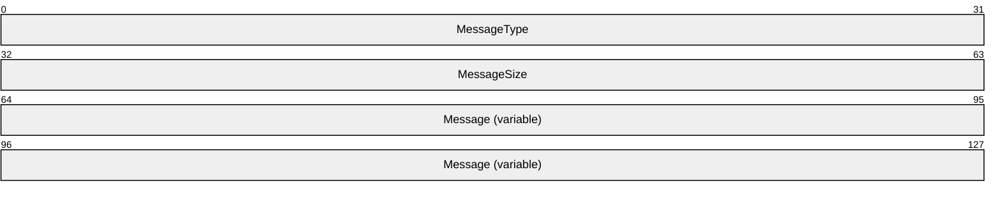
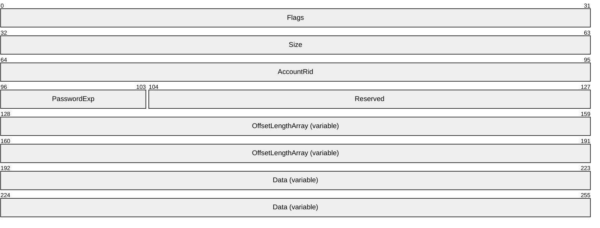
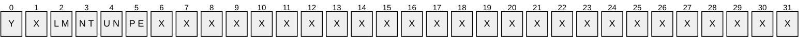
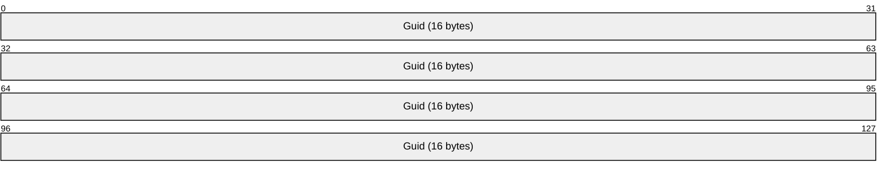
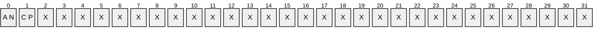
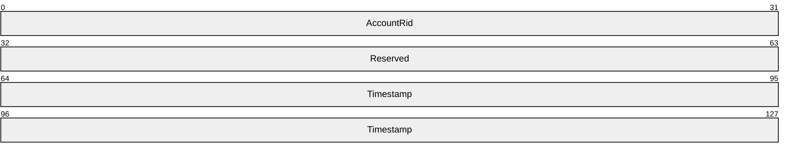
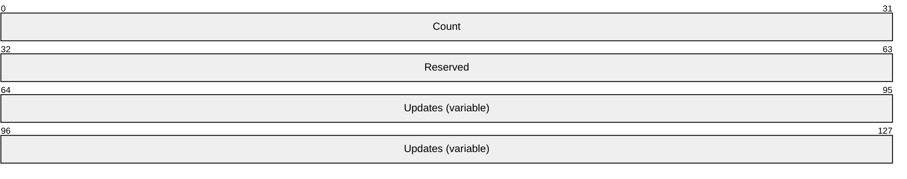
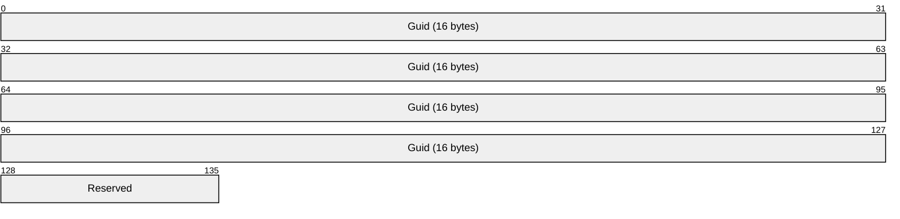

# [MS-SAMS]: Security Account Manager (SAM) Remote Protocol (Server-to-Server)

Table of Contents

1 Introduction

- [1 Introduction](#Section_1)
  - [1.1 Glossary](#Section_1.1)
  - [1.2 References](#Section_1.2)
    - [1.2.1 Normative References](#Section_1.2.1)
    - [1.2.2 Informative References](#Section_1.2.2)
  - [1.3 Overview](#Section_1.3)
  - [1.4 Relationship to Other Protocols](#Section_1.4)
  - [1.5 Prerequisites/Preconditions](#Section_1.5)
  - [1.6 Applicability Statement](#Section_1.6)
  - [1.7 Versioning and Capability Negotiation](#Section_1.7)
  - [1.8 Vendor-Extensible Fields](#Section_1.8)
  - [1.9 Standards Assignments](#Section_1.9)

2 Messages

- [2 Messages](#Section_2)
  - [2.1 Transport](#Section_2.1)
  - [2.2 SAM Server-to-Server Request Message Syntax](#Section_2.2)
    - [2.2.1 Base Request Message](#Section_2.2.1)
    - [2.2.2 PasswordUpdate Request Message](#Section_2.2.2)
    - [2.2.3 ResetBadPwdCount Request Message](#Section_2.2.3)
    - [2.2.4 PasswordUpdateForward Request Message](#Section_2.2.4)
    - [2.2.5 Forwarding Password-Change Request Messages](#Section_2.2.5)
    - [2.2.6 LastLogonTimeStampUpdate Structure](#Section_2.2.6)
    - [2.2.7 LastLogonTimeStampUpdatesForward Request Message](#Section_2.2.7)
    - [2.2.8 ResetSmartCardAccountPassword Request Message](#Section_2.2.8)
    - [2.2.9 Return Codes](#Section_2.2.9)

3 Protocol Details

- [3 Protocol Details](#Section_3)
  - [3.1 Details Common to Both Requestor and Responder](#Section_3.1)
    - [3.1.1 Abstract Data Model](#Section_3.1.1)
    - [3.1.2 Timers](#Section_3.1.2)
    - [3.1.3 Initialization](#Section_3.1.3)
    - [3.1.4 Higher-Layer Triggered Events](#Section_3.1.4)
    - [3.1.5 Message Processing Events and Sequencing Rules](#Section_3.1.5)
    - [3.1.6 Timer Events](#Section_3.1.6)
    - [3.1.7 Other Local Events](#Section_3.1.7)
  - [3.2 Requestor Details](#Section_3.2)
    - [3.2.1 Abstract Data Model](#Section_3.2.1)
    - [3.2.2 Timers](#Section_3.2.2)
    - [3.2.3 Initialization](#Section_3.2.3)
    - [3.2.4 Higher-Layer Triggered Events](#Section_3.2.4)
      - [3.2.4.1 Common to All Messages](#Section_3.2.4.1)
      - [3.2.4.2 PasswordUpdate Request](#Section_3.2.4.2)
      - [3.2.4.3 ResetBadPwdCount Request](#Section_3.2.4.3)
      - [3.2.4.4 PasswordUpdateForward Request](#Section_3.2.4.4)
      - [3.2.4.5 Forwarding a Password-Change Request](#Section_3.2.4.5)
      - [3.2.4.6 LastLogonTimeStampUpdatesForward Request](#Section_3.2.4.6)
      - [3.2.4.7 ResetSmartCardAccountPassword Request](#Section_3.2.4.7)
        - [3.2.4.7.1 Primary Domain Controller (PDC)](#Section_3.2.4.7.1)
        - [3.2.4.7.2 Backup Domain Controller (BDC)](#Section_3.2.4.7.2)
        - [3.2.4.7.3 Read-only Domain Controller (RODC)](#Section_3.2.4.7.3)
    - [3.2.5 Message Processing Events and Sequencing Rules](#Section_3.2.5)
    - [3.2.6 Timer Events](#Section_3.2.6)
    - [3.2.7 Other Local Events](#Section_3.2.7)
  - [3.3 Responder Details](#Section_3.3)
    - [3.3.1 Abstract Data Model](#Section_3.3.1)
    - [3.3.2 Timers](#Section_3.3.2)
    - [3.3.3 Initialization](#Section_3.3.3)
    - [3.3.4 Higher-Layer Triggered Events](#Section_3.3.4)
    - [3.3.5 Message Processing Events and Sequencing Rules](#Section_3.3.5)
      - [3.3.5.1 Message Type](#Section_3.3.5.1)
        - [3.3.5.1.1 Non-Normative Description](#Section_3.3.5.1.1)
        - [3.3.5.1.2 Normative Specification](#Section_3.3.5.1.2)
      - [3.3.5.2 PasswordUpdate Request Message](#Section_3.3.5.2)
        - [3.3.5.2.1 Non-Normative Description](#Section_3.3.5.2.1)
        - [3.3.5.2.2 Normative Specification](#Section_3.3.5.2.2)
      - [3.3.5.3 ResetBadPwdCount Request Message](#Section_3.3.5.3)
        - [3.3.5.3.1 Non-Normative Description](#Section_3.3.5.3.1)
        - [3.3.5.3.2 Normative Specification](#Section_3.3.5.3.2)
      - [3.3.5.4 PasswordUpdateForward Request Message](#Section_3.3.5.4)
        - [3.3.5.4.1 Non-Normative Description](#Section_3.3.5.4.1)
        - [3.3.5.4.2 Normative Specification](#Section_3.3.5.4.2)
      - [3.3.5.5 Forwarding a Password-Change Request Message](#Section_3.3.5.5)
        - [3.3.5.5.1 Non-Normative Description](#Section_3.3.5.5.1)
        - [3.3.5.5.2 Normative Specification](#Section_3.3.5.5.2)
      - [3.3.5.6 LastLogonTimeStampUpdatesForward Request Message](#Section_3.3.5.6)
        - [3.3.5.6.1 Non-Normative Description](#Section_3.3.5.6.1)
        - [3.3.5.6.2 Normative Specification](#Section_3.3.5.6.2)
      - [3.3.5.7 ResetSmartCardAccountPassword Request Message](#Section_3.3.5.7)
        - [3.3.5.7.1 Non-Normative Description](#Section_3.3.5.7.1)
        - [3.3.5.7.2 Normative Specification](#Section_3.3.5.7.2)
    - [3.3.6 Timer Events](#Section_3.3.6)
    - [3.3.7 Other Local Events](#Section_3.3.7)

4 Protocol Examples

- [4 Protocol Examples](#Section_4)
  - [4.1 SAM Server-to-Server Request Example](#Section_4.1)

5 Security

- [5 Security](#Section_5)
  - [5.1 Security Considerations for Implementers](#Section_5.1)
  - [5.2 Index of Security Parameters](#Section_5.2)

6 Appendix A: Product Behavior

- [6 Appendix A: Product Behavior](#Section_6)

7 Change Tracking

- [7 Change Tracking](#Section_7)

For the legal notice and IP terms, see [LEGAL.md](../LEGAL.md).
Last updated: 7/29/2024.
See [Revision History](#revision-history) for full version history.

# 1 Introduction

It is useful to review the Active Directory Technical Specification, as specified in [MS-ADTS](../MS-ADTS/MS-ADTS.md), the Netlogon Remote Protocol Specification, as specified in [MS-NRPC](../MS-NRPC/MS-NRPC.md), and the Security Account Manager (SAM) Remote Protocol Specification (Client-to-Server), as specified in [MS-SAMR](../MS-SAMR/MS-SAMR.md) before reading this document to understand the context and dependencies for this protocol.

The Security Account Manager (SAM) Remote Protocol (Server-to-Server) is used by [**Domain controllers (DCs)**](#gt_domain-controller-dc) to forward time-critical database changes to the [**primary domain controller (PDC)**](#gt_primary-domain-controller-pdc); it is also used to forward time-critical database changes from a [**read-only domain controller (RODC)**](#gt_read-only-domain-controller-rodc) to a [**writable naming context (NC) replica**](#gt_writable-naming-context-nc-replica) within the same [**domain**](#gt_domain) but outside the normal replication protocol. This protocol is used only between [**Active Directory**](#gt_active-directory) servers in the same domain. Beginning with the Windows Server 2008 operating system, this protocol was extended to forward certain non–time-critical write operations from an RODC to a writable NC replica.

The SAM Remote Protocol (Server-to-Server) is motivated by the requirement to propagate a subset of database changes to the PDC more quickly than the Directory Replication Service (DRS) Remote Protocol (as specified in [MS-DRSR](../MS-DRSR/MS-DRSR.md)). This rapid propagation is used for sensitive information when the delay imposed by standard Active Directory replication creates either an unwelcome burden on the user or creates a risk to the enterprise. An example of the former is a password change operation; if the password is not made available rapidly, a user can experience unpredictable authentication failures as the new password is tried against domain controllers that have not yet replicated it. An example of the latter is when an account is locked out due to multiple password failures; the lockout condition, and, equally important, the lockout-cleared condition, must be propagated rapidly throughout the domain.

Windows Server 2008 introduced a new type of domain controller, the RODC. Extensions to the protocol are motivated by the requirement to support the chaining of certain write operations such as when a machine sends a request to an RODC to change its password, as specified in [MS-NRPC] section 1.3.4. The RODC cannot service the database change but instead sends the change request over the SAM Remote Protocol (Server-to-Server) to a Windows Server 2008 and later DC that applies the database change. Similarly, there are a few messages specified in the SAM Remote Protocol (Client-to-Server) that request database changes, and, when an RODC receives these, they are forwarded to a writable [**NC replica**](#gt_nc-replica). Because these messages are part of [MS-SAMR], they are described in detail within that specification. However, when received at an RODC, they are forwarded to another DC; therefore, the message processing to affect the forwarding is described in this specification. Within this specification, these methods are referred to as forwarded SAM Remote Protocol (Client-to-Server) messages.

The complement of this behavior, which is not addressed in this protocol, is the logic within the Active Directory servers, which synchronizes server replication state with that of the PDC when a corresponding failure occurs. That is, there is code within the Active Directory components to pull the current state of an account from the PDC when an authentication failure occurs, using the fact that if the password was changed recently, the PDC has a more up-to-date copy.

This protocol is used in Windows 2000 Server operating system and later (but not in Windows NT 4.0 operating system). The motivation for this protocol does not exist in Windows NT 4.0 because, in version 4.0, only one DC can accept updates; therefore, a centralized DC with the most up-to-date information exists naturally. Because Windows 2000 Server and later support multi-master updates across all DCs, this protocol was invented to address the lack of a centralized, most-up-to-date source of password information.

Sections 1.5, 1.8, 1.9, 2, and 3 of this specification are normative. All other sections and examples in this specification are informative.

## 1.1 Glossary

This document uses the following terms:

**Active Directory**: The Windows implementation of a general-purpose directory service, which uses LDAP as its primary access protocol. Active Directory stores information about a variety of objects in the network such as user accounts, computer accounts, groups, and all related credential information used by Kerberos [MS-KILE](../MS-KILE/MS-KILE.md). Active Directory is either deployed as Active Directory Domain Services (AD DS) or Active Directory Lightweight Directory Services (AD LDS), which are both described in [MS-ADOD](../MS-ADOD/MS-ADOD.md): Active Directory Protocols Overview.

**backup domain controller (BDC)**: A [**domain controller (DC)**](#gt_domain-controller-dc) that receives a copy of the [**domain**](#gt_domain) directory database from the [**primary domain controller (PDC)**](#gt_primary-domain-controller-pdc). This copy is synchronized periodically and automatically with the [**primary domain controller (PDC)**](#gt_primary-domain-controller-pdc). BDCs also authenticate user logons and can be promoted to function as the [**PDC**](#gt_primary-domain-controller-pdc). There is only one [**PDC**](#gt_primary-domain-controller-pdc) or [**PDC**](#gt_primary-domain-controller-pdc) emulator in a [**domain**](#gt_domain), and the rest are [**backup domain controllers**](#gt_backup-domain-controller-bdc).

**domain**: A set of users and computers sharing a common namespace and management infrastructure. At least one computer member of the set has to act as a [**domain controller (DC)**](#gt_domain-controller-dc) and host a member list that identifies all members of the domain, as well as optionally hosting the [**Active Directory**](#gt_active-directory) service. The domain controller provides authentication of members, creating a unit of trust for its members. Each domain has an identifier that is shared among its members. For more information, see [MS-AUTHSOD](../MS-AUTHSOD/MS-AUTHSOD.md) section 1.1.1.5 and [MS-ADTS](../MS-ADTS/MS-ADTS.md).

**domain controller (DC)**: The service, running on a server, that implements [**Active Directory**](#gt_active-directory), or the server hosting this service. The service hosts the data store for objects and interoperates with other [**DCs**](#gt_domain-controller-dc) to ensure that a local change to an object replicates correctly across all [**DCs**](#gt_domain-controller-dc). When [**Active Directory**](#gt_active-directory) is operating as Active Directory Domain Services (AD DS), the [**DC**](#gt_domain-controller-dc) contains full NC replicas of the configuration naming context (config NC), schema naming context (schema NC), and one of the domain NCs in its forest. If the AD DS [**DC**](#gt_domain-controller-dc) is a global catalog server (GC server), it contains partial NC replicas of the remaining domain NCs in its forest. For more information, see [MS-AUTHSOD] section 1.1.1.5.2 and [MS-ADTS]. When [**Active Directory**](#gt_active-directory) is operating as Active Directory Lightweight Directory Services (AD LDS), several AD LDS [**DCs**](#gt_domain-controller-dc) can run on one server. When [**Active Directory**](#gt_active-directory) is operating as AD DS, only one AD DS [**DC**](#gt_domain-controller-dc) can run on one server. However, several AD LDS [**DCs**](#gt_domain-controller-dc) can coexist with one AD DS [**DC**](#gt_domain-controller-dc) on one server. The AD LDS [**DC**](#gt_domain-controller-dc) contains full NC replicas of the config NC and the schema NC in its forest. The domain controller is the server side of Authentication Protocol Domain Support [MS-APDS](../MS-APDS/MS-APDS.md).

**globally unique identifier (GUID)**: A term used interchangeably with universally unique identifier (UUID) in Microsoft protocol technical documents (TDs). Interchanging the usage of these terms does not imply or require a specific algorithm or mechanism to generate the value. Specifically, the use of this term does not imply or require that the algorithms described in [[RFC4122]](https://go.microsoft.com/fwlink/?LinkId=90460) or [[C706]](https://go.microsoft.com/fwlink/?LinkId=89824) have to be used for generating the GUID. See also universally unique identifier (UUID).

**little-endian**: Multiple-byte values that are byte-ordered with the least significant byte stored in the memory location with the lowest address.

**LM hash**: A DES-based cryptographic hash of a cleartext password. See LMOWFv1, as specified in [MS-NLMP](../MS-NLMP/MS-NLMP.md) section 3.3.1 (NTLM v1 Authentication), for a normative definition.

**naming context (NC)**: An [**NC**](#gt_naming-context-nc) is a set of objects organized as a tree. It is referenced by a DSName. The DN of the DSName is the distinguishedName attribute of the tree root. The [**GUID**](#gt_globally-unique-identifier-guid) of the DSName is the objectGUID attribute of the tree root. The [**security identifier (SID)**](#gt_security-identifier-sid) of the DSName, if present, is the objectSid attribute of the tree root; for Active Directory Domain Services (AD DS), the [**SID**](#gt_security-identifier-sid) is present if and only if the [**NC**](#gt_naming-context-nc) is a domain naming context (domain NC). [**Active Directory**](#gt_active-directory) supports organizing several [**NCs**](#gt_naming-context-nc) into a tree structure.

**NC replica**: A variable containing a tree of objects whose root object is identified by some [**naming context (NC)**](#gt_naming-context-nc).

**NT hash**: An MD4- or MD5-based cryptographic hash of a clear text password. For more information, see [MS-NLMP] section 3.3.1 (NTOWFv1, NTLM v1 Authentication), for a normative definition.

**originating update**: An update that is performed to an [**NC replica**](#gt_nc-replica) via any protocol except replication. An [**originating update**](#gt_originating-update) to an attribute or link value generates a new stamp for the attribute or link value.

**primary domain controller (PDC)**: A [**domain controller (DC)**](#gt_domain-controller-dc) designated to track changes made to the accounts of all computers on a [**domain**](#gt_domain). It is the only computer to receive these changes directly, and is specialized so as to ensure consistency and to eliminate the potential for conflicting entries in the [**Active Directory**](#gt_active-directory) database. A [**domain**](#gt_domain) has only one [**PDC**](#gt_primary-domain-controller-pdc).

**read-only domain controller (RODC)**: A [**domain controller (DC)**](#gt_domain-controller-dc) that does not accept [**originating updates**](#gt_originating-update). Additionally, an [**RODC**](#gt_read-only-domain-controller-rodc) does not perform outbound replication. An RODC cannot be the primary domain controller (PDC) for its domain.

**relative identifier (RID)**: The last item in the series of SubAuthority values in a [**security identifier (SID)**](#gt_security-identifier-sid) [[SIDD]](https://go.microsoft.com/fwlink/?LinkId=90516). It distinguishes one account or group from all other accounts and groups in the domain. No two accounts or groups in any domain share the same RID.

**requestor**: The computer that sends the request messages that are defined by this protocol.

**responder**: The computer that responds to request messages.

**security identifier (SID)**: An identifier for security principals that is used to identify an account or a group. Conceptually, the [**SID**](#gt_security-identifier-sid) is composed of an account authority portion (typically a [**domain**](#gt_domain)) and a smaller integer representing an identity relative to the account authority, termed the [**relative identifier (RID)**](#gt_relative-identifier-rid). The [**SID**](#gt_security-identifier-sid) format is specified in [MS-DTYP](../MS-DTYP/MS-DTYP.md) section 2.4.2; a string representation of [**SIDs**](#gt_security-identifier-sid) is specified in [MS-DTYP] section 2.4.2 and [MS-AZOD](../MS-AZOD/MS-AZOD.md) section 1.1.1.2.

**writable naming context (NC) replica**: A [**naming context (NC)**](#gt_naming-context-nc) replica that accepts originating updates. A [**writable NC replica**](#gt_writable-naming-context-nc-replica) is always full, but a full NC replica is not always writable. Partial replicas are not writable. See also read-only full NC replica.

**MAY, SHOULD, MUST, SHOULD NOT, MUST NOT:** These terms (in all caps) are used as defined in [[RFC2119]](https://go.microsoft.com/fwlink/?LinkId=90317). All statements of optional behavior use either MAY, SHOULD, or SHOULD NOT.

## 1.2 References

Links to a document in the Microsoft Open Specifications library point to the correct section in the most recently published version of the referenced document. However, because individual documents in the library are not updated at the same time, the section numbers in the documents may not match. You can confirm the correct section numbering by checking the [Errata](https://go.microsoft.com/fwlink/?linkid=850906).

### 1.2.1 Normative References

We conduct frequent surveys of the normative references to assure their continued availability. If you have any issue with finding a normative reference, please contact [dochelp@microsoft.com](mailto:dochelp@microsoft.com). We will assist you in finding the relevant information.

[MS-ADA1] Microsoft Corporation, "[Active Directory Schema Attributes A-L](../MS-ADA1/MS-ADA1.md)".

[MS-ADA2] Microsoft Corporation, "[Active Directory Schema Attributes M](../MS-ADA2/MS-ADA2.md)".

[MS-ADA3] Microsoft Corporation, "[Active Directory Schema Attributes N-Z](../MS-ADA3/MS-ADA3.md)".

[MS-ADSC] Microsoft Corporation, "[Active Directory Schema Classes](../MS-ADSC/MS-ADSC.md)".

[MS-ADTS] Microsoft Corporation, "[Active Directory Technical Specification](../MS-ADTS/MS-ADTS.md)".

[MS-DRSR] Microsoft Corporation, "[Directory Replication Service (DRS) Remote Protocol](../MS-DRSR/MS-DRSR.md)".

[MS-DTYP] Microsoft Corporation, "[Windows Data Types](../MS-DTYP/MS-DTYP.md)".

[MS-ERREF] Microsoft Corporation, "[Windows Error Codes](../MS-ERREF/MS-ERREF.md)".

[MS-KILE] Microsoft Corporation, "[Kerberos Protocol Extensions](../MS-KILE/MS-KILE.md)".

[MS-LSAD] Microsoft Corporation, "[Local Security Authority (Domain Policy) Remote Protocol](../MS-LSAD/MS-LSAD.md)".

[MS-NRPC] Microsoft Corporation, "[Netlogon Remote Protocol](../MS-NRPC/MS-NRPC.md)".

[MS-PKCA] Microsoft Corporation, "[Public Key Cryptography for Initial Authentication (PKINIT) in Kerberos Protocol](../MS-PKCA/MS-PKCA.md)".

[MS-RPCE] Microsoft Corporation, "[Remote Procedure Call Protocol Extensions](../MS-RPCE/MS-RPCE.md)".

[MS-SAMR] Microsoft Corporation, "[Security Account Manager (SAM) Remote Protocol (Client-to-Server)](../MS-SAMR/MS-SAMR.md)".

[MSKB-2641192] Microsoft Corporation, "The badPwdCount attribute is not reset to 0 on a Windows Server 2008 R2-based or Windows Server 2008-based PDC when the reset request is sent from an RODC", [https://support.microsoft.com/en-us/help/2641192/the-badpwdcount-attribute-is-not-reset-to-0-on-a-windows-server-2008-r2-based-or-windows-server-2008-based-pdc-when-the-reset-request-is-sent-from-an-rodc](https://go.microsoft.com/fwlink/?linkid=847641)

[RFC1274] Barker, P. and Kille, S., "The COSINE and Internet X.500 Schema", RFC 1274, November 1991, [https://www.rfc-editor.org/info/rfc1274](https://go.microsoft.com/fwlink/?LinkId=90271)

[RFC2119] Bradner, S., "Key words for use in RFCs to Indicate Requirement Levels", BCP 14, RFC 2119, March 1997, [https://www.rfc-editor.org/info/rfc2119](https://go.microsoft.com/fwlink/?LinkId=90317)

### 1.2.2 Informative References

None.

## 1.3 Overview

The SAM Remote Protocol (Server-to-Server) includes four sets of messages. The first set specifies messages that a [**domain controller (DC)**](#gt_domain-controller-dc) sends to a [**primary domain controller (PDC)**](#gt_primary-domain-controller-pdc) within the same [**domain**](#gt_domain) to communicate select state changes in the [**requestor's**](#gt_requestor) database. The second and third sets specify messages that a [**read-only domain controller (RODC)**](#gt_read-only-domain-controller-rodc) forwards to a [**writable NC replica**](#gt_writable-naming-context-nc-replica) within the same domain to affect state changes in the [**responder's**](#gt_responder) database. The fourth set, forwarded SAM Remote Protocol (Client-to-Server) messages, is different in that it uses a different transport protocol, as specified in [MS-SAMR](../MS-SAMR/MS-SAMR.md).

This protocol is different from the Directory Replication Service (DRS) Remote Protocol (specified in [MS-DRSR](../MS-DRSR/MS-DRSR.md)) in that (1) it is a "push" model from requestor to responder, and (2) it is used to communicate very limited, non-extensible, predefined state changes.

With the exception of the third set, this protocol is implemented within the Netlogon Remote Protocol [MS-NRPC](../MS-NRPC/MS-NRPC.md) and requires that a Netlogon session be established between the requestor and the responder.

## 1.4 Relationship to Other Protocols

Much of this protocol sits directly on top of the Netlogon Remote Protocol, as specified in [MS-NRPC](../MS-NRPC/MS-NRPC.md), and uses the NetrLogonSendToSam method to transmit the data. This method is specifically designed for this protocol. NetrLogonSendToSam is specified in [MS-NRPC] section 3.5.4.8.4. The remaining messages of this protocol use [MS-SAMR](../MS-SAMR/MS-SAMR.md); the message processing descriptions explicitly mention the use of [MS-SAMR] in these cases.

## 1.5 Prerequisites/Preconditions

The transport is operational on both the [**requestor**](#gt_requestor) and the [**responder**](#gt_responder) side of the protocol.

The responder is aware of the [**domain**](#gt_domain) [**security identifier (SID)**](#gt_security-identifier-sid) of the domain it is servicing.

## 1.6 Applicability Statement

This protocol is applicable for [**DC**](#gt_domain-controller-dc) to [**PDC**](#gt_primary-domain-controller-pdc) (within the same [**domain**](#gt_domain)) communication and for [**RODC**](#gt_read-only-domain-controller-rodc) to DC (within the same domain) communication. The message processing for the NetrLogonSendToSam method (as specified in [MS-NRPC](../MS-NRPC/MS-NRPC.md) section 3.5.4.8.4) enforces that this protocol is used only for communication from a non-PDC DC to a PDC, or from an RODC to a DC.

## 1.7 Versioning and Capability Negotiation

There is no versioning or capability negotiation in this protocol. However, details about how to handle version or capability differences for both [**requestor**](#gt_requestor) and [**responder**](#gt_responder) are specified in section [3](#Section_3).

## 1.8 Vendor-Extensible Fields

None.

## 1.9 Standards Assignments

This protocol does not use any additional standards assignments other than what is specified in [MS-NRPC](../MS-NRPC/MS-NRPC.md) section 1.9.

# 2 Messages

## 2.1 Transport

The transport for this protocol, unless otherwise noted, MUST be the NetrLogonSendToSam method, as specified in [MS-NRPC](../MS-NRPC/MS-NRPC.md) section 3.5.4.8.4.

There is no additional configuration required over the Netlogon RPC protocol requirements. Details about transport for the Netlogon Remote Protocol are specified in [MS-NRPC] section 2.1.

Unless otherwise noted, security services for the SAM Remote Protocol (Server-to-Server) (including authentication, authorization, secrecy, and integrity) MUST be handled at the transport layer (that is, the Netlogon Remote Protocol).

Those messages that do not use the NetrLogonSendToSam method (in particular, forwarded SAM Remote Protocol (Client-to-Server) messages) MUST use transport identical to what is described in [MS-SAMR](../MS-SAMR/MS-SAMR.md) section 2.1. Details about these messages are specified in section [2.2.5](#Section_2.2.5).

## 2.2 SAM Server-to-Server Request Message Syntax

This section specifies the format of the bytes in the protocol. Bytes are presented as variable-length structures.

- Details about a base format that is used for all messages are specified in Base Request Message (section [2.2.1](#Section_2.2.1)).
- Details about specific messages are specified in PasswordUpdate Request Message (section [2.2.2](#Section_2.2.2)), ResetBadPwdCount Request Message (section [2.2.3](#Section_2.2.3)), PasswordUpdateForward Request Message (section [2.2.4](#Section_2.2.4)), and ResetSmartCardAccountPassword Request Message (section [2.2.8](#Section_2.2.8)).
- Details about forwarding password-change request messages are specified in section [2.2.5](#Section_2.2.5).
- The format of the return value and values used in this protocol is specified in Return Codes (section [2.2.9](#Section_2.2.9)).

### 2.2.1 Base Request Message

Each request message is a formatted sequence of bytes. All 32-bit values interpreted as unsigned integers MUST be encoded in [**little-endian**](#gt_little-endian) format (for all messages).

The syntax of a request is represented by the following diagram.

**MessageType (4 bytes):** A 32-bit, unsigned integer that indicates the type of request message. The field MUST be one of the following values.

| Value | Meaning |
| --- | --- |
| PASSWORD_UPDATE_MSG 0x00000000 | Message is a [PasswordUpdate](#Section_2.2.2) request. |
| RESET_PWD_COUNT_MSG 0x00000001 | Message is a [ResetBadPwdCount](#Section_2.2.3) request. |
| FWD_PASSWORD_UPDATE_MSG 0x00000002 | Message is a [PasswordUpdateForward](#Section_2.2.4) request.<1> |
| FWD_LASTLOGON_TS_UPDATE_MSG 0x00000003 | Message is a [LastLogonTimeStampUpdatesForward](#Section_2.2.7) request. |
| RESET_SMART_CARD_ONLY_PWD 0x00000004 | Message is a [ResetSmartCardAccountPassword](#Section_2.2.8) request. |

**MessageSize (4 bytes):** A 32-bit, unsigned integer that specifies the size of the **Message** field, in bytes.

**Message (variable):** A BLOB of data that constitutes a request message. This field MUST be **MessageSize** bytes long. The interpretation of the data in the **Message** field depends on the type of the request, which is indicated by the **MessageType** field. Message types are described in sections 2.2.2, 2.2.3, 2.2.4, and 2.2.7.

### 2.2.2 PasswordUpdate Request Message

The PasswordUpdate request message requests a change in password-related attributes for the directory object specified in the message. The message processing details are specified in section [3.3.5.2](#Section_3.3.5.2).

The layout of the **PasswordUpdate** request message is shown in the following diagram. This message MUST be carried in the **Message** field of the structure defined in section [2.2.1](#Section_2.2.1).

**Flags (4 bytes):** A bitmask with the following values defined. All bits that can be set, as specified below, can be set in any combination by the [**requestor**](#gt_requestor) with the exception of LM and NT; these bits MUST both be set or both be cleared. The [**responder**](#gt_responder) MUST ignore the LM bit if it is set and the NT bit is not set.

- **Y (Reserved)**: This bit SHOULD be set to zero and MUST be ignored on receipt.<2>
- **X (Reserved)**: These bits MUST be set to zero.
- **LM (FLAG_LM_HASH)**: This bit MUST be set if the message contains an [**LM hash**](#gt_lm-hash). The hash value MUST be 16 bytes long.
- **NT (FLAG_NT_HASH)**: This bit MUST be set if the message contains an [**NT hash**](#gt_nt-hash). The hash value MUST be 16 bytes long.
- **UN (FLAG_ACCOUNT_UNLOCKED)**: This bit MUST be set if the target account is to be unlocked. The corresponding **Offset** and **Length** fields in **Data** and **OffsetLengthArray** MUST be zero on request and MUST be ignored on receipt.
- **PE (FLAG_MANUAL_PWD_EXPIRY)**: This bit MUST be set if the **PasswordExp** field is valid for this request. The corresponding **Offset** and **Length** fields in **Data** and **OffsetLengthArray** MUST be zero on request and MUST be ignored on receipt.<3>
**Size (4 bytes):** A 32-bit, unsigned integer that contains the number of bytes in the PasswordUpdate request message, starting with (and including) the **Flags** field to (and including) the variable length of **OffsetLengthArray**. This information (the size) can be inferred on receipt from the bits set in the **Flags** field; for more information, see the description for **OffsetLengthArray**. This field is useful to quickly determine the start of the **Data** section.

**AccountRid (4 bytes):** A 32-bit, unsigned integer that contains a [**relative identifier (RID)**](#gt_relative-identifier-rid) for a [**SID**](#gt_security-identifier-sid) structure.

**PasswordExp (1 byte):** This byte is only tested against zero, so all non-zero values are equivalent within the protocol. This field MUST be used to infer the length of the time period for which a password is valid. Details about message processing are specified in section 3.3.5.2.

**Reserved (3 bytes):** This portion of the message MUST be filled with zeros and MUST be ignored on receipt.

**OffsetLengthArray (variable):** An array of 8-byte elements used as offset and length descriptors for the data associated with this request message. Elements in this array correspond to bits in the **Flags** field. The number of elements in this array MUST be equal to the position of the most significant bit that is set in the **Flags** field. The entries MUST be in the same order as the bits in the **Flags** field. For example, if just bit 5 (FLAG_MANUAL_PWD_EXPIRY) is set, the length of the array is 6 (elements), or 48 bytes and the elements are ordered from least significant to most significant.

For an illustration of the relationship between the **Flags** field and the **OffsetLengthArray** element, see the protocol example in section [4.1](#Section_4.1).

Each **OffsetLengthArray** element contains two 32-bit unsigned integers that MUST consist of the following fields:

- **Offset**: The offset, in bytes, from the start of the **Data** field to the first byte of the data that corresponds to this particular element. The offset MUST be double-byte aligned.
- **Length**: The length, in bytes, of the data that corresponds to this particular element. The length MUST be double-byte aligned.
If a **Flags** bit is not set, or is set but has no data associated with it (for example, the **UN** flag), both **Offset** and **Length** MUST be zero in the corresponding **OffsetLengthArray** element and MUST be ignored on receipt.

**Data (variable):** A variable-sized field that MUST hold the data associated with the request. The descriptors for this data are the (**Offset**, **Length**) fields that constitute each **OffsetLengthArray** element. The length of the **Data** section MUST be no less than the maximum of **Offset** + **Length** for all elements of the **OffsetLengthArray**. This field is double-byte aligned and each entry is ordered the same as the elements in **OffsetLengthArray**; any bytes added to achieve alignment MUST have no bits set.

### 2.2.3 ResetBadPwdCount Request Message

The ResetBadPwdCount request message instructs the [**responder**](#gt_responder) to update the badPwdCount [**Active Directory**](#gt_active-directory) attribute for a specified directory object. Message processing details are specified in section [3.3.5.3](#Section_3.3.5.3). The data format for the ResetBadPwdCount request message MUST be a [**globally unique identifier (GUID)**](#gt_globally-unique-identifier-guid).

**Guid (16 bytes):** A GUID, which is a 16-byte value, as specified in [MS-DTYP](../MS-DTYP/MS-DTYP.md) section 2.3.4. The GUID MUST be the value of objectGUID for the specified directory object.

### 2.2.4 PasswordUpdateForward Request Message

The PasswordUpdateForward request message requests a change in password-related attributes for the directory object specified in the message. This message SHOULD be sent only from [**read-only domain controllers**](#gt_read-only-domain-controller-rodc). Message processing details are specified in section [3.3.5.4](#Section_3.3.5.4).<4>

The layout of the **PasswordUpdateForward** request message is shown in the following diagram. This message MUST be carried in the **Message** field of the structure defined in section [2.2.1](#Section_2.2.1).

**Flags (4 bytes):** MUST be a bitmask with the following values defined.<5>

- **AN (FLAG_ACCOUNT_NAME)**: This bit MUST be set to one. The associated message data in the **OffsetLengthArray** and **Data** fields references a UTF-16 encoded string that represents the account name, represented as the value of the sAMAccountName attribute on the directory object for which the password is to be changed.
- **CP (FLAG_CLEAR_TEXT_PASSWORD)**: This bit MUST be set to one. The associated message data in the **OffsetLengthArray** and **Data** fields references a UTF-16 encoded string that represents the new password.
- **X (Reserved)**: These bits MUST be set to zero and MUST be ignored on receipt.
**Size (4 bytes):** A 32-bit, unsigned integer that MUST contain the number of bytes in the PasswordUpdateForward request message, starting (and including) the **Flags** field to (and including) the variable length of **OffsetLengthArray**. This information (the size) can be inferred on receipt from the bits set in the **Flags** field; for more information, see the description for **OffsetLengthArray**. This field is useful to determine quickly the start of the **Data** section.

**AccountRid (4 bytes):** This 32-bit field MUST be set to zero and MUST be ignored on receipt.

**PasswordExp (1 byte):** This byte MUST be set to zero and MUST be ignored on receipt.

**Reserved (3 bytes):** This portion of the message MUST be filled with zeros and MUST be ignored on receipt.

**OffsetLengthArray (variable):** An array of 8-byte elements used as offset and length descriptors for the data associated with this request message. Elements in this array correspond to bits in the **Flags** field. The number of elements in this array MUST be equal to the position of the most significant bit that is set in the **Flags** field. The entries MUST be in the same order as the bits in the **Flags** field. For example, if just bit 1 (FLAG_CLEAR_TEXT_PASSWORD) is set, the length of the array is 2 (elements), or 16 bytes and the elements are ordered from least significant to most significant.

For an illustration of the relationship between the **Flags** field and the **OffsetLengthArray** element, see the protocol example in section [4.1](#Section_4.1).

Each **OffsetLengthArray** element contains two 32-bit unsigned integers that MUST consist of the following fields:

- **Offset**: The offset, in bytes, from the start of the **Data** field to the first byte of the data that corresponds to this particular element. The offset is double-byte aligned.
- **Length**: The length, in bytes, of the data that corresponds to this particular element. The length is double-byte aligned.
**Data (variable):** A variable-sized field that MUST hold the data associated with the request. The descriptors for this data are the (**Offset**, **Length**) fields that constitute each **OffsetLengthArray** element. The length of the **Data** section MUST be no less than the maximum of **Offset** + **Length** for all elements of the **OffsetLengthArray**. This field is double-byte aligned and each entry is ordered the same as the elements in **OffsetLengthArray**; any bytes added to achieve alignment MUST have no bits set.

### 2.2.5 Forwarding Password-Change Request Messages

When an [**RODC**](#gt_read-only-domain-controller-rodc) receives a SamrOemChangePasswordUser2 or a SamrUnicodeChangePasswordUser2 request, as specified in [MS-SAMR](../MS-SAMR/MS-SAMR.md) sections 3.1.5.10.2 and 3.1.5.10.3, the request MUST be forwarded to a [**writable NC replica**](#gt_writable-naming-context-nc-replica). The way in which these messages are forwarded is specified in section [3.3.5.5](#Section_3.3.5.5).

### 2.2.6 LastLogonTimeStampUpdate Structure

The LastLogonTimeStampUpdate structure specifies an account and a timestamp.

The layout of the **LastLogonTimeStampUpdate** structure is shown in the following diagram.

**AccountRid (4 bytes):** A 32-bit, unsigned integer that contains a [**relative identifier (RID)**](#gt_relative-identifier-rid) for a [**SID**](#gt_security-identifier-sid) structure.

**Reserved (4 bytes):** A 32-bit, unsigned integer that MUST be set to zero.

**Timestamp (8 bytes):** A 64-bit signed integer containing the timestamp of the last logon time of the account specified by the **AccountRid** field.

### 2.2.7 LastLogonTimeStampUpdatesForward Request Message

The LastLogonTimeStampUpdatesForward request message requests an update to the lastLogonTimeStamp attribute for a specified set of user accounts. This message SHOULD be sent only from [**read-only domain controllers**](#gt_read-only-domain-controller-rodc). Message processing details are specified in section [3.3.5.6](#Section_3.3.5.6).<6>

The layout of the **LastLogonTimeStampUpdatesForward** request message is shown in the following diagram. This message MUST be carried in the **Message** field of the structure defined in section [2.2.1](#Section_2.2.1).

**Count (4 bytes):** A 32-bit, unsigned integer that MUST contain the number of elements in the **Updates** field.

**Reserved (4 bytes):** A 32-bit, unsigned integer that MUST be set to zero.

**Updates (variable):** An array of **LastLogonTimeStampUpdate** structures.

### 2.2.8 ResetSmartCardAccountPassword Request Message

The ResetSmartCardAccountPassword request message instructs the [**responder**](#gt_responder) to update the **dbcsPwd** and **unicodePwd** attributes (section [3.1.1](#Section_3.1.1)) with random values for a specified directory object. Message processing details are specified in section [3.3.5.7](#Section_3.3.5.7). The layout of the ResetSmartCardAccountPassword message is shown in the following diagram.

**Guid (16 bytes):** A [**GUID**](#gt_globally-unique-identifier-guid), which is a 16-byte value, as specified in [MS-DTYP](../MS-DTYP/MS-DTYP.md) section 2.3.4. The GUID MUST be the value of **objectGUID** (section 3.1.1) for the specified directory object.

**Reserved (1 byte):** Reserved. MUST be set to zero.

### 2.2.9 Return Codes

The return code generated by the [**responder**](#gt_responder) MUST be an NTSTATUS code (specified in [MS-ERREF](../MS-ERREF/MS-ERREF.md) section 2.3). There are four distinguished values that can be returned by this protocol.

| Return code | Symbolic name | Meaning |
| --- | --- | --- |
| 0x00000000 | STATUS_SUCCESS | Success. |
| 0xC0000058 | STATUS_UNKNOWN_REVISION | The responder did not understand some part of the message sent; for example, the message type. |
| 0xC0000059 | STATUS_REVISION_MISMATCH | The responder supports the message type sent, but does not understand the format of the message; for example, expected flags are not set. |
| 0xC0000064 | STATUS_NO_SUCH_USER | The responder was not able to locate the directory object referenced in the message. |

This protocol can return other error codes—for example, if a database operation fails. Other codes MUST be taken from the list specified in [MS-ERREF] section 2.3, or created (as specified in [MS-ERREF]). These other error codes MUST all be treated as equivalent by the client.

# 3 Protocol Details

## 3.1 Details Common to Both Requestor and Responder

### 3.1.1 Abstract Data Model

This protocol operates on a [**domain**](#gt_domain) directory database, the data model for which is described in [MS-ADTS](../MS-ADTS/MS-ADTS.md) section 3. For convenience, this section contains sufficient information from [MS-ADTS] section 3 to describe the message processing of this protocol.

The directory database is composed of a set of named objects. The name format is an X.500 name, as specified in [[RFC1274]](https://go.microsoft.com/fwlink/?LinkId=90271); therefore, the objects are arranged in a hierarchy by name. Each object name MUST be unique within the directory.

Each object possesses a collection of attributes. Each attribute is identified by a name specified in the attribute ldapDisplayName. For example, the X.500 name of the object is a single-valued attribute with the ldapDisplayName: distinguishedName. The complete list of attributes and associated constraints is specified in [MS-ADA1](../MS-ADA1/MS-ADA1.md), [MS-ADA2](../MS-ADA2/MS-ADA2.md), and [MS-ADA3](../MS-ADA3/MS-ADA3.md).

Objects are retrieved from the directory database by specifying attribute-value constraints that the object attributes (and their values) MUST satisfy. Attribute values are updated by identifying the target object by distinguishedName and specifying the new set of attribute-value pairs.

Implementations must support creating, reading, updating, and deleting multiple objects, attributes, and attribute values with ACID (that is, atomic, consistent, isolated, and durable) properties. Such an update is referred to as a transaction in this specification.

Directory attributes and their semantics relevant to this protocol follow:

**objectGUID:** A [**GUID**](#gt_globally-unique-identifier-guid) value (128 bit). Each object MUST have this attribute, and this attribute value MUST be unique within the universe. This value MUST be invariant throughout the object's lifetime; therefore, this attribute is a candidate primary key for database objects.

**objectSid:** The [**SID**](#gt_security-identifier-sid) of an account.

**pwdLastSet:** The time (64-bit value) at which the unicodePwd value was last set; units MUST be 100 nanosecond time slices since January 1, 1601, midnight (GMT).

**dbcsPwd:** The [**LM hash**](#gt_lm-hash) of a clear-text password.

**unicodePwd**: The [**NT hash**](#gt_nt-hash) of a clear-text password.

**badPwdCount:** The number of logon attempts with a bad password since the last successful log on within the observation period specified in the attribute lockoutObservationWindow.

**lockoutTime:** The time at which the badPwdCount value exceeded the lockoutThreshold value; units are 100 nanosecond time slices since January 1, 1601, midnight (GMT).

**lockoutThreshold:** The number of invalid password attempts allowed before subsequent authentication attempts fail.

**sAMAccountName:** The logon name of an account.

**lastLogonTimeStamp:** The time (a 64-bit value) at which the user last logged on; units MUST be 100 nanosecond time slices since January 1, 1601, midnight (GMT).

### 3.1.2 Timers

None.

### 3.1.3 Initialization

None.

### 3.1.4 Higher-Layer Triggered Events

None.

### 3.1.5 Message Processing Events and Sequencing Rules

None.

### 3.1.6 Timer Events

None.

### 3.1.7 Other Local Events

None.

## 3.2 Requestor Details

### 3.2.1 Abstract Data Model

Details about the abstract data model are specified in section [3.1.1](#Section_3.1.1).

### 3.2.2 Timers

None.

### 3.2.3 Initialization

None.

### 3.2.4 Higher-Layer Triggered Events

#### 3.2.4.1 Common to All Messages

None.

#### 3.2.4.2 PasswordUpdate Request

This message is used to communicate the state change of a password for a directory entry to the [**PDC**](#gt_primary-domain-controller-pdc) on a best-effort basis; if the PDC cannot be reached or the update fails for any reason, the resulting error MUST be ignored. This message MUST be triggered by the following database updates on a non-PDC; this message MUST NOT be triggered when updates are made on a PDC.

- **unicodePwd:** When this attribute is updated, a message with the FLAG_NT_HASH and FLAG_LM_HASH flags MUST be sent. The values of the [**NT hash**](#gt_nt-hash) and [**LM hash**](#gt_lm-hash) MUST be read from the [**requestor's**](#gt_requestor) database (unicodePwd and dbcsPwd attributes, respectively).
- **lockoutTime:** When this attribute is updated with a value of 0, a message with the FLAG_ACCOUNT_UNLOCKED flag MUST be sent.
- **pwdLastSet:** When this attribute is updated with a value of 0, a message with the FLAG_MANUAL_PWD_EXPIRY flag MUST be sent.
If more than one update occurs in a given transaction, the updates described above MUST be combined into one message so that the [**responder**](#gt_responder) can make any updates, if necessary, in a single transaction.

#### 3.2.4.3 ResetBadPwdCount Request

This message is used to communicate to the [**PDC**](#gt_primary-domain-controller-pdc) if the badPwdCount attribute must be reset to 0. This message MUST be triggered by the following database update on a non-PDC.

When a non-PDC services a successful logon from either the Kerberos Protocol Extensions (as specified in [MS-KILE](../MS-KILE/MS-KILE.md)) or the Netlogon Remote Protocol (as specified in [MS-NRPC](../MS-NRPC/MS-NRPC.md)), the previous value of the local badPwdCount attribute was nonzero, and the local badPwdCount attribute is set to 0 as a result of the successful logon, the non-PDC MUST issue a [ResetBadPwdCount](#Section_2.2.3) request to the PDC on a best-effort basis; if the PDC cannot be reached or the update fails for any reason, the resulting error MUST be ignored.

#### 3.2.4.4 PasswordUpdateForward Request

This message is used to communicate a request to change the state of a password for a directory entry. This message MUST be triggered only at an [**RODC**](#gt_read-only-domain-controller-rodc) by receipt of a NetrServerPasswordSet or NetrServerPasswordSet2 message, as specified in [MS-NRPC](../MS-NRPC/MS-NRPC.md) sections 3.5.4.4.7 and 3.5.4.4.6, with AccountType of WorkstationSecureChannel, ServerSecureChannel, or CdcServerSecureChannel. The message is sent to the [**DC**](#gt_domain-controller-dc) with which the RODC has established its secure channel, as specified in [MS-NRPC]. If the forwarding operation returns an error, the operation fails and the error MUST be propagated back to the client that originated the password update request.

#### 3.2.4.5 Forwarding a Password-Change Request

A request to change the state of a password for a directory entry is forwarded from an [**RODC**](#gt_read-only-domain-controller-rodc) to a [**writable NC replica**](#gt_writable-naming-context-nc-replica). This behavior is triggered only at an RODC, and only by receipt of a SamrOemChangePasswordUser2 or a SamrUnicodeChangePasswordUser2 message, as specified in [MS-SAMR](../MS-SAMR/MS-SAMR.md) sections 3.1.5.10.2 and 3.1.5.10.3. If the forwarding operation returns an error, the operation fails and the error MUST be propagated back to the client that originated the password change request.<7>

Upon receiving one of the password-change messages, the RODC MUST process the data from the message subject to all of the following constraints:

- The RODC MUST locate a writable [**domain controller**](#gt_domain-controller-dc) for the same [**domain**](#gt_domain).<8>
- The RODC MUST open an RPC binding handle to the domain controller located above in the context of the [**requestor**](#gt_requestor). The binding handle is specified in [MS-RPCE](../MS-RPCE/MS-RPCE.md) section 2.
- The RODC MUST send the same RPC message that it received to the domain controller, using the binding handle opened above and the same input parameters. For example, if the RODC received a SamrUnicodeChangePasswordUser2 message, the RODC sends a SamrUnicodeChangePasswordUser2 message with identical parameters except that the binding handle is the handle opened above. Details about the message parameters of SamrOemChangePasswordUser2 and SamrUnicodeChangePasswordUser2 are specified in [MS-SAMR] sections 3.1.5.10.2 and 3.1.5.10.3.
- The RODC MUST initialize any output parameters with values returned from the target domain controller.
- The RODC SHOULD return to the requestor the error status returned from the target domain controller.<9>

#### 3.2.4.6 LastLogonTimeStampUpdatesForward Request

This message is used to update the lastLogonTimeStamp attribute for one or more directory entries. This message is forwarded from an [**RODC**](#gt_read-only-domain-controller-rodc) to a [**writable NC replica**](#gt_writable-naming-context-nc-replica). This behavior is triggered only at an RODC, and only as a result of a logon attempt by the specified directory entries. Logon attempts by the directory entries SHOULD NOT be affected if the update request returns an error.

#### 3.2.4.7 ResetSmartCardAccountPassword Request

This message is used to update the **dbcsPwd** and **unicodePwd** attributes on a smart-card-only account. This message is forwarded from either a [**read-only domain controller (RODC)**](#gt_read-only-domain-controller-rodc) or a [**backup domain controller (BDC)**](#gt_backup-domain-controller-bdc) to a [**writable NC replica**](#gt_writable-naming-context-nc-replica). Processing of the request is based on the role of the current machine as described in the following sections.

##### 3.2.4.7.1 Primary Domain Controller (PDC)

When the current machine is the [**primary domain controller (PDC)**](#gt_primary-domain-controller-pdc), the request is processed locally as specified in section [3.3.5.7](#Section_3.3.5.7).

##### 3.2.4.7.2 Backup Domain Controller (BDC)

When the current machine is a [**backup domain controller (BDC)**](#gt_backup-domain-controller-bdc), the request is processed as follows:

- A ResetSmartCardAccountPassword request message is sent to the PDC. Upon success, a replicateSingleObject request ([MS-ADTS](../MS-ADTS/MS-ADTS.md) section 3.1.1.3.3.18) is executed to replicate the updated user account data to the BDC.
- If the ResetSmartCardAccountPassword request message sent to the PDC fails, the request is processed locally as specified in section [3.3.5.7](#Section_3.3.5.7).

##### 3.2.4.7.3 Read-only Domain Controller (RODC)

When the current machine is a [**read-only domain controller (RODC)**](#gt_read-only-domain-controller-rodc), the request is processed as follows:

- A ResetSmartCardAccountPassword request message is sent to the PDC. Upon success, a replicateSingleObject request ([MS-ADTS](../MS-ADTS/MS-ADTS.md) section 3.1.1.3.3.18) is executed to replicate the updated user account data to the RODC.
- If the ResetSmartCardAccountPassword Request Message sent to the PDC fails, a ResetSmartCardAccountPassword Request Message is sent to a BDC. Upon success, a replicateSingleObject request ([MS-ADTS] section 3.1.1.3.3.18) is executed to replicate the updated user account data to the RODC.

### 3.2.5 Message Processing Events and Sequencing Rules

All errors MUST be returned to the calling layer. Furthermore, implementations MUST NOT retry the operation upon failure because subsequent database updates (either at the [**requestor**](#gt_requestor) or [**responder**](#gt_responder)) might render the information stale in the request. This directive applies to all messages.<10>

### 3.2.6 Timer Events

None.

### 3.2.7 Other Local Events

None.

## 3.3 Responder Details

### 3.3.1 Abstract Data Model

Details about the abstract data model are specified in section [3.1.1](#Section_3.1.1).

### 3.3.2 Timers

None.

### 3.3.3 Initialization

The [**responder**](#gt_responder) MUST begin listening for incoming requests.

### 3.3.4 Higher-Layer Triggered Events

None.

### 3.3.5 Message Processing Events and Sequencing Rules

In the following sections, the notation "Message.PasswordUpdate" is used to refer to the PasswordUpdate request message (section [2.2.2](#Section_2.2.2)). By using this convention, Message.PasswordUpdate.Flags, for example, refers to the **Flags** field of the PasswordUpdate request message. Similarly, "Message.ResetBadPwdCount" refers to the ResetBadPwdCount request message (section [2.2.3](#Section_2.2.3)), "Message.PasswordUpdateForward" refers to the PasswordUpdateForward request message (section [2.2.4](#Section_2.2.4)), and "Message.ResetSmartCardAccountPassword" refers to the ResetSmartCardAccountPassword request message (section [2.2.8](#Section_2.2.8)).

For each message in this section, an informative description of the message is presented first; then, a normative description about how the message must be processed is given.

#### 3.3.5.1 Message Type

##### 3.3.5.1.1 Non-Normative Description

The messages described in sections [3.3.5.2](#Section_3.3.5.2), [3.3.5.3](#Section_3.3.5.3), [3.3.5.4](#Section_3.3.5.4), and [3.3.5.6](#Section_3.3.5.6) contain a message-type field. Message processing for those messages begins with the [**responder**](#gt_responder) examining the message type.

##### 3.3.5.1.2 Normative Specification

If Message.MessageType is not one of the expected values, as defined in [Base Request Message (section 2.2.1)](#Section_2.2.1), the [**responder**](#gt_responder) MUST return an error. Otherwise, the responder MUST process the message based on the message type as follows:

| Message type | Message processing |
| --- | --- |
| PASSWORD_UPDATE_MSG | [3.3.5.2](#Section_3.3.5.2) |
| RESET_PWD_COUNT_MSG | [3.3.5.3](#Section_3.3.5.3) |
| FWD_PASSWORD_UPDATE_MSG | [3.3.5.4](#Section_3.3.5.4) |
| FWD_LASTLOGON_TS_UPDATE_MSG | [3.3.5.6](#Section_3.3.5.6) |
| RESET_SMART_CARD_ONLY_PWD | [3.3.5.7](#Section_3.3.5.7) |

#### 3.3.5.2 PasswordUpdate Request Message

##### 3.3.5.2.1 Non-Normative Description

This message is used by [**DCs**](#gt_domain-controller-dc) to communicate to the [**PDC**](#gt_primary-domain-controller-pdc) both the [**NT hash**](#gt_nt-hash) and the [**LM hash**](#gt_lm-hash) of a recently changed password. The target user is identified by a [**RID**](#gt_relative-identifier-rid), and the NT hash and LM hash is sent in the clear (the transport encrypts on the wire). If the password also immediately expires (that is, the user must change the password upon the next logon), this is also communicated. As such, the server message processing changes the local database to reflect the requested message. This processing is only executed on a PDC.

##### 3.3.5.2.2 Normative Specification

On receiving this message, the [**responder**](#gt_responder) SHOULD<11> return STATUS_NOT_SUPPORTED if either the responder is not the [**PDC**](#gt_primary-domain-controller-pdc) or the [**requestor**](#gt_requestor) is an [**RODC**](#gt_read-only-domain-controller-rodc). Otherwise, the responder MUST process the data from the message subject to all of the following constraints. All of the following actions MUST be performed in the same transaction:

- The responder SHOULD validate the integrity of the message with respect to embedded offsets and sizes. Responder implementations SHOULD return STATUS_INVALID_PARAMETER upon receiving malformed messages.<12>
- If no bits are set in Message.PasswordUpdate.Flags, no action MUST be performed, and the responder MUST return STATUS_INVALID_PARAMETER to the requestor. If bits are set in Message.PasswordUpdateFlags that MUST be 0 (as specified in section [2.2.2](#Section_2.2.2)), STATUS_REVISION_MISMATCH MUST be returned.
- The responder SHOULD return STATUS_SUCCESS to the requestor, and, as a background operation, SHOULD<13> perform a "replicateSingleObject" operation with the DN of the DSA object of the requestor [**DC**](#gt_domain-controller-dc), and the DN of the object that has an objectSid attribute value that corresponds to the value constructed by concatenating the Message.PasswordUpdate.Rid field with the configured [**domain**](#gt_domain) [**SID**](#gt_security-identifier-sid).<14> This operation is specified in [MS-ADTS](../MS-ADTS/MS-ADTS.md) section 3.1.1.3.3.18.
- If no errors occur during the message processing, the responder MUST return STATUS_SUCCESS; otherwise, the responder MUST return an error code, as specified in section [2.2.9](#Section_2.2.9).
- If the background operation fails for any reason, the responder MUST perform the following tasks in the background.
- If the FLAG_NT_HASH flag is present in Message.PasswordUpdate.Flags, the responder MUST perform all of the following operations on the target object in the database.
- Update the unicodePwd attribute with the data value supplied in Message.PasswordUpdate.Data, as specified by the fourth array element in Message.PasswordUpdate.OffsetLengthArray.
- If the FLAG_LM_HASH flag is present in Message.PasswordUpdate.Flags, update the dbcsPwd attribute with the data value supplied in Message.PasswordUpdate.Data, as specified by the third array element in Message.PasswordUpdate.OffsetLengthArray.
- Update the pwdLastSet attribute to the current time.
- If the FLAG_ACCOUNT_UNLOCKED flag is present in Message.PasswordUpdate.Flags, the responder MUST update the lockoutTime attribute of the target object in the database to 0.
- If the FLAG_MANUAL_PWD_EXPIRY or FLAG_NT_HASH flag is present in Message.PasswordUpdate.Flags, and if Message.PasswordUpdate.PasswordExp is nonzero, the responder MUST update the pwdLastSet attribute of the target object in the database to 0.
- All updates MUST occur as [**originating updates**](#gt_originating-update).
- All errors MUST be ignored.

#### 3.3.5.3 ResetBadPwdCount Request Message

##### 3.3.5.3.1 Non-Normative Description

This message indicates that the badPwdCount attribute on a target user must be reset to zero. The target user is indicated by a [**GUID**](#gt_globally-unique-identifier-guid) value that corresponds to the objectGUID attribute.

##### 3.3.5.3.2 Normative Specification

Upon receiving this message, the [**responder**](#gt_responder) SHOULD<15> return STATUS_NOT_SUPPORTED if the responder is not the [**PDC**](#gt_primary-domain-controller-pdc). Otherwise, the responder SHOULD<16> process the message as shown below.

This message is processed as follows. If the requestor is an RODC that is not allowed to cache credentials for the target user account, as specified in [MS-DRSR](../MS-DRSR/MS-DRSR.md) section 4.1.10.5.15, the responder MUST return STATUS_ACCESS_DENIED. Otherwise, if there is an object in the database that has an objectGUID attribute value that corresponds to the value in the Message.ResetBadPwdCount.Guid field, the responder MUST update the badPwdCount attribute to zero. The database updates MUST be done in one transaction. If the database transaction succeeds, the responder MUST return STATUS_SUCCESS; otherwise, the responder MUST return an error code, as specified in section [2.2.9](#Section_2.2.9).

#### 3.3.5.4 PasswordUpdateForward Request Message

##### 3.3.5.4.1 Non-Normative Description

This message is used by [**RODCs**](#gt_read-only-domain-controller-rodc) to communicate the request to change a password. The target user is identified by the user account name, and the new password is sent in clear-text by this protocol (the transport encrypts the password on the wire). As such, the server message processing changes the local database to reflect the requested message.

##### 3.3.5.4.2 Normative Specification

Upon receiving this message, the [**responder**](#gt_responder) SHOULD<17> return STATUS_NOT_SUPPORTED if the [**requestor**](#gt_requestor) is not an [**RODC**](#gt_read-only-domain-controller-rodc). Otherwise, the responder MUST process the data from the message subject to all of the following constraints. All of the following actions MUST be performed in the same transaction:

- The responder SHOULD validate the integrity of the message with respect to embedded offsets and sizes. Responder implementations SHOULD return STATUS_INVALID_PARAMETER upon receiving malformed messages.<18>
- If either FLAG_ACCOUNT_NAME or FLAG_CLEAR_TEXT_PASSWORD is not set, the responder SHOULD<19> return STATUS_REVISION_MISMATCH to the requestor.
- If any reserved flag (marked as X in [PasswordUpdateForward Request Message (section 2.2.4)](#Section_2.2.4)) is set, the responder SHOULD return STATUS_REVISION_MISMATCH.<20>
- If there is no object in the database that has a sAMAccountName attribute value that corresponds to the data value supplied in Message.PasswordUpdateForward.Data that is specified by the first array element in Message.PasswordUpdateForward.OffsetLengthArray, the responder MUST return STATUS_NOT_FOUND.
- If the responder is not a [**writable NC replica**](#gt_writable-naming-context-nc-replica) in the same [**domain**](#gt_domain) as the RODC, the responder MUST return an error.
- If RODC is not allowed to cache credentials for the target user account, as specified in [MS-DRSR](../MS-DRSR/MS-DRSR.md) section 4.1.10.5.15, the responder MUST return STATUS_ACCESS_DENIED.
- The state changes for the password attributes in the database MUST be the same as those specified for clearTextPassword in [MS-SAMR](../MS-SAMR/MS-SAMR.md).
- If no errors occur during message processing, the responder MUST return STATUS_SUCCESS; otherwise, the responder MUST return an error code, as specified in section [2.2.](#Section_2.2.9)9.
- All updates MUST occur as [**originating updates**](#gt_originating-update).

#### 3.3.5.5 Forwarding a Password-Change Request Message

##### 3.3.5.5.1 Non-Normative Description

When an [**RODC**](#gt_read-only-domain-controller-rodc) receives a SamrOemChangePasswordUser2 or SamrUnicodeChangePasswordUser2 request, as specified in [MS-SAMR](../MS-SAMR/MS-SAMR.md) sections 3.1.5.10.2 and 3.1.5.10.3, the request is forwarded to a [**writable NC replica**](#gt_writable-naming-context-nc-replica) in the same [**domain**](#gt_domain) by initiating a transport session in the context of the caller and resending the message to that [**DC**](#gt_domain-controller-dc). The result of message processing at the DC is then returned to the [**requestor**](#gt_requestor).

##### 3.3.5.5.2 Normative Specification

Upon receiving this message, the [**responder**](#gt_responder) MUST process the data from the message subject to the constraints specified in [MS-SAMR](../MS-SAMR/MS-SAMR.md) sections 3.1.5.10.2 and 3.1.5.10.3.

#### 3.3.5.6 LastLogonTimeStampUpdatesForward Request Message

##### 3.3.5.6.1 Non-Normative Description

This message is used by [**RODCs**](#gt_read-only-domain-controller-rodc) to forward updates of the lastLogonTimeStamp attribute for one or more user accounts to a [**writable NC replica**](#gt_writable-naming-context-nc-replica). The RODC must be configured to allow caching of the account credentials on the RODC.

##### 3.3.5.6.2 Normative Specification

Upon receiving this message, the [**responder**](#gt_responder) SHOULD<21> return STATUS_NOT_SUPPORTED if the [**requestor**](#gt_requestor) is not an RODC. Otherwise, the responder MUST process the data from the message subject to all of the following constraints:

- The responder SHOULD validate the integrity of the message with respect to embedded offsets and sizes. Responder implementations SHOULD return STATUS_INVALID_PARAMETER upon receiving malformed messages.<22>
- If the responder is not a [**writable NC replica**](#gt_writable-naming-context-nc-replica) in the same [**domain**](#gt_domain) as the [**RODC**](#gt_read-only-domain-controller-rodc), then the responder SHOULD<23> return an error.
- For each individual update contained in the **Updates** field of the [LastLogonTimeStampUpdatesForward message (section 2.2.7)](#Section_2.2.7), the responder MUST do the following:
- If there is no object in the database that has an objectSid attribute value that corresponds to the value constructed by concatenating the LastLogonTimeStampUpdate.AccountRid field with the configured domain [**SID**](#gt_security-identifier-sid), skip this update and go to the next one.
- Verify that the RODC is allowed to cache credentials for the object found, as specified in [MS-DRSR](../MS-DRSR/MS-DRSR.md) section 4.1.10.5.15; otherwise, skip this update request and go to the next one.
- Update the lastLogonTimeStamp attribute of the directory entry in accordance with the algorithm specified for that attribute in [MS-ADA1]. This MUST be an [**originating update**](#gt_originating-update).
- All errors MUST be ignored.

#### 3.3.5.7 ResetSmartCardAccountPassword Request Message

##### 3.3.5.7.1 Non-Normative Description

This message is used by non-[**PDC**](#gt_primary-domain-controller-pdc) [**DCs**](#gt_domain-controller-dc) to forward requests that will update the **dbcsPwd** and **unicodePwd** attributes on a smart-card-only user account with random values.

This message is used only for users who have passwords that are either expired or within a threshold of expiration.

##### 3.3.5.7.2 Normative Specification

The [**responder**](#gt_responder) SHOULD<24> process the data from the message, subject to all the following constraints:

- The responder validates the integrity of the message with respect to embedded offsets and sizes. Responder implementations MUST return an error condition upon receiving malformed messages.
- If the user password is not expired, the responder MUST return STATUS_SUCCESS. The user password is considered expired using the following procedure:
- Let **PasswordMustChange** be the value computed using the procedure defined in PasswordMustChange Generation ([MS-SAMR](../MS-SAMR/MS-SAMR.md) section 3.1.5.14.4).
- The password is considered expired if **PasswordMustChange** is some time in the past.
- Or, the password is considered expired if one of the following is true:
- The user account has an msDS-AssignedAuthNPolicy attribute ([MS-ADA2](../MS-ADA2/MS-ADA2.md) section 2.224) referring to an msDS-AuthNPolicy object ([MS-ADSC](../MS-ADSC/MS-ADSC.md) section 2.120), AND the msDS-AuthNPolicy object has an msDS-AuthNPolicyEnforced attribute ([MS-ADA2] section 2.230) set to TRUE, AND the msDS-AuthNPolicy object has an msDS-UserTGTLifetime attribute ([MS-ADA2] section 2.505), AND **PasswordMustChange** minus msDS-UserTGTLifetime is greater than the current time.
- Or, **PasswordMustChange** minus the value stored in the **MaxTicketAge** ADM element ([MS-LSAD](../MS-LSAD/MS-LSAD.md) section 3.1.1.1) is greater than the current time.
- The responder MUST perform the following validation steps before proceeding.
- If the msDS-ExpirePasswordsOnSmartCardOnlyAccounts attribute ([MS-ADA2] section 2.319) on the [**naming context (NC)**](#gt_naming-context-nc) is either false or not present, or if the [**domain**](#gt_domain) functional level is less than DS_BEHAVIOR_WIN2016, the responder MUST return an error condition.
- If the specified user's userAccountControl attribute ([MS-ADA3](../MS-ADA3/MS-ADA3.md) section 2.342) does not contain 0x00040000 (ADS_UF_SMARTCARD_REQUIRED), the responder MUST return an error condition.
- If the specified user's userAccountControl attribute does contain 0x00010000 (ADS_UF_DONT_EXPIRE_PASSWD), the responder MUST return an error condition.
- If all the validation steps completed successfully, the responder MUST perform the following steps.
- Generate new random unique values for the **dbcsPwd** and **unicodePwd** attributes.
- Update the **dbcsPwd** and **unicodePwd** attributes on the user object with the values generated in the previous step.
- Set the **pwdLastSet** attribute on the user object to the current time.
- All errors MUST be returned.
See [MS-PKCA](../MS-PKCA/MS-PKCA.md) section 3.1.5.2.2 for additional information about handling password changes.

### 3.3.6 Timer Events

None.

### 3.3.7 Other Local Events

None.

# 4 Protocol Examples

## 4.1 SAM Server-to-Server Request Example

The following example shows a [**requestor**](#gt_requestor) successfully making a [PasswordUpdate (section 2.2.2)](#Section_2.2.2) request.

The message flow is trivial: The requestor makes a PasswordUpdate request (arrow A in the following figure), and the [**responder**](#gt_responder) returns a status code (arrow B in the figure), as specified in section 2.2.2.

Figure 1: A requestor makes a PasswordUpdate request

The following content shows an example of a PasswordUpdate request message (arrow A in the preceding figure).

00000000 00 00 00 00 60 00 00 00-2C 00 00 00 40 00 00 00

00000010 F8 03 00 00 01 00 00 00-00 00 00 00 00 00 00 00

00000020 00 00 00 00 00 00 00 00-00 00 00 00 10 00 00 00

00000030 10 00 00 00 10 00 00 00-00 00 00 00 00 00 00 00

00000040 00 00 00 00 00 00 00 00-D3 58 D4 AC 2F 3C DA 54

00000050 3C FA 06 98 89 F4 AD 23-4C 23 A5 D3 67 46 2A F3

00000060 22 3D DC 54 58 34 EA 5E

The binary data shown above expresses the following information:

- This is a PasswordUpdate request (a value of 0 for the first 32-bit value).
- Size of the remaining data is 0x60 bytes.
- For the PasswordUpdate message:
- The following flags are set:
- FLAG_LM_HASH (0x04)
- FLAG_NT_HASH (0x08)
- FLAG_MANUAL_PWD_EXPIRY (0x20)
- Because FLAG_MANUAL_PWD_EXPIRY represents bit 5 in the **Flag** field, there are six elements in the **OffsetLengthArray**.
- The amount of header information for the PasswordUpdate message is 0x40 bytes.
- The [**RID**](#gt_relative-identifier-rid) of the target directory object is 0x3F8.
- The password is to be expired immediately.
- The first two and last two elements of the **OffsetLengthArray** do not have corresponding data in the **Data** portion of the message.
- The offset of the [**LM hash**](#gt_lm-hash) value is 0 bytes from the end of the header, and the length of the value is 0x10; therefore, the LM hash value is 0xACD458D354DA3C2F9806FA3C23ADF489.
- The offset of the [**NT hash**](#gt_nt-hash) value is 0x10 bytes from the end of the header, and the length of the value is 0x10; therefore, the NT hash value is 0xD3A5234CF32A466754DC3D225EEA3458.
The PasswordUpdate response message (arrow B in the preceding figure) is STATUS_SUCCESS (value 0). This is simply the RPC return code of the Netlogon RPC method NetrLogonSendToSam.

# 5 Security

## 5.1 Security Considerations for Implementers

Because password data can be set through a message in this protocol, this is a highly sensitive protocol. It is critical that the implementation of the transport ensures the level of authentication, authorization, secrecy, and integrity supplied by the protocol specification of the Netlogon Remote Protocol. For more information, see [MS-NRPC](../MS-NRPC/MS-NRPC.md) section 5.

## 5.2 Index of Security Parameters

None.

# 6 Appendix A: Product Behavior

The information in this specification is applicable to the following Microsoft products or supplemental software. References to product versions include updates to those products.

The terms "earlier" and "later", when used with a product version, refer to either all preceding versions or all subsequent versions, respectively. The term "through" refers to the inclusive range of versions. Applicable Microsoft products are listed chronologically in this section.

- Windows 2000 Server operating system
- Windows Server 2003 operating system
- Windows Server 2008 operating system
- Windows Server 2008 R2 operating system
- Windows Server 2012 operating system
- Windows Server 2012 R2 operating system
- Windows Server 2016 operating system
- Windows Server operating system
- Windows Server 2019 operating system
- Windows Server 2022 operating system
- Windows Server 2025 operating system
Exceptions, if any, are noted in this section. If an update version, service pack or Knowledge Base (KB) number appears with a product name, the behavior changed in that update. The new behavior also applies to subsequent updates unless otherwise specified. If a product edition appears with the product version, behavior is different in that product edition.

Unless otherwise specified, any statement of optional behavior in this specification that is prescribed using the terms "SHOULD" or "SHOULD NOT" implies product behavior in accordance with the SHOULD or SHOULD NOT prescription. Unless otherwise specified, the term "MAY" implies that the product does not follow the prescription.

<1> Section 2.2.1: FWD_PASSWORD_UPDATE_MSG is not processed by [**domain controllers**](#gt_domain-controller-dc) running Windows 2000 Server or Windows Server 2003. This message type is sent only by [**read-only domain controllers**](#gt_read-only-domain-controller-rodc) running Windows Server 2008 and later.

<2> Section 2.2.2: This bit is always set to one by the [**requestor**](#gt_requestor) and ignored by the [**responder**](#gt_responder). The associated message data in the **OffsetLengthArray** and **Data** fields contain a UTF-16 encoded string (which is also ignored by the responder). There is no benefit to the requestor sending this value (the UTF-16 encoded string represents the account name of the user); therefore, for the purposes of this specification, it has not been made mandatory.

<3> Section 2.2.2: The flags previously specified are supported in Windows as indicated in the following table. No flags have been deprecated.

| Symbolic name | Available in |
| --- | --- |
| FLAG_LM_HASH FLAG_NT_HASH | Windows 2000 Server and later |
| FLAG_ACCOUNT_UNLOCKED FLAG_MANUAL_PWD_EXPIRY | Windows 2000 Server operating system Service Pack 3 (SP3), Windows Server 2003, and later |

<4> Section 2.2.4: This message is not processed on domain controllers running Windows 2000 Server or Windows Server 2003.

<5> Section 2.2.4: The flags specified are supported in Windows as indicated in the following table. No flags have been deprecated.

| Symbolic name | Available in |
| --- | --- |
| FLAG_ACCOUNT_NAME | Windows Server 2008 and later |
| FLAG_CLEAR_TEXT_PASSWORD | Windows Server 2008 and later |

<6> Section 2.2.7: This message is not processed on domain controllers running Windows 2000 Server or Windows Server 2003.

<7> Section 3.2.4.5: The Windows implementation requires a writable domain controller running Windows Server 2008 and later. A definition of a writable domain controller is specified in [MS-ADTS](../MS-ADTS/MS-ADTS.md). The Windows implementation uses the domain controller locator service, as specified in [MS-ADTS], to locate the preferred domain controller.

<8> Section 3.2.4.5: The Windows implementation requires a writable domain controller running Windows Server 2008 and later. A definition of a writable domain controller is specified in [MS-ADTS]. The Windows implementation uses the domain controller locator service described in [MS-ADTS] to locate the preferred domain controller.

<9> Section 3.2.4.5: The Windows implementation attempts to replicate the change immediately from the target domain controller to the RODC as an optimization. A failure to replicate the changes is ignored by the RODC because standard [**Active Directory**](#gt_active-directory) replication eventually replicates the change. Details are specified in [MS-DRSR](../MS-DRSR/MS-DRSR.md) section 4.1.10 and section 4.1.10.1.3, the Replicate Single Object operation.

<10> Section 3.2.5: All status codes returned from the responder are ignored, unless otherwise stated.

<11> Section 3.3.5.2.2: Windows 2000 Server, Windows Server 2003, and Windows Server 2008 return STATUS_ACCESS_DENIED if either the responder is not the [**PDC**](#gt_primary-domain-controller-pdc) or the requestor is an RODC.

<12> Section 3.3.5.2.2: Windows 2000 Server and Windows Server 2003 do not validate the syntactic correctness of messages, and the behavior for a malformed message is undefined.

<13> Section 3.3.5.2.2: Windows 2000 operating system and Windows Server 2003 do not execute the replicate-single-object operation, and will only perform the password hash updates synchronously during message processing. If there is no object in the database that has an objectSid attribute value that corresponds to the value constructed by concatenating the Message.PasswordUpdate.Rid field with the configured [**domain**](#gt_domain) [**SID**](#gt_security-identifier-sid), Windows 2000 and Windows Server 2003 will return STATUS_NO_SUCH_USER.

<14> Section 3.3.5.2.2: Windows 2000 Server and Windows Server 2003 do not perform this operation, and act as if it failed by following the steps after step 6.

<15> Section 3.3.5.3.2: Windows 2000 Server, Windows Server 2003, and Windows Server 2008 return STATUS_ACCESS_DENIED if the responder is not the PDC.

<16> Section 3.3.5.3.2: In Windows 2000 Server and Windows Server 2003, and in Windows Server 2008 and Windows Server 2008 R2 that do not have [[MSKB-2641192]](https://go.microsoft.com/fwlink/?linkid=847641) installed, the PDC responder returns STATUS_ACCESS_DENIED if the requestor is an RODC.

<17> Section 3.3.5.4.2: Windows 2000 Server, Windows Server 2003, and Windows Server 2008 return STATUS_ACCESS_DENIED if the requestor is not an RODC.

<18> Section 3.3.5.4.2: Windows 2000 Server and Windows Server 2003 do not validate the syntactic correctness of messages, and the behavior for a malformed message is undefined.

<19> Section 3.3.5.4.2: Windows Server 2008 R2 and later do not return an error if either FLAG_ACCOUNT_NAME or FLAG_CLEAR_TEXT_PASSWORD is not set.

<20> Section 3.3.5.4.2: Windows 2000 Server, Windows Server 2003, and Windows Server 2008 ignore the presence of any reserved flags and will continue processing.

<21> Section 3.3.5.6.2: Windows 2000 Server, Windows Server 2003, and Windows Server 2008 return STATUS_ACCESS_DENIED if the requestor is not an RODC.

<22> Section 3.3.5.6.2: Windows 2000 Server and Windows Server 2003 do not validate the syntactic correctness of messages, and the behavior for a malformed message is undefined.

<23> Section 3.3.5.6.2: Windows Server 2008 returns STATUS_SUCCESS without performing any of the updates specified in this section.

<24> Section 3.3.5.7.2: Windows 2000 Server, Windows Server 2003, Windows Server 2008, Windows Server 2008 R2, Windows Server 2012 operating system, and Windows Server 2012 R2 do not support this message type.

# 7 Change Tracking

This section identifies changes that were made to this document since the last release. Changes are classified as Major, Minor, or None.

The revision class **Major** means that the technical content in the document was significantly revised. Major changes affect protocol interoperability or implementation. Examples of major changes are:

- A document revision that incorporates changes to interoperability requirements.
- A document revision that captures changes to protocol functionality.
The revision class **Minor** means that the meaning of the technical content was clarified. Minor changes do not affect protocol interoperability or implementation. Examples of minor changes are updates to clarify ambiguity at the sentence, paragraph, or table level.

The revision class **None** means that no new technical changes were introduced. Minor editorial and formatting changes may have been made, but the relevant technical content is identical to the last released version.

The changes made to this document are listed in the following table. For more information, please contact [dochelp@microsoft.com](mailto:dochelp@microsoft.com).

| Section | Description | Revision class |
| --- | --- | --- |
| [3.2.4.7.1](#Section_3.2.4.7.1) Primary Domain Controller (PDC) | 11741 : Section added to clarify the processing of the ResetSmartCardAccountPassword request message. | Major |
| [3.2.4.7.2](#Section_3.2.4.7.2) Backup Domain Controller (BDC) | 11741 : Section added to clarify the processing of the ResetSmartCardAccountPassword request message. | Major |
| [3.2.4.7.3](#Section_3.2.4.7.3) Read-only Domain Controller (RODC) | 11741 : Section added to clarify the processing of the ResetSmartCardAccountPassword request message. | Major |
| [3.3.5.7.2](#Section_3.3.5.7.2) Normative Specification | 11741 : Revised the process for calculating the password expiration. | Major |

## Revision History

| Date | Version | Revision Class | Comments |
| --- | --- | --- | --- |
| 3/2/2007 | 1.0 | New | Version 1.0 release |
| 4/3/2007 | 1.1 | Minor | Version 1.1 release |
| 5/11/2007 | 1.2 | Minor | Version 1.2 release |
| 6/1/2007 | 2.0 | Major | Updated and revised the technical content. |
| 7/3/2007 | 2.0.1 | Editorial | Changed language and formatting in the technical content. |
| 8/10/2007 | 2.1 | Minor | Revised content based on Trustee feedback. |
| 9/28/2007 | 2.1.1 | Editorial | Changed language and formatting in the technical content. |
| 10/23/2007 | 2.2 | Minor | Updated deep references to MS-SAMR. |
| 1/25/2008 | 2.2.1 | Editorial | Changed language and formatting in the technical content. |
| 3/14/2008 | 2.2.2 | Editorial | Changed language and formatting in the technical content. |
| 6/20/2008 | 3.0 | Major | Updated and revised the technical content. |
| 7/25/2008 | 3.0.1 | Editorial | Changed language and formatting in the technical content. |
| 8/29/2008 | 3.0.2 | Editorial | Changed language and formatting in the technical content. |
| 10/24/2008 | 3.0.3 | Editorial | Changed language and formatting in the technical content. |
| 12/5/2008 | 4.0 | Major | Updated and revised the technical content. |
| 1/16/2009 | 5.0 | Major | Updated and revised the technical content. |
| 2/27/2009 | 5.0.1 | Editorial | Changed language and formatting in the technical content. |
| 4/10/2009 | 6.0 | Major | Updated and revised the technical content. |
| 5/22/2009 | 7.0 | Major | Updated and revised the technical content. |
| 7/2/2009 | 8.0 | Major | Updated and revised the technical content. |
| 8/14/2009 | 9.0 | Major | Updated and revised the technical content. |
| 9/25/2009 | 9.1 | Minor | Clarified the meaning of the technical content. |
| 11/6/2009 | 9.1.1 | Editorial | Changed language and formatting in the technical content. |
| 12/18/2009 | 9.1.2 | Editorial | Changed language and formatting in the technical content. |
| 1/29/2010 | 9.1.3 | Editorial | Changed language and formatting in the technical content. |
| 3/12/2010 | 9.1.4 | Editorial | Changed language and formatting in the technical content. |
| 4/23/2010 | 9.1.5 | Editorial | Changed language and formatting in the technical content. |
| 6/4/2010 | 9.1.6 | Editorial | Changed language and formatting in the technical content. |
| 7/16/2010 | 9.1.6 | None | No changes to the meaning, language, or formatting of the technical content. |
| 8/27/2010 | 9.1.6 | None | No changes to the meaning, language, or formatting of the technical content. |
| 10/8/2010 | 9.1.6 | None | No changes to the meaning, language, or formatting of the technical content. |
| 11/19/2010 | 9.1.6 | None | No changes to the meaning, language, or formatting of the technical content. |
| 1/7/2011 | 9.1.6 | None | No changes to the meaning, language, or formatting of the technical content. |
| 2/11/2011 | 9.1.6 | None | No changes to the meaning, language, or formatting of the technical content. |
| 3/25/2011 | 9.1.6 | None | No changes to the meaning, language, or formatting of the technical content. |
| 5/6/2011 | 9.1.6 | None | No changes to the meaning, language, or formatting of the technical content. |
| 6/17/2011 | 9.2 | Minor | Clarified the meaning of the technical content. |
| 9/23/2011 | 9.2 | None | No changes to the meaning, language, or formatting of the technical content. |
| 12/16/2011 | 9.2 | None | No changes to the meaning, language, or formatting of the technical content. |
| 3/30/2012 | 9.2 | None | No changes to the meaning, language, or formatting of the technical content. |
| 7/12/2012 | 9.2 | None | No changes to the meaning, language, or formatting of the technical content. |
| 10/25/2012 | 9.2 | None | No changes to the meaning, language, or formatting of the technical content. |
| 1/31/2013 | 9.2 | None | No changes to the meaning, language, or formatting of the technical content. |
| 8/8/2013 | 10.0 | Major | Updated and revised the technical content. |
| 11/14/2013 | 10.0 | None | No changes to the meaning, language, or formatting of the technical content. |
| 2/13/2014 | 10.0 | None | No changes to the meaning, language, or formatting of the technical content. |
| 5/15/2014 | 10.0 | None | No changes to the meaning, language, or formatting of the technical content. |
| 6/30/2015 | 11.0 | Major | Significantly changed the technical content. |
| 7/14/2016 | 12.0 | Major | Significantly changed the technical content. |
| 6/1/2017 | 13.0 | Major | Significantly changed the technical content. |
| 9/15/2017 | 14.0 | Major | Significantly changed the technical content. |
| 12/1/2017 | 14.0 | None | No changes to the meaning, language, or formatting of the technical content. |
| 9/12/2018 | 15.0 | Major | Significantly changed the technical content. |
| 4/7/2021 | 16.0 | Major | Significantly changed the technical content. |
| 4/23/2024 | 17.0 | Major | Significantly changed the technical content. |
| 7/29/2024 | 18.0 | Major | Significantly changed the technical content. |
