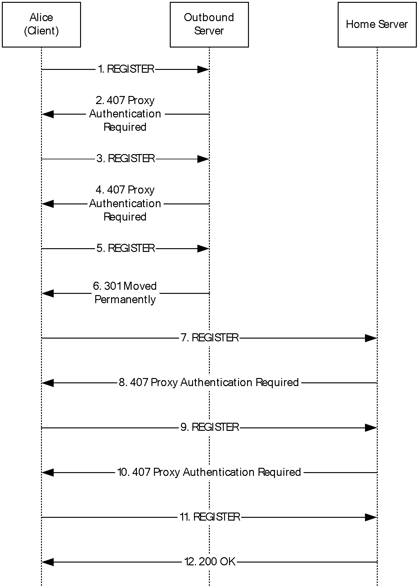
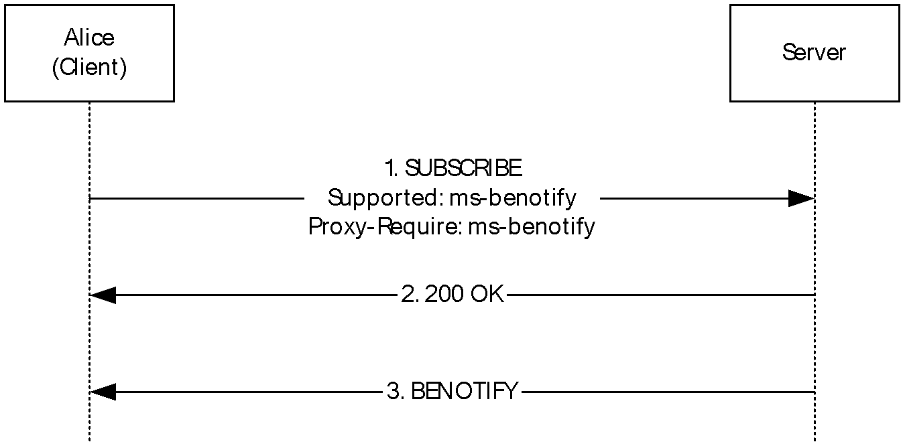
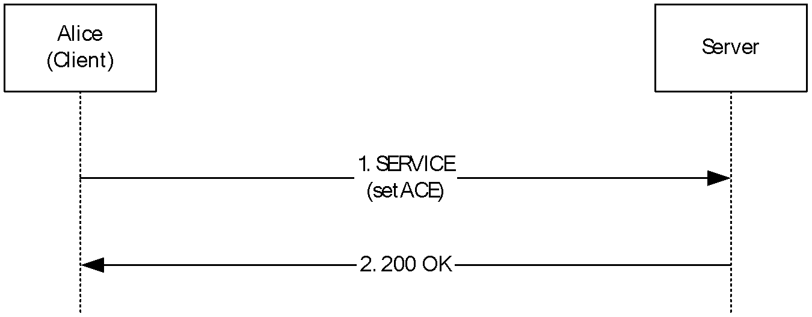

# [MS-SIP]: Session Initiation Protocol Extensions

Table of Contents

1 Introduction

- [1 Introduction](#Section_1)
  - [1.1 Glossary](#Section_1.1)
  - [1.2 References](#Section_1.2)
    - [1.2.1 Normative References](#Section_1.2.1)
    - [1.2.2 Informative References](#Section_1.2.2)
  - [1.3 Overview](#Section_1.3)
  - [1.4 Relationship to Other Protocols](#Section_1.4)
  - [1.5 Prerequisites/Preconditions](#Section_1.5)
  - [1.6 Applicability Statement](#Section_1.6)
  - [1.7 Versioning and Capability Negotiation](#Section_1.7)
  - [1.8 Vendor-Extensible Fields](#Section_1.8)
  - [1.9 Standards Assignments](#Section_1.9)

2 Messages

- [2 Messages](#Section_2)
  - [2.1 Transport](#Section_2.1)
  - [2.2 Message Syntax](#Section_2.2)
    - [2.2.1 text/xml+msrtc.pidf Presence Document Format](#Section_2.2.1)
    - [2.2.2 SIP Extensions to XPIDF Presence Document Format](#Section_2.2.2)
    - [2.2.3 application/vnd-microsoft-roaming-acls+xml Document Format](#Section_2.2.3)
    - [2.2.4 Contacts/Groups Document Formats](#Section_2.2.4)
      - [2.2.4.1 application/vnd-microsoft-roaming-contacts+xml Document Format](#Section_2.2.4.1)
      - [2.2.4.2 Contacts/Groups Management Document Formats](#Section_2.2.4.2)
  - [2.3 Directory Service Schema Elements](#Section_2.3)

3 Protocol Details

- [3 Protocol Details](#Section_3)
  - [3.1 NTLM/Kerberos Authentication Extensions Details](#Section_3.1)
    - [3.1.1 Abstract Data Model](#Section_3.1.1)
    - [3.1.2 Timers](#Section_3.1.2)
    - [3.1.3 Initialization](#Section_3.1.3)
    - [3.1.4 Higher-Layer Triggered Events](#Section_3.1.4)
      - [3.1.4.1 Initiating the Login Sequence](#Section_3.1.4.1)
      - [3.1.4.2 Sending a SIP Message](#Section_3.1.4.2)
    - [3.1.5 Message Processing Events and Sequencing Rules](#Section_3.1.5)
      - [3.1.5.1 Overview of Authentication Protocol Elements](#Section_3.1.5.1)
      - [3.1.5.2 Verifying Message Signature for Incoming Messages](#Section_3.1.5.2)
      - [3.1.5.3 proxy=replace Extension for Firewall Traversal](#Section_3.1.5.3)
    - [3.1.6 Timer Events](#Section_3.1.6)
    - [3.1.7 Other Local Events](#Section_3.1.7)
  - [3.2 Presence Extensions Details](#Section_3.2)
    - [3.2.1 Abstract Data Model](#Section_3.2.1)
    - [3.2.2 Timers](#Section_3.2.2)
    - [3.2.3 Initialization](#Section_3.2.3)
    - [3.2.4 Higher-Layer Triggered Events](#Section_3.2.4)
      - [3.2.4.1 Indicating Support for Presence Extensions](#Section_3.2.4.1)
      - [3.2.4.2 Setting Presence for Self User (setPresence SERVICE Request)](#Section_3.2.4.2)
      - [3.2.4.3 Subscribing to a User's Presence Information](#Section_3.2.4.3)
      - [3.2.4.4 Getting Presence Information of Another User (getPresence SERVICE Request)](#Section_3.2.4.4)
    - [3.2.5 Message Processing Events and Sequencing Rules](#Section_3.2.5)
      - [3.2.5.1 Processing Response to a getPresence SERVICE Request](#Section_3.2.5.1)
    - [3.2.6 Timer Events](#Section_3.2.6)
    - [3.2.7 Other Local Events](#Section_3.2.7)
  - [3.3 Batched SUBSCRIBE and NOTIFY Extension Details](#Section_3.3)
    - [3.3.1 Abstract Data Model](#Section_3.3.1)
    - [3.3.2 Timers](#Section_3.3.2)
    - [3.3.3 Initialization](#Section_3.3.3)
    - [3.3.4 Higher-Layer Triggered Events](#Section_3.3.4)
      - [3.3.4.1 Sending a Batched SUBSCRIBE Request](#Section_3.3.4.1)
    - [3.3.5 Message Processing Events and Sequencing Rules](#Section_3.3.5)
      - [3.3.5.1 Receiving a NOTIFY Response to a Batched SUBSCRIBE Request](#Section_3.3.5.1)
      - [3.3.5.2 Receiving a Failure Response to a Batched SUBSCRIBE Request](#Section_3.3.5.2)
    - [3.3.6 Timer Events](#Section_3.3.6)
    - [3.3.7 Other Local Events](#Section_3.3.7)
  - [3.4 Piggyback Notification in 200 OK Response Details](#Section_3.4)
    - [3.4.1 Abstract Data Model](#Section_3.4.1)
    - [3.4.2 Timers](#Section_3.4.2)
    - [3.4.3 Initialization](#Section_3.4.3)
    - [3.4.4 Higher-Layer Triggered Events](#Section_3.4.4)
      - [3.4.4.1 Indicating Support for Piggyback Notification](#Section_3.4.4.1)
    - [3.4.5 Message Processing Events and Sequencing Rules](#Section_3.4.5)
      - [3.4.5.1 Receiving a Piggyback Notification in a 200 OK](#Section_3.4.5.1)
    - [3.4.6 Timer Events](#Section_3.4.6)
    - [3.4.7 Other Local Events](#Section_3.4.7)
  - [3.5 Best Effort NOTIFY (BENOTIFY) Extension Details](#Section_3.5)
    - [3.5.1 Abstract Data Model](#Section_3.5.1)
      - [3.5.1.1 Indicating Support for BENOTIFY](#Section_3.5.1.1)
    - [3.5.2 Timers](#Section_3.5.2)
    - [3.5.3 Initialization](#Section_3.5.3)
    - [3.5.4 Higher-Layer Triggered Events](#Section_3.5.4)
    - [3.5.5 Message Processing Events and Sequencing Rules](#Section_3.5.5)
      - [3.5.5.1 Receiving a Failure Response to SUBSCRIBE](#Section_3.5.5.1)
      - [3.5.5.2 Receiving a Success Response to SUBSCRIBE](#Section_3.5.5.2)
      - [3.5.5.3 Receiving a BENOTIFY Request](#Section_3.5.5.3)
    - [3.5.6 Timer Events](#Section_3.5.6)
    - [3.5.7 Other Local Events](#Section_3.5.7)
  - [3.6 Auto-Extension of Subscriptions Details](#Section_3.6)
    - [3.6.1 Abstract Data Model](#Section_3.6.1)
    - [3.6.2 Timers](#Section_3.6.2)
    - [3.6.3 Initialization](#Section_3.6.3)
    - [3.6.4 Higher-Layer Triggered Events](#Section_3.6.4)
      - [3.6.4.1 Indicating Support for Auto-Extension of Subscriptions](#Section_3.6.4.1)
    - [3.6.5 Message Processing Events and Sequencing Rules](#Section_3.6.5)
      - [3.6.5.1 Receiving a 200 OK Response to SUBSCRIBE](#Section_3.6.5.1)
      - [3.6.5.2 Receiving a NOTIFY Request](#Section_3.6.5.2)
    - [3.6.6 Timer Events](#Section_3.6.6)
    - [3.6.7 Other Local Events](#Section_3.6.7)
  - [3.7 Contact Management Extensions Details](#Section_3.7)
    - [3.7.1 Abstract Data Model](#Section_3.7.1)
    - [3.7.2 Timers](#Section_3.7.2)
    - [3.7.3 Initialization](#Section_3.7.3)
    - [3.7.4 Higher-Layer Triggered Events](#Section_3.7.4)
      - [3.7.4.1 Subscribing to the Contact/Group List](#Section_3.7.4.1)
      - [3.7.4.2 Subscribing for the ACL](#Section_3.7.4.2)
      - [3.7.4.3 Add/Modify/Delete Contact](#Section_3.7.4.3)
      - [3.7.4.4 Add/Modify/Delete Group](#Section_3.7.4.4)
    - [3.7.5 Message Processing Events and Sequencing Rules](#Section_3.7.5)
      - [3.7.5.1 Setting ACEs for a Contact](#Section_3.7.5.1)
      - [3.7.5.2 Receiving the Contact List from the Server](#Section_3.7.5.2)
      - [3.7.5.3 Receiving the ACL from the Server](#Section_3.7.5.3)
    - [3.7.6 Timer Events](#Section_3.7.6)
    - [3.7.7 Other Local Events](#Section_3.7.7)

4 Protocol Examples

- [4 Protocol Examples](#Section_4)
  - [4.1 Registration with Kerberos](#Section_4.1)
  - [4.2 Registration with NTLM](#Section_4.2)
  - [4.3 Batched SUBSCRIBE and Piggybacked NOTIFY Example](#Section_4.3)
  - [4.4 Best Effort NOTIFY Example](#Section_4.4)
  - [4.5 setPresence Example](#Section_4.5)
  - [4.6 AddContact Example](#Section_4.6)
  - [4.7 DeleteContact Example](#Section_4.7)
  - [4.8 AddGroup Example](#Section_4.8)
  - [4.9 DeleteGroup Example](#Section_4.9)
  - [4.10 setACE Example](#Section_4.10)
  - [4.11 P2P Subscription and XPIDF Presence Format Example](#Section_4.11)

5 Security

- [5 Security](#Section_5)
  - [5.1 Security Considerations for Implementers](#Section_5.1)
  - [5.2 Index of Security Parameters](#Section_5.2)

6 Appendix A: Full text/xml+msrtc.pidf Presence Document Format

- [6 Appendix A: Full text/xml+msrtc.pidf Presence Document Format](#Section_6)

7 Appendix B: XPIDF Presence Document Format

- [7 Appendix B: XPIDF Presence Document Format](#Section_7)

8 Appendix C: ACL XML Schema

- [8 Appendix C: ACL XML Schema](#Section_8)

9 Appendix D: Contact Management Schema

- [9 Appendix D: Contact Management Schema](#Section_9)
  - [9.1 Contact Schema](#Section_9.1)
  - [9.2 SetContact Schema](#Section_9.2)
  - [9.3 ModifyGroup Schema](#Section_9.3)
  - [9.4 DeleteContact Schema](#Section_9.4)
  - [9.5 DeleteGroup Schema](#Section_9.5)

10 Appendix E: common.xsd

- [10 Appendix E: common.xsd](#Section_10)

11 Appendix F: Product Behavior

- [11 Appendix F: Product Behavior](#Section_11)

12 Change Tracking

- [12 Change Tracking](#Section_12)

For the legal notice and IP terms, see [LEGAL.md](../LEGAL.md).
Last updated: 6/1/2017.
See [Revision History](#revision-history) for full version history.

# 1 Introduction

This document describes Microsoft extensions to the [**Session Initiation Protocol (SIP)**](#gt_session-initiation-protocol-sip). SIP is used by terminals to establish, modify, and terminate multimedia sessions or calls. SIP is specified in [[RFC3261]](https://go.microsoft.com/fwlink/?LinkId=90410), [[RFC3262]](https://go.microsoft.com/fwlink/?LinkId=90411), [[RFC3263]](https://go.microsoft.com/fwlink/?LinkId=90412), and [[RFC3863]](https://go.microsoft.com/fwlink/?LinkId=90446).

Microsoft has added extensions for NTLM/Kerberos Authentication, for presence, for optimization of [**subscriptions**](#gt_subscription), and for [**notifications**](#gt_notification) and contact management. These extensions are used by Windows Messenger and the Real-Time Communications (RTC) Client API.

Sections 1.5, 1.8, 1.9, 2, and 3 of this specification are normative. All other sections and examples in this specification are informative.

## 1.1 Glossary

This document uses the following terms:

**200 OK**: A response to indicate that the request has succeeded.

**403 Forbidden**: A response that indicates that a protocol server understood but denies a request.

**access control entry (ACE)**: An entry in an [**access control list (ACL)**](#gt_access-control-list-acl) that contains a set of user rights and a security identifier (SID) that identifies a principal for whom the rights are allowed, denied, or audited.

**access control list (ACL)**: A list of [**access control entries (ACEs)**](#gt_access-control-entry-ace) that collectively describe the security rules for authorizing access to some resource; for example, an object or set of objects.

**Best Effort NOTIFY (BENOTIFY)**: A [**Session Initiation Protocol (SIP)**](#gt_session-initiation-protocol-sip) method that is used to send notifications to a subscriber, as described in [MS-SIP](#Section_0d72fb5512ba49f1850df0bf3110bb1f). Unlike the NOTIFY method, the BENOTIFY method does not require the recipient of the request to send a [**SIP response**](#gt_sip-response).

**client**: A computer on which the remote procedure call (RPC) client is executing.

**dialog**: A peer-to-peer [**Session Initiation Protocol (SIP)**](#gt_session-initiation-protocol-sip) relationship that exists between two [**user agents**](#gt_user-agent) and persists for a period of time. A dialog is established by [**SIP messages**](#gt_sip-message), such as a 2xx response to an INVITE request, and is identified by a call identifier, a local tag, and a remote tag.

**directory service (DS)**: A service that stores and organizes information about a computer network's users and network shares, and that allows network administrators to manage users' access to the shares. See also Active Directory.

**domain**: A set of users and computers sharing a common namespace and management infrastructure. At least one computer member of the set must act as a domain controller (DC) and host a member list that identifies all members of the domain, as well as optionally hosting the Active Directory service. The domain controller provides authentication of members, creating a unit of trust for its members. Each domain has an identifier that is shared among its members. For more information, see [MS-AUTHSOD](../MS-AUTHSOD/MS-AUTHSOD.md) section 1.1.1.5 and [MS-ADTS](../MS-ADTS/MS-ADTS.md).

**endpoint**: A participant that uses the Microsoft Groove Dynamics Protocol, as described in [MS-GRVDYNM](../MS-GRVDYNM/MS-GRVDYNM.md), to synchronize with a shared space. An endpoint is identified by the combination of an identity URL and a client device URL. Each endpoint maintains a copy of the data in a shared space.

**event package**: A specification that defines a set of state information to be reported by a notifying [**Session Initiation Protocol (SIP)**](#gt_session-initiation-protocol-sip) client to a subscriber. An event package also defines further syntax and semantics based on the framework that is required to convey such state information.

**fully qualified domain name (FQDN)**: An unambiguous domain name that gives an absolute location in the Domain Name System's (DNS) hierarchy tree, as defined in [[RFC1035]](https://go.microsoft.com/fwlink/?LinkId=90264) section 3.1 and [[RFC2181]](https://go.microsoft.com/fwlink/?LinkId=127732) section 11.

**INVITE**: A [**Session Initiation Protocol (SIP)**](#gt_session-initiation-protocol-sip) method that is used to invite a user or a service to participate in a session.

**Kerberos**: An authentication system that enables two parties to exchange private information across an otherwise open network by assigning a unique key (called a ticket) to each user that logs on to the network and then embedding these tickets into messages sent by the users. For more information, see [MS-KILE](../MS-KILE/MS-KILE.md).

**notification**: The act of a notifier sending a [**NOTIFY**](#gt_notify) message to a subscriber to inform the subscriber of the state of a resource.

**NOTIFY**: A method that is used to notify a [**Session Initiation Protocol (SIP)**](#gt_session-initiation-protocol-sip) client that an event requested by an earlier SUBSCRIBE method has occurred. The notification optionally provides details about the event.

**NT LAN Manager (NTLM) Authentication Protocol**: A protocol using a challenge-response mechanism for authentication in which clients are able to verify their identities without sending a password to the server. It consists of three messages, commonly referred to as Type 1 (negotiation), Type 2 (challenge) and Type 3 (authentication). For more information, see [MS-NLMP](../MS-NLMP/MS-NLMP.md).

**peer to peer (P2P)**: An Internet-based networking option in which two or more computers connect directly to each other to communicate and share files without use of a central [**server**](#gt_server).

**peer-to-peer (P2P)**: An Internet-based networking option in which two or more computers connect directly to each other in order to communicate.

**Presence Information Data Format (PIDF)**: A common data format defined in [[RFC3863]](https://go.microsoft.com/fwlink/?LinkId=90446) to exchange presence information.

**presentity**: An entity that provides presence information to a presence service.

**proxy**: A network node that accepts network traffic originating from one network agent and transmits it to another network agent.

**REGISTER**: A [**Session Initiation Protocol (SIP)**](#gt_session-initiation-protocol-sip) method that is used by an SIP client to register the client address with an SIP server.

**salt**: An additional random quantity, specified as input to an encryption function that is used to increase the strength of the encryption.

**security association (SA)**: A simplex "connection" that provides security services to the traffic carried by it. See [[RFC4301]](https://go.microsoft.com/fwlink/?LinkId=90465) for more information.

**server**: A computer on which the remote procedure call (RPC) server is executing.

**SERVICE**: A method that is defined by [**Session Initiation Protocol (SIP)**](#gt_session-initiation-protocol-sip) extensions and is used by an SIP client to request a service from a server.

**service principal name (SPN)**: The name a client uses to identify a service for mutual authentication. (For more information, see [[RFC1964]](https://go.microsoft.com/fwlink/?LinkId=90304) section 2.1.1.) An [**SPN**](#gt_service-principal-name-spn) consists of either two parts or three parts, each separated by a forward slash ('/'). The first part is the service class, the second part is the host name, and the third part (if present) is the service name. For example, "ldap/dc-01.fabrikam.com/fabrikam.com" is a three-part [**SPN**](#gt_service-principal-name-spn) where "ldap" is the service class name, "dc-01.fabrikam.com" is the host name, and "fabrikam.com" is the service name. See [[SPNNAMES]](https://go.microsoft.com/fwlink/?LinkId=90532) for more information about [**SPN**](#gt_service-principal-name-spn) format and composing a unique [**SPN**](#gt_service-principal-name-spn).

**Session Initiation Protocol (SIP)**: An application-layer control (signaling) protocol for creating, modifying, and terminating sessions with one or more participants. [**SIP**](#gt_session-initiation-protocol-sip) is defined in [[RFC3261]](https://go.microsoft.com/fwlink/?LinkId=90410).

**SIP client (client)**: Any network [**client**](#gt_sip-client-client) that sends [**SIP requests**](#gt_sip-request) and receives [**SIP responses**](#gt_sip-response). [**Clients**](#gt_sip-client-client) may or may not interact directly with a human user. User agent clients (UACs) and [**proxies**](#gt_proxy) are [**clients**](#gt_sip-client-client).

**SIP header**: A component of a [**SIP message**](#gt_sip-message) that conveys information about the [**SIP message**](#gt_sip-message). It is structured as a sequence of header fields.

**SIP message**: The data that is exchanged between [**Session Initiation Protocol (SIP)**](#gt_session-initiation-protocol-sip) elements as part of the protocol. An SIP message is either a request or a response.

**SIP method**: The primary function that an [**SIP request**](#gt_sip-request) is meant to call on a [**server**](#gt_server). This method is carried in the request message itself. Example methods are [**INVITE**](#gt_invite) and BYE.

**SIP request**: A [**Session Initiation Protocol (SIP)**](#gt_session-initiation-protocol-sip) message that is sent from a user agent client (UAC) to a user agent server (UAS) to call a specific operation.

**SIP response**: A [**Session Initiation Protocol (SIP)**](#gt_session-initiation-protocol-sip) message that is sent from a user agent server (UAS) to a user agent client (UAC) to indicate the status of a request from the UAC to the UAS.

**SIP transaction**: A [**SIP transaction**](#gt_sip-transaction) occurs between a UAC and a UAS. The [**SIP transaction**](#gt_sip-transaction) comprises all messages from the first request sent from the UAC to the UAS up to a final response (non-1xx) sent from the UAS to the UAC. If the request is [**INVITE**](#gt_invite), and the final response is a non-2xx, the [**SIP transaction**](#gt_sip-transaction) also includes an ACK to the response. The ACK for a 2xx response to an [**INVITE**](#gt_invite) request is a separate [**SIP transaction**](#gt_sip-transaction).

**SOAP**: A lightweight protocol for exchanging structured information in a decentralized, distributed environment. [**SOAP**](#gt_soap) uses XML technologies to define an extensible messaging framework, which provides a message construct that can be exchanged over a variety of underlying protocols. The framework has been designed to be independent of any particular programming model and other implementation-specific semantics. SOAP 1.2 supersedes SOAP 1.1. See [[SOAP1.2-1/2003]](https://go.microsoft.com/fwlink/?LinkId=90521).

**SOAP envelope**: A container for SOAP message information and the root element of a [**SOAP**](#gt_soap) document. See [[SOAP1.2-1/2007]](https://go.microsoft.com/fwlink/?LinkId=94664) section 5.1 for more information.

**SUBSCRIBE**: A [**Session Initiation Protocol (SIP)**](#gt_session-initiation-protocol-sip) method that is used to request asynchronous notification of an event or a set of events at a later time.

**subscription**: The end result of an act of a SIP element sending a [**SUBSCRIBE**](#gt_subscribe) request.

**Transmission Control Protocol (TCP)**: A protocol used with the Internet Protocol (IP) to send data in the form of message units between computers over the Internet. TCP handles keeping track of the individual units of data (called packets) that a message is divided into for efficient routing through the Internet.

**Transport Layer Security (TLS)**: A security protocol that supports confidentiality and integrity of messages in client and server applications communicating over open networks. [**TLS**](#gt_transport-layer-security-tls) supports server and, optionally, client authentication by using X.509 certificates (as specified in [[X509]](https://go.microsoft.com/fwlink/?LinkId=90590)). [**TLS**](#gt_transport-layer-security-tls) is standardized in the IETF TLS working group.

**Uniform Resource Identifier (URI)**: A string that identifies a resource. The URI is an addressing mechanism defined in Internet Engineering Task Force (IETF) Uniform Resource Identifier (URI): Generic Syntax [[RFC3986]](https://go.microsoft.com/fwlink/?LinkId=90453).

**user agent**: An HTTP user agent, as specified in [[RFC2616]](https://go.microsoft.com/fwlink/?LinkId=90372).

**User Datagram Protocol (UDP)**: The connectionless protocol within TCP/IP that corresponds to the transport layer in the ISO/OSI reference model.

**watcher**: An entity that requests presence information on a [**presentity**](#gt_presentity) from the presence service.

**XPIDF**: A data format for presence using XML (for more information, see [[DATAFORMATXML]](https://go.microsoft.com/fwlink/?LinkId=89843)).

**MAY, SHOULD, MUST, SHOULD NOT, MUST NOT:** These terms (in all caps) are used as defined in [[RFC2119]](https://go.microsoft.com/fwlink/?LinkId=90317). All statements of optional behavior use either MAY, SHOULD, or SHOULD NOT.

## 1.2 References

Links to a document in the Microsoft Open Specifications library point to the correct section in the most recently published version of the referenced document. However, because individual documents in the library are not updated at the same time, the section numbers in the documents may not match. You can confirm the correct section numbering by checking the [Errata](http://msdn.microsoft.com/en-us/library/dn781092.aspx).

### 1.2.1 Normative References

We conduct frequent surveys of the normative references to assure their continued availability. If you have any issue with finding a normative reference, please contact [dochelp@microsoft.com](mailto:dochelp@microsoft.com). We will assist you in finding the relevant information.

[MS-ADA1] Microsoft Corporation, "[Active Directory Schema Attributes A-L](../MS-ADA1/MS-ADA1.md)".

[MS-ADA2] Microsoft Corporation, "[Active Directory Schema Attributes M](../MS-ADA2/MS-ADA2.md)".

[MS-ADA3] Microsoft Corporation, "[Active Directory Schema Attributes N-Z](../MS-ADA3/MS-ADA3.md)".

[MS-ADSC] Microsoft Corporation, "[Active Directory Schema Classes](../MS-ADSC/MS-ADSC.md)".

[MS-KILE] Microsoft Corporation, "[Kerberos Protocol Extensions](../MS-KILE/MS-KILE.md)".

[MS-NLMP] Microsoft Corporation, "[NT LAN Manager (NTLM) Authentication Protocol](../MS-NLMP/MS-NLMP.md)".

[RFC1964] Linn, J., "The Kerberos Version 5 GSS-API Mechanism", RFC 1964, June 1996, [http://www.rfc-editor.org/rfc/rfc1964.txt](https://go.microsoft.com/fwlink/?LinkId=90304)

[RFC2119] Bradner, S., "Key words for use in RFCs to Indicate Requirement Levels", BCP 14, RFC 2119, March 1997, [http://www.rfc-editor.org/rfc/rfc2119.txt](https://go.microsoft.com/fwlink/?LinkId=90317)

[RFC3261] Rosenberg, J., Schulzrinne, H., Camarillo, G., Johnston, A., Peterson, J., Sparks, R., Handley, M., and Schooler, E., "SIP: Session Initiation Protocol", RFC 3261, June 2002, [http://www.ietf.org/rfc/rfc3261.txt](https://go.microsoft.com/fwlink/?LinkId=90410)

[RFC3262] Rosenberg, J., and Schulzrinne, H., "Reliability of Provisional Responses in the Session Initiation Protocol (SIP)", RFC 3262, June 2002, [http://www.ietf.org/rfc/rfc3262.txt](https://go.microsoft.com/fwlink/?LinkId=90411)

[RFC3263] Rosenberg, J., and Schulzrinne, H., "Session Initiation Protocol (SIP): Locating SIP Servers", RFC 3263, June 2002, [http://www.ietf.org/rfc/rfc3263.txt](https://go.microsoft.com/fwlink/?LinkId=90412)

[RFC3265] Roach, A. B., "Session Initiation Protocol (SIP)-Specific Event Notification", RFC 3265, June 2002, [http://www.ietf.org/rfc/rfc3265.txt](https://go.microsoft.com/fwlink/?LinkId=90413)

[RFC3863] Sugano, H., Fujimoto, S., Klyne, G., et al., "Presence Information Data Format (PIDF)", RFC 3863, August 2004, [http://www.ietf.org/rfc/rfc3863.txt](https://go.microsoft.com/fwlink/?LinkId=90446)

[XML10] World Wide Web Consortium, "Extensible Markup Language (XML) 1.0 (Third Edition)", February 2004, [http://www.w3.org/TR/2004/REC-xml-20040204/](https://go.microsoft.com/fwlink/?LinkId=90600)

[XMLNS-2ED] World Wide Web Consortium, "Namespaces in XML 1.0 (Second Edition)", August 2006, [http://www.w3.org/TR/2006/REC-xml-names-20060816/](https://go.microsoft.com/fwlink/?LinkId=90602)

[XMLSCHEMA] World Wide Web Consortium, "XML Schema", September 2005, [http://www.w3.org/2001/XMLSchema](https://go.microsoft.com/fwlink/?LinkId=90603)

### 1.2.2 Informative References

[RFC1341] Borenstein, N., and Freed, N., "MIME (Multipurpose Internet Mail Extensions): Mechanisms for Specifying and Describing the Format of Internet Message Bodies", RFC 1341, June 1992, [http://www.rfc-editor.org/rfc/rfc1341.txt](https://go.microsoft.com/fwlink/?LinkId=90277)

[SOAP1.1] Box, D., Ehnebuske, D., Kakivaya, G., et al., "Simple Object Access Protocol (SOAP) 1.1", W3C Note, May 2000, [http://www.w3.org/TR/2000/NOTE-SOAP-20000508/](https://go.microsoft.com/fwlink/?LinkId=90520)

[SOAP1.2-1/2007] Gudgin, M., Hadley, M., Mendelsohn, N., et al., "SOAP Version 1.2 Part 1: Messaging Framework (Second Edition)", W3C Recommendation, April 2007, [http://www.w3.org/TR/2007/REC-soap12-part1-20070427/](https://go.microsoft.com/fwlink/?LinkId=94664)

[SOAP1.2-2/2007] Gudgin, M., Hadley, M., Mendelsohn, N., et al., "SOAP Version 1.2 Part 2: Adjuncts (Second Edition)", W3C Recommendation, April 2007, [http://www.w3.org/TR/2007/REC-soap12-part2-20070427](https://go.microsoft.com/fwlink/?LinkId=119124)

## 1.3 Overview

Session Initiation Protocol Extensions is an extension of the original [**Session Initiation Protocol (SIP)**](#gt_session-initiation-protocol-sip), as specified in [[RFC3261]](https://go.microsoft.com/fwlink/?LinkId=90410).

Session Initiation Protocol Extensions defines NTLM/Kerberos authentication extensions to support client/server authentication and message signatures. See [NTLM/Kerberos Authentication Extensions Details (section 3.1)](#Section_3.1).

Session Initiation Protocol Extensions also adds a number of extensions to SIMPLE-based presence, as specified in [RFC3261], [[RFC3265]](https://go.microsoft.com/fwlink/?LinkId=90413), and [[RFC3863]](https://go.microsoft.com/fwlink/?LinkId=90446). These extensions are briefly described below and are defined further in section [3](#Section_3).

Many of the extensions have been designed to reduce the number of [**subscription**](#gt_subscription) and [**notification**](#gt_notification) messages exchanged between the [**client**](#gt_sip-client-client) and the [**server**](#gt_server). One such extension is the capability to subscribe for the presence of a number of contacts in a single subscription. The client can send a batched SUBSCRIBE request to create such a subscription. The server sends the presence information of all the contacts in the batched subscription in a single [**NOTIFY**](#gt_notify) request. This is useful when a client needs to subscribe for presence of all the contacts in the user's contact list.

Another extension that helps reduce the number of messages between the server and client is the piggyback notification. The server can send the presence information immediately in the final response to the SUBSCRIBE request, thus obviating the need to send a separate NOTIFY. Any further changes are conveyed using a NOTIFY.

A [**BENOTIFY**](#gt_best-effort-notify-benotify) request is similar to a NOTIFY request and is used by the server to send updates about any changes to the presence state. The only difference is that the client does not need to send a SIP response to a BENOTIFY request. Because the server does not need to wait for a response, the load on the server can be reduced.

Auto-Extension of subscriptions is an extension defined to reduce the frequency of the client refreshing a subscription. The client refreshes a subscription after an interval negotiated with the server. With this extension, any notification sent by the server to the client resets the subscription refresh timer. After a notification, the client needs to wait for the negotiated interval before it can refresh the subscription. Another notification during this time can again reset the timer. This extension reduces the number of SUBSCRIBE requests sent by the client to refresh a subscription.

Microsoft also has made extensions to the [**Presence Information Data Format (PIDF)**](#gt_presence-information-data-format-pidf). The enhanced format is called msrtc.pidf and is documented in [text/xml+msrtc.pidf Presence Document Format (section 2.2.1)](#Section_2.2.1). The msrtc.pidf format is used only in the client/server mode. The client uses a setPresence SOAP request carried in the body of a [**SERVICE**](#gt_service) request to set or update its own presence information. For more information on the [**SOAP**](#gt_soap) protocol, see [[SOAP1.1]](https://go.microsoft.com/fwlink/?LinkId=90520), [[SOAP1.2-1/2007]](https://go.microsoft.com/fwlink/?LinkId=94664), and [[SOAP1.2-2/2007]](https://go.microsoft.com/fwlink/?LinkId=119124). The counterpart to the setPresence SOAP request is a getPresence SOAP request. This acts as a means to poll for presence rather than subscribing to presence. It is meant as a lightweight alternative to a presence SUBSCRIBE request when only presence for a single entity is needed and only that presence information for a one-time immediate purpose is needed.

Session Initiation Protocol Extensions uses the [**XPIDF**](#gt_xpidf) format to exchange presence information when the [**endpoints**](#gt_endpoint) are acting in [**peer-to-peer (P2P)**](#gt_peer-to-peer-p2p) mode. The XPIDF format was introduced in an IETF draft but was never standardized as an RFC. The details of the format and the schema are included in [Appendix B: XPIDF Presence Document Format (section 7)](#Section_7). Session Initiation Protocol Extensions also has made some extensions to the XPIDF format (see section [2.2.2](#Section_2.2.2)).

Finally, Session Initiation Protocol Extensions includes protocol enhancements for contact management operations such as adding or deleting a contact or a group, and setting [**access control lists (ACLs)**](#gt_access-control-list-acl) for viewing and establishing communication with a presence. All of these operations can be done by sending SOAP requests carried within the body of a SERVICE request.

## 1.4 Relationship to Other Protocols

Session Initiation Protocol Extensions is dependent on [**SIP**](#gt_session-initiation-protocol-sip). Session Initiation Protocol Extensions defines additional SIP primitives and XML schema to support various extensions specified in this document. In addition, Session Initiation Protocol Extensions defines some authentication extensions that make use of [**NT LAN Manager (NTLM) Authentication Protocol**](#gt_nt-lan-manager-ntlm-authentication-protocol), specified in [MS-NLMP](../MS-NLMP/MS-NLMP.md) and [**Kerberos**](#gt_kerberos) protocols. For more information on XML, see [[XML10]](https://go.microsoft.com/fwlink/?LinkId=90600), [[XMLNS-2ED]](https://go.microsoft.com/fwlink/?LinkId=90602), and [[XMLSCHEMA]](https://go.microsoft.com/fwlink/?LinkId=90603).

Session Initiation Protocol Extensions is invoked as an extension of SIP and is dependent on all the protocols on which the SIP specification depends.

## 1.5 Prerequisites/Preconditions

The Session Initiation Protocol Extensions assumes that both the [**SIP clients**](#gt_58a7caf5-be0b-44d1-94bb-92c53281b30a) and the [**server**](#gt_server) support SIP. The prerequisites for Session Initiation Protocol Extensions are the same as the prerequisites for SIP.

## 1.6 Applicability Statement

The Session Initiation Protocol Extensions is applicable when both the [**SIP clients**](#gt_58a7caf5-be0b-44d1-94bb-92c53281b30a) and the server support [**SIP**](#gt_session-initiation-protocol-sip) and want to utilize one or more of the enhancements offered by Session Initiation Protocol Extensions.

## 1.7 Versioning and Capability Negotiation

There is no protocol versioning in the Session Initiation Protocol Extensions. Instead, explicit capability negotiation is done as specified in this section by using the Supported header to indicate support of various features. Using the Supported header is the standard [**SIP**](#gt_session-initiation-protocol-sip) mechanism of doing capability negotiation.

## 1.8 Vendor-Extensible Fields

There are no vendor-extensible fields specific to the Session Initiation Protocol Extensions. Standard extension mechanisms of the [**SIP**](#gt_session-initiation-protocol-sip) MAY be used by vendors as needed.

## 1.9 Standards Assignments

None.

# 2 Messages

The following sections specify how Session Initiation Protocol Extensions messages are transported and the message syntax.

## 2.1 Transport

Microsoft extensions to [**SIP**](#gt_session-initiation-protocol-sip) do not introduce a new transport to exchange messages but these extensions can be used with any transport that is used by SIP. [**SIP messages**](#gt_sip-message) can be transported over [**User Datagram Protocol (UDP)**](#gt_user-datagram-protocol-udp), [**Transmission Control Protocol (TCP)**](#gt_transmission-control-protocol-tcp), or [**Transport Layer Security (TLS)**](#gt_transport-layer-security-tls).

## 2.2 Message Syntax

Microsoft extensions to [**SIP**](#gt_session-initiation-protocol-sip) do not introduce a new message format. They rely on the [**SIP message**](#gt_sip-message) format, as specified in [[RFC3261]](https://go.microsoft.com/fwlink/?LinkId=90410) section 7. The Session Initiation Protocol Extensions does define a new format for the Presence Document (see section [2.2.1](#Section_2.2.1)).

### 2.2.1 text/xml+msrtc.pidf Presence Document Format

These extensions support a nonstandard Presence Document Format that has a number of enhancements, such as the capability to carry device capabilities and the capability to support multiple devices for a single user. A user can log on by using multiple devices. Each device presents its presence information to the [**server**](#gt_server). The XML instance containing presence information submitted to the server is called the Presence Document. When retrieving presence information for a user, the server not only returns the Presence Document from every device, but it also determines the overall presence of the user. This XML instance returned by the server is called the Aggregated Presence Document.

Some of the key elements and attributes are defined as follows:

- presentity
The element contains the overall aggregated availability and activity of a user, as well as the availability and activity of all [**endpoints**](#gt_endpoint) of the user. The uri attribute specifies the sip entity that this element is describing.

- epid
This attribute can appear in the availability element, the activity element, or a devicePresence element. When used in the availability and activity elements inside the presentity element, the epid identifies the availability and activity for the most active endpoint. When used in the devicePresence element, the epid advertises the availability and identifies the activity for a specific endpoint. This value is a hexadecimal string no longer than 16 bytes in length. This epid value is the same endpoint identifier value used to identify a specific SIP endpoint.

- ageOfPresence
The ageOfPresence attribute appears in a devicePresence element. This is the number of seconds since the device last updated its presence information.

- availability
Availability indicates whether the user can receive a call. The availability element has an aggregate attribute that represents the availability of a user on a device. The aggregate attribute is processed by the server as being within a range that has a span of 100 (the class code). Note that within the XML sent by the client, the client does not specify the class code, but rather, the actual value. The server interprets the values as being within the following classes.

| Class code | Server interpretation |
| --- | --- |
| 000-099 | The user cannot receive calls. |
| 100-199 | The user can be online; however, availability is unknown until a call is attempted. A cell phone gateway typically uses this setting. |
| 200-299 | The user has a device that is currently connected and it can receive calls. |
| 300-399 | The user is in proximity of a device that can receive calls. |

Rather than a hard-coded enumeration, a numeric value is used. This makes it easy to compare the availability that is sent by two different [**user agents**](#gt_user-agent). For example, the higher the availability, the more available the user.

- activity
The purpose of activity is not to indicate if a user can receive a call, but rather, to indicate to [**watchers**](#gt_watcher) how likely the user is to want to be disturbed. The activity element has an attribute aggregate that contains a numeric value that defines the activity of the user.

| Activity code | Server interpretation |
| --- | --- |
| 000-099 | There is no information about the activity of the user. |
| 100-149 | The user is away. |
| 150-199 | The user is out to lunch. |
| 200-299 | The user is idle. |
| 300-399 | The user will be right back. |
| 400-499 | The user is active. |
| 500-599 | The user is already participating in a communications session. |
| 600-699 | The user is busy. |
| 700-799 | The user is away. |
| 800-999 | The user is active. |

Rather than a hard-coded enumeration, a numeric value is used. This makes it easy to compare the availability sent by two different user agents.

- note
This attribute in the activity element can be used by the client to store a string that indicates the user's status on the device.

- userInfo
This element is used for storing persisted presence information for a user. This information is stored by the server and is available regardless of the device to which a user is logged on or even whether the user is logged on at all. Any valid XML can be stored on the server. The server enforces a limit of 1,024 characters on the size of the element body, where the entire element body is treated as a single string.

The Presence Document is described by the XML schema in [Appendix A: Full text/xml+msrtc.pidf Presence Document Format (section 6)](#Section_6).

Note that the schema defines two different versions of the Presence Document:

- A version that is published by the client using a setPresence request.
- A version that is generated by the server and sent in a [**NOTIFY**](#gt_notify) or [**BENOTIFY**](#gt_best-effort-notify-benotify) request to the watcher containing the aggregation of the various presence information published by the 1+ devices of the user.
The aggregated Presence Document describes a user's availability on all its devices as well as an overall aggregated presence. This is the document published by the server to anyone obtaining the presence of a particular user. The availability and activity elements in the aggregated Presence Document indicate the availability and activity information from the most available device of the user. The server MAY also include the displayName, email, and phoneNumber of the user in the aggregated Presence Document.

### 2.2.2 SIP Extensions to XPIDF Presence Document Format

[**SIP**](#gt_session-initiation-protocol-sip) allows the SIP [**endpoints**](#gt_endpoint) to communicate in a [**P2P**](#gt_peer-to-peer-p2p) mode without requiring an SIP server. The endpoints can also subscribe for presence information and send [**notifications**](#gt_notification) carrying such information in a P2P manner. Session Initiation Protocol Extensions uses the [**XPIDF**](#gt_xpidf) format to exchange presence information when the endpoints are acting in P2P mode.

The XPIDF format was introduced in an IETF draft but was never standardized as an RFC. The details of the format and the schema are included in [Appendix B: XPIDF Presence Document Format (section 7)](#Section_7).

Session Initiation Protocol Extensions introduces the following extensions to the XPIDF presence document format:

- A new element, "display", is defined as a subelement of a presence element. The display element has the attribute **name** that is a suggested name to identify a contact from other contacts in the client's contact list.
- A new element, "msnsubstatus", is defined as a subelement of the address element. This element indicates the availability of the user. The msnsubstatus element has the attribute **substatus** that can have the following values: unknown, away, online, idle, busy, berightback, onthephone, or outtolunch. The interpretation of these values is as follows:
| msnsubstatus | Server interpretation |
| --- | --- |
| unknown | There is no information about the activity of the user. |
| away | User is away. |
| online | User is active and available for communication. |
| idle | User is idle. |
| busy | User is busy. |
| berightback | User will be right back. |
| onthephone | User is on the phone. |
| outtolunch | User is out to lunch. |

### 2.2.3 application/vnd-microsoft-roaming-acls+xml Document Format

Session Initiation Protocol Extensions support retrieving the [**ACL**](#gt_access-control-list-acl) from the server in the form of an XML document. The ACL document contains a list of [**access control entries (ACEs)**](#gt_access-control-entry-ace). An ACE is a set of three attributes:

**Type:** Type defines what the ACE applies to. A type value of ALL indicates that the ACE applies to all users. A type value of DOMAIN indicates that the ACE applies to all users on a [**domain**](#gt_domain). The domain is specified by the mask field. For example, if type is DOMAIN, and mask is "contoso.com", the ACE applies to "sip:user1@sip.contoso.com" and "sip:user@contoso.com" but not to "sip:user3@example.com". A type value of USER implies that the ACE applies to a specific user specified by the mask field.

**Mask:** A user [**URI**](#gt_uniform-resource-identifier-uri) or DNSdomain to which the ACE applies.

**Rights:** The rights associated with this ACE. This is represented as a list of characters. Each position in the list represents a right. The character in that position represents the value of that right. Four values are defined.

| Value | Right |
| --- | --- |
| A | Allow |
| D | Deny |
| P | Prompt |
| B | Block (Polite blocking) |

Session Initiation Protocol Extensions uses two characters for the Rights field. The first one specifies the right to view the presence of a user, and the second one defines the right to communicate with a user. The client MUST enforce the right to communicate. The server MUST enforce the right to view presence information.

An example [**NOTIFY**](#gt_notify) message for the roaming ACL data follows.

<ACLlist deltaNum="282" >

<userACL>

<ace type="USER" mask="sip:user2@machine2.example.com" rights="AA"/>

<ace type="USER" mask="sip:user3@machine2.example.com" rights="BA"/>

<ace type="USER" mask="sip:user4@machine2.example.com" rights="PA"/>

<ace type="USER" mask="sip:user5@machine2.example.com" rights="AA"/>

<ace type="USER" mask="sip:user6@machine2.example.com" rights="AA"/>

</userACL>

</ACLlist>

**Note** The **deltaNum** attribute in the ACLlist element is a monotonically increasing sequence number provided by the server that the client uses to ensure that its local copy is in sync with the server. The initial value MUST be nonzero and is generally one.

### 2.2.4 Contacts/Groups Document Formats

#### 2.2.4.1 application/vnd-microsoft-roaming-contacts+xml Document Format

Session Initiation Protocol Extensions supports retrieving the contact list from the server in the form of an XML document. The server can return the full contact list, or a partial contact list. Both lists use basic building blocks of contact and group elements.

- group
The group element contains three attributes:

**id:** A nonnegative integer that uniquely identifies the group.

**name:** The name of the group.

**externalURI:** A [**URI**](#gt_uniform-resource-identifier-uri) pointing to auxiliary resources for the group. For example, the **externalURI** can point to an LDAP URI that contains the list of contacts.

- contact
The contact element contains the following attributes:

**uri:** The [**SIP**](#gt_session-initiation-protocol-sip) URI of the contact.

**name:** The name of the contact.

**groups:** A space-separated string of IDs for the groups to which this contact belongs.

**subscribed:** A Boolean indicating whether this contact is merely stored as an offline contact, or whether the client subscribes to its presence.

**externalURI:** A URI pointing to auxiliary resources for the group. For example, the **externalURI** can point to an LDAP URI that contains the list of contacts.

The contact element can also contain an optional contactExtension element. The contactExtension element can be any generic XML.

- contactDelta
The contactDelta element represents a partial contact list containing only the changes in contacts and groups information from the last contact list [**notification**](#gt_notification). The contactDelta element contains a choice of six elements:

**addedGroup:** Takes the same form as the group element. This element shows the group that was added.

**modifiedGroup:** : Takes the same form as the group element. This element shows the group that was modified.

**deletedGroup:** Contains only a required **id** attribute. The **id** attribute identifies the group that was deleted.

**addedContact:** Takes the same form as the contact element. This element shows the contact that was added.

**modifiedContact:** Takes the same form as the contact element. This element shows the contact that was modified.

**deletedContact:** Contains only a required **uri** attribute. The **uri** attribute identifies the contact that was deleted.

The contactDelta element also contains two required attributes. The deltaNum nonnegative integer attribute is the updated sequence number for the contact list after the changes take place. The prevDeltaNum nonnegative integer attribute is the previous sequence number for the contact list before the changes take place.

#### 2.2.4.2 Contacts/Groups Management Document Formats

Session Initiation Protocol Extensions support modification to the contact list. These primitives are defined as [**SOAP**](#gt_soap) elements and are sent to the server by using a [**SERVICE**](#gt_service) request. Session Initiation Protocol Extensions supports the following primitives:

- setContact
The setContact primitive is used for adding a new contact or modifying an existing contact. It contains the following elements:

**uri:** The [**SIP**](#gt_session-initiation-protocol-sip) [**URI**](#gt_uniform-resource-identifier-uri) of the contact.

**displayName:** The name of the contact.

**groups:** A space-separated string of IDs for the groups to which this contact belongs.

**subscribed:** A Boolean that indicates whether this contact is merely stored as an offline contact or whether the client needs to subscribe to its presence.

**externalURI:** A URI that points to auxiliary information for this contact. For example, the externalURI can point to an LDAP URI that contains the information for this contact. This element is optional.

**contactExtension:** This element can be any generic XML. This element can be used to store any additional application extension information about a contact. This element is optional.

- deleteContact
The deleteContact primitive is used for deleting an existing contact. It contains the URI element, which identifies the sip URI of the contact to be deleted.

- addGroup/modifyGroup
The addGroup primitive is used to add a new group. The modifyGroup primitive is used to modify an existing group. These primitives contain the following elements:

**groupID:** A nonnegative integer that is used as the identifier of the group.

**name:** The name of the group.

**externalURI:** A URI that points to auxiliary information about the group. This element is optional.

- deleteGroup
The deleteGroup primitive is used for deleting an existing group. It contains the groupID of the group to be deleted.

Each primitive must also include the deltaNum element. This nonnegative integer element is used as a sequence number for the contact/group management view, and each primitive must include the deltaNum equal to the current sequence number.

## 2.3 Directory Service Schema Elements

This protocol MAY access the [**directory service**](#gt_directory-service-ds) schema class and attributes listed in the following table and include them in the presence document. For the syntactic specifications of the following class or class/attribute pairs, refer to Active Directory Domain Services (AD DS) in [MS-ADA1](../MS-ADA1/MS-ADA1.md), [MS-ADA2](../MS-ADA2/MS-ADA2.md), [MS-ADA3](../MS-ADA3/MS-ADA3.md), and [MS-ADSC](../MS-ADSC/MS-ADSC.md).

| Class | Attribute |
| --- | --- |
| User | displayName email |

# 3 Protocol Details

The following sections specify details of Session Initiation Protocol Extensions, including abstract data models, message processing rules, and the [**SIP client**](#gt_sip-client-client) and [**server**](#gt_server) roles.

## 3.1 NTLM/Kerberos Authentication Extensions Details

Session Initiation Protocol Extensions implements a proprietary [**Kerberos**](#gt_kerberos) and [**NTLM Authentication Protocol**](#gt_nt-lan-manager-ntlm-authentication-protocol) authentication mechanism that is used by the client for client-to-server authentication and signing of messages. For more information on Kerberos, see [MS-KILE](../MS-KILE/MS-KILE.md). Encryption (privacy) is provided by [**TLS**](#gt_transport-layer-security-tls) and is not explicitly covered by this authentication mechanism.

Authentication is broken down into two phases. In the first phase, a [**security association (SA)**](#gt_security-association-sa) is established between the client and the server. In the second phase, the client and server use the existing SA to sign messages that they send and to verify the messages they receive. Unauthenticated messages from a client SHOULD NOT be accepted by the server. The exact message exchange in the first phase differs depending on whether NTLM or Kerberos authentication is used.

During the NTLM SA establishment phase, a three-way handshake occurs between the client and the server:

- The client sends a request with no credential or authentication information. The server responds to that request with a 401 or 407, indicating that it supports NTLM and Kerberos and requires authentication.
- The client reissues the request, indicating its preference for NTLM authentication. The server responds with an appropriate challenge in a 401 or 407.
- The client reissues the request with a response to the server's challenge. The server processes the request and responds (including its signature for the response).
- The SA is now established on both the client and server, and subsequent messages between the client and server are signed.
During the Kerberos SA establishment phase, a two-way handshake occurs between the client and the server:

- The client sends a request with no credential or authentication information. The server responds to that request with a 401 or 407, indicating that it supports NTLM and Kerberos and requires authentication.
- The client requests a Kerberos ticket for the server, and reissues the request with this encoded Kerberos ticket information.
- The server processes the request and responds (including its signature for the response).
- The SA is now established on both the client and server, and subsequent messages between the client and server are signed.
The primary distinction between NTLM and Kerberos is the need for connectivity to the domain controller. In Kerberos, the client must request a Kerberos ticket from the Key Distribution Center (KDC), which is a process that resides on the domain controller. In NTLM, the server verifies the client's NTLM credentials by contacting the domain controller. This difference allows clients that do not have connectivity to the domain controller to authenticate with the server using NTLM authentication, and it is the main reason for supporting NTLM in addition to the more secure and standard Kerberos authentication.

### 3.1.1 Abstract Data Model

This section describes a conceptual model of possible data organization that an implementation maintains to participate in this protocol. The described organization is provided to facilitate the explanation of how the protocol behaves. This specification does not mandate that implementations adhere to this model as long as their external behavior is consistent with what is described in this specification.

The client can use a *LastSnumReceived* integer parameter for each [**SA**](#gt_security-association-sa) to store the value of the last *snum* received from the server. This is used to provide replay protection.

The client can also use two integer parameters, *SnumWindowLow* and *SnumWindowHigh*, to mark the upper and lower values for the sliding window used by the client to allow pipelining of requests while providing replay protection. *SnumWindowLow* and *SnumWindowHigh* can be initialized to 1 and 256, respectively, for a 256-size sliding window.

**Note** The preceding conceptual data can be implemented by using a variety of techniques. An implementation is at liberty to implement such data in any way convenient.

### 3.1.2 Timers

No timers are required other than the timers specified in [[RFC3261]](https://go.microsoft.com/fwlink/?LinkId=90410).

### 3.1.3 Initialization

No initialization is required beyond the initialization that is specified in [[RFC3261]](https://go.microsoft.com/fwlink/?LinkId=90410).

### 3.1.4 Higher-Layer Triggered Events

Except as specified in the following sections, the rules for message processing are as specified in [[RFC3261]](https://go.microsoft.com/fwlink/?LinkId=90410).

#### 3.1.4.1 Initiating the Login Sequence

The client initiates the login sequence by sending a [**REGISTER**](#gt_register) request without any credentials, as suggested in [[RFC3261]](https://go.microsoft.com/fwlink/?LinkId=90410). If the REGISTER request is challenged by a server request for [**NTLM Authentication Protocol**](#gt_nt-lan-manager-ntlm-authentication-protocol) or [**Kerberos**](#gt_kerberos) authentication, the client then resends the REGISTER request with credentials. This step also establishes an [**SA**](#gt_security-association-sa) between the client and the server that is used to sign any future messages.

#### 3.1.4.2 Sending a SIP Message

Before sending a message, the sender MUST generate a message signature or checksum that it will send with the message so that the receiver can authenticate the message. The client and the server SHOULD use the same algorithm to generate message signatures. The Microsoft implementation uses the GSS_GetMIC() and GSS_VerifyMIC() implementations of the [**NTLM**](#gt_nt-lan-manager-ntlm-authentication-protocol) or [**Kerberos**](#gt_kerberos) security service provider interface to compute and verify a signature. For more information on NTLM GSS_GetMIC() and GSS_VerifyMIC(), see [MS-NLMP](../MS-NLMP/MS-NLMP.md) section 3.1.4. For more information on Kerberos GSS_GetMIC() and GSS_VerifyMIC implementation, see [[RFC1964]](https://go.microsoft.com/fwlink/?LinkId=90304) section 1.2.

The client MUST use the following values in order and enclosed by angle brackets to construct a secure buffer that is then used to compute the message signature:

- Authentication method (for example, NTLM or Kerberos)
- *crand* for client or *srand* for server
- *cnum* for client or *snum* for server
- *realm*
- *targetname*
- Call ID
- CSeq#
- CSeq method
- From URL
- From tag
- To tag
- Expires (optional)
- Response code (responses only)
The only difference from the client signature is the use of a server-generated [**salt**](#gt_salt) (*srand*) and sequence number (*snum*) rather than the client-generated salt (*crand*) and sequence number (*cnum*).

**Note** Even though some parameter values are case-insensitive, these values MUST be used as they appear in the message when performing the signature computation.

For optional fields, such as **Expires**, an empty set of angle brackets (<>) is included in the buffer to signal when those headers do not exist in the [**SIP message**](#gt_sip-message).

The response code is only part of the signature computation for responses and is not part of the signature for requests. An empty set of angle brackets (<>) is not included in the buffer to sign for requests.

The client places the message signature in the *response* parameter of the Proxy-Authorization: header. The server places the signature in the *rspauth* parameter of the Proxy-Authentication-Info: header.

As an example, the following message,

SUBSCRIBE sip:samtest1@pstntest.rtmp.selfhost.corp.microsoft.com SIP/2.0

Via: SIP/2.0/TCP 172.24.34.1:16577

Max-Forwards: 70

From: <sip:samtest1@pstntest.rtmp.selfhost.corp.microsoft.com>;

tag=82249b57436d4aa39ec38afa968fa994;

epid=bd0238d966

To: <sip:samtest1@pstntest.rtmp.selfhost.corp.microsoft.com>

Call-ID: 72558074992e4f2cafb48c6e44b90a0c

CSeq: 1 SUBSCRIBE

Contact:

<sip:samtest1@pstntest.rtmp.selfhost.corp.microsoft.com:16577;

maddr=172.24.34.1;transport=tcp>;

proxy=replace

User-Agent: RTC/1.3

Event: vnd-microsoft-roaming-contacts

Accept: application/vnd-microsoft-roaming-contacts+xml

Supported: com.microsoft.autoextend

Supported: ms-benotify

Proxy-Require: ms-benotify

Supported: ms-piggyback-first-notify

Proxy-Authorization:

NTLM qop="auth",

realm="SIP Communications Service",

opaque="9C55D687",

crand="009139df",

cnum="1",

targetname="pstn.pstntest.rtmp.selfhost.corp.microsoft.com",

response="0100000039623537c854b2e8ca6a203e"

Content-Length: 0

would result in the following signature buffer (line breaks not included).

<NTLM>

<009139df >

<1>

< SIP Communications Service>

< pstn.pstntest.rtmp.selfhost.corp.microsoft.com >

<72558074992e4f2cafb48c6e44b90a0c >

<1>

<SUBSCRIBE>

< sip:samtest1@pstntest.rtmp.selfhost.corp.microsoft.com >

<82249b57436d4aa39ec38afa968fa994>

**Note** The signature computed for the preceding example is "0100000039623537c854b2e8ca6a203e", which is included in the *response* parameter of the Proxy-Authorization header.

For Kerberos, the buffer for signature computation is formed in a manner similar to what is shown in the preceding NTLM example. The only differences are that the first element in the signature buffer is <Kerberos> instead of <NTLM> and that Kerberos GSS-GetMIC() is used to compute the signature.

### 3.1.5 Message Processing Events and Sequencing Rules

Except as specified in the following section, the rules for message processing are as specified in [[RFC3261]](https://go.microsoft.com/fwlink/?LinkId=90410) and [[RFC3265]](https://go.microsoft.com/fwlink/?LinkId=90413).

#### 3.1.5.1 Overview of Authentication Protocol Elements

The [**server**](#gt_server) issues an authentication challenge by using either a 401 or 407 response to a [**SIP request**](#gt_sip-request). The [**client**](#gt_sip-client-client) SHOULD be capable of processing either response. The server uses the following [**SIP headers**](#gt_sip-header) as part of this authentication scheme.

| SIP header | Purpose | Where used |
| --- | --- | --- |
| Date | Indicates current server time. Used by the client to detect clock skew, which can cause authentication to fail. Client and server clocks must be synchronized to within 15 minutes for the [**NTLM Authentication Protocol**](#gt_nt-lan-manager-ntlm-authentication-protocol) and to within 5 minutes for [**Kerberos**](#gt_kerberos). | 401 or 407 response |
| Proxy-Authenticate | Carries the challenge issued by a [**proxy**](#gt_proxy). One for each authentication scheme (NTLM and Kerberos) that the proxy supports. | 407 response |
| Proxy-Authentication-Info | Carries the proxy signature for a message. | Authenticated SIP message |
| Proxy-Authorization | Allows the client to identify itself (or its user) to a proxy that requires authentication. Carries the client response to challenge as well as the signature for the message. | [**SIP message**](#gt_sip-message) |
| WWW-Authenticate | Carries the challenge issued by a server. One for each authentication scheme (NTLM and Kerberos) that the server supports. | 401 response |
| Authentication-Info | Carries the server signature for a message. | Authenticated SIP message |
| Authorization | Allows the client to identify itself (or its user) to a server that requires authentication. Carries the client response to challenge as well as the signature for the message. One for each SA that the client has established with the server. | SIP message |

The protocol information that is used during the [**SA**](#gt_security-association-sa) establishment phase differs from the information that is used after an SA is established. During the establishment phase, the *gssapi-data* parameter carries the bulk of the credential information. The *realm* parameter provides additional context information.

After an SA is established, the srand, crand, cnum, snum, and opaque parameters are used in the signing of requests and responses. Those signatures are carried in the *response* and *rspauth* parameters. Parameter values are never escaped, and parameter names are case-insensitive. The order of parameters in a header is not significant.

The following table gives an overview of the parameters used in Proxy-Authenticate, Proxy-Authorization, and Proxy-Authentication-Info headers in the SIP messages. The "When" column indicates the phase in which the parameter is used: Establishment or Signing.

| Parameter | Where | Creator | When | Used for |
| --- | --- | --- | --- | --- |
| realm | Authenticate Authorization Auth Info | Server | ES | Identifies which set of credentials the user supplies. Also used by the client to determine which SA is used to sign a message. The *realm* value is case-sensitive. The default value is "SIP Communications Service". |
| epid | From | Client | ES | Identifies a unique [**endpoint**](#gt_endpoint) for the user. Used by the server to determine the correct SA to use for signing an outgoing response. An *epid* MUST be present. |
| epid | To | Server | ES | Identifies a unique endpoint for the user. Used by the server to determine the correct SA to use for signing an outgoing request. An *epid* MUST be present. |
| targetname | Authenticate Authorization Auth Info | Server | ES | Identifies the server for this SA. Contains the [**FQDN**](#gt_fully-qualified-domain-name-fqdn) of the server for NTLM and the [**service principal name (SPN)**](#gt_service-principal-name-spn) of the server for Kerberos. |
| opaque | Authenticate Authorization Auth Info | Server | ES | Identifies the SA on the server. |
| qop | Authenticate Authorization Auth Info | Client Server | ES | Quality of Protection (auth only, no integrity protection). |
| crand | Authorization | Client | S | Identifies the [**salt**](#gt_salt) that is used in the signature. An 8-character hexadecimal digit string. |
| crum | Authorization | Client | S | Identifies the sequence number that is used in the signature for replay protection. A 32-bit unsigned value that starts at 1. |
| srand | Auth Info | Server | S | Identifies the salt that is used in the signature. An 8-character hexadecimal digit string. |
| snum | Auth Info | Server | S | Identifies the sequence number that is used in the signature for replay protection. A 32-bit unsigned number that starts at 1. |
| gssapi-data | Authenticate Authorization | Client Server | E | Exchanges credential information for establishing an SA. |
| response | Authorization | Client | S | Carries the client signature. |
| rspauth | Auth Info | Server | S | Carries the server signature. |

For each SA, the client MUST keep track of the snum values that are used by the server when signing messages with this SA. The client also tracks the last snum value that is received for this SA. The client MUST maintain a sliding window to track the *snum* values that are used by the server for this SA. The initial range of this window is 1 to 256, and is adjusted as messages are received. (The size of this window is 256.) This means that the server can issue as many as 256 simultaneous requests before waiting for a response from the client. The purpose of maintaining this sliding window is to provide replay protection while allowing pipelining of requests for performance reasons.

When a signed message arrives at the client, the client MUST validate the signature and extract the *snum* value:

If the snum value is higher than the last *snum* received, the client shifts the window up so that the window now spans from [*snum* – 256 to *snum*]. The client also marks this *snum* as having been used.

If the *snum* value is lower than the last *snum* received and is within the active window, the client checks whether this value has been seen before. Previously seen values are rejected as a replay. Replayed requests and responses are dropped. New values are marked as having been used.

If the *snum* value is lower than the last *snum* received and is outside the active window, the client MUST drop the message.

#### 3.1.5.2 Verifying Message Signature for Incoming Messages

After receiving a [**SIP message**](#gt_sip-message), the receiver MUST verify the message signature by using GSS_VerifyMIC(). If the signature verification fails, the message MUST be discarded.

#### 3.1.5.3 proxy=replace Extension for Firewall Traversal

Session Initiation Protocol Extensions introduces a new *header* parameter, proxy=replace, to enable firewall traversal for the [**SIP**](#gt_session-initiation-protocol-sip) channel. This parameter tells the outbound [**proxy**](#gt_proxy) to replace the contact information in the contact header with its own, enabling other clients/servers to reach the client using the proxy's IP address, even if the client is behind a firewall. The client SHOULD include a header parameter proxy=replace in the "Contact" header if it wants to enable this extension. The client SHOULD also include a *maddr URI* parameter containing its IP address. The outbound proxy SHOULD replace the IP address in the *maddr* parameter with its own IP address if the *proxy=replace header* parameter is present. Any entity receiving this contact header SHOULD send any new requests to the new IP address in the *maddr* parameter, which is the IP address of the proxy. The proxy SHOULD then route this request to the client.

### 3.1.6 Timer Events

None.

### 3.1.7 Other Local Events

None.

## 3.2 Presence Extensions Details

Session Initiation Protocol Extensions introduces several extensions to enhance presence. These include the new Presence Document Format, msrtc.pidf (see [text/xml+msrtc.pidf Presence Document Format (section 2.2.1)](#Section_2.2.1), [SIP Extensions to XPIDF Presence Document Format (section 2.2.2)](#Section_2.2.2), a new [**SIP method**](#gt_sip-method), [**SERVICE**](#gt_service), to set and get presence information, and the setPresence and getPresence [**SOAP**](#gt_soap) requests.

[**SIP**](#gt_session-initiation-protocol-sip) allows SIP [**endpoints**](#gt_endpoint) to communicate in a [**P2P**](#gt_peer-to-peer-p2p) mode without requiring a SIP server. The endpoints can also subscribe for presence information and send [**notifications**](#gt_notification) carrying such information in a P2P manner. Session Initiation Protocol (SIP) extensions use the [**XPIDF**](#gt_xpidf) format to exchange presence information when the endpoints are acting in P2P mode. The msrtc.pidf format is used in the client/server mode.

The client can publish its presence to the server by sending a setPresence SOAP request inside the body of a SERVICE method. The client can use the setPresence request only to set the logged in user's presence. A user cannot publish presence on behalf of another user. The server sends a [**200 OK**](#gt_200-ok) [**SIP response**](#gt_sip-response) to indicate that the setPresence request was successful.

There are two ways for the client to obtain another user's presence information. If the client just needs a one-time snapshot of the presence information, it SHOULD send a getPresence SOAP request to the server to do so. This can be useful for web pages that need to show the presence state of a user on a transient basis. The advantage of using a getPresence request is that it does not consume a lot of resources on the server.

If the client wants to continue getting updates when the presence information changes, it SHOULD subscribe for it by sending a [**SUBSCRIBE**](#gt_subscribe) request to the server. The SUBSCRIBE request creates a [**dialog**](#gt_dialog), and as long as the dialog is kept alive, the server MUST send presence updates in [**NOTIFY**](#gt_notify) or [**BENOTIFY**](#gt_best-effort-notify-benotify) requests. This mode of operation can be useful for getting presence information of the users in the client's contact list.

In the P2P mode, no server is used to exchange presence information, and clients can directly create [**subscriptions**](#gt_subscription) between themselves. The setPresence and getPresence requests are not valid in P2P mode. The client can send a SUBSCRIBE request to the user it wants to subscribe to create a subscription. The other client can send NOTIFY with Presence Documents in XPIDF format to send initial presence information and any updates.

SIP Proxies and Registrars send an immediate 200 response status code to any SUBSCRIBE messages before forwarding the message, and don't forward responses to any SUBSCRIBE messages. The 200 status code MUST only indicate successful receipt of the request, instead of acceptance of the subscription. The response MUST be sent immediately to ensure that no state information about a SIP client can be derived from any delays in the process. A SUBSCRIBE request SHOULD then be sent to the requested client for processing.

If a [**SIP client**](#gt_sip-client-client) is offline, the SIP Proxy or Registrar MUST immediately send a 200 status code in response and queue the SUBSCRIBE request for a suitable time-out period. A recommended value of this time-out is 180 seconds. Further SUBSCRIBE requests SHOULD update the time-out value. If the end node comes online before the time-out period expires, then the SUBSCRIBE request is forwarded to it.

A SIP Proxy or Registrar must never send a 600 status code in response to a SUBSCRIBE request.

When a SIP client receives a SUBSCRIBE request, it MUST immediately respond with a 200 status code that only indicates successful receipt of the request, not any presence information. If the request is accepted, then a NOTIFY transaction is created and sent. Otherwise, no message is sent in response.

These extensions are optional. An implementation may support them.

### 3.2.1 Abstract Data Model

This section describes a conceptual model of possible data organization that an implementation maintains to participate in this protocol. The described organization is provided to facilitate the explanation of how the protocol behaves. This specification does not mandate that implementations adhere to this model as long as their external behavior is consistent with what is described in this specification.

The server MAY use a BOOLEAN flag, MSRTCPresenceSupported, for each registering client to track whether the client supports the presence extensions described in this section.

**Note** The preceding conceptual data can be implemented using a variety of techniques. An implementation is at liberty to implement such data in any way convenient.

### 3.2.2 Timers

No timers are required other than the timers specified in [[RFC3261]](https://go.microsoft.com/fwlink/?LinkId=90410) and [[RFC3265]](https://go.microsoft.com/fwlink/?LinkId=90413).

### 3.2.3 Initialization

The client SHOULD be registered with the server before publishing or subscribing to presence information. This is done by sending a [**REGISTER**](#gt_register) request to the server, as specified in [[RFC3261]](https://go.microsoft.com/fwlink/?LinkId=90410).

### 3.2.4 Higher-Layer Triggered Events

Except as specified in the following sections, the rules for message processing are as specified in [[RFC3261]](https://go.microsoft.com/fwlink/?LinkId=90410) and [[RFC3265]](https://go.microsoft.com/fwlink/?LinkId=90413). When the user logs in, the client subscribes to the presence information of the contacts using a batched [**SUBSCRIBE**](#gt_subscribe) request.

#### 3.2.4.1 Indicating Support for Presence Extensions

Session Initiation Protocol Extensions defines a new header to indicate support for presence. The client SHOULD insert the following header in its [**REGISTER**](#gt_register) requests as part of the login sequence.

Supported: com.microsoft.msrtc.presence

This header indicates to the server that the client understands the Session Initiation Protocol Extensions for presence, notably its support for the setPresence [**SOAP**](#gt_soap) request and text/xml+msrtc.pidf presence document format (see section [2.2.1](#Section_2.2.1)). The server assumes that a client that inserts this header in its first REGISTER request will subsequently send a setPresence request to set its presence state. Failure to do so will cause the server to show the client as offline after a short period of time. The exact interval SHOULD be a configurable parameter on the server and can be set to a suitable value between 3 minutes and 15 minutes.

#### 3.2.4.2 Setting Presence for Self User (setPresence SERVICE Request)

The client uses a SOAP request, carried in the body of a [**SERVICE**](#gt_service) request, to set or update its own presence information. This is done at least once (during login) and whenever the presence state of the user changes. The setPresence SOAP request is the trigger for the server to generate [**NOTIFY**](#gt_notify) requests to the [**watchers**](#gt_watcher) of this user. An example setPresence request looks like the following.

SERVICE sip:user@tradewind.com

SIP/2.0 Via: SIP/2.0/TLS 157.56.65.142:3485 Max-Forwards: 70

From: "Bob" <sip:user@tradewind.com >;

tag=263b894bb94d444b801fc070cd8c403a;

epid=a892397901

To: < sip:user@tradewind.com >

Call-ID: 157892a29f7e44199693e2a1e48fdd98

CSeq: 3 SERVICE

Contact:

< sip:user@tradewind.com:3485;

maddr=157.56.65.142;

transport=tls>;

proxy=replace

User-Agent:

RTC/1.3.5315 (Messenger 5.1.0530)

Proxy-Authorization:

NTLM qop="auth",

realm="SIP Communications Service",

opaque="bfaf9a7c",

crand="84e2891d",

cnum="8",

targetname="tradewind.com",

response="0100000038393462892479edd2994f63"

Content-Type: application/SOAP+xml

Content-Length:

<SOAP-ENV:Envelope

xmlns:SOAP-ENV="http://schemas.xmlsoap.org/soap/envelope/">

<SOAP-ENV:Body>

<m:setPresence xmlns:m="http://schemas.microsoft.com/winrtc/2002/11/sip">

<m:presentity m:uri="sip:sip:user@tradewind.com">

<m:availability m:aggregate="300" m:description="online"/>

<m:activity m:aggregate="400" m:description="Active"/>

<deviceName

xmlns="http://schemas.microsoft.com/2002/09/sip/client/presence"

name="USER-DESKTOP"/>

<rtc:devicedata

xmlns:rtc="http://schemas.microsoft.com/2002/09/sip/client/presence"

namespace="rtcService">

<![CDATA[

<caps>

<renders_gif/>

<renders_isf/>

</caps>]]>

</rtc:devicedata>

</m:presentity>

</m:setPresence>

</SOAP-ENV:Body>

</SOAP-ENV:Envelope>

The SERVICE method is used to carry a variety of SOAP requests between the client and the server. The body of the request identifies the specific SOAP method that is being invoked. In this case, the "m:setPresence" string indicates that this is a setPresence request. The uri attribute on the [**presentity**](#gt_presentity) element indicates the user whose presence is being set and MUST match the To and From header [**URIs**](#gt_uniform-resource-identifier-uri). The remaining content of the setPresence body is a text/xml+msrtc.pidf Presence Document. Note the namespace of the XML document that MUST match exactly for the server to recognize this [**SOAP**](#gt_soap) request.

#### 3.2.4.3 Subscribing to a User's Presence Information

The client can subscribe to a user's presence information by sending a [**SUBSCRIBE**](#gt_subscribe) request with the request [**URI**](#gt_uniform-resource-identifier-uri) set to that user's [**SIP**](#gt_session-initiation-protocol-sip) URI. In the client/server mode, this request creates a [**subscription**](#gt_subscription) on the client and the server. In the [**P2P**](#gt_peer-to-peer-p2p) mode, the subscription is created on both clients. The presence information is sent back in the 200 OK to the SUBSCRIBE if piggyback [**notification**](#gt_notification) extension is enabled. Otherwise, it is sent in a [**NOTIFY**](#gt_notify) or [**BENOTIFY**](#gt_best-effort-notify-benotify) request. Any further updates to presence are sent using NOTIFY or BENOTIFY requests.

#### 3.2.4.4 Getting Presence Information of Another User (getPresence SERVICE Request)

The counterpart to the setPresence [**SOAP**](#gt_soap) request is a getPresence SOAP request. This acts as a means to poll for presence rather than subscribing to presence. It is meant as a lightweight alternative to a presence [**SUBSCRIBE**](#gt_subscribe) request when only presence for a single entity is needed and only that presence information for a one-time immediate purpose is needed.

SERVICE sip:target@tradewind.com SIP/2.0

Via: SIP/2.0/TLS 157.56.65.142:3485

Max-Forwards: 70

From: "Bob" <sip:user@tradewind.com>;

tag=9aa9609ba6684c40bc8ec2917979c586;epid=a892397901

To: <sip:target@tradewind.com>

Call-ID: 875bb758890e436492cb83d300c33564

CSeq: 1 SERVICE

Contact: <sip:user@tradewind.com:3485;

maddr=157.56.65.142;transport=tls>;proxy=replace

User-Agent: RTC/1.3.5315 (Messenger 5.1.0530)

Proxy-Authorization: NTLM qop="auth",

realm="SIP Communications Service",

opaque="bfaf9a7c", crand="ffaf4afc",

cnum="42", targetname="tradewind.com",

response="01000000363039624edf6834d2994f63"

Content-Type: application/SOAP+xml

Content-Length:

<SOAP-ENV:Envelope

xmlns:SOAP-ENV="http://schemas.xmlsoap.org/soap/envelope/">

<SOAP-ENV:Body>

<m:getPresence

xmlns:m=

"http://schemas.microsoft.com/winrtc/2002/11/sip">

<presentity uri="sip:target@tradewind.com"/>

</m:getPresence>

</SOAP-ENV:Body>

</SOAP-ENV:Envelope>

**Note** The m:getPresence element indicates that this is a getPresence SOAP request. Also note the XML namespace that is used; it must be matched exactly. The Request-URI, the To header [**URI**](#gt_uniform-resource-identifier-uri), and the **uri** attribute of the getPresence element indicate the user from which presence information is wanted. Note that presence [**ACLs**](#gt_access-control-list-acl) are enforced for getPresence requests as well; if the user is blocked from seeing the target user's presence, the getPresence request returns a [**403 Forbidden**](#gt_403-forbidden) [**SIP response**](#gt_sip-response).

### 3.2.5 Message Processing Events and Sequencing Rules

Except as specified in the following section, the rules for message processing are as specified in [[RFC3261]](https://go.microsoft.com/fwlink/?LinkId=90410) and [[RFC3265]](https://go.microsoft.com/fwlink/?LinkId=90413).

The following event is specified in this section:

- [Processing Response to a getPresence SERVICE Request (section 3.2.5.1)](#Section_3.2.5.1)

#### 3.2.5.1 Processing Response to a getPresence SERVICE Request

The client SHOULD receive the Presence Document in the body of the [**200 OK**](#gt_200-ok) response to the [**SERVICE**](#gt_service) request. The client SHOULD parse the Presence Document as if it was received inside a [**NOTIFY**](#gt_notify) method.

### 3.2.6 Timer Events

None.

### 3.2.7 Other Local Events

None.

## 3.3 Batched SUBSCRIBE and NOTIFY Extension Details

Session Initiation Protocol Extensions uses the [**SUBSCRIBE**](#gt_subscribe) and [**NOTIFY**](#gt_notify) mechanism, as specified in [[RFC3265]](https://go.microsoft.com/fwlink/?LinkId=90413), to accept subscriptions for and send presence updates on members of the user's contact list.

Session Initiation Protocol Extensions defines additional optimizations of that basic SUBSCRIBE and NOTIFY mechanism to reduce message overhead associated with presence. The first such extension is the batched SUBSCRIBE mechanism. This mechanism allows the client to subscribe to a list of contacts at once rather than send an individual SUBSCRIBE for each contact.

This extension is optional. An implementation may support it.

### 3.3.1 Abstract Data Model

This section describes a conceptual model of possible data organization that an implementation maintains to participate in this protocol. The described organization is provided to facilitate the explanation of how the protocol behaves. This specification does not mandate that implementations adhere to this model as long as their external behavior is consistent with what is described in this specification.

The [**client**](#gt_sip-client-client) MAY use a Boolean flag, BatchSubscribeEnabled, for each [**subscription**](#gt_subscription) to track whether batched [**SUBSCRIBE**](#gt_subscribe)/[**NOTIFY**](#gt_notify) requests are supported.

The [**server**](#gt_server) MAY also use a similar Boolean flag, BatchSubscribeEnabled, for each subscription to track whether batched SUBSCRIBE/NOTIFY requests are supported.

The server MAY also have a configurable parameter, *MaxNumberOfContacts*, per user to keep track of the limit on how many contacts that user can have.

**Note** The preceding conceptual data can be implemented by using a variety of techniques. An implementation is at liberty to implement such data in any way convenient.

### 3.3.2 Timers

No timers are required other than the timers specified in [[RFC3261]](https://go.microsoft.com/fwlink/?LinkId=90410) and [[RFC3265]](https://go.microsoft.com/fwlink/?LinkId=90413).

### 3.3.3 Initialization

The [**client**](#gt_sip-client-client) SHOULD be registered with the [**server**](#gt_server) before sending a batched [**SUBSCRIBE**](#gt_subscribe) request. This is done by sending a [**REGISTER**](#gt_register) request to the server, as specified in [[RFC3261]](https://go.microsoft.com/fwlink/?LinkId=90410).

### 3.3.4 Higher-Layer Triggered Events

Except as specified in the following sections, the rules for message processing are as specified in [[RFC3261]](https://go.microsoft.com/fwlink/?LinkId=90410) and [[RFC3265]](https://go.microsoft.com/fwlink/?LinkId=90413).

#### 3.3.4.1 Sending a Batched SUBSCRIBE Request

The client can subscribe to presence information of a list of contacts by sending a batched [**SUBSCRIBE**](#gt_subscribe) request to the server. This is typically done after the client has logged in to the server by sending a [**REGISTER**](#gt_register) request. The batched SUBSCRIBE request is a SUBSCRIBE request with the body of the request containing the contact [**URIs**](#gt_uniform-resource-identifier-uri) of interest. A typical batched SUBSCRIBE is constructed similar to the following example.

SUBSCRIBE

sip:watcher@tradewind.com SIP/2.0

Via: SIP/2.0/TLS 157.56.65.142:3485

Max-Forwards: 70

From: "Bob" <sip:watcher@tradewind.com>;

tag=4dcbf313b0ee4d;epid=a892397901

To: <sip:watcher@tradewind.com>

Call-ID: dba8c92428b241ccb233e5d1a59135e2

CSeq: 1 SUBSCRIBE

Contact:

<sip:watcher@tradewind.com:3485;

maddr=157.56.65.142;

transport="tls">;

proxy=replace

User-Agent: RTC/1.3

Event: presence

Accept:

application/rlmi+xml,

text/xml+msrtc.pidf,

multipart/related

Supported: com.microsoft.autoextend

Supported: ms-benotify

Proxy-Require: ms-benotify

Supported: ms-piggyback-first-notify

Require: adhoclist

Supported: eventlist

Proxy-Authorization:

NTLM qop="auth",

realm="SIP Communications Service",

opaque="bfaf9a7c",

crand="8c93c137",

cnum="5",

targetname="tradewind.com",

response="0100000066333133cfcfdde1d2994f63"

Content-Type: application/adrl+xml

Content-Length: …

<adhoclist uri="sip:watcher@tradewind.com"

name="sip:watcher@tradewind.com">

<create>

<resource uri="sip:contact1@tradwind.com"/>

<resource uri="sip:contact2@tradwind.com"/>

<resource uri="sip:contact3@tradwind.com"/>

<resource uri="sip:contact4@tradwind.com"/>

<resource

</create>

</adhoclist>

Refer to the adhoclist node in the preceding example. The Supported, Require, and Proxy-Require headers indicate support for a variety of presence extensions that are described in the following sections. The Accept header indicates that the client is capable of receiving (in response to the SUBSCRIBE) a multipart MIME (for more information, see [[RFC1341]](https://go.microsoft.com/fwlink/?LinkId=90277)) specification that contains a list of users (application/rlmi+xml) and their associated Presence Documents (text/xml+msrtc.pidf).

The Require: adhoclist and Supported: eventlist headers indicate support specifically for the batched SUBSCRIBE mechanism (both are needed to enable this feature).

The Content-Type (application/adrl+xml) indicates that this SUBSCRIBE request carries an XML body that contains the list of contacts of interest.

Note that the Request-URI as well as the To and From headers all carry the [**SIP**](#gt_session-initiation-protocol-sip) URI of the [**watcher**](#gt_watcher).

The content of the SUBSCRIBE request itself is straightforward. It is described by the following XML schema. The schema allows the client to define a list as well as modify an existing list established by a previous SUBSCRIBE request in the same SIP [**dialog**](#gt_dialog). The list is flat, containing one entry per contact that the watcher receives presence updates for. The size of the list SHOULD be bounded by the maximum number of contacts per user setting on the server. The server can limit the maximum number of contacts that a user can have. The implementation SHOULD permit an administrator to configure this limit based on the needs of the users in a deployment, by some means outside of this specification. A reasonable value for this limit is between a range of 100 and 250. The server SHOULD reject any batched SUBSCRIBE request that contains more contacts than this limit.

<?xml version="1.0" ?>

<xs:schema id="batch subscribe" version="2.0"

elementFormDefault="qualified"

targetNamespace="urn:ietf:params:xml:ns:adrl"

xmlns:tns="urn:ietf:params:xml:ns:adrl"

xmlns:xs="http://www.w3.org/2001/XMLSchema"

xmlns:ct="http://schemas.microsoft.com/sip/types">

<xs:annotation>

<xs:documentation>

Live Communications Server 2005 supports an extension to the

SIP SUBSCRIBE request to allow subscribing to the presence

of multiple users at the same time. This is called the Batch

Subscribe request. The body of the Batch Subscribe request

conforms to the schema specified here. Note that this schema

is different from the adhoclist schema specified in the

internet draft.

</xs:documentation>

</xs:annotation>

<xs:import namespace="http://schemas.microsoft.com/sip/types"

schemaLocation="common.xsd" />

<xs:complexType name="resource">

<xs:attribute name="uri" type="ct:sipURI" use="required" />

<xs:anyAttribute namespace="##any" processContents="lax" />

</xs:complexType>

<xs:complexType name="roster">

<xs:sequence>

<xs:element name="resource" type="tns:resource" minOccurs="0"

maxOccurs="unbounded" />

</xs:sequence>

<xs:anyAttribute namespace="##any" processContents="lax" />

</xs:complexType>

<xs:complexType name="adhoclist">

<xs:sequence>

<xs:choice>

<xs:annotation>

<xs:documentation>

A Batch Subscribe request can specify one of

three operations: create, add or delete.

- A create operation creates a new batch

subscription on the server

- An add operation adds entries to an existing

batch subscription

- A delete operation deletes entries from a

batch subsription

Entries in a batch subscription consist of SIP URIs

of users to whom presence subscriptions are created.

</xs:documentation>

</xs:annotation>

<xs:element name="create" type="tns:roster" />

<xs:element name="add" type="tns:roster" />

<xs:element name="delete" type="tns:roster" />

</xs:choice>

<xs:any namespace="##any" processContents="lax"

minOccurs="0" maxOccurs="unbounded" />

</xs:sequence>

<xs:attribute name="uri" type="ct:sipURI" use="required" />

<xs:anyAttribute namespace="##any" processContents="lax" />

</xs:complexType>

<xs:element name="adhoclist" type="tns:adhoclist" />

</xs:schema>

### 3.3.5 Message Processing Events and Sequencing Rules

Except as specified in the following section, the rules for message processing are as specified in [[RFC3261]](https://go.microsoft.com/fwlink/?LinkId=90410) and [[RFC3265]](https://go.microsoft.com/fwlink/?LinkId=90413).

The following events are specified in this section:

- [Receiving a NOTIFY Response to a Batched SUBSCRIBE Request (section 3.3.5.1)](#Section_3.3.5.1)
- [Receiving a Failure Response to a Batched SUBSCRIBE Request (section 3.3.5.2)](#Section_3.3.5.2)

#### 3.3.5.1 Receiving a NOTIFY Response to a Batched SUBSCRIBE Request

On receiving a [**NOTIFY**](#gt_notify) [**SIP response**](#gt_sip-response) to a batched [**SUBSCRIBE**](#gt_subscribe) request, the client parses the response and retrieves the presence information for all contacts.

A typical NOTIFY SIP response to a batched [**subscription**](#gt_subscription) appears in the following example. Note that it is a multipart MIME body containing both a list of contacts and the presence state for each of those contacts.

From: "Bob" <sip:watcher@tradewind.com>;

tag=4dcbf313b0ee4dd68fdfae2d851facf2;

epid=a892397901

To: <sip:watcher@tradewind.com>;

tag=ee697d7f2d8dc2b899014154efb57a4c;

Call-ID: dba8c92428b241ccb233e5d1a59135e2

CSeq: 1 SUBSCRIBE

Expires: 23903

Content-Type:

multipart/related;

type="application/rlmi+xml";start=resourceList;

boundary=50UBfW7LSCVLtggUPe5z Content-Length:

Require: eventlist

Event: presence subscription-state: active;expires=23903

Supported: com.microsoft.autoextend,

ms-piggyback-first-notify,

ms-benotify

--50UBfW7LSCVLtggUPe5z

Content-Transfer-Encoding: binary

Content-ID: resourceList

Content-Type: application/rlmi+xml

<list xmlns="urn:ietf:params:xml:ns:rlmi"

uri="sip:watcher@tradewind.com"

version="1" fullState="true" >

<resource uri="sip:contact1@tradewind.com" >

<instance id="0" state="active"

cid="contact1@tradewind.com" />

</resource>

<resource uri="sip:contact2@tradewind.com" >

<instance id="0" state="active"

cid="contact2@tradewind.com" />

</resource>

<resource uri="sip:contact3@tradewind.com" >

<instance id="0" state="active"

cid="contact3@tradewind.com" />

</resource>

</list>

--50UBfW7LSCVLtggUPe5z

Content-Transfer-Encoding: binary

Content-ID: contact1@tradewind.com

Content-Type: text/xml+msrtc.pidf

<presentity uri="contact1@tradewind.com" >

<availability aggregate="300" description="" epid="8bfb9f3f24" />

<activity aggregate="500" description="" epid="8bfb9f3f24" />

<displayName displayName="Dave" />

<email email="contact1@tradewind.com" />

<phoneNumber label="" number="555-5555" />

<devices>

<devicePresence epid="8bfb9f3f24" ageOfPresence="315" >

<availability aggregate="300" description="online" />

<activity aggregate="500" description="In Call" />

<deviceName name="DESKTOP"

xmlns="http://schemas.microsoft.com/2002/09/sip/client/presence">

</deviceName>

<rtc:devicedata namespace="rtcService"

xmlns:rtc="http://schemas.microsoft.com/2002/09/sip/client/presence">

<![CDATA[

<caps><renders_gif/><renders_isf/></caps>

]]>

</rtc:devicedata>

</devicePresence>

</devices>

</presentity>

--50UBfW7LSCVLtggUPe5z

Content-Transfer-Encoding: binary

Content-ID: contact2@tradewind.com

Content-Type: text/xml+msrtc.pidf

<presentity uri="contact2@tradewind.com" >

<availability aggregate="300" description=""epid="43a34cb1f7"/>

<activity aggregate="200" description="" epid="43a34cb1f7" />

<displayName displayName="Joe" />"

<email email="contact2@tradewind.com" />

<phoneNumber label="" number="666-6666" />

<devices>

<devicePresence epid="43a34cb1f7" ageOfPresence="3301" >

<availability aggregate="300" description="online" />

<activity aggregate="200" description="Idle" />

<deviceName name="DESKTOP"

xmlns=http://schemas.microsoft.com/2002/09/sip/client/presence">

</deviceName>

<rtc:devicedata namespace="rtcService"

xmlns:rtc=

http://schemas.microsoft.com/2002/09/sip/client/presence" >

<![CDATA[

<caps><renders_gif/><renders_isf/></caps>

]]>

</rtc:devicedata>

</devicePresence>

</devices>

</presentity>

--50UBfW7LSCVLtggUPe5z

Content-Transfer-Encoding: binary

Content-ID: contact3@tradewind.com

Content-Type: text/xml+msrtc.pidf

<presentity uri="contact3@tradewind.com" >

<availability aggregate="300"

description="" epid="0e7e556112"/>

<activity aggregate="400"

description="" epid="0e7e556112" />

<displayName displayName="Tim" />"

<email email="contact3@tradewind.com" />

<phoneNumber label="" number="777-7777" />

<devices>

<devicePresence epid="0e7e556112"

ageOfPresence="3617" >

<availability aggregate="300"

description="online" />

<activity aggregate="400"

description="Active" />

<deviceName name="DESKTOP"

xmlns=

"http://schemas.microsoft.com/2002/09/sip/client/presence">

</deviceName>

<rtc:devicedata

namespace="rtcService"

xmlns:rtc=

"http://schemas.microsoft.com/2002/09/sip/client/presence">

<![CDATA[

<caps><renders_gif/><renders_isf/></caps>

]]>

</rtc:devicedata>

</devicePresence>

</devices>

</presentity>

--50UBfW7LSCVLtggUPe5z--

The boundary string (--50UBfW7LSCVLtggUPe5z) is used to delimit the parts of the multipart body. The first part is a list expressed in XML format that contains one entry for every Presence Document (contact) carried in the remainder of the body. Each entry of the list has a [**SIP**](#gt_session-initiation-protocol-sip) [**URI**](#gt_uniform-resource-identifier-uri) of the contact as well as a content-id (the cid attribute) that corresponds to the Content-ID header of the subsequent MIME part that contains the Presence Document for that contact. The list acts as an index to the remaining content of the [**notification**](#gt_notification).

The remaining parts are Presence Documents in text/xml+msrtc.pidf format, as specified in section [2.2.1](#Section_2.2.1).

The batched SUBSCRIBE/NOTIFY supports versioning and partial notifications. The version number and a flag—indicating whether this notification contains information for the complete contact list or just a subset—are defined in the list portion of the body. The client SHOULD ignore out-of-order CSeq for NOTIFY/BENOTIFY requests for batched subscriptions and rely on the version number instead.

#### 3.3.5.2 Receiving a Failure Response to a Batched SUBSCRIBE Request

If the server does not support batched [**SUBSCRIBE**](#gt_subscribe) and [**NOTIFY**](#gt_notify) requests, it will send a failure response to the batched SUBSCRIBE request. The client MAY set the BatchSubscribeEnabled flag to false and fall back to sending individual SUBSCRIBE requests for each of the contacts.

### 3.3.6 Timer Events

None.

### 3.3.7 Other Local Events

None.

## 3.4 Piggyback Notification in 200 OK Response Details

As a performance optimization, Session Initiation Protocol Extensions introduces a mechanism whereby the content of the first [**NOTIFY**](#gt_notify) request that is normally sent in the [**SIP response**](#gt_sip-response) to a [**SUBSCRIBE**](#gt_subscribe) request can actually be carried in the SUBSCRIBE [**200 OK**](#gt_200-ok) response itself. This is referred to as piggybacking.

The benefit of this extension is in saving the traffic of the first NOTIFY request and its subsequent 200 OK response on the wire, reducing the total number of messages that must be processed as part of the usual login sequence for the client.

**Note** This extension can be used independently or in conjunction with the batched SUBSCRIBE mechanism defined previously.

This extension is optional. An implementation may support it.

### 3.4.1 Abstract Data Model

This section describes a conceptual model of possible data organization that an implementation maintains to participate in this protocol. The described organization is provided to facilitate the explanation of how the protocol behaves. This specification does not mandate that implementations adhere to this model as long as their external behavior is consistent with that described in this specification.

The client MAY use a Boolean flag, PiggybackNotifyEnabled, for each [**subscription**](#gt_subscription) to track whether piggyback [**NOTIFY**](#gt_notify) is supported for that subscription.

The server MAY also use a similar Boolean flag, PiggybackNotifyEnabled, for each subscription to track whether piggyback NOTIFY is supported for that subscription.

Note that the preceding conceptual data can be implemented by using a variety of techniques. An implementation is at liberty to implement such data in any way convenient.

### 3.4.2 Timers

No additional timers are required other than the timers specified in [[RFC3261]](https://go.microsoft.com/fwlink/?LinkId=90410) and [[RFC3265]](https://go.microsoft.com/fwlink/?LinkId=90413).

### 3.4.3 Initialization

The [**client**](#gt_sip-client-client) SHOULD be registered with the [**server**](#gt_server) before indicating support for piggyback [**NOTIFY**](#gt_notify) in a [**SUBSCRIBE**](#gt_subscribe) request. This is done by sending a [**REGISTER**](#gt_register) request to the server, as specified in [[RFC3261]](https://go.microsoft.com/fwlink/?LinkId=90410).

### 3.4.4 Higher-Layer Triggered Events

Except as specified in the following sections, the rules for message processing are as specified in [[RFC3261]](https://go.microsoft.com/fwlink/?LinkId=90410) and [[RFC3265]](https://go.microsoft.com/fwlink/?LinkId=90413).

#### 3.4.4.1 Indicating Support for Piggyback Notification

The client can indicate support for this extension to the server by including the following header in the [**SUBSCRIBE**](#gt_subscribe) request.

Supported: ms-piggyback-first-notify

### 3.4.5 Message Processing Events and Sequencing Rules

Except as specified in the following section, the rules for message processing are as specified in [[RFC3261]](https://go.microsoft.com/fwlink/?LinkId=90410) and [[RFC3265]](https://go.microsoft.com/fwlink/?LinkId=90413).

The following event is specified in this section:

- Receiving a Piggyback Notification in 200 OK (section [3.4.5.1)](#Section_3.4.5.1)

#### 3.4.5.1 Receiving a Piggyback Notification in a 200 OK

If the [**server**](#gt_server) supports piggyback [**NOTIFY**](#gt_notify) requests, it sends the content that is typically placed in the first NOTIFY request within the [**200 OK**](#gt_200-ok) [**SIP response**](#gt_sip-response) to the [**SUBSCRIBE**](#gt_subscribe) request. The content of the 200 OK response to the SUBSCRIBE request matches the content type that the [**client**](#gt_sip-client-client) specified in the Accept header of the SUBSCRIBE. The server signals support for the piggyback extension in a similar header in the 200 OK response to the SUBSCRIBE.

Supported: ms-piggyback-first-notify

When the client receives the 200 OK SIP response to the SUBSCRIBE request, it SHOULD check whether the preceding header is included in the 200 OK. If it is, the client MAY set the PiggybackNotifyEnabled flag to true, handle this 200 OK response as though it had received a separate NOTIFY request, and parse the content to obtain the presence information.

The first NOTIFY request that the server sends is then delayed until an actual change in presence occurs.

### 3.4.6 Timer Events

None.

### 3.4.7 Other Local Events

None.

## 3.5 Best Effort NOTIFY (BENOTIFY) Extension Details

Session Initiation Protocol Extensions introduces a variant of the regular [**NOTIFY**](#gt_notify) request that is known as [**Best Effort NOTIFY (BENOTIFY)**](#gt_best-effort-notify-benotify). The only difference between a BENOTIFY request and a NOTIFY request is that a BENOTIFY request is never responded to: the client never sends a [**SIP response**](#gt_sip-response) to a BENOTIFY request, and the server ignores any response to a BENOTIFY request. The advantage of this approach is that it removes unneeded responses from the wire. The disadvantage is that information about the client request is subsequently unavailable.

**Note** This extension can be enabled independently or together with the batched [**SUBSCRIBE**](#gt_subscribe) mechanism.

This extension is optional. An implementation MAY support it.

### 3.5.1 Abstract Data Model

This section describes a conceptual model of possible data organization that an implementation maintains to participate in this protocol. The described organization is provided to facilitate the explanation of how the protocol behaves. This specification does not mandate that implementations adhere to this model as long as their external behavior is consistent with what is described in this specification.

The client MAY use a Boolean flag, BENOTIFYEnabled, for each [**subscription**](#gt_subscription) to track whether [**BENOTIFY**](#gt_best-effort-notify-benotify) is enabled for that subscription.

The server MAY also use a similar Boolean flag, BENOTIFYEnabled, for each subscription to track whether BENOTIFY is enabled for that subscription.

**Note** The preceding conceptual data can be implemented by using a variety of techniques. An implementation is at liberty to implement such data in any way convenient.

#### 3.5.1.1 Indicating Support for BENOTIFY

The client signals support for the [**BENOTIFY**](#gt_best-effort-notify-benotify) mechanism by inserting two headers in the [**SUBSCRIBE**](#gt_subscribe) request.

Supported: ms-benotify

Proxy-Require: ms-benotify

The Proxy-Require header ensures that any intermediate [**SIP**](#gt_session-initiation-protocol-sip) [**proxy**](#gt_proxy) that does not understand this extension and that expects a [**SIP response**](#gt_sip-response) to every SIP request to maintain proper [**SIP transaction**](#gt_sip-transaction) state will reject the initial subscription at which time the client can resend the SUBSCRIBE minus these headers and disable the BENOTIFY mechanism for this [**subscription**](#gt_subscription).

### 3.5.2 Timers

No additional timers are required other than the timers specified in [[RFC3261]](https://go.microsoft.com/fwlink/?LinkId=90410) and [[RFC3265]](https://go.microsoft.com/fwlink/?LinkId=90413).

### 3.5.3 Initialization

The [**client**](#gt_sip-client-client) SHOULD be registered with the [**server**](#gt_server) before sending a [**SUBSCRIBE**](#gt_subscribe) request indicating support for [**BENOTIFY**](#gt_best-effort-notify-benotify). This is done by sending a [**REGISTER**](#gt_register) request to the server, as specified in [[RFC3261]](https://go.microsoft.com/fwlink/?LinkId=90410).

### 3.5.4 Higher-Layer Triggered Events

Except as specified in the following sections, the rules for message processing are as specified in [[RFC3261]](https://go.microsoft.com/fwlink/?LinkId=90410) and [[RFC3265]](https://go.microsoft.com/fwlink/?LinkId=90413).

### 3.5.5 Message Processing Events and Sequencing Rules

Except as specified in the following sections, the rules for message processing are as specified in [[RFC3261]](https://go.microsoft.com/fwlink/?LinkId=90410) and [[RFC3265]](https://go.microsoft.com/fwlink/?LinkId=90413).

The following events are specified in this section:

- [Receiving a Failure Response to SUBSCRIBE (section 3.5.5.1)](#Section_3.5.5.1)
- [Receiving a Success Response to SUBSCRIBE (section 3.5.5.2)](#Section_3.5.5.2)
- [Receiving a BENOTIFY (section 3.5.5.3)](#Section_3.5.5.3)

#### 3.5.5.1 Receiving a Failure Response to SUBSCRIBE

If the client receives a failure response to the [**SUBSCRIBE**](#gt_subscribe) request because an intermediate [**proxy**](#gt_proxy) did not support the [**BENOTIFY**](#gt_best-effort-notify-benotify) extension, it MAY set the BENOTIFYEnabled flag to false and resend the SUBSCRIBE request without the supported:ms-benotify and proxy-require:ms-benotify headers. In this case, the BENOTIFY extension is disabled.

#### 3.5.5.2 Receiving a Success Response to SUBSCRIBE

When a client receives a success response (that is, a [**200 OK**](#gt_200-ok) to the [**SUBSCRIBE**](#gt_subscribe) request), it MAY determine whether the server supports [**BENOTIFY**](#gt_best-effort-notify-benotify). In a 200 OK response to a SUBSCRIBE request, the server indicates whether it supports BENOTIFY for this client by including the following header:

Supported: ms-benotify

If the preceding header is present in 200 OK, the client MAY set the BENOTIFYEnabled flag to true.

The server MAY choose not to enable BENOTIFY for clients that are known to have unreliable network connectivity. The client SHOULD also be prepared to handle regular [**NOTIFY**](#gt_notify) requests.

#### 3.5.5.3 Receiving a BENOTIFY Request

On receiving a [**BENOTIFY**](#gt_best-effort-notify-benotify) request, the client MUST NOT send back a [**SIP response**](#gt_sip-response). The server MUST ignore responses it receives to a BENOTIFY request. The client SHOULD process the content of a BENOTIFY request in a manner identical to the way in which it processes a [**NOTIFY**](#gt_notify) request.

### 3.5.6 Timer Events

None.

### 3.5.7 Other Local Events

None.

## 3.6 Auto-Extension of Subscriptions Details

As another performance optimization, Session Initiation Protocol Extensions introduce auto-extension of the expiration time of a [**subscription**](#gt_subscription). Normally with [[RFC3265]](https://go.microsoft.com/fwlink/?LinkId=90413), the client must resend the [**SUBSCRIBE**](#gt_subscribe) request periodically to refresh the presence subscription. With the auto-extension mechanism, this subscription is automatically refreshed (using the expires value from the initial SUBSCRIBE) whenever a [**NOTIFY**](#gt_notify) request is sent for this subscription. The client might still need to re-SUBSCRIBE if no NOTIFY traffic is received for the subscription, but this is typically not the case.

This extension is optional. An implementation may support it.

### 3.6.1 Abstract Data Model

This section describes a conceptual model of possible data organization that an implementation maintains to participate in this protocol. The described organization is provided to facilitate the explanation of how the protocol behaves. This specification does not mandate that implementations adhere to this model as long as their external behavior is consistent with that described in this specification.

The client MAY use a Boolean flag, AutoExtendSubscriptionExpireTimerEnabled, for each [**subscription**](#gt_subscription) to indicate whether or not auto-extension of that subscription is enabled.

The server MAY also use a similar Boolean flag, AutoExtendSubscriptionExpireTimerEnabled, for each subscription to indicate whether or not auto-extension of that subscription is enabled.

**Note** The preceding conceptual data can be implemented using a variety of techniques. An implementation is at liberty to implement such data in any way convenient.

### 3.6.2 Timers

Beyond what is specified in [[RFC3261]](https://go.microsoft.com/fwlink/?LinkId=90410) and [[RFC3265]](https://go.microsoft.com/fwlink/?LinkId=90413), the following timer is required.

- SubscriptionExpireTimer
Timer to track when a [**subscription**](#gt_subscription) expires. The client SHOULD refresh the subscription before the timer expires. A subscription can be refreshed by sending a SUBSCRIBE request on the [**dialog**](#gt_dialog) established by the first [**SUBSCRIBE**](#gt_subscribe) request that resulted in creation of the subscription.

### 3.6.3 Initialization

The client SHOULD be registered with the server before sending a [**SUBSCRIBE**](#gt_subscribe) request with auto-extension support. This is done by sending a [**REGISTER**](#gt_register) request to the server, as specified in [[RFC3261]](https://go.microsoft.com/fwlink/?LinkId=90410).

### 3.6.4 Higher-Layer Triggered Events

Except as specified in the following sections, the rules for message processing are as specified in [[RFC3261]](https://go.microsoft.com/fwlink/?LinkId=90410) and [[RFC3265]](https://go.microsoft.com/fwlink/?LinkId=90413).

#### 3.6.4.1 Indicating Support for Auto-Extension of Subscriptions

Support for the auto-extension mechanism is signaled in a header inserted in the [**SUBSCRIBE**](#gt_subscribe) request by the client.

Supported: com.microsoft.autoextend

This header indicates to the server that the client supports the auto-extension mechanism.

### 3.6.5 Message Processing Events and Sequencing Rules

Except as specified in the following sections, the rules for message processing are as specified in [[RFC3261]](https://go.microsoft.com/fwlink/?LinkId=90410) and [[RFC3265]](https://go.microsoft.com/fwlink/?LinkId=90413).

The following events are specified in this section:

- Receiving a 200 OK Response to SUBSCRIBE (section [3.6.5.1)](#Section_3.6.5.1)
- [Receiving a NOTIFY (section 3.6.5.2)](#Section_3.6.5.2)

#### 3.6.5.1 Receiving a 200 OK Response to SUBSCRIBE

When a client receives a [**200 OK**](#gt_200-ok) success response to the [**SUBSCRIBE**](#gt_subscribe) request, it SHOULD determine whether the server supports auto-extension by looking for the Supported: com.microsoft.autoextend header in the response that is sent by the server. If the server supports the extension, it SHOULD indicate this in the 200 OK response by using the following header.

Supported: com.microsoft.autoextend

The client MAY set the AutoExtendSubscriptionExpireTimerEnabled flag to True if the preceding header is present in the [**SIP response**](#gt_sip-response); otherwise, the client sets the flag to False. If the flag is set to True, the client and the server are ready to auto-extend the [**subscriptions**](#gt_subscription) after they receive a [**notification**](#gt_notification). The client operation is explained in [Receiving a NOTIFY Request (section 3.6.5.2)](#Section_3.6.5.2).

#### 3.6.5.2 Receiving a NOTIFY Request

If the client and server have successfully negotiated the auto-extension for this [**subscription**](#gt_subscription) and the AutoExtendSubscriptionExpireTimerEnabled flag is set to true, the client SHOULD reset the [**SUBSCRIBE**](#gt_subscribe) expiry timer when it receives a [**NOTIFY**](#gt_notify) request.

The client SHOULD also reset this timer in a similar manner after it receives any subsequent NOTIFY requests.

### 3.6.6 Timer Events

None.

### 3.6.7 Other Local Events

None.

## 3.7 Contact Management Extensions Details

Session Initiation Protocol Extensions supports contact management. A [**client**](#gt_sip-client-client) can store on the [**server**](#gt_server) a list of contacts with which the client frequently communicates, and can retrieve and subsequently manage this list. The client can also organize the contacts into self-defined groups, storing the list of groups and their membership on the server, and can retrieve and manage the list. This section defines the Session Initiation Protocol Extensions for adding, deleting, or modifying a contact or a group.

The server can return two types of contact and group lists (see the following). These lists are returned by the server in [**NOTIFY**](#gt_notify) and [**BENOTIFY**](#gt_best-effort-notify-benotify) requests, which are generated by the server, or are returned in the body of a [**200 OK**](#gt_200-ok) response (also called a piggyback NOTIFY).

- Full List
A complete list of all contacts and their associated groups. This list is returned from the server in a [**SIP response**](#gt_sip-response) to a [**SUBSCRIBE**](#gt_subscribe) for the event vnd-microsoft-roaming-contact.

The Full List is a list of groups that is followed by a list of contacts. Groups are uniquely numbered. The particular numbering sequence is not persisted and can vary from one transmission to the next. Contacts are cross-referenced against groups by using group ID numbers. Contacts must be in at least one group.

- Delta List
A list that contains a subset of contacts and associated groups that were either added, modified, or deleted from the Full List. This list is returned from the server in response to any of the following: SetContact, DeleteContact, DeleteGroup, or ModifyGroup [**SERVICE**](#gt_service) operations.

A Delta List is a list of groups that were added or modified, followed by a list of contacts that were added or modified, followed by a list of groups that were deleted, and finally, followed by a list of contacts that were deleted.

The server maintains a single nonnegative integer version number for the contact/group list of every user. Any time the user performs an operation that modifies the user contact/group list, the version number is incremented.

The version number is returned to the client in the contact list, allowing the client to determine whether it has the most up-to-date information, and to refresh the contact/group list if its state (as seen by the server) needs synchronization. If the client delta number requires synchronization with the server, it can obtain the current value by subscribing to the vnd-microsoft-roaming-contact event and by looking at the deltaNum attribute of the contactList element in the body of the [**notification**](#gt_notification) data. The notification data is received in the 200 OK SIP response; or in a separate NOTIFY or BENOTIFY request from the server.

The client can update the contact/group list by sending setContact, deleteContact, modifyGroup, and deleteGroup [**SOAP**](#gt_soap) requests that are carried in the body of [**SIP**](#gt_session-initiation-protocol-sip) SERVICE requests to the server. The server indicates completion of these requests by sending a SIP response to the SERVICE request.

The contact management extensions are optional. An implementation may support them.

### 3.7.1 Abstract Data Model

This section describes a conceptual model of possible data organization that an implementation maintains to participate in this protocol. The described organization is provided to facilitate the explanation of how the protocol behaves. This specification does not mandate that implementations adhere to this model as long as their external behavior is consistent with what is described in this specification.

The client uses the following suggested data structures to facilitate implementation of the contact management extensions:

**Contact:** A data structure to represent a contact for the user. A contact is uniquely identified by a [**URI**](#gt_uniform-resource-identifier-uri) and can have other properties, such as its display name and the groups to which it belongs.

**Contact List:** A list data structure to store all contacts of the user.

**Group:** A data structure to represent a group of contacts for the user. A group is uniquely identified by its name. The data structure includes references to the set of contacts that belong to this group.

**Group List:** A list data structure to store all the groups for the user.

**Access Control List (ACL):** A list data structure to store the access control entries for the user.

The server can use the preceding suggested data structures to store this data for each user who is assigned to this server.

The server can also have a configurable parameter *MaxNumberOfContacts* for each user to keep track of the limit for how many contacts a specific user has.

In addition, both the client and the server maintain a single nonnegative integer version number for the contact/group list. The client maintains this version number for the user and the server has the version number as an attribute for each user who subscribes to the server for the contact/group list. Anytime the user performs an operation that modifies his contact/group list, the version number is incremented by 1. The server returns this version number to the client in the contact list. The version number allows the client to determine if it has the most up-to-date information and to refresh the contact/group list if its state, as seen by the server, is out-of-sync.

The client and the server also maintain a separate nonnegative integer version number for the [**ACL**](#gt_access-control-list-acl). The client maintains this version number for the user and the server has the version number as an attribute for each user who subscribes to the server for the ACL. Anytime the user performs an operation that modifies their ACL, the version number is incremented by 1. The server returns this version number to the client along with the ACL. The version number allows the client to determine if it has the most up-to-date information and to refresh the ACL if its state, as seen by the server, is out-of-sync.

**Note** The preceding conceptual data can be implemented by using a variety of techniques. An implementation can implement this data in any way that is convenient.

### 3.7.2 Timers

There are no additional timers required beyond what is specified in [[RFC3261]](https://go.microsoft.com/fwlink/?LinkId=90410) and [[RFC3265]](https://go.microsoft.com/fwlink/?LinkId=90413).

### 3.7.3 Initialization

The client SHOULD be registered with the server before retrieving the contact list or performing any contact management operations. Registration is done by sending a [**REGISTER**](#gt_register) request to the server, as specified in [[RFC3261]](https://go.microsoft.com/fwlink/?LinkId=90410).

### 3.7.4 Higher-Layer Triggered Events

Except as specified in the following sections, the rules for message processing are as specified in [[RFC3261]](https://go.microsoft.com/fwlink/?LinkId=90410) and [[RFC3265]](https://go.microsoft.com/fwlink/?LinkId=90413).

#### 3.7.4.1 Subscribing to the Contact/Group List

A client retrieves its contact list and learns of changes to the contact list (made by other clients for this user) through a [**subscription**](#gt_subscription). The client subscribes to the roaming contact list by sending a [**SUBSCRIBE**](#gt_subscribe) request for the vnd-microsoft-roaming-contact event. An example SUBSCRIBE request is as follows.

SUBSCRIBE sip:user@tradewind.com SIP/2.0

Via: SIP/2.0/TLS 157.56.65.142:3485

Max-Forwards: 70

From: <sip:user@tradewind.com >;

tag=51a7d2afbea6420a98d9c7629dacb811;epid=a892397901

To: <sip:user@tradewind.com >

Call-ID: f1c446dc3df340edb144a6e6471abf7b

CSeq: 1 SUBSCRIBE

Contact: <sip:user@tradewind.com:3485;

maddr=157.56.65.142;transport=tls>;proxy=replace

User-Agent: RTC/1.3

Event: vnd-microsoft-roaming-contacts

Accept: application/vnd-microsoft-roaming-contacts+xml

Supported: com.microsoft.autoextend

Supported: ms-benotify

Proxy-Require: ms-benotify

Supported: ms-piggyback-first-notify

Proxy-Authorization: NTLM qop="auth",

realm="SIP Communications Service",

opaque="bfaf9a7c", crand="67b72300",

cnum="1", targetname="tradewind.com",

response="0100000064326166c2bdf103d2994f63"

Content-Length: 0

**Note** The Request-URI, To URI, and From URI are all the [**SIP**](#gt_session-initiation-protocol-sip) [**URIs**](#gt_uniform-resource-identifier-uri) of the user that is requesting a contact list. The "Event: vnd-microsoft-roaming-contacts" header identifies that this is a roaming contact list subscription. The Accept header contains the only supported content-type for this roaming contact list. The remaining supported and proxy-require headers are described in more detail in the Presence Document.

The full or delta contact/group list is returned by the server in NOTIFY and BENOTIFY requests, or in the body of a 200 OK response (also called a piggyback NOTIFY). See [Receiving the Contact List from the Server (section 3.7.5.2)](#Section_3.7.5.2).

#### 3.7.4.2 Subscribing for the ACL

The [**ACL**](#gt_access-control-list-acl) is stored at the [**server**](#gt_server) and the [**client**](#gt_sip-client-client) can obtain the ACL after it is registered with the server by using a [**SUBSCRIBE**](#gt_subscribe) request. The client sends a SUBSCRIBE with an Event: type of vnd-microsoft-roaming-ACL and an Accept: header with application/vnd-microsoft-roaming-acls+xml. Each device on which the user logs in SHOULD subscribe to this event. The notifications for this [**event package**](#gt_event-package) contain the ACL for the user. The initial [**notification**](#gt_notification) carries the complete ACL, and any changes are conveyed in subsequent notifications. This allows changes made by one device for a user to be communicated to all other devices for the user maintaining a consistent ACL across all devices. The server SHOULD maintain a database to hold the master copy of this ACL, which all devices sync to at login time.

#### 3.7.4.3 Add/Modify/Delete Contact

Adding, modifying, or deleting a contact is done through setContact and deleteContact [**SOAP**](#gt_soap) requests carried within a [**SIP**](#gt_session-initiation-protocol-sip) [**SERVICE**](#gt_service) verb from the client to the server. Note that in all of these SERVICE requests, the To URI, From URI, and Request-URI are the SIP [**URI**](#gt_uniform-resource-identifier-uri) of the user (not the contact). The associated XML schema for these common operations is specified in [Appendix D: Contact Management Schema (section 9)](#Section_9).

The server indicates that a setContact or a deleteContact request was successful by sending a [**200 OK**](#gt_200-ok) response to the SERVICE request.

#### 3.7.4.4 Add/Modify/Delete Group

Similarly to managing contacts, managing groups within the contact list is done through modifyGroup, and deleteGroup [**SOAP**](#gt_soap) requests carried in a [**SIP**](#gt_session-initiation-protocol-sip) [**SERVICE**](#gt_service) request from the client to the server. Groups are identified in these requests by an integer (1-63). A contact can belong to one or more groups. Every contact belongs to group #1 by default. This is the default group created automatically by the server, and MUST NOT be created or deleted by the user.

Before a group can be deleted, all contacts must be removed from the group by using DeleteContact operations. The associated XML schema for these operations is specified in [Appendix D: Contact Management Schema (section 9)](#Section_9).

The server indicates that a modifyGroup request or a deleteGroup request was successful by sending a [**200 OK**](#gt_200-ok) response to the SERVICE request.

### 3.7.5 Message Processing Events and Sequencing Rules

Except as specified in the following sections, the rules for message processing are as specified in [[RFC3261]](https://go.microsoft.com/fwlink/?LinkId=90410) and [[RFC3265]](https://go.microsoft.com/fwlink/?LinkId=90413).

#### 3.7.5.1 Setting ACEs for a Contact

Adding a contact is usually accompanied by a setACE operation to allow that contact to view user presence and communicate with the user.

This is done by using an [**ACL**](#gt_access-control-list-acl) that is associated with each user object stored in the server database. The ACL is composed of [**access control entries (ACEs)**](#gt_access-control-entry-ace), which are two character strings that encode the permissions attributed to a certain [**URI**](#gt_uniform-resource-identifier-uri) relative to a given user. The From URI for an [**SIP**](#gt_session-initiation-protocol-sip) [**INVITE**](#gt_invite) request or a SIP [**SUBSCRIBE**](#gt_subscribe) request is compared against the ACL for the user in the To header to determine whether or not the request is to be allowed. This comparison occurs in two different places. The server MUST enforce the presence (SUBSCRIBE) portion of the ACE. The client MUST enforce the session initiation (INVITE) portion of the ACE. Finally, note that the ACE comparison can take one of three forms: it can apply to all URIs, it can apply to a specific SIP URI, or it can apply to a specific SIP [**domain**](#gt_domain).

#### 3.7.5.2 Receiving the Contact List from the Server

The [**server**](#gt_server) responds by sending the contact list in a [**notification**](#gt_notification). The initial notification is the full contact list. Subsequent notifications are partial notifications containing only the delta from the last notification. The version number ("deltaNum") allows the client to keep in sync with the version stored on the server. In the following example, the contact list is piggybacked on the [**200 OK**](#gt_200-ok) to the [**SUBSCRIBE**](#gt_subscribe). For piggybacking information, see Piggyback Notification in 200 OK Response Details (section [3.4)](#Section_3.4).

SIP/2.0 200 OK

Contact: <sip:tradewind.com:5061;transport=tls;ms-fe="fe.tradewind.com">

Content-Length: 4558

Via: SIP/2.0/TLS 157.56.65.142:3485;

received=10.10.10.6; ms-received-port=29047;

ms-received-cid=6c41700

From: <sip:user@tradewind.com>;

tag=51a7d2afbea6420a98d9c7629dacb811;epid=a892397901

To: <sip:user@tradewind.com="" tag=ee697d7f2d8dc2b899014154efb57a4c

Call-ID: f1c446dc3df340edb144a6e6471abf7b

CSeq: 1 SUBSCRIBE

Expires: 39743

Content-Type: application/vnd-microsoft-roaming-contacts+xml

Event: vnd-microsoft-roaming-contacts

subscription-state: active;expires=39743

Supported: com.microsoft.autoextend, ms-piggyback-first-notify, ms-benotify

<contactList deltaNum="685" >

<group id="1" name="~" externalURI="" />

<group id="2" name="Team" externalURI="" />

<group id="3" name="External" externalURI="" />

<contact uri="contact1@tradewind.com" name=""

groups="1 3 " subscribed="true" externalURI="" />

<contact uri="contact2@tradewind.com " name=""

groups="1 2 " subscribed="true" externalURI="" />

<contact uri="contact3@tradewind.com " name=""

groups="1 " subscribed="true" externalURI="" />

<contact uri="contact4@tradewind.com " name=""

groups="1 " subscribed="true" externalURI="" />

</contactList>

#### 3.7.5.3 Receiving the ACL from the Server

On receiving the [**ACL**](#gt_access-control-list-acl) from the server in [**NOTIFY**](#gt_notify) and [**BENOTIFY**](#gt_best-effort-notify-benotify) requests or in a piggybacked [**notification**](#gt_notification), the client SHOULD process it and store all [**ACEs**](#gt_access-control-entry-ace) locally. On receiving any subsequent notifications containing changes to the ACL, the client SHOULD update its local copy.

### 3.7.6 Timer Events

None.

### 3.7.7 Other Local Events

None.

# 4 Protocol Examples

The following sections describe several operations as used in common scenarios to illustrate the function of Session Initiation Protocol Extensions.

## 4.1 Registration with Kerberos

The following flow outlines how the [**Kerberos**](#gt_kerberos) authentication mechanism works during the registration process. At this point in time, the [**client**](#gt_sip-client-client) discovers its outbound [**proxy**](#gt_proxy) and initializes an [**SA**](#gt_security-association-sa) (or context) with it.

Figure 1: Kerberos registration flow

The fundamental difference between the [**NTLM Authentication Protocol**](#gt_nt-lan-manager-ntlm-authentication-protocol) and Kerberos is the way in which the client answers a challenge from the server. With Kerberos, the client first acquires a Kerberos ticket from the KDC (Active Directory) for the specific server that is issuing the challenge. The server is identified by an [**SPN**](#gt_service-principal-name-spn) containing a [**fully qualified domain name (FQDN)**](#gt_fully-qualified-domain-name-fqdn). The SPN is of the form sip/<FQDN>. The SPN for a challenge is carried in the *targetname* parameter in the Proxy-Authenticate: header of the challenge.

- Alice's client sends a REGISTER request with no credentials (no Proxy-Authorization: header) to the outbound server it selected.
REGISTER sip:registrar.contoso.com SIP/2.0

Via: SIP/2.0/TLS alice1.contoso.com;branch=z9hG4bK7

From: "Alice" <sip:Alice@contoso.com>;tag=354354535;epid=6534555

To: "Alice" sip:Alice@contoso.com

Call-ID: 123213@Alice1.contoso.com

CSeq: 12345 REGISTER

Max-Forwards: 70

User-Agent: Windows RTC/1.1.2600

Contact: "Alice" sip:Alice@Alice1.contoso.com

Content-Length: 0

The *epid* parameter on the From: header uniquely identifies this particular [**endpoint**](#gt_endpoint) for the user. The server uses this value in subsequent messages to determine the SA with which to sign the message.

- Authentication is enabled at the outbound server, and it challenges Alice's client. The server indicates support for NTLM and Kerberos in the challenge.
SIP/2.0 407 Proxy Authentication Required

Via: SIP/2.0/TLS Alice1.contoso.com;branch=z9hG4bK7

From: "Alice" <sip:Alice@contoso.com>;tag=354354535;epid=6534555

To: "Alice" <sip:Alice@contoso.com>;tag=5564566

Call-ID: 123213@Alice1.contoso.com

CSeq: 12345 REGISTER

Date: Sat, 13 Nov 2010 23:29:00 GMT

Proxy-Authenticate: Kerberos realm="Contoso RTC Service Provider",

targetname="sip/hs1.contoso.com", qop="auth"

Proxy-Authenticate: NTLM realm="Contoso RTC Service Provider",

targetname="hs1.contoso.com", qop="auth"

Content-Length: 0

The *targetname* parameter carries the SPN for this proxy for Kerberos and the FQDN of the proxy for NTLM. The actual contents of this parameter are meaningful for this proxy but are opaque to other proxies and the client. It is merely a unique string for correlation of the message header to an SA. Two Proxy-Authenticate: headers are present, indicating the server's capability to do one of Kerberos or NTLM.

The proxy inserts a Date: header in the 407 challenge to allow the client to detect clock skew between the client and server. Both NTLM 2.0 and Kerberos 5.0 require synchronization of the client and server clocks. Clock skew can cause authentication to fail even with valid credentials. The presence of the Date: header allows the client to log this condition and the administrator to correct the deviation.

- The client acquires a Kerberos ticket for the server indicated in the *targetname* parameter of the Kerberos Proxy-Authenticate: header. The client reissues the request with a Proxy-Authorization: header containing the encoded Kerberos ticket.
REGISTER sip:registrar.contoso.com SIP/2.0

Via: SIP/2.0/TLS Alice1.contoso.com;branch=z9hG4bK9

From: "Alice" <sip:Alice@contoso.com>;tag=354354535;epid=6534555

To: "Alice" sip:Alice@contoso.com

Call-ID: 123213@Alice1.contoso.com

CSeq: 12346 REGISTER

Max-Forwards: 70

User-Agent: Windows RTC/1.1.2600

Proxy-Authorization: Kerberos realm="Contoso RTC Service Provider",

targetname="sip/hs1.contoso.com",qop="auth",gssapi-data="34fcdf9345345"

Contact: "Alice" sip:alice@alice1.contoso.com

Content-Length: 0

The Cseq number has been incremented. The Call-ID and epid remain the same.

The *targetname* parameter echoes the value of the *targetname* parameter in the previous Proxy-Authenticate: header. The gssapi-data parameter contains the Kerberos ticket information. The choice of Kerberos authentication is indicated by the scheme (Kerberos) as the first token in the header.

- On reception of the REGISTER request, the outbound server authenticates the user with the information in the Proxy-Authorization: header. Authentication succeeds, and an SA is created in the outbound server for Alice's client.
The Director then redirects the REGISTER request to point the client at the appropriate home server for this user. The redirect response is signed, using the newly established SA between the client and this proxy.

SIP/2.0 301 Moved Permanently

Via: SIP/2.0/TLS Alice1.contoso.com;branch=z9hG4bK9

From: "Alice" <sip:Alice@contoso.com>;tag=354354535;epid=6534555

To: "Alice" sip:Alice@contoso.com

Call-ID: 123213@Alice1.contoso.com

CSeq: 12346 REGISTER

Proxy-Authentication-Info:

Kerberos realm="Contoso RTC Service Provider",

targetname="sip/hs1.contoso.com", qop="auth", opaque="ACDC123",

srand="3453453", snum=1, rspauth="23423acfdee2"

Contact: sip:hs2.contoso.com

Content-Length: 0

The Proxy-Authentication-Info: header carries the signature for this SIP message. The snum is set to 1 as this is the first message signed with the newly established SA. The srand parameter contains the (random) salt value used by the server to generate the signature. The *opaque* parameter contains a unique token for this newly established SA.

- The client receives the redirect response, verifies the signature using the now complete SA for the outbound proxy, and reissues the REGISTER request to its proper home server.
REGISTER sip:hs2.contoso.com SIP/2.0

Via: SIP/2.0/TLS Alice1.contoso.com;branch=z9hG4bKa

From: "Alice" <sip:Alice@contoso.com>;tag=354354535;epid=6534555

To: "Alice" sip:Alice@contoso.com

Call-ID: 123213@Alice1.contoso.com

CSeq: 12347 REGISTER

Max-Forwards: 70

User-Agent: Windows RTC/1.1.2600

Contact: "Alice" sip:Alice@Alice1.contoso.com

Content-Length: 0

The client will replace its current outbound proxy with the proxy indicated in the Contact: header of the 301 response. The REGISTER request is sent to this new outbound proxy (the user's true home server). Because no SA exists yet with this new outbound proxy, no Proxy-Authorization: header is present in the request.

- Alice's home server receives the REGISTER request and issues a challenge, indicating support for NTLM and Kerberos.
SIP/2.0 407 Proxy Authentication Required

Via: SIP/2.0/TLS Alice1.contoso.com;branch=z9hG4bKa

From: "Alice" <sip:Alice@contoso.com>;tag=354354535;epid=6534555

To: "Alice" <sip:Alice@contoso.com>;tag=8823488

Call-ID: 123213@Alice1.contoso.com

CSeq: 12347 REGISTER

Date: Sat, 13 Nov 2010 23:29:00 GMT

Proxy-Authenticate: Kerberos realm="Contoso RTC Service Provider",

targetname="sip/hs2.contoso.com", qop="auth"

Proxy-Authenticate: NTLM realm="Contoso RTC Service Provider",

targetname="hs2.contoso.com", qop="auth"

Content-Length: 0

The *targetname* parameter for Kerberos contains the SPN for Alice's home server. The two Proxy-Authenticate: headers indicate support for Kerberos and NTLM, respectively. The *realm* is the same as for HS1 because they fall under the same protection space. This means the client will use the same credentials in responding to HS2's challenge.

- Alice's client receives the challenge, selects Kerberos authentication, and reissues the REGISTER request to her home server. The client will acquire a Kerberos ticket for HS2 and include this information in the *gssapi-data* parameter of the Proxy-Authorization: header.
REGISTER sip:hs2.contoso.com SIP/2.0

Via: SIP/2.0/TLS Alice1.contoso.com;branch=z9hG4bKc

From: Alice <sip:Alice@contoso.com>;

tag=354354535;

epid=6534555

To: Alice sip:Alice@contoso.com

Call-ID: 123213@Alice1.contoso.com

CSeq: 12348 REGISTER

Max-Forwards: 70

User-Agent: Windows RTC/1.1.2600

Proxy-Authorization: Kerberos realm=Contoso RTC Service Provider,

targetname=sip/hs2.contoso.com,

qop=auth, gssapi-data=8234934234,

opaque=CDEF1245

Contact: Alice sip:alice@alice1.contoso.com

Content-Length: 0

The Cseq: number is incremented. The Call-ID and *epid* remain the same. The Proxy-Authorization: header indicates support for Kerberos authentication.

- Alice's home server receives the REGISTER request, verifies the Kerberos ticket, and processes the REGISTER request. The SA between Alice's home server and Alice's client is now complete. The server responds to the REGISTER request and signs the response using the newly completed SA. The epid parameter from the From: header is saved as part of the registration information for Alice. This value will be inserted in the To: header of subsequent requests that are forwarded to Alice via her home server (registrar).
SIP/2.0 200 OK

Via: SIP/2.0/TLS Alice1.contoso.com;branch=z9hG4bKc

From: "Alice" <sip:Alice@contoso.com>;tag=354354535;epid=6534555

To: "Alice" <sip:Alice@contoso.com>;tag=8823488

Call-ID: 123213@Alice1.contoso.com

CSeq: 12348 REGISTER

Expires: 3600

Proxy-Authentication-Info:

Kerberos realm="Contoso RTC Service Provider",

targetname="sip/hs2.contoso.com", qop="auth",

opaque="CDEF1245", rspauth="fefeacdd", srand=98984345, snum=1

Contact: "Alice" sip:Alice@Alice1.contoso.com

Content-Length: 0

The *epid* parameter on the From: header is used by the server to determine how to sign this response (find the SA). The signature for this response is carried in the *rspauth* parameter of the Proxy-Authentication-Info: header. The *opaque* parameter indicates the newly established SA. Because this is the first signed message from HS2 to the client, the *snum* parameter is set to 1.

## 4.2 Registration with NTLM

The following call flow outlines how the [**NTLM Authentication Protocol**](#gt_nt-lan-manager-ntlm-authentication-protocol) authentication mechanism works.

Figure 2: NTLM registration flow

- Alice's [**client**](#gt_sip-client-client) sends a [**REGISTER**](#gt_register) request with no credentials (no Proxy-Authorization: header) to the [**server**](#gt_server).
REGISTER sip:registrar.contoso.com SIP/2.0

Via: SIP/2.0/TLS alice1.contoso.com;branch=z9hG4bK7

From: "Alice" <sip:alice@contoso.com>;tag=354354535;epid=6534555

To: "Alice" sip:alice@contoso.com

Call-ID: 123213@alice1.contoso.com

CSeq: 12345 REGISTER

Max-Forwards: 70

User-Agent: Windows RTC/1.1.2600

Contact: "Alice" sip:alice@alice1.contoso.com

Content-Length: 0

The *epid* parameter on the From: header uniquely identifies this particular [**endpoint**](#gt_endpoint) for the user. The server will use this value in subsequent messages to determine the [**SA**](#gt_security-association-sa) with which to sign the message.

- Authentication is enabled at the outbound server, and it challenges Alice's client. The server indicates support for NTLM and [**Kerberos**](#gt_kerberos) in the challenge.
SIP/2.0 407 Proxy Authentication Required

Via: SIP/2.0/TLS alice1.contoso.com;branch=z9hG4bK7

From: "Alice" <sip:alice@contoso.com>;tag=354354535;epid=6534555

To: "Alice" <sip:alice@contoso.com>;tag=5564566

Call-ID: 123213@alice1.contoso.com

CSeq: 12345 REGISTER

Date: Sat, 13 Nov 2010 23:29:00 GMT

Proxy-Authenticate: Kerberos realm="Contoso RTC Service Provider",

targetname="sip/hs1.contoso.com", qop="auth"

Proxy-Authenticate: NTLM realm="Contoso RTC Service Provider",

targetname="hs1.contoso.com', qop="auth"

Content-Length: 0

The targetname parameter carries the [**FQDN**](#gt_fully-qualified-domain-name-fqdn) for this proxy for NTLM and the SPN of the proxy for Kerberos. The actual content of this parameter is meaningful for this proxy but is opaque to other proxies and the client. It is merely a unique string for correlation of the message header to an SA. Three Proxy-Authenticate: headers are present, indicating the server's capability to do one of Kerberos or NTLM.

The proxy inserts a Date: header in the 407 challenge to allow the client to detect clock skew between the client and server. Both NTLM 2.0 and Kerberos 5.0 require synchronization of the client and server clocks. Clock skew can cause authentication to fail even with valid credentials. The presence of the Date: header allows the client to log this condition and the administrator to correct the deviation.

- The client reissues the REGISTER request, indicating support for NTLM authentication.
REGISTER sip:registrar.contoso.com SIP/2.0

Via: SIP/2.0/TLS alice1.contoso.com;branch=z9hG4bK8

From: "Alice" <sip:alice@contoso.com>;tag=354354535;epid=6534555

To: "Alice" sip:alice@contoso.com

Call-ID: 123213@alice1.contoso.com

CSeq: 12346 REGISTER

Max-Forwards: 70

User-Agent: Windows RTC/1.1.2600

Proxy-Authorization: NTLM realm="Contoso RTC Service Provider",

targetname="hs1.contoso.com",qop="auth",gssapi-data=""

Contact: "Alice" sip:alice@alice1.contoso.com

Content-Length: 0

The Cseq number has been incremented. The Call-ID and *epid* remain the same.

The *targetname* parameter echoes the value of the targetname parameter in the previous Proxy-Authenticate: header. The empty *gssapi-data* parameter indicates that no credentials (password) are being sent in this header. The choice of NTLM authentication is indicated by the scheme (NTLM) as the first token in the header.

- The outbound server responds with a 407 containing a Proxy-Authenticate: header, which includes the NTLM challenge.
SIP/2.0 407 Proxy Authentication Required

Via: SIP/2.0/TLS alice1.contoso.com;branch=z9hG4bK8

From: "Alice" <sip:alice@contoso.com>;tag=354354535;epid=6534555

To: "Alice" <sip:alice@contoso.com>;tag=5564566

Call-ID: 123213@alice1.contoso.com

CSeq: 12346 REGISTER

Date: Sat, 13 Nov 2010 23:29:00 GMT

Proxy-Authenticate: NTLM realm="Contoso RTC Service Provider",

targetname="hs1.contoso.com", qop="auth",

gssapi-data ="345435acdecbba",opaque="ACDC123"

Content-Length: 0

The *gssapi-data* parameter carries the challenge. The *opaque* parameter serves as an index to the (incomplete) SA state on the proxy.

- Alice's client reissues the REGISTER request with a response to the outbound server's challenge.
REGISTER sip:registrar.contoso.com SIP/2.0

Via: SIP/2.0/TLS alice1.contoso.com;branch=z9hG4bK9

From: "Alice" <sip:alice@contoso.com>;tag=354354535;epid=6534555

To: "Alice" sip:alice@contoso.com

Call-ID: 123213@alice1.contoso.com

CSeq: 12347 REGISTER

Max-Forwards: 70

User-Agent: Windows RTC/1.1.2600

Proxy-Authorization: NTLM realm="Contoso RTC Service Provider",

targetname="hs1.contoso.com",qop="auth",

gssapi-data="34fcdf9345345",opaque="ACDC123"

Contact: "Alice" sip:alice@alice1.contoso.com

Content-Length: 0

The Cseq number has been incremented. The Call-ID and *epid* remain the same. The *gssapi-data* parameter carries the client's response to the challenge. The *opaque* parameter is echoed from the previous challenge.

- On reception of the REGISTER request, the outbound server authenticates the user with the information in the Proxy-Authorization: header. Authentication succeeds, and a SA is created in the outbound server for Alice's client.
The outbound server then redirects the REGISTER request to point the client at the appropriate home server for this user. The redirect response is signed, using the newly established SA between the client and this proxy.

SIP/2.0 301 Moved Permanently

Via: SIP/2.0/TLS alice1.contoso.com;branch=z9hG4bK9

From: "Alice" <sip:alice@contoso.com>;tag=354354535;epid=6534555

To: "Alice" sip:alice@contoso.com

Call-ID: 123213@alice1.contoso.com

CSeq: 12347 REGISTER

Proxy-Authentication-Info: NTLM realm="Contoso RTC Service Provider",

targetname="hs1.contoso.com", qop="auth", opaque="ACDC123",

srand="3453453", snum=1, rspauth="23423acfdee2"

Contact: sip:hs2.contoso.com

Content-Length: 0

The Proxy-Authentication-Info: header carries the signature for this [**SIP message**](#gt_sip-message). The *snum* is set to 1 because this is the first message signed with the newly established SA. The *srand* parameter contains the (random) [**salt**](#gt_salt) value used by the server to generate the signature.

- The client receives the redirect response, verifies the signature using the now complete SA for the outbound proxy, and reissues the REGISTER request to its proper home server.
REGISTER sip:hs2.contoso.com SIP/2.0

Via: SIP/2.0/TLS alice1.contoso.com;branch=z9hG4bKa

From: "Alice" <sip:alice@contoso.com>;tag=354354535;epid=6534555

To: "Alice" sip:alice@contoso.com

Call-ID: 123213@alice1.contoso.com

CSeq: 12348 REGISTER

Max-Forwards: 70

User-Agent: Windows RTC/1.1.2600

Contact: "Alice" sip:alice@alice1.contoso.com

Content-Length: 0

The client will replace its current outbound proxy with the proxy indicated in the Contact: header of the 301 response. The REGISTER request is sent to this new outbound proxy (the user's true home server). Since no SA exists yet with this new outbound proxy, no Proxy-Authenticate: header is present in the request.

- Alice's home server receives the REGISTER request and issues a challenge, indicating support for NTLM and Kerberos authentication.
SIP/2.0 407 Proxy Authentication Required

Via: SIP/2.0/TLS alice1.contoso.com;branch=z9hG4bKa

From: "Alice" <sip:alice@contoso.com>;tag=354354535;epid=6534555

To: "Alice" <sip:alice@contoso.com>;tag=8823488

Call-ID: 123213@alice1.contoso.com

CSeq: 12348 REGISTER

Date: Sat, 13 Nov 2010 23:29:00 GMT

Proxy-Authenticate: Kerberos realm="Contoso RTC Service Provider",

targetname="hs2.contoso.com", qop="auth"

Proxy-Authenticate: NTLM realm="Contoso RTC Service Provider",

targetname="hs2.contoso.com", qop="auth"

Content-Length: 0

The *targetname* parameter contains the FQDN for Alice's home server. The two Proxy-Authenticate: headers indicate support for Kerberos and NTLM, respectively. The *realm* is the same as for HS1 because they fall under the same protection space. This means the client will use the same credentials in responding to HS2's challenge.

- Alice's client receives the challenge, selects NTLM authentication, and reissues the REGISTER request to her home server.
REGISTER sip:hs2.contoso.com SIP/2.0

Via: SIP/2.0/TLS alice1.contoso.com;branch=z9hG4bKb

From: "Alice" <sip:alice@contoso.com>;tag=354354535;epid=6534555

To: "Alice" sip:alice@contoso.com

Call-ID: 123213@alice1.contoso.com

CSeq: 12349 REGISTER

Max-Forwards: 70

User-Agent: Windows RTC/1.1.2600

Proxy-Authorization: NTLM realm="Contoso RTC Service Provider",

targetname="hs2.contoso.com",qop="auth",gssapi-data=""

Contact: "Alice" sip:alice@alice1.contoso.com

Content-Length: 0

The Cseq: number is incremented. The Call-ID and *epid* remain the same. The Proxy-Authorization: header indicates support for NTLM authentication.

- Alice's home server receives the REGISTER request and issues an appropriate NTLM challenge.
SIP/2.0 407 Proxy Authentication Required

Via: SIP/2.0/TLS alice1.contoso.com;branch=z9hG4bKb

From: "Alice" <sip:alice@contoso.com>;tag=354354535;epid=6534555

To: "Alice" <sip:alice@contoso.com>;tag=8823488

Call-ID: 123213@alice1.contoso.com

CSeq: 12349 REGISTER

Date: Sat, 13 Nov 2010 23:29:00 GMT

Proxy-Authenticate: NTLM realm="Contoso RTC Service Provider",

targetname="hs2.contoso.com", qop="auth",

opaque="CDEF1245", gssapi-data="dfd345435d"

Content-Length: 0

The *gssapi-data* parameter contains the NTLM challenge. The *opaque* parameter identifies the (incomplete) SA on Alice's home server.

- Alice's client responds to the challenge from Alice's home server by reissuing the REGISTER request.
REGISTER sip:hs2.contoso.com SIP/2.0

Via: SIP/2.0/TLS alice1.contoso.com;branch=z9hG4bKc

From: "Alice" <sip:alice@contoso.com>;tag=354354535;epid=6534555

To: "Alice" sip:alice@contoso.com

Call-ID: 123213@alice1.contoso.com

CSeq: 12350 REGISTER

Max-Forwards: 70

User-Agent: Windows RTC/1.1.2600

Proxy-Authorization: NTLM realm="Contoso RTC Service Provider",

targetname="hs2.contoso.com",qop="auth",

gssapi-data="8234934234", opaque="CDEF1245"

Contact: "Alice" sip:alice@alice1.contoso.com

Content-Length: 0

The CSeq number is incremented. The Call-ID remains the same. The *opaque* parameter is echoed from the server's challenge. The gssapi-data parameter carries the response to the server's challenge.

- Alice's home server receives the REGISTER request, verifies the response to its challenge, and processes the REGISTER request. The SA between Alice's home server and Alice's client is now complete. The server responds to the REGISTER request and signs the response using the newly completed SA. The *epid* parameter from the From: header is saved as part of the registration information for Alice. This value will be inserted in the To: header of subsequent requests that are forwarded to Alice via her home server (registrar).
SIP/2.0 200 OK

Via: SIP/2.0/TLS alice1.contoso.com;branch=z9hG4bKc

From: "Alice" <sip:alice@contoso.com>;tag=354354535;epid=6534555

To: "Alice" <sip:alice@contoso.com>;tag=8823488

Call-ID: 123213@alice1.contoso.com

CSeq: 12350 REGISTER

Expires: 3600

Proxy-Authentication-Info: NTLM realm="Contoso RTC Service Provider",

targetname="hs2.contoso.com", qop="auth", opaque="CDEF1245",

rspauth="fefeacdd", srand=98984345, snum=1

Contact: "Alice" sip:alice@alice1.contoso.com

Content-Length: 0

The *epid* parameter on the From: header is used by the server to determine how to sign this response (find the SA). The signature for this response is carried in the rspauth parameter of the Proxy-Authentication-Info: header.

## 4.3 Batched SUBSCRIBE and Piggybacked NOTIFY Example

This example shows the use of a batched [**SUBSCRIBE**](#gt_subscribe) request by the client to subscribe for presence information of multiple contacts with a single [**subscription**](#gt_subscription). It also shows how the server returns the presence information as a piggybacked [**notification**](#gt_notification) within the [**200 OK**](#gt_200-ok) response to the SUBSCRIBE request.

Figure 3: Batched SUBSCRIBE request and piggybacked NOTIFY example

The client sends a batched SUBSCRIBE request to subscribe for presence information of two other users: user2 and user3. The content-type of the SUBSCRIBE request is application/adrl+xml, and the xml body includes user2 and user3 [**URIs**](#gt_uniform-resource-identifier-uri) in the list of resources to subscribe to. Note that the SUBSCRIBE request also includes the Supported: ms-piggyback-first-notify header, indicating that the client supports piggybacked NOTIFY requests.

SUBSCRIBE sip:user1@server.contoso.com SIP/2.0

Via: SIP/2.0/TCP 11.22.33.44:14383

Max-Forwards: 70

From: "User 1" <sip:user1@server.contoso.com>

;tag=90ee61ca61c643f9b80c582e3d3e5aae;epid=f540d58d81

To: sip:user1@server.contoso.com

Call-ID: fb80bc9af4974421b96cebd16ea599f2

CSeq: 1 SUBSCRIBE

Contact:

<sip:user1@server.contoso.com:14383;

maddr=11.22.33.44;transport="tcp">

;proxy=replace

User-Agent: RTC/1.3

Event: presence

Accept:

application/rlmi+xml,text/xml+msrtc.pidf,multipart/related

Supported: com.microsoft.autoextend

Supported: ms-benotify

Proxy-Require: ms-benotify

Supported: ms-piggyback-first-notify

Require: adhoclist

Supported: eventlist

Proxy-Authorization: Kerberos qop="auth", realm="SIP

Communications Service", opaque="1CF1F9E0", crand="541f0209",

cnum="5", targetname="sip/server.contoso.com",

response="602306092a864886f71201020201011100

ffffffff066ded2537aaae51fb4e69ca00ea6b20"

Content-Type: application/adrl+xml

Content-Length: 334

<adhoclist xmlns="urn:ietf:params:xml:ns:adrl"

uri="sip:user1@server.contoso.com"

name="sip:user1@server.contoso.com">

<create xmlns="">

<resource uri="sip:user2@server.contoso.com" />

<resource uri="sip:user3@server.contoso.com" />

</create>

</adhoclist>

The server accepts the SUBSCRIBE request by sending a 200 OK. In this example, the server supports piggybacked NOTIFY and includes the Supported: ms-piggyback-first-notify header in the 200 OK response. The multipart body of the 200 OK contains the batched Presence Documents for user2 and user3. If the server did not support piggybacked NOTIFY, the same body would have been sent in a separate NOTIFY instead.

SIP/2.0 200 OK

Authentication-Info:

Kerberos rspauth="602306092A864886F71201020201011100

FFFFFFFFE6B2C6E2C3D68634CD116221CDDF5C40",

srand="0AEB0220", snum="7", opaque="1CF1F9E0", qop="auth",

targetname="sip/server.contoso.com",

realm="SIP Communications Service"

Contact: sip:server.contoso.com;transport=tcp

Content-Length: 1672

Via: SIP/2.0/TCP 11.22.33.44:14383;

ms-received-port=1624;ms-received-cid=12c00

From: "User 1" <sip:user1@server.contoso.com>

;tag=90ee61ca61c643f9b80c582e3d3e5aae;epid=f540d58d81

To: <sip:user1@server.contoso.com>

;tag=A53585F7

Call-ID: fb80bc9af4974421b96cebd16ea599f2

CSeq: 1 SUBSCRIBE

Expires: 24767

Require: eventlist

Content-Type: multipart/related; type="application/rlmi+xml";

start=resourceList; boundary=e7904a528704417c9a90297d24081f8e

Event: presence

subscription-state: active;expires=24767

ms-piggyback-cseq: 1

Supported: com.microsoft.autoextend, ms-piggyback-first-notify,

ms-benotify

--e7904a528704417c9a90297d24081f8e

Content-Transfer-Encoding: binary

Content-ID: resourceList

Content-Type: application/rlmi+xml

<list xmlns="urn:ietf:params:xml:ns:rlmi"

uri="sip:user1@server.contoso.com"

version="0" fullState="true">

<resource uri="sip:user2@server.contoso.com">

<instance id="0" state="active"

cid="user2@server.contoso.com" />

</resource>

<resource uri="sip:user3@server.contoso.com">

<instance id="0" state="active"

cid="user3@server.contoso.com" />

</resource>

</list>

--e7904a528704417c9a90297d24081f8e

Content-Transfer-Encoding: binary

Content-ID: user2@server.contoso.com

Content-Type: text/xml+msrtc.pidf

<presentity uri="user2@server.contoso.com"

xmlns="http://schemas.microsoft.com/2002/09/sip/presence"

xmlns:xsi="http://www.w3.org/2001/XMLSchema-instance" >

<availability aggregate="0" description="" />

<activity aggregate="0" description="" />

<displayName displayName="User 2" />

</presentity>

--e7904a528704417c9a90297d24081f8e

Content-Transfer-Encoding: binary

Content-ID: user3@server.contoso.com

Content-Type: text/xml+msrtc.pidf

<presentity uri="user3@server.contoso.com"

xmlns="http://schemas.microsoft.com/2002/09/sip/presence"

xmlns:xsi="http://www.w3.org/2001/XMLSchema-instance" >

<availability aggregate="0" description="" />

<activity aggregate="0" description="" />

<displayName displayName="User 3" />

</presentity>

--e7904a528704417c9a90297d24081f8e--

## 4.4 Best Effort NOTIFY Example

This example demonstrates the use of a [**BENOTIFY**](#gt_best-effort-notify-benotify) request to eliminate the need for the client to send a response to the [**notifications**](#gt_notification) sent by the server.

Figure 4: BENOTIFY request example

Notice that in the previous example, the client includes the Supported: ms-benotify and Proxy-Require: ms-benotify headers in the SUBSCRIBE request. The 200 OK response also includes the Supported: ms-benotify header, indicating that the server also supports BENOTIFY. The client SHOULD now be ready to receive BENOTIFY messages from the server.

When the presence information of the user's clients is subscribed to changes, the server sends an update to the client by using a BENOTIFY message. The BENOTIFY is similar to a NOTIFY except that the client does not send a response to the BENOTIFY request.

BENOTIFY sip:11.22.33.44:1677;transport=tcp;

ms-received-cid=13000 SIP/2.0

Authentication-Info: Kerberos

rspauth="602306092A864886F71201020201011100

FFFFFFFFDDD5FE865F40D223A53244106E693F3D",

srand="8C489988", snum="13", opaque="B23769DD",

qop="auth", targetname="sip/server.contoso.com",

realm="SIP Communications Service"

Via: SIP/2.0/TCP 10.196.50.15;branch=z9hG4bK50867967.8D409A15;

branched=FALSE

Max-Forwards: 70

Content-Length: 1127

From: <sip:user2@server.contoso.com>

;tag=DD35C0B2

To: <sip:user2@server.contoso.com>

;tag=9c4ef27513d24eb9be781420407b2a87;epid=62ccbeb808

Call-ID: 91c6c88de3c04d5180d9a2e1434a18dd

CSeq: 2 BENOTIFY

Require: eventlist

Content-Type: text/xml+msrtc.pidf

Event: presence

subscription-state: active;expires=28367

<presentity uri="user1@server.contoso.com"

xmlns="http://schemas.microsoft.com/2002/09/sip/presence"

xmlns:xsi="http://www.w3.org/2001/XMLSchema-instance">

<availability aggregate="300" description=""

epid="03640fc59f" />

<activity aggregate="400" description=""

epid="03640fc59f" />

<displayName displayName="User 1" />

<devices>

<devicePresence epid="03640fc59f" ageOfPresence="30"

xmlns:SOAP-ENV="http://schemas.xmlsoap.org/soap/envelope/"

xmlns:m="http://schemas.microsoft.com/winrtc/2002/11/sip">

<availability aggregate="300" description="online" />

<activity aggregate="400" description="Active"

note="Note: I am online" />

<email email="someone@microsoft.com"

xmlns="http://schemas.microsoft.com/2002/09/sip/client/presence">

</email>

<deviceName

name="HOSTNAME"

xmlns="http://schemas.microsoft.com/2002/09/sip/client/presence">

</deviceName>

<rtc:devicedata

namespace="rtcsample"

xmlns:rtc="http://schemas.microsoft.com/2002/09/sip/client/presence">

<![CDATA[<applicationname>RTC Sample</applicationdata>]]>

</rtc:devicedata>

</devicePresence>

</devices>

</presentity>

## 4.5 setPresence Example

This example demonstrates the use of the setPresence request.

Figure 5: Example of a setPresence request

The client sends a [**SERVICE**](#gt_service) request to the server to update its presence information stored at the server. Any other clients subscribing to the presence of this client are then notified of the change by the server, which uses a [**NOTIFY**](#gt_notify) or [**BENOTIFY**](#gt_best-effort-notify-benotify) request.

SERVICE sip:user2@server.contoso.com SIP/2.0

Via: SIP/2.0/TCP 11.22.33.44:14423

Max-Forwards: 70

From: "User 2" <sip:user2@server.contoso.com>

;tag=04bc6b4751344d05a8ae1c357e5b7ad1;epid=62ccbeb808

To: sip:user2@server.contoso.com

Call-ID: a61392c00bc14f74a1ef3293242e902a

CSeq: 1 SERVICE

Contact: <sip:user2@server.contoso.com:14423;maddr=11.22.33.44;

transport="tcp">

;proxy=replace

User-Agent: RTC/1.3.5369

Proxy-Authorization: Kerberos qop="auth", realm="SIP

Communications Service", opaque="B23769DD", crand="134ce932",

cnum="5", targetname="sip/server.contoso.com",

response="602306092a864886f71201020201011100

ffffffff95b096c3a5d25aa1bb814c785aaa4957"

Content-Type: application/SOAP+xml

Content-Length: 822

<SOAP-ENV:Envelope

xmlns:SOAP-ENV="http://schemas.xmlsoap.org/soap/envelope/">

<SOAP-ENV:Body>

<m:setPresence

xmlns:m="http://schemas.microsoft.com/winrtc/2002/11/sip">

<m:presentity m:uri="sip:user2@server.contoso.com">

<m:availability m:aggregate="300"

m:description="online" />

<m:activity m:aggregate="400" m:description="Active"

m:note="Note: I am online" />

<email

xmlns="http://schemas.microsoft.com/2002/09/sip/client/presence"

email="someone@microsoft.com" />

<deviceName

xmlns="http://schemas.microsoft.com/2002/09/sip/client/presence"

name="HOSTNAME" />

<rtc:devicedata

xmlns:rtc="http://schemas.microsoft.com/2002/09/sip/client/presence"

namespace="rtcsample">

<![CDATA[<applicationname>RTC Sample</applicationdata>]]>

</rtc:devicedata>

</m:presentity>

</m:setPresence>

</SOAP-ENV:Body>

</SOAP-ENV:Envelope>

The server responds to the SERVICE request with a 200 OK to indicate that the request was successfully processed by the server.

SIP/2.0 200 OK

Authentication-Info:

Kerberos rspauth="602306092A864886F71201020201011100

FFFFFFFFE6AD66F99AD4B9143B76C025FE19FC23",

srand="060568FB", snum="6", opaque="B23769DD", qop="auth",

targetname="sip/server.contoso.com",

realm="SIP Communications Service"

Via: SIP/2.0/TCP 11.22.33.44:14423;ms-received-port=1677;

ms-received-cid=13000

From: "User 2"<sip:user2@server.contoso.com>

;tag=04bc6b4751344d05a8ae1c357e5b7ad1;epid=62ccbeb808

To: <sip:user2@server.contoso.com>

;tag=07BC9BC862C48C8F4FE7756322318F0A

Call-ID: a61392c00bc14f74a1ef3293242e902a

CSeq: 1 SERVICE

Content-Length: 0

## 4.6 AddContact Example

This example demonstrates an AddContact request sent by the client to the server to add a contact to its contact list.

Figure 6: AddContact request example

The client sends a [**SERVICE**](#gt_service) request with a [**SOAP envelope**](#gt_soap-envelope)/xml envelope in the body. The m:setContact element indicates to the server that this request is for adding or modifying a contact. The xml contains the display name and [**URI**](#gt_uniform-resource-identifier-uri) of the contact that is being added along with any groups of which this contact is a member and whether the client is subscribed for presence information of this contact.

SERVICE sip:server.contoso.com;transport=tcp SIP/2.0

Via: SIP/2.0/TCP 11.22.33.44:13684

Max-Forwards: 70

From: <sip:user1@server.contoso.com>

;tag=e6b525fb274245a0b61ddbe877b7d0b9;epid=df527db094

To: <sip:user1@server.contoso.com>

;tag=01C341BA

Call-ID: b7c3b37ba4144a39a9bc82c224147f0c

CSeq: 2 SERVICE

Contact: <sip:user1@server.contoso.com:13684;maddr=11.22.33.44;

transport="tcp">

;proxy=replace

User-Agent: RTC/1.3.5369

Proxy-Authorization: Kerberos qop="auth", realm="SIP

Communications Service", opaque="C71765D4", crand="d48aaa37",

cnum="6", targetname="sip/server.contoso.com",

response="602306092a864886f71201020201011100

ffffffffe25204ecf3fb4be0326639f5ee6f0f44"

Content-Type: application/SOAP+xml

Content-Length: 407

<SOAP-ENV:Envelope

xmlns:SOAP-ENV="http://schemas.xmlsoap.org/soap/envelope/">

<SOAP-ENV:Body>

<m:setContact

xmlns:m="http://schemas.microsoft.com/winrtc/2002/11/sip">

<m:displayName>buddy 1</m:displayName>

<m:groups />

<m:subscribed>true</m:subscribed>

<m:URI>sip:user4@server.contoso.com</m:URI>

<m:externalURI />

<m:deltaNum>12</m:deltaNum>

</m:setContact>

</SOAP-ENV:Body>

</SOAP-ENV:Envelope>

The server responds to the SERVICE request with a 200 OK to indicate that the AddContact request was successful. The 200 OK response does not have a body.

SIP/2.0 200 OK

Authentication-Info:

Kerberos rspauth="602306092A864886F71201020201011100

FFFFFFFFF545C705C4485BF958371C44ACFE31E3",

srand="669CF161", snum="7", opaque="C71765D4", qop="auth",

targetname="sip/server.contoso.com",

realm="SIP Communications Service"

Via: SIP/2.0/TCP 11.22.33.44:13684;ms-received-port=1558;

ms-received-cid=12a00

From: <sip:user1@server.contoso.com>;

tag=e6b525fb274245a0b61ddbe877b7d0b9;epid=df527db094

To: <sip:user1@server.contoso.com>;tag=01C341BA

Call-ID: b7c3b37ba4144a39a9bc82c224147f0c

CSeq: 2 SERVICE

Content-Length: 0

## 4.7 DeleteContact Example

This example demonstrates a DeleteContact request sent by the [**client**](#gt_sip-client-client) to the [**server**](#gt_server) to delete a contact from its contact list.

Figure 7: DeleteContact request example

The client sends a [**SERVICE**](#gt_service) request with a [**SOAP envelope**](#gt_soap-envelope)/xml envelope in the body. The m:deleteContact element indicates to the server that this request is for deleting a contact. The xml contains the [**URI**](#gt_uniform-resource-identifier-uri) of the contact that is being deleted. There is no need to specify any other properties of the contact because a contact can be uniquely identified by the URI.

SERVICE sip:server.contoso.com;transport=tcp SIP/2.0

Via: SIP/2.0/TCP 11.22.33.44:13684

Max-Forwards: 70

From: <sip:user1@server.contoso.com>

;tag=e6b525fb274245a0b61ddbe877b7d0b9;epid=df527db094

To: <sip:user1@server.contoso.com>

;tag=01C341BA

Call-ID: b7c3b37ba4144a39a9bc82c224147f0c

CSeq: 5 SERVICE

Contact: <sip:user1@server.contoso.com:13684;maddr=11.22.33.44;

transport="tcp">

;proxy=replace

User-Agent: RTC/1.3.5369

Proxy-Authorization: Kerberos qop="auth", realm="SIP

Communications Service", opaque="C71765D4", crand="7435fe84",

cnum="12", targetname="sip/server.contoso.com",

response="602306092a864886f71201020201011100

ffffffff7eba7f0331d6d9673f8bec24c9d4e389"

Content-Type: application/SOAP+xml

Content-Length: 315

<SOAP-ENV:Envelope

xmlns:SOAP-ENV="http://schemas.xmlsoap.org/soap/envelope/">

<SOAP-ENV:Body>

<m:deleteContact

xmlns:m="http://schemas.microsoft.com/winrtc/2002/11/sip">

<m:URI>sip:user4@server.contoso.com</m:URI>

<m:deltaNum>15</m:deltaNum>

</m:deleteContact>

</SOAP-ENV:Body>

</SOAP-ENV:Envelope>

The server responds to the SERVICE request with a 200 OK to indicate that the DeleteContact request was successful. The 200 OK response does not have a body.

SIP/2.0 200 OK

Authentication-Info: Kerberos

rspauth="602306092A864886F71201020201011100

FFFFFFFF7C224F0AC87E91DFE9D4A49F974961E9",

srand="03254599", snum="16", opaque="C71765D4", qop="auth",

targetname="sip/server.contoso.com",

realm="SIP Communications Service"

Via: SIP/2.0/TCP 11.22.33.44:13684;

ms-received-port=1558;ms-received-cid=12a00

From: <sip:user1@server.contoso.com>

;tag=e6b525fb274245a0b61ddbe877b7d0b9;epid=df527db094

To: <sip:user1@server.contoso.com>

;tag=01C341BA

Call-ID: b7c3b37ba4144a39a9bc82c224147f0c

CSeq: 5 SERVICE

Content-Length: 0

## 4.8 AddGroup Example

This example demonstrates an AddGroup request that is sent by the client to the server to add a group to the list of groups for this client.

Figure 8: AddGroup request example

The client sends a [**SERVICE**](#gt_service) request with a [**SOAP envelope**](#gt_soap-envelope)/xml envelope in the body. The m:addGroup element indicates to the server that this request is for adding a group. The XML contains the name of the group, which is "Friends" in this case.

SERVICE sip:server.contoso.com;transport=tcp SIP/2.0

Via: SIP/2.0/TCP 11.22.33.44:14383

Max-Forwards: 70

From: <sip:user1@server.contoso.com>

;tag=c3c995d890e144b2aa7f2bd38c424a51;epid=f540d58d81

To: <sip:user1@server.contoso.com>

;tag=5FDD7BA7

Call-ID: f34928e3852c434a85a1f3c0e1e8a449

CSeq: 2 SERVICE

Contact: <sip:user1@server.contoso.com:14383;

maddr=11.22.33.44;transport="tcp">

;proxy=replace

User-Agent: RTC/1.3.5369

Proxy-Authorization: Kerberos qop="auth",

realm="SIP Communications Service", opaque="1CF1F9E0",

crand="2daa2825", cnum="7", targetname="sip/server.contoso.com",

response="602306092a864886f71201020201011100

ffffffffb0dd9fa33c820618ea9ff577dcb659b8"

Content-Type: application/SOAP+xml

Content-Length: 281

<SOAP-ENV:Envelope

xmlns:SOAP-ENV="http://schemas.xmlsoap.org/soap/envelope/">

<SOAP-ENV:Body>

<m:addGroup

xmlns:m="http://schemas.microsoft.com/winrtc/2002/11/sip">

<m:name>Friends</m:name>

<m:externalURI />

<m:deltaNum>16</m:deltaNum>

</m:addGroup>

</SOAP-ENV:Body>

</SOAP-ENV:Envelope>

The server responds to the SERVICE request with a [**200 OK**](#gt_200-ok) to indicate that the AddGroup request was successful. The 200 OK response can have a body.

SIP/2.0 200 OK

Authentication-Info: Kerberos

rspauth="602306092A864886F71201020201011100

FFFFFFFF18134184AFDFDDE2B92BA96B6B8318F9",

srand="A8D0D0FF", snum="8", opaque="1CF1F9E0", qop="auth",

targetname="sip/server.contoso.com",

realm="SIP Communications Service"

Content-Length: 250

Via: SIP/2.0/TCP 11.22.33.44:14383;ms-received-port=1624;

ms-received-cid=12c00

From: <sip:user1@server.contoso.com>

;tag=c3c995d890e144b2aa7f2bd38c424a51;epid=f540d58d81

To: <sip:user1@server.contoso.com>

;tag=5FDD7BA7

Call-ID: f34928e3852c434a85a1f3c0e1e8a449

CSeq: 2 SERVICE

Content-Type: application/SOAP+xml

<SOAP-ENV:Envelope

xmlns:SOAP-ENV="http://schemas.xmlsoap.org/soap/envelope/">

<SOAP-ENV:Body>

<m:addGroup

xmlns:m="http://schemas.microsoft.com/winrtc/2002/11/sip">

<m:groupID>1</m:groupID>

</m:addGroup>

</SOAP-ENV:Body>

</SOAP-ENV:Envelope>

## 4.9 DeleteGroup Example

This example demonstrates a DeleteGroup request sent by the client to the server to delete a group from the list of groups for this client.

Figure 9: DeleteGroup request example

The client sends a [**SERVICE**](#gt_service) request with a [**SOAP envelope**](#gt_soap-envelope)/xml envelope in the body. The m:deleteGroup element indicates to the server that this request is for deleting a group. The XML contains the name of the group to be removed, which is "Friends" in this case.

SERVICE sip:server.contoso.com;transport=tcp SIP/2.0

Via: SIP/2.0/TCP 11.22.33.44:14383

Max-Forwards: 70

From: <sip:user1@server.contoso.com>

;tag=c3c995d890e144b2aa7f2bd38c424a51;epid=f540d58d81

To: <sip:user1@server.contoso.com>

;tag=5FDD7BA7

Call-ID: f34928e3852c434a85a1f3c0e1e8a449

CSeq: 3 SERVICE

Contact: <sip:user1@server.contoso.com:14383;

maddr=11.22.33.44;transport="tcp">

;proxy=replace

User-Agent: RTC/1.3.5369

Proxy-Authorization: Kerberos qop="auth", realm="SIP

Communications Service", opaque="1CF1F9E0", crand="277c6fef",

cnum="8", targetname="sip/server.contoso.com",

response="602306092a864886f71201020201011100

ffffffff41d25b4ea77c777cc8045e47de492d38"

Content-Type: application/SOAP+xml

Content-Length: 271

<SOAP-ENV:Envelope

xmlns:SOAP-ENV="http://schemas.xmlsoap.org/soap/envelope/">

<SOAP-ENV:Body>

<m:deleteGroup

xmlns:m="http://schemas.microsoft.com/winrtc/2002/11/sip">

<m:groupID>1</m:groupID>

<m:deltaNum>17</m:deltaNum>

</m:deleteGroup>

</SOAP-ENV:Body>

</SOAP-ENV:Envelope>

The server responds to the SERVICE request with a 200 OK to indicate that the AddContact request was successful. The 200 OK response does not have a body.

SIP/2.0 200 OK

Authentication-Info: Kerberos

rspauth="602306092A864886F71201020201011100

FFFFFFFFE25AF790F3790A7E416A443414ED5AE8", srand="15FE0D01",

snum="10", opaque="1CF1F9E0", qop="auth",

targetname="sip/server.contoso.com",

realm="SIP Communications Service"

Via: SIP/2.0/TCP 11.22.33.44:14383;ms-received-port=1624;

ms-received-cid=12c00

From: <sip:user1@server.contoso.com>

;tag=c3c995d890e144b2aa7f2bd38c424a51;epid=f540d58d81

To: <sip:user1@server.contoso.com>

;tag=5FDD7BA7

Call-ID: f34928e3852c434a85a1f3c0e1e8a449

CSeq: 3 SERVICE

Content-Length: 0

## 4.10 setACE Example

This example demonstrates a setACE request sent by the client to the server to add a contact to its contact list.

Figure 10: setACE request example

The client sends a [**SERVICE**](#gt_service) request with a [**SOAP envelope**](#gt_soap-envelope)/XML envelope in the body. The m:setACE element indicates to the server that this request is for setting an [**ACE**](#gt_access-control-entry-ace). The XML contains the ACE type, the [**URI**](#gt_uniform-resource-identifier-uri) of the user/domain to which the ACE applies, rights defined by the ACE, and a version number.

SERVICE sip:server.contoso.com;transport=tcp SIP/2.0

Via: SIP/2.0/TCP 172.24.34.1:15950

Max-Forwards: 70

From: <sip:user1@server.contoso.com>;

tag=0d71f68a88014f0485a2635cb7c83bc5;epid=bd0238d966

To: <sip:user1@server.contoso.com>;tag=6A6C5447

Call-ID: d934123784404081b0042c4075520f32

CSeq: 40 SERVICE

Contact: sip:user1@server.contoso.com:15950;

maddr=172.24.34.1;transport=tcp>;proxy=replace

User-Agent: RTC/1.3.5470 (Messenger 5.1.0680)

Proxy-Authorization: NTLM qop="auth", realm="SIP Communications

Service", opaque="8F8C803E", crand="bac716ec", cnum="12",

targetname="server.contoso.com",

response="0100000066363861cf249229af0f9ad1"

Content-Type: application/SOAP+xml

Content-Length: 327

<SOAP-ENV:Envelope xmlns:SOAP-

ENV="http://schemas.xmlsoap.org/soap/envelope/">

<SOAP-ENV:Body>

<m:setACE xmlns:m="http://schemas.microsoft.com/winrtc/2002/11/sip">

<m:type>USER</m:type>

<m:mask>sip:user3@server.contoso.com</m:mask>

<m:rights>AA</m:rights>

<m:deltaNum>2</m:deltaNum>

</m:setACE>

</SOAP-ENV:Body>

</SOAP-ENV:Envelope>

The server responds to the SERVICE request with a 200 OK to indicate that the AddContact request was successful. The 200 OK response does not have a body.

SIP/2.0 200 OK

Authentication-Info: NTLM rspauth="0100000000000000E82E2E0BAF0F9AD1",

srand="EAA5A52F", snum="14", opaque="8F8C803E", qop="auth",

targetname="server.contoso.com", realm="SIP Communications Service"

Via: SIP/2.0/TCP 172.24.34.1:15950;ms-received-port=3947;

ms-received-cid=1400

From: <sip:user1@server.contoso.com>;

tag=0d71f68a88014f0485a2635cb7c83bc5;epid=bd0238d966

To: <sip:user1@server.contoso.com>;tag=6A6C5447

Call-ID: d934123784404081b0042c4075520f32

CSeq: 40 SERVICE

Content-Length: 0

## 4.11 P2P Subscription and XPIDF Presence Format Example

This example demonstrates how [**XPIDF**](#gt_xpidf) format can be used in a [**P2P**](#gt_peer-to-peer-p2p) presence [**subscription**](#gt_subscription).

Figure 11: P2P subscription and XPIDF presence format example

User1 sends a [**SUBSCRIBE**](#gt_subscribe) request to user2 to create a subscription for the presence event-package. This is indicated by the Event: presence header in the SUBSCRIBE request. The Accept header indicates that user1 accepts the XPIDF Presence Document format.

SUBSCRIBE sip:user2@193.12.62.199 SIP/2.0

Via: SIP/2.0/UDP 193.12.63.150:13695

Max-Forwards: 70

From: "user1" <sip:host1>;tag=12e78ca4-85f7-4094-bbdf-e8e819188ae6

To: <sip:user2@193.12.62.199>

Call-ID: 21824beb-0ee4-4953-ad36-745a0614a0e9@193.12.63.150

CSeq: 1 SUBSCRIBE

Contact: <sip:193.12.63.150:13695>

User-Agent: Windows RTC/1.2

Event: presence

Accept: application/xpidf+xml

Content-Length: 0

User2 sends a [**200 OK**](#gt_200-ok) response to indicate that the SUBSCRIBE request has been accepted. The 200 OK response does not have a body.

SIP/2.0 200 OK

From: "user1" <sip:host1>;tag=12e78ca4-85f7-4094-bbdf-e8e819188ae6

To: <sip:user2@193.12.62.199>;tag=112040_T193.12.62.199

Call-ID: 21824beb-0ee4-4953-ad36-745a0614a0e9@193.12.63.150

CSeq: 1 SUBSCRIBE

Via: SIP/2.0/UDP 193.12.63.150:13695

Expires: 28800

Content-Length: 0

User2 then sends a NOTIFY request to user1 to communicate its presence state, which is online in this example. The body of the NOTIFY request is an XML in the XPIDF format. The XML includes the presentity whose presence information is being communicated, the address element representing a particular [**endpoint**](#gt_endpoint) for the presentity and the presence status for that endpoint.

NOTIFY sip:193.12.63.150:13695 SIP/2.0

From: <sip:user2@193.12.62.199>;tag=112040_T193.12.62.199

To: "user1" <sip:host1>;tag=12e78ca4-85f7-4094-bbdf-e8e819188ae6

Call-ID: 21824beb-0ee4-4953-ad36-745a0614a0e9@193.12.63.150

CSeq: 2 NOTIFY

Via: SIP/2.0/UDP 193.12.62.199

Content-Length: 356

Contact: sip:user2@193.12.62.199

Event: presence

Content-Type: application/xpidf+xml

<?xml version="1.0"?>

<!DOCTYPE presence

PUBLIC "-//IETF//DTD RFCxxxx XPIDF 1.0//EN" "xpidf.dtd">

<presence>

<presentity uri="sip:user2@193.12.62.199;method=SUBSCIRBE"/>

<atom id="1002">

<address uri="sip:user2@193.12.62.199 priority="0.600000">

<status status="open"/>

<msnstatus substatus="online"/>

</address>

</atom>

</presence>

User1 acknowledges the receipt of the [**notification**](#gt_notification) by sending a 200 OK response. The 200 OK response does not have a body.

SIP/2.0 200 OK

Via: SIP/2.0/UDP 193.12.62.199

From: <sip:user1@193.12.62.199>;tag=112040_T193.12.62.199

To: "user2" <sip:host2>;tag=12e78ca4-85f7-4094-bbdf-e8e819188ae6

Call-ID: 21824beb-0ee4-4953-ad36-745a0614a0e9@193.12.63.150

CSeq: 2 NOTIFY

User-Agent: Windows RTC/1.2

Content-Length: 0

# 5 Security

The following sections specify security considerations for implementers of Session Initiation Protocol Extensions.

## 5.1 Security Considerations for Implementers

The Microsoft extensions defined in this specification do not require any special security considerations beyond what is natively defined for the [**Session Initiation Protocol (SIP)**](#gt_session-initiation-protocol-sip).

## 5.2 Index of Security Parameters

None.

# 6 Appendix A: Full text/xml+msrtc.pidf Presence Document Format

<?xml version="1.0" ?>

<xs:schema id="presence" version="2.0"

targetNamespace="http://schemas.microsoft.com/09/2002/sip/presence"

elementFormDefault="qualified"

xmlns:tns="http://schemas.microsoft.com/09/2002/sip/presence"

xmlns:xs="http://www.w3.org/2001/XMLSchema"

xmlns:ct="http://schemas.microsoft.com/sip/types">

<xs:annotation>

<xs:documentation>

Live Communications Server 2005 provides Instant Messaging

and presence capabilities amongst users in an enterprise. A

user can login using multiple devices. Each device presents

its presence information to the server. The XML instance

containing presence submitted to the server is called the

Presence Document. When retrieving presence information for

a user, the server not only returns the presence document

from every device, but it also determines the overall presence

of the user. This XML instance returned by the server is

called the Aggregated Presence Document.

This schema describes the structure of both the Presence

Document consumed by the server as well as the Aggregated

Presence Document generated by the server.

</xs:documentation>

</xs:annotation>

<xs:import namespace="http://schemas.microsoft.com/sip/types"

schemaLocation="common.xsd" />

<!-- Common Types -->

<xs:simpleType name="aggregate">

<xs:restriction base="xs:nonNegativeInteger">

<xs:minInclusive value="0" />

<xs:maxInclusive value="999" />

</xs:restriction>

</xs:simpleType>

<xs:simpleType name="epid">

<xs:annotation>

<xs:documentation>

Each device of a user is uniquely identified by its epid.

This value cannot exceed 16 bytes.

</xs:documentation>

</xs:annotation>

<xs:restriction base="xs:token" />

</xs:simpleType>

<xs:simpleType name="ageOfPresence">

<xs:annotation>

<xs:documentation>

This is the number of seconds since the device last updated

its presence information

</xs:documentation>

</xs:annotation>

<xs:restriction base="xs:nonNegativeInteger" />

</xs:simpleType>

<xs:complexType name="availability">

<xs:annotation>

<xs:documentation>

The purpose of availability is to indicate whether the user

can receive a call.

</xs:documentation>

</xs:annotation>

<xs:attribute

name="aggregate" type="tns:aggregate" use="required" >

<xs:annotation>

<xs:documentation>

The value of the aggregate attribute defines the

availability of a user on a device. The aggregate values

are processed by the server as being within a range that

has a span of 100 (class code). The server interprets

the values as falling within the following classes (with

their corresponding interpretations):

000-099

The user cannot receive calls.

100-199

The user may be online but availability is unknown

until a call is attempted. A cell phone gateway would

typically use this setting.

200-299

The user has a device that is currently connected and

can receive calls.

300-399

The user is in the proximity of a device that can

receive calls.

Rather than using a hard-coded enumeration a numeric

value is value. This makes it easy to compare the

availability sent by two different PUAs.

</xs:documentation>

</xs:annotation>

</xs:attribute>

<xs:attribute name="description" type="xs:string" >

<xs:annotation>

<xs:documentation>

The server always returns an empty string in the

aggregated presence document.

</xs:documentation>

</xs:annotation>

</xs:attribute>

<xs:attribute name="epid" type="tns:epid" />

</xs:complexType>

<xs:complexType name="activity">

<xs:annotation>

<xs:documentation>

The purpose of activity is to indicate not whether a user

can receive a call, but rather, to indicate to watchers

how likely the user is to want to be disturbed.

</xs:documentation>

</xs:annotation>

<xs:attribute name="aggregate"

type="tns:aggregate" use="required" >

<xs:annotation>

<xs:documentation>

000 - 099 There is no information about the

activity of the user

100 - 149 The user is away

150 - 199 The user is out to lunch

200 - 299 The user is idle

300 - 399 The user will be right back

400 - 499 The user is active

500 - 599 The user is already participating in a

communications session

600 - 699 The user is busy

700 - 799 The user is away

800 - 999 The user is active

Rather than using a hard-coded enumeration a numeric value

is value. This makes it easy to compare the activity sent

by two different PUAs.

</xs:documentation>

</xs:annotation>

</xs:attribute>

<xs:attribute name="description" type="xs:string" >

<xs:annotation>

<xs:documentation>

The server always returns an empty string in the aggregated

presence document.

</xs:documentation>

</xs:annotation>

</xs:attribute>

<xs:attribute name="epid" type="tns:epid" />

<xs:attribute name="note" type="xs:string" >

<xs:annotation>

<xs:documentation>

This attribute can be used by the client to store a string

indicating the user's status on the device.

</xs:documentation>

</xs:annotation>

</xs:attribute>

</xs:complexType>

<xs:complexType name="userInfo">

<xs:annotation>

<xs:documentation>

This element is used for storing persisted presence

information for a user. This information is stored by the

server and is available regardless of the device a user is

logged in and / or whether the user is logged in or not. Any

valid XML can be stored by the client. The server enforces a

limit of 1024 characters on the size of the element body,

where the entire element body is treated as a single string.

</xs:documentation>

</xs:annotation>

<xs:sequence>

<xs:any namespace="##any" processContents="lax"

minOccurs="0" maxOccurs="unbounded" />

</xs:sequence>

</xs:complexType>

<xs:group name="presenceDocInfo">

<xs:sequence>

<xs:element name="availability" type="tns:availability" />

<xs:element name="activity" type="tns:activity" />

<xs:element name="userInfo" type="tns:userInfo" />

<xs:any

namespace="##any"

processContents="lax"

minOccurs="0"

maxOccurs="unbounded" />

</xs:sequence>

</xs:group>

<!-- Presence document consumed by the server -->

<xs:complexType name="presenceDoc">

<xs:annotation>

<xs:documentation>

The containing element and its contents are collectively

called the presence document. The document describes a

user's availability on a particular device. This is the

document sent from a Presence User Agent that intends to

publish its presence.

</xs:documentation>

</xs:annotation>

<xs:sequence>

<xs:group ref="tns:presenceDocInfo" />

</xs:sequence>

<xs:attribute name="uri" type="ct:sipURI" use="required" />

</xs:complexType>

<!-- Aggregated Presence document generated by the server -->

<xs:complexType name="aggregatedPresenceDoc">

<xs:annotation>

<xs:documentation>

The containing element and its contents are collectively

called the aggregated presence document. The document

describes a user's availability on all its devices as well

as an overall aggregated presence. This is the document

published by the server to anyone obtaining the presence of

a particular user.

</xs:documentation>

</xs:annotation>

<xs:sequence>

<xs:element name="availability" type="tns:availability" >

<xs:annotation>

<xs:documentation>

This is the availability information from the most

available device.

</xs:documentation>

</xs:annotation>

</xs:element>

<xs:element name="activity" type="tns:activity" >

<xs:annotation>

<xs:documentation>

This is the activity information from

the most available device.

</xs:documentation>

</xs:annotation>

</xs:element>

<xs:element name="displayName" >

<xs:complexType>

<xs:attribute name="displayName" type="ct:displayName" />

</xs:complexType>

</xs:element>

<xs:element name="email">

<xs:complexType>

<xs:attribute name="email" type="ct:email" />

</xs:complexType>

</xs:element>

<xs:element name="phoneNumber">

<xs:complexType>

<xs:attribute

name="label"

type="xs:string"

use="required">

<xs:annotation>

<xs:documentation>

This string is always empty.

</xs:documentation>

</xs:annotation>

</xs:attribute>

<xs:attribute

name="number"

type="ct:phone"

use="required" />

</xs:complexType>

</xs:element>

<xs:element

name="userInfo"

type="tns:userInfo" />

<xs:element name="devices">

<xs:complexType>

<xs:sequence>

<xs:element

name="devicePresence"

maxOccurs="unbounded" >

<xs:complexType>

<xs:sequence>

<xs:group ref="tns:presenceDocInfo" />

</xs:sequence>

<xs:attribute name="epid" type="tns:epid" />

<xs:attribute name="ageOfPresence"

type="tns:ageOfPresence"

use="required" />

</xs:complexType>

</xs:element>

</xs:sequence>

</xs:complexType>

</xs:element>

</xs:sequence>

<xs:attribute name="uri" type="ct:sipURI" use="required"/>

</xs:complexType>

<xs:element name="presentity" type="tns:aggregatedPresenceDoc"/>

</xs:schema>

# 7 Appendix B: XPIDF Presence Document Format

The [**XPIDF**](#gt_xpidf) Presence Document always contains the top-level element "presence", which indicates that the remainder of the document contains presence information.

<!ELEMENT presence (presentity, atom*, display?)>

The first subelement of the presence element is the "[**presentity**](#gt_presentity)" element, which identifies the presentity for whom the presence data is being reported.

<!ELEMENT presentity (#PCDATA)>

<!ATTLIST presentity uri CDATA #REQUIRED>

The presentity tag has a single mandatory attribute, **uri**, which gives the address of the presentity. The content of the presentity tag is parsed character data giving a human-readable name.

Following the presentity tag within the presence tag is a list of atoms.

Atoms are structured as a collection of addresses. These can either be communications addresses, represented by URLs, or a postal address.

<!ELEMENT atom (postal?, address*)>

<!ATTLIST atom atomid CDATA #REQUIRED

expires CDATA #IMPLIED>

The atom element has the mandatory attribute "id", the unique identifier for the group, and the optional attribute "expires", which indicates the time after which the presence data is considered invalid. The expiration time is expressed as an integral number of seconds since January 1, 1970, 00:00 UTC.

A postal address is indicated by the "postal" element, and consists of freeform text:

<!ELEMENT postal (#PCDATA)>

It can contain XML markup from some external namespace, as described previously.

Communications addresses are described by the "address" element.

<!ELEMENT address (status | class | duplex | feature | note |

mobility | msnsubstatus )*>

<!ATTLIST address uri CDATA #REQUIRED

priority CDATA #IMPLIED>

The address element has a single mandatory attribute, **uri**, which gives the [**URI**](#gt_uniform-resource-identifier-uri) of the communications address being described. It also has an optional attribute **priority**. The priority tag contains an integer that indicates the relative preference of this address over other addresses. It is a floating-point value between 0 and 1, with 1 being the highest preference.

Within the address tag, several subtags are defined to specify characteristics of the communications address. These tags have the following meanings:

- status
An indicator meant for machine consumption that indicates the status of this communications address. Valid values are "open", which means communications can be attempted to this address, "closed", which means communications cannot be attempted, and "inuse", which means communications is currently being actively used with the entity receiving the Presence Document. For example, if an instant messaging URL is placed in the **uri** attribute of the address, and the status is "inuse", this means that the user sending the updated Presence Document is currently typing an instant message to the recipient of the Presence Document.

This enables a recent feature on MSN, which allows the user to see when the recipient of the user's instant message is currently typing a reply to it.

<!ELEMENT status EMPTY>

<!ATTLIST status status (open|closed|inuse) #REQUIRED>

- class
This tag contains either the value "business" or "personal", indicating whether the address is for business or nonbusiness use. There can be only one class tag per address.

<!ELEMENT class EMPTY>

<!ATTLIST class class (business|personal) #REQUIRED>

- duplex
The duplex tag contains one of the values "full", "half", "send-only", or "receive-only". It indicates whether the address can be used for communications in one direction, the other direction, or both. For example, a page would be considered receive-only. There can only be one duplex tag per address.

<!ELEMENT duplex EMPTY>

<!ATTLIST duplex duplex

(full|half|send-only|receive-only) #REQUIRED>

- feature
The feature tag lists features specific to that communications means. For voice addresses, defined values include "voicemail" and "attendant". There can be more than one feature tag per address.

<!ELEMENT feature EMPTY>

<!ATTLIST feature feature (voicemail|attendant) #REQUIRED>

- mobility
The mobility tag indicates whether the terminal with the given communications address is moving around ("mobile") or fixed ("fixed"). There can be only a single mobility tag per address.

<!ELEMENT mobility EMPTY>

<!ATTLIST mobility mobility (fixed|mobile) #REQUIRED>

- note
Contains freeform text meant for display to the user, indicating some kind of information about the communications address. There can only be one note tag per address. The note tag can contain XML data from a properly qualified external XML namespace.

<!ELEMENT note (#PCDATA)>

- msnsubstatus
Provides supplementary status information. The following values are defined: "unknown", "away", "online", "idle", "busy", "berightback", "onthephone", "outtolunch".

<!ELEMENT msnsubstatus EMPTY>

<!ATTLIST msnsubstatus

(unknown|away|online|idle|busy|berightback|onthephone|outtolunch)

#REQUIRED>

A [**PIDF**](#gt_presence-information-data-format-pidf) document that appears as a top-level XML document is identified with the formal public identifier `"-//IETF//DTD RFCxxxx XPIDF 1.0//EN"`. If this document is published as an RFC, "xxxx" will be replaced by the RFC number. PIDF documents have the MIME type "application/xpidf+xml".

Note that the URIs specifying XML namespaces are only globally unique names; they do not have to reference any particular actual object. The URI of a canonical source of this specification meets the requirement of being globally unique, and is also useful to document the format.

<!ELEMENT display EMPTY>

<!ATTLIST display name CDATA #REQUIRED>

Following the atom tag within the presence tag, there can be a display tag. The display tag has a single required attribute to specify the display name.

The DTD of XPIDF is shown below:

<?xml version="1.0" encoding="UTF-8" ?>

<!ELEMENT presence (presentity, atom*, display?)>

<!ELEMENT presentity (#PCDATA)>

<!ATTLIST presentity uri CDATA #REQUIRED>

<!ELEMENT atom (postal?, address*)>

<!ATTLIST atom atomid CDATA #REQUIRED

expires CDATA #IMPLIED>

<!ELEMENT postal (#PCDATA)>

<!ELEMENT address (status | class | duplex | feature | note |

mobility | msnsubstatus )*>

<!ATTLIST address uri CDATA #REQUIRED

priority CDATA #IMPLIED>

<!ELEMENT status EMPTY>

<!ATTLIST status status (open|closed|inuse) #REQUIRED>

<!ELEMENT class EMPTY>

<!ATTLIST class class (business|personal) #REQUIRED>

<!ELEMENT duplex EMPTY>

<!ATTLIST duplex duplex

(full|half|send-only|receive-only) #REQUIRED>

<!ELEMENT feature EMPTY>

<!ATTLIST feature feature (voicemail|attendant) #REQUIRED>

<!ELEMENT mobility EMPTY>

<!ATTLIST mobility mobility (fixed|mobile) #REQUIRED>

<!ELEMENT note (#PCDATA)>

<!ELEMENT msnsubstatus EMPTY>

<!ATTLIST msnsubstatus

(unknown|away|online|idle|busy|berightback|onthephone|outtolunch)

#REQUIRED>

<!ELEMENT display EMPTY>

<!ATTLIST display name CDATA #REQUIRED>

# 8 Appendix C: ACL XML Schema

<?xml version="1.0" ?>

<xsd:schema id="acl"

targetNamespace="http://schemas.microsoft.com/sip/acl/"

xmlns="http://schemas.microsoft.com/sip/acl/"

xmlns:xsd="http://www.w3.org/2001/XMLSchema">

<xsd:annotation>

<xsd:documentation>

Type definition for Access Control Lists

</xsd:documentation>

</xsd:annotation>

<!-- - - -

ACEs

An ACE is a set of three attributes:

type scopes what the ACE applies to

mask a user URI or DNS domain

rights the rights associated with this ACE

-->

<xsd:complexType name="ace">

<xsd:attribute name="type" type="acetype" use="required"/>

<xsd:attribute name="mask" type="acemask" use="optional"/>

<xsd:attribute name="rights"

type="rightsmask"

use="optional"

default="AA"/>

</xsd:complexType>

<!-- - - - - - -

An ace can be scoped to:

ALL

Applies to all users.Mask is not used.

DOMAIN

Matches a domain specified in mask.

For example, if mask is "microsoft.com" then

"sip:user1@redmond.microsoft.com" and

"sip:user2@microsoft.com"

match, but "sip:user3@example.com" doesn't match.

USER

Matches a specific user. For example,mask could be

"sip:user3@microsoft.com".

-->

<xsd:simpleType name="acetype">

<xsd:restriction base="xsd:string">

<xsd:enumeration value="ALL" />

<xsd:enumeration value="USER" />

<xsd:enumeration value="DOMAIN" />

</xsd:restriction>

</xsd:simpleType>

<!-- - -

An acemask is only used when the acetype is USER or DOMAIN.

-->

<xsd:simpleType name="acemask">

<xsd:union memberTypes="domainmask xsd:anyURI" />

</xsd:simpleType>

<!-- - - - - - -

A domain is a set of one or more pairs of

label+. pairs.

For example "redmond.microsoft.com." and "microsoft.com.".

SIP:roberbr@redmond.microsoft.com would match either of these.

SIP:roberbr@southpacific.microsoft.com would

only match "microsoft.com."

-->

<xsd:simpleType name="domainmask">

<xsd:restriction base="xsd:string">

<xsd:pattern value="[\w+\.]*\w+\.?" />

<xsd:minLength value="2"/>

<xsd:maxLength value="255"/>

</xsd:restriction>

</xsd:simpleType>

<!-- - -

The Rights mask.

-->

<xsd:simpleType name="rightsmask">

<!--

This is a list of characters. Each position in the list

represents a Right. The character in that position represents

the value of that right. Additional rights can be added to the

end of the string in future versions.

A = Allow

D = Deny

P = Prompt

B = Block (Polite blocking)

Incoming_

\

Presence_ |

\|

||

AA

AD

PA

PD

DA

DD

BA

BD

-->

<xsd:restriction base="xsd:string">

<xsd:pattern value="(A|P|D|B)(A|D)"/>

</xsd:restriction>

</xsd:simpleType>

<!-- - - - - -

ACLs

- - - - - - -->

<xsd:complexType name="acl">

<xsd:sequence>

<xsd:element name="ace" type="ace" minOccurs="0"

maxOccurs="unbounded"/>

</xsd:sequence>

</xsd:complexType>

<xsd:complexType name="aclList">

<xsd:sequence>

<xsd:element name="userACL" type="acl" minOccurs="0"/>

</xsd:sequence>

</xsd:complexType>

<xsd:element name="ACLlist" type="aclList"/>

</xsd:schema>

# 9 Appendix D: Contact Management Schema

## 9.1 Contact Schema

<?xml version="1.0" ?>

<xs:schema id="contact"

version="2.0"

targetNamespace="http://schemas.microsoft.com/sip/types"

xmlns:tns="http://schemas.microsoft.com/sip/types"

xmlns:xs="http://www.w3.org/2001/XMLSchema">

<xs:annotation>

<xs:documentation>

Live Communications Server 2005 provides Instant Messaging

capabilities among users in an enterprise. Users can store

a list of contacts that they frequently communicate with on

the server and retrieve / manage this list from any machine

from which they log on to the service. This schema specifies

the structure of XML instances containing contact-related

data returned by the server.

The server can return two types of contact lists.

1. Full List - A full list of all contacts and their

associated groups.

2. Delta List - A list containing a subset of contacts and

associated groups that were added, modified, or deleted

from the Full List.

List (1) is returned from the server in response to a SUBSCRIBE

for the event vnd-microsoft-roaming-contact.

List (2) is returned from the server in response to any of the

SetContact, DeleteContact, DeleteGroup, or

ModifyGroup SERVICE operations.

These lists are returned by the server in NOTIFY / BENOTIFY

requests generated by the server or in the body of a 200 OK

response (also called as a "piggy-back notify").

A Full List is a list of groups followed by a list of

contacts. Groups are uniquely numbered. The particular

numbering sequence is not persisted and may vary from one

transmission to the next. Contacts are cross-referenced

against groups using group ID numbers. Contacts must be

in at least one group.

A Delta List is a list of groups that were added and / or

modified, followed by a list of contacts that were added

and / or modified, followed by a list of groups that were

deleted and finally followed by a list of contacts that

were deleted.

</xs:documentation>

</xs:annotation>

<xs:include schemaLocation="common.xsd" />

<!-- *************** Common Types *************** -->

<xs:simpleType name="groupID">

<xs:annotation>

<xs:documentation>

This is a number assigned by a server to identify a group.

This number can be uniquely used to associate a contact

with a group.

</xs:documentation>

</xs:annotation>

<xs:restriction base="xs:nonNegativeInteger">

<xs:minInclusive value="0" />

<xs:maxInclusive value="64" />

</xs:restriction>

</xs:simpleType>

<xs:simpleType name="baseGroupList">

<xs:list itemType="groupID" />

</xs:simpleType>

<xs:simpleType name="groupList">

<xs:restriction base="baseGroupList">

<xs:maxLength value="64" />

</xs:restriction>

</xs:simpleType>

<xs:simpleType name="groupName">

<xs:annotation>

<xs:documentation>

The length of this string cannot exceed 256 bytes.

</xs:documentation>

</xs:annotation>

<xs:restriction base="xs:string" />

</xs:simpleType>

<xs:simpleType name="contactName">

<xs:annotation>

<xs:documentation>

The length of this string cannot exceed 256 bytes.

</xs:documentation>

</xs:annotation>

<xs:restriction base="xs:string" />

</xs:simpleType>

<xs:simpleType name="externalUri">

<xs:restriction base="xs:string">

<xs:annotation>

<xs:documentation>

Any string that points to an external resource. The

server enforces that the raw representation of this

string cannot exceed 1024 bytes.

</xs:documentation>

</xs:annotation>

</xs:restriction>

</xs:simpleType>

<xs:simpleType name="contactDeltaNum">

<xs:annotation>

<xs:documentation>

The server maintains a single non-negative integer version

number for the contact / group list of every user. Anytime

the user performs an operation that modifies his

contact / group list, the version number gets incremented.

The version number is returned to the client in the contact

list allowing the client to determine if it has the most

up-to-date information and to refresh the contact / group

list if its state, as seen by the server, is out-of-sync.

If the client's delta number is out-of-sync with the server,

it can obtain the current value by subscribing to the

vnd-microsoft-roaming-contact event and looking at the

deltaNum attribute of the contactList element in the body

of the notification data. The notification data will be

received in the 200 OK response or in a separate NOTIIFY or

BENOTIFY request from the server.

</xs:documentation>

</xs:annotation>

<xs:restriction base="xs:nonNegativeInteger" />

</xs:simpleType>

<xs:complexType name="group">

<xs:attribute name="id" type="tns:groupID" use="required" />

<xs:attribute name="name" type="tns:groupName" use="required" />

<xs:attribute name="externalURI" type="tns:externalUri">

<xs:annotation>

<xs:documentation>

An external URI is a list of contacts that is stored

elsewhere. For example this may point to a location in an

LDAP directory.

</xs:documentation>

</xs:annotation>

</xs:attribute>

</xs:complexType>

<xs:complexType name="contactExtension">

<xs:annotation>

<xs:documentation>

This element is provided for extensibility. Any valid XML

can be stored by the client. The server enforces a limit

of 1024 bytes on the size of the element body, where the

entire element body is treated as a single string.

</xs:documentation>

</xs:annotation>

<xs:sequence>

<xs:any namespace="##any"

processContents="lax"

minOccurs="0"

maxOccurs="unbounded" />

</xs:sequence>

</xs:complexType>

<xs:complexType name="contact">

<xs:sequence>

<xs:element name="contactExtension"

type="tns:contactExtension"

minOccurs="0" maxOccurs="1" />

</xs:sequence>

<xs:attribute name="uri" type="tns:sipURI" use="required" />

<xs:attribute name="name" type="tns:contactName" />

<xs:attribute name="groups" type="tns:groupList" default="0" />

<xs:attribute name="subscribed" type="xs:boolean"

default="true">

<xs:annotation>

<xs:documentation>

This attribute specifies whether the client subscribes

to this contact's presence.

</xs:documentation>

</xs:annotation>

</xs:attribute>

<xs:attribute name="externalURI" type="tns:externalUri">

<xs:annotation>

<xs:documentation>

Perhaps the contact is from the Outlook address book, an

LDAP directory, or some other external source. A URL can

be stored to obtain more information about this contact.

</xs:documentation>

</xs:annotation>

</xs:attribute>

</xs:complexType>

<!-- ********* Full List ********* -->

<xs:complexType name="fullContactList">

<xs:sequence>

<xs:element name="group" type="tns:group" minOccurs="0"

maxOccurs="64" />

<xs:element name="contact" type="tns:contact" minOccurs="0"

maxOccurs="unbounded" >

<xs:annotation>

<xs:documentation>

Although the schema allows for an unbounded number of

contacts, the administrator can configure a server to

disallow more than a certain number of contacts.

</xs:documentation>

</xs:annotation>

</xs:element>

</xs:sequence>

<xs:attribute name="deltaNum" type="tns:contactDeltaNum"

use="required" />

</xs:complexType>

<xs:element name="contactList" type="tns:fullContactList" />

<!-- *********** Delta List *********** -->

<xs:complexType name="deltaContactList">

<xs:choice>

<xs:element name="addedGroup" type="tns:group" />

<xs:element name="modifiedGroup" type="tns:group" />

<xs:element name="addedContact" type="tns:contact" />

<xs:element name="modifiedContact" type="tns:contact" />

<xs:element name="deletedGroup">

<xs:complexType>

<xs:attribute name="id" type="tns:groupID"

use="required" />

</xs:complexType>

</xs:element>

<xs:element name="deletedContact">

<xs:complexType>

<xs:attribute name="uri" type="tns:sipURI"

use="required" />

</xs:complexType>

</xs:element>

</xs:choice>

<xs:attribute name="deltaNum" type="tns:contactDeltaNum"

use="required" >

<xs:annotation>

<xs:documentation>

The value of this attribute is the new delta number

after the SERVICE operation was performed.

</xs:documentation>

</xs:annotation>

</xs:attribute>

<xs:attribute name="prevDeltaNum" type="tns:contactDeltaNum"

use="required" >

<xs:annotation>

<xs:documentation>

The value of this attribute equals the value of the

delta number specified in the SERVICE operation.

</xs:documentation>

</xs:annotation>

</xs:attribute>

</xs:complexType>

<xs:element name="contactDelta" type="tns:deltaContactList" />

</xs:schema>

## 9.2 SetContact Schema

<?xml version="1.0" ?>

<xs:schema id="SetContact" version="2.0"

elementFormDefault="qualified"

targetNamespace="http://schemas.microsoft.com/sip/types/setcontact/"

xmlns:tns="http://schemas.microsoft.com/sip/types/setcontact/"

xmlns:ct="http://schemas.microsoft.com/sip/types"

xmlns:xs="http://www.w3.org/2001/XMLSchema">

<xs:import namespace="http://schemas.microsoft.com/sip/types"

schemaLocation="contact.xsd" />

<xs:annotation>

<xs:documentation>

Users can add contacts to their contact list by sending a

SIP SERVICE request to their Live Communications Server.

The content of this SERVICE request is a SOAP request. The

body of the SOAP request contains an XML instance conforming

to the structure specified in this schema.

</xs:documentation>

</xs:annotation>

<xs:complexType name="SetContact">

<xs:sequence>

<xs:element name="displayName" type="ct:contactName" />

<xs:element name="groups" type="ct:groupList" />

<xs:element name="subscribed" type="xs:boolean" />

<xs:element name="URI" type="ct:sipURI" />

<xs:element name="externalURI" type="ct:externalUri"

minOccurs="0" />

<xs:element name="deltaNum" type="ct:contactDeltaNum" >

<xs:annotation>

<xs:documentation>

This value must match the current delta number

stored by the server.

</xs:documentation>

</xs:annotation>

</xs:element>

<xs:element name="contactExtension" type="tns:contactExtension"

minOccurs="0" />

</xs:sequence>

</xs:complexType>

<xs:element name="setContact" type="tns:SetContact" />

</xs:schema>

## 9.3 ModifyGroup Schema

<?xml version="1.0" ?>

<xs:schema id="ModifyGroup" version="2.0"

elementFormDefault="qualified"

targetNamespace=

"http://schemas.microsoft.com/sip/types/modifygroup/"

xmlns:tns="http://schemas.microsoft.com/sip/types/modifygroup/"

xmlns:ct="http://schemas.microsoft.com/sip/types"

xmlns:xs="http://www.w3.org/2001/XMLSchema">

<xs:import namespace="http://schemas.microsoft.com/sip/types"

schemaLocation="contact.xsd" />

<xs:annotation>

<xs:documentation>

Users can add a new group or modify the name of an existing

group by sending a SIP SERVICE request to their Live

Communications Server. The content of this SERVICE request

is a SOAP request. The body of the SOAP request contains

an XML instance conforming to the structure specified in

this schema.

</xs:documentation>

</xs:annotation>

<xs:complexType name="ModifyGroup">

<xs:sequence>

<xs:element name="groupID" type="ct:groupID" />

<xs:element name="name" type="ct:groupName" />

<xs:element name="externalURI" type="ct:externalUri"

minOccurs="0" />

<xs:element name="deltaNum" type="ct:contactDeltaNum" >

<xs:annotation>

<xs:documentation>

This value must match the current delta number

stored by the server.

</xs:documentation>

</xs:annotation>

</xs:element>

</xs:sequence>

</xs:complexType>

<xs:element name="modifyGroup" type="tns:ModifyGroup" />

<xs:element name=”addGroup” type=”tns:ModifyGroup” />

</xs:schema>

## 9.4 DeleteContact Schema

<?xml version="1.0" ?>

<xs:schema id="DeleteContact" version="2.0"

elementFormDefault="qualified"

targetNamespace=

"http://schemas.microsoft.com/sip/types/deletecontact/"

xmlns:tns=

"http://schemas.microsoft.com/sip/types/deletecontact/"

xmlns:ct="http://schemas.microsoft.com/sip/types"

xmlns:xs="http://www.w3.org/2001/XMLSchema">

<xs:import namespace="http://schemas.microsoft.com/sip/types"

schemaLocation="contact.xsd" />

<xs:annotation>

<xs:documentation>

Users can delete contacts from their contact list by sending a

SIP SERVICE request to their Live Communications Server.

The content of this SERVICE request is a SOAP request. The

body of the SOAP request contains an XML instance conforming

to the structure specified in this schema.

</xs:documentation>

</xs:annotation>

<xs:complexType name="DeleteContact">

<xs:sequence>

<xs:element name="URI" type="ct:sipURI" />

</xs:sequence>

</xs:complexType>

<xs:element name="deleteContact" type="tns:DeleteContact" />

</xs:schema>

## 9.5 DeleteGroup Schema

<?xml version="1.0" ?

<xs:schema id="DeleteGroup" version="2.0"

elementFormDefault="qualified"

targetNamespace=

"http://schemas.microsoft.com/sip/types/deletegroup/"

xmlns:tns="http://schemas.microsoft.com/sip/types/deletegroup/"

xmlns:ct="http://schemas.microsoft.com/sip/types"

xmlns:xs="http://www.w3.org/2001/XMLSchema">

<xs:import namespace="http://schemas.microsoft.com/sip/types"

schemaLocation="contact.xsd" />

<xs:annotation>

<xs:documentation>

Users can delete existing groups by sending a SIP SERVICE

request to their Live Communications Server. The content of

this SERVICE request is a SOAP request. The body of the SOAP

request contains an XML instance conforming to the structure

specified in this schema.

NOTE: Before a group can be deleted all contacts must be

removed from the group using DeleteContact operations.

</xs:documentation>

</xs:annotation>

<xs:complexType name="DeleteGroup">

<xs:sequence>

<xs:element name="groupID" type="ct:groupID" />

<xs:element name="deltaNum" type="ct:contactDeltaNum" >

<xs:annotation>

<xs:documentation>

This value must match the current delta number

stored by the server.

</xs:documentation>

</xs:annotation>

</xs:element>

</xs:sequence>

</xs:complexType>

<xs:element name="deleteGroup" type="tns:DeleteGroup" />

</xs:schema>

# 10 Appendix E: common.xsd

<?xml version="1.0" ?>

<xs:schema id="contact" version="2.0"

targetNamespace="http://schemas.microsoft.com/sip/types"

xmlns:tns="http://schemas.microsoft.com/sip/types"

xmlns:xs="http://www.w3.org/2001/XMLSchema">

<xs:simpleType name="adAttribute">

<xs:restriction base="xs:token">

<xs:minLength value="1" />

<xs:pattern value="\w+" />

</xs:restriction>

</xs:simpleType>

<xs:simpleType name="sipURI">

<xs:annotation>

<xs:documentation>

The format of a SIP URI is sip:user@host. The user portion

of the URI is treated as case-sensitive while the host portion

is treated as case-insensitive.

</xs:documentation>

</xs:annotation>

<xs:restriction base="xs:anyURI">

<xs:maxLength value="454" />

<xs:pattern value="sip:\w+@\w+(\.\w+)+" />

</xs:restriction>

</xs:simpleType>

<xs:simpleType name="displayName">

<xs:annotation>

<xs:documentation>

This value is retrieved by the server from the Active Directory

'displayName' attribute on the user object.

</xs:documentation>

</xs:annotation>

<xs:restriction base="tns:adAttribute" />

</xs:simpleType>

<xs:simpleType name="email">

<xs:annotation>

<xs:documentation>

This value is retrieved by the server from the Active Directory

'mail' attribute on the user object.

</xs:documentation>

</xs:annotation>

<xs:restriction base="tns:adAttribute" />

</xs:simpleType>

<xs:simpleType name="phone">

<xs:annotation>

<xs:documentation>

This value is retrieved by the server from the Active Directory

'telephoneNumber' attribute on the user object.

</xs:documentation>

</xs:annotation>

<xs:restriction base="tns:adAttribute" />

</xs:simpleType>

<xs:simpleType name="title">

<xs:annotation>

<xs:documentation>

This value is retrieved by the server from the Active Directory

'title' attribute on the user object.

</xs:documentation>

</xs:annotation>

<xs:restriction base="tns:adAttribute" />

</xs:simpleType>

<xs:simpleType name="office">

<xs:annotation>

<xs:documentation>

This value is retrieved by the server from the Active Directory

'physicalDeliveryOfficeName' attribute on the user object.

</xs:documentation>

</xs:annotation>

<xs:restriction base="tns:adAttribute" />

</xs:simpleType>

<xs:simpleType name="company">

<xs:annotation>

<xs:documentation>

This value is retrieved by the server from the Active Directory

'company' attribute on the user object.

</xs:documentation>

</xs:annotation>

<xs:restriction base="tns:adAttribute" />

</xs:simpleType>

<xs:simpleType name="city">

<xs:annotation>

<xs:documentation>

This value is retrieved by the server from the Active Directory

'l' attribute on the user object.

</xs:documentation>

</xs:annotation>

<xs:restriction base="tns:adAttribute" />

</xs:simpleType>

<xs:simpleType name="state">

<xs:annotation>

<xs:documentation>

This value is retrieved by the server from the Active Directory

'st' attribute on the user object.

</xs:documentation>

</xs:annotation>

<xs:restriction base="tns:adAttribute" />

</xs:simpleType>

<xs:simpleType name="country">

<xs:annotation>

<xs:documentation>

This value is retrieved by the server from the Active Directory

'c' attribute on the user object.

</xs:documentation>

</xs:annotation>

<xs:restriction base="tns:adAttribute" />

</xs:simpleType>

</xs:schema>

# 11 Appendix F: Product Behavior

The information in this specification is applicable to the following Microsoft products or supplemental software. References to product versions include released service packs.

- Windows 2000 operating system Service Pack 4 (SP4)
- Windows XP operating system
- Windows Server 2003 operating system
Exceptions, if any, are noted below. If a service pack or Quick Fix Engineering (QFE) number appears with the product version, behavior changed in that service pack or QFE. The new behavior also applies to subsequent service packs of the product unless otherwise specified. If a product edition appears with the product version, behavior is different in that product edition.

Unless otherwise specified, any statement of optional behavior in this specification that is prescribed using the terms "SHOULD" or "SHOULD NOT" implies product behavior in accordance with the SHOULD or SHOULD NOT prescription. Unless otherwise specified, the term "MAY" implies that the product does not follow the prescription.

# 12 Change Tracking

No table of changes is available. The document is either new or has had no changes since its last release.

## Revision History

| Date | Version | Revision Class | Comments |
| --- | --- | --- | --- |
| 5/11/2007 | 0.1 | New | Version 0.1 release |
| 8/10/2007 | 0.2 | Minor | Clarified the meaning of the technical content. |
| 9/28/2007 | 0.3 | Minor | Clarified the meaning of the technical content. |
| 10/23/2007 | 0.4 | Minor | Clarified the meaning of the technical content. |
| 11/30/2007 | 1.0 | Major | Updated and revised the technical content. |
| 1/25/2008 | 1.0.1 | Editorial | Changed language and formatting in the technical content. |
| 3/14/2008 | 1.0.2 | Editorial | Changed language and formatting in the technical content. |
| 5/16/2008 | 1.0.3 | Editorial | Changed language and formatting in the technical content. |
| 6/20/2008 | 2.0 | Major | Updated and revised the technical content. |
| 7/25/2008 | 2.0.1 | Editorial | Changed language and formatting in the technical content. |
| 8/29/2008 | 2.0.2 | Editorial | Changed language and formatting in the technical content. |
| 10/24/2008 | 2.1 | Minor | Clarified the meaning of the technical content. |
| 12/5/2008 | 3.0 | Major | Updated and revised the technical content. |
| 1/16/2009 | 4.0 | Major | Updated and revised the technical content. |
| 2/27/2009 | 5.0 | Major | Updated and revised the technical content. |
| 4/10/2009 | 5.0.1 | Editorial | Changed language and formatting in the technical content. |
| 5/22/2009 | 5.0.2 | Editorial | Changed language and formatting in the technical content. |
| 7/2/2009 | 5.0.3 | Editorial | Changed language and formatting in the technical content. |
| 8/14/2009 | 5.0.4 | Editorial | Changed language and formatting in the technical content. |
| 9/25/2009 | 5.1 | Minor | Clarified the meaning of the technical content. |
| 11/6/2009 | 5.1.1 | Editorial | Changed language and formatting in the technical content. |
| 12/18/2009 | 5.1.2 | Editorial | Changed language and formatting in the technical content. |
| 1/29/2010 | 6.0 | Major | Updated and revised the technical content. |
| 3/12/2010 | 6.0.1 | Editorial | Changed language and formatting in the technical content. |
| 4/23/2010 | 6.0.2 | Editorial | Changed language and formatting in the technical content. |
| 6/4/2010 | 6.0.3 | Editorial | Changed language and formatting in the technical content. |
| 7/16/2010 | 6.0.3 | None | No changes to the meaning, language, or formatting of the technical content. |
| 8/27/2010 | 6.0.3 | None | No changes to the meaning, language, or formatting of the technical content. |
| 10/8/2010 | 6.0.3 | None | No changes to the meaning, language, or formatting of the technical content. |
| 11/19/2010 | 6.0.3 | None | No changes to the meaning, language, or formatting of the technical content. |
| 1/7/2011 | 6.0.3 | None | No changes to the meaning, language, or formatting of the technical content. |
| 2/11/2011 | 6.0.3 | None | No changes to the meaning, language, or formatting of the technical content. |
| 3/25/2011 | 6.0.3 | None | No changes to the meaning, language, or formatting of the technical content. |
| 5/6/2011 | 6.1 | Minor | Clarified the meaning of the technical content. |
| 6/17/2011 | 6.2 | Minor | Clarified the meaning of the technical content. |
| 9/23/2011 | 6.2 | None | No changes to the meaning, language, or formatting of the technical content. |
| 12/16/2011 | 6.2 | None | No changes to the meaning, language, or formatting of the technical content. |
| 3/30/2012 | 7.0 | Major | Updated and revised the technical content. |
| 7/12/2012 | 7.0 | None | No changes to the meaning, language, or formatting of the technical content. |
| 10/25/2012 | 7.0 | None | No changes to the meaning, language, or formatting of the technical content. |
| 1/31/2013 | 7.0 | None | No changes to the meaning, language, or formatting of the technical content. |
| 8/8/2013 | 7.0 | None | No changes to the meaning, language, or formatting of the technical content. |
| 11/14/2013 | 7.0 | None | No changes to the meaning, language, or formatting of the technical content. |
| 2/13/2014 | 7.0 | None | No changes to the meaning, language, or formatting of the technical content. |
| 5/15/2014 | 8.0 | Major | Updated and revised the technical content. |
| 6/30/2015 | 8.0 | None | No changes to the meaning, language, or formatting of the technical content. |
| 10/16/2015 | 8.0 | None | No changes to the meaning, language, or formatting of the technical content. |
| 7/14/2016 | 8.0 | None | No changes to the meaning, language, or formatting of the technical content. |
| 6/1/2017 | 8.0 | None | No changes to the meaning, language, or formatting of the technical content. |
