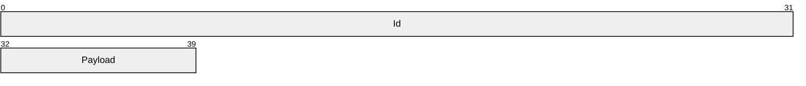
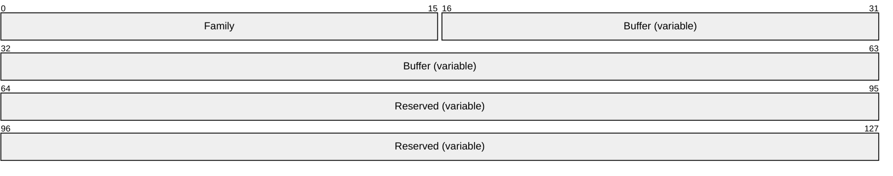
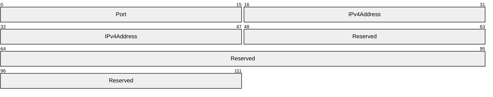
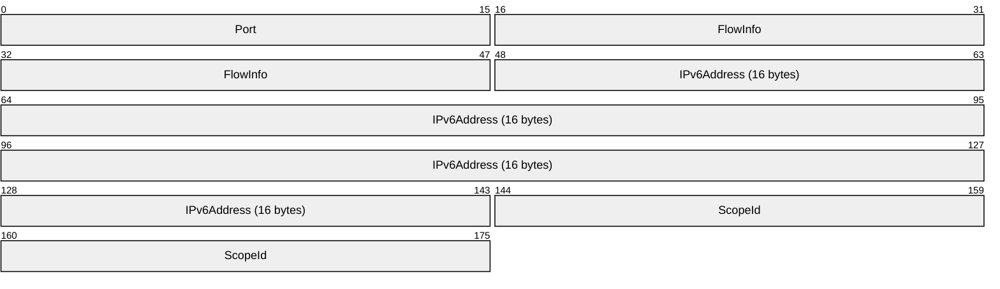
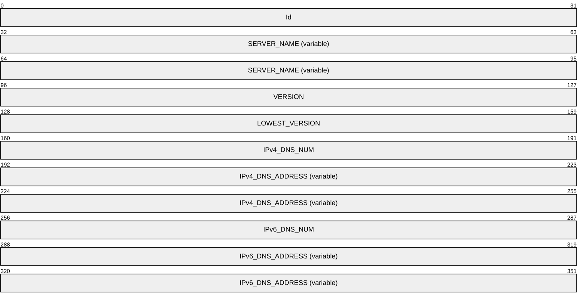
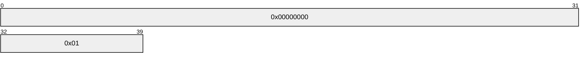
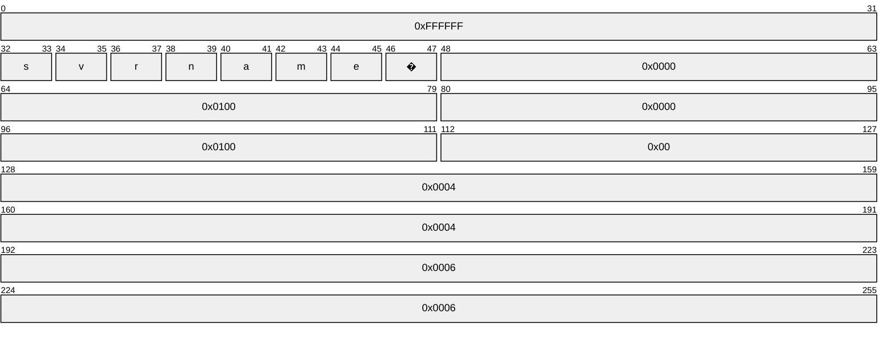

# [MS-SNID]: Server Network Information Discovery Protocol

Table of Contents

1 Introduction

- [1 Introduction](#Section_1)
  - [1.1 Glossary](#Section_1.1)
  - [1.2 References](#Section_1.2)
    - [1.2.1 Normative References](#Section_1.2.1)
    - [1.2.2 Informative References](#Section_1.2.2)
  - [1.3 Overview](#Section_1.3)
  - [1.4 Relationship to Other Protocols](#Section_1.4)
  - [1.5 Prerequisites/Preconditions](#Section_1.5)
  - [1.6 Applicability Statement](#Section_1.6)
  - [1.7 Versioning and Capability Negotiation](#Section_1.7)
  - [1.8 Vendor-Extensible Fields](#Section_1.8)
  - [1.9 Standards Assignments](#Section_1.9)

2 Messages

- [2 Messages](#Section_2)
  - [2.1 Transport](#Section_2.1)
  - [2.2 Message Syntax](#Section_2.2)
    - [2.2.1 Enumerations](#Section_2.2.1)
      - [2.2.1.1 Id Enumeration](#Section_2.2.1.1)
    - [2.2.2 Structures](#Section_2.2.2)
      - [2.2.2.1 Network Information Discovery Request](#Section_2.2.2.1)
      - [2.2.2.2 SOCKADDR_STORAGE](#Section_2.2.2.2)
        - [2.2.2.2.1 SOCKADDR_IN](#Section_2.2.2.2.1)
        - [2.2.2.2.2 SOCKADDR_IN6](#Section_2.2.2.2.2)
      - [2.2.2.3 Network Information Discovery Response](#Section_2.2.2.3)
    - [2.2.3 Namespaces](#Section_2.2.3)
    - [2.2.4 Messages](#Section_2.2.4)
  - [2.3 Directory Service Schema Elements](#Section_2.3)

3 Protocol Details

- [3 Protocol Details](#Section_3)
  - [3.1 Client Details](#Section_3.1)
    - [3.1.1 Abstract Data Model](#Section_3.1.1)
    - [3.1.2 Timers](#Section_3.1.2)
    - [3.1.3 Initialization](#Section_3.1.3)
    - [3.1.4 Higher-Layer Triggered Events](#Section_3.1.4)
    - [3.1.5 Message Processing Events and Sequencing Rules](#Section_3.1.5)
    - [3.1.6 Timer Events](#Section_3.1.6)
    - [3.1.7 Other Local Events](#Section_3.1.7)
  - [3.2 Server Details](#Section_3.2)
    - [3.2.1 Abstract Data Model](#Section_3.2.1)
    - [3.2.2 Timers](#Section_3.2.2)
    - [3.2.3 Initialization](#Section_3.2.3)
    - [3.2.4 Higher-Layer Triggered Events](#Section_3.2.4)
    - [3.2.5 Message Processing Events and Sequencing Rules](#Section_3.2.5)
    - [3.2.6 Timer Events](#Section_3.2.6)
    - [3.2.7 Other Local Events](#Section_3.2.7)

4 Protocol Examples

- [4 Protocol Examples](#Section_4)

5 Security

- [5 Security](#Section_5)
  - [5.1 Security Considerations for Implementers](#Section_5.1)
  - [5.2 Index of Security Parameters](#Section_5.2)

6 Appendix A: Product Behavior

- [6 Appendix A: Product Behavior](#Section_6)

7 Change Tracking

- [7 Change Tracking](#Section_7)

For the legal notice and IP terms, see [LEGAL.md](../LEGAL.md).
Last updated: 4/23/2024.
See [Revision History](#revision-history) for full version history.

# 1 Introduction

The Server Network Information Discovery Protocol is used by protocol clients to discover protocol servers within a UDP broadcast/multicast boundary on the same network. It enables protocol clients to get the server’s NetBIOS name, IP address, and networking configuration information.

Sections 1.5, 1.8, 1.9, 2, and 3 of this specification are normative. All other sections and examples in this specification are informative.

## 1.1 Glossary

This document uses the following terms:

**broadcast**: A style of resource location or data transmission in which a client makes a request to all parties on a network simultaneously (a one-to-many communication). Also, a mode of resource location that does not use a name service.

**Domain Name System (DNS)**: A hierarchical, distributed database that contains mappings of domain names to various types of data, such as IP addresses. DNS enables the location of computers and services by user-friendly names, and it also enables the discovery of other information stored in the database.

**Internet Protocol version 4 (IPv4)**: An Internet protocol that has 32-bit source and destination addresses. IPv4 is the predecessor of IPv6.

**Internet Protocol version 6 (IPv6)**: A revised version of the Internet Protocol (IP) designed to address growth on the Internet. Improvements include a 128-bit IP address size, expanded routing capabilities, and support for authentication and privacy.

**multicast**: Allows a host to send data to only those destinations that specifically request to receive the data. In this way, multicasting differs from sending broadcast data, because broadcast data is sent to all hosts. multicasting saves network bandwidth because [**multicast**](#gt_multicast) data is received only by those hosts that request the data, and the data travels over any link only once. multicasting saves server bandwidth because a server has to send only one [**multicast**](#gt_multicast) message per network instead of one unicast message per receiver.

**NetBIOS name**: A 16-byte address that is used to identify a NetBIOS resource on the network. For more information, see [[RFC1001]](https://go.microsoft.com/fwlink/?LinkId=90260) and [[RFC1002]](https://go.microsoft.com/fwlink/?LinkId=90261).

**scope**: A range of IP addresses and associated configuration options that are allocated to DHCP clients in a specific subnet.

**Unicode string**: A Unicode 8-bit string is an ordered sequence of 8-bit units, a Unicode 16-bit string is an ordered sequence of 16-bit code units, and a Unicode 32-bit string is an ordered sequence of 32-bit code units. In some cases, it could be acceptable not to terminate with a terminating null character. Unless otherwise specified, all [**Unicode strings**](#gt_unicode-string) follow the UTF-16LE encoding scheme with no Byte Order Mark (BOM).

**User Datagram Protocol (UDP)**: The connectionless protocol within TCP/IP that corresponds to the transport layer in the ISO/OSI reference model.

**MAY, SHOULD, MUST, SHOULD NOT, MUST NOT:** These terms (in all caps) are used as defined in [[RFC2119]](https://go.microsoft.com/fwlink/?LinkId=90317). All statements of optional behavior use either MAY, SHOULD, or SHOULD NOT.

## 1.2 References

Links to a document in the Microsoft Open Specifications library point to the correct section in the most recently published version of the referenced document. However, because individual documents in the library are not updated at the same time, the section numbers in the documents may not match. You can confirm the correct section numbering by checking the [Errata](https://go.microsoft.com/fwlink/?linkid=850906).

### 1.2.1 Normative References

We conduct frequent surveys of the normative references to assure their continued availability. If you have any issue with finding a normative reference, please contact [dochelp@microsoft.com](mailto:dochelp@microsoft.com). We will assist you in finding the relevant information.

[RFC2119] Bradner, S., "Key words for use in RFCs to Indicate Requirement Levels", BCP 14, RFC 2119, March 1997, [https://www.rfc-editor.org/info/rfc2119](https://go.microsoft.com/fwlink/?LinkId=90317)

[RFC768] Postel, J., "User Datagram Protocol", STD 6, RFC 768, August 1980, [https://www.rfc-editor.org/info/rfc768](https://go.microsoft.com/fwlink/?LinkId=90490)

### 1.2.2 Informative References

[RFC1001] Network Working Group, "Protocol Standard for a NetBIOS Service on a TCP/UDP Transport: Concepts and Methods", RFC 1001, March 1987, [https://www.rfc-editor.org/info/rfc1001](https://go.microsoft.com/fwlink/?LinkId=90260)

[RFC1002] Network Working Group, "Protocol Standard for a NetBIOS Service on a TCP/UDP Transport: Detailed Specifications", STD 19, RFC 1002, March 1987, [https://www.rfc-editor.org/info/rfc1002](https://go.microsoft.com/fwlink/?LinkId=90261)

## 1.3 Overview

The Server Network Information Discovery Protocol defines a pair of request and response messages by which a protocol client can locate protocol servers within the [**broadcast**](#gt_broadcast) /[**multicast**](#gt_multicast) [**scope**](#gt_scope). The protocol client can get network information from the servers, such as [**NetBIOS name**](#gt_netbios-name) (see [[RFC1001]](https://go.microsoft.com/fwlink/?LinkId=90260) and [[RFC1002]](https://go.microsoft.com/fwlink/?LinkId=90261)), [**Internet Protocol version 4 (IPv4)**](#gt_internet-protocol-version-4-ipv4), and [**Internet Protocol version 6 (IPv6)**](#gt_internet-protocol-version-6-ipv6) addresses. The protocol transports messages over [**User Datagram Protocol (UDP)**](#gt_user-datagram-protocol-udp) as specified in [[RFC768]](https://go.microsoft.com/fwlink/?LinkId=90490). A protocol client sends a UDP package to the IPv4 broadcast address and the IPv6 link-local scope multicast address using UDP. Protocol servers reply to the protocol client with a UDP package containing its NetBIOS name and [**Domain Name System (DNS)**](#gt_domain-name-system-dns) configuration of the protocol server.

## 1.4 Relationship to Other Protocols

The protocol relies on [**User Datagram Protocol (UDP)**](#gt_user-datagram-protocol-udp) as specified in [[RFC768]](https://go.microsoft.com/fwlink/?LinkId=90490).

## 1.5 Prerequisites/Preconditions

The protocol server allows the incoming [**UDP**](#gt_user-datagram-protocol-udp) package from port 8912 in the firewall.

## 1.6 Applicability Statement

The protocol server and client are connected to the same subnet with [**IPv4**](#gt_internet-protocol-version-4-ipv4) [**broadcast**](#gt_broadcast) support or [**IPv6**](#gt_internet-protocol-version-6-ipv6) link-local [**scope**](#gt_scope) [**multicast**](#gt_multicast) support.

## 1.7 Versioning and Capability Negotiation

The protocol version specifies the interoperability capability of the protocol on different Windows operating systems. See section [6](#Section_6) for detailed product behaviors of protocol versions and corresponding supported operating system. Protocol servers and clients with different protocol versions are not able to negotiate with each other.

## 1.8 Vendor-Extensible Fields

None.

## 1.9 Standards Assignments

| Parameter | Value | Reference |
| --- | --- | --- |
| UDP port | 8912 | http://www.iana.org/assignments/service-names-port-numbers/service-names-port-numbers.xml |

# 2 Messages

## 2.1 Transport

The protocol transports messages over [**UDP**](#gt_user-datagram-protocol-udp) as specified in [[RFC768]](https://go.microsoft.com/fwlink/?LinkId=90490). A protocol client MUST send one UDP package to the [**broadcast**](#gt_broadcast) ([**IPv4**](#gt_internet-protocol-version-4-ipv4)) address and [**multicast**](#gt_multicast) ([**IPv6**](#gt_internet-protocol-version-6-ipv6) link-local [**scope**](#gt_scope) all nodes) address using UDP port 8912. Protocol servers MUST reply to the protocol client with a UDP package containing its [**NetBIOS name**](#gt_netbios-name) and [**DNS**](#gt_domain-name-system-dns) configuration of the protocol server as specified later in this section.

## 2.2 Message Syntax

### 2.2.1 Enumerations

#### 2.2.1.1 Id Enumeration

The **Id** enumeration is used to distinguish the Network Information Discovery request and Network Information Discovery response package types.

| Bit Range | Field | Description |
| --- | --- | --- |
| Variable | **RequestIdentifier** 0x00000000 | Indicates that the package is a Network Information Discovery request from the protocol client to the protocol server. |
| Variable | **ResponseIdentifier** 0xFFFFFFFFF | Indicates that the package is a Network Information Discovery response from the protocol server to the protocol client. |

### 2.2.2 Structures

#### 2.2.2.1 Network Information Discovery Request

The package from protocol clients MUST set the **Id** field to **RequestIdentifier** and SHOULD include a single byte payload of any value.

**Id (4 bytes):** A message identifier to specify the package type of Network Information Discovery Request. The value MUST be **RequestIdentifier**, defined in [2.2.1.1](#Section_2.2.1.1).

**Payload (1 byte):** A package payload that contains the value.

#### 2.2.2.2 SOCKADDR_STORAGE

**SOCKADDR_STORAGE** is a 128-byte structure that is formatted as follows.

**Family (2 bytes):** The address family of the socket. This field MUST contain one of the following values.

| Value | Meaning |
| --- | --- |
| **InterNetwork** 0x0002 | When set, this indicates an [**IPv4**](#gt_internet-protocol-version-4-ipv4) address in the socket. |
| **InterNetworkV6** 0x0017 | When set, this indicates an [**IPv6**](#gt_internet-protocol-version-6-ipv6) address in the socket. |

**Buffer (variable):** A variable-length buffer that contains the socket address information. If the value of the **Family** field is 0x0002, this field MUST be interpreted as [SOCKADDR_IN (section 2.2.2.2.1)](#Section_2.2.2.2.1). Otherwise, if the value of the **Family** field is 0x0017, this field MUST be interpreted as [SOCKADDR_IN6 (section 2.2.2.2.2)](#Section_2.2.2.2.2).

**Reserved (variable):** The remaining bytes within the size of the **SOCKADDR_STORAGE** structure (128 bytes) MUST NOT be used and MUST be reserved. The server SHOULD set this to zero, and the client MUST ignore it on receipt.

##### 2.2.2.2.1 SOCKADDR_IN

**SOCKADDR_IN** is a 14-byte structure formatted as follows. All fields in this structure are in network byte order.

**Port (2 bytes):** This field MUST NOT be used and MUST be reserved. The server SHOULD set this field to zero, and the client MUST ignore it on receipt.

**IPv4Address (4 bytes):** The IPv4 address.

**Reserved (8 bytes):** This field MUST NOT be used and MUST be reserved. The server SHOULD set this field to zero, and the client MUST ignore it on receipt.

##### 2.2.2.2.2 SOCKADDR_IN6

**SOCKADDR_IN6** is a 26-byte structure formatted as follows. All fields in this structure are in network byte order.

**Port (2 bytes):** This field MUST NOT be used and MUST be reserved. The server SHOULD set this field to zero, and the client MUST ignore it on receipt.

**FlowInfo (4 bytes):** The server SHOULD set this field to zero, and the client MUST ignore it on receipt.

**IPv6Address (16 bytes):** IPv6 address.

**ScopeId (4 bytes):** The server SHOULD set this field to zero, and the client MUST ignore it on receipt.

#### 2.2.2.3 Network Information Discovery Response

The package from protocol servers MUST set all fields with the format described in this section. There is no alignment requirement for fields after the variable **SERVER_NAME**, but all fields after that variable are presented in a specific structure with fixed size.

**Id (4 bytes):** Message identifier to specify the package type of Network Information Discovery Response. The value MUST be **ResponseIdentifier**, defined in section [2.2.1.1](#Section_2.2.1.1).

**SERVER_NAME (variable):** The protocol server's [**NetBIOS name**](#gt_netbios-name) in a null-terminated [**Unicode string**](#gt_unicode-string).

**VERSION (4 bytes):** The current version of the protocol package. The protocol server MUST set this field to the corresponding protocol version it is using. The value for this field MUST be 256 or 512. If the field is set to 256, all fields starting from **IPv4_DNS_NUM** are ignored by the protocol client.

**LOWEST_VERSION (4 bytes):** The lowest version of the protocol package that the protocol server supports. The value of this field MUST be 256 or 512.

**IPv4_DNS_NUM (4 bytes):** The number of elements stored in **IPv4_DNS_ADDRESS**. This field is set to a value greater than or equal to 0x00000000 if the following IP address fields are used. It is set to 0xFFFFFFFF to ignore all following fields in the message.

**IPv4_DNS_ADDRESS (variable):** A list of IP addresses stored in the **SOCKADDR_STORAGE** structure, 128 bytes each. The total number MUST be equal to **IPv4_DNS_NUM**.

**IPv6_DNS_NUM (4 bytes):** The number of elements stored in **IPv6_DNS_ADDRESS**. The value MUST be greater than or equal to 0x00000000.

**IPv6_DNS_ADDRESS (variable):** A list of IP addresses stored in the **SOCKADDR_STORAGE** structure, 128 bytes each. The total number MUST be equal to **IPv6_DNS_NUM**.

### 2.2.3 Namespaces

None.

### 2.2.4 Messages

| Message | Description |
| --- | --- |
| Network information discovery request | The UDP broadcast packages are sent from protocol clients to discover protocol servers within the broadcast scope. |
| Network information discovery response | The UDP packages are sent from protocol servers to protocol clients to respond to the discovery package and to carry the protocol server network information. |

## 2.3 Directory Service Schema Elements

None.

# 3 Protocol Details

## 3.1 Client Details

### 3.1.1 Abstract Data Model

None.

### 3.1.2 Timers

None.

### 3.1.3 Initialization

None.

### 3.1.4 Higher-Layer Triggered Events

None.

### 3.1.5 Message Processing Events and Sequencing Rules

The protocol client creates a socket on a randomly selected port and sends a Network Information Discovery Request with an [Id (section 2.2.1.1)](#Section_2.2.1.1) defined and a payload to the [**IPv4**](#gt_internet-protocol-version-4-ipv4) broadcast address and [**IPv6**](#gt_internet-protocol-version-6-ipv6) link-local all nodes multicast address.

The protocol client then listens to the same port waiting for the Network Information Discovery Response.

### 3.1.6 Timer Events

None.

### 3.1.7 Other Local Events

None.

## 3.2 Server Details

### 3.2.1 Abstract Data Model

None.

### 3.2.2 Timers

None.

### 3.2.3 Initialization

The protocol server creates a [**UDP**](#gt_user-datagram-protocol-udp) socket that listens to port 8912 when the protocol is started.

### 3.2.4 Higher-Layer Triggered Events

None.

### 3.2.5 Message Processing Events and Sequencing Rules

When the server receives a [**UDP**](#gt_user-datagram-protocol-udp) Network Information Discovery request package from port 8912, it checks the **Id** in the package. If the **Id** is not a correct request **Id** as defined in section [2.2.1.1](#Section_2.2.1.1), the package is ignored. If the **Id** is the correct request **Id** as defined in section 2.2.1.1, the server finds the [**NetBIOS name**](#gt_netbios-name) and all [**DNS**](#gt_domain-name-system-dns) addresses on its network adapters and then sets the corresponding fields of the Network Information Discovery response package.

### 3.2.6 Timer Events

None.

### 3.2.7 Other Local Events

None.

# 4 Protocol Examples

Network Information Discovery Request

Network Information Discovery Response

The example response package's **IPv4_DNS_ADDRESS** field contains four elements of the **SOCKADDR_STORAGE** structure, and the **IPv6_DNS_ADDRESS** field contains six elements of **SOCKADDR_STORAGE** structure.

# 5 Security

## 5.1 Security Considerations for Implementers

None.

## 5.2 Index of Security Parameters

None.

# 6 Appendix A: Product Behavior

The information in this specification is applicable to the following Microsoft products or supplemental software. References to product versions include updates to those products.

- Windows Home Server 2011 server software
- Windows Small Business Server 2011 Essentials
- Windows Server 2012 operating system
- Windows Server 2012 R2 operating system
- Windows Server 2016 operating system
- Windows Server 2019 operating system
- Windows Server 2022 operating system
- Windows Server 2025 operating system
Exceptions, if any, are noted in this section. If an update version, service pack or Knowledge Base (KB) number appears with a product name, the behavior changed in that update. The new behavior also applies to subsequent updates unless otherwise specified. If a product edition appears with the product version, behavior is different in that product edition.

Unless otherwise specified, any statement of optional behavior in this specification that is prescribed using the terms "SHOULD" or "SHOULD NOT" implies product behavior in accordance with the SHOULD or SHOULD NOT prescription. Unless otherwise specified, the term "MAY" implies that the product does not follow the prescription.

# 7 Change Tracking

This section identifies changes that were made to this document since the last release. Changes are classified as Major, Minor, or None.

The revision class **Major** means that the technical content in the document was significantly revised. Major changes affect protocol interoperability or implementation. Examples of major changes are:

- A document revision that incorporates changes to interoperability requirements.
- A document revision that captures changes to protocol functionality.
The revision class **Minor** means that the meaning of the technical content was clarified. Minor changes do not affect protocol interoperability or implementation. Examples of minor changes are updates to clarify ambiguity at the sentence, paragraph, or table level.

The revision class **None** means that no new technical changes were introduced. Minor editorial and formatting changes may have been made, but the relevant technical content is identical to the last released version.

The changes made to this document are listed in the following table. For more information, please contact [dochelp@microsoft.com](mailto:dochelp@microsoft.com).

| Section | Description | Revision class |
| --- | --- | --- |
| [6](#Section_6) Appendix A: Product Behavior | Added Windows Server 2025 to the list of applicable products. | Major |

## Revision History

| Date | Version | Revision Class | Comments |
| --- | --- | --- | --- |
| 8/8/2013 | 1.0 | New | Released new document. |
| 11/14/2013 | 2.0 | Major | Updated and revised the technical content. |
| 2/13/2014 | 2.0 | None | No changes to the meaning, language, or formatting of the technical content. |
| 5/15/2014 | 2.0 | None | No changes to the meaning, language, or formatting of the technical content. |
| 6/30/2015 | 2.0 | None | No changes to the meaning, language, or formatting of the technical content. |
| 7/14/2016 | 2.0 | None | No changes to the meaning, language, or formatting of the technical content. |
| 6/1/2017 | 2.0 | None | No changes to the meaning, language, or formatting of the technical content. |
| 9/12/2018 | 3.0 | Major | Significantly changed the technical content. |
| 4/7/2021 | 4.0 | Major | Significantly changed the technical content. |
| 4/23/2024 | 5.0 | Major | Significantly changed the technical content. |
