# [MS-SNTP]: Network Time Protocol (NTP) Authentication Extensions

Table of Contents

1 Introduction

- [1 Introduction](#Section_1)
  - [1.1 Glossary](#Section_1.1)
  - [1.2 References](#Section_1.2)
    - [1.2.1 Normative References](#Section_1.2.1)
    - [1.2.2 Informative References](#Section_1.2.2)
  - [1.3 Overview](#Section_1.3)
    - [1.3.1 Background](#Section_1.3.1)
    - [1.3.2 Extensions](#Section_1.3.2)
  - [1.4 Relationship to Other Protocols](#Section_1.4)
  - [1.5 Prerequisites/Preconditions](#Section_1.5)
    - [1.5.1 Client Configuration for Authentication](#Section_1.5.1)
  - [1.6 Applicability Statement](#Section_1.6)
  - [1.7 Versioning and Capability Negotiation](#Section_1.7)
  - [1.8 Vendor-Extensible Fields](#Section_1.8)
  - [1.9 Standards Assignments](#Section_1.9)

2 Messages

- [2 Messages](#Section_2)
  - [2.1 Transport](#Section_2.1)
  - [2.2 Message Syntax](#Section_2.2)
    - [2.2.1 Client NTP Request](#Section_2.2.1)
    - [2.2.2 Server NTP Response](#Section_2.2.2)
    - [2.2.3 Client ExtendedAuthenticator NTP Request](#Section_2.2.3)
    - [2.2.4 Server ExtendedAuthenticator NTP Response](#Section_2.2.4)

3 Protocol Details

- [3 Protocol Details](#Section_3)
  - [3.1 Client Details](#Section_3.1)
    - [3.1.1 Abstract Data Model](#Section_3.1.1)
    - [3.1.2 Timers](#Section_3.1.2)
      - [3.1.2.1 Client Polling Timer](#Section_3.1.2.1)
      - [3.1.2.2 Domain Controller Time Source Location Retry Timer](#Section_3.1.2.2)
    - [3.1.3 Initialization](#Section_3.1.3)
      - [3.1.3.1 Initialization Steps](#Section_3.1.3.1)
      - [3.1.3.2 Domain Time Source Selection Algorithm](#Section_3.1.3.2)
    - [3.1.4 Higher-Layer Triggered Events](#Section_3.1.4)
      - [3.1.4.1 Domain Join Processing](#Section_3.1.4.1)
      - [3.1.4.2 Domain Unjoin Processing](#Section_3.1.4.2)
      - [3.1.4.3 Group Policy Update Notification](#Section_3.1.4.3)
      - [3.1.4.4 Service Control Manager Update Notification](#Section_3.1.4.4)
      - [3.1.4.5 Network Change Notification](#Section_3.1.4.5)
    - [3.1.5 Message Processing Events and Sequencing Rules](#Section_3.1.5)
      - [3.1.5.1 Authentication Request Behavior](#Section_3.1.5.1)
      - [3.1.5.2 Special Root Dispersion Behavior](#Section_3.1.5.2)
      - [3.1.5.3 Test 7 Behavior](#Section_3.1.5.3)
      - [3.1.5.4 Spike Watch Mechanism](#Section_3.1.5.4)
      - [3.1.5.5 Crypto checksum generation](#Section_3.1.5.5)
    - [3.1.6 Timer Events](#Section_3.1.6)
      - [3.1.6.1 Client Polling Timer Event](#Section_3.1.6.1)
      - [3.1.6.2 Domain Controller Time Source Location Retry Timer Event](#Section_3.1.6.2)
    - [3.1.7 Other Local Events](#Section_3.1.7)
    - [3.1.8 Clock Selection](#Section_3.1.8)
    - [3.1.9 Domain Controller Time Source Initialization](#Section_3.1.9)
  - [3.2 Server Details](#Section_3.2)
    - [3.2.1 Abstract Data Model](#Section_3.2.1)
    - [3.2.2 Timers](#Section_3.2.2)
    - [3.2.3 Initialization](#Section_3.2.3)
      - [3.2.3.1 Initializing NetLogon Service Bits](#Section_3.2.3.1)
      - [3.2.3.2 Initializing Request Chaining](#Section_3.2.3.2)
    - [3.2.4 Higher-Layer Triggered Events](#Section_3.2.4)
      - [3.2.4.1 Group Policy Update Notification](#Section_3.2.4.1)
      - [3.2.4.2 Service Control Manager Update Notification](#Section_3.2.4.2)
      - [3.2.4.3 Network Change Notification](#Section_3.2.4.3)
    - [3.2.5 Message Processing Events and Sequencing Rules](#Section_3.2.5)
      - [3.2.5.1 Authentication Response Behavior](#Section_3.2.5.1)
        - [3.2.5.1.1 Domain Controller Processing of the Authenticated Server NTP Response](#Section_3.2.5.1.1)
        - [3.2.5.1.2 Read-only Domain Controller Processing of the Authenticated Server NTP Response](#Section_3.2.5.1.2)
        - [3.2.5.1.3 Non-Domain Controller Processing of the Authenticated Server NTP Response](#Section_3.2.5.1.3)
      - [3.2.5.2 LocalClockDispersion Processing](#Section_3.2.5.2)
      - [3.2.5.3 Chaining-Cache Cleaning Processing](#Section_3.2.5.3)
    - [3.2.6 Timer Events](#Section_3.2.6)
    - [3.2.7 Other Local Events](#Section_3.2.7)

4 Protocol Examples

- [4 Protocol Examples](#Section_4)

5 Security

- [5 Security](#Section_5)
  - [5.1 Security Considerations for Implementers](#Section_5.1)
  - [5.2 Index of Security Parameters](#Section_5.2)

6 Appendix A: Product Behavior

- [6 Appendix A: Product Behavior](#Section_6)

7 Change Tracking

- [7 Change Tracking](#Section_7)

For the legal notice and IP terms, see [LEGAL.md](../LEGAL.md).
Last updated: 4/23/2024.
See [Revision History](#revision-history) for full version history.

# 1 Introduction

The Network Time Protocol (NTP) Authentication Extensions consist of two authentication extensions that extend the Network Time Protocol (NTP) version 3, as specified in [[RFC1305]](https://go.microsoft.com/fwlink/?LinkId=90272), and the Simple Network Time Protocol (SNTP) version 4, as specified in [[RFC2030]](https://go.microsoft.com/fwlink/?LinkId=103353).

[RFC1305] Appendix C describes a mechanism similar to the authentication extensions documented here. The extensions documented here provide a strong checksum algorithm and use keying material that is readily available to systems joined to a [**domain**](#gt_domain).

SNTP, as specified in [RFC2030], provides a simplified version of NTP. [RFC2030] section 4 refers to the **Authenticator** field of [RFC1305] Appendix A; the first extension documented here replaces that referral and specifies the way in which an SNTP message exchange can be secured; the second extension defines an **ExtendedAuthenticator** field that extends the NTP version 3 message format.

Sections 1.5, 1.8, 1.9, 2, and 3 of this specification are normative. All other sections and examples in this specification are informative.

## 1.1 Glossary

This document uses the following terms:

**domain**: A set of users and computers sharing a common namespace and management infrastructure. At least one computer member of the set has to act as a [**domain controller (DC)**](#gt_domain-controller-dc) and host a member list that identifies all members of the domain, as well as optionally hosting the Active Directory service. The domain controller provides authentication of members, creating a unit of trust for its members. Each domain has an identifier that is shared among its members. For more information, see [MS-AUTHSOD](../MS-AUTHSOD/MS-AUTHSOD.md) section 1.1.1.5 and [MS-ADTS](../MS-ADTS/MS-ADTS.md).

**domain controller (DC)**: The service, running on a server, that implements Active Directory, or the server hosting this service. The service hosts the data store for objects and interoperates with other [**DCs**](#gt_domain-controller-dc) to ensure that a local change to an object replicates correctly across all [**DCs**](#gt_domain-controller-dc). When Active Directory is operating as Active Directory Domain Services (AD DS), the [**DC**](#gt_domain-controller-dc) contains full NC replicas of the configuration naming context (config NC), schema naming context (schema NC), and one of the domain NCs in its forest. If the AD DS [**DC**](#gt_domain-controller-dc) is a global catalog server (GC server), it contains partial NC replicas of the remaining domain NCs in its forest. For more information, see [MS-AUTHSOD] section 1.1.1.5.2 and [MS-ADTS]. When Active Directory is operating as Active Directory Lightweight Directory Services (AD LDS), several AD LDS [**DCs**](#gt_domain-controller-dc) can run on one server. When Active Directory is operating as AD DS, only one AD DS [**DC**](#gt_domain-controller-dc) can run on one server. However, several AD LDS [**DCs**](#gt_domain-controller-dc) can coexist with one AD DS [**DC**](#gt_domain-controller-dc) on one server. The AD LDS [**DC**](#gt_domain-controller-dc) contains full NC replicas of the config NC and the schema NC in its forest. The domain controller is the server side of Authentication Protocol Domain Support [MS-APDS](../MS-APDS/MS-APDS.md).

**domain controller locator**: A function within a [**domain**](#gt_domain) that provides for location of a [**domain controller (DC)**](#gt_domain-controller-dc) and the ability to determine certain properties of [**DCs**](#gt_domain-controller-dc). For more information, see [MS-ADTS].

**fully qualified domain name (FQDN)**: An unambiguous domain name that gives an absolute location in the Domain Name System's (DNS) hierarchy tree, as defined in [[RFC1035]](https://go.microsoft.com/fwlink/?LinkId=90264) section 3.1 and [[RFC2181]](https://go.microsoft.com/fwlink/?LinkId=127732) section 11.

**primary domain controller (PDC)**: A [**domain controller (DC)**](#gt_domain-controller-dc) designated to track changes made to the accounts of all computers on a [**domain**](#gt_domain). It is the only computer to receive these changes directly, and is specialized so as to ensure consistency and to eliminate the potential for conflicting entries in the Active Directory database. A [**domain**](#gt_domain) has only one [**PDC**](#gt_primary-domain-controller-pdc).

**read-only domain controller (RODC)**: A [**domain controller (DC)**](#gt_domain-controller-dc) that does not accept originating updates. Additionally, an [**RODC**](#gt_read-only-domain-controller-rodc) does not perform outbound replication. An RODC cannot be the primary domain controller (PDC) for its domain.

**relative identifier (RID)**: The last item in the series of SubAuthority values in a [**security identifier (SID)**](#gt_security-identifier-sid) [[SIDD]](https://go.microsoft.com/fwlink/?LinkId=90516). It distinguishes one account or group from all other accounts and groups in the domain. No two accounts or groups in any domain share the same RID.

**security identifier (SID)**: An identifier for [**security principals**](#gt_security-principal) that is used to identify an account or a group. Conceptually, the [**SID**](#gt_security-identifier-sid) is composed of an account authority portion (typically a [**domain**](#gt_domain)) and a smaller integer representing an identity relative to the account authority, termed the [**relative identifier (RID)**](#gt_relative-identifier-rid). The [**SID**](#gt_security-identifier-sid) format is specified in [MS-DTYP](../MS-DTYP/MS-DTYP.md) section 2.4.2; a string representation of [**SIDs**](#gt_security-identifier-sid) is specified in [MS-DTYP] section 2.4.2 and [MS-AZOD](../MS-AZOD/MS-AZOD.md) section 1.1.1.2.

**security principal**: A unique entity that is identifiable through cryptographic means by at least one key. It frequently corresponds to a human user, but also can be a service that offers a resource to other security principals. Also referred to as principal.

**time service**: A system service that implements support for synchronizing a computer's local time with a time source.

**writable domain controller (writable DC)**: Synonymous with [**domain controller (DC)**](#gt_domain-controller-dc), as distinct from an [**RODC**](#gt_read-only-domain-controller-rodc).

**MAY, SHOULD, MUST, SHOULD NOT, MUST NOT:** These terms (in all caps) are used as defined in [[RFC2119]](https://go.microsoft.com/fwlink/?LinkId=90317). All statements of optional behavior use either MAY, SHOULD, or SHOULD NOT.

## 1.2 References

Links to a document in the Microsoft Open Specifications library point to the correct section in the most recently published version of the referenced document. However, because individual documents in the library are not updated at the same time, the section numbers in the documents may not match. You can confirm the correct section numbering by checking the [Errata](https://go.microsoft.com/fwlink/?linkid=850906).

### 1.2.1 Normative References

We conduct frequent surveys of the normative references to assure their continued availability. If you have any issue with finding a normative reference, please contact [dochelp@microsoft.com](mailto:dochelp@microsoft.com). We will assist you in finding the relevant information.

[FIPS180-3] FIPS PUBS, "Secure Hash Standard (SHS)", FIPS PUB 180-3, October 2008, [https://csrc.nist.gov/csrc/media/publications/fips/180/3/archive/2008-10-31/documents/fips180-3_final.pdf](https://go.microsoft.com/fwlink/?LinkId=180409)

[MS-ADTS] Microsoft Corporation, "[Active Directory Technical Specification](../MS-ADTS/MS-ADTS.md)".

[MS-DSSP] Microsoft Corporation, "[Directory Services Setup Remote Protocol](../MS-DSSP/MS-DSSP.md)".

[MS-DTYP] Microsoft Corporation, "[Windows Data Types](../MS-DTYP/MS-DTYP.md)".

[MS-GPOL] Microsoft Corporation, "[Group Policy: Core Protocol](../MS-GPOL/MS-GPOL.md)".

[MS-NLMP] Microsoft Corporation, "[NT LAN Manager (NTLM) Authentication Protocol](../MS-NLMP/MS-NLMP.md)".

[MS-NRPC] Microsoft Corporation, "[Netlogon Remote Protocol](../MS-NRPC/MS-NRPC.md)".

[MS-RRP] Microsoft Corporation, "[Windows Remote Registry Protocol](../MS-RRP/MS-RRP.md)".

[MS-SCMR] Microsoft Corporation, "[Service Control Manager Remote Protocol](../MS-SCMR/MS-SCMR.md)".

[MS-W32T] Microsoft Corporation, "[W32Time Remote Protocol](../MS-W32T/MS-W32T.md)".

[RFC1305] Mills, D. L., "Network Time Protocol (Version 3) Specification, Implementation and Analysis", RFC 1305, March 1992, [https://www.rfc-editor.org/info/rfc1305](https://go.microsoft.com/fwlink/?LinkId=90272)

[RFC1321] Rivest, R., "The MD5 Message-Digest Algorithm", RFC 1321, April 1992, [https://www.rfc-editor.org/info/rfc1321](https://go.microsoft.com/fwlink/?LinkId=90275)

[RFC2030] Mills, D., "Simple Network Time Protocol (SNTP) Version 4 for IPv4, IPv6 and OSI", RFC 2030, October 1996, [https://www.rfc-editor.org/info/rfc2030](https://go.microsoft.com/fwlink/?LinkId=103353)

[RFC2119] Bradner, S., "Key words for use in RFCs to Indicate Requirement Levels", BCP 14, RFC 2119, March 1997, [https://www.rfc-editor.org/info/rfc2119](https://go.microsoft.com/fwlink/?LinkId=90317)

[SP800-108] National Institute of Standards and Technology., "Special Publication 800-108, Recommendation for Key Derivation Using Pseudorandom Functions", October 2009, [https://csrc.nist.gov/publications/detail/sp/800-108/final](https://go.microsoft.com/fwlink/?LinkId=186039)

### 1.2.2 Informative References

[MD5Collision] Klima, V., "Tunnels in Hash Functions: MD5 Collisions Within a Minute", March 2006, [http://eprint.iacr.org/2006/105.pdf](https://go.microsoft.com/fwlink/?LinkId=89937)

[MS-AUTHSOD] Microsoft Corporation, "[Authentication Services Protocols Overview](../MS-AUTHSOD/MS-AUTHSOD.md)".

[MSFT-WTSRE] Microsoft Corporation, "Windows Time Service Registry Entries", [http://technet.microsoft.com/en-us/library/cc773263(WS.10).aspx#w2k3tr_times_tools_uhlp](https://go.microsoft.com/fwlink/?LinkId=206411)

[MSWINREG] Microsoft Corporation, "Registry", [http://msdn.microsoft.com/en-us/library/ms724871.aspx](https://go.microsoft.com/fwlink/?LinkId=90221)

## 1.3 Overview

### 1.3.1 Background

NTP version 3 [[RFC1305]](https://go.microsoft.com/fwlink/?LinkId=90272) is used to synchronize time between a client and a server. The client sends a request for time synchronization information to the server, and the server replies with the information requested.

The NTP authentication extension in [RFC1305] Appendix C is designed to protect against unauthorized responses by using a crypto-checksum computed by the server and checked by the client. The computation that is used is a predefined encryption algorithm with cryptographic keys indexed by a key identifier included in the message. However, no provisions exist in [RFC1305] for how to securely distribute and maintain cryptographic keys or the key identifier. The extensions described in this document explain how the Windows implementation of the NTP protocol performs authentication utilizing the NTP packet format defined in [[RFC2030]](https://go.microsoft.com/fwlink/?LinkId=103353) with a custom implementation of [RFC1305] Appendix C authentication, as described in section [2.2](#Section_2.2).

SNTP [RFC2030] is a simplified version of NTP that provides a coarser granularity of clock synchronization. [RFC2030] itself does not provide for authentication and refers to the relevant authentication fields of [RFC1305] Appendix C. The **Authenticator** extension specified in this document provides a way to add authentication to SNTP to the same degree as provided in NTP. The **ExtendedAuthenticator** extension specified in this document provides a similar mechanism, but with an increased level of cryptographic security.

[RFC1305] section 3 refers to the local clock in NTP. There can be implementation-specific parameters that affect the algorithms governing the local clock. See [[MSFT-WTSRE]](https://go.microsoft.com/fwlink/?LinkId=206411) for an informative description of examples of such parameters.

### 1.3.2 Extensions

The NTP Authentication Extensions use the Netlogon Remote Protocol (as specified in [MS-NRPC](../MS-NRPC/MS-NRPC.md)) in a [**domain**](#gt_domain) environment for authentication between a client and server that are capable of establishing a secure connection.

As specified in [MS-NRPC] section 3.5.4.3, the client uses the Netlogon [**domain controller locator**](#gt_domain-controller-locator) service to find a [**domain controller (DC)**](#gt_domain-controller-dc) that is a time source. The client and domain controller need to have pre-established trusted account information in the domain. The preestablished trusted account information is used to establish cryptographic keys and associated key identifiers for NTP authentication between the client and server.

The client sends an authentication request for time-synchronization information with the key identifier. The server constructs the response with the time information requested. The server computes the crypto-checksum of the message. The server replies in an authentication response with the time information requested and the computed crypto-checksum. The client authenticates the authentication response by computing and matching the checksum. The client accepts only authenticated responses. The sequence diagram is as described in sections [3.1.5](#Section_3.1.5) and [3.2.5](#Section_3.2.5).

This document describes an authentication mechanism that differs from the interim NTP authentication extension defined in [[RFC1305]](https://go.microsoft.com/fwlink/?LinkId=90272) Appendix C as follows:

- Uses a modified authenticator format and semantics, as described in section [2.2](#Section_2.2).
- Uses a modified algorithm to compute the checksum, as described in sections 3.1.5 and 3.2.5.
- Specifies how keys are identified by a client that is synchronizing time using the authentication extension against a DC, as described in sections [3.1.3](#Section_3.1.3), 3.1.5, and [3.1.6](#Section_3.1.6).
- Specifies how key identifiers are interpreted by a server that is providing time synchronization for a client using the authentication extension, as described in section 3.2.5.
- Uses modified authentication procedures, as described in sections 3.1.5, 3.1.6, and 3.2.5.
The NTP Authentication Extensions also apply to SNTP, as specified in [[RFC2030]](https://go.microsoft.com/fwlink/?LinkId=103353). The extensions specified in this document override the statements in [RFC2030] section 4 pertaining to the **Authenticator** field, and instead specify how the field is to be used and interpreted.

The NTP Authentication Extensions are defined only for the following NTP and SNTP association modes (as specified in [RFC1305] sections 3.2.1 and 3.3): client, server, and symmetric active. The client/server mode refers to the roles within the context of the NTP protocol, as opposed to roles within a network system.

As well as extending [RFC1305], the NTP Authentication Extensions apply directly to SNTP, as specified in [RFC2030]. For simplicity, only the terms NTP and [RFC1305] are generally used in the main body of this document. All references to NTP and [RFC1305] apply equally to SNTP and [RFC2030] unless the text clearly specifies otherwise.<1>

## 1.4 Relationship to Other Protocols

For locating a [**domain controller (DC)**](#gt_domain-controller-dc) that is a time source, these extensions rely on the Netlogon [**domain controller locator**](#gt_domain-controller-locator) service, as specified in [MS-NRPC](../MS-NRPC/MS-NRPC.md) section 3.5.4.3. For authenticating message exchanges, these extensions rely on NetLogon message protection methods, as specified in [MS-NRPC] section 3.5.4.8.

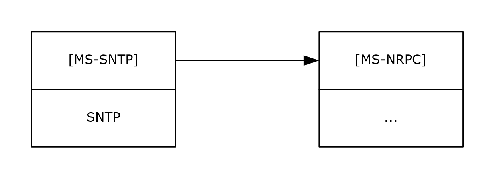

Figure 1: Protocol relationships

The W32Time Remote Protocol, as specified in [MS-W32T](../MS-W32T/MS-W32T.md), is an RPC interface protocol used for controlling and monitoring the Windows implementation of NTP. The protocol relationship between the W32Time Remote Protocol and this protocol is illustrated in [MS-W32T] section 1.4.

## 1.5 Prerequisites/Preconditions

The NTP Authentication Extensions specify NTP authentication in a [**domain**](#gt_domain) environment. The extensions, which rely on the Netlogon Remote Protocol (as specified in [MS-NRPC](../MS-NRPC/MS-NRPC.md)), assume that a secure connection can be established between the client and a [**DC**](#gt_domain-controller-dc).

### 1.5.1 Client Configuration for Authentication

A client might need to be manually configured to participate in the NTP Authentication Extensions detailed in this specification.

On a machine that is joined to a domain, the client uses these authentication extensions to synchronize time.

## 1.6 Applicability Statement

The NTP Authentication Extensions are designed for authenticated time synchronization in domains between clients and [**domain controllers**](#gt_domain-controller-dc).

Clients that are joined to a domain use the NTP Authentication Extensions to synchronize time.

## 1.7 Versioning and Capability Negotiation

The NTP Authentication Extensions incorporate implicit capability negotiation based on the NTP message length, as described in sections [3.1.5](#Section_3.1.5), [3.1.6](#Section_3.1.6), and [3.2.5](#Section_3.2.5).

NTP version 3, as specified in [[RFC1305]](https://go.microsoft.com/fwlink/?LinkId=90272), and SNTP version 4, as specified in [[RFC2030]](https://go.microsoft.com/fwlink/?LinkId=103353), apply to this extension.

## 1.8 Vendor-Extensible Fields

The NTP Authentication Extensions do not define any vendor-extensible fields. They do, however, redefine the **Authenticator** field of [[RFC1305]](https://go.microsoft.com/fwlink/?LinkId=90272) from 96 to 160 bits (per [[RFC2030]](https://go.microsoft.com/fwlink/?LinkId=103353)), as described in section [2.2](#Section_2.2).

## 1.9 Standards Assignments

The NTP Authentication Extensions do not use any additional standards assignments other than the ones in the base protocols.

# 2 Messages

This section describes how the **Authenticator** and **ExtendedAuthenticator** fields are encapsulated on the wire.

## 2.1 Transport

All NTP messages are transported through the User Datagram Protocol (UDP) in the NTP data format, as specified in [[RFC1305]](https://go.microsoft.com/fwlink/?LinkId=90272) Appendix A.

NTP messages do not include a message length field. The NTP message length is calculated based on the payload length in the UDP header and excludes the length of the UDP header.

Security parameters used in the NTP Authentication Extensions are key identifiers, as described in sections [3.1.6](#Section_3.1.6) and [3.2.5](#Section_3.2.5).

## 2.2 Message Syntax

This document defines four NTP message formats. Two of these formats (sections [2.2.1](#Section_2.2.1) and [2.2.2](#Section_2.2.2)) conform to [[RFC2030]](https://go.microsoft.com/fwlink/?LinkId=103353) section 4 and implement the optional **Authenticator** field. The other two formats (sections [2.2.3](#Section_2.2.3) and [2.2.4](#Section_2.2.4)) define an extension to the NTP Version 3 message format called the **ExtendedAuthenticator** field. For more information on NTP Version 3 message formats, see [[RFC1305]](https://go.microsoft.com/fwlink/?LinkId=90272) Appendix A.

**Note** In accordance with [RFC1305], all fields are in big-endian (network byte order) format unless otherwise specified.

The **Authenticator** message format is specified as follows.

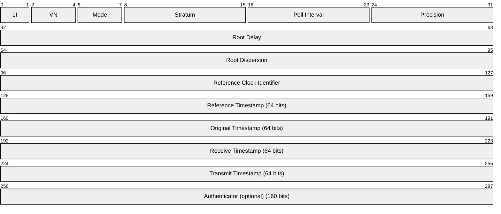

The **ExtendedAuthenticator** message format is specified as follows.

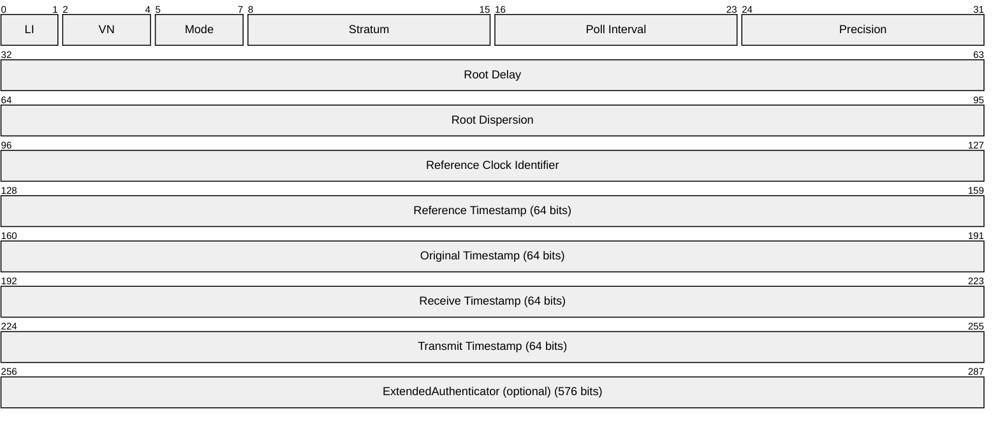

The MS-SNTP protocol supports modes according to [RFC1305] section 3.4.2 (Table 5 "Modes and Actions"), except that it does not support broadcast clients, NTP control messages, or symmetric passive mode. The NTP Authentication Extensions are defined only for the following NTP and SNTP association modes (as specified in [RFC1305] sections 3.2.1 and 3.3): client, server, and symmetric active, as defined in this document.

The minimum polling interval (NTP.MINPOLL) and maximum polling interval (NTP.MAXPOLL) are defined in [RFC1305] section 3.2.7, Table 4. These intervals are not configurable using the NTP Authentication Extensions.<2>

The following is an ASCII identifier for the **Reference Clock Identifier** field in addition to those defined in [RFC2030] section 4 "NTP Message Format".

| Code | Informative Meaning |
| --- | --- |
| VMTP | Uncalibrated virtual local clock. |

If IPv6 is used as the transport mechanism, an MD5 hash [[RFC1321]](https://go.microsoft.com/fwlink/?LinkId=90275) of the IPv6 address is calculated and the least significant 32 bits of the hash are used to set the **Reference Clock Identifier** field. By using a hash of the IPv6 address, a time source can be relatively identified in its uniqueness.

The optional **Authenticator** field used in the NTP authentication extension was originally defined in [RFC1305] Appendix C as a 96-bit field.

The **Authenticator** field is a 160-bit field. The **ExtendedAuthenticator** field is a 576-bit field. When using one of these extensions, the total NTP message length is 68 bytes or 120 bytes, respectively. Clients and [**domain controllers**](#gt_domain-controller-dc) rely on the NTP message length to detect the use of these extensions. For more information about the **Authenticator** field, see sections 2.2.1 and 2.2.2. For more information about the **ExtendedAuthenticator** field, see sections 2.2.3 and 2.2.4.

The key identifier in the **Key Identifier** subfield in both the **Authenticator** and **ExtendedAuthenticator** fields identifies the cryptographic key used to generate the crypto-checksum. The association of key identifier and cryptographic key is established as a prerequisite, as explained in section [1.3.2](#Section_1.3.2). The method to compute the crypto-checksum is specified in sections [3.1.5](#Section_3.1.5) and [3.2.5](#Section_3.2.5).

### 2.2.1 Client NTP Request

The subfields of the **Authenticator** field of the Client NTP Request message include the following.

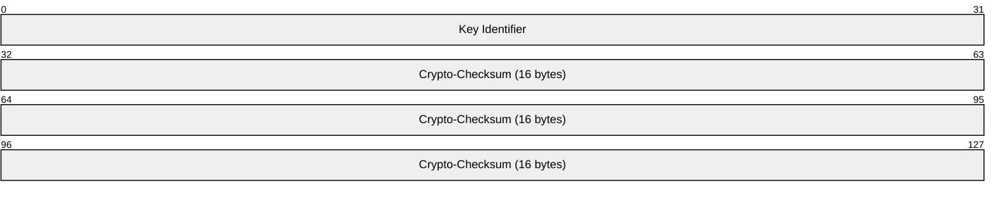

**Key Identifier (4 bytes):** A 32-bit unsigned integer in little-endian byte order (least significant byte first). This field identifies the cryptographic key used to generate the crypto-checksum. The least significant 31 bits are the least significant 31 bits of a [**relative identifier (RID)**](#gt_relative-identifier-rid) for a trusted account, as described in section [3.1.3](#Section_3.1.3). The most significant bit of the key identifier is a 1-bit key selector that identifies the cryptographic key to use in the pair of keys associated with the account. For more information on the semantics of this key selector, see sections [3.1.5](#Section_3.1.5), [3.1.6](#Section_3.1.6), and [3.2.5](#Section_3.2.5).

**Crypto-Checksum (16 bytes):** A 128-bit crypto-checksum that the encryption procedure computes. For more information, see section 3.2.5.<3>

### 2.2.2 Server NTP Response

The subfields of the **Authenticator** field of the Server NTP Response message include the following.

**Key Identifier (4 bytes):** A 32-bit unsigned integer in little-endian byte order (least significant byte first). It identifies the cryptographic key used to generate the crypto-checksum, as specified in section [2.2.1](#Section_2.2.1). For more information, see section [3.1.5](#Section_3.1.5).<4>

**Crypto-Checksum (16 bytes):** A 128-bit crypto-checksum computed by an encryption procedure. For more information, see section [3.2.5](#Section_3.2.5).

All other fields are returned according to [[RFC1305]](https://go.microsoft.com/fwlink/?LinkId=90272).<5>

### 2.2.3 Client ExtendedAuthenticator NTP Request

The subfields of the **ExtendedAuthenticator** field of the Client ExtendedAuthenticator NTP Request message include the following.

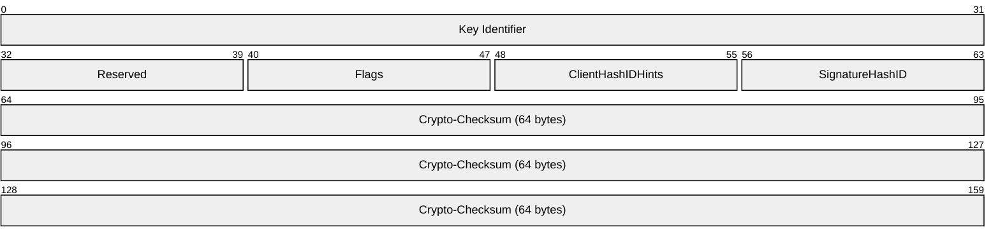

**Key Identifier (4 bytes):** A 32-bit, unsigned integer in little-endian byte order (least significant byte first). This field identifies the cryptographic key used to generate the crypto-checksum.

**Reserved (1 byte):** MUST be set to zero and MUST be ignored upon receipt.

**Flags (1 byte):** An 8-bit, unsigned integer in little-endian byte order that contains bit values from the following table. All other values are reserved for future use.

| Value | Meaning |
| --- | --- |
| USE_OLDKEY_VERSION 0x00000001 | The older cryptographic key of the pair of keys associated with the account is used. |

**ClientHashIDHints (1 byte):** An 8-bit, unsigned integer in little-endian byte order that contains bit values from the following table. All other values are reserved for future use.

| Value | Meaning |
| --- | --- |
| NTLM_PWD_HASH 0x00000001 | The client supports the mechanism described in section [3.1.5.5](#Section_3.1.5.5) for computing the crypto-checksum. |

**SignatureHashID (1 byte):** An 8-bit, unsigned integer in little-endian byte order containing one of the values from the following table. All other values are reserved for future use.

| Value | Meaning |
| --- | --- |
| NTLM_PWD_HASH 0x00000001 | The **Crypto-CheckSum** field was computed using the mechanism described in section 3.1.5.5. |

**Crypto-Checksum (64 bytes):** A 512-bit crypto-checksum that the encryption procedure computes.

### 2.2.4 Server ExtendedAuthenticator NTP Response

The subfields of the **ExtendedAuthenticator** field of the Server ExtendedAuthenticator NTP Response message include the following.

**Key Identifier (4 bytes):** A 32-bit, unsigned integer in little-endian byte order (least significant byte first). This field identifies the cryptographic key used to generate the crypto-checksum.

**Reserved (1 byte):** MUST be set to zero and MUST be ignored upon receipt.

**Flags (1 byte):** An 8-bit, unsigned integer in little-endian byte order that contains bit values from the following table. All other values are reserved for future use.

| Value | Meaning |
| --- | --- |
| USE_OLDKEY_VERSION 0x00000001 | The older cryptographic key of the pair of keys associated with the account is used. |

**ClientHashIDHints (1 byte):** An 8-bit, unsigned integer in little-endian byte order that contains bit values from the following table. All other values are reserved for future use.

| Value | Meaning |
| --- | --- |
| NTLM_PWD_HASH 0x00000001 | The client supports the mechanism described in section [3.1.5.5](#Section_3.1.5.5) for computing the crypto-checksum. |

**SignatureHashID (1 byte):** An 8-bit, unsigned integer in little-endian byte order containing one of the values from the following table. All other values are reserved for future use.

| Value | Meaning |
| --- | --- |
| NTLM_PWD_HASH 0x00000001 | The **Crypto-CheckSum** field was computed using the mechanism described in section 3.1.5.5. |

**Crypto-Checksum (64 bytes):** A 512-bit crypto-checksum that the encryption procedure computes.

All other fields are returned according to [[RFC1305]](https://go.microsoft.com/fwlink/?LinkId=90272).<6>

# 3 Protocol Details

The NTP Authentication Extensions operate between a client and a server during authenticated time synchronization.

## 3.1 Client Details

### 3.1.1 Abstract Data Model

This section describes a conceptual model of possible data organization that an implementation maintains to participate in this protocol. The described organization is provided to facilitate the explanation of how the protocol behaves. This document does not mandate that implementations adhere to this model as long as their external behavior is consistent with that described in this document.

**IsLastIncomingResponseAuthenticated:** A Boolean value that tracks whether the last incoming response was authenticated successfully.

**Trusted Domain:** A null-terminated Unicode string that represents the name of a trusted [**domain**](#gt_domain) in which a secure connection can be established between the client and server.

**Key Selector:** This element is the index into the crypto-checksums that the client is currently requesting for use in authenticating responses. The crypto-checksums are computed by the Netlogon message protection method using the cryptographic keys. This element is an unsigned integer and its value MUST be either 0 or 1.

**RID:** An unsigned, 32-bit integer that specifies the [**RID**](#gt_relative-identifier-rid) that uniquely identifies a trusted account whose passwords are used for establishing the secure connection in the trusted domain.

**ExtendedAuthenticatorSupported:** A Boolean value that tracks whether the [**domain controller (DC)**](#gt_domain-controller-dc) selected as a time source supports the **ExtendedAuthenticator** message format (see sections [2.2.3](#Section_2.2.3) and [2.2.4](#Section_2.2.4)).

**LargePhaseOffset:** An unsigned 32-bit integer that specifies the time variation from the computer's clock (phase offset) that is required for a time sample to be considered a spike. Time samples that have time variations larger than the **LargePhaseOffset** value are considered spikes.

This element, expressed in 100-nanosecond (ns) units, is exposed through the Windows registry via the following registry value.

| Attribute | Value |
| --- | --- |
| Key Location | HKEY_LOCAL_MACHINE\SYSTEM\CurrentControlSet\Services\W32Time\Config |
| Name | LargePhaseOffset |
| Type | REG_DWORD |

This element is shared with the server role of the W32Time Remote Protocol as specified in [MS-W32T](../MS-W32T/MS-W32T.md).

This element can be set by using the Remote Registry Protocol [MS-RRP](../MS-RRP/MS-RRP.md).

**HoldPeriod:** An unsigned 32-bit integer that specifies how many time samples larger than the **LargePhaseOffset** the client is required to receive in a series before subsequent time samples are accepted.

This element is exposed through the Windows registry via the following registry value:

| Attribute | Value |
| --- | --- |
| Key Location | HKEY_LOCAL_MACHINE\SYSTEM\CurrentControlSet\Services\W32Time\Config |
| Name | HoldPeriod |
| Type | REG_DWORD |

This element is shared with the server role of the W32Time Remote Protocol as specified in [MS-W32T].

This element can be set by using the Remote Registry Protocol [MS-RRP].

**HoldCount:** An unsigned 32-bit integer that tracks the number of previous samples received in a series that have been considered to be a spike.

**SpikeWatchPeriod:** An unsigned 32-bit integer that specifies the amount of time that suspicious time samples are received from a time source before subsequent time samples are accepted.

This element, which is expressed in seconds, is exposed through the Windows registry via the following registry value:

| Attribute | Value |
| --- | --- |
| Key Location | HKEY_LOCAL_MACHINE\SYSTEM\CurrentControlSet\Services\W32Time\Config |
| Name | SpikeWatchPeriod |
| Type | REG_DWORD |

This element is shared with the server role of the W32Time Remote Protocol as specified in [MS-W32T].

This element can be set by using the Remote Registry Protocol [MS-RRP].

**TimeSourceType:** A null-terminated Unicode string that controls how the client locates a time source. The value MUST be one of the following.

| Value | Meaning |
| --- | --- |
| "NoSync" | No time source is used. |
| "NTP" | Locate a time source by using the time source defined in the **NtpServer** element. |
| "NT5DS" | Locate a time source by using Netlogon as defined in section [3.1.3](#Section_3.1.3). |
| "AllSync" | Locate a time source by using NetLogon as defined in section 3.1.3 or by using the time source defined in the **NtpServer** element. |

This element is exposed through the Windows registry via the following registry value. The value is stored as a string exactly as shown in the Value column in the table above. For more information about the Windows registry, see [[MSWINREG]](https://go.microsoft.com/fwlink/?LinkId=90221).

| Attribute | Value |
| --- | --- |
| Key Location | HKEY_LOCAL_MACHINE\SYSTEM\CurrentControlSet\Services\W32Time\Parameters |
| Name | Type |
| Type | REG_SZ (string) |

This element is shared with the server role of the W32Time Remote Protocol [MS-W32T].

This element can be set by using the Remote Registry Protocol [MS-RRP].

**NtpServer:** A null-terminated Unicode string that controls the time sources used if the **TimeSourceType** element is configured to use a defined time source. Each time source MUST be in the following form.

<Time Source>[,<Bitwise Flag>]

The "Time Source" MUST be in the form of a [**fully qualified domain name (FQDN)**](#gt_fully-qualified-domain-name-fqdn) or an IP address.

The "Bitwise Flag", if included, MUST be a bitwise OR of zero or more of the following flags.

| Value | Meaning |
| --- | --- |
| SpecialInterval 0x01 | The value of the **SpecialPollInterval** element is used as the polling interval for this time source. |
| UseAsFallbackOnly 0x02 | Use this time source only when all other time sources have failed. No preference is given among fallback time sources when multiple time sources are configured with this option. |
| SymmetricActive 0x04 | Use the symmetric active mode when communicating with this time source. |
| Client 0x08 | Use the client mode when communicating with this time source. |

Multiple time sources are delineated by a space. For two time sources, the following form would be used.

<Time Source #1>[,<Bitwise Flags #1>] <Time Source #2>[,<Bitwise Flags #2>]

Note that "Bitwise Flags #1" is applied to "Time Source #1", and "Bitwise Flags #2" is applied to "Time Source #2". Each time source that is listed MUST be unique. There are no uniqueness constraints on how many times a given "Bitwise Flag" can appear in a list of time sources. If the bitwise flags are not provided for a time source, the bitwise flags for that time source are considered to be set to 0x0.

If both SymmetricActive and Client flags are set for a time source, Client mode is used to communicate with that time source.

If neither SymmetricActive nor Client flags are set for a time source and the client itself is a time source, SymmetricActive mode is used to communicate with the time source.

If neither SymmetricActive nor Client flags are set for a time source and the client itself is not a time source, Client mode is used to communicate with that time source.

The **NtpServer** element is exposed through the Windows registry via the following registry value.<7>

| Attribute | Value |
| --- | --- |
| Key Location | HKEY_LOCAL_MACHINE\SYSTEM\CurrentControlSet\Services\W32Time\Parameters |
| Name | NtpServer |
| Type | REG_SZ (string) |

This element is shared with the server role of the W32Time Remote Protocol [MS-W32T].

This element can be set by using the Remote Registry Protocol [MS-RRP].

**SpecialPollInterval:** An unsigned, 32-bit integer that specifies the number of seconds to use as a polling interval. The applicability of the **SpecialPollInterval** element depends on certain conditions that are created by the **TimeSourceType** and **NtpServer** elements, as described earlier in this section and in section 3.1.3.

This element is exposed through the Windows registry via the following registry value.

| Attribute | Value |
| --- | --- |
| Key Location | HKEY_LOCAL_MACHINE\SYSTEM\CurrentControlSet\Services\W32Time\TimeProviders\NtpClient |
| Name | SpecialPollInterval |
| Type | REG_DWORD |

This element is shared with the server role of the W32Time Remote Protocol [MS-W32T].

This element can be set by using the Remote Registry Protocol [MS-RRP].

**ResolvePeerBackoffMinutes:** An unsigned integer that indicates the initial time interval, in minutes, to wait after a failure before starting a new time source selection process.

This element is exposed through the Windows registry via the following registry value.

| Attribute | Value |
| --- | --- |
| Key Location | HKEY_LOCAL_MACHINE\SYSTEM\CurrentControlSet\Services\W32Time\TimeProviders\NtpClient |
| Name | ResolvePeerBackoffMinutes |
| Type | REG_DWORD |

This element is shared with the server role of the W32Time Remote Protocol [MS-W32T].

This element can be set by using the Remote Registry Protocol [MS-RRP].

**ResolvePeerBackoffMaxTimes:** An unsigned integer that indicates the maximum number of times to double the wait-time interval when repeated attempts to select a time source fail.

This element is exposed through the Windows registry via the following registry value.

| Attribute | Value |
| --- | --- |
| Key Location | HKEY_LOCAL_MACHINE\SYSTEM\CurrentControlSet\Services\W32Time\TimeProviders\NtpClient |
| Name | ResolvePeerBackoffMaxTimes |
| Type | REG_DWORD |

This element is shared with the server role of the W32Time Remote Protocol [MS-W32T].

This element can be set by using the Remote Registry Protocol [MS-RRP].

**AnnounceFlags:** Shared with the server role in this document (section [3.2.1](#Section_3.2.1)).

**CrossSiteSyncFlags:** An unsigned, 32-bit integer that specifies whether cross-site time synchronization is allowed.

The value of the key MUST be equal to one of the following values.

| Value | Meaning |
| --- | --- |
| "None" 0x00000000 | Cross-site time synchronization is not allowed. |
| "PdcOnly" 0x00000001 | Cross-site time synchronization is allowed if the machine is a [**primary domain controller (PDC)**](#gt_primary-domain-controller-pdc). |
| "All" 0x00000002 | Cross-site time synchronization is allowed. |

This element is exposed through the Windows registry via the following registry value.

| Attribute | Value |
| --- | --- |
| Key Location | HKEY_LOCAL_MACHINE\SYSTEM\CurrentControlSet\Services\W32Time\TimeProviders\NtpClient |
| Name | CrossSiteSyncFlags |
| Type | REG_DWORD |

This element can be set by using the Remote Registry Protocol [MS-RRP].

### 3.1.2 Timers

#### 3.1.2.1 Client Polling Timer

The client polling timer (peer.peerpoll) defined in [[RFC1305]](https://go.microsoft.com/fwlink/?LinkId=90272) section 3.2.3 is used to control the polling interval between transmitted [Client NTP Request](#Section_2.2.1) messages. The polling interval for this timer varies in a dynamic range between a minimum polling interval and a maximum polling interval, as defined in [RFC1305] section 3.4.2.<8>

The client performs a polling interval update as specified in [RFC1305] section 3.4.9. (Poll-Update Procedure) and in the previous paragraph, except in the following cases and in the following order:

- If a special polling interval is being used per section [3.1.1](#Section_3.1.1), the polling interval remains unchanged.
- If a client mode or symmetric active mode is used, the minimum polling interval is used.

#### 3.1.2.2 Domain Controller Time Source Location Retry Timer

The [**DC**](#gt_domain-controller-dc) time source location retry timer is used to control the wait time before a retry attempt to locate a DC time source after a failure. Initially, the timer interval SHOULD be set to **ResolvePeerBackoffMinutes** minutes. Every time a consecutive retry happens, the time to wait is doubled, up to **ResolvePeerBackoffMaxTimes** times. If consecutive retries continue to happen after **ResolvePeerBackoffMaxTimes** is reached, the time to wait is not doubled.

### 3.1.3 Initialization

#### 3.1.3.1 Initialization Steps

The client initialization begins with the procedures described in [[RFC1305]](https://go.microsoft.com/fwlink/?LinkId=90272) section 3.4.7.1, Initialization Procedure. It is followed by the initialization steps specified here.

- The **LargePhaseOffset**, **HoldPeriod**, **SpikeWatchPeriod**, **TimeSourceType**, **NtpServer**, **SpecialPollInterval**, **ResolvePeerBackoffMinutes**, and **ResolvePeerBackoffMaxTimes** elements SHOULD be initialized to the following values unless locally configured otherwise.<9>
**LargePhaseOffset:** 50000000 (5 seconds)

**HoldPeriod:** 5

**SpikeWatchPeriod:** 900 (15 minutes)

**SpecialPollInterval:** 3600 (1 hour)

**ResolvePeerMaxBackoffMinutes:** 15

**ResolvePeerMaxBackoffMaxTimes:** 7

- If the **TimeSourceType** element is set to "NoSync", the client MUST NOT select a time source, and protocol initialization is completed. No request is sent and the client remains unsynchronized.
- If the **TimeSourceType** element is set to "NTP", the client MUST select the first reachable time source from the **NtpServer** Abstract Data Model element. If the **NtpServer** element does not contain any time sources, the behavior is not constrained by protocol.
- If the **TimeSourceType** element is set to "NT5DS", the client MUST select a time source by using the Domain Time Source Selection Algorithm described in section [3.1.3.2](#Section_3.1.3.2).
If a time source is returned, the client MUST execute the steps in section [3.1.9](#Section_3.1.9).

If a time source cannot be found, the client MUST wait for **ResolvePeerBackoffMinutes** minutes and retry step 4. Every time a consecutive retry happens, the time to wait is doubled, up to **ResolvePeerBackoffMaxTimes** times. If consecutive retries continue to happen after **ResolvePeerBackoffMaxTimes** is reached, the time to wait is not doubled.

- If the **TimeSourceType** element is set to "AllSync", the client MUST attempt to locate a time source by using the Domain Time Source Selection Algorithm described in section 3.1.3.2.
If a time source is returned, the client MUST execute the steps in section 3.1.9.

If a [**domain controller (DC)**](#gt_domain-controller-dc) time source cannot be found, the client MUST then select a time source from the **NtpServer** element. The client SHOULD set up a DC time source location retry timer to retry locating a domain controller time source.

- The client MUST initialize the client polling timer according to [RFC1305] section 3.4.7, regardless of which time source is selected.
- The client MAY set the **sys.refid** element to "VMTP".<10> If the **sys.refid** element is set to "VMTP", then:
- The **sys.stratum** element SHOULD<11> be set to one greater than the stratum of its virtualization host.
The **sys.refid** and **sys.stratum** elements are defined in [RFC1305] section 3.2.1, "Common Variables".

- If the **sys.refid** element is set to "LOCL" then:
- The **AnnounceFlags** element MUST have either the Reliable_Timeserv_Announce_Yes flag set or the Reliable_Timeserv_Announce_Auto flag set.
The **sys.refid** element is defined in [RFC1305] section 3.2.1, "Common Variables", and the **sys.refid** value "LOCL" is defined in [[RFC2030]](https://go.microsoft.com/fwlink/?LinkId=103353) section 4 "NTP Message Format".

#### 3.1.3.2 Domain Time Source Selection Algorithm

The client MUST first obtain its current site by calling the **DsrGetSiteName** method described in [MS-NRPC](../MS-NRPC/MS-NRPC.md) section 3.5.4.3.6.

The client MUST try to obtain a time source by making the calls in the following order with the specified parameters. If the client obtains at least one time source in any of the following steps, the client MUST NOT make subsequent calls.

- To obtain a reliable time source in the parent [**domain**](#gt_domain) in the current site, the client MUST call the **DsrGetDcNameEx2** method described in [MS-NRPC] section 3.5.4.3.1 with the following parameters.
*DomainName*: MUST be set to the domain name of the parent domain, which is obtained by calling the **NetrLogonGetTimeServiceParentDomain** method in [MS-NRPC] section 3.5.4.8.6.

*SiteName*: If the **CrossSiteSyncFlags** abstract data model element is set to ALL, the client MUST set this parameter to the site obtained by using **DsrGetSiteName**; otherwise, this parameter MUST be set to NULL.

*Flags*: The "I" and "K" bits described in [MS-NRPC] section 3.5.4.3.3 MUST be set.

The client MUST validate that the **Flags** field in the returned **DomainControllerInfo** structure has bits G and I set (as described in [MS-NRPC] section 2.2.1.2.1); otherwise, proceed to the next step.

- To obtain a reliable time source in the current domain in the current site, the client MUST call **DsrGetDcNameEx2** with the following parameters.
**Note** If the client is an [**RODC**](#gt_read-only-domain-controller-rodc), this step MUST be skipped.

*DomainName*: This parameter MUST be set to the domain name.

*SiteName*: If **CrossSiteSyncFlags** is set to ALL, the client MUST set this parameter to the site obtained by using **DsrGetSiteName**; otherwise, this parameter MUST be set to NULL.

*Flags*: The "I" and "K" bits described in [MS-NRPC] section 3.5.4.3.3 MUST be set.

The client MUST validate that the **Flags** field in the returned **DomainControllerInfo** structure has bits G and I set (as described in [MS-NRPC] section 2.2.1.2.1); otherwise, proceed to the next step.

- To obtain a [**PDC**](#gt_primary-domain-controller-pdc) in the current domain in the current site, the client MUST call **DsrGetDcNameEx2** with the following parameters.
*DomainName*: this parameter MUST be set to the domain name.

*SiteName*: If **CrossSiteSyncFlags** is set to ALL, the client MUST set this parameter to the site obtained by using **DsrGetSiteName**; otherwise, this parameter MUST be set to NULL.

*Flags*: The "I" and "E" bits described in [MS-NRPC] section 3.5.4.3.3 MUST be set.

The client MUST validate that the **Flags** field in the returned **DomainControllerInfo** structure has bits A and G set (as described in [MS-NRPC] section 2.2.1.2.1); otherwise, proceed to the next step.

- To obtain a reliable time source in the parent domain in any site, the client MUST call **DsrGetDcNameEx2** with the following parameters.
*DomainName*: MUST be set to the domain name of the parent domain, which is obtained by calling the **NetrLogonGetTimeServiceParentDomain** method in [MS-NRPC] section 3.5.4.8.6.

*SiteName*: This parameter MUST be set to NULL.

*Flags*: The "I" and "K" bits described in [MS-NRPC] section 3.5.4.3.3 MUST be set.

The client MUST validate that the **Flags** field in the returned **DomainControllerInfo** structure has bit I set (as described in [MS-NRPC] section 2.2.1.2.1); otherwise, proceed to the next step.

- To obtain a reliable time source in the current domain in any site, the client MUST call **DsrGetDcNameEx2** with the following parameters.
**Note** If the client is an RODC, this step MUST be skipped.

*DomainName*: this parameter MUST be set to the domain name.

*SiteName*: This parameter MUST be set to NULL.

*Flags*: The "I" and "K" bits described in [MS-NRPC] section 3.5.4.3.3 MUST be set.

The client MUST validate that the **Flags** field in the returned **DomainControllerInfo** structure has bit I set (as described in [MS-NRPC] section 2.2.1.2.1); otherwise, proceed to the next step.

- To obtain a PDC in the current domain in any site, the client MUST call **DsrGetDcNameEx2** with the following parameters.
*DomainName*: this parameter MUST be set to the domain name.

*SiteName*: This parameter MUST be set to NULL.

*Flags*: The "I" and "E" bits described in [MS-NRPC] section 3.5.4.3.3 MUST be set.

The client MUST validate that the **Flags** field in the returned **DomainControllerInfo** structure has bit A set (as described in [MS-NRPC] section 2.2.1.2.1).

If a validated time source was obtained in one of the above steps, it is returned as the result of this algorithm. If no time source was obtained, none is returned.

### 3.1.4 Higher-Layer Triggered Events

A higher-layer triggered event is used to immediately start the time synchronization process. This event is triggered by the W32TimeSync method in [MS-W32T](../MS-W32T/MS-W32T.md). For example, when an end user wants to immediately initiate synchronization of a client computer's time with that of a server, and when the client computer is configured for authenticated NTP time synchronization, the W32TimeSync method is used to trigger this event. When this event is triggered, the client polling timer specified in section [3.1.2](#Section_3.1.2) expires immediately.

The client also responds to two higher-layer triggered events related to domain join and domain unjoin. These higher-layer triggered events are used to modify the configuration of the client when entering or leaving membership in a domain, respectively. For more information on domain membership, refer to [MS-AUTHSOD](../MS-AUTHSOD/MS-AUTHSOD.md) section 1.1.1.3.

#### 3.1.4.1 Domain Join Processing

The client MUST set the **TimeSourceType** abstract data model element (section [3.1.1](#Section_3.1.1)) to the value "NT5DS". The client MUST then reinitialize its configuration accordingly, as indicated in section [3.1.3](#Section_3.1.3).

#### 3.1.4.2 Domain Unjoin Processing

The client MUST set the **TimeSourceType** abstract data model element (section [3.1.1](#Section_3.1.1)) to the value "NTP". The client MUST then reinitialize its configuration accordingly, as indicated in section [3.1.3](#Section_3.1.3).

#### 3.1.4.3 Group Policy Update Notification

When the Policy Application Event described in [MS-GPOL](../MS-GPOL/MS-GPOL.md) section 3.2.7.3 is raised, the configuration MUST re-initialize. See section [3.1.3](#Section_3.1.3).

#### 3.1.4.4 Service Control Manager Update Notification

When the SERVICE_CONTROL_PARAMCHANGE event described in [MS-SCMR](../MS-SCMR/MS-SCMR.md) is triggered, the configuration MUST be re-initialized accordingly, as indicated in section [3.1.3](#Section_3.1.3).

#### 3.1.4.5 Network Change Notification

When the IP address changes, the configuration MUST re-initialize. See section [3.1.3](#Section_3.1.3).

### 3.1.5 Message Processing Events and Sequencing Rules

The MS-SNTP protocol supports modes according to [[RFC1305]](https://go.microsoft.com/fwlink/?LinkId=90272) section 3.4.2 (Table 5 "Modes and Actions"), except that it does not support broadcast clients, NTP control message, or symmetric passive mode. If the client receives a message with an unsupported mode, the message MUST be ignored as specified in [RFC1305] section 3.4.3. The NTP Authentication Extensions are defined only for the following NTP and SNTP association modes (as specified in [RFC1305] sections 3.2.1 and 3.3): client, server, and symmetric active.

The client prepares either a [Client NTP Request](#Section_2.2.1) or [Client ExtendedAuthenticator NTP Request](#Section_2.2.3) message header in the same way it occurs in the base Network Time Protocol (NTP), which is described in [RFC1305] section 3.4.2. The message format used is dependent on the value of the **ExtendedAuthenticatorSupported** ADM element (see section [3.1.1](#Section_3.1.1)).

#### 3.1.5.1 Authentication Request Behavior

The following diagram illustrates the client logic for generating a [Client NTP Request](#Section_2.2.1) or [Client ExtendedAuthenticator NTP Request](#Section_2.2.3) message with authentication.

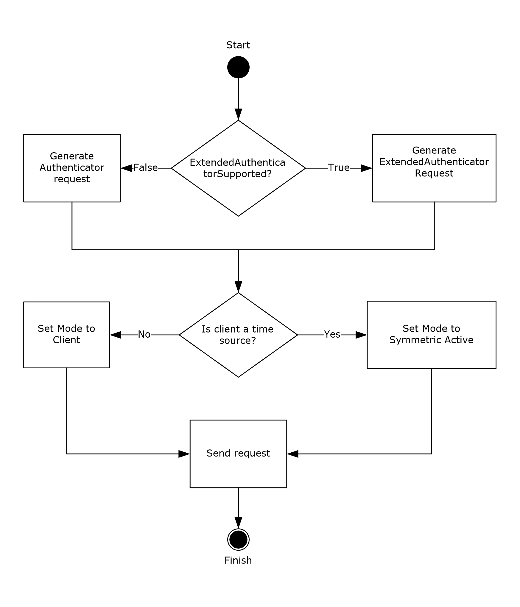

Figure 2: Authentication request generation

If the **ExtendedAuthenticatorSupported** ADM element is false, the client MUST construct a Client NTP Request message. The Client NTP Request message length is 68 bytes. The client sets the **Authenticator** field of the Client NTP Request message as described in section 2.2.1, writing the least significant 31 bits of the [**RID**](#gt_relative-identifier-rid) value into the least significant 31 bits of the **Key Identifier** subfield of the authenticator, and then writing the **Key Selector** value into the most significant bit of the **Key Identifier** subfield.<12>

If the **ExtendedAuthenticatorSupported** ADM element is true, the client MUST construct a Client ExtendedAuthenticator NTP Request message. The Client ExtendedAuthenticator NTP Request message length is 120 bytes. The client sets the fields of the message as follows:

- **Key Identifier**: MUST be set to the **RID** ADM element.
- **Reserved**: MUST be set to zero.
- **Flags**: MUST be set to zero if the **Key Selector** ADM element is 0; otherwise, the USE_OLDKEY_VERSION bit MUST be set.
- **ClientHashIDHints**: MUST be set to NTLM_PWD_HASH.
- **SignatureHashID**: MUST be set to zero.
- **Crypto-Checksum**: MUST be set to zero.
The client SHOULD set the **Mode** field of the request to Symmetric Active if the client is a time source. The syntax and semantics for the **Mode** field of the Client NTP Request message are specified in [[RFC1305]](https://go.microsoft.com/fwlink/?LinkId=90272) Appendix A.<13>

The client sends the Client NTP Request message to the server as it does in the base Network Time Protocol, which is described in [RFC1305] section 3.4.2.

The following diagram illustrates the client logic for processing a [Server NTP Response](#Section_2.2.2) or [Server ExtendedAuthenticator NTP Response](#Section_2.2.4) message received in response to a Client NTP Request or Client ExtendedAuthenticator NTP Request message, respectively, that requested authentication.<14>

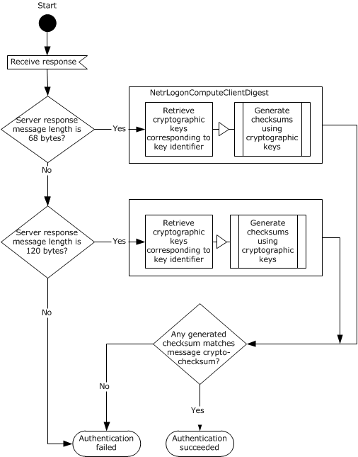

Figure 3: Authentication response processing

The response message length MUST be either 68 or 120 bytes. If the message length does not meet this requirement, the authentication fails.

The client MUST ignore the **Key Identifier** subfield of either response message.

If the response message length is 68 bytes, the client MUST validate the response as a Server NTP Response message, as follows:

- The client uses the NetrLogonComputeClientDigest method (as specified in [MS-NRPC](../MS-NRPC/MS-NRPC.md) section 3.5.4.8.3) to compute crypto-checksums for the first 48 bytes of the Server NTP Response message, with the following input parameters:
- *ServerName* MUST be set to NULL.
- *DomainName* MUST be set to the value of the **Trusted Domain** element.
- *Message* MUST refer to the first 48 bytes of the response message.
- *MessageSize* MUST be set to 48.
The NetrLogonComputeClientDigest method computes two crypto-checksums using the pair of passwords associated with the trusted account.

If the response message length is 120 bytes, the client MUST validate the response as a Server ExtendedAuthenticator NTP Response message, as follows:

- The client MUST compute the NTOWFv1 (as specified in [MS-NLMP](../MS-NLMP/MS-NLMP.md) section 3.3.1) of the current machine password and the NTOWFv1 of the previous machine password.
- The client invokes the checksum generation algorithm (section [3.1.5.5](#Section_3.1.5.5)) with the following inputs:
- *Key*: The NTOWFv1 of the current machine password.
- *Label*: The ANSI string "sntp-ms".
- *Context*: The **RID** ADM element.
- *Message*: The first 48 bytes of the response message.
- The client invokes the checksum generation algorithm (section 3.1.5.5) with the following inputs:
- *Key*: The NTOWFv1 of the previous machine password.
- *Label*: The ANSI string "sntp-ms".
- *Context*: The **RID** ADM element.
- *Message*: The first 48 bytes of the response message.
- The client then uses the two checksums resulting from the previous two algorithm invocations to validate the message as specified in the paragraph that follows.
The client compares each computed crypto-checksum with the **Crypto-Checksum** subfield in the response message. If the **Crypto-Checksum** subfield matches any of the computed crypto-checksums, the authentication succeeds. Otherwise, the authentication fails. A client MUST compare all computed crypto-checksums before determining that the authentication has failed; however, it SHOULD NOT continue to compare crypto-checksums after it has determined that at least one of its computed crypto-checksums matches the **Crypto-Checksum** subfield.

If authentication succeeds, the client continues processing the response to synchronize time the same way it occurs in the base NTP protocol, which is described in [RFC1305] section 3.4.3.

If authentication fails, the response MUST be ignored, and the client MUST NOT perform time synchronization using the response.

The following state diagram illustrates updates to the client's state elements based on success or failure of message authentication. The state changes in this diagram are applicable regardless of which response message format was received (Server NTP Response or Server ExtendedAuthenticator NTP Response).

**Note** In authenticated NTP, all state transitions are triggered by timer expiry. On expiration of the client polling timer, an authenticated NTP client attempts an authenticated NTP exchange with the NTP server. Based on the success or failure of that attempt, it updates state elements and transitions to the next state. The labels on the following arcs indicate the trigger of authentication success or failure that causes transition to the next state. For each trigger of authentication success or failure, there is an implicit trigger of "Timer Expiry" because it is the expiration of the polling timer that causes an authentication attempt. The "Timer Expiry" label has been omitted from the following arcs for clarity. Also note that the state element assignments in the state boxes are carried out upon entry into the state, not on exit.

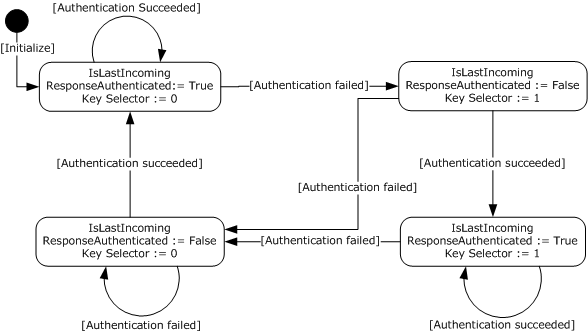

Figure 4: Client element updates

#### 3.1.5.2 Special Root Dispersion Behavior

The client SHOULD set the **Root Dispersion** value in the request to 0xAAAAAAAA. If the response that is returned from the server contains a **Root Dispersion** value of 0xAAAAAAAA, then the server's response contains a **Reference Timestamp** value that is relative to the client's clock, and the client MUST NOT process Test 6 defined in [[RFC1305]](https://go.microsoft.com/fwlink/?LinkId=90272) section 3.4.4. If the response that is returned from the server does not contain a **Root Dispersion** value of 0xAAAAAAAA, then the server's response contains a **Reference Timestamp** value that is relative to the server's clock, and the client SHOULD process Test 6 as defined in [RFC1305] section 3.4.4.<15><16>

#### 3.1.5.3 Test 7 Behavior

The client MUST NOT perform the portion of Test 7 that verifies that pkt.stratum <= sys.stratum as indicated in [[RFC1305]](https://go.microsoft.com/fwlink/?LinkId=90272) section 3.4.4.

#### 3.1.5.4 Spike Watch Mechanism

The following diagram illustrates the client logic for the evaluation and handling of spikes.

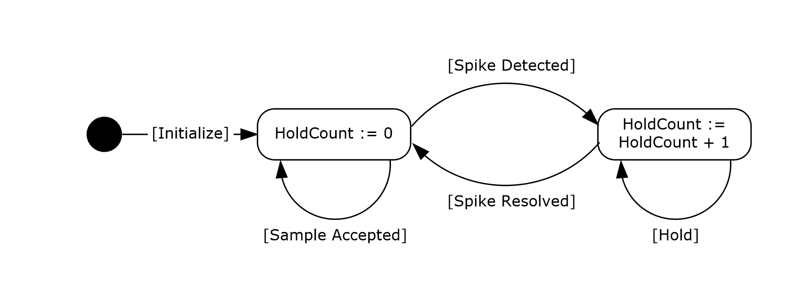

Figure 5: Client spike evaluation and processing

During initialization, the client sets the **HoldCount** element to zero.

Upon receiving a response, the client calculates the offset from the server (peer.offset) using the data contained in the response as defined in [[RFC1305]](https://go.microsoft.com/fwlink/?LinkId=90272) section 3.4.4. If the absolute value of the calculated offset is less than the value of the **LargePhaseOffset** element, the sample is accepted and processing continues as is indicated by the [Sample Accepted] transition in the preceding diagram.

If the absolute value of the calculated offset is equal to or larger than the value of the **LargePhaseOffset** element and the client is not already in the hold state, the client enters a hold state as indicated by the [Spike Detected] transition. In this transition, the value of **HoldCount** is set to one and the sample is discarded.

If the absolute value of the calculated offset is equal to or larger than the value of the **LargePhaseOffset** element and the client is already in the hold state, the client remains in the hold state as indicated by the [Hold] transition. In this transition, the value of the **HoldCount** element is incremented by one and the sample is discarded.

The client exits the hold state when one of the following three conditions has been met.

- The value of the **HoldCount** element is equal to or greater than the value of the **HoldPeriod** element.
- The amount of time that has elapsed since the first spike was received is equal to or greater than the value of the **SpikeWatchPeriod** element.
- A sample is received and the absolute value of the calculated offset of that sample is less than the value of the **LargePhaseOffset** element.
Upon exiting the hold state, the **HoldCount** is set to zero, the sample is accepted, and processing continues as indicated by the [Spike Resolved] transition.

#### 3.1.5.5 Crypto checksum generation

This section describes the algorithm used to generate a crypto checksum using a Key Derivation Function ([[SP800-108]](https://go.microsoft.com/fwlink/?LinkId=186039)). The algorithm accepts the following inputs:

- *Key*: An array of bytes.
- *Label*: An array of bytes.
- *Context*: An array of bytes.
- *Message*: An array of bytes.
The checksum generation algorithm is defined as follows:

K = KDF(Key, Label, Context)

CryptoChecksum = HMACSHA512(K, Message)

Where:

- KDF is an execution of the algorithm specified in [SP800-108] section 5.1.
- *Key*, *Label*, and *Context* are inputs to the checksum algorithm as specified previously; *Key* corresponds to the parameter KI in [SP800-108] section 5.1; *Label* and *Context* correspond to the parameters by the same names in [SP800-108] section 5.1.
- *Message* is an input to the checksum algorithm as specified previously.
- HMACSHA512 is an invocation of the Hash-based Message Authentication Mode (HMAC) function with hash function SHA512 (defined in [[FIPS180-3]](https://go.microsoft.com/fwlink/?LinkId=180409)).
The resulting 512-bit CryptoChecksum value is returned to the caller upon completion.

### 3.1.6 Timer Events

#### 3.1.6.1 Client Polling Timer Event

When the client polling timer expires, the client prepares a [Client NTP Request](#Section_2.2.1) message as described in section [3.1.5](#Section_3.1.5).

#### 3.1.6.2 Domain Controller Time Source Location Retry Timer Event

When the [**DC**](#gt_domain-controller-dc) time source location retry timer expires, the client MUST attempt to locate a time source by using the **DsrGetDcName** method defined in [MS-NRPC](../MS-NRPC/MS-NRPC.md) section 3.5.4.3.3.

When calling the **DsrGetDcName** method, the client MUST set the "K" bit in the *Flags* parameter to indicate that a DC that is running a reliable [**time service**](#gt_time-service) is to be returned, as described in [MS-NRPC] section 3.5.4.3.3.

If a time source is found, the client MUST execute the steps in section [3.1.9](#Section_3.1.9) and cancel the timer.

### 3.1.7 Other Local Events

No additional events are used.

### 3.1.8 Clock Selection

Clock selection occurs as defined in [[RFC1305]](https://go.microsoft.com/fwlink/?LinkId=90272) section 4.2, with the exception of the following scenario:

- If **sys.refid** is set to "VMTP", then **sys.peer** is set to NULL. This is done regardless of what value the **peer.stratum** element is set to.

### 3.1.9 Domain Controller Time Source Initialization

The client initializes the **Trusted Domain** abstract data model element by calling the **NetrLogonGetTimeServiceParentDomain** method (as specified in [MS-NRPC](../MS-NRPC/MS-NRPC.md) section 3.5.4.8.6) with the following input parameters:

- *ServerName* MUST be set to NULL.
Upon successful completion, the output parameter *DomainName* contains the name of a trusted [**domain**](#gt_domain) in which a secure connection can be established between the client and server.

The client initializes the **RID** element by calling the **NetrLogonGetTrustRid** method (as specified in [MS-NRPC] section 3.5.4.8.1) with the following input parameters:

- *ServerName* MUST be set to NULL.
- *DomainName* MUST be set to the value of the **Trusted Domain** element.
Upon successful completion, the output parameter *Rid* contains the [**RID**](#gt_relative-identifier-rid) that uniquely identifies a trusted account.

The client initializes the **IsLastIncomingResponseAuthenticated** abstract data model element to true and initializes the **Key Selector** abstract data model element to zero. If the selected [**DC**](#gt_domain-controller-dc) has a DC functional level of DS_BEHAVIOR_WIN2012 or greater (as specified in [MS-ADTS](../MS-ADTS/MS-ADTS.md) section 6.1.4.2), then the **ExtendedAuthenticatorSupported** ADM element MUST be set to true; otherwise it MUST be set to false.<17>

## 3.2 Server Details

### 3.2.1 Abstract Data Model

This section describes a conceptual model of possible data organization that an implementation maintains to participate in this protocol. The described organization is provided to facilitate the explanation of how the protocol behaves. This document does not mandate that implementations adhere to this model as long as their external behavior is consistent with that described in this document.

**AnnounceFlags:** A 32-bit set of bit flags that controls which NetLogon Service Bits are set, as specified in section [3.2.3.1](#Section_3.2.3.1). The value MUST be a bitwise OR of zero or more of the following flags.<18><19>

| Value | Informative Meaning |
| --- | --- |
| Timeserv_Announce_No 0x00 | Unset all the Service Bits. |
| Timeserv_Announce_Yes 0x01 | This flag indicates to clients that this computer is available to respond to NTP Authentication Extensions time synchronization requests. Note that this setting does not indicate that time samples returned from this computer are usable, only that this computer can be considered as a usable time source for the purposes of time source discovery. |
| Timeserv_Announce_Auto 0x02 | This flag indicates to clients that this computer's clock is synchronized with another time source. |
| Reliable_Timeserv_Announce_Yes 0x04 | This flag indicates that the computer's clock is synchronized with a time source operating at stratum 0 or stratum 1. This flag indicates to clients that this computer is a more reliable time source than time sources that do not have this setting. |
| Reliable_Timeserv_Announce_Auto 0x08 | This flag indicates to clients that this computer is a more reliable time source than time sources that do not have this setting. |

This element is exposed through the Windows registry via the following registry value. The value is stored as the hexadecimal value shown in the Value column of the preceding table.

| Attribute | Value |
| --- | --- |
| Key Location | HKEY_LOCAL_MACHINE\SYSTEM\CurrentControlSet\Services\W32Time\Config |
| Name | AnnounceFlags |
| Type | REG_DWORD |

The setting referred to as "reliable" is the exposure of the **AnnounceFlags** Abstract Data Model element.

This element is shared with the client role in this document and the server role of the W32Time Remote Protocol [MS-W32T](../MS-W32T/MS-W32T.md).

This element can be set by using the Remote Registry Protocol [MS-RRP](../MS-RRP/MS-RRP.md).

**ChainingCacheEntry:** A structure used by the request-chaining processing that contains the following fields:

**Address**: The IP address of the client that sent the request.

**KeyIdentifier**: An unsigned 32-bit integer that contains the [**RID**](#gt_relative-identifier-rid) of the client that sent the request.

**ArrivalTime:** An unsigned 64-bit integer that contains the timestamp of the time at which the request from the client arrived.

**TransmitTimestamp**: An unsigned 64-bit integer that contains the timestamp of the time at which the request was sent to the time source.

**ChainingCache:** A set of **ChainingCacheEntry** ADM elements used in the chaining of client requests.

**ChainingDisabled:** An unsigned 32-bit integer that controls whether the request-chaining processing rules are executed. This value MUST be one of the following:

| Value | Meaning |
| --- | --- |
| 0x00000000 | The request-chaining processing rules are executed. |
| 0x00000001 | The request-chaining processing rules are not executed. |

**ChainingEntryTimeout:** An unsigned 32-bit integer that defines the amount of time (in seconds) before an entry in the **ChainingCache** ADM element is removed.

**ChainingMaxEntries:** An unsigned 32-bit integer that controls the maximum number of entries allowed in the **ChainingCache** ADM element.

**ChainingMaxHostEntries:** An unsigned 32-bit integer that controls the maximum number of entries allowed in the **ChainingCache** ADM element that contain the same IP address.

**LocalClockDispersion:** An unsigned 32-bit integer that is analogous to the Root Dispersion (sys.rootdispersion) variable defined in [[RFC1305]](https://go.microsoft.com/fwlink/?LinkId=90272) section 3.2.1.

This element is exposed through the Windows registry via the following registry value. The value is expressed in seconds.

| Attribute | Value |
| --- | --- |
| Key Location | HKEY_LOCAL_MACHINE\SYSTEM\CurrentControlSet\Services\W32Time\Config |
| Name | LocalClockDispersion |
| Type | REG_DWORD |

This element is shared with the server role of the W32Time Remote Protocol [MS-W32T].

This element can be set by using the Remote Registry Protocol [MS-RRP].

**ResponseMode:** An unsigned 32-bit integer that controls whether to respond to synchronization requests. This value MUST be one of the following.<20>

| Value | Meaning |
| --- | --- |
| Response_Mode_DC_Only 0x00 | Do not respond to synchronization requests unless the server is also a [**DC**](#gt_domain-controller-dc). |
| Response_Mode_Yes 0x01 | Always respond to synchronization requests. |

This element is exposed through the Windows registry via the following registry value. The value is stored as the hexadecimal value shown in the Value column of the preceding table.

| Attribute | Value |
| --- | --- |
| Key Location | HKEY_LOCAL_MACHINE\SYSTEM\CurrentControlSet\Services\W32Time\Config |
| Name | LocalNTP |
| Type | REG_DWORD |

This element can be set by using the Remote Registry Protocol [MS-RRP].

### 3.2.2 Timers

No new timers are required beyond those in the base NTP protocol, as specified in [[RFC1305]](https://go.microsoft.com/fwlink/?LinkId=90272) section 3.2.3.

### 3.2.3 Initialization

The server initialization begins with the procedures described in [[RFC1305]](https://go.microsoft.com/fwlink/?LinkId=90272) section 3.4.7.1, "Initialization Procedure". It is followed by the following initialization steps:

- The server MAY set the **sys.refid** element to "VMTP" <21> If the **sys.refid** element is set to "VMTP" then:
- The **sys.stratum** element SHOULD<22> be set to one greater than the stratum of its virtualization host.
- If the **sys.refid** element is set to "LOCL" as defined in [[RFC2030]](https://go.microsoft.com/fwlink/?LinkId=103353) section 4 then:
- If the **AnnounceFlags** element is set to Reliable_Timeserv_Announce_Yes, then the sys.stratum element MUST be set to 1.
- If the **AnnounceFlags** element is set to Reliable_Timeserv_Announce_Auto and the **Trusted Domain** element is NULL, then the server MUST execute the DsRolerGetPrimaryDomainInformation method defined in [MS-DSSP](../MS-DSSP/MS-DSSP.md) section 3.2.5.1, using an InfoLevel value of DsRolePrimaryDomainInfoBasic. If the **MachineRole** field of the DSROLER_PRIMARY_DOMAIN_INFO_BASIC structure that is returned has a value of DsRole_RolePrimaryDomainController, then the sys.stratum element MUST be set to 1.
The **sys.refid** and **sys.stratum** elements are defined in [RFC1305] section 3.2.1, "Common Variables".

All abstract data model elements are configured by the server either during initialization or when it is informed of a configuration change through Service Control Manager (section [3.2.4](#Section_3.2.4)).

#### 3.2.3.1 Initializing NetLogon Service Bits

After general initialization is complete, the appropriate Netlogon Service Bits MUST be set as described in [MS-NRPC](../MS-NRPC/MS-NRPC.md) section 3.5.4.8.5.<23>

- If the Timeserv_Announce_Yes flag in the **AnnounceFlags** abstract data model element is set, then set the "Time service is running" bit to 1.
- If the Timeserv_Announce_Auto flag in the **AnnounceFlags** abstract data model element is set, then set the "Time service is running" bit to 1 only if there is an active association with a peer.
- If the Reliable_Timeserv_Announce_Yes flag in the **AnnounceFlags** abstract data model element is set, then set the "Time service with clock hardware is running" bit to 1.
- If the Reliable_Timeserv_Announce_Auto flag in the **AnnounceFlags** abstract data model element is set, then set the "Time service with clock hardware is running" bit to 1 only if there is an active association with a peer.

#### 3.2.3.2 Initializing Request Chaining

After general initialization is complete, the following request-chaining initialization MUST be performed.

- The **ChainingCache** ADM element MUST be initialized to an empty state in which it does not contain any entries.
- The **ChainingDisabled**, **ChainingEntryTimeout**, **ChainingMaxEntries**, and **ChainingMaxHostEntries** ADM elements MUST have the following initial values.
- **ChainingDisabled**: 0x00000000
- **ChainingEntryTimeout**: 4
- **ChainingMaxEntries**: 1024
- **ChainingMaxHostEntries**: 16

### 3.2.4 Higher-Layer Triggered Events

#### 3.2.4.1 Group Policy Update Notification

When the Policy Application Event described in [MS-GPOL](../MS-GPOL/MS-GPOL.md) section 3.2.7.3 is raised, the configuration MUST re-initialize. See section [3.2.3](#Section_3.2.3).

#### 3.2.4.2 Service Control Manager Update Notification

When the SERVICE_CONTROL_PARAMCHANGE event described in [MS-SCMR](../MS-SCMR/MS-SCMR.md) is triggered, the configuration MUST be re-initialized accordingly, as indicated in section [3.2.3](#Section_3.2.3).

#### 3.2.4.3 Network Change Notification

When the IP address changes, the configuration MUST re-initialize. See section [3.2.3](#Section_3.2.3).

### 3.2.5 Message Processing Events and Sequencing Rules

This section documents deviations in the behavior of the NTP Authentication Extensions from the processing rules specified in [[RFC1305]](https://go.microsoft.com/fwlink/?LinkId=90272). Unless otherwise stated, all other processing events and sequencing rules conform to [RFC1305].

#### 3.2.5.1 Authentication Response Behavior

When the server receives a message from the client, the server examines the message length. If the message length is 68 bytes, the server processes the request as a [Client NTP Request](#Section_2.2.1) and responds with a [Server NTP Response](#Section_2.2.2) message. If the message length is 120 bytes, the server processes the request as a [Client ExtendedAuthenticator NTP Request](#Section_2.2.3) and responds with a [Server ExtendedAuthenticator NTP Response](#Section_2.2.4) message. If the NTP message length is 48 bytes, the message is processed as specified in [[RFC1305]](https://go.microsoft.com/fwlink/?LinkId=90272) section 3.4.3.<24> NTP messages of other lengths are ignored. As a result of this, the authentication mechanism defined in [RFC1305] Appendix C.1 is not supported.

The MS-SNTP protocol supports modes according to [RFC1305] section 3.4.2 (Table 5 "Modes and Actions"), except that it does not support broadcast clients, NTP control message, or symmetric passive mode. If the server receives a message with an unsupported mode, the message MUST be ignored as specified in [RFC1305] section 3.4.3. The NTP Authentication Extensions are defined only for the following NTP and SNTP association modes (as specified in [RFC1305] sections 3.2.1 and 3.3): client, server, and symmetric active.

##### 3.2.5.1.1 Domain Controller Processing of the Authenticated Server NTP Response

If the server is a [**domain controller (DC)**](#gt_domain-controller-dc), the server processes the response as follows.

The following diagram illustrates the server logic for providing authentication when responding to a message using these extensions. Other NTP processing is specified in [[RFC1305]](https://go.microsoft.com/fwlink/?LinkId=90272) section 3.4.3.<25>

Figure 6: Authentication request processing

The server prepares the [Server NTP Response](#Section_2.2.2) or [Server ExtendedAuthenticator NTP Response](#Section_2.2.4) message in the same way as for the base protocol, which is described in [RFC1305] section 3.4.3. Afterward, the server follows the server-encryption procedure.

- If the request message length is 68 bytes, the server processes the request as a [Client NTP Request](#Section_2.2.1):
- The server MUST ignore the **Crypto-Checksum** subfield of the Client NTP Request message.
- The server retrieves the [**RID**](#gt_relative-identifier-rid) from the least significant 31 bits of the **Key Identifier** subfield of the **Authenticator** field of the Client NTP Request message. The server uses the NetrLogonComputeServerDigest method (as specified in [MS-NRPC](../MS-NRPC/MS-NRPC.md) section 3.5.4.8.2) to compute crypto-checksums with the following input parameters:
- *ServerName* MUST be set to NULL.
- *Rid* MUST be set to the RID value retrieved from the Client NTP Request message.
- *Message* MUST refer to the first 48 bytes of the Server NTP Response message.
- *MessageSize* MUST be set to 48.
The NetrlogonComputeServerDigest method computes two crypto-checksums using the pair of passwords associated with the trusted account given by the RID.

If the NetrlogonComputeServerDigest method returns ERROR_NO_TRUST_LSA_SECRET, the server instead performs the processing for [**read-only domain controllers (RODCs)**](#gt_read-only-domain-controller-rodc) specified in section [3.2.5.1.2](#Section_3.2.5.1.2), and performs no further processing in this section.

If the Netlogon Remote Protocol method fails, the server SHOULD<26> fail the authentication and ignore the request without responding.

The server retrieves a 1-bit key selector from the most significant bit of the Key Identifier subfield of the Authenticator field in the Client NTP Request message. If the 1-bit key selector is set to 0, the server selects the crypto-checksum that was computed using the new password. If the 1-bit key selector is set to 1, the server selects the crypto-checksum that was computed using the old password.<27><28>

- The server sets the **Authenticator** field of the Server NTP Response message as described in section 2.2.2, writing the computed crypto-checksum into the **Crypto-Checksum** subfield of the **Authenticator**.
- If the request message is 120 bytes, the server processes the request as a [Client ExtendedAuthenticator NTP Request](#Section_2.2.3):
- The server MUST ignore the **SignatureHashID** and **Crypto Checksum** fields of the request.
- If the **ClientHashIDHints** field does not have the NTLM_PWD_HASH bit set, the server MUST stop processing and MUST ignore the request.
- If the USE_OLD_KEY_VERSION bit is set in the **Flags** field, the server MUST retrieve the NTOWFv1 (as specified in [MS-NLMP](../MS-NLMP/MS-NLMP.md) section 3.3.1) of the previous account password for the account identified by the **Key Identifier** subfield; otherwise, the server MUST retrieve the NTOWFv1 of the current account password for the account. The server MUST treat all 32 bits of the **Key Identifier** subfield as valid when looking up the account.
If the server does not have the NTOWFv1 hashes stored locally for the account identified by the **Key Identifier** subfield, the server performs the processing for RODCs specified in section 3.2.5.1.2, and performs no further processing in this section.

- The server MUST invoke the checksum generation algorithm (section [3.1.5.5](#Section_3.1.5.5)) with input parameters as follows:
- *Key*: The NTOWFv1 retrieved in step 2.3.
- *Label*: The ANSI string "sntp-ms".
- *Context*: The contents of the **Key Identifier** subfield.
- *Message*: The first 48 bytes of the response message.
- The server MUST set the NTLM_PWD_HASH bit in the **SignatureHashID** field to 1, and MUST set all other bits to zero.
- The server MUST write the results of step 2.4 into the **Crypto-Checksum** field of the Server ExtendedAuthenticator NTP Response message.

##### 3.2.5.1.2 Read-only Domain Controller Processing of the Authenticated Server NTP Response

If the server is a [**read-only domain controller (RODC)**](#gt_read-only-domain-controller-rodc), the server processes the response as follows.

The server retrieves the account [**RID**](#gt_relative-identifier-rid) from the least significant 31 bits of the **Key Identifier** subfield of the **Authenticator** field of the [Client NTP Request (section 2.2.1)](#Section_2.2.1), or the **Key Identifier** subfield of the [Client ExtendedAuthenticator NTP Request (section 2.2.3)](#Section_2.2.3). This RID is then further processed as specified below.

If the RID equals the RID portion of a [**security identifier (SID)**](#gt_security-identifier-sid) (see [MS-DTYP](../MS-DTYP/MS-DTYP.md) section 2.4.2) of a [**security principal**](#gt_security-principal) whose secret attributes (see [MS-ADTS](../MS-ADTS/MS-ADTS.md) section 3.1.1.1.4) have been revealed to the RODC (see [MS-ADTS] section 3.1.1.4.5.34), then the response processing is identical to section [3.2.5.1.1](#Section_3.2.5.1.1).

If the RID retrieved from the message equals the RID portion of a SID of a security principal whose secret attributes have not been revealed to the RODC, then the RODC retrieves a response for the client caller from a [**writable domain controller (writable DC)**](#gt_writable-domain-controller-writable-dc) as if the client had sent the request message directly to that writable DC and the request had been processed according to section 3.2.5.1.1.

This processing, called *request chaining*, is performed as follows.

- If the **ChainingDisabled** ADM element is set to 0x00000001, the server ignores the request without responding.
- If the **sys.peer** element defined in [[RFC1305]](https://go.microsoft.com/fwlink/?LinkId=90272) section 3.2.2 is NULL, the server ignores the request without responding.
- If the number of entries in the **ChainingCache** ADM element is greater than the value in the **ChainingMaxEntries** ADM element, the server ignores the request without responding.
- If the number of entries in **ChainingCache** that have an **Address** field identical to the IP address of the client is greater than the value in the **ChainingMaxHostEntries** ADM element, the server ignores the request without responding.
- The server performs chaining-cache cleaning as defined in section [3.2.5.3](#Section_3.2.5.3).
- The server performs the following steps to create a new **ChainingCacheEntry** ADM element.
- Create a new **ChainingCacheEntry** object.
- Set the **ArrivalTime** field of the **ChainingCacheEntry** object to the current time.
- Set the **TransmitTimestamp** field of the **ChainingCacheEntry** object to the **pkt.xmt** field ([RFC1305] section 3.2.3) of the Client NTP Request.
- Set the **Address** field of the **ChainingCacheEntry** object to the IP address of the client that sent the request.
- Set the **KeyIdentifier** field of the **ChainingCacheEntry** object to the **Key Identifier** subfield of the Client NTP Request.
- The server adds the newly created entry to **ChainingCache**.
- If the client sent a Client NTP Request, the server sends the original client request (exactly as it was received from the client) to the server's peer that is defined in **sys.peer**, as described in [RFC1305] section 3.4.2.
- If the client sent a Client ExtendedAuthenticator NTP Request and the server's peer that is defined in **sys.peer** supports this format (by having a DC functional level of DS_BEHAVIOR_WIN2012 or greater, as specified in [MS-ADTS] section 6.1.4.2), then the server sends the original client request (exactly as it was received from the client) to **sys.peer**.
- If the client sent a Client ExtendedAuthenticator NTP Request and the server's peer that is defined in **sys.peer** does not support this format (by having a DC functional level less than DS_BEHAVIOR_WIN2012), then the server ignores the request.
- Upon receiving the response from the server's peer:
- The server performs chaining-cache cleaning as defined in section 3.2.5.3.
- Each entry in **ChainingCache** is processed using the following logic:
- If the **KeyIdentifier** field of the entry is identical to the **Key Identifier** subfield of the response and the **TransmitTimestamp** field of the entry is identical to the **pkt.xmt** field of the response, the entry is removed from **ChainingCache** and the response is sent (exactly as it was received from the server's peer) to the client that is identified by the **Address** field in the entry, as described in [RFC1305] section 3.4.2.
- If a matching entry is not found in **ChainingCache**, the response is processed as described in section [3.1.5](#Section_3.1.5).

##### 3.2.5.1.3 Non-Domain Controller Processing of the Authenticated Server NTP Response

If the server is not a [**DC**](#gt_domain-controller-dc) or an [**RODC**](#gt_read-only-domain-controller-rodc), the server MUST ignore the client request without responding.

#### 3.2.5.2 LocalClockDispersion Processing

If the ADM element **sys.refid** is set to "LOCL", then the server MUST set the Root Dispersion (**sys.rootdispersion**) ADM element to the value of the **LocalClockDispersion** element. The **sys.refid** and **sys.rootdispersion** ADM elements are defined in [[RFC1305]](https://go.microsoft.com/fwlink/?LinkId=90272) section 3.2.1, "Common Variables".

#### 3.2.5.3 Chaining-Cache Cleaning Processing

To clean the chaining cache, each entry in the **ChainingCache** ADM element is processed using the following logic.

- If the **ArrivalTime** field of the entry indicates a time that is prior to the current time minus the value of the **ChainingEntryTimeout** ADM element, the entry MUST be removed from **ChainingCache**.
- If the **ArrivalTime** field of the entry indicates a time that is after the current time, the entry MUST be removed from **ChainingCache**.

### 3.2.6 Timer Events

No timer events are used.

### 3.2.7 Other Local Events

No additional events are used.

# 4 Protocol Examples

The following example shows a successful authenticated time synchronization sequence using the NTP Authentication Extensions between a client and a server.

Note that the following packet diagrams illustrate the entire NTP packet, not just the **Authenticator** field in the NTP Authentication Extensions. The NTP data format is defined in the base NTP protocol, as specified in [[RFC1305]](https://go.microsoft.com/fwlink/?LinkId=90272) Appendix A. The **Authenticator** field related to the NTP Authentication Extensions is specified in section [2.2](#Section_2.2). The packet diagrams use fictitious values for the **Key Identifier** and **Crypto-Checksum** fields.

Figure 7: Message sequence

- The client waits for the client polling timer to expire.
- The client composes a [Client NTP Request](#Section_2.2.1) message. It sets the **Key Identifier** subfield of the extension part with the [**RID**](#gt_relative-identifier-rid) and the **Key Selector** value, and sets the **Crypto-Checksum** subfield to 0. The client sends the Client NTP Request message to the server.
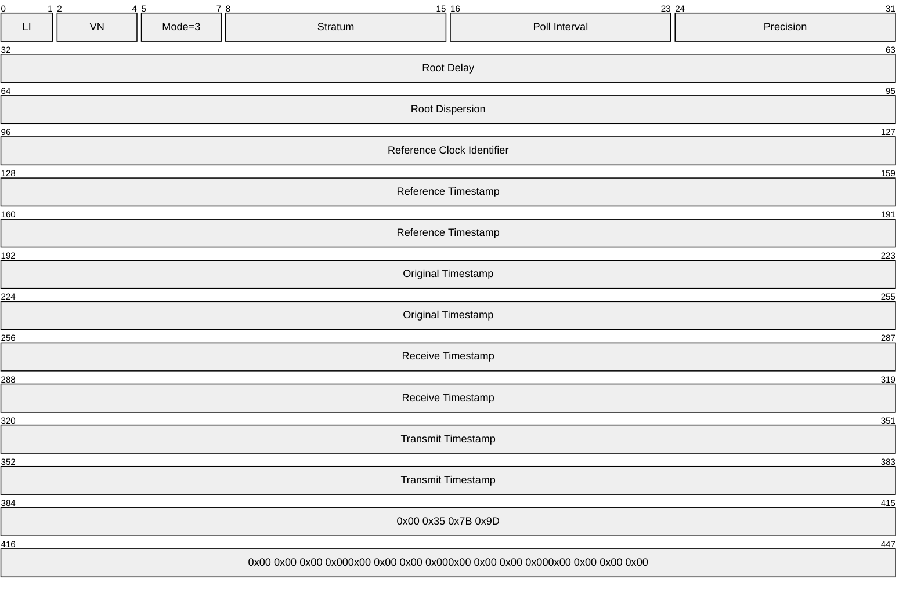

- After receiving the request, the server verifies that the received message size is 68 bytes. If it is not, the server either drops the request (if the message size does not equal 48 bytes) or treats it as an unauthenticated request (if the message size is 48 bytes). Assuming that the received message size is 68 bytes, the server extracts the RID from the received message. The server uses it to call the NetrLogonComputeServerDigest method (as specified in [MS-NRPC](../MS-NRPC/MS-NRPC.md) section 3.5.4.8.2) to compute the crypto-checksums and select the crypto-checksum based on the most significant bit of the **Key Identifier** subfield from the received message, as specified in section [3.2.5](#Section_3.2.5). The server then sends a response to the client, setting the **Key Identifier** field to 0 and the **Crypto-Checksum** field to the computed crypto-checksum.
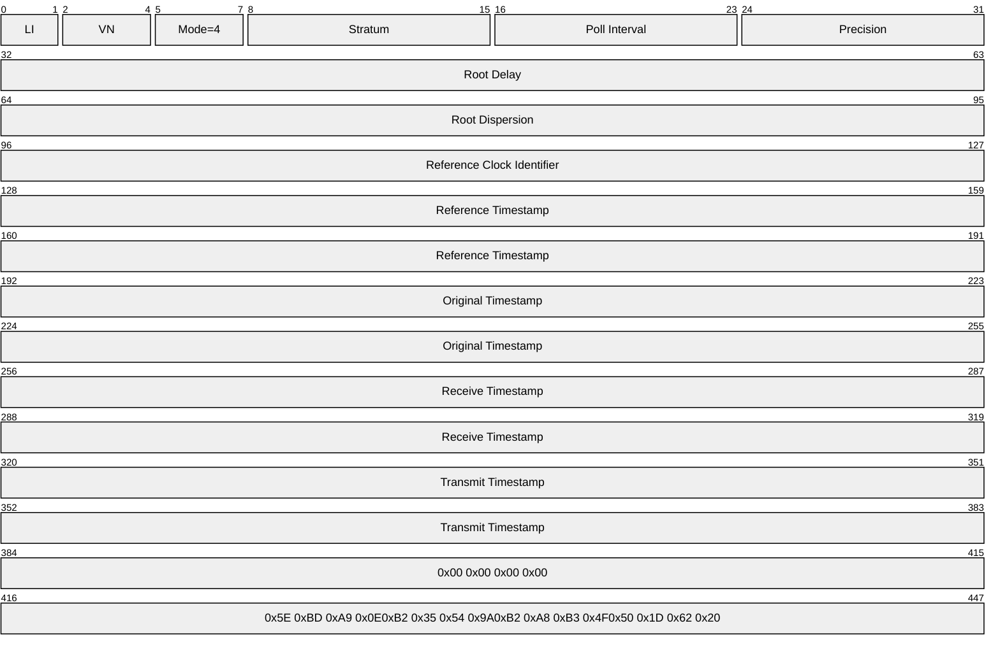

- The client receives the response and, after it verifies that the message size is 68 bytes, computes the crypto-checksums, as specified in section [3.1.5](#Section_3.1.5). The client finds that one of the calculated crypto-checksums matches the crypto-checksum in the response. The response is, therefore, authenticated successfully, and the client synchronizes its time.

# 5 Security

## 5.1 Security Considerations for Implementers

The cryptographic hash utilized in the [Server NTP Response](#Section_2.2.2) message and associated processing is calculated using the Netlogon Remote Protocol (as specified in [MS-NRPC](../MS-NRPC/MS-NRPC.md)) message protection methods. The methods use the MD5 algorithm, which is considered vulnerable to brute-force collision attacks. For more information on MD5 collisions, see [[MD5Collision]](https://go.microsoft.com/fwlink/?LinkId=89937). For this reason, clients and servers prefer the use of the ExtendedAuthenticator message formats (see sections [2.2.3](#Section_2.2.3) and [2.2.4](#Section_2.2.4)).

NTP Authentication Extensions provide secure messages but do not prevent invalid ones. For example, when the NTP server's own time is misconfigured, a response message is sent with an invalid time to the client. Such an invalid response message could lead to the client being synchronized to an invalid time. The client checks the time difference between the client and the server, and synchronizes time only if the time difference is within some reasonable range.<29>

## 5.2 Index of Security Parameters

| Security parameter | Section |
| --- | --- |
| Keys and key identifier | [3.1.3](#Section_3.1.3), [3.1.5](#Section_3.1.5), and [3.2.5](#Section_3.2.5) |
| Client NTP Request message | [2.2.1](#Section_2.2.1) |
| Server NTP Response message | [2.2.2](#Section_2.2.2) |

# 6 Appendix A: Product Behavior

The information in this specification is applicable to the following Microsoft products or supplemental software. References to product versions include updates to those products.

The terms "earlier" and "later", when used with a product version, refer to either all preceding versions or all subsequent versions, respectively. The term "through" refers to the inclusive range of versions. Applicable Microsoft products are listed chronologically in this section.

The following tables show the relationships between Microsoft product versions or supplemental software and the roles they perform.

| Windows Client releases | Client role | Server role |
| --- | --- | --- |
| Windows 2000 Professional operating system | Yes | Yes |
| Windows XP operating system | Yes | Yes |
| Windows Vista operating system | Yes | Yes |
| Windows 7 operating system | Yes | Yes |
| Windows 8 operating system | Yes | Yes |
| Windows 8.1 operating system | Yes | Yes |
| Windows 10 operating system | Yes | Yes |
| Windows 11 operating system | Yes | Yes |

| Windows Server releases | Client role | Server role |
| --- | --- | --- |
| Windows 2000 Server operating system | Yes | Yes |
| Windows Server 2003 operating system | Yes | Yes |
| Windows Server 2008 operating system | Yes | Yes |
| Windows Server 2008 R2 operating system | Yes | Yes |
| Windows Server 2012 operating system | Yes | Yes |
| Windows Server 2012 R2 operating system | Yes | Yes |
| Windows Server 2016 operating system | Yes | Yes |
| Windows Server operating system | Yes | Yes |
| Windows Server 2019 operating system | Yes | Yes |
| Windows Server 2022 operating system | Yes | Yes |
| Windows Server 2025 operating system | Yes | Yes |

Exceptions, if any, are noted in this section. If an update version, service pack or Knowledge Base (KB) number appears with a product name, the behavior changed in that update. The new behavior also applies to subsequent updates unless otherwise specified. If a product edition appears with the product version, behavior is different in that product edition.

Unless otherwise specified, any statement of optional behavior in this specification that is prescribed using the terms "SHOULD" or "SHOULD NOT" implies product behavior in accordance with the SHOULD or SHOULD NOT prescription. Unless otherwise specified, the term "MAY" implies that the product does not follow the prescription.

<1> Section 1.3.2: Windows 2000 operating system extends time synchronization based on SNTP, as specified in [[RFC2030]](https://go.microsoft.com/fwlink/?LinkId=103353). Windows XP and later and Windows Server 2003 and later extend time synchronization based on NTP [[RFC1305]](https://go.microsoft.com/fwlink/?LinkId=90272).

<2> Section 2.2: Windows implements the NTP.MINPOLL and NTP.MAXPOLL elements in the Windows registry by using the following registry values (respectively).

| Attribute | Value |
| --- | --- |
| Key Location | HKEY_LOCAL_MACHINE\SYSTEM\CurrentControlSet\Services\W32Time\Config |
| Name | MinPollInterval |
| Type | REG_DWORD |

| Attribute | Value |
| --- | --- |
| Key Location | HKEY_LOCAL_MACHINE\SYSTEM\CurrentControlSet\Services\W32Time\Config |
| Name | MaxPollInterval |
| Type | REG_DWORD |

These elements can be set by using the Remote Registry Protocol [MS-RRP](../MS-RRP/MS-RRP.md).

<3> Section 2.2.1: Windows implementations of the protocol client set this field to 0, and Windows implementations of the protocol server ignore this field.

<4> Section 2.2.2: In Windows Server 2003, Windows [**domain controllers**](#gt_domain-controller-dc) set this field to 0. In Windows 2000 and in Windows Server 2008 and later, Windows domain controllers set this field to the value of the **Key Identifier** subfield of the [Client NTP Request](#Section_2.2.1) message.

<5> Section 2.2.2: A server running Windows 2000 Server returns a response that contains a **Reference Timestamp** value equal to the value sent by the client. Additionally, a server running Windows 2000 Server returns a response that contains a **Root Dispersion** value equal to the value sent by the client when the server is unsynchronized.

<6> Section 2.2.4: A server running Windows 2000 Server returns a response that contains a **Reference Timestamp** value equal to the value sent by the client. Additionally, a server running Windows 2000 Server returns a response that contains a **Root Dispersion** value equal to the value sent by the client when the server is unsynchronized.

<7> Section 3.1.1: On Windows 2000 the NtpServer registry value was named "LocalNTP". It exists in the same location with the same value.

<8> Section 3.1.2.1: In Windows XP and later and in Windows Server 2003 and later, the minimum polling interval and the maximum polling interval vary between [**domain**](#gt_domain) roles (member machine versus domain controller).

By default, for a member machine acting as an NTP client, the minimum polling interval is 10 and the maximum polling interval is 15; for a domain controller acting as an NTP client, the minimum polling interval is 6 and the maximum polling interval is 10. These interval values are expressed (as in [RFC1305] section 3.2.7) in units of seconds and are exponents to a power of two; thus, the default minimum polling interval for a domain controller is 2 ^ 6 = 64 seconds, and the default maximum polling interval is 2 ^ 10 = 1,024 seconds.

[RFC1305] section 3.2.7 defines constants that specify the minimum (NTP.MINPOLL) and maximum (NTP.MAXPOLL) values permissible for a client's polling interval. The Windows implementation defines different constants for the minimum and maximum permissible values. These constants are used to validate any values specified in configuration for the minimum polling interval and maximum polling interval. The following table shows the definitions of maximum (NTP.MAXPOLL) and minimum (NTP.MINPOLL) permissible values for a client's maximum and minimum polling intervals for different Windows versions.

| Windows version | NTP.MAXPOLL: Domain controllers | NTP.MAXPOLL: Member /Standalone machines | NTP.MINPOLL: Domain controllers | NTP.MINPOLL: Member/Standalone machines |
| --- | --- | --- | --- | --- |
| Windows XP | 15 | 15 | 6 | 10 |
| Windows Server 2003 | 10 | 15 | 6 | 10 |
| Windows Vista and later and Windows Server 2008 and later | 10 | 15 | 6 | 10 |

In Windows XP and later and in Windows Server 2003 and later, the **Poll Interval** (as specified in [RFC1305] Appendix A) is initialized to NTP.MINPOLL. If the client continuously receives valid responses, the **Poll Interval** is incremented from NTP.MINPOLL to no more than NTP.MAXPOLL. If the client fails to receive a valid response after three consecutive attempts, the **Poll Interval** is decremented. If the client continues to fail to receive valid responses, the **Poll Interval** is decremented further below the minimum polling interval but never falls below the value defined for NTP.MINPOLL by Windows.

After eight consecutive failures to receive a valid response, the client pauses its synchronization attempts for a "back-off" interval (15 minutes), after which it returns to its initial **Poll Interval**. The back-off interval is doubled for each subsequent occurrence of eight consecutive failures. This doubling occurs no more than six times for a maximum back-off interval of no more than 960 minutes.

In Windows XP and later and in Windows Server 2003 and later, the client incorrectly sets the **Poll Interval** field of the first Client NTP Request message to the value defined for NTP.MAXPOLL by Windows.

Windows 2000 SNTP clients do not implement a true minimum or maximum polling interval. Instead, Windows 2000 clients initially poll by default every 45 minutes (the **Poll Interval** value in the SNTP message is set to 11 for this phase). After three successful poll operations, Windows 2000 clients jump to polling every 8 hours (the **Poll Interval** value is 14 for this phase). After every unsuccessful poll attempt, the interval reverts to 45 minutes.

<9> Section 3.1.3.1: Windows implementation imposes no constraints on the **LargePhaseOffset**, **HoldPeriod**, **SpikeWatchPeriod**, **SpecialPollInterval**, **ResolvePeerBackoffMinutes**, and **ResolvePeerBackoffMaxTimes** element values.

<10> Section 3.1.3.1: Windows 2000, Windows XP, Windows Server 2003, Windows Vista, and Windows Server 2008 do not use "VMTP" for the **sys.refid** element. In Windows 7 and later and in Windows Server 2008 R2 and later, the VMTP value is used when the client or server is in a Windows virtual environment. The determination of whether the client or server is in a Windows virtual environment is a local-only process that is specific to the Microsoft implementation of its virtual environment.

<11> Section 3.1.3.1: On Windows 2000, Windows XP, Windows Server 2003, Windows Vista, Windows Server 2008, Windows 7, Windows Server 2008 R2, Windows 8, Windows Server 2012, Windows 8.1, Windows Server 2012 R2, Windows 10 v1507 operating system, and Windows 10 v1511 operating system running inside Hyper-V, which is the Microsoft implementation of virtual machines, the **sys.stratum** element is set to 2. On Windows 10 and Windows Server 2016 and later running on a Windows Server 2012 R2 virtualization host, the **sys.stratum** element is set to 2.

<12> Section 3.1.5.1: Windows 2000 clients do not use the most significant bit of the **Key Identifier** subfield and always set the most significant bit to 0. In Windows XP and later and in Windows Server 2003 and later, the client sets the **Key Identifier** subfield as described in section 2.2.1. The most significant bit is initialized to the value of the **Key Selector** abstract element.

The client sets the **Crypto-Checksum** subfield as described in section 2.2.1.

<13> Section 3.1.5.1: In Windows 2000, the client always sets the **Mode** field of its Client NTP Request messages to 0x3 ("Client").

<14> Section 3.1.5.1: In Windows, the NetrLogonComputeClientDigest method, as specified in [MS-NRPC](../MS-NRPC/MS-NRPC.md) section 3.5.4.8.3, generates only two crypto-checksums for the current and previous passwords.

<15> Section 3.1.5.2: Windows 2000 servers return the **Reference Timestamp** value from the client request in the response.

<16> Section 3.1.5.2: Windows 2000 clients do not set the **Reference Timestamp** value to 0xAAAAAAAA and do not process Test 6.

<17> Section 3.1.9: Windows 2000, Windows XP, Windows Server 2003, Windows Vista, Windows Server 2008, Windows 7, and Windows Server 2008 R2 always set the **ExtendedAuthenticatorSupported** element to false.

<18> Section 3.2.1: Windows 2000 implements only the following values. Note that the string names of the values were "Reliable_Time_Source_No" and "Reliable_Time_Source_Yes" with identical semantics.

| Value | Meaning |
| --- | --- |
| Time_Source_No 0x00 | Never advertise as a reliable time source. |
| Time_Source_Yes 0x01 | Always advertise as a reliable time source. |

<19> Section 3.2.1: Windows 2000 exposes this ADM element via the following registry key

| Attribute | Value |
| --- | --- |
| Key Location | HKEY_LOCAL_MACHINE\SYSTEM\CurrentControlSet\Services\W32Time\Config |
| Name | ReliableTimeSource |
| Type | REG_DWORD |

This element can be set by using the Remote Registry Protocol [MS-RRP].

<20> Section 3.2.1: The **ResponseMode** element is valid only on Windows 2000.

<21> Section 3.2.3: Windows 2000, Windows XP, Windows Server 2003, Windows Vista, and Windows Server 2008 do not use "VMTP" for the **sys.refid** element. In Windows 7 and later and in Windows Server 2008 R2 and later, the VMTP value is used when the client or server is in a Windows virtual environment. The determination of whether the client or server is in a Windows virtual environment is a local-only process that is specific to the Microsoft implementation of its virtual environment.

<22> Section 3.2.3: On Windows 2000, Windows XP, Windows Server 2003, Windows Vista, Windows Server 2008, Windows 7, Windows Server 2008 R2, Windows 8, Windows Server 2012, Windows 8.1, Windows Server 2012 R2, Windows 10 v1507, and Windows 10 v1511 running inside Hyper-V, which is the Microsoft implementation of virtual machines, the **sys.stratum** element is set to 2. On Windows 10 and Windows Server 2016 and later running on a Windows Server 2012 R2 virtualization host, the **sys.stratum** element is set to 2.

<23> Section 3.2.3.1: Windows 2000 performs the following initialization:

- If the machine is a DC or the **ResponseMode** abstract data model element is set to Response_Mode_Yes, then the implementation sets the "Time service is running" bit to 1.
- If the **AnnounceFlags** abstract data model element is set to Time_Source_Yes and either the machine is a DC or the **ResponseMode** abstract data model element is set to Response_Mode_Yes, then the implementation sets the "Time service with clock hardware is running" bit to 1.
<24> Section 3.2.5.1: Windows 2000 Server does not process the Client NTP Request message when the NTP message length is 48 bytes.

<25> Section 3.2.5.1.1: According to [RFC1305], **Receive Timestamp**, **Originate Timestamp**, and **Poll Interval** need to be updated for every received NTP message. However, the Windows implementation of the NTP protocol ignores packets with invalid data or invalid headers. An NTP message is marked as having invalid data if it fails any of tests 1 through 4 documented in [RFC1305] section 3.4.4. An NTP message is marked as having an invalid header if it fails any of tests 5 through 8 documented in [RFC1305] section 3.4.4.

<26> Section 3.2.5.1.1: Windows NTP servers in Windows 2000, Windows XP, and Windows Server 2003 do not honor the above "SHOULD". Instead, they respond to the request. In Windows 2000, the server responds with a [Server NTP Response](#Section_2.2.2) message without an **Authenticator** field if authentication fails. In Windows XP and Windows Server 2003, the server responds with a Server NTP Response message that includes an **Authenticator** field in which the **Crypto-Checksum** subfield is set to zero. In either case, the client reads the Server NTP Response message as an authentication failure.

<27> Section 3.2.5.1.1: In the situation where the machine account has only a current password (that is, an old password does not yet exist) and a client requests a digest computed using the old password, Windows computes the digest using the current password. Windows 2000 is a special case in that it returns an unauthenticated response when an old password does not exist.

<28> Section 3.2.5.1.1: On Windows implementations of the protocol server, machine accounts do not keep a password history and therefore have only a current password. Only domain trust accounts keep the password history; therefore, a domain trust account can have an old password and a current password. In the absence of an old password, the current password is used (for both the 0 and the 1 values of the 1-bit key selector).

<29> Section 5.1: The client accepts any Server NTP Response message regardless of the time difference in authenticated NTP time synchronization inside a Windows domain.

# 7 Change Tracking

This section identifies changes that were made to this document since the last release. Changes are classified as Major, Minor, or None.

The revision class **Major** means that the technical content in the document was significantly revised. Major changes affect protocol interoperability or implementation. Examples of major changes are:

- A document revision that incorporates changes to interoperability requirements.
- A document revision that captures changes to protocol functionality.
The revision class **Minor** means that the meaning of the technical content was clarified. Minor changes do not affect protocol interoperability or implementation. Examples of minor changes are updates to clarify ambiguity at the sentence, paragraph, or table level.

The revision class **None** means that no new technical changes were introduced. Minor editorial and formatting changes may have been made, but the relevant technical content is identical to the last released version.

The changes made to this document are listed in the following table. For more information, please contact [dochelp@microsoft.com](mailto:dochelp@microsoft.com).

| Section | Description | Revision class |
| --- | --- | --- |
| [6](#Section_6) Appendix A: Product Behavior | Added Windows Server 2025 to the list of applicable products. | Major |

## Revision History

| Date | Version | Revision Class | Comments |
| --- | --- | --- | --- |
| 12/18/2006 | 0.1 | New | Version 0.1 release |
| 3/2/2007 | 1.0 | Major | Version 1.0 release |
| 4/3/2007 | 1.1 | Minor | Version 1.1 release |
| 5/11/2007 | 1.2 | Minor | Version 1.2 release |
| 6/1/2007 | 2.0 | Major | Updated and revised the technical content. |
| 7/3/2007 | 2.1 | Minor | Clarified the meaning of the technical content. |
| 7/20/2007 | 3.0 | Major | Rewrite to include dependencies on Netlogon. |
| 8/10/2007 | 3.0.1 | Editorial | Changed language and formatting in the technical content. |
| 9/28/2007 | 3.0.2 | Editorial | Changed language and formatting in the technical content. |
| 10/23/2007 | 3.0.3 | Editorial | Changed language and formatting in the technical content. |
| 11/30/2007 | 3.1 | Minor | Replaced reference for SNTP. |
| 1/25/2008 | 3.2 | Minor | Clarified the meaning of the technical content. |
| 3/14/2008 | 4.0 | Major | Updated and revised the technical content. |
| 5/16/2008 | 4.0.1 | Editorial | Changed language and formatting in the technical content. |
| 6/20/2008 | 4.0.2 | Editorial | Changed language and formatting in the technical content. |
| 7/25/2008 | 4.1 | Minor | Clarified the meaning of the technical content. |
| 8/29/2008 | 4.1.1 | Editorial | Changed language and formatting in the technical content. |
| 10/24/2008 | 4.1.2 | Editorial | Changed language and formatting in the technical content. |
| 12/5/2008 | 5.0 | Major | Updated and revised the technical content. |
| 1/16/2009 | 6.0 | Major | Updated and revised the technical content. |
| 2/27/2009 | 7.0 | Major | Updated and revised the technical content. |
| 4/10/2009 | 8.0 | Major | Updated and revised the technical content. |
| 5/22/2009 | 9.0 | Major | Updated and revised the technical content. |
| 7/2/2009 | 10.0 | Major | Updated and revised the technical content. |
| 8/14/2009 | 10.1 | Minor | Clarified the meaning of the technical content. |
| 9/25/2009 | 10.2 | Minor | Clarified the meaning of the technical content. |
| 11/6/2009 | 10.3 | Minor | Clarified the meaning of the technical content. |
| 12/18/2009 | 11.0 | Major | Updated and revised the technical content. |
| 1/29/2010 | 12.0 | Major | Updated and revised the technical content. |
| 3/12/2010 | 12.0.1 | Editorial | Changed language and formatting in the technical content. |
| 4/23/2010 | 13.0 | Major | Updated and revised the technical content. |
| 6/4/2010 | 14.0 | Major | Updated and revised the technical content. |
| 7/16/2010 | 15.0 | Major | Updated and revised the technical content. |
| 8/27/2010 | 16.0 | Major | Updated and revised the technical content. |
| 10/8/2010 | 17.0 | Major | Updated and revised the technical content. |
| 11/19/2010 | 18.0 | Major | Updated and revised the technical content. |
| 1/7/2011 | 19.0 | Major | Updated and revised the technical content. |
| 2/11/2011 | 20.0 | Major | Updated and revised the technical content. |
| 3/25/2011 | 20.0 | None | No changes to the meaning, language, or formatting of the technical content. |
| 5/6/2011 | 20.0 | None | No changes to the meaning, language, or formatting of the technical content. |
| 6/17/2011 | 20.1 | Minor | Clarified the meaning of the technical content. |
| 9/23/2011 | 20.1 | None | No changes to the meaning, language, or formatting of the technical content. |
| 12/16/2011 | 21.0 | Major | Updated and revised the technical content. |
| 3/30/2012 | 21.0 | None | No changes to the meaning, language, or formatting of the technical content. |
| 7/12/2012 | 22.0 | Major | Updated and revised the technical content. |
| 10/25/2012 | 23.0 | Major | Updated and revised the technical content. |
| 1/31/2013 | 23.0 | None | No changes to the meaning, language, or formatting of the technical content. |
| 8/8/2013 | 24.0 | Major | Updated and revised the technical content. |
| 11/14/2013 | 24.0 | None | No changes to the meaning, language, or formatting of the technical content. |
| 2/13/2014 | 24.0 | None | No changes to the meaning, language, or formatting of the technical content. |
| 5/15/2014 | 24.0 | None | No changes to the meaning, language, or formatting of the technical content. |
| 6/30/2015 | 25.0 | Major | Significantly changed the technical content. |
| 10/16/2015 | 25.0 | None | No changes to the meaning, language, or formatting of the technical content. |
| 7/14/2016 | 26.0 | Major | Significantly changed the technical content. |
| 6/1/2017 | 27.0 | Major | Significantly changed the technical content. |
| 9/15/2017 | 28.0 | Major | Significantly changed the technical content. |
| 9/12/2018 | 29.0 | Major | Significantly changed the technical content. |
| 4/7/2021 | 30.0 | Major | Significantly changed the technical content. |
| 6/25/2021 | 31.0 | Major | Significantly changed the technical content. |
| 4/23/2024 | 32.0 | Major | Significantly changed the technical content. |
