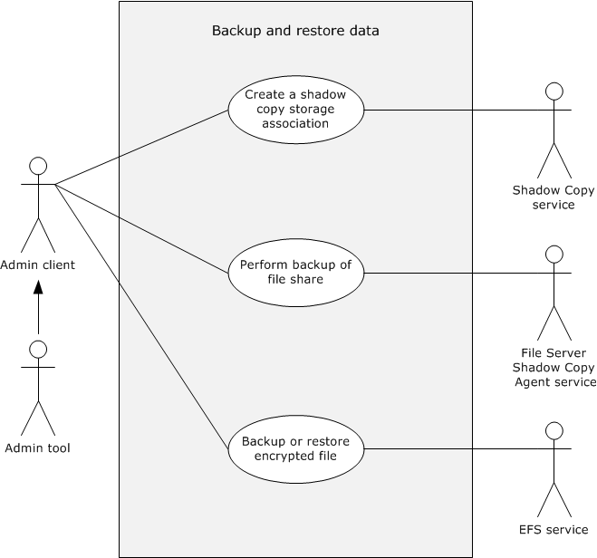
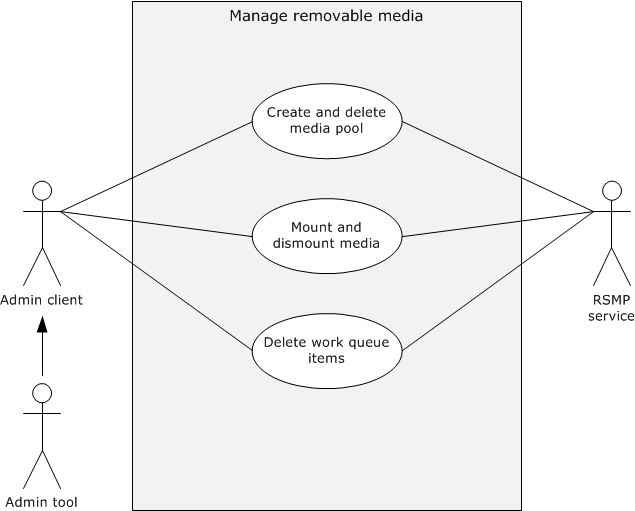
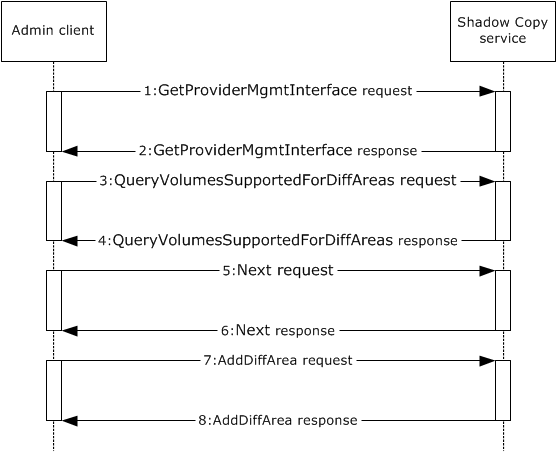
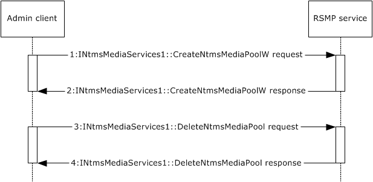

# [MS-STOROD]: Storage Services Protocols Overview

Table of Contents

1 Introduction

- [1 Introduction](#Section_1)
  - [1.1 Conceptual Overview](#Section_1.1)
  - [1.2 Glossary](#Section_1.2)
  - [1.3 References](#Section_1.3)

2 Functional Architecture

- [2 Functional Architecture](#Section_2)
  - [2.1 Overview](#Section_2.1)
    - [2.1.1 System Capabilities](#Section_2.1.1)
      - [2.1.1.1 Managing Disks and Volumes](#Section_2.1.1.1)
      - [2.1.1.2 Backing Up and Restoring Data](#Section_2.1.1.2)
      - [2.1.1.3 Managing Removable Media](#Section_2.1.1.3)
      - [2.1.1.4 Providing File Encryption and Access Control](#Section_2.1.1.4)
    - [2.1.2 Protocol Relationship](#Section_2.1.2)
  - [2.2 Protocol Summary](#Section_2.2)
  - [2.3 Environment](#Section_2.3)
    - [2.3.1 Dependencies on This System](#Section_2.3.1)
    - [2.3.2 Dependencies on Other Systems](#Section_2.3.2)
  - [2.4 Assumptions and Preconditions](#Section_2.4)
  - [2.5 Use Cases](#Section_2.5)
    - [2.5.1 Manage Disks and Volumes](#Section_2.5.1)
      - [2.5.1.1 Create and Modify a Volume](#Section_2.5.1.1)
      - [2.5.1.2 Convert a Basic Disk to a Dynamic Disk](#Section_2.5.1.2)
      - [2.5.1.3 Make an Offline Disk Online](#Section_2.5.1.3)
      - [2.5.1.4 Configure HBA Ports and iSCSI Initiators](#Section_2.5.1.4)
    - [2.5.2 Backup and Restore Data](#Section_2.5.2)
      - [2.5.2.1 Create a Shadow Copy Storage Association](#Section_2.5.2.1)
      - [2.5.2.2 Back Up or Restore an Encrypted File](#Section_2.5.2.2)
      - [2.5.2.3 Perform Backup of a File Share Remotely](#Section_2.5.2.3)
    - [2.5.3 Manage Removable Media](#Section_2.5.3)
      - [2.5.3.1 Create and Delete a Media Pool](#Section_2.5.3.1)
      - [2.5.3.2 Mount and Dismount Media](#Section_2.5.3.2)
      - [2.5.3.3 Delete Work Queue Items](#Section_2.5.3.3)
    - [2.5.4 Encrypted File Access Control and Encryption](#Section_2.5.4)
      - [2.5.4.1 Provide Cryptographic Access Permissions to an Encrypted File](#Section_2.5.4.1)
      - [2.5.4.2 Encrypt a File](#Section_2.5.4.2)
      - [2.5.4.3 Decrypt an Encrypted File](#Section_2.5.4.3)
  - [2.6 Versioning, Capability Negotiation, and Extensibility](#Section_2.6)
  - [2.7 Error Handling](#Section_2.7)
  - [2.8 Coherency Requirements](#Section_2.8)
  - [2.9 Security](#Section_2.9)
  - [2.10 Additional Considerations](#Section_2.10)

3 Examples

- [3 Examples](#Section_3)
  - [3.1 Example 1: Make a Disk Online](#Section_3.1)
  - [3.2 Example 2: Configure an iSCSI Initiator](#Section_3.2)
  - [3.3 Example 3: Create a Shadow Copy Storage Association](#Section_3.3)
  - [3.4 Example 4: Create and Delete a Media Pool](#Section_3.4)
  - [3.5 Example 5: Encrypt a File](#Section_3.5)
  - [3.6 Example 6: Decrypting an Encrypted File](#Section_3.6)
  - [3.7 Example 7: Perform Backup of a File Share Remotely](#Section_3.7)

4 Microsoft Implementations

- [4 Microsoft Implementations](#Section_4)
  - [4.1 Product Behavior](#Section_4.1)

5 Change Tracking

- [5 Change Tracking](#Section_5)

For the legal notice and IP terms, see [LEGAL.md](../LEGAL.md).
Last updated: 10/26/2021.
See [Revision History](#revision-history) for full version history.

# 1 Introduction

The Storage Services protocols consist of a set of protocols for configuring and administering storage services operations in the Windows operating system, such as managing [**disks**](#gt_disk) and [**volumes**](#gt_volume), backing up data, restoring data, managing the Media [**library**](#gt_library), and encrypting and decrypting [**files**](#gt_file). The member protocols of this system manage the low-level storage services operations and can be used programmatically to enumerate and configure disks, volumes, [**host bus adapter (HBA)**](#gt_host-bus-adapter-hba) ports, and [**iSCSI initiators**](#gt_iscsi-initiator) on remote computers.

Before the introduction of Disk Management services<1>, each storage device, such as the hard disk, the peripheral component interconnect (PCI) bus, the [**redundant arrays of independent disks (RAID)**](#gt_redundant-arrays-of-independent-disks-raid) adapter, and the storage array system, provided its own installation and management application. The Disk Management services provide a unified interface that simplifies the management of dissimilar storage devices.

## 1.1 Conceptual Overview

Data that is stored on servers is critically important for the day-to-day activities of any organization. This data needs to be accessed, stored, and recovered reliably. In response to the expanding requirements for storage in distributed computing environments, the Windows operating system supports different storage technologies for storing, accessing, and managing data on servers. For information about storage technologies, see [[MSDN-STC]](https://go.microsoft.com/fwlink/?LinkId=90139).

This section provides an overview of the following concepts, which are required for understanding this overview:

- File systems technologies
- File shares
- Disks and volumes
- Removable storage
**File systems technologies**

A [**file system**](#gt_file-system) is the structure in which [**files**](#gt_file) are named, stored, and organized. Examples for file systems are the FAT16, FAT32, and [**NTFS**](#gt_nt-file-system-ntfs) file systems. They can be used in any combination on a hard disk, but each [**volume**](#gt_volume) on a hard [**disk**](#gt_disk) can use only one file system.

The NTFS file system provides performance, reliability, and advanced features that are not found in any version of the [**FAT**](#gt_file-allocation-table-fat) file system. For example, NTFS includes built-in security features such as file and folder permissions and the [**Encrypting File System (EFS)**](#gt_encrypting-file-system-efs), which is the technology that is used to store encrypted files on NTFS volumes. NTFS also provides support for volumes up to 256 terabytes in size, support for disk quotas and compression, and support for mounted drives. For more information about EFS, see [[MSFT-EFS]](https://go.microsoft.com/fwlink/?LinkId=90185).

**File shares**

A file share represents a directory tree and its included files. It is a local resource that is offered by a file server and is consumed by a client application by using the File Access Services protocols, as described in [MS-FASOD](../MS-FASOD/MS-FASOD.md).

**Disks and volumes**

A disk is a storage device that stores and provides access to large amounts of data. There are two types of disks for storing information: a [**basic disk**](#gt_basic-disk) and a [**dynamic disk**](#gt_dynamic-disk). For more information about disk management, see [[MSDN-DISKMAN]](https://go.microsoft.com/fwlink/?LinkId=89992).

A volume is an area on a storage device that is managed by the file system as a discrete logical storage unit. For more information about volume management, see [[MSDN-VOLMAN]](https://go.microsoft.com/fwlink/?LinkId=90154).

**Removable storage**

Removable storage is an abstract component that is used to track removable storage media such as tapes and optical disks and to manage the hardware libraries that contain them by using changers and jukeboxes.

Removable storage components can perform the following operations:

- Label, catalog, and track media
- Control library drives, slots, and doors
- Perform drive-cleaning operations
Removable storage components interact with data management applications such as Backup. Removable storage components enable multiple applications to share storage media resources, which can reduce costs.

## 1.2 Glossary

This document uses the following terms:

**admin client**: A component that uses the Storage Services protocols to configure and query the state of storage entities such as the volume [**shadow copy**](#gt_shadow-copy), virtual disk, [**Encrypting File System (EFS)**](#gt_encrypting-file-system-efs), and removable storage. The [**Admin Client**](#gt_admin-client) is also used to configure various policies that apply to a storage object such as creating or deleting storage volumes, giving access controls, and getting notifications.

**basic disk**: A disk on which each [**volume**](#gt_volume) can be composed of exclusively one [**partition**](#gt_partition).

**certificate**: A certificate is a collection of attributes and extensions that can be stored persistently. The set of attributes in a certificate can vary depending on the intended usage of the certificate. A certificate securely binds a public key to the entity that holds the corresponding private key. A certificate is commonly used for authentication and secure exchange of information on open networks, such as the Internet, extranets, and intranets. Certificates are digitally signed by the issuing certification authority (CA) and can be issued for a user, a computer, or a service. The most widely accepted format for certificates is defined by the ITU-T X.509 version 3 international standards. For more information about attributes and extensions, see [[RFC3280]](https://go.microsoft.com/fwlink/?LinkId=90414) and [[X509]](https://go.microsoft.com/fwlink/?LinkId=90590) sections 7 and 8.

**disk**: A persistent storage device that can include physical hard disks, removable disk units, optical drive units, and logical unit numbers (LUNs) unmasked to the system.

**dynamic disk**: A disk on which volumes can be composed of more than one partition on disks of the same pack, as opposed to basic disks where a partition and a volume are equivalent.

**Encrypting File System (EFS)**: The name for the encryption capability of the [**NTFS**](#gt_nt-file-system-ntfs) file system. When a file is encrypted using [**EFS**](#gt_encrypting-file-system-efs), a symmetric key known as the file encryption key (FEK) is generated and the contents of the file are encrypted with the FEK. For each user or data recovery agent (DRA) that is authorized to access the file, a copy of the FEK is encrypted with that user's or DRA's [**public key**](#gt_public-key) and is stored in the file's metadata. For more information about [**EFS**](#gt_encrypting-file-system-efs), see [[MSFT-EFS]](https://go.microsoft.com/fwlink/?LinkId=90185).

**file**: An entity of data in the [**file system**](#gt_file-system) that a user can access and manage. A [**file**](#gt_file) must have a unique name in its directory. It consists of one or more streams of bytes that hold a set of related data, plus a set of attributes (also called properties) that describe the [**file**](#gt_file) or the data within the [**file**](#gt_file). The creation time of a [**file**](#gt_file) is an example of a file attribute.

**file allocation table (FAT)**: A data structure that the operating system creates when a volume is formatted by using [**FAT**](#gt_file-allocation-table-fat) or FAT32 [**file systems**](#gt_file-system). The operating system stores information about each [**file**](#gt_file) in the [**FAT**](#gt_file-allocation-table-fat) so that it can retrieve the [**file**](#gt_file) later.

**file system**: A system that enables applications to store and retrieve [**files**](#gt_file) on storage devices. Files are placed in a hierarchical structure. The file system specifies naming conventions for files and the format for specifying the path to a file in the tree structure. Each file system consists of one or more drivers and DLLs that define the data formats and features of the file system. File systems can exist on the following storage devices: diskettes, hard disks, jukeboxes, removable optical disks, and tape backup units.

**host bus adapter (HBA)**: A hardware device that adapts the signals of one electronic interface to another.

**iSCSI initiator**: A client of a SCSI interface. An iSCSI initiator issues SCSI commands to request services from components, which are logical units of a server known as a "target". For more information, see [[RFC3720]](https://go.microsoft.com/fwlink/?LinkId=90443) section 1.

**Library**: A storage device that contains one or more tape drives, a number of slots to hold tape cartridges, and an automated method for loading tapes.

**Lightweight Directory Access Protocol (LDAP)**: The primary access protocol for Active Directory. Lightweight Directory Access Protocol (LDAP) is an industry-standard protocol, established by the Internet Engineering Task Force (IETF), which allows users to query and update information in a directory service (DS), as described in [MS-ADTS](../MS-ADTS/MS-ADTS.md). The Lightweight Directory Access Protocol can be either version 2 [[RFC1777]](https://go.microsoft.com/fwlink/?LinkId=90290) or version 3 [[RFC3377]](https://go.microsoft.com/fwlink/?LinkID=91337).

**Microsoft Management Console (MMC)**: Provides a framework that consists of a graphical user interface (GUI) and a programming platform in which snap-ins (collections of administrative tools) can be created, opened, and saved. MMC is a multiple-document interface (MDI) application.

**NT file system (NTFS)**: A proprietary Microsoft file system. For more information, see [[MSFT-NTFS]](https://go.microsoft.com/fwlink/?LinkId=90200).

**partition**: In the context of hard disks, a logical region of a hard disk. A hard disk may be subdivided into one or more [**partitions**](#gt_partition).

**public key**: One of a pair of keys used in public-key cryptography. The public key is distributed freely and published as part of a digital certificate. For an introduction to this concept, see [[CRYPTO]](https://go.microsoft.com/fwlink/?LinkId=89841) section 1.8 and [[IEEE1363]](https://go.microsoft.com/fwlink/?LinkId=89899) section 3.1.

**redundant arrays of independent disks (RAID)**: A set of disk-organization techniques that is designed to achieve high-performance storage access and availability.

**remote procedure call (RPC)**: A communication protocol used primarily between client and server. The term has three definitions that are often used interchangeably: a runtime environment providing for communication facilities between computers (the RPC runtime); a set of request-and-response message exchanges between computers (the RPC exchange); and the single message from an RPC exchange (the RPC message). For more information, see [[C706]](https://go.microsoft.com/fwlink/?LinkId=89824).

**removable media**: Any type of storage that is not permanently attached to the computer. A persistent storage device stores its data on media. If the media can be removed from the device, the media is considered removable. For example, a floppy disk drive uses removable media.

**shadow copy**: A duplicate of data held on a [**volume**](#gt_volume) at a well-defined instant in time.

**shadow copy storage association**: The relationship between the original volume and the [**volume**](#gt_volume) where the shadow copy storage is located.

**storage server**: A server that hosts hard disks, [**removable media**](#gt_removable-media), and [**files**](#gt_file).

**volume**: A group of one or more partitions that forms a logical region of storage and the basis for a file system. A [**volume**](#gt_volume) is an area on a storage device that is managed by the file system as a discrete logical storage unit. A partition contains at least one [**volume**](#gt_volume), and a volume can exist on one or more partitions.

## 1.3 References

[MS-ADTS] Microsoft Corporation, "[Active Directory Technical Specification](../MS-ADTS/MS-ADTS.md)".

[MS-AUTHSOD] Microsoft Corporation, "[Authentication Services Protocols Overview](../MS-AUTHSOD/MS-AUTHSOD.md)".

[MS-DCOM] Microsoft Corporation, "[Distributed Component Object Model (DCOM) Remote Protocol](../MS-DCOM/MS-DCOM.md)".

[MS-DMRP] Microsoft Corporation, "[Disk Management Remote Protocol](../MS-DMRP/MS-DMRP.md)".

[MS-EFSR] Microsoft Corporation, "[Encrypting File System Remote (EFSRPC) Protocol](../MS-EFSR/MS-EFSR.md)".

[MS-FASOD] Microsoft Corporation, "[File Access Services Protocols Overview](../MS-FASOD/MS-FASOD.md)".

[MS-FSRVP] Microsoft Corporation, "[File Server Remote VSS Protocol](../MS-FSRVP/MS-FSRVP.md)".

[MS-GPOD] Microsoft Corporation, "[Group Policy Protocols Overview](../MS-GPOD/MS-GPOD.md)".

[MS-OAUT] Microsoft Corporation, "[OLE Automation Protocol](../MS-OAUT/MS-OAUT.md)".

[MS-RPCE] Microsoft Corporation, "[Remote Procedure Call Protocol Extensions](../MS-RPCE/MS-RPCE.md)".

[MS-RSMP] Microsoft Corporation, "[Removable Storage Manager (RSM) Remote Protocol](../MS-RSMP/MS-RSMP.md)".

[MS-SCMP] Microsoft Corporation, "[Shadow Copy Management Protocol](../MS-SCMP/MS-SCMP.md)".

[MS-VDS] Microsoft Corporation, "[Virtual Disk Service (VDS) Protocol](../MS-VDS/MS-VDS.md)".

[MS-WCCE] Microsoft Corporation, "[Windows Client Certificate Enrollment Protocol](../MS-WCCE/MS-WCCE.md)".

[MSDN-DISKMAN] Microsoft Corporation, "Disk Management", [http://msdn.microsoft.com/en-us/library/aa363978.aspx](https://go.microsoft.com/fwlink/?LinkId=89992)

[MSDN-STC] Microsoft Corporation, "Storage Technologies Collection", March 2003, [http://technet2.microsoft.com/WindowsServer/en/Library/616e5e77-958b-42f0-a87f-ba229ccd81721033.mspx](https://go.microsoft.com/fwlink/?LinkId=90139)

[MSDN-VOLMAN] Microsoft Corporation, "Volume Management", [http://msdn.microsoft.com/en-us/library/aa365728.aspx](https://go.microsoft.com/fwlink/?LinkId=90154)

[MSFT-EFS] Microsoft Corporation, "The Encrypting File System", [https://technet.microsoft.com/en-us/library/cc700811.aspx](https://go.microsoft.com/fwlink/?LinkId=90185)

# 2 Functional Architecture

This section provides an overview of the capabilities of the Storage Services protocols, their relationships, and a summary of the Storage Services protocols, system dependencies, use cases, versioning, capability negotiation, error handling, coherency requirements, and security considerations.

## 2.1 Overview

The Storage Services protocols provide [**disk**](#gt_disk) and [**volume**](#gt_volume) management services, data backup and restore, [**removable media**](#gt_removable-media) management, encrypted file access control, and file encryption.

The Storage Services protocols have four main components:

- A Disk Management service that provides disk and volume management services.
- A Shadow Copy service that backs up and restores data for volumes and file shares.
- A Removable Storage Media Management service (RSMP service) that manages removable storage media.
- An Encrypting File System service (EFS service) that encrypts and decrypts files.
The following diagram shows the relationship of the main components of the Storage Services protocols with external components.

Figure 1: Relationships of Storage Services protocols with external components

The main external components that interact with the Storage Services protocols are as follows:

**Admin Tool:** A [**Microsoft Management Console (MMC)**](#gt_microsoft-management-console-mmc), which is used by the administrator to configure the storage on the server.

**Hard disk:** A peripheral device that provides persistent data storage and does not have removable media.

**Volumes:** A group of one or more [**partitions**](#gt_partition) that form a logical region of storage and the basis for a [**file system**](#gt_file-system). A volume is an area on a storage device that is managed by the file system as a discrete logical storage unit. A partition contains at least one volume, and a volume can exist on one or more partitions.

**Removable device:** Any type of storage that is not permanently attached to a computer. A persistent storage device stores its data on media. If the media can be removed from the device, the media is considered removable. For example, a floppy disk drive uses removable media.

**Files:** An entity of data in the file system that a user can access and manage. A [**file**](#gt_file) has a unique name in its directory. It consists of one or more streams of bytes that hold a set of related data and a set of attributes, also called properties, which describe the file or the data within the file. The creation time of a file is an example of a file attribute.

The dotted line in the diagram "Relationships of Storage Services protocols with external components" indicates local communication between the external components, such as the hard disk, the Admin Tool, the volumes, the removable device, and the files, and the Storage Services protocols. This local communication is implementation-specific.

The Storage Services protocols are:

- The Disk Management Remote Protocol, as described in [MS-DMRP](../MS-DMRP/MS-DMRP.md)
- The Virtual Disk Service (VDS) Protocol, as described in [MS-VDS](../MS-VDS/MS-VDS.md)
- The Shadow Copy Management Protocol, as described in [MS-SCMP](../MS-SCMP/MS-SCMP.md)
- The File Server Remote VSS Protocol, as described in [MS-FSRVP](../MS-FSRVP/MS-FSRVP.md)
- The Removable Storage Manager (RSM) Remote Protocol, as described in [MS-RSMP](../MS-RSMP/MS-RSMP.md)
- The Encrypting File System Remote (EFSRPC) Protocol, as described in [MS-EFSR](../MS-EFSR/MS-EFSR.md)
The following diagram shows the Storage Services system protocols with the external components and includes the specific protocols that are used to implement these relationships.

Figure 2: Component-level diagram of Storage Services protocols

### 2.1.1 System Capabilities

The Storage Services protocols enable the administrator to store and access data reliably, recover stored data, and manage the data on the servers. The overall functionality of the Storage Services protocols includes the following:

- [Managing disks and volumes (section 2.1.1.1)](#Section_2.1.1.1)
- [Backing up and restoring data (section 2.1.1.2)](#Section_2.1.1.2)
- [Managing removable media (section 2.1.1.3)](#Section_2.1.1.3)
- [Providing file encryption and access control (section 2.1.1.4)](#Section_2.1.1.4)

#### 2.1.1.1 Managing Disks and Volumes

The Storage Services protocols provide an interface for managing [**disks**](#gt_disk) and [**volumes**](#gt_volume) and provide an end-to-end solution for managing storage hardware and disks and for creating volumes on those disks. This functionality is provided by the Disk Management Remote (DMRP) Protocol, as described in [MS-DMRP](../MS-DMRP/MS-DMRP.md),<2> and the Virtual Disk Service (VDS) Protocol, as described in [MS-VDS](../MS-VDS/MS-VDS.md).<3>

#### 2.1.1.2 Backing Up and Restoring Data

The Shadow Copy Management Protocol, as described in [MS-SCMP](../MS-SCMP/MS-SCMP.md), the File Server Remote VSS Protocol, as described in [MS-FSRVP](../MS-FSRVP/MS-FSRVP.md), and the Encrypting File System Remote (EFSRPC) Protocol, as described in [MS-EFSR](../MS-EFSR/MS-EFSR.md), aid in backup and restore functionality.

The Shadow Copy Management Protocol is applicable when an application is required to configure [**shadow copies**](#gt_shadow-copy) and shadow copy storage on the server remotely, which in turn is used by any snapshot provider to perform data backup-and-restore operations.

The Shadow Copy Management Protocol provides a mechanism for remote configuration of shadow copies to implement the following functionalities:

- Enumerate the volumes on the server that can be shadow copied or used as shadow copy storage.
- Enumerate the shadow copies that are available on the server and that are snapshot copies of a specified original volume.
- Create, modify, enumerate, and delete the [**shadow copy storage association**](#gt_shadow-copy-storage-association) objects, as described in [MS-SCMP], that define the location and size of shadow copy storage for specific original volumes.
- Query all the shadow copy storage association objects on the server that provide shadow copy storage for a specified original volume and that are located on a specified shadow copy storage volume.
The File Server Remote VSS Protocol enables an application to query, create, or delete shadow copies on a file server. After the shadow copy of the [**file**](#gt_file) share is created, a VSS-aware application can use the shadow copy share to back up the application state and data from network shares that are hosted on a file server. This protocol can be integrated with existing volume shadow copy creation utilities.

The EFSR protocol is used for backup-and-restore operations of encrypted files when application consistency is not required. For these operations to succeed, the file cannot have an open handle while it is being backed up; otherwise, the backup-and-restore operations fail. For more information about backup-and-restore operations for encrypted files, see [MS-EFSR] section 4.

#### 2.1.1.3 Managing Removable Media

Managing [**removable media**](#gt_removable-media) is a technology that enables multiple applications to share local [**libraries**](#gt_library) and tape or disk drives. It is used to configure and track the removable storage media, such as tapes and optical disks, and manage the hardware libraries that contain them, by using changers and tape libraries, also called tape jukeboxes.

Removable media management is used to manage standalone storage devices, to manage online media libraries and robotic changers, and to track removable tapes and disks. Standalone devices include CD-ROM, DVD, and tape drives, such as 4 mm, 8 mm, and Digital Linear Tape (DLT) tape drives. This functionality is provided by the Removable Storage Manager Remote Protocol, as described in [MS-RSMP](../MS-RSMP/MS-RSMP.md).

#### 2.1.1.4 Providing File Encryption and Access Control

The encryption functionality provides an additional level of security for files and directories. It provides cryptographic protection of individual files on [**NTFS**](#gt_nt-file-system-ntfs) file system volumes that use a [**public key**](#gt_public-key) system.

The [**Encrypting File System (EFS)**](#gt_encrypting-file-system-efs) checks only whether a file or a directory is marked for encryption and, if so, it protects the file with the [**certificate**](#gt_certificate) of the user who is adding the file.

Typically, the control for access to [**file**](#gt_file) and directory objects, which is provided by the Windows security model, is sufficient to protect unauthorized access to sensitive information. However, if a computer that contains sensitive data is lost or stolen, the security protection of that data can be compromised. Additional access control functionality can be provided by the Encrypting File System and is accessed remotely through the Encrypting File System Remote Protocol, as described in [MS-EFSR](../MS-EFSR/MS-EFSR.md).

### 2.1.2 Protocol Relationship

The following diagram shows the relationship among the Storage Services protocols.

Figure 3: Relationship between the Storage Services protocols

The EFSR Protocol uses the interfaces, described in [MS-WCCE](../MS-WCCE/MS-WCCE.md), for [**certificate**](#gt_certificate) enrollment, which in turn uses DCOM, as described in [MS-DCOM](../MS-DCOM/MS-DCOM.md), as the transport. For all other operations, EFSR directly uses the [**remote procedure call (RPC)**](#gt_remote-procedure-call-rpc) extensions, as described in [MS-RPCE](../MS-RPCE/MS-RPCE.md).

The DMRP, VDS, and RSMP Protocols use DCOM as the transport.

The SCMP Protocol uses the interfaces, described in [MS-OAUT](../MS-OAUT/MS-OAUT.md), which in turn uses DCOM as the transport.

## 2.2 Protocol Summary

The following table provides a comprehensive list of the Storage Services member protocols.

| Protocol name | Description | Short name |
| --- | --- | --- |
| Disk Management Remote Protocol | The Disk Management Remote Protocol provides a set of DCOM interfaces for managing storage objects, such as disks and volumes.<4> | [MS-DMRP](../MS-DMRP/MS-DMRP.md) |
| Virtual Disk Service (VDS) Protocol | The Virtual Disk Service (VDS) Remote Protocol is a set of DCOM interfaces for managing the configuration of disk storage on a computer. The Virtual Disk Service Remote Protocol deals with detailed low-level operating system and storage concepts. This protocol supersedes the Disk Management Remote Protocol, as described in [MS-DMRP].<5> | [MS-VDS](../MS-VDS/MS-VDS.md) |
| Shadow Copy Management Protocol | The Shadow Copy Management Protocol is used to programmatically enumerate shadow copies and configure shadow copy storage on remote machines. The protocol uses a set of DCOM interfaces to query shadow copies and manage shadow copy storage on a remote machine.<6> | [MS-SCMP](../MS-SCMP/MS-SCMP.md) |
| Removable Storage Manager (RSM) Remote Protocol | The Removable Storage Manager (RSM) Remote Protocol provides a mechanism for the remote configuration and management of removable storage devices, such as robotic changers, media libraries, and tape drives. It enables multiple clients to manage removable media within a single-server system and share local robotic media libraries, tape drives, and disk drives.<7> | [MS-RSMP](../MS-RSMP/MS-RSMP.md) |
| Encrypting File System Remote (EFSRPC) Protocol | The Encrypting File System Remote (EFSRPC) Protocol is used for performing maintenance and management operations on encrypted data that is stored remotely and accessed over a network. | [MS-EFSR](../MS-EFSR/MS-EFSR.md) |
| File Server Remote VSS Protocol | The File Server Remote VSS Protocol is designed to remotely create shadow copies of file shares that are hosted on a file server. This functionality facilitates applications that are hosting their data on a file server to back up and restore their application state.<8> | [MS-FSRVP](../MS-FSRVP/MS-FSRVP.md) |

## 2.3 Environment

The following sections identify the context in which the system exists. The context includes the systems that use the interfaces that are provided by this system of protocols, other systems that depend on this system, and the appropriate communication between the system components within their environment.

### 2.3.1 Dependencies on This System

None.

### 2.3.2 Dependencies on Other Systems

The Storage Services protocols depend on the following entities:

- The process that is used to enroll an EFS certificate as described in [MS-EFSR](../MS-EFSR/MS-EFSR.md) section 3.1.4.1.
- The Authentication Services system, as described in [MS-AUTHSOD](../MS-AUTHSOD/MS-AUTHSOD.md), for authenticating the Storage Services [**Admin Client**](#gt_admin-client).
- The Active Directory domain for [**LDAP**](#gt_lightweight-directory-access-protocol-ldap) search and modify operations that are required by the [**EFS**](#gt_encrypting-file-system-efs) [**certificate**](#gt_certificate) enrollment algorithm, as described in [MS-ADTS](../MS-ADTS/MS-ADTS.md) section 3.1.1.3.
- The Group Policy Protocols system, as described in [MS-GPOD](../MS-GPOD/MS-GPOD.md), for enabling remote administrative configuration of the Encrypting File System (EFS).

## 2.4 Assumptions and Preconditions

The following assumptions and preconditions need to be satisfied for the Storage Services protocols to operate successfully:

- The Storage Services components (disk management service, Shadow Copy service, RSMP service, and the EFS service) are installed on all the computers involved.
- The [**RPC**](#gt_remote-procedure-call-rpc) extensions and DCOM transport protocols are available.
- The [**Admin Client**](#gt_admin-client) has obtained the name of a server that implements the Storage Services protocols before the protocol is called. The Admin Client also requires sufficient security privileges to configure [**disks**](#gt_disk) and [**volumes**](#gt_volume) on the server.
- The network services and infrastructure are functional and configured so that required components such as protocols and ports are remotely accessible. The network access is required to enable system components that are running on different computers to communicate.

## 2.5 Use Cases

The following table lists the use cases that span the functionality of the Storage Services protocols. The use cases are grouped into four groups as shown in the first column of the following table.

| Use case group | Use cases |
| --- | --- |
| Manage Disks and Volumes | [Create and Modify a Volume (section 2.5.1.1)](#Section_2.5.1.1) [Convert a Basic Disk to a Dynamic Disk (section 2.5.1.2)](#Section_2.5.1.2) [Make an Offline Disk Online (section 2.5.1.3)](#Section_2.5.1.3) [Configure HBA Port and iSCSI Initiators (section 2.5.1.4)](#Section_2.5.1.4) |
| Backup and Restore Data | [Create a Shadow Copy Storage Association (section 2.5.2.1)](#Section_2.5.2.1) [Back Up or Restore an Encrypted File (section 2.5.2.2)](#Section_2.5.2.2) [Perform a Backup of a File Share Remotely (section 2.5.2.3)](#Section_2.5.2.3) |
| Manage Removable Storage | [Create and Delete a Media Pool (section 2.5.3.1)](#Section_2.5.3.1) [Mount and Dismount Media (section 2.5.3.2)](#Section_2.5.3.2) [Delete Work Queue Items (section 2.5.3.3)](#Section_2.5.3.3) |
| Encrypted File Access Control and Encryption | [Provide Cryptographic Access Permissions to an Encrypted File (section 2.5.4.1)](#Section_2.5.4.1) [Encrypt a File (section 2.5.4.2)](#Section_2.5.4.2) [Decrypt an Encrypted File (section 2.5.4.3)](#Section_2.5.4.3) |

The following sections provide detailed descriptions for each of the use cases in each group.

### 2.5.1 Manage Disks and Volumes

The Manage Disks and Volumes use case group consists of four use cases that illustrate the functionality for managing [**disks**](#gt_disk) and [**volumes**](#gt_volume):

- Create and modify a volume.
- Convert a [**basic disk**](#gt_basic-disk) to a [**dynamic disk**](#gt_dynamic-disk).
- Make an offline disk online.
- Configure [**HBA**](#gt_host-bus-adapter-hba) ports and [**iSCSI initiators**](#gt_iscsi-initiator).
The following use case diagram shows the functionality for managing disks and volumes.

Figure 4: Manage Disks and Volumes use case diagram

The following sections describe each use case for the Manage Disks and Volumes use case group.

#### 2.5.1.1 Create and Modify a Volume

**Goal**

Create and modify [**volumes**](#gt_volume).

**Context of Use**

The administrator is setting up a storage server. For this process, the administrator is required to create and modify volumes.

**Actors**

- **Admin Tool**: A [**Microsoft Management Console (MMC)**](#gt_microsoft-management-console-mmc) component, which is used by the administrator to configure the storage on the server.
- **Admin Client**: The primary actor. The [**Admin Client**](#gt_admin-client) is code that is running on the administrator's computer. The Admin Client implements client-side protocol components and consumes the storage services that are offered by the storage server. The Admin Client's interest is to correctly interpret, execute, and display the results of the commands that are issued by the administrator.
- **Disk Management service:** The Disk Management service is the server-side implementation of the protocols specified in [MS-DMRP](../MS-DMRP/MS-DMRP.md) and [MS-VDS](../MS-VDS/MS-VDS.md).
**Stakeholders**

- **Administrator:** The administrator is the person who administers the storage. The administrator is interested in organizing the storage, setting access rights, and enforcing quota-based limits on the storage. The administrator is external to the Storage Services protocols and interacts with the Storage Services protocols through the Admin Client.
**Preconditions**

The administrator has configured the Disk Management service in the storage server and has the appropriate access privileges to configure the disks and volumes.

**Main success scenario**

- Trigger: The administrator requests to create a volume with a specified drive letter by using the Admin Tool.
- The Admin Tool requests that the Admin Client establish a communication channel to the Disk Management service of the Storage Services protocols.
- The Admin Client contacts the Disk Management service by using the **IVolumeClient::CreateVolumeAssignAndFormat** method, as described in [MS-DMRP] section 3.2.4.4.1.27, to create a dynamic volume and assign a drive letter.
- The Disk Management service creates the requested dynamic volume with the specified drive letter to store configuration information in an implementation-specific manner.
- The administrator requests to increase the size of the volume by using the Admin Tool.
- The Admin Client uses the Disk Management service by using the **IVolumeClient::GrowVolume** method, as described in [MS-DMRP] section 3.2.4.4.1.30, to increase the size of the volume.
- The Disk Management service increases the size of the requested volume.
**Postcondition**

The required actions have finished successfully: the volume is created, a drive letter is assigned, and the size of the volume has been increased.

**Extensions**

If the communication channel for the Disk Management Remote Protocol cannot be established or it becomes disconnected, the Admin Client attempts to establish the connection multiple times, until it fails. Whether the volume creation is finished or not depends on when the connection failed.

**Variation**

A variation of this use case is to create and modify a volume by using the Virtual Disk Service Protocol. The main success scenario steps of the variation are identical to those in the main use case that are described in this section.

#### 2.5.1.2 Convert a Basic Disk to a Dynamic Disk

**Goal**

Convert a [**basic disk**](#gt_basic-disk) to a [**dynamic disk**](#gt_dynamic-disk).

**Context of Use**

The administrator is setting up a [**storage server**](#gt_storage-server). In this process, the administrator is required to convert a basic disk to a dynamic disk and vice versa.

**Actors**

- **Admin Tool**: A [**Microsoft Management Console (MMC)**](#gt_microsoft-management-console-mmc) component, which is used by the administrator to configure the storage on the server.
- **Admin Client**: The primary actor. The [**Admin Client**](#gt_admin-client) is code that is running on the administrator's computer. The Admin Client implements client-side protocol components and consumes the storage services that are offered by the storage server. The Admin Client's interest is to correctly interpret, execute, and display the results of the commands that are issued by the administrator.
- **Disk Management service:** The Disk Management service is the server-side implementation of the Disk Management Remote Protocol, as described in [MS-DMRP](../MS-DMRP/MS-DMRP.md), and the Virtual Disk Service Protocol, as described in [MS-VDS](../MS-VDS/MS-VDS.md).
**Stakeholders**

- **Administrator:** The administrator is the person who administers the storage. The administrator is interested in organizing the storage, setting access rights, and enforcing quota-based limits on the storage. The administrator is external to the Storage Services protocols and interacts with the Storage Services protocols through the Admin Client.
**Preconditions**

The administrator has configured the Disk Management service on the storage server and has the appropriate access privileges to configure the disks and volumes.

**Main success scenario**

- Trigger: The administrator requests to convert the disk type from basic to dynamic by using the Admin Tool.
- The Admin Tool requests that the Admin Client establish a communication channel to the Disk Management service of the Storage Service system.
- The Admin Client contacts the Disk Management service to convert a basic disk to a dynamic disk by using the **IVolumeClient::InitializeDisk** method as described in [MS-DMRP] section 3.2.4.4.1.35.
- The Disk Management service converts the basic disk to a dynamic disk to store configuration information in an implementation-specific manner.
**Postcondition**

The required conversion from a basic disk to a dynamic disk has finished successfully.

**Extensions**

If the communication channel for , as described in [MS-DMRP], cannot be established, or it becomes disconnected, the Admin Client attempts to establish a connection multiple times until it fails. The completion of the disk's conversion depends on when the connection fails.

**Variation**

A variation of this use case is to convert a basic disk to a dynamic disk by using the Virtual Disk Service Protocol, as described in [MS-VDS]. The main success scenario steps of the variation are identical to those in the main use case that are described in this section.

#### 2.5.1.3 Make an Offline Disk Online

**Goal**

Make an offline disk into an online disk.

**Context of Use**

The administrator is setting up a [**storage server**](#gt_storage-server), and in this process the administrator is required to make an offline [**disk**](#gt_disk) to an online disk.

**Actors**

- **Admin Tool**: A [**Microsoft Management Console (MMC)**](#gt_microsoft-management-console-mmc) component, which is used by the administrator to configure the storage on the server.
- **Admin Client**: The primary actor. The [**Admin Client**](#gt_admin-client) is code that is running on the administrator's computer. The Admin Client implements client-side protocol components and consumes the storage services that are offered by the storage server. The Admin Client's interest is to correctly interpret, execute, and display the results of the commands that are issued by administrator.
- **Disk Management service:** The Disk Management service is the server-side implementation of the, described in [MS-DMRP](../MS-DMRP/MS-DMRP.md) and [MS-VDS](../MS-VDS/MS-VDS.md).
**Stakeholders**

- **Administrator:** The administrator is the person who administers the storage. The administrator is interested in organizing the storage, setting access rights, and enforcing quota-based limits on the storage. The administrator is external to the Storage Services protocols and interacts with the Storage Services protocols through the Admin Client.
**Preconditions**

The administrator has configured the Disk Management service on the storage server and has the appropriate access privileges to configure the disks and volumes.

**Main success scenario**

- Trigger: The administrator requests to convert an offline disk to an online disk by using the Admin Tool.
- The Admin Tool requests that the Admin Client establish a communication channel to the Disk Management service of the Storage Services protocols.
- The Admin Client contacts the Disk Management service to convert an offline disk to an online disk by using the **IVolumeClient::ReAttachDisk** method, as described in [MS-DMRP] section 3.2.4.4.1.41.
- The Disk Management service converts the offline disk to an online disk to store configuration information in an implementation-specific manner.
**Postcondition**

The required conversion from an offline disk to an online disk and vice versa has completed successfully.

**Extensions**

If the communication channel for [MS-DMRP] cannot be established, or it becomes disconnected, the Admin Client attempts to establish a connection multiple times until it fails. The completion of the disk's conversion depends on when the connection failed.

**Variation**

A variation of this use case is to convert an offline disk into an online disk by using the Virtual Disk Service Protocol, as described [MS-VDS]. The main success scenario steps of the variation are identical to those in the main use case as described in this section.

#### 2.5.1.4 Configure HBA Ports and iSCSI Initiators

**Goal**

Configure [**host bus adapter (HBA)**](#gt_host-bus-adapter-hba) ports and [**iSCSI initiators**](#gt_iscsi-initiator).

**Context of Use**

The administrator is setting up a [**storage server**](#gt_storage-server), and in this process, the administrator is required to configure the storage.

**Actors**

- **Admin Tool**: A [**Microsoft Management Console (MMC)**](#gt_microsoft-management-console-mmc) component, which is used by the administrator to configure the storage on the server.
- **Admin Client**: The primary actor. The [**Admin Client**](#gt_admin-client) is code running on the administrator's computer. The Admin Client implements client-side protocol components and consumes the storage services that are offered by the storage server. The Admin Client's interest is to correctly interpret, execute, and display the results of the commands that are issued by administrator.
- **Disk Management Service:** The Disk Management service is the server-side implementation of the protocols specified in [MS-DMRP](../MS-DMRP/MS-DMRP.md) and [MS-VDS](../MS-VDS/MS-VDS.md).
**Stakeholders**

- **Administrator:** The administrator is the person who administers the storage. The administrator is interested in organizing the storage, setting access rights, and enforcing quota-based limits on the storage. The administrator is external to the Storage Services protocols and interacts with the Storage Services protocols through the Admin Client.
**Preconditions**

The administrator has configured the Disk Management service on the storage server and has the appropriate access privileges to configure the disks and volumes.

**Main success scenario**

- Trigger: The administrator requests to set up an iSCSI initiator by using the Admin Tool.
- The Admin Tool requests that the Admin Client establish a communication channel to the Disk Management service of the Storage Services protocols.
- The Admin Client contacts the Disk Management service to configure the iSCSI initiator by using the **IVdsServiceIscsi:SetInitiatorSharedSecret()** method, as described in [MS-VDS] section 3.4.5.2.8.3.
- The Disk Management service configures the requested iSCSI initiator to store configuration information in an implementation-specific manner.
- The administrator requests to set up an HBA port by using the Admin Tool.
- The Admin Client contacts the Disk Management service to configure HBA ports by using the **IVdsHbaPort::SetAllPathStatuses()** method, as described in [MS-VDS] section 3.4.5.2.11.2.
- The Disk Management service configures the requested HBA ports to store configuration information in an implementation-specific manner.
**Postcondition**

The required configuration of an HBA port and an iSCSI initiator has finished successfully.

**Extensions**

If the communication channel for the Virtual Disk Service (VDS) Protocol cannot be established, or it becomes disconnected, the Admin Client attempts to establish a connection multiple times until it fails. The configuration of the HBA ports and the iSCSI initiators depends on when the connection failed.

### 2.5.2 Backup and Restore Data

The Backup and Restore Data use case group consists of two use cases that illustrate the functionality for backing up and restoring data:

- Copy volume
- Back up or restore encrypted file
The following use case diagram shows the functionality for backing up or restoring data.

Figure 5: Back up or Restore Data use case diagram

#### 2.5.2.1 Create a Shadow Copy Storage Association

**Goal**

Create a [**shadow copy storage association**](#gt_shadow-copy-storage-association), as defined in [MS-SCMP](../MS-SCMP/MS-SCMP.md).

**Context of Use**

The administrator has to create a backup of a [**volume**](#gt_volume), and in this process, the administrator creates a [**shadow copy**](#gt_shadow-copy).

**Actors**

- **Admin Tool**: A [**Microsoft Management Console (MMC)**](#gt_microsoft-management-console-mmc) component, which is used by the administrator to configure the storage on the server.
- **Admin Client:** The primary actor. The [**Admin Client**](#gt_admin-client) is code that is running on the administrator's computer. The Admin Client implements client-side protocol components and consumes the storage services that are offered by the storage server. The Admin Client's interest is to correctly interpret, execute, and display the results of the commands that are issued by administrator.
- **Shadow Copy service:** The server-side implementation of [MS-SCMP] and [MS-FSRVP](../MS-FSRVP/MS-FSRVP.md).
**Stakeholders**

- **Administrator**: The administrator is the person who administers the storage. The administrator is interested in organizing the storage, setting access rights, and enforcing quota-based limits on the storage. The administrator is external to the Storage Services protocols and interacts with the Storage Services protocols through the Admin Client.
**Preconditions**

The administrator has configured the Shadow Copy service on the storage server and has the appropriate access privileges to configure the disks and volumes.

**Main success scenario**

- Trigger: The administrator requests to copy a volume by using the Admin Tool.
- The Admin Tool requests that the Admin Client establish a communication channel to the Shadow Copy service of the Storage Services protocols by using the **GetProviderMgmtInterface**, **QueryVolumesSupportedForDiffAreas**, and **Next** methods.
- The Admin Client contacts the Shadow Copy service to create a shadow copy storage area association between two volumes by using the **AddDiffArea** method, as described in [MS-SCMP] section 3.1.4.4.2.
- The Shadow Copy Management creates a new shadow copy storage association object between the two specified volumes of the specified size to store configuration information in an implementation-specific manner.
**Postcondition**

The required creation of a shadow copy storage association has finished successfully.

**Extensions**

If the communication channel for the Shadow Copy Management Protocol cannot be established, or it becomes disconnected, the Admin Client attempts to establish a connection multiple times until it fails. The shadow copy storage association creation depends on when the connection failed.

#### 2.5.2.2 Back Up or Restore an Encrypted File

**Goal**

Back up or restore an encrypted file by using the Encrypting File System Remote Protocol, as described in [MS-EFSR](../MS-EFSR/MS-EFSR.md).

**Context of Use**

The file owner or the administrator on the file owner's behalf is creating a backup of an encrypted file.

**Actors**

- **Admin Tool:** A [**Microsoft Management Console (MMC)**](#gt_microsoft-management-console-mmc) component, which is used by the administrator to configure the storage on the server.
- **Admin Client:** The [**Admin Client**](#gt_admin-client) is the primary actor. The Admin Client is code that is running on the administrator's computer. The Admin Client implements client-side protocol components and consumes the storage services that are offered by the storage server. The Admin Client's interest is to correctly interpret, execute, and display the results of the commands that are issued by administrator.
- **EFS service:** The [**Encrypting File System (EFS)**](#gt_encrypting-file-system-efs) is the server-side implementation of the, as described in [MS-EFSR].
**Stakeholders**

- **Administrator:** The administrator is the person who administers the storage. The administrator is interested in organizing the storage, granting access rights, and enforcing quota-based limits on the storage. The administrator is external to the Storage Services protocols and interacts with the Storage Services protocols through the Admin Client.
**Preconditions**

The administrator has the backup operator permissions and has identified an encrypted file that needs to be backed up.

**Main success scenario**

- Trigger: The administrator requests to create a backup of an encrypted file by using the Admin tool.
- The Admin Tool requests that the Admin Client establish a communication channel to the EFS service of the Storage Services protocols.
- The Admin Client contacts the EFS service to create or restore the backup by using the methods **EfsRpcOpenFileRaw**, **EfsRpcReadFileRaw**, **EfsRpcWriteFileRaw**, and **EfsRpcCloseFileRaw**, as described in [MS-EFSR] sections 3.1.4.2.1, 3.1.4.2.2, 3.1.4.2.3, and 3.1.4.2.4.
- For the backup request, the EFS service responds to the methods as described in [MS-EFSR] to create the backup of the requested file by sending the file to backup storage. For the restore request, the EFS service responds to the methods as described in [MS-EFSR] to restore the requested file by copying it from the backup.
**Postcondition**

The required creation of the backup or restoration of the requested file has finished successfully.

**Extensions**

If the communication channel for the Encrypting File System Remote (EFSRPC) Protocol cannot be established, or it becomes disconnected, the Admin Client attempts to establish a connection multiple times until it fails. The backup of the encrypted file depends on when the connection failed.

#### 2.5.2.3 Perform Backup of a File Share Remotely

**Goal**

To back up a file share remotely by an administrator.

**Context of Use**

The administrator has to back up a file share remotely, and in this process, the administrator creates a [**shadow copy**](#gt_shadow-copy).

**Actors**

- **Admin Tool**: A [**Microsoft Management Console (MMC)**](#gt_microsoft-management-console-mmc) component, which is used by the administrator to configure the storage on the server.
- **Admin Client:** The primary actor. The [**Admin Client**](#gt_admin-client) is code that is running on the administrator's computer. The Admin Client implements client-side protocol components and consumes the storage services that are offered by the storage server. The Admin Client's interest is to correctly interpret, execute, and display the results of the commands that are issued by the administrator.
- **File Server Shadow Copy Agent Service:** The server-side implementation of this service as described in [MS-FSRVP](../MS-FSRVP/MS-FSRVP.md).
**Stakeholders**

- **Administrator**: The administrator is the person who administers the storage. The administrator is interested in organizing the storage, setting access rights, and enforcing quota-based limits on the storage. The administrator is external to the Storage Services protocols and interacts with the Storage Services protocols through the Admin Client.
**Preconditions**

None.

**Main success scenario**

- Trigger: The administrator requests to perform a backup of a file share by using the Admin Tool.
- The Admin Tool requests that the Admin Client establish a communication channel to the File Server Shadow Copy Agent Service of the Storage Services protocols.
- The Admin Client contacts the File Server Shadow Copy Agent Service to create a shadow copy set on the server by using the **IsPathSupported**, **GetSupportedVersion**, **SetContext**, **StartShadowCopySet**, **AddToShadowCopySet**, and **PrepareShadowCopySet** methods, as described in [MS-FSRVP], in sequence.
- The Admin Client contacts the File Server Shadow Copy Agent Service to commit the shadow copy set on the server by using the **CommitShadowCopySet** method. The method initiates the shadow copy creation sequence on the file server by the Shadow Copy service and is coordinated by the File Server Shadow Copy Agent Service.
- The Admin Client contacts the File Server Shadow Copy Agent Service to expose the shadow copy as a share by using the **ExposeShadowCopySet** method, as described in [MS-FSRVP] section 3.1.4.6.
- The Admin Client contacts the File Server Shadow Copy Agent Service to get the shadow copy information on a file share on the server by using the **GetShareMapping** method, as described in [MS-FSRVP] section 3.1.4.11.
- The Admin Client contacts the File Server Shadow Copy Agent Service to indicate that the shadow copy creation sequence has finished by using the **RecoveryCompleteShadowCopySet** method, as described in [MS-FSRVP] section 3.1.4.7. When this method has finished, the shadow copy share creation has finished. The shadow copy share is available to be used by the administrator to retrieve the data.
**Postcondition**

The backup of the required file share has finished successfully.

**Extensions**

If backup writers are involved, the shadow copy share is initially exposed as a writeable shadow copy to enable the backup writer from the Admin Client machine to adjust the shadow copy. Then the Admin Client calls the **RecoveryCompleteShadowCopySet** method. The File Server Shadow Copy Agent Service then initiates the action to make the shadow copy share read-only, and the shadow copy share creation sequence is finished.

### 2.5.3 Manage Removable Media

The Manage Removable Media use case group consists of three use cases that illustrate the functionality for managing removable storage:

- Create and delete a media pool
- Mount and dismount media
- Delete work queue items
The following use case diagram shows the functionality for managing removable media.

Figure 6: Manage Removable Media use case diagram

#### 2.5.3.1 Create and Delete a Media Pool

**Goal**

Create and delete a media pool.

**Context of Use**

The administrator is setting up a [**storage server**](#gt_storage-server), and in this process, the administrator needs to create and delete a media pool.

**Actors**

- **Admin Tool:** A [**Microsoft Management Console (MMC)**](#gt_microsoft-management-console-mmc) component, which is used by the administrator to configure the storage on the server.
- **Admin Client:** The [**Admin Client**](#gt_admin-client) is the primary actor. The Admin Client is code that is running on the administrator's computer. The Admin Client implements client-side protocol components and consumes the storage services that are offered by the storage server. The Admin Client's interest is to correctly interpret, execute, and display the results of the commands that are issued by administrator.
- **RSMP service:** The RSMP service is the server-side implementation of the protocols specified in [MS-RSMP](../MS-RSMP/MS-RSMP.md).
**Stakeholders**

- **Administrator:** The administrator is the person who administers the storage. The administrator is interested in organizing the storage and setting access rights. The administrator is external to the Storage Services protocols and interacts with the Storage Services protocols through the Admin Client.
**Preconditions**

The administrator has configured the RSMP service on the storage server and has the appropriate access privileges to the removable media pool.

**Main success scenario**

- Trigger: The administrator requests to set up a media library by using the Admin Tool.
- The Admin Tool requests that the Admin Client establish a communication channel to the RSMP service of the Storage Services protocols.
- The Admin Client contacts the RSMP service to create a media pool by using the **INtmsMediaServices1::CreateNtmsMediaPoolW** method, as described in [MS-RSMP] section 3.2.5.2.2.10.
- The RSMP service creates the requested media pool.
- The administrator requests to delete the media [**library**](#gt_library) by using the Admin Tool.
- The Admin Client contacts the RSMP service to delete a media pool by using the **INtmsMediaServices1::DeleteNtmsMediaPool** method, as described in [MS-RSMP] section 3.2.5.2.2.14.
- The RSMP service deletes the requested media pool.
**Postcondition**

The required creation and the deletion of the media pool have finished successfully.

**Extension**

If the communication channel for the Removable Storage Manager (RSM) Remote Protocol cannot be established, or it becomes disconnected, the Admin Client attempts to establish a connection multiple times until it fails. The media pool creation or deletion depends on when the connection failed.

#### 2.5.3.2 Mount and Dismount Media

**Goal**

Mount and dismount media.

**Context of Use**

The administrator is setting up a [**storage server**](#gt_storage-server), and in this process, the administrator has to mount and dismount media.

**Actors**

- **Admin Tool:** A [**Microsoft Management Console (MMC)**](#gt_microsoft-management-console-mmc) component, which is used by the administrator to configure the storage on the server.
- **Admin Client**: The primary actor. The [**Admin Client**](#gt_admin-client) is code that is running on the administrator's computer. The Admin Client implements client-side protocol components and consumes the storage services that are offered by the storage server. The Admin Client's interest is to correctly interpret, execute, and display the results of the commands that are issued by administrator.
- **RSMP service:** The RSMP service is the server-side implementation of the protocols in the Removable Storage Manager (RSM) Remote Protocol, as described in [MS-RSMP](../MS-RSMP/MS-RSMP.md).
**Stakeholders**

- **Administrator**: The administrator is the person who administers the storage. The administrator is interested in organizing the storage and setting access rights. The administrator is external to the Storage Services protocols and interacts with the Storage Services protocols through the Admin Client.
**Preconditions**

The administrator has configured the RSMP service on the storage server and has the appropriate access privileges to configure the removable media.

**Main success scenario**

- Trigger: The administrator requests to mount a media pool by using the Admin Tool.
- The Admin Tool requests that the Admin Client establish a communication channel to the RSMP service of the Storage Service system.
- The Admin Client contacts the RSMP service to mount a media pool by using the **INtmsMediaServices1::MountNtmsMedia** method, as described in [MS-RSMP] section 3.2.5.2.2.1.
- The RSMP service mounts the requested media pool.
- The administrator requests to dismount media pool by using the Admin Tool.
- The Admin Client contacts the RSMP service to dismount a media pool by using the **INtmsMediaServices1::DismountNtmsMedia** method, as described in [MS-RSMP] section 3.2.5.2.2.2.
- The RSMP service dismounts the requested media pool.
**Postcondition**

The required mounting and the dismounting of media have finished successfully.

**Extensions**

If the communication channel for the Removable Storage Manager (RSM) Remote Protocol cannot be established, or it becomes disconnected, the Admin Client attempts to establish a connection multiple times until it fails. Whether the media is mounted or not depends on when the connection failed.

#### 2.5.3.3 Delete Work Queue Items

**Goal**

Delete work queue items.

**Context of Use**

The administrator is setting up a [**storage server**](#gt_storage-server), and in this process, the administrator has to delete work queue items.

**Actors**

- **Admin Tool**: A [**Microsoft Management Console (MMC)**](#gt_microsoft-management-console-mmc) component, which is used by the administrator to configure the storage on the server.
- **Admin Client**: The primary actor. The [**Admin Client**](#gt_admin-client) is code that is running on the administrator's computer. The Admin Client implements client-side protocol components and consumes the storage services that are offered by the storage server. The Admin Client's interest is to correctly interpret, execute, and display the results of the commands that are issued by administrator.
- **RSMP service**: The RSMP service is the server-side implementation of the protocols, as described in [MS-RSMP](../MS-RSMP/MS-RSMP.md).
**Stakeholders**

- **Administrator**: The administrator is the person who administers the storage. The administrator is interested in organizing the storage and setting access rights. The administrator is external to the Storage Services protocols and interacts with the Storage Services protocols through the Admin Client.
**Preconditions**

The administrator has configured the RSMP service in the storage server and has the appropriate access privileges to configure the removable media.

**Main success scenario**

- Trigger: The administrator requests to delete the work items in the queue by using the Admin Tool.
- The Admin Tool requests that the Admin Client establish a communication channel to the RSMP service of the Storage Services protocols.
- The Admin Client contacts the RSMP service to delete the work items in the queue by using the **INtmsLibraryControl1::CancelNtmsLibraryRequest** method, as described in [MS-RSMP] section 3.2.5.2.1.7.
- The RSMP service deletes the work items in the queue.
**Postcondition**

The required deletion of work queue items has finished successfully.

**Extensions**

If the communication channel for the Removable Storage Manager (RSM) Remote Protocol cannot be established, or it becomes disconnected, the Admin Client attempts to establish a connection multiple times until it fails. Whether the required work queue items were deleted or not depends on when the connection failed.

### 2.5.4 Encrypted File Access Control and Encryption

The File Access Control and Encryption use case group consists of three use cases that illustrate the functionality for file access control and encryption:

- Provide cryptographic access permissions to an encrypted file.
- Encrypt a file.
- Decrypt an encrypted file.
The following use case diagram shows the functionality for encrypted file access control and encryption.

Figure 7: Encrypted file access control and encryption use case diagram

#### 2.5.4.1 Provide Cryptographic Access Permissions to an Encrypted File

**Goals**

Grant cryptographic access permissions for a user or Users group by adding a user certificate to a file.

**Context of Use**

The file owner is setting access permissions to a file.

**Actors**

- **Admin Tool:** A [**Microsoft Management Console (MMC)**](#gt_microsoft-management-console-mmc) component, which is used by the administrator to configure the storage on the server.
- **Admin Client:** The [**Admin Client**](#gt_admin-client) is the primary actor. The Admin Client is code that is running on the administrator's computer. The Admin Client implements client-side protocol components and consumes the storage services that are offered by the storage server. The Admin Client's interest is to correctly interpret, execute, and display the results of the commands that are issued by administrator.
- **EFS service:** The [**Encrypting File System**](#gt_encrypting-file-system-efs) service is the server-side implementation of the protocol described in [MS-EFSR](../MS-EFSR/MS-EFSR.md).
**Stakeholders**

- **File owner:** The user who as the owner of the file grants access permissions to another user who does not own the file.
- **User:** The user to whom the access permission is granted by the file owner.
**Preconditions**

- The file owner user has identified an encrypted file.
- The file owner user has the required EFS certificates.
**Main success scenario**

Trigger: The file owner requests to grant access permission for a file to a user by using the Admin Tool.

The Admin Tool requests that the Admin Client establish a communication channel to an EFS service of the Storage Services protocols.

The Admin Client contacts the EFS service to modify the metadata of the encrypted file to enable the user to decrypt the file by using the **EfsRpcAddUsersToFile** method, as described in [MS-EFSR] section 3.1.4.2.10.

The EFS service modifies the metadata as requested by the Admin Client to enable the user to decrypt the file.

**Postcondition**

The required access permission for the user for the encrypted file has been granted successfully.

**Extensions**

If the communication channel for the Encrypting File System Remote (EFSRPC) Protocol cannot be established, or it becomes disconnected, the Admin Client attempts to establish a connection multiple times until it fails. Whether the required access to the encrypted file is obtained or not depends on when the connection failed.

#### 2.5.4.2 Encrypt a File

**Goals**

Encrypt a [**file**](#gt_file).

**Context of Use**

The file owner is encrypting a file.

**Actors**

- **Admin Tool:** A [**Microsoft Management Console (MMC)**](#gt_microsoft-management-console-mmc) component, which is used by the administrator to configure the storage on the server.
- **Admin Client:** The [**Admin Client**](#gt_admin-client) is the primary actor. The Admin Client is code that is running on the administrator's computer. The Admin Client implements client-side protocol components and consumes the storage services that are offered by the storage server. The Admin Client's interest is to correctly interpret, execute, and display the results of the commands that are issued by the administrator.
- **EFS service:** The [**Encrypting File System**](#gt_encrypting-file-system-efs) service is the server-side implementation of the protocol described in [MS-EFSR](../MS-EFSR/MS-EFSR.md).
**Stakeholders**

- **File owner:** The user who is the owner of the file that needs to be encrypted.
**Preconditions**

- The file owner user has identified the file that needs to be encrypted.
- The file owner user has the required EFS certificates.
**Main success scenario**

- Trigger: The file owner requests to encrypt a file by using the Admin Tool.
- The Admin Tool requests that the Admin Client establish a communication channel to the EFS service of the Storage Services protocols.
- The Admin Client contacts the EFS service to query information about the keys that are used to encrypt the file by using the **EfsRpcFileKeyInfo** method, as described in [MS-EFSR] section 3.1.4.2.12.
- The EFS service responds with the required keys information.
- The Admin Client contacts the EFS service to encrypt the file by using the **EfsRpcEncryptFileSrv** or **EfsRpcEncryptFileExSrv** method, as described in [MS-EFSR] sections 3.1.4.2.5 and 3.1.4.2.19.
- The EFS service encrypts the requested file.
**Postcondition**

The required encryption of the file has finished successfully.

**Extensions**

If the communication channel for the Encrypting File System Remote (EFSRPC) Protocol cannot be established, or it becomes disconnected, the Admin Client attempts to establish a connection multiple times until it fails. Whether the required encryption of the file has finished or not depends on when the connection failed.

#### 2.5.4.3 Decrypt an Encrypted File

**Goals**

Decrypt a [**file**](#gt_file).

**Context of Use**

The file owner is decrypting a file.

**Actors**

- **Admin Tool:** A [**Microsoft Management Console (MMC)**](#gt_microsoft-management-console-mmc) component, which is used by the administrator to configure the storage on the server.
- **Admin Client:** The [**Admin Client**](#gt_admin-client) is the primary actor. The Admin Client is code that is running on the administrator's computer. The Admin Client implements client-side protocol components and consumes the storage services that are offered by the storage server. The Admin Client's interest is to correctly interpret, execute, and display the results of the commands that are issued by administrator.
- **EFS service:** The [**Encrypting File System**](#gt_encrypting-file-system-efs) service is the server-side implementation of the protocol described in [MS-EFSR](../MS-EFSR/MS-EFSR.md).
**Stakeholders**

- **File owner**: The user who is the owner of the encrypted file that is required to be decrypted.
**Preconditions**

- The file owner user has identified the encrypted file that is required to be decrypted.
- The file owner user has the required EFS certificates.
**Main success scenario**

- Trigger: The file owner requests to decrypt the encrypted file by using the Admin Tool.
- The Admin Tool requests that the Admin Client establish a communication channel to the EFS service of the Storage Services protocols.
- The Admin Client contacts the EFS service to query information about the keys that are used to encrypt the file by using the **EfsRpcFileKeyInfo** method, as described in [MS-EFSR] section 3.1.4.2.12.
- The EFS service responds with the required keys information.
- The Admin Client contacts the EFS service to decrypt the file by using the **EfsRpcDecryptFileSrv** method, as described in [MS-EFSR] section 3.1.4.2.6.
- The EFS service decrypts the requested file.
**Postcondition**

The required decryption of the file has finished successfully.

**Extensions**

If the communication channel for the Encrypting File System Remote (EFSRPC) Protocol cannot be established, or it becomes disconnected, the Admin Client attempts to establish a connection multiple times until it fails. Whether the required decryption of the file has finished or not depends on when the connection failed.

## 2.6 Versioning, Capability Negotiation, and Extensibility

There are ten versions of the Storage Services protocols. The following table provides a summary of different versions and the protocols that are implemented in each version.

| Storage Services protocols version | Protocols implemented | Notes |
| --- | --- | --- |
| Storage Services protocols 1.0 | RSMP | - |
| Storage Services protocols 2.0 | RSMP, DMRP, EFSR | - |
| Storage Services protocols 3.0 | RSMP, DMRP, EFSR, VDS, SCMP | VDS is a preferred protocol over DMRP.<9> |
| Storage Services protocols 4.0 | VDS, SCMP | - |
| Storage Services protocols 5.0 | RSMP, EFSR, VDS | - |
| Storage Services protocols 6.0 | EFSR, VDS | - |
| Storage Services protocols 7.0 | RSMP, EFSR, VDS, SCMP | - |
| Storage Services protocols 8.0 | EFSR, VDS, SCMP | - |
| Storage Services protocols 9.0 | EFSR, VDS, FSRVP | - |
| Storage Services protocols 10.0 | EFSR, VDS, SCMP, FSRVP | - |

Any deviations from a specific version's implementation of these protocol specifications are documented in the respective protocol documents.

Capability negotiations between client and server implementations of these protocols are described in the Versioning and Capability Negotiation sections in the respective protocol specifications.

There are no extensions of the Storage Services protocols other than the extensions that are described in the respective protocols.

## 2.7 Error Handling

The Storage Services protocols do not define any error handling requirements beyond those that are described in the specifications of the protocols that are supported by the Storage Services system, as listed in section [2.2](#Section_2.2).

Various errors can impact one or more of the Storage Services protocols. The error conditions and the resulting protocol semantics are described in the "Protocol Details" section of the corresponding protocol specifications.

## 2.8 Coherency Requirements

None.

## 2.9 Security

There are no additional security considerations other than those that are described in [MS-EFSR](../MS-EFSR/MS-EFSR.md) section 5.

## 2.10 Additional Considerations

The following table lists the [**remote procedure call (RPC)**](#gt_remote-procedure-call-rpc) binding that each member of the Service Storage protocols uses for the RPC transport.

| Protocol name | RPC binding |
| --- | --- |
| Disk Management Remote Protocol [MS-DMRP](../MS-DMRP/MS-DMRP.md) | ncacn_ip_tcp |
| Virtual Disk Service (VDS) Protocol [MS-VDS](../MS-VDS/MS-VDS.md) | ncacn_ip_tcp |
| Shadow Copy Management Protocol [MS-SCMP](../MS-SCMP/MS-SCMP.md) | ncacn_ip_tcp |
| Removable Storage Manager (RSM) Remote Protocol [MS-RSMP](../MS-RSMP/MS-RSMP.md) | ncacn_ip_tcp |
| Encrypting File System Remote (EFSRPC) Protocol [MS-EFSR](../MS-EFSR/MS-EFSR.md) | ncacn_np |
| File Server Remote VSS Protocol [MS-FSRVP](../MS-FSRVP/MS-FSRVP.md) | ncacn_np |

For more details on RPC bindings, see [MS-RPCE](../MS-RPCE/MS-RPCE.md) section 2.1.

# 3 Examples

This section provides the following examples that describe the functionality of the Storage Services protocols:

- Example 1: Make a Disk Online (section [3.1](#Section_3.1))
- Example 2: Configure an iSCSI Initiator (section [3.2](#Section_3.2))
- Example 3: Create a Shadow Copy Storage Association (section [3.3](#Section_3.3))
- Example 4: Create and Delete a Media Pool (section [3.4](#Section_3.4))
- Example 5: Encrypt a File (section [3.5](#Section_3.5))
- Example 6: Decrypting an Encrypted File (section [3.6](#Section_3.6))
- Example 7: Perform a Backup of a File Share Remotely (section [3.7](#Section_3.7))

## 3.1 Example 1: Make a Disk Online

This example demonstrates making the disk online as described in section [2.5.1.3](#Section_2.5.1.3)

**Prerequisites**

- The Storage Services protocols meet all the preconditions that are described in section [2.4](#Section_2.4).
- The [**disk**](#gt_disk) is connected to the [**storage server**](#gt_storage-server).
- The Disk Management Remote Protocol, as described in [MS-DMRP](../MS-DMRP/MS-DMRP.md), is enabled on both the client and server.
- The communication channel between the [**Admin Client**](#gt_admin-client) and the Disk Management service of the Storage Service system has been established, as described in [MS-DMRP] section 2.1.
**Initial System State**

The disk that is connected to the server is in an offline state.

**Final System State**

The disk that is in an offline state is made online.

**Sequence of Events**

Figure 8: Example of making an offline disk into an online disk

The following steps describe this sequence:

- The Admin Client contacts the Disk Management service by using the **IVolumeClient::ReAttachDisk()** method, as described in [MS-DMRP] section 3.2.4.4.1.41, to convert an offline disk to an online disk.
- The Disk Management service converts the offline disk to an online disk, by storing configuration information in an implementation-specific manner. It responds to the Admin Client and returns zero on success.

## 3.2 Example 2: Configure an iSCSI Initiator

This example demonstrates the configuration of an [**iSCSI initiator**](#gt_iscsi-initiator), as described in section [2.5.1.4](#Section_2.5.1.4).

**Prerequisites**

- The Storage Services protocols meet all the preconditions, as described in section [2.4](#Section_2.4).
- The [**disk**](#gt_disk) is connected to the server.
- The Disk Management service, as described in [MS-VDS](../MS-VDS/MS-VDS.md), is enabled on both the client and server.
- The communication channel between the [**Admin Client**](#gt_admin-client) and the Disk Management service of the Storage Services protocols has been established, as described in [MS-VDS] section 2.1.
**Initial System State**

None.

**Final system state**

The configuration of an iSCSI initiator is finished.

**Sequence of events**

Figure 9: Configuring an iSCSI drive

The following steps describe this sequence:

- The Admin Client requests the Disk Management service to configure the iSCSI initiator by using the **IVdsServiceIscsi::SetInitiatorSharedSecret()** method, as described in [MS-VDS] section 3.4.5.2.8.3.
- The Disk Management service sets the required configuration for the iSCSI initiator and returns zero on success.

## 3.3 Example 3: Create a Shadow Copy Storage Association

This example demonstrates the creation of a [**shadow copy storage association**](#gt_shadow-copy-storage-association) as described in section [2.5.2.1](#Section_2.5.2.1).

**Prerequisites**

- The Storage Services protocols meet all the preconditions as described in section [2.4](#Section_2.4).
- The disk is connected to the server.
- The Shadow Copy Management Protocol, as described in [MS-SCMP](../MS-SCMP/MS-SCMP.md), is enabled on both the client and server.
- The communication channel between the Admin Client and the Shadow Copy service of the Storage Services protocols has been established, as described in [MS-SCMP] section 2.1.
**Initial System State**

None.

**Final System State**

The creation of the shadow copy storage association has finished.

**Sequence of Events**

Figure 10: Creating a shadow copy

The following steps describe this sequence:

- The Admin Client contacts the Shadow Copy service to retrieve the management interface by using the **GetProviderMgmtInterface** method, as described in [MS-SCMP] section 3.1.1.4.1.
- The Shadow Copy service returns zero on success.
- The Admin Client contacts the Shadow Copy service to retrieve the collection of volumes that can be used as a shadow copy storage volume by using the **QueryVolumesSupportedForDiffAreas** method, as described in [MS-SCMP] section 3.1.4.4.4.
- The Shadow Copy service returns zero on success.
- The Admin Client contacts the Shadow Copy service to iterate through the enumeration to select a volume on which to host the shadow copy storage by using **Next** method, as described in [MS-SCMP] section 3.1.3.1.
- In each iteration, the Shadow Copy service returns the appropriate volume in the collection structure and increments the internal cursor in the collection to the next object until the client discontinues the iteration.
- The Admin Client contacts the Shadow Copy service to create a shadow copy storage area association between two volumes by using the **AddDiffArea** method, as described in [MS-SCMP] section 3.1.4.4.2.
- The Shadow Copy service creates a new shadow copy storage association object between the two specified volumes of the specified size and returns zero on success.

## 3.4 Example 4: Create and Delete a Media Pool

This example demonstrates creating and deleting a media pool as described in section [2.5.3.1](#Section_2.5.3.1).

**Prerequisites**

- The Storage Services protocols meets all the preconditions as described in section [2.4](#Section_2.4).
- The RSMP service, as described in [MS-RSMP](../MS-RSMP/MS-RSMP.md), is enabled on both the client and server.
- The communication channel between the Admin Client and the RSMP service of the Storage Services protocols is established, as described in [MS-RSMP] section 2.1.
**Initial System State**

There is no media pool with the required name.

**Final System State**

The creation and deletion of the media pool has finished successfully.

**Sequence of Events**

Figure 11: Create and delete a media pool

The following steps describe this sequence:

- The Admin Client contacts the RSMP service to create a media pool by using the **INtmsMediaServices1::CreateNtmsMediaPoolW** method, as described in [MS-RSMP] section 3.2.5.2.2.10.
- The RSMP service creates a new pool, opens the newly created media pool, and returns zero on success.
- The Admin Client contacts the RSMP service to delete the media pool by using the **INtmsMediaServices1::DeleteNtmsMediaPool** method, as described in [MS-RSMP] section 3.2.5.2.2.14.
- The RSMP service deletes the requested media pool from the database and returns zero on success.

## 3.5 Example 5: Encrypt a File

This example demonstrates encrypting a file as described in section [2.5.4.2](#Section_2.5.4.2).

**Prerequisites**

- The Storage Services protocols meet all the preconditions, as described in section [2.4](#Section_2.4).
- The EFS service, as described in [MS-EFSR](../MS-EFSR/MS-EFSR.md), is enabled on both the client and server.
- The communication channel between the [**Admin Client**](#gt_admin-client) and the EFS service of the Storage Services protocols is established, as described in [MS-EFSR] section 2.1.
- The file owner user identified the file that needs to be encrypted.
- The file owner user has the required EFS certificates.
**Initial System State**

None.

**Final System State**

The file is encrypted.

**Sequence of Events**

Figure 12: Encrypting a file

The following steps describe this sequence:

- The Admin Client contacts the EFS service to query information about the keys that are used to encrypt the file by using the **EfsRpcFileKeyInfo** method, as described in [MS-EFSR] section 3.1.4.2.12.
- The EFS service returns zero on success.
- The Admin Client contacts the EFS service to encrypt the file by using the **EfsRpcEncryptFileSrv** or **EfsRpcEncryptFileExSrv** method, as described in [MS-EFSR] sections 3.1.4.2.5 and 3.1.4.2.19.
- The EFS service encrypts the requested file and returns zero on success.

## 3.6 Example 6: Decrypting an Encrypted File

This example demonstrates decrypting an encrypted file as described in section [2.5.4.3](#Section_2.5.4.3).

**Prerequisites**

- The Storage Services protocols meet all the preconditions as described in section [2.4](#Section_2.4).
- The [**EFS**](#gt_encrypting-file-system-efs) service, as described in [MS-EFSR](../MS-EFSR/MS-EFSR.md), is enabled on both the client and server.
- The communication channel between the [**Admin Client**](#gt_admin-client) and the EFS service of the Storage Services protocols has been established, as described in [MS-EFSR] section 2.1, and the Admin Client receives a success return code from the **EfsRpcFileKeyInfo** message, as described in [MS-EFSR] section 3.1.4.2.12.
- The file owner user identified the encrypted file that needs to be decrypted.
- The file owner user has the required EFS certificates.
**Initial System State**

The file is encrypted.

**Final System State**

The encrypted file is decrypted.

**Sequence of Events**

Figure 13: Decrypting an encrypted file

The following steps describe this sequence:

- The Admin Client contacts the EFS service to query information about the keys that are used to decrypt the file by using the **EfsRpcFileKeyInfo** method, as described in [MS-EFSR] section 3.1.4.2.12.
- The EFS service responds with the required keys information, as described in [MS-EFSR] section 3.1.4.2.12.
- The Admin Client contacts the EFS service to decrypt the file by using the **EfsRpcDecryptFileSrv** method, as described in [MS-EFSR] section 3.1.4.2.6.
- The EFS service decrypts the required file and returns zero on success.

## 3.7 Example 7: Perform Backup of a File Share Remotely

This example demonstrates backing up a file share remotely as described in section [2.5.2.3](#Section_2.5.2.3).

**Prerequisites**

None.

**Initial System State**

None.

**Final System State**

The backup of the required file share has finished successfully.

**Sequence of Events**

Figure 14: Perform backup of a file share

The following steps describe this sequence:

- The Admin Client contacts the File Server Shadow Copy Agent service to query if the share is supported by the server for shadow copy operations by using the **IsPathSupported** method, as described in [MS-FSRVP](../MS-FSRVP/MS-FSRVP.md) section 3.1.4.9.
- The File Server Shadow Copy Agent service processes the method and returns zero on success.
- The Admin Client calls the **GetSupportedVersion** method to query the minimum and maximum protocol versions, that are supported by the server, as described in [MS-FSRVP] section 3.1.4.
- The File Server Shadow Copy Agent service processes the method and returns zero on success.
- The Admin Client calls the **SetContext** method to set the context of subsequent shadow copy operations, as described in [MS-FSRVP] section 3.1.4.2.
- The File Server Shadow Copy Agent service processes the method and returns zero on success.
- The Admin Client calls the **StartShadowCopySet** method to initiate a new shadow copy set on the server, as described in [MS-FSRVP] section 3.1.4.3.
- The File Server Shadow Copy Agent service processes the method and returns zero on success.
- The Admin Client calls the **AddToShadowCopySet** method to add a share to the shadow copy set, as described in [MS-FSRVP] section 3.1.4.4.
- The File Server Shadow Copy Agent service processes the method and returns zero on success.
- The Admin Client calls the **PrepareShadowCopySet** method to ensure that the preparation for creating the shadow copies on the shares has finished.
- The File Server Shadow Copy Agent service waits for the volumes that are backing up the shares to complete their shadow copy preparation and returns zero on success.
- The Admin Client calls the **CommitShadowCopySet** method to wait synchronously for the completion of the commit process on a shadow copy set, as described in [MS-FSRVP] section 3.1.4.
- The File Server Shadow Copy Agent service processes the method and returns zero on success.
- The Admin Client contacts the File Server Shadow Copy Agent service to expose the shadow copy as a share by using the **ExposeShadowCopySet** method, as described in [MS-FSRVP] section 3.1.4.6.
- The File Server Shadow Copy Agent service triggers the shadow copy to be exposed from the file server as a file share and returns zero on success.
- The Admin Client contacts the File Server Shadow Copy Agent service to get the shadow copy information on a file share on the server by using the **GetShareMapping** method, as described in [MS-FSRVP] section 3.1.4.11.
- The File Server Shadow Copy Agent service processes the method and returns zero on success.
- The Admin Client calls the **RecoveryCompleteShadowCopySet** method to indicate that the shadow copy creation sequence has finished, as described in [MS-FSRVP] section 3.1.4.7.
- When this method finishes, the shadow copy share creation is complete and available to be used by the administrator to retrieve the data. The File Server Shadow Copy Agent service returns zero on success.

# 4 Microsoft Implementations

The information in this specification is applicable to the following Microsoft products:

- Windows NT operating system
- Windows 2000 operating system
- Windows XP operating system
- Windows Server 2003 operating system
- Windows Server 2003 R2 operating system
- Windows Vista operating system
- Windows Server 2008 operating system
- Windows 7 operating system
- Windows Server 2008 R2 operating system
- Windows 8 operating system
- Windows Server 2012 operating system
- Windows 8.1 operating system
- Windows Server 2012 R2 operating system
- Windows 10 operating system
- Windows Server 2016 operating system
- Windows Server operating system
- Windows Server 2019 operating system
- Windows Server 2022 operating system
- Windows 11 operating system
The following table lists the versions of the Storage Services protocols as implemented in specific versions of Windows.

| Storage Services protocols version | Operating system version |
| --- | --- |
| Storage Services protocols 1.0 | Windows NT |
| Storage Services protocols 2.0 | Windows 2000, Windows XP |
| Storage Services protocols 3.0 | Windows Server 2003 |
| Storage Services protocols 4.0 | Windows Server 2003 R2 |
| Storage Services protocols 5.0 | Windows Vista |
| Storage Services protocols 6.0 | Windows 7 |
| Storage Services protocols 7.0 | Windows Server 2008 |
| Storage Services protocols 8.0 | Windows Server 2008 R2 |
| Storage Services protocols 9.0 | Windows 8 |
| Storage Services protocols 10.0 | Windows Server 2012 |
| Storage Services protocols 11.0 | Windows 8.1 |
| Storage Services protocols 12.0 | Windows Server 2012 R2 |
| Storage Services protocols 13.0 | Windows 10 |
| Storage Services protocols 14.0 | Windows Server 2016 |
| Storage Services protocols 15.0 | Windows Server operating system |
| Storage Services protocols 16.0 | Windows Server 2019 |
| Storage Services protocols 17.0 | Windows Server 2022 |
| Storage Services protocols 18.0 | Windows 11 |

Exceptions, if any, are noted in section [4.1](#Section_4.1).

## 4.1 Product Behavior

<1> Section 1: The Disk Management services were introduced in Storage Services protocols 2.0. For more information see section [4](#Section_4).

<2> Section 2.1.1.1: The Disk Management Remote Protocol (DMRP) is implemented in Windows 2000 Server operating system, Windows Server 2003, and Windows XP.

<3> Section 2.1.1.1: The Virtual Disk Service (VDS) Protocol replaces DMRP starting with Windows Server 2003. See [MS-VDS](../MS-VDS/MS-VDS.md) section 7 for a list of supported implementations.

<4> Section 2.2: The Disk Management Remote (DMRP) Protocol is implemented in Windows 2000 Server, Windows Server 2003 and Windows XP. The Virtual Disk Service (VDS) Protocol replaces DMRP starting with Windows Server 2003.

<5> Section 2.2: The Virtual Disk Service (VDS) Protocol replaces DMRP starting with Windows Server 2003. See [MS-VDS] section 7 for a list of supported implementations.

<6> Section 2.2: The Shadow Copy Management (SCMP) Protocol is implemented starting with Windows Server 2003. See [MS-SCMP](../MS-SCMP/MS-SCMP.md) section 7 for a list of supported implementations.

<7> Section 2.2: The Removable Storage Manager (RSM) Remote Protocol is implemented starting with Windows NT. See [MS-RSMP](../MS-RSMP/MS-RSMP.md) section 7 for a list of supported implementations.

<8> Section 2.2: The File Server Remote VSS Protocol is implemented starting with Windows 8. See [MS-FSRVP](../MS-FSRVP/MS-FSRVP.md) section 7 for a list of supported implementations.

<9> Section 2.6: In Windows Server 2003 VDS is a preferred protocol over DMRP.

# 5 Change Tracking

This section identifies changes that were made to this document since the last release. Changes are classified as Major, Minor, or None.

The revision class **Major** means that the technical content in the document was significantly revised. Major changes affect protocol interoperability or implementation. Examples of major changes are:

- A document revision that incorporates changes to interoperability requirements.
- A document revision that captures changes to protocol functionality.
The revision class **Minor** means that the meaning of the technical content was clarified. Minor changes do not affect protocol interoperability or implementation. Examples of minor changes are updates to clarify ambiguity at the sentence, paragraph, or table level.

The revision class **None** means that no new technical changes were introduced. Minor editorial and formatting changes may have been made, but the relevant technical content is identical to the last released version.

The changes made to this document are listed in the following table. For more information, please contact [dochelp@microsoft.com](mailto:dochelp@microsoft.com).

| Section | Description | Revision class |
| --- | --- | --- |
| [4](#Section_4) Microsoft Implementations | Updated for this version of Windows client. | Major |

## Revision History

| Date | Version | Revision Class | Comments |
| --- | --- | --- | --- |
| 12/16/2011 | 1.0 | New | Released new document. |
| 3/30/2012 | 2.0 | Major | Updated and revised the technical content. |
| 7/12/2012 | 3.0 | Major | Updated and revised the technical content. |
| 10/25/2012 | 3.0 | None | No changes to the meaning, language, or formatting of the technical content. |
| 1/31/2013 | 3.0 | None | No changes to the meaning, language, or formatting of the technical content. |
| 8/8/2013 | 4.0 | Major | Updated and revised the technical content. |
| 11/14/2013 | 4.0 | None | No changes to the meaning, language, or formatting of the technical content. |
| 2/13/2014 | 4.0 | None | No changes to the meaning, language, or formatting of the technical content. |
| 5/15/2014 | 4.0 | None | No changes to the meaning, language, or formatting of the technical content. |
| 6/30/2015 | 5.0 | Major | Significantly changed the technical content. |
| 9/24/2015 | 5.1 | Minor | Clarified the meaning of the technical content. |
| 10/16/2015 | 5.1 | None | No changes to the meaning, language, or formatting of the technical content. |
| 9/26/2016 | 5.2 | Minor | Clarified the meaning of the technical content. |
| 6/1/2017 | 5.2 | None | No changes to the meaning, language, or formatting of the technical content. |
| 12/15/2017 | 6.0 | Major | Significantly changed the technical content. |
| 11/5/2018 | 7.0 | Major | Significantly changed the technical content. |
| 6/3/2021 | 8.0 | Major | Significantly changed the technical content. |
| 10/26/2021 | 9.0 | Major | Significantly changed the technical content. |
