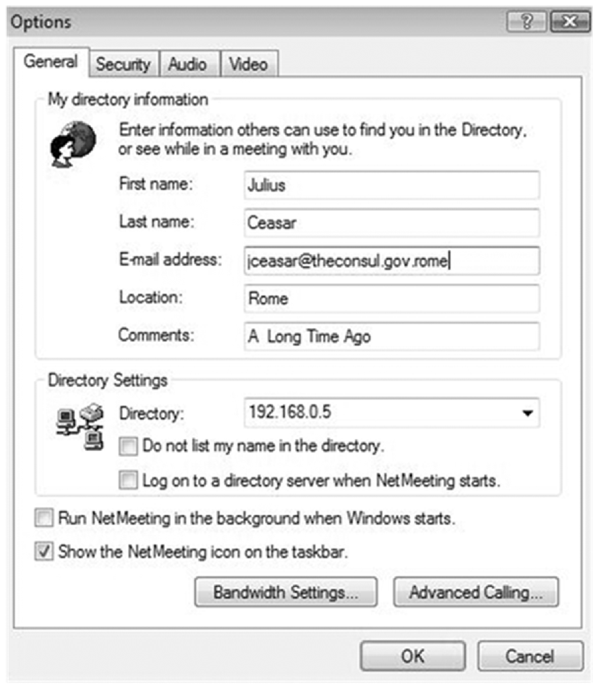
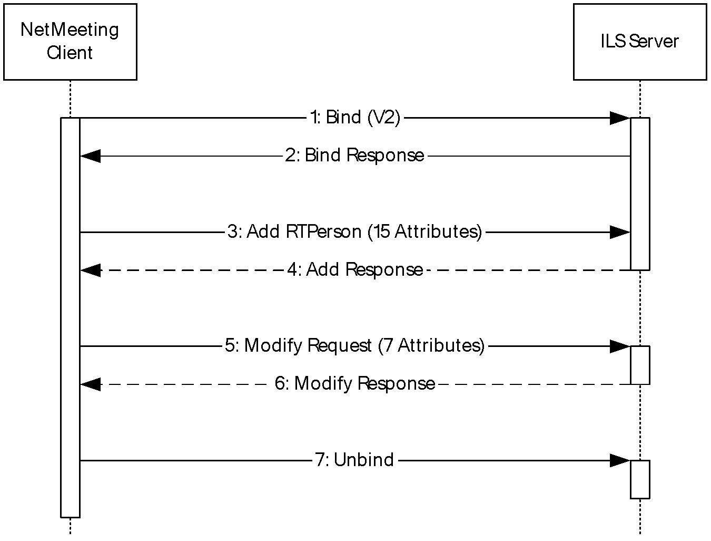
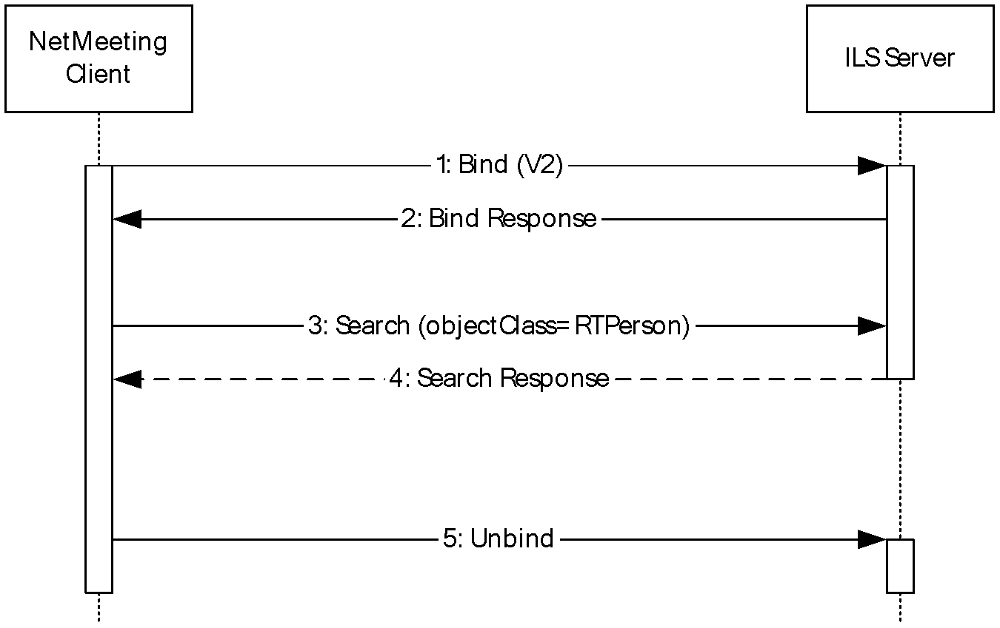
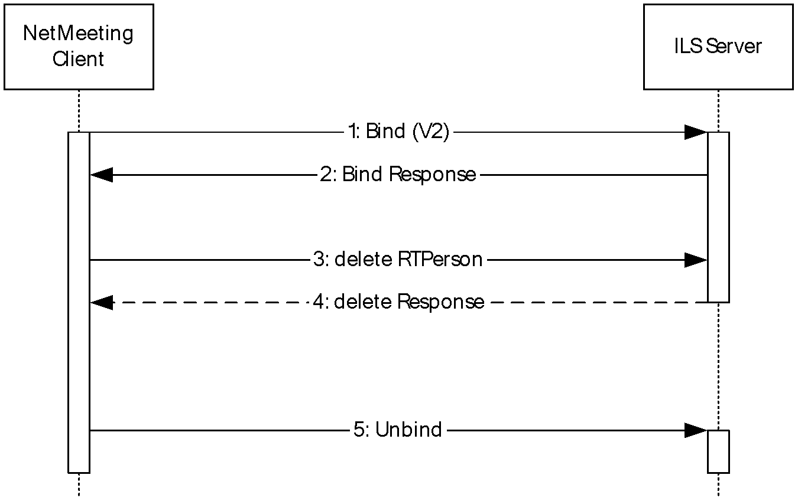

# [MS-TAIL]: Telephony API Internet Locator Service Protocol

Table of Contents

1 Introduction

- [1 Introduction](#Section_1)
  - [1.1 Glossary](#Section_1.1)
  - [1.2 References](#Section_1.2)
    - [1.2.1 Normative References](#Section_1.2.1)
    - [1.2.2 Informative References](#Section_1.2.2)
  - [1.3 Overview](#Section_1.3)
  - [1.4 Relationship to Other Protocols](#Section_1.4)
  - [1.5 Prerequisites/Preconditions](#Section_1.5)
  - [1.6 Applicability Statement](#Section_1.6)
  - [1.7 Versioning and Capability Negotiation](#Section_1.7)
  - [1.8 Vendor-Extensible Fields](#Section_1.8)
  - [1.9 Standards Assignments](#Section_1.9)

2 Messages

- [2 Messages](#Section_2)
  - [2.1 Transport](#Section_2.1)
  - [2.2 Message Syntax](#Section_2.2)
    - [2.2.1 Schema](#Section_2.2.1)
      - [2.2.1.1 Schema Additions](#Section_2.2.1.1)
      - [2.2.1.2 Dynamic Objects](#Section_2.2.1.2)
    - [2.2.2 rtApplicationUser – The User of an Application](#Section_2.2.2)
    - [2.2.3 rtPerson – An Online Person](#Section_2.2.3)
    - [2.2.4 rtConference – An Online Conference](#Section_2.2.4)
    - [2.2.5 Name Mapping](#Section_2.2.5)
    - [2.2.6 ILS Variations from the LDAP v3 Protocol](#Section_2.2.6)
  - [2.3 ILS Schema Objects](#Section_2.3)
    - [2.3.1 rtApplicationUser (Object Class)](#Section_2.3.1)
    - [2.3.2 rtPerson (Object Class)](#Section_2.3.2)
    - [2.3.3 rtConference (Object Class)](#Section_2.3.3)
    - [2.3.4 ntSecurityDescriptor (Schema Attribute)](#Section_2.3.4)
    - [2.3.5 schemaIDGUID (Schema Attribute)](#Section_2.3.5)

3 Protocol Details

- [3 Protocol Details](#Section_3)
  - [3.1 Abstract Data Model](#Section_3.1)
  - [3.2 Timers](#Section_3.2)
  - [3.3 Initialization](#Section_3.3)
  - [3.4 Higher-Layer Triggered Events](#Section_3.4)
  - [3.5 Message Processing Events and Sequencing Rules](#Section_3.5)
    - [3.5.1 Time-to-Live (TTL) Attribute](#Section_3.5.1)
    - [3.5.2 LDAP Bind to ILS](#Section_3.5.2)
      - [3.5.2.1 Authentication Methods](#Section_3.5.2.1)
    - [3.5.3 Client Registration with ILS](#Section_3.5.3)
    - [3.5.4 Unregister from ILS](#Section_3.5.4)
    - [3.5.5 Change User Information](#Section_3.5.5)
    - [3.5.6 List Conferences](#Section_3.5.6)
    - [3.5.7 List Users](#Section_3.5.7)
    - [3.5.8 List ILS Servers in Active Directory](#Section_3.5.8)
    - [3.5.9 Publishing an Internet Locator Service to Active Directory](#Section_3.5.9)
    - [3.5.10 Unpublish (Remove) an ILS Server from Active Directory](#Section_3.5.10)
    - [3.5.11 Refresh Request](#Section_3.5.11)
  - [3.6 Timer Events](#Section_3.6)
  - [3.7 Other Local Events](#Section_3.7)

4 Protocol Examples

- [4 Protocol Examples](#Section_4)
  - [4.1 N-Client Registration with ILS](#Section_4.1)
    - [4.1.1 ILS Registration LDAP Bind](#Section_4.1.1)
    - [4.1.2 ILS Registration Add Operation](#Section_4.1.2)
    - [4.1.3 ILS Registration Modify Operation](#Section_4.1.3)
    - [4.1.4 ILS Registration Unbind Operation](#Section_4.1.4)
    - [4.1.5 ILS Registration LDAP Sequence Diagram](#Section_4.1.5)
  - [4.2 N-Client – Stay Alive Refresh](#Section_4.2)
    - [4.2.1 Stay Alive Refresh Bind](#Section_4.2.1)
    - [4.2.2 Stay Alive Refresh – Search](#Section_4.2.2)
    - [4.2.3 Stay Alive Refresh Unbind Operation](#Section_4.2.3)
    - [4.2.4 Stay Alive LDAP Sequence Diagram](#Section_4.2.4)
  - [4.3 N-Client – Find Online User](#Section_4.3)
    - [4.3.1 LDAP Find Online User Bind Operation](#Section_4.3.1)
    - [4.3.2 LDAP Find Online User LDAP Search Operation](#Section_4.3.2)
    - [4.3.3 LDAP Find Online User Unbind Operation](#Section_4.3.3)
    - [4.3.4 LDAP Find Online User LDAP Sequence Diagram](#Section_4.3.4)
  - [4.4 N-Client – Unregister](#Section_4.4)
    - [4.4.1 Unregister LDAP Bind Operation](#Section_4.4.1)
    - [4.4.2 Unregister LDAP Delete Operation](#Section_4.4.2)
    - [4.4.3 Unregister – LDAP Unbind Operation](#Section_4.4.3)
    - [4.4.4 Unregister LDAP Sequence Diagram](#Section_4.4.4)
  - [4.5 TAPI Client – Connect to ILS Server](#Section_4.5)
    - [4.5.1 LDAP Bind Operation](#Section_4.5.1)
    - [4.5.2 LDAP Add rtApplicationUser Operation](#Section_4.5.2)
    - [4.5.3 LDAP Modify rtApplicationUser Operation](#Section_4.5.3)
    - [4.5.4 LDAP Add rtPerson Operation](#Section_4.5.4)
    - [4.5.5 LDAP Modify rtPerson Operation](#Section_4.5.5)
    - [4.5.6 LDAP Unbind Operation](#Section_4.5.6)
    - [4.5.7 ILS Registration Sequence Diagram](#Section_4.5.7)
  - [4.6 TAPI Client – Stay Alive Refresh](#Section_4.6)
    - [4.6.1 TAPI Client – Stay Alive Refresh rtApplicationUser](#Section_4.6.1)
    - [4.6.2 TAPI Client – Stay Alive Refresh rtPerson](#Section_4.6.2)
    - [4.6.3 ILS Stay Alive Sequence Diagram](#Section_4.6.3)
  - [4.7 TAPI Client – Create Conference](#Section_4.7)
    - [4.7.1 LDAP Bind Operation](#Section_4.7.1)
    - [4.7.2 LDAP Verify Access Rights](#Section_4.7.2)
    - [4.7.3 LDAP Create Conference](#Section_4.7.3)
    - [4.7.4 LDAP Modify TTL for Conference](#Section_4.7.4)
    - [4.7.5 LDAP Unbind Operation](#Section_4.7.5)
  - [4.8 TAPI Client – Find Conferences](#Section_4.8)
    - [4.8.1 LDAP Bind Operation](#Section_4.8.1)
    - [4.8.2 LDAP Search Operation](#Section_4.8.2)
    - [4.8.3 LDAP Unbind Operation](#Section_4.8.3)
    - [4.8.4 ILS Find Conferences Sequence Diagram](#Section_4.8.4)
  - [4.9 TAPI Client – Find People](#Section_4.9)
    - [4.9.1 LDAP Bind Operation](#Section_4.9.1)
    - [4.9.2 LDAP Search Operation](#Section_4.9.2)
    - [4.9.3 LDAP Unbind Operation](#Section_4.9.3)
    - [4.9.4 ILS Find Users Sequence Diagram](#Section_4.9.4)
  - [4.10 TAPI Client – Disconnect from ILS Server](#Section_4.10)
  - [4.11 Sample LDAP Search Filters for ILS](#Section_4.11)
    - [4.11.1 LDAP Search Filters Used by the TAPI Client](#Section_4.11.1)
    - [4.11.2 LDAP Search Filters Used by the N-Client](#Section_4.11.2)

5 Security

- [5 Security](#Section_5)
  - [5.1 Security Considerations for Implementers](#Section_5.1)
  - [5.2 Index of Security Parameters](#Section_5.2)

6 Appendix A: Product Behavior

- [6 Appendix A: Product Behavior](#Section_6)

7 Change Tracking

- [7 Change Tracking](#Section_7)

For the legal notice and IP terms, see [LEGAL.md](../LEGAL.md).
Last updated: 6/1/2017.
See [Revision History](#revision-history) for full version history.

# 1 Introduction

The Internet Locator Service (ILS) Protocol is an extension to the [**Lightweight Directory Access Protocol (LDAP)**](#gt_lightweight-directory-access-protocol-ldap). This protocol uses LDAP-style requests to store and retrieve information in an [**Internet Locator Service (ILS)**](#gt_internet-locator-service-ils) dynamic instance store, such as [**people**](#gt_people) or [**conferences**](#gt_conference). It is used for communication between collaboration clients using the [**Telephony Application Programming Interface (TAPI)**](#gt_telephony-application-programming-interface-tapi) and an [**ILS Server**](#gt_ils-server). The ILS is a dynamic directory service, primarily used to enable a [**client**](#gt_client) to find another user's network presence (usually this means the user's IP address) while online. Similar to how a person's telephone number is located in a telephone directory, a person's network presence can be contained in a computer directory such as ILS. The primary difference is that telephone numbers do not change very often, while a user's IP address often changes every time a user connects to the Internet/network. ILS can store information related to peer-to-peer and conference or multicast events.

ILS is used by two Windows-based clients: Microsoft NetMeeting 3.01 and TAPI Dialer 1.00. TAIL was accessible via the Internet Locator Service API library supplied as part of the NetMeeting 3.01 software development kit (SDK).

Sections 1.5, 1.8, 1.9, 2, and 3 of this specification are normative. All other sections and examples in this specification are informative.

## 1.1 Glossary

This document uses the following terms:

**Active Directory**: A general-purpose network directory service. [**Active Directory**](#gt_active-directory) also refers to the Windows implementation of a directory service. [**Active Directory**](#gt_active-directory) stores information about a variety of objects in the network. Importantly, user accounts, computer accounts, groups, and all related credential information used by the Windows implementation of Kerberos are stored in [**Active Directory**](#gt_active-directory). [**Active Directory**](#gt_active-directory) is either deployed as Active Directory Domain Services (AD DS) or Active Directory Lightweight Directory Services (AD LDS). [MS-ADTS](../MS-ADTS/MS-ADTS.md) describes both forms. For more information, see [MS-AUTHSOD](../MS-AUTHSOD/MS-AUTHSOD.md) section 1.1.1.5.2, [**Lightweight Directory Access Protocol (LDAP)**](#gt_lightweight-directory-access-protocol-ldap) versions 2 and 3, Kerberos, and DNS.

**call**: A communication between peers that is configured for a multimedia conversation.

**client**: Synonym for client computer.

**Component Object Model (COM)**: An object-oriented programming model that defines how objects interact within a single process or between processes. In [**COM**](#gt_component-object-model-com), clients have access to an object through interfaces implemented on the object. For more information, see [MS-DCOM](../MS-DCOM/MS-DCOM.md).

**conference**: A set of two or more communicating users along with the software they are using to communicate.

**Coordinated Universal Time (UTC)**: A high-precision atomic time standard that approximately tracks Universal Time (UT). It is the basis for legal, civil time all over the Earth. Time zones around the world are expressed as positive and negative offsets from UTC. In this role, it is also referred to as Zulu time (Z) and Greenwich Mean Time (GMT). In these specifications, all references to UTC refer to the time at UTC-0 (or GMT).

**distinguished name (DN)**: In [**Lightweight Directory Access Protocol (LDAP)**](#gt_lightweight-directory-access-protocol-ldap), an LDAP Distinguished Name, as described in [[RFC2251]](https://go.microsoft.com/fwlink/?LinkId=90325) section 4.1.3. The DN of an object is the DN of its parent, preceded by the RDN of the object. For example: CN=David Thompson, OU=Users, DC=Microsoft, DC=COM. For definitions of CN and OU, see [[RFC2256]](https://go.microsoft.com/fwlink/?LinkId=91339) sections 5.4 and 5.12, respectively.

**Dynamic Directory Object**: A dynamic entry is an object in a directory tree that has a time to live (TTL) associated with it. This time to live is set when the entry is created. If dynamic entries are not refreshed within a given time-out, they can be removed from the directory.

**Dynamic Host Configuration Protocol (DHCP)**: A protocol that provides a framework for passing configuration information to hosts on a TCP/IP network, as described in [[RFC2131]](https://go.microsoft.com/fwlink/?LinkId=90318).

**globally unique identifier (GUID)**: A term used interchangeably with universally unique identifier (UUID) in Microsoft protocol technical documents (TDs). Interchanging the usage of these terms does not imply or require a specific algorithm or mechanism to generate the value. Specifically, the use of this term does not imply or require that the algorithms described in [[RFC4122]](https://go.microsoft.com/fwlink/?LinkId=90460) or [[C706]](https://go.microsoft.com/fwlink/?LinkId=89824) must be used for generating the [**GUID**](#gt_globally-unique-identifier-guid). See also universally unique identifier (UUID).

**ILS Server**: Synonymous with [**Internet Locator Service (ILS)**](#gt_internet-locator-service-ils).

**Internet Locator Service (ILS)**: A service used for locating user IP addresses in Voice over IP (VoIP).

**Lightweight Directory Access Protocol (LDAP)**: The primary access protocol for [**Active Directory**](#gt_active-directory). Lightweight Directory Access Protocol (LDAP) is an industry-standard protocol, established by the Internet Engineering Task Force (IETF), which allows users to query and update information in a directory service (DS), as described in [MS-ADTS]. The Lightweight Directory Access Protocol can be either version 2 [[RFC1777]](https://go.microsoft.com/fwlink/?LinkId=90290) or version 3 [[RFC3377]](https://go.microsoft.com/fwlink/?LinkID=91337).

**NetBIOS**: A particular network transport that is part of the LAN Manager protocol suite. [**NetBIOS**](#gt_netbios) uses a broadcast communication style that was applicable to early segmented local area networks. A protocol family including name resolution, datagram, and connection services. For more information, see [[RFC1001]](https://go.microsoft.com/fwlink/?LinkId=90260) and [[RFC1002]](https://go.microsoft.com/fwlink/?LinkId=90261).

**people**: Users participating in a multimedia [**conference**](#gt_conference).

**relative distinguished name (RDN)**: The name of an object relative to its parent. This is the leftmost attribute-value pair in the [**distinguished name (DN)**](#gt_distinguished-name-dn) of an object. For example, in the [**DN**](#gt_distinguished-name-dn) "cn=Peter Houston, ou=NTDEV, dc=microsoft, dc=com", the [**RDN**](#gt_relative-distinguished-name-rdn) is "cn=Peter Houston". For more information, see [RFC2251].

**SASL**: The Simple Authentication and Security Layer, as described in [[RFC2222]](https://go.microsoft.com/fwlink/?LinkId=90322). This is an authentication mechanism used by the [**Lightweight Directory Access Protocol (LDAP)**](#gt_lightweight-directory-access-protocol-ldap).

**security identifier (SID)**: An identifier for security principals that is used to identify an account or a group. Conceptually, the [**SID**](#gt_security-identifier-sid) is composed of an account authority portion (typically a domain) and a smaller integer representing an identity relative to the account authority, termed the relative identifier (RID). The [**SID**](#gt_security-identifier-sid) format is specified in [MS-DTYP](../MS-DTYP/MS-DTYP.md) section 2.4.2; a string representation of [**SIDs**](#gt_security-identifier-sid) is specified in [MS-DTYP] section 2.4.2 and [MS-AZOD](../MS-AZOD/MS-AZOD.md) section 1.1.1.2.

**session**: A set of multimedia senders and receivers and the data streams flowing from senders to receivers. A multimedia [**conference**](#gt_conference) is an example of a multimedia session.

**Telephony Application Programming Interface (TAPI)**: A set of functions that allows programming of telephone line-based devices in a device-independent manner. TAPI is used for the development of communications applications.

**Transmission Control Protocol (TCP)**: A protocol used with the Internet Protocol (IP) to send data in the form of message units between computers over the Internet. TCP handles keeping track of the individual units of data (called packets) that a message is divided into for efficient routing through the Internet.

**MAY, SHOULD, MUST, SHOULD NOT, MUST NOT:** These terms (in all caps) are used as defined in [[RFC2119]](https://go.microsoft.com/fwlink/?LinkId=90317). All statements of optional behavior use either MAY, SHOULD, or SHOULD NOT.

## 1.2 References

Links to a document in the Microsoft Open Specifications library point to the correct section in the most recently published version of the referenced document. However, because individual documents in the library are not updated at the same time, the section numbers in the documents may not match. You can confirm the correct section numbering by checking the [Errata](http://msdn.microsoft.com/en-us/library/dn781092.aspx).

### 1.2.1 Normative References

We conduct frequent surveys of the normative references to assure their continued availability. If you have any issue with finding a normative reference, please contact [dochelp@microsoft.com](mailto:dochelp@microsoft.com). We will assist you in finding the relevant information.

[C706] The Open Group, "DCE 1.1: Remote Procedure Call", C706, August 1997, [https://www2.opengroup.org/ogsys/catalog/c706](https://go.microsoft.com/fwlink/?LinkId=89824)

[H323] ITU-T, "Packet-based multimedia communications systems", Recommendation H.323, June 2006, [http://www.itu.int/rec/T-REC-H.323-200606-S/en](https://go.microsoft.com/fwlink/?LinkId=93033)

[MS-ADA3] Microsoft Corporation, "[Active Directory Schema Attributes N-Z](../MS-ADA3/MS-ADA3.md)".

[MS-ADSC] Microsoft Corporation, "[Active Directory Schema Classes](../MS-ADSC/MS-ADSC.md)".

[MS-ADTS] Microsoft Corporation, "[Active Directory Technical Specification](../MS-ADTS/MS-ADTS.md)".

[MS-NLMP] Microsoft Corporation, "[NT LAN Manager (NTLM) Authentication Protocol](../MS-NLMP/MS-NLMP.md)".

[RFC1781] Kille, S., "Using the OSI Directory to Achieve User Friendly Naming", RFC 1781, March 1995, [http://www.ietf.org/rfc/rfc1781.txt](https://go.microsoft.com/fwlink/?LinkId=92841)

[RFC2119] Bradner, S., "Key words for use in RFCs to Indicate Requirement Levels", BCP 14, RFC 2119, March 1997, [http://www.rfc-editor.org/rfc/rfc2119.txt](https://go.microsoft.com/fwlink/?LinkId=90317)

[RFC2251] Wahl, M., Howes, T., and Kille, S., "Lightweight Directory Access Protocol (v3)", RFC 2251, December 1997, [http://www.ietf.org/rfc/rfc2251.txt](https://go.microsoft.com/fwlink/?LinkId=90325)

[RFC2252] Wahl, M., Coulbeck, A., Howes, T., and Kille, S., "Lightweight Directory Access Protocol (v3): Attribute Syntax Definitions", RFC 2252, December 1997, [http://www.ietf.org/rfc/rfc2252.txt](https://go.microsoft.com/fwlink/?LinkId=90326)

[RFC2254] Howes, T., "The String Representation of LDAP Search Filters", RFC 2254, December 1997, [http://www.ietf.org/rfc/rfc2254.txt](https://go.microsoft.com/fwlink/?LinkId=90328)

[RFC2256] Wahl, M., "A Summary of the X.500(96) User Schema for use with LDAPv3", RFC 2256, December 1997, [http://www.ietf.org/rfc/rfc2256.txt](https://go.microsoft.com/fwlink/?LinkId=91339)

[RFC2327] Handley, M. and Jacobson, V., "SDP: Session Description Protocol", RFC 2327, April 1998, [http://www.ietf.org/rfc/rfc2327.txt](https://go.microsoft.com/fwlink/?LinkId=90336)

[RFC2589] Yaacovi, Y., Wahl, M., and Genovese, T., "Lightweight Directory Access Protocol (v3): Extensions for Dynamic Directory Services", RFC 2589, May 1999, [http://www.ietf.org/rfc/rfc2589.txt](https://go.microsoft.com/fwlink/?LinkId=90370)

[RFC4512] Zeilenga, K., "Lightweight Directory Access Protocol (LDAP): Directory Information Models", RFC 4512, June 2006, [http://www.rfc-editor.org/rfc/rfc4512.txt](https://go.microsoft.com/fwlink/?LinkId=148808)

### 1.2.2 Informative References

[Butler] Butler, P., Cales, R., Petersen, J., et al., "Using Microsoft Commercial Internet System: The Internet Locator Service Chapter 10", Que Pub; Special edition, April 1997, ISBN-13: 978-0789710161.

[LDAP] Microsoft Corporation, "About Lightweight Directory Access Protocol", [http://msdn.microsoft.com/en-us/library/aa366075.aspx](https://go.microsoft.com/fwlink/?LinkId=89932)

[MSDN-ADDS] Microsoft Corporation, "Service Publication", [http://msdn.microsoft.com/en-us/library/ms677950(VS.85).aspx](https://go.microsoft.com/fwlink/?LinkId=160523)

[MSDN-InternetLocSrvAPI] Microsoft Corporation, "Internet Locator Service API", [http://msdn.microsoft.com/en-us/library/ms707540.aspx](https://go.microsoft.com/fwlink/?LinkId=92837)

[MSDN-MSTelephonyOvw] Microsoft Corporation, "Microsoft Telephony Overview", [http://msdn.microsoft.com/en-us/library/ms733433.aspx](https://go.microsoft.com/fwlink/?LinkId=98248)

[MSDN-WSALookupServiceBegin] Microsoft Corporation, "WSALookupServiceBegin function", [http://msdn.microsoft.com/en-us/library/ms741633.aspx](https://go.microsoft.com/fwlink/?LinkId=92836)

[MSFT-SP] Microsoft Corporation, "How Service Publication and Service Principal Names Work", March 2003, [http://technet.microsoft.com/en-us/library/cc755804(WS.10).aspx](https://go.microsoft.com/fwlink/?LinkId=160522)

## 1.3 Overview

This document describes the following:

- How this protocol differs (the nonstandard behavior) from the requirements of [**LDAP**](#gt_lightweight-directory-access-protocol-ldap) [[RFC2251]](https://go.microsoft.com/fwlink/?LinkId=90325), [[RFC2252]](https://go.microsoft.com/fwlink/?LinkId=90326), and [[RFC4512]](https://go.microsoft.com/fwlink/?LinkId=148808) (the LDAP RFC in place at the time of development of [**Internet Locator Service (ILS)**](#gt_internet-locator-service-ils)).
- The operations used to manage [**conferences**](#gt_conference), people, classes, and attributes that are stored in ILS.
The ILS provides a real-time dynamic directory service (see [Butler] for a historical discussion). This allows online [**clients**](#gt_client) who are currently actively connected to the Internet to find other clients and to contact them for collaboration activity such as establishing a peer-to-peer [**session**](#gt_session) or joining a multicast conference. Clients who wish to be located when online register with the ILS and provide their name, email address, and some personal information. During registration the connection point (usually an IP address) is associated and stored with the personal details. Other clients can connect to ILS and browse the list of registered clients looking for a specific person. They can then launch their client collaboration application, such as NetMeeting, which initiates a real time connection to the selected person.

The Telephony API Internet Locator Service protocol uses LDAP-style (see [[LDAP]](https://go.microsoft.com/fwlink/?LinkId=89932)) requests to store, retrieve, and modify information in the ILS, such as [**people**](#gt_people) or conferences. Once a person knows the network presence of another they wish to contact, they can place a [**call**](#gt_call) to that person's computer. This call can be live chat, instant messages, shared white boarding, video conferencing, or even just a voice call.

This protocol is used by NetMeeting and [**TAPI**](#gt_telephony-application-programming-interface-tapi) clients to interact with an ILS server.

TAPI is a [**Component Object Model (COM)**](#gt_component-object-model-com) interface used for the development of communications applications. When communicating with an ILS server, only the client-side functions in the TAPI interface are used.

ILS is a dynamic directory service that associates people and conferences with the IP addresses of their computers. ILS maintains the correct IP address for people or conferences even when their IP address changes, which is particularly useful when people use [**Dynamic Host Configuration Protocol (DHCP)**](#gt_dynamic-host-configuration-protocol-dhcp). To do so, ILS provides an LDAP interface and supports dynamic objects, as specified in [[RFC2589]](https://go.microsoft.com/fwlink/?LinkId=90370).<1>

For a historical overview of this protocol, see [[MSDN-InternetLocSrvAPI]](https://go.microsoft.com/fwlink/?LinkId=92837), [[MSDN-MSTelephonyOvw]](https://go.microsoft.com/fwlink/?LinkId=98248), and [[MSDN-WSALookupServiceBegin]](https://go.microsoft.com/fwlink/?LinkId=92836).

## 1.4 Relationship to Other Protocols

This protocol is an early implementation of the [**LDAP**](#gt_lightweight-directory-access-protocol-ldap) protocol and supports syntax and operations that do not form part of the current LDAP RFCs.

An [**ILS**](#gt_internet-locator-service-ils) can support anonymous or authenticated users. ILS uses the LDAP Authentication mechanisms Simple Authentication and Sicily Authentication as specified in [MS-ADTS](../MS-ADTS/MS-ADTS.md) section 5.1.1.1.3.<2>

## 1.5 Prerequisites/Preconditions

The TAPI Internet Locator Service Protocol assumes the availability of the following resources:

- A transport protocol, either [**TCP**](#gt_transmission-control-protocol-tcp) IPv4 or [**NetBIOS**](#gt_netbios) over TCP, to support reliable, in-order message delivery.
- [**LDAP**](#gt_lightweight-directory-access-protocol-ldap) [**SASL**](#gt_sasl) mechanisms for authentication.

## 1.6 Applicability Statement

This protocol is used by [**clients**](#gt_client) to query [**ILS**](#gt_internet-locator-service-ils) servers for [**people**](#gt_people) and [**conference**](#gt_conference) data, which is then used in collaboration activities.

## 1.7 Versioning and Capability Negotiation

This document covers versioning in the following areas:

- Protocol Versions: This protocol supports Binds using both LDAP v2 and LDAP v3.

## 1.8 Vendor-Extensible Fields

There are no vendor-extensible fields in this protocol.

## 1.9 Standards Assignments

[**ILS**](#gt_internet-locator-service-ils) does not use any IANA published ports.

ILS uses by default [**TCP**](#gt_transmission-control-protocol-tcp) port number 1002. This is subject to user configuration.

# 2 Messages

## 2.1 Transport

The TAPI ILS (TAIL) Protocol is a series of data exchanges between a collaboration [**client**](#gt_client) and an [**ILS server**](#gt_ils-server). The data that is exchanged using this protocol is transported using the [**LDAP**](#gt_lightweight-directory-access-protocol-ldap) v3 protocol (with some limitations described in section [2.2.6](#Section_2.2.6)).

## 2.2 Message Syntax

This [**ILS**](#gt_internet-locator-service-ils) protocol is used to store and retrieve data in the following ILS Dynamic Objects. The schema for these objects is given in section [2.3](#Section_2.3).

| Dynamic Object Class | Description |
| --- | --- |
| [rtApplicationUser](#Section_2.3.1) | Contains information about an ILS application user. |
| [rtPerson](#Section_2.3.2) | Contains information about an ILS user. |
| [rtConference](#Section_2.3.3) | Contains information about an ILS [**conference**](#gt_conference). |

### 2.2.1 Schema

An [**ILS Server**](#gt_ils-server) requires a schema definition (see [[RFC2256]](https://go.microsoft.com/fwlink/?LinkId=91339)) for an object class before it can store an instance of that object; this applies to both static and dynamic objects. ILS Servers have a default schema that includes both static Member and Group objects, plus the [rtPerson](#Section_2.3.2), [rtConference](#Section_2.3.3), and [rtApplicationUser](#Section_2.3.1). The details of the attributes of rtPerson, rtConference, and rtApplicationUser are given later in this section. The full schema, including inherited objects, is given in [ILS Schema Objects (section 2.3)](#Section_2.3).

#### 2.2.1.1 Schema Additions

All dynamic entries MUST have the dynamicObject value in their **objectClass** attribute. This object class is defined section 5 of [[RFC2589]](https://go.microsoft.com/fwlink/?LinkId=90370).

Furthermore, each dynamic entry MUST have the operational attribute **entryTtl** as described in section 5 of [RFC2589].

#### 2.2.1.2 Dynamic Objects

Any object in the [**ILS**](#gt_internet-locator-service-ils) schema with dynamicObject value as part of the **objectClass** attribute of the schema object is a dynamic object. Each dynamic object has its own time to live (TTL) operational attribute that the server periodically decrements. The TTL can be refreshed (updated) by a client; the server MAY automatically delete a dynamic object when its TTL reaches zero. For example, a server is free to delete the object immediately when its TTL reaches zero or to employ a sweeper process that periodically deletes objects with TTL values of zero. [**Clients**](#gt_client) are not to depend on the server behaving one way or the other.

The TTL applies to the entire object; ILS does not support a TTL per attribute. Each object does have its own TTL, which can be set individually. Thus persistent objects, such as [**conferences**](#gt_conference), can be set to last longer with less refresh overhead than more temporal objects, such as online users. ILS supports an administrator-configurable, system-wide limit on the maximum value of any object's TTL.

### 2.2.2 rtApplicationUser – The User of an Application

| Attribute | Description |
| --- | --- |
| applicationID | Identifies the application by name.<3> |
| appName | Application Name.<4> |
| Application Name | Identifies the application by name. |
| groupObject | Not used. |
| guid | Contains a global identifier. Populated with "008aff194794cf118796444553540000". |
| ILSA26214430 | Indicates whether or not a call is active. The value is "1" if in a call or "0" if not in a call.<5> |
| ILSA26279966 | A generated version number. |
| ILSA32833566 | Indicates the capability to send audio. The value is "1" if the client can send audio or "0" if it cannot send audio.<6> |
| ILSA32964638 | Indicates the capability to send video. Clients populate this attribute with the capability of sending video. The value is "1" if they can send video; or "0" if they cannot send video.<7> |
| ILSA39321630 | Indicates the restriction category. Clients populate this attribute with the restriction value. The value is "1" if it is primarily used for personal uses, "2" if it is primarily used for business, and "4" if it allows adult content. "3" is unused. The default value is "0".<8> |
| mimeType | Contains the data type of the call, set to "text/iuls".<9> |
| objectClass | Identifies the list of classes from which this object is derived. |
| port | A multivalue attribute. Typical attributes are the value "1503" (Data port) and "1720" (Audio/Video port). |
| protocolGUID | Contains the [**GUID**](#gt_globally-unique-identifier-guid), as specified in [[C706]](https://go.microsoft.com/fwlink/?LinkId=89824) section A.1, set to "008aff194794cf118796444553540000".<10> |
| protocolID | Contains the protocol of the [**conference**](#gt_conference), set to [[H323]](https://go.microsoft.com/fwlink/?LinkId=93033). |
| protocolMimeType | A multivalue attribute: Contains the data type of the protocol, set to the values "text/120" and "text/h23". |
| sFlags | Show me (in the directory) flags, 1=Show, 0=Hidden. |
| userObject | Identifies the user. |

### 2.2.3 rtPerson – An Online Person

| Attribute | Description |
| --- | --- |
| c | This attribute is the two-letter code from ISO:3166:1999. <11> |
| cn | Contains the identity of the user.<12> |
| comment | Contains general comments about the [**conference**](#gt_conference).<13> |
| givenName | Contains the given name attribute for the user object that is being created. Clients populate this attribute with the name that the user supplied during setup or later. |
| guid | Contains a global identifier. "008aff194794cf118796444553540000". |
| ILSA26214430 | Indicates whether or not a [call](#Section_1.1) is active. Clients populate this attribute with the status of being in a call. The value is "1" if in a call or "0" if not in a call.<14> |
| ILSA26279966 | A build number of product 84020942 decimal is hexadecimal 5020ECE; the 5020 corresponds to build 5.2. ECE corresponds to 3790, hence build 5.2.3790. |
| ILSA32833566 | Indicates the capability to send audio. Clients populate this attribute with the capability of sending audio. The value is "1" if it can send audio or "0" if it cannot send audio.<15> |
| ILSA32964638 | Indicates the capability to send video. Clients populate this attribute with the capability of sending video. The value is "1" if they can send video; or "0" if they cannot send video.<16> |
| ILSA39321630 | Indicates the restriction category. Clients populate this attribute with the restriction value. The value is "1" if it is primarily used for personal uses, "2" if it is primarily used for business, and "4" if it allows adult content. "3" is unused. The default value is "0".<17> |
| ipAddress | Contains a calculated value for the IP address of the user. Clients populate this attribute with a string that represents the IP4 address of the machine. For instance, if the IP address is 10.70.41.96, the string contains 1613317642. The value is calculated as 10 + 256(70 + 256(41 + 256 * 96)). [**TAPI**](#gt_telephony-application-programming-interface-tapi) [**clients**](#gt_client) do not populate this attribute. |
| location | A text field entered by users to indicate their location. |
| mimeType | Contains the data type of the call, set to "text/iuls" |
| o | Identifies the organization that the user belongs to. |
| port | A multivalue attribute: Typical attributes are the value "1503" (Data port) and "1720" (Audio/Video port).<18> |
| protocolMimeType | A multivalue attribute: Contains the data type of the protocol, set to the values "text/120" and "text/h23". |
| rfc822mailbox | Contains the email address that the user supplied.<19> |
| sFlags | Show me (in the directory) flags, 1=Show, 0=Hidden. |
| smodop | Contains the [**ILS**](#gt_internet-locator-service-ils) special modify-operation code during an LDAP Modify Request. <20> Several types of modification operations can be performed on the LDAP server: adding an application, deleting an application, modifying user information, and modifying application information. The type of modification is specified by using the appropriate **smodop** attribute. The value is either "0" (ADD), "1" (DELETE), "2" (MODIFYUSER), or "3" (MODIFYAPP). |
| surName | Contains the last name of the user.<21> |
| securityToken | Contains the securityTokenID value of the user.<22> |

### 2.2.4 rtConference – An Online Conference

| Attribute | Description |
| --- | --- |
| advertisingScope | This attribute is not used. Indicates whether an entry is to be advertised outside a corporate gateway or proxy. |
| announcementScope | Not used. |
| applicationID | ms-netmeeting |
| attendees | Not used. |
| attendeesCount | Not used. |
| confAddr | Not used. |
| conferenceBlob | Contains a Session Description Protocol (SDP) binary large object (BLOB), as specified in [[RFC2327]](https://go.microsoft.com/fwlink/?LinkId=90336). |
| contactInformation | Not used. |
| generalDescription | Contains a comment for the [**conference**](#gt_conference). |
| isEncrypted | Set to "1" if the conference is encrypted; otherwise, set to "0". |
| maxAttendeesCount | Not used. |
| originator | Contains the name of the user that created this conference. |
| protocolID | Contains the protocol that the conferenceBlob attribute uses to describe the conference. |
| rating | Not used. |
| startTime | Contains the [**Coordinated Universal Time (UTC)**](#gt_coordinated-universal-time-utc) when the conference becomes available to users. |
| stopTime | Contains the UTC when the conference becomes unavailable to users (they are unable to join this conference). |
| subType | Not used. |
| url | Not used. |
| uid | Contains the unique identifier of the conference. Entered by the user. |

### 2.2.5 Name Mapping

For backward compatibility with previous locator products, there have been name changes to schema entries. The following name mapping applies to LDAP searches and the corresponding field matched. The name on the left is seen in LDAP messages and corresponds to the attribute named on the right.

| LDAP message name | Attribute |
| --- | --- |
| sAppGUID | guid |
| sAppID | applicationID |
| sAppName | AppName |
| sIPAddress | IPAddress |
| sMimeType | MimeType |
| sPort | Port |
| sProtGuid | protocolGuid |
| sProtId | protocolID |
| sProtMimeType | protocolMimeType |
| sSecurity | securityToken |
| sTTL (value in minutes) | entryTTL (value in seconds) |

### 2.2.6 ILS Variations from the LDAP v3 Protocol

[**ILS**](#gt_internet-locator-service-ils) communication differs from LDAP v3 in the following ways:

- ILS does not support modify [**distinguished name (DN)**](#gt_distinguished-name-dn) (ModifyDN) requests. To move entries from one part of the directory to another, delete the entries and add them to the desired location.
- The ILS [**LDAP**](#gt_lightweight-directory-access-protocol-ldap) server does not support server-side sorting.
- The ILS LDAP server does not support [**TAPI**](#gt_telephony-application-programming-interface-tapi) [**session**](#gt_session) control operations.
- The ILS LDAP server does not support friendly distinguished names (DNs), as specified in [[RFC1781]](https://go.microsoft.com/fwlink/?LinkId=92841).

## 2.3 ILS Schema Objects

The details below include inherited objects that were not described in section [2.2](#Section_2.2).<23>

### 2.3.1 rtApplicationUser (Object Class)

| Type | Object |
| --- | --- |
| General | OID 1.2.840.113556.1.4.611.1103010708051503150108150101130009121504000012000415120210000708 Name rtApplicationUser |
| Properties | Superior top KindStructural (0x01) |
| Required attributes | cn, objectClass |
| Optional attributes | appName, applicationID, groupObject, guid, ILSA26214430, ILSA26279966, ILSA32833566, ILSA32964638, ILSA39321630, mimeType, port, protocolGUID, protocolID, protocolMimeType, sFlags, userObject |

### 2.3.2 rtPerson (Object Class)

| Type | Object |
| --- | --- |
| General | OID 1.2.840.113556.1.4.611.1103010708051504150108150101130009121504000012000415120210000708 Name rtPerson |
| Properties | Superior top KindStructural (0x01) |
| Required attributes | cn, objectClass |
| Optional attributes | appName, c, comment, dwFlags, friendlyName, givenName, guid, ILSA26214430, ILSA26279966, ILSA32833566, ILSA32964638, ILSA39321630, ipAddress, location, mimeType, o, port, protocolMimeType, rfc822Mailbox, sFlags, securityToken, smodop, surName |

### 2.3.3 rtConference (Object Class)

| Type | Object |
| --- | --- |
| General | OID 1.2.840.113556.1.4.611.1103010708051501150108150101130009121504000012000415120210000708 Name rtConference |
| Properties | Superior top KindStructural (0x01) |
| Required attributes | objectClass, uid, cn |
| Optional attributes | advertisingScope, announcementScope, applicationID, attendees, attendeesCount, confAddr, conferenceBlob, contactInformation, generalDescription, isEncrypted maxAttendeesCount, originator, protocolID, rating, startTime, stopTime, subtype, url |

### 2.3.4 ntSecurityDescriptor (Schema Attribute)

**ntSecurityDescriptor** is an attribute Schema Mandatory attribute.

| Type | Object |
| --- | --- |
| cn | cn=ntSecurityDescriptor,cn=Schema,ou=Admin,o=Intranet |
| objectClass | attributeSchema |
| displayName | security-descriptor |
| u2AttributeID | 1.2.840.113556.1.5.108.1103010708070215150108150101130009121504000012000415120210000708 |
| description | The security descriptor for the object |
| schemaIDGUID | Unique [**GUID**](#gt_globally-unique-identifier-guid) for this attribute<24> |
| attributeSyntax | Binary |
| isSingleValued | 1 |
| isSearchable | 0 |

### 2.3.5 schemaIDGUID (Schema Attribute)

schemaIDGUID is an attribute Schema Mandatory attribute.

| Type | Object |
| --- | --- |
| cn | cn=schemaIDGUID,cn=Schema,ou=Admin,o=Intranet |
| objectClass | attributeSchema |
| displayName | schema-id-guid |
| u2AttributeID | 1.2.840.113556.1.4.148 |
| description | [**GUID**](#gt_globally-unique-identifier-guid) of a class or attribute definition |
| schemaIDGUID | Unique GUID for this attribute<25> |
| attributeSyntax | Octet String |
| isSingleValued | 1 |
| isSearchable | 0 |

# 3 Protocol Details

The Internet Locator Service (ILS) Protocol uses [**LDAP**](#gt_lightweight-directory-access-protocol-ldap) to connect, disconnect, and modify user information and list [**conference**](#gt_conference) entries in a directory. The LDAP used by the ILS Protocol differs from standard LDAP v3. The specific differences are described in section [2.2.6](#Section_2.2.6). Note that it is possible to use LDAP v3 to perform equivalent actions to the nonstandard operations.

## 3.1 Abstract Data Model

This section describes a conceptual model of possible data organization that an implementation maintains to participate in this protocol. The described organization is provided to facilitate the explanation of how the protocol behaves. This document does not mandate that implementations adhere to this model as long as their external behavior is consistent with that described in this document.

Collaboration clients use an [**ILS Server**](#gt_ils-server) ([**LDAP**](#gt_lightweight-directory-access-protocol-ldap) dynamic object store) to store and retrieve information about other potential collaboration partners. [**ILS**](#gt_internet-locator-service-ils) provides a client/server mechanism with which online users can locate each other and thus allow them to start a collaboration [**session**](#gt_session). The basic idea behind ILS is simple: Two users running compatible communication applications want to communicate. For the two users to start the communication session, they first need to identify each other on the network.

A caller needs a mechanism to identify a public IPv4 address of a collaboration partner. Thus, ILS provides the necessary mechanism to handle the discovery and resolution of the IP addresses. On a more abstract level, ILS acts as a dynamic user directory that provides a rendezvous mechanism for users. This rendezvous mechanism allows users to find each other on a network.

At a database level, the ILS Server stores two main types of objects: rtPerson objects representing the online users, and rtConference objects representing data on available online [**conferences**](#gt_conference).

## 3.2 Timers

The [**ILS Server**](#gt_ils-server) maintains an entryTTL attribute. This attribute has a value that is a TTL marker for dynamic objects. An [**LDAP**](#gt_lightweight-directory-access-protocol-ldap) search request for the attribute "sttl" (name mapped) in the form "sttl=<value>" resets the timer to the given value. If the timer goes to zero, the dynamic entry MAY be removed from the database by the server. Client applications need to perform occasional refreshes of the attribute value to ensure that the server maintains the dynamic objects.

An [**ILS**](#gt_internet-locator-service-ils) client maintains a timer that mirrors the value sent to the ILS Server. The client MUST refresh the TTL value of dynamic objects. If, on a refresh search, it fails to find a dynamic object, the client MUST register the dynamic object.

## 3.3 Initialization

The ILS Protocol imposes no initialization requirements beyond those of standard [**LDAP**](#gt_lightweight-directory-access-protocol-ldap) v3. Dynamic objects created in the [**ILS Server**](#gt_ils-server) will require their TTL attribute to be initialized on creation of an object in the directory.

## 3.4 Higher-Layer Triggered Events

None.

## 3.5 Message Processing Events and Sequencing Rules

The general model adopted by this protocol is one of clients performing protocol operations against servers as per [**LDAP**](#gt_lightweight-directory-access-protocol-ldap) v3 [[RFC2251]](https://go.microsoft.com/fwlink/?LinkId=90325). In this model, a client transmits a protocol request describing the operation to be performed to an [**ILS Server**](#gt_ils-server). The ILS Server is then responsible for performing the necessary operation(s) in the directory. Upon completion of the operation(s), the server returns a response containing any results or errors to the requesting client.

### 3.5.1 Time-to-Live (TTL) Attribute

The [**ILS server**](#gt_ils-server) maintains an **entryTTL** attribute that has a value that is a time-to-live marker for dynamic objects. An [**LDAP**](#gt_lightweight-directory-access-protocol-ldap) search request for the attribute sttl (name mapped to attribute **entryTTL**) of the form "sttl=<value>" resets the timer to the value. If the timer goes to zero, the dynamic entry MAY be removed from the database.

For details of the schema requirements for dynamicObject and **entryTTL**, see [[RFC2589]](https://go.microsoft.com/fwlink/?LinkId=90370) section 5, Schema Additions.

### 3.5.2 LDAP Bind to ILS

[**ILS**](#gt_internet-locator-service-ils) supports authenticated binds as per the [**LDAP**](#gt_lightweight-directory-access-protocol-ldap) v3 RFC (see [[RFC2251]](https://go.microsoft.com/fwlink/?LinkId=90325)). The only accepted [**SASL**](#gt_sasl) mechanism is NTLM (Sicily Authentication).

Note that this also includes binds using a version number of 2 or 3.

#### 3.5.2.1 Authentication Methods

[**ILS**](#gt_internet-locator-service-ils) can be configured to support anonymous or authenticated users. ILS does not have user accounts in its static store. ILS does not support authenticated binds for security principals whose accounts are not stored in the [**Active Directory**](#gt_active-directory) directory service. ILS uses the [**LDAP**](#gt_lightweight-directory-access-protocol-ldap) Authentication mechanisms Simple Authentication and Sicily Authentication as specified in [MS-ADTS](../MS-ADTS/MS-ADTS.md). On query using an LDAP of the root DSE, an [**ILS Server**](#gt_ils-server) returns NTLM, as specified in [MS-NLMP](../MS-NLMP/MS-NLMP.md), as the supported [**SASL**](#gt_sasl) mechanism.

### 3.5.3 Client Registration with ILS

Client registration with an ILS server is made in four distinct LDAP operations:

- LDAP Bind
- LDAP Add
- LDAP Modify
- LDAP Unbind
The registration MUST be initiated by making an [**LDAP**](#gt_lightweight-directory-access-protocol-ldap) bind request to an ILS server as specified in section [3.5.2](#Section_3.5.2). If LDAP v2 is offered, only simple authentication can be used. <26>This is the normally the case when users are located on the Internet. If LDAP v3 is offered with credentials, the [**SASL**](#gt_sasl) mechanism will be NTLM. The default server port is 1002.

Once a successful bind has been made (LDAP Bind Response, resultCode == 0), it MUST be followed by an LDAP Add operation [[RFC2251]](https://go.microsoft.com/fwlink/?LinkId=90325). The purpose of the Add operation is to create a dynamic entry of the named user in the directory. The LDAP entry named in the entry field of the Add request is as follows:

- c=-,o=Microsoft, cn=<the email address of the user>, objectClass=rtPerson.
This is a modified LDAP entry as per section [2.2.6](#Section_2.2.6).It has the effect of creating the following dynamicObject in the directory:

- Cn=<the email address of the user>, ou=Dynamic, o=Intranet
(where the entry type is objectClass=rtPerson, objectClass=dynamicObject).

Once a successful Add operation has been performed (LDAP Add Response, resultCode == 0), an LDAP Modify operation MUST be performed as follows:

- ModifyRequest: Object:c=-, o=Microsoft, cn==<the email address of the user>,objectClass=rtPerson
The following attributes of the user (rtPerson) are then modified as follows. Note that [Name Mapping (section 2.2.5)](#Section_2.2.5) can apply:

- modop: The show mode, to indicate whether the user is to be visible.
- sappid: applicationID is set to Microsoft NetMeeting.
- smimetype: MimeType is set to text/iuls.
- sappguid: guid is set to 008aff194794cf118796444553540000.
- sprotid: protocolID is set to T120 AND H323.
- sprotmimetype: protocolMimeType is set to (text/t120) and (text/h232).
- sport: port attributes set to 1503 and 1720.
The entries made when connecting to [**ILS**](#gt_internet-locator-service-ils) are [**Dynamic Directory Objects**](#gt_dynamic-directory-object) as defined in [[RFC2589]](https://go.microsoft.com/fwlink/?LinkId=90370).

### 3.5.4 Unregister from ILS

Unregistration from an [**ILS Server**](#gt_ils-server) by a [**client**](#gt_client) is made in three [**LDAP**](#gt_lightweight-directory-access-protocol-ldap) operations:

- LDAP Bind
- LDAP Delete
- LDAP Unbind
The unregistration process MUST be initiated by making an LDAPBind to an ILS Server. If LDAP v2 is offered, only simple authentication can be used.<27> This is the normally the case when users are located on the Internet. Once a successful Bind has been made, it MUST be followed by an LDAP Delete operation. The Delete operation allows a client to request the removal of an entry from the directory. The Delete operation is as follows:

- DelRequest: c=-,o=Microsoft, cn=<the email address of the user>,objectClass=rtPerson
This is a modified LDAP entry as per section [2.2.6](#Section_2.2.6), REF _Ref226168721 \h \* MERGEFORMAT ILS differences from LDAP v3. It has the effect of removing the following two dynamicObjects from the directory:

- Cn=<the email address of the user>,ou=Dynamic, o=Intranet
(where the entry type is objectClass=rtPerson, objectClass=dynamicObject).

- Cn= <the email address of the user>, appName=MS-NetMeeting, ou=Applications, o=Intranet
(where the entry type is objectClass=rtApplicationUser, objectClass=dynamicObject).

Upon receipt of a Delete Request, the ILS Server MUST attempt to perform the entry removal requested. The result of the Delete Request will be returned to the client in the Delete Response using a standard LDAP response.

The unregister is completed using an LDAP Unbind operation. The function of the Unbind operation is to terminate a protocol [**session**](#gt_session). The Unbind operation has no response defined. Upon transmission of an Unbind request, a protocol client can assume that the protocol session is terminated. Upon receipt of an Unbind Request, a protocol server can assume that the requesting client has terminated the session and that all outstanding requests can be discarded, and can close the connection.

### 3.5.5 Change User Information

The [**ILS Server**](#gt_ils-server) does not support ModifyDN requests, since all [**ILS**](#gt_internet-locator-service-ils) entries are dynamic. Therefore to modify an entry, it is necessary to delete the original entry and then add a new entry. Changing user information requires the following [**LDAP**](#gt_lightweight-directory-access-protocol-ldap) operations:

- LDAP Bind
- LDAP Del
- LDAP Unbind
- LDAP Bind
- LDAP Add
- LDAP Modify
- LDAP Unbind

### 3.5.6 List Conferences

Clients can determine the available [**conferences**](#gt_conference) by performing an LDAP search for the class rtConference. The LDAP search uses the filter (ObjectClass=rtConference) with a search DN ou=Dynamic,o=intranet. Active conferences will have a UID present.

(cn=rtConference,ou=Dynamic,o=Intranet)

### 3.5.7 List Users

Clients can determine available collaboration clients by performing an LDAP search for the class rtPerson. The LDAP search uses the filter (ObjectClass=rtPerson) with a search DN ou=Dynamic,o=intranet.

### 3.5.8 List ILS Servers in Active Directory

To determine the available ILS Servers in an Active Directory domain, it is necessary to query Active Directory for the Winsock Services and search for the GUID of the ILSServiceClass. If that class is found, it is assumed that the server is running the ILS service. (Note that in practice this might not always be accurate as this class might be present in machines from which ILS has been removed.)

The process to determine the availability of ILS Servers within Active Directory is as follows:

- LDAP Bind (v3 authenticated) to Active Directory LDAP Service (port 389)
- LDAP Search CN=WinsockServices,CN=System,DC=testdomain,DC=int
- Filter (objectClass=serverInstance)(CN=*)
(serviceClassID=40:79: F1:C9:A7:79:D1:11:B0:08:00:C0:4F:C3:1: EE)

### 3.5.9 Publishing an Internet Locator Service to Active Directory

Service publication is the act of creating and maintaining data about one or more instances of a given service so that network clients can find and use the service. The presence of an active Internet Locator Service can be published to a Windows Active Directory Server for subsequent discovery by applications using standard LDAP v3 calls. An explanation of Service Publication is available at [[MSFT-SP]](https://go.microsoft.com/fwlink/?LinkId=160522) and [[MSDN-ADDS]](https://go.microsoft.com/fwlink/?LinkId=160523).

The process of "publishing" involves adding an entry of type serviceInstance to the available Windows Sockets(WinSock) Services within Active Directory. The serviceInstance object class is used by Windows Sockets (Winsock) Services that publish information about themselves by using registration and resolution (RnR). (For the schema of the class serviceInstance, see [MS-ADSC](../MS-ADSC/MS-ADSC.md) section 2.254.)

This publishing is done under the container with [**RDN**](#gt_relative-distinguished-name-rdn) CN=WinsockServices within the 'System' well-known object (section 6.1.1.4.11 of [MS-ADTS](../MS-ADTS/MS-ADTS.md)). For example, if the fully qualified domain name of an ILS server is ILSServer.testdomain.int, the serviceInstance object with RDN of CN=ILSServer.testdomain.int will be created under the container with [**DN**](#gt_distinguished-name-dn):

cn=WinsockServices, cn=System, DC=testdomain, dc=int

- The LDAP server of an Active Directory domain can be obtained by querying the DNS SRV records for LDAP entries. (See [MS-ADTS] section 6.3.2.)
- To add the entry, it is necessary to bind with authorized credentials to the LDAP server on port 389 of the domain controller.
The sequence of steps to publish an ILS running on a machine with a fully qualified domain name of ILSServer.testdomain.int are as follows:

- A new container is added to cn=WinsockServices,cn=System,DC=testdomain,dc=int
- The LDAP Add operation will have an entry as follows:
- Entry: CN=ILSServer.testdomain.int,CN=WinsockServices,CN=System,DC=testdomain,DC=intPartial Attributes:
- CN=(ILSServer.testdomain.int)
- displayName=(ILSServer.testdomain.int)
- objectClass=(serviceInstance)
- serviceClassID=(40:79:F1:C9:A7:79:D1:11:B0:08:00:C0:4F:C3:1:EE)
- serviceInstanceVersion=(05:00:00:00:01:00:00:00)
The UUID 40:79:F1:C9:A7:79:D1:11:B0:08:00:C0:4F:C3:1:EE is the unique identifier for the Internet Location Service.

Once the container entry has been added to the Active Directory LDAP repository, it is necessary to perform a further LDAP operation. The additional LDAP operation is to modify the attribute winsockAddresses of serviceInstance to represent the IPv4 address of the server that hosts the ILS. Details on the attribute winsockAddresses can be found in [MS-ADA3](../MS-ADA3/MS-ADA3.md).

- The sequence is completed by performing an LDAP Unbind.

### 3.5.10 Unpublish (Remove) an ILS Server from Active Directory

To unpublish an ILS Server in Active Directory, perform an LDAP modify ([[RFC2251]](https://go.microsoft.com/fwlink/?LinkId=90325)) using the delete operation on the WinsockAddresses attribute of the ILS Server object located in WinsockServices in Active Directory. For example, assuming an ILS Server called ils.testdomain.internal, the target attribute would be

CN=ils.testdomain.internal, CN=WinsockServices,CN=System,DC=testdomain,DC=internal

### 3.5.11 Refresh Request

To refresh the time-to-live attribute of any dynamic object stored in the ILS directory, an LDAP search operation is performed with sttl attribute as part of the LDAP filter. The full operation requires the following LDAP operations:

- LDAP Bind
- LDAP Search
- LDAP Unbind
The refresh request MUST be initiated by making an LDAP Bind Request to an ILS Server. If LDAP v2 is offered, only simple authentication can be used.<28> This is the normally the case when users are located on the Internet. Once a successful Bind has been made (LDAP Bind Response, resultCode == 0), it MUST be followed by an LDAP Search operation [[RFC2251]](https://go.microsoft.com/fwlink/?LinkId=90325). The search operation identifies the object whose sttl/entryTTL value needs to be refreshed.

To refresh the rtPerson object "mailto:cn= egruber@contoso.com" and set the time to live to 10 minutes, the search request would be as follows:

SearchRequest: BaseDN: objectClass=rtPerson, SearchScope: base Object

LDAPFilter Filter: (&(objectClass=rtPerson)(mailto:cn= egruber@contoso.com)(sttl=10))

The server will respond with two LDAP PDUs: Search Result Entry and returning the matched object followed by Search Result Done. The refresh is completed by performing an Unbind.

**Note** A standard LDAP modify operation on the dynamicObject attribute entryTTL can also be performed to reset the time to live. The value for sttl is given in minutes; the value for entryTTL is given in seconds.

## 3.6 Timer Events

As described in section [3.2](#Section_3.2), the [**ILS Server**](#gt_ils-server) maintains an entryTTL attribute that has a value that is a TTL marker for dynamic objects in seconds. When the timer expires (counts down to zero) on a dynamic object, an ILS Server MAY<29> remove it from the database by the server. Client applications need to perform occasional refreshes of the attribute to ensure that the server maintains the dynamic objects. The value of entryTTL can be reset by searching for the attribute sttl. Note that sttl values are in minutes, entryTTLs are in seconds.

## 3.7 Other Local Events

None.

# 4 Protocol Examples

## 4.1 N-Client Registration with ILS

When a client is started for the first time, the user is prompted to enter information that others can use to find them in a directory.

It is also possible for the user to enter a directory name. This can be a NetBIOS name, a DNS name, or an IPv4 address. Once this information is entered (it is not validated), the user can log on to the specified directory. It is possible to configure the client to log on to the named directory server on startup.

Figure 1: Client registration options

Logging on, or directory registration, is a four-step LDAP process. The first three steps obtain a server response; there is no response to the Unbind operation. The four LDAP operations are as follows:

- LDAP Bind
- LDAP Add
- LDAP Modify
- LDAP Unbind

### 4.1.1 ILS Registration LDAP Bind

The registration is initiated by making a LDAP Bind request to an ILS Server. If LDAP v2 is offered, then no authentication occurs. When no authentication is to be performed, then the simple authentication option is chosen, and the password length is zero.<30>

The default port for an ILS Server is TCP port 1002.

When a successful bind has been made an LDAP Bind Response, with a resultCode == 0 is returned.

### 4.1.2 ILS Registration Add Operation

The LDAP Bind operation is followed by an LDAP Add operation [[RFC2251]](https://go.microsoft.com/fwlink/?LinkId=90325). The Add operation creates a dynamic entry of the named user in the directory. Using the example data in section [4.1.1](#Section_4.1.1), the LDAP entry named in the entry field of the Add Request is as follows:

c=-,o=Microsoft, cn=egruber@contoso.com, objectClass=rtPerson

Although this entry looks like LDAP, it is actually ILS-specific as described in section [2.2.5](#Section_2.2.5). ILS has some LDAP limitations and these manifest themselves at this point in the syntax.

The Add operation includes data for 15 attributes of the class [rtPerson](#Section_2.3.2). These are initialized with the values shown. Details of all the attributes of the class rtPerson are given in section 2.2.3.

cn=( egruber@contoso.com )

givenname=( Eric )

surname=( Gruber )

rfc822mailbox=( egruber@contoso.com )

location=( Seattle )

comment=( Participant )

c=( - )

sipaddress=( 3758139584 )

sflags=( 1 )

ssecurity=( 21912384 )

ilsA26214430=( 0 )

ilsA26279966=( 84020942 )

ilsA32833566=( 1 )

ilsA32964638=( 1 )

ilsA39321630=( 2 )

### 4.1.3 ILS Registration Modify Operation

After a successful Add Operation has been performed (LDAP Add Response, resultCode == 0), an LDAP modify operation is performed. The purpose of this modify is to update application-specific information related to NetMeeting options. Note that since ILS is a dynamic directory, after an Unbind has been performed, entries cannot be modified and are deleted and re-created if they need to be changed.

ModifyReqest: Object:c=-, o=Microsoft, mailto:cn=egruber@contoso.com, objectClass=rtPerson The following attributes of the user (rtPerson) are then modified as follows. Note that the name mapping in section [2.2.5](#Section_2.2.5) applies to the visible LDAP operation, and the attribute names can differ.

**smodop:** The show mode, to indicate whether the user is to be visible in the directory.

**sappid:** The applicationID is set to ms-netmeeting.

**The applicationID is set to ms-netmeeting:** The MimeType is set to text/iuls.

**sappguid:** The GUID is set to 008aff194794cf118796444553540000.

**sprotid:** The protocolID attribute is set to T120 and H323.

**sprotmimetype:** The protocolMimeType attribute set to (text/t120) and (text/h232).

**sport:** The port attribute is set to 1503 and 1720.

The entries made when connecting to ILS are dynamic directory objects as defined in [[RFC2589]](https://go.microsoft.com/fwlink/?LinkId=90370). If the entry is successfully updated, an LDAP response of status SUCCESS is returned.

### 4.1.4 ILS Registration Unbind Operation

On completion of the three prior steps, an LDAP Unbind is the final operation.

### 4.1.5 ILS Registration LDAP Sequence Diagram

Figure 2: ILS registration LDAP sequence

## 4.2 N-Client – Stay Alive Refresh

Periodically, the client performs a refresh of the time-to-live (TTL) value for any user it has registered with the ILS Server. This process is performed as follows:

- LDAP Bind
- LDAP Search
- LDAP Unbind

### 4.2.1 Stay Alive Refresh Bind

The TTL refresh is initiated by making a LDAP Bind request to an ILS Server. If LDAP v2 is offered, then no authentication happens. When no authentication is to be performed, the simple authentication option is chosen, and the password length is zero.<31>

The default port for an ILS Server is TCP port 1002.

When a successful bind has been made, an LDAP Bind Response with a resultCode == 0 is returned.

### 4.2.2 Stay Alive Refresh – Search

A search is then made for the specific rtPerson object associated with the registered user. For example:

BaseDN: objectClass=rtPerson, SearchScope: base Object, SearchAlias: neverDerefAliases

LDAPFilter Filter: (&(objectClass=rtPerson)(cn= egruber@contoso.com)(sttl=10))

- If the rtPerson is successfully found, the TTL value has been reset.
- If the object is not found, then if the client still requires the Person to be registered, it recreates the entry as specified in [N-Client Registration with ILS (section 4.1)](#Section_4.1).

### 4.2.3 Stay Alive Refresh Unbind Operation

On completion of the two prior LDAP operations, an LDAP Unbind is the final operation.

### 4.2.4 Stay Alive LDAP Sequence Diagram

Figure 3: LDAP Stay Alive sequence

## 4.3 N-Client – Find Online User

When one online user wants to collaborate with another online user, they can check the ILS directory to discover other users. The directory interface in Microsoft NetMeeting performs an LDAP search on the ILS directory.

Figure 4: Find Someone dialog box

The process of finding an online user is a three-step LDAP process. The three LDAP operations are as follows:

- LDAP Bind
- LDAP Search
- LDAP Unbind

### 4.3.1 LDAP Find Online User Bind Operation

The registration is initiated by making an LDAP Bind Request to an ILS Server. If LDAP v2 is offered, no authentication happens. When no authentication is to be performed, then the simple authentication option is chosen, and the password length is zero. When a successful Bind has been made, an LDAP Bind Response, with a `resultCode == 0`, is returned.

### 4.3.2 LDAP Find Online User LDAP Search Operation

The search for online users is achieved by performing an LDAP search. The search is performed with objectClass=rtPerson, SearchScope: base Object. Three additional attributes are used in the search:

- cn=%. This is an ILS LDAP variation indicating a wild card search on the cn.
- Return entries with sappid=ms-netmeeting. (Note that sappid maps to applicationID.)
- Return entries with a sprotid=h323. (Note that sprotID maps to protocolID.)

### 4.3.3 LDAP Find Online User Unbind Operation

On completion of the two prior steps, an LDAP Unbind is the final operation.

### 4.3.4 LDAP Find Online User LDAP Sequence Diagram

Figure 5: LDAP Find Online User sequence

## 4.4 N-Client – Unregister

### 4.4.1 Unregister LDAP Bind Operation

UnRegister is initiated by making an LDAP Bind Request to an ILS Server. If LDAP v2 is offered, no authentication happens. When no authentication is to be performed, the simple authentication option is chosen, and the password length is zero.

The default port for an ILS server is TCP port 1002.

When a successful Bind has been made, an LDAP Bind Response, with a resultCode == 0 is returned.

### 4.4.2 Unregister LDAP Delete Operation

A successful Bind is followed by an LDAP Delete operation. The Delete operation allows a client to request the removal of an entry from the directory. The delete operation is as follows:

DelRequest: c=-, o=Microsoft, mailto:cn=egruber@contoso.com%20, objectClass=rtPerson

This is a modified LDAP entry as described in [ILS Variations from the LDAP V3 Protocol (section 2.2.6)](#Section_2.2.6).It has the effect of removing the named rtPerson dynamicObjects from the directory.

### 4.4.3 Unregister – LDAP Unbind Operation

On completion of the two prior steps, an LDAP Unbind is the final operation.

### 4.4.4 Unregister LDAP Sequence Diagram

Figure 6: N-Client LDAP Unregister sequence

## 4.5 TAPI Client – Connect to ILS Server

When Dialer (the TAPI client) is started, it attempts to find the ILS Server as documented in section [3.5.8](#Section_3.5.8).

Alternatively, it is also possible for the user to enter a directory name; this can be a NetBIOS name, a DNS name, or an IPv4 address. After this information has been entered (it is not validated), the user can log on to the specified directory server.

The process of logging on or Directory Registration is a six-step LDAP process. The first three steps obtain a server response; there is no response to the Unbind operation. The six LDAP operations are as follows:

- LDAP Bind
- LDAP Add rtApplicationUser
- LDAP Modify rtApplicationUser
- LDAP Add rtPerson
- LDAP Modify rtPerson
- LDAP Unbind

### 4.5.1 LDAP Bind Operation

The registration is initiated by making a LDAP Bind Request to an ILS server.

The default port for an ILS server is TCP port 1002.

When a successful bind has been made, an LDAP Bind Response, with a resultCode == 0, is returned.

### 4.5.2 LDAP Add rtApplicationUser Operation

An [rtApplicationUser (section 2.2.2)](#Section_2.2.2) class is created using a LDAP Add operation [[RFC2251]](https://go.microsoft.com/fwlink/?LinkId=90325). The purpose of the Add operation is to create a dynamic entry of the application user in the directory. Using the example data shown above, the LDAP entry named in the entry field of the Add Request is as follows:

cn= egruber]w2kils.testdomain.int,appName=MS-NetMeeting,ou=applications,o=Intranet

The Add operation includes data for 12 attributes of the class rtApplicationUser. These are initialized with the values shown. Details of all the attributes of the class rtApplicationUser are given in section.

ObjectClass=( rtApplicationUser ) ( DynamicObject )

UserObject=( cn=egruber]w2kils.testdomain.int )

applicationId=( ms-netmeeting )

mimetype=( text/iuls )

GUID=( 008aff194794cf118796444553540000 )

protocolID=( H323 )

protocolMimeType=( text/h323 )

port=( 1720 )

ILSA39321630=( 4 )

ILSA26214430=( 0 )

ILSA32964638=( 1 )

ILSA32833566=( 1 )

### 4.5.3 LDAP Modify rtApplicationUser Operation

After a successful Add Operation has been performed, (LDAP Add Response, resultCode == 0), an LDAP Modify operation is performed. The purpose of this modify is to update the TTL of this object.

ModifyRequest: Object: cn= egruber]w2kils.testdomain.int,appName=MS-NetMeeting,ou=applications,o=Intranet

Operation: replace

The following attributes of the application user (rtApplicationUser) are then modified as follows:

- EntryTTL: the time-to-live is set to 1800
The entries made when connecting to ILS are dynamic directory objects as defined in [[RFC2589]](https://go.microsoft.com/fwlink/?LinkId=90370). If the entry is successfully updated, an LDAP response of status SUCCESS is returned.

### 4.5.4 LDAP Add rtPerson Operation

LDAP Modify rtApplicationUser Operation is followed by a request to create an rtPerson class using a LDAP Add operation [[RFC2251]](https://go.microsoft.com/fwlink/?LinkId=90325). The purpose of the Add operation is to create a dynamic entry of the user in the directory. Using the example data shown above, the LDAP entry named in the entry field of the Add Request is as follows:

cn=egruber]w2kils.testdomain.int,ou=dynamic,o=Intranet

The Add operation includes data for 19 attributes of the class rtPerson. These are initialized with the values shown. Details of all the attributes of the class rtPerson are given in section [2.2.3](#Section_2.2.3).

ObjectClass=( rtPerson )( DynamicObject )

ipAddress=( 3808471232 )

rfc822mailbox=( egruber )

givenName=( eric )

surname=( gruber )

location=( N/A )

sflags=( 1 )

c=( US )

comment=( Generated by TAPI3 )

ssecurity=( 1508109 )

smodop=( 0 )

mimetype=( text/iuls )

GUID=( 008aff194794cf118796444553540000 )

ProtocolMimeType=( H323 )

port=( 1720 )

ILSA39321630=( 4 )

ILSA26214430=( 0 )

ILSA32964638=( 1 )

ILSA32833566=( 1 )

### 4.5.5 LDAP Modify rtPerson Operation

After a successful Add Operation has been performed (LDAP Add Response, resultCode == 0), an LDAP modify operation is performed. The purpose of this modify operation is to update the TTL of this object.

ModifyRequest: Object: cn=egruber]w2kils.testdomain.int,ou=dynamic,o=IntranetOperation: replace

The following attributes of the user (rtPerson) are then modified as follows:

- EntryTTL: the time-to-live is set to 1800.
- The entries made when connecting to ILS are dynamic directory objects as defined in [[RFC2589]](https://go.microsoft.com/fwlink/?LinkId=90370).
- If the entry is successfully updated, an LDAP response of status SUCCESS is returned.

### 4.5.6 LDAP Unbind Operation

On completion of the above steps, an LDAP Unbind operation is performed. There is no response from the ILS Server for this request.

### 4.5.7 ILS Registration Sequence Diagram

Figure 7: ILS registration sequence

## 4.6 TAPI Client – Stay Alive Refresh

Dialer ensures that the rtApplicationUser and the rtPerson classes are kept alive on the ILS Server by sending periodic modify requests to reset the EntryTTL for these objects.

### 4.6.1 TAPI Client – Stay Alive Refresh rtApplicationUser

The rtApplicationUser class is refreshed periodically by sending the modify request.

- ModifyRequest: Object: cn= egruber]w2kils.testdomain.int,appName=MS-NetMeeting,ou=applications,o=Intranet
- Operation: replace
The following attributes of the application user (rtApplicationUser) are then modified as follows:

- EntryTTL: the time-to-live is set to 1800.
- The entries made when connecting to ILS are dynamic directory objects as defined in [[RFC2589]](https://go.microsoft.com/fwlink/?LinkId=90370).
- If the entry is successfully updated an LDAP response of status SUCCESS is returned.

### 4.6.2 TAPI Client – Stay Alive Refresh rtPerson

The rtPerson class is refreshed periodically by sending the modify request.

ModifyRequest: Object: cn=egruber]w2kils.testdomain.int,ou=dynamic,o=IntranetOperation: replace

The following attributes of the user (rtPerson) are then modified as follows:

- EntryTTL: the time to live is set to 180000
- The entries made when connecting to ILS are dynamic directory objects as defined in [[RFC2589]](https://go.microsoft.com/fwlink/?LinkId=90370)
- If the entry is successfully updated, an LDAP response of status SUCCESS is returned.

### 4.6.3 ILS Stay Alive Sequence Diagram

Figure 8: ILS Stay Alive sequence

## 4.7 TAPI Client – Create Conference

A Dialer creates a new [**conference**](#gt_conference) using the following steps:

- [**LDAP**](#gt_lightweight-directory-access-protocol-ldap) Bind Operation.
- Verify access rights.
- LDAP Create conference.
- LDAP Modify TTL for conference.
- LDAP Unbind Operation.

### 4.7.1 LDAP Bind Operation

The registration is initiated by making an LDAP Bind Request to an ILS Server.

The default port for an ILS Server is TCP port 1002.

When a successful bind has been made, an LDAP Bind Response, with a resultCode == 0, is returned.

### 4.7.2 LDAP Verify Access Rights

Dialer verifies that the user has appropriate rights to create a [**conference**](#gt_conference) by performing the following steps:

- Create a temporary conference with the same security descriptor.
- Modify the **entryTTL** for the temporary conference.
- Delete the temporary conference.
The conference object is created only if the above operations are all successful. The temporary conference is created using an [**LDAP**](#gt_lightweight-directory-access-protocol-ldap) request as follows:

- uid=19168,ou=dynamic,o=Intranet where the uid is a randomly generated number.
The temporary conference is created with the following attributes:

ObjectClass=( RTConference )( DynamicObject )

ntSecurityDescriptor=( )

The [ntSecurityDescriptor](#Section_2.3.4) is initialized with the following rights:

- The [**SID**](#gt_security-identifier-sid) for Everyone (S-1-1-0) has read permissions on the object.
- The SID for the user has all permissions on the object.
On successful creation, the temporary conference is modified as follows:

- **ModifyRequest**: Object: uid=19168,ou=dynamic,o=Intranet
The following attributes of the conference ([rtConference](#Section_2.3.3)) are then modified as follows:

- **entryTTL**: the time-to-live is updated (e.g. 300).
On successful update of the **entryTTL**, the temporary conference is deleted using the following LDAP request:

- **DelRequest**: uid=19168,ou=dynamic,o=Intranet

### 4.7.3 LDAP Create Conference

The conference is created only on successful verification of access rights.

The purpose of the [Add](#Section_4.1.2) operation is to create a dynamic entry for the conference in the directory. Using the example data shown above, the [**LDAP**](#gt_lightweight-directory-access-protocol-ldap) entry named in the entry field of the Add Request is as follows:

Uid=Demo Conference,ou=dynamic,o=Intranet

The Add operation includes data for the following attributes of the class [rtConference](#Section_2.3.3). These are initialized with the values shown. Details of all the attributes of the class rtConference are given in [2.2.4](#Section_2.2.4).

ObjectClass=( RTConference )( DynamicObject )

protocolId=( IP Conference )

conferenceBlob=( )

ntSecurityDescriptor=( )

As an example, the conferenceBlob can contain the below value

"v=0o=administrator 3456462469 1 IN IP4 w2kils.testdomain.int

s=Demo Conference

i=A description goes here

c=IN IP4 224.0.0.0/15

t=3456462448 3456464248

m=audio 22716 RTP/AVP 0

c=IN IP4 224.2.152.239/15/1

m=video 51232 RTP/AVP 34

c=IN IP4 224.2.188"

The [ntSecurityDescriptor](#Section_2.3.4) is initialized with the following rights:

- The [**SID**](#gt_security-identifier-sid) for Everyone (S-1-1-0) has read permissions on the object.
- The SID for the user has all permissions on the object.

### 4.7.4 LDAP Modify TTL for Conference

After a successful [Add Operation](#Section_4.1.2) has been performed ([**LDAP**](#gt_lightweight-directory-access-protocol-ldap) Add Response, resultCode == 0), an LDAP modify operation is performed. The purpose of this modify operation is to update the **TTL** of this object.

**ModifyRequest**: Object: uid=Demo Conference,ou=dynamic,o=Intranet

The following attributes of the conference (**rtConference**) are then modified as follows:

- EntryTTL: the time-to-live is updated.
- The entries made when connecting to **ILS** are dynamic directory objects, as defined in [[RFC2589]](https://go.microsoft.com/fwlink/?LinkId=90370).
- If the entry is successfully updated, an LDAP response of status SUCCESS is returned.

### 4.7.5 LDAP Unbind Operation

On completion of the previous steps, an [**LDAP**](#gt_lightweight-directory-access-protocol-ldap) Unbind operation is performed. There is no response from the ILS Server for this request.

## 4.8 TAPI Client – Find Conferences

A Dialer user who wants to join an online conference can check the ILS Directory to discover other users. The Directory interface in Dialer performs an [**LDAP**](#gt_lightweight-directory-access-protocol-ldap) search on the ILS Directory.

The process of finding an online conference is a three-step LDAP process, as follows:

- LDAP Bind Operation
- LDAP Search Operation
- LDAP Unbind Operation

### 4.8.1 LDAP Bind Operation

The registration is initiated by making an [**LDAP**](#gt_lightweight-directory-access-protocol-ldap) Bind Request to an [**ILS Server**](#gt_ils-server). The default port for an ILS Server is TCP port 1002. When a successful bind has been made an LDAP Bind Response, with a resultCode == 0, is returned.

### 4.8.2 LDAP Search Operation

Dialer searches for a list of [**conferences**](#gt_conference) on the [**ILS Server**](#gt_ils-server) using the following criteria:

search base: "ou=dynamic, o=Intranet"

search filter: "(uid=*)"

search scope: "one level"

The attributes requested are:

- "uid"
- "protocolId"
- "conferenceBlob"
- "ntSecurityDescriptor"

### 4.8.3 LDAP Unbind Operation

On completion of the previous steps, an [**LDAP**](#gt_lightweight-directory-access-protocol-ldap) Unbind operation is performed. There is no response from the [**ILS Server**](#gt_ils-server) for this request.

### 4.8.4 ILS Find Conferences Sequence Diagram

Figure 9: ILS Find Conferences sequence

## 4.9 TAPI Client – Find People

To collaborate with another online user, a Dialer user can check the [**ILS**](#gt_internet-locator-service-ils). Directory to discover other users. The Directory interface in Dialer performs an [**LDAP**](#gt_lightweight-directory-access-protocol-ldap) search on the ILS Directory. The process of finding an online user is a three-step LDAP process as follows:

- LDAP Bind Operation
- LDAP Search Operation
- LDAP Unbind Operation

### 4.9.1 LDAP Bind Operation

The registration is initiated by making a [**LDAP**](#gt_lightweight-directory-access-protocol-ldap) Bind Request to an [**ILS Server**](#gt_ils-server). The default port for an ILS Server is TCP port 1002. When a successful Bind has been made, an LDAP Bind response with a resultCode == 0 is returned.

### 4.9.2 LDAP Search Operation

Dialer searches for a list of users on the [**ILS Server**](#gt_ils-server) using the following search criteria.

search base: "ou=dynamic,o=Intranet"

search filter: "(cn=*)"

search scope: "one level"

The attributes requested are:

- "cn"
- "ipAddress"
- "ntSecurityDescriptor"

### 4.9.3 LDAP Unbind Operation

On completion of the above steps, an [**LDAP**](#gt_lightweight-directory-access-protocol-ldap) Unbind operation is performed. There is no response from the [**ILS Server**](#gt_ils-server) for this request.

### 4.9.4 ILS Find Users Sequence Diagram

Figure 10: ILS Find Users sequence

## 4.10 TAPI Client – Disconnect from ILS Server

Dialer (the TAPI client) does not take any specific action to disconnect from the [**ILS Server**](#gt_ils-server). The [rtApplicationUser](#Section_2.3.1) (Object Class) and [rtPerson](#Section_2.3.2) objects created are deleted by the ILS Server when the EntryTTL expires.

## 4.11 Sample LDAP Search Filters for ILS

### 4.11.1 LDAP Search Filters Used by the TAPI Client

The following search filters are used by the TAPI client when searching for a conference or person (as specified in [[RFC2254]](https://go.microsoft.com/fwlink/?LinkId=90328)). All uppercase strings are user-provided values.<32>

To search for a conference matching NAME:

(uid=NAME*)

To search for a person matching NAME:

(cn=NAME*)

### 4.11.2 LDAP Search Filters Used by the N-Client

To search for a person by name:

(&(objectClass=rtPerson)(cn=NAME))

To search for a person by name and set the TTL to 10 minutes:

(&(objectClass=rtPerson)(cn=NAME)(sttl=10))

To search for a person by name and sappid:

(&(objectClass=rtPerson)(cn=NAME)(sappid=SAPPID))

To search for a person by name, sappid, and sprotid:

(&(objectClass=rtPerson)(cn=NAME)(sappid=SAPPID)(sprotid=SPROTID))

To search for a person by name and sprotid:

(&(objectClass=rtPerson)(cn=NAME)(sprotid=SPROTID))

To search for a conference by name:

(&(objectClass=rtConference)(cn=NAME))

To search for a conference by name and set the "time to live" to 10 minutes:

(&(objectClass=rtConference)(cn=NAME)(sttl=10))

# 5 Security

## 5.1 Security Considerations for Implementers

None.

## 5.2 Index of Security Parameters

None.

# 6 Appendix A: Product Behavior

The information in this specification is applicable to the following Microsoft products or supplemental software. References to product versions include released service packs.

- Windows NT operating system
- Windows 2000 operating system
- Windows XP operating system
- Windows Server 2003 operating system
Exceptions, if any, are noted below. If a service pack or Quick Fix Engineering (QFE) number appears with the product version, behavior changed in that service pack or QFE. The new behavior also applies to subsequent service packs of the product unless otherwise specified. If a product edition appears with the product version, behavior is different in that product edition.

Unless otherwise specified, any statement of optional behavior in this specification that is prescribed using the terms "SHOULD" or "SHOULD NOT" implies product behavior in accordance with the SHOULD or SHOULD NOT prescription. Unless otherwise specified, the term "MAY" implies that the product does not follow the prescription.

<1> Section 1.3:

The [**TAPI**](#gt_telephony-application-programming-interface-tapi) [**ILS**](#gt_internet-locator-service-ils) variant of the [**LDAP**](#gt_lightweight-directory-access-protocol-ldap) protocol supported by the ILS server is available only on particular versions of Windows:

- ILS is supported only on Windows 2000 Server operating system. On Windows Server 2003, dynamic object features were added to [**Active Directory**](#gt_active-directory) to support TAPI clients on Windows XP.
- TAPI 3.0, which is included in Windows 2000, requires a Windows 2000 ILS server or Site Server 3.0.
- TAPI 3.1, which is included in Windows XP, can communicate with a Windows 2000 ILS server or a Windows Server 2003 application partition.
<2> Section 1.4: In the absence of an ILS server, TAPI clients can interact directly with Windows Server 2003 using standard LDAP V3 protocol to manipulate objects that are instances of the classes msTAPI-rtPerson and msTAPI-rtConference.

<3> Section 2.2.2: The TAPI client uses the value "ms-netmeeting".

<4> Section 2.2.2: By default, TAPI clients populate this attribute with a value of "0"; they do not use the value.

<5> Section 2.2.2: Microsoft NetMeeting Clients populate this attribute with the status of being in a call.

<6> Section 2.2.2: By default, TAPI clients populate this attribute with a value of "1"; they do not use the value.

<7> Section 2.2.2: By default, TAPI clients populate this attribute with a value of "1"; they do not use the value.

<8> Section 2.2.2: By default, TAPI clients populate this attribute with the value of "4"; they do not use the value.

<9> Section 2.2.2: This attribute is present for NetMeeting compatibility.

<10> Section 2.2.2: This attribute is required by the schema, although it is only used for NetMeeting 2.0 compatibility. Originally, the attribute was used by NetMeeting 2.0 as a filter when searching a directory for a user. It is not required for interoperability with NetMeeting 3.0 or later.

<11> Section 2.2.3: It is no longer used and is retained to be compatible with Site Server 3.0. NetMeeting clients populate this attribute with "-" (a dash).

By default, TAPI [**clients**](#gt_client) populate this attribute with "US" (United States); they do not use the value.

<12> Section 2.2.3: NetMeeting clients populate this attribute with the email address that the user supplied during setup or later. TAPI clients populate this attribute with the common (display) name of the user.

<13> Section 2.2.3: NetMeeting clients populate this attribute with the name that the user supplied during setup or later.

By default, TAPI clients populate this attribute with "Generated by TAPI3"; they do not use the value.

<14> Section 2.2.3: By default, TAPI clients populate this attribute with a value of "0"; they do not use the value.

<15> Section 2.2.3: By default, TAPI clients populate this attribute with a value of "1"; they do not use the value.

<16> Section 2.2.3: By default, TAPI clients populate this attribute with a value of "1"; they do not use the value.

<17> Section 2.2.3: By default, TAPI clients populate this attribute with the value of "4"; they do not use the value.

<18> Section 2.2.3: NetMeeting populates this attribute with the value "1503" (Data port) and "1720" (Audio/Video port).

<19> Section 2.2.3: NetMeeting clients populate this attribute with the email address that the user supplied during setup or later.

<20> Section 2.2.3: NetMeeting clients populate this attribute with the operation commands in ModifyRequest. By default, TAPI clients populate this attribute with "0" (ADD); they do not use the value.

<21> Section 2.2.3: NetMeeting clients populate this attribute with the name that the user supplied during setup or later.

TAPI clients populate this attribute with a single white space "" (no surname); they do not use the value.

<22> Section 2.2.3: NetMeeting clients populate this attribute with a string form of a DWORD, which is based on a semi-unique ID obtained from a clock tick. It is used to identify a user in the case of NetMeeting problems and a reconnect with the server is required.

By default, TAPI clients populate this attribute with "1508109"; they do not use the value.

<23> Section 2.3: The following tables list the NetMeeting and Dialer attributes, and indicate whether the attribute is used or not. Use of the attribute by NetMeeting or Dialer does not imply visible behavior on the wire.

**rtApplicationUser – The User of an Application**

| Attribute | Used by NetMeeting | Used by Dialer |
| --- | --- | --- |
| applicationID | Yes | Yes |
| appName | Yes | Yes |
| Application Name | Yes | No |
| groupObject | No | No |
| guid | Yes | Yes |
| ILSA26214430 | Yes | Yes |
| ILSA26279966 | Yes | No |
| ILSA32833566 | Yes | Yes |
| ILSA32964638 | Yes | Yes |
| ILSA39321630 | Yes | Yes |
| mimeType | Yes | Yes |
| objectClass | Yes | Yes |
| port | Yes | Yes |
| protocolGUID | Yes | No |
| protocolID | Yes | Yes |
| protocolMimeType | Yes | Yes |
| sFlags | Yes | No |
| userObject | Yes | Yes |

**rtPerson – An Online Person**

| Attribute | Used by NetMeeting | Used by Dialer |
| --- | --- | --- |
| c | Yes | Yes |
| cn | Yes | Yes |
| comment | Yes | Yes |
| givenName | Yes | Yes |
| guid | Yes | Yes |
| ILSA26214430 | Yes | Yes |
| ILSA26279966 | Yes | No |
| ILSA32833566 | Yes | Yes |
| ILSA32964638 | Yes | Yes |
| ILSA39321630 | Yes | Yes |
| ipAddress | Yes | Yes |
| location | Yes | Yes |
| mimeType | Yes | Yes |
| o | Yes | Yes |
| port | Yes | Yes |
| protocolMimeType | Yes | Yes |
| rfc822mailbox | Yes | Yes |
| sFlags | Yes | Yes |
| smodop | Yes | Yes |
| surName | Yes | Yes |
| securityToken | Yes | Yes |

**rtConference – An Online Conference**

| Attribute | Used by NetMeeting | Used by Dialer |
| --- | --- | --- |
| advertisingScope | No | No |
| announcementScope | No | No |
| applicationID | No | No |
| Attendees | No | No |
| attendeesCount | No | No |
| confAddr | No | No |
| conferenceBlob | No | Yes |
| contactInformation | No | No |
| generalDescription | No | No |
| isEncrypted | No | No |
| maxAttendeesCount | No | No |
| Originator | No | No |
| protocolID | No | Yes |
| rating | No | No |
| startTime | No | No |
| stopTime | No | No |
| subType | No | No |
| url | No | No |
| uid | No | Yes |

<24> Section 2.3.4: The unique [**GUID**](#gt_globally-unique-identifier-guid) used is 6D12FC99-B836-11D0-9601-00C04FC30E1A3.

<25> Section 2.3.5: The unique GUID used is ed1af3b3-bcfa-11d0-853a-00a0c90c93e1.

<26> Section 3.5.3: NetMeeting 3.01 only performs a simple bind using LDAP v2 and therefore never performs an authenticated bind.

<27> Section 3.5.4: The TAPI Client Phone Dialer 1.00 included with Windows 2000 Server and Windows 2000Workstation performs authentication using Sicily Authentication. Only Active Directory security principles can authenticate in this manner.

<28> Section 3.5.11: NetMeeting 3.01 specifies "base" scope in search requests, when an LDAP server would normally use "sub".

<29> Section 3.6: An [**ILS Server**](#gt_ils-server) will remove objects from the database when the entryTTL attribute reaches zero. This removal might not be immediate and will depend on various indeterminate factors such as processor speed, processor load, and available memory.

<30> Section 4.1.1: NetMeeting clients work in this manner.

<31> Section 4.2.1: NetMeeting clients work in this manner.

<32> Section 4.11.1: NetMeeting 3.01 specifies "base" scope in search requests, when an LDAP server would normally use "sub".

# 7 Change Tracking

No table of changes is available. The document is either new or has had no changes since its last release.

## Revision History

| Date | Version | Revision Class | Comments |
| --- | --- | --- | --- |
| 7/20/2007 | 0.1 | Major | MCPP Milestone 5 Initial Availability |
| 9/28/2007 | 1.0 | Major | Updated and revised the technical content. |
| 10/23/2007 | 1.0.1 | Editorial | Changed language and formatting in the technical content. |
| 11/30/2007 | 1.0.2 | Editorial | Changed language and formatting in the technical content. |
| 1/25/2008 | 1.0.3 | Editorial | Changed language and formatting in the technical content. |
| 3/14/2008 | 1.0.4 | Editorial | Changed language and formatting in the technical content. |
| 5/16/2008 | 1.0.5 | Editorial | Changed language and formatting in the technical content. |
| 6/20/2008 | 1.0.6 | Editorial | Changed language and formatting in the technical content. |
| 7/25/2008 | 1.0.7 | Editorial | Changed language and formatting in the technical content. |
| 8/29/2008 | 1.1 | Minor | Clarified the meaning of the technical content. |
| 10/24/2008 | 1.1.1 | Editorial | Changed language and formatting in the technical content. |
| 12/5/2008 | 1.2 | Minor | Clarified the meaning of the technical content. |
| 1/16/2009 | 1.3 | Minor | Clarified the meaning of the technical content. |
| 2/27/2009 | 1.3.1 | Editorial | Changed language and formatting in the technical content. |
| 4/10/2009 | 1.3.2 | Editorial | Changed language and formatting in the technical content. |
| 5/22/2009 | 2.0 | Major | Updated and revised the technical content. |
| 7/2/2009 | 3.0 | Major | Updated and revised the technical content. |
| 8/14/2009 | 4.0 | Major | Updated and revised the technical content. |
| 9/25/2009 | 5.0 | Major | Updated and revised the technical content. |
| 11/6/2009 | 5.1 | Minor | Clarified the meaning of the technical content. |
| 12/18/2009 | 6.0 | Major | Updated and revised the technical content. |
| 1/29/2010 | 6.0.1 | Editorial | Changed language and formatting in the technical content. |
| 3/12/2010 | 7.0 | Major | Updated and revised the technical content. |
| 4/23/2010 | 8.0 | Major | Updated and revised the technical content. |
| 6/4/2010 | 9.0 | Major | Updated and revised the technical content. |
| 7/16/2010 | 10.0 | Major | Updated and revised the technical content. |
| 8/27/2010 | 11.0 | Major | Updated and revised the technical content. |
| 10/8/2010 | 11.0 | None | No changes to the meaning, language, or formatting of the technical content. |
| 11/19/2010 | 11.0 | None | No changes to the meaning, language, or formatting of the technical content. |
| 1/7/2011 | 11.0 | None | No changes to the meaning, language, or formatting of the technical content. |
| 2/11/2011 | 11.1 | Minor | Clarified the meaning of the technical content. |
| 3/25/2011 | 12.0 | Major | Updated and revised the technical content. |
| 5/6/2011 | 12.0 | None | No changes to the meaning, language, or formatting of the technical content. |
| 6/17/2011 | 12.1 | Minor | Clarified the meaning of the technical content. |
| 9/23/2011 | 12.1 | None | No changes to the meaning, language, or formatting of the technical content. |
| 12/16/2011 | 12.1 | None | No changes to the meaning, language, or formatting of the technical content. |
| 3/30/2012 | 12.1 | None | No changes to the meaning, language, or formatting of the technical content. |
| 7/12/2012 | 12.2 | Minor | Clarified the meaning of the technical content. |
| 10/25/2012 | 12.2 | None | No changes to the meaning, language, or formatting of the technical content. |
| 1/31/2013 | 12.2 | None | No changes to the meaning, language, or formatting of the technical content. |
| 8/8/2013 | 12.2 | None | No changes to the meaning, language, or formatting of the technical content. |
| 11/14/2013 | 12.2 | None | No changes to the meaning, language, or formatting of the technical content. |
| 2/13/2014 | 12.2 | None | No changes to the meaning, language, or formatting of the technical content. |
| 5/15/2014 | 12.2 | None | No changes to the meaning, language, or formatting of the technical content. |
| 6/30/2015 | 12.2 | None | No changes to the meaning, language, or formatting of the technical content. |
| 10/16/2015 | 12.2 | None | No changes to the meaning, language, or formatting of the technical content. |
| 7/14/2016 | 12.2 | None | No changes to the meaning, language, or formatting of the technical content. |
| 6/1/2017 | 12.2 | None | No changes to the meaning, language, or formatting of the technical content. |
