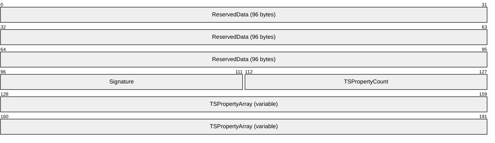
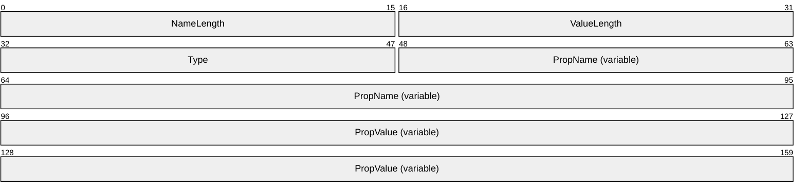

# [MS-TSTS]: Terminal Services Terminal Server Runtime Interface Protocol

Table of Contents

1 Introduction

- [1 Introduction](#Section_1)
  - [1.1 Glossary](#Section_1.1)
  - [1.2 References](#Section_1.2)
    - [1.2.1 Normative References](#Section_1.2.1)
    - [1.2.2 Informative References](#Section_1.2.2)
  - [1.3 Overview](#Section_1.3)
  - [1.4 Relationship to Other Protocols](#Section_1.4)
  - [1.5 Prerequisites/Preconditions](#Section_1.5)
  - [1.6 Applicability Statement](#Section_1.6)
  - [1.7 Versioning and Capability Negotiation](#Section_1.7)
  - [1.8 Vendor-Extensible Fields](#Section_1.8)
  - [1.9 Standards Assignments](#Section_1.9)

2 Messages

- [2 Messages](#Section_2)
  - [2.1 Transport](#Section_2.1)
  - [2.2 Common Data Types](#Section_2.2)
    - [2.2.1 Data Types](#Section_2.2.1)
      - [2.2.1.1 SESSION_HANDLE](#Section_2.2.1.1)
      - [2.2.1.2 ENUM_HANDLE](#Section_2.2.1.2)
      - [2.2.1.3 HLISTENER](#Section_2.2.1.3)
      - [2.2.1.4 SERVER_HANDLE](#Section_2.2.1.4)
      - [2.2.1.5 WINSTATIONNAME](#Section_2.2.1.5)
      - [2.2.1.6 DLLNAME](#Section_2.2.1.6)
      - [2.2.1.7 DEVICENAME](#Section_2.2.1.7)
      - [2.2.1.8 WINSTATIONINFOCLASS](#Section_2.2.1.8)
      - [2.2.1.9 WINSTATIONSTATECLASS](#Section_2.2.1.9)
      - [2.2.1.10 SDCLASS](#Section_2.2.1.10)
      - [2.2.1.11 SHADOWCLASS](#Section_2.2.1.11)
      - [2.2.1.12 RECONNECT_TYPE](#Section_2.2.1.12)
      - [2.2.1.13 CLIENTDATANAME](#Section_2.2.1.13)
      - [2.2.1.14 TNotificationId](#Section_2.2.1.14)
      - [2.2.1.15 NOTIFY_HANDLE](#Section_2.2.1.15)
      - [2.2.1.16 BOUNDED_ULONG](#Section_2.2.1.16)
      - [2.2.1.17 UINT_PTR](#Section_2.2.1.17)
      - [2.2.1.18 SESSIONTYPE](#Section_2.2.1.18)
      - [2.2.1.19 SHADOW_CONTROL_REQUEST](#Section_2.2.1.19)
      - [2.2.1.20 SHADOW_PERMISSION_REQUEST](#Section_2.2.1.20)
      - [2.2.1.21 SHADOW_REQUEST_RESPONSE](#Section_2.2.1.21)
    - [2.2.2 Structures](#Section_2.2.2)
      - [2.2.2.1 SESSION_FILTER](#Section_2.2.2.1)
      - [2.2.2.2 PROTOCOLSTATUS_INFO_TYPE](#Section_2.2.2.2)
      - [2.2.2.3 QUERY_SESSION_DATA_TYPE](#Section_2.2.2.3)
      - [2.2.2.4 PSESSIONENUM](#Section_2.2.2.4)
        - [2.2.2.4.1 SessionInfo](#Section_2.2.2.4.1)
          - [2.2.2.4.1.1 SESSIONENUM_LEVEL1](#Section_2.2.2.4.1.1)
          - [2.2.2.4.1.2 SESSIONENUM_LEVEL2](#Section_2.2.2.4.1.2)
          - [2.2.2.4.1.3 SESSIONENUM_LEVEL3](#Section_2.2.2.4.1.3)
      - [2.2.2.5 PSESSIONENUM_EX](#Section_2.2.2.5)
        - [2.2.2.5.1 SessionInfo_Ex](#Section_2.2.2.5.1)
      - [2.2.2.6 PEXECENVDATA](#Section_2.2.2.6)
        - [2.2.2.6.1 ExecEnvData](#Section_2.2.2.6.1)
          - [2.2.2.6.1.1 EXECENVDATA_LEVEL1](#Section_2.2.2.6.1.1)
          - [2.2.2.6.1.2 EXECENVDATA_LEVEL2](#Section_2.2.2.6.1.2)
      - [2.2.2.7 PEXECENVDATAEX](#Section_2.2.2.7)
        - [2.2.2.7.1 ExecEnvDataEx](#Section_2.2.2.7.1)
          - [2.2.2.7.1.1 EXECENVDATAEX_LEVEL1](#Section_2.2.2.7.1.1)
      - [2.2.2.8 PLSMSESSIONINFORMATION](#Section_2.2.2.8)
      - [2.2.2.9 PLSMSESSIONINFORMATION_EX](#Section_2.2.2.9)
      - [2.2.2.10 LSM_SESSIONINFO_EX](#Section_2.2.2.10)
      - [2.2.2.11 LSM_SESSIONINFO_EX_LEVEL1](#Section_2.2.2.11)
      - [2.2.2.12 PLISTENERENUM](#Section_2.2.2.12)
        - [2.2.2.12.1 ListenerInfo](#Section_2.2.2.12.1)
          - [2.2.2.12.1.1 LISTENERENUM_LEVEL1](#Section_2.2.2.12.1.1)
      - [2.2.2.13 LOGONID](#Section_2.2.2.13)
      - [2.2.2.14 TS_PROCESS_INFORMATION_NT4](#Section_2.2.2.14)
      - [2.2.2.15 TS_ALL_PROCESSES_INFO](#Section_2.2.2.15)
        - [2.2.2.15.1 TS_SYS_PROCESS_INFORMATION](#Section_2.2.2.15.1)
          - [2.2.2.15.1.1 TS_UNICODE_STRING](#Section_2.2.2.15.1.1)
      - [2.2.2.16 TS_ALL_PROCESSES_INFO_NT6](#Section_2.2.2.16)
        - [2.2.2.16.1 TS_SYS_PROCESS_INFORMATION_NT6](#Section_2.2.2.16.1)
          - [2.2.2.16.1.1 NT6_TS_UNICODE_STRING](#Section_2.2.2.16.1.1)
        - [2.2.2.16.2 SYSTEM_THREAD_INFORMATION](#Section_2.2.2.16.2)
          - [2.2.2.16.2.1 CLIENT_ID](#Section_2.2.2.16.2.1)
      - [2.2.2.17 TS_COUNTER](#Section_2.2.2.17)
        - [2.2.2.17.1 TS_COUNTER_HEADER](#Section_2.2.2.17.1)
      - [2.2.2.18 USERCONFIG](#Section_2.2.2.18)
        - [2.2.2.18.1 CALLBACKCLASS](#Section_2.2.2.18.1)
        - [2.2.2.18.2 APPLICATIONNAME](#Section_2.2.2.18.2)
      - [2.2.2.19 WINSTATIONCLIENT](#Section_2.2.2.19)
        - [2.2.2.19.1 TS_TIME_ZONE_INFORMATION](#Section_2.2.2.19.1)
          - [2.2.2.19.1.1 TS_SYSTEMTIME](#Section_2.2.2.19.1.1)
      - [2.2.2.20 WINSTATIONINFORMATION](#Section_2.2.2.20)
        - [2.2.2.20.1 PROTOCOLSTATUS](#Section_2.2.2.20.1)
          - [2.2.2.20.1.1 PROTOCOLSTATUSEX](#Section_2.2.2.20.1.1)
          - [2.2.2.20.1.2 PROTOCOLCOUNTERS](#Section_2.2.2.20.1.2)
            - [2.2.2.20.1.2.1 TSHARE_COUNTERS](#Section_2.2.2.20.1.2.1)
          - [2.2.2.20.1.3 CACHE_STATISTICS](#Section_2.2.2.20.1.3)
            - [2.2.2.20.1.3.1 RESERVED_CACHE](#Section_2.2.2.20.1.3.1)
              - [2.2.2.20.1.3.1.1 THINWIRECACHE](#Section_2.2.2.20.1.3.1.1)
            - [2.2.2.20.1.3.2 TSHARE_CACHE](#Section_2.2.2.20.1.3.2)
      - [2.2.2.21 PDPARAMS](#Section_2.2.2.21)
      - [2.2.2.22 NETWORKCONFIG](#Section_2.2.2.22)
      - [2.2.2.23 ASYNCCONFIG](#Section_2.2.2.23)
        - [2.2.2.23.1 MODEMNAME](#Section_2.2.2.23.1)
        - [2.2.2.23.2 FLOWCONTROLCONFIG](#Section_2.2.2.23.2)
          - [2.2.2.23.2.1 FLOWCONTROLCLASS](#Section_2.2.2.23.2.1)
          - [2.2.2.23.2.2 RECEIVEFLOWCONTROLCLASS](#Section_2.2.2.23.2.2)
          - [2.2.2.23.2.3 TRANSMITFLOWCONTROLCLASS](#Section_2.2.2.23.2.3)
        - [2.2.2.23.3 CONNECTCONFIG](#Section_2.2.2.23.3)
          - [2.2.2.23.3.1 ASYNCCONNECTCLASS](#Section_2.2.2.23.3.1)
      - [2.2.2.24 NASICONFIG](#Section_2.2.2.24)
        - [2.2.2.24.1 NASIUSERNAME](#Section_2.2.2.24.1)
        - [2.2.2.24.2 NASIPASSWORD](#Section_2.2.2.24.2)
        - [2.2.2.24.3 NASISESIONNAME](#Section_2.2.2.24.3)
        - [2.2.2.24.4 NASISPECIFICNAME](#Section_2.2.2.24.4)
        - [2.2.2.24.5 NASIFILESERVER](#Section_2.2.2.24.5)
      - [2.2.2.25 OEMTDCONFIG](#Section_2.2.2.25)
      - [2.2.2.26 PDCONFIG](#Section_2.2.2.26)
        - [2.2.2.26.1 PDCONFIG2](#Section_2.2.2.26.1)
        - [2.2.2.26.2 PDNAME](#Section_2.2.2.26.2)
      - [2.2.2.27 WDCONFIG](#Section_2.2.2.27)
        - [2.2.2.27.1 WDNAME](#Section_2.2.2.27.1)
        - [2.2.2.27.2 WDPREFIX](#Section_2.2.2.27.2)
      - [2.2.2.28 CDCONFIG](#Section_2.2.2.28)
        - [2.2.2.28.1 CDCLASS](#Section_2.2.2.28.1)
        - [2.2.2.28.2 CDNAME](#Section_2.2.2.28.2)
      - [2.2.2.29 WINSTATIONCREATE](#Section_2.2.2.29)
      - [2.2.2.30 WINSTATIONCONFIG2](#Section_2.2.2.30)
        - [2.2.2.30.1 WINSTATIONCONFIG](#Section_2.2.2.30.1)
      - [2.2.2.31 POLICY_TS_MACHINE](#Section_2.2.2.31)
      - [2.2.2.32 WINSTATIONUSERTOKEN](#Section_2.2.2.32)
      - [2.2.2.33 WINSTATIONVIDEODATA](#Section_2.2.2.33)
      - [2.2.2.34 WINSTATIONLOADINDICATORDATA](#Section_2.2.2.34)
        - [2.2.2.34.1 LOADFACTORTYPE](#Section_2.2.2.34.1)
      - [2.2.2.35 WINSTATIONSHADOW](#Section_2.2.2.35)
        - [2.2.2.35.1 SHADOWSTATECLASS](#Section_2.2.2.35.1)
      - [2.2.2.36 WINSTATIONPRODID](#Section_2.2.2.36)
      - [2.2.2.37 WINSTATIONREMOTEADDRESS](#Section_2.2.2.37)
      - [2.2.2.38 ExtendedClientCredentials](#Section_2.2.2.38)
      - [2.2.2.39 TS_TRACE](#Section_2.2.2.39)
      - [2.2.2.40 BEEPINPUT](#Section_2.2.2.40)
      - [2.2.2.41 WINSTATIONCLIENTDATA](#Section_2.2.2.41)
      - [2.2.2.42 SESSION_CHANGE](#Section_2.2.2.42)
      - [2.2.2.43 RCM_REMOTEADDRESS](#Section_2.2.2.43)
      - [2.2.2.44 CLIENT_STACK_ADDRESS](#Section_2.2.2.44)
      - [2.2.2.45 VARDATA_WIRE](#Section_2.2.2.45)
      - [2.2.2.46 PDPARAMSWIRE](#Section_2.2.2.46)
      - [2.2.2.47 WINSTACONFIGWIRE](#Section_2.2.2.47)
      - [2.2.2.48 TSVIP_SOCKADDR](#Section_2.2.2.48)
      - [2.2.2.49 TSVIPAddress](#Section_2.2.2.49)
      - [2.2.2.50 TSVIPSession](#Section_2.2.2.50)
      - [2.2.2.51 WINSTATIONVALIDATIONINFORMATION](#Section_2.2.2.51)
      - [2.2.2.52 WINSTATIONPRODUCTINFO](#Section_2.2.2.52)
  - [2.3 Directory Service Schema Elements](#Section_2.3)
    - [2.3.1 userParameters](#Section_2.3.1)
    - [2.3.2 TSProperty](#Section_2.3.2)
    - [2.3.3 Encoding PropValue Field in TSProperty Structure](#Section_2.3.3)
    - [2.3.4 msTSProperty01](#Section_2.3.4)

3 Protocol Details

- [3 Protocol Details](#Section_3)
  - [3.1 Determining a Caller's Permissions and Access Rights](#Section_3.1)
    - [3.1.1 Determining a Caller's Permissions](#Section_3.1.1)
    - [3.1.2 Determining Whether a Caller Is SYSTEM](#Section_3.1.2)
    - [3.1.3 Determining Whether a Caller Is an Administrator](#Section_3.1.3)
    - [3.1.4 Determining Whether a Caller Is the Same User Who Logged onto the Session](#Section_3.1.4)
  - [3.2 Local Session Manager Client Details](#Section_3.2)
    - [3.2.1 Abstract Data Model](#Section_3.2.1)
    - [3.2.2 Timers](#Section_3.2.2)
    - [3.2.3 Initialization](#Section_3.2.3)
    - [3.2.4 Processing Events and Sequencing Rules](#Section_3.2.4)
    - [3.2.5 Timer Events](#Section_3.2.5)
    - [3.2.6 Other Local Events](#Section_3.2.6)
  - [3.3 Local Session Manager Server Details](#Section_3.3)
    - [3.3.1 Abstract Data Model](#Section_3.3.1)
      - [3.3.1.1 Abstract Data Types](#Section_3.3.1.1)
    - [3.3.2 Timers](#Section_3.3.2)
    - [3.3.3 Initialization](#Section_3.3.3)
    - [3.3.4 Processing Events and Sequencing Rules](#Section_3.3.4)
      - [3.3.4.1 TermSrvSession Methods](#Section_3.3.4.1)
        - [3.3.4.1.1 RpcOpenSession (Opnum 0)](#Section_3.3.4.1.1)
        - [3.3.4.1.2 RpcCloseSession (Opnum 1)](#Section_3.3.4.1.2)
        - [3.3.4.1.3 RpcConnect (Opnum 2)](#Section_3.3.4.1.3)
        - [3.3.4.1.4 RpcDisconnect (Opnum 3)](#Section_3.3.4.1.4)
        - [3.3.4.1.5 RpcLogoff (Opnum 4)](#Section_3.3.4.1.5)
        - [3.3.4.1.6 RpcGetUserName (Opnum 5)](#Section_3.3.4.1.6)
        - [3.3.4.1.7 RpcGetTerminalName (Opnum 6)](#Section_3.3.4.1.7)
        - [3.3.4.1.8 RpcGetState (Opnum 7)](#Section_3.3.4.1.8)
        - [3.3.4.1.9 RpcIsSessionDesktopLocked (Opnum 8)](#Section_3.3.4.1.9)
        - [3.3.4.1.10 RpcShowMessageBox (Opnum 9)](#Section_3.3.4.1.10)
        - [3.3.4.1.11 RpcGetTimes (Opnum 10)](#Section_3.3.4.1.11)
        - [3.3.4.1.12 RpcGetSessionCounters (Opnum 11)](#Section_3.3.4.1.12)
        - [3.3.4.1.13 RpcGetSessionInformation (Opnum 12)](#Section_3.3.4.1.13)
        - [3.3.4.1.14 RpcGetLoggedOnCount (Opnum 15)](#Section_3.3.4.1.14)
        - [3.3.4.1.15 RpcGetSessionType (Opnum 16)](#Section_3.3.4.1.15)
        - [3.3.4.1.16 RpcGetSessionInformationEx (Opnum 17)](#Section_3.3.4.1.16)
        - [3.3.4.1.17 RpcGetActivityId (Opnum 21)](#Section_3.3.4.1.17)
      - [3.3.4.2 TermSrvNotification](#Section_3.3.4.2)
        - [3.3.4.2.1 RpcWaitForSessionState (Opnum 0)](#Section_3.3.4.2.1)
        - [3.3.4.2.2 RpcRegisterAsyncNotification (Opnum 1)](#Section_3.3.4.2.2)
        - [3.3.4.2.3 RpcWaitAsyncNotification (Opnum 2)](#Section_3.3.4.2.3)
        - [3.3.4.2.4 RpcUnRegisterAsyncNotification (Opnum 3)](#Section_3.3.4.2.4)
      - [3.3.4.3 TermSrvEnumeration](#Section_3.3.4.3)
        - [3.3.4.3.1 RpcOpenEnum (Opnum 0)](#Section_3.3.4.3.1)
        - [3.3.4.3.2 RpcCloseEnum (Opnum 1)](#Section_3.3.4.3.2)
        - [3.3.4.3.3 RpcFilterByState (Opnum 2)](#Section_3.3.4.3.3)
        - [3.3.4.3.4 RpcFilterByCallersName (Opnum 3)](#Section_3.3.4.3.4)
        - [3.3.4.3.5 RpcEnumAddFilter (Opnum 4)](#Section_3.3.4.3.5)
        - [3.3.4.3.6 RpcGetEnumResult (Opnum 5)](#Section_3.3.4.3.6)
        - [3.3.4.3.7 RpcFilterBySessionType (Opnum 6)](#Section_3.3.4.3.7)
        - [3.3.4.3.8 RpcGetSessionIds (Opnum 8)](#Section_3.3.4.3.8)
        - [3.3.4.3.9 RpcGetEnumResultEx (Opnum 9)](#Section_3.3.4.3.9)
        - [3.3.4.3.10 RpcGetAllSessions (Opnum 10)](#Section_3.3.4.3.10)
        - [3.3.4.3.11 RpcGetAllSessionsEx (Opnum 11)](#Section_3.3.4.3.11)
    - [3.3.5 Timer Events](#Section_3.3.5)
    - [3.3.6 Other Local Events](#Section_3.3.6)
  - [3.4 TermSrv Client Details](#Section_3.4)
    - [3.4.1 Abstract Data Model](#Section_3.4.1)
    - [3.4.2 Timers](#Section_3.4.2)
    - [3.4.3 Initialization](#Section_3.4.3)
    - [3.4.4 Processing Events and Sequencing Rules](#Section_3.4.4)
    - [3.4.5 Timer Events](#Section_3.4.5)
    - [3.4.6 Other Local Events](#Section_3.4.6)
  - [3.5 TermSrv Server Details](#Section_3.5)
    - [3.5.1 Abstract Data Model](#Section_3.5.1)
      - [3.5.1.1 Abstract Data Types](#Section_3.5.1.1)
    - [3.5.2 Timers](#Section_3.5.2)
    - [3.5.3 Initialization](#Section_3.5.3)
    - [3.5.4 Message Processing Events and Sequencing Rules](#Section_3.5.4)
      - [3.5.4.1 RCMPublic](#Section_3.5.4.1)
        - [3.5.4.1.1 RpcGetClientData (Opnum 0)](#Section_3.5.4.1.1)
        - [3.5.4.1.2 RpcGetConfigData (Opnum 1)](#Section_3.5.4.1.2)
        - [3.5.4.1.3 RpcGetProtocolStatus (Opnum 2)](#Section_3.5.4.1.3)
        - [3.5.4.1.4 RpcGetLastInputTime (Opnum 3)](#Section_3.5.4.1.4)
        - [3.5.4.1.5 RpcGetRemoteAddress (Opnum 4)](#Section_3.5.4.1.5)
        - [3.5.4.1.6 RpcGetAllListeners (Opnum 8)](#Section_3.5.4.1.6)
        - [3.5.4.1.7 RpcGetSessionProtocolLastInputTime (Opnum 9)](#Section_3.5.4.1.7)
        - [3.5.4.1.8 RpcGetUserCertificates (Opnum 10)](#Section_3.5.4.1.8)
        - [3.5.4.1.9 RpcQuerySessionData (Opnum 11)](#Section_3.5.4.1.9)
      - [3.5.4.2 RCMListener](#Section_3.5.4.2)
        - [3.5.4.2.1 RpcOpenListener (Opnum 0)](#Section_3.5.4.2.1)
        - [3.5.4.2.2 RpcCloseListener (Opnum 1)](#Section_3.5.4.2.2)
        - [3.5.4.2.3 RpcStopListener (Opnum 2)](#Section_3.5.4.2.3)
        - [3.5.4.2.4 RpcStartListener (Opnum 3)](#Section_3.5.4.2.4)
        - [3.5.4.2.5 RpcIsListening (Opnum 4)](#Section_3.5.4.2.5)
    - [3.5.5 Timer Events](#Section_3.5.5)
    - [3.5.6 Other Local Events](#Section_3.5.6)
  - [3.6 Legacy Client Details](#Section_3.6)
    - [3.6.1 Abstract Data Model](#Section_3.6.1)
    - [3.6.2 Timers](#Section_3.6.2)
    - [3.6.3 Initialization](#Section_3.6.3)
    - [3.6.4 Message Processing Events and Sequencing Rules](#Section_3.6.4)
    - [3.6.5 Timer Events](#Section_3.6.5)
    - [3.6.6 Other Local Events](#Section_3.6.6)
  - [3.7 Legacy Server Details](#Section_3.7)
    - [3.7.1 Abstract Data Model](#Section_3.7.1)
      - [3.7.1.1 Abstract Data Types](#Section_3.7.1.1)
    - [3.7.2 Timers](#Section_3.7.2)
    - [3.7.3 Initialization](#Section_3.7.3)
    - [3.7.4 Message Processing Events and Sequencing Rules](#Section_3.7.4)
      - [3.7.4.1 LegacyApi](#Section_3.7.4.1)
        - [3.7.4.1.1 RpcWinStationOpenServer (Opnum 0)](#Section_3.7.4.1.1)
        - [3.7.4.1.2 RpcWinStationCloseServer (Opnum 1)](#Section_3.7.4.1.2)
        - [3.7.4.1.3 RpcIcaServerPing (Opnum 2)](#Section_3.7.4.1.3)
        - [3.7.4.1.4 RpcWinStationEnumerate (Opnum 3)](#Section_3.7.4.1.4)
        - [3.7.4.1.5 RpcWinStationRename (Opnum 4)](#Section_3.7.4.1.5)
        - [3.7.4.1.6 RpcWinStationQueryInformation (Opnum 5)](#Section_3.7.4.1.6)
        - [3.7.4.1.7 RpcWinStationSetInformation (Opnum 6)](#Section_3.7.4.1.7)
        - [3.7.4.1.8 RpcWinStationSendMessage (Opnum 7)](#Section_3.7.4.1.8)
        - [3.7.4.1.9 RpcLogonIdFromWinStationName (Opnum 8)](#Section_3.7.4.1.9)
        - [3.7.4.1.10 RpcWinStationNameFromLogonId (Opnum 9)](#Section_3.7.4.1.10)
        - [3.7.4.1.11 RpcWinStationConnect (Opnum 10)](#Section_3.7.4.1.11)
        - [3.7.4.1.12 RpcWinStationDisconnect (Opnum 13)](#Section_3.7.4.1.12)
        - [3.7.4.1.13 RpcWinStationReset (Opnum 14)](#Section_3.7.4.1.13)
        - [3.7.4.1.14 RpcWinStationShutdownSystem (Opnum 15)](#Section_3.7.4.1.14)
        - [3.7.4.1.15 RpcWinStationWaitSystemEvent (Opnum 16)](#Section_3.7.4.1.15)
        - [3.7.4.1.16 RpcWinStationShadow (Opnum 17)](#Section_3.7.4.1.16)
        - [3.7.4.1.17 RpcWinStationBreakPoint (Opnum 29)](#Section_3.7.4.1.17)
        - [3.7.4.1.18 RpcWinStationReadRegistry (Opnum 30)](#Section_3.7.4.1.18)
        - [3.7.4.1.19 OldRpcWinStationEnumerateProcesses (Opnum 34)](#Section_3.7.4.1.19)
        - [3.7.4.1.20 RpcWinStationEnumerateProcesses (Opnum 36)](#Section_3.7.4.1.20)
        - [3.7.4.1.21 RpcWinStationTerminateProcess (Opnum 37)](#Section_3.7.4.1.21)
        - [3.7.4.1.22 RpcWinStationGetAllProcesses (Opnum 43)](#Section_3.7.4.1.22)
        - [3.7.4.1.23 RpcWinStationGetProcessSid (Opnum 44)](#Section_3.7.4.1.23)
        - [3.7.4.1.24 RpcWinStationGetTermSrvCountersValue (Opnum 45)](#Section_3.7.4.1.24)
        - [3.7.4.1.25 RpcWinStationReInitializeSecurity (Opnum 46)](#Section_3.7.4.1.25)
        - [3.7.4.1.26 RpcWinStationGetLanAdapterName (Opnum 53)](#Section_3.7.4.1.26)
        - [3.7.4.1.27 RpcWinStationUpdateSettings (Opnum 58)](#Section_3.7.4.1.27)
        - [3.7.4.1.28 RpcWinStationShadowStop (Opnum 59)](#Section_3.7.4.1.28)
        - [3.7.4.1.29 RpcWinStationCloseServerEx (Opnum 60)](#Section_3.7.4.1.29)
        - [3.7.4.1.30 RpcWinStationIsHelpAssistantSession (Opnum 61)](#Section_3.7.4.1.30)
        - [3.7.4.1.31 RpcWinStationGetMachinePolicy (Opnum 62)](#Section_3.7.4.1.31)
        - [3.7.4.1.32 RpcWinStationCheckLoopBack (Opnum 65)](#Section_3.7.4.1.32)
        - [3.7.4.1.33 RpcConnectCallback (Opnum 66)](#Section_3.7.4.1.33)
        - [3.7.4.1.34 RpcWinStationGetAllProcesses_NT6 (Opnum 70)](#Section_3.7.4.1.34)
        - [3.7.4.1.35 RpcWinStationOpenSessionDirectory (Opnum 75)](#Section_3.7.4.1.35)
    - [3.7.5 Timer Events](#Section_3.7.5)
    - [3.7.6 Other Local Events](#Section_3.7.6)
  - [3.8 Virtual IP Client Detail](#Section_3.8)
    - [3.8.1 Abstract Data Model](#Section_3.8.1)
    - [3.8.2 Timers](#Section_3.8.2)
    - [3.8.3 Initialization](#Section_3.8.3)
    - [3.8.4 Message Processing Events and Sequencing Rules](#Section_3.8.4)
    - [3.8.5 Timer Events](#Section_3.8.5)
    - [3.8.6 Other Local Events](#Section_3.8.6)
  - [3.9 Virtual IP Server Detail](#Section_3.9)
    - [3.9.1 Abstract Data Model](#Section_3.9.1)
      - [3.9.1.1 Abstract Data Types](#Section_3.9.1.1)
    - [3.9.2 Timers](#Section_3.9.2)
    - [3.9.3 Initialization](#Section_3.9.3)
    - [3.9.4 Message Processing Events and Sequencing Rules](#Section_3.9.4)
      - [3.9.4.1 TSVIPPublic](#Section_3.9.4.1)
        - [3.9.4.1.1 RpcGetSessionIP (Opnum 0)](#Section_3.9.4.1.1)
    - [3.9.5 Timer Events](#Section_3.9.5)
    - [3.9.6 Other Local Events](#Section_3.9.6)
  - [3.10 SessEnv Details](#Section_3.10)
    - [3.10.1 Abstract Data Model](#Section_3.10.1)
    - [3.10.2 Timers](#Section_3.10.2)
    - [3.10.3 Initialization](#Section_3.10.3)
    - [3.10.4 Message Processing Events and Sequencing Rules](#Section_3.10.4)
      - [3.10.4.1 SessEnvPublicRpc](#Section_3.10.4.1)
        - [3.10.4.1.1 RpcShadow2 (Opnum 0)](#Section_3.10.4.1.1)
    - [3.10.5 Timer Events](#Section_3.10.5)
    - [3.10.6 Other Local Events](#Section_3.10.6)

4 Protocol Examples

- [4 Protocol Examples](#Section_4)
  - [4.1 LSM Enumeration Example](#Section_4.1)
  - [4.2 TermService Listener Example](#Section_4.2)
  - [4.3 TermSrvBindSecure Example](#Section_4.3)
  - [4.4 Legacy Example](#Section_4.4)
  - [4.5 Encoding/Decoding Example](#Section_4.5)

5 Security

- [5 Security](#Section_5)
  - [5.1 Security Considerations for Implementers](#Section_5.1)
  - [5.2 Index of Security Parameters](#Section_5.2)

6 Appendix A: Full IDL

- [6 Appendix A: Full IDL](#Section_6)
  - [6.1 Appendix A.1: tspubrpc.idl](#Section_6.1)
  - [6.2 Appendix A.2: rcmpublic.idl](#Section_6.2)
  - [6.3 Appendix A.3: legacy.idl](#Section_6.3)
  - [6.4 Appendix A.4: TSVIPRpc.idl](#Section_6.4)
  - [6.5 Appendix A.5: winsta.h](#Section_6.5)
  - [6.6 Appendix A.6: tsdef.h](#Section_6.6)
  - [6.7 Appendix A.7: allproc.h](#Section_6.7)
  - [6.8 Appendix A.8: SessEnvRpc.idl](#Section_6.8)

7 Appendix B: Product Behavior

- [7 Appendix B: Product Behavior](#Section_7)

8 Change Tracking

- [8 Change Tracking](#Section_8)

For the legal notice and IP terms, see [LEGAL.md](../LEGAL.md).
Last updated: 11/21/2025.
See [Revision History](#revision-history) for full version history.

# 1 Introduction

This document specifies the Terminal Services Terminal Server Runtime Interface Protocol. The Terminal Services Terminal Server Runtime Interface Protocol is an RPC-based protocol used for remotely querying and configuring various aspects of a [**terminal server**](#gt_terminal-server).

Sections 1.5, 1.8, 1.9, 2, and 3 of this specification are normative. All other sections and examples in this specification are informative.

## 1.1 Glossary

This document uses the following terms:

**administrator**: A user who has complete and unrestricted access to the computer or [**domain**](#gt_domain).

**application server mode**: A mode in which [**Terminal Services**](#gt_terminal-services-ts) require a [**client access license (CAL)**](#gt_client-access-license-cal) to allow remote access to [**sessions**](#gt_session) on a [**terminal server**](#gt_terminal-server).

**ASCII**: The American Standard Code for Information Interchange (ASCII) is an 8-bit character-encoding scheme based on the English alphabet. ASCII codes represent text in computers, communications equipment, and other devices that work with text. ASCII refers to a single 8-bit ASCII character or an array of 8-bit ASCII characters with the high bit of each character set to zero.

**Client Access License (CAL)**: A license that gives a user the right to access the services of a server. To legally access the server software, a CAL can be required. A CAL is not a software product.

**directory service (DS)**: A service that stores and organizes information about a computer network's users and network shares, and that allows network administrators to manage users' access to the shares. See also Active Directory.

**domain**: A set of users and computers sharing a common namespace and management infrastructure. At least one computer member of the set has to act as a domain controller (DC) and host a member list that identifies all members of the domain, as well as optionally hosting the Active Directory service. The domain controller provides authentication of members, creating a unit of trust for its members. Each domain has an identifier that is shared among its members. For more information, see [MS-AUTHSOD](../MS-AUTHSOD/MS-AUTHSOD.md) section 1.1.1.5 and [MS-ADTS](../MS-ADTS/MS-ADTS.md).

**endpoint**: A network-specific address of a remote procedure call (RPC) server process for remote procedure calls. The actual name and type of the endpoint depends on the [**RPC**](#gt_remote-procedure-call-rpc) protocol sequence that is being used. For example, for RPC over TCP (RPC Protocol Sequence ncacn_ip_tcp), an endpoint might be TCP port 1025. For RPC over Server Message Block (RPC Protocol Sequence ncacn_np), an endpoint might be the name of a [**named pipe**](#gt_named-pipe). For more information, see [[C706]](https://go.microsoft.com/fwlink/?LinkId=89824).

**GINA**: The Graphical Identification and Authentication binary. The binary loaded by logon Service, used by the Winlogon, to show the authentication user interface and to validate the user. The default [**GINA**](#gt_gina) (MSGINA) can be replaced by a custom [**GINA**](#gt_gina) if an [**administrator**](#gt_administrator) wants to use its own authentication UI/methods such as fingerprint, voice recognition, and so on. For more information, see [[MSDN-GINA]](https://go.microsoft.com/fwlink/?LinkId=100300).

**globally unique identifier (GUID)**: A term used interchangeably with [**universally unique identifier (UUID)**](#gt_universally-unique-identifier-uuid) in Microsoft protocol technical documents (TDs). Interchanging the usage of these terms does not imply or require a specific algorithm or mechanism to generate the value. Specifically, the use of this term does not imply or require that the algorithms described in [[RFC4122]](https://go.microsoft.com/fwlink/?LinkId=90460) or [C706] have to be used for generating the GUID. See also universally unique identifier (UUID).

**handle**: Any token that can be used to identify and access an object such as a device, file, or a window.

**Input Method Editor (IME)**: An application that is used to enter characters in written Asian languages by using a standard 101-key keyboard. An IME consists of both an engine that converts keystrokes into phonetic and ideographic characters and a dictionary of commonly used ideographic words.

**Interface Definition Language (IDL)**: The International Standards Organization (ISO) standard language for specifying the interface for remote procedure calls. For more information, see [C706] section 4.

**listener**: A session running on a [**terminal server**](#gt_terminal-server) that listens for incoming connection requests.

**Microsoft Interface Definition Language (MIDL)**: The Microsoft implementation and extension of the OSF-DCE [**Interface Definition Language (IDL)**](#gt_interface-definition-language-idl). [**MIDL**](#gt_microsoft-interface-definition-language-midl) can also mean the [**Interface Definition Language (IDL)**](#gt_interface-definition-language-idl) compiler provided by Microsoft. For more information, see [MS-RPCE](../MS-RPCE/MS-RPCE.md).

**named pipe**: A named, one-way, or duplex pipe for communication between a pipe server and one or more pipe clients.

**opnum**: An operation number or numeric identifier that is used to identify a specific [**remote procedure call (RPC)**](#gt_remote-procedure-call-rpc) method or a method in an interface. For more information, see [C706] section 12.5.2.12 or [MS-RPCE].

**Remote Desktop Protocol (RDP)**: A multi-channel protocol that allows a user to connect to a computer running Microsoft Terminal Services (TS). RDP enables the exchange of client and server settings and also enables negotiation of common settings to use for the duration of the connection, so that input, graphics, and other data can be exchanged and processed between client and server.

**remote procedure call (RPC)**: A communication protocol used primarily between client and server. The term has three definitions that are often used interchangeably: a runtime environment providing for communication facilities between computers (the RPC runtime); a set of request-and-response message exchanges between computers (the RPC exchange); and the single message from an RPC exchange (the RPC message). For more information, see [C706].

**RPC protocol sequence**: A character string that represents a valid combination of a [**remote procedure call (RPC)**](#gt_remote-procedure-call-rpc) protocol, a network layer protocol, and a transport layer protocol, as described in [C706] and [MS-RPCE].

**RPC transport**: The underlying network services used by the remote procedure call (RPC) runtime for communications between network nodes. For more information, see [C706] section 2.

**security identifier (SID)**: An identifier for security principals that is used to identify an account or a group. Conceptually, the [**SID**](#gt_security-identifier-sid) is composed of an account authority portion (typically a [**domain**](#gt_domain)) and a smaller integer representing an identity relative to the account authority, termed the relative identifier (RID). The [**SID**](#gt_security-identifier-sid) format is specified in [MS-DTYP](../MS-DTYP/MS-DTYP.md) section 2.4.2; a string representation of [**SIDs**](#gt_security-identifier-sid) is specified in [MS-DTYP] section 2.4.2 and [MS-AZOD](../MS-AZOD/MS-AZOD.md) section 1.1.1.2.

**session**: A collection of applications simultaneously running under the same Win32 subsystem.

**shell**: Part of the Windows user interface (UI) that organizes and controls user access to a wide variety of objects necessary for running applications and managing the operating system. The most numerous are the folders and files that reside on computer storage media. There are also a number of virtual objects such as network printers and other computers. The [**shell**](#gt_shell) organizes these objects into a hierarchical namespace and provides an API to access them.

**SYSTEM**: An account that is used by the operating system. For more information about system account access rights, see [[MSDN-LocSysAcct]](https://go.microsoft.com/fwlink/?LinkId=150267).

**terminal server**: A computer on which [**terminal services**](#gt_terminal-services-ts) is running.

**terminal services (TS)**: A service on a server computer that allows delivery of applications, or the desktop itself, to various computing devices. When a user runs an application on a [**terminal server**](#gt_terminal-server), the application execution takes place on the server computer and only keyboard, mouse, and display information is transmitted over the network. Each user sees only his or her individual session, which is managed transparently by the server operating system and is independent of any other client session.

**Unicode**: A character encoding standard developed by the Unicode Consortium that represents almost all of the written languages of the world. The [**Unicode**](#gt_unicode) standard [[UNICODE5.0.0/2007]](https://go.microsoft.com/fwlink/?LinkId=154659) provides three forms (UTF-8, UTF-16, and UTF-32) and seven schemes (UTF-8, UTF-16, UTF-16 BE, UTF-16 LE, UTF-32, UTF-32 LE, and UTF-32 BE).

**universally unique identifier (UUID)**: A 128-bit value. UUIDs can be used for multiple purposes, from tagging objects with an extremely short lifetime, to reliably identifying very persistent objects in cross-process communication such as client and server interfaces, manager entry-point vectors, and [**RPC**](#gt_remote-procedure-call-rpc) objects. UUIDs are highly likely to be unique. UUIDs are also known as [**globally unique identifiers (GUIDs)**](#gt_globally-unique-identifier-guid) and these terms are used interchangeably in the Microsoft protocol technical documents (TDs). Interchanging the usage of these terms does not imply or require a specific algorithm or mechanism to generate the UUID. Specifically, the use of this term does not imply or require that the algorithms described in [RFC4122] or [C706] has to be used for generating the UUID.

**well-known endpoint**: A preassigned, network-specific, stable address for a particular client/server instance. For more information, see [C706].

**Windows Station (WinStation)**: [**Sessions**](#gt_session) running on the computer.

**MAY, SHOULD, MUST, SHOULD NOT, MUST NOT:** These terms (in all caps) are used as defined in [[RFC2119]](https://go.microsoft.com/fwlink/?LinkId=90317). All statements of optional behavior use either MAY, SHOULD, or SHOULD NOT.

## 1.2 References

Links to a document in the Microsoft Open Specifications library point to the correct section in the most recently published version of the referenced document. However, because individual documents in the library are not updated at the same time, the section numbers in the documents may not match. You can confirm the correct section numbering by checking the [Errata](https://go.microsoft.com/fwlink/?linkid=850906).

### 1.2.1 Normative References

We conduct frequent surveys of the normative references to assure their continued availability. If you have any issue with finding a normative reference, please contact [dochelp@microsoft.com](mailto:dochelp@microsoft.com). We will assist you in finding the relevant information.

[C706] The Open Group, "DCE 1.1: Remote Procedure Call", C706, August 1997, [https://publications.opengroup.org/c706](https://go.microsoft.com/fwlink/?LinkId=89824)

**Note** Registration is required to download the document.

[MS-ADA1] Microsoft Corporation, "[Active Directory Schema Attributes A-L](../MS-ADA1/MS-ADA1.md)".

[MS-ADA2] Microsoft Corporation, "[Active Directory Schema Attributes M](../MS-ADA2/MS-ADA2.md)".

[MS-ADA3] Microsoft Corporation, "[Active Directory Schema Attributes N-Z](../MS-ADA3/MS-ADA3.md)".

[MS-ADSC] Microsoft Corporation, "[Active Directory Schema Classes](../MS-ADSC/MS-ADSC.md)".

[MS-DTYP] Microsoft Corporation, "[Windows Data Types](../MS-DTYP/MS-DTYP.md)".

[MS-ERREF] Microsoft Corporation, "[Windows Error Codes](../MS-ERREF/MS-ERREF.md)".

[MS-RAI] Microsoft Corporation, "[Remote Assistance Initiation Protocol](../MS-RAI/MS-RAI.md)".

[MS-RDPBCGR] Microsoft Corporation, "[Remote Desktop Protocol: Basic Connectivity and Graphics Remoting](../MS-RDPBCGR/MS-RDPBCGR.md)".

[MS-RDPERP] Microsoft Corporation, "[Remote Desktop Protocol: Remote Programs Virtual Channel Extension](../MS-RDPERP/MS-RDPERP.md)".

[MS-RPCE] Microsoft Corporation, "[Remote Procedure Call Protocol Extensions](../MS-RPCE/MS-RPCE.md)".

[MS-RPCH] Microsoft Corporation, "[Remote Procedure Call over HTTP Protocol](../MS-RPCH/MS-RPCH.md)".

[MSDN-ExitWindowsEx] Microsoft Corporation, "ExitWindowsEx function", [http://msdn.microsoft.com/en-us/library/aa376868(VS.85).aspx](https://go.microsoft.com/fwlink/?LinkId=212628)

[MSDN-MSGBOX] Microsoft Corporation, "Message Box Function", [http://msdn.microsoft.com/en-us/library/ms645505.aspx](https://go.microsoft.com/fwlink/?LinkId=93359)

[MSDN-PROCRIGHTS] Microsoft Corporation, "Process Security and Access Rights", [http://msdn.microsoft.com/en-us/library/ms684880(VS.85).aspx](https://go.microsoft.com/fwlink/?LinkId=208137)

[MSDN-PRVLGECNSTS] Microsoft Corporation, "Privilege Constants", [http://msdn.microsoft.com/en-us/library/bb530716(v=VS.85).aspx](https://go.microsoft.com/fwlink/?LinkId=212627)

[MSDN-RCMWin32_TSRCS] Microsoft Corporation, "RemoteControl Method of the Win32_TSRemoteControlSetting Class", [http://msdn.microsoft.com/en-us/library/aa383818(v=VS.85).aspx](https://go.microsoft.com/fwlink/?LinkId=208353)

[MSDN-RPCBIND] Microsoft Corporation, "Creating a Binding Handle", [http://msdn.microsoft.com/en-us/library/aa373609.aspx](https://go.microsoft.com/fwlink/?LinkId=93771)

[MSDN-TDIADDRESS] Microsoft Corporation, "TDI_ADDRESS_IP structure", [docs.microsoft.com/en-us/previous-versions/windows/hardware/network/ff565072(v=vs.85)"](https://go.microsoft.com/fwlink/?LinkId=93316)

[MSDN-TOKENRIGHTS] Microsoft Corporation, "Access Rights for Access-Token Objects", [http://msdn.microsoft.com/en-us/library/aa374905(VS.85).aspx](https://go.microsoft.com/fwlink/?LinkId=208138)

[MSFT-SDLBTS] Microsoft Corporation, "Session Directory and Load Balancing Using Terminal Server", September 2002, [http://download.microsoft.com/download/8/6/2/8624174c-8587-4a37-8722-00139613a5bc/TS_Session_Directory.doc](https://go.microsoft.com/fwlink/?LinkId=90204)

[MSFT-WINMCE] Microsoft Corporation, "Getting started with Windows Media Center", [https://support.microsoft.com/en-us/help/14197/windows-media-center-getting-started](https://go.microsoft.com/fwlink/?LinkId=208408)

[RFC2119] Bradner, S., "Key words for use in RFCs to Indicate Requirement Levels", BCP 14, RFC 2119, March 1997, [https://www.rfc-editor.org/info/rfc2119](https://go.microsoft.com/fwlink/?LinkId=90317)

[WININTERNALS] Russinovich, M., and Solomon, D., "Microsoft Windows Internals, Fourth Edition", Microsoft Press, 2005, ISBN: 0735619174.

[X509] ITU-T, "Information Technology - Open Systems Interconnection - The Directory: Public-Key and Attribute Certificate Frameworks", Recommendation X.509, August 2005, [http://www.itu.int/rec/T-REC-X.509/en](https://go.microsoft.com/fwlink/?LinkId=90590)

### 1.2.2 Informative References

[MSDN-DWM] Microsoft Corporation, "Desktop Window Manager", [http://msdn.microsoft.com/en-us/library/aa969540.aspx](https://go.microsoft.com/fwlink/?LinkId=122186)

[MSDN-MSGBeep] Microsoft Corporation, "MessageBeep function", [http://msdn.microsoft.com/en-us/library/ms680356(VS.85).aspx](https://go.microsoft.com/fwlink/?LinkId=128440)

[MSDN-ProductID] Microsoft Corporation, "ProductID property", [http://msdn.microsoft.com/en-us/library/aa370855(VS.85).aspx](https://go.microsoft.com/fwlink/?LinkId=207862)

[MSDN-SERIAL] Microsoft Corporation, "Serial Communications in Win32", [http://msdn.microsoft.com/en-us/library/ms810467.aspx](https://go.microsoft.com/fwlink/?LinkId=100301)

[MSDN-SOCKADDR_IN6] Microsoft Corporation, "SOCKADDR_IN6 structure", [https://learn.microsoft.com/en-us/windows/win32/api/ws2ipdef/ns-ws2ipdef-sockaddr_in6_lh](https://go.microsoft.com/fwlink/?LinkId=206745)

[MSDN-SOCKET] Microsoft Corporation, "socket function", [http://msdn.microsoft.com/en-us/library/ms740506.aspx](https://go.microsoft.com/fwlink/?LinkId=93442)

[MSDN-SYSTIME] Microsoft Corporation, "SYSTEMTIME structure", [http://msdn.microsoft.com/en-us/library/ms189104.aspx](https://go.microsoft.com/fwlink/?LinkId=93364)

[MSDN-Win32_TSAcct] Microsoft Corporation, "Win32_TSAccount class", [http://msdn.microsoft.com/en-us/library/aa383773(VS.85).aspx](https://go.microsoft.com/fwlink/?LinkId=119682)

[MSFT-IME] Microsoft Corporation, "Input method editors (IMEs)", [http://windows.microsoft.com/en-us/windows-8/input-method-editors](https://go.microsoft.com/fwlink/?LinkId=100302)

[MSFT-VS] Microsoft Corporation, "Microsoft Virtual Server", [https://msdn.microsoft.com/en-us/library/windows/desktop/cc997745(v=vs.85).aspx](https://go.microsoft.com/fwlink/?LinkId=123460)

[MSFT-W2KDDK] Microsoft Press, "Microsoft Windows 2000 Driver Development Reference Kit, volumes 1-3", March 2000, ISBN: 0735609292.

**Note** The Windows 2000 DDK publication is cited as it was the last DDK (Driver Development Kit) that was physically in print. All driver development documentation since then has been delivered in soft format, and is available for download here: http://www.m...

[MSFT-WINSYSINTERNALS] Microsoft Corporation, "Windows Sysinternals", [http://technet.microsoft.com/en-us/sysinternals](https://go.microsoft.com/fwlink/?LinkId=208768)

[MSFT-WSTSL] Microsoft Corporation, "Overview of Remote Desktop Licensing", [http://technet.microsoft.com/en-us/library/cc725933.aspx](https://go.microsoft.com/fwlink/?LinkId=93371)

[MSKB-5064081] Microsoft Corporation, "August 2025 - 5064081", August 2025, [https://www.catalog.update.microsoft.com/Search.aspx?q=5064081](https://go.microsoft.com/fwlink/?linkid=2330003)

[MSKB-5072034] Mircosoft Corporation, "December 2025 - 5072034", December 2025, [https://www.catalog.update.microsoft.com/Search.aspx?q=5072034](https://go.microsoft.com/fwlink/?linkid=2342159)

## 1.3 Overview

The Terminal Services Terminal Server Runtime Interface Protocol is a simple request-response RPC-based protocol used for remotely querying and configuring various aspects of a [**terminal server**](#gt_terminal-server). For example, this protocol can be used to query the number of active [**sessions**](#gt_session) running on a terminal server. For every method that the server receives, it executes the method and returns a completion. The client simply returns the completion status to the caller.

The protocol consists of four major subcomponents:

- **Local Session Manager (LSM):** A system component that creates, destroys, and manages sessions.
- **TermService:** A service running on the system that manages remote connection requests.
- **VM Host Agent:** A service running on the system that monitors the states of the sessions within virtual machines hosted on the server [[MSFT-VS]](https://go.microsoft.com/fwlink/?LinkId=123460).<1>
- **Virtual IP:** A service running on the system that assigns IP addresses to sessions that are created by using remote connection requests.
The protocol can be further divided into the following functional categories:<2>

Functional categories associated with the **Local Session Manager (LSM)** subcomponent:

- **Local Session Manager (LSM) Session:** These calls collect information, and control and configure sessions running on the terminal server.
- **Local Session Manager (LSM) Notification:** These [**RPC**](#gt_remote-procedure-call-rpc) calls are asynchronous and can be used to receive event notifications from the LSM.
- **Local Session Manager (LSM) Enumeration:** These calls are used to enumerate information related to sessions running on a terminal server.
Functional categories associated with the **VM Host Agent** subcomponent:

- **VM Host Agent Session:** These calls collect information as well as control and configure sessions running on the virtual machines hosted on the server.
- **VM Host Agent Notification:** These RPC calls are asynchronous and can be used to receive event notifications from **VM Host Agent**.
- **VM Host Agent Enumeration:** These calls are used to enumerate information related to sessions running on the virtual machines hosted on the server.
Functional categories associated with the **TermService** subcomponent:

- **TermService:** These calls can be used to query and configure various aspects of the TermServices running on the terminal server.
- **TermService Listener:** These calls are specific to the listener session running on the terminal server and listening for incoming connection requests.
- **Legacy:** The legacy calls used by [**Terminal Services**](#gt_terminal-services-ts) clients.

## 1.4 Relationship to Other Protocols

The Terminal Services Terminal Server Runtime Interface Protocol is dependent upon [**RPC**](#gt_remote-procedure-call-rpc) for its transport. This protocol uses RPC over [**named pipes**](#gt_named-pipe) as specified in section [2.1](#Section_2.1).

## 1.5 Prerequisites/Preconditions

The Terminal Services Terminal Server Runtime Interface Protocol is an [**RPC**](#gt_remote-procedure-call-rpc) interface and as a result has the prerequisites specified in [MS-RPCE](../MS-RPCE/MS-RPCE.md) as being common to RPC interfaces.

It is assumed that a Terminal Services Terminal Server Runtime Interface Protocol client has obtained the name of a [**terminal server**](#gt_terminal-server) that supports the Terminal Services Terminal Server Runtime Interface Protocol before this protocol is invoked. The manner in which a client obtains the terminal server name is implementation-specific.

## 1.6 Applicability Statement

The Terminal Services Terminal Server Runtime Interface Protocol is appropriate only for querying and configuring a [**terminal server**](#gt_terminal-server).

## 1.7 Versioning and Capability Negotiation

None.

## 1.8 Vendor-Extensible Fields

The Terminal Services Terminal Server Runtime Interface Protocol uses Win32 error codes defined in [MS-ERREF](../MS-ERREF/MS-ERREF.md). Vendors SHOULD reuse those values with their indicated meaning.<3> Choosing any other value might cause a collision in the future.

## 1.9 Standards Assignments

In the following table, interfaces are based on binding and [**named pipes**](#gt_named-pipe) are based on the RPC Programming Model Overview as specified in [[C706]](https://go.microsoft.com/fwlink/?LinkId=89824) section 2.

| Description | Interface UUID | Named pipe |
| --- | --- | --- |
| LSM Session (tspubrpc.idl)<4> | { 484809d6-4239-471b-b5bc-61df8c23ac48 } | \PIPE\LSM_API_service \PIPE\UNIFIED_API_service<5> |
| LSM Notification (tspubrpc.idl)<6> | { 11899a43-2b68-4a76-92e3-a3d6ad8c26ce } | \PIPE\LSM_API_service \PIPE\UNIFIED_API_service<7> |
| LSM Enumeration (tspubrpc.idl)<8> | { 88143fd0-c28d-4b2b-8fef-8d882f6a9390 } | \PIPE\LSM_API_service \PIPE\UNIFIED_API_service<9> |
| TermSrv (RCMPublic.idl)<10> | { bde95fdf-eee0-45de-9e12-e5a61cd0d4fe } | \PIPE\TermSrv_API_service |
| TermSrv Listener (RCMPublic.idl)<11> | { 497d95a6-2d27-4bf5-9bbd-a6046957133c } | \PIPE\TermSrv_API_service |
| Legacy (Legacy.idl) | { 5ca4a760-ebb1-11cf-8611-00a0245420ed } | \PIPE\Ctx_WinStation_API_service |
| TSVIPPublic (TSVIPRpc.idl) | {53b46b02-c73b-4a3e-8dee-b16b80672fc0} | \PIPE\TSVIP_Service |
| SessEnvPublicRpc (SessEnvRpc.idl) | {1257B580-CE2F-4109-82D6-A9459D0BF6BC} | \PIPE\SessEnvPublicRpc |

# 2 Messages

## 2.1 Transport

The Terminal Services Terminal Server Runtime Interface Protocol uses the [**RPC protocol sequences**](#gt_rpc-protocol-sequence) as specified in [MS-RPCE](../MS-RPCE/MS-RPCE.md) section 2.1.1 and [MS-RPCH](../MS-RPCH/MS-RPCH.md) section 1.4.

The Terminal Services Terminal Server Runtime Interface Protocol uses the following static [**endpoints**](#gt_endpoint) in addition to [**well-known endpoints**](#gt_well-known-endpoint). These endpoints are ports for [MS-RPCH] section 1.5 and [MS-RPCE] section 2.1 on the [**terminal server**](#gt_terminal-server).

Port 3389: This endpoint is used by the terminal server to listen for incoming [**RPC**](#gt_remote-procedure-call-rpc) method calls. The authenticated RPC interface allows RPC to negotiate the use of authentication and the authentication level on behalf of the [**Terminal Services**](#gt_terminal-services-ts) client and target server.

Both types of endpoints (Static endpoints and well-known endpoints) MUST be supported. The Terminal Services Terminal Server Runtime Interface Protocol MUST use the [**universally unique identifier (UUID)**](#gt_universally-unique-identifier-uuid) as specified in section [1.9](#Section_1.9).

## 2.2 Common Data Types

In addition to [**RPC**](#gt_remote-procedure-call-rpc) base types specified in [[C706]](https://go.microsoft.com/fwlink/?LinkId=89824) and in [MS-RPCE](../MS-RPCE/MS-RPCE.md), this document uses the following definitions, as specified in [MS-DTYP](../MS-DTYP/MS-DTYP.md):

- BOOL
- BOOLEAN
- BYTE
- CHAR
- DWORD
- HANDLE
- HRESULT
- hyper
- LONG
- UCHAR
- UINT
- ULONG
- USHORT
- VOID
- WCHAR
The document also uses the following definitions:

- Some data structures described in this document, for example [USERCONFIG](#Section_2.2.2.18) and [WINSTATIONCLIENT](#Section_2.2.2.19), use ULONG members to store sets of BOOLEAN flags defined using C bit-field syntax.
- The variation in the use of data types is a result of the as-built interface.
The data types in the following sections are defined in the [**Microsoft Interface Definition Language (MIDL)**](#gt_microsoft-interface-definition-language-midl) specification for this RPC interface, as specified in section [6](#Section_6).

### 2.2.1 Data Types

#### 2.2.1.1 SESSION_HANDLE

This type is declared as follows:

typedef [context_handle] void* SESSION_HANDLE;

A [**handle**](#gt_handle) to a session on the [**terminal server**](#gt_terminal-server). It is returned by [RpcOpenSession](#Section_3.3.4.1.1).

#### 2.2.1.2 ENUM_HANDLE

This type is declared as follows:

typedef [context_handle] void* ENUM_HANDLE;

A [**handle**](#gt_handle) representing the session enumeration object on the [**terminal server**](#gt_terminal-server). It is returned by [RpcOpenEnum](#Section_3.3.4.3.1).

#### 2.2.1.3 HLISTENER

This type is declared as follows:

typedef [context_handle] void* HLISTENER;

A [**handle**](#gt_handle) representing a [**listener**](#gt_listener) running on the [**terminal server**](#gt_terminal-server).

#### 2.2.1.4 SERVER_HANDLE

This type is declared as follows:

typedef [context_handle] void* SERVER_HANDLE;

A [**handle**](#gt_handle) returned by [RpcWinStationOpenServer](#Section_3.7.4.1.1) on the [**terminal server**](#gt_terminal-server).

#### 2.2.1.5 WINSTATIONNAME

An array of WCHAR (**WINSTATIONNAME**) characters that represent the name of a session.

This type is declared as follows:

typedef WCHAR WINSTATIONNAME[WINSTATIONNAME_LENGTH + 1];

#### 2.2.1.6 DLLNAME

The **DLLNAME** type contains the name of a DLL.

typedef WCHAR DLLNAME[DLLNAME_LENGTH + 1];

typedef WCHAR* PDLLNAME;

#### 2.2.1.7 DEVICENAME

The **DEVICENAME** type contains the name of a device.

typedef WCHAR DEVICENAME[DEVICENAME_LENGTH + 1];

typedef WCHAR* PDEVICENAME;

#### 2.2.1.8 WINSTATIONINFOCLASS

The **WINSTATIONINFOCLASS** enumeration is used by [RpcWinStationQueryInformation](#Section_3.7.4.1.6) and [RpcWinStationSetInformation](#Section_3.7.4.1.7) to indicate the class of data for which to either query or set on the server. A brief description of each info class is appended to each enum value. See RpcWinStationQueryInformation for information about classes of data that can be queried and RpcWinStationSetInformation for classes of data that can be set.

The enum value **WinStationUnused1** MAY be used.<12>

typedef enum _WINSTATIONINFOCLASS

{

WinStationCreateData,

WinStationConfiguration,

WinStationPdParams,

WinStationWd,

WinStationPd,

WinStationPrinter,

WinStationClient,

WinStationModules,

WinStationInformation,

WinStationTrace,

WinStationBeep,

WinStationEncryptionOff,

WinStationEncryptionPerm,

WinStationNtSecurity,

WinStationUserToken,

WinStationUnused1,

WinStationVideoData,

WinStationInitialProgram,

WinStationCd,

WinStationSystemTrace,

WinStationVirtualData,

WinStationClientData,

WinStationSecureDesktopEnter,

WinStationSecureDesktopExit,

WinStationLoadBalanceSessionTarget,

WinStationLoadIndicator,

WinStationShadowInfo,

WinStationDigProductId,

WinStationLockedState,

WinStationRemoteAddress,

WinStationIdleTime,

WinStationLastReconnectType,

WinStationDisallowAutoReconnect,

WinStationUnused2,

WinStationUnused3,

WinStationUnused4,

WinStationUnused5,

WinStationReconnectedFromId,

WinStationEffectsPolicy,

WinStationType,

WinStationInformationEx

} WINSTATIONINFOCLASS;

**WinStationCreateData:** Query the data used to create an instance of [**WinStation**](#gt_windows-station-winstation).<13>

**WinStationConfiguration:** Query or set the WinStation parameters.

**WinStationPdParams:** Query or set the Protocol Drivers (PD) parameters.

**WinStationWd:** Query the Window Driver (WD) configuration. (Only one WD configuration can be loaded.)

**WinStationPd:** Query the PD configuration. (Many PD configurations can be loaded).

**WinStationPrinter:** Query or set the Line Printer Terminal (LPT) mapping to printer queues.<14>

**WinStationClient:** Query information about the client.

**WinStationModules:** Query information about all client modules.

**WinStationInformation:** Query information about the WinStation.

**WinStationTrace:** Enable or disable WinStation tracing.<15>

**WinStationBeep:** Sound a beep in the WinStation.<16>

**WinStationEncryptionOff:** Turn off encryption.<17>

**WinStationEncryptionPerm:** Encryption is permanently on.<18>

**WinStationNtSecurity:** Select logon service<19> security desktop.<20>

**WinStationUserToken:** Query the primary access token of the logged-on user.

**WinStationUnused1:** Not used.

**WinStationVideoData:** Query the horizontal resolution, vertical resolution, and color depth.<21>

**WinStationInitialProgram:** Identify the initial program run by [**Terminal Services**](#gt_terminal-services-ts) when the user logs on.<22>

**WinStationCd:** Query the Client Device (CD) configuration. (Only one CD configuration can be loaded.)<23>

**WinStationSystemTrace:** Enable or disable system tracing.<24>

**WinStationVirtualData:** Query the client virtual data.

**WinStationClientData:** Send data to a client.<25>

**WinStationSecureDesktopEnter:** Turn encryption on, if enabled.<26>

**WinStationSecureDesktopExit:** Turn encryption off, if enabled.<27>

**WinStationLoadBalanceSessionTarget:** Load balance information from a redirected client.<28>

**WinStationLoadIndicator:** Query load capacity information.

**WinStationShadowInfo:** Query or set shadow state and parameters.<29>

**WinStationDigProductId:** Get the **WINSTATIONPRODID**, as specified in section [2.2.2.36](#Section_2.2.2.36).<30>

**WinStationLockedState:** Used by the logon service<31> to notify applications and services.

**WinStationRemoteAddress:** Query the client IP address.

**WinStationIdleTime:** Query for the amount of time the WinStation is idle.<32>

**WinStationLastReconnectType:** Query if the last reconnect for this WinStation was manual or auto-reconnect.<33>

**WinStationDisallowAutoReconnect:** Allow or disallow auto-reconnect for this WinStation.<34>

**WinStationUnused2:** Not used.

**WinStationUnused3:** Not used.

**WinStationUnused4:** Not used.

**WinStationUnused5:** Not used.

**WinStationReconnectedFromId:** In the case of reconnected sessions, return the session ID of the temporary session from which it was reconnected, or -1 if no temporary session was created.

**WinStationEffectsPolicy:** Return policies that differentiate among implementations.

**WinStationType:** Return the type of the session associated with this WinStation.<35>

**WinStationInformationEx:** Return the extended information about the WinStation.<36>

#### 2.2.1.9 WINSTATIONSTATECLASS

The WINSTATIONSTATECLASS enumeration represents the current state of a session.

typedef enum _WINSTATIONSTATECLASS

{

State_Active = 0,

State_Connected = 1,

State_ConnectQuery = 2,

State_Shadow = 3,

State_Disconnected = 4,

State_Idle = 5,

State_Listen = 6,

State_Reset = 7,

State_Down = 8,

State_Init = 9

} WINSTATIONSTATECLASS;

**State_Active:** A user is logged on to a session and the client is connected.

**State_Connected:** A client is connected to a session but the user has not yet logged on.

**State_ConnectQuery:** A session is in the process of connecting to a client.

**State_Shadow:** A session is shadowing another session.

**State_Disconnected:** A user is logged on to the session but the client is currently disconnected from the server.

**State_Idle:** A session is waiting for a client to connect to the server.

**State_Listen:** A [**listener**](#gt_listener) is waiting for connections from the Terminal Services client.

**State_Reset:** A session is being reset. As a result, the user is logged off, the session is terminated, and the client is disconnected.<37>

**State_Down:** A session is currently tearing down or is in the down state, indicating an error.

**State_Init:** A session is in the process of being initialized.

#### 2.2.1.10 SDCLASS

The **SDCLASS** (stack driver class) enumeration is used to specify a type of binary or driver in the union [PDPARAMS](#Section_2.2.2.21) and to indicate which structure in the union PDPARAMS applies to a given instance of the PDPARAMS structure.

typedef enum _SDCLASS

{

SdNone = 0,

SdConsole,

SdNetwork,

SdAsync,

SdOemTransport

} SDCLASS;

**SdNone:** None.

**SdConsole:** Not used.

**SdNetwork:** Indicates the networking binaries.<38>

**SdAsync:** Indicates the async (modem) drivers.<39>

**SdOemTransport:** Indicates the user transport drivers.<40>

#### 2.2.1.11 SHADOWCLASS

The **SHADOWCLASS** enumeration is used to indicate the shadow-related settings for a session running on a [**terminal server**](#gt_terminal-server).

typedef enum _SHADOWCLASS

{

Shadow_Disable,

Shadow_EnableInputNotify,

Shadow_EnableInputNoNotify,

Shadow_EnableNoInputNotify,

Shadow_EnableNoInputNoNotify,

} SHADOWCLASS;

**Shadow_Disable:** Shadowing is disabled.

**Shadow_EnableInputNotify:** Permission is asked first from the session being shadowed. The shadower is also permitted keyboard and mouse input.

**Shadow_EnableInputNoNotify:** Permission is not asked first from the session being shadowed. The shadower is also permitted keyboard and mouse input.

**Shadow_EnableNoInputNotify:** Permission is asked first from the session being shadowed. The shadower is not permitted keyboard and mouse input and MUST observe the shadowed session.

**Shadow_EnableNoInputNoNotify:** Permission is not asked first from the session being shadowed. The shadower is not permitted keyboard and mouse input and MUST observe the shadowed session.

#### 2.2.1.12 RECONNECT_TYPE

The RECONNECT_TYPE enumeration specifies the reconnect type of the last session reconnect.

typedef enum _RECONNECT_TYPE

{

NeverReconnected = 0,

ManualReconnect = 1,

AutoReconnect = 2

} RECONNECT_TYPE,

*PRECONNECT_TYPE;

**NeverReconnected:** Session has never been reconnected to. This is the default type until the first time the session has been reconnected to.

**ManualReconnect:** Session was disconnected from and was manually reconnected to by the user.

**AutoReconnect:** Session was disconnected from and was automatically reconnected to by the [**Terminal Services**](#gt_terminal-services-ts) client and the server negotiating the reconnect without input from the user.

#### 2.2.1.13 CLIENTDATANAME

The **CLIENTDATANAME** type specifies the name of the client data being provided.

typedef CHAR CLIENTDATANAME[CLIENTDATANAME_LENGTH + 1];

typedef CHAR * PCLIENTDATANAME;

The name has the following form:

name syntax: xxxyyyy<null>

The elements are as follows:

**xxx:** The OEM ID.

**yyyy:** Client data name.

**<null>:** Trailing null.

#### 2.2.1.14 TNotificationId

Specifies the type of notification for which to wait from the [**terminal server**](#gt_terminal-server).

It MUST be a bitwise OR of any of the values shown in the following table.

This type is declared as follows:

typedef ULONG TNotificationId;

| Value | Meaning |
| --- | --- |
| WTS_NOTIFY_NONE 0x0 | No notification |
| WTS_NOTIFY_CREATE 0x1 | Session creation notification |
| WTS_NOTIFY_CONNECT 0x2 | Session connection notification |
| WTS_NOTIFY_DISCONNECT 0x4 | Session disconnection notification |
| WTS_NOTIFY_LOGON 0x8 | Session logon notification |
| WTS_NOTIFY_LOGOFF 0x10 | Session logoff notification |
| WTS_NOTIFY_SHADOW_START 0x20 | Session shadow start notification |
| WTS_NOTIFY_SHADOW_STOP 0x40 | Session shadow stop notification |
| WTS_NOTIFY_TERMINATE 0x80 | Session termination notification |
| WTS_NOTIFY_CONSOLE_CONNECT 0x100 | Console session connection notification |
| WTS_NOTIFY_CONSOLE_DISCONNECT 0x200 | Console session disconnect notification |
| WTS_NOTIFY_LOCK 0x400 | Session lock notification |
| WTS_NOTIFY_UNLOCK 0x800 | Session unlock notification |
| WTS_NOTIFY_DESKTOP_READY 0x1000 | Session desktop ready notification<41> |
| WTS_NOTIFY_ALL 0xffffffff | All notifications |

#### 2.2.1.15 NOTIFY_HANDLE

A [**handle**](#gt_handle) to a notification object.

Used in asynchronous calls such as [RpcRegisterAsyncNotification](#Section_3.3.4.2.2) and [RpcWaitAsyncNotification](#Section_3.3.4.2.3).

This type is declared as follows:

typedef [context_handle] void* NOTIFY_HANDLE;

#### 2.2.1.16 BOUNDED_ULONG

A bounded ULONG.

This type is declared as follows:

typedef [range(0, 0x8000)] ULONG BOUNDED_ULONG;

#### 2.2.1.17 UINT_PTR

An unsigned integer, whose length is dependent on processor word size.

#if defined(_WIN64)

typedef unsigned __int64 UINT_PTR;

#else

typedef unsigned int UINT_PTR;

#endif

#### 2.2.1.18 SESSIONTYPE

The **SESSIONTYPE** enumeration defines the type of the session.

typedef enum _SessionType

{

SESSIONTYPE_UNKNOWN = 0,

SESSIONTYPE_SERVICES,

SESSIONTYPE_LISTENER,

SESSIONTYPE_REGULARDESKTOP,

SESSIONTYPE_ALTERNATESHELL,

SESSIONTYPE_REMOTEAPP,

SESSIONTYPE_MEDIACENTEREXT

} SESSIONTYPE;

**SESSIONTYPE_UNKNOWN:** The type of the session cannot be determined.

**SESSIONTYPE_SERVICES:** The session is used only to run the operating system services, and that no user can be logged on to the session.

**SESSIONTYPE_LISTENER:** The session is used only to run the [**Terminal Services**](#gt_terminal-services-ts) [**listeners**](#gt_listener), and that no user can be logged on to the session.

**SESSIONTYPE_REGULARDESKTOP:** The session is connected by using Terminal Services and is running the standard [**shell**](#gt_shell).<42>

**SESSIONTYPE_ALTERNATESHELL:** The session is connected by using Terminal Services and is running an alternate shell instead of the standard shell.

**SESSIONTYPE_REMOTEAPP:** The session is a RAIL (Remote Applications Integrated Locally) session as defined in [MS-RDPERP](../MS-RDPERP/MS-RDPERP.md).

**SESSIONTYPE_MEDIACENTEREXT:** The session was connected by using a media center extender device. For more information about the media center, see [[MSFT-WINMCE]](https://go.microsoft.com/fwlink/?LinkId=208408).

#### 2.2.1.19 SHADOW_CONTROL_REQUEST

The **SHADOW_CONTROL_REQUEST** enumeration specifies if a shadow of user input control is being requested.

typedef enum

{

SHADOW_CONTROL_REQUEST_VIEW = 0,

SHADOW_CONTROL_REQUEST_TAKECONTROL,

SHADOW_CONTROL_REQUEST_Count

} SHADOW_CONTROL_REQUEST;

**SHADOW_CONTROL_REQUEST_VIEW:** The shadow request is for a view-only session. User input is not being requested.

**SHADOW_CONTROL_REQUEST_TAKECONTROL:** User input control is being requested.

**SHADOW_CONTROL_REQUEST_Count:** Count of enum values.

#### 2.2.1.20 SHADOW_PERMISSION_REQUEST

The **SHADOW_PERMISSION_REQUEST** enumeration specifies whether user permission is being requested.

typedef enum

{

SHADOW_PERMISSION_REQUEST_SILENT = 0,

SHADOW_PERMISSION_REQUEST_REQUESTPERMISSION,

SHADOW_PERMISSION_REQUEST_Count

} SHADOW_PERMISSION_REQUEST;

**SHADOW_PERMISSION_REQUEST_SILENT:** Permission is not requested.

**SHADOW_PERMISSION_REQUEST_REQUESTPERMISSION:** User permission will be requested before the shadow session begins.

**SHADOW_PERMISSION_REQUEST_Count:** Count of enum values.

#### 2.2.1.21 SHADOW_REQUEST_RESPONSE

The **SHADOW_REQUEST_RESPONSE** enumeration defines the response to a shadow session request.

typedef enum

{

SHADOW_REQUEST_RESPONSE_ALLOW = 0,

SHADOW_REQUEST_RESPONSE_DECLINE,

SHADOW_REQUEST_RESPONSE_POLICY_PERMISSION_REQUIRED,

SHADOW_REQUEST_RESPONSE_POLICY_DISABLED,

SHADOW_REQUEST_RESPONSE_POLICY_VIEW_ONLY,

SHADOW_REQUEST_RESPONSE_POLICY_VIEW_ONLY_PERMISSION_REQUIRED,

SHADOW_REQUEST_RESPONSE_SESSION_ALREADY_CONTROLLED

} SHADOW_REQUEST_RESPONSE;

**SHADOW_REQUEST_RESPONSE_ALLOW:** The user has granted the request for permission to shadow the session.

**SHADOW_REQUEST_RESPONSE_DECLINE:** The user has declined the request for permission to shadow the session.

**SHADOW_REQUEST_RESPONSE_POLICY_PERMISSION_REQUIRED:** Permission was not requested, but group policy specifies that permission is required.

**SHADOW_REQUEST_RESPONSE_POLICY_DISABLED:** Shadowing has been disabled by group policy.

**SHADOW_REQUEST_RESPONSE_POLICY_VIEW_ONLY:** A request for control was made, but group policy exclusively allows view-only shadowing.

**SHADOW_REQUEST_RESPONSE_POLICY_VIEW_ONLY_PERMISSION_REQUIRED:** A request was made to take control without requesting permission, but group policy exclusively allows view-only shadowing and also requires permission.

**SHADOW_REQUEST_RESPONSE_SESSION_ALREADY_CONTROLLED:** The session cannot be shadowed because another shadow session is currently controlling the session.

### 2.2.2 Structures

#### 2.2.2.1 SESSION_FILTER

The **SESSION_FILTER** enumeration specifies the types of filters to apply when retrieving the list of session IDs running on a [**terminal server**](#gt_terminal-server). There is only one type of filter exposed by [**RPC**](#gt_remote-procedure-call-rpc).

typedef enum _SESSION_FILTER

{

SF_SERVICES_SESSION_POPUP

} SESSION_FILTER;

**SF_SERVICES_SESSION_POPUP:** Returns all [**sessions**](#gt_session) in a logged-on state.

#### 2.2.2.2 PROTOCOLSTATUS_INFO_TYPE

The **PROTOCOLSTATUS_INFO_TYPE** enumeration specifies the protocol status information requested for a particular session running on a [**terminal server**](#gt_terminal-server).

typedef enum

{

PROTOCOLSTATUS_INFO_BASIC = 0,

PROTOCOLSTATUS_INFO_EXTENDED = 1,

} PROTOCOLSTATUS_INFO_TYPE;

**PROTOCOLSTATUS_INFO_BASIC:** Returns basic information about the protocol status in a [PROTOCOLSTATUS](#Section_2.2.2.20.1) structure.

**PROTOCOLSTATUS_INFO_EXTENDED:** Returns extended information about the protocol status. Extended information is returned in a [PROTOCOLSTATUSEX](#Section_2.2.2.20.1.1) structure.

#### 2.2.2.3 QUERY_SESSION_DATA_TYPE

The QUERY_SESSION_DATA_TYPE enumeration specifies the type of session information that can be requested for a particular session running on a [**terminal server**](#gt_terminal-server).

typedef enum

{

QUERY_SESSION_DATA_MODULE = 0,

QUERY_SESSION_DATA_WDCONFIG,

QUERY_SESSION_DATA_VIRTUALDATA,

QUERY_SESSION_DATA_LICENSE,

QUERY_SESSION_DATA_DEVICEID,

QUERY_SESSION_DATA_LICENSE_VALIDATION

} QUERY_SESSION_DATA_TYPE;

**QUERY_SESSION_DATA_MODULE:** Retrieves data about protocol-specific binaries loaded for the given [**Terminal Services**](#gt_terminal-services-ts) session. The type of the data is PBYTE.

**QUERY_SESSION_DATA_WDCONFIG:** Retrieves protocol driver configuration data for the session. The data returned is of type [WDCONFIG](#Section_2.2.2.27).

**QUERY_SESSION_DATA_VIRTUALDATA:** Retrieves data about virtual channels for the given Terminal Services session. The data returned is of type PBYTE.

**QUERY_SESSION_DATA_LICENSE:** Retrieves data about the licensing policies associated with a given Terminal Services session.<43><44>

**QUERY_SESSION_DATA_DEVICEID:** Retrieves the device ID of the client connected to a given Terminal Services session. The data returned is of type PBYTE.<45>

**QUERY_SESSION_DATA_LICENSE_VALIDATION:** Retrieves the data required to validate the license associated with a given Terminal Services session. The data returned is of type [WINSTATIONVALIDATIONINFORMATION](#Section_2.2.2.51).<46>

#### 2.2.2.4 PSESSIONENUM

PSESSIONENUM is a pointer to a structure containing information about the sessions running on the [**terminal server**](#gt_terminal-server). It is returned by [RpcGetEnumResult](#Section_3.3.4.3.6).

typedef struct _SESSIONENUM {

DWORD Level;

[switch_is(Level)] SessionInfo Data;

} SESSIONENUM,

*PSESSIONENUM;

**Level:** The level of information contained in the **Data** member; the valid values are 1 and 2.

**Data:** Contains information at a specified level of detail about sessions running on a computer.

##### 2.2.2.4.1 SessionInfo

The SessionInfo is a union of structures, each structure providing different levels of detail about sessions running on a computer, as specified in sections [2.2.2.4.1.1](#Section_2.2.2.4.1.1) and [2.2.2.4.1.2](#Section_2.2.2.4.1.2) respectively.

typedef

[switch_type(DWORD)]

union _SessionInfo {

[case(1)]

SESSIONENUM_LEVEL1 SessionEnum_Level1;

[case(2)]

SESSIONENUM_LEVEL2 SessionEnum_Level2;

} SessionInfo,

*PSessionInfo;

**SessionEnum_Level1:** A SESSIONENUM_LEVEL1 structure containing a level of information about sessions running on a computer.

**SessionEnum_Level2:** A SESSIONENUM_LEVEL2 structure containing a level of information about sessions running on a computer.

###### 2.2.2.4.1.1 SESSIONENUM_LEVEL1

The SESSIONENUM_LEVEL1 structure contains basic information about sessions running on a computer.

typedef struct _SESSIONENUM_LEVEL1 {

LONG SessionId;

LONG State;

WCHAR Name[33];

} SESSIONENUM_LEVEL1,

*PSESSIONENUM_LEVEL1;

**SessionId:** An identifier assigned by the operating system to the session contained in this structure.

**State:** The state of the session, as specified in section [3.3.4.1.8](#Section_3.3.4.1.8).

**Name:** A string that contains the name of the session assigned by [**Terminal Services**](#gt_terminal-services-ts) followed by the terminating NULL character.

###### 2.2.2.4.1.2 SESSIONENUM_LEVEL2

The SESSIONENUM_LEVEL2 structure contains information about sessions running on a computer that is more detailed than the information contained in [SESSIONENUM_LEVEL1](#Section_2.2.2.4.1.1).

typedef struct _SESSIONENUM_LEVEL2 {

LONG SessionId;

LONG State;

WCHAR Name[33];

ULONG Source;

BOOL bFullDesktop;

GUID SessionType;

} SESSIONENUM_LEVEL2,

*PSESSIONENUM_LEVEL2;

**SessionId:** An identifier assigned by the operating system to the session contained in this structure.

**State:** The state of the session, as specified in section [3.3.4.1.8](#Section_3.3.4.1.8).

**Name:** A string that contains the name of the session followed by the terminating NULL character.

**Source:** The parameter is always set to zero.

**bFullDesktop:** The parameter is always set to TRUE.

**SessionType:** Describes the type of the session.<47>

###### 2.2.2.4.1.3 SESSIONENUM_LEVEL3

The SESSIONENUM_LEVEL3 structure contains information about sessions running on a computer that is more detailed than the information contained in [SESSIONENUM_LEVEL1](#Section_2.2.2.4.1.1) and [SESSIONENUM_LEVEL2](#Section_2.2.2.4.1.2).

typedef struct _SESSIONENUM_LEVEL3 {

LONG SessionId;

LONG State;

WCHAR Name[33];

ULONG Source;

BOOL bFullDesktop;

GUID SessionType;

ULONG ProtoDataSize;

[size_is(ProtoDataSize)] UCHAR* pProtocolData;

} SESSIONENUM_LEVEL3,

*PSESSIONENUM_LEVEL3;

**SessionId:** An identifier assigned by the operating system to the session contained in this structure.

**State:** The state of the session, as specified in section [3.3.4.1.8](#Section_3.3.4.1.8).

**Name:** A string that contains the name of the session followed by the terminating NULL character.

**Source:** The parameter is always set to zero.

bFullDesktop: The parameter is always set to TRUE.

SessionType: The parameter is always set to zero.

ProtoDataSize: Size of data, in bytes, contained in the pProtocolData member.

pProtocolData: Data about the protocol status between the [**terminal server**](#gt_terminal-server) client and server. This data will be of type [PROTOCOLSTATUSEX](#Section_2.2.2.20.1.1).

#### 2.2.2.5 PSESSIONENUM_EX

The PSESSIONENUM_EX is a pointer to a structure containing information about the sessions running on the [**terminal server**](#gt_terminal-server). It is returned by [RpcGetEnumResultEx](#Section_3.3.4.3.9).

typedef struct _SESSIONENUM_EX {

DWORD Level;

[switch_is(Level)] SessionInfo_Ex Data;

} SESSIONENUM_EX,

*PSESSIONENUM_EX;

**Level:** The level of information contained in **Data**; the valid values are 1, 2, and 3.

| Value | Meaning |
| --- | --- |
| 1 | The union [SessionInfo_Ex](#Section_2.2.2.5.1) has the [SessionEnum_Level1](#Section_2.2.2.4.1.1) structure. |
| 2 | The union SessionInfo_Ex has the [SessionEnum_Level2](#Section_2.2.2.4.1.2) structure. |
| 3 | The union SessionInfo_Ex has the [SessionEnum_Level3](#Section_2.2.2.4.1.3) structure. |

**Data:** Contains information at a specified level of detail about sessions running on a computer. This parameter is of type SessionInfo_Ex. If Level is set to 1, the union SessionInfo_Ex has the SessionEnum_Level1 structure. If Level is set to 2, the union SessionInfo_Ex has the SessionEnum_Level2 structure. If Level is set to 3, the union SessionInfo_Ex has the SessionEnum_Level3 structure.

##### 2.2.2.5.1 SessionInfo_Ex

The SessionInfo_Ex is a union of structures, each structure providing different levels of detail about sessions running on a computer, as specified in sections [2.2.2.4.1.1](#Section_2.2.2.4.1.1), [2.2.2.4.1.2](#Section_2.2.2.4.1.2), and [2.2.2.4.1.3](#Section_2.2.2.4.1.3) respectively.

typedef

[switch_type(DWORD)]

union _SessionInfo_Ex {

[case(1)]

SESSIONENUM_LEVEL1 SessionEnum_Level1;

[case(2)]

SESSIONENUM_LEVEL2 SessionEnum_Level2;

[case(3)]

SESSIONENUM_LEVEL3 SessionEnum_Level3;

} SessionInfo_Ex,

*PSessionInfo_Ex;

**SessionEnum_Level1:** A SESSIONENUM_LEVEL1 structure containing a level of information about sessions running on a computer.

**SessionEnum_Level2:** A SESSIONENUM_LEVEL2 structure containing a level of information about sessions running on a computer.

**SessionEnum_Level3:** A SESSIONENUM_LEVEL3 structure containing a level of information about sessions running on a computer.

#### 2.2.2.6 PEXECENVDATA

PEXECENVDATA is a pointer to a structure containing information about the [**sessions**](#gt_session) running on the [**terminal server**](#gt_terminal-server) and the sessions running on virtual machines hosted on the server.<48> It is returned by [RpcGetAllSessions](#Section_3.3.4.3.10).

typedef struct _EXECENVDATA {

DWORD Level;

[switch_is(Level)] ExecEnvData Data;

} EXECENVDATA,

*PEXECENVDATA;

**Level:** The level of information contained in **Data**; the valid values are 1 and 2.

| Value | Meaning |
| --- | --- |
| 1 | The union [ExecEnvData](#Section_2.2.2.6.1) has the [EXECENVDATA_LEVEL1](#Section_2.2.2.6.1.1) structure. |
| 2 | The union ExecEnvData has the [EXECENVDATA_LEVEL2](#Section_2.2.2.6.1.2) structure. |

**Data:** Contains information at a specified level of detail about sessions running on a computer. This is of type ExecEnvData.

##### 2.2.2.6.1 ExecEnvData

The ExecEnvData is a union of structures, each structure providing different levels of detail about sessions running on a computer and sessions running on virtual machines hosted on the server,<49> as specified in sections [2.2.2.6.1.1](#Section_2.2.2.6.1.1) and [2.2.2.6.1.2](#Section_2.2.2.6.1.2) respectively.

typedef

[switch_type(DWORD)]

union _ExecEnvData {

[case(1)]

EXECENVDATA_LEVEL1 ExecEnvEnum_Level1;

[case(2)]

EXECENVDATA_LEVEL2 ExecEnvEnum_Level2;

} ExecEnvData,

*PExecEnvData;

**ExecEnvEnum_Level1:** An EXECENVDATA_LEVEL1 structure containing a level of information about sessions running on a computer and virtual machines hosted on the computer.<50>

**ExecEnvEnum_Level2:** An EXECENVDATA_LEVEL2 structure containing a level of information about sessions running on a computer and virtual machines hosted on the computer.<51>

###### 2.2.2.6.1.1 EXECENVDATA_LEVEL1

The EXECENVDATA_LEVEL1 structure contains basic information about sessions running on a computer.

typedef struct _EXECENVDATA_LEVEL1 {

LONG ExecEnvId;

LONG State;

WCHAR SessionName[33];

} EXECENVDATA_LEVEL1,

*PEXECENVDATA_LEVEL1;

**ExecEnvId:** An identifier assigned to the session contained in this structure by the component that aggregates the sessions on the server and sessions within virtual machines hosted on the server.<52>

**State:** The state of the session, as specified in section [3.3.4.1.8](#Section_3.3.4.1.8).

**SessionName:** A string that contains the name of the session assigned by [**Terminal Services**](#gt_terminal-services-ts) followed by the terminating NULL character.

###### 2.2.2.6.1.2 EXECENVDATA_LEVEL2

The EXECENVDATA_LEVEL2 structure contains information about sessions running on a computer that is more detailed than the information contained in [EXECENVDATA_LEVEL1](#Section_2.2.2.6.1.1).

typedef struct _EXECENVDATA_LEVEL2 {

LONG ExecEnvId;

LONG State;

WCHAR SessionName[33];

LONG AbsSessionId;

WCHAR HostName[33];

WCHAR UserName[33];

WCHAR DomainName[33];

WCHAR FarmName[33];

} EXECENVDATA_LEVEL2,

*PEXECENVDATA_LEVEL2;

**ExecEnvId:** An identifier assigned to the session contained in this structure by the component that aggregates the sessions on the server and sessions within virtual machines hosted on the server.<53>

**State:** The state of the session, as specified in section [3.3.4.1.8](#Section_3.3.4.1.8).

**SessionName:** A string that contains the name of the session followed by the terminating NULL character.

**AbsSessionId:** An identifier assigned by the operating system running in the virtual machine to the session contained in this structure. If the session contained in this structure is not running under the virtual machine, the value of **AbsSessionId** is same as **ExecEnvId**.

**HostName:** A string that contains the name of the machine that hosts the session contained in this structure followed by the terminating NULL character.

**UserName:** A string that contains the name of the user logged onto the session followed by the terminating NULL character.

**DomainName:** A string that contains the [**domain**](#gt_domain) of the user logged onto the session followed by the terminating NULL character.

**FarmName:** A string that contains the farm name associated with the session followed by the terminating NULL character.

#### 2.2.2.7 PEXECENVDATAEX

**PEXECENVDATAEX** is a pointer to a structure containing information about the sessions running on the [**terminal server**](#gt_terminal-server) and the sessions running on virtual machines hosted on the server.<54> It is returned by [RpcGetAllSessionsEx](#Section_3.3.4.3.11).

typedef struct _EXECENVDATAEX {

DWORD Level;

[switch_is(Level)] ExecEnvDataEx Data;

} EXECENVDATAEX,

*PEXECENVDATAEX;

**Level:** The level of information contained in the **Data** member; the only valid value is 1.

| Value | Meaning |
| --- | --- |
| 1 | The union [ExecEnvDataEx](#Section_2.2.2.7.1) has the [EXECENVDATAEX_LEVEL1](#Section_2.2.2.7.1.1) structure. |

**Data:** Contains information at a specified level of detail about sessions running on a computer. This is of type ExecEnvDataEx.

##### 2.2.2.7.1 ExecEnvDataEx

**ExecEnvDataEx** is a union of structures that provides information about sessions running on a computer and sessions running on virtual machines hosted on the server,<55> as specified in section [2.2.2.7.1.1](#Section_2.2.2.7.1.1).

typedef

[switch_type(DWORD)]

union _ExecEnvDataEx {

[case(1)]

EXECENVDATAEX_LEVEL1 ExecEnvEnum_Level1;

} ExecEnvDataEx,

*PExecEnvDataEx;

**ExecEnvEnum_Level1:** An EXECENVDATAEX_LEVEL1 structure that contains information about sessions running on a computer and virtual machines hosted on the computer.<56>

###### 2.2.2.7.1.1 EXECENVDATAEX_LEVEL1

The **EXECENVDATAEX_LEVEL1** structure contains information about sessions running on a computer.

typedef struct _EXECENVDATAEX_LEVEL1 {

LONG ExecEnvId;

LONG State;

LONG AbsSessionId;

[string, max_is (256)] LPWSTR pszSessionName;

[string, max_is (256)] LPWSTR pszHostName;

[string, max_is (256)] LPWSTR pszUserName;

[string, max_is (256)] LPWSTR pszDomainName;

[string, max_is (256)] LPWSTR pszFarmName;

} EXECENVDATAEX_LEVEL1,

*PEXECENVDATAEX_LEVEL1;

**ExecEnvId:** An identifier assigned to the session contained in this structure by the component that aggregates the sessions on the server and sessions within virtual machines hosted on the server.

**State:** The state of the session, as specified in section [3.3.4.1.8](#Section_3.3.4.1.8).

**AbsSessionId:** An identifier assigned by the operating system running in the virtual machine to the session contained in this structure. If the session contained in this structure is not running under the virtual machine, the value of **AbsSessionId** is the same as the value of the **ExecEnvId** member.

**pszSessionName:** A string that contains the name of the session followed by the terminating NULL character.

**pszHostName:** A string that contains the name of the machine that hosts the session contained in this structure, followed by the terminating NULL character.

**pszUserName:** A string that contains the name of the user logged onto the session followed by the terminating NULL character.

**pszDomainName:** A string that contains the [**domain**](#gt_domain) of the user logged onto the session followed by the terminating NULL character.

**pszFarmName:** A string that contains the farm name associated with the session followed by the terminating NULL character.

#### 2.2.2.8 PLSMSESSIONINFORMATION

PLSMSESSIONINFORMATION is a pointer to a LSMSESSIONINFORMATION structure containing information about a session running on a [**terminal server**](#gt_terminal-server).

typedef struct _LSMSessionInformation {

[string] WCHAR* pszUserName;

[string] WCHAR* pszDomain;

[string] WCHAR* pszTerminalName;

LONG SessionState;

BOOL DesktopLocked;

hyper ConnectTime;

hyper DisconnectTime;

hyper LogonTime;

} LSMSESSIONINFORMATION,

*PLSMSESSIONINFORMATION;

**pszUserName:** The name of the user logged on to the session.

**pszDomain:** The [**domain**](#gt_domain) to which the currently logged-on user belongs.

**pszTerminalName:** The name of the terminal associated with the specific session.

**SessionState:** The state of the session, as described in section [3.3.4.1.8](#Section_3.3.4.1.8).

**DesktopLocked:** Set to TRUE if the session is currently locked; FALSE otherwise.

**ConnectTime:** The time of the most recent connection to the session.

Time is measured as the number of 100-nanosecond intervals since January 1, 1601 (UTC).

**DisconnectTime:** The time of the most recent disconnection from the session.

Time is measured as the number of 100-nanosecond intervals since January 1, 1601 (UTC).

**LogonTime:** The time of the most recent logon to the session.

Time is measured as the number of 100-nanosecond intervals since January 1, 1601 (UTC).

#### 2.2.2.9 PLSMSESSIONINFORMATION_EX

The PLSMSESSIONINFORMATION_EX is a pointer to a LSMSESSIONINFORMATION_EX structure containing information about a session running on a [**terminal server**](#gt_terminal-server) and the level of detail of the information provided.

typedef struct _LSMSESSIONINFORMATION_EX {

DWORD Level;

[switch_is(Level)] LSM_SESSIONINFO_EX Data;

} LSMSESSIONINFORMATION_EX,

*PLSMSESSIONINFORMATION_EX;

**Level:** The level of detail provided about the session. This field MUST be set to 1.

**Data:** Information about the session. This is of type [LSM_SESSIONINFO_EX](#Section_2.2.2.10).

#### 2.2.2.10 LSM_SESSIONINFO_EX

The LSM_SESSIONINFO_EX is a union of structures, each member containing a different level of information about a [**terminal server**](#gt_terminal-server) session.

typedef

[switch_type(DWORD)]

union _LSM_SESSIONINFO_EX {

[case(1)]

LSM_SESSIONINFO_EX_LEVEL1 LSM_SessionInfo_Level1;

} LSM_SESSIONINFO_EX,

*PLSM_SESSIONINFO_EX;

**LSM_SessionInfo_Level1:** The only supported member of the union. It contains session information of level 1. It is of type [LSM_SESSIONINFO_EX_LEVEL1](#Section_2.2.2.11).

#### 2.2.2.11 LSM_SESSIONINFO_EX_LEVEL1

The LSM_SESSIONINFO_EX_LEVEL1 is a structure containing information about a session running on a [**terminal server**](#gt_terminal-server).

typedef struct _LSM_SESSIONINFO_EX_LEVEL1 {

LONG SessionState;

LONG SessionFlags;

WCHAR SessionName[33];

WCHAR DomainName[18];

WCHAR UserName[21];

hyper ConnectTime;

hyper DisconnectTime;

hyper LogonTime;

hyper LastInputTime;

ULONG ProtocolDataSize;

[size_is(ProtocolDataSize)] PBYTE ProtocolData;

} LSM_SESSIONINFO_EX_LEVEL1,

*PLSM_SESSIONINFO_EX_LEVEL1;

**SessionState:** The state of the session, as described in section [3.3.4.1.8](#Section_3.3.4.1.8).

**SessionFlags:** The state of the session. The **SessionFlags** member MUST be one of the values shown in the following table.

| Value | Meaning |
| --- | --- |
| WTS_SESSIONSTATE_UNKNOWN 0xFFFFFFFF | Unknown session state |
| WTS_SESSIONSTATE_LOCK 0x00000000 | Session is locked |
| WTS_SESSIONSTATE_UNLOCK 0x00000001 | Session is unlocked |

**SessionName:** The name of the terminal associated with the specific session.

**DomainName:** The [**domain**](#gt_domain) to which the currently logged-on user belongs.

**UserName:** The name of the user logged on to the session.

**ConnectTime:** The time of the most recent connection to the session.

Time is measured as the number of 100-nanosecond intervals since January 1, 1601 (UTC).

**DisconnectTime:** The time of the most recent disconnection from the session.

Time is measured as the number of 100-nanosecond intervals since January 1, 1601 (UTC).

**LogonTime:** The time of the most recent logon to the session.

Time is measured as the number of 100-nanosecond intervals since January 1, 1601 (UTC).

**LastInputTime:** The time the session last received input. This is an indicator of how long a session has been idle.

Time is measured as the number of 100-nanosecond intervals since January 1, 1601 (UTC).

**ProtocolDataSize:** Size of data, in bytes, contained in **ProtocolData**.

**ProtocolData:** Data about the protocol status between the terminal server client and server. This data is of type [PROTOCOLSTATUSEX](#Section_2.2.2.20.1.1).

#### 2.2.2.12 PLISTENERENUM

PLISTENERENUM contains information about one [**terminal server**](#gt_terminal-server) [**listener**](#gt_listener) and the level of detail of the information provided.

typedef struct _LISTENERENUM {

DWORD Level;

[switch_is(Level)] ListenerInfo Data;

} LISTENERENUM,

*PLISTENERENUM;

**Level:** The level of detail provided about the listener. The only supported value is 1.

**Data:** Information about the listener. This is of the type [ListenerInfo](#Section_2.2.2.12.1).

##### 2.2.2.12.1 ListenerInfo

ListenerInfo is a union of structures, each member containing a different level of information about a [**terminal server**](#gt_terminal-server) [**listener**](#gt_listener).

typedef

[switch_type(DWORD)]

union _ListenerInfo {

[case(1)]

LISTENERENUM_LEVEL1 ListenerEnum_Level1;

[default] ;

} ListenerInfo,

*PListenerInfo;

**ListenerEnum_Level1:** The only supported member of the union. It contains listener information of level 1. It is of the type [LISTENERENUM_LEVEL1](#Section_2.2.2.12.1.1).

###### 2.2.2.12.1.1 LISTENERENUM_LEVEL1

LISTENERENUM_LEVEL1 is a structure containing information of level 1 detail about a [**Terminal Services**](#gt_terminal-services-ts) [**listener**](#gt_listener).

typedef struct _LISTENERENUM_LEVEL1 {

LONG Id;

BOOL bListening;

WCHAR Name[33];

} LISTENERENUM_LEVEL1,

*PLISTENERENUM_LEVEL1;

**Id:** The identifier associated with the listener.

**bListening:** Set to TRUE if the listener is listening for incoming connections; FALSE otherwise.

**Name:** A string that contains the name of the listener followed by the terminating NULL character.

#### 2.2.2.13 LOGONID

LOGONID is a macro defined to be the structure **SESSIONID**. This type represents information about the session or [**WinStation**](#gt_windows-station-winstation) identified by the identifier **SessionId**. For more information, see the macro definition in section [6.5](#Section_6.5).

typedef struct _SESSIONID {

union {

ULONG SessionId;

ULONG LogonId;

} _SessionId_LogonId_union;

WINSTATIONNAME WinStationName;

WINSTATIONSTATECLASS State;

} SESSIONID,

*PSESSIONID;

**SessionId:** In a union with LogonId. It represents WinStation or session identifier numbered 0 through 65535 for [**Terminal Services**](#gt_terminal-services-ts) sessions. A number of 65536 or greater indicates that the WinStation is a listening WinStation.

**LogonId:** In a union with **SessionId**. It is used internally only, within Terminal Services code.

**WinStationName:** The name of the WinStation represented by this structure. See section [2.2.1.5](#Section_2.2.1.5) for more information on the type WINSTATIONNAME.

**State:** The current state of the WinStation. See section [2.2.1.9](#Section_2.2.1.9) for more information on the type WINSTATIONSTATECLASS.

#### 2.2.2.14 TS_PROCESS_INFORMATION_NT4

The TS_PROCESS_INFORMATION_NT4 structure is returned by [RpcWinStationEnumerateProcesses](#Section_3.7.4.1.20).

typedef struct _TS_PROCESS_INFORMATION_NT4 {

ULONG MagicNumber;

ULONG LogonId;

PVOID ProcessSid;

ULONG Pad;

} TS_PROCESS_INFORMATION_NT4,

*PTS_PROCESS_INFORMATION_NT4;

**MagicNumber:** MUST be set to TS_PROCESS_INFO_MAGIC_NT4 (0x23495452).

**LogonId:** The session ID of the process.

**ProcessSid:** The security identifier (SID), as specified in [MS-DTYP](../MS-DTYP/MS-DTYP.md) section 2.4.2, of the owner of the process.

**Pad:** MUST be set to 0.

#### 2.2.2.15 TS_ALL_PROCESSES_INFO

The **TS_ALL_PROCESSES_INFO** structure contains data on all the processes on the system accessible to the user who issued the call.

typedef struct _TS_ALL_PROCESSES_INFO {

PTS_SYS_PROCESS_INFORMATION pTsProcessInfo;

DWORD SizeOfSid;

#ifdef __midl

[size_is(SizeOfSid)] PBYTE pSid;

#else

PBYTE pSid;

#endif

} TS_ALL_PROCESSES_INFO,

*PTS_ALL_PROCESSES_INFO;

**pTsProcessInfo:** Pointer to the process information [TS_SYS_PROCESS_INFORMATION](#Section_2.2.2.15.1).

**SizeOfSid:** Size of **pSid**, in bytes.

**pSid:** The security identifier (SID), as specified in [MS-DTYP](../MS-DTYP/MS-DTYP.md), of the owner of the process.

##### 2.2.2.15.1 TS_SYS_PROCESS_INFORMATION

The TS_SYS_PROCESS_INFORMATION structure contains information about a process running on a system.

typedef struct _TS_SYS_PROCESS_INFORMATION {

ULONG NextEntryOffset;

ULONG NumberOfThreads;

LARGE_INTEGER SpareLi1;

LARGE_INTEGER SpareLi2;

LARGE_INTEGER SpareLi3;

LARGE_INTEGER CreateTime;

LARGE_INTEGER UserTime;

LARGE_INTEGER KernelTime;

TS_UNICODE_STRING ImageName;

LONG BasePriority;

DWORD UniqueProcessId;

DWORD InheritedFromUniqueProcessId;

ULONG HandleCount;

ULONG SessionId;

ULONG SpareUl3;

SIZE_T PeakVirtualSize;

SIZE_T VirtualSize;

ULONG PageFaultCount;

ULONG PeakWorkingSetSize;

ULONG WorkingSetSize;

SIZE_T QuotaPeakPagedPoolUsage;

SIZE_T QuotaPagedPoolUsage;

SIZE_T QuotaPeakNonPagedPoolUsage;

SIZE_T QuotaNonPagedPoolUsage;

SIZE_T PagefileUsage;

SIZE_T PeakPagefileUsage;

SIZE_T PrivatePageCount;

} TS_SYS_PROCESS_INFORMATION,

*PTS_SYS_PROCESS_INFORMATION;

**NextEntryOffset:** Offset to the start of data for the next process.

**NumberOfThreads:** Number of threads in the process.

**SpareLi1:** Reserved.

**SpareLi2:** Reserved.

**SpareLi3:** Reserved.

**CreateTime:** Creation time of the process. Time is measured as the number of 100-nanosecond intervals since January 1, 1601 (UTC).

**UserTime:** Amount of time in milliseconds the process has spent running in user mode.

**KernelTime:** Amount of time in milliseconds the process has spent running in kernel mode.

**ImageName:** String containing the process's image name.

**BasePriority:** Base priority of the process.

**UniqueProcessId:** Process's unique process ID.

**InheritedFromUniqueProcessId:** Parent process's unique process ID.

**HandleCount:** Current number of handles open in the process.

**SessionId:** Session identifier of the process session.

**SpareUl3:** Reserved.

**PeakVirtualSize:** Peak size of virtual memory, in bytes, used by the process.

**VirtualSize:** Current size of virtual memory, in bytes, used by the process.

**PageFaultCount:** Number of page faults in the process.

**PeakWorkingSetSize:** Peak size of the working set in kilobytes of the process.

**WorkingSetSize:** Current size, in bytes, of the working set of the process.

**QuotaPeakPagedPoolUsage:** Peak quota charged to the process for paged pool usage.

**QuotaPagedPoolUsage:** Current quota charged to the process for paged pool usage.

**QuotaPeakNonPagedPoolUsage:** Peak quota charged to the process for nonpaged pool usage.

**QuotaNonPagedPoolUsage:** Current quota charged to the process for nonpaged pool usage.

**PagefileUsage:** Amount of bytes of page file storage in use by the process.

**PeakPagefileUsage:** Peak amount of bytes of page file storage in use by the process.

**PrivatePageCount:** Current number of memory pages allocated by the process.

###### 2.2.2.15.1.1 TS_UNICODE_STRING

The **TS_UNICODE_STRING** structure contains a [**Unicode**](#gt_unicode) string.

typedef struct _TS_UNICODE_STRING {

USHORT Length;

USHORT MaximumLength;

#ifdef __midl

[size_is(MaximumLength),length_is(Length)]PWSTR Buffer;

#else

PWSTR Buffer;

#endif

} TS_UNICODE_STRING;

**Length:** The actual length of the string currently stored in the **Buffer** member, in bytes.

**MaximumLength:** The maximum length of the string that can be stored in **Buffer**, in bytes.

**Buffer:** A wide character string that MUST NOT be followed by the terminating NULL character.

#### 2.2.2.16 TS_ALL_PROCESSES_INFO_NT6

The **TS_ALL_PROCESSES_INFO_NT6** structure contains data on all the processes on the system that are accessible using the user's credentials.

typedef struct _TS_ALL_PROCESSES_INFO_NT6 {

PTS_SYS_PROCESS_INFORMATION_NT6 pTsProcessInfo;

DWORD SizeOfSid;

#ifdef __midl

[size_is(SizeOfSid)] PBYTE pSid;

#else

PBYTE pSid;

#endif

} TS_ALL_PROCESSES_INFO_NT6, *PTS_ALL_PROCESSES_INFO_NT6;

**pTsProcessInfo:** Pointer to the process information.

**SizeOfSid:** Size, in bytes, of the security identifier (SID) structure pointed to by **pSid**.

**pSid:** Security identifier (SID), as specified in [MS-DTYP](../MS-DTYP/MS-DTYP.md) section 2.4.2, of the process.

##### 2.2.2.16.1 TS_SYS_PROCESS_INFORMATION_NT6

The TS_SYS_PROCESS_INFORMATION_NT6 structure contains information about a process running on a system.

typedef struct _TS_SYS_PROCESS_INFORMATION_NT6 {

ULONG NextEntryOffset;

ULONG NumberOfThreads;

LARGE_INTEGER SpareLi1;

LARGE_INTEGER SpareLi2;

LARGE_INTEGER SpareLi3;

LARGE_INTEGER CreateTime;

LARGE_INTEGER UserTime;

LARGE_INTEGER KernelTime;

NT6_TS_UNICODE_STRING ImageName;

LONG BasePriority;

DWORD UniqueProcessId;

DWORD InheritedFromUniqueProcessId;

ULONG HandleCount;

ULONG SessionId;

ULONG SpareUl3;

SIZE_T PeakVirtualSize;

SIZE_T VirtualSize;

ULONG PageFaultCount;

ULONG PeakWorkingSetSize;

ULONG WorkingSetSize;

SIZE_T QuotaPeakPagedPoolUsage;

SIZE_T QuotaPagedPoolUsage;

SIZE_T QuotaPeakNonPagedPoolUsage;

SIZE_T QuotaNonPagedPoolUsage;

SIZE_T PagefileUsage;

SIZE_T PeakPagefileUsage;

SIZE_T PrivatePageCount;

} TS_SYS_PROCESS_INFORMATION_NT6,

*PTS_SYS_PROCESS_INFORMATION_NT6;

**NextEntryOffset:** Offset to the start of data for the next process.

**NumberOfThreads:** Number of threads in the process.

**SpareLi1:** Reserved.

**SpareLi2:** Reserved.

**SpareLi3:** Reserved.

**CreateTime:** Creation time of the process. Time is measured as the number of 100-nanosecond intervals since January 1, 1601 (UTC).

**UserTime:** Amount of time in milliseconds the process has spent running in user mode.

**KernelTime:** Amount of time in milliseconds the process has spent running in kernel mode.

**ImageName:** String containing the process's image name.

**BasePriority:** Base priority of the process, which is the starting priority for threads created within the associated process.

**UniqueProcessId:** Process's unique process ID.

**InheritedFromUniqueProcessId:** Parent process's unique process ID.

**HandleCount:** Current number of handles open in the process.

**SessionId:** Session identifier of the process session.

**SpareUl3:** Reserved.

**PeakVirtualSize:** Peak size, in bytes, of the virtual memory used by the process.

**VirtualSize:** Current size, in bytes, of virtual memory used by the process.

**PageFaultCount:** Number of page faults in the process.

**PeakWorkingSetSize:** Peak size, in kilobytes, of the working set of the process.

**WorkingSetSize:** Current size, in bytes, of the working set of the process.

**QuotaPeakPagedPoolUsage:** Peak quota charged to the process for paged pool usage.

**QuotaPagedPoolUsage:** Current quota charged to the process for paged pool usage.

**QuotaPeakNonPagedPoolUsage:** Peak quota charged to the process for nonpaged pool usage.

**QuotaNonPagedPoolUsage:** Current quota charged to the process for nonpaged pool usage.

**PagefileUsage:** Number of bytes of page file storage in use by the process.

**PeakPagefileUsage:** Peak number of bytes of page file storage in use by the process.

**PrivatePageCount:** Current number of memory pages allocated by the process.

###### 2.2.2.16.1.1 NT6_TS_UNICODE_STRING

The **NT6_TS_UNICODE_STRING** structure contains a [**Unicode**](#gt_unicode) string.

typedef struct _NT6_TS_UNICODE_STRING {

USHORT Length;

USHORT MaximumLength;

#ifdef __midl

[size_is(MaximumLength / 2),length_is(Length / 2)]PWSTR Buffer;

#else

PWSTR Buffer;

#endif

} NT6_TS_UNICODE_STRING;

**Length:** The actual length of the string currently stored in **Buffer**, in bytes.

**MaximumLength:** The maximum length of the string that could be stored in **Buffer**, in bytes.

**Buffer:** A wide character string that MUST NOT be followed by the terminating NULL character.

##### 2.2.2.16.2 SYSTEM_THREAD_INFORMATION

The **SYSTEM_THREAD_INFORMATION** structure contains information about a thread running on a system.

typedef struct _SYSTEM_THREAD_INFORMATION {

LARGE_INTEGER KernelTime;

LARGE_INTEGER UserTime;

LARGE_INTEGER CreateTime;

ULONG WaitTime;

PVOID StartAddress;

CLIENT_ID ClientId;

LONG Priority;

LONG BasePriority;

ULONG ContextSwitches;

ULONG ThreadState;

ULONG WaitReason;

} SYSTEM_THREAD_INFORMATION,

*PSYSTEM_THREAD_INFORMATION;

**KernelTime:** Number of 100-nanosecond intervals spent executing kernel code.

**UserTime:** Number of 100-nanosecond intervals spent executing user code.

**CreateTime:** System time when the thread was created.

**WaitTime:** Time spent in ready queue or waiting (depending on the thread state).

**StartAddress:** Start address of the thread.

**ClientId:** ID of the thread and the process owning the thread.

**Priority:** Dynamic thread priority.

**BasePriority:** Base thread priority.

**ContextSwitches:** Total context switches.

**ThreadState:** Current thread state.

**WaitReason:** The reason the thread is waiting.

###### 2.2.2.16.2.1 CLIENT_ID

The **CLIENT_ID** structure contains identifiers of a process and a thread.

typedef struct _CLIENT_ID {

HANDLE UniqueProcess;

HANDLE UniqueThread;

} CLIENT_ID;

**UniqueProcess:** Unique process identifier.

**UniqueThread:** Unique thread identifier.

#### 2.2.2.17 TS_COUNTER

A [**Terminal Services**](#gt_terminal-services-ts) performance counter structure used to represent a single performance counter.

typedef struct _TS_COUNTER {

TS_COUNTER_HEADER counterHead;

DWORD dwValue;

LARGE_INTEGER startTime;

} TS_COUNTER,

*PTS_COUNTER;

**counterHead:** A header identifying the counter.

**dwValue:** The value of the counter. This indicates different things based on the counter.

**startTime:** Always set to zero because time stamps are not supported.

##### 2.2.2.17.1 TS_COUNTER_HEADER

The **TS_COUNTER_HEADER** is the header of the [**Terminal Services**](#gt_terminal-services-ts) performance counter structure providing general information on the counter.

typedef struct _TS_COUNTER_HEADER {

DWORD dwCounterID;

boolean bResult;

} TS_COUNTER_HEADER, *PTS_COUNTER_HEADER;

**dwCounterID:** The identifier of the counter. Set by the caller of [RpcWinStationGetTermSrvCountersValue](#Section_3.7.4.1.24) to indicate the counter on which to retrieve data. This will be set to zero by RpcWinStationGetTermSrvCountersValue if the **dwCounterId** isn't recognized.

The following values for dwCounterId are supported.

| Value | Meaning |
| --- | --- |
| TERMSRV_TOTAL_SESSIONS 0x01 | **Total number of sessions**: Value will indicate the total number of reconnections to the server since startup. |
| TERMSRV_DISC_SESSIONS 0x02 | **Number of disconnected sessions**: Value will indicate the total number of disconnections from the server since startup. |
| TERMSRV_RECON_SESSIONS 0x03 | **Number of reconnected sessions**: Value will indicate the total number of all reconnected sessions that have existed on the server since startup. |
| TERMSRV_CURRENT_ACTIVE_SESSIONS 0x04 | **Current number of active sessions**: Value will indicate the current number of active sessions on the server. |
| TERMSRV_CURRENT_DISC_SESSIONS 0x05 | **Current number of disconnected sessions**: Value will indicate the current number of disconnected sessions on the server. |
| TERMSRV_PENDING_SESSIONS 0x06 | **Current number of pending sessions**: Value will indicate the current number of pending connections to the server.<57> |
| TERMSRV_SUCC_TOTAL_LOGONS 0x07 | **Total number of successful logons**: Value will indicate the total number of successful logons on the server, both locally and remotely.<58> |
| TERMSRV_SUCC_LOCAL_LOGONS 0x08 | **Total number of successful local logons**: Value will indicate the total number of successful local logons on the server.<59> |
| TERMSRV_SUCC_REMOTE_LOGONS 0x09 | **Total number of successful remote logons**: Value will indicate the total number of successful remote logons on the server.<60> |
| TERMSRV_SUCC_SESSION0_LOGONS 0x0A | **Total number of successful session 0 logons**: Value will indicate the total number of successful connects on the server to session 0.<61> |
| TERMSRV_CURRENT_TERMINATING_SESSIONS 0x0B | **Number of terminating sessions**: Value will indicate the current number of terminating sessions on the server.<62> |
| TERMSRV_CURRENT_LOGGEDON_SESSIONS 0x0C | **Number of logged on sessions**: Value will indicate the current number of logged-on sessions on the server.<63> |

**bResult:** Set to TRUE if counter information is returned. Set to FALSE if counter data isn't being returned because the counter ID being requested was unrecognized.

#### 2.2.2.18 USERCONFIG

For a specific [**terminal server**](#gt_terminal-server) session, the **USERCONFIG** structure indicates the user and session configuration.

typedef struct _USERCONFIG {

ULONG fInheritAutoLogon : 1;

ULONG fInheritResetBroken : 1;

ULONG fInheritReconnectSame : 1;

ULONG fInheritInitialProgram : 1;

ULONG fInheritCallback : 1;

ULONG fInheritCallbackNumber : 1;

ULONG fInheritShadow : 1;

ULONG fInheritMaxSessionTime : 1;

ULONG fInheritMaxDisconnectionTime : 1;

ULONG fInheritMaxIdleTime : 1;

ULONG fInheritAutoClient : 1;

ULONG fInheritSecurity : 1;

ULONG fPromptForPassword : 1;

ULONG fResetBroken : 1;

ULONG fReconnectSame : 1;

ULONG fLogonDisabled : 1;

ULONG fWallPaperDisabled : 1;

ULONG fAutoClientDrives : 1;

ULONG fAutoClientLpts : 1;

ULONG fForceClientLptDef : 1;

ULONG fRequireEncryption : 1;

ULONG fDisableEncryption : 1;

ULONG fUnused1 : 1;

ULONG fHomeDirectoryMapRoot : 1;

ULONG fUseDefaultGina : 1;

ULONG fCursorBlinkDisabled : 1;

ULONG fPublishedApp : 1;

ULONG fHideTitleBar : 1;

ULONG fMaximize : 1;

ULONG fDisableCpm : 1;

ULONG fDisableCdm : 1;

ULONG fDisableCcm : 1;

ULONG fDisableLPT : 1;

ULONG fDisableClip : 1;

ULONG fDisableExe : 1;

ULONG fDisableCam : 1;

ULONG fDisableAutoReconnect : 1;

ULONG ColorDepth : 3;

ULONG fInheritColorDepth: 1;

ULONG fErrorInvalidProfile : 1;

ULONG fPasswordIsScPin: 1;

ULONG fDisablePNPRedir:1;

WCHAR UserName[ USERNAME_LENGTH + 1 ];

WCHAR Domain[ DOMAIN_LENGTH + 1 ];

WCHAR Password[ PASSWORD_LENGTH + 1 ];

WCHAR WorkDirectory[ DIRECTORY_LENGTH + 1 ];

WCHAR InitialProgram[ INITIALPROGRAM_LENGTH + 1 ];

WCHAR CallbackNumber[ CALLBACK_LENGTH + 1 ];

CALLBACKCLASS Callback;

SHADOWCLASS Shadow;

ULONG MaxConnectionTime;

ULONG MaxDisconnectionTime;

ULONG MaxIdleTime;

ULONG KeyboardLayout;

BYTE MinEncryptionLevel;

WCHAR NWLogonServer[ NASIFILESERVER_LENGTH + 1 ];

APPLICATIONNAME PublishedName;

WCHAR WFProfilePath[ DIRECTORY_LENGTH + 1 ];

WCHAR WFHomeDir[ DIRECTORY_LENGTH + 1 ];

WCHAR WFHomeDirDrive[ 4 ];

} USERCONFIG, * PUSERCONFIG;

**fInheritAutoLogon:** The prompt for the password setting. TRUE indicates the use of client-specified autologon settings, FALSE specifies the use of machine autologon settings.

**fInheritResetBroken:** Reset the session when the connection is broken. TRUE indicates the value to use for **fResetBroken** from the user properties if the machine/user policy is not set, FALSE otherwise.

**fInheritReconnectSame:** Reconnect from the same client setting. TRUE indicates the value to use for **fReconnectSame** from the user properties if the machine/user policy is not set, FALSE otherwise.

**fInheritInitialProgram:** The initial program setting. TRUE indicates the value to use for **InitialProgram** from the user properties if the machine/user policy is not set, FALSE otherwise.

**fInheritCallback:** The callback setting. TRUE indicates the value to use for **Callback** from the user properties if the machine/user policy is not set, FALSE otherwise.<64>

**fInheritCallbackNumber:** The callback number setting. TRUE indicates the value to use for **CallbackNumber** from the user properties if the machine/user policy is not set, FALSE otherwise.<65>

**fInheritShadow:** The shadow setting. TRUE indicates the value to use for **Shadow** from the user properties if the machine/user policy is not set, FALSE otherwise.

**fInheritMaxSessionTime:** The maximum allowed session connection time setting. TRUE indicates the value to use for **MaxSessionTime** from the user properties if the machine/user policy is not set, FALSE otherwise.

**fInheritMaxDisconnectionTime:** The maximum allowed session disconnect time setting. TRUE indicates the value to use for **MaxDisconnectionTime** from the user properties if the machine/user policy is not set, FALSE otherwise.

**fInheritMaxIdleTime:** The maximum allowed session idle time. TRUE indicates the value to use for **MaxIdleTime** from the user properties if the machine/user policy is not set, FALSE otherwise.

**fInheritAutoClient:** The auto client setting. TRUE indicates the value to use for **fAutoClientDrivers** and **fAutoClientLpts** from the user properties if the machine/user policy is not set, FALSE otherwise.

**fInheritSecurity:** Inherit security setting. TRUE indicates the use of security settings from the user properties if the machine/user policy is not set, FALSE otherwise.

**fPromptForPassword:** Set to TRUE to ignore the credential sent from the client and always prompt for a password, FALSE otherwise.

**fResetBroken:** Set to TRUE to log off the session when the idle timers for the session expire. Otherwise, the session will be disconnected when the timer expires.

**fReconnectSame:** FALSE indicates that the user can reconnect from any client computer to a disconnected session.

TRUE indicates that the user must reconnect to a disconnected session from the same client computer that initially established the disconnected session. Logging on from a different client computer will lead to a new terminal server session being created.

**fLogonDisabled:** TRUE indicates that a user cannot log on to a session remotely, FALSE otherwise.<66>

**fWallPaperDisabled:** TRUE indicates display of the desktop wallpaper in the session has been disabled, FALSE otherwise.

**fAutoClientDrives:** TRUE specifies to automatically redirect local drives on the client so they are accessible to the user in the remote terminal server session, FALSE otherwise.

**fAutoClientLpts:** TRUE specifies to automatically redirect printers on the client so they are accessible to the user in the remote terminal server session, FALSE otherwise.

**fForceClientLptDef:** TRUE indicates to force the client's redirected printer to be the default printer for the user, FALSE otherwise.

**fRequireEncryption:** TRUE indicates the connection must be encrypted, FALSE otherwise.

**fDisableEncryption:** TRUE indicates the connection does not need encryption, FALSE otherwise.

**fUnused1:** Not used.

**fHomeDirectoryMapRoot:** Not used.

**fUseDefaultGina:** TRUE indicates to override a third-party [**GINA**](#gt_gina) so that only the default GINA is used for the terminal server session, FALSE otherwise.<67>

**fCursorBlinkDisabled:** TRUE indicates disable the blinking of the mouse cursor, FALSE otherwise.<68>

**fPublishedApp:** Not used.

**fHideTitleBar:** Not used.

**fMaximize:** Not used.

**fDisableCpm:** TRUE indicates disable client printer redirection, FALSE otherwise.

**fDisableCdm:** TRUE indicates disable client drive redirection, FALSE otherwise.

**fDisableCcm:** TRUE indicates disable client COM port redirection, FALSE otherwise.

**fDisableLPT:** TRUE indicates disable client printer (LPT) port redirection, FALSE otherwise.

**fDisableClip:** TRUE indicates disable client clipboard redirection, FALSE otherwise.

**fDisableExe:** TRUE indicates disable .exe file execution, FALSE otherwise.

**fDisableCam:** TRUE indicates disable client audio redirection, FALSE otherwise.

**fDisableAutoReconnect:** TRUE indicates disable auto-reconnect functionality, FALSE otherwise.<69>

**ColorDepth:** The color depth of the session.<70>

**fInheritColorDepth:** Set to TRUE to inherit color depth from the user or client configuration, FALSE otherwise.<71>

**fErrorInvalidProfile:** Set to TRUE if WFProfilePath, WFHomeDir, or WFHomeDirDrive is invalid (too long), FALSE otherwise.<72>

**fPasswordIsScPin:** Set to TRUE if the password field contains a smart card PIN.<73>

**fDisablePNPRedir:** Set to TRUE if Plug and Play (PnP) redirection is disabled, FALSE otherwise.

**UserName:** The user name used in autologon scenarios.

**Domain:** The [**domain**](#gt_domain) name used in autologon scenarios.

**Password:** The password used in autologon scenarios.

**WorkDirectory:** The work directory for the initial program.

**InitialProgram:** The program to run instead of the default.<74>

**CallbackNumber:** The telephone number that will be returned by the [**Terminal Services**](#gt_terminal-services-ts) server to the client when the server is unable to complete the connection request from the client. The user on the client side can use this number to call back for technical support.<75>

**Callback:** The callback class for callback operations.<76>

**Shadow:** The shadow setting of the session.

**MaxConnectionTime:** The maximum allowed session connection time setting of the session in milliseconds. The session will disconnect/logoff once the limit is reached.

**MaxDisconnectionTime:** The maximum allowed session disconnect time of the session in milliseconds. The session will logoff once the limit is reached.

**MaxIdleTime:** The maximum allowed session idle time setting of the session in milliseconds. The session will disconnect/logoff once the limit is reached.

**KeyboardLayout:** The keyboard layout (HKL) of the session.

**MinEncryptionLevel:** The minimum allowed encryption level. Possible numeric values for this parameter include 1 (Low), 2 (Client Compatible), 3 (High), and 4 (FIPS). Detailed description of these encryption levels is included in [MS-RDPBCGR](../MS-RDPBCGR/MS-RDPBCGR.md) sections 5.3.1 and 5.4.1.

**NWLogonServer:** The NetWare logon server name.<77>

**PublishedName:** Not used.

**WFProfilePath:** The terminal server profile path. Overrides the standard profile path.

**WFHomeDir:** The terminal server home directory path. Overrides the standard home directory.

**WFHomeDirDrive:** The terminal server home directory drive. Overrides the standard home directory.

##### 2.2.2.18.1 CALLBACKCLASS

The **CALLBACKCLASS** enumeration is used for callback options to indicate the type of callback.<78>

typedef enum _CALLBACKCLASS

{

Callback_Disable,

Callback_Roving,

Callback_Fixed,

} CALLBACKCLASS;

**Callback_Disable:** Callback is disabled.

**Callback_Roving:** The callback number is a roving number.

**Callback_Fixed:** The callback number is a fixed number.

##### 2.2.2.18.2 APPLICATIONNAME

This data type represents an application name.

typedef WCHAR APPLICATIONNAME[MAX_BR_NAME];

typedef WCHAR* PAPPLICATIONNAME;

#### 2.2.2.19 WINSTATIONCLIENT

The WINSTATIONCLIENT structure defines the client-requested configuration when connecting to a session.

typedef struct _WINSTATIONCLIENT {

ULONG fTextOnly :1;

ULONG fDisableCtrlAltDel :1;

ULONG fMouse :1;

ULONG fDoubleClickDetect :1;

ULONG fINetClient :1;

ULONG fPromptForPassword :1;

ULONG fMaximizeShell :1;

ULONG fEnableWindowsKey :1;

ULONG fRemoteConsoleAudio :1;

ULONG fPasswordIsScPin :1;

ULONG fNoAudioPlayback :1;

ULONG fUsingSavedCreds :1;

ULONG fRestrictedLogon :1;

WCHAR ClientName[CLIENTNAME_LENGTH + 1 ];

WCHAR Domain[DOMAIN_LENGTH + 1 ];

WCHAR UserName[USERNAME_LENGTH + 1 ];

WCHAR Password[PASSWORD_LENGTH + 1 ];

WCHAR WorkDirectory[DIRECTORY_LENGTH + 1 ];

WCHAR InitialProgram[INITIALPROGRAM_LENGTH + 1 ];

ULONG SerialNumber;

BYTE EncryptionLevel;

ULONG ClientAddressFamily;

WCHAR ClientAddress[CLIENTADDRESS_LENGTH + 1 ];

USHORT HRes;

USHORT VRes;

USHORT ColorDepth;

USHORT ProtocolType;

ULONG KeyboardLayout;

ULONG KeyboardType;

ULONG KeyboardSubType;

ULONG KeyboardFunctionKey;

WCHAR imeFileName[IMEFILENAME_LENGTH + 1 ];

WCHAR ClientDirectory[DIRECTORY_LENGTH + 1 ];

WCHAR ClientLicense[CLIENTLICENSE_LENGTH + 1 ];

WCHAR ClientModem[CLIENTMODEM_LENGTH + 1 ];

ULONG ClientBuildNumber;

ULONG ClientHardwareId;

USHORT ClientProductId;

USHORT OutBufCountHost;

USHORT OutBufCountClient;

USHORT OutBufLength;

WCHAR AudioDriverName[9];

TS_TIME_ZONE_INFORMATION ClientTimeZone;

ULONG ClientSessionId;

WCHAR clientDigProductId[CLIENT_PRODUCT_ID_LENGTH];

ULONG PerformanceFlags;

ULONG ActiveInputLocale;

} WINSTATIONCLIENT,

*PWINSTATIONCLIENT;

**fTextOnly:** Text-only client session. This is always FALSE.

**fDisableCtrlAltDel:** Set to TRUE to specify that CTRL+ALT+DEL is disabled.

**fMouse:** TRUE indicates the mouse is connected to the client, FALSE otherwise.

**fDoubleClickDetect:** Double-click the detect flag. TRUE indicates detect double-click, FALSE otherwise.

**fINetClient:** Always set to FALSE.

**fPromptForPassword:** TRUE indicates the user will always be prompted for a password, even if the password is saved from previous connection; FALSE otherwise.

**fMaximizeShell:** TRUE indicates maximize the shell, FALSE otherwise.

**fEnableWindowsKey:** TRUE indicates that the Windows key (E0_5B) is enabled in the [**terminal server**](#gt_terminal-server) session. FALSE indicates that it is disabled.

**fRemoteConsoleAudio:** Set to TRUE if audio for the console session is left remotely at the server, FALSE otherwise.<79>

**fPasswordIsScPin:** Set to TRUE if the password field contains a smart card PIN, FALSE otherwise.<80>

**fNoAudioPlayback:** Set to TRUE to disable audio playback, or FALSE to enable audio playback.<81>

**fUsingSavedCreds:** Set to TRUE if the terminal server connection was made using a credential saved on the client computer, FALSE otherwise.

**fRestrictedLogon:** Set to TRUE if the client is running in Restricted Administration mode, FALSE otherwise. In Restricted Administration mode, user credentials are not sent to the server, which can protect the user if the server has been compromised.<82>

**ClientName:** The name of the client computer.

**Domain:** The user's [**domain**](#gt_domain) name.

**UserName:** The user's user name.

**Password:** The user's password.

**WorkDirectory:** The work directory for the initial program.

**InitialProgram:** The program to run instead of the default.<83>

**SerialNumber:** The client computer's unique serial number.

**EncryptionLevel:** The encryption level.

**ClientAddressFamily:** The address family of the client's address.<84>

**ClientAddress:** The client's address. The format depends on the value of **ClientAddressFamily**. See [[MSDN-SOCKET]](https://go.microsoft.com/fwlink/?LinkId=93442) for more information.

**HRes:** The horizontal resolution, in pixels.

**VRes:** The vertical resolution, in pixels.

**ColorDepth:** The color depth. <85>

**ProtocolType:** The type of protocol.<86>

**KeyboardLayout:** The keyboard layout (HKL).

**KeyboardType:** The keyboard type.

**KeyboardSubType:** The keyboard subtype.

**KeyboardFunctionKey:** The number of keyboard function keys.

**imeFileName:** The file name of the [**input method editor (IME)**](#gt_input-method-editor-ime), if any, used for the session. For more information on IMEs, see [[MSFT-IME]](https://go.microsoft.com/fwlink/?LinkId=100302).

**ClientDirectory:** The directory in which the client was installed.

**ClientLicense:** The client's license.<87>

**ClientModem:** The client's modem.<88>

**ClientBuildNumber:** The client's build number.

**ClientHardwareId:** The client-specific hardware identifier.

**ClientProductId:** The client-specific product identifier.

**OutBufCountHost:** The number of output buffers on the host computer.

**OutBufCountClient:** The number of output buffers on the client computer.

**OutBufLength:** The length of the output buffer, in bytes.

**AudioDriverName:** The audio driver's name.

**ClientTimeZone:** The client's time zone.<89>

**ClientSessionId:** The client's session ID.<90>

**clientDigProductId:** The client-specific product ID.<91>

**PerformanceFlags:** Protocol-specific performance flags.<92> It MUST be any bitwise OR combination of the following except **TS_PERF_DISABLE_NOTHING**.

| Value | Meaning |
| --- | --- |
| TS_PERF_DISABLE_NOTHING 0x00000000 | Disable nothing. |
| TS_PERF_DISABLE_WALLPAPER 0x00000001 | Disable wallpaper. |
| TS_PERF_DISABLE_FULLWINDOWDRAG 0x00000002 | Disable full window drag animation. |
| TS_PERF_DISABLE_MENUANIMATIONS 0x00000004 | Disable menu animations. |
| TS_PERF_DISABLE_THEMING 0x00000008 | Disable themes. |
| TS_PERF_ENABLE_ENHANCED_GRAPHICS 0x00000010 | Enable enhanced graphics. |
| TS_PERF_DISABLE_CURSOR_SHADOW 0x00000020 | Disable cursor shadow. |
| TS_PERF_DISABLE_CURSORSETTINGS 0x00000040 | Disable cursor settings. |
| TS_PERF_ENABLE_FONT_SMOOTHING 0x00000080 | Enable font smoothing.<93> |
| TS_PERF_ENABLE_DESKTOP_COMPOSITION 0x00000100 | Enable desktop composition.<94> |
| TS_PERF_DEFAULT_NONPERFCLIENT_SETTING 0x40000000 | Reserved and used internally by the client. |
| TS_PERF_RESERVED1 0x80000000 | Reserved and used internally by the client. |

**ActiveInputLocale:** Client language locale HKL.<95>

For information about keyboard functions and handling, see [MSFT-W2KDDK].

##### 2.2.2.19.1 TS_TIME_ZONE_INFORMATION

The TS_TIME_ZONE_INFORMATION structure contains client time zone information.

typedef struct _TS_TIME_ZONE_INFORMATION {

LONG Bias;

WCHAR StandardName[32 ];

TS_SYSTEMTIME StandardDate;

LONG StandardBias;

WCHAR DaylightName[32 ];

TS_SYSTEMTIME DaylightDate;

LONG DaylightBias;

} TS_TIME_ZONE_INFORMATION;

**Bias:** A 32-bit integer. Current bias for local time translation on the client, in minutes. The bias is the difference, in minutes, between Coordinated Universal Time (UTC) and local time. All translations between UTC and local time are based on the following formula:

UTC = local time + bias

**StandardName:** A description for standard time on the client. For example, this field could contain the string "Pacific Standard Time" to indicate Pacific Standard Time. An array of 32 [**Unicode**](#gt_unicode) characters.

**StandardDate:** A TS_SYSTEMTIME structure that contains the date and local time when the transition from daylight saving time to standard time occurs on the client. If this field is specified, the **DaylightDate** field is also specified.

**StandardBias:** A 32-bit integer that defines the bias value in number of minutes to be used during local time translations that occur during standard time. This field SHOULD be ignored if a value is not supplied in the **StandardDate** field. This value is added to the value of the **Bias** field to form the bias used during standard time. In most time zones, the value of this field is 0.

**DaylightName:** An array of 32 Unicode characters that describes daylight time on the client. For example, this field could contain "Pacific Daylight Time" to indicate Pacific Daylight Time.

**DaylightDate:** A TS_SYSTEMTIME that contains a date and local time when the transition from standard time to daylight saving time occurs on the client. If this field is specified, the **StandardDate** field is also specified.

**DaylightBias:** A 32-bit integer that defines the bias value to be used during local time translations that occur during daylight saving time. This field SHOULD be ignored if a value for the **DaylightDate** field is not supplied. This value is added to the value of the **Bias** field to form the bias used during daylight saving time. In most time zones, the value of this field is 60.

###### 2.2.2.19.1.1 TS_SYSTEMTIME

Information about a time zone. This structure is identical to the structure SYSTEMTIME. For more information, see [[MSDN-SYSTIME]](https://go.microsoft.com/fwlink/?LinkId=93364).

typedef struct _TS_SYSTEMTIME {

USHORT wYear;

USHORT wMonth;

USHORT wDayOfWeek;

USHORT wDay;

USHORT wHour;

USHORT wMinute;

USHORT wSecond;

USHORT wMilliseconds;

} TS_SYSTEMTIME;

**wYear:** The year when transition from daylight saving time to standard time occurs (1601 to 30827).

**wMonth:** The month when transition from daylight saving time to standard time occurs.

This member can be one of the following values.

| Value | Meaning |
| --- | --- |
| 1 | January |
| 2 | February |
| 3 | March |
| 4 | April |
| 5 | May |
| 6 | June |
| 7 | July |
| 8 | August |
| 9 | September |
| 10 | October |
| 11 | November |
| 12 | December |

**wDayOfWeek:** The day of the week when the transition from daylight saving time to standard time occurs.

This member can be one of the following values.

| Value | Meaning |
| --- | --- |
| 0 | Sunday |
| 1 | Monday |
| 2 | Tuesday |
| 3 | Wednesday |
| 4 | Thursday |
| 5 | Friday |
| 6 | Saturday |

**wDay:** The occurrence of **wDayOfWeek** within the month when the transition from daylight saving time to standard time takes place.

This member can be one of the following values.

| Value | Meaning |
| --- | --- |
| 1 | First occurrence of **wDayOfWeek** |
| 2 | Second occurrence of **wDayOfWeek** |
| 3 | Third occurrence of **wDayOfWeek** |
| 4 | Fourth occurrence of **wDayOfWeek** |
| 5 | Last occurrence of **wDayOfWeek** |

**wHour:** The hour when transition from daylight saving time to standard time occurs (0 to 23).

**wMinute:** The minute when transition from daylight saving time to standard time occurs (0 to 59).

**wSecond:** The second when transition from daylight saving time to standard time occurs (0 to 59).

**wMilliseconds:** The millisecond when transition from daylight saving time to standard time occurs (0 to 999).

#### 2.2.2.20 WINSTATIONINFORMATION

Provides the current values of various properties such as state, connect time, last input time, and so on, for a session.

typedef struct _WINSTATIONINFORMATION {

WINSTATIONSTATECLASS ConnectState;

WINSTATIONNAME WinStationName;

ULONG LogonId;

LARGE_INTEGER ConnectTime;

LARGE_INTEGER DisconnectTime;

LARGE_INTEGER LastInputTime;

LARGE_INTEGER LogonTime;

PROTOCOLSTATUS Status;

WCHAR Domain[DOMAIN_LENGTH + 1];

WCHAR UserName[USERNAME_LENGTH + 1];

LARGE_INTEGER CurrentTime;

} WINSTATIONINFORMATION,

*PWINSTATIONINFORMATION;

**ConnectState:** The current connect state of the session.

**WinStationName:** The name of the session.

**LogonId:** The session identifier of the session.

**ConnectTime:** The time of the most recent connection to the session. This is a 64-bit value representing the number of 100-nanosecond intervals since January 1, 1601 (UTC).

**DisconnectTime:** The time of the most recent disconnection from the session. This is a 64-bit value representing the number of 100-nanosecond intervals since January 1, 1601 (UTC).

**LastInputTime:** The time the session last received input. This is an indicator of how long a session has been idle. This is a 64-bit value representing the number of 100-nanosecond intervals since January 1, 1601 (UTC).

**LogonTime:** The time of the logon to the session. This is a 64-bit value representing the number of 100-nanosecond intervals since January 1, 1601 (UTC).

**Status:** The status of the protocol, as specified in section [2.2.2.20.1](#Section_2.2.2.20.1).

**Domain:** The user's [**domain**](#gt_domain) name.

**UserName:** The user's user name.

**CurrentTime:** The current time in the session. This is a 64-bit value representing the number of 100-nanosecond intervals since January 1, 1601 (UTC).

##### 2.2.2.20.1 PROTOCOLSTATUS

The status of the protocol used by the session.

typedef struct _PROTOCOLSTATUS {

PROTOCOLCOUNTERS Output;

PROTOCOLCOUNTERS Input;

CACHE_STATISTICS Cache;

ULONG AsyncSignal;

ULONG AsyncSignalMask;

} PROTOCOLSTATUS,

*PPROTOCOLSTATUS;

**Output:** A [PROTOCOLCOUNTERS](#Section_2.2.2.20.1.2) structure containing the output protocol counters.

**Input:** A PROTOCOLCOUNTERS structure containing the input protocol counters.

**Cache:** A [CACHE_STATISTICS](#Section_2.2.2.20.1.3) structure containing statistics for the cache.

**AsyncSignal:** Indicator of async signal, such as MS_CTS_ON, for async protocols. For more information on asynchronous protocols, see [[MSDN-SERIAL]](https://go.microsoft.com/fwlink/?LinkId=100301).

**AsyncSignalMask:** Mask of async signal events, such as EV_CTS, for async protocols. For more information on asynchronous protocols, see [MSDN-SERIAL].

###### 2.2.2.20.1.1 PROTOCOLSTATUSEX

The **PROTOCOLSTATUSEX** structure defines the extended status of the protocol used by the session.

typedef struct {

PROTOCOLSTATUS ProtocolStatus;

LARGE_INTEGER Counters[MAX_COUNTER_EXTENSIONS];

} PROTOCOLSTATUSEX,

*PPROTOCOLSTATUSEX;

**ProtocolStatus:** The status of the protocol as described in section [2.2.2.20.1](#Section_2.2.2.20.1).

**Counters:** The value of the various counters associated with the protocol as specified in [PROTOCOLCOUNTERS](#Section_2.2.2.20.1.2).

###### 2.2.2.20.1.2 PROTOCOLCOUNTERS

Protocol performance counters.

typedef struct _PROTOCOLCOUNTERS {

ULONG WdBytes;

ULONG WdFrames;

ULONG WaitForOutBuf;

ULONG Frames;

ULONG Bytes;

ULONG CompressedBytes;

ULONG CompressFlushes;

ULONG Errors;

ULONG Timeouts;

ULONG AsyncFramingError;

ULONG AsyncOverrunError;

ULONG AsyncOverflowError;

ULONG AsyncParityError;

ULONG TdErrors;

USHORT ProtocolType;

USHORT Length;

union {

TSHARE_COUNTERS TShareCounters;

ULONG Reserved[100];

} Specific;

} PROTOCOLCOUNTERS,

*PPROTOCOLCOUNTERS;

**WdBytes:** [**WinStation**](#gt_windows-station-winstation) driver number of bytes sent and received.

**WdFrames:** WinStation driver number of frames sent and received.

**WaitForOutBuf:** The number of times waited for an output buffer to become available.

**Frames:** Transport driver number of frames.

**Bytes:** Transport driver number of bytes.

**CompressedBytes:** Number of compressed bytes.

**CompressFlushes:** Number of compress flushes. A compress flush occurs when compression for a packet fails and the original uncompressed packet replaces it.

**Errors:** Number of packets that were in error during the session.

**Timeouts:** Number of time-outs.

**AsyncFramingError:** Number of async framing errors.

**AsyncOverrunError:** Number of async overrun errors.

**AsyncOverflowError:** Number of async overflow errors.

**AsyncParityError:** Number of async parity errors.

**TdErrors:** Number of transport protocol errors.

**ProtocolType:** Protocol type.

**Length:** Length of data in the protocol-specific area. Can be up to 100 * sizeof(ULONG) in size.

**Specific:** Specifies which types of counters are to be queried. It can be one of the following:

**TShareCounters:** Protocol performance counters.

**Reserved:** Reserved for future use.

TSHARE_COUNTERS

TSHARE_COUNTERS is not used.

typedef struct _TSHARE_COUNTERS {

ULONG Reserved;

} TSHARE_COUNTERS,

*PTSHARE_COUNTERS;

**Reserved:** This value is not used.

###### 2.2.2.20.1.3 CACHE_STATISTICS

Cache statistics on the protocol.

typedef struct CACHE_STATISTICS {

USHORT ProtocolType;

USHORT Length;

union {

RESERVED_CACHE ReservedCacheStats;

TSHARE_CACHE TShareCacheStats;

ULONG Reserved[20];

} Specific;

} CACHE_STATISTICS,

*PCACHE_STATISTICS;

**ProtocolType:** Protocol type.

**Length:** Length of data in the protocol-specific area. Can be up to 20 * sizeof(ULONG) in size.

**Specific:** The union of the following members:

**ReservedCacheStats:** Not used.

**TShareCacheStats:** Protocol cache statistics.

**Reserved:** Reserved for future use.

RESERVED_CACHE

Cache statistics.<96>

typedef struct _RESERVED_CACHE {

THINWIRECACHE ThinWireCache[MAX_THINWIRECACHE ];

} RESERVED_CACHE,

*PRESERVED_CACHE;

**ThinWireCache:** The ThinWireCache structure used for the terminal server's display for RESERVED_CACHE.

THINWIRECACHE

The ThinWireCache structure used for the terminal server's display for RESERVED_CACHE.

typedef struct _THINWIRECACHE {

ULONG CacheReads;

ULONG CacheHits;

} THINWIRECACHE,

*PTHINWIRECACHE;

**CacheReads:** Number of cache reads.

**CacheHits:** Number of cache hits.

TSHARE_CACHE

TSHARE_CACHE is not used.

typedef struct _TSHARE_CACHE {

ULONG Reserved;

} TSHARE_CACHE,

*PTSHARE_CACHE;

**Reserved:** This value is not used.

#### 2.2.2.21 PDPARAMS

The protocol driver parameters structure. The core [**Terminal Services**](#gt_terminal-services-ts) binaries only read this data from the system data store and pass it to callers of [RpcWinStationQueryInformation](#Section_3.7.4.1.6) and other places. The core Terminal Services binaries do not process this data in any way before returning it to callers. The actual use of this configuration data is in lower-level protocol drivers.

typedef struct _PDPARAMS {

SDCLASS SdClass;

union {

NETWORKCONFIG Network;

ASYNCCONFIG Async;

NASICONFIG Nasi;

OEMTDCONFIG OemTd;

};

} PDPARAMS,

*PPDPARAMS;

**SdClass:** Stack driver class. Indicates which one of the union's structures is valid.

**Network:** Configuration of network drivers. Used if **SdClass** is SdNetwork.

**Async:** Configuration of async (modem) driver. Used if **SdClass** is SdAsync.<97>

**Nasi:** Reserved.

**OemTd:** Configuration of OEM transport driver. Used if **SdClass** is SdOemTransport.<98>

#### 2.2.2.22 NETWORKCONFIG

The network protocol driver's configuration structure. The following block determines NETWORKCONFIG.

typedef struct _NETWORKCONFIG {

LONG LanAdapter;

DEVICENAME NetworkName;

ULONG Flags;

} NETWORKCONFIG,

*PNETWORKCONFIG;

**LanAdapter:** The LANA ID of the network adapter.

**NetworkName:** Not used.

**Flags:** Not used.

#### 2.2.2.23 ASYNCCONFIG

The asynchronous protocol driver's configuration structure.

typedef struct _ASYNCCONFIG {

DEVICENAME DeviceName;

MODEMNAME ModemName;

ULONG BaudRate;

ULONG Parity;

ULONG StopBits;

ULONG ByteSize;

ULONG fEnableDsrSensitivity :1;

ULONG fConnectionDriver :1;

FLOWCONTROLCONFIG FlowControl;

CONNECTCONFIG Connect;

} ASYNCCONFIG,

*PASYNCCONFIG;

**DeviceName:** The device's name.

**ModemName:** The modem's name.

**BaudRate:** The baud rate of the modem.

**Parity:** The parity setting.

**StopBits:** The number of stop bits.

**ByteSize:** The size of a byte.

**fEnableDsrSensitivity:** TRUE indicates enable Data Set Ready (DSR) sensitivity, FALSE otherwise.

**fConnectionDriver:** Set to TRUE if there is a connection driver, FALSE otherwise.

**FlowControl:** The flow control setting of the modem.

**Connect:** The connect configuration.

##### 2.2.2.23.1 MODEMNAME

The name of a modem.

typedef WCHAR MODEMNAME[MODEMNAME_LENGTH + 1];

typedef WCHAR* PMODEMNAME;

##### 2.2.2.23.2 FLOWCONTROLCONFIG

Flow control configuration of an async driver.

typedef struct _FLOWCONTROLCONFIG {

ULONG fEnableSoftwareTx :1;

ULONG fEnableSoftwareRx :1;

ULONG fEnableDTR :1;

ULONG fEnableRTS :1;

CHAR XonChar;

CHAR XoffChar;

FLOWCONTROLCLASS Type;

RECEIVEFLOWCONTROLCLASS HardwareReceive;

TRANSMITFLOWCONTROLCLASS HardwareTransmit;

} FLOWCONTROLCONFIG,

*PFLOWCONTROLCONFIG;

**fEnableSoftwareTx:** TRUE indicates software transmit flow control, FALSE otherwise.

**fEnableSoftwareRx:** TRUE indicates software receive flow control, FALSE otherwise.

**fEnableDTR:** TRUE indicates Data Terminal Ready (DTR) enabled, FALSE otherwise.

**fEnableRTS:** TRUE indicates Request to Send (RTS) enabled, FALSE otherwise.

**XonChar:** Xon flow control character.

**XoffChar:** Xoff flow control character.

**Type:** The type of flow control in use.

**HardwareReceive:** Hardware receive flow control information.

**HardwareTransmit:** Hardware transmit flow control information.

###### 2.2.2.23.2.1 FLOWCONTROLCLASS

The FLOWCONTROLCLASS enumeration specifies the type of flow control, if any, supported.

typedef enum _FLOWCONTROLCLASS

{

FlowControl_None,

FlowControl_Hardware,

FlowControl_Software

} FLOWCONTROLCLASS;

**FlowControl_None:** Flow control is not enabled.

**FlowControl_Hardware:** Hardware flow control is enabled.

**FlowControl_Software:** Software flow control is enabled.

###### 2.2.2.23.2.2 RECEIVEFLOWCONTROLCLASS

The **RECEIVEFLOWCONTROLCLASS** enumeration specifies which, if any, means of receive flow control are supported.

typedef enum _RECEIVEFLOWCONTROLCLASS

{

ReceiveFlowControl_None,

ReceiveFlowControl_RTS,

ReceiveFlowControl_DTR,

} RECEIVEFLOWCONTROLCLASS;

**ReceiveFlowControl_None:** No receive flow control currently.

**ReceiveFlowControl_RTS:** Receive flow control Request to Send (RTS).

**ReceiveFlowControl_DTR:** Receive flow control Data Terminal Ready (DTR).

###### 2.2.2.23.2.3 TRANSMITFLOWCONTROLCLASS

The **TRANSMITFLOWCONTROLCLASS** enumeration specifies which, if any, means of transit flow control is supported.

typedef enum _TRANSMITFLOWCONTROLCLASS

{

TransmitFlowControl_None,

TransmitFlowControl_CTS,

TransmitFlowControl_DSR,

} TRANSMITFLOWCONTROLCLASS;

**TransmitFlowControl_None:** No transmit flow control currently.

**TransmitFlowControl_CTS:** Transmit flow control Clear to Send (CTS).

**TransmitFlowControl_DSR:** Transmit flow control Data Set Ready (DSR).

##### 2.2.2.23.3 CONNECTCONFIG

The CONNECTCONFIG structure specifies connectivity parameters.

typedef struct _CONNECTCONFIG {

ASYNCCONNECTCLASS Type;

ULONG fEnableBreakDisconnect :1;

} CONNECTCONFIG,

*PCONNECTCONFIG;

**Type:** Type of asynchronous connection. This value is not used.

**fEnableBreakDisconnect:** If TRUE, enable break disconnect.

###### 2.2.2.23.3.1 ASYNCCONNECTCLASS

The **ASYNCCONNECTCLASS** enumeration is not used.

typedef enum _ASYNCCONNECTCLASS {

Connect_CTS,

Connect_DSR,

Connect_RI,

Connect_DCD,

Connect_FirstChar,

Connect_Perm,

} ASYNCCONNECTCLASS;

#### 2.2.2.24 NASICONFIG

The **NASICONFIG** structure determines the data type of NASICONFIG.

typedef struct _NASICONFIG {

NASISPECIFICNAME SpecificName;

NASIUSERNAME UserName;

NASIPASSWORD PassWord;

NASISESIONNAME SessionName;

NASIFILESERVER FileServer;

BOOLEAN GlobalSession;

} NASICONFIG, *PNASICONFIG;

**SpecificName:** The NASI-specific (Netware Asynchronous Services Interface) name.

**UserName:** The NASI user's user name.

**PassWord:** The NASI user's password.

**SessionName:** The NASI session name.

**FileServer:** The NASI file server name.

**GlobalSession:** Set to TRUE if the session is a global session.

##### 2.2.2.24.1 NASIUSERNAME

The NASI user's user name.

This type is declared as follows:

typedef WCHAR NASIUSERNAME[NASIUSERNAME_LENGTH + 1];

##### 2.2.2.24.2 NASIPASSWORD

The NASI user's password.

This type is declared as follows:

typedef WCHAR NASIPASSWORD[NASIPASSWORD_LENGTH + 1];

##### 2.2.2.24.3 NASISESIONNAME

The NASI session name.

This type is declared as follows:

typedef WCHAR NASISESIONNAME[NASISESSIONNAME_LENGTH + 1];

##### 2.2.2.24.4 NASISPECIFICNAME

The NASI-specific name.

This type is declared as follows:

typedef WCHAR NASISPECIFICNAME[NASISPECIFICNAME_LENGTH + 1];

##### 2.2.2.24.5 NASIFILESERVER

The NASI file server name.

This type is declared as follows:

typedef WCHAR NASIFILESERVER[NASIFILESERVER_LENGTH + 1];

#### 2.2.2.25 OEMTDCONFIG

The OEM transport driver configuration structure.

typedef struct _OEMTDCONFIG {

LONG Adapter;

DEVICENAME DeviceName;

ULONG Flags;

} OEMTDCONFIG,

*POEMTDCONFIG;

**Adapter:** The ID of the adapter (OEM driver-specific).

**DeviceName:** The network name (OEM driver-specific).

**Flags:** Driver flags (OEM driver-specific).

#### 2.2.2.26 PDCONFIG

The protocol driver configuration structure.

typedef struct _PDCONFIG {

PDCONFIG2 Create;

PDPARAMS Params;

} PDCONFIG,

*PPDCONFIG;

**Create:** The software configuration of the driver.

**Params:** The hardware configuration for the driver.

##### 2.2.2.26.1 PDCONFIG2

The protocol driver's software configuration.

typedef struct _PDCONFIG2 {

PDNAME PdName;

SDCLASS SdClass;

DLLNAME PdDLL;

ULONG PdFlag;

ULONG OutBufLength;

ULONG OutBufCount;

ULONG OutBufDelay;

ULONG InteractiveDelay;

ULONG PortNumber;

ULONG KeepAliveTimeout;

} PDCONFIG2,

*PPDCONFIG2;

**PdName:** The descriptive name of the protocol driver.

**SdClass:** The type of driver.

**PdDLL:** The driver's image name.

**PdFlag:** Driver flags MUST be any bitwise OR combination of the following values:

| Value | Meaning |
| --- | --- |
| PD_UNUSED 0x00000001 | Unused. |
| PD_RELIABLE 0x00000002 | Error-free protocol. |
| PD_FRAME 0x00000004 | Frame-oriented protocol. |
| PD_CONNECTION 0x00000008 | Connection-oriented protocol. |
| PD_CONSOLE 0x00000010 | Directly connected console. |
| PD_LANA 0x00000020 | Network class uses LANAs (NetBIOS). |
| PD_TRANSPORT 0x00000040 | Transport driver (lowest level). |
| PD_SINGLE_INST 0x00000080 | Single instance only (async). |
| PD_NOLOW_WATERMARK 0x00000100 | Low water mark to resume transmission. |

**OutBufLength:** Optimal output buffers length, in bytes.

**OutBufCount:** Optimal number of output buffers.

**OutBufDelay:** Write delay, in milliseconds.

**InteractiveDelay:** Write delay during active input.

**PortNumber:** Network listen port number.

**KeepAliveTimeout:** Frequency to send keep-alives, in milliseconds.

##### 2.2.2.26.2 PDNAME

The protocol driver name (PDNAME) data type.

typedef WCHAR PDNAME[PDNAME_LENGTH + 1];

typedef WCHAR* PPDNAME;

#### 2.2.2.27 WDCONFIG

The [**WinStation**](#gt_windows-station-winstation) (session) driver configuration.<99>

typedef struct _WDCONFIG {

WDNAME WdName;

DLLNAME WdDLL;

DLLNAME WsxDLL;

ULONG WdFlag;

ULONG WdInputBufferLength;

DLLNAME CfgDLL;

WDPREFIX WdPrefix;

} WDCONFIG,

*PWDCONFIG;

**WdName:** The descriptive name of the WinStation driver.

**WdDLL:** The driver's image name.

**WsxDLL:** Used by the [**Terminal Services**](#gt_terminal-services-ts) service to communicate with the WinStation driver.<100>

**WdFlag:** Driver flags. It MUST be any bitwise OR combination of the following values.

| Value | Meaning |
| --- | --- |
| WDF_UNUSED 0x00000001 | Not used. |
| WDF_SHADOW_SOURCE 0x00000002 | Valid shadow source. |
| WDF_SHADOW_TARGET 0x00000004 | Valid shadow target. |
| WDF_OTHER 0x00000008 | Other protocol. |
| WDF_TSHARE 0x00000010 | Remote Protocol used by Terminal Services. |
| WDF_DYNAMIC_RECONNECT 0x00000020 | Session can resize display at reconnect.<101> |
| WDF_USER_VCIOCTL 0x00000040 | User mode applications can send virtual channel IOCTL. |
| WDF_SUBDESKTOP 0x00008000 | Sub-desktop session.<102> |

**WdInputBufferLength:** Length, in bytes, of the input buffer used by the driver. Defaults to 2048.

**CfgDLL:** Configuration DLL used by Terminal Services administrative tools for configuring the driver.<103>

**WdPrefix:** Used as the prefix of the WinStation name generated for the connected sessions with this WinStation driver.<104>

##### 2.2.2.27.1 WDNAME

The WDNAME data type.

typedef WCHAR WDNAME[WDNAME_LENGTH + 1];

typedef WCHAR* PWDNAME;

##### 2.2.2.27.2 WDPREFIX

The WDPREFIX data type.

typedef WCHAR WDPREFIX[WDPREFIX_LENGTH + 1];

typedef WCHAR* PWDPREFIX;

#### 2.2.2.28 CDCONFIG

Connection driver configuration.<105> It is used for connecting via modem to a server.

typedef struct _CDCONFIG {

CDCLASS CdClass;

CDNAME CdName;

DLLNAME CdDLL;

ULONG CdFlag;

} CDCONFIG,

*PCDCONFIG;

**CdClass:** Connection driver type.

**CdName:** Connection driver descriptive name.

**CdDLL:** Connection driver image name.

**CdFlag:** Connection driver flags. Connection driver specific.

##### 2.2.2.28.1 CDCLASS

The **CDCLASS** enumeration specifies a type of connection driver.

typedef enum _CDCLASS

{

CdNone,

CdModem,

CdClass_Maximum,

} CDCLASS;

**CdNone:** No connection driver.

**CdModem:** Connection driver is a modem.

**CdClass_Maximum:** A given CdClass variable will always be less than this value.

##### 2.2.2.28.2 CDNAME

The **CDNAME** type contains the connection driver name.

typedef WCHAR CDNAME[CDNAME_LENGTH + 1];

typedef WCHAR* PCDNAME;

#### 2.2.2.29 WINSTATIONCREATE

The **WINSTATIONCREATE** structure specifies a session to which the user can connect.

typedef struct _WINSTATIONCREATE {

ULONG fEnableWinStation :1;

ULONG MaxInstanceCount;

} WINSTATIONCREATE, * PWINSTATIONCREATE;

**fEnableWinStation:** TRUE if enabled.

**MaxInstanceCount:** Maximum number of instances that can connect to the [**WinStation**](#gt_windows-station-winstation).

#### 2.2.2.30 WINSTATIONCONFIG2

The **WINSTATIONCONFIG2** structure specifies configuration of a session that the user can connect to.

typedef struct _WINSTATIONCONFIG2 {

WINSTATIONCREATE Create;

PDCONFIG Pd[MAX_PDCONFIG];

WDCONFIG Wd;

CDCONFIG Cd;

WINSTATIONCONFIG Config;

} WINSTATIONCONFIG2, * PWINSTATIONCONFIG2;

**Create:** General creation information.

**Pd:** An array of protocol data configuration structures for this [**WinStation**](#gt_windows-station-winstation).

**Wd:** The WinStation (session) driver for this WinStation configuration.

**Cd:** The connection driver for this WinStation configuration.

**Config:** The specific configuration values for the WinStation (session).

##### 2.2.2.30.1 WINSTATIONCONFIG

[**WinStation**](#gt_windows-station-winstation) configuration data. Included inside a [WINSTATIONCONFIG2](#Section_2.2.2.30) structure.

typedef struct _WINSTATIONCONFIG {

WCHAR Comment[WINSTATIONCOMMENT_LENGTH + 1];

USERCONFIG User;

char OEMId[4];

} WINSTATIONCONFIG,

*PWINSTATIONCONFIG;

**Comment:** The WinStation descriptive comment.

**User:** The user configuration data for the session (WinStation).

**OEMId:** Value identifying who implemented the TermService Listener that this session (WinStation) belongs to. This can be any value defined by the implementer (OEM) of the [**listener**](#gt_listener).

#### 2.2.2.31 POLICY_TS_MACHINE

The **POLICY_TS_MACHINE** structure defines the machine policy of the server. Each item in the policy has a flag to indicate if the policy is present and a value for the policy.<106>

typedef struct _POLICY_TS_MACHINE {

ULONG fPolicyDisableClip :1;

ULONG fPolicyDisableCam :1;

ULONG fPolicyDisableCcm :1;

ULONG fPolicyDisableLPT :1;

ULONG fPolicyDisableCpm :1;

ULONG fPolicyPromptForPassword :1;

ULONG fPolicyMaxInstanceCount :1;

ULONG fPolicyMinEncryptionLevel :1;

ULONG fPolicyFipsEnabled :1;

ULONG fPolicyDisableAutoReconnect :1;

ULONG fPolicyWFProfilePath :1;

ULONG fPolicyWFHomeDir :1;

ULONG fPolicyWFHomeDirDrive :1;

ULONG fPolicyDenyTSConnections :1;

ULONG fPolicyTempFoldersPerSession :1;

ULONG fPolicyDeleteTempFoldersOnExit :1;

ULONG fPolicyColorDepth :1;

ULONG fPolicySessionDirectoryActive :1;

ULONG fPolicySessionDirectoryLocation :1;

ULONG fPolicySessionDirectoryClusterName :1;

ULONG fPolicySessionDirectoryAdditionalParams :1;

ULONG fPolicySessionDirectoryExposeServerIP :1;

ULONG fPolicyPreventLicenseUpgrade :1;

ULONG fPolicySecureLicensing :1;

ULONG fPolicyWritableTSCCPermissionsTAB :1;

ULONG fPolicyDisableCdm :1;

ULONG fPolicyForceClientLptDef :1;

ULONG fPolicyShadow :1;

ULONG fPolicyResetBroken :1;

ULONG fPolicyReconnectSame :1;

ULONG fPolicyMaxSessionTime :1;

ULONG fPolicyMaxDisconnectionTime :1;

ULONG fPolicyMaxIdleTime :1;

ULONG fPolicyInitialProgram :1;

ULONG fPolicySingleSessionPerUser :1;

ULONG fPolicyDisableWallpaper :1;

ULONG fPolicyKeepAlive :1;

ULONG fPolicyEnableTimeZoneRedirection :1;

ULONG fPolicyDisableForcibleLogoff :1;

ULONG fPolicyLicensingMode :1;

ULONG fPolicyExplicitLSDiscovery :1;

ULONG fPolicyDisableTerminalServerTooltip :1;

ULONG fDisableClip :1;

ULONG fDisableCam :1;

ULONG fDisableCcm :1;

ULONG fDisableLPT :1;

ULONG fDisableCpm :1;

ULONG fPromptForPassword :1;

ULONG ColorDepth :3;

ULONG fDenyTSConnections :1;

ULONG fTempFoldersPerSession :1;

ULONG fDeleteTempFoldersOnExit :1;

ULONG fWritableTSCCPermissionsTAB :1;

ULONG fDisableCdm :1;

ULONG fForceClientLptDef :1;

ULONG fResetBroken :1;

ULONG fReconnectSame :1;

ULONG fSingleSessionPerUser :1;

ULONG fDisableWallpaper :1;

ULONG fKeepAliveEnable :1;

ULONG fPreventLicenseUpgrade :1;

ULONG fSecureLicensing :1;

ULONG fEnableTimeZoneRedirection :1;

ULONG fDisableAutoReconnect :1;

ULONG fDisableForcibleLogoff :1;

ULONG fPolicyEncryptRPCTraffic :1;

ULONG fEncryptRPCTraffic :1;

ULONG fErrorInvalidProfile :1;

ULONG fPolicyFallbackPrintDriver :1;

ULONG FallbackPrintDriverType :3;

ULONG fDisableTerminalServerTooltip :1;

BYTE bSecurityLayer;

ULONG fPolicySecurityLayer :1;

BYTE bUserAuthentication;

ULONG fPolicyUserAuthentication :1;

ULONG fPolicyTurnOffSingleAppMode :1;

ULONG fTurnOffSingleAppMode :1;

ULONG fDisablePNPPolicyIsEnfored :1;

ULONG fDisablePNPPolicyValue :1;

ULONG MaxInstanceCount;

ULONG LicensingMode;

BYTE MinEncryptionLevel;

WCHAR WFProfilePath[DIRECTORY_LENGTH + 1];

WCHAR WFHomeDir[DIRECTORY_LENGTH + 1];

WCHAR WFHomeDirDrive[ 4 ];

ULONG SessionDirectoryActive;

WCHAR SessionDirectoryLocation[DIRECTORY_LENGTH+1];

WCHAR SessionDirectoryClusterName[DIRECTORY_LENGTH+1];

WCHAR SessionDirectoryAdditionalParams[DIRECTORY_LENGTH+1];

ULONG SessionDirectoryExposeServerIP;

ULONG KeepAliveInterval;

SHADOWCLASS Shadow;

ULONG MaxConnectionTime;

ULONG MaxDisconnectionTime;

ULONG MaxIdleTime;

WCHAR WorkDirectory[DIRECTORY_LENGTH+1];

WCHAR InitialProgram[INITIALPROGRAM_LENGTH + 1];

WCHAR LicenseServers[MAX_LICENSE_SERVER_LENGTH + 1];

} POLICY_TS_MACHINE,

*PPOLICY_TS_MACHINE;

**fPolicyDisableClip:** TRUE indicates the policy for DisableClip is set; FALSE otherwise.

**fPolicyDisableCam:** TRUE indicates the policy for DisableCam is set; FALSE otherwise.

**fPolicyDisableCcm:** TRUE indicates the policy for DisableCcm is set; FALSE otherwise.

**fPolicyDisableLPT:** TRUE indicates the policy for DisableLPT is set; FALSE otherwise.

**fPolicyDisableCpm:** TRUE indicates the policy for DisableCpm is set; FALSE otherwise.

**fPolicyPromptForPassword:** TRUE indicates the policy for PromptForPassword is set; FALSE otherwise.

**fPolicyMaxInstanceCount:** TRUE indicates the policy for MaxInstanceCount is set; FALSE otherwise.

**fPolicyMinEncryptionLevel:** TRUE indicates the policy for MinEncryptionLevel is set; FALSE otherwise.

**fPolicyFipsEnabled:** TRUE indicates the policy for Fips is enabled; FALSE otherwise.<107>

**fPolicyDisableAutoReconnect:** TRUE indicates the policy for DisableAutoReconnect is set; FALSE otherwise.

**fPolicyWFProfilePath:** TRUE indicates the policy for WFProfilePath is set; FALSE otherwise.

**fPolicyWFHomeDir:** TRUE indicates the policy for WFHomeDir is set; FALSE otherwise.

**fPolicyWFHomeDirDrive:** TRUE indicates the policy for WFHomeDirDrive is set; FALSE otherwise.

**fPolicyDenyTSConnections:** TRUE indicates the policy for DenyTSConnections is set; FALSE otherwise.

**fPolicyTempFoldersPerSession:** TRUE indicates the policy for TempFoldersPerSession is set; FALSE otherwise.

**fPolicyDeleteTempFoldersOnExit:** TRUE indicates the policy for DeleteTempFoldersOnExit is set; FALSE otherwise.

**fPolicyColorDepth:** TRUE indicates the policy for ColorDepth is set; FALSE otherwise.

**fPolicySessionDirectoryActive:** TRUE indicates the policy for SessionDirectoryActive is set; FALSE otherwise.

**fPolicySessionDirectoryLocation:** TRUE indicates the policy for SessionDirectoryLocation is set; FALSE otherwise.

**fPolicySessionDirectoryClusterName:** TRUE indicates the policy for SessionDirectoryClusterName is set; FALSE otherwise.

**fPolicySessionDirectoryAdditionalParams:** TRUE indicates the policy for SessionDirectoryAdditionalParams is set; FALSE otherwise.

**fPolicySessionDirectoryExposeServerIP:** TRUE indicates the policy for SessionDirectoryExposeServerIP is set; FALSE otherwise.

**fPolicyPreventLicenseUpgrade:** TRUE indicates the policy for PreventLicenseUpgrade is set; FALSE otherwise.

**fPolicySecureLicensing:** TRUE indicates the policy for SecureLicensing is set; FALSE otherwise.<108>

**fPolicyWritableTSCCPermissionsTAB:** TRUE indicates the policy for WritableTSCCPermissionsTAB is set; FALSE otherwise.

**fPolicyDisableCdm:** TRUE indicates the policy for DisableCdm is set; FALSE otherwise.

**fPolicyForceClientLptDef:** TRUE indicates the policy for ForceClientLptDef is set; FALSE otherwise.

**fPolicyShadow:** TRUE indicates the policy for Shadow is set; FALSE otherwise.

**fPolicyResetBroken:** TRUE indicates the policy for ResetBroken is set; FALSE otherwise.

**fPolicyReconnectSame:** TRUE indicates the policy for ReconnectSame is set; FALSE otherwise.

**fPolicyMaxSessionTime:** TRUE indicates the policy for MaxSessionTime is set; FALSE otherwise.

**fPolicyMaxDisconnectionTime:** TRUE indicates the policy for MaxDisconnectionTime is set; FALSE otherwise.

**fPolicyMaxIdleTime:** TRUE indicates the policy for MaxIdleTime is set; FALSE otherwise.

**fPolicyInitialProgram:** TRUE indicates the policy for InitialProgram is set; FALSE otherwise.

**fPolicySingleSessionPerUser:** TRUE indicates the policy for SingleSessionPerUser is set; FALSE otherwise.

**fPolicyDisableWallpaper:** TRUE indicates the policy for DisableWallpaper is set; FALSE otherwise.

**fPolicyKeepAlive:** TRUE indicates the policy for KeepAlive is set; FALSE otherwise.

**fPolicyEnableTimeZoneRedirection:** TRUE indicates the policy for EnableTimeZoneRedirection is set; FALSE otherwise.<109>

**fPolicyDisableForcibleLogoff:** TRUE indicates the policy for DisableForcibleLogoff is set; FALSE otherwise.<110>

**fPolicyLicensingMode:** TRUE indicates the policy for LicensingMode is set; FALSE otherwise.<111>

**fPolicyExplicitLSDiscovery:** TRUE indicates the policy for ExplicitLSDiscovery is set; FALSE otherwise.<112>

**fPolicyDisableTerminalServerTooltip:** TRUE indicates the policy for DisableTerminalServerTooltip is set; FALSE otherwise.<113>

**fDisableClip:** TRUE indicates disable client clipboard redirection; FALSE otherwise.

**fDisableCam:** TRUE indicates disable client audio redirection; FALSE otherwise.

**fDisableCcm:** TRUE indicates disable client COM port redirection; FALSE otherwise.

**fDisableLPT:** TRUE indicates disable client LPT port redirection; FALSE otherwise.

**fDisableCpm:** TRUE indicates disable client printer redirection; FALSE otherwise.

**fPromptForPassword:** Set to FALSE to log on user with previously provided credentials, or TRUE to prompt the user for password.

**ColorDepth:** The color depth of the session.<114> The following supported values translate to the number of colors supported:

- 0x1 256 (8 bpp)
- 0x2 32,768 (15 bpp)
- 0x3 65,536 (16 bpp)
- 0x4 16 million (24 bpp)
- 0x5 16 million with transparency (32 bpp)
**fDenyTSConnections:** If set to TRUE, [**Terminal Services**](#gt_terminal-services-ts) is effectively disabled since remote connections will be declined; FALSE otherwise.

**fTempFoldersPerSession:** Set to TRUE if there are temporary folders per session instead of one common temp folder, FALSE otherwise.

**fDeleteTempFoldersOnExit:** If set to TRUE, delete temporary folders on session exit; FALSE otherwise.

**fWritableTSCCPermissionsTAB:** If set to TRUE, an [**administrator**](#gt_administrator) can change the per-connection security description, FALSE otherwise.

**fDisableCdm:** TRUE indicates disable client drive redirection; FALSE otherwise.

**fForceClientLptDef:** TRUE indicates force the client's redirected printer to be the default printer for the user; FALSE otherwise.

**fResetBroken:** TRUE indicates reset the session if the connection is broken or if the connection or idle timers expire; FALSE otherwise.

**fReconnectSame:** Set to FALSE to indicate that the user can reconnect from any client computer to a disconnected session. TRUE indicates that the user can reconnect to a disconnected session only from the same client computer that initially established the disconnected session. Logging on from a different client computer will lead to a new Terminal Services session being created.

**fSingleSessionPerUser:** TRUE indicates each user can have only a single session; FALSE otherwise.

**fDisableWallpaper:** TRUE indicates display of the desktop wallpaper in the session has been disabled; FALSE otherwise.

**fKeepAliveEnable:** TRUE indicates KeepAlive is enabled; FALSE otherwise.

**fPreventLicenseUpgrade:** TRUE indicates licenses are prevented from being upgraded; FALSE otherwise.

**fSecureLicensing:** TRUE indicates secure licensing is enabled; FALSE otherwise.<115>

**fEnableTimeZoneRedirection:** TRUE indicates Client time zone redirection is enabled; FALSE otherwise.<116>

**fDisableAutoReconnect:** TRUE indicates disable auto-reconnect functionality; FALSE otherwise.

**fDisableForcibleLogoff:** TRUE indicates disable forcible logoff; FALSE otherwise.<117>

**fPolicyEncryptRPCTraffic:** TRUE indicates policy for EncryptRpcTraffic is set; FALSE otherwise.<118>

**fEncryptRPCTraffic:** TRUE indicates the policy for EncryptRpcTraffic is set; FALSE otherwise.

**fErrorInvalidProfile:** Set to TRUE if WFProfilePath, WFHomeDir, or WFHomeDirDrive is invalid (too long), FALSE otherwise.<119>

**fPolicyFallbackPrintDriver:** TRUE indicates the policy for FallbackPrintDriver is set; FALSE otherwise.<120>

**FallbackPrintDriverType:** The fallback printer driver type. Can be any of the following values:<121>

• NO_FALLBACK_DRIVERS (0x0)

• FALLBACK_BESTGUESS (0x1)

• FALLBACK_PCL (0x2)

• FALLBACK_PS (0x3)

• FALLBACK_PCLANDPS (0x4)

**fDisableTerminalServerTooltip:** TRUE indicates disable [**terminal server**](#gt_terminal-server) tooltip; FALSE otherwise.<122>

**bSecurityLayer:** If non-zero, indicates the SSL security layer in use.<123>

**fPolicySecurityLayer:** TRUE indicates the policy for SecurityLayer is set; FALSE otherwise.<124>

**bUserAuthentication:** The user authentication level. It can be any of the following values:

- TS_USER_AUTHENTICATION_NONE
- TS_USER_AUTHENTICATION_VIA_HYBRID
- TS_USER_AUTHENTICATION_VIA_SSL
- TS_USER_AUTHENTICATION_DEFAULT (same as TS_USER_AUTHENTICATION_NONE)
**fPolicyUserAuthentication:** TRUE indicates the policy for UserAuthentication is set; FALSE otherwise.<125>

**fPolicyTurnOffSingleAppMode:** TRUE indicates the policy for TurnOffSingleAppMode is set; FALSE otherwise.<126>

**fTurnOffSingleAppMode:** TRUE specifies that the desktop is always displayed when a client connects to a remote computer. FALSE specifies an initial program can be specified that runs on the remote computer after the client connects to the remote computer.

**fDisablePNPPolicyIsEnfored:** TRUE indicates policy for PnP redirection is set, FALSE otherwise.

**fDisablePNPPolicyValue:** TRUE indicates disable PnP redirection, FALSE otherwise.

**MaxInstanceCount:** The maximum number of instances that can connect.

**LicensingMode:** The licensing mode of the server.

**MinEncryptionLevel:** The minimum allowed encryption level. Possible numeric values for this parameter include 1 (Low), 2 (Client Compatible), 3 (High), and 4 (FIPS). Detailed description of these encryption levels is included in [MS-RDPBCGR](../MS-RDPBCGR/MS-RDPBCGR.md) sections 5.3.1 and 5.4.1.

**WFProfilePath:** The Terminal Services profile path. Overrides standard profile path.

**WFHomeDir:** The Terminal Services home directory path. Overrides standard home directory.

**WFHomeDirDrive:** The Terminal Services home directory drive. Overrides standard home directory.

**SessionDirectoryActive:** Set to TRUE if the machine is part of a Terminal Server Farm, FALSE otherwise. For information about Terminal Server Farms, see [[MSFT-SDLBTS]](https://go.microsoft.com/fwlink/?LinkId=90204).

**SessionDirectoryLocation:** The name of the Session Directory Server. For information about Session Directory, see [MSFT-SDLBTS].

**SessionDirectoryClusterName:** The name of the Terminal Server Farm to which this machine belongs. For information about Terminal Server Farms, see [MSFT-SDLBTS].

**SessionDirectoryAdditionalParams:** Additional parameters to pass to the session directory. This is an opaque type.

**SessionDirectoryExposeServerIP:** If set to TRUE, expose the server's IP address to the client; otherwise FALSE.

**KeepAliveInterval:** Specifies the interval between keep-alives.

**Shadow:** Specifies whether shadowing of the session is allowed.

**MaxConnectionTime:** The maximum allowed session connection time setting of the session in milliseconds.

**MaxDisconnectionTime:** The maximum allowed session disconnect time of the session in milliseconds.

**MaxIdleTime:** The maximum allowed session idle time setting of the session in milliseconds.

**WorkDirectory:** The work directory for the initial program.

**InitialProgram:** The program to run instead of the default, if set.<127>

**LicenseServers:** A hardcoded array of license servers that the server will use instead of using license server discovery.

#### 2.2.2.32 WINSTATIONUSERTOKEN

The WINSTATIONUSERTOKEN structure defines the user token for a session.

typedef struct _WINSTATIONUSERTOKEN {

HANDLE ProcessId;

HANDLE ThreadId;

HANDLE UserToken;

} WINSTATIONUSERTOKEN,

*PWINSTATIONUSERTOKEN;

**ProcessId:** Specifies the Process ID.

**ThreadId:** Specifies the [**handle**](#gt_handle) to the calling thread.

**UserToken:** Returns the user token that is currently logged on to the session.

#### 2.2.2.33 WINSTATIONVIDEODATA

The WINSTATIONVIDEODATA structure defines the resolution and color depth of a session.

typedef struct _WINSTATIONVIDEODATA {

USHORT HResolution;

USHORT VResolution;

USHORT fColorDepth;

} WINSTATIONVIDEODATA,

*PWINSTATIONVIDEODATA;

**HResolution:** Specifies the horizontal resolution, in pixels.

**VResolution:** Specifies the vertical resolution, in pixels.

**fColorDepth:** Specifies the color depth. The supported values 1, 2, 4, 8, and 16 are translated, respectively, as the following number of colors supported: 16 (4 bpp), 256 (8 bpp), 65,536 (16 bpp), 16 million (24 bpp), 32,768 (15 bpp).<128>

#### 2.2.2.34 WINSTATIONLOADINDICATORDATA

The WINSTATIONLOADINDICATORDATA structure defines data used for the load balancing of a server.

typedef struct _WINSTATIONLOADINDICATORDATA {

ULONG RemainingSessionCapacity;

LOADFACTORTYPE LoadFactor;

ULONG TotalSessions;

ULONG DisconnectedSessions;

LARGE_INTEGER IdleCPU;

LARGE_INTEGER TotalCPU;

ULONG RawSessionCapacity;

ULONG reserved[9];

} WINSTATIONLOADINDICATORDATA,

*PWINSTATIONLOADINDICATORDATA;

**RemainingSessionCapacity:** The estimated number of additional sessions that can be supported given the CPU constraint.

**LoadFactor:** Indicates the most constrained current resource.

**TotalSessions:** The total number of sessions.

**DisconnectedSessions:** The number of disconnected sessions.

**IdleCPU:** This is always set to 0.

**TotalCPU:** This is always set to 0.

**RawSessionCapacity:** The raw number of sessions capacity.

**reserved:** Reserved.

##### 2.2.2.34.1 LOADFACTORTYPE

The LOADFACTORTYPE enumeration specifies the most constrained resource affecting load balancing.

typedef enum _LOADFACTORTYPE

{

ErrorConstraint,

PagedPoolConstraint,

NonPagedPoolConstraint,

AvailablePagesConstraint,

SystemPtesConstraint,

CPUConstraint

} LOADFACTORTYPE;

**ErrorConstraint:** An error occurred while obtaining constraint data.

**PagedPoolConstraint:** The amount of paged pool is the constraint.

**NonPagedPoolConstraint:** The amount of non-paged pool is the constraint.

**AvailablePagesConstraint:** The amount of available pages is the constraint.

**SystemPtesConstraint:** The number of system page table entries (PTEs) is the constraint.

**CPUConstraint:** CPU usage is the constraint.

#### 2.2.2.35 WINSTATIONSHADOW

The WINSTATIONSHADOW structure is used for [RpcWinStationQueryInformation](#Section_3.7.4.1.6) and [RpcWinStationSetInformation](#Section_3.7.4.1.7) operations.

typedef struct _WINSTATIONSHADOW {

SHADOWSTATECLASS ShadowState;

SHADOWCLASS ShadowClass;

ULONG SessionId;

ULONG ProtocolType;

} WINSTATIONSHADOW,

*PWINSTATIONSHADOW;

**ShadowState:** Specifies the current state of shadowing.

**ShadowClass:** Specifies the type of shadowing.

**SessionId:** Specifies the session ID of the session.

**ProtocolType:** Specifies the type of protocol on the session. Can be one of the following values.

| Name | Value |
| --- | --- |
| PROTOCOL_OTHERS | 1 |
| PROTOCOL_RDP | 2 |
| PROTOCOL_CONSOLE | 0<129> |

##### 2.2.2.35.1 SHADOWSTATECLASS

The **SHADOWSTATECLASS** enumeration specifies [**WinStation**](#gt_windows-station-winstation) shadow states.

typedef enum _SHADOWSTATECLASS

{

State_NoShadow,

State_Shadowing,

State_Shadowed,

} SHADOWSTATECLASS;

**State_NoShadow:** No shadow operations are currently being performed on this session.

**State_Shadowing:** The session is shadowing a different session. The current session is referred to as a shadow client.

**State_Shadowed:** The session is being shadowed by a different session. The current session is referred to as a shadow target.

#### 2.2.2.36 WINSTATIONPRODID

The **WINSTATIONPRODID** structure represents a product ID for the session.

typedef struct _WINSTATIONPRODID {

WCHAR DigProductId[CLIENT_PRODUCT_ID_LENGTH];

WCHAR ClientDigProductId[CLIENT_PRODUCT_ID_LENGTH];

WCHAR OuterMostDigProductId[CLIENT_PRODUCT_ID_LENGTH];

ULONG curentSessionId;

ULONG ClientSessionId;

ULONG OuterMostSessionId;

} WINSTATIONPRODID,

*PWINSTATIONPRODID;

**DigProductId:** The product ID of the server. For information about the ProductID property, see [[MSDN-ProductID]](https://go.microsoft.com/fwlink/?LinkId=207862).<130>

**ClientDigProductId:** The product ID of the client.<131>

**OuterMostDigProductId:** Not used.

**curentSessionId:** The current session identifier.

**ClientSessionId:** The client's session identifier.

**OuterMostSessionId:** Not used.

#### 2.2.2.37 WINSTATIONREMOTEADDRESS

The WINSTATIONREMOTEADDRESS structure specifies the client's remote address. Only TCP/IP addresses are supported.<132>

typedef struct {

unsigned short sin_family;

union {

struct {

USHORT sin_port;

ULONG in_addr;

UCHAR sin_zero[8];

} ipv4;

struct {

USHORT sin6_port;

ULONG sin6_flowinfo;

USHORT sin6_addr[8];

ULONG sin6_scope_id;

} ipv6;

};

} WINSTATIONREMOTEADDRESS,

*PWINSTATIONREMOTEADDRESS;

**sin_family:** MUST be AF_INET to indicate that IPv4 is supported or AF_INET6 to indicate that IPv6 is supported. For more information on AF_INET and AF_INET6, see [[MSDN-SOCKET]](https://go.microsoft.com/fwlink/?LinkId=93442).

**ipv4:** IPv4 address. For more information, see [[MSDN-TDIADDRESS]](https://go.microsoft.com/fwlink/?LinkId=93316).

**sin_port:** Specifies a TCP or User Datagram Protocol (UDP) port number.

**in_addr:** Indicates the IP address.

**sin_zero:** An array filled with zeros.

**ipv6:** IPv6 address.

**sin6_port:** Specifies a TCP or UDP port number.

**sin6_flowinfo:** Ipv6 flow information.

**sin6_addr:** Indicates the IP address.

**sin6_scope_id:** Set of interfaces for a scope. For more information, see [[MSDN-SOCKADDR_IN6]](https://go.microsoft.com/fwlink/?LinkId=206745).

#### 2.2.2.38 ExtendedClientCredentials

The ExtendedClientCredentials structure holds longer user name, password, and [**domain**](#gt_domain) fields.<133>

typedef struct _ExtendedClientCredentials {

WCHAR UserName[EXTENDED_USERNAME_LEN + 1];

WCHAR Password[EXTENDED_PASSWORD_LEN + 1];

WCHAR Domain[EXTENDED_DOMAIN_LEN + 1];

} ExtendedClientCredentials,

*pExtendedClientCredentials;

**UserName:** Specifies the user's username.

**Password:** Specifies the user's password.

**Domain:** Specifies the user's domain name.

#### 2.2.2.39 TS_TRACE

The TS_TRACE structure specifies fields used for configuring tracing operations in TS binaries if they are checked.

typedef struct _TS_TRACE {

WCHAR TraceFile[256];

BOOLEAN fDebugger;

BOOLEAN fTimestamp;

ULONG TraceClass;

ULONG TraceEnable;

WCHAR TraceOption[64];

} TS_TRACE,

*PTS_TRACE;

**TraceFile:** Specifies the file name, if any, to which to write debug information.

**fDebugger:** Specifies whether debugger is attached.

**fTimestamp:** Specifies whether to append time stamp to the traces logged.

**TraceClass:** Classes of tracing to log. They enable tracing for the various [**terminal server**](#gt_terminal-server) binaries/functionalities. It MUST be a bitwise OR combination of one or more of the following values.

| Value | Meaning |
| --- | --- |
| TC_ICASRV 0x00000001 | Enable tracing for the [**Terminal Services**](#gt_terminal-services-ts) Service.<134> |
| TC_ICAAPI 0x00000002 | Enable tracing for the DLL providing the API for Terminal Services to communicate with the [**WinStation**](#gt_windows-station-winstation) Driver.<135> |
| TC_ICADD 0x00000004 | Enable tracing for the Terminal Services Device Driver.<136> |
| TC_WD 0x00000008 | Enable tracing for the WinStation Driver.<137> |
| TC_CD 0x00000010 | Enable tracing for the Connection Driver.<138> |
| TC_PD 0x00000020 | Enable tracing for the Protocol Driver.<139> |
| TC_TD 0x00000040 | Enable tracing for the Transport Driver.<140> |
| TC_RELIABLE 0x00000100 | Not used. |
| TC_FRAME 0x00000200 | Enable tracing for the Frame Protocol Driver.<141> |
| TC_COMP 0x00000400 | Enable tracing for the Compression library.<142> |
| TC_CRYPT 0x00000800 | Enable tracing for the Encryption binary.<143> |
| TC_TW 0x10000000 | Not used. |
| TC_DISPLAY 0x10000000 | Enable tracing for the Display Driver.<144> |
| TC_WFSHELL 0x20000000 | Not used. |
| TC_WX 0x40000000 | Enable tracing for the WinStation Extension.<145> |
| TC_LOAD 0x80000000 | Enable tracing for the Load balancing binary.<146> |
| TC_ALL 0xffffffff | Everything. |

**TraceEnable:** Type of tracing calls log. It MUST be a bitwise OR combination of one or more of the following values.

| Value | Meaning |
| --- | --- |
| TT_API1 0x00000001 | API level 1. |
| TT_API2 0x00000002 | API level 2. |
| TT_API3 0x00000004 | API level 3. |
| TT_API4 0x00000008 | API level 4. |
| TT_OUT1 0x00000010 | Output level 1. |
| TT_OUT2 0x00000020 | Output level 2. |
| TT_OUT3 0x00000040 | Output level 3. |
| TT_OUT4 0x00000080 | Output level 4. |
| TT_IN1 0x00000100 | Input level 1. |
| TT_IN2 0x00000200 | Input level 2. |
| TT_IN3 0x00000400 | Input level 3. |
| TT_IN4 0x00000800 | Input level 4. |
| TT_ORAW 0x00001000 | Raw output data. |
| TT_IRAW 0x00002000 | Raw input data. |
| TT_OCOOK 0x00004000 | Cooked output data. |
| TT_ICOOK 0x00008000 | Cooked input data. |
| TT_SEM 0x00010000 | Semaphores. |
| TT_NONE 0x10000000 | Only view errors. |
| TT_ERROR 0xffffffff | Error condition. |

**TraceOption:** Trace option string. This SHOULD be in the format "<filename>(start-end)", where <filename> is the name of the file that requires trace to be collected and (start-end) is the starting and ending line numbers during which trace is to be collected. This is an optional parameter and can be an empty string meaning collect trace for all files belonging to TraceClass and all lines in those files.

#### 2.2.2.40 BEEPINPUT

The BEEPINPUT structure performs a beep in the session.

typedef struct _BEEPINPUT {

ULONG uType;

} BEEPINPUT,

*PBEEPINPUT;

**uType:** If the session ID is 0, this can be any of the values that can be passed to the standard MessageBeep function ([[MSDN-MSGBeep]](https://go.microsoft.com/fwlink/?LinkId=128440)). If the session ID is not 0, a frequency and duration is chosen by the server to send as a beep to the session.

#### 2.2.2.41 WINSTATIONCLIENTDATA

The **WINSTATIONCLIENTDATA** structure is a ClientData structure used to send data through [RpcWinStationSetInformation](#Section_3.7.4.1.7) to the client.

typedef struct _WINSTATIONCLIENTDATA {

CLIENTDATANAME DataName;

BOOLEAN fUnicodeData;

} WINSTATIONCLIENTDATA,

*PWINSTATIONCLIENTDATA;

**DataName:** Identifies the type of data sent in this WINSTATIONCLIENTDATA structure. The definition is dependent on the caller and on the client receiving it. This MUST be a data name following a format similar to that of the CLIENTDATANAME data type.

**fUnicodeData:** TRUE indicates data is in [**Unicode**](#gt_unicode) format; FALSE otherwise.

#### 2.2.2.42 SESSION_CHANGE

The **SESSION_CHANGE** structure contains the ID of a session running on a [**terminal server**](#gt_terminal-server) and a mask of the notifications that were received for that session.

typedef struct _SESSION_CHANGE {

LONG SessionId;

TNotificationId NotificationId;

} SESSION_CHANGE,

*PSESSION_CHANGE;

**SessionId:** Identifies the session for which notification was received.

**NotificationId:** Mask of the notifications that were received for this session.

#### 2.2.2.43 RCM_REMOTEADDRESS

The **RCM_REMOTEADDRESS** structure defines a remote address.

typedef struct {

USHORT sin_family;

union switch (USHORT sin_family) {

case 2: struct {

USHORT sin_port;

ULONG in_addr;

UCHAR sin_zero[8];

} ipv4;

case 23: struct {

USHORT sin6_port;

ULONG sin6_flowinfo;

USHORT sin6_addr[8];

ULONG sin6_scope_id;

} ipv6;

};

} RCM_REMOTEADDRESS, *PRCM_REMOTEADDRESS;

**sin_family:** Specifies the type of IP address. Valid values are 2 for IPv4 addresses, and 23 for IPv6 addresses.

**ipv4:** IPv4 address. For more information, see [[MSDN-TDIADDRESS]](https://go.microsoft.com/fwlink/?LinkId=93316).

**sin_port:** Specifies a TCP or UDP port number.

**in_addr:** Indicates the IP address.

**sin_zero:** An array filled with zeros.

**ipv6:** IPv6 address.

**sin6_port:** Specifies a TCP or UDP port number.

**sin6_flowinfo:** IPv6 flow information.

**sin6_addr:** Indicates the IP address.

**sin6_scope_id:** Set of interfaces for a scope. For more information about these interfaces, see [[MSDN-SOCKADDR_IN6]](https://go.microsoft.com/fwlink/?LinkId=206745).

#### 2.2.2.44 CLIENT_STACK_ADDRESS

The **CLIENT_STACK_ADDRESS** structure represents the client network address.<147>

typedef struct _CLIENT_STACK_ADDRESS {

BYTE Address[STACK_ADDRESS_LENGTH];

} CLIENT_STACK_ADDRESS,

*PCLIENT_STACK_ADDRESS;

**Address:** The first two bytes represent the address family to which the client network address belongs. For more information, see [[MSDN-SOCKET]](https://go.microsoft.com/fwlink/?LinkId=93442). The remaining bytes represent the client network address in a TDI_ADDRESS_IP structure. For more information, see [[MSDN-TDIADDRESS]](https://go.microsoft.com/fwlink/?LinkId=93316).

#### 2.2.2.45 VARDATA_WIRE

The VARDATA_WIRE structure defines the size and offset of the variable-length data succeeding it. This structure is used before variable-length data fields that are returned by using specific WinStationInformationClass classes (see section [3.7.4.1.6](#Section_3.7.4.1.6)).

typedef struct _VARDATA_WIRE {

USHORT Size;

USHORT Offset;

} VARDATA_WIRE,

*PVARDATA_WIRE;

**Size:** Size of the variable length data, in bytes, succeeding this structure.

**Offset:** Offset, in bytes, of the succeeding variable-length structure in the whole data BLOB.

#### 2.2.2.46 PDPARAMSWIRE

The PDPARAMSWIRE structure precedes a [PDPARAMS](#Section_2.2.2.21) structure and defines the size and offset of the PDPARAMS structures in the complete data BLOB.

typedef struct _PDPARAMSWIRE {

SDCLASS SdClass;

VARDATA_WIRE SdClassSpecific;

} PDPARAMSWIRE,

*PPDPARAMSWIRE;

**SdClass:** Value of [SDCLASS](#Section_2.2.1.10) that the succeeding PDPARAMS structure corresponds to.

**SdClassSpecific:** [VARDATA_WIRE](#Section_2.2.2.45) structure defining the size and offset of the variable-length PDPARAMS data succeeding it.

#### 2.2.2.47 WINSTACONFIGWIRE

The **WINSTACONFIGWIRE** structure precedes a variable-length user configuration data BLOB and defines the size and offset of the user configuration data.

typedef struct _WINSTACONFIGWIRE {

WCHAR Comment[61];

char OEMId[4];

VARDATA_WIRE UserConfig;

VARDATA_WIRE NewFields;

} WINSTACONFIGWIRE,

*PWINSTACONFIGWIRE;

**Comment:** The [**WinStation**](#gt_windows-station-winstation) descriptive comment.

**OEMId:** Value identifying the OEM implementor of the TermService Listener to which this session (WinStation) belongs. This can be any value defined by the implementer (OEM) of the [**listener**](#gt_listener).

**UserConfig:** [VARDATA_WIRE](#Section_2.2.2.45) structure defining the size and offset of the variable-length user configuration data succeeding it.

**NewFields:** VARDATA_WIRE structure defining the size and offset of the variable-length new data succeeding it. This field is not used and is a placeholder for any new data, if and when added.

#### 2.2.2.48 TSVIP_SOCKADDR

The **TSVIP_SOCKADDR** structure defines a socket address.

typedef struct _TSVIP_SOCKADDR {

#ifdef __midl

union switch (unsigned short sin_family) u

{

case 2: // AF_INET

struct {

USHORT sin_port;

ULONG in_addr;

UCHAR sin_zero[8];

} ipv4;

case 23: // AF_INET6

struct {

USHORT sin6_port;

ULONG sin6_flowinfo;

USHORT sin6_addr[8];

ULONG sin6_scope_id;

} ipv6;

};

#else

USHORT sin_family;

union

{

struct {

USHORT sin_port;

ULONG in_addr;

UCHAR sin_zero[8];

} ipv4;

struct {

USHORT sin6_port;

ULONG sin6_flowinfo;

USHORT sin6_addr[8];

ULONG sin6_scope_id;

}ipv6;

} u;

#endif

} TSVIP_SOCKADDR,

*PTSVIP_SOCKADDR;

**ipv4:** IPv4 address. For more information, see [[MSDN-TDIADDRESS]](https://go.microsoft.com/fwlink/?LinkId=93316).

**sin_port:** Specifies a TCP or UDP port number.

**in_addr:** Indicates the IP address.

**sin_zero:** An array filled with zeros.

**ipv6:** IPv6 flow information.

**sin6_port:** Specifies a TCP or UDP port number.

**sin6_flowinfo:** IPv6 flow information.

**sin6_addr:** Indicates the IP address.

**sin6_scope_id:** Set of interfaces for a scope. For more information, see [[MSDN-SOCKADDR_IN6]](https://go.microsoft.com/fwlink/?LinkId=206745).

#### 2.2.2.49 TSVIPAddress

The **TSVIPAddress** structure defines a session's IP address.

typedef struct _TSVIPAddress {

DWORD dwVersion; //Structure version

TSVIP_SOCKADDR IPAddress; //IPv4 is in network byte order.

ULONG PrefixOrSubnetMask; //IPv4 is a mask in network byte order,

#ifdef __midl //IPv6 is prefix length.

[range(0, TSVIP_MAX_ADAPTER_ADDRESS_LENGTH)]

UINT PhysicalAddressLength;

[length_is(PhysicalAddressLength)]

BYTE PhysicalAddress[TSVIP_MAX_ADAPTER_ADDRESS_LENGTH];

#else

UINT PhysicalAddressLength;

BYTE PhysicalAddress[TSVIP_MAX_ADAPTER_ADDRESS_LENGTH];

#endif

ULONG LeaseExpires;

ULONG T1;

ULONG T2;

} TSVIPAddress,

*PTSVIPAddress;

**dwVersion:** Specifies the current TSVIPAddress structure version. This field MUST be set to 0x01, the only supported version.

**IPAddress:** Specifies the IP address.

**PrefixOrSubnetMask:** Subnet mask of the IP address.

**PhysicalAddressLength:** Number of bytes in the **PhysicalAddress**.

Where TSVIP_MAX_ADAPTER_ADDRESS_LENGTH is defined as

#define TSVIP_MAX_ADAPTER_ADDRESS_LENGTH 16

**PhysicalAddress:** The MAC address used to acquire the IP address.

**LeaseExpires:** The lease expiration time for the IP address.

**T1:** The time at which a request to renew the IP address will be made.

**T2:** Not used.

#### 2.2.2.50 TSVIPSession

The TSVIPSession structure defines a session with its IP address information.

typedef struct _TSVIPSession {

DWORD dwVersion;

DWORD SessionId;

TSVIPAddress SessionIP;

} TSVIPSession,

*PTSVIPSession;

**dwVersion:** Specifies the version of the structure. This field MUST be set to 0x01, the only supported version.

**SessionId:** Specifies the ID of the session.

**SessionIP:** Specifies the IP address for the session. This is of type [TSVIPAddress](#Section_2.2.2.49).

#### 2.2.2.51 WINSTATIONVALIDATIONINFORMATION

The WINSTATIONVALIDATIONINFORMATION structure contains information that is required to identify and validate a per-device terminal server (TS) [**client access license (CAL)**](#gt_client-access-license-cal) associated with the session.

A TS CAL is a license that is issued to a user or device to allow remote access to sessions on a terminal server. A per-device TS CAL is a license that is issued to a specific client device. For more information, see [[MSFT-WSTSL]](https://go.microsoft.com/fwlink/?LinkId=93371).

typedef struct _WINSTATIONVALIDATIONINFORMATION {

WINSTATIONPRODUCTINFO ProductInfo;

BYTE License[VALIDATIONINFORMATION_LICENSE_LENGTH];

ULONG LicenseLength;

BYTE HardwareID[VALIDATIONINFORMATION_HARDWAREID_LENGTH];

ULONG HardwareIDLength;

} WINSTATIONVALIDATIONINFORMATION,

*PWINSTATIONVALIDATIONINFORMATION;

**ProductInfo:** Specifies information that identifies the type of license.

**License:** The per-device license BLOB associated with the session.

**LicenseLength:** The length, in bytes, of **License**.

**HardwareID:** An identifier that uniquely identifies the client device.

**HardwareIDLength:** The length, in bytes, of **HardwareID**.

#### 2.2.2.52 WINSTATIONPRODUCTINFO

The **WINSTATIONPRODUCTINFO** structure defines the type of license.

typedef struct _WINSTATIONPRODUCTINFO {

WCHAR CompanyName[PRODUCTINFO_COMPANYNAME_LENGTH];

WCHAR ProductID[PRODUCTINFO_PRODUCTID_LENGTH];

} WINSTATIONPRODUCTINFO,

*PWINSTATIONPRODUCTINFO;

**CompanyName:** The name associated with the license. All licenses are associated with "Microsoft Corporation".

**ProductID:** An ID identifying the type of license. The product ID for per-device licenses is "A02".

## 2.3 Directory Service Schema Elements

The Terminal Services Terminal Server Runtime Interface accesses the following [**directory service**](#gt_directory-service-ds) attributes in the **user** class listed in the following table.

For the syntactic specifications of the following attributes, see Active Directory Domain Services (AD DS) ([MS-ADA1](../MS-ADA1/MS-ADA1.md), [MS-ADA2](../MS-ADA2/MS-ADA2.md), [MS-ADA3](../MS-ADA3/MS-ADA3.md), and [MS-ADSC](../MS-ADSC/MS-ADSC.md)).

| Directory service attributes | Description |
| --- | --- |
| msTSAllowLogon | Not used by Terminal Services. |
| msTSBrokenConnectionAction | Not used by Terminal Services. |
| msTSConnectClientDrives | Not used by Terminal Services. |
| msTSConnectPrinterDrives | Not used by Terminal Services. |
| msTSDefaultToMainPrinter | Not used by Terminal Services. |
| msTSHomeDirectory | Not used by Terminal Services; CtxWFHomeDir defined in section [2.3.2](#Section_2.3.2) is used instead. |
| msTSHomeDrive | Not used by Terminal Services; CtxWFHomeDirDrive defined in section 2.3.2 is used instead. |
| msTSInitialProgram | Not used by Terminal Services; CtxInitialProgram defined in section 2.3.2 is used instead. |
| msTSMaxConnectionTime | Not used by Terminal Services; CtxMaxConnectionTime defined in section 2.3.2 is used instead. |
| msTSMaxDisconnectionTime | Not used by Terminal Services; CtxMaxDisconnectionTime defined in section 2.3.2 is used instead. |
| msTSMaxIdleTime | Not used by Terminal Services; CtxMaxIdleTime defined in section 2.3.2 is used instead. |
| msTSProfilePath | Not used by Terminal Services; CtxWFProfilePath defined in section 2.3.2 is used instead. |
| msTSReconnectionAction | Not used by Terminal Services. |
| msTSRemoteControl | Not used by Terminal Services; CtxShadow defined in section 2.3.2 is used instead. |
| msTSWorkDirectory | Not used by Terminal Services; CtxWorkDirectory defined in section 2.3.2 is used instead. |
| userParameters | This attribute contains a binary BLOB composed of various fields of the [USERCONFIG](#Section_2.2.2.18) structure returned by RpcGetConfigData. For the binary BLOB structure, see [UserParameters (section 2.3.1)](#Section_2.3.1). |
| msTSProperty01 | This attribute contains multi-strings that represent the personal desktop assigned to the user. For the structure of this attribute, see [msTSProperty01](#Section_2.3.4) (section 2.3.4). |

**Note** Any of the previously defined properties can be set for either a user or a machine. Machine properties MAY override user properties and hence the value returned by the [**RPC**](#gt_remote-procedure-call-rpc) calls as previously defined will depend on whether machine properties are set in addition to the user properties.

### 2.3.1 userParameters

The **userParameters** attribute is used by Terminal Services to store the configuration data associated with the user connected to a session running on a terminal server. This configuration data is returned in a [USERCONFIG](#Section_2.2.2.18) structure by the [RpcGetConfigData](#Section_3.5.4.1.2) method. Terminal Services does not use UTF-8 or UTF-16 encoding to store the configuration data in the **userParameters** attribute. Terminal Services stores the user configuration data in the **userParameters** attribute in the following format:

**ReservedData (96 bytes):** A 96-byte array of reserved data.<148>

**Signature (2 bytes):** A 2-byte Unicode character. This field is used by [**Terminal Services**](#gt_terminal-services-ts) to assert the validity of the **TSPropertyCount** and **TSPropertyArray** fields. Terminal Services compares the data contained in this field with Unicode character "P". If this field contains the aforementioned character, then the information inside the **TSPropertyArray** and **TSPropertyCount** fields is considered valid. If it contains a different value, then all information inside the **TSPropertyCount** and **TSPropertyArray** fields is considered invalid.

**TSPropertyCount (2 bytes):** A 2-byte unsigned integer indicating the number of elements in **TSPropertyArray**.

**TSPropertyArray (variable):** A variable-length array of [TSProperty](#Section_2.3.2) structures. The number of elements in this array is specified by the field **TSPropertyCount**.

### 2.3.2 TSProperty

Following is the format of each TSProperty structure:

**NameLength (2 bytes):** A 2-byte unsigned integer indicating the length of the PropName field in bytes.

**ValueLength (2 bytes):** A 2-byte unsigned integer indicating the length of the PropValue field in bytes.

**Type (2 bytes):** A 2-byte unsigned integer indicating the type of the PropValue field. It can have the following values:

| Value | Meaning |
| --- | --- |
| PROP_TYPE_ITEM 0x01 | Indicates that the property contains one item. |

**PropName (variable):** A Unicode string whose length is indicated by the NameLength field. The string indicates the name of the property.

**PropValue (variable):** An encoded binary BLOB of length indicated by the ValueLength field. This field either contains a 32-bit unsigned integer or an array of ASCII characters. See [Encoding and decoding PropValue field](#Section_27cd734ab78041e6b9d5b6c9fba6c16a) for encoding and decoding this BLOB.

The following table describes various PropName fields and associated PropValue fields used by Terminal Services.

| PropName | PropValue type | Description | [MS-TSTS] RPC call that can be used to query this value |
| --- | --- | --- | --- |
| CtxCfgPresent | 32-bit unsigned integer | It indicates presence of valid TSProperty structures in TSPropertyArray. If the TSPropertyArray does not contain a TSProperty structure containing this PropName and PropValue, Terminal Services ignore the remaining contents of TSPropertyArray. The PropValue field can only contain value 0xB00B1E55. | None. |
| CtxCfgFlags1 | 32-bit unsigned integer | Each bit in the PropValue maps to a Boolean field of the [USERCONFIG](#Section_2.2.2.18) structure returned by the RpcGetConfigData method. For details about each bit, see the table of CtxCfgFlags1 values in this section. | RpcGetConfigData. |
| CtxCallBack | 32-bit unsigned integer | The callback class for callback operations. | Returned by RpcGetConfigData method in Callback field of USERCONFIG structure. |
| CtxKeyboardLayout | 32-bit unsigned integer | The keyboard layout (HKL) of the user session. | Returned by the RpcGetConfigData method in the KeyboardLayout field of the USERCONFIG structure. |
| CtxMinEncryptionLevel | 8-bit integer | The minimum allowed encryption level of the user session. | Returned by the RpcGetConfigData method in the MinEncryptionLevel field of the USERCONFIG structure. |
| CtxNWLogonServer | 32-bit unsigned integer | The NetWare logon server name. | Returned by the RpcGetConfigData method in the NWLogonServer field of the USERCONFIG structure. |
| CtxWFHomeDir | Variable-length ASCII character array | This attribute specifies the home directory for the user. Each user on a terminal server has a unique home directory. This ensures that application information is stored separately for each user in a multi-user environment. To set a home directory on the local computer, the implementer specifies a local path; for example, C:\Path. To set a home directory in a network environment, the implementer MUST first set the CtxWFHomeDirDrive property, and then set this property to a Universal Naming Convention (UNC) path. | Returned by the RpcGetConfigData method in the WFHomeDir field of the USERCONFIG structure. |
| CtxWFHomeDirDrive | Variable-length ASCII character array | This attribute specifies a home drive for the user. In a network environment, this property is a string containing a drive specification (a drive letter followed by a colon) to which the UNC path specified in the TerminalServicesCtxWFHomeDir property is mapped. To set a home directory in a network environment, the implementer MUST first set this property, and then set the CtxWFHomeDir property. | Returned by the RpcGetConfigData method in the WFHomeDirDrive field of the USERCONFIG structure. |
| CtxInitialProgram | Variable-length ASCII character array | This attribute specifies the path and file name of the application that the user requires to start automatically when the user logs on to the terminal server. To set an initial application to start when the user logs on, the implementer MUST first set this property, and then set the CtxWorkDirectory property. If the implementer sets only the CtxInitialProgram property, the application starts in the user's session in the default user directory. | Returned by the RpcGetConfigData method in the InitialProgram field of the USERCONFIG structure. |
| CtxMaxConnectionTime | 32-bit unsigned integer | This attribute specifies the maximum duration (in minutes) of the Terminal Services session. After the specified number of minutes has elapsed, the session can be disconnected or terminated. | Returned by the RpcGetConfigData method in the MaxConnectionTime field of the USERCONFIG structure. |
| CtxMaxDisconnectionTime | 32-bit unsigned integer | This attribute specifies the maximum amount of time (in minutes) that a disconnected Terminal Services session remains active on the terminal server. After the specified number of minutes has elapsed, the session is terminated. | Returned by the RpcGetConfigData method in the MaxDisconnectionTime field of the USERCONFIG structure. |
| CtxMaxIdleTime | 32-bit unsigned integer | This attribute specifies the maximum amount of time (in minutes) that the Terminal Services session can remain idle. After the specified number of minutes has elapsed, the session can be disconnected or terminated. | Returned by the RpcGetConfigData method in the MaxIdleTime field of the USERCONFIG structure. |
| CtxWFProfilePath | Variable-length ASCII character array | This attribute specifies a roaming or mandatory profile path to use when the user logs on to the terminal server. The profile path is in the following network path format: \\servername\profiles folder name\username. | Returned by the RpcGetConfigData method in the WFProfilePath field of the USERCONFIG structure. |
| CtxShadow | 32-bit unsigned integer | This attribute specifies whether to allow remote observation or remote control of the user's Terminal Services session. The values are as follows: 0. Disable 1. EnableInputNotify 2. EnableInputNoNotify 3. EnableNoInputNotify 4. EnableNoInputNoNotify For a description of these values, see [[MSDN-RCMWin32_TSRCS]](https://go.microsoft.com/fwlink/?LinkId=208353). | Returned by the RpcGetConfigData method in the Shadow field of the USERCONFIG structure. |
| CtxWorkDirectory | Variable-length ASCII character array | This attribute specifies the working directory path for the user. To set an initial application to start when the user logs on to the terminal server, the implementer MUST first set the CtxInitialProgram property, and then set this property. | Returned by the RpcGetConfigData method in the WorkDirectory field of the USERCONFIG structure. |
| CtxCallbackNumber | Variable-length ASCII character array | This attribute specifies the call back number provided to the user on the client side for technical support. | Returned by the RpcGetConfigData method in the CallbackNumber field of the USERCONFIG structure. |

The following table provides the details of each bit in the PropValue associated with the PropName 'CtxCfgFlags1'.

| Bit Range | Field | Description |
| --- | --- | --- |
| Variable | 0x10000000 | Returned by the RpcGetConfigData method in fInheritInitialProgram field of the USERCONFIG structure. |
| Variable | F1MSK_INHERITCALLBACK 0x08000000 | Returned by the RpcGetConfigData method in the fInheritCallback field of the USERCONFIG structure. |
| Variable | F1MSK_INHERITCALLBACKNUMBER 0x04000000 | Returned by the RpcGetConfigData method in the fInheritCallbackNumber field of the USERCONFIG structure. |
| Variable | F1MSK_INHERITSHADOW 0x02000000 | Returned by the RpcGetConfigData method in the fInheritShadow field of the USERCONFIG structure. |
| Variable | F1MSK_INHERITMAXSESSIONTIME 0x01000000 | Returned by the RpcGetConfigData method in the fInheritMaxSessionTime field of the USERCONFIG structure. |
| Variable | F1MSK_INHERITMAXDISCONNECTIONTIME 0x00800000 | Returned by the RpcGetConfigData method in the fInheritMaxDisconnectionTime field the USERCONFIG structure. |
| Variable | F1MSK_INHERITMAXIDLETIME 0x00400000 | Returned by the RpcGetConfigData method in the fInheritMaxIdleTime field of the USERCONFIG structure. |
| Variable | F1MSK_INHERITAUTOCLIENT 0x00200000 | Returned by the RpcGetConfigData method in the fInheritAutoClient field of the USERCONFIG structure. |
| Variable | F1MSK_INHERITSECURITY 0x00100000 | Returned by the RpcGetConfigData method in the fInheritSecurity field of the USERCONFIG structure. |
| Variable | F1MSK_PROMPTFORPASSWORD 0x00080000 | Returned by the RpcGetConfigData method in the fPromptForPassword field of the USERCONFIG structure. |
| Variable | F1MSK_RESETBROKEN 0x00040000 | Returned by the RpcGetConfigData method in the fResetBroken field of the USERCONFIG structure. |
| Variable | F1MSK_RECONNECTSAME 0x00020000 | Returned by the RpcGetConfigData method in the fReconnectSame field of the USERCONFIG structure. |
| Variable | F1MSK_LOGONDISABLED 0x00010000 | Returned by the RpcGetConfigData method in the fLogonDisabled field of the USERCONFIG structure. |
| Variable | F1MSK_AUTOCLIENTDRIVES 0x00008000 | Returned by the RpcGetConfigData method in the fAutoClientDrives field of the USERCONFIG structure. |
| Variable | F1MSK_AUTOCLIENTLPTS 0x00004000 | Returned by the RpcGetConfigData method in the fAutoClientLpts field of the USERCONFIG structure. |
| Variable | F1MSK_FORCECLIENTLPTDEF 0x00002000 | Returned by the RpcGetConfigData method in the fForceClientLptDef field of the USERCONFIG structure. |
| Variable | F1MSK_DISABLEENCRYPTION 0x00001000 | Returned by the RpcGetConfigData method in the fDisableEncryption field of the USERCONFIG structure. |
| Variable | F1MSK_HOMEDIRECTORYMAPROOT 0x00000800 | Returned by the RpcGetConfigData method in the fHomeDirectoryMapRoot field of the USERCONFIG structure. |
| Variable | F1MSK_USEDEFAULTGINA 0x00000400 | Returned by the RpcGetConfigData method in the fUseDefaultGina field of the USERCONFIG structure. |
| Variable | F1MSK_DISABLECPM 0x00000200 | Returned by the RpcGetConfigData method in the fDisableCpm field of the USERCONFIG structure. |
| Variable | F1MSK_DISABLECDM 0x00000100 | Returned by the RpcGetConfigData method in the fDisableCdm field of the USERCONFIG structure. |
| Variable | F1MSK_DISABLECCM 0x00000080 | Returned by the RpcGetConfigData method in the fDisableCcm field of the USERCONFIG structure. |
| Variable | F1MSK_DISABLELPT 0x00000040 | Returned by the RpcGetConfigData method in the fDisableLPT field of the USERCONFIG structure. |
| Variable | F1MSK_DISABLECLIP 0x00000020 | Returned by the RpcGetConfigData method in the fDisableClip field of the USERCONFIG structure. |
| Variable | F1MSK_DISABLEEXE 0x00000010 | Returned by the RpcGetConfigData method in the fDisableExe field of the USERCONFIG structure. |
| Variable | F1MSK_WALLPAPERDISABLED 0x00000008 | Returned by the RpcGetConfigData method in the fWallPaperDisabled field of the USERCONFIG structure. |
| Variable | F1MSK_DISABLECAM 0x00000004 | Returned by the RpcGetConfigData method in the fDisableCam field of the USERCONFIG structure. |

### 2.3.3 Encoding PropValue Field in TSProperty Structure

To create the encoded binary BLOB for the **PropValue** field, for each byte of the input create its [**ASCII**](#gt_ascii)-encoded hexadecimal representation and place this representation in 2 consecutive bytes of the output buffer, the most significant hexadecimal digit first followed by the least significant hexadecimal digit. For example, if the input byte contains the ASCII representation of character 'A', the resulting output will be a sequence of two ASCII characters: character '4' followed by character '1' because the hexadecimal representation of a byte that contains the ASCII character 'A' is 41. Hence, the output buffer corresponding to the input buffer byte containing character 'A' will be a sequence of 2 bytes whose hexadecimal representations are 34 and 31. As another example, the input buffer containing the ASCII string "ABCDE\0" would be encoded into the ASCII string "414243444500" (without the terminating 0), which is the same as a sequence of 12 bytes whose hexadecimal representations are 34, 31, 34, 32, 34, 33, 34, 34, 34, 35, 30, and 30.

See [Encoding/Decoding Example (section 4.5)](#Section_4.5) for an example of code that demonstrates encoding and decoding of the PropValue field.

### 2.3.4 msTSProperty01

The personal desktop information stored in the msTSProperty01 attribute consists of multiple strings. Each string has the format <Property name>=<Value>. The following property names are stored in this multi-string attribute:

- machine=<FQDN of the machine>
- vmname=<FQDN of the machine>
- vmtype=2
- plugin=vmresource
The machine and the vmname properties are the FQDN of the machine that is assigned to the user as a personal desktop. The vmtype property describes the desktop type, which can have one of the following values:

- MYDESKTOP_PHYSICAL (0): Reserved for future use.
- MYDESKTOP_FARM (1): This desktop type means virtual machine belongs to a collection of virtual machines, where a single virtual machine can be assign to the user.
- MYDESKTOP_NONFARM (2): Reserved for future use.
The plugin property describes the plugin used by the connection broker to process the connection request. The only supported value is "vmresource".

For example, if machine LaBigMac.PulpFiction.com is assigned to user VincentVega, the msTSProperty01 attribute of this user object will have the following strings:

- machine=LaBigMac.PulpFiction.com
- vmname=LaBigMac.PulpFiction.com
- vmtye=2
- plugin=vmresource

# 3 Protocol Details

The methods comprising this [**RPC**](#gt_remote-procedure-call-rpc) interface all return a value greater than or equal to 0 on success and a nonzero, implementation-specific error code on failure. If the return type of the function is HRESULT as specified in section [2.2](#Section_2.2), a negative number will be treated as failure. If the return type of the function is Boolean as specified in section 2.2, a nonzero value will be treated as success. Unless otherwise specified in the following sections, a server-side implementation of this protocol can choose any nonzero Win32 error value to signify an error condition, as specified in section [1.8](#Section_1.8).

The client side of the Terminal Services Terminal Server Runtime Interface Protocol MUST return error codes to the caller without modification. The client side of the Terminal Services Terminal Server Runtime Interface Protocol MUST simply return error codes to the invoking application without taking any protocol action.

Note that the terms "client side" and "server side" refer to the initiating and receiving ends of the protocol, respectively, rather than to client or server versions of an operating system. These methods MUST all behave the same way regardless of whether the "server side" of the protocol is running in a client or server version of an operating system.

## 3.1 Determining a Caller's Permissions and Access Rights

To determine access rights, the caller's token is retrieved from the [**RPC transport**](#gt_rpc-transport), as described for **RpcImpersonationAccessToken** in [MS-RPCE](../MS-RPCE/MS-RPCE.md) section 3.3.3.4.3. It MAY use the [**security identifier (SID)**](#gt_security-identifier-sid) that represents the user account in the caller's token. For more information about tokens, see [MS-DTYP](../MS-DTYP/MS-DTYP.md) section 2.5.2. For more information about SIDs, see [MS-DTYP] section 2.4.2.

### 3.1.1 Determining a Caller's Permissions

During processing of methods that implement access checks, this protocol performs access security verification on the caller's identity by using the algorithm specified by the Access Check Algorithm Pseudo code ([MS-DTYP](../MS-DTYP/MS-DTYP.md) section 2.5.3.2). The input parameters of that algorithm are mapped as follows:

- **SecurityDescriptor**: This MUST be the **SECURITY_DESCRIPTOR** of the session.<149> For more information about **SECURITY_DESCRIPTOR**, see [MS-DTYP] section 2.4.6.
- **Token / Authorization Context**: This MUST be the caller's token.
- **Access Request mask**: This is specified by each method's processing logic and MUST be one or more of the WinStationOpen access values specified in section [6.5](#Section_6.5).
- **Object Tree**: This parameter MUST be NULL.
- **PrincipalSelfSubst SID**: This parameter MUST be NULL.

### 3.1.2 Determining Whether a Caller Is SYSTEM

During processing of methods that implement access checks of whether the caller is [**SYSTEM**](#gt_system), this protocol performs access security verification on the caller's identity by checking whether the [**SID**](#gt_security-identifier-sid) of the SYSTEM is the same as the SID that represents the user account in the caller's token.

### 3.1.3 Determining Whether a Caller Is an Administrator

During processing of methods that implement access checks of whether the caller is an [**administrator**](#gt_administrator), this protocol performs access security verification on the caller's identity by using the support function SidInToken ([MS-DTYP](../MS-DTYP/MS-DTYP.md) section 2.5.3.1.1). The input parameters of that algorithm are mapped as follows:

- **Token:** MUST be the caller's token.
- **SidToTest:** MUST be the [**SID**](#gt_security-identifier-sid) of administrators.
- **PrincipalSelfSubstitute:** MUST be NULL.

### 3.1.4 Determining Whether a Caller Is the Same User Who Logged onto the Session

During processing of methods that implement access checks of whether the caller is the same user who logged onto the session, this protocol performs access security verification on the caller's identity by checking whether the [**SID**](#gt_security-identifier-sid) of the user logged onto the session is the same as the SID that represents the user account in the caller's token.

## 3.2 Local Session Manager Client Details

### 3.2.1 Abstract Data Model

None.

### 3.2.2 Timers

No protocol timers are required beyond those used internally by [**RPC**](#gt_remote-procedure-call-rpc) to implement resiliency to network outages, as specified in [MS-RPCE](../MS-RPCE/MS-RPCE.md).

### 3.2.3 Initialization

The client MUST create an [**RPC**](#gt_remote-procedure-call-rpc) connection to the [**terminal server**](#gt_terminal-server) by using the details specified in section [2.1](#Section_2.1).

### 3.2.4 Processing Events and Sequencing Rules

When a method completes, the values returned by [**RPC**](#gt_remote-procedure-call-rpc) MUST be returned unmodified to the upper layer.

### 3.2.5 Timer Events

No protocol timer events are required on the client except those that are required in the underlying [**RPC transport**](#gt_rpc-transport).

### 3.2.6 Other Local Events

None.

## 3.3 Local Session Manager Server Details

### 3.3.1 Abstract Data Model

This section describes a conceptual model of possible data organization that an implementation maintains to participate in this protocol. The described organization is provided to facilitate the explanation of how the protocol behaves. This document does not mandate that implementations adhere to this model as long as their external behavior is consistent with that described in this document.

#### 3.3.1.1 Abstract Data Types

**TS_COUNTER:** A Terminal Services performance counter structure used to represent a single performance counter. It is described in section [2.2.2.17](#Section_2.2.2.17). An array of these structures is returned by the [RpcGetSessionCounters](#Section_3.3.4.1.12) method.

**dwCounterID:** Identifier of a performance counter. It is used with RpcGetSessionCounters and MUST be set to one of the values described in section [2.2.2.17.1](#Section_2.2.2.17.1).

**SessionHandle:** Handle to a session. It is defined in section [2.2.1.1](#Section_2.2.1.1). The following list shows how **SessionHandle** is used with various methods.

- [RpcOpenSession](#Section_3.3.4.1.1) as the *phSession* parameter.
- [RpcCloseSession](#Section_3.3.4.1.2) as the *phSession* parameter.
- [RpcConnect](#Section_3.3.4.1.3) as the *hSession* parameter.
- [RpcDisconnect](#Section_3.3.4.1.4) as the *hSession* parameter.
- [RpcLogoff](#Section_3.3.4.1.5) as the *hSession* parameter.
- [RpcGetUserName](#Section_3.3.4.1.6) as the *hSession* parameter.
- [RpcGetTerminalName](#Section_3.3.4.1.7) as the *hSession* parameter.
- [RpcGetState](#Section_3.3.4.1.8) as the *hSession* parameter.
- [RpcIsSessionDesktopLocked](#Section_3.3.4.1.9) as the *hSession* parameter.
- [RpcShowMessageBox](#Section_3.3.4.1.10) as the *hSession* parameter.
- [RpcGetTimes](#Section_3.3.4.1.11) as the *hSession* parameter.
**ExecutionEnvironmentData:** A structure containing information about the [**sessions**](#gt_session) running on the terminal server and the sessions running on virtual machines hosted on the server. It is used with [RpcGetAllSessions](#Section_3.3.4.3.10) and returned as the *ppSessionData* parameter.

**SessionState:** Current state of a session. It MUST be set to one of the values of the **WINSTATIONSTATECLASS** enumeration as defined in section [2.2.1.9](#Section_2.2.1.9). The following list shows how **SessionState** is used with various methods.

- RpcGetState as the *plState* parameter.
- [RpcGetSessionInformationEx](#Section_3.3.4.1.16) as the **SessionState** member of the [LSM_SESSIONINFO_EX_LEVEL1](#Section_2.2.2.11) structure.
- [RpcWaitForSessionState](#Section_3.3.4.2.1) as the *State* parameter.
- [RpcFilterByState](#Section_3.3.4.3.3) as the *State* parameter.
- [RpcGetEnumResultEx](#Section_3.3.4.3.9) as the **State** member of the [SESSIONENUM_LEVEL1](#Section_2.2.2.4.1.1), [SESSIONENUM_LEVEL2](#Section_2.2.2.4.1.2), and [SESSIONENUM_LEVEL3](#Section_2.2.2.4.1.3) structures.
- RpcGetAllSessions as the **State** member of the [EXECENVDATA_LEVEL1](#Section_2.2.2.6.1.1) and [EXECENVDATA_LEVEL2](#Section_2.2.2.6.1.2) structures.
**hEnum:** Handle to the session enumeration object. This is of type [ENUM_HANDLE](#Section_2.2.1.2). It is used with [TermSrvEnumeration](#Section_3.3.4.3) methods.

**hNotify:** Handle to the notification object. It is of type [NOTIFY_HANDLE](#Section_2.2.1.15). It is used with [TermSrvNotification](#Section_3.3.4.2) methods.

**UserSessions:** The number of sessions which are of SESSIONTYPE_REGULARDESKTOP, or SESSIONTYPE_ALTERNATESHELL, or SESSIONTYPE_REMOTEAPP as defined in [SESSIONTYPE (section 2.2.1.18)](#Section_2.2.1.18). It is used with the [RpcGetLoggedOnCount](#Section_3.3.4.1.14) method and is returned as the *pUserSessions* parameter.

**DeviceSessions:** The number of sessions connected using media center extender device only. These sessions are of SESSIONTYPE_MEDIACENTEREXT as defined in SESSIONTYPE (section 2.2.1.18). It is used with the RpcGetLoggedOnCount method and is returned as the *pDeviceSessions* parameter. For more information on media center, see [[MSFT-WINMCE]](https://go.microsoft.com/fwlink/?LinkId=208408).

**PSESSIONENUM:** Pointer to a structure containing information about the sessions running on the terminal server. This structure is described in detail in section [2.2.2.4](#Section_2.2.2.4). It is used with the [RpcGetEnumResult](#Section_3.3.4.3.6) method and returned as the *ppSessionEnumResult* parameter.

**SessionInfo:** Union of structures, each structure providing different levels of detail about sessions running on a computer. This union is described in detail in section [2.2.2.4.1](#Section_2.2.2.4.1). It is used with the RpcGetEnumResult method and returned as the **Data** field of the *ppSessionEnumResult* parameter.

**SessionInfo_Ex:** Union of structures, each structure providing different levels of detail about sessions running on a computer. This union is described in detail in section [2.2.2.5.1](#Section_2.2.2.5.1). It is used with the RpcGetEnumResultEx method and returned as the **Data** field of the *ppSessionEnumResult* parameter.

**PSESSIONENUM_EX:** Pointer to a structure containing information about the sessions running on the terminal server. This structure is described in detail in section [2.2.2.5](#Section_2.2.2.5). It is used with the RpcGetEnumResultEx method and returned as the *ppSessionEnumResult* parameter.

**SESSIONTYPE:** Represents the type of the session as described in section 2.2.1.18. It is used with the [RpcGetSessionType](#Section_3.3.4.1.15) method and returned as the *pSessionType* parameter.

**ConnectTime:** Represents the most recent time of a connection to the session. It is used with the RpcGetTimes method and returned as the *pConnectTime* parameter.

**DisconnectTime:** Represents the most recent time of a disconnection from the session. It is used with the RpcGetTimes method and returned as the *pDisconnectTime* parameter.

**LogonTime:** Represents the most recent time of a logon to the session. It is used with the RpcGetTimes method and returned as the *pLogonTime* parameter.

**PLSMSESSIONINFORMATION:** Pointer to a structure containing information about a session running on the terminal server. This structure is described in detail in section [2.2.2.8](#Section_2.2.2.8). It is used with the [RpcGetSessionInformation](#Section_3.3.4.1.13) method and returned as the *pSessionInfo* parameter.

**PLSMSESSIONINFORMATION_EX:** Pointer to a structure containing information about a session running on the terminal server. This structure is described in detail in section [2.2.2.9](#Section_2.2.2.9). It is used with the RpcGetSessionInformationEx method and returned as the *LSMSessionInfoExPtr* parameter.

**PEXECENVDATA:** Pointer to a structure containing information about the sessions running on the terminal server and the sessions running on virtual machines hosted on the server. This structure is described in detail in section [2.2.2.6](#Section_2.2.2.6). It is returned by the RpcGetAllSessions method.

**EXECENVDATA_LEVEL1:** Structure that contains basic information about sessions running on a computer. This structure is described in detail in section 2.2.2.6.1.1. It is used with the RpcGetAllSessions method.

**EXECENVDATA_LEVEL2:** Structure that contains information about sessions running on a computer that is more detailed than the information contained in **EXECENVDATA_LEVEL1**. This structure is described in detail in section 2.2.2.6.1.2. It is used with the RpcGetAllSessions method.

**SESSION_FILTER:** Represents the type of filter to apply when retrieving the list of session IDs running on a terminal server. It is described in section [2.2.2.1](#Section_2.2.2.1). It is used with the [RpcGetSessionIds](#Section_3.3.4.3.8) method as the *Filter* parameter.

**SESSION_CHANGE:** Structure containing the ID of a session running on a terminal server and a mask of the notifications that were received for that session. This structure is described in detail in section [2.2.2.42](#Section_2.2.2.42). It is used with the [RpcWaitAsyncNotification](#Section_3.3.4.2.3) method.

**PEXECENVDATAEX:** Pointer to a structure containing information about the sessions running on the terminal server and the sessions running on virtual machines hosted on the server. This structure is described in detail in section [2.2.2.7](#Section_2.2.2.7). It is returned by the [RpcGetAllSessionsEx](#Section_3.3.4.3.11) method.

**EXECENVDATAEX_LEVEL1:** Structure that contains basic information about sessions running on a computer. This structure is described in detail in section [2.2.2.7.1.1](#Section_2.2.2.7.1.1). It is used with the RpcGetAllSessionsEx method.

### 3.3.2 Timers

None.

### 3.3.3 Initialization

Parameters necessary to initialize the [**RPC**](#gt_remote-procedure-call-rpc) protocol are specified in section [2.1](#Section_2.1).

### 3.3.4 Processing Events and Sequencing Rules

This protocol asks the [**RPC**](#gt_remote-procedure-call-rpc) runtime to perform a strict Network Data Representation (NDR) data consistency check at target level 6.0 for all methods unless otherwise specified, as defined in [MS-RPCE](../MS-RPCE/MS-RPCE.md) section 1.3.

When a method completes, the values returned by RPC MUST be returned unmodified to the upper layer. The methods MAY throw exceptions and the [**Terminal Services**](#gt_terminal-services-ts) client MUST handle these exceptions by returning the unmodified exception code to the upper layer.

#### 3.3.4.1 TermSrvSession Methods

TermSrvSession provides methods that manage, and provide information about, a session on a given [**terminal server**](#gt_terminal-server). The version for this interface is 1.0.

For information about [**endpoints**](#gt_endpoint), [**UUID**](#gt_universally-unique-identifier-uuid) values, and versions, see sections [2.1](#Section_2.1) and [1.9](#Section_1.9).

Methods in RPC Opnum Order

| Method | Description |
| --- | --- |
| [RpcOpenSession](#Section_3.3.4.1.1) | Returns a [**handle**](#gt_handle) to a specified session on the terminal server. Opnum: 0 |
| [RpcCloseSession](#Section_3.3.4.1.2) | Closes the connection to the specified session on the terminal server. Opnum: 1 |
| [RpcConnect](#Section_3.3.4.1.3) | Reconnects a session handle returned by RpcOpenSession to another specified session on the terminal server. Opnum: 2 |
| [RpcDisconnect](#Section_3.3.4.1.4) | Disconnects the specified session on the terminal server. Opnum: 3 |
| [RpcLogoff](#Section_3.3.4.1.5) | Logs off the specified session on the terminal server. Opnum: 4 |
| [RpcGetUserName](#Section_3.3.4.1.6) | Gets the username and [**domain**](#gt_domain) name of the user logged on to the specified session on the terminal server. Opnum: 5 |
| [RpcGetTerminalName](#Section_3.3.4.1.7) | Gets the name of the terminal associated with the specified session on the terminal server. Opnum: 6 |
| [RpcGetState](#Section_3.3.4.1.8) | Gets the state of the specified session on the terminal server. Opnum: 7 |
| [RpcIsSessionDesktopLocked](#Section_3.3.4.1.9) | Checks whether the specified session on the terminal server is locked. Opnum: 8 |
| [RpcShowMessageBox](#Section_3.3.4.1.10) | Displays a message box, with a specified message and title, in the target user session running on the terminal server. Opnum: 9 |
| [RpcGetTimes](#Section_3.3.4.1.11) | Gets the connected, disconnected, and logged on time for the specified session on the terminal server. Opnum: 10 |
| [RpcGetSessionCounters](#Section_3.3.4.1.12) | Returns the various performance counters associated with the terminal server. Opnum: 11 |
| [RpcGetSessionInformation](#Section_3.3.4.1.13) | Retrieves information about a specified session running on a terminal server. Opnum: 12 |
| Opnum13NotUsedOnWire | Not implemented. Opnum: 13 |
| Opnum14NotUsedOnWire | Not implemented. Opnum: 14 |
| [RpcGetLoggedOnCount](#Section_3.3.4.1.14) | Gets the number of user-connected and device-connected sessions. Opnum: 15 |
| [RpcGetSessionType](#Section_3.3.4.1.15) | Gets the type of the specified session on a terminal server. Opnum: 16 |
| [RpcGetSessionInformationEx](#Section_3.3.4.1.16) | Retrieves extended information about a specified session running on a terminal server. Opnum: 17 |
| Opnum18NotUsedOnWire | Not implemented. Opnum: 18 |
| Opnum19NotUsedOnWire | Not implemented. Opnum: 19 |
| Opnum20NotUsedOnWire | Not implemented. Opnum: 20 |
| [RpcGetActivityId](#Section_3.3.4.1.17) | Gets the Terminal Services activity identifier associated with the specified session on the terminal server. Opnum: 21 |

##### 3.3.4.1.1 RpcOpenSession (Opnum 0)

The RpcOpenSession method returns a [**handle**](#gt_handle) to a specified session on the [**terminal server**](#gt_terminal-server). No special permissions are required to call this method.

HRESULT RpcOpenSession(

[in] handle_t hBinding,

[in] LONG SessionId,

[out] SESSION_HANDLE* phSession

);

**hBinding:** The [**RPC**](#gt_remote-procedure-call-rpc) binding handle. For more information, see [[MSDN-RPCBIND]](https://go.microsoft.com/fwlink/?LinkId=93771).

**SessionId:** The identifier of the session to open. This session MUST be present on the terminal server, or this call will fail. This MUST NOT be the session ID of any of the listener sessions.

**phSession:** A handle to the session. This is of type [SESSION_HANDLE](#Section_2.2.1.1).

**Return Values:** The method MUST return S_OK (0x00000000) on success; otherwise, it MUST return an implementation-specific negative value.

| Return value/code | Description |
| --- | --- |
| 0x00000000 S_OK | Successful completion. |

##### 3.3.4.1.2 RpcCloseSession (Opnum 1)

The RpcCloseSession method closes the connection to the specified session on the [**terminal server**](#gt_terminal-server). This method MUST be called after [RpcOpenSession](#Section_3.3.4.1.1). The call to this method MUST be serialized if there are multiple threads running otherwise the behavior of this function is unknown. No special permissions are required to call this method.

HRESULT RpcCloseSession(

[in, out] SESSION_HANDLE* phSession

);

**phSession:** Pointer to a [**handle**](#gt_handle) to the session to close. The pointer is returned by RpcOpenSession. This is of type [SESSION_HANDLE](#Section_2.2.1.1). The handle is set to NULL when the call returns.

**Return Values:** The method MUST return S_OK (0x00000000) on success; otherwise, it MUST return an implementation-specific negative value.

| Return value/code | Description |
| --- | --- |
| 0x00000000 S_OK | Successful completion. |

##### 3.3.4.1.3 RpcConnect (Opnum 2)

The RpcConnect method reconnects a session [**handle**](#gt_handle) returned by [RpcOpenSession](#Section_3.3.4.1.1) to another specified session on the [**terminal server**](#gt_terminal-server). This method MUST be called after RpcOpenSession. If the method succeeds, the state of the session is State_Active as defined in the **WINSTATIONSTATECLASS** enumeration (section [2.2.1.9](#Section_2.2.1.9)).

The caller MUST have WINSTATION_CONNECT permission to connect the current session and the caller MUST have WINSTATION_DISCONNECT permission to disconnect the target session. For each aforementioned required permission, the method checks whether the caller has the permission (section [3.1.1](#Section_3.1.1)) by setting the Access Request mask to the specific permission, and fails if the caller does not have the permission.

HRESULT RpcConnect(

[in] SESSION_HANDLE hSession,

[in] LONG TargetSessionId,

[in, string] WCHAR* szPassword

);

**hSession:** The handle to a session returned by RpcOpenSession. This is of type [SESSION_HANDLE](#Section_2.2.1.1).

**TargetSessionId:** The identifier of the session on the terminal server to which to reconnect the session handle. This session MUST be present on the terminal server or this call will fail.

**szPassword:** The password of the user connected to the current session. This is an optional field. If not specified, the terminal server will impersonate the current user, making the call and checking whether it has permission to disconnect the current session.

**Return Values:** The method MUST return S_OK (0x00000000) on success; otherwise, it MUST return an implementation-specific negative value.

| Return value/code | Description |
| --- | --- |
| 0x00000000 S_OK | Successful completion. |

##### 3.3.4.1.4 RpcDisconnect (Opnum 3)

The RpcDisconnect method disconnects the specified session on the [**terminal server**](#gt_terminal-server). This method MUST be called after [RpcOpenSession](#Section_3.3.4.1.1). If the method succeeds, the state of the session is State_Disconnected as defined in the **WINSTATIONSTATECLASS** enumeration (section [2.2.1.9](#Section_2.2.1.9)).

The caller MUST have WINSTATION_DISCONNECT permission to disconnect the session. The method checks whether the caller has WINSTATION_DISCONNECT permission (section [3.1.1](#Section_3.1.1)) by setting it as the Access Request mask, and fails if the caller does not have the permission.

HRESULT RpcDisconnect(

[in] SESSION_HANDLE hSession

);

**hSession:** The [**handle**](#gt_handle) to the session returned by RpcOpenSession. This is of type [SESSION_HANDLE](#Section_2.2.1.1).

**Return Values:** The method MUST return S_OK (0x00000000) on success; otherwise, it MUST return an implementation-specific negative value.

| Return value/code | Description |
| --- | --- |
| 0x00000000 S_OK | Successful completion. |

##### 3.3.4.1.5 RpcLogoff (Opnum 4)

The RpcLogoff method logs off the specified session on the [**terminal server**](#gt_terminal-server). This method MUST be called after [RpcOpenSession](#Section_3.3.4.1.1). The caller MUST have WINSTATION_LOGOFF permission to log off the session. The method checks whether the caller has WINSTATION_LOGOFF permission (section [3.1.1](#Section_3.1.1)) by setting it as the Access Request mask, and fails if the caller does not have the permission.

HRESULT RpcLogoff(

[in] SESSION_HANDLE hSession

);

**hSession:** The [**handle**](#gt_handle) to the session returned by RpcOpenSession. This is of type [SESSION_HANDLE](#Section_2.2.1.1).

**Return Values:** The method MUST return S_OK (0x00000000) on success; otherwise, it MUST return an implementation-specific negative value.

| Return value/code | Description |
| --- | --- |
| 0x00000000 S_OK | Successful completion. |

##### 3.3.4.1.6 RpcGetUserName (Opnum 5)

The RpcGetUserName method gets the username and [**domain**](#gt_domain) name of the user logged on to the specified session on the [**terminal server**](#gt_terminal-server). This method MUST be called after [RpcOpenSession](#Section_3.3.4.1.1). The caller MUST have WINSTATION_QUERY permission for the session. The method checks whether the caller has WINSTATION_QUERY permission (section [3.1.1](#Section_3.1.1)) by setting it as the Access Request mask, and fails if the caller does not have the permission.

HRESULT RpcGetUserName(

[in] SESSION_HANDLE hSession,

[out, string] WCHAR** pszUserName,

[out, string] WCHAR** pszDomain

);

**hSession:** The [**handle**](#gt_handle) to the session returned by RpcOpenSession. This is of type [SESSION_HANDLE](#Section_2.2.1.1).

**pszUserName:** The name of the user who is logged on to the specific session.

**pszDomain:** The domain to which the currently logged-on user belongs. If the terminal server is not joined to a domain, *pszDomain* will be the name of the terminal server computer.

**Return Values:** The method MUST return S_OK (0x00000000) on success; otherwise, it MUST return an implementation-specific negative value.

| Return value/code | Description |
| --- | --- |
| 0x00000000 S_OK | Successful completion. |

##### 3.3.4.1.7 RpcGetTerminalName (Opnum 6)

The RpcGetTerminalName method gets the name of the terminal associated with the specified session on the [**terminal server**](#gt_terminal-server). This method MUST be called after [RpcOpenSession](#Section_3.3.4.1.1). The caller MUST have WINSTATION_QUERY permission for the session. The method checks whether the caller has WINSTATION_QUERY permission (section [3.1.1](#Section_3.1.1)) by setting it as the Access Request mask, and fails if the caller does not have the permission.

HRESULT RpcGetTerminalName(

[in] SESSION_HANDLE hSession,

[out, string] WCHAR** pszTerminalName

);

**hSession:** The [**handle**](#gt_handle) to the session returned by RpcOpenSession. This is of type [SESSION_HANDLE](#Section_2.2.1.1).

**pszTerminalName:** The name of the terminal associated with the specific session.

**Return Values:** The method MUST return S_OK (0x00000000) on success; otherwise, it MUST return an implementation-specific negative value.

| Return value/code | Description |
| --- | --- |
| 0x00000000 S_OK | Successful completion. |

##### 3.3.4.1.8 RpcGetState (Opnum 7)

The RpcGetState method gets the state of the specified session on the [**terminal server**](#gt_terminal-server). This method MUST be called after [RpcOpenSession](#Section_3.3.4.1.1). The caller MUST have WINSTATION_QUERY permission for the session. The method checks whether the caller has WINSTATION_QUERY permission (section [3.1.1](#Section_3.1.1)) by setting it as the Access Request mask, and fails if the caller does not have the permission.

HRESULT RpcGetState(

[in] SESSION_HANDLE hSession,

[out] LONG* plState

);

**hSession:** The [**handle**](#gt_handle) to the session returned by RpcOpenSession. This is of type [SESSION_HANDLE](#Section_2.2.1.1).

**plState:** The current state of the session as defined in [WINSTATIONSTATECLASS (section 2.2.1.9)](#Section_2.2.1.9).

**Return Values:** The method MUST return S_OK (0x00000000) on success; otherwise, it MUST return an implementation-specific negative value.

| Return value/code | Description |
| --- | --- |
| 0x00000000 S_OK | Successful completion. |

##### 3.3.4.1.9 RpcIsSessionDesktopLocked (Opnum 8)

The RpcIsSessionDesktopLocked method checks whether the specified session on the [**terminal server**](#gt_terminal-server) is in a locked state. This method MUST be called after [RpcOpenSession](#Section_3.3.4.1.1). The caller MUST have WINSTATION_QUERY permission for the session. The method checks whether the caller has WINSTATION_QUERY permission (section [3.1.1](#Section_3.1.1)) by setting it as the Access Request mask, and fails if the caller does not have the permission.

HRESULT RpcIsSessionDesktopLocked(

[in] SESSION_HANDLE hSession

);

**hSession:** The [**handle**](#gt_handle) to the session returned by RpcOpenSession. This is of type [SESSION_HANDLE](#Section_2.2.1.1).

**Return Values:** The method MUST return S_OK (0x00000000) if the session is locked; otherwise, it MUST return an implementation-specific negative value.

| Return value/code | Description |
| --- | --- |
| 0x00000000 S_OK | Successful completion. |

##### 3.3.4.1.10 RpcShowMessageBox (Opnum 9)

The RpcShowMessageBox method displays a message box, with specified message and title, in the target user session running on the [**terminal server**](#gt_terminal-server). This method MUST be called after [RpcOpenSession](#Section_3.3.4.1.1). The caller MUST have WINSTATION_MSG permission for the session. The method checks whether the caller has WINSTATION_MSG permission (section [3.1.1](#Section_3.1.1)) by setting it as the Access Request mask, and fails if the caller does not have the permission.

HRESULT RpcShowMessageBox(

[in] SESSION_HANDLE hSession,

[in, string] WCHAR* szTitle,

[in, string] WCHAR* szMessage,

[in] ULONG ulStyle,

[in] ULONG ulTimeout,

[out] ULONG* pulResponse,

[in] BOOL bDoNotWait

);

**hSession:** The [**handle**](#gt_handle) to the session returned by RpcOpenSession. This is of type [SESSION_HANDLE](#Section_2.2.1.1).

**szTitle:** The title to assign to the message box.

**szMessage:** The message to display inside the message box.

**ulStyle:** Specifies the contents and behavior of the message box. This parameter can be a combination of flags specified for the **uType** parameter of the MessageBox function as defined in [[MSDN-MSGBOX]](https://go.microsoft.com/fwlink/?LinkId=93359).

**ulTimeout:** The time in seconds for which to display the message box. This time-out value is managed by another system component which dismisses the message box if no user input is entered during this interval.

**pulResponse:** Pointer to a variable that receives the user's response, which can be one of the following values. The values defined in [MSDN-MSGBOX].

| Value | Meaning |
| --- | --- |
| IDABORT 3 | The Abort button was selected. |
| IDCANCEL 2 | The Cancel button was selected. |
| IDIGNORE 5 | The Ignore button was selected. |
| IDNO 7 | The No button was selected. |
| IDOK 1 | The OK button was selected. |
| IDRETRY 4 | The Retry button was selected. |
| IDYES 6 | The Yes button was selected. |
| IDASYNC 32001 | The *bDoNotWait* parameter was TRUE, so the function returned without waiting for a response. |
| IDTIMEOUT 32000 | The *bDoNotWait* parameter was FALSE and the time-out interval elapsed. |

**bDoNotWait:** Set to FALSE to wait for the message box to time-out or close, TRUE otherwise.

**Return Values:** The method MUST return S_OK (0x00000000) on success; otherwise, it MUST return an implementation-specific negative value.

| Return value/code | Description |
| --- | --- |
| 0x00000000 S_OK | Successful completion. |

##### 3.3.4.1.11 RpcGetTimes (Opnum 10)

The RpcGetTimes method gets the connected, disconnected, and logged-on time for the specified session on the [**terminal server**](#gt_terminal-server). This method MUST be called after [RpcOpenSession](#Section_3.3.4.1.1). The caller MUST have WINSTATION_QUERY permission for the session. The method checks whether the caller has WINSTATION_QUERY permission (section [3.1.1](#Section_3.1.1)) by setting it as the Access Request mask, and fails if the caller does not have the permission.

HRESULT RpcGetTimes(

[in] SESSION_HANDLE hSession,

[out] hyper* pConnectTime,

[out] hyper* pDisconnectTime,

[out] hyper* pLogonTime

);

**hSession:** Handle to the session returned by RpcOpenSession. This is of type [SESSION_HANDLE](#Section_2.2.1.1).

**pConnectTime:** The most recent time of a connection to the session.

Time is measured as the number of 100-nanosecond intervals since January 1, 1601 (UTC).

**pDisconnectTime:** The most recent time of a disconnection from the session.

Time is measured as the number of 100-nanosecond intervals since January 1, 1601 (UTC).

**pLogonTime:** The most recent time of a logon to the session.

Time is measured as the number of 100-nanosecond intervals since January 1, 1601 (UTC).

**Return Values:** The method MUST return S_OK (0x00000000) on success; otherwise, it MUST return an implementation-specific negative value.

| Return value/code | Description |
| --- | --- |
| 0x00000000 S_OK | Successful completion. |

##### 3.3.4.1.12 RpcGetSessionCounters (Opnum 11)

The **RpcGetSessionCounters** method returns the various performance counters associated with the [**terminal server**](#gt_terminal-server). No special permissions are required to call this method.

HRESULT RpcGetSessionCounters(

[in] handle_t hBinding,

[in, out, size_is(uEntries)] PTS_COUNTER pCounter,

[in] ULONG uEntries

);

**hBinding:** The [**RPC**](#gt_remote-procedure-call-rpc) binding [**handle**](#gt_handle). For more information, see [[MSDN-RPCBIND]](https://go.microsoft.com/fwlink/?LinkId=93771).

**pCounter:** An array of [TS_COUNTER](#Section_2.2.2.17) structures. The caller MUST set the **dwCounterId** field in the TS_COUNTER structures for each entry in the array to indicate the counter whose current value to retrieve. On return, the method MUST set the value for that performance counter. If the performance counter ID is not recognized or is not supported, the method will set the **bResult** field to 0.

**uEntries:** The number of performance counters to query. Indicates the size of the array pointed to by the *pCounter* parameter.

**Return Values:** The method MUST return S_OK (0x00000000) on success; otherwise, it MUST return an implementation-specific negative value.

| Return value/code | Description |
| --- | --- |
| 0x00000000 S_OK | Successful completion. |

##### 3.3.4.1.13 RpcGetSessionInformation (Opnum 12)

The RpcGetSessionInformation method retrieves information about a specified session running on a [**terminal server**](#gt_terminal-server). The caller MUST have WINSTATION_QUERY permission for the session. The method checks whether the caller has WINSTATION_QUERY permission (section [3.1.1](#Section_3.1.1)) by setting it as the Access Request mask, and fails if the caller does not have the permission.

HRESULT RpcGetSessionInformation(

[in] handle_t hBinding,

[in] LONG SessionId,

[ref, out] PLSMSESSIONINFORMATION pSessionInfo

);

**hBinding:** The [**RPC**](#gt_remote-procedure-call-rpc) binding [**handle**](#gt_handle). For more information, see [[MSDN-RPCBIND]](https://go.microsoft.com/fwlink/?LinkId=93771).

**SessionId:** The identifier of the session whose information is to be retrieved.

**pSessionInfo:** A [PLSMSESSIONINFORMATION](#Section_2.2.2.8) element containing information about the session.

**Return Values:** The method MUST return S_OK (0x00000000) on success; otherwise, it MUST return an implementation-specific negative value.

| Return value/code | Description |
| --- | --- |
| 0x00000000 S_OK | Successful completion. |

##### 3.3.4.1.14 RpcGetLoggedOnCount (Opnum 15)

The RpcGetLoggedOnCount method gets the number of user-connected and device-connected sessions. No special permissions are required to call this method.

HRESULT RpcGetLoggedOnCount(

[in] handle_t hBinding,

[out] ULONG* pUserSessions,

[out] ULONG* pDeviceSessions

);

**hBinding:** The [**RPC**](#gt_remote-procedure-call-rpc) binding [**handle**](#gt_handle). For more information, see [[MSDN-RPCBIND]](https://go.microsoft.com/fwlink/?LinkId=93771).

**pUserSessions:** The number of sessions that are of SESSIONTYPE_REGULARDESKTOP, or SESSIONTYPE_ALTERNATESHELL, or SESSIONTYPE_REMOTEAPP as defined in [SESSIONTYPE (section 2.2.1.18)](#Section_2.2.1.18).

**pDeviceSessions:** The number of sessions connected using media center extender device only. These sessions are of SESSIONTYPE_MEDIACENTEREXT as defined in SESSIONTYPE (section 2.2.1.18). For more information on media center, see [[MSFT-WINMCE]](https://go.microsoft.com/fwlink/?LinkId=208408).

**Return Values:** The method MUST return S_OK (0x00000000) on success; otherwise, it MUST return an implementation-specific negative value.

| Return value/code | Description |
| --- | --- |
| 0x00000000 S_OK | Successful completion. |

##### 3.3.4.1.15 RpcGetSessionType (Opnum 16)

The RpcGetSessionType method gets the type associated with the specified session. No special permissions are required to call this method.<150>

HRESULT RpcGetSessionType(

[in] handle_t hBinding,

[in] LONG* SessionId,

[out] ULONG* pSessionType

);

**hBinding:** The [**RPC**](#gt_remote-procedure-call-rpc) binding [**handle**](#gt_handle). For more information, see [[MSDN-RPCBIND]](https://go.microsoft.com/fwlink/?LinkId=93771).

**SessionId:** The identifier of the session whose type is being retrieved.

**pSessionType:** The type of the session as defined in [SESSIONTYPE (section 2.2.1.18)](#Section_2.2.1.18).

**Return Values:** The method MUST return S_OK (0x00000000) on success; otherwise, it MUST return an implementation-specific negative value.

| Return value/code | Description |
| --- | --- |
| 0x00000000 S_OK | Successful completion. |

##### 3.3.4.1.16 RpcGetSessionInformationEx (Opnum 17)

The RpcGetSessionInformationEx method retrieves extended information about a specified session running on a [**terminal server**](#gt_terminal-server).<151> The caller MUST have WINSTATION_QUERY permission for the session. The method checks whether the caller has WINSTATION_QUERY permission (section [3.1.1](#Section_3.1.1)) by setting it as the Access Request mask, and fails if the caller does not have the permission.

HRESULT RpcGetSessionInformationEx(

[in] handle_t hBinding,

[in] LONG SessionId,

[in] DWORD Level,

[ref, out] PLSMSESSIONINFORMATION_EX LSMSessionInfoExPtr

);

**hBinding:** The [**RPC**](#gt_remote-procedure-call-rpc) binding [**handle**](#gt_handle). For more information, see [[MSDN-RPCBIND]](https://go.microsoft.com/fwlink/?LinkId=93771).

**Level:** The level of the information to be retrieved. This MUST be 1.

**LSMSessionInfoExPtr:** A [PLSMSESSIONINFORMATION_EX](#Section_2.2.2.9) element containing information about the session.

**Return Values:** The method MUST return S_OK (0x00000000) on success; otherwise, it MUST return an implementation-specific negative value.

| Return value/code | Description |
| --- | --- |
| 0x00000000 S_OK | Successful completion. |

##### 3.3.4.1.17 RpcGetActivityId (Opnum 21)

The RpcGetActivityId method gets the Terminal Services activity identifier for the specified session on the [**terminal server**](#gt_terminal-server). This method MUST be called after [RpcOpenSession](#Section_3.3.4.1.1). The caller MUST have WINSTATION_QUERY permission for the session. The method checks whether the caller has WINSTATION_QUERY permission (section [3.1.1](#Section_3.1.1)) by setting it as the Access Request mask, and fails if the caller does not have the permission.<152>

HRESULT RpcGetActivityId(

[in] SESSION_HANDLE hSession,

[out, ref] GUID* pActivityId

);

**hSession:** Handle to the session returned by RpcOpenSession. This is of type [SESSION_HANDLE](#Section_2.2.1.1).

**pActivityId:** The Terminal Services activity identifier associated with the session.

**Return Values:** The method MUST return S_OK (0x00000000) on success; otherwise, it MUST return an implementation-specific negative value.

| Return value/code | Description |
| --- | --- |
| 0x00000000 S_OK | Successful completion. |

#### 3.3.4.2 TermSrvNotification

The TermSrvNotification, or LSM Notification interface, provides methods that manage asynchronous operations. Methods that initiate asynchronous operations return a pointer to an LSM Notification (TermSrvNotification) interface, allowing the caller to optionally cancel, or wait for, the status of the asynchronous operation. The version for this interface is 1.0.

For information about [**endpoints**](#gt_endpoint), [**UUID**](#gt_universally-unique-identifier-uuid) values, and versions, see sections [2.1](#Section_2.1) and [1.9](#Section_1.9).

Methods in RPC Opnum Order

| Method | Description |
| --- | --- |
| [RpcWaitForSessionState](#Section_3.3.4.2.1) | Blocks until the state of the specified session running on a [**terminal server**](#gt_terminal-server) changes to the desired state. Opnum: 0 |
| [RpcRegisterAsyncNotification](#Section_3.3.4.2.2) | Registers for an event or events happening on a terminal server. Opnum: 1 |
| [RpcWaitAsyncNotification](#Section_3.3.4.2.3) | Starts the wait for the specified notification to be signaled by the terminal server. Opnum: 2 |
| [RpcUnRegisterAsyncNotification](#Section_3.3.4.2.4) | Cancels the asynchronous operation of waiting for notification from the terminal server. Opnum: 3 |

##### 3.3.4.2.1 RpcWaitForSessionState (Opnum 0)

The RpcWaitForSessionState method blocks until the state of the specified session running on a [**terminal server**](#gt_terminal-server) changes to the desired state. The caller MUST have WINSTATION_QUERY permission for the session. The method checks whether the caller has WINSTATION_QUERY permission (section [3.1.1](#Section_3.1.1)) by setting it as the Access Request mask, and fails if the caller does not have the permission.

HRESULT RpcWaitForSessionState(

[in] handle_t hBinding,

[in] LONG SessionId,

[in] LONG State,

[in] ULONG Timeout

);

**hBinding:** The [**RPC**](#gt_remote-procedure-call-rpc) binding [**handle**](#gt_handle). For more information, see [[MSDN-RPCBIND]](https://go.microsoft.com/fwlink/?LinkId=93771).

**SessionId:** The ID of the session for which to await state change. This MUST NOT be the session ID of any of the [**listener**](#gt_listener) sessions.

**State:** The desired state of the session, as specified in [WINSTATIONSTATECLASS (section 2.2.1.9)](#Section_2.2.1.9) with the exception of State_Idle and State_Listen, for which to wait. The call will return when the session changes to this state.

**Timeout:** Maximum time, in milliseconds, to wait for the call to return.

**Return Values:** The method MUST return S_OK (0x00000000) on success; otherwise, it MUST return an implementation-specific negative value.

| Return value/code | Description |
| --- | --- |
| 0x00000000 S_OK | Successful completion. |

##### 3.3.4.2.2 RpcRegisterAsyncNotification (Opnum 1)

The RpcRegisterAsyncNotification method registers for an event or events happening on a [**terminal server**](#gt_terminal-server). The caller MUST call [RpcWaitAsyncNotification](#Section_3.3.4.2.3) after calling RpcRegisterAsyncNotification to wait for the notification. No special permissions are required to call this method.

HRESULT RpcRegisterAsyncNotification(

[in] handle_t hBinding,

[in] LONG SessionId,

[in] TNotificationId Mask,

[out] NOTIFY_HANDLE* phNotify

);

**hBinding:** The [**RPC**](#gt_remote-procedure-call-rpc) binding [**handle**](#gt_handle). For more information, see [[MSDN-RPCBIND]](https://go.microsoft.com/fwlink/?LinkId=93771).

**SessionId:** The ID of the session for which to wait for notification. If the value is -1, the call will register for notification for all sessions running on the terminal server. This MUST NOT be the session ID of any of the [**listener**](#gt_listener) sessions.

**Mask:** Specifies the type of notification to wait for. This is of the type [TNotificationId](#Section_2.2.1.14).

**phNotify:** Handle to the notification object. For more information, see [NOTIFY_HANDLE](#Section_2.2.1.15).

**Return Values:** The method MUST return S_OK (0x00000000) on success; otherwise, it MUST return an implementation-specific negative value.

| Return value/code | Description |
| --- | --- |
| 0x00000000 S_OK | Successful completion. |

##### 3.3.4.2.3 RpcWaitAsyncNotification (Opnum 2)

The RpcWaitAsyncNotification method starts the wait for the specified [**terminal server**](#gt_terminal-server) notification. The notification object specified in [RpcRegisterAsyncNotification](#Section_3.3.4.2.2) is called by RPC when a notification occurs. This is asynchronous notification and RpcWaitAsyncNotification starts the wait for notification and returns. Specify the notification object using RpcRegisterAsyncNotification and then start the notification wait process using RpcWaitAsyncNotification. No special permissions are required to call this method.

HRESULT RpcWaitAsyncNotification(

[in] NOTIFY_HANDLE hNotify,

[out, size_is(, *pEntries)] PSESSION_CHANGE* SessionChange,

[out] ULONG* pEntries

);

**hNotify:** The notification [**handle**](#gt_handle) returned by RpcRegisterAsyncNotification.

**SessionChange:** An array of type [SESSION_CHANGE](#Section_2.2.2.42) containing information about all the sessions and the notifications received for that session.

**pEntries:** The number of entries returned in the *SessionChange* array.

**Return Values:** The method MUST return S_OK (0x00000000) on success; otherwise, it MUST return an implementation-specific negative value.

| Return value/code | Description |
| --- | --- |
| 0x00000000 S_OK | Successful completion. |

##### 3.3.4.2.4 RpcUnRegisterAsyncNotification (Opnum 3)

The RpcUnRegisterAsyncNotification method cancels the asynchronous operation of waiting for notification from the [**terminal server**](#gt_terminal-server). This MUST be called after [RpcRegisterAsyncNotification](#Section_3.3.4.2.2). The call to this method MUST be serialized if there are multiple threads running otherwise the behavior of this function is unknown. No special permissions are required to call this method.

HRESULT RpcUnRegisterAsyncNotification(

[in, out] NOTIFY_HANDLE* phNotify

);

**phNotify:** The notification [**handle**](#gt_handle) returned by RpcRegisterAsyncNotification. This is of type [NOTIFY_HANDLE](#Section_2.2.1.15).

**Return Values:** The method MUST return S_OK (0x00000000) on success; otherwise, it MUST return an implementation-specific negative value.

| Return value/code | Description |
| --- | --- |
| 0x00000000 S_OK | Successful completion. |

#### 3.3.4.3 TermSrvEnumeration

The TermSrvEnumeration provides methods for enumerating sessions and session information. The version for this interface is 1.0.

For information about endpoints, [**UUID**](#gt_universally-unique-identifier-uuid) values, and versions, see sections [2.1](#Section_2.1) and [1.9](#Section_1.9).

Methods in RPC Opnum Order

| Method | Description |
| --- | --- |
| [RpcOpenEnum](#Section_3.3.4.3.1) | Returns a [**handle**](#gt_handle) of type [ENUM_HANDLE](#Section_2.2.1.2), which can be used to query information about the sessions currently running on a terminal server. Opnum: 0 |
| [RpcCloseEnum](#Section_3.3.4.3.2) | Closes the enumeration object returned by RpcOpenEnum. This method MUST be called after RpcOpenEnum. Opnum: 1 |
| [RpcFilterByState](#Section_3.3.4.3.3) | Based on the state of the sessions, adds a filter to the session enumeration result running on a terminal server. Opnum: 2 |
| [RpcFilterByCallersName](#Section_3.3.4.3.4) | Based on the caller name, adds a filter to the session enumeration result running on a terminal server. Opnum: 3 |
| [RpcEnumAddFilter](#Section_3.3.4.3.5) | Adds another filter to the current enumeration. Opnum: 4 |
| [RpcGetEnumResult](#Section_3.3.4.3.6) | Returns a structure of the type [PSESSIONENUM](#Section_2.2.2.4) containing the list of sessions currently running on the terminal server after applying the specified filter. Opnum: 5 |
| [RpcFilterBySessionType](#Section_3.3.4.3.7) | Based on the type of the session, adds a filter to the session enumeration result running on a terminal server. Opnum: 6 |
| Opnum7NotUsedOnWire | Not implemented. Opnum: 7 |
| [RpcGetSessionIds](#Section_3.3.4.3.8) | Returns a list of the IDs associated with the sessions running on a terminal server that satisfies the specified filter. Opnum: 8 |
| [RpcGetEnumResultEx](#Section_3.3.4.3.9) | Returns a structure of [PSESSIONENUM_EX](#Section_2.2.2.5) containing the list of sessions currently running on the terminal server after applying the specified filter. Opnum: 9 |
| [RpcGetAllSessions](#Section_3.3.4.3.10) | Returns a structure of [PEXECENVDATA](#Section_2.2.2.6) containing the list of sessions currently running on the terminal server and the sessions currently running on the virtual machines hosted by the server. Opnum: 10 |
| [RpcGetAllSessionsEx](#Section_3.3.4.3.11) | Returns a structure of [PEXECENVDATAEX](#Section_2.2.2.7) containing the list of sessions currently running on the terminal server and the sessions currently running on the virtual machines hosted by the server. Opnum: 11 |

##### 3.3.4.3.1 RpcOpenEnum (Opnum 0)

The RpcOpenEnum method returns a [**handle**](#gt_handle) of the type [ENUM_HANDLE](#Section_2.2.1.2), which can be used to query information about the sessions that are currently running on a [**terminal server**](#gt_terminal-server). No special permissions are required to call this method. However, only sessions to which the caller has WINSTATION_QUERY permission are enumerated.

HRESULT RpcOpenEnum(

[in] handle_t hBinding,

[out] ENUM_HANDLE* phEnum

);

**hBinding:** The [**RPC**](#gt_remote-procedure-call-rpc) binding handle. For more information, see [[MSDN-RPCBIND]](https://go.microsoft.com/fwlink/?LinkId=93771).

**phEnum:** The handle to the session enumeration object. This is of type ENUM_HANDLE.

**Return Values:** The method MUST return S_OK (0x00000000) on success; otherwise, it MUST return an implementation-specific negative value.

| Return value/code | Description |
| --- | --- |
| 0x00000000 S_OK | Successful completion. |

##### 3.3.4.3.2 RpcCloseEnum (Opnum 1)

The RpcCloseEnum method closes the enumeration object returned by [RpcOpenEnum](#Section_3.3.4.3.1). This method MUST be called after RpcOpenEnum. No special permissions are required to call this method.

HRESULT RpcCloseEnum(

[in, out] ENUM_HANDLE* phEnum

);

**phEnum:** The [**handle**](#gt_handle) to the session enumeration object. This is of type [ENUM_HANDLE](#Section_2.2.1.2).

**Return Values:** The method MUST return S_OK (0x00000000) on success; otherwise, it MUST return an implementation-specific negative value.

| Return value/code | Description |
| --- | --- |
| 0x00000000 S_OK | Successful completion. |

##### 3.3.4.3.3 RpcFilterByState (Opnum 2)

The RpcFilterByState method adds a filter to the session enumeration result, running on a [**terminal server**](#gt_terminal-server), based on the state of the sessions. This method MUST be called after [RpcOpenEnum](#Section_3.3.4.3.1) and before [RpcGetEnumResult](#Section_3.3.4.3.6) or [RpcGetEnumResultEx](#Section_3.3.4.3.9). No special permissions are required to call this method.

HRESULT RpcFilterByState(

[in] ENUM_HANDLE hEnum,

[in] LONG State,

[in] BOOL bInvert

);

**hEnum:** The [**handle**](#gt_handle) to the session enumeration object. This is of type [ENUM_HANDLE](#Section_2.2.1.2).

**State:** The session state, as specified in section [3.3.4.1.8](#Section_3.3.4.1.8), to be used to filter out the enumeration result. Only the sessions with the specified state will be returned.

**bInvert:** Set to TRUE to imply that the result of the comparison during enumeration will be inverted, FALSE otherwise.

**Return Values:** The method MUST return S_OK (0x00000000) on success; otherwise, it MUST return an implementation-specific negative value.

| Return value/code | Description |
| --- | --- |
| 0x00000000 S_OK | Successful completion. |

##### 3.3.4.3.4 RpcFilterByCallersName (Opnum 3)

The RpcFilterByCallersName method adds a filter to the session enumeration result, running on a [**terminal server**](#gt_terminal-server), based on the caller name. The enumeration will return only sessions belonging to the user making this call. This method MUST be called after [RpcOpenEnum](#Section_3.3.4.3.1) and before [RpcGetEnumResult](#Section_3.3.4.3.6) or [RpcGetEnumResultEx](#Section_3.3.4.3.9). No special permissions are required to call this method.

HRESULT RpcFilterByCallersName(

[in] ENUM_HANDLE hEnum

);

**hEnum:** The [**handle**](#gt_handle) to the session enumeration object. This is of type [ENUM_HANDLE](#Section_2.2.1.2).

**Return Values:** The method MUST return S_OK (0x00000000) on success; otherwise, it MUST return an implementation-specific negative value.

| Return value/code | Description |
| --- | --- |
| 0x00000000 S_OK | Successful completion. |

##### 3.3.4.3.5 RpcEnumAddFilter (Opnum 4)

The RpcEnumAddFilter method adds another filter to the current enumeration. This method MUST be called after [RpcOpenEnum](#Section_3.3.4.3.1) and before [RpcGetEnumResult](#Section_3.3.4.3.6) or [RpcGetEnumResultEx](#Section_3.3.4.3.9). No special permissions are required to call this method.

HRESULT RpcEnumAddFilter(

[in] ENUM_HANDLE hEnum,

[in] ENUM_HANDLE hSubEnum

);

**hEnum:** The [**handle**](#gt_handle) to the session enumeration object. This is of type [ENUM_HANDLE](#Section_2.2.1.2).

**hSubEnum:** The handle to another enumeration whose filter will be applied to the current enumeration. The other enumeration MUST be created using RpcOpenEnum and any combination of [RpcFilterByState](#Section_3.3.4.3.3), [RpcFilterByCallersName](#Section_3.3.4.3.4), and [RpcFilterBySessionType](#Section_3.3.4.3.7).

**Return Values:** The method MUST return S_OK (0x00000000) on success; otherwise, it MUST return an implementation-specific negative value.

| Return value/code | Description |
| --- | --- |
| 0x00000000 S_OK | Successful completion. |

##### 3.3.4.3.6 RpcGetEnumResult (Opnum 5)

The RpcGetEnumResult method returns a pointer of the type [PSESSIONENUM](#Section_2.2.2.4) which points to the list of sessions currently running on the [**terminal server**](#gt_terminal-server) after applying the specified filter. This method MUST be called after [RpcOpenEnum](#Section_3.3.4.3.1). No special permissions are required to call this method. However, only sessions for which the caller has WINSTATION_QUERY permission are enumerated. The method checks whether the caller has WINSTATION_QUERY permission (section [3.1.1](#Section_3.1.1)) by setting it as the Access Request mask, and skips the sessions for which the caller does not have the permission.

HRESULT RpcGetEnumResult(

[in] ENUM_HANDLE hEnum,

[out, size_is(,*pEntries)] PSESSIONENUM* ppSessionEnumResult,

[in] DWORD Level,

[out] ULONG* pEntries

);

**hEnum:** The [**handle**](#gt_handle) to the session enumeration object. This is of type [ENUM_HANDLE](#Section_2.2.1.2).

**ppSessionEnumResult:** A pointer of the type PSESSIONENUM which points to the list of sessions currently running on the terminal server.

**Level:** The level of information requested. This field MUST be set to the supported values of 1 or 2. If the server does not support the level requested, it will set the level to the maximum supported level and return information accordingly.<153>

**pEntries:** The number of sessions currently running on the terminal server and returned in the *ppSessionEnumResult* structure.

**Return Values:** The method MUST return S_OK (0x00000000) on success; otherwise, it MUST return an implementation-specific negative value.

| Return value/code | Description |
| --- | --- |
| 0x00000000 S_OK | Successful completion. |

##### 3.3.4.3.7 RpcFilterBySessionType (Opnum 6)

The RpcFilterBySessionType method adds a filter to the session enumeration result, running on a terminal server, based on the type of the session. This method MUST be called after [RpcOpenEnum](#Section_3.3.4.3.1) and before [RpcGetEnumResult](#Section_3.3.4.3.6) or [RpcGetEnumResultEx](#Section_3.3.4.3.9). No special permissions are required to call this method.

HRESULT RpcFilterBySessionType(

[in] ENUM_HANDLE hEnum,

[in] GUID* pSessionType

);

**hEnum:** The [**handle**](#gt_handle) to the session enumeration object. This is of type [ENUM_HANDLE](#Section_2.2.1.2).

**pSessionType:** The session GUID to be used to filter out the enumeration result. Only the session with the specified GUID will be returned.

**Return Values:** The method MUST return S_OK (0x00000000) on success; otherwise, it MUST return an implementation-specific negative value.

| Return value/code | Description |
| --- | --- |
| 0x00000000 S_OK | Successful completion. |

##### 3.3.4.3.8 RpcGetSessionIds (Opnum 8)

The RpcGetSessionIds method returns a list of the IDs associated with the sessions running on a [**terminal server**](#gt_terminal-server) that satisfy the specified filter. No special permissions are required to call this method. However, only sessions for which the caller has WINSTATION_QUERY permission are enumerated. The method checks whether the caller has WINSTATION_QUERY permission (section [3.1.1](#Section_3.1.1)) by setting it as the Access Request mask, and skips sessions for which the caller does not have the permission.

HRESULT RpcGetSessionIds(

[in] handle_t hBinding,

[in] SESSION_FILTER Filter,

[in, range(0, 0xFFFF)] ULONG MaxEntries,

[out, size_is(,*pcSessionIds)] LONG** pSessionIds,

[out] ULONG* pcSessionIds

);

**hBinding:** The [**RPC**](#gt_remote-procedure-call-rpc) binding [**handle**](#gt_handle). For more information, see [[MSDN-RPCBIND]](https://go.microsoft.com/fwlink/?LinkId=93771).

**Filter:** The filter to apply to the sessions running on the terminal server. This is of type [SESSION_FILTER](#Section_2.2.2.1).

**MaxEntries:** The maximum number of session IDs to return. This value MUST be less than or equal to the number of entries in the *pSessionIds* array.

**pSessionIds:** An array to contain the list of session IDs running on the terminal server and filtered as specified by *Filter*.

**pcSessionIds:** The number of session IDs returned.

**Return Values:** The method MUST return S_OK (0x00000000) on success; otherwise, it MUST return an implementation-specific negative value.

| Return value/code | Description |
| --- | --- |
| 0x00000000 S_OK | Successful completion. |

##### 3.3.4.3.9 RpcGetEnumResultEx (Opnum 9)

The RpcGetEnumResultEx method returns a pointer of the type [PSESSIONENUM_EX](#Section_2.2.2.5), which points to the list of sessions currently running on the terminal server after applying the specified filter. This method MUST be called after [RpcOpenEnum](#Section_3.3.4.3.1). No special permissions are required to call this method. However, only sessions for which the caller has WINSTATION_QUERY permission are enumerated. The method checks whether the caller has WINSTATION_QUERY permission (section [3.1.1](#Section_3.1.1)) by setting it as the Access Request mask, and skips the sessions for which the caller does not have the permission.

HRESULT RpcGetEnumResultEx(

[in] ENUM_HANDLE hEnum,

[out, size_is(,*pEntries)] PSESSIONENUM_EX* ppSessionEnumResult,

[in] DWORD Level,

[out] ULONG* pEntries

);

**hEnum:** The [**handle**](#gt_handle) to the session enumeration object. This is of type [ENUM_HANDLE](#Section_2.2.1.2).

**ppSessionEnumResult:** A pointer of the type PSESSIONENUM_EX which points to the list of sessions currently running on the terminal server.

**Level:** The level of information requested. This field MUST be set to the supported values of 1, 2, or 3. If the server does not support the level requested, it will set the level to the maximum supported level and return information accordingly.<154>

| Value | Meaning |
| --- | --- |
| 1 | The union [SessionInfo_Ex](#Section_2.2.2.5.1) will have the [SessionEnum_Level1](#Section_2.2.2.4.1.1) structure. |
| 2 | The union SessionInfo_Ex will have the [SessionEnum_Level2](#Section_2.2.2.4.1.2) structure. |
| 3 | The union SessionInfo_Ex will have the [SessionEnum_Level3](#Section_2.2.2.4.1.3) structure. |

**pEntries:** The number of sessions currently running on the terminal server and returned in the **ppSessionEnumResult** structure.

**Return Values:** The method MUST return S_OK (0x00000000) on success; otherwise, it MUST return an implementation-specific negative value.

| Return value/code | Description |
| --- | --- |
| 0x00000000 S_OK | Successful completion. |

##### 3.3.4.3.10 RpcGetAllSessions (Opnum 10)

The RpcGetAllSessions method returns a pointer of type [PEXECENVDATA](#Section_2.2.2.6), which points to the list of sessions currently running on the terminal server and the sessions running on various virtual machines hosted by the server. No special permissions are required to call this method. However, only sessions for which the caller has WINSTATION_QUERY permission are enumerated. The method checks whether the caller has WINSTATION_QUERY permission (section [3.1.1](#Section_3.1.1)) by setting it as the Access Request mask, and skips the sessions for which the caller does not have the permission.<155>

HRESULT RpcGetAllSessions(

[in] handle_t hBinding,

[in, out] ULONG* pLevel,

[out, size_is(,*pcEntries)] PEXECENVDATA* ppSessionData,

[out] ULONG* pcEntries

);

**hBinding:** The [**RPC**](#gt_remote-procedure-call-rpc) binding [**handle**](#gt_handle). For more information, see [[MSDN-RPCBIND]](https://go.microsoft.com/fwlink/?LinkId=93771).

**pLevel:** The level of information requested. This field MUST be set to the supported values of 1 or 2. If the server does not support the level requested, it will set the level to the maximum supported level and return an implementation-specific nonzero value.

| Value | Meaning |
| --- | --- |
| 1 | The union [ExecEnvData](#Section_2.2.2.6.1) will have the [EXECENVDATA_LEVEL1](#Section_2.2.2.6.1.1) structure. |
| 2 | The union ExecEnvData will have the [EXECENVDATA_LEVEL2](#Section_2.2.2.6.1.2) structure. |

**ppSessionData:** A pointer of type PEXECENVDATA (section 2.2.2.6), which points to the list of sessions currently running on the terminal server and the session running on virtual machines hosted by the server.<156>

**pcEntries:** The number of sessions currently running on the terminal server and returned in the **ppSessionData** structure.

**Return Values:** The method MUST return S_OK (0x00000000) on success; otherwise, it MUST return an implementation-specific negative value.

| Return value/code | Description |
| --- | --- |
| 0x00000000 S_OK | Successful completion. |

##### 3.3.4.3.11 RpcGetAllSessionsEx (Opnum 11)

The **RpcGetAllSessionsEx** method returns a pointer of type [PEXECENVDATAEX](#Section_2.2.2.7), which points to the list of sessions currently running on the terminal server and the sessions running on various virtual machines hosted by the server. No special permissions are required to call this method. However, only sessions for which the caller has WINSTATION_QUERY permission are enumerated. The method checks whether the caller has WINSTATION_QUERY permission (section [3.1.1](#Section_3.1.1)) by setting it as the Access Request mask, and skips the sessions for which the caller does not have the permission.<157>

HRESULT RpcGetAllSessionsEx(

[in] handle_t hBinding,

[in] ULONG Level,

[out, size_is(,*pcEntries)] PEXECENVDATAEX* ppSessionData,

[out] ULONG* pcEntries

);

**hBinding:** The [**RPC**](#gt_remote-procedure-call-rpc) binding [**handle**](#gt_handle). For more information, see [[MSDN-RPCBIND]](https://go.microsoft.com/fwlink/?LinkId=93771).

**Level:** The level of information requested. This field MUST be set to 1. If the server does not support the level requested, it will set the level to the maximum supported level and return an implementation-specific nonzero value.

| Value | Meaning |
| --- | --- |
| 1 | The union [ExecEnvDataEx](#Section_2.2.2.7.1) has the [EXECENVDATAEX_LEVEL1](#Section_2.2.2.7.1.1) structure. |

**ppSessionData:** A pointer of type PEXECENVDATAEX (section 2.2.2.7), which points to the list of sessions currently running on the terminal server and the sessions running on virtual machines hosted by the server.

**pcEntries:** The number of sessions currently running on the terminal server and returned in the **ppSessionData** structure.

**Return Values:** The method MUST return S_OK (0x00000000) on success; otherwise, it MUST return an implementation-specific negative value.

| Return value/code | Description |
| --- | --- |
| 0x00000000 S_OK | Successful completion. |

### 3.3.5 Timer Events

No protocol timer events are required on the client except the timers that are required in the underlying [**RPC transport**](#gt_rpc-transport).

### 3.3.6 Other Local Events

No local events are used on the server except the events maintained in the underlying [**RPC transport**](#gt_rpc-transport).

## 3.4 TermSrv Client Details

### 3.4.1 Abstract Data Model

None.

### 3.4.2 Timers

No protocol timers are required except those used internally by [**RPC**](#gt_remote-procedure-call-rpc) to implement resiliency to network outages, as specified in [MS-RPCE](../MS-RPCE/MS-RPCE.md) section 3.3.3.2.1.

### 3.4.3 Initialization

The client MUST create an [**RPC**](#gt_remote-procedure-call-rpc) connection to the [**terminal server**](#gt_terminal-server) using the details specified in section [2.1](#Section_2.1).

### 3.4.4 Processing Events and Sequencing Rules

When a method completes, the values returned by [**RPC**](#gt_remote-procedure-call-rpc) MUST be returned unmodified to the upper layer.

### 3.4.5 Timer Events

None.

### 3.4.6 Other Local Events

None.

## 3.5 TermSrv Server Details

### 3.5.1 Abstract Data Model

This section describes a conceptual model of possible data organization that an implementation maintains to participate in this protocol. The described organization is provided to facilitate the explanation of how the protocol behaves. This document does not mandate that implementations adhere to this model as long as their external behavior is consistent with that described in this document.

#### 3.5.1.1 Abstract Data Types

**PROTOCOLSTATUS_INFO_TYPE**: Specifies the protocol status information requested for a particular session running on a terminal server. It is defined in section [2.2.2.2](#Section_2.2.2.2). The following list shows how **PROTOCOLSTATUS_INFO_TYPE** is used with various methods.

- [RpcGetProtocolStatus](#Section_3.5.4.1.3): as the *InfoType* parameter.
- [RpcGetSessionProtocolLastInputTime](#Section_3.5.4.1.7): as the *InfoType* parameter.
**QUERY_SESSION_DATA_TYPE**: The type of data to retrieve about the session. It is used with [RpcQuerySessionData](#Section_3.5.4.1.9) and MUST be set to one of the values described in section [2.2.2.3](#Section_2.2.2.3).

**WINSTATIONCLIENT**: Structure that defines the client-requested configuration when connecting to a session. This structure is described in detail in section [2.2.2.19](#Section_2.2.2.19). It is used with the [RpcGetClientData](#Section_3.5.4.1.1) method.

**PLISTENERENUM**: Structure that contains information about a terminal server listener. This structure is described in detail in section [2.2.2.12](#Section_2.2.2.12). It is used with [RpcGetAllListeners](#Section_3.5.4.1.6) and returned as the *ppListeners* parameter.

**WINSTATIONCONFIG**: Structure that contains WinStation configuration data. This structure is described in detail in section [2.2.2.30.1](#Section_2.2.2.30.1). It is used with the [RpcGetConfigData](#Section_3.5.4.1.2) method.

**PROTOCOLSTATUS**: The status of the protocol used by the session. It is defined in section [2.2.2.20.1](#Section_2.2.2.20.1). It is used with the RpcGetProtocolStatus and RpcGetSessionProtocolLastInputTime methods.

**PROTOCOLSTATUSEX**: Structure defines the extended status of the protocol used by the session. This structure is described in detail in section [2.2.2.20.1.1](#Section_2.2.2.20.1.1). It is used with the RpcGetProtocolStatus and RpcGetSessionProtocolLastInputTime methods.

**WDCONFIG**: Structure containing the WinStation (session) driver configuration. This structure is described in detail in section [2.2.2.27](#Section_2.2.2.27). It is used with the RpcQuerySessionData method.

**WINSTATIONCONFIG2**: Structure that contains WinStation configuration data. This structure is described in detail in section [2.2.2.30](#Section_2.2.2.30). It is used with the RpcGetConfigData method.

**CACHE_STATISTICS**: Structure that represents cache statistics on the protocol. This structure is described in detail in section [2.2.2.20.1.3](#Section_2.2.2.20.1.3). It is used with the RpcGetProtocolStatus method.

**PROTOCOLCOUNTERS**: Structure that represents the status of the protocol used by the system. This structure is described in detail in section [2.2.2.20.1.2](#Section_2.2.2.20.1.2). It is used with the RpcGetProtocolStatus method.

**WINSTATIONVALIDATIONINFORMATION**: Structure that contains information that is required to identify and validate a per-device [**terminal server**](#gt_terminal-server) (TS) [**client access license (CAL)**](#gt_client-access-license-cal) associated with the session. This structure is described in detail in section [2.2.2.51](#Section_2.2.2.51). It is used with the RpcQuerySessionData method.

**RCM_REMOTEADDRESS**: Structure that defines a remote address. This structure is described in detail in section [2.2.2.43](#Section_2.2.2.43). It is used with the [RpcGetRemoteAddress](#Section_3.5.4.1.5) method.

### 3.5.2 Timers

**MaxConnectionTime**: The maximum allowed connection time setting of the session, in milliseconds. The session will disconnect/log off when the limit is reached.

**MaxDisconnectionTime**: The maximum allowed disconnect time of the session, in milliseconds. The session will disconnect/log off when the limit is reached.

**MaxIdleTime**: The maximum allowed idle time setting of the session, in milliseconds. The session will disconnect/log off when the limit is reached.

### 3.5.3 Initialization

The parameters necessary to initialize the [**RPC**](#gt_remote-procedure-call-rpc) protocol are specified in section [2.1](#Section_2.1).

### 3.5.4 Message Processing Events and Sequencing Rules

This protocol asks the [**RPC**](#gt_remote-procedure-call-rpc) runtime to perform a strict NDR data consistency check at target level 6.0 for all methods unless otherwise specified, as defined in [MS-RPCE](../MS-RPCE/MS-RPCE.md) section 1.3.

When a method completes, the values returned by RPC MUST be returned unmodified to the upper layer. The methods MAY throw an exception and the [**Terminal Services**](#gt_terminal-services-ts) client MUST handle these exceptions by returning the unmodified exception code to the upper layer.

#### 3.5.4.1 RCMPublic

The RCMPublic interface methods provide data about clients and sessions, and enable shadowing sessions. The version for this interface is 1.0.

For information about [**endpoints**](#gt_endpoint), [**UUID**](#gt_universally-unique-identifier-uuid) values, and versions, see sections [2.1](#Section_2.1) and [1.9](#Section_1.9).

Methods in RPC Opnum Order

| Method | Description |
| --- | --- |
| [RpcGetClientData](#Section_3.5.4.1.1) | Returns information about the client that is connected to a particular session running on a [**terminal server**](#gt_terminal-server). Opnum: 0 |
| [RpcGetConfigData](#Section_3.5.4.1.2) | Returns the configuration data that is associated with the user connected to a particular session running on a terminal server. Opnum: 1 |
| [RpcGetProtocolStatus](#Section_3.5.4.1.3) | Retrieves information about the status of the protocol that is used to connect to a particular session running on a terminal server. Opnum: 2 |
| [RpcGetLastInputTime](#Section_3.5.4.1.4) | Returns the time the last user input was received for the specified session running on a terminal server by the associated protocol. Opnum: 3 |
| [RpcGetRemoteAddress](#Section_3.5.4.1.5) | Retrieves the IP address of the client machine that is connected to the session on the terminal server. Opnum: 4 |
| Opnum5NotUsedOnWire | Not implemented. Opnum: 5 |
| Opnum6NotUsedOnWire | Not implemented. Opnum: 6 |
| Opnum7NotUsedOnWire | Not implemented. Opnum: 7 |
| [RpcGetAllListeners](#Section_3.5.4.1.6) | Returns a list of all Terminal Services listeners running on a terminal server. Opnum: 8 |
| [RpcGetSessionProtocolLastInputTime](#Section_3.5.4.1.7) | Returns the protocol status and time the last input was received by the protocol associated with a specific session running on a terminal server. Opnum: 9 |
| [RpcGetUserCertificates](#Section_3.5.4.1.8) | Returns the client X509 certificate used to connect to a session running on a terminal server. Opnum: 10 |
| [RpcQuerySessionData](#Section_3.5.4.1.9) | Returns information about a particular session running on a terminal server. Opnum: 11 |

##### 3.5.4.1.1 RpcGetClientData (Opnum 0)

The RpcGetClientData method returns information about the client that is connected to a particular session running on a [**terminal server**](#gt_terminal-server). The caller must have WINSTATION_QUERY permission. The method checks whether the caller has WINSTATION_QUERY permission (section [3.1.1](#Section_3.1.1)) by setting it as the Access Request mask, and fails if the caller does not have the permission.

HRESULT RpcGetClientData(

[in] handle_t hBinding,

[in] ULONG SessionId,

[out, size_is(,*pOutBuffByteLen)]

unsigned char** ppBuff,

[out] ULONG* pOutBuffByteLen

);

**hBinding:** The [**RPC**](#gt_remote-procedure-call-rpc) binding [**handle**](#gt_handle). For more information, see [[MSDN-RPCBIND]](https://go.microsoft.com/fwlink/?LinkId=93771).

**SessionId:** The ID of the session from which client data is to be retrieved.

**ppBuff:** The buffer that contains the client data. This data is of type [PWINSTATIONCLIENT](#Section_2.2.2.19), specified in section 2.2.2.19. The buffer is allocated by RpcGetClientData.

**pOutBuffByteLen:** The number of bytes of client data that is returned.

**Return Values:** The method MUST return S_OK (0x00000000) on success; otherwise, it MUST return an implementation-specific negative value.

| Return value/code | Description |
| --- | --- |
| 0x00000000 S_OK | Successful completion. |

##### 3.5.4.1.2 RpcGetConfigData (Opnum 1)

The RpcGetConfigData method returns the configuration data associated with the user connected to a particular session running on a [**terminal server**](#gt_terminal-server). The caller MUST have WINSTATION_QUERY permission. The method checks whether the caller has WINSTATION_QUERY permission (section [3.1.1](#Section_3.1.1)) by setting it as the Access Request mask, and fails if the caller does not have the permission.<158>

HRESULT RpcGetConfigData(

[in] handle_t hBinding,

[in] ULONG SessionId,

[out, size_is(,*pOutBuffByteLen )]

unsigned char** ppBuff,

[out] ULONG* pOutBuffByteLen

);

**hBinding:** The [**RPC**](#gt_remote-procedure-call-rpc) binding [**handle**](#gt_handle). For more information, see [[MSDN-RPCBIND]](https://go.microsoft.com/fwlink/?LinkId=93771).

**SessionId:** The ID of the session for which the client configuration data is to be retrieved.

**ppBuff:** The buffer that will contain the client configuration data. This will be allocated by RpcGetConfigData. This data is of type [PWINSTATIONCONFIG](#Section_2.2.2.30.1).

**pOutBuffByteLen:** The number of bytes of client configuration data that is returned.

**Return Values:** The method MUST return S_OK (0x00000000) on success; otherwise, it MUST return an implementation-specific negative value.

| Return value/code | Description |
| --- | --- |
| 0x00000000 S_OK | Successful completion. |

##### 3.5.4.1.3 RpcGetProtocolStatus (Opnum 2)

The RpcGetProtocolStatus method retrieves information about the status of the protocol used to connect to a particular session running on a [**terminal server**](#gt_terminal-server). The caller MUST have WINSTATION_QUERY permission for the session. The method checks whether the caller has WINSTATION_QUERY permission (section [3.1.1](#Section_3.1.1)) by setting it as the Access Request mask, and fails if the caller does not have the permission.

HRESULT RpcGetProtocolStatus(

[in] handle_t hBinding,

[in] ULONG SessionId,

[in] PROTOCOLSTATUS_INFO_TYPE InfoType,

[out, size_is(,*pcbProtoStatus )]

unsigned char** ppProtoStatus,

[out] ULONG* pcbProtoStatus

);

**hBinding:** The [**RPC**](#gt_remote-procedure-call-rpc) binding [**handle**](#gt_handle). For more information, see [[MSDN-RPCBIND]](https://go.microsoft.com/fwlink/?LinkId=93771).

**SessionId:** The ID of the session for which protocol status is to be retrieved.

**InfoType:** Specifies what type of information to gather. This is of the type [PROTOCOLSTATUS_INFO_TYPE](#Section_2.2.2.2).

**ppProtoStatus:** The buffer that will contain protocol status data. This data is of the type [PROTOCOLSTATUS](#Section_2.2.2.20.1).

**pcbProtoStatus:** The number of bytes of protocol data that is returned.

**Return Values:** The method MUST return S_OK (0x00000000) on success; otherwise, it MUST return an implementation-specific negative value.

| Return value/code | Description |
| --- | --- |
| 0x00000000 S_OK | Successful completion |

##### 3.5.4.1.4 RpcGetLastInputTime (Opnum 3)

The RpcGetLastInputTime method returns the time the last user input was received by the associated protocol for the specified sessions running on a terminal server. The caller MUST have WINSTATION_QUERY permission for the session. The method checks whether the caller has WINSTATION_QUERY permission (section [3.1.1](#Section_3.1.1)) by setting it as the Access Request mask, and fails if the caller does not have the permission.

HRESULT RpcGetLastInputTime(

[in] handle_t hBinding,

[in] ULONG SessionId,

[out] hyper* pLastInputTime

);

**hBinding:** The [**RPC**](#gt_remote-procedure-call-rpc) binding [**handle**](#gt_handle). For more information, see [[MSDN-RPCBIND]](https://go.microsoft.com/fwlink/?LinkId=93771).

**SessionId:** The ID of the session for which the last user input time is to be retrieved.

**pLastInputTime:** The time when the last user input was received by the server. This is a 64-bit value representing the number of 100-nanosecond intervals since January 1, 1601 (UTC).

**Return Values:** The method MUST return S_OK (0x00000000) on success; otherwise, it MUST return an implementation-specific negative value.

| Return value/code | Description |
| --- | --- |
| 0x00000000 S_OK | Successful completion |

##### 3.5.4.1.5 RpcGetRemoteAddress (Opnum 4)

The RpcGetRemoteAddress method retrieves the IP address of the client computer connected to the session on the terminal server. The caller MUST have WINSTATION_QUERY permission for the session. The method checks whether the caller has WINSTATION_QUERY permission (section [3.1.1](#Section_3.1.1)) by setting it as the Access Request mask, and fails if the caller does not have the permission.

HRESULT RpcGetRemoteAddress(

[in] handle_t hBinding,

[in] ULONG SessionId,

[out] PRCM_REMOTEADDRESS pRemoteAddress

);

**hBinding:** The [**RPC**](#gt_remote-procedure-call-rpc) binding [**handle**](#gt_handle). For more information, see [[MSDN-RPCBIND]](https://go.microsoft.com/fwlink/?LinkId=93771).

**SessionId:** The ID of the session for which client data is to be retrieved.

**pRemoteAddress:** The address of the client computer that is connected to the session. This is of the type [PRCM_REMOTEADDRESS](#Section_2.2.2.43).

**Return Values:** The method MUST return S_OK (0x00000000) on success; otherwise, it MUST return an implementation-specific negative value.

| Return value/code | Description |
| --- | --- |
| 0x00000000 S_OK | Successful completion. |

##### 3.5.4.1.6 RpcGetAllListeners (Opnum 8)

The RpcGetAllListeners method returns a list of all [**Terminal Services**](#gt_terminal-services-ts) [**listeners**](#gt_listener) running on a [**terminal server**](#gt_terminal-server). No special permissions are required to call this method. However, only listeners for which the caller has WINSTATION_QUERY permission are enumerated.

HRESULT RpcGetAllListeners(

[in] handle_t hBinding,

[out, size_is(,*pNumListeners)]

PLISTENERENUM* ppListeners,

[in] DWORD Level,

[out] ULONG* pNumListeners

);

**hBinding:** The [**RPC**](#gt_remote-procedure-call-rpc) binding [**handle**](#gt_handle). For more information, see [[MSDN-RPCBIND]](https://go.microsoft.com/fwlink/?LinkId=93771).

**ppListeners:** The list of Terminal Services listeners running on the terminal server. This is an array of type [PLISTENERENUM](#Section_2.2.2.12).

**Level:** The level of information that is requested for the listeners. The only supported value is 1.

**pNumListeners:** The number of listeners returned.

**Return Values:** The method MUST return S_OK (0x00000000) on success; otherwise, it MUST return an implementation-specific negative value.

| Return value/code | Description |
| --- | --- |
| 0x00000000 S_OK | Successful completion. |

##### 3.5.4.1.7 RpcGetSessionProtocolLastInputTime (Opnum 9)

The RpcGetSessionProtocolLastInputTime method returns the protocol status and the time the last input was received by the protocol associated with a specific session running on a [**terminal server**](#gt_terminal-server). The caller MUST have WINSTATION_QUERY permission for the session. The method checks whether the caller has WINSTATION_QUERY permission (section [3.1.1](#Section_3.1.1)) by setting it as the Access Request mask, and fails if the caller does not have the permission.

HRESULT RpcGetSessionProtocolLastInputTime(

[in] handle_t hBinding,

[in] ULONG SessionId,

[in] PROTOCOLSTATUS_INFO_TYPE InfoType,

[out, size_is(,*pcbProtoStatus )]

unsigned char** ppProtoStatus,

[out] ULONG* pcbProtoStatus,

[out] hyper* pLastInputTime

);

**hBinding:** The [**RPC**](#gt_remote-procedure-call-rpc) binding [**handle**](#gt_handle). For more information, see [[MSDN-RPCBIND]](https://go.microsoft.com/fwlink/?LinkId=93771).

**SessionId:** The ID of the session from which information is to be retrieved.

**InfoType:** Specifies what type of information to gather. This is of type [PROTOCOLSTATUS_INFO_TYPE](#Section_2.2.2.2).

**ppProtoStatus:** The buffer that contains protocol status data. This data is of type PROTOCOLSTATUS, specified in section [2.2.2.20.1](#Section_2.2.2.20.1).

**pcbProtoStatus:** The number of bytes of protocol data returned.

**pLastInputTime:** The time the last input was received by the server.

Time is measured as the number of 100-nanosecond intervals since January 1, 1601 (UTC).

**Return Values:** The method MUST return S_OK (0x00000000) on success; otherwise, it MUST return an implementation-specific negative value.

| Return value/code | Description |
| --- | --- |
| 0x00000000 S_OK | Successful completion |

##### 3.5.4.1.8 RpcGetUserCertificates (Opnum 10)

The RpcGetUserCertificates method returns a client X509 certificate if the client used the certificate to connect to a session running on a [**terminal server**](#gt_terminal-server). For more information, see [[X509]](https://go.microsoft.com/fwlink/?LinkId=90590). The caller MUST have WINSTATION_QUERY permission for the session. The method checks whether the caller has WINSTATION_QUERY permission (section [3.1.1](#Section_3.1.1)) by setting it as the Access Request mask, and fails if the caller does not have the permission.

HRESULT RpcGetUserCertificates(

[in] handle_t hBinding,

[in] ULONG SessionId,

[out] ULONG* pcCerts,

[out, size_is(, *pcbCerts)] byte** ppbCerts,

[out] ULONG* pcbCerts

);

**hBinding:** The [**RPC**](#gt_remote-procedure-call-rpc) binding [**handle**](#gt_handle). For more information, see [[MSDN-RPCBIND]](https://go.microsoft.com/fwlink/?LinkId=93771).

**SessionId:** The ID of the session for which the certificate is to be retrieved.

**pcCerts:** The number of client certificates returned.

**ppbCerts:** Certificate data.

**pcbCerts:** The size, in bytes, of *ppbCerts*.

**Return Values:** The method MUST return S_OK (0x00000000) on success; otherwise, it MUST return an implementation-specific negative value.

| Return value/code | Description |
| --- | --- |
| 0x00000000 S_OK | Successful completion. |

##### 3.5.4.1.9 RpcQuerySessionData (Opnum 11)

The RpcQuerySessionData method returns information about a particular session running on a [**terminal server**](#gt_terminal-server). The caller MUST have WINSTATION_QUERY permission to the session being queried. The method checks whether the caller has WINSTATION_QUERY permission (section [3.1.1](#Section_3.1.1)) by setting it as the Access Request mask, and fails if the caller does not have the permission.

HRESULT RpcQuerySessionData(

[in] handle_t hBinding,

[in] ULONG SessionId,

[in] QUERY_SESSION_DATA_TYPE type,

[in, unique, size_is(cbInputData )]

byte* pbInputData,

[in, range(0, 8192)] DWORD cbInputData,

[out, ref, size_is(cbSessionData), length_is(*pcbReturnLength)]

byte* pbSessionData,

[in, range(0, 8192)] ULONG cbSessionData,

[out, ref] ULONG* pcbReturnLength,

[out, ref] ULONG* pcbRequireBufferSize

);

**hBinding:** The [**RPC**](#gt_remote-procedure-call-rpc) binding [**handle**](#gt_handle). For more information, see [[MSDN-RPCBIND]](https://go.microsoft.com/fwlink/?LinkId=93771).

**SessionId:** The ID of the session for which data is to be retrieved.

**type:** The type of data to retrieve about the session. This is of type [QUERY_SESSION_DATA_TYPE](#Section_2.2.2.3).

**pbInputData:** Input data. This is a string specifying the name of the virtual channel and is required only when querying virtual channel information.

**cbInputData:** The size, in bytes, of input data.

**pbSessionData:** The output data containing the requested information. The data returned is of type [WDCONFIG](#Section_2.2.2.27) if the type specified is QUERY_SESSION_DATA_WDCONFIG. It is of type [WINSTATIONVALIDATIONINFORMATION](#Section_2.2.2.51) if the type specified is QUERY_SESSION_DATA_LICENSE_VALIDATION. For other types, it is protocol-specific.

**cbSessionData:** The size, in bytes, of **pbSessionData**.

**pcbReturnLength:** The length of the returned data, in bytes.

**pcbRequireBufferSize:** The buffer size, in bytes, required by the returned data.

**Return Values:** The method MUST return S_OK (0x00000000) on success; otherwise, it MUST return an implementation-specific negative value.

| Return value/code | Description |
| --- | --- |
| 0x00000000 S_OK | Successful completion |

#### 3.5.4.2 RCMListener

The RCMListener interface provides methods that open, close, start, and stop a [**listener**](#gt_listener). The version for this interface is 1.0.

For information about [**endpoints**](#gt_endpoint), [**UUID**](#gt_universally-unique-identifier-uuid) values, and versions, see sections [2.1](#Section_2.1) and [1.9](#Section_1.9).

Methods in RPC Opnum Order

| Method | Description |
| --- | --- |
| [RpcOpenListener](#Section_3.5.4.2.1) | Returns a [**handle**](#gt_handle) to the specified [**Terminal Services**](#gt_terminal-services-ts) listener running on a terminal server. Opnum: 0 |
| [RpcCloseListener](#Section_3.5.4.2.2) | Closes the handle for a Terminal Services listener running on a terminal server. Opnum: 1 |
| [RpcStopListener](#Section_3.5.4.2.3) | Stops the specified Terminal Services listener running on a terminal server. Opnum: 2 |
| [RpcStartListener](#Section_3.5.4.2.4) | Starts the specified Terminal Services listener on a terminal server. Opnum: 3 |
| [RpcIsListening](#Section_3.5.4.2.5) | Checks if the specified Terminal Services listener is running on a terminal server. Opnum: 4 |

##### 3.5.4.2.1 RpcOpenListener (Opnum 0)

The RpcOpenListener method returns a [**handle**](#gt_handle) to the specified [**Terminal Services**](#gt_terminal-services-ts) [**listener**](#gt_listener) running on a terminal server. No special permissions are required to call this method.

HRESULT RpcOpenListener(

[in] handle_t hBinding,

[in, string] WCHAR* szListenerName,

[out] HLISTENER* phListener

);

**hBinding:** The [**RPC**](#gt_remote-procedure-call-rpc) binding handle. For more information, see [[MSDN-RPCBIND]](https://go.microsoft.com/fwlink/?LinkId=93771).

**szListenerName:** The name of the listener for which to retrieve a handle.

**phListener:** Pointer to a handle to the listener. The handle is of type [HLISTENER](#Section_2.2.1.3).

**Return Values:** The method MUST return S_OK (0x00000000) on success; otherwise, it MUST return an implementation-specific negative value.

| Return value/code | Description |
| --- | --- |
| 0x00000000 S_OK | Successful completion. |

##### 3.5.4.2.2 RpcCloseListener (Opnum 1)

The RpcCloseListener method closes the [**handle**](#gt_handle) for a [**Terminal Services**](#gt_terminal-services-ts) [**listener**](#gt_listener) running on a [**terminal server**](#gt_terminal-server). This MUST be called after [RpcOpenListener](#Section_3.5.4.2.1). The call to this method MUST be serialized if there are multiple threads running otherwise the behavior of this function is unknown. No special permissions are required to call this method.

HRESULT RpcCloseListener(

[in, out] HLISTENER* phListener

);

**phListener:** Pointer to a handle to the listener as returned by RpcOpenListener. The handle is of type [HLISTENER](#Section_2.2.1.3). The handle is set to NULL when the call returns.

**Return Values:** The method MUST return S_OK (0x00000000) on success; otherwise, it MUST return an implementation-specific negative value.<159>

| Return value/code | Description |
| --- | --- |
| 0x00000000 S_OK | Successful completion. |

##### 3.5.4.2.3 RpcStopListener (Opnum 2)

The RpcStopListener method stops the specified [**Terminal Services**](#gt_terminal-services-ts) [**listener**](#gt_listener) running on a [**terminal server**](#gt_terminal-server). This MUST be called after [RpcOpenListener](#Section_3.5.4.2.1). The caller MUST have WINSTATION_RESET permission to the listener. The method checks whether the caller has WINSTATION_RESET permission (section [3.1.1](#Section_3.1.1)) by setting it as the Access Request mask, and fails if the caller does not have the permission.

HRESULT RpcStopListener(

[in] HLISTENER hListener

);

**hListener:** The [**handle**](#gt_handle) to the listener. This is of type [HLISTENER](#Section_2.2.1.3).

**Return Values:** The method MUST return S_OK (0x00000000) on success; otherwise, it MUST return an implementation-specific negative value.

| Return value/code | Description |
| --- | --- |
| 0x00000000 S_OK | Successful completion. |

##### 3.5.4.2.4 RpcStartListener (Opnum 3)

The RpcStartListener method starts the specified [**Terminal Services**](#gt_terminal-services-ts) [**listener**](#gt_listener) on a [**terminal server**](#gt_terminal-server). This MUST be called after [RpcOpenListener](#Section_3.5.4.2.1). The caller MUST have WINSTATION_RESET and WINSTATION_QUERY permissions to the listener. The method checks whether the caller has WINSTATION_RESET and WINSTATION_QUERY permission (section [3.1.1](#Section_3.1.1)) by setting it as the Access Request mask, and fails if the caller does not have the permissions.

HRESULT RpcStartListener(

[in] HLISTENER hListener

);

**hListener:** The [**handle**](#gt_handle) to the listener. This is of type [HLISTENER](#Section_2.2.1.3).

**Return Values:** The method MUST return S_OK (0x00000000) on success; otherwise, it MUST return an implementation-specific negative value.

| Return value/code | Description |
| --- | --- |
| 0x00000000 S_OK | Successful completion. |

##### 3.5.4.2.5 RpcIsListening (Opnum 4)

The RpcIsListening method checks whether the specified [**Terminal Services**](#gt_terminal-services-ts) [**listener**](#gt_listener) is running on a [**terminal server**](#gt_terminal-server). This MUST be called after [RpcOpenListener](#Section_3.5.4.2.1). The caller MUST have WINSTATION_QUERY permission to the listener. The method checks whether the caller has WINSTATION_QUERY permission (section [3.1.1](#Section_3.1.1)) by setting it as the Access Request mask, and fails if the caller does not have the permission.

HRESULT RpcIsListening(

[in] HLISTENER hListener,

[out] BOOL* pbIsListening

);

**hListener:** The [**handle**](#gt_handle) to the listener. This is of type [HLISTENER](#Section_2.2.1.3).

**pbIsListening:** Set to TRUE if the listener is listening for a connection, FALSE otherwise.

**Return Values:** The method MUST return S_OK (0x00000000) on success; otherwise, it MUST return an implementation-specific negative value.

| Return value/code | Description |
| --- | --- |
| 0x00000000 S_OK | Successful completion. |

### 3.5.5 Timer Events

None.

### 3.5.6 Other Local Events

None.

## 3.6 Legacy Client Details

### 3.6.1 Abstract Data Model

None.

### 3.6.2 Timers

No protocol timers are required beyond those used internally by [**RPC**](#gt_remote-procedure-call-rpc) to implement resiliency to network outages, as specified in [MS-RPCE](../MS-RPCE/MS-RPCE.md).

### 3.6.3 Initialization

The client MUST create an [**RPC**](#gt_remote-procedure-call-rpc) connection to the [**terminal server**](#gt_terminal-server), using the details specified in section [2.1](#Section_2.1).

### 3.6.4 Message Processing Events and Sequencing Rules

When a method completes, the values returned by [**RPC**](#gt_remote-procedure-call-rpc) MUST be returned unmodified to the upper layer.

### 3.6.5 Timer Events

There are no timer events.

### 3.6.6 Other Local Events

None.

## 3.7 Legacy Server Details

### 3.7.1 Abstract Data Model

This section describes a conceptual model of possible data organization that an implementation maintains to participate in this protocol. The described organization is provided to facilitate the explanation of how the protocol behaves. This document does not mandate that implementations adhere to this model as long as their external behavior is consistent with that described in this document.

#### 3.7.1.1 Abstract Data Types

**dwCounterID**: Identifier of a performance counter. It is used with [RpcWinStationGetTermSrvCountersValue](#Section_3.7.4.1.24) and MUST be set to one of the values described in section [2.2.2.17.1](#Section_2.2.2.17.1).

**hServer**: Handle to the server object. This is of type [SERVER_HANDLE](#Section_2.2.1.4). This handle is returned by the [RpcWinStationOpenServer](#Section_3.7.4.1.1) method and is used as an input parameter with all other [LegacyApi](#Section_3.7.4.1) methods.

**PDCONFIG2**: Structure that contains the protocol driver's software configuration. This structure is described in detail in section [2.2.2.26.1](#Section_2.2.2.26.1). It is returned by the [RpcWinStationQueryInformation](#Section_3.7.4.1.6) method as part of transport protocol driver configuration data.

**WinStationInformation**: Provides the current values of various properties for a session such as state, connect time, last input time, and so on. It is used with RpcWinStationQueryInformation and is returned as the *pWinStationInformation* parameter when "WinStationInformation" is passed as the *WinStationInformationClass* parameter.

**WINSTATIONPRODID**: Structure that represents a product ID for the session. This structure is described in detail in section [2.2.2.36](#Section_2.2.2.36). It is used with RpcWinStationQueryInformation and is returned as the *pWinStationInformation* parameter when "WinStationDigProductId" is passed as the *WinStationInformationClass* parameter.

**WINSTATIONUSERTOKEN**: Structure that defines the user token for a session. This structure is described in detail in section [2.2.2.32](#Section_2.2.2.32). It is used with RpcWinStationQueryInformation and is returned as the *pWinStationInformation* parameter when "WinStationUserToken" is passed as the *WinStationInformationClass* parameter.

**POLICY_TS_MACHINE**: Structure that defines the machine policy of the server. This structure is described in detail in section [2.2.2.31](#Section_2.2.2.31). It is used with the [RpcWinStationGetMachinePolicy](#Section_3.7.4.1.31) method and is returned as the *pPolicy* parameter.

**WINSTATIONINFOCLASS**: Enumeration that specifies the class of data to retrieve. It is defined in section [2.2.1.8](#Section_2.2.1.8). The following list shows how **WINSTATIONINFOCLASS** is used with various methods.

- RpcWinStationQueryInformation: as the *WinStationInformationClass* parameter.
- [RpcWinStationSetInformation](#Section_3.7.4.1.7): as the *WinStationInformationClass* parameter.
**USERCONFIG**: Structure that contains user and session configuration information. This structure is described in detail in section [2.2.2.18](#Section_2.2.2.18). It is used with the RpcWinStationQueryInformation and RpcWinStationSetInformation methods.

**WINSTATIONCLIENT**: Structure that defines the client-requested configuration when connecting to a session. This structure is described in detail in section [2.2.2.19](#Section_2.2.2.19). It is used with the RpcWinStationQueryInformation method.

**LOGONID**: Structure that represents information about the session or WinStation. This structure is described in detail in section [2.2.2.13](#Section_2.2.2.13). It is used with the [RpcWinStationEnumerate](#Section_3.7.4.1.4) method and is returned as the *pLogonId* parameter.

**TS_PROCESS_INFORMATION_NT4**: Structure that represents information about a process running in a session. This structure is described in detail in section [2.2.2.14](#Section_2.2.2.14). It is used with the [RpcWinStationEnumerateProcesses](#Section_3.7.4.1.20) method and is returned inside the *pProcessBuffer* parameter.

**TS_ALL_PROCESS_INFO**: Structure that contains data about all the processes running on the system that are accessible to a user. This structure is described in detail in section [2.2.2.15](#Section_2.2.2.15). It is used with the [RpcWinStationGetAllProcesses](#Section_3.7.4.1.22) method and is returned as the *ppTsAllProcessesInfo* parameter.

**TS_SYS_PROCESS_INFORMATION**: Structure that contains information about a process running in a session. This structure is described in detail in section [2.2.2.15.1](#Section_2.2.2.15.1). It is used with the RpcWinStationEnumerateProcesses method and is returned inside the *pProcessBuffer* parameter.

**TS_PROCESS_INFORMATION_NT6**: Structure that represents information about a process running in a session. This structure is described in detail in section [2.2.2.16](#Section_2.2.2.16). It is used with the [RpcWinStationGetAllProcesses_NT6](#Section_3.7.4.1.34) method and is returned inside the *ppTsAllProcessesInfo* parameter.

**PDPARAMS**: Structure containing the protocol driver parameters. This structure is described in detail in section [2.2.2.21](#Section_2.2.2.21). It is used with the RpcWinStationQueryInformation and RpcWinStationSetInformation methods.

**PDPARAMSWIRE**: Structure precedes a **PDPARAMS** structure and defines the size and offset of the **PDPARAMS** structures in the complete data BLOB. This structure is described in detail in section [2.2.2.46](#Section_2.2.2.46). It is used with the RpcWinStationQueryInformation and RpcWinStationSetInformation methods.

**PdName**: String containing the transport protocol type. This MUST be any of the following strings: "tcp", "netbios", "ipx", or "spx". It is used with the [RpcWinStationGetLanAdapterName](#Section_3.7.4.1.26) method as the *pPdName* parameter.

**WDCONFIG**: Structure containing the WinStation (session) driver configuration. This structure is described in detail in section [2.2.2.27](#Section_2.2.2.27). It is used with the RpcWinStationQueryInformation method.

**CDCONFIG**: Structure that represents connection driver configuration. This structure is described in detail in section [2.2.2.28](#Section_2.2.2.28). It is used with RpcWinStationQueryInformation and is returned as the *pWinStationInformation* parameter when "WinStationCd" is passed as the *WinStationInformationClass* parameter.

**WINSTATIONCREATE**: Structure that represents a session to which the user can connect. This structure is described in detail in section [2.2.2.29](#Section_2.2.2.29). It is used with RpcWinStationQueryInformation and is returned as the *pWinStationInformation* parameter when "WinStationCreateData" is passed as the *WinStationInformationClass* parameter.

**WINSTATIONVIDEODATA**: Structure that represents the resolution and color depth of a session. This structure is described in detail in section [2.2.2.33](#Section_2.2.2.33). It is used with RpcWinStationQueryInformation and is returned as the *pWinStationInformation* parameter when "WinStationVideoData" is passed as the *WinStationInformationClass* parameter.

**WINSTATIONLOADINDICATORDATA**: Structure that represents the data used for the load balancing of a server. This structure is described in detail in section [2.2.2.34](#Section_2.2.2.34). It is used with RpcWinStationQueryInformation and is returned as the *pWinStationInformation* parameter when "WinStationLoadIndicator" is passed as the *WinStationInformationClass* parameter.

**WINSTATIONSHADOW**: Structure that represents the current shadow state of a session. This structure is described in detail in section [2.2.2.35](#Section_2.2.2.35). The following list shows how **WINSTATIONSHADOW** is used with various methods.

- RpcWinStationQueryInformation: as the *pWinStationInformation* parameter when "WinStationShadowInfo" is passed as the *WinStationInformationClass* parameter.
- RpcWinStationSetInformation: as the *pWinStationInformation* parameter when "WinStationShadowInfo" is passed as the *WinStationInformationClass* parameter.
**DEVICENAME**: Represents the name of a device. It is described in detail in section [2.2.1.7](#Section_2.2.1.7) and is used with RpcWinStationGetLanAdapterName.

**WINSTATIONNAME**: Represents the name of a session. It is described in detail in section [2.2.1.5](#Section_2.2.1.5) and is used with [RpcLogonIdFromWinStationName](#Section_3.7.4.1.9).

**WINSTATIONREMOTEADDRESS**: Structure that contains the client's remote address. This structure is described in detail in section [2.2.2.37](#Section_2.2.2.37). It is returned by the RpcWinStationQueryInformation method.

**IdleTime**: Represents the idle time for the session, in seconds. It is of type ULONG. It is used with RpcWinStationQueryInformation and is returned as the *pWinStationInformation* parameter when "WinStationIdleTime" is passed as the *WinStationInformationClass* parameter.

**LastReconnectType**: Represents the last reconnect type for the session. It is of type ULONG. It is used with RpcWinStationQueryInformation and is returned as the *pWinStationInformation* parameter when "WinStationReconnectType" is passed as the *WinStationInformationClass* parameter.

**WinStationVirtualData**: Represents client virtual data. It is of type BYTE. It is used with RpcWinStationQueryInformation and is returned as the *pWinStationInformation* parameter when "WinStationVirtualData" is passed as the *WinStationInformationClass* parameter.

**WINSTATIONCLIENTDATA**: Structure used to send data to the client. It is described in [2.2.2.41](#Section_2.2.2.41). It is used with RpcWinStationSetInformation and is returned as the *pWinStationInformation* parameter when "WinStationClientData" is passed as the *WinStationInformationClass* parameter.

**TS_TRACE**: Structure that specifies fields used for configuring tracing operations in TS binaries if they are checked. This structure is described in detail in section [2.2.2.39](#Section_2.2.2.39). It is used with the RpcWinStationSetInformation method.

**WINSTACONFIGWIRE**: Structure precedes a variable length user configuration data BLOB and defines the size and offset of the user configuration data. This structure is described in detail in section [2.2.2.47](#Section_2.2.2.47). It is used with the RpcWinStationQueryInformation and RpcWinStationSetInformation methods.

### 3.7.2 Timers

**Send Message Timeout**: The time, in seconds, that the [RpcWinStationSendMessage](#Section_3.7.4.1.8) method waits for the user's response to the message box displayed by that method. For more information, see description of the *Timeout* parameter to the RpcWinStationSendMessage method.

### 3.7.3 Initialization

Parameters necessary to initialize the [**RPC**](#gt_remote-procedure-call-rpc) protocol are specified in section [2.1](#Section_2.1).

### 3.7.4 Message Processing Events and Sequencing Rules

This protocol asks the [**RPC**](#gt_remote-procedure-call-rpc) runtime to perform a strict NDR data-consistency check at target level 6.0 for all methods, unless otherwise specified, as defined in [MS-RPCE](../MS-RPCE/MS-RPCE.md) section 1.3.

When a method completes, the values returned by RPC MUST be returned unmodified to the upper layer. The methods MAY throw an exception and the [**Terminal Services**](#gt_terminal-services-ts) client MUST handle these exceptions by returning the unmodified exception code to the upper layer.

Legacy server methods are part of the [LegacyApi](#Section_3.7.4.1) interface.

#### 3.7.4.1 LegacyApi

The LegacyApi provides legacy methods that manipulate a terminal client. The version for this interface is 1.0.

For [**endpoints**](#gt_endpoint), [**UUID**](#gt_universally-unique-identifier-uuid) values, and versions, see sections [2.1](#Section_2.1) and [1.9](#Section_1.9).

Methods in RPC Opnum Order

| Method | Description |
| --- | --- |
| [RpcWinStationOpenServer](#Section_3.7.4.1.1) | Returns a server [**handle**](#gt_handle) that can be used in other [**WinStation**](#gt_windows-station-winstation) API methods for querying information on the WinStation (sessions) on the server. Opnum: 0 |
| [RpcWinStationCloseServer](#Section_3.7.4.1.2) | Closes the server handle for WinStation APIs. Opnum: 1 |
| [RpcIcaServerPing](#Section_3.7.4.1.3) | Verifies that the server is alive. Opnum: 2 |
| [RpcWinStationEnumerate](#Section_3.7.4.1.4) | Retrieves a list of [LOGONID](#Section_2.2.2.13) structures for sessions on a terminal server. Opnum: 3 |
| [RpcWinStationRename](#Section_3.7.4.1.5) | Enables the caller to change the name of the session. Opnum: 4 |
| [RpcWinStationQueryInformation](#Section_3.7.4.1.6) | Retrieves various types of configuration information on a session. Opnum: 5 |
| [RpcWinStationSetInformation](#Section_3.7.4.1.7) | Sets various types of configuration information for a session. Opnum: 6 |
| [RpcWinStationSendMessage](#Section_3.7.4.1.8) | Displays a message box on a given terminal server session and, optionally, waits for a reply. Opnum: 7 |
| [RpcLogonIdFromWinStationName](#Section_3.7.4.1.9) | Given a session name, returns the session's session ID. Opnum: 8 |
| [RpcWinStationNameFromLogonId](#Section_3.7.4.1.10) | Retrieves the Windows Station (WinStation) name for a specific session. Opnum: 9 |
| [RpcWinStationConnect](#Section_3.7.4.1.11) | Connects a user's terminal server client from a given terminal server session to a different terminal server session. Opnum: 10 |
| Opnum11NotUsedOnWire | Reserved for local use. Opnum: 11 |
| Opnum12NotUsedOnWire | Reserved for local use. Opnum: 12 |
| [RpcWinStationDisconnect](#Section_3.7.4.1.12) | On the server, disconnects the terminal server client from a session. Opnum: 13 |
| [RpcWinStationReset](#Section_3.7.4.1.13) | Resets a session. Opnum: 14 |
| [RpcWinStationShutdownSystem](#Section_3.7.4.1.14) | Shuts down the system and, optionally, logs off all sessions. May also reboot the system. Opnum: 15 |
| [RpcWinStationWaitSystemEvent](#Section_3.7.4.1.15) | Waits synchronously for a system event from an RPC API request on behalf of the caller. Opnum: 16 |
| [RpcWinStationShadow](#Section_3.7.4.1.16) | Starts a shadow operation (remote control) of another terminal server session. Opnum: 17 |
| Opnum18NotUsedOnWire | Reserved for local use. Opnum: 18 |
| Opnum19NotUsedOnWire | Reserved for local use. Opnum: 19 |
| Opnum20NotUsedOnWire | Reserved for local use. Opnum: 20 |
| Opnum21NotUsedOnWire | Reserved for local use. Opnum: 21 |
| Opnum22NotUsedOnWire | Reserved for local use. Opnum: 22 |
| Opnum23NotUsedOnWire | Reserved for local use. Not implemented. Opnum: 23 |
| Opnum24NotUsedOnWire | Reserved for local use. Opnum: 24 |
| Opnum25NotUsedOnWire | Reserved for local use. Opnum: 25 |
| Opnum26NotUsedOnWire | Reserved for local use. Opnum: 26 |
| Opnum27NotUsedOnWire | Reserved for local use. Opnum: 27 |
| Opnum28NotUsedOnWire | Reserved for local use. Opnum: 28 |
| [RpcWinStationBreakPoint](#Section_3.7.4.1.17) | Breaks into the debugger in either the session process of a specific session or in the terminal server service process. Opnum: 29 |
| [RpcWinStationReadRegistry](#Section_3.7.4.1.18) | Tells the server to reread from the registry the configuration data for all the WinStations. Opnum: 30 |
| Opnum31NotUsedOnWire | Reserved for local use. Opnum: 31 |
| Opnum32NotUsedOnWire | Reserved for local use. Opnum: 32 |
| Opnum33NotUsedOnWire | Reserved for local use. Opnum: 33 |
| [OldRpcWinStationEnumerateProcesses](#Section_3.7.4.1.19) | This function in turn calls the [RpcWinStationEnumerateProcesses](#Section_3.7.4.1.20) function. Opnum: 34 |
| Opnum35NotUsedOnWire | Reserved for local use. Opnum: 35 |
| RpcWinStationEnumerateProcesses | Returns the process information for an NT4 terminal server. Supported only for backward compatibility with that platform. Opnum: 36 |
| [RpcWinStationTerminateProcess](#Section_3.7.4.1.21) | Terminates the specified process. Opnum: 37 |
| Opnum38NotUsedOnWire | Reserved for local use. Opnum: 38 |
| Opnum39NotUsedOnWire | Reserved for local use. Opnum: 39 |
| Opnum40NotUsedOnWire | Not implemented. Opnum: 40 |
| Opnum41NotUsedOnWire | Not implemented. Opnum: 41 |
| Opnum42NotUsedOnWire | Reserved for local use. Opnum: 42 |
| [RpcWinStationGetAllProcesses](#Section_3.7.4.1.22) | Retrieves a list of the processes on a remote server on which the caller has permission to receive information. Opnum: 43 |
| [RpcWinStationGetProcessSid](#Section_3.7.4.1.23) | Retrieves the process SID for a given process ID and process start time combination. Opnum: 44 |
| [RpcWinStationGetTermSrvCountersValue](#Section_3.7.4.1.24) | Retrieves the current value of requested terminal server performance counters. Opnum: 45 |
| [RpcWinStationReInitializeSecurity](#Section_3.7.4.1.25) | Reinitializes security for all non-console WinStation remote connection protocols specified in the registry. Opnum: 46 |
| Opnum47NotUsedOnWire | Reserved for local use. Opnum: 47 |
| Opnum48NotUsedOnWire | Reserved for local use. Opnum: 48 |
| Opnum49NotUsedOnWire | Reserved for local use. Opnum: 49 |
| Opnum50NotUsedOnWire | Reserved for local use. Opnum: 50 |
| Opnum51NotUsedOnWire | Reserved for local use. Opnum: 51 |
| Opnum52NotUsedOnWire | Not implemented. Opnum: 52 |
| [RpcWinStationGetLanAdapterName](#Section_3.7.4.1.26) | Returns the LAN adapter GUID as a string. Opnum: 53 |
| Opnum54NotUsedOnWire | Reserved for local use. Opnum: 54 |
| Opnum55NotUsedOnWire | Reserved for local use. Opnum: 55 |
| Opnum56NotUsedOnWire | Reserved for local use. Opnum: 56 |
| Opnum57NotUsedOnWire | Reserved for local use. Opnum: 57 |
| [RpcWinStationUpdateSettings](#Section_3.7.4.1.27) | Rereads settings for all WinStations. Opnum: 58 |
| [RpcWinStationShadowStop](#Section_3.7.4.1.28) | Stops all shadow operations on the specified session. Opnum: 59 |
| [RpcWinStationCloseServerEx](#Section_3.7.4.1.29) | Closes the server handle for WinStation APIs. Opnum: 60 |
| [RpcWinStationIsHelpAssistantSession](#Section_3.7.4.1.30) | Determines whether a session is created by a HelpAssistant account (used for Remote Assistance). Opnum: 61 |
| [RpcWinStationGetMachinePolicy](#Section_3.7.4.1.31) | Returns a copy of the terminal server machine policy to the caller. Opnum: 62 |
| Opnum63NotUsedOnWire | Reserved for local use. Opnum: 63 |
| Opnum64NotUsedOnWire | Reserved for local use. Opnum: 64 |
| [RpcWinStationCheckLoopBack](#Section_3.7.4.1.32) | Checks if there is a loopback when a client tries to connect. Opnum: 65 |
| [RpcConnectCallback](#Section_3.7.4.1.33) | Initiates a connection back to the Remote Assistance (RA) client. Opnum: 66 |
| Opnum67NotUsedOnWire | Reserved for local use. Opnum: 67 |
| Opnum68NotUsedOnWire | Reserved for local use. Opnum: 68 |
| Opnum69NotUsedOnWire | Reserved for local use. Opnum: 69 |
| [RpcWinStationGetAllProcesses_NT6](#Section_3.7.4.1.34) | Retrieves the processes running a remote server on which the caller has access to retrieve information. Opnum: 70 |
| Opnum71NotUsedOnWire | Reserved for local use. Opnum: 71 |
| Opnum72NotUsedOnWire | Reserved for local use. Opnum: 72 |
| Opnum73NotUsedOnWire | Reserved for local use. Opnum: 73 |
| Opnum74NotUsedOnWire | Reserved for local use. Opnum: 74 |
| [RpcWinStationOpenSessionDirectory](#Section_3.7.4.1.35) | Pings the Session Directory to see if it can accept RPC calls. Opnum: 75 |

In the preceding table, the phrase "Reserved for local use" means that the client MUST NOT send the opnum, and the server behavior is undefined, because it does not affect interoperability.<160>

##### 3.7.4.1.1 RpcWinStationOpenServer (Opnum 0)

The RpcWinStationOpenServer method returns a server [**handle**](#gt_handle) that can be used in other [**WinStation**](#gt_windows-station-winstation) API methods for querying information about the WinStation (sessions) on the server. No special permissions are required to call this method.

BOOLEAN RpcWinStationOpenServer(

[in] handle_t hBinding,

[out] DWORD* pResult,

[out] SERVER_HANDLE* phServer

);

**hBinding:** The [**RPC**](#gt_remote-procedure-call-rpc) binding handle.

**pResult:** Failure error code if the call to RpcWinStationOpenServer failed. If the call was successful, this parameter is STATUS_SUCCESS (0x00000000) (as specified in [MS-ERREF](../MS-ERREF/MS-ERREF.md)).

| Value | Meaning |
| --- | --- |
| STATUS_SUCCESS 0x00000000 | Successful call. |
| STATUS_CANCELLED 0xC0000120 | The server is shutting down. |
| STATUS_NO_MEMORY 0xC0000017 | Not enough memory to complete the operation. |

**phServer:** Handle to the server object. This is of type [SERVER_HANDLE](#Section_2.2.1.4). This handle is used by other RpcWinStation methods.

**Return Values:** Returns TRUE if the call succeeded, or FALSE if the call failed. On failure, pResult indicates the failure status code.

| Return value/code | Description |
| --- | --- |
| 0x01 TRUE | Successful completion. |
| 0x00 FALSE | Method call failed. |

##### 3.7.4.1.2 RpcWinStationCloseServer (Opnum 1)

The RpcWinStationCloseServer method closes the server [**handle**](#gt_handle) for [**WinStation**](#gt_windows-station-winstation) APIs. No special permissions are required to call this method.

BOOLEAN RpcWinStationCloseServer(

[in] SERVER_HANDLE hServer,

[out] DWORD* pResult

);

**hServer:** Handle to the server object. This is of type [SERVER_HANDLE](#Section_2.2.1.4). The *hServer* MUST be returned from a previous call to [RpcWinStationOpenServer](#Section_3.7.4.1.1).

**pResult:** If the call was successful, this parameter is STATUS_SUCCESS (0x00000000), as specified in [MS-ERREF](../MS-ERREF/MS-ERREF.md); otherwise, it MUST be an implementation-specific negative value.

**Return Values:** Returns TRUE if the call succeeded, or FALSE if the call failed. On failure, pResult indicates the failure status code.

| Return value/code | Description |
| --- | --- |
| 0x01 TRUE | Successful completion. |
| 0x00 FALSE | Method call failed. |

##### 3.7.4.1.3 RpcIcaServerPing (Opnum 2)

The RpcIcaServerPing method is called to verify that the server is alive. No special permissions are required to call this method.<161>

BOOLEAN RpcIcaServerPing(

[in] SERVER_HANDLE hServer,

[out] DWORD* pResult

);

**hServer:** Handle to the server object. This is of type [SERVER_HANDLE](#Section_2.2.1.4). The *hServer* argument MUST be obtained from a previous call to [RpcWinStationOpenServer](#Section_3.7.4.1.1).

**pResult:** If the call was successful, this parameter is STATUS_SUCCESS (0x00000000), as specified in [MS-ERREF](../MS-ERREF/MS-ERREF.md); otherwise it MUST be an implementation-specific negative value.

**Return Values:** Returns TRUE if the call succeeded and the server is alive, or FALSE if the method failed. On failure, pResult indicates the failure status code.

| Return value/code | Description |
| --- | --- |
| 0x01 TRUE | Successful completion. |
| 0x00 FALSE | Method call failed. |

##### 3.7.4.1.4 RpcWinStationEnumerate (Opnum 3)

The RpcWinStationEnumerate method retrieves a list of [LOGONID](#Section_2.2.2.13) structures for sessions on a [**terminal server**](#gt_terminal-server). No special permissions are required to call this method. However, only sessions to which the caller has WINSTATION_QUERY permission are enumerated. The method checks whether the caller has WINSTATION_QUERY permission (section [3.1.1](#Section_3.1.1)) by setting it as the Access Request mask, and fails if the caller does not have the permission.

BOOLEAN RpcWinStationEnumerate(

[in] SERVER_HANDLE hServer,

[out] DWORD* pResult,

[in, out] PULONG pEntries,

[in, out, unique, size_is(*pByteCount)]

PCHAR pLogonId,

[in, out] PULONG pByteCount,

[in, out] PULONG pIndex

);

**hServer:** Handle to the server object. This is of type [SERVER_HANDLE](#Section_2.2.1.4). The hServer argument MUST be obtained from a previous call to [RpcWinStationOpenServer](#Section_3.7.4.1.1).

**pResult:** If the call was successful, this parameter will be STATUS_SUCCESS (0x00000000), as specified in [MS-ERREF](../MS-ERREF/MS-ERREF.md); otherwise, it MUST be an implementation-specific negative value.

**pEntries:** Pointer to the number of entries to return to the caller. On return from this method, this is the number of logon IDs actually returned in this call to RpcWinStationEnumerate.

**pLogonId:** Buffer where the logon IDs are stored when the method returns. This will be an array of LOGONID structures. Caller MUST cast this to PCHAR before calling this method.

**pByteCount:** Size of the buffer, in bytes, to which *pLogonId* points.

**pIndex:** Last index of the logon ID lookup from this call, passed to the server the next time this method is called. Initial value of this passed by the caller MUST be 0.

**Return Values:** Returns TRUE if the call succeeded, or FALSE if the lookup failed. On failure, *pResult* indicates the failure status code. If all of the logon IDs have already been retrieved from the server, TRUE will be returned, and pResult will be STATUS_NO_MORE_ENTRIES (as specified in [MS-ERREF]), indicating to the call that all logon IDs have been retrieved.

| Return value/code | Description |
| --- | --- |
| 0x01 TRUE | Successful completion. |
| 0x00 FALSE | Method call failed. |

##### 3.7.4.1.5 RpcWinStationRename (Opnum 4)

The RpcWinStationRename method enables the caller to change the name of the session. The caller MUST have DELETE permission, as specified in [MS-DTYP](../MS-DTYP/MS-DTYP.md) section 2.4.3, on the session that is identified by the old name.<162>

BOOLEAN RpcWinStationRename(

[in] SERVER_HANDLE hServer,

[out] DWORD* pResult,

[in, size_is(NameOldSize)] PWCHAR pWinStationNameOld,

[in, range(0, 256)] DWORD NameOldSize,

[in, size_is(NameNewSize)] PWCHAR pWinStationNameNew,

[in, range(0, 256)] DWORD NameNewSize

);

**hServer:** Handle to the server object. This is of type [SERVER_HANDLE](#Section_2.2.1.4). The *hServer* MUST be obtained from a previous call to [RpcWinStationOpenServer](#Section_3.7.4.1.1).

**pResult:** The failure error code if the call to RpcWinStationRename fails. If the call is successful, this parameter MUST be STATUS_SUCCESS (0x00000000), as specified in [MS-ERREF](../MS-ERREF/MS-ERREF.md).

| Value | Meaning |
| --- | --- |
| STATUS_SUCCESS 0x00000000 | The call is successful. |
| STATUS_ACCESS_DENIED 0xC0000022 | The caller does not have DELETE permission. |
| STATUS_CTX_WINSTATION_NAME_INVALID 0xC00A0001 | The sizes are 0, one or the other of the pointers is NULL, or a pointer is invalid. |
| STATUS_CTX_WINSTATION_NOT_FOUND 0xC00A0015 | No session exists with the name given in *pWinStationNameOld*. |
| STATUS_CTX_WINSTATION_NAME_COLLISION 0xC00A0016 | A session already exists with the name given in *pWinStationNameNew*. |

**pWinStationNameOld:** The pointer to a string that is the old name of the session being renamed.

**NameOldSize:** The length of the string in characters pointed to by *pWinStationNameOld* including the terminating NULL character.

**pWinStationNameNew:** The pointer to a string that is the new name of the session being renamed.

**NameNewSize:** The length of the string in characters pointed to by *pWinStationNameNew* including the terminating NULL character. Name MUST be shorter than or equal to [WINSTATIONNAME_LENGTH](#Section_6.5).

**Return Values:** Returns TRUE if the call succeeded, or FALSE if the method failed. On failure, pResult indicates the failure status code.

| Return value/code | Description |
| --- | --- |
| 0x01 TRUE | Successful completion. |
| 0x00 FALSE | Method call failed. |

##### 3.7.4.1.6 RpcWinStationQueryInformation (Opnum 5)

The RpcWinStationQueryInformation method retrieves various types of configuration information on a session. The caller MUST have the WINSTATION_QUERY permission right as well as specific permission rights for some operations as indicated in the following sections. The method checks whether the caller has WINSTATION_QUERY permission and the specific permission required for some operations (section [3.1.1](#Section_3.1.1)) by setting it as the Access Request mask, and fails if the caller does not have the permission.<163>

BOOLEAN RpcWinStationQueryInformation(

[in] SERVER_HANDLE hServer,

[out] DWORD* pResult,

[in] DWORD LogonId,

[in] DWORD WinStationInformationClass,

[in, out, unique, size_is(WinStationInformationLength)]

PCHAR pWinStationInformation,

[in, range(0, 0x8000)] DWORD WinStationInformationLength,

[out] DWORD* pReturnLength

);

**hServer:** Handle to the server object. This is of type [SERVER_HANDLE](#Section_2.2.1.4). *hServer* MUST be obtained from a previous call to [RpcWinStationOpenServer](#Section_3.7.4.1.1).

**pResult:** Failure error code if the call to RpcWinStationQueryInformation failed. If the call was successful, this parameter MUST be STATUS_SUCCESS (0x00000000).

| Value | Meaning |
| --- | --- |
| STATUS_SUCCESS 0x00000000 | Successful completion. |
| STATUS_INVALID_INFO_CLASS 0xC0000003 | The class is not recognized. |
| STATUS_BUFFER_TOO_SMALL 0xC0000023 | *WinStationInformationLength* is too small. |
| STATUS_ACCESS_DENIED 0xC0000022 | The caller does not have permission for the operation. |

**LogonId:** The session ID of the session for which to retrieve information.

**WinStationInformationClass:** The class of data to retrieve. These values come from the enum type [WINSTATIONINFOCLASS](#Section_2.2.1.8).

The following classes are supported.

| Value | Meaning |
| --- | --- |
| WinStationCreateData 0 | Retrieves general information on the type of [**terminal server**](#gt_terminal-server) session (protocol) to which the session belongs. The pWinStationInformation argument points to a [WINSTATIONCREATE](#Section_2.2.2.29) structure, and *WinStationInformationLength* MUST be sizeof(WINSTATIONCREATE).<164> |
| WinStationConfiguration 1 | Retrieves general configuration data on the terminal server session. The *pWinStationInformation* argument points to a [WINSTACONFIGWIRE](#Section_2.2.2.47) structure followed by a [USERCONFIG](#Section_2.2.2.18) structure. The *WinStationInformationLength* MUST be sizeof(WINSTACONFIGWIRE) + sizeof(USERCONFIG). The **Size** field in the USERCONFIG structure inside WINSTACONFIGWIRE MUST be set to sizeof(USERCONFIG) and the Offset set to sizeof(WINSTACONFIGWIRE). The **Size** field in the **NewFields** structure inside WINSTACONFIGWIRE MUST be set to 0, and the offset MUST be set to sizeof(WINSTACONFIGWIRE) + sizeof(USERCONFIG). |
| WinStationPdParams 2 | Retrieves transport protocol driver parameters.<165> The structure coming into the function indicates via SDClass the specific protocol driver on which to receive parameter information. The result will be returned in the union in the structure. The *pWinStationInformation* argument points to a [PDPARAMSWIRE](#Section_2.2.2.46) structure followed by a [PDPARAMS](#Section_2.2.2.21) structure. The **WinStationInformationLength** MUST be sizeof(PDPARAMSWIRE) + sizeof(PDPARAMS). The **Size** field in **SdClassSpecific** field inside PDPARAMSWIRE MUST be set to sizeof(PDPARAMS) and the offset MUST be set to sizeof(PDPARAMSWIRE). |
| WinStationWd 3 | Retrieves WinStation protocol driver configuration data for the session.<166> The *pWinStationInformation* argument points to a [VARDATA_WIRE](#Section_2.2.2.45) structure followed by a [WDCONFIG](#Section_2.2.2.27) structure. The **WinStationInformationLength** MUST be sizeof(VARDATA_WIRE) + sizeof(WDCONFIG). The Size field in the VARDATA_WIRE structure MUST be set to sizeof(WDCONFIG) and the Offset set to sizeof(VARDATA_WIRE). |
| WinStationPd 4 | Retrieves transport protocol driver configuration data for the session.<167> The *pWinStationInformation* argument points to a VARDATA_WIRE, followed by a PDPARAMSWIRE structure, followed by a [PDCONFIG2](#Section_2.2.2.26.1) structure and finally ending with a PDPARAMS structure. The **WinStationInformationLength** MUST be sizeof(VARDATA_WIRE) + sizeof(PDPARAMSWIRE) + size of(PDCONFIG2) + sizeof(PDPARAMS). The Size field in the VARDATA_WIRE structure MUST be set to sizeof(PDCONFIG2) and the Offset set to sizeof(VARDATA_WIRE) + sizeof(PDPARAMSWIRE). The Size field in SdClassSpecific field inside PDPARAMSWIRE MUST be set to sizeof(PDPARAMS) - sizeof([SDCLASS](#Section_2.2.1.10)), and the offset MUST be set to Offset + Size of the VARDATA_WIRE structure. |
| WinStationPrinter 5 | Not supported. |
| WinStationClient 6 | Retrieves data on the terminal server client of the session. The *pWinStationInformation* argument points to a VARDATA_WIRE structure followed by a [WINSTATIONCLIENT](#Section_2.2.2.19) structure. The *WinStationInformationLength* MUST be sizeof(VARDATA_WIRE) + sizeof(WINSTATIONCLIENT). The Size field in the VARDATA_WIRE structure MUST be set to sizeof(WINSTATIONCLIENT) and the Offset set to sizeof(VARDATA_WIRE). |
| WinStationModules 7 | Internal get function to retrieve data on protocol-specific binaries loaded for the given terminal server session. The structure pointed to by *pWinStationInformation* and the size of the buffer is Terminal Service protocol-specific. |
| WinStationInformation 8 | Retrieves information on the session, including connect state, session's name, connect time, disconnect time, time last input was received from the client, logon time, user's username and [**domain**](#gt_domain), and the current time. *pWinStationInformation* points to a VARDATA_WIRE structure followed by a [WINSTATIONINFORMATION](#Section_2.2.2.20) structure. The *WinStationInformationLength* MUST be sizeof(VARDATA_WIRE) + sizeof(WINSTATIONINFORMATION). The **Size** field in the VARDATA_WIRE structure MUST be set to sizeof(WINSTATIONINFORMATION) and the **Offset** set to sizeof(VARDATA_WIRE). |
| WinStationUserToken 14 | Retrieves the user's token in the session. Caller requires WINSTATION_ALL_ACCESS permission. The *pWinStationInformation* argument points to a [WINSTATIONUSERTOKEN](#Section_2.2.2.32) structure, and *WinStationInformationLength* MUST be sizeof(WINSTATIONUSERTOKEN). |
| WinStationVideoData 16 | Retrieves resolution and color depth of the session. The *pWinStationInformation* argument points to a [WINSTATIONVIDEODATA](#Section_2.2.2.33) structure, and *WinStationInformationLength* MUST be sizeof(WINSTATIONVIDEODATA). |
| WinStationCd 18 | Retrieves connection driver configuration data. The *pWinStationInformation* points to a [CDCONFIG](#Section_2.2.2.28) structure, and *WinStationInformationLength* MUST be sizeof(CDCONFIG). |
| WinStationVirtualData 20 | Query client virtual data. The *pWinStationInformation* argument MUST point to 8 bytes and *WinStationInformationLength* MUST be 8. |
| WinStationLoadBalanceSessionTarget 24 | Retrieves the target session ID for a client redirected from another server in a load balancing cluster. The *pWinStationInformation* points to a ULONG, and *WinStationInformationLength* MUST be sizeof(ULONG). If there is no redirection, -1 is returned in *pWinStationInformation*.<168> |
| WinStationLoadIndicator 25 | Retrieves an indicator of the load on the server. The *pWinStationInformation* argument points to a [WINSTATIONLOADINDICATORDATA](#Section_2.2.2.34) structure. *WinStationInformationLength* MUST be sizeof(WINSTATIONLOADINDICATORDATA). |
| WinStationShadowInfo 26 | Retrieves the current shadow state of a session. The *pWinStationInformation* argument points to a [WINSTATIONSHADOW](#Section_2.2.2.35) structure. *WinStationInformationLength* MUST be sizeof(WINSTATIONSHADOW).<169> |
| WinStationDigProductId 27 | Retrieves the client product ID and current product ID of the session. The *pWinStationInformation* argument points to a [WINSTATIONPRODID](#Section_2.2.2.36) structure. *WinStationInformationLength* MUST be sizeof(WINSTATIONPRODID).<170> |
| WinStationLockedState 28 | Retrieves the current locked state of the session, TRUE or FALSE. The *pWinStationInformation* argument points to a BOOL variable. *WinStationInformationLength* MUST be sizeof(BOOL). |
| WinStationRemoteAddress 29 | Retrieves the remote IP address of the terminal server client in the session. The *pWinStationInformation* argument points to a [WINSTATIONREMOTEADDRESS](#Section_2.2.2.37) structure. *WinStationInformationLength* MUST be sizeof(WINSTATIONREMOTEADDRESS). |
| WinStationIdleTime 30 | Retrieves the idle time for the session, in seconds. The *pWinStationInformation* argument points to a ULONG variable. *WinStationInformationLength* MUST be sizeof(ULONG).<171> |
| WinStationLastReconnectType 31 | Retrieves the last reconnect type for the session. The value placed in *pWinStationInformation* will come from the enum [RECONNECT_TYPE](#Section_2.2.1.12). The *pWinStationInformation* argument points to a ULONG variable. *WinStationInformationLength* MUST be sizeof(ULONG).<172> |
| WinStationDisallowAutoReconnect 32 | Retrieves the allow (1) or disallow (0) state for auto-reconnect, 1 or 0. The *pWinStationInformation* argument points to a BOOLEAN variable. *WinStationInformationLength* MUST be sizeof(BOOLEAN). |
| WinStationReconnectedFromId 37 | In case of reconnected sessions, this will return the session ID of the temporary session from which it was reconnected, or -1 if no temporary session was created. The *WinStationInformationLength* argument points to a ULONG variable. *WinStationInformationLength* MUST be sizeof(ULONG). |
| WinStationEffectsPolicy 38 | Return policies that differentiate among implementations. The *pWinStationInformation* argument points to a ULONG variable. *WinStationInformationLength* MUST be sizeof(ULONG). |
| WinStationType 39 | Returns the type associated with this WinStation. The *pWinStationInformation* argument points to a ULONG variable. *WinStationInformationLength* MUST be sizeof(ULONG). |
| WinStationInformationEx 40 | Retrieves extended information on the session, including connect state, flags, session's name, connect time, disconnect time, time last input was received from the client, logon time, user's username and domain, and the current time. *pWinStationInformation* points to a VARDATA_WIRE structure followed by a WINSTATIONINFORMATIONEX structure. The *WinStationInformationLength* MUST be sizeof(VARDATA_WIRE) + sizeof(WINSTATIONINFORMATIONEX). The Size field in the VARDATA_WIRE structure MUST be set to sizeof(WINSTATIONINFORMATIONEX) and the Offset set to sizeof(VARDATA_WIRE). |

**pWinStationInformation:** Pointer to buffer allocated by the caller in which to retrieve the data. The data type or structure that *pWinStationInformation* points to is determined by the value of *WinStationInformationClass*. See previous sections for what *pWinStationInformation* SHOULD point to for each class.

**WinStationInformationLength:** Size of the data pointed to by *pWinStationInformation*, in bytes.

**pReturnLength:** Pointer to a variable to receive the size, in bytes, of the data retrieved. If *WinStationInformationLength* is too small, *pReturnLength* indicates the correct number of bytes for the caller to allocate.

**Return Values:** Returns TRUE if the call succeeded, or FALSE if the method failed. On failure, *pResult* indicates the failure status code.

| Return value/code | Description |
| --- | --- |
| 0x01 TRUE | Successful completion. |
| 0x00 FALSE | Method call failed. |

##### 3.7.4.1.7 RpcWinStationSetInformation (Opnum 6)

The RpcWinStationSetInformation method sets various types of configuration information for a session. The caller MUST have the WINSTATION_SET permission. Some operations MUST have more specific permissions as indicated in more detail in the sections that follow. The method checks whether the caller has WINSTATION_SET permission and the specific permission for the configuration information (section [3.1.1](#Section_3.1.1)) by setting it as the Access Request mask, and fails if the caller does not have the permissions.<173>

BOOLEAN RpcWinStationSetInformation(

[in] SERVER_HANDLE hServer,

[out] DWORD* pResult,

[in] DWORD LogonId,

[in] DWORD WinStationInformationClass,

[in, out, unique, size_is(WinStationInformationLength)]

PCHAR pWinStationInformation,

[in, range(0, 0x8000)] DWORD WinStationInformationLength

);

**hServer:** Handle to the server object. This is of type [SERVER_HANDLE](#Section_2.2.1.4). *hServer* MUST be obtained from a previous call to [RpcWinStationOpenServer](#Section_3.7.4.1.1).

**pResult:** Failure error code if the call to RpcWinStationSetInformation failed. If the call was successful, this parameter MUST be STATUS_SUCCESS (0x00000000).

| Value | Meaning |
| --- | --- |
| STATUS_SUCCESS 0x00000000 | Successful completion. |
| STATUS_INVALID_INFO_CLASS 0xC0000003 | The class is not recognized. |
| STATUS_ACCESS_DENIED 0xC0000022 | The caller does not have permission for the operation. |

**LogonId:** The ID of the session for which to set information.

**WinStationInformationClass:** The class of data to set. These values come from the enum type [WINSTATIONINFOCLASS](#Section_2.2.1.8). See the following sections for the supported classes.

| Value | Meaning |
| --- | --- |
| WinStationConfiguration 1 | Merges configuration data into the [**terminal server**](#gt_terminal-server) session's data. The *pWinStationInformation* argument points to a [WINSTACONFIGWIRE](#Section_2.2.2.47) structure followed by a [USERCONFIG](#Section_2.2.2.18) structure. The *WinStationInformationLength* MUST be sizeof(WINSTACONFIGWIRE) + sizeof(USERCONFIG). The **Size** field in the USERCONFIG structure inside WINSTACONFIGWIRE MUST be set to sizeof(USERCONFIG) and the Offset set to sizeof(WINSTACONFIGWIRE). The **Size** field in the **NewFields** structure inside WINSTACONFIGWIRE MUST be set to 0, and the offset MUST be set to sizeof(WINSTACONFIGWIRE) + sizeof(USERCONFIG). |
| WinStationPdParams 2 | Sets transport protocol driver parameters. The structure coming into the function indicates via SDClass the specific protocol driver for which to set the parameter information. The *pWinStationInformation* argument points to a [PDPARAMSWIRE](#Section_2.2.2.46) structure followed by a [PDPARAMS](#Section_2.2.2.21) structure. The **WinStationInformationLength** MUST be sizeof(PDPARAMSWIRE) + sizeof(PDPARAMS). The **Size** field in **SdClassSpecific** field inside PDPARAMSWIRE MUST be set to sizeof(PDPARAMS) and the offset MUST be set to sizeof(PDPARAMSWIRE). |
| WinStationTrace 9 | Enables tracing on the lower-level terminal server drivers for this session. This MUST be called by a process running as SYSTEM or as an [**administrator**](#gt_administrator). The method performs access checks as defined in sections [3.1.2](#Section_3.1.2) and [3.1.3](#Section_3.1.3). The method fails if both checks fail. The *pWinStationInformation* argument points to a [TS_TRACE](#Section_2.2.2.39) structure, and *WinStationInformationLength* MUST be sizeof(TS_TRACE). |
| WinStationBeep 10 | Sends a beep to the session. The *pWinStationInformation* argument points to a [BEEPINPUT](#Section_2.2.2.40) structure, and *WinStationInformationLength* MUST be sizeof(BEEPINPUT). |
| WinStationEncryptionOff 11 | Turns encryption off.<174> |
| WinStationEncryptionPerm 12 | Turns encryption permanently on.<175> |
| WinStationNtSecurity 13 | Sends logon service in the session a CTRL+ALT+DEL message.<176> The *pWinStationInformation* argument and *WinStationInformationLength* are not used for this class. Set them to dummy valid data, however, as there always has to be something in these parameters. |
| WinStationInitialProgram 17 | Not used. |
| WinStationSystemTrace 19 | Enables global tracing on the lower-level terminal server drivers for this session. This MUST be called by a process running as SYSTEM or as an administrator. The method performs access checks as defined in sections 3.1.2 and 3.1.3. The method fails if both checks fail. The *pWinStationInformation* argument points to a TS_TRACE structure, and *WinStationInformationLength* MUST be sizeof(TS_TRACE). |
| WinStationClientData 21 | Sends data to the terminal server client. *WinStationInformationLength* represents the complete length of all items to send and MUST be at least sizeof([VARDATA_WIRE](#Section_2.2.2.45)) + sizeof([WINSTATIONCLIENTDATA](#Section_2.2.2.41) ). Otherwise, STATUS_INFO_LENGTH_MISMATCH (as specified in [MS-ERREF](../MS-ERREF/MS-ERREF.md)) is returned in *pResult*. If the data is larger than this but still less than what is expected, STATUS_INVALID_USER_BUFFER (as specified in [MS-ERREF]) is returned in *pResult*. The *pWinStationInformation* points to a VARDATA_WIRE structure followed by the WINSTATIONCLIENTDATA structure itself. The **Size** field in the VARDATA_WIRE structure MUST be set to sizeof(WINSTATIONCLIENTDATA) and the **Offset** set to sizeof(VARDATA_WIRE). |
| WinStationSecureDesktopEnter 22 | Not used. |
| WinStationSecureDesktopExit 23 | Not used. |
| WinStationShadowInfo 26 | Not used. |
| WinStationLockedState 28 | Notifies processes of the new locked state of the session. TRUE or FALSE. The *pWinStationInformation* argument points to a BOOL variable. *WinStationInformationLength* MUST be sizeof (BOOL). |
| WinStationDisallowAutoReconnect 32 | Allows or disallows auto-reconnect behavior for this session, TRUE or FALSE. This MUST be called by a process running as SYSTEM. The *pWinStationInformation* argument points to a BOOL variable. *WinStationInformationLength* MUST be sizeof (BOOL). |

**pWinStationInformation:** Pointer to buffer allocated by the caller in which the data for the operation is located. The data type or structure to which *pWinStationInformation* points is determined by the value of *WinStationInformationClass*.

**WinStationInformationLength:** Size of the data pointed to by *pWinStationInformation*, in bytes.

**Return Values:** Returns TRUE if the call succeeded, or FALSE if the method failed. On failure, *pResult* indicates the failure status code.

| Return value/code | Description |
| --- | --- |
| 0x01 TRUE | Successful completion. |
| 0x00 FALSE | Method call failed. |

##### 3.7.4.1.8 RpcWinStationSendMessage (Opnum 7)

The RpcWinStationSendMessage method displays a message box on a given [**terminal server**](#gt_terminal-server) session and, optionally, waits for a reply. The caller MUST have WINSTATION_MSG permission for this method to succeed. The method checks whether the caller has WINSTATION_MSG permission (section [3.1.1](#Section_3.1.1)) by setting it as the Access Request mask, and fails if the caller does not have the permission.<177>

BOOLEAN RpcWinStationSendMessage(

[in] SERVER_HANDLE hServer,

[out] DWORD* pResult,

[in] DWORD LogonId,

[in, size_is(TitleLength)] PWCHAR pTitle,

[in, range(0, 1024 )] DWORD TitleLength,

[in, size_is(MessageLength)] PWCHAR pMessage,

[in, range(0, 1024 )] DWORD MessageLength,

[in] DWORD Style,

[in] DWORD Timeout,

[out] DWORD* pResponse,

[in] BOOLEAN DoNotWait

);

**hServer:** Handle to the server object. This is of type [SERVER_HANDLE](#Section_2.2.1.4). The *hServer* argument MUST be obtained from a previous call to [RpcWinStationOpenServer](#Section_3.7.4.1.1).

**pResult:** Failure error code if the call to RpcWinStationSendMessage failed. If the call was successful, this parameter MUST be STATUS_SUCCESS (0x00000000).

| Value | Meaning |
| --- | --- |
| STATUS_SUCCESS 0x00000000 | The call succeeded. |
| STATUS_ACCESS_DENIED 0xC0000022 | The caller does not have WINSTATION_MSG permission. |

**LogonId:** The session ID of the session on which to display the message box.

**pTitle:** Pointer to the title for the message box to display.

**TitleLength:** The length, in bytes, of the title to display.

**pMessage:** Pointer to the message to display.

**MessageLength:** The length, in bytes, of the message to display in the specified session.

**Style:** Can be any value that the standard MessageBox() method's *Style* parameter takes. For more information, see [[MSDN-MSGBOX]](https://go.microsoft.com/fwlink/?LinkId=93359).

**Timeout:** The response time-out, in seconds. If the message box is not responded to in *Timeout* seconds, a response code of IDTIMEOUT MUST be returned in *pResponse* to indicate that the message box timed out. This time-out value is managed by another system component which dismisses the message box if no user input is entered during this interval.

**pResponse:** The return code from the MessageBox method. This value will be a standard MessageBox return value. For more information, see [MSDN-MSGBOX].

**DoNotWait:** If set to TRUE, do not wait for the response to the message. On return, if no errors occur in queuing the message, the *pResponse* parameter will be set to IDASYNC.

If FALSE, wait for a response.

**Return Values:** Returns TRUE if the call succeeded, or FALSE if the method failed. On failure, *pResult* indicates the failure status code.

| Return value/code | Description |
| --- | --- |
| 0x01 TRUE | Successful completion. |
| 0x00 FALSE | Method call failed. |

##### 3.7.4.1.9 RpcLogonIdFromWinStationName (Opnum 8)

The RpcLogonIdFromWinStationName method returns a session's session ID given its session name. The caller MUST have WINSTATION_QUERY permission. The method checks whether the caller has WINSTATION_QUERY permission (section [3.1.1](#Section_3.1.1)) by setting it as the Access Request mask, and fails if the caller does not have the permission.<178>

BOOLEAN RpcLogonIdFromWinStationName(

[in] SERVER_HANDLE hServer,

[out] DWORD* pResult,

[in, size_is(NameSize)] PWCHAR pWinStationName,

[in, range(0, 256 )] DWORD NameSize,

[out] DWORD* pLogonId

);

**hServer:** The Handle to the server object. This is of type [SERVER_HANDLE](#Section_2.2.1.4). hServer MUST be obtained from a previous call to [RpcWinStationOpenServer](#Section_3.7.4.1.1).

**pResult:** The failure error code if the call to RpcLogonIdFromWinStationName fails. If the call is successful, this parameter MUST be STATUS_SUCCESS (0x00000000).

| Value | Meaning |
| --- | --- |
| STATUS_SUCCESS 0x00000000 | The call is successful. |
| STATUS_ACCESS_DENIED 0xC0000022 | The caller does not have permission for the operation. |

**pWinStationName:** The pointer to a buffer holding the session name.

**NameSize:** The length of the string in characters pointed to by *pWinStationName* including the terminating NULL character. MUST be less than or equal to [WINSTATIONNAME_LENGTH](#Section_6.5).

**pLogonId:** The matching session ID for the session specified by *pWinStationName*.

**Return Values:** Returns TRUE if the call succeeded, or FALSE if the method failed. On failure, *pResult* indicates the failure status code.

| Return value/code | Description |
| --- | --- |
| 0x01 TRUE | Successful completion. |
| 0x00 FALSE | Method call failed. |

##### 3.7.4.1.10 RpcWinStationNameFromLogonId (Opnum 9)

The RpcWinStationNameFromLogonId method retrieves the [**Windows Station (WinStation)**](#gt_windows-station-winstation) name for a specific session. The caller MUST have WINSTATION_QUERY permission. The method checks whether the caller has WINSTATION_QUERY permission (section [3.1.1](#Section_3.1.1)) by setting it as the Access Request mask, and fails if the caller does not have the permission.<179>

BOOLEAN RpcWinStationNameFromLogonId(

[in] SERVER_HANDLE hServer,

[out] DWORD* pResult,

[in] DWORD LoginId,

[in, out, size_is(NameSize)] PWCHAR pWinStationName,

[in, range(0, 256 )] DWORD NameSize

);

**hServer:** Handle to the server object. This is of type [SERVER_HANDLE](#Section_2.2.1.4). The *hServer* MUST be obtained from a previous call to [RpcWinStationOpenServer](#Section_3.7.4.1.1).

**pResult:** Failure error code if the call to RpcWinStationNameFromLogonId failed. If the call was successful, this parameter MUST be STATUS_SUCCESS (0x00000000).

| Value | Meaning |
| --- | --- |
| STATUS_SUCCESS 0x00000000 | The call succeeded. |
| STATUS_INVALID_PARAMETER 0xC000000D | *NameSize* value is less than [WINSTATIONNAME_LENGTH](#Section_6.5) + 1. |
| 0x80071B6E | The session does not exist or the caller does not have WINSTATION_QUERY permission. |

**LoginId:** The ID of the session for which to retrieve the WinStation name.

**pWinStationName:** Pointer to a buffer holding the session name. The length of the buffer MUST be equal to or greater than (WINSTATIONNAME_LENGTH + 1).

**NameSize:** The size, in bytes, of the buffer where the WinStation name will be stored.

**Return Values:** Returns TRUE if the call succeeded, or FALSE if the method failed. On failure, *pResult* indicates the failure status code.

| Return value/code | Description |
| --- | --- |
| 0x01 TRUE | Successful completion. |
| 0x00 FALSE | Method call failed. |

##### 3.7.4.1.11 RpcWinStationConnect (Opnum 10)

The **RpcWinStationConnect** method connects a user's [**terminal server**](#gt_terminal-server) client from a given terminal server session to a different terminal server session. If there is a user connected to the client session, it will be disconnected at the end of this call. If the method succeeds, the state of the session is State_Active as defined in the **WINSTATIONSTATECLASS** enumeration (section [2.2.1.9](#Section_2.2.1.9)).

The client indicated by *ConnectLogonId* MUST have WINSTATION_DISCONNECT permission. Similarly, *TargetLogonId* MUST have WINSTATION_CONNECT and WINSTATION_DISCONNECT permissions. For each of the aforementioned permissions, the method checks whether the caller has the permission (section [3.1.1](#Section_3.1.1)) by setting the Access Request mask to the specific permission, and fails if the caller does not have the permission.<180>

BOOLEAN RpcWinStationConnect(

[in] SERVER_HANDLE hServer,

[out] DWORD* pResult,

[in] DWORD ClientLogonId,

[in] DWORD ConnectLogonId,

[in] DWORD TargetLogonId,

[in, size_is(PasswordSize)] PWCHAR pPassword,

[in, range(0, 1024)] DWORD PasswordSize,

[in] BOOLEAN Wait

);

**hServer:** Handle to the server object. This is of type [SERVER_HANDLE](#Section_2.2.1.4). The *hServer* argument MUST be obtained from a previous call to [RpcWinStationOpenServer](#Section_3.7.4.1.1).

**pResult:** If the call was successful, this parameter MUST be STATUS_SUCCESS (0x00000000); otherwise, it MUST be an implementation-specific negative value.

**ClientLogonId:** The session ID of the caller of this method.

**ConnectLogonId:** The ID of the session from which the connection is being made. This MUST be the same as *ClientLogonId* and MUST be an existing session ID. The user MUST be logged on. To indicate the current session, this MUST be LOGONID_CURRENT.

**TargetLogonId:** The session ID of the session to which the connection is being made. Cannot be the same as *ConnectLogonId* and MUST be an existing session ID.

**pPassword:** The password of *TargetLogonId*'s session. The password MUST be valid. The password MAY be NULL if the same user is making the call as the user logged on to *TargetLogonId*'s session.

**PasswordSize:** The length of the string *pPassword* in characters including the terminating NULL character.

**Wait:** TRUE indicates to wait for the connection to complete, FALSE otherwise.<181>

**Return Values:** Returns TRUE if the call succeeded, or FALSE if the method failed. On failure, *pResult* indicates the failure status code.

| Return value/code | Description |
| --- | --- |
| 0x01 TRUE | Successful completion. |
| 0x00 FALSE | Method call failed. |

##### 3.7.4.1.12 RpcWinStationDisconnect (Opnum 13)

The RpcWinStationDisconnect method disconnects, on the server, the terminal server client from a session. If the method succeeds, the state of the session is State_Disconnected as defined in the **WINSTATIONSTATECLASS** enumeration (section [2.2.1.9](#Section_2.2.1.9)).

The caller of this method MUST have WINSTATION_DISCONNECT permission on the session to disconnect. The method checks whether the caller has WINSTATION_DISCONNECT permission (section [3.1.1](#Section_3.1.1)) by setting it as the Access Request mask, and fails if the caller does not have the permission.<182>

BOOLEAN RpcWinStationDisconnect(

[in] SERVER_HANDLE hServer,

[out] DWORD* pResult,

[in] DWORD LogonId,

[in] BOOLEAN bWait

);

**hServer:** Handle to the server object. This is of type [SERVER_HANDLE](#Section_2.2.1.4). hServer MUST be obtained from a previous call to [RpcWinStationOpenServer](#Section_3.7.4.1.1).

**pResult:** Failure error code if the call to RpcWinStationDisconnect failed. If the call was successful, this parameter MUST be STATUS_SUCCESS (0x00000000).

| Value | Meaning |
| --- | --- |
| STATUS_SUCCESS 0x00000000 | The call succeeded. |
| STATUS_ACCESS_DENIED 0xC0000022 | The caller does not have permission to disconnect the session. |

**LogonId:** The ID of the session to disconnect. Can be LOGONID_CURRENT to indicate the current session.

**bWait:** TRUE to wait for the disconnect to complete before returning, FALSE otherwise.<183>

**Return Values:** Returns TRUE if the call succeeded, or FALSE if the method failed. On failure, *pResult* indicates the failure status code.

| Return value/code | Description |
| --- | --- |
| 0x01 TRUE | Successful completion. |
| 0x00 FALSE | Method call failed. |

##### 3.7.4.1.13 RpcWinStationReset (Opnum 14)

The RpcWinStationReset method resets a session. Resetting a session will lead to the user being logged off and his or her terminal server client being disconnected. The caller MUST have WINSTATION_RESET permissions. The method checks whether the caller has WINSTATION_RESET permission (section [3.1.1](#Section_3.1.1)) by setting it as the Access Request mask, and fails if the caller does not have the permission.<184>

BOOLEAN RpcWinStationReset(

[in] SERVER_HANDLE hServer,

[out] DWORD* pResult,

[in] DWORD LogonId,

[in] BOOLEAN bWait

);

**hServer:** Handle to the server object. This is of type [SERVER_HANDLE](#Section_2.2.1.4). hServer MUST be obtained from a previous call to [RpcWinStationOpenServer](#Section_3.7.4.1.1).

**pResult:** Failure error code if the call to RpcWinStationReset failed. If the call was successful, this parameter MUST be STATUS_SUCCESS (0x00000000).

| Value | Meaning |
| --- | --- |
| STATUS_SUCCESS 0x00000000 | The call succeeded. |
| STATUS_ACCESS_DENIED 0xC0000022 | The caller does not have WINSTATION_RESET permission. |

**LogonId:** The ID of the session to reset.

**bWait:** TRUE to wait for the disconnect to complete before returning, FALSE otherwise.

**Return Values:** Returns TRUE if the call succeeded, or FALSE if the method failed. On failure, *pResult* indicates the failure status code.

| Return value/code | Description |
| --- | --- |
| 0x01 TRUE | Successful completion. |
| 0x00 FALSE | Method call failed. |

##### 3.7.4.1.14 RpcWinStationShutdownSystem (Opnum 15)

The RpcWinStationShutdownSystem method shuts down the system and optionally logs off all sessions and/or reboots the system. The caller requires SeShutdownPrivilege (see [[MSDN-PRVLGECNSTS]](https://go.microsoft.com/fwlink/?LinkId=212627)) when performing the shutdown locally and SeRemoteShutdownPrivilege (see [MSDN-PRVLGECNSTS]) when performing the shutdown remotely. The caller calls ExitWindowsEx (see [[MSDN-ExitWindowsEx]](https://go.microsoft.com/fwlink/?LinkId=212628)) to perform the actual shutdown once all checks have been completed.

BOOLEAN RpcWinStationShutdownSystem(

[in] SERVER_HANDLE hServer,

[out] DWORD* pResult,

[in] DWORD ClientLogonId,

[in] DWORD ShutdownFlags

);

**hServer:** Handle to the server object. This is of type [SERVER_HANDLE](#Section_2.2.1.4). The *hServer* MUST be obtained from a previous call to [RpcWinStationOpenServer](#Section_3.7.4.1.1).

**pResult:** Failure error code if the call to RpcWinStationShutdownSystem failed. If the call was successful, this parameter MUST be STATUS_SUCCESS (0x00000000).

| Value | Meaning |
| --- | --- |
| STATUS_SUCCESS 0x00000000 | The call succeeded. |
| STATUS_ACCESS_DENIED 0xC0000022 | The caller does not have permission to shut down the system. |

**ClientLogonId:** The session requesting to shut down the system. Ignored when the [**RPC**](#gt_remote-procedure-call-rpc) call is remote.

**ShutdownFlags:** Shutdown flags. It MUST be any bitwise OR combination of the following flags.

| Value | Meaning |
| --- | --- |
| WSD_LOGOFF 0x00000001 | Forces sessions to logoff. |
| WSD_SHUTDOWN 0x00000002 | Shuts down the system. |
| WSD_REBOOT 0x00000004 | Reboots after shutdown. |
| WSD_POWEROFF 0x00000008 | Powers off after shutdown. |

**Return Values:** Returns TRUE if the call succeeded, or FALSE if the method failed. On failure, *pResult* indicates the failure status code.

| Return value/code | Description |
| --- | --- |
| 0x01 TRUE | Successful completion. |
| 0x00 FALSE | Method call failed. |

##### 3.7.4.1.15 RpcWinStationWaitSystemEvent (Opnum 16)

The RpcWinStationWaitSystemEvent method waits synchronously for a system event from an [**RPC**](#gt_remote-procedure-call-rpc) API request on behalf of the caller. There is no time-out on the wait. Only one event wait at a time can be posted per server handle. If an event wait is already outstanding and the new request is not a cancel, the new request will fail. The caller is not required to have any specific permission to call RpcWinStationWaitSystemEvent. The first time this is called, the server will create an event block for the handle specified by hServer. This event block will be cleared if RpcWinStationWaitSystemEvent is called with *EventMask* equal to WEVENT_NONE or if [RpcWinStationCloseServer](#Section_3.7.4.1.2) or [RpcWinStationCloseServerEx](#Section_3.7.4.1.29) are closed for the [**handle**](#gt_handle) *hServer*.

BOOLEAN RpcWinStationWaitSystemEvent(

[in] SERVER_HANDLE hServer,

[out] DWORD* pResult,

[in] DWORD EventMask,

[out] DWORD* pEventFlags

);

**hServer:** Handle to the server object. This is of type [SERVER_HANDLE](#Section_2.2.1.4). hServer MUST be obtained from a previous call to [RpcWinStationOpenServer](#Section_3.7.4.1.1).

**pResult:** If the call was successful, this parameter MUST be STATUS_SUCCESS (0x00000000); otherwise, it MUST be an implementation-specific negative value.

**EventMask:** The mask of events for which to wait. It MUST be any bitwise OR combination of the following except for WEVENT_NONE.

| Value | Meaning |
| --- | --- |
| WEVENT_NONE 0x00000000 | The client requests to clear its event wait block. This MUST be called when completing waiting for the event. When RpcWinStationCloseServer is called for hServer, this method and mask value is called on the client's behalf. |
| WEVENT_CREATE 0x00000001 | Wait for a new session to be created. |
| WEVENT_DELETE 0x00000002 | Wait for an existing session to be deleted. |
| WEVENT_RENAME 0x00000004 | Wait for a session to be renamed. |
| WEVENT_CONNECT 0x00000008 | The session connected to a client. |
| WEVENT_DISCONNECT 0x00000010 | A client disconnected from the session. |
| WEVENT_LOGON 0x00000020 | A user logged on to the session. |
| WEVENT_LOGOFF 0x00000040 | A user logged off from the session. |
| WEVENT_STATECHANGE 0x00000080 | The session state changed. |
| WEVENT_LICENSE 0x00000100 | The license state changed.<185> |
| WEVENT_ALL 0x7fffffff | Wait for all event types. |
| WEVENT_FLUSH 0x80000000 | Release all waiting clients. |

**pEventFlags:** Pointer to a variable to receive a bitmask that is a subset of *EventMask* indicating which events actually occurred during this wait operation.

**Return Values:** Returns TRUE if the call succeeded, or FALSE if the method failed. On failure, *pResult* indicates the failure status code.

| Return value/code | Description |
| --- | --- |
| 0x01 TRUE | Successful completion. |
| 0x00 FALSE | Method call failed. |

##### 3.7.4.1.16 RpcWinStationShadow (Opnum 17)

The RpcWinStationShadow method starts a shadow (remote control) operation of another [**terminal server**](#gt_terminal-server) session. If the method succeeds, the state of the session that started the shadow operation is State_Shadow and the state of the session being shadowed is State_Active as defined in the **WINSTATIONSTATECLASS** enumeration (section [2.2.1.9](#Section_2.2.1.9)).

The caller MUST have WINSTATION_SHADOW permission. The other session can be local or on a terminal server. The method MUST be called from inside a remote terminal server session. The session to shadow MUST be in the active state with a user logged on. The method checks whether the caller has WINSTATION_SHADOW permission (section [3.1.1](#Section_3.1.1)) by setting it as the Access Request mask, and fails if the caller does not have the permission.<186>

BOOLEAN RpcWinStationShadow(

[in] SERVER_HANDLE hServer,

[out] DWORD* pResult,

[in] DWORD LogonId,

[in, unique, size_is(NameSize)]

PWCHAR pTargetServerName,

[in, range(0, 1024)] DWORD NameSize,

[in] DWORD TargetLogonId,

[in] BYTE HotKeyVk,

[in] USHORT HotkeyModifiers

);

**hServer:** Handle to the server object. This is of type [SERVER_HANDLE](#Section_2.2.1.4). The *hServer* argument value MUST be obtained from a previous call to [RpcWinStationOpenServer](#Section_3.7.4.1.1).

**pResult:** If the call was successful, this parameter MUST be STATUS_SUCCESS (0x00000000); otherwise, it MUST be an implementation-specific negative value.

**LogonId:** The ID of the session to shadow from.

**pTargetServerName:** The shadow target server name. Set *pTargetServerName* to NULL to indicate the current server.

**NameSize:** The size of the string *pTargetServerName*, in bytes. MAY be 0 if *pTargetServerName* is NULL.

**TargetLogonId:** The shadow target session ID.

**HotKeyVk:** The virtual key code of the key to press to stop shadowing. This key is used in combination with the *HotkeyModifiers* parameter.

**HotkeyModifiers:** The virtual modifier that signifies the modifier key, such as shift or control, to press to stop shadowing. The modifier key is used in combination with the key signified by the *HotKeyVk* parameter. This parameter MAY be any combination of KBDSHIFT, KBDCTRL, and KBDALT to indicate the SHIFT key, the CTRL key, and the ALT key, respectively.

**Return Values:** Returns TRUE if the call succeeded, or FALSE if the method failed. On failure, pResult indicates the failure status code.

| Return value/code | Description |
| --- | --- |
| 0x01 TRUE | Successful completion. |
| 0x00 FALSE | Method call failed. |

##### 3.7.4.1.17 RpcWinStationBreakPoint (Opnum 29)

The RpcWinStationBreakPoint method breaks into the debugger in either the session process of a specific session or in the [**terminal server**](#gt_terminal-server) service process. When this method is called, the server impersonates the caller and then tries to enable SeShutdownPrivilege (see [[MSDN-PRVLGECNSTS]](https://go.microsoft.com/fwlink/?LinkId=212627)). If the attempt to enable this privilege fails, the RpcWinStationBreakPoint call fails.<187>

BOOLEAN RpcWinStationBreakPoint(

[in] SERVER_HANDLE hServer,

[out] DWORD* pResult,

[in] DWORD LogonId,

[in] BOOLEAN KernelFlag

);

**hServer:** Handle to the server object. This is of type [SERVER_HANDLE](#Section_2.2.1.4). The *hServer* argument MUST be obtained from a previous call to [RpcWinStationOpenServer](#Section_3.7.4.1.1).

**pResult:** Failure error code if the call to RpcWinStationBreakPoint failed. If the call was successful, this parameter MUST be STATUS_SUCCESS (0x00000000).

| Value | Meaning |
| --- | --- |
| STATUS_SUCCESS 0x00000000 | The call succeeded. |
| STATUS_ACCESS_DENIED 0xC0000022 | The SeShutdownPrivilege (see [MSDN-PRVLGECNSTS]) privilege cannot be enabled. |

**LogonId:** The ID of the session to break into the debugger. If this parameter is -2, the terminal server service MUST break into the debugger instead.<188>

**KernelFlag:** Set to TRUE to indicate that the server will break into the debugger in a particular session in kernel mode. If *LogonId* is -2, the server MUST break into the debugger in user mode.

**Return Values:** Returns TRUE if the call succeeded, or FALSE if the method failed. On failure, *pResult* indicates the failure status code.

| Return value/code | Description |
| --- | --- |
| 0x01 TRUE | Successful completion. |
| 0x00 FALSE | Method call failed. |

##### 3.7.4.1.18 RpcWinStationReadRegistry (Opnum 30)

The RpcWinStationReadRegistry method tells the [**terminal server**](#gt_terminal-server) to reread, from the registry, the configuration data for all the [**WinStations**](#gt_windows-station-winstation), and to update the memory locations where this data was stored with the values read from the registry.<189> The caller of this [**RPC**](#gt_remote-procedure-call-rpc) method MUST be running either as [**SYSTEM**](#gt_system) or as an Administrator.<190>

BOOLEAN RpcWinStationReadRegistry(

[in] SERVER_HANDLE hServer,

[out] DWORD* pResult

);

**hServer:** Handle to the server object. This is of type [SERVER_HANDLE](#Section_2.2.1.4). hServer MUST be obtained from a previous call to [RpcWinStationOpenServer](#Section_3.7.4.1.1).

**pResult:** If the call was successful, this parameter MUST be STATUS_SUCCESS (0x00000000), as specified in [MS-ERREF](../MS-ERREF/MS-ERREF.md); otherwise, it MUST be an implementation-specific negative value.

**Return Values:** Returns TRUE if the call succeeded, or FALSE if the method failed. On failure, *pResult* indicates the failure status code.

| Return value/code | Description |
| --- | --- |
| 0x01 TRUE | Successful completion. |
| 0x00 FALSE | Method call failed. |

##### 3.7.4.1.19 OldRpcWinStationEnumerateProcesses (Opnum 34)

The OldRpcWinStationEnumerateProcesses method calls the [RpcWinStationEnumerateProcesses](#Section_3.7.4.1.20) method and returns whatever is returned by that method. It has the same parameters as the RpcWinStationEnumerateProcesses method. No special permissions are required to call this method.<191>

BOOLEAN OldRpcWinStationEnumerateProcesses(

[in] SERVER_HANDLE hServer,

[out] DWORD* pResult,

[out, size_is(ByteCount)] PBYTE pProcessBuffer,

[in, range(0, 0x8000 )] DWORD ByteCount

);

**hServer:** Handle to the server object. This is of type [SERVER_HANDLE](#Section_2.2.1.4). hServer MUST be obtained from a previous call to [RpcWinStationOpenServer](#Section_3.7.4.1.1).

**pResult:** Failure error code if the call to RpcWinStationEnumerateProcesses failed. If the call was successful, this parameter MUST be STATUS_SUCCESS (0x00000000), as specified in [MS-ERREF](../MS-ERREF/MS-ERREF.md).

| Value | Meaning |
| --- | --- |
| STATUS_SUCCESS 0x00000000 | The call succeeded. |
| STATUS_INFO_LENGTH_MISMATCH 0xC0000004 | *ByteCount* is too small to receive the data. |

**pProcessBuffer:** Pointer to a buffer receiving the list of processes.

In *pProcessBuffer* for each process, the server will return the following in the buffer, in this order:

- A [TS_PROCESS_INFORMATION_NT4](#Section_2.2.2.14) structure.
- A number of SYSTEM_THREAD_INFORMATION (see [WININTERNALS] or [[MSFT-WINSYSINTERNALS]](https://go.microsoft.com/fwlink/?LinkId=208768)) structures equal to the maximum number of threads in the process.
- A [TS_SYS_PROCESS_INFORMATION](#Section_2.2.2.15.1) structure for the process.
Only up to SIZEOF TS4_SYSTEM_THREAD_INFORMATION of the SYSTEM_THREAD_INFORMATION structure (as specified in (see [WININTERNALS] or [MSFT-WINSYSINTERNALS]) is copied into the buffer and only up to SIZEOF TS4_SYSTEM_PROCESS_INFORMATION of the TS_SYS_PROCESS_INFORMATION_NT4 structure is copied into the buffer.

**ByteCount:** The size, in bytes, of the *pProcessBuffer* parameter. If ByteCount is too small to receive the data, the method returns an error code (STATUS_INFO_LENGTH_MISMATCH, as specified in [MS-ERREF]) in the *pResult* parameter. Note that during failure no indication is given to the caller specifying the correct size if *pProcessBuffer* is too small.

**Return Values:** Returns TRUE if the call succeeded, or FALSE if the method failed. On failure, *pResult* indicates the failure status code.

| Return value/code | Description |
| --- | --- |
| 0x01 TRUE | Successful completion. |
| 0x00 FALSE | Method call failed. |

##### 3.7.4.1.20 RpcWinStationEnumerateProcesses (Opnum 36)

The RpcWinStationEnumerateProcesses method retrieves the processes running on a remote server on which the caller has WINSTATION_QUERY permission to retrieve information. The method checks whether the caller has WINSTATION_QUERY permission (section [3.1.1](#Section_3.1.1)) by setting it as the Access Request mask, and fails if the caller does not have the permission.<192>

BOOLEAN RpcWinStationEnumerateProcesses(

[in] SERVER_HANDLE hServer,

[out] DWORD* pResult,

[out, size_is(ByteCount)] PBYTE pProcessBuffer,

[in, range(0, 0x8000 )] DWORD ByteCount

);

**hServer:** Handle to the server object. This is of type [SERVER_HANDLE](#Section_2.2.1.4). hServer MUST be obtained from a previous call to [RpcWinStationOpenServer](#Section_3.7.4.1.1).

**pResult:** Failure error code if the call to RpcWinStationEnumerateProcesses failed. If the call was successful, this parameter MUST be STATUS_SUCCESS (0x00000000), as specified in [MS-ERREF](../MS-ERREF/MS-ERREF.md).

| Value | Meaning |
| --- | --- |
| STATUS_SUCCESS 0x00000000 | The call succeeded. |
| STATUS_INFO_LENGTH_MISMATCH 0xC0000004 | *ByteCount* is too small to receive the data. |

**pProcessBuffer:** Pointer to a buffer receiving the list of processes.

In *pProcessBuffer* for each process, the server will return the following in the buffer, in this order:

- A [TS_PROCESS_INFORMATION_NT4](#Section_2.2.2.14) structure.
- A number of SYSTEM_THREAD_INFORMATION (see [WININTERNALS] or [[MSFT-WINSYSINTERNALS]](https://go.microsoft.com/fwlink/?LinkId=208768)) structures equal to the maximum number of threads in the process.
- A [TS_SYS_PROCESS_INFORMATION](#Section_2.2.2.15.1) structure for the process.
Only up to SIZEOF TS4_SYSTEM_THREAD_INFORMATION of the SYSTEM_THREAD_INFORMATION structure (as specified in [WININTERNALS] or [MSFT-WINSYSINTERNALS]) is copied into the buffer and only up to SIZEOF TS4_SYSTEM_PROCESS_INFORMATION of the TS_SYS_PROCESS_INFORMATION_NT4 structure is copied into the buffer.

**ByteCount:** The size, in bytes, of the *pProcessBuffer* parameter. If ByteCount is too small to receive the data, the method returns an error code (STATUS_INFO_LENGTH_MISMATCH, as specified in [MS-ERREF]) in the *pResult* parameter. Note that during failure no indication is given to the caller specifying the correct size if *pProcessBuffer* is too small.

**Return Values:** Returns TRUE if the call succeeded, or FALSE if the method failed. On failure, *pResult* indicates the failure status code.

| Return value/code | Description |
| --- | --- |
| 0x01 TRUE | Successful completion. |
| 0x00 FALSE | Method call failed. |

##### 3.7.4.1.21 RpcWinStationTerminateProcess (Opnum 37)

The RpcWinStationTerminateProcess method terminates the specified process. An attempt is made to enable the SE_DEBUG_PRIVILEGE privilege to kill processes not owned by the current user, including processes running in other [**terminal server**](#gt_terminal-server) sessions. Caller MUST have terminate permission to terminate the process.

BOOLEAN RpcWinStationTerminateProcess(

[in] SERVER_HANDLE hServer,

[out] DWORD* pResult,

[in] DWORD ProcessId,

[in] DWORD ExitCode

);

**hServer:** Handle to the server object. This is of type [SERVER_HANDLE](#Section_2.2.1.4). hServer MUST be obtained from a previous call to [RpcWinStationOpenServer](#Section_3.7.4.1.1).

**pResult:** Failure error code if the call to RpcWinStationTerminateProcess failed. If the call was successful, this parameter MUST be STATUS_SUCCESS (0x00000000), as specified in [MS-ERREF](../MS-ERREF/MS-ERREF.md).

| Value | Meaning |
| --- | --- |
| STATUS_SUCCESS 0x00000000 | The call succeeded. |
| STATUS_ACCESS_DENIED 0xC0000022 | The caller does not have permission to terminate the process. |

**ProcessId:** The ID of the process to terminate.

**ExitCode:** The exit code to be used by the process and threads that are terminated as a result of this call.

**Return Values:** Returns TRUE if the call succeeded, and FALSE if the method failed. On failure, *pResult* indicates the failure status code.

| Return value/code | Description |
| --- | --- |
| 0x01 TRUE | Successful completion. |
| 0x00 FALSE | Method call failed. |

##### 3.7.4.1.22 RpcWinStationGetAllProcesses (Opnum 43)

The RpcWinStationGetAllProcesses method retrieves the list of processes running on the server machine. Only the processes from the sessions on which the user has WINSTATION_QUERY permission will be retrieved. The method checks whether the caller has WINSTATION_QUERY permission (section [3.1.1](#Section_3.1.1)) by setting it as the Access Request mask, and fails if the caller does not have the permission.

BOOLEAN RpcWinStationGetAllProcesses(

[in] SERVER_HANDLE hServer,

[out] DWORD* pResult,

[in] ULONG Level,

[in, out] BOUNDED_ULONG* pNumberOfProcesses,

[out, size_is(,*pNumberOfProcesses)]

PTS_ALL_PROCESSES_INFO* ppTsAllProcessesInfo

);

**hServer:** Handle to the server object. This is of type [SERVER_HANDLE](#Section_2.2.1.4). The *hServer* argument MUST be obtained from a previous call to [RpcWinStationOpenServer](#Section_3.7.4.1.1).

**pResult:** Failure error code if the call to RpcWinStationGetAllProcesses failed. If the call was successful, this parameter MUST be STATUS_SUCCESS (0x00000000).

| Value | Meaning |
| --- | --- |
| STATUS_SUCCESS 0x00000000 | The call was successful. |
| STATUS_ACCESS_DENIED 0xC0000022 | The caller does not have permission. |

**Level:** MUST be 0. Any other value will lead to FALSE being returned by the method.

**pNumberOfProcesses:** The number of processes requested by the caller. On return, this indicates the number of processes actually stored in the *ppTsAllProcessesInfo* parameter.

**ppTsAllProcessesInfo:** Pointer to an array of processes allocated and returned by the method. ***ppTsAllProcessesInfo** is allocated by the method to be an array of [TS_ALL_PROCESSES_INFO](#Section_2.2.2.15) structures. The array returned by the method MUST be freed by the caller.

**Return Values:** Returns TRUE if the call succeeded, and FALSE if the lookup failed. On failure, pResult indicates the failure status code.

| Return value/code | Description |
| --- | --- |
| 0x01 TRUE | Successful completion. |
| 0x00 FALSE | Method call failed. |

##### 3.7.4.1.23 RpcWinStationGetProcessSid (Opnum 44)

The RpcWinStationGetProcessSid method retrieves the process security identifier (SID), as specified in [MS-DTYP](../MS-DTYP/MS-DTYP.md) section 2.4.2, for a given process ID and process start time combination.<193>The caller MUST have the PROCESS_QUERY_INFORMATION access right to the process being queried and the TOKEN_QUERY access right to the access token associated with the process. For more information on the process access rights, see [[MSDN-PROCRIGHTS]](https://go.microsoft.com/fwlink/?LinkId=208137). For more information on access rights for access tokens, see [[MSDN-TOKENRIGHTS]](https://go.microsoft.com/fwlink/?LinkId=208138).

BOOLEAN RpcWinStationGetProcessSid(

[in] SERVER_HANDLE hServer,

[in] DWORD dwUniqueProcessId,

[in] LARGE_INTEGER ProcessStartTime,

[out] LONG* pResult,

[in, out, unique, size_is(dwSidSize)]

PBYTE pProcessUserSid,

[in, range(0, 1024 )] DWORD dwSidSize,

[in, out] DWORD* pdwSizeNeeded

);

**hServer:** Handle to the server object. This is of type [SERVER_HANDLE](#Section_2.2.1.4). The *hServer* argument MUST be obtained from a previous call to [RpcWinStationOpenServer](#Section_3.7.4.1.1).

**dwUniqueProcessId:** The process ID to retrieve the SID.

**ProcessStartTime:** The start time of the process indicated by *dwUniqueProcessId*. This is a 64-bit value representing the number of 100-nanosecond intervals since January 1, 1601 (UTC). *ProcessStartTime* combined with *dwUniqueProcessId* is used to identify a process.

**pResult:** Failure error code if the call to RpcWinStationGetProcessSid failed. If the call was successful, this parameter MUST be STATUS_SUCCESS (0x00000000).

| Value | Meaning |
| --- | --- |
| STATUS_SUCCESS 0x00000000 | The call succeeded. |
| 0x8007007A | The size of *pProcessUserSid* buffer is too small.<194> |
| STATUS_BUFFER_TOO_SMALL 0xC0000023 | The size of pProcessUserSid buffer is too small.<195> |
| 0x80070005 | The caller does not have necessary permissions.<196> |
| STATUS_ACCESS_DENIED 0xC0000022 | The caller does not have necessary permissions.<197> |

**pProcessUserSid:** The buffer into which the method MUST copy the SID of the process. MUST be NULL if **dwSidSize** is zero, in which case the correct size will be returned in **pdwSizeNeeded**.

**dwSidSize:** The size of the buffer, in bytes, pointed to by **pProcessUserSid**. If the buffer is too small, STATUS_BUFFER_TOO_SMALL<198> or 0x8007007A<199> is returned in **pResult**.

**pdwSizeNeeded:** Indicates the length of the SID. If STATUS_BUFFER_TOO_SMALL<200> or 0x8007007A<201> is returned in **pResult**, this indicates to the caller the correct size to allocate to a buffer prior to calling the method again.

**Return Values:** Returns TRUE if the call succeeded, and FALSE if the method failed. On failure, **pResult** indicates the failure status code.

| Return value/code | Description |
| --- | --- |
| 0x01 TRUE | Successful completion. |
| 0x00 FALSE | Method call failed. |

##### 3.7.4.1.24 RpcWinStationGetTermSrvCountersValue (Opnum 45)

The RpcWinStationGetTermSrvCountersValue method retrieves the current value of requested [**terminal server**](#gt_terminal-server) performance counters. The caller is not required to have any specific permission to call this method.

BOOLEAN RpcWinStationGetTermSrvCountersValue(

[in] SERVER_HANDLE hServer,

[out] DWORD* pResult,

[in, range(0, 0x1000)] DWORD dwEntries,

[in, out, size_is(dwEntries)] PTS_COUNTER pCounter

);

**hServer:** Handle to the server object. This is of type [SERVER_HANDLE](#Section_2.2.1.4). The *hServer* argument MUST be obtained from a previous call to [RpcWinStationOpenServer](#Section_3.7.4.1.1).

**pResult:** If the call was successful, this parameter MUST be STATUS_SUCCESS (0x00000000); otherwise it MUST be an implementation-specific negative value.

**dwEntries:** The number of performance counters to query. Indicates the size of the array pointed to by pCounter.

**pCounter:** An array of [TS_COUNTER](#Section_2.2.2.17) structures. The caller MUST set the **dwCounterId** in the TS_COUNTER structures for each entry in the array to indicate the counter whose current value to retrieve. On return, the method MUST set the value for that performance counter. If the performance counter ID is not recognized or is not supported, it will set the **bResult** to 0.

**Return Values:** Returns TRUE if the call succeeded, and FALSE if the method failed. On failure, pResult indicates the failure status code. Individual entries in the array pCounter will indicate whether or not the counter data for that counter could be retrieved.

| Return value/code | Description |
| --- | --- |
| 0x01 TRUE | Successful completion. |
| 0x00 FALSE | Method call failed. |

##### 3.7.4.1.25 RpcWinStationReInitializeSecurity (Opnum 46)

The RpcWinStationReInitializeSecurity method reinitializes security for all non-console [**WinStations**](#gt_windows-station-winstation) (remote connection protocols). <202> Existing sessions will not be affected, but future sessions will have the new security descriptor read from the registry applied to them. This method MUST be called by processes running as SYSTEM or as an Administrator.<203>

BOOLEAN RpcWinStationReInitializeSecurity(

[in] SERVER_HANDLE hServer,

[out] DWORD* pResult

);

**hServer:** Handle to the server object. This is of type [SERVER_HANDLE](#Section_2.2.1.4). The *hServer* argument MUST be obtained from a previous call to [RpcWinStationOpenServer](#Section_3.7.4.1.1).

**pResult:** If the call was successful, this parameter MUST be STATUS_SUCCESS (0x00000000); otherwise, it MUST be an implementation-specific negative value.

**Return Values:** Returns TRUE if the call succeeded, and FALSE if the method failed. On failure, pResult indicates the failure status code.

| Return value/code | Description |
| --- | --- |
| 0x01 TRUE | Successful completion. |
| 0x00 FALSE | Method call failed. |

##### 3.7.4.1.26 RpcWinStationGetLanAdapterName (Opnum 53)

The RpcWinStationGetLanAdapterName method returns the name of the LAN adapter with a specific LAN adapter number (lana) and transport type, if it is configured to be used for a Terminal Services protocol connection. No special permissions are required to call this method.<204><205>

BOOLEAN RpcWinStationGetLanAdapterName(

[in] SERVER_HANDLE hServer,

[out] DWORD* pResult,

[in, range(0, 0x1000)] DWORD PdNameSize,

[in, size_is(PdNameSize)] PWCHAR pPdName,

[in, range(0, 1024)] ULONG LanAdapter,

[out] ULONG* pLength,

[out, size_is(,*pLength)] PWCHAR* ppLanAdapter

);

**hServer:** Handle to the server object. This is of type [SERVER_HANDLE](#Section_2.2.1.4). The *hServer* argument MUST be obtained from a previous call to [RpcWinStationOpenServer](#Section_3.7.4.1.1).

**pResult:** If the call was successful, this parameter MUST be STATUS_SUCCESS (0x00000000); otherwise, it MUST be an implementation-specific negative value.

**PdNameSize:** The size, in bytes, of *pPdName* including the terminating NULL character.

**pPdName:** The transport protocol type on which to retrieve information. This MUST be any of the following strings: tcp, netbios, ipx, spx.

**LanAdapter:** The number of the LAN adapter to retrieve information (also known as lana). If this is set to "0", it will always return a LAN adapter name to indicate all LAN adapters configured with the protocol, irrespective of the transport protocol type specified in *pPdName*.

**pLength:** The pointer to a ULONG containing the length of the string *ppLanAdapter*, in characters including the terminating NULL character. If *LanAdapter* is 0, this value MUST be DEVICENAME_LENGTH+1.

**ppLanAdapter:** The pointer to a string allocated by this method for retrieving the LAN adapter's name. This memory MUST be freed by the caller.

**Return Values:** Returns TRUE if the call is successful, and FALSE if the method fails. On failure, pResult indicates the failure status code.

| Return value/code | Description |
| --- | --- |
| 0x01 TRUE | Successful completion. |
| 0x00 FALSE | Method call failed. |

##### 3.7.4.1.27 RpcWinStationUpdateSettings (Opnum 58)

The RpcWinStationUpdateSettings method rereads settings for all [**WinStations**](#gt_windows-station-winstation). The caller MUST have WINSTATION_QUERY permission. The method checks whether the caller has WINSTATION_QUERY permission (section [3.1.1](#Section_3.1.1)) by setting it as the Access Request mask, and fails if the caller does not have the permission.<206>

BOOLEAN RpcWinStationUpdateSettings(

[in] SERVER_HANDLE hServer,

[out] DWORD* pResult,

[in] DWORD SettingsClass,

[in] DWORD SettingsParameters

);

**hServer:** A handle to the server object of type [SERVER_HANDLE](#Section_2.2.1.4). The *hServer* argument MUST be obtained from a previous call to [RpcWinStationOpenServer](#Section_3.7.4.1.1).

**pResult:** Failure error code if the call to RpcWinStationUpdateSettings failed. If the call was successful, this parameter MUST be STATUS_SUCCESS (0x00000000).

| Value | Meaning |
| --- | --- |
| STATUS_SUCCESS 0x00000000 | The call was successful. |
| STATUS_ACCESS_DENIED 0xC0000022 | The caller does not have permission to read the settings. |
| STATUS_INVALID_PARAMETER 0xC000000D | Unrecognized *SettingsClass*. |

**SettingsClass:** The class for which to update settings.

| Value | Meaning |
| --- | --- |
| WINSTACFG_SESSDIR 0x00000001 | Contacts Session Directory to reread the WinStation settings.<207> |
| WINSTACFG_LEGACY 0x00000000 | Rereads settings from the local registry for the configured winstations. This does the same thing as [RpcWinStationReadRegistry](#Section_3.7.4.1.18). |

**SettingsParameters:** MUST be 0.

**Return Values:** Returns TRUE if the call succeeded, and FALSE if the method failed. On failure, pResult indicates the failure status code.

| Return value/code | Description |
| --- | --- |
| 0x01 TRUE | Successful completion. |
| 0x00 FALSE | Method call failed. |

##### 3.7.4.1.28 RpcWinStationShadowStop (Opnum 59)

The RpcWinStationShadowStop method stops all shadow operations on the specified session, including whether the session is acting as a shadow client (a session that is shadowing another session) or as a shadow target (a session being shadowed by another session). If the method succeeds, both the state of the session that started the shadow operation and the state of the session being shadowed are State_Active as defined in the **WINSTATIONSTATECLASS** enumeration (section [2.2.1.9](#Section_2.2.1.9)).

Caller MUST have WINSTATION_DISCONNECT and WINSTATION_RESET permissions. For each aforementioned required permission, the method checks whether the caller has the permission (section [3.1.1](#Section_3.1.1)) by setting the Access Request mask to the specific permission, and fails if the caller does not have the permission.<208>

BOOLEAN RpcWinStationShadowStop(

[in] SERVER_HANDLE hServer,

[out] DWORD* pResult,

[in] DWORD LogonId,

[in] BOOLEAN bWait

);

**hServer:** Handle to the server object. This is of type [SERVER_HANDLE](#Section_2.2.1.4). The hServer argument MUST be obtained from a previous call to [RpcWinStationOpenServer](#Section_3.7.4.1.1).

**pResult:** Failure error code if the call to RpcWinStationShadowStop failed. If the call was successful, this parameter MUST be STATUS_SUCCESS (0x00000000).

| Value | Meaning |
| --- | --- |
| STATUS_SUCCESS 0x00000000 | The call was successful. |
| STATUS_CTX_WINSTATION_NOT_FOUND 0xC00A0015 | Indicates the session does not exist. |
| STATUS_CTX_SHADOW_NOT_RUNNING 0xC00A0036 | Indicates the session is either not active or not being shadowed. |
| STATUS_ACCESS_DENIED 0xC0000022 | Indicates the caller does not have permission to end shadowing on the session. |

**LogonId:** The ID of the session on which to stop shadowing operations.

**bWait:** TRUE indicates wait for reset to complete, FALSE otherwise.

**Return Values:** Returns TRUE if the call succeeded, and FALSE if the method failed. On failure, *pResult* indicates the failure status code.

| Return value/code | Description |
| --- | --- |
| 0x01 TRUE | Successful completion. |
| 0x00 FALSE | Method call failed. |

##### 3.7.4.1.29 RpcWinStationCloseServerEx (Opnum 60)

The RpcWinStationCloseServerEx method closes the server [**handle**](#gt_handle) for [**WinStation**](#gt_windows-station-winstation) APIs. The call to this method MUST be serialized if there are multiple threads running; otherwise, the behavior of this function is unknown. No special permissions are required to call this method.

BOOLEAN RpcWinStationCloseServerEx(

[in, out] SERVER_HANDLE* phServer,

[out] DWORD* pResult

);

**phServer:** Pointer to a variable that is a handle to the server. The variable is of type [SERVER_HANDLE](#Section_2.2.1.4). The handle MUST be returned from a previous call to [RpcWinStationOpenServer](#Section_3.7.4.1.1). On return from this method, *phServer is set to NULL.

**pResult:** If the call was successful, this parameter MUST be STATUS_SUCCESS (0x00000000); otherwise, it MUST be an implementation-specific negative value.

**Return Values:** Returns TRUE if the call succeeded, and FALSE if the call failed. On failure, pResult indicates the failure status code.

| Return value/code | Description |
| --- | --- |
| 0x01 TRUE | Successful completion. |
| 0x00 FALSE | Method call failed. |

##### 3.7.4.1.30 RpcWinStationIsHelpAssistantSession (Opnum 61)

The RpcWinStationIsHelpAssistantSession method determines if a session is created by the built-in HelpAssistant user account.<209> The caller is not required to have any specific permission to call this method.

BOOLEAN RpcWinStationIsHelpAssistantSession(

[in] SERVER_HANDLE hServer,

[out] DWORD* pResult,

[in] ULONG SessionId

);

**hServer:** Handle to the server object. This is of type [SERVER_HANDLE](#Section_2.2.1.4). The *hServer* argument MUST be obtained from a previous call to [RpcWinStationOpenServer](#Section_3.7.4.1.1).

**pResult:** Failure error code if the call to RpcWinStationIsHelpAssistantSession failed. If no error was encountered while executing the call, this parameter MUST be STATUS_SUCCESS (0x00000000).

| Value | Meaning |
| --- | --- |
| STATUS_SUCCESS 0x00000000 | The call was executed successfully. |
| STATUS_UNSUCCESSFUL 0xC0000001 | Execution of the call failed. |
| STATUS_CTX_WINSTATION_NOT_FOUND 0xC00A0015 | The *SessionId* does not exist. |
| STATUS_WRONG_PASSWORD 0xC000006A | This is a Help Assistant session but the help assistance ticket associated with the session is no longer valid. |

**SessionId:** The ID of the session to check.

**Return Values:** Returns TRUE if the session is running as HelpAssistant, and FALSE if this is not a HelpAssistant session or if an error was encountered during the test. On failure, pResult indicates the failure status code.

| Return value/code | Description |
| --- | --- |
| 0x01 TRUE | Successful completion. |
| 0x00 FALSE | Method call failed. |

##### 3.7.4.1.31 RpcWinStationGetMachinePolicy (Opnum 62)

The RpcWinStationGetMachinePolicy method returns a copy of the [**terminal server**](#gt_terminal-server) machine policy to the caller.<210> The caller is not required to have any specific permission to call this method.

BOOLEAN RpcWinStationGetMachinePolicy(

[in] SERVER_HANDLE hServer,

[in, out, size_is(bufferSize)] PBYTE pPolicy,

[in, range(0, 0x8000 )] ULONG bufferSize

);

**hServer:** Handle to the server object. This is of type [SERVER_HANDLE](#Section_2.2.1.4). The *hServer* argument MUST be obtained from a previous call to [RpcWinStationOpenServer](#Section_3.7.4.1.1).

**pPolicy:** Pointer to a buffer to receive the machine policy. This buffer MUST be of type [POLICY_TS_MACHINE](#Section_2.2.2.31).

**bufferSize:** Size of the buffer, in bytes, pointed to by *pPolicy*. This size MUST NOT be less than sizeof(POLICY_TS_MACHINE).

**Return Values:** Returns TRUE if the call succeeded, and FALSE if the method failed.

| Return value/code | Description |
| --- | --- |
| 0x01 TRUE | Successful completion. |
| 0x00 FALSE | Method call failed. |

##### 3.7.4.1.32 RpcWinStationCheckLoopBack (Opnum 65)

The RpcWinStationCheckLoopBack method checks if there is a loopback when a client tries to connect. Loopback refers to opening a [**terminal server**](#gt_terminal-server) session on the local machine.<211> The caller is not required to have any specific permission to call this method.

BOOLEAN RpcWinStationCheckLoopBack(

[in] SERVER_HANDLE hServer,

[out] DWORD* pResult,

[in] DWORD ClientLogonId,

[in] DWORD TargetLogonId,

[in, size_is(NameSize)] PWCHAR pTargetServerName,

[in, range(0, 1024)] DWORD NameSize

);

**hServer:** Handle to the server object. This is of type [SERVER_HANDLE](#Section_2.2.1.4). The *hServer* argument MUST be obtained from a previous call to [RpcWinStationOpenServer](#Section_3.7.4.1.1).

**pResult:** Failure error code if the call to RpcWinStationCheckLoopBack failed. If the call was successful, this parameter MUST be STATUS_SUCCESS (0x00000000).

| Value | Meaning |
| --- | --- |
| STATUS_SUCCESS 0x00000000 | The call was successful. |
| STATUS_ACCESS_DENIED 0xC0000022 | A loopback was detected. |
| STATUS_CTX_WINSTATION_ACCESS_DENIED 0xC00A002B | The server is in the process of shutting down and cannot complete the request. |

**ClientLogonId:** The ID of the session from which the terminal server client was started.

**TargetLogonId:** The session ID to which the client is trying to connect.

**pTargetServerName:** The name of the target server to which the client is connecting. The string MUST contain the terminating NULL character.

**NameSize:** The length of the *pTargetServerName* string in characters including the terminating NULL character.

**Return Values:** Returns FALSE if there is no loopback, and TRUE if a loopback was detected. This method returns TRUE also in the case when an error was encountered during the loopback test. In this case, the *pResult* value contains the relevant error code.

| Return value/code | Description |
| --- | --- |
| 0x01 TRUE | A loopback was detected or the method call failed. |
| 0x00 FALSE | A loopback was not detected. |

##### 3.7.4.1.33 RpcConnectCallback (Opnum 66)

The RpcConnectCallback method initiates a TCP connection to the specified IP address and waits for the party on the other end of the connection to start the [**Remote Desktop Protocol (RDP)**](#gt_remote-desktop-protocol-rdp) connection sequence. More information on Remote Desktop Protocol can be found in [MS-RDPBCGR](../MS-RDPBCGR/MS-RDPBCGR.md). This method MUST be called by processes running as SYSTEM. Note that this function assumes that the address being passed in is an IPv4 address. IPv6 addresses are not supported.<212>

BOOLEAN RpcConnectCallback(

[in] SERVER_HANDLE hServer,

[out] DWORD* pResult,

[in] DWORD TimeOut,

[in] ULONG AddressType,

[in, size_is(AddressSize)] PBYTE pAddress,

[in, range(0, 0x1000 )] ULONG AddressSize

);

**hServer:** Handle to the server object. This is of type [SERVER_HANDLE](#Section_2.2.1.4). The *hServer* argument MUST be obtained from a previous call to [RpcWinStationOpenServer](#Section_3.7.4.1.1).

**pResult:** Failure error code if the call to RpcConnectCallback failed. If the call was successful, this parameter MUST be STATUS_SUCCESS (0x00000000).

| Value | Meaning |
| --- | --- |
| STATUS_SUCCESS 0x00000000 | The call was successful. |
| STATUS_NOT_SUPPORTED 0xC00000BB | *AddressType* is not TDI_ADDRESS_TYPE_IP. This is a standard representation of a type for an IP address. For more information, see [[MSDN-TDIADDRESS]](https://go.microsoft.com/fwlink/?LinkId=93316). |
| STATUS_INVALID_PARAMETER 0xC000000D | *AddressSize* is not TDI_ADDRESS_LENGTH_IP. For more information, see [MSDN-TDIADDRESS]. |
| STATUS_ACCESS_DENIED 0xC0000022 | The caller is not SYSTEM. |

**TimeOut:** Not used.

**AddressType:** MUST be TDI_ADDRESS_TYPE_IP. For more information, see [MSDN-TDIADDRESS].

**pAddress:** Pointer to the address itself. MUST be TDI_ADDRESS_IP. This is a standard representation for an IP address. For more information, see [MSDN-TDIADDRESS].

**AddressSize:** MUST be TDI_ADDRESS_LENGTH_IP. This is a standard representation for the length of an IP address. For more information, see [MSDN-TDIADDRESS].

**Return Values:** Returns TRUE if the call succeeded, and FALSE if the method failed. On failure, pResult indicates the failure status code.

| Return value/code | Description |
| --- | --- |
| 0x01 TRUE | Successful completion. |
| 0x00 FALSE | Method call failed. |

##### 3.7.4.1.34 RpcWinStationGetAllProcesses_NT6 (Opnum 70)

The RpcWinStationGetAllProcesses_NT6 method retrieves the processes running a remote server machine. Only the processes from the sessions on which the caller has WINSTATION_QUERY permission will be retrieved. The method checks whether the caller has WINSTATION_QUERY permission (section [3.1.1](#Section_3.1.1)) by setting it as the Access Request mask, and fails if the caller does not have the permission.

BOOLEAN RpcWinStationGetAllProcesses_NT6(

[in] SERVER_HANDLE hServer,

[out] DWORD* pResult,

[in] ULONG Level,

[in, out] BOUNDED_ULONG* pNumberOfProcesses,

[out, size_is(,*pNumberOfProcesses)]

PTS_ALL_PROCESSES_INFO_NT6* ppTsAllProcessesInfo

);

**hServer:** Handle to the server object. This is of type [SERVER_HANDLE](#Section_2.2.1.4). The *hServer* argument MUST be obtained from a previous call to [RpcWinStationOpenServer](#Section_3.7.4.1.1).

**pResult:** Failure error code if the call to RpcWinStationGetAllProcesses_NT6 failed. If the call was successful, this parameter MUST be STATUS_SUCCESS (0x00000000).

| Value | Meaning |
| --- | --- |
| STATUS_SUCCESS 0x00000000 | The call was successful. |
| STATUS_ACCESS_DENIED 0xC0000022 | The caller does not have permission for the operation. |

**Level:** MUST be GAP_LEVEL_BASIC (0). Any other value will lead to the method returning FALSE.

**pNumberOfProcesses:** The number of processes requested by the caller. On return, this indicates the number of processes actually stored in the ppTsAllProcessesInfo parameter.

**ppTsAllProcessesInfo:** Pointer to an array of processes allocated and returned by the method. *ppTsAllProcessesInfo is allocated by the method to be an array of [TS_ALL_PROCESSES_INFO_NT6](#Section_2.2.2.16) structures. The array returned by the method MUST be freed by the caller.

**Return Values:** Returns TRUE if the call succeeded, and FALSE if the lookup failed. On failure, pResult indicates the failure status code.

| Return value/code | Description |
| --- | --- |
| 0x01 TRUE | Successful completion. |
| 0x00 FALSE | Method call failed. |

##### 3.7.4.1.35 RpcWinStationOpenSessionDirectory (Opnum 75)

The RpcWinStationOpenSessionDirectory method pings the Session Directory to see if it can accept [**RPC**](#gt_remote-procedure-call-rpc) calls. The caller MUST be either SYSTEM or an [**administrator**](#gt_administrator). The method performs access checks as defined in sections [3.1.2](#Section_3.1.2) and [3.1.3](#Section_3.1.3). The method fails if both checks fail. For more information about the Session Directory, see [[MSFT-SDLBTS]](https://go.microsoft.com/fwlink/?LinkId=90204).<213>

BOOLEAN RpcWinStationOpenSessionDirectory(

[in] SERVER_HANDLE hServer,

[out] DWORD* pResult,

[in, string, max_is(64)] PWCHAR pszServerName

);

**hServer:** Handle to the server object. This is of type [SERVER_HANDLE](#Section_2.2.1.4). The *hServer* argument MUST be obtained from a previous call to [RpcWinStationOpenServer](#Section_3.7.4.1.1).

**pResult:** Failure error code if the call to RpcWinStationOpenSessionDirectory failed. If the call was successful, this parameter MUST be STATUS_SUCCESS (0x00000000).

| Value | Meaning |
| --- | --- |
| STATUS_SUCCESS 0x00000000 | The call was successful. |
| STATUS_UNSUCCESSFUL 0xC0000001 | The server is not in [**application server mode**](#gt_application-server-mode) on an advanced servers Stock Keeping Unit (SKU). |
| STATUS_ACCESS_DENIED 0xC0000022 | The caller is not SYSTEM nor an administrator. |

**pszServerName:** The name of the server hosting session directory to which to attempt connection.

**Return Values:** Returns TRUE if the call succeeded, and FALSE if the method failed. On failure, pResult indicates the failure status code.

| Return value/code | Description |
| --- | --- |
| 0x01 TRUE | Successful completion. |
| 0x00 FALSE | Method call failed. |

### 3.7.5 Timer Events

None.

### 3.7.6 Other Local Events

None.

## 3.8 Virtual IP Client Detail

### 3.8.1 Abstract Data Model

None.

### 3.8.2 Timers

No protocol timers are required beyond those used internally by [**RPC**](#gt_remote-procedure-call-rpc) to implement resiliency to network outages, as specified in [MS-RPCE](../MS-RPCE/MS-RPCE.md).

### 3.8.3 Initialization

The client MUST create an [**RPC**](#gt_remote-procedure-call-rpc) connection to the [**terminal server**](#gt_terminal-server) by using the details specified in section [2.1](#Section_2.1).

### 3.8.4 Message Processing Events and Sequencing Rules

When a method completes, the values returned by the [**RPC**](#gt_remote-procedure-call-rpc) MUST be returned unmodified to the upper layer.

### 3.8.5 Timer Events

None.

### 3.8.6 Other Local Events

None.

## 3.9 Virtual IP Server Detail

### 3.9.1 Abstract Data Model

This section describes a conceptual model of possible data organization that an implementation maintains to participate in this protocol. The described organization is provided to facilitate the explanation of how the protocol behaves. This document does not mandate that implementations adhere to this model as long as their external behavior is consistent with that described in this document.

#### 3.9.1.1 Abstract Data Types

**TSVIPSession**: Structure containing the IP address assigned to the session. It is described in section [2.2.2.50](#Section_2.2.2.50) and is used with [RpcGetSessionIP](#Section_3.9.4.1.1).

### 3.9.2 Timers

None.

### 3.9.3 Initialization

Parameters necessary to initialize the [**RPC**](#gt_remote-procedure-call-rpc) protocol are specified in section [2.1](#Section_2.1).

### 3.9.4 Message Processing Events and Sequencing Rules

This protocol asks the [**RPC**](#gt_remote-procedure-call-rpc) runtime to perform a strict Network Data Representation (NDR) data consistency check at target level 6.0 for all methods unless otherwise specified, as defined in [MS-RPCE](../MS-RPCE/MS-RPCE.md) section 1.3.

When a method completes, the values returned by RPC MUST be returned unmodified to the upper layer. The methods MAY throw an exception and the [**Terminal Services**](#gt_terminal-services-ts) client MUST handle these exceptions by returning the unmodified exception code to the upper layer.

#### 3.9.4.1 TSVIPPublic

The TSVIPPublic provides methods to retrieve IP assigned to the session.

For information about endpoints, [**UUID**](#gt_universally-unique-identifier-uuid) values, and versions, see sections [2.1](#Section_2.1) and [1.9](#Section_1.9).

Methods in RPC Opnum Order

| Method | Description |
| --- | --- |
| [RpcGetSessionIP](#Section_3.9.4.1.1) | Returns IP address assigned to the session. Opnum: 0 |

##### 3.9.4.1.1 RpcGetSessionIP (Opnum 0)

The **RpcGetSessionIP** method retrieves the IP address assigned to the session. This MUST be called by an [**administrator**](#gt_administrator) or the same user who logged onto the session.<214> The method performs access checks as defined in section [3.1.3](#Section_3.1.3) and [3.1.4](#Section_3.1.4). The method fails if both checks fail.

HRESULT RpcGetSessionIP(

[in] handle_t hBinding,

[in] USHORT Family,

[in] DWORD SessionId,

[ref, out] TSVIPSession* ppVIPSession

);

**hBinding:** The [**RPC**](#gt_remote-procedure-call-rpc) binding [**handle**](#gt_handle). For more information, see [[MSDN-RPCBIND]](https://go.microsoft.com/fwlink/?LinkId=93771).

**Family:** MUST be AF_INET.

**SessionId:** The identifier of the session to open. This session MUST be present on the [**terminal server**](#gt_terminal-server). This MUST NOT be the session ID of any of the [**listener**](#gt_listener) sessions.

**ppVIPSession:** The session structure containing the IP address assigned to the session. This is of type [TSVIPSession](#Section_2.2.2.50).

**Return Values:** The method MUST return S_OK (0x00000000) on success; otherwise, it MUST return an implementation-specific negative value.

| Return value/code | Description |
| --- | --- |
| 0x00000000 S_OK | Successful completion. |

### 3.9.5 Timer Events

None.

### 3.9.6 Other Local Events

None.

## 3.10 SessEnv Details

### 3.10.1 Abstract Data Model

None.

### 3.10.2 Timers

None.

### 3.10.3 Initialization

Parameters necessary to initialize the RPC protocol are specified in section [2.1](#Section_2.1).

### 3.10.4 Message Processing Events and Sequencing Rules

This protocol asks the RPC runtime to perform a strict NDR data consistency check at target level 6.0 for all methods unless otherwise specified, as defined in [MS-RPCE](../MS-RPCE/MS-RPCE.md) section 1.3.

When a method completes, the values returned by RPC MUST be returned unmodified to the upper layer. The methods MAY throw an exception, and the Terminal Services client MUST handle these exceptions by returning the unmodified exception code to the upper layer.

#### 3.10.4.1 SessEnvPublicRpc

The SessEnvPublicRpc interface provides methods to call into the SessionEnv service remotely.

For information about endpoints, UUID values, and versions, see sections [2.1](#Section_2.1) and [1.9](#Section_1.9).

Methods in RPC Opnum Order

| Method | Description |
| --- | --- |
| [RpcShadow2](#Section_3.10.4.1.1) | Creates a Windows Desktop Sharing API invitation in the specified target session. Opnum: 0 |

##### 3.10.4.1.1 RpcShadow2 (Opnum 0)

The **RpcShadow2** method will create a shadow session using the Windows Desktop Sharing API in the target session and return an invitation to that session.

The caller MUST have WINSTATION_SHADOW permission. The other session can be local or on a terminal server. The session to be shadowed MUST be in the active state with a user logged on. The method checks whether the caller has WINSTATION_SHADOW permission (section [3.1.1](#Section_3.1.1)) and fails if the caller does not have the permission.

HRESULT RpcShadow2(

[in] handle_t hBinding,

[in] ULONG TargetSessionId,

[in] SHADOW_CONTROL_REQUEST eRequestControl,

[in] SHADOW_PERMISSION_REQUEST eRequestPermission,

[out] SHADOW_REQUEST_RESPONSE* pePermission,

[out, string, size_is(cchInvitation)]

LPWSTR pszInvitation,

[in, range(1,8192)] ULONG cchInvitation

);

**hBinding:** The RPC binding handle. For more information, see [[MSDN-RPCBIND]](https://go.microsoft.com/fwlink/?LinkId=93771).

**TargetSessionId:** The ID of the session to be shadowed.

**eRequestControl:** Specifies a request for either a UI interaction or a view-only session.

**eRequestPermission:** Specifies whether to request permission before the shadow session is started. The call is synchronous, so if permission is requested, the call will wait until the user responds to the request.

**pePermission:** User response to permission request. If the response is anything other than SHADOW_REQUEST_RESPONSE_ALLOW, the shadow session has been denied.

**pszInvitation:** The output data containing the invitation string for the shadow session. The data returned is a Unicode string in the XML format specified in [MS-RAI](../MS-RAI/MS-RAI.md) section 2.2.2 that can be used to connect to a session running in the target session (specified by **TargetSessionId**). The caller must allocate a buffer to hold this data and specify the size of the buffer in **cchInvitation**.

**cchInvitation:** The size, in WCHARs (16-bit Unicode), of **pszInvitation**.

**Return Values:** The method MUST return S_OK (0x00000000) on success; otherwise, it MUST return an implementation-specific negative value.

| Return value/code | Description |
| --- | --- |
| 0x00000000 S_OK | Successful completion. |

### 3.10.5 Timer Events

None.

### 3.10.6 Other Local Events

None.

# 4 Protocol Examples

## 4.1 LSM Enumeration Example

The following example shows how to enumerate sessions on a [**terminal server**](#gt_terminal-server). This example uses [TermSrvBindSecure](#Section_4.3) from section 4.3.

- Get the LSM Binding.
HANDLE GetLSMBinding(LPWSTR pszServerName)

{

HANDLE hLSMBinding = NULL;

RPC_STATUS rpcStatus = RPC_S_OK;

//ASSERT( NULL != pszServerName );

rpcStatus = TermSrvBindSecure(

gpszPublicUuid,

gpszRemoteProtocolSequence,

pszServerName,

TSRPC_REMOTE_ENDPOINT,

gpszOptions,

&hLSMBinding

);

if( rpcStatus != RPC_S_OK || hLSMBinding == NULL)

{

wprintf(L"ERR: TermSrvBindSecure failed: %d\n",

rpcStatus );

SetLastError( rpcStatus );

}

return hLSMBinding;

}

- Enumerate the sessions.
RpcTryExcept

{

hr = RpcOpenEnum( hLSMBind, &hEnum );

if(hr == S_OK)

{

hr = RpcGetEnumResult( hEnum, &pAllSessions,

CURRENT_ENUM_LEVEL, &Entries );

if(hr == S_OK)

{

for(ULONG i=0;i<Entries;i++)

{

wprintf(L"%-10d %-20s %-40s\n",

pAllSessions[i].Data.SessionEnum_Level3.SessionId,

WinstationStateClassNames[pAllSessions[i].Data.

SessionEnum_Level3.State],

pAllSessions[i].Data.SessionEnum_Level3.Name);

if( NULL != pAllSessions[i].Data.SessionEnum_Level3.

pProtocolData )

{

MIDL_user_free( pAllSessions[i].Data.

SessionEnum_Level3.pProtocolData );

}

}

rv1 = TRUE;

}

else

{

wprintf(L"ERR: RpcGetEnumResult failed %d\n",hr );

}

if ( pAllSessions )

{

MIDL_user_free(pAllSessions);

}

}

else

{

wprintf(L"ERR: RpcOpenEnum failed %d\n",hr );

}

}

RpcExcept(I_RpcExceptionFilter(RpcExceptionCode()))

{

wprintf(L"ERR: RPC Exception %d\n",RpcExceptionCode() );

}

RpcEndExcept

- Close the handles.
if(hEnum)

RpcCloseEnum(&hEnum);

if(hLSMBind)

RpcBindingFree(&hLSMBind);

The following diagram illustrates the message sequence for enumerating the sessions.

Figure 1: LSM session enumeration sequence

The sequence of messages for enumerating sessions on the server is as follows:

- After an RPC binding has been established to the server, the client requests a session enumeration handle to be opened by the server by calling the [RpcOpenEnum](#Section_3.3.4.3.1) method.
- The server, in response, opens a handle of the type [ENUM_HANDLE](#Section_2.2.1.2) and returns to the client.
- The client then calls the [RpcGetEnumResult](#Section_3.3.4.3.6) method by passing this handle, along with an uninitialized buffer, to get the list of sessions.
- The server, on receiving the request, allocates memory for the buffer and fills it with an array of [SESSIONENUM](#Section_2.2.2.4) structures containing session information, one for each session on the server. It also returns the number of sessions on the server.
- The client, on receiving the data, calls the [RpcCloseEnum](#Section_3.3.4.3.2) method to inform the server to close the enumeration handle.
- The server, on receiving the RpcCloseEnum call, closes the enumeration handle.
- The client frees the array of SESSIONENUM structures it received before exiting.

## 4.2 TermService Listener Example

The following example retrieves the [**listeners**](#gt_listener) that run on the [**terminal server**](#gt_terminal-server). This example uses [TermSrvBindSecure](#Section_4.3) from section 4.3.

- Get the RCM binding.
HANDLE GetRCMBinding(LPWSTR pszServerName)

{

RPC_STATUS rpcStatus = RPC_S_OK;

HANDLE hRCMBinding = NULL;

rpcStatus = TermSrvBindSecure(

gpszPublicUuid,

gpszRemoteProtocolSequence,

pszServerName,

TSRCMRPC_REMOTE_ENDPOINT,

gpszOptions,

&hRCMBinding

);

if( rpcStatus != RPC_S_OK || hRCMBinding == NULL)

{

wprintf(L"ERR: TermSrvBindSecure failed: %d\n", rpcStatus );

SetLastError( rpcStatus );

}

return hRCMBinding

}

- Get the list of listeners.
hRCMBind = GetRCMBinding(pszServerName);

if(hRCMBind)

{

RpcTryExcept

{

hr = RpcGetAllListeners( hRCMBind, &pListeners,

CURRENT_LST_ENUM_LEVEL, &NumListeners );

if(hr == S_OK)

{

for(ULONG i=0;i<Entries;i++)

{

wprintf(L"%-10d %-20s %-40s\n",

pListeners[i].Data.ListenerEnum_Level1.Id, WinstationStateClassNames[pListeners[i].Data.ListenerEnum_Level1.bListening ? State_Listen : State_Down],

pListeners[i].Data.ListenerEnum_Level1.Name);

}

rv2 = TRUE;

}

else

{

wprintf(L"ERR: RpcGetAllListeners failed %d\n",hr );

}

if ( pListeners )

{

MIDL_user_free( pListeners );

}

}

RpcExcept(I_RpcExceptionFilter(RpcExceptionCode()))

{

hr = HRESULT_FROM_WIN32( RpcExceptionCode() );

wprintf(L"ERR: RpcGetAllListeners threw an exception: 0x%x\n",

hr );

}

RpcEndExcept

RpcBindingFree(&hRCMBind);

}

- Close the [**handle**](#gt_handle).

if(hRCMBind)

RpcBindingFree(&hRCMBind);

## 4.3 TermSrvBindSecure Example

The following example creates an [**RPC**](#gt_remote-procedure-call-rpc) binding to an [**endpoint**](#gt_endpoint) that uses authentication, authorization, and security quality-of-service information.

RPC_STATUS

TermSrvBindSecure(

LPCWSTR pszUuid,

LPCWSTR pszProtocolSequence,

LPCWSTR pszNetworkAddress,

LPCWSTR pszEndPoint,

LPCWSTR pszOptions,

RPC_BINDING_HANDLE *pHandle

)

{

RPC_STATUS Status;

RPC_SECURITY_QOS qos;

LPWSTR wszServerSPN = NULL;

*pHandle = NULL;

Status = TermSrvBind(

pszUuid,

pszProtocolSequence,

pszNetworkAddress,

pszEndPoint,

pszOptions,

pHandle);

if( Status != RPC_S_OK )

{

wprintf ( L"Error %d in TermSrvBind", Status );

goto TS_EXIT_POINT;

}

qos.Capabilities = RPC_C_QOS_CAPABILITIES_MUTUAL_AUTH;

qos.IdentityTracking = RPC_C_QOS_IDENTITY_DYNAMIC;

qos.ImpersonationType = RPC_C_IMP_LEVEL_IMPERSONATE;

qos.Version = RPC_C_SECURITY_QOS_VERSION;

if( PrepareServerSPN( pszNetworkAddress, &wszServerSPN ))

{

Status = RpcBindingSetAuthInfoEx(

*pHandle,

wszServerSPN,

RPC_C_AUTHN_LEVEL_PKT_PRIVACY,

RPC_C_AUTHN_GSS_NEGOTIATE,

NULL,

RPC_C_AUTHZ_NAME,

&qos);

LocalFree(wszServerSPN);

}

else

{

Status = RpcBindingSetAuthInfoEx(

*pHandle,

(LPWSTR)pszNetworkAddress,

RPC_C_AUTHN_LEVEL_PKT_PRIVACY,

RPC_C_AUTHN_GSS_NEGOTIATE,

NULL,

RPC_C_AUTHZ_NAME,

&qos);

}

if ( RPC_S_OK != Status )

{

wprintf ( L"Error %d in RpcBindingSetAuthInfoEx", Status );

goto TS_EXIT_POINT;

}

TS_EXIT_POINT:

if ( RPC_S_OK != Status &&

NULL != *pHandle )

{

RpcBindingFree( pHandle );

}

return Status;

}

Generate a standard RPC binding from the protocol sequence, security options, and [**UUID**](#gt_universally-unique-identifier-uuid), for example.

RPC_STATUS

TermSrvBind(

IN LPCWSTR pszUuid,

IN LPCWSTR pszProtocolSequence,

IN LPCWSTR pszNetworkAddress,

IN LPCWSTR pszEndPoint,

IN LPCWSTR pszOptions,

OUT RPC_BINDING_HANDLE *pHandle

)

{

RPC_STATUS Status;

LPWSTR pszString = NULL;

/*

* Compose the binding string using the helper routine

* and our protocol sequence, security options, UUID, and so on.

*/

Status = RpcStringBindingCompose(

(LPWSTR)pszUuid,

(LPWSTR)pszProtocolSequence,

(LPWSTR)pszNetworkAddress,

(LPWSTR)pszEndPoint,

(LPWSTR)pszOptions,

&pszString

);

if( Status != RPC_S_OK )

{

wprintf ( L"Error %d in RpcStringBindingCompose", Status );

goto TS_EXIT_POINT;

}

/*

* Now generate the RPC binding from the canonical RPC

* binding string.

*/

Status = RpcBindingFromStringBinding(

pszString,

pHandle

);

if( Status != RPC_S_OK )

{

wprintf ( L"Error %d in RpcBindingFromStringBinding", Status );

goto TS_EXIT_POINT;

}

TS_EXIT_POINT:

if ( NULL != pszString )

{

/*

* Free the memory returned from RpcStringBindingCompose()

*/

RpcStringFree( &pszString );

}

return( Status );

}

Recreate a valid SPN for Windows Vista operating system from an existing SPN.

BOOL

PrepareServerSPN(

IN LPCWSTR pszNetworkAddress,

__deref_out_opt LPWSTR *ppwszServerSPN

)

{

// Windows Server 2008 RPC does not accept "net use" credential anymore.

// <Domain>\<Machine> is not a valid SPN, a valid SPN is host/<Machine Name>

LPWSTR pszTemplate = L"host/%s";

*ppwszServerSPN = NULL;

HRESULT hr = S_OK;

UINT stringLength = wcslen(pszTemplate)+wcslen(pszNetworkAddress)+1;

*ppwszServerSPN = (LPWSTR)LocalAlloc(LPTR, stringLength * sizeof(WCHAR));

if(*ppwszServerSPN)

{

hr = StringCchPrintf( *ppwszServerSPN, stringLength, pszTemplate,

pszNetworkAddress );

ASSERT( SUCCEEDED( hr ));

}

if( FAILED(hr) )

{

if( NULL != *ppwszServerSPN )

{

LocalFree( *ppwszServerSPN );

*ppwszServerSPN = NULL;

}

}

return SUCCEEDED(hr);

}

## 4.4 Legacy Example

The following example shows how to enumerate sessions that use the legacy [**RPC**](#gt_remote-procedure-call-rpc) methods.

- Get the binding.
Result = TermSrvBindSecure(

pszUuid,

pszRemoteProtocolSequence,

pServerName,

pszRemoteEndPoint,

pszOptions,

&RpcTSHandle

);

//

// Get a context handle from the server so it can

// manage the connections state

//

RpcTryExcept {

rc = RpcWinStationOpenServer( RpcTSHandle, &Result, &ContextHandle );

}

RpcExcept(I_RpcExceptionFilter(RpcExceptionCode())) {

Result = RpcExceptionCode();

rc = FALSE;

wprintf(L"ERR: RPC Exception %d\n",Result );

}

RpcEndExcept

- Enumerate the sessions.
RpcTryExcept {

rc = RpcWinStationEnumerate(

hServer,

&Result,

&LogonIdCount,

(PCHAR)pLogonId,

&Length,

&Index

);

Result = RtlNtStatusToDosError( Result );

if ( Result == ERROR_NO_MORE_ITEMS) {

Result = ERROR_SUCCESS;

break;

}

if(rc == TRUE)

{

wprintf(L"SessionID State Name\n");

for(ULONG i=0;i<LogonIdCount;i++)

{

wprintf(L"%-10d %-20s %-40s\n",

pLogonId[i].SessionId,

WinstationStateClassNames[pLogonId[i].State],

pLogonId[i].WinStationName);

}

}

}

RpcExcept(I_RpcExceptionFilter(RpcExceptionCode())) {

Result = RpcExceptionCode();

wprintf(L"ERR: RPC Exception %d\n",Result );

}

RpcEndExcept

- Close the binding handles.
RpcTryExcept {

bSuccess = RpcWinStationCloseServerEx( pHandle, pdwResult );

if( !bSuccess ) *pdwResult = RtlNtStatusToDosError( *pdwResult );

}

RpcExcept(I_RpcExceptionFilter(RpcExceptionCode())) {

*pdwResult = RpcExceptionCode();

bSuccess = FALSE;

}

RpcEndExcept

The following diagram illustrates the message sequence for enumerating the sessions.

Figure 2: Legacy session enumeration sequence

The sequence of messages for enumerating sessions on the server is as follows:

- After an RPC binding has been established to the server, the client requests a handle to the server to be opened by calling the [RpcWinStationOpenServer](#Section_3.7.4.1.1) method.
- The server in response will open up a handle and return to the client.
- The client then calls the [RpcWinStationEnumerate](#Section_3.7.4.1.4) method by passing this handle along with an uninitialized buffer to get the list of sessions.
- The server on receiving the request will allocate memory for the buffer and fill it with an array of [LOGONID](#Section_2.2.2.13) structures containing session information, one for each session on the server. It will also return the number of sessions on the server.
- The client, on receiving the data, calls the [RpcWinStationCloseServerEx](#Section_3.7.4.1.29) method to inform the server to close the server handle.
- The server on receiving the RpcWinStationCloseServerEx call will close the server handle.
- The client frees the array of [SESSIONENUM](#Section_2.2.2.4) structures it received before exiting.

## 4.5 Encoding/Decoding Example

The following is the example of encoding and decoding the PropValue field in the [TSProperty](#Section_2.3.2) structure.

#include <stdio.h>

#include <tchar.h>

#include <Windows.h>

DWORD

EncodePropValue

(

__in BYTE* pbSource,

__in DWORD dwSourceLength,

__deref_out_bcount(*pdwDestLength) BYTE** ppbDest,

__out DWORD* pdwDestLength

);

DWORD

DecodePropValue

(

__in BYTE* pbSource,

__in DWORD dwSourceLength,

__deref_out_bcount(*pdwDestLength) BYTE** ppbDest,

DWORD *pdwDestLength

);

int _tmain()

{

char* pPropValue = "ABCDE";

char* pEncoded = NULL;

DWORD cbEncoded = 0;

char* pDecoded = NULL;

DWORD cbDecoded = 0;

//

// Encoding a property value to be compatible with TSProperty structure.

//

EncodePropValue( PBYTE(pPropValue), (strlen(pPropValue)+1), (PBYTE*)&pEncoded, &cbEncoded );

//

// Decoding the encoded string.

//

DecodePropValue( PBYTE(pEncoded), cbEncoded, (PBYTE*)&pDecoded, &cbDecoded );

printf("Decoded: %s\n", pDecoded);

delete[] PBYTE(pEncoded);

delete[] PBYTE(pDecoded);

return 0;

}

DWORD

EncodePropValue

(

__in BYTE* pbSource,

__in DWORD dwSourceLength,

__deref_out_bcount(*pdwDestLength) BYTE** ppbDest,

__out DWORD* pdwDestLength

)

{

*ppbDest = new BYTE[(dwSourceLength*2)+1];

for(DWORD i=0; i<dwSourceLength; i++)

{

sprintf((char*)((*ppbDest)+(i*2)), "%02x", pbSource[i]);

}

*pdwDestLength = dwSourceLength*2;

return 0;

}

#define MAPHEXTODIGIT(x) ( x >= '0' && x <= '9' ? (x-'0') : \

x >= 'A' && x <= 'F' ? (x-'A'+10) : \

x >= 'a' && x <= 'f' ? (x-'a'+10) : 0 )

DWORD

DecodePropValue

(

__in BYTE* pbSource,

__in DWORD dwSourceLength,

__deref_out_bcount(*pdwDestLength) BYTE** ppbDest,

DWORD *pdwDestLength

)

{

*pdwDestLength = dwSourceLength/2;

(*ppbDest) = new BYTE[*pdwDestLength];

for(DWORD i=0; i<(*pdwDestLength); i++)

{

(*ppbDest)[i] = MAPHEXTODIGIT( pbSource[2*i]) * 16 +

MAPHEXTODIGIT( pbSource[2*i+1]);

}

return 0;

}

# 5 Security

## 5.1 Security Considerations for Implementers

The Terminal Services Terminal Server Runtime Interface Protocol allows any user to connect to the server, as specified in section [2.1](#Section_2.1). Therefore, any security bug in the server implementation could be exploitable. The server implementation enforces security on each method.

## 5.2 Index of Security Parameters

The only security parameter is Authentication Protocol, section [2.1](#Section_2.1).

# 6 Appendix A: Full IDL

For ease of implementation, the full [**IDL**](#gt_interface-definition-language-idl) and headers are provided in the following sections, where "ms-dtyp.idl" is the IDL as described in [MS-DTYP](../MS-DTYP/MS-DTYP.md) Appendix A.

When compiling these IDLs with the MIDL compiler, "MIDL_PASS" has to be defined. This can be done by using the midl command line with the /D switch. For example, "midl /D MIDL_PASS legacy.idl".

## 6.1 Appendix A.1: tspubrpc.idl

For ease of implementation, the full IDL is provided, where "ms-dtyp.idl" is the IDL as described in [MS-DTYP](../MS-DTYP/MS-DTYP.md) Appendix A and "tsdef.h" is as specified in section [6.5](#Section_6.5).

import "ms-dtyp.idl";

#include "ms-tsts_tsdef.h"

#include "ms-tsts_allproc.h"

[

uuid(484809d6-4239-471b-b5bc-61df8c23ac48),

version(1.0),

pointer_default(unique)

]

//

// Public rpc interface to the session object

//

interface TermSrvSession

{

cpp_quote("#define WTS_SESSIONSTATE_UNKNOWN 0xFFFFFFFF")

cpp_quote("#define WTS_SESSIONSTATE_LOCK 0x00000000")

cpp_quote("#define WTS_SESSIONSTATE_UNLOCK 0x00000001")

typedef [context_handle] void *SESSION_HANDLE;

typedef struct _LSMSessionInformation {

[string] WCHAR* pszUserName;

[string] WCHAR* pszDomain;

[string] WCHAR* pszTerminalName;

LONG SessionState;

BOOL DesktopLocked;

hyper ConnectTime;

hyper DisconnectTime;

hyper LogonTime;

} LSMSESSIONINFORMATION,

*PLSMSESSIONINFORMATION;

typedef struct _LSM_SESSIONINFO_EX_LEVEL1 {

LONG SessionState;

LONG SessionFlags;

WCHAR SessionName[33];

WCHAR DomainName[18];

WCHAR UserName[21];

hyper ConnectTime;

hyper DisconnectTime;

hyper LogonTime;

hyper LastInputTime;

ULONG ProtocolDataSize;

[size_is(ProtocolDataSize)] PBYTE ProtocolData;

} LSM_SESSIONINFO_EX_LEVEL1,

*PLSM_SESSIONINFO_EX_LEVEL1;

typedef [switch_type (DWORD)] union _LSM_SESSIONINFO_EX {

[case(1)]

LSM_SESSIONINFO_EX_LEVEL1 LSM_SessionInfo_Level1;

} LSM_SESSIONINFO_EX,

*PLSM_SESSIONINFO_EX;

typedef struct _LSMSESSIONINFORMATION_EX {

DWORD Level;

[switch_is(Level)] LSM_SESSIONINFO_EX Data;

} LSMSESSIONINFORMATION_EX,

*PLSMSESSIONINFORMATION_EX;

//

// Per Session specific call

HRESULT RpcOpenSession(

[in] handle_t hBinding,

[in] LONG SessionId,

[out] SESSION_HANDLE *phSession

);

HRESULT RpcCloseSession(

[in,out] SESSION_HANDLE *phSession

);

HRESULT RpcConnect(

[in] SESSION_HANDLE hSession,

[in] LONG TargetSessionId,

[in,string] WCHAR *szPassword

);

HRESULT RpcDisconnect(

[in] SESSION_HANDLE hSession

);

HRESULT RpcLogoff(

[in] SESSION_HANDLE hSession

);

HRESULT RpcGetUserName(

[in] SESSION_HANDLE hSession,

[out, string] WCHAR **pszUserName,

[out, string] WCHAR **pszDomain

);

HRESULT RpcGetTerminalName(

[in] SESSION_HANDLE hSession,

[out, string] WCHAR **pszTerminalName

);

HRESULT RpcGetState(

[in] SESSION_HANDLE hSession,

[out] LONG *plState

);

HRESULT RpcIsSessionDesktopLocked(

[in] SESSION_HANDLE hSession

);

HRESULT RpcShowMessageBox(

[in] SESSION_HANDLE hSession,

[in, string] WCHAR *szTitle,

[in, string] WCHAR *szMessage,

[in] ULONG ulStyle,

[in] ULONG ulTimeout,

[out] ULONG *pulResponse,

[in] BOOL bDoNotWait

);

HRESULT RpcGetTimes(

[in] SESSION_HANDLE hSession,

[out] hyper *pConnectTime,

[out] hyper *pDisconnectTime,

[out] hyper *pLogonTime

);

HRESULT RpcGetSessionCounters(

[in] handle_t hBinding,

[in,out, size_is(uEntries)] PTS_COUNTER pCounter,

[in] ULONG uEntries

);

HRESULT RpcGetSessionInformation(

[in] handle_t hBinding,

[in] LONG SessionId,

[ref, out] PLSMSESSIONINFORMATION pSessionInfo

);

VOID Opnum13NotUsedOnWire();

VOID Opnum14NotUsedOnWire();

HRESULT RpcGetLoggedOnCount(

[in] handle_t hBinding,

[out] ULONG *pUserSessions,

[out] ULONG *pDeviceSessions

);

HRESULT RpcGetSessionType (

[in] handle_t hBinding,

[in] LONG *SessionId,

[out] ULONG *pSessionType

);

HRESULT RpcGetSessionInformationEx(

[in] handle_t hBinding,

[in] LONG SessionId,

[in] DWORD Level,

[ref, out] PLSMSESSIONINFORMATION_EX LSMSessionInfoExPtr

);

VOID Opnum18NotUsedOnWire();

VOID Opnum19NotUsedOnWire();

VOID Opnum20NotUsedOnWire();

HRESULT RpcGetActivityId(

[in] SESSION_HANDLE hSession,

[out, ref] GUID* *pActivityId

);

}

//

// notifications

//

[

uuid(11899a43-2b68-4a76-92e3-a3d6ad8c26ce),

version(1.0),

pointer_default(unique)

]

interface TermSrvNotification

{

HRESULT RpcWaitForSessionState(

[in] handle_t hBinding,

[in] LONG SessionId,

[in] LONG State,

[in] ULONG Timeout

);

typedef [context_handle] void *NOTIFY_HANDLE;

HRESULT RpcRegisterAsyncNotification(

[in] handle_t hBinding,

[in] LONG SessionId,

[in] TNotificationId Mask,

[out] NOTIFY_HANDLE *phNotify

);

HRESULT RpcWaitAsyncNotification(

[in] NOTIFY_HANDLE hNotify,

[out, size_is(, *pEntries)]

PSESSION_CHANGE *SessionChange,

[out] ULONG *pEntries

);

HRESULT RpcUnRegisterAsyncNotification(

[in,out] NOTIFY_HANDLE *phNotify

);

}

//

// enumerations

//

[

uuid(88143fd0-c28d-4b2b-8fef-8d882f6a9390),

version(1.0),

pointer_default(unique)

]

interface TermSrvEnumeration

{

typedef [context_handle] void *ENUM_HANDLE;

#define ENUM_LEVEL1 1

#define ENUM_LEVEL2 2

#define ENUM_LEVEL3 3

#define CURRENT_ENUM_LEVEL 2

typedef struct _SESSIONENUM_LEVEL1 {

LONG SessionId;

LONG State;

WCHAR Name[33];

} SESSIONENUM_LEVEL1,

*PSESSIONENUM_LEVEL1;

typedef struct _SESSIONENUM_LEVEL2 {

LONG SessionId;

LONG State;

WCHAR Name[33];

ULONG Source;

BOOL bFullDesktop;

GUID SessionType;

} SESSIONENUM_LEVEL2,

*PSESSIONENUM_LEVEL2;

typedef struct _SESSIONENUM_LEVEL3 {

LONG SessionId;

LONG State;

WCHAR Name[33];

ULONG Source;

BOOL bFullDesktop;

GUID SessionType;

ULONG ProtoDataSize;

[size_is(ProtoDataSize)]UCHAR * pProtocolData;

} SESSIONENUM_LEVEL3,

*PSESSIONENUM_LEVEL3;

typedef [switch_type(DWORD)] union _SessionInfo {

[case(1)]

SESSIONENUM_LEVEL1 SessionEnum_Level1;

[case(2)]

SESSIONENUM_LEVEL2 SessionEnum_Level2;

} SessionInfo,

*PSessionInfo;

typedef struct _SESSIONENUM {

DWORD Level;

[switch_is(Level)] SessionInfo Data;

} SESSIONENUM,

*PSESSIONENUM;

typedef [switch_type(DWORD)] union _SessionInfo_Ex {

[case(1)]

SESSIONENUM_LEVEL1 SessionEnum_Level1;

[case(2)]

SESSIONENUM_LEVEL2 SessionEnum_Level2;

[case(3)]

SESSIONENUM_LEVEL3 SessionEnum_Level3;

} SessionInfo_Ex,

*PSessionInfo_Ex;

typedef struct _SESSIONENUM_EX {

DWORD Level;

[switch_is(Level)] SessionInfo_Ex Data;

} SESSIONENUM_EX,

*PSESSIONENUM_EX;

#define UNIFIED_ENUM_LEVEL1 1

#define UNIFIED_ENUM_LEVEL2 2

#define CURRENT_UNIFIED_ENUM_LEVEL 2

typedef struct _EXECENVDATA_LEVEL1 {

LONG ExecEnvId;

LONG State;

WCHAR SessionName[33];

} EXECENVDATA_LEVEL1,

*PEXECENVDATA_LEVEL1;

typedef struct _EXECENVDATA_LEVEL2 {

LONG ExecEnvId;

LONG State;

WCHAR SessionName[33];

LONG AbsSessionId;

WCHAR HostName[33];

WCHAR UserName[33];

WCHAR DomainName[33];

WCHAR FarmName[33];

} EXECENVDATA_LEVEL2,

*PEXECENVDATA_LEVEL2;

typedef [switch_type(DWORD)] union _ExecEnvData {

[case(1)]

EXECENVDATA_LEVEL1 ExecEnvEnum_Level1;

[case(2)]

EXECENVDATA_LEVEL2 ExecEnvEnum_Level2;

} ExecEnvData,

*PExecEnvData;

typedef struct _EXECENVDATA {

DWORD Level;

[switch_is(Level)] ExecEnvData Data;

} EXECENVDATA,

*PEXECENVDATA;

typedef struct _EXECENVDATAEX_LEVEL1 {

LONG ExecEnvId;

LONG State;

LONG AbsSessionId;

[string, max_is(256)] LPWSTR pszSessionName;

[string, max_is(256)] LPWSTR pszHostName;

[string, max_is(256)] LPWSTR pszUserName;

[string, max_is(256)] LPWSTR pszDomainName;

[string, max_is(256)] LPWSTR pszFarmName;

} EXECENVDATAEX_LEVEL1,

*PEXECENVDATAEX_LEVEL1;

typedef [switch_type(DWORD)] union _ExecEnvDataEx {

[case(1)]

EXECENVDATAEX_LEVEL1 ExecEnvEnum_Level1;

} ExecEnvDataEx,

*PExecEnvDataEx;

typedef struct _EXECENVDATAEX {

DWORD Level;

[switch_is(Level)] ExecEnvDataEx Data;

} EXECENVDATAEX,

*PEXECENVDATAEX;

HRESULT RpcOpenEnum(

[in] handle_t hBinding,

[out] ENUM_HANDLE *phEnum

);

HRESULT RpcCloseEnum(

[in,out] ENUM_HANDLE *phEnum

);

HRESULT RpcFilterByState(

[in] ENUM_HANDLE hEnum,

[in] LONG State,

[in] BOOL bInvert

);

HRESULT RpcFilterByCallersName(

[in] ENUM_HANDLE hEnum

);

HRESULT RpcEnumAddFilter(

[in] ENUM_HANDLE hEnum,

[in] ENUM_HANDLE hSubEnum

);

HRESULT RpcGetEnumResult(

[in] ENUM_HANDLE hEnum,

[out, size_is(,*pEntries)]

PSESSIONENUM *ppSessionEnumResult,

[in] DWORD Level,

[out] ULONG *pEntries

);

HRESULT RpcFilterBySessionType(

[in] ENUM_HANDLE hEnum,

[in] GUID* pSessionType

);

VOID Opnum7NotUsedOnWire(void);

HRESULT RpcGetSessionIds(

[in] handle_t hBinding,

[in] SESSION_FILTER Filter,

[in, range( 0, 0xFFFF )]

ULONG MaxEntries,

[out, size_is(,*pcSessionIds)]

LONG** pSessionIds,

[out] ULONG* pcSessionIds

);

HRESULT RpcGetEnumResultEx(

[in] ENUM_HANDLE hEnum,

[out, size_is(,*pEntries)]

PSESSIONENUM_EX *ppSessionEnumResult,

[in] DWORD Level,

[out] ULONG *pEntries

);

HRESULT RpcGetAllSessions(

[in] handle_t hBinding,

[in, out] ULONG *pLevel,

[out, size_is(,*pcEntries)]

PEXECENVDATA *ppSessionData,

[out] ULONG *pcEntries

);

HRESULT RpcGetAllSessionsEx(

[in] handle_t hBinding,

[in] ULONG Level,

[out, size_is(,*pcEntries)]

PEXECENVDATAEX *ppSessionData,

[out] ULONG *pcEntries

);

}

## 6.2 Appendix A.2: rcmpublic.idl

For ease of implementation, the full [**IDL**](#gt_interface-definition-language-idl) is provided, where "ms-dtyp.idl" is the IDL as described in [MS-DTYP](../MS-DTYP/MS-DTYP.md) Appendix A.

import "ms-dtyp.idl";

//

// public access ( local & remote )

//

[

uuid(bde95fdf-eee0-45de-9e12-e5a61cd0d4fe),

version(1.0),

pointer_default(unique)

]

interface RCMPublic

{

static const WCHAR TSRCMRPC_REMOTE_ENDPOINT[] = L"\\pipe\\TermSrv_API_service";

typedef struct {

USHORT sin_family;

union switch (USHORT sin_family) {

case 2:

struct {

USHORT sin_port;

ULONG in_addr;

UCHAR sin_zero[8];

} ipv4;

case 23:

struct {

USHORT sin6_port;

ULONG sin6_flowinfo;

USHORT sin6_addr[8];

ULONG sin6_scope_id;

} ipv6;

};

} RCM_REMOTEADDRESS, *PRCM_REMOTEADDRESS;

typedef WCHAR LISTENER_NAME[32];

#define LST_ENUM_LEVEL1 1

#define CURRENT_LST_ENUM_LEVEL 1

typedef struct _LISTENERENUM_LEVEL1 {

LONG Id;

BOOL bListening;

WCHAR Name[33];

} LISTENERENUM_LEVEL1, *PLISTENERENUM_LEVEL1;

typedef [switch_type(DWORD)] union _ListenerInfo {

[case(1)]

LISTENERENUM_LEVEL1 ListenerEnum_Level1;

[default]

;

} ListenerInfo, *PListenerInfo;

typedef struct _LISTENERENUM {

DWORD Level;

[switch_is(Level)] ListenerInfo Data;

} LISTENERENUM, *PLISTENERENUM;

HRESULT RpcGetClientData(

[in] handle_t hBinding,

[in] ULONG SessionId,

[out, size_is( ,*pOutBuffByteLen )]

unsigned char **ppBuff,

[out] ULONG *pOutBuffByteLen

);

HRESULT RpcGetConfigData(

[in] handle_t hBinding,

[in] ULONG SessionId,

[out, size_is( ,*pOutBuffByteLen )]

unsigned char **ppBuff,

[out] ULONG *pOutBuffByteLen

);

typedef enum {

PROTOCOLSTATUS_INFO_BASIC = 0,

PROTOCOLSTATUS_INFO_EXTENDED = 1,

} PROTOCOLSTATUS_INFO_TYPE;

HRESULT RpcGetProtocolStatus(

[in] handle_t hBinding,

[in] ULONG SessionId,

[in] PROTOCOLSTATUS_INFO_TYPE InfoType,

[out, size_is( ,*pcbProtoStatus )]

unsigned char **ppProtoStatus,

[out] ULONG *pcbProtoStatus

);

HRESULT RpcGetLastInputTime(

[in] handle_t hBinding,

[in] ULONG SessionId,

[out] hyper *pLastInputTime

);

HRESULT RpcGetRemoteAddress(

[in] handle_t hBinding,

[in] ULONG SessionId,

[out] PRCM_REMOTEADDRESS pRemoteAddress

);

VOID Opnum5NotUsedOnWire();

VOID Opnum6NotUsedOnWire();

VOID Opnum7NotUsedOnWire();

HRESULT RpcGetAllListeners(

[in] handle_t hBinding,

[out, size_is(,*pNumListeners)] PLISTENERENUM *ppListeners,

[in] DWORD Level,

[out] ULONG *pNumListeners

);

HRESULT RpcGetSessionProtocolLastInputTime(

[in] handle_t hBinding,

[in] ULONG SessionId,

[in] PROTOCOLSTATUS_INFO_TYPE InfoType,

[out, size_is( ,*pcbProtoStatus )]

unsigned char **ppProtoStatus,

[out] ULONG *pcbProtoStatus,

[out] hyper *pLastInputTime

);

HRESULT RpcGetUserCertificates(

[in] handle_t hBinding,

[in] ULONG SessionId,

[out] ULONG* pcCerts,

[out, size_is(, *pcbCerts)] byte** ppbCerts,

[out] ULONG* pcbCerts

);

typedef enum {

QUERY_SESSION_DATA_MODULE = 0,

QUERY_SESSION_DATA_WDCONFIG,

QUERY_SESSION_DATA_VIRTUALDATA,

QUERY_SESSION_DATA_LICENSE,

QUERY_SESSION_DATA_DEVICEID,

QUERY_SESSION_DATA_LICENSE_VALIDATION

} QUERY_SESSION_DATA_TYPE;

HRESULT RpcQuerySessionData(

[in] handle_t hBinding,

[in] ULONG SessionId,

[in] QUERY_SESSION_DATA_TYPE type,

[in, unique, size_is( cbInputData )] byte* pbInputData,

[in, range(0, 8192) ] DWORD cbInputData,

[out, ref, size_is(cbSessionData), length_is(*pcbReturnLength)]

byte* pbSessionData,

[in, range(0, 8192)] ULONG cbSessionData,

[out, ref] ULONG *pcbReturnLength,

[out, ref] ULONG *pcbRequireBufferSize

);

};

//

// Describe a listener

//

[

uuid(497d95a6-2d27-4bf5-9bbd-a6046957133c),

version(1.0),

pointer_default(unique)

]

interface RCMListener

{

typedef [context_handle] void *HLISTENER;

HRESULT RpcOpenListener(

[in] handle_t hBinding,

[in,string] WCHAR *szListenerName,

[out] HLISTENER *phListener

);

HRESULT RpcCloseListener(

[in,out] HLISTENER *phListener

);

HRESULT RpcStopListener(

[in] HLISTENER hListener

);

HRESULT RpcStartListener(

[in] HLISTENER hListener

);

HRESULT RpcIsListening(

[in] HLISTENER hListener,

[out] BOOL *pbIsListening

);

}

## 6.3 Appendix A.3: legacy.idl

For ease of implementation, the full [**IDL**](#gt_interface-definition-language-idl) is provided, where "ms-dtyp.idl" is the IDL as described in [MS-DTYP](../MS-DTYP/MS-DTYP.md) Appendix A and "allproc.h" is as specified in section [6.7](#Section_6.7).

import "ms-dtyp.idl";

#include "ms-tsts_allproc.h"

typedef UINT * UINT_PTR;

static const WCHAR TSRPC_LEGACY_REMOTE_ENDPOINT[] =

L"\\pipe\\Ctx_WinStation_API_service";

typedef [context_handle] void *SERVER_HANDLE;

[

uuid(5ca4a760-ebb1-11cf-8611-00a0245420ed),

version(1.0),

pointer_default(unique)

]

interface IcaApi

{

typedef [range(0, 0x8000)] ULONG BOUNDED_ULONG;

BOOLEAN RpcWinStationOpenServer(

[in] handle_t hBinding,

[out] DWORD *pResult,

[out] SERVER_HANDLE *phServer

);

BOOLEAN RpcWinStationCloseServer(

[in] SERVER_HANDLE hServer,

[out] DWORD *pResult

);

BOOLEAN RpcIcaServerPing(

[in] SERVER_HANDLE hServer,

[out] DWORD *pResult

);

BOOLEAN RpcWinStationEnumerate(

[in] SERVER_HANDLE hServer,

[out] DWORD *pResult,

[in,out] PULONG pEntries,

[in,out,unique,size_is(*pByteCount)]

PCHAR pLogonId,

[in,out] PULONG pByteCount,

[in,out] PULONG pIndex

);

BOOLEAN RpcWinStationRename(

[in] SERVER_HANDLE hServer,

[out] DWORD *pResult,

[in,size_is(NameOldSize)]

PWCHAR pWinStationNameOld,

[in,range(0, 256)]

DWORD NameOldSize,

[in,size_is(NameNewSize)]

PWCHAR pWinStationNameNew,

[in,range(0, 256)]

DWORD NameNewSize

);

BOOLEAN RpcWinStationQueryInformation(

[in] SERVER_HANDLE hServer,

[out] DWORD *pResult,

[in] DWORD LogonId,

[in] DWORD WinStationInformationClass,

[in,out,unique,size_is(WinStationInformationLength)]

PCHAR pWinStationInformation,

[in, range( 0, 0x8000)]

DWORD WinStationInformationLength,

[out] DWORD *pReturnLength

);

BOOLEAN RpcWinStationSetInformation(

[in] SERVER_HANDLE hServer,

[out] DWORD *pResult,

[in] DWORD LogonId,

[in] DWORD WinStationInformationClass,

[in,out,unique,size_is(WinStationInformationLength)]

PCHAR pWinStationInformation,

[in, range( 0, 0x8000)]

DWORD WinStationInformationLength

);

BOOLEAN RpcWinStationSendMessage(

[in] SERVER_HANDLE hServer,

[out] DWORD *pResult,

[in] DWORD LogonId,

[in,size_is(TitleLength)] PWCHAR pTitle,

[in, range( 0, 1024 )]

DWORD TitleLength,

[in,size_is(MessageLength)]

PWCHAR pMessage,

[in, range( 0, 1024 )]

DWORD MessageLength,

[in] DWORD Style,

[in] DWORD Timeout,

[out] DWORD *pResponse,

[in] BOOLEAN DoNotWait

);

BOOLEAN RpcLogonIdFromWinStationName(

[in] SERVER_HANDLE hServer,

[out] DWORD *pResult,

[in,size_is(NameSize)]

PWCHAR pWinStationName,

[in, range( 0, 256 )]

DWORD NameSize,

[out] DWORD *pLogonId

);

BOOLEAN RpcWinStationNameFromLogonId(

[in] SERVER_HANDLE hServer,

[out] DWORD *pResult,

[in] DWORD LoginId,

[in,out,size_is(NameSize)]

PWCHAR pWinStationName,

[in, range( 0, 256 )]

DWORD NameSize

);

BOOLEAN RpcWinStationConnect(

[in] SERVER_HANDLE hServer,

[out] DWORD *pResult,

[in] DWORD ClientLogonId,

[in] DWORD ConnectLogonId,

[in] DWORD TargetLogonId,

[in,size_is(PasswordSize)] PWCHAR pPassword,

[in, range(0, 1024)]

DWORD PasswordSize,

[in] BOOLEAN Wait

);

void Opnum11NotUsedOnWire(void);

void Opnum12NotUsedOnWire(void);

BOOLEAN RpcWinStationDisconnect(

[in] SERVER_HANDLE hServer,

[out] DWORD *pResult,

[in] DWORD LogonId,

[in] BOOLEAN bWait

);

BOOLEAN RpcWinStationReset(

[in] SERVER_HANDLE hServer,

[out] DWORD *pResult,

[in] DWORD LogonId,

[in] BOOLEAN bWait

);

BOOLEAN RpcWinStationShutdownSystem(

[in] SERVER_HANDLE hServer,

[out] DWORD *pResult,

[in] DWORD ClientLogonId,

[in] DWORD ShutdownFlags

);

BOOLEAN RpcWinStationWaitSystemEvent(

[in] SERVER_HANDLE hServer,

[out] DWORD *pResult,

[in] DWORD EventMask,

[out] DWORD *pEventFlags

);

BOOLEAN RpcWinStationShadow(

[in] SERVER_HANDLE hServer,

[out] DWORD *pResult,

[in] DWORD LogonId,

[in,unique,size_is(NameSize)] PWCHAR pTargetServerName,

[in, range( 0, 1024)] DWORD NameSize,

[in] DWORD TargetLogonId,

[in] BYTE HotKeyVk,

[in] USHORT HotkeyModifiers

);

void Opnum18NotUsedOnWire(void);

void Opnum19NotUsedOnWire(void);

void Opnum20NotUsedOnWire(void);

void Opnum21NotUsedOnWire(void);

void Opnum22NotUsedOnWire(void);

void Opnum23NotUsedOnWire(void);

void Opnum24NotUsedOnWire(void);

void Opnum25NotUsedOnWire(void);

void Opnum26NotUsedOnWire(void);

void Opnum27NotUsedOnWire(void);

void Opnum28NotUsedOnWire(void);

BOOLEAN RpcWinStationBreakPoint(

[in] SERVER_HANDLE hServer,

[out] DWORD *pResult,

[in] DWORD LogonId,

[in] BOOLEAN KernelFlag

);

BOOLEAN RpcWinStationReadRegistry(

[in] SERVER_HANDLE hServer,

[out] DWORD *pResult

);

void Opnum31NotUsedOnWire(void);

void Opnum32NotUsedOnWire(void);

void Opnum33NotUsedOnWire(void);

BOOLEAN OldRpcWinStationEnumerateProcesses(

[in] SERVER_HANDLE hServer,

[out] DWORD *pResult,

[out,size_is(ByteCount)]

PBYTE pProcessBuffer,

[in, range( 0, 0x8000 )]

DWORD ByteCount

);

void Opnum35NotUsedOnWire(void);

BOOLEAN RpcWinStationEnumerateProcesses(

[in] SERVER_HANDLE hServer,

[out] DWORD *pResult,

[out,size_is(ByteCount)]

PBYTE pProcessBuffer,

[in, range( 0, 0x8000 )]

DWORD ByteCount

);

BOOLEAN RpcWinStationTerminateProcess(

[in] SERVER_HANDLE hServer,

[out] DWORD *pResult,

[in] DWORD ProcessId,

[in] DWORD ExitCode

);

void Opnum38NotUsedOnWire(void);

void Opnum39NotUsedOnWire(void);

void Opnum40NotUsedOnWire(void);

void Opnum41NotUsedOnWire(void);

void Opnum42NotUsedOnWire(void);

BOOLEAN RpcWinStationGetAllProcesses(

[in] SERVER_HANDLE hServer,

[out] DWORD *pResult,

[in] ULONG Level,

[in, out] BOUNDED_ULONG *pNumberOfProcesses,

[out, size_is(,*pNumberOfProcesses)]

PTS_ALL_PROCESSES_INFO *ppTsAllProcessesInfo

);

BOOLEAN RpcWinStationGetProcessSid(

[in] SERVER_HANDLE hServer,

[in] DWORD dwUniqueProcessId,

[in] LARGE_INTEGER ProcessStartTime,

[out] LONG *pResult,

[in,out,unique,size_is(dwSidSize)]

PBYTE pProcessUserSid,

[in, range( 0, 1024 )]

DWORD dwSidSize,

[in,out] DWORD *pdwSizeNeeded

);

BOOLEAN RpcWinStationGetTermSrvCountersValue(

[in] SERVER_HANDLE hServer,

[out] DWORD *pResult,

[in, range( 0, 0x1000 )]

DWORD dwEntries,

[in,out, size_is(dwEntries)]

PTS_COUNTER pCounter

);

BOOLEAN RpcWinStationReInitializeSecurity(

[in] SERVER_HANDLE hServer,

[out] DWORD *pResult

);

void Opnum47NotUsedOnWire(void);

void Opnum48NotUsedOnWire(void);

void Opnum49NotUsedOnWire(void);

void Opnum50NotUsedOnWire(void);

void Opnum51NotUsedOnWire(void);

void Opnum52NotUsedOnWire(void);

BOOLEAN RpcWinStationGetLanAdapterName(

[in] SERVER_HANDLE hServer,

[out] DWORD *pResult,

[in, range( 0, 0x1000 )]

DWORD PdNameSize,

[in,size_is(PdNameSize)] PWCHAR pPdName,

[in, range( 0, 1024) ]

ULONG LanAdapter,

[out] ULONG *pLength,

[out, size_is(,*pLength)]

PWCHAR *ppLanAdapter

);

void Opnum54NotUsedOnWire(void);

void Opnum55NotUsedOnWire(void);

void Opnum56NotUsedOnWire(void);

void Opnum57NotUsedOnWire(void);

BOOLEAN RpcWinStationUpdateSettings(

[in] SERVER_HANDLE hServer,

[out] DWORD *pResult,

[in] DWORD SettingsClass,

[in] DWORD SettingsParameters

);

BOOLEAN RpcWinStationShadowStop(

[in] SERVER_HANDLE hServer,

[out] DWORD *pResult,

[in] DWORD LogonId,

[in] BOOLEAN bWait

);

BOOLEAN RpcWinStationCloseServerEx(

[in, out] SERVER_HANDLE *phServer,

[out] DWORD *pResult

);

BOOLEAN RpcWinStationIsHelpAssistantSession(

[in] SERVER_HANDLE hServer,

[out] DWORD* pResult,

[in] ULONG SessionId

);

BOOLEAN RpcWinStationGetMachinePolicy(

[in] SERVER_HANDLE hServer,

[in,out,size_is(bufferSize)]

PBYTE pPolicy,

[in, range( 0, 0x8000 )]

ULONG bufferSize

);

void Opnum63NotUsedOnWire(void);

void Opnum64NotUsedOnWire(void);

BOOLEAN RpcWinStationCheckLoopBack(

[in] SERVER_HANDLE hServer,

[out] DWORD *pResult,

[in] DWORD ClientLogonId,

[in] DWORD TargetLogonId,

[in,size_is(NameSize)]

PWCHAR pTargetServerName,

[in, range( 0, 1024 )]

DWORD NameSize

);

BOOLEAN RpcConnectCallback(

[in] SERVER_HANDLE hServer,

[out] DWORD *pResult,

[in] DWORD TimeOut,

[in] ULONG AddressType,

[in,size_is(AddressSize)] PBYTE pAddress,

[in, range( 0, 0x1000 )]

ULONG AddressSize

);

void Opnum67NotUsedOnWire(void);

void Opnum68NotUsedOnWire(void);

void Opnum69NotUsedOnWire(void);

BOOLEAN RpcWinStationGetAllProcesses_NT6(

[in] SERVER_HANDLE hServer,

[out] DWORD *pResult,

[in] ULONG Level,

[in, out] BOUNDED_ULONG *pNumberOfProcesses,

[out, size_is(,*pNumberOfProcesses)]

PTS_ALL_PROCESSES_INFO_NT6 *ppTsAllProcessesInfo

);

void Opnum71NotUsedOnWire(void);

void Opnum72NotUsedOnWire(void);

void Opnum73NotUsedOnWire(void);

void Opnum74NotUsedOnWire(void);

BOOLEAN RpcWinStationOpenSessionDirectory(

[in] SERVER_HANDLE hServer,

[out] DWORD *pResult,

[in, string, max_is(64)]

PWCHAR pszServerName

);

}

## 6.4 Appendix A.4: TSVIPRpc.idl

import "ms-dtyp.idl";

#include "ms-tsts_allproc.h"

[

uuid(53b46b02-c73b-4a3e-8dee-b16b80672fc0),

version(1.0),

pointer_default(unique)

]

interface TSVIPPublic

{

HRESULT RpcGetSessionIP(

[in] handle_t hBinding,

[in] USHORT Family,

[in] DWORD SessionId,

[ref, out] TSVIPSession *ppVIPSession

);

}

## 6.5 Appendix A.5: winsta.h

For ease of implementation, the full header is provided.

import "ms-dtyp.idl";

// [MS-TSTS] specific defines

#define WDPREFIX_LENGTH 12

#define STACK_ADDRESS_LENGTH 128

#define MAX_BR_NAME 65

#define DIRECTORY_LENGTH 256

#define INITIALPROGRAM_LENGTH 256

#define USERNAME_LENGTH 20

#define DOMAIN_LENGTH 17

#define PASSWORD_LENGTH 14

#define NASISPECIFICNAME_LENGTH 14

#define NASIUSERNAME_LENGTH 47

#define NASIPASSWORD_LENGTH 24

#define NASISESSIONNAME_LENGTH 16

#define NASIFILESERVER_LENGTH 47

#define CLIENTDATANAME_LENGTH 7

#define CLIENTNAME_LENGTH 20

#define CLIENTADDRESS_LENGTH 30

#define IMEFILENAME_LENGTH 32

#define DIRECTORY_LENGTH 256

#define CLIENTLICENSE_LENGTH 32

#define CLIENTMODEM_LENGTH 40

#define CLIENT_PRODUCT_ID_LENGTH 32

#define MAX_COUNTER_EXTENSIONS 2

#define WINSTATIONNAME_LENGTH 32

typedef enum _SDCLASS {

SdNone = 0,

SdConsole,

SdNetwork,

SdAsync,

SdOemTransport

} SDCLASS;

typedef enum _FLOWCONTROLCLASS {

FlowControl_None,

FlowControl_Hardware,

FlowControl_Software

} FLOWCONTROLCLASS;

typedef enum _WINSTATIONSTATECLASS {

State_Active = 0,

State_Connected = 1,

State_ConnectQuery = 2,

State_Shadow = 3,

State_Disconnected = 4,

State_Idle = 5,

State_Listen = 6,

State_Reset = 7,

State_Down = 8,

State_Init = 9

} WINSTATIONSTATECLASS;

typedef WCHAR NASISPECIFICNAME[ NASISPECIFICNAME_LENGTH + 1 ];

typedef WCHAR NASIUSERNAME[ NASIUSERNAME_LENGTH + 1 ];

typedef WCHAR NASIPASSWORD[ NASIPASSWORD_LENGTH + 1 ];

typedef WCHAR NASISESIONNAME[ NASISESSIONNAME_LENGTH + 1 ];

typedef WCHAR NASIFILESERVER[ NASIFILESERVER_LENGTH + 1 ];

typedef CHAR CLIENTDATANAME[ CLIENTDATANAME_LENGTH + 1 ];

typedef CHAR * PCLIENTDATANAME;

typedef WCHAR WINSTATIONNAME[ WINSTATIONNAME_LENGTH + 1 ];

typedef struct _TS_SYSTEMTIME {

USHORT wYear;

USHORT wMonth;

USHORT wDayOfWeek;

USHORT wDay;

USHORT wHour;

USHORT wMinute;

USHORT wSecond;

USHORT wMilliseconds;

} TS_SYSTEMTIME;

typedef struct _TS_TIME_ZONE_INFORMATION {

LONG Bias;

WCHAR StandardName[32 ];

TS_SYSTEMTIME StandardDate;

LONG StandardBias;

WCHAR DaylightName[32 ];

TS_SYSTEMTIME DaylightDate;

LONG DaylightBias;

} TS_TIME_ZONE_INFORMATION;

#ifdef _WIN64

typedef unsigned __int64 ULONG_PTR;

#else

typedef ULONG ULONG_PTR;

#endif

typedef ULONG PTR_SIZE_T;

typedef enum {

SF_SERVICES_SESSION_POPUP

} SESSION_FILTER;

#define PROTOCOL_CONSOLE 0

#define PROTOCOL_ICA 1

#define PROTOCOL_TSHARE 2

#define PROTOCOL_RDP 2

#define PDNAME_LENGTH 32

#define WDNAME_LENGTH 32

#define CDNAME_LENGTH 32

#define DEVICENAME_LENGTH 128

#define MODEMNAME_LENGTH DEVICENAME_LENGTH

#define CALLBACK_LENGTH 50

#define DLLNAME_LENGTH 32

#define WINSTATIONCOMMENT_LENGTH 60

#define MAX_LICENSE_SERVER_LENGTH 1024

#define LOGONID_CURRENT ((ULONG)-1)

#define MAX_PDCONFIG 10

#define TERMSRV_TOTAL_SESSIONS 1

#define TERMSRV_DISC_SESSIONS 2

#define TERMSRV_RECON_SESSIONS 3

#define TERMSRV_CURRENT_ACTIVE_SESSIONS 4

#define TERMSRV_CURRENT_DISC_SESSIONS 5

#define TERMSRV_PENDING_SESSIONS 6

#define TERMSRV_SUCC_TOTAL_LOGONS 7

#define TERMSRV_SUCC_LOCAL_LOGONS 8

#define TERMSRV_SUCC_REMOTE_LOGONS 9

#define TERMSRV_SUCC_SESSION0_LOGONS 10

#define TERMSRV_CURRENT_TERMINATING_SESSIONS 11

#define TERMSRV_CURRENT_LOGGEDON_SESSIONS 12

#define NO_FALLBACK_DRIVERS 0x0

#define FALLBACK_BESTGUESS 0x1

#define FALLBACK_PCL 0x2

#define FALLBACK_PS 0x3

#define FALLBACK_PCLANDPS 0x4

/*********************************

* WinStationOpen access values

*********************************/

#define WINSTATION_QUERY 0x00000001 /* WinStationQueryInformation() */

#define WINSTATION_SET 0x00000002 /* WinStationSetInformation() */

#define WINSTATION_RESET 0x00000004 /* WinStationReset() */

#define WINSTATION_VIRTUAL 0x00000008 /* read/write direct data */

#define WINSTATION_SHADOW 0x00000010 /* WinStationShadow() */

#define WINSTATION_LOGON 0x00000020 /* logon to WinStation */

#define WINSTATION_LOGOFF 0x00000040 /* WinStationLogoff() */

#define WINSTATION_MSG 0x00000080 /* WinStationMsg() */

#define WINSTATION_CONNECT 0x00000100 /* WinStationConnect() */

#define WINSTATION_DISCONNECT 0x00000200 /* WinStationDisconnect() */

#define WINSTATION_GUEST_ACCESS (WINSTATION_LOGON)

#define WINSTATION_CURRENT_GUEST_ACCESS (WINSTATION_VIRTUAL | \

WINSTATION_LOGOFF)

#define WINSTATION_USER_ACCESS (WINSTATION_GUEST_ACCESS | \

WINSTATION_QUERY | \

WINSTATION_CONNECT )

#define WINSTATION_CURRENT_USER_ACCESS (WINSTATION_SET | \

WINSTATION_RESET | \

WINSTATION_VIRTUAL | \

WINSTATION_LOGOFF | \

WINSTATION_DISCONNECT)

#define WINSTATION_ALL_ACCESS ( STANDARD_RIGHTS_REQUIRED | \

WINSTATION_QUERY | \

WINSTATION_SET | \

WINSTATION_RESET | \

WINSTATION_VIRTUAL | \

WINSTATION_SHADOW | \

WINSTATION_LOGON | \

WINSTATION_MSG | \

WINSTATION_CONNECT | \

WINSTATION_DISCONNECT)

typedef WCHAR PDNAME[ PDNAME_LENGTH + 1 ];

typedef WCHAR * PPDNAME;

/*------------------------------------------------*/

typedef WCHAR WDNAME[ WDNAME_LENGTH + 1 ];

typedef WCHAR * PWDNAME;

/*------------------------------------------------*/

typedef WCHAR CDNAME[ CDNAME_LENGTH + 1 ];

typedef WCHAR * PCDNAME;

/*------------------------------------------------*/

typedef WCHAR DEVICENAME[ DEVICENAME_LENGTH + 1 ];

typedef WCHAR * PDEVICENAME;

/*------------------------------------------------*/

typedef WCHAR MODEMNAME[ MODEMNAME_LENGTH + 1 ];

typedef WCHAR * PMODEMNAME;

/*------------------------------------------------*/

typedef WCHAR DLLNAME[ DLLNAME_LENGTH + 1 ];

typedef WCHAR * PDLLNAME;

typedef CHAR DLLNAMEA[ DLLNAME_LENGTH + 1 ];

/*------------------------------------------------*/

typedef WCHAR WDPREFIX[ WDPREFIX_LENGTH + 1 ];

typedef WCHAR * PWDPREFIX;

/*

* Stack address structure

*/

typedef struct _CLIENT_STACK_ADDRESS {

BYTE Address[ STACK_ADDRESS_LENGTH ]; // bytes 0,1 family, 2-n address

} CLIENT_STACK_ADDRESS, *PCLIENT_STACK_ADDRESS;

typedef struct _TS_TRACE {

WCHAR TraceFile[256];

BOOLEAN fDebugger;

BOOLEAN fTimestamp;

ULONG TraceClass;

ULONG TraceEnable;

WCHAR TraceOption[64];

} TS_TRACE, * PTS_TRACE;

#define EXTENDED_USERNAME_LEN 255

#define EXTENDED_PASSWORD_LEN 255

#define EXTENDED_DOMAIN_LEN 255

typedef struct _ExtendedClientCredentials {

WCHAR UserName[EXTENDED_USERNAME_LEN + 1];

WCHAR Password[EXTENDED_PASSWORD_LEN + 1];

WCHAR Domain[EXTENDED_DOMAIN_LEN + 1] ;

}ExtendedClientCredentials, *pExtendedClientCredentials;

/*********************************

* User Configuration structures

*********************************/

typedef WCHAR APPLICATIONNAME[ MAX_BR_NAME ];

typedef WCHAR *PAPPLICATIONNAME;

/*

* Shadow options

*/

typedef enum _SHADOWCLASS {

Shadow_Disable,

Shadow_EnableInputNotify,

Shadow_EnableInputNoNotify,

Shadow_EnableNoInputNotify,

Shadow_EnableNoInputNoNotify,

} SHADOWCLASS;

/*

* Callback options

*/

typedef enum _CALLBACKCLASS {

Callback_Disable,

Callback_Roving,

Callback_Fixed,

} CALLBACKCLASS;

typedef struct _POLICY_TS_MACHINE

{

ULONG fPolicyDisableClip : 1 ;

ULONG fPolicyDisableCam : 1 ;

ULONG fPolicyDisableCcm : 1 ;

ULONG fPolicyDisableLPT : 1;

ULONG fPolicyDisableCpm : 1;

ULONG fPolicyPromptForPassword : 1 ;

ULONG fPolicyMaxInstanceCount : 1;

ULONG fPolicyMinEncryptionLevel : 1 ;

ULONG fPolicyFipsEnabled : 1;

ULONG fPolicyDisableAutoReconnect : 1;

ULONG fPolicyWFProfilePath: 1 ;

ULONG fPolicyWFHomeDir: 1 ;

ULONG fPolicyWFHomeDirDrive: 1 ;

ULONG fPolicyDenyTSConnections : 1;

ULONG fPolicyTempFoldersPerSession : 1;

ULONG fPolicyDeleteTempFoldersOnExit: 1;

ULONG fPolicyColorDepth : 1;

ULONG fPolicySessionDirectoryActive : 1;

ULONG fPolicySessionDirectoryLocation : 1;

ULONG fPolicySessionDirectoryClusterName : 1;

ULONG fPolicySessionDirectoryAdditionalParams : 1;

ULONG fPolicySessionDirectoryExposeServerIP : 1;

ULONG fPolicyPreventLicenseUpgrade : 1;

ULONG fPolicySecureLicensing : 1;

ULONG fPolicyWritableTSCCPermissionsTAB : 1;

ULONG fPolicyDisableCdm : 1;

ULONG fPolicyForceClientLptDef : 1;

ULONG fPolicyShadow : 1 ;

ULONG fPolicyResetBroken : 1 ;

ULONG fPolicyReconnectSame : 1 ;

ULONG fPolicyMaxSessionTime : 1 ;

ULONG fPolicyMaxDisconnectionTime:1;

ULONG fPolicyMaxIdleTime : 1 ;

ULONG fPolicyInitialProgram : 1 ;

ULONG fPolicySingleSessionPerUser : 1;

ULONG fPolicyDisableWallpaper : 1;

ULONG fPolicyKeepAlive : 1;

ULONG fPolicyEnableTimeZoneRedirection : 1;

ULONG fPolicyDisableForcibleLogoff : 1;

ULONG fPolicyLicensingMode : 1;

ULONG fPolicyExplicitLSDiscovery: 1;

ULONG fPolicyDisableTerminalServerTooltip:1;

ULONG fDisableClip : 1 ;

ULONG fDisableCam : 1 ;

ULONG fDisableCcm : 1 ;

ULONG fDisableLPT : 1;

ULONG fDisableCpm : 1;

ULONG fPromptForPassword : 1 ;

ULONG ColorDepth : 3;

ULONG fDenyTSConnections : 1;

ULONG fTempFoldersPerSession : 1;

ULONG fDeleteTempFoldersOnExit: 1;

ULONG fWritableTSCCPermissionsTAB : 1;

ULONG fDisableCdm : 1;

ULONG fForceClientLptDef : 1;

ULONG fResetBroken : 1 ;

ULONG fReconnectSame : 1 ;

ULONG fSingleSessionPerUser:1;

ULONG fDisableWallpaper : 1;

ULONG fKeepAliveEnable : 1;

ULONG fPreventLicenseUpgrade:1;

ULONG fSecureLicensing:1;

ULONG fEnableTimeZoneRedirection : 1;

ULONG fDisableAutoReconnect : 1;

ULONG fDisableForcibleLogoff : 1;

ULONG fPolicyEncryptRPCTraffic : 1;

ULONG fEncryptRPCTraffic : 1;

ULONG fErrorInvalidProfile : 1;

ULONG fPolicyFallbackPrintDriver : 1;

ULONG FallbackPrintDriverType : 3;

ULONG fDisableTerminalServerTooltip : 1;

BYTE bSecurityLayer;

ULONG fPolicySecurityLayer : 1;

BYTE bUserAuthentication;

ULONG fPolicyUserAuthentication : 1;

ULONG fPolicyTurnOffSingleAppMode : 1;

ULONG fTurnOffSingleAppMode : 1;

ULONG fDisablePNPPolicyIsEnfored:1;

ULONG fDisablePNPPolicyValue:1;

ULONG MaxInstanceCount;

ULONG LicensingMode;

BYTE MinEncryptionLevel;

WCHAR WFProfilePath[ DIRECTORY_LENGTH + 1 ];

WCHAR WFHomeDir[ DIRECTORY_LENGTH + 1 ];

WCHAR WFHomeDirDrive[ 4 ];

ULONG SessionDirectoryActive;

WCHAR SessionDirectoryLocation[DIRECTORY_LENGTH+1];

WCHAR SessionDirectoryClusterName[DIRECTORY_LENGTH+1];

WCHAR SessionDirectoryAdditionalParams[DIRECTORY_LENGTH+1];

ULONG SessionDirectoryExposeServerIP;

ULONG KeepAliveInterval;

SHADOWCLASS Shadow;

ULONG MaxConnectionTime;

ULONG MaxDisconnectionTime;

ULONG MaxIdleTime;

WCHAR WorkDirectory[ DIRECTORY_LENGTH + 1 ];

WCHAR InitialProgram[ INITIALPROGRAM_LENGTH + 1 ];

WCHAR LicenseServers[MAX_LICENSE_SERVER_LENGTH + 1 ];

} POLICY_TS_MACHINE, *PPOLICY_TS_MACHINE;

/*

* User Configuration data

*/

typedef struct _USERCONFIG {

/* if flag is set inherit parameter from user or client configuration */

ULONG fInheritAutoLogon : 1;

ULONG fInheritResetBroken : 1;

ULONG fInheritReconnectSame : 1;

ULONG fInheritInitialProgram : 1;

ULONG fInheritCallback : 1;

ULONG fInheritCallbackNumber : 1;

ULONG fInheritShadow : 1;

ULONG fInheritMaxSessionTime : 1;

ULONG fInheritMaxDisconnectionTime : 1;

ULONG fInheritMaxIdleTime : 1;

ULONG fInheritAutoClient : 1;

ULONG fInheritSecurity : 1;

ULONG fPromptForPassword : 1;

ULONG fResetBroken : 1;

ULONG fReconnectSame : 1;

ULONG fLogonDisabled : 1;

ULONG fWallPaperDisabled : 1;

ULONG fAutoClientDrives : 1;

ULONG fAutoClientLpts : 1;

ULONG fForceClientLptDef : 1;

ULONG fRequireEncryption : 1;

ULONG fDisableEncryption : 1;

ULONG fUnused1 : 1;

ULONG fHomeDirectoryMapRoot : 1;

ULONG fUseDefaultGina : 1;

ULONG fCursorBlinkDisabled : 1;

ULONG fPublishedApp : 1;

ULONG fHideTitleBar : 1;

ULONG fMaximize : 1;

ULONG fDisableCpm : 1;

ULONG fDisableCdm : 1;

ULONG fDisableCcm : 1;

ULONG fDisableLPT : 1;

ULONG fDisableClip : 1;

ULONG fDisableExe : 1;

ULONG fDisableCam : 1;

ULONG fDisableAutoReconnect : 1;

ULONG ColorDepth : 3;

ULONG fInheritColorDepth: 1;

ULONG fErrorInvalidProfile : 1;

ULONG fPasswordIsScPin: 1;

ULONG fDisablePNPRedir:1;

WCHAR UserName[ USERNAME_LENGTH + 1 ];

WCHAR Domain[ DOMAIN_LENGTH + 1 ];

WCHAR Password[ PASSWORD_LENGTH + 1 ];

WCHAR WorkDirectory[ DIRECTORY_LENGTH + 1 ];

WCHAR InitialProgram[ INITIALPROGRAM_LENGTH + 1 ];

WCHAR CallbackNumber[ CALLBACK_LENGTH + 1 ];

CALLBACKCLASS Callback;

SHADOWCLASS Shadow;

ULONG MaxConnectionTime;

ULONG MaxDisconnectionTime;

ULONG MaxIdleTime;

ULONG KeyboardLayout;

BYTE MinEncryptionLevel;

WCHAR NWLogonServer[ NASIFILESERVER_LENGTH + 1 ];

APPLICATIONNAME PublishedName;

WCHAR WFProfilePath[ DIRECTORY_LENGTH + 1 ];

WCHAR WFHomeDir[ DIRECTORY_LENGTH + 1 ];

WCHAR WFHomeDirDrive[ 4 ];

} USERCONFIG, * PUSERCONFIG;

/******************

* PD structures

******************/

typedef struct _PDCONFIG2{

PDNAME PdName;

SDCLASS SdClass;

DLLNAME PdDLL;

ULONG PdFlag;

ULONG OutBufLength;

ULONG OutBufCount;

ULONG OutBufDelay;

ULONG InteractiveDelay;

ULONG PortNumber;

ULONG KeepAliveTimeout;

} PDCONFIG2, * PPDCONFIG2;

/*

* PdFlag defines

*/

#define PD_UNUSED 0x00000001

#define PD_RELIABLE 0x00000002

#define PD_FRAME 0x00000004

#define PD_CONNECTION 0x00000008

#define PD_CONSOLE 0x00000010

#define PD_LANA 0x00000020

#define PD_TRANSPORT 0x00000040

#define PD_SINGLE_INST 0x00000080

#define PD_NOLOW_WATERMARK 0x00000100

/*------------------------------------------------*/

typedef enum _RECEIVEFLOWCONTROLCLASS {

ReceiveFlowControl_None,

ReceiveFlowControl_RTS,

ReceiveFlowControl_DTR,

} RECEIVEFLOWCONTROLCLASS;

typedef enum _TRANSMITFLOWCONTROLCLASS {

TransmitFlowControl_None,

TransmitFlowControl_CTS,

TransmitFlowControl_DSR,

} TRANSMITFLOWCONTROLCLASS;

typedef struct _FLOWCONTROLCONFIG {

ULONG fEnableSoftwareTx: 1;

ULONG fEnableSoftwareRx: 1;

ULONG fEnableDTR: 1;

ULONG fEnableRTS: 1;

CHAR XonChar;

CHAR XoffChar;

FLOWCONTROLCLASS Type;

RECEIVEFLOWCONTROLCLASS HardwareReceive;

TRANSMITFLOWCONTROLCLASS HardwareTransmit;

} FLOWCONTROLCONFIG, * PFLOWCONTROLCONFIG;

typedef enum _ASYNCCONNECTCLASS {

Connect_CTS,

Connect_DSR,

Connect_RI,

Connect_DCD,

Connect_FirstChar,

Connect_Perm,

} ASYNCCONNECTCLASS;

typedef struct _CONNECTCONFIG {

ASYNCCONNECTCLASS Type;

ULONG fEnableBreakDisconnect: 1;

} CONNECTCONFIG, * PCONNECTCONFIG;

/*------------------------------------------------*/

typedef struct _ASYNCCONFIG {

DEVICENAME DeviceName;

MODEMNAME ModemName;

ULONG BaudRate;

ULONG Parity;

ULONG StopBits;

ULONG ByteSize;

ULONG fEnableDsrSensitivity: 1;

ULONG fConnectionDriver: 1;

FLOWCONTROLCONFIG FlowControl;

CONNECTCONFIG Connect;

} ASYNCCONFIG, * PASYNCCONFIG;

/*------------------------------------------------*/

typedef struct _NETWORKCONFIG {

LONG LanAdapter;

DEVICENAME NetworkName;

ULONG Flags;

} NETWORKCONFIG, * PNETWORKCONFIG;

/*------------------------------------------------*/

typedef struct _NASICONFIG {

NASISPECIFICNAME SpecificName;

NASIUSERNAME UserName;

NASIPASSWORD PassWord;

NASISESIONNAME SessionName;

NASIFILESERVER FileServer;

BOOLEAN GlobalSession;

} NASICONFIG, * PNASICONFIG;

/*------------------------------------------------*/

typedef struct _OEMTDCONFIG {

LONG Adapter;

DEVICENAME DeviceName;

ULONG Flags;

} OEMTDCONFIG, * POEMTDCONFIG;

/*------------------------------------------------*/

typedef struct _PDPARAMS {

SDCLASS SdClass;

union {

NETWORKCONFIG Network;

ASYNCCONFIG Async;

NASICONFIG Nasi;

OEMTDCONFIG OemTd;

};

} PDPARAMS, * PPDPARAMS;

/*------------------------------------------------*/

typedef struct _PDCONFIG {

PDCONFIG2 Create;

PDPARAMS Params;

} PDCONFIG, * PPDCONFIG;

/***********************

* Wd structures

***********************/

typedef struct _WDCONFIG {

WDNAME WdName;

DLLNAME WdDLL;

DLLNAME WsxDLL;

ULONG WdFlag;

ULONG WdInputBufferLength;

DLLNAME CfgDLL;

WDPREFIX WdPrefix;

} WDCONFIG, * PWDCONFIG;

/*

* WdFlag defines

*/

#define WDF_UNUSED 0x00000001

#define WDF_SHADOW_SOURCE 0x00000002

#define WDF_SHADOW_TARGET 0x00000004

#define WDF_OTHER 0x00000008

#define WDF_TSHARE 0x00000010

#define WDF_DYNAMIC_RECONNECT 0x00000020

#define WDF_USER_VCIOCTL 0x00000040

#define WDF_SUBDESKTOP 0x00008000

/**************************************

* Connection Driver structures (CD)

**************************************/

/*

* connection driver classes

*/

typedef enum _CDCLASS {

CdNone,

CdModem,

CdClass_Maximum,

} CDCLASS;

/*------------------------------------------------*/

typedef struct _CDCONFIG {

CDCLASS CdClass;

CDNAME CdName;

DLLNAME CdDLL;

ULONG CdFlag;

} CDCONFIG, * PCDCONFIG;

/*****************************

* Window Station structures

*****************************/

typedef struct _WINSTATIONCREATE {

ULONG fEnableWinStation : 1;

ULONG MaxInstanceCount;

} WINSTATIONCREATE, * PWINSTATIONCREATE;

/*------------------------------------------------*/

typedef struct _WINSTATIONCONFIG {

WCHAR Comment[ WINSTATIONCOMMENT_LENGTH + 1 ];

USERCONFIG User;

char OEMId[4];

} WINSTATIONCONFIG, * PWINSTATIONCONFIG;

/*------------------------------------------------*/

typedef enum _SessionType {

SESSIONTYPE_UNKNOWN = 0,

SESSIONTYPE_SERVICES,

SESSIONTYPE_LISTENER,

SESSIONTYPE_REGULARDESKTOP,

SESSIONTYPE_ALTERNATESHELL,

SESSIONTYPE_REMOTEAPP,

SESSIONTYPE_MEDIACENTEREXT

} SESSIONTYPE;

/*------------------------------------------------*/

#define EXECSRVPIPENAMELEN 48

typedef enum _WINSTATIONINFOCLASS {

WinStationCreateData,

WinStationConfiguration,

WinStationPdParams,

WinStationWd,

WinStationPd,

WinStationPrinter,

WinStationClient,

WinStationModules,

WinStationInformation,

WinStationTrace,

WinStationBeep,

WinStationEncryptionOff,

WinStationEncryptionPerm,

WinStationNtSecurity,

WinStationUserToken,

WinStationUnused1,

WinStationVideoData,

WinStationInitialProgram,

WinStationCd,

WinStationSystemTrace,

WinStationVirtualData,

WinStationClientData,

WinStationSecureDesktopEnter,

WinStationSecureDesktopExit,

WinStationLoadBalanceSessionTarget,

WinStationLoadIndicator,

WinStationShadowInfo,

WinStationDigProductId,

WinStationLockedState,

WinStationRemoteAddress,

WinStationIdleTime,

WinStationLastReconnectType,

WinStationDisallowAutoReconnect,

WinStationUnused2,

WinStationUnused3,

WinStationUnused4,

WinStationUnused5,

WinStationReconnectedFromId,

WinStationEffectsPolicy,

WinStationType,

WinStationInformationEx

} WINSTATIONINFOCLASS;

/*------------------------------------------------*/

typedef struct _WINSTATIONCLIENTDATA {

CLIENTDATANAME DataName;

BOOLEAN fUnicodeData;

/* BYTE Data[1]; Variable length data follows */

} WINSTATIONCLIENTDATA, * PWINSTATIONCLIENTDATA;

/*------------------------------------------------*/

typedef struct _WINSTATIONUSERTOKEN {

HANDLE ProcessId;

HANDLE ThreadId;

HANDLE UserToken;

} WINSTATIONUSERTOKEN, * PWINSTATIONUSERTOKEN;

/*------------------------------------------------*/

typedef struct _WINSTATIONVIDEODATA {

USHORT HResolution;

USHORT VResolution;

USHORT fColorDepth;

} WINSTATIONVIDEODATA, *PWINSTATIONVIDEODATA;

/*----------------------------------------------*/

typedef struct _WINSTATIONCONFIG2 {

WINSTATIONCREATE Create;

PDCONFIG Pd[ MAX_PDCONFIG ];

WDCONFIG Wd;

CDCONFIG Cd;

WINSTATIONCONFIG Config;

} WINSTATIONCONFIG2, * PWINSTATIONCONFIG2;

/*

* WinStation client data structure

*/

typedef struct _WINSTATIONCLIENT {

ULONG fTextOnly: 1;

ULONG fDisableCtrlAltDel: 1;

ULONG fMouse: 1;

ULONG fDoubleClickDetect: 1;

ULONG fINetClient: 1;

ULONG fPromptForPassword : 1;

ULONG fMaximizeShell: 1;

ULONG fEnableWindowsKey: 1;

ULONG fRemoteConsoleAudio: 1;

ULONG fPasswordIsScPin: 1;

ULONG fNoAudioPlayback: 1;

ULONG fUsingSavedCreds: 1;

ULONG fRestrictedLogon: 1;

WCHAR ClientName[ CLIENTNAME_LENGTH + 1 ];

WCHAR Domain[ DOMAIN_LENGTH + 1 ];

WCHAR UserName[ USERNAME_LENGTH + 1 ];

WCHAR Password[ PASSWORD_LENGTH + 1 ];

WCHAR WorkDirectory[ DIRECTORY_LENGTH + 1 ];

WCHAR InitialProgram[ INITIALPROGRAM_LENGTH + 1 ];

ULONG SerialNumber;

BYTE EncryptionLevel;

ULONG ClientAddressFamily;

WCHAR ClientAddress[ CLIENTADDRESS_LENGTH + 1 ];

USHORT HRes;

USHORT VRes;

USHORT ColorDepth;

USHORT ProtocolType;

ULONG KeyboardLayout;

ULONG KeyboardType;

ULONG KeyboardSubType;

ULONG KeyboardFunctionKey;

WCHAR imeFileName[ IMEFILENAME_LENGTH + 1 ];

WCHAR ClientDirectory[ DIRECTORY_LENGTH + 1 ];

WCHAR ClientLicense[ CLIENTLICENSE_LENGTH + 1 ];

WCHAR ClientModem[ CLIENTMODEM_LENGTH + 1 ];

ULONG ClientBuildNumber;

ULONG ClientHardwareId;

USHORT ClientProductId;

USHORT OutBufCountHost;

USHORT OutBufCountClient;

USHORT OutBufLength;

WCHAR AudioDriverName[9];

TS_TIME_ZONE_INFORMATION ClientTimeZone;

ULONG ClientSessionId;

WCHAR clientDigProductId[CLIENT_PRODUCT_ID_LENGTH];

ULONG PerformanceFlags;

ULONG ActiveInputLocale;

} WINSTATIONCLIENT, * PWINSTATIONCLIENT;

/*

* T.Share specific protocol performance counters

*/

typedef struct _TSHARE_COUNTERS {

ULONG Reserved;

} TSHARE_COUNTERS, * PTSHARE_COUNTERS;

/*

* WinStation protocol performance counters

*/

typedef struct _PROTOCOLCOUNTERS {

ULONG WdBytes;

ULONG WdFrames;

ULONG WaitForOutBuf;

ULONG Frames;

ULONG Bytes;

ULONG CompressedBytes;

ULONG CompressFlushes;

ULONG Errors;

ULONG Timeouts;

ULONG AsyncFramingError;

ULONG AsyncOverrunError;

ULONG AsyncOverflowError;

ULONG AsyncParityError;

ULONG TdErrors;

USHORT ProtocolType;

USHORT Length;

union {

TSHARE_COUNTERS TShareCounters;

ULONG Reserved[100];

} Specific;

} PROTOCOLCOUNTERS, * PPROTOCOLCOUNTERS;

/*

* ThinWire cache statistics

*/

typedef struct _THINWIRECACHE {

ULONG CacheReads;

ULONG CacheHits;

} THINWIRECACHE, * PTHINWIRECACHE;

#define MAX_THINWIRECACHE 4

typedef struct _RESERVED_CACHE {

THINWIRECACHE ThinWireCache[ MAX_THINWIRECACHE ];

} RESERVED_CACHE, * PRESERVED_CACHE;

/*

* T.Share specific cache statistics

*/

typedef struct _TSHARE_CACHE {

ULONG Reserved;

} TSHARE_CACHE, * PTSHARE_CACHE;

/*

* WinStation cache statistics

*/

typedef struct CACHE_STATISTICS {

USHORT ProtocolType;

USHORT Length;

union {

RESERVED_CACHE ReservedCacheStats;

TSHARE_CACHE TShareCacheStats;

ULONG Reserved[20];

} Specific;

} CACHE_STATISTICS, * PCACHE_STATISTICS;

/*

* WinStation protocol status

*/

typedef struct _PROTOCOLSTATUS {

PROTOCOLCOUNTERS Output;

PROTOCOLCOUNTERS Input;

CACHE_STATISTICS Cache;

ULONG AsyncSignal;

ULONG AsyncSignalMask;

} PROTOCOLSTATUS, * PPROTOCOLSTATUS;

#ifdef __cplusplus

typedef struct _PROTOCOLSTATUSEX : PROTOCOLSTATUS {

#else

typedef struct _PROTOCOLSTATUSEX {

PROTOCOLSTATUS ;

#endif

LARGE_INTEGER Counters[MAX_COUNTER_EXTENSIONS];

} PROTOCOLSTATUSEX, *PPROTOCOLSTATUSEX;

/*

* WinStation query information

*/

typedef struct _WINSTATIONINFORMATION {

WINSTATIONSTATECLASS ConnectState;

WINSTATIONNAME WinStationName;

ULONG LogonId;

LARGE_INTEGER ConnectTime;

LARGE_INTEGER DisconnectTime;

LARGE_INTEGER LastInputTime;

LARGE_INTEGER LogonTime;

PROTOCOLSTATUS Status;

WCHAR Domain[ DOMAIN_LENGTH + 1 ];

WCHAR UserName[USERNAME_LENGTH + 1];

LARGE_INTEGER CurrentTime;

} WINSTATIONINFORMATION, * PWINSTATIONINFORMATION;

/*

* Load balancing data types

*/

typedef enum _LOADFACTORTYPE {

ErrorConstraint,

PagedPoolConstraint,

NonPagedPoolConstraint,

AvailablePagesConstraint,

SystemPtesConstraint,

CPUConstraint

} LOADFACTORTYPE;

typedef struct _WINSTATIONLOADINDICATORDATA {

ULONG RemainingSessionCapacity;

LOADFACTORTYPE LoadFactor;

ULONG TotalSessions;

ULONG DisconnectedSessions;

LARGE_INTEGER IdleCPU;

LARGE_INTEGER TotalCPU;

ULONG RawSessionCapacity;

ULONG reserved[9];

} WINSTATIONLOADINDICATORDATA, * PWINSTATIONLOADINDICATORDATA;

/*

* WinStation shadow states

*/

typedef enum _SHADOWSTATECLASS {

State_NoShadow,

State_Shadowing,

State_Shadowed,

} SHADOWSTATECLASS;

/*

* Shadow query/set information

*/

typedef struct _WINSTATIONSHADOW {

SHADOWSTATECLASS ShadowState;

SHADOWCLASS ShadowClass;

ULONG SessionId;

ULONG ProtocolType;

} WINSTATIONSHADOW, * PWINSTATIONSHADOW;

typedef struct _WINSTATIONPRODID {

WCHAR DigProductId[CLIENT_PRODUCT_ID_LENGTH];

WCHAR ClientDigProductId[CLIENT_PRODUCT_ID_LENGTH ];

WCHAR OuterMostDigProductId[CLIENT_PRODUCT_ID_LENGTH ];

ULONG curentSessionId;

ULONG ClientSessionId;

ULONG OuterMostSessionId;

}WINSTATIONPRODID, *PWINSTATIONPRODID;

typedef struct {

unsigned short sin_family;

union {

struct {

USHORT sin_port;

ULONG in_addr;

UCHAR sin_zero[8];

} ipv4;

struct {

USHORT sin6_port;

ULONG sin6_flowinfo;

USHORT sin6_addr[8];

ULONG sin6_scope_id;

} ipv6;

};

} WINSTATIONREMOTEADDRESS, *PWINSTATIONREMOTEADDRESS;

#define DEFAULT_POLICY_ID 1

#define PERSEAT_POLICY_ID 2

#define INTCONN_POLICY_ID 3

#define PERUSER_POLICY_ID 4

#define POLICY_NOT_CONFIGURED 5

#define MAXIMUM_POLICY_ID 6

/*------------------------------------------------*/

typedef struct _BEEPINPUT {

ULONG uType;

} BEEPINPUT, * PBEEPINPUT;

/**********************

* NWLogon Structure

**********************/

#define IDTIMEOUT 32000

#define IDASYNC 32001

#define WSD_LOGOFF 0x00000001

#define WSD_SHUTDOWN 0x00000002

#define WSD_REBOOT 0x00000004

#define WSD_POWEROFF 0x00000008

#define WSD_FASTREBOOT 0x00000010

#define WTS_CONSOLE_CONNECT 0x1

#define WTS_CONSOLE_DISCONNECT 0x2

#define WTS_REMOTE_CONNECT 0x3

#define WTS_REMOTE_DISCONNECT 0x4

#define WTS_SESSION_LOGON 0x5

#define WTS_SESSION_LOGOFF 0x6

#define WTS_SESSION_LOCK 0x7

#define WTS_SESSION_UNLOCK 0x8

#define WTS_SESSION_REMOTE_CONTROL 0x9

#define CREATE_MASK(__bit) (1 << (__bit -1) )

#define WTS_CONSOLE_CONNECT_MASK CREATE_MASK( WTS_CONSOLE_CONNECT )

#define WTS_CONSOLE_DISCONNECT_MASK CREATE_MASK( WTS_CONSOLE_DISCONNECT )

#define WTS_REMOTE_CONNECT_MASK CREATE_MASK( WTS_REMOTE_CONNECT )

#define WTS_REMOTE_DISCONNECT_MASK CREATE_MASK( WTS_REMOTE_DISCONNECT )

#define WTS_SESSION_LOGON_MASK CREATE_MASK( WTS_SESSION_LOGON )

#define WTS_SESSION_LOGOFF_MASK CREATE_MASK( WTS_SESSION_LOGOFF )

#define WTS_SESSION_LOCK_MASK CREATE_MASK( WTS_SESSION_LOCK )

#define WTS_SESSION_UNLOCK_MASK CREATE_MASK( WTS_SESSION_UNLOCK )

#define WTS_SESSION_REMOTE_CONTROL_MASK CREATE_MASK( WTS_SESSION_REMOTE_CONTROL )

#define WTS_ALL_NOTIFICATION_MASK 0xFFFFFFFF

typedef struct _SESSIONID {

union {

ULONG SessionId;

ULONG LogonId;

} _SessionId_LogonId_union;

WINSTATIONNAME WinStationName;

WINSTATIONSTATECLASS State;

} SESSIONID, *PSESSIONID;

#define LOGINID SESSIONID

#define PLOGINID PSESSIONID

#define TS_USER_AUTHENTICATION_NONE 0

#define TS_USER_AUTHENTICATION_VIA_HYBRID 1

#define TS_USER_AUTHENTICATION_VIA_SSL 2

#define TS_USER_AUTHENTICATION_DEFAULT TS_USER_AUTHENTICATION_NONE

typedef struct _VARDATA_WIRE {

USHORT Size;

USHORT Offset;

} VARDATA_WIRE, *PVARDATA_WIRE;

typedef struct _PDPARAMSWIRE {

SDCLASS SdClass;

VARDATA_WIRE SdClassSpecific;

} PDPARAMSWIRE, *PPDPARAMSWIRE;

typedef struct _WINSTACONFIGWIRE {

WCHAR Comment[61];

char OEMId[4];

VARDATA_WIRE UserConfig;

VARDATA_WIRE NewFields;

} WINSTACONFIGWIRE, *PWINSTACONFIGWIRE;

#define PRODUCTINFO_COMPANYNAME_LENGTH 256

#define PRODUCTINFO_PRODUCTID_LENGTH 4

typedef struct _WINSTATIONPRODUCTINFO {

WCHAR CompanyName[PRODUCTINFO_COMPANYNAME_LENGTH];

WCHAR ProductID[PRODUCTINFO_PRODUCTID_LENGTH];

} WINSTATIONPRODUCTINFO, *PWINSTATIONPRODUCTINFO;

#define VALIDATIONINFORMATION_LICENSE_LENGTH 16384

#define VALIDATIONINFORMATION_HARDWAREID_LENGTH 20

typedef struct _WINSTATIONVALIDATIONINFORMATION {

WINSTATIONPRODUCTINFO ProductInfo;

BYTE License[VALIDATIONINFORMATION_LICENSE_LENGTH];

ULONG LicenseLength;

BYTE HardwareID[VALIDATIONINFORMATION_HARDWAREID_LENGTH];

ULONG HardwareIDLength;

} WINSTATIONVALIDATIONINFORMATION, *PWINSTATIONVALIDATIONINFORMATION;

## 6.6 Appendix A.6: tsdef.h

For ease of implementation, the full header file is provided.

#ifdef __cplusplus

extern "C" {

#endif

typedef ULONG TNotificationId;

#define WTS_NOTIFY_NONE ( 0x0 )

#define WTS_NOTIFY_CREATE ( 0x1 )

#define WTS_NOTIFY_CONNECT ( 0x2 )

#define WTS_NOTIFY_DISCONNECT ( 0x4 )

#define WTS_NOTIFY_LOGON ( 0x8 )

#define WTS_NOTIFY_LOGOFF ( 0x10 )

#define WTS_NOTIFY_SHADOW_START ( 0x20 )

#define WTS_NOTIFY_SHADOW_STOP ( 0x40 )

#define WTS_NOTIFY_TERMINATE ( 0x80 )

#define WTS_NOTIFY_CONSOLE_CONNECT ( 0x100 )

#define WTS_NOTIFY_CONSOLE_DISCONNECT ( 0x200 )

#define WTS_NOTIFY_LOCK ( 0x400 )

#define WTS_NOTIFY_UNLOCK ( 0x800 )

#define WTS_NOTIFY_ALL ( 0xffffffff )

typedef enum _WINSTATIONUPDATECFGCLASS {

WINSTACFG_LEGACY,

WINSTACFG_SESSDIR

} WINSTATIONUPDATECFGCLASS;

typedef struct _SESSION_CHANGE

{

LONG SessionId;

TNotificationId NotificationId;

} SESSION_CHANGE;

typedef struct _SESSION_CHANGE *PSESSION_CHANGE;

#ifndef _TS_TIME_ZONE_INFORMATION_

#define _TS_TIME_ZONE_INFORMATION_

typedef struct _TS_SYSTEMTIME {

USHORT wYear;

USHORT wMonth;

USHORT wDayOfWeek;

USHORT wDay;

USHORT wHour;

USHORT wMinute;

USHORT wSecond;

USHORT wMilliseconds;

} TS_SYSTEMTIME;

typedef struct _TS_TIME_ZONE_INFORMATION {

LONG Bias;

WCHAR StandardName[ 32 ];

TS_SYSTEMTIME StandardDate;

LONG StandardBias;

WCHAR DaylightName[ 32 ];

TS_SYSTEMTIME DaylightDate;

LONG DaylightBias;

} TS_TIME_ZONE_INFORMATION;

#endif //_TS_TIME_ZONE_INFORMATION_

typedef enum _SESSION_FILTER {

SF_SERVICES_SESSION_POPUP

} SESSION_FILTER;

typedef struct _CLIENT_ID {

HANDLE UniqueProcess;

HANDLE UniqueThread;

} CLIENT_ID;

typedef struct _SYSTEM_THREAD_INFORMATION {

LARGE_INTEGER KernelTime;

LARGE_INTEGER UserTime;

LARGE_INTEGER CreateTime;

ULONG WaitTime;

PVOID StartAddress;

CLIENT_ID ClientId;

LONG Priority;

LONG BasePriority;

ULONG ContextSwitches;

ULONG ThreadState;

ULONG WaitReason;

} SYSTEM_THREAD_INFORMATION, *PSYSTEM_THREAD_INFORMATION;

#ifdef __cplusplus

}

#endif

## 6.7 Appendix A.7: allproc.h

For ease of implementation, the full header file is provided.

#ifndef TS_ALLPROC_ALREADY_SET

#define TS_ALLPROC_ALREADY_SET

#ifdef __midl

cpp_quote( "#define TS_PROCESS_INFO_MAGIC_NT4 0x23495452" )

#else

#define TS_PROCESS_INFO_MAGIC_NT4 0x23495452

#endif

typedef struct _TS_PROCESS_INFORMATION_NT4 {

ULONG MagicNumber;

ULONG LogonId;

PVOID ProcessSid;

ULONG Pad;

} TS_PROCESS_INFORMATION_NT4, * PTS_PROCESS_INFORMATION_NT4;

// sizes of TS4.0 structures (size has changed in Windows 2000)

#ifdef __midl

cpp_quote( "#define SIZEOF_TS4_SYSTEM_THREAD_INFORMATION 64" )

cpp_quote( "#define SIZEOF_TS4_SYSTEM_PROCESS_INFORMATION 136" )

#else

#define SIZEOF_TS4_SYSTEM_THREAD_INFORMATION 64

#define SIZEOF_TS4_SYSTEM_PROCESS_INFORMATION 136

#endif

#ifdef __midl

cpp_quote( "#define GAP_LEVEL_BASIC 0" )

#else

#define GAP_LEVEL_BASIC 0

#endif

typedef struct _TS_UNICODE_STRING {

USHORT Length;

USHORT MaximumLength;

#ifdef __midl

[size_is(MaximumLength),length_is(Length)]PWSTR Buffer;

#else

PWSTR Buffer;

#endif

} TS_UNICODE_STRING;

typedef struct _TS_SYS_PROCESS_INFORMATION {

ULONG NextEntryOffset;

ULONG NumberOfThreads;

LARGE_INTEGER SpareLi1;

LARGE_INTEGER SpareLi2;

LARGE_INTEGER SpareLi3;

LARGE_INTEGER CreateTime;

LARGE_INTEGER UserTime;

LARGE_INTEGER KernelTime;

TS_UNICODE_STRING ImageName;

LONG BasePriority; // KPRIORITY in ntexapi.h

DWORD UniqueProcessId; // HANDLE in ntexapi.h

DWORD InheritedFromUniqueProcessId; // HANDLE in ntexapi.h

ULONG HandleCount;

ULONG SessionId;

ULONG SpareUl3;

SIZE_T PeakVirtualSize;

SIZE_T VirtualSize;

ULONG PageFaultCount;

ULONG PeakWorkingSetSize;

ULONG WorkingSetSize;

SIZE_T QuotaPeakPagedPoolUsage;

SIZE_T QuotaPagedPoolUsage;

SIZE_T QuotaPeakNonPagedPoolUsage;

SIZE_T QuotaNonPagedPoolUsage;

SIZE_T PagefileUsage;

SIZE_T PeakPagefileUsage;

SIZE_T PrivatePageCount;

}

TS_SYS_PROCESS_INFORMATION, *PTS_SYS_PROCESS_INFORMATION;

typedef struct _TS_ALL_PROCESSES_INFO {

PTS_SYS_PROCESS_INFORMATION pTsProcessInfo;

DWORD SizeOfSid;

#ifdef __midl

[size_is(SizeOfSid)] PBYTE pSid;

#else

PBYTE pSid;

#endif

}

TS_ALL_PROCESSES_INFO, *PTS_ALL_PROCESSES_INFO;

//=======================================================================

// The following structures are defined for taking care of interface

// change in Whistler.

typedef struct _NT6_TS_UNICODE_STRING {

USHORT Length;

USHORT MaximumLength;

#ifdef __midl

[size_is(MaximumLength / 2),length_is(Length / 2)]PWSTR Buffer;

#else

PWSTR Buffer;

#endif

} NT6_TS_UNICODE_STRING;

typedef struct _TS_SYS_PROCESS_INFORMATION_NT6 {

ULONG NextEntryOffset;

ULONG NumberOfThreads;

LARGE_INTEGER SpareLi1;

LARGE_INTEGER SpareLi2;

LARGE_INTEGER SpareLi3;

LARGE_INTEGER CreateTime;

LARGE_INTEGER UserTime;

LARGE_INTEGER KernelTime;

NT6_TS_UNICODE_STRING ImageName;

LONG BasePriority; // KPRIORITY in ntexapi.h

DWORD UniqueProcessId; // HANDLE in ntexapi.h

DWORD InheritedFromUniqueProcessId; // HANDLE in ntexapi.h

ULONG HandleCount;

ULONG SessionId;

ULONG SpareUl3;

SIZE_T PeakVirtualSize;

SIZE_T VirtualSize;

ULONG PageFaultCount;

ULONG PeakWorkingSetSize;

ULONG WorkingSetSize;

SIZE_T QuotaPeakPagedPoolUsage;

SIZE_T QuotaPagedPoolUsage;

SIZE_T QuotaPeakNonPagedPoolUsage;

SIZE_T QuotaNonPagedPoolUsage;

SIZE_T PagefileUsage;

SIZE_T PeakPagefileUsage;

SIZE_T PrivatePageCount;

}

TS_SYS_PROCESS_INFORMATION_NT6, *PTS_SYS_PROCESS_INFORMATION_NT6;

typedef struct _TS_ALL_PROCESSES_INFO_NT6 {

PTS_SYS_PROCESS_INFORMATION_NT6 pTsProcessInfo;

DWORD SizeOfSid;

#ifdef __midl

[size_is(SizeOfSid)] PBYTE pSid;

#else

PBYTE pSid;

#endif

}

TS_ALL_PROCESSES_INFO_NT6, *PTS_ALL_PROCESSES_INFO_NT6;

//=========================================================================================

//

// TermSrv Counter Header

//

typedef struct _TS_COUNTER_HEADER {

DWORD dwCounterID; // identifies counter

boolean bResult; // result of operation performed on counter

} TS_COUNTER_HEADER, *PTS_COUNTER_HEADER;

typedef struct _TS_COUNTER {

TS_COUNTER_HEADER counterHead;

DWORD dwValue; // returned value

LARGE_INTEGER startTime; // start time for counter

} TS_COUNTER, *PTS_COUNTER;

#endif // TS_ALLPROC_ALREADY_SET

#define TSVIP_MAX_ADAPTER_ADDRESS_LENGTH 16

typedef struct _TSVIP_SOCKADDR {

#ifdef __midl

union switch (unsigned short sin_family) u

{

case 2: // AF_INET

struct {

USHORT sin_port;

ULONG in_addr;

UCHAR sin_zero[8];

} ipv4;

case 23: // AF_INET6

struct {

USHORT sin6_port;

ULONG sin6_flowinfo;

USHORT sin6_addr[8];

ULONG sin6_scope_id;

} ipv6;

};

#else

USHORT sin_family;

union

{

struct {

USHORT sin_port;

ULONG in_addr;

UCHAR sin_zero[8];

} ipv4;

struct {

USHORT sin6_port;

ULONG sin6_flowinfo;

USHORT sin6_addr[8];

ULONG sin6_scope_id;

} ipv6;

} u;

#endif

} TSVIP_SOCKADDR,

*PTSVIP_SOCKADDR;

typedef struct _TSVIPAddress {

DWORD dwVersion; //Structure version

TSVIP_SOCKADDR IPAddress; //IPv4 is in network byte order.

ULONG PrefixOrSubnetMask; //IPv4 is a mask in network byte order,

#ifdef __midl //IPv6 is prefix length.

[range(0, TSVIP_MAX_ADAPTER_ADDRESS_LENGTH)]

UINT PhysicalAddressLength;

[length_is(PhysicalAddressLength)]

BYTE PhysicalAddress[TSVIP_MAX_ADAPTER_ADDRESS_LENGTH];

#else

UINT PhysicalAddressLength;

BYTE PhysicalAddress[TSVIP_MAX_ADAPTER_ADDRESS_LENGTH];

#endif

ULONG LeaseExpires;

ULONG T1;

ULONG T2;

} TSVIPAddress,

*PTSVIPAddress;

typedef struct _TSVIPSession {

DWORD dwVersion; //Structure version

DWORD SessionId; //Session ID

TSVIPAddress SessionIP; //IPAddress assign to session

} TSVIPSession,

*PTSVIPSession;

//NBD end

## 6.8 Appendix A.8: SessEnvRpc.idl

//

// Interface for accessing SessionEnv functionality.

// Public interface

//

import "ms-dtyp.idl";

typedef enum

{

SHADOW_CONTROL_REQUEST_VIEW = 0,

SHADOW_CONTROL_REQUEST_TAKECONTROL,

SHADOW_CONTROL_REQUEST_Count

} SHADOW_CONTROL_REQUEST;

typedef enum

{

SHADOW_PERMISSION_REQUEST_SILENT = 0,

SHADOW_PERMISSION_REQUEST_REQUESTPERMISSION,

SHADOW_PERMISSION_REQUEST_Count

} SHADOW_PERMISSION_REQUEST;

typedef enum

{

SHADOW_REQUEST_RESPONSE_ALLOW = 0,

SHADOW_REQUEST_RESPONSE_DECLINE,

SHADOW_REQUEST_RESPONSE_POLICY_PERMISSION_REQUIRED,

SHADOW_REQUEST_RESPONSE_POLICY_DISABLED,

SHADOW_REQUEST_RESPONSE_POLICY_VIEW_ONLY,

SHADOW_REQUEST_RESPONSE_POLICY_VIEW_ONLY_PERMISSION_REQUIRED,

SHADOW_REQUEST_RESPONSE_SESSION_ALREADY_CONTROLLED

} SHADOW_REQUEST_RESPONSE;

[

uuid(1257B580-CE2F-4109-82D6-A9459D0BF6BC),

version(1.0),

pointer_default(unique)

]

interface SessEnvPublicRpc

{

cpp_quote( "#ifndef _SESSENVPUBLICRPC_ENDPOINT_DEF" )

cpp_quote( "#define _SESSENVPUBLICRPC_ENDPOINT_DEF" )

cpp_quote( "static LPCWSTR SESSENVPUBLICRPC_ENDPOINT = L\"\\\\pipe\\\\SessEnvPublicRpc\"; ")

cpp_quote( "static LPCWSTR SESSENVPUBLICRPC_PROTOCOL_SEQUENCE = L\"ncacn_np\"; ")

cpp_quote( "#endif // !_SESSENVPUBLICRPC_ENDPOINT_DEF" )

// Purpose:

// Create shadow invitation

//

// Parameters:

//

// IN hBinding

// IN TargetSessionId - session ID.

// IN eRequestControl -request control or view only

// IN eRequestPermission -request permission or silent

// OUT pePermission -shadow request or permission request response

// OUT pszInvitation -collab API invitation string

// IN cchInvitation - size of pszInvitation in WCHARs

//

HRESULT RpcShadow2(

[in] handle_t hBinding,

[in] ULONG TargetSessionId,

[in] SHADOW_CONTROL_REQUEST eRequestControl,

[in] SHADOW_PERMISSION_REQUEST eRequestPermission,

[out] SHADOW_REQUEST_RESPONSE * pePermission,

[out, string, size_is(cchInvitation)] LPWSTR pszInvitation,

[in,range(1, 8192)] ULONG cchInvitation

);

}

# 7 Appendix B: Product Behavior

The information in this specification is applicable to the following Microsoft products or supplemental software. References to product versions include updates to those products.

- Windows NT operating system
- Windows 2000 operating system
- Windows XP operating system
- Windows Server 2003 operating system
- Windows Vista operating system
- Windows Server 2008 operating system
- Windows 7 operating system
- Windows Server 2008 R2 operating system
- Windows 8 operating system
- Windows Server 2012 operating system
- Windows 8.1 operating system
- Windows Server 2012 R2 operating system
- Windows 10 operating system
- Windows Server 2016 operating system
- Windows Server operating system
- Windows Server 2019 operating system
- Windows Server 2022 operating system
- Windows 11 operating system
- Windows Server 2025 operating system
Exceptions, if any, are noted in this section. If an update version, service pack or Knowledge Base (KB) number appears with a product name, the behavior changed in that update. The new behavior also applies to subsequent updates unless otherwise specified. If a product edition appears with the product version, behavior is different in that product edition.

Unless otherwise specified, any statement of optional behavior in this specification that is prescribed using the terms "SHOULD" or "SHOULD NOT" implies product behavior in accordance with the SHOULD or SHOULD NOT prescription. Unless otherwise specified, the term "MAY" implies that the product does not follow the prescription.

<1> Section 1.3: Virtual machines that are running Windows NT and Windows 2000 operating systems are not supported and are not visible to **VM Host Agent** callers.

<2> Section 1.3: LSM Session, LSM Notification, LSM Enumeration, TermService, and TermService Listener are not available in Windows NT, Windows 2000, Windows XP, and Windows Server 2003.

Legacy is available in Windows (except Windows NT). VM Host Agent Session, VM Host Agent Notification, and VM Host Agent Enumeration are available in Windows Server 2008 R2 operating system.

<3> Section 1.8: Windows uses only the values specified in [MS-ERREF](../MS-ERREF/MS-ERREF.md).

<4> Section 1.9: Does not exist in Windows NT, Windows 2000, Windows XP, and Windows Server 2003.

<5> Section 1.9: Supported in Windows 7, Windows 8, Windows 8.1, and Windows 10.

<6> Section 1.9: Does not exist in Windows NT, Windows 2000, Windows XP, and Windows Server 2003.

<7> Section 1.9: Supported in Windows 7, Windows 8, Windows 8.1, and Windows 10.

<8> Section 1.9: Does not exist in Windows NT, Windows 2000, Windows XP, and Windows Server 2003.

<9> Section 1.9: Supported in Windows 7, Windows 8, Windows 8.1, and Windows 10.

<10> Section 1.9: Does not exist in Windows NT, Windows 2000, Windows XP, and Windows Server 2003.

<11> Section 1.9: Does not exist in Windows NT, Windows 2000, Windows XP, and Windows Server 2003.

<12> Section 2.2.1.8: Not supported on Windows NT, Windows 2000, Windows XP, and Windows Server 2003. In Windows Vista, Windows Server 2008, Windows 7, Windows Server 2008 R2, Windows 8, Windows Server 2012, Windows 8.1, and Windows Server 2012 R2, **WinStationConnectState** is not defined; instead, the following two enum values are used:

| Value | Description |
| --- | --- |
| WinStationReconnectedFromId | In case of reconnected sessions, this will return the session ID of the temp session from which it was reconnected, or -1 if there is no temp session. |
| WinStationEffectsPolicy | SKU-Differentiation policy for the DWM-over-Terminal Services. |

<13> Section 2.2.1.8: WinStationCreateData is not supported on Windows NT and Windows 2000.

<14> Section 2.2.1.8: WinStationPrinter is not supported on Windows NT and Windows 2000.

<15> Section 2.2.1.8: WinStationTrace is not supported on Windows NT and Windows 2000.

<16> Section 2.2.1.8: WinStationBeep not supported on Windows NT and Windows 2000.

<17> Section 2.2.1.8: WinStationEncryptionOff is not supported on Windows NT and Windows 2000.

<18> Section 2.2.1.8: WinStationEncryptionPerm is not supported on Windows NT and Windows 2000.

<19> Section 2.2.1.8: Used by Winlogon.

<20> Section 2.2.1.8: WinStationNtSecurity is supported only on Windows NT, Windows 2000, Windows XP, and Windows Server 2003.

<21> Section 2.2.1.8: WinStationVideoData is supported only on Windows NT, Windows 2000, Windows XP, and Windows Server 2003.

<22> Section 2.2.1.8: WinStationInitialProgram is supported only on Windows NT, Windows 2000, Windows XP, and Windows Server 2003.

<23> Section 2.2.1.8: WinStationCd is supported only on Windows NT, Windows 2000, Windows XP, and Windows Server 2003.

<24> Section 2.2.1.8: WinStationSystemTrace is supported only on Windows NT, Windows 2000, Windows XP, and Windows Server 2003.

<25> Section 2.2.1.8: WinStationClientData is supported only on Windows NT, Windows 2000, Windows XP, and Windows Server 2003.

<26> Section 2.2.1.8: WinStationSecureDesktopEnter is supported only on Windows NT, Windows 2000, Windows XP, and Windows Server 2003.

<27> Section 2.2.1.8: WinStationSecureDesktopExit is supported only on Windows NT, Windows 2000, Windows XP, and Windows Server 2003.

<28> Section 2.2.1.8: WinStationLoadBalanceSessionTarget is supported only on Windows NT, Windows 2000, Windows XP, and Windows Server 2003.

<29> Section 2.2.1.8: WinStationShadowInfo is supported only on Windows NT, Windows 2000, Windows XP, and Windows Server 2003.

<30> Section 2.2.1.8: WinStationDigProductId is supported only on Windows NT, Windows 2000, Windows XP, and Windows Server 2003.

<31> Section 2.2.1.8: Used by Winlogon.

<32> Section 2.2.1.8: WinStationIdleTime is supported only on Windows NT, Windows 2000, Windows XP, and Windows Server 2003.

<33> Section 2.2.1.8: WinStationLastReconnectType is supported only on Windows NT, Windows 2000, Windows XP, and Windows Server 2003.

<34> Section 2.2.1.8: WinStationDisallowAutoReconnect is supported only on Windows NT, Windows 2000, Windows XP, and Windows Server 2003.

<35> Section 2.2.1.8: WinStationType is not supported on Windows NT, Windows 2000, Windows XP, Windows Server 2003, Windows Vista, or Windows Server 2008. For [**Terminal Services**](#gt_terminal-services-ts), the supported session types are:

| Value | Meaning |
| --- | --- |
| TERMINAL_TYPE_SERVICE 88f5767d-d13f-404d-a348-8b8e030294a9 | The GUID for the server session. |
| TERMINAL_TYPE_REGULAR_DESKTOP 0f0a4bf8-8362-435d-938c-222a518a8b78 | The GUID for the regular Terminal Services session. |
| TERMINAL_TYPE_RDP_REMOTEAP eddcc3ce-6e7e-4f4b-8439-3d9ad4c9440f | The GUID for the Terminal Services Remote Applications session. |
| TERMINAL_TYPE_MCE 8dc86f1d-9969-4379-91c1-06fe1dc60575 | The GUID for the Windows Media Center Edition session. For more information, see [[MSFT-WINMCE]](https://go.microsoft.com/fwlink/?LinkId=208408). |

<36> Section 2.2.1.8: WinStationInformationEx is not supported on Windows NT, Windows 2000, Windows XP, Windows Server 2003, Windows Vista, or Windows Server 2008.

<37> Section 2.2.1.9: State_Reset is not supported on Windows NT or Windows 2000.

<38> Section 2.2.1.10: For Terminal Services, the binaries indicated are tdnetb.dll, tdspx.dll, tdftp.dll tdipx.dll.

<39> Section 2.2.1.10: For Terminal Services, the binary indicated is tdasync.dll.

<40> Section 2.2.1.10: Not used by Terminal Services.

<41> Section 2.2.1.14: WTS_NOTIFY_DESKTOP_READY is supported in Windows 11, version 24H2 operating system with [[MSKB-5064081]](https://go.microsoft.com/fwlink/?linkid=2330003) and later and Windows Server 2025 with [[MSKB-5072034]](https://go.microsoft.com/fwlink/?linkid=2342159) and later.

<42> Section 2.2.1.18: In Windows the default or standard shell is explorer.exe. It is specified in ‘HKLM\SOFTWARE\Microsoft\Windows NT\CurrentVersion\Winlogon\Shell.

<43> Section 2.2.2.3: For Windows this will be ULONG with 1 indicating Desktop Window Manager (DWM) is enabled in the Terminal Services session, disabled otherwise. For more information about DWM, see [[MSDN-DWM]](https://go.microsoft.com/fwlink/?LinkId=122186).

<44> Section 2.2.2.3: QUERY_SESSION_DATA_LICENSE is not supported on Windows NT, Windows 2000, or Windows Server 2003.

<45> Section 2.2.2.3: QUERY_SESSION_DATA_DEVICEID is not supported on Windows NT, Windows 2000, or Windows Server 2003.

<46> Section 2.2.2.3: QUERY_SESSION_DATA_LICENSE_VALIDATION is not supported on Windows NT, Windows 2000, Windows XP, Windows Server 2003, Windows Vista, or Windows Server 2008.

<47> Section 2.2.2.4.1.2: SessionType is not supported on Windows NT, Windows 2000, Windows XP, or Windows Server 2003. For Terminal Services, the supported session types are as follows.

| Value | Meaning |
| --- | --- |
| TERMINAL_TYPE_SERVICE 88f5767d-d13f-404d-a348-8b8e030294a9 | [**GUID**](#gt_globally-unique-identifier-guid) for Service session. |
| TERMINAL_TYPE_REGULAR_DESKTOP 0f0a4bf8-8362-435d-938c-222a518a8b78 | GUID for regular Terminal Services session. |
| TERMINAL_TYPE_RDP_REMOTEAP eddcc3ce-6e7e-4f4b-8439-3d9ad4c9440f | GUID for Terminal Services Remote Applications session. |
| TERMINAL_TYPE_MCE 8dc86f1d-9969-4379-91c1-06fe1dc60575 | GUID for Windows Media Center Edition session. For more information, see [MSFT-WINMCE]. |

<48> Section 2.2.2.6: PEXECENVDATA is not supported on Windows NT, Windows 2000, Windows XP, Windows Server 2003, Windows Vista, or Windows Server 2008.

<49> Section 2.2.2.6.1: ExecEnvData is not supported on Windows NT, Windows 2000, Windows XP, Windows Server 2003, Windows Vista, or Windows Server 2008.

<50> Section 2.2.2.6.1: ExecEnvEnum_Level1 is not supported on Windows NT, Windows 2000, Windows XP, Windows Server 2003, Windows Vista, or Windows Server 2008.

<51> Section 2.2.2.6.1: ExecEnvEnum_Level2 is not supported on Windows NT, Windows 2000, Windows XP, Windows Server 2003, Windows Vista, or Windows Server 2008.

<52> Section 2.2.2.6.1.1: ExecEnvId is not supported on Windows NT, Windows 2000, Windows XP, Windows Server 2003, Windows Vista, or Windows Server 2008.

<53> Section 2.2.2.6.1.2: ExecEnvId is not supported on Windows NT, Windows 2000, Windows XP, Windows Server 2003, Windows Vista, or Windows Server 2008.

<54> Section 2.2.2.7: PEXECENVDATAEX is not supported on Windows NT, Windows 2000, Windows XP, Windows Server 2003, Windows Vista, Windows Server 2008, Windows Server 2008 R2, or Windows 7.

<55> Section 2.2.2.7.1: ExecEnvDataEx is not supported on Windows NT, Windows 2000, Windows XP, Windows Server 2003, Windows Vista, Windows Server 2008, Windows Server 2008 R2, or Windows 7.

<56> Section 2.2.2.7.1: ExecEnvEnum_Level1 is not supported on Windows NT, Windows 2000, Windows XP, Windows Server 2003, Windows Vista, Windows Server 2008, Windows Server 2008 R2, or Windows 7.

<57> Section 2.2.2.17.1: TERMSRV_PENDING_SESSIONS is not supported on Windows NT, Windows 2000, Windows XP, or Windows Server 2003.

<58> Section 2.2.2.17.1: TERMSRV_SUCC_TOTAL_LOGONS is not supported in Windows NT, Windows 2000, or Windows XP.

<59> Section 2.2.2.17.1: TERMSRV_SUCC_LOCAL_LOGONS is not supported in Windows NT, Windows 2000, or Windows XP.

<60> Section 2.2.2.17.1: TERMSRV_SUCC_REMOTE_LOGONS is not supported in Windows NT, Windows 2000, or Windows XP.

<61> Section 2.2.2.17.1: TERMSRV_SUCC_SESSION0_LOGONS is not supported in Windows NT, Windows 2000, or Windows XP.

<62> Section 2.2.2.17.1: TERMSRV_CURRENT_TERMINATING_SESSIONS is not supported in Windows NT, Windows 2000, Windows XP, or Windows Server 2003.

<63> Section 2.2.2.17.1: TERMSRV_CURRENT_LOGGEDON_SESSIONS is not supported in Windows NT, Windows 2000, Windows XP, or Windows Server 2003.

<64> Section 2.2.2.18: Not used by Terminal Services.

<65> Section 2.2.2.18: Not used by Terminal Services.

<66> Section 2.2.2.18: fLogonDisabled is only supported on Windows NT, Windows 2000, Windows XP, and Windows Server 2003.

<67> Section 2.2.2.18: fUseDefaultGina is supported only on Windows NT, Windows 2000, Windows XP, and Windows Server 2003.

<68> Section 2.2.2.18: fCursorBlinkDisabled is not supported on Windows NT or Windows 2000.

<69> Section 2.2.2.18: fDisableAutoReconnect is not supported on Windows NT or Windows 2000.

<70> Section 2.2.2.18: ColorDepth is not supported on Windows NT and Windows 2000.

The supported values 1, 2, 3, 4, and 5 are translated, respectively, as the following number of colors supported: 256 (8 bpp), 32,768 (15 bpp), 65,536 (16 bpp), 16 million (24 bpp), and 16 million with transparency (32 bpp). A ColorDepth value of 5 indicates 32-bit color; this is not supported on Windows NT, Windows 2000, Windows XP, and Windows Server 2003.

<71> Section 2.2.2.18: fInheritColorDepth is not supported on Windows NT or Windows 2000.

<72> Section 2.2.2.18: fErrorInvalidProfile is not supported on Windows NT, Windows 2000, or Windows XP.

<73> Section 2.2.2.18: fPasswordIsScPin is not supported on Windows NT, Windows 2000, or Windows XP.

<74> Section 2.2.2.18: In Windows, the default program is explorer.exe.

<75> Section 2.2.2.18: Not used by Terminal Services.

<76> Section 2.2.2.18: Not used by Terminal Services.

<77> Section 2.2.2.18: The **NWLogonServer** value is not used by Terminal Services, although it can be set and retrieved as a part of user and session configuration data.

<78> Section 2.2.2.18.1: Callback is not used by Terminal Services, although callback information can be set and retrieved as a part of user and session configuration data.

<79> Section 2.2.2.19: fRemoteConsoleAudio is not supported on Windows NT or Windows 2000.

<80> Section 2.2.2.19: fPasswordIsScPin is not supported on Windows NT, Windows 2000, or Windows XP.

<81> Section 2.2.2.19: fNoAudioPlayback is not supported on Windows NT, Windows 2000, Windows XP, or Windows Server 2003.

<82> Section 2.2.2.19: fRestrictedLogon is not supported in Windows XP, Windows Server 2003, Windows Vista, Windows Server 2008, Windows 7, Windows Server 2008 R2, Windows 8, or Windows Server 2012.

<83> Section 2.2.2.19: In Windows, the default program is explorer.exe.

<84> Section 2.2.2.19: IPv6 is not supported in Windows NT, Windows 2000, Windows XP, or Windows Server 2003.

<85> Section 2.2.2.19: ColorDepth is not supported on Windows NT and Windows 2000.

The supported values 1, 2, 4, 8, 16, and 32 are translated, respectively, as the following number of colors supported: 16 (4 bpp), 256 (8 bpp), 65,536 (16 bpp), 16 million (24 bpp), 32,768 (15 bpp), and 16 million with transparency (32 bpp). A ColorDepth value of 32 indicates 32-bit color; this is not supported on Windows NT, Windows 2000, Windows XP, and Windows Server 2003.

<86> Section 2.2.2.19: ProtocolType is not supported on Windows NT or Windows 2000.

<87> Section 2.2.2.19: Not used by Terminal Services.

<88> Section 2.2.2.19: Not used by Terminal Services.

<89> Section 2.2.2.19: ClientTimeZone is not supported on Windows NT or Windows 2000.

<90> Section 2.2.2.19: ClientSessionId is not supported on Windows NT or Windows 2000.

<91> Section 2.2.2.19: clientDigProductId is not supported on Windows NT or Windows 2000.

If the terminal server client is either [**RDP**](#gt_remote-desktop-protocol-rdp) 5.0, 5.1, or 6.0 and is running on Windows XP or Windows Server 2003, this field contains the client machine's product ID from registry HKLM\Software\microsoft\windows\currentversion\productID. If RDP 6.0 terminal server client is running on a Windows Vista-based machine, it contains a unique instance ID of LSM process which is InstanceID in the TS registry.

<92> Section 2.2.2.19: PerformanceFlags is not supported on Windows NT or Windows 2000.

<93> Section 2.2.2.19: TS_PERF_ENABLE_FONT_SMOOTHING is not supported on Windows NT, Windows 2000, Windows XP, or Windows Server 2003.

<94> Section 2.2.2.19: TS_PERF_ENABLE_DESKTOP_COMPOSITION is not supported on Windows NT, Windows 2000, Windows XP, or Windows Server 2003.

<95> Section 2.2.2.19: ActiveInputLocale is not supported on Windows NT, Windows 2000, or Windows XP.

<96> Section 2.2.2.20.1.3.1: Not used by Terminal Services.

<97> Section 2.2.2.21: Not used by Terminal Services.

<98> Section 2.2.2.21: Not used by Terminal Services.

<99> Section 2.2.2.27: For the Microsoft RDP implementation, this driver is rdpwd.sys.

<100> Section 2.2.2.27: For the Microsoft RDP implementation, this binary is rdpwsx.dll.

<101> Section 2.2.2.27: WDF_DYNAMIC_RECONNECT is not supported on Windows NT or Windows 2000.

<102> Section 2.2.2.27: WDF_SUBDESKTOP not supported on Windows NT or Windows 2000.

<103> Section 2.2.2.27: For the Microsoft RDP implementation, this binary is rdpcfgex.dll.

<104> Section 2.2.2.27: For the Microsoft RDP implementation, this string is "RDP".

<105> Section 2.2.2.28: Not supported on Windows NT or Windows 2000.

<106> Section 2.2.2.31: The POLICY_TS_MACHINE structure is supported only on Windows XP and Windows Server 2003.

<107> Section 2.2.2.31: fPolicyFipsEnabled is supported only on Windows XP and Windows Server 2003.

<108> Section 2.2.2.31: fPolicySecureLicensing is supported only on Windows XP and Windows Server 2003.

<109> Section 2.2.2.31: fPolicyEnableTimeZoneRedirection is not supported on Windows NT, Windows 2000, or Windows XP.

<110> Section 2.2.2.31: fPolicyDisableForcibleLogoff is not supported on Windows NT, Windows 2000, or Windows XP.

<111> Section 2.2.2.31: fPolicyLicensingMode is not supported on Windows NT, Windows 2000, or Windows XP.

<112> Section 2.2.2.31: fPolicyExplicitLSDiscovery is not supported on Windows NT, Windows 2000, or Windows XP.

<113> Section 2.2.2.31: fPolicyDisableTerminalServerTooltip is not supported on Windows NT, Windows 2000, or Windows XP.

<114> Section 2.2.2.31: ColorDepth is not supported on Windows NT or Windows 2000.

<115> Section 2.2.2.31: fSecureLicensing is not supported on Windows NT, Windows 2000, or Windows XP.

<116> Section 2.2.2.31: fEnableTimeZoneRedirection is not supported on Windows NT, Windows 2000, or Windows XP.

<117> Section 2.2.2.31: fDisableForcibleLogoff is supported only on Windows XP and Windows Server 2003.

<118> Section 2.2.2.31: fPolicyEncryptRPCTraffic is not supported on Windows NT, Windows 2000, or Windows XP.

<119> Section 2.2.2.31: fErrorInvalidProfile is not supported on Windows NT, Windows 2000, or Windows XP.

<120> Section 2.2.2.31: fPolicyFallbackPrintDriver is not supported on Windows NT, Windows 2000, or Windows XP.

<121> Section 2.2.2.31: FallbackPrintDriverType is not supported on Windows NT, Windows 2000, or Windows XP.

<122> Section 2.2.2.31: fDisableTerminalServerTooltip is not supported on Windows NT, Windows 2000, or Windows XP.

<123> Section 2.2.2.31: bSecurityLayer is not supported on Windows NT, Windows 2000, or Windows XP.

<124> Section 2.2.2.31: fPolicySecurityLayer is not supported on Windows NT, Windows 2000, or Windows XP.

<125> Section 2.2.2.31: fPolicyUserAuthentication is not supported on Windows NT, Windows 2000, or Windows XP.

<126> Section 2.2.2.31: fPolicyTurnOffSingleAppMode is not supported on Windows NT, Windows 2000, or Windows XP.

<127> Section 2.2.2.31: In Windows the default program is explorer.exe.

<128> Section 2.2.2.33: The value 32 in fColorDepth indicates 32-bit color; this is not supported on Windows NT, Windows 2000, Windows XP, and Windows Server 2003.

<129> Section 2.2.2.35: PROTOCOL_CONSOLE is not supported in Windows NT or Windows 2000.

<130> Section 2.2.2.36: DigProductId is not supported on Windows NT or Windows 2000. On Windows XP and Windows Server 2003, this field contains the machine's product ID from the registry key HKLM\Software\microsoft\windows\currentversion\productID.

<131> Section 2.2.2.36: ClientDigProductId is not supported on Windows NT or Windows 2000. If the terminal server client is RDP 5.0, 5.1, or 6.0 and is running on Windows XP or Windows Server 2003, this field contains the client machine's product ID from the registry key HKLM\Software\microsoft\windows\currentversion\productID. If an RDP 6.0 terminal server client is running on a Windows Vista-based machine, this field contains a unique instance ID of an LSM process, which is InstanceID in the TS registry.

<132> Section 2.2.2.37: IPv6 format addresses are not supported in Windows NT, Windows 2000, Windows XP, or Windows Server 2003.

<133> Section 2.2.2.38: Not used by Terminal Services.

<134> Section 2.2.2.39: For Terminal Services, this is icaapi.dll.

<135> Section 2.2.2.39: For Terminal Services, this is icaapi.dll.

<136> Section 2.2.2.39: For Terminal Services, this is termdd.sys.

<137> Section 2.2.2.39: For Terminal Services, this binary is rdpwd.sys.

<138> Section 2.2.2.39: Not used by Terminal Services.

<139> Section 2.2.2.39: For Terminal Services, this binary is rdpwd.sys.

<140> Section 2.2.2.39: For Terminal Services, this binary is tdtcp.sys.

<141> Section 2.2.2.39: Not used by Terminal Services.

<142> Section 2.2.2.39: Not used by Terminal Services.

<143> Section 2.2.2.39: Not used by Terminal Services.

<144> Section 2.2.2.39: For Terminal Services, this binary is rdpcfgex.dll.

<145> Section 2.2.2.39: For Terminal Services, this binary is rdpwsx.dll.

<146> Section 2.2.2.39: Not used by Terminal Services.

<147> Section 2.2.2.44: Not used by Terminal Services.

<148> Section 2.3.1: This field is not used by Terminal Services.

<149> Section 3.1.1: For Terminal Services, the **SECURITY_DESCRIPTOR** for the console session is taken from the registry value HKLM\CurrentControlSet\Control\Terminal Server\WinStations\ConsoleSecurity. For remote sessions, it is taken from the registry value HKLM\CurrentControlSet\Control\Terminal Server\WinStations\ListenerName\Security, where ListenerName is the name of the listener through which the session was started when the connection request was received. If HKLM\CurrentControlSet\Control\Terminal Server\WinStations\ListenerName\Security does not exist or is empty, then it is taken from the registry value HKLM\CurrentControlSet\Control\Terminal Server\WinStations\DefaultSecurity.

<150> Section 3.3.4.1.15: Not supported on Windows NT, Windows 2000, Windows XP, Windows Server 2003, Windows Vista, or Windows Server 2008.

<151> Section 3.3.4.1.16: Not supported on Windows NT, Windows 2000, Windows XP, Windows Server 2003, Windows Vista, or Windows Server 2008.

<152> Section 3.3.4.1.17: **RpcGetActivityId** method is supported on Windows 11, version 22H2 operating system and later, and Windows Server 2025 and later.

<153> Section 3.3.4.3.6: *Level* is not supported on Windows NT, Windows 2000, Windows XP, or Windows Server 2003. The maximum value of *Level* supported is 2.

<154> Section 3.3.4.3.9: *Level* is not supported on Windows NT, Windows 2000, Windows XP, Windows Server 2003, or Windows Vista. The maximum supported value of *Level* is 2.

<155> Section 3.3.4.3.10: Not supported on Windows NT, Windows 2000, Windows XP, Windows Server 2003, Windows Vista, or Windows Server 2008.

<156> Section 3.3.4.3.10: Not supported on Windows NT, Windows 2000, Windows XP, Windows Server 2003, Windows Vista, or Windows Server 2008.

<157> Section 3.3.4.3.11: Not supported on Windows NT, Windows 2000, Windows XP, Windows Server 2003, Windows Vista, Windows Server 2008, Windows Server 2008 R2, or Windows 7.

<158> Section 3.5.4.1.2: For information about setting permissions in Windows, see [[MSDN-Win32_TSAcct]](https://go.microsoft.com/fwlink/?LinkId=119682).

<159> Section 3.5.4.2.2: The method returns an error code, E_NOTIMPL (80004001), which is not supported on Windows NT, Windows 2000, Windows XP, and Windows Server 2003.

<160> Section 3.7.4.1: **Opnums** reserved for local use apply to Windows as follows.

| Opnum | Description |
| --- | --- |
| 11 - 12 | Only used locally by Windows, never remotely. |
| 18 - 28 | Only used locally by Windows, never remotely. |
| 30 - 33 | Only used locally by Windows, never remotely. |
| 35 | Only used locally by Windows, never remotely. |
| 38 - 39 | Only used locally by Windows, never remotely. |
| 47 - 51 | Only used locally by Windows, never remotely. |
| 54 - 57 | Only used locally by Windows, never remotely. |
| 63 - 64 | Only used locally by Windows, never remotely. |
| 67 - 69 | Only used locally by Windows, never remotely. |
| 71 - 74 | Only used locally by Windows, never remotely. |

Opnums not implemented apply to Windows as follows.

| Opnum | Description |
| --- | --- |
| 29 | Exception is raised with error ERROR_INVALID_FUNCTION |
| 40 - 42 | Exception is raised with error ERROR_INVALID_FUNCTION |
| 52 | Exception is raised with error RPC_S_CANNOT_SUPPORT |

All of these opnums return error code E_NOTIMPL (0x80004001); this is not supported on Windows NT, Windows 2000, Windows XP, and Windows Server 2003.

<161> Section 3.7.4.1.3: RpcIcaServerPing is supported only on Windows NT, Windows 2000, Windows XP, and Windows Server 2003.

<162> Section 3.7.4.1.5: RpcWinStationRename is supported on Windows NT, Windows 2000, Windows XP, and Windows Server 2003. For information about setting permissions on Windows, see [MSDN-Win32_TSAcct].

<163> Section 3.7.4.1.6: For information about setting permissions in Windows, see [MSDN-Win32_TSAcct].

<164> Section 3.7.4.1.6: This information class is not supported on Windows NT and Windows 2000.

<165> Section 3.7.4.1.6: The driver is tdtcp.sys for Terminal Services.

<166> Section 3.7.4.1.6: The driver is rdpwd.sys for Terminal Services.

<167> Section 3.7.4.1.6: The driver is tdtcp.sys for Terminal Services.

<168> Section 3.7.4.1.6: This information class is not supported on Windows NT and Windows 2000.

<169> Section 3.7.4.1.6: This information class is not supported on Windows NT and Windows 2000.

<170> Section 3.7.4.1.6: This information class is not supported on Windows NT and Windows 2000.

<171> Section 3.7.4.1.6: This information class is not supported on Windows NT or Windows 2000.

<172> Section 3.7.4.1.6: This information class is supported only on Windows Server 2003.

<173> Section 3.7.4.1.7: This call is supported only on Windows NT 4.0 operating system, Windows 2000, Windows XP, and Windows Server 2003.

For information about setting permissions in Windows, see [MSDN-Win32_TSAcct].

<174> Section 3.7.4.1.7: Ignored by the Microsoft terminal server drivers in Windows NT 4.0, Windows 2000, Windows XP, and Windows Server 2003.

<175> Section 3.7.4.1.7: Ignored by the Microsoft terminal server drivers in Windows NT 4.0, Windows 2000, Windows XP, and Windows Server 2003.

<176> Section 3.7.4.1.7: Used by Winlogon.

<177> Section 3.7.4.1.8: For information about setting permissions in Windows, see [MSDN-Win32_TSAcct].

<178> Section 3.7.4.1.9: For information about setting permissions in Windows, see [MSDN-Win32_TSAcct].

<179> Section 3.7.4.1.10: For information about setting permissions in Windows, see [MSDN-Win32_TSAcct].

<180> Section 3.7.4.1.11: For information about setting permissions in Windows, see [MSDN-Win32_TSAcct].

<181> Section 3.7.4.1.11: This parameter is supported only on Windows NT, Windows 2000, Windows XP, and Windows Server 2003.

<182> Section 3.7.4.1.12: For information about setting permissions in Windows, see [MSDN-Win32_TSAcct].

<183> Section 3.7.4.1.12: This parameter is supported only on Windows NT, Windows 2000, Windows XP, and Windows Server 2003.

<184> Section 3.7.4.1.13: In the case of resetting a [**listener**](#gt_listener), all sessions started by Terminal Services based on connection requests received through that listener will be disconnected; this is not supported on Windows NT, Windows 2000, Windows XP, and Windows Server 2003.

For information about setting permissions in Windows, see [MSDN-Win32_TSAcct].

<185> Section 3.7.4.1.15: Not used by Terminal Services.

<186> Section 3.7.4.1.16: This call is supported only on Windows NT, Windows 2000, Windows XP, and Windows Server 2003.

<187> Section 3.7.4.1.17: This call is supported only on Windows NT and Windows 2000.

In Windows the session manager is csrss.exe.

<188> Section 3.7.4.1.17: On Windows 2000, the method ignores any value for *LogonId* other than -2 and will not allow the debugger to be broken into in kernel mode or in a particular session's csrss.exe process.

<189> Section 3.7.4.1.18: The registry reread is HKEY_LOCAL_MACHINE\SYSTEM\CurrentControlSet\Control\Terminal Server\WinStations for each subkey under [**WinStation**](#gt_windows-station-winstation).

<190> Section 3.7.4.1.18: This method is supported only on Windows NT, Windows 2000, Windows XP, and Windows Server 2003.

<191> Section 3.7.4.1.19: The [OldRpcWinStationEnumerateProcesses](#Section_3.7.4.1.19) method returns the process information for a terminal server and is supported only on Windows NT Server 4.0 operating system terminal server for backward compatibility.

<192> Section 3.7.4.1.20: The [RpcWinStationEnumerateProcesses](#Section_3.7.4.1.20) method returns the process information for a terminal server and is supported only on Windows NT Server 4.0 terminal server for backwards compatibility.

<193> Section 3.7.4.1.23: RpcWinStationGetProcessSid is not supported in Windows NT.

<194> Section 3.7.4.1.23: This value is not returned in Windows NT, Windows 2000, Windows XP, or Windows Server 2003.

<195> Section 3.7.4.1.23: This value is returned only in Windows NT, Windows 2000, Windows XP, and Windows Server 2003.

<196> Section 3.7.4.1.23: This value is not returned in Windows NT, Windows 2000, Windows XP, or Windows Server 2003.

<197> Section 3.7.4.1.23: This value is returned only in Windows NT, Windows 2000, Windows XP, and Windows Server 2003.

<198> Section 3.7.4.1.23: This value is returned only in Windows NT, Windows 2000, Windows XP, and Windows Server 2003.

<199> Section 3.7.4.1.23: This value is not returned in Windows NT, Windows 2000, Windows XP, or Windows Server 2003.

<200> Section 3.7.4.1.23: This value is returned only in Windows NT, Windows 2000, Windows XP, and Windows Server 2003.

<201> Section 3.7.4.1.23: This value is not returned in Windows NT, Windows 2000, Windows XP, or Windows Server 2003.

<202> Section 3.7.4.1.25: Done for all WinStations specified in the registry under HKLM\System\CurrentControlSet\Terminal Server\WinStations.

<203> Section 3.7.4.1.25: This call is supported on Windows 2000, Windows XP, and Windows Server 2003.

<204> Section 3.7.4.1.26: The GUIDs for the network adapters implementing terminal server are found as subkeys under the registry key HKLM\System\CurrentControlSet\Control\Terminal Server\lanatable, where each key is the adapter's GUID, and the DWORD value LanaId under that key is the lana that is matched to the parameter LanAdapter.

<205> Section 3.7.4.1.26: This call is supported only on Windows 2000, Windows XP, and Windows Server 2003.

<206> Section 3.7.4.1.27: RpcWinStationUpdateSettings is supported only in Windows XP and Windows Server 2003.

In Windows XP, a class of WINSTACFG_SESSDIR will do nothing and always returns success.

<207> Section 3.7.4.1.27: If running in Remote Desktop mode (Windows XP) or in Remote Admin mode, this does nothing.

<208> Section 3.7.4.1.28: RpcWinStationShadowStop is supported only in Windows XP and Windows Server 2003.

<209> Section 3.7.4.1.30: RpcWinStationIsHelpAssistantSession is supported only in Windows XP and Windows Server 2003.

<210> Section 3.7.4.1.31: RpcWinStationGetMachinePolicy is supported only on Windows XP and Windows Server 2003.

<211> Section 3.7.4.1.32: RpcWinStationCheckLoopBack is supported only on Windows XP and Windows Server 2003.

<212> Section 3.7.4.1.33: RpcConnectCallback is supported only in Windows XP and Windows Server 2003.

<213> Section 3.7.4.1.35: Supported on Windows Server 2003 only, and only on advanced servers running in [**application server mode**](#gt_application-server-mode).

<214> Section 3.9.4.1.1: This call is not supported on Windows NT, Windows 2000, Windows XP, Windows Server 2003, Windows Vista, or Windows Server 2008.

# 8 Change Tracking

This section identifies changes that were made to this document since the last release. Changes are classified as Major, Minor, or None.

The revision class **Major** means that the technical content in the document was significantly revised. Major changes affect protocol interoperability or implementation. Examples of major changes are:

- A document revision that incorporates changes to interoperability requirements.
- A document revision that captures changes to protocol functionality.
The revision class **Minor** means that the meaning of the technical content was clarified. Minor changes do not affect protocol interoperability or implementation. Examples of minor changes are updates to clarify ambiguity at the sentence, paragraph, or table level.

The revision class **None** means that no new technical changes were introduced. Minor editorial and formatting changes may have been made, but the relevant technical content is identical to the last released version.

The changes made to this document are listed in the following table. For more information, please contact [dochelp@microsoft.com](mailto:dochelp@microsoft.com).

| Section | Description | Revision class |
| --- | --- | --- |
| [2.2.1.14](#Section_2.2.1.14) TNotificationId | Added the new reference [MSKB-5072034] to the WBN. | Major |

## Revision History

| Date | Version | Revision Class | Comments |
| --- | --- | --- | --- |
| 7/20/2007 | 0.1 | Major | MCPP Milestone 5 Initial Availability |
| 9/28/2007 | 0.2 | Minor | Made changes to technical and editorial content based on feedback. |
| 10/23/2007 | 0.3 | Minor | Made technical and editorial changes based on feedback. |
| 11/30/2007 | 0.4 | Minor | Made technical and editorial changes based on feedback. |
| 1/25/2008 | 1.0 | Major | Updated and revised the technical content. |
| 3/14/2008 | 2.0 | Major | IDL files and data typing revised. |
| 5/16/2008 | 2.0.1 | Editorial | Changed language and formatting in the technical content. |
| 6/20/2008 | 3.0 | Major | Updated and revised the technical content. |
| 7/25/2008 | 4.0 | Major | Updated and revised the technical content. |
| 8/29/2008 | 5.0 | Major | Updated and revised the technical content. |
| 10/24/2008 | 6.0 | Major | Updated and revised the technical content. |
| 12/5/2008 | 7.0 | Major | Updated and revised the technical content. |
| 1/16/2009 | 7.1 | Minor | Clarified the meaning of the technical content. |
| 2/27/2009 | 8.0 | Major | Updated and revised the technical content. |
| 4/10/2009 | 8.1 | Minor | Clarified the meaning of the technical content. |
| 5/22/2009 | 8.1.1 | Editorial | Changed language and formatting in the technical content. |
| 7/2/2009 | 9.0 | Major | Updated and revised the technical content. |
| 8/14/2009 | 9.1 | Minor | Clarified the meaning of the technical content. |
| 9/25/2009 | 9.2 | Minor | Clarified the meaning of the technical content. |
| 11/6/2009 | 9.3 | Minor | Clarified the meaning of the technical content. |
| 12/18/2009 | 9.4 | Minor | Clarified the meaning of the technical content. |
| 1/29/2010 | 9.4.1 | Editorial | Changed language and formatting in the technical content. |
| 3/12/2010 | 9.5 | Minor | Clarified the meaning of the technical content. |
| 4/23/2010 | 10.0 | Major | Updated and revised the technical content. |
| 6/4/2010 | 11.0 | Major | Updated and revised the technical content. |
| 7/16/2010 | 12.0 | Major | Updated and revised the technical content. |
| 8/27/2010 | 12.0 | None | No changes to the meaning, language, or formatting of the technical content. |
| 10/8/2010 | 12.1 | Minor | Clarified the meaning of the technical content. |
| 11/19/2010 | 13.0 | Major | Updated and revised the technical content. |
| 1/7/2011 | 14.0 | Major | Updated and revised the technical content. |
| 2/11/2011 | 15.0 | Major | Updated and revised the technical content. |
| 3/25/2011 | 16.0 | Major | Updated and revised the technical content. |
| 5/6/2011 | 16.1 | Minor | Clarified the meaning of the technical content. |
| 6/17/2011 | 16.2 | Minor | Clarified the meaning of the technical content. |
| 9/23/2011 | 17.0 | Major | Updated and revised the technical content. |
| 12/16/2011 | 18.0 | Major | Updated and revised the technical content. |
| 3/30/2012 | 18.0 | None | No changes to the meaning, language, or formatting of the technical content. |
| 7/12/2012 | 18.0 | None | No changes to the meaning, language, or formatting of the technical content. |
| 10/25/2012 | 18.0 | None | No changes to the meaning, language, or formatting of the technical content. |
| 1/31/2013 | 18.0 | None | No changes to the meaning, language, or formatting of the technical content. |
| 8/8/2013 | 19.0 | Major | Updated and revised the technical content. |
| 11/14/2013 | 20.0 | Major | Updated and revised the technical content. |
| 2/13/2014 | 21.0 | Major | Updated and revised the technical content. |
| 5/15/2014 | 21.0 | None | No changes to the meaning, language, or formatting of the technical content. |
| 6/30/2015 | 22.0 | Major | Significantly changed the technical content. |
| 10/16/2015 | 23.0 | Major | Significantly changed the technical content. |
| 7/14/2016 | 24.0 | Major | Significantly changed the technical content. |
| 6/1/2017 | 24.0 | None | No changes to the meaning, language, or formatting of the technical content. |
| 9/15/2017 | 25.0 | Major | Significantly changed the technical content. |
| 12/1/2017 | 25.0 | None | No changes to the meaning, language, or formatting of the technical content. |
| 9/12/2018 | 26.0 | Major | Significantly changed the technical content. |
| 4/7/2021 | 27.0 | Major | Significantly changed the technical content. |
| 6/25/2021 | 28.0 | Major | Significantly changed the technical content. |
| 4/23/2024 | 29.0 | Major | Significantly changed the technical content. |
| 2/10/2025 | 30.0 | Major | Significantly changed the technical content. |
| 5/23/2025 | 31.0 | Major | Significantly changed the technical content. |
| 8/11/2025 | 32.0 | Major | Significantly changed the technical content. |
| 11/21/2025 | 33.0 | Major | Significantly changed the technical content. |
