# [MS-VHDX]: Virtual Hard Disk v2 (VHDX) File Format

Table of Contents

1 Introduction

- [1 Introduction](#Section_1)
  - [1.1 Glossary](#Section_1.1)
  - [1.2 References](#Section_1.2)
    - [1.2.1 Normative References](#Section_1.2.1)
    - [1.2.2 Informative References](#Section_1.2.2)
  - [1.3 Overview](#Section_1.3)
  - [1.4 Relationship to Protocols and Other Structures](#Section_1.4)
  - [1.5 Applicability Statement](#Section_1.5)
  - [1.6 Versioning and Localization](#Section_1.6)
  - [1.7 Vendor-Extensible Fields](#Section_1.7)

2 Structures

- [2 Structures](#Section_2)
  - [2.1 Layout](#Section_2.1)
  - [2.2 Header Section](#Section_2.2)
    - [2.2.1 File Type Identifier](#Section_2.2.1)
    - [2.2.2 Headers](#Section_2.2.2)
      - [2.2.2.1 Updating the Headers](#Section_2.2.2.1)
    - [2.2.3 Region Table](#Section_2.2.3)
      - [2.2.3.1 Region Table Header](#Section_2.2.3.1)
      - [2.2.3.2 Region Table Entry](#Section_2.2.3.2)
  - [2.3 Log](#Section_2.3)
    - [2.3.1 Log Entry](#Section_2.3.1)
      - [2.3.1.1 Entry Header](#Section_2.3.1.1)
      - [2.3.1.2 Zero Descriptor](#Section_2.3.1.2)
      - [2.3.1.3 Data Descriptor](#Section_2.3.1.3)
      - [2.3.1.4 Data Sector](#Section_2.3.1.4)
    - [2.3.2 Log Sequence](#Section_2.3.2)
    - [2.3.3 Log Replay](#Section_2.3.3)
  - [2.4 Blocks](#Section_2.4)
  - [2.5 BAT](#Section_2.5)
    - [2.5.1 BAT Entry](#Section_2.5.1)
      - [2.5.1.1 Payload BAT Entry States](#Section_2.5.1.1)
      - [2.5.1.2 Sector Bitmap BAT Entry States](#Section_2.5.1.2)
  - [2.6 Metadata Region](#Section_2.6)
    - [2.6.1 Metadata Table](#Section_2.6.1)
      - [2.6.1.1 Metadata Table Header](#Section_2.6.1.1)
      - [2.6.1.2 Metadata Table Entry](#Section_2.6.1.2)
    - [2.6.2 Known Metadata Items](#Section_2.6.2)
      - [2.6.2.1 File Parameters](#Section_2.6.2.1)
      - [2.6.2.2 Virtual Disk Size](#Section_2.6.2.2)
      - [2.6.2.3 Virtual Disk ID](#Section_2.6.2.3)
      - [2.6.2.4 Logical Sector Size](#Section_2.6.2.4)
      - [2.6.2.5 Physical Sector Size](#Section_2.6.2.5)
      - [2.6.2.6 Parent Locator](#Section_2.6.2.6)
        - [2.6.2.6.1 Parent Locator Header](#Section_2.6.2.6.1)
        - [2.6.2.6.2 Parent Locator Entry](#Section_2.6.2.6.2)
        - [2.6.2.6.3 VHDX Parent Locator](#Section_2.6.2.6.3)

3 Structure Examples

- [3 Structure Examples](#Section_3)

4 Security

- [4 Security](#Section_4)
  - [4.1 Security Considerations for Implementers](#Section_4.1)
  - [4.2 Index Of Security Fields](#Section_4.2)

5 Appendix A: Product Behavior

- [5 Appendix A: Product Behavior](#Section_5)

6 Change Tracking

- [6 Change Tracking](#Section_6)

For the legal notice and IP terms, see [LEGAL.md](../LEGAL.md).
Last updated: 4/23/2024.
See [Revision History](#revision-history) for full version history.

# 1 Introduction

This specification defines the virtual hard disk format that provides a disk-in-a-file abstraction.

Sections 1.7 and 2 of this specification are normative. All other sections and examples in this specification are informative.

## 1.1 Glossary

This document uses the following terms:

**block allocation table (BAT)**: A redirection table that is used in the translation of a virtual hard disk offset to a virtual hard disk file offset.

**cyclic redundancy check (CRC)**: An algorithm used to produce a checksum (a small, fixed number of bits) against a block of data, such as a packet of network traffic or a block of a computer file. The CRC is a broad class of functions used to detect errors after transmission or storage. A CRC is designed to catch random errors, as opposed to intentional errors. If errors might be introduced by a motivated and intelligent adversary, a cryptographic hash function has to be used instead.

**host disk**: The volume or disk on which the virtual hard disk file resides.

**MAY, SHOULD, MUST, SHOULD NOT, MUST NOT:** These terms (in all caps) are used as defined in [[RFC2119]](https://go.microsoft.com/fwlink/?LinkId=90317). All statements of optional behavior use either MAY, SHOULD, or SHOULD NOT.

## 1.2 References

Links to a document in the Microsoft Open Specifications library point to the correct section in the most recently published version of the referenced document. However, because individual documents in the library are not updated at the same time, the section numbers in the documents may not match. You can confirm the correct section numbering by checking the [Errata](https://go.microsoft.com/fwlink/?linkid=850906).

### 1.2.1 Normative References

We conduct frequent surveys of the normative references to assure their continued availability. If you have any issue with finding a normative reference, please contact [dochelp@microsoft.com](mailto:dochelp@microsoft.com). We will assist you in finding the relevant information.

[Castagnoli93] Castagnoli, G., Brauer S., and Herrmann, M., "Optimization of cyclic redundancy-check codes with 24 and 32 parity bits", IEEE Transactions on Communications, Volume 41, Issue 6, June 1993, [https://ieeexplore.ieee.org/xpl/articleDetails.jsp?arnumber=231911](https://go.microsoft.com/fwlink/?LinkId=785961)

**Note** There is a charge to download the journal.

[RFC2119] Bradner, S., "Key words for use in RFCs to Indicate Requirement Levels", BCP 14, RFC 2119, March 1997, [https://www.rfc-editor.org/info/rfc2119](https://go.microsoft.com/fwlink/?LinkId=90317)

### 1.2.2 Informative References

None.

## 1.3 Overview

The virtual hard disk v2 (VHDX) file format provides features at the virtual hard disk as well as virtual hard disk file layers and is optimized to work well with modern storage hardware configurations and capabilities.

The VHDX format is designed to support three types of virtual hard disks:

- **Fixed Virtual Hard Disk**: A virtual hard disk file that is allocated to the size of the virtual hard disk and does not change when data is added or removed from the virtual hard disk. For example, for a virtual hard disk that is 1 GB in size, the virtual hard disk file is approximately 1 GB and will not grow or shrink in size as data is added or deleted.
- **Dynamic Virtual Hard Disk**: A virtual hard disk file that at any given time is as large as the actual data written to it, plus the size of its internal metadata. As more data is written, the file dynamically increases in size by allocating more space. For example, for a 2-GB virtual hard disk, the size of the virtual hard disk file, initially, is around 2 MB. As data is written to this virtual hard disk, the payload size grows in predetermined blocks to a maximum size of 2 GB.
- **Differencing Virtual Hard Disk**: A virtual hard disk file that represents the current state of the virtual hard disk as a set of modified blocks in comparison to a parent virtual hard disk file. Any new write to the virtual disk is captured in the latest child virtual hard disk. A read to a virtual disk offset is satisfied by looking for that virtual offset on the latest child virtual hard disk and traversing all the way to the parent if needed. This mechanism is used to create point-in-time snapshots of disks for backups and other scenarios. The differencing virtual hard disk, in order to be a fully functional file, depends on another virtual hard disk file. The parent hard disk file can be any of the mentioned virtual hard disk types, including another differencing virtual hard disk file.
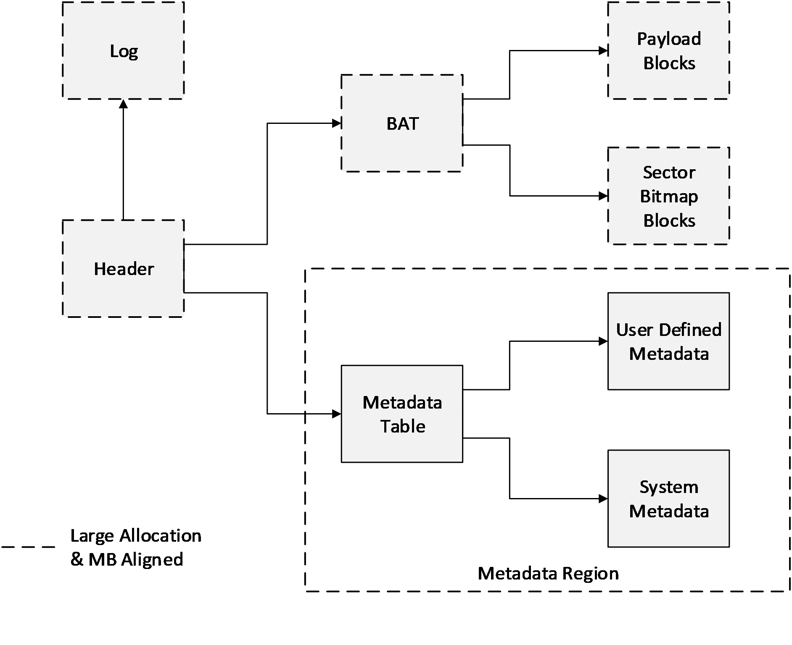

Figure 1: Logical layout

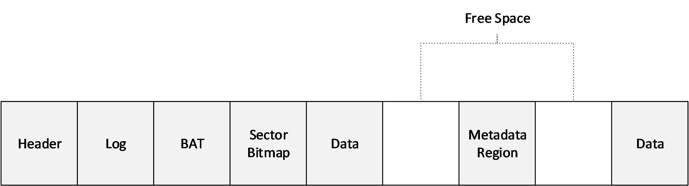

Figure 2: File layout example

## 1.4 Relationship to Protocols and Other Structures

None.

## 1.5 Applicability Statement

The benefits of the structures defined in this document include:

- The ability to represent a large virtual disk size up to 64 TB.
- Support for larger logical sector sizes—up to 4 KB—for virtual disks, which facilitates the conversion of 4-KB sector physical disks to virtual disks.
- Support for large block sizes— up to 256 MB—for virtual disks, which enables fine-tuning block size to match the I/O patterns of the application or system for optimal performance.
- A log to ensure resiliency of the VHDX file to corruptions from system power-failure events.
- A mechanism that allows for small pieces of user-generated data to be transported along with the VHDX file.
- Optimal performance, through improved data alignment, on host disks that have physical sector sizes larger than 512 bytes.
- Capability to use the information from the UNMAP command, sent by the application or system using the virtual hard disk, to optimize the size of the VHDX file.

## 1.6 Versioning and Localization

The version of the VHDX format is determined by the value of the **Version** field in the header, as specified in section [2.2.2](#Section_2.2.2).

| VHDX Version | Value |
| --- | --- |
| VHDX Version 2 | 0x00000001 |

## 1.7 Vendor-Extensible Fields

None.

# 2 Structures

All multibyte values MUST be stored in little-endian format with the least significant byte first unless specified otherwise. Bit 0 always means the least significant bit of the least significant byte. Note that UTF-8 characters are not multibyte values and are not stored in little-endian format.

The algorithm used to detect errors after transmission or storage is called a [**cyclic redundancy check (CRC)**](#gt_cyclic-redundancy-check-crc). Unless specified otherwise, the CRC used to validate data is CRC-32C (see [[Castagnoli93]](https://go.microsoft.com/fwlink/?LinkId=785961)), which uses the Castagnoli polynomial, code 0x1EDC6F41.

The notation Ceil(X) shall mean the minimum integer that is greater than or equal to X.

The notation Fl(X) shall mean the maximum integer that is lesser than or equal to X.

Unless specified otherwise, all integer-valued fields are unsigned.

## 2.1 Layout

The VHDX file begins with a fixed-sized header section. After this, non-overlapping structures and free space are intermixed freely in no particular order, the only restriction being that all objects have 1-MB alignment within the file.

In addition to the header, the structures currently defined in the VHDX file include the [**block allocation table (BAT)**](#gt_block-allocation-table-bat) region (also referred to as BAT), the metadata region, the log, the payload blocks, and the sector bitmap blocks, each of which is specified in the following sections. These structures can be moved around in the file as long as they are non-overlapping and the 1-MB alignment is maintained.

The logical and physical layouts of the structures, illustrated in the figures that follow, are similar for fixed, dynamic, and differencing virtual hard disk types; differences are discussed in the following sections.

## 2.2 Header Section

The header section is the first structure on the disk and is the structure that is examined first when opening a VHDX file. The header section is 1 MB in size and contains five items that are 64 KB in size: the file type identifier, two headers, and two copies of the region table.

The file type identifier contains a short, fixed signature to identify the file as a VHDX file. It is never overwritten. This ensures that even if a failed write corrupts a sector of the file, the file can still be identified as a VHDX file.

Each header acts as a root of the VHDX data structure tree, providing version information, the location and size of the log, and some basic file metadata. Other properties that might be needed to open the file are stored elsewhere in other metadata.

Only one header is active at a time so that the other can be overwritten safely without corrupting the VHDX file. A sequence number and checksum are used to ensure this mechanism is safe.

The region table lists regions, which are virtually contiguous, variable-size, MB-aligned pieces of data within the file. These structures currently include the BAT and the metadata region, but they can be extended by future revisions of the specification without breaking compatibility with different implementations and versions. Implementations MUST maintain structures that they don't support without corrupting them. Implementations MUST fail to open a VHDX file that contains a region that is marked as required but is not understood.

The header section contains five items: the file type identifier, two headers, and two copies of the region table, as shown in the following figure.

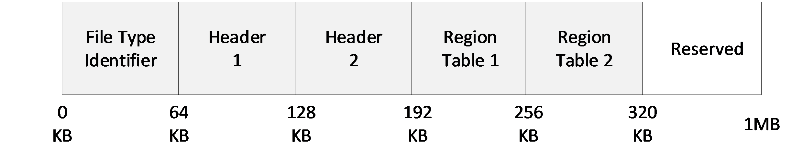

Figure 3: Header section layout

### 2.2.1 File Type Identifier

The file type identifier is a structure stored at offset zero of the file.

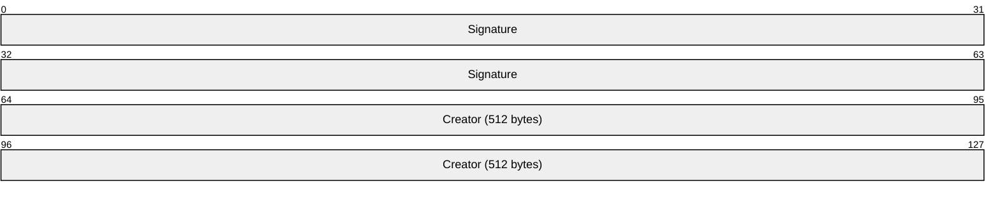

**Signature (8 bytes)**: MUST be 0x7668647866696C65, which is a UTF-8 string representing "vhdxfile".

**Creator (512 bytes)**: Contains a UTF-16 string that can be null terminated. This field is optional; the implementation fills it in during the creation of the VHDX file to identify, uniquely, the creator of the VHDX file. Implementation MUST NOT use this field as a mechanism to influence implementation behavior; it exists for diagnostic purposes only.

An implementation MUST write the **File Type Identifier** structure when the file is created and MUST validate the **Signature** field when loading a VHDX file. The implementation MUST NOT overwrite any data in the first 64 KB of the file after the file has been created.

The space between file identifier data and 64-KB alignment boundary for the file identifier structure is reserved.

### 2.2.2 Headers

Since the header is used to locate the log, updates to the headers cannot be made through the log. To provide power failure consistency, there are two headers in every VHDX file.

Each of the two headers is a 4-KB structure that is aligned to a 64-KB boundary.<1> One header is stored at offset 64 KB and the other at 128 KB. Only one header is considered current and in use at any point in time.

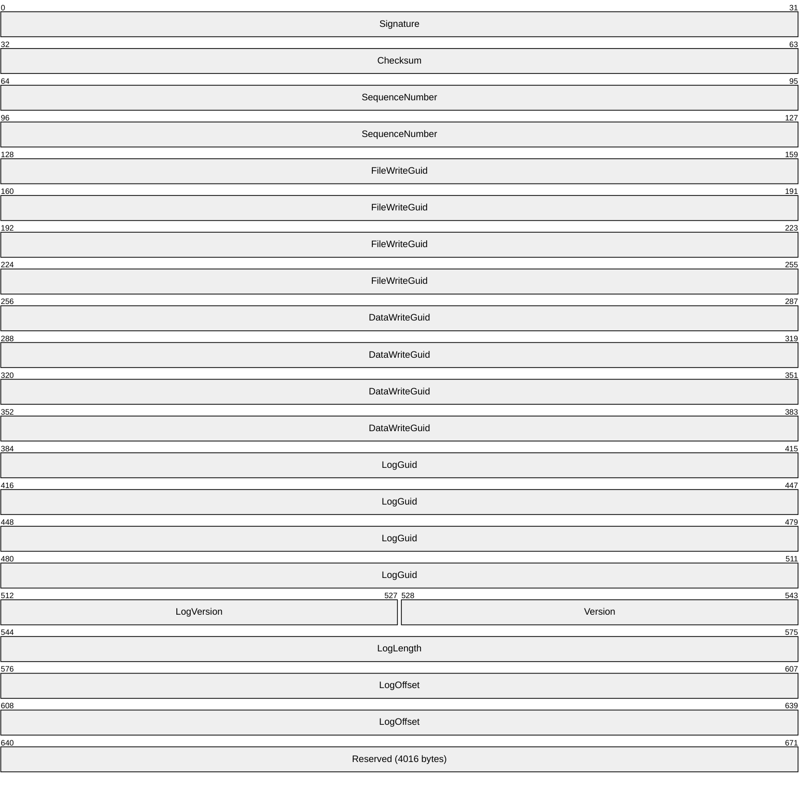

**Signature (4 bytes**): MUST be 0x68656164 which is a UTF-8 string representing "head".

**Checksum (4 bytes)**: A CRC-32C hash over the entire 4-KB structure, with the **Checksum** field taking the value of zero during the computation of the checksum value.

**SequenceNumber (8 bytes)**: A 64-bit unsigned integer. A header is valid if the **Signature** and **Checksum** fields both validate correctly. A header is current if it is the only valid header or if it is valid and its **SequenceNumber** field is greater than the other header's **SequenceNumber** field. The implementation MUST only use data from the current header. If there is no current header, then the VHDX file is corrupt.

**FileWriteGuid (16 bytes)**: Specifies a 128-bit unique identifier that identifies the file's contents. On every open of a VHDX file, an implementation MUST change this GUID to a new and unique identifier before the first modification is made to the file, including system and user metadata as well as log playback. The implementation can skip updating this field if the storage media on which the file is stored is read-only, or if the file is opened in read-only mode.

**DataWriteGuid (16 bytes)**: Specifies a 128-bit unique identifier that identifies the contents of the user visible data. On every open of the VHDX file, an implementation MUST change this field to a new and unique identifier before the first modification is made to user-visible data. If the user of the virtual disk can observe the change through a virtual disk read, then the implementation MUST update this field.<2> This includes changing the system and user metadata, raw block data, or disk size, or any block state transitions that will result in a virtual disk sector read being different from a previous read. This does not include movement of blocks within a file, which changes only the physical layout of the file, not the virtual identity.

**LogGuid (16 bytes)**: Specifies a 128-bit unique identifier used to determine the validity of log entries. If this field is zero, then the log is empty or has no valid entries and MUST not be replayed. Otherwise, only log entries that contain this identifier in their header are valid log entries. Upon open, the implementation MUST update this field to a new nonzero value before overwriting existing space within the log region.

**LogVersion (2 bytes)**: Specifies the version of the log format used within the VHDX file. This field MUST be set to zero. If it is not, the implementation MUST NOT continue to process the file unless the **LogGuid** field is zero, indicating that there is no log to replay.

**Version (2 bytes)**: Specifies the version of the VHDX format used within the VHDX file. This field MUST be set to 1. If it is not, an implementation MUST NOT attempt to process the file using the details from this format specification.

**LogLength (4 bytes):** A 32-bit unsigned integer. Specifies the size, in bytes of the log. This value MUST be a multiple of 1MB.

**LogOffset (8 bytes):** A 64-bit unsigned integer. Specifies the byte offset in the file of the log. This value MUST be a multiple of 1MB. The log MUST NOT overlap any other structures.

**Reserved (4016 bytes)**: MUST be set to 0 and ignored.

The space between a 4-KB structure containing header data and a 64-KB alignment boundary for the header is reserved.

#### 2.2.2.1 Updating the Headers

On every open of a VHDX file that allows the VHDX file to be written to, the headers MUST be updated before any other part of the file is modified. While the VHDX file is in use, the headers can also be updated when an operation on the virtual disk or the VHDX file impacts one of the fields contained in the header.

The first time the headers are updated after the open of a VHDX file, the implementation MUST generate a new random value for the **FileWriteGuid** field. The implementation SHOULD NOT update the **DataWriteGuid** field until the user has requested an operation that could affect the virtual disk contents or user-visible virtual disk metadata such as the disk size or sector size.

An implementation can follow the following procedure to change the out-of-date header to the current header:

- Identify the current header and noncurrent header.
- Generate a new header in memory. Set the **SequenceNumber** field to the current header's **SequenceNumber** field plus one.
- Set the other fields to their current values or updated values. If this is the first header update within the session, use a new value for the **FileWriteGuid** field.
- Calculate the checksum of the header in memory.
- Overwrite the noncurrent header in the file with the in-memory header. Issue a flush command to ensure that the header update is stable on the host-disk storage media.
After this procedure, the noncurrent header becomes the current header. The implementation SHOULD perform the update procedure a second time so that both the current and noncurrent header contain up-to-date information; this ensures that if one header is corrupted, the file can still be opened.

### 2.2.3 Region Table

The region table consists of a header followed by a variable number of entries, which specify the identity and location of regions within the file. There are two copies of the region table, stored at file offset 192 KB and file offset 256 KB. Updates to the region table structures must be made through the log.

#### 2.2.3.1 Region Table Header

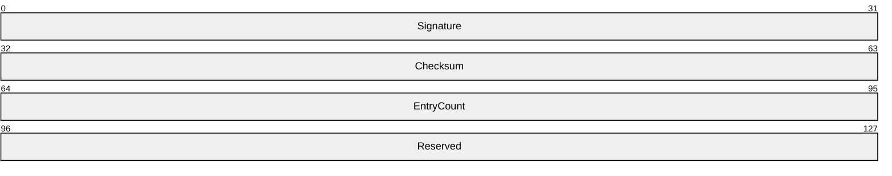

**Signature (4 bytes)**: MUST be 0x72656769, which is a UTF-8 string representing "regi".

**Checksum (4 bytes)**: A CRC-32C hash over the entire 64-KB table, with the **Checksum** field taking the value of zero during the computation of the checksum value.

**EntryCount (4 bytes)**: Specifies the number of valid entries to follow. This MUST be less than or equal to 2,047.

**Reserved (4 bytes)**: MUST be set to 0 and ignored.

#### 2.2.3.2 Region Table Entry

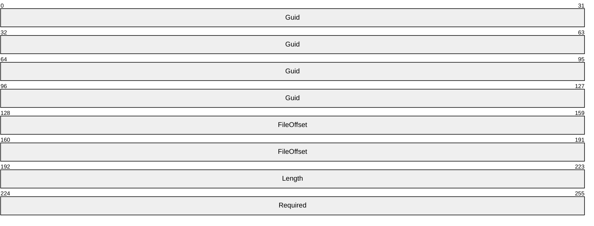

**Guid (16 bytes)**: Specifies a 128-bit identifier for the object (a GUID in binary form) and MUST be unique within the table.

**FileOffset (8 bytes)**: Specifies the 64-bit byte offset of the object within the file. The value MUST be a multiple of 1 MB and MUST be at least 1 MB.

**Length (4 bytes)**: Specifies the 32-bit byte length of the object within the file. The value MUST be a multiple of 1 MB.

**Required (4 bytes)**: Specifies whether this region must be recognized by the implementation in order to load the VHDX file. If this field's value is 1 and the implementation does not recognize this region, the implementation MUST refuse to load the VHDX file.

All objects within the table must be non-overlapping, not only with respect to each other but with respect to the log (defined in the headers) and the payload and sector bitmap blocks (defined in the BAT).

The space between the last region table entry and the 64-KB alignment boundary for the region table is reserved. Implementations MAY set this to zero.

The following table summarizes the properties of the regions defined in this version of the specification. The GUID values for the known regions are used in their binary form.

| Known Regions | GUID | IsRequired |
| --- | --- | --- |
| BAT | 2DC27766-F623-4200-9D64-115E9BFD4A08 | True |
| Metadata region | 8B7CA206-4790-4B9A-B8FE-575F050F886E | True |

## 2.3 Log

The log is arranged as a variable-sized contiguous ring buffer and is pointed to by the header. Like a region, it is MB-aligned and can reside anywhere after the header section. The log consists of variable-sized log entries that contain data that MUST be rewritten when the file is reopened after an unexpected system failure event. Each log entry has at least a 4-KB alignment, although the alignment can be greater if necessary to ensure writes are isolated on the host-disk storage media.

The log is a single circular buffer stored contiguously at a location that is specified in the VHDX header. It consists of an ordered sequence of variable-sized entries, each of which represents a set of 4-KB sector updates that need to be performed to the VHDX structures.

The log MUST be used to perform updates to all metadata except the header and MUST NOT be used for updates to the payload blocks. Updating a metadata structure through the log involves the following steps:

- Write all metadata updates to the log.
- Flush the updates to the log to ensure that they are stable on the host-disk storage media.
- Apply the metadata updates to their final location in the VHDX file.
- Flush the metadata updates to ensure that they are stable on the host-disk storage media.
Updates that were not written and flushed to their final location on the VHDX file due to a power failure will be detected, validated, and then replayed from the log on a subsequent open of the VHDX file.

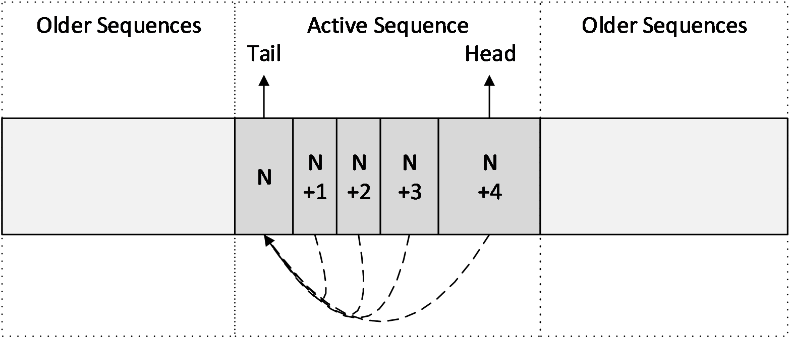

Figure 4: Log layout example

### 2.3.1 Log Entry

A log entry is a sequence of 4-KB sectors, aligned to a 4-KB sector.<3> This sequence is divided into two parts: a sequence of one or more descriptor sectors, and a sequence of zero or more data sectors.

The descriptor sectors contain header information and describe the writes that are being performed through the log, while the data sectors contain the actual updates. The first descriptor sector contains a 64-byte header and can contain up to 126 32-byte descriptors; any subsequent descriptor sectors that are part of the same log entry do not contain a header and could contain up to 128 32-byte descriptors. The total number of descriptors contained in the log entry is described in the log entry header. Each descriptor could be either a data descriptor or a zero descriptor. Each of the data descriptors describes a 4-KB sector write to perform on the file, and MUST be associated with a data sector that contains the actual 4-KB update to be written. The number of data sectors in the log entry must be equal to the number of data descriptors contained in that log entry. The zero descriptor describes a section of the file to be zero but does not need an associated sector to describe the update, because it is implied to be zero.

Figure 5: Log Entry Structure Layout Example

The preceding figure shows a log entry that contains four descriptors. The layout contains, in the first 4-KB descriptor sector, a log header with a descriptor count of 4 and associated descriptor sectors, three data descriptors, and one zero descriptor. It is followed by three data sectors, each of length 4 KB.

A variety of techniques is applied to validate the log entry. The entry header sequence number is duplicated in each descriptor and data sector. In the case of a data sector, the sequence number is split between the beginning and end of each data sector. Most cases of torn, missing, or misdirected writes will result in the sequence number validation being incorrect, either between the data descriptor and the associated data sector or between the descriptors and the entry header. Furthermore, a 32-bit CRC is computed over the entire log entry, including the sequence number; this improves the probability that a random entry corruption is detected.

The space for the log entries can be reused for subsequent log writes only when the log entries are not part of the active log sequence (See section [2.3.3](#Section_2.3.3)).

#### 2.3.1.1 Entry Header

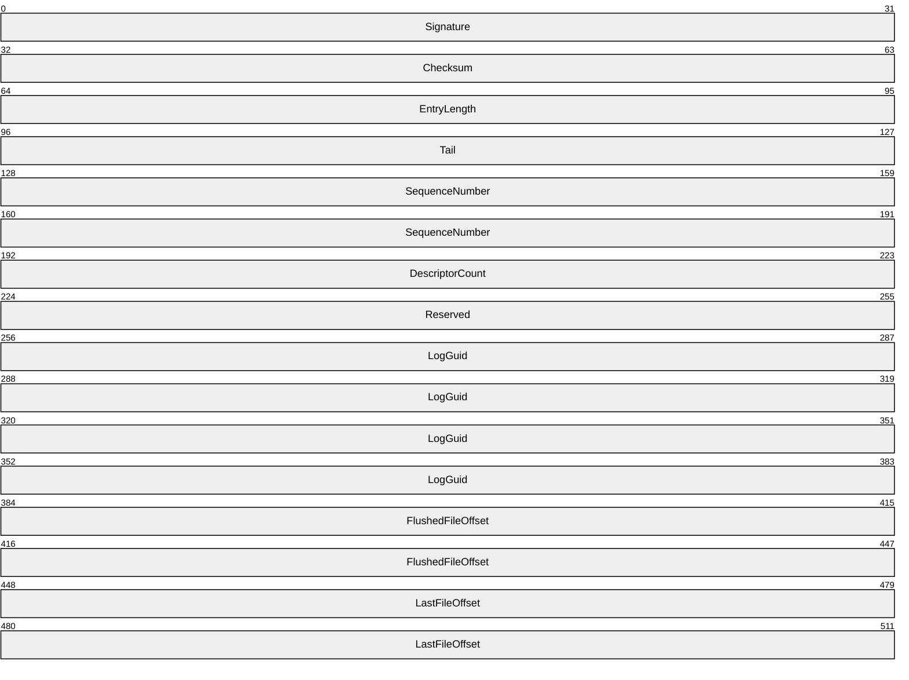

**Signature (4 bytes)**: MUST be 0x65676F6C ("loge" as UTF8).

**Checksum (4 bytes)**: A CRC-32C hash computed over the entire entry specified by the **EntryLength field**, with the **Checksum** field taking the value of zero during the computation of the checksum value.

**EntryLength (4 bytes)**: Specifies the total length of the entry in bytes. The value MUST be a multiple of 4 KB.

**Tail (4 bytes)**: The offset, in bytes, from the beginning of the log to the beginning log entry of a sequence ending with this entry. The value MUST be a multiple of 4 KB. A tail entry could point to itself, as would be the case when a log is initialized.

**SequenceNumber (8 bytes)**: A 64-bit integer incremented between each log entry. It must be larger than zero.

**DescriptorCount (4 bytes)**: Specifies the number of descriptors that are contained in this log entry. The value can be zero.

**Reserved (4 bytes)**: This field MUST be set to 0.

**LogGuid (16 bytes)**: Contains the **LogGuid** value in the file header that was present when this log entry was written. When replaying, if this **LogGuid** does not match the **LogGuid** field in the file header, this entry MUST NOT be considered valid.

**FlushedFileOffset (8 bytes)**: Stores the VHDX file size in bytes that MUST be at least as large as the size of the VHDX file at the time the log entry was written. The file size specified in the log entry must have been stable on the [**host disk**](#gt_host-disk) such that, even in the case of a system power failure, a noncorrupted VHDX file will be at least as large as the size specified by the log entry. Before shrinking a file while the log is in use, an implementation MUST write the target size to a log entry and flush the entry so that the update is stable on the log that is on the host-disk storage media; this will ensure that the VHDX file is not treated as truncated during log replay. An implementation SHOULD write the largest possible value that satisfies these requirements. The value MUST be a multiple of 1 MB.

**LastFileOffset (8 bytes)**: Stores a file size in bytes that all allocated file structures fit into, at the time the log entry was written. An implementation SHOULD write the smallest possible value that satisfies these requirements. The value MUST be a multiple of 1 MB.

#### 2.3.1.2 Zero Descriptor

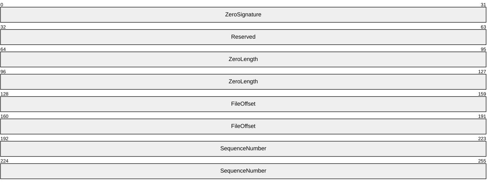

**ZeroSignature (4 bytes)**: MUST be 0x6F72657A ("zero" as ASCII).

**Reserved (4 bytes)**: MUST be 0.

**ZeroLength (8 bytes)**: Specifies the length of the section to zero. The value MUST be a multiple of 4 KB.

**FileOffset (8 bytes)**: Specifies the file offset to which zeros MUST be written. The value MUST be a multiple of 4 KB.

**SequenceNumber (8 bytes)**: MUST match the **SequenceNumber** field of the log entry's header.

#### 2.3.1.3 Data Descriptor

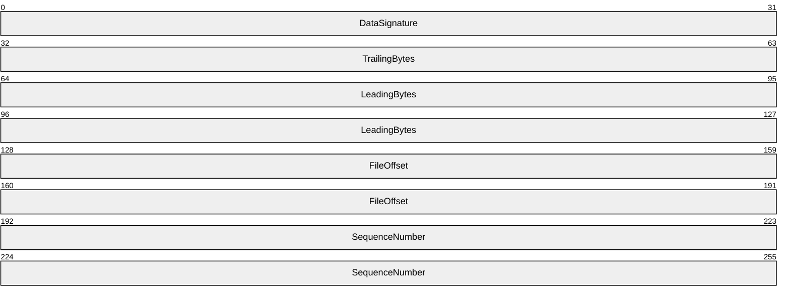

**DataSignature (4 bytes)**: MUST be 0x63736564 ("desc" as ASCII).

**TrailingBytes (4 bytes)**: Contains the four trailing bytes that were removed from the update when it was converted to a data sector. These trailing bytes MUST be restored before the data sector is written to its final location on disk.

**LeadingBytes (8 bytes)**: Contains the first eight bytes that were removed from the update when it was converted to a data sector. These leading bytes MUST be restored before the data sector is written to its final location on disk.

**FileOffset (8 bytes)**: Specifies the file offset to which the data described by this descriptor MUST be written. The value MUST be a multiple of 4 KB.

**SequenceNumber (8 bytes):** MUST match the **SequenceNumber** field of the entry's header.

#### 2.3.1.4 Data Sector

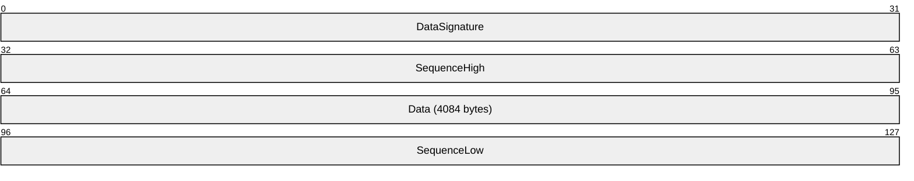

**DataSignature (4 bytes)**: MUST be 0x61746164 ("data" as ASCII).

**SequenceHigh (4 bytes):** MUST contain the four most significant bytes of the **SequenceNumber** field of the associated entry.

**Data (4084 bytes):** Contains the raw data associated with the update, bytes 8 through 4,091, inclusive. Bytes 0 through 7 and 4,092 through 4,096 are stored in the data descriptor, in the **LeadingBytes** and **TrailingBytes** fields, respectively.

**SequenceLow (4 bytes)**: MUST contain the four least significant bytes of the **SequenceNumber** field of the associated entry.

### 2.3.2 Log Sequence

At any given moment in the operation of the log, the newest entry in the log (or "head entry") always points to the oldest entry in the log that has the updates yet to be written and flushed to their final location ("tail entry"). Taken as a snapshot in time, this sequence of entries between the tail entry and head entry is called a log sequence. Log sequences are ordered in time by the sequence number of the head entry.

To determine whether a log sequence is both valid and complete, an implementation MUST ensure that each entry within the sequence is valid and that the entries were actually written as a sequence. To check that the entries contained within a sequence were actually written as a sequence, each non-tail entry in a valid sequence MUST have a sequence number one greater than the previous entry, and each entry log guid matches the **LogGuid** field in the file header.<4>

### 2.3.3 Log Replay

If the log is non-empty when the VHDX file is opened, the implementation MUST replay the log<5> before performing any I/O to the file other than reading the VHDX header and the log. If an implementation cannot replay the log because it lacks the capability, then it MUST NOT attempt to open the file.

When an implementation needs to perform a log replay, it must find the newest valid and complete log sequence, called the active sequence, and then replay all entries from it and no others.

An implementation can follow the following steps to find the active sequence:

- Set the candidate active sequence to the empty sequence, with a sequence number of zero. Set the current and old tail to zero.
- Set the current sequence to the empty sequence with a head value equal to the current tail, and with a sequence number of zero.
- Evaluate the validity of the log entry starting at the current sequence's head, verifying each field in the header and descriptors, including the checksum. If it is a valid entry, and either the current sequence is empty or the new entry's sequence number is one greater than the current sequence's sequence number, then extend the current sequence to include the log entry and repeat this step.
- If the current sequence's head entry's tail is contained within the current sequence, then the current sequence is valid.
- If the current sequence is valid and has a greater sequence number than the candidate active sequence, then set the candidate active sequence to the current sequence.
- If the current sequence is empty or invalid, increase the current tail by 4 KB, wrapping to zero if equal to the log size. Otherwise, set the current tail to the current sequence's head, wrapping for values greater than or equal to the log size.
- If the current tail is less than the old tail, then the log has been completely scanned. Stop. Otherwise, set the old tail to current tail and go to step 2.
If the candidate active sequence is empty, then there are no valid log sequences, the file is corrupt, and the implementation MUST fail to open it. If the file's size is less than the **FlushedFileOffset** field of the head entry of the candidate active sequence, then the file has been truncated, and the implementation MUST fail to open it. Otherwise, the active sequence is the candidate active sequence.

Once the active sequence has been found, the implementation MUST replay each descriptor within each entry within the sequence, in order, beginning with the tail entry, by writing the data or zeroing as directed by the descriptors. The file offsets referred to by the descriptors can be larger than the current file offset, in which case the implementation MUST extend the file.

After all the entries have been replayed, the implementation MUST expand the file size to be at least as large as the **LastFileOffset** field of the head entry of the active sequence. This ensures that, even in the case where a VHDX file expansion operation could not be written and flushed to the host-disk storage media due to a system power failure, all VHDX structures are fully contained within the VHDX file.

## 2.4 Blocks

There are two types of Blocks: payload and sector bitmap. Payload blocks contain virtual disk payload data, while sector bitmap blocks contain parts of the sector bitmap.

Payload blocks are the size of the **BlockSize** field defined by the **File Parameters** metadata item (section [2.6.2.1](#Section_2.6.2.1)) and can be virtually indexed: payload block 0 contains the first **BlockSize** bytes of the virtual disk; payload block 1 contains the second **BlockSize** bytes of the virtual disk; and so on.

Sector bitmap blocks are always 1 MB in size and can be virtually indexed similarly: sector bitmap block 0 contains the first 1 MB of the sector bitmap; sector bitmap block 1 contains the second 1 MB of the sector bitmap; and so on.

Each sector bitmap block contains a bit for each logical sector in the file, representing whether the corresponding virtual disk sector is present in this file. Bit 0 (that is, bit 0 of byte 0) is the entry for the first virtual sector, bit 1 is the entry for the second, and so on. For each bit, a value of 1 indicates that the payload data for the corresponding virtual sector should be retrieved from this file, while a value of zero indicates that the data should be retrieved from the parent VHDX file.

The number of sectors that can be described in each sector bitmap block is 223, so the number of bytes described by a single sector bitmap block is 223 times the logical sector size (see section [2.6.2.4](#Section_2.6.2.4) for more information on **LogicalSectorSize**). This value is known as the chunk size. A virtually contiguous, chunk-size aligned and chunk-sized portion of the virtual disk is known as a chunk. The chunk ratio is the number of payload blocks in a chunk, or equivalently, the number of payload blocks per sector bitmap block.

## 2.5 BAT

[**BAT**](#gt_block-allocation-table-bat) is a region consisting of a single array of 64-bit values, with an entry for each block that determines the state and file offset of that block. The entries for the payload block and sector bitmap block are interleaved in a way that the sector bitmap block entry associated with a chunk follows the entries for the payload blocks in that chunk. For example, if the chunk ratio is 4, the table's interleaving would look like the following figure.

Figure 6: BAT layout example

The BAT layout is the same for all types of VHDX, whether fixed, dynamic, or differencing. However, in a fixed or dynamic VHDX, the sector bitmap blocks will not be allocated. In a dynamic VHDX all sectors are contained within the file. Because the sector bimap blocks are used to determine whether a parent VHDX file contains payload data, they are unnecessary in a dynamic VHDX. BAT entries for sector bitmap blocks exist for dynamic VHDX, because, in addition, the presence of the entries avoids the need to insert or remove the interleaving sector bitmap entries during conversion between dynamic and differencing virtual hard disk types.

The BAT region MUST be at least large enough to contain as many entries as required to describe the possible blocks for a given virtual disk size (see section [2.6.2.2](#Section_2.6.2.2) for more information on **VirtualDiskSize**).

The number of payload blocks can be calculated as

The number of sector bitmap blocks can be calculated as

For dynamic and fixed VHDX, the last BAT entry MUST locate the last payload block of the virtual disk. The total number of BAT entries for either dynamic or fixed VHDX can be calculated as

For a differencing VHDX, the last BAT entry must be able to locate the last sector bitmap block that contains the last payload sector. The total number of BAT entries can be calculated as

### 2.5.1 BAT Entry

A BAT entry is 64 bits in length and is divided into bit fields.

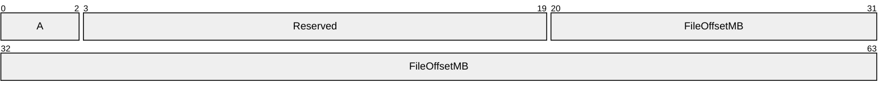

**A - State (3 bits):** Specifies how the associated data block or sector bitmap block is treated. The values are specified in section [2.5.1.1](#Section_2.5.1.1) and section [2.5.1.2](#Section_2.5.1.2).

**Reserved (17 bits):** This field MUST be set to 0.

**FileOffsetMB (44 bits):** Specifies the offset within the file in units of 1 MB. The payload or sector bitmap block must reside after the header section and must not overlap any other structure. The **FileOffsetMB** field value must be unique across all the BAT entries when it is other than zero.

#### 2.5.1.1 Payload BAT Entry States

The payload [**BAT**](#gt_block-allocation-table-bat) entry determines the state of a virtual block and the associated offset in the VHDX file of that block. The following table summarizes the validity of the various states for the three VHDX types.

| Payload BAT Entry State | Fixed | Dynamic | Differencing |
| --- | --- | --- | --- |
| PAYLOAD_BLOCK_NOT_PRESENT 0 | Valid<6> | Valid | Valid |
| PAYLOAD_BLOCK_UNDEFINED 1 | Valid<7> | Valid | Valid |
| PAYLOAD_BLOCK_ZERO 2 | Valid<8> | Valid | Valid |
| PAYLOAD_BLOCK_UNMAPPED 3 | Valid<9> | Valid | Valid |
| PAYLOAD_BLOCK_FULLY_PRESENT 6 | Valid | Valid | Valid |
| PAYLOAD_BLOCK_PARTIALLY_PRESENT 7 | Not Valid | Not Valid | Valid |

Values 4 and 5 are reserved.

The behavior for the various block states for fixed VHDX is the same as that of the associated dynamic VHDX block state.

**PAYLOAD_BLOCK_NOT_PRESENT**

This is the default state for all new blocks in dynamic and differencing VHDX types.

For fixed or dynamic VHDX files, this block state specifies that the block contents are undefined and can contain arbitrary data.

For reads from blocks in this state, implement one of the following behaviors:

- Return arbitrary data, including data that was previously present elsewhere on the disk.
- Return zero data.
- Return the contents of the block either immediately before it was moved to this state with no modifications or immediately before some parts of it were replaced with zeroes.
For a differencing VHDX file, this block state specifies that the block contents are not present in the file and that the parent virtual disk SHOULD be inspected to determine the associated contents.

The **FileOffsetMB** field for entries in this state is reserved.

**PAYLOAD_BLOCK_UNDEFINED**

For all VHDX file types, this block state indicates that the block contents are not defined in the file and can contain arbitrary data, including data that was previously present elsewhere on the disk.

When a block entry is transitioned to this block state, implement one of the following options for the **FileOffsetMB** field:

- Leave the field unmodified.
- Set the field to zero value.
- Set the field to a nonzero value that MUST point to a location in the VHDX file that MUST contain the contents of the block immediately before it was moved to this state with no modifications or some parts of it replaced with zeros.
For reads from blocks in this state, implement one of the following behaviors:<10>

- Return arbitrary data, including data that was previously present elsewhere on the disk.
- Return zero data.
- Return the contents of the block immediately before it was moved to this state with no modifications or some parts of it replaced with zeroes.
**PAYLOAD_BLOCK_ZERO**

This block state implies that the block contents are defined to be zero.

The **FileOffsetMB** field for entries in this state is reserved.

For reads from the blocks in this state, implementations MUST return zeros.

**PAYLOAD_BLOCK_UNMAPPED**

For all VHDX file types, this block state indicates that all the virtual disk sectors in the payload block were issued an UNMAP command and that the contents of this block are no longer being relied upon by the application or the system using the virtual disk. The block contents are defined to be zero data or the contents of the block immediately before the block was moved to this state with no modifications or with some parts replaced with zeros.

When a block entry is transitioned to this block state, implement one of the following options for the **FileOffsetMB** field:

- Leave the field unmodified.
- Set the field to zero.
- Set the field to a nonzero value that MUST point to a location in the VHDX file that MUST contain the contents of the block immediately before the block was moved to this state, with no modifications or with some parts of it replaced with zeros.
For reads from blocks in this state, implement one of the following behaviors:<11>

- Return zero data.
- Return the contents of that the block immediately before it was moved to this state with no modifications or with some parts of it replaced with zeros.
**PAYLOAD_BLOCK_FULLY_PRESENT**

This is the default state for all blocks in a fixed VHDX type.

For all VHDX file types, the block's contents are defined in the file at the location specified by the **FileOffsetMB** field.

The **FileOffsetMB** field can be modified to point to a new nonzero value that contains the contents of that block.

For reads from the blocks in this state, parsers should return the block contents defined in the file at the location specified by the **FileOffsetMB** field. For differencing VHDX files, the sector bitmap MUST NOT be inspected, because the block is fully present in the VHDX file.

**PAYLOAD_BLOCK_PARTIALLY_PRESENT**

This block state MUST NOT be present in a block entry for a fixed or dynamic VHDX file.

For differencing VHDX files, the block's contents are defined in the file at the location specified by the **FileOffsetMB** field. When the block entry is in this state, the associated sector bitmap block MUST be already allocated and valid.

The **FileOffsetMB** field can be modified to point to a new nonzero value that contains the contents of that block.

For reads from the blocks in this state, return the block contents defined in the file at the location specified by the **FileOffsetMB** field, after the associated sector bitmap for that block is inspected, to check if the sector being read is present in the VHDX file. If not, the parent VHDX file needs to be inspected for that sector.

#### 2.5.1.2 Sector Bitmap BAT Entry States

The sector bitmap BAT entry indicates the presence of sector bitmap blocks for the associated chunk of payload blocks.

The following table summarizes the validity of the various states for the three VHDX types.

| Bit Range | Field | Description |
| --- | --- | --- |
| Variable | SB_BLOCK_NOT_PRESENT 0 | Valid Valid Valid |
| Variable | SB_BLOCK_PRESENT 6 | Not Valid Not Valid Valid |

The various states and values are defined as follows (values 1-5 and 7 are reserved).

**SB_BLOCK_NOT_PRESENT**

The SB_BLOCK_NOT_PRESENT state indicates that this sector bitmap block's contents are undefined and that the block is not allocated in the file.

For a fixed or dynamic VHDX file, all sector bitmap block entries MUST be in this state.

For a differencing VHDX file, a sector bitmap block entry MUST NOT be in this state if any of the associated payload block entries are in the PAYLOAD_BLOCK_PARTIALLY_PRESENT state.

The **FileOffsetMB** field for entries in this state is reserved.

**SB_BLOCK_PRESENT**

The SB_BLOCK_PRESENT indicates that the sector bitmap block contents are defined in the file at a location pointed to by the **FileOffsetMB** field.

For a fixed or dynamic VHDX file, a sector bitmap block entry MUST NOT be in this state.

For differencing VHDX file, a sector bitmap block entry MUST be set to the SB_BLOCK_PRESENT state if any associated payload blocks are the PAYLOAD_BLOCK_ PARTIALLY_PRESENT state. The sector bitmap block contents are defined in the file at the location specified by the **FileOffsetMB** field.

## 2.6 Metadata Region

The metadata region consists of a fixed-size, 64-KB, unsorted metadata table, followed by unordered, variable-sized, unaligned metadata items and free space, as shown in the following figure. The metadata items represent both user and system metadata, which are distinguished by a bit in the table.

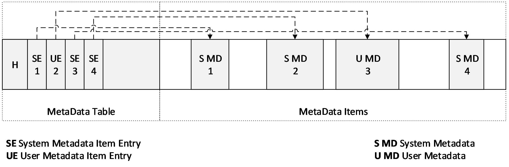

Figure 7: Metadata region layout example

### 2.6.1 Metadata Table

A metadata table contains a 32-byte header followed immediately by a variable number of valid 32-byte entries.

#### 2.6.1.1 Metadata Table Header

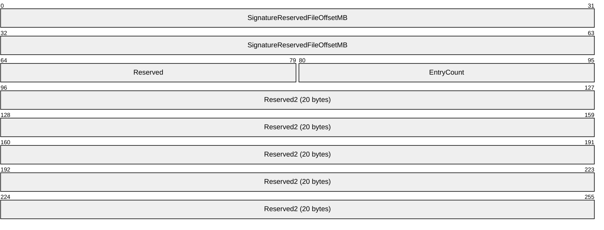

**Signature (8 bytes)**: MUST be 0x617461646174656D ("metadata" as ASCII).

**Reserved (2 bytes):** MUST be set to 0.

**EntryCount (2 bytes)**: Specifies the number of entries in the table. This value must be less than or equal to 2,047. The free space in the metadata region may contain data that can be disregarded.

**Reserved2 (20 bytes):** MUST be set to 0.

#### 2.6.1.2 Metadata Table Entry

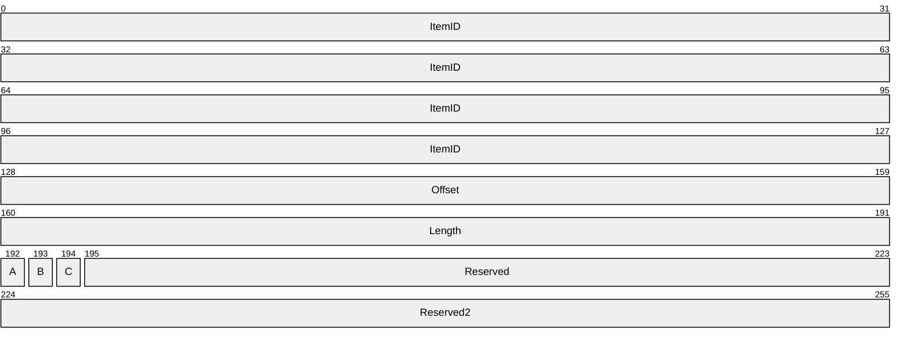

**ItemID (16 bytes):** Specifies a 128-bit identifier (a GUID) for the metadata item. The **ItemId** and **IsUser** value pair for an entry MUST be unique within the table.

**Offset (4 bytes):** Specifies the byte offset of the metadata item in bytes. The **Offset** field MUST be at least 64 KB and is relative to the beginning of the metadata region. The item specified by the **Offset** and **Length** pair MUST fall entirely within the metadata region without overlapping any other item.

**Length (4 bytes):** Specifies the length of the metadata item in bytes. **Length** MUST be less than or equal to 1 MB. If **Length** is zero, then **Offset** MUST also be zero, in which case the metadata item SHOULD be considered present but empty.

**A - IsUser (1 bit):** Specifies whether this metadata item is considered system or user metadata. No more than 1,024 entries can have this bit set; otherwise, the metadata table is invalid. An implementation SHOULD NOT allow users to query metadata items that have this bit set to False.

**B - IsVirtualDisk (1 bit):** Specifies whether the metadata is file metadata or virtual disk metadata. This determines the behavior when forking a new differencing VHDX file from an existing VHDX file, or when merging a differencing VHDX file into its parent. When forking, an implementation MUST copy all metadata items with this field set in the existing VHDX file to the new file, while leaving items with this field clear. When merging, an implementation MUST destroy any metadata with this field set in the parent, and copy all metadata with this field set in the child to the parent.

**C - IsRequired (1 bit):** Specifies whether the implementation MUST understand this metadata item to be able load the file. If this field is set to True and the implementation does not recognize this metadata item, the implementation MUST fail to load the file.

**Reserved (29 bits):** MUST be set to 0.

**Reserved2 (4 bytes):** MUST be set to 0.

### 2.6.2 Known Metadata Items

There are certain metadata items that are defined in this specification, some of which are optional and some of which are required. The following table summarizes the known metadata items and their optional or required state.

| Known Items | GUID | IsUser | IsVirtualDisk | IsRequired |
| --- | --- | --- | --- | --- |
| File Parameters | CAA16737-FA36-4D43-B3B6-33F0AA44E76B | False | False | True |
| Virtual Disk Size | 2FA54224-CD1B-4876-B211-5DBED83BF4B8 | False | True | True |
| Virtual Disk ID | BECA12AB-B2E6-4523-93EF-C309E000C746 | False | True | True |
| Logical Sector Size | 8141BF1D-A96F-4709-BA47-F233A8FAAB5F | False | True | True |
| Physical Sector Size | CDA348C7-445D-4471-9CC9-E9885251C556 | False | True | True |
| Parent Locator | A8D35F2D-B30B-454D-ABF7-D3D84834AB0C | False | False | True |

#### 2.6.2.1 File Parameters

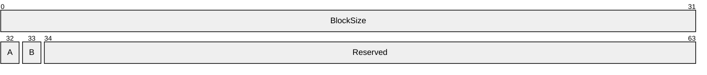

**BlockSize (4 bytes):** Specifies the size of each payload block in bytes. The value MUST be at least 1 MB and not greater than 256 MB, and MUST be a power of 2.

**A - LeaveBlockAllocated (1 bit):** Specifies whether blocks can be unallocated from the file. If this field is set to 1, the implementation SHOULD NOT change the state of any blocks to a BLOCK_NOT_PRESENT state, and the implementation MUST NOT reduce the size of the file to a value lower than would be required to allocate every block. This field is intended to be used to create a fixed VHDX file that is fully provisioned. Ignored if **HasParent** is set.

**B - HasParent (1 bit):** Specifies whether this file has a parent VHDX file. If set, the file is a differencing file, and one or more parent locators specify the location and identity of the parent. **LeaveBlockAllocated** is ignored when **HasParent** is set.

**Reserved (30 bits):** MUST be 0.

#### 2.6.2.2 Virtual Disk Size

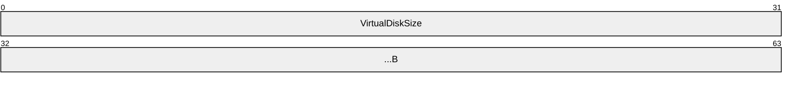

**VirtualDiskSize (8 bytes)**: Specifies the virtual disk size, in bytes. This field MUST be a multiple of the **LogicalSectorSize** (see section [2.6.2.4](#Section_2.6.2.4)) metadata item and MUST be at most 64 TB.

#### 2.6.2.3 Virtual Disk ID

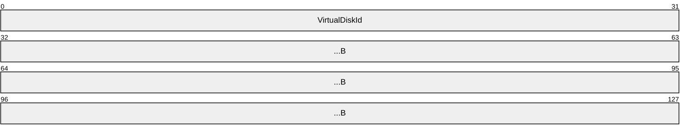

**VirtualDiskId (16 bytes)**: A GUID that specifies the identification of the disk.

#### 2.6.2.4 Logical Sector Size

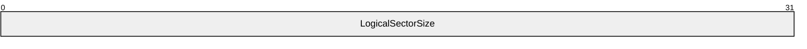

**LogicalSectorSize (4 bytes)**: Specifies the virtual disk's sector size, in bytes. This value MUST be set to 512 or 4,096. An implementation MUST expose the virtual disk as having the specified sector size, but it can fail to load files with sector sizes that it does not support. If the file has a parent, the logical sector size for the parent and child MUST be the same. Note that the **LogicalSectorSize** value also determines the chunk size.

#### 2.6.2.5 Physical Sector Size

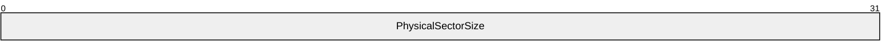

**PhysicalSectorSize (4 bytes)**: Specifies the virtual disk's physical sector size, in bytes. This value MUST be set to 512 or 4,096. An implementation MUST expose the virtual disk as having the specified physical sector size, but it can fail to load files with sector sizes that it does not support.

#### 2.6.2.6 Parent Locator

The parent locator specifies the type of the parent virtual block device as a GUID and a set of key-value pairs specifying anything necessary to locate and connect to the parent block device.

When the **HasParent** field of the file-parameters metadata item is set, there MUST be a parent locator. This metadata item specifies the identity and location of a parent virtual block device, whether this device is another VHDX file, a different type of virtual disk file, a logical unit in a SAN, or otherwise.

This specification describes only one such parent locator type (see section [2.6.2.6.3](#Section_2.6.2.6.3)), but other implementations can extend this as required.

The parent locator item is made up of a 20-byte header immediately followed by a table of 12-byte entries specifying the offset and length of each key and value.

##### 2.6.2.6.1 Parent Locator Header

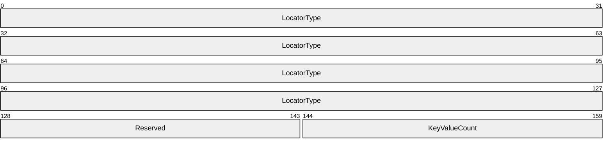

**LocatorType (16 bytes):** Specifies the type of the parent virtual disk. This value will be different for each type (for example, VHDX, VHD or iSCSI). An implementation MUST validate that it understands that type.

**Reserved (2 bytes):** MUST be set to 0.

**KeyValueCount (2 bytes):** Specifies the number of key-value pairs defined for this parent locator.

##### 2.6.2.6.2 Parent Locator Entry

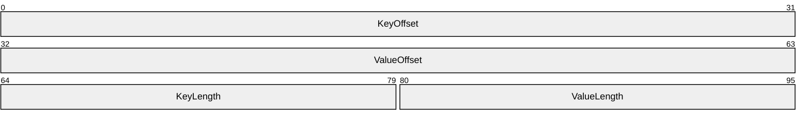

**KeyOffset (4 bytes):** Specifies the offset within the metadata item. This field MUST be must be greater than zero.

**ValueOffset (4 bytes):** Specifies the offset within the metadata item. This field MUST be greater than zero.

**KeyLength (2 bytes):** Specifies the length in bytes of the entry's key. This field MUST be greater than zero.

**ValueLength (2 bytes):** Specifies the length in bytes of an entry's value. This field MUST be greater than zero.

The key and value strings are to be UNICODE strings with UTF-16 little-endian encoding. There must be no internal NUL characters, and the **Length** field must not include a trailing NUL character. The key string is case sensitive, and lowercase keys are recommended. All keys must be unique, and there is no ordering to the entries.

##### 2.6.2.6.3 VHDX Parent Locator

The only parent-locator type defined by this specification is the VHDX locator type with a GUID value of "B04AEFB7-D19E-4A81-B789-25B8E9445913".

The VHDX parent locator has several possible key-value pair entries, some of which are required, as shown in the following table. The entries are UTF-16 encoded, with no escape characters.

| Entry | Type | Example |
| --- | --- | --- |
| parent_linkage | GUID | {83ed0ec3-24c8-49a6-a959-5e4bf1288bfb} |
| parent_linkage2 | GUID | {83ed0ec3-24c8-49a6-a959-5e4bf1288bfb} |
| relative_path | Path | ..\..\path2\sub3\parent.vhdx |
| volume_path | Path | \\?\Volume{26A21BDA-A627-11D7-9931-806E6F6E6963}\path2\sub3\parent.vhdx |
| absolute_win32_path | Path | \\?\d:\path2\sub3\parent.vhdx |

The two entries with key values of **parent_linkage** and **parent_linkage2** specify possible values of the parent's identity. The parent_linkage entry MUST be present, and parent_linkage2 can't be present. The value field is encoded as a lowercase string with enclosing braces; for example: {83ED0EC3-24C8-49A6-A959-5E4BF1288BFB}. When a differencing VHDX file is created, the implementation MUST populate the parent's **DataWriteGuid** field in this field. When opening the parent VHDX file of a differencing VHDX, the implementation MUST verify that the **DataWriteGuid** field of the parent's header matches one of these two fields.<12>

At least one entry with key value of **relative_path**, **volume_path**, or **absolute_win32_path** MUST be present to locate the parent VHDX file. An implementation has to evaluate the paths in a specific order to locate the parent: **relative_path**, **volume_path** and then **absolute_path**. Upon successful open of a chain, an implementation has to update any existing stale path entries to point to its current parent file.

The entry with key value of **relative_path** specifies the path of the parent VHDX file relative to the path of the current VHDX file, using "\" as the path separator and ".." to mean parent directory. For example, if the VHDX file is in "d:\path1\sub2\file.vhdx" and the parent file is in "d:\path2\sub3\parent.vhdx", the value field for this entry could contain "..\..\path2\sub3\parent.vhdx".

The entry with key value of **volume_path** specifies the path of the parent VHDX using an absolute Win32 path containing the volume GUID of the volume on which the parent resides (for example, "\\?\Volume{26A21BDA-A627-11D7-9931-806E6F6E6963}\path2\sub3\parent.vhdx"). This helps locate the parent when drive letters are not available or stable. It MUST NOT contain other forms of Win32 paths.

The entry with key value of **absolute_win32_path** specifies the path of the parent VHDX using an absolute extended-length Win32 path on a local drive. This path MUST begin with "\\?\" and can be followed by a drive letter (for example, "d:") or a UNC share (for example,"\\ServerName\ShareName"), then the path to the file on that drive using "\" as the path separator (for example, "\path2\sub3\parent.vhdx"). The value field for this entry could contain "\\?\d:\path1\sub2\file.vhdx" or "\\?\MyServer\MyShare\ path3\sub4\file.vhdx".

# 3 Structure Examples

None.

# 4 Security

## 4.1 Security Considerations for Implementers

None.

## 4.2 Index Of Security Fields

None.

# 5 Appendix A: Product Behavior

The information in this specification is applicable to the following Microsoft products or supplemental software. References to product versions include updates to those products.

- Windows 8 operating system
- Windows Server 2012 operating system
- Windows 8.1 operating system
- Windows Server 2012 R2 operating system
- Windows 10 operating system
- Windows Server 2016 operating system
- Windows Server operating system
- Windows Server 2019 operating system
- Windows Server 2022 operating system
- Windows 11 operating system
- Windows Server 2025 operating system
Exceptions, if any, are noted in this section. If an update version, service pack or Knowledge Base (KB) number appears with a product name, the behavior changed in that update. The new behavior also applies to subsequent updates unless otherwise specified. If a product edition appears with the product version, behavior is different in that product edition.

Unless otherwise specified, any statement of optional behavior in this specification that is prescribed using the terms "SHOULD" or "SHOULD NOT" implies product behavior in accordance with the SHOULD or SHOULD NOT prescription. Unless otherwise specified, the term "MAY" implies that the product does not follow the prescription.

<1> Section 2.2.2: This ensures that isolated updates to the headers can be performed on storage systems with up to a 64-KB sector size. The resiliency breaks down if the hosting volume's physical sector size is greater than 64 KB.

<2> Section 2.2.2: The **DataWriteGuid** field is used in the integrity validation of a differential VHDX chain. Implementations have to ensure that they are updated as specified.

<3> Section 2.3.1: Each log entry has at least a 4-KB alignment, but it can be greater, if necessary, to ensure that writes are isolated on the host-disk storage disk. All implementations have to be prepared to replay from a log that has 4-KB alignment or smaller, and no implementation is obligated to maintain an alignment greater than 4 KB. An implementation running on a large-sector-size disk might need to make a copy of the log, expanding the writes to the larger sector size, before replaying.

<4> Section 2.3.2: Having a matching **LogGuid** in the log entry is necessary to ensure that a non-current but fully written entry is not incorrectly used in log replay, which would be possible with the sequence number check alone.

<5> Section 2.3.3: If the storage media on which the file is stored is read-only or the file is opened in read-only mode, the implementation cannot allow reads from the virtual disk without replaying the log in memory.

<6> Section 2.5.1.1: Implementations can accept the VHDX files with these block states, but an implementation cannot transition blocks to these states in fixed VHDX files.

<7> Section 2.5.1.1: If an implementation chooses to preserve sector stability, it has to continue to return the same data on subsequent block reads while the block remains in this state. To preserve sector stability across different implementations, it is recommended to transition the block to a state that has a tightly defined read behavior.

<8> Section 2.5.1.1: If an implementation chooses to preserve sector stability, it has to continue to return the same data on subsequent block reads while the block remains in this state. To preserve sector stability across different implementations, the recommendation is to transition the block to a state that has a tightly defined read behavior.

<9> Section 2.5.1.1: If an implementation chooses to preserve sector stability, it has to continue to return the same data on subsequent block reads while the block remains in this state. To preserve sector stability across different implementations, the recommendation is to transition the block to a state that has a tightly defined read behavior.

<10> Section 2.5.1.1: If an implementation chooses to preserve sector stability guarantees, it has to continue to return the same data on subsequent block reads while the block remains in this state. To preserve sector stability across different implementations, it has to transition the block to a state that has a tightly defined read behavior.

<11> Section 2.5.1.1: If the implementation chooses to return data that was previously present elsewhere on the disk, it could result in private data being leaked.

<12> Section 2.6.2.6.3: There are two fields so that parent-child links can be safely maintained while merging child data into the parent. In that case, the parent's write GUID has to be changed. When this occurs, the implementation has to first store the new GUID in the parent identifier, and then update the parent's write GUID.

# 6 Change Tracking

This section identifies changes that were made to this document since the last release. Changes are classified as Major, Minor, or None.

The revision class **Major** means that the technical content in the document was significantly revised. Major changes affect protocol interoperability or implementation. Examples of major changes are:

- A document revision that incorporates changes to interoperability requirements.
- A document revision that captures changes to protocol functionality.
The revision class **Minor** means that the meaning of the technical content was clarified. Minor changes do not affect protocol interoperability or implementation. Examples of minor changes are updates to clarify ambiguity at the sentence, paragraph, or table level.

The revision class **None** means that no new technical changes were introduced. Minor editorial and formatting changes may have been made, but the relevant technical content is identical to the last released version.

The changes made to this document are listed in the following table. For more information, please contact [dochelp@microsoft.com](mailto:dochelp@microsoft.com).

| Section | Description | Revision class |
| --- | --- | --- |
| [5](#Section_5) Appendix A: Product Behavior | Added Windows Server 2025 to the list of applicable products. | Major |

## Revision History

| Date | Version | Revision Class | Comments |
| --- | --- | --- | --- |
| 7/14/2016 | 1.0 | New | Released new document. |
| 6/1/2017 | 2.0 | Major | Significantly changed the technical content. |
| 9/15/2017 | 3.0 | Major | Significantly changed the technical content. |
| 12/1/2017 | 3.0 | None | No changes to the meaning, language, or formatting of the technical content. |
| 9/12/2018 | 4.0 | Major | Significantly changed the technical content. |
| 4/7/2021 | 5.0 | Major | Significantly changed the technical content. |
| 6/25/2021 | 6.0 | Major | Significantly changed the technical content. |
| 4/29/2022 | 6.0 | None | No changes to the meaning, language, or formatting of the technical content. |
| 10/3/2022 | 7.0 | Major | Significantly changed the technical content. |
| 4/23/2024 | 8.0 | Major | Significantly changed the technical content. |
