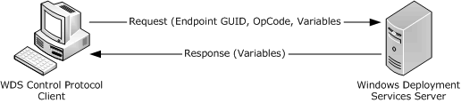
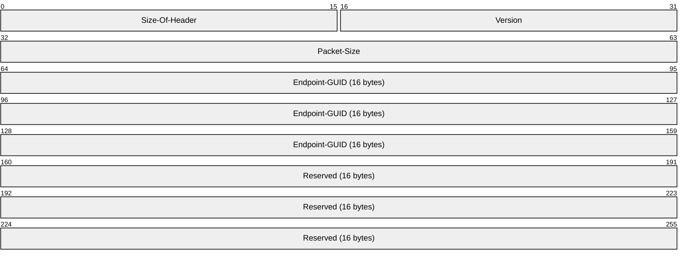
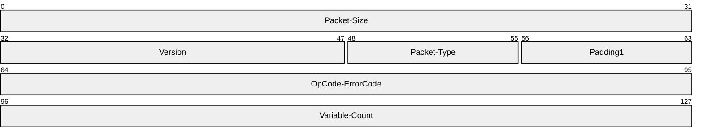
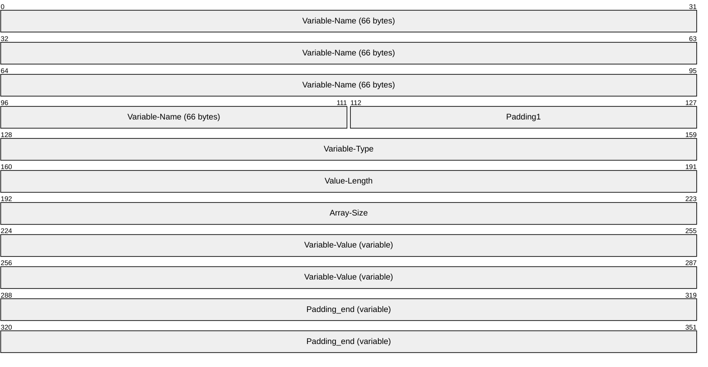
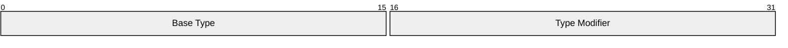

# [MS-WDSC]: Windows Deployment Services Control Protocol

Table of Contents

1 Introduction

- [1 Introduction](#Section_1)
  - [1.1 Glossary](#Section_1.1)
  - [1.2 References](#Section_1.2)
    - [1.2.1 Normative References](#Section_1.2.1)
    - [1.2.2 Informative References](#Section_1.2.2)
  - [1.3 Overview](#Section_1.3)
  - [1.4 Relationship to Other Protocols](#Section_1.4)
  - [1.5 Prerequisites/Preconditions](#Section_1.5)
  - [1.6 Applicability Statement](#Section_1.6)
  - [1.7 Versioning and Capability Negotiation](#Section_1.7)
  - [1.8 Vendor-Extensible Fields](#Section_1.8)
  - [1.9 Standards Assignments](#Section_1.9)

2 Messages

- [2 Messages](#Section_2)
  - [2.1 Transport](#Section_2.1)
    - [2.1.1 Server Security Settings](#Section_2.1.1)
    - [2.1.2 Client Security Settings](#Section_2.1.2)
    - [2.1.3 RPC as Transport](#Section_2.1.3)
  - [2.2 Common Data Types](#Section_2.2)
    - [2.2.1 Messages](#Section_2.2.1)
      - [2.2.1.1 Endpoint Header](#Section_2.2.1.1)
      - [2.2.1.2 Operation Header](#Section_2.2.1.2)
        - [2.2.1.2.1 Packet Type](#Section_2.2.1.2.1)
      - [2.2.1.3 Variables Section](#Section_2.2.1.3)
        - [2.2.1.3.1 Variable Description Block](#Section_2.2.1.3.1)
        - [2.2.1.3.2 Variable Types](#Section_2.2.1.3.2)
          - [2.2.1.3.2.1 Base Types](#Section_2.2.1.3.2.1)
          - [2.2.1.3.2.2 Type Modifiers](#Section_2.2.1.3.2.2)
        - [2.2.1.3.3 Variable Value Length](#Section_2.2.1.3.3)
          - [2.2.1.3.3.1 Variables without Type Modifiers](#Section_2.2.1.3.3.1)
          - [2.2.1.3.3.2 Variables with WDSCPL_VAR_ARRAY Type Modifier](#Section_2.2.1.3.3.2)

3 Protocol Details

- [3 Protocol Details](#Section_3)
  - [3.1 Server Details](#Section_3.1)
    - [3.1.1 Abstract Data Model](#Section_3.1.1)
      - [3.1.1.1 Configuration](#Section_3.1.1.1)
    - [3.1.2 Timers](#Section_3.1.2)
    - [3.1.3 Initialization](#Section_3.1.3)
      - [3.1.3.1 Service Providers Initialization](#Section_3.1.3.1)
      - [3.1.3.2 RPC Server Initialization](#Section_3.1.3.2)
    - [3.1.4 Message Processing Events and Sequencing Rules](#Section_3.1.4)
      - [3.1.4.1 WdsRpcMessage (opnum 0)](#Section_3.1.4.1)
      - [3.1.4.2 Failure Cases](#Section_3.1.4.2)
    - [3.1.5 Timer Events](#Section_3.1.5)
    - [3.1.6 Other Local Events](#Section_3.1.6)
  - [3.2 Client Details](#Section_3.2)
    - [3.2.1 Abstract Data Model](#Section_3.2.1)
    - [3.2.2 Timers](#Section_3.2.2)
    - [3.2.3 Initialization](#Section_3.2.3)
    - [3.2.4 Message Processing Events and Sequencing Rules](#Section_3.2.4)
    - [3.2.5 Timer Events](#Section_3.2.5)
    - [3.2.6 Other Local Events](#Section_3.2.6)

4 Protocol Examples

- [4 Protocol Examples](#Section_4)

5 Security

- [5 Security](#Section_5)
  - [5.1 Security Considerations for Implementers](#Section_5.1)
  - [5.2 Index of Security Parameters](#Section_5.2)

6 Appendix A: Full IDL

- [6 Appendix A: Full IDL](#Section_6)

7 Appendix B: Product Behavior

- [7 Appendix B: Product Behavior](#Section_7)

8 Change Tracking

- [8 Change Tracking](#Section_8)

For the legal notice and IP terms, see [LEGAL.md](../LEGAL.md).
Last updated: 4/23/2024.
See [Revision History](#revision-history) for full version history.

# 1 Introduction

The Windows Deployment Services (WDS) Control Protocol specifies an RPC interface that provides the ability to remotely invoke services provided by [**WDS Server**](#gt_wds-server). It is a client/server protocol which uses RPC as a transport. The protocol provides a generic invocation mechanism to send requests to a server and receive replies.

Sections 1.5, 1.8, 1.9, 2, and 3 of this specification are normative. All other sections and examples in this specification are informative.

## 1.1 Glossary

This document uses the following terms:

**authentication level**: A numeric value indicating the level of authentication or message protection that [**remote procedure call (RPC)**](#gt_remote-procedure-call-rpc) will apply to a specific message exchange. For more information, see [[C706]](https://go.microsoft.com/fwlink/?LinkId=89824) section 13.1.2.1 and [MS-RPCE](../MS-RPCE/MS-RPCE.md).

**dynamic endpoint**: A network-specific server address that is requested and assigned at run time. For more information, see [C706].

**endpoint**: A network-specific address of a remote procedure call (RPC) server process for remote procedure calls. The actual name and type of the endpoint depends on the [**RPC**](#gt_remote-procedure-call-rpc) protocol sequence that is being used. For example, for RPC over TCP (RPC Protocol Sequence ncacn_ip_tcp), an endpoint might be TCP port 1025. For RPC over Server Message Block (RPC Protocol Sequence ncacn_np), an endpoint might be the name of a named pipe. For more information, see [C706].

**Endpoint GUID**: Set of relevant services provided by a [**Service Provider**](#gt_service-provider) are grouped together and as a whole identified by a unique Endpoint GUID.

**globally unique identifier (GUID)**: A term used interchangeably with [**universally unique identifier (UUID)**](#gt_universally-unique-identifier-uuid) in Microsoft protocol technical documents (TDs). Interchanging the usage of these terms does not imply or require a specific algorithm or mechanism to generate the value. Specifically, the use of this term does not imply or require that the algorithms described in [[RFC4122]](https://go.microsoft.com/fwlink/?LinkId=90460) or [C706] must be used for generating the [**GUID**](#gt_globally-unique-identifier-guid). See also [**universally unique identifier (UUID)**](#gt_universally-unique-identifier-uuid).

**Interface Definition Language (IDL)**: The International Standards Organization (ISO) standard language for specifying the interface for remote procedure calls. For more information, see [C706] section 4.

**OpCode**: Each service provided by Service Provider under an [**Endpoint GUID**](#gt_endpoint-guid) is identified by a number which must be unique under that [**Endpoint GUID**](#gt_endpoint-guid).

**remote procedure call (RPC)**: A communication protocol used primarily between client and server. The term has three definitions that are often used interchangeably: a runtime environment providing for communication facilities between computers (the RPC runtime); a set of request-and-response message exchanges between computers (the RPC exchange); and the single message from an RPC exchange (the RPC message). For more information, see [C706].

**RPC protocol sequence**: A character string that represents a valid combination of a [**remote procedure call (RPC)**](#gt_remote-procedure-call-rpc) protocol, a network layer protocol, and a transport layer protocol, as described in [C706] and [MS-RPCE].

**RPC transport**: The underlying network services used by the remote procedure call (RPC) runtime for communications between network nodes. For more information, see [C706] section 2.

**security provider**: A Component Object Model (COM) object that provides methods that return custom information about the security of a site.

**service provider**: A module that is loaded by the WDS Server and is responsible for providing services to the clients.

**universally unique identifier (UUID)**: A 128-bit value. UUIDs can be used for multiple purposes, from tagging objects with an extremely short lifetime, to reliably identifying very persistent objects in cross-process communication such as client and server interfaces, manager entry-point vectors, and [**RPC**](#gt_remote-procedure-call-rpc) objects. UUIDs are highly likely to be unique. UUIDs are also known as [**globally unique identifiers (GUIDs)**](#gt_globally-unique-identifier-guid) and these terms are used interchangeably in the Microsoft protocol technical documents (TDs). Interchanging the usage of these terms does not imply or require a specific algorithm or mechanism to generate the UUID. Specifically, the use of this term does not imply or require that the algorithms described in [RFC4122] or [C706] must be used for generating the UUID.

**WDS server**: A Windows Deployment Services (WDS) server that communicates with clients by using the WDS OS Deployment Protocol to aid in deployment of an OS image on a client machine. Clients also communicate to a WDS server to request initiation/setup of multicast sessions for content available in multicast namespace on server.A WDS server provides an extensible mechanism to allow [**service providers**](#gt_service-provider) to provide services to clients.

**MAY, SHOULD, MUST, SHOULD NOT, MUST NOT:** These terms (in all caps) are used as defined in [[RFC2119]](https://go.microsoft.com/fwlink/?LinkId=90317). All statements of optional behavior use either MAY, SHOULD, or SHOULD NOT.

## 1.2 References

Links to a document in the Microsoft Open Specifications library point to the correct section in the most recently published version of the referenced document. However, because individual documents in the library are not updated at the same time, the section numbers in the documents may not match. You can confirm the correct section numbering by checking the [Errata](https://go.microsoft.com/fwlink/?linkid=850906).

### 1.2.1 Normative References

We conduct frequent surveys of the normative references to assure their continued availability. If you have any issue with finding a normative reference, please contact [dochelp@microsoft.com](mailto:dochelp@microsoft.com). We will assist you in finding the relevant information.

[C706] The Open Group, "DCE 1.1: Remote Procedure Call", C706, August 1997, [https://publications.opengroup.org/c706](https://go.microsoft.com/fwlink/?LinkId=89824)

**Note** Registration is required to download the document.

[MS-DTYP] Microsoft Corporation, "[Windows Data Types](../MS-DTYP/MS-DTYP.md)".

[MS-ERREF] Microsoft Corporation, "[Windows Error Codes](../MS-ERREF/MS-ERREF.md)".

[MS-RPCE] Microsoft Corporation, "[Remote Procedure Call Protocol Extensions](../MS-RPCE/MS-RPCE.md)".

[RFC2119] Bradner, S., "Key words for use in RFCs to Indicate Requirement Levels", BCP 14, RFC 2119, March 1997, [https://www.rfc-editor.org/info/rfc2119](https://go.microsoft.com/fwlink/?LinkId=90317)

[RFC4122] Leach, P., Mealling, M., and Salz, R., "A Universally Unique Identifier (UUID) URN Namespace", RFC 4122, July 2005, [https://www.rfc-editor.org/info/rfc4122](https://go.microsoft.com/fwlink/?LinkId=90460)

### 1.2.2 Informative References

None.

## 1.3 Overview

Windows Deployment Services (WDS) Control Protocol is a generic client/server protocol which is used to invoke services provided by [**Service Providers**](#gt_service-provider) in WDS Server. The WDS Control Protocol is a simple protocol with no state shared across multiple calls. Each call is considered one complete request.

A typical service invocation involves the following:

- The client has already obtained the name of the [**WDS Server**](#gt_wds-server), [**Endpoint GUID**](#gt_endpoint-guid) for Service Provider and [**OpCode**](#gt_opcode) for the operation being invoked.
- The client constructs a request by packaging required variables (as specified in section [2.2.1](#Section_2.2.1)), Endpoint GUID and OpCode.
- The WDS Control Protocol sends the request to the server by using [**RPC**](#gt_remote-procedure-call-rpc) interface (as specified in section [3](#Section_3)).
- The WDS Server dispatches the request to the appropriate Service Provider based on Endpoint GUID.
- Based on the Endpoint GUID and OpCode in the request, Service Provider will:
- Validate that the client has appropriate rights to perform the operation.
- Unpack the variables stored in the packet.
- Perform the requested operation.
- Package the results in pre-determined variables and complete the RPC request.
- The client will check for success or failure of the request (as specified in section [3.1.4.2](#Section_3.1.4.2) and [3.2](#Section_3.2)).
- Unpack the variables from the reply packet and process the results.
The following diagram shows a client making a request to the WDS Server:

Figure 1: Client to server request

## 1.4 Relationship to Other Protocols

The WDS Control Protocol relies on [**RPC**](#gt_remote-procedure-call-rpc), as defined in [MS-RPCE](../MS-RPCE/MS-RPCE.md), as the transport. It uses RPC to send the request to the [**WDS Server**](#gt_wds-server) and receive replies.

The following diagram illustrates the relationship of WDS Control Protocol and how it relates to RPC:

Figure 2: Relationship to other protocols

## 1.5 Prerequisites/Preconditions

This protocol is implemented on top of [**RPC**](#gt_remote-procedure-call-rpc) and, as a result, has the prerequisites identified in [MS-RPCE](../MS-RPCE/MS-RPCE.md).

The WDS Control Protocol assumes that a client has obtained the name of the server that supports this protocol, as well as an [**Endpoint GUID**](#gt_endpoint-guid), security (authenticated or unauthenticated) requirements, an [**OpCode**](#gt_opcode), variables required for each service the client intends to invoke, and variables used by these services to return the results.

## 1.6 Applicability Statement

This protocol is applicable when an application needs to invoke services provided by Service Providers residing on [**WDS Server**](#gt_wds-server).

## 1.7 Versioning and Capability Negotiation

This document covers versioning issues in the following areas:

- Supported Transports: This protocol uses single [**RPC Protocol Sequence**](#gt_rpc-protocol-sequence).
- Protocol Versions: This protocol uses a single [**RPC**](#gt_remote-procedure-call-rpc) interface.
- Security and Authentication Methods: Authentication and security are provided as specified in [MS-RPCE](../MS-RPCE/MS-RPCE.md).
- Localization: This protocol acts as pass-thru for all strings with no support for localization built into the protocol.
- Capability Negotiation: The WDS Control Protocol does not support negotiation of the interface version to use. Instead, this protocol uses only the interface version number specified in the [**IDL**](#gt_interface-definition-language-idl) for versioning and capability negotiation.

## 1.8 Vendor-Extensible Fields

Vendors can add new Service Providers by generating a new [**globally unique identifier (GUID)**](#gt_globally-unique-identifier-guid) as specified in [[RFC4122]](https://go.microsoft.com/fwlink/?LinkId=90460), and exposing new [**OpCodes**](#gt_opcode) for the Service Providers.

This protocol uses Win32 error codes as defined in [MS-ERREF](../MS-ERREF/MS-ERREF.md) section 2.2. Vendors SHOULD reuse those values with their indicated meaning. Choosing any other value runs the risk of a collision in the future.

## 1.9 Standards Assignments

| Parameter | Value | Reference |
| --- | --- | --- |
| RPC Interface UUID for WDS Control Protocol | 1A927394-352E-4553-AE3F-7CF4AAFCA620 | [[C706]](https://go.microsoft.com/fwlink/?LinkId=89824) section A.2.5 |

# 2 Messages

## 2.1 Transport

All implementations MUST support [**RPC**](#gt_remote-procedure-call-rpc) over TCP with [**dynamic endpoints**](#gt_dynamic-endpoint).

The protocol MUST use the following [**UUID**](#gt_universally-unique-identifier-uuid): 1A927394-352E-4553-AE3F-7CF4AAFCA620.

WDS Control Protocol uses RPC to transport the request packet from client to [**WDS Server**](#gt_wds-server) and to transport the reply packet back to the client.

### 2.1.1 Server Security Settings

The WDS Control Protocol uses Security Service Provider (SSP) security provided by [**RPC**](#gt_remote-procedure-call-rpc) as specified in [MS-RPCE](../MS-RPCE/MS-RPCE.md) for sessions. The server SHOULD register the following SSPs, as supported [**security providers**](#gt_security-provider):

- RPC_C_AUTHN_GSS_NEGOTIATE
- RPC_C_AUTHN_GSS_KERBEROS
- RPC_C_AUTHN_WINNT
The [**WDS Server**](#gt_wds-server) MUST allow authenticated and unauthenticated access to RPC clients. The WDS Server SHOULD support the maximum number of concurrent calls supported by RPC, as specified in [MS-RPCE] section 3.3.1.5.8.

### 2.1.2 Client Security Settings

The client MUST choose the security settings as required by the [**Service Provider**](#gt_service-provider) for a given [**Endpoint GUID**](#gt_endpoint-guid). An Endpoint GUID is a unique [**GUID**](#gt_globally-unique-identifier-guid) used to identify a set of [**RPC**](#gt_remote-procedure-call-rpc) services provided by a Service Provider that are grouped together as a relevant whole. All services under an Endpoint GUID for a Service Provider share the same security requirements. A Service Provider MAY expose multiple Endpoint GUIDs and each MAY have different security requirements.

The WDS Control Protocol RPC client MUST use SSP security provided by RPC as specified in [MS-RPCE](../MS-RPCE/MS-RPCE.md) when invoking a service of a Service Provider that requires authenticated clients for the Endpoint GUID. A client SHOULD authenticate using RPC_C_AUTHN_GSS_NEGOTIATE.

A client communicating to [**WDS Server**](#gt_wds-server) using authentication MUST use RPC_C_AUTHN_LEVEL_PKT_PRIVACY. An unauthenticated client SHOULD use RPC_AUTHN_LEVEL_NONE.

### 2.1.3 RPC as Transport

WDS Control Protocol uses [**RPC**](#gt_remote-procedure-call-rpc) to transport a packet to the [**WDS Server**](#gt_wds-server). The request packet acts as the input parameter for the RPC function call. The reply packet from WDS Server is transported back to the client as an output parameter of the RPC function call.

## 2.2 Common Data Types

The base types used by the WDS Control Protocol are defined as the [**RPC**](#gt_remote-procedure-call-rpc) base types. Additional data types are specified in [[C706]](https://go.microsoft.com/fwlink/?LinkId=89824) and [MS-RPCE](../MS-RPCE/MS-RPCE.md).

### 2.2.1 Messages

The following diagram illustrates the overall structure of request and reply packets.

Figure 3: Overall packet structure

The Endpoint Header is defined in section [2.2.1.1](#Section_2.2.1.1) and specifies the target [**Endpoint GUID**](#gt_endpoint-guid).

The Operation Header is defined in section [2.2.1.2](#Section_2.2.1.2). For request packets, this header specifies the target operation ([**OpCode**](#gt_opcode)) to perform. For reply packets, this header specifies the results of the operation.

The Variables Section is defined in section [2.2.1.3](#Section_2.2.1.3). For request packets, this section MUST specify the variables required by the service being invoked on the [**WDS Server**](#gt_wds-server). For reply packets, this section MUST specify the variables as expected by the client for the service invoked on the WDS Server.

All multibyte values specified in this document are in little-endian format unless specified otherwise.

#### 2.2.1.1 Endpoint Header

The [**Endpoint**](#gt_endpoint) Header is defined as follows:

**Size-Of-Header (2 bytes):** MUST be set to the size of header in bytes, which is 0x0028.

**Version (2 bytes):** MUST be set to 0x0100.

**Packet-Size (4 bytes):** MUST be set to the number of bytes being transmitted for the packet. It MUST be the arithmetic sum of the sizes in bytes of Endpoint Header, Operation Header, and Variables Section.

**Endpoint-GUID (16 bytes):** MUST be set to the [**Endpoint GUID**](#gt_endpoint-guid), as specified in [MS-DTYP](../MS-DTYP/MS-DTYP.md) section 2.3.4.2, of the Service Provider, which provides the service to be invoked.

**Reserved (16 bytes):** MUST be set to zeros.

#### 2.2.1.2 Operation Header

The Operation Header is defined as follows:

**Packet-Size (4 bytes):** MUST be set to the arithmetic addition of the sizes in bytes of the Operation Header and Variables Section.

**Version (2 bytes):** MUST be set to 0x0100.

**Packet-Type (1 byte):** SHOULD be set to value as defined in section [2.2.1.2.1](#Section_2.2.1.2.1).

**Padding1 (1 byte):** Padding MAY be set to zero and MUST be ignored by receiver.

**OpCode-ErrorCode (4 bytes):** For request packets, this field MUST be set to the [**OpCode**](#gt_opcode) for the service being invoked on the [**WDS Server**](#gt_wds-server). The [**Endpoint GUID**](#gt_endpoint-guid) combined with the OpCode uniquely identifies the service to be invoked on the WDS Server. For reply packets, this field specifies the error code for the invoked service. Section [3.1.4.2](#Section_3.1.4.2) specifies in detail how operation results are communicated to the client.

**Variable-Count (4 bytes):** MUST set to the number of variables in the Variables Section.

##### 2.2.1.2.1 Packet Type

The Packet Type field in the Operation Header SHOULD be set to the value in the following table. The receiver MAY validate the Packet Type before accepting the packet.<1>

| Packet Type | Description |
| --- | --- |
| WDSCPL_PACKET_REQUEST 0x01 | The client SHOULD set this value for all request packets. [**WDS Server**](#gt_wds-server) MAY validate the packet type before accepting the packet. |
| WDSCPL_PACKET_REPLY 0x02 | The reply packet from WDS Server SHOULD set the packet type to this value. The client SHOULD NOT reject a packet if the packet type is not properly set. |

#### 2.2.1.3 Variables Section

The Variables Section in the request packet is used to specify parameters required by the service being invoked on [**WDS Server**](#gt_wds-server). In reply packets from WDS Server, the variables are used to communicate and provide output of the operation performed by Service Provider on WDS Server. The count of variables in the Variables Section MUST match the count of variables specified in the Operation Header. Each variable is defined using Variable Description Block as defined in section [2.2.1.3.1](#Section_2.2.1.3.1).

Figure 4: Variables section

##### 2.2.1.3.1 Variable Description Block

The Variable Description Block is defined as follows:

**Variable-Name (66 bytes):** Specifies the name of the variable as a Unicode string. The variable name MUST end with a null character. Duplicate variable names MUST NOT be allowed. **Variable-Name** MUST be treated as case-insensitive.

**Padding1 (2 bytes):** Padding MAY be set to zero and MUST be ignored by receiver.

**Variable-Type (4 bytes):** MUST be set to the data type of the variable as specified in section [2.2.1.3.2](#Section_2.2.1.3.2).

**Value-Length (4 bytes):** This field MUST be set as specified in section [2.2.1.3.3](#Section_2.2.1.3.3).

**Array-Size (4 bytes):** This field MUST be set as specified in section 2.2.1.3.3.

**Variable-Value (variable):** Specifies the value for the variable.

**Padding_end (variable):** Padding MAY be set to zero and MUST be ignored by receiver. Padding_end size MUST be such that the total size (in bytes) of the Variable Description Block is evenly divisible by 16.

##### 2.2.1.3.2 Variable Types

WDS Control Protocol supports multiple data types. The identifier for each data type is a four bytes unsigned numeric value. The identifier for data type consists of the base data type and set of optional type modifiers.

If a data type does not have a type modifier then the type modifier MUST be set to zero.

###### 2.2.1.3.2.1 Base Types

WDS Control Protocol supports following base data types:

| Bit Range | Field | Description |
| --- | --- | --- |
| Single byte unsigned value | WDSCPL_VAR_BYTE 0x0001 | 1 Yes |
| Specifies two byte unsigned numeric value | WDSCPL_VAR_USHORT 0x0002 | 2 Yes |
| Specifies four byte unsigned numeric value | WDSCPL_VAR_ULONG 0x0004 | 4 Yes |
| Specifies an eight byte unsigned numeric value | WDSCPL_VAR_ULONG64 0x0008 | 8 Yes |
| Variable | WDSCPL_VAR_STRING 0x0010 | Variable length No Specifies a CHAR ([MS-DTYP](../MS-DTYP/MS-DTYP.md) section 2.2.7) string which MUST be terminated by a zero (null) character. |
| Variable | WDSCPL_VAR_WSTRING 0x0020 | Variable length No Specifies a UNICODE ([MS-DTYP] section 2.2.56) string which MUST be terminated by a zero (null) character. |
| Variable | WDSCPL_VAR_BLOB 0x0040 | Variable length No Specifies variable length stream of bytes. |

###### 2.2.1.3.2.2 Type Modifiers

Each data type (as specified in section [2.2.1.3.2.1](#Section_2.2.1.3.2.1)) can have a type modifier associated with it. The following list specifies the list of available type modifiers:

| Type Modifier | Description |
| --- | --- |
| WDSCPL_VAR_ARRAY 0x1000 | Specifies that the value contains an array of base data type. |

##### 2.2.1.3.3 Variable Value Length

The count of bytes that hold the value for a variable in Variable Description Block are computed using the **Value-Length** and **Array-Size** fields of the Variable Description Block.

###### 2.2.1.3.3.1 Variables without Type Modifiers

For data types without any type modifiers, the **Array-Size** field SHOULD be set to zero.

For fixed length data type the **Value-Length** field SHOULD be set to the size in bytes as specified in section [2.2.1.3.2.1](#Section_2.2.1.3.2.1).

For variable length data types the **Value-Length** field MUST specify the total number of bytes containing the value.

###### 2.2.1.3.3.2 Variables with WDSCPL_VAR_ARRAY Type Modifier

For fixed length data types the **Value-Length** field SHOULD be set to the size in bytes as specified in section [2.2.1.3.2.1](#Section_2.2.1.3.2.1).

For variable length data types the **Value-Length** field MUST specify the total number of bytes containing the value.

The **Array-Size** field specifies the number of elements contained in the array and MUST NOT be zero.

The total number of bytes that hold the value for a variable are obtained by arithmetic multiplication of **Value-Length** and **Array-Size**.

The individual elements of the array are accessed using a 0-based index with a maximum value for the index being (**Array-Size** - 1).

To access a value at a specified index, multiply the **Value-Length** by the index to obtain an offset into the **Variable-Value** field. The **Value-Length** field specifies the number of bytes to read at the derived offset in order to read the value at that index.

# 3 Protocol Details

## 3.1 Server Details

This section specifies the WDS Server Control Protocol behavior.

### 3.1.1 Abstract Data Model

This section describes a conceptual model for handling the WDS Control Protocol by a WDS Server. The described model is provided to explain how the protocol behaves. Implementations are not required to adhere to this model as long as their external behavior is consistent with that described in this document.

Global Server State: The global state of the server, set to one of the following values:

- Loading: the [**WDS Server**](#gt_wds-server) is loading and initializing the Service Providers.
- Running: WDS Server has loaded and initialized all Service Providers and serving client requests.
- Stopping: WDS Server is shutting down.
- Service Provider: A [**Service Provider**](#gt_service-provider) is a module that is loaded by WDS Server based on configuration. A Service Provider registers the [**Endpoint GUID**](#gt_endpoint-guid) with the WDS Server so that incoming requests can be routed.
- Configuration: A list of Service Providers that are to be loaded by WDS Server during initialization.
- Endpoint GUID: An Endpoint GUID is registered by a Service Provider with the WDS Server. The details provided by a Service Provider when registering an Endpoint GUID can be found in section [3.1.3.1](#Section_3.1.3.1).
- OpCode: An [**OpCode**](#gt_opcode) uniquely identifies a service offered by a Service Provider under a registered Endpoint GUID.

#### 3.1.1.1 Configuration

The list of names used as (name, value) pair in [**WDS Server**](#gt_wds-server) Configuration information are given below:

**ServiceProviderList**: A list of modules that will be loaded during WDS Server initialization. Each module represents a Service Provider.

### 3.1.2 Timers

No timers are required for [**WDS Server**](#gt_wds-server) beyond those used internally by [**RPC**](#gt_remote-procedure-call-rpc) to implement resiliency to network outages, as specified in [MS-RPCE](../MS-RPCE/MS-RPCE.md) section 3.2.3.2.1.

### 3.1.3 Initialization

At initialization time, [**WDS Server**](#gt_wds-server) MUST initialize all registered Service Providers and [**RPC**](#gt_remote-procedure-call-rpc) server.

#### 3.1.3.1 Service Providers Initialization

[**WDS Server**](#gt_wds-server): MUST read the configuration (as defined in section [3.1.1.1](#Section_3.1.1.1)) and initialize each [**Service Provider**](#gt_service-provider). Each Service Provider MUST register all [**Endpoint GUIDs**](#gt_endpoint-guid) it is to offer clients using WDS Server. Each registered Endpoint GUID MUST include the following configuration information:

[**GUID**](#gt_globally-unique-identifier-guid): A 128 bit value, which uniquely identifies that Endpoint GUID.

**SecurityAccess**: MUST specify if WDS Server allows authenticated and/or unauthenticated clients to invoke services offered by Service Provider under this Endpoint GUID.

#### 3.1.3.2 RPC Server Initialization

The [**WDS Server**](#gt_wds-server) Control Provider server MUST register the [**RPC**](#gt_remote-procedure-call-rpc) interface and begin listening on the [**RPC transport**](#gt_rpc-transport) as specified in section [2.1](#Section_2.1).

### 3.1.4 Message Processing Events and Sequencing Rules

Methods in RPC Opnum Order

| Method | Description |
| --- | --- |
| [WdsRpcMessage](#Section_3.1.4.1) | This function is used to transport the request packet to the server and to bring the reply packet. Opnum: 0 |

#### 3.1.4.1 WdsRpcMessage (opnum 0)

The WdsRpcMessage (opnum 0) method sends the request packet to the server and returns the corresponding reply packet.

unsigned long WdsRpcMessage(

handle_t hBinding,

[in] unsigned long uRequestPacketSize,

[in, size_is(uRequestPacketSize)]

byte bRequestPacket[],

[out] unsigned long* puReplyPacketSize,

[out, size_is(, *puReplyPacketSize)]

byte** pbReplyPacket

);

**hBinding:** The RPC binding handle that the client established when it connected to the server.

**uRequestPacketSize:** The client MUST pass the total size of request packet in bytes.

**bRequestPacket:** A pointer to the request packet. The packet MUST be constructed as specified in section [2.2.1](#Section_2.2.1).

**puReplyPacketSize:** The [**WDS Server**](#gt_wds-server) MUST set this to the total size of the reply packet in bytes.

**pbReplyPacket:** The WDS Server MUST set this to the reply packet. The reply packet MUST be constructed as specified in section 2.2.1.

**Return Values:** The method MUST return ERROR_SUCCESS (0x00000000) on success or a non-zero Win32 error code value if an error occurred.

When processing this call, the WDS Server MUST do the following:

- If the Global Server State is not Running (section [3.1](#Section_3.1)), the server MUST return a failure.
- Server MUST validate the Endpoint Header (section [2.2.1.1](#Section_2.2.1.1)) and extract the [**Endpoint GUID**](#gt_endpoint-guid), and if invalid, the server MUST return a failure.
- Server MUST search through the list of registered Endpoint GUIDs to match the Endpoint GUID specified in the Endpoint Header. If no match is found, the server MUST return a failure.
- Server MUST query the [**authentication level**](#gt_authentication-level) of the [**RPC**](#gt_remote-procedure-call-rpc) call and validate as follows:
- If registered Endpoint GUID allows both authenticated and unauthenticated clients, then continue to next step.
- If the registered Endpoint GUID requires an authenticated client and client RPC call is unauthenticated, the server MUST return a failure.
- If the registered Endpoint GUID requires an unauthenticated client and the client RPC call is authenticated, the server MUST return a failure.
- For authenticated clients, server MUST enforce RPC_C_AUTHN_LEVEL_PKT_PRIVACY and return failure if client is not using it.
- Server MUST dispatch the request packet to the Service Provider that registered the Endpoint GUID.
- Service Provider MUST validate the Operation Header (section [2.2.1.2](#Section_2.2.1.2)) and extract the [**OpCode**](#gt_opcode). The server MUST return failure if invalid.
- Service Provider MUST validate that it offers the requested OpCode under the registered Endpoint, and if invalid the server MUST return failure.
- Service Provider MUST validate and extract all variables from the Variables Section (section [2.2.1.3](#Section_2.2.1.3)), and return failure if invalid.
- For the requested OpCode, Service Provider MUST validate that all required variables are present.
- Service Provider MAY validate that the client is authorized to perform the requested operation.
- Service Provider MUST perform the requested operation as identified by the Endpoint GUID and OpCode from the request packet. If an error is encountered, it MUST be handled as specified in section [3.1.4.2](#Section_3.1.4.2).
- Service Provider MUST construct the reply packet (section 2.2.1) and hand it to WDS Server.
- WDS Server MUST complete the RPC call setting the output parameters for the function to the packet provided by Service Provider.

#### 3.1.4.2 Failure Cases

[**WDS Server**](#gt_wds-server) MUST return a failure status for the [**RPC**](#gt_remote-procedure-call-rpc) call if it encounters any failure before passing the request to a Service Provider, or after the reply packet has been handed to WDS Server by a Service Provider.

Service Providers SHOULD report failures by instructing the WDS Server to return the appropriate failure code for the RPC call.

Service Providers MAY construct a reply packet and set the failure error code in the Operation Header (section [2.2.1.2](#Section_2.2.1.2)). In this case, the RPC call succeeds, but the OpCode-ErrorCode field in the Operation Header MUST contain the appropriate error code.<2>

### 3.1.5 Timer Events

None.

### 3.1.6 Other Local Events

None.

## 3.2 Client Details

### 3.2.1 Abstract Data Model

This section describes a conceptual model of possible handling of WDS Control Protocol by clients to participate in this protocol. The described model is provided to facilitate the explanation of how the protocol behaves. This document does not mandate that implementations adhere to this model as long as their external behavior is consistent with that described in this document.

### 3.2.2 Timers

The clients MAY request a timeout for the operation when using WDS Control Protocol. If a timeout is specified and a request to [**WDS Server**](#gt_wds-server) does not complete before the timeout, then WDS Control Protocol MUST cancel the [**RPC**](#gt_remote-procedure-call-rpc) call and return appropriate failure.

If client does not request a timeout, then WDS Control Protocol requires no timers beyond those used internally by RPC to implement resiliency to network outages, as specified in [MS-RPCE](../MS-RPCE/MS-RPCE.md) section 3.2.3.2.1.

### 3.2.3 Initialization

None.

### 3.2.4 Message Processing Events and Sequencing Rules

The client MUST provide information to WDS Control Protocol to uniquely identify the service to be invoked. It MUST include all variables required by service being invoked. The following is the list of information to be provided:

- Server name or IP address
- [**Endpoint GUID**](#gt_endpoint-guid)
- Security (authenticated or unauthenticated call)
- [**OpCode**](#gt_opcode)
- Required variables
The client MAY also specify a timeout for the [**RPC**](#gt_remote-procedure-call-rpc) call.

When processing the request, the client MUST follow these steps:

- Construct the request packet as specified in section [2.2.1](#Section_2.2.1).
- Set the [**authentication level**](#gt_authentication-level) for the RPC call (either authenticated or unauthenticated).
- Set the timeout for RPC call if one is specified by client.
- Send request to server as specified in section [3.1.4.1](#Section_3.1.4.1).
If call executes and returns with success code of ERROR_SUCCESS (0x00000000), the WDS Control Protocol MUST do the following:

- Validate the Endpoint Header (section [2.2.1.1](#Section_2.2.1.1)), Operation Header (section [2.2.1.2](#Section_2.2.1.2)) and Variables Section (section [2.2.1.3](#Section_2.2.1.3)).
- The Endpoint GUID in the Endpoint Header MUST match the Endpoint GUID specified by client.
- If the **OpCode-ErrorCode** field in the Operation Header is not set to error code ERROR_SUCCESS (0x00000000), the WDS Control Protocol MAY return the same error code to the client.

### 3.2.5 Timer Events

The timer event is start just before the [**RPC**](#gt_remote-procedure-call-rpc) call is initiated. If the timer expires and the RPC call has still not completed, the WDS Control Protocol MUST cancel the RPC call and return the appropriate error code to the client.

### 3.2.6 Other Local Events

None.

# 4 Protocol Examples

The following diagram illustrates a client invoking a service provided by Service Provider on a WDS Server:

Figure 5: Client invoking a service

# 5 Security

## 5.1 Security Considerations for Implementers

None.

## 5.2 Index of Security Parameters

None.

# 6 Appendix A: Full IDL

For ease of implementation, the full [**IDL**](#gt_interface-definition-language-idl) is provided below, where "ms-dtyp.idl" refers to the IDL found in [MS-DTYP](../MS-DTYP/MS-DTYP.md) Appendix A.

import "ms-dtyp.idl";

[

uuid(1A927394-352E-4553-AE3F-7CF4AAFCA620),

version(1.0)

]

interface WdsRpcInterface

{

unsigned long

WdsRpcMessage(

handle_t hBinding,

[in] unsigned long uRequestPacketSize,

[in, size_is(uRequestPacketSize)] byte bRequestPacket[],

[out] unsigned long* puReplyPacketSize,

[out, size_is(, *puReplyPacketSize)] byte** pbReplyPacket

);

}

# 7 Appendix B: Product Behavior

The information in this specification is applicable to the following Microsoft products or supplemental software. References to product versions include updates to those products.

- Windows Server 2003 operating system
- Windows Server 2008 operating system
- Windows Server 2008 R2 operating system
- Windows Server 2012 operating system
- Windows Server 2012 R2
- Windows Server 2016 operating system
- Windows Server operating system
- Windows Server 2019 operating system
- Windows Server 2022 operating system
- Windows Server 2025 operating system
Exceptions, if any, are noted in this section. If an update version, service pack or Knowledge Base (KB) number appears with a product name, the behavior changed in that update. The new behavior also applies to subsequent updates unless otherwise specified. If a product edition appears with the product version, behavior is different in that product edition.

Unless otherwise specified, any statement of optional behavior in this specification that is prescribed using the terms "SHOULD" or "SHOULD NOT" implies product behavior in accordance with the SHOULD or SHOULD NOT prescription. Unless otherwise specified, the term "MAY" implies that the product does not follow the prescription.

<1> Section 2.2.1.2.1: The PacketType field is not properly set in the reply packets.

<2> Section 3.1.4.2: When an operation fails, some operations can set the OpCode-ErrorCode field to the failure error code.

# 8 Change Tracking

This section identifies changes that were made to this document since the last release. Changes are classified as Major, Minor, or None.

The revision class **Major** means that the technical content in the document was significantly revised. Major changes affect protocol interoperability or implementation. Examples of major changes are:

- A document revision that incorporates changes to interoperability requirements.
- A document revision that captures changes to protocol functionality.
The revision class **Minor** means that the meaning of the technical content was clarified. Minor changes do not affect protocol interoperability or implementation. Examples of minor changes are updates to clarify ambiguity at the sentence, paragraph, or table level.

The revision class **None** means that no new technical changes were introduced. Minor editorial and formatting changes may have been made, but the relevant technical content is identical to the last released version.

The changes made to this document are listed in the following table. For more information, please contact [dochelp@microsoft.com](mailto:dochelp@microsoft.com).

| Section | Description | Revision class |
| --- | --- | --- |
| [7](#Section_7) Appendix B: Product Behavior | Added Windows Server 2025 to the list of applicable products. | Major |

## Revision History

| Date | Version | Revision Class | Comments |
| --- | --- | --- | --- |
| 2/27/2009 | 0.1 | Major | First Release. |
| 4/10/2009 | 1.0 | Major | Updated and revised the technical content. |
| 5/22/2009 | 1.0.1 | Editorial | Changed language and formatting in the technical content. |
| 7/2/2009 | 1.0.2 | Editorial | Changed language and formatting in the technical content. |
| 8/14/2009 | 1.0.3 | Editorial | Changed language and formatting in the technical content. |
| 9/25/2009 | 1.1 | Minor | Clarified the meaning of the technical content. |
| 11/6/2009 | 1.1.1 | Editorial | Changed language and formatting in the technical content. |
| 12/18/2009 | 1.2 | Minor | Clarified the meaning of the technical content. |
| 1/29/2010 | 1.2.1 | Editorial | Changed language and formatting in the technical content. |
| 3/12/2010 | 1.2.2 | Editorial | Changed language and formatting in the technical content. |
| 4/23/2010 | 1.2.3 | Editorial | Changed language and formatting in the technical content. |
| 6/4/2010 | 1.3 | Minor | Clarified the meaning of the technical content. |
| 7/16/2010 | 1.3 | None | No changes to the meaning, language, or formatting of the technical content. |
| 8/27/2010 | 1.3 | None | No changes to the meaning, language, or formatting of the technical content. |
| 10/8/2010 | 1.3 | None | No changes to the meaning, language, or formatting of the technical content. |
| 11/19/2010 | 1.3 | None | No changes to the meaning, language, or formatting of the technical content. |
| 1/7/2011 | 1.3 | None | No changes to the meaning, language, or formatting of the technical content. |
| 2/11/2011 | 1.3 | None | No changes to the meaning, language, or formatting of the technical content. |
| 3/25/2011 | 1.3 | None | No changes to the meaning, language, or formatting of the technical content. |
| 5/6/2011 | 2.0 | Major | Updated and revised the technical content. |
| 6/17/2011 | 2.1 | Minor | Clarified the meaning of the technical content. |
| 9/23/2011 | 2.1 | None | No changes to the meaning, language, or formatting of the technical content. |
| 12/16/2011 | 3.0 | Major | Updated and revised the technical content. |
| 3/30/2012 | 3.0 | None | No changes to the meaning, language, or formatting of the technical content. |
| 7/12/2012 | 3.0 | None | No changes to the meaning, language, or formatting of the technical content. |
| 10/25/2012 | 3.0 | None | No changes to the meaning, language, or formatting of the technical content. |
| 1/31/2013 | 3.0 | None | No changes to the meaning, language, or formatting of the technical content. |
| 8/8/2013 | 4.0 | Major | Updated and revised the technical content. |
| 11/14/2013 | 4.0 | None | No changes to the meaning, language, or formatting of the technical content. |
| 2/13/2014 | 4.0 | None | No changes to the meaning, language, or formatting of the technical content. |
| 5/15/2014 | 4.0 | None | No changes to the meaning, language, or formatting of the technical content. |
| 6/30/2015 | 5.0 | Major | Significantly changed the technical content. |
| 10/16/2015 | 5.0 | None | No changes to the meaning, language, or formatting of the technical content. |
| 7/14/2016 | 5.0 | None | No changes to the meaning, language, or formatting of the technical content. |
| 6/1/2017 | 5.0 | None | No changes to the meaning, language, or formatting of the technical content. |
| 9/15/2017 | 6.0 | Major | Significantly changed the technical content. |
| 9/12/2018 | 7.0 | Major | Significantly changed the technical content. |
| 4/7/2021 | 8.0 | Major | Significantly changed the technical content. |
| 4/23/2024 | 9.0 | Major | Significantly changed the technical content. |
