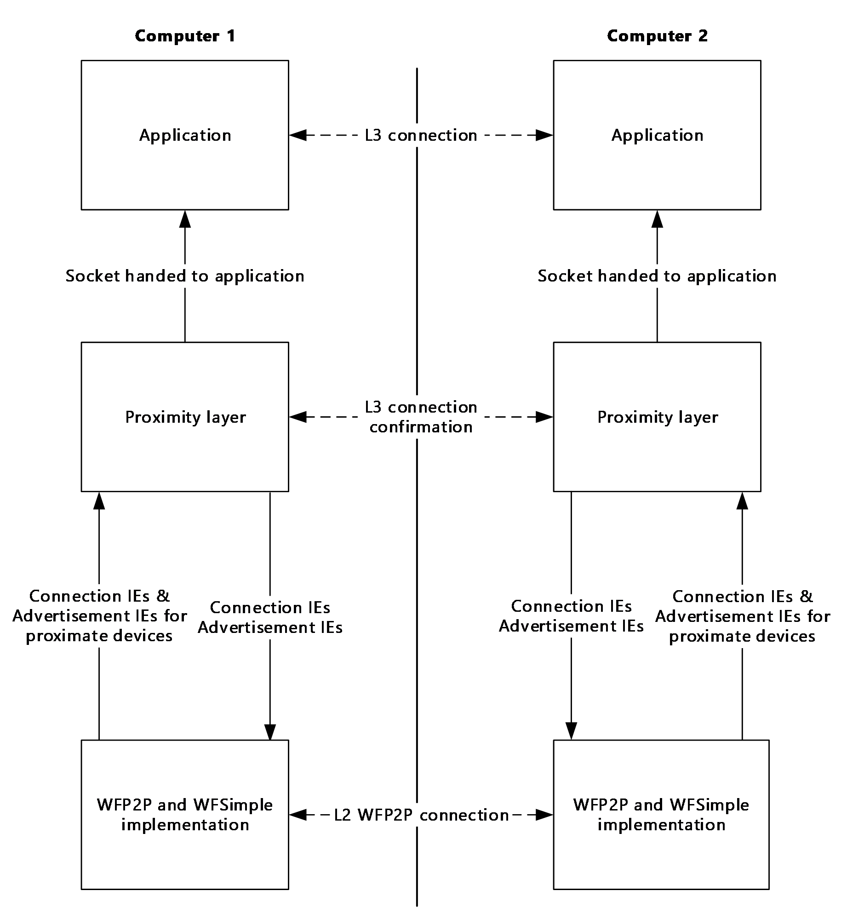
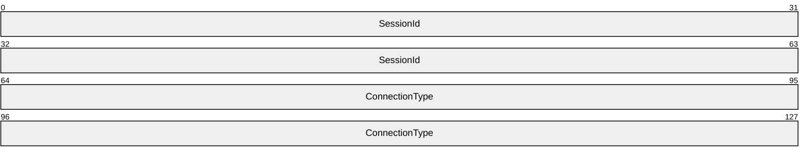
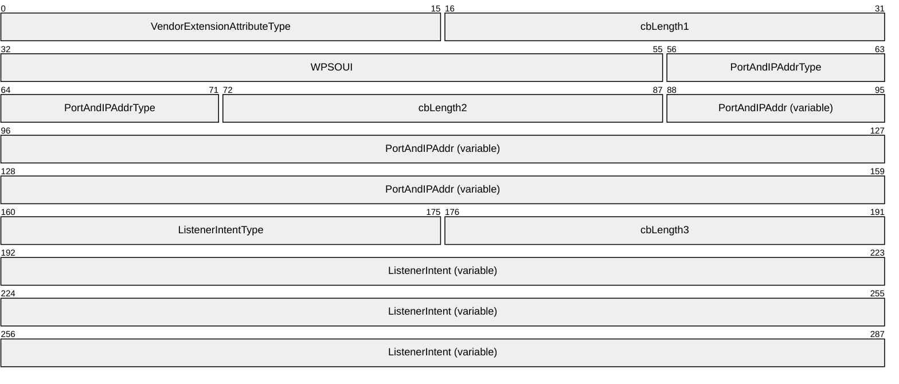
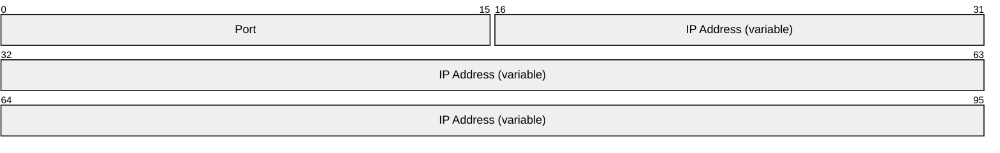
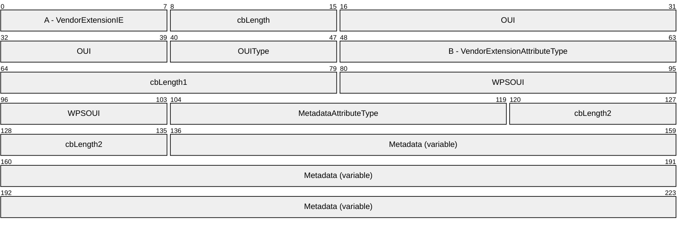
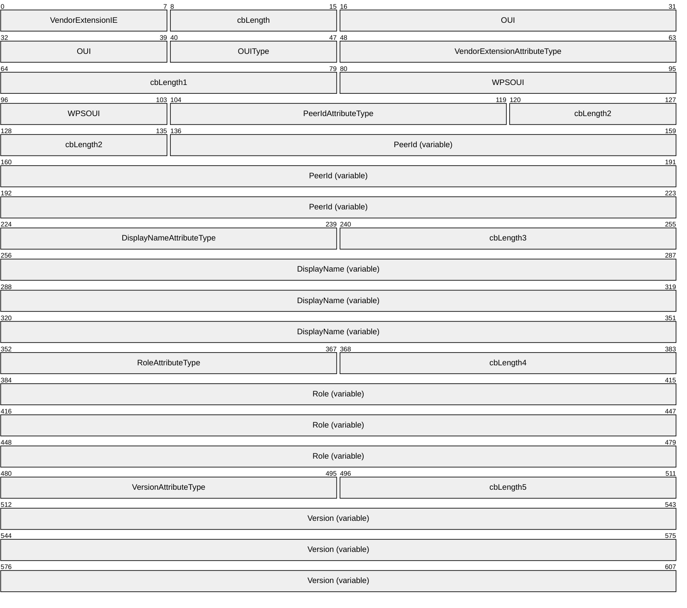
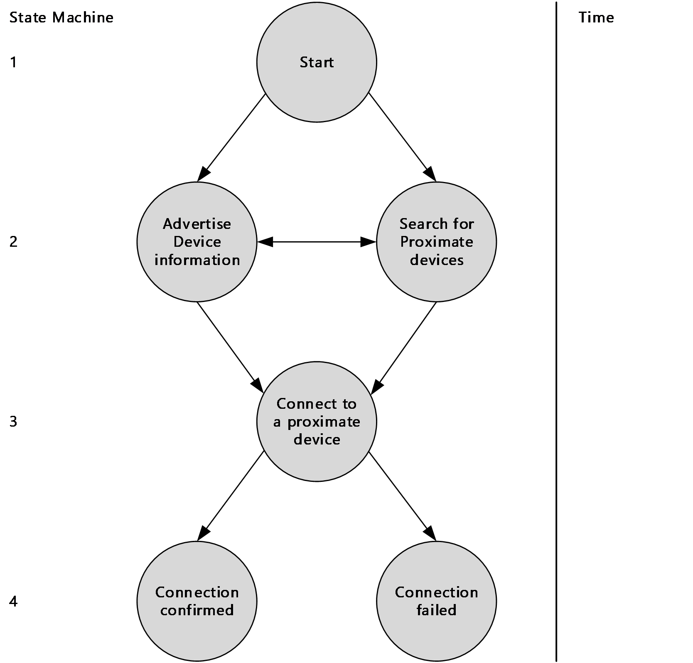

# [MS-WFDAA]: Wi-Fi Direct (WFD) Application to Application Protocol

Table of Contents

1 Introduction

- [1 Introduction](#Section_1)
  - [1.1 Glossary](#Section_1.1)
  - [1.2 References](#Section_1.2)
    - [1.2.1 Normative References](#Section_1.2.1)
    - [1.2.2 Informative References](#Section_1.2.2)
  - [1.3 Overview](#Section_1.3)
  - [1.4 Relationship to Other Protocols](#Section_1.4)
  - [1.5 Prerequisites/Preconditions](#Section_1.5)
  - [1.6 Applicability Statement](#Section_1.6)
  - [1.7 Versioning and Capability Negotiation](#Section_1.7)
  - [1.8 Vendor-Extensible Fields](#Section_1.8)
  - [1.9 Standards Assignments](#Section_1.9)

2 Messages

- [2 Messages](#Section_2)
  - [2.1 Transport](#Section_2.1)
  - [2.2 Message Syntax](#Section_2.2)
    - [2.2.1 AppWFDAcceptHeader Message](#Section_2.2.1)
    - [2.2.2 AppWFDConnectionIE Message](#Section_2.2.2)
    - [2.2.3 AppWFDDiscoveryMetadataIE Message](#Section_2.2.3)
    - [2.2.4 AppWFDDiscoveryPrimaryIE Message](#Section_2.2.4)

3 Protocol Details

- [3 Protocol Details](#Section_3)
  - [3.1 Common Details](#Section_3.1)
    - [3.1.1 Abstract Data Model](#Section_3.1.1)
    - [3.1.2 Timers](#Section_3.1.2)
    - [3.1.3 Initialization](#Section_3.1.3)
    - [3.1.4 Higher-Layer Triggered Events](#Section_3.1.4)
    - [3.1.5 Message Processing Events and Sequencing Rules](#Section_3.1.5)
    - [3.1.6 Timer Events](#Section_3.1.6)
    - [3.1.7 Other Local Events](#Section_3.1.7)
  - [3.2 Client Details](#Section_3.2)
    - [3.2.1 Abstract Data Model](#Section_3.2.1)
    - [3.2.2 Timers](#Section_3.2.2)
    - [3.2.3 Initialization](#Section_3.2.3)
    - [3.2.4 Higher-Layer Triggered Events](#Section_3.2.4)
    - [3.2.5 Message Processing Events and Sequencing Rules](#Section_3.2.5)
    - [3.2.6 Timer Events](#Section_3.2.6)
    - [3.2.7 Other Local Events](#Section_3.2.7)
  - [3.3 Server Details](#Section_3.3)
    - [3.3.1 Abstract Data Model](#Section_3.3.1)
    - [3.3.2 Timers](#Section_3.3.2)
    - [3.3.3 Initialization](#Section_3.3.3)
    - [3.3.4 Higher-Layer Triggered Events](#Section_3.3.4)
    - [3.3.5 Message Processing Events and Sequencing Rules](#Section_3.3.5)
    - [3.3.6 Timer Events](#Section_3.3.6)
    - [3.3.7 Other Local Events](#Section_3.3.7)

4 Protocol Examples

- [4 Protocol Examples](#Section_4)
  - [4.1 Version 1.0 AppWFDDiscoveryPrimaryIE](#Section_4.1)
  - [4.2 Version 2.0 AppWFDDiscoveryPrimaryIE (Host Role)](#Section_4.2)
  - [4.3 Version 2.0 AppWFDDiscoveryPrimaryIE (Peer Role)](#Section_4.3)
  - [4.4 Version 2.0 AppWFDDiscoveryMetadataIE](#Section_4.4)
  - [4.5 AppWFDConnectionIE](#Section_4.5)

5 Security

- [5 Security](#Section_5)
  - [5.1 Security Considerations for Implementers](#Section_5.1)
  - [5.2 Index of Security Parameters](#Section_5.2)

6 Appendix A: Product Behavior

- [6 Appendix A: Product Behavior](#Section_6)

7 Change Tracking

- [7 Change Tracking](#Section_7)

For the legal notice and IP terms, see [LEGAL.md](../LEGAL.md).
Last updated: 4/23/2024.
See [Revision History](#revision-history) for full version history.

# 1 Introduction

The Wi-Fi Direct (WFD) Application to Application Protocol ([**WFDA2A**](#gt_wi-fi-direct-wfd-application-to-application-protocol-wfda2a)) enables two or more devices to establish a direct connection without requiring an intermediary, such as an infrastructure [**wireless access point (WAP)**](#gt_wireless-access-point-wap). To establish the connection, the proximate devices are required to already be running the same application. The connection is established via one of the following relationships:

- Peer-to-peer: A single WFD connection between two applications where both are performing the role of a peer.
- Host-to-client: An application performing the role of the host that supports WFD connections with multiple applications performing the role of a client. Although a host can connect to multiple clients, a client can only connect to one host.
The peer, host, and client roles are specific to the application and are different from the initiator and recipient roles for the [**data link layer (L2)**](#gt_data-link-layer-l2) and the server and client roles for the [**network layer (L3)**](#gt_network-layer-l3).

Applications [**advertise**](#gt_advertise) and search for applications on proximate devices by using specific frames, the format of which is defined by the Wi-Fi Peer-to-Peer (P2P) Specification v1.2 (WFP2P) [[WF-P2P1.2]](https://go.microsoft.com/fwlink/?LinkId=225584). Devices connect by using specific messages, the format of which is defined by the Wi-Fi Simple Configuration Technical Specification v2.0.2 (WFSimple) [[WF-WSC2.0.2]](https://go.microsoft.com/fwlink/?LinkId=282666). Devices confirm the wireless connection by exchanging a session ID created during the connection.

This document refers to the detailed specifications defined in the WFP2P [WF-P2P1.2] and the WFSimple [WF-WSC2.0.2] documents and provides application-specific message formats and descriptions to explain how the WFDA2A Protocol fits into the overall framework.

Sections 1.5, 1.8, 1.9, 2, and 3 of this specification are normative. All other sections and examples in this specification are informative.

## 1.1 Glossary

This document uses the following terms:

**advertise**: To publish descriptive identifying information in a name service.

**advertisement**: Data used by a device to make itself discoverable to proximate devices.

**Beacon**: A management frame that contains all of the information required to connect to a network. In a WLAN, Beacon frames are periodically transmitted to announce the presence of the network.

**big-endian**: Multiple-byte values that are byte-ordered with the most significant byte stored in the memory location with the lowest address.

**data link layer (L2)**: The second layer in the ISO/OSI reference model that provides the ability to transfer data among network entities and supports detection and handling of errors in the physical layer.

**information element (IE)**: In a Wi-Fi Protected Setup (WPS) scenario, descriptive information consisting of informative type-length-values that specify the possible and currently deployed configuration methods for a device. The IE is transferred and added to the Beacon and Probe Response frames, and optionally to the Probe Request frame and associated request and response messages.

**listener intent**: A variable number value specified in the AppWFDConnectionIE message. WFDA2A uses listener intent to determine the client and server roles.

**little-endian**: Multiple-byte values that are byte-ordered with the least significant byte stored in the memory location with the lowest address.

**Media Access Control (MAC) address**: A hardware address provided by the network interface vendor that uniquely identifies each interface on a physical network for communication with other interfaces, as specified in [[IEEE802.3]](https://go.microsoft.com/fwlink/?LinkId=89911). It is used by the media access control sublayer of the data link layer of a network connection.

**network layer (L3)**: The third layer in the ISO/OSI reference model that provides the ability to transfer variable length data sequences from a source host on one network to a destination host on a different network while maintaining the quality of service (QoS) requested by the transport layer.

**organizationally unique identifier (OUI)**: A unique 24-bit string that uniquely identifies a vendor, manufacturer, or organization on a worldwide l basis, as specified in [IEEE-OUI]. The OUI is used to help distinguish both physical devices and software, such as a network protocol, that belong to one entity from those that belong to another.

**pre-shared key (PSK)**: A key that is obtained through peer-to-peer (P2P) provisioning.

**Probe Request**: A frame that contains the advertisement IE for a device that is seeking to establish a connection with a proximate device. The Probe Request frame is defined in the Wi-Fi Peer-to-Peer (P2P) Specification v1.2 [[WF-P2P1.2]](https://go.microsoft.com/fwlink/?LinkId=225584) section 4.2.2.

**Probe Response**: A frame that contains the advertisement IE for a device. The Probe Response is sent in response to a Probe Request. The Probe Response frame is defined in the Wi-Fi Peer-to-Peer (P2P) Specification v1.2 [WF-P2P1.2] section 4.2.3.

**Transmission Control Protocol (TCP)**: A protocol used with the Internet Protocol (IP) to send data in the form of message units between computers over the Internet. TCP handles keeping track of the individual units of data (called packets) that a message is divided into for efficient routing through the Internet.

**type-length-value (TLV)**: A method of organizing data that involves a Type code (16-bit), a specified length of a Value field (16-bit), and the data in the Value field (variable).

**Wi-Fi Direct (WFD)**: A standard that allows Wi-Fi devices to connect to each other without requiring a [**wireless access point (WAP)**](#gt_wireless-access-point-wap). This standard enables WFD devices to transfer data directly among each other resulting in significant reductions in setup.

**Wi-Fi Direct (WFD) Application to Application Protocol (WFDA2A)**: The protocol specified by this document, Wi-Fi Direct (WFD) Application to Application Protocol.

**Wi-Fi Protected Setup (WPS)**: A computing standard that attempts to allow easy establishment of a secure wireless home network. This standard was formerly known as Wi-Fi Simple Config.

**wireless access point (WAP)**: A wireless network access server (NAS) that implements 802.11.

**MAY, SHOULD, MUST, SHOULD NOT, MUST NOT:** These terms (in all caps) are used as defined in [[RFC2119]](https://go.microsoft.com/fwlink/?LinkId=90317). All statements of optional behavior use either MAY, SHOULD, or SHOULD NOT.

## 1.2 References

Links to a document in the Microsoft Open Specifications library point to the correct section in the most recently published version of the referenced document. However, because individual documents in the library are not updated at the same time, the section numbers in the documents may not match. You can confirm the correct section numbering by checking the [Errata](https://go.microsoft.com/fwlink/?linkid=850906).

### 1.2.1 Normative References

We conduct frequent surveys of the normative references to assure their continued availability. If you have any issue with finding a normative reference, please contact [dochelp@microsoft.com](mailto:dochelp@microsoft.com). We will assist you in finding the relevant information.

[IEEE-OUI] IEEE Standards Association, "IEEE MAC Address Block Large (MA-L) Field Registration Authority Public Listing", [http://standards-oui.ieee.org/oui/oui.txt](https://go.microsoft.com/fwlink/?LinkId=89895)

[MSDN-PF.AlternateIdentities] Microsoft Corporation, "PeerFinder.AlternateIdentities, alternateIdentities property", [https://learn.microsoft.com/en-us/uwp/api/Windows.Networking.Proximity.PeerFinder#Windows_Networking_Proximity_PeerFinder_AlternateIdentities](https://go.microsoft.com/fwlink/?LinkId=299103)

[RFC2119] Bradner, S., "Key words for use in RFCs to Indicate Requirement Levels", BCP 14, RFC 2119, March 1997, [https://www.rfc-editor.org/info/rfc2119](https://go.microsoft.com/fwlink/?LinkId=90317)

[WF-P2P1.2] Wi-Fi Alliance, "Wi-Fi Peer-to-Peer (P2P) Technical Specification v1.2", [https://www.wi-fi.org/wi-fi-peer-to-peer-p2p-technical-specification-v12](https://go.microsoft.com/fwlink/?LinkId=225584)

**Note** There is a charge to download the specification.

[WF-WSC2.0.2] Wi-Fi Alliance, "Wi-Fi Simple Configuration Technical Specification v2.0.2", August 2011, [https://www.wi-fi.org/wi-fi-simple-configuration-technical-specification-v202](https://go.microsoft.com/fwlink/?LinkId=282666)

**Note** There is a charge to download the specification.

### 1.2.2 Informative References

None.

## 1.3 Overview

WFDA2A is based on WFP2P [[WF-P2P1.2]](https://go.microsoft.com/fwlink/?LinkId=225584) and WFSimple [[WF-WSC2.0.2]](https://go.microsoft.com/fwlink/?LinkId=282666) and uses vendor-specific [**information elements (IEs)**](#gt_information-element-ie) from these standards definitions to discover similar applications and to exchange connection information in a wireless environment.

In a [**Wi-Fi Direct (WFD)**](#gt_wi-fi-direct-wfd) application-to-application scenario, the server application listens for connection requests from client applications. The server and client’s role determination for [**L3**](#gt_network-layer-l3) is based on a [**listener intent**](#gt_listener-intent) value exchanged during establishment of the [**L2**](#gt_data-link-layer-l2) connection.

WFDA2A uses a portion of the [**pre-shared key (PSK)**](#gt_pre-shared-key-psk) during establishment of the L2 connection to confirm the connection. Setting up a connection between proximate devices requires three steps:

- Advertising and searching for devices
- Establishing a connection
- Confirming the connection

## 1.4 Relationship to Other Protocols

Figure 1: Relationship of WFDA2A to other protocols

WFDA2A relies on WFP2P [[WF-P2P1.2]](https://go.microsoft.com/fwlink/?LinkId=225584) and WFSimple [[WF-WSC2.0.2]](https://go.microsoft.com/fwlink/?LinkId=282666). The protocol encodes connection and [**advertisement**](#gt_advertisement) [**IEs**](#gt_information-element-ie) and establishes the [**L3**](#gt_network-layer-l3) connection. The WLAN service operating on the lower layer sets up an [**L2**](#gt_data-link-layer-l2) connection by implementing WFP2P and WFSimple.

## 1.5 Prerequisites/Preconditions

WFDA2A depends on the following:

- WFSimple [[WF-WSC2.0.2]](https://go.microsoft.com/fwlink/?LinkId=282666) for proper key exchange.
- WFP2P [[WF-P2P1.2]](https://go.microsoft.com/fwlink/?LinkId=225584) for group owner and client negotiation for WFD pairing. WFDA2A also depends on WFSimple [WF-WSC2.0.2].
- TCP/IP to establish an [**L3**](#gt_network-layer-l3) connection.

## 1.6 Applicability Statement

An application uses WFDA2A to locate and connect to proximate devices. WFDA2A is only applicable in scenarios with two or more devices, all of which are required to support WFDA2A. Use of the protocol is particularly applicable when a [**WAP**](#gt_wireless-access-point-wap) is not available. In such cases, [**WFD**](#gt_wi-fi-direct-wfd) sets up a personal area network connection between proximate devices without requiring an intermediary.

## 1.7 Versioning and Capability Negotiation

This document describes two versions of the Wi-Fi Direct (WFD) Application to Application Protocol (WFDA2A):

- [**WFDA2Av1**](#gt_wi-fi-direct-wfd-application-to-application-protocol-wfda2a)**:** Version 1.0 of the Wi-Fi Direct (WFD) Application to Application Protocol [MS-WFDAA].
- WFDA2Av2**:** Version 2.0 of the Wi-Fi Direct (WFD) Application to Application Protocol [MS-WFDAA].

## 1.8 Vendor-Extensible Fields

WFDA2A uses the [**Probe Response**](#gt_probe-response) and [**Beacon**](#gt_beacon) vendor-extensible fields defined in WFP2P [[WF-P2P1.2]](https://go.microsoft.com/fwlink/?LinkId=225584) sections 4.2.3 and 4.2.1 respectively, to relay advertisement information. WFDA2A uses the **M7** or **M8** vendor-extensible fields defined in WFSimple [[WF-WSC2.0.2]](https://go.microsoft.com/fwlink/?LinkId=282666) sections 8.3.8 and 8.3.9 respectively, to relay connection information.

## 1.9 Standards Assignments

None.

# 2 Messages

## 2.1 Transport

WFDA2A relies on [**WFD**](#gt_wi-fi-direct-wfd) transport. Proximate devices MUST setup a WFD connection as defined in WFP2P [[WF-P2P1.2]](https://go.microsoft.com/fwlink/?LinkId=225584) and WFSimple [[WF-WSC2.0.2]](https://go.microsoft.com/fwlink/?LinkId=282666).

## 2.2 Message Syntax

Unless otherwise specified, all fields in this protocol MUST be transmitted in [**little-endian**](#gt_little-endian) byte order.

### 2.2.1 AppWFDAcceptHeader Message

The AppWFDAcceptHeader message is sent by the client to the server after the [**TCP**](#gt_transmission-control-protocol-tcp) connection is established using the port and IP information sent in the AppWFDConnectionIE message to confirm the connection. The client MUST send the first eight bytes of the [**PSK**](#gt_pre-shared-key-psk) (specified in the **SessionId** field) exchanged during [**L2**](#gt_data-link-layer-l2) connection followed by the **ConnectionType** field. **ConnectionType** MUST be set to 0 to indicate that the connection is over [**WFD**](#gt_wi-fi-direct-wfd). The server MUST validate the **SessionId** and send the AppWFDAcceptHeader message to the client on the connected socket. The client MUST validate the AppWFDAcceptHeader message received from the server by comparing it to the message sent by the client. If the headers do not match, the client MUST abort the connection.

**SessionId (8 bytes):** This field consists of the first 8 bytes of the PSK that is exchanged during the WFD L2 connection. The **SessionId** ensures that the same applications that connected over L2 are connecting over [**L3**](#gt_network-layer-l3).

**ConnectionType (8 bytes):** This field indicates the type of transport over which the server and client connected. This field MUST be set to 0 to indicate that the connection is over WFD.

### 2.2.2 AppWFDConnectionIE Message

The AppWFDConnectionIE message is sent by using the **M7** and **M8** vendor-extensible fields, defined in WFSimple [[WF-WSC2.0.2]](https://go.microsoft.com/fwlink/?LinkId=282666) sections 8.3.8 and 8.3.9 respectively, after an application has requested a connection with a proximate device.

**VendorExtensionAttributeType (2 bytes):** This field indicates the vendor extension attribute type for the [**WPS**](#gt_wi-fi-protected-setup-wps) [**organizationally unique identifier (OUI)**](#gt_organizationally-unique-identifier-oui), as specified in [[IEEE-OUI]](https://go.microsoft.com/fwlink/?LinkId=89895). The field MUST be set to the value **0x1049** and MUST be specified in [**big-endian**](#gt_big-endian) byte order.

**cbLength1 (2 bytes):** This field indicates the remaining size of the message in bytes. This field MUST be specified in big-endian byte order.

**WPSOUI (3 bytes):** This field indicates the WPS OUI. The field MUST be set to the value **0x000137** and MUST be specified in big-endian byte order.

**PortAndIPAddrType (2 bytes):** This field indicates that the [**TLV**](#gt_type-length-value-tlv) contains a port and an IP address. The field MUST contain the value **0x1009** and MUST be specified in big-endian byte order.

**cbLength2 (2 bytes):** This field indicates the size of the **PortAndIPAddr** field in bytes.

**PortAndIPAddr (variable):** This field contains the [**TCP**](#gt_transmission-control-protocol-tcp) port and the IP address in the following format:

The port MUST be specified in big-endian byte order.

**ListenerIntentType (2 bytes):** This field indicates that the TLV contains the [**listener intent**](#gt_listener-intent). The field MUST contain the value **0x100A** and MUST be specified in big-endian byte order.

**cbLength3 (2 bytes):** This field indicates the size of the **ListenerIntent** field in bytes. This field MUST be specified in big-endian byte order.

**ListenerIntent (variable):** This field contains the listener intent of the peer. The peer with a higher listener intent value MUST become the listener for the TCP connection and the other peer MUST connect to the listener peer. When the two listener intent values are the same, the device with the numerically larger [**media access control address (MAC address)**](#gt_5f9ccdf4-2607-4855-9a72-2010aa3300bf) MUST become the client for the connection.<1>

### 2.2.3 AppWFDDiscoveryMetadataIE Message

The AppWFDDiscoveryMetadataIE message is contained in [**advertisement**](#gt_advertisement) frames that the application sends over [**WFD**](#gt_wi-fi-direct-wfd) in [**Probe Response**](#gt_probe-response) or [**Beacon**](#gt_beacon) frames. It is an optional message that contains application-specific metadata.

**A - VendorExtensionIE (1 byte):** This field indicates that the message is a vendor extension [**IE**](#gt_information-element-ie). This field MUST be set to the value **0xDD**.

**cbLength (1 byte):** This field indicates the remaining size of the message in bytes.

**OUI (3 bytes):** This field MUST be set to the value **0x0050F2** and MUST be specified in [**big-endian**](#gt_big-endian) byte order.

**OUIType (1 byte):** This field MUST be set to the value **0x04**.

**B - VendorExtensionAttributeType (2 bytes):** This field indicates the vendor extension attribute type for [**WPS**](#gt_wi-fi-protected-setup-wps) [**OUI**](#gt_organizationally-unique-identifier-oui), as specified in [[IEEE-OUI]](https://go.microsoft.com/fwlink/?LinkId=89895). The field MUST be set to the value **0x1049** and MUST be specified in big-endian byte order.

**cbLength1 (2 bytes):** This field indicates the remaining size of the message in bytes. This field MUST be specified in big-endian byte order.

**WPSOUI (3 bytes):** This field indicates the WPS OUI. The field MUST be set to the value **0x000137** and MUST be specified in big-endian byte order.

**MetadataAttributeType (2 bytes):** This field indicates that the [**TLV**](#gt_type-length-value-tlv) contains a **Metadata** field. The field MUST be set to the value **0x100E** and MUST be specified in big-endian byte order. This TLV MUST be present only in [**WFDA2Av2**](#gt_wi-fi-direct-wfd-application-to-application-protocol-wfda2a).

**cbLength2 (2 bytes):** This field indicates the size of the **Metadata** field in bytes and MUST be specified in big-endian byte order. The size of the metadata MUST NOT be greater than 32 bytes.

**Metadata (variable):** This field contains the metadata which is an application-specific data BLOB. The size of the field is indicated by the **cbLength2** field. Metadata is an optional property and the AppWFDDiscoveryMetadataIE message will not be present in the advertisement if metadata is not set by the application.

### 2.2.4 AppWFDDiscoveryPrimaryIE Message

The AppWFDDiscoveryPrimaryIE message is contained in [**advertisement**](#gt_advertisement) frames that the application sends over [**WFD**](#gt_wi-fi-direct-wfd) to [**Probe Response**](#gt_probe-response) or [**Beacon**](#gt_beacon) frames. This message contains application attributes, such as the Display Name, Peer Id, Role and Version. This [**IE**](#gt_information-element-ie) MUST be present in the advertisement frames for applications on proximate devices to discover the advertising application.

**VendorExtensionIE (1 byte):** This field indicates that the message is a vendor extension IE. The field MUST be set to the value **0xDD**.

**cbLength (1 byte):** This field indicates the remaining size of the message in bytes.

**OUI (3 bytes):** This field MUST be set to the value **0x0050F2** and MUST be specified in [**big-endian**](#gt_big-endian) byte order.

**OUIType (1 byte):** This field MUST be set to the value **0x04**.

**VendorExtensionAttributeType (2 bytes):** This field indicates the vendor extension attribute type for [**WPS**](#gt_wi-fi-protected-setup-wps) [**OUI**](#gt_organizationally-unique-identifier-oui), as specified in [[IEEE-OUI]](https://go.microsoft.com/fwlink/?LinkId=89895). The field MUST contain the value **0x1049** and MUST be specified in big-endian byte order.

**cbLength1 (2 bytes):** This field indicates the remaining size of the message in bytes. The field MUST be specified in big-endian byte order.

**WPSOUI (3 bytes):** This field indicates the WPS OUI. This field MUST be set to the value **0x000137** and MUST be specified in big-endian byte order.

**PeerIdAttributeType (2 bytes):** This field contains a [**TLV**](#gt_type-length-value-tlv) that specifies the Peer Id. Based on the protocol version, this field MUST contain one of the values noted in the following table. This field MUST be specified in big-endian byte order.

| Protocol version | Value |
| --- | --- |
| [**WFDA2Av1**](#gt_wi-fi-direct-wfd-application-to-application-protocol-wfda2a) | 0x100B |
| WFDA2Av2 | 0x100C |

**cbLength2 (2 bytes):** This field indicates the size of the **PeerId** field in bytes. This field MUST be specified in big-endian byte order.

**PeerId (variable):** This field contains the Peer Id. The Peer Id is a unique identifier that identifies the application. The size of this field is indicated by the **cbLength2** field. The Peer Id MUST be a SHA-256 hash of the string passed by the higher layer.

**DisplayNameAttributeType (2 bytes):** This field indicates that the TLV contains a Display Name. Based on the protocol version, this field MUST contain one of the values in the following table. This field MUST be specified in big-endian byte order.

| Protocol version | Value |
| --- | --- |
| WFDA2Av1 | 0x1008 |
| WFDA2Av2 | 0x1010 |

**cbLength3 (2 bytes):** This field indicates the size of the **DisplayName** field in bytes. This field MUST be specified in big-endian byte order. The Display Name size MUST NOT exceed 98 bytes.

**DisplayName (variable):** This field contains the Display Name. The Display Name is a property that the application can set. The size is indicated by the **cbLength3** field. Note that if the application does not set a Display Name, the system MUST set the computer’s DNS name as the Display Name.

**RoleAttributeType (2 bytes):** This TLV MUST be present only in WFDA2Av2. When present, this field indicates that the TLV contains a Role. The field MUST contain the value **0x100D** and MUST be specified in big-endian byte order. If the field is not present, by default the application performs the peer role.

**cbLength4 (2 bytes):** This field indicates the size of the **Role** field and MUST be set to 1 byte. This field MUST be specified in big-endian byte order.

**Role (variable):** This field identifies the role that the application is performing (see section [3.1.3](#Section_3.1.3)). The size of the field is indicated by the **cbLength4** field which MUST be set to 1 byte. The field MUST be set to one of the values in the following table to indicate the role.

| Role | Value |
| --- | --- |
| Peer | 0x01 |
| Host | 0x02 |
| Client | 0x03 |

**VersionAttributeType (2 bytes):** This field indicates that the TLV contains a Version attribute. It MUST contain the value **0x100F** and MUST be specified in big-endian byte order. This TLV MUST be present only in WFDA2Av2.

**cbLength5 (2 bytes):** This field indicates the size of the **Version** field and MUST be set to 2 bytes. This field MUST be specified in big-endian byte order.

**Version (variable):** This field identifies the protocol version. The size of the field is indicated by the **cbLength4** field which MUST be set to 2 bytes. This field MUST be specified in big-endian byte order. The most significant byte MUST indicate the major version and the least significant byte MUST indicate the minor version.<2>

# 3 Protocol Details

This section defines how a device advertises and searches for proximate devices, establishes a connection, and confirms the connection. A device MUST follow the specified guidance for all three steps to successfully establish a connection with a proximate device.

## 3.1 Common Details

The following state diagram depicts how a device implements [**WFDA2A**](#gt_wi-fi-direct-wfd-application-to-application-protocol-wfda2a).

Figure 2: WFDA2A state diagram

- A higher-layer trigger moves the protocol from state 1: start, to state 2 (for details, see section [3.1.4](#Section_3.1.4)).
- State 2 consists of two complementary operations: advertise device information and search for proximate devices. When the protocol advertises device information, it can be discovered by a device searching for proximate devices. Conversely, when the protocol is searching for devices, it can discover proximate devices that are advertising their device information. In state 2, the protocol can transition from one operation to the other. For the protocol and a proximate device to discover each other, the device has to perform the opposite operation to that being performed by the protocol. For example, if the protocol is advertising device information, then for the protocol to be discovered, the proximate device has to be searching for devices. If the protocol and proximate device persistently perform the same operation, only advertise device information or only search for proximate devices, the connection cannot be made.
- A higher-layer trigger moves the protocol from state 2 to state 3, connecting to a proximate device (for details, see section 3.1.4).
- After all of the message processing events and sequencing events have completed (for details, see section [3.1.5](#Section_3.1.5)), the protocol moves to state 4. If all processing was successful, the connection is made between the protocol and the proximate device; otherwise, the connection fails.

### 3.1.1 Abstract Data Model

This section describes a conceptual model of possible data organization that an implementation maintains to participate in this protocol. The described organization is provided to facilitate the explanation of how the protocol behaves. This document does not mandate that implementations adhere to this model as long as their external behavior is consistent with that described in this document.

The following is a list of the abstract data model elements maintained by the WFDA2A protocol for each proximate device:

**Advertisement data:** The device’s Display Name, Peer ID, Role, Version, and optional Metadata.

**Connection data:** The IP address, port number, and [**listener intent**](#gt_listener-intent).

**Handshake data:** The Session ID (derived from the [**WFD**](#gt_wi-fi-direct-wfd) [**PSK**](#gt_pre-shared-key-psk)) and the Connection Type.

### 3.1.2 Timers

WFDA2A uses the **ClientTimer** and **ServerTimer** (see section [3.3.2](#Section_3.3.2)). If a timer expires before a connection is established, WFDA2A updates the application that a timeout error has occurred.

### 3.1.3 Initialization

When a higher layer is ready to advertise, it passes **Advertisement data** to the protocol, including Display Name, Peer ID, Role, and optional Metadata IE content, which all come from the application.

To establish a successful wireless connection, the higher layer MUST specify the same Peer ID value across proximate devices. If a Peer ID value is not provided, the higher layer MUST create a Peer ID. Cross-platform applications MUST encode the **alternateIdentities** property as defined in [[MSDN-PF.AlternateIdentities]](https://go.microsoft.com/fwlink/?LinkId=299103) as their Peer ID value.

The application MUST specify one of the following values for the application level role:

| Role | Description |
| --- | --- |
| Peer | Peer role applications can discover other peer role applications. However, a peer role application MUST only connect to one other peer role application at any time. |
| Host | Host role applications can discover client role applications. Host role applications MAY connect to multiple client role applications at the same time. |
| Client | Client role applications can discover host role applications. Client role applications MUST only connect to one host role application at a time. |

Implementations MUST support the peer role and SHOULD support the host and client roles.<3>

A higher layer can trigger the search for proximate devices which causes [**Probe Requests**](#gt_probe-request) to be sent to the devices. To reply, a device returns a [**Probe Response**](#gt_probe-response) containing the [**advertisement**](#gt_advertisement) [**IEs**](#gt_information-element-ie) which SHOULD be sent by the protocol layer to the higher layer.

After a higher layer selects a proximate device, the protocol establishes a connection with that device. At that time, the protocol MUST prepare the **Connection data**.

Next, the higher-layer for the device receives and accepts the incoming connection request. As a result, the device sends its **Connection data** back to the initiator.

At this point, both devices have requested a connection with each other. The devices create an [**L2**](#gt_data-link-layer-l2) connection by using the WFP2P pairing procedure and create a [**PSK**](#gt_pre-shared-key-psk) (for details of the negotiation, see section [3.2.5](#Section_3.2.5)). The devices establish an [**L3**](#gt_network-layer-l3) connection based on the values specified in the **Connection data**.

After an L3 connection is established, the protocol confirms the connection using the **Handshake data** which is part of the AppWFDAcceptHeader (see section [2.2.1](#Section_2.2.1)). The protocol uses the PSK to create a Session ID, which is the first 8 bytes of the PSK. The exchange is bi-directional with one side sending information as part of the AppWFDAcceptHeader (see section 2.2.1).

### 3.1.4 Higher-Layer Triggered Events

To successfully establish a connection, the protocol relies on three higher-layer events:

- A higher layer publishes [**advertisement**](#gt_advertisement) [**IE**](#gt_information-element-ie) content which causes a device to be discoverable to proximate devices.
- A higher-layer initiates searching for proximate devices which causes [**Probe Requests**](#gt_probe-request) to be sent to proximate devices. In reply, [**Probe Responses**](#gt_probe-response) are received from the proximate devices and these contain the advertisement IEs for the devices.
- A higher-layer selects a proximate device to connect with which causes the sending and receiving of **Connection data**.

### 3.1.5 Message Processing Events and Sequencing Rules

The following diagram depicts the messaging sequence between WFDA2A and a proximate device.

Figure 3: Messaging sequence between WFDA2A and a proximate device

The message sequence between the WFDA2A and a proximate device is distributed into five steps:

- **Advertise device information:** A higher layer triggers the advertising of device information. The higher layer passes [**advertisement**](#gt_advertisement) [**IE**](#gt_information-element-ie) content to WFDA2A which then publishes the information on the wire to be discovered by proximate devices.
- **Search for proximate devices:** A higher layer triggers the search for proximate devices that are performing the complementary role (for details about Roles, see section [3.1.3](#Section_3.1.3)). WFDA2A MUST send [**Probe Requests**](#gt_probe-request) containing the advertisement IE content to proximate devices. If a proximate device is discovered that is performing a complementary role, the device MUST reply with a [**Probe Response**](#gt_probe-response) containing its advertisement IE content.
- **Establish an** [**L2**](#gt_data-link-layer-l2) **connection:** A higher layer selects a proximate device and designates it as the initiator. The initiator’s protocol prepares the initiator's **Connection data** and sends an incoming connection request to the proximate device designated as the recipient. After the recipient accepts the incoming connection request, the recipient sends its **Connection data** back to the initiator. At this point, both devices have requested a connection with each other. The devices create an L2 connection using the WFP2P pairing procedure.
- **Establish an** [**L3**](#gt_network-layer-l3) **connection:** The two devices establish an L3 connection based on the **Connection data**. During creation of the L3 connection, WFDA2A assigns one device as the client and the other as the server, the difference being that the client *connects* on an L3 socket, as defined in section [3.2.5](#Section_3.2.5), while the server *listens* on an L3 socket, as defined in section [3.3.5](#Section_3.3.5). Note that the L3 client and server designations are assigned independently of the L2 initiator and recipient roles defined in step 3.
- **Confirm the connection:** Upon establishment of the connection, the client MUST send the AppWFDAcceptHeader message to the server (see section [2.2.1](#Section_2.2.1)). When the AppWFDAcceptHeader message is received, the server MUST validate the SessionId from AppWFDAcceptHeader by comparing it to the value of its SessionId. If the two SessionId values match, the server MUST send the AppWFDAcceptHeader message to the client; otherwise, the server MUST abort the connection. When the AppWFDAcceptHeader message is sent to the client, the client MUST validate the AppWFDAcceptHeader received from the server by comparing it to what was previously sent by the client. If the two AppWFDAcceptHeader messages are identical, establishment of the connection is complete; otherwise, the client MUST abort the connection.

### 3.1.6 Timer Events

When the **ClientTimer** or **ServerTimer** (section [3.1.2](#Section_3.1.2)) expires before a connection is established, WFDA2A informs the higher layer that a timeout error has occurred.

### 3.1.7 Other Local Events

During [**L2**](#gt_data-link-layer-l2) establishment, a higher layer on the recipient device accepts the incoming connection request which causes the recipient’s **Connection data** to be sent to the initiator. If the incoming connection request is not accepted, the recipient’s protocol times out as defined by WFP2P in [[WF-P2P1.2]](https://go.microsoft.com/fwlink/?LinkId=225584) section 4.1.7.

A higher-layer can cancel a connection at any time; consequently, WFDA2A cancels the current operation. The device will not receive any connection requests and the proximate device will time out. The connection attempt SHOULD fail.

## 3.2 Client Details

The following sections specify proper protocol behavior for a device designated as a client.

In WFDA2A, negotiation between a client and the server occurs during establishment of the [**L3**](#gt_network-layer-l3) connection. For a description of protocol behavior prior to L3 establishment, see section [3.1.4](#Section_3.1.4).

### 3.2.1 Abstract Data Model

This section describes a conceptual model of possible data organization that an implementation maintains to participate in this protocol. The described organization is provided to facilitate the explanation of how the protocol behaves. This document does not mandate that implementations adhere to this model as long as their external behavior is consistent with that described in this document.

The following is a list of the abstract data model elements maintained by the WFDA2A protocol for a device designated as a client.

**Connection data:** The IP address, port number, and [**listener intent**](#gt_listener-intent).

**Handshake data:** The Session ID (derived from the [**WFD**](#gt_wi-fi-direct-wfd) [**PSK**](#gt_pre-shared-key-psk)) and the Connection Type.

### 3.2.2 Timers

**ClientTimer:** During [**L3**](#gt_network-layer-l3) establishment, the client sets a one minute timer after attempting to connect to the server. If the timer expires without the server accepting the connection, WFDA2A informs the application that a time-out error has occurred.

### 3.2.3 Initialization

The process of [**advertisement**](#gt_advertisement) and establishment of the [**L2**](#gt_data-link-layer-l2) connection are as specified in sections [3.1.3](#Section_3.1.3) and [3.1.5](#Section_3.1.5).

WFDA2A creates a relationship between a client and the server based on the **Connection data**. The protocol for each device prepares and exchanges the **Connection data** during L2 establishment as defined in section 3.1.5.

Initialization of the **Handshake data** is as defined in sections 3.1.3 and 3.1.5.

### 3.2.4 Higher-Layer Triggered Events

Clients implement the higher-layer triggered events as defined in section [3.1.4](#Section_3.1.4).

### 3.2.5 Message Processing Events and Sequencing Rules

The following diagram depicts the messaging sequence for client/server negotiation and is a portion of the diagram presented in section [3.1.5](#Section_3.1.5).

Figure 4: Messaging sequence for client/server negotiation

**Establish an L3 connection:** Two devices set up a client/server relationship based on their **Connection data** exchanged during [**L2**](#gt_data-link-layer-l2) establishment (see section 3.1.5). To identify the client, the devices compare the respective [**listener intent**](#gt_listener-intent) values and the device with the lower value MUST be designated as the client. When the two values are the same, the devices MUST compare the respective [**MAC address**](#gt_5f9ccdf4-2607-4855-9a72-2010aa3300bf) values and the device with the numerically larger MAC address MUST be designated as the client. The other device is then designated as the server.

Confirmation of the **Handshake data** and establishment of the connection are as defined in section 3.1.5.

### 3.2.6 Timer Events

Clients implement the timer events as defined in section [3.1.6](#Section_3.1.6).

### 3.2.7 Other Local Events

A higher layer can cancel a connection at any time. If a higher layer cancels a connection, WFDA2A cancels the current operation. The device will not receive any connection requests and the proximate device will time-out. The connection attempt fails.

## 3.3 Server Details

The following sections specify proper protocol behavior for a device designated as the server.

In WFDA2A, negotiation between a client and the server occurs during establishment of the [**L3**](#gt_network-layer-l3) connection. For a description of protocol behavior prior to L3 establishment, see section [3.1.4](#Section_3.1.4).

### 3.3.1 Abstract Data Model

This section describes a conceptual model of possible data organization that an implementation maintains to participate in this protocol. The described organization is provided to facilitate the explanation of how the protocol behaves. This document does not mandate that implementations adhere to this model as long as their external behavior is consistent with that described in this document.

The following is a list of the abstract data model elements maintained by the WFDA2A protocol for a device designated as the server:

**Connection data:** The IP address, port number, and [**listener intent**](#gt_listener-intent).

**Handshake data**: The Session ID (derived from the [**WFD**](#gt_wi-fi-direct-wfd) [**PSK**](#gt_pre-shared-key-psk)) and the Connection Type.

### 3.3.2 Timers

**ServerTimer:** During [**L3**](#gt_network-layer-l3) establishment, the server sets a one minute timer after attempting to listen to incoming connections from the client. If the timer expires without a connection request from the client, WFDA2A informs the application that a time-out error has occurred.

### 3.3.3 Initialization

The process of [**advertisement**](#gt_advertisement) and establishment of the [**L2**](#gt_data-link-layer-l2) connection are as defined in sections [3.1.3](#Section_3.1.3) and [3.1.5](#Section_3.1.5).

WFDA2A creates a relationship between a client and the server based on the **Connection data**. The protocol for each device prepares and exchanges the **Connection data** during L2 establishment as defined in section 3.1.5.

Initialization of the **Handshake data** is as defined in sections 3.1.3 and 3.1.5.

### 3.3.4 Higher-Layer Triggered Events

Servers implement the higher-layer triggered events defined in section [3.1.4](#Section_3.1.4).

### 3.3.5 Message Processing Events and Sequencing Rules

The following diagram depicts the messaging sequence for client/server negotiation and is a portion of the diagram presented in section [3.1.5](#Section_3.1.5).

Figure 5: Messaging sequence for client/server negotiation

**Establish an** [**L3**](#gt_network-layer-l3) **connection:** Two devices set up a client/server relationship based on the **Connection data** exchanged during [**L2**](#gt_data-link-layer-l2) establishment (see section 3.1.5). To identify the client in the relationship, the devices compare the respective [**listener intent**](#gt_listener-intent) values and the device with the higher value MUST be designated as the server. When the two values are the same, the devices MUST compare the respective [**MAC address**](#gt_5f9ccdf4-2607-4855-9a72-2010aa3300bf) values and the device with the numerically smaller MAC address MUST be designated as the server. The other device is then designated as the client.

Confirmation of the **Handshake data** and establishment of the connection are as defined in section 3.1.5.

### 3.3.6 Timer Events

Servers implement the timer events as defined in section [3.1.6](#Section_3.1.6).

### 3.3.7 Other Local Events

A higher layer can cancel a connection at any time; subsequently, WFDA2A cancels the current operation. The device will not receive any connection requests and the proximate device will time out. The connection attempt fails.

# 4 Protocol Examples

The following sections provide examples that describe the formats for the [**IEs**](#gt_information-element-ie).

## 4.1 Version 1.0 AppWFDDiscoveryPrimaryIE

0xDD, // Vendor extension IE

0x38, // Length = 56 bytes

0x00, 0x50, 0xF2, // Expected OUI

0x04, // Expected subtype

0x10, 0x49, // Vendor Extension Attribute type

0x00, 0x30, // Length = 48 bytes

0x00, 0x01, 0x37, // Expected WPS OUI

0x10, 0x0B, // Peer ID Attribute type

0x00, 0x20, // Length = 32 bytes

0x11, 0x12, 0x13, 0x14, 0x15, 0x16, 0x17, 0x18, 0x19, // Peer ID (example)

0x1A, 0x1B, 0x1C, 0x1D, 0x1E, 0x1F, 0x20,

0x01, 0x02, 0x03, 0x04, 0x05, 0x06, 0x07, 0x08, 0x09,

0x0A, 0x0B, 0x0C, 0x0D, 0x0E, 0x0F, 0x10,

0x10, 0x08, // Display Name attribute type

0x00, 0x05, // Length = 5 bytes

0x53, 0x6D, 0x69, 0x74, 0x68 // Display name: "Smith" (Example)

## 4.2 Version 2.0 AppWFDDiscoveryPrimaryIE (Host Role)

0xDD, // Vendor extension IE

0x46, // Length = 70 bytes

0x00, 0x50, 0xf2, // Expected OUI

0x04, // Expected subtype

0x10, 0x49, // Vendor Extension Attribute type

0x00, 0x3E, // Length = 62 bytes

0x00, 0x01, 0x37, // Expected WPS OUI

0x10, 0x10, // Display Name attribute type

0x00, 0x08, // Length = 8 bytes

// Display name: "John Doe" (Example)

0x4a, 0x6f, 0x68, 0x6e, 0x20, 0x44, 0x6f, 0x65,

0x10, 0x0c, // Peer ID Peer Attribute type

0x00, 0x20, // Length = 32 bytes

0x2a, 0x2b, 0x2c, 0x2d, 0x2e, 0x2f, 0x30, 0x31, 0x42, // Peer ID (example)

0x43, 0x44, 0x45, 0x46, 0x47, 0x48, 0x49, 0x00, 0x01,

0x02, 0x03, 0x04, 0x05, 0x06, 0x07, 0xff, 0xfe, 0xfd, 0xfc, 0xfb, 0xfa, 0xf9, 0xf8,

0x10, 0x0d, // Role Attribute type

0x00, 0x01, // Length = 1 byte

0x02, // Role (Host)

0x10, 0x0f, // Version Attribute type

0x00, 0x02, // Length = 2 bytes

0x02, 0x00, // (Major Version = 2, Minor Version = 0)

## 4.3 Version 2.0 AppWFDDiscoveryPrimaryIE (Peer Role)

0xDD, // Vendor extension IE

0x46, // Length = 70 bytes

0x00, 0x50, 0xf2, // Expected OUI

0x04, // Expected subtype

0x10, 0x49, // Vendor Extension Attribute type

0x00, 0x3E, // Length = 62 bytes

0x00, 0x01, 0x37, // Expected WPS OUI

0x10, 0x08, // Display Name attribute type

0x00, 0x08, // Length = 8 bytes

// Display name: "John Doe" (Example)

0x4a, 0x6f, 0x68, 0x6e, 0x20, 0x44, 0x6f, 0x65,

0x10, 0x0B, // Peer ID Peer Attribute type

0x00, 0x20, // Length = 32 bytes

0x2a, 0x2b, 0x2c, 0x2d, 0x2e, 0x2f, 0x30, 0x31, 0x42, // Peer ID (example)

0x43, 0x44, 0x45, 0x46, 0x47, 0x48, 0x49, 0x00, 0x01,

0x02, 0x03, 0x04, 0x05, 0x06, 0x07, 0xff, 0xfe, 0xfd, 0xfc, 0xfb, 0xfa, 0xf9, 0xf8,

0x10, 0x0d, // Role Attribute type

0x00, 0x01, // Length = 1 byte

0x01, // Role (Peer)

0x10, 0x0F, // Version Attribute type

0x00, 0x02, // Length = 2 bytes

0x02, 0x00, // (Major Version = 2, Minor Version = 0)

## 4.4 Version 2.0 AppWFDDiscoveryMetadataIE

0xDD, // Vendor extension IE

0x2F, // Length = 47 bytes

0x00, 0x50, 0xf2, // Expected OUI

0x04, // Expected subtype

0x10, 0x49, // Vendor Extension Attribute type

0x00, 0x27, // Length = 39 bytes

0x00, 0x01, 0x37, // Expected WPS OUI

0x10, 0x0e, // AppMetadata attribute type

0x00, 0x20, // Length = 32 Bytes

// AppMetadata

0xff, 0xd8, 0xff, 0xe0, 0x00, 0x10, 0x4a, 0x46, 0x49, 0x46, 0x00, 0x01, 0x02, 0x00, 0x00, 0x01,

0x00, 0x01, 0x00, 0x00, 0xff, 0xe1, 0x25, 0x07, 0x68, 0x74, 0x74, 0x70, 0x3a, 0x2f, 0x2f, 0x6e

## 4.5 AppWFDConnectionIE

0x10, 0x0A, // Listener intent attribute type

0x00, 0x02, // Length = 2 bytes

0x44, 0x00, // Listener Intent = 17408

0x10, 0x09, // IP Address/Port Attribute type

0x00, 0x12, // Length = 18 Bytes

0x43, 0x42, // Port = 17218

// IP Address

0xfe, 0x80, 0x00, 0x00, 0x00, 0x00, 0x00, 0x00, 0x01, 0x02, 0x03, 0x04, 0x05, 0x06, 0x07, 0x8

# 5 Security

## 5.1 Security Considerations for Implementers

WFDA2A is built on top of WFSimple and uses its security models. WFSimple outlines the security model for key exchange used while establishing the [**L2**](#gt_data-link-layer-l2) and [**L3**](#gt_network-layer-l3) connections. For details about the security model, see [[WF-WSC2.0.2]](https://go.microsoft.com/fwlink/?LinkId=282666).

## 5.2 Index of Security Parameters

None.

# 6 Appendix A: Product Behavior

The information in this specification is applicable to the following Microsoft products or supplemental software. References to product versions include updates to those products.

- Windows 8 operating system
- Windows Server 2012 operating system
- Windows 8.1 operating system
- Windows Server 2012 R2 operating system
- Windows 10 operating system
- Windows Server 2016 operating system
- Windows Server 2019 operating system
- Windows Server 2022 operating system
- Windows 11 operating system
- Windows Server 2025 operating system
Exceptions, if any, are noted in this section. If an update version, service pack or Knowledge Base (KB) number appears with a product name, the behavior changed in that update. The new behavior also applies to subsequent updates unless otherwise specified. If a product edition appears with the product version, behavior is different in that product edition.

Unless otherwise specified, any statement of optional behavior in this specification that is prescribed using the terms "SHOULD" or "SHOULD NOT" implies product behavior in accordance with the SHOULD or SHOULD NOT prescription. Unless otherwise specified, the term "MAY" implies that the product does not follow the prescription.

<1> Section 2.2.2: The value for the [**listener intent**](#gt_listener-intent) is set based on whether the machine is joined to a domain. Machines joined to a domain usually perform the [**L3**](#gt_network-layer-l3) client role and specify a listener intent value of 100. Machines not joined to a domain usually perform the L3 server role and specify a listener intent value of 500.

<2> Section 2.2.4: In Windows, the major version is set to 2 and the minor version is set to 0, except in Windows 8 and Windows Server 2012, the **Version** field is not present.

<3> Section 3.1.3: Windows 8 and Windows Server 2012 do not implement the application level host or client roles.

# 7 Change Tracking

This section identifies changes that were made to this document since the last release. Changes are classified as Major, Minor, or None.

The revision class **Major** means that the technical content in the document was significantly revised. Major changes affect protocol interoperability or implementation. Examples of major changes are:

- A document revision that incorporates changes to interoperability requirements.
- A document revision that captures changes to protocol functionality.
The revision class **Minor** means that the meaning of the technical content was clarified. Minor changes do not affect protocol interoperability or implementation. Examples of minor changes are updates to clarify ambiguity at the sentence, paragraph, or table level.

The revision class **None** means that no new technical changes were introduced. Minor editorial and formatting changes may have been made, but the relevant technical content is identical to the last released version.

The changes made to this document are listed in the following table. For more information, please contact [dochelp@microsoft.com](mailto:dochelp@microsoft.com).

| Section | Description | Revision class |
| --- | --- | --- |
| [6](#Section_6) Appendix A: Product Behavior | Added Windows Server 2025 to the list of applicable products. | Major |

## Revision History

| Date | Version | Revision Class | Comments |
| --- | --- | --- | --- |
| 8/8/2013 | 1.0 | New | Released new document. |
| 11/14/2013 | 1.0 | None | No changes to the meaning, language, or formatting of the technical content. |
| 2/13/2014 | 2.0 | Major | Significantly changed the technical content. |
| 5/15/2014 | 2.0 | None | No changes to the meaning, language, or formatting of the technical content. |
| 6/30/2015 | 3.0 | Major | Significantly changed the technical content. |
| 10/16/2015 | 4.0 | Major | Significantly changed the technical content. |
| 7/14/2016 | 5.0 | Major | Significantly changed the technical content. |
| 6/1/2017 | 6.0 | Major | Significantly changed the technical content. |
| 12/1/2017 | 6.0 | None | No changes to the meaning, language, or formatting of the technical content. |
| 9/12/2018 | 7.0 | Major | Significantly changed the technical content. |
| 4/7/2021 | 8.0 | Major | Significantly changed the technical content. |
| 6/25/2021 | 9.0 | Major | Significantly changed the technical content. |
| 4/23/2024 | 10.0 | Major | Significantly changed the technical content. |
