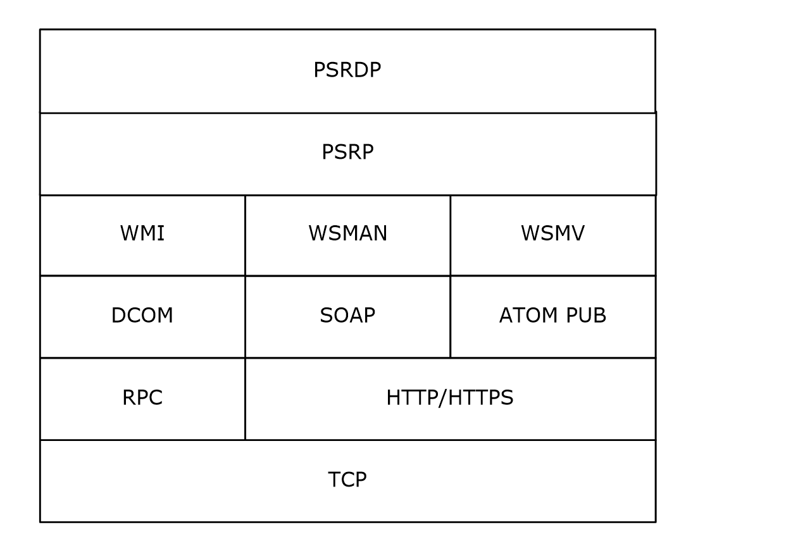
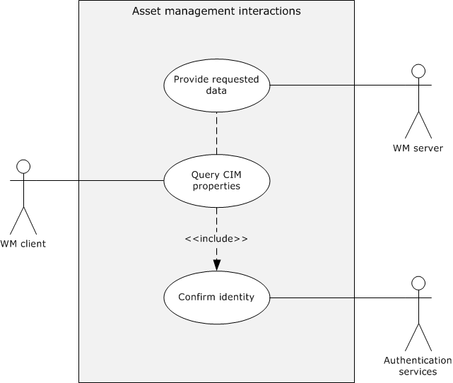
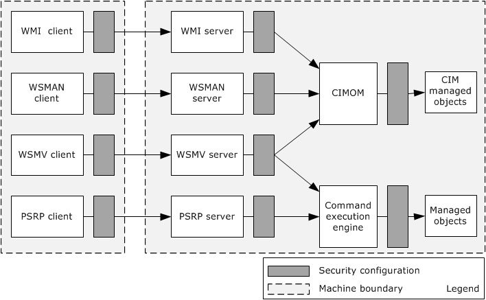
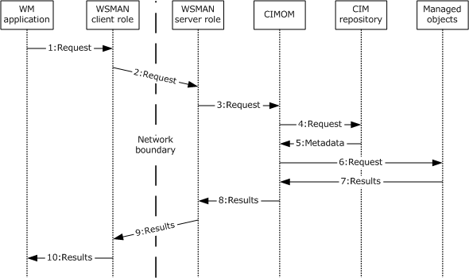
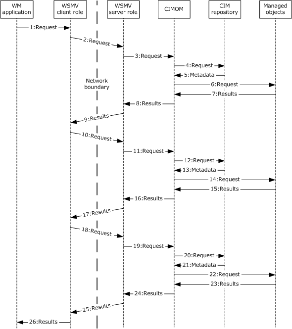
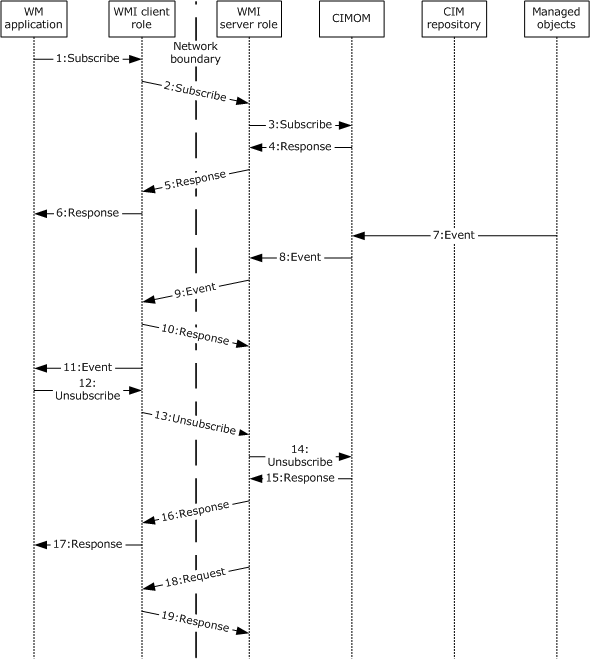

# [MS-WMOD]: Windows Management Protocols Overview

Table of Contents

1 Introduction

- [1 Introduction](#Section_1)
  - [1.1 Conceptual Overview](#Section_1.1)
  - [1.2 Glossary](#Section_1.2)
  - [1.3 References](#Section_1.3)

2 Functional Architecture

- [2 Functional Architecture](#Section_2)
  - [2.1 Overview](#Section_2.1)
    - [2.1.1 System Purpose](#Section_2.1.1)
    - [2.1.2 Applicability](#Section_2.1.2)
    - [2.1.3 System Components](#Section_2.1.3)
    - [2.1.4 WM Protocols Stack](#Section_2.1.4)
    - [2.1.5 Protocol Communications](#Section_2.1.5)
    - [2.1.6 Relevant Standards](#Section_2.1.6)
  - [2.2 Protocol Summary](#Section_2.2)
  - [2.3 Environment](#Section_2.3)
    - [2.3.1 Dependencies On This System](#Section_2.3.1)
    - [2.3.2 Dependencies on Other Systems](#Section_2.3.2)
  - [2.4 Assumptions and Preconditions](#Section_2.4)
  - [2.5 Use Cases](#Section_2.5)
    - [2.5.1 Use Case Groups](#Section_2.5.1)
      - [2.5.1.1 Asset Management](#Section_2.5.1.1)
      - [2.5.1.2 Setup, Configuration, and Update](#Section_2.5.1.2)
      - [2.5.1.3 Monitoring](#Section_2.5.1.3)
      - [2.5.1.4 Diagnosis and Troubleshooting](#Section_2.5.1.4)
    - [2.5.2 Use Case Details](#Section_2.5.2)
      - [2.5.2.1 Create a CIM Object — WM Client](#Section_2.5.2.1)
      - [2.5.2.2 Invoke a Method on a CIM Object — WM Client](#Section_2.5.2.2)
      - [2.5.2.3 Set Properties of an Object — WM Client](#Section_2.5.2.3)
      - [2.5.2.4 Query CIM Properties — WM Client](#Section_2.5.2.4)
      - [2.5.2.5 Monitor Events— WM Client](#Section_2.5.2.5)
      - [2.5.2.6 Delete CIM Object — WM Client](#Section_2.5.2.6)
      - [2.5.2.7 Attempt Delete of CIM Object — WM Client](#Section_2.5.2.7)
      - [2.5.2.8 Create and Invoke a Pipeline — PSRP Client](#Section_2.5.2.8)
  - [2.6 Versioning, Capability Negotiation, and Extensibility](#Section_2.6)
    - [2.6.1 Versioning](#Section_2.6.1)
    - [2.6.2 Capability Negotiation](#Section_2.6.2)
    - [2.6.3 Extensibility](#Section_2.6.3)
  - [2.7 Error Handling](#Section_2.7)
  - [2.8 Coherency Requirements](#Section_2.8)
  - [2.9 Security](#Section_2.9)
    - [2.9.1 Security Configuration Per Protocol](#Section_2.9.1)
    - [2.9.2 Security of Data Over the Network](#Section_2.9.2)
    - [2.9.3 Security of Managed Data](#Section_2.9.3)
    - [2.9.4 Security Considerations for Task-Based Management Client-Side](#Section_2.9.4)
    - [2.9.5 Security Considerations for Task-Based Management Server-Side](#Section_2.9.5)
    - [2.9.6 Data Integrity for Task-Based Management](#Section_2.9.6)
  - [2.10 Additional Considerations](#Section_2.10)
    - [2.10.1 Connection Breakdown Between the Entities](#Section_2.10.1)
    - [2.10.2 Security Failures](#Section_2.10.2)
    - [2.10.3 System Configuration Corruption and Other Internal Failures](#Section_2.10.3)
    - [2.10.4 Other Common Failures in CIMOM Operations](#Section_2.10.4)

3 Examples

- [3 Examples](#Section_3)
  - [3.1 Example 1: Single Request/Response WSMAN Protocol Operations](#Section_3.1)
  - [3.2 Example 2: Enumerations](#Section_3.2)
  - [3.3 Example 3: Pull Event Subscriptions](#Section_3.3)
  - [3.4 Example 4: Push Event Subscriptions](#Section_3.4)
  - [3.5 Example 5: Publisher-Initiated Event Subscriptions](#Section_3.5)
  - [3.6 Example 6: Create and Invoke a Pipeline](#Section_3.6)

4 Microsoft Implementations

- [4 Microsoft Implementations](#Section_4)
  - [4.1 Product Behavior](#Section_4.1)

5 Change Tracking

- [5 Change Tracking](#Section_5)

For the legal notice and IP terms, see [LEGAL.md](../LEGAL.md).
Last updated: 10/26/2021.
See [Revision History](#revision-history) for full version history.

# 1 Introduction

This section provides an overview of the foundational concepts that are used in this document, a glossary, and list of references.

Before reading this document, it is recommended that the reader be familiar with the [**Common Information Model (CIM) object**](#gt_common-information-model-cim-object) and the general functionality of a [**Common Information Model (CIM) Object Manager (CIMOM)**](#gt_common-information-model-cim-object-manager-cimom), Representational State Transfer (REST)-based services, and Windows PowerShell concepts.

For a description of the theoretical functionality of a CIMOM, see [MS-WMI](../MS-WMI/MS-WMI.md) section 3.1.4.3, which contains a subset of the operations that define the functionality of a CIMOM. It is also recommended that the reader be familiar with basic network-security concepts such as authentication, message integrity, and encryption. It is not necessary to understand the details of a specific security mechanism.

REST defines a set of architectural principles that is used to design Web services. REST focus on how a system's [**resource**](#gt_resource) states are addressed and transferred over [**Hypertext Transfer Protocol (HTTP)**](#gt_hypertext-transfer-protocol-http). REST clients can be written in a wide range of different languages. REST services use HTTP methods explicitly and establish a one-to-one mapping between the HTTP methods and the create, read, update, and delete operations. For more information about REST-based services, see [[REST]](https://go.microsoft.com/fwlink/?LinkId=140866).

Windows PowerShell is a task-based command-line shell and scripting language that is designed for system administration. Built-in Windows PowerShell commands, called cmdlets, enable managing the computers in the enterprise from the command line. Windows PowerShell providers provide access to data stores, such as the [**registry**](#gt_registry) and certificate store. For more information about Windows PowerShell, see [[MSDN-PWRSHELL]](https://go.microsoft.com/fwlink/?LinkId=132682).

## 1.1 Conceptual Overview

With constant advances in the capability, scalability, and affordability of computing and communications technology, a few noticeable trends emerge in the way that corporations manage their operations:

- The number of computers in the workplace that are used to accomplish day-to-day tasks is greatly increasing.
- The diversity of computers in the workplace is increasing and now includes desktop computers, laptops, servers, and mobile devices.
- More organizations are opening branch offices in remote locations. Those branch offices still require access to the data and computing resources of the central office.
- More organizations are using data center services that specialized companies provide.
As a result of these trends, managing a company's IT infrastructure is both complicated and mission-critical. An administrator has to monitor computers and software, collect and analyze performance data, and carry out actions while rarely having direct physical access to the computers themselves. For example, an IT administrator simultaneously might have to manage the power consumption of servers in a data center, the security settings for the operating systems that run on office desktops, and the configuration options for applications that the employees use to get work done.

Another major complicating factor is the diversity of the computers to be managed. This diversity manifests itself in several ways, including the following:

- Different categories of computers: desktop computers, laptops, servers, mobile phones, and more.
- Different processors, for example, 32-bit or 64-bit chips.
- Different operating systems and applications that are installed on these computers.
To simplify the management of a heterogeneous and widely-distributed computers, it is necessary to provide both a common mechanism for retrieving and manipulating data and a common format for representing that data. In this way, a single management application or interface can be used across the entire organization. That is, the IT administrator knows how to work with all of the computers, and any new computer that is added to the organization is compatible with the existing management applications and tools. All device manufacturers have to share this consistent representation for it to be effective, so it can support a variety of devices with different capabilities.

There are two different approaches for Windows Management (WM):

- Object/resource-based management
- Command/task-based management
Object-based management uses class objects and instances to represent data. The [**CIM**](#gt_common-information-model-cim) Infrastructure Specification ([[DMTF-DSP0004]](https://go.microsoft.com/fwlink/?LinkId=89848)), provides consistent data representation. CIM is a conceptual model that is not bound to any particular implementation. It also allows for vendor extensions, so any system that exposes CIM-compliant data can be accessed in a consistent manner. If vendors require additional functionality, they can extend the standard CIM schema.

WM protocols enable management applications and tools to access CIM data remotely. Section [2.1](#Section_2.1) provides more details about how WM protocols retrieve CIM data.

Windows Management protocols enable management applications and tools to access CIM data remotely. The data can be retrieved through one of the three independent, remote WM protocols:

- The Windows Management Instrumentation Remote Protocol, as specified in [MS-WMI](../MS-WMI/MS-WMI.md).
- The Web Services Management Protocol Extensions for Windows Server 2003 operating system, as specified in [MS-WSMAN](../MS-WSMAN/MS-WSMAN.md).
- The Web Services Management Protocol Extensions for Windows Vista operating system, as specified in [MS-WSMV](../MS-WSMV/MS-WSMV.md).
These three remote protocols enable network communication between the management application and the [**CIMOM**](#gt_common-information-model-cim-object-manager-cimom). For more detailed information, see section 2.1.

A different management approach is the command/task-based management, which uses commands and command shells to perform a particular administration task. These commands process input streams and are framed into [**pipelines**](#gt_pipeline) that are similar to UNIX pipelines, with the difference that these pipelines represent commands and parameters in an abstract structured way, independent of any higher-layer syntax or semantics, by using an XML representation.

The command execution engine on the server executes a task specified by a set of commands that are run through a shell s. The results/outputs are relayed back to the client as streams that are then sent to higher layers.

The following Windows Management protocols support this type of management:

- PowerShell Remoting Protocol (PSRP), as specified in [MS-PSRP](../MS-PSRP/MS-PSRP.md).
- PowerShell Remote Debugging Protocol, as specified in [MS-PSRDP](../MS-PSRDP/MS-PSRDP.md).
- The Web Services Management Protocol Extensions for Windows Vista, as specified in [MS-WSMV].
The pipelines can be executed either by the REST-based approach or the session-based shell approach, as described in section 2.1.

## 1.2 Glossary

This document uses the following terms:

**action URI**: A [**URI**](#gt_uniform-resource-identifier-uri) that identifies which operation or method needs to be applied to a [**resource**](#gt_resource).

**asset**: Computers, hardware, and other items that an inventory management system can manage.

**channel-binding token (CBT)**: A part of Extended Protection for Authentication. CBT is a property of the outer Transport Layer Security (TLS) secure channel that is used to bind authentication to inner channel authentication, such as [**Kerberos**](#gt_kerberos).

**CIM namespace**: A logical grouping of a set of CIM classes designed for the same purpose or sharing a common management objective within the database used to store all CIM class definitions.

**CIM object**: Refers to a CIM class or a CIM instance.

**Common Information Model (CIM)**: The [**Distributed Management Task Force (DMTF)**](#gt_distributed-management-task-force-dmtf) model that describes how to represent real-world computer and network objects. CIM uses an object-oriented paradigm, where managed objects are modeled using the concepts of classes and instances. See [[DMTF-DSP0004]](https://go.microsoft.com/fwlink/?LinkId=89848).

**Common Information Model (CIM) object**: An object that represents a [**Common Information Model (CIM)**](#gt_common-information-model-cim) object. This can be either a CIM class or a CIM instance of a CIM class.

**Common Information Model (CIM) Object Manager (CIMOM)**: A component that implements a set of operations used to access and manipulate [**Common Information Model (CIM) objects**](#gt_common-information-model-cim-object).

**credential**: Previously established, authentication data that is used by a security principal to establish its own identity. When used in reference to the Netlogon Protocol, it is the data that is stored in the NETLOGON_CREDENTIAL structure.

**Distributed Component Object Model (DCOM)**: The Microsoft Component Object Model (COM) specification that defines how components communicate over networks, as specified in [MS-DCOM](../MS-DCOM/MS-DCOM.md).

**Distributed Management Task Force (DMTF)**: An industry organization that develops management standards and integration technology for enterprise and Internet environments.

**encoding**: The binary layout that is used to represent a [**Common Information Model (CIM) object**](#gt_common-information-model-cim-object), whether a CIM class or CIM instance definition. The [**encoding**](#gt_encoding) is what is actually transferred by the protocol.

**Hypertext Transfer Protocol (HTTP)**: An application-level protocol for distributed, collaborative, hypermedia information systems (text, graphic images, sound, video, and other multimedia files) on the World Wide Web.

**Hypertext Transfer Protocol Secure (HTTPS)**: An extension of HTTP that securely encrypts and decrypts web page requests. In some older protocols, "Hypertext Transfer Protocol over Secure Sockets Layer" is still used (Secure Sockets Layer has been deprecated). For more information, see [[SSL3]](https://go.microsoft.com/fwlink/?LinkId=90534) and [[RFC5246]](https://go.microsoft.com/fwlink/?LinkId=129803).

**Kerberos**: An authentication system that enables two parties to exchange private information across an otherwise open network by assigning a unique key (called a ticket) to each user that logs on to the network and then embedding these tickets into messages sent by the users. For more information, see [MS-KILE](../MS-KILE/MS-KILE.md).

**pipeline**: An ordered collection of commands, with the output of one command passed as input to the next.

**registry**: A local system-defined database in which applications and system components store and retrieve configuration data. It is a hierarchical data store with lightly typed elements that are logically stored in tree format. Applications use the registry API to retrieve, modify, or delete registry data. The data stored in the registry varies according to the version of the operating system.

**resource**: Any component that a computer can access that can read, write, and process data. This includes internal components (such as a disk drive), a service, or an application running on and managed by the cluster on a network that is used to access a file.

**RunspacePool**: A group of runspaces with the same characteristics which can be opened and closed as needed.

**security descriptor**: A data structure containing the security information associated with a securable object. A [**security descriptor**](#gt_security-descriptor) identifies an object's owner by its security identifier (SID). If access control is configured for the object, its [**security descriptor**](#gt_security-descriptor) contains a discretionary access control list (DACL) with SIDs for the security principals who are allowed or denied access. Applications use this structure to set and query an object's security status. The [**security descriptor**](#gt_security-descriptor) is used to guard access to an object as well as to control which type of auditing takes place when the object is accessed. The [**security descriptor**](#gt_security-descriptor) format is specified in [MS-DTYP](../MS-DTYP/MS-DTYP.md) section 2.4.6; a string representation of [**security descriptors**](#gt_security-descriptor), called SDDL, is specified in [MS-DTYP] section 2.5.1.

**SOAP**: A lightweight protocol for exchanging structured information in a decentralized, distributed environment. [**SOAP**](#gt_soap) uses XML technologies to define an extensible messaging framework, which provides a message construct that can be exchanged over a variety of underlying protocols. The framework has been designed to be independent of any particular programming model and other implementation-specific semantics. SOAP 1.2 supersedes SOAP 1.1. See [[SOAP1.2-1/2003]](https://go.microsoft.com/fwlink/?LinkId=90521).

**Uniform Resource Identifier (URI)**: A string that identifies a resource. The URI is an addressing mechanism defined in Internet Engineering Task Force (IETF) Uniform Resource Identifier (URI): Generic Syntax [[RFC3986]](https://go.microsoft.com/fwlink/?LinkId=90453).

**Windows Management Instrumentation (WMI)**: The Microsoft implementation of [**Common Information Model (CIM)**](#gt_common-information-model-cim), as specified in [DMTF-DSP0004]. WMI allows an administrator to manage local and remote machines and models computer and network objects using an extension of the [**CIM**](#gt_common-information-model-cim) standard.

**WM application**: An application that uses WM protocols to monitor, set up, configure, troubleshoot, or inventory some set of remote computers.

**WMI Query Language (WQL)**: A subset of American National Standards Institute Structured Query Language (ANSI SQL). It differs from the standard SQL in that it retrieves from classes rather than tables and returns [**CIM**](#gt_common-information-model-cim) classes or instances rather than rows. WQL is specified in [MS-WMI](../MS-WMI/MS-WMI.md) section 2.2.1.

## 1.3 References

[DMTF-DSP0004] Distributed Management Task Force, "Common Information Model (CIM) Infrastructure Specification", DSP0004, version 2.3 final, October 2005, [http://www.dmtf.org/standards/published_documents/DSP0004V2.3_final.pdf](https://go.microsoft.com/fwlink/?LinkId=89848)

[DMTF-DSP0226] Distributed Management Task Force, Inc., "Web Services for Management (WS-Management) Specification", version 1.0.0, February 2008, [http://dmtf.org/sites/default/files/standards/documents/DSP0226_1.0.0.pdf](https://go.microsoft.com/fwlink/?LinkId=89849)

[DMTF-DSP0227] Distributed Management Task Force, Inc., "WS-Management CIM Binding Specification", version 1.0.0, June 2009, [http://www.dmtf.org/sites/default/files/standards/documents/DSP0227_1.0.0.pdf](https://go.microsoft.com/fwlink/?LinkId=89851)

[DMTF-DSP0230] Distributed Management Task Force, Inc., "WS-CIM Mapping Specification", Version 1.0.1 April 2009, [http://www.dmtf.org/sites/default/files/standards/documents/DSP0230_1.0.1.pdf](https://go.microsoft.com/fwlink/?LinkId=89852)

[MS-AUTHSOD] Microsoft Corporation, "[Authentication Services Protocols Overview](../MS-AUTHSOD/MS-AUTHSOD.md)".

[MS-DCOM] Microsoft Corporation, "[Distributed Component Object Model (DCOM) Remote Protocol](../MS-DCOM/MS-DCOM.md)".

[MS-KILE] Microsoft Corporation, "[Kerberos Protocol Extensions](../MS-KILE/MS-KILE.md)".

[MS-NLMP] Microsoft Corporation, "[NT LAN Manager (NTLM) Authentication Protocol](../MS-NLMP/MS-NLMP.md)".

[MS-PSRDP] Microsoft Corporation, "[PowerShell Remote Debugging Protocol](../MS-PSRDP/MS-PSRDP.md)".

[MS-PSRP] Microsoft Corporation, "[PowerShell Remoting Protocol](../MS-PSRP/MS-PSRP.md)".

[MS-WMIO] Microsoft Corporation, "[Windows Management Instrumentation Encoding Version 1.0 Protocol](../MS-WMIO/MS-WMIO.md)".

[MS-WMI] Microsoft Corporation, "[Windows Management Instrumentation Remote Protocol](../MS-WMI/MS-WMI.md)".

[MS-WSMAN] Microsoft Corporation, "[Web Services Management Protocol Extensions for Windows Server 2003](../MS-WSMAN/MS-WSMAN.md)".

[MS-WSMV] Microsoft Corporation, "[Web Services Management Protocol Extensions for Windows Vista](../MS-WSMV/MS-WSMV.md)".

[MSDN-PWRSHELL] Microsoft Corporation, "Windows PowerShell SDK", [http://msdn.microsoft.com/en-us/library/cc136763(VS.85).aspx](https://go.microsoft.com/fwlink/?LinkId=132682)

[REST] Fielding, R., "Architectural Styles and the Design of Network-based Software Architectures", 2000, [http://www.ics.uci.edu/~fielding/pubs/dissertation/top.htm](https://go.microsoft.com/fwlink/?LinkId=140866)

[RFC1035] Mockapetris, P., "Domain Names - Implementation and Specification", STD 13, RFC 1035, November 1987, [http://www.ietf.org/rfc/rfc1035.txt](https://go.microsoft.com/fwlink/?LinkId=90264)

[RFC2616] Fielding, R., Gettys, J., Mogul, J., et al., "Hypertext Transfer Protocol -- HTTP/1.1", RFC 2616, June 1999, [http://www.rfc-editor.org/rfc/rfc2616.txt](https://go.microsoft.com/fwlink/?LinkId=90372)

[RFC4627] Crockford, D., "The application/json Media Type for JavaScript Object Notation (JSON)", RFC 4627, July 2006, [http://www.rfc-editor.org/rfc/rfc4627.txt](https://go.microsoft.com/fwlink/?LinkId=140879)

[RFC793] Postel, J., Ed., "Transmission Control Protocol: DARPA Internet Program Protocol Specification", RFC 793, September 1981, [http://www.rfc-editor.org/rfc/rfc793.txt](https://go.microsoft.com/fwlink/?LinkId=150872)

[SOAP1.2-1/2003] Gudgin, M., Hadley, M., Mendelsohn, N., et al., "SOAP Version 1.2 Part 1: Messaging Framework", W3C Recommendation, June 2003, [http://www.w3.org/TR/2003/REC-soap12-part1-20030624](https://go.microsoft.com/fwlink/?LinkId=90521)

# 2 Functional Architecture

This section provides an overview of the functionality of the Windows Management (WM) protocols, their relationships, and a summary of the WM protocols, system dependencies, use cases, versioning, capability negotiation, error handling, coherency requirements, and security considerations.

## 2.1 Overview

Windows Management (WM) can use an object/resource-based approach or a task/command-based approach, as described in section [1.1](#Section_1.1). This section describes which of the WM protocols falls under which category and also describes the functional differences between each WM member protocol implementation.

Object/resource-based management:

[**Asset**](#gt_asset) management, monitoring of system health, and diagnosis of computer failure in large-scale distributed systems require a common mechanism for representing, retrieving, and manipulating data about system operations and health.

The Windows Management (WM) protocols and associated data structure provide a unified object model and network communication protocols that enable a user or application to inspect, modify, and monitor an asset's resources remotely. These resources are represented as objects according to the [**Common Information Model (CIM)**](#gt_common-information-model-cim).

The following protocols are used to access [**CIM objects**](#gt_common-information-model-cim-object):

Windows Management Instrumentation (WMI) Remote Protocol [MS-WMI](../MS-WMI/MS-WMI.md): This protocol supports read and write operations of CIM objects across multiple computers. This protocol is a [**Distributed Component Object Model (DCOM)**](#gt_distributed-component-object-model-dcom)-based protocol.

Web Services Management Protocol Extensions for Windows Server 2003 operating system [MS-WSMAN](../MS-WSMAN/MS-WSMAN.md): This protocol supports read and write operations of CIM objects across multiple computers. This protocol is based on a prerelease draft version of WS-Management and is incompatible with current [**DMTF**](#gt_distributed-management-task-force-dmtf) specifications.

Web Services Management Protocol Extensions for Windows Vista [MS-WSMV](../MS-WSMV/MS-WSMV.md): This protocol supports read and write operations of CIM objects across multiple computers. This protocol is based on version 1.1 of WS-Management.

Each of these protocols provides access to the [**CIM Object Manager (CIMOM)**](#gt_common-information-model-cim-object-manager-cimom) resources of hosts within the system, but they differ in certain aspects. Some major differences in capability are as follows:

- Windows Management Instrumentation (WMI) Remote Protocol: Smaller messages than WSMV and WSMAN use binary message [**encoding**](#gt_encoding) instead of [**SOAP**](#gt_soap). See [MS-WMI] section 2.2 for details of message encoding. This protocol provides methods to modify the CIM repository on a managed host.
- Web Services Management Protocol Extensions for Windows Server 2003: The [**HTTP**](#gt_hypertext-transfer-protocol-http)-based or [**HTTPS**](#gt_hypertext-transfer-protocol-secure-https)-based protocol allows for easier network configuration than [**Windows Management Instrumentation (WMI)**](#gt_windows-management-instrumentation-wmi) when a firewall might separate [**WM applications**](#gt_wm-application) and managed computers. This protocol is based on a prerelease draft of the WS-Management specification and is not compatible with the released standard versions.
- Web Services Management Protocol Extensions for Windows Vista operating system: The HTTP-based or HTTPS-based protocol allows for easier network configuration than WMI when a firewall might separate WM applications and managed computers. This protocol is based on version 1.0 of the WS-Management specification. The protocol offers methods to control remote command-line shells on a managed host. See [MS-WSMV] section 3.1.4.1.31 for details.
These three WM protocols are independent of each other, and each can be used to access CIM objects. A particular implementation can include support for one or more of these three protocols, as described in section [2.6](#Section_2.6).

The following data structure is an integral part of the capabilities of the WMI protocol:

- Windows Management Instrumentation Encoding Version 1.1 [MS-WMIO](../MS-WMIO/MS-WMIO.md): This data structure specifies a binary data encoding format that the Windows Management Instrumentation (WMI) Remote Protocol uses for network communication.
Task/command-based management:

Windows Management provides shell execution capability that performs administrative tasks remotely. Most shells, including Cmd.exe and the SH, KSH, CSH, and BASH UNIX shells, operate by executing a command or utility in a new process and by presenting the results to the user as text. Over the years, many text processing utilities, such as AWK and PERL, have evolved to support this interaction.

These shells also have built-in commands that run in the shell process, such as the typeset command in KSH and the DIR command in Cmd.exe.

A cmdlet (pronounced "command-let") is a single-feature command that manipulates objects in Windows PowerShell.

In traditional shells, the commands are executable programs that range from a simple command that perform a single action, for example Attrib.exe, to complex commands that perform more than a single action, such as the Netsh.exe command.

In Windows PowerShell, most cmdlets are simple; they are designed to be used in combination with other cmdlets. For example, the get cmdlets only retrieve data, the set cmdlets only establish or change data, the format cmdlets only format data, and the out cmdlets only direct the output to a specified destination.

The protocols that are used for command execution are:

- PowerShell Remoting Protocol [MS-PSRP](../MS-PSRP/MS-PSRP.md): This protocol executes pipelines of commands through streams that are a sequence of structured objects and follows the session-oriented approach. This protocol uses remote shell operations that the Web Services Management Protocol Extensions for Windows Vista[MS-WSMV] supports to transport data between Windows PowerShell clients and Windows PowerShell servers.
- Web Services Management Protocol Extensions for Windows Vista [MS-WSMV]: This protocol executes pipelines of commands over shells and supports text-based command shells and custom remote shells.

### 2.1.1 System Purpose

From a system point of view, the Windows Management (WM) protocols provide the network communications to remotely view and modify system management data that are based on a unified object model.

The WM protocols are used primarily for four general categories of tasks:

- Tracking an inventory of hardware and software assets
- Setting up, configuring, and updating assets
- Monitoring asset status
- Troubleshooting problems
A given [**WM application**](#gt_wm-application) can accomplish these tasks by using the WM protocols to communicate with one or more managed computers. A single WM applications might use more than one WM protocol to accomplish its goals. Also, some managed computers might not support all three of the WM protocols, so the WM applications might have to use different WM protocols to accomplish the same task on different managed computers. Alternatively, a WM application might use a particular WM protocol to leverage additional features in the protocol that are beyond the capabilities that the other WM protocols (for example, remote shell capabilities) provide. Differences in protocol capabilities are discussed in section [2.1](#Section_2.1).

A further source of complexity is that a single organization might use multiple WM applications to control different aspects of the same set of computers, and the WM application might use different protocols to accomplish the same task on a single managed computer.

Each of the management tasks that are described in this section corresponds to a series of one or more operations on [**CIM objects**](#gt_common-information-model-cim-object) that are available through some set of computers. The specification for each of the WM protocols describes the set of supported operations for that protocol.

From a system point of view, the only cross-protocol interaction between applications that communicate with a particular mapped host is that they might use different protocols to operate on the same CIM data. Therefore, when a WM application reads from a host's Common Information Model (CIM) Object Manager ([**CIMOM**](#gt_common-information-model-cim-object-manager-cimom)), such as by enumerating instances of a class or by querying properties of an instance, the system is required to provide a consistent view of the CIM database of objects, regardless of the protocol that the query uses. Similarly, when a WM application modifies the CIM state, all future observers see the same change.

### 2.1.2 Applicability

The WM protocols are applicable primarily in scenarios where centralized asset management, monitoring, and troubleshooting are required.

### 2.1.3 System Components

From a system perspective, the WM protocols and data structure together provide a way for [**WM applications**](#gt_wm-application) to access and manipulate management data. The WM protocols provide a mechanism through which applications access managed objects that are represented as [**CIM**](#gt_common-information-model-cim) data.

The Windows Management system components are as follows:

- CIM Object Manager (CIMOM): Serves as the interface to how [**CIM objects**](#gt_common-information-model-cim-object) are accessed.
- CIM repository: Stores the metadata for the CIM classes.
- CIM managed objects: Hold the actual data.
- CIM server role: Handles requests to read or modify CIM data and sends responses to the CIM client role. This process is an implementation of WMI, WSMAN, and WSMV server roles.
- CIM client role: Issues requests to read or modify CIM data. This is an implementation of WMI, WSMAN, and WSMV client roles.
- Command Invocation server role: Handles [**pipelines**](#gt_pipeline) of commands from the PSRP and WSMV client roles.
- Command Invocation client role: An implementation of PSRP and WSMV.
- Command Execution engine: An entity on the server side, which has the capability to execute any type of shell commands.
- System resources: The data that the command execution engine modifies or retrieves.
- REST server role: Executes the create, read, update, and delete operations on the objects that are not exposed by [**CIMOM**](#gt_common-information-model-cim-object-manager-cimom).
- Managed objects: Holds the actual data that CIMOM does not handle.
The main external components that interact with the WM protocols are the management applications (WM applications). One or more WM applications use the system to access CIM objects on a set of managed computers. A single application can use one or more WM protocols to access the server, depending on the required capabilities.

The following diagram shows the WM system components.

Figure 1: Windows Management protocols components

The WM protocols define a way by which management applications and tools can access CIM data remotely. They act as a communication channel between the management application and the CIMOM. The WM application issues a request to the client role of the WM protocol in use (WM client role), which sends the request to the server role of the WM protocol in use (WM server role), which then delivers the request to the CIMOM. On receipt of a request, the CIMOM retrieves the available CIM classes and their schema from the CIM repository, retrieves the actual instances of CIM objects, and exposes them to the WM server role of the member protocol. This data is then delivered back to the WM client role of the member protocol and then to the management application.

These protocols do not interact with one another. They only have in common that they can all be independently used to access the same CIM data. The protocols each have various properties and capabilities that differentiate them, and an application determines which protocol to implement.

The method through which this data is provided contains three logical components:

- The Common Information Model (CIM) Object Manager (CIMOM), which serves as the interface through which CIM objects are accessed.
- The CIM repository, which stores the metadata that defines the available CIM classes.
- The CIM managed objects, which represent the actual data.
PSRP and WSMV client roles that constitute the Command Invocation client role sends pipelines of commands to the PSRP and WSMV server roles of the Command Invocation server role. The Command Invocation server role receives these pipelines of commands and interprets and executes them with the help of the Command Execution engine.

### 2.1.4 WM Protocols Stack

The WM protocols are not dependent on each other; they are implemented independently of each other. Unless otherwise specified, their only interdependencies are the underlying transport mechanisms, such as [**HTTP**](#gt_hypertext-transfer-protocol-http), RPC, or [**DCOM**](#gt_distributed-component-object-model-dcom) of the individual protocols.

The WMI protocol communicates exclusively through the Distributed Component Object Model (DCOM). The DCOM Remote Protocol is the foundation for the Windows Management Instrumentation (WMI) Remote Protocol and is used to establish the protocol, secure the communication channel, authenticate clients, and implement a reliable communication between clients and servers.

The PowerShell Remoting Protocol uses the Web Services Management Protocol Extensions for Windows Vista [MS-WSMV](../MS-WSMV/MS-WSMV.md) to establish a connection and transfer data between the client and the server. The WSMV protocol and the WSMAN protocol use [**SOAP**](#gt_soap) over HTTP or HTTPS for communication.

The PowerShell Remote Debugging Protocol is used in conjunction with PSRP to support debugging over a remote session. A remote session established over PSRP is required before remote debugging can occur.

The following diagram shows the protocols stack for the WM protocols.

Figure 2: WM protocols stack

### 2.1.5 Protocol Communications

The flow of communication between the [**CIM**](#gt_common-information-model-cim) client role and the CIM server role can be carried out over a network connection by using any one of the member protocols (WMI, WSMAN, and WSMV).

The [**WM applications**](#gt_wm-application) are implemented to support one or more of the use cases that are described in section [2.5](#Section_2.5). All of these tasks are accomplished through the retrieval and modification of data that is to be managed. This data, which is represented by using the CIM model, is made available to the applications through the WM protocols.

On the remote end, this data is exposed to the WM protocols as a set of managed objects. When a WM application interacts with the WM protocols, it requests access to or a specific modification of these managed objects. The WM protocols accept this request, retrieve or modify the appropriate data in the managed objects, and then return the appropriate data to the application in response.

For the data that [**CIMOM**](#gt_common-information-model-cim-object-manager-cimom) does not expose, the REST server role processes REST operations with inputs from the REST client role.

For the resources that the command execution engine manages, the Command invocation client role issues the inputs of pipeline commands that the Command invocation server role interprets.

The specific details for the type and format of requests that the applications send, and the type and format of the responses back to the applications, depend on the individual protocol that carries out the action. Moreover, the actual capabilities of the implementation could differ based on the protocol that is being used.

The following diagram shows the communication paths among the WM system components.

Figure 3: WM protocol communications

The following protocol specifications define requests and responses for each WM protocol:

- For details about requests and responses that the Windows Management Instrumentation Remote Protocol uses, see [MS-WMI](../MS-WMI/MS-WMI.md).
- For details about requests and responses that the Web Services Management Protocol Extensions for Windows Server 2003 uses, see [MS-WSMAN](../MS-WSMAN/MS-WSMAN.md).
- For details about requests and responses that the Web Services Management Protocol Extensions for Windows Vista uses, see [MS-WSMV](../MS-WSMV/MS-WSMV.md).
- For details about requests and responses that the PowerShell Remoting Protocol uses, see [MS-PSRP](../MS-PSRP/MS-PSRP.md).

### 2.1.6 Relevant Standards

The WM protocols depend on the following standards:

- Distributed Management Task Force CIM infrastructure, as specified in [[DMTF-DSP0004]](https://go.microsoft.com/fwlink/?LinkId=89848). This specification defines the infrastructure and abstract object model a [**CIMOM**](#gt_common-information-model-cim-object-manager-cimom) implements.
- Distributed Management Task Force WS-Management protocol, as specified in [[DMTF-DSP0230]](https://go.microsoft.com/fwlink/?LinkId=89852), [[DMTF-DSP0226]](https://go.microsoft.com/fwlink/?LinkId=89849), and [[DMTF-DSP0227]](https://go.microsoft.com/fwlink/?LinkId=89851). This protocol provides the encoding of [**CIM**](#gt_common-information-model-cim) data and its transport and manipulation via a [**SOAP**](#gt_soap)-based protocol.
- [**Kerberos**](#gt_kerberos) Protocol Extensions, as specified in [MS-KILE](../MS-KILE/MS-KILE.md), and the NT LAN Manager (NTLM) Authentication protocol, as specified in [MS-NLMP](../MS-NLMP/MS-NLMP.md). These protocols authenticate identities and group them. The system restricts access to its assets and functionality to specified groups.
- DCOM Remote Protocol, as specified in [MS-DCOM](../MS-DCOM/MS-DCOM.md). WMI uses [**DCOM**](#gt_distributed-component-object-model-dcom) for transmission of data between WM client role and WM server role, and for authentication of computers in both the client and server role.
- SOAP, as specified in [[SOAP1.2-1/2003]](https://go.microsoft.com/fwlink/?LinkId=90521). This standard defines message format and semantics that WSMV and WSMAN use.
- DNS, as specified in [[RFC1035]](https://go.microsoft.com/fwlink/?LinkId=90264). This standard is used for locating monitored computers.
- TCP/IP, as specified in [[RFC793]](https://go.microsoft.com/fwlink/?LinkId=150872). This standard is used for data transmission for the underlying network.
- HTTP/1.1, as specified in [[RFC2616]](https://go.microsoft.com/fwlink/?LinkId=90372). This standard is used for data transmission by Web Services Management Protocol Extensions for Windows Server 2003, as specified in [MS-WSMAN](../MS-WSMAN/MS-WSMAN.md), and by Web Services Management Protocol Extensions for Windows Vista, as specified in [MS-WSMV](../MS-WSMV/MS-WSMV.md).
- The application/JSON Media Type for JavaScript Object Notation (JSON), as specified in [[RFC4627]](https://go.microsoft.com/fwlink/?LinkId=140879), defines a set of formatting rules for the portable representation of structured data.

## 2.2 Protocol Summary

The following table lists the WM protocols and provides brief descriptions of each. Some major differences in capability between the protocols are highlighted. All WM protocols play a single role: a protocol for remote management, in all its forms, of [**CIM object**](#gt_cim-object) data. There are no functional groupings among the WM protocols.

| Protocol name | Protocol description | Document short name |
| --- | --- | --- |
| Windows Management Instrumentation Remote Protocol (WMI Protocol) | This protocol is based on [**DCOM**](#gt_distributed-component-object-model-dcom). Uses smaller messages than WSMV and WSMAN due to use of binary message encoding instead of [**SOAP**](#gt_soap). See [MS-WMI](../MS-WMI/MS-WMI.md) section 2.2 for details of message encoding. Provides methods to query and modify the CIM classes and instances on a managed host. | [MS-WMI] |
| Web Services Management Protocol Extensions for Windows Server 2003 (WSMAN Protocol) | This protocol is a Microsoft extension to the Web Services for Management (WS-Management) Protocol. The protocol extends a prerelease draft version of WS-Management, and is incompatible with current DMTF specifications. This is an [**HTTP**](#gt_hypertext-transfer-protocol-http)-based protocol that allows for easier network configuration than WMI when a firewall might separate WM applications and managed computers. | [MS-WSMAN](../MS-WSMAN/MS-WSMAN.md) |
| Web Services Management Protocol Extensions for Windows Vista (WSMV Protocol) | This protocol is a Microsoft extension to the Web Services for Management (WS-Management) Protocol. This protocol is based on version 1.0 of WS-Management. This is an HTTP-based protocol that allows for easier network configuration than WMI when a firewall might separate WM applications and managed computers. | [MS-WSMV](../MS-WSMV/MS-WSMV.md) |
| PowerShell Remoting Protocol (PSRP Protocol) | This protocol encodes messages before sending them over the WS-Management Protocol: Extensions Version 2.0 [MS-WSMV] layer. This protocol is used to pipe commands over a network to a server system for the server to execute. | [MS-PSRP](../MS-PSRP/MS-PSRP.md) |
| PowerShell Remote Debugging Protocol (PSRDP) | This protocol extends the existing PowerShell Remoting Protocol (PSRP) specified in [MS-PSRP] to support debugging over a remote session. This protocol is used only in conjunction with PSRP and depends on PSRP for transport of messages between client and server. A remote session established over PSRP is required before remote debugging can occur. | [MS-PSRDP](../MS-PSRDP/MS-PSRDP.md) |

The Windows Management protocols that have been updated for Windows 10 operating system and Windows Server 2016 operating system are PowerShell Remoting Protocol and the PowerShell Remote Debugging Protocol. For full details of each protocol’s capabilities and Windows versions in which they are implemented, refer to their respective protocol specifications.

## 2.3 Environment

Windows Management protocols provide a way for [**WM applications**](#gt_wm-application) to access and manipulate CIM data on a remote server by using a choice of three available network protocols. These protocol operations use a direct client-to-server communication channel.

The communication between the WM client role and WM server role can be carried out over a network connection that supports either [**DCOM**](#gt_distributed-component-object-model-dcom) over RPC (when using the WMI protocol) or SOAP over [**HTTP**](#gt_hypertext-transfer-protocol-http) or [**HTTPS**](#gt_hypertext-transfer-protocol-secure-https) (when using the Web Services Management Protocol Extensions for Windows Server 2003 (WSMAN) protocol or the Web Services Management Protocol Extensions for Windows Vista (WSMV) protocol). Both protocols require that messages can be exchanged in request/response operations; that is, the network is configured so that the WM client role can send a message to the WM server role and the WM server role can send a message back to the WM client role in response.

To provide access to CIM resources, a [**Common Information Model (CIM) Object Manager (CIMOM)**](#gt_common-information-model-cim-object-manager-cimom) has to be running on the server computer. The data that the CIMOM manages have to be accessible to all of the system-defined protocols that are supported. For example, if a particular implementation of WM protocols supports WMI and WSMV, then both protocols have to be able to interact with the CIMOM to retrieve and manipulate data.

Each of the task/command execution protocols relies on the existence of a local command execution engine. A given server can expose multiple endpoints with different access controls and allowable commands.

The following sections identify the context in which the WM protocols exist. This includes the entities that use the interfaces the WM protocols provide, other entities that depend on this system, and, as appropriate, the channel in which protocols communicate in their environment.

### 2.3.1 Dependencies On This System

Although it is not necessary, during the implementation of the WM protocols some protocol-specific configuration settings can be changed through Group Policy.<1>

### 2.3.2 Dependencies on Other Systems

The WM protocols depend on the following entities:

- The standards that are listed in section [2.1.6](#Section_2.1.6).
- Kerberos Protocol Extensions, as specified in [MS-KILE](../MS-KILE/MS-KILE.md), and NT LAN Manager (NTLM) Authentication protocol, as specified in [MS-NLMP](../MS-NLMP/MS-NLMP.md). These protocols authenticate identities and group them. The system restricts access to its assets and functionality to specified groups.
- DCOM Remote Protocol, as specified in [MS-DCOM](../MS-DCOM/MS-DCOM.md). WMI uses [**DCOM**](#gt_distributed-component-object-model-dcom) for transmission of data between WM client role and the WM server role, and for authentication of client and server.
- A network connection between the application and the managed objects. If there is no network connection between the application and the managed objects to be retrieved or modified, the WM protocols cannot function. This network connection has to implement at least one of the three member protocols, as follows:
- If a particular implementation uses the Windows Management Instrumentation Remote Protocol, the network connection that joins the applications and managed objects has to implement all necessary underlying protocols, including RPC and DCOM.
- If a particular implementation uses the Web Services Management Protocol Extensions for Windows Server 2003 protocol or the Web Services Management Protocol Extensions for Windows Vista protocol, the network connection that joins the applications and managed objects has to implement all necessary underlying protocols, including [**HTTP**](#gt_hypertext-transfer-protocol-http), [**HTTPS**](#gt_hypertext-transfer-protocol-secure-https), and [**SOAP**](#gt_soap).
For specific details about the necessary underlying protocols and network capabilities for the WM protocols, see the individual specifications.

- For the protocols to route traffic correctly, the underlying network infrastructure has to contain a Domain Name System (DNS) service that resolves a target host name to an IP address.
- The WM protocols depend on the underlying security protocols to provide the support for authentication and authorization services. For details about the specific security mechanisms that are used, refer to individual specifications.
- For the WM protocols to retrieve and manipulate the managed objects, a Common Information Model (CIM) Object Manager (CIMOM) is required to be running on the computer that facilitates this access. The CIMOM has to be correctly configured to carry out the requests that come from the WM clients on behalf of the WM applications on the other end.

## 2.4 Assumptions and Preconditions

The WM protocols can be used together or independently to access [**CIMOM**](#gt_common-information-model-cim-object-manager-cimom) objects. An implementation might choose to support only a subset of the WM protocols, but all supported protocols have to operate on a common CIMOM store, so that changes caused by using one protocol are visible to each of the others. If two protocols modify the same [**CIM**](#gt_common-information-model-cim) instance nearly simultaneously, there is no guarantee that any particular one of the modifications persists. There is also no guarantee that any one of the two protocols' updates to the instance, which can include changes to multiple object properties, persists in full. The only guarantee is that, for each individual property of the CIM instance, exactly one of the attempted modifications persists.

The WM protocols assume that the WM client role already possesses certain data about the computer that is implementing the WM server role:

- The WM client role has to know the IP address or host name of the computer that is implementing the WM server role.
- The WM client role has to know the port number that is used to access CIMOM data. This endpoint might vary depending on the protocol being used.
- The WM client role has to know which of the three protocols the WM server role supports, or implement a mechanism by which it can respond to the situation where the WM server role does not support a particular protocol.
- The WM client role has to know the [**Uniform Resource Identifier (URI)**](#gt_uniform-resource-identifier-uri) that is used to access the desired managed object on the WM server role.
- When using the WSMAN and WSMV protocols, if the WM client role attempts to communicate over [**HTTPS**](#gt_hypertext-transfer-protocol-secure-https), it is assumed that the computer that implements the WM server role is configured correctly to establish an HTTPS connection by using a certificate.
- When using Kerberos for authentication, it is assumed that a key distribution center (KDC) is available and running, and that the WM client role is configured to communicate with the KDC to authenticate requests.
- The WM client role has to know which CIM classes are supported on the WM server role or is able to respond to a missing class.
- The WSMAN protocol does not provide any way for the WM client role to retrieve information about any CIM object's class schema. This information is necessary in some circumstances, for example, to invoke a method on a CIM object. The WM client role has to know which methods (if any) are supported by the object's class and what parameters the method(s) requires. If the WM client role uses the class schema of a CIM object, the WM client role is required to already store this information.
- WSMV does not provide a way to enumerate the set of available commands in a text-based shell; therefore, it is assumed that the WSMV client role has the entire list of commands that can be executed.

## 2.5 Use Cases

The following table lists the use cases that span the functionality of the WM protocols. The use cases are grouped into four groups as shown in the first column of the following table.

| Use case group | Use cases |
| --- | --- |
| Asset management | Create a [**CIM object**](#gt_cim-object) — WM client |
| Setup, configuration, and update | Invoke a method on a CIM object — WM client Set properties of an object — WM client |
| Monitoring | Query CIM properties — WM client Monitor events — WM client |
| Diagnosis and troubleshooting | Delete CIM object — WM client Attempt delete of CIM object — WM client |

The use case groups are the same for command-based protocols and resource-based management protocols, but the specific use cases within the groups differ. Query/Monitor operations are operations that mostly generate output. They are represented as an object instance in the CIM world. However, command-based protocols like PSRP would treat this output as the output stream of some "query" command. The stream can be piped into another command for further processing. Create/Update/Delete operations are mainly input operations; the data is passed as an input stream of a particular command.

The following sections provide an overview for each of the use case groups and detailed descriptions for each of the use cases for each group. Because some use cases are common across two or more use case groups, the use case group overviews are described first, followed by the use case details.

### 2.5.1 Use Case Groups

#### 2.5.1.1 Asset Management

To manage a system, when you use WM, you have to first collect information about the computers or devices that are available to be managed. For example, you have to know per-computer information such as MAC and IP addresses, hardware ID numbers, firmware or software version numbers, or processor architecture. It is important to note that this inventory cannot just be taken one time. Due to computer failures, device purchases, and the prevalence of laptops and mobile devices, the collection of devices is dynamic. The information has to be able to be collected remotely without relying on static, prepopulated data.

Managing assets is a one-to-many operation with one [**WM application**](#gt_wm-application) that queries the state of many computers, such as servers in a data center or desktops in a business, and provides IT personnel a consolidated view of the results. The console sends requests to enumerate [**CIM**](#gt_common-information-model-cim) resources and queries their properties.

The following diagram shows the asset management interactions between the WM client and the WM server.

Figure 4: Asset management use case

#### 2.5.1.2 Setup, Configuration, and Update

An IT administrator has to be able to set up and configure the computers for use. After a computer becomes a part of the corporate network, it has to be updated with the required software applications, operating system security patches, and any other settings that are required to comply with corporate policies. This configuration is not a one-time operation; as software updates and updated security mechanisms, such as virus definitions, become available, or as network and IT policies change, an IT administrator has to be able to run the necessary updates on all affected computers on the network.

Setting up, configuring, and updating management data is either a one-to-one or one-to-many operation with one WM application that changes the state of one or many managed entities. The console sends requests to create CIM resources and modify their properties. These activities often rely on the data that the asset management gathered and on monitoring use cases.

The following diagram shows the use cases for setup, configuration, and update.

Figure 5: Setup, configuration, and update use cases

#### 2.5.1.3 Monitoring

After all of a company's assets have been configured and connected to a network, an IT administrator has to monitor the computers and their status. This monitoring activity is crucial for a number of reasons: to gather performance data and assess the efficiency of the company resources, to identify security breaches that malicious applications or unauthorized computers caused, to discover computer failures or other technical problems, to audit activity for legal reasons, and many other activities. The monitoring activity inherently collects dynamic data, either in real time or after storage and aggregation on the local computers.

Monitoring is a one-to-many operation with one [**WM application**](#gt_wm-application) and many managed entities. The WM application can subscribe to updates of the managed computer's [**CIM**](#gt_common-information-model-cim) resources, periodically query the state of CIM resources, or both.

The following diagram shows the monitoring interactions between the WM client and the WM server.

Figure 6: Monitoring use cases

#### 2.5.1.4 Diagnosis and Troubleshooting

When an IT administrator is alerted that a failure has occurred or is soon to occur, it is not always possible to directly diagnose the computer in question. Instead, the computer is often diagnosed remotely. The remedy might be carried out programmatically based on data collected through monitoring, or the IT administrator might be alerted to the problem and explicitly connect to the computer and diagnose the problem. Because some of the more severe failures can leave a computer's operating system in a nonresponsive state, it is often necessary to carry out troubleshooting and diagnostics by directly communicating with a computer's hardware.

Diagnosis is a one-to-one operation where the [**WM application**](#gt_wm-application) or IT administrator queries and sets the state of [**CIM**](#gt_common-information-model-cim) objects on a single host to diagnose and correct problems.

The following diagram shows the diagnosis and troubleshooting interactions between a WM client, WM server, and authentication services.

Figure 7: Diagnosis and troubleshooting use cases

The following sections describe each use case for all use case groups.

### 2.5.2 Use Case Details

#### 2.5.2.1 Create a CIM Object — WM Client

**Goal:** To create a new [**CIM object**](#gt_cim-object) in the CIM repository. The newly created object will have attributes that are populated from the WM client and that the WM client specifies.

**Context of use**: When a WM user wants to set up or configure a computer for the first time or when the WM user wants to install a new software application.

**Actors**

- **WM client**: The primary actor that triggers this use case. It is responsible for providing an interface to the CIM data for some set of computers. The primary interest of the WM client is to provide such functionality.
- **WM server**: A supporting actor who implements a [**CIMOM**](#gt_common-information-model-cim-object-manager-cimom) and responds to network requests that the WM client initiates.
- **Authentication services:** A supporting actor that provides authentication services through NTLM, Kerberos, Basic, and Digest authentication to secure communications. It also provides authentication services that support the client-to-server communication. For an overview of the Authentication Services protocols, see [MS-AUTHSOD](../MS-AUTHSOD/MS-AUTHSOD.md).
**Stakeholders**

- **WM user**: A person who or a management application that has to access or change some set of CIM data for some set of computers. The primary interest of the WM user is to create a CIM object.
**Preconditions**

- A CIM object with the same name as the CIM object that is to be created, but does not yet exist.
- For the creation of a class, the WM user has to know the intended schema.
- For the creation of an object, the WM user has to know the intended class, its schema, and the intended value of zero or more instance properties.
**Main success scenario**

- Trigger: The **WM client** sends a request to the WM server by specifying the class name and any property values of the CIM object to be created.
- The **WM server** creates a CIM object with the class that the WM client supplies.
- The **WM server** notifies the WM client that the object was created successfully.
**Post condition**

The CIM object (instance or class) was created successfully with the schema values that the WM client supplied.

**Extensions**: If the communication channel cannot be established, or it becomes disconnected, it causes the protocol to tear down all related communications and update any necessary data structures to maintain the system state, as described in section [2.10.1](#Section_2.10.1).

#### 2.5.2.2 Invoke a Method on a CIM Object — WM Client

**Goal**: To invoke a method on a managed object.

**Context of use**: This use case typically occurs when a WM user wants to take an action on a managed object that the CIM methods on that object support.

**Actors**

- **WM client**: The primary actor that triggers this use case. It is responsible for providing an interface to the CIM data for some set of computers. The primary interest of the WM client is to provide such functionality.
- **WM server**: A supporting actor who implements a [**CIMOM**](#gt_common-information-model-cim-object-manager-cimom) and responds to network requests that the WM client initiates.
- **Authentication services:** A supporting actor that provides authentication services through NTLM, Kerberos, Basic, and Digest authentication to secure communications. It also provides authentication services that support the client-to-server communication. For an overview of the Authentication Services protocols, see [MS-AUTHSOD](../MS-AUTHSOD/MS-AUTHSOD.md).
**Stakeholders**

- **WM user**: A person who or a management application that has to access or change some set of CIM data for some set of computers. The primary interest of the WM user is to invoke a method on the CIM object.
**Preconditions**

- The WM user has to have a reference to a specific CIM object or class.
- The WM user has to know the name of the method to be called and the name and type of the method parameters.
**Main success scenario**

- Trigger: The WM client sends a request to the server by specifying the name and class of the CIM object to be accessed and the name of the method along with any required method input parameters to be executed on that object.
- The WM server verifies that the targeted CIM object implements the specified method.
- The WM server executes the method.
- The WM server notifies the client that the method was invoked successfully.
**Post condition**

The method was executed successfully, and the results are returned to the WM user.

**Extensions**: If the communication channel cannot be established, or it becomes disconnected, it causes the protocol to tear down all related communications and update any necessary data structures to maintain the system state, as described in section [2.10.1](#Section_2.10.1). If the WM user refers to a nonexistent CIM object, the WM server notifies the WM client about the failure to perform the requested operation.

#### 2.5.2.3 Set Properties of an Object — WM Client

**Goal**: To set one or more properties of an existing [**CIM**](#gt_common-information-model-cim) object.

**Context of Use**: This use case occurs when the WM user wants to change some properties of a CIM object.

**Actors**

- **WM client**: The primary actor that triggers this use case. It is responsible for providing an interface to the CIM data for some set of computers. The primary interest of the WM client is to provide such functionality.
- **WM server**: A supporting actor who implements a [**CIMOM**](#gt_common-information-model-cim-object-manager-cimom) and responds to network requests that the WM client initiates.
- **Authentication services:** A supporting actor that provides authentication services through NTLM, Kerberos, Basic, and Digest authentication to secure communications. It also provides authentication services that support the client-to-server communication. For an overview of the Authentication Services protocols, see [MS-AUTHSOD](../MS-AUTHSOD/MS-AUTHSOD.md).
**Stakeholders**

- **WM user**: A person who or a management application that has to access or change some set of CIM data for some set of computers. The primary interest of the WM user is to set the required properties.
**Preconditions**

- The WM user has to have a reference to a specific CIM object.
- The WM user has to know the data type for each property that is being modified.
- The WM user has to know the intended value of each property that is being modified.
**Main success scenario**

- Trigger: The **WM client** sends a request to the server by specifying the name of the CIM class, object identifier, and set of properties that have to be modified.
- The **WM server** modifies the object with the data that the client supplied. No other property of the object is modified other than those that the client explicitly stated.
- The **WM server** notifies the client that the requested properties for the CIM object were modified successfully.
**Post condition**

The required properties are correctly set.

**Extensions**: If the communication channel cannot be established or becomes disconnected, it causes the protocol to tear down all related communications and update any necessary data structures to maintain the system state, as described in section [2.10.1](#Section_2.10.1). If the WM user refers to a nonexistent CIM object, the WM server notifies the client about the failure to perform the requested operation.

#### 2.5.2.4 Query CIM Properties — WM Client

**Goal:** To retrieve the values of some set of properties of a CIM object.

**Context of Use**: This use case occurs whenever the WM user wants to determine the current status of a managed object.

**Actors**

- **WM client**: The primary actor that triggers this use case. It is responsible for providing an interface to the CIM data for some set of computers. The primary interest of the WM client is to provide such functionality.
- **WM server**: A supporting actor who implements a [**CIMOM**](#gt_common-information-model-cim-object-manager-cimom) and responds to network requests that the WM client initiates.
- **Authentication services**: A supporting actor that provides authentication services through NTLM, Kerberos, Basic, and Digest authentication to secure communications. It also provides authentication services that support the client-to-server communication within and outside the Windows Management system components. For an overview of the Authentication Services protocols, see [MS-AUTHSOD](../MS-AUTHSOD/MS-AUTHSOD.md).
**Stakeholders**

- **WM user**: A person who or a management application that has to access or change some set of CIM data for some set of computers. The primary interest of the WM user is to query the required property values.
**Preconditions**

- The queried properties have to exist.
- The WM user has to know the class of the object.
- The WM user has to know the schema of the object.
- The WM user has to know the unique identifier of the object.
**Main success scenario**

- Trigger: The **WM client** sends a request to the WM server by specifying the name of the CIM class, object identifier, and set of properties that are being queried.
- The **WM server** queries for the properties of the particular object of the CIM class. This is a read-only operation.
- The **WM server** successfully returns the values of the requested properties for the CIM object to the client.
**Post condition**

The requested data is retrieved successfully.

**Extensions:** If the communication channel cannot be established or becomes disconnected, it causes the protocol to tear down all related communications and update any necessary data structures to maintain the system state, as described in section [2.10.1](#Section_2.10.1). If the WM user refers to a nonexistent CIM object, the WM server notifies the client about the failure to perform the requested operation.

#### 2.5.2.5 Monitor Events— WM Client

**Goal**: The goal is to submit a query to the WM server and to have the WM server notify the submitting user when conditions that are given in the query are met.

**Context of Use**: This use case occurs when the WM user wants to be alerted to specific changes in the monitored objects.

**Actors**

- **WM client**: The primary actor that triggers this use case. It is responsible for providing an interface to the CIM data for some set of computers. The primary interest of the WM client is to provide such functionality.
- **WM server**: A supporting actor who implements a [**CIMOM**](#gt_common-information-model-cim-object-manager-cimom) and responds to network requests that the WM client initiates.
- **Authentication services:** A supporting actor that provides authentication services through NTLM, Kerberos, Basic, and Digest authentication to secure communications. It also provides authentication services that support the client-to-server communication. For an overview of the Authentication Services protocols, see [MS-AUTHSOD](../MS-AUTHSOD/MS-AUTHSOD.md).
**Stakeholders**

- **WM user**: A person who or a management application that has to access or change some set of CIM data for some set of computers. The primary interest of the WM user is to monitor the required events.
**Preconditions**

- The **WM user** knows the type of events to which it wants to subscribe.
**Main success scenario**

- Trigger: The **WM client** sends the query to the server.
- The **WM server** then stores the query.
- If or when an event is generated that matches the query, the **WM server** delivers the event notifications to the client.
**Post condition**

The **WM server** delivers all requested notifications of events to the WM user.

**Extensions**: None.

#### 2.5.2.6 Delete CIM Object — WM Client

**Goal**: To use the **WM client** to delete an existing [**CIM object**](#gt_cim-object) in the CIM repository.

**Context of Use**: This use case typically occurs when a WM user wants to remove a previously created object, such as an environment variable.

**Actors**

- **WM client**: The primary actor that triggers this use case. It is responsible for providing an interface to the [**CIM**](#gt_common-information-model-cim) data for some set of computers. The primary interest of the WM client is to provide such functionality.
- **WM server**: A supporting actor who implements a [**CIMOM**](#gt_common-information-model-cim-object-manager-cimom) and responds to network requests that the WM client initiates.
- **Authentication services:** A supporting actor that provides authentication services through NTLM, Kerberos, Basic, and Digest authentication to secure communications. It also provides authentication services that support the client-to-server communication. For an overview of the Authentication Services protocols, see [MS-AUTHSOD](../MS-AUTHSOD/MS-AUTHSOD.md).
**Stakeholders**

- **WM user**: A person who or a management application that has to access or change some set of CIM data for some set of computers. The primary interest of the WM user is to delete the object.
**Preconditions**

- A CIM object already exists with the same class name as the CIM object that is to be deleted. When a CIM object is deleted, a CIM object is required to already exist with the same class name and unique identifier of the object that is to be deleted.
**Main success scenario**

- Trigger: The **WM client** sends a request to the server by specifying the class to be deleted. When deleting a CIM object, the **WM client** sends the class name and unique identifier of the object that is to be deleted.
- The **WM server** deletes the CIM object that the client identified.
- The **WM server** notifies the client that the object was deleted successfully.
**Post condition**

The specified object is deleted successfully.

**Extensions**: If the communication channel cannot be established, or it becomes disconnected, it causes the protocol to tear down all related communications and update any necessary data structures to maintain the system state, as described in section [2.10.1](#Section_2.10.1).

#### 2.5.2.7 Attempt Delete of CIM Object — WM Client

**Goal**: To describe the failure of deleting a requested [**CIM object**](#gt_cim-object).

**Context of use**: This use case occurs when the WM user requests the deletion of a nonexistent CIM object.

**Actors**

- **WM client**: The primary actor that triggers this use case. It is responsible for providing an interface to the CIM data for some set of computers. The primary interest of the WM client is to provide such functionality.
- **WM server**: A supporting actor who implements a [**CIMOM**](#gt_common-information-model-cim-object-manager-cimom) and responds to network requests that the WM client initiates.
- **Authentication services:** A supporting actor that provides authentication services through NTLM, Kerberos, Basic, and Digest authentication to secure communications. It also provides authentication services that support the client-to-server communication. For an overview of the Authentication Services protocols, see [MS-AUTHSOD](../MS-AUTHSOD/MS-AUTHSOD.md).
**Stakeholders**

- **WM user**: A person who or a management application that has to access or change some set of CIM data for some set of computers. The primary interest of the WM user is to attempt to delete a CIM object that does not exist.
**Preconditions**: The requested object does not exist.

**Trigger**: A request from the WM user triggers this use case.

**Main success scenario**

- The **WM client** sends a request to the server by specifying the name of the class to be deleted, or the **WM client** has to identify the class and unique identifier if the object is to be deleted.
- The **WM server** attempts to locate the CIM object or the object that the client identified. The CIM object does not exist.
- The **WM server** notifies the client about the failure of the deletion attempt on the CIM object.
**Post condition**

The **WM client** receives notification about the failure of the deletion attempt.

**Extensions:** If the communication channel cannot be established or becomes disconnected, it causes the protocol to tear down all related communications and update any necessary data structures to maintain the system state, as described in section [2.10.1](#Section_2.10.1).

#### 2.5.2.8 Create and Invoke a Pipeline — PSRP Client

**Goal**: To create and invoke a [**pipeline**](#gt_pipeline).

**Context of use**: This use case occurs when the WM user has to invoke a pipeline.

**Actors**

- **PSRP client**: The primary actor that triggers this use case.
- **PSRP server**: A supporting actor that responds to network requests that are initiated by the PSRP client.
- **Authentication services:** A supporting actor that provides authentication services through NTLM, Kerberos, Basic, and Digest authentication to secure communications. It also provides authentication services that support the client-to-server communication. For an overview of the Authentication Services protocols, see [MS-AUTHSOD](../MS-AUTHSOD/MS-AUTHSOD.md).
**Stakeholders**

- **WM user**: A person or management application who has to access or change a set of system resources for a set of computers. The primary interest of the WM user is to create and invoke a pipeline.
**Preconditions**: The [**RunspacePool**](#gt_runspacepool) is in an opened state on the PSRP client role.

**Main success scenario**

- Trigger: A request from the WM user triggers this use case. The PSRP client sends a request to the server by using a wxf:Command message, as specified in [MS-PSRP](../MS-PSRP/MS-PSRP.md) section 3.1.5.3.3, to create a pipeline.
- The PSRP server initializes the pipeline state to NotStarted and then processes and validates the message. Then it sends a success message if the validation is successful.
- The PSRP client sends a request to the server by using a wxf:Send message, as specified in [MS-PSRP] section 3.1.5.3.5, to invoke a pipeline.
- The PSRP server changes the pipeline state to Running and starts executing the pipeline.
**Post condition**

The PSRP client receives notification about the execution of the pipeline.

**Extensions:** If the communication channel cannot be established or becomes disconnected, it causes the protocol to tear down all related communications and update any necessary data structures to maintain the system state, as described in section [2.10.1](#Section_2.10.1).

## 2.6 Versioning, Capability Negotiation, and Extensibility

### 2.6.1 Versioning

The Windows versions that support each of the Windows management protocols are listed in the Product Behavior appendix of each protocol technical document.

| Protocol | Product Behavior Appendix |
| --- | --- |
| PowerShell Remoting Protocol | [MS-PSRP](../MS-PSRP/MS-PSRP.md) section 6 |
| PowerShell Remote Debugging Protocol | [MS-PSRDP](../MS-PSRDP/MS-PSRDP.md) section 6 |
| Windows Management Instrumentation Remote Protocol | [MS-WMI](../MS-WMI/MS-WMI.md) section 7 |
| Windows Management Instrumentation Remote Protocol for Windows Server 2003 | [MS-WSMAN](../MS-WSMAN/MS-WSMAN.md) section 7 |
| Web Services Management Protocol Extensions for Windows Vista | [MS-WSMV](../MS-WSMV/MS-WSMV.md) section 7 |

### 2.6.2 Capability Negotiation

Although there are multiple possible combinations of WM protocols, there is no system-wide capability negotiation mechanism. It is assumed that the WM application determines which computers support which member protocols.

### 2.6.3 Extensibility

Three major extension points are related to WM protocols: locale (for example, language) identifiers, schema, and available commands. None of these concepts is included in or defined by this document, but WM protocol messages refer to them.

For information about locale identifiers that individual WM protocols use, see [MS-WMI](../MS-WMI/MS-WMI.md) section 3.1.4.1.4, [MS-WSMV](../MS-WSMV/MS-WSMV.md) sections 3.1.4.1.8 and 3.1.4.1.9, and [MS-WSMAN](../MS-WSMAN/MS-WSMAN.md) section 3.1.4.1.10.

A major purpose of WM protocols is to enable access to [**CIM objects**](#gt_common-information-model-cim-object), so references to the CIM schema are pervasive in [MS-WMI], [MS-WSMV], and [MS-WSMAN], and in their normative references. For details of CIM schema, see [[DMTF-DSP0004]](https://go.microsoft.com/fwlink/?LinkId=89848).

## 2.7 Error Handling

The Windows Management protocols do not define any error handling requirements beyond those that are defined in the specifications of the protocols that the system supports, as described in section [2.2](#Section_2.2).

Various errors can impact one or more of the Windows Management protocols. The error conditions and the resulting protocol semantics are described in section [3](#Section_3) of the corresponding protocol specifications.

## 2.8 Coherency Requirements

This system has no special coherency requirements.

## 2.9 Security

This section documents system-wide security issues that are not otherwise described in the specifications for the WM protocols. It does not duplicate what is already in these specifications unless there is some unique aspect that applies to the system as a whole.

The WM protocols provide access to a common set of data through three different protocols, which access the data over a remote network connection. Therefore, there are three main aspects of security in the system: the security configuration for each individual protocol, the security of the data as it is sent over a network, and the security of the CIM data itself.

The following diagram shows the logical points at which the various security configurations are applied.

Figure 8: Security configuration settings

### 2.9.1 Security Configuration Per Protocol

A number of security settings are defined in the individual specifications of the WM protocols. It is important to note that the security configuration settings in this section only apply to the relevant individual protocol. They do not secure access to CIM resources through either of the other two protocols.

The WSMAN protocol authenticates all requests by using one of a few possible configured security profiles, as specified in [MS-WSMAN](../MS-WSMAN/MS-WSMAN.md) section 5.1. This ensures that the identity of a user who sends a request is known.

The WSMAN protocol authorizes all requests that are based on a specified Security Descriptor Description Language (SDDL) string, as specified in [MS-WSMAN] section 5.1. This ensures that users can only access CIM resources if they have been granted permission for remote access through the WSMAN protocol.

The WSMV protocol authenticates all requests by using one of a few possible configured security profiles, as specified in [MS-WSMV](../MS-WSMV/MS-WSMV.md) section 5.1. This ensures that the identity of a user that sends a request is known.

The WSMV protocol authorizes all requests that are based on a specified SDDL string, as specified in [MS-WSMV] section 5.1. This ensures that users are only able to access CIM resources if they have been granted permission for remote access through the WSMV protocol.

The WMI protocol assumes, as a prerequisite, that clients by using the protocol have valid [**credentials**](#gt_credential) that the server recognizes, and that they use security providers that recognize such credentials to authenticate the user, as specified in [MS-WMI](../MS-WMI/MS-WMI.md) section 1.5.

The PSRP protocol relies on WSMV profiles for authentication, as specified in [MS-WSMV] section 5.1.

### 2.9.2 Security of Data Over the Network

Because the CIM data that are transferred across a network connection can potentially hold sensitive information, it is important to help secure it from tampering or accidental disclosure. The CIM data has to be encrypted to prevent that malicious third parties recover the data.

The WSMAN protocol supports the transport of messages by using [**HTTPS**](#gt_hypertext-transfer-protocol-secure-https), as specified in [MS-WSMAN](../MS-WSMAN/MS-WSMAN.md) section 1.4. Traffic that is sent over HTTPS is encrypted, and only the appropriate receiving party can decrypt the data.

The WSMV protocol supports the transport of messages by using HTTPS, as specified in [MS-WSMV](../MS-WSMV/MS-WSMV.md) section 1.4. Traffic that is sent over HTTPS is encrypted, and only the appropriate receiving party can decrypt the data.

The WSMV protocol also supports the transport of encrypted messages by using HTTP as a transport, as specified in [MS-WSMV] section 2.2.9.1. By using HTTP as a transport, messages can be encrypted in situations when HTTPS encryption is not possible, such as when the required certificates are not deployed.

The WMI protocol supports the transport of messages by using the DCOM Remote Protocol, as specified in [MS-WMI](../MS-WMI/MS-WMI.md) section 2.1.

DCOM specifies a set of constants that convey the level of authentication.

PSRP includes a mechanism for secure key exchange, which allows passwords to be exchanged securely even over a nonencrypted transport, as specified in [MS-PSRP](../MS-PSRP/MS-PSRP.md) section 3.2.5.4.4.

### 2.9.3 Security of Managed Data

Regardless of the particular protocol that is used for remote access, the [**CIMOM**](#gt_common-information-model-cim-object-manager-cimom) restricts access to the underlying managed objects. To restrict access, SDDL strings are assigned to a particular [**CIM namespace**](#gt_cim-namespace), which requires appropriate access rights for any user to access data in a namespace. For example, the [**security descriptor**](#gt_security-descriptor) can enable a particular user to read data from a namespace, but not to modify it. In that case, the user would be allowed to retrieve a managed object but not to set a value on that managed object.

The various access rights that a particular user or group can define are specified in [MS-WMI](../MS-WMI/MS-WMI.md) section 5.2.To query or change the security descriptor that are associated with a particular namespace, the **GetSD** and **SetSD** methods of the **__SystemSecurity** class are required to be used, as specified in [MS-WMI] sections 3.1.4.3.22 and 3.1.4.3.23.

To query or change the security descriptor associated with a particular namespace by using the WSMAN protocol, you can set the [**Action URI**](#gt_action-uri) to appropriately reference the **__SystemSecurity** class and desired method to invoke the **GetSD** and **SetSD** methods of the **__SystemSecurity** class, as specified in [MS-WSMAN](../MS-WSMAN/MS-WSMAN.md) section 3.1.4.

To query or change the security descriptor that is associated with a particular namespace by using the WSMV protocol, you can set the Action URI to appropriately reference the **__SystemSecurity** class and desired method to invoke the **GetSD** and **SetSD** methods of the **__SystemSecurity** class, as specified in [MS-WSMV](../MS-WSMV/MS-WSMV.md) section 3.1.4.

Additionally, a CIMOM can employ any arbitrary additional, implementation-specific security restrictions and access checks. This system does not define any added security measures and relies on the CIMOM implementation. Modifications that one member protocol applies to a namespace's security descriptors are visible to other member protocols.

Servers typically restrict the set of resources that clients can view or modify.

### 2.9.4 Security Considerations for Task-Based Management Client-Side

The WSMV security considerations, as specified in [MS-WSMV](../MS-WSMV/MS-WSMV.md) section 5, are applicable to the client-side role, which is the Command invocation client role. Additionally, the Command invocation client role implements the hosting of APIs as described in [MS-PSRP](../MS-PSRP/MS-PSRP.md) section 2.2.3.17. Clients do not support information disclosure to the remote server or execute any code for the remote server.

### 2.9.5 Security Considerations for Task-Based Management Server-Side

The server-side role, that is, the Command invocation server role, secures against malicious inputs to its command set.

### 2.9.6 Data Integrity for Task-Based Management

Task/command-based WM protocols can use either [**HTTP**](#gt_hypertext-transfer-protocol-http) or [**HTTPS**](#gt_hypertext-transfer-protocol-secure-https) as a transport. HTTP provides no protection against eavesdropping, and it is recommended not to be used to transport confidential information.

The Command invocation client and server roles will support secure string encryption, as specified in [MS-PSRP](../MS-PSRP/MS-PSRP.md) section 2.2.5.1.24, credential encryption, and secure host APIs.

The Windows security model handles security for resources that are accessed by using PSRP and WSMV in a task-based approach. This resource security is applicable between the command execution engine and the managed objects, as described and illustrated in section [2.9](#Section_2.9).

## 2.10 Additional Considerations

This section describes common failure scenarios and the behavior of WM protocols under those conditions.

### 2.10.1 Connection Breakdown Between the Entities

A common failure scenario is an unexpected connection breakdown between the client and server entities. When the network is not available or one of the communicating participants becomes unavailable, a disconnection can occur. In the case where the network is not available, both participants remain active and expect the other party to continue the communication pattern that the protocol that is being executed specifies at the time of the failure. Similarly, in the case where one of the participants is not available, the active participant expects the communication to proceed, as specified by the protocol that is being executed.

Generally, a protocol detects a connection breakdown failure through either of the following methods:

- By using a timer object that generates an event if the corresponding participant has not responded within a reasonable time span.
- By receiving a notification from the underlying protocol that the connection is disconnected.
When a connection disconnected event is detected, it causes the protocol to tear down all related communications and update any necessary data structures to maintain the system state.

For details about how connection breakdowns are handled in WMI, see [MS-WMI](../MS-WMI/MS-WMI.md) sections 2.2.3, 2.2.8, and 2.2.11, and also in [MS-DCOM](../MS-DCOM/MS-DCOM.md) and its dependent protocol specifications.

For details about how connection breakdowns are handled in WSMAN and WSMV, see [MS-WSMAN](../MS-WSMAN/MS-WSMAN.md) sections 3.1.2 and 3.2.2, and [MS-WSMV](../MS-WSMV/MS-WSMV.md).

For a connection breakdown during a shell operation, the server and client roles ensure that the user returns to its own shell upon reconnection. For abandoned shells, if no user activity has been received for a certain amount of time, a time-out operation is carried out to delete the remote shell, as specified in [MS-WSMV] section 3.1.2 and section 3.1.4.1.31.7.

### 2.10.2 Security Failures

Not meeting authentication or authorization requirements causes security failures. In this case, when the authentication or the authorization requirements are not met, the member protocol or the dependent protocols return an error to the participant. The participant has to make appropriate changes to the security settings and retry the scenario, as specified by the protocol.

For details about how security failures are handled, see [MS-WMI](../MS-WMI/MS-WMI.md) section 3.1.1.1.3, [MS-WSMV](../MS-WSMV/MS-WSMV.md) section 2.2.4.39, and also [MS-WSMAN](../MS-WSMAN/MS-WSMAN.md).

### 2.10.3 System Configuration Corruption and Other Internal Failures

A participant in the system could detect an unrecoverable internal state during its lifetime due to corruption of its configuration data, or due to the system that is under high resource load. In such scenarios, if the system participant that experiences this problem determines that it cannot continue to process the specific type of future requests or any communication with any other entities, it can send an error to abort the call. If the operation originates from this participant, for example the server, then the operation will be attempted again after appropriate changes have been made to repair the internal error, such as by resetting the configuration data. If the operation originates from another participant, for example the client, that participant will retry the specific operation after the internal error is resolved.

For details about how each protocol handles system errors, see [MS-WMI](../MS-WMI/MS-WMI.md) section 2.2.11, [MS-WSMV](../MS-WSMV/MS-WSMV.md) section 2.2.4.39, and also [MS-WSMAN](../MS-WSMAN/MS-WSMAN.md) section 2.2.4.1.

### 2.10.4 Other Common Failures in CIMOM Operations

In some cases, the server could return an error when performing an operation, such as executing a method on an object, because a class was not defined in a given namespace or because the required information was deleted as a consequence of other operations before the given operation is executed.

In such cases, the server can send the appropriate errors to the client. The client can make calls after making the necessary changes to the configuration on the server to get it to a state so the operation can succeed.

# 3 Examples

This section provides a series of examples that describe the flow of communication between the components of WM protocols, based on the type of operation that is being carried out. The examples are as follows:

- Single request/response operation.
- Enumeration of a large result set that a query generated.
- Subscription models for pull event subscriptions.
- Subscription models for push event subscriptions.
- Publisher-initiated event subscriptions.
- Create and invoke a pipeline.
- Command invocation with output.

## 3.1 Example 1: Single Request/Response WSMAN Protocol Operations

Most of the operations that WM protocols carry out are comprised of a single request/response operation. The major actions that are performed in this scenario are retrieving data, modifying data, and invoking a method, as described in sections [2.5.2.2](#Section_2.5.2.2), [2.5.2.3](#Section_2.5.2.3), and [2.5.2.4](#Section_2.5.2.4). Multiple WM protocols can perform this operation; however, this example uses the WSMAN protocol. The communication flow of single request/response operations is specified in [MS-WSMAN](../MS-WSMAN/MS-WSMAN.md) sections 4.1.1, 4.1.3, and 4.1.4.

**Prerequisites**

- The WM application has to have a reference to a specific CIM instance.
- The WM application has to have the data type for each property that is being modified.
- The WM application has to have the intended value of each property that is being modified.
- The WM application has to have the name of the method to be called, and the name and type of the method parameters.
**Initial system state**

None.

**Final system state**

The WM application has retrieved the CIM instance data, modified the CIM instance data, or invoked a method on the CIM instance.

**Sequence of events**

The following diagram shows the communication flow of request/response operations in the context of the system components, as described in section [2.1.5](#Section_2.1.5), using the Web Services Management Protocol Extensions for Windows Server 2003 protocol (WSMAN).

Figure 9: Communication flow in a single request/response operation

The following steps describe this sequence of events:

- Request: To initiate the action, the WM application sends a request through the component that implements the client role of the WSMAN protocol. The request contains the necessary information to determine which operation is being carried out, but the exact data and information is implementation-specific.
- Request: The WSMAN client role of the member protocol sends the supplied information to the WSMAN server role of the Web Services Management Protocol Extensions for Windows Server 2003 protocol. The exact format and data that is contained in this request depends on the particular operation that is being carried out.
When the WM application retrieves data, the request contains the necessary routing information to direct the message to the correct endpoint and some identifier to locate the specific data that is being requested, such as a particular instance of a particular CIM class. For examples of the exact message content and format, see [MS-WSMAN] section 4.1.1.

When the WM application modifies data, the request contains the necessary routing information to direct the message to the correct endpoint, some identifier to locate the specific data that is being manipulated, such as a certain property of a particular instance of a particular CIM class, and the new values of the modified properties. For examples of the exact message content and format, see [MS-WSMAN] section 4.1.3.

When the WM application invokes a method, the request contains the necessary routing information to direct the message to the correct endpoint, some identifier to locate the specific method that is being invoked, such as a certain method of a particular CIM class, and any necessary parameters or variables that the method requires. For examples of the exact message content and format, see [MS-WSMAN] section 4.1.4.

- Request: The WSMAN server role of the MS-WSMAN protocol, on receipt of the request from the WSMAN client role, sends the request to the CIMOM. The CIMOM implementation dictates the format of this message. It is not specified by any member protocols. The message contains essentially the same information as the message in step 2, without the routing information that is used to direct the message to the WSMAN server role.
The CIMOM performs an access check to determine whether the requesting client is authorized to perform the action. The authorization depends on the operations that are being carried out: retrieval of data requires access to the object(s) as specified in [MS-WMI](../MS-WMI/MS-WMI.md) section 3.1.4.3.4, modification of data requires access to the object(s) as specified in [MS-WMI] section 3.1.4.3.12, and invocation of methods requires access to the object(s) as specified in [MS-WMI] section 3.1.4.3.22.

- Request: The CIMOM requests metadata from the CIM repository, such as the schema of the requested object(s) and any information that is necessary to locate the particular object(s). The CIMOM implementation dictates the format of this message. It is not specified by the member protocols.
- Metadata: The CIM repository returns the requested metadata to the CIMOM. The CIMOM implementation dictates the format of this message. It is not specified by the member protocols.
- Request: The CIMOM sends a message requesting object(s) from the Managed Objects. The CIMOM implementation dictates the format of this message. It is not specified by the member protocols.
- Results: The Managed Objects return the requested object data to the CIMOM. The CIMOM implementation dictates the format of this message. It is not specified by the member protocols.
- Results: The CIMOM responds to the WSMAN server role with the relevant information, based on the request that was issued.
- Results: The WSMAN server role of the WSMAN protocol sends the supplied information to the client role of the WSMAN protocol. The exact format and data that is sent depends on the type of operation that is being carried out.
After the WM application requests to retrieve data, the response contains the necessary routing information to direct the message back to the client and the specific data that was requested, such as the property values of a particular instance of a particular CIM class. For examples of the exact message content and format, see [MS-WSMAN] section 4.1.1.

After the WM application requests to modify data, the response contains the necessary routing information to direct the message back to the client, with either a simple notification of the success, or failure of the operation, or the actual data after the modification was applied, such as the changed property values of a particular instance of a particular CIM class. For examples of the exact message content and format, see [MS-WSMAN] section 4.1.3.

After the WM application requests to invoke a method, the response contains the necessary routing information to direct the message back to the client, with either a simple notification of the success, or failure of the operation, or some particular return data that is relevant to the method that was invoked, such as the return value of a particular method of a particular CIM class. For examples of the exact message content and format, see [MS-WSMAN] section 4.1.4.

- Results: The WSMAN client role of the WSMAN protocol, on receipt of the response from the server role, delivers the response to the application. The message contains essentially the same information as the message in step 9, without the routing information that is used to direct the message to the server role.

## 3.2 Example 2: Enumerations

For a CIM class with multiple instances, enumeration can retrieve all the instances of the CIM class. When enumerating a set of managed objects, the result set can be too large to fit in a single response message. Therefore, enumerations consist of more than a single request/response operation. Multiple WM protocols can achieve enumerations; however, this example uses the Web Services Management Protocol Extensions for Windows Vista protocol (WSMV). For examples of the exact message content and format, see [MS-WSMV](../MS-WSMV/MS-WSMV.md) section 4.1.2.1. This example maps to the use case, as described in section [2.5.2.4](#Section_2.5.2.4), with a client and server that do not implement the Full Duplex capability, as specified in [MS-WSMV] section 3.2.4.2.1.

**Prerequisites**

- The WM application has to have a reference to a specific CIM class.
- The specific CIM class has to have multiple instances.
**Initial system state**

None.

**Final system state**

The WM application has retrieved the data from all the instances of the CIM class.

**Sequence of events**

The following diagram shows the communication flow in an enumeration operation.

Figure 10: Communication flow in an enumeration operation

The following steps describe this sequence of events.

- Request: To initiate the enumeration, the WM application issues a request through the component that implements the WSMV client role. The request contains the following information:
- Routing information that is necessary to direct the message to the correct endpoint.
- An identifier to locate the specific dataset that is being requested, such as a specific CIM class.
- An optional filter to select specific result objects from within the specified data set, for example, a [**WMI Query Language (WQL)**](#gt_wmi-query-language-wql) query that selects individual CIM objects, based on a particular property value.
- Request: The WSMV client role of the member protocol sends the supplied information to the server role of the member protocol. This message contains the same information as the message in step 1.
For examples of the exact message content and format, see [MS-WSMV] section 4.1.2.1.

- Request: The WSMV server role of the member protocol, on receipt of the request from the client role, issues the request to the CIMOM. The CIMOM implementation dictates the exact format of this message. It is not specified by any of the individual member protocols. The message contains essentially the same information as the message in step 2, without the routing information that is used to direct the message to the server role.
The CIMOM performs an access check to determine whether the requesting client is authorized to perform the action. The enumeration of data requires access to the object(s) as specified in [MS-WMI](../MS-WMI/MS-WMI.md) section 3.1.4.3.16.

- Request: The CIMOM requests metadata from the CIM repository, such as the schema of the requested object(s) and any information that is necessary to locate the particular object(s). The CIMOM implementation dictates the format of this message. It is not specified by the individual member protocols.
- Metadata: The CIM repository returns the requested metadata to the CIMOM. The CIMOM implementation dictates the exact format of this message. It is not specified by any of the individual member protocols.
- Request: The CIMOM sends a message requesting the desired object(s) from the managed objects. The CIMOM implementation dictates the exact format of this message. It is not specified by any of the individual member protocols.
- Results: The managed objects return the requested object data to the CIMOM. The CIMOM implementation dictates the exact format of this message. It is not specified by any of the individual member protocols.
- Results: The CIMOM responds to the server role with the relevant information, based on the request that was issued. The response contains the necessary routing information to direct the message back to the client, with context information to identify the particular enumeration in subsequent requests.
- Results: The WSMV server role of the member protocol sends the supplied information to the WSMV client role of the member protocol. This message contains the same information as the message in step 8. For details on the exact message content and format, see [MS-WSMV] section 4.1.2.2.
- Request: The WSMV client role of the member protocol issues a request to retrieve the objects that are being enumerated. The request contains the necessary routing information to direct the message to the correct endpoint, along with the contextual information that was received in step 9 to identify which data is to be returned at the server side. For details on the exact message content and format, see [MS-WSMV] section 4.1.2.3.
- Request: The WSMV server role of the member protocol uses the context information to determine which objects have to be retrieved from the CIMOM. The WSMV server role then issues the request to the CIMOM. The CIMOM implementation dictates the exact format of this message. It is not specified by any of the individual member protocols. The message contains whatever information is necessary to retrieve the relevant data objects according to the enumeration request. It is important to note that this set of objects might not be the entire set of objects that are returned through the enumeration. In this example case, the entire set is not returned.
- Request: The CIMOM requests metadata from the CIM repository, such as the schema of the requested object(s) and any information that is necessary to locate the particular object(s). The CIMOM implementation dictates the exact format of this message. It is not specified by any of the individual member protocols.
- Metadata: The CIM repository returns the requested metadata to the CIMOM. The CIMOM implementation dictates the exact format of this message. It is not specified by any of the individual member protocols.
- Request: The CIMOM sends a message that requests the desired object(s) from the managed objects. The CIMOM implementation dictates the exact format of this message. It is not specified by any of the individual member protocols.
- Results: The managed objects return the requested object data to the CIMOM. The CIMOM implementation dictates the exact format of this message. It is not specified by any of the individual member protocols.
- Results: The CIMOM responds to the WSMV server role with the requested set of data objects. The response contains the necessary routing information to direct the message back to the client, along with context information to identify the next set of objects to be returned to this enumeration in subsequent requests. For details on the exact message content and format, see [MS-WSMV] section 4.1.2.4.
- Results: The WSMV server role of the member protocol sends the supplied information to the client role of the member protocol. This message contains the same information as the message in step 16.
- Request: The WSMV client role of the member protocol issues a request to retrieve more of the objects that are being enumerated. The request contains the necessary routing information to direct the message to the correct endpoint, along with the contextual information that was received in step 17 to identify which data is to be returned at the server side. For details on the exact message content and format, see [MS-WSMV] section 4.1.2.5.
- Request: The WSMV server role of the member protocol uses the context information to determine which objects have to be retrieved from the CIMOM. The server role then issues the request to the CIMOM. The CIMOM implementation dictates the exact format of this message. It is not specified by any of the individual member protocols. The message contains whatever information is necessary to retrieve the relevant data objects according to the enumeration request. In this example case, these returned objects are the last to be returned to the particular enumeration.
- Request: The CIMOM requests metadata from the CIM repository, such as the schema of the requested object(s) and any information necessary to locate the particular object(s). The CIMOM implementation dictates the exact format of this message. It is not specified by any of the individual member protocols.
- Metadata: The CIM repository returns the requested metadata to the CIMOM. The CIMOM implementation dictates the exact format of this message. It is not specified by any of the individual member protocols.
- Request: The CIMOM sends a message requesting the desired object(s) from the managed objects. The CIMOM implementation dictates the exact format of this message. It is not specified by any of the individual member protocols.
- Results: The managed objects return the requested object data to the CIMOM. The CIMOM implementation dictates the exact format of this message. It is not specified by any of the individual member protocols.
- Results: The CIMOM responds to the server role with the requested set of data objects. The response contains the necessary routing information to direct the message back to the client, along with a notification that there are no more CIM objects to be returned for this particular enumeration. For details on the exact message content and format, see [MS-WSMV] section 4.1.2.6.
- Results: The WSMV server role of the member protocol sends the supplied information to the client role of the member protocol. This message contains the same information as the message in step 24.
- Results: The WSMV client role of the member protocol, on receipt of the response from the server role, delivers the response to the WM application because the response indicated that all of the enumerated data has been returned. The message contains all of the enumerated CIM objects. It is important to clarify that this message is not sent over a network connection, so it is not divided into separate messages like the messages that are exchanged between the client and server roles that carried the CIM object data. Logically, the data is sent as one cohesive piece. The method in which this data is actually transmitted from the client role of the member protocol to the application is implementation-specific.

## 3.3 Example 3: Pull Event Subscriptions

Typically, when subscribing for the delivery of events through a WM protocol, there are three general subscription models for the message-flows: pull subscriptions, push subscriptions, and publisher-initiated subscriptions. For small networks the use of enumeration is practical, but for large networks the amount of polling traffic that this procedure generates is excessive. The objective of this scenario is therefore to use the push capability to subscribe and monitor the event, and to reduce the polling traffic, as described in section [2.5.2.5](#Section_2.5.2.5). The communication flow of subscription and event delivery is based on invoking synchronous operations, as specified in [MS-WMI](../MS-WMI/MS-WMI.md) section 3.2.4.2.8.

**Prerequisites**

- The WM application knows the type of events to which it will subscribe.
**Initial system state**

None.

**Final system state**

The WM application has subscribed to a particular event successfully and received the event notifications.

**Sequence of events**

The following diagram shows the communication flow of subscription and event delivery with pull subscriptions.

Figure 11: Communication flow of subscription and event delivery with pull subscriptions

The following steps describe this sequence of events:

- Subscribe: To initiate the subscription, the WM application issues a request through the component that implements the WMI client role. The request contains the necessary routing information to direct the message to the correct endpoint, along with the necessary information to define the specific set of events that will be delivered, such as a particular CIM class and a filter that selects only critical error events.
- Subscribe: The WMI client role of the member protocol sends the supplied information to the server role of the member protocol. This message contains the same information as in step 1.
For details, see [MS-WMI] section 3.1.4.3.20.

- Subscribe: The WMI server role of the member protocol sends the supplied information to the CIMOM to register the subscription. This message contains the same information as in step 2.
- Response: The CIMOM registers the subscription, and then sends a response to the server role's subscribe request that indicates the success or failure of the subscribe request and any additional necessary data, such as bookmark information that is used when retrieving the next events.
- Response: The WMI server role sends a response to the client role's subscribe request that indicates the success or failure of the subscribe request. This message contains the same information as in step 4.
For details about the exact message content and format, see [MS-WMI] section 3.1.4.3.20.

- Response: The WMI client role sends a message to the application that indicates the success or failure of the subscription.
- Request: The WMI client role of the member protocol sends a message to the server role of the member protocol that contains the necessary routing information to direct the message to the correct endpoint, such as what was included in step 1, and any additional necessary data that was included in step 5.
For details, see [MS-WMI] section 3.2.4.2.8.

- Request: The WMI server role of the member protocol that is being used issues a query to the CIMOM to retrieve events that have occurred. The contents and format of this message are implementation-dependent. For example, the server role could simply retrieve all events from the CIMOM and filter them after receipt, or the CIMOM could expose an interface so that the server role could request particular events based on the subscription information.
- Request: The CIMOM requests event metadata from the CIM repository. The CIMOM implementation dictates the exact format of this message. It is not specified by any of the individual member protocols.
- Metadata: The CIM repository returns the requested metadata to the CIMOM. The CIMOM implementation dictates the exact format of this message. It is not specified by any of the individual member protocols.
- Request: The CIMOM sends a message requesting the desired events from the managed objects. The CIMOM implementation dictates the exact format of this message. It is not specified by any of the individual member protocols.
- Results: The managed objects return the requested event data to the CIMOM. The CIMOM implementation dictates the exact format of this message. It is not specified by any of the individual member protocols.
- Results: The CIMOM returns the requested events to the WMI server role of the member protocol. The exact format of this message is implementation-dependent.
- Results: The WMI server role of the member protocol sends the events to the client role of the member protocol. The response contains the necessary routing information to direct the message to the client role, the actual events that are delivered, and optionally some bookmark information to determine which events will be returned in response to the next request for events within the same subscription.
For details about the exact message content and format, see [MS-WMI] section 3.1.4.3.20.

- Results: The WMI client role of the member protocol delivers the actual events to the application. The format of this message is implementation-dependent.
- Unsubscribe: When the WM application is finished receiving events, it issues a request to the client role of the WMI protocol to unsubscribe. The exact data and format of this request are implementation-specific.
- Unsubscribe: The WMI client role of the WMI protocol sends the supplied information to the server role of the WMI protocol. The request contains the necessary routing information to direct the message to the server role, along with whatever information is necessary to identify the specific subscription that is to be canceled.
For details about the exact message content and format, see [MS-WMI] section 3.1.4.4.

- Unsubscribe: The WMI server role of the WMI protocol sends the supplied information to the CIMOM. This message contains the same information as in step 17.
- Response: The CIMOM clears any stored subscription information and deletes the subscription. It then sends a response back to the server role that indicates the success or failure of the subscription cancellation.
- Response: The WMI server role of the member role sends a response back to the client role that indicates the success or failure of the subscription cancellation.
For details about the exact message content and format, see [MS-WMI] section 3.1.4.3.20.

- Response: The WMI client role reports the success or failure of the subscription cancellation to the application. The format of this message is implementation-dependent.

## 3.4 Example 4: Push Event Subscriptions

The communication flow of subscription and event delivery is based on asynchronous operations, as specified in [MS-WMI](../MS-WMI/MS-WMI.md) section 3.2.4.2.9. A detailed description of each message follows.

**Prerequisites**

- The WM application knows the type of events to which it will subscribe.
**Initial system state**

None.

**Final system state**

The WM application has subscribed to a particular event successfully and received the event notifications.

**Sequence of events**

The following diagram shows the communication flow of subscription and event delivery with push subscriptions in the context of the system components, as described in section [2.1.4](#Section_2.1.4), using the WMI protocol, as described in section [2.5.2.5](#Section_2.5.2.5).

Figure 12: Communication flow of subscription and event delivery with push subscriptions

The following steps describe this sequence of events:

- Subscribe: To initiate the subscription, the WM client application sends a request through the component that implements the client role of the WMI protocol. The exact data and format of this request are implementation-specific.
- Subscribe: The WMI client role of the WMI protocol sends the supplied information to the WMI server role of the WMI protocol. The request contains the necessary routing information to direct the message to the correct endpoint, along with the necessary information to define the specific set of events that will be delivered, such as a particular CIM class and a filter that selects only critical error events.
For details about the exact message content and format, see [MS-WMI] section 3.1.4.3.21.

- Subscribe: The WMI server role of the member protocol sends the supplied information to the CIMOM to register the subscription. This message contains the same information as the message in step 2.
- Response: The CIMOM registers the subscription, and then sends a response to the server role's subscribe request that indicates the success or failure of the subscribe request and any additional necessary data, such as information that is required to identify the specific subscription to be canceled when sending an unsubscribe request.
- Response: The WMI server role sends a response to the client role's subscribe request that indicates the success or failure of the subscribe request. This message contains the same information as the message in step 4.
For details about the exact message content and format, see [MS-WMI] section 3.1.4.3.21.

- Response: The WMI client role sends a message to the application that indicates the success or failure of the subscription.
- Event: When an event is generated, the managed objects send the event to the CIMOM. The content and format of this message are implementation-dependent.
- Event: The CIMOM determines whether the event in step 7 has to be delivered, based on the registered subscriptions. If so, the event is handed off to the server role of the member protocol. The CIMOM implementation dictates the exact format of this message. It is not specified by any of the individual member protocols.
- Event: The WMI server role of the WMI protocol sends the event to the client role. This message contains the call to the **IWbemObjectSink::Indicate()** method, as defined in [MS-WMI] section 3.1.4.2.1, along with the actual event being delivered.
- Response: The WMI client role of the WMI protocol sends a message back to the server role of the WMI protocol to send the response to **IWbemObjectSink::Indicate()**, as defined in [MS-WMI] section 3.1.4.2.1.
- Event: The client role of the member protocol delivers the actual events to the application. The format of this message is implementation-dependent.
- Unsubscribe: When the WM application is finished receiving events, it issues a request to the client role of the member protocol to unsubscribe. The request contains the necessary routing information to direct the message to the WMI server role, along with whatever information is necessary to identify the specific subscription that is to be canceled.
For details about the exact message content and format, see [MS-WMI] section 3.1.4.3.2.

- Unsubscribe: The WMI client role of the member protocol sends the supplied information to the WMI server role of the member protocol. This message contains the same information as the message in step 12.
- Unsubscribe: The WMI server role of the member protocol sends the supplied information to the CIMOM. This message contains the same information as the message in step 18.
- Response: The CIMOM clears any stored subscription information and deletes the subscription. It then sends a response back to the WMI server role that indicates the success or failure of the subscription cancellation.
- Response: The WMI server role of the member role sends a response back to the WMI client role that indicates the success or failure of the subscription cancellation.
For details about the exact message content and format, see [MS-WMI] section 3.1.4.3.2.

- Response: The WMI client role reports the success or failure of the subscription cancellation to the application. The format of this message is implementation-dependent.
- Request: After the subscription is canceled, a call is made from the server role to the client, as specified in [MS-WMI] section 3.1.4.2.2.
- Response: The WMI client role sends back the response to the call that was made in step 18.

## 3.5 Example 5: Publisher-Initiated Event Subscriptions

It is important to note that the WMI and WSMAN protocols do not support publisher-initiated event subscriptions. The following section is only relevant for use of the WSMV member protocol.

This example describes the communication flow of subscription and event delivery with publisher-initiated subscriptions, in the context of the system components, as described in section [2.1.5](#Section_2.1.5). For details about the exact message content and format, see [MS-WSMV](../MS-WSMV/MS-WSMV.md) section 3.1.4.1.30. This example maps to the use case, as described in section [2.5.2.5](#Section_2.5.2.5).

**Prerequisites**

- The WM application has a list of active subscriptions and the information required to receive events, such as CIM class names or filters.
- The WM application knows the type of events to which it will subscribe.
**Initial system state**

None.

**Final system state**

The WM application receives the publisher-initiated event notifications successfully.

**Sequence of events**

The following diagram shows the communication flow of subscription and event delivery with publisher-initiated event subscriptions.

Figure 13: Communication flow of subscription and event delivery with publisher-initiated subscriptions

The following steps describe this sequence of events.

- Request: In this scenario, the event publisher initiates the subscription. The WMSV server role of the member protocol issues an enumeration request to the WMSV client role of the member protocol. The identity and routing information of the client role is determined, based on implementation-specific local configuration at the server role. This request contains the necessary routing information to direct the message to the client role, along with optional filters to scope the actual subscriptions that are returned.
For details about the exact message content and format, see [MS-WSMV] section 3.1.4.1.30.

- Request: The WMSV client role of the member protocol issues a request to the application to retrieve the active subscriptions. The generation of this data and the format and content of this message are implementation-specific.
- Response: The WM application returns information about the active subscriptions to the WMSV client role of the member protocol. The request contains, for each active subscription, the information that is required to be able to deliver events, such as CIM class names or filters, along with the necessary routing information to direct the message to the server role.
For details about the exact message format, see [MS-WSMV] section 3.1.4.1.30.

- Response: The WMSV client role of the member protocol sends the supplied information to the WMSV server role of the member protocol. This message contains the same information as the message in step 3.
- Subscribe: The WMSV server role of the member protocol sends the supplied information to the CIMOM to register the subscription. This message contains the same information as the message in step 4.
- Response: The CIMOM registers the subscription and then sends a response to the WMSV server role's subscribe request that indicates the success or failure of the subscribe request and any additional necessary data, such as bookmark information that is used when retrieving future events.
- Event: When an event is generated, the managed objects send the event to the CIMOM. The content and format of this message are implementation-dependent.
- Event: The CIMOM determines whether the event in step 7 has to be delivered based on the stored subscription information. If so, the event is handed off to the server role of the member protocol. The CIMOM implementation dictates the exact format of this message. It is not specified by any of the individual member protocols.
- Event: The WMSV server role of the member protocol sends the event to the client role. This message contains the necessary routing information to direct the message to the client role, along with the actual event being delivered.
For details about the exact message content and format, see [MS-WSMV] section 3.1.4.1.30.

- Ack: The WMSV client role of the member protocol optionally sends a message back to the server role of the member protocol to acknowledge the successful receipt of the delivered events. This message contains whatever information is necessary to allow the server role to determine to which event delivery it is in response.
For details about the exact message content and format, see [MS-WSMV] section 3.1.4.1.30.

- Event: The WMSV client role of the member protocol delivers the actual events to the application. The format of this message is implementation-dependent.
- HeartbeatEvent: To ensure that the connection between the client role and the server role does not terminate due to inactivity, if an event has not occurred for a long period of time, the server role of the WSMV protocol sends a heartbeat message to the client role of the WSMV protocol. This message follows the same format as a typical event notification; the "heartbeat" itself is considered an event.
For details about the exact message content and format, see [MS-WSMV] section 3.1.4.1.30.

- ACK: The WMSV client role of the member protocol optionally sends a message back to the server role of the member protocol to acknowledge the successful receipt of the delivered heartbeat event. This message contains whatever information is necessary to allow the WMSV server role to determine to which event delivery it is in response.
For details about the exact message content and format, see [MS-WSMV] section 3.1.4.1.30.

- SubscriptionEnd: When the publisher terminates the subscription, the WMSV server role of the WSMV protocol issues a SubscriptionEnd message to the client role of the member protocol. The message contains the necessary routing information to direct the message to the client role, along with whatever information is necessary to identify the specific subscription that is to be canceled.
For details about the exact message content and format, see [MS-WSMV] section 3.1.4.1.30.

## 3.6 Example 6: Create and Invoke a Pipeline

This example describes a typical sequence for creating and invoking a successful [**pipeline**](#gt_pipeline) on the PowerShell server, with respect to the PSRP protocol[MS-PSRP](../MS-PSRP/MS-PSRP.md), as described in section [2.5.2.8](#Section_2.5.2.8), and in the context of the system components, as described in section [2.1.4](#Section_2.1.4). A detailed description of each message follows.

**Prerequisites**

- The [**RunspacePool**](#gt_runspacepool) is in an opened state on the PSRP client role.
**Initial system state**

None.

**Final system state**

The WM application created and invoked a pipeline on a PSRP server.

**Sequence of events**

The following diagram shows the communication flow for creating and invoking a pipeline.

Figure 14: Communication flow for creating and invoking a pipeline

The following steps describe this sequence of events.

- Request: The WM application sends a request through the component that implements the client role of the PSRP protocol. The request contains the necessary information and data which are implementation-specific.
- Request: The PSRP client role sends the request to the PSRP server role by using the wxf:Command message, as specified in [MS-PSRP] section 3.1.5.3.3.
- Response: The PSRP server role initializes the pipeline state to NotStarted, as specified in [MS-PSRP] section 3.2.1.3.2. The PowerShell server processes and validates the message and sends a success message if the validation is successful, as specified in [MS-PSRP] section 3.2.5.3.4.
- Execution: The PSRP server role changes the pipeline state to Running and starts executing the pipeline, as specified in [MS-PSRP] section 3.2.1.3.2.
- Request: The PSRP client role sends a wxf:Receive message, as specified in [MS-PSRP] section 3.2.5.3.7, to receive data from the pipeline on the PSRP server role.
- Response: After the pipeline execution is completed, the following occurs:
- The PSRP server removes the entry for this pipeline in the RunspacePool's pending pipelines queue, as specified in [MS-PSRP] section 3.2.1.2.11.
- The PSRP server changes the pipeline state to Completed, as specified in [MS-PSRP] section 3.2.1.3.2.
- The PSRP server constructs the Completed PIPELINE_STATE message, as specified in [MS-PSRP] section 2.2.2.21, and sends it to the PSRP client by using the wxf:ReceiveResponse message, as specified in [MS-PSRP] section 3.2.5.3.8.
- Results: On receipt of the response from the server role, the PSRP client role delivers the response to the WM application.

# 4 Microsoft Implementations

The information in this document is applicable to the following Microsoft products or supplemental software. References to product versions include released service packs:

- Windows NT 4.0 operating system
- Windows 2000 Server operating system
- Windows XP operating system
- Windows Server 2003 operating system
- Windows Server 2003 R2 operating system
- Windows Vista operating system
- Windows Server 2008 operating system
- Windows 7 operating system
- Windows Server 2008 R2 operating system
- Windows 8 operating system
- Windows Server 2012 operating system
- Windows 8.1 operating system
- Windows Server 2012 R2 operating system
- Windows 10 operating system
- Windows Server 2016 operating system
- Windows Server operating system
- Windows Server 2019 operating system
- Windows Server 2022 operating system
- Windows 11 operating system
Exceptions, if any, are noted below. If a service pack or Quick Fix Engineering (QFE) number appears with the product version, behavior changed in that service pack or QFE. The new behavior also applies to subsequent service packs of the product unless otherwise specified. If a product edition appears with the product version, behavior is different in that product edition.

## 4.1 Product Behavior

<1> Section 2.3.1: Windows exposes the following configuration settings through Group Policy that affect access to CIM resources through WSMAN or WSMV:

- Allow/disallow the various supported authentication mechanisms.
- Allow/disallow unencrypted traffic.
- Specify a list of server host names that a client can connect to.
- Enable/disable the automatic listening to network traffic (server side).
- Specify the [**channel-binding token (CBT)**](#gt_channel-binding-token-cbt) hardening level.

# 5 Change Tracking

This section identifies changes that were made to this document since the last release. Changes are classified as Major, Minor, or None.

The revision class **Major** means that the technical content in the document was significantly revised. Major changes affect protocol interoperability or implementation. Examples of major changes are:

- A document revision that incorporates changes to interoperability requirements.
- A document revision that captures changes to protocol functionality.
The revision class **Minor** means that the meaning of the technical content was clarified. Minor changes do not affect protocol interoperability or implementation. Examples of minor changes are updates to clarify ambiguity at the sentence, paragraph, or table level.

The revision class **None** means that no new technical changes were introduced. Minor editorial and formatting changes may have been made, but the relevant technical content is identical to the last released version.

The changes made to this document are listed in the following table. For more information, please contact [dochelp@microsoft.com](mailto:dochelp@microsoft.com).

| Section | Description | Revision class |
| --- | --- | --- |
| [4](#Section_4) Microsoft Implementations | Added Windows 11 operating system to the Windows product applicability list. | Major |

## Revision History

| Date | Version | Revision Class | Comments |
| --- | --- | --- | --- |
| 3/30/2012 | 1.0 | New | Released new document. |
| 7/12/2012 | 1.0 | None | No changes to the meaning, language, or formatting of the technical content. |
| 10/25/2012 | 2.0 | Major | Updated and revised the technical content. |
| 1/31/2013 | 2.0 | None | No changes to the meaning, language, or formatting of the technical content. |
| 8/8/2013 | 3.0 | Major | Updated and revised the technical content. |
| 11/14/2013 | 3.0 | None | No changes to the meaning, language, or formatting of the technical content. |
| 2/13/2014 | 3.0 | None | No changes to the meaning, language, or formatting of the technical content. |
| 5/15/2014 | 3.0 | None | No changes to the meaning, language, or formatting of the technical content. |
| 6/30/2015 | 4.0 | Major | Significantly changed the technical content. |
| 9/24/2015 | 5.0 | Major | Significantly changed the technical content. |
| 10/16/2015 | 5.0 | None | No changes to the meaning, language, or formatting of the technical content. |
| 9/26/2016 | 5.0 | None | No changes to the meaning, language, or formatting of the technical content. |
| 6/1/2017 | 5.0 | None | No changes to the meaning, language, or formatting of the technical content. |
| 12/15/2017 | 6.0 | Major | Significantly changed the technical content. |
| 11/5/2018 | 7.0 | Major | Significantly changed the technical content. |
| 6/3/2021 | 8.0 | Major | Significantly changed the technical content. |
| 10/26/2021 | 9.0 | Major | Significantly changed the technical content. |
