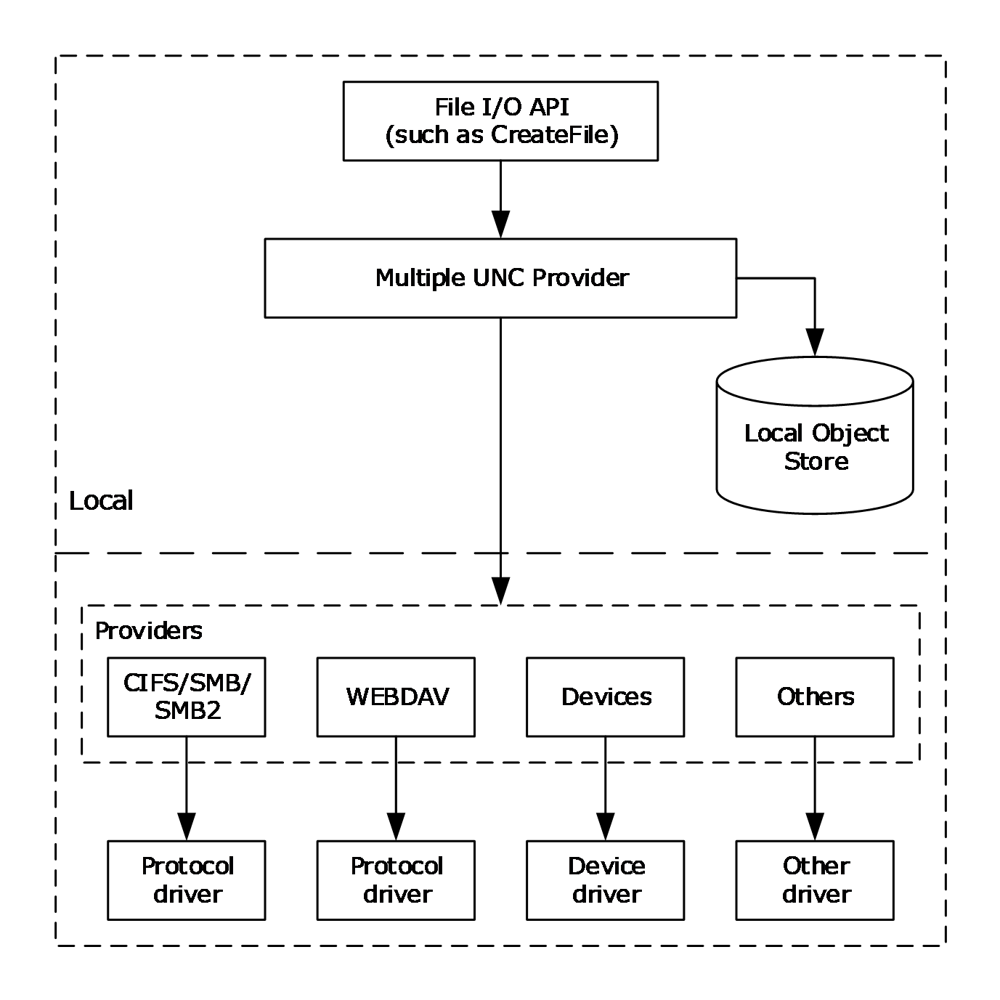
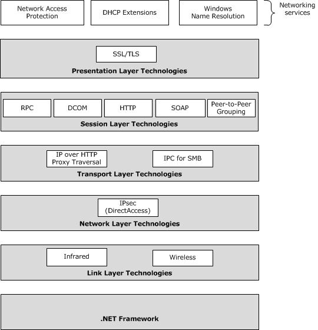
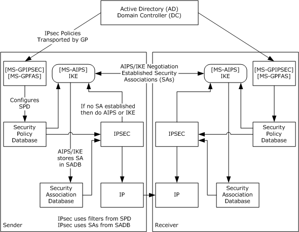

# [MS-WPO]: Windows Protocols Overview

Table of Contents

1 Introduction

- [1 Introduction](#Section_1)
  - [1.1 Glossary](#Section_1.1)
  - [1.2 References](#Section_1.2)
  - [1.3 Overview](#Section_1.3)
  - [1.4 Audience](#Section_1.4)

2 Application Services

- [2 Application Services](#Section_2)
  - [2.1 Overview](#Section_2.1)
  - [2.2 Application Server Protocols](#Section_2.2)
    - [2.2.1 Component Object Model (COM)](#Section_2.2.1)
      - [2.2.1.1 Component Object Model Plus (COM+)](#Section_2.2.1.1)
      - [2.2.1.2 COM+ Remote Administration Protocol (COMA)](#Section_2.2.1.2)
      - [2.2.1.3 COM+ Event System Protocol (COMEV)](#Section_2.2.1.3)
      - [2.2.1.4 COM+ Tracker Service Protocol (COMT)](#Section_2.2.1.4)
      - [2.2.1.5 COM+ Queued Components Protocol (COMQC)](#Section_2.2.1.5)
    - [2.2.2 Transaction Processing Services](#Section_2.2.2)
    - [2.2.3 Message Queuing (MSMQ)](#Section_2.2.3)
  - [2.3 Core Services Protocols](#Section_2.3)
    - [2.3.1 IManagedObject Interface Protocol](#Section_2.3.1)
      - [2.3.1.1 IRemoteDispatch Interface](#Section_2.3.1.1)
    - [2.3.2 OLE Automation Protocol](#Section_2.3.2)
    - [2.3.3 Remote Data Services Transport Protocol](#Section_2.3.3)
    - [2.3.4 Session Multiplex Protocol](#Section_2.3.4)
    - [2.3.5 SQL Server Resolution Protocol](#Section_2.3.5)
  - [2.4 Internet Information Services](#Section_2.4)
    - [2.4.1 Internet Information Services (IIS) Application Host COM Protocol](#Section_2.4.1)
    - [2.4.2 Internet Information Services (IIS) IMSAdminBaseW Remote Protocol](#Section_2.4.2)
    - [2.4.3 Internet Information Services (IIS) Inetinfo Remote protocol](#Section_2.4.3)
    - [2.4.4 Internet Information Services (IIS) ServiceControl Protocol](#Section_2.4.4)
  - [2.5 .NET Framework Protocols](#Section_2.5)

3 Collaboration and Communication

- [3 Collaboration and Communication](#Section_3)
  - [3.1 Collaboration Protocols](#Section_3.1)
  - [3.2 Media Services Protocols](#Section_3.2)

4 Device-Specific Protocols

- [4 Device-Specific Protocols](#Section_4)

5 Directory Services

- [5 Directory Services](#Section_5)
  - [5.1 Overview](#Section_5.1)

6 File, Fax, and Printing Services

- [6 File, Fax, and Printing Services](#Section_6)
  - [6.1 Overview](#Section_6.1)
  - [6.2 Content Caching Protocols](#Section_6.2)
  - [6.3 DFS and File Replication Protocols](#Section_6.3)
  - [6.4 File Access Services Protocols](#Section_6.4)
  - [6.5 File Services Management Protocols](#Section_6.5)
  - [6.6 Print and Fax Services Protocols](#Section_6.6)
  - [6.7 Storage Services Protocols](#Section_6.7)
  - [6.8 Virtual Storage Protocols](#Section_6.8)

7 Networking

- [7 Networking](#Section_7)
  - [7.1 Networking Services](#Section_7.1)
    - [7.1.1 DHCP Extensions](#Section_7.1.1)
    - [7.1.2 IP Address Management](#Section_7.1.2)
    - [7.1.3 Network Access Protection (NAP)](#Section_7.1.3)
    - [7.1.4 Windows Name Resolution](#Section_7.1.4)
  - [7.2 Presentation Layer Technologies](#Section_7.2)
    - [7.2.1 SSL/TLS](#Section_7.2.1)
  - [7.3 Session Layer Technologies](#Section_7.3)
    - [7.3.1 RPC](#Section_7.3.1)
    - [7.3.2 DCOM](#Section_7.3.2)
    - [7.3.3 SOAP](#Section_7.3.3)
    - [7.3.4 HTTP](#Section_7.3.4)
    - [7.3.5 Peer to Peer Grouping](#Section_7.3.5)
  - [7.4 Transport Layer Technologies](#Section_7.4)
    - [7.4.1 IP Over HTTP Proxy Traversal](#Section_7.4.1)
    - [7.4.2 IPC Mechanisms for SMB](#Section_7.4.2)
      - [7.4.2.1 Named Pipes](#Section_7.4.2.1)
      - [7.4.2.2 Mailslot Names](#Section_7.4.2.2)
  - [7.5 Network Layer Technologies](#Section_7.5)
    - [7.5.1 IPsec (DirectAccess) Overview](#Section_7.5.1)
    - [7.5.2 Security Associations](#Section_7.5.2)
    - [7.5.3 Security Policy Database Structure](#Section_7.5.3)
    - [7.5.4 IPsec Policy Specification Formats](#Section_7.5.4)
    - [7.5.5 IPsec Encapsulations](#Section_7.5.5)
  - [7.6 Link Layer Technologies](#Section_7.6)

8 Remote Connectivity

- [8 Remote Connectivity](#Section_8)
  - [8.1 Overview](#Section_8.1)

9 Security and Identity Management

- [9 Security and Identity Management](#Section_9)
  - [9.1 Overview](#Section_9.1)
  - [9.2 Authentication](#Section_9.2)
  - [9.3 Authorization](#Section_9.3)
  - [9.4 Certificate Services](#Section_9.4)
  - [9.5 Claim-Based Access Control](#Section_9.5)
  - [9.6 Federation Services](#Section_9.6)
  - [9.7 Impersonation](#Section_9.7)
  - [9.8 Rights Management Services](#Section_9.8)

10 Systems Management

- [10 Systems Management](#Section_10)
  - [10.1 Overview](#Section_10.1)
  - [10.2 Monitoring Services Protocols](#Section_10.2)
  - [10.3 Server Management Protocols](#Section_10.3)
  - [10.4 WINS Management Protocol](#Section_10.4)

11 Microsoft Implementations

- [11 Microsoft Implementations](#Section_11)

12 Change Tracking

- [12 Change Tracking](#Section_12)

For the legal notice and IP terms, see [LEGAL.md](../LEGAL.md).
Last updated: 6/14/2022.
See [Revision History](#revision-history) for full version history.

# 1 Introduction

This document provides an overview of Windows interoperability technologies and the protocols required for their implementation. It is intended for use with the technology overview documents for many of the commonly used technologies. Those documents are listed in section [1.3](#Section_1.3).

This document can also be used in conjunction with the Windows Protocols Documentation Roadmap [MS-DOCO](../MS-DOCO/MS-DOCO.md), which describes the protocol documentation set, the types of protocol documents provided by Microsoft, and how to find the documents online. Detailed technical specifications for protocols, including extensions to industry-standard or other published protocols, are provided in individual technical documents referenced here and in the overview documents. These protocols are used by the versions of Windows listed in section [11](#Section_11). A list of technology areas and their corresponding protocol specifications is available in [MS-DOCO] section 4.2.

## 1.1 Glossary

This document uses the following terms:

**Active Directory**: The Windows implementation of a general-purpose [**directory service**](#gt_directory-service-ds), which uses LDAP as its primary access protocol. [**Active Directory**](#gt_active-directory) stores information about a variety of objects in the network such as user accounts, computer accounts, groups, and all related credential information used by Kerberos [MS-KILE](../MS-KILE/MS-KILE.md). [**Active Directory**](#gt_active-directory) is either deployed as [**Active Directory Domain Services (AD DS)**](#gt_active-directory-domain-services-ad-ds) or [**Active Directory Lightweight Directory Services (AD LDS)**](#gt_active-directory-lightweight-directory-services-ad-lds), which are both described in [MS-ADOD](../MS-ADOD/MS-ADOD.md): Active Directory Protocols Overview.

**Active Directory Domain Services (AD DS)**: A [**directory service (DS)**](#gt_directory-service-ds) implemented by a [**domain controller (DC)**](#gt_domain-controller-dc). The [**DS**](#gt_directory-service-ds) provides a data store for objects that is distributed across multiple [**DCs**](#gt_domain-controller-dc). The [**DCs**](#gt_domain-controller-dc) interoperate as peers to ensure that a local change to an object replicates correctly across [**DCs**](#gt_domain-controller-dc). AD DS is a deployment of [**Active Directory**](#gt_active-directory) [MS-ADTS](../MS-ADTS/MS-ADTS.md).

**Active Directory Federation Services (AD FS)**: A Microsoft implementation of a federation services provider, which provides a security token service (STS) that can issue security tokens to a caller using various protocols such as WS-Trust, WS-Federation, and Security Assertion Markup Language (SAML) version 2.0.

**Active Directory Lightweight Directory Services (AD LDS)**: A [**directory service (DS)**](#gt_directory-service-ds) implemented by a [**domain controller (DC)**](#gt_domain-controller-dc). AD LDS is a deployment of [**Active Directory**](#gt_active-directory) [MS-ADTS]. The most significant difference between [**AD LDS**](#gt_active-directory-lightweight-directory-services-ad-lds) and [**Active Directory Domain Services (AD DS)**](#gt_active-directory-domain-services-ad-ds) is that [**AD LDS**](#gt_active-directory-lightweight-directory-services-ad-lds) does not host domain naming contexts (domain NCs). A server can host multiple [**AD LDS**](#gt_active-directory-lightweight-directory-services-ad-lds) [**DCs**](#gt_domain-controller-dc). Each [**DC**](#gt_domain-controller-dc) is an independent [**AD LDS**](#gt_active-directory-lightweight-directory-services-ad-lds) instance, with its own independent state. [**AD LDS**](#gt_active-directory-lightweight-directory-services-ad-lds) can be run as an operating system [**DS**](#gt_directory-service-ds) or as a directory service provided by a standalone application (Active Directory Application Mode (ADAM)).

**atomic transaction**: A shared activity that provides mechanisms for achieving the atomicity, consistency, isolation, and durability (ACID) properties when state changes occur inside participating resource managers.

**authentication**: The ability of one entity to determine the identity of another entity.

**authentication header (AH)**: An [**Internet Protocol Security (IPsec)**](#gt_internet-protocol-security-ipsec) encapsulation mode that provides [**authentication**](#gt_authentication) and message integrity. For more information, see [[RFC4302]](https://go.microsoft.com/fwlink/?LinkId=90466) section 1.

**binary large object (BLOB)**: A collection of binary data stored as a single entity in a database.

**class identifier (CLSID)**: A [**GUID**](#gt_globally-unique-identifier-guid) that identifies a software component; for instance, a DCOM object class or a COM class.

**Common Internet File System (CIFS)**: The "NT LM 0.12" / NT LAN Manager dialect of the [**Server Message Block (SMB)**](#gt_server-message-block-smb) Protocol, as implemented in Windows NT. The CIFS name originated in the 1990's as part of an attempt to create an Internet standard for [**SMB**](#gt_server-message-block-smb), based upon the then-current Windows NT implementation.

**Component Object Model (COM)**: An object-oriented programming model that defines how objects interact within a single process or between processes. In [**COM**](#gt_component-object-model-com), clients have access to an object through interfaces implemented on the object. For more information, see [MS-DCOM](../MS-DCOM/MS-DCOM.md).

**decryption**: In cryptography, the process of transforming encrypted information to its original clear text form.

**DirectAccess**: A collection of different component policies, including Name Resolution Policy and IPsec, which allows seamless connectivity to corporate resources when not physically connected to the corporate network.

**directory service (DS)**: A service that stores and organizes information about a computer network's users and network shares, and that allows network administrators to manage users' access to the shares. See also [**Active Directory**](#gt_active-directory).

**Distributed Component Object Model (DCOM)**: The Microsoft Component Object Model (COM) specification that defines how components communicate over networks, as specified in [MS-DCOM].

**Distributed File System (DFS)**: A file system that logically groups physical shared folders located on different servers by transparently connecting them to one or more hierarchical namespaces. [**DFS**](#gt_distributed-file-system-dfs) also provides fault-tolerance and load-sharing capabilities.

**domain controller (DC)**: The service, running on a server, that implements [**Active Directory**](#gt_active-directory), or the server hosting this service. The service hosts the data store for objects and interoperates with other [**DCs**](#gt_domain-controller-dc) to ensure that a local change to an object replicates correctly across all [**DCs**](#gt_domain-controller-dc). When [**Active Directory**](#gt_active-directory) is operating as [**Active Directory Domain Services (AD DS)**](#gt_active-directory-domain-services-ad-ds), the [**DC**](#gt_domain-controller-dc) contains full NC replicas of the configuration naming context (config NC), schema naming context (schema NC), and one of the domain NCs in its forest. If the [**AD DS**](#gt_active-directory-domain-services-ad-ds) [**DC**](#gt_domain-controller-dc) is a global catalog server (GC server), it contains partial NC replicas of the remaining domain NCs in its forest. For more information, see [MS-AUTHSOD](../MS-AUTHSOD/MS-AUTHSOD.md) section 1.1.1.5.2 and [MS-ADTS]. When [**Active Directory**](#gt_active-directory) is operating as [**Active Directory Lightweight Directory Services (AD LDS)**](#gt_active-directory-lightweight-directory-services-ad-lds), several [**AD LDS**](#gt_active-directory-lightweight-directory-services-ad-lds) [**DCs**](#gt_domain-controller-dc) can run on one server. When [**Active Directory**](#gt_active-directory) is operating as [**AD DS**](#gt_active-directory-domain-services-ad-ds), only one [**AD DS**](#gt_active-directory-domain-services-ad-ds) [**DC**](#gt_domain-controller-dc) can run on one server. However, several [**AD LDS**](#gt_active-directory-lightweight-directory-services-ad-lds) [**DCs**](#gt_domain-controller-dc) can coexist with one [**AD DS**](#gt_active-directory-domain-services-ad-ds) [**DC**](#gt_domain-controller-dc) on one server. The [**AD LDS**](#gt_active-directory-lightweight-directory-services-ad-lds) [**DC**](#gt_domain-controller-dc) contains full NC replicas of the config NC and the schema NC in its forest. The domain controller is the server side of Authentication Protocol Domain Support [MS-APDS](../MS-APDS/MS-APDS.md).

**Dynamic Host Configuration Protocol (DHCP)**: A protocol that provides a framework for passing configuration information to hosts on a TCP/IP network, as described in [[RFC2131]](https://go.microsoft.com/fwlink/?LinkId=90318).

**Encapsulating Security Payload (ESP)**: An [**Internet Protocol security (IPsec)**](#gt_internet-protocol-security-ipsec) encapsulation mode that provides [**authentication**](#gt_authentication), data confidentiality, and message integrity. For more information, see [[RFC4303]](https://go.microsoft.com/fwlink/?LinkId=90467) section 1.

**encryption**: In cryptography, the process of obscuring information to make it unreadable without special knowledge.

**endpoint**: A network-specific address of a remote procedure call (RPC) server process for remote procedure calls. The actual name and type of the endpoint depends on the [**RPC**](#gt_remote-procedure-call-rpc) protocol sequence that is being used. For example, for RPC over TCP (RPC Protocol Sequence ncacn_ip_tcp), an endpoint might be TCP port 1025. For RPC over Server Message Block (RPC Protocol Sequence ncacn_np), an endpoint might be the name of a [**named pipe**](#gt_named-pipe). For more information, see [[C706]](https://go.microsoft.com/fwlink/?LinkId=89824).

**extended mode (EM)**: An optional phase of AuthIP negotiation during which the peers perform a second round of [**authentication**](#gt_authentication). This phase does not exist in the [**Internet Key Exchange (IKE)**](#gt_internet-key-exchange-ike) protocol.

**firewall rule**: A group of settings that specify which connections are allowed into and out of a client computer.

**fully qualified domain name (FQDN)**: An unambiguous domain name that gives an absolute location in the Domain Name System's (DNS) hierarchy tree, as defined in [[RFC1035]](https://go.microsoft.com/fwlink/?LinkId=90264) section 3.1 and [[RFC2181]](https://go.microsoft.com/fwlink/?LinkId=127732) section 11.

**Generic Security Services (GSS)**: An Internet standard, as described in [[RFC2743]](https://go.microsoft.com/fwlink/?LinkId=90378), for providing security services to applications. It consists of an application programming interface (GSS-API) set, as well as standards that describe the structure of the security data.

**globally unique identifier (GUID)**: A term used interchangeably with universally unique identifier (UUID) in Microsoft protocol technical documents (TDs). Interchanging the usage of these terms does not imply or require a specific algorithm or mechanism to generate the value. Specifically, the use of this term does not imply or require that the algorithms described in [[RFC4122]](https://go.microsoft.com/fwlink/?LinkId=90460) or [C706] must be used for generating the [**GUID**](#gt_globally-unique-identifier-guid). See also universally unique identifier (UUID).

**Group Policy Object (GPO)**: A collection of administrator-defined specifications of the policy settings that can be applied to groups of computers in a domain. Each GPO includes two elements: an object that resides in the [**Active Directory**](#gt_active-directory) for the domain, and a corresponding file system subdirectory that resides on the sysvol DFS share of the Group Policy server for the domain.

**Hypertext Transfer Protocol (HTTP)**: An application-level protocol for distributed, collaborative, hypermedia information systems (text, graphic images, sound, video, and other multimedia files) on the World Wide Web.

**Hypertext Transfer Protocol Secure (HTTPS)**: An extension of HTTP that securely encrypts and decrypts web page requests. In some older protocols, "Hypertext Transfer Protocol over Secure Sockets Layer" is still used (Secure Sockets Layer has been deprecated). For more information, see [[SSL3]](https://go.microsoft.com/fwlink/?LinkId=90534) and [[RFC5246]](https://go.microsoft.com/fwlink/?LinkId=129803).

**impersonation**: The ability of an operating system process or thread to run temporarily in the security context of a specific caller and to gain authorized access to resources using that identity.

**Input/output control (IOCTL)**: Also known as I/O control. A command that is issued to a network device to alter or query the behavior and state of the device.

**Internet Key Exchange (IKE)**: The protocol that is used to negotiate and provide authenticated keying material for [**security associations (SAs)**](#gt_security-association-sa) in a protected manner. For more information, see [[RFC2409]](https://go.microsoft.com/fwlink/?LinkId=90349).

**Internet Protocol security (IPsec)**: A framework of open standards for ensuring private, secure communications over Internet Protocol (IP) networks through the use of cryptographic security services. IPsec supports network-level peer authentication, data origin authentication, data integrity, data confidentiality (encryption), and replay protection.

**Internet Protocol version 4 (IPv4)**: An Internet protocol that has 32-bit source and destination addresses. IPv4 is the predecessor of IPv6.

**Internet Protocol version 6 (IPv6)**: A revised version of the Internet Protocol (IP) designed to address growth on the Internet. Improvements include a 128-bit IP address size, expanded routing capabilities, and support for [**authentication**](#gt_authentication) and privacy.

**Internetwork Packet Exchange (IPX)**: A protocol that provides connectionless datagram delivery of messages. See [[IPX]](https://go.microsoft.com/fwlink/?LinkId=89914).

**Inter-Process Communication (IPC)**: A set of techniques used to exchange data among two or more threads in one or more processes. These processes can also run on one or more computers connected by a network.

**local area network (LAN)**: A group of computers and other devices dispersed over a relatively limited area and connected by a communications link that enables any device to interact with any other device on the network.

**mailslot**: A mechanism for one-way interprocess communications (IPC). For more information, see [[MSLOT]](https://go.microsoft.com/fwlink/?LinkId=90218) and [MS-MAIL](../MS-MAIL/MS-MAIL.md).

**main mode (MM)**: The first phase of an [**Internet Key Exchange (IKE)**](#gt_internet-key-exchange-ike) negotiation that performs authentication and negotiates a [**main mode security association (MM SA)**](#gt_main-mode-security-association-mm-sa) between the peers. For more information, see [RFC2409] section 5.

**main mode security association (MM SA)**: A security association that is used to protect [**Internet Key Exchange (IKE)**](#gt_internet-key-exchange-ike) traffic between two peers. For more information, see [[RFC2408]](https://go.microsoft.com/fwlink/?LinkId=90348) section 2.

**Multiple Active Result Sets (MARS)**: A feature in Microsoft SQL Server that allows applications to have more than one pending request per connection. For more information, see [[MSDN-MARS]](https://go.microsoft.com/fwlink/?LinkId=98459).

**named pipe**: A named, one-way, or duplex pipe for communication between a pipe server and one or more pipe clients.

**negotiation filter association (NFA)**: A term that is used to describe the logical binding together of the appropriate IPsec filter and IPsec negotiation policy settings for an IPsec policy.

**NetBEUI**: NetBIOS Enhanced User Interface. [**NetBEUI**](#gt_netbeui) is an enhanced NetBIOS protocol for network operating systems, originated by IBM for the LAN Manager server and now used with many other networks.

**NetBIOS**: A particular network transport that is part of the LAN Manager protocol suite. [**NetBIOS**](#gt_netbios) uses a broadcast communication style that was applicable to early segmented local area networks. A protocol family including name resolution, datagram, and connection services. For more information, see [[RFC1001]](https://go.microsoft.com/fwlink/?LinkId=90260) and [[RFC1002]](https://go.microsoft.com/fwlink/?LinkId=90261).

**NetBIOS Name Server (NBNS)**: A server that stores NetBIOS name-to-IPv4 address mappings and that resolves NetBIOS names for NBT-enabled hosts. A server running the Windows Internet Name Service (WINS) is the Microsoft implementation of an NBNS.

**NetBIOS over TCP/IP (NBT)**: A feature that allows [**NetBIOS**](#gt_netbios) to be used over the TCP/IP protocol, as defined in [RFC1001] and [RFC1002].

**Network Access Protection (NAP)**: A feature of an operating system that provides a platform for system health-validated access to private networks. [**NAP**](#gt_network-access-protection-nap) provides a way of detecting the health state of a network client that is attempting to connect to or communicate on a network, and limiting the access of the network client until the health policy requirements have been met. [**NAP**](#gt_network-access-protection-nap) is implemented through quarantines and health checks, as specified in [[TNC-IF-TNCCSPBSoH]](https://go.microsoft.com/fwlink/?LinkId=240054).

**OSF-DCE**: The Distributed Computing Environment from the Open Software Foundation. It consists of multiple components, including [**remote procedure call (RPC)**](#gt_remote-procedure-call-rpc), that have been integrated to work closely together.

**PeerDist Content Encoding**: A way of presenting an [**HTTP**](#gt_hypertext-transfer-protocol-http) entity-body (defined in [[RFC2616]](https://go.microsoft.com/fwlink/?LinkId=90372)) through its metadata, in the form of a Content Information Data Structure, as defined in [MS-PCCRC](../MS-PCCRC/MS-PCCRC.md) section 2.3, which is derived from the content using algorithms described in [MS-PCCRC] sections 2.1 and 2.2.

**print queue**: The logical entity to which jobs can be submitted for a particular print device. Associated with a print queue is a print driver, a user's print configuration in the form of a DEVMODE structure, and a system print configuration stored in the system registry.

**Quality of Service (QoS)**: A set of technologies that do network traffic manipulation, such as packet marking and reshaping.

**quick mode security association (QM SA)**: A [**security association (SA)**](#gt_security-association-sa) that is used to protect IP packets between peers (the [**Internet Key Exchange (IKE)**](#gt_internet-key-exchange-ike) traffic is protected by the [**main mode security association (MM SA)**](#gt_main-mode-security-association-mm-sa)). For more information, see [RFC2409] section 5.5.

**remote procedure call (RPC)**: A communication protocol used primarily between client and server. The term has three definitions that are often used interchangeably: a runtime environment providing for communication facilities between computers (the RPC runtime); a set of request-and-response message exchanges between computers (the RPC exchange); and the single message from an RPC exchange (the RPC message). For more information, see [C706].

**RPC transport**: The underlying network services used by the remote procedure call (RPC) runtime for communications between network nodes. For more information, see [C706] section 2.

**Secure Sockets Layer (SSL)**: A security protocol that supports confidentiality and integrity of messages in client and server applications that communicate over open networks. SSL supports server and, optionally, client authentication using X.509 certificates [[X509]](https://go.microsoft.com/fwlink/?LinkId=90590) and [[RFC5280]](https://go.microsoft.com/fwlink/?LinkId=131034). SSL is superseded by [**Transport Layer Security (TLS)**](#gt_transport-layer-security-tls). TLS version 1.0 is based on SSL version 3.0 [SSL3].

**security association (SA)**: A simplex "connection" that provides security services to the traffic carried by it. See [[RFC4301]](https://go.microsoft.com/fwlink/?LinkId=90465) for more information.

**security identifier (SID)**: An identifier for security principals that is used to identify an account or a group. Conceptually, the [**SID**](#gt_security-identifier-sid) is composed of an account authority portion (typically a domain) and a smaller integer representing an identity relative to the account authority, termed the relative identifier (RID). The [**SID**](#gt_security-identifier-sid) format is specified in [MS-DTYP](../MS-DTYP/MS-DTYP.md) section 2.4.2; a string representation of [**SIDs**](#gt_security-identifier-sid) is specified in [MS-DTYP] section 2.4.2 and [MS-AZOD](../MS-AZOD/MS-AZOD.md) section 1.1.1.2.

**security policy database (SPD)**: A database that specifies the policies that determine the disposition of all IP traffic inbound or outbound from a host or security gateway.

**selector**: A name/value pair that represents a particular instance of a resource; essentially a filter or "key" that identifies the desired instance of the resource.

**Server Message Block (SMB)**: A protocol that is used to request file and print services from server systems over a network. The SMB protocol extends the CIFS protocol with additional security, file, and disk management support. For more information, see [[CIFS]](https://go.microsoft.com/fwlink/?linkid=2109334) and [MS-SMB](../MS-SMB/MS-SMB.md).

**small computer system interface (SCSI)**: A set of standards for physically connecting and transferring data between computers and peripheral devices.

**SOAP**: A lightweight protocol for exchanging structured information in a decentralized, distributed environment. [**SOAP**](#gt_soap) uses XML technologies to define an extensible messaging framework, which provides a message construct that can be exchanged over a variety of underlying protocols. The framework has been designed to be independent of any particular programming model and other implementation-specific semantics. SOAP 1.2 supersedes SOAP 1.1. See [[SOAP1.2-1/2003]](https://go.microsoft.com/fwlink/?LinkId=90521).

**transaction**: A unit of interaction that guarantees the ACID properties— atomicity, consistency, isolation, and durability—as specified by the MSDTC Connection Manager: OleTx Transaction Protocol ([MS-DTCO])

**Transmission Control Protocol (TCP)**: A protocol used with the Internet Protocol (IP) to send data in the form of message units between computers over the Internet. TCP handles keeping track of the individual units of data (called packets) that a message is divided into for efficient routing through the Internet.

**Transport Layer Security (TLS)**: A security protocol that supports confidentiality and integrity of messages in client and server applications communicating over open networks. TLS supports server and, optionally, client authentication by using X.509 certificates (as specified in [X509]). TLS is standardized in the IETF TLS working group.

**unicast**: A delivery method used by media servers for providing content to connected clients in which each client receives a discrete stream that no other client has access to.

**Universal Naming Convention (UNC)**: A string format that specifies the location of a resource. For more information, see [MS-DTYP] section 2.2.57.

**User Datagram Protocol (UDP)**: The connectionless protocol within TCP/IP that corresponds to the transport layer in the ISO/OSI reference model.

**virtual disk file**: The file that is the backing store for a virtual disk. This file may be exposed to an operating system as a disk device. The exposed disk device is referred to as a virtual disk.

**virtual private network (VPN)**: A network that provides secure access to a private network over public infrastructure.

**Voice over IP (VoIP)**: The use of the Internet Protocol (IP) for transmitting voice communications. VoIP delivers digitized audio in packet form and can be used to transmit over intranets, extranets, and the Internet.

**Windows Internet Name Service (WINS)**: A name service for the NetBIOS protocol, particularly designed to ease transition to a TCP/IP based network. An implementation of an [**NBNS server**](#gt_netbios-name-server-nbns).

**Windows Server Update Services (WSUS)**: An optional component that enables a machine to operate as an update server.

**MAY, SHOULD, MUST, SHOULD NOT, MUST NOT:** These terms (in all caps) are used as defined in [RFC2119]. All statements of optional behavior use either MAY, SHOULD, or SHOULD NOT.

## 1.2 References

Links to a document in the Microsoft Open Specifications library point to the correct section in the most recently published version of the referenced document. However, because individual documents in the library are not updated at the same time, the section numbers in the documents may not match. You can confirm the correct section numbering by checking the [Errata](https://go.microsoft.com/fwlink/?linkid=850906).

[C195] The Open Group, "IPC Mechanisms for SMB", Catalog number C195, February 1992, [https://www2.opengroup.org/ogsys/catalog/c195](https://go.microsoft.com/fwlink/?LinkId=260837)

[C706] The Open Group, "DCE 1.1: Remote Procedure Call", C706, August 1997, [https://publications.opengroup.org/c706](https://go.microsoft.com/fwlink/?LinkId=89824)

**Note** Registration is required to download the document.

[DLNA] Digital Living Network Alliance, "The DLNA Networked Device Interoperability Guidelines", [https://spirespark.com/dlna/guidelines](https://go.microsoft.com/fwlink/?LinkId=178990)

**Note** Registration is required to download the document.

[ECMA-376] ECMA International, "Office Open XML File Formats", 1st Edition, ECMA-376, December 2006, [http://www.ecma-international.org/publications/standards/Ecma-376.htm](https://go.microsoft.com/fwlink/?LinkId=200054)

[FSBO] Microsoft Corporation, "File System Behavior in the Microsoft Windows Environment", June 2008, [http://download.microsoft.com/download/4/3/8/43889780-8d45-4b2e-9d3a-c696a890309f/File%20System%20Behavior%20Overview.pdf](https://go.microsoft.com/fwlink/?LinkId=140636)

[IROBEX] Infrared Data Association, "IrDA Object Exchange Protocol v1.2", March 1999, [http://irdajp.info/specifications.html](https://go.microsoft.com/fwlink/?LinkId=92765)

**Note** There is a charge to download the specification.

[MC-COMQC] Microsoft Corporation, "[Component Object Model Plus (COM+) Queued Components Protocol](../MC-COMQC/MC-COMQC.md)".

[MC-IISA] Microsoft Corporation, "[Internet Information Services (IIS) Application Host COM Protocol](#Section_2.4.1)".

[MC-NBFSE] Microsoft Corporation, "[.NET Binary Format: SOAP Extension](../MC-NBFSE/MC-NBFSE.md)".

[MC-SMP] Microsoft Corporation, "[Session Multiplex Protocol](#Section_2.3.4)".

[MC-SQLR] Microsoft Corporation, "[SQL Server Resolution Protocol](#Section_2.3.5)".

[MS-ABTP] Microsoft Corporation, "[Automatic Bluetooth Pairing Protocol](../MS-ABTP/MS-ABTP.md)".

[MS-ADFSOD] Microsoft Corporation, "[Active Directory Federation Services (AD FS) Protocols Overview](../MS-ADFSOD/MS-ADFSOD.md)".

[MS-ADOD] Microsoft Corporation, "[Active Directory Protocols Overview](../MS-ADOD/MS-ADOD.md)".

[MS-ADTG] Microsoft Corporation, "[Remote Data Services (RDS) Transport Protocol](../MS-ADTG/MS-ADTG.md)".

[MS-AIPS] Microsoft Corporation, "[Authenticated Internet Protocol](../MS-AIPS/MS-AIPS.md)".

[MS-APDS] Microsoft Corporation, "[Authentication Protocol Domain Support](../MS-APDS/MS-APDS.md)".

[MS-AUTHSOD] Microsoft Corporation, "[Authentication Services Protocols Overview](../MS-AUTHSOD/MS-AUTHSOD.md)".

[MS-AZOD] Microsoft Corporation, "[Authorization Protocols Overview](../MS-AZOD/MS-AZOD.md)".

[MS-CBCP] Microsoft Corporation, "[Callback Control Protocol](../MS-CBCP/MS-CBCP.md)".

[MS-CCROD] Microsoft Corporation, "[Content Caching and Retrieval Protocols Overview](../MS-CCROD/MS-CCROD.md)".

[MS-CDP] Microsoft Corporation, "[Connected Devices Platform Protocol Version 3](../MS-CDP/MS-CDP.md)".

[MS-CER2] Microsoft Corporation, "[Corporate Error Reporting V.2 Protocol](../MS-CER2/MS-CER2.md)".

[MS-CERSOD] Microsoft Corporation, "[Certificate Services Protocols Overview](../MS-CERSOD/MS-CERSOD.md)".

[MS-CIFS] Microsoft Corporation, "[Common Internet File System (CIFS) Protocol](../MS-CIFS/MS-CIFS.md)".

[MS-COMA] Microsoft Corporation, "[Component Object Model Plus (COM+) Remote Administration Protocol](../MS-COMA/MS-COMA.md)".

[MS-COMEV] Microsoft Corporation, "[Component Object Model Plus (COM+) Event System Protocol](../MS-COMEV/MS-COMEV.md)".

[MS-COMT] Microsoft Corporation, "[Component Object Model Plus (COM+) Tracker Service Protocol](../MS-COMT/MS-COMT.md)".

[MS-COM] Microsoft Corporation, "[Component Object Model Plus (COM+) Protocol](../MS-COM/MS-COM.md)".

[MS-DCOM] Microsoft Corporation, "[Distributed Component Object Model (DCOM) Remote Protocol](../MS-DCOM/MS-DCOM.md)".

[MS-DFSC] Microsoft Corporation, "[Distributed File System (DFS): Referral Protocol](../MS-DFSC/MS-DFSC.md)".

[MS-DFSNM] Microsoft Corporation, "[Distributed File System (DFS): Namespace Management Protocol](../MS-DFSNM/MS-DFSNM.md)".

[MS-DFSRH] Microsoft Corporation, "[DFS Replication Helper Protocol](../MS-DFSRH/MS-DFSRH.md)".

[MS-DHCPE] Microsoft Corporation, "[Dynamic Host Configuration Protocol (DHCP) Extensions](../MS-DHCPE/MS-DHCPE.md)".

[MS-DHCPF] Microsoft Corporation, "[DHCP Failover Protocol Extension](../MS-DHCPF/MS-DHCPF.md)".

[MS-DHCPM] Microsoft Corporation, "[Microsoft Dynamic Host Configuration Protocol (DHCP) Server Management Protocol](../MS-DHCPM/MS-DHCPM.md)".

[MS-DHCPN] Microsoft Corporation, "[Dynamic Host Configuration Protocol (DHCP) Extensions for Network Access Protection (NAP)](../MS-DHCPN/MS-DHCPN.md)".

[MS-DNSP] Microsoft Corporation, "[Domain Name Service (DNS) Server Management Protocol](../MS-DNSP/MS-DNSP.md)".

[MS-DOCO] Microsoft Corporation, "[Windows Protocols Documentation Roadmap](../MS-DOCO/MS-DOCO.md)".

[MS-DSCPM] Microsoft Corporation, "[Desired State Configuration Pull Model Protocol](../MS-DSCPM/MS-DSCPM.md)".

[MS-DTCO] Microsoft Corporation, "[MSDTC Connection Manager: OleTx Transaction Protocol](../MS-DTCO/MS-DTCO.md)".

[MS-DTYP] Microsoft Corporation, "[Windows Data Types](../MS-DTYP/MS-DTYP.md)".

[MS-DVRD] Microsoft Corporation, "[Device Registration Discovery Protocol](../MS-DVRD/MS-DVRD.md)".

[MS-DVRE] Microsoft Corporation, "[Device Registration Enrollment Protocol](../MS-DVRE/MS-DVRE.md)".

[MS-ECS] Microsoft Corporation, "[Enterprise Client Synchronization Protocol](../MS-ECS/MS-ECS.md)".

[MS-EVEN6] Microsoft Corporation, "[EventLog Remoting Protocol Version 6.0](../MS-EVEN6/MS-EVEN6.md)".

[MS-EVEN] Microsoft Corporation, "[EventLog Remoting Protocol](../MS-EVEN/MS-EVEN.md)".

[MS-FASOD] Microsoft Corporation, "[File Access Services Protocols Overview](../MS-FASOD/MS-FASOD.md)".

[MS-FASP] Microsoft Corporation, "[Firewall and Advanced Security Protocol](../MS-FASP/MS-FASP.md)".

[MS-FAX] Microsoft Corporation, "[Fax Server and Client Remote Protocol](../MS-FAX/MS-FAX.md)".

[MS-FRS1] Microsoft Corporation, "[File Replication Service Protocol](../MS-FRS1/MS-FRS1.md)".

[MS-FRS2] Microsoft Corporation, "[Distributed File System Replication Protocol](../MS-FRS2/MS-FRS2.md)".

[MS-FSCC] Microsoft Corporation, "[File System Control Codes](../MS-FSCC/MS-FSCC.md)".

[MS-FSMOD] Microsoft Corporation, "[File Services Management Protocols Overview](../MS-FSMOD/MS-FSMOD.md)".

[MS-GPFAS] Microsoft Corporation, "[Group Policy: Firewall and Advanced Security Data Structure](../MS-GPFAS/MS-GPFAS.md)".

[MS-GPIPSEC] Microsoft Corporation, "[Group Policy: IP Security (IPsec) Protocol Extension](../MS-GPIPSEC/MS-GPIPSEC.md)".

[MS-GPOD] Microsoft Corporation, "[Group Policy Protocols Overview](../MS-GPOD/MS-GPOD.md)".

[MS-GRVPROT] Microsoft Corporation, "[Groove Protocols Overview](../MS-GRVPROT/MS-GRVPROT.md)".

[MS-H245] Microsoft Corporation, "[H.245 Protocol: Microsoft Extensions](../MS-H245/MS-H245.md)".

[MS-HGRP] Microsoft Corporation, "[HomeGroup Protocol](../MS-HGRP/MS-HGRP.md)".

[MS-HTTPE] Microsoft Corporation, "[Hypertext Transfer Protocol (HTTP) Extensions](../MS-HTTPE/MS-HTTPE.md)".

[MS-IISS] Microsoft Corporation, "[Internet Information Services (IIS) ServiceControl Protocol](#Section_2.4.4)".

[MS-IKEE] Microsoft Corporation, "[Internet Key Exchange Protocol Extensions](../MS-IKEE/MS-IKEE.md)".

[MS-IMSA] Microsoft Corporation, "[Internet Information Services (IIS) IMSAdminBaseW Remote Protocol](#Section_2.4.2)".

[MS-IOI] Microsoft Corporation, "[IManagedObject Interface Protocol](#Section_2.3.1)".

[MS-IPAMM2] Microsoft Corporation, "[IP Address Management (IPAM) Management Protocol Version 2](../MS-IPAMM2/MS-IPAMM2.md)".

[MS-IPAMM] Microsoft Corporation, "[IP Address Management (IPAM) Management Protocol](../MS-IPAMM/MS-IPAMM.md)".

[MS-IPHTTPS] Microsoft Corporation, "[IP over HTTPS (IP-HTTPS) Tunneling Protocol](../MS-IPHTTPS/MS-IPHTTPS.md)".

[MS-IRDA] Microsoft Corporation, "[IrDA Object Exchange (OBEX) Protocol Profile](../MS-IRDA/MS-IRDA.md)".

[MS-IRP] Microsoft Corporation, "[Internet Information Services (IIS) Inetinfo Remote Protocol](#Section_2.4.3)".

[MS-KILE] Microsoft Corporation, "[Kerberos Protocol Extensions](../MS-KILE/MS-KILE.md)".

[MS-L2TPIE] Microsoft Corporation, "[Layer 2 Tunneling Protocol (L2TP) IPsec Extensions](../MS-L2TPIE/MS-L2TPIE.md)".

[MS-LLMNRP] Microsoft Corporation, "[Link Local Multicast Name Resolution (LLMNR) Profile](../MS-LLMNRP/MS-LLMNRP.md)".

[MS-LLTD] Microsoft Corporation, "[Link Layer Topology Discovery (LLTD) Protocol](../MS-LLTD/MS-LLTD.md)".

[MS-LREC] Microsoft Corporation, "[Live Remote Event Capture (LREC) Protocol](../MS-LREC/MS-LREC.md)".

[MS-MAIL] Microsoft Corporation, "[Remote Mailslot Protocol](../MS-MAIL/MS-MAIL.md)".

[MS-MDE2] Microsoft Corporation, "[Mobile Device Enrollment Protocol Version 2](../MS-MDE2/MS-MDE2.md)".

[MS-MDM] Microsoft Corporation, "[Mobile Device Management Protocol](../MS-MDM/MS-MDM.md)".

[MS-MNPR] Microsoft Corporation, "[Microsoft NetMeeting Protocol](../MS-MNPR/MS-MNPR.md)".

[MS-MQMP] Microsoft Corporation, "[Message Queuing (MSMQ): Queue Manager Client Protocol](../MS-MQMP/MS-MQMP.md)".

[MS-MQMQ] Microsoft Corporation, "[Message Queuing (MSMQ): Data Structures](../MS-MQMQ/MS-MQMQ.md)".

[MS-MQOD] Microsoft Corporation, "[Message Queuing Protocols Overview](../MS-MQOD/MS-MQOD.md)".

[MS-MSSOD] Microsoft Corporation, "[Media Streaming Server Protocols Overview](../MS-MSSOD/MS-MSSOD.md)".

[MS-NAPOD] Microsoft Corporation, "[Network Access Protection Protocols Overview](../MS-NAPOD/MS-NAPOD.md)".

[MS-NBTE] Microsoft Corporation, "[NetBIOS over TCP (NBT) Extensions](../MS-NBTE/MS-NBTE.md)".

[MS-NETOD] Microsoft Corporation, "[Microsoft .NET Framework Protocols Overview](../MS-NETOD/MS-NETOD.md)".

[MS-NFPB] Microsoft Corporation, "[Near Field Proximity: Bidirectional Services Protocol](../MS-NFPB/MS-NFPB.md)".

[MS-NFPS] Microsoft Corporation, "[Near Field Proximity: Sharing Protocol](../MS-NFPS/MS-NFPS.md)".

[MS-NNTP] Microsoft Corporation, "[NT LAN Manager (NTLM) Authentication: Network News Transfer Protocol (NNTP) Extension](../MS-NNTP/MS-NNTP.md)".

[MS-NRBF] Microsoft Corporation, "[.NET Remoting: Binary Format Data Structure](../MS-NRBF/MS-NRBF.md)".

[MS-NRTP] Microsoft Corporation, "[.NET Remoting: Core Protocol](../MS-NRTP/MS-NRTP.md)".

[MS-OAUT] Microsoft Corporation, "[OLE Automation Protocol](#Section_2.3.2)".

[MS-OCSPROT] Microsoft Corporation, "[Skype for Business and Skype for Business Server Protocols Overview](../MS-OCSPROT/MS-OCSPROT.md)".

[MS-OXPROTO] Microsoft Corporation, "[Exchange Server Protocols System Overview](../MS-OXPROTO/MS-OXPROTO.md)".

[MS-PCCRTP] Microsoft Corporation, "[Peer Content Caching and Retrieval: Hypertext Transfer Protocol (HTTP) Extensions](../MS-PCCRTP/MS-PCCRTP.md)".

[MS-PCQ] Microsoft Corporation, "[Performance Counter Query Protocol](../MS-PCQ/MS-PCQ.md)".

[MS-PLA] Microsoft Corporation, "[Performance Logs and Alerts Protocol](../MS-PLA/MS-PLA.md)".

[MS-PNRP] Microsoft Corporation, "[Peer Name Resolution Protocol (PNRP) Version 4.0](../MS-PNRP/MS-PNRP.md)".

[MS-PPGRH] Microsoft Corporation, "[Peer-to-Peer Graphing Protocol](../MS-PPGRH/MS-PPGRH.md)".

[MS-PPPI] Microsoft Corporation, "[PPP Over IrDA Dialup Protocol](../MS-PPPI/MS-PPPI.md)".

[MS-PPSEC] Microsoft Corporation, "[Peer-to-Peer Grouping Security Protocol](../MS-PPSEC/MS-PPSEC.md)".

[MS-PRSOD] Microsoft Corporation, "[Print Services Protocols Overview](../MS-PRSOD/MS-PRSOD.md)".

[MS-PSDP] Microsoft Corporation, "[Proximity Service Discovery Protocol](../MS-PSDP/MS-PSDP.md)".

[MS-PTPT] Microsoft Corporation, "[Point-to-Point Tunneling Protocol (PPTP) Profile](../MS-PTPT/MS-PTPT.md)".

[MS-QDP] Microsoft Corporation, "[Quality Windows Audio/Video Experience (qWave): Wireless Diagnostics Protocol](../MS-QDP/MS-QDP.md)".

[MS-RAIW] Microsoft Corporation, "[Remote Administrative Interface: WINS](../MS-RAIW/MS-RAIW.md)".

[MS-RDC] Microsoft Corporation, "[Remote Differential Compression Algorithm](../MS-RDC/MS-RDC.md)".

[MS-RDSOD] Microsoft Corporation, "[Remote Desktop Services Protocols Overview](../MS-RDSOD/MS-RDSOD.md)".

[MS-RMSOD] Microsoft Corporation, "[Rights Management Services Protocols Overview](../MS-RMSOD/MS-RMSOD.md)".

[MS-RMSO] Microsoft Corporation, "Rights Management Services System Overview", (Archived), [Rights Management Services System Overview](https://go.microsoft.com/fwlink/?LinkID=311687)

[MS-RPCE] Microsoft Corporation, "[Remote Procedure Call Protocol Extensions](../MS-RPCE/MS-RPCE.md)".

[MS-RPCH] Microsoft Corporation, "[Remote Procedure Call over HTTP Protocol](../MS-RPCH/MS-RPCH.md)".

[MS-RPCL] Microsoft Corporation, "[Remote Procedure Call Location Services Extensions](../MS-RPCL/MS-RPCL.md)".

[MS-RSP] Microsoft Corporation, "[Remote Shutdown Protocol](../MS-RSP/MS-RSP.md)".

[MS-SCMR] Microsoft Corporation, "[Service Control Manager Remote Protocol](../MS-SCMR/MS-SCMR.md)".

[MS-SDP] Microsoft Corporation, "[Session Description Protocol (SDP) Extensions](../MS-SDP/MS-SDP.md)".

[MS-SFMWA] Microsoft Corporation, "[Server and File Management Web APIs Protocol](../MS-SFMWA/MS-SFMWA.md)".

[MS-SIP] Microsoft Corporation, "[Session Initiation Protocol Extensions](../MS-SIP/MS-SIP.md)".

[MS-SMB2] Microsoft Corporation, "[Server Message Block (SMB) Protocol Versions 2 and 3](../MS-SMB2/MS-SMB2.md)".

[MS-SMB] Microsoft Corporation, "[Server Message Block (SMB) Protocol](../MS-SMB/MS-SMB.md)".

[MS-SMTPNTLM] Microsoft Corporation, "[NT LAN Manager (NTLM) Authentication: Simple Mail Transfer Protocol (SMTP) Extension](../MS-SMTPNTLM/MS-SMTPNTLM.md)".

[MS-SNID] Microsoft Corporation, "[Server Network Information Discovery Protocol](../MS-SNID/MS-SNID.md)".

[MS-SRVS] Microsoft Corporation, "[Server Service Remote Protocol](../MS-SRVS/MS-SRVS.md)".

[MS-STOROD] Microsoft Corporation, "[Storage Services Protocols Overview](../MS-STOROD/MS-STOROD.md)".

[MS-SWSB] Microsoft Corporation, "[SOAP Over WebSocket Protocol Binding](../MS-SWSB/MS-SWSB.md)".

[MS-TAIL] Microsoft Corporation, "[Telephony API Internet Locator Service Protocol](../MS-TAIL/MS-TAIL.md)".

[MS-TCC] Microsoft Corporation, "[Tethering Control Channel Protocol](../MS-TCC/MS-TCC.md)".

[MS-TDS] Microsoft Corporation, "[Tabular Data Stream Protocol](../MS-TDS/MS-TDS.md)".

[MS-TLSP] Microsoft Corporation, "[Transport Layer Security (TLS) Profile](../MS-TLSP/MS-TLSP.md)".

[MS-TPSOD] Microsoft Corporation, "[Transaction Processing Services Protocols Overview](../MS-TPSOD/MS-TPSOD.md)".

[MS-TRP] Microsoft Corporation, "[Telephony Remote Protocol](../MS-TRP/MS-TRP.md)".

[MS-TSCH] Microsoft Corporation, "[Task Scheduler Service Remoting Protocol](../MS-TSCH/MS-TSCH.md)".

[MS-UPMC] Microsoft Corporation, "[UPnP Device and Service Templates: Media Property and Compatibility Extensions](../MS-UPMC/MS-UPMC.md)".

[MS-VSOD] Microsoft Corporation, "[Virtual Storage Protocols Overview](../MS-VSOD/MS-VSOD.md)".

[MS-VUVP] Microsoft Corporation, "[VT-UTF8 and VT100+ Protocols](../MS-VUVP/MS-VUVP.md)".

[MS-W32T] Microsoft Corporation, "[W32Time Remote Protocol](../MS-W32T/MS-W32T.md)".

[MS-WFDAA] Microsoft Corporation, "[Wi-Fi Direct (WFD) Application to Application Protocol](../MS-WFDAA/MS-WFDAA.md)".

[MS-WINSRA] Microsoft Corporation, "[Windows Internet Naming Service (WINS) Replication and Autodiscovery Protocol](../MS-WINSRA/MS-WINSRA.md)".

[MS-WKST] Microsoft Corporation, "[Workstation Service Remote Protocol](../MS-WKST/MS-WKST.md)".

[MS-WMOD] Microsoft Corporation, "[Windows Management Protocols Overview](../MS-WMOD/MS-WMOD.md)".

[MS-WSP] Microsoft Corporation, "[Windows Search Protocol](../MS-WSP/MS-WSP.md)".

[MS-WSUSOD] Microsoft Corporation, "[Windows Server Update Services Protocols Overview](../MS-WSUSOD/MS-WSUSOD.md)".

[MSDFS] Microsoft Corporation, "How DFS Works", March 2003, [http://technet.microsoft.com/en-us/library/cc782417%28WS.10%29.aspx](https://go.microsoft.com/fwlink/?LinkId=89945)

[MSDN-DevInOutCtrl] Microsoft Corporation, "Device Input and Output Control (IOCTL)", [http://msdn.microsoft.com/en-us/library/windows/desktop/aa363219(v=vs.85).aspx](https://go.microsoft.com/fwlink/?LinkId=403982)

[MSDN-MARS] Microsoft Corporation, "Using Multiple Active Result Sets (MARS)", [https://docs.microsoft.com/en-us/sql/relational-databases/native-client/features/using-multiple-active-result-sets-mars](https://go.microsoft.com/fwlink/?LinkId=98459)

[MSDN-WinDriverKit] Microsoft Corporation, "Windows Driver Kit Introduction", [https://docs.microsoft.com/en-us/windows-hardware/drivers/](https://go.microsoft.com/fwlink/?LinkId=151330)

[MSFT-DATO] Microsoft Corporation, "DirectAccess Technical Overview for Windows 7 and Windows Server 2008 R2", [http://technet.microsoft.com/en-us/library/dd637827(WS.10).aspx](https://go.microsoft.com/fwlink/?LinkId=260417)

[OMA-DMP1.2.1] Open Mobile Alliance, "OMA Device Management Protocol, Approved Version 1.2.1", OMA-TS-DM_Protocol-V1_2_1-20080617-A, June 2008, [https://www.openmobilealliance.org/release/DM/V1_2_1-20080617-A/OMA-TS-DM_Protocol-V1_2_1-20080617-A.pdf](https://go.microsoft.com/fwlink/?LinkId=301533)

[RFC1001] Network Working Group, "Protocol Standard for a NetBIOS Service on a TCP/UDP Transport: Concepts and Methods", RFC 1001, March 1987, [http://www.ietf.org/rfc/rfc1001.txt](https://go.microsoft.com/fwlink/?LinkId=90260)

[RFC1002] Network Working Group, "Protocol Standard for a NetBIOS Service on a TCP/UDP Transport: Detailed Specifications", STD 19, RFC 1002, March 1987, [http://www.rfc-editor.org/rfc/rfc1002.txt](https://go.microsoft.com/fwlink/?LinkId=90261)

[RFC1034] Mockapetris, P., "Domain Names - Concepts and Facilities", STD 13, RFC 1034, November 1987, [http://www.ietf.org/rfc/rfc1034.txt](https://go.microsoft.com/fwlink/?LinkId=90263)

[RFC1035] Mockapetris, P., "Domain Names - Implementation and Specification", STD 13, RFC 1035, November 1987, [http://www.ietf.org/rfc/rfc1035.txt](https://go.microsoft.com/fwlink/?LinkId=90264)

[RFC2068] Fielding, R., Gettys, J., Mogul, J., et al., "Hypertext Transfer Protocol -- HTTP/1.1", RFC 2068, January 1997, [http://www.ietf.org/rfc/rfc2068.txt](https://go.microsoft.com/fwlink/?LinkId=90310)

[RFC2131] Droms, R., "Dynamic Host Configuration Protocol", RFC 2131, March 1997, [http://www.ietf.org/rfc/rfc2131.txt](https://go.microsoft.com/fwlink/?LinkId=90318)

[RFC2246] Dierks, T., and Allen, C., "The TLS Protocol Version 1.0", RFC 2246, January 1999, [https://www.rfc-editor.org/info/rfc2246](https://go.microsoft.com/fwlink/?LinkId=90324)

[RFC2409] Harkins, D. and Carrel, D., "The Internet Key Exchange (IKE)", RFC 2409, November 1998, [http://www.ietf.org/rfc/rfc2409.txt](https://go.microsoft.com/fwlink/?LinkId=90349)

[RFC2460] Deering, S., and Hinden, R., "Internet Protocol, Version 6 (IPv6) Specification", RFC 2460, December 1998, [http://www.rfc-editor.org/rfc/rfc2460.txt](https://go.microsoft.com/fwlink/?LinkId=90357)

[RFC2637] Hamzeh, K., Pall, G., Verthein, W., et al., "Point-to-Point Tunneling Protocol (PPTP)", RFC 2637, July 1999, [http://www.ietf.org/rfc/rfc2637.txt](https://go.microsoft.com/fwlink/?LinkId=92846)

[RFC2671] Vixie, P., "Extension mechanism for DNS", RFC 2671, August 1999, [http://www.ietf.org/rfc/rfc2671.txt](https://go.microsoft.com/fwlink/?LinkId=107022)

[RFC2818] Rescorla, E., "HTTP Over TLS", RFC 2818, May 2000, [http://www.rfc-editor.org/rfc/rfc2818.txt](https://go.microsoft.com/fwlink/?LinkId=90383)

[RFC3986] Berners-Lee, T., Fielding, R., and Masinter, L., "Uniform Resource Identifier (URI): Generic Syntax", STD 66, RFC 3986, January 2005, [http://www.rfc-editor.org/rfc/rfc3986.txt](https://go.microsoft.com/fwlink/?LinkId=90453)

[RFC4109] Hoffman, P., "Algorithms for Internet Key Exchange version 1 (IKEv1)", RFC 4109, May 2005, [http://www.ietf.org/rfc/rfc4109.txt](https://go.microsoft.com/fwlink/?LinkId=261707)

[RFC4301] Kent, S. and Seo, K., "Security Architecture for the Internet Protocol", RFC 4301, December 2005, [http://www.ietf.org/rfc/rfc4301.txt](https://go.microsoft.com/fwlink/?LinkId=90465)

[RFC4302] Kent, S., "IP Authentication Header", RFC 4302, December 2005, [http://www.ietf.org/rfc/rfc4302.txt](https://go.microsoft.com/fwlink/?LinkId=90466)

[RFC4303] Kent, S., "IP Encapsulating Security Payload (ESP)", RFC 4303, December 2005, [http://www.ietf.org/rfc/rfc4303.txt](https://go.microsoft.com/fwlink/?LinkId=90467)

[RFC4306] Kaufman, C., "Internet Key Exchange (IKEv2) Protocol", RFC 4306, December 2005, [http://www.ietf.org/rfc/rfc4306.txt](https://go.microsoft.com/fwlink/?LinkId=90469)

[RFC4795] Aboba, B., Thaler, D., and Esibov, L., "Link-Local Multicast Name Resolution (LLMNR)", RFC 4795, January 2007, [http://www.ietf.org/rfc/rfc4795.txt](https://go.microsoft.com/fwlink/?LinkId=90489)

[RFC5246] Dierks, T., and Rescorla, E., "The Transport Layer Security (TLS) Protocol Version 1.2", RFC 5246, August 2008, [https://www.rfc-editor.org/info/rfc5246](https://go.microsoft.com/fwlink/?LinkId=129803)

[RFC768] Postel, J., "User Datagram Protocol", STD 6, RFC 768, August 1980, [http://www.rfc-editor.org/rfc/rfc768.txt](https://go.microsoft.com/fwlink/?LinkId=90490)

[RFC791] Postel, J., Ed., "Internet Protocol: DARPA Internet Program Protocol Specification", RFC 791, September 1981, [http://www.rfc-editor.org/rfc/rfc791.txt](https://go.microsoft.com/fwlink/?LinkId=392659)

[RFC793] Postel, J., Ed., "Transmission Control Protocol: DARPA Internet Program Protocol Specification", RFC 793, September 1981, [http://www.rfc-editor.org/rfc/rfc793.txt](https://go.microsoft.com/fwlink/?LinkId=150872)

[RFC8446] Rescorla, E., "The Transport Layer Security (TLS) Protocol Version 1.3", RFC 8446, August 2018, [https://www.rfc-editor.org/info/rfc8446](https://go.microsoft.com/fwlink/?linkid=2147431)

[Rifkin1986] Rifkin, A. P., Forbes, M. P., Hamilton, R. L., et al., "RFS Architectural Overview", USENIX Summer Conference Proceedings, Atlanta GA, 1986, pp. 248-259.

[SSL3] Netscape, "SSL 3.0 Specification", November 1996, [https://tools.ietf.org/html/draft-ietf-tls-ssl-version3-00](https://go.microsoft.com/fwlink/?LinkId=90534)

[UPnP] UPnP Forum, "Standards", [http://upnp.org/sdcps-and-certification/standards/sdcps/](https://go.microsoft.com/fwlink/?LinkId=90553)

[WININTERNALS] Russinovich, M., and Solomon, D., "Microsoft Windows Internals, Fourth Edition", Microsoft Press, 2005, ISBN: 0735619174.

[WSFederation1.2] Kaler, C., McIntosh, M., "Web Services Federation Language (WS-Federation)", Version 1.2, May 2009, [http://docs.oasis-open.org/wsfed/federation/v1.2/os/ws-federation-1.2-spec-os.html](https://go.microsoft.com/fwlink/?LinkId=306270)

## 1.3 Overview

Most Windows interoperability protocols are described in the following technology overview documents.

| Short Name | Overview Document Full Name | Description |
| --- | --- | --- |
| [MS-ADFSOD](../MS-ADFSOD/MS-ADFSOD.md) | Active Directory Federation Services (AD FS) Protocols Overview | AD FS is the Microsoft implementation of federation services. AD FS provides browser-based clients (internal or external to a network) with seamless, one-prompt access to one or more protected Internet-facing applications, even when the user accounts and applications are located in different networks or organizations. |
| [MS-ADOD](../MS-ADOD/MS-ADOD.md) | Active Directory Protocols Overview | Provides an overview of the functionality and relationship of the protocols that make up the client-server and server-to-server behavior of Active Directory. The Active Directory protocols provide directory services for the centralized storage of identity and account information, as well as storage for other forms of data such as group policies and printer location information, a foundation for authentication services in a domain environment, domain services, and directory replication services in Windows. |
| [MS-AUTHSOD](../MS-AUTHSOD/MS-AUTHSOD.md) | Authentication Services Protocols Overview | Provides an overview of the functionality and relationship of the Authentication Services protocols, which are used to verify the identity of users, computers, and services through the interactive logon and network logon authentication processes. |
| [MS-AZOD](../MS-AZOD/MS-AZOD.md) | Authorization Protocols Overview | Provides an overview of the Authorization protocols, which control granting access to resources after authentication has been established. An authenticated request is not sufficient for access; a corresponding decision has to also determine whether a request is authorized. To accomplish this, several authorization models are provided in Windows. |
| [MS-CCROD](../MS-CCROD/MS-CCROD.md) | Content Caching and Retrieval Protocols Overview | Provides an overview of the protocols implemented in the Windows Peer Content Caching and Retrieval framework. This framework is based on a peer-to-peer discovery and distribution model designed to reduce wide-area-network (WAN) link bandwidth utilization and provide faster content downloads from a [**local area network (LAN)**](#gt_local-area-network-lan). |
| [MS-CERSOD](../MS-CERSOD/MS-CERSOD.md) | Certificate Services Protocols Overview | Provides an overview of the protocols implementing Certificate Services. Certificate Services protocols are used for certificate enrollment, certificate policy, and remote administration of certificate services. This document describes the intended functionality of the Certificate Services protocols and how these protocols interact with each other. |
| [MS-FASOD](../MS-FASOD/MS-FASOD.md) | File Access Services Protocols Overview | Provides an overview of the functionality and relationship of the File Access Services (FAS) protocols, which enable network file access and sharing in Windows and allow a client computer to discover, access, and share files that are hosted on, and made available by, another computer. |
| [MS-FSMOD](../MS-FSMOD/MS-FSMOD.md) | File Services Management Protocols Overview | Provides an overview of the protocols used for configuring, managing, and monitoring file services in Windows over the network. The File Services Management protocols support scenarios such as share management, DFS namespace management, SMB Server management, SMB network redirector management, file server resource management, and file replication. |
| [MS-GPOD](../MS-GPOD/MS-GPOD.md) | Group Policy Protocols Overview | The Group Policy protocols are used to create, read, update, and remove Group Policy Objects. These protocols enable the Group Policy client to retrieve policy settings from a Group Policy server. The base functionality of Group Policy can be extended through client-side extensions that implement application-specific policy settings, and through Administrative tool extensions that implement authored configuration settings. |
| [MS-MQOD](../MS-MQOD/MS-MQOD.md) | Message Queuing Protocols Overview | Provides an overview of the Message Queuing protocols. Microsoft Message Queuing (MSMQ) is a communications service that enables reliable and secure asynchronous messaging between applications over a variety of deployment topologies. |
| [MS-MSSOD](../MS-MSSOD/MS-MSSOD.md) | Media Streaming Server Protocols Overview | Provides an overview of the protocols implemented in Windows Media Streaming technologies. Media Streaming technologies are used to convert both live and prerecorded audio format and to distribute the content over a network or the Internet. |
| [MS-NAPOD](../MS-NAPOD/MS-NAPOD.md) | Network Access Protection Protocols Overview | Network Access Protection (NAP) verifies the identities of users and the proper software configuration of client computers and system states, such as antivirus software and anti-malware, through network access processes. NAP also provides mechanisms for a client to remediate problem states, such as out-of-date software or loading new antivirus signatures. |
| [MS-NETOD](../MS-NETOD/MS-NETOD.md) | Microsoft .NET Framework Protocols Overview | Provides an overview of the protocols that map to the .NET Framework distributed technologies that enable network communications. This includes the protocols implemented in the Windows Workflow Foundation (WF), Windows Communication Foundation (WCF), identity and directory services, data access, ASP.NET, and .NET Remoting technologies of the .NET Framework. |
| [MS-PRSOD](../MS-PRSOD/MS-PRSOD.md) | Print Services Protocols Overview | Describes a distributed system of print servers that manage printers and make them available to print clients. One or more servers can be used, each server independently managing one or more printers. Print clients use the component protocols to submit print jobs, manage jobs, receive job notifications, and administer printer drivers and print queues. |
| [MS-RMSOD](../MS-RMSOD/MS-RMSOD.md) | Rights Management Services Protocols Overview | Provides an overview of the Rights Management Services (RMS) protocols, which enable information-protection functionality that works with RMS-enabled applications to help safeguard digital information from unauthorized use, online and offline, inside and outside of the firewall. RMS is designed for organizations that need to protect sensitive and proprietary information, such as financial reports, product specifications, customer data, and confidential email messages. |
| [MS-STOROD](../MS-STOROD/MS-STOROD.md) | Storage Services Protocols Overview | Provides an overview of the Storage Services protocols, which provide the following services: disk and volume management services, data backup and restore, removable media management, file access control, and file encryption in Windows. |
| [MS-TPSOD](../MS-TPSOD/MS-TPSOD.md) | Transaction Processing Services Protocols Overview | Provides an overview of the functionality and relationship of the Transaction Processing protocols. Transaction processing is designed to maintain a computation system in a known, consistent state. It allows multiple individual operations to be linked together as a single, indivisible operation called an [**atomic transaction**](#gt_atomic-transaction). |
| [MS-VSOD](../MS-VSOD/MS-VSOD.md) | Virtual Storage Protocols Overview | Provides an overview of the functionality of and relationship among the virtual storage protocols, which provide a means for a client to access, read, and write to virtual storage, such as a virtual disk file, on a remote server. Virtual storage protocols also can provide this functionality to multiple clients by using a shared virtual [**SCSI**](#gt_small-computer-system-interface-scsi) disk. |
| [MS-WMOD](../MS-WMOD/MS-WMOD.md) | Windows Management Protocols Overview | Provides an overview of the Windows management protocols, which provide the ability to control settings and to collect data for a set of client and server computers. These protocols enable a computer to query another system and to perform administrative operations to monitor, troubleshoot, and conduct hardware and software inventories in remote computers. |
| [MS-WSUSOD](../MS-WSUSOD/MS-WSUSOD.md) | Windows Server Update Services Protocols Overview | Provides an overview of the [**Windows Server Update Services (WSUS)**](#gt_windows-server-update-services-wsus) protocols. These protocols enable communication between the WSUS client and server to enable clients to discover software updates available on the server. They also enable communication between servers to propagate software update information, the updates, and the administrative intent in a hierarchical deployment. |

Microsoft works with many companies and participates in industry initiatives to enable Microsoft products to interoperate using networks and network services. Network protocols are developed and promoted by a variety of formal standards bodies, industry consortia, and individual companies worldwide. Microsoft actively participates and contributes to the standardization process in many standards bodies and develops implementations to make Windows interoperable with other products that use these protocols.

## 1.4 Audience

This document provides software developers and IT professionals with an overview of the protocols and services described in the Windows Open Specifications. This document is intended to provide a bird's eye view of Windows interoperability technologies, and therefore does not contain implementation details. However, to use the technical specifications, readers are assumed to be experienced IT practitioners with a good understanding of modern software engineering practices and Windows development.

The specific technical skills required depend on the technology and protocol being implemented. The technologies with which an implementer has to be knowledgeable are listed in the Normative References section of each specification. In addition, implementers are assumed to be experienced in one or more of the following programming components:

- The C programming language (ISO 9899:1999)
- The C++ programming language (ISO 14882:2003)
- The C# programming language (ISO 23270:2003)
- Interface Description Language (IDL) (ISO 14750:1999)
- DCE 1.1: Remote Procedure Call, C706 [C706]
- Extensible Markup Language (XML) 1.0 (Fourth Edition) [XML]
- Hypertext Transfer Protocol -- HTTP/1.1
- Simple Object Access Protocol (SOAP) 1.1 [SOAP1.1]

# 2 Application Services

## 2.1 Overview

Application services enable the components of an application to interact with components of other applications and thereby permit processes running on one or more computers and on disparate operating systems to interoperate.

This set of protocols supports network communication for Windows services used for deploying and running custom server-based business applications in an integrated environment. Protocols mapped to server roles are implemented in applicable Windows Server releases configured with Application Server role services and features. These protocols enable server-based business applications (server applications) to respond to requests that arrive over the network from remote client computers or from other applications.

Application services are software components that are neither part of the operating system kernel functionality nor part of application functionality, but that instead mediate between applications and operating systems. For example, the following are considered applications services in Windows: those that support communication among server applications, [**transaction**](#gt_transaction) processing, message queuing data access, object-oriented applications, Internet services, and web services.

Typically, applications that are deployed and run as application servers implement functionality from one or more of the following protocol areas.

This section describes the following protocol groups:

- Application server protocols (section [2.2](#Section_2.2))
- Core services protocols (section [2.3](#Section_2.3))
- Internet Information Services (IIS) protocols (section [2.4](#Section_2.4))
Application services also support communication protocols that are implemented in the Microsoft .NET Framework. The .NET Framework provides developers with a foundation on which to build applications that can communicate based on industry standards.

This section describes the following protocol group:

- .NET Framework Protocols (section [2.5](#Section_2.5))

## 2.2 Application Server Protocols

Application server protocols provide an environment in which applications can interoperate, regardless of whether they run on remote computers, or whether the computers run different operating systems. These protocols are organized into three groups:

- Component Object Model (COM)-based technologies (section [2.2.1](#Section_2.2.1)) such as COM+ and [**Distributed Component Object Model (DCOM)**](#gt_distributed-component-object-model-dcom) that provide support for object-oriented applications.
- Transaction processing services (section [2.2.2](#Section_2.2.2)), which provides distributed transaction processing across multiple operating systems. The Transaction Processing Services Protocols Overview [MS-TPSOD](../MS-TPSOD/MS-TPSOD.md) provides a conceptual overview, functional architecture, and use cases of the Windows transaction processing protocols.
- Message Queuing (MSMQ) (section [2.2.3](#Section_2.2.3)), which supports asynchronous communications between intermittently connected applications. The Message Queuing Protocols Overview [MS-MQOD](../MS-MQOD/MS-MQOD.md) provides a conceptual overview, functional architecture, and use cases of the Microsoft Message Queuing protocols.
**Note** The term application server sometimes includes web server software and web services. However, in this document, those technologies are treated separately.

### 2.2.1 Component Object Model (COM)

[**COM**](#gt_component-object-model-com) was introduced in the early 1990s as a platform-independent object-oriented technology that allowed developers to create software components that could interact regardless of the language in which they were created or the platform on which they were run. It was originally designed to allow different components of the Office suite to work together, by introducing features such as embedding, drag and drop, and in-place editing. Windows NT 3.1 operating system was the first operating system in which COM was included.

This following table lists the COM-based protocols and specifications.

| Protocol | Specification short name |
| --- | --- |
| Component Object Model Plus (COM+) Protocol | [MS-COM](../MS-COM/MS-COM.md) |
| Component Object Model Plus (COM+) Remote Administration Protocol | [MS-COMA](../MS-COMA/MS-COMA.md) |
| Component Object Model Plus (COM+) Event System Protocol | [MS-COMEV](../MS-COMEV/MS-COMEV.md) |
| Component Object Model Plus (COM+) Tracker Service Protocol | [MS-COMT](../MS-COMT/MS-COMT.md) |
| Component Object Model Plus (COM+) Queued Components Protocol | [MC-COMQC](../MC-COMQC/MC-COMQC.md) |

#### 2.2.1.1 Component Object Model Plus (COM+)

The Component Object Model Plus (COM+) protocol [MS-COM](../MS-COM/MS-COM.md) extended DCOM by providing facilities to add transactions, synchronization, multiple object class configurations, security, and other attributes to distributed object applications. Windows 2000 operating system was the first operating system version in which COM+ was included.

COM+ enables developers to create distributed applications. It provides support for transactions, synchronization, multiple object class configurations, security, and other attributes in distributed object applications. The COM+ protocol consists of a set of extensions layered on top of the DCOM Remote Protocol.

Every COM+ object is created with an associated context consisting of a collection of attributes, called context properties, that describes an execution environment. Context properties are the basis for providing run-time services in COM+. These properties specify how the execution environment performs services for objects within the context. Multiple objects can run within the same context, and multiple contexts can execute concurrently.

Activation is the process of creating and initializing a new context or of using an appropriate existing context for the object. An object can be activated in its own context or in that of its creator. When an object is activated, the context properties are initialized. A context can have context properties ([MS-COM] section 1.3.1).

COM+ supports distributed transactions, that is, transacted operations across a network ([MS-COM] section 1.3.2).

COM+ provides security features that developers can use to protect their applications. COM+ enables applications to send a collection of security identities and other security information along an ORPC call chain, where each element in the collection represents a caller in the ORPC call chain. At any point in the call chain, an object can query the security attributes associated with each upstream caller. See [MS-COM] section 1.3.4 for more information.

The COM+ protocol extends the DCOM Remote Protocol [MS-DCOM](../MS-DCOM/MS-DCOM.md), which is based on Remote Procedure Call Extensions [MS-RPCE](../MS-RPCE/MS-RPCE.md). COM+ requires the MSDTC Connection Manager: OleTx Transaction Protocol [MS-DTCO](../MS-DTCO/MS-DTCO.md) for implementing transactional features ([MS-COM] section 1.3.2).

COM+ is useful and appropriate for applications that require a distributed object-based architecture with transactions, synchronization, security, and side-by-side installation of multiple configurations of object classes.

The layering of the COM+ protocol with the other protocols in its stack is illustrated in [MS-COM] section 1.3.

#### 2.2.1.2 COM+ Remote Administration Protocol (COMA)

The COM+ Remote Administration Protocol (COMA) specified in [MS-COM](../MS-COM/MS-COM.md), enables remote clients to register, import, remove, configure, control, and monitor components and conglomerations for an Object Request Broker (ORB) ([MS-COMA](../MS-COMA/MS-COMA.md) section 1.3.1).

In COM+, the indivisible unit of software functionality is the component. Each component defined to the server is identified by a GUID called a [**class identifier (CLSID)**](#gt_class-identifier-clsid). A conglomeration, identified by a conglomeration identifier, is a collection of component configuration entries for components that a component developer or administrator wants to be managed as a group.

COMA is related to the following protocols:

- Distributed Component Object Model (DCOM) [MS-DCOM](../MS-DCOM/MS-DCOM.md) is the foundation on which COMA is built.
- Component Object Model Plus (COM+) Tracker Service Protocol [MS-COMT](../MS-COMT/MS-COMT.md) provides functionality for obtaining run-time information about instance containers.
- Component Object Model Plus (COM+) Event System Protocol [MS-COMEV](../MS-COMEV/MS-COMEV.md) provides functionality for configuring event classes and subscriptions.
- Component Object Model Plus (COM+) Queued Components Protocol [MC-COMQC](../MC-COMQC/MC-COMQC.md): COMA can be used to configure the COM+ Queued Components Protocol on a server. Several configuration properties of objects in the COMA catalog are designed to support enabling the COM+ Queued Components Protocol as a transport for communication between components.
- Service Control Manager Remote Protocol [MS-SCMR](../MS-SCMR/MS-SCMR.md): COMA can be used to configure system services (also known as daemons) for conglomerations. The Service Control Manager Remote Protocol enables configuration of system services. Neither protocol makes the other obsolete because each enables configuration that is not available in the other.
- Common Internet File System (CIFS) Protocol [MS-CIFS](../MS-CIFS/MS-CIFS.md): COMA provides limited management of CIFS file shares for use in replication scenarios. COMA replication functionality is intended to be used alongside CIFS to copy conglomerations between COMA servers in these replication scenarios. Other COMA functionality requiring remote file operations might use CIFS, but this is not required by the protocol.
COMA can be used to configure COM+ on a server. COMA partitions have a natural mapping to COM+ partitions, and many configuration properties of objects in the COMA catalog are designed to support configuration of COM+ behavior that is called out as implementation-specific in [MS-COM].

COMA is not a general-purpose or extensible configuration protocol. See [MS-COMA] section 1.6 for protocol applicability.

#### 2.2.1.3 COM+ Event System Protocol (COMEV)

The COM+ Event System Protocol (COMEV) [MS-COMEV](../MS-COMEV/MS-COMEV.md), provides a way to manage events and subscriptions on a remote machine. The protocol is exposed as a set of DCOM interfaces.

Using COMEV, a publisher can perform the following tasks on a remote machine:

- Publish, update, or delete events.
- Subscribe to events, that is, specify that it receives a type of event or a collection of events.
- Modify, query, or delete subscriptions for an event.
COMEV uses DCOM to communicate over the wire and authenticate requests issued against the infrastructure. This protocol also uses the OLE Automation Protocol [MS-OAUT](#Section_2.3.2) along with DCOM by using the data types BSTR and VARIANT from the IDispatch interface.

COMEV can use the Component Object Model Plus (COM+) Remote Administration Protocol [MS-COMA](../MS-COMA/MS-COMA.md) to perform registration of type libraries for event classes and subscriber DCOM components that it uses. COMEV can also be used to discover subscriber DCOM components registered on the server to create subscriptions.

COMEV is appropriate for managing a data store of publisher and subscriber events and subscriptions for scenarios in which scalability requirements are minimal. It is not intended for scenarios with more than 100 event types and subscribers. Also, the protocol is intended for scenarios in which access to the event store (due to adding, reading, updating, or deleting subscriptions and events) is not very frequent (on the order of once every few minutes).

#### 2.2.1.4 COM+ Tracker Service Protocol (COMT)

The Component Object Model Plus (COM+) Tracker Service Protocol, [MS-COMT](../MS-COMT/MS-COMT.md) enables remote clients to monitor instances of components running on a server. The server end of the protocol tracks the status of component instances and instance containers on the server and implements an interface that clients can use to poll for this status. Optionally, the server can include an event-driven notification system in which the client can supply a callback interface for receiving tracker events. The server calls the client's callback interface whenever new tracking data is available, for example, as a result of local events on the server.

COMT is built on DCOM. The COM+ Remote Administration Protocol [MS-COMA](../MS-COMA/MS-COMA.md) also provides functionality for obtaining run-time information about instance containers. COMT makes this functionality obsolete by enabling clients to obtain a richer set of information and by providing a push model.

Client applications that require notification receipt using the push model need to use another protocol, such as the Component Object Model Plus (COM+) Event System Protocol [MS-COMEV](../MS-COMEV/MS-COMEV.md) to first register the COMT callback interface.

This protocol is most appropriate for monitoring running instances of components when the tracking information is used for informational purposes. It is not appropriate when this information is required for correct behavior of a client application.

#### 2.2.1.5 COM+ Queued Components Protocol (COMQC)

The Component Object Model Plus (COM+) Queued Components Protocol (COMQC) [MC-COMQC](../MC-COMQC/MC-COMQC.md) enables a client to invoke methods asynchronously on a server in scenarios of limited or intermittent connectivity. The client writes all necessary states to a self-contained [**binary large object (BLOB)**](#gt_binary-large-object-blob) and sends it to the server over a message queuing transport protocol when connectivity is available. After receiving the BLOB, the server parses it and replays the method calls.

The Component Object Model Plus (COM+) Queued Components Protocol interacts with the MSMQ protocols. The layering of the protocol stack is illustrated in [MC-COMQC] section 1.3.

COMQC relies on DCE 1.1: Remote Procedure Call [[C706]](https://go.microsoft.com/fwlink/?LinkId=89824) and the OLE Automation Protocol [MS-OAUT](#Section_2.3.2) to marshal the parameters of the recorded method calls, the Message Queuing (MSMQ): Queue Manager Client Protocol [MS-MQMP](../MS-MQMP/MS-MQMP.md) for transport, and Message Queuing (MSMQ): Data Structures [MS-MQMQ](../MS-MQMQ/MS-MQMQ.md) for common data formats. COMQC is limited to calls made on COM+ protocol objects. COMQC supports higher layer application functionality, but no other protocols rely on it.

COMQC is asynchronous and one-way, with information flowing exclusively from the client to the server.

The COMQC server receives COMQC messages and dispatches the recorded method calls. Each COMQC server is associated with a single COM+ application using COMQC and services messages for all server objects in that COMQC application. Each COMQC server has its own message queue. There can be multiple COMQC servers for each machine.

The COMQC client records method calls, packages them into a COMQC message, and transmits the message to the message queuing infrastructure. The COMQC client queues calls to a single COMQC server object and therefore connects to a single message queue. A higher-layer application protocol can maintain multiple COMQC clients that queue calls to different server objects, but they are independent clients unrelated to each other. Even if a client application uses COMQC to queue calls to multiple server objects in the same COM+ application, and therefore to the same message queue and the same COMQC server, this scenario involves a separate conceptual COMQC client per server object.

COMQC is appropriate for performing asynchronous method calls when the client and the server do not have constant connectivity and a message queuing mechanism is available. It is not appropriate for use when the client application relies on output parameter values or return values from the method calls.

### 2.2.2 Transaction Processing Services

Transaction Processing Services, defined in Transaction Processing Services Overview [MS-TPSOD](../MS-TPSOD/MS-TPSOD.md), provides services for systems that require transactions to be coordinated in a distributed system. Transaction processing enables information processing systems, such as databases or secure web services, to change the state of resources so that either all of the changes happen or none of the changes happens. Resources can be data, such as rows in a database, or logical entities, such as the execution state of a program.

In transaction processing, multiple individual operations are consolidated as a single indivisible operation known as an [**atomic transaction**](#gt_atomic-transaction). If at least one of the operations fails, the transaction processing services roll back all operations in the transaction. Rollback guarantees that the system data can consistently be restored to the known state that it was in before the transaction began. However, a transaction cannot be rolled back once it successfully completes.

The transaction processing protocols are listed in [MS-TPSOD] section 2.2.

### 2.2.3 Message Queuing (MSMQ)

The Message Queuing protocols, defined in the Message Queuing Protocols Overview [MS-MQOD](../MS-MQOD/MS-MQOD.md), provide a communications service that decouples the act of sending a message from the act of receiving that message, allowing applications to communicate even if their execution lifetimes do not overlap.

A list of all MSMQ member protocols is in [MS-MQOD] section 2.2.

## 2.3 Core Services Protocols

Windows core services protocols are listed in the following table.

| Protocol | Specification short name |
| --- | --- |
| IManagedObject Interface Protocol | [MS-IOI](#Section_2.3.1) |
| OLE Automation Protocol | [MS-OAUT](#Section_2.3.2) |
| Remote Data Services Transport Protocol | [MS-ADTG](../MS-ADTG/MS-ADTG.md) |
| Session Multiplex Protocol | [MC-SMP](#Section_2.3.4) |
| SQL Server Resolution Protocol | [MC-SQLR](#Section_2.3.5) |

### 2.3.1 IManagedObject Interface Protocol

.NET Framework 2.0 is an application development platform that provides several hosting interfaces that developers can use to integrate the common language runtime (CLR) into applications to provide integration between the CLR and the host's execution model. This section describes the protocols for two of these hosting interfaces: IManagedObject and IRemoteDispatch. See section [2.5](#Section_2.5) for more details on the .NET Framework protocols.

The IManagedObject Interface Protocol, specified in [MS-IOI](#Section_2.3.1), is a [**Component Object Model (COM)**](#gt_component-object-model-com) interface used by CLR to identify managed objects that are exported for interoperability with the COM and then imported back into the CLR. When the objects re-enter the CLR, they can be identified by using this interface.

The relationship of the IManagedObject interface to other protocols is described in [MS-IOI] section 1.4.

The IManagedObject interface allows COM objects to be imported as managed objects and also allows managed objects to be exported as COM objects. When COM objects are imported and used as managed objects, the CLR uses IManagedObject to determine whether an object is truly a COM object or whether it originated as a managed object. When managed objects are exposed to COM clients as COM objects, they can implement any COM interface, but they have to at least implement IManagedObject.

When a COM object enters the CLR, the CLR uses the standard COM interface querying mechanism (IUnknown::QueryInterface) to determine whether that object implements IManagedObject. If the object supports IManagedObject, the CLR calls IManagedObject::GetObjectIdentity.

At CLR instantiation, the CLR creates a unique [**GUID**](#gt_globally-unique-identifier-guid) to identify a specific CLR instance within a process. This GUID is formatted as a curly-braced string as defined in [MS-DTYP](../MS-DTYP/MS-DTYP.md) section 2.3.4.3, and saved. All CLR-managed objects originating from this CLR instance return this unique identifier as the first parameter of the call to IManagedObject::GetObjectIdentity. This GUID is used to determine that an imported managed object originated in a particular runtime.

The CLR supports more specific levels of grouping than the process level. Objects exported from a process division can be tagged so that they return the identifier used for process division in their second parameter to IManagedObject::GetObjectIdentity. This identifier is also used to indicate whether the given object originated in the correct process division. If the process identifier and process division match, the last parameter of IManagedObject::GetObjectIdentity is a pointer to the implementation-specific representation of the managed object.

If the given object does not match the current CLR instance and process division, the CLR calls IManagedObject::GetSerializedBuffer to return a binary representation of a managed object, as specified by the .NET Remoting: Binary Format Data Structure [MS-NRBF](../MS-NRBF/MS-NRBF.md). The caller on the client CLR is responsible for interpreting the deserialized opaque object reference.

#### 2.3.1.1 IRemoteDispatch Interface

A server object can associate itself with a unique identity that the client can use to track multiple instances of the server object. The server implements the **IServicedComponentInfo** interface to allow the client to query for its identity. The server can use the **IRemoteDispatch** interface to provide an alternative way to dispatch method calls on its object instance. A client can also use this interface to deactivate the server object instance.

The **IRemoteDispatch** and **IServicedComponentInfo** interfaces use DCOM to communicate over the wire and to authenticate requests issued against the infrastructure.

This protocol allows for encodings as defined in [MS-NRTP](../MS-NRTP/MS-NRTP.md) and [MS-NRBF](../MS-NRBF/MS-NRBF.md).

### 2.3.2 OLE Automation Protocol

The OLE Automation Protocol, specified in [MS-OAUT](#Section_2.3.2), allows applications, called automation clients, to create, activate, set properties, or call methods on automation objects that other applications share. Automation objects are objects that automation servers expose. Because automation objects are [**COM**](#gt_component-object-model-com) objects, they implement dual interfaces derived from **IDispatch** that allow automation controllers to invoke methods for which the method name, number, or parameter types cannot be determined at compile time. This is because the OLE Automation Protocol uses COM, specified in [MS-COM](../MS-COM/MS-COM.md) to support marshaling of automation types and to support exposing COM components to automation clients through late binding. The OLE Automation Protocol also uses the Distributed Component Object Model (DCOM) Remote Protocol specified in [MS-DCOM](../MS-DCOM/MS-DCOM.md), so the automation client and server can reside on different computers connected by a network. In addition, the OLE Automation Protocol specifies how an automation type browser can discover and interpret type information from a type description server.

The OLE Automation Protocol is useful for exposing application functionality to scripting languages and across a distributed environment. It allows exposed objects from many applications to be used in a single programming environment. It enables objects to be accessed from any scripting environment or programming tool that implements automation.

### 2.3.3 Remote Data Services Transport Protocol

The Remote Data Services Transport Protocol, specified in [MS-ADTG](../MS-ADTG/MS-ADTG.md), is an application-level protocol for distributed applications. Remote data services (RDS) specifies a protocol that enables query and manipulation of data on a remote server. To facilitate data operations, RDS specifies how a remote method and its parameters are represented in an RDS message for transmission by way of an [**HTTP**](#gt_hypertext-transfer-protocol-http) request to a server for execution. RDS also specifies how the results of an invoked method are represented in a message for transmission back to the client by way of the HTTP response.

RDS is maintained only for backward compatibility. The functionality supplied by RDS is fully provided by [**SOAP**](#gt_soap) and by [**DCOM**](#gt_distributed-component-object-model-dcom), which is layered on RPC extensions specified in [MS-RPCE](../MS-RPCE/MS-RPCE.md) being transported over HTTP. It is recommended that new implementations of client/server applications use SOAP and DCOM over HTTP.

### 2.3.4 Session Multiplex Protocol

Session Multiplex Protocol [MC-SMP](#Section_2.3.4) is an application protocol that facilitates session management by providing a mechanism to create multiple lightweight communication channels (sessions) over a lower-layer transport connection. SMP does this by multiplexing data streams from different sessions on top of a single reliable stream-oriented transport connection.

SMP is useful for situations in which database connections from the client and server are synchronous, that is, the client can support only one outstanding command or transaction per connection. Rather than create multiple connections to the server, SMP can simultaneously execute multiple database queries over a single connection. With SMP, connections can interleave data from several different sessions and preserve message boundaries.

SMP depends on an underlying reliable stream-oriented network transport. Optionally, [**Secure Sockets Layer (SSL)**](#gt_secure-sockets-layer-ssl)/[**Transport Layer Security (TLS)**](#gt_transport-layer-security-tls) ([[SSL3]](https://go.microsoft.com/fwlink/?LinkId=90534)/[[RFC2246]](https://go.microsoft.com/fwlink/?LinkId=90324) TLSv1.0, [[RFC5246]](https://go.microsoft.com/fwlink/?LinkId=129803), TLSv1.2, and [[RFC8446]](https://go.microsoft.com/fwlink/?linkid=2147431) TLS1.3) can be inserted between SMP and the transport layer to provide data protection.

The Tabular Data Stream protocol [MS-TDS](../MS-TDS/MS-TDS.md) depends on SMP when the [**Multiple Active Result Sets (MARS)**](#gt_multiple-active-result-sets-mars) feature [[MSDN-MARS]](https://go.microsoft.com/fwlink/?LinkId=98459) is requested. The Tabular Data Stream protocol is an example of a higher-layer protocol for SMP.

SMP is appropriate for multiplexing several sessions over synchronous connections where network or local connectivity is available.

### 2.3.5 SQL Server Resolution Protocol

The SQL Server Resolution Protocol (SSRP) [MC-SQLR](#Section_2.3.5) is a simple application-level protocol for the transfer of requests and responses between clients and database server discovery services. To determine the communication endpoint information of a particular database instance, the client sends a single request to a specific machine and waits for a single response. To enumerate database instances in the network and obtain the endpoint information of each instance, the client broadcasts or multicasts a request to the network and waits for responses from different discovery services on the network.

SSRP is always implemented over the [**User Datagram Protocol (UDP)**](#gt_user-datagram-protocol-udp) [[RFC768]](https://go.microsoft.com/fwlink/?LinkId=90490) because it depends on the latter protocol to communicate with the database server or to broadcast/multicast its requests to the network. The types of addresses used might differ based on the underlying IP protocol version ([MC-SQLR] section 2.1). For details, see [**Internet Protocol version 4 (IPv4)**](#gt_internet-protocol-version-4-ipv4) [[RFC791]](https://go.microsoft.com/fwlink/?LinkId=392659) and [**Internet Protocol version 6 (IPv6)**](#gt_internet-protocol-version-6-ipv6) [[RFC2460]](https://go.microsoft.com/fwlink/?LinkId=90357).

The SQL Server Resolution Protocol is appropriate for retrieving database endpoint information or for database instance enumeration in scenarios where network or local connectivity is available.

## 2.4 Internet Information Services

Internet Information Services (IIS) is software that supports the operation of web servers. IIS includes a set of web server feature modules, also called extensions. The extensions are mutually independent and can be installed or uninstalled individually so that website administrators can customize their sites as needed. Each extension supports a functional area such as HTTP, security, diagnostics, compression, caching, and web content. Examples of IIS extensions include:

- Web deployment tool
- FTP publishing service
- Web farm framework
- Bit rate throttler
- Smooth streaming
- Windows media streaming
- Application request routing
- Database manager
- Remote Administration Manager
The IIS protocols and corresponding specifications are as follows:

| Protocol | Specification short name |
| --- | --- |
| Internet Information services (IIS): Application Host COM Protocol | [MC-IISA](#Section_2.4.1) |
| Internet Information Services (IIS): IMSAdminBaseW Remote Protocol | [MS-IMSA](#Section_2.4.2) |
| Internet Information Services (IIS): Inetinfo Remote Protocol | [MS-IRP](#Section_2.4.3) |
| Internet Information Services (IIS): ServiceControl Protocol | [MS-IISS](#Section_2.4.4) |

### 2.4.1 Internet Information Services (IIS) Application Host COM Protocol

The Internet Information Services (IIS) Application Host COM Protocol [MC-IISA](#Section_2.4.1) provides read/write access to administrative configuration data that is located on a remote server. The administrative configuration data is implementation-specific for each server. This protocol is based on DCOM [MS-DCOM](../MS-DCOM/MS-DCOM.md).

### 2.4.2 Internet Information Services (IIS) IMSAdminBaseW Remote Protocol

The IIS IMSAdminBaseW Remote Protocol [MS-IMSA](#Section_2.4.2) is a client/server protocol that is used to manage a hierarchically configured (metabase) data store on a remote IIS server. It also provides [**DCOM**](#gt_distributed-component-object-model-dcom) interfaces to manage server entities, such as web applications and public key certificates, which can be defined or referenced in the data store.

An **IMSAdminBaseW** server administers a data store that is implemented as a hierarchical tree structure. The **IMSAdminBaseW** server accesses configuration data through the metabase path, where each node of the path represents a branch of the tree, similar to a registry key. Each node can contain any number of data value items identified by numerical IDs and any number of child nodes. Each data item on the metabase node has attributes describing the type of data that it contains and the type of use for the data.

This protocol is based on DCOM and uses Remote Procedure Call Extensions [MS-RPCE](../MS-RPCE/MS-RPCE.md) as a transport.

This protocol is appropriate for use when an application needs to configure an IIS metabase server remotely.

### 2.4.3 Internet Information Services (IIS) Inetinfo Remote protocol

The IIS Inetinfo Remote protocol [MS-IRP](#Section_2.4.3) provides functionality that enables remote administration of an Internet server that implements protocols such as HTTP or FTP. This protocol also provides methods for gathering statistical data on users, sites, requests, and performance. An IIS server does not maintain client state information, so although client call sequences might be logically related, the protocol operation is stateless.

The IIS Inetinfo Remote protocol uses RPC extensions specified in [MS-RPCE](../MS-RPCE/MS-RPCE.md) as its protocol transport. For more information about HTTP and securing HTTP connections, see [[RFC2068]](https://go.microsoft.com/fwlink/?LinkId=90310) and [[RFC2818]](https://go.microsoft.com/fwlink/?LinkId=90383).

### 2.4.4 Internet Information Services (IIS) ServiceControl Protocol

The IIS ServiceControl Protocol, specified in [MS-IISS](#Section_2.4.4), provides a mechanism for remote control of Internet services as a single unit on a server. Using this protocol, a client can do the following:

- Start or stop services.
- Terminate processes hosting the Internet services functionality.
- Reboot the computer.
- Retrieve the status of services.
This protocol is based on [**DCOM**](#gt_distributed-component-object-model-dcom) and is implemented as a set of DCOM interfaces. The protocol's server side implements support for the DCOM interface to manage the Internet services. The protocol's client side invokes method calls on the interface to control the services on the server. The DCOM calls use standard DCOM marshaling.

## 2.5 .NET Framework Protocols

.NET Framework provides developers with a foundation on which to build applications that communicate based on industry standards. As an application development platform, .NET Framework includes class libraries of prewritten functionality that developers can use in their applications to present graphical user interfaces, access databases and files, and communicate over networks, including the Internet. Code based on the .NET Framework can interoperate with applications developed on other platforms.

The Microsoft .NET Framework Protocols Overview [MS-NETOD](../MS-NETOD/MS-NETOD.md) describes the relationship among the protocols implemented in the .NET Framework. [MS-NETOD] section 1.3 contains a diagram depicting the relationship among the .NET Framework technologies and [MS-NETOD] section 2.2 contains a table of all of the .NET protocols.

# 3 Collaboration and Communication

## 3.1 Collaboration Protocols

Collaboration protocols enable people to collaborate in desktop or browser-based workspaces to achieve their common goals. These services also provide a manageable infrastructure and extensible application platform for improving the efficiency of business processes.

Collaboration protocols provide audio and video conferencing, Instant Messaging, email, presence notification, web conferencing, whiteboarding, [**Voice over IP (VoIP)**](#gt_voice-over-ip-voip) telephony, collaborative file transfer, content management, application-sharing and similar services through Windows or web-based consoles.

Collaboration protocols are implemented across multiple client and server products, such as Windows, Office, Microsoft Exchange Server, Windows SharePoint Services, Microsoft NetMeeting, Lync Server (previously Office Communications Server), Office Groove, and SharePoint Workspaces.

The following table lists the collaboration protocols implemented in Windows and their corresponding specifications:

| Protocol | Specification short name |
| --- | --- |
| H.245 Protocol: Microsoft Extensions | [MS-H245](../MS-H245/MS-H245.md) |
| Microsoft NetMeeting Protocol | [MS-MNPR](../MS-MNPR/MS-MNPR.md) |
| NT LAN Manager (NTLM) Authentication: Network News Transfer Protocol (NNTP) Extension | [MS-NNTP](../MS-NNTP/MS-NNTP.md) |
| NT LAN Manager (NTLM) Authentication: Simple Mail Transfer Protocol (SMTP) Extension | [MS-SMTPNTLM](../MS-SMTPNTLM/MS-SMTPNTLM.md) |
| Session Description Protocol (SDP) Extensions | [MS-SDP](../MS-SDP/MS-SDP.md) |
| Session Initiation Protocol (SIP): Microsoft Extensions | [MS-SIP](../MS-SIP/MS-SIP.md) |
| Telephony API Internet Locator Service Protocol | [MS-TAIL](../MS-TAIL/MS-TAIL.md) |
| Telephony Remote Protocol Specification | [MS-TRP](../MS-TRP/MS-TRP.md) |

**Note** The collaboration services protocols implemented in Microsoft Office are described in the Lync and Lync Server Protocols Overview [MS-OCSPROT](../MS-OCSPROT/MS-OCSPROT.md) and the Groove Protocols Overview [MS-GRVPROT](../MS-GRVPROT/MS-GRVPROT.md).

The collaboration protocols implemented in Exchange Server are covered in the Exchange Server Protocols System Overview [MS-OXPROTO](../MS-OXPROTO/MS-OXPROTO.md).

## 3.2 Media Services Protocols

Media services protocols enable network communications between a client and a server that hosts and delivers media across a network. Media services protocols enable content to be streamed over the Internet or an intranet as a [**unicast**](#gt_unicast) stream. Through these protocols, a computer can run a media encoder, a media server, and several client computers running media play clients.

The media services protocols are fully described in the Media Streaming Server Protocols Overview [MS-MSSOD](../MS-MSSOD/MS-MSSOD.md).

# 4 Device-Specific Protocols

The following documents describe the Windows interoperability services for interacting with devices.

| Protocol | Specification short name | Description |
| --- | --- | --- |
| Automatic Bluetooth Pairing Protocol | [MS-ABTP](../MS-ABTP/MS-ABTP.md) | This protocol facilitates the establishment of a secure, trusted Bluetooth (BT) pairing relationship between two devices without requiring any user interaction at the time of pairing. To use the Automatic Bluetooth Pairing Protocol, the Bluetooth media access control address (MAC address) of the server device and a shared secret are exchanged between the two devices using an out-of-band (OOB) mechanism. |
| Connected Devices Platform Service Protocol Version 3 | [MS-CDP](../MS-CDP/MS-CDP.md) | This protocol facilitates communication with any OneCore device. These companion apps may be on iOS devices, Android devices, or a OneCore device like Hololens or Windows. It enables Windows to send status information and messages to companion apps. It also allows companion apps to provide virtual input to the OneCore target device. |
| Device Registration Discovery Protocol | [MS-DVRD](../MS-DVRD/MS-DVRD.md) | This protocol is used to discover the information needed to register devices. |
| Device Registration Enrollment Protocol | [MS-DVRE](../MS-DVRE/MS-DVRE.md) | This protocol provides a lightweight mechanism for registering personal or corporate-owned devices with a workplace. It uses information obtained through the Device Registration Discovery Protocol [MS-DVRD] to register a device in the device registration service. |
| Enterprise Client Synchronization Protocol | [MS-ECS](../MS-ECS/MS-ECS.md) | This protocol is used in synchronizing files across multiple devices in an enterprise network. |
| Mobile Device Enrollment Protocol Version 2 | [MS-MDE2](../MS-MDE2/MS-MDE2.md) | This protocol enables enrolling a device in a Device Management Service through an Enrollment Service; it includes the discovery of the Management Enrollment Service and enrollment with that service. Version 2 of this protocol provides a new enrollment method. |
| Mobile Device Management Protocol | [MS-MDM](../MS-MDM/MS-MDM.md) | This protocol is used for managing devices which have previously enrolled into a management system through the Mobile Device Enrollment Protocol Version 2 ([MS-MDE2]). It is a subset of the Open Mobile Association (OMA) Device Management Protocol version 1.2.1 (OMA-TS-DM_Protocol-V1_2_1-20080617-A) [[OMA-DMP1.2.1]](https://go.microsoft.com/fwlink/?LinkId=301533). |
| Near Field Proximity: Bidirectional Services Protocol | [MS-NFPB](../MS-NFPB/MS-NFPB.md) | This protocol enables devices such as smartphones to discover services and version information on other devices. It provides a transport-agnostic means of building impromptu connections between peers, so it can be used on any transport system where peers can subscribe to message types and publish messages based on those types. |
| Near Field Proximity: Sharing Protocol | [MS-NFPS](../MS-NFPS/MS-NFPS.md) | This protocol relies on the Near Field Proximity: Bidirectional Services Protocol [MS-NFPB] as a trigger for completing the message exchange specified in this protocol. After being triggered, this protocol then relies on Office Open XML File Format [[ECMA-376]](https://go.microsoft.com/fwlink/?LinkId=200054) for creating an OPC package and then TCP/IP and/or Bluetooth/RFCOMM for data transport. |
| Tethering Control Channel Protocol | [MS-TCC](../MS-TCC/MS-TCC.md) | This protocol facilitates the sharing of a server’s network connection with one or more clients. By using it, clients can make a request to share a server's Internet connection. The server responds to clients with the appropriate Wi-Fi information, specifying the tethering configuration settings. |
| UPnP Device and Service Templates: Media Property and Compatibility Extensions | [MS-UPMC](../MS-UPMC/MS-UPMC.md) | These extensions include the Microsoft Media Property Extensions (MMPE), the Microsoft Compatibility Extension Flags (MCEF), the Microsoft Power Management Extensions (MPME), and the Microsoft ProtocolInfo Extensions. These flags and extensions extend the Universal Plug and Play (UPnP) interoperability guidelines, as specified by the UPnP Forum ([[UPnP]](https://go.microsoft.com/fwlink/?LinkId=90553)) and used by the Digital Living Network Alliance ([[DLNA]](https://go.microsoft.com/fwlink/?LinkId=178990)). |
| Wi-Fi Direct (WFD) Application to Application Protocol | [MS-WFDAA](../MS-WFDAA/MS-WFDAA.md) | This protocol (WFDA2A) enables two or more devices to establish a direct connection without requiring an intermediary, such as an infrastructure wireless access point (WAP). |

# 5 Directory Services

## 5.1 Overview

[**Active Directory**](#gt_active-directory) is a [**directory service (DS)**](#gt_directory-service-ds) that defines the data structure and services that provide the means to store, manage, and retrieve the identities and relationships of users, groups, and computers in a Windows network. Active Directory stores this information in a domain, which is a collection of computers and their associated security groups that is managed as a single entity.

Active Directory stores security information, such as passwords and privileges for domain users and groups. This information is replicated across the domain by servers running Active Directory called [**domain controllers (DCs)**](#gt_domain-controller-dc). Details about the components necessary for creating a DC and how the components are invoked by clients of the domain services are described in the Active Directory Protocols Overview [MS-ADOD](../MS-ADOD/MS-ADOD.md).

Active Directory operates in two distinct modes: [**Active Directory Domain Services (AD DS)**](#gt_active-directory-domain-services-ad-ds) and [**Active Directory Lightweight Directory Services (AD LDS)**](#gt_active-directory-lightweight-directory-services-ad-lds), both of which are described in [MS-ADOD].

# 6 File, Fax, and Printing Services

## 6.1 Overview

Windows file services includes protocols that enable file access, file management, content caching, creation and management of collaborative websites, and remote storage management. The print and fax services protocols provide mechanisms for managing and gaining access to print services in a distributed environment

The file, fax, and printing protocols are described in the following sections:

- Content caching protocols (section [6.2](#Section_6.2))
- DFS and file replication protocols (section [6.3](#Section_6.3))
- File access services protocols (section [6.4](#Section_6.4))
- File services management protocols (section [6.5](#Section_6.5))
- Print and fax services protocols (section [6.6](#Section_6.6))
- Storage services protocols (section [6.7](#Section_6.7))
- Virtual storage protocols (section [6.8](#Section_6.8))

## 6.2 Content Caching Protocols

Content caching enables the retrieval of content from networked computers. It supports content discovery, transport, data structures used for content, and the encryption process for securing content. Content caching has two distinct modes of operation:

**Hosted cache:** In which the content cache is on a single predetermined computer. This is a client-server model.

**Distributed cache:** In which the cached content is distributed among a number of computers. This is a peer-to-peer caching model.

The content caching protocols are described fully in the Content Caching and Retrieval Protocol Overview [MS-CCROD](../MS-CCROD/MS-CCROD.md) section 2.1.2. This section describes the relationship among the protocols required for content caching and retrieval and section 2.2 lists the member protocols.

## 6.3 DFS and File Replication Protocols

[**Distributed File System (DFS)**](#gt_distributed-file-system-dfs) offer wide area network (WAN)-friendly replication and simplified, fault-tolerant access to geographically dispersed files. DFS allows administrators to group shared folders located on different servers by transparently connecting them to one or more DFS namespaces, which offers a virtual view of shared folders in an organization. File replication is a multimaster replication service that replicates files and folders stored in the SYSVOL shared folder on [**domain controllers**](#gt_domain-controller-dc) and DFS shared folders.

A description of DFS technology can be found in [[MSDFS]](https://go.microsoft.com/fwlink/?LinkId=89945).

The File Replication Service (FRS) Protocol specified in [MS-FRS1](../MS-FRS1/MS-FRS1.md), is the predecessor to DFS replication and was used for replicating files among Windows based servers. File replication is performed by the servers that are participating in replication by using the FRS protocol to communicate and to determine which files need to be copied or deleted. After the files to be copied have been determined, they are copied by means outside of the FRS protocol. The Windows implementation uses [**Server Message Block (SMB)**](#gt_server-message-block-smb) to perform the actual file manipulations; an alternate implementation can use other file-sharing protocols.

The Distributed File System Replication Protocol, specified in [MS-FRS2](../MS-FRS2/MS-FRS2.md), is the successor to FRS. Introduced in Windows 2000 Server operating system, it is a state-based, multimaster replication engine that supports replication scheduling and bandwidth throttling. DFS replication uses a compression algorithm known as remote differential compression (RDC), which is specified in [MS-RDC](../MS-RDC/MS-RDC.md). RDC is a "diff-over-the wire" client-server protocol that is used to efficiently update files over a limited-bandwidth network. RDC detects insertions, removals, and rearrangements of data in files, enabling DFS replication to replicate only the changed file blocks when files are updated.

DFS replication provides highly scalable replication engine as well as improvements for handling unexpected shutdowns, performance improvement.

The DFS and file replication protocols are as follows:

| Protocol | Specification short name |
| --- | --- |
| DFS Replication Helper Protocol Specification | [MS-DFSRH](../MS-DFSRH/MS-DFSRH.md) |
| Distributed File System (DFS): Namespace Management Protocol | [MS-DFSNM](../MS-DFSNM/MS-DFSNM.md) |
| Distributed File System (DFS): Referral Protocol | [MS-DFSC](../MS-DFSC/MS-DFSC.md) |
| Distributed File System Replication Protocol Specification | [MS-FRS2] |
| File Replication Service Protocol Specification | [MS-FRS1] |
| Remote Differential Compression Algorithm Specification | [MS-RDC] |

An overview of DFS and file replication can be found in the File Services Management Protocols Overview [MS-FSMOD](../MS-FSMOD/MS-FSMOD.md). Information on the DFS namespace is provided in [MS-DFSC] and in the File Access Services Protocol Overview [MS-FASOD](../MS-FASOD/MS-FASOD.md).

## 6.4 File Access Services Protocols

File access services enable applications to discover, access, and share files that are hosted on or made available by a file server, using a network between them, in a secure and managed environment. File access services also enable file servers to manage and replicate files in a distributed environment

Most businesses and many personal computing environments have a requirement for file hierarchies stored in a file system (object store) on one computer to be accessed and manipulated by applications on other computers. This scenario is typically referred to as file sharing or remote file access. A key goal is to ensure application compatibility by providing broadly the same semantics to clients as if the shared object store were local to them. This compatibility would not be provided by sharing the files through a protocol with more limited semantics, such as FTP or [**HTTP**](#gt_hypertext-transfer-protocol-http). The file access protocols address the need for ensured compatibility.

The File Access Services Protocols Overview [MS-FASOD](../MS-FASOD/MS-FASOD.md) fully describes these protocols. The File Access Services protocols are listed in [MS-FASOD] section 2.2.

Remote file systems enable an application that runs on a local computer to access files stored on a remote computer. See [Rifkin1986] for a discussion on providing transparent access to remote files.

Support for remote file systems in Windows is based on installable drivers and therefore can be extended. The support of remote file systems requires three components:

- Software installed on the client to use a transport protocol.
- A transport protocol used for communication and a network connection.
- Software installed on the server to use a transport protocol.
The software component of a remote file system on a client computer is referred to in Windows as a network redirector because it is responsible for redirecting requests for file operations from local client applications to a remote server where the requests are processed. The network redirector receives responses from the remote server that are then returned to the local application. The local application might be unaware that remote file I/O rather than local file I/O has occurred. Hence the network redirector software creates the appearance on the client system that remote files and resources are the same as local files and resources and allows them to be used and manipulated in the same way. In Windows, it is possible to have multiple redirectors installed at any given time. The Windows Driver Kit (WDK) [[MSDN-WinDriverKit]](https://go.microsoft.com/fwlink/?LinkId=151330) gives details for developing providers, which are essentially device drivers.

Figure 1: The Windows file provider architecture

**Note** Information about the local object store in Windows can be found in [[FSBO]](https://go.microsoft.com/fwlink/?LinkId=140636).

The Multiple UNC Provider component of Windows is a [**Universal Naming Convention (UNC)**](#gt_universal-naming-convention-unc) resource locator responsible for determining the correct provider for UNC connections. By using the Multiple UNC Provider to find the provider for a UNC connection, Windows can simultaneously have multiple network redirectors installed that support various formats of UNC names.

With multiple redirectors that support UNC names, there is the potential that more than one provider could service a UNC name. Therefore, an arbitrator is needed. Windows inspects an application's UNC requests, determines which of the currently installed providers, if any, can service the UNC name, and routes the application request to that provider.

Provider selection is invoked as part of all UNC name-based I/O requests. When Windows receives a UNC request, it accesses all of the installed providers in order to determine which provider, or providers, can accept the request. Further details on the process are available in [WININTERNALS] section 13.

After the initial routing is determined, no further interaction from provider selection is required and the application accesses the file via the provider as it would any file-based service, whether local or remote.

CIFS is a dialect of the [**SMB**](#gt_server-message-block-smb) network file sharing protocol, designed to provide concurrent access to directories and files hosted on servers. CIFS is applicable for all scenarios that involve transferring files between client and server. It is also applicable for accessing centralized print queues, and for interprocess communications using named pipes.

The Server Message Block (SMB) Protocol specified in [MS-SMB](../MS-SMB/MS-SMB.md) lists extensions, enhancements, and clarifications to the CIFS protocol. In contrast, the Server Message Block (SMB) Protocol Versions 2 and 3 specified in [MS-SMB2](../MS-SMB2/MS-SMB2.md) is an entirely new file sharing protocol based on SMB concepts. Server Message Block Protocol Versions 2 and 3 are referred to as the *SMB 2 Protocol*.

SMB and SMB 2 serve a special role in Windows protocols because they offer a construct known as the [**named pipe**](#gt_named-pipe). The name of the pipe serves as the [**endpoint**](#gt_endpoint) for the communication in the same manner as a port number serves as the endpoint for [**TCP**](#gt_transmission-control-protocol-tcp) sessions.

Network captures of SMB 2 protocol traffic can include [**input/output control (IOCTL)**](#gt_inputoutput-control-ioctl) codes relating to device-specific behavior, such as failover clustering, that are not part of the SMB 2 Protocol. For more information on these IOCTLs, which are defined in the Windows SDK header file, winioctl.h, see [[MSDN-DevInOutCtrl]](https://go.microsoft.com/fwlink/?LinkId=403982).

## 6.5 File Services Management Protocols

The File Services Management protocols allow an administrator to remotely configure and manage file servers. They also support Distributed File System (DFS) replication and file replication operations. The administrator uses Admin Client to configure various policies that apply to the object store on a file server, such as quotas (limits on user disk space use) and screening (restrictions on the type of content allowed to be stored), and to manage the shares.

The File Services Management Protocols Overview [MS-FSMOD](../MS-FSMOD/MS-FSMOD.md) describes the relationship among the protocols required for remote administration and management of file servers that share data within an organization.

The member protocols are listed in [MS-FSMOD] section 2.2, and the protocol layering relationship for the File Services Management protocols is described and illustrated in [MS-FSMOD] section 2.1.5.

## 6.6 Print and Fax Services Protocols

The print services protocols provide mechanisms for managing and gaining access to print services in a distributed environment. Using print services protocols, clients can print to or obtain printer drivers from servers. The Print Services Protocols Overview [MS-PRSOD](../MS-PRSOD/MS-PRSOD.md) describes the print services that support the use and management of a distributed print infrastructure. The print services protocols are listed in [MS-PRSOD] section 2.2. The Fax Server and Client Remote Protocol is specified in [MS-FAX](../MS-FAX/MS-FAX.md).

Printers are often shared among multiple print clients using a print server. Printers are represented as print queues that are located on print servers. A print client has one or more connections to print queues that are shared by one or more print servers, which comprise a simple hub-spoke server-client model. The Print Services protocols enable a large number of users to print to a small number of printers, enables an administrator to enforce which printers can be used by users and when they can be used, and automates the process of installing and updating necessary printer drivers on numerous computers that send jobs to remote printers.

The print services protocols can be deployed within a domain-based network or in a home or workgroup environment. For Windows implementations, each print client can also act as a print server and share locally connected printers with other print clients.

The standard protocols used by the print services protocols are described in [MS-PRSOD] section 2.1.4.

The Fax Server and Client Remote Protocol enables communication between a client system and a fax server. Its use is completely distinct from use of the printing-related protocols, although both are [**RPC**](#gt_remote-procedure-call-rpc)-based. Although a single shared fax driver appears locally in the user interface on a client system (enumerated as a printer driver), no protocols described in [MS-PRSOD] are used to interact with that driver or to support any fax usage scenario. The fax printer driver uses only the Fax Server and Client Remote Protocol to transfer faxes from the client to a fax server, without relying on any print services protocols.

The primary components described by the fax services are client-based components for composing fax documents, which includes the ability to select and edit fax cover pages, server-based components for queuing, routing, transmitting, and archiving fax documents, as well as a fax console used to configure the fax server using protocol methods specified in [MS-FAX]. The fax functionality embodied in the shared fax driver on a client wraps the fax job in an RPC-based wrapper and then forwards the job, using RPC interfaces, to the RPC Interface Module of the fax server, and then to the outgoing fax queue.

The fax queues on a fax server [MS-FAX] provide different capabilities than [**print queues**](#gt_print-queue) [MS-PRSOD], although both are called "queues". A fax server has a single outgoing queue of faxes awaiting transmission. The fax server's outbound routing module dynamically determines, based on rules installed by default or configured from the fax console, which fax device or device group to use to transmit each fax job stored in the single outgoing queue. A print server has multiple print queues associated with multiple devices.

A fax server also has a single incoming queue that holds received faxes that have not yet been delivered to their final destinations. The fax server uses inbound fax routing extensions to process received faxes and deliver them to their destinations. Of three standard fax routing extensions, one extension delivers a fax to a printer by making local API calls to the print services.

Fax queues use only the TIFF data format to store sent and received fax jobs; however, fax queues also use a variety of queue data formats (.FQP, .FQE, .FQR, .FQT) defined by fax services to support routing and transmission of fax jobs. To print an inbound fax, the fax services use local print spooler API calls and printer drivers to send the fax to a print queue in a manner identical to that of other printing applications. The TIFF data format is converted locally to a print system-specific data format.

## 6.7 Storage Services Protocols

The Storage Services Protocols Overview [MS-STOROD](../MS-STOROD/MS-STOROD.md) describes the protocols required for configuring and administering storage services operations in Windows such as managing disks and volumes, backing up and restoring data, managing removable media and the media library, file access control, and file [**encryption**](#gt_encryption) and [**decryption**](#gt_decryption). [MS-STOROD] section 2.2 lists the storage services protocols.

## 6.8 Virtual Storage Protocols

The Virtual Storage Protocols Overview [MS-VSOD](../MS-VSOD/MS-VSOD.md) describes the functionality and relationships among the virtual storage protocols, which provide a way for a client to access, read, and write to virtual storage on a remote server, such as a [**virtual disk file**](#gt_virtual-disk-file). Virtual Storage protocols can provide this functionality to multiple clients by using a shared virtual [**SCSI**](#gt_small-computer-system-interface-scsi) disk. [MS-VSOD] section 2.2 lists the virtual storage protocols.

# 7 Networking

This section provides a high-level description of the Windows networking technologies and the Microsoft extensions to networking standards for Windows. The following diagram depicts the organization of these technologies in this document.

Figure 2: Organization of networking technologies

## 7.1 Networking Services

### 7.1.1 DHCP Extensions

The [**Dynamic Host Configuration Protocol (DHCP)**](#gt_dynamic-host-configuration-protocol-dhcp), specified in [[RFC2131]](https://go.microsoft.com/fwlink/?LinkId=90318), provides a framework for passing configuration information to hosts on a TCP/IP network. Windows extends this framework with the protocols listed in the following table.

[MS-DHCPE](../MS-DHCPE/MS-DHCPE.md) section 1.4 describes and illustrates the layering of DHCP protocols with other protocols in its stack.

| Protocol | Specification short name | Description |
| --- | --- | --- |
| Dynamic Host Configuration Protocol (DHCP) Extensions | [MS-DHCPE] | Defines the extensions to the DHCP protocol, including a Classless Static Route Option, the Microsoft Encoding Long Options Packet, Microsoft Disable NETBIOS Option, Release DHCP lease on Shutdown Option, user class option, and remote access server (RAS) specific client identifier. The user class option is used by the DHCP client to identify the type or category of user or application to allow a DHCP server to send configuration information specific to the user or application. The user class is always sent by the DHCP client to the DHCP server. The version of the user class option in these extensions has different packet encoding as well as different behavior to enable a DHCP client to discover all the user classes configured on the DHCP server. |
| DHCP Failover Protocol Extension | [MS-DHCPF](../MS-DHCPF/MS-DHCPF.md) | Defines extensions to the DHCP Failover Protocol specified in [IETF-DHCPFOP-12]. It is used in DHCP environments where high availability of the DHCP service is required. |
| Dynamic Host Configuration Protocol (DHCP) Extensions for Network Access Protection (NAP) | [MS-DHCPN](../MS-DHCPN/MS-DHCPN.md) | Defines extensions to the DHCP protocol that support [**NAP**](#gt_network-access-protection-nap). It provides the mechanism through which the client can convey its health state to the DHCP server, and for the server to convey the client's NAP state and health remediation state to the client. |
| Dynamic Host Configuration Protocol (DHCP) Server Management Protocol (DHCPM) | [MS-DHCPM](../MS-DHCPM/MS-DHCPM.md) | Defines the RPC interfaces that provide methods for remotely accessing and administering the DHCP server. DHCPM is the management protocol that defines the RPC interfaces for remotely accessing and administering the DHCP server. |

### 7.1.2 IP Address Management

The IP Address Management (IPAM) Management protocols specified in [MS-IPAMM](../MS-IPAMM/MS-IPAMM.md) and [MS-IPAMM2](../MS-IPAMM2/MS-IPAMM2.md) are used to remotely retrieve and manage data in the IPAM data store. The IPAM data store consists of the data pertaining to address space management, which includes the configuration data available with the DHCP and DNS server instances in the network.

The IP Address Management (IPAM) Management Protocol Version 2, implemented in Windows Server 2012 R2 operating system, adds the following capabilities to IPAM management:

- PowerShell cmdlets support to enable management automation capabilities for IPAM functions.
- Role-Based Access Control (RBAC), which enables granular access control on operations performed by a user on a specific set of objects.
- Enhanced multiserver management capabilities for DHCP servers including failover configuration.
- Support for Virtual Address Space management.
- Added support for an external SQL server database to be used as the IPAM data store.

### 7.1.3 Network Access Protection (NAP)

The network access protection (NAP) protocols are described in the Network Access Protection Protocols Overview [MS-NAPOD](../MS-NAPOD/MS-NAPOD.md).

### 7.1.4 Windows Name Resolution

Name resolution is the function of resolving a name to one or more IP addresses. Name resolution in Windows can resolve DNS fully qualified domain names (FQDNs) and single label names. Single label names can be resolved as both a DNS name and a NetBIOS name. For a single label name to be resolved by DNS it has to be converted to an [**FQDN**](#gt_fully-qualified-domain-name-fqdn) by appending suffixes to the single label (for instance, "example" is converted to "example.contoso.com").

Windows supports the following name resolution processes:

**DNS:** DNS, defined in [[RFC1034]](https://go.microsoft.com/fwlink/?LinkId=90263) and [[RFC1035]](https://go.microsoft.com/fwlink/?LinkId=90264), is a distributed system of name resolvers. DNS names are FQDNs such as www.contoso.com. The result of a DNS query can return a list of IPv4 and IPv6 addresses.

**NetBIOS name resolution:** [**NetBIOS**](#gt_netbios) name resolution [[RFC1001]](https://go.microsoft.com/fwlink/?LinkId=90260) [[RFC1002]](https://go.microsoft.com/fwlink/?LinkId=90261) resolves a NetBIOS name to one or more [**IPv4**](#gt_internet-protocol-version-4-ipv4) address. A NetBIOS name is a 16-byte string ( [MS-NBTE](../MS-NBTE/MS-NBTE.md) section 2.2). An example of a process that uses a NetBIOS name is the File and Printer Sharing for Microsoft Networks service on a computer running Windows. When a Windows computer starts up, this File and Printer service registers a unique NetBIOS name from the name of the computer. The exact NetBIOS name used by the service is the Windows computer name padded out to 15 bytes plus a 16th byte of 0x20 representing that the name is related to the File and Printer service.

A common NetBIOS name resolution is from the name of a Windows domain to a list of IP addresses for [**domain controllers (DCs)**](#gt_domain-controller-dc). The NetBIOS name for a Windows domain is formed by padding the domain name to 15 bytes with blanks, and appending the byte 0x01 representing the DC service. [**Windows Internet Name Service (WINS)**](#gt_windows-internet-name-service-wins) is the Microsoft implementation of [**NetBIOS Name Server (NBNS)**](#gt_netbios-name-server-nbns) , a name server for NetBIOS names. Refer to the Windows Internet Naming Service (WINS) Replication and Autodiscovery Protocol, specified in [MS-WINSRA](../MS-WINSRA/MS-WINSRA.md), for details about WINS replication and Autodiscovery.

**Link-Local Multicast Name Resolution (LLMNR):** Link-Local Multicast Name Resolution (LLMNR), specified in [[RFC4795]](https://go.microsoft.com/fwlink/?LinkId=90489), enables name resolution in scenarios in which conventional DNS name resolution is not possible on the local link. The LLMNR Profile, defined in [MS-LLMNRP](../MS-LLMNRP/MS-LLMNRP.md) differs from this standard in that [RFC4795] requires TCP ([[RFC793]](https://go.microsoft.com/fwlink/?LinkId=150872)) and EDNSO ([[RFC2671]](https://go.microsoft.com/fwlink/?LinkId=107022)) support, which are both optional in the Windows profile specified in [MS-LLMNRP].

**Peer Name Resolution:** The Peer Name Resolution Protocol (PNRP), defined in [MS-PNRP](../MS-PNRP/MS-PNRP.md), resolves peer names to a set of information, such as IPv6 addresses. PNRP offers significant advantages over DNS, mainly by being distributive, which means that it is essentially serverless (except for early boot strapping), can scale to potentially millions of names, and is fault tolerant and bottleneck-free. Because it includes secure name publication services, changes to name records can be performed from any system. DNS generally requires contacting the DNS server administrator to perform updates. PNRP name updates also occur in real time, making it appropriate for highly mobile devices, whereas DNS caches results. Finally, PNRP allows for naming more than just computers and services by allowing extended information to be published with the name records.

**Server Network Information Discovery:** The Server Network Information Discovery Protocol, specified in [MS-SNID](../MS-SNID/MS-SNID.md), defines a pair of request and response messages by which a protocol client can locate protocol servers within the broadcast/multicast scope and get network information (such as NetBIOS name, Internet Protocol version 4 (IPv4), and [**Internet Protocol version 6 (IPv6)**](#gt_internet-protocol-version-6-ipv6) addresses) of the servers.

## 7.2 Presentation Layer Technologies

### 7.2.1 SSL/TLS

The [**Secure Sockets Layer (SSL)**](#gt_secure-sockets-layer-ssl)/[**Transport Layer Security (TLS)**](#gt_transport-layer-security-tls) authentication mechanism is used to authenticate a server to a client with the option for mutual authentication.

The differences between SSL/TLS authentication [[RFC5246]](https://go.microsoft.com/fwlink/?LinkId=129803) TLS v1.2, [[RFC8446]](https://go.microsoft.com/fwlink/?linkid=2147431) TLS v1.3 and the Microsoft implementation of SSL/TLS are defined in the Transport Layer Security (TLS) Profile [MS-TLSP](../MS-TLSP/MS-TLSP.md).

## 7.3 Session Layer Technologies

### 7.3.1 RPC

[**RPC**](#gt_remote-procedure-call-rpc) is an interprocess communication (IPC) mechanism that enables data exchange and the invocation of functionality that resides in a different process. The different process can be on the same machine, on the [**local area network (LAN)**](#gt_local-area-network-lan), or across the Internet.

The relationship among the Windows RPC protocols is as follows. The diagram in [MS-RPCE](../MS-RPCE/MS-RPCE.md) section 1.4 illustrates the layering of these extensions over various RPC transports.

| Protocol | Specification short name | Description |
| --- | --- | --- |
| Remote Procedure Call Protocol Extensions | [MS-RPCE] | Provides the extensions to [**OSF-DCE**](#gt_osf-dce) RPC. These extensions define mapping of the DCE 1.1: Remote Procedure Call over SMB, [**TCP**](#gt_transmission-control-protocol-tcp), [**User Datagram Protocol (UDP)**](#gt_user-datagram-protocol-udp), [**Internetwork Packet Exchange/Sequenced Packet Exchange (IPX/SPX)**](#gt_f4b3465a-8dcb-4e48-b4e9-1369bb1fe7af), [**NetBIOS**](#gt_netbios) over IPX, NetBIOS over TCP, NetBIOS over [**NetBEUI**](#gt_netbeui), and AppleTalk as RPC transports. |
| Remote Procedure Call over HTTP Protocol | [MS-RPCH](../MS-RPCH/MS-RPCH.md) | Enables an RPC to be routed over an HTTP transport in a way that is friendly to firewalls and provides additional security. RPC over HTTP builds on both RPC [[C706]](https://go.microsoft.com/fwlink/?LinkId=89824) and the Windows extensions [MS-RPCE]. |
| Remote Procedure Call Location Services Extensions | [MS-RPCL](../MS-RPCL/MS-RPCL.md) | Extensions to the RPC name services [C706], a legacy protocol that is applicable only to Windows NT operating system, Windows 2000 operating system, Windows XP operating system, and Windows Server 2003 operating system. |

### 7.3.2 DCOM

The Distributed Component Object Model (DCOM) Remote Protocol [MS-DCOM](../MS-DCOM/MS-DCOM.md) is appropriate for applications that require a distributed object-based architecture. It provides mechanisms for exposing application objects in distributed systems via [**remote procedure calls (RPCs)**](#gt_remote-procedure-call-rpc). These mechanisms are described in [MS-DCOM] sections 1.3.1 through section 1.3.7.

[**DCOM**](#gt_distributed-component-object-model-dcom) consists of a set of RPC interfaces that can be implemented over any [**RPC transport**](#gt_rpc-transport) by using any RPC protocol sequence that is supported by the Remote Procedure Call Extensions [MS-RPCE](../MS-RPCE/MS-RPCE.md). This layering is illustrated in the following figure.

Figure 3: DCOM remote protocol stack

### 7.3.3 SOAP

[**SOAP**](#gt_soap) is a lightweight protocol intended for exchanging structured information in a decentralized, distributed environment. SOAP uses XML technologies to define an extensible messaging framework, which provides a message construct that can be exchanged over a variety of underlying protocols. The framework is designed to be independent of any programming model and other implementation-specific semantics.

Windows makes extensive use of SOAP in numerous protocols such as the .NET Binary Format: SOAP Extension, specified in [MC-NBFSE](../MC-NBFSE/MC-NBFSE.md) and SOAP Over WebSocket Protocol Binding, specified in [MS-SWSB](../MS-SWSB/MS-SWSB.md).

### 7.3.4 HTTP

The Peer Content Caching and Retrieval: HTTP Extensions Protocol specified in [MS-PCCRTP](../MS-PCCRTP/MS-PCCRTP.md) extends HTTP 1.1, defined in [[RFC2068]](https://go.microsoft.com/fwlink/?LinkId=90310), to allow an HTTP 1.1 client and HTTP 1.1 server to encode content using [**PeerDist Content Encoding**](#gt_peerdist-content-encoding). This encoding enables a client to participate in peer content caching and retrieval.

Windows complies with the syntax of the Uniform Resource Identifier (URI) query component defined in [[RFC3986]](https://go.microsoft.com/fwlink/?LinkId=90453) section 3.4 with the exception of how some characters in the query component are handled. For more information, see [MS-HTTPE](../MS-HTTPE/MS-HTTPE.md).

### 7.3.5 Peer to Peer Grouping

Peer-to-peer grouping is a security layer on top of peer-to-peer graphing, using the peer-to-peer graphing AUTHO_INFO message ([MS-PPGRH](../MS-PPGRH/MS-PPGRH.md) section 2.2.2.1) as a transport. Windows uses peer-to-peer grouping to support Home Groups in the HomeGroup Protocol [MS-HGRP](../MS-HGRP/MS-HGRP.md). The peer-to-peer grouping protocols enable PCs to act as both a client and server (a peer) for many types of applications.

The protocols that enable peer-to-peer grouping are as follows:

| Protocol | Specification short name | Description |
| --- | --- | --- |
| HomeGroup Protocol | [MS-HGRP] | Used to create a trust relationship between computers that enables content to be advertised and published by using a peer-to-peer (P2P) infrastructure. |
| Peer-to-Peer Grouping Security Protocol | [MS-PPSEC](../MS-PPSEC/MS-PPSEC.md) | Adds security services to the Peer-to-Peer Graphing Protocol [MS-PPGRH]. Security is provided by way of record signing, group authentication, authorization, and connection encryption. |
| Peer-to-Peer Graphing Protocol | [MS-PPGRH] | Used to establish and maintain a connected set of nodes, which is referred to as a graph, and to enable applications to share data among the nodes in the graph. |
| Peer Name Resolution Protocol (PNRP) Version 4.0 | [MS-PNRP](../MS-PNRP/MS-PNRP.md) | Used to maintain a group of peer node names and transfer requests for peer name resolutions between nodes. Enables applications to use registered peer names to obtain corresponding endpoint information such as IP addresses and ports. |

## 7.4 Transport Layer Technologies

### 7.4.1 IP Over HTTP Proxy Traversal

Many private networks are protected by [**HTTP**](#gt_hypertext-transfer-protocol-http) proxies and other firewalls that cannot forward [**IPsec**](#gt_internet-protocol-security-ipsec)-encapsulated packets. However, these gateways and proxies commonly can forward HTTP traffic. The Windows networking stack can encapsulate and tunnel IP traffic in an [**HTTPS**](#gt_hypertext-transfer-protocol-secure-https) tunnel [MS-IPHTTPS](../MS-IPHTTPS/MS-IPHTTPS.md), including end-to-end IPsec packets [[RFC4301]](https://go.microsoft.com/fwlink/?LinkId=90465).

IP over HTTPS tunnels are commonly used to connect a host behind a firewall or proxy to a corporate IP over HTTPS gateway that enables tunneled access from the host to hosts behind the gateway on a corporate network. Thus, a corporate network can deploy end-to-end IPsec security, and still have end-to-end IPsec connectivity even if some of the gateways in the network do not support forwarding of IPsec packets.

### 7.4.2 IPC Mechanisms for SMB

[**Inter-Process Communication (IPC)**](#gt_inter-process-communication-ipc) enables a developer to write a distributed client-server application in which the server component is portable to all systems that implement IPC. The IPC Mechanisms for SMB specified in [[C195]](https://go.microsoft.com/fwlink/?LinkId=260837), defines the APIs and SMB protocol extensions for IPC.

Windows uses two IPC elements, which are described in the following sections:

- Named Pipes (section [7.4.2.1](#Section_7.4.2.1))
- Mailslot Names (section [7.4.2.2](#Section_7.4.2.2))

#### 7.4.2.1 Named Pipes

A [**named pipe**](#gt_named-pipe) is a logical connection, similar to a [**TCP**](#gt_transmission-control-protocol-tcp) session, between a client and server that are involved in a [**Common Internet File System (CIFS)**](#gt_common-internet-file-system-cifs)/[**SMB**](#gt_server-message-block-smb)/SMB Version 2 and Version 3 connection. The name of the pipe serves as the endpoint for communication in the same way that a port number serves as the endpoint for TCP sessions. This is called a named pipe endpoint. The SMB access protocols [MS-CIFS](../MS-CIFS/MS-CIFS.md) [MS-SMB](../MS-SMB/MS-SMB.md) [MS-SMB2](../MS-SMB2/MS-SMB2.md) supported by the file system control codes specified in [MS-FSCC](../MS-FSCC/MS-FSCC.md) offer the named pipe construct.

Many protocols layer on top of named pipes, either directly or indirectly, through the Remote Procedure Call Protocol Extensions specified in [MS-RPCE](../MS-RPCE/MS-RPCE.md). The advantage of using named pipes is that they insulate the higher-layer protocol from the chosen transport and they offer the higher-layer protocol the [**authentication**](#gt_authentication) services of the (CIFS)/ SMB/SMB Version 2 and Version 3 connection.

SMB clients access named pipe endpoints using the named pipe share named "IPC$". The IPC$ named pipe share allows only named pipe operations and [**Distributed File System (DFS)**](#gt_distributed-file-system-dfs) referral requests to itself. The data that is carried over IPC$ is an implementation detail of SMB [MS-CIFS].

#### 7.4.2.2 Mailslot Names

The Remote Mailslot Protocol [MS-MAIL](../MS-MAIL/MS-MAIL.md) is a unidirectional IPC protocol in which a mailslot server creates a [**mailslot**](#gt_mailslot) to which the mailslot client can write messages. The server then reads these messages, thus achieving communication between the client and server. A mailslot is represented locally on the server as a file.

## 7.5 Network Layer Technologies

The primary Microsoft network layer protocols are classified as [**Internet Protocol security (IPsec)**](#gt_internet-protocol-security-ipsec) protocols [[RFC4301]](https://go.microsoft.com/fwlink/?LinkId=90465). The following sections describe the secure end-to-end IP communications in Windows.

### 7.5.1 IPsec (DirectAccess) Overview

Because IP network traffic can flow across a wide variety of networks, including networks populated or even controlled by hostile parties, end hosts communicating using IP face a variety of threats. These include packet-tampering (modifying packets in transit to alter their effect on the receiver); packet inspection (reading confidential information from packets in transit); and identity spoofing (making packets appear to originate with a different sender, to alter their effect on the receiver).

To protect against these threats, IP communications can be secured in Windows using [**Internet Protocol security (IPsec)**](#gt_internet-protocol-security-ipsec) [[RFC4301]](https://go.microsoft.com/fwlink/?LinkId=90465). IPsec defines a set of authentication protocols and cryptographic packet transforms that, when used, ensures that packets cannot be tampered with, that their origin is identifiable and verifiable, and that their contents cannot be determined by in-transit inspection. IPsec supports creating policies that control what traffic is allowed and how that traffic is to be protected. Examples of such policies include access control, privacy, and authentication. All hosts communicating with other hosts in the organization have to be authenticated within a particular Windows domain and it is recommended that all related traffic between hosts be private (encrypted) and protected against traffic spoofing (digitally signed).

[**DirectAccess**](#gt_directaccess), introduced in Windows 7 operating system and Windows Server 2008 R2 operating system, establishes an IPsec connection that enables network users to access corporate resources without connecting to a [**virtual private network (VPN)**](#gt_virtual-private-network-vpn). DirectAccess provides network users with the same experience working remotely as they would have when working in the office. For more information, see the DirectAccess Technical Overview [[MSFT-DATO]](https://go.microsoft.com/fwlink/?LinkId=260417).

Figure 4: Windows IPsec architecture

The Windows extensions to IPsec protocols are as follows.

| Protocol | Specification short name |
| --- | --- |
| Authenticated Internet Protocol Specification | [MS-AIPS](../MS-AIPS/MS-AIPS.md) |
| Firewall and Advanced Security Protocol | [MS-FASP](../MS-FASP/MS-FASP.md) |
| Group Policy: Firewall and Advanced Security Data Structure | [MS-GPFAS](../MS-GPFAS/MS-GPFAS.md) |
| Group Policy: IP Security (IPsec) Protocol Extension | [MS-GPIPSEC](../MS-GPIPSEC/MS-GPIPSEC.md) |
| Internet Key Exchange Protocol Extensions | [MS-IKEE](../MS-IKEE/MS-IKEE.md) |
| Layer 2 Tunneling Protocol (L2TP) IPsec Extensions | [MS-L2TPIE](../MS-L2TPIE/MS-L2TPIE.md) |

### 7.5.2 Security Associations

[**IPsec**](#gt_internet-protocol-security-ipsec) relies on the concept of a [**security association**](#gt_security-association-sa), which consists of a shared state, primarily cryptographic keys and parameters, maintained between two endpoints to secure traffic between them. Security associations are established between two hosts using either [**Internet Key Exchange (IKE)**](#gt_internet-key-exchange-ike) [[RFC2409]](https://go.microsoft.com/fwlink/?LinkId=90349) [[RFC4306]](https://go.microsoft.com/fwlink/?LinkId=90469) or Authenticated IP Protocol [MS-AIPS](../MS-AIPS/MS-AIPS.md). These protocols handle the negotiation of the shared state that makes up the security association, as well as authenticating the two hosts to each other. Once a security association is established, IPsec-encapsulated IP traffic can pass between the two endpoints.

After a security association is established, a host prepares to send an IPsec packet by marking the packet with a Security Parameter Index (SPI) ([[RFC4303]](https://go.microsoft.com/fwlink/?LinkId=90467) section 2.1) from the security association shared state and performing the cryptographic and digital signing operations parameterized by the state in the security association ([[RFC4301]](https://go.microsoft.com/fwlink/?LinkId=90465) section 5.1). The receiving host's IPsec layer uses the SPI and other packet information to find the security association's shared state values to check digital signatures and decrypt traffic as needed before passing the packet up to higher layer transports ([RFC4301] section 5.2).

Authentication between two IPsec hosts can be performed using three mechanisms:

- [**Generic Security Services (GSS)**](#gt_generic-security-services-gss)-API-based authentication that can be performed by hosts that are Windows-domain-joined ([MS-AUTHSOD](../MS-AUTHSOD/MS-AUTHSOD.md) section 2.1.2.1 and [MS-AUTHSOD] section 2.1.2.2). This form of authentication supports Kerberos, NTLM, or TLS authentications. IKE has been extended [MS-AIPS], to use GSS-API. This extension includes the ability to authenticate users and machines.
- Certificate-based authentication (see [MS-CERSOD](../MS-CERSOD/MS-CERSOD.md)).
- Shared key, specified in [RFC2409] is a deprecated authentication method in Windows that is implemented in conformance with the IPsec RFCs. [[RFC4109]](https://go.microsoft.com/fwlink/?LinkId=261707) updates [RFC2409].
On each host, the security association negotiation is controlled by a [**security policy database (SPD)**](#gt_security-policy-database-spd). The SPD specifies how an IPsec-supporting network stack will process packets, based on criteria such as their source, destination, and encapsulated protocol. The packet-processing requirements determine what cryptographic encapsulation will be used on data packets, and hence how a security association will be negotiated for it to support the required encapsulation. An abstract data model for the IPsec SPD structure is described in [RFC4301] section 4.4.1. When an outbound data packet is sent to IPsec, IPsec uses the packet information such as source, destination IP addresses, transport protocol (such as TCP), and transport source and destination ports to match the filters in the SPD to determine whether the packet requires additional IPsec processing such as encryption and/or digital signing.

### 7.5.3 Security Policy Database Structure

In Windows, the [**IPsec**](#gt_internet-protocol-security-ipsec) [**SPD**](#gt_security-policy-database-spd) for every host can be remotely managed via [**GPOs**](#gt_group-policy-object-gpo) [MS-GPIPSEC](../MS-GPIPSEC/MS-GPIPSEC.md) [MS-GPFAS](../MS-GPFAS/MS-GPFAS.md). The structure of the Windows IPsec SPD is derived from the structure defined in [[RFC4301]](https://go.microsoft.com/fwlink/?LinkId=90465) section 4.4.1). The SPD controls the packet processing rules for IPsec and provides the parameters for [**IKE**](#gt_internet-key-exchange-ike) when it establishes [**security associations**](#gt_security-association-sa).

The Windows IPsec SPD, like the SPD defined in [RFC4301], consists of a list of rules, similar in structure to [**firewall rules**](#gt_firewall-rule). Each rule specifies an action, ALLOW, BYPASS, or BLOCK ([MS-GPFAS] section 2.2.2.5), to be applied to a class of IP packets defined by a set of filters that are called [**selectors**](#gt_selector).

- ALLOW corresponds to the PROTECT action in [RFC4301].
- BLOCK corresponds to the DISCARD action in [RFC4301]. In Windows, BLOCK is considered a firewall policy, rather than an IPsec policy. The ways in which firewall and connection security interact in Windows is specified in [MS-FASP](../MS-FASP/MS-FASP.md).
- BYPASS corresponds to the same action in [RFC4301].
The PROTECT rules specify, for a particular class of packets defined by a set of filters, the cryptography policies for [**main mode security association (MM SA)**](#gt_main-mode-security-association-mm-sa) and [**quick mode security association (QM SA)**](#gt_quick-mode-security-association-qm-sa) negotiation, the authentication policy MM SA negotiation, and in the case of AuthIP, [**extended mode (EM)**](#gt_extended-mode-em) negotiation. Authentication policies specify such parameters as permitted authentication methods such as packet signing, certificate formats, and certificate authorities. The cryptography policies specify such parameters as permitted cryptography algorithms, modes, and key lengths. The cryptography policies for QM SAs also include policies for per-packet cryptographic protection, such as whether to use [**Encapsulating Security Payload (ESP)**](#gt_encapsulating-security-payload-esp) mode ([[RFC4303]](https://go.microsoft.com/fwlink/?LinkId=90467) section 2) or [**authentication header (AH)**](#gt_authentication-header-ah) ([[RFC4302]](https://go.microsoft.com/fwlink/?LinkId=90466) section 2), and which algorithms, modes, and key lengths to use.

### 7.5.4 IPsec Policy Specification Formats

The [**IPsec**](#gt_internet-protocol-security-ipsec) [**SPD**](#gt_security-policy-database-spd) rules are specified in one of the two formats.

In the Group Policy IPsec Protocol Extension [MS-GPIPSEC](../MS-GPIPSEC/MS-GPIPSEC.md), policies consist of the following.

- An ISAKMP policy ([MS-GPIPSEC] section 2.2.1.2), defining the cryptography and authentication policies for [**IKE**](#gt_internet-key-exchange-ike) [**main mode (MM)**](#gt_main-mode-mm) negotiations. (AuthIP policies are not supported in this format.)
- A set of [**negotiation filter association (NFA)**](#gt_negotiation-filter-association-nfa) policies ([MS-GPIPSEC] section 2.2.1.3), each consisting of the following:
- A set of filters defining a class of traffic to which the NFA policy applies ([MS-GPIPSEC] section 2.2.1.5).
- A negotiation policy ([MS-GPIPSEC] section 2.2.1.4) defining a cryptography policy for IKE [**QM SA**](#gt_quick-mode-security-association-qm-sa) negotiation (including per-packet cryptographic protection).
The action implicitly associated with each such policy is PROTECT; the absence of such a policy for a class of traffic implicitly associates it with a BYPASS action.

In the Group Policy: Firewall and Advanced Security protocol [MS-GPFAS](../MS-GPFAS/MS-GPFAS.md), the connection security rules consist of the following.

- A collection of filters ([MS-GPFAS] section 2.2.6.2) defining a class of traffic to which the policy is to be applied.
- An action ([MS-GPFAS] section 2.2.6.1), defined separately for inbound and outbound packets, and including, in the case of PROTECT, whether it is mandatory or optional (that is, whether, in the absence of a successful SA negotiation, the action will be ALLOW).
- A set of cryptography policies ([MS-GPFAS] section 2.2.5) for QM SA negotiation and per-packet cryptographic protection.
- A set of authentication policies ([MS-GPFAS] section 2.2.4) for AuthIP [**extended mode (EM)**](#gt_extended-mode-em) negotiation.
- An MM rule ([MS-GPFAS] section 2.2.7) specifying cryptography and authentication policies for [**MM SA**](#gt_main-mode-security-association-mm-sa) negotiation.

### 7.5.5 IPsec Encapsulations

Windows IPsec supports the following encapsulation modes:

**Transport Mode encapsulation:** Used for end-to-end IPsec encapsulation between two hosts ([[RFC4303]](https://go.microsoft.com/fwlink/?LinkId=90467) section 3.1.1).

**Tunnel Mode encapsulation:** Used for an IPsec protected tunnel from a host H to a gateway G ([RFC4303] section 3.1.2).

## 7.6 Link Layer Technologies

Most Windows Link Layer protocols are classified as either infrared or wireless, depending on the physical medium that is used.

- Infrared protocols mapped to the Link Layer provide a mechanism for rapid and impromptu communication among computers and infrared devices over infrared links. These protocols also enable the initialization and exchange of data with a modem over an infrared link.
- Wireless protocols mapped to the Link Layer provide a mechanism for Windows clients and servers to communicate with each other over wireless networks. This enables a client to discover services within its physical proximity defined by the radio range and to convey service discovery information.
The following table lists the Windows Link Layer protocols and descriptions of how they are used.

| Protocol | Specification short name | Usage |
| --- | --- | --- |
| Callback Control Protocol | [MS-CBCP](../MS-CBCP/MS-CBCP.md) | Enables dial-up peers to negotiate dial-up callbacks over point-to-point links in a secure and flexible manner. The callback negotiation in dial-up links is specifically useful for saving on toll charges. |
| IrDA Object Exchange (OBEX) Protocol Profile | [MS-IRDA](../MS-IRDA/MS-IRDA.md) | Introduces a header field to the IrDA) Object Exchange (OBEX) Protocol specified in [[IROBEX]](https://go.microsoft.com/fwlink/?LinkId=92765) that allows for the inclusion of Win32 error codes. Certain optional behaviors specified in [IROBEX] are also implemented, whereas other behaviors (such as pull operations) are not. |
| Link Layer Topology Discovery (LLTD) Protocol | [MS-LLTD](../MS-LLTD/MS-LLTD.md) | Enables applications and higher-layer protocols to discover the link layer topology of a single link in a network. It also offers [**Quality of Service (QoS)**](#gt_quality-of-service-qos) extensions that can be used to diagnose problems with a network's wireless signal strength or bandwidth constraints. |
| Point-to Point Tunneling Protocol (PPTP) Profile | [MS-PTPT](../MS-PTPT/MS-PTPT.md) | Defines the profile of PPTP [[RFC2637]](https://go.microsoft.com/fwlink/?LinkId=92846), which specifies the use of voluntary tunneling where the PPTP tunnel endpoints and the PPP endpoints reside on the PPTP Access Concentrator (PAC) (as the server) and PPTP Network Server (PNS) (as the remote client). |
| PPP Over IrDA Dialup Protocol | [MS-PPPI](../MS-PPPI/MS-PPPI.md) | Specifies how to initialize and use a modem over an infrared link. This protocol enables the scenario in which a computer with infrared capabilities has network access by using a modem via an infrared link. This protocol has been depreciated. See [MS-PPPI] section 1.4 for alternatives to this protocol. |
| Proximity Service Discovery Protocol | [MS-PSDP](../MS-PSDP/MS-PSDP.md) | Provides a mechanism for Windows clients and servers to communicate with each other over wireless networks. This enables a client to discover services within its physical proximity defined by the radio range and to convey service discovery information. |
| Quality Windows Audio/Video Experience (qWave): Wireless Diagnostics Protocol Specification | [MS-QDP](../MS-QDP/MS-QDP.md) | Enables applications to diagnosis of wireless network issues by analyzing various wireless network related statistical counters as well as standard wireless connection parameters. It is also used to obtain information about the wireless characteristics of a host or device, including the channel it is on and whether it registers interference. |
| VT-UTF8 and VT100+ Protocols | [MS-VUVP](../MS-VUVP/MS-VUVP.md) | Used for point-to-point serial client/server communication for terminal control and headless server configuration. For example, the protocols allow server power management to be invoked from a serial console. |

Section 1.4 in each protocol specification describes the relationship to other higher-layer and lower-layer protocols.

# 8 Remote Connectivity

## 8.1 Overview

Remote connectivity encompasses the Remote Desktop (RD) protocols, which support scenarios that allow users to access applications and data on a remote computer over the network. When a user wants to interact with a remote computer, the remote desktop protocols facilitate this interaction by transferring graphics display information from the remote computer to the user and transporting input (such as keyboard or mouse input) from the user to the remote computer.

All of the Remote Desktop protocols are described in the Remote Desktop Services Protocols Overview [MS-RDSOD](../MS-RDSOD/MS-RDSOD.md) section 2.2. The systems and components on which the Remote Desktop protocols depend are described in [MS-RDSOD] section 2.3.2.

# 9 Security and Identity Management

## 9.1 Overview

The following overview documents describe the foundational security and identity concepts in Windows.

- [MS-AUTHSOD](../MS-AUTHSOD/MS-AUTHSOD.md): Authentication Services Protocols Overview
- [MS-AZOD](../MS-AZOD/MS-AZOD.md): Authorization Protocols Overview
- [MS-CERSOD](../MS-CERSOD/MS-CERSOD.md): Certificate Services Protocols Overview
- [MS-RMSO](../MS-RMSO/MS-RMSO.md): Rights Management Services Protocols Overview
Additional concepts of impersonation and federation services are described in this section.

## 9.2 Authentication

Authentication enables two communicating entities to establish the identity of one or both parties. It is presumed that the communication medium between the two entities is completely hostile, and that an attacker can inspect any message or tamper with (change, suppress, or replay) any message. Protocols have to allow the two entities to authenticate in such a challenging environment. The two entities usually consist of a client and a server. [MS-AUTHSOD](../MS-AUTHSOD/MS-AUTHSOD.md) section 2.2 describes the Windows implementation of standard authentication protocols that enable the authentication of users, computers, and services.

Authentication can encompass several aspects. For example, authentication of the server can be sufficient. The use of [**SSL**](#gt_secure-sockets-layer-ssl) on the Internet primarily assures the client of the identity of the server. For protected networks, client authentication can be sufficient because the valuable resource lives on a single server, and the server is required only to address the identity of the client.

See [MS-AUTHSOD] section 1.1.2 for a description of pre-GSS authentication.

## 9.3 Authorization

After an identity is suitably authenticated, authorization provides access to resources. The Authorization Protocols Overview [MS-AZOD](../MS-AZOD/MS-AZOD.md) describes the authorization protocols used by Windows. The authorization protocols are listed in [MS-AZOD] section 2.2.

## 9.4 Certificate Services

Certificate Services provide support for public key cryptography by issuing and managing certificates that bind an identity (such as a person, device or service) to a corresponding private key.

Certificate Services protocols are described fully in the Certificate Services Protocols Overview [MS-CERSOD](../MS-CERSOD/MS-CERSOD.md).

## 9.5 Claim-Based Access Control

Claim-based access control (CBAC) is a form of authorization management implemented in Windows Server 2012 operating system and Windows Server 2012 R2 operating system. A claim is an attribute that makes an assertion about an entity with which it is associated. That entity can be a user, a device, or a resource.

For more information on claims and claim-based access control, see [MS-AZOD](../MS-AZOD/MS-AZOD.md) section 1.1.1.11 and [MS-AZOD] section 2.1.4.3.

## 9.6 Federation Services

[**Active Directory Federation Services (AD FS)**](#gt_active-directory-federation-services-ad-fs) is the Microsoft implementation of federation services and supports the WS-Federation Passive Requestor Profile defined in [[WSFederation1.2]](https://go.microsoft.com/fwlink/?LinkId=306270). AD FS provides browser-based clients (internal or external to a network) with seamless, one-prompt access to one or more protected Internet-facing applications, even when the user accounts and applications are located in different networks or organizations. AD FS protocols are described fully in [MS-ADFSOD](../MS-ADFSOD/MS-ADFSOD.md).

## 9.7 Impersonation

Authentication protocols specified in [MS-KILE](../MS-KILE/MS-KILE.md) and [MS-APDS](../MS-APDS/MS-APDS.md), transport authorization data based on [**security identifiers (SIDs)**](#gt_security-identifier-sid) and populate the user SID and security group SIDs in the [**impersonation**](#gt_impersonation) token. By default, all fields of the token are NULL and the token is not valid until populated by these protocols.

The authentication protocols query the local account database for the built-in and local group membership by passing the user SID and security group SIDs ([MS-DTYP](../MS-DTYP/MS-DTYP.md) section 2.5.2.1.1), and then updating the impersonation token. Then, the authentication protocols populate the privileges of the impersonation token ([MS-DTYP] section 2.5.2.1.2).

If an authentication takes place across a network, the impersonation token is populated with the NETWORK group SID defined in [MS-DTYP] section 2.4.2.4.

**SMB Impersonation**

The CIFS/SMB/SMB2 protocols allow for the transport of an impersonation level, but although the requested impersonation level carried by the SMB protocols is checked by the server for validity, it is not acted on by any component of the SMB processing path. Therefore for the SMB family, impersonation can be described as having no meaning.

An added confusion arises because the basic principle of an SMB server operation is sometimes referred to as impersonating clients. The reason for this is that for each create or open operation, the SMB server passes the session's authenticated security context to the object store to authorize access to the file for the specified desired access. Because the SMB server is a privileged entity, it is said to be impersonating the remote client. However, the remote client does not direct this process and cannot request any other impersonation service. Subsequent operations involving the previously issued handle do not require further authorization, as the checks were performed at the time of initial access.

A few other SMB operations perform authorization decisions based on the authenticated security context, such as TreeConnect, Access-Based Directory Enumeration (ABDE) in SMB2 and quota info. However, none of these operations provide an impersonation level.

## 9.8 Rights Management Services

Rights Management Services (RMS) is a Microsoft technology designed to restrict information access in an enterprise environment. RMS helps enterprise customers control and protect critical digital information by offering flexible and persistent policy expression and enforcement.

Data loss can lead to significant problems in an IT enterprise, with financial, legal, and regulatory compliance consequences -- problems that can cause loss of credibility for an organization. The exchange of information has moved outside the traditional boundaries of a corporate network, including the use of mobile devices such as notebook computers, PDAs, and cellular phones. Typically, organizations secure information by using perimeter-based security methods, such as firewalls, access control lists, and encryption in transit. These methods help organizations control access to sensitive data, but authorized users are still free to do whatever they want with the information.

Active Directory Rights Management Services (AD RMS), introduced in Windows Server 2008 R2 operating system, and the AD RMS client augment an organization's security strategy by protecting information through persistent usage policies, which remain with the information, no matter where it is moved.

RMS is described in detail in the Rights Management Services Protocols Overview [MS-RMSOD](../MS-RMSOD/MS-RMSOD.md).

# 10 Systems Management

## 10.1 Overview

The systems management protocols enable network communication between Windows clients and servers for system administration. Several subsets of protocols provide broad systems management functionality. This section describes the protocols related to systems management that have not been described in previous sections.

Three groups of system management protocols are functionality-related and are described in the following overview documents:

**Group Policy protocols:** For centralized management. See the Group Policy Protocols Overview [MS-GPOD](../MS-GPOD/MS-GPOD.md).

**Windows Server Update Services protocols:** For distribution and management of software updates from a central location. See Windows Server Update Services Protocols Overview [MS-WSUSOD](../MS-WSUSOD/MS-WSUSOD.md).

**Windows management services protocols:** For infrastructure that enables a user or application to manage asset, processor and memory resources. See the Windows Management Protocols Overview [MS-WMOD](../MS-WMOD/MS-WMOD.md).

Several groups of Windows management protocols are described in the following sections:

- Monitoring services protocols (section [10.2](#Section_10.2))
- Server management protocols (section [10.3](#Section_10.3))
- WINS management protocols (section [10.4](#Section_10.4))
Individual protocols not included in the previous lists provide narrow but important systems management functionality in Windows:

- Configuration and management tasks using Remote Shutdown Protocol [MS-RSP](../MS-RSP/MS-RSP.md), such as:
- Shutting down a computer remotely.
- Rebooting a computer.
- Closing an application.
- Logging off users.
- Remote administration and querying of indexing service catalogs using Windows Search Protocol [MS-WSP](../MS-WSP/MS-WSP.md).

## 10.2 Monitoring Services Protocols

Monitoring services protocols provide mechanisms for monitoring performance, logging events, and reporting errors on remote computers in a distributed network. Monitoring services protocols enable businesses to manage all error reporting information within the organization. Using these protocols, reports generated on a set of client machines can be directed to a local or remote file share for analysis.

Monitoring services protocols aid in reading both live event logs and backup event logs on remote computers. This includes how to get general information on a log, such as the number of records in the log, the oldest records in the log, and whether the log is full and is used for clearing and backing up both types of event logs.

Monitoring services protocols are used for browsing performance counters (performance counters are a simple way of exposing state information that can be sampled or polled), and querying and retrieving performance counter values from a network server. These protocols aid in controlling data collection on a network. The control includes creating, starting, stopping, scheduling, creating alerts, event trace logging, and API trace logging.

The following table lists the monitoring services protocols.

| Protocol | Specification short name |
| --- | --- |
| Corporate Error Reporting Version 2.0 Protocol | [MS-CER2](../MS-CER2/MS-CER2.md) |
| EventLog Remoting Protocol | [MS-EVEN](../MS-EVEN/MS-EVEN.md) |
| EventLog Remoting Protocol Version 6.0 | [MS-EVEN6](../MS-EVEN6/MS-EVEN6.md) |
| Live Remote Event Capture (LREC) Protocol | [MS-LREC](../MS-LREC/MS-LREC.md) |
| Performance Counter Query Protocol | [MS-PCQ](../MS-PCQ/MS-PCQ.md) |
| Performance Logs and Alerts Protocol | [MS-PLA](../MS-PLA/MS-PLA.md) |

Additional scenarios in which monitoring services are applicable include the following:

- To record local security events and application start/stop events.
- To specify the diagnostic data to be collected and logged on a local or remote computer, as well as to manage and report on the collected data.
- To specify the data retention and reporting policies for the logged data.

## 10.3 Server Management Protocols

Server management protocols provide mechanisms for configuring and managing individual server roles for a device, for remotely accessing and administering a DHCP server, and for gathering information, such as the number of enabled transport protocols and the number of currently logged-on users.

The following table lists the server management protocols.

| Protocol | Specification short name |
| --- | --- |
| Domain Name Service (DNS) Server Management Protocol | [MS-DNSP](../MS-DNSP/MS-DNSP.md) |
| Desired State Configuration Pull Model Protocol | [MS-DSCPM](../MS-DSCPM/MS-DSCPM.md) |
| Server and File Management Web APIs Protocol | [MS-SFMWA](../MS-SFMWA/MS-SFMWA.md) |
| Server Service Remote Protocol | [MS-SRVS](../MS-SRVS/MS-SRVS.md) |
| Task Scheduler Service Remoting Protocol | [MS-TSCH](../MS-TSCH/MS-TSCH.md) |
| W32Time Remote Protocol | [MS-W32T](../MS-W32T/MS-W32T.md) |
| Workstation Service Remote Protocol | [MS-WKST](../MS-WKST/MS-WKST.md) |

Server management protocols are applicable when an application needs to remotely configure a DNS server. They are not applicable in scenarios in which multiple clients simultaneously manage a DNS server, if the ability to prevent interference is required. These protocols allow a client to access DNS server settings and properties and also to enumerate all DNS data stored on the server (DNS zones and DNS records).

A client can also enumerate DNS zones and the DNS records stored in one or more zones. The client can also add, delete, or modify DNS zones or the DNS records held in zones as required.

Server management protocols also enable service monitoring as well as creating, updating, and deleting.

Another feature of server management is to manage domain membership and computer names on a network. This can be used to configure the following:

- The primary name of a computer
- Alternate names of a computer
- The domain membership of a computer
Server management protocols are appropriate only for querying and configuring an SMB network redirector on a remote computer or enumerating the currently logged-on users on a remote computer. They are not appropriate for enumeration of large numbers of logged-on users or transport protocols, because they provide no guarantees that those enumerations are consistent.

The Desired State Configuration Pull Model Protocol, specified in [MS-DSCPM], is used to manage and monitor resources on a client. It can be used to manage processes such as downloading software or updating configuration data. It is self-sustaining in that the client continually communicates its current state with the server. The server can then make the appropriate changes to the client based on that information.

The Server and File Management Web APIs Protocol, specified in [MS-SFMWA], exposes a set of built-in web services that can be used to build device-independent applications to access files and manage the server remotely. The protocol also allows developers to add their own web services without the need to handle user authentication.

The Server Service Remote Protocol, specified in [MS-SRVS], is used for creation, deletion, and management of file shares on the server and monitoring and administration of users who access that file server.

The Windows Time service, also known as W32Time, synchronizes the date and time for all computers running in an AD DS domain. Time synchronization is critical for the proper operation of many Windows services and line-of-business applications. The Windows Time service uses the Network Time Protocol (NTP) to synchronize computer clocks on the network so that an accurate clock value, or time stamp, can be assigned to network validation and resource access requests. The service integrates NTP and time providers, making it a reliable and scalable time service for enterprise administrators. Windows Time Service is provided by W32Time Remote Protocol specified in [MS-W32T].

The Task Scheduler enables to automatically perform routine tasks on a chosen computer. The Task Scheduler does this by monitoring the criteria used to initiate the tasks (referred to as triggers) and then executing the tasks when the criteria are met. The Task Scheduler can be used to execute tasks such as starting an application, sending an email, or showing a message box. Task Scheduler services are provided by the Task Scheduler Service Remoting Protocol [MS-TSCH].

## 10.4 WINS Management Protocol

[**Windows Internet Name Service (WINS)**](#gt_windows-internet-name-service-wins) is the Microsoft implementation of NetBIOS Name Server (NBNS), a name server for NetBIOS names. WINS is used by hosts running [**NetBIOS over TCP/IP (NBT)**](#gt_netbios-over-tcpip-nbt) to register NetBIOS names and to resolve NetBIOS names to IP addresses. WINS is applicable when an application needs to remotely configure, manage, or monitor a WINS server. To facilitate service scalability and availability, the database that NBNS uses needs to be synchronized between NBNS servers.

The Remote Administrative Interface: WINS protocol is specified in [MS-RAIW](../MS-RAIW/MS-RAIW.md).

Because the NetBIOS protocol, defined in [[RFC1002]](https://go.microsoft.com/fwlink/?LinkId=90261), does not support the mapping between NetBIOS names and IPv6 addresses, the Remote Administrative Interface: WINS protocol applies only to IPv4 addresses. It does not apply to IPv6 addresses.

# 11 Microsoft Implementations

The information in this overview is applicable to the following versions of Windows:

- Windows NT Server 3.1 operating system
- Windows NT Server 3.5 operating system
- Windows NT Server 3.51 operating system
- Windows 95 operating system
- Windows NT 4.0 operating system
- Windows 98 operating system
- Windows 2000 operating system
- Windows Millennium Edition operating system
- Windows XP operating system
- Windows Server 2003 operating system
- Windows Vista operating system
- Windows Server 2008 operating system
- Windows 7 operating system
- Windows Server 2008 R2 operating system
- Windows 8 operating system
- Windows Server 2012 operating system
- Windows 8.1 operating system
- Windows Server 2012 R2 operating system
- Windows 10 operating system
- Windows Server 2016 operating system
- Windows Server operating system
- Windows Server 2019 operating system
- Windows Server 2022 operating system
- Windows 11 operating system
Exceptions, if any, are noted in this section. If an update version, service pack or Knowledge Base (KB) number appears with a product name, the behavior changed in that update. The new behavior also applies to subsequent updates unless otherwise specified. If a product edition appears with the product version, behavior is different in that product edition.

# 12 Change Tracking

This section identifies changes that were made to this document since the last release. Changes are classified as Major, Minor, or None.

The revision class **Major** means that the technical content in the document was significantly revised. Major changes affect protocol interoperability or implementation. Examples of major changes are:

- A document revision that incorporates changes to interoperability requirements.
- A document revision that captures changes to protocol functionality.
The revision class **Minor** means that the meaning of the technical content was clarified. Minor changes do not affect protocol interoperability or implementation. Examples of minor changes are updates to clarify ambiguity at the sentence, paragraph, or table level.

The revision class **None** means that no new technical changes were introduced. Minor editorial and formatting changes may have been made, but the relevant technical content is identical to the last released version.

The changes made to this document are listed in the following table. For more information, please contact [dochelp@microsoft.com](mailto:dochelp@microsoft.com).

| Section | Description | Revision class |
| --- | --- | --- |
| [4](#Section_4) Device-Specific Protocols | Added MS-CDP Connected Devices Platform Service V3 and replaced MS-MDE with MS-MDE2 Mobile Device Enrollment Protocol Version 2. | Major |

## Revision History

| Date | Version | Revision Class | Comments |
| --- | --- | --- | --- |
| 10/25/2012 | 1.0 | New | Released new document. |
| 1/31/2013 | 2.0 | Major | Updated and revised the technical content. |
| 8/8/2013 | 3.0 | Major | Updated and revised the technical content. |
| 11/14/2013 | 4.0 | Major | Updated and revised the technical content. |
| 2/13/2014 | 4.0 | None | No changes to the meaning, language, or formatting of the technical content. |
| 5/15/2014 | 4.0 | None | No changes to the meaning, language, or formatting of the technical content. |
| 6/30/2015 | 5.0 | Major | Significantly changed the technical content. |
| 10/16/2015 | 5.0 | None | No changes to the meaning, language, or formatting of the technical content. |
| 9/26/2016 | 6.0 | Major | Significantly changed the technical content. |
| 6/1/2017 | 7.0 | Major | Significantly changed the technical content. |
| 12/15/2017 | 8.0 | Major | Significantly changed the technical content. |
| 11/5/2018 | 9.0 | Major | Significantly changed the technical content. |
| 6/3/2021 | 10.0 | Major | Significantly changed the technical content. |
| 10/26/2021 | 11.0 | Major | Significantly changed the technical content. |
| 6/14/2022 | 12.0 | Major | Significantly changed the technical content. |
