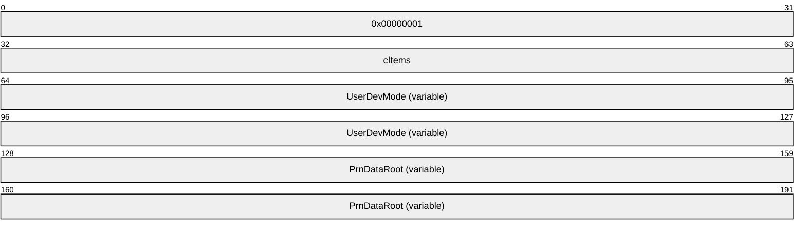
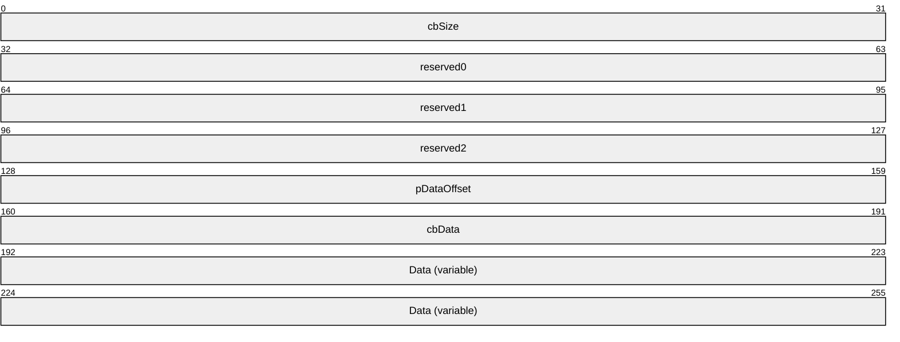
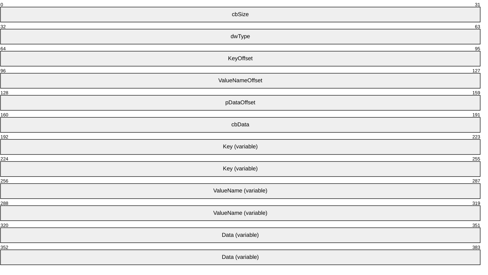

# [MS-WPRN]: Web Point-and-Print Protocol

Table of Contents

1 Introduction

- [1 Introduction](#Section_1)
  - [1.1 Glossary](#Section_1.1)
  - [1.2 References](#Section_1.2)
    - [1.2.1 Normative References](#Section_1.2.1)
    - [1.2.2 Informative References](#Section_1.2.2)
  - [1.3 Overview](#Section_1.3)
  - [1.4 Relationship to Other Protocols](#Section_1.4)
  - [1.5 Prerequisites/Preconditions](#Section_1.5)
  - [1.6 Applicability Statement](#Section_1.6)
  - [1.7 Versioning and Capability Negotiation](#Section_1.7)
  - [1.8 Vendor-Extensible Fields](#Section_1.8)
  - [1.9 Standards Assignments](#Section_1.9)

2 Messages

- [2 Messages](#Section_2)
  - [2.1 Transport](#Section_2.1)
  - [2.2 Message Syntax](#Section_2.2)
    - [2.2.1 Common Data Types](#Section_2.2.1)
    - [2.2.2 ClientInfo Value](#Section_2.2.2)
    - [2.2.3 Registry Type Values](#Section_2.2.3)
    - [2.2.4 Driver Selection Request](#Section_2.2.4)
    - [2.2.5 Driver Selection Response](#Section_2.2.5)
    - [2.2.6 Driver Download Request](#Section_2.2.6)
    - [2.2.7 Driver Download Response](#Section_2.2.7)
      - [2.2.7.1 BIN File Format](#Section_2.2.7.1)
        - [2.2.7.1.1 UserDevMode Structure](#Section_2.2.7.1.1)
        - [2.2.7.1.2 PrnDataRoot Structure](#Section_2.2.7.1.2)
      - [2.2.7.2 DAT File Format](#Section_2.2.7.2)

3 Protocol Details

- [3 Protocol Details](#Section_3)
  - [3.1 Client Details](#Section_3.1)
    - [3.1.1 Abstract Data Model](#Section_3.1.1)
    - [3.1.2 Timers](#Section_3.1.2)
    - [3.1.3 Initialization](#Section_3.1.3)
    - [3.1.4 Higher-Layer Triggered Events](#Section_3.1.4)
    - [3.1.5 Message Processing Events and Sequencing Rules](#Section_3.1.5)
    - [3.1.6 Timer Events](#Section_3.1.6)
    - [3.1.7 Other Local Events](#Section_3.1.7)
  - [3.2 Server Details](#Section_3.2)
    - [3.2.1 Abstract Data Model](#Section_3.2.1)
    - [3.2.2 Timers](#Section_3.2.2)
    - [3.2.3 Initialization](#Section_3.2.3)
    - [3.2.4 Higher-Layer Triggered Events](#Section_3.2.4)
    - [3.2.5 Message Processing Events and Sequencing Rules](#Section_3.2.5)
    - [3.2.6 Timer Events](#Section_3.2.6)
    - [3.2.7 Other Local Events](#Section_3.2.7)

4 Protocol Examples

- [4 Protocol Examples](#Section_4)
  - [4.1 Client/Server Interaction](#Section_4.1)
  - [4.2 Client/Server Messages](#Section_4.2)
    - [4.2.1 Client](#Section_4.2.1)
    - [4.2.2 Server](#Section_4.2.2)

5 Security Considerations

- [5 Security Considerations](#Section_5)

6 Appendix A: Product Behavior

- [6 Appendix A: Product Behavior](#Section_6)

7 Change Tracking

- [7 Change Tracking](#Section_7)

For the legal notice and IP terms, see [LEGAL.md](../LEGAL.md).
Last updated: 9/16/2024.
See [Revision History](#revision-history) for full version history.

# 1 Introduction

The **Web Point-and-Print Protocol** provides a way for a client to download [**printer driver**](#gt_printer-driver) software, from a server in the client network, from a website, or directly by a print device. This supports the distribution of printer drivers using standard web technologies.

This protocol is based on the [**Hypertext Transfer Protocol (HTTP)**](#gt_hypertext-transfer-protocol-http) [[RFC2616]](https://go.microsoft.com/fwlink/?LinkId=90372) and references commonly used data types defined in [MS-DTYP](../MS-DTYP/MS-DTYP.md).

Sections 1.5, 1.8, 1.9, 2, and 3 of this specification are normative. All other sections and examples in this specification are informative.

## 1.1 Glossary

This document uses the following terms:

**ASCII**: The American Standard Code for Information Interchange (ASCII) is an 8-bit character-encoding scheme based on the English alphabet. ASCII codes represent text in computers, communications equipment, and other devices that work with text. ASCII refers to a single 8-bit ASCII character or an array of 8-bit ASCII characters with the high bit of each character set to zero.

**big-endian**: Multiple-byte values that are byte-ordered with the most significant byte stored in the memory location with the lowest address.

**CAB file**: See [**cabinet file**](#gt_cabinet-file).

**cabinet file**: A file that has the suffix .cab and that acts as a container for other files. It serves as a compressed archive for a group of files. For more information, including the format of [**CAB files**](#gt_cab-file), see [[MSDN-CAB]](https://go.microsoft.com/fwlink/?LinkId=226293).

**device driver**: The software that the system uses to communicate with a device such as a display, printer, mouse, or communications adapter. An abstraction layer that restricts access of applications to various hardware devices on a given computer system. It is often referred to simply as a "driver".

**driver package**: A collection of the files needed to successfully load a driver. This includes the device information (.inf) file, the catalog file, and all of the binaries that are copied by the .inf file. Multiple drivers packaged together for deployment purposes.

**fully qualified domain name (FQDN)**: An unambiguous domain name that gives an absolute location in the Domain Name System's (DNS) hierarchy tree, as defined in [[RFC1035]](https://go.microsoft.com/fwlink/?LinkId=90264) section 3.1 and [[RFC2181]](https://go.microsoft.com/fwlink/?LinkId=127732) section 11.

**Hypertext Transfer Protocol (HTTP)**: An application-level protocol for distributed, collaborative, hypermedia information systems (text, graphic images, sound, video, and other multimedia files) on the World Wide Web.

**Hypertext Transfer Protocol Secure (HTTPS)**: An extension of HTTP that securely encrypts and decrypts web page requests. In some older protocols, "Hypertext Transfer Protocol over Secure Sockets Layer" is still used (Secure Sockets Layer has been deprecated). For more information, see [[SSL3]](https://go.microsoft.com/fwlink/?LinkId=90534) and [[RFC5246]](https://go.microsoft.com/fwlink/?LinkId=129803).

**INF file**: A file that provides setup information required to set up a device, such as a list of valid logical configurations for the device and the names of driver files associated with the device.

**Internet Printing Protocol (IPP)**: A standard protocol for printing and for the management of print jobs and printer settings over the Internet. It is built on the [**Hypertext Transfer Protocol (HTTP)**](#gt_hypertext-transfer-protocol-http).

**Internet Protocol version 4 (IPv4)**: An Internet protocol that has 32-bit source and destination addresses. IPv4 is the predecessor of IPv6.

**little-endian**: Multiple-byte values that are byte-ordered with the least significant byte stored in the memory location with the lowest address.

**NetBIOS**: A particular network transport that is part of the LAN Manager protocol suite. [**NetBIOS**](#gt_netbios) uses a broadcast communication style that was applicable to early segmented local area networks. A protocol family including name resolution, datagram, and connection services. For more information, see [[RFC1001]](https://go.microsoft.com/fwlink/?LinkId=90260) and [[RFC1002]](https://go.microsoft.com/fwlink/?LinkId=90261).

**print server**: A machine that hosts the print system and all its different components.

**printer driver**: The interface component between the operating system and the printer device. It is responsible for processing the application data into a page description language (PDL) that can be interpreted by the printer device.

**proxy**: A network node that accepts network traffic originating from one network agent and transmits it to another network agent.

**registry**: A local system-defined database in which applications and system components store and retrieve configuration data. It is a hierarchical data store with lightly typed elements that are logically stored in tree format. Applications use the registry API to retrieve, modify, or delete registry data. The data stored in the registry varies according to the version of the operating system.

**Unicode**: A character encoding standard developed by the Unicode Consortium that represents almost all of the written languages of the world. The [**Unicode**](#gt_unicode) standard [[UNICODE5.0.0/2007]](https://go.microsoft.com/fwlink/?LinkId=154659) provides three forms (UTF-8, UTF-16, and UTF-32) and seven schemes (UTF-8, UTF-16, UTF-16 BE, UTF-16 LE, UTF-32, UTF-32 LE, and UTF-32 BE).

**Uniform Resource Locator (URL)**: A string of characters in a standardized format that identifies a document or resource on the World Wide Web. The format is as specified in [[RFC1738]](https://go.microsoft.com/fwlink/?LinkId=90287).

**Universal Naming Convention (UNC)**: A string format that specifies the location of a resource. For more information, see [MS-DTYP](../MS-DTYP/MS-DTYP.md) section 2.2.57.

**UTF-16LE**: The Unicode Transformation Format - 16-bit, Little Endian encoding scheme. It is used to encode [**Unicode**](#gt_unicode) characters as a sequence of 16-bit codes, each encoded as two 8-bit bytes with the least-significant byte first.

**web server**: A server computer that hosts websites and responds to requests from applications.

**MAY, SHOULD, MUST, SHOULD NOT, MUST NOT:** These terms (in all caps) are used as defined in [[RFC2119]](https://go.microsoft.com/fwlink/?LinkId=90317). All statements of optional behavior use either MAY, SHOULD, or SHOULD NOT.

## 1.2 References

Links to a document in the Microsoft Open Specifications library point to the correct section in the most recently published version of the referenced document. However, because individual documents in the library are not updated at the same time, the section numbers in the documents may not match. You can confirm the correct section numbering by checking the [Errata](https://go.microsoft.com/fwlink/?linkid=850906).

### 1.2.1 Normative References

We conduct frequent surveys of the normative references to assure their continued availability. If you have any issue with finding a normative reference, please contact [dochelp@microsoft.com](mailto:dochelp@microsoft.com). We will assist you in finding the relevant information.

[MS-DTYP] Microsoft Corporation, "[Windows Data Types](../MS-DTYP/MS-DTYP.md)".

[MS-RPRN] Microsoft Corporation, "[Print System Remote Protocol](../MS-RPRN/MS-RPRN.md)".

[MS-RRP] Microsoft Corporation, "[Windows Remote Registry Protocol](../MS-RRP/MS-RRP.md)".

[RFC2119] Bradner, S., "Key words for use in RFCs to Indicate Requirement Levels", BCP 14, RFC 2119, March 1997, [https://www.rfc-editor.org/info/rfc2119](https://go.microsoft.com/fwlink/?LinkId=90317)

[RFC2396] Berners-Lee, T., Fielding, R., and Masinter, L., "Uniform Resource Identifiers (URI): Generic Syntax", RFC 2396, August 1998, [https://www.rfc-editor.org/info/rfc2396](https://go.microsoft.com/fwlink/?LinkId=90339)

[RFC2616] Fielding, R., Gettys, J., Mogul, J., et al., "Hypertext Transfer Protocol -- HTTP/1.1", RFC 2616, June 1999, [https://www.rfc-editor.org/info/rfc2616](https://go.microsoft.com/fwlink/?LinkId=90372)

[RFC2617] Franks, J., Hallam-Baker, P., Hostetler, J., et al., "HTTP Authentication: Basic and Digest Access Authentication", RFC 2617, June 1999, [https://www.rfc-editor.org/info/rfc2617](https://go.microsoft.com/fwlink/?LinkId=90373)

[RFC2818] Rescorla, E., "HTTP Over TLS", RFC 2818, May 2000, [https://www.rfc-editor.org/info/rfc2818](https://go.microsoft.com/fwlink/?LinkId=90383)

[RFC793] Postel, J., Ed., "Transmission Control Protocol: DARPA Internet Program Protocol Specification", RFC 793, September 1981, [https://www.rfc-editor.org/info/rfc793](https://go.microsoft.com/fwlink/?LinkId=150872)

### 1.2.2 Informative References

[MSDN-CAB] Microsoft Corporation, "Microsoft Cabinet Format", March 1997, [http://msdn.microsoft.com/en-us/library/bb417343.aspx](https://go.microsoft.com/fwlink/?LinkId=226293)

[MSDN-INF] Microsoft Corporation, "About INF Files", [http://msdn.microsoft.com/en-us/library/aa376858.aspx](https://go.microsoft.com/fwlink/?LinkId=90025)

[MSDN-PRNINF] Microsoft Corporation, "Printer INF Files", [https://msdn.microsoft.com/en-us/windows/hardware/drivers/print/printer-inf-files](https://go.microsoft.com/fwlink/?LinkId=90066)

[MSDN-RTV] Microsoft Corporation, "Registry Value Types", [http://msdn.microsoft.com/en-us/library/ms724884.aspx](https://go.microsoft.com/fwlink/?LinkId=90116)

[RFC2781] Hoffman, P., and Yergeau, F., "UTF-16, an encoding of ISO 10646", RFC 2781, February 2000, [https://www.rfc-editor.org/info/rfc2781](https://go.microsoft.com/fwlink/?LinkId=90380)

[RFC2910] Herriot, R., Ed., Butler, S., and Moore, P., "Internet Printing Protocol/1.1: Encoding and Transport", RFC 2910, September 2000, [http://www.ietf.org/rfc/rfc2910.txt](https://go.microsoft.com/fwlink/?LinkId=90717)

[RFC2911] Hastings, T., Ed., Herriot, R., deBry, R., et al., "Internet Printing Protocol/1.1: Model and Semantics", RFC 2911, September 2000, [http://www.ietf.org/rfc/rfc2911.txt](https://go.microsoft.com/fwlink/?LinkId=90718)

[RFC5234] Crocker, D., Ed., and Overell, P., "Augmented BNF for Syntax Specifications: ABNF", STD 68, RFC 5234, January 2008, [https://www.rfc-editor.org/info/rfc5234](https://go.microsoft.com/fwlink/?LinkId=123096)

## 1.3 Overview

The Web Point-and-Print Protocol provides a mechanism for clients to download [**printer driver**](#gt_printer-driver) software from a server in the client network or from a website, or directly by print devices. <1>

Figure 1: Client selection and download of printer driver

A Web Point-and-Print Protocol [**web server**](#gt_web-server) maintains a list of printer drivers. A client makes a Driver Selection Request (section [2.2.4](#Section_2.2.4)) to obtain a printer driver of a particular type and for a particular client configuration. If the server locates a printer driver that matches these requirements, the server redirects the client to the location of the printer driver through the Driver Selection Response (section [2.2.5](#Section_2.2.5)).

After a suitable printer driver has been found, the client downloads it by issuing a Driver Download Request (section [2.2.6](#Section_2.2.6)). The driver is supplied in a Driver Download Response (section [2.2.7](#Section_2.2.7)).

## 1.4 Relationship to Other Protocols

The Web Point-and-Print Protocol is dependent on [**HTTP**](#gt_hypertext-transfer-protocol-http) specifications [[RFC2616]](https://go.microsoft.com/fwlink/?LinkId=90372) and [[RFC2617]](https://go.microsoft.com/fwlink/?LinkId=90373), and on TCP/IP specification [[RFC793]](https://go.microsoft.com/fwlink/?LinkId=150872). There are no protocols that are dependent on the Web Point-and-Print Protocol.

## 1.5 Prerequisites/Preconditions

The Web Point-and-Print Protocol is built on [**HTTP**](#gt_hypertext-transfer-protocol-http) [[RFC2616]](https://go.microsoft.com/fwlink/?LinkId=90372).

Before the protocol is invoked, a client obtains both the name of a server that supports the protocol and the name of a printer. How a client obtains these names is not addressed in this specification.

## 1.6 Applicability Statement

The Web Point-and-Print Protocol is applicable in environments that require distribution of [**printer driver**](#gt_printer-driver) software where other mechanisms, such as the Print System Remote Protocol [MS-RPRN](../MS-RPRN/MS-RPRN.md), are not available.

## 1.7 Versioning and Capability Negotiation

The Web Point-and-Print Protocol does not have versioning and does not contain locale-dependent information.

## 1.8 Vendor-Extensible Fields

The Web Point-and-Print Protocol does not support vendor-extensible fields.

## 1.9 Standards Assignments

The Web Point-and-Print Protocol uses the following default assignments.

| Parameter | Value | Reference |
| --- | --- | --- |
| TCP/IP port for [**Hypertext Transfer Protocol (HTTP)**](#gt_hypertext-transfer-protocol-http) | 80 | [[RFC2616]](https://go.microsoft.com/fwlink/?LinkId=90372) section 3.2.2. |
| TCP/IP port for [**Hypertext Transfer Protocol over Secure Socket Layer (HTTPS)**](#gt_hypertext-transfer-protocol-secure-https) | 443 | [[RFC2818]](https://go.microsoft.com/fwlink/?LinkId=90383) section 2.3. |

# 2 Messages

## 2.1 Transport

The Web Point-and-Print Protocol uses the following transports:

- [**HTTP**](#gt_hypertext-transfer-protocol-http) over TCP/IP [[RFC2616]](https://go.microsoft.com/fwlink/?LinkId=90372)
- [**HTTPS**](#gt_hypertext-transfer-protocol-secure-https) over TCP/IP [[RFC2818]](https://go.microsoft.com/fwlink/?LinkId=90383)

## 2.2 Message Syntax

The Web Point-and-Print Protocol issues its requests from the client via [**Uniform Resource Locators (URLs)**](#gt_uniform-resource-locator-url) in an [**HTTP**](#gt_hypertext-transfer-protocol-http) GET request ([[RFC2616]](https://go.microsoft.com/fwlink/?LinkId=90372) section 9.3) and the associated query qualifier. The server returns a response via an HTTP response message, which returns either a **Location** header in a redirect response ([RFC2616] section 14.30) or an HTTP 500 error ([RFC2616] section 10.5.1) if the original HTTP GET request cannot be processed by the server.

### 2.2.1 Common Data Types

Unless otherwise noted, the following statements apply to this protocol:

- All strings consist of characters that are encoded in [**Unicode**](#gt_unicode) [**UTF-16LE**](#gt_utf-16le) and are null-terminated. Each code point in a string, including null terminators, occupies 16 bits ([[RFC2781]](https://go.microsoft.com/fwlink/?LinkId=90380) section 2.1).
- A list of strings is referred to as a **MULTI_SZ** structure ([MS-DTYP](../MS-DTYP/MS-DTYP.md) section 2.3.8), in which the characters that make up the string N+1 directly follow the terminating null character of string N. The last string in a **MULTI_SZ** is terminated by two null characters.
- All parameters or members that specify the number of characters in a string or **MULTI_SZ** specify the number of characters in the string, including the terminating null characters.
- All constraints that specify the maximum number of characters in a string or **MULTI_SZ** specify the number of characters in the string, including the terminating null characters.
- All parameters or members that specify the number of bytes in buffers that contain a string or **MULTI_SZ** specify the number of bytes in the buffer, including the terminating null characters.

### 2.2.2 ClientInfo Value

There are four parameters encoded in a **ClientInfo** value:

- The major version number of the client operating system.
- The minor version number of the client operating system.
- A value specifying the type of client platform.
- A value specifying the client processor architecture.
Each parameter is an 8-bit unsigned value. For transmission on the wire, these values are packed into 32-bits to form a **ClientInfo** value, according to the following equation:

ClientInfo = (major version) * (2^24) + (minor version) * (2^16) + (client platform) * (2^8) + (client processor architecture)

The major version number of the client operating system is dependent on the platform on which the client is running.<2>

The minor version number of the client operating system is dependent on the platform on which the client is running.<3>

The client platform value is dependent on the platform on which the client is running.<4>

The client processor architecture value MUST be one of the following.<5>

| Value | Client processor architecture |
| --- | --- |
| 0x00 | Intel x86 |
| 0x01 | MIPS |
| 0x02 | ALPHA |
| 0x03 | PPC |
| 0x06 | Itanium-based |
| 0x09 | AMD64 or Intel x64 |
| 0x05 | ARM |

### 2.2.3 Registry Type Values

The following table specifies valid **registry type values** for use in the **dwType** field of the **PrnDataRoot** structure (section [2.2.7.1.2](#Section_2.2.7.1.2)).

| Registry type name/value | Description |
| --- | --- |
| REG_NONE 0x00000000 | No value type is defined. |
| REG_SZ 0x00000001 | A string. |
| REG_EXPAND_SZ 0x00000002 | A string that can contain unexpanded references to environment variables, for example, "%PATH%". |
| REG_BINARY 0x00000003 | Binary data in any form. |
| REG_DWORD 0x00000004 | A 32-bit number. |
| REG_DWORD_LITTLE_ENDIAN 0x00000004 | A 32-bit number in [**little-endian**](#gt_little-endian) format; equivalent to REG_DWORD. |
| REG_DWORD_BIG_ENDIAN 0x00000005 | A 32-bit number in [**big-endian**](#gt_big-endian) format. |
| REG_LINK 0x00000006 | Symbolic link to a [**registry**](#gt_registry) key. |
| REG_MULTI_SZ 0x00000007 | A **REG_MULTI_SZ** structure ([MS-RRP](../MS-RRP/MS-RRP.md) section 2.2.5). |
| REG_RESOURCE_LIST 0x00000008 | A [**device driver**](#gt_device-driver) resource list. |
| REG_QWORD 0x0000000B | A 64-bit number. |
| REG_QWORD_LITTLE_ENDIAN 0x0000000B | A 64-bit number in little-endian format; equivalent to REG_QWORD. |

### 2.2.4 Driver Selection Request

The **Driver Selection Request** is a standard [**HTTP**](#gt_hypertext-transfer-protocol-http) GET request ([[RFC2616]](https://go.microsoft.com/fwlink/?LinkId=90372) section 9.3) that sends the [**printer driver**](#gt_printer-driver) selection criteria to the server in a **PrinterDriverQuery**. The format of the HTTP request [**URL**](#gt_uniform-resource-locator-url) is specified by the following **ABNF** grammar rule [[RFC5234]](https://go.microsoft.com/fwlink/?LinkId=123096).

PrinterDriverQuery = [PRINT_SERVER] PRINTER_RESOURCE "?" DRIVER_QUERY

PRINT_SERVER = "http:" "//" host [":" port]

PRINTER_RESOURCE = abs_path

DRIVER_QUERY = "createexe" "&" CLIENT_INFO

CLIENT_INFO = 1*DIGIT

Here, "1*DIGIT" indicates "one or more occurrences of DIGIT". For the definitions of **host**, **port**, **abs_path**, and **DIGIT**, see [RFC2616] sections 2.2 and 3.2, and [[RFC2396]](https://go.microsoft.com/fwlink/?LinkId=90339) sections 3.2.2 and 3.3.

How the client determines the **host**, **port**, and **abs_path** is not specified by this protocol. Typically, the port is either the HTTP default port "80" or another port that is configured by an administrator.

**DRIVER_QUERY**: The HTTP query component ([RFC2396] section 3.4), which constrains the selection of printer driver instances for the printer resource.

**PRINT_SERVER**: The address of the Web Point-and-Print Protocol server, whether or not the request is to be routed through a [**proxy**](#gt_proxy).

**PRINTER_RESOURCE**: The name of the printer resource.

**CLIENT_INFO**: The environmental information on the client that is making the request, computed as a **ClientInfo** value (section [2.2.2](#Section_2.2.2)) and formatted as the [**ASCII**](#gt_ascii) representation of a decimal integer.

### 2.2.5 Driver Selection Response

The **Driver Selection Response** is a standard [**HTTP**](#gt_hypertext-transfer-protocol-http) redirect response, in the HTTP **Location** field, to the [**URL**](#gt_uniform-resource-locator-url) of a file that contains the software and information necessary to install the [**printer driver**](#gt_printer-driver) on the client. Specifically, the response MUST be a **Redirection 302** response ([[RFC2616]](https://go.microsoft.com/fwlink/?LinkId=90372) section 10.3.3), and the HTTP **Location** field MUST point to the printer driver file.

### 2.2.6 Driver Download Request

The **Driver Download Request** is a standard [**HTTP**](#gt_hypertext-transfer-protocol-http) GET request ([[RFC2616]](https://go.microsoft.com/fwlink/?LinkId=90372) section 9.3) to the [**URL**](#gt_uniform-resource-locator-url) specified in the **Location** header received in the **Driver Selection Response** (section [2.2.5](#Section_2.2.5)).

### 2.2.7 Driver Download Response

The **Driver Download Response** is a standard [**HTTP**](#gt_hypertext-transfer-protocol-http) response ([[RFC2616]](https://go.microsoft.com/fwlink/?LinkId=90372) section 6) to the driver download HTTP GET request (section [2.2.6](#Section_2.2.6)). If the response return code is 200 (success), the response entity body MUST contain the requested driver.

The HTTP redirect is to a [**URL**](#gt_uniform-resource-locator-url) with Content-Type set to application/octet-stream ([RFC2616] section 7.2.1), which specifies a [**cabinet file**](#gt_cabinet-file) [[MSDN-CAB]](https://go.microsoft.com/fwlink/?LinkId=226293) that has a **.webpnp** extension. The cabinet file includes the following:

- [**Printer driver**](#gt_printer-driver) software files.
- An [**INF file**](#gt_inf-file) [[MSDN-INF]](https://go.microsoft.com/fwlink/?LinkId=90025) that is used during installation of the driver software.
- A BIN file (section [2.2.7.1](#Section_2.2.7.1)) that provides the information needed to access printer setup/configuration data.
- A DAT file (section [2.2.7.2](#Section_2.2.7.2)) that provides additional [**print server**](#gt_print-server) and printer setup/configuration data.

#### 2.2.7.1 BIN File Format

The **BIN file** contains the information needed to access printer setup and configuration data. The format of that information is shown below. All fields are in [**little-endian**](#gt_little-endian) format.

File Header:

**cItems (4 bytes):** The number of **PrnDataRoot** structures (section [2.2.7.1.2](#Section_2.2.7.1.2)) contained in the BIN file. This value can be zero.

**UserDevMode (variable):** A **UserDevMode** structure (section [2.2.7.1.1](#Section_2.2.7.1.1)).

**PrnDataRoot (variable):** A **PrnDataRoot** structure, which is repeated **cItems** times in this field.

##### 2.2.7.1.1 UserDevMode Structure

The **UserDevMode** structure is used for general printer information.

**cbSize (4 bytes):** The total number of bytes in this structure.

**reserved0 (4 bytes):** A value that MUST be set to zero and ignored on receipt.

**reserved1 (4 bytes):** A value that MUST be set to zero and ignored on receipt.

**reserved2 (4 bytes):** A value that MUST be set to zero and ignored on receipt.

**pDataOffset (4 bytes):** An unsigned integer that specifies the number of bytes from the start of the **UserDevMode** structure to the **Data** field.

**cbData (4 bytes):** The number of bytes in the **Data** field.

**Data (variable):** Printer device settings in a **_DEVMODE** structure ([MS-RPRN](../MS-RPRN/MS-RPRN.md) section 2.2.2.1).

This field MUST be padded to the next 64-bit boundary.

##### 2.2.7.1.2 PrnDataRoot Structure

The **PrnDataRoot** structure describes a printer configuration value in the [**registry**](#gt_registry) structure used by a [**printer driver**](#gt_printer-driver) that is associated with a printer. This structure is repeated for a count specified by the **cItems** member of the **BIN file** (section [2.2.7.1](#Section_2.2.7.1)) header.

Printer configuration values control the behavior of the printer driver in a printer driver-specific way. A printer driver can define an arbitrary number of printer configuration values.

Printer configuration values are uniquely identified by the following attributes:

**Key:** An arbitrary string defined by the printer driver associated with a printer.

**ValueName:** A string that contains the name of the printer configuration value.

**cbSize (4 bytes):** The total number of bytes in this **PrnDataRoot**.

**dwType (4 bytes):** A value that specifies a **Registry Type value** (section [2.2.3](#Section_2.2.3)). For additional information about registry types, see [[MSDN-RTV]](https://go.microsoft.com/fwlink/?LinkId=90116).

**KeyOffset (4 bytes):** An unsigned integer that specifies the number of bytes from the start of the **PrnDataRoot** to the **Key** field.

**ValueNameOffset (4 bytes):** An unsigned integer that specifies the number of bytes from the start of the **PrnDataRoot** to the **ValueName** field.

**pDataOffset (4 bytes):** An unsigned integer that specifies the number of bytes from the start of the **PrnDataRoot** to the **Data** field.

**cbData (4 bytes):** The number of bytes in the **Data** field.

**Key (variable):** A string that contains the name of the key that corresponds to the printer configuration value identified by **ValueName**.

This field MUST be padded to the next 64-bit boundary.

**ValueName (variable):** A string that contains the name of a printer configuration value for the printer driver.

This field MUST be padded to the next 64-bit boundary.

**Data (variable):** A field containing data for the printer configuration value identified by **ValueName**. The data contained in this field MUST be interpreted according to the registry value type that is specified by the **dwType** field.

This field MUST be padded to the next 64-bit boundary.

#### 2.2.7.2 DAT File Format

The **DAT file** contains options for installing a [**printer driver**](#gt_printer-driver) on the client machine. The following restrictions apply to DAT files:

- The name of the DAT file is "cab_ipp.dat".
- The DAT file is a text file, in [**Unicode**](#gt_unicode) [**UTF-16LE**](#gt_utf-16le) character encoding.
DAT file options are specified as follows:

/if

/x

/Q<PackageList>

/b<PrinterBaseName>

/f<InfName>

/r<PrinterPortName>

/m<DriverName>

/n<UncName>

/a<BinName>

/q

**Note** These options are presented in the form of a list for readability. This is not to specify that a newline character is required to separate each option in a DAT file.

Option parameters are defined as follows:

**PackageList**: A list of [**CAB file**](#gt_cab-file) names containing [**driver packages**](#gt_driver-package) included in the **.webpnp** file. The individual CAB file names are separated by ";".

**PrinterBaseName**: "\\http://<ServerName>\<PrinterName>", if the [**HTTP**](#gt_hypertext-transfer-protocol-http) transport is being used; or "\\https://<ServerName>\<PrinterName>", if the [**HTTPS**](#gt_hypertext-transfer-protocol-secure-https) transport is being used.

**ServerName:** The [**NetBIOS**](#gt_netbios) name, [**fully qualified domain name (FQDN)**](#gt_fully-qualified-domain-name-fqdn), or [**IPv4**](#gt_internet-protocol-version-4-ipv4) address.

**PrinterName**: The name of the printer.

**InfName**: The name of the [**INF file**](#gt_inf-file) that is included in the **.webpnp** file.

**PrinterPortName**: The [**URL**](#gt_uniform-resource-locator-url) of the printer.

**DriverName:** The name of the printer driver.

**UncName:** The [**Universal Naming Convention (UNC)**](#gt_universal-naming-convention-unc) path of the server.

**BinName**: The name of the **BIN file** (section [2.2.7.1](#Section_2.2.7.1)) that is included in the **.webpnp** file.

The following syntax rules apply to DAT file options and parameters:

- The individual options can appear in any order.
- All options MUST be specified, except "/x", "/q" and "/Q".
- The individual options MUST be separated by white space, which includes the UTF-16LE character codes 0x0020, 0x000D, and 0x000A, and combinations thereof.
- White space between the switch of an option (for example, "/r") and its parameter (for example, the **PrinterPortName**) MUST be accepted.
- A parameter MUST be surrounded by quotes if it contains white space.
- Quotes around a parameter that does not contain white space MUST be accepted.
- The absence of quotes around a parameter that does not contain white space MUST be accepted.
- The option "/if" conveys no meaning in the protocol.
The following syntax rules apply to the "/x", "/q" and "/Q" options specifically:

- Either the two options "/x" and "/q" together, or the single option "/Q", MUST be specified.
- If "/x" and "/q" are specified "/Q" MUST NOT be specified.
- If "/Q" is specified "/x" and "/q" MUST NOT be specified.
- The options "/x" and "/q" together indicate the installation of a printer driver. The name and location of the printer driver MUST be specified with the parameters of other options.
- The option "/Q" specifies the installation of a driver package.
- "/Q" MUST NOT be specified if the major version parameter of the **ClientInfo** value (section [2.2.2](#Section_2.2.2)) in the request is less than 6.

# 3 Protocol Details

## 3.1 Client Details

### 3.1.1 Abstract Data Model

None.

### 3.1.2 Timers

None.

### 3.1.3 Initialization

None.

### 3.1.4 Higher-Layer Triggered Events

A client invocation is the result of local client application activity. The client application specifies the driver selection parameters. The syntax and semantics of these parameters are specified in section [2.2.4](#Section_2.2.4). No other higher-layer triggered events are defined.

### 3.1.5 Message Processing Events and Sequencing Rules

The Web Point-and-Print Protocol client is preconfigured with the [**URL**](#gt_uniform-resource-locator-url) of a Web Point-and-Print Protocol server. To initiate the protocol, the client sends a **Driver Selection Request** (section [2.2.4](#Section_2.2.4)) message to the [**web server**](#gt_web-server) with which it has been configured.

If the server returns an [**HTTP**](#gt_hypertext-transfer-protocol-http) status other than 302 (found), the client MUST return an error code to the invoking application.

If the server returns an HTTP redirect code of 302, the client parses the received HTTP response to retrieve the **Location** header. If a **Location** header is not found, the client MUST return an error code to the invoking application. Otherwise, the client sends a **Driver Download Request** message (section [2.2.6](#Section_2.2.6)) to the server identified in the **Location** header.

If the HTTP response returned to the client has a status of 200 (success), the entity body received in the HTTP response is returned to the invoking application as the printer [**driver package**](#gt_driver-package). If the HTTP response is anything other than success, the client MUST return an error code to the invoking client application.

### 3.1.6 Timer Events

None.

### 3.1.7 Other Local Events

No additional local events are used on the client beyond the events maintained in the underlying [**HTTP**](#gt_hypertext-transfer-protocol-http).

## 3.2 Server Details

### 3.2.1 Abstract Data Model

This section describes a conceptual model of a possible data organization that an implementation might need to maintain to participate in this protocol. The organization described in this section is provided to facilitate the explanation of how the protocol behaves. This specification does not mandate that implementations adhere to this model as long as their external behavior is consistent with that described in this specification.

The Web Point-and-Print Protocol depends on an abstract data model that maintains printers. The [**print server**](#gt_print-server) behaves as if it hosted the following objects in the specified hierarchy.

**List of Printers**: Each printer represents a physical print device or a number of homogeneous physical devices that are installed on the print server. Each printer object maintains the following data elements:

- A name that uniquely identifies the printer.
- A reference to a [**printer driver**](#gt_printer-driver) object for the printer.
- Per-user printer device settings in a **_DEVMODE** structure ([MS-RPRN](../MS-RPRN/MS-RPRN.md) section 2.2.2.1).
**List of Drivers**: Each printer driver represents the software component responsible for converting print content submitted by applications into device-specific commands. Each printer driver object maintains the following data elements:

- A name that uniquely identifies the printer driver.
- A list of well-known modules (that is, rendering module, configuration module, and data module).
- Additionally, each printer driver object maintains the following optional data elements:
- A list of dependent files.
- Information on the printer driver manufacturer, printer driver time stamp, and version.
The abstract data model can relate each printer to a single printer driver ([MS-RPRN] section 3.1.1).

### 3.2.2 Timers

None.

### 3.2.3 Initialization

The server listens for [**HTTP**](#gt_hypertext-transfer-protocol-http) and [**HTTPS**](#gt_hypertext-transfer-protocol-secure-https) requests.

### 3.2.4 Higher-Layer Triggered Events

None.

### 3.2.5 Message Processing Events and Sequencing Rules

The client initiates the Web Point-and-Print Protocol by sending a **Driver Selection Request** message (section [2.2.4](#Section_2.2.4)) to the server. On receiving this message, the server validates parameters as follows:

- The **PRINTER_RESOURCE** parameter is a valid absolute path of a printer resource.
- The **CLIENT_INFO** section of the [**URL**](#gt_uniform-resource-locator-url) is a supported **ClientInfo value** (section [2.2.2](#Section_2.2.2)) value.
If parameter validation fails, the server MUST fail the operation immediately, returning [**HTTP**](#gt_hypertext-transfer-protocol-http) error 500 (Internal Server Error). If parameter validation succeeds, the server composes a response to the client as follows:

- The server uses the received **CLIENT_INFO** parameter to determine the location of the appropriate [**printer driver**](#gt_printer-driver). The mechanism is implementation specific. If a matching driver is found, the server creates a **Driver Selection Response** (section [2.2.5](#Section_2.2.5)), replying to the client with an HTTP 302 redirect.<6>
- If a matching driver cannot be found, the server fails the operation, replying to the client with HTTP error 500 (internal server error).
Processing of a **Driver Download Request** (section [2.2.6](#Section_2.2.6)) follows the rules specified for GET processing ([[RFC2616]](https://go.microsoft.com/fwlink/?LinkId=90372) section 9.3). The format of the data returned in the response is specified in the **Driver Download Response** (section [2.2.7](#Section_2.2.7)).

### 3.2.6 Timer Events

None.

### 3.2.7 Other Local Events

No additional local events are used on the client beyond the events maintained in the underlying [**HTTP**](#gt_hypertext-transfer-protocol-http).

# 4 Protocol Examples

## 4.1 Client/Server Interaction

The following diagram illustrates the interaction sequence to obtain a [**printer driver**](#gt_printer-driver) using the Web Point-and-Print Protocol.

Figure 2: Obtaining a printer driver

## 4.2 Client/Server Messages

### 4.2.1 Client

The following text is a sample client **Driver Selection Request** (section [2.2.4](#Section_2.2.4)), depicted in the **Client/Server Interaction** figure in section [4.1](#Section_4.1). An [**HTTP**](#gt_hypertext-transfer-protocol-http) **GET** request is used for sending [**printer driver**](#gt_printer-driver) selection criteria to the server.

GET /printers/printerModelXXX/.printer?createexe&83952128

### 4.2.2 Server

The following text is a sample server **Driver Selection Response** (section [2.2.5](#Section_2.2.5)) to a client **Driver Selection Request** (section [2.2.4](#Section_2.2.4)), as depicted in the **Client/Server Interaction** figure in section [4.1](#Section_4.1). The server performs an [**HTTP**](#gt_hypertext-transfer-protocol-http) **Redirection 302** response to the [**URL**](#gt_uniform-resource-locator-url) of a file that contains the requested [**printer driver**](#gt_printer-driver) and installation software.

HTTP/1.1 302 Object Moved

Content-Length: 176

Content-Type: text/html

Location: http://1.1.1.2/printers/PrtCabs/85CCX862.webpnp

Server: Microsoft-IIS/6.0

X-Powered-By: ASP.NET

Date: Wed, 12 Jul 2006 21:44:42 GMT

Connection: close

<head><title>Document Moved</title></head>

<body><h1>Object Moved</h1>This document may be found

[here](http://1.1.1.2/printers/PrtCabs/85CCX862.webpnp)

</body>

<END OF ENTITY>

# 5 Security Considerations

The Web Point-and-Print Protocol does not provide any facilities for mutual authentication, so server identities cannot be verified.

# 6 Appendix A: Product Behavior

The information in this specification is applicable to the following Microsoft products or supplemental software. References to product versions include updates to those products.

The terms "earlier" and "later", when used with a product version, refer to either all preceding versions or all subsequent versions, respectively. The term "through" refers to the inclusive range of versions. Applicable Microsoft products are listed chronologically in this section.

- Windows 2000 operating system
- Windows 2000 Server operating system
- Windows XP operating system
- Windows Server 2003 operating system
- Windows Vista operating system
- Windows Server 2008 operating system
- Windows 7 operating system
- Windows Server 2008 R2 operating system
- Windows 8 operating system
- Windows Server 2012 operating system
- Windows 8.1 operating system
- Windows Server 2012 R2 operating system
- Windows 10 operating system
- Windows Server 2016 operating system
- Windows Server 2019 operating system
- Windows Server 2022 operating system
- Windows 11 operating system
- Windows Server 2025 operating system
Exceptions, if any, are noted in this section. If an update version, service pack or Knowledge Base (KB) number appears with a product name, the behavior changed in that update. The new behavior also applies to subsequent updates unless otherwise specified. If a product edition appears with the product version, behavior is different in that product edition.

Unless otherwise specified, any statement of optional behavior in this specification that is prescribed using the terms "SHOULD" or "SHOULD NOT" implies product behavior in accordance with the SHOULD or SHOULD NOT prescription. Unless otherwise specified, the term "MAY" implies that the product does not follow the prescription.

<1> Section 1.3: The Web Point-and-Print Protocol is used when the Print System Remote Protocol (for more information, see [MS-RPRN](../MS-RPRN/MS-RPRN.md)) is not available due to policy restrictions, policy restrictions on the use of RPC, or other restrictions on printing. When the Web Point-and-Print Protocol is used to install the [**printer drivers**](#gt_printer-driver), the print spooler uses the [**Internet Printing Protocol (IPP)**](#gt_internet-printing-protocol-ipp) [[RFC2910]](https://go.microsoft.com/fwlink/?LinkId=90717) [[RFC2911]](https://go.microsoft.com/fwlink/?LinkId=90718) to communicate with the actual print device.

<2> Section 2.2.2: Windows clients use one of the following major version values.

| Value | Major version |
| --- | --- |
| 0x05 | Windows 2000 Server, Windows XP, or Windows Server 2003 |
| 0x06 | Windows Vista through Windows 8.1 and Windows Server 2008 through Windows Server 2012 R2 operating system |
| 0x0A | Windows 10 and later and Windows Server 2016 and later |

<3> Section 2.2.2: Windows clients use one of the following minor version values.

| Value | Minor version |
| --- | --- |
| 0x00 | Windows 2000 Server, Windows Vista, Windows Server 2008, Windows 10, Windows Server 2016, Windows Server 2019, Windows 11, Windows Server 2025 |
| 0x01 | Windows XP, Windows 7, or Windows Server 2008 R2 |
| 0x02 | Windows Server 2003, Windows 8, Windows Server 2012, Windows 8.1, Windows Server 2012 R2 |

<4> Section 2.2.2: Windows clients use one of the following client platform values.

| Value | Client platform |
| --- | --- |
| 0x01 | Windows 95 operating system, Windows 98 operating system, or Windows Millennium Edition operating system. |
| 0x02 | Windows 2000, Windows XP and later, Windows Server 2003 and later |

Windows Vista and later and Windows Server 2008 and later:

- A client platform value of 0x01 is invalid.
- All other client platform values are treated as 0x02.
Windows 2000, Windows 2000 Server, Windows XP, and Windows Server 2003:

- All client platform values different from 0x01 or 0x02 are treated as 0x02.
- If client platform is 0x01, the client processor architecture value will be ignored and will always be treated as Intel x86.
<5> Section 2.2.2: Windows client processor architecture values:

Not supported on Windows 2000 or Windows 2000 Server:

- AMD64
Not supported on Windows Server 2003 and later and Windows Vista and later:

- MIPS
- ALPHA
- PPC
Not supported on Windows 2000, Windows 2000 Server, Windows Server 2003, Windows Vista, Windows Server 2008, Windows 7, or Windows Server 2008 R2 operating system:

- ARM
<6> Section 3.2.5: The Windows implementation extracts information from printer driver [**INF files**](#gt_inf-file) to determine the appropriate drivers to return to the client. For information on printer driver INF files, see [[MSDN-PRNINF]](https://go.microsoft.com/fwlink/?LinkId=90066).

# 7 Change Tracking

No table of changes is available. The document is either new or has had no changes since its last release.

## Revision History

| Date | Version | Revision Class | Comments |
| --- | --- | --- | --- |
| 3/2/2007 | 1.0 | New | Version 1.0 release |
| 4/3/2007 | 1.1 | Minor | Version 1.1 release |
| 5/11/2007 | 1.2 | Minor | Version 1.2 release |
| 6/1/2007 | 1.2.1 | Editorial | Changed language and formatting in the technical content. |
| 7/3/2007 | 1.2.2 | Editorial | Changed language and formatting in the technical content. |
| 8/10/2007 | 1.2.3 | Editorial | Changed language and formatting in the technical content. |
| 9/28/2007 | 1.2.4 | Editorial | Changed language and formatting in the technical content. |
| 10/23/2007 | 2.0 | Major | Converted document to unified format. |
| 1/25/2008 | 2.0.1 | Editorial | Changed language and formatting in the technical content. |
| 3/14/2008 | 2.1 | Minor | Clarified the meaning of the technical content. |
| 6/20/2008 | 2.2 | Minor | Clarified the meaning of the technical content. |
| 7/25/2008 | 3.0 | Major | Updated and revised the technical content. |
| 8/29/2008 | 3.1 | Minor | Clarified the meaning of the technical content. |
| 10/24/2008 | 3.1.1 | Editorial | Changed language and formatting in the technical content. |
| 12/5/2008 | 3.2 | Minor | Clarified the meaning of the technical content. |
| 1/16/2009 | 3.3 | Minor | Clarified the meaning of the technical content. |
| 2/27/2009 | 3.3.1 | Editorial | Changed language and formatting in the technical content. |
| 4/10/2009 | 3.3.2 | Editorial | Changed language and formatting in the technical content. |
| 5/22/2009 | 3.4 | Minor | Clarified the meaning of the technical content. |
| 7/2/2009 | 3.4.1 | Editorial | Changed language and formatting in the technical content. |
| 8/14/2009 | 3.5 | Minor | Clarified the meaning of the technical content. |
| 9/25/2009 | 3.6 | Minor | Clarified the meaning of the technical content. |
| 11/6/2009 | 3.7 | Minor | Clarified the meaning of the technical content. |
| 12/18/2009 | 3.8 | Minor | Clarified the meaning of the technical content. |
| 1/29/2010 | 3.8.1 | Editorial | Changed language and formatting in the technical content. |
| 3/12/2010 | 3.8.2 | Editorial | Changed language and formatting in the technical content. |
| 4/23/2010 | 3.8.3 | Editorial | Changed language and formatting in the technical content. |
| 6/4/2010 | 3.8.4 | Editorial | Changed language and formatting in the technical content. |
| 7/16/2010 | 3.9 | Minor | Clarified the meaning of the technical content. |
| 8/27/2010 | 3.9 | None | No changes to the meaning, language, or formatting of the technical content. |
| 10/8/2010 | 3.9 | None | No changes to the meaning, language, or formatting of the technical content. |
| 11/19/2010 | 3.10 | Minor | Clarified the meaning of the technical content. |
| 1/7/2011 | 3.10 | None | No changes to the meaning, language, or formatting of the technical content. |
| 2/11/2011 | 3.10 | None | No changes to the meaning, language, or formatting of the technical content. |
| 3/25/2011 | 3.10 | None | No changes to the meaning, language, or formatting of the technical content. |
| 5/6/2011 | 3.10 | None | No changes to the meaning, language, or formatting of the technical content. |
| 6/17/2011 | 3.11 | Minor | Clarified the meaning of the technical content. |
| 9/23/2011 | 3.11 | None | No changes to the meaning, language, or formatting of the technical content. |
| 12/16/2011 | 4.0 | Major | Updated and revised the technical content. |
| 3/30/2012 | 4.0 | None | No changes to the meaning, language, or formatting of the technical content. |
| 7/12/2012 | 4.0 | None | No changes to the meaning, language, or formatting of the technical content. |
| 10/25/2012 | 4.0 | None | No changes to the meaning, language, or formatting of the technical content. |
| 1/31/2013 | 4.0 | None | No changes to the meaning, language, or formatting of the technical content. |
| 8/8/2013 | 5.0 | Major | Updated and revised the technical content. |
| 11/14/2013 | 5.0 | None | No changes to the meaning, language, or formatting of the technical content. |
| 2/13/2014 | 5.0 | None | No changes to the meaning, language, or formatting of the technical content. |
| 5/15/2014 | 5.0 | None | No changes to the meaning, language, or formatting of the technical content. |
| 6/30/2015 | 6.0 | Major | Significantly changed the technical content. |
| 10/16/2015 | 6.0 | None | No changes to the meaning, language, or formatting of the technical content. |
| 7/14/2016 | 6.0 | None | No changes to the meaning, language, or formatting of the technical content. |
| 6/1/2017 | 6.0 | None | No changes to the meaning, language, or formatting of the technical content. |
| 9/15/2017 | 7.0 | Major | Significantly changed the technical content. |
| 9/12/2018 | 8.0 | Major | Significantly changed the technical content. |
| 4/7/2021 | 9.0 | Major | Significantly changed the technical content. |
| 6/25/2021 | 10.0 | Major | Significantly changed the technical content. |
| 4/23/2024 | 11.0 | Major | Significantly changed the technical content. |
| 9/16/2024 | 11.0 | None | No changes to the meaning, language, or formatting of the technical content. |
