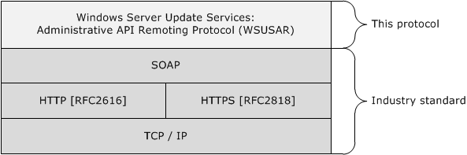
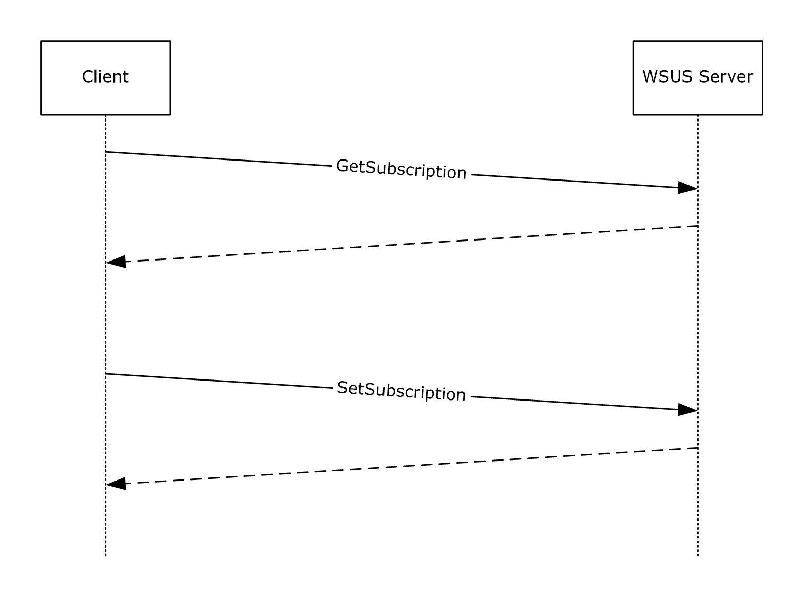
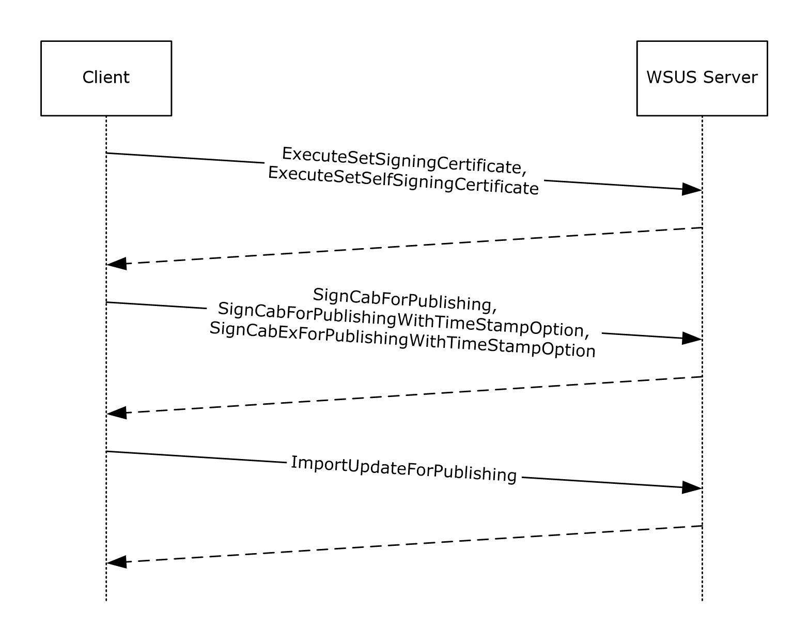
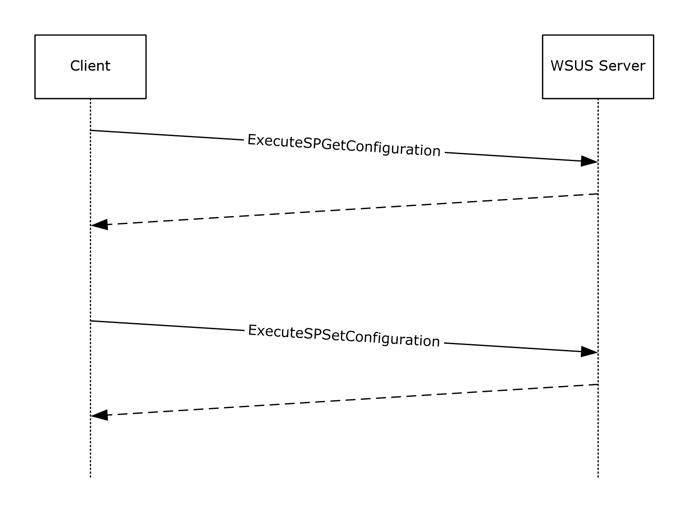
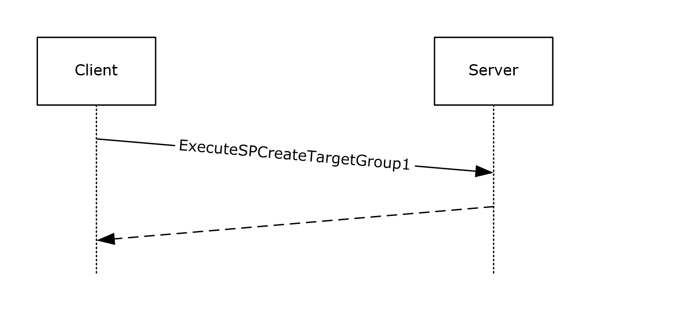
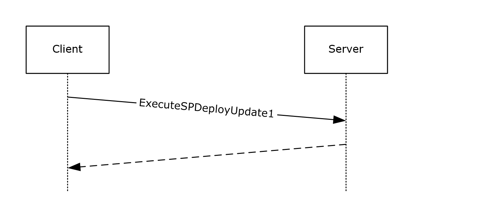
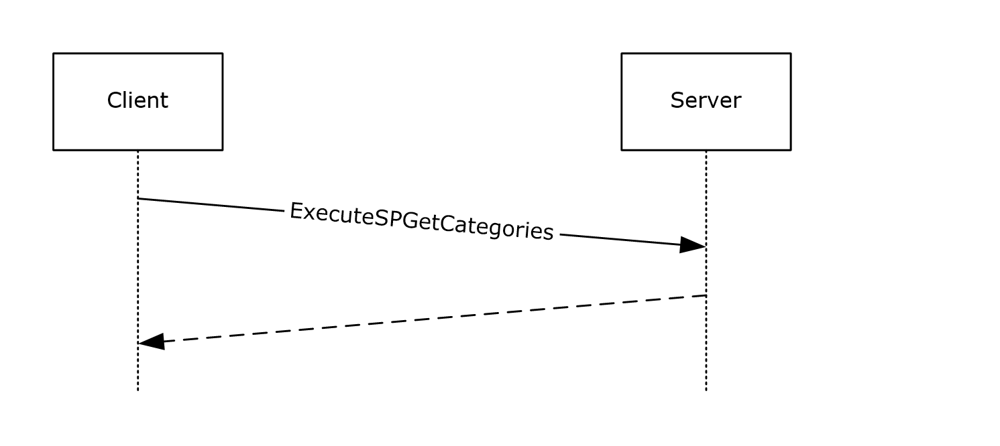

[MS-WSUSAR]: **Windows Server Update Services: Administrative API Remoting Protocol (WSUSAR)**

Table of Contents

1 Introduction

- [1 Introduction](#Section_1)
  - [1.1 Glossary](#Section_1.1)
  - [1.2 References](#Section_1.2)
    - [1.2.1 Normative References](#Section_1.2.1)
    - [1.2.2 Informative References](#Section_1.2.2)
  - [1.3 Protocol Overview (Synopsis)](#Section_1.3)
  - [1.4 Relationship to Other Protocols](#Section_1.4)
  - [1.5 Prerequisites/Preconditions](#Section_1.5)
  - [1.6 Applicability Statement](#Section_1.6)
  - [1.7 Versioning and Capability Negotiation](#Section_1.7)
  - [1.8 Vendor-Extensible Fields](#Section_1.8)
  - [1.9 Standards Assignments](#Section_1.9)

2 Messages

- [2 Messages](#Section_2)
  - [2.1 Transport](#Section_2.1)
  - [2.2 Common Message Syntax](#Section_2.2)
    - [2.2.1 Namespaces](#Section_2.2.1)
    - [2.2.2 Messages](#Section_2.2.2)
    - [2.2.3 Elements](#Section_2.2.3)
      - [2.2.3.1 UpdateScope Element](#Section_2.2.3.1)
        - [2.2.3.1.1 ApprovedStates Attribute](#Section_2.2.3.1.1)
        - [2.2.3.1.2 FromArrivalDate Attribute](#Section_2.2.3.1.2)
        - [2.2.3.1.3 ToArrivalDate Attribute](#Section_2.2.3.1.3)
        - [2.2.3.1.4 UpdateTypes Attribute 1](#Section_2.2.3.1.4)
        - [2.2.3.1.5 IncludedInstallationStates Attribute](#Section_2.2.3.1.5)
        - [2.2.3.1.6 ExcludedInstallationStates Attribute](#Section_2.2.3.1.6)
        - [2.2.3.1.7 TextIncludes Attribute](#Section_2.2.3.1.7)
        - [2.2.3.1.8 TextNotIncludes Attribute](#Section_2.2.3.1.8)
        - [2.2.3.1.9 IsWsusInfrastructureUpdate Attribute](#Section_2.2.3.1.9)
        - [2.2.3.1.10 Categories Attribute](#Section_2.2.3.1.10)
        - [2.2.3.1.11 Classifications Attribute](#Section_2.2.3.1.11)
        - [2.2.3.1.12 FromCreationDate Attribute](#Section_2.2.3.1.12)
        - [2.2.3.1.13 ToCreationDate Attribute](#Section_2.2.3.1.13)
        - [2.2.3.1.14 UpdateApprovalActions Attribute](#Section_2.2.3.1.14)
        - [2.2.3.1.15 ApprovedComputerTargetGroups Attribute](#Section_2.2.3.1.15)
        - [2.2.3.1.16 UpdateTypes Attribute 2](#Section_2.2.3.1.16)
        - [2.2.3.1.17 ExcludeOptionalUpdates Attribute](#Section_2.2.3.1.17)
        - [2.2.3.1.18 UpdateApprovalScope Element](#Section_2.2.3.1.18)
          - [2.2.3.1.18.1 ComputerTargetGroups Element](#Section_2.2.3.1.18.1)
            - [2.2.3.1.18.1.1 TargetGroupID Element](#Section_2.2.3.1.18.1.1)
      - [2.2.3.2 ComputerTargetScope Element](#Section_2.2.3.2)
        - [2.2.3.2.1 NameIncludes Attribute](#Section_2.2.3.2.1)
        - [2.2.3.2.2 RequestedTargetGroupNames Attribute](#Section_2.2.3.2.2)
        - [2.2.3.2.3 FromLastSyncTime Attribute](#Section_2.2.3.2.3)
        - [2.2.3.2.4 ToLastSyncTime Attribute](#Section_2.2.3.2.4)
        - [2.2.3.2.5 FromLastReportedStatusTime Attribute](#Section_2.2.3.2.5)
        - [2.2.3.2.6 ToLastReportedStatusTime Attribute](#Section_2.2.3.2.6)
        - [2.2.3.2.7 IncludedInstallationStates Attribute](#Section_2.2.3.2.7)
        - [2.2.3.2.8 ExcludedInstallationStates Attribute](#Section_2.2.3.2.8)
        - [2.2.3.2.9 ComputerTargetGroups Attribute](#Section_2.2.3.2.9)
        - [2.2.3.2.10 IncludeSubgroups Attribute](#Section_2.2.3.2.10)
        - [2.2.3.2.11 IncludeDownstreamComputerTargets Attribute](#Section_2.2.3.2.11)
    - [2.2.4 Complex Types](#Section_2.2.4)
      - [2.2.4.1 ArrayOfAnyType](#Section_2.2.4.1)
      - [2.2.4.2 ArrayOfArrayOfGenericReadableRow](#Section_2.2.4.2)
        - [2.2.4.2.1 Instances of ArrayOfArrayOfGenericReadableRow](#Section_2.2.4.2.1)
          - [2.2.4.2.1.1 ClientComputerCollection](#Section_2.2.4.2.1.1)
      - [2.2.4.3 ArrayOfGenericReadableRow](#Section_2.2.4.3)
        - [2.2.4.3.1 Instances of ArrayOfGenericReadableRow](#Section_2.2.4.3.1)
          - [2.2.4.3.1.1 UpdateInstallationInformationCollection](#Section_2.2.4.3.1.1)
          - [2.2.4.3.1.2 ComputerTargetCollection](#Section_2.2.4.3.1.2)
          - [2.2.4.3.1.3 RequestedTargetGroupRelationship](#Section_2.2.4.3.1.3)
          - [2.2.4.3.1.4 AssignedTargetGroupRelationship](#Section_2.2.4.3.1.4)
          - [2.2.4.3.1.5 UpdateApprovalCollection](#Section_2.2.4.3.1.5)
          - [2.2.4.3.1.6 UpdateFileInfoCollection](#Section_2.2.4.3.1.6)
          - [2.2.4.3.1.7 UpdateMetadataCollection](#Section_2.2.4.3.1.7)
          - [2.2.4.3.1.8 MinimalUpdatePropertiesCollection](#Section_2.2.4.3.1.8)
      - [2.2.4.4 ArrayOfGuid](#Section_2.2.4.4)
      - [2.2.4.5 ArrayOfInt](#Section_2.2.4.5)
      - [2.2.4.6 ArrayOfString](#Section_2.2.4.6)
      - [2.2.4.7 AutomaticUpdateApprovalRuleTableRow](#Section_2.2.4.7)
      - [2.2.4.8 CompleteAutomaticUpdateApprovalRule](#Section_2.2.4.8)
      - [2.2.4.9 CompleteUpdates](#Section_2.2.4.9)
      - [2.2.4.10 ConfigurationTableRow](#Section_2.2.4.10)
      - [2.2.4.11 EmailNotificationConfigurationRow](#Section_2.2.4.11)
      - [2.2.4.12 GenericReadableRow](#Section_2.2.4.12)
        - [2.2.4.12.1 Instances of GenericReadableRow](#Section_2.2.4.12.1)
          - [2.2.4.12.1.1 UpdateCategoryProperties / UpdateClassificationProperties](#Section_2.2.4.12.1.1)
          - [2.2.4.12.1.2 ApprovalInformation](#Section_2.2.4.12.1.2)
          - [2.2.4.12.1.3 UpdateInstallationInformation](#Section_2.2.4.12.1.3)
          - [2.2.4.12.1.4 ComputerTarget](#Section_2.2.4.12.1.4)
          - [2.2.4.12.1.5 RequestedTargetGroupEntry](#Section_2.2.4.12.1.5)
          - [2.2.4.12.1.6 AssignedTargetGroupRelationshipEntry](#Section_2.2.4.12.1.6)
          - [2.2.4.12.1.7 MinimalUpdateProperties](#Section_2.2.4.12.1.7)
          - [2.2.4.12.1.8 DynamicCategory](#Section_2.2.4.12.1.8)
      - [2.2.4.13 ServerSyncLanguageData](#Section_2.2.4.13)
      - [2.2.4.14 SubscriptionTableRow](#Section_2.2.4.14)
      - [2.2.4.15 UpdateRevisionId](#Section_2.2.4.15)
    - [2.2.5 Simple Types](#Section_2.2.5)
      - [2.2.5.1 UpdateInstallationState](#Section_2.2.5.1)
      - [2.2.5.2 PublicationState](#Section_2.2.5.2)
      - [2.2.5.3 DeploymentAction](#Section_2.2.5.3)
      - [2.2.5.4 ComputerId](#Section_2.2.5.4)
      - [2.2.5.5 PreferredCulture](#Section_2.2.5.5)
      - [2.2.5.6 EmailNotificationType](#Section_2.2.5.6)
      - [2.2.5.7 EmailStatusNotificationFrequency](#Section_2.2.5.7)
      - [2.2.5.8 InstallationImpact](#Section_2.2.5.8)
      - [2.2.5.9 InstallationRebootBehavior](#Section_2.2.5.9)
      - [2.2.5.10 UpdateType](#Section_2.2.5.10)
      - [2.2.5.11 UpdateState](#Section_2.2.5.11)
      - [2.2.5.12 MsrcSeverity](#Section_2.2.5.12)
      - [2.2.5.13 DynamicCategoryType](#Section_2.2.5.13)
      - [2.2.5.14 OriginType](#Section_2.2.5.14)
    - [2.2.6 Attributes](#Section_2.2.6)
    - [2.2.7 Groups](#Section_2.2.7)
    - [2.2.8 Attribute Groups](#Section_2.2.8)

3 Protocol Details

- [3 Protocol Details](#Section_3)
  - [3.1 ApiRemotingSoap Server Details](#Section_3.1)
    - [3.1.1 Abstract Data Model](#Section_3.1.1)
    - [3.1.2 Timers](#Section_3.1.2)
    - [3.1.3 Initialization](#Section_3.1.3)
    - [3.1.4 Message Processing Events and Sequencing Rules](#Section_3.1.4)
      - [3.1.4.1 Error Handling](#Section_3.1.4.1)
      - [3.1.4.2 ExecuteSPGetEulaFile](#Section_3.1.4.2)
        - [3.1.4.2.1 Messages](#Section_3.1.4.2.1)
          - [3.1.4.2.1.1 ApiRemotingSoap_ExecuteSPGetEulaFile_InputMessage](#Section_3.1.4.2.1.1)
          - [3.1.4.2.1.2 ApiRemotingSoap_ExecuteSPGetEulaFile_OutputMessage](#Section_3.1.4.2.1.2)
        - [3.1.4.2.2 Elements](#Section_3.1.4.2.2)
          - [3.1.4.2.2.1 ExecuteSPGetEulaFile](#Section_3.1.4.2.2.1)
          - [3.1.4.2.2.2 ExecuteSPGetEulaFileResponse](#Section_3.1.4.2.2.2)
        - [3.1.4.2.3 Complex Types](#Section_3.1.4.2.3)
          - [3.1.4.2.3.1 ExecuteSPGetEulaFileRequestBody](#Section_3.1.4.2.3.1)
          - [3.1.4.2.3.2 ExecuteSPGetEulaFileResponseBody](#Section_3.1.4.2.3.2)
      - [3.1.4.3 ExecuteSPGetEulaAcceptances](#Section_3.1.4.3)
        - [3.1.4.3.1 Messages](#Section_3.1.4.3.1)
          - [3.1.4.3.1.1 ApiRemotingSoap_ExecuteSPGetEulaAcceptances_InputMessage](#Section_3.1.4.3.1.1)
          - [3.1.4.3.1.2 ApiRemotingSoap_ExecuteSPGetEulaAcceptances_OutputMessage](#Section_3.1.4.3.1.2)
        - [3.1.4.3.2 Elements](#Section_3.1.4.3.2)
          - [3.1.4.3.2.1 ExecuteSPGetEulaAcceptances](#Section_3.1.4.3.2.1)
          - [3.1.4.3.2.2 ExecuteSPGetEulaAcceptancesResponse](#Section_3.1.4.3.2.2)
        - [3.1.4.3.3 Complex Types](#Section_3.1.4.3.3)
          - [3.1.4.3.3.1 ExecuteSPGetEulaAcceptancesRequestBody](#Section_3.1.4.3.3.1)
          - [3.1.4.3.3.2 ExecuteSPGetEulaAcceptancesResponseBody](#Section_3.1.4.3.3.2)
      - [3.1.4.4 ExecuteSPAcceptEula](#Section_3.1.4.4)
        - [3.1.4.4.1 Messages](#Section_3.1.4.4.1)
          - [3.1.4.4.1.1 ApiRemotingSoap_ExecuteSPAcceptEula_InputMessage](#Section_3.1.4.4.1.1)
          - [3.1.4.4.1.2 ApiRemotingSoap_ExecuteSPAcceptEula_OutputMessage](#Section_3.1.4.4.1.2)
        - [3.1.4.4.2 Elements](#Section_3.1.4.4.2)
          - [3.1.4.4.2.1 ExecuteSPAcceptEula](#Section_3.1.4.4.2.1)
          - [3.1.4.4.2.2 ExecuteSPAcceptEulaResponse](#Section_3.1.4.4.2.2)
        - [3.1.4.4.3 Complex Types](#Section_3.1.4.4.3)
          - [3.1.4.4.3.1 ExecuteSPAcceptEulaRequestBody](#Section_3.1.4.4.3.1)
          - [3.1.4.4.3.2 ExecuteSPAcceptEulaResponseBody](#Section_3.1.4.4.3.2)
      - [3.1.4.5 ExecuteSPAcceptEulaForReplicaDSS](#Section_3.1.4.5)
        - [3.1.4.5.1 Messages](#Section_3.1.4.5.1)
          - [3.1.4.5.1.1 ApiRemotingSoap_ExecuteSPAcceptEulaForReplicaDSS_InputMessage](#Section_3.1.4.5.1.1)
          - [3.1.4.5.1.2 ApiRemotingSoap_ExecuteSPAcceptEulaForReplicaDSS_OutputMessage](#Section_3.1.4.5.1.2)
        - [3.1.4.5.2 Elements](#Section_3.1.4.5.2)
          - [3.1.4.5.2.1 ExecuteSPAcceptEulaForReplicaDSS](#Section_3.1.4.5.2.1)
          - [3.1.4.5.2.2 ExecuteSPAcceptEulaForReplicaDSSResponse](#Section_3.1.4.5.2.2)
      - [3.1.4.6 ExecuteSPGetCategories](#Section_3.1.4.6)
        - [3.1.4.6.1 Messages](#Section_3.1.4.6.1)
          - [3.1.4.6.1.1 ApiRemotingSoap_ExecuteSPGetCategories_InputMessage](#Section_3.1.4.6.1.1)
          - [3.1.4.6.1.2 ApiRemotingSoap_ExecuteSPGetCategories_OutputMessage](#Section_3.1.4.6.1.2)
        - [3.1.4.6.2 Elements](#Section_3.1.4.6.2)
          - [3.1.4.6.2.1 ExecuteSPGetCategories](#Section_3.1.4.6.2.1)
          - [3.1.4.6.2.2 ExecuteSPGetCategoriesResponse](#Section_3.1.4.6.2.2)
        - [3.1.4.6.3 Complex Types](#Section_3.1.4.6.3)
          - [3.1.4.6.3.1 ExecuteSPGetCategoriesRequestBody](#Section_3.1.4.6.3.1)
          - [3.1.4.6.3.2 ExecuteSPGetCategoriesResponseBody](#Section_3.1.4.6.3.2)
      - [3.1.4.7 ExecuteSPGetCategoryById](#Section_3.1.4.7)
        - [3.1.4.7.1 Messages](#Section_3.1.4.7.1)
          - [3.1.4.7.1.1 ApiRemotingSoap_ExecuteSPGetCategoryById_InputMessage](#Section_3.1.4.7.1.1)
          - [3.1.4.7.1.2 ApiRemotingSoap_ExecuteSPGetCategoryById_OutputMessage](#Section_3.1.4.7.1.2)
        - [3.1.4.7.2 Elements](#Section_3.1.4.7.2)
          - [3.1.4.7.2.1 ExecuteSPGetCategoryById](#Section_3.1.4.7.2.1)
          - [3.1.4.7.2.2 ExecuteSPGetCategoryByIdResponse](#Section_3.1.4.7.2.2)
        - [3.1.4.7.3 Complex Types](#Section_3.1.4.7.3)
          - [3.1.4.7.3.1 ExecuteSPGetCategoryByIdRequestBody](#Section_3.1.4.7.3.1)
          - [3.1.4.7.3.2 ExecuteSPGetCategoryByIdResponseBody](#Section_3.1.4.7.3.2)
      - [3.1.4.8 ExecuteSPGetTopLevelCategories](#Section_3.1.4.8)
        - [3.1.4.8.1 Messages](#Section_3.1.4.8.1)
          - [3.1.4.8.1.1 ApiRemotingSoap_ExecuteSPGetTopLevelCategories_InputMessage](#Section_3.1.4.8.1.1)
          - [3.1.4.8.1.2 ApiRemotingSoap_ExecuteSPGetTopLevelCategories_OutputMessage](#Section_3.1.4.8.1.2)
        - [3.1.4.8.2 Elements](#Section_3.1.4.8.2)
          - [3.1.4.8.2.1 ExecuteSPGetTopLevelCategories](#Section_3.1.4.8.2.1)
          - [3.1.4.8.2.2 ExecuteSPGetTopLevelCategoriesResponse](#Section_3.1.4.8.2.2)
        - [3.1.4.8.3 Complex Types](#Section_3.1.4.8.3)
          - [3.1.4.8.3.1 ExecuteSPGetTopLevelCategoriesRequestBody](#Section_3.1.4.8.3.1)
          - [3.1.4.8.3.2 ExecuteSPGetTopLevelCategoriesResponseBody](#Section_3.1.4.8.3.2)
      - [3.1.4.9 ExecuteSPGetSubcategories](#Section_3.1.4.9)
        - [3.1.4.9.1 Messages](#Section_3.1.4.9.1)
          - [3.1.4.9.1.1 ApiRemotingSoap_ExecuteSPGetSubcategories_InputMessage](#Section_3.1.4.9.1.1)
          - [3.1.4.9.1.2 ApiRemotingSoap_ExecuteSPGetSubcategories_OutputMessage](#Section_3.1.4.9.1.2)
        - [3.1.4.9.2 Elements](#Section_3.1.4.9.2)
          - [3.1.4.9.2.1 ExecuteSPGetSubcategories](#Section_3.1.4.9.2.1)
          - [3.1.4.9.2.2 ExecuteSPGetSubcategoriesResponse](#Section_3.1.4.9.2.2)
        - [3.1.4.9.3 Complex Types](#Section_3.1.4.9.3)
          - [3.1.4.9.3.1 ExecuteSPGetSubcategoriesRequestBody](#Section_3.1.4.9.3.1)
          - [3.1.4.9.3.2 ExecuteSPGetSubcategoriesResponseBody](#Section_3.1.4.9.3.2)
      - [3.1.4.10 ExecuteSPGetParentCategories](#Section_3.1.4.10)
        - [3.1.4.10.1 Messages](#Section_3.1.4.10.1)
          - [3.1.4.10.1.1 ApiRemotingSoap_ExecuteSPGetParentCategories_InputMessage](#Section_3.1.4.10.1.1)
          - [3.1.4.10.1.2 ApiRemotingSoap_ExecuteSPGetParentCategories_OutputMessage](#Section_3.1.4.10.1.2)
        - [3.1.4.10.2 Elements](#Section_3.1.4.10.2)
          - [3.1.4.10.2.1 ExecuteSPGetParentCategories](#Section_3.1.4.10.2.1)
          - [3.1.4.10.2.2 ExecuteSPGetParentCategoriesResponse](#Section_3.1.4.10.2.2)
        - [3.1.4.10.3 Complex Types](#Section_3.1.4.10.3)
          - [3.1.4.10.3.1 ExecuteSPGetParentCategoriesRequestBody](#Section_3.1.4.10.3.1)
          - [3.1.4.10.3.2 ExecuteSPGetParentCategoriesResponseBody](#Section_3.1.4.10.3.2)
      - [3.1.4.11 ExecuteSPGetParentUpdateClassification](#Section_3.1.4.11)
        - [3.1.4.11.1 Messages](#Section_3.1.4.11.1)
          - [3.1.4.11.1.1 ApiRemotingSoap_ExecuteSPGetParentUpdateClassification_InputMessage](#Section_3.1.4.11.1.1)
          - [3.1.4.11.1.2 ApiRemotingSoap_ExecuteSPGetParentUpdateClassification_OutputMessage](#Section_3.1.4.11.1.2)
        - [3.1.4.11.2 Elements](#Section_3.1.4.11.2)
          - [3.1.4.11.2.1 ExecuteSPGetParentUpdateClassification](#Section_3.1.4.11.2.1)
          - [3.1.4.11.2.2 ExecuteSPGetParentUpdateClassificationResponse](#Section_3.1.4.11.2.2)
        - [3.1.4.11.3 Complex Types](#Section_3.1.4.11.3)
          - [3.1.4.11.3.1 ExecuteSPGetParentUpdateClassificationRequestBody](#Section_3.1.4.11.3.1)
          - [3.1.4.11.3.2 ExecuteSPGetParentUpdateClassificationResponseBody](#Section_3.1.4.11.3.2)
      - [3.1.4.12 ExecuteSPDeployUpdate1](#Section_3.1.4.12)
        - [3.1.4.12.1 Messages](#Section_3.1.4.12.1)
          - [3.1.4.12.1.1 ApiRemotingSoap_ExecuteSPDeployUpdate1_InputMessage](#Section_3.1.4.12.1.1)
          - [3.1.4.12.1.2 ApiRemotingSoap_ExecuteSPDeployUpdate1_OutputMessage](#Section_3.1.4.12.1.2)
        - [3.1.4.12.2 Elements](#Section_3.1.4.12.2)
          - [3.1.4.12.2.1 ExecuteSPDeployUpdate1](#Section_3.1.4.12.2.1)
          - [3.1.4.12.2.2 ExecuteSPDeployUpdate1Response](#Section_3.1.4.12.2.2)
        - [3.1.4.12.3 Complex Types](#Section_3.1.4.12.3)
          - [3.1.4.12.3.1 ExecuteSPDeployUpdate1RequestBody](#Section_3.1.4.12.3.1)
          - [3.1.4.12.3.2 ExecuteSPDeployUpdate1ResponseBody](#Section_3.1.4.12.3.2)
      - [3.1.4.13 ExecuteSPDeployUpdate2](#Section_3.1.4.13)
        - [3.1.4.13.1 Messages](#Section_3.1.4.13.1)
          - [3.1.4.13.1.1 ApiRemotingSoap_ExecuteSPDeployUpdate2_InputMessage](#Section_3.1.4.13.1.1)
          - [3.1.4.13.1.2 ApiRemotingSoap_ExecuteSPDeployUpdate2_OutputMessage](#Section_3.1.4.13.1.2)
        - [3.1.4.13.2 Elements](#Section_3.1.4.13.2)
          - [3.1.4.13.2.1 ExecuteSPDeployUpdate2](#Section_3.1.4.13.2.1)
          - [3.1.4.13.2.2 ExecuteSPDeployUpdate2Response](#Section_3.1.4.13.2.2)
        - [3.1.4.13.3 Complex Types](#Section_3.1.4.13.3)
          - [3.1.4.13.3.1 ExecuteSPDeployUpdate2RequestBody](#Section_3.1.4.13.3.1)
          - [3.1.4.13.3.2 ExecuteSPDeployUpdate2ResponseBody](#Section_3.1.4.13.3.2)
      - [3.1.4.14 ExecuteSPGetDeploymentById](#Section_3.1.4.14)
        - [3.1.4.14.1 Messages](#Section_3.1.4.14.1)
          - [3.1.4.14.1.1 ApiRemotingSoap_ExecuteSPGetDeploymentById_InputMessage](#Section_3.1.4.14.1.1)
          - [3.1.4.14.1.2 ApiRemotingSoap_ExecuteSPGetDeploymentById_OutputMessage](#Section_3.1.4.14.1.2)
        - [3.1.4.14.2 Elements](#Section_3.1.4.14.2)
          - [3.1.4.14.2.1 ExecuteSPGetDeploymentById](#Section_3.1.4.14.2.1)
          - [3.1.4.14.2.2 ExecuteSPGetDeploymentByIdResponse](#Section_3.1.4.14.2.2)
        - [3.1.4.14.3 Complex Types](#Section_3.1.4.14.3)
          - [3.1.4.14.3.1 ExecuteSPGetDeploymentByIdRequestBody](#Section_3.1.4.14.3.1)
          - [3.1.4.14.3.2 ExecuteSPGetDeploymentByIdResponseBody](#Section_3.1.4.14.3.2)
      - [3.1.4.15 ExecuteSPGetDeploymentsByUpdate1](#Section_3.1.4.15)
        - [3.1.4.15.1 Messages](#Section_3.1.4.15.1)
          - [3.1.4.15.1.1 ApiRemotingSoap_ExecuteSPGetDeploymentsByUpdate1_InputMessage](#Section_3.1.4.15.1.1)
          - [3.1.4.15.1.2 ApiRemotingSoap_ExecuteSPGetDeploymentsByUpdate1_OutputMessage](#Section_3.1.4.15.1.2)
        - [3.1.4.15.2 Elements](#Section_3.1.4.15.2)
          - [3.1.4.15.2.1 ExecuteSPGetDeploymentsByUpdate1](#Section_3.1.4.15.2.1)
          - [3.1.4.15.2.2 ExecuteSPGetDeploymentsByUpdate1Response](#Section_3.1.4.15.2.2)
        - [3.1.4.15.3 Complex Types](#Section_3.1.4.15.3)
          - [3.1.4.15.3.1 ExecuteSPGetDeploymentsByUpdate1RequestBody](#Section_3.1.4.15.3.1)
          - [3.1.4.15.3.2 ExecuteSPGetDeploymentsByUpdate1ResponseBody](#Section_3.1.4.15.3.2)
      - [3.1.4.16 ExecuteSPGetDeploymentsByUpdate2](#Section_3.1.4.16)
        - [3.1.4.16.1 Messages](#Section_3.1.4.16.1)
          - [3.1.4.16.1.1 ApiRemotingSoap_ExecuteSPGetDeploymentsByUpdate2_InputMessage](#Section_3.1.4.16.1.1)
          - [3.1.4.16.1.2 ApiRemotingSoap_ExecuteSPGetDeploymentsByUpdate2_OutputMessage](#Section_3.1.4.16.1.2)
        - [3.1.4.16.2 Elements](#Section_3.1.4.16.2)
          - [3.1.4.16.2.1 ExecuteSPGetDeploymentsByUpdate2](#Section_3.1.4.16.2.1)
          - [3.1.4.16.2.2 ExecuteSPGetDeploymentsByUpdate2Response](#Section_3.1.4.16.2.2)
        - [3.1.4.16.3 Complex Types](#Section_3.1.4.16.3)
          - [3.1.4.16.3.1 ExecuteSPGetDeploymentsByUpdate2RequestBody](#Section_3.1.4.16.3.1)
          - [3.1.4.16.3.2 ExecuteSPGetDeploymentsByUpdate2ResponseBody](#Section_3.1.4.16.3.2)
      - [3.1.4.17 ExecuteSPGetDeploymentsByUpdate3](#Section_3.1.4.17)
        - [3.1.4.17.1 Messages](#Section_3.1.4.17.1)
          - [3.1.4.17.1.1 ApiRemotingSoap_ExecuteSPGetDeploymentsByUpdate3_InputMessage](#Section_3.1.4.17.1.1)
          - [3.1.4.17.1.2 ApiRemotingSoap_ExecuteSPGetDeploymentsByUpdate3_OutputMessage](#Section_3.1.4.17.1.2)
        - [3.1.4.17.2 Elements](#Section_3.1.4.17.2)
          - [3.1.4.17.2.1 ExecuteSPGetDeploymentsByUpdate3](#Section_3.1.4.17.2.1)
          - [3.1.4.17.2.2 ExecuteSPGetDeploymentsByUpdate3Response](#Section_3.1.4.17.2.2)
        - [3.1.4.17.3 Complex Types](#Section_3.1.4.17.3)
          - [3.1.4.17.3.1 ExecuteSPGetDeploymentsByUpdate3RequestBody](#Section_3.1.4.17.3.1)
          - [3.1.4.17.3.2 ExecuteSPGetDeploymentsByUpdate3ResponseBody](#Section_3.1.4.17.3.2)
      - [3.1.4.18 ExecuteSPGetDeployments](#Section_3.1.4.18)
        - [3.1.4.18.1 Messages](#Section_3.1.4.18.1)
          - [3.1.4.18.1.1 ApiRemotingSoap_ExecuteSPGetDeployments_InputMessage](#Section_3.1.4.18.1.1)
          - [3.1.4.18.1.2 ApiRemotingSoap_ExecuteSPGetDeployments_OutputMessage](#Section_3.1.4.18.1.2)
        - [3.1.4.18.2 Elements](#Section_3.1.4.18.2)
          - [3.1.4.18.2.1 ExecuteSPGetDeployments](#Section_3.1.4.18.2.1)
          - [3.1.4.18.2.2 ExecuteSPGetDeploymentsResponse](#Section_3.1.4.18.2.2)
        - [3.1.4.18.3 Complex Types](#Section_3.1.4.18.3)
          - [3.1.4.18.3.1 ExecuteSPGetDeploymentsRequestBody](#Section_3.1.4.18.3.1)
          - [3.1.4.18.3.2 ExecuteSPGetDeploymentsResponseBody](#Section_3.1.4.18.3.2)
      - [3.1.4.19 ExecuteSPDeleteDeployment](#Section_3.1.4.19)
        - [3.1.4.19.1 Messages](#Section_3.1.4.19.1)
          - [3.1.4.19.1.1 ApiRemotingSoap_ExecuteSPDeleteDeployment_InputMessage](#Section_3.1.4.19.1.1)
          - [3.1.4.19.1.2 ApiRemotingSoap_ExecuteSPDeleteDeployment_OutputMessage](#Section_3.1.4.19.1.2)
        - [3.1.4.19.2 Elements](#Section_3.1.4.19.2)
          - [3.1.4.19.2.1 ExecuteSPDeleteDeployment](#Section_3.1.4.19.2.1)
          - [3.1.4.19.2.2 ExecuteSPDeleteDeploymentResponse](#Section_3.1.4.19.2.2)
        - [3.1.4.19.3 Complex Types](#Section_3.1.4.19.3)
          - [3.1.4.19.3.1 ExecuteSPDeleteDeploymentRequestBody](#Section_3.1.4.19.3.1)
          - [3.1.4.19.3.2 ExecuteSPDeleteDeploymentResponseBody](#Section_3.1.4.19.3.2)
      - [3.1.4.20 ExecuteReplicaSPDeleteDeployment](#Section_3.1.4.20)
        - [3.1.4.20.1 Messages](#Section_3.1.4.20.1)
          - [3.1.4.20.1.1 ApiRemotingSoap_ExecuteReplicaSPDeleteDeployment_InputMessage](#Section_3.1.4.20.1.1)
          - [3.1.4.20.1.2 ApiRemotingSoap_ExecuteReplicaSPDeleteDeployment_OutputMessage](#Section_3.1.4.20.1.2)
        - [3.1.4.20.2 Elements](#Section_3.1.4.20.2)
          - [3.1.4.20.2.1 ExecuteReplicaSPDeleteDeployment](#Section_3.1.4.20.2.1)
          - [3.1.4.20.2.2 ExecuteReplicaSPDeleteDeploymentResponse](#Section_3.1.4.20.2.2)
      - [3.1.4.21 ExecuteSPRefreshDeployments](#Section_3.1.4.21)
        - [3.1.4.21.1 Messages](#Section_3.1.4.21.1)
          - [3.1.4.21.1.1 ApiRemotingSoap_ExecuteSPRefreshDeployments_InputMessage](#Section_3.1.4.21.1.1)
          - [3.1.4.21.1.2 ApiRemotingSoap_ExecuteSPRefreshDeployments_OutputMessage](#Section_3.1.4.21.1.2)
        - [3.1.4.21.2 Elements](#Section_3.1.4.21.2)
          - [3.1.4.21.2.1 ExecuteSPRefreshDeployments](#Section_3.1.4.21.2.1)
          - [3.1.4.21.2.2 ExecuteSPRefreshDeploymentsResponse](#Section_3.1.4.21.2.2)
      - [3.1.4.22 ExecuteSPGetTargetGroupById](#Section_3.1.4.22)
        - [3.1.4.22.1 Messages](#Section_3.1.4.22.1)
          - [3.1.4.22.1.1 ApiRemotingSoap_ExecuteSPGetTargetGroupById_InputMessage](#Section_3.1.4.22.1.1)
          - [3.1.4.22.1.2 ApiRemotingSoap_ExecuteSPGetTargetGroupById_OutputMessage](#Section_3.1.4.22.1.2)
        - [3.1.4.22.2 Elements](#Section_3.1.4.22.2)
          - [3.1.4.22.2.1 ExecuteSPGetTargetGroupById](#Section_3.1.4.22.2.1)
          - [3.1.4.22.2.2 ExecuteSPGetTargetGroupByIdResponse](#Section_3.1.4.22.2.2)
        - [3.1.4.22.3 Complex Types](#Section_3.1.4.22.3)
          - [3.1.4.22.3.1 ExecuteSPGetTargetGroupByIdRequestBody](#Section_3.1.4.22.3.1)
          - [3.1.4.22.3.2 ExecuteSPGetTargetGroupByIdResponseBody](#Section_3.1.4.22.3.2)
      - [3.1.4.23 ExecuteSPGetTargetGroupsForComputer](#Section_3.1.4.23)
        - [3.1.4.23.1 Messages](#Section_3.1.4.23.1)
          - [3.1.4.23.1.1 ApiRemotingSoap_ExecuteSPGetTargetGroupsForComputer_InputMessage](#Section_3.1.4.23.1.1)
          - [3.1.4.23.1.2 ApiRemotingSoap_ExecuteSPGetTargetGroupsForComputer_OutputMessage](#Section_3.1.4.23.1.2)
        - [3.1.4.23.2 Elements](#Section_3.1.4.23.2)
          - [3.1.4.23.2.1 ExecuteSPGetTargetGroupsForComputer](#Section_3.1.4.23.2.1)
          - [3.1.4.23.2.2 ExecuteSPGetTargetGroupsForComputerResponse](#Section_3.1.4.23.2.2)
        - [3.1.4.23.3 Complex Types](#Section_3.1.4.23.3)
          - [3.1.4.23.3.1 ExecuteSPGetTargetGroupsForComputerRequestBody](#Section_3.1.4.23.3.1)
          - [3.1.4.23.3.2 ExecuteSPGetTargetGroupsForComputerResponseBody](#Section_3.1.4.23.3.2)
      - [3.1.4.24 ExecuteSPGetChildTargetGroups](#Section_3.1.4.24)
        - [3.1.4.24.1 Messages](#Section_3.1.4.24.1)
          - [3.1.4.24.1.1 ApiRemotingSoap_ExecuteSPGetChildTargetGroups_InputMessage](#Section_3.1.4.24.1.1)
          - [3.1.4.24.1.2 ApiRemotingSoap_ExecuteSPGetChildTargetGroups_OutputMessage](#Section_3.1.4.24.1.2)
        - [3.1.4.24.2 Elements](#Section_3.1.4.24.2)
          - [3.1.4.24.2.1 ExecuteSPGetChildTargetGroups](#Section_3.1.4.24.2.1)
          - [3.1.4.24.2.2 ExecuteSPGetChildTargetGroupsResponse](#Section_3.1.4.24.2.2)
        - [3.1.4.24.3 Complex Types](#Section_3.1.4.24.3)
          - [3.1.4.24.3.1 ExecuteSPGetChildTargetGroupsRequestBody](#Section_3.1.4.24.3.1)
          - [3.1.4.24.3.2 ExecuteSPGetChildTargetGroupsResponseBody](#Section_3.1.4.24.3.2)
      - [3.1.4.25 ExecuteSPGetParentTargetGroup](#Section_3.1.4.25)
        - [3.1.4.25.1 Messages](#Section_3.1.4.25.1)
          - [3.1.4.25.1.1 ApiRemotingSoap_ExecuteSPGetParentTargetGroup_InputMessage](#Section_3.1.4.25.1.1)
          - [3.1.4.25.1.2 ApiRemotingSoap_ExecuteSPGetParentTargetGroup_OutputMessage](#Section_3.1.4.25.1.2)
        - [3.1.4.25.2 Elements](#Section_3.1.4.25.2)
          - [3.1.4.25.2.1 ExecuteSPGetParentTargetGroup](#Section_3.1.4.25.2.1)
          - [3.1.4.25.2.2 ExecuteSPGetParentTargetGroupResponse](#Section_3.1.4.25.2.2)
        - [3.1.4.25.3 Complex Types](#Section_3.1.4.25.3)
          - [3.1.4.25.3.1 ExecuteSPGetParentTargetGroupRequestBody](#Section_3.1.4.25.3.1)
          - [3.1.4.25.3.2 ExecuteSPGetParentTargetGroupResponseBody](#Section_3.1.4.25.3.2)
      - [3.1.4.26 ExecuteSPGetAllTargetGroups](#Section_3.1.4.26)
        - [3.1.4.26.1 Messages](#Section_3.1.4.26.1)
          - [3.1.4.26.1.1 ApiRemotingSoap_ExecuteSPGetAllTargetGroups_InputMessage](#Section_3.1.4.26.1.1)
          - [3.1.4.26.1.2 ApiRemotingSoap_ExecuteSPGetAllTargetGroups_OutputMessage](#Section_3.1.4.26.1.2)
        - [3.1.4.26.2 Elements](#Section_3.1.4.26.2)
          - [3.1.4.26.2.1 ExecuteSPGetAllTargetGroups](#Section_3.1.4.26.2.1)
          - [3.1.4.26.2.2 ExecuteSPGetAllTargetGroupsResponse](#Section_3.1.4.26.2.2)
        - [3.1.4.26.3 Complex Types](#Section_3.1.4.26.3)
          - [3.1.4.26.3.1 ExecuteSPGetAllTargetGroupsRequestBody](#Section_3.1.4.26.3.1)
          - [3.1.4.26.3.2 ExecuteSPGetAllTargetGroupsResponseBody](#Section_3.1.4.26.3.2)
      - [3.1.4.27 ExecuteSPCreateTargetGroup1](#Section_3.1.4.27)
        - [3.1.4.27.1 Messages](#Section_3.1.4.27.1)
          - [3.1.4.27.1.1 ApiRemotingSoap_ExecuteSPCreateTargetGroup1_InputMessage](#Section_3.1.4.27.1.1)
          - [3.1.4.27.1.2 ApiRemotingSoap_ExecuteSPCreateTargetGroup1_OutputMessage](#Section_3.1.4.27.1.2)
        - [3.1.4.27.2 Elements](#Section_3.1.4.27.2)
          - [3.1.4.27.2.1 ExecuteSPCreateTargetGroup1](#Section_3.1.4.27.2.1)
          - [3.1.4.27.2.2 ExecuteSPCreateTargetGroup1Response](#Section_3.1.4.27.2.2)
        - [3.1.4.27.3 Complex Types](#Section_3.1.4.27.3)
          - [3.1.4.27.3.1 ExecuteSPCreateTargetGroup1RequestBody](#Section_3.1.4.27.3.1)
          - [3.1.4.27.3.2 ExecuteSPCreateTargetGroup1ResponseBody](#Section_3.1.4.27.3.2)
      - [3.1.4.28 ExecuteSPCreateTargetGroup2](#Section_3.1.4.28)
        - [3.1.4.28.1 Messages](#Section_3.1.4.28.1)
          - [3.1.4.28.1.1 ApiRemotingSoap_ExecuteSPCreateTargetGroup2_InputMessage](#Section_3.1.4.28.1.1)
          - [3.1.4.28.1.2 ApiRemotingSoap_ExecuteSPCreateTargetGroup2_OutputMessage](#Section_3.1.4.28.1.2)
        - [3.1.4.28.2 Elements](#Section_3.1.4.28.2)
          - [3.1.4.28.2.1 ExecuteSPCreateTargetGroup2](#Section_3.1.4.28.2.1)
          - [3.1.4.28.2.2 ExecuteSPCreateTargetGroup2Response](#Section_3.1.4.28.2.2)
        - [3.1.4.28.3 Complex Types](#Section_3.1.4.28.3)
          - [3.1.4.28.3.1 ExecuteSPCreateTargetGroup2RequestBody](#Section_3.1.4.28.3.1)
          - [3.1.4.28.3.2 ExecuteSPCreateTargetGroup2ResponseBody](#Section_3.1.4.28.3.2)
      - [3.1.4.29 ExecuteSPDeleteTargetGroup](#Section_3.1.4.29)
        - [3.1.4.29.1 Messages](#Section_3.1.4.29.1)
          - [3.1.4.29.1.1 ApiRemotingSoap_ExecuteSPDeleteTargetGroup_InputMessage](#Section_3.1.4.29.1.1)
          - [3.1.4.29.1.2 ApiRemotingSoap_ExecuteSPDeleteTargetGroup_OutputMessage](#Section_3.1.4.29.1.2)
        - [3.1.4.29.2 Elements](#Section_3.1.4.29.2)
          - [3.1.4.29.2.1 ExecuteSPDeleteTargetGroup](#Section_3.1.4.29.2.1)
          - [3.1.4.29.2.2 ExecuteSPDeleteTargetGroupResponse](#Section_3.1.4.29.2.2)
        - [3.1.4.29.3 Complex Types](#Section_3.1.4.29.3)
          - [3.1.4.29.3.1 ExecuteSPDeleteTargetGroupRequestBody](#Section_3.1.4.29.3.1)
          - [3.1.4.29.3.2 ExecuteSPDeleteTargetGroupResponseBody](#Section_3.1.4.29.3.2)
      - [3.1.4.30 ExecuteSPAddComputerToTargetGroupAllowMultipleGroups](#Section_3.1.4.30)
        - [3.1.4.30.1 Messages](#Section_3.1.4.30.1)
          - [3.1.4.30.1.1 ApiRemotingSoap_ExecuteSPAddComputerToTargetGroupAllowMultipleGroups_InputMessage](#Section_3.1.4.30.1.1)
          - [3.1.4.30.1.2 ApiRemotingSoap_ExecuteSPAddComputerToTargetGroupAllowMultipleGroups_OutputMessage](#Section_3.1.4.30.1.2)
        - [3.1.4.30.2 Elements](#Section_3.1.4.30.2)
          - [3.1.4.30.2.1 ExecuteSPAddComputerToTargetGroupAllowMultipleGroups](#Section_3.1.4.30.2.1)
          - [3.1.4.30.2.2 ExecuteSPAddComputerToTargetGroupAllowMultipleGroupsResponse](#Section_3.1.4.30.2.2)
        - [3.1.4.30.3 Complex Types](#Section_3.1.4.30.3)
          - [3.1.4.30.3.1 ExecuteSPAddComputerToTargetGroupAllowMultipleGroups Request Body](#Section_3.1.4.30.3.1)
          - [3.1.4.30.3.2 ExecuteSPAddComputerToTargetGroupAllowMultipleGroupsResponseBody](#Section_3.1.4.30.3.2)
      - [3.1.4.31 ExecuteSPRemoveComputerFromTargetGroup](#Section_3.1.4.31)
        - [3.1.4.31.1 Messages](#Section_3.1.4.31.1)
          - [3.1.4.31.1.1 ApiRemotingSoap_ExecuteSPRemoveComputerFromTargetGroup_InputMessage](#Section_3.1.4.31.1.1)
          - [3.1.4.31.1.2 ApiRemotingSoap_ExecuteSPRemoveComputerFromTargetGroup_OutputMessage](#Section_3.1.4.31.1.2)
        - [3.1.4.31.2 Elements](#Section_3.1.4.31.2)
          - [3.1.4.31.2.1 ExecuteSPRemoveComputerFromTargetGroup](#Section_3.1.4.31.2.1)
          - [3.1.4.31.2.2 ExecuteSPRemoveComputerFromTargetGroupResponse](#Section_3.1.4.31.2.2)
        - [3.1.4.31.3 Complex Types](#Section_3.1.4.31.3)
          - [3.1.4.31.3.1 ExecuteSPRemoveComputerFromTargetGroupRequestBody](#Section_3.1.4.31.3.1)
          - [3.1.4.31.3.2 ExecuteSPRemoveComputerFromTargetGroupResponseBody](#Section_3.1.4.31.3.2)
      - [3.1.4.32 ExecuteSPGetComputersInTargetGroup](#Section_3.1.4.32)
        - [3.1.4.32.1 Messages](#Section_3.1.4.32.1)
          - [3.1.4.32.1.1 ApiRemotingSoap_ExecuteSPGetComputersInTargetGroup_InputMessage](#Section_3.1.4.32.1.1)
          - [3.1.4.32.1.2 ApiRemotingSoap_ExecuteSPGetComputersInTargetGroup_OutputMessage](#Section_3.1.4.32.1.2)
        - [3.1.4.32.2 Elements](#Section_3.1.4.32.2)
          - [3.1.4.32.2.1 ExecuteSPGetComputersInTargetGroup](#Section_3.1.4.32.2.1)
          - [3.1.4.32.2.2 ExecuteSPGetComputersInTargetGroupResponse](#Section_3.1.4.32.2.2)
        - [3.1.4.32.3 Complex Types](#Section_3.1.4.32.3)
          - [3.1.4.32.3.1 ExecuteSPGetComputersInTargetGroupRequestBody](#Section_3.1.4.32.3.1)
          - [3.1.4.32.3.2 ExecuteSPGetComputersInTargetGroupResponseBody](#Section_3.1.4.32.3.2)
      - [3.1.4.33 ExecuteSPGetDownstreamServersInTargetGroup](#Section_3.1.4.33)
        - [3.1.4.33.1 Messages](#Section_3.1.4.33.1)
          - [3.1.4.33.1.1 ApiRemotingSoap_ExecuteSPGetDownstreamServersInTargetGroup_InputMessage](#Section_3.1.4.33.1.1)
          - [3.1.4.33.1.2 ApiRemotingSoap_ExecuteSPGetDownstreamServersInTargetGroup_OutputMessage](#Section_3.1.4.33.1.2)
        - [3.1.4.33.2 Elements](#Section_3.1.4.33.2)
          - [3.1.4.33.2.1 ExecuteSPGetDownstreamServersInTargetGroup](#Section_3.1.4.33.2.1)
          - [3.1.4.33.2.2 ExecuteSPGetDownstreamServersInTargetGroupResponse](#Section_3.1.4.33.2.2)
        - [3.1.4.33.3 Complex Types](#Section_3.1.4.33.3)
          - [3.1.4.33.3.1 ExecuteSPGetDownstreamServersInTargetGroupRequestBody](#Section_3.1.4.33.3.1)
          - [3.1.4.33.3.2 ExecuteSPGetDownstreamServersInTargetGroupResponseBody](#Section_3.1.4.33.3.2)
      - [3.1.4.34 ExecuteSPPreregisterComputer](#Section_3.1.4.34)
        - [3.1.4.34.1 Messages](#Section_3.1.4.34.1)
          - [3.1.4.34.1.1 ApiRemotingSoap_ExecuteSPPreregisterComputer_InputMessage](#Section_3.1.4.34.1.1)
          - [3.1.4.34.1.2 ApiRemotingSoap_ExecuteSPPreregisterComputer_OutputMessage](#Section_3.1.4.34.1.2)
        - [3.1.4.34.2 Elements](#Section_3.1.4.34.2)
          - [3.1.4.34.2.1 ExecuteSPPreregisterComputer](#Section_3.1.4.34.2.1)
          - [3.1.4.34.2.2 ExecuteSPPreregisterComputerResponse](#Section_3.1.4.34.2.2)
        - [3.1.4.34.3 Complex Types](#Section_3.1.4.34.3)
          - [3.1.4.34.3.1 ExecuteSPPreregisterComputerRequestBody](#Section_3.1.4.34.3.1)
          - [3.1.4.34.3.2 ExecuteSPPreregisterComputerResponseBody](#Section_3.1.4.34.3.2)
      - [3.1.4.35 ExecuteSPGetComputerById](#Section_3.1.4.35)
        - [3.1.4.35.1 Messages](#Section_3.1.4.35.1)
          - [3.1.4.35.1.1 ApiRemotingSoap_ExecuteSPGetComputerById_InputMessage](#Section_3.1.4.35.1.1)
          - [3.1.4.35.1.2 ApiRemotingSoap_ExecuteSPGetComputerById_OutputMessage](#Section_3.1.4.35.1.2)
        - [3.1.4.35.2 Elements](#Section_3.1.4.35.2)
          - [3.1.4.35.2.1 ExecuteSPGetComputerById](#Section_3.1.4.35.2.1)
          - [3.1.4.35.2.2 ExecuteSPGetComputerByIdResponse](#Section_3.1.4.35.2.2)
        - [3.1.4.35.3 Complex Types](#Section_3.1.4.35.3)
          - [3.1.4.35.3.1 ExecuteSPGetComputerByIdRequestBody](#Section_3.1.4.35.3.1)
          - [3.1.4.35.3.2 ExecuteSPGetComputerByIdResponseBody](#Section_3.1.4.35.3.2)
      - [3.1.4.36 ExecuteSPGetDownstreamServer](#Section_3.1.4.36)
        - [3.1.4.36.1 Messages](#Section_3.1.4.36.1)
          - [3.1.4.36.1.1 ApiRemotingSoap_ExecuteSPGetDownstreamServer_InputMessage](#Section_3.1.4.36.1.1)
          - [3.1.4.36.1.2 ApiRemotingSoap_ExecuteSPGetDownstreamServer_OutputMessage](#Section_3.1.4.36.1.2)
        - [3.1.4.36.2 Elements](#Section_3.1.4.36.2)
          - [3.1.4.36.2.1 ExecuteSPGetDownstreamServer](#Section_3.1.4.36.2.1)
          - [3.1.4.36.2.2 ExecuteSPGetDownstreamServerResponse](#Section_3.1.4.36.2.2)
        - [3.1.4.36.3 Complex Types](#Section_3.1.4.36.3)
          - [3.1.4.36.3.1 ExecuteSPGetDownstreamServerRequestBody](#Section_3.1.4.36.3.1)
          - [3.1.4.36.3.2 ExecuteSPGetDownstreamServerResponseBody](#Section_3.1.4.36.3.2)
      - [3.1.4.37 ExecuteSPGetAllComputers](#Section_3.1.4.37)
        - [3.1.4.37.1 Messages](#Section_3.1.4.37.1)
          - [3.1.4.37.1.1 ApiRemotingSoap_ExecuteSPGetAllComputers_InputMessage](#Section_3.1.4.37.1.1)
          - [3.1.4.37.1.2 ApiRemotingSoap_ExecuteSPGetAllComputers_OutputMessage](#Section_3.1.4.37.1.2)
        - [3.1.4.37.2 Elements](#Section_3.1.4.37.2)
          - [3.1.4.37.2.1 ExecuteSPGetAllComputers](#Section_3.1.4.37.2.1)
          - [3.1.4.37.2.2 ExecuteSPGetAllComputersResponse](#Section_3.1.4.37.2.2)
        - [3.1.4.37.3 Complex Types](#Section_3.1.4.37.3)
          - [3.1.4.37.3.1 ExecuteSPGetAllComputersRequestBody](#Section_3.1.4.37.3.1)
          - [3.1.4.37.3.2 ExecuteSPGetAllComputersResponseBody](#Section_3.1.4.37.3.2)
      - [3.1.4.38 ExecuteSPSearchComputers](#Section_3.1.4.38)
        - [3.1.4.38.1 Messages](#Section_3.1.4.38.1)
          - [3.1.4.38.1.1 ApiRemotingSoap_ExecuteSPSearchComputers_InputMessage](#Section_3.1.4.38.1.1)
          - [3.1.4.38.1.2 ApiRemotingSoap_ExecuteSPSearchComputers_OutputMessage](#Section_3.1.4.38.1.2)
        - [3.1.4.38.2 Elements](#Section_3.1.4.38.2)
          - [3.1.4.38.2.1 ExecuteSPSearchComputers](#Section_3.1.4.38.2.1)
          - [3.1.4.38.2.2 ExecuteSPSearchComputersResponse](#Section_3.1.4.38.2.2)
        - [3.1.4.38.3 Complex Types](#Section_3.1.4.38.3)
          - [3.1.4.38.3.1 ExecuteSPSearchComputersRequestBody](#Section_3.1.4.38.3.1)
          - [3.1.4.38.3.2 ExecuteSPSearchComputersResponseBody](#Section_3.1.4.38.3.2)
      - [3.1.4.39 ExecuteSPGetComputerCount](#Section_3.1.4.39)
        - [3.1.4.39.1 Messages](#Section_3.1.4.39.1)
          - [3.1.4.39.1.1 ApiRemotingSoap_ExecuteSPGetComputerCount_InputMessage](#Section_3.1.4.39.1.1)
          - [3.1.4.39.1.2 ApiRemotingSoap_ExecuteSPGetComputerCount_OutputMessage](#Section_3.1.4.39.1.2)
        - [3.1.4.39.2 Elements](#Section_3.1.4.39.2)
          - [3.1.4.39.2.1 ExecuteSPGetComputerCount](#Section_3.1.4.39.2.1)
          - [3.1.4.39.2.2 ExecuteSPGetComputerCountResponse](#Section_3.1.4.39.2.2)
        - [3.1.4.39.3 Complex Types](#Section_3.1.4.39.3)
          - [3.1.4.39.3.1 ExecuteSPGetComputerCountRequestBody](#Section_3.1.4.39.3.1)
          - [3.1.4.39.3.2 ExecuteSPGetComputerCountResponseBody](#Section_3.1.4.39.3.2)
      - [3.1.4.40 ExecuteSPGetAllDownstreamServers](#Section_3.1.4.40)
        - [3.1.4.40.1 Messages](#Section_3.1.4.40.1)
          - [3.1.4.40.1.1 ApiRemotingSoap_ExecuteSPGetAllDownstreamServers_InputMessage](#Section_3.1.4.40.1.1)
          - [3.1.4.40.1.2 ApiRemotingSoap_ExecuteSPGetAllDownstreamServers_OutputMessage](#Section_3.1.4.40.1.2)
        - [3.1.4.40.2 Elements](#Section_3.1.4.40.2)
          - [3.1.4.40.2.1 ExecuteSPGetAllDownstreamServers](#Section_3.1.4.40.2.1)
          - [3.1.4.40.2.2 ExecuteSPGetAllDownstreamServersResponse](#Section_3.1.4.40.2.2)
        - [3.1.4.40.3 Complex Types](#Section_3.1.4.40.3)
          - [3.1.4.40.3.1 ExecuteSPGetAllDownstreamServersRequestBody](#Section_3.1.4.40.3.1)
          - [3.1.4.40.3.2 ExecuteSPGetAllDownstreamServersResponseBody](#Section_3.1.4.40.3.2)
      - [3.1.4.41 ExecuteSPDeleteComputer](#Section_3.1.4.41)
        - [3.1.4.41.1 Messages](#Section_3.1.4.41.1)
          - [3.1.4.41.1.1 ApiRemotingSoap_ExecuteSPDeleteComputer_InputMessage](#Section_3.1.4.41.1.1)
          - [3.1.4.41.1.2 ApiRemotingSoap_ExecuteSPDeleteComputer_OutputMessage](#Section_3.1.4.41.1.2)
        - [3.1.4.41.2 Elements](#Section_3.1.4.41.2)
          - [3.1.4.41.2.1 ExecuteSPDeleteComputer](#Section_3.1.4.41.2.1)
          - [3.1.4.41.2.2 ExecuteSPDeleteComputerResponse](#Section_3.1.4.41.2.2)
        - [3.1.4.41.3 Complex Types](#Section_3.1.4.41.3)
          - [3.1.4.41.3.1 ExecuteSPDeleteComputerRequestBody](#Section_3.1.4.41.3.1)
          - [3.1.4.41.3.2 ExecuteSPDeleteComputerResponseBody](#Section_3.1.4.41.3.2)
      - [3.1.4.42 ExecuteSPDeleteDownstreamServer](#Section_3.1.4.42)
        - [3.1.4.42.1 Messages](#Section_3.1.4.42.1)
          - [3.1.4.42.1.1 ApiRemotingSoap_ExecuteSPDeleteDownstreamServer_InputMessage](#Section_3.1.4.42.1.1)
          - [3.1.4.42.1.2 ApiRemotingSoap_ExecuteSPDeleteDownstreamServer_OutputMessage](#Section_3.1.4.42.1.2)
        - [3.1.4.42.2 Elements](#Section_3.1.4.42.2)
          - [3.1.4.42.2.1 ExecuteSPDeleteDownstreamServer](#Section_3.1.4.42.2.1)
          - [3.1.4.42.2.2 ExecuteSPDeleteDownstreamServerResponse](#Section_3.1.4.42.2.2)
      - [3.1.4.43 ExecuteSPGetComputerTargetByName](#Section_3.1.4.43)
        - [3.1.4.43.1 Messages](#Section_3.1.4.43.1)
          - [3.1.4.43.1.1 ApiRemotingSoap_ExecuteSPGetComputerTargetByName_InputMessage](#Section_3.1.4.43.1.1)
          - [3.1.4.43.1.2 ApiRemotingSoap_ExecuteSPGetComputerTargetByName_OutputMessage](#Section_3.1.4.43.1.2)
        - [3.1.4.43.2 Elements](#Section_3.1.4.43.2)
          - [3.1.4.43.2.1 ExecuteSPGetComputerTargetByName](#Section_3.1.4.43.2.1)
          - [3.1.4.43.2.2 ExecuteSPGetComputerTargetByNameResponse](#Section_3.1.4.43.2.2)
        - [3.1.4.43.3 Complex Types](#Section_3.1.4.43.3)
          - [3.1.4.43.3.1 ExecuteSPGetComputerTargetByNameRequestBody](#Section_3.1.4.43.3.1)
          - [3.1.4.43.3.2 ExecuteSPGetComputerTargetByNameResponseBody](#Section_3.1.4.43.3.2)
      - [3.1.4.44 ExecuteSPSimpleSearchComputers](#Section_3.1.4.44)
        - [3.1.4.44.1 Messages](#Section_3.1.4.44.1)
          - [3.1.4.44.1.1 ApiRemotingSoap_ExecuteSPSimpleSearchComputers_InputMessage](#Section_3.1.4.44.1.1)
          - [3.1.4.44.1.2 ApiRemotingSoap_ExecuteSPSimpleSearchComputers_OutputMessage](#Section_3.1.4.44.1.2)
        - [3.1.4.44.2 Elements](#Section_3.1.4.44.2)
          - [3.1.4.44.2.1 ExecuteSPSimpleSearchComputers](#Section_3.1.4.44.2.1)
          - [3.1.4.44.2.2 ExecuteSPSimpleSearchComputersResponse](#Section_3.1.4.44.2.2)
        - [3.1.4.44.3 Complex Types](#Section_3.1.4.44.3)
          - [3.1.4.44.3.1 ExecuteSPSimpleSearchComputersRequestBody](#Section_3.1.4.44.3.1)
          - [3.1.4.44.3.2 ExecuteSPSimpleSearchComputersResponseBody](#Section_3.1.4.44.3.2)
      - [3.1.4.45 ExecuteSetSelfSigningCertificate](#Section_3.1.4.45)
        - [3.1.4.45.1 Messages](#Section_3.1.4.45.1)
          - [3.1.4.45.1.1 ApiRemotingSoap_ExecuteSetSelfSigningCertificate_InputMessage](#Section_3.1.4.45.1.1)
          - [3.1.4.45.1.2 ApiRemotingSoap_ExecuteSetSelfSigningCertificate_OutputMessage](#Section_3.1.4.45.1.2)
        - [3.1.4.45.2 Elements](#Section_3.1.4.45.2)
          - [3.1.4.45.2.1 ExecuteSetSelfSigningCertificate](#Section_3.1.4.45.2.1)
          - [3.1.4.45.2.2 ExecuteSetSelfSigningCertificateResponse](#Section_3.1.4.45.2.2)
      - [3.1.4.46 ExecuteSetSigningCertificate](#Section_3.1.4.46)
        - [3.1.4.46.1 Messages](#Section_3.1.4.46.1)
          - [3.1.4.46.1.1 ApiRemotingSoap_ExecuteSetSigningCertificate_InputMessage](#Section_3.1.4.46.1.1)
          - [3.1.4.46.1.2 ApiRemotingSoap_ExecuteSetSigningCertificate_OutputMessage](#Section_3.1.4.46.1.2)
        - [3.1.4.46.2 Elements](#Section_3.1.4.46.2)
          - [3.1.4.46.2.1 ExecuteSetSigningCertificate](#Section_3.1.4.46.2.1)
          - [3.1.4.46.2.2 ExecuteSetSigningCertificateResponse](#Section_3.1.4.46.2.2)
        - [3.1.4.46.3 Complex Types](#Section_3.1.4.46.3)
          - [3.1.4.46.3.1 ExecuteSetSigningCertificateRequestBody](#Section_3.1.4.46.3.1)
          - [3.1.4.46.3.2 ExecuteSetSigningCertificateResponseBody](#Section_3.1.4.46.3.2)
      - [3.1.4.47 ExecuteGetSigningCertificate](#Section_3.1.4.47)
        - [3.1.4.47.1 Messages](#Section_3.1.4.47.1)
          - [3.1.4.47.1.1 ApiRemotingSoap_ExecuteGetSigningCertificate_InputMessage](#Section_3.1.4.47.1.1)
          - [3.1.4.47.1.2 ApiRemotingSoap_ExecuteGetSigningCertificate_OutputMessage](#Section_3.1.4.47.1.2)
        - [3.1.4.47.2 Elements](#Section_3.1.4.47.2)
          - [3.1.4.47.2.1 ExecuteGetSigningCertificate](#Section_3.1.4.47.2.1)
          - [3.1.4.47.2.2 ExecuteGetSigningCertificateResponse](#Section_3.1.4.47.2.2)
        - [3.1.4.47.3 Complex Types](#Section_3.1.4.47.3)
          - [3.1.4.47.3.1 ExecuteGetSigningCertificateRequestBody](#Section_3.1.4.47.3.1)
          - [3.1.4.47.3.2 ExecuteGetSigningCertificateResponseBody](#Section_3.1.4.47.3.2)
      - [3.1.4.48 ExecuteSPGetInventoryItemsForComputer](#Section_3.1.4.48)
        - [3.1.4.48.1 Messages](#Section_3.1.4.48.1)
          - [3.1.4.48.1.1 ApiRemotingSoap_ExecuteSPGetInventoryItemsForComputer_InputMessage](#Section_3.1.4.48.1.1)
          - [3.1.4.48.1.2 ApiRemotingSoap_ExecuteSPGetInventoryItemsForComputer_OutputMessage](#Section_3.1.4.48.1.2)
        - [3.1.4.48.2 Elements](#Section_3.1.4.48.2)
          - [3.1.4.48.2.1 ExecuteSPGetInventoryItemsForComputer](#Section_3.1.4.48.2.1)
          - [3.1.4.48.2.2 ExecuteSPGetInventoryItemsForComputerResponse](#Section_3.1.4.48.2.2)
        - [3.1.4.48.3 Complex Types](#Section_3.1.4.48.3)
          - [3.1.4.48.3.1 ExecuteSPGetInventoryItemsForComputerRequestBody](#Section_3.1.4.48.3.1)
          - [3.1.4.48.3.2 ExecuteSPGetInventoryItemsForComputerResponseBody](#Section_3.1.4.48.3.2)
      - [3.1.4.49 ExecuteSPGetInventorySummary](#Section_3.1.4.49)
        - [3.1.4.49.1 Messages](#Section_3.1.4.49.1)
          - [3.1.4.49.1.1 ApiRemotingSoap_ExecuteSPGetInventorySummary_InputMessage](#Section_3.1.4.49.1.1)
          - [3.1.4.49.1.2 ApiRemotingSoap_ExecuteSPGetInventorySummary_OutputMessage](#Section_3.1.4.49.1.2)
        - [3.1.4.49.2 Elements](#Section_3.1.4.49.2)
          - [3.1.4.49.2.1 ExecuteSPGetInventorySummary](#Section_3.1.4.49.2.1)
          - [3.1.4.49.2.2 ExecuteSPGetInventorySummaryResponse](#Section_3.1.4.49.2.2)
        - [3.1.4.49.3 Complex Types](#Section_3.1.4.49.3)
          - [3.1.4.49.3.1 ExecuteSPGetInventorySummaryRequestBody](#Section_3.1.4.49.3.1)
          - [3.1.4.49.3.2 ExecuteSPGetInventorySummaryResponseBody](#Section_3.1.4.49.3.2)
      - [3.1.4.50 ExecuteSPGetComputersHavingInventoryItem](#Section_3.1.4.50)
        - [3.1.4.50.1 Messages](#Section_3.1.4.50.1)
          - [3.1.4.50.1.1 ApiRemotingSoap_ExecuteSPGetComputersHavingInventoryItem_InputMessage](#Section_3.1.4.50.1.1)
          - [3.1.4.50.1.2 ApiRemotingSoap_ExecuteSPGetComputersHavingInventoryItem_OutputMessage](#Section_3.1.4.50.1.2)
        - [3.1.4.50.2 Elements](#Section_3.1.4.50.2)
          - [3.1.4.50.2.1 ExecuteSPGetComputersHavingInventoryItem](#Section_3.1.4.50.2.1)
          - [3.1.4.50.2.2 ExecuteSPGetComputersHavingInventoryItemResponse](#Section_3.1.4.50.2.2)
        - [3.1.4.50.3 Complex Types](#Section_3.1.4.50.3)
          - [3.1.4.50.3.1 ExecuteSPGetComputersHavingInventoryItemRequestBody](#Section_3.1.4.50.3.1)
          - [3.1.4.50.3.2 ExecuteSPGetComputersHavingInventoryItemResponseBody](#Section_3.1.4.50.3.2)
      - [3.1.4.51 ExecuteSPSearchEventHistory](#Section_3.1.4.51)
        - [3.1.4.51.1 Messages](#Section_3.1.4.51.1)
          - [3.1.4.51.1.1 ApiRemotingSoap_ExecuteSPSearchEventHistory_InputMessage](#Section_3.1.4.51.1.1)
          - [3.1.4.51.1.2 ApiRemotingSoap_ExecuteSPSearchEventHistory_OutputMessage](#Section_3.1.4.51.1.2)
        - [3.1.4.51.2 Elements](#Section_3.1.4.51.2)
          - [3.1.4.51.2.1 ExecuteSPSearchEventHistory](#Section_3.1.4.51.2.1)
          - [3.1.4.51.2.2 ExecuteSPSearchEventHistoryResponse](#Section_3.1.4.51.2.2)
        - [3.1.4.51.3 Complex Types](#Section_3.1.4.51.3)
          - [3.1.4.51.3.1 ArrayOfEventHistoryTableRow](#Section_3.1.4.51.3.1)
          - [3.1.4.51.3.2 ArrayOfEventIdFilter](#Section_3.1.4.51.3.2)
          - [3.1.4.51.3.3 ArrayOfEventSourceFilter](#Section_3.1.4.51.3.3)
          - [3.1.4.51.3.4 EventHistoryFilter](#Section_3.1.4.51.3.4)
          - [3.1.4.51.3.5 EventHistoryTableRow](#Section_3.1.4.51.3.5)
          - [3.1.4.51.3.6 EventIdFilter](#Section_3.1.4.51.3.6)
          - [3.1.4.51.3.7 EventSourceFilter](#Section_3.1.4.51.3.7)
          - [3.1.4.51.3.8 ExecuteSPSearchEventHistoryRequestBody](#Section_3.1.4.51.3.8)
          - [3.1.4.51.3.9 ExecuteSPSearchEventHistoryResponseBody](#Section_3.1.4.51.3.9)
          - [3.1.4.51.3.10 UpdateRevisionIdentifier](#Section_3.1.4.51.3.10)
      - [3.1.4.52 ExecuteSPGetComponentsWithErrors](#Section_3.1.4.52)
        - [3.1.4.52.1 Messages](#Section_3.1.4.52.1)
          - [3.1.4.52.1.1 ApiRemotingSoap_ExecuteSPGetComponentsWithErrors_InputMessage](#Section_3.1.4.52.1.1)
          - [3.1.4.52.1.2 ApiRemotingSoap_ExecuteSPGetComponentsWithErrors_OutputMessage](#Section_3.1.4.52.1.2)
        - [3.1.4.52.2 Elements](#Section_3.1.4.52.2)
          - [3.1.4.52.2.1 ExecuteSPGetComponentsWithErrors](#Section_3.1.4.52.2.1)
          - [3.1.4.52.2.2 ExecuteSPGetComponentsWithErrorsResponse](#Section_3.1.4.52.2.2)
        - [3.1.4.52.3 Complex Types](#Section_3.1.4.52.3)
          - [3.1.4.52.3.1 ExecuteSPGetComponentsWithErrorsRequestBody](#Section_3.1.4.52.3.1)
          - [3.1.4.52.3.2 ExecuteSPGetComponentsWithErrorsResponseBody](#Section_3.1.4.52.3.2)
      - [3.1.4.53 ExecuteSPGetUpdateServerStatus](#Section_3.1.4.53)
        - [3.1.4.53.1 Messages](#Section_3.1.4.53.1)
          - [3.1.4.53.1.1 ApiRemotingSoap_ExecuteSPGetUpdateServerStatus_InputMessage](#Section_3.1.4.53.1.1)
          - [3.1.4.53.1.2 ApiRemotingSoap_ExecuteSPGetUpdateServerStatus_OutputMessage](#Section_3.1.4.53.1.2)
        - [3.1.4.53.2 Elements](#Section_3.1.4.53.2)
          - [3.1.4.53.2.1 ExecuteSPGetUpdateServerStatus](#Section_3.1.4.53.2.1)
          - [3.1.4.53.2.2 ExecuteSPGetUpdateServerStatusResponse](#Section_3.1.4.53.2.2)
        - [3.1.4.53.3 Complex Types](#Section_3.1.4.53.3)
          - [3.1.4.53.3.1 ExecuteSPGetUpdateServerStatusRequestBody](#Section_3.1.4.53.3.1)
          - [3.1.4.53.3.2 ExecuteSPGetUpdateServerStatusResponseBody](#Section_3.1.4.53.3.2)
      - [3.1.4.54 ExecuteSPGetDownstreamServerRollupSummary](#Section_3.1.4.54)
        - [3.1.4.54.1 Messages](#Section_3.1.4.54.1)
          - [3.1.4.54.1.1 ApiRemotingSoap_ExecuteSPGetDownstreamServerRollupSummary_InputMessage](#Section_3.1.4.54.1.1)
          - [3.1.4.54.1.2 ApiRemotingSoap_ExecuteSPGetDownstreamServerRollupSummary_OutputMessage](#Section_3.1.4.54.1.2)
        - [3.1.4.54.2 Elements](#Section_3.1.4.54.2)
          - [3.1.4.54.2.1 ExecuteSPGetDownstreamServerRollupSummary](#Section_3.1.4.54.2.1)
          - [3.1.4.54.2.2 ExecuteSPGetDownstreamServerRollupSummaryResponse](#Section_3.1.4.54.2.2)
        - [3.1.4.54.3 Complex Types](#Section_3.1.4.54.3)
          - [3.1.4.54.3.1 ExecuteSPGetDownstreamServerRollupSummaryRequestBody](#Section_3.1.4.54.3.1)
          - [3.1.4.54.3.2 ExecuteSPGetDownstreamServerRollupSummaryResponseBody](#Section_3.1.4.54.3.2)
      - [3.1.4.55 ExecuteSPGetFailedToDownloadUpdatesCount](#Section_3.1.4.55)
        - [3.1.4.55.1 Messages](#Section_3.1.4.55.1)
          - [3.1.4.55.1.1 ApiRemotingSoap_ExecuteSPGetFailedToDownloadUpdatesCount_InputMessage](#Section_3.1.4.55.1.1)
          - [3.1.4.55.1.2 ApiRemotingSoap_ExecuteSPGetFailedToDownloadUpdatesCount_OutputMessage](#Section_3.1.4.55.1.2)
        - [3.1.4.55.2 Elements](#Section_3.1.4.55.2)
          - [3.1.4.55.2.1 ExecuteSPGetFailedToDownloadUpdatesCount](#Section_3.1.4.55.2.1)
          - [3.1.4.55.2.2 ExecuteSPGetFailedToDownloadUpdatesCountResponse](#Section_3.1.4.55.2.2)
      - [3.1.4.56 GetSubscription](#Section_3.1.4.56)
        - [3.1.4.56.1 Messages](#Section_3.1.4.56.1)
          - [3.1.4.56.1.1 ApiRemotingSoap_GetSubscription_InputMessage](#Section_3.1.4.56.1.1)
          - [3.1.4.56.1.2 ApiRemotingSoap_GetSubscription_OutputMessage](#Section_3.1.4.56.1.2)
        - [3.1.4.56.2 Elements](#Section_3.1.4.56.2)
          - [3.1.4.56.2.1 GetSubscription](#Section_3.1.4.56.2.1)
          - [3.1.4.56.2.2 GetSubscriptionResponse](#Section_3.1.4.56.2.2)
        - [3.1.4.56.3 Complex Types](#Section_3.1.4.56.3)
          - [3.1.4.56.3.1 GetSubscriptionRequestBody](#Section_3.1.4.56.3.1)
          - [3.1.4.56.3.2 GetSubscriptionResponseBody](#Section_3.1.4.56.3.2)
      - [3.1.4.57 GetSubscriptionCategories](#Section_3.1.4.57)
        - [3.1.4.57.1 Messages](#Section_3.1.4.57.1)
          - [3.1.4.57.1.1 ApiRemotingSoap_GetSubscriptionCategories_InputMessage](#Section_3.1.4.57.1.1)
          - [3.1.4.57.1.2 ApiRemotingSoap_GetSubscriptionCategories_OutputMessage](#Section_3.1.4.57.1.2)
        - [3.1.4.57.2 Elements](#Section_3.1.4.57.2)
          - [3.1.4.57.2.1 GetSubscriptionCategories](#Section_3.1.4.57.2.1)
          - [3.1.4.57.2.2 GetSubscriptionCategoriesResponse](#Section_3.1.4.57.2.2)
        - [3.1.4.57.3 Complex Types](#Section_3.1.4.57.3)
          - [3.1.4.57.3.1 GetSubscriptionCategoriesRequestBody](#Section_3.1.4.57.3.1)
          - [3.1.4.57.3.2 GetSubscriptionCategoriesResponseBody](#Section_3.1.4.57.3.2)
      - [3.1.4.58 GetSubscriptionNextSynchronizationTime](#Section_3.1.4.58)
        - [3.1.4.58.1 Messages](#Section_3.1.4.58.1)
          - [3.1.4.58.1.1 ApiRemotingSoap_GetSubscriptionNextSynchronizationTime_InputMessage](#Section_3.1.4.58.1.1)
          - [3.1.4.58.1.2 ApiRemotingSoap_GetSubscriptionNextSynchronizationTime_OutputMessage](#Section_3.1.4.58.1.2)
        - [3.1.4.58.2 Elements](#Section_3.1.4.58.2)
          - [3.1.4.58.2.1 GetSubscriptionNextSynchronizationTime](#Section_3.1.4.58.2.1)
          - [3.1.4.58.2.2 GetSubscriptionNextSynchronizationTimeResponse](#Section_3.1.4.58.2.2)
      - [3.1.4.59 SetSubscription](#Section_3.1.4.59)
        - [3.1.4.59.1 Messages](#Section_3.1.4.59.1)
          - [3.1.4.59.1.1 ApiRemotingSoap_SetSubscription_InputMessage](#Section_3.1.4.59.1.1)
          - [3.1.4.59.1.2 ApiRemotingSoap_SetSubscription_OutputMessage](#Section_3.1.4.59.1.2)
        - [3.1.4.59.2 Elements](#Section_3.1.4.59.2)
          - [3.1.4.59.2.1 SetSubscription](#Section_3.1.4.59.2.1)
          - [3.1.4.59.2.2 SetSubscriptionResponse](#Section_3.1.4.59.2.2)
        - [3.1.4.59.3 Complex Types](#Section_3.1.4.59.3)
          - [3.1.4.59.3.1 SetSubscriptionRequestBody](#Section_3.1.4.59.3.1)
          - [3.1.4.59.3.2 SetSubscriptionResponseBody](#Section_3.1.4.59.3.2)
      - [3.1.4.60 SetSubscriptionFrequency](#Section_3.1.4.60)
        - [3.1.4.60.1 Messages](#Section_3.1.4.60.1)
          - [3.1.4.60.1.1 ApiRemotingSoap_SetSubscriptionFrequency_InputMessage](#Section_3.1.4.60.1.1)
          - [3.1.4.60.1.2 ApiRemotingSoap_SetSubscriptionFrequency_OutputMessage](#Section_3.1.4.60.1.2)
        - [3.1.4.60.2 Elements](#Section_3.1.4.60.2)
          - [3.1.4.60.2.1 SetSubscriptionFrequency](#Section_3.1.4.60.2.1)
          - [3.1.4.60.2.2 SetSubscriptionFrequencyResponse](#Section_3.1.4.60.2.2)
      - [3.1.4.61 SetSubscriptionLastSynchronizationTime](#Section_3.1.4.61)
        - [3.1.4.61.1 Messages](#Section_3.1.4.61.1)
          - [3.1.4.61.1.1 ApiRemotingSoap_SetSubscriptionLastSynchronizationTime_InputMessage](#Section_3.1.4.61.1.1)
          - [3.1.4.61.1.2 ApiRemotingSoap_SetSubscriptionLastSynchronizationTime_OutputMessage](#Section_3.1.4.61.1.2)
        - [3.1.4.61.2 Elements](#Section_3.1.4.61.2)
          - [3.1.4.61.2.1 SetSubscriptionLastSynchronizationTime](#Section_3.1.4.61.2.1)
          - [3.1.4.61.2.2 SetSubscriptionLastSynchronizationTimeResponse](#Section_3.1.4.61.2.2)
      - [3.1.4.62 GetAutomaticUpdateApprovalRules](#Section_3.1.4.62)
        - [3.1.4.62.1 Messages](#Section_3.1.4.62.1)
          - [3.1.4.62.1.1 ApiRemotingSoap_GetAutomaticUpdateApprovalRules_InputMessage](#Section_3.1.4.62.1.1)
          - [3.1.4.62.1.2 ApiRemotingSoap_GetAutomaticUpdateApprovalRules_OutputMessage](#Section_3.1.4.62.1.2)
        - [3.1.4.62.2 Elements](#Section_3.1.4.62.2)
          - [3.1.4.62.2.1 GetAutomaticUpdateApprovalRules](#Section_3.1.4.62.2.1)
          - [3.1.4.62.2.2 GetAutomaticUpdateApprovalRulesResponse](#Section_3.1.4.62.2.2)
        - [3.1.4.62.3 Complex Types](#Section_3.1.4.62.3)
          - [3.1.4.62.3.1 ArrayOfCompleteAutomaticUpdateApprovalRule](#Section_3.1.4.62.3.1)
          - [3.1.4.62.3.2 GetAutomaticUpdateApprovalRulesRequestBody](#Section_3.1.4.62.3.2)
          - [3.1.4.62.3.3 GetAutomaticUpdateApprovalRulesResponseBody](#Section_3.1.4.62.3.3)
      - [3.1.4.63 SetAutomaticUpdateApprovalRule](#Section_3.1.4.63)
        - [3.1.4.63.1 Messages](#Section_3.1.4.63.1)
          - [3.1.4.63.1.1 ApiRemotingSoap_SetAutomaticUpdateApprovalRule_ InputMessage](#Section_3.1.4.63.1.1)
          - [3.1.4.63.1.2 ApiRemotingSoap_SetAutomaticUpdateApprovalRule_OutputMessage](#Section_3.1.4.63.1.2)
        - [3.1.4.63.2 Elements](#Section_3.1.4.63.2)
          - [3.1.4.63.2.1 SetAutomaticUpdateApprovalRule](#Section_3.1.4.63.2.1)
          - [3.1.4.63.2.2 SetAutomaticUpdateApprovalRuleResponse](#Section_3.1.4.63.2.2)
        - [3.1.4.63.3 Complex Types](#Section_3.1.4.63.3)
          - [3.1.4.63.3.1 SetAutomaticUpdateApprovalRuleRequestBody](#Section_3.1.4.63.3.1)
          - [3.1.4.63.3.2 SetAutomaticUpdateApprovalRuleResponseBody](#Section_3.1.4.63.3.2)
      - [3.1.4.64 CreateInstallApprovalRule](#Section_3.1.4.64)
        - [3.1.4.64.1 Messages](#Section_3.1.4.64.1)
          - [3.1.4.64.1.1 ApiRemotingSoap_CreateInstallApprovalRule_InputMessage](#Section_3.1.4.64.1.1)
          - [3.1.4.64.1.2 ApiRemotingSoap_CreateInstallApprovalRule_OutputMessage](#Section_3.1.4.64.1.2)
        - [3.1.4.64.2 Elements](#Section_3.1.4.64.2)
          - [3.1.4.64.2.1 CreateInstallApprovalRule](#Section_3.1.4.64.2.1)
          - [3.1.4.64.2.2 CreateInstallApprovalRuleResponse](#Section_3.1.4.64.2.2)
        - [3.1.4.64.3 Complex Types](#Section_3.1.4.64.3)
          - [3.1.4.64.3.1 CreateInstallApprovalRuleRequestBody](#Section_3.1.4.64.3.1)
          - [3.1.4.64.3.2 CreateInstallApprovalRuleResponseBody](#Section_3.1.4.64.3.2)
      - [3.1.4.65 DeleteInstallApprovalRule](#Section_3.1.4.65)
        - [3.1.4.65.1 Messages](#Section_3.1.4.65.1)
          - [3.1.4.65.1.1 ApiRemotingSoap_DeleteInstallApprovalRule_InputMessage](#Section_3.1.4.65.1.1)
          - [3.1.4.65.1.2 ApiRemotingSoap_DeleteInstallApprovalRule_OutputMessage](#Section_3.1.4.65.1.2)
        - [3.1.4.65.2 Elements](#Section_3.1.4.65.2)
          - [3.1.4.65.2.1 DeleteInstallApprovalRule](#Section_3.1.4.65.2.1)
          - [3.1.4.65.2.2 DeleteInstallApprovalRuleResponse](#Section_3.1.4.65.2.2)
      - [3.1.4.66 ExecuteSPGetPreviousRevision](#Section_3.1.4.66)
        - [3.1.4.66.1 Messages](#Section_3.1.4.66.1)
          - [3.1.4.66.1.1 ApiRemotingSoap_ExecuteSPGetPreviousRevision_InputMessage](#Section_3.1.4.66.1.1)
          - [3.1.4.66.1.2 ApiRemotingSoap_ExecuteSPGetPreviousRevision_OutputMessage](#Section_3.1.4.66.1.2)
        - [3.1.4.66.2 Elements](#Section_3.1.4.66.2)
          - [3.1.4.66.2.1 ExecuteSPGetPreviousRevision](#Section_3.1.4.66.2.1)
          - [3.1.4.66.2.2 ExecuteSPGetPreviousRevisionResponse](#Section_3.1.4.66.2.2)
      - [3.1.4.67 ExecuteSPGetXmlForUpdate](#Section_3.1.4.67)
        - [3.1.4.67.1 Messages](#Section_3.1.4.67.1)
          - [3.1.4.67.1.1 ApiRemotingSoap_ExecuteSPGetXmlForUpdate_InputMessage](#Section_3.1.4.67.1.1)
          - [3.1.4.67.1.2 ApiRemotingSoap_ExecuteSPGetXmlForUpdate_OutputMessage](#Section_3.1.4.67.1.2)
        - [3.1.4.67.2 Elements](#Section_3.1.4.67.2)
          - [3.1.4.67.2.1 ExecuteSPGetXmlForUpdate](#Section_3.1.4.67.2.1)
          - [3.1.4.67.2.2 ExecuteSPGetXmlForUpdateResponse](#Section_3.1.4.67.2.2)
        - [3.1.4.67.3 Complex Types](#Section_3.1.4.67.3)
          - [3.1.4.67.3.1 ExecuteSPGetXmlForUpdateRequestBody](#Section_3.1.4.67.3.1)
          - [3.1.4.67.3.2 ExecuteSPGetXmlForUpdateResponseBody](#Section_3.1.4.67.3.2)
      - [3.1.4.68 ExecuteSPGetLatestRevisionNumberForUpdate](#Section_3.1.4.68)
        - [3.1.4.68.1 Messages](#Section_3.1.4.68.1)
          - [3.1.4.68.1.1 ApiRemotingSoap_ExecuteSPGetLatestRevisionNumberForUpdate_InputMessage](#Section_3.1.4.68.1.1)
          - [3.1.4.68.1.2 ApiRemotingSoap_ExecuteSPGetLatestRevisionNumberForUpdate_OutputMessage](#Section_3.1.4.68.1.2)
        - [3.1.4.68.2 Elements](#Section_3.1.4.68.2)
          - [3.1.4.68.2.1 ExecuteSPGetLatestRevisionNumberForUpdate](#Section_3.1.4.68.2.1)
          - [3.1.4.68.2.2 ExecuteSPGetLatestRevisionNumberForUpdateResponse](#Section_3.1.4.68.2.2)
      - [3.1.4.69 ExecuteSPGetSdpXmlForUpdate](#Section_3.1.4.69)
        - [3.1.4.69.1 Messages](#Section_3.1.4.69.1)
          - [3.1.4.69.1.1 ApiRemotingSoap_ExecuteSPGetSdpXmlForUpdate_InputMessage](#Section_3.1.4.69.1.1)
          - [3.1.4.69.1.2 ApiRemotingSoap_ExecuteSPGetSdpXmlForUpdate_OutputMessage](#Section_3.1.4.69.1.2)
        - [3.1.4.69.2 Elements](#Section_3.1.4.69.2)
          - [3.1.4.69.2.1 ExecuteSPGetSdpXmlForUpdate](#Section_3.1.4.69.2.1)
          - [3.1.4.69.2.2 ExecuteSPGetSdpXmlForUpdateResponse](#Section_3.1.4.69.2.2)
        - [3.1.4.69.3 Complex Types](#Section_3.1.4.69.3)
          - [3.1.4.69.3.1 ExecuteSPGetSdpXmlForUpdateRequestBody](#Section_3.1.4.69.3.1)
          - [3.1.4.69.3.2 ExecuteSPGetSdpXmlForUpdateResponseBody](#Section_3.1.4.69.3.2)
      - [3.1.4.70 ExecuteSPSetEmailNotificationConfiguration](#Section_3.1.4.70)
        - [3.1.4.70.1 Messages](#Section_3.1.4.70.1)
          - [3.1.4.70.1.1 ApiRemotingSoap_ExecuteSPSetEmailNotificationConfiguration_InputMessage](#Section_3.1.4.70.1.1)
          - [3.1.4.70.1.2 ApiRemotingSoap_ExecuteSPSetEmailNotificationConfiguration_OutputMessage](#Section_3.1.4.70.1.2)
        - [3.1.4.70.2 Elements](#Section_3.1.4.70.2)
          - [3.1.4.70.2.1 ExecuteSPSetEmailNotificationConfiguration](#Section_3.1.4.70.2.1)
          - [3.1.4.70.2.2 ExecuteSPSetEmailNotificationConfigurationResponse](#Section_3.1.4.70.2.2)
        - [3.1.4.70.3 Complex Types](#Section_3.1.4.70.3)
          - [3.1.4.70.3.1 ExecuteSPSetEmailNotificationConfigurationRequestBody](#Section_3.1.4.70.3.1)
          - [3.1.4.70.3.2 ExecuteSPSetEmailNotificationConfigurationResponseBody](#Section_3.1.4.70.3.2)
      - [3.1.4.71 ExecuteSPSetEmailNotificationRecipients](#Section_3.1.4.71)
        - [3.1.4.71.1 Messages](#Section_3.1.4.71.1)
          - [3.1.4.71.1.1 ApiRemotingSoap_ExecuteSPSetEmailNotificationRecipients_InputMessage](#Section_3.1.4.71.1.1)
          - [3.1.4.71.1.2 ApiRemotingSoap_ExecuteSPSetEmailNotificationRecipients_OutputMessage](#Section_3.1.4.71.1.2)
        - [3.1.4.71.2 Elements](#Section_3.1.4.71.2)
          - [3.1.4.71.2.1 ExecuteSPSetEmailNotificationRecipients](#Section_3.1.4.71.2.1)
          - [3.1.4.71.2.2 ExecuteSPSetEmailNotificationRecipientsResponse](#Section_3.1.4.71.2.2)
        - [3.1.4.71.3 Complex Types](#Section_3.1.4.71.3)
          - [3.1.4.71.3.1 ExecuteSPSetEmailNotificationRecipientsRequestBody](#Section_3.1.4.71.3.1)
          - [3.1.4.71.3.2 ExecuteSPSetEmailNotificationRecipientsResponseBody](#Section_3.1.4.71.3.2)
      - [3.1.4.72 SetSmtpUserPassword](#Section_3.1.4.72)
        - [3.1.4.72.1 Messages](#Section_3.1.4.72.1)
          - [3.1.4.72.1.1 ApiRemotingSoap_SetSmtpUserPassword_InputMessage](#Section_3.1.4.72.1.1)
          - [3.1.4.72.1.2 ApiRemotingSoap_SetSmtpUserPassword_OutputMessage](#Section_3.1.4.72.1.2)
        - [3.1.4.72.2 Elements](#Section_3.1.4.72.2)
          - [3.1.4.72.2.1 SetSmtpUserPassword](#Section_3.1.4.72.2.1)
          - [3.1.4.72.2.2 SetSmtpUserPasswordResponse](#Section_3.1.4.72.2.2)
        - [3.1.4.72.3 Complex Types](#Section_3.1.4.72.3)
          - [3.1.4.72.3.1 SetSmtpUserPasswordRequestBody](#Section_3.1.4.72.3.1)
          - [3.1.4.72.3.2 SetSmtpUserPasswordResponseBody](#Section_3.1.4.72.3.2)
      - [3.1.4.73 HasSmtpUserPassword](#Section_3.1.4.73)
        - [3.1.4.73.1 Messages](#Section_3.1.4.73.1)
          - [3.1.4.73.1.1 ApiRemotingSoap_HasSmtpUserPassword_InputMessage](#Section_3.1.4.73.1.1)
          - [3.1.4.73.1.2 ApiRemotingSoap_HasSmtpUserPassword_OutputMessage](#Section_3.1.4.73.1.2)
        - [3.1.4.73.2 Elements](#Section_3.1.4.73.2)
          - [3.1.4.73.2.1 HasSmtpUserPassword](#Section_3.1.4.73.2.1)
          - [3.1.4.73.2.2 HasSmtpUserPasswordResponse](#Section_3.1.4.73.2.2)
      - [3.1.4.74 SignCabForPublishing](#Section_3.1.4.74)
        - [3.1.4.74.1 Messages](#Section_3.1.4.74.1)
          - [3.1.4.74.1.1 ApiRemotingSoap_SignCabForPublishing_InputMessage](#Section_3.1.4.74.1.1)
          - [3.1.4.74.1.2 ApiRemotingSoap_SignCabForPublishing_OutputMessage](#Section_3.1.4.74.1.2)
        - [3.1.4.74.2 Elements](#Section_3.1.4.74.2)
          - [3.1.4.74.2.1 SignCabForPublishing](#Section_3.1.4.74.2.1)
          - [3.1.4.74.2.2 SignCabForPublishingResponse](#Section_3.1.4.74.2.2)
        - [3.1.4.74.3 Complex Types](#Section_3.1.4.74.3)
          - [3.1.4.74.3.1 SignCabForPublishingRequestBody](#Section_3.1.4.74.3.1)
          - [3.1.4.74.3.2 SignCabForPublishingResponseBody](#Section_3.1.4.74.3.2)
      - [3.1.4.75 SignCabForPublishingWithTimeStampOption](#Section_3.1.4.75)
        - [3.1.4.75.1 Messages](#Section_3.1.4.75.1)
          - [3.1.4.75.1.1 ApiRemotingSoap_SignCabForPublishingWithTimeStampOption_InputMessage](#Section_3.1.4.75.1.1)
          - [3.1.4.75.1.2 ApiRemotingSoap_SignCabForPublishingWithTimeStampOption_OutputMessage](#Section_3.1.4.75.1.2)
        - [3.1.4.75.2 Elements](#Section_3.1.4.75.2)
          - [3.1.4.75.2.1 SignCabForPublishingWithTimeStampOption](#Section_3.1.4.75.2.1)
          - [3.1.4.75.2.2 SignCabForPublishingWithTimeStampOptionResponse](#Section_3.1.4.75.2.2)
        - [3.1.4.75.3 Complex Types](#Section_3.1.4.75.3)
          - [3.1.4.75.3.1 SignCabForPublishingWithTimeStampOptionRequestBody](#Section_3.1.4.75.3.1)
          - [3.1.4.75.3.2 SignCabForPublishingWithTimeStampOptionResponseBody](#Section_3.1.4.75.3.2)
      - [3.1.4.76 SignCabExForPublishingWithTimeStampOption](#Section_3.1.4.76)
        - [3.1.4.76.1 Messages](#Section_3.1.4.76.1)
          - [3.1.4.76.1.1 ApiRemotingSoap_SignCabExForPublishingWithTimeStampOption_InputMessage](#Section_3.1.4.76.1.1)
          - [3.1.4.76.1.2 ApiRemotingSoap_SignCabExForPublishingWithTimeStampOption_OutputMessage](#Section_3.1.4.76.1.2)
        - [3.1.4.76.2 Elements](#Section_3.1.4.76.2)
          - [3.1.4.76.2.1 SignCabExForPublishingWithTimeStampOption](#Section_3.1.4.76.2.1)
          - [3.1.4.76.2.2 SignCabExForPublishingWithTimeStampOptionResponse](#Section_3.1.4.76.2.2)
        - [3.1.4.76.3 Complex Types](#Section_3.1.4.76.3)
          - [3.1.4.76.3.1 SignCabExForPublishingWithTimeStampOptionRequestBody](#Section_3.1.4.76.3.1)
          - [3.1.4.76.3.2 SignCabExForPublishingWithTimeStampOptionResponseBody](#Section_3.1.4.76.3.2)
      - [3.1.4.77 ImportUpdateForPublishing](#Section_3.1.4.77)
        - [3.1.4.77.1 Messages](#Section_3.1.4.77.1)
          - [3.1.4.77.1.1 ApiRemotingSoap_ImportUpdateForPublishing_InputMessage](#Section_3.1.4.77.1.1)
          - [3.1.4.77.1.2 ApiRemotingSoap_ImportUpdateForPublishing_OutputMessage](#Section_3.1.4.77.1.2)
        - [3.1.4.77.2 Elements](#Section_3.1.4.77.2)
          - [3.1.4.77.2.1 ImportUpdateForPublishing](#Section_3.1.4.77.2.1)
          - [3.1.4.77.2.2 ImportUpdateForPublishingResponse](#Section_3.1.4.77.2.2)
        - [3.1.4.77.3 Complex Types](#Section_3.1.4.77.3)
          - [3.1.4.77.3.1 ArrayOfServerSyncUrlData](#Section_3.1.4.77.3.1)
          - [3.1.4.77.3.2 ImportUpdateForPublishingRequestBody](#Section_3.1.4.77.3.2)
          - [3.1.4.77.3.3 ImportUpdateForPublishingResponseBody](#Section_3.1.4.77.3.3)
          - [3.1.4.77.3.4 ServerSyncUrlData](#Section_3.1.4.77.3.4)
      - [3.1.4.78 ApplyAutomaticUpdateApprovalRule](#Section_3.1.4.78)
        - [3.1.4.78.1 Messages](#Section_3.1.4.78.1)
          - [3.1.4.78.1.1 ApiRemotingSoap_ApplyAutomaticUpdateApprovalRule_InputMessage](#Section_3.1.4.78.1.1)
          - [3.1.4.78.1.2 ApiRemotingSoap_ApplyAutomaticUpdateApprovalRule_OutputMessage](#Section_3.1.4.78.1.2)
        - [3.1.4.78.2 Elements](#Section_3.1.4.78.2)
          - [3.1.4.78.2.1 ApplyAutomaticUpdateApprovalRule](#Section_3.1.4.78.2.1)
          - [3.1.4.78.2.2 ApplyAutomaticUpdateApprovalRuleResponse](#Section_3.1.4.78.2.2)
        - [3.1.4.78.3 Complex Types](#Section_3.1.4.78.3)
          - [3.1.4.78.3.1 ApplyAutomaticUpdateApprovalRuleRequestBody](#Section_3.1.4.78.3.1)
          - [3.1.4.78.3.2 ApplyAutomaticUpdateApprovalRuleResponseBody](#Section_3.1.4.78.3.2)
          - [3.1.4.78.3.3 ArrayOfUpdateRevisionId](#Section_3.1.4.78.3.3)
      - [3.1.4.79 AddDynamicCategory](#Section_3.1.4.79)
        - [3.1.4.79.1 Messages](#Section_3.1.4.79.1)
          - [3.1.4.79.1.1 ApiRemotingSoap_AddDynamicCategory_InputMessage](#Section_3.1.4.79.1.1)
          - [3.1.4.79.1.2 ApiRemotingSoap_AddDynamicCategory_OutputMessage](#Section_3.1.4.79.1.2)
        - [3.1.4.79.2 Elements](#Section_3.1.4.79.2)
          - [3.1.4.79.2.1 AddDynamicCategory](#Section_3.1.4.79.2.1)
          - [3.1.4.79.2.2 AddDynamicCategoryResponse](#Section_3.1.4.79.2.2)
        - [3.1.4.79.3 Complex Types](#Section_3.1.4.79.3)
          - [3.1.4.79.3.1 AddDynamicCategoryRequestBody](#Section_3.1.4.79.3.1)
          - [3.1.4.79.3.2 AddDynamicCategoryResponseBody](#Section_3.1.4.79.3.2)
      - [3.1.4.80 AddDynamicCategories](#Section_3.1.4.80)
        - [3.1.4.80.1 Messages](#Section_3.1.4.80.1)
          - [3.1.4.80.1.1 ApiRemotingSoap_AddDynamicCategories_InputMessage](#Section_3.1.4.80.1.1)
          - [3.1.4.80.1.2 ApiRemotingSoap_AddDynamicCategories_OutputMessage](#Section_3.1.4.80.1.2)
        - [3.1.4.80.2 Elements](#Section_3.1.4.80.2)
          - [3.1.4.80.2.1 AddDynamicCategories](#Section_3.1.4.80.2.1)
          - [3.1.4.80.2.2 AddDynamicCategoriesResponse](#Section_3.1.4.80.2.2)
        - [3.1.4.80.3 Complex Types](#Section_3.1.4.80.3)
          - [3.1.4.80.3.1 AddDynamicCategoriesRequestBody](#Section_3.1.4.80.3.1)
          - [3.1.4.80.3.2 AddDynamicCategoriesResponseBody](#Section_3.1.4.80.3.2)
      - [3.1.4.81 GetDynamicCategory](#Section_3.1.4.81)
        - [3.1.4.81.1 Messages](#Section_3.1.4.81.1)
          - [3.1.4.81.1.1 ApiRemotingSoap_GetDynamicCategory_InputMessage](#Section_3.1.4.81.1.1)
          - [3.1.4.81.1.2 ApiRemotingSoap_GetDynamicCategory_OutputMessage](#Section_3.1.4.81.1.2)
        - [3.1.4.81.2 Elements](#Section_3.1.4.81.2)
          - [3.1.4.81.2.1 GetDynamicCategory](#Section_3.1.4.81.2.1)
          - [3.1.4.81.2.2 GetDynamicCategoryResponse](#Section_3.1.4.81.2.2)
        - [3.1.4.81.3 Complex Types](#Section_3.1.4.81.3)
          - [3.1.4.81.3.1 GetDynamicCategoryRequestBody](#Section_3.1.4.81.3.1)
          - [3.1.4.81.3.2 GetDynamicCategoryResponseBody](#Section_3.1.4.81.3.2)
      - [3.1.4.82 GetDynamicCategories](#Section_3.1.4.82)
        - [3.1.4.82.1 Messages](#Section_3.1.4.82.1)
          - [3.1.4.82.1.1 ApiRemotingSoap_GetDynamicCategories_InputMessage](#Section_3.1.4.82.1.1)
          - [3.1.4.82.1.2 ApiRemotingSoap_GetDynamicCategories_OutputMessage](#Section_3.1.4.82.1.2)
        - [3.1.4.82.2 Elements](#Section_3.1.4.82.2)
          - [3.1.4.82.2.1 GetDynamicCategories](#Section_3.1.4.82.2.1)
          - [3.1.4.82.2.2 GetDynamicCategoriesResponse](#Section_3.1.4.82.2.2)
        - [3.1.4.82.3 Complex Types](#Section_3.1.4.82.3)
          - [3.1.4.82.3.1 GetDynamicCategoriesRequestBody](#Section_3.1.4.82.3.1)
          - [3.1.4.82.3.2 GetDynamicCategoriesResponseBody](#Section_3.1.4.82.3.2)
      - [3.1.4.83 SetDynamicCategorySyncStatus](#Section_3.1.4.83)
        - [3.1.4.83.1 Messages](#Section_3.1.4.83.1)
          - [3.1.4.83.1.1 ApiRemotingSoap_SetDynamicCategorySyncStatus_InputMessage](#Section_3.1.4.83.1.1)
          - [3.1.4.83.1.2 ApiRemotingSoap_SetDynamicCategorySyncStatus_OutputMessage](#Section_3.1.4.83.1.2)
        - [3.1.4.83.2 Elements](#Section_3.1.4.83.2)
          - [3.1.4.83.2.1 SetDynamicCategorySyncStatus](#Section_3.1.4.83.2.1)
          - [3.1.4.83.2.2 SetDynamicCategorySyncStatusResponse](#Section_3.1.4.83.2.2)
      - [3.1.4.84 DeleteDynamicCategory](#Section_3.1.4.84)
        - [3.1.4.84.1 Messages](#Section_3.1.4.84.1)
          - [3.1.4.84.1.1 ApiRemotingSoap_DeleteDynamicCategory_InputMessage](#Section_3.1.4.84.1.1)
          - [3.1.4.84.1.2 ApiRemotingSoap_DeleteDynamicCategory_OutputMessage](#Section_3.1.4.84.1.2)
        - [3.1.4.84.2 Elements](#Section_3.1.4.84.2)
          - [3.1.4.84.2.1 DeleteDynamicCategory](#Section_3.1.4.84.2.1)
          - [3.1.4.84.2.2 DeleteDynamicCategoryResponse](#Section_3.1.4.84.2.2)
      - [3.1.4.85 ExecuteSPGetExportData](#Section_3.1.4.85)
        - [3.1.4.85.1 Messages](#Section_3.1.4.85.1)
          - [3.1.4.85.1.1 ApiRemotingSoap_ExecuteSPGetExportData_InputMessage](#Section_3.1.4.85.1.1)
          - [3.1.4.85.1.2 ApiRemotingSoap_ExecuteSPGetExportData_OutputMessage](#Section_3.1.4.85.1.2)
        - [3.1.4.85.2 Elements](#Section_3.1.4.85.2)
          - [3.1.4.85.2.1 ExecuteSPGetExportData](#Section_3.1.4.85.2.1)
          - [3.1.4.85.2.2 ExecuteSPGetExportDataResponse](#Section_3.1.4.85.2.2)
        - [3.1.4.85.3 Complex Types](#Section_3.1.4.85.3)
          - [3.1.4.85.3.1 ArrayOfExportFileData](#Section_3.1.4.85.3.1)
          - [3.1.4.85.3.2 ArrayOfExportUpdateListItem](#Section_3.1.4.85.3.2)
          - [3.1.4.85.3.3 ArrayOfServerSyncLanguageData](#Section_3.1.4.85.3.3)
          - [3.1.4.85.3.4 ExecuteSPGetExportDataRequestBody](#Section_3.1.4.85.3.4)
          - [3.1.4.85.3.5 ExecuteSPGetExportDataResponseBody](#Section_3.1.4.85.3.5)
          - [3.1.4.85.3.6 ExportData](#Section_3.1.4.85.3.6)
          - [3.1.4.85.3.7 ExportFileData](#Section_3.1.4.85.3.7)
          - [3.1.4.85.3.8 ExportUpdateListItem](#Section_3.1.4.85.3.8)
      - [3.1.4.86 ExecuteSPGetExportUpdateData](#Section_3.1.4.86)
        - [3.1.4.86.1 Messages](#Section_3.1.4.86.1)
          - [3.1.4.86.1.1 ApiRemotingSoap_ExecuteSPGetExportUpdateData_InputMessage](#Section_3.1.4.86.1.1)
          - [3.1.4.86.1.2 ApiRemotingSoap_ExecuteSPGetExportUpdateData_OutputMessage](#Section_3.1.4.86.1.2)
        - [3.1.4.86.2 Elements](#Section_3.1.4.86.2)
          - [3.1.4.86.2.1 ExecuteSPGetExportUpdateData](#Section_3.1.4.86.2.1)
          - [3.1.4.86.2.2 ExecuteSPGetExportUpdateDataResponse](#Section_3.1.4.86.2.2)
        - [3.1.4.86.3 Complex Types](#Section_3.1.4.86.3)
          - [3.1.4.86.3.1 ExecuteSPGetExportUpdateDataRequestBody](#Section_3.1.4.86.3.1)
          - [3.1.4.86.3.2 ExecuteSPGetExportUpdateDataResponseBody](#Section_3.1.4.86.3.2)
          - [3.1.4.86.3.3 ExportUpdateData](#Section_3.1.4.86.3.3)
      - [3.1.4.87 GetSubscriptionState](#Section_3.1.4.87)
        - [3.1.4.87.1 Messages](#Section_3.1.4.87.1)
          - [3.1.4.87.1.1 ApiRemotingSoap_GetSubscriptionState_InputMessage](#Section_3.1.4.87.1.1)
          - [3.1.4.87.1.2 ApiRemotingSoap_GetSubscriptionState_OutputMessage](#Section_3.1.4.87.1.2)
        - [3.1.4.87.2 Elements](#Section_3.1.4.87.2)
          - [3.1.4.87.2.1 GetSubscriptionState](#Section_3.1.4.87.2.1)
          - [3.1.4.87.2.2 GetSubscriptionStateResponse](#Section_3.1.4.87.2.2)
      - [3.1.4.88 GetServerSyncProgress](#Section_3.1.4.88)
        - [3.1.4.88.1 Messages](#Section_3.1.4.88.1)
          - [3.1.4.88.1.1 ApiRemotingSoap_GetServerSyncProgress_InputMessage](#Section_3.1.4.88.1.1)
          - [3.1.4.88.1.2 ApiRemotingSoap_GetServerSyncProgress_OutputMessage](#Section_3.1.4.88.1.2)
        - [3.1.4.88.2 Elements](#Section_3.1.4.88.2)
          - [3.1.4.88.2.1 GetServerSyncProgress](#Section_3.1.4.88.2.1)
          - [3.1.4.88.2.2 GetServerSyncProgressResponse](#Section_3.1.4.88.2.2)
        - [3.1.4.88.3 Complex Types](#Section_3.1.4.88.3)
          - [3.1.4.88.3.1 GetServerSyncProgressRequestBody](#Section_3.1.4.88.3.1)
          - [3.1.4.88.3.2 GetServerSyncProgressResponseBody](#Section_3.1.4.88.3.2)
      - [3.1.4.89 StartSubscriptionManually](#Section_3.1.4.89)
        - [3.1.4.89.1 Messages](#Section_3.1.4.89.1)
          - [3.1.4.89.1.1 ApiRemotingSoap_StartSubscriptionManually_InputMessage](#Section_3.1.4.89.1.1)
          - [3.1.4.89.1.2 ApiRemotingSoap_StartSubscriptionManually_OutputMessage](#Section_3.1.4.89.1.2)
        - [3.1.4.89.2 Elements](#Section_3.1.4.89.2)
          - [3.1.4.89.2.1 StartSubscriptionManually](#Section_3.1.4.89.2.1)
          - [3.1.4.89.2.2 StartSubscriptionManuallyResponse](#Section_3.1.4.89.2.2)
      - [3.1.4.90 StartSubscriptionManuallyForCategoryOnly](#Section_3.1.4.90)
        - [3.1.4.90.1 Messages](#Section_3.1.4.90.1)
          - [3.1.4.90.1.1 ApiRemotingSoap_StartSubscriptionManuallyForCategoryOnly_InputMessage](#Section_3.1.4.90.1.1)
          - [3.1.4.90.1.2 ApiRemotingSoap_StartSubscriptionManuallyForCategoryOnly_OutputMessage](#Section_3.1.4.90.1.2)
        - [3.1.4.90.2 Elements](#Section_3.1.4.90.2)
          - [3.1.4.90.2.1 StartSubscriptionManuallyForCategoryOnly](#Section_3.1.4.90.2.1)
          - [3.1.4.90.2.2 StartSubscriptionManuallyForCategoryOnlyResponse](#Section_3.1.4.90.2.2)
      - [3.1.4.91 StopSubscription](#Section_3.1.4.91)
        - [3.1.4.91.1 Messages](#Section_3.1.4.91.1)
          - [3.1.4.91.1.1 ApiRemotingSoap_StopSubscription_InputMessage](#Section_3.1.4.91.1.1)
          - [3.1.4.91.1.2 ApiRemotingSoap_StopSubscription_OutputMessage](#Section_3.1.4.91.1.2)
        - [3.1.4.91.2 Elements](#Section_3.1.4.91.2)
          - [3.1.4.91.2.1 StopSubscription](#Section_3.1.4.91.2.1)
          - [3.1.4.91.2.2 StopSubscriptionResponse](#Section_3.1.4.91.2.2)
      - [3.1.4.92 ImportUpdate](#Section_3.1.4.92)
        - [3.1.4.92.1 Messages](#Section_3.1.4.92.1)
          - [3.1.4.92.1.1 ApiRemotingSoap_ImportUpdate_InputMessage](#Section_3.1.4.92.1.1)
          - [3.1.4.92.1.2 ApiRemotingSoap_ImportUpdate_OutputMessage](#Section_3.1.4.92.1.2)
        - [3.1.4.92.2 Elements](#Section_3.1.4.92.2)
          - [3.1.4.92.2.1 ImportUpdate](#Section_3.1.4.92.2.1)
          - [3.1.4.92.2.2 ImportUpdateResponse](#Section_3.1.4.92.2.2)
        - [3.1.4.92.3 Complex Types](#Section_3.1.4.92.3)
          - [3.1.4.92.3.1 ImportUpdateRequestBody](#Section_3.1.4.92.3.1)
          - [3.1.4.92.3.2 ImportUpdateResponseBody](#Section_3.1.4.92.3.2)
      - [3.1.4.93 ExecuteSPWakeUpResetAgent](#Section_3.1.4.93)
        - [3.1.4.93.1 Messages](#Section_3.1.4.93.1)
          - [3.1.4.93.1.1 ApiRemotingSoap_ExecuteSPWakeUpResetAgent_InputMessage](#Section_3.1.4.93.1.1)
          - [3.1.4.93.1.2 ApiRemotingSoap_ExecuteSPWakeUpResetAgent_OutputMessage](#Section_3.1.4.93.1.2)
        - [3.1.4.93.2 Elements](#Section_3.1.4.93.2)
          - [3.1.4.93.2.1 ExecuteSPWakeUpResetAgent](#Section_3.1.4.93.2.1)
          - [3.1.4.93.2.2 ExecuteSPWakeUpResetAgentResponse](#Section_3.1.4.93.2.2)
      - [3.1.4.94 ExecuteSPWakeUpRollupAgent](#Section_3.1.4.94)
        - [3.1.4.94.1 Messages](#Section_3.1.4.94.1)
          - [3.1.4.94.1.1 ApiRemotingSoap_ExecuteSPWakeUpRollupAgent_InputMessage](#Section_3.1.4.94.1.1)
          - [3.1.4.94.1.2 ApiRemotingSoap_ExecuteSPWakeUpRollupAgent_OutputMessage](#Section_3.1.4.94.1.2)
        - [3.1.4.94.2 Elements](#Section_3.1.4.94.2)
          - [3.1.4.94.2.1 ExecuteSPWakeUpRollupAgent](#Section_3.1.4.94.2.1)
          - [3.1.4.94.2.2 ExecuteSPWakeUpRollupAgentResponse](#Section_3.1.4.94.2.2)
      - [3.1.4.95 AddNewLanguage](#Section_3.1.4.95)
        - [3.1.4.95.1 Messages](#Section_3.1.4.95.1)
          - [3.1.4.95.1.1 ApiRemotingSoap_AddNewLanguage_InputMessage](#Section_3.1.4.95.1.1)
          - [3.1.4.95.1.2 ApiRemotingSoap_AddNewLanguage_OutputMessage](#Section_3.1.4.95.1.2)
        - [3.1.4.95.2 Elements](#Section_3.1.4.95.2)
          - [3.1.4.95.2.1 AddNewLanguage](#Section_3.1.4.95.2.1)
          - [3.1.4.95.2.2 AddNewLanguageResponse](#Section_3.1.4.95.2.2)
        - [3.1.4.95.3 Complex Types](#Section_3.1.4.95.3)
          - [3.1.4.95.3.1 AddNewLanguageRequestBody](#Section_3.1.4.95.3.1)
          - [3.1.4.95.3.2 AddNewLanguageResponseBody](#Section_3.1.4.95.3.2)
      - [3.1.4.96 ExecuteSPGetInstallableItems](#Section_3.1.4.96)
        - [3.1.4.96.1 Messages](#Section_3.1.4.96.1)
          - [3.1.4.96.1.1 ApiRemotingSoap_ExecuteSPGetInstallableItems_InputMessage](#Section_3.1.4.96.1.1)
          - [3.1.4.96.1.2 ApiRemotingSoap_ExecuteSPGetInstallableItems_OutputMessage](#Section_3.1.4.96.1.2)
        - [3.1.4.96.2 Elements](#Section_3.1.4.96.2)
          - [3.1.4.96.2.1 ExecuteSPGetInstallableItems](#Section_3.1.4.96.2.1)
          - [3.1.4.96.2.2 ExecuteSPGetInstallableItemsResponse](#Section_3.1.4.96.2.2)
        - [3.1.4.96.3 Complex Types](#Section_3.1.4.96.3)
          - [3.1.4.96.3.1 ExecuteSPGetInstallableItemsRequestBody](#Section_3.1.4.96.3.1)
          - [3.1.4.96.3.2 ExecuteSPGetInstallableItemsResponseBody](#Section_3.1.4.96.3.2)
      - [3.1.4.97 ExecuteSPGetApprovedUpdateMetadata](#Section_3.1.4.97)
        - [3.1.4.97.1 Messages](#Section_3.1.4.97.1)
          - [3.1.4.97.1.1 ApiRemotingSoap_ExecuteSPGetApprovedUpdateMetadata_InputMessage](#Section_3.1.4.97.1.1)
          - [3.1.4.97.1.2 ApiRemotingSoap_ExecuteSPGetApprovedUpdateMetadata_OutputMessage](#Section_3.1.4.97.1.2)
        - [3.1.4.97.2 Elements](#Section_3.1.4.97.2)
          - [3.1.4.97.2.1 ExecuteSPGetApprovedUpdateMetadata](#Section_3.1.4.97.2.1)
          - [3.1.4.97.2.2 ExecuteSPGetApprovedUpdateMetadataResponse](#Section_3.1.4.97.2.2)
        - [3.1.4.97.3 Complex Types](#Section_3.1.4.97.3)
          - [3.1.4.97.3.1 ExecuteSPGetApprovedUpdateMetadataRequestBody](#Section_3.1.4.97.3.1)
          - [3.1.4.97.3.2 ExecuteSPGetApprovedUpdateMetadataResponseBody](#Section_3.1.4.97.3.2)
      - [3.1.4.98 ExecuteSPHasApprovalsChanged](#Section_3.1.4.98)
        - [3.1.4.98.1 Messages](#Section_3.1.4.98.1)
          - [3.1.4.98.1.1 ApiRemotingSoap_ExecuteSPHasApprovalsChanged_InputMessage](#Section_3.1.4.98.1.1)
          - [3.1.4.98.1.2 ApiRemotingSoap_ExecuteSPHasApprovalsChanged_OutputMessage](#Section_3.1.4.98.1.2)
        - [3.1.4.98.2 Elements](#Section_3.1.4.98.2)
          - [3.1.4.98.2.1 ExecuteSPHasApprovalsChanged](#Section_3.1.4.98.2.1)
          - [3.1.4.98.2.2 ExecuteSPHasApprovalsChangedResponse](#Section_3.1.4.98.2.2)
        - [3.1.4.98.3 Complex Types](#Section_3.1.4.98.3)
          - [3.1.4.98.3.1 ExecuteSPHasApprovalsChangedRequestBody](#Section_3.1.4.98.3.1)
          - [3.1.4.98.3.2 ExecuteSPHasApprovalsChangedResponseBody](#Section_3.1.4.98.3.2)
      - [3.1.4.99 ExecuteSPDeclineSupersededUpdates](#Section_3.1.4.99)
        - [3.1.4.99.1 Messages](#Section_3.1.4.99.1)
          - [3.1.4.99.1.1 ApiRemotingSoap_ExecuteSPDeclineSupersededUpdates_InputMessage](#Section_3.1.4.99.1.1)
          - [3.1.4.99.1.2 ApiRemotingSoap_ExecuteSPDeclineSupersededUpdates_OutputMessage](#Section_3.1.4.99.1.2)
        - [3.1.4.99.2 Elements](#Section_3.1.4.99.2)
          - [3.1.4.99.2.1 ExecuteSPDeclineSupersededUpdates](#Section_3.1.4.99.2.1)
          - [3.1.4.99.2.2 ExecuteSPDeclineSupersededUpdatesResponse](#Section_3.1.4.99.2.2)
        - [3.1.4.99.3 Complex Types](#Section_3.1.4.99.3)
          - [3.1.4.99.3.1 ExecuteSPDeclineSupersededUpdatesRequestBody](#Section_3.1.4.99.3.1)
          - [3.1.4.99.3.2 ExecuteSPDeclineSupersededUpdatesResponseBody](#Section_3.1.4.99.3.2)
      - [3.1.4.100 ExecuteSPDeclineExpiredUpdates](#Section_3.1.4.100)
        - [3.1.4.100.1 Messages](#Section_3.1.4.100.1)
          - [3.1.4.100.1.1 ApiRemotingSoap_ExecuteSPDeclineExpiredUpdates_InputMessage](#Section_3.1.4.100.1.1)
          - [3.1.4.100.1.2 ApiRemotingSoap_ExecuteSPDeclineExpiredUpdates_OutputMessage](#Section_3.1.4.100.1.2)
        - [3.1.4.100.2 Elements](#Section_3.1.4.100.2)
          - [3.1.4.100.2.1 ExecuteSPDeclineExpiredUpdates](#Section_3.1.4.100.2.1)
          - [3.1.4.100.2.2 ExecuteSPDeclineExpiredUpdatesResponse](#Section_3.1.4.100.2.2)
        - [3.1.4.100.3 Complex Types](#Section_3.1.4.100.3)
          - [3.1.4.100.3.1 ExecuteSPDeclineExpiredUpdatesRequestBody](#Section_3.1.4.100.3.1)
          - [3.1.4.100.3.2 ExecuteSPDeclineExpiredUpdatesResponseBody](#Section_3.1.4.100.3.2)
      - [3.1.4.101 ExecuteSPCountObsoleteUpdatesToCleanup](#Section_3.1.4.101)
        - [3.1.4.101.1 Messages](#Section_3.1.4.101.1)
          - [3.1.4.101.1.1 ApiRemotingSoap_ExecuteSPCountObsoleteUpdatesToCleanup_InputMessage](#Section_3.1.4.101.1.1)
          - [3.1.4.101.1.2 ApiRemotingSoap_ExecuteSPCountObsoleteUpdatesToCleanup_OutputMessage](#Section_3.1.4.101.1.2)
        - [3.1.4.101.2 Elements](#Section_3.1.4.101.2)
          - [3.1.4.101.2.1 ExecuteSPCountObsoleteUpdatesToCleanup](#Section_3.1.4.101.2.1)
          - [3.1.4.101.2.2 ExecuteSPCountObsoleteUpdatesToCleanupResponse](#Section_3.1.4.101.2.2)
      - [3.1.4.102 ExecuteSPGetObsoleteUpdatesToCleanup](#Section_3.1.4.102)
        - [3.1.4.102.1 Messages](#Section_3.1.4.102.1)
          - [3.1.4.102.1.1 ApiRemotingSoap_ExecuteSPGetObsoleteUpdatesToCleanup_InputMessage](#Section_3.1.4.102.1.1)
          - [3.1.4.102.1.2 ApiRemotingSoap_ExecuteSPGetObsoleteUpdatesToCleanup_OutputMessage](#Section_3.1.4.102.1.2)
        - [3.1.4.102.2 Elements](#Section_3.1.4.102.2)
          - [3.1.4.102.2.1 ExecuteSPGetObsoleteUpdatesToCleanup](#Section_3.1.4.102.2.1)
          - [3.1.4.102.2.2 ExecuteSPGetObsoleteUpdatesToCleanupResponse](#Section_3.1.4.102.2.2)
        - [3.1.4.102.3 Complex Types](#Section_3.1.4.102.3)
          - [3.1.4.102.3.1 ExecuteSPGetObsoleteUpdatesToCleanupRequestBody](#Section_3.1.4.102.3.1)
          - [3.1.4.102.3.2 ExecuteSPGetObsoleteUpdatesToCleanupResponseBody](#Section_3.1.4.102.3.2)
      - [3.1.4.103 ExecuteSPCountUpdatesToCompress](#Section_3.1.4.103)
        - [3.1.4.103.1 Messages](#Section_3.1.4.103.1)
          - [3.1.4.103.1.1 ApiRemotingSoap_ExecuteSPCountUpdatesToCompress_InputMessage](#Section_3.1.4.103.1.1)
          - [3.1.4.103.1.2 ApiRemotingSoap_ExecuteSPCountUpdatesToCompress_OutputMessage](#Section_3.1.4.103.1.2)
        - [3.1.4.103.2 Elements](#Section_3.1.4.103.2)
          - [3.1.4.103.2.1 ExecuteSPCountUpdatesToCompress](#Section_3.1.4.103.2.1)
          - [3.1.4.103.2.2 ExecuteSPCountUpdatesToCompressResponse](#Section_3.1.4.103.2.2)
      - [3.1.4.104 ExecuteSPGetUpdatesToCompress](#Section_3.1.4.104)
        - [3.1.4.104.1 Messages](#Section_3.1.4.104.1)
          - [3.1.4.104.1.1 ApiRemotingSoap_ExecuteSPGetUpdatesToCompress_InputMessage](#Section_3.1.4.104.1.1)
          - [3.1.4.104.1.2 ApiRemotingSoap_ExecuteSPGetUpdatesToCompress_OutputMessage](#Section_3.1.4.104.1.2)
        - [3.1.4.104.2 Elements](#Section_3.1.4.104.2)
          - [3.1.4.104.2.1 ExecuteSPGetUpdatesToCompress](#Section_3.1.4.104.2.1)
          - [3.1.4.104.2.2 ExecuteSPGetUpdatesToCompressResponse](#Section_3.1.4.104.2.2)
        - [3.1.4.104.3 Complex Types](#Section_3.1.4.104.3)
          - [3.1.4.104.3.1 ExecuteSPGetUpdatesToCompressRequestBody](#Section_3.1.4.104.3.1)
          - [3.1.4.104.3.2 ExecuteSPGetUpdatesToCompressResponseBody](#Section_3.1.4.104.3.2)
      - [3.1.4.105 ExecuteSPCompressUpdate](#Section_3.1.4.105)
        - [3.1.4.105.1 Messages](#Section_3.1.4.105.1)
          - [3.1.4.105.1.1 ApiRemotingSoap_ExecuteSPCompressUpdate_InputMessage](#Section_3.1.4.105.1.1)
          - [3.1.4.105.1.2 ApiRemotingSoap_ExecuteSPCompressUpdate_OutputMessage](#Section_3.1.4.105.1.2)
        - [3.1.4.105.2 Elements](#Section_3.1.4.105.2)
          - [3.1.4.105.2.1 ExecuteSPCompressUpdate](#Section_3.1.4.105.2.1)
          - [3.1.4.105.2.2 ExecuteSPCompressUpdateResponse](#Section_3.1.4.105.2.2)
      - [3.1.4.106 ExecuteSPDeleteUpdateByUpdateID](#Section_3.1.4.106)
        - [3.1.4.106.1 Messages](#Section_3.1.4.106.1)
          - [3.1.4.106.1.1 ApiRemotingSoap_ExecuteSPDeleteUpdateByUpdateID_InputMessage](#Section_3.1.4.106.1.1)
          - [3.1.4.106.1.2 ApiRemotingSoap_ExecuteSPDeleteUpdateByUpdateID_OutputMessage](#Section_3.1.4.106.1.2)
        - [3.1.4.106.2 Elements](#Section_3.1.4.106.2)
          - [3.1.4.106.2.1 ExecuteSPDeleteUpdateByUpdateID](#Section_3.1.4.106.2.1)
          - [3.1.4.106.2.2 ExecuteSPDeleteUpdateByUpdateIDResponse](#Section_3.1.4.106.2.2)
      - [3.1.4.107 ExecuteSPDeleteUpdate](#Section_3.1.4.107)
        - [3.1.4.107.1 Messages](#Section_3.1.4.107.1)
          - [3.1.4.107.1.1 ApiRemotingSoap_ExecuteSPDeleteUpdate_InputMessage](#Section_3.1.4.107.1.1)
          - [3.1.4.107.1.2 ApiRemotingSoap_ExecuteSPDeleteUpdate_OutputMessage](#Section_3.1.4.107.1.2)
        - [3.1.4.107.2 Elements](#Section_3.1.4.107.2)
          - [3.1.4.107.2.1 ExecuteSPDeleteUpdate](#Section_3.1.4.107.2.1)
          - [3.1.4.107.2.2 ExecuteSPDeleteUpdateResponse](#Section_3.1.4.107.2.2)
      - [3.1.4.108 ExecuteSPCleanupObsoleteComputers](#Section_3.1.4.108)
        - [3.1.4.108.1 Messages](#Section_3.1.4.108.1)
          - [3.1.4.108.1.1 ApiRemotingSoap_ExecuteSPCleanupObsoleteComputers_InputMessage](#Section_3.1.4.108.1.1)
          - [3.1.4.108.1.2 ApiRemotingSoap_ExecuteSPCleanupObsoleteComputers_OutputMessage](#Section_3.1.4.108.1.2)
        - [3.1.4.108.2 Elements](#Section_3.1.4.108.2)
          - [3.1.4.108.2.1 ExecuteSPCleanupObsoleteComputers](#Section_3.1.4.108.2.1)
          - [3.1.4.108.2.2 ExecuteSPCleanupObsoleteComputersResponse](#Section_3.1.4.108.2.2)
      - [3.1.4.109 ExecuteSPCleanupUnneededContentFiles2](#Section_3.1.4.109)
        - [3.1.4.109.1 Messages](#Section_3.1.4.109.1)
          - [3.1.4.109.1.1 ApiRemotingSoap_ExecuteSPCleanupUnneededContentFiles2_InputMessage](#Section_3.1.4.109.1.1)
          - [3.1.4.109.1.2 ApiRemotingSoap_ExecuteSPCleanupUnneededContentFiles2_OutputMessage](#Section_3.1.4.109.1.2)
        - [3.1.4.109.2 Elements](#Section_3.1.4.109.2)
          - [3.1.4.109.2.1 ExecuteSPCleanupUnneededContentFiles2](#Section_3.1.4.109.2.1)
          - [3.1.4.109.2.2 ExecuteSPCleanupUnneededContentFiles2Response](#Section_3.1.4.109.2.2)
        - [3.1.4.109.3 Complex Types](#Section_3.1.4.109.3)
          - [3.1.4.109.3.1 ExecuteSPCleanupUnneededContentFiles2RequestBody](#Section_3.1.4.109.3.1)
          - [3.1.4.109.3.2 ExecuteSPCleanupUnneededContentFiles2ResponseBody](#Section_3.1.4.109.3.2)
      - [3.1.4.110 StopWSUSService](#Section_3.1.4.110)
        - [3.1.4.110.1 Messages](#Section_3.1.4.110.1)
          - [3.1.4.110.1.1 ApiRemotingSoap_StopWSUSService_InputMessage](#Section_3.1.4.110.1.1)
          - [3.1.4.110.1.2 ApiRemotingSoap_StopWSUSService_OutputMessage](#Section_3.1.4.110.1.2)
        - [3.1.4.110.2 Elements](#Section_3.1.4.110.2)
          - [3.1.4.110.2.1 StopWSUSService](#Section_3.1.4.110.2.1)
          - [3.1.4.110.2.2 StopWSUSServiceResponse](#Section_3.1.4.110.2.2)
      - [3.1.4.111 StartWSUSService](#Section_3.1.4.111)
        - [3.1.4.111.1 Messages](#Section_3.1.4.111.1)
          - [3.1.4.111.1.1 ApiRemotingSoap_StartWSUSService_InputMessage](#Section_3.1.4.111.1.1)
          - [3.1.4.111.1.2 ApiRemotingSoap_StartWSUSService_OutputMessage](#Section_3.1.4.111.1.2)
        - [3.1.4.111.2 Elements](#Section_3.1.4.111.2)
          - [3.1.4.111.2.1 StartWSUSService](#Section_3.1.4.111.2.1)
          - [3.1.4.111.2.2 StartWSUSServiceResponse](#Section_3.1.4.111.2.2)
      - [3.1.4.112 GetServerVersion](#Section_3.1.4.112)
        - [3.1.4.112.1 Messages](#Section_3.1.4.112.1)
          - [3.1.4.112.1.1 ApiRemotingSoap_GetServerVersion_InputMessage](#Section_3.1.4.112.1.1)
          - [3.1.4.112.1.2 ApiRemotingSoap_GetServerVersion_OutputMessage](#Section_3.1.4.112.1.2)
        - [3.1.4.112.2 Elements](#Section_3.1.4.112.2)
          - [3.1.4.112.2.1 GetServerVersion](#Section_3.1.4.112.2.1)
          - [3.1.4.112.2.2 GetServerVersionResponse](#Section_3.1.4.112.2.2)
        - [3.1.4.112.3 Complex Types](#Section_3.1.4.112.3)
          - [3.1.4.112.3.1 GetServerVersionRequestBody](#Section_3.1.4.112.3.1)
          - [3.1.4.112.3.2 GetServerVersionResponseBody](#Section_3.1.4.112.3.2)
      - [3.1.4.113 GetServerProtocolVersion](#Section_3.1.4.113)
        - [3.1.4.113.1 Messages](#Section_3.1.4.113.1)
          - [3.1.4.113.1.1 ApiRemotingSoap_GetServerProtocolVersion_InputMessage](#Section_3.1.4.113.1.1)
          - [3.1.4.113.1.2 ApiRemotingSoap_GetServerProtocolVersion_OutputMessage](#Section_3.1.4.113.1.2)
        - [3.1.4.113.2 Elements](#Section_3.1.4.113.2)
          - [3.1.4.113.2.1 GetServerProtocolVersion](#Section_3.1.4.113.2.1)
          - [3.1.4.113.2.2 GetServerProtocolVersionResponse](#Section_3.1.4.113.2.2)
        - [3.1.4.113.3 Complex Types](#Section_3.1.4.113.3)
          - [3.1.4.113.3.1 GetServerProtocolVersionRequestBody](#Section_3.1.4.113.3.1)
          - [3.1.4.113.3.2 GetServerProtocolVersionResponseBody](#Section_3.1.4.113.3.2)
      - [3.1.4.114 GetDatabaseConfiguration](#Section_3.1.4.114)
        - [3.1.4.114.1 Messages](#Section_3.1.4.114.1)
          - [3.1.4.114.1.1 ApiRemotingSoap_GetDatabaseConfiguration_InputMessage](#Section_3.1.4.114.1.1)
          - [3.1.4.114.1.2 ApiRemotingSoap_GetDatabaseConfiguration_OutputMessage](#Section_3.1.4.114.1.2)
        - [3.1.4.114.2 Elements](#Section_3.1.4.114.2)
          - [3.1.4.114.2.1 GetDatabaseConfiguration](#Section_3.1.4.114.2.1)
          - [3.1.4.114.2.2 GetDatabaseConfigurationResponse](#Section_3.1.4.114.2.2)
        - [3.1.4.114.3 Complex Types](#Section_3.1.4.114.3)
          - [3.1.4.114.3.1 GetDatabaseConfigurationRequestBody](#Section_3.1.4.114.3.1)
          - [3.1.4.114.3.2 GetDatabaseConfigurationResponseBody](#Section_3.1.4.114.3.2)
      - [3.1.4.115 ExecuteSPGetEmailNotificationConfiguration](#Section_3.1.4.115)
        - [3.1.4.115.1 Messages](#Section_3.1.4.115.1)
          - [3.1.4.115.1.1 ApiRemotingSoap_ExecuteSPGetEmailNotificationConfiguration_InputMessage](#Section_3.1.4.115.1.1)
          - [3.1.4.115.1.2 ApiRemotingSoap_ExecuteSPGetEmailNotificationConfiguration_OutputMessage](#Section_3.1.4.115.1.2)
        - [3.1.4.115.2 Elements](#Section_3.1.4.115.2)
          - [3.1.4.115.2.1 ExecuteSPGetEmailNotificationConfiguration](#Section_3.1.4.115.2.1)
          - [3.1.4.115.2.2 ExecuteSPGetEmailNotificationConfigurationResponse](#Section_3.1.4.115.2.2)
        - [3.1.4.115.3 Complex Types](#Section_3.1.4.115.3)
          - [3.1.4.115.3.1 ExecuteSPGetEmailNotificationConfigurationRequestBody](#Section_3.1.4.115.3.1)
          - [3.1.4.115.3.2 ExecuteSPGetEmailNotificationConfigurationResponseBody](#Section_3.1.4.115.3.2)
      - [3.1.4.116 ExecuteSPGetEmailNotificationRecipients](#Section_3.1.4.116)
        - [3.1.4.116.1 Messages](#Section_3.1.4.116.1)
          - [3.1.4.116.1.1 ApiRemotingSoap_ExecuteSPGetEmailNotificationRecipients_InputMessage](#Section_3.1.4.116.1.1)
          - [3.1.4.116.1.2 ApiRemotingSoap_ExecuteSPGetEmailNotificationRecipients_OutputMessage](#Section_3.1.4.116.1.2)
        - [3.1.4.116.2 Elements](#Section_3.1.4.116.2)
          - [3.1.4.116.2.1 ExecuteSPGetEmailNotificationRecipients](#Section_3.1.4.116.2.1)
          - [3.1.4.116.2.2 ExecuteSPGetEmailNotificationRecipientsResponse](#Section_3.1.4.116.2.2)
        - [3.1.4.116.3 Complex Types](#Section_3.1.4.116.3)
          - [3.1.4.116.3.1 ExecuteSPGetEmailNotificationRecipientsRequestBody](#Section_3.1.4.116.3.1)
          - [3.1.4.116.3.2 ExecuteSPGetEmailNotificationRecipientsResponseBody](#Section_3.1.4.116.3.2)
      - [3.1.4.117 SendTestEmail](#Section_3.1.4.117)
        - [3.1.4.117.1 Messages](#Section_3.1.4.117.1)
          - [3.1.4.117.1.1 ApiRemotingSoap_SendTestEmail_InputMessage](#Section_3.1.4.117.1.1)
          - [3.1.4.117.1.2 ApiRemotingSoap_SendTestEmail_OutputMessage](#Section_3.1.4.117.1.2)
        - [3.1.4.117.2 Elements](#Section_3.1.4.117.2)
          - [3.1.4.117.2.1 SendTestEmail](#Section_3.1.4.117.2.1)
          - [3.1.4.117.2.2 SendTestEmailResponse](#Section_3.1.4.117.2.2)
        - [3.1.4.117.3 Complex Types](#Section_3.1.4.117.3)
          - [3.1.4.117.3.1 SendTestEmailRequestBody](#Section_3.1.4.117.3.1)
          - [3.1.4.117.3.2 SendTestEmailResponseBody](#Section_3.1.4.117.3.2)
      - [3.1.4.118 CatalogSiteGetMetadataAndImport](#Section_3.1.4.118)
        - [3.1.4.118.1 Messages](#Section_3.1.4.118.1)
          - [3.1.4.118.1.1 ApiRemotingSoap_CatalogSiteGetMetadataAndImport_InputMessage](#Section_3.1.4.118.1.1)
          - [3.1.4.118.1.2 ApiRemotingSoap_CatalogSiteGetMetadataAndImport_OutputMessage](#Section_3.1.4.118.1.2)
        - [3.1.4.118.2 Elements](#Section_3.1.4.118.2)
          - [3.1.4.118.2.1 CatalogSiteGetMetadataAndImport](#Section_3.1.4.118.2.1)
          - [3.1.4.118.2.2 CatalogSiteGetMetadataAndImportResponse](#Section_3.1.4.118.2.2)
        - [3.1.4.118.3 Complex Types](#Section_3.1.4.118.3)
          - [3.1.4.118.3.1 ArrayOfBase64Binary](#Section_3.1.4.118.3.1)
          - [3.1.4.118.3.2 CatalogSiteGetMetadataAndImportRequestBody](#Section_3.1.4.118.3.2)
          - [3.1.4.118.3.3 CatalogSiteGetMetadataAndImportResponseBody](#Section_3.1.4.118.3.3)
      - [3.1.4.119 Ping](#Section_3.1.4.119)
        - [3.1.4.119.1 Messages](#Section_3.1.4.119.1)
          - [3.1.4.119.1.1 ApiRemotingSoap_Ping_InputMessage](#Section_3.1.4.119.1.1)
          - [3.1.4.119.1.2 ApiRemotingSoap_Ping Output_Message](#Section_3.1.4.119.1.2)
        - [3.1.4.119.2 Elements](#Section_3.1.4.119.2)
          - [3.1.4.119.2.1 Ping](#Section_3.1.4.119.2.1)
          - [3.1.4.119.2.2 PingResponse](#Section_3.1.4.119.2.2)
        - [3.1.4.119.3 Complex Types](#Section_3.1.4.119.3)
          - [3.1.4.119.3.1 MonitoredServicesResponse](#Section_3.1.4.119.3.1)
      - [3.1.4.120 GetCurrentUserRole](#Section_3.1.4.120)
        - [3.1.4.120.1 Messages](#Section_3.1.4.120.1)
          - [3.1.4.120.1.1 ApiRemotingSoap_GetCurrentUserRole_InputMessage](#Section_3.1.4.120.1.1)
          - [3.1.4.120.1.2 ApiRemotingSoap_GetCurrentUserRole_OutputMessage](#Section_3.1.4.120.1.2)
        - [3.1.4.120.2 Elements](#Section_3.1.4.120.2)
          - [3.1.4.120.2.1 GetCurrentUserRole](#Section_3.1.4.120.2.1)
          - [3.1.4.120.2.2 GetCurrentUserRoleResponse](#Section_3.1.4.120.2.2)
      - [3.1.4.121 ExecuteSPGetConfiguration](#Section_3.1.4.121)
        - [3.1.4.121.1 Messages](#Section_3.1.4.121.1)
          - [3.1.4.121.1.1 ApiRemotingSoap_ExecuteSPGetConfiguration_InputMessage](#Section_3.1.4.121.1.1)
          - [3.1.4.121.1.2 ApiRemotingSoap_ExecuteSPGetConfiguration_OutputMessage](#Section_3.1.4.121.1.2)
        - [3.1.4.121.2 Elements](#Section_3.1.4.121.2)
          - [3.1.4.121.2.1 ExecuteSPGetConfiguration](#Section_3.1.4.121.2.1)
          - [3.1.4.121.2.2 ExecuteSPGetConfigurationResponse](#Section_3.1.4.121.2.2)
        - [3.1.4.121.3 Complex Types](#Section_3.1.4.121.3)
          - [3.1.4.121.3.1 AllConfigurationTableRows](#Section_3.1.4.121.3.1)
          - [3.1.4.121.3.2 ArrayOfAuthorizationPlugInTableRow](#Section_3.1.4.121.3.2)
          - [3.1.4.121.3.3 ArrayOfGroupAuthorizationTableRow](#Section_3.1.4.121.3.3)
          - [3.1.4.121.3.4 AuthorizationPlugInTableRow](#Section_3.1.4.121.3.4)
          - [3.1.4.121.3.5 ExecuteSPGetConfigurationRequestBody](#Section_3.1.4.121.3.5)
          - [3.1.4.121.3.6 ExecuteSPGetConfigurationResponseBody](#Section_3.1.4.121.3.6)
          - [3.1.4.121.3.7 GroupAuthorizationTableRow](#Section_3.1.4.121.3.7)
      - [3.1.4.122 GetResetStateMachineNeededFlag](#Section_3.1.4.122)
        - [3.1.4.122.1 Messages](#Section_3.1.4.122.1)
          - [3.1.4.122.1.1 ApiRemotingSoap_GetResetStateMachineNeededFlag_InputMessage](#Section_3.1.4.122.1.1)
          - [3.1.4.122.1.2 ApiRemotingSoap_GetResetStateMachineNeededFlag_OutputMessage](#Section_3.1.4.122.1.2)
        - [3.1.4.122.2 Elements](#Section_3.1.4.122.2)
          - [3.1.4.122.2.1 GetResetStateMachineNeededFlag](#Section_3.1.4.122.2.1)
          - [3.1.4.122.2.2 GetResetStateMachineNeededFlagResponse](#Section_3.1.4.122.2.2)
      - [3.1.4.123 ExecuteSPSetRollupConfiguration](#Section_3.1.4.123)
        - [3.1.4.123.1 Messages](#Section_3.1.4.123.1)
          - [3.1.4.123.1.1 ApiRemotingSoap_ExecuteSPSetRollupConfiguration_InputMessage](#Section_3.1.4.123.1.1)
          - [3.1.4.123.1.2 ApiRemotingSoap_ExecuteSPSetRollupConfiguration_OutputMessage](#Section_3.1.4.123.1.2)
        - [3.1.4.123.2 Elements](#Section_3.1.4.123.2)
          - [3.1.4.123.2.1 ExecuteSPSetRollupConfiguration](#Section_3.1.4.123.2.1)
          - [3.1.4.123.2.2 ExecuteSPSetRollupConfigurationResponse](#Section_3.1.4.123.2.2)
      - [3.1.4.124 SetProxyPassword](#Section_3.1.4.124)
        - [3.1.4.124.1 Messages](#Section_3.1.4.124.1)
          - [3.1.4.124.1.1 ApiRemotingSoap_SetProxyPassword_InputMessage](#Section_3.1.4.124.1.1)
          - [3.1.4.124.1.2 ApiRemotingSoap_SetProxyPassword_OutputMessage](#Section_3.1.4.124.1.2)
        - [3.1.4.124.2 Elements](#Section_3.1.4.124.2)
          - [3.1.4.124.2.1 SetProxyPassword](#Section_3.1.4.124.2.1)
          - [3.1.4.124.2.2 SetProxyPasswordResponse](#Section_3.1.4.124.2.2)
        - [3.1.4.124.3 Complex Types](#Section_3.1.4.124.3)
          - [3.1.4.124.3.1 SetProxyPasswordRequestBody](#Section_3.1.4.124.3.1)
          - [3.1.4.124.3.2 SetProxyPasswordResponseBody](#Section_3.1.4.124.3.2)
      - [3.1.4.125 HasProxyPassword](#Section_3.1.4.125)
        - [3.1.4.125.1 Messages](#Section_3.1.4.125.1)
          - [3.1.4.125.1.1 ApiRemotingSoap_HasProxyPassword_InputMessage](#Section_3.1.4.125.1.1)
          - [3.1.4.125.1.2 ApiRemotingSoap_HasProxyPassword_OutputMessage](#Section_3.1.4.125.1.2)
        - [3.1.4.125.2 Elements](#Section_3.1.4.125.2)
          - [3.1.4.125.2.1 HasProxyPassword](#Section_3.1.4.125.2.1)
          - [3.1.4.125.2.2 HasProxyPasswordResponse](#Section_3.1.4.125.2.2)
      - [3.1.4.126 ExecuteSPSetConfiguration](#Section_3.1.4.126)
        - [3.1.4.126.1 Messages](#Section_3.1.4.126.1)
          - [3.1.4.126.1.1 ApiRemotingSoap_ExecuteSPSetConfiguration_InputMessage](#Section_3.1.4.126.1.1)
          - [3.1.4.126.1.2 ApiRemotingSoap_ExecuteSPSetConfiguration_OutputMessage](#Section_3.1.4.126.1.2)
        - [3.1.4.126.2 Elements](#Section_3.1.4.126.2)
          - [3.1.4.126.2.1 ExecuteSPSetConfiguration](#Section_3.1.4.126.2.1)
          - [3.1.4.126.2.2 ExecuteSPSetConfigurationResponse](#Section_3.1.4.126.2.2)
        - [3.1.4.126.3 Complex Types](#Section_3.1.4.126.3)
          - [3.1.4.126.3.1 ArrayOfProgramKey](#Section_3.1.4.126.3.1)
          - [3.1.4.126.3.2 ExecuteSPSetConfigurationRequestBody](#Section_3.1.4.126.3.2)
          - [3.1.4.126.3.3 ExecuteSPSetConfigurationResponseBody](#Section_3.1.4.126.3.3)
          - [3.1.4.126.3.4 ProgramKey](#Section_3.1.4.126.3.4)
      - [3.1.4.127 ExecuteSPGetAllLanguagesWithEnabledState](#Section_3.1.4.127)
        - [3.1.4.127.1 Messages](#Section_3.1.4.127.1)
          - [3.1.4.127.1.1 ApiRemotingSoap_ExecuteSPGetAllLanguagesWithEnabledState_InputMessage](#Section_3.1.4.127.1.1)
          - [3.1.4.127.1.2 ApiRemotingSoap_ExecuteSPGetAllLanguagesWithEnabledState_OutputMessage](#Section_3.1.4.127.1.2)
        - [3.1.4.127.2 Elements](#Section_3.1.4.127.2)
          - [3.1.4.127.2.1 ExecuteSPGetAllLanguagesWithEnabledState](#Section_3.1.4.127.2.1)
          - [3.1.4.127.2.2 ExecuteSPGetAllLanguagesWithEnabledStateResponse](#Section_3.1.4.127.2.2)
        - [3.1.4.127.3 Complex Types](#Section_3.1.4.127.3)
          - [3.1.4.127.3.1 ExecuteSPGetAllLanguagesWithEnabledStateRequestBody](#Section_3.1.4.127.3.1)
          - [3.1.4.127.3.2 ExecuteSPGetAllLanguagesWithEnabledStateResponseBody](#Section_3.1.4.127.3.2)
      - [3.1.4.128 ExecuteSPGetProgramKeys](#Section_3.1.4.128)
        - [3.1.4.128.1 Messages](#Section_3.1.4.128.1)
          - [3.1.4.128.1.1 ApiRemotingSoap_ExecuteSPGetProgramKeys_InputMessage](#Section_3.1.4.128.1.1)
          - [3.1.4.128.1.2 ApiRemotingSoap_ExecuteSPGetProgramKeys_OutputMessage](#Section_3.1.4.128.1.2)
        - [3.1.4.128.2 Elements](#Section_3.1.4.128.2)
          - [3.1.4.128.2.1 ExecuteSPGetProgramKeys](#Section_3.1.4.128.2.1)
          - [3.1.4.128.2.2 ExecuteSPGetProgramKeysResponse](#Section_3.1.4.128.2.2)
        - [3.1.4.128.3 Complex Types](#Section_3.1.4.128.3)
          - [3.1.4.128.3.1 ExecuteSPGetProgramKeysRequestBody](#Section_3.1.4.128.3.1)
          - [3.1.4.128.3.2 ExecuteSPGetProgramKeysResponseBody](#Section_3.1.4.128.3.2)
      - [3.1.4.129 ExecuteSPGetFrontEndServers](#Section_3.1.4.129)
        - [3.1.4.129.1 Messages](#Section_3.1.4.129.1)
          - [3.1.4.129.1.1 ApiRemotingSoap_ExecuteSPGetFrontEndServers_InputMessage](#Section_3.1.4.129.1.1)
          - [3.1.4.129.1.2 ApiRemotingSoap_ExecuteSPGetFrontEndServers_OutputMessage](#Section_3.1.4.129.1.2)
        - [3.1.4.129.2 Elements](#Section_3.1.4.129.2)
          - [3.1.4.129.2.1 ExecuteSPGetFrontEndServers](#Section_3.1.4.129.2.1)
          - [3.1.4.129.2.2 ExecuteSPGetFrontEndServersResponse](#Section_3.1.4.129.2.2)
        - [3.1.4.129.3 Complex Types](#Section_3.1.4.129.3)
          - [3.1.4.129.3.1 ExecuteSPGetFrontEndServersRequestBody](#Section_3.1.4.129.3.1)
          - [3.1.4.129.3.2 ExecuteSPGetFrontEndServersResponseBody](#Section_3.1.4.129.3.2)
      - [3.1.4.130 ExecuteSPRemoveFrontEndServer](#Section_3.1.4.130)
        - [3.1.4.130.1 Messages](#Section_3.1.4.130.1)
          - [3.1.4.130.1.1 ApiRemotingSoap_ExecuteSPRemoveFrontEndServer_InputMessage](#Section_3.1.4.130.1.1)
          - [3.1.4.130.1.2 ApiRemotingSoap_ExecuteSPRemoveFrontEndServer_OutputMessage](#Section_3.1.4.130.1.2)
        - [3.1.4.130.2 Elements](#Section_3.1.4.130.2)
          - [3.1.4.130.2.1 ExecuteSPRemoveFrontEndServer](#Section_3.1.4.130.2.1)
          - [3.1.4.130.2.2 ExecuteSPRemoveFrontEndServerResponse](#Section_3.1.4.130.2.2)
        - [3.1.4.130.3 Complex Types](#Section_3.1.4.130.3)
          - [3.1.4.130.3.1 ExecuteSPRemoveFrontEndServerRequestBody](#Section_3.1.4.130.3.1)
          - [3.1.4.130.3.2 ExecuteSPRemoveFrontEndServerResponseBody](#Section_3.1.4.130.3.2)
      - [3.1.4.131 ExecuteSPGetClientsWithRecentNameChange](#Section_3.1.4.131)
        - [3.1.4.131.1 Messages](#Section_3.1.4.131.1)
          - [3.1.4.131.1.1 ApiRemotingSoap_ExecuteSPGetClientsWithRecentNameChange_InputMessage](#Section_3.1.4.131.1.1)
          - [3.1.4.131.1.2 ApiRemotingSoap_ExecuteSPGetClientsWithRecentNameChange_OutputMessage](#Section_3.1.4.131.1.2)
        - [3.1.4.131.2 Elements](#Section_3.1.4.131.2)
          - [3.1.4.131.2.1 ExecuteSPGetClientsWithRecentNameChange](#Section_3.1.4.131.2.1)
          - [3.1.4.131.2.2 ExecuteSPGetClientsWithRecentNameChangeResponse](#Section_3.1.4.131.2.2)
        - [3.1.4.131.3 Complex Types](#Section_3.1.4.131.3)
          - [3.1.4.131.3.1 ExecuteSPGetClientsWithRecentNameChangeRequestBody](#Section_3.1.4.131.3.1)
          - [3.1.4.131.3.2 ExecuteSPGetClientsWithRecentNameChangeResponseBody](#Section_3.1.4.131.3.2)
      - [3.1.4.132 ExecuteSPLoadReportingEventAttributes](#Section_3.1.4.132)
        - [3.1.4.132.1 Messages](#Section_3.1.4.132.1)
          - [3.1.4.132.1.1 ApiRemotingSoap_ExecuteSPLoadReportingEventAttributes_InputMessage](#Section_3.1.4.132.1.1)
          - [3.1.4.132.1.2 ApiRemotingSoap_ExecuteSPLoadReportingEventAttributes_OutputMessage](#Section_3.1.4.132.1.2)
        - [3.1.4.132.2 Elements](#Section_3.1.4.132.2)
          - [3.1.4.132.2.1 ExecuteSPLoadReportingEventAttributes](#Section_3.1.4.132.2.1)
          - [3.1.4.132.2.2 ExecuteSPLoadReportingEventAttributesResponse](#Section_3.1.4.132.2.2)
        - [3.1.4.132.3 Complex Types](#Section_3.1.4.132.3)
          - [3.1.4.132.3.1 ExecuteSPLoadReportingEventAttributesRequestBody](#Section_3.1.4.132.3.1)
          - [3.1.4.132.3.2 ExecuteSPLoadReportingEventAttributesResponseBody](#Section_3.1.4.132.3.2)
      - [3.1.4.133 ExecuteSPDeclineUpdate](#Section_3.1.4.133)
        - [3.1.4.133.1 Messages](#Section_3.1.4.133.1)
          - [3.1.4.133.1.1 ApiRemotingSoap_ExecuteSPDeclineUpdate_InputMessage](#Section_3.1.4.133.1.1)
          - [3.1.4.133.1.2 ApiRemotingSoap_ExecuteSPDeclineUpdate_OutputMessage](#Section_3.1.4.133.1.2)
        - [3.1.4.133.2 Elements](#Section_3.1.4.133.2)
          - [3.1.4.133.2.1 ExecuteSPDeclineUpdate](#Section_3.1.4.133.2.1)
          - [3.1.4.133.2.2 ExecuteSPDeclineUpdateResponse](#Section_3.1.4.133.2.2)
        - [3.1.4.133.3 Complex Types](#Section_3.1.4.133.3)
          - [3.1.4.133.3.1 ExecuteSPDeclineUpdateRequestBody](#Section_3.1.4.133.3.1)
          - [3.1.4.133.3.2 ExecuteSPDeclineUpdateResponseBody](#Section_3.1.4.133.3.2)
      - [3.1.4.134 ExecuteSPGetUpdateById](#Section_3.1.4.134)
        - [3.1.4.134.1 Messages](#Section_3.1.4.134.1)
          - [3.1.4.134.1.1 ApiRemotingSoap_ExecuteSPGetUpdateById_InputMessage](#Section_3.1.4.134.1.1)
          - [3.1.4.134.1.2 ApiRemotingSoap_ExecuteSPGetUpdateById_OutputMessage](#Section_3.1.4.134.1.2)
        - [3.1.4.134.2 Elements](#Section_3.1.4.134.2)
          - [3.1.4.134.2.1 ExecuteSPGetUpdateById](#Section_3.1.4.134.2.1)
          - [3.1.4.134.2.2 ExecuteSPGetUpdateByIdResponse](#Section_3.1.4.134.2.2)
        - [3.1.4.134.3 Complex Types](#Section_3.1.4.134.3)
          - [3.1.4.134.3.1 ExecuteSPGetUpdateByIdRequestBody](#Section_3.1.4.134.3.1)
          - [3.1.4.134.3.2 ExecuteSPGetUpdateByIdResponseBody](#Section_3.1.4.134.3.2)
      - [3.1.4.135 ExecuteSPGetUpdatesByCategory](#Section_3.1.4.135)
        - [3.1.4.135.1 Messages](#Section_3.1.4.135.1)
          - [3.1.4.135.1.1 ApiRemotingSoap_ExecuteSPGetUpdatesByCategory_InputMessage](#Section_3.1.4.135.1.1)
          - [3.1.4.135.1.2 ApiRemotingSoap_ExecuteSPGetUpdatesByCategory_OutputMessage](#Section_3.1.4.135.1.2)
        - [3.1.4.135.2 Elements](#Section_3.1.4.135.2)
          - [3.1.4.135.2.1 ExecuteSPGetUpdatesByCategory](#Section_3.1.4.135.2.1)
          - [3.1.4.135.2.2 ExecuteSPGetUpdatesByCategoryResponse](#Section_3.1.4.135.2.2)
        - [3.1.4.135.3 Complex Types](#Section_3.1.4.135.3)
          - [3.1.4.135.3.1 ExecuteSPGetUpdatesByCategoryRequestBody](#Section_3.1.4.135.3.1)
          - [3.1.4.135.3.2 ExecuteSPGetUpdatesByCategoryResponseBody](#Section_3.1.4.135.3.2)
      - [3.1.4.136 ExecuteSPSearchUpdates](#Section_3.1.4.136)
        - [3.1.4.136.1 Messages](#Section_3.1.4.136.1)
          - [3.1.4.136.1.1 ApiRemotingSoap_ExecuteSPSearchUpdates_InputMessage](#Section_3.1.4.136.1.1)
          - [3.1.4.136.1.2 ApiRemotingSoap_ExecuteSPSearchUpdates_OutputMessage](#Section_3.1.4.136.1.2)
        - [3.1.4.136.2 Elements](#Section_3.1.4.136.2)
          - [3.1.4.136.2.1 ExecuteSPSearchUpdates](#Section_3.1.4.136.2.1)
          - [3.1.4.136.2.2 ExecuteSPSearchUpdatesResponse](#Section_3.1.4.136.2.2)
        - [3.1.4.136.3 Complex Types](#Section_3.1.4.136.3)
          - [3.1.4.136.3.1 ExecuteSPSearchUpdatesRequestBody](#Section_3.1.4.136.3.1)
          - [3.1.4.136.3.2 ExecuteSPSearchUpdatesResponseBody](#Section_3.1.4.136.3.2)
      - [3.1.4.137 ExecuteSPGetUpdateCount](#Section_3.1.4.137)
        - [3.1.4.137.1 Messages](#Section_3.1.4.137.1)
          - [3.1.4.137.1.1 ApiRemotingSoap_ExecuteSPGetUpdateCount_InputMessage](#Section_3.1.4.137.1.1)
          - [3.1.4.137.1.2 ApiRemotingSoap_ExecuteSPGetUpdateCount_OutputMessage](#Section_3.1.4.137.1.2)
        - [3.1.4.137.2 Elements](#Section_3.1.4.137.2)
          - [3.1.4.137.2.1 ExecuteSPGetUpdateCount](#Section_3.1.4.137.2.1)
          - [3.1.4.137.2.2 ExecuteSPGetUpdateCountResponse](#Section_3.1.4.137.2.2)
        - [3.1.4.137.3 Complex Types](#Section_3.1.4.137.3)
          - [3.1.4.137.3.1 ExecuteSPGetUpdateCountRequestBody](#Section_3.1.4.137.3.1)
          - [3.1.4.137.3.2 ExecuteSPGetUpdateCountResponseBody](#Section_3.1.4.137.3.2)
      - [3.1.4.138 ExecuteSPGetSummariesPerComputer](#Section_3.1.4.138)
        - [3.1.4.138.1 Messages](#Section_3.1.4.138.1)
          - [3.1.4.138.1.1 ApiRemotingSoap_ExecuteSPGetSummariesPerComputer_InputMessage](#Section_3.1.4.138.1.1)
          - [3.1.4.138.1.2 ApiRemotingSoap_ExecuteSPGetSummariesPerComputer_OutputMessage](#Section_3.1.4.138.1.2)
        - [3.1.4.138.2 Elements](#Section_3.1.4.138.2)
          - [3.1.4.138.2.1 ExecuteSPGetSummariesPerComputer](#Section_3.1.4.138.2.1)
          - [3.1.4.138.2.2 ExecuteSPGetSummariesPerComputerResponse](#Section_3.1.4.138.2.2)
        - [3.1.4.138.3 Complex Types](#Section_3.1.4.138.3)
          - [3.1.4.138.3.1 ExecuteSPGetSummariesPerComputerRequestBody](#Section_3.1.4.138.3.1)
          - [3.1.4.138.3.2 ExecuteSPGetSummariesPerComputerResponseBody](#Section_3.1.4.138.3.2)
      - [3.1.4.139 ExecuteSPGetSummariesPerUpdate_SingleUpdate](#Section_3.1.4.139)
        - [3.1.4.139.1 Messages](#Section_3.1.4.139.1)
          - [3.1.4.139.1.1 ApiRemotingSoap_ExecuteSPGetSummariesPerUpdate_SingleUpdate_InputMessage](#Section_3.1.4.139.1.1)
          - [3.1.4.139.1.2 ApiRemotingSoap_ExecuteSPGetSummariesPerUpdate_SingleUpdate_OutputMessage](#Section_3.1.4.139.1.2)
        - [3.1.4.139.2 Elements](#Section_3.1.4.139.2)
          - [3.1.4.139.2.1 ExecuteSPGetSummariesPerUpdate_SingleUpdate](#Section_3.1.4.139.2.1)
          - [3.1.4.139.2.2 ExecuteSPGetSummariesPerUpdate_SingleUpdateResponse](#Section_3.1.4.139.2.2)
        - [3.1.4.139.3 Complex Types](#Section_3.1.4.139.3)
          - [3.1.4.139.3.1 ExecuteSPGetSummariesPerUpdate_SingleUpdateRequestBody](#Section_3.1.4.139.3.1)
          - [3.1.4.139.3.2 ExecuteSPGetSummariesPerUpdate_SingleUpdateResponseBody](#Section_3.1.4.139.3.2)
      - [3.1.4.140 ExecuteSPGetSummariesPerUpdate](#Section_3.1.4.140)
        - [3.1.4.140.1 Messages](#Section_3.1.4.140.1)
          - [3.1.4.140.1.1 ApiRemotingSoap_ExecuteSPGetSummariesPerUpdate_InputMessage](#Section_3.1.4.140.1.1)
          - [3.1.4.140.1.2 ApiRemotingSoap_ExecuteSPGetSummariesPerUpdate_OutputMessage](#Section_3.1.4.140.1.2)
        - [3.1.4.140.2 Elements](#Section_3.1.4.140.2)
          - [3.1.4.140.2.1 ExecuteSPGetSummariesPerUpdate](#Section_3.1.4.140.2.1)
          - [3.1.4.140.2.2 ExecuteSPGetSummariesPerUpdateResponse](#Section_3.1.4.140.2.2)
        - [3.1.4.140.3 Complex Types](#Section_3.1.4.140.3)
          - [3.1.4.140.3.1 ExecuteSPGetSummariesPerUpdateRequestBody](#Section_3.1.4.140.3.1)
          - [3.1.4.140.3.2 ExecuteSPGetSummariesPerUpdateResponseBody](#Section_3.1.4.140.3.2)
      - [3.1.4.141 ExecuteSPGetTotalUpdateSummaryForTargetGroup](#Section_3.1.4.141)
        - [3.1.4.141.1 Messages](#Section_3.1.4.141.1)
          - [3.1.4.141.1.1 ApiRemotingSoap_ExecuteSPGetTotalUpdateSummaryForTargetGroup_InputMessage](#Section_3.1.4.141.1.1)
          - [3.1.4.141.1.2 ApiRemotingSoap_ExecuteSPGetTotalUpdateSummaryForTargetGroup_OutputMessage](#Section_3.1.4.141.1.2)
        - [3.1.4.141.2 Elements](#Section_3.1.4.141.2)
          - [3.1.4.141.2.1 ExecuteSPGetTotalUpdateSummaryForTargetGroup](#Section_3.1.4.141.2.1)
          - [3.1.4.141.2.2 ExecuteSPGetTotalUpdateSummaryForTargetGroupResponse](#Section_3.1.4.141.2.2)
        - [3.1.4.141.3 Complex Types](#Section_3.1.4.141.3)
          - [3.1.4.141.3.1 ExecuteSPGetTotalUpdateSummaryForTargetGroupRequestBody](#Section_3.1.4.141.3.1)
          - [3.1.4.141.3.2 ExecuteSPGetTotalUpdateSummaryForTargetGroupResponseBody](#Section_3.1.4.141.3.2)
      - [3.1.4.142 ExecuteSPGetUpdateSummariesForTargetGroup](#Section_3.1.4.142)
        - [3.1.4.142.1 Messages](#Section_3.1.4.142.1)
          - [3.1.4.142.1.1 ApiRemotingSoap_ExecuteSPGetUpdateSummariesForTargetGroup_InputMessage](#Section_3.1.4.142.1.1)
          - [3.1.4.142.1.2 ApiRemotingSoap_ExecuteSPGetUpdateSummariesForTargetGroup_OutputMessage](#Section_3.1.4.142.1.2)
        - [3.1.4.142.2 Elements](#Section_3.1.4.142.2)
          - [3.1.4.142.2.1 ExecuteSPGetUpdateSummariesForTargetGroup](#Section_3.1.4.142.2.1)
          - [3.1.4.142.2.2 ExecuteSPGetUpdateSummariesForTargetGroupResponse](#Section_3.1.4.142.2.2)
        - [3.1.4.142.3 Complex Types](#Section_3.1.4.142.3)
          - [3.1.4.142.3.1 ExecuteSPGetUpdateSummariesForTargetGroupRequestBody](#Section_3.1.4.142.3.1)
          - [3.1.4.142.3.2 ExecuteSPGetUpdateSummariesForTargetGroupResponseBody](#Section_3.1.4.142.3.2)
      - [3.1.4.143 ExecuteSPGetComputerSummariesForTargetGroup](#Section_3.1.4.143)
        - [3.1.4.143.1 Messages](#Section_3.1.4.143.1)
          - [3.1.4.143.1.1 ApiRemotingSoap_ExecuteSPGetComputerSummariesForTargetGroup_InputMessage](#Section_3.1.4.143.1.1)
          - [3.1.4.143.1.2 ApiRemotingSoap_ExecuteSPGetComputerSummariesForTargetGroup_OutputMessage](#Section_3.1.4.143.1.2)
        - [3.1.4.143.2 Elements](#Section_3.1.4.143.2)
          - [3.1.4.143.2.1 ExecuteSPGetComputerSummariesForTargetGroup](#Section_3.1.4.143.2.1)
          - [3.1.4.143.2.2 ExecuteSPGetComputerSummariesForTargetGroupResponse](#Section_3.1.4.143.2.2)
        - [3.1.4.143.3 Complex Types](#Section_3.1.4.143.3)
          - [3.1.4.143.3.1 ExecuteSPGetComputerSummariesForTargetGroupRequestBody](#Section_3.1.4.143.3.1)
          - [3.1.4.143.3.2 ExecuteSPGetComputerSummariesForTargetGroupResponseBody](#Section_3.1.4.143.3.2)
      - [3.1.4.144 ExecuteSPGetTargetGroupSummariesForUpdate](#Section_3.1.4.144)
        - [3.1.4.144.1 Messages](#Section_3.1.4.144.1)
          - [3.1.4.144.1.1 ApiRemotingSoap_ExecuteSPGetTargetGroupSummariesForUpdate_InputMessage](#Section_3.1.4.144.1.1)
          - [3.1.4.144.1.2 ApiRemotingSoap_ExecuteSPGetTargetGroupSummariesForUpdate_OutputMessage](#Section_3.1.4.144.1.2)
        - [3.1.4.144.2 Elements](#Section_3.1.4.144.2)
          - [3.1.4.144.2.1 ExecuteSPGetTargetGroupSummariesForUpdate](#Section_3.1.4.144.2.1)
          - [3.1.4.144.2.2 ExecuteSPGetTargetGroupSummariesForUpdateResponse](#Section_3.1.4.144.2.2)
        - [3.1.4.144.3 Complex Types](#Section_3.1.4.144.3)
          - [3.1.4.144.3.1 ExecuteSPGetTargetGroupSummariesForUpdateRequestBody](#Section_3.1.4.144.3.1)
          - [3.1.4.144.3.2 ExecuteSPGetTargetGroupSummariesForUpdateResponseBody](#Section_3.1.4.144.3.2)
      - [3.1.4.145 ExecuteSPGetUpdateSummaryForSingleTargetGroup](#Section_3.1.4.145)
        - [3.1.4.145.1 Messages](#Section_3.1.4.145.1)
          - [3.1.4.145.1.1 ApiRemotingSoap_ExecuteSPGetUpdateSummaryForSingleTargetGroup_InputMessage](#Section_3.1.4.145.1.1)
          - [3.1.4.145.1.2 ApiRemotingSoap_ExecuteSPGetUpdateSummaryForSingleTargetGroup_OutputMessage](#Section_3.1.4.145.1.2)
        - [3.1.4.145.2 Elements](#Section_3.1.4.145.2)
          - [3.1.4.145.2.1 ExecuteSPGetUpdateSummaryForSingleTargetGroup](#Section_3.1.4.145.2.1)
          - [3.1.4.145.2.2 ExecuteSPGetUpdateSummaryForSingleTargetGroupResponse](#Section_3.1.4.145.2.2)
        - [3.1.4.145.3 Complex Types](#Section_3.1.4.145.3)
          - [3.1.4.145.3.1 ExecuteSPGetUpdateSummaryForSingleTargetGroupRequestBody](#Section_3.1.4.145.3.1)
          - [3.1.4.145.3.2 ExecuteSPGetUpdateSummaryForSingleTargetGroupResponseBody](#Section_3.1.4.145.3.2)
      - [3.1.4.146 ExecuteSPGetTotalSummaryForCategory](#Section_3.1.4.146)
        - [3.1.4.146.1 Messages](#Section_3.1.4.146.1)
          - [3.1.4.146.1.1 ApiRemotingSoap_ExecuteSPGetTotalSummaryForCategory_InputMessage](#Section_3.1.4.146.1.1)
          - [3.1.4.146.1.2 ApiRemotingSoap_ExecuteSPGetTotalSummaryForCategory_OutputMessage](#Section_3.1.4.146.1.2)
        - [3.1.4.146.2 Elements](#Section_3.1.4.146.2)
          - [3.1.4.146.2.1 ExecuteSPGetTotalSummaryForCategory](#Section_3.1.4.146.2.1)
          - [3.1.4.146.2.2 ExecuteSPGetTotalSummaryForCategoryResponse](#Section_3.1.4.146.2.2)
        - [3.1.4.146.3 Complex Types](#Section_3.1.4.146.3)
          - [3.1.4.146.3.1 ExecuteSPGetTotalSummaryForCategoryRequestBody](#Section_3.1.4.146.3.1)
          - [3.1.4.146.3.2 ExecuteSPGetTotalSummaryForCategoryResponseBody](#Section_3.1.4.146.3.2)
      - [3.1.4.147 ExecuteSPGetUpdateSummariesForCategory](#Section_3.1.4.147)
        - [3.1.4.147.1 Messages](#Section_3.1.4.147.1)
          - [3.1.4.147.1.1 ApiRemotingSoap_ExecuteSPGetUpdateSummariesForCategory_InputMessage](#Section_3.1.4.147.1.1)
          - [3.1.4.147.1.2 ApiRemotingSoap_ExecuteSPGetUpdateSummariesForCategory_OutputMessage](#Section_3.1.4.147.1.2)
        - [3.1.4.147.2 Elements](#Section_3.1.4.147.2)
          - [3.1.4.147.2.1 ExecuteSPGetUpdateSummariesForCategory](#Section_3.1.4.147.2.1)
          - [3.1.4.147.2.2 ExecuteSPGetUpdateSummariesForCategoryResponse](#Section_3.1.4.147.2.2)
        - [3.1.4.147.3 Complex Types](#Section_3.1.4.147.3)
          - [3.1.4.147.3.1 ExecuteSPGetUpdateSummariesForCategoryRequestBody](#Section_3.1.4.147.3.1)
          - [3.1.4.147.3.2 ExecuteSPGetUpdateSummariesForCategoryResponseBody](#Section_3.1.4.147.3.2)
      - [3.1.4.148 ExecuteSPGetComputerSummariesForCategory](#Section_3.1.4.148)
        - [3.1.4.148.1 Messages](#Section_3.1.4.148.1)
          - [3.1.4.148.1.1 ApiRemotingSoap_ExecuteSPGetComputerSummariesForCategory_InputMessage](#Section_3.1.4.148.1.1)
          - [3.1.4.148.1.2 ApiRemotingSoap_ExecuteSPGetComputerSummariesForCategory_OutputMessage](#Section_3.1.4.148.1.2)
        - [3.1.4.148.2 Elements](#Section_3.1.4.148.2)
          - [3.1.4.148.2.1 ExecuteSPGetComputerSummariesForCategory](#Section_3.1.4.148.2.1)
          - [3.1.4.148.2.2 ExecuteSPGetComputerSummariesForCategoryResponse](#Section_3.1.4.148.2.2)
        - [3.1.4.148.3 Complex Types](#Section_3.1.4.148.3)
          - [3.1.4.148.3.1 ExecuteSPGetComputerSummariesForCategoryRequestBody](#Section_3.1.4.148.3.1)
          - [3.1.4.148.3.2 ExecuteSPGetComputerSummariesForCategoryResponseBody](#Section_3.1.4.148.3.2)
      - [3.1.4.149 ExecuteSPGetUpdateInstallationInfoForTargetGroup](#Section_3.1.4.149)
        - [3.1.4.149.1 Messages](#Section_3.1.4.149.1)
          - [3.1.4.149.1.1 ApiRemotingSoap_ExecuteSPGetUpdateInstallationInfoForTargetGroup_InputMessage](#Section_3.1.4.149.1.1)
          - [3.1.4.149.1.2 ApiRemotingSoap_ExecuteSPGetUpdateInstallationInfoForTargetGroup_OutputMessage](#Section_3.1.4.149.1.2)
        - [3.1.4.149.2 Elements](#Section_3.1.4.149.2)
          - [3.1.4.149.2.1 ExecuteSPGetUpdateInstallationInfoForTargetGroup](#Section_3.1.4.149.2.1)
          - [3.1.4.149.2.2 ExecuteSPGetUpdateInstallationInfoForTargetGroupResponse](#Section_3.1.4.149.2.2)
        - [3.1.4.149.3 Complex Types](#Section_3.1.4.149.3)
          - [3.1.4.149.3.1 ExecuteSPGetUpdateInstallationInfoForTargetGroupRequestBody](#Section_3.1.4.149.3.1)
          - [3.1.4.149.3.2 ExecuteSPGetUpdateInstallationInfoForTargetGroupResponseBody](#Section_3.1.4.149.3.2)
      - [3.1.4.150 ExecuteSPGetTotalSummaryForComputer](#Section_3.1.4.150)
        - [3.1.4.150.1 Messages](#Section_3.1.4.150.1)
          - [3.1.4.150.1.1 ApiRemotingSoap_ExecuteSPGetTotalSummaryForComputer_InputMessage](#Section_3.1.4.150.1.1)
          - [3.1.4.150.1.2 ApiRemotingSoap_ExecuteSPGetTotalSummaryForComputer_OutputMessage](#Section_3.1.4.150.1.2)
        - [3.1.4.150.2 Elements](#Section_3.1.4.150.2)
          - [3.1.4.150.2.1 ExecuteSPGetTotalSummaryForComputer](#Section_3.1.4.150.2.1)
          - [3.1.4.150.2.2 ExecuteSPGetTotalSummaryForComputerResponse](#Section_3.1.4.150.2.2)
        - [3.1.4.150.3 Complex Types](#Section_3.1.4.150.3)
          - [3.1.4.150.3.1 ExecuteSPGetTotalSummaryForComputerRequestBody](#Section_3.1.4.150.3.1)
          - [3.1.4.150.3.2 ExecuteSPGetTotalSummaryForComputerResponseBody](#Section_3.1.4.150.3.2)
      - [3.1.4.151 ExecuteSPGetUpdateInstallationInfoForUpdate](#Section_3.1.4.151)
        - [3.1.4.151.1 Messages](#Section_3.1.4.151.1)
          - [3.1.4.151.1.1 ApiRemotingSoap_ExecuteSPGetUpdateInstallationInfoForUpdate_InputMessage](#Section_3.1.4.151.1.1)
          - [3.1.4.151.1.2 ApiRemotingSoap_ExecuteSPGetUpdateInstallationInfoForUpdate_OutputMessage](#Section_3.1.4.151.1.2)
        - [3.1.4.151.2 Elements](#Section_3.1.4.151.2)
          - [3.1.4.151.2.1 ExecuteSPGetUpdateInstallationInfoForUpdate](#Section_3.1.4.151.2.1)
          - [3.1.4.151.2.2 ExecuteSPGetUpdateInstallationInfoForUpdateResponse](#Section_3.1.4.151.2.2)
        - [3.1.4.151.3 Complex Types](#Section_3.1.4.151.3)
          - [3.1.4.151.3.1 ExecuteSPGetUpdateInstallationInfoForUpdateRequestBody](#Section_3.1.4.151.3.1)
          - [3.1.4.151.3.2 ExecuteSPGetUpdateInstallationInfoForUpdateResponseBody](#Section_3.1.4.151.3.2)
      - [3.1.4.152 ExecuteSPGetUpdateInstallationInfoForComputer](#Section_3.1.4.152)
        - [3.1.4.152.1 Messages](#Section_3.1.4.152.1)
          - [3.1.4.152.1.1 ApiRemotingSoap_ExecuteSPGetUpdateInstallationInfoForComputer_InputMessage](#Section_3.1.4.152.1.1)
          - [3.1.4.152.1.2 ApiRemotingSoap_ExecuteSPGetUpdateInstallationInfoFor Computer_OutputMessage](#Section_3.1.4.152.1.2)
        - [3.1.4.152.2 Elements](#Section_3.1.4.152.2)
          - [3.1.4.152.2.1 ExecuteSPGetUpdateInstallationInfoForComputer](#Section_3.1.4.152.2.1)
          - [3.1.4.152.2.2 ExecuteSPGetUpdateInstallationInfoForComputerResponse](#Section_3.1.4.152.2.2)
        - [3.1.4.152.3 Complex Types](#Section_3.1.4.152.3)
          - [3.1.4.152.3.1 ExecuteSPGetUpdateInstallationInfoForComputerRequestBody](#Section_3.1.4.152.3.1)
          - [3.1.4.152.3.2 ExecuteSPGetUpdateInstallationInfoForComputerResponseBody](#Section_3.1.4.152.3.2)
      - [3.1.4.153 ExecuteSPGetComputersNotContactedSinceCount](#Section_3.1.4.153)
        - [3.1.4.153.1 Messages](#Section_3.1.4.153.1)
          - [3.1.4.153.1.1 ApiRemotingSoap_ExecuteSPGetComputersNotContactedSinceCount_InputMessage](#Section_3.1.4.153.1.1)
          - [3.1.4.153.1.2 ApiRemotingSoap_ExecuteSPGetComputersNotContactedSinceCount_OutputMessage](#Section_3.1.4.153.1.2)
        - [3.1.4.153.2 Elements](#Section_3.1.4.153.2)
          - [3.1.4.153.2.1 ExecuteSPGetComputersNotContactedSinceCount](#Section_3.1.4.153.2.1)
          - [3.1.4.153.2.2 ExecuteSPGetComputersNotContactedSinceCountResponse](#Section_3.1.4.153.2.2)
      - [3.1.4.154 ExecuteSPSimpleSearchUpdates](#Section_3.1.4.154)
        - [3.1.4.154.1 Messages](#Section_3.1.4.154.1)
          - [3.1.4.154.1.1 ApiRemotingSoap_ExecuteSPSimpleSearchUpdates_InputMessage](#Section_3.1.4.154.1.1)
          - [3.1.4.154.1.2 ApiRemotingSoap_ExecuteSPSimpleSearchUpdates_OutputMessage](#Section_3.1.4.154.1.2)
        - [3.1.4.154.2 Elements](#Section_3.1.4.154.2)
          - [3.1.4.154.2.1 ExecuteSPSimpleSearchUpdates](#Section_3.1.4.154.2.1)
          - [3.1.4.154.2.2 ExecuteSPSimpleSearchUpdatesResponse](#Section_3.1.4.154.2.2)
        - [3.1.4.154.3 Complex Types](#Section_3.1.4.154.3)
          - [3.1.4.154.3.1 ExecuteSPSimpleSearchUpdatesRequestBody](#Section_3.1.4.154.3.1)
          - [3.1.4.154.3.2 ExecuteSPSimpleSearchUpdatesResponseBody](#Section_3.1.4.154.3.2)
      - [3.1.4.155 ExecuteSPGetRevisions](#Section_3.1.4.155)
        - [3.1.4.155.1 Messages](#Section_3.1.4.155.1)
          - [3.1.4.155.1.1 ApiRemotingSoap_ExecuteSPGetRevisions_InputMessage](#Section_3.1.4.155.1.1)
          - [3.1.4.155.1.2 ApiRemotingSoap_ExecuteSPGetRevisions_OutputMessage](#Section_3.1.4.155.1.2)
        - [3.1.4.155.2 Elements](#Section_3.1.4.155.2)
          - [3.1.4.155.2.1 ExecuteSPGetRevisions](#Section_3.1.4.155.2.1)
          - [3.1.4.155.2.2 ExecuteSPGetRevisionsResponse](#Section_3.1.4.155.2.2)
        - [3.1.4.155.3 Complex Types](#Section_3.1.4.155.3)
          - [3.1.4.155.3.1 ExecuteSPGetRevisionsRequestBody](#Section_3.1.4.155.3.1)
          - [3.1.4.155.3.2 ExecuteSPGetRevisionsResponseBody](#Section_3.1.4.155.3.2)
      - [3.1.4.156 ExecuteSPGetUpdatesBundledByUpdate](#Section_3.1.4.156)
        - [3.1.4.156.1 Messages](#Section_3.1.4.156.1)
          - [3.1.4.156.1.1 ApiRemotingSoap_ExecuteSPGetUpdatesBundledByUpdate_InputMessage](#Section_3.1.4.156.1.1)
          - [3.1.4.156.1.2 ApiRemotingSoap_ExecuteSPGetUpdatesBundledByUpdate_OutputMessage](#Section_3.1.4.156.1.2)
        - [3.1.4.156.2 Elements](#Section_3.1.4.156.2)
          - [3.1.4.156.2.1 ExecuteSPGetUpdatesBundledByUpdate](#Section_3.1.4.156.2.1)
          - [3.1.4.156.2.2 ExecuteSPGetUpdatesBundledByUpdateResponse](#Section_3.1.4.156.2.2)
        - [3.1.4.156.3 Complex Types](#Section_3.1.4.156.3)
          - [3.1.4.156.3.1 ExecuteSPGetUpdatesBundledByUpdateRequestBody](#Section_3.1.4.156.3.1)
          - [3.1.4.156.3.2 ExecuteSPGetUpdatesBundledByUpdateResponseBody](#Section_3.1.4.156.3.2)
      - [3.1.4.157 ExecuteSPGetUpdatesThatBundleUpdate](#Section_3.1.4.157)
        - [3.1.4.157.1 Messages](#Section_3.1.4.157.1)
          - [3.1.4.157.1.1 ApiRemotingSoap_ExecuteSPGetUpdatesThatBundleUpdate_InputMessage](#Section_3.1.4.157.1.1)
          - [3.1.4.157.1.2 ApiRemotingSoap_ExecuteSPGetUpdatesThatBundleUpdate_OutputMessage](#Section_3.1.4.157.1.2)
        - [3.1.4.157.2 Elements](#Section_3.1.4.157.2)
          - [3.1.4.157.2.1 ExecuteSPGetUpdatesThatBundleUpdate](#Section_3.1.4.157.2.1)
          - [3.1.4.157.2.2 ExecuteSPGetUpdatesThatBundleUpdateResponse](#Section_3.1.4.157.2.2)
        - [3.1.4.157.3 Complex Types](#Section_3.1.4.157.3)
          - [3.1.4.157.3.1 ExecuteSPGetUpdatesThatBundleUpdateRequestBody](#Section_3.1.4.157.3.1)
          - [3.1.4.157.3.2 ExecuteSPGetUpdatesThatBundleUpdateResponseBody](#Section_3.1.4.157.3.2)
      - [3.1.4.158 ExecuteSPGetUpdatesSupersededByUpdate](#Section_3.1.4.158)
        - [3.1.4.158.1 Messages](#Section_3.1.4.158.1)
          - [3.1.4.158.1.1 ApiRemotingSoap_ExecuteSPGetUpdatesSupersededByUpdate_InputMessage](#Section_3.1.4.158.1.1)
          - [3.1.4.158.1.2 ApiRemotingSoap_ExecuteSPGetUpdatesSupersededByUpdate_OutputMessage](#Section_3.1.4.158.1.2)
        - [3.1.4.158.2 Elements](#Section_3.1.4.158.2)
          - [3.1.4.158.2.1 ExecuteSPGetUpdatesSupersededByUpdate](#Section_3.1.4.158.2.1)
          - [3.1.4.158.2.2 ExecuteSPGetUpdatesSupersededByUpdateResponse](#Section_3.1.4.158.2.2)
        - [3.1.4.158.3 Complex Types](#Section_3.1.4.158.3)
          - [3.1.4.158.3.1 ExecuteSPGetUpdatesSupersededByUpdateRequestBody](#Section_3.1.4.158.3.1)
          - [3.1.4.158.3.2 ExecuteSPGetUpdatesSupersededByUpdateResponseBody](#Section_3.1.4.158.3.2)
      - [3.1.4.159 ExecuteSPGetUpdatesThatSupersedeUpdate](#Section_3.1.4.159)
        - [3.1.4.159.1 Messages](#Section_3.1.4.159.1)
          - [3.1.4.159.1.1 ApiRemotingSoap_ExecuteSPGetUpdatesThatSupersedeUpdate_InputMessage](#Section_3.1.4.159.1.1)
          - [3.1.4.159.1.2 ApiRemotingSoap_ExecuteSPGetUpdatesThatSupersedeUpdate_OutputMessage](#Section_3.1.4.159.1.2)
        - [3.1.4.159.2 Elements](#Section_3.1.4.159.2)
          - [3.1.4.159.2.1 ExecuteSPGetUpdatesThatSupersedeUpdate](#Section_3.1.4.159.2.1)
          - [3.1.4.159.2.2 ExecuteSPGetUpdatesThatSupersedeUpdateResponse](#Section_3.1.4.159.2.2)
        - [3.1.4.159.3 Complex Types](#Section_3.1.4.159.3)
          - [3.1.4.159.3.1 ExecuteSPGetUpdatesThatSupersedeUpdateRequestBody](#Section_3.1.4.159.3.1)
          - [3.1.4.159.3.2 ExecuteSPGetUpdatesThatSupersedeUpdateResponseBody](#Section_3.1.4.159.3.2)
      - [3.1.4.160 ExecuteSPGetUpdatesRequiredByUpdate](#Section_3.1.4.160)
        - [3.1.4.160.1 Messages](#Section_3.1.4.160.1)
          - [3.1.4.160.1.1 ApiRemotingSoap_ExecuteSPGetUpdatesRequiredByUpdate_InputMessage](#Section_3.1.4.160.1.1)
          - [3.1.4.160.1.2 ApiRemotingSoap_ExecuteSPGetUpdatesRequiredByUpdate_OutputMessage](#Section_3.1.4.160.1.2)
        - [3.1.4.160.2 Elements](#Section_3.1.4.160.2)
          - [3.1.4.160.2.1 ExecuteSPGetUpdatesRequiredByUpdate](#Section_3.1.4.160.2.1)
          - [3.1.4.160.2.2 ExecuteSPGetUpdatesRequiredByUpdateResponse](#Section_3.1.4.160.2.2)
        - [3.1.4.160.3 Complex Types](#Section_3.1.4.160.3)
          - [3.1.4.160.3.1 ExecuteSPGetUpdatesRequiredByUpdateRequestBody](#Section_3.1.4.160.3.1)
          - [3.1.4.160.3.2 ExecuteSPGetUpdatesRequiredByUpdateResponseBody](#Section_3.1.4.160.3.2)
      - [3.1.4.161 ExecuteSPGetUpdatesThatRequireUpdate](#Section_3.1.4.161)
        - [3.1.4.161.1 Messages](#Section_3.1.4.161.1)
          - [3.1.4.161.1.1 ApiRemotingSoap_ExecuteSPGetUpdatesThatRequireUpdate_InputMessage](#Section_3.1.4.161.1.1)
          - [3.1.4.161.1.2 ApiRemotingSoap_ExecuteSPGetUpdatesThatRequireUpdate_OutputMessage](#Section_3.1.4.161.1.2)
        - [3.1.4.161.2 Elements](#Section_3.1.4.161.2)
          - [3.1.4.161.2.1 ExecuteSPGetUpdatesThatRequireUpdate](#Section_3.1.4.161.2.1)
          - [3.1.4.161.2.2 ExecuteSPGetUpdatesThatRequireUpdateResponse](#Section_3.1.4.161.2.2)
        - [3.1.4.161.3 Complex Types](#Section_3.1.4.161.3)
          - [3.1.4.161.3.1 ExecuteSPGetUpdatesThatRequireUpdateRequestBody](#Section_3.1.4.161.3.1)
          - [3.1.4.161.3.2 ExecuteSPGetUpdatesThatRequireUpdateResponseBody](#Section_3.1.4.161.3.2)
      - [3.1.4.162 ExecuteSPGetLanguagesForUpdate](#Section_3.1.4.162)
        - [3.1.4.162.1 Messages](#Section_3.1.4.162.1)
          - [3.1.4.162.1.1 ApiRemotingSoap_ExecuteSPGetLanguagesForUpdate_InputMessage](#Section_3.1.4.162.1.1)
          - [3.1.4.162.1.2 ApiRemotingSoap_ExecuteSPGetLanguagesForUpdate_OutputMessage](#Section_3.1.4.162.1.2)
        - [3.1.4.162.2 Elements](#Section_3.1.4.162.2)
          - [3.1.4.162.2.1 ExecuteSPGetLanguagesForUpdate](#Section_3.1.4.162.2.1)
          - [3.1.4.162.2.2 ExecuteSPGetLanguagesForUpdateResponse](#Section_3.1.4.162.2.2)
        - [3.1.4.162.3 Complex Types](#Section_3.1.4.162.3)
          - [3.1.4.162.3.1 ExecuteSPGetLanguagesForUpdateRequestBody](#Section_3.1.4.162.3.1)
          - [3.1.4.162.3.2 ExecuteSPGetLanguagesForUpdateResponseBody](#Section_3.1.4.162.3.2)
      - [3.1.4.163 ExecuteSPGetContentDownloadProgress](#Section_3.1.4.163)
        - [3.1.4.163.1 Messages](#Section_3.1.4.163.1)
          - [3.1.4.163.1.1 ApiRemotingSoap_ExecuteSPGetContentDownloadProgress_InputMessage](#Section_3.1.4.163.1.1)
          - [3.1.4.163.1.2 ApiRemotingSoap_ExecuteSPGetContentDownloadProgress_OutputMessage](#Section_3.1.4.163.1.2)
        - [3.1.4.163.2 Elements](#Section_3.1.4.163.2)
          - [3.1.4.163.2.1 ExecuteSPGetContentDownloadProgress](#Section_3.1.4.163.2.1)
          - [3.1.4.163.2.2 ExecuteSPGetContentDownloadProgressResponse](#Section_3.1.4.163.2.2)
        - [3.1.4.163.3 Complex Types](#Section_3.1.4.163.3)
          - [3.1.4.163.3.1 ExecuteSPGetContentDownloadProgressRequestBody](#Section_3.1.4.163.3.1)
          - [3.1.4.163.3.2 ExecuteSPGetContentDownloadProgressResponseBody](#Section_3.1.4.163.3.2)
      - [3.1.4.164 ExecuteSPCancelAllDownloads](#Section_3.1.4.164)
        - [3.1.4.164.1 Messages](#Section_3.1.4.164.1)
          - [3.1.4.164.1.1 ExecuteSPCancelAllDownloadsSoapIn](#Section_3.1.4.164.1.1)
          - [3.1.4.164.1.2 ExecuteSPCancelAllDownloadsSoapOut](#Section_3.1.4.164.1.2)
        - [3.1.4.164.2 Elements](#Section_3.1.4.164.2)
          - [3.1.4.164.2.1 ExecuteSPCancelAllDownloads](#Section_3.1.4.164.2.1)
          - [3.1.4.164.2.2 ExecuteSPCancelAllDownloadsResponse](#Section_3.1.4.164.2.2)
      - [3.1.4.165 ExecuteSPCancelDownload](#Section_3.1.4.165)
        - [3.1.4.165.1 Messages](#Section_3.1.4.165.1)
          - [3.1.4.165.1.1 ExecuteSPCancelDownloadSoapIn](#Section_3.1.4.165.1.1)
          - [3.1.4.165.1.2 ExecuteSPCancelDownloadSoapOut](#Section_3.1.4.165.1.2)
        - [3.1.4.165.2 Elements](#Section_3.1.4.165.2)
          - [3.1.4.165.2.1 ExecuteSPCancelDownload](#Section_3.1.4.165.2.1)
          - [3.1.4.165.2.2 ExecuteSPCancelDownloadResponse](#Section_3.1.4.165.2.2)
        - [3.1.4.165.3 Complex Types](#Section_3.1.4.165.3)
          - [3.1.4.165.3.1 ExecuteSPCancelDownloadRequestBody](#Section_3.1.4.165.3.1)
          - [3.1.4.165.3.2 ExecuteSPCancelDownloadResponseBody](#Section_3.1.4.165.3.2)
      - [3.1.4.166 ExecuteSPResumeAllDownloads](#Section_3.1.4.166)
        - [3.1.4.166.1 Messages](#Section_3.1.4.166.1)
          - [3.1.4.166.1.1 ExecuteSPResumeAllDownloadsSoapIn](#Section_3.1.4.166.1.1)
          - [3.1.4.166.1.2 ExecuteSPResumeAllDownloadsSoapOut](#Section_3.1.4.166.1.2)
        - [3.1.4.166.2 Elements](#Section_3.1.4.166.2)
          - [3.1.4.166.2.1 ExecuteSPResumeAllDownloads](#Section_3.1.4.166.2.1)
          - [3.1.4.166.2.2 ExecuteSPResumeAllDownloadsResponse](#Section_3.1.4.166.2.2)
      - [3.1.4.167 ExecuteSPResumeDownload](#Section_3.1.4.167)
        - [3.1.4.167.1 Messages](#Section_3.1.4.167.1)
          - [3.1.4.167.1.1 ExecuteSPResumeDownloadSoapIn](#Section_3.1.4.167.1.1)
          - [3.1.4.167.1.2 ExecuteSPResumeDownloadSoapOut](#Section_3.1.4.167.1.2)
        - [3.1.4.167.2 Elements](#Section_3.1.4.167.2)
          - [3.1.4.167.2.1 ExecuteSPResumeDownload](#Section_3.1.4.167.2.1)
          - [3.1.4.167.2.2 ExecuteSPResumeDownloadResponse](#Section_3.1.4.167.2.2)
        - [3.1.4.167.3 Complex Types](#Section_3.1.4.167.3)
          - [3.1.4.167.3.1 ExecuteSPCancelDownloadRequestBody](#Section_3.1.4.167.3.1)
          - [3.1.4.167.3.2 ExecuteSPCancelDownloadResponseBody](#Section_3.1.4.167.3.2)
      - [3.1.4.168 ExecuteSPPurgeReportingEventInstances](#Section_3.1.4.168)
        - [3.1.4.168.1 Messages](#Section_3.1.4.168.1)
          - [3.1.4.168.1.1 ExecuteSPPurgeReportingEventInstancesSoapIn](#Section_3.1.4.168.1.1)
          - [3.1.4.168.1.2 ExecuteSPPurgeReportingEventInstancesSoapOut](#Section_3.1.4.168.1.2)
        - [3.1.4.168.2 Elements](#Section_3.1.4.168.2)
          - [3.1.4.168.2.1 ExecuteSPPurgeReportingEventInstances](#Section_3.1.4.168.2.1)
          - [3.1.4.168.2.2 ExecuteSPPurgeReportingEventInstancesResponse](#Section_3.1.4.168.2.2)
        - [3.1.4.168.3 Complex Types](#Section_3.1.4.168.3)
          - [3.1.4.168.3.1 ExecuteSPPurgeReportingEventInstancesRequestBody](#Section_3.1.4.168.3.1)
          - [3.1.4.168.3.2 ExecuteSPPurgeReportingEventInstancesResponseBody](#Section_3.1.4.168.3.2)
    - [3.1.5 Timer Events](#Section_3.1.5)
    - [3.1.6 Other Local Events](#Section_3.1.6)
  - [3.2 Client Details](#Section_3.2)
    - [3.2.1 Abstract Data Model](#Section_3.2.1)
    - [3.2.2 Timers](#Section_3.2.2)
    - [3.2.3 Initialization](#Section_3.2.3)
    - [3.2.4 Message Processing Events and Sequencing Rules](#Section_3.2.4)
    - [3.2.5 Timer Events](#Section_3.2.5)
    - [3.2.6 Other Local Events](#Section_3.2.6)

4 Protocol Examples

- [4 Protocol Examples](#Section_4)
  - [4.1 Create a Target Group](#Section_4.1)
  - [4.2 Search for a Client Computer](#Section_4.2)
  - [4.3 Assign an Update to a Target Group](#Section_4.3)
  - [4.4 List Update Classifications](#Section_4.4)

5 Security

- [5 Security](#Section_5)
  - [5.1 Security Considerations for Implementers](#Section_5.1)
  - [5.2 Index of Security Parameters](#Section_5.2)

6 Appendix A: Full WSDL

- [6 Appendix A: Full WSDL](#Section_6)

7 Appendix B: Product Behavior

- [7 Appendix B: Product Behavior](#Section_7)

8 Change Tracking

- [8 Change Tracking](#Section_8)

For the legal notice and IP terms, see [LEGAL.md](../LEGAL.md).
Last updated: 4/23/2024.
See [Revision History](#revision-history) for full version history.

# 1 Introduction

The Windows Server Update Services: Administrative API Remoting Protocol (WSUSAR) enables communication between the Windows Server Update Services (WSUS) management API and a WSUS server. WSUS provides updates for Windows and its installed components.

Sections 1.5, 1.8, 1.9, 2, and 3 of this specification are normative. All other sections and examples in this specification are informative.

## 1.1 Glossary

This document uses the following terms:

**base64 encoding**: A binary-to-text encoding scheme whereby an arbitrary sequence of bytes is converted to a sequence of printable ASCII characters, as described in [[RFC4648]](https://go.microsoft.com/fwlink/?LinkId=90487).

**category**: A logical grouping of [**updates**](#gt_update) identified by a [**GUID**](#gt_globally-unique-identifier-guid) and described by metadata. A category can be treated as an [**update**](#gt_update) with no associated content.

**certificate**: A certificate is a collection of attributes and extensions that can be stored persistently. The set of attributes in a certificate can vary depending on the intended usage of the certificate. A certificate securely binds a public key to the entity that holds the corresponding private key. A certificate is commonly used for authentication and secure exchange of information on open networks, such as the Internet, extranets, and intranets. Certificates are digitally signed by the issuing certification authority (CA) and can be issued for a user, a computer, or a service. The most widely accepted format for certificates is defined by the ITU-T X.509 version 3 international standards. For more information about attributes and extensions, see [[RFC3280]](https://go.microsoft.com/fwlink/?LinkId=90414) and [[X509]](https://go.microsoft.com/fwlink/?LinkId=90590) sections 7 and 8.

**client computer**: A computer that gets its [**updates**](#gt_update) from an [**update server**](#gt_update-server). A client can be a desktop computer, a server, or the update server.

**Common Information Model (CIM)**: The Distributed Management Task Force (DMTF) model that describes how to represent real-world computer and network objects. CIM uses an object-oriented paradigm, where managed objects are modeled using the concepts of classes and instances. See [[DMTF-DSP0004]](https://go.microsoft.com/fwlink/?LinkId=89848).

**Coordinated Universal Time (UTC)**: A high-precision atomic time standard that approximately tracks Universal Time (UT). It is the basis for legal, civil time all over the Earth. Time zones around the world are expressed as positive and negative offsets from UTC. In this role, it is also referred to as Zulu time (Z) and Greenwich Mean Time (GMT). In these specifications, all references to UTC refer to the time at UTC-0 (or GMT).

**deployment**: An administratively specified decision to make a specific [**update**](#gt_update) [**revision**](#gt_revision) available to a specific [**target group**](#gt_target-group).

**Distinguished Encoding Rules (DER)**: A method for encoding a data object based on Basic Encoding Rules (BER) encoding but with additional constraints. DER is used to encode X.509 certificates that need to be digitally signed or to have their signatures verified.

**downstream server (DSS)**: An [**update server**](#gt_update-server) that synchronizes its [**updates**](#gt_update) from another [**update server**](#gt_update-server).

**End User License Agreement (EULA)**: A textual description of the terms that a user or administrator accepts before an [**update**](#gt_update) is installed. Each [**EULA**](#gt_end-user-license-agreement-eula) is identified by a [**GUID**](#gt_globally-unique-identifier-guid), and each update [**revision**](#gt_revision) might be associated with a [**EULA**](#gt_end-user-license-agreement-eula).

**fully qualified domain name (FQDN)**: An unambiguous domain name that gives an absolute location in the Domain Name System's (DNS) hierarchy tree, as defined in [[RFC1035]](https://go.microsoft.com/fwlink/?LinkId=90264) section 3.1 and [[RFC2181]](https://go.microsoft.com/fwlink/?LinkId=127732) section 11.

**globally unique identifier (GUID)**: A term used interchangeably with universally unique identifier (UUID) in Microsoft protocol technical documents (TDs). Interchanging the usage of these terms does not imply or require a specific algorithm or mechanism to generate the value. Specifically, the use of this term does not imply or require that the algorithms described in [[RFC4122]](https://go.microsoft.com/fwlink/?LinkId=90460) or [[C706]](https://go.microsoft.com/fwlink/?LinkId=89824) must be used for generating the [**GUID**](#gt_globally-unique-identifier-guid). See also universally unique identifier (UUID).

**Hypertext Transfer Protocol (HTTP)**: An application-level protocol for distributed, collaborative, hypermedia information systems (text, graphic images, sound, video, and other multimedia files) on the World Wide Web.

**Hypertext Transfer Protocol Secure (HTTPS)**: An extension of HTTP that securely encrypts and decrypts web page requests. In some older protocols, "Hypertext Transfer Protocol over Secure Sockets Layer" is still used (Secure Sockets Layer has been deprecated). For more information, see [[SSL3]](https://go.microsoft.com/fwlink/?LinkId=90534) and [[RFC5246]](https://go.microsoft.com/fwlink/?LinkId=129803).

**Internet Protocol version 4 (IPv4)**: An Internet protocol that has 32-bit source and destination addresses. IPv4 is the predecessor of IPv6.

**Internet Protocol version 6 (IPv6)**: A revised version of the Internet Protocol (IP) designed to address growth on the Internet. Improvements include a 128-bit IP address size, expanded routing capabilities, and support for authentication and privacy.

**man in the middle (MITM)**: An attack that deceives a server or client into accepting an unauthorized upstream host as the actual legitimate host. Instead, the upstream host is an attacker's host that is manipulating the network so that the attacker's host appears to be the desired destination. This enables the attacker to decrypt and access all network traffic that would go to the legitimate host. The attacker is able to read, insert, and modify at-will messages between two hosts without either party knowing that the link between them is compromised.

**Microsoft Update**: A Microsoft-hosted website located at http://update.microsoft.com.

**PKCS #12**: The Personal Information Exchange Syntax Standard developed and maintained by RSA Data Security, Inc. This syntax standard specifies a portable format for storing or transporting a user's private keys, and secrets.

**revision**: A specific version of an [**update**](#gt_update) that is identified by a combination of an UpdateID [**GUID**](#gt_globally-unique-identifier-guid) and a 32-bit revision number.

**revision ID**: A compact, server-assigned, 32-bit identifier for a [**revision**](#gt_revision) that is used to identify the [**revision**](#gt_revision) during client/server communication.

**Secure Sockets Layer (SSL)**: A security protocol that supports confidentiality and integrity of messages in client and server applications that communicate over open networks. SSL supports server and, optionally, client authentication using [**X.509**](#gt_x509) certificates [X509] and [[RFC5280]](https://go.microsoft.com/fwlink/?LinkId=131034). SSL is superseded by Transport Layer Security (TLS). TLS version 1.0 is based on SSL version 3.0 [SSL3].

**security identifier (SID)**: An identifier for security principals that is used to identify an account or a group. Conceptually, the [**SID**](#gt_security-identifier-sid) is composed of an account authority portion (typically a domain) and a smaller integer representing an identity relative to the account authority, termed the relative identifier (RID). The [**SID**](#gt_security-identifier-sid) format is specified in [MS-DTYP](../MS-DTYP/MS-DTYP.md) section 2.4.2; a string representation of [**SIDs**](#gt_security-identifier-sid) is specified in [MS-DTYP] section 2.4.2 and [MS-AZOD](../MS-AZOD/MS-AZOD.md) section 1.1.1.2.

**signing certificates**: The [**certificate**](#gt_certificate) that represents the identity of an entity (for example, a certification authority (CA), a web server or an S/MIME mail author) and is used to verify signatures made by the private key of that entity. For more information, see [RFC3280].

**SOAP**: A lightweight protocol for exchanging structured information in a decentralized, distributed environment. [**SOAP**](#gt_soap) uses XML technologies to define an extensible messaging framework, which provides a message construct that can be exchanged over a variety of underlying protocols. The framework has been designed to be independent of any particular programming model and other implementation-specific semantics. SOAP 1.2 supersedes SOAP 1.1. See [[SOAP1.2-1/2003]](https://go.microsoft.com/fwlink/?LinkId=90521).

**SOAP action**: The HTTP request header field used to indicate the intent of the [**SOAP**](#gt_soap) request, using a URI value. See [[SOAP1.1]](https://go.microsoft.com/fwlink/?LinkId=90520) section 6.1.1 for more information.

**SOAP fault**: A container for error and status information within a SOAP message. See [[SOAP1.2-1/2007]](https://go.microsoft.com/fwlink/?LinkId=94664) section 5.4 for more information.

**target group**: A named collection of [**client computers**](#gt_client-computer) whose members are defined administratively.

**update**: The combination of metadata and associated content for a software update. An [**update**](#gt_update) is identified by a [**GUID**](#gt_globally-unique-identifier-guid).

**update server**: A computer that implements the Windows Server Update Services: Server-Server Protocol or the Windows Server Update Services: Client-Server Protocol to provide [**updates**](#gt_update) to [**client computers**](#gt_client-computer) and other [**update servers**](#gt_update-server).

**upstream server (USS)**: An [**update server**](#gt_update-server) that provides [**updates**](#gt_update) to other [**update servers**](#gt_update-server).

**UTF-8**: A byte-oriented standard for encoding Unicode characters, defined in the Unicode standard. Unless specified otherwise, this term refers to the UTF-8 encoding form specified in [[UNICODE5.0.0/2007]](https://go.microsoft.com/fwlink/?LinkId=154659) section 3.9.

**web service**: A software system designed to support interoperable machine-to-machine interaction over a network, using XML-based standards and open transport protocols.

**Web Services Description Language (WSDL)**: An XML format for describing network services as a set of endpoints that operate on messages that contain either document-oriented or procedure-oriented information. The operations and messages are described abstractly and are bound to a concrete network protocol and message format in order to define an endpoint. Related concrete endpoints are combined into abstract endpoints, which describe a network service. WSDL is extensible, which allows the description of endpoints and their messages regardless of the message formats or network protocols that are used.

**Windows Update Agent (WUA)**: A component originally introduced in the Windows 2000 Server operating system Service Pack 3 (SP3) operating system that enables a computer to operate as a client of an [**update server**](#gt_update-server).

**WSDL message**: An abstract, typed definition of the data that is communicated during a [**WSDL operation**](#gt_wsdl-operation) [[WSDL]](https://go.microsoft.com/fwlink/?LinkId=90577). Also, an element that describes the data being exchanged between web service providers and clients.

**WSDL operation**: A single action or function of a web service. The execution of a WSDL operation typically requires the exchange of messages between the service requestor and the service provider.

**X.509**: An ITU-T standard for public key infrastructure subsequently adapted by the IETF, as specified in [RFC3280].

**MAY, SHOULD, MUST, SHOULD NOT, MUST NOT:** These terms (in all caps) are used as defined in [[RFC2119]](https://go.microsoft.com/fwlink/?LinkId=90317). All statements of optional behavior use either MAY, SHOULD, or SHOULD NOT.

## 1.2 References

Links to a document in the Microsoft Open Specifications library point to the correct section in the most recently published version of the referenced document. However, because individual documents in the library are not updated at the same time, the section numbers in the documents may not match. You can confirm the correct section numbering by checking the [Errata](https://go.microsoft.com/fwlink/?linkid=850906).

### 1.2.1 Normative References

We conduct frequent surveys of the normative references to assure their continued availability. If you have any issue with finding a normative reference, please contact [dochelp@microsoft.com](mailto:dochelp@microsoft.com). We will assist you in finding the relevant information.

[ISO/IEC9075-2:2008] ISO/IEC, "Information technology -- Database languages -- SQL -- Part 2: Foundation (SQL/Foundation)", INCITS/ISO/IEC 9075-2:2008, January 2009, [https://webstore.iec.ch/publication/21579](https://go.microsoft.com/fwlink/?LinkId=253648)

**Note** There is a charge to download the specification.

[MS-LCID] Microsoft Corporation, "[Windows Language Code Identifier (LCID) Reference](../MS-LCID/MS-LCID.md)".

[MS-WSUSSS] Microsoft Corporation, "[Windows Update Services: Server-Server Protocol](../MS-WSUSSS/MS-WSUSSS.md)".

[MS-WUSP] Microsoft Corporation, "[Windows Update Services: Client-Server Protocol](../MS-WUSP/MS-WUSP.md)".

[RFC1766] Alvestrand, H., "Tags for the Identification of Languages", RFC 1766, March 1995, [https://www.rfc-editor.org/info/rfc1766](https://go.microsoft.com/fwlink/?LinkId=120475)

[RFC2119] Bradner, S., "Key words for use in RFCs to Indicate Requirement Levels", BCP 14, RFC 2119, March 1997, [https://www.rfc-editor.org/info/rfc2119](https://go.microsoft.com/fwlink/?LinkId=90317)

[RFC2616] Fielding, R., Gettys, J., Mogul, J., et al., "Hypertext Transfer Protocol -- HTTP/1.1", RFC 2616, June 1999, [https://www.rfc-editor.org/info/rfc2616](https://go.microsoft.com/fwlink/?LinkId=90372)

[RFC2818] Rescorla, E., "HTTP Over TLS", RFC 2818, May 2000, [https://www.rfc-editor.org/info/rfc2818](https://go.microsoft.com/fwlink/?LinkId=90383)

[SOAP1.2-1/2003] Gudgin, M., Hadley, M., Mendelsohn, N., et al., "SOAP Version 1.2 Part 1: Messaging Framework", W3C Recommendation, June 2003, [http://www.w3.org/TR/2003/REC-soap12-part1-20030624](https://go.microsoft.com/fwlink/?LinkId=90521)

[SOAP1.2-2/2003] Gudgin, M., Hadley, M., Mendelsohn, N., et al., "SOAP Version 1.2 Part 2: Adjuncts", W3C Recommendation, June 2003, [http://www.w3.org/TR/2003/REC-soap12-part2-20030624](https://go.microsoft.com/fwlink/?LinkId=90522)

[WSAWSDL] World Wide Web Consortium, "Web Services Addressing 1.0 - WSDL Binding", May 2006, [http://www.w3.org/TR/2006/CR-ws-addr-wsdl-20060529/](https://go.microsoft.com/fwlink/?LinkId=130726)

[WSDL] Christensen, E., Curbera, F., Meredith, G., and Weerawarana, S., "Web Services Description Language (WSDL) 1.1", W3C Note, March 2001, [https://www.w3.org/TR/2001/NOTE-wsdl-20010315](https://go.microsoft.com/fwlink/?LinkId=90577)

[XMLNS] Bray, T., Hollander, D., Layman, A., et al., Eds., "Namespaces in XML 1.0 (Third Edition)", W3C Recommendation, December 2009, [https://www.w3.org/TR/2009/REC-xml-names-20091208/](https://go.microsoft.com/fwlink/?LinkId=191840)

[XMLSCHEMA1] Thompson, H., Beech, D., Maloney, M., and Mendelsohn, N., Eds., "XML Schema Part 1: Structures", W3C Recommendation, May 2001, [https://www.w3.org/TR/2001/REC-xmlschema-1-20010502/](https://go.microsoft.com/fwlink/?LinkId=90608)

[XMLSCHEMA2] Biron, P.V., Ed. and Malhotra, A., Ed., "XML Schema Part 2: Datatypes", W3C Recommendation, May 2001, [https://www.w3.org/TR/2001/REC-xmlschema-2-20010502/](https://go.microsoft.com/fwlink/?LinkId=90610)

[XMLSCHEMA] World Wide Web Consortium, "XML Schema", September 2005, [http://www.w3.org/2001/XMLSchema](https://go.microsoft.com/fwlink/?LinkId=90603)

### 1.2.2 Informative References

[MS-WSUSOD] Microsoft Corporation, "[Windows Server Update Services Protocols Overview](../MS-WSUSOD/MS-WSUSOD.md)".

[MSDN-CABFF] Microsoft Corporation, "File Cabinet Format", [https://learn.microsoft.com/en-us/windows/win32/msi/cabinet-files](https://go.microsoft.com/fwlink/?LinkId=392821)

[MSDN-CreateUpdateMetadata] Microsoft Corporation, "Creating Update Metadata", [http://msdn.microsoft.com/en-us/library/bb902486(v=vs.85).aspx](https://go.microsoft.com/fwlink/?LinkId=394808)

[MSDN-TSQL-Ref] Microsoft Corporation, "Transact-SQL Reference", SQL Server 2005 Books Online (November 2008), [http://msdn.microsoft.com/en-us/library/ms189826(SQL.90).aspx](https://go.microsoft.com/fwlink/?LinkId=148570)

## 1.3 Protocol Overview (Synopsis)

This specification defines the Windows Server Update Services: Administrative API Remoting Protocol (WSUSAR), which enables communication between the WSUS management API and a WSUS server to remotely manage the WSDL operations for WSUS specified in section [3.1.4](#Section_3.1.4).

For an overview of the WSUS protocols, see [MS-WSUSOD](../MS-WSUSOD/MS-WSUSOD.md).

## 1.4 Relationship to Other Protocols

WSUSAR uses [**SOAP**](#gt_soap) over [**HTTP**](#gt_hypertext-transfer-protocol-http), as described in [[RFC2616]](https://go.microsoft.com/fwlink/?LinkId=90372), and SOAP over [**HTTPS**](#gt_hypertext-transfer-protocol-secure-https), as described in [[RFC2818]](https://go.microsoft.com/fwlink/?LinkId=90383), and as shown in the following layering diagram.

Figure 1: Relationship to other protocols

Although WSUSAR defines how [**updates**](#gt_update) and update metadata are managed and assigned to target groups, it does not define how those updates and update metadata are added to the update server. That is specified Windows Update Services Server-Server Protocol [MS-WSUSSS](../MS-WSUSSS/MS-WSUSSS.md).

WSUSAR also does not specify how computers are discovered. That is defined in Windows Update Services: Client-Server Protocol [MS-WUSP](../MS-WUSP/MS-WUSP.md).

## 1.5 Prerequisites/Preconditions

WSUSAR imposes the following requirements on client implementations:

- A client implementation is required to have an implementation-specific way of obtaining the [**fully qualified domain name (FQDN)**](#gt_fully-qualified-domain-name-fqdn) or IP address and the TCP/IP port of the [**update server**](#gt_update-server).
- This protocol does not require the use of [**HTTPS**](#gt_hypertext-transfer-protocol-secure-https). However, when an update server is configured to require HTTPS, the client implementation is required to have an implementation-specific way of learning the root [**X.509**](#gt_x509) [**certificate**](#gt_certificate) used for verifying the server.
- The protocol requires client authentication, but the actual manner in which the authentication is performed is implementation specific. The client implementation needs an implementation-specific way of obtaining the authentication scheme to use, as well as the identity information to be passed to the update server for authenticating the client.
WSUSAR imposes the following initialization requirements on the protocol server:

- Metadata synchronization for the protocol server is performed as defined in [MS-WSUSSS](../MS-WSUSSS/MS-WSUSSS.md), and according to the specific requirements of the implementation.
- Server-to-server synchronization is performed as defined in [MS-WSUSSS], and according to the specific requirements of the implementation.
- The [**client computer**](#gt_client-computer) is registered with the protocol server as defined in [MS-WUSP](../MS-WUSP/MS-WUSP.md), and according to the specific requirements of the implementation.

## 1.6 Applicability Statement

WSUSAR is applicable in environments where update servers are managed remotely.

## 1.7 Versioning and Capability Negotiation

None.

## 1.8 Vendor-Extensible Fields

None.

## 1.9 Standards Assignments

None.

# 2 Messages

## 2.1 Transport

WSUSAR is a client-to-server protocol that consists of a [**SOAP**](#gt_soap)-based [**web service**](#gt_web-service).

WSUSAR operates over the following web service transports:

- SOAP over HTTP over TCP/IP [[RFC2616]](https://go.microsoft.com/fwlink/?LinkId=90372)
- SOAP over HTTPS over TCP/IP [[RFC2818]](https://go.microsoft.com/fwlink/?LinkId=90383)

## 2.2 Common Message Syntax

This section contains common definitions used by this protocol. The syntax of the definitions uses the XML schema as defined in [[XMLSCHEMA1]](https://go.microsoft.com/fwlink/?LinkId=90608) and [[XMLSCHEMA2]](https://go.microsoft.com/fwlink/?LinkId=90610), and the [**Web Services Description Language (WSDL)**](#gt_web-services-description-language-wsdl) as defined in [[WSDL]](https://go.microsoft.com/fwlink/?LinkId=90577).

### 2.2.1 Namespaces

This specification defines and references various XML namespaces by using the mechanisms specified in [[XMLNS]](https://go.microsoft.com/fwlink/?LinkId=191840). Although this specification associates a specific XML namespace prefix for each XML namespace that is used, the choice of any particular XML namespace prefix is implementation-specific and not significant for interoperability.

Prefixes and XML namespaces used in this specification are as follows:

| Prefix | Namespace URI | Reference |
| --- | --- | --- |
| q1 | http://schemas.datacontract.org/2004/07/ | n/a |
| q2 | http://www.microsoft.com/SoftwareDistribution/Server/IMonitorable | - |
| soap12 | http://schemas.xmlsoap.org/wsdl/soap12/ | [[SOAP1.2-1/2003]](https://go.microsoft.com/fwlink/?LinkId=90521), [[SOAP1.2-2/2003]](https://go.microsoft.com/fwlink/?LinkId=90522) |
| tns | http://www.microsoft.com/SoftwareDistribution/Server/ApiRemotingWebService | This specification |
| wsaw | http://www.w3.org/2006/05/addressing/wsdl | [[WSAWSDL]](https://go.microsoft.com/fwlink/?LinkId=130726) |
| wsdl | http://schemas.xmlsoap.org/wsdl/ | [[WSDL]](https://go.microsoft.com/fwlink/?LinkId=90577) |
| xsd | http://www.w3.org/2001/XMLSchema | [[XMLSCHEMA]](https://go.microsoft.com/fwlink/?LinkId=90603) |

### 2.2.2 Messages

This specification does not define any common [**WSDL**](#gt_web-services-description-language-wsdl) message definitions.

### 2.2.3 Elements

This specification defines the following common XML schema element definitions.

#### 2.2.3.1 UpdateScope Element

The UpdateScope element is the top level node for the update search scope XML fragment that is used to filter a search query for updates based on a set of criteria. This element MUST be present. It MUST occur only once.

<UpdateScope

ApprovedStates="[integer]"

FromArrivalDate="[datetime]"

ToArrivalDate="[datetime]"

UpdateTypes="[integer]"

IncludedInstallationStates="[integer]"

ExcludedInstallationStates="[integer]"

TextIncludes="[string]"

TextNotIncludes="[string]"

IsWsusInfrastructureUpdate="[bool]"

Categories="[string]"

Classifications="[string]"

FromCreationDate="[datetime]"

ToCreationDate="[datetime]"

UpdateApprovalActions="[integer]"

ApprovedComputerTargetGroups="[string]"

ExcludeOptionalUpdates="[bool]" >

<UpdateApprovalScope>…</UpdateApprovalScope>

</UpdateScope>

##### 2.2.3.1.1 ApprovedStates Attribute

If specified, this attribute contains an integer value representing a bitmask that specifies for which update approval state to filter the list of updates. The possible values are as follows:

| Possible value | Meaning |
| --- | --- |
| 0xFFFFFFFF | Filter for updates with any approval state. |
| 0x1 | Include updates for which the latest [**revision**](#gt_revision) has been approved. |
| 0x2 | Include updates that have an approval on a revision that is not the latest revision. |
| 0x4 | Include updates that have not been approved or declined. |
| 0x8 | Include updates that have been declined. |

##### 2.2.3.1.2 FromArrivalDate Attribute

This attribute denotes the lower boundary on the date when the latest revision of an [**update**](#gt_update) was synchronized with the update server. If specified, an update is included if it has been synchronized either at the specified time and date or at a later point in time.

##### 2.2.3.1.3 ToArrivalDate Attribute

This attribute denotes the upper boundary on the date when the latest revision of an [**update**](#gt_update) was synchronized with the update server. If specified, an update is included if it has been synchronized either at the specified time and date or at an earlier point in time.

##### 2.2.3.1.4 UpdateTypes Attribute 1

If specified, this attribute contains an integer value representing a bitmask that specifies for which [**update**](#gt_update) types to include in the list of updates. The possible values are as follows:

| Possible value | Meaning |
| --- | --- |
| 0x1 | Include driver updates. |
| 0x2 | Include software updates. |
| 0x4 | Include application software. |
| 0xFFFFFFFF | Include any of the options (0x1, 0x2, 0x4). |

##### 2.2.3.1.5 IncludedInstallationStates Attribute

If specified, this attribute contains an integer value representing a bit mask that specifies which update installation states are to be included in the resulting list of updates. The possible values are as follows:

| Possible value | Meaning |
| --- | --- |
| 0x1 | Include updates for which **UpdateInstallationState** is Unknown. |
| 0x2 | Include updates for which **UpdateInstallationState** is NotApplicable. |
| 0x4 | Include updates for which **UpdateInstallationState** is NotInstalled. |
| 0x8 | Include updates for which **UpdateInstallationState** is Downloaded. |
| 0x10 | Include updates for which **UpdateInstallationState** is Installed. |
| 0x20 | Include updates for which **UpdateInstallationState** is Failed. |
| 0x40 | Include updates for which **UpdateInstallationState** is InstalledPendingReboot. |
| 0xFFFFFFFF | Include updates for which **UpdateInstallationState** is any of the options (0x1, 0x2, 0x4, 0x8, 0x10, 0x20, 0x40). |

The **UpdateInstallationState** enumeration is defined in section [2.2.5.1](#Section_2.2.5.1).

##### 2.2.3.1.6 ExcludedInstallationStates Attribute

If specified, this attribute contains an integer value representing a bitmask that specifies which update installation states MUST NOT be included in the resulting list of updates. Possible values for this attribute are defined in section [2.2.3.2.8](#Section_2.2.3.2.8).

##### 2.2.3.1.7 TextIncludes Attribute

If specified, this attribute represents a search string. An update is included only if its title, description, KB Article ID, or Security Bulletin ID contains the search string specified by this attribute.

##### 2.2.3.1.8 TextNotIncludes Attribute

If specified, this attribute represents a search string. An update is excluded only if its title, description, KB Article ID, or Security Bulletin ID contains the search string specified by this attribute.

##### 2.2.3.1.9 IsWsusInfrastructureUpdate Attribute

If present, this attribute specifies whether or not to filter for mandatory updates. If 0, an update is included regardless of whether or not it is mandatory. If 1, an update is included only if the update is mandatory.

##### 2.2.3.1.10 Categories Attribute

If present, this attribute specifies a list of category [**GUID**](#gt_globally-unique-identifier-guid). An update is included only if it is associated with one of the categories specified. If the attribute is absent, the update can be associated with any category.

The list of allowable categories is defined as a string of an XML fragment:

'<root><CategoryID>CATEGORY_ID</CategoryID>...</root>'

Because this is an attribute, the XML fragment has to be escaped, for example:

Categories="<root><CategoryID>CATEGORY_ID</CategoryID></root>"

##### 2.2.3.1.11 Classifications Attribute

If present, this attribute specifies a list of classification GUIDs. An update is included only if it is associated with one of the classifications specified. If the attribute is absent, the update can be associated with any classification. The format of the string is defined in section [2.2.4.12.1.1](#Section_2.2.4.12.1.1).

##### 2.2.3.1.12 FromCreationDate Attribute

If present, this attribute denotes the lower boundary on the date when the latest [**revision**](#gt_revision) of an update was created. If specified an update is included if it has been created either at the specified time and date or at a later point in time.

Note that while the arrival date can vary among various downstream update servers, the creation time is the same on all machines.

##### 2.2.3.1.13 ToCreationDate Attribute

If present, this attribute denotes the upper boundary on the date when the latest [**revision**](#gt_revision) of an update was created. If specified, an update is included if it has been created either at the specified time and date, or at an earlier point in time.

Note that while the arrival date can vary among various downstream update servers, the creation time is the same on all machines.

##### 2.2.3.1.14 UpdateApprovalActions Attribute

If specified, this attribute contains an integer value representing a bitmask that defines what update approval actions are to be included in the search. An update MUST be included if it is approved by at least one target group for at least one of the specified actions. The possible approval actions are as follows:

| Possible value | Meaning |
| --- | --- |
| 0x1 | Include updates that are approved for installation. |
| 0x2 | Include updates that are approved for uninstallation. |
| 0xFFFFFFFF | Include updates that are approved for any of the other actions (0x1, 0x2). |

##### 2.2.3.1.15 ApprovedComputerTargetGroups Attribute

If present, this attribute specifies a list of target group GUIDs. An update is included only if it is approved for either installation or uninstallation to at least one of the target groups specified. If the attribute is absent, the update can be associated with any target group.

The list of allowable target groups is defined as a string of an XML fragment:

'<root><TargetGroupID>GUID</TargetGroupID>...</root>'

Because this is an attribute, the XML fragment has to be escaped, for example:

ApprovedComputerTargetGroups = "<root><TargetGroupID >GUID</TargetGroupID ></root>"

##### 2.2.3.1.16 UpdateTypes Attribute 2

If specified, this attribute contains an integer value representing a bitmask that describes what update types are to be included in the search. If the attribute is absent, no filtering is done based on the update type. The possible bit values are as follows:

| Possible value | Meaning |
| --- | --- |
| 0x1 | Include updates that were published by Microsoft. |
| 0x2 | Include updates that were published by a source other than Microsoft. |
| 0xFFFFFFFF | Include updates that were published by any of the other sources (0x1, 0x2). |

##### 2.2.3.1.17 ExcludeOptionalUpdates Attribute

If present, this attribute contains a Boolean value that indicates whether or not to exclude updates which have an optional approval for any revision to any target group.

##### 2.2.3.1.18 UpdateApprovalScope Element

The UpdateApprovalScope element defines a list of target groups to which an update has been approved for installation. If specified, it MUST occur at the most one time.

<UpdateApprovalScope>

<ComputerTargetGroups>...</ComputerTargetGroups>

</UpdateApprovalScope>

###### 2.2.3.1.18.1 ComputerTargetGroups Element

The ComputerTargetGroups element specifies a list of target group GUIDs. It MUST occur only once.

<ComputerTargetGroups>

<TargetGroupID>...</TargetGroupID>

</ComputerTargetGroups>

TargetGroupID Element

The TargetGroupID element can be specified zero or more times. It contains the GUID of a target group as text node.

<TargetGroupID>Some GUID</TargetGroupID>

#### 2.2.3.2 ComputerTargetScope Element

The ComputerTargetScope element is the top level node for the computer search scope XML fragment that is used to search for computers based on a set of criteria. This element MUST be present. It MUST occur only one time.

<ComputerTargetScope

NameIncludes = "[string]"

RequestedTargetGroupNames = "[string]"

FromLastSyncTime = "[datetime]"

ToLastSyncTime = "[datetime]"

FromLastReportedStatusTime = "[datetime]"

ToLastReportedStatusTime = "[datetime]"

IncludedInstallationStates = "[integer]"

ExcludedInstallationStates = "[integer]"

ComputerTargetGroups = "[string]"

IncludeSubgroups = "[bool]"

IncludeDownstreamComputerTargets = "[bool]" />

##### 2.2.3.2.1 NameIncludes Attribute

If this attribute is present, a computer MUST be included in the results of the search, if the specified string is contained in the [**FQDN**](#gt_fully-qualified-domain-name-fqdn) of that computer. If the string is empty or NULL, no filtering MUST be done based on the computer's FQDN.

##### 2.2.3.2.2 RequestedTargetGroupNames Attribute

If this attribute is present, it specifies a list of target group names. A computer MUST be included in the results of a search, if that computer has requested to be associated with one of the target groups specified. If the attributes value is empty or NULL, or the attribute is absent, no filtering MUST be done based on the computer’s requested target group name.

The list of allowable requested target groups is defined as a string of an XML fragment:

'<root><RequestedTargetGroup Name="Target Group Name" />...</root>'

Because this is an attribute, the XML fragment has to be escaped, for example:

RequestedTargetGroupNames = "<root><RequestedTargetGroup Name="Target Group Name"></RequestedTargetGroup>…</root>"

Note that this is not filtering based on which target groups the computer belongs to. Rather, it is filtering based on what target group names the computer has claimed to belong. The names cannot correspond to any real target group.

##### 2.2.3.2.3 FromLastSyncTime Attribute

If present, this attribute denotes the lower boundary on the date when a [**client computer**](#gt_client-computer) last synchronized with the update server. If specified, a computer is included if it has been synchronized with the update server either at the specified time and date or at a later point in time.

##### 2.2.3.2.4 ToLastSyncTime Attribute

If present, this attribute denotes the upper boundary on the date when a [**client computer**](#gt_client-computer) last synchronized with the update server. If specified, a computer is included if it has been synchronized with the update server either at the specified time and date or at an earlier point in time.

##### 2.2.3.2.5 FromLastReportedStatusTime Attribute

If present, this attribute denotes the lower boundary on the date when a [**client computer**](#gt_client-computer) last reported back its status with the update server. If specified, a computer is included if it has been reported the status with the update server either at the specified time and date or at a later point in time.

##### 2.2.3.2.6 ToLastReportedStatusTime Attribute

If present, this attribute denotes the upper boundary on the date when a client computer last reported its status with the update server. If specified, a client computer is included if it has reported its status with the update server either at the specified time and date or at an earlier point in time.

##### 2.2.3.2.7 IncludedInstallationStates Attribute

If present, this attribute contains an integer value representing a bitmask that describes what values of the [UpdateInstallationState Enumeration (section 2.2.5.1)](#Section_2.2.5.1) are to be included in the search. A computer MUST be included if it has at least one update (out of all of the updates) in at least one of the specified states. The value can be a combination of any number of the following values.

| Possible value | Meaning |
| --- | --- |
| 0x1 | Include a computer, if the installation status of at least one update is Unknown. |
| 0x2 | Include a computer, if the installation status of at least one update is NotApplicable. |
| 0x4 | Include a computer, if the installation status of at least one update is NotInstalled. |
| 0x8 | Include a computer, if the installation status of at least one update is Downloaded. |
| 0x10 | Include a computer, if the installation status of at least one update is Installed. |
| 0x20 | Include a computer, if the installation status of at least one update is Failed. |
| 0x40 | Include a computer, if the installation status of at least one update is InstalledPendingReboot. |
| 0xFFFFFFFF | Include a computer, if the installation status of associated updates is any of the other options (0x1, 0x2, 0x4, 0x8, 0x10, 0x20, 0x40). |

The **UpdateInstallationState** enumeration is defined in section 2.2.5.1.

##### 2.2.3.2.8 ExcludedInstallationStates Attribute

If specified, this attribute contains an integer value representing a bitmask that identifies which values of the [UpdateInstallationState Enumeration (section 2.2.5.1)](#Section_2.2.5.1) MUST NOT be included in the search. Possible values for the attribute are defined in section [2.2.3.2.7](#Section_2.2.3.2.7) with one exception: the bitmask 0x00000000 MUST be used to denote that computers can have any state.

##### 2.2.3.2.9 ComputerTargetGroups Attribute

If present, this attribute specifies a list of target group GUIDs. If the [IncludeSubgroups attribute (section 2.2.3.2.10)](#Section_2.2.3.2.10) is set to FALSE, a computer is included only if it is a direct (explicit) member of at least one of these groups. If the IncludeSubgroups attribute is set to TRUE, then a computer is included if it is a direct or indirect member of one of these groups. If the attribute is absent or empty, no filtering MUST be done based on target groups.

The list of allowable target groups is defined as a string of an XML fragment.

'<root><TargetGroupID>GUID</TargetGroupID>...</root>'

Because this is an attribute, the XML fragment has to be escaped, for example:

ComputerTargetGroups = "<root><TargetGroupID >GUID</TargetGroupID ></root>"

##### 2.2.3.2.10 IncludeSubgroups Attribute

If present, this attribute specifies whether or not to consider target subgroups when filtering for computers that are associated with a specific group. If this attribute is absent, the protocol server MUST only return computers that are assigned to one of the [**target groups**](#gt_target-group) specified in the [ComputerTargetGroups attribute (section 2.2.3.2.9)](#Section_2.2.3.2.9).

##### 2.2.3.2.11 IncludeDownstreamComputerTargets Attribute

If present, this attribute specifies whether or not to include computers rolled up from downstream servers. If the value is set to FALSE, only computers that synchronize directly with this update server are included. If the value is set to TRUE, then all computers are included.

### 2.2.4 Complex Types

The following table summarizes the common XML schema complex type definitions that are defined by this specification.

| Complex type | Description |
| --- | --- |
| ArrayOfAnyType | Defines an array in which each item can have a different type. |
| ArrayOfArrayOfGenericReadableRow | Defines an array of arrays of type [GenericReadableRow (section 2.2.4.12)](#Section_2.2.4.12). |
| ArrayOfGenericReadableRow | Defines an array of type GenericReadableRow (section 2.2.4.12). |
| ArrayOfGuid | Defines an array of GUIDs. |
| ArrayOfInt | Defines an array of integers. |
| ArrayOfString | Defines an array of strings. |
| AutomaticUpdateApprovalRuleTableRow | Defines a row of [AutomaticUpdateApprovalRuleTableRow Complex Type (section 2.2.4.7)](#Section_2.2.4.7). |
| CompleteAutomaticUpdateApprovalRule | Defines a row of [CompleteAutomaticUpdateApprovalRule Complex Type (section 2.2.4.8)](#Section_2.2.4.8). |
| CompleteUpdates | Defines a [CompleteUpdates Complex Type (section 2.2.4.9)](#Section_2.2.4.9). |
| ConfigurationTableRow | Defines a row of [ConfigurationTableRow Complex Type (section 2.2.4.10)](#Section_2.2.4.10). |
| EmailNotificationConfigurationRow | Defines a row of [EmailNotificationConfigurationRow Complex Type (section 2.2.4.11)](#Section_2.2.4.11). |
| GenericReadableRow | Contains exactly one instance of type [ArrayOfAnyType (section 2.2.4.1)](#Section_2.2.4.1) and therefore semantically implements the same type as ArrayOfAnyType. |
| ServerSyncLanguageData | Defines a [ServerSyncLanguageData Complex Type (section 2.2.4.13)](#Section_2.2.4.13). |
| SubscriptionTableRow | Defines a row of [SubscriptionTableRow Complex Type (section 2.2.4.14)](#Section_2.2.4.14). |
| UpdateRevisionId | Describes a particular update revision. |

#### 2.2.4.1 ArrayOfAnyType

Defines an array in which each item can have a different type.

<xsd:complexType name="ArrayOfAnyType">

<xsd:sequence>

<xsd:element minOccurs="0" maxOccurs="unbounded" name="anyType" nillable="true"/>

</xsd:sequence>

</xsd:complexType>

**anyType:** This element contains data of arbitrary type. The actual content depends on the context of the [**WSDL operation**](#gt_wsdl-operation) that is using this type. For more information, see [GenericReadableRow (section 2.2.4.12)](#Section_2.2.4.12).

#### 2.2.4.2 ArrayOfArrayOfGenericReadableRow

Defines an array of arrays of type [GenericReadableRow (section 2.2.4.12)](#Section_2.2.4.12).

<xsd:complexType name="ArrayOfArrayOfGenericReadableRow">

<xsd:sequence>

<xsd:element minOccurs="0" maxOccurs="unbounded" name="ArrayOfGenericReadableRow" nillable="true" type="tns:ArrayOfGenericReadableRow"/>

</xsd:sequence>

</xsd:complexType>

**ArrayOfGenericReadableRow:** This element denotes one particular item in the array of [ArrayOfGenericReadableRow (section 2.2.4.3)](#Section_2.2.4.3) items.

##### 2.2.4.2.1 Instances of ArrayOfArrayOfGenericReadableRow

###### 2.2.4.2.1.1 ClientComputerCollection

ClientComputerCollection is an instance of an [ArrayOfArrayOfGenericReadableRow (section 2.2.4.2)](#Section_2.2.4.2) that represents information about an arbitrary number of client computers that are recognized by the update server. An instance of this type contains the following information.

| Bit Range | Field | Description |
| --- | --- | --- |
| Variable | 0 | Computers ComputerTargetCollection Contains information about the client computers that are part of the collection. This field MUST NOT be empty. |
| Variable | 1 | RequestedTargetGroups RequestedTargetGroup Relationship Denotes the target groups requested by the client computers specified in the Computers field. This field can be empty. |
| Variable | 2 | AssignedTargetGroups AssignedTargetGroup Relationship Denotes the target groups to which the client computers specified in the Computers field have been assigned. |

#### 2.2.4.3 ArrayOfGenericReadableRow

Defines an array of type [GenericReadableRow (section 2.2.4.12)](#Section_2.2.4.12).

<xsd:complexType name="ArrayOfGenericReadableRow">

<xsd:sequence>

<xsd:element minOccurs="0" maxOccurs="unbounded" name="GenericReadableRow" nillable="true" type="tns:GenericReadableRow"/>

</xsd:sequence>

</xsd:complexType>

**GenericReadableRow:** This element contains a particular item in the array of GenericReadableRow items. Instances of this type are defined in section [2.2.4.3.1](#Section_2.2.4.3.1).

##### 2.2.4.3.1 Instances of ArrayOfGenericReadableRow

###### 2.2.4.3.1.1 UpdateInstallationInformationCollection

UpdateInstallationInformationCollection is an instance of [ArrayOfGenericReadableRow (section 2.2.4.3)](#Section_2.2.4.3) that represents a list of [UpdateInstallationInformation (section 2.2.4.12.1.3)](#Section_2.2.4.12.1.3) items. The instance is used to retrieve information about the installation status for an arbitrary number of updates.

###### 2.2.4.3.1.2 ComputerTargetCollection

ComputerTargetCollection is an instance of an [ArrayOfGenericReadableRow (section 2.2.4.3)](#Section_2.2.4.3) that represents a number of [ComputerTarget (section 2.2.4.12.1.4)](#Section_2.2.4.12.1.4) entries.

###### 2.2.4.3.1.3 RequestedTargetGroupRelationship

RequestedTargetGroupRelationship is an instance of an [ArrayOfGenericReadableRow (section 2.2.4.3)](#Section_2.2.4.3) that represents an n-to-m relationship that identifies the [**target groups**](#gt_target-group) requested by the client computers. Each entry in the array of the instance is of type [RequestedTargetGroupEntry (section 2.2.4.12.1.5)](#Section_2.2.4.12.1.5).

###### 2.2.4.3.1.4 AssignedTargetGroupRelationship

AssignedTargetGroupRelationship is an instance of an [ArrayOfGenericReadableRow (section 2.2.4.3)](#Section_2.2.4.3) that represents an n-to-m relationship that specifies the computers (n) associated with [**target groups**](#gt_target-group) (m). Each entry in the array of the instance is of type [AssignedTargetGroupRelationshipEntry (section 2.2.4.12.1.6)](#Section_2.2.4.12.1.6).

###### 2.2.4.3.1.5 UpdateApprovalCollection

This complex type is based on the [ArrayOfGenericReadableRow (section 2.2.4.3)](#Section_2.2.4.3) type. Each GenericReadableRow item has the following format.

| Index | Name | Type | Description |
| --- | --- | --- | --- |
| 0 | DeploymentTime | String | Describes the date and time when the approval became effective. The date is specified in [**Coordinated Universal Time (UTC)**](#gt_coordinated-universal-time-utc). The format of the string is defined in [[MSDN-TSQL-Ref]](https://go.microsoft.com/fwlink/?LinkId=148570). |
| 1 | DeploymentStatus | String | This value MUST be set to 1, if the approval is active. If the approval is pending, it MUST be set to 0. |
| 2 | ActionId | Integer | Contains the deployment action ID to use. |
| 3 | GoLiveTime | String | This field MUST NOT be NULL. It describes when the update will be available for client computers to apply. The date is specified in UTC. The format of the string is defined in [MSDN-TSQL-Ref]. |
| 4 | Deadline | String | This field MUST NOT be NULL. It describes the time at which that the specified approval type MUST be completed by client computers. After this time, client computers will no longer have a choice about whether to apply the date; AU will automatically download and apply the update. The format of the string is defined in [MSDN-TSQL-Ref]. |
| 5 | AdminName | String | Contains administrator name in DOMAIN\NAME format. |
| 6 | DeploymentGuid | Integer | Contains the [**GUID**](#gt_globally-unique-identifier-guid) of the deployment. |
| 7 | IsAssigned | Boolean | This field MUST be 1, if the approval is available for Windows Automatic Update. Otherwise, the approval action has to be performed manually on the targeted client computer. |
| 8 | UpdateId | String | This field contains the GUID of the update that has been approved. |
| 9 | UpdateRevisionNumber | Integer | This field contains the revision number of the update that has been approved. This field in combination with the **UpdateId** field comprises the revision of the update. |
| 10 | TargetGroupId | String | This field contains the GUID of the [**target group**](#gt_target-group) to which this approval applies. |

###### 2.2.4.3.1.6 UpdateFileInfoCollection

This complex type is based on the [ArrayOfGenericReadableRow Complex Type (section 2.2.4.3)](#Section_2.2.4.3).

Each GenericReadableRow item has the following format.

| Index | Name | Type | Description |
| --- | --- | --- | --- |
| 0 | RevisionId | Integer | This entry contains the locally unique identifier for the update revision. |
| 1 | FileName | String | This entry contains the name of the file. |
| 2 | Modified | Datetime | This entry specifies the date and time when the file information was last modified in Datetime format. |
| 3 | HostedOnMU | Boolean | This entry specifies whether the update is hosted on [**Microsoft Update**](#gt_microsoft-update) (MU). |
| 4 | Size | String | This entry contains the total size of the update in bytes. |
| 5 | FileSize | Integer | This entry MUST be present. It contains the total size of the file in bytes. |
| 6 | PatchingType | Integer | This entry MUST be present. It contains an enumeration value that specifies the type of the associated file. For the list of possible values, see the description of the PatchingType in section [3.1.4.96.3.2](#Section_3.1.4.96.3.2). |
| 7 | IsEula | Boolean | This entry MUST be present. If set, it indicates that the associated file contains [**End User License Agreement (EULA)**](#gt_end-user-license-agreement-eula). |

###### 2.2.4.3.1.7 UpdateMetadataCollection

This complex type is based on the [ArrayOfGenericReadableRow (section 2.2.4.3)](#Section_2.2.4.3). Each GenericReadableRow item has the following format.

| Index | Name | Type | Description |
| --- | --- | --- | --- |
| 0 | UpdateID | Integer | This entry contains the GUID of the update. |
| 1 | RevisionNumber | Integer | This entry contains the revision number of the update revision. |
| 2 | RevisionID | Integer | This entry contains the locally unique Id of the update revision. |
| 3 | XML | String | This entry contains the metadata for the latest revision of this update. |
| 4 | XML Compressed | String | If the **XML** entry is not set, this entry MUST be set. It contains the compressed XML metadata for the update. The metadata is compressed using in-memory CAB files as defined in [[MSDN-CABFF]](https://go.microsoft.com/fwlink/?LinkId=392821). The binary data is encoded as a Base64 string. |
| 5 | LocalUpdateId | Integer | This entry MUST NOT be NULL. It contains the revision Id for the matching category or classification. |

###### 2.2.4.3.1.8 MinimalUpdatePropertiesCollection

This complex type is based on the [ArrayOfGenericReadableRow Complex Type (section 2.2.4.3)](#Section_2.2.4.3). Each GenericReadableRow item in the array is of type [MinimalUpdateProperties (section 2.2.4.12.1.7)](#Section_2.2.4.12.1.7).

#### 2.2.4.4 ArrayOfGuid

An array of [**globally unique identifiers (GUIDs)**](#gt_globally-unique-identifier-guid) used in messages within this protocol.

<xsd:complexType name="ArrayOfGuid">

<xsd:sequence>

<xsd:element minOccurs="0" maxOccurs="unbounded" name="guid" nillable="true" type="xsd:string"/>

</xsd:sequence>

</xsd:complexType>

**guid:** A GUID of an object or entity within the protocol. For example, each update has a unique ID that is a GUID.

#### 2.2.4.5 ArrayOfInt

An array of integers used in messages within the protocol.

<xsd:complexType name="ArrayOfInt">

<xsd:sequence>

<xsd:element minOccurs="0" maxOccurs="unbounded" name="int" type="xsd:int"/>

</xsd:sequence>

</xsd:complexType>

**int:** This field MUST be present. It contains an arbitrary integer value.

#### 2.2.4.6 ArrayOfString

An array of strings used in messages within this protocol.

<xsd:complexType name="ArrayOfString">

<xsd:sequence>

<xsd:element minOccurs="0" maxOccurs="unbounded" name="string" nillable="true" type="xsd:string"/>

</xsd:sequence>

</xsd:complexType>

**string:** A string is a sequential collection of Unicode characters that represents text. A **String** object is a sequential collection of **System.Char** objects that represents a string.

#### 2.2.4.7 AutomaticUpdateApprovalRuleTableRow

This complex type specifies the metadata for an automatic approval rule. An automatic approval rule can be used to automatically assign updates to a set of target groups. Information specified in this complex type is complemented by information from the [CompleteAutomaticUpdateApprovalRule Complex Type (section 2.2.4.8)](#Section_2.2.4.8) to comprise the actual rule.

<xsd:complexType name="AutomaticUpdateApprovalRuleTableRow">

<xsd:sequence>

<xsd:element minOccurs="1" maxOccurs="1" name="Id" type="xsd:int"/>

<xsd:element minOccurs="1" maxOccurs="1" name="Enabled" type="xsd:boolean"/>

<xsd:element minOccurs="1" maxOccurs="1" name="Action" type="xsd:int"/>

<xsd:element minOccurs="0" maxOccurs="1" name="Name" nillable="true" type="xsd:string"/>

<xsd:element minOccurs="1" maxOccurs="1" name="DateOffset" nillable="true" type="xsd:short"/>

<xsd:element minOccurs="1" maxOccurs="1" name="MinutesAfterMidnight" nillable="true" type="xsd:short"/>

</xsd:sequence>

</xsd:complexType>

**Id:** This field MUST be present. It gets or sets the ID for the rule.

**Enabled:** This field MUST be present. It specifies whether or not this rule is enabled. If it is set to TRUE, the update server MUST apply the rule.

**Action:** This field MUST be present. This field MUST be set to 3, which means that any update referenced by this rule MUST be installed by update clients.

**Name:** This field MUST be present. It gets or sets the name of the rule.

**DateOffset:** This field MUST be present. It specifies the number of days after which an update referenced by this rule MUST be installed by a client computer. The value specified offsets the time of arrival of an update at the update server. This value is used in combination with the **MinutesAfterMidnight** field to form a deadline to install an update. If this field is set to zero, no deadline is enforced.

**MinutesAfterMidnight:** This field MUST be present. It gets or sets the number of minutes after midnight to set as the deadline for installing an update referenced by this rule. A deadline is only enforced when the **DateOffset** field contains a nonzero value.

#### 2.2.4.8 CompleteAutomaticUpdateApprovalRule

This complex type contains information about an instance of an automatic approval rule, which can be used to automatically install updates that belong to a specified category or classification to a specified target group.

<xsd:complexType name="CompleteAutomaticUpdateApprovalRule">

<xsd:sequence>

<xsd:element minOccurs="0" maxOccurs="1" name="RuleRow" nillable="true" type="tns:AutomaticUpdateApprovalRuleTableRow"/>

<xsd:element minOccurs="0" maxOccurs="1" name="UpdateClassificationTableRows" nillable="true" type="tns:ArrayOfGenericReadableRow"/>

<xsd:element minOccurs="0" maxOccurs="1" name="CategoryTableRows" nillable="true" type="tns:ArrayOfGenericReadableRow"/>

<xsd:element minOccurs="0" maxOccurs="1" name="TargetGroupTableRows" nillable="true" type="tns:ArrayOfGenericReadableRow"/>

</xsd:sequence>

</xsd:complexType>

**RuleRow:** This field MUST be present. It contains the metadata for the approval rule as specified in section [2.2.4.7](#Section_2.2.4.7).

**UpdateClassificationTableRows:** This field MUST be present. It contains update classification row information. For more information, see the table in section [2.2.4.12.1.1](#Section_2.2.4.12.1.1).

**CategoryTableRows:** This field MUST be present. It contains the row of category information. For more information, see the table in section 2.2.4.12.1.1.

**TargetGroupTableRows:** This field MUST be present. It contains the row for the Target Group information as shown in the following table.

| Index | Name | Data type | Description |
| --- | --- | --- | --- |
| 0 | Name | **String** | This field MUST NOT be NULL. It contains the name of the [**target group**](#gt_target-group). |
| 1 | TargetGroupID | **Integer** | This field MUST NOT be NULL. It contains a unique identifier for the target group. |
| 2 | OrderValue | **Integer** | This field MUST be present. The field is reserved and MUST be set to zero. |
| 3 | GroupPriority | **Integer** | This field MUST NOT be NULL. The default value is 1. |

#### 2.2.4.9 CompleteUpdates

Defines the Complete Update complex type.

<xsd:complexType name="CompleteUpdates">

<xsd:sequence>

<xsd:element minOccurs="0" maxOccurs="1" name="minimalProperties" nillable="true" type="tns:ArrayOfGenericReadableRow"/>

<xsd:element minOccurs="0" maxOccurs="1" name="localizedCategoryTitleRows" nillable="true" type="tns:ArrayOfGenericReadableRow"/>

<xsd:element minOccurs="0" maxOccurs="1" name="kbArticles" nillable="true" type="tns:ArrayOfGenericReadableRow"/>

<xsd:element minOccurs="0" maxOccurs="1" name="bulletins" nillable="true" type="tns:ArrayOfGenericReadableRow"/>

<xsd:element minOccurs="0" maxOccurs="1" name="infoUrls" nillable="true" type="tns:ArrayOfGenericReadableRow"/>

</xsd:sequence>

</xsd:complexType>

**minimalProperties:** This field MUST be present. It contains a [MinimalUpdatePropertiesCollection (section 2.2.4.3.1.8)](#Section_2.2.4.3.1.8).

**localizedCategoryTitleRows:** This field MUST be present. It contains localized information about the categories and classifications that this update belongs to. The ArrayOfGenericReadableRow data type is specified in [2.2.4.3](#Section_2.2.4.3). Each item in that array contains the following items:

| Index | Name | Data type | Description |
| --- | --- | --- | --- |
| 0 | RevisionId | Integer | This field MUST be present. It contains the revision ID of this update. |
| 1 | CategoryType | String | This field MUST be present. It contains the nonlocalized name of the type of the category. The value is implementation specific. |
| 2 | CategoryTitle | String | This field MUST be present. It contains the localized name of the category or classification. |

**kbArticles:** This field MUST be present. It gets or sets the array of KB article numbers.

**bulletins:** This field MUST be present. Each item in the array is a string representing a Microsoft Security Bulletin number associated with this update. This field MUST be empty if no bulletin number is associated with the update.

**infoUrls:** This field MUST be present. It gets or sets the array of additional information URLs, which provides supplementary information—for example, the URL for a support article about the update.

#### 2.2.4.10 ConfigurationTableRow

The ConfigurationTableRow contains information about the current configuration state of the update server.

<xsd:complexType name="ConfigurationTableRow">

<xsd:sequence>

<xsd:element minOccurs="1" maxOccurs="1" name="maxDeltaSyncPeriod" type="xsd:int"/>

<xsd:element minOccurs="1" maxOccurs="1" name="anonymousCookieExpirationTime" type="xsd:long"/>

<xsd:element minOccurs="1" maxOccurs="1" name="simpleTargetingCookieExpirationTime" type="xsd:long"/>

<xsd:element minOccurs="1" maxOccurs="1" name="maximumServerCookieExpirationTime" type="xsd:long"/>

<xsd:element minOccurs="1" maxOccurs="1" name="dssTargetingCookieExpirationTime" type="xsd:long"/>

<xsd:element minOccurs="1" maxOccurs="1" name="subscriptionFailureWaitBetweenRetriesTime" type="xsd:long"/>

<xsd:element minOccurs="1" maxOccurs="1" name="dispatchManagerPollingInterval" type="xsd:long"/>

<xsd:element minOccurs="1" maxOccurs="1" name="stateMachineTransitionErrorCaptureLength" type="xsd:long"/>

<xsd:element minOccurs="1" maxOccurs="1" name="eventLogFloodProtectTime" type="xsd:long"/>

<xsd:element minOccurs="1" maxOccurs="1" name="autoPurgeClientEventAgeThreshold" type="xsd:int"/>

<xsd:element minOccurs="1" maxOccurs="1" name="autoPurgeServerEventAgeThreshold" type="xsd:int"/>

<xsd:element minOccurs="1" maxOccurs="1" name="bitsHealthScanningInterval" type="xsd:long"/>

<xsd:element minOccurs="1" maxOccurs="1" name="autoPurgeDetectionPeriod" type="xsd:int"/>

<xsd:element minOccurs="1" maxOccurs="1" name="revisionDeletionTimeThreshold" type="xsd:int"/>

<xsd:element minOccurs="1" maxOccurs="1" name="computerDeletionTimeThreshold" type="xsd:int"/>

<xsd:element minOccurs="1" maxOccurs="1" name="configurationChangeNumber" type="xsd:long"/>

<xsd:element minOccurs="1" maxOccurs="1" name="detectConfigChange" type="xsd:boolean"/>

<xsd:element minOccurs="1" maxOccurs="1" name="LastConfigChange" type="xsd:dateTime"/>

<xsd:element minOccurs="1" maxOccurs="1" name="DssAnonymousTargeting" type="xsd:boolean"/>

<xsd:element minOccurs="1" maxOccurs="1" name="IsRegistrationRequired" type="xsd:boolean"/>

<xsd:element minOccurs="0" maxOccurs="1" name="ReportingServiceUrl" nillable="true" type="xsd:string"/>

<xsd:element minOccurs="1" maxOccurs="1" name="ServerId" nillable="true" type="xsd:string"/>

<xsd:element minOccurs="1" maxOccurs="1" name="ServerTargeting" type="xsd:boolean"/>

<xsd:element minOccurs="1" maxOccurs="1" name="SyncToMU" type="xsd:boolean"/>

<xsd:element minOccurs="0" maxOccurs="1" name="UpstreamServerName" nillable="true" type="xsd:string"/>

<xsd:element minOccurs="1" maxOccurs="1" name="RedirectorChangeNumber" type="xsd:long"/>

<xsd:element minOccurs="1" maxOccurs="1" name="MaxCoreUpdatesPerRequest" type="xsd:int"/>

<xsd:element minOccurs="1" maxOccurs="1" name="MaxExtendedUpdatesPerRequest" type="xsd:int"/>

<xsd:element minOccurs="1" maxOccurs="1" name="MaxUpdatesPerRequestInGetUpdateDecryptionData" type="xsd:int"/>

<xsd:element minOccurs="0" maxOccurs="1" name="DownloadRegulationUrl" nillable="true" type="xsd:string"/>

<xsd:element minOccurs="0" maxOccurs="1" name="DownloadRegulationWebServiceUrl" nillable="true" type="xsd:string"/>

<xsd:element minOccurs="1" maxOccurs="1" name="LoadOdfLocally" type="xsd:boolean"/>

<xsd:element minOccurs="0" maxOccurs="1" name="OdfFilePath" nillable="true" type="xsd:string"/>

<xsd:element minOccurs="1" maxOccurs="1" name="DoServerSyncCompression" type="xsd:boolean"/>

<xsd:element minOccurs="1" maxOccurs="1" name="MaxNumberOfIdsToRequestDataFromUss" type="xsd:int"/>

<xsd:element minOccurs="1" maxOccurs="1" name="WsusInstallType" type="xsd:int"/>

<xsd:element minOccurs="0" maxOccurs="1" name="ServerString" nillable="true" type="xsd:string"/>

<xsd:element minOccurs="1" maxOccurs="1" name="AutoDeployMandatory" type="xsd:boolean"/>

<xsd:element minOccurs="1" maxOccurs="1" name="UseClientIPHttpHeader" type="xsd:boolean"/>

<xsd:element minOccurs="0" maxOccurs="1" name="ClientIPHttpHeader" nillable="true" type="xsd:string"/>

<xsd:element minOccurs="1" maxOccurs="1" name="OobeInitialized" type="xsd:boolean"/>

<xsd:element minOccurs="0" maxOccurs="1" name="MUUrl" nillable="true" type="xsd:string"/>

<xsd:element minOccurs="1" maxOccurs="1" name="ServerPortNumber" type="xsd:int"/>

<xsd:element minOccurs="1" maxOccurs="1" name="UpstreamServerUseSsl" type="xsd:boolean"/>

<xsd:element minOccurs="1" maxOccurs="1" name="UseProxy" type="xsd:boolean"/>

<xsd:element minOccurs="0" maxOccurs="1" name="ProxyName" nillable="true" type="xsd:string"/>

<xsd:element minOccurs="1" maxOccurs="1" name="ProxyServerPort" type="xsd:int"/>

<xsd:element minOccurs="1" maxOccurs="1" name="UseSeparateProxyForSsl" type="xsd:boolean"/>

<xsd:element minOccurs="0" maxOccurs="1" name="SslProxyName" nillable="true" type="xsd:string"/>

<xsd:element minOccurs="1" maxOccurs="1" name="SslProxyServerPort" type="xsd:int"/>

<xsd:element minOccurs="1" maxOccurs="1" name="AnonymousProxyAccess" type="xsd:boolean"/>

<xsd:element minOccurs="0" maxOccurs="1" name="ProxyUserName" nillable="true" type="xsd:string"/>

<xsd:element minOccurs="0" maxOccurs="1" name="ProxyUserDomain" nillable="true" type="xsd:string"/>

<xsd:element minOccurs="1" maxOccurs="1" name="AllowProxyCredentialsOverNonSsl" type="xsd:boolean"/>

<xsd:element minOccurs="1" maxOccurs="1" name="ServerSupportsAllLanguages" type="xsd:boolean"/>

<xsd:element minOccurs="1" maxOccurs="1" name="ServerSupportsAllAvailableLanguages" type="xsd:boolean"/>

<xsd:element minOccurs="1" maxOccurs="1" name="HostOnMu" type="xsd:boolean"/>

<xsd:element minOccurs="0" maxOccurs="1" name="LocalContentCacheLocation" nillable="true" type="xsd:string"/>

<xsd:element minOccurs="1" maxOccurs="1" name="LazySync" type="xsd:boolean"/>

<xsd:element minOccurs="1" maxOccurs="1" name="DownloadExpressPackages" type="xsd:boolean"/>

<xsd:element minOccurs="0" maxOccurs="1" name="ImportLocalPath" nillable="true" type="xsd:string"/>

<xsd:element minOccurs="1" maxOccurs="1" name="AutoRefreshDeployments" type="xsd:boolean"/>

<xsd:element minOccurs="1" maxOccurs="1" name="AutoRefreshDeploymentsDeclineExpired" type="xsd:boolean"/>

<xsd:element minOccurs="1" maxOccurs="1" name="StateMachineTransitionLoggingEnabled" type="xsd:boolean"/>

<xsd:element minOccurs="1" maxOccurs="1" name="MaxSimultaneousFileDownloads" type="xsd:int"/>

<xsd:element minOccurs="1" maxOccurs="1" name="BitsDownloadPriorityForeground" type="xsd:boolean"/>

<xsd:element minOccurs="0" maxOccurs="1" name="EncryptionKey" nillable="true" type="xsd:base64Binary"/>

<xsd:element minOccurs="1" maxOccurs="1" name="SubscriptionFailureNumberOfRetries" type="xsd:int"/>

<xsd:element minOccurs="0" maxOccurs="1" name="StatsDotNetWebServiceUri" nillable="true" type="xsd:string"/>

<xsd:element minOccurs="1" maxOccurs="1" name="StatsDotNetMaximumBatchSize" type="xsd:int"/>

<xsd:element minOccurs="1" maxOccurs="1" name="QueueFlushTimeInMS" type="xsd:int"/>

<xsd:element minOccurs="1" maxOccurs="1" name="QueueFlushCount" type="xsd:int"/>

<xsd:element minOccurs="1" maxOccurs="1" name="QueueRejectCount" type="xsd:int"/>

<xsd:element minOccurs="1" maxOccurs="1" name="DispatchMaximumSimultaneousHandlerCalls" type="xsd:int"/>

<xsd:element minOccurs="1" maxOccurs="1" name="SleepTimeAfterErrorInMS" type="xsd:int"/>

<xsd:element minOccurs="1" maxOccurs="1" name="UseCookieValidation" type="xsd:boolean"/>

<xsd:element minOccurs="1" maxOccurs="1" name="DoReportingDataValidation" type="xsd:boolean"/>

<xsd:element minOccurs="1" maxOccurs="1" name="DoReportingSummarization" type="xsd:boolean"/>

<xsd:element minOccurs="1" maxOccurs="1" name="ClientReportingLevel" type="xsd:int"/>

<xsd:element minOccurs="1" maxOccurs="1" name="CollectClientInventory" type="xsd:boolean"/>

<xsd:element minOccurs="1" maxOccurs="1" name="DoDetailedRollup" type="xsd:boolean"/>

<xsd:element minOccurs="1" maxOccurs="1" name="RollupResetGuid" nillable="true" type="xsd:string"/>

<xsd:element minOccurs="1" maxOccurs="1" name="MURollupOptin" type="xsd:boolean"/>

<xsd:element minOccurs="1" maxOccurs="1" name="DssRollupChunkSize" type="xsd:int"/>

<xsd:element minOccurs="1" maxOccurs="1" name="DisableSyncPrinterCatalog" type="xsd:boolean"/>

<xsd:element minOccurs="1" maxOccurs="1" name="DisableSyncDrivers" type="xsd:boolean"/>

<xsd:element minOccurs="1" maxOccurs="1" name="DisableNonCriticalDrivers" type="xsd:boolean"/>

<xsd:element minOccurs="1" maxOccurs="1" name="MaxXmlPerRequest" type="xsd:int"/>

<xsd:element minOccurs="1" maxOccurs="1" name="MaxXmlPerRequestInServerSync" type="xsd:int"/>

<xsd:element minOccurs="1" maxOccurs="1" name="DeploymentChangeDeferral" type="xsd:int"/>

<xsd:element minOccurs="1" maxOccurs="1" name="MaxTargetComputers" type="xsd:int"/>

<xsd:element minOccurs="1" maxOccurs="1" name="MaxEventInstances" type="xsd:int"/>

<xsd:element minOccurs="1" maxOccurs="1" name="MaxConcurrentDatabaseCalls" type="xsd:int"/>

<xsd:element minOccurs="1" maxOccurs="1" name="CategoryScanRequestTrackingReportingInterval" type="xsd:int"/>

<xsd:element minOccurs="1" maxOccurs="1" name="CategoryScanRequestTrackingMaxEntries" type="xsd:int"/>

<xsd:element minOccurs="1" maxOccurs="1" name="RevisionDeletionSizeThreshold" type="xsd:int"/>

<xsd:element minOccurs="1" maxOccurs="1" name="ReplicaMode" type="xsd:boolean"/>

<xsd:element minOccurs="1" maxOccurs="1" name="UssSupportsAllLanguages" type="xsd:boolean"/>

<xsd:element minOccurs="1" maxOccurs="1" name="GetContentFromMU" type="xsd:boolean"/>

<xsd:element minOccurs="1" maxOccurs="1" name="LocalPublishingMaxCabSize" type="xsd:int"/>

<xsd:element minOccurs="1" maxOccurs="1" name="HmDetectIntervalInSeconds" type="xsd:int"/>

<xsd:element minOccurs="1" maxOccurs="1" name="HmRefreshIntervalInSeconds" type="xsd:int"/>

<xsd:element minOccurs="1" maxOccurs="1" name="HmCoreDiskSpaceGreenMegabytes" type="xsd:int"/>

<xsd:element minOccurs="1" maxOccurs="1" name="HmCoreDiskSpaceRedMegabytes" type="xsd:int"/>

<xsd:element minOccurs="1" maxOccurs="1" name="HmCoreCatalogSyncIntervalInDays" type="xsd:int"/>

<xsd:element minOccurs="1" maxOccurs="1" name="HmClientsInstallUpdatesGreenPercent" type="xsd:int"/>

<xsd:element minOccurs="1" maxOccurs="1" name="HmClientsInstallUpdatesRedPercent" type="xsd:int"/>

<xsd:element minOccurs="1" maxOccurs="1" name="HmClientsInventoryGreenPercent" type="xsd:int"/>

<xsd:element minOccurs="1" maxOccurs="1" name="HmClientsInventoryRedPercent" type="xsd:int"/>

<xsd:element minOccurs="1" maxOccurs="1" name="HmClientsInventoryScanDiffInHours" type="xsd:int"/>

<xsd:element minOccurs="1" maxOccurs="1" name="HmClientsSilentGreenPercent" type="xsd:int"/>

<xsd:element minOccurs="1" maxOccurs="1" name="HmClientsSilentRedPercent" type="xsd:int"/>

<xsd:element minOccurs="1" maxOccurs="1" name="HmClientsSilentDays" type="xsd:int"/>

<xsd:element minOccurs="1" maxOccurs="1" name="HmClientsTooManyGreenPercent" type="xsd:int"/>

<xsd:element minOccurs="1" maxOccurs="1" name="HmClientsTooManyRedPercent" type="xsd:int"/>

<xsd:element minOccurs="1" maxOccurs="1" name="HmCoreFlags" type="xsd:unsignedInt"/>

<xsd:element minOccurs="1" maxOccurs="1" name="HmClientsFlags" type="xsd:unsignedInt"/>

<xsd:element minOccurs="1" maxOccurs="1" name="HmDatabaseFlags" type="xsd:unsignedInt"/>

<xsd:element minOccurs="1" maxOccurs="1" name="HmWebServicesFlags" type="xsd:unsignedInt"/>

</xsd:sequence>

</xsd:complexType>

All of the following fields MUST be present.

**maxDeltaSyncPeriod:** It specifies the maximum period between server to server synchronizations.

**anonymousCookieExpirationTime:** It specifies the period of time before an Anonymous cookie expires.

**simpleTargetingCookieExpirationTime:** It specifies the period of time before a simple targeting cookie expires.

**maximumServerCookieExpirationTime:** It specifies the maximum allowable period of time before a server cookie expires.

**dssTargetingCookieExpirationTime:** It specifies the maximum allowable period of time before a Dss targeting cookie expires.

**subscriptionFailureWaitBetweenRetriesTime:** It specifies the number of retries to attempt on a failed server to server synchronization.

**dispatchManagerPollingInterval:** This field MUST be present. It specifies the time interval in seconds for the update server to check event changes in the database.

**stateMachineTransitionErrorCaptureLength:** This field is implementation-specific.<1>

**eventLogFloodProtectTime:** It gets or sets the time period that SHOULD elapse before an error is written a subsequent time into the NT Event Log.

**autoPurgeClientEventAgeThreshold:** It gets or sets the amount of time that client events are retained before being removed from the database.

**autoPurgeServerEventAgeThreshold:** It gets or sets the amount of time that server events are retained before being removed from the database.

**bitsHealthScanningInterval:** It specifies the time interval in milliseconds between the health monitoring system to check the state of the update server.

**autoPurgeDetectionPeriod:** It gets or sets the period of time between scans for events to purge on the server.

**revisionDeletionTimeThreshold:** This field specifies the amount of time in days after which a superseded update revision can be removed from the update server.

**computerDeletionTimeThreshold:** It specifies the amount of time that has elapsed since the last time the computer was synchronized from the server before it can be deleted using the cleanup wizard.

**configurationChangeNumber:** This field contain a number that represents a logical version of the configuration contained in an instance of this complex type.

**detectConfigChange:** If set to TRUE, the update server MUST reject an update to the configuration when the **configurationChangeNumber** field does not match the version at the update server.

**LastConfigChange:** It specifies the last time that the configuration information was changed.

**DssAnonymousTargeting:** If set to TRUE, the update server MUST synchronize the update with any downstream server. If set to FALSE, the update server MUST only allow authenticated servers to synchronize updates with the update server.

**IsRegistrationRequired:** It specifies whether client computers MUST send registration information about their computer to the update server. If set to FALSE, no registration information is necessary.

**ReportingServiceUrl:** It specifies the URL of the reporting [**web service**](#gt_web-service). It MUST be an HTTPS URL.

**ServerId:** It specifies the Id of the server.

**ServerTargeting:** It specifies if targeting is in client (FALSE) or server (TRUE) mode.

**SyncToMU:** It specifies if synchronization is being performed to the MU (TRUE) or an upstream server (FALSE).

**UpstreamServerName:** It specifies the name of the upstream server.

**RedirectorChangeNumber:** It specifies the redirector change number, which is an opaque number that is used to control update server redirection.

**MaxCoreUpdatesPerRequest:** This field defines the maximum number of new updates to be returned when a client computer is synchronizing updates through the Windows Update Services: Client-Server Protocol [MS-WUSP](../MS-WUSP/MS-WUSP.md).

**MaxExtendedUpdatesPerRequest:** This field defines the maximum number of update revisions the server MUST return when executing the GetExtendedUpdateInfo method specified in [MS-WUSP] section 2.2.2.2.6.

**DownloadRegulationUrl:** This field is reserved.

**DownloadRegulationWebServiceUrl:** This field is reserved.

**LoadOdfLocally:** This field is reserved.

**OdfFilePath:** This field is reserved.

**DoServerSyncCompression:** If this field is set to TRUE, the server MUST enable compression when performing the server-server synchronization protocol specified in [MS-WSUSSS](../MS-WSUSSS/MS-WSUSSS.md).

**MaxNumberOfIdsToRequestDataFromUss:** This field specifies the maximum number of updates that a downstream server will request from its upstream server while performing server-to-server synchronization as specified in [MS-WSUSSS]. The downstream server MUST NOT request more updates than the value specified.

**WsusInstallType:** This field MUST be set to 0.

**ServerString:** This field contains a descriptive name of the respective update server implementation.<2>

**AutoDeployMandatory:** It gets or sets whether synchronized-down mandatory updates are automatically deployed. If this field is set to TRUE, mandatory updates MUST be approved automatically. If set to FALSE, mandatory updates MUST be approved manually.

**UseClientIPHttpHeader:** This field MUST be set to FALSE.

**ClientIPHttpHeader:** This field MUST be set to an empty string.

**OobeInitialized:** This field is implementation-specific.<3>

**MUUrl:** It specifies the default URL to use for MU communications.

**ServerPortNumber:** It specifies the port number used for server communications.

**UpstreamServerUseSsl:** It specifies whether the upstream server uses SSL.

**UseProxy:** It specifies whether the server uses a proxy.

**ProxyName:** It specifies the name of the proxy.

**ProxyServerPort:** It specifies the port number of the proxy.

**UseSeparateProxyForSsl:** It specifies whether the server uses a separate proxy for SSL traffic.

**SslProxyName:** It specifies the name of the proxy for SSL traffic.

**SslProxyServerPort:** It specifies the port number of the proxy for SSL traffic.

**AnonymousProxyAccess:** It specifies whether the server connects to the proxy anonymously. If set to TRUE, the update server MUST connect to the proxy server without specifying credentials. If set to FALSE, the update server MUST authenticate against the proxy server using the credentials provided by the **ProxyUserName** and **ProxyUserDomain** fields.

**ProxyUserName:** It specifies the user name for the proxy server.

**ProxyUserDomain:** It specifies the user domain name for the proxy server.

**AllowProxyCredentialsOverNonSsl:** It specifies whether proxy credentials SHOULD be allowed over SSL connections that do not support SSL. If set to TRUE, this field specifies that credentials are sent to the proxy server, even though a nonSSL connection is used.

**ServerSupportsAllLanguages:** It specifies that the server supports all possible languages. The set of possible languages is a superset of the available languages at the update source. For example, an update can be available in some but not all languages.

**ServerSupportsAllAvailableLanguages:** It specifies that the server supports all available languages at the update source.

**HostOnMu:** This field specifies whether updates are stored on the update server. If this field is set to TRUE, the update server MUST NOT download updates and provide URLs to the original location for client computers to download updates. If set to FALSE, the update server MUST download updates and MUST make them available for client computers to download the updates from the update server. Note that update metadata is always stored on the update server.

**LocalContentCacheLocation:** This field specifies the file system location, where the [**update server**](#gt_update-server) stores the binary files associated with updates.

**LazySync:** This field specifies when updates are downloaded to the updates server. If this field is set to TRUE, the update server MUST NOT download updates before they have been approved for a target group. If set to FALSE, the update server MUST download the updates right after the metadata of these updates is added to the update server, regardless of whether or not any of the updates are approved.

**DownloadExpressPackages:** This field specifies whether or not to download updates for which the PatchingType is set to Express (see section [3.1.4.97.3.2](#Section_3.1.4.97.3.2). If set to TRUE, the update server MUST download these files. If set to FALSE, the server MUST NOT download files of that type.

**ImportLocalPath:** It specifies the base directory where locally published content is placed to enable the content synchronization process to retrieve it. The length of the string MUST NOT be longer than 256 characters.

**AutoRefreshDeployments:** This field specifies whether or not to update existing update deployments. If this field is set to TRUE, the update server MUST update deployments that contain an update for which a new revision is available. Otherwise, the update server MUST NOT update existing approvals.

**Note** Updates that require EULA acceptance are exempt from this rule.

**AutoRefreshDeploymentsDeclineExpired:** This field specifies whether or not an update is automatically declined. If set to TRUE, the update server MUST decline updates if a new update revision declares the update to be expired. This setting only applies if the **AutoRefreshDeployments** field is set to TRUE.

**StateMachineTransitionLoggingEnabled:** This field is reserved.

**MaxSimultaneousFileDownloads:** This field specifies the maximum number of concurrent update downloads. The update server MUST NOT simultaneously download more files than specified by this field.

**BitsDownloadPriorityForeground:** This field specifies whether or not updates are downloaded with a higher priority. If this field is set to TRUE, updates are downloaded with a high priority. If set to FALSE, updates are downloaded with a lower priority.

**EncryptionKey:** It gets or sets the encryption key.

**SubscriptionFailureNumberOfRetries:** It specifies the number of retries to attempt on a failed server to server synchronization.

**StatsDotNetWebServiceUri:** This field specifies the URI endpoint of the reporting web service.

**StatsDotNetMaximumBatchSize:** This field specifies the maximum number of reporting events that are sent to the reporting web service at a single time.

**QueueFlushTimeInMS:** This field specifies the maximum time period in milliseconds between queue flushes on the reporting server.

**QueueFlushCount:** It specifies the maximum queue size before a flush is triggered.

**QueueRejectCount:** This field specifies the maximum queue size which, when reached, triggers the web service to begin rejecting incoming reporting requests.

**DispatchMaximumSimultaneousHandlerCalls:** It gets or sets the maximum number of allowable simultaneous handler calls.

**SleepTimeAfterErrorInMS:** It specifies the number of milliseconds that the event queue MUST wait after an error occurs during processing before trying again.

**UseCookieValidation:** This field is reserved.

**DoReportingDataValidation:** If set to TRUE, this field defines that the server MUST validate any reporting data that is sent by a client. If set to FALSE, the server SHOULD NOT validate reporting events.

**DoReportingSummarization:** It gets or sets whether the server MUST perform summarization reporting.

**ClientReportingLevel:** It gets or sets the events that the client MUST report to the server.

**CollectClientInventory:** It determines whether clients MUST report inventory data.

**DoDetailedRollup:** It determines whether DSS MUST rollup detailed computer and update status information.

**RollupResetGuid:** This field specifies the GUID that is used when the update server performs a server rollup to the reporting service. The GUID is reset each time the rollup is reported.

**MURollupOptin:** It enables roll up of server summary information and client update activity to MU.

**DssRollupChunkSize:** It specifies the amount of data that is rolled up in a single web service call. The size of the rollup data is computed by adding 100 for each server, 5 for each client OS configuration, and 1 for each update. The value MUST be between 1 and 10,000.

**DisableSyncPrinterCatalog:** If this flag is set to TRUE, the update server MUST NOT synchronize updates from the printer catalog.

**DisableSyncDrivers:** If this flag is set to TRUE, the update server MUST NOT synchronize updates for drivers as part of the synchronization process.

**DisableNonCriticalDrivers:** It specifies whether the synchronization of updates for drivers MUST only return critical drivers.

**MaxXmlPerRequest:** Specifies the maximum value (in bytes) that can be returned for XML data.<4>

**MaxXmlPerRequestInServerSync:** Specifies the maximum value (in bytes) that can be returned for XML data.<5>

**DeploymentChangeDeferral:** It specifies the deferral value in seconds when a deployment change event happens.

**MaxTargetComputers:** It specifies the maximum number of target computers that can be registered.

**MaxEventInstances:** It specifies the maximum number of event instances to save. If the limit is exceeded, the server deletes events to make room for new events.

**MaxConcurrentDatabaseCalls:** It specifies the maximum number of database calls allowed at a single time.

**CategoryScanRequestTrackingReportingInterval:** It specifies the time interval in milliseconds for the client web service to flush accumulated results for category scan requests. When the value is less than one minute, request tracking MUST be disabled. The default value is one hour.

**CategoryScanRequestTrackingMaxEntries:** It specifies the maximum number of category scan request types to track. The default value is 1,000.

**RevisionDeletionSizeThreshold:** This field is implementation-specific.<6>

**ReplicaMode:** It gets or sets whether the server is in replica mode.

**UssSupportsAllLanguages:** It gets or sets whether USS supports all languages.

**GetContentFromMU:** It gets or sets whether update binaries are downloaded from MU or from the upstream server.

**LocalPublishingMaxCabSize:** It specifies the maximum cab size that Local Publishing will create.

**HmDetectIntervalInSeconds:** It specifies the frequency of the detect cycle in health monitoring.

**HmRefreshIntervalInSeconds:** It specifies the frequency of the refresh cycle in health monitoring.

**HmCoreDiskSpaceGreenMegabytes:** It specifies the recommended free disk space for content.

**HmCoreDiskSpaceRedMegabytes:** It specifies the minimum acceptable free disk space for content.

**HmCoreCatalogSyncIntervalInDays:** It specifies the recommended catalogue synchronization interval.

**HmClientsInstallUpdatesGreenPercent:** It specifies the acceptable percentage of clients failing to install updates.

**HmClientsInstallUpdatesRedPercent:** It specifies the maximum acceptable percentage of clients failing to install updates.

**HmClientsInventoryGreenPercent:** It specifies the acceptable percentage of clients with inventory problems.

**HmClientsInventoryRedPercent:** It specifies the maximum acceptable percentage of clients with inventory problems.

**HmClientsInventoryScanDiffInHours:** It specifies the usual maximum interval that clients can wait between inventory reporting and synchronization.

**HmClientsSilentGreenPercent:** It specifies the acceptable percentage of clients that are not communicating with the server.

**HmClientsSilentRedPercent:** It specifies the maximum acceptable percentage of clients that are not communicating with the server.

**HmClientsSilentDays:** It specifies the interval in days that a client is allowed to remain silent before the administrator MUST be informed.

**HmClientsTooManyGreenPercent:** This field specifies the acceptable percentage of the total number of clients connected to the update server.

**HmClientsTooManyRedPercent:** This field specifies the upper boundary of the acceptable percentage of the total number of clients. If there are more clients connected, the update server MUST issue a warning.

**HmCoreFlags:** It specifies the health monitoring flags for core tests.

**HmClientsFlags:** It specifies the health monitoring flags for client tests.

**HmDatabaseFlags:** It specifies the health monitoring flags for database tests.

**HmWebServicesFlags:** It specifies the health monitoring flags for web services tests.

**MaxUpdatesPerRequestInGetUpdateDecryptionData:** This field defines the maximum number of revision IDs that the DSS is allowed to submit in the **GetUpdateDecryptionData** method as specified in [MS-WSUSSS] section 3.1.4.18.

#### 2.2.4.11 EmailNotificationConfigurationRow

This complex type contains information about an email notification that is sent to a specified user using the specified SMTP settings when new updates are available on the update server (**EmailNeedToSendNewSyncNotification** field), new status information is available (**EmailNeedToSendStatusNotification** field), or both.

<xsd:complexType name="EmailNotificationConfigurationRow">

<xsd:sequence>

<xsd:element minOccurs="1" maxOccurs="1" name="statusNotificationTimeOfDay" type="xsd:long"/>

<xsd:element minOccurs="1" maxOccurs="1" name="EmailNeedToSendNewSyncNotification" type="xsd:boolean"/>

<xsd:element minOccurs="1" maxOccurs="1" name="EmailNeedToSendStatusNotification" type="xsd:boolean"/>

<xsd:element minOccurs="1" maxOccurs="1" name="StatusNotification" nillable="true" type="tns:EmailStatusNotificationFrequency"/>

<xsd:element minOccurs="1" maxOccurs="1" name="SmtpServerRequireAuthentication" type="xsd:boolean"/>

<xsd:element minOccurs="0" maxOccurs="1" name="SmtpHostName" nillable="true" type="xsd:string"/>

<xsd:element minOccurs="1" maxOccurs="1" name="SmtpPort" type="xsd:int"/>

<xsd:element minOccurs="0" maxOccurs="1" name="SmtpUserName" nillable="true" type="xsd:string"/>

<xsd:element minOccurs="0" maxOccurs="1" name="SmtpUserDisplayName" nillable="true" type="xsd:string"/>

<xsd:element minOccurs="0" maxOccurs="1" name="SmtpUserMailAddress" nillable="true" type="xsd:string"/>

<xsd:element minOccurs="0" maxOccurs="1" name="EmailLanguage" nillable="true" type="xsd:string"/>

<xsd:element minOccurs="1" maxOccurs="1" name="LastModifiedTime" type="xsd:dateTime"/>

<xsd:element minOccurs="0" maxOccurs="1" name="LastModifiedBy" nillable="true" type="xsd:string"/>

</xsd:sequence>

</xsd:complexType>

**statusNotificationTimeOfDay:** This field gets or sets the time of the day to send the email notification.

**EmailNeedToSendNewSyncNotification:** If set to TRUE, the [**update server**](#gt_update-server) MUST send an email notification about new updates after each synchronization.

**EmailNeedToSendStatusNotification:** If this field is set to TRUE, the update server MUST periodically send email notification with a summary status about the synchronization process.

**StatusNotification:** This field specifies the update server's [EmailNotificationType (section 2.2.5.6)](#Section_2.2.5.6).

**SmtpServerRequireAuthentication:** This field gets or sets whether the email server requires authentication. If set to TRUE, the SMTP server requires authentication.

**SmtpHostName:** This field gets or sets the email SMTP server name.

**SmtpPort:** This field gets or sets the email SMTP port number.

**SmtpUserName:** This field gets or sets the account name of the sender of the email.

**SmtpUserDisplayName:** This field gets or sets the display name.

**SmtpUserMailAddress:** This field gets or sets the email address of the sender of the email.

**EmailLanguage:** This field gets or sets the language setting for the email.

**LastModifiedTime:** This field gets or sets the last time the email configuration settings were updated.

**LastModifiedBy:** This field gets or sets the name of the user name that last modified the email notification configuration.

#### 2.2.4.12 GenericReadableRow

A complex type that defines an array of arbitrary length, where each item can have a different type.

<xsd:complexType name="GenericReadableRow">

<xsd:sequence>

<xsd:element minOccurs="0" maxOccurs="1" name="Values" nillable="true" type="tns:ArrayOfAnyType"/>

</xsd:sequence>

</xsd:complexType>

**Values:** Contains different values and value types that are used to initialize a new **GenericReadableRow**. Instances of this array are defined in the following sections.

##### 2.2.4.12.1 Instances of GenericReadableRow

###### 2.2.4.12.1.1 UpdateCategoryProperties / UpdateClassificationProperties

UpdateCategoryProperties and UpdateClassificationProperties are instances of [GenericReadableRow (section 2.2.4.12)](#Section_2.2.4.12) that contain properties of an update category or classification, respectively. The entries in these arrays SHOULD be interpreted as follows:

| Index | Name | Data type | Description |
| --- | --- | --- | --- |
| 0 | LocalUpdateId | Integer | MUST NOT be NULL. This is the revision ID for the matched category or classification. |
| 1 | UpdateID | GUID | MUST NOT be NULL. This is the GUID for the category or classification. |
| 2 | CategoryType | String | MUST NOT be NULL. For update classifications, the CategoryType MUST be "UpdateClassification". |
| 3 | ProhibitsSubcategories | Bool | MUST NOT be NULL. Denotes whether or not this category can have subcategories. For classifications, this value MUST be set to 1. |
| 4 | ProhibitsUpdates | Bool | MUST NOT be NULL. Denotes whether or not a category contains updates. A value of 1 means that the category can only have other categories as child elements. |
| 5 | CategoryIndex | Integer | MUST NOT be NULL. Contains the local key identifier in the database of the category or classification. |
| 6 | DisplayOrder | Integer | Provides a recommended order for displaying multiple categories. This value can be NULL. |
| 7 | Title | String | MUST NOT be NULL. Contains the title of the category in the preferred language, if available. Otherwise, it contains the title of the category in the default language, English. |
| 8 | Description | String | Can be NULL. Contains a description of the category or classification, if available. If the description is not available in the requested preferred language, the default language is used. |
| 9 | ReleaseNotes | String | Can be NULL. Contains release notes for the category or classification. Release notes are returned in the preferred language, if available. Otherwise, the default language is used. |
| 10 | ArrivalDate | DateTime | MUST NOT be NULL. Denotes the date and time when the first revision of the category or classification was synchronized to the WSUS server. |
| 11 | UpdateSource | Bool | This value MUST be 1 if a category or classification has been created locally. When a category or classification is synchronized from an upstream server (such as Microsoft Update), the value MUST be zero. |

###### 2.2.4.12.1.2 ApprovalInformation

The following table specifies the ApprovalInformation instance of a [GenericReadableRow (section 2.2.4.12)](#Section_2.2.4.12) for cases when information about an approval is returned. In the WSUS context, an approval of an update is a [**deployment**](#gt_deployment) of that update for a specified computer [**target group**](#gt_target-group).

| Index | Name | Type | Description |
| --- | --- | --- | --- |
| 0 | DeploymentTime | String | Describes the date and time when the approval took effect. The date is specified in UTC and the format of the string is defined in [[ISO/IEC9075-2:2008]](https://go.microsoft.com/fwlink/?LinkId=253648). |
| 1 | DeploymentStatus | Integer | If the approval is active, this value MUST be 1. Otherwise, the value MUST be 0 to indicate that the approval is pending. |
| 2 | DeploymentAction | Integer | Describes the type of the approval and MUST be one of the values specified in section [2.2.5.3](#Section_2.2.5.3). |
| 3 | GoLiveTime | String | This field MUST NOT be NULL. It describes when the update will be available for client computers to apply. The date is specified in UTC and the format of the string is defined in [ISO/IEC9075-2:2008]. |
| 4 | Deadline | String | This field MUST NOT be NULL. Describes the time that the specified approval type MUST be completed by client computers. The format of the string is defined in [ISO/IEC9075-2:2008]. |
| 5 | AdminName | String | This field MUST NOT be NULL. It contains the name of the administrator who approved the specified action. The name SHOULD follow the <domain>\<user name> format. |
| 6 | ID | String | This field MUST NOT be NULL. It contains the string representation of a GUID that identifies this approval in the database. |
| 7 | IsAssigned | Bool | If this field has the value of 1, client computers will automatically perform the action specified by DeploymentAction (at Index 2). Otherwise, the approval action has to be performed manually on the targeted client computer. |
| 8 | UpdateId | String | This field contains the GUID of the update that has been approved. |
| 9 | UpdateRevisionNumber | Integer | This field contains the revision number of the update that has been approved. This field in combination with UpdateId (at Index 8) comprises the revision of the update. |
| 10 | TargetGroupId | String | This field contains the GUID of the target group to which this approval applies. |

###### 2.2.4.12.1.3 UpdateInstallationInformation

UpdateInstallationInformation is an instance of **GenericReadableRow** (section [2.2.4.12](#Section_2.2.4.12)) that describes the state of an update on a specific client computer.

| Index | Name | Type | Description |
| --- | --- | --- | --- |
| 0 | UpdateId | GUID | Identifies the update. |
| 1 | ComputerId | String | Identifies the computer as a value of the ComputerId simple type (section [2.2.5.4](#Section_2.2.5.4)). |
| 2 | SummarizationState | [UpdateInstallationState enumeration (section 2.2.5.1)](#Section_2.2.5.1) | Describes the UpdateInstallationState of the update. |
| 3 | EffectiveDeploymentAction | [DeploymentAction enumeration (section 2.2.5.3)](#Section_2.2.5.3) | Describes the DeploymentAction that is currently in effect for this update. |
| 4 | EffectiveDeploymentTargetGroupId | GUID | Describes the target group to which the specified client computer is currently assigned. |

###### 2.2.4.12.1.4 ComputerTarget

ComputerTarget is an instance of [GenericReadableRow (section 2.2.4.12)](#Section_2.2.4.12) that represents information about a client computer.

| Index | Name | Type | Description |
| --- | --- | --- | --- |
| 0 | ID | String | This field MUST NOT be NULL. It contains the unique name of the computer. |
| 1 | LastSyncTime | Datetime | This field can be NULL. It contains the time at which the computer was synchronized against the WSUS server, if at all. The time is specified in [**UTC**](#gt_coordinated-universal-time-utc). The format in which date and time are encoded is defined in [[ISO/IEC9075-2:2008]](https://go.microsoft.com/fwlink/?LinkId=253648). |
| 2 | LastReportedStatus | Datetime | This field can be NULL. It represent the time and date when this computer last reported its status back to the WSUS server, if at all. The time is specified in UTC. The format in which date and time are encoded is defined in [ISO/IEC9075-2:2008]. |
| 3 | IpAddress | String | This field can be NULL. It contains the IP address the computer used when it contacted the WSUS server. The IP address MUST be either an [**IPv4**](#gt_internet-protocol-version-4-ipv4) or an [**IPv6**](#gt_internet-protocol-version-6-ipv6) address. |
| 4 | DomainName | String | This field can be NULL. It contains the name of the domain to which the computer belongs. |
| 5 | OsMajorVersion | Integer | This field can be NULL. It contains the major version number of the operating system installed on the computer. |
| 6 | OsMinorVersion | Integer | This field can be NULL. It contains the minor version number of the operating system installed on the computer. |
| 7 | OsBuildNumber | Integer | This field can be NULL. It contains the build number of the operating system installed on the computer. |
| 8 | ServicePackMajorNumber | Integer | This field can be NULL. It contains the major service pack version number of the Service Pack installed on the computer, if any. |
| 9 | ServicePackMinorNumber | Integer | This field can be NULL. It contains the minor service pack version number of the Service Pack installed on the computer, if any. |
| 10 | OsLocale | String | This field can be NULL. It contains the language code of the locale that is installed on the computer. The locale format is defined in [[RFC1766]](https://go.microsoft.com/fwlink/?LinkId=120475). |
| 11 | Make | String | This field can be NULL. It contains the name of the manufacturer of the computer, if any. |
| 12 | Model | String | This field can be NULL. It contains the name of the computer model, if any. |
| 13 | BiosVersion | String | This field can be NULL. It contains the BIOS manufacturer specific version number. |
| 14 | BiosName | String | This field can be NULL. It contains the name of the BIOS manufacturer. |
| 15 | BiosReleaseDate | Datetime | This field can be NULL. It contains the release date of the computer. The time is specified in UTC. The format in which date and time are encoded is defined in [ISO/IEC9075-2:2008]. |
| 16 | ProcessorArchitecture | String | This field can be NULL. It represents the processor architecture on which the computer is running. |
| 17 | RequestTargetGroup | String | This field can be NULL. It contains the name of the target group of which the computer claims to be part. |
| 18 | LastInventoryTime | Datetime | This field can be NULL. It represents the time and date when the computer last reported its inventory to the WSUS server, if at all. The time is specified in UTC. The format in which date and time are encoded is defined in [ISO/IEC9075-2:2008]. |
| 19 | ServerId | GUID | This field can be NULL. It contains the GUID of the WSUS server to which the computer was last synchronized. |
| 20 | LastSyncResult | Integer | This field MUST be present. It contains the status of the last synchronization operation of the computer with its WSUS server. The values are defined as follows: Never executed (0) Succeeded (1) Failed (2) Canceled (3) Unknown (4) |
| 21 | SuiteMask | Integer | This field MUST be present. It contains a bit mask representing a set of product suites available on the computer. The value range SHOULD follow the one defined in [MS-WUSP](../MS-WUSP/MS-WUSP.md) section 2.2.2.2.3. |
| 22 | OldProductType | Integer | This field MUST be present. It describes a property of the operating system that helps the server identify the name of the operating system. The value range SHOULD follow the one defined in [MS-WUSP] section 2.2.2.2.3. |
| 23 | NewProductType | Integer | This field MUST be present. It describes a property of the operating system that helps the server identify the name of the operating system. The value range SHOULD follow the one defined in [MS-WUSP] section 2.2.2.2.3. |
| 24 | SystemMetrics | Integer | This field MUST be present. It describes a property of the operating system that the server can use to identify the name of the operating system. The value range SHOULD follow the one defined in [MS-WUSP] section 2.2.2.2.3. |
| 25 | ClientVersion | String | This field SHOULD be present. It represents the version of the [**Windows Update Agent (WUA)**](#gt_windows-update-agent-wua) installed on that computer. |
| 26 | OsFamily | String | This field MUST be present. It contains the name of the family of the operating system on the computer. The default family name is "Windows". |
| 27 | OsDescription | String | This field can be NULL. It contains a description about the operating system installed on the computer, if any. |

###### 2.2.4.12.1.5 RequestedTargetGroupEntry

An instance of **GenericReadableRow** (section [2.2.4.12](#Section_2.2.4.12)) that represents the target group to which a specific computer requested to be part.

| Index | Name | Type | Description |
| --- | --- | --- | --- |
| 0 | ComputerId | String | This field MUST NOT be NULL. The **ComputerId** simple type is defined in section [2.2.5.4](#Section_2.2.5.4). |
| 1 | TargetGroupName | String | This field MUST NOT be NULL. It contains the name of the target group to which the computer identified by **ComputerId** claims to be part. |

###### 2.2.4.12.1.6 AssignedTargetGroupRelationshipEntry

An instance of **GenericReadableRow** (section [2.2.4.12](#Section_2.2.4.12)) that contains information about the specific target group to which a client computer is associated.

| Index | Name | Type | Description |
| --- | --- | --- | --- |
| 0 | ComputerId | String | This field MUST NOT be NULL. It contains the unique name of the computer. The **ComputerId** simple type is defined in section [2.2.5.4](#Section_2.2.5.4). |
| 1 | TargetGroupId | GUID | This field MUST NOT be NULL. It contains the GUID of the [**target group**](#gt_target-group) to which the computer specified at index 0 is associated. Each computer can be a member of multiple target groups. |

###### 2.2.4.12.1.7 MinimalUpdateProperties

MinimalUpdateProperties is an instance of a [GenericReadableRow Complex Type (section 2.2.4.12)](#Section_2.2.4.12) that contains minimal information about an update revision.

| Index | Name | Type | Description |
| --- | --- | --- | --- |
| 0 | UpdateId | GUID | This field MUST NOT be NULL. It contains the GUID of the update. |
| 1 | RevisionNumber | Integer | This field MUST be present. It contains the revision number of the update. |
| 2 | LocalUpdateId | Integer | This field MUST be present. It contains a number that uniquely identifies this update at a particular update server. |
| 3 | IsLeaf | Boolean | This field MUST be present. This field is set to TRUE if the update does not reference any child updates; otherwise FALSE. |
| 4 | InstallationSupported | Boolean | This field MUST be present. It is set to TRUE, if the update can be installed on a target computer; otherwise FALSE. |
| 5 | InstallationImpact | InstallationImpact | This field MUST be present. It MUST be ignored, if the InstallationSupported field (at index 4) is set to FALSE. See section [2.2.5.8](#Section_2.2.5.8). |
| 6 | InstallationRebootBehavior | InstallationRebootBehavior | This field MUST be present. It MUST be ignored, if the InstallationSupported field (at index 4) is set to FALSE. The value is defined in section [2.2.5.9](#Section_2.2.5.9). |
| 7 | InstallationRequiresNetworkConnectivity | Boolean | This field MUST be present. It MUST be ignored if the InstallationSupported field (at index 4) is set to FALSE. If set to TRUE, the installation of the update requires network connectivity; otherwise FALSE. |
| 8 | InstallationCanRequestUserInput | Boolean | This field MUST be present. It MUST be ignored if the InstallationSupported field (at index 4) is set to FALSE. If set to TRUE, it means that installing the update can require user input. |
| 9 | UninstallationSupported | Boolean | This field MUST be present. If set to TRUE, the update support uninstallation; otherwise FALSE. |
| 10 | UninstallationImpact | InstallationImpact | This field MUST be present. It MUST be ignored, if the UninstallationSupported field (at index 9) is set to FALSE. It specifies the impact of uninstalling the update from a target computer. The values are defined in section 2.2.5.8. |
| 11 | UninstallationRebootBehavior | InstallationRebootBehavior | This field MUST be present. It MUST be ignored, if the UninstallationSupported field (at index 9) is set to FALSE. The values are defined in section 2.2.5.9. |
| 12 | UninstallationRequiresNetworkConnectivity | Boolean | This field MUST be present. It MUST be ignored if the UninstallationSupported field (at index 9) is set to FALSE. If set to TRUE, the uninstallation of the update requires network connectivity. |
| 13 | UninstallationCanRequestUserInput | Boolean | This field MUST be present. It MUST be ignored if the UninstallationSupported field (at index 9) is set to FALSE. If set to TRUE, it means that uninstalling the update can require user input. |
| 14 | UpdateType | UpdateType | This field MUST be present. It identifies the type of the update, as specified in section [2.2.5.10](#Section_2.2.5.10). |
| 15 | PublicationState | PublicationState | This field MUST be present. It specifies the publication status of the update, as specified in section [2.2.5.2](#Section_2.2.5.2). |
| 16 | CreationDate | DateTime | This field MUST be present. It specifies when this update was originally created. |
| 17 | State | UpdateState | This field MUST be present. It specifies that status of the update, as specified in section [2.2.5.11](#Section_2.2.5.11). |
| 18 | EulaId | GUID | This field MUST be present. If the update is associated with a license agreement, this field contains the GUID of that agreement. Otherwise it contains an empty GUID. |
| 19 | RequiresEulaAcceptance | Boolean | This field MUST be present. If set to TRUE, the update requires acceptance of the associated license agreement; otherwise FALSE. |
| 20 | Declined | Boolean | This field MUST be present. It MUST be set to TRUE if the update has been declined. |
| 21 | HasStaleDeployments | Boolean | This field MUST be present. It MUST be set to TRUE, if there are any deployments of older revisions of this update. It MUST be set to FALSE if there are only deployments of the latest revision. |
| 22 | IsLatestRevision | Boolean | This field MUST be present. It MUST be set to TRUE, if this revision is the latest revision of the update. |
| 23 | ReceivedFromCreatorService | DateTime | This field MUST be present. It specifies the date and time when the update was received at the update server. |
| 24 | HasSupersededUpdates | Boolean | This field MUST be present. It MUST be set to TRUE if this update supersedes other updates. |
| 25 | AlternativeName | String | This field MUST be present. It contains an alternative name of the update. This field MUST be set to the empty string (""), if the revision does not have an alternative name. |
| 26 | MsrcSeverity | MsrcSeverity | This field MUST be present. It specifies the severity of the update, from a security point of view, as issued by the Microsoft Security Response Center, if applicable. The possible values are defined in section [2.2.5.12](#Section_2.2.5.12). |
| 27 | HasEarlierRevisions | Boolean | This field MUST be present. It MUST be set to TRUE if there are older revisions of this update. |
| 28 | IsMandatory | Boolean | This field MUST be present. The value is implementation-specific.<7> |
| 29 | IsSuperseded | Boolean | This field MUST be present. It MUST be set to TRUE, if the update is superseded by another update. |
| 30 | IsEditable | Boolean | This field MUST be present. It is reserved. |
| 31 | EffectiveArrivalTime | DateTime | This field MUST be present. It contains either the date and time when the update was added to the update server, or, if this update had been declined, the date and time it was re-enabled, whichever is newer. |
| 32 | UpdateSource | Integer | This field MUST be present. It MUST be set to 0, if the update was created by Microsoft; 1 otherwise. |

###### 2.2.4.12.1.8 DynamicCategory

DynamicCategory is an instance of a [GenericReadableRow Complex Type (section 2.2.4.12)](#Section_2.2.4.12) that represents a dynamic category.<8>

| Index | Name | Type | Description |
| --- | --- | --- | --- |
| 0 | Id | GUID | This field MUST be present. It contains the identifier of the dynamic category. |
| 1 | Name | String | This field MUST be present. It contains the name of the dynamic category. The length of the string MUST NOT be greater than 200 characters. |
| 2 | Type | DynamicCategoryType | This field MUST be present and specifies the type of the dynamic category. The values are defined in section [2.2.5.13](#Section_2.2.5.13). |
| 3 | Origin | OriginType | This field MUST be present and specifies the origin of the dynamic category. The values are defined in section [2.2.5.14](#Section_2.2.5.14). |
| 4 | Enabled | Boolean | This field MUST be present. If set to TRUE, it indicates that this dynamic category MUST be considered for update synchronization. |
| 5 | DiscoveryTime | DateTime | This field MUST be present and specifies the time and data in UTC when the dynamic category was added or modified at the update server. |

#### 2.2.4.13 ServerSyncLanguageData

This complex type defines properties that describe a language in which updates are released.

<xsd:complexType name="ServerSyncLanguageData">

<xsd:sequence>

<xsd:element minOccurs="1" maxOccurs="1" name="LanguageID" type="xsd:int"/>

<xsd:element minOccurs="0" maxOccurs="1" name="ShortLanguage" nillable="true" type="xsd:string"/>

<xsd:element minOccurs="0" maxOccurs="1" name="LongLanguage" nillable="true" type="xsd:string"/>

<xsd:element minOccurs="1" maxOccurs="1" name="Enabled" type="xsd:boolean"/>

</xsd:sequence>

</xsd:complexType>

**LanguageID:** Identifies the language corresponding to this entry. This MUST be set to 0 (which is a special value that refers to all languages) or to a language ID that corresponds to a specific language, as specified in [MS-LCID](../MS-LCID/MS-LCID.md).

**ShortLanguage:** This field MUST be present. It provides a short name for the language. The value "all" refers to "All languages". All other language short names are as specified in [MS-LCID].

**LongLanguage:** This field MUST be present. It provides a long name for the language. The value "all" refers to "All languages". All other language long names are as specified in [MS-LCID].

**Enabled:** If the USS currently supports updates in the specified language, this field MUST be set to TRUE; otherwise, it MUST be set to FALSE.

#### 2.2.4.14 SubscriptionTableRow

This complex type defines the properties that contain information about the currently configured synchronization (or subscription) between the update server and its upstream server.

<xsd:complexType name="SubscriptionTableRow">

<xsd:sequence>

<xsd:element minOccurs="1" maxOccurs="1" name="synchronizeAutomaticallyTimeOfDay" type="xsd:long"/>

<xsd:element minOccurs="0" maxOccurs="1" name="LastModifiedBy" nillable="true" type="xsd:string"/>

<xsd:element minOccurs="1" maxOccurs="1" name="LastModifiedTime" type="xsd:dateTime"/>

<xsd:element minOccurs="1" maxOccurs="1" name="LastSynchronizationTime" type="xsd:dateTime"/>

<xsd:element minOccurs="1" maxOccurs="1" name="SynchronizeAutomatically" type="xsd:boolean"/>

<xsd:element minOccurs="0" maxOccurs="1" name="Anchor" nillable="true" type="xsd:string"/>

<xsd:element minOccurs="0" maxOccurs="1" name="DeploymentAnchor" nillable="true" type="xsd:string"/>

<xsd:element minOccurs="1" maxOccurs="1" name="NumberOfSynchronizationsPerDay" type="xsd:int"/>

<xsd:element minOccurs="1" maxOccurs="1" name="IsCategoryOnly" type="xsd:boolean"/>

</xsd:sequence>

</xsd:complexType>

**synchronizeAutomaticallyTimeOfDay:** Specifies the time of day (in seconds) when the subscription will automatically synchronize.

**LastModifiedBy:** Specifies who last modified the update synchronization configuration. The string used to identify the user SHOULD follow the "<domain>\<username>" syntax.

**LastModifiedTime:** Specifies when the update synchronization configuration was last modified.

**LastSynchronizationTime:** Gets or sets the LastCompletedSynchronizationTime.

**SynchronizeAutomatically:** If set to TRUE, the update server MUST perform an update synchronization automatically. If set to FALSE, an administrator MUST manually trigger update synchronization.

**Anchor:** Specifies an anchor that persists the updates that were synchronized during a previous server-to-server synchronization. The synchronization anchor is defined in [MS-WSUSSS](../MS-WSUSSS/MS-WSUSSS.md) section 3.1.4.5.

**DeploymentAnchor:** Identifies when the last GetDeployments operation completed successfully. This operation is specified in [MS-WSUSSS] section 3.1.4.10.

**NumberOfSynchronizationsPerDay:** Specifies how many automatic synchronizations are to be performed per day, starting at the time of day specified by the **synchronizeAutomaticallyTimeOfDay** field. The minimum interval between two automatic synchronizations MUST be one hour. This value MUST NOT be greater than 24.

**IsCategoryOnly:** Gets or sets the IsCategoryOnly flag for server-to-server synchronization.

#### 2.2.4.15 UpdateRevisionId

This complex type identifies a particular revision of an update.

<xsd:complexType name="UpdateRevisionId">

<xsd:sequence>

<xsd:element minOccurs="1" maxOccurs="1" name="UpdateId" nillable="true" type="xsd:string"/>

<xsd:element minOccurs="1" maxOccurs="1" name="RevisionNumber" type="xsd:int"/>

</xsd:sequence>

</xsd:complexType>

**UpdateId:** This field specifies the revision ID GUID of the update.

**RevisionNumber:** This field describes the revision number of the update. The revision number monotonically increases, but can be sparse.

### 2.2.5 Simple Types

The following table summarizes the set of common XML schema simple type definitions that are defined by this specification.

| Simple Type | Description |
| --- | --- |
| UpdateInstallationState | An enumeration defined in section [2.2.5.1](#Section_2.2.5.1) that denotes the installation status of an update on a particular client computer. |
| PublicationState | An enumeration defined in section [2.2.5.2](#Section_2.2.5.2) that denotes the publication state of an update at the update server. |
| DeploymentAction | An enumeration defined in section [2.2.5.3](#Section_2.2.5.3) that represents the action of a [**deployment**](#gt_deployment) for a particular update. |
| ComputerId | A simple type defined in section [2.2.5.4](#Section_2.2.5.4) that denotes the ID of a client computer. |
| PreferredCulture | A simple type defined in section [2.2.5.5](#Section_2.2.5.5) that denotes a string format to express languages. |
| EmailNotificationType | An enumeration defined in section [2.2.5.6](#Section_2.2.5.6) that denotes the type of the email notification. |
| EmailStatusNotificationFrequency | An enumeration defined in section [2.2.5.7](#Section_2.2.5.7) that denotes the frequency of the email status notification. |
| InstallationImpact | An enumeration defined in section [2.2.5.8](#Section_2.2.5.8) that denotes the impact of the installation of an update. |
| InstallationRebootBehavior | An enumeration defined in section [2.2.5.9](#Section_2.2.5.9) that denotes the reboot behavior of the installation of an update. |
| UpdateType | A simple type defined in section [2.2.5.10](#Section_2.2.5.10) that denotes the type of an update. |
| UpdateState | A simple type defined in section [2.2.5.11](#Section_2.2.5.11) that denotes the state of an update. |
| MsrcSeverity | A simple type defined in section [2.2.5.12](#Section_2.2.5.12) that denotes the severity of a security related update. |
| DynamicCategoryType | A simple type defined in section [2.2.5.13](#Section_2.2.5.13) that denotes the type of a dynamic category. |
| OriginType | A simple type defined in section [2.2.5.14](#Section_2.2.5.14) that denotes the origin of a dynamic category. |

#### 2.2.5.1 UpdateInstallationState

The UpdateInstallationState enumeration defines the state of an update. It is used implicitly throughout the protocol and is called out as such where applicable.

| Status/Value | Description |
| --- | --- |
| Unknown 0 | The update is in an unknown state on the client computer. |
| NotApplicable 1 | The update is not applicable for the client computer. |
| NotInstalled 2 | The update is applicable but not yet installed on or downloaded to the client computer. |
| Downloaded 3 | The update is applicable and downloaded on the client computer but not yet installed. |
| Installed 4 | The update is installed on the client computer. |
| Failed 5 | The client computer reported a failure for this update. |
| InstalledPendingReboot 6 | The updated is installed on the client computer, but a reboot is required before the update takes effect. |

#### 2.2.5.2 PublicationState

The **PublicationState** enumeration represents the publication state of an update. It contains the following values:

| Status/Value | Description |
| --- | --- |
| Published 0 | The update is published. |
| Expired 1 | The update is expired. |
| InTesting 2 | This option is available only for local publishing. It describes the state of a locally published update that is undergoing testing. |
| Any 2147483647 | The update is in any of the other three states (0, 1, 2). |

#### 2.2.5.3 DeploymentAction

The **DeploymentAction** enumeration specifies the action of a [**deployment**](#gt_deployment) for a particular update.

| Status/Value | Description |
| --- | --- |
| Install 0 | The update can be installed on a client computer. If a deadline is specified for an update with this state, and the deadline is reached, the client computer MUST install the update, if applicable. |
| Uninstall 1 | The update can be uninstalled, if possible. |
| PreDeploymentCheck 2 | The client computer MUST report if the update is applicable, but the update MUST NOT be installed. |
| NotApproved 3 | The client computer MUST NOT install the update or make it available. |
| Evaluate 4 | The update is made available to client computers to evaluate applicability. The result is used as a prerequisite by the client computer and/or the update server to find other updates that are applicable to the client computer. |
| Bundle 5 | The update is bundled to another update which has been approved. The client MUST act on this update based on the action for which the parent bundle is approved. |

#### 2.2.5.4 ComputerId

The **ComputerId** simple type is based on type string and contains a name that uniquely identifies a client computer. The name of the computer MUST NOT be longer than 256 characters.

#### 2.2.5.5 PreferredCulture

The **PreferredCulture** simple type is based on type string. It denotes a language identifier as defined in [[RFC1766]](https://go.microsoft.com/fwlink/?LinkId=120475).

#### 2.2.5.6 EmailNotificationType

The **EmailNotificationType** enumeration identifies the type of an email notification.

| syncType | Value | Description |
| --- | --- | --- |
| 1 | Test | A test email message. |
| 2 | NewSync | An email alert when new updates are synchronized. |
| 3 | Summary | Periodic summary emails. |

#### 2.2.5.7 EmailStatusNotificationFrequency

The **EmailStatusNotificationFrequency** enumeration identifies the frequency of when email notifications are sent.

| Index | Value | Description |
| --- | --- | --- |
| 0 | Daily | Send the email notification on a daily basis. |
| 1 | Weekly | Send the email notification on a weekly basis. |

#### 2.2.5.8 InstallationImpact

The InstallationImpact enumeration identifies the impact that installing an update has on a target computer.

| Value | Name | Description |
| --- | --- | --- |
| 0 | Normal | Specifies that installing or uninstalling the update will result in an impact to the target computer that is typical for most updates. The update does not qualify for the special impact ratings defined below. |
| 1 | Minor | Specifies that the update qualifies as a "zero service interruption" (ZSI) update. Installing or uninstalling a ZSI update results in a negligible impact on the system. This is the desired behavior for all updates. The update MUST meet stringent requirements to qualify for this rating, including but not limited to the following: The update does not perform or require a reboot. The update does not display a user interface. The update installs/uninstalls successfully even if it affects an application or service that is currently in use. |
| 2 | RequiresExclusiveHandling | Specifies that installing or uninstalling the update has such a high impact to the system that it is required to be installed "exclusively". This means the update MUST be installed/uninstalled without combining it with other updates. |

#### 2.2.5.9 InstallationRebootBehavior

The InstallationRebootBehavior enumeration specifies the boot behavior of a target computer after installing an update.

| Value | Name | Description |
| --- | --- | --- |
| 0 | NeverReboots | Specifies that the update never needs a reboot during or after installation/uninstallation. This is the desired behavior for all updates. |
| 1 | AlwaysRequiresReboot | Specifies that the target computer will reboot after successfully completing installation/uninstallation of the update. |
| 2 | CanRequestReboot | Specifies that the target computer can reboot after successfully completing installation/uninstallation of the update. |

#### 2.2.5.10 UpdateType

The UpdateType enumeration specifies the type of an update.

| Value | Name | Description |
| --- | --- | --- |
| 0 | Any | Any update, regardless of type. |
| 1 | Software | Software update. |
| 2 | Driver | Driver update. |
| 3 | Detectoid | This type of update is reserved. |
| 4 | Category | The update is either an update category or classification. |
| 5 | Application | This type of update is reserved. |

#### 2.2.5.11 UpdateState

The UpdateState enumeration specifies the status of an update revision.

| Value | Name | Description |
| --- | --- | --- |
| 1 | LicenseAgreementNotReady | The license agreement for this update has not been obtained and installed on the update server. |
| 2 | InstallationImpossible | The update cannot be installed. |
| 3 | NotNeeded | The update is available to be approved for installation, but it is not yet needed. |
| 4 | NotReady | The update is approved for installation but one or more required update files are not yet downloaded or child updates are not yet ready. |
| 5 | Ready | The update is approved for installation and all files and child updates are ready. |
| 6 | Cancelled | The update is approved for installation, but either this update, one of its child updates, or its parent update was cancelled by the administrator. |
| 7 | Failed | The update is approved for installation, except for one of the following: The download of at least one required file failed. One of the child updates failed. |
| 8 | EULAFailed | The update has a license agreement file associated with it, but the license agreement failed to download. |

#### 2.2.5.12 MsrcSeverity

The MsrcSeverity enumeration specifies the severity of an update as defined by the Microsoft Security Response Center, if applicable.

| Value | Name | Description |
| --- | --- | --- |
| 0 | Unspecified | No severity specified. |
| 1 | Low | Low severity |
| 2 | Moderate | Moderate severity |
| 3 | Important | Important severity |
| 4 | Critical | Critical severity |

#### 2.2.5.13 DynamicCategoryType

The DynamicCategoryType enumeration SHOULD<9> specify the type of a dynamic category.

| Value | Name | Description |
| --- | --- | --- |
| 1 | ComputerModel | A dynamic category of this type denotes a class of computing devices. |
| 2 | Device | A dynamic category of this type denotes a specific device of a computer system. |
| 4 | Reserved | This dynamic category type is reserved for future use. |
| 0xff | Any | The type of the dynamic category is any of the above types (1, 2, 4). |

#### 2.2.5.14 OriginType

The OriginType enumeration SHOULD<10> specify the origin of a dynamic category.

| Value | Name | Description |
| --- | --- | --- |
| 1 | Automatic | Indicates that the dynamic category was discovered automatically. |
| 2 | Manual | Indicates that the dynamic category was added manually. |
| 0xff | Any | Indicates that the origin of the dynamic category is any of the above (1, 2). |

### 2.2.6 Attributes

This specification does not define any common XML schema attribute definitions.

### 2.2.7 Groups

This specification does not define any common XML schema group definitions.

### 2.2.8 Attribute Groups

This specification does not define any common XML schema attribute group definitions.

# 3 Protocol Details

## 3.1 ApiRemotingSoap Server Details

### 3.1.1 Abstract Data Model

This section describes a conceptual model of possible data organization that an implementation maintains to participate in this Windows Server Update Services (WSUS): Administrative API Remoting Protocol. The described organization is provided to facilitate the explanation of how the Windows Server Update Services (WSUS): Administrative API Remoting Protocol behaves. This specification does not mandate that implementations adhere to this model as long as their external behavior is consistent with that described in this specification.

This protocol includes the following abstract data model (ADM) elements, which are directly accessed from the Windows Update Services: Server-Server Protocol as specified in [MS-WSUSSS](../MS-WSUSSS/MS-WSUSSS.md) section 3.1.1:

- **TargetGroup Table**
- **DSS Table**
- **Client computers table**
- **Update Status Table**
- **Client computer activity summary table**
- **Categories Table**
- **Update Classifications Table**
- **Revision Table**
- **EULAs Table**
- **Deployment Table**

### 3.1.2 Timers

None.

### 3.1.3 Initialization

This specification defines no additional initialization instructions other than those specified in [MS-WSUSSS](../MS-WSUSSS/MS-WSUSSS.md).

### 3.1.4 Message Processing Events and Sequencing Rules

This specification defines 14 functional categories of WSDL operations for WSUS:

**Client computer:** This category provides support for managing [**client computers**](#gt_client-computer) that are connected to the protocol server implementation. Operations include retrieving computers based on specified parameters, gathering data and summary statistics about specified computers, deleting computers, and cleaning up computer data.

**Update:** This category enables managing updates that are on the protocol server implementation. Operations include retrieving updates based on specified parameters such as Id or [**revision**](#gt_revision) number, gathering data and summary statistics about specified updates, declining and deleting updates, and cleaning up [**update**](#gt_update) data.

**Target Group:** A [**target group**](#gt_target-group) is a named collection of client computers to which updates are assigned. Each client computer is part of at least one target group. This category provides support for creating and managing target groups, adding and removing client computers to and from target groups, and querying update-related statistics about target groups.

**Deployment:** A [**deployment**](#gt_deployment) represents the assignment of an update to a target group. An assignment is associated with an action to be performed when a client computer receives the update by means of the Windows Update Services: Client-Server Protocol [MS-WUSP](../MS-WUSP/MS-WUSP.md). This category enables creating, deleting, modifying, and retrieving deployments.

**End User License Agreement (EULA):** An update can be subject to the acceptance of a specific [**EULA**](#gt_end-user-license-agreement-eula), where those updates cannot be installed on a Windows computer unless the EULA has first been acknowledged and accepted. This category provides support for retrieving, approving, and accepting EULAs.

**Update Category and Classification:** Updates are grouped into categories, usually representing the product names to which the updates apply. In addition, all updates are classified into update types; for example, critical updates, security updates, and so on. Categories and classifications are mandated by the infrastructure and are populated by means of Windows Update Services: Server-Server Protocol [MS-WSUSSS](../MS-WSUSSS/MS-WSUSSS.md). This category enables retrieving categories and classifications from a WSUS server.

**Subscription:** A subscription is a process performed by the protocol server implementation where updates that belong to specified categories and classifications from the [**upstream server**](#gt_upstream-server-uss) are synchronized. This category enables management of the synchronization process.

**Content:** This category provides support for managing content files that are associated with updates. Operations include retrieving information about downloads and cleaning up files no longer needed after a download completes.

**Downstream Server:** The Windows Update Services: Server-Server Protocol [MS-WSUSSS] defines a hierarchy of downstream and upstream servers. This category enables managing downstream servers that synchronize updates from the upstream server. Operations include querying for downstream servers, removing downstream servers from target groups, and gathering summary data.

**Local Publishing:** Local publishing is the process of adding third-party updates to a WSUS server for distribution among client computers in the managed network. This category supports the local publishing process and provides operations related to [**signing certificates**](#gt_signing-certificates), importing updates, and invoking the signing service on the WSUS server.

**Configuration:** This category enables inspecting and modifying the configuration of the protocol server implementation. Operations include retrieving configuration data, specifying configuration settings, such as for email notification, and working with the proxy and SMTP passwords.

**Reporting:** Reporting events are sent by client computers as part of the Windows Update Services: Client-Server Protocol [MS-WUSP]. This category provides support for managing the reporting events. Operations include setting event attributes, querying event history, and purging event instances.

**Dynamic Category:** A dynamic category represents a property that is shared by a number of connected client computers. For example, a property could be a device or a computing device model that is present among client computers. A protocol server implementation can track these to more effectively filter the number of updates that need to be synchronized by using the Windows Update Services: Server-Server Protocol [MS-WSUSSS]. This category provides support for managing dynamic categories.

**Miscellaneous:** All remaining operations are grouped into the Miscellaneous category which supports various management tasks for the WSUS server. Operations include starting/stopping the WSUS service, retrieving protocol and server versions, working with frontend servers, program keys, export data, and various agents, and setting the preferred language for returning results.

This protocol is stateless, which means that unless noted otherwise, WSDL operations can be called at any time, without adhering to a specific sequence of preceding operations.

**Client computer**

All operations in the client computer category are called as required by the implementation. No particular call sequence order is specified for the implementation.

| WSDL operation | Description |
| --- | --- |
| [ExecuteSPCleanupObsoleteComputers](#Section_3.1.4.108) | Removes client computers from the database that have not reported to the [**Downstream server**](#gt_downstream-server-dss) for a certain amount of time. |
| [ExecuteSPDeleteComputer](#Section_3.1.4.41) | Deletes a registered computer. |
| [ExecuteSPGetAllComputers](#Section_3.1.4.37) | Retrieves information about all computers stored in the database. |
| [ExecuteSPGetClientsWithRecentNameChange](#Section_3.1.4.131) | Retrieves the last known, [**FQDN**](#gt_fully-qualified-domain-name-fqdn) for each client computer that appears to change their domain name frequently. |
| [ExecuteSPGetComputerById](#Section_3.1.4.35) | Retrieves information about the specified computer. |
| [ExecuteSPGetComputerCount](#Section_3.1.4.39) | Returns the number of computers registered to the server that match the specified search criteria. |
| [ExecuteSPGetComputersHavingInventoryItem](#Section_3.1.4.50) | Returns information about computers that reported the specified inventory item. |
| [ExecuteSPGetComputersInTargetGroup](#Section_3.1.4.32) | Retrieves information about all computers associated with the specified target group. |
| [ExecuteSPGetComputersNotContactedSinceCount](#Section_3.1.4.153) | Returns the number of client computers that have not reported back to the WSUS server since a specified date. |
| [ExecuteSPGetComputerSummariesForCategory](#Section_3.1.4.148) | Returns summary information about the installation status of updates associated with the specified category. The result is grouped by client computers. |
| [ExecuteSPGetComputerSummariesForTargetGroup](#Section_3.1.4.143) | Retrieves the installation status per client computer for a specified target group. |
| [ExecuteSPGetComputerTargetByName](#Section_3.1.4.43) | Retrieves information about a client computer that matches the specified FQDN. |
| [ExecuteSPGetSummariesPerComputer](#Section_3.1.4.138) | Retrieves per-computer summary information for each of the specified computers, summed across all of the specified updates. |
| [ExecuteSPGetTargetGroupsForComputer](#Section_3.1.4.23) | Returns information about all computer target groups that are associated with a specified computer. |
| [ExecuteSPGetTotalSummaryForComputer](#Section_3.1.4.150) | Retrieves summary information about the installation state for the specified updates on the specified computer. |
| [ExecuteSPGetUpdateInstallationInfoForComputer](#Section_3.1.4.152) | Retrieves [UpdateInstallationInformation (section 2.2.4.12.1.3)](#Section_2.2.4.12.1.3) for the specified computer for each of the updates that match the specified criteria. |
| [ExecuteSPPreregisterComputer](#Section_3.1.4.34) | Registers a computer proactively before that computer contacts the WSUS server. |
| [ExecuteSPRemoveComputerFromTargetGroup](#Section_3.1.4.31) | Removes the specified computer from the specified target group. |
| [ExecuteSPSearchComputers](#Section_3.1.4.38) | Retrieves information about all registered computers that match the specified search criteria. |
| [ExecuteSPSimpleSearchComputers](#Section_3.1.4.44) | Returns information about any computer, for which the FQDN contains the specified search pattern. |
| [ExecuteSPAddComputerToTargetGroupAllowMultipleGroups](#Section_3.1.4.30) | Adds the specified computer to the specified target group. |
| [ExecuteSPGetInventoryItemsForComputer](#Section_3.1.4.48) | Gets the inventory items for a specified computer. |
| [ExecuteSPGetInventorySummary](#Section_3.1.4.49) | Retrieves a list of inventory items summarized across a target group. |

**Update**

All operations in the Update category are called as required by the implementation. No particular call sequence order is specified for the implementation.

| WSDL operation | Description |
| --- | --- |
| [ExecuteSPCompressUpdate](#Section_3.1.4.105) | Compresses the update. |
| [ExecuteSPCountObsoleteUpdatesToCleanup](#Section_3.1.4.101) | Gets the count of the outdated updates to stop. |
| [ExecuteSPCountUpdatesToCompress](#Section_3.1.4.103) | Gets the count of updates to compress. |
| [ExecuteSPDeclineExpiredUpdates](#Section_3.1.4.100) | Declines the expired updates of the server. |
| [ExecuteSPDeclineSupersededUpdates](#Section_3.1.4.99) | Refuses the substitutable updates. |
| [ExecuteSPDeclineUpdate](#Section_3.1.4.133) | Declines an update of the server identified by the specified [**GUID**](#gt_globally-unique-identifier-guid). |
| [ExecuteSPDeleteUpdate](#Section_3.1.4.107) | Deletes an update that is identified by it [**revision ID**](#gt_revision-id). |
| [ExecuteSPDeleteUpdateByUpdateID](#Section_3.1.4.106) | Deletes an update of the server by its update ID. |
| [ExecuteSPGetApprovedUpdateMetadata](#Section_3.1.4.97) | Returns the list of update metadata items approved by an administrator. |
| [ExecuteSPGetLanguagesForUpdate](#Section_3.1.4.162) | Returns all of the languages supported by this update. |
| [ExecuteSPGetLatestRevisionNumberForUpdate](#Section_3.1.4.68) | Gets the highest revision number for the specified update in the database. |
| [ExecuteSPGetObsoleteUpdatesToCleanup](#Section_3.1.4.102) | Returns the details of obsoleted updates to remove. |
| [ExecuteSPGetPreviousRevision](#Section_3.1.4.66) | Returns the previous revision number of the specified update. |
| [ExecuteSPGetRevisions](#Section_3.1.4.155) | Retrieves all of the revisions for the specified update ID. |
| [ExecuteSPGetSummariesPerUpdate](#Section_3.1.4.140) | Gets the per-update summary for each specified update. |
| [ExecuteSPGetSummariesPerUpdate_SingleUpdate](#Section_3.1.4.139) | Returns update summary for specified update. |
| [ExecuteSPGetTargetGroupSummariesForUpdate](#Section_3.1.4.144) | Gets the installation status of the target group for all revisions of the specified update. |
| [ExecuteSPGetUpdateById](#Section_3.1.4.134) | Gets the update by its ID. |
| [ExecuteSPGetUpdateCount](#Section_3.1.4.137) | Gets the count of updates. |
| [ExecuteSPGetUpdateInstallationInfoForUpdate](#Section_3.1.4.151) | Gets the installation information for the specified update. |
| [ExecuteSPGetUpdatesBundledByUpdate](#Section_3.1.4.156) | Retrieves the list of updates bundled for a specified update. |
| [ExecuteSPGetUpdatesByCategory](#Section_3.1.4.135) | Retrieves the updates that belong to the specified category. |
| [ExecuteSPGetUpdatesRequiredByUpdate](#Section_3.1.4.160) | Gets the list of updates mentioned in the request. |
| [ExecuteSPGetUpdatesSupersededByUpdate](#Section_3.1.4.158) | Gets the list of updates that are superseded by the specified update. |
| [ExecuteSPGetUpdatesThatBundleUpdate](#Section_3.1.4.157) | Gets the list of parent updates that bundle the specified update. |
| [ExecuteSPGetUpdatesThatRequireUpdate](#Section_3.1.4.161) | Retrieves the list of updates that require the specified update. |
| [ExecuteSPGetUpdatesThatSupersedeUpdate](#Section_3.1.4.159) | Gets the list of updates that supersede the specified update. |
| [ExecuteSPGetUpdatesToCompress](#Section_3.1.4.104) | Gets the list of updates to compress. |
| [ExecuteSPGetXmlForUpdate](#Section_3.1.4.67) | Gets the XML for an update. |
| [ExecuteSPSearchUpdates](#Section_3.1.4.136) | Search and retrieves all of the updates that exist in the database. |
| [ExecuteSPSimpleSearchUpdates](#Section_3.1.4.154) | Searches for updates that match the specified parameter. |
| [ImportUpdate](#Section_3.1.4.92) | Imports the metadata of an update into the database. |
| [ExecuteSPGetInstallableItems](#Section_3.1.4.96) | Retrieves the list of installable items that belong to an update. |

**Target Group**

All operations in the Target Group category are called as required by the implementation. No particular call sequence order is specified for the implementation.

| WSDL operation | Description |
| --- | --- |
| [ExecuteSPCreateTargetGroup1](#Section_3.1.4.27) | Creates a new target group with the specified name and specified parent target group. |
| [ExecuteSPCreateTargetGroup2](#Section_3.1.4.28) | Creates a target group with the specified properties. |
| [ExecuteSPDeleteTargetGroup](#Section_3.1.4.29) | Deletes the specified target group from the database. |
| [ExecuteSPGetAllTargetGroups](#Section_3.1.4.26) | Returns information about all target groups that are stored in the database. |
| [ExecuteSPGetChildTargetGroups](#Section_3.1.4.24) | Retrieves information about all target groups that are subordinate to the specified target group. |
| [ExecuteSPGetParentTargetGroup](#Section_3.1.4.25) | Retrieves information about the parent target group in the hierarchy of target groups for a specified target group. |
| [ExecuteSPGetTargetGroupById](#Section_3.1.4.22) | Retrieves information about the specified computer target group. |
| [ExecuteSPGetTotalUpdateSummaryForTargetGroup](#Section_3.1.4.141) | Retrieves a summary for all of the updates deployed for a specified target group and descendant target groups, if specified. |
| [ExecuteSPGetUpdateSummariesForTargetGroup](#Section_3.1.4.142) | Returns the installation status per update for a specified target group and descendent target groups, if specified. |
| [ExecuteSPGetUpdateSummaryForSingleTargetGroup](#Section_3.1.4.145) | Returns the summary counts for a specified update for a single target group. |
| [ExecuteSPGetUpdateInstallationInfoForTargetGroup](#Section_3.1.4.149) | Retrieves installation status per computer for a specified update and target group. |

**Deployment**

All operations in the Deployment category are called as required by the implementation. No particular call sequence order is specified for the implementation.

| WSDL operation | Description |
| --- | --- |
| [ExecuteReplicaSPDeleteDeployment](#Section_3.1.4.20) | Deletes a deployment as part of a replica server synchronization. |
| [ExecuteSPDeleteDeployment](#Section_3.1.4.19) | Deletes the specified deployment. |
| [ExecuteSPGetDeploymentById](#Section_3.1.4.14) | Retrieves information about a specified deployment. |
| [ExecuteSPGetDeployments](#Section_3.1.4.18) | Retrieves information about all deployments for updates that match the specified search criteria. |
| [ExecuteSPGetDeploymentsByUpdate1](#Section_3.1.4.15) | Returns information about all deployments associated with a specified update. |
| [ExecuteSPGetDeploymentsByUpdate2](#Section_3.1.4.16) | Retrieves information about all deployments that are associated with a specified update and that are targeted at a specified computer group. |
| [ExecuteSPGetDeploymentsByUpdate3](#Section_3.1.4.17) | Retrieves information about all deployments that meet the specified criteria. |
| [ExecuteSPRefreshDeployments](#Section_3.1.4.21) | Moves the specified deployment to the latest revision of each associated update. |
| [ExecuteSPHasApprovalsChanged](#Section_3.1.4.98) | Returns TRUE or FALSE based on the changes made to the update approvals. |
| [GetAutomaticUpdateApprovalRules](#Section_3.1.4.62) | Returns the completed automatic update approval rules. |
| [SetAutomaticUpdateApprovalRule](#Section_3.1.4.63) | Sets an automatic deployment rule. |
| [ExecuteSPDeployUpdate1](#Section_3.1.4.12) | Enables a specified update for deployment on a specified target group. |
| [ExecuteSPDeployUpdate2](#Section_3.1.4.13) | Enables a specified update for deployment on a specified target group. |
| [ApplyAutomaticUpdateApprovalRule](#Section_3.1.4.78) | Gets the list of existing updates requiring approval by an automatic approval rule. |
| [CreateInstallApprovalRule](#Section_3.1.4.64) | Creates a new empty automatic approval rule. |
| [DeleteInstallApprovalRule](#Section_3.1.4.65) | Deletes an installed automatic approval rule from the database. |

**End User License Agreement (EULA)**

All operations in the EULA category are called as required by the implementation. No particular call sequence order is specified for the implementation.

| WSDL operation | Description |
| --- | --- |
| [ExecuteSPAcceptEula](#Section_3.1.4.4) | Accepts the EULA for a specified update. |
| [ExecuteSPAcceptEulaForReplicaDSS](#Section_3.1.4.5) | Accepts the EULA for a specified update on a replicated DSS. |
| [ExecuteSPGetEulaAcceptances](#Section_3.1.4.3) | This operation retrieves acceptance information for one or more EULAs. |
| [ExecuteSPGetEulaFile](#Section_3.1.4.2) | Retrieves the EULA in a specific language for an update. |

**Update Category and Classification**

All operations in the Update Category and Classification category are called as required by the implementation. No particular call sequence order is specified for the implementation.

| WSDL operation | Description |
| --- | --- |
| [ExecuteSPGetCategories](#Section_3.1.4.6) | Returns a set of categories or classifications. |
| [ExecuteSPGetCategoryById](#Section_3.1.4.7) | Retrieves the specified update category or update classification. |
| [ExecuteSPGetParentCategories](#Section_3.1.4.10) | Retrieves immediate parent categories of a specified category. |
| [ExecuteSPGetParentUpdateClassification](#Section_3.1.4.11) | Returns information about the update classification of a specified update. |
| [ExecuteSPGetSubcategories](#Section_3.1.4.9) | Retrieves categories of a certain parent category. |
| [ExecuteSPGetTopLevelCategories](#Section_3.1.4.8) | Retrieves all update categories that have no parent category. |
| [ExecuteSPGetTotalSummaryForCategory](#Section_3.1.4.146) | Returns summary information about the installation status of updates associated with the specified category. |
| [ExecuteSPGetUpdateSummariesForCategory](#Section_3.1.4.147) | Returns the installation summary information for each update associated with the specified category. |

**Subscription**

The following diagram depicts operations in the Subscription category. No particular call sequence order is specified for implementation. All other operations that are not specified by name in the following diagram are called as required by the implementation.

Figure 2: Sequence for get/set subscription operations in the Subscription category

| WSDL operation | Description |
| --- | --- |
| [ExecuteSPCancelAllDownloads](#Section_3.1.4.164) | Cancels all currently running update content downloads. |
| [ExecuteSPCancelDownload](#Section_3.1.4.165) | Cancels the content download for an update and all of its dependencies. |
| [ExecuteSPResumeAllDownloads](#Section_3.1.4.166) | Resumes the content download of all failed or cancelled updates. |
| [ExecuteSPResumeDownload](#Section_3.1.4.167) | Resumes a failed or cancelled content download for a software update. |
| [GetServerSyncProgress](#Section_3.1.4.88) | Gets the subscription update and deployment insertion progress data. |
| [GetSubscription](#Section_3.1.4.56) | Gets the server subscription details. |
| [GetSubscriptionCategories](#Section_3.1.4.57) | Gets the categories for a subscription. |
| [GetSubscriptionNextSynchronizationTime](#Section_3.1.4.58) | Gets the next synchronization time for the server subscription. |
| [GetSubscriptionState](#Section_3.1.4.87) | Gets the current state of the server subscription for a machine. |
| [SetSubscription](#Section_3.1.4.59) | Sets the information for the server subscription. |
| [SetSubscriptionFrequency](#Section_3.1.4.60) | Sets the number of synchronizations per-day for the subscription. |
| [SetSubscriptionLastSynchronizationTime](#Section_3.1.4.61) | Saves the last run time of the server subscription. |
| [StartSubscriptionManually](#Section_3.1.4.89) | Manually starts a subscription. |
| [StartSubscriptionManuallyForCategoryOnly](#Section_3.1.4.90) | Manually starts a subscription for category-only synchronization. |
| [StopSubscription](#Section_3.1.4.91) | Stops a running subscription using a signal to the database that indicates the intention to cancel. |

**Content**

All operations in the Content category are called as required by the implementation. No particular call sequence order is specified for the implementation.

| WSDL operation | Description |
| --- | --- |
| [ExecuteSPCleanupUnneededContentFiles2](#Section_3.1.4.109) | This operation is deprecated and MUST NOT be implemented by the server. |
| ExecuteSPCleanupUnneededContentFiles2 | Manages the disk space by deleting update files that are no longer needed. |
| [ExecuteSPGetContentDownloadProgress](#Section_3.1.4.163) | Gets the progress of currently downloading content. |
| [ExecuteSPGetFailedToDownloadUpdatesCount](#Section_3.1.4.55) | Gets the count of updates that are not declined and which failed to download. |

**Downstream Server**

All operations in the Downstream Server category are called as required by the implementation. No particular call sequence order is specified for the implementation.

| WSDL operation | Description |
| --- | --- |
| [ExecuteSPDeleteDownstreamServer](#Section_3.1.4.42) | Deletes a specified downstream server. |
| [ExecuteSPGetAllDownstreamServers](#Section_3.1.4.40) | Returns information about downstream servers that are subordinate to a specified server in the downstream server hierarchy. |
| [ExecuteSPGetDownstreamServer](#Section_3.1.4.36) | This operation is deprecated and it MUST NOT be implemented by the server. |
| [ExecuteSPGetDownstreamServerRollupSummary](#Section_3.1.4.54) | Retrieves a set of status information summarizing the current state of the specified update server and its client computers. |
| [ExecuteSPGetDownstreamServersInTargetGroup](#Section_3.1.4.33) | Returns all WSUS servers that are associated with the specified target group. |

**Local Publishing**

The following diagram depicts the sequence of the specified operations in the Local Publishing category. All other operations that are not specified in the following diagram are called as required by the implementation. No particular call sequence order is specified for the implementation of those operations.

Figure 3: Sequence for specified operations in the Local Publishing category

| WSDL operation | Description |
| --- | --- |
| [ExecuteGetSigningCertificate](#Section_3.1.4.47) | Retrieves a signing certificate, if any, which is registered with the WSUS server for signing locally published updates. |
| [ExecuteSetSelfSigningCertificate](#Section_3.1.4.45) | Creates and registers a self-signing [**certificate**](#gt_certificate) and removes any existing self-signed certificates. |
| [ExecuteSetSigningCertificate](#Section_3.1.4.46) | Registers or removes a signing certificate for local update publishing. |
| [ExecuteSPGetSdpXmlForUpdate](#Section_3.1.4.69) | Returns the software distribution package XML for the specified updateId or revisionNumber. |
| [ImportUpdateForPublishing](#Section_3.1.4.77) | Imports the package for publishing. |
| [SignCabExForPublishingWithTimeStampOption](#Section_3.1.4.76) | Invokes a signing service for dual SHA1 and SHA2 (SHA256) signing. |
| [SignCabForPublishing](#Section_3.1.4.74) | Invokes the signing service to sign the specified file for publishing using the registered WSUS server signing certificate. |
| [SignCabForPublishingWithTimeStampOption](#Section_3.1.4.75) | Invokes the signing service on the WSUS server to sign the specified file. |

**Configuration**

The following diagram depicts the sequence that MUST be implemented for the specified operations in the Configuration category. All other operations that are not specified by name in the following diagram are called as required by the implementation.

Figure 4: Sequence for specified operations in the Configuration category

| WSDL operation | Description |
| --- | --- |
| [ExecuteSPGetConfiguration](#Section_3.1.4.121) | Returns the configuration-related data for their suitable target groups, including per-server configuration data and information about plugins. |
| [ExecuteSPGetEmailNotificationConfiguration](#Section_3.1.4.115) | Retrieves the email notification configuration. |
| [ExecuteSPGetEmailNotificationRecipients](#Section_3.1.4.116) | Gets the email notification recipients. |
| [ExecuteSPSetConfiguration](#Section_3.1.4.126) | Sets the configuration information in the configuration table. |
| [ExecuteSPSetEmailNotificationConfiguration](#Section_3.1.4.70) | Sets the configuration information for email notification. |
| [ExecuteSPSetEmailNotificationRecipients](#Section_3.1.4.71) | Sets the recipients for which to email the notification. |
| [ExecuteSPSetRollupConfiguration](#Section_3.1.4.123) | Sets the rollup configuration in the configuration table. |
| [GetDatabaseConfiguration](#Section_3.1.4.114) | Gets the database configuration of the WSUS server. |
| [HasProxyPassword](#Section_3.1.4.125) | Gets the information about the proxy which indicates whether or not the password is set. |
| [HasSmtpUserPassword](#Section_3.1.4.73) | Checks whether the SMTP user password is set. |
| [SendTestEmail](#Section_3.1.4.117) | Sends a test email to manually check the status of the SMTP email server and email accounts. |
| [SetProxyPassword](#Section_3.1.4.124) | Sets the proxy password in the registry using the DPAPI. |
| [SetSmtpUserPassword](#Section_3.1.4.72) | Sets the email notification SMTP user password in the registry. |

**Reporting**

All operations in the Reporting category are called as required by the implementation. No particular call sequence order is specified for the implementation.

| WSDL operation | Description |
| --- | --- |
| [ExecuteSPPurgeReportingEventInstances](#Section_3.1.4.168) | Deletes one or more **ReportingEvent** instances. |
| [ExecuteSPSearchEventHistory](#Section_3.1.4.51) | Returns the list of **EventHistoryTableRow** based on **EventHistoryFilter**. |
| [ExecuteSPLoadReportingEventAttributes](#Section_3.1.4.132) | Retrieves the list of reporting event attributes using the event ID. |

**DynamicCategory**

All DynamicCategory operations SHOULD<11> be called as required by the implementation. No specific call sequence order is specified for the implementation.

| WSDL operation | Description |
| --- | --- |
| [AddDynamicCategory](#Section_3.1.4.79) | Adds a single dynamic category to the update server. |
| [AddDynamicCategories](#Section_3.1.4.80) | Adds a collection of dynamic categories to the update server. |
| [GetDynamicCategory](#Section_3.1.4.81) | Returns a single dynamic category. |
| [GetDynamicCategories](#Section_3.1.4.82) | Returns a collection of dynamic categories that satisfy the specified criteria. |
| [SetDynamicCategorySyncStatus](#Section_3.1.4.83) | Updates the synchronization status for the specified dynamic category. |
| [DeleteDynamicCategory](#Section_3.1.4.84) | Removes the specified dynamic category from the update server. |

**Miscellaneous**

All operations in the Miscellaneous category are called as required by the implementation. No particular call sequence order is specified for the implementation.

| WSDL operation | Description |
| --- | --- |
| [AddNewLanguage](#Section_3.1.4.95) | Adds a list of new languages in XML and saves them into the database. |
| [CatalogSiteGetMetadataAndImport](#Section_3.1.4.118) | Gets metadata from the server synchronization [**web service**](#gt_web-service) and imports the updated metadata. |
| [ExecuteSPGetAllLanguagesWithEnabledState](#Section_3.1.4.127) | Gets the language Ids and their associated state from the database. |
| [ExecuteSPGetComponentsWithErrors](#Section_3.1.4.52) | Gets the list of server components that are currently in an error state. |
| [ExecuteSPGetExportData](#Section_3.1.4.85) | Retrieves the list of updates for an export package. |
| [ExecuteSPGetExportUpdateData](#Section_3.1.4.86) | Retrieves the data for a single update for an export package. |
| [ExecuteSPGetFrontEndServers](#Section_3.1.4.129) | Retrieves all front-end server information from the database. |
| [ExecuteSPGetProgramKeys](#Section_3.1.4.128) | Gets all of the program keys in the database. |
| [ExecuteSPGetUpdateServerStatus](#Section_3.1.4.53) | Gets the set of status information summarizing the current state of the update server and its client. |
| [ExecuteSPRemoveFrontEndServer](#Section_3.1.4.130) | Removes the front end server from the database. |
| [ExecuteSPWakeUpResetAgent](#Section_3.1.4.93) | Wakes up the state machine reset agent to set all contents back to the original values and then reevaluate. |
| [ExecuteSPWakeUpRollupAgent](#Section_3.1.4.94) | Wakes up the rollup agent. |
| [GetCurrentUserRole](#Section_3.1.4.120) | Gets the current user's role on the WSUS server. |
| [GetResetStateMachineNeededFlag](#Section_3.1.4.122) | Retrieves the ResetStateMachineNeeded flag from the database. |
| [GetServerProtocolVersion](#Section_3.1.4.113) | Gets the version of the server protocol. |
| [GetServerVersion](#Section_3.1.4.112) | Gets the version of the server. |
| [Ping](#Section_3.1.4.119) | Returns active or inactive state. |
| [StartWSUSService](#Section_3.1.4.111) | Starts/restarts the WSUS service. |
| [StopWSUSService](#Section_3.1.4.110) | Stops the WSUS service. |

#### 3.1.4.1 Error Handling

The WSUSAR protocol allows a server to notify a client of an application-level fault by generating a [**SOAP**](#gt_soap) fault as specified in [SOAP1.1] section 4.4. The format for the fault is as shown below, where the XML MUST implement the specified format in the fault's <detail> element.

<Exception

Assembly="[string]"

Type="[exception type]"

Message="[string]" />

**Assembly:** Represents the fully qualified name of the binary file in which the type of the exception is implemented.

**Message:** Contains an informational message that explains the error that occurred.

**Type:** Identifies the exact type of the exception that occurred. This specification defines the following exception types.

| Type | Description |
| --- | --- |
| Microsoft.UpdateServices.Administration.WsusObjectNotFoundException | This exception message MUST be sent by the server implementation if a [**WSDL operation**](#gt_wsdl-operation) performs a query for a certain object, but that object cannot be found in the update server. |
| Microsoft.UpdateServices.Administration.WsusObjectAlreadyExistsException | This exception message MUST be sent by the server implementation if a WSDL operation performs a query for a certain object, but that object already exists in the update server. |
| System.ArgumentNullException | This exception message MUST be sent by the server implementation if a required parameter in a request message of a WSDL operation is missing. |
| Microsoft.UpdateServices.Internal.WsusServiceException | This exception message MUST be sent by the server implementation if a WSDL operation attempts to start or stop the WSUS service, but the attempt fails. |
| System.ArgumentOutOfRangeException | This exception message MUST be sent by the server implementation when a parameter in a message of a WSDL operation does not fit within the specified range. |

**Note** Unless otherwise noted, the protocol server implementation MUST send a System.ArgumentNullException [**SOAP fault**](#gt_soap-fault) whenever a parameter is missing that MUST be present.

#### 3.1.4.2 ExecuteSPGetEulaFile

The **ExecuteSPGetEulaFile** [**WSDL operation**](#gt_wsdl-operation) retrieves the contents of a language-specific [**End User License Agreement (EULA)**](#gt_end-user-license-agreement-eula) file associated with a software update. WSUSAR does not specify a file format for the EULA.

This operation is specified by the following WSDL.

<wsdl:operation name="ExecuteSPGetEulaFile">

<wsdl:input wsaw:Action="http://www.microsoft.com/SoftwareDistribution/Server/ApiRemotingWebService/ApiRemotingSoap/ExecuteSPGetEulaFileRequest" name="ApiRemotingSoap_ExecuteSPGetEulaFile_InputMessage" message="tns:ApiRemotingSoap_ExecuteSPGetEulaFile_InputMessage"/>

<wsdl:output wsaw:Action="http://www.microsoft.com/SoftwareDistribution/Server/ApiRemotingWebService/ApiRemotingSoap/ExecuteSPGetEulaFileResponse" name="ApiRemotingSoap_ExecuteSPGetEulaFile_OutputMessage" message="tns:ApiRemotingSoap_ExecuteSPGetEulaFile_OutputMessage"/>

</wsdl:operation>

##### 3.1.4.2.1 Messages

This operation includes the following [**WSDL messages**](#gt_wsdl-message).

| Message | Description |
| --- | --- |
| ApiRemotingSoap_ExecuteSPGetEulaFile_InputMessage | A WSDL message containing the request for the ExecuteSPGetEulaFile [**WSDL operation**](#gt_wsdl-operation). |
| ApiRemotingSoap_ExecuteSPGetEulaFile_OutputMessage | A WSDL message containing the response for the ExecuteSPGetEulaFile WSDL operation. |

###### 3.1.4.2.1.1 ApiRemotingSoap_ExecuteSPGetEulaFile_InputMessage

The ApiRemotingSoap_ExecuteSPGetEulaFile_InputMessage [**WSDL message**](#gt_wsdl-message) contains the request for the ExecuteSPGetEulaFile [**WSDL operation**](#gt_wsdl-operation).

The [**SOAP action**](#gt_soap-action) value is:

http://www.microsoft.com/SoftwareDistribution/Server/ApiRemotingWebService/ApiRemotingSoap/ExecuteSPGetEulaFileRequest

<wsdl:message name="ApiRemotingSoap_ExecuteSPGetEulaFile_InputMessage">

<wsdl:part name="ExecuteSPGetEulaFile" element="tns:ExecuteSPGetEulaFile"/>

</wsdl:message>

The element contained in this WSDL message is defined in section [3.1.4.2.2.1](#Section_3.1.4.2.2.1).

###### 3.1.4.2.1.2 ApiRemotingSoap_ExecuteSPGetEulaFile_OutputMessage

The ApiRemotingSoap_ExecuteSPGetEulaFile_OutputMessage [**WSDL message**](#gt_wsdl-message) contains the response for the ExecuteSPGetEulaFile [**WSDL operation**](#gt_wsdl-operation).

The [**SOAP action**](#gt_soap-action) value is:

http://www.microsoft.com/SoftwareDistribution/Server/ApiRemotingWebService/ApiRemotingSoap/ExecuteSPGetEulaFileResponse

<wsdl:message name="ApiRemotingSoap_ExecuteSPGetEulaFile_OutputMessage">

<wsdl:part name="ExecuteSPGetEulaFileResponse" element="tns:ExecuteSPGetEulaFileResponse"/>

</wsdl:message>

The element contained in this WSDL message is defined in section [3.1.4.2.2.2](#Section_3.1.4.2.2.2).

##### 3.1.4.2.2 Elements

This operation includes the following [**WSDL**](#gt_web-services-description-language-wsdl) elements.

| Element | Description |
| --- | --- |
| ExecuteSPGetEulaFile | Contains the body for the request of the ExecuteSPGetEulaFile [**WSDL operation**](#gt_wsdl-operation). |
| ExecuteSPGetEulaFileResponse | Contains the body for the response of the ExecuteSPGetEulaFile WSDL operation. |

###### 3.1.4.2.2.1 ExecuteSPGetEulaFile

This element contains the body of the request for the ExecuteSPGetEulaFile [**WSDL operation**](#gt_wsdl-operation). The format is defined in section [3.1.4.2.3.1](#Section_3.1.4.2.3.1).

<xsd:element name="ExecuteSPGetEulaFile" nillable="true" type="tns:ExecuteSPGetEulaFileRequestBody"/>

###### 3.1.4.2.2.2 ExecuteSPGetEulaFileResponse

This element contains the body of the response for the ExecuteSPGetEulaFile [**WSDL operation**](#gt_wsdl-operation). The format is defined in section [3.1.4.2.3.2](#Section_3.1.4.2.3.2).

<xsd:element name="ExecuteSPGetEulaFileResponse" nillable="true" type="tns:ExecuteSPGetEulaFileResponseBody"/>

##### 3.1.4.2.3 Complex Types

This operation includes the following complex types.

| Complex type | Description |
| --- | --- |
| ExecuteSPGetEulaFileRequestBody | Specifies the update and language for which the [**EULA**](#gt_end-user-license-agreement-eula) is to be retrieved. |
| ExecuteSPGetEulaFileResponseBody | Contains the contents of the EULA. |

###### 3.1.4.2.3.1 ExecuteSPGetEulaFileRequestBody

Specifies the [**update**](#gt_update) and language for which to retrieve the [**EULA**](#gt_end-user-license-agreement-eula).

<xsd:complexType name="ExecuteSPGetEulaFileRequestBody">

<xsd:sequence>

<xsd:element minOccurs="0" maxOccurs="1" name="preferredCulture" nillable="true" type="xsd:string"/>

<xsd:element minOccurs="1" maxOccurs="1" name="id" nillable="true" type="xsd:string"/>

<xsd:element minOccurs="1" maxOccurs="1" name="updateId" nillable="true" type="xsd:string"/>

<xsd:element minOccurs="1" maxOccurs="1" name="revisionNumber" type="xsd:int"/>

</xsd:sequence>

</xsd:complexType>

**preferredCulture:** This field MUST be present. It specifies the language of the EULA as defined in [[RFC1766]](https://go.microsoft.com/fwlink/?LinkId=120475). The PreferredCulture simple type is defined in section [2.2.5.5](#Section_2.2.5.5).

**id:** This field MUST be present. It contains a string representation of the [**GUID**](#gt_globally-unique-identifier-guid) that identifies the EULA.

**updateId:** This field MUST be present. It contains the string representation of the GUID for the update the EULA is associated with.

**revisionNumber:** This field MUST be present. It specifies the revision number of the update the EULA is associated with.

###### 3.1.4.2.3.2 ExecuteSPGetEulaFileResponseBody

Contains the contents of the [**EULA**](#gt_end-user-license-agreement-eula).

<xsd:complexType name="ExecuteSPGetEulaFileResponseBody">

<xsd:sequence>

<xsd:element minOccurs="0" maxOccurs="1" name="ExecuteSPGetEulaFileResult" nillable="true" type="xsd:base64Binary"/>

</xsd:sequence>

</xsd:complexType>

**ExecuteSPGetEulaFileResult:** This field MUST be present. It contains the contents of the EULA in the specified language. The EULA itself is represented as a [**UTF-8**](#gt_utf-8) encoded byte array, which is base64-encoded before being sent as part of this message.

#### 3.1.4.3 ExecuteSPGetEulaAcceptances

This operation retrieves acceptance information for one or more [**EULAs**](#gt_end-user-license-agreement-eula).

This operation is specified by the following [**WSDL**](#gt_web-services-description-language-wsdl).

<wsdl:operation name="ExecuteSPGetEulaAcceptances">

<wsdl:input wsaw:Action="http://www.microsoft.com/SoftwareDistribution/Server/ApiRemotingWebService/ApiRemotingSoap/ExecuteSPGetEulaAcceptancesRequest" name="ApiRemotingSoap_ExecuteSPGetEulaAcceptances_InputMessage" message="tns:ApiRemotingSoap_ExecuteSPGetEulaAcceptances_InputMessage"/>

<wsdl:output wsaw:Action="http://www.microsoft.com/SoftwareDistribution/Server/ApiRemotingWebService/ApiRemotingSoap/ExecuteSPGetEulaAcceptancesResponse" name="ApiRemotingSoap_ExecuteSPGetEulaAcceptances_OutputMessage" message="tns:ApiRemotingSoap_ExecuteSPGetEulaAcceptances_OutputMessage"/>

</wsdl:operation>

##### 3.1.4.3.1 Messages

This operation includes the following [**WSDL messages**](#gt_wsdl-message).

| Message | Description |
| --- | --- |
| ApiRemotingSoap_ExecuteSPGetEulaAcceptances_InputMessage | A WSDL message containing the request for the ExecuteSPGetEulaAcceptances [**WSDL operation**](#gt_wsdl-operation). |
| ApiRemotingSoap_ExecuteSPGetEulaAcceptances_OutputMessage | A WSDL message containing the response for the ExecuteSPGetEulaAcceptances WSDL operation. |

###### 3.1.4.3.1.1 ApiRemotingSoap_ExecuteSPGetEulaAcceptances_InputMessage

The ApiRemotingSoap_ExecuteSPGetEulaAcceptances_InputMessage [**WSDL message**](#gt_wsdl-message) contains the request for the ExecuteSPGetEulaAcceptances [**WSDL operation**](#gt_wsdl-operation).

The [**SOAP action**](#gt_soap-action) value is:

http://www.microsoft.com/SoftwareDistribution/Server/ApiRemotingWebService/ApiRemotingSoap/ExecuteSPGetEulaAcceptancesRequest

<wsdl:message name="ApiRemotingSoap_ExecuteSPGetEulaAcceptances_InputMessage">

<wsdl:part name="ExecuteSPGetEulaAcceptances" element="tns:ExecuteSPGetEulaAcceptances"/>

</wsdl:message>

The element contained in this WSDL message is defined in section [3.1.4.3.2.1](#Section_3.1.4.3.2.1).

###### 3.1.4.3.1.2 ApiRemotingSoap_ExecuteSPGetEulaAcceptances_OutputMessage

The ApiRemotingSoap_ExecuteSPGetEulaAcceptances_OutputMessage [**WSDL message**](#gt_wsdl-message) contains the response for the ExecuteSPGetEulaAcceptances [**WSDL operation**](#gt_wsdl-operation).

The [**SOAP action**](#gt_soap-action) value is:

http://www.microsoft.com/SoftwareDistribution/Server/ApiRemotingWebService/ApiRemotingSoap/ExecuteSPGetEulaAcceptancesResponse

<wsdl:message name="ApiRemotingSoap_ExecuteSPGetEulaAcceptances_OutputMessage">

<wsdl:part name="ExecuteSPGetEulaAcceptancesResponse" element="tns:ExecuteSPGetEulaAcceptancesResponse"/>

</wsdl:message>

The element contained in this WSDL message is defined in section [3.1.4.3.2.2](#Section_3.1.4.3.2.2).

##### 3.1.4.3.2 Elements

This operation includes the following WSDL elements.

| Element | Description |
| --- | --- |
| ExecuteSPGetEulaAcceptances | Contains the body for the request of the ExecuteSPGetEulaAcceptances [**WSDL operation**](#gt_wsdl-operation). |
| ExecuteSPGetEulaAcceptancesResponse | Contains the body for the response of the ExecuteSPGetEulaAcceptances WSDL operation. |

###### 3.1.4.3.2.1 ExecuteSPGetEulaAcceptances

This element contains the body of the request for the ExecuteSPGetEulaAcceptances [**WSDL operation**](#gt_wsdl-operation). The format is defined in section [3.1.4.3.3.1](#Section_3.1.4.3.3.1).

<xsd:element name="ExecuteSPGetEulaAcceptances" nillable="true" type="tns:ExecuteSPGetEulaAcceptancesRequestBody"/>

###### 3.1.4.3.2.2 ExecuteSPGetEulaAcceptancesResponse

This element contains the body of the request for the ExecuteSPGetEulaAcceptances [**WSDL operation**](#gt_wsdl-operation). The format is defined in section [3.1.4.3.3.2](#Section_3.1.4.3.3.2).

<xsd:element name="ExecuteSPGetEulaAcceptancesResponse" nillable="true" type="tns:ExecuteSPGetEulaAcceptancesResponseBody"/>

##### 3.1.4.3.3 Complex Types

This operation includes the following complex types.

| Complex type | Description |
| --- | --- |
| ExecuteSPGetEulaAcceptancesRequestBody | Describes the [**EULA**](#gt_end-user-license-agreement-eula) for which acceptance information is to be retrieved. |
| ExecuteSPGetEulaAcceptancesResponseBody | Contains acceptance information for the specified EULA. |

###### 3.1.4.3.3.1 ExecuteSPGetEulaAcceptancesRequestBody

Describes the [**EULA**](#gt_end-user-license-agreement-eula) for which acceptance information is to be retrieved.

<xsd:complexType name="ExecuteSPGetEulaAcceptancesRequestBody">

<xsd:sequence>

<xsd:element minOccurs="1" maxOccurs="1" name="id" nillable="true" type="xsd:string"/>

</xsd:sequence>

</xsd:complexType>

**id:** This field SHOULD be present. It contains the string representation of the [**GUID**](#gt_globally-unique-identifier-guid) that identifies the EULA. If this field is not present, the WSUS server can return acceptance information for any EULA.

###### 3.1.4.3.3.2 ExecuteSPGetEulaAcceptancesResponseBody

Contains acceptance information for the specified [**EULA**](#gt_end-user-license-agreement-eula).

<xsd:complexType name="ExecuteSPGetEulaAcceptancesResponseBody">

<xsd:sequence>

<xsd:element minOccurs="0" maxOccurs="1" name="ExecuteSPGetEulaAcceptancesResult" nillable="true" type="tns:GenericReadableRow"/>

</xsd:sequence>

</xsd:complexType>

**ExecuteSPGetEulaAcceptancesResult:** This field MUST be present, if acceptance information for the specified update has been found. Otherwise, it MUST NOT be present. The format of the information returned is of data type [GenericReadableRow (section 2.2.4.12)](#Section_2.2.4.12) and SHOULD be interpreted as follows:

| Index | Description |
| --- | --- |
| 0 | String representation of the GUID of the EULA. |
| 1 | String representation of date and time when the EULA was accepted. The format follows the datetime data type in Transact-SQL. |
| 2 | The name of the administrator who accepted the EULA. |

#### 3.1.4.4 ExecuteSPAcceptEula

The ExecuteSPAcceptEula [**WSDL operation**](#gt_wsdl-operation) accepts the [**EULA**](#gt_end-user-license-agreement-eula) for a specified update.

This operation is specified by the following WSDL.

<wsdl:operation name="ExecuteSPAcceptEula">

<wsdl:input wsaw:Action="http://www.microsoft.com/SoftwareDistribution/Server/ApiRemotingWebService/ApiRemotingSoap/ExecuteSPAcceptEulaRequest" name="ApiRemotingSoap_ExecuteSPAcceptEula_InputMessage" message="tns:ApiRemotingSoap_ExecuteSPAcceptEula_InputMessage"/>

<wsdl:output wsaw:Action="http://www.microsoft.com/SoftwareDistribution/Server/ApiRemotingWebService/ApiRemotingSoap/ExecuteSPAcceptEulaResponse" name="ApiRemotingSoap_ExecuteSPAcceptEula_OutputMessage" message="tns:ApiRemotingSoap_ExecuteSPAcceptEula_OutputMessage"/>

</wsdl:operation>

##### 3.1.4.4.1 Messages

This operation includes the following [**WSDL messages**](#gt_wsdl-message).

| Message | Description |
| --- | --- |
| ApiRemotingSoap_ExecuteSPAcceptEula_InputMessage | A WSDL message containing the request for the ExecuteSPAcceptEula [**WSDL operation**](#gt_wsdl-operation). |
| ApiRemotingSoap_ExecuteSPAcceptEula_OutputMessage | A WSDL message containing the response for the ExecuteSPAcceptEula WSDL operation. |

###### 3.1.4.4.1.1 ApiRemotingSoap_ExecuteSPAcceptEula_InputMessage

The ApiRemotingSoap_ExecuteSPAcceptEula_InputMessage [**WSDL message**](#gt_wsdl-message) contains the request for the ExecuteSPAcceptEula [**WSDL operation**](#gt_wsdl-operation).

The [**SOAP action**](#gt_soap-action) value is:

http://www.microsoft.com/SoftwareDistribution/Server/ApiRemotingWebService/ApiRemotingSoap/ExecuteSPAcceptEulaRequest

<wsdl:message name="ApiRemotingSoap_ExecuteSPAcceptEula_InputMessage">

<wsdl:part name="ExecuteSPAcceptEula" element="tns:ExecuteSPAcceptEula"/>

</wsdl:message>

The element contained in this WSDL message is defined in section [3.1.4.4.2.1](#Section_3.1.4.4.2.1).

###### 3.1.4.4.1.2 ApiRemotingSoap_ExecuteSPAcceptEula_OutputMessage

The ApiRemotingSoap_ExecuteSPAcceptEula_OutputMessage [**WSDL message**](#gt_wsdl-message) contains the response for the ExecuteSPAcceptEula [**WSDL operation**](#gt_wsdl-operation).

The [**SOAP action**](#gt_soap-action) value is:

http://www.microsoft.com/SoftwareDistribution/Server/ApiRemotingWebService/ApiRemotingSoap/ExecuteSPAcceptEulaResponse

<wsdl:message name="ApiRemotingSoap_ExecuteSPAcceptEula_OutputMessage">

<wsdl:part name="ExecuteSPAcceptEulaResponse" element="tns:ExecuteSPAcceptEulaResponse"/>

</wsdl:message>

The element contained in this WSDL message is defined in section [3.1.4.4.2.2](#Section_3.1.4.4.2.2).

##### 3.1.4.4.2 Elements

This operation includes the following WSDL elements.

| Element | Description |
| --- | --- |
| ExecuteSPAcceptEula | Contains the body for the request of the ExecuteSPAcceptEula [**WSDL operation**](#gt_wsdl-operation). |
| ExecuteSPAcceptEulaResponse | Contains the body for the response of the ExecuteSPAcceptEula WSDL operation. |

###### 3.1.4.4.2.1 ExecuteSPAcceptEula

This element contains the body of the request for the ExecuteSPAcceptEula [**WSDL operation**](#gt_wsdl-operation). The format is defined in section [3.1.4.4.3.1](#Section_3.1.4.4.3.1).

<xsd:element name="ExecuteSPAcceptEula" nillable="true" type="tns:ExecuteSPAcceptEulaRequestBody"/>

###### 3.1.4.4.2.2 ExecuteSPAcceptEulaResponse

This element contains the body of the response for the ExecuteSPAcceptEula [**WSDL operation**](#gt_wsdl-operation). The format is defined in section [3.1.4.4.3.2](#Section_3.1.4.4.3.2).

<xsd:element name="ExecuteSPAcceptEulaResponse" nillable="true" type="q1:ExecuteSPAcceptEulaResponseBody"/>

##### 3.1.4.4.3 Complex Types

This operation includes the following complex types.

| Complex type | Description |
| --- | --- |
| ExecuteSPAcceptEulaRequestBody | Specifies which [**EULA**](#gt_end-user-license-agreement-eula) is accepted and by whom it is accepted. |
| ExecuteSPAcceptEulaResponseBody | This type does not contain any data. |

###### 3.1.4.4.3.1 ExecuteSPAcceptEulaRequestBody

Specifies which [**EULA**](#gt_end-user-license-agreement-eula) is accepted and by whom it is accepted.

<xsd:complexType name="ExecuteSPAcceptEula">

<xsd:sequence>

<xsd:element minOccurs="1" maxOccurs="1" name="eulaId" nillable="true" type="xsd:string"/>

<xsd:element minOccurs="0" maxOccurs="1" name="adminName" nillable="true" type="xsd:string"/>

<xsd:element minOccurs="0" maxOccurs="1" name="updateId" nillable="true" type="tns:UpdateRevisionId"/>

</xsd:sequence>

</xsd:complexType>

**eulaId:** This field MUST be present and contains the string representation of a GUID that identifies the EULA.

**adminName:** This field MUST be present. It contains the name of an administrator who accepts the EULA. The specified name MUST NOT be longer than 384 Unicode characters and SHOULD adhere to the format <domain>\<username>.

**updateId:** This field MUST be present. It contains the [**revision**](#gt_revision) of the update for which the EULA is accepted. The format of this field is defined in section [2.2.4.15](#Section_2.2.4.15).

###### 3.1.4.4.3.2 ExecuteSPAcceptEulaResponseBody

This type does not contain any data.

<xsd:complexType name="ExecuteSPAcceptEulaResponseBody"/>

#### 3.1.4.5 ExecuteSPAcceptEulaForReplicaDSS

The ExecuteSPAcceptEulaForReplicaDSS [**WSDL operation**](#gt_wsdl-operation) accepts a [**EULA**](#gt_end-user-license-agreement-eula) for a specified update. This operation SHOULD be invoked only as part of the synchronization between a WSUS [**USS**](#gt_upstream-server-uss) and a replicated WSUS [**DSS**](#gt_downstream-server-dss).

This operation is specified by the following WSDL.

<wsdl:operation name="ExecuteSPAcceptEulaForReplicaDSS">

<wsdl:input wsaw:Action="http://www.microsoft.com/SoftwareDistribution/Server/ApiRemotingWebService/ApiRemotingSoap/ExecuteSPAcceptEulaForReplicaDSSRequest" name="ApiRemotingSoap_ExecuteSPAcceptEulaForReplicaDSS_InputMessage" message="tns:ApiRemotingSoap_ExecuteSPAcceptEulaForReplicaDSS_InputMessage"/>

<wsdl:output wsaw:Action="http://www.microsoft.com/SoftwareDistribution/Server/ApiRemotingWebService/ApiRemotingSoap/ExecuteSPAcceptEulaForReplicaDSSResponse" name="ApiRemotingSoap_ExecuteSPAcceptEulaForReplicaDSS_OutputMessage" message="tns:ApiRemotingSoap_ExecuteSPAcceptEulaForReplicaDSS_OutputMessage"/>

</wsdl:operation>

##### 3.1.4.5.1 Messages

This operation includes the following [**WSDL messages**](#gt_wsdl-message).

| Message | Description |
| --- | --- |
| ApiRemotingSoap_ExecuteSPAcceptEulaForReplicaDSS_InputMessage | A WSDL message containing the request for the ExecuteSPAcceptEulaForReplicaDSS [**WSDL operation**](#gt_wsdl-operation). |
| ApiRemotingSoap_ExecuteSPAcceptEulaForReplicaDSS_OutputMessage | A WSDL message containing the response for the ExecuteSPAcceptEulaForReplicaDSS WSDL operation. |

###### 3.1.4.5.1.1 ApiRemotingSoap_ExecuteSPAcceptEulaForReplicaDSS_InputMessage

The ApiRemotingSoap_ExecuteSPAcceptEulaForReplicaDSS_InputMessage [**WSDL message**](#gt_wsdl-message) contains the request for the ExecuteSPAcceptEulaForReplicaDSS [**WSDL operation**](#gt_wsdl-operation).

The [**SOAP action**](#gt_soap-action) value is:

http://www.microsoft.com/SoftwareDistribution/Server/ApiRemotingWebService/ApiRemotingSoap/ExecuteSPAcceptEulaForReplicaDSSRequest

<wsdl:message name="ApiRemotingSoap_ExecuteSPAcceptEulaForReplicaDSS_InputMessage">

<wsdl:part name="ExecuteSPAcceptEulaForReplicaDSS" element="tns:ExecuteSPAcceptEulaForReplicaDSS"/>

</wsdl:message>

The element contained in this WSDL message is defined in section [3.1.4.5.2.1](#Section_3.1.4.5.2.1).

###### 3.1.4.5.1.2 ApiRemotingSoap_ExecuteSPAcceptEulaForReplicaDSS_OutputMessage

The ApiRemotingSoap_ExecuteSPAcceptEulaForReplicaDSS_OutputMessage [**WSDL message**](#gt_wsdl-message) contains the response for the ExecuteSPAcceptEulaForReplicaDSS [**WSDL operation**](#gt_wsdl-operation).

The [**SOAP action**](#gt_soap-action) value is:

http://www.microsoft.com/SoftwareDistribution/Server/ApiRemotingWebService/ApiRemotingSoap/ExecuteSPAcceptEulaForReplicaDSSResponse

<wsdl:message name="ApiRemotingSoap_ExecuteSPAcceptEulaForReplicaDSS_OutputMessage">

<wsdl:part name="ExecuteSPAcceptEulaForReplicaDSSResponse" element="tns:ExecuteSPAcceptEulaForReplicaDSSResponse"/>

</wsdl:message>

The element contained in this WSDL message is defined in section [3.1.4.5.2.2](#Section_3.1.4.5.2.2).

##### 3.1.4.5.2 Elements

This operation includes the following WSDL elements.

| Element | Description |
| --- | --- |
| ExecuteSPAcceptEulaForReplicaDSS | Contains the [**EULA**](#gt_end-user-license-agreement-eula) identifier. |
| ExecuteSPAcceptEulaForReplicaDSSResponse | This element does not contain any data. |

###### 3.1.4.5.2.1 ExecuteSPAcceptEulaForReplicaDSS

Contains the [**EULA**](#gt_end-user-license-agreement-eula) identifier.

<xsd:element name="ExecuteSPAcceptEulaForReplicaDSS" nillable="true">

<xsd:complexType>

<xsd:sequence>

<xsd:element minOccurs="1" maxOccurs="1" name="eulaId" nillable="true" type="xsd:string"/>

</xsd:sequence>

</xsd:complexType>

</xsd:element>

**eulaId:** This field MUST be present. It denotes the identifier of the EULA that is to be accepted. The identifier is represented as a string representation of the EULA’s GUID.

###### 3.1.4.5.2.2 ExecuteSPAcceptEulaForReplicaDSSResponse

This element does not contain any data.

<xsd:element name="ExecuteSPAcceptEulaForReplicaDSSResponse" nillable="true">

<xsd:complexType/>

</xsd:element>

#### 3.1.4.6 ExecuteSPGetCategories

The ExecuteSPGetCategories [**WSDL operation**](#gt_wsdl-operation) retrieves a set of update categories or update classifications, respectively, that match the specified parameters.

This operation is specified by the following WSDL.

<wsdl:operation name="ExecuteSPGetCategories">

<wsdl:input wsaw:Action="http://www.microsoft.com/SoftwareDistribution/Server/ApiRemotingWebService/ApiRemotingSoap/ExecuteSPGetCategoriesRequest" name="ApiRemotingSoap_ExecuteSPGetCategories_InputMessage" message="tns:ApiRemotingSoap_ExecuteSPGetCategories_InputMessage"/>

<wsdl:output wsaw:Action="http://www.microsoft.com/SoftwareDistribution/Server/ApiRemotingWebService/ApiRemotingSoap/ExecuteSPGetCategoriesResponse" name="ApiRemotingSoap_ExecuteSPGetCategories_OutputMessage" message="tns:ApiRemotingSoap_ExecuteSPGetCategories_OutputMessage"/>

</wsdl:operation>

##### 3.1.4.6.1 Messages

This operation includes the following [**WSDL messages**](#gt_wsdl-message).

| Message | Description |
| --- | --- |
| ApiRemotingSoap_ExecuteSPGetCategories_InputMessage | A WSDL message containing the request for the ExecuteSPGetCategories [**WSDL operation**](#gt_wsdl-operation). |
| ApiRemotingSoap_ExecuteSPGetCategories_OutputMessage | A WSDL message containing the response for the ExecuteSPGetCategories WSDL operation. |

###### 3.1.4.6.1.1 ApiRemotingSoap_ExecuteSPGetCategories_InputMessage

The ApiRemotingSoap_ExecuteSPGetCategories_InputMessage [**WSDL message**](#gt_wsdl-message) contains the request for the ExecuteSPGetCategories [**WSDL operation**](#gt_wsdl-operation).

The [**SOAP action**](#gt_soap-action) value is:

http://www.microsoft.com/SoftwareDistribution/Server/ApiRemotingWebService/ApiRemotingSoap/ExecuteSPGetCategoriesRequest

<wsdl:message name="ApiRemotingSoap_ExecuteSPGetCategories_InputMessage">

<wsdl:part name="ExecuteSPGetCategories" element="tns:ExecuteSPGetCategories"/>

</wsdl:message>

The element contained in this WSDL message is defined in section [3.1.4.6.2.1](#Section_3.1.4.6.2.1).

###### 3.1.4.6.1.2 ApiRemotingSoap_ExecuteSPGetCategories_OutputMessage

The ApiRemotingSoap_ExecuteSPGetCategories_OutputMessage [**WSDL message**](#gt_wsdl-message) contains the response for the ExecuteSPGetCategories [**WSDL operation**](#gt_wsdl-operation).

The [**SOAP action**](#gt_soap-action) value is:

http://www.microsoft.com/SoftwareDistribution/Server/ApiRemotingWebService/ApiRemotingSoap/ExecuteSPGetCategoriesResponse

<wsdl:message name="ApiRemotingSoap_ExecuteSPGetCategories_OutputMessage">

<wsdl:part name="ExecuteSPGetCategoriesResponse" element="tns:ExecuteSPGetCategoriesResponse"/>

</wsdl:message>

The element contained in this WSDL message is defined in section [3.1.4.6.2.2](#Section_3.1.4.6.2.2).

##### 3.1.4.6.2 Elements

This operation includes the following WSDL elements.

| Element | Description |
| --- | --- |
| ExecuteSPGetCategories | Contains the body for the request of the ExecuteSPGetCategories [**WSDL operation**](#gt_wsdl-operation). |
| ExecuteSPGetCategoriesResponse | Contains the body for the response of the ExecuteSPGetCategories WSDL operation. |

###### 3.1.4.6.2.1 ExecuteSPGetCategories

This element contains the body of the request for the ExecuteSPGetCategories [**WSDL operation**](#gt_wsdl-operation). The format is defined in section [3.1.4.6.3.1](#Section_3.1.4.6.3.1).

<xsd:element name="ExecuteSPGetCategories" nillable="true" type="tns:ExecuteSPGetCategoriesRequestBody"/>

###### 3.1.4.6.2.2 ExecuteSPGetCategoriesResponse

This element contains the body of the response for the ExecuteSPGetCategories [**WSDL operation**](#gt_wsdl-operation). The format is defined in section [3.1.4.6.3.2](#Section_3.1.4.6.3.2).

<xsd:element name="ExecuteSPGetCategoriesResponse" nillable="true" type="tns:ExecuteSPGetCategoriesResponseBody"/>

##### 3.1.4.6.3 Complex Types

This operation includes the following complex types.

| Complex type | Description |
| --- | --- |
| ExecuteSPGetCategoriesRequestBody | A set of parameters for which matching categories are returned. |
| ExecuteSPGetCategoriesResponseBody | A set of categories that match the specified parameters. |

###### 3.1.4.6.3.1 ExecuteSPGetCategoriesRequestBody

A set of parameters for which matching categories are returned.

<xsd:complexType name="ExecuteSPGetCategories">

<xsd:sequence>

<xsd:element minOccurs="0" maxOccurs="1" name="preferredCulture" nillable="true" type="xsd:string"/>

<xsd:element minOccurs="1" maxOccurs="1" name="retrieveUpdateClassifications" type="xsd:boolean"/>

<xsd:element minOccurs="1" maxOccurs="1" name="fromSyncDate" type="xsd:dateTime"/>

<xsd:element minOccurs="1" maxOccurs="1" name="toSyncDate" type="xsd:dateTime"/>

</xsd:sequence>

</xsd:complexType>

**preferredCulture:** This field MUST be present. It contains a language identifier as defined in [[RFC1766]](https://go.microsoft.com/fwlink/?LinkId=120475) to denote the preferred language of the update categories. The WSUS server SHOULD return category information in the default language, if the preferred language is not available.

**retrieveUpdateClassifications:** This field MUST be present. If set to TRUE, the operation will yield update classifications. If set to FALSE, the operation will return update categories.

**fromSyncDate:** This field MUST be present. It specifies the beginning of a time frame to retrieve categories that were synchronized to the WSUS server during that time frame. The time is specified in UTC. The string format of date and time is defined in [[ISO/IEC9075-2:2008]](https://go.microsoft.com/fwlink/?LinkId=253648). For each category or classification, the server will match the synchronization time of the oldest revision in the database.

**toSyncDate:** This field MUST be present. It specifies the end of a time frame to retrieve categories that were synchronized to the WSUS server during that time frame. The time is specified in UTC. The string format of date and time is defined in [ISO/IEC9075-2:2008]. For each category or classification, the server will match the synchronization time of the oldest revision in the database.

###### 3.1.4.6.3.2 ExecuteSPGetCategoriesResponseBody

A set of categories that match the specified parameters.

<xsd:complexType name="ExecuteSPGetCategoriesResponseBody">

<xsd:sequence>

<xsd:element minOccurs="0" maxOccurs="1" name="ExecuteSPGetCategoriesResult" nillable="true" type="tns:ArrayOfGenericReadableRow"/>

</xsd:sequence>

</xsd:complexType>

**ExecuteSPGetCategoriesResult:** This field MUST be present. The data type is defined in section [2.2.4.3](#Section_2.2.4.3). Each entry in the returned array is an array of type [GenericReadableRow (section 2.2.4.12)](#Section_2.2.4.12). The entries in that array SHOULD be interpreted as defined in section [2.2.4.3.1](#Section_2.2.4.3.1).

#### 3.1.4.7 ExecuteSPGetCategoryById

The **ExecuteSPGetCategoryById** [**WSDL operation**](#gt_wsdl-operation) retrieves properties of the specified update category or update classification, respectively.

This operation is specified by the following WSDL.

<wsdl:operation name="ExecuteSPGetCategoryById">

<wsdl:input wsaw:Action="http://www.microsoft.com/SoftwareDistribution/Server/ApiRemotingWebService/ApiRemotingSoap/ExecuteSPGetCategoryByIdRequest" name="ApiRemotingSoap_ExecuteSPGetCategoryById_InputMessage" message="tns:ApiRemotingSoap_ExecuteSPGetCategoryById_InputMessage"/>

<wsdl:output wsaw:Action="http://www.microsoft.com/SoftwareDistribution/Server/ApiRemotingWebService/ApiRemotingSoap/ExecuteSPGetCategoryByIdResponse" name="ApiRemotingSoap_ExecuteSPGetCategoryById_OutputMessage" message="tns:ApiRemotingSoap_ExecuteSPGetCategoryById_OutputMessage"/>

</wsdl:operation>

##### 3.1.4.7.1 Messages

This operation includes the following [**WSDL messages**](#gt_wsdl-message).

| Message | Description |
| --- | --- |
| ApiRemotingSoap_ExecuteSPGetCategoryById_InputMessage | A WSDL message containing the request for the ExecuteSPGetCategoryById [**WSDL operation**](#gt_wsdl-operation). |
| ApiRemotingSoap_ExecuteSPGetCategoryById_OutputMessage | A WSDL message containing the response for the ExecuteSPGetCategoryById WSDL operation. |

###### 3.1.4.7.1.1 ApiRemotingSoap_ExecuteSPGetCategoryById_InputMessage

The ApiRemotingSoap_ExecuteSPGetCategoryById_InputMessage [**WSDL message**](#gt_wsdl-message) contains the request for the ExecuteSPGetCategoryById [**WSDL operation**](#gt_wsdl-operation).

The [**SOAP action**](#gt_soap-action) value is:

http://www.microsoft.com/SoftwareDistribution/Server/ApiRemotingWebService/ApiRemotingSoap/ExecuteSPGetCategoryByIdRequest

<wsdl:message name="ApiRemotingSoap_ExecuteSPGetCategoryById_InputMessage">

<wsdl:part name="ExecuteSPGetCategoryById" element="tns:ExecuteSPGetCategoryById"/>

</wsdl:message>

The element contained in this WSDL message is defined in section [3.1.4.7.2.1](#Section_3.1.4.7.2.1).

###### 3.1.4.7.1.2 ApiRemotingSoap_ExecuteSPGetCategoryById_OutputMessage

The ApiRemotingSoap_ExecuteSPGetCategoryById_OutputMessage [**WSDL message**](#gt_wsdl-message) contains the response for the ExecuteSPGetCategoryById [**WSDL operation**](#gt_wsdl-operation).

The [**SOAP action**](#gt_soap-action) value is:

http://www.microsoft.com/SoftwareDistribution/Server/ApiRemotingWebService/ApiRemotingSoap/ExecuteSPGetCategoryByIdResponse

<wsdl:message name="ApiRemotingSoap_ExecuteSPGetCategoryById_OutputMessage">

<wsdl:part name="ExecuteSPGetCategoryByIdResponse" element="tns:ExecuteSPGetCategoryByIdResponse"/>

</wsdl:message>

The element contained in this WSDL message is defined in section [3.1.4.7.2.2](#Section_3.1.4.7.2.2).

##### 3.1.4.7.2 Elements

This operation includes the following WSDL elements.

| Element | Description |
| --- | --- |
| ExecuteSPGetCategoryById | Contains the body for the request of the ExecuteSPGetCategoryById [**WSDL operation**](#gt_wsdl-operation). |
| ExecuteSPGetCategoryByIdResponse | Contains the body for the response of the ExecuteSPGetCategoryById WSDL operation. |

###### 3.1.4.7.2.1 ExecuteSPGetCategoryById

This element contains the body of the request for the ExecuteSPGetCategoryById [**WSDL operation**](#gt_wsdl-operation). The format is defined in section [3.1.4.7.3.1](#Section_3.1.4.7.3.1).

<xsd:element name="ExecuteSPGetCategoryById" nillable="true" type="tns:ExecuteSPGetCategoryByIdRequestBody"/>

###### 3.1.4.7.2.2 ExecuteSPGetCategoryByIdResponse

This element contains the body of the response for the ExecuteSPGetCategoryById [**WSDL operation**](#gt_wsdl-operation). The format is defined in section [3.1.4.7.3.2](#Section_3.1.4.7.3.2).

<xsd:element name="ExecuteSPGetCategoryByIdResponse" nillable="true" type="tns:ExecuteSPGetCategoryByIdResponseBody"/>

##### 3.1.4.7.3 Complex Types

This operation includes the following complex types.

| Complex type | Description |
| --- | --- |
| ExecuteSPGetCategoryByIdRequestBody | Describes the category or classification to retrieve. |
| ExecuteSPGetCategoryByIdResponseBody | Contains the properties of the requested category or classification. |

###### 3.1.4.7.3.1 ExecuteSPGetCategoryByIdRequestBody

Describes the category or classification to retrieve.

<xsd:complexType name="ExecuteSPGetCategoryByIdRequestBody">

<xsd:sequence>

<xsd:element minOccurs="0" maxOccurs="1" name="preferredCulture" nillable="true" type="xsd:string"/>

<xsd:element minOccurs="1" maxOccurs="1" name="retrieveUpdateClassification" type="xsd:boolean"/>

<xsd:element minOccurs="1" maxOccurs="1" name="id" nillable="true" type="xsd:string"/>

</xsd:sequence>

</xsd:complexType>

**preferredCulture:** This field MUST be present. It contains a language identifier as defined in [[RFC1766]](https://go.microsoft.com/fwlink/?LinkId=120475) to denote a preferred language in which properties of the category or classification are returned. The WSUS server SHOULD return category or classification information in the default language, if the preferred language is not available.

**retrieveUpdateClassification:** This field MUST be present. It MUST be set to 1 to retrieve information about update classification. It MUST be set to 0 to retrieve information about an update category.

**id:** This field MUST be present. It contains the GUID for the requested category or classification.

###### 3.1.4.7.3.2 ExecuteSPGetCategoryByIdResponseBody

Contains the properties of the requested category or classification.

<xsd:complexType name="ExecuteSPGetCategoryByIdResponseBody">

<xsd:sequence>

<xsd:element minOccurs="0" maxOccurs="1" name="ExecuteSPGetCategoryByIdResult" nillable="true" type="tns:GenericReadableRow"/>

</xsd:sequence>

</xsd:complexType>

**ExecuteSPGetCategoryByIdResult:** This field MUST be present. The data type is defined in section [2.2.4.12](#Section_2.2.4.12). The entries in that array SHOULD be interpreted as defined in section [2.2.4.12.1](#Section_2.2.4.12.1).

#### 3.1.4.8 ExecuteSPGetTopLevelCategories

The ExecuteSPGetTopLevelCategories [**WSDL operation**](#gt_wsdl-operation) retrieves all [**update**](#gt_update) categories from the database that have no parent categories in a certain language.

This operation is specified by the following [**WSDL**](#gt_web-services-description-language-wsdl).

<wsdl:operation name="ExecuteSPGetTopLevelCategories">

<wsdl:input wsaw:Action="http://www.microsoft.com/SoftwareDistribution/Server/ApiRemotingWebService/ApiRemotingSoap/ExecuteSPGetTopLevelCategoriesRequest" name="ApiRemotingSoap_ExecuteSPGetTopLevelCategories_InputMessage" message="tns:ApiRemotingSoap_ExecuteSPGetTopLevelCategories_InputMessage"/>

<wsdl:output wsaw:Action="http://www.microsoft.com/SoftwareDistribution/Server/ApiRemotingWebService/ApiRemotingSoap/ExecuteSPGetTopLevelCategoriesResponse" name="ApiRemotingSoap_ExecuteSPGetTopLevelCategories_OutputMessage" message="tns:ApiRemotingSoap_ExecuteSPGetTopLevelCategories_OutputMessage"/>

</wsdl:operation>

##### 3.1.4.8.1 Messages

This operation includes the following [**WSDL messages**](#gt_wsdl-message).

| Message | Description |
| --- | --- |
| ApiRemotingSoap_ExecuteSPGetTopLevelCategories_InputMessage | A WSDL message containing the request for the ExecuteSPGetTopLevelCategories [**WSDL operation**](#gt_wsdl-operation). |
| ApiRemotingSoap_ExecuteSPGetTopLevelCategories_OutputMessage | A WSDL message containing the response for the ExecuteSPGetTopLevelCategories WSDL operation. |

###### 3.1.4.8.1.1 ApiRemotingSoap_ExecuteSPGetTopLevelCategories_InputMessage

The ApiRemotingSoap_ExecuteSPGetTopLevelCategories_InputMessage [**WSDL message**](#gt_wsdl-message) contains the request for the ExecuteSPGetTopLevelCategories [**WSDL operation**](#gt_wsdl-operation).

The [**SOAP action**](#gt_soap-action) value is:

http://www.microsoft.com/SoftwareDistribution/Server/ApiRemotingWebService/ApiRemotingSoap/ExecuteSPGetTopLevelCategoriesRequest

<wsdl:message name="ApiRemotingSoap_ExecuteSPGetTopLevelCategories_InputMessage">

<wsdl:part name="ExecuteSPGetTopLevelCategories" element="tns:ExecuteSPGetTopLevelCategories"/>

</wsdl:message>

The element contained in this WSDL message is defined in section [3.1.4.8.2.1](#Section_3.1.4.8.2.1).

###### 3.1.4.8.1.2 ApiRemotingSoap_ExecuteSPGetTopLevelCategories_OutputMessage

The ApiRemotingSoap_ExecuteSPGetTopLevelCategories_OutputMessage [**WSDL message**](#gt_wsdl-message) contains the response for the ExecuteSPGetTopLevelCategories [**WSDL operation**](#gt_wsdl-operation).

The [**SOAP action**](#gt_soap-action) value is:

http://www.microsoft.com/SoftwareDistribution/Server/ApiRemotingWebService/ApiRemotingSoap/ExecuteSPGetTopLevelCategoriesResponse

<wsdl:message name="ApiRemotingSoap_ExecuteSPGetTopLevelCategories_OutputMessage">

<wsdl:part name="ExecuteSPGetTopLevelCategoriesResponse" element="tns:ExecuteSPGetTopLevelCategoriesResponse"/>

</wsdl:message>

The element contained in this WSDL message is defined in section [3.1.4.8.2.2](#Section_3.1.4.8.2.2).

##### 3.1.4.8.2 Elements

This operation includes the following WSDL elements.

| Element | Description |
| --- | --- |
| **ExecuteSPGetTopLevelCategories** | Contains the body for the request of the ExecuteSPGetTopLevelCategories [**WSDL operation**](#gt_wsdl-operation). |
| **ExecuteSPGetTopLevelCategoriesResponse** | Contains the body for the response of the ExecuteSPGetTopLevelCategories WSDL operation. |

###### 3.1.4.8.2.1 ExecuteSPGetTopLevelCategories

This element contains the body of the request for the ExecuteSPGetTopLevelCategories [**WSDL operation**](#gt_wsdl-operation). The format is defined in section [3.1.4.8.3.1](#Section_3.1.4.8.3.1).

<xsd:element name="ExecuteSPGetTopLevelCategories" nillable="true" type="tns:ExecuteSPGetTopLevelCategoriesRequestBody"/>

###### 3.1.4.8.2.2 ExecuteSPGetTopLevelCategoriesResponse

This element contains the body of the response for the ExecuteSPGetTopLevelCategories [**WSDL operation**](#gt_wsdl-operation). The format is defined in section [3.1.4.8.3.2](#Section_3.1.4.8.3.2).

<xsd:element name="ExecuteSPGetTopLevelCategoriesResponse" nillable="true" type="tns:ExecuteSPGetTopLevelCategoriesResponseBody"/>

##### 3.1.4.8.3 Complex Types

This operation includes the following complex types.

| Complex type | Description |
| --- | --- |
| ExecuteSPGetTopLevelCategoriesRequestBody | Contains the preferred language in which to retrieve top level categories. |
| ExecuteSPGetTopLevelCategoriesResponseBody | Contains all top level update categories. |

###### 3.1.4.8.3.1 ExecuteSPGetTopLevelCategoriesRequestBody

Contains the preferred language in which to retrieve top level categories.

<xsd:complexType name="ExecuteSPGetTopLevelCategoriesRequestBody">

<xsd:sequence>

<xsd:element minOccurs="0" maxOccurs="1" name="preferredCulture" nillable="true" type="xsd:string"/>

</xsd:sequence>

</xsd:complexType>

**preferredCulture:** This field MUST be present. It contains a language identifier as defined in [[RFC1766]](https://go.microsoft.com/fwlink/?LinkId=120475) to denote a preferred language in which to retrieve properties of top level categories. The WSUS server SHOULD return properties in the default language, if the preferred language is not available.

###### 3.1.4.8.3.2 ExecuteSPGetTopLevelCategoriesResponseBody

Contains all top level update categories.

<xsd:complexType name="ExecuteSPGetTopLevelCategoriesResponseBody">

<xsd:sequence>

<xsd:element minOccurs="0" maxOccurs="1" name="ExecuteSPGetTopLevelCategoriesResult" nillable="true" type="tns:ArrayOfGenericReadableRow"/>

</xsd:sequence>

</xsd:complexType>

**ExecuteSPGetTopLevelCategoriesResult:** This field MUST be present. The data type is defined in section [2.2.4.3](#Section_2.2.4.3). Each entry in the returned array is an array of type [GenericReadableRow (section 2.2.4.12)](#Section_2.2.4.12). The entries in that array SHOULD be interpreted as defined in section [2.2.4.3.1](#Section_2.2.4.3.1).

#### 3.1.4.9 ExecuteSPGetSubcategories

The ExecuteSPGetSubcategories [**WSDL operation**](#gt_wsdl-operation) returns all update categories that have a certain parent category.

This operation is specified by the following [**WSDL**](#gt_web-services-description-language-wsdl).

<wsdl:operation name="ExecuteSPGetSubcategories">

<wsdl:input wsaw:Action="http://www.microsoft.com/SoftwareDistribution/Server/ApiRemotingWebService/ApiRemotingSoap/ExecuteSPGetSubcategoriesRequest" name="ApiRemotingSoap_ExecuteSPGetSubcategories_InputMessage" message="tns:ApiRemotingSoap_ExecuteSPGetSubcategories_InputMessage"/>

<wsdl:output wsaw:Action="http://www.microsoft.com/SoftwareDistribution/Server/ApiRemotingWebService/ApiRemotingSoap/ExecuteSPGetSubcategoriesResponse" name="ApiRemotingSoap_ExecuteSPGetSubcategories_OutputMessage" message="tns:ApiRemotingSoap_ExecuteSPGetSubcategories_OutputMessage"/>

</wsdl:operation>

##### 3.1.4.9.1 Messages

This operation includes the following [**WSDL messages**](#gt_wsdl-message).

| Message | Description |
| --- | --- |
| ApiRemotingSoap_ExecuteSPGetSubcategories_InputMessage | A WSDL message containing the request for the ExecuteSPGetSubcategories [**WSDL operation**](#gt_wsdl-operation). |
| ApiRemotingSoap_ExecuteSPGetSubcategories_OutputMessage | A WSDL message containing the response for the ExecuteSPGetSubcategories WSDL operation. |

###### 3.1.4.9.1.1 ApiRemotingSoap_ExecuteSPGetSubcategories_InputMessage

The ApiRemotingSoap_ExecuteSPGetSubcategories_InputMessage [**WSDL message**](#gt_wsdl-message) contains the request for the ExecuteSPGetSubcategories [**WSDL operation**](#gt_wsdl-operation).

The [**SOAP action**](#gt_soap-action) value is:

http://www.microsoft.com/SoftwareDistribution/Server/ApiRemotingWebService/ApiRemotingSoap/ExecuteSPGetSubcategoriesRequest

<wsdl:message name="ApiRemotingSoap_ExecuteSPGetSubcategories_InputMessage">

<wsdl:part name="ExecuteSPGetSubcategories" element="tns:ExecuteSPGetSubcategories"/>

</wsdl:message>

The element contained in this WSDL message is defined in section [3.1.4.9.2.1](#Section_3.1.4.9.2.1).

###### 3.1.4.9.1.2 ApiRemotingSoap_ExecuteSPGetSubcategories_OutputMessage

The ApiRemotingSoap_ExecuteSPGetSubcategories_OutputMessage [**WSDL message**](#gt_wsdl-message) contains the response for the ExecuteSPGetSubcategories [**WSDL operation**](#gt_wsdl-operation).

The [**SOAP action**](#gt_soap-action) value is:

http://www.microsoft.com/SoftwareDistribution/Server/ApiRemotingWebService/ApiRemotingSoap/ExecuteSPGetSubcategoriesResponse

<wsdl:message name="ApiRemotingSoap_ExecuteSPGetSubcategories_OutputMessage">

<wsdl:part name="ExecuteSPGetSubcategoriesResponse" element="tns:ExecuteSPGetSubcategoriesResponse"/>

</wsdl:message>

The element contained in this WSDL message is defined in section [3.1.4.9.2.2](#Section_3.1.4.9.2.2).

##### 3.1.4.9.2 Elements

This operation includes the following WSDL elements.

| Element | Description |
| --- | --- |
| ExecuteSPGetSubcategories | Contains the body for the request of the ExecuteSPGetSubcategories [**WSDL operation**](#gt_wsdl-operation). |
| ExecuteSPGetSubcategoriesResponse | Contains the body for the response of the ExecuteSPGetSubcategories WSDL operation. |

###### 3.1.4.9.2.1 ExecuteSPGetSubcategories

This element contains the body of the request for the ExecuteSPGetSubcategories [**WSDL operation**](#gt_wsdl-operation). The format is defined in section [3.1.4.9.3.1](#Section_3.1.4.9.3.1).

<xsd:element name="ExecuteSPGetSubcategories" nillable="true" type="tns:ExecuteSPGetSubcategoriesRequestBody"/>

###### 3.1.4.9.2.2 ExecuteSPGetSubcategoriesResponse

This element contains the body of the response for the ExecuteSPGetSubcategories [**WSDL operation**](#gt_wsdl-operation). The format is defined in section [3.1.4.9.3.2](#Section_3.1.4.9.3.2).

<xsd:element name="ExecuteSPGetSubcategoriesResponse" nillable="true" type="tns:ExecuteSPGetSubcategoriesResponseBody"/>

##### 3.1.4.9.3 Complex Types

This operation includes the following complex types.

| Complex type | Description |
| --- | --- |
| ExecuteSPGetSubcategoriesRequestBody | Specifies the preferred language and parent category. |
| ExecuteSPGetSubcategoriesResponseBody | Returns the resulting update categories. |

###### 3.1.4.9.3.1 ExecuteSPGetSubcategoriesRequestBody

Specifies the preferred language and parent [**category**](#gt_category).

<xsd:complexType name="ExecuteSPGetSubcategories">

<xsd:sequence>

<xsd:element minOccurs="0" maxOccurs="1" name="preferredCulture" nillable="true" type="xsd:string"/>

<xsd:element minOccurs="1" maxOccurs="1" name="categoryId" nillable="true" type="xsd:string"/>

</xsd:sequence>

</xsd:complexType>

**preferredCulture:** This field MUST be present. It contains a language identifier as defined in [[RFC1766]](https://go.microsoft.com/fwlink/?LinkId=120475) to denote a preferred language in which to return results. The WSUS server SHOULD return results in the default language, if the preferred language is not available.

**categoryId:** This field MUST be present. It represents the [**GUID**](#gt_globally-unique-identifier-guid) of a category for which subcategories are returned.

###### 3.1.4.9.3.2 ExecuteSPGetSubcategoriesResponseBody

Returns the resulting update categories.

<xsd:complexType name="ExecuteSPGetSubcategoriesResponseBody">

<xsd:sequence>

<xsd:element minOccurs="0" maxOccurs="1" name="ExecuteSPGetSubcategoriesResult" nillable="true" type="tns:ArrayOfGenericReadableRow"/>

</xsd:sequence>

</xsd:complexType>

**ExecuteSPGetSubcategoriesResult:** This field MUST be present. It represents information about all categories that share the same parent category. The data type is defined in section [2.2.4.3](#Section_2.2.4.3). Each entry in the returned array is an array of type [GenericReadableRow (section 2.2.4.12)](#Section_2.2.4.12). The entries in that array SHOULD be interpreted as defined in section [2.2.4.3.1](#Section_2.2.4.3.1).

#### 3.1.4.10 ExecuteSPGetParentCategories

The ExecuteSPGetParentCategories [**WSDL operation**](#gt_wsdl-operation) retrieves immediate parent categories of a specified [**category**](#gt_category).

This operation is specified by the following WSDL.

<wsdl:operation name="ExecuteSPGetParentCategories">

<wsdl:input wsaw:Action="http://www.microsoft.com/SoftwareDistribution/Server/ApiRemotingWebService/ApiRemotingSoap/ExecuteSPGetParentCategoriesRequest" name="ApiRemotingSoap_ExecuteSPGetParentCategories_InputMessage" message="tns:ApiRemotingSoap_ExecuteSPGetParentCategories_InputMessage"/>

<wsdl:output wsaw:Action="http://www.microsoft.com/SoftwareDistribution/Server/ApiRemotingWebService/ApiRemotingSoap/ExecuteSPGetParentCategoriesResponse" name="ApiRemotingSoap_ExecuteSPGetParentCategories_OutputMessage" message="tns:ApiRemotingSoap_ExecuteSPGetParentCategories_OutputMessage"/>

</wsdl:operation>

##### 3.1.4.10.1 Messages

This operation includes the following [**WSDL messages**](#gt_wsdl-message).

| Message | Description |
| --- | --- |
| ApiRemotingSoap_ExecuteSPGetParentCategories_InputMessage | A WSDL message containing the request for the ExecuteSPGetParentCategories [**WSDL operation**](#gt_wsdl-operation). |
| ApiRemotingSoap_ExecuteSPGetParentCategories_OutputMessage | A WSDL message containing the response for the ExecuteSPGetParentCategories WSDL operation. |

###### 3.1.4.10.1.1 ApiRemotingSoap_ExecuteSPGetParentCategories_InputMessage

The ApiRemotingSoap_ExecuteSPGetParentCategories_InputMessage [**WSDL message**](#gt_wsdl-message) contains the request for the ExecuteSPGetParentCategories [**WSDL operation**](#gt_wsdl-operation).

The [**SOAP action**](#gt_soap-action) value is:

http://www.microsoft.com/SoftwareDistribution/Server/ApiRemotingWebService/ApiRemotingSoap/ExecuteSPGetParentCategoriesRequest

<wsdl:message name="ApiRemotingSoap_ExecuteSPGetParentCategories_InputMessage">

<wsdl:part name="ExecuteSPGetParentCategories" element="tns:ExecuteSPGetParentCategories"/>

</wsdl:message>

The element contained in this WSDL message is defined in section [3.1.4.10.2.1](#Section_3.1.4.10.2.1).

###### 3.1.4.10.1.2 ApiRemotingSoap_ExecuteSPGetParentCategories_OutputMessage

The ApiRemotingSoap_ExecuteSPGetParentCategories_OutputMessage [**WSDL message**](#gt_wsdl-message) contains the response for the ExecuteSPGetParentCategories [**WSDL operation**](#gt_wsdl-operation).

The [**SOAP action**](#gt_soap-action) value is:

http://www.microsoft.com/SoftwareDistribution/Server/ApiRemotingWebService/ApiRemotingSoap/ExecuteSPGetParentCategoriesResponse

<wsdl:message name="ApiRemotingSoap_ExecuteSPGetParentCategories_OutputMessage">

<wsdl:part name="ExecuteSPGetParentCategoriesResponse" element="tns:ExecuteSPGetParentCategoriesResponse"/>

</wsdl:message>

The element contained in this WSDL message is defined in section [3.1.4.10.2.2](#Section_3.1.4.10.2.2).

##### 3.1.4.10.2 Elements

This operation includes the following WSDL elements.

| Element | Description |
| --- | --- |
| **ExecuteSPGetParentCategories** | Contains the body for the request of the ExecuteSPGetParentCategories [**WSDL operation**](#gt_wsdl-operation). |
| **ExecuteSPGetParentCategoriesResponse** | Contains the body for the response of the ExecuteSPGetParentCategories WSDL operation. |

###### 3.1.4.10.2.1 ExecuteSPGetParentCategories

This element contains the body of the request for the ExecuteSPGetParentCategories [**WSDL operation**](#gt_wsdl-operation). The format is defined in section [3.1.4.10.3.1](#Section_3.1.4.10.3.1).

<xsd:element name="ExecuteSPGetParentCategories" nillable="true" type="tns:ExecuteSPGetParentCategoriesRequestBody"/>

###### 3.1.4.10.2.2 ExecuteSPGetParentCategoriesResponse

This element contains the body of the response for the ExecuteSPGetParentCategories [**WSDL operation**](#gt_wsdl-operation). The format is defined in section [3.1.4.10.3.2](#Section_3.1.4.10.3.2).

<xsd:element name="ExecuteSPGetParentCategoriesResponse" nillable="true" type="tns:ExecuteSPGetParentCategoriesResponseBody"/>

##### 3.1.4.10.3 Complex Types

This operation includes the following complex types.

| Complex type | Description |
| --- | --- |
| ExecuteSPGetParentCategoriesRequestBody | Contains preferred language and [**revision ID**](#gt_revision-id) of the category for which parent categories are to be retrieved. |
| ExecuteSPGetParentCategoriesResponseBody | Contains all the parent categories, if any. |

###### 3.1.4.10.3.1 ExecuteSPGetParentCategoriesRequestBody

Contains preferred language and [**revision ID**](#gt_revision-id) of the [**category**](#gt_category) for which to retrieve parent categories.

<xsd:complexType name="ExecuteSPGetParentCategories">

<xsd:sequence>

<xsd:element minOccurs="0" maxOccurs="1" name="preferredCulture" nillable="true" type="xsd:string"/>

<xsd:element minOccurs="1" maxOccurs="1" name="childUpdateId" nillable="true" type="xsd:string"/>

<xsd:element minOccurs="1" maxOccurs="1" name="childRevisionNumber" type="xsd:int"/>

</xsd:sequence>

</xsd:complexType>

**childRevisionNumber:** This field MUST be present. It denotes the revision number of the specified category. A value of zero indicates the latest revision is available.

**childUpdateId:** This field MUST be present. It represents the [**GUID**](#gt_globally-unique-identifier-guid) of the category.

**preferredCulture:** This field MUST be present. It contains a language identifier as defined in [[RFC1766]](https://go.microsoft.com/fwlink/?LinkId=120475) to denote a preferred language in which to return results. The WSUS server SHOULD return results in the default language, if the preferred language is not available.

###### 3.1.4.10.3.2 ExecuteSPGetParentCategoriesResponseBody

Contains all the parent categories, if any.

<xsd:complexType name="ExecuteSPGetParentCategoriesResponseBody">

<xsd:sequence>

<xsd:element minOccurs="0" maxOccurs="1" name="ExecuteSPGetParentCategoriesResult" nillable="true" type="tns:ArrayOfGenericReadableRow"/>

</xsd:sequence>

</xsd:complexType>

**ExecuteSPGetParentCategoriesResult:** This field MUST be present. It represents information about all categories that share the same parent category. The data type is defined in section [2.2.4.3](#Section_2.2.4.3). Each entry in the returned array is an array of type [GenericReadableRow (section 2.2.5.4)](#Section_2.2.5.4). The entries in that array SHOULD be interpreted as defined in section [2.2.4.3.1](#Section_2.2.4.3.1).

#### 3.1.4.11 ExecuteSPGetParentUpdateClassification

The ExecuteSPGetParentUpdateClassification [**WSDL operation**](#gt_wsdl-operation) returns information about the classification of a specified update.

This operation is specified by the following WSDL.

<wsdl:operation name="ExecuteSPGetParentUpdateClassification">

<wsdl:input wsaw:Action="http://www.microsoft.com/SoftwareDistribution/Server/ApiRemotingWebService/ApiRemotingSoap/ExecuteSPGetParentUpdateClassificationRequest" name="ApiRemotingSoap_ExecuteSPGetParentUpdateClassification_InputMessage" message="tns:ApiRemotingSoap_ExecuteSPGetParentUpdateClassification_InputMessage"/>

<wsdl:output wsaw:Action="http://www.microsoft.com/SoftwareDistribution/Server/ApiRemotingWebService/ApiRemotingSoap/ExecuteSPGetParentUpdateClassificationResponse" name="ApiRemotingSoap_ExecuteSPGetParentUpdateClassification_OutputMessage" message="tns:ApiRemotingSoap_ExecuteSPGetParentUpdateClassification_OutputMessage"/>

</wsdl:operation>

##### 3.1.4.11.1 Messages

This operation includes the following [**WSDL messages**](#gt_wsdl-message).

| Message | Description |
| --- | --- |
| ApiRemotingSoap_ExecuteSPGetParentUpdateClassification_InputMessage | A WSDL message containing the request for the ExecuteSPGetParentUpdateClassification [**WSDL operation**](#gt_wsdl-operation). |
| ApiRemotingSoap_ExecuteSPGetParentUpdateClassification_OutputMessage | A WSDL message containing the response for the ExecuteSPGetParentUpdateClassification WSDL operation. |

###### 3.1.4.11.1.1 ApiRemotingSoap_ExecuteSPGetParentUpdateClassification_InputMessage

The ApiRemotingSoap_ExecuteSPGetParentUpdateClassification_InputMessage [**WSDL message**](#gt_wsdl-message) contains the request for the ExecuteSPGetParentUpdateClassification [**WSDL operation**](#gt_wsdl-operation).

The [**SOAP action**](#gt_soap-action) value is:

http://www.microsoft.com/SoftwareDistribution/Server/ApiRemotingWebService/ApiRemotingSoap/ExecuteSPGetParentUpdateClassificationRequest

<wsdl:message name="ApiRemotingSoap_ExecuteSPGetParentUpdateClassification_InputMessage">

<wsdl:part name="ExecuteSPGetParentUpdateClassification" element="tns:ExecuteSPGetParentUpdateClassification"/>

</wsdl:message>

The element contained in this WSDL message is defined in section [3.1.4.11.2.1](#Section_3.1.4.11.2.1).

###### 3.1.4.11.1.2 ApiRemotingSoap_ExecuteSPGetParentUpdateClassification_OutputMessage

The ApiRemotingSoap_ExecuteSPGetParentUpdateClassification_OutputMessage [**WSDL message**](#gt_wsdl-message) contains the response for the ExecuteSPGetParentUpdateClassification [**WSDL operation**](#gt_wsdl-operation).

The [**SOAP action**](#gt_soap-action) value is:

http://www.microsoft.com/SoftwareDistribution/Server/ApiRemotingWebService/ApiRemotingSoap/ExecuteSPGetParentUpdateClassificationResponse

<wsdl:message name="ApiRemotingSoap_ExecuteSPGetParentUpdateClassification_OutputMessage">

<wsdl:part name="ExecuteSPGetParentUpdateClassificationResponse" element="tns:ExecuteSPGetParentUpdateClassificationResponse"/>

</wsdl:message>

The element contained in this WSDL message is defined in section [3.1.4.11.2.2](#Section_3.1.4.11.2.2).

##### 3.1.4.11.2 Elements

This operation includes the following WSDL elements.

| Element | Description |
| --- | --- |
| **ExecuteSPGetParentUpdateClassification** | Contains the body for the request of the ExecuteSPGetParentUpdateClassification [**WSDL operation**](#gt_wsdl-operation). |
| **ExecuteSPGetParentUpdateClassificationResponse** | Contains the body for the response of the ExecuteSPGetParentUpdateClassification WSDL operation. |

###### 3.1.4.11.2.1 ExecuteSPGetParentUpdateClassification

This element contains the body of the request for the ExecuteSPGetParentUpdateClassification [**WSDL operation**](#gt_wsdl-operation). The format is defined in section [3.1.4.11.3.1](#Section_3.1.4.11.3.1).

<xsd:element name="ExecuteSPGetParentUpdateClassification" nillable="true" type="tns:ExecuteSPGetParentUpdateClassificationRequestBody"/>

###### 3.1.4.11.2.2 ExecuteSPGetParentUpdateClassificationResponse

This element contains the body of the response for the ExecuteSPGetParentUpdateClassification [**WSDL operation**](#gt_wsdl-operation). The format is defined in section [3.1.4.11.3.2](#Section_3.1.4.11.3.2).

<xsd:element name="ExecuteSPGetParentUpdateClassificationResponse" nillable="true" type="tns:ExecuteSPGetParentUpdateClassificationResponseBody"/>

##### 3.1.4.11.3 Complex Types

This operation includes the following complex types.

| Complex type | Description |
| --- | --- |
| ExecuteSPGetParentUpdateClassificationRequestBody | Describes language of and update for which the associated classification is retrieved. |
| ExecuteSPGetParentUpdateClassificationResponseBody | Information about the resulting update classification. |

###### 3.1.4.11.3.1 ExecuteSPGetParentUpdateClassificationRequestBody

Describes language of and update for which the associated classification is to be retrieved.

<xsd:complexType name="ExecuteSPGetParentUpdateClassification">

<xsd:sequence>

<xsd:element minOccurs="0" maxOccurs="1" name="preferredCulture" nillable="true" type="xsd:string"/>

<xsd:element minOccurs="1" maxOccurs="1" name="childUpdateId" nillable="true" type="xsd:string"/>

<xsd:element minOccurs="1" maxOccurs="1" name="childRevisionNumber" type="xsd:int"/>

</xsd:sequence>

</xsd:complexType>

**childRevisionNumber:** This field MUST be present. It denotes the revision number of the specified update. A value of zero indicates the latest revision is available.

**childUpdateId:** This field MUST be present. It represents the [**GUID**](#gt_globally-unique-identifier-guid) of the update.

**preferredCulture:** This field MUST be present. It contains a language identifier as defined in [[RFC1766]](https://go.microsoft.com/fwlink/?LinkId=120475) to denote a preferred language in which to return results. The WSUS server SHOULD return results in the default language, if the preferred language is not available.

###### 3.1.4.11.3.2 ExecuteSPGetParentUpdateClassificationResponseBody

Information about the resulting update classification.

<xsd:complexType name="ExecuteSPGetParentUpdateClassificationResponseBody">

<xsd:sequence>

<xsd:element minOccurs="0" maxOccurs="1" name="ExecuteSPGetParentUpdateClassificationResult" nillable="true" type="tns:GenericReadableRow"/>

</xsd:sequence>

</xsd:complexType>

**ExecuteSPGetParentUpdateClassificationResult:** This field MUST be present. It represents information about the specified update’s classification. The data type is [GenericReadableRow (section 2.2.4.12)](#Section_2.2.4.12). The entries in that array SHOULD be interpreted as follow as defined in section [2.2.4.12.1](#Section_2.2.4.12.1).

#### 3.1.4.12 ExecuteSPDeployUpdate1

The ExecuteSPDeployUpdate1 [**WSDL operation**](#gt_wsdl-operation) approves a specified update for a [**deployment**](#gt_deployment) action on a specified target group. A deployment action MUST be one of the following:

**Install:** The approved update will be installed on any computer belonging to the specified target group.

**Uninstall:** The update is approved to be uninstalled from any computer belonging to the specified target group.

**Not approved:** The update can be explicitly marked as not approved. This is used when an update is approved for installation on a larger target group, but a small subset of that group MUST NOT install the same update.

This operation is specified by the following WSDL.

<wsdl:operation name="ExecuteSPDeployUpdate1">

<wsdl:input wsaw:Action="http://www.microsoft.com/SoftwareDistribution/Server/ApiRemotingWebService/ApiRemotingSoap/ExecuteSPDeployUpdate1Request" name="ApiRemotingSoap_ExecuteSPDeployUpdate1_InputMessage" message="tns:ApiRemotingSoap_ExecuteSPDeployUpdate1_InputMessage"/>

<wsdl:output wsaw:Action="http://www.microsoft.com/SoftwareDistribution/Server/ApiRemotingWebService/ApiRemotingSoap/ExecuteSPDeployUpdate1Response" name="ApiRemotingSoap_ExecuteSPDeployUpdate1_OutputMessage" message="tns:ApiRemotingSoap_ExecuteSPDeployUpdate1_OutputMessage"/>

</wsdl:operation>

##### 3.1.4.12.1 Messages

This operation includes the following [**WSDL messages**](#gt_wsdl-message).

| Message | Description |
| --- | --- |
| ApiRemotingSoap_ExecuteSPDeployUpdate1_InputMessage | A WSDL message containing the request for the ExecuteSPDeployUpdate1 [**WSDL operation**](#gt_wsdl-operation). |
| ApiRemotingSoap_ExecuteSPDeployUpdate1_OutputMessage | A WSDL message containing the response for the ExecuteSPDeployUpdate1 WSDL operation. |

###### 3.1.4.12.1.1 ApiRemotingSoap_ExecuteSPDeployUpdate1_InputMessage

The ApiRemotingSoap_ExecuteSPDeployUpdate1_InputMessage [**WSDL message**](#gt_wsdl-message) contains the request for the ExecuteSPDeployUpdate1 [**WSDL operation**](#gt_wsdl-operation).

The [**SOAP action**](#gt_soap-action) value is:

http://www.microsoft.com/SoftwareDistribution/Server/ApiRemotingWebService/ApiRemotingSoap/ExecuteSPDeployUpdate1Request

<wsdl:message name="ApiRemotingSoap_ExecuteSPDeployUpdate1_InputMessage">

<wsdl:part name="ExecuteSPDeployUpdate1" element="tns:ExecuteSPDeployUpdate1"/>

</wsdl:message>

The element contained in this WSDL message is defined in section [3.1.4.12.2.1](#Section_3.1.4.12.2.1).

###### 3.1.4.12.1.2 ApiRemotingSoap_ExecuteSPDeployUpdate1_OutputMessage

The ApiRemotingSoap_ExecuteSPDeployUpdate1_OutputMessage [**WSDL message**](#gt_wsdl-message) contains the response for the ExecuteSPDeployUpdate1 [**WSDL operation**](#gt_wsdl-operation).

The [**SOAP action**](#gt_soap-action) value is:

http://www.microsoft.com/SoftwareDistribution/Server/ApiRemotingWebService/ApiRemotingSoap/ExecuteSPDeployUpdate1Response

<wsdl:message name="ApiRemotingSoap_ExecuteSPDeployUpdate1_OutputMessage">

<wsdl:part name="ExecuteSPDeployUpdate1Response" element="tns:ExecuteSPDeployUpdate1Response"/>

</wsdl:message>

The element contained in this WSDL message is defined in section [3.1.4.12.2.2](#Section_3.1.4.12.2.2).

##### 3.1.4.12.2 Elements

This operation includes the following WSDL elements.

| Element | Description |
| --- | --- |
| ExecuteSPDeployUpdate1 | Contains the body for the request of the ExecuteSPDeployUpdate1 [**WSDL operation**](#gt_wsdl-operation). |
| ExecuteSPDeployUpdate1Response | Contains the body for the response of the ExecuteSPDeployUpdate1 WSDL operation. |

###### 3.1.4.12.2.1 ExecuteSPDeployUpdate1

This element contains the body of the request for the ExecuteSPDeployUpdate1 [**WSDL operation**](#gt_wsdl-operation). The format is defined in section [3.1.4.12.3.1](#Section_3.1.4.12.3.1).

<xsd:element name="ExecuteSPDeployUpdate1" nillable="true" type="tns:ExecuteSPDeployUpdate1RequestBody"/>

###### 3.1.4.12.2.2 ExecuteSPDeployUpdate1Response

This element contains the body of the response for the ExecuteSPDeployUpdate1 [**WSDL operation**](#gt_wsdl-operation). The format is defined in section [3.1.4.12.3.2](#Section_3.1.4.12.3.2).

<xsd:element name="ExecuteSPDeployUpdate1Response" nillable="true" type="tns:ExecuteSPDeployUpdate1ResponseBody"/>

##### 3.1.4.12.3 Complex Types

This operation includes the following complex types.

| Complex type | Description |
| --- | --- |
| ExecuteSPDeployUpdate1RequestBody | Describes the update and [**deployment**](#gt_deployment) action. |
| ExecuteSPDeployUpdate1ResponseBody | Returns the result of the deployment operation. |

###### 3.1.4.12.3.1 ExecuteSPDeployUpdate1RequestBody

Describes the update and [**deployment**](#gt_deployment) action.

<xsd:complexType name="ExecuteSPDeployUpdate1">

<xsd:sequence>

<xsd:element minOccurs="0" maxOccurs="1" name="updateId" nillable="true" type="tns:UpdateRevisionId"/>

<xsd:element minOccurs="1" maxOccurs="1" name="deploymentAction" type="xsd:int"/>

<xsd:element minOccurs="1" maxOccurs="1" name="targetGroupId" nillable="true" type="xsd:string"/>

<xsd:element minOccurs="1" maxOccurs="1" name="deadline" type="xsd:dateTime"/>

<xsd:element minOccurs="0" maxOccurs="1" name="adminName" nillable="true" type="xsd:string"/>

<xsd:element minOccurs="1" maxOccurs="1" name="isAssigned" type="xsd:boolean"/>

</xsd:sequence>

</xsd:complexType>

**adminName:** This field MUST be present. It represents the name of the approver. The name SHOULD follow the domain\username format.

**deadline:** This field MUST be present. It represents the date and time by which the [**Windows Update Agent (WUA)**](#gt_windows-update-agent-wua) will enforce the specified action on any computer in the specified target group. Before the deadline has been reached, a user on that computer is prompted before executing the specified option. If a deployment action has no deadline, the date and time MUST be set to a value that is equivalent to 23:59:59.9999999, December 31, 9999; exactly one 100-nanosecond tick before 00:00:00, January 1, 10000. If the deadline has already passed when this operation is called, the specified action will take effect immediately on any computer in the specified target group.

**deploymentAction:** This field MUST be present and represents the value of the [DeploymentAction enumeration (section 2.2.5.3)](#Section_2.2.5.3) of the update.

**isAssigned:** This field MUST be present. If set to 0, the specified action is optional for the client computer. If set to 1, the specified action MUST be executed based on the specified [**client computer**](#gt_client-computer) timelines.

**targetGroupId:** This field MUST be present. It contains the [**GUID**](#gt_globally-unique-identifier-guid) of the [**target group**](#gt_target-group) for which this update is approved.

**updateId:** This field MUST be present. It contains the revision of the update that is being approved. The format of this field is defined in section [2.2.4.15](#Section_2.2.4.15).

###### 3.1.4.12.3.2 ExecuteSPDeployUpdate1ResponseBody

Returns the result of the deployment operation.

<xsd:complexType name="ExecuteSPDeployUpdate1ResponseBody">

<xsd:sequence>

<xsd:element minOccurs="0" maxOccurs="1" name="ExecuteSPDeployUpdate1Result" nillable="true" type="tns:GenericReadableRow"/>

</xsd:sequence>

</xsd:complexType>

**ExecuteSPDeployUpdate1Result:** This field MUST be present. The data type is [GenericReadableRow (section 2.2.4.12)](#Section_2.2.4.12). The element in that array SHOULD be interpreted as defined in section [2.2.4.12.1](#Section_2.2.4.12.1).

#### 3.1.4.13 ExecuteSPDeployUpdate2

The ExecuteSPDeployUpdate2 [**WSDL operation**](#gt_wsdl-operation) approves a specified update for a deployment action on a specified [**target group**](#gt_target-group). A deployment action SHOULD be one of the following:

**Install:** The approved update will be installed on any computer belonging to the specified target group.

**Uninstall:** The update is approved to be uninstalled from any computer belonging to the specified target group.

**Not approved:** The update can be explicitly marked as not approved. This is used when an update is approved for installation on a larger target group, but a small subset of that group MUST NOT install the same update.

This operation is specified by the following WSDL.

<wsdl:operation name="ExecuteSPDeployUpdate2">

<wsdl:input wsaw:Action="http://www.microsoft.com/SoftwareDistribution/Server/ApiRemotingWebService/ApiRemotingSoap/ExecuteSPDeployUpdate2Request" name="ApiRemotingSoap_ExecuteSPDeployUpdate2_InputMessage" message="tns:ApiRemotingSoap_ExecuteSPDeployUpdate2_InputMessage"/>

<wsdl:output wsaw:Action="http://www.microsoft.com/SoftwareDistribution/Server/ApiRemotingWebService/ApiRemotingSoap/ExecuteSPDeployUpdate2Response" name="ApiRemotingSoap_ExecuteSPDeployUpdate2_OutputMessage" message="tns:ApiRemotingSoap_ExecuteSPDeployUpdate2_OutputMessage"/>

</wsdl:operation>

##### 3.1.4.13.1 Messages

This operation includes the following [**WSDL messages**](#gt_wsdl-message).

| Message | Description |
| --- | --- |
| ApiRemotingSoap_ExecuteSPDeployUpdate2_InputMessage | A WSDL message containing the request for the ExecuteSPDeployUpdate2 [**WSDL operation**](#gt_wsdl-operation). |
| ApiRemotingSoap_ExecuteSPDeployUpdate2_OutputMessage | A WSDL message containing the response for the ExecuteSPDeployUpdate2 WSDL operation. |

###### 3.1.4.13.1.1 ApiRemotingSoap_ExecuteSPDeployUpdate2_InputMessage

The ApiRemotingSoap_ExecuteSPDeployUpdate2_InputMessage [**WSDL message**](#gt_wsdl-message) contains the request for the ExecuteSPDeployUpdate2 [**WSDL operation**](#gt_wsdl-operation).

The [**SOAP action**](#gt_soap-action) value is:

http://www.microsoft.com/SoftwareDistribution/Server/ApiRemotingWebService/ApiRemotingSoap/ExecuteSPDeployUpdate2Request

<wsdl:message name="ApiRemotingSoap_ExecuteSPDeployUpdate2_InputMessage">

<wsdl:part name="ExecuteSPDeployUpdate2" element="tns:ExecuteSPDeployUpdate2"/>

</wsdl:message>

The element contained in this WSDL message is defined in section [3.1.4.13.2.1](#Section_3.1.4.13.2.1).

###### 3.1.4.13.1.2 ApiRemotingSoap_ExecuteSPDeployUpdate2_OutputMessage

The ApiRemotingSoap_ExecuteSPDeployUpdate2_OutputMessage [**WSDL message**](#gt_wsdl-message) contains the response for the ExecuteSPDeployUpdate2 [**WSDL operation**](#gt_wsdl-operation).

The [**SOAP action**](#gt_soap-action) value is:

http://www.microsoft.com/SoftwareDistribution/Server/ApiRemotingWebService/ApiRemotingSoap/ExecuteSPDeployUpdate2Response

<wsdl:message name="ApiRemotingSoap_ExecuteSPDeployUpdate2_OutputMessage">

<wsdl:part name="ExecuteSPDeployUpdate2Response" element="tns:ExecuteSPDeployUpdate2Response"/>

</wsdl:message>

The element contained in this WSDL message is defined in section [3.1.4.13.2.2](#Section_3.1.4.13.2.2).

##### 3.1.4.13.2 Elements

This operation includes the following WSDL elements.

| Element | Description |
| --- | --- |
| **ExecuteSPDeployUpdate2** | Contains the body for the request of the ExecuteSPDeployUpdate2 [**WSDL operation**](#gt_wsdl-operation). |
| **ExecuteSPDeployUpdate2Response** | Contains the body for the response of the ExecuteSPDeployUpdate2 WSDL operation. |

###### 3.1.4.13.2.1 ExecuteSPDeployUpdate2

This element contains the body of the request for the ExecuteSPDeployUpdate2 [**WSDL operation**](#gt_wsdl-operation). The format is defined in section [3.1.4.13.3.1](#Section_3.1.4.13.3.1).

<xsd:element name="ExecuteSPDeployUpdate2" nillable="true" type="tns:ExecuteSPDeployUpdate2RequestBody"/>

###### 3.1.4.13.2.2 ExecuteSPDeployUpdate2Response

This element contains the body of the response for the ExecuteSPDeployUpdate2 [**WSDL operation**](#gt_wsdl-operation). The format is defined in section [3.1.4.13.3.2](#Section_3.1.4.13.3.2).

<xsd:element name="ExecuteSPDeployUpdate2Response" nillable="true" type="tns:ExecuteSPDeployUpdate2ResponseBody"/>

##### 3.1.4.13.3 Complex Types

This operation includes the following complex types.

| Complex type | Description |
| --- | --- |
| ExecuteSPDeployUpdate2RequestBody | Describes the update and deployment action. |
| ExecuteSPDeployUpdate2ResponseBody | Returns the result of the deployment operation. |

###### 3.1.4.13.3.1 ExecuteSPDeployUpdate2RequestBody

Describes the update and deployment action.

<xsd:complexType name="ExecuteSPDeployUpdate2">

<xsd:sequence>

<xsd:element minOccurs="1" maxOccurs="1" name="updateId" nillable="true" type="xsd:string"/>

<xsd:element minOccurs="1" maxOccurs="1" name="revisionNumber" type="xsd:int"/>

<xsd:element minOccurs="1" maxOccurs="1" name="deploymentAction" type="xsd:int"/>

<xsd:element minOccurs="1" maxOccurs="1" name="targetGroupId" nillable="true" type="xsd:string"/>

<xsd:element minOccurs="0" maxOccurs="1" name="adminName" nillable="true" type="xsd:string"/>

<xsd:element minOccurs="1" maxOccurs="1" name="deadline" type="xsd:dateTime"/>

<xsd:element minOccurs="1" maxOccurs="1" name="isAssigned" type="xsd:boolean"/>

<xsd:element minOccurs="1" maxOccurs="1" name="goLiveTime" type="xsd:dateTime"/>

<xsd:element minOccurs="1" maxOccurs="1" name="downloadPriority" type="xsd:int"/>

<xsd:element minOccurs="1" maxOccurs="1" name="deploymentGuid" nillable="true" type="xsd:string"/>

<xsd:element minOccurs="1" maxOccurs="1" name="translateSqlException" type="xsd:boolean"/>

<xsd:element minOccurs="0" maxOccurs="1" name="failIfReplica" type="xsd:boolean"/>

<xsd:element minOccurs="0" maxOccurs="1" name="isReplicaSync" type="xsd:boolean"/>

</xsd:sequence>

</xsd:complexType>

**adminName:** This field MUST be present. It represents the name of the approver. The name SHOULD follow the domain\username format.

**deadline:** This field MUST be present. It represents the date and time by which the [**Windows Update Agent (WUA)**](#gt_windows-update-agent-wua) will enforce the specified action on any computer in the specified [**target group**](#gt_target-group). Before the deadline has been reached, a user on that computer is prompted before executing the specified option. If a deployment action has no deadline, the date and time MUST be set to a value that is equivalent to 23:59:59.9999999, December 31, 9999; exactly one 100-nanosecond tick before 00:00:00, January 1, 10000. If the deadline has already passed when this operation is called, the specified action will take effect immediately on any computer in the specified target group.

**deploymentAction:** This field MUST be present and MUST be one of the following values:

| Value | Action | Description |
| --- | --- | --- |
| 0 | Install | Any client computer in the specified target group can install the update, if applicable. If a deadline is specified and the deadline is reached, the client computer MUST install the update, if applicable. |
| 1 | Uninstall | Any client computer canuninstall the specified update, if possible. |
| 2 | NotApproved | Exclude the update from any computer in the specified target group. |

**deploymentGuid:** This field denotes the [**GUID**](#gt_globally-unique-identifier-guid) of the deployment. It is present when replicating deployments of a [**USS**](#gt_upstream-server-uss) to [**DSS**](#gt_downstream-server-dss), as deployment GUIDs MUST be the same. If the deployment is not part of a USS/DSS replica synchronization, this field SHOULD be empty.

**downloadPriority:** This field MUST be present. Client computers use this value to prioritize downloads of contents associated with the approved update. The value is as follows:

| Value | Meaning |
| --- | --- |
| 0 | High priority |
| 1 | Normal priority (This SHOULD be the default value.) |
| 2 | Low priority |

**failIfReplica:** This field MUST be present. It defines whether or not the deployment SHOULD fail if executed on a replica WSUS server. It MUST be set to 1 to perform the check, and MUST be set to 0 otherwise. Deployment is only approved on nonreplica servers.

**goLiveTime:** This field MUST be present. It describes when the update will be available for client computers to apply. Date and time are in UTC. The format of the string is defined in [[ISO/IEC9075-2:2008]](https://go.microsoft.com/fwlink/?LinkId=253648).

**isAssigned:** This field MUST be present. It MUST be set to TRUE, if the deployment is available for Windows Automatic Update. Otherwise, the deployment action has to be done manually on the targeted client computer.

**isReplicaSync:** This field MUST be present. It SHOULD be set to FALSE. It is intended for internal use only.

**revisionNumber:** This field contains the revision number of the update that has been approved. This field in combination with **updateId** comprises the revision of the update.

**targetGroupId:** This field MUST be present. It contains the GUID of the target group for which this update is approved.

**translateSqlException:** This field MUST be present. It specifies whether or not errors observed by the database server when applying the deployment are translated to common WSUS exceptions. If this field is set to FALSE, a generic database error is returned.

**updateId:** This field MUST be present. It contains the GUID of the update that has been approved.

###### 3.1.4.13.3.2 ExecuteSPDeployUpdate2ResponseBody

Returns the result of the deployment operation.

<xsd:complexType name="ExecuteSPDeployUpdate2ResponseBody">

<xsd:sequence>

<xsd:element minOccurs="0" maxOccurs="1" name="ExecuteSPDeployUpdate2Result" nillable="true" type="tns:GenericReadableRow"/>

</xsd:sequence>

</xsd:complexType>

**ExecuteSPDeployUpdate2Result:** This field MUST be present. The data type is [GenericReadableRow (section 2.2.4.12)](#Section_2.2.4.12). The elements in that array SHOULD be interpreted as defined in section [2.2.4.12.1](#Section_2.2.4.12.1).

#### 3.1.4.14 ExecuteSPGetDeploymentById

The **ExecuteSPGetDeploymentById** [**WSDL operation**](#gt_wsdl-operation) returns information about a specified deployment.

This operation is specified by the following WSDL.

<wsdl:operation name="ExecuteSPGetDeploymentById">

<wsdl:input wsaw:Action="http://www.microsoft.com/SoftwareDistribution/Server/ApiRemotingWebService/ApiRemotingSoap/ExecuteSPGetDeploymentByIdRequest" name="ApiRemotingSoap_ExecuteSPGetDeploymentById_InputMessage" message="tns:ApiRemotingSoap_ExecuteSPGetDeploymentById_InputMessage"/>

<wsdl:output wsaw:Action="http://www.microsoft.com/SoftwareDistribution/Server/ApiRemotingWebService/ApiRemotingSoap/ExecuteSPGetDeploymentByIdResponse" name="ApiRemotingSoap_ExecuteSPGetDeploymentById_OutputMessage" message="tns:ApiRemotingSoap_ExecuteSPGetDeploymentById_OutputMessage"/>

</wsdl:operation>

##### 3.1.4.14.1 Messages

This operation includes the following [**WSDL messages**](#gt_wsdl-message).

| Message | Description |
| --- | --- |
| ApiRemotingSoap_ExecuteSPGetDeploymentById_InputMessage | A WSDL message containing the request for the ExecuteSPGetDeploymentById [**WSDL operation**](#gt_wsdl-operation). |
| ApiRemotingSoap_ExecuteSPGetDeploymentById_OutputMessage | A WSDL message containing the response for the ExecuteSPGetDeploymentById WSDL operation. |

###### 3.1.4.14.1.1 ApiRemotingSoap_ExecuteSPGetDeploymentById_InputMessage

The ApiRemotingSoap_ExecuteSPGetDeploymentById_InputMessage [**WSDL message**](#gt_wsdl-message) contains the request for the ExecuteSPGetDeploymentById [**WSDL operation**](#gt_wsdl-operation).

The [**SOAP action**](#gt_soap-action) value is:

http://www.microsoft.com/SoftwareDistribution/Server/ApiRemotingWebService/ApiRemotingSoap/ExecuteSPGetDeploymentByIdRequest

<wsdl:message name="ApiRemotingSoap_ExecuteSPGetDeploymentById_InputMessage">

<wsdl:part name="ExecuteSPGetDeploymentById" element="tns:ExecuteSPGetDeploymentById"/>

</wsdl:message>

The element contained in this WSDL message is defined in section [3.1.4.14.2.1](#Section_3.1.4.14.2.1).

###### 3.1.4.14.1.2 ApiRemotingSoap_ExecuteSPGetDeploymentById_OutputMessage

The ApiRemotingSoap_ExecuteSPGetDeploymentById_OutputMessage [**WSDL message**](#gt_wsdl-message) contains the response for the ExecuteSPGetDeploymentById [**WSDL operation**](#gt_wsdl-operation).

The [**SOAP action**](#gt_soap-action) value is:

http://www.microsoft.com/SoftwareDistribution/Server/ApiRemotingWebService/ApiRemotingSoap/ExecuteSPGetDeploymentByIdResponse

<wsdl:message name="ApiRemotingSoap_ExecuteSPGetDeploymentById_OutputMessage">

<wsdl:part name="ExecuteSPGetDeploymentByIdResponse" element="tns:ExecuteSPGetDeploymentByIdResponse"/>

</wsdl:message>

The element contained in this WSDL message is defined in section [3.1.4.14.2.2](#Section_3.1.4.14.2.2).

##### 3.1.4.14.2 Elements

This operation includes the following WSDL elements.

| Element | Description |
| --- | --- |
| **ExecuteSPGetDeploymentById** | Contains the body for the request of the ExecuteSPGetDeploymentById [**WSDL operation**](#gt_wsdl-operation). |
| **ExecuteSPGetDeploymentByIdResponse** | Contains the body for the response of the ExecuteSPGetDeploymentById WSDL operation. |

###### 3.1.4.14.2.1 ExecuteSPGetDeploymentById

This element contains the body of the request for the ExecuteSPGetDeploymentById [**WSDL operation**](#gt_wsdl-operation). The format is defined in section [3.1.4.14.3.1](#Section_3.1.4.14.3.1).

<xsd:element name="ExecuteSPGetDeploymentById" nillable="true" type="tns:ExecuteSPGetDeploymentByIdRequestBody"/>

###### 3.1.4.14.2.2 ExecuteSPGetDeploymentByIdResponse

This element contains the body of the response for the ExecuteSPGetDeploymentById [**WSDL operation**](#gt_wsdl-operation). The format is defined in section [3.1.4.14.3.2](#Section_3.1.4.14.3.2).

<xsd:element name="ExecuteSPGetDeploymentByIdResponse" nillable="true" type="tns:ExecuteSPGetDeploymentByIdResponseBody"/>

##### 3.1.4.14.3 Complex Types

This operation includes the following complex types.

| Complex type | Description |
| --- | --- |
| ExecuteSPGetDeploymentByIdRequestBody | Specifies the identifier of the deployment for which to retrieve information. |
| ExecuteSPGetDeploymentByIdResponseBody | Contains information about the specified deployment. |

###### 3.1.4.14.3.1 ExecuteSPGetDeploymentByIdRequestBody

Specifies the identifier of the deployment for which to retrieve information.

<xsd:complexType name="ExecuteSPGetDeploymentById">

<xsd:sequence>

<xsd:element minOccurs="1" maxOccurs="1" name="deploymentId" nillable="true" type="xsd:string"/>

</xsd:sequence>

</xsd:complexType>

**deploymentId:** This field MUST be present. It contains the [**GUID**](#gt_globally-unique-identifier-guid) of the deployment for which information is retrieved.

###### 3.1.4.14.3.2 ExecuteSPGetDeploymentByIdResponseBody

Contains information about the specified deployment.

<xsd:complexType name="ExecuteSPGetDeploymentByIdResponseBody">

<xsd:sequence>

<xsd:element minOccurs="0" maxOccurs="1" name="ExecuteSPGetDeploymentByIdResult" nillable="true" type="tns:GenericReadableRow"/>

</xsd:sequence>

</xsd:complexType>

**ExecuteSPGetDeploymentByIdResult:** This field MUST be present. The data type is [GenericReadableRow (section 2.2.4.12)](#Section_2.2.4.12). The elements in that array SHOULD be interpreted as defined in section [2.2.4.12.1](#Section_2.2.4.12.1).

#### 3.1.4.15 ExecuteSPGetDeploymentsByUpdate1

The ExecuteSPGetDeploymentsByUpdate1 [**WSDL operation**](#gt_wsdl-operation) returns information about all deployments associated with a specified update.

This operation is specified by the following WSDL.

<wsdl:operation name="ExecuteSPGetDeploymentsByUpdate1">

<wsdl:input wsaw:Action="http://www.microsoft.com/SoftwareDistribution/Server/ApiRemotingWebService/ApiRemotingSoap/ExecuteSPGetDeploymentsByUpdate1Request" name="ApiRemotingSoap_ExecuteSPGetDeploymentsByUpdate1_InputMessage" message="tns:ApiRemotingSoap_ExecuteSPGetDeploymentsByUpdate1_InputMessage"/>

<wsdl:output wsaw:Action="http://www.microsoft.com/SoftwareDistribution/Server/ApiRemotingWebService/ApiRemotingSoap/ExecuteSPGetDeploymentsByUpdate1Response" name="ApiRemotingSoap_ExecuteSPGetDeploymentsByUpdate1_OutputMessage" message="tns:ApiRemotingSoap_ExecuteSPGetDeploymentsByUpdate1_OutputMessage"/>

</wsdl:operation>

##### 3.1.4.15.1 Messages

This operation includes the following [**WSDL messages**](#gt_wsdl-message).

| Message | Description |
| --- | --- |
| ApiRemotingSoap_ExecuteSPGetDeploymentsByUpdate1_InputMessage | A WSDL message containing the request for the ExecuteSPGetDeploymentsByUpdate1 [**WSDL operation**](#gt_wsdl-operation). |
| ApiRemotingSoap_ExecuteSPGetDeploymentsByUpdate1_OutputMessage | A WSDL message containing the response for the ExecuteSPGetDeploymentsByUpdate1 WSDL operation. |

###### 3.1.4.15.1.1 ApiRemotingSoap_ExecuteSPGetDeploymentsByUpdate1_InputMessage

The ApiRemotingSoap_ExecuteSPGetDeploymentsByUpdate1_InputMessage [**WSDL message**](#gt_wsdl-message) contains the request for the ExecuteSPGetDeploymentsByUpdate1 [**WSDL operation**](#gt_wsdl-operation).

The [**SOAP action**](#gt_soap-action) value is:

http://www.microsoft.com/SoftwareDistribution/Server/ApiRemotingWebService/ApiRemotingSoap/ExecuteSPGetDeploymentsByUpdate1Request

<wsdl:message name="ApiRemotingSoap_ExecuteSPGetDeploymentsByUpdate1_InputMessage">

<wsdl:part name="ExecuteSPGetDeploymentsByUpdate1" element="tns:ExecuteSPGetDeploymentsByUpdate1"/>

</wsdl:message>

The element contained in this WSDL message is defined in section [3.1.4.15.2.1](#Section_3.1.4.15.2.1).

###### 3.1.4.15.1.2 ApiRemotingSoap_ExecuteSPGetDeploymentsByUpdate1_OutputMessage

The ApiRemotingSoap_ExecuteSPGetDeploymentsByUpdate1_OutputMessage [**WSDL message**](#gt_wsdl-message) contains the response for the ExecuteSPGetDeploymentsByUpdate1 [**WSDL operation**](#gt_wsdl-operation).

The [**SOAP action**](#gt_soap-action) value is:

http://www.microsoft.com/SoftwareDistribution/Server/ApiRemotingWebService/ApiRemotingSoap/ExecuteSPGetDeploymentsByUpdate1Response

<wsdl:message name="ApiRemotingSoap_ExecuteSPGetDeploymentsByUpdate1_OutputMessage">

<wsdl:part name="ExecuteSPGetDeploymentsByUpdate1Response" element="tns:ExecuteSPGetDeploymentsByUpdate1Response"/>

</wsdl:message>

The element contained in this WSDL message is defined in section [3.1.4.15.2.2](#Section_3.1.4.15.2.2).

##### 3.1.4.15.2 Elements

This operation includes the following WSDL elements.

| Element | Description |
| --- | --- |
| ExecuteSPGetDeploymentsByUpdate1 | Contains the body for the request of the ExecuteSPGetDeploymentsByUpdate1 [**WSDL operation**](#gt_wsdl-operation). |
| ExecuteSPGetDeploymentsByUpdate1Response | Contains the body for the response of the ExecuteSPGetDeploymentsByUpdate1 WSDL operation. |

###### 3.1.4.15.2.1 ExecuteSPGetDeploymentsByUpdate1

This element contains the body of the request for the ExecuteSPGetDeploymentsByUpdate1 [**WSDL operation**](#gt_wsdl-operation). The format is defined in section [3.1.4.15.3.1](#Section_3.1.4.15.3.1).

<xsd:element name="ExecuteSPGetDeploymentsByUpdate1" nillable="true" type="tns:ExecuteSPGetDeploymentsByUpdate1RequestBody"/>

###### 3.1.4.15.2.2 ExecuteSPGetDeploymentsByUpdate1Response

This element contains the body of the response for the ExecuteSPGetDeploymentsByUpdate1 [**WSDL operation**](#gt_wsdl-operation). The format is defined in section [3.1.4.15.3.2](#Section_3.1.4.15.3.2).

<xsd:element name="ExecuteSPGetDeploymentsByUpdate1Response" nillable="true" type="tns:ExecuteSPGetDeploymentsByUpdate1ResponseBody"/>

##### 3.1.4.15.3 Complex Types

This operation includes the following complex types.

| Complex type | Description |
| --- | --- |
| ExecuteSPGetDeploymentsByUpdate1RequestBody | Specifies the revision of an update. |
| ExecuteSPGetDeploymentsByUpdate1ResponseBody | Information about all the deployments associated with that update. |

###### 3.1.4.15.3.1 ExecuteSPGetDeploymentsByUpdate1RequestBody

Specifies the revision of an update.

<xsd:complexType name="ExecuteSPGetDeploymentsByUpdate1RequestBody">

<xsd:sequence>

<xsd:element minOccurs="0" maxOccurs="1" name="id" nillable="true" type="tns:UpdateRevisionId"/>

</xsd:sequence>

</xsd:complexType>

**id:** This field MUST be present. It specifies the revision of the update for which associated deployments will be returned, if any. The format of this field is defined in section [2.2.4.15](#Section_2.2.4.15).

###### 3.1.4.15.3.2 ExecuteSPGetDeploymentsByUpdate1ResponseBody

Information about all deployments associated with that update.

<xsd:complexType name="ExecuteSPGetDeploymentsByUpdate1ResponseBody">

<xsd:sequence>

<xsd:element minOccurs="0" maxOccurs="1" name="ExecuteSPGetDeploymentsByUpdate1Result" nillable="true" type="tns:ArrayOfGenericReadableRow"/>

</xsd:sequence>

</xsd:complexType>

**ExecuteSPGetDeploymentsByUpdate1Result:** This field MUST be present. It represents information about all deployments that are associated with the specified update. The data type is defined in section [2.2.4.3](#Section_2.2.4.3). Each entry in the returned array is an array of type [GenericReadableRow (section 2.2.4.12)](#Section_2.2.4.12). The entries in that array SHOULD be interpreted as defined in section [2.2.4.3.1](#Section_2.2.4.3.1).

#### 3.1.4.16 ExecuteSPGetDeploymentsByUpdate2

The ExecuteSPGetDeploymentsByUpdate2 [**WSDL operation**](#gt_wsdl-operation) retrieves information about all deployments that are associated with a specified update and that are targeted at a specified computer group.

This operation is specified by the following WSDL.

<wsdl:operation name="ExecuteSPGetDeploymentsByUpdate2">

<wsdl:input wsaw:Action="http://www.microsoft.com/SoftwareDistribution/Server/ApiRemotingWebService/ApiRemotingSoap/ExecuteSPGetDeploymentsByUpdate2Request" name="ApiRemotingSoap_ExecuteSPGetDeploymentsByUpdate2_InputMessage" message="tns:ApiRemotingSoap_ExecuteSPGetDeploymentsByUpdate2_InputMessage"/>

<wsdl:output wsaw:Action="http://www.microsoft.com/SoftwareDistribution/Server/ApiRemotingWebService/ApiRemotingSoap/ExecuteSPGetDeploymentsByUpdate2Response" name="ApiRemotingSoap_ExecuteSPGetDeploymentsByUpdate2_OutputMessage" message="tns:ApiRemotingSoap_ExecuteSPGetDeploymentsByUpdate2_OutputMessage"/>

</wsdl:operation>

##### 3.1.4.16.1 Messages

This operation includes the following [**WSDL messages**](#gt_wsdl-message).

| Message | Description |
| --- | --- |
| ApiRemotingSoap_ExecuteSPGetDeploymentsByUpdate2_InputMessage | A WSDL message containing the request for the ExecuteSPGetDeploymentsByUpdate2 [**WSDL operation**](#gt_wsdl-operation). |
| ApiRemotingSoap_ExecuteSPGetDeploymentsByUpdate2_OutputMessage | A WSDL message containing the response for the ExecuteSPGetDeploymentsByUpdate2 WSDL operation. |

###### 3.1.4.16.1.1 ApiRemotingSoap_ExecuteSPGetDeploymentsByUpdate2_InputMessage

The ApiRemotingSoap_ExecuteSPGetDeploymentsByUpdate2_InputMessage [**WSDL message**](#gt_wsdl-message) contains the request for the ExecuteSPGetDeploymentsByUpdate2 [**WSDL operation**](#gt_wsdl-operation).

The [**SOAP action**](#gt_soap-action) value is:

http://www.microsoft.com/SoftwareDistribution/Server/ApiRemotingWebService/ApiRemotingSoap/ExecuteSPGetDeploymentsByUpdate2Request

<wsdl:message name="ApiRemotingSoap_ExecuteSPGetDeploymentsByUpdate2_InputMessage">

<wsdl:part name="ExecuteSPGetDeploymentsByUpdate2" element="tns:ExecuteSPGetDeploymentsByUpdate2"/>

</wsdl:message>

The element contained in this WSDL message is defined in section [3.1.4.16.2.1](#Section_3.1.4.16.2.1).

###### 3.1.4.16.1.2 ApiRemotingSoap_ExecuteSPGetDeploymentsByUpdate2_OutputMessage

The ApiRemotingSoap_ExecuteSPGetDeploymentsByUpdate2_OutputMessage [**WSDL message**](#gt_wsdl-message) contains the response for the ExecuteSPGetDeploymentsByUpdate2 [**WSDL operation**](#gt_wsdl-operation).

The [**SOAP action**](#gt_soap-action) value is:

http://www.microsoft.com/SoftwareDistribution/Server/ApiRemotingWebService/ApiRemotingSoap/ExecuteSPGetDeploymentsByUpdate2Response

<wsdl:message name="ApiRemotingSoap_ExecuteSPGetDeploymentsByUpdate2_OutputMessage">

<wsdl:part name="ExecuteSPGetDeploymentsByUpdate2Response" element="tns:ExecuteSPGetDeploymentsByUpdate2Response"/>

</wsdl:message>

The element contained in this WSDL message is defined in section [3.1.4.16.2.2](#Section_3.1.4.16.2.2).

##### 3.1.4.16.2 Elements

This operation includes the following WSDL elements.

| Element | Description |
| --- | --- |
| ExecuteSPGetDeploymentsByUpdate2 | Contains the body for the request of the ExecuteSPGetDeploymentsByUpdate2 [**WSDL operation**](#gt_wsdl-operation). |
| ExecuteSPGetDeploymentsByUpdate2Response | Contains the body for the response of the ExecuteSPGetDeploymentsByUpdat2 WSDL operation. |

###### 3.1.4.16.2.1 ExecuteSPGetDeploymentsByUpdate2

This element contains the body of the request for the ExecuteSPGetDeploymentsByUpdate2 [**WSDL operation**](#gt_wsdl-operation). The format is defined in section [3.1.4.16.3.1](#Section_3.1.4.16.3.1).

<xsd:element name="ExecuteSPGetDeploymentsByUpdate2" nillable="true" type="tns:ExecuteSPGetDeploymentsByUpdate2RequestBody"/>

###### 3.1.4.16.2.2 ExecuteSPGetDeploymentsByUpdate2Response

This element contains the body of the response for the ExecuteSPGetDeploymentsByUpdate2 [**WSDL operation**](#gt_wsdl-operation). The format is defined in section [3.1.4.16.3.2](#Section_3.1.4.16.3.2).

<xsd:element name="ExecuteSPGetDeploymentsByUpdate2Response" nillable="true" type="tns:ExecuteSPGetDeploymentsByUpdate2ResponseBody"/>

##### 3.1.4.16.3 Complex Types

This operation includes the following complex types.

| Complex type | Description |
| --- | --- |
| ExecuteSPGetDeploymentsByUpdate2RequestBody | Specifies the revision of an update and the targeted computer group. |
| ExecuteSPGetDeploymentsByUpdate2ResponseBody | Contains information about all deployments associated with the specified update and computer group. |

###### 3.1.4.16.3.1 ExecuteSPGetDeploymentsByUpdate2RequestBody

Specifies the revision of an update and the targeted computer group.

<xsd:complexType name="ExecuteSPGetDeploymentsByUpdate2">

<xsd:sequence>

<xsd:element minOccurs="0" maxOccurs="1" name="id" nillable="true" type="tns:UpdateRevisionId"/>

<xsd:element minOccurs="1" maxOccurs="1" name="targetGroupId" nillable="true" type=" s1:guid"/>

</xsd:sequence>

</xsd:complexType>

**id:** This field MUST be present. It specifies the revision of the update for which associated deployments will be returned, if any. The format of this field is defined in section [2.2.4.15](#Section_2.2.4.15).

**targetGroupId:** This field MUST be present. It contains the [**GUID**](#gt_globally-unique-identifier-guid) of a computer group to which the deployment is targeted.

###### 3.1.4.16.3.2 ExecuteSPGetDeploymentsByUpdate2ResponseBody

Contains information about all deployments associated with the specified update and computer group.

<xsd:complexType name="ExecuteSPGetDeploymentsByUpdate2ResponseBody">

<xsd:sequence>

<xsd:element minOccurs="0" maxOccurs="1" name="ExecuteSPGetDeploymentsByUpdate2Result" nillable="true" type="tns:ArrayOfGenericReadableRow"/>

</xsd:sequence>

</xsd:complexType>

**ExecuteSPGetDeploymentsByUpdate2Result:** This field MUST be present. It represents information about all deployments that are associated with the specified update and computer group. The data type is defined in section [2.2.4.3](#Section_2.2.4.3). Each entry in the returned array is an array of type [GenericReadableRow (section 2.2.4.12)](#Section_2.2.4.12). The entries in that array SHOULD be interpreted as defined in section [2.2.4.3.1](#Section_2.2.4.3.1).

#### 3.1.4.17 ExecuteSPGetDeploymentsByUpdate3

The **ExecuteSPGetDeploymentsByUpdate3** [**WSDL operation**](#gt_wsdl-operation) retrieves information about all deployments that meet the specified criteria.

This operation is specified by the following WSDL.

<wsdl:operation name="ExecuteSPGetDeploymentsByUpdate3">

<wsdl:input wsaw:Action="http://www.microsoft.com/SoftwareDistribution/Server/ApiRemotingWebService/ApiRemotingSoap/ExecuteSPGetDeploymentsByUpdate3Request" name="ApiRemotingSoap_ExecuteSPGetDeploymentsByUpdate3_InputMessage" message="tns:ApiRemotingSoap_ExecuteSPGetDeploymentsByUpdate3_InputMessage"/>

<wsdl:output wsaw:Action="http://www.microsoft.com/SoftwareDistribution/Server/ApiRemotingWebService/ApiRemotingSoap/ExecuteSPGetDeploymentsByUpdate3Response" name="ApiRemotingSoap_ExecuteSPGetDeploymentsByUpdate3_OutputMessage" message="tns:ApiRemotingSoap_ExecuteSPGetDeploymentsByUpdate3_OutputMessage"/>

</wsdl:operation>

##### 3.1.4.17.1 Messages

This operation includes the following [**WSDL messages**](#gt_wsdl-message).

| Message | Description |
| --- | --- |
| ApiRemotingSoap_ExecuteSPGetDeploymentsByUpdate3_InputMessage | A WSDL message containing the request for the ExecuteSPGetDeploymentsByUpdate3 [**WSDL operation**](#gt_wsdl-operation). |
| ApiRemotingSoap_ExecuteSPGetDeploymentsByUpdate3_OutputMessage | A WSDL message containing the response for the ExecuteSPGetDeploymentsByUpdate3 WSDL operation. |

###### 3.1.4.17.1.1 ApiRemotingSoap_ExecuteSPGetDeploymentsByUpdate3_InputMessage

The ApiRemotingSoap_ExecuteSPGetDeploymentsByUpdate3_InputMessage [**WSDL message**](#gt_wsdl-message) contains the request for the ExecuteSPGetDeploymentsByUpdate3 [**WSDL operation**](#gt_wsdl-operation).

The [**SOAP action**](#gt_soap-action) value is:

http://www.microsoft.com/SoftwareDistribution/Server/ApiRemotingWebService/ApiRemotingSoap/ExecuteSPGetDeploymentsByUpdate3Request

<wsdl:message name="ApiRemotingSoap_ExecuteSPGetDeploymentsByUpdate3_InputMessage">

<wsdl:part name="ExecuteSPGetDeploymentsByUpdate3" element="tns:ExecuteSPGetDeploymentsByUpdate3"/>

</wsdl:message>

The element contained in this WSDL message is defined in section [3.1.4.17.2.1](#Section_3.1.4.17.2.1).

###### 3.1.4.17.1.2 ApiRemotingSoap_ExecuteSPGetDeploymentsByUpdate3_OutputMessage

The ApiRemotingSoap_ExecuteSPGetDeploymentsByUpdate3_OutputMessage [**WSDL message**](#gt_wsdl-message) contains the response for the ExecuteSPGetDeploymentsByUpdate3 [**WSDL operation**](#gt_wsdl-operation).

The [**SOAP action**](#gt_soap-action) value is:

http://www.microsoft.com/SoftwareDistribution/Server/ApiRemotingWebService/ApiRemotingSoap/ExecuteSPGetDeploymentsByUpdate3Response

<wsdl:message name="ApiRemotingSoap_ExecuteSPGetDeploymentsByUpdate3_OutputMessage">

<wsdl:part name="ExecuteSPGetDeploymentsByUpdate3Response" element="tns:ExecuteSPGetDeploymentsByUpdate3Response"/>

</wsdl:message>

The element contained in this WSDL message is defined in section [3.1.4.17.2.2](#Section_3.1.4.17.2.2).

##### 3.1.4.17.2 Elements

This operation includes the following WSDL elements.

| Element | Description |
| --- | --- |
| ExecuteSPGetDeploymentsByUpdate3 | Contains the body for the request of the ExecuteSPGetDeploymentsByUpdate3 [**WSDL operation**](#gt_wsdl-operation). |
| ExecuteSPGetDeploymentsByUpdate3Response | Contains the body for the response of the ExecuteSPGetDeploymentsByUpdate3 WSDL operation. |

###### 3.1.4.17.2.1 ExecuteSPGetDeploymentsByUpdate3

This element contains the body of the request for the ExecuteSPGetDeploymentsByUpdate3 [**WSDL operation**](#gt_wsdl-operation). The format is defined in section [3.1.4.17.3.1](#Section_3.1.4.17.3.1).

<xsd:element name="ExecuteSPGetDeploymentsByUpdate3" nillable="true" type="tns:ExecuteSPGetDeploymentsByUpdate3RequestBody"/>

###### 3.1.4.17.2.2 ExecuteSPGetDeploymentsByUpdate3Response

This element contains the body of the response for the ExecuteSPGetDeploymentsByUpdate3 [**WSDL operation**](#gt_wsdl-operation). The format is defined in section [3.1.4.17.3.2](#Section_3.1.4.17.3.2).

<xsd:element name="ExecuteSPGetDeploymentsByUpdate3Response" nillable="true" type="tns:ExecuteSPGetDeploymentsByUpdate3ResponseBody"/>

##### 3.1.4.17.3 Complex Types

This operation includes the following complex types.

| Complex type | Description |
| --- | --- |
| ExecuteSPGetDeploymentsByUpdate3RequestBody | Specifies criteria for the deployments. |
| ExecuteSPGetDeploymentsByUpdate3ResponseBody | Contains information about all deployments that match the specified criteria. |

###### 3.1.4.17.3.1 ExecuteSPGetDeploymentsByUpdate3RequestBody

Specifies criteria for the deployments.

<xsd:complexType name="ExecuteSPGetDeploymentsByUpdate3">

<xsd:sequence>

<xsd:element minOccurs="0" maxOccurs="1" name="id" nillable="true" type="tns:UpdateRevisionId"/>

<xsd:element minOccurs="1" maxOccurs="1" name="targetGroupId" nillable="true" type="xsd:string"/>

<xsd:element minOccurs="1" maxOccurs="1" name="deploymentAction" type="xsd:int"/>

<xsd:element minOccurs="1" maxOccurs="1" name="fromDeploymentDate" type="xsd:dateTime"/>

<xsd:element minOccurs="1" maxOccurs="1" name="toDeploymentDate" type="xsd:dateTime"/>

</xsd:sequence>

</xsd:complexType>

**deploymentAction:** This field MUST be present. It contains the type of deployment to be returned. The specified value SHOULD follow those defined in section [2.2.5.3](#Section_2.2.5.3). In addition, the value 2147483647 can be specified to indicate that deployments of any type can be retrieved.

**fromDeploymentDate:** This field MUST be present. It defines the beginning of a time range to retrieve only those deployments that were create on that date or later. The time MUST be specified in [**UTC**](#gt_coordinated-universal-time-utc). The format of the string is defined in [[ISO/IEC9075-2:2008]](https://go.microsoft.com/fwlink/?LinkId=253648).

**id:** This field MUST be present. It specifies the revision of the update for which associated deployments will be returned, if any. The format of this field is defined in section [2.2.4.15](#Section_2.2.4.15).

**targetGroupId:** This field MUST be present. It contains the [**GUID**](#gt_globally-unique-identifier-guid) of a computer group at which the deployment is targeted.

**toDeploymentDate:** This field MUST be present. It defines the end of a time range to retrieve only those deployments that were created on that date or before. The time MUST be specified in UTC. The format of the string is defined in [ISO/IEC9075-2:2008].

###### 3.1.4.17.3.2 ExecuteSPGetDeploymentsByUpdate3ResponseBody

Contains information about all deployments that match the specified criteria.

<xsd:complexType name="ExecuteSPGetDeploymentsByUpdate3ResponseBody">

<xsd:sequence>

<xsd:element minOccurs="0" maxOccurs="1" name="ExecuteSPGetDeploymentsByUpdate3Result" nillable="true" type="tns:ArrayOfGenericReadableRow"/>

</xsd:sequence>

</xsd:complexType>

**ExecuteSPGetDeploymentsByUpdate3Result:** This field MUST be present. It represents information about all deployments that are associated with the specified update and computer group. The data type is defined in section [2.2.4.3](#Section_2.2.4.3). Each entry in the returned array is an array of type [GenericReadableRow (section 2.2.4.12)](#Section_2.2.4.12). The entries in that array SHOULD be interpreted as defined in section [2.2.4.3.1](#Section_2.2.4.3.1).

#### 3.1.4.18 ExecuteSPGetDeployments

The ExecuteSPGetDeployments [**WSDL operation**](#gt_wsdl-operation) retrieves information about all deployments for updates that match the specified search criteria.

This operation is specified by the following WSDL.

<wsdl:operation name="ExecuteSPGetDeployments">

<wsdl:input wsaw:Action="http://www.microsoft.com/SoftwareDistribution/Server/ApiRemotingWebService/ApiRemotingSoap/ExecuteSPGetDeploymentsRequest" name="ApiRemotingSoap_ExecuteSPGetDeployments_InputMessage" message="tns:ApiRemotingSoap_ExecuteSPGetDeployments_InputMessage"/>

<wsdl:output wsaw:Action="http://www.microsoft.com/SoftwareDistribution/Server/ApiRemotingWebService/ApiRemotingSoap/ExecuteSPGetDeploymentsResponse" name="ApiRemotingSoap_ExecuteSPGetDeployments_OutputMessage" message="tns:ApiRemotingSoap_ExecuteSPGetDeployments_OutputMessage"/>

</wsdl:operation>

##### 3.1.4.18.1 Messages

This operation includes the following [**WSDL messages**](#gt_wsdl-message).

| Message | Description |
| --- | --- |
| ApiRemotingSoap_ExecuteSPGetDeployments_InputMessage | A WSDL message containing the request for the ExecuteSPGetDeployments [**WSDL operation**](#gt_wsdl-operation). |
| ApiRemotingSoap_ExecuteSPGetDeployments_OutputMessage | A WSDL message containing the response for the ExecuteSPGetDeployments WSDL operation. |

###### 3.1.4.18.1.1 ApiRemotingSoap_ExecuteSPGetDeployments_InputMessage

The ApiRemotingSoap_ExecuteSPGetDeployments_InputMessage [**WSDL message**](#gt_wsdl-message) contains the request for the ExecuteSPGetDeployments [**WSDL operation**](#gt_wsdl-operation).

The [**SOAP action**](#gt_soap-action) value is:

http://www.microsoft.com/SoftwareDistribution/Server/ApiRemotingWebService/ApiRemotingSoap/ExecuteSPGetDeploymentsRequest

<wsdl:message name="ApiRemotingSoap_ExecuteSPGetDeployments_InputMessage">

<wsdl:part name="ExecuteSPGetDeployments" element="tns:ExecuteSPGetDeployments"/>

</wsdl:message>

The element contained in this WSDL message is defined in section [3.1.4.18.2.1](#Section_3.1.4.18.2.1).

###### 3.1.4.18.1.2 ApiRemotingSoap_ExecuteSPGetDeployments_OutputMessage

The ApiRemotingSoap_ExecuteSPGetDeployments_OutputMessage [**WSDL message**](#gt_wsdl-message) contains the response for the ExecuteSPGetDeployments [**WSDL operation**](#gt_wsdl-operation).

The [**SOAP action**](#gt_soap-action) value is:

http://www.microsoft.com/SoftwareDistribution/Server/ApiRemotingWebService/ApiRemotingSoap/ExecuteSPGetDeploymentsResponse

<wsdl:message name="ApiRemotingSoap_ExecuteSPGetDeployments_OutputMessage">

<wsdl:part name="ExecuteSPGetDeploymentsResponse" element="tns:ExecuteSPGetDeploymentsResponse"/>

</wsdl:message>

The element contained in this WSDL message is defined in section [3.1.4.18.2.2](#Section_3.1.4.18.2.2).

##### 3.1.4.18.2 Elements

This operation includes the following WSDL elements.

| Element | Description |
| --- | --- |
| ExecuteSPGetDeployments | Contains the body for the request of the ExecuteSPGetDeployments [**WSDL operation**](#gt_wsdl-operation). |
| ExecuteSPGetDeploymentsResponse | Contains the body for the response of the ExecuteSPGetDeployments WSDL operation. |

###### 3.1.4.18.2.1 ExecuteSPGetDeployments

This element contains the body of the request for the ExecuteSPGetDeployments [**WSDL operation**](#gt_wsdl-operation). The format is defined in section [3.1.4.18.3.1](#Section_3.1.4.18.3.1).

<xsd:element name="ExecuteSPGetDeployments" nillable="true" type="tns:ExecuteSPGetDeploymentsRequestBody"/>

###### 3.1.4.18.2.2 ExecuteSPGetDeploymentsResponse

This element contains the body of the response for the ExecuteSPGetDeployments [**WSDL operation**](#gt_wsdl-operation). The format is defined in section [3.1.4.18.3.2](#Section_3.1.4.18.3.2).

<xsd:element name="ExecuteSPGetDeploymentsResponse" nillable="true" type="tns:ExecuteSPGetDeploymentsResponseBody"/>

##### 3.1.4.18.3 Complex Types

This operation includes the following complex types.

| Complex type | Description |
| --- | --- |
| ExecuteSPGetDeploymentsRequestBody | Contains the search criteria. |
| ExecuteSPGetDeploymentsResponseBody | Contains information about all deployments for updates that match the specified search criteria. |

###### 3.1.4.18.3.1 ExecuteSPGetDeploymentsRequestBody

Contains the search criteria.

<xsd:complexType name="ExecuteSPGetDeployments">

<xsd:sequence>

<xsd:element minOccurs="0" maxOccurs="1" name="updateScopeXml" nillable="true" type="xsd:string"/>

<xsd:element minOccurs="0" maxOccurs="1" name="preferredCulture" nillable="true" type="xsd:string"/>

<xsd:element minOccurs="1" maxOccurs="1" name="publicationState" type="xsd:int"/>

</xsd:sequence>

</xsd:complexType>

**preferredCulture:** This field MUST be present. It contains a language identifier as defined in [[RFC1766]](https://go.microsoft.com/fwlink/?LinkId=120475) to denote a preferred language in which to return results. The WSUS server SHOULD return results in the default language, if the preferred language is not available.

**publicationState:** This field MUST be present. It specifies the state updates need to be included in the search for deployments. The value MUST be one from the following table.

| Value | Meaning |
| --- | --- |
| 0 | The update is published to the WSUS server and is valid. |
| 1 | The update is expired. |
| 2 | The update is pending test verification. This value SHOULD be used only in conjunction with local publishing. |
| 2147483647 | The update can have any state. |

**updateScopeXml:** This field MUST be present. It denotes the search criteria for updates for which deployment information is gathered. The string contains an XML fragment that comprises the UpdateScope (section [2.2.3.1](#Section_2.2.3.1)).

###### 3.1.4.18.3.2 ExecuteSPGetDeploymentsResponseBody

Contains information about all deployments for updates that match the specified search criteria.

<xsd:complexType name="ExecuteSPGetDeploymentsResponseBody">

<xsd:sequence>

<xsd:element minOccurs="0" maxOccurs="1" name="ExecuteSPGetDeploymentsResult" nillable="true" type="tns:ArrayOfGenericReadableRow"/>

</xsd:sequence>

</xsd:complexType>

**ExecuteSPGetDeploymentsResult:** This field MUST be present. It represents information about all deployments that are associated with the specified updates. The data type is defined in section [2.2.4.3](#Section_2.2.4.3). Each entry in the returned array is an array of type [GenericReadableRow (section 2.2.4.12)](#Section_2.2.4.12). The entries in that array SHOULD be interpreted as defined in section [2.2.4.3.1](#Section_2.2.4.3.1).

#### 3.1.4.19 ExecuteSPDeleteDeployment

The ExecuteSPDeleteDeployment [**WSDL operation**](#gt_wsdl-operation) deletes the specified deployment.

This operation is specified by the following WSDL.

<wsdl:operation name="ExecuteSPDeleteDeployment">

<wsdl:input wsaw:Action="http://www.microsoft.com/SoftwareDistribution/Server/ApiRemotingWebService/ApiRemotingSoap/ExecuteSPDeleteDeploymentRequest" name="ApiRemotingSoap_ExecuteSPDeleteDeployment_InputMessage" message="tns:ApiRemotingSoap_ExecuteSPDeleteDeployment_InputMessage"/>

<wsdl:output wsaw:Action="http://www.microsoft.com/SoftwareDistribution/Server/ApiRemotingWebService/ApiRemotingSoap/ExecuteSPDeleteDeploymentResponse" name="ApiRemotingSoap_ExecuteSPDeleteDeployment_OutputMessage" message="tns:ApiRemotingSoap_ExecuteSPDeleteDeployment_OutputMessage"/>

</wsdl:operation>

##### 3.1.4.19.1 Messages

This operation includes the following [**WSDL messages**](#gt_wsdl-message).

| Message | Description |
| --- | --- |
| ApiRemotingSoap_ExecuteSPDeleteDeployment_InputMessage | A WSDL message containing the request for the ExecuteSPDeleteDeployment [**WSDL operation**](#gt_wsdl-operation). |
| ApiRemotingSoap_ExecuteSPDeleteDeployment_OutputMessage | A WSDL message containing the response for the ExecuteSPDeleteDeployment WSDL operation. |

###### 3.1.4.19.1.1 ApiRemotingSoap_ExecuteSPDeleteDeployment_InputMessage

The ApiRemotingSoap_ExecuteSPDeleteDeployment_InputMessage [**WSDL message**](#gt_wsdl-message) contains the request for the ExecuteSPDeleteDeployment [**WSDL operation**](#gt_wsdl-operation).

The [**SOAP action**](#gt_soap-action) value is:

http://www.microsoft.com/SoftwareDistribution/Server/ApiRemotingWebService/ApiRemotingSoap/ExecuteSPDeleteDeploymentRequest

<wsdl:message name="ApiRemotingSoap_ExecuteSPDeleteDeployment_InputMessage">

<wsdl:part name="ExecuteSPDeleteDeployment" element="tns:ExecuteSPDeleteDeployment"/>

</wsdl:message>

The element contained in this WSDL message is defined in section [3.1.4.19.2.1](#Section_3.1.4.19.2.1).

###### 3.1.4.19.1.2 ApiRemotingSoap_ExecuteSPDeleteDeployment_OutputMessage

The ApiRemotingSoap_ExecuteSPDeleteDeployment_OutputMessage [**WSDL message**](#gt_wsdl-message) contains the response for the ExecuteSPDeleteDeployment [**WSDL operation**](#gt_wsdl-operation).

The [**SOAP action**](#gt_soap-action) value is:

http://www.microsoft.com/SoftwareDistribution/Server/ApiRemotingWebService/ApiRemotingSoap/ExecuteSPDeleteDeploymentResponse

<wsdl:message name="ApiRemotingSoap_ExecuteSPDeleteDeployment_OutputMessage">

<wsdl:part name="ExecuteSPDeleteDeploymentResponse" element="tns:ExecuteSPDeleteDeploymentResponse"/>

</wsdl:message>

The element contained in this WSDL message is defined in section [3.1.4.19.2.2](#Section_3.1.4.19.2.2).

##### 3.1.4.19.2 Elements

This operation includes the following WSDL elements.

| Element | Description |
| --- | --- |
| **ExecuteSPDeleteDeployment** | Contains the body for the request of the ExecuteSPDeleteDeployment [**WSDL operation**](#gt_wsdl-operation). |
| **ExecuteSPDeleteDeploymentResponse** | Contains the body for the response of the ExecuteSPDeleteDeployment WSDL operation. |

###### 3.1.4.19.2.1 ExecuteSPDeleteDeployment

This element contains the body of the request for the **ExecuteSPDeleteDeployment** [**WSDL operation**](#gt_wsdl-operation). The format is defined in section [3.1.4.19.3.1](#Section_3.1.4.19.3.1).

<xsd:element name="ExecuteSPDeleteDeployment" nillable="true" type="tns:ExecuteSPDeleteDeploymentRequestBody"/>

###### 3.1.4.19.2.2 ExecuteSPDeleteDeploymentResponse

This element contains the body of the response for the **ExecuteSPDeleteDeployment** [**WSDL operation**](#gt_wsdl-operation). The format is defined in section [3.1.4.19.3.2](#Section_3.1.4.19.3.2).

<xsd:element name="ExecuteSPDeleteDeploymentResponse" nillable="true" type="q1:ExecuteSPDeleteDeploymentResponseBody"/>

##### 3.1.4.19.3 Complex Types

This operation includes the following complex types.

| Complex type | Description |
| --- | --- |
| **ExecuteSPDeleteDeploymentRequestBody** | Specifies the deployment and name of the administrator who approved the delete operation. |
| **ExecuteSPDeleteDeploymentResponseBody** | This complex type does not contain any data. |

###### 3.1.4.19.3.1 ExecuteSPDeleteDeploymentRequestBody

Specifies the deployment and name of the administrator, who approved the delete operation.

<xsd:complexType name="ExecuteSPDeleteDeploymentRequestBody">

<xsd:sequence>

<xsd:element minOccurs="1" maxOccurs="1" name="id" nillable="true" type="s1:guid "/>

<xsd:element minOccurs="0" maxOccurs="1" name="adminName" nillable="true" type="xsd:string"/>

</xsd:sequence>

</xsd:complexType>

**adminName:** This field MUST be present. It represents the name of an administrator who approved the delete operation. The name SHOULD follow the domain\username format.

**id:** This field MUST be present. It contains the [**GUID**](#gt_globally-unique-identifier-guid) of the deployment that is to be deleted.

###### 3.1.4.19.3.2 ExecuteSPDeleteDeploymentResponseBody

This complex type does not contain any data.

<xsd:complexType name="ExecuteSPDeleteDeploymentResponseBody"/>

#### 3.1.4.20 ExecuteReplicaSPDeleteDeployment

The ExecuteReplicaSPDeleteDeployment [**WSDL operation**](#gt_wsdl-operation) deletes a deployment as part of a replica synchronization. It SHOULD NOT be used to delete a deployment outside of the replica synchronization protocol.

This operation is specified by the following WSDL.

<wsdl:operation name="ExecuteReplicaSPDeleteDeployment">

<wsdl:input wsaw:Action="http://www.microsoft.com/SoftwareDistribution/Server/ApiRemotingWebService/ApiRemotingSoap/ExecuteReplicaSPDeleteDeploymentRequest" name="ApiRemotingSoap_ExecuteReplicaSPDeleteDeployment_InputMessage" message="tns:ApiRemotingSoap_ExecuteReplicaSPDeleteDeployment_InputMessage"/>

<wsdl:output wsaw:Action="http://www.microsoft.com/SoftwareDistribution/Server/ApiRemotingWebService/ApiRemotingSoap/ExecuteReplicaSPDeleteDeploymentResponse" name="ApiRemotingSoap_ExecuteReplicaSPDeleteDeployment_OutputMessage" message="tns:ApiRemotingSoap_ExecuteReplicaSPDeleteDeployment_OutputMessage"/>

</wsdl:operation>

##### 3.1.4.20.1 Messages

This operation includes the following [**WSDL messages**](#gt_wsdl-message).

| Message | Description |
| --- | --- |
| **ApiRemotingSoap_ExecuteReplicaSPDeleteDeployment_InputMessage** | A WSDL message containing the request for the **ExecuteReplicaSPDeleteDeployment** [**WSDL operation**](#gt_wsdl-operation). |
| **ApiRemotingSoap_ExecuteReplicaSPDeleteDeployment_OutputMessage** | A WSDL message containing the response for the **ExecuteReplicaSPDeleteDeployment** WSDL operation. |

###### 3.1.4.20.1.1 ApiRemotingSoap_ExecuteReplicaSPDeleteDeployment_InputMessage

The **ApiRemotingSoap_ExecuteReplicaSPDeleteDeployment_InputMessage** [**WSDL message**](#gt_wsdl-message) contains the request for the **ExecuteReplicaSPDeleteDeployment** [**WSDL operation**](#gt_wsdl-operation).

The [**SOAP action**](#gt_soap-action) value is:

http://www.microsoft.com/SoftwareDistribution/Server/ApiRemotingWebService/ApiRemotingSoap/ExecuteReplicaSPDeleteDeploymentRequest

<wsdl:message name="ApiRemotingSoap_ExecuteReplicaSPDeleteDeployment_InputMessage">

<wsdl:part name="ExecuteReplicaSPDeleteDeployment" element="tns:ExecuteReplicaSPDeleteDeployment"/>

</wsdl:message>

The element contained in this WSDL message is defined in section [3.1.4.20.2.1](#Section_3.1.4.20.2.1).

###### 3.1.4.20.1.2 ApiRemotingSoap_ExecuteReplicaSPDeleteDeployment_OutputMessage

The **ApiRemotingSoap_ExecuteReplicaSPDeleteDeployment_OutputMessage** [**WSDL message**](#gt_wsdl-message) contains the response for the **ExecuteReplicaSPDeleteDeployment** [**WSDL operation**](#gt_wsdl-operation).

The [**SOAP action**](#gt_soap-action) value is:

http://www.microsoft.com/SoftwareDistribution/Server/ApiRemotingWebService/ApiRemotingSoap/ExecuteReplicaSPDeleteDeploymentResponse

<wsdl:message name="ApiRemotingSoap_ExecuteReplicaSPDeleteDeployment_OutputMessage">

<wsdl:part name="ExecuteReplicaSPDeleteDeploymentResponse" element="tns:ExecuteReplicaSPDeleteDeploymentResponse"/>

</wsdl:message>

The element contained in this WSDL message is defined in section [3.1.4.20.2.2](#Section_3.1.4.20.2.2).

##### 3.1.4.20.2 Elements

This operation includes the following WSDL elements.

| Element | Description |
| --- | --- |
| **ExecuteReplicaSPDeleteDeployment** | Contains the body for the request of the **ExecuteReplicaSPDeleteDeployment** [**WSDL operation**](#gt_wsdl-operation). |
| **ExecuteReplicaSPDeleteDeploymentResponse** | This element does not contain any data. |

###### 3.1.4.20.2.1 ExecuteReplicaSPDeleteDeployment

Contains the body for the request of the ExecuteReplicaSPDeleteDeployment [**WSDL operation**](#gt_wsdl-operation).

<xsd:element name="ExecuteReplicaSPDeleteDeployment" nillable="true">

<xsd:complexType>

<xsd:sequence>

<xsd:element minOccurs="1" maxOccurs="1" name="id" nillable="true" type="xsd:string"/>

</xsd:sequence>

</xsd:complexType>

</xsd:element>

**id:** This field MUST be present. It contains the [**GUID**](#gt_globally-unique-identifier-guid) of the deployment that is deleted.

###### 3.1.4.20.2.2 ExecuteReplicaSPDeleteDeploymentResponse

This element does not contain any data.

<xsd:element name="ExecuteReplicaSPDeleteDeploymentResponse" nillable="true">

<xsd:complexType/>

</xsd:element>

#### 3.1.4.21 ExecuteSPRefreshDeployments

The ExecuteSPRefreshDeployments [**WSDL operation**](#gt_wsdl-operation) moves the specified deployment to the latest revision of each associated update.

This operation is specified by the following WSDL.

<wsdl:operation name="ExecuteSPRefreshDeployments">

<wsdl:input wsaw:Action="http://www.microsoft.com/SoftwareDistribution/Server/ApiRemotingWebService/ApiRemotingSoap/ExecuteSPRefreshDeploymentsRequest" name="ApiRemotingSoap_ExecuteSPRefreshDeployments_InputMessage" message="tns:ApiRemotingSoap_ExecuteSPRefreshDeployments_InputMessage"/>

<wsdl:output wsaw:Action="http://www.microsoft.com/SoftwareDistribution/Server/ApiRemotingWebService/ApiRemotingSoap/ExecuteSPRefreshDeploymentsResponse" name="ApiRemotingSoap_ExecuteSPRefreshDeployments_OutputMessage" message="tns:ApiRemotingSoap_ExecuteSPRefreshDeployments_OutputMessage"/>

</wsdl:operation>

##### 3.1.4.21.1 Messages

This operation includes the following [**WSDL messages**](#gt_wsdl-message).

| Message | Description |
| --- | --- |
| ApiRemotingSoap_ExecuteSPRefreshDeployments_InputMessage | A WSDL message containing the request for the ExecuteSPRefreshDeployments [**WSDL operation**](#gt_wsdl-operation). |
| ApiRemotingSoap_ExecuteSPRefreshDeployments_OutputMessage | A WSDL message containing the response for the ExecuteSPRefreshDeployments WSDL operation. |

###### 3.1.4.21.1.1 ApiRemotingSoap_ExecuteSPRefreshDeployments_InputMessage

The ApiRemotingSoap_ExecuteSPRefreshDeployments_InputMessage [**WSDL message**](#gt_wsdl-message) contains the request for the ExecuteSPRefreshDeployments [**WSDL operation**](#gt_wsdl-operation).

The [**SOAP action**](#gt_soap-action) value is:

http://www.microsoft.com/SoftwareDistribution/Server/ApiRemotingWebService/ApiRemotingSoap/ExecuteSPRefreshDeploymentsRequest

<wsdl:message name="ApiRemotingSoap_ExecuteSPRefreshDeployments_InputMessage">

<wsdl:part name="ExecuteSPRefreshDeployments" element="tns:ExecuteSPRefreshDeployments"/>

</wsdl:message>

The element contained in this WSDL message is defined in section [3.1.4.21.2.1](#Section_3.1.4.21.2.1).

###### 3.1.4.21.1.2 ApiRemotingSoap_ExecuteSPRefreshDeployments_OutputMessage

The ApiRemotingSoap_ExecuteSPRefreshDeployments_OutputMessage [**WSDL message**](#gt_wsdl-message) contains the response for the ExecuteSPRefreshDeployments [**WSDL operation**](#gt_wsdl-operation).

The [**SOAP action**](#gt_soap-action) value is:

http://www.microsoft.com/SoftwareDistribution/Server/ApiRemotingWebService/ApiRemotingSoap/ExecuteSPRefreshDeploymentsResponse

<wsdl:message name="ApiRemotingSoap_ExecuteSPRefreshDeployments_OutputMessage">

<wsdl:part name="ExecuteSPRefreshDeploymentsResponse" element="tns:ExecuteSPRefreshDeploymentsResponse"/>

</wsdl:message>

The element contained in this WSDL message is defined in section [3.1.4.21.2.2](#Section_3.1.4.21.2.2).

##### 3.1.4.21.2 Elements

This operation includes the following WSDL elements.

| Element | Description |
| --- | --- |
| ExecuteSPRefreshDeployments | Contains the identifier of the deployment. |
| ExecuteSPRefreshDeploymentsResponse | This element does not contain any data. |

###### 3.1.4.21.2.1 ExecuteSPRefreshDeployments

Contains the identifier of the deployment.

<xsd:element name="ExecuteSPRefreshDeployments" nillable="true">

<xsd:complexType>

<xsd:sequence>

<xsd:element minOccurs="1" maxOccurs="1" name="updateId" nillable="true" type="xsd:string"/>

</xsd:sequence>

</xsd:complexType>

</xsd:element>

**updateId:** This field MUST be present. It represents the GUID of the deployment, which will be transferred to the latest revision for each of its associated updates.

###### 3.1.4.21.2.2 ExecuteSPRefreshDeploymentsResponse

This element does not contain any data.

<xsd:element name="ExecuteSPRefreshDeploymentsResponse" nillable="true">

<xsd:complexType/>

</xsd:element>

#### 3.1.4.22 ExecuteSPGetTargetGroupById

The ExecuteSPGetTargetGroupById [**WSDL operation**](#gt_wsdl-operation) retrieves information about the specified computer [**target group**](#gt_target-group).

This operation is specified by the following WSDL.

<wsdl:operation name="ExecuteSPGetTargetGroupById">

<wsdl:input wsaw:Action="http://www.microsoft.com/SoftwareDistribution/Server/ApiRemotingWebService/ApiRemotingSoap/ExecuteSPGetTargetGroupByIdRequest" name="ApiRemotingSoap_ExecuteSPGetTargetGroupById_InputMessage" message="tns:ApiRemotingSoap_ExecuteSPGetTargetGroupById_InputMessage"/>

<wsdl:output wsaw:Action="http://www.microsoft.com/SoftwareDistribution/Server/ApiRemotingWebService/ApiRemotingSoap/ExecuteSPGetTargetGroupByIdResponse" name="ApiRemotingSoap_ExecuteSPGetTargetGroupById_OutputMessage" message="tns:ApiRemotingSoap_ExecuteSPGetTargetGroupById_OutputMessage"/>

</wsdl:operation>

##### 3.1.4.22.1 Messages

This operation includes the following [**WSDL messages**](#gt_wsdl-message).

| Message | Description |
| --- | --- |
| ApiRemotingSoap_ExecuteSPGetTargetGroupById_InputMessage | A WSDL message containing the request for the ExecuteSPGetTargetGroupById [**WSDL operation**](#gt_wsdl-operation). |
| ApiRemotingSoap_ExecuteSPGetTargetGroupById_OutputMessage | A WSDL message containing the response for the ExecuteSPGetTargetGroupById WSDL operation. |

###### 3.1.4.22.1.1 ApiRemotingSoap_ExecuteSPGetTargetGroupById_InputMessage

The ApiRemotingSoap_ExecuteSPGetTargetGroupById_InputMessage [**WSDL message**](#gt_wsdl-message) contains the request for the ExecuteSPGetTargetGroupById [**WSDL operation**](#gt_wsdl-operation).

The [**SOAP action**](#gt_soap-action) value is:

http://www.microsoft.com/SoftwareDistribution/Server/ApiRemotingWebService/ApiRemotingSoap/ExecuteSPGetTargetGroupByIdRequest

<wsdl:message name="ApiRemotingSoap_ExecuteSPGetTargetGroupById_InputMessage">

<wsdl:part name="ExecuteSPGetTargetGroupById" element="tns:ExecuteSPGetTargetGroupById"/>

</wsdl:message>

The element contained in this WSDL message is defined in section [3.1.4.22.2.1](#Section_3.1.4.22.2.1).

###### 3.1.4.22.1.2 ApiRemotingSoap_ExecuteSPGetTargetGroupById_OutputMessage

The ApiRemotingSoap_ExecuteSPGetTargetGroupById_OutputMessage [**WSDL message**](#gt_wsdl-message) contains the response for the ExecuteSPGetTargetGroupById [**WSDL operation**](#gt_wsdl-operation).

The [**SOAP action**](#gt_soap-action) value is:

http://www.microsoft.com/SoftwareDistribution/Server/ApiRemotingWebService/ApiRemotingSoap/ExecuteSPGetTargetGroupByIdResponse

<wsdl:message name="ApiRemotingSoap_ExecuteSPGetTargetGroupById_OutputMessage">

<wsdl:part name="ExecuteSPGetTargetGroupByIdResponse" element="tns:ExecuteSPGetTargetGroupByIdResponse"/>

</wsdl:message>

The element contained in this WSDL message is defined in section [3.1.4.22.2.2](#Section_3.1.4.22.2.2).

##### 3.1.4.22.2 Elements

This operation includes the following WSDL elements.

| Element | Description |
| --- | --- |
| ExecuteSPGetTargetGroupById | Contains the body for the request of the ExecuteSPGetTargetGroupById [**WSDL operation**](#gt_wsdl-operation). |
| ExecuteSPGetTargetGroupByIdResponse | Contains the body for the response of the ExecuteSPGetTargetGroupById WSDL operation. |

###### 3.1.4.22.2.1 ExecuteSPGetTargetGroupById

This element contains the body of the request for the ExecuteSPGetTargetGroupById [**WSDL operation**](#gt_wsdl-operation). The format is defined in section [3.1.4.22.3.1](#Section_3.1.4.22.3.1).

<xsd:element name="ExecuteSPGetTargetGroupById" nillable="true" type="tns:ExecuteSPGetTargetGroupByIdRequestBody"/>

###### 3.1.4.22.2.2 ExecuteSPGetTargetGroupByIdResponse

This element contains the body of the response for the ExecuteSPGetTargetGroupById [**WSDL operation**](#gt_wsdl-operation). The format is defined in section [3.1.4.22.3.2](#Section_3.1.4.22.3.2).

<xsd:element name="ExecuteSPGetTargetGroupByIdResponse" nillable="true" type="tns:ExecuteSPGetTargetGroupByIdResponseBody"/>

##### 3.1.4.22.3 Complex Types

This operation includes the following complex types.

| Complex type | Description |
| --- | --- |
| ExecuteSPGetTargetGroupByIdRequestBody | Specifies the computer [**target group**](#gt_target-group). |
| ExecuteSPGetTargetGroupByIdResponseBody | Contains information about the specified target group. |

###### 3.1.4.22.3.1 ExecuteSPGetTargetGroupByIdRequestBody

Specifies the computer [**target group**](#gt_target-group).

<xsd:complexType name="ExecuteSPGetTargetGroupByIdRequestBody">

<xsd:sequence>

<xsd:element minOccurs="0" maxOccurs="1" name="id" nillable="true" type="xsd:string"/>

</xsd:sequence>

</xsd:complexType>

**id:** This field MUST be present. It contains the [**GUID**](#gt_globally-unique-identifier-guid) of a computer target group, for which information will be retrieved.

###### 3.1.4.22.3.2 ExecuteSPGetTargetGroupByIdResponseBody

Contains information about the specified [**target group**](#gt_target-group).

<xsd:complexType name="ExecuteSPGetTargetGroupByIdResponseBody">

<xsd:sequence>

<xsd:element minOccurs="0" maxOccurs="1" name="ExecuteSPGetTargetGroupByIdResult" nillable="true" type="tns:GenericReadableRow"/>

</xsd:sequence>

</xsd:complexType>

**ExecuteSPGetTargetGroupByIdResult:** This field MUST be present. It contains information about the specified computer target group. The format of the complex type is defined in section [2.2.4.12](#Section_2.2.4.12). Items in that array SHOULD be interpreted as follows:

| Index | Name | Type | Description |
| --- | --- | --- | --- |
| 0 | TypeName | **String** | This field MUST NOT be NULL. It describes the type of the target group. For any user-created target group, the value SHOULD be "Computers". |
| 1 | Name | **String** | This field MUST NOT be NULL. It contains the name of the target group. |
| 2 | ID | **GUID** | This field MUST NOT be empty. It contains the GUID of the target group. |

#### 3.1.4.23 ExecuteSPGetTargetGroupsForComputer

The ExecuteSPGetTargetGroupsForComputer WSDL operation returns information about all computer [**target groups**](#gt_target-group) that are associated with a specified computer.

This operation is specified by the following WSDL.

<wsdl:operation name="ExecuteSPGetTargetGroupsForComputer">

<wsdl:input wsaw:Action="http://www.microsoft.com/SoftwareDistribution/Server/ApiRemotingWebService/ApiRemotingSoap/ExecuteSPGetTargetGroupsForComputerRequest" name="ApiRemotingSoap_ExecuteSPGetTargetGroupsForComputer_InputMessage" message="tns:ApiRemotingSoap_ExecuteSPGetTargetGroupsForComputer_InputMessage"/>

<wsdl:output wsaw:Action="http://www.microsoft.com/SoftwareDistribution/Server/ApiRemotingWebService/ApiRemotingSoap/ExecuteSPGetTargetGroupsForComputerResponse" name="ApiRemotingSoap_ExecuteSPGetTargetGroupsForComputer_OutputMessage" message="tns:ApiRemotingSoap_ExecuteSPGetTargetGroupsForComputer_OutputMessage"/>

</wsdl:operation>

##### 3.1.4.23.1 Messages

This operation includes the following WSDL messages.

| Message | Description |
| --- | --- |
| ApiRemotingSoap_ExecuteSPGetTargetGroupsForComputer_InputMessage | A [**WSDL message**](#gt_wsdl-message) containing the request for the ExecuteSPGetTargetGroupsForComputer [**WSDL operation**](#gt_wsdl-operation). |
| ApiRemotingSoap_ExecuteSPGetTargetGroupsForComputer_OutputMessage | A WSDL message containing the response for the ExecuteSPGetTargetGroupsForComputer WSDL operation. |

###### 3.1.4.23.1.1 ApiRemotingSoap_ExecuteSPGetTargetGroupsForComputer_InputMessage

The ApiRemotingSoap_ExecuteSPGetTargetGroupsForComputer_InputMessage [**WSDL message**](#gt_wsdl-message) contains the request for the ExecuteSPGetTargetGroupsForComputer [**WSDL operation**](#gt_wsdl-operation).

The [**SOAP action**](#gt_soap-action) value is:

http://www.microsoft.com/SoftwareDistribution/Server/ApiRemotingWebService/ApiRemotingSoap/ExecuteSPGetTargetGroupsForComputerRequest

<wsdl:message name="ApiRemotingSoap_ExecuteSPGetTargetGroupsForComputer_InputMessage">

<wsdl:part name="ExecuteSPGetTargetGroupsForComputer" element="tns:ExecuteSPGetTargetGroupsForComputer"/>

</wsdl:message>

The element contained in this WSDL message is defined in section [3.1.4.23.2.1](#Section_3.1.4.23.2.1).

###### 3.1.4.23.1.2 ApiRemotingSoap_ExecuteSPGetTargetGroupsForComputer_OutputMessage

The ApiRemotingSoap_ExecuteSPGetTargetGroupsForComputer_OutputMessage [**WSDL message**](#gt_wsdl-message) contains the response for the ExecuteSPGetTargetGroupsForComputer [**WSDL operation**](#gt_wsdl-operation).

The [**SOAP action**](#gt_soap-action) value is:

http://www.microsoft.com/SoftwareDistribution/Server/ApiRemotingWebService/ApiRemotingSoap/ExecuteSPGetTargetGroupsForComputerResponse

<wsdl:message name="ApiRemotingSoap_ExecuteSPGetTargetGroupsForComputer_OutputMessage">

<wsdl:part name="ExecuteSPGetTargetGroupsForComputerResponse" element="tns:ExecuteSPGetTargetGroupsForComputerResponse"/>

</wsdl:message>

The element contained in this WSDL message is defined in section [3.1.4.23.2.2](#Section_3.1.4.23.2.2).

##### 3.1.4.23.2 Elements

This operation includes the following WSDL elements.

| Element | Description |
| --- | --- |
| ExecuteSPGetTargetGroupsForComputer | Contains the body for the request of the ExecuteSPGetTargetGroupsForComputer [**WSDL operation**](#gt_wsdl-operation). |
| ExecuteSPGetTargetGroupsForComputerResponse | Contains the body for the response of the ExecuteSPGetTargetGroupsForComputer WSDL operation. |

###### 3.1.4.23.2.1 ExecuteSPGetTargetGroupsForComputer

This element contains the body of the request for the ExecuteSPGetTargetGroupsForComputer [**WSDL operation**](#gt_wsdl-operation). The format is defined in section [3.1.4.23.3.1](#Section_3.1.4.23.3.1).

<xsd:element name="ExecuteSPGetTargetGroupsForComputer" nillable="true" type="tns:ExecuteSPGetTargetGroupsForComputerRequestBody"/>

###### 3.1.4.23.2.2 ExecuteSPGetTargetGroupsForComputerResponse

This element contains the body of the response for the ExecuteSPGetTargetGroupsForComputer [**WSDL operation**](#gt_wsdl-operation). The format is defined in section [3.1.4.23.3.2](#Section_3.1.4.23.3.2).

<xsd:element name="ExecuteSPGetTargetGroupsForComputerResponse" nillable="true" type="tns:ExecuteSPGetTargetGroupsForComputerResponseBody"/>

##### 3.1.4.23.3 Complex Types

This operation includes the following complex types.

| Complex type | Description |
| --- | --- |
| ExecuteSPGetTargetGroupsForComputerRequestBody | Specifies the name of the computer. |
| ExecuteSPGetTargetGroupsForComputerResponseBody | Contains information about the target groups the specified computer belongs to. |

###### 3.1.4.23.3.1 ExecuteSPGetTargetGroupsForComputerRequestBody

Specifies the name of the computer.

<xsd:complexType name="ExecuteSPGetTargetGroupsForComputerRequestBody">

<xsd:sequence>

<xsd:element minOccurs="0" maxOccurs="1" name="ComputerId" nillable="true" type="xsd:string"/>

</xsd:sequence>

</xsd:complexType>

**ComputerId:** This field MUST be present. It contains the unique name of the computer. The ComputerId simple type is defined in section [2.2.5.4](#Section_2.2.5.4).

###### 3.1.4.23.3.2 ExecuteSPGetTargetGroupsForComputerResponseBody

Contains information about the [**target groups**](#gt_target-group) to which the specified computer belongs.

<xsd:complexType name="ExecuteSPGetTargetGroupsForComputerResponseBody">

<xsd:sequence>

<xsd:element minOccurs="0" maxOccurs="1" name="ExecuteSPGetTargetGroupsForComputerResult" nillable="true" type="tns:ArrayOfGenericReadableRow"/>

</xsd:sequence>

</xsd:complexType>

**ExecuteSPGetTargetGroupsForComputerResult:** This field MUST be present. It represents information about all target groups the specified computer belongs to. The data type is defined in section [2.2.4.3](#Section_2.2.4.3). Each entry in the returned array is an array of type [GenericReadableRow (section 2.2.4.12)](#Section_2.2.4.12). The entries in that array SHOULD be interpreted as defined in section [2.2.4.3.1](#Section_2.2.4.3.1). The computer target group type name MUST be "Computers" and every computer MUST at least be part of the "All Computers" computer target group, irrespective of what other group it belongs to.

#### 3.1.4.24 ExecuteSPGetChildTargetGroups

The ExecuteSPGetChildTargetGroups WSDL operation retrieves information about all [**target groups**](#gt_target-group) that are subordinate to the specified target group.

This operation is specified by the following WSDL.

<wsdl:operation name="ExecuteSPGetChildTargetGroups">

<wsdl:input wsaw:Action="http://www.microsoft.com/SoftwareDistribution/Server/ApiRemotingWebService/ApiRemotingSoap/ExecuteSPGetChildTargetGroupsRequest" name="ApiRemotingSoap_ExecuteSPGetChildTargetGroups_InputMessage" message="tns:ApiRemotingSoap_ExecuteSPGetChildTargetGroups_InputMessage"/>

<wsdl:output wsaw:Action="http://www.microsoft.com/SoftwareDistribution/Server/ApiRemotingWebService/ApiRemotingSoap/ExecuteSPGetChildTargetGroupsResponse" name="ApiRemotingSoap_ExecuteSPGetChildTargetGroups_OutputMessage" message="tns:ApiRemotingSoap_ExecuteSPGetChildTargetGroups_OutputMessage"/>

</wsdl:operation>

##### 3.1.4.24.1 Messages

This operation includes the following [**WSDL messages**](#gt_wsdl-message).

| Message | Description |
| --- | --- |
| ApiRemotingSoap_ExecuteSPGetChildTargetGroups_InputMessage | A WSDL message containing the request for the ExecuteSPGetChildTargetGroups [**WSDL operation**](#gt_wsdl-operation). |
| ApiRemotingSoap_ExecuteSPGetChildTargetGroups_OutputMessage | A WSDL message containing the response for the ExecuteSPGetChildTargetGroups WSDL operation. |

###### 3.1.4.24.1.1 ApiRemotingSoap_ExecuteSPGetChildTargetGroups_InputMessage

The ApiRemotingSoap_ExecuteSPGetChildTargetGroups_InputMessage [**WSDL message**](#gt_wsdl-message) contains the request for the ExecuteSPGetChildTargetGroups [**WSDL operation**](#gt_wsdl-operation).

The [**SOAP action**](#gt_soap-action) value is:

http://www.microsoft.com/SoftwareDistribution/Server/ApiRemotingWebService/ApiRemotingSoap/ExecuteSPGetChildTargetGroupsRequest

<wsdl:message name="ApiRemotingSoap_ExecuteSPGetChildTargetGroups_InputMessage">

<wsdl:part name="ExecuteSPGetChildTargetGroups" element="tns:ExecuteSPGetChildTargetGroups"/>

</wsdl:message>

The element contained in this WSDL message is defined in section [3.1.4.24.2.1](#Section_3.1.4.24.2.1).

###### 3.1.4.24.1.2 ApiRemotingSoap_ExecuteSPGetChildTargetGroups_OutputMessage

The ApiRemotingSoap_ExecuteSPGetChildTargetGroups_OutputMessage [**WSDL message**](#gt_wsdl-message) contains the response for the ExecuteSPGetChildTargetGroups [**WSDL operation**](#gt_wsdl-operation).

The [**SOAP action**](#gt_soap-action) value is:

http://www.microsoft.com/SoftwareDistribution/Server/ApiRemotingWebService/ApiRemotingSoap/ExecuteSPGetChildTargetGroupsResponse

<wsdl:message name="ApiRemotingSoap_ExecuteSPGetChildTargetGroups_OutputMessage">

<wsdl:part name="ExecuteSPGetChildTargetGroupsResponse" element="tns:ExecuteSPGetChildTargetGroupsResponse"/>

</wsdl:message>

The element contained in this WSDL message is defined in section [3.1.4.24.2.2](#Section_3.1.4.24.2.2).

##### 3.1.4.24.2 Elements

This operation includes the following WSDL elements.

| Element | Description |
| --- | --- |
| ExecuteSPGetChildTargetGroups | Contains the body for the request of the ExecuteSPGetChildTargetGroups [**WSDL operation**](#gt_wsdl-operation). |
| ExecuteSPGetChildTargetGroupsResponse | Contains the body for the response of the ExecuteSPGetChildTargetGroups WSDL operation. |

###### 3.1.4.24.2.1 ExecuteSPGetChildTargetGroups

This element contains the body of the request for the ExecuteSPGetChildTargetGroups [**WSDL operation**](#gt_wsdl-operation). The format is defined in section [3.1.4.24.3.1](#Section_3.1.4.24.3.1).

<xsd:element name="ExecuteSPGetChildTargetGroups" nillable="true" type="tns:ExecuteSPGetChildTargetGroupsRequestBody"/>

###### 3.1.4.24.2.2 ExecuteSPGetChildTargetGroupsResponse

This element contains the body of the response for the ExecuteSPGetChildTargetGroups [**WSDL operation**](#gt_wsdl-operation). The format is defined in section [3.1.4.24.3.2](#Section_3.1.4.24.3.2).

<xsd:element name="ExecuteSPGetChildTargetGroupsResponse" nillable="true" type="tns:ExecuteSPGetChildTargetGroupsResponseBody"/>

##### 3.1.4.24.3 Complex Types

This operation includes the following complex types.

| Complex type | Description |
| --- | --- |
| ExecuteSPGetChildTargetGroupsRequestBody | Contains the identifier for the parent [**target group**](#gt_target-group). |
| ExecuteSPGetChildTargetGroupsResponseBody | Contains information about all associated child target groups. |

###### 3.1.4.24.3.1 ExecuteSPGetChildTargetGroupsRequestBody

Contains the identifier for the parent [**target group**](#gt_target-group).

<xsd:complexType name="ExecuteSPGetChildTargetGroups">

<xsd:sequence>

<xsd:element minOccurs="1" maxOccurs="1" name="targetGroupId" nillable="true" type=" s1:guid"/>

</xsd:sequence>

</xsd:complexType>

**targetGroupId:** This field MUST be present. It contains the GUID of the parent target group.

###### 3.1.4.24.3.2 ExecuteSPGetChildTargetGroupsResponseBody

Contains information about all associated child [**target groups**](#gt_target-group).

<xsd:complexType name="ExecuteSPGetChildTargetGroupsResponseBody">

<xsd:sequence>

<xsd:element minOccurs="0" maxOccurs="1" name="ExecuteSPGetChildTargetGroupsResult" nillable="true" type="tns:ArrayOfGenericReadableRow"/>

</xsd:sequence>

</xsd:complexType>

**ExecuteSPGetChildTargetGroupsResult:** This field MUST be present. It represents information about all child target groups associated with the specified parent target group. The data type is defined in section [2.2.4.3](#Section_2.2.4.3). Each entry in the returned array is an array of type [GenericReadableRow (section 2.2.4.12)](#Section_2.2.4.12). The entries in that array SHOULD be interpreted as defined in section [2.2.4.3.1](#Section_2.2.4.3.1).

#### 3.1.4.25 ExecuteSPGetParentTargetGroup

The ExecuteSPGetParentTargetGroup WSDL operation retrieves information about the parent [**target group**](#gt_target-group) in the hierarchy of target groups for a specified target group.

The target group hierarchy has exactly one root target group, the "All Computers" computer target group. By definition, this group does not have a parent target group. This operation MUST NOT be invoked for this particular group.

This operation is specified by the following WSDL.

<wsdl:operation name="ExecuteSPGetParentTargetGroup">

<wsdl:input wsaw:Action="http://www.microsoft.com/SoftwareDistribution/Server/ApiRemotingWebService/ApiRemotingSoap/ExecuteSPGetParentTargetGroupRequest" name="ApiRemotingSoap_ExecuteSPGetParentTargetGroup_InputMessage" message="tns:ApiRemotingSoap_ExecuteSPGetParentTargetGroup_InputMessage"/>

<wsdl:output wsaw:Action="http://www.microsoft.com/SoftwareDistribution/Server/ApiRemotingWebService/ApiRemotingSoap/ExecuteSPGetParentTargetGroupResponse" name="ApiRemotingSoap_ExecuteSPGetParentTargetGroup_OutputMessage" message="tns:ApiRemotingSoap_ExecuteSPGetParentTargetGroup_OutputMessage"/>

</wsdl:operation>

##### 3.1.4.25.1 Messages

This operation includes the following [**WSDL messages**](#gt_wsdl-message).

| Message | Description |
| --- | --- |
| ApiRemotingSoap_ExecuteSPGetParentTargetGroup_InputMessage | A WSDL message containing the request for the ExecuteSPGetParentTargetGroup [**WSDL operation**](#gt_wsdl-operation). |
| ApiRemotingSoap_ExecuteSPGetParentTargetGroup_OutputMessage | A WSDL message containing the response for the ExecuteSPGetParentTargetGroup WSDL operation. |

###### 3.1.4.25.1.1 ApiRemotingSoap_ExecuteSPGetParentTargetGroup_InputMessage

The ApiRemotingSoap_ExecuteSPGetParentTargetGroup_InputMessage [**WSDL message**](#gt_wsdl-message) contains the request for the ExecuteSPGetParentTargetGroup [**WSDL operation**](#gt_wsdl-operation).

The [**SOAP action**](#gt_soap-action) value is:

http://www.microsoft.com/SoftwareDistribution/Server/ApiRemotingWebService/ApiRemotingSoap/ExecuteSPGetParentTargetGroupRequest

<wsdl:message name="ApiRemotingSoap_ExecuteSPGetParentTargetGroup_InputMessage">

<wsdl:part name="ExecuteSPGetParentTargetGroup" element="tns:ExecuteSPGetParentTargetGroup"/>

</wsdl:message>

The element contained in this WSDL message is defined in section [3.1.4.25.2.1](#Section_3.1.4.25.2.1).

###### 3.1.4.25.1.2 ApiRemotingSoap_ExecuteSPGetParentTargetGroup_OutputMessage

The ApiRemotingSoap_ExecuteSPGetParentTargetGroup_OutputMessage [**WSDL message**](#gt_wsdl-message) contains the response for the ExecuteSPGetParentTargetGroup [**WSDL operation**](#gt_wsdl-operation).

The [**SOAP action**](#gt_soap-action) value is:

http://www.microsoft.com/SoftwareDistribution/Server/ApiRemotingWebService/ApiRemotingSoap/ExecuteSPGetParentTargetGroupResponse

<wsdl:message name="ApiRemotingSoap_ExecuteSPGetParentTargetGroup_OutputMessage">

<wsdl:part name="ExecuteSPGetParentTargetGroupResponse" element="tns:ExecuteSPGetParentTargetGroupResponse"/>

</wsdl:message>

The element contained in this WSDL message is defined in section [3.1.4.25.2.2](#Section_3.1.4.25.2.2).

##### 3.1.4.25.2 Elements

This operation includes the following WSDL elements.

| Element | Description |
| --- | --- |
| ExecuteSPGetParentTargetGroup | Contains the body for the request of the ExecuteSPGetParentTargetGroup [**WSDL operation**](#gt_wsdl-operation). |
| ExecuteSPGetParentTargetGroupResponse | Contains the body for the response of the ExecuteSPGetParentTargetGroup WSDL operation. |

###### 3.1.4.25.2.1 ExecuteSPGetParentTargetGroup

This element contains the body of the request for the ExecuteSPGetParentTargetGroup [**WSDL operation**](#gt_wsdl-operation). The format is defined in section [3.1.4.25.3.1](#Section_3.1.4.25.3.1).

<xsd:element name="ExecuteSPGetParentTargetGroup" nillable="true" type="tns:ExecuteSPGetParentTargetGroupRequestBody"/>

###### 3.1.4.25.2.2 ExecuteSPGetParentTargetGroupResponse

This element contains the body of the response for the ExecuteSPGetParentTargetGroup [**WSDL operation**](#gt_wsdl-operation). The format is defined in section [3.1.4.25.3.2](#Section_3.1.4.25.3.2).

<xsd:element name="ExecuteSPGetParentTargetGroupResponse" nillable="true" type="tns:ExecuteSPGetParentTargetGroupResponseBody"/>

##### 3.1.4.25.3 Complex Types

This operation includes the following complex types.

| Complex type | Description |
| --- | --- |
| ExecuteSPGetParentTargetGroupRequestBody | Contains the identifier of the computer [**target group**](#gt_target-group) for which the parent target group is retrieved. |
| ExecuteSPGetParentTargetGroupResponseBody | Contains information about the parent target group. |

###### 3.1.4.25.3.1 ExecuteSPGetParentTargetGroupRequestBody

Contains the identifier of the computer [**target group**](#gt_target-group) for which the parent target group is retrieved.

<xsd:complexType name="ExecuteSPGetParentTargetGroup">

<xsd:sequence>

<xsd:element minOccurs="1" maxOccurs="1" name="targetGroupId" nillable="true" type=" s1:guid "/>

</xsd:sequence>

</xsd:complexType>

**targetGroupId:** This field MUST be specified. It contains the GUID of the target group for which information about the parent target group is retrieved. This field MUST NOT specify the "All Computers" target group.

###### 3.1.4.25.3.2 ExecuteSPGetParentTargetGroupResponseBody

Contains information about the parent [**target group**](#gt_target-group).

<xsd:complexType name="ExecuteSPGetParentTargetGroupResponseBody">

<xsd:sequence>

<xsd:element minOccurs="0" maxOccurs="1" name="ExecuteSPGetParentTargetGroupResult" nillable="true" type="tns:GenericReadableRow"/>

</xsd:sequence>

</xsd:complexType>

**ExecuteSPGetParentTargetGroupResult:** This field MUST be present. It contains information about the specified computer target group. The data type is a [GenericReadableRow (section 2.2.4.12)](#Section_2.2.4.12). The entries in that array SHOULD be interpreted as defined in section [2.2.4.12.1.5](#Section_2.2.4.12.1.5).

#### 3.1.4.26 ExecuteSPGetAllTargetGroups

The ExecuteSPGetAllTargetGroups [**WSDL operation**](#gt_wsdl-operation) returns information about all [**target groups**](#gt_target-group) that are stored in the database.

This operation is specified by the following WSDL.

<wsdl:operation name="ExecuteSPGetAllTargetGroups">

<wsdl:input wsaw:Action="http://www.microsoft.com/SoftwareDistribution/Server/ApiRemotingWebService/ApiRemotingSoap/ExecuteSPGetAllTargetGroupsRequest" name="ApiRemotingSoap_ExecuteSPGetAllTargetGroups_InputMessage" message="tns:ApiRemotingSoap_ExecuteSPGetAllTargetGroups_InputMessage"/>

<wsdl:output wsaw:Action="http://www.microsoft.com/SoftwareDistribution/Server/ApiRemotingWebService/ApiRemotingSoap/ExecuteSPGetAllTargetGroupsResponse" name="ApiRemotingSoap_ExecuteSPGetAllTargetGroups_OutputMessage" message="tns:ApiRemotingSoap_ExecuteSPGetAllTargetGroups_OutputMessage"/>

</wsdl:operation>

##### 3.1.4.26.1 Messages

This operation includes the following [**WSDL messages**](#gt_wsdl-message).

| Message | Description |
| --- | --- |
| ApiRemotingSoap_ExecuteSPGetAllTargetGroups_InputMessage | A WSDL message containing the request for the ExecuteSPGetAllTargetGroups [**WSDL operation**](#gt_wsdl-operation). |
| ApiRemotingSoap_ExecuteSPGetAllTargetGroups_OutputMessage | A WSDL message containing the response for the ExecuteSPGetAllTargetGroups WSDL operation. |

###### 3.1.4.26.1.1 ApiRemotingSoap_ExecuteSPGetAllTargetGroups_InputMessage

The ApiRemotingSoap_ExecuteSPGetAllTargetGroups_InputMessage [**WSDL message**](#gt_wsdl-message) contains the request for the ExecuteSPGetAllTargetGroups [**WSDL operation**](#gt_wsdl-operation).

The [**SOAP action**](#gt_soap-action) value is:

http://www.microsoft.com/SoftwareDistribution/Server/ApiRemotingWebService/ApiRemotingSoap/ExecuteSPGetAllTargetGroupsRequest

<wsdl:message name="ApiRemotingSoap_ExecuteSPGetAllTargetGroups_InputMessage">

<wsdl:part name="ExecuteSPGetAllTargetGroups" element="tns:ExecuteSPGetAllTargetGroups"/>

</wsdl:message>

The element contained in this WSDL message is defined in section [3.1.4.26.2.1](#Section_3.1.4.26.2.1).

###### 3.1.4.26.1.2 ApiRemotingSoap_ExecuteSPGetAllTargetGroups_OutputMessage

The ApiRemotingSoap_ExecuteSPGetAllTargetGroups_OutputMessage [**WSDL message**](#gt_wsdl-message) contains the response for the ExecuteSPGetAllTargetGroups [**WSDL operation**](#gt_wsdl-operation).

The [**SOAP action**](#gt_soap-action) value is:

http://www.microsoft.com/SoftwareDistribution/Server/ApiRemotingWebService/ApiRemotingSoap/ExecuteSPGetAllTargetGroupsResponse

<wsdl:message name="ApiRemotingSoap_ExecuteSPGetAllTargetGroups_OutputMessage">

<wsdl:part name="ExecuteSPGetAllTargetGroupsResponse" element="tns:ExecuteSPGetAllTargetGroupsResponse"/>

</wsdl:message>

The element contained in this WSDL message is defined in section [3.1.4.26.2.2](#Section_3.1.4.26.2.2).

##### 3.1.4.26.2 Elements

This operation includes the following WSDL elements.

| Element | Description |
| --- | --- |
| ExecuteSPGetAllTargetGroups | Contains the body for the request of the ExecuteSPGetAllTargetGroups [**WSDL operation**](#gt_wsdl-operation). |
| ExecuteSPGetAllTargetGroupsResponse | Contains the body for the response of the ExecuteSPGetAllTargetGroups WSDL operation. |

###### 3.1.4.26.2.1 ExecuteSPGetAllTargetGroups

This element contains the body of the request for the ExecuteSPGetAllTargetGroups [**WSDL operation**](#gt_wsdl-operation). The format is defined in section [3.1.4.26.3.1](#Section_3.1.4.26.3.1).

<xsd:element name="ExecuteSPGetAllTargetGroups" nillable="true" type="q1:ExecuteSPGetAllTargetGroupsRequestBody"/>

###### 3.1.4.26.2.2 ExecuteSPGetAllTargetGroupsResponse

This element contains the body of the response for the ExecuteSPGetAllTargetGroups [**WSDL operation**](#gt_wsdl-operation). The format is defined in section [3.1.4.26.3.2](#Section_3.1.4.26.3.2).

<xsd:element name="ExecuteSPGetAllTargetGroupsResponse" nillable="true" type="tns:ExecuteSPGetAllTargetGroupsResponseBody"/>

##### 3.1.4.26.3 Complex Types

This operation includes the following complex types.

| Complex type | Description |
| --- | --- |
| ExecuteSPGetAllTargetGroupsRequestBody | This complex type does not contain any data. |
| ExecuteSPGetAllTargetGroupsResponseBody | Contains information about the target groups that are stored in the database. |

###### 3.1.4.26.3.1 ExecuteSPGetAllTargetGroupsRequestBody

This complex type does not contain any data.

<xsd:complexType name="ExecuteSPGetAllTargetGroupsRequestBody"/>

###### 3.1.4.26.3.2 ExecuteSPGetAllTargetGroupsResponseBody

Contains information about the [**target groups**](#gt_target-group) that are stored in the database.

<xsd:complexType name="ExecuteSPGetAllTargetGroupsResponseBody">

<xsd:sequence>

<xsd:element minOccurs="0" maxOccurs="1" name="ExecuteSPGetAllTargetGroupsResult" nillable="true" type="tns:ArrayOfGenericReadableRow"/>

</xsd:sequence>

</xsd:complexType>

**ExecuteSPGetAllTargetGroupsResult:** This field MUST be present. It represents information about all target groups that are stored in the database. The data type is defined in section [2.2.4.3](#Section_2.2.4.3). Each entry in the returned array is an array of type [GenericReadableRow (section 2.2.4.12)](#Section_2.2.4.12). The items in the array MUST contain the following information:

| Index | Name | Type | Description |
| --- | --- | --- | --- |
| 0 | TypeName | String | This field MUST NOT be NULL. It describes the type of target group. For any user-created target group, the value is "Computers". |
| 1 | Name | String | This field MUST NOT be NULL. It contains the name of the target group. |
| 2 | ID | GUID | This field MUST NOT be empty. It contains the GUID of the target group. |
| 3 | OrderValue | Integer | This field MUST be NULL. It is used for future reference. |
| 4 | Priority | Integer | This field can be NULL. It contains the priority of the group. The priority of a target MUST be the priority of its parent target group incremented by 1. The All Computers root target group MUST have the priority 0. |
| 5 | ParentID | GUID | This field contains the GUID of the parent target group. It MUST be NULL if the target group is All Computers. |

#### 3.1.4.27 ExecuteSPCreateTargetGroup1

The ExecuteSPCreateTargetGroup1 [**WSDL operation**](#gt_wsdl-operation) creates a new [**target group**](#gt_target-group) with the specified name and specified parent target group.

This operation is specified by the following WSDL.

<wsdl:operation name="ExecuteSPCreateTargetGroup1">

<wsdl:input wsaw:Action="http://www.microsoft.com/SoftwareDistribution/Server/ApiRemotingWebService/ApiRemotingSoap/ExecuteSPCreateTargetGroup1Request" name="ApiRemotingSoap_ExecuteSPCreateTargetGroup1_InputMessage" message="tns:ApiRemotingSoap_ExecuteSPCreateTargetGroup1_InputMessage"/>

<wsdl:output wsaw:Action="http://www.microsoft.com/SoftwareDistribution/Server/ApiRemotingWebService/ApiRemotingSoap/ExecuteSPCreateTargetGroup1Response" name="ApiRemotingSoap_ExecuteSPCreateTargetGroup1_OutputMessage" message="tns:ApiRemotingSoap_ExecuteSPCreateTargetGroup1_OutputMessage"/>

</wsdl:operation>

##### 3.1.4.27.1 Messages

This operation includes the following [**WSDL messages**](#gt_wsdl-message).

| Message | Description |
| --- | --- |
| ApiRemotingSoap_ExecuteSPCreateTargetGroup1_InputMessage | A WSDL message containing the request for the ExecuteSPCreateTargetGroup1 [**WSDL operation**](#gt_wsdl-operation). |
| ApiRemotingSoap_ExecuteSPCreateTargetGroup1_OutputMessage | A WSDL message containing the response for the ExecuteSPCreateTargetGroup1 WSDL operation. |

###### 3.1.4.27.1.1 ApiRemotingSoap_ExecuteSPCreateTargetGroup1_InputMessage

The ApiRemotingSoap_ExecuteSPCreateTargetGroup1_InputMessage [**WSDL message**](#gt_wsdl-message) contains the request for the ExecuteSPCreateTargetGroup1 [**WSDL operation**](#gt_wsdl-operation).

The [**SOAP action**](#gt_soap-action) value is:

http://www.microsoft.com/SoftwareDistribution/Server/ApiRemotingWebService/ApiRemotingSoap/ExecuteSPCreateTargetGroup1Request

<wsdl:message name="ApiRemotingSoap_ExecuteSPCreateTargetGroup1_InputMessage">

<wsdl:part name="ExecuteSPCreateTargetGroup1" element="tns:ExecuteSPCreateTargetGroup1"/>

</wsdl:message>

The element contained in this WSDL message is defined in section [3.1.4.27.2.1](#Section_3.1.4.27.2.1).

###### 3.1.4.27.1.2 ApiRemotingSoap_ExecuteSPCreateTargetGroup1_OutputMessage

The ApiRemotingSoap_ExecuteSPCreateTargetGroup1_OutputMessage [**WSDL message**](#gt_wsdl-message) contains the response for the ExecuteSPCreateTargetGroup1 [**WSDL operation**](#gt_wsdl-operation).

The [**SOAP action**](#gt_soap-action) value is:

http://www.microsoft.com/SoftwareDistribution/Server/ApiRemotingWebService/ApiRemotingSoap/ExecuteSPCreateTargetGroup1Response

<wsdl:message name="ApiRemotingSoap_ExecuteSPCreateTargetGroup1_OutputMessage">

<wsdl:part name="ExecuteSPCreateTargetGroup1Response" element="tns:ExecuteSPCreateTargetGroup1Response"/>

</wsdl:message>

The element contained in this WSDL message is defined in section [3.1.4.27.2.2](#Section_3.1.4.27.2.2).

##### 3.1.4.27.2 Elements

This operation includes the following WSDL elements.

| Element | Description |
| --- | --- |
| ExecuteSPCreateTargetGroup1 | Contains the body for the request of the ExecuteSPCreateTargetGroup1 [**WSDL operation**](#gt_wsdl-operation). |
| ExecuteSPCreateTargetGroup1Response | Contains the body for the response of the ExecuteSPCreateTargetGroup1 WSDL operation. |

###### 3.1.4.27.2.1 ExecuteSPCreateTargetGroup1

This element contains the body of the request for the ExecuteSPCreateTargetGroup1 [**WSDL operation**](#gt_wsdl-operation). The format is defined in section [3.1.4.27.3.1](#Section_3.1.4.27.3.1).

<xsd:element name="ExecuteSPCreateTargetGroup1" nillable="true" type="tns:ExecuteSPCreateTargetGroup1RequestBody"/>

###### 3.1.4.27.2.2 ExecuteSPCreateTargetGroup1Response

This element contains the body of the response for the ExecuteSPCreateTargetGroup1 [**WSDL operation**](#gt_wsdl-operation). The format is defined in section [3.1.4.27.3.2](#Section_3.1.4.27.3.2).

<xsd:element name="ExecuteSPCreateTargetGroup1Response" nillable="true" type="tns:ExecuteSPCreateTargetGroup1ResponseBody"/>

##### 3.1.4.27.3 Complex Types

This operation includes the following complex types.

| Complex type | Description |
| --- | --- |
| ExecuteSPCreateTargetGroup1RequestBody | Contains the name of the new [**target group**](#gt_target-group) and the identifier for the parent target group. |
| ExecuteSPCreateTargetGroup1ResponseBody | Contains information about the created target group. |

###### 3.1.4.27.3.1 ExecuteSPCreateTargetGroup1RequestBody

Contains the name of the new [**target group**](#gt_target-group) and the identifier for the parent target group.

<xsd:complexType name="ExecuteSPCreateTargetGroup1">

<xsd:sequence>

<xsd:element minOccurs="0" maxOccurs="1" name="name" nillable="true" type="xsd:string"/>

<xsd:element minOccurs="1" maxOccurs="1" name="parentGroupId" nillable="true" type=" s1:guid"/>

</xsd:sequence>

</xsd:complexType>

**name:** This field MUST be present. It MUST contain a unique name of the target group that is to be created.

**parentGroupId:** This field MUST be present. It contains the identifier of the parent target group.

###### 3.1.4.27.3.2 ExecuteSPCreateTargetGroup1ResponseBody

Contains information about the created [**target group**](#gt_target-group).

<xsd:complexType name="ExecuteSPCreateTargetGroup1ResponseBody">

<xsd:sequence>

<xsd:element minOccurs="0" maxOccurs="1" name="ExecuteSPCreateTargetGroup1Result" nillable="true" type="tns:GenericReadableRow"/>

</xsd:sequence>

</xsd:complexType>

**ExecuteSPCreateTargetGroup1Result:** This field MUST be present. It contains information about the created computer target group. The data type is a [GenericReadableRow (section 2.2.4.12)](#Section_2.2.4.12). The array MUST contain the values defined in section [3.1.4.26.3.2](#Section_3.1.4.26.3.2).

#### 3.1.4.28 ExecuteSPCreateTargetGroup2

The ExecuteSPCreateTargetGroup2 [**WSDL operation**](#gt_wsdl-operation) creates a [**target group**](#gt_target-group) with the specified properties.

This operation is specified by the following WSDL.

<wsdl:operation name="ExecuteSPCreateTargetGroup2">

<wsdl:input wsaw:Action="http://www.microsoft.com/SoftwareDistribution/Server/ApiRemotingWebService/ApiRemotingSoap/ExecuteSPCreateTargetGroup2Request" name="ApiRemotingSoap_ExecuteSPCreateTargetGroup2_InputMessage" message="tns:ApiRemotingSoap_ExecuteSPCreateTargetGroup2_InputMessage"/>

<wsdl:output wsaw:Action="http://www.microsoft.com/SoftwareDistribution/Server/ApiRemotingWebService/ApiRemotingSoap/ExecuteSPCreateTargetGroup2Response" name="ApiRemotingSoap_ExecuteSPCreateTargetGroup2_OutputMessage" message="tns:ApiRemotingSoap_ExecuteSPCreateTargetGroup2_OutputMessage"/>

</wsdl:operation>

The properties the server MUST support are defined in section [3.1.4.28.3.1](#Section_3.1.4.28.3.1). This operation SHOULD only be invoked as part of replica synchronization. Otherwise, the [ExecuteSPCreateTargetGroup1 (section 3.1.4.27)](#Section_3.1.4.27) WSDL operation SHOULD be used.

##### 3.1.4.28.1 Messages

This operation includes the following [**WSDL messages**](#gt_wsdl-message).

| Message | Description |
| --- | --- |
| ApiRemotingSoap_ExecuteSPCreateTargetGroup2_InputMessage | A WSDL message containing the request for the ExecuteSPCreateTargetGroup2 [**WSDL operation**](#gt_wsdl-operation). |
| ApiRemotingSoap_ExecuteSPCreateTargetGroup2_OutputMessage | A WSDL message containing the response for the ExecuteSPCreateTargetGroup2 WSDL operation. |

###### 3.1.4.28.1.1 ApiRemotingSoap_ExecuteSPCreateTargetGroup2_InputMessage

The ApiRemotingSoap_ExecuteSPCreateTargetGroup2_InputMessage [**WSDL message**](#gt_wsdl-message) contains the request for the ExecuteSPCreateTargetGroup2 [**WSDL operation**](#gt_wsdl-operation).

The [**SOAP action**](#gt_soap-action) value is:

http://www.microsoft.com/SoftwareDistribution/Server/ApiRemotingWebService/ApiRemotingSoap/ExecuteSPCreateTargetGroup2Request

<wsdl:message name="ApiRemotingSoap_ExecuteSPCreateTargetGroup2_InputMessage">

<wsdl:part name="ExecuteSPCreateTargetGroup2" element="tns:ExecuteSPCreateTargetGroup2"/>

</wsdl:message>

The element contained in this WSDL message is defined in section [3.1.4.28.2.1](#Section_3.1.4.28.2.1).

###### 3.1.4.28.1.2 ApiRemotingSoap_ExecuteSPCreateTargetGroup2_OutputMessage

The ApiRemotingSoap_ExecuteSPCreateTargetGroup2_OutputMessage [**WSDL message**](#gt_wsdl-message) contains the response for the ExecuteSPCreateTargetGroup2 [**WSDL operation**](#gt_wsdl-operation).

The [**SOAP action**](#gt_soap-action) value is:

http://www.microsoft.com/SoftwareDistribution/Server/ApiRemotingWebService/ApiRemotingSoap/ExecuteSPCreateTargetGroup2Response

<wsdl:message name="ApiRemotingSoap_ExecuteSPCreateTargetGroup2_OutputMessage">

<wsdl:part name="ExecuteSPCreateTargetGroup2Response" element="tns:ExecuteSPCreateTargetGroup2Response"/>

</wsdl:message>

The element contained in this WSDL message is defined in section [3.1.4.28.2.2](#Section_3.1.4.28.2.2).

##### 3.1.4.28.2 Elements

This operation includes the following WSDL elements.

| Element | Description |
| --- | --- |
| ExecuteSPCreateTargetGroup2 | Contains the body for the request of the ExecuteSPCreateTargetGroup2 [**WSDL operation**](#gt_wsdl-operation). |
| ExecuteSPCreateTargetGroup2Response | Contains the body for the response of the ExecuteSPCreateTargetGroup2 WSDL operation. |

###### 3.1.4.28.2.1 ExecuteSPCreateTargetGroup2

This element contains the body of the request for the ExecuteSPCreateTargetGroup2 [**WSDL operation**](#gt_wsdl-operation). The format is defined in section [3.1.4.28.3.1](#Section_3.1.4.28.3.1).

<xsd:element name="ExecuteSPCreateTargetGroup2" nillable="true" type="tns:ExecuteSPCreateTargetGroup2RequestBody"/>

###### 3.1.4.28.2.2 ExecuteSPCreateTargetGroup2Response

This element contains the body of the response for the ExecuteSPCreateTargetGroup2 [**WSDL operation**](#gt_wsdl-operation). The format is defined in section [3.1.4.28.3.2](#Section_3.1.4.28.3.2).

<xsd:element name="ExecuteSPCreateTargetGroup2Response" nillable="true" type="tns:ExecuteSPCreateTargetGroup2ResponseBody"/>

##### 3.1.4.28.3 Complex Types

This operation includes the following complex types.

| Complex type | Description |
| --- | --- |
| ExecuteSPCreateTargetGroup2RequestBody | Contains properties of the [**target group**](#gt_target-group) that is to be created. |
| ExecuteSPCreateTargetGroup2ResponseBody | Contains information about the created target group. |

###### 3.1.4.28.3.1 ExecuteSPCreateTargetGroup2RequestBody

Contains properties of the [**target group**](#gt_target-group) that is to be created.

<xsd:complexType name="ExecuteSPCreateTargetGroup2">

<xsd:sequence>

<xsd:element minOccurs="0" maxOccurs="1" name="name" nillable="true" type="xsd:string"/>

<xsd:element minOccurs="1" maxOccurs="1" name="parentGroupId" nillable="true" type="xsd:string"/>

<xsd:element minOccurs="1" maxOccurs="1" name="id" nillable="true" type="xsd:string"/>

<xsd:element minOccurs="1" maxOccurs="1" name="failIfReplica" type="xsd:boolean"/>

</xsd:sequence>

</xsd:complexType>

**failIfReplica:** If this field is specified and set to TRUE, the server MUST fail the operation if the WSUS server is a replica of another WSUS server. If set to FALSE, the operation MUST proceed regardless of whether or not the WSUS server is a replica.

**id:** This field MUST be present. It contains the [**GUID**](#gt_globally-unique-identifier-guid) of the target group that is to be created. It MUST contain a unique value.

**name:** This field MUST be present. It MUST contain a unique name for the target group that is created.

**parentGroupId:** This field MUST be present. It MUST contain the GUID of an existing target group that will be used as the parent target group.

###### 3.1.4.28.3.2 ExecuteSPCreateTargetGroup2ResponseBody

Contains information about the created [**target group**](#gt_target-group).

<xsd:complexType name="ExecuteSPCreateTargetGroup2ResponseBody">

<xsd:sequence>

<xsd:element minOccurs="0" maxOccurs="1" name="ExecuteSPCreateTargetGroup2Result" nillable="true" type="tns:GenericReadableRow"/>

</xsd:sequence>

</xsd:complexType>

**ExecuteSPCreateTargetGroup2Result:** This field MUST be present. It contains information about the created computer target group. The data type is a [GenericReadableRow (section 2.2.4.12)](#Section_2.2.4.12). The array MUST contain the values defined in section [3.1.4.26.3.2](#Section_3.1.4.26.3.2).

#### 3.1.4.29 ExecuteSPDeleteTargetGroup

The ExecuteSPDeleteTargetGroup [**WSDL operation**](#gt_wsdl-operation) deletes the specified [**target group**](#gt_target-group) from the database.

This operation is specified by the following WSDL.

<wsdl:operation name="ExecuteSPDeleteTargetGroup">

<wsdl:input wsaw:Action="http://www.microsoft.com/SoftwareDistribution/Server/ApiRemotingWebService/ApiRemotingSoap/ExecuteSPDeleteTargetGroupRequest" name="ApiRemotingSoap_ExecuteSPDeleteTargetGroup_InputMessage" message="tns:ApiRemotingSoap_ExecuteSPDeleteTargetGroup_InputMessage"/>

<wsdl:output wsaw:Action="http://www.microsoft.com/SoftwareDistribution/Server/ApiRemotingWebService/ApiRemotingSoap/ExecuteSPDeleteTargetGroupResponse" name="ApiRemotingSoap_ExecuteSPDeleteTargetGroup_OutputMessage" message="tns:ApiRemotingSoap_ExecuteSPDeleteTargetGroup_OutputMessage"/>

</wsdl:operation>

This operation MUST NOT delete any of the built-in target groups:

- All Computers
- Unassigned Computers
- Downstream Servers
This operation MUST recursively delete any child target groups of the specified target group. The specified target group and all of its child target groups comprise the delete set.

Any computer associated with a target group in the delete set that does not belong to a target group outside the delete set, MUST be associated with the built-in "Unassigned Computers" target group.

Any deployment associated with a target group in the delete set, MUST be deleted as part of this operation.

##### 3.1.4.29.1 Messages

This operation includes the following [**WSDL messages**](#gt_wsdl-message).

| Message | Description |
| --- | --- |
| ApiRemotingSoap_ExecuteSPDeleteTargetGroup_InputMessage | A WSDL message containing the request for the ExecuteSPDeleteTargetGroup [**WSDL operation**](#gt_wsdl-operation). |
| ApiRemotingSoap_ExecuteSPDeleteTargetGroup_OutputMessage | A WSDL message containing the response for the ExecuteSPDeleteTargetGroup WSDL operation. |

###### 3.1.4.29.1.1 ApiRemotingSoap_ExecuteSPDeleteTargetGroup_InputMessage

The ApiRemotingSoap_ExecuteSPDeleteTargetGroup_InputMessage [**WSDL message**](#gt_wsdl-message) contains the request for the ExecuteSPDeleteTargetGroup [**WSDL operation**](#gt_wsdl-operation).

The [**SOAP action**](#gt_soap-action) value is:

http://www.microsoft.com/SoftwareDistribution/Server/ApiRemotingWebService/ApiRemotingSoap/ExecuteSPDeleteTargetGroupRequest

<wsdl:message name="ApiRemotingSoap_ExecuteSPDeleteTargetGroup_InputMessage">

<wsdl:part name="ExecuteSPDeleteTargetGroup" element="tns:ExecuteSPDeleteTargetGroup"/>

</wsdl:message>

The element contained in this WSDL message is defined in section [3.1.4.29.2.2](#Section_3.1.4.29.2.2).

###### 3.1.4.29.1.2 ApiRemotingSoap_ExecuteSPDeleteTargetGroup_OutputMessage

The ApiRemotingSoap_ExecuteSPDeleteTargetGroup_OutputMessage [**WSDL message**](#gt_wsdl-message) contains the response for the ExecuteSPDeleteTargetGroup [**WSDL operation**](#gt_wsdl-operation).

The [**SOAP action**](#gt_soap-action) value is:

http://www.microsoft.com/SoftwareDistribution/Server/ApiRemotingWebService/ApiRemotingSoap/ExecuteSPDeleteTargetGroupResponse

<wsdl:message name="ApiRemotingSoap_ExecuteSPDeleteTargetGroup_OutputMessage">

<wsdl:part name="ExecuteSPDeleteTargetGroupResponse" element="tns:ExecuteSPDeleteTargetGroupResponse"/>

</wsdl:message>

The element contained in this WSDL message is defined in section [3.1.4.29.2.2](#Section_3.1.4.29.2.2).

##### 3.1.4.29.2 Elements

This operation includes the following WSDL elements.

| Element | Description |
| --- | --- |
| ExecuteSPDeleteTargetGroup | Contains the body for the request of the ExecuteSPDeleteTargetGroup [**WSDL operation**](#gt_wsdl-operation). |
| ExecuteSPDeleteTargetGroupResponse | Contains the body for the response of the ExecuteSPDeleteTargetGroup WSDL operation. |

###### 3.1.4.29.2.1 ExecuteSPDeleteTargetGroup

This element contains the body of the request for the ExecuteSPDeleteTargetGroup [**WSDL operation**](#gt_wsdl-operation). The format is defined in section [3.1.4.29.3.1](#Section_3.1.4.29.3.1).

<xsd:element name="ExecuteSPDeleteTargetGroup" nillable="true" type="tns:ExecuteSPDeleteTargetGroupRequestBody"/>

###### 3.1.4.29.2.2 ExecuteSPDeleteTargetGroupResponse

This element contains the body of the response for the ExecuteSPDeleteTargetGroup [**WSDL operation**](#gt_wsdl-operation). The format is defined in section [3.1.4.29.3.2](#Section_3.1.4.29.3.2).

<xsd:element name="ExecuteSPDeleteTargetGroupResponse" nillable="true" type="q1:ExecuteSPDeleteTargetGroupResponseBody"/>

##### 3.1.4.29.3 Complex Types

This operation includes the following complex types.

| Complex type | Description |
| --- | --- |
| ExecuteSPDeleteTargetGroupRequestBody | Contains the identifier of the [**target group**](#gt_target-group) and the name of the administrator responsible for deleting the target group. |
| ExecuteSPDeleteTargetGroupResponseBody | This complex type does not contain any data. |

###### 3.1.4.29.3.1 ExecuteSPDeleteTargetGroupRequestBody

Contains the identifier of the [**target group**](#gt_target-group) and the name of the administrator responsible for deleting the target group.

<xsd:complexType name="ExecuteSPDeleteTargetGroupRequestBody">

<xsd:sequence>

<xsd:element minOccurs="1" maxOccurs="1" name="id" nillable="true" type="xsd:string"/>

<xsd:element minOccurs="0" maxOccurs="1" name="adminName" nillable="true" type="xsd:string"/>

<xsd:element minOccurs="1" maxOccurs="1" name="failIfReplica" type="xsd:boolean"/>

</xsd:sequence>

</xsd:complexType>

**adminName:** This field MUST be present. It contains the name of the administrator that approved the delete operation. The administrator name SHOULD follow the <domain>\<username> format.

**failIfReplica:** If this field is specified and set to TRUE, the server MUST fail the operation if the WSUS server is a replica of another WSUS server. If set to FALSE, the operation MUST proceed regardless of whether or not the WSUS server is a replica.

**id:** This field MUST be present. It contains the [**GUID**](#gt_globally-unique-identifier-guid) of an existing target group. The operation can fail if the specified target group is not found in the database. It MUST fail if the GUID matches any of the built-in target groups.

###### 3.1.4.29.3.2 ExecuteSPDeleteTargetGroupResponseBody

This complex type does not contain any data.

<xsd:complexType name="ExecuteSPDeleteTargetGroupResponseBody"/>

#### 3.1.4.30 ExecuteSPAddComputerToTargetGroupAllowMultipleGroups

The ExecuteSPAddComputerToTargetGroupAllowMultipleGroups [**WSDL operation**](#gt_wsdl-operation) adds a specified computer to the specified [**target group**](#gt_target-group).

This operation is specified by the following WSDL.

<wsdl:operation name="ExecuteSPAddComputerToTargetGroupAllowMultipleGroups">

<wsdl:input wsaw:Action="http://www.microsoft.com/SoftwareDistribution/Server/ApiRemotingWebService/ApiRemotingSoap/ExecuteSPAddComputerToTargetGroupAllowMultipleGroupsRequest" name="ApiRemotingSoap_ExecuteSPAddComputerToTargetGroupAllowMultipleGroups_InputMessage" message="tns:ApiRemotingSoap_ExecuteSPAddComputerToTargetGroupAllowMultipleGroups_InputMessage"/>

<wsdl:output wsaw:Action="http://www.microsoft.com/SoftwareDistribution/Server/ApiRemotingWebService/ApiRemotingSoap/ExecuteSPAddComputerToTargetGroupAllowMultipleGroupsResponse" name="ApiRemotingSoap_ExecuteSPAddComputerToTargetGroupAllowMultipleGroups_OutputMessage" message="tns:ApiRemotingSoap_ExecuteSPAddComputerToTargetGroupAllowMultipleGroups_OutputMessage"/>

</wsdl:operation>

The specified computer can belong to another target group. This operation MUST leave existing target group membership intact.

##### 3.1.4.30.1 Messages

This operation includes the following [**WSDL messages**](#gt_wsdl-message).

| Message | Description |
| --- | --- |
| ApiRemotingSoap_ExecuteSPAddComputerToTargetGroupAllowMultipleGroups_InputMessage | A WSDL message containing the request for the ExecuteSPAddComputerToTargetGroupAllowMultipleGroups [**WSDL operation**](#gt_wsdl-operation). |
| ApiRemotingSoap_ExecuteSPAddComputerToTargetGroupAllowMultipleGroups_OutputMessage | A WSDL message containing the response for the ExecuteSPAddComputerToTargetGroupAllowMultipleGroups WSDL operation. |

###### 3.1.4.30.1.1 ApiRemotingSoap_ExecuteSPAddComputerToTargetGroupAllowMultipleGroups_InputMessage

The ApiRemotingSoap_ExecuteSPAddComputerToTargetGroupAllowMultipleGroups_InputMessage [**WSDL message**](#gt_wsdl-message) contains the request for the ExecuteSPAddComputerToTargetGroupAllowMultipleGroups [**WSDL operation**](#gt_wsdl-operation).

The [**SOAP action**](#gt_soap-action) value is:

http://www.microsoft.com/SoftwareDistribution/Server/ApiRemotingWebService/ApiRemotingSoap/ExecuteSPAddComputerToTargetGroupAllowMultipleGroupsRequest

<wsdl:message name="ApiRemotingSoap_ExecuteSPAddComputerToTargetGroupAllowMultipleGroups_InputMessage">

<wsdl:part name="ExecuteSPAddComputerToTargetGroupAllowMultipleGroups" element="tns:ExecuteSPAddComputerToTargetGroupAllowMultipleGroups"/>

</wsdl:message>

The element contained in this WSDL message is defined in section [3.1.4.30.2.1](#Section_3.1.4.30.2.1).

###### 3.1.4.30.1.2 ApiRemotingSoap_ExecuteSPAddComputerToTargetGroupAllowMultipleGroups_OutputMessage

The ApiRemotingSoap_ExecuteSPAddComputerToTargetGroupAllowMultipleGroups_OutputMessage [**WSDL message**](#gt_wsdl-message) contains the response for the ExecuteSPAddComputerToTargetGroupAllowMultipleGroups [**WSDL operation**](#gt_wsdl-operation).

The [**SOAP action**](#gt_soap-action) value is:

http://www.microsoft.com/SoftwareDistribution/Server/ApiRemotingWebService/ApiRemotingSoap/ExecuteSPAddComputerToTargetGroupAllowMultipleGroupsResponse

<wsdl:message name="ApiRemotingSoap_ExecuteSPAddComputerToTargetGroupAllowMultipleGroups_OutputMessage">

<wsdl:part name="ExecuteSPAddComputerToTargetGroupAllowMultipleGroupsResponse" element="tns:ExecuteSPAddComputerToTargetGroupAllowMultipleGroupsResponse"/>

</wsdl:message>

The element contained in this WSDL message is defined in section [3.1.4.30.2.2](#Section_3.1.4.30.2.2).

##### 3.1.4.30.2 Elements

This operation includes the following WSDL elements.

| Element | Description |
| --- | --- |
| ExecuteSPAddComputerToTargetGroupAllowMultipleGroups | Contains the body for the request of the ExecuteSPAddComputerToTargetGroupAllowMultipleGroups [**WSDL operation**](#gt_wsdl-operation). |
| ExecuteSPAddComputerToTargetGroupAllowMultipleGroupsResponse | Contains the body for the response of the ExecuteSPAddComputerToTargetGroupAllowMultipleGroups WSDL operation. |

###### 3.1.4.30.2.1 ExecuteSPAddComputerToTargetGroupAllowMultipleGroups

This element contains the body of the request for the ExecuteSPAddComputerToTargetGroupAllowMultipleGroups [**WSDL operation**](#gt_wsdl-operation). The format is defined in section [3.1.4.30.3.1](#Section_3.1.4.30.3.1).

<xsd:element name="ExecuteSPAddComputerToTargetGroupAllowMultipleGroups" nillable="true" type="tns:ExecuteSPAddComputerToTargetGroupAllowMultipleGroupsRequestBody"/>

###### 3.1.4.30.2.2 ExecuteSPAddComputerToTargetGroupAllowMultipleGroupsResponse

This element contains the body of the response for the ExecuteSPAddComputerToTargetGroupAllowMultipleGroups [**WSDL operation**](#gt_wsdl-operation). The format is defined in section [3.1.4.30.3.2](#Section_3.1.4.30.3.2).

<xsd:element name="ExecuteSPAddComputerToTargetGroupAllowMultipleGroupsResponse" nillable="true" type="q1:ExecuteSPAddComputerToTargetGroupAllowMultipleGroupsResponseBody"/>

##### 3.1.4.30.3 Complex Types

This operation includes the following complex types.

| Complex type | Description |
| --- | --- |
| ExecuteSPAddComputerToTargetGroupAllowMultipleGroupsRequestBody | Contains the identifier for both the computer and the [**target group**](#gt_target-group). |
| ExecuteSPAddComputerToTargetGroupAllowMultipleGroupsResponseBody | This complex type does not contain data. |

###### 3.1.4.30.3.1 ExecuteSPAddComputerToTargetGroupAllowMultipleGroups Request Body

The ExecuteSPAddComputerToTargetGroupAllowMultipleGroupsRequestBody complex type contains the identifier for both the computer and the [**target group**](#gt_target-group).

<xsd:complexType name="ExecuteSPAddComputerToTargetGroupAllowMultipleGroupsRequestBody">

<xsd:sequence>

<xsd:element minOccurs="1" maxOccurs="1" name="targetGroupId" nillable="true" type="xsd:string"/>

<xsd:element minOccurs="0" maxOccurs="1" name="ComputerId" nillable="true" type="xsd:string"/>

</xsd:sequence>

</xsd:complexType>

**ComputerId:** This field MUST be present. It contains the unique name of the computer that is added to the target group. The **ComputerId** simple type is defined in section [2.2.5.4](#Section_2.2.5.4).

**targetGroupId:** This field MUST be present. It contains the [**GUID**](#gt_globally-unique-identifier-guid) of the target group the computer is added to.

###### 3.1.4.30.3.2 ExecuteSPAddComputerToTargetGroupAllowMultipleGroupsResponseBody

The **ExecuteSPAddComputerToTargetGroupAllowMultipleGroupsResponseBody** complex type does not contain any data.

<xsd:complexType name="ExecuteSPAddComputerToTargetGroupAllowMultipleGroupsResponseBody"/>

#### 3.1.4.31 ExecuteSPRemoveComputerFromTargetGroup

The ExecuteSPRemoveComputerFromTargetGroup [**WSDL operation**](#gt_wsdl-operation) removes the specified computer from the specified [**target group**](#gt_target-group).

This operation is specified by the following WSDL.

<wsdl:operation name="ExecuteSPRemoveComputerFromTargetGroup">

<wsdl:input wsaw:Action="http://www.microsoft.com/SoftwareDistribution/Server/ApiRemotingWebService/ApiRemotingSoap/ExecuteSPRemoveComputerFromTargetGroupRequest" name="ApiRemotingSoap_ExecuteSPRemoveComputerFromTargetGroup_InputMessage" message="tns:ApiRemotingSoap_ExecuteSPRemoveComputerFromTargetGroup_InputMessage"/>

<wsdl:output wsaw:Action="http://www.microsoft.com/SoftwareDistribution/Server/ApiRemotingWebService/ApiRemotingSoap/ExecuteSPRemoveComputerFromTargetGroupResponse" name="ApiRemotingSoap_ExecuteSPRemoveComputerFromTargetGroup_OutputMessage" message="tns:ApiRemotingSoap_ExecuteSPRemoveComputerFromTargetGroup_OutputMessage"/>

</wsdl:operation>

If the specified target group identifier matches either the built-in target group "All Computers" or the built-in target group "Unassigned Computers", the WSUS server MUST fail the operation.

##### 3.1.4.31.1 Messages

This operation includes the following [**WSDL messages**](#gt_wsdl-message).

| Message | Description |
| --- | --- |
| ApiRemotingSoap_ExecuteSPRemoveComputerFromTargetGroup_InputMessage | A WSDL message containing the request for the ExecuteSPRemoveComputerFromTargetGroup [**WSDL operation**](#gt_wsdl-operation). |
| ApiRemotingSoap_ExecuteSPRemoveComputerFromTargetGroup_OutputMessage | A WSDL message containing the response for the ExecuteSPRemoveComputerFromTargetGroup WSDL operation. |

###### 3.1.4.31.1.1 ApiRemotingSoap_ExecuteSPRemoveComputerFromTargetGroup_InputMessage

The ApiRemotingSoap_ExecuteSPRemoveComputerFromTargetGroup_InputMessage [**WSDL message**](#gt_wsdl-message) contains the request for the ExecuteSPRemoveComputerFromTargetGroup [**WSDL operation**](#gt_wsdl-operation).

The [**SOAP action**](#gt_soap-action) value is:

http://www.microsoft.com/SoftwareDistribution/Server/ApiRemotingWebService/ApiRemotingSoap/ExecuteSPRemoveComputerFromTargetGroupRequest

<wsdl:message name="ApiRemotingSoap_ExecuteSPRemoveComputerFromTargetGroup_InputMessage">

<wsdl:part name="ExecuteSPRemoveComputerFromTargetGroup" element="tns:ExecuteSPRemoveComputerFromTargetGroup"/>

</wsdl:message>

The element contained in this WSDL message is defined in section [3.1.4.31.2.1](#Section_3.1.4.31.2.1).

###### 3.1.4.31.1.2 ApiRemotingSoap_ExecuteSPRemoveComputerFromTargetGroup_OutputMessage

The ApiRemotingSoap_ExecuteSPRemoveComputerFromTargetGroup_OutputMessage [**WSDL message**](#gt_wsdl-message) contains the response for the ExecuteSPRemoveComputerFromTargetGroup [**WSDL operation**](#gt_wsdl-operation).

The [**SOAP action**](#gt_soap-action) value is:

http://www.microsoft.com/SoftwareDistribution/Server/ApiRemotingWebService/ApiRemotingSoap/ExecuteSPRemoveComputerFromTargetGroupResponse

<wsdl:message name="ApiRemotingSoap_ExecuteSPRemoveComputerFromTargetGroup_OutputMessage">

<wsdl:part name="ExecuteSPRemoveComputerFromTargetGroupResponse" element="tns:ExecuteSPRemoveComputerFromTargetGroupResponse"/>

</wsdl:message>

The element contained in this WSDL message is defined in section [3.1.4.31.2.2](#Section_3.1.4.31.2.2).

##### 3.1.4.31.2 Elements

This operation includes the following WSDL elements.

| Element | Description |
| --- | --- |
| ExecuteSPRemoveComputerFromTargetGroup | Contains the body for the request of the ExecuteSPRemoveComputerFromTargetGroup [**WSDL operation**](#gt_wsdl-operation). |
| ExecuteSPRemoveComputerFromTargetGroupResponse | Contains the body for the response of the ExecuteSPRemoveComputerFromTargetGroup WSDL operation. |

###### 3.1.4.31.2.1 ExecuteSPRemoveComputerFromTargetGroup

This element contains the body of the request for the ExecuteSPRemoveComputerFromTargetGroup [**WSDL operation**](#gt_wsdl-operation). The format is defined in section [3.1.4.31.3.1](#Section_3.1.4.31.3.1).

<xsd:element name="ExecuteSPRemoveComputerFromTargetGroup" nillable="true" type="tns:ExecuteSPRemoveComputerFromTargetGroupRequestBody"/>

###### 3.1.4.31.2.2 ExecuteSPRemoveComputerFromTargetGroupResponse

This element contains the body of the response for the ExecuteSPRemoveComputerFromTargetGroup [**WSDL operation**](#gt_wsdl-operation). The format is defined in section [3.1.4.31.3.2](#Section_3.1.4.31.3.2).

<xsd:element name="ExecuteSPRemoveComputerFromTargetGroupResponse" nillable="true" type="q1:ExecuteSPRemoveComputerFromTargetGroupResponseBody"/>

##### 3.1.4.31.3 Complex Types

This operation includes the following complex types.

| Complex type | Description |
| --- | --- |
| ExecuteSPRemoveComputerFromTargetGroupRequestBody | Contains the identifier of the computer and the [**target group**](#gt_target-group). |
| ExecuteSPRemoveComputerFromTargetGroupResponseBody | This complex type does not contain any data. |

###### 3.1.4.31.3.1 ExecuteSPRemoveComputerFromTargetGroupRequestBody

Contains the identifier of the computer and the [**target group**](#gt_target-group).

<xsd:complexType name="ExecuteSPRemoveComputerFromTargetGroup">

<xsd:sequence>

<xsd:element minOccurs="1" maxOccurs="1" name="targetGroupId" nillable="true" type="xsd:string"/>

<xsd:element minOccurs="0" maxOccurs="1" name="ComputerId" nillable="true" type="xsd:string"/>

</xsd:sequence>

</xsd:complexType>

**ComputerId:** This field MUST be present. It contains the unique name of the computer that is removed from the target group specified by the **targetGroupId** field. The **ComputerId** simple type is defined in section [2.2.5.4](#Section_2.2.5.4).

**targetGroupId:** This field MUST be present. It contains the [**GUID**](#gt_globally-unique-identifier-guid) of the target group the computer is removed from. The GUID MUST NOT match the GUID of any of the following built-in target groups: "All Computers" and "Unassigned Computers."

###### 3.1.4.31.3.2 ExecuteSPRemoveComputerFromTargetGroupResponseBody

This complex type does not contain any data.

<xsd:complexType name="ExecuteSPRemoveComputerFromTargetGroupResponseBody"/>

#### 3.1.4.32 ExecuteSPGetComputersInTargetGroup

The ExecuteSPGetComputersInTargetGroup [**WSDL operation**](#gt_wsdl-operation) retrieves information about all computers associated with the specified [**target group**](#gt_target-group).

This operation is specified by the following WSDL.

<wsdl:operation name="ExecuteSPGetComputersInTargetGroup">

<wsdl:input wsaw:Action="http://www.microsoft.com/SoftwareDistribution/Server/ApiRemotingWebService/ApiRemotingSoap/ExecuteSPGetComputersInTargetGroupRequest" name="ApiRemotingSoap_ExecuteSPGetComputersInTargetGroup_InputMessage" message="tns:ApiRemotingSoap_ExecuteSPGetComputersInTargetGroup_InputMessage"/>

<wsdl:output wsaw:Action="http://www.microsoft.com/SoftwareDistribution/Server/ApiRemotingWebService/ApiRemotingSoap/ExecuteSPGetComputersInTargetGroupResponse" name="ApiRemotingSoap_ExecuteSPGetComputersInTargetGroup_OutputMessage" message="tns:ApiRemotingSoap_ExecuteSPGetComputersInTargetGroup_OutputMessage"/>

</wsdl:operation>

##### 3.1.4.32.1 Messages

This operation includes the following [**WSDL messages**](#gt_wsdl-message).

| Message | Description |
| --- | --- |
| ApiRemotingSoap_ExecuteSPGetComputersInTargetGroup_InputMessage | A WSDL message containing the request for the ExecuteSPGetComputersInTargetGroup [**WSDL operation**](#gt_wsdl-operation). |
| ApiRemotingSoap_ExecuteSPGetComputersInTargetGroup_OutputMessage | A WSDL message containing the response for the ExecuteSPGetComputersInTargetGroup WSDL operation. |

###### 3.1.4.32.1.1 ApiRemotingSoap_ExecuteSPGetComputersInTargetGroup_InputMessage

The ApiRemotingSoap_ExecuteSPGetComputersInTargetGroup_InputMessage [**WSDL message**](#gt_wsdl-message) contains the request for the ExecuteSPGetComputersInTargetGroup [**WSDL operation**](#gt_wsdl-operation).

The [**SOAP action**](#gt_soap-action) value is:

http://www.microsoft.com/SoftwareDistribution/Server/ApiRemotingWebService/ApiRemotingSoap/ExecuteSPGetComputersInTargetGroupRequest

<wsdl:message name="ApiRemotingSoap_ExecuteSPGetComputersInTargetGroup_InputMessage">

<wsdl:part name="ExecuteSPGetComputersInTargetGroup" element="tns:ExecuteSPGetComputersInTargetGroup"/>

</wsdl:message>

The element contained in this WSDL message is defined in section [3.1.4.32.2.1](#Section_3.1.4.32.2.1).

###### 3.1.4.32.1.2 ApiRemotingSoap_ExecuteSPGetComputersInTargetGroup_OutputMessage

The ApiRemotingSoap_ExecuteSPGetComputersInTargetGroup_OutputMessage [**WSDL message**](#gt_wsdl-message) contains the response for the ExecuteSPGetComputersInTargetGroup [**WSDL operation**](#gt_wsdl-operation).

The [**SOAP action**](#gt_soap-action) value is:

http://www.microsoft.com/SoftwareDistribution/Server/ApiRemotingWebService/ApiRemotingSoap/ExecuteSPGetComputersInTargetGroupResponse

<wsdl:message name="ApiRemotingSoap_ExecuteSPGetComputersInTargetGroup_OutputMessage">

<wsdl:part name="ExecuteSPGetComputersInTargetGroupResponse" element="tns:ExecuteSPGetComputersInTargetGroupResponse"/>

</wsdl:message>

The element contained in this WSDL message is defined in section [3.1.4.32.2.2](#Section_3.1.4.32.2.2).

##### 3.1.4.32.2 Elements

This operation includes the following WSDL elements.

| Element | Description |
| --- | --- |
| ExecuteSPGetComputersInTargetGroup | Contains the body for the request of the ExecuteSPGetComputersInTargetGroup [**WSDL operation**](#gt_wsdl-operation). |
| ExecuteSPGetComputersInTargetGroupResponse | Contains the body for the response of the ExecuteSPGetComputersInTargetGroup WSDL operation. |

###### 3.1.4.32.2.1 ExecuteSPGetComputersInTargetGroup

This element contains the body of the request for the ExecuteSPGetComputersInTargetGroup [**WSDL operation**](#gt_wsdl-operation). The format is defined in section [3.1.4.32.3.1](#Section_3.1.4.32.3.1).

<xsd:element name="ExecuteSPGetComputersInTargetGroup" nillable="true" type="tns:ExecuteSPGetComputersInTargetGroupRequestBody"/>

###### 3.1.4.32.2.2 ExecuteSPGetComputersInTargetGroupResponse

This element contains the body of the response for the ExecuteSPGetComputersInTargetGroup [**WSDL operation**](#gt_wsdl-operation). The format is defined in section [3.1.4.32.3.2](#Section_3.1.4.32.3.2).

<xsd:element name="ExecuteSPGetComputersInTargetGroupResponse" nillable="true" type="tns:ExecuteSPGetComputersInTargetGroupResponseBody"/>

##### 3.1.4.32.3 Complex Types

This operation includes the following complex types.

| Complex type | Description |
| --- | --- |
| ExecuteSPGetComputersInTargetGroupRequestBody | Contains the identifier of the [**target group**](#gt_target-group). |
| ExecuteSPGetComputersInTargetGroupResponseBody | Contains information about all the computers associated with the specified target group. |

###### 3.1.4.32.3.1 ExecuteSPGetComputersInTargetGroupRequestBody

Contains the identifier of the [**target group**](#gt_target-group).

<xsd:complexType name="ExecuteSPGetComputersInTargetGroup">

<xsd:sequence>

<xsd:element minOccurs="1" maxOccurs="1" name="targetGroupId" nillable="true" type="xsd:string"/>

<xsd:element minOccurs="1" maxOccurs="1" name="includeSubgroups" type="xsd:boolean"/>

</xsd:sequence>

</xsd:complexType>

**includeSubgroups:** This field is optional. If set to FALSE, the WSUS server MUST return information about all computers that belong to the specified target group. If set to TRUE, the server MUST also return information about computers that are associated with any subtarget group of the specified target group.

**targetGroupId:** This field MUST be present. It contains the [**GUID**](#gt_globally-unique-identifier-guid) of the target group. If the specified GUID is not found in the database, the update server MUST send a SOAP fault as specified in section [3.1.4.1](#Section_3.1.4.1).

###### 3.1.4.32.3.2 ExecuteSPGetComputersInTargetGroupResponseBody

Contains information about all the computers associated with the specified [**target group**](#gt_target-group).

<xsd:complexType name="ExecuteSPGetComputersInTargetGroupResponseBody">

<xsd:sequence>

<xsd:element minOccurs="0" maxOccurs="1" name="ExecuteSPGetComputersInTargetGroupResult" nillable="true" type="tns:ArrayOfArrayOfGenericReadableRow"/>

</xsd:sequence>

</xsd:complexType>

**ExecuteSPGetComputersInTargetGroupResult:** This field MUST be present. It contains a [ClientComputerCollection (section 2.2.4.2.1.1)](#Section_2.2.4.2.1.1) which is an instance of the [ArrayOfArrayOfGenericReadableRow (section 2.2.4.2)](#Section_2.2.4.2) complex type.

#### 3.1.4.33 ExecuteSPGetDownstreamServersInTargetGroup

The ExecuteSPGetDownstreamServersInTargetGroup [**WSDL operation**](#gt_wsdl-operation) returns all WSUS servers that are associated with the specified [**target group**](#gt_target-group).

This operation is deprecated and SHOULD NOT be implemented by the server.

This operation is specified by the following WSDL.

<wsdl:operation name="ExecuteSPGetDownstreamServersInTargetGroup">

<wsdl:input wsaw:Action="http://www.microsoft.com/SoftwareDistribution/Server/ApiRemotingWebService/ApiRemotingSoap/ExecuteSPGetDownstreamServersInTargetGroupRequest" name="ApiRemotingSoap_ExecuteSPGetDownstreamServersInTargetGroup_InputMessage" message="tns:ApiRemotingSoap_ExecuteSPGetDownstreamServersInTargetGroup_InputMessage"/>

<wsdl:output wsaw:Action="http://www.microsoft.com/SoftwareDistribution/Server/ApiRemotingWebService/ApiRemotingSoap/ExecuteSPGetDownstreamServersInTargetGroupResponse" name="ApiRemotingSoap_ExecuteSPGetDownstreamServersInTargetGroup_OutputMessage" message="tns:ApiRemotingSoap_ExecuteSPGetDownstreamServersInTargetGroup_OutputMessage"/>

</wsdl:operation>

##### 3.1.4.33.1 Messages

This operation includes the following [**WSDL messages**](#gt_wsdl-message).

| Message | Description |
| --- | --- |
| ApiRemotingSoap_ExecuteSPGetDownstreamServersInTargetGroup_InputMessage | A WSDL message containing the request for the ExecuteSPGetDownstreamServersInTargetGroup [**WSDL operation**](#gt_wsdl-operation). |
| ApiRemotingSoap_ExecuteSPGetDownstreamServersInTargetGroup_OutputMessage | A WSDL message containing the response for the ExecuteSPGetDownstreamServersInTargetGroup WSDL operation. |

###### 3.1.4.33.1.1 ApiRemotingSoap_ExecuteSPGetDownstreamServersInTargetGroup_InputMessage

The ApiRemotingSoap_ExecuteSPGetDownstreamServersInTargetGroup_InputMessage [**WSDL message**](#gt_wsdl-message) contains the request for the ExecuteSPGetDownstreamServersInTargetGroup [**WSDL operation**](#gt_wsdl-operation).

The [**SOAP action**](#gt_soap-action) value is:

http://www.microsoft.com/SoftwareDistribution/Server/ApiRemotingWebService/ApiRemotingSoap/ExecuteSPGetDownstreamServersInTargetGroupRequest

<wsdl:message name="ApiRemotingSoap_ExecuteSPGetDownstreamServersInTargetGroup_InputMessage">

<wsdl:part name="ExecuteSPGetDownstreamServersInTargetGroup" element="tns:ExecuteSPGetDownstreamServersInTargetGroup"/>

</wsdl:message>

The element contained in this WSDL message is defined in section [3.1.4.33.2.1](#Section_3.1.4.33.2.1).

###### 3.1.4.33.1.2 ApiRemotingSoap_ExecuteSPGetDownstreamServersInTargetGroup_OutputMessage

The ApiRemotingSoap_ExecuteSPGetDownstreamServersInTargetGroup_OutputMessage [**WSDL message**](#gt_wsdl-message) contains the response for the ExecuteSPGetDownstreamServersInTargetGroup [**WSDL operation**](#gt_wsdl-operation).

The [**SOAP action**](#gt_soap-action) value is:

http://www.microsoft.com/SoftwareDistribution/Server/ApiRemotingWebService/ApiRemotingSoap/ExecuteSPGetDownstreamServersInTargetGroupResponse

<wsdl:message name="ApiRemotingSoap_ExecuteSPGetDownstreamServersInTargetGroup_OutputMessage">

<wsdl:part name="ExecuteSPGetDownstreamServersInTargetGroupResponse" element="tns:ExecuteSPGetDownstreamServersInTargetGroupResponse"/>

</wsdl:message>

The element contained in this WSDL message is defined in section [3.1.4.33.2.2](#Section_3.1.4.33.2.2).

##### 3.1.4.33.2 Elements

This operation includes the following WSDL elements.

| Element | Description |
| --- | --- |
| ExecuteSPGetDownstreamServersInTargetGroup | Contains the body for the request of the ExecuteSPGetDownstreamServersInTargetGroup [**WSDL operation**](#gt_wsdl-operation). |
| ExecuteSPGetDownstreamServersInTargetGroupResponse | Contains the body for the response of the ExecuteSPGetDownstreamServersInTargetGroup WSDL operation. |

###### 3.1.4.33.2.1 ExecuteSPGetDownstreamServersInTargetGroup

This element contains the body of the request for the ExecuteSPGetDownstreamServersInTargetGroup [**WSDL operation**](#gt_wsdl-operation). The format is defined in section [3.1.4.33.3.1](#Section_3.1.4.33.3.1).

<xsd:element name="ExecuteSPGetDownstreamServersInTargetGroup" nillable="true" type="tns:ExecuteSPGetDownstreamServersInTargetGroupRequestBody"/>

###### 3.1.4.33.2.2 ExecuteSPGetDownstreamServersInTargetGroupResponse

This element contains the body of the response for the ExecuteSPGetDownstreamServersInTargetGroup [**WSDL operation**](#gt_wsdl-operation). The format is defined in section [3.1.4.33.3.2](#Section_3.1.4.33.3.2).

<xsd:element name="ExecuteSPGetDownstreamServersInTargetGroupResponse" nillable="true" type="tns:ExecuteSPGetDownstreamServersInTargetGroupResponseBody"/>

##### 3.1.4.33.3 Complex Types

This operation includes the following complex types.

| Complex type | Description |
| --- | --- |
| ExecuteSPGetDownstreamServersInTargetGroupRequestBody | Contains the identifier for the [**target group**](#gt_target-group). |
| ExecuteSPGetDownstreamServersInTargetGroupResponseBody | Contains information about all the WSUS servers associated with the target group. |

###### 3.1.4.33.3.1 ExecuteSPGetDownstreamServersInTargetGroupRequestBody

Contains the identifier for the [**target group**](#gt_target-group).

<xsd:complexType name="ExecuteSPGetDownstreamServersInTargetGroup">

<xsd:sequence>

<xsd:element minOccurs="1" maxOccurs="1" name="targetGroupId" nillable="true" type="xsd:string"/>

</xsd:sequence>

</xsd:complexType>

**targetGroupId:** This field MUST be present. It contains the GUID of the target group, for which WSUS server information is returned. If the specified target group does not exist, the [**update server**](#gt_update-server) MUST send a SOAP fault as specified in section [3.1.4.1](#Section_3.1.4.1).

###### 3.1.4.33.3.2 ExecuteSPGetDownstreamServersInTargetGroupResponseBody

Contains information about all the WSUS servers associated with the [**target group**](#gt_target-group).

<xsd:complexType name="ExecuteSPGetDownstreamServersInTargetGroupResponseBody">

<xsd:sequence>

<xsd:element minOccurs="0" maxOccurs="1" name="ExecuteSPGetDownstreamServersInTargetGroupResult" nillable="true" type="tns:ArrayOfGenericReadableRow"/>

</xsd:sequence>

</xsd:complexType>

**ExecuteSPGetDownstreamServersInTargetGroupResult:** This field MUST be present. It represents information about all WSUS servers associated with the target group. The data type is defined in section [2.2.4.3](#Section_2.2.4.3). Each entry in the returned array is an array of type [GenericReadableRow (section 2.2.4.12)](#Section_2.2.4.12). The items in the array MUST contain the following information:

| Index | Moniker | Type | Description |
| --- | --- | --- | --- |
| 0 | DomainName | String | This field MUST NOT be NULL. It contains the full domain name of the server. |
| 1 | ID | GUID | This field MUST NOT be NULL. It contains the [**GUID**](#gt_globally-unique-identifier-guid) of the [**Downstream server**](#gt_downstream-server-dss). |
| 2 | RollupLastSyncTime | Datetime | This field can be NULL. It contains date and time of the last synchronization operation this server participated in. The time is specified in [**UTC**](#gt_coordinated-universal-time-utc). The format in which date and time are encoded is defined in [[ISO/IEC9075-2:2008]](https://go.microsoft.com/fwlink/?LinkId=253648). |
| 3 | ParentId | GUID | This field can be NULL. If present, it contains the GUID of the WSUS server that functions as parent server for this server in the hierarchy. |
| 4 | LastRollupTime | Datetime | This field can be NULL. It contains time and date of the last rollup. The time is specified in UTC. The format in which date and time are encoded is defined in [ISO/IEC9075-2:2008]. |
| 5 | Version | String | This field can be NULL. It contains the version identifier for the Downstream server. |
| 6 | IsReplica | Boolean | This field MUST NOT be NULL. It indicates whether or not the server is a replica of another WSUS server. |

#### 3.1.4.34 ExecuteSPPreregisterComputer

The ExecuteSPPreregisterComputer [**WSDL operation**](#gt_wsdl-operation) registers a computer proactively before that computer contacts the WSUS server as part of client/server synchronization specified in [MS-WUSP](../MS-WUSP/MS-WUSP.md).

This operation is specified by the following WSDL.

<wsdl:operation name="ExecuteSPPreregisterComputer">

<wsdl:input wsaw:Action="http://www.microsoft.com/SoftwareDistribution/Server/ApiRemotingWebService/ApiRemotingSoap/ExecuteSPPreregisterComputerRequest" name="ApiRemotingSoap_ExecuteSPPreregisterComputer_InputMessage" message="tns:ApiRemotingSoap_ExecuteSPPreregisterComputer_InputMessage"/>

<wsdl:output wsaw:Action="http://www.microsoft.com/SoftwareDistribution/Server/ApiRemotingWebService/ApiRemotingSoap/ExecuteSPPreregisterComputerResponse" name="ApiRemotingSoap_ExecuteSPPreregisterComputer_OutputMessage" message="tns:ApiRemotingSoap_ExecuteSPPreregisterComputer_OutputMessage"/>

</wsdl:operation>

##### 3.1.4.34.1 Messages

This operation includes the following [**WSDL messages**](#gt_wsdl-message).

| Message | Description |
| --- | --- |
| ApiRemotingSoap_ExecuteSPPreregisterComputer_InputMessage | A WSDL message containing the request for the ExecuteSPPreregisterComputer [**WSDL operation**](#gt_wsdl-operation). |
| ApiRemotingSoap_ExecuteSPPreregisterComputer_OutputMessage | A WSDL message containing the response for the ExecuteSPPreregisterComputer WSDL operation. |

###### 3.1.4.34.1.1 ApiRemotingSoap_ExecuteSPPreregisterComputer_InputMessage

The ApiRemotingSoap_ExecuteSPPreregisterComputer_InputMessage [**WSDL message**](#gt_wsdl-message) contains the request for the ExecuteSPPreregisterComputer [**WSDL operation**](#gt_wsdl-operation).

The [**SOAP action**](#gt_soap-action) value is:

http://www.microsoft.com/SoftwareDistribution/Server/ApiRemotingWebService/ApiRemotingSoap/ExecuteSPPreregisterComputerRequest

<wsdl:message name="ApiRemotingSoap_ExecuteSPPreregisterComputer_InputMessage">

<wsdl:part name="ExecuteSPPreregisterComputer" element="tns:ExecuteSPPreregisterComputer"/>

</wsdl:message>

The element contained in this WSDL message is defined in section [3.1.4.34.2.1](#Section_3.1.4.34.2.1).

###### 3.1.4.34.1.2 ApiRemotingSoap_ExecuteSPPreregisterComputer_OutputMessage

The ApiRemotingSoap_ExecuteSPPreregisterComputer_OutputMessage [**WSDL message**](#gt_wsdl-message) contains the response for the ExecuteSPPreregisterComputer [**WSDL operation**](#gt_wsdl-operation).

The [**SOAP action**](#gt_soap-action) value is:

http://www.microsoft.com/SoftwareDistribution/Server/ApiRemotingWebService/ApiRemotingSoap/ExecuteSPPreregisterComputerResponse

<wsdl:message name="ApiRemotingSoap_ExecuteSPPreregisterComputer_OutputMessage">

<wsdl:part name="ExecuteSPPreregisterComputerResponse" element="tns:ExecuteSPPreregisterComputerResponse"/>

</wsdl:message>

The element contained in this WSDL message is defined in section [3.1.4.34.2.2](#Section_3.1.4.34.2.2).

##### 3.1.4.34.2 Elements

This operation includes the following WSDL elements.

| Element | Description |
| --- | --- |
| ExecuteSPPreregisterComputer | Contains the body for the request of the ExecuteSPPreregisterComputer [**WSDL operation**](#gt_wsdl-operation). |
| ExecuteSPPreregisterComputerResponse | Contains the body for the response of the ExecuteSPPreregisterComputer WSDL operation. |

###### 3.1.4.34.2.1 ExecuteSPPreregisterComputer

This element contains the body of the request for the ExecuteSPPreregisterComputer [**WSDL operation**](#gt_wsdl-operation). The format is defined in section [3.1.4.34.3.1](#Section_3.1.4.34.3.1).

<xsd:element name="ExecuteSPPreregisterComputer" nillable="true" type="tns:ExecuteSPPreregisterComputerRequestBody"/>

###### 3.1.4.34.2.2 ExecuteSPPreregisterComputerResponse

This element contains the body of the response for the ExecuteSPPreregisterComputer [**WSDL operation**](#gt_wsdl-operation). The format is defined in section [3.1.4.34.3.2](#Section_3.1.4.34.3.2).

<xsd:element name="ExecuteSPPreregisterComputerResponse" nillable="true" type="tns:ExecuteSPPreregisterComputerResponseBody"/>

##### 3.1.4.34.3 Complex Types

This operation includes the following complex types.

| Complex type | Description |
| --- | --- |
| ExecuteSPPreregisterComputerRequestBody | Specifies the computer to be added. |
| ExecuteSPPreregisterComputerResponseBody | Information about the computer as it is added to the database. |

###### 3.1.4.34.3.1 ExecuteSPPreregisterComputerRequestBody

Specifies the computer to be added.

<xsd:complexType name="ExecuteSPPreregisterComputerRequestBody">

<xsd:sequence>

<xsd:element minOccurs="0" maxOccurs="1" name="computerName" nillable="true" type="xsd:string"/>

<xsd:element minOccurs="0" maxOccurs="1" name="sid" nillable="true" type="xsd:base64Binary"/>

</xsd:sequence>

</xsd:complexType>

**computerName:** This field MUST be present. It contains a unique name identifying the computer. If the specified computer name already exists in the database, the [**update server**](#gt_update-server) MUST send a SOAP fault as specified in section [3.1.4.1](#Section_3.1.4.1).

**sid:** This field MUST be present. It contains the byte representation of the [**security identifier (SID)**](#gt_security-identifier-sid) of the computer.

###### 3.1.4.34.3.2 ExecuteSPPreregisterComputerResponseBody

Information about the computer as it is added to the database.

<xsd:complexType name="ExecuteSPPreregisterComputerResponseBody">

<xsd:sequence>

<xsd:element minOccurs="0" maxOccurs="1" name="ExecuteSPPreregisterComputerResult" nillable="true" type="tns:ArrayOfArrayOfGenericReadableRow"/>

</xsd:sequence>

</xsd:complexType>

**ExecuteSPPreregisterComputerResult:** This field MUST be returned by the server. It SHOULD contain a [ClientComputerCollection (section 2.2.4.2.1.1)](#Section_2.2.4.2.1.1) which is an instance of the [ArrayOfArrayOfGenericReadableRow (section 2.2.4.2)](#Section_2.2.4.2) complex type.

#### 3.1.4.35 ExecuteSPGetComputerById

The ExecuteSPGetComputerById [**WSDL operation**](#gt_wsdl-operation) retrieves information about the specified computer.

This operation is specified by the following WSDL.

<wsdl:operation name="ExecuteSPGetComputerById">

<wsdl:input wsaw:Action="http://www.microsoft.com/SoftwareDistribution/Server/ApiRemotingWebService/ApiRemotingSoap/ExecuteSPGetComputerByIdRequest" name="ApiRemotingSoap_ExecuteSPGetComputerById_InputMessage" message="tns:ApiRemotingSoap_ExecuteSPGetComputerById_InputMessage"/>

<wsdl:output wsaw:Action="http://www.microsoft.com/SoftwareDistribution/Server/ApiRemotingWebService/ApiRemotingSoap/ExecuteSPGetComputerByIdResponse" name="ApiRemotingSoap_ExecuteSPGetComputerById_OutputMessage" message="tns:ApiRemotingSoap_ExecuteSPGetComputerById_OutputMessage"/>

</wsdl:operation>

##### 3.1.4.35.1 Messages

This operation includes the following [**WSDL messages**](#gt_wsdl-message).

| Message | Description |
| --- | --- |
| ApiRemotingSoap_ExecuteSPGetComputerById_InputMessage | A WSDL message containing the request for the ExecuteSPGetComputerById [**WSDL operation**](#gt_wsdl-operation). |
| ApiRemotingSoap_ExecuteSPGetComputerById_OutputMessage | A WSDL message containing the response for the ExecuteSPGetComputerById WSDL operation. |

###### 3.1.4.35.1.1 ApiRemotingSoap_ExecuteSPGetComputerById_InputMessage

The ApiRemotingSoap_ExecuteSPGetComputerById_InputMessage [**WSDL message**](#gt_wsdl-message) contains the request for the ExecuteSPGetComputerById [**WSDL operation**](#gt_wsdl-operation).

The [**SOAP action**](#gt_soap-action) value is:

http://www.microsoft.com/SoftwareDistribution/Server/ApiRemotingWebService/ApiRemotingSoap/ExecuteSPGetComputerByIdRequest

<wsdl:message name="ApiRemotingSoap_ExecuteSPGetComputerById_InputMessage">

<wsdl:part name="ExecuteSPGetComputerById" element="tns:ExecuteSPGetComputerById"/>

</wsdl:message>

The element contained in this WSDL message is defined in section [3.1.4.35.2.1](#Section_3.1.4.35.2.1).

###### 3.1.4.35.1.2 ApiRemotingSoap_ExecuteSPGetComputerById_OutputMessage

The ApiRemotingSoap_ExecuteSPGetComputerById_OutputMessage [**WSDL message**](#gt_wsdl-message) contains the response for the ExecuteSPGetComputerById [**WSDL operation**](#gt_wsdl-operation).

The [**SOAP action**](#gt_soap-action) value is:

http://www.microsoft.com/SoftwareDistribution/Server/ApiRemotingWebService/ApiRemotingSoap/ExecuteSPGetComputerByIdResponse

<wsdl:message name="ApiRemotingSoap_ExecuteSPGetComputerById_OutputMessage">

<wsdl:part name="ExecuteSPGetComputerByIdResponse" element="tns:ExecuteSPGetComputerByIdResponse"/>

</wsdl:message>

The element contained in this WSDL message is defined in section [3.1.4.35.2.2](#Section_3.1.4.35.2.2).

##### 3.1.4.35.2 Elements

This operation includes the following WSDL elements.

| Element | Description |
| --- | --- |
| ExecuteSPGetComputerById | Contains the body for the request of the ExecuteSPGetComputerById [**WSDL operation**](#gt_wsdl-operation). |
| ExecuteSPGetComputerByIdResponse | Contains the body for the response of the ExecuteSPGetComputerById WSDL operation. |

###### 3.1.4.35.2.1 ExecuteSPGetComputerById

This element contains the body of the request for the ExecuteSPGetComputerById [**WSDL operation**](#gt_wsdl-operation). The format is defined in section [3.1.4.35.3.1](#Section_3.1.4.35.3.1).

<xsd:element name="ExecuteSPGetComputerById" nillable="true" type="tns:ExecuteSPGetComputerByIdRequestBody"/>

###### 3.1.4.35.2.2 ExecuteSPGetComputerByIdResponse

This element contains the body of the response for the ExecuteSPGetComputerById [**WSDL operation**](#gt_wsdl-operation). The format is defined in section [3.1.4.35.3.2](#Section_3.1.4.35.3.2).

<xsd:element name="ExecuteSPGetComputerByIdResponse" nillable="true" type="tns:ExecuteSPGetComputerByIdResponseBody"/>

##### 3.1.4.35.3 Complex Types

This operation includes the following complex types.

| Complex type | Description |
| --- | --- |
| ExecuteSPGetComputerByIdRequestBody | Specifies the computer for which information is retrieved. |
| ExecuteSPGetComputerByIdResponseBody | Contains information about the computer and its associated [**target group**](#gt_target-group). |

###### 3.1.4.35.3.1 ExecuteSPGetComputerByIdRequestBody

Specifies the computer for which information is retrieved.

<xsd:complexType name="ExecuteSPGetComputerByIdRequestBody">

<xsd:sequence>

<xsd:element minOccurs="0" maxOccurs="1" name="id" nillable="true" type="xsd:string"/>

</xsd:sequence>

</xsd:complexType>

**id:** This field MUST be present. It contains the unique name of the computer for which information is retrieved. If the specified computer name does not exist in the database, the [**update server**](#gt_update-server) MUST send a SOAP fault as specified in section [3.1.4.1](#Section_3.1.4.1).

###### 3.1.4.35.3.2 ExecuteSPGetComputerByIdResponseBody

Contains information about the computer and its associated [**target groups**](#gt_target-group).

<xsd:complexType name="ExecuteSPGetComputerByIdResponseBody">

<xsd:sequence>

<xsd:element minOccurs="0" maxOccurs="1" name="ExecuteSPGetComputerByIdResult" nillable="true" type="tns:ArrayOfArrayOfGenericReadableRow"/>

</xsd:sequence>

</xsd:complexType>

**ExecuteSPGetComputerByIdResult:** This field MUST be returned. It contains a [ClientComputerCollection (section 2.2.4.2.1.1)](#Section_2.2.4.2.1.1) which is an instance of the [ArrayOfArrayOfGenericReadableRow (section 2.2.4.2)](#Section_2.2.4.2) complex type.

#### 3.1.4.36 ExecuteSPGetDownstreamServer

The ExecuteSPGetDownstreamServer [**WSDL operation**](#gt_wsdl-operation) retrieves information about the specified downstream server.

This operation is specified by the following WSDL.

<wsdl:operation name="ExecuteSPGetDownstreamServer">

<wsdl:input wsaw:Action="http://www.microsoft.com/SoftwareDistribution/Server/ApiRemotingWebService/ApiRemotingSoap/ExecuteSPGetDownstreamServerRequest" name="ApiRemotingSoap_ExecuteSPGetDownstreamServer_InputMessage" message="tns:ApiRemotingSoap_ExecuteSPGetDownstreamServer_InputMessage"/>

<wsdl:output wsaw:Action="http://www.microsoft.com/SoftwareDistribution/Server/ApiRemotingWebService/ApiRemotingSoap/ExecuteSPGetDownstreamServerResponse" name="ApiRemotingSoap_ExecuteSPGetDownstreamServer_OutputMessage" message="tns:ApiRemotingSoap_ExecuteSPGetDownstreamServer_OutputMessage"/>

</wsdl:operation>

##### 3.1.4.36.1 Messages

This operation includes the following [**WSDL messages**](#gt_wsdl-message).

| Message | Description |
| --- | --- |
| ApiRemotingSoap_ExecuteSPGetDownstreamServer_InputMessage | A WSDL message containing the request for the ExecuteSPGetDownstreamServer [**WSDL operation**](#gt_wsdl-operation). |
| ApiRemotingSoap_ExecuteSPGetDownstreamServer_OutputMessage | A WSDL message containing the response for the ExecuteSPGetDownstreamServer WSDL operation. |

###### 3.1.4.36.1.1 ApiRemotingSoap_ExecuteSPGetDownstreamServer_InputMessage

The ApiRemotingSoap_ExecuteSPGetDownstreamServer_InputMessage [**WSDL message**](#gt_wsdl-message) contains the request for the ExecuteSPGetDownstreamServer [**WSDL operation**](#gt_wsdl-operation).

The [**SOAP action**](#gt_soap-action) value is:

http://www.microsoft.com/SoftwareDistribution/Server/ApiRemotingWebService/ApiRemotingSoap/ExecuteSPGetDownstreamServerRequest

<wsdl:message name="ApiRemotingSoap_ExecuteSPGetDownstreamServer_InputMessage">

<wsdl:part name="ExecuteSPGetDownstreamServer" element="tns:ExecuteSPGetDownstreamServer"/>

</wsdl:message>

The element contained in this WSDL message is defined in section [3.1.4.36.2.1](#Section_3.1.4.36.2.1).

###### 3.1.4.36.1.2 ApiRemotingSoap_ExecuteSPGetDownstreamServer_OutputMessage

The ApiRemotingSoap_ExecuteSPGetDownstreamServer_OutputMessage [**WSDL message**](#gt_wsdl-message) contains the response for the ExecuteSPGetDownstreamServer [**WSDL operation**](#gt_wsdl-operation).

The [**SOAP action**](#gt_soap-action) value is:

http://www.microsoft.com/SoftwareDistribution/Server/ApiRemotingWebService/ApiRemotingSoap/ExecuteSPGetDownstreamServerResponse

<wsdl:message name="ApiRemotingSoap_ExecuteSPGetDownstreamServer_OutputMessage">

<wsdl:part name="ExecuteSPGetDownstreamServerResponse" element="tns:ExecuteSPGetDownstreamServerResponse"/>

</wsdl:message>

The element contained in this WSDL message is defined in section [3.1.4.36.2.2](#Section_3.1.4.36.2.2).

##### 3.1.4.36.2 Elements

This operation includes the following WSDL elements.

| Element | Description |
| --- | --- |
| ExecuteSPGetDownstreamServer | Contains the body for the request of the ExecuteSPGetDownstreamServer [**WSDL operation**](#gt_wsdl-operation). |
| ExecuteSPGetDownstreamServerResponse | Contains the body for the response of the ExecuteSPGetDownstreamServer WSDL operation. |

###### 3.1.4.36.2.1 ExecuteSPGetDownstreamServer

This element contains the body of the request for the ExecuteSPGetDownstreamServer [**WSDL operation**](#gt_wsdl-operation). The format is defined in section [3.1.4.36.3.1](#Section_3.1.4.36.3.1).

<xsd:element name="ExecuteSPGetDownstreamServer" nillable="true" type="tns:ExecuteSPGetDownstreamServerRequestBody"/>

###### 3.1.4.36.2.2 ExecuteSPGetDownstreamServerResponse

This element contains the body of the response for the ExecuteSPGetDownstreamServer [**WSDL operation**](#gt_wsdl-operation). The format is defined in section [3.1.4.36.3.2](#Section_3.1.4.36.3.2).

<xsd:element name="ExecuteSPGetDownstreamServerResponse" nillable="true" type="tns:ExecuteSPGetDownstreamServerResponseBody"/>

##### 3.1.4.36.3 Complex Types

This operation includes the following complex types.

| Complex type | Description |
| --- | --- |
| ExecuteSPGetDownstreamServerRequestBody | Contains the GUID of the [**target group**](#gt_target-group). |
| ExecuteSPGetDownstreamServerResponseBody | Contains information about all the [**downstream servers**](#gt_downstream-server-dss) associated with the specified target group. |

###### 3.1.4.36.3.1 ExecuteSPGetDownstreamServerRequestBody

Contains the GUID of the [**target group**](#gt_target-group).

<xsd:complexType name="ExecuteSPGetDownstreamServer">

<xsd:sequence>

<xsd:element minOccurs="1" maxOccurs="1" name="id" nillable="true" type="xsd:string"/>

</xsd:sequence>

</xsd:complexType>

**id:** This field MUST be present. It contains the GUID of the [**downstream server**](#gt_downstream-server-dss).

###### 3.1.4.36.3.2 ExecuteSPGetDownstreamServerResponseBody

Contains information about all the [**downstream servers**](#gt_downstream-server-dss) associated with the specified [**target group**](#gt_target-group).

<xsd:complexType name="ExecuteSPGetDownstreamServerResponseBody">

<xsd:sequence>

<xsd:element minOccurs="0" maxOccurs="1" name="ExecuteSPGetDownstreamServerResult" nillable="true" type="tns:GenericReadableRow"/>

</xsd:sequence>

</xsd:complexType>

**ExecuteSPGetDownstreamServerResult:** This field MUST be present. The data type is [GenericReadableRow (section 2.2.4.12)](#Section_2.2.4.12). Items in that array MUST contain the information as defined in section [3.1.4.33.3.2](#Section_3.1.4.33.3.2).

#### 3.1.4.37 ExecuteSPGetAllComputers

The ExecuteSPGetAllComputers [**WSDL operation**](#gt_wsdl-operation) retrieves information about all computers stored in the database.

This operation is specified by the following WSDL.

<wsdl:operation name="ExecuteSPGetAllComputers">

<wsdl:input wsaw:Action="http://www.microsoft.com/SoftwareDistribution/Server/ApiRemotingWebService/ApiRemotingSoap/ExecuteSPGetAllComputersRequest" name="ApiRemotingSoap_ExecuteSPGetAllComputers_InputMessage" message="tns:ApiRemotingSoap_ExecuteSPGetAllComputers_InputMessage"/>

<wsdl:output wsaw:Action="http://www.microsoft.com/SoftwareDistribution/Server/ApiRemotingWebService/ApiRemotingSoap/ExecuteSPGetAllComputersResponse" name="ApiRemotingSoap_ExecuteSPGetAllComputers_OutputMessage" message="tns:ApiRemotingSoap_ExecuteSPGetAllComputers_OutputMessage"/>

</wsdl:operation>

##### 3.1.4.37.1 Messages

This operation includes the following [**WSDL messages**](#gt_wsdl-message).

| Message | Description |
| --- | --- |
| ApiRemotingSoap_ExecuteSPGetAllComputers_InputMessage | A WSDL message containing the request for the ExecuteSPGetAllComputers [**WSDL operation**](#gt_wsdl-operation). |
| ApiRemotingSoap_ExecuteSPGetAllComputers_OutputMessage | A WSDL message containing the response for the ExecuteSPGetAllComputers WSDL operation. |

###### 3.1.4.37.1.1 ApiRemotingSoap_ExecuteSPGetAllComputers_InputMessage

The ApiRemotingSoap_ExecuteSPGetAllComputers_InputMessage [**WSDL message**](#gt_wsdl-message) contains the request for the ExecuteSPGetAllComputers [**WSDL operation**](#gt_wsdl-operation).

The [**SOAP action**](#gt_soap-action) value is:

http://www.microsoft.com/SoftwareDistribution/Server/ApiRemotingWebService/ApiRemotingSoap/ExecuteSPGetAllComputersRequest

<wsdl:message name="ApiRemotingSoap_ExecuteSPGetAllComputers_InputMessage">

<wsdl:part name="ExecuteSPGetAllComputers" element="tns:ExecuteSPGetAllComputers"/>

</wsdl:message>

The element contained in this WSDL message is defined in section [3.1.4.37.2.1](#Section_3.1.4.37.2.1).

###### 3.1.4.37.1.2 ApiRemotingSoap_ExecuteSPGetAllComputers_OutputMessage

The ApiRemotingSoap_ExecuteSPGetAllComputers_OutputMessage [**WSDL message**](#gt_wsdl-message) contains the response for the ExecuteSPGetAllComputers [**WSDL operation**](#gt_wsdl-operation).

The [**SOAP action**](#gt_soap-action) value is:

http://www.microsoft.com/SoftwareDistribution/Server/ApiRemotingWebService/ApiRemotingSoap/ExecuteSPGetAllComputersResponse

<wsdl:message name="ApiRemotingSoap_ExecuteSPGetAllComputers_OutputMessage">

<wsdl:part name="ExecuteSPGetAllComputersResponse" element="tns:ExecuteSPGetAllComputersResponse"/>

</wsdl:message>

The element contained in this WSDL message is defined in section [3.1.4.37.2.2](#Section_3.1.4.37.2.2).

##### 3.1.4.37.2 Elements

This operation includes the following WSDL elements.

| Element | Description |
| --- | --- |
| ExecuteSPGetAllComputers | Contains the body for the request of the ExecuteSPGetAllComputers [**WSDL operation**](#gt_wsdl-operation). |
| ExecuteSPGetAllComputersResponse | Contains the body for the response of the ExecuteSPGetAllComputers WSDL operation. |

###### 3.1.4.37.2.1 ExecuteSPGetAllComputers

This element contains the body of the request for the ExecuteSPGetAllComputers [**WSDL operation**](#gt_wsdl-operation). The format is defined in section [3.1.4.37.3.1](#Section_3.1.4.37.3.1).

<xsd:element name="ExecuteSPGetAllComputers" nillable="true" type="q1:ExecuteSPGetAllComputersRequestBody"/>

###### 3.1.4.37.2.2 ExecuteSPGetAllComputersResponse

This element contains the body of the response for the ExecuteSPGetAllComputers [**WSDL operation**](#gt_wsdl-operation). The format is defined in section [3.1.4.37.3.2](#Section_3.1.4.37.3.2).

<xsd:element name="ExecuteSPGetAllComputersResponse" nillable="true" type="tns:ExecuteSPGetAllComputersResponseBody"/>

##### 3.1.4.37.3 Complex Types

This operation includes the following complex types.

| Complex type | Description |
| --- | --- |
| ExecuteSPGetAllComputersRequestBody | This complex type does not contain any data. |
| ExecuteSPGetAllComputersResponseBody | Contains information about all computers stored in the database. |

###### 3.1.4.37.3.1 ExecuteSPGetAllComputersRequestBody

This complex type does not contain any data.

<xsd:complexType name="ExecuteSPGetAllComputersRequestBody"/>

###### 3.1.4.37.3.2 ExecuteSPGetAllComputersResponseBody

Contains information about all computers stored in the database.

<xsd:complexType name="ExecuteSPGetAllComputersResponseBody">

<xsd:sequence>

<xsd:element minOccurs="0" maxOccurs="1" name="ExecuteSPGetAllComputersResult" nillable="true" type="tns:ArrayOfArrayOfGenericReadableRow"/>

</xsd:sequence>

</xsd:complexType>

**ExecuteSPGetAllComputersResult:** This field MUST be present. This field contains up to three different result sets, one of which is mandatory and the other two are optional. The data type is an [ArrayOfArrayOfGenericReadableRow (section 2.2.4.2)](#Section_2.2.4.2). Each of the result sets and whether or not they MUST be present is defined in section [2.2.4.2.1.1](#Section_2.2.4.2.1.1).

#### 3.1.4.38 ExecuteSPSearchComputers

The ExecuteSPSearchComputers [**WSDL operation**](#gt_wsdl-operation) retrieves information about all registered computers that match the specified search criteria.

This operation is specified by the following WSDL.

<wsdl:operation name="ExecuteSPSearchComputers">

<wsdl:input wsaw:Action="http://www.microsoft.com/SoftwareDistribution/Server/ApiRemotingWebService/ApiRemotingSoap/ExecuteSPSearchComputersRequest" name="ApiRemotingSoap_ExecuteSPSearchComputers_InputMessage" message="tns:ApiRemotingSoap_ExecuteSPSearchComputers_InputMessage"/>

<wsdl:output wsaw:Action="http://www.microsoft.com/SoftwareDistribution/Server/ApiRemotingWebService/ApiRemotingSoap/ExecuteSPSearchComputersResponse" name="ApiRemotingSoap_ExecuteSPSearchComputers_OutputMessage" message="tns:ApiRemotingSoap_ExecuteSPSearchComputers_OutputMessage"/>

</wsdl:operation>

The search criteria are defined by using an XML fragment, the computer target scope, defined in section [2.2.3.2](#Section_2.2.3.2).

##### 3.1.4.38.1 Messages

This operation includes the following [**WSDL messages**](#gt_wsdl-message).

| Message | Description |
| --- | --- |
| ApiRemotingSoap_ExecuteSPSearchComputers_InputMessage | A WSDL message containing the request for the ExecuteSPSearchComputers [**WSDL operation**](#gt_wsdl-operation). |
| ApiRemotingSoap_ExecuteSPSearchComputers_OutputMessage | A WSDL message containing the response for the ExecuteSPSearchComputers WSDL operation. |

###### 3.1.4.38.1.1 ApiRemotingSoap_ExecuteSPSearchComputers_InputMessage

The ApiRemotingSoap_ExecuteSPSearchComputers_InputMessage [**WSDL message**](#gt_wsdl-message) contains the request for the ExecuteSPSearchComputers [**WSDL operation**](#gt_wsdl-operation).

The [**SOAP action**](#gt_soap-action) value is:

http://www.microsoft.com/SoftwareDistribution/Server/ApiRemotingWebService/ApiRemotingSoap/ExecuteSPSearchComputersRequest

<wsdl:message name="ApiRemotingSoap_ExecuteSPSearchComputers_InputMessage">

<wsdl:part name="ExecuteSPSearchComputers" element="tns:ExecuteSPSearchComputers"/>

</wsdl:message>

The element contained in this WSDL message is defined in section [3.1.4.38.2.1](#Section_3.1.4.38.2.1).

###### 3.1.4.38.1.2 ApiRemotingSoap_ExecuteSPSearchComputers_OutputMessage

The ApiRemotingSoap_ExecuteSPSearchComputers_OutputMessage [**WSDL message**](#gt_wsdl-message) contains the response for the ExecuteSPSearchComputers [**WSDL operation**](#gt_wsdl-operation).

The [**SOAP action**](#gt_soap-action) value is:

http://www.microsoft.com/SoftwareDistribution/Server/ApiRemotingWebService/ApiRemotingSoap/ExecuteSPSearchComputersResponse

<wsdl:message name="ApiRemotingSoap_ExecuteSPSearchComputers_OutputMessage">

<wsdl:part name="ExecuteSPSearchComputersResponse" element="tns:ExecuteSPSearchComputersResponse"/>

</wsdl:message>

The element contained in this WSDL message is defined in section [3.1.4.38.2.2](#Section_3.1.4.38.2.2).

##### 3.1.4.38.2 Elements

This operation includes the following WSDL elements.

| Element | Description |
| --- | --- |
| **ExecuteSPSearchComputers** | Contains the body for the request of the ExecuteSPSearchComputers [**WSDL operation**](#gt_wsdl-operation). |
| **ExecuteSPSearchComputersResponse** | Contains the body for the response of the ExecuteSPSearchComputers WSDL operation. |

###### 3.1.4.38.2.1 ExecuteSPSearchComputers

This element contains the body of the request for the ExecuteSPSearchComputers [**WSDL operation**](#gt_wsdl-operation). The format is defined in section [3.1.4.38.3.1](#Section_3.1.4.38.3.1).

<xsd:element name="ExecuteSPSearchComputers" nillable="true" type="tns:ExecuteSPSearchComputersRequestBody"/>

###### 3.1.4.38.2.2 ExecuteSPSearchComputersResponse

This element contains the body of the response for the ExecuteSPSearchComputers [**WSDL operation**](#gt_wsdl-operation). The format is defined in section 3.1.4.38.2.2.

<xsd:element name="ExecuteSPSearchComputersResponse" nillable="true" type="tns:ExecuteSPSearchComputersResponseBody"/>

##### 3.1.4.38.3 Complex Types

This operation includes the following complex types.

| Complex type | Description |
| --- | --- |
| ExecuteSPSearchComputersRequestBody | Contains the search criteria. |
| ExecuteSPSearchComputersResponseBody | Contains information about all the computers that match the specified search criteria. |

###### 3.1.4.38.3.1 ExecuteSPSearchComputersRequestBody

Contains the search criteria.

<xsd:complexType name="ExecuteSPSearchComputersRequestBody">

<xsd:sequence>

<xsd:element minOccurs="0" maxOccurs="1" name="computerTargetScopeXml" nillable="true" type="xsd:string"/>

</xsd:sequence>

</xsd:complexType>

**computerTargetScopeXml:** This field MUST be present. It contains an XML fragment that specifies search criteria or scope for computers in the database. The XML fragment is defined in section [2.2.3.2](#Section_2.2.3.2). While the search scope has to be present, it cannot specify any criteria. In that case, the server MUST return all computers.

###### 3.1.4.38.3.2 ExecuteSPSearchComputersResponseBody

Contains information about all the computers that match the specified search criteria.

<xsd:complexType name="ExecuteSPSearchComputersResponseBody">

<xsd:sequence>

<xsd:element minOccurs="0" maxOccurs="1" name="ExecuteSPSearchComputersResult" nillable="true" type="tns:ArrayOfArrayOfGenericReadableRow"/>

</xsd:sequence>

</xsd:complexType>

**ExecuteSPSearchComputersResult:** This field MUST be present. This field contains up to three different result sets, one of which is mandatory and the other two are optional. The data type is an [ArrayOfArrayOfGenericReadableRow (section 2.2.4.2)](#Section_2.2.4.2). Each of the result sets and whether or not they MUST be present is defined in section [2.2.4.2.1.1](#Section_2.2.4.2.1.1).

#### 3.1.4.39 ExecuteSPGetComputerCount

The ExecuteSPGetComputerCount [**WSDL operation**](#gt_wsdl-operation) returns the number of computers registered to the server that match the specified search criteria.

This operation is specified by the following WSDL.

<wsdl:operation name="ExecuteSPGetComputerCount">

<wsdl:input wsaw:Action="http://www.microsoft.com/SoftwareDistribution/Server/ApiRemotingWebService/ApiRemotingSoap/ExecuteSPGetComputerCountRequest" name="ApiRemotingSoap_ExecuteSPGetComputerCount_InputMessage" message="tns:ApiRemotingSoap_ExecuteSPGetComputerCount_InputMessage"/>

<wsdl:output wsaw:Action="http://www.microsoft.com/SoftwareDistribution/Server/ApiRemotingWebService/ApiRemotingSoap/ExecuteSPGetComputerCountResponse" name="ApiRemotingSoap_ExecuteSPGetComputerCount_OutputMessage" message="tns:ApiRemotingSoap_ExecuteSPGetComputerCount_OutputMessage"/>

</wsdl:operation>

The search criteria are defined by using an XML fragment, the computer target scope, defined in section [2.2.3.2](#Section_2.2.3.2).

##### 3.1.4.39.1 Messages

This operation includes the following [**WSDL messages**](#gt_wsdl-message).

| Message | Description |
| --- | --- |
| ApiRemotingSoap_ExecuteSPGetComputerCount_InputMessage | A WSDL message containing the request for the ExecuteSPGetComputerCount [**WSDL operation**](#gt_wsdl-operation). |
| ApiRemotingSoap_ExecuteSPGetComputerCount_OutputMessage | A WSDL message containing the response for the ExecuteSPGetComputerCount WSDL operation. |

###### 3.1.4.39.1.1 ApiRemotingSoap_ExecuteSPGetComputerCount_InputMessage

The ApiRemotingSoap_ExecuteSPGetComputerCount_InputMessage [**WSDL message**](#gt_wsdl-message) contains the request for the ExecuteSPGetComputerCount [**WSDL operation**](#gt_wsdl-operation).

The [**SOAP action**](#gt_soap-action) value is:

http://www.microsoft.com/SoftwareDistribution/Server/ApiRemotingWebService/ApiRemotingSoap/ExecuteSPGetComputerCountRequest

<wsdl:message name="ApiRemotingSoap_ExecuteSPGetComputerCount_InputMessage">

<wsdl:part name="ExecuteSPGetComputerCount" element="tns:ExecuteSPGetComputerCount"/>

</wsdl:message>

The element contained in this WSDL message is defined in section [3.1.4.39.2.1](#Section_3.1.4.39.2.1).

###### 3.1.4.39.1.2 ApiRemotingSoap_ExecuteSPGetComputerCount_OutputMessage

The ApiRemotingSoap_ExecuteSPGetComputerCount_OutputMessage [**WSDL message**](#gt_wsdl-message) contains the response for the ExecuteSPGetComputerCount [**WSDL operation**](#gt_wsdl-operation).

The [**SOAP action**](#gt_soap-action) value is:

http://www.microsoft.com/SoftwareDistribution/Server/ApiRemotingWebService/ApiRemotingSoap/ExecuteSPGetComputerCountResponse

<wsdl:message name="ApiRemotingSoap_ExecuteSPGetComputerCount_OutputMessage">

<wsdl:part name="ExecuteSPGetComputerCountResponse" element="tns:ExecuteSPGetComputerCountResponse"/>

</wsdl:message>

The element contained in this WSDL message is defined in section [3.1.4.39.2.2](#Section_3.1.4.39.2.2).

##### 3.1.4.39.2 Elements

This operation includes the following WSDL elements.

| Element | Description |
| --- | --- |
| ExecuteSPGetComputerCount | Contains the body for the request of the ExecuteSPGetComputerCount [**WSDL operation**](#gt_wsdl-operation). |
| ExecuteSPGetComputerCountResponse | Contains the body for the response of the ExecuteSPGetComputerCount WSDL operation. |

###### 3.1.4.39.2.1 ExecuteSPGetComputerCount

This element contains the body of the request for the ExecuteSPGetComputerCount [**WSDL operation**](#gt_wsdl-operation). The format is defined in section [3.1.4.39.3.1](#Section_3.1.4.39.3.1).

<xsd:element name="ExecuteSPGetComputerCount" nillable="true" type="tns:ExecuteSPGetComputerCountRequestBody"/>

###### 3.1.4.39.2.2 ExecuteSPGetComputerCountResponse

This element contains the body of the response for the ExecuteSPGetComputerCount [**WSDL operation**](#gt_wsdl-operation). The format is defined in section [3.1.4.39.3.2](#Section_3.1.4.39.3.2).

<xsd:element name="ExecuteSPGetComputerCountResponse" nillable="true" type="tns:ExecuteSPGetComputerCountResponseBody"/>

##### 3.1.4.39.3 Complex Types

This operation includes the following complex types.

| Complex type | Description |
| --- | --- |
| ExecuteSPGetComputerCountRequestBody | Contains the search criteria. |
| ExecuteSPGetComputerCountResponseBody | Contains the number of computers that match the specified criteria. |

###### 3.1.4.39.3.1 ExecuteSPGetComputerCountRequestBody

Contains the search criteria.

<xsd:complexType name="ExecuteSPGetComputerCountRequestBody">

<xsd:sequence>

<xsd:element minOccurs="0" maxOccurs="1" name="computerTargetScopeXml" nillable="true" type="xsd:string"/>

</xsd:sequence>

</xsd:complexType>

**computerTargetScopeXml:** This field MUST be present. It contains an XML fragment that specifies search criteria or scope for computers in the database. The XML fragment is defined in section [2.2.3.2](#Section_2.2.3.2). While the search scope has to be present, it cannot specify any criteria. In that case, the server MUST return all computers.

###### 3.1.4.39.3.2 ExecuteSPGetComputerCountResponseBody

Contains the number of computers that match the specified criteria.

<xsd:complexType name="ExecuteSPGetComputerCountResponseBody">

<xsd:sequence>

<xsd:element minOccurs="1" maxOccurs="1" name="ExecuteSPGetComputerCountResult" type="xsd:int"/>

</xsd:sequence>

</xsd:complexType>

**ExecuteSPGetComputerCountResult:** This field MUST be present. It represents the number of computers that match the specified search criteria.

#### 3.1.4.40 ExecuteSPGetAllDownstreamServers

The ExecuteSPGetAllDownstreamServers [**WSDL operation**](#gt_wsdl-operation) returns information about [**downstream servers**](#gt_downstream-server-dss) that are subordinate to a specified server in the downstream server hierarchy.

This operation is specified by the following WSDL.

<wsdl:operation name="ExecuteSPGetAllDownstreamServers">

<wsdl:input wsaw:Action="http://www.microsoft.com/SoftwareDistribution/Server/ApiRemotingWebService/ApiRemotingSoap/ExecuteSPGetAllDownstreamServersRequest" name="ApiRemotingSoap_ExecuteSPGetAllDownstreamServers_InputMessage" message="tns:ApiRemotingSoap_ExecuteSPGetAllDownstreamServers_InputMessage"/>

<wsdl:output wsaw:Action="http://www.microsoft.com/SoftwareDistribution/Server/ApiRemotingWebService/ApiRemotingSoap/ExecuteSPGetAllDownstreamServersResponse" name="ApiRemotingSoap_ExecuteSPGetAllDownstreamServers_OutputMessage" message="tns:ApiRemotingSoap_ExecuteSPGetAllDownstreamServers_OutputMessage"/>

</wsdl:operation>

##### 3.1.4.40.1 Messages

This operation includes the following [**WSDL messages**](#gt_wsdl-message).

| Message | Description |
| --- | --- |
| ApiRemotingSoap_ExecuteSPGetAllDownstreamServers_InputMessage | A WSDL message containing the request for the ExecuteSPGetAllDownstreamServers [**WSDL operation**](#gt_wsdl-operation). |
| ApiRemotingSoap_ExecuteSPGetAllDownstreamServers_OutputMessage | A WSDL message containing the response for the ExecuteSPGetAllDownstreamServers WSDL operation. |

###### 3.1.4.40.1.1 ApiRemotingSoap_ExecuteSPGetAllDownstreamServers_InputMessage

The ApiRemotingSoap_ExecuteSPGetAllDownstreamServers_InputMessage [**WSDL message**](#gt_wsdl-message) contains the request for the ExecuteSPGetAllDownstreamServers [**WSDL operation**](#gt_wsdl-operation).

The [**SOAP action**](#gt_soap-action) value is:

http://www.microsoft.com/SoftwareDistribution/Server/ApiRemotingWebService/ApiRemotingSoap/ExecuteSPGetAllDownstreamServersRequest

<wsdl:message name="ApiRemotingSoap_ExecuteSPGetAllDownstreamServers_InputMessage">

<wsdl:part name="ExecuteSPGetAllDownstreamServers" element="tns:ExecuteSPGetAllDownstreamServers"/>

</wsdl:message>

The element contained in this WSDL message is defined in section [3.1.4.40.2.1](#Section_3.1.4.40.2.1).

###### 3.1.4.40.1.2 ApiRemotingSoap_ExecuteSPGetAllDownstreamServers_OutputMessage

The ApiRemotingSoap_ExecuteSPGetAllDownstreamServers_OutputMessage [**WSDL message**](#gt_wsdl-message) contains the response for the ExecuteSPGetAllDownstreamServers [**WSDL operation**](#gt_wsdl-operation).

The [**SOAP action**](#gt_soap-action) value is:

http://www.microsoft.com/SoftwareDistribution/Server/ApiRemotingWebService/ApiRemotingSoap/ExecuteSPGetAllDownstreamServersResponse

<wsdl:message name="ApiRemotingSoap_ExecuteSPGetAllDownstreamServers_OutputMessage">

<wsdl:part name="ExecuteSPGetAllDownstreamServersResponse" element="tns:ExecuteSPGetAllDownstreamServersResponse"/>

</wsdl:message>

The element contained in this WSDL message is defined in section [2.2.4.12](#Section_2.2.4.12).

##### 3.1.4.40.2 Elements

This operation includes the following WSDL elements.

| Element | Description |
| --- | --- |
| ExecuteSPGetAllDownstreamServers | Contains the body for the request of the ExecuteSPGetAllDownstreamServers [**WSDL operation**](#gt_wsdl-operation). |
| ExecuteSPGetAllDownstreamServersResponse | Contains the body for the response of the ExecuteSPGetAllDownstreamServers WSDL operation. |

###### 3.1.4.40.2.1 ExecuteSPGetAllDownstreamServers

This element contains the body of the request for the ExecuteSPGetAllDownstreamServers [**WSDL operation**](#gt_wsdl-operation). The format is defined in section [3.1.4.40.3.1](#Section_3.1.4.40.3.1).

<xsd:element name="ExecuteSPGetAllDownstreamServers" nillable="true" type="tns:ExecuteSPGetAllDownstreamServersRequestBody"/>

###### 3.1.4.40.2.2 ExecuteSPGetAllDownstreamServersResponse

This element contains the body of the response for the ExecuteSPGetAllDownstreamServers [**WSDL operation**](#gt_wsdl-operation). The format is defined in section [3.1.4.40.3.2](#Section_3.1.4.40.3.2).

<xsd:element name="ExecuteSPGetAllDownstreamServersResponse" nillable="true" type="tns:ExecuteSPGetAllDownstreamServersResponseBody"/>

##### 3.1.4.40.3 Complex Types

This operation includes the following complex types.

| Complex type | Description |
| --- | --- |
| ExecuteSPGetAllDownstreamServersRequestBody | Identifies which [**downstream servers**](#gt_downstream-server-dss) are reported back by the server. |
| ExecuteSPGetAllDownstreamServersResponseBody | Contains the set of downstream servers. |

###### 3.1.4.40.3.1 ExecuteSPGetAllDownstreamServersRequestBody

Identifies which [**downstream servers**](#gt_downstream-server-dss) are reported back by the server.

<xsd:complexType name="ExecuteSPGetAllDownstreamServers">

<xsd:sequence>

<xsd:element minOccurs="1" maxOccurs="1" name="parentServerId" nillable="true" type="xsd:string"/>

<xsd:element minOccurs="1" maxOccurs="1" name="includeNestedChildren" type="xsd:boolean"/>

</xsd:sequence>

</xsd:complexType>

**includeNestedChildren:** This field MUST be present. If set to FALSE, the server MUST report back information about downstream servers that are immediate child nodes to the server specified through the **parentServerId** field. If set to TRUE, it includes the entire subtree rooted at the specified server (except the root server itself).

**parentServerId:** If present, this field contains the GUID of the server for which child downstream servers are retrieved. If not present, or NULL, the server MUST retrieve child nodes that are rooted at the server itself.

###### 3.1.4.40.3.2 ExecuteSPGetAllDownstreamServersResponseBody

Contains the set of [**downstream servers**](#gt_downstream-server-dss).

<xsd:complexType name="ExecuteSPGetAllDownstreamServersResponseBody">

<xsd:sequence>

<xsd:element minOccurs="0" maxOccurs="1" name="ExecuteSPGetAllDownstreamServersResult" nillable="true" type="tns:ArrayOfGenericReadableRow"/>

</xsd:sequence>

</xsd:complexType>

**ExecuteSPGetAllDownstreamServersResult:** This field MUST be present. It contains information about all of the downstream servers that are registered to the update server. The data type is an [ArrayOfGenericReadableRow (section 2.2.4.3)](#Section_2.2.4.3) where each item MUST contain the information defined in section [3.1.4.33.3.2](#Section_3.1.4.33.3.2).

#### 3.1.4.41 ExecuteSPDeleteComputer

The ExecuteSPDeleteComputer [**WSDL operation**](#gt_wsdl-operation) deletes a registered computer.

This operation is specified by the following WSDL.

<wsdl:operation name="ExecuteSPDeleteComputer">

<wsdl:input wsaw:Action="http://www.microsoft.com/SoftwareDistribution/Server/ApiRemotingWebService/ApiRemotingSoap/ExecuteSPDeleteComputerRequest" name="ApiRemotingSoap_ExecuteSPDeleteComputer_InputMessage" message="tns:ApiRemotingSoap_ExecuteSPDeleteComputer_InputMessage"/>

<wsdl:output wsaw:Action="http://www.microsoft.com/SoftwareDistribution/Server/ApiRemotingWebService/ApiRemotingSoap/ExecuteSPDeleteComputerResponse" name="ApiRemotingSoap_ExecuteSPDeleteComputer_OutputMessage" message="tns:ApiRemotingSoap_ExecuteSPDeleteComputer_OutputMessage"/>

</wsdl:operation>

##### 3.1.4.41.1 Messages

This operation includes the following [**WSDL messages**](#gt_wsdl-message).

| Message | Description |
| --- | --- |
| ApiRemotingSoap_ExecuteSPDeleteComputer_InputMessage | A WSDL message containing the request for the ExecuteSPDeleteComputer [**WSDL operation**](#gt_wsdl-operation). |
| ApiRemotingSoap_ExecuteSPDeleteComputer_OutputMessage | A WSDL message containing the response for the ExecuteSPDeleteComputer WSDL operation. |

###### 3.1.4.41.1.1 ApiRemotingSoap_ExecuteSPDeleteComputer_InputMessage

The ApiRemotingSoap_ExecuteSPDeleteComputer_InputMessage [**WSDL message**](#gt_wsdl-message) contains the request for the ExecuteSPDeleteComputer [**WSDL operation**](#gt_wsdl-operation).

The [**SOAP action**](#gt_soap-action) value is:

http://www.microsoft.com/SoftwareDistribution/Server/ApiRemotingWebService/ApiRemotingSoap/ExecuteSPDeleteComputerRequest

<wsdl:message name="ApiRemotingSoap_ExecuteSPDeleteComputer_InputMessage">

<wsdl:part name="ExecuteSPDeleteComputer" element="tns:ExecuteSPDeleteComputer"/>

</wsdl:message>

The element contained in this WSDL message is defined in section [3.1.4.41.2.1](#Section_3.1.4.41.2.1).

###### 3.1.4.41.1.2 ApiRemotingSoap_ExecuteSPDeleteComputer_OutputMessage

The ApiRemotingSoap_ExecuteSPDeleteComputer_OutputMessage [**WSDL message**](#gt_wsdl-message) contains the response for the ExecuteSPDeleteComputer [**WSDL operation**](#gt_wsdl-operation).

The [**SOAP action**](#gt_soap-action) value is:

http://www.microsoft.com/SoftwareDistribution/Server/ApiRemotingWebService/ApiRemotingSoap/ExecuteSPDeleteComputerResponse

<wsdl:message name="ApiRemotingSoap_ExecuteSPDeleteComputer_OutputMessage">

<wsdl:part name="ExecuteSPDeleteComputerResponse" element="tns:ExecuteSPDeleteComputerResponse"/>

</wsdl:message>

The element contained in this WSDL message is defined in section [3.1.4.41.2.2](#Section_3.1.4.41.2.2).

##### 3.1.4.41.2 Elements

This operation includes the following WSDL elements.

| Element | Description |
| --- | --- |
| ExecuteSPDeleteComputer | Contains the body for the request of the ExecuteSPDeleteComputer [**WSDL operation**](#gt_wsdl-operation). |
| ExecuteSPDeleteComputerResponse | Contains the body for the response of the ExecuteSPDeleteComputer WSDL operation. |

###### 3.1.4.41.2.1 ExecuteSPDeleteComputer

This element contains the body of the request for the ExecuteSPDeleteComputer [**WSDL operation**](#gt_wsdl-operation). The format is defined in section [3.1.4.41.3.1](#Section_3.1.4.41.3.1).

<xsd:element name="ExecuteSPDeleteComputer" nillable="true" type="tns:ExecuteSPDeleteComputerRequestBody"/>

###### 3.1.4.41.2.2 ExecuteSPDeleteComputerResponse

This element contains the body of the response for the ExecuteSPDeleteComputer [**WSDL operation**](#gt_wsdl-operation). The format is defined in section [3.1.4.41.3.2](#Section_3.1.4.41.3.2).

<xsd:element name="ExecuteSPDeleteComputerResponse" nillable="true" type="q1:ExecuteSPDeleteComputerResponseBody"/>

##### 3.1.4.41.3 Complex Types

This operation includes the following complex types.

| Complex type | Description |
| --- | --- |
| ExecuteSPDeleteComputerRequestBody | Contains the ID of the computer that is to be deleted. |
| ExecuteSPDeleteComputerResponseBody | This complex type does not contain any data. |

###### 3.1.4.41.3.1 ExecuteSPDeleteComputerRequestBody

<xsd:complexType name="ExecuteSPDeleteComputerRequestBody">

<xsd:sequence>

<xsd:element minOccurs="0" maxOccurs="1" name="id" nillable="true" type="xsd:string"/>

</xsd:sequence>

</xsd:complexType>

**id:** This field MUST be present. It represents the [**GUID**](#gt_globally-unique-identifier-guid) of the computer that is to be deleted. If the specified GUID does not match any of the registered computers, the update server MUST send a SOAP fault as specified in section [3.1.4.1](#Section_3.1.4.1).

###### 3.1.4.41.3.2 ExecuteSPDeleteComputerResponseBody

This complex type does not contain any data.

<xsd:complexType name="ExecuteSPDeleteComputerResponseBody"/>

#### 3.1.4.42 ExecuteSPDeleteDownstreamServer

The ExecuteSPDeleteDownstreamServer [**WSDL operation**](#gt_wsdl-operation) deletes a specified [**downstream server**](#gt_downstream-server-dss).

This operation is specified by the following WSDL.

<wsdl:operation name="ExecuteSPDeleteDownstreamServer">

<wsdl:input wsaw:Action="http://www.microsoft.com/SoftwareDistribution/Server/ApiRemotingWebService/ApiRemotingSoap/ExecuteSPDeleteDownstreamServerRequest" name="ApiRemotingSoap_ExecuteSPDeleteDownstreamServer_InputMessage" message="tns:ApiRemotingSoap_ExecuteSPDeleteDownstreamServer_InputMessage"/>

<wsdl:output wsaw:Action="http://www.microsoft.com/SoftwareDistribution/Server/ApiRemotingWebService/ApiRemotingSoap/ExecuteSPDeleteDownstreamServerResponse" name="ApiRemotingSoap_ExecuteSPDeleteDownstreamServer_OutputMessage" message="tns:ApiRemotingSoap_ExecuteSPDeleteDownstreamServer_OutputMessage"/>

</wsdl:operation>

The canonical root for the hierarchy of downstream servers is the "Downstream Servers" [**target group**](#gt_target-group). The hierarchy of downstream servers MUST be updated as follows:

- Given the downstream server to be deleted (D), the parent downstream server of D (P), and any immediate child downstream servers of D (C); during the hierarchy [**update**](#gt_update), P becomes the parent of C.

##### 3.1.4.42.1 Messages

This operation includes the following [**WSDL messages**](#gt_wsdl-message).

| Message | Description |
| --- | --- |
| ApiRemotingSoap_ExecuteSPDeleteDownstreamServer_InputMessage | A WSDL message containing the request for the ExecuteSPDeleteDownstreamServer [**WSDL operation**](#gt_wsdl-operation). |
| ApiRemotingSoap_ExecuteSPDeleteDownstreamServer_OutputMessage | A WSDL message containing the response for the ExecuteSPDeleteDownstreamServer WSDL operation. |

###### 3.1.4.42.1.1 ApiRemotingSoap_ExecuteSPDeleteDownstreamServer_InputMessage

The ApiRemotingSoap_ExecuteSPDeleteDownstreamServer_InputMessage [**WSDL message**](#gt_wsdl-message) contains the request for the ExecuteSPDeleteDownstreamServer [**WSDL operation**](#gt_wsdl-operation).

The [**SOAP action**](#gt_soap-action) value is:

http://www.microsoft.com/SoftwareDistribution/Server/ApiRemotingWebService/ApiRemotingSoap/ExecuteSPDeleteDownstreamServerRequest

<wsdl:message name="ApiRemotingSoap_ExecuteSPDeleteDownstreamServer_InputMessage">

<wsdl:part name="ExecuteSPDeleteDownstreamServer" element="tns:ExecuteSPDeleteDownstreamServer"/>

</wsdl:message>

The element contained in this WSDL message is defined in section [3.1.4.42.2.1](#Section_3.1.4.42.2.1).

###### 3.1.4.42.1.2 ApiRemotingSoap_ExecuteSPDeleteDownstreamServer_OutputMessage

The ApiRemotingSoap_ExecuteSPDeleteDownstreamServer_OutputMessage [**WSDL message**](#gt_wsdl-message) contains the response for the ExecuteSPDeleteDownstreamServer [**WSDL operation**](#gt_wsdl-operation).

The [**SOAP action**](#gt_soap-action) value is:

http://www.microsoft.com/SoftwareDistribution/Server/ApiRemotingWebService/ApiRemotingSoap/ExecuteSPDeleteDownstreamServerResponse

<wsdl:message name="ApiRemotingSoap_ExecuteSPDeleteDownstreamServer_OutputMessage">

<wsdl:part name="ExecuteSPDeleteDownstreamServerResponse" element="tns:ExecuteSPDeleteDownstreamServerResponse"/>

</wsdl:message>

The element contained in this WSDL message is defined in section [3.1.4.42.2.2](#Section_3.1.4.42.2.2).

##### 3.1.4.42.2 Elements

This operation includes the following WSDL elements.

| Element | Description |
| --- | --- |
| ExecuteSPDeleteDownstreamServer | Contains the identifier of the [**downstream server**](#gt_downstream-server-dss) that is to be deleted. |
| ExecuteSPDeleteDownstreamServerResponse | This element does not contain any data. |

###### 3.1.4.42.2.1 ExecuteSPDeleteDownstreamServer

Contains the identifier of the [**downstream server**](#gt_downstream-server-dss) that is to be deleted.

<xsd:element name="ExecuteSPDeleteDownstreamServer" nillable="true">

<xsd:complexType>

<xsd:sequence>

<xsd:element minOccurs="1" maxOccurs="1" name="id" nillable="true" type="xsd:string"/>

</xsd:sequence>

</xsd:complexType>

</xsd:element>

**id:** This field MUST be present. It contains the [**GUID**](#gt_globally-unique-identifier-guid) of the downstream server that is to be deleted.

###### 3.1.4.42.2.2 ExecuteSPDeleteDownstreamServerResponse

This element does not contain any data.

<xsd:element name="ExecuteSPDeleteDownstreamServerResponse" nillable="true">

<xsd:complexType/>

</xsd:element>

#### 3.1.4.43 ExecuteSPGetComputerTargetByName

The ExecuteSPGetComputerTargetByName [**WSDL operation**](#gt_wsdl-operation) retrieves information about a client computer that matches the specified [**FQDN**](#gt_fully-qualified-domain-name-fqdn).

This operation is specified by the following WSDL.

<wsdl:operation name="ExecuteSPGetComputerTargetByName">

<wsdl:input wsaw:Action="http://www.microsoft.com/SoftwareDistribution/Server/ApiRemotingWebService/ApiRemotingSoap/ExecuteSPGetComputerTargetByNameRequest" name="ApiRemotingSoap_ExecuteSPGetComputerTargetByName_InputMessage" message="tns:ApiRemotingSoap_ExecuteSPGetComputerTargetByName_InputMessage"/>

<wsdl:output wsaw:Action="http://www.microsoft.com/SoftwareDistribution/Server/ApiRemotingWebService/ApiRemotingSoap/ExecuteSPGetComputerTargetByNameResponse" name="ApiRemotingSoap_ExecuteSPGetComputerTargetByName_OutputMessage" message="tns:ApiRemotingSoap_ExecuteSPGetComputerTargetByName_OutputMessage"/>

</wsdl:operation>

##### 3.1.4.43.1 Messages

This operation includes the following [**WSDL messages**](#gt_wsdl-message).

| Message | Description |
| --- | --- |
| ApiRemotingSoap_ExecuteSPGetComputerTargetByName_InputMessage | A WSDL message containing the request for the ExecuteSPGetComputerTargetByName [**WSDL operation**](#gt_wsdl-operation). |
| ApiRemotingSoap_ExecuteSPGetComputerTargetByName_OutputMessage | A WSDL message containing the response for the ExecuteSPGetComputerTargetByName WSDL operation. |

###### 3.1.4.43.1.1 ApiRemotingSoap_ExecuteSPGetComputerTargetByName_InputMessage

The ApiRemotingSoap_ExecuteSPGetComputerTargetByName_InputMessage [**WSDL message**](#gt_wsdl-message) contains the request for the ExecuteSPGetComputerTargetByName [**WSDL operation**](#gt_wsdl-operation).

The [**SOAP action**](#gt_soap-action) value is:

http://www.microsoft.com/SoftwareDistribution/Server/ApiRemotingWebService/ApiRemotingSoap/ExecuteSPGetComputerTargetByNameRequest

<wsdl:message name="ApiRemotingSoap_ExecuteSPGetComputerTargetByName_InputMessage">

<wsdl:part name="ExecuteSPGetComputerTargetByName" element="tns:ExecuteSPGetComputerTargetByName"/>

</wsdl:message>

The element contained in this WSDL message is defined in section [3.1.4.43.2.1](#Section_3.1.4.43.2.1).

###### 3.1.4.43.1.2 ApiRemotingSoap_ExecuteSPGetComputerTargetByName_OutputMessage

The ApiRemotingSoap_ExecuteSPGetComputerTargetByName_OutputMessage [**WSDL message**](#gt_wsdl-message) contains the response for the ExecuteSPGetComputerTargetByName [**WSDL operation**](#gt_wsdl-operation).

The [**SOAP action**](#gt_soap-action) value is:

http://www.microsoft.com/SoftwareDistribution/Server/ApiRemotingWebService/ApiRemotingSoap/ExecuteSPGetComputerTargetByNameResponse

<wsdl:message name="ApiRemotingSoap_ExecuteSPGetComputerTargetByName_OutputMessage">

<wsdl:part name="ExecuteSPGetComputerTargetByNameResponse" element="tns:ExecuteSPGetComputerTargetByNameResponse"/>

</wsdl:message>

The element contained in this WSDL message is defined in section [3.1.4.43.2.2](#Section_3.1.4.43.2.2).

##### 3.1.4.43.2 Elements

This operation includes the following WSDL elements.

| Element | Description |
| --- | --- |
| ExecuteSPGetComputerTargetByName | Contains the body for the request of the ExecuteSPGetComputerTargetByName [**WSDL operation**](#gt_wsdl-operation). |
| ExecuteSPGetComputerTargetByNameResponse | Contains the body for the response of the ExecuteSPGetComputerTargetByName WSDL operation. |

###### 3.1.4.43.2.1 ExecuteSPGetComputerTargetByName

This element contains the body of the request for the ExecuteSPGetComputerTargetByName [**WSDL operation**](#gt_wsdl-operation). The format is defined in section [3.1.4.43.3.1](#Section_3.1.4.43.3.1).

<xsd:element name="ExecuteSPGetComputerTargetByName" nillable="true" type="tns:ExecuteSPGetComputerTargetByNameRequestBody"/>

###### 3.1.4.43.2.2 ExecuteSPGetComputerTargetByNameResponse

This element contains the body of the response for the ExecuteSPGetComputerTargetByName [**WSDL operation**](#gt_wsdl-operation). The format is defined in section [3.1.4.43.3.2](#Section_3.1.4.43.3.2).

<xsd:element name="ExecuteSPGetComputerTargetByNameResponse" nillable="true" type="tns:ExecuteSPGetComputerTargetByNameResponseBody"/>

##### 3.1.4.43.3 Complex Types

This operation includes the following complex types.

| Complex type | Description |
| --- | --- |
| ExecuteSPGetComputerTargetByNameRequestBody | Specifies the [**FQDN**](#gt_fully-qualified-domain-name-fqdn) of the client computer. |
| ExecuteSPGetComputerTargetByNameResponseBody | Contains information about the requested client computer. |

###### 3.1.4.43.3.1 ExecuteSPGetComputerTargetByNameRequestBody

Specifies the [**FQDN**](#gt_fully-qualified-domain-name-fqdn)of the client computer.

<xsd:complexType name="ExecuteSPGetComputerTargetByNameRequestBody">

<xsd:sequence>

<xsd:element minOccurs="0" maxOccurs="1" name="name" nillable="true" type="xsd:string"/>

</xsd:sequence>

</xsd:complexType>

**name:** This field MUST be present. It contains the FQDN of the client computer for which information is be retrieved. If the FQDN does not match any computers registered to the WSUS server, the [**update server**](#gt_update-server) MUST send a SOAP fault indicating that an error occurred. The FQDN MUST NOT be longer than 256 characters. If the FQDN is longer than 256 characters, the update server MUST send a [**SOAP fault**](#gt_soap-fault) as specified in section [3.1.4.1](#Section_3.1.4.1).

###### 3.1.4.43.3.2 ExecuteSPGetComputerTargetByNameResponseBody

Contains information about the requested client computer.

<xsd:complexType name="ExecuteSPGetComputerTargetByNameResponseBody">

<xsd:sequence>

<xsd:element minOccurs="0" maxOccurs="1" name="ExecuteSPGetComputerTargetByNameResult" nillable="true" type="tns:ArrayOfArrayOfGenericReadableRow"/>

</xsd:sequence>

</xsd:complexType>

**ExecuteSPGetComputerTargetByNameResult:** This field MUST be returned. The data type is an [ArrayOfArrayOfGenericReadableRow (section 2.2.4.2)](#Section_2.2.4.2) and the specific instance MUST be interpreted as defined in section [2.2.4.2.1.1](#Section_2.2.4.2.1.1).

#### 3.1.4.44 ExecuteSPSimpleSearchComputers

The ExecuteSPSimpleSearchComputers [**WSDL operation**](#gt_wsdl-operation) returns information about any computer, for which the FQDN contains the specified search string.

This operation is specified by the following WSDL.

<wsdl:operation name="ExecuteSPSimpleSearchComputers">

<wsdl:input wsaw:Action="http://www.microsoft.com/SoftwareDistribution/Server/ApiRemotingWebService/ApiRemotingSoap/ExecuteSPSimpleSearchComputersRequest" name="ApiRemotingSoap_ExecuteSPSimpleSearchComputers_InputMessage" message="tns:ApiRemotingSoap_ExecuteSPSimpleSearchComputers_InputMessage"/>

<wsdl:output wsaw:Action="http://www.microsoft.com/SoftwareDistribution/Server/ApiRemotingWebService/ApiRemotingSoap/ExecuteSPSimpleSearchComputersResponse" name="ApiRemotingSoap_ExecuteSPSimpleSearchComputers_OutputMessage" message="tns:ApiRemotingSoap_ExecuteSPSimpleSearchComputers_OutputMessage"/>

</wsdl:operation>

##### 3.1.4.44.1 Messages

This operation includes the following [**WSDL messages**](#gt_wsdl-message).

| Message | Description |
| --- | --- |
| ApiRemotingSoap_ExecuteSPSimpleSearchComputers_InputMessage | A WSDL message containing the request for the ExecuteSPSimpleSearchComputers [**WSDL operation**](#gt_wsdl-operation). |
| ApiRemotingSoap_ExecuteSPSimpleSearchComputers_OutputMessage | A WSDL message containing the response for the ExecuteSPSimpleSearchComputers WSDL operation. |

###### 3.1.4.44.1.1 ApiRemotingSoap_ExecuteSPSimpleSearchComputers_InputMessage

The ApiRemotingSoap_ExecuteSPSimpleSearchComputers_InputMessage [**WSDL message**](#gt_wsdl-message) contains the request for the ExecuteSPSimpleSearchComputers [**WSDL operation**](#gt_wsdl-operation).

The [**SOAP action**](#gt_soap-action) value is:

http://www.microsoft.com/SoftwareDistribution/Server/ApiRemotingWebService/ApiRemotingSoap/ExecuteSPSimpleSearchComputersRequest

<wsdl:message name="ApiRemotingSoap_ExecuteSPSimpleSearchComputers_InputMessage">

<wsdl:part name="ExecuteSPSimpleSearchComputers" element="tns:ExecuteSPSimpleSearchComputers"/>

</wsdl:message>

The element contained in this WSDL message is defined in section [3.1.4.44.2.1](#Section_3.1.4.44.2.1).

###### 3.1.4.44.1.2 ApiRemotingSoap_ExecuteSPSimpleSearchComputers_OutputMessage

The ApiRemotingSoap_ExecuteSPSimpleSearchComputers_OutputMessage [**WSDL message**](#gt_wsdl-message) contains the response for the ExecuteSPSimpleSearchComputers [**WSDL operation**](#gt_wsdl-operation).

The [**SOAP action**](#gt_soap-action) value is:

http://www.microsoft.com/SoftwareDistribution/Server/ApiRemotingWebService/ApiRemotingSoap/ExecuteSPSimpleSearchComputersResponse

<wsdl:message name="ApiRemotingSoap_ExecuteSPSimpleSearchComputers_OutputMessage">

<wsdl:part name="ExecuteSPSimpleSearchComputersResponse" element="tns:ExecuteSPSimpleSearchComputersResponse"/>

</wsdl:message>

The element contained in this WSDL message is defined in section [3.1.4.44.2.2](#Section_3.1.4.44.2.2).

##### 3.1.4.44.2 Elements

This operation includes the following WSDL elements.

| Element | Description |
| --- | --- |
| ExecuteSPSimpleSearchComputers | Contains the body for the request of the ExecuteSPSimpleSearchComputers [**WSDL operation**](#gt_wsdl-operation). |
| ExecuteSPSimpleSearchComputersResponse | Contains the body for the response of the ExecuteSPSimpleSearchComputers WSDL operation. |

###### 3.1.4.44.2.1 ExecuteSPSimpleSearchComputers

This element contains the body of the request for the ExecuteSPSimpleSearchComputers [**WSDL operation**](#gt_wsdl-operation). The format is defined in section [3.1.4.44.3.1](#Section_3.1.4.44.3.1).

<xsd:element name="ExecuteSPSimpleSearchComputers" nillable="true" type="tns:ExecuteSPSimpleSearchComputersRequestBody"/>

###### 3.1.4.44.2.2 ExecuteSPSimpleSearchComputersResponse

This element contains the body of the response for the ExecuteSPSimpleSearchComputers [**WSDL operation**](#gt_wsdl-operation). The format is defined in section [3.1.4.44.3.2](#Section_3.1.4.44.3.2).

<xsd:element name="ExecuteSPSimpleSearchComputersResponse" nillable="true" type="tns:ExecuteSPSimpleSearchComputersResponseBody"/>

##### 3.1.4.44.3 Complex Types

This operation includes the following complex types.

| Complex type | Description |
| --- | --- |
| ExecuteSPSimpleSearchComputersRequestBody | Specifies the search pattern for the FQDN of the client computer for which information is retrieved. |
| ExecuteSPSimpleSearchComputersResponseBody | Information about any client computers that match the specified search pattern. |

###### 3.1.4.44.3.1 ExecuteSPSimpleSearchComputersRequestBody

Specifies the search pattern for the FQDN of the client computer for which information is retrieved.

<xsd:complexType name="ExecuteSPSimpleSearchComputersRequestBody">

<xsd:sequence>

<xsd:element minOccurs="0" maxOccurs="1" name="name" nillable="true" type="xsd:string"/>

</xsd:sequence>

</xsd:complexType>

**name:** This field MUST be present. It contains the name of the client computer that is to be retrieved. The provided value will be evaluated against the FQDN of the registered client computers. The length of the specified search string MUST NOT be longer than 256 characters. If the search string is longer than 256 characters, the update server MUST send a SOAP fault as specified in section [3.1.4.1](#Section_3.1.4.1).

###### 3.1.4.44.3.2 ExecuteSPSimpleSearchComputersResponseBody

Information about any client computers that match the specified search pattern.

<xsd:complexType name="ExecuteSPSimpleSearchComputersResponseBody">

<xsd:sequence>

<xsd:element minOccurs="0" maxOccurs="1" name="ExecuteSPSimpleSearchComputersResult" nillable="true" type="tns:ArrayOfArrayOfGenericReadableRow"/>

</xsd:sequence>

</xsd:complexType>

**ExecuteSPSimpleSearchComputersResult:** This field MUST be present. It represents a [ClientComputerCollection (section 2.2.4.2.1.1)](#Section_2.2.4.2.1.1), which is an instance of the [ArrayOfArrayOfGenericReadableRow (section 2.2.4.2)](#Section_2.2.4.2) complex type. The [**update server**](#gt_update-server) MUST include any client computer for which the specified search string is contained in the FQDN.

#### 3.1.4.45 ExecuteSetSelfSigningCertificate

The ExecuteSetSelfSigningCertificate [**WSDL operation**](#gt_wsdl-operation) creates and registers a self-signing [**certificate**](#gt_certificate) in the WSUS store and removes any existing self-signed certificates.

This operation is specified by the following WSDL.

<wsdl:operation name="ExecuteSetSelfSigningCertificate">

<wsdl:input wsaw:Action="http://www.microsoft.com/SoftwareDistribution/Server/ApiRemotingWebService/ApiRemotingSoap/ExecuteSetSelfSigningCertificateRequest" name="ApiRemotingSoap_ExecuteSetSelfSigningCertificate_InputMessage" message="tns:ApiRemotingSoap_ExecuteSetSelfSigningCertificate_InputMessage"/>

<wsdl:output wsaw:Action="http://www.microsoft.com/SoftwareDistribution/Server/ApiRemotingWebService/ApiRemotingSoap/ExecuteSetSelfSigningCertificateResponse" name="ApiRemotingSoap_ExecuteSetSelfSigningCertificate_OutputMessage" message="tns:ApiRemotingSoap_ExecuteSetSelfSigningCertificate_OutputMessage"/>

</wsdl:operation>

##### 3.1.4.45.1 Messages

This operation includes the following [**WSDL messages**](#gt_wsdl-message).

| Message | Description |
| --- | --- |
| ApiRemotingSoap_ExecuteSetSelfSigningCertificate_InputMessage | A WSDL message containing the request for the ExecuteSetSelfSigningCertificate [**WSDL operation**](#gt_wsdl-operation). |
| ApiRemotingSoap_ExecuteSetSelfSigningCertificate_OutputMessage | A WSDL message containing the response for the ExecuteSetSelfSigningCertificate WSDL operation. |

###### 3.1.4.45.1.1 ApiRemotingSoap_ExecuteSetSelfSigningCertificate_InputMessage

The ApiRemotingSoap_ExecuteSetSelfSigningCertificate_InputMessage [**WSDL message**](#gt_wsdl-message) contains the request for the ExecuteSetSelfSigningCertificate [**WSDL operation**](#gt_wsdl-operation).

The [**SOAP action**](#gt_soap-action) value is:

http://www.microsoft.com/SoftwareDistribution/Server/ApiRemotingWebService/ApiRemotingSoap/ExecuteSetSelfSigningCertificateRequest

<wsdl:message name="ApiRemotingSoap_ExecuteSetSelfSigningCertificate_InputMessage">

<wsdl:part name="ExecuteSetSelfSigningCertificate" element="tns:ExecuteSetSelfSigningCertificate"/>

</wsdl:message>

###### 3.1.4.45.1.2 ApiRemotingSoap_ExecuteSetSelfSigningCertificate_OutputMessage

The ApiRemotingSoap_ExecuteSetSelfSigningCertificate_OutputMessage [**WSDL message**](#gt_wsdl-message) contains the response for the ExecuteSetSelfSigningCertificate [**WSDL operation**](#gt_wsdl-operation).

The [**SOAP action**](#gt_soap-action) value is:

http://www.microsoft.com/SoftwareDistribution/Server/ApiRemotingWebService/ApiRemotingSoap/ExecuteSetSelfSigningCertificateResponse

<wsdl:message name="ApiRemotingSoap_ExecuteSetSelfSigningCertificate_OutputMessage">

<wsdl:part name="ExecuteSetSelfSigningCertificateResponse" element="tns:ExecuteSetSelfSigningCertificateResponse"/>

</wsdl:message>

##### 3.1.4.45.2 Elements

This operation includes the following [**WSDL**](#gt_web-services-description-language-wsdl) elements.

| Element | Description |
| --- | --- |
| ExecuteSetSelfSigningCertificate | Contains the body for the request of the ExecuteSetSelfSigningCertificate operation. |
| ExecuteSetSelfSigningCertificateResponse | Contains the body for the response of the ExecuteSetSelfSigningCertificate operation. |

###### 3.1.4.45.2.1 ExecuteSetSelfSigningCertificate

Contains the body for the request of the ExecuteSetSelfSigningCertificate operation.

This element doesn't contain any data.

<xsd:element name="ExecuteSetSelfSigningCertificate" nillable="true">

<xsd:complexType/>

</xsd:element>

###### 3.1.4.45.2.2 ExecuteSetSelfSigningCertificateResponse

Contains the body for the response of the ExecuteSetSelfSigningCertificate operation.

This element doesn't contain any data.

<xsd:element name="ExecuteSetSelfSigningCertificateResponse" nillable="true">

<xsd:complexType/>

</xsd:element>

#### 3.1.4.46 ExecuteSetSigningCertificate

This [**WSDL operation**](#gt_wsdl-operation) imports a [**signing certificate**](#gt_signing-certificates) into the WSUS certificate store, or removes an existing [**certificate**](#gt_certificate). The signing certificate can be used for signing locally published updates.

This operation is specified by the following [**WSDL**](#gt_web-services-description-language-wsdl).

<wsdl:operation name="ExecuteSetSigningCertificate">

<wsdl:input wsaw:Action="http://www.microsoft.com/SoftwareDistribution/Server/ApiRemotingWebService/ApiRemotingSoap/ExecuteSetSigningCertificateRequest" name="ApiRemotingSoap_ExecuteSetSigningCertificate_InputMessage" message="tns:ApiRemotingSoap_ExecuteSetSigningCertificate_InputMessage"/>

<wsdl:output wsaw:Action="http://www.microsoft.com/SoftwareDistribution/Server/ApiRemotingWebService/ApiRemotingSoap/ExecuteSetSigningCertificateResponse" name="ApiRemotingSoap_ExecuteSetSigningCertificate_OutputMessage" message="tns:ApiRemotingSoap_ExecuteSetSigningCertificate_OutputMessage"/>

</wsdl:operation>

##### 3.1.4.46.1 Messages

This operation includes the following [**WSDL messages**](#gt_wsdl-message).

| Message | Description |
| --- | --- |
| ApiRemotingSoap_ExecuteSetSigningCertificate_InputMessage | A WSDL message containing the request for the ExecuteSetSigningCertificate [**WSDL operation**](#gt_wsdl-operation) |
| ApiRemotingSoap_ExecuteSetSigningCertificate_OutputMessage | A WSDL message containing the response for the ExecuteSetSigningCertificate WSDL operation |

###### 3.1.4.46.1.1 ApiRemotingSoap_ExecuteSetSigningCertificate_InputMessage

The ApiRemotingSoap_ExecuteSetSigningCertificate_InputMessage [**WSDL message**](#gt_wsdl-message) contains the request for the ExecuteSetSigningCertificate [**WSDL operation**](#gt_wsdl-operation).

The [**SOAP action**](#gt_soap-action) value is:

http://www.microsoft.com/SoftwareDistribution/Server/ApiRemotingWebService/ApiRemotingSoap/ExecuteSetSigningCertificateRequest

<wsdl:message name="ApiRemotingSoap_ExecuteSetSigningCertificate_InputMessage">

<wsdl:part name="ExecuteSetSigningCertificate" element="tns:ExecuteSetSigningCertificate"/>

</wsdl:message>

###### 3.1.4.46.1.2 ApiRemotingSoap_ExecuteSetSigningCertificate_OutputMessage

The ApiRemotingSoap_ExecuteSetSigningCertificate_OutputMessage [**WSDL message**](#gt_wsdl-message) contains the response for the ExecuteSetSigningCertificate [**WSDL operation**](#gt_wsdl-operation).

The [**SOAP action**](#gt_soap-action) value is:

http://www.microsoft.com/SoftwareDistribution/Server/ApiRemotingWebService/ApiRemotingSoap/ExecuteSetSigningCertificateResponse

<wsdl:message name="ApiRemotingSoap_ExecuteSetSigningCertificate_OutputMessage">

<wsdl:part name="ExecuteSetSigningCertificateResponse" element="tns:ExecuteSetSigningCertificateResponse"/>

</wsdl:message>

##### 3.1.4.46.2 Elements

This operation includes the following WSDL elements.

| Element | Description |
| --- | --- |
| ExecuteSetSigningCertificate | Contains the request for the ExecuteSetSigningCertificate [**WSDL operation**](#gt_wsdl-operation) |
| ExecuteSetSigningCertificateResponse | Contains the response for the ExecuteSetSigningCertificate WSDL operation |

###### 3.1.4.46.2.1 ExecuteSetSigningCertificate

This element describes the [**certificate**](#gt_certificate) to be registered with the WSUS server. The format of this element is defined in section [3.1.4.46.3.1](#Section_3.1.4.46.3.1).

<xsd:element name="ExecuteSetSigningCertificate" nillable="true" type="tns:ExecuteSetSigningCertificateRequestBody"/>

###### 3.1.4.46.2.2 ExecuteSetSigningCertificateResponse

This element describes the response for the ExecuteSetSigningCertificate [**WSDL operation**](#gt_wsdl-operation). The format of the element is defined in section [3.1.4.46.3.2](#Section_3.1.4.46.3.2).

<xsd:element name="ExecuteSetSigningCertificateResponse" nillable="true" type="q1:ExecuteSetSigningCertificateResponseBody"/>

##### 3.1.4.46.3 Complex Types

This operation includes the following complex types.

| Complex type | Description |
| --- | --- |
| ExecuteSetSigningCertificateRequestBody | Contains the certificate which is to be registered with the WSUS server. |
| ExecuteSetSigningCertificateResponseBody | The return type of the ExecuteSetSigningCertificate [**WSDL operation**](#gt_wsdl-operation) is of type **void**. This complex type does not contain any data. |

###### 3.1.4.46.3.1 ExecuteSetSigningCertificateRequestBody

Contains the certificate to be registered with the WSUS server.

<xsd:complexType name="ExecuteSetSigningCertificateRequestBody">

<xsd:sequence>

<xsd:element minOccurs="0" maxOccurs="1" name="PFXFileContent" nillable="true" type="xsd:base64Binary"/>

<xsd:element minOccurs="0" maxOccurs="1" name="passwordBytes" nillable="true" type="xsd:base64Binary"/>

</xsd:sequence>

</xsd:complexType>

**passwordBytes:** This field MUST be present, if the **PFXFileContent** field is present and the private key of the certificate is password protected. It contains a [**base64**](#gt_179b9392-9019-45a3-880b-26f6890522b7) encoded representation of an array of bytes that comprise the password to protect the private key of the certificate.

**PFXFileContent:** This field MUST be present to register a new certificate with the WSUS server. It contains a base64 representation of an array of bytes comprising the signing certificate in the [**PKCS #12**](#gt_pkcs-12) format. This field MUST NOT be present to delete any existing signing certificate from the WSUS server.

###### 3.1.4.46.3.2 ExecuteSetSigningCertificateResponseBody

The return type of the ExecuteSetSigningCertificate [**WSDL operation**](#gt_wsdl-operation) is of type **void**. This complex type does not contain any data.

<xsd:complexType name="ExecuteSetSigningCertificateResponseBody"/>

The response to the ExecuteSetSigningCertificate does not return any value.

#### 3.1.4.47 ExecuteGetSigningCertificate

This [**WSDL operation**](#gt_wsdl-operation) retrieves a certificate that was registered with the WSUS server for signing locally published [**updates**](#gt_update).

This operation is specified by the following WSDL.

<wsdl:operation name="ExecuteGetSigningCertificate">

<wsdl:input wsaw:Action="http://www.microsoft.com/SoftwareDistribution/Server/ApiRemotingWebService/ApiRemotingSoap/ExecuteGetSigningCertificateRequest" name="ApiRemotingSoap_ExecuteGetSigningCertificate_InputMessage" message="tns:ApiRemotingSoap_ExecuteGetSigningCertificate_InputMessage"/>

<wsdl:output wsaw:Action="http://www.microsoft.com/SoftwareDistribution/Server/ApiRemotingWebService/ApiRemotingSoap/ExecuteGetSigningCertificateResponse" name="ApiRemotingSoap_ExecuteGetSigningCertificate_OutputMessage" message="tns:ApiRemotingSoap_ExecuteGetSigningCertificate_OutputMessage"/>

</wsdl:operation>

##### 3.1.4.47.1 Messages

This operation includes the following [**WSDL messages**](#gt_wsdl-message).

| Message | Description |
| --- | --- |
| ApiRemotingSoap_ExecuteGetSigningCertificate_InputMessage | A WSDL message containing the request for the ExecuteGetSigningCertificate [**WSDL operation**](#gt_wsdl-operation). |
| ApiRemotingSoap_ExecuteGetSigningCertificate_OutputMessage | A WSDL message containing the response for the ExecuteGetSigningCertificate WSDL operation. |

###### 3.1.4.47.1.1 ApiRemotingSoap_ExecuteGetSigningCertificate_InputMessage

The ApiRemotingSoap_ExecuteGetSigningCertificate_InputMessage [**WSDL message**](#gt_wsdl-message) contains the request for the ExecuteGetSigningCertificate [**WSDL operation**](#gt_wsdl-operation).

The [**SOAP action**](#gt_soap-action) value is:

http://www.microsoft.com/SoftwareDistribution/Server/ApiRemotingWebService/ApiRemotingSoap/ExecuteGetSigningCertificateRequest

<wsdl:message name="ApiRemotingSoap_ExecuteGetSigningCertificate_InputMessage">

<wsdl:part name="ExecuteGetSigningCertificate" element="tns:ExecuteGetSigningCertificate"/>

</wsdl:message>

The element contained in this WSDL message is defined in section [3.1.4.47.2.1](#Section_3.1.4.47.2.1).

###### 3.1.4.47.1.2 ApiRemotingSoap_ExecuteGetSigningCertificate_OutputMessage

The ApiRemotingSoap_ExecuteGetSigningCertificate_OutputMessage [**WSDL message**](#gt_wsdl-message) contains the response for the ExecuteGetSigningCertificate [**WSDL operation**](#gt_wsdl-operation).

The [**SOAP action**](#gt_soap-action) value is:

http://www.microsoft.com/SoftwareDistribution/Server/ApiRemotingWebService/ApiRemotingSoap/ExecuteGetSigningCertificateResponse

<wsdl:message name="ApiRemotingSoap_ExecuteGetSigningCertificate_OutputMessage">

<wsdl:part name="ExecuteGetSigningCertificateResponse" element="tns:ExecuteGetSigningCertificateResponse"/>

</wsdl:message>

The element contained in this WSDL message is defined in section [3.1.4.47.2.2](#Section_3.1.4.47.2.2).

##### 3.1.4.47.2 Elements

This operation includes the following WSDL elements.

| Element | Description |
| --- | --- |
| ExecuteGetSigningCertificate | Contains the request for the ExecuteGetSigningCertificate [**WSDL operation**](#gt_wsdl-operation). |
| ExecuteGetSigningCertificateResponse | Contains the response for the ExecuteGetSigningCertificate WSDL operation. |

###### 3.1.4.47.2.1 ExecuteGetSigningCertificate

This element contains the request body for the ExecuteGetSigningCertificate [**WSDL operation**](#gt_wsdl-operation). The format is defined in section [3.1.4.47.3.1](#Section_3.1.4.47.3.1).

<xsd:element name="ExecuteGetSigningCertificate" nillable="true" type="q1:ExecuteGetSigningCertificateRequestBody"/>

###### 3.1.4.47.2.2 ExecuteGetSigningCertificateResponse

This element contains the request body for the ExecuteGetSigningCertificate [**WSDL operation**](#gt_wsdl-operation). The format is defined in section [3.1.4.47.3.2](#Section_3.1.4.47.3.2).

<xsd:element name="ExecuteGetSigningCertificateResponse" nillable="true" type="tns:ExecuteGetSigningCertificateResponseBody"/>

##### 3.1.4.47.3 Complex Types

This operation includes the following complex types.

| Complex type | Description |
| --- | --- |
| ExecuteGetSigningCertificateRequestBody | The ExecuteGetSigningCertificate [**WSDL operation**](#gt_wsdl-operation) does not require any parameters as part of the request. This data type is empty. |
| ExecuteGetSigningCertificateResponseBody | Contains the certificate that was registered with the WSUS server. |

###### 3.1.4.47.3.1 ExecuteGetSigningCertificateRequestBody

The ExecuteGetSigningCertificate [**WSDL operation**](#gt_wsdl-operation) does not require any parameters as part of the request. This data type is empty.

<xsd:complexType name="ExecuteGetSigningCertificateRequestBody"/>

The request of the ExecuteGetSigningCertificate WSDL operation does not contain any data.

###### 3.1.4.47.3.2 ExecuteGetSigningCertificateResponseBody

Contains the certificate that was registered with the WSUS server.

<xsd:complexType name="ExecuteGetSigningCertificateResponseBody">

<xsd:sequence>

<xsd:element minOccurs="0" maxOccurs="1" name="ExecuteGetSigningCertificateResult" nillable="true" type="xsd:base64Binary"/>

</xsd:sequence>

</xsd:complexType>

**ExecuteGetSigningCertificateResult:** This field MUST be present. It contains a [**base64**](#gt_179b9392-9019-45a3-880b-26f6890522b7) representation of an array of bytes that comprise the certificate. The certificate is encoded by using ASN.1 [**DER**](#gt_distinguished-encoding-rules-der) format.

#### 3.1.4.48 ExecuteSPGetInventoryItemsForComputer

The ExecuteSPGetInventoryItemsForComputer [**WSDL operation**](#gt_wsdl-operation) gets inventory items for a specified computer.

This operation is specified by the following [**WSDL**](#gt_web-services-description-language-wsdl).

<wsdl:operation name="ExecuteSPGetInventoryItemsForComputer">

<wsdl:input wsaw:Action="http://www.microsoft.com/SoftwareDistribution/Server/ApiRemotingWebService/ApiRemotingSoap/ExecuteSPGetInventoryItemsForComputerRequest" name="ApiRemotingSoap_ExecuteSPGetInventoryItemsForComputer_InputMessage" message="tns:ApiRemotingSoap_ExecuteSPGetInventoryItemsForComputer_InputMessage"/>

<wsdl:output wsaw:Action="http://www.microsoft.com/SoftwareDistribution/Server/ApiRemotingWebService/ApiRemotingSoap/ExecuteSPGetInventoryItemsForComputerResponse" name="ApiRemotingSoap_ExecuteSPGetInventoryItemsForComputer_OutputMessage" message="tns:ApiRemotingSoap_ExecuteSPGetInventoryItemsForComputer_OutputMessage"/>

</wsdl:operation>

##### 3.1.4.48.1 Messages

This operation includes the following [**WSDL messages**](#gt_wsdl-message).

| Message | Description |
| --- | --- |
| ApiRemotingSoap_ExecuteSPGetInventoryItemsForComputer_InputMessage | A WSDL message containing the request for the ExecuteSPGetInventoryItemsForComputer [**WSDL operation**](#gt_wsdl-operation). |
| ApiRemotingSoap_ExecuteSPGetInventoryItemsForComputer_OutputMessage | A WSDL message containing the response for the ExecuteSPGetInventoryItemsForComputer WSDL operation. |

###### 3.1.4.48.1.1 ApiRemotingSoap_ExecuteSPGetInventoryItemsForComputer_InputMessage

The ApiRemotingSoap_ExecuteSPGetInventoryItemsForComputer_InputMessage [**WSDL message**](#gt_wsdl-message) contains the request for the ExecuteSPGetInventoryItemsForComputer [**WSDL operation**](#gt_wsdl-operation).

The [**SOAP action**](#gt_soap-action) value is:

http://www.microsoft.com/SoftwareDistribution/Server/ApiRemotingWebService/ApiRemotingSoap/ExecuteSPGetInventoryItemsForComputerRequest

<wsdl:message name="ApiRemotingSoap_ExecuteSPGetInventoryItemsForComputer_InputMessage">

<wsdl:part name="ExecuteSPGetInventoryItemsForComputer" element="tns:ExecuteSPGetInventoryItemsForComputer"/>

</wsdl:message>

###### 3.1.4.48.1.2 ApiRemotingSoap_ExecuteSPGetInventoryItemsForComputer_OutputMessage

The ApiRemotingSoap_ExecuteSPGetInventoryItemsForComputer_OutputMessage [**WSDL message**](#gt_wsdl-message) contains the response for the ExecuteSPGetInventoryItemsForComputer [**WSDL operation**](#gt_wsdl-operation).

The [**SOAP action**](#gt_soap-action) value is:

http://www.microsoft.com/SoftwareDistribution/Server/ApiRemotingWebService/ApiRemotingSoap/ExecuteSPGetInventoryItemsForComputerResponse

<wsdl:message name="ApiRemotingSoap_ExecuteSPGetInventoryItemsForComputer_OutputMessage">

<wsdl:part name="ExecuteSPGetInventoryItemsForComputerResponse" element="tns:ExecuteSPGetInventoryItemsForComputerResponse"/>

</wsdl:message>

##### 3.1.4.48.2 Elements

This operation includes the following WSDL elements.

| Element | Description |
| --- | --- |
| ExecuteSPGetInventoryItemsForComputer | Contains the body for the request of the ExecuteSPGetInventoryItemsForComputer [**WSDL operation**](#gt_wsdl-operation). |
| ExecuteSPGetInventoryItemsForComputerResponse | Contains the body for the response of the ExecuteSPGetInventoryItemsForComputer WSDL operation. |

###### 3.1.4.48.2.1 ExecuteSPGetInventoryItemsForComputer

This element contains the body of the [ApiRemotingSoap_ExecuteSPGetInventoryItemsForComputer_InputMessage (section 3.1.4.48.1.1)](#Section_3.1.4.48.1.1) [**WSDL message**](#gt_wsdl-message). The format is defined in section [3.1.4.48.3.1](#Section_3.1.4.48.3.1).

<xsd:element name="ExecuteSPGetInventoryItemsForComputer" nillable="true" type="tns:ExecuteSPGetInventoryItemsForComputerRequestBody"/>

###### 3.1.4.48.2.2 ExecuteSPGetInventoryItemsForComputerResponse

This element contains the body of the [ApiRemotingSoap_ExecuteSPGetInventoryItemsForComputer_OutputMessage (section 3.1.4.48.1.2)](#Section_3.1.4.48.1.2) [**WSDL message**](#gt_wsdl-message). The format is defined in section [3.1.4.48.3.2](#Section_3.1.4.48.3.2).

<xsd:element name="ExecuteSPGetInventoryItemsForComputerResponse" nillable="true" type="tns:ExecuteSPGetInventoryItemsForComputerResponseBody"/>

##### 3.1.4.48.3 Complex Types

This operation includes the following complex types.

| Complex type | Description |
| --- | --- |
| ExecuteSPGetInventoryItemsForComputerRequestBody | Contains the criteria to get inventory items for a specified computer. |
| ExecuteSPGetInventoryItemsForComputerResponseBody | Contains the list of all inventory items that belong to a particular computer. |

###### 3.1.4.48.3.1 ExecuteSPGetInventoryItemsForComputerRequestBody

Contains the criteria to get inventory items for a specified computer.

<xsd:complexType name="ExecuteSPGetInventoryItemsForComputerRequestBody">

<xsd:sequence>

<xsd:element minOccurs="0" maxOccurs="1" name="ComputerId" nillable="true" type="xsd:string"/>

</xsd:sequence>

</xsd:complexType>

**ComputerId:** This field MUST be present. It contains the ID of the computer for which to get inventory items.

###### 3.1.4.48.3.2 ExecuteSPGetInventoryItemsForComputerResponseBody

Contains the list of all inventory items that belong to a particular computer.

<xsd:complexType name="ExecuteSPGetInventoryItemsForComputerResponseBody">

<xsd:sequence>

<xsd:element minOccurs="0" maxOccurs="1" name="ExecuteSPGetInventoryItemsForComputerResult" nillable="true" type="tns:ArrayOfArrayOfGenericReadableRow"/>

</xsd:sequence>

</xsd:complexType>

**ExecuteSPGetInventor**y**ItemsForComputerResult:** This field MUST be present. It contains an [ArrayOfGenericReadableRow (section 2.2.4.3)](#Section_2.2.4.3) arrays. The first array contains a list of all inventory items belonging to the computer represented by [ComputerId (section 2.2.5.4)](#Section_2.2.5.4). The data type is defined in section 2.2.4.3. Each entry in the returned array is an array of type [GenericReadableRow (section 2.2.4.12)](#Section_2.2.4.12). The entries in that array SHOULD be interpreted as defined in section [2.2.4.3.1](#Section_2.2.4.3.1).

The items in the array MUST contain the following information.

| Index | Name | Type | Description |
| --- | --- | --- | --- |
| 0 | ClassInstanceID | Integer | MUST NOT be NULL. Contains the class instance identifier. |
| 1 | ClassID | Integer | MUST NOT be NULL. Contains the class identifier. |
| 2 | Name | String | MUST NOT be NULL. Contains the name of the property. |

The second array contains a list of properties for the inventory items in the first array.

| Index | Name | Type | Description |
| --- | --- | --- | --- |
| 0 | ClassInstanceID | Integer | MUST NOT be NULL. Contains the class instance identifier. |
| 1 | Name | String | MUST NOT be NULL. Contains the name of the property. |
| 2 | Type | String | MUST NOT be NULL. Contains the data type of the property. |
| 3 | Value | String | Contains the value of the property. |

#### 3.1.4.49 ExecuteSPGetInventorySummary

The ExecuteSPGetInventorySummary [**WSDL operation**](#gt_wsdl-operation) retrieves a list of inventory items summarized across a [**target group**](#gt_target-group).

This operation is specified by the following WSDL.

<wsdl:operation name="ExecuteSPGetInventorySummary">

<wsdl:input wsaw:Action="http://www.microsoft.com/SoftwareDistribution/Server/ApiRemotingWebService/ApiRemotingSoap/ExecuteSPGetInventorySummaryRequest" name="ApiRemotingSoap_ExecuteSPGetInventorySummary_InputMessage" message="tns:ApiRemotingSoap_ExecuteSPGetInventorySummary_InputMessage"/>

<wsdl:output wsaw:Action="http://www.microsoft.com/SoftwareDistribution/Server/ApiRemotingWebService/ApiRemotingSoap/ExecuteSPGetInventorySummaryResponse" name="ApiRemotingSoap_ExecuteSPGetInventorySummary_OutputMessage" message="tns:ApiRemotingSoap_ExecuteSPGetInventorySummary_OutputMessage"/>

</wsdl:operation>

##### 3.1.4.49.1 Messages

This operation includes the following [**WSDL messages**](#gt_wsdl-message).

| Message | Description |
| --- | --- |
| ApiRemotingSoap_ExecuteSPGetInventorySummary_InputMessage | A WSDL message containing the request for the ExecuteSPGetInventorySummary [**WSDL operation**](#gt_wsdl-operation). |
| ApiRemotingSoap_ExecuteSPGetInventorySummary_OutputMessage | A WSDL message containing the response for the ExecuteSPGetInventorySummary WSDL operation. |

###### 3.1.4.49.1.1 ApiRemotingSoap_ExecuteSPGetInventorySummary_InputMessage

The ApiRemotingSoap_ExecuteSPGetInventorySummary_InputMessage [**WSDL message**](#gt_wsdl-message) contains the request for the [ExecuteSPGetInventorySummary (section 3.1.4.49)](#Section_3.1.4.49) [**WSDL operation**](#gt_wsdl-operation).

The [**SOAP action**](#gt_soap-action) value is:

http://www.microsoft.com/SoftwareDistribution/Server/ApiRemotingWebService/ApiRemotingSoap/ExecuteSPGetInventorySummaryRequest

<wsdl:message name="ApiRemotingSoap_ExecuteSPGetInventorySummary_InputMessage">

<wsdl:part name="ExecuteSPGetInventorySummary" element="tns:ExecuteSPGetInventorySummary"/>

</wsdl:message>

###### 3.1.4.49.1.2 ApiRemotingSoap_ExecuteSPGetInventorySummary_OutputMessage

The ApiRemotingSoap_ExecuteSPGetInventorySummary_OutputMessage [**WSDL message**](#gt_wsdl-message) contains the response for the [ExecuteSPGetInventorySummary (section 3.1.4.49)](#Section_3.1.4.49) [**WSDL operation**](#gt_wsdl-operation).

The [**SOAP action**](#gt_soap-action) value is:

http://www.microsoft.com/SoftwareDistribution/Server/ApiRemotingWebService/ApiRemotingSoap/ExecuteSPGetInventorySummaryResponse

<wsdl:message name="ApiRemotingSoap_ExecuteSPGetInventorySummary_OutputMessage">

<wsdl:part name="ExecuteSPGetInventorySummaryResponse" element="tns:ExecuteSPGetInventorySummaryResponse"/>

</wsdl:message>

##### 3.1.4.49.2 Elements

This operation includes the following WSDL elements.

| Element | Description |
| --- | --- |
| ExecuteSPGetInventorySummary | Contains the body for the request of the ExecuteSPGetInventorySummary [**WSDL operation**](#gt_wsdl-operation). |
| ExecuteSPGetInventorySummaryResponse | Contains the body for the response of the ExecuteSPGetInventorySummary WSDL operation. |

###### 3.1.4.49.2.1 ExecuteSPGetInventorySummary

This element contains the body of the [ApiRemotingSoap_ExecuteSPGetInventorySummary_InputMessage (section 3.1.4.49.1.1)](#Section_3.1.4.49.1.1) [**WSDL message**](#gt_wsdl-message). The format is defined in section [3.1.4.49.3.1](#Section_3.1.4.49.3.1).

<xsd:element name="ExecuteSPGetInventorySummary" nillable="true" type="tns:ExecuteSPGetInventorySummaryRequestBody"/>

###### 3.1.4.49.2.2 ExecuteSPGetInventorySummaryResponse

This element contains the body of the [ApiRemotingSoap_ExecuteSPGetInventorySummary_OutputMessage (section 3.1.4.49.1.2)](#Section_3.1.4.49.1.2) [**WSDL message**](#gt_wsdl-message). The format is defined in section [3.1.4.49.3.2](#Section_3.1.4.49.3.2).

<xsd:element name="ExecuteSPGetInventorySummaryResponse" nillable="true" type="tns:ExecuteSPGetInventorySummaryResponseBody"/>

##### 3.1.4.49.3 Complex Types

This operation includes the following complex types.

| Complex type | Description |
| --- | --- |
| ExecuteSPGetInventorySummaryRequestBody | Contains the criteria for obtaining the list of inventory items for a [**target group**](#gt_target-group). |
| ExecuteSPGetInventorySummaryResponseBody | Contains the list of computers that have the specified inventory item in a target group. |

###### 3.1.4.49.3.1 ExecuteSPGetInventorySummaryRequestBody

Contains the criteria for obtaining the list of inventory items for a [**target group**](#gt_target-group).

<xsd:complexType name="ExecuteSPGetInventorySummary">

<xsd:sequence>

<xsd:element minOccurs="1" maxOccurs="1" name="targetGroupId" nillable="true" type="xsd:string"/>

<xsd:element minOccurs="1" maxOccurs="1" name="includeSubgroups" type="xsd:boolean"/>

<xsd:element minOccurs="0" maxOccurs="1" name="className" nillable="true" type="xsd:string"/>

<xsd:element minOccurs="0" maxOccurs="1" name="propertyName" nillable="true" type="xsd:string"/>

</xsd:sequence>

</xsd:complexType>

**targetGroupId:** This field MUST be present. It contains the ID of the target group.

If the **targetGroupID** field is not found in the database, the server MUST send a [**SOAP**](#gt_soap) fault message as specified in section [3.1.4.1](#Section_3.1.4.1).

**includeSubgroups:** This field MUST be present. A Boolean that specifies whether to include members of the group and any descendant target groups, or only direct members of the group.

**className:** This field MUST be present. It contains the name of the class for which to return summaries.

**propertyName:** This field MUST be present. It contains the class property name to summarize.

###### 3.1.4.49.3.2 ExecuteSPGetInventorySummaryResponseBody

Contains the list of computers that have the specified inventory item in a [**target group**](#gt_target-group).

<xsd:complexType name="ExecuteSPGetInventorySummaryResponseBody">

<xsd:sequence>

<xsd:element minOccurs="0" maxOccurs="1" name="ExecuteSPGetInventorySummaryResult" nillable="true" type="tns:ArrayOfGenericReadableRow"/>

</xsd:sequence>

</xsd:complexType>

**ExecuteSPGetInventorySummaryResult:** This field MUST be present. It contains the list of computers that have the specified inventory item in a target group. The data type is defined in section [2.2.4.3](#Section_2.2.4.3). Each entry in the returned array is an array of type [GenericReadableRow (section 2.2.4.12)](#Section_2.2.4.12). The entries in that array SHOULD be interpreted as defined in section [2.2.4.12.1](#Section_2.2.4.12.1).

The items in the array MUST contain the following information.

| Index | Name | Type | Description |
| --- | --- | --- | --- |
| 0 | ClassID | Integer | MUST NOT be NULL. Contains the class identifier. |
| 1 | Classname | String | MUST NOT be NULL. Contains the name of the class. |
| 2 | Propertyname | String | MUST NOT be NULL. Contains the name of the property. |
| 3 | Type | String | MUST NOT be NULL. Contains the data type of the property. |
| 4 | Value | String | Contains the value of the property. |

#### 3.1.4.50 ExecuteSPGetComputersHavingInventoryItem

The ExecuteSPGetComputersHavingInventoryItem [**WSDL operation**](#gt_wsdl-operation) returns information about computers that reported the specified inventory item.

This operation is specified by the following WSDL.

<wsdl:operation name="ExecuteSPGetComputersHavingInventoryItem">

<wsdl:input wsaw:Action="http://www.microsoft.com/SoftwareDistribution/Server/ApiRemotingWebService/ApiRemotingSoap/ExecuteSPGetComputersHavingInventoryItemRequest" name="ApiRemotingSoap_ExecuteSPGetComputersHavingInventoryItem_InputMessage" message="tns:ApiRemotingSoap_ExecuteSPGetComputersHavingInventoryItem_InputMessage"/>

<wsdl:output wsaw:Action="http://www.microsoft.com/SoftwareDistribution/Server/ApiRemotingWebService/ApiRemotingSoap/ExecuteSPGetComputersHavingInventoryItemResponse" name="ApiRemotingSoap_ExecuteSPGetComputersHavingInventoryItem_OutputMessage" message="tns:ApiRemotingSoap_ExecuteSPGetComputersHavingInventoryItem_OutputMessage"/>

</wsdl:operation>

An inventory item is a property of a [**Common Information Model (CIM)**](#gt_common-information-model-cim) class that is reported back by a client computer. This method can be used to filter computer based on the value of that inventory item.

##### 3.1.4.50.1 Messages

This operation includes the following [**WSDL messages**](#gt_wsdl-message).

| Message | Description |
| --- | --- |
| ApiRemotingSoap_ExecuteSPGetComputersHavingInventoryItem_InputMessage | A WSDL message containing the request for the ExecuteSPGetComputersHavingInventoryItem [**WSDL operation**](#gt_wsdl-operation). |
| ApiRemotingSoap_ExecuteSPGetComputersHavingInventoryItem_OutputMessage | A WSDL message containing the response for the ExecuteSPGetComputersHavingInventoryItem WSDL operation. |

###### 3.1.4.50.1.1 ApiRemotingSoap_ExecuteSPGetComputersHavingInventoryItem_InputMessage

The ApiRemotingSoap_ExecuteSPGetComputersHavingInventoryItem_InputMessage [**WSDL message**](#gt_wsdl-message) contains the request for the ExecuteSPGetComputersHavingInventoryItem [**WSDL operation**](#gt_wsdl-operation).

The [**SOAP action**](#gt_soap-action) value is:

http://www.microsoft.com/SoftwareDistribution/Server/ApiRemotingWebService/ApiRemotingSoap/ExecuteSPGetComputersHavingInventoryItemRequest

<wsdl:message name="ApiRemotingSoap_ExecuteSPGetComputersHavingInventoryItem_InputMessage">

<wsdl:part name="ExecuteSPGetComputersHavingInventoryItem" element="tns:ExecuteSPGetComputersHavingInventoryItem"/>

</wsdl:message>

The element contained in this WSDL message is defined in section [3.1.4.50.2.1](#Section_3.1.4.50.2.1).

###### 3.1.4.50.1.2 ApiRemotingSoap_ExecuteSPGetComputersHavingInventoryItem_OutputMessage

The ApiRemotingSoap_ExecuteSPGetComputersHavingInventoryItem_OutputMessage [**WSDL message**](#gt_wsdl-message) contains the response for the ExecuteSPGetComputersHavingInventoryItem [**WSDL operation**](#gt_wsdl-operation).

The [**SOAP action**](#gt_soap-action) value is:

http://www.microsoft.com/SoftwareDistribution/Server/ApiRemotingWebService/ApiRemotingSoap/ExecuteSPGetComputersHavingInventoryItemResponse

<wsdl:message name="ApiRemotingSoap_ExecuteSPGetComputersHavingInventoryItem_OutputMessage">

<wsdl:part name="ExecuteSPGetComputersHavingInventoryItemResponse" element="tns:ExecuteSPGetComputersHavingInventoryItemResponse"/>

</wsdl:message>

The element contained in this WSDL message is defined in section [3.1.4.50.2.2](#Section_3.1.4.50.2.2).

##### 3.1.4.50.2 Elements

This operation includes the following WSDL elements.

| Element | Description |
| --- | --- |
| ExecuteSPGetComputersHavingInventoryItem | Contains the body for the request of the ExecuteSPGetComputersHavingInventoryItem [**WSDL operation**](#gt_wsdl-operation). |
| ExecuteSPGetComputersHavingInventoryItemResponse | Contains the body for the response of the ExecuteSPGetComputersHavingInventoryItem WSDL operation. |

###### 3.1.4.50.2.1 ExecuteSPGetComputersHavingInventoryItem

This element contains the body of the request for the ExecuteSPGetComputersHavingInventoryItem [**WSDL operation**](#gt_wsdl-operation). The format is defined in section [3.1.4.50.3.1](#Section_3.1.4.50.3.1).

<xsd:element name="ExecuteSPGetComputersHavingInventoryItem" nillable="true" type="tns:ExecuteSPGetComputersHavingInventoryItemRequestBody"/>

###### 3.1.4.50.2.2 ExecuteSPGetComputersHavingInventoryItemResponse

This element contains the body of the response for the ExecuteSPGetComputersHavingInventoryItem [**WSDL operation**](#gt_wsdl-operation). The format is defined in section [3.1.4.50.3.2](#Section_3.1.4.50.3.2).

<xsd:element name="ExecuteSPGetComputersHavingInventoryItemResponse" nillable="true" type="tns:ExecuteSPGetComputersHavingInventoryItemResponseBody"/>

##### 3.1.4.50.3 Complex Types

This operation includes the following complex types.

| Complex type | Description |
| --- | --- |
| ExecuteSPGetComputersHavingInventoryItemRequestBody | Specifies the inventory item for which reporting client computer information is to be returned. |
| ExecuteSPGetComputersHavingInventoryItemResponseBody | Contains information about client computers that reported the specified inventory item. |

###### 3.1.4.50.3.1 ExecuteSPGetComputersHavingInventoryItemRequestBody

Specifies the inventory item for which reporting client computer information is to be returned.

<xsd:complexType name="ExecuteSPGetComputersHavingInventoryItem">

<xsd:sequence>

<xsd:element minOccurs="1" maxOccurs="1" name="targetGroupId" nillable="true" type="xsd:string"/>

<xsd:element minOccurs="1" maxOccurs="1" name="includeSubgroups" type="xsd:boolean"/>

<xsd:element minOccurs="0" maxOccurs="1" name="className" nillable="true" type="xsd:string"/>

<xsd:element minOccurs="0" maxOccurs="1" name="propertyName" nillable="true" type="xsd:string"/>

<xsd:element minOccurs="0" maxOccurs="1" name="propertyValue" nillable="true" type="xsd:string"/>

</xsd:sequence>

</xsd:complexType>

**targetGroupId:** This field MUST be present and is as specified in section [2.2.4.8](#Section_2.2.4.8).

**includeSubgroups:** This field MUST be present. If set to TRUE, the server MUST also consider client computers that belong to subgroups of the [**target group**](#gt_target-group) as specified by the **targetGroupId** field.

**className:** This field MUST be present. It denotes the [**CIM**](#gt_common-information-model-cim) class name of the inventory item reported back by the client computer.

**propertyName:** This field MUST be present. It denotes the name of the property of the CIM class specified by the **className** field. The property resembles the desired inventory item.

**propertyValue:** This field MUST be present. It contains the value of the requested inventory item.

###### 3.1.4.50.3.2 ExecuteSPGetComputersHavingInventoryItemResponseBody

Contains information about the client computers that reported the specified inventory item.

<xsd:complexType name="ExecuteSPGetComputersHavingInventoryItemResponseBody">

<xsd:sequence>

<xsd:element minOccurs="0" maxOccurs="1" name="ExecuteSPGetComputersHavingInventoryItemResult" nillable="true" type="tns:ArrayOfArrayOfGenericReadableRow"/>

</xsd:sequence>

</xsd:complexType>

**ExecuteSPGetComputersHavingInventoryItemResult:** This field MUST be present. The data type is an [ArrayOfArrayOfGenericReadableRow (section 2.2.4.2)](#Section_2.2.4.2) complex type, and the specific instance MUST be interpreted as defined in section [2.2.4.2.1.1](#Section_2.2.4.2.1.1).

#### 3.1.4.51 ExecuteSPSearchEventHistory

The ExecuteSPSearchEventHistory [**WSDL operation**](#gt_wsdl-operation) returns the event history based on the specified event history filter.

This operation is specified by the following WSDL.

<wsdl:operation name="ExecuteSPSearchEventHistory">

<wsdl:input wsaw:Action="http://www.microsoft.com/SoftwareDistribution/Server/ApiRemotingWebService/ApiRemotingSoap/ExecuteSPSearchEventHistoryRequest" name="ApiRemotingSoap_ExecuteSPSearchEventHistory_InputMessage" message="tns:ApiRemotingSoap_ExecuteSPSearchEventHistory_InputMessage"/>

<wsdl:output wsaw:Action="http://www.microsoft.com/SoftwareDistribution/Server/ApiRemotingWebService/ApiRemotingSoap/ExecuteSPSearchEventHistoryResponse" name="ApiRemotingSoap_ExecuteSPSearchEventHistory_OutputMessage" message="tns:ApiRemotingSoap_ExecuteSPSearchEventHistory_OutputMessage"/>

</wsdl:operation>

##### 3.1.4.51.1 Messages

This operation includes the following [**WSDL messages**](#gt_wsdl-message).

| Message | Description |
| --- | --- |
| ApiRemotingSoap_ExecuteSPSearchEventHistory_InputMessage | A WSDL message containing the request for the ExecuteSPSearchEventHistory [**WSDL operation**](#gt_wsdl-operation). |
| ApiRemotingSoap_ExecuteSPSearchEventHistory_OutputMessage | A WSDL message containing the response for the ExecuteSPSearchEventHistory WSDL operation. |

###### 3.1.4.51.1.1 ApiRemotingSoap_ExecuteSPSearchEventHistory_InputMessage

The **ApiRemotingSoap_ExecuteSPSearchEventHistory_InputMessage** [**WSDL message**](#gt_wsdl-message) contains the request for the **ExecuteSPSearchEventHistory** [**WSDL operation**](#gt_wsdl-operation).

The [**SOAP action**](#gt_soap-action) value is:

http://www.microsoft.com/SoftwareDistribution/Server/ApiRemotingWebService/ApiRemotingSoap/ExecuteSPSearchEventHistoryRequest

<wsdl:message name="ApiRemotingSoap_ExecuteSPSearchEventHistory_InputMessage">

<wsdl:part name="ExecuteSPSearchEventHistory" element="tns:ExecuteSPSearchEventHistory"/>

</wsdl:message>

###### 3.1.4.51.1.2 ApiRemotingSoap_ExecuteSPSearchEventHistory_OutputMessage

The **ApiRemotingSoap_ExecuteSPSearchEventHistory_OutputMessage** [**WSDL message**](#gt_wsdl-message) contains the response for the **ExecuteSPSearchEventHistory** [**WSDL operation**](#gt_wsdl-operation).

The [**SOAP action**](#gt_soap-action) value is:

http://www.microsoft.com/SoftwareDistribution/Server/ApiRemotingWebService/ApiRemotingSoap/ExecuteSPSearchEventHistoryResponse

<wsdl:message name="ApiRemotingSoap_ExecuteSPSearchEventHistory_OutputMessage">

<wsdl:part name="ExecuteSPSearchEventHistoryResponse" element="tns:ExecuteSPSearchEventHistoryResponse"/>

</wsdl:message>

##### 3.1.4.51.2 Elements

This operation includes the following WSDL elements.

| Element | Description |
| --- | --- |
| ExecuteSPSearchEventHistory | Contains the body for the request of the ExecuteSPSearchEventHistory [**WSDL operation**](#gt_wsdl-operation). |
| ExecuteSPSearchEventHistoryResponse | Contains the body for the response of the ExecuteSPSearchEventHistory WSDL operation. |

###### 3.1.4.51.2.1 ExecuteSPSearchEventHistory

This element contains the body of the ApiRemotingSoap_ExecuteSPSearchEventHistory_InputMessage [**WSDL message**](#gt_wsdl-message) defined in section [3.1.4.51.1.1](#Section_3.1.4.51.1.1). The format is defined in section [3.1.4.51.3.8](#Section_3.1.4.51.3.8).

<xsd:element name="ExecuteSPSearchEventHistory" nillable="true" type="tns:ExecuteSPSearchEventHistoryRequestBody"/>

###### 3.1.4.51.2.2 ExecuteSPSearchEventHistoryResponse

This element contains the body of the ApiRemotingSoap_ExecuteSPSearchEventHistory_OutputMessage [**WSDL message**](#gt_wsdl-message) defined in section [3.1.4.51.1.2](#Section_3.1.4.51.1.2). The format is defined in section [3.1.4.51.3.9](#Section_3.1.4.51.3.9).

<xsd:element name="ExecuteSPSearchEventHistoryResponse" nillable="true" type="tns:ExecuteSPSearchEventHistoryResponseBody"/>

##### 3.1.4.51.3 Complex Types

This operation includes the following complex types.

| Complex type | Description |
| --- | --- |
| ArrayOfEventHistoryTableRow | This complex type specifies an array of elements of type [EventHistoryTableRow (section 3.1.4.51.3.5)](#Section_3.1.4.51.3.5). |
| ArrayOfEventIdFilter | This complex type specifies an array of elements of type [EventIdFilter (section 3.1.4.51.3.6)](#Section_3.1.4.51.3.6). |
| ArrayOfEventSourceFilter | This complex type specifies an array of elements of type [EventSourceFilter (section 3.1.4.51.3.7)](#Section_3.1.4.51.3.7). |
| EventHistoryFilter | Contains one or more filters for use in filtering the event history. |
| EventHistoryTableRow | This complex type specifies information about an event reported by the update server. |
| EventIdFilter | Contains a specific event ID for which the event history is filtered. |
| EventSourceFilter | Contains an event source ID for which the event history is filtered. |
| ExecuteSPSearchEventHistoryRequestBody | The event history filter to use when filtering the event history. |
| ExecuteSPSearchEventHistoryResponseBody | An array of all of the events in the update server’s event history that match the specified filter criteria. |
| UpdateRevisionIdentifier | The update revision identifier to use when filtering the event history. |

###### 3.1.4.51.3.1 ArrayOfEventHistoryTableRow

This complex type specifies an array of elements of type [EventHistoryTableRow (section 3.1.4.51.3.5)](#Section_3.1.4.51.3.5).

<xsd:complexType name="ArrayOfEventHistoryTableRow">

<xsd:sequence>

<xsd:element minOccurs="0" maxOccurs="unbounded" name="EventHistoryTableRow" nillable="true" type="tns:EventHistoryTableRow"/>

</xsd:sequence>

</xsd:complexType>

**EventHistoryTableRow:** This field MUST be present. It contains an instance of an event history item as specified in section 3.1.4.51.3.5.

###### 3.1.4.51.3.2 ArrayOfEventIdFilter

This complex type specifies an array of elements of type EventIdFilter.

<xsd:complexType name="ArrayOfEventIdFilter">

<xsd:sequence>

<xsd:element minOccurs="0" maxOccurs="unbounded" name="EventIdFilter" nillable="true" type="tns:EventIdFilter"/>

</xsd:sequence>

</xsd:complexType>

**EventIdFilter:** This field MUST be present. It specifies the **EventId** of the event filter.

###### 3.1.4.51.3.3 ArrayOfEventSourceFilter

This complex type specifies an array of elements of type [EventSourceFilter (section 3.1.4.51.3.7)](#Section_3.1.4.51.3.7).

<xsd:complexType name="ArrayOfEventSourceFilter">

<xsd:sequence>

<xsd:element minOccurs="0" maxOccurs="unbounded" name="EventSourceFilter" nillable="true" type="tns:EventSourceFilter"/>

</xsd:sequence>

</xsd:complexType>

**EventSourceFilter:** This field MUST be present. It specifies the **SourceId** of the event filter.

###### 3.1.4.51.3.4 EventHistoryFilter

Contains one or more filters for filtering the event history.

<xsd:complexType name="EventHistoryFilter">

<xsd:sequence>

<xsd:element minOccurs="0" maxOccurs="1" name="eventInstanceIdFilter" nillable="true" type="tns:ArrayOfGuid"/>

<xsd:element minOccurs="0" maxOccurs="1" name="eventIdFilter" nillable="true" type="tns:ArrayOfEventIdFilter"/>

<xsd:element minOccurs="0" maxOccurs="1" name="eventSourceFilter" nillable="true" type="tns:ArrayOfEventSourceFilter"/>

<xsd:element minOccurs="0" maxOccurs="1" name="eventSeverityFilter" nillable="true" type="tns:ArrayOfInt"/>

<xsd:element minOccurs="0" maxOccurs="1" name="updateFilter" nillable="true" type="tns:UpdateRevisionIdentifier"/>

<xsd:element minOccurs="1" maxOccurs="1" name="fromTimeAtTarget" type="xsd:dateTime"/>

<xsd:element minOccurs="1" maxOccurs="1" name="toTimeAtTarget" type="xsd:dateTime"/>

<xsd:element minOccurs="1" maxOccurs="1" name="fromTimeAtServer" type="xsd:dateTime"/>

<xsd:element minOccurs="1" maxOccurs="1" name="toTimeAtServer" type="xsd:dateTime"/>

<xsd:element minOccurs="0" maxOccurs="1" name="targetId" nillable="true" type="xsd:string"/>

</xsd:sequence>

</xsd:complexType>

**eventInstanceIdFilter:** This field MUST be present. It represents the instance identifier to use when filtering the event history.

**eventIdFilter:** This field MUST be present. It specifies the event identifier of the event filter.

**eventSourceFilter:** This field MUST be present. It represents the array of event source filters to use when filtering the event history.

**eventSeverityFilter:** This field MUST be present. It represents the array of event severity filters to use when filtering the event history.

**updateFilter:** If present, this field represents the UpdateRevisionIdentifier to use when filtering the event history. If this field is not specified, the update server returns events for all update revisions.

**fromTimeAtTarget:** This field MUST be present. It represents the [**UTC**](#gt_coordinated-universal-time-utc) date and time for the beginning of the range to use with the TimeAtTarget filter.

**toTimeAtTarget:** This field MUST be present. It represents the UTC date and time for the end of the range to use with the TimeAtTarget filter.

**fromTimeAtServer:** This field MUST be present. It specifies the UTC date and time for the beginning of the range to use with the TimeAtServer filter.

**toTimeAtServer:** This field MUST be present. It specifies the UTC date and time for the end of the range to use with the TimeAtServer filter.

**targetId:** This field MUST be present. It represents the computer target.

###### 3.1.4.51.3.5 EventHistoryTableRow

This complex type contains information about an event reported by the update server.

<xsd:complexType name="EventHistoryTableRow">

<xsd:sequence>

<xsd:element minOccurs="1" maxOccurs="1" name="EventInstanceId" nillable="true" type="xsd:string"/>

<xsd:element minOccurs="1" maxOccurs="1" name="EventId" type="xsd:short"/>

<xsd:element minOccurs="1" maxOccurs="1" name="NamespaceId" type="xsd:int"/>

<xsd:element minOccurs="1" maxOccurs="1" name="SourceId" type="xsd:short"/>

<xsd:element minOccurs="1" maxOccurs="1" name="TimeAtTarget" type="xsd:dateTime"/>

<xsd:element minOccurs="1" maxOccurs="1" name="TimeAtServer" type="xsd:dateTime"/>

<xsd:element minOccurs="1" maxOccurs="1" name="StateId" type="xsd:int"/>

<xsd:element minOccurs="1" maxOccurs="1" name="SeverityId" type="xsd:int"/>

<xsd:element minOccurs="1" maxOccurs="1" name="Win32HResult" type="xsd:int"/>

<xsd:element minOccurs="0" maxOccurs="1" name="MessageTemplate" nillable="true" type="xsd:string"/>

<xsd:element minOccurs="0" maxOccurs="1" name="ComputerId" nillable="true" type="xsd:string"/>

<xsd:element minOccurs="0" maxOccurs="1" name="AppName" nillable="true" type="xsd:string"/>

<xsd:element minOccurs="0" maxOccurs="1" name="MiscData" nillable="true" type="tns:ArrayOfString"/>

<xsd:element minOccurs="0" maxOccurs="1" name="ReplacementStrings" nillable="true" type="tns:ArrayOfString"/>

<xsd:element minOccurs="1" maxOccurs="1" name="UpdateId" nillable="true" type="xsd:string"/>

<xsd:element minOccurs="1" maxOccurs="1" name="RevisionNumber" type="xsd:int"/>

<xsd:element minOccurs="0" maxOccurs="1" name="DeviceId" nillable="true" type="xsd:string"/>

</xsd:sequence>

</xsd:complexType>

**EventInstanceId:** This field MUST be present. It specifies a unique identifier that identifies the instance of this event.

**EventId:** This field MUST be present. It specifies the event identifier.

**NamespaceId:** This field MUST be present. It identifies the namespace that defines the **EventId**, **StateId**, and **SourceId**.

**SourceId:** This field MUST be present. It identifies the source of the given namespace.

**TimeAtTarget:** This field MUST be present. It specifies the time at the target source when the event was generated.

**TimeAtServer:** This field MUST be present. It specifies the time at the server when the event was generated.

**StateId:** This field MUST be present. It identifies the state of the event.

**SeverityId:** This field MUST be present. It specifies the severity of the event.

**Win32HResult:** This field MUST be present. It determines the win32 error code.

**MessageTemplate:** This field MUST be present. It specifies the message template corresponding to the event.

**ComputerId:** This field MUST be present. It determines the Windows security identifier of the client computer. When this field is set to an empty string, the server MUST NOT authenticate the client; otherwise, if the field contains a security identifier, the server MUST authenticate the client computer.

**AppName:** This field MUST be present. It is the name of the calling application. When the value is NULL, the server MUST send a SOAP fault message as specified in section [3.1.4.1](#Section_3.1.4.1).

**MiscData:** This field MUST be present. It contains an array of arbitrary string data corresponding to the event.

**ReplacementStrings:** This field MUST be present. It identifies the replacement string corresponding to the event.

**UpdateId:** This field MUST be present. It determines the GUID for the update.

**RevisionNumber:** This field MUST be present. It specifies the revision number of the event.

**DeviceId:** This field MUST be present. It specifies the DeviceId as reported during driver installation.

###### 3.1.4.51.3.6 EventIdFilter

The EventId of the event filter.

<xsd:complexType name="EventIdFilter">

<xsd:sequence>

<xsd:element minOccurs="1" maxOccurs="1" name="NamespaceId" type="xsd:int"/>

<xsd:element minOccurs="1" maxOccurs="1" name="EventId" type="xsd:short"/>

</xsd:sequence>

</xsd:complexType>

**NamespaceId:** This field MUST be present. It identifies the namespace that defines the **EventId**, **StateId**, and **SourceId**.

**EventId:** This field MUST be present. It specifies the event identifier.

###### 3.1.4.51.3.7 EventSourceFilter

The **SourceId** field of the event filter.

<xsd:complexType name="EventSourceFilter">

<xsd:sequence>

<xsd:element minOccurs="1" maxOccurs="1" name="NamespaceId" type="xsd:int"/>

<xsd:element minOccurs="1" maxOccurs="1" name="SourceId" type="xsd:short"/>

</xsd:sequence>

</xsd:complexType>

**NamespaceId:** This field MUST be present. It identifies the namespace that defines the **EventId**, **StateId**, and **SourceId** fields.

**SourceId:** This field MUST be present. It identifies the source of the given namespace.

###### 3.1.4.51.3.8 ExecuteSPSearchEventHistoryRequestBody

The event history filter to use when filtering the event history.

<xsd:complexType name="ExecuteSPSearchEventHistoryRequestBody">

<xsd:sequence>

<xsd:element minOccurs="0" maxOccurs="1" name="eventHistoryFilter" nillable="true" type="tns:EventHistoryFilter"/>

</xsd:sequence>

</xsd:complexType>

**eventHistoryFilter:** This field MUST be present. It contains one or more filters to use when filtering the event history by using XML.

###### 3.1.4.51.3.9 ExecuteSPSearchEventHistoryResponseBody

This complex type contains an array of type [ArrayOfEventHistoryTableRow (section 3.1.4.51.3.1)](#Section_3.1.4.51.3.1) of the events in the update server’s event history that match the specified filter criteria.

<xsd:complexType name="ExecuteSPSearchEventHistoryResponseBody">

<xsd:sequence>

<xsd:element minOccurs="0" maxOccurs="1" name="ExecuteSPSearchEventHistoryResult" nillable="true" type="tns:ArrayOfEventHistoryTableRow"/>

</xsd:sequence>

</xsd:complexType>

**ExecuteSPSearchEventHistoryResult:** This field MUST be present. It contains an array of event history items. The data type is specified in section 3.1.4.51.3.1. If the WSDL operation does not yield any results for the parameters specified, this field MUST be set to an empty array.

###### 3.1.4.51.3.10 UpdateRevisionIdentifier

The update revision identifier to use when filtering the event history.

<xsd:complexType name="UpdateRevisionIdentifier">

<xsd:sequence>

<xsd:element minOccurs="1" maxOccurs="1" name="UpdateID" nillable="true" type="xsd:string"/>

<xsd:element minOccurs="1" maxOccurs="1" name="RevisionNumber" type="xsd:int"/>

</xsd:sequence>

</xsd:complexType>

**UpdateID:** This field MUST be present. It determines the global unique identifier for the update.

**RevisionNumber:** This field MUST be present. It specifies the revision number.

#### 3.1.4.52 ExecuteSPGetComponentsWithErrors

The ExecuteSPGetComponentsWithErrors [**WSDL operation**](#gt_wsdl-operation) gets the list of server components that are currently in an error state.

This operation is specified by the following [**WSDL**](#gt_web-services-description-language-wsdl).

<wsdl:operation name="ExecuteSPGetComponentsWithErrors">

<wsdl:input wsaw:Action="http://www.microsoft.com/SoftwareDistribution/Server/ApiRemotingWebService/ApiRemotingSoap/ExecuteSPGetComponentsWithErrorsRequest" name="ApiRemotingSoap_ExecuteSPGetComponentsWithErrors_InputMessage" message="tns:ApiRemotingSoap_ExecuteSPGetComponentsWithErrors_InputMessage"/>

<wsdl:output wsaw:Action="http://www.microsoft.com/SoftwareDistribution/Server/ApiRemotingWebService/ApiRemotingSoap/ExecuteSPGetComponentsWithErrorsResponse" name="ApiRemotingSoap_ExecuteSPGetComponentsWithErrors_OutputMessage" message="tns:ApiRemotingSoap_ExecuteSPGetComponentsWithErrors_OutputMessage"/>

</wsdl:operation>

##### 3.1.4.52.1 Messages

This operation includes the following WSDL messages.

| Message | Description |
| --- | --- |
| ApiRemotingSoap_ExecuteSPGetComponentsWithErrors_InputMessage | A WSDL message containing the request for the ExecuteSPGetComponentsWithErrors WSDL operation. |
| ApiRemotingSoap_ExecuteSPGetComponentsWithErrors_OutputMessage | A WSDL message containing the response for the ExecuteSPGetComponentsWithErrors WSDL operation. |

###### 3.1.4.52.1.1 ApiRemotingSoap_ExecuteSPGetComponentsWithErrors_InputMessage

The ApiRemotingSoap_ExecuteSPGetComponentsWithErrors_InputMessage WSDL message contains the request for the ExecuteSPGetComponentsWithErrors WSDL operation.

The [**SOAP action**](#gt_soap-action) value is:

http://www.microsoft.com/SoftwareDistribution/Server/ApiRemotingWebService/ApiRemotingSoap/ExecuteSPGetComponentsWithErrorsRequest

<wsdl:message name="ApiRemotingSoap_ExecuteSPGetComponentsWithErrors_InputMessage">

<wsdl:part name="ExecuteSPGetComponentsWithErrors" element="tns:ExecuteSPGetComponentsWithErrors"/>

</wsdl:message>

###### 3.1.4.52.1.2 ApiRemotingSoap_ExecuteSPGetComponentsWithErrors_OutputMessage

The ApiRemotingSoap_ExecuteSPGetComponentsWithErrors_OutputMessage WSDL message contains the response for the ExecuteSPGetComponentsWithErrors WSDL operation.

The [**SOAP action**](#gt_soap-action) value is:

http://www.microsoft.com/SoftwareDistribution/Server/ApiRemotingWebService/ApiRemotingSoap/ExecuteSPGetComponentsWithErrorsResponse

<wsdl:message name="ApiRemotingSoap_ExecuteSPGetComponentsWithErrors_OutputMessage">

<wsdl:part name="ExecuteSPGetComponentsWithErrorsResponse" element="tns:ExecuteSPGetComponentsWithErrorsResponse"/>

</wsdl:message>

##### 3.1.4.52.2 Elements

This operation includes the following [**WSDL**](#gt_web-services-description-language-wsdl) elements.

| Element | Description |
| --- | --- |
| ExecuteSPGetComponentsWithErrors | Contains the body for the request of the ExecuteSPGetComponentsWithErrors [**WSDL operation**](#gt_wsdl-operation). |
| ExecuteSPGetComponentsWithErrorsResponse | Contains the body for the response of the ExecuteSPGetComponentsWithErrors WSDL operation. |

###### 3.1.4.52.2.1 ExecuteSPGetComponentsWithErrors

This element contains the body of the ApiRemotingSoap_ExecuteSPGetComponentsWithErrors_InputMessage [**WSDL message**](#gt_wsdl-message) defined in section [3.1.4.52.1.1](#Section_3.1.4.52.1.1). The format is defined in section [3.1.4.52.3.1](#Section_3.1.4.52.3.1).

<xsd:element name="ExecuteSPGetComponentsWithErrors" nillable="true" type="q1:ExecuteSPGetComponentsWithErrorsRequestBody"/>

###### 3.1.4.52.2.2 ExecuteSPGetComponentsWithErrorsResponse

This element contains the body of the ApiRemotingSoap_ExecuteSPGetComponentsWithErrors_OutputMessage [**WSDL message**](#gt_wsdl-message) defined in section [3.1.4.52.1.2](#Section_3.1.4.52.1.2). The format is defined in section [3.1.4.52.3.2](#Section_3.1.4.52.3.2).

<xsd:element name="ExecuteSPGetComponentsWithErrorsResponse" nillable="true" type="tns:ExecuteSPGetComponentsWithErrorsResponseBody"/>

##### 3.1.4.52.3 Complex Types

This operation includes the following complex types.

| Complex type | Description |
| --- | --- |
| ExecuteSPGetComponentsWithErrorsRequestBody | Contains the criteria to use when obtaining the error components in the server. |
| ExecuteSPGetComponentsWithErrorsResponseBody | Contains the components of the server that are in the error state. |

###### 3.1.4.52.3.1 ExecuteSPGetComponentsWithErrorsRequestBody

Contains the criteria to use when obtaining the error components in the server.

<xsd:complexType name="ExecuteSPGetComponentsWithErrorsRequestBody"/>

This complex type doesn't contain any data.

###### 3.1.4.52.3.2 ExecuteSPGetComponentsWithErrorsResponseBody

Contains the components of the server that are in the error state.

<xsd:complexType name="ExecuteSPGetComponentsWithErrorsResponseBody">

<xsd:sequence>

<xsd:element minOccurs="0" maxOccurs="1" name="ExecuteSPGetComponentsWithErrorsResult" nillable="true" type="tns:ArrayOfString"/>

</xsd:sequence>

</xsd:complexType>

**ExecuteSPGetComponentsWithErrorsResult:** This field MUST be present. It contains the list of server components that are in an error state; otherwise, an empty collection is returned.

#### 3.1.4.53 ExecuteSPGetUpdateServerStatus

The ExecuteSPGetUpdateServerStatus [**WSDL operation**](#gt_wsdl-operation) gets a set of status information summarizing the current state of the update server and its client.

This operation is specified by the following WSDL.

<wsdl:operation name="ExecuteSPGetUpdateServerStatus">

<wsdl:input wsaw:Action="http://www.microsoft.com/SoftwareDistribution/Server/ApiRemotingWebService/ApiRemotingSoap/ExecuteSPGetUpdateServerStatusRequest" name="ApiRemotingSoap_ExecuteSPGetUpdateServerStatus_InputMessage" message="tns:ApiRemotingSoap_ExecuteSPGetUpdateServerStatus_InputMessage"/>

<wsdl:output wsaw:Action="http://www.microsoft.com/SoftwareDistribution/Server/ApiRemotingWebService/ApiRemotingSoap/ExecuteSPGetUpdateServerStatusResponse" name="ApiRemotingSoap_ExecuteSPGetUpdateServerStatus_OutputMessage" message="tns:ApiRemotingSoap_ExecuteSPGetUpdateServerStatus_OutputMessage"/>

</wsdl:operation>

##### 3.1.4.53.1 Messages

This operation includes the following WSDL messages.

| Message | Description |
| --- | --- |
| ApiRemotingSoap_ExecuteSPGetUpdateServerStatus_InputMessage | A WSDL message containing the request for the ExecuteSPGetUpdateServerStatus WSDL operation. |
| ApiRemotingSoap_ExecuteSPGetUpdateServerStatus_OutputMessage | A WSDL message containing the response for the ExecuteSPGetUpdateServerStatus WSDL operation. |

###### 3.1.4.53.1.1 ApiRemotingSoap_ExecuteSPGetUpdateServerStatus_InputMessage

The ApiRemotingSoap_ExecuteSPGetUpdateServerStatus_InputMessage WSDL message contains the request for the ExecuteSPGetUpdateServerStatus WSDL operation.

The [**SOAP action**](#gt_soap-action) value is:

http://www.microsoft.com/SoftwareDistribution/Server/ApiRemotingWebService/ApiRemotingSoap/ExecuteSPGetUpdateServerStatusRequest

<wsdl:message name="ApiRemotingSoap_ExecuteSPGetUpdateServerStatus_InputMessage">

<wsdl:part name="ExecuteSPGetUpdateServerStatus" element="tns:ExecuteSPGetUpdateServerStatus"/>

</wsdl:message>

###### 3.1.4.53.1.2 ApiRemotingSoap_ExecuteSPGetUpdateServerStatus_OutputMessage

The ApiRemotingSoap_ExecuteSPGetUpdateServerStatus_OutputMessage WSDL message contains the response for the ExecuteSPGetUpdateServerStatus WSDL operation.

The [**SOAP action**](#gt_soap-action) value is:

http://www.microsoft.com/SoftwareDistribution/Server/ApiRemotingWebService/ApiRemotingSoap/ExecuteSPGetUpdateServerStatusResponse

<wsdl:message name="ApiRemotingSoap_ExecuteSPGetUpdateServerStatus_OutputMessage">

<wsdl:part name="ExecuteSPGetUpdateServerStatusResponse" element="tns:ExecuteSPGetUpdateServerStatusResponse"/>

</wsdl:message>

##### 3.1.4.53.2 Elements

This operation includes the following WSDL elements.

| Element | Description |
| --- | --- |
| ExecuteSPGetUpdateServerStatus | Contains the body for the request of the ExecuteSPGetUpdateServerStatus [**WSDL operation**](#gt_wsdl-operation). |
| ExecuteSPGetUpdateServerStatusResponse | Contains the body for the response of the ExecuteSPGetUpdateServerStatus WSDL operation. |

###### 3.1.4.53.2.1 ExecuteSPGetUpdateServerStatus

This element contains the body of the ApiRemotingSoap_ExecuteSPGetUpdateServerStatus_InputMessage [**WSDL message**](#gt_wsdl-message) defined in section [3.1.4.53.1.1](#Section_3.1.4.53.1.1). The format is defined in section [3.1.4.53.3.1](#Section_3.1.4.53.3.1).

<xsd:element name="ExecuteSPGetUpdateServerStatus" nillable="true" type="tns:ExecuteSPGetUpdateServerStatusRequestBody"/>

###### 3.1.4.53.2.2 ExecuteSPGetUpdateServerStatusResponse

This element contains the body of the ApiRemotingSoap_ExecuteSPGetUpdateServerStatus_OutputMessage [**WSDL message**](#gt_wsdl-message) defined in section [3.1.4.53.1.2](#Section_3.1.4.53.1.2). The format is defined in section [3.1.4.53.3.2](#Section_3.1.4.53.3.2).

<xsd:element name="ExecuteSPGetUpdateServerStatusResponse" nillable="true" type="tns:ExecuteSPGetUpdateServerStatusResponseBody"/>

##### 3.1.4.53.3 Complex Types

This operation includes the following complex types.

| Complex type | Description |
| --- | --- |
| ExecuteSPGetUpdateServerStatusRequestBody | Contains the criteria for obtaining statistics from the update server and client. |
| ExecuteSPGetUpdateServerStatusResponseBody | Contains the set of status information statistics from the update server and its client. |

###### 3.1.4.53.3.1 ExecuteSPGetUpdateServerStatusRequestBody

Contains the criteria for obtaining statistics from the update server and client.

<xsd:complexType name="ExecuteSPGetUpdateServerStatus">

<xsd:sequence>

<xsd:element minOccurs="1" maxOccurs="1" name="updateSources" type="xsd:int"/>

<xsd:element minOccurs="1" maxOccurs="1" name="includeDownstreamComputers" type="xsd:boolean"/>

<xsd:element minOccurs="0" maxOccurs="1" name="updateScopeXml" nillable="true" type="xsd:string"/>

<xsd:element minOccurs="0" maxOccurs="1" name="computerTargetScopeXml" nillable="true" type="xsd:string"/>

<xsd:element minOccurs="0" maxOccurs="1" name="preferredCulture" nillable="true" type="xsd:string"/>

<xsd:element minOccurs="1" maxOccurs="1" name="publicationState" type="xsd:int"/>

<xsd:element minOccurs="1" maxOccurs="1" name="propertiesToGet" type="xsd:int"/>

</xsd:sequence>

</xsd:complexType>

**updateSources:** If present, this field specifies the source of the updates to include in the status report. The source is expressed as a bitmask, where the following values are possible.

| Value | Name | Description |
| --- | --- | --- |
| 1 | MicrosoftUpdate | Include updates that originate from Microsoft Update. |
| 2 | Other | Include updates that originate from another source, such as local publishing. |

This field MUST be ignored when the value of the **updateScopeXml** field is not NULL.

**includeDownstreamComputers:** This field SHOULD be present. It specifies whether or not to include computers that synchronize from a downstream. The field is ignored when the value of the computerTargetScopeXml is not NULL.

**updateScopeXml:** This field contains XML text that specifies the search filters to use for selecting updates If this field is present, the value can be NULL..

**computerTargetScopeXml:** This field is optional and the value can be NULL. It contains XML text that specifies the search filters to use for selecting computers.

**preferredCulture:** This field MUST be present. It contains a language identifier as defined in [[RFC1766]](https://go.microsoft.com/fwlink/?LinkId=120475) that denotes the preferred language to use when returning results.

**Note** The WSUS server SHOULD return results in the default language, if the preferred language is not available.

**publicationState:** This field SHOULD be present. It contains the publication state of the updates to get. The field is NULL if the value of updateScopeXml is NULL.

**propertiesToGet:** This field MUST be present. It contains an enumeration value that specifies the columns to populate.

###### 3.1.4.53.3.2 ExecuteSPGetUpdateServerStatusResponseBody

Contains the set of status information statistics from the update server and its client.

<xsd:complexType name="ExecuteSPGetUpdateServerStatusResponseBody">

<xsd:sequence>

<xsd:element minOccurs="0" maxOccurs="1" name="ExecuteSPGetUpdateServerStatusResult" nillable="true" type="tns:ArrayOfArrayOfGenericReadableRow"/>

</xsd:sequence>

</xsd:complexType>

**ExecuteSPGetUpdateServerStatusResult:** This field MUST be present. It contains an array of GenericReadableRow Arrays. The first array contains statistics. The data type is defined in section [2.2.4.3](#Section_2.2.4.3). Each entry in the returned array is an array of type [GenericReadableRow (section 2.2.4.12)](#Section_2.2.4.12). The entries in that array SHOULD be interpreted as defined in section [2.2.4.12.1](#Section_2.2.4.12.1).

The items in the array MUST contain the following information.

| Index | Name | Type | Description |
| --- | --- | --- | --- |
| 0 | UpdateCount | Integer | Contains the number of updates. |
| 1 | DeclinedUpdateCount | Integer | Contains the number of declined updates. |
| 2 | NotApprovedUpdateCount | Integer | Contains the number of unapproved updates. |
| 3 | UpdatesWithStaleUpdateApprovalsCount | Integer | Contains the number of updates with stale update approvals. |
| 4 | ExpiredUpdateCount | Integer | Contains the number of expired update. |
| 5 | CriticalOrSecurityUpdatesNotApprovedForInstallCount | Integer | Contains the number of critical updates or security updates that are not approved for installation. |
| 6 | WusInfrastructureUpdatesNotApprovedForInstallCount | Integer | Contains the number of Windows Update Service infrastructure updates that are not approved for installation. |
| 7 | UpdatesWithClientErrorsCount | Integer | Contains the number of updates with client errors. |
| 8 | UpdatesWithServerErrorsCount | Integer | Contains the number of updates with server errors. |
| 9 | UpdatesNeedingFilesCount | Integer | Contains the number of updates that require files. |
| 10 | CustomComputerTargetGroupCount | Integer | Contains the number of custom computer [**target groups**](#gt_target-group). |
| 11 | ComputerTargetCount | Integer | Contains the number of computer targets. |
| 12 | ComputerTargetsNeedingUpdatesCount | Integer | Contains the number of computer targets that require updates. |
| 13 | ComputerTargetsWithUpdateErrorsCount | Integer | Contains the number of computer targets with update errors. |
| 14 | ApprovedUpdateCount | Integer | Contains the number of approved updates. |
| 15 | UpdatesNeededByComputersCount | Integer | Contains the number of updates required by the computer. |
| 16 | ShouldDeleteUnneededRevisions | Integer | If set to a nonzero value, the update server MUST delete any update revisions that are no longer required. |
| 17 | UpdatesUpToDateCount | Integer | The number of updates that are up-to-date. |
| 18 | ComputersUpToDateCount | Integer | The number of computers that are up-to-date. |

The second array contains a list of target group names that were requested by client computers connected to the update server. The list does not include target group names that were assigned to the client computers by the server.

| Index | Name | Type | Description |
| --- | --- | --- | --- |
| 0 | Name | String | The name of the requested target group. |

#### 3.1.4.54 ExecuteSPGetDownstreamServerRollupSummary

The ExecuteSPGetDownstreamServerRollupSummary WSDL operation retrieves a set of status information summarizing the current state of the specified update server and its client computers.

This operation is specified by the following WSDL.

<wsdl:operation name="ExecuteSPGetDownstreamServerRollupSummary">

<wsdl:input wsaw:Action="http://www.microsoft.com/SoftwareDistribution/Server/ApiRemotingWebService/ApiRemotingSoap/ExecuteSPGetDownstreamServerRollupSummaryRequest" name="ApiRemotingSoap_ExecuteSPGetDownstreamServerRollupSummary_InputMessage" message="tns:ApiRemotingSoap_ExecuteSPGetDownstreamServerRollupSummary_InputMessage"/>

<wsdl:output wsaw:Action="http://www.microsoft.com/SoftwareDistribution/Server/ApiRemotingWebService/ApiRemotingSoap/ExecuteSPGetDownstreamServerRollupSummaryResponse" name="ApiRemotingSoap_ExecuteSPGetDownstreamServerRollupSummary_OutputMessage" message="tns:ApiRemotingSoap_ExecuteSPGetDownstreamServerRollupSummary_OutputMessage"/>

</wsdl:operation>

##### 3.1.4.54.1 Messages

This operation includes the following [**WSDL messages**](#gt_wsdl-message).

| Message | Description |
| --- | --- |
| ApiRemotingSoap_ExecuteSPGetDownstreamServerRollupSummary_InputMessage | A WSDL message containing the request for the ExecuteSPGetDownstreamServerRollupSummary WSDL operation. |
| ApiRemotingSoap_ExecuteSPGetDownstreamServerRollupSummary_OutputMessage | A WSDL message containing the response for the ExecuteSPGetDownstreamServerRollupSummary WSDL operation. |

###### 3.1.4.54.1.1 ApiRemotingSoap_ExecuteSPGetDownstreamServerRollupSummary_InputMessage

The ApiRemotingSoap_ExecuteSPGetDownstreamServerRollupSummary_InputMessage WSDL message contains the request for the ExecuteSPGetDownstreamServerRollupSummary WSDL operation.

The [**SOAP action**](#gt_soap-action) value is:

http://www.microsoft.com/SoftwareDistribution/Server/ApiRemotingWebService/ApiRemotingSoap/ExecuteSPGetDownstreamServerRollupSummaryRequest

<wsdl:message name="ApiRemotingSoap_ExecuteSPGetDownstreamServerRollupSummary_InputMessage">

<wsdl:part name="ExecuteSPGetDownstreamServerRollupSummary" element="tns:ExecuteSPGetDownstreamServerRollupSummary"/>

</wsdl:message>

The element contained in this WSDL message is defined in section [3.1.4.54.2.1](#Section_3.1.4.54.2.1).

###### 3.1.4.54.1.2 ApiRemotingSoap_ExecuteSPGetDownstreamServerRollupSummary_OutputMessage

The ApiRemotingSoap_ExecuteSPGetDownstreamServerRollupSummary_OutputMessage WSDL message contains the response for the ExecuteSPGetDownstreamServerRollupSummary WSDL operation.

The [**SOAP action**](#gt_soap-action) value is:

http://www.microsoft.com/SoftwareDistribution/Server/ApiRemotingWebService/ApiRemotingSoap/ExecuteSPGetDownstreamServerRollupSummaryResponse

<wsdl:message name="ApiRemotingSoap_ExecuteSPGetDownstreamServerRollupSummary_OutputMessage">

<wsdl:part name="ExecuteSPGetDownstreamServerRollupSummaryResponse" element="tns:ExecuteSPGetDownstreamServerRollupSummaryResponse"/>

</wsdl:message>

The element contained in this WSDL message is defined in section [3.1.4.54.2.2](#Section_3.1.4.54.2.2).

##### 3.1.4.54.2 Elements

This operation includes the following WSDL elements.

| Element | Description |
| --- | --- |
| ExecuteSPGetDownstreamServerRollupSummary | Contains the body for the request of the ExecuteSPGetDownstreamServerRollupSummary WSDL operation. |
| ExecuteSPGetDownstreamServerRollupSummaryResponse | Contains the body for the response of the ExecuteSPGetDownstreamServerRollupSummary WSDL operation. |

###### 3.1.4.54.2.1 ExecuteSPGetDownstreamServerRollupSummary

This element contains the body of the request for the ExecuteSPGetDownstreamServerRollupSummary WSDL operation. The format is defined in section [3.1.4.54.3.1](#Section_3.1.4.54.3.1).

<xsd:element name="ExecuteSPGetDownstreamServerRollupSummary" nillable="true" type="tns:ExecuteSPGetDownstreamServerRollupSummaryRequestBody"/>

###### 3.1.4.54.2.2 ExecuteSPGetDownstreamServerRollupSummaryResponse

This element contains the body of the response for the ExecuteSPGetDownstreamServerRollupSummary WSDL operation. The format is defined in section [3.1.4.54.3.2](#Section_3.1.4.54.3.2).

<xsd:element name="ExecuteSPGetDownstreamServerRollupSummaryResponse" nillable="true" type="tns:ExecuteSPGetDownstreamServerRollupSummaryResponseBody"/>

##### 3.1.4.54.3 Complex Types

This operation includes the following complex types.

| Complex type | Description |
| --- | --- |
| ExecuteSPGetDownstreamServerRollupSummaryRequestBody | Contains the GUID of the downstream server for which rollup status information is returned. |
| ExecuteSPGetDownstreamServerRollupSummaryResponseBody | Contains the rollup summary information of the specified downstream server and its client computers. |

###### 3.1.4.54.3.1 ExecuteSPGetDownstreamServerRollupSummaryRequestBody

Contains the [**GUID**](#gt_globally-unique-identifier-guid) of the downstream server for which rollup status information is returned.

<xsd:complexType name="ExecuteSPGetDownstreamServerRollupSummary">

<xsd:sequence>

<xsd:element minOccurs="1" maxOccurs="1" name="serverId" nillable="true" type="xsd:string"/>

</xsd:sequence>

</xsd:complexType>

**serverId:** This field MUST be present and contains the GUID of the [**downstream server**](#gt_downstream-server-dss).

###### 3.1.4.54.3.2 ExecuteSPGetDownstreamServerRollupSummaryResponseBody

Contains the rollup summary information of the specified [**downstream server**](#gt_downstream-server-dss) and its client computers.

<xsd:complexType name="ExecuteSPGetDownstreamServerRollupSummaryResponseBody">

<xsd:sequence>

<xsd:element minOccurs="0" maxOccurs="1" name="ExecuteSPGetDownstreamServerRollupSummaryResult" nillable="true" type="tns:ArrayOfArrayOfGenericReadableRow"/>

</xsd:sequence>

</xsd:complexType>

**ExecuteSPGetDownstreamServerRollupSummaryResult:** This field MUST be present. The [ArrayOfArrayOfGenericReadableRow (section 2.2.4.2)](#Section_2.2.4.2) array MUST have two entries in the array, each being of the [ArrayOfGenericReadableRow (section 2.2.4.3)](#Section_2.2.4.3) type. The first entry MUST have exactly one item of type [GenericReadableRow (section 2.2.4.12)](#Section_2.2.4.12), which MUST contain the following downstream server statistics data:

| Index | Name | Type | Description |
| --- | --- | --- | --- |
| 0 | UpdateCount | Integer | The total number of updates in the [**update server**](#gt_update-server). This value MUST include unapproved, approved, and declined updates. |
| 1 | DeclinedUpdateCount | Integer | The number of declined updates on the update server. By definition, declined updates MUST only contain unapproved updates. |
| 2 | NotApproveddUpdateCount | Integer | The number of updates on the update server that have neither been approved nor declined. |
| 3 | ExpiredUpdateCount | Integer | The number of updates on the update server for which the latest revision is marked as expired by the publisher of the update. This value MUST NOT contain declined updates, but MUST contain both approved and unapproved updates. |
| 4 | CriticalUpdatesNotApproved-ForInstallCount | Integer | The number of critical updates or security updates on the update server that are not approved for installation. This value MUST NOT include declined or expired updates. It MUST include approved and unapproved updates as long as these are not approved for installation. |
| 5 | WsusUpdatesNotApprovedFor-InstallCount | Integer | The number of WSUS infrastructure updates on the update server that are not approved for installation. It MUST include both approved and unapproved updates that are not marked for installation. It MUST NOT include declined or expired updates. |
| 6 | UpdatesWithClientErrorsCount | Integer | The number of updates on the update server that have at least one client ComputerTarget currently in a failed state for that update. This value MUST only include updates that have been approved for installation. |
| 7 | UpdatesWithServerErrorsCount | Integer | The number of updates on the update server for which the value of the [UpdateState Simple Type (section 2.2.5.11)](#Section_2.2.5.11) is equal to Failed or EULAFailed. |
| 8 | UpdatesNeedingFilesCount | Integer | The number of updates on the server that do not have all the files downloaded that are necessary for the update to be installed on a client computer. This value MUST contain both unapproved and approved updates. |
| 9 | CustomComputerTargetGroup-Count | Integer | The number of administrator-created target groups on the update server. This value MUST NOT include the built-in groups All Computers, Downstream Servers, and Unassigned Computers. |
| 10 | ComputerTargetCount | Integer | The number of client computers known to the update server. |
| 11 | ComputerTargetsNeeding-UpdatesCount | Integer | The number of client computers with at least one update assigned and approved for installation that is not yet installed. This value MUST only include updates for which the value of the [DeploymentAction (section 2.2.5.3)](#Section_2.2.5.3) is defined as PreDeploymentCheck or Install. |
| 12 | ComputerTargetsWithUpdate-ErrorsCount | Integer | The number of client computers with at least one update for which the value of [UpdateInstallationState (section 2.2.5.1)](#Section_2.2.5.1) is Failed. |
| 13 | ApprovedUpdateCount | Integer | The number of updates on the update server that have been approved. |
| 14 | UpdatesNeededByComputers-Count | Integer | The number of updates on the update server that are needed by one or more client computers. |
| 15 | ShouldDeleteUnneededRevisions | Bool | TRUE, if unneeded revisions are to be deleted; otherwise, FALSE if no action is currently necessary. This value serves merely as a recommendation to administrators of the update server. |
| 16 | UpdatesUpToDateCount | Integer | The number of updates on the update server for which all updates are equal to the Installed or NotApplicable values of the UpdateInstallationState Enumeration (section 2.2.5.1). |
| 17 | ComputersUpToDateCount | Integer | The number of client computers for which all updates are equal to the "Installed" or "NotApplicable" values of the UpdateInstallationState (section 2.2.5.1) enumeration. |

The second entry contains an empty array. Future versions can use this entry to report back a list of [**target group**](#gt_target-group) names that have been requested by the client computers known to the update server.

#### 3.1.4.55 ExecuteSPGetFailedToDownloadUpdatesCount

The ExecuteSPGetFailedToDownloadUpdatesCount [**WSDL operation**](#gt_wsdl-operation) gets the count of updates that are not declined, but which failed to download.

This operation is specified by the following WSDL.

<wsdl:operation name="ExecuteSPGetFailedToDownloadUpdatesCount">

<wsdl:input wsaw:Action="http://www.microsoft.com/SoftwareDistribution/Server/ApiRemotingWebService/ApiRemotingSoap/ExecuteSPGetFailedToDownloadUpdatesCountRequest" name="ApiRemotingSoap_ExecuteSPGetFailedToDownloadUpdatesCount_InputMessage" message="tns:ApiRemotingSoap_ExecuteSPGetFailedToDownloadUpdatesCount_InputMessage"/>

<wsdl:output wsaw:Action="http://www.microsoft.com/SoftwareDistribution/Server/ApiRemotingWebService/ApiRemotingSoap/ExecuteSPGetFailedToDownloadUpdatesCountResponse" name="ApiRemotingSoap_ExecuteSPGetFailedToDownloadUpdatesCount_OutputMessage" message="tns:ApiRemotingSoap_ExecuteSPGetFailedToDownloadUpdatesCount_OutputMessage"/>

</wsdl:operation>

##### 3.1.4.55.1 Messages

This operation includes the following [**WSDL messages**](#gt_wsdl-message).

| Message | Description |
| --- | --- |
| ApiRemotingSoap_ExecuteSPGetFailedToDownloadUpdatesCount_InputMessage | A WSDL message containing the request for the ExecuteSPGetFailedToDownloadUpdatesCount WSDL operation. |
| ApiRemotingSoap_ExecuteSPGetFailedToDownloadUpdatesCount_OutputMessage | A WSDL message containing the response for the ExecuteSPGetFailedToDownloadUpdatesCount WSDL operation. |

###### 3.1.4.55.1.1 ApiRemotingSoap_ExecuteSPGetFailedToDownloadUpdatesCount_InputMessage

The ApiRemotingSoap_ExecuteSPGetFailedToDownloadUpdatesCount_InputMessage WSDL message contains the request for the ExecuteSPGetFailedToDownloadUpdatesCount WSDL operation.

The [**SOAP action**](#gt_soap-action) value is:

http://www.microsoft.com/SoftwareDistribution/Server/ApiRemotingWebService/ApiRemotingSoap/ExecuteSPGetFailedToDownloadUpdatesCountRequest

<wsdl:message name="ApiRemotingSoap_ExecuteSPGetFailedToDownloadUpdatesCount_InputMessage">

<wsdl:part name="ExecuteSPGetFailedToDownloadUpdatesCount" element="tns:ExecuteSPGetFailedToDownloadUpdatesCount"/>

</wsdl:message>

###### 3.1.4.55.1.2 ApiRemotingSoap_ExecuteSPGetFailedToDownloadUpdatesCount_OutputMessage

The ApiRemotingSoap_ExecuteSPGetFailedToDownloadUpdatesCount_OutputMessage WSDL message contains the response for the ExecuteSPGetFailedToDownloadUpdatesCount WSDL operation.

The [**SOAP action**](#gt_soap-action) value is:

http://www.microsoft.com/SoftwareDistribution/Server/ApiRemotingWebService/ApiRemotingSoap/ExecuteSPGetFailedToDownloadUpdatesCountResponse

<wsdl:message name="ApiRemotingSoap_ExecuteSPGetFailedToDownloadUpdatesCount_OutputMessage">

<wsdl:part name="ExecuteSPGetFailedToDownloadUpdatesCountResponse" element="tns:ExecuteSPGetFailedToDownloadUpdatesCountResponse"/>

</wsdl:message>

##### 3.1.4.55.2 Elements

This operation includes the following WSDL elements.

| Element | Description |
| --- | --- |
| ExecuteSPGetFailedToDownloadUpdatesCount | Contains the body for the request of the ExecuteSPGetFailedToDownloadUpdatesCount [**WSDL operation**](#gt_wsdl-operation). |
| ExecuteSPGetFailedToDownloadUpdatesCountResponse | Contains the body for the response of the ExecuteSPGetFailedToDownloadUpdatesCount WSDL operation. |

###### 3.1.4.55.2.1 ExecuteSPGetFailedToDownloadUpdatesCount

This element contains the body of the ApiRemotingSoap_ExecuteSPGetFailedToDownloadUpdatesCount_InputMessage [**WSDL message**](#gt_wsdl-message) defined in section [3.1.4.55.1.1](#Section_3.1.4.55.1.1).

<xsd:element name="ExecuteSPGetFailedToDownloadUpdatesCount" nillable="true">

<xsd:complexType/>

</xsd:element>

###### 3.1.4.55.2.2 ExecuteSPGetFailedToDownloadUpdatesCountResponse

This element contains the body of the ApiRemotingSoap_ExecuteSPGetFailedToDownloadUpdatesCount_OutputMessage [**WSDL message**](#gt_wsdl-message) defined in section [3.1.4.55.1.2](#Section_3.1.4.55.1.2).

<xsd:element name="ExecuteSPGetFailedToDownloadUpdatesCountResponse" nillable="true">

<xsd:complexType>

<xsd:sequence>

<xsd:element minOccurs="1" maxOccurs="1" name="ExecuteSPGetFailedToDownloadUpdatesCountResult" type="xsd:int"/>

</xsd:sequence>

</xsd:complexType>

</xsd:element>

**ExecuteSPGetFailedToDownloadUpdatesCountResult:** This field MUST be present. It contains the number of updates that are not declined, but which failed to download.

#### 3.1.4.56 GetSubscription

The GetSubscription [**WSDL operation**](#gt_wsdl-operation) gets the server subscription details. This operation requires WSUS Reporter privileges.

This operation is specified by the following WSDL.

<wsdl:operation name="GetSubscription">

<wsdl:input wsaw:Action="http://www.microsoft.com/SoftwareDistribution/Server/ApiRemotingWebService/ApiRemotingSoap/GetSubscriptionRequest" name="ApiRemotingSoap_GetSubscription_InputMessage" message="tns:ApiRemotingSoap_GetSubscription_InputMessage"/>

<wsdl:output wsaw:Action="http://www.microsoft.com/SoftwareDistribution/Server/ApiRemotingWebService/ApiRemotingSoap/GetSubscriptionResponse" name="ApiRemotingSoap_GetSubscription_OutputMessage" message="tns:ApiRemotingSoap_GetSubscription_OutputMessage"/>

</wsdl:operation>

##### 3.1.4.56.1 Messages

This operation includes the following WSDL messages.

| Message | Description |
| --- | --- |
| ApiRemotingSoap_GetSubscription_InputMessage | A WSDL message containing the request for the GetSubscription WSDL operation. |
| ApiRemotingSoap_GetSubscription_OutputMessage | A WSDL message containing the response for the GetSubscription WSDL operation. |

###### 3.1.4.56.1.1 ApiRemotingSoap_GetSubscription_InputMessage

The ApiRemotingSoap_GetSubscription_InputMessage WSDL message contains the request for the GetSubscription WSDL operation.

The [**SOAP action**](#gt_soap-action) value is:

http://www.microsoft.com/SoftwareDistribution/Server/ApiRemotingWebService/ApiRemotingSoap/GetSubscriptionRequest

<wsdl:message name="ApiRemotingSoap_GetSubscription_InputMessage">

<wsdl:part name="GetSubscription" element="tns:GetSubscription"/>

</wsdl:message>

###### 3.1.4.56.1.2 ApiRemotingSoap_GetSubscription_OutputMessage

The ApiRemotingSoap_GetSubscription_OutputMessage WSDL message contains the response for the GetSubscription WSDL operation.

The [**SOAP action**](#gt_soap-action) value is:

http://www.microsoft.com/SoftwareDistribution/Server/ApiRemotingWebService/ApiRemotingSoap/GetSubscriptionResponse

<wsdl:message name="ApiRemotingSoap_GetSubscription_OutputMessage">

<wsdl:part name="GetSubscriptionResponse" element="tns:GetSubscriptionResponse"/>

</wsdl:message>

##### 3.1.4.56.2 Elements

This operation includes the following [**WSDL**](#gt_web-services-description-language-wsdl) elements.

| Element | Description |
| --- | --- |
| GetSubscription | Contains the body for the request of the GetSubscription [**WSDL operation**](#gt_wsdl-operation). |
| GetSubscriptionResponse | Contains the body for the response of the GetSubscription WSDL operation. |

###### 3.1.4.56.2.1 GetSubscription

This element contains the body of the ApiRemotingSoap_GetSubscription_InputMessage [**WSDL message**](#gt_wsdl-message) defined in section [3.1.4.56.1.1](#Section_3.1.4.56.1.1). The format is defined in section [3.1.4.56.3.1](#Section_3.1.4.56.3.1).

<xsd:element name="GetSubscription" nillable="true" type="q1:GetSubscriptionRequestBody"/>

###### 3.1.4.56.2.2 GetSubscriptionResponse

This element contains the body of the ApiRemotingSoap_GetSubscription_OutputMessage [**WSDL message**](#gt_wsdl-message) defined in section [3.1.4.56.1.2](#Section_3.1.4.56.1.2). The format is defined in section [3.1.4.56.3.2](#Section_3.1.4.56.3.2).

<xsd:element name="GetSubscriptionResponse" nillable="true" type="tns:GetSubscriptionResponseBody"/>

##### 3.1.4.56.3 Complex Types

This operation includes the following complex types.

| Complex type | Description |
| --- | --- |
| GetSubscriptionRequestBody | Contains the search criteria. |
| GetSubscriptionResponseBody | Contains the server subscription details. |

###### 3.1.4.56.3.1 GetSubscriptionRequestBody

Contains the search criteria. This complex type does not contain any data.

<xsd:complexType name="GetSubscriptionRequestBody"/>

###### 3.1.4.56.3.2 GetSubscriptionResponseBody

Contains the server subscription details.

<xsd:complexType name="GetSubscriptionResponseBody">

<xsd:sequence>

<xsd:element minOccurs="0" maxOccurs="1" name="GetSubscriptionResult" nillable="true" type="tns:SubscriptionTableRow"/>

</xsd:sequence>

</xsd:complexType>

**GetSubscriptionResult:** This field MUST be present. It contains the details about the server subscription. The format is defined in section [2.2.4.14](#Section_2.2.4.14).

#### 3.1.4.57 GetSubscriptionCategories

The GetSubscriptionCategories WSDL operation gets the categories for a subscription.

This operation is specified by the following WSDL.

<wsdl:operation name="GetSubscriptionCategories">

<wsdl:input wsaw:Action="http://www.microsoft.com/SoftwareDistribution/Server/ApiRemotingWebService/ApiRemotingSoap/GetSubscriptionCategoriesRequest" name="ApiRemotingSoap_GetSubscriptionCategories_InputMessage" message="tns:ApiRemotingSoap_GetSubscriptionCategories_InputMessage"/>

<wsdl:output wsaw:Action="http://www.microsoft.com/SoftwareDistribution/Server/ApiRemotingWebService/ApiRemotingSoap/GetSubscriptionCategoriesResponse" name="ApiRemotingSoap_GetSubscriptionCategories_OutputMessage" message="tns:ApiRemotingSoap_GetSubscriptionCategories_OutputMessage"/>

</wsdl:operation>

##### 3.1.4.57.1 Messages

This operation includes the following WSDL messages.

| Message | Description |
| --- | --- |
| ApiRemotingSoap_GetSubscriptionCategories_InputMessage | A WSDL message containing the request for the GetSubscriptionCategories WSDL operation. |
| ApiRemotingSoap_GetSubscriptionCategories_OutputMessage | A WSDL message containing the response for the GetSubscriptionCategories WSDL operation. |

###### 3.1.4.57.1.1 ApiRemotingSoap_GetSubscriptionCategories_InputMessage

The ApiRemotingSoap_GetSubscriptionCategories_InputMessage WSDL message contains the request for the GetSubscriptionCategories WSDL operation.

The [**SOAP action**](#gt_soap-action) value is:

http://www.microsoft.com/SoftwareDistribution/Server/ApiRemotingWebService/ApiRemotingSoap/GetSubscriptionCategoriesRequest

<wsdl:message name="ApiRemotingSoap_GetSubscriptionCategories_InputMessage">

<wsdl:part name="GetSubscriptionCategories" element="tns:GetSubscriptionCategories"/>

</wsdl:message>

###### 3.1.4.57.1.2 ApiRemotingSoap_GetSubscriptionCategories_OutputMessage

The ApiRemotingSoap_GetSubscriptionCategories_OutputMessage WSDL message contains the response for the GetSubscriptionCategories WSDL operation.

The [**SOAP action**](#gt_soap-action) value is:

http://www.microsoft.com/SoftwareDistribution/Server/ApiRemotingWebService/ApiRemotingSoap/GetSubscriptionCategoriesResponse

<wsdl:message name="ApiRemotingSoap_GetSubscriptionCategories_OutputMessage">

<wsdl:part name="GetSubscriptionCategoriesResponse" element="tns:GetSubscriptionCategoriesResponse"/>

</wsdl:message>

##### 3.1.4.57.2 Elements

This operation includes the following WSDL elements.

| Element | Description |
| --- | --- |
| GetSubscriptionCategories | Contains the body for the request of the GetSubscriptionCategories [**WSDL operation**](#gt_wsdl-operation). |
| GetSubscriptionCategoriesResponse | Contains the body for the response of the GetSubscriptionCategories WSDL operation. |

###### 3.1.4.57.2.1 GetSubscriptionCategories

This element contains the body of the ApiRemotingSoap_GetSubscriptionCategories_InputMessage [**WSDL message**](#gt_wsdl-message) defined in section [3.1.4.57.1.1](#Section_3.1.4.57.1.1). The format is defined in section [3.1.4.57.3.1](#Section_3.1.4.57.3.1).

<xsd:element name="GetSubscriptionCategories" nillable="true" type="tns:GetSubscriptionCategoriesRequestBody"/>

###### 3.1.4.57.2.2 GetSubscriptionCategoriesResponse

This element contains the body of the ApiRemotingSoap_GetSubscriptionCategories_OutputMessage [**WSDL message**](#gt_wsdl-message) defined in section [3.1.4.57.1.2](#Section_3.1.4.57.1.2). The format is defined in section [3.1.4.57.3.2](#Section_3.1.4.57.3.2).

<xsd:element name="GetSubscriptionCategoriesResponse" nillable="true" type="tns:GetSubscriptionCategoriesResponseBody"/>

##### 3.1.4.57.3 Complex Types

This operation includes the following complex types.

| Complex type | Description |
| --- | --- |
| GetSubscriptionCategoriesRequestBody | Contains the request criteria about the subscription categories. |
| GetSubscriptionCategoriesResponseBody | Contains data about the categories for a subscription. |

###### 3.1.4.57.3.1 GetSubscriptionCategoriesRequestBody

Contains the request criteria about the subscription categories.

<xsd:complexType name="GetSubscriptionCategoriesRequestBody">

<xsd:sequence>

<xsd:element minOccurs="0" maxOccurs="1" name="preferredCulture" nillable="true" type="xsd:string"/>

<xsd:element minOccurs="1" maxOccurs="1" name="retrieveUpdateClassifications" type="xsd:boolean"/>

</xsd:sequence>

</xsd:complexType>

**preferredCulture:** This field MUST be present. It contains a language identifier as defined in [[RFC1766]](https://go.microsoft.com/fwlink/?LinkId=120475) that denotes the preferred language to use when returning results.

**Note** The WSUS server SHOULD return results in the default language, if the preferred language is not available.

**retrieveUpdateClassifications:** This field MUST be present. The value is a Boolean which when set to TRUE indicates that update classifications for a subscription are retrieved; otherwise, update categories are retrieved.

###### 3.1.4.57.3.2 GetSubscriptionCategoriesResponseBody

Contains data about the categories for a subscription.

<xsd:complexType name="GetSubscriptionCategoriesResponseBody">

<xsd:sequence>

<xsd:element minOccurs="0" maxOccurs="1" name="GetSubscriptionCategoriesResult" nillable="true" type="tns:ArrayOfGenericReadableRow"/>

</xsd:sequence>

</xsd:complexType>

**GetSubscriptionCategoriesResult:** This field MUST be present. It contains an array of Subscription Categories. The data type is defined in section [2.2.4.3](#Section_2.2.4.3). Each entry in the returned array is an array of type GenericReadableRow (defined in section [2.2.4.12](#Section_2.2.4.12)).

#### 3.1.4.58 GetSubscriptionNextSynchronizationTime

The GetSubscriptionNextSynchronizationTime WSDL operation gets the next synchronization time for the server. When a subscription is not scheduled, the operation returns the next subscription run time for a scheduled subscription as a [**UTC**](#gt_coordinated-universal-time-utc) date time or DateTime.MinValue value.

This operation is specified by the following [**WSDL**](#gt_web-services-description-language-wsdl).

<wsdl:operation name="GetSubscriptionNextSynchronizationTime">

<wsdl:input wsaw:Action="http://www.microsoft.com/SoftwareDistribution/Server/ApiRemotingWebService/ApiRemotingSoap/GetSubscriptionNextSynchronizationTimeRequest" name="ApiRemotingSoap_GetSubscriptionNextSynchronizationTime_InputMessage" message="tns:ApiRemotingSoap_GetSubscriptionNextSynchronizationTime_InputMessage"/>

<wsdl:output wsaw:Action="http://www.microsoft.com/SoftwareDistribution/Server/ApiRemotingWebService/ApiRemotingSoap/GetSubscriptionNextSynchronizationTimeResponse" name="ApiRemotingSoap_GetSubscriptionNextSynchronizationTime_OutputMessage" message="tns:ApiRemotingSoap_GetSubscriptionNextSynchronizationTime_OutputMessage"/>

</wsdl:operation>

##### 3.1.4.58.1 Messages

This operation includes the following [**WSDL message**](#gt_wsdl-message).

| Message | Description |
| --- | --- |
| ApiRemotingSoap_GetSubscriptionNextSynchronizationTime_InputMessage | A WSDL message containing the request for the GetSubscriptionNextSynchronizationTime WSDL operation. |
| ApiRemotingSoap_GetSubscriptionNextSynchronizationTime_OutputMessage | A WSDL message containing the response for the GetSubscriptionNextSynchronizationTime WSDL operation. |

###### 3.1.4.58.1.1 ApiRemotingSoap_GetSubscriptionNextSynchronizationTime_InputMessage

The ApiRemotingSoap_GetSubscriptionNextSynchronizationTime_InputMessage [**WSDL message**](#gt_wsdl-message) contains the request for the GetSubscriptionNextSynchronizationTime [**WSDL operation**](#gt_wsdl-operation).

The [**SOAP action**](#gt_soap-action) value is:

http://www.microsoft.com/SoftwareDistribution/Server/ApiRemotingWebService/ApiRemotingSoap/GetSubscriptionNextSynchronizationTimeRequest

<wsdl:message name="ApiRemotingSoap_GetSubscriptionNextSynchronizationTime_InputMessage">

<wsdl:part name="GetSubscriptionNextSynchronizationTime" element="tns:GetSubscriptionNextSynchronizationTime"/>

</wsdl:message>

###### 3.1.4.58.1.2 ApiRemotingSoap_GetSubscriptionNextSynchronizationTime_OutputMessage

The ApiRemotingSoap_GetSubscriptionNextSynchronizationTime_OutputMessage [**WSDL message**](#gt_wsdl-message) contains the response for the GetSubscriptionNextSynchronizationTime [**WSDL operation**](#gt_wsdl-operation).

The [**SOAP action**](#gt_soap-action) value is:

http://www.microsoft.com/SoftwareDistribution/Server/ApiRemotingWebService/ApiRemotingSoap/GetSubscriptionNextSynchronizationTimeResponse

<wsdl:message name="ApiRemotingSoap_GetSubscriptionNextSynchronizationTime_OutputMessage">

<wsdl:part name="GetSubscriptionNextSynchronizationTimeResponse" element="tns:GetSubscriptionNextSynchronizationTimeResponse"/>

</wsdl:message>

##### 3.1.4.58.2 Elements

This operation includes the following [**WSDL**](#gt_web-services-description-language-wsdl) elements.

| Element | Description |
| --- | --- |
| GetSubscriptionNextSynchronizationTime | Contains the body for the request of the **GetSubscriptionNextSynchronizationTime** [**WSDL operation**](#gt_wsdl-operation). |
| GetSubscriptionNextSynchronizationTimeResponse | Contains the body for the response of the **GetSubscriptionNextSynchronizationTime** WSDL operation. |

###### 3.1.4.58.2.1 GetSubscriptionNextSynchronizationTime

Contains the body for the request of the **GetSubscriptionNextSynchronizationTime** [**WSDL operation**](#gt_wsdl-operation). This element does not contain any data.

<xsd:element name="GetSubscriptionNextSynchronizationTime" nillable="true">

<xsd:complexType/>

</xsd:element>

###### 3.1.4.58.2.2 GetSubscriptionNextSynchronizationTimeResponse

Contains the body for the response of the GetSubscriptionNextSynchronizationTime [**WSDL operation**](#gt_wsdl-operation).

<xsd:element name="GetSubscriptionNextSynchronizationTimeResponse" nillable="true">

<xsd:complexType>

<xsd:sequence>

<xsd:element minOccurs="1" maxOccurs="1" name="GetSubscriptionNextSynchronizationTimeResult" type="xsd:dateTime"/>

</xsd:sequence>

</xsd:complexType>

</xsd:element>

**GetSubscriptionNextSynchronizationTimeResult:** This field MUST be present. It contains the next synchronization time details for the server.

#### 3.1.4.59 SetSubscription

The SetSubscription WSDL operation sets the update categories and classifications that are synchronized as part of this subscription. This data contains the array of IDs for the categories to be saved for the subscription.

This operation is specified by the following WSDL.

<wsdl:operation name="SetSubscription">

<wsdl:input wsaw:Action="http://www.microsoft.com/SoftwareDistribution/Server/ApiRemotingWebService/ApiRemotingSoap/SetSubscriptionRequest" name="ApiRemotingSoap_SetSubscription_InputMessage" message="tns:ApiRemotingSoap_SetSubscription_InputMessage"/>

<wsdl:output wsaw:Action="http://www.microsoft.com/SoftwareDistribution/Server/ApiRemotingWebService/ApiRemotingSoap/SetSubscriptionResponse" name="ApiRemotingSoap_SetSubscription_OutputMessage" message="tns:ApiRemotingSoap_SetSubscription_OutputMessage"/>

</wsdl:operation>

##### 3.1.4.59.1 Messages

This operation includes the following [**WSDL messages**](#gt_wsdl-message).

| Message | Description |
| --- | --- |
| ApiRemotingSoap_SetSubscription_InputMessage | A WSDL message containing the request for the SetSubscription WSDL operation. |
| ApiRemotingSoap_SetSubscription_OutputMessage | A WSDL message ontaining the response for the SetSubscription WSDL operation. |

###### 3.1.4.59.1.1 ApiRemotingSoap_SetSubscription_InputMessage

The ApiRemotingSoap_SetSubscription_InputMessage WSDL message contains the request for the SetSubscription WSDL operation.

The [**SOAP action**](#gt_soap-action) value is:

http://www.microsoft.com/SoftwareDistribution/Server/ApiRemotingWebService/ApiRemotingSoap/SetSubscriptionRequest

<wsdl:message name="ApiRemotingSoap_SetSubscription_InputMessage">

<wsdl:part name="SetSubscription" element="tns:SetSubscription"/>

</wsdl:message>

###### 3.1.4.59.1.2 ApiRemotingSoap_SetSubscription_OutputMessage

The **ApiRemotingSoap_SetSubscription_OutputMessage** [**WSDL message**](#gt_wsdl-message) contains the response for the **SetSubscription** [**WSDL operation**](#gt_wsdl-operation).

The [**SOAP action**](#gt_soap-action) value is:

http://www.microsoft.com/SoftwareDistribution/Server/ApiRemotingWebService/ApiRemotingSoap/SetSubscriptionResponse

<wsdl:message name="ApiRemotingSoap_SetSubscription_OutputMessage">

<wsdl:part name="SetSubscriptionResponse" element="tns:SetSubscriptionResponse"/>

</wsdl:message>

##### 3.1.4.59.2 Elements

This operation includes the following [**WSDL**](#gt_web-services-description-language-wsdl) elements.

| Element | Description |
| --- | --- |
| SetSubscription | Contains the body for the request of the **SetSubscription** [**WSDL operation**](#gt_wsdl-operation). |
| SetSubscriptionResponse | Contains the body for the response of the **SetSubscription** WSDL operation. |

###### 3.1.4.59.2.1 SetSubscription

This element contains the body of the ApiRemotingSoap_SetSubscription_InputMessage [**WSDL message**](#gt_wsdl-message) defined in section [3.1.4.59.1.1](#Section_3.1.4.59.1.1). The format is defined in section [3.1.4.59.3.1](#Section_3.1.4.59.3.1).

<xsd:element name="SetSubscription" nillable="true" type="tns:SetSubscriptionRequestBody"/>

###### 3.1.4.59.2.2 SetSubscriptionResponse

This element contains the body of the ApiRemotingSoap_SetSubscription_OutputMessage WSDL message defined in section [3.1.4.59.1.2](#Section_3.1.4.59.1.2). The format is defined in section [3.1.4.59.3.2](#Section_3.1.4.59.3.2).

<xsd:element name="SetSubscriptionResponse" nillable="true" type="q1:SetSubscriptionResponseBody"/>

##### 3.1.4.59.3 Complex Types

This operation includes the following complex types.

| Complex type | Description |
| --- | --- |
| **SetSubscriptionRequestBody** | Contains information about the subscription for the server. |
| **SetSubscriptionResponseBody** | Contains the response of the set subscription. |

###### 3.1.4.59.3.1 SetSubscriptionRequestBody

Contains information about the subscription for the server.

<xsd:complexType name="SetSubscriptionRequestBody">

<xsd:sequence>

<xsd:element minOccurs="0" maxOccurs="1" name="subscription" nillable="true" type="tns:SubscriptionTableRow"/>

<xsd:element minOccurs="0" maxOccurs="1" name="categoryIds" nillable="true" type="tns:ArrayOfGuid"/>

<xsd:element minOccurs="0" maxOccurs="1" name="updateClassificationIds" nillable="true" type="tns:ArrayOfGuid"/>

<xsd:element minOccurs="0" maxOccurs="1" name="userName" nillable="true" type="xsd:string"/>

</xsd:sequence>

</xsd:complexType>

**subscription:** This field MUST be present. It contains the subscription information to be saved. See [SubscriptionTableRow Complex Type (section 2.2.4.14)](#Section_2.2.4.14) for more information.

**categoryIds:** If present, this field contains an array of IDs for the categories to be synchronized as part of the subscription. If this field is empty, it is set to NULL.

**updateClassificationIds:** If present, this field contains an array of IDs for the update classifications to be synchronized as part of the subscription. If this field is empty, it is set to NULL.

**userName:** This field MUST be present. It contains the name of the user in DOMAIN\name format.

###### 3.1.4.59.3.2 SetSubscriptionResponseBody

Contains the response of the set subscription. This complex type does not contain any data.

<xsd:complexType name="SetSubscriptionResponseBody"/>

#### 3.1.4.60 SetSubscriptionFrequency

The **SetSubscriptionFrequency** [**WSDL operation**](#gt_wsdl-operation) sets the number of synchronizations per day for the subscription.

This operation is specified by the following [**WSDL**](#gt_web-services-description-language-wsdl).

<wsdl:operation name="SetSubscriptionFrequency">

<wsdl:input wsaw:Action="http://www.microsoft.com/SoftwareDistribution/Server/ApiRemotingWebService/ApiRemotingSoap/SetSubscriptionFrequencyRequest" name="ApiRemotingSoap_SetSubscriptionFrequency_InputMessage" message="tns:ApiRemotingSoap_SetSubscriptionFrequency_InputMessage"/>

<wsdl:output wsaw:Action="http://www.microsoft.com/SoftwareDistribution/Server/ApiRemotingWebService/ApiRemotingSoap/SetSubscriptionFrequencyResponse" name="ApiRemotingSoap_SetSubscriptionFrequency_OutputMessage" message="tns:ApiRemotingSoap_SetSubscriptionFrequency_OutputMessage"/>

</wsdl:operation>

##### 3.1.4.60.1 Messages

This operation includes the following [**WSDL messages**](#gt_wsdl-message).

| Message | Description |
| --- | --- |
| **ApiRemotingSoap_SetSubscriptionFrequency_InputMessage** | A WSDL message containing the request for the **SetSubscriptionFrequency** [**WSDL operation**](#gt_wsdl-operation). |
| **ApiRemotingSoap_SetSubscriptionFrequency_OutputMessage** | A WSDL message containing the response for the **SetSubscriptionFrequency** WSDL operation. |

###### 3.1.4.60.1.1 ApiRemotingSoap_SetSubscriptionFrequency_InputMessage

The **ApiRemotingSoap_SetSubscriptionFrequency_InputMessage** [**WSDL message**](#gt_wsdl-message) contains the request for the **SetSubscriptionFrequency** [**WSDL operation**](#gt_wsdl-operation).

The [**SOAP action**](#gt_soap-action) value is:

http://www.microsoft.com/SoftwareDistribution/Server/ApiRemotingWebService/ApiRemotingSoap/SetSubscriptionFrequencyRequest

<wsdl:message name="ApiRemotingSoap_SetSubscriptionFrequency_InputMessage">

<wsdl:part name="SetSubscriptionFrequency" element="tns:SetSubscriptionFrequency"/>

</wsdl:message>

###### 3.1.4.60.1.2 ApiRemotingSoap_SetSubscriptionFrequency_OutputMessage

The **ApiRemotingSoap_SetSubscriptionFrequency_OutputMessage** [**WSDL message**](#gt_wsdl-message) contains the response for the **SetSubscriptionFrequency** [**WSDL operation**](#gt_wsdl-operation).

The [**SOAP action**](#gt_soap-action) value is:

http://www.microsoft.com/SoftwareDistribution/Server/ApiRemotingWebService/ApiRemotingSoap/SetSubscriptionFrequencyResponse

<wsdl:message name="ApiRemotingSoap_SetSubscriptionFrequency_OutputMessage">

<wsdl:part name="SetSubscriptionFrequencyResponse" element="tns:SetSubscriptionFrequencyResponse"/>

</wsdl:message>

##### 3.1.4.60.2 Elements

This operation includes the following [**WSDL**](#gt_web-services-description-language-wsdl) elements.

| Element | Description |
| --- | --- |
| SetSubscriptionFrequency | Contains the body for the request of the **SetSubscriptionFrequency** [**WSDL operation**](#gt_wsdl-operation). |
| SetSubscriptionFrequencyResponse | Contains the body for the response of the **SetSubscriptionFrequency** WSDL operation. |

###### 3.1.4.60.2.1 SetSubscriptionFrequency

Contains the body for the request of the SetSubscriptionFrequency [**WSDL operation**](#gt_wsdl-operation).

<xsd:element name="SetSubscriptionFrequency" nillable="true">

<xsd:complexType>

<xsd:sequence>

<xsd:element minOccurs="1" maxOccurs="1" name="numberOfSynchronizationsPerDay" type="xsd:int"/>

</xsd:sequence>

</xsd:complexType>

</xsd:element>

**numberOfSynchronizationsPerDay:** This field MUST be present. It contains the frequency for setting the server subscription. A protocol server implementation synchronizes updates up to once every hour per day. The range of values for the numberOfSynchronizationsPerDay element is less than 1 or greater than 24.

###### 3.1.4.60.2.2 SetSubscriptionFrequencyResponse

Contains the body for the response of the **SetSubscriptionFrequency** [**WSDL operation**](#gt_wsdl-operation). This element does not contain any data.

<xsd:element name="SetSubscriptionFrequencyResponse" nillable="true">

<xsd:complexType/>

</xsd:element>

#### 3.1.4.61 SetSubscriptionLastSynchronizationTime

The **SetSubscriptionLastSynchronizationTime** [**WSDL operation**](#gt_wsdl-operation) saves the last run time of the server subscription.

This operation is specified by the following [**WSDL**](#gt_web-services-description-language-wsdl).

<wsdl:operation name="SetSubscriptionLastSynchronizationTime">

<wsdl:input wsaw:Action="http://www.microsoft.com/SoftwareDistribution/Server/ApiRemotingWebService/ApiRemotingSoap/SetSubscriptionLastSynchronizationTimeRequest" name="ApiRemotingSoap_SetSubscriptionLastSynchronizationTime_InputMessage" message="tns:ApiRemotingSoap_SetSubscriptionLastSynchronizationTime_InputMessage"/>

<wsdl:output wsaw:Action="http://www.microsoft.com/SoftwareDistribution/Server/ApiRemotingWebService/ApiRemotingSoap/SetSubscriptionLastSynchronizationTimeResponse" name="ApiRemotingSoap_SetSubscriptionLastSynchronizationTime_OutputMessage" message="tns:ApiRemotingSoap_SetSubscriptionLastSynchronizationTime_OutputMessage"/>

</wsdl:operation>

##### 3.1.4.61.1 Messages

This operation includes the following [**WSDL messages**](#gt_wsdl-message).

| Message | Description |
| --- | --- |
| **ApiRemotingSoap_SetSubscriptionLastSynchronizationTime_InputMessage** | A WSDL message containing the request for the **SetSubscriptionLastSynchronizationTime** [**WSDL operation**](#gt_wsdl-operation). |
| **ApiRemotingSoap_SetSubscriptionLastSynchronizationTime_OutputMessage** | A WSDL message containing the response for the **SetSubscriptionLastSynchronizationTime** WSDL operation. |

###### 3.1.4.61.1.1 ApiRemotingSoap_SetSubscriptionLastSynchronizationTime_InputMessage

The **ApiRemotingSoap_SetSubscriptionLastSynchronizationTime_InputMessage** [**WSDL message**](#gt_wsdl-message) contains the request for the **SetSubscriptionLastSynchronizationTime** [**WSDL operation**](#gt_wsdl-operation).

The [**SOAP action**](#gt_soap-action) value is:

http://www.microsoft.com/SoftwareDistribution/Server/ApiRemotingWebService/ApiRemotingSoap/SetSubscriptionLastSynchronizationTimeRequest

<wsdl:message name="ApiRemotingSoap_SetSubscriptionLastSynchronizationTime_InputMessage">

<wsdl:part name="SetSubscriptionLastSynchronizationTime" element="tns:SetSubscriptionLastSynchronizationTime"/>

</wsdl:message>

###### 3.1.4.61.1.2 ApiRemotingSoap_SetSubscriptionLastSynchronizationTime_OutputMessage

The **ApiRemotingSoap_SetSubscriptionLastSynchronizationTime_OutputMessage** [**WSDL message**](#gt_wsdl-message) contains the response for the **SetSubscriptionLastSynchronizationTime** [**WSDL operation**](#gt_wsdl-operation).

The [**SOAP action**](#gt_soap-action) value is:

http://www.microsoft.com/SoftwareDistribution/Server/ApiRemotingWebService/ApiRemotingSoap/SetSubscriptionLastSynchronizationTimeResponse

<wsdl:message name="ApiRemotingSoap_SetSubscriptionLastSynchronizationTime_OutputMessage">

<wsdl:part name="SetSubscriptionLastSynchronizationTimeResponse" element="tns:SetSubscriptionLastSynchronizationTimeResponse"/>

</wsdl:message>

##### 3.1.4.61.2 Elements

This operation includes the following [**WSDL**](#gt_web-services-description-language-wsdl) elements.

| Element | Description |
| --- | --- |
| SetSubscriptionLastSynchronizationTime | Contains the body for the request of the **SetSubscriptionLastSynchronizationTime** [**WSDL operation**](#gt_wsdl-operation). |
| SetSubscriptionLastSynchronizationTimeResponse | Contains the body for the response of the **SetSubscriptionLastSynchronizationTime** WSDL operation. |

###### 3.1.4.61.2.1 SetSubscriptionLastSynchronizationTime

Contains the body for the request of the SetSubscriptionLastSynchronizationTime [**WSDL operation**](#gt_wsdl-operation).

<xsd:element name="SetSubscriptionLastSynchronizationTime" nillable="true">

<xsd:complexType>

<xsd:sequence>

<xsd:element minOccurs="1" maxOccurs="1" name="lastSynchronizationTime" type="xsd:dateTime"/>

</xsd:sequence>

</xsd:complexType>

</xsd:element>

**lastSynchronizationTime:** This field MUST be present. It contains the last synchronization time for setting the subscription.

###### 3.1.4.61.2.2 SetSubscriptionLastSynchronizationTimeResponse

Contains the body for the response of the **SetSubscriptionLastSynchronizationTime** [**WSDL operation**](#gt_wsdl-operation). This element does not contain any data.

<xsd:element name="SetSubscriptionLastSynchronizationTimeResponse" nillable="true">

<xsd:complexType/>

</xsd:element>

#### 3.1.4.62 GetAutomaticUpdateApprovalRules

The **GetAutomaticUpdateApprovalRules** [**WSDL operation**](#gt_wsdl-operation) returns complete automatic update approval rules.

This operation is specified by the following [**WSDL**](#gt_web-services-description-language-wsdl).

<wsdl:operation name="GetAutomaticUpdateApprovalRules">

<wsdl:input wsaw:Action="http://www.microsoft.com/SoftwareDistribution/Server/ApiRemotingWebService/ApiRemotingSoap/GetAutomaticUpdateApprovalRulesRequest" name="ApiRemotingSoap_GetAutomaticUpdateApprovalRules_InputMessage" message="tns:ApiRemotingSoap_GetAutomaticUpdateApprovalRules_InputMessage"/>

<wsdl:output wsaw:Action="http://www.microsoft.com/SoftwareDistribution/Server/ApiRemotingWebService/ApiRemotingSoap/GetAutomaticUpdateApprovalRulesResponse" name="ApiRemotingSoap_GetAutomaticUpdateApprovalRules_OutputMessage" message="tns:ApiRemotingSoap_GetAutomaticUpdateApprovalRules_OutputMessage"/>

</wsdl:operation>

##### 3.1.4.62.1 Messages

This operation includes the following [**WSDL messages**](#gt_wsdl-message).

| Message | Description |
| --- | --- |
| **ApiRemotingSoap_GetAutomaticUpdateApprovalRules_InputMessage** | A WSDL message containing the request for the **GetAutomaticUpdateApprovalRules** [**WSDL operation**](#gt_wsdl-operation). |
| **ApiRemotingSoap_GetAutomaticUpdateApprovalRules_OutputMessage** | A WSDL message containing the response for the **GetAutomaticUpdateApprovalRules** WSDL operation. |

###### 3.1.4.62.1.1 ApiRemotingSoap_GetAutomaticUpdateApprovalRules_InputMessage

The **ApiRemotingSoap_GetAutomaticUpdateApprovalRules_InputMessage** [**WSDL message**](#gt_wsdl-message) contains the request for the **GetAutomaticUpdateApprovalRules** [**WSDL operation**](#gt_wsdl-operation).

The [**SOAP action**](#gt_soap-action) value is:

http://www.microsoft.com/SoftwareDistribution/Server/ApiRemotingWebService/ApiRemotingSoap/GetAutomaticUpdateApprovalRulesRequest

<wsdl:message name="ApiRemotingSoap_GetAutomaticUpdateApprovalRules_InputMessage">

<wsdl:part name="GetAutomaticUpdateApprovalRules" element="tns:GetAutomaticUpdateApprovalRules"/>

</wsdl:message>

###### 3.1.4.62.1.2 ApiRemotingSoap_GetAutomaticUpdateApprovalRules_OutputMessage

The **ApiRemotingSoap_GetAutomaticUpdateApprovalRules_OutputMessage** [**WSDL message**](#gt_wsdl-message) contains the response for the **GetAutomaticUpdateApprovalRules** [**WSDL operation**](#gt_wsdl-operation).

The [**SOAP action**](#gt_soap-action) value is:

http://www.microsoft.com/SoftwareDistribution/Server/ApiRemotingWebService/ApiRemotingSoap/GetAutomaticUpdateApprovalRulesResponse

<wsdl:message name="ApiRemotingSoap_GetAutomaticUpdateApprovalRules_OutputMessage">

<wsdl:part name="GetAutomaticUpdateApprovalRulesResponse" element="tns:GetAutomaticUpdateApprovalRulesResponse"/>

</wsdl:message>

##### 3.1.4.62.2 Elements

This operation includes the following [**WSDL**](#gt_web-services-description-language-wsdl) elements.

| Element | Description |
| --- | --- |
| GetAutomaticUpdateApprovalRules | Contains the body for the request of the **GetAutomaticUpdateApprovalRules** [**WSDL operation**](#gt_wsdl-operation). |
| GetAutomaticUpdateApprovalRulesResponse | Contains the body for the response of the **GetAutomaticUpdateApprovalRules** WSDL operation. |

###### 3.1.4.62.2.1 GetAutomaticUpdateApprovalRules

This element contains the body of the **ApiRemotingSoap_GetAutomaticUpdateApprovalRules_InputMessageWSDL message** defined in section [3.1.4.62.1.1](#Section_3.1.4.62.1.1). The format is defined in section [3.1.4.62.3.2](#Section_3.1.4.62.3.2).

<xsd:element name="GetAutomaticUpdateApprovalRules" nillable="true" type="tns:GetAutomaticUpdateApprovalRulesRequestBody"/>

###### 3.1.4.62.2.2 GetAutomaticUpdateApprovalRulesResponse

This element contains the body of **ApiRemotingSoap_GetAutomaticUpdateApprovalRules_OutputMessage** [**WSDL message**](#gt_wsdl-message) defined in section [3.1.4.62.1.2](#Section_3.1.4.62.1.2). The format is defined in section [3.1.4.62.3.3](#Section_3.1.4.62.3.3).

<xsd:element name="GetAutomaticUpdateApprovalRulesResponse" nillable="true" type="tns:GetAutomaticUpdateApprovalRulesResponseBody"/>

##### 3.1.4.62.3 Complex Types

This operation includes the following complex types.

| Complex type | Description |
| --- | --- |
| ArrayOfCompleteAutomaticUpdateApprovalRule | Specifies the rule row, UpdateClassifications, Categories, and TargetGroups for each update approval rule. |
| GetAutomaticUpdateApprovalRulesRequestBody | Contains the preferred culture for various components of a rule. |
| GetAutomaticUpdateApprovalRulesResponseBody | Contains the array of CompleteAutomaticUpdateApprovalRule objects. |

###### 3.1.4.62.3.1 ArrayOfCompleteAutomaticUpdateApprovalRule

Specifies the rule row, UpdateClassifications, Categories, and TargetGroups for each update approval rule.

<xsd:complexType name="ArrayOfCompleteAutomaticUpdateApprovalRule">

<xsd:sequence>

<xsd:element minOccurs="0" maxOccurs="unbounded" name="CompleteAutomaticUpdateApprovalRule" nillable="true" type="tns:CompleteAutomaticUpdateApprovalRule"/>

</xsd:sequence>

</xsd:complexType>

**CompleteAutomaticUpdateApprovalRule:** This field is an object which contains rule row, UpdateClassifications, Categories, and TargetGroups for each rule.

###### 3.1.4.62.3.2 GetAutomaticUpdateApprovalRulesRequestBody

Contains the preferred culture for various components of a rule.

<xsd:complexType name="GetAutomaticUpdateApprovalRulesRequestBody">

<xsd:sequence>

<xsd:element minOccurs="0" maxOccurs="1" name="preferredCulture" nillable="true" type="xsd:string"/>

</xsd:sequence>

</xsd:complexType>

**preferredCulture:** This field MUST be present. It contains a language identifier as defined in [[RFC1766]](https://go.microsoft.com/fwlink/?LinkId=120475) that denotes the preferred language to use when returning results.

**Note** The WSUS server SHOULD return results in the default language, if the preferred language is not available.

###### 3.1.4.62.3.3 GetAutomaticUpdateApprovalRulesResponseBody

Contains the array of CompleteAutomaticUpdateApprovalRule objects.

<xsd:complexType name="GetAutomaticUpdateApprovalRulesResponseBody">

<xsd:sequence>

<xsd:element minOccurs="0" maxOccurs="1" name="GetAutomaticUpdateApprovalRulesResult" nillable="true" type="tns:ArrayOfCompleteAutomaticUpdateApprovalRule"/>

</xsd:sequence>

</xsd:complexType>

**GetAutomaticUpdateApprovalRulesResult:** This field MUST be present. For each rule, this field represents an array of [CompleteAutomaticUpdateApprovalRule (section 2.2.4.8)](#Section_2.2.4.8) objects.

#### 3.1.4.63 SetAutomaticUpdateApprovalRule

The SetAutomaticUpdateApprovalRule [**WSDL operation**](#gt_wsdl-operation) sets an automatic deployment rule.

This operation is specified by the following [**WSDL**](#gt_web-services-description-language-wsdl).

<wsdl:operation name="SetAutomaticUpdateApprovalRule">

<wsdl:input wsaw:Action="http://www.microsoft.com/SoftwareDistribution/Server/ApiRemotingWebService/ApiRemotingSoap/SetAutomaticUpdateApprovalRuleRequest" name="ApiRemotingSoap_SetAutomaticUpdateApprovalRule_InputMessage" message="tns:ApiRemotingSoap_SetAutomaticUpdateApprovalRule_InputMessage"/>

<wsdl:output wsaw:Action="http://www.microsoft.com/SoftwareDistribution/Server/ApiRemotingWebService/ApiRemotingSoap/SetAutomaticUpdateApprovalRuleResponse" name="ApiRemotingSoap_SetAutomaticUpdateApprovalRule_OutputMessage" message="tns:ApiRemotingSoap_SetAutomaticUpdateApprovalRule_OutputMessage"/>

</wsdl:operation>

##### 3.1.4.63.1 Messages

This operation includes the following [**WSDL messages**](#gt_wsdl-message).

| Message | Description |
| --- | --- |
| **ApiRemotingSoap_SetAutomaticUpdateApprovalRule_InputMessage** | A WSDL message containing the request for the **SetAutomaticUpdateApprovalRule** [**WSDL operation**](#gt_wsdl-operation). |
| **ApiRemotingSoap_SetAutomaticUpdateApprovalRule_OutputMessage** | A WSDL message containing the response for the **SetAutomaticUpdateApprovalRule** WSDL operation. |

###### 3.1.4.63.1.1 ApiRemotingSoap_SetAutomaticUpdateApprovalRule_ InputMessage

The **ApiRemotingSoap_SetAutomaticUpdateApprovalRule_InputMessage** [**WSDL message**](#gt_wsdl-message) contains the request for the **SetAutomaticUpdateApprovalRule** [**WSDL operation**](#gt_wsdl-operation).

The [**SOAP action**](#gt_soap-action) value is:

http://www.microsoft.com/SoftwareDistribution/Server/ApiRemotingWebService/ApiRemotingSoap/SetAutomaticUpdateApprovalRuleRequest

<wsdl:message name="ApiRemotingSoap_SetAutomaticUpdateApprovalRule_InputMessage">

<wsdl:part name="SetAutomaticUpdateApprovalRule" element="tns:SetAutomaticUpdateApprovalRule"/>

</wsdl:message>

###### 3.1.4.63.1.2 ApiRemotingSoap_SetAutomaticUpdateApprovalRule_OutputMessage

The **ApiRemotingSoap_SetAutomaticUpdateApprovalRule_OutputMessage** [**WSDL message**](#gt_wsdl-message) contains the response for the **SetAutomaticUpdateApprovalRule** [**WSDL operation**](#gt_wsdl-operation).

The [**SOAP action**](#gt_soap-action) value is:

http://www.microsoft.com/SoftwareDistribution/Server/ApiRemotingWebService/ApiRemotingSoap/SetAutomaticUpdateApprovalRuleResponse

<wsdl:message name="ApiRemotingSoap_SetAutomaticUpdateApprovalRule_OutputMessage">

<wsdl:part name="SetAutomaticUpdateApprovalRuleResponse" element="tns:SetAutomaticUpdateApprovalRuleResponse"/>

</wsdl:message>

##### 3.1.4.63.2 Elements

This operation includes the following [**WSDL**](#gt_web-services-description-language-wsdl) elements.

| Element | Description |
| --- | --- |
| SetAutomaticUpdateApprovalRule | Contains the body for the request of the **SetAutomaticUpdateApprovalRule** [**WSDL operation**](#gt_wsdl-operation). |
| SetAutomaticUpdateApprovalRuleResponse | Contains the body for the response of the **SetAutomaticUpdateApprovalRule** WSDL operation. |

###### 3.1.4.63.2.1 SetAutomaticUpdateApprovalRule

This element contains the body of the **ApiRemotingSoap_SetAutomaticUpdateApprovalRule_InputMessage** [**WSDL message**](#gt_wsdl-message) defined in section [3.1.4.63.1.1](#Section_3.1.4.63.1.1). The format is defined in section [3.1.4.63.3.1](#Section_3.1.4.63.3.1).

<xsd:element name="SetAutomaticUpdateApprovalRule" nillable="true" type="tns:SetAutomaticUpdateApprovalRuleRequestBody"/>

###### 3.1.4.63.2.2 SetAutomaticUpdateApprovalRuleResponse

This element contains the body of **ApiRemotingSoap_SetAutomaticUpdateApprovalRule_OutputMessage** [**WSDL message**](#gt_wsdl-message) defined in section [3.1.4.63.1.2](#Section_3.1.4.63.1.2). The format is defined in section [3.1.4.63.3.1](#Section_3.1.4.63.3.1).

<xsd:element name="SetAutomaticUpdateApprovalRuleResponse" nillable="true" type="q1:SetAutomaticUpdateApprovalRuleResponseBody"/>

##### 3.1.4.63.3 Complex Types

This operation includes the following complex types.

| Complex type | Description |
| --- | --- |
| SetAutomaticUpdateApprovalRuleRequestBody | Contains the **ruleId**, **updateClassificationIds**, **categoryIds**, **targetGroupIds**, **enabled**, and **action** fields for setting automatic update approval rules. |
| SetAutomaticUpdateApprovalRuleResponseBody | This complex type does not contain any data. |

###### 3.1.4.63.3.1 SetAutomaticUpdateApprovalRuleRequestBody

Contains the **ruleId**, **updateClassificationIds**, **categoryIds**, **targetGroupIds**, **enabled**, and **action** fields for setting automatic update approval rules.

<xsd:complexType name="SetAutomaticUpdateApprovalRule">

<xsd:sequence>

<xsd:element minOccurs="1" maxOccurs="1" name="ruleId" type="xsd:int"/>

<xsd:element minOccurs="0" maxOccurs="1" name="name" nillable="true" type="xsd:string"/>

<xsd:element minOccurs="1" maxOccurs="1" name="enabled" type="xsd:boolean"/>

<xsd:element minOccurs="1" maxOccurs="1" name="action" type="xsd:int"/>

<xsd:element minOccurs="0" maxOccurs="1" name="updateClassificationIds" nillable="true" type="tns:ArrayOfGuid"/>

<xsd:element minOccurs="0" maxOccurs="1" name="categoryIds" nillable="true" type="tns:ArrayOfGuid"/>

<xsd:element minOccurs="0" maxOccurs="1" name="targetGroupIds" nillable="true" type="tns:ArrayOfGuid"/>

</xsd:sequence>

</xsd:complexType>

**ruleId:** This field MUST be present. It specifies the ID of the automatic deployment rule to set, or 0 to create a new rule.

**name:** This field MUST be present. It specifies the name of the rule. If the name is set to an empty string, the update server MUST send a SOAP fault message as specified in section [3.1.4.1](#Section_3.1.4.1).

**enabled:** This field is a Boolean and specifies whether or not the rule is enabled.

**action:** This field MUST be present. It specifies the action of the rule.

**updateClassificationIds:** This field MUST be present. It specifies the UpdateClassification IDs of the rule. If any of the classification IDs specified are not found in the database, the update server MUST send a SOAP fault message as specified in section 3.1.4.1.

**categoryIds:** This field MUST be present. It specifies the category IDs of the rule. If any of the category IDs specified are not found in the database, the update server MUST send a SOAP fault message as specified in section 3.1.4.1.

**targetGroupIds:** This field MUST be present. It specifies the targetGroup IDs of the rule. If any of the target group IDs specified are not found in the database, the update server MUST send a SOAP fault message as specified in section 3.1.4.1.

###### 3.1.4.63.3.2 SetAutomaticUpdateApprovalRuleResponseBody

This complex type does not contain any data.

<xsd:complexType name="SetAutomaticUpdateApprovalRuleResponseBody"/>

#### 3.1.4.64 CreateInstallApprovalRule

The **CreateInstallApprovalRule** [**WSDL operation**](#gt_wsdl-operation) creates a new empty automatic approval rule.

This operation is specified by the following [**WSDL**](#gt_web-services-description-language-wsdl).

<wsdl:operation name="CreateInstallApprovalRule">

<wsdl:input wsaw:Action="http://www.microsoft.com/SoftwareDistribution/Server/ApiRemotingWebService/ApiRemotingSoap/CreateInstallApprovalRuleRequest" name="ApiRemotingSoap_CreateInstallApprovalRule_InputMessage" message="tns:ApiRemotingSoap_CreateInstallApprovalRule_InputMessage"/>

<wsdl:output wsaw:Action="http://www.microsoft.com/SoftwareDistribution/Server/ApiRemotingWebService/ApiRemotingSoap/CreateInstallApprovalRuleResponse" name="ApiRemotingSoap_CreateInstallApprovalRule_OutputMessage" message="tns:ApiRemotingSoap_CreateInstallApprovalRule_OutputMessage"/>

</wsdl:operation>

##### 3.1.4.64.1 Messages

This operation includes the following [**WSDL messages**](#gt_wsdl-message).

| Message | Description |
| --- | --- |
| **ApiRemotingSoap_CreateInstallApprovalRule_InputMessage** | A WSDL message containing the request for the **CreateInstallApprovalRule** [**WSDL operation**](#gt_wsdl-operation). |
| **ApiRemotingSoap_CreateInstallApprovalRule_OutputMessage** | A WSDL message containing the response for the **CreateInstallApprovalRule** WSDL operation. |

###### 3.1.4.64.1.1 ApiRemotingSoap_CreateInstallApprovalRule_InputMessage

The **ApiRemotingSoap_CreateInstallApprovalRule_InputMessage** [**WSDL message**](#gt_wsdl-message) contains the request for the **CreateInstallApprovalRule** [**WSDL operation**](#gt_wsdl-operation).

The [**SOAP action**](#gt_soap-action) value is:

http://www.microsoft.com/SoftwareDistribution/Server/ApiRemotingWebService/ApiRemotingSoap/CreateInstallApprovalRuleRequest

<wsdl:message name="ApiRemotingSoap_CreateInstallApprovalRule_InputMessage">

<wsdl:part name="CreateInstallApprovalRule" element="tns:CreateInstallApprovalRule"/>

</wsdl:message>

###### 3.1.4.64.1.2 ApiRemotingSoap_CreateInstallApprovalRule_OutputMessage

The **ApiRemotingSoap_CreateInstallApprovalRule_OutputMessage** [**WSDL message**](#gt_wsdl-message) contains the response for the **CreateInstallApprovalRule** [**WSDL operation**](#gt_wsdl-operation).

The [**SOAP action**](#gt_soap-action) value is:

http://www.microsoft.com/SoftwareDistribution/Server/ApiRemotingWebService/ApiRemotingSoap/CreateInstallApprovalRuleResponse

<wsdl:message name="ApiRemotingSoap_CreateInstallApprovalRule_OutputMessage">

<wsdl:part name="CreateInstallApprovalRuleResponse" element="tns:CreateInstallApprovalRuleResponse"/>

</wsdl:message>

##### 3.1.4.64.2 Elements

This operation includes the following [**WSDL**](#gt_web-services-description-language-wsdl) elements.

| Element | Description |
| --- | --- |
| CreateInstallApprovalRule | Contains the body for the request of the **CreateInstallApprovalRule** [**WSDL operation**](#gt_wsdl-operation). |
| CreateInstallApprovalRuleResponse | Contains the body for the response of the **CreateInstallApprovalRule** WSDL operation. |

###### 3.1.4.64.2.1 CreateInstallApprovalRule

This element contains the body of the ApiRemotingSoap_CreateInstallApprovalRule_InputMessage [**WSDL message**](#gt_wsdl-message) defined in section [3.1.4.64.1.1](#Section_3.1.4.64.1.1). The format is defined in section [3.1.4.64.3.1](#Section_3.1.4.64.3.1).

<xsd:element name="CreateInstallApprovalRule" nillable="true" type="tns:CreateInstallApprovalRuleRequestBody"/>

###### 3.1.4.64.2.2 CreateInstallApprovalRuleResponse

This element contains the body of the ApiRemotingSoap_CreateInstallApprovalRule_OutputMessage [**WSDL message**](#gt_wsdl-message) defined in section [3.1.4.64.1.2](#Section_3.1.4.64.1.2). The format is defined in section [3.1.4.64.3.2](#Section_3.1.4.64.3.2).

<xsd:element name="CreateInstallApprovalRuleResponse" nillable="true" type="tns:CreateInstallApprovalRuleResponseBody"/>

##### 3.1.4.64.3 Complex Types

This operation includes the following complex types.

| Complex type | Description |
| --- | --- |
| **CreateInstallApprovalRuleRequestBody** | Contains the name field for creating a new automatic approval rule. |
| **CreateInstallApprovalRuleResponseBody** | Contains information about the new rule. |

###### 3.1.4.64.3.1 CreateInstallApprovalRuleRequestBody

Contains the name field for creating a new automatic approval rule.

<xsd:complexType name="CreateInstallApprovalRuleRequestBody">

<xsd:sequence>

<xsd:element minOccurs="0" maxOccurs="1" name="name" nillable="true" type="xsd:string"/>

</xsd:sequence>

</xsd:complexType>

**name:** This field MUST be present. It specifies the name for the rule.

###### 3.1.4.64.3.2 CreateInstallApprovalRuleResponseBody

Contains information about the new rule.

<xsd:complexType name="CreateInstallApprovalRuleResponse">

<xsd:sequence>

<xsd:element minOccurs="1" maxOccurs="1" name="CreateInstallApprovalRuleResult" nillable="true" type="tns:CompleteAutomaticUpdateApprovalRule"/>

</xsd:sequence>

</xsd:complexType>

**CreateInstallApprovalRuleResult:** This field MUST be present. It represents the CompleteAutomaticUpdateApprovalRule object that contains the new rule.

#### 3.1.4.65 DeleteInstallApprovalRule

The DeleteInstallApprovalRule [**WSDL operation**](#gt_wsdl-operation) deletes an installed automatic approval rule from the database.

This operation is specified by the following [**WSDL**](#gt_web-services-description-language-wsdl).

<wsdl:operation name="DeleteInstallApprovalRule">

<wsdl:input wsaw:Action="http://www.microsoft.com/SoftwareDistribution/Server/ApiRemotingWebService/ApiRemotingSoap/DeleteInstallApprovalRuleRequest" name="ApiRemotingSoap_DeleteInstallApprovalRule_InputMessage" message="tns:ApiRemotingSoap_DeleteInstallApprovalRule_InputMessage"/>

<wsdl:output wsaw:Action="http://www.microsoft.com/SoftwareDistribution/Server/ApiRemotingWebService/ApiRemotingSoap/DeleteInstallApprovalRuleResponse" name="ApiRemotingSoap_DeleteInstallApprovalRule_OutputMessage" message="tns:ApiRemotingSoap_DeleteInstallApprovalRule_OutputMessage"/>

</wsdl:operation>

##### 3.1.4.65.1 Messages

This operation includes the following [**WSDL messages**](#gt_wsdl-message).

| Message | Description |
| --- | --- |
| **ApiRemotingSoap_DeleteInstallApprovalRule_InputMessage** | A WSDL message containing the request for the **DeleteInstallApprovalRule** [**WSDL operation**](#gt_wsdl-operation). |
| **ApiRemotingSoap_DeleteInstallApprovalRule_OutputMessage** | A WSDL message containing the response for the **DeleteInstallApprovalRule** WSDL operation. |

###### 3.1.4.65.1.1 ApiRemotingSoap_DeleteInstallApprovalRule_InputMessage

The **ApiRemotingSoap_DeleteInstallApprovalRule_InputMessage** [**WSDL message**](#gt_wsdl-message) contains the request for the **DeleteInstallApprovalRule** [**WSDL operation**](#gt_wsdl-operation).

The [**SOAP action**](#gt_soap-action) value is:

http://www.microsoft.com/SoftwareDistribution/Server/ApiRemotingWebService/ApiRemotingSoap/DeleteInstallApprovalRuleRequest

<wsdl:message name="ApiRemotingSoap_DeleteInstallApprovalRule_InputMessage">

<wsdl:part name="DeleteInstallApprovalRule" element="tns:DeleteInstallApprovalRule"/>

</wsdl:message>

###### 3.1.4.65.1.2 ApiRemotingSoap_DeleteInstallApprovalRule_OutputMessage

The **ApiRemotingSoap_DeleteInstallApprovalRule_OutputMessage** [**WSDL message**](#gt_wsdl-message) contains the response for the **DeleteInstallApprovalRule** [**WSDL operation**](#gt_wsdl-operation).

The [**SOAP action**](#gt_soap-action) value is:

http://www.microsoft.com/SoftwareDistribution/Server/ApiRemotingWebService/ApiRemotingSoap/DeleteInstallApprovalRuleResponse

<wsdl:message name="ApiRemotingSoap_DeleteInstallApprovalRule_OutputMessage">

<wsdl:part name="DeleteInstallApprovalRuleResponse" element="tns:DeleteInstallApprovalRuleResponse"/>

</wsdl:message>

##### 3.1.4.65.2 Elements

This operation includes the following [**WSDL**](#gt_web-services-description-language-wsdl) elements.

| Element | Description |
| --- | --- |
| DeleteInstallApprovalRule | Contains the body for the request of the **DeleteInstallApprovalRule** [**WSDL operation**](#gt_wsdl-operation). |
| DeleteInstallApprovalRuleResponse | Contains the body for the response of the **DeleteInstallApprovalRule** WSDL operation. |

###### 3.1.4.65.2.1 DeleteInstallApprovalRule

Contains the body for the request of the DeleteInstallApprovalRule [**WSDL operation**](#gt_wsdl-operation).

<xsd:element name="DeleteInstallApprovalRule" nillable="true">

<xsd:complexType>

<xsd:sequence>

<xsd:element minOccurs="1" maxOccurs="1" name="ruleId" type="xsd:int"/>

</xsd:sequence>

</xsd:complexType>

</xsd:element>

**ruleId:** This field MUST be present, It contains the rule ID of the installed automatic approval to be deleted. If the **ruleId** field is not found in the database, the server MUST send a SOAP fault as specified in section [3.1.4.1](#Section_3.1.4.1).

###### 3.1.4.65.2.2 DeleteInstallApprovalRuleResponse

Contains the body for the response of the **DeleteInstallApprovalRule** [**WSDL operation**](#gt_wsdl-operation). This element does not contain any data.

<xsd:element name="DeleteInstallApprovalRuleResponse" nillable="true">

<xsd:complexType/>

</xsd:element>

#### 3.1.4.66 ExecuteSPGetPreviousRevision

The **ExecuteSPGetPreviousRevision** [**WSDL operation**](#gt_wsdl-operation) gets the previous revision number of the update.

This operation is specified by the following [**WSDL**](#gt_web-services-description-language-wsdl).

<wsdl:operation name="ExecuteSPGetPreviousRevision">

<wsdl:input wsaw:Action="http://www.microsoft.com/SoftwareDistribution/Server/ApiRemotingWebService/ApiRemotingSoap/ExecuteSPGetPreviousRevisionRequest" name="ApiRemotingSoap_ExecuteSPGetPreviousRevision_InputMessage" message="tns:ApiRemotingSoap_ExecuteSPGetPreviousRevision_InputMessage"/>

<wsdl:output wsaw:Action="http://www.microsoft.com/SoftwareDistribution/Server/ApiRemotingWebService/ApiRemotingSoap/ExecuteSPGetPreviousRevisionResponse" name="ApiRemotingSoap_ExecuteSPGetPreviousRevision_OutputMessage" message="tns:ApiRemotingSoap_ExecuteSPGetPreviousRevision_OutputMessage"/>

</wsdl:operation>

##### 3.1.4.66.1 Messages

This operation includes the following [**WSDL messages**](#gt_wsdl-message).

| Message | Description |
| --- | --- |
| **ApiRemotingSoap_ExecuteSPGetPreviousRevision_InputMessage** | A WSDL message containing the request for the **ExecuteSPGetPreviousRevision** [**WSDL operation**](#gt_wsdl-operation). |
| **ApiRemotingSoap_ExecuteSPGetPreviousRevision_OutputMessage** | A WSDL message containing the response for the **ExecuteSPGetPreviousRevision** WSDL operation. |

###### 3.1.4.66.1.1 ApiRemotingSoap_ExecuteSPGetPreviousRevision_InputMessage

The **ApiRemotingSoap_ExecuteSPGetPreviousRevision_InputMessage** [**WSDL message**](#gt_wsdl-message) contains the request for the **ExecuteSPGetPreviousRevision** [**WSDL operation**](#gt_wsdl-operation).

The [**SOAP action**](#gt_soap-action) value is:

http://www.microsoft.com/SoftwareDistribution/Server/ApiRemotingWebService/ApiRemotingSoap/ExecuteSPGetPreviousRevisionRequest

<wsdl:message name="ApiRemotingSoap_ExecuteSPGetPreviousRevision_InputMessage">

<wsdl:part name="ExecuteSPGetPreviousRevision" element="tns:ExecuteSPGetPreviousRevision"/>

</wsdl:message>

###### 3.1.4.66.1.2 ApiRemotingSoap_ExecuteSPGetPreviousRevision_OutputMessage

The **ApiRemotingSoap_ExecuteSPGetPreviousRevision_OutputMessage** [**WSDL message**](#gt_wsdl-message) contains the response for the **ExecuteSPGetPreviousRevision** [**WSDL operation**](#gt_wsdl-operation).

The [**SOAP action**](#gt_soap-action) value is:

http://www.microsoft.com/SoftwareDistribution/Server/ApiRemotingWebService/ApiRemotingSoap/ExecuteSPGetPreviousRevisionResponse

<wsdl:message name="ApiRemotingSoap_ExecuteSPGetPreviousRevision_OutputMessage">

<wsdl:part name="ExecuteSPGetPreviousRevisionResponse" element="tns:ExecuteSPGetPreviousRevisionResponse"/>

</wsdl:message>

##### 3.1.4.66.2 Elements

This operation includes the following [**WSDL**](#gt_web-services-description-language-wsdl) elements.

| Element | Description |
| --- | --- |
| ExecuteSPGetPreviousRevision | Contains the body for the request of the **ExecuteSPGetPreviousRevision** [**WSDL operation**](#gt_wsdl-operation). |
| ExecuteSPGetPreviousRevisionResponse | Contains the body for the response of the **ExecuteSPGetPreviousRevision** WSDL operation. |

###### 3.1.4.66.2.1 ExecuteSPGetPreviousRevision

Contains the body for the request of the ExecuteSPGetPreviousRevision [**WSDL operation**](#gt_wsdl-operation).

<xsd:element name="ExecuteSPGetPreviousRevision" nillable="true">

<xsd:complexType>

<xsd:sequence>

<xsd:element minOccurs="1" maxOccurs="1" name="updateId" nillable="true" type="xsd:string"/>

<xsd:element minOccurs="1" maxOccurs="1" name="revisionNumber" type="xsd:int"/>

</xsd:sequence>

</xsd:complexType>

</xsd:element>

**updateId:** This field MUST be present. It contains the unique ID of the update.

**revisionNumber:** This field MUST be present. It contains the current revision number of the update.

###### 3.1.4.66.2.2 ExecuteSPGetPreviousRevisionResponse

Contains the body for the response of the ExecuteSPGetPreviousRevision [**WSDL operation**](#gt_wsdl-operation).

<xsd:element name="ExecuteSPGetPreviousRevisionResponse" nillable="true">

<xsd:complexType>

<xsd:sequence>

<xsd:element minOccurs="1" maxOccurs="1" name="ExecuteSPGetPreviousRevisionResult" type="xsd:int"/>

</xsd:sequence>

</xsd:complexType>

</xsd:element>

**ExecuteSPGetPreviousRevisionResult:** This field MUST be present. It contains the previous revision number of the specified update. When no previous revision is present, this element contains 0.

#### 3.1.4.67 ExecuteSPGetXmlForUpdate

The ExecuteSPGetXmlForUpdate [**WSDL operation**](#gt_wsdl-operation) gets the XML for an update.

This operation is specified by the following [**WSDL**](#gt_web-services-description-language-wsdl).

<wsdl:operation name="ExecuteSPGetXmlForUpdate">

<wsdl:input wsaw:Action="http://www.microsoft.com/SoftwareDistribution/Server/ApiRemotingWebService/ApiRemotingSoap/ExecuteSPGetXmlForUpdateRequest" name="ApiRemotingSoap_ExecuteSPGetXmlForUpdate_InputMessage" message="tns:ApiRemotingSoap_ExecuteSPGetXmlForUpdate_InputMessage"/>

<wsdl:output wsaw:Action="http://www.microsoft.com/SoftwareDistribution/Server/ApiRemotingWebService/ApiRemotingSoap/ExecuteSPGetXmlForUpdateResponse" name="ApiRemotingSoap_ExecuteSPGetXmlForUpdate_OutputMessage" message="tns:ApiRemotingSoap_ExecuteSPGetXmlForUpdate_OutputMessage"/>

</wsdl:operation>

##### 3.1.4.67.1 Messages

This operation includes the following [**WSDL messages**](#gt_wsdl-message).

| Message | Description |
| --- | --- |
| **ApiRemotingSoap_ExecuteSPGetXmlForUpdate_InputMessage** | A WSDL message containing the request for the **ExecuteSPGetXmlForUpdate** [**WSDL operation**](#gt_wsdl-operation). |
| **ApiRemotingSoap_ExecuteSPGetXmlForUpdate_OutputMessage** | A WSDL message containing the response for the **ExecuteSPGetXmlForUpdate** WSDL operation. |

###### 3.1.4.67.1.1 ApiRemotingSoap_ExecuteSPGetXmlForUpdate_InputMessage

The **ApiRemotingSoap_ExecuteSPGetXmlForUpdate_InputMessage** [**WSDL message**](#gt_wsdl-message) contains the request for the **ExecuteSPGetXmlForUpdate** [**WSDL operation**](#gt_wsdl-operation).

The [**SOAP action**](#gt_soap-action) value is:

http://www.microsoft.com/SoftwareDistribution/Server/ApiRemotingWebService/ApiRemotingSoap/ExecuteSPGetXmlForUpdateRequest

<wsdl:message name="ApiRemotingSoap_ExecuteSPGetXmlForUpdate_InputMessage">

<wsdl:part name="ExecuteSPGetXmlForUpdate" element="tns:ExecuteSPGetXmlForUpdate"/>

</wsdl:message>

###### 3.1.4.67.1.2 ApiRemotingSoap_ExecuteSPGetXmlForUpdate_OutputMessage

The **ApiRemotingSoap_ExecuteSPGetXmlForUpdate_OutputMessage** [**WSDL message**](#gt_wsdl-message) contains the response for the **ExecuteSPGetXmlForUpdate** [**WSDL operation**](#gt_wsdl-operation).

The [**SOAP action**](#gt_soap-action) value is:

http://www.microsoft.com/SoftwareDistribution/Server/ApiRemotingWebService/ApiRemotingSoap/ExecuteSPGetXmlForUpdateResponse

<wsdl:message name="ApiRemotingSoap_ExecuteSPGetXmlForUpdate_OutputMessage">

<wsdl:part name="ExecuteSPGetXmlForUpdateResponse" element="tns:ExecuteSPGetXmlForUpdateResponse"/>

</wsdl:message>

##### 3.1.4.67.2 Elements

This operation includes the following [**WSDL**](#gt_web-services-description-language-wsdl) elements.

| Element | Description |
| --- | --- |
| ExecuteSPGetXmlForUpdate | Contains the request for the ExecuteSPGetXmlForUpdate WSDL operation. |
| ExecuteSPGetXmlForUpdateResponse | Contains the response for the ExecuteSPGetXmlForUpdate WSDL operation. |

###### 3.1.4.67.2.1 ExecuteSPGetXmlForUpdate

This element contains the request body for the ExecuteSPGetXmlForUpdate WSDL operation. The format is defined in section [3.1.4.67.3.1](#Section_3.1.4.67.3.1).

<xsd:element name="ExecuteSPGetXmlForUpdate" nillable="true" type="tns:ExecuteSPGetXmlForUpdateRequestBody"/>

###### 3.1.4.67.2.2 ExecuteSPGetXmlForUpdateResponse

This element contains the request body for the ExecuteSPGetXmlForUpdate WSDL operation. The format is defined in section [3.1.4.67.3.2](#Section_3.1.4.67.3.2).

<xsd:element name="ExecuteSPGetXmlForUpdateResponse" nillable="true" type="tns:ExecuteSPGetXmlForUpdateResponseBody"/>

##### 3.1.4.67.3 Complex Types

This operation includes the following complex types.

| Complex type | Description |
| --- | --- |
| **ExecuteSPGetXmlForUpdateRequestBody** | Contains the criteria for obtaining the XML for an update. |
| **ExecuteSPGetXmlForUpdateResponseBody** | Contains the XML for the specified update. |

###### 3.1.4.67.3.1 ExecuteSPGetXmlForUpdateRequestBody

Contains the criteria for obtaining the XML for an update.

<xsd:complexType name="ExecuteSPGetXmlForUpdate">

<xsd:sequence>

<xsd:element minOccurs="1" maxOccurs="1" name="updateId" nillable="true" type="xsd:string"/>

<xsd:element minOccurs="1" maxOccurs="1" name="revisionNumber" type="xsd:int"/>

</xsd:sequence>

</xsd:complexType>

**updateId:** This field MUST be present. It contains the unique id of the update. If the specified **updateId** field is not found in the database, the server MUST send a SOAP fault as specified in section [3.1.4.1](#Section_3.1.4.1).

**revisionNumber:** This field MUST be present. It contains the revision number of the update.

###### 3.1.4.67.3.2 ExecuteSPGetXmlForUpdateResponseBody

Contains the XML for the specified update.

<xsd:complexType name="ExecuteSPGetXmlForUpdateResponseBody">

<xsd:sequence>

<xsd:element minOccurs="0" maxOccurs="1" name="ExecuteSPGetXmlForUpdateResult" nillable="true" type="xsd:string"/>

</xsd:sequence>

</xsd:complexType>

**ExecuteSPGetXmlForUpdateResult:** This field MUST be present. It contains the XML for the update, or NULL if the specified update does not exist.

#### 3.1.4.68 ExecuteSPGetLatestRevisionNumberForUpdate

The ExecuteSPGetLatestRevisionNumberForUpdate [**WSDL operation**](#gt_wsdl-operation) retrieves the highest revision number for the specified update from the database.

This operation is specified by the following [**WSDL**](#gt_web-services-description-language-wsdl).

<wsdl:operation name="ExecuteSPGetLatestRevisionNumberForUpdate">

<wsdl:input wsaw:Action="http://www.microsoft.com/SoftwareDistribution/Server/ApiRemotingWebService/ApiRemotingSoap/ExecuteSPGetLatestRevisionNumberForUpdateRequest" name="ApiRemotingSoap_ExecuteSPGetLatestRevisionNumberForUpdate_InputMessage" message="tns:ApiRemotingSoap_ExecuteSPGetLatestRevisionNumberForUpdate_InputMessage"/>

<wsdl:output wsaw:Action="http://www.microsoft.com/SoftwareDistribution/Server/ApiRemotingWebService/ApiRemotingSoap/ExecuteSPGetLatestRevisionNumberForUpdateResponse" name="ApiRemotingSoap_ExecuteSPGetLatestRevisionNumberForUpdate_OutputMessage" message="tns:ApiRemotingSoap_ExecuteSPGetLatestRevisionNumberForUpdate_OutputMessage"/>

</wsdl:operation>

##### 3.1.4.68.1 Messages

This operation includes the following [**WSDL messages**](#gt_wsdl-message).

| Message | Description |
| --- | --- |
| **ApiRemotingSoap_ExecuteSPGetLatestRevisionNumberForUpdate_InputMessage** | A WSDL message containing the request for the **ExecuteSPGetLatestRevisionNumberForUpdate** [**WSDL operation**](#gt_wsdl-operation). |
| **ApiRemotingSoap_ExecuteSPGetLatestRevisionNumberForUpdate_OutputMessage** | A WSDL message containing the response for the **ExecuteSPGetLatestRevisionNumberForUpdate** WSDL operation. |

###### 3.1.4.68.1.1 ApiRemotingSoap_ExecuteSPGetLatestRevisionNumberForUpdate_InputMessage

The **ApiRemotingSoap_ExecuteSPGetLatestRevisionNumberForUpdate_InputMessage** [**WSDL message**](#gt_wsdl-message) contains the request for the **ExecuteSPGetLatestRevisionNumberForUpdate** [**WSDL operation**](#gt_wsdl-operation).

The [**SOAP action**](#gt_soap-action) value is:

http://www.microsoft.com/SoftwareDistribution/Server/ApiRemotingWebService/ApiRemotingSoap/ExecuteSPGetLatestRevisionNumberForUpdateRequest

<wsdl:message name="ApiRemotingSoap_ExecuteSPGetLatestRevisionNumberForUpdate_InputMessage">

<wsdl:part name="ExecuteSPGetLatestRevisionNumberForUpdate" element="tns:ExecuteSPGetLatestRevisionNumberForUpdate"/>

</wsdl:message>

###### 3.1.4.68.1.2 ApiRemotingSoap_ExecuteSPGetLatestRevisionNumberForUpdate_OutputMessage

The **ApiRemotingSoap_ExecuteSPGetLatestRevisionNumberForUpdate_OutputMessage** [**WSDL message**](#gt_wsdl-message) contains the response for the **ExecuteSPGetLatestRevisionNumberForUpdate** [**WSDL operation**](#gt_wsdl-operation).

The [**SOAP action**](#gt_soap-action) value is:

http://www.microsoft.com/SoftwareDistribution/Server/ApiRemotingWebService/ApiRemotingSoap/ExecuteSPGetLatestRevisionNumberForUpdateResponse

<wsdl:message name="ApiRemotingSoap_ExecuteSPGetLatestRevisionNumberForUpdate_OutputMessage">

<wsdl:part name="ExecuteSPGetLatestRevisionNumberForUpdateResponse" element="tns:ExecuteSPGetLatestRevisionNumberForUpdateResponse"/>

</wsdl:message>

##### 3.1.4.68.2 Elements

This operation includes the following [**WSDL**](#gt_web-services-description-language-wsdl) elements.

| Element | Description |
| --- | --- |
| ExecuteSPGetLatestRevisionNumberForUpdate | Contains the body for the request of the ExecuteSPGetLatestRevisionNumberForUpdate WSDL operation. |
| ExecuteSPGetLatestRevisionNumberForUpdateResponse | Contains the body for the response of the ExecuteSPGetLatestRevisionNumberForUpdate WSDL operation. |

###### 3.1.4.68.2.1 ExecuteSPGetLatestRevisionNumberForUpdate

Contains the body for the request of the ExecuteSPGetLatestRevisionNumberForUpdate [**WSDL operation**](#gt_wsdl-operation).

<xsd:element name="ExecuteSPGetLatestRevisionNumberForUpdate" nillable="true">

<xsd:complexType>

<xsd:sequence>

<xsd:element minOccurs="1" maxOccurs="1" name="updateId" nillable="true" type="xsd:string"/>

</xsd:sequence>

</xsd:complexType>

</xsd:element>

**updateId:** This field MUST be present. It contains a unique Id that is used to obtain the highest revision number for the update from the database. If the specified **updateId** field is not found in the database, the server MUST send a SOAP fault as specified in section [3.1.4.1](#Section_3.1.4.1).

###### 3.1.4.68.2.2 ExecuteSPGetLatestRevisionNumberForUpdateResponse

Contains the body for the response of the ExecuteSPGetLatestRevisionNumberForUpdate [**WSDL operation**](#gt_wsdl-operation).

<xsd:element name="ExecuteSPGetLatestRevisionNumberForUpdateResponse" nillable="true">

<xsd:complexType>

<xsd:sequence>

<xsd:element minOccurs="1" maxOccurs="1" name="ExecuteSPGetLatestRevisionNumberForUpdateResult" type="xsd:int"/>

</xsd:sequence>

</xsd:complexType>

</xsd:element>

**ExecuteSPGetLatestRevisionNumberForUpdateResult:** This field MUST be present. It contains the highest revision number for the specified update.

#### 3.1.4.69 ExecuteSPGetSdpXmlForUpdate

The ExecuteSPGetSdpXmlForUpdate [**WSDL operation**](#gt_wsdl-operation) returns the software distribution package XML for the specified **updateId** or **revisionNumber** fields.

This operation is specified by the following [**WSDL**](#gt_web-services-description-language-wsdl).

<wsdl:operation name="ExecuteSPGetSdpXmlForUpdate">

<wsdl:input wsaw:Action="http://www.microsoft.com/SoftwareDistribution/Server/ApiRemotingWebService/ApiRemotingSoap/ExecuteSPGetSdpXmlForUpdateRequest" name="ApiRemotingSoap_ExecuteSPGetSdpXmlForUpdate_InputMessage" message="tns:ApiRemotingSoap_ExecuteSPGetSdpXmlForUpdate_InputMessage"/>

<wsdl:output wsaw:Action="http://www.microsoft.com/SoftwareDistribution/Server/ApiRemotingWebService/ApiRemotingSoap/ExecuteSPGetSdpXmlForUpdateResponse" name="ApiRemotingSoap_ExecuteSPGetSdpXmlForUpdate_OutputMessage" message="tns:ApiRemotingSoap_ExecuteSPGetSdpXmlForUpdate_OutputMessage"/>

</wsdl:operation>

If the **updateId** or **revisionNumber** fields are not found in the database, the server MUST send a SOAP fault as specified in section [3.1.4.1](#Section_3.1.4.1).

##### 3.1.4.69.1 Messages

This operation includes the following [**WSDL messages**](#gt_wsdl-message).

| Message | Description |
| --- | --- |
| **ApiRemotingSoap_ExecuteSPGetSdpXmlForUpdate_InputMessage** | A WSDL message containing the request for the **ExecuteSPGetSdpXmlForUpdate** [**WSDL operation**](#gt_wsdl-operation). |
| **ApiRemotingSoap_ExecuteSPGetSdpXmlForUpdate_OutputMessage** | A WSDL message containing the response for the **ExecuteSPGetSdpXmlForUpdate** WSDL operation. |

###### 3.1.4.69.1.1 ApiRemotingSoap_ExecuteSPGetSdpXmlForUpdate_InputMessage

The **ApiRemotingSoap_ExecuteSPGetSdpXmlForUpdate_InputMessage** [**WSDL message**](#gt_wsdl-message) contains the request for the **ExecuteSPGetSdpXmlForUpdate** [**WSDL operation**](#gt_wsdl-operation).

The [**SOAP action**](#gt_soap-action) value is:

http://www.microsoft.com/SoftwareDistribution/Server/ApiRemotingWebService/ApiRemotingSoap/ExecuteSPGetSdpXmlForUpdateRequest

<wsdl:message name="ApiRemotingSoap_ExecuteSPGetSdpXmlForUpdate_InputMessage">

<wsdl:part name="ExecuteSPGetSdpXmlForUpdate" element="tns:ExecuteSPGetSdpXmlForUpdate"/>

</wsdl:message>

###### 3.1.4.69.1.2 ApiRemotingSoap_ExecuteSPGetSdpXmlForUpdate_OutputMessage

The **ApiRemotingSoap_ExecuteSPGetSdpXmlForUpdate_OutputMessage** [**WSDL message**](#gt_wsdl-message) contains the response for the **ExecuteSPGetSdpXmlForUpdate** [**WSDL operation**](#gt_wsdl-operation).

The [**SOAP action**](#gt_soap-action) value is:

http://www.microsoft.com/SoftwareDistribution/Server/ApiRemotingWebService/ApiRemotingSoap/ExecuteSPGetSdpXmlForUpdateResponse

<wsdl:message name="ApiRemotingSoap_ExecuteSPGetSdpXmlForUpdate_OutputMessage">

<wsdl:part name="ExecuteSPGetSdpXmlForUpdateResponse" element="tns:ExecuteSPGetSdpXmlForUpdateResponse"/>

</wsdl:message>

##### 3.1.4.69.2 Elements

This operation includes the following [**WSDL**](#gt_web-services-description-language-wsdl) elements.

| Element | Description |
| --- | --- |
| ExecuteSPGetSdpXmlForUpdate | Contains the body for the request of the ExecuteSPGetSdpXmlForUpdate operation. |
| ExecuteSPGetSdpXmlForUpdateResponse | Contains the body for the response of the ExecuteSPGetSdpXmlForUpdate operation. |

###### 3.1.4.69.2.1 ExecuteSPGetSdpXmlForUpdate

This element contains the body of the ApiRemotingSoap_ExecuteSPGetSdpXmlForUpdate_InputMessage WSDL message defined in section [3.1.4.69.1.1](#Section_3.1.4.69.1.1). The format is defined in section [3.1.4.69.3.1](#Section_3.1.4.69.3.1).

<xsd:element name="ExecuteSPGetSdpXmlForUpdate" nillable="true" type="tns:ExecuteSPGetSdpXmlForUpdateRequestBody"/>

###### 3.1.4.69.2.2 ExecuteSPGetSdpXmlForUpdateResponse

This element contains the body of the ApiRemotingSoap_ExecuteSPGetSdpXmlForUpdate_OutputMessage WSDL message defined in section [3.1.4.69.1.2](#Section_3.1.4.69.1.2). The format is defined in section [3.1.4.69.3.2](#Section_3.1.4.69.3.2).

<xsd:element name="ExecuteSPGetSdpXmlForUpdateResponse" nillable="true" type="tns:ExecuteSPGetSdpXmlForUpdateResponseBody"/>

##### 3.1.4.69.3 Complex Types

This operation includes the following complex types.

| Complex type | Description |
| --- | --- |
| **ExecuteSPGetSdpXmlForUpdateRequestBody** | Contains the updateId and revisionNumber for returning the specified software distribution package XML. |
| **ExecuteSPGetSdpXmlForUpdateResponseBody** | Contains the software distribution package XML. |

###### 3.1.4.69.3.1 ExecuteSPGetSdpXmlForUpdateRequestBody

Contains the **updateId** and **revisionNumber** for returning the specified software distribution package XML.

<xsd:complexType name="ExecuteSPGetSdpXmlForUpdate">

<xsd:sequence>

<xsd:element minOccurs="1" maxOccurs="1" name="updateId" nillable="true" type="xsd:string"/>

<xsd:element minOccurs="1" maxOccurs="1" name="revisionNumber" type="xsd:int"/>

</xsd:sequence>

</xsd:complexType>

**updateId:** This field MUST be present. It contains the string representation of the GUID for the update.

**revisionNumber:** This field MUST be present. It specifies the revision number of the update.

###### 3.1.4.69.3.2 ExecuteSPGetSdpXmlForUpdateResponseBody

Contains the software distribution package XML.

<xsd:complexType name="ExecuteSPGetSdpXmlForUpdateResponseBody">

<xsd:sequence>

<xsd:element minOccurs="0" maxOccurs="1" name="ExecuteSPGetSdpXmlForUpdateResult" nillable="true" type="xsd:string"/>

</xsd:sequence>

</xsd:complexType>

**ExecuteSPGetSdpXmlForUpdateResult:** This field MUST be present. It contains the complete software distribution package XML.

#### 3.1.4.70 ExecuteSPSetEmailNotificationConfiguration

The ExecuteSPSetEmailNotificationConfiguration WSDL operation specifies configuration settings for email notification.

This operation is specified by the following WSDL.

<wsdl:operation name="ExecuteSPSetEmailNotificationConfiguration">

<wsdl:input wsaw:Action="http://www.microsoft.com/SoftwareDistribution/Server/ApiRemotingWebService/ApiRemotingSoap/ExecuteSPSetEmailNotificationConfigurationRequest" name="ApiRemotingSoap_ExecuteSPSetEmailNotificationConfiguration_InputMessage" message="tns:ApiRemotingSoap_ExecuteSPSetEmailNotificationConfiguration_InputMessage"/>

<wsdl:output wsaw:Action="http://www.microsoft.com/SoftwareDistribution/Server/ApiRemotingWebService/ApiRemotingSoap/ExecuteSPSetEmailNotificationConfigurationResponse" name="ApiRemotingSoap_ExecuteSPSetEmailNotificationConfiguration_OutputMessage" message="tns:ApiRemotingSoap_ExecuteSPSetEmailNotificationConfiguration_OutputMessage"/>

</wsdl:operation>

##### 3.1.4.70.1 Messages

This operation includes the following [**WSDL**](#gt_web-services-description-language-wsdl) messages.

| Message | Description |
| --- | --- |
| **ApiRemotingSoap_ExecuteSPSetEmailNotificationConfiguration_InputMessage** | A WSDL message containing the request for the ExecuteSPSetEmailNotificationConfiguration WSDL operation. |
| **ApiRemotingSoap_ExecuteSPSetEmailNotificationConfiguration_OutputMessage** | A WSDL message containing the response for the ExecuteSPSetEmailNotificationConfiguration WSDL operation. |

###### 3.1.4.70.1.1 ApiRemotingSoap_ExecuteSPSetEmailNotificationConfiguration_InputMessage

The **ApiRemotingSoap_ExecuteSPSetEmailNotificationConfiguration_InputMessage** [**WSDL message**](#gt_wsdl-message) contains the request for the **ExecuteSPSetEmailNotificationConfiguration** [**WSDL operation**](#gt_wsdl-operation).

The [**SOAP action**](#gt_soap-action) value is:

http://www.microsoft.com/SoftwareDistribution/Server/ApiRemotingWebService/ApiRemotingSoap/ExecuteSPSetEmailNotificationConfigurationRequest

<wsdl:message name="ApiRemotingSoap_ExecuteSPSetEmailNotificationConfiguration_InputMessage">

<wsdl:part name="ExecuteSPSetEmailNotificationConfiguration" element="tns:ExecuteSPSetEmailNotificationConfiguration"/>

</wsdl:message>

###### 3.1.4.70.1.2 ApiRemotingSoap_ExecuteSPSetEmailNotificationConfiguration_OutputMessage

The **ApiRemotingSoap_ExecuteSPSetEmailNotificationConfiguration_OutputMessage** [**WSDL message**](#gt_wsdl-message) contains the response for the **ExecuteSPSetEmailNotificationConfiguration** [**WSDL operation**](#gt_wsdl-operation).

The [**SOAP action**](#gt_soap-action) value is:

http://www.microsoft.com/SoftwareDistribution/Server/ApiRemotingWebService/ApiRemotingSoap/ExecuteSPSetEmailNotificationConfigurationResponse

<wsdl:message name="ApiRemotingSoap_ExecuteSPSetEmailNotificationConfiguration_OutputMessage">

<wsdl:part name="ExecuteSPSetEmailNotificationConfigurationResponse" element="tns:ExecuteSPSetEmailNotificationConfigurationResponse"/>

</wsdl:message>

##### 3.1.4.70.2 Elements

This operation includes the following [**WSDL**](#gt_web-services-description-language-wsdl) elements.

| Element | Description |
| --- | --- |
| ExecuteSPSetEmailNotificationConfiguration | Contains the body for the request of the ExecuteSPSetEmailNotificationConfiguration WSDL operation. |
| ExecuteSPSetEmailNotificationConfigurationResponse | Contains the body for the response of the ExecuteSPSetEmailNotificationConfiguration WSDL operation. |

###### 3.1.4.70.2.1 ExecuteSPSetEmailNotificationConfiguration

This element contains the body of the ApiRemotingSoap_ExecuteSPSetEmailNotificationConfiguration_InputMessage WSDL message defined in section [3.1.4.70.1.1](#Section_3.1.4.70.1.1). The format is defined in section [3.1.4.70.3.1](#Section_3.1.4.70.3.1).

<xsd:element name="ExecuteSPSetEmailNotificationConfiguration" nillable="true" type="tns:ExecuteSPSetEmailNotificationConfigurationRequestBody"/>

###### 3.1.4.70.2.2 ExecuteSPSetEmailNotificationConfigurationResponse

This element contains the body of the ApiRemotingSoap_ExecuteSPSetEmailNotificationConfiguration_OutputMessage WSDL message defined in section [3.1.4.70.1.2](#Section_3.1.4.70.1.2). The format is defined in section [3.1.4.70.3.2](#Section_3.1.4.70.3.2).

<xsd:element name="ExecuteSPSetEmailNotificationConfigurationResponse" nillable="true" type="q1:ExecuteSPSetEmailNotificationConfigurationResponseBody"/>

##### 3.1.4.70.3 Complex Types

This operation includes the following complex types.

| Complex type | Description |
| --- | --- |
| **ExecuteSPSetEmailNotificationConfigurationRequestBody** | Contains the data to use when setting the email notification configuration. |
| **ExecuteSPSetEmailNotificationConfigurationResponseBody** | Contains the response for the configuration criteria. |

###### 3.1.4.70.3.1 ExecuteSPSetEmailNotificationConfigurationRequestBody

Contains the data to use when setting the email notification configuration.

<xsd:complexType name="ExecuteSPSetEmailNotificationConfigurationRequestBody">

<xsd:sequence>

<xsd:element minOccurs="0" maxOccurs="1" name="setting" nillable="true" type="tns:EmailNotificationConfigurationRow"/>

</xsd:sequence>

</xsd:complexType>

**setting:** This field MUST be present. It contains the email notification configuration to be saved. See [EmailNotificationConfigurationRow (section 2.2.4.11)](#Section_2.2.4.11) for more information.

###### 3.1.4.70.3.2 ExecuteSPSetEmailNotificationConfigurationResponseBody

Contains the response for the configuration criteria. This complex type does not contain any data.

<xsd:complexType name="ExecuteSPSetEmailNotificationConfigurationResponseBody"/>

#### 3.1.4.71 ExecuteSPSetEmailNotificationRecipients

The ExecuteSPSetEmailNotificationRecipients WSDL operation sets the recipients to whom to email the notification.

This operation is specified by the following WSDL.

<wsdl:operation name="ExecuteSPSetEmailNotificationRecipients">

<wsdl:input wsaw:Action="http://www.microsoft.com/SoftwareDistribution/Server/ApiRemotingWebService/ApiRemotingSoap/ExecuteSPSetEmailNotificationRecipientsRequest" name="ApiRemotingSoap_ExecuteSPSetEmailNotificationRecipients_InputMessage" message="tns:ApiRemotingSoap_ExecuteSPSetEmailNotificationRecipients_InputMessage"/>

<wsdl:output wsaw:Action="http://www.microsoft.com/SoftwareDistribution/Server/ApiRemotingWebService/ApiRemotingSoap/ExecuteSPSetEmailNotificationRecipientsResponse" name="ApiRemotingSoap_ExecuteSPSetEmailNotificationRecipients_OutputMessage" message="tns:ApiRemotingSoap_ExecuteSPSetEmailNotificationRecipients_OutputMessage"/>

</wsdl:operation>

##### 3.1.4.71.1 Messages

This operation includes the following [**WSDL messages**](#gt_wsdl-message).

| Message | Description |
| --- | --- |
| **ApiRemotingSoap_ExecuteSPSetEmailNotificationRecipients_InputMessage** | A WSDL message containing the request for the **ExecuteSPSetEmailNotificationRecipients** [**WSDL operation**](#gt_wsdl-operation). |
| **ApiRemotingSoap_ExecuteSPSetEmailNotificationRecipients_OutputMessage** | A WSDL message containing the response for the **ExecuteSPSetEmailNotificationRecipients** WSDL operation. |

###### 3.1.4.71.1.1 ApiRemotingSoap_ExecuteSPSetEmailNotificationRecipients_InputMessage

The **ApiRemotingSoap_ExecuteSPSetEmailNotificationRecipients_InputMessage** [**WSDL message**](#gt_wsdl-message) contains the request for the **ExecuteSPSetEmailNotificationRecipients** [**WSDL operation**](#gt_wsdl-operation).

The [**SOAP action**](#gt_soap-action) value is:

http://www.microsoft.com/SoftwareDistribution/Server/ApiRemotingWebService/ApiRemotingSoap/ExecuteSPSetEmailNotificationRecipientsRequest

<wsdl:message name="ApiRemotingSoap_ExecuteSPSetEmailNotificationRecipients_InputMessage">

<wsdl:part name="ExecuteSPSetEmailNotificationRecipients" element="tns:ExecuteSPSetEmailNotificationRecipients"/>

</wsdl:message>

###### 3.1.4.71.1.2 ApiRemotingSoap_ExecuteSPSetEmailNotificationRecipients_OutputMessage

The **ApiRemotingSoap_ExecuteSPSetEmailNotificationRecipients_OutputMessage** [**WSDL message**](#gt_wsdl-message) contains the response for the **ExecuteSPSetEmailNotificationRecipients** [**WSDL operation**](#gt_wsdl-operation).

The [**SOAP action**](#gt_soap-action) value is:

http://www.microsoft.com/SoftwareDistribution/Server/ApiRemotingWebService/ApiRemotingSoap/ExecuteSPSetEmailNotificationRecipientsResponse

<wsdl:message name="ApiRemotingSoap_ExecuteSPSetEmailNotificationRecipients_OutputMessage">

<wsdl:part name="ExecuteSPSetEmailNotificationRecipientsResponse" element="tns:ExecuteSPSetEmailNotificationRecipientsResponse"/>

</wsdl:message>

##### 3.1.4.71.2 Elements

This operation includes the following [**WSDL**](#gt_web-services-description-language-wsdl) elements.

| Element | Description |
| --- | --- |
| ExecuteSPSetEmailNotificationRecipients | Contains the body for the request of the ExecuteSPSetEmailNotificationRecipients WSDL operation. |
| ExecuteSPSetEmailNotificationRecipientsResponse | Contains the body for the response of the ExecuteSPSetEmailNotificationRecipients WSDL operation. |

###### 3.1.4.71.2.1 ExecuteSPSetEmailNotificationRecipients

This element contains the body of the ApiRemotingSoap_ExecuteSPSetEmailNotificationRecipients_InputMessage WSDL message defined in section [3.1.4.71.1.1](#Section_3.1.4.71.1.1). The format is defined in section [3.1.4.71.3.1](#Section_3.1.4.71.3.1).

<xsd:element name="ExecuteSPSetEmailNotificationRecipients" nillable="true" type="tns:ExecuteSPSetEmailNotificationRecipientsRequestBody"/>

###### 3.1.4.71.2.2 ExecuteSPSetEmailNotificationRecipientsResponse

This element contains the body of the ApiRemotingSoap_ExecuteSPSetEmailNotificationRecipients_OutputMessage WSDL message defined in section [3.1.4.71.1.2](#Section_3.1.4.71.1.2). The format is defined in section [3.1.4.71.3.2](#Section_3.1.4.71.3.2).

<xsd:element name="ExecuteSPSetEmailNotificationRecipientsResponse" nillable="true" type="q1:ExecuteSPSetEmailNotificationRecipientsResponseBody"/>

##### 3.1.4.71.3 Complex Types

This operation includes the following complex types.

| Complex type | Description |
| --- | --- |
| **ExecuteSPSetEmailNotificationRecipientsRequestBody** | Contains the request to set recipients for email notification. |
| **ExecuteSPSetEmailNotificationRecipientsResponseBody** | Contains the response for setting the email notification recipients. |

###### 3.1.4.71.3.1 ExecuteSPSetEmailNotificationRecipientsRequestBody

Contains the request to set recipients for email notification.

<xsd:complexType name="ExecuteSPSetEmailNotificationRecipients">

<xsd:sequence>

<xsd:element minOccurs="0" maxOccurs="1" name="recipients" nillable="true" type="xsd:string"/>

<xsd:element minOccurs="1" maxOccurs="1" name="notificationType" nillable="true" type="tns:EmailNotificationType"/>

</xsd:sequence>

</xsd:complexType>

**recipients:** This field MUST be present. It contains the email notification recipients to be saved.

**notificationType:** This field MUST be present. The possible values are specified in [EmailNotificationType (section 2.2.5.6)](#Section_2.2.5.6).

###### 3.1.4.71.3.2 ExecuteSPSetEmailNotificationRecipientsResponseBody

Contains the response for setting the email notification recipients. This complex type does not contain any data.

<xsd:complexType name="ExecuteSPSetEmailNotificationRecipientsResponseBody"/>

#### 3.1.4.72 SetSmtpUserPassword

The SetSmtpUserPassword WSDL operation sets the email notification SMTP user password in the registry.

This operation is specified by the following [**WSDL**](#gt_web-services-description-language-wsdl).

<wsdl:operation name="SetSmtpUserPassword">

<wsdl:input wsaw:Action="http://www.microsoft.com/SoftwareDistribution/Server/ApiRemotingWebService/ApiRemotingSoap/SetSmtpUserPasswordRequest" name="ApiRemotingSoap_SetSmtpUserPassword_InputMessage" message="tns:ApiRemotingSoap_SetSmtpUserPassword_InputMessage"/>

<wsdl:output wsaw:Action="http://www.microsoft.com/SoftwareDistribution/Server/ApiRemotingWebService/ApiRemotingSoap/SetSmtpUserPasswordResponse" name="ApiRemotingSoap_SetSmtpUserPassword_OutputMessage" message="tns:ApiRemotingSoap_SetSmtpUserPassword_OutputMessage"/>

</wsdl:operation>

##### 3.1.4.72.1 Messages

This operation includes the following **WSDL messages**.

| Message | Description |
| --- | --- |
| **ApiRemotingSoap_SetSmtpUserPassword_InputMessage** | A [**WSDL message**](#gt_wsdl-message) containing the request for the **SetSmtpUserPassword** [**WSDL operation**](#gt_wsdl-operation). |
| **ApiRemotingSoap_SetSmtpUserPassword_OutputMessage** | A WSDL message containing the response for the **SetSmtpUserPassword** WSDL operation. |

###### 3.1.4.72.1.1 ApiRemotingSoap_SetSmtpUserPassword_InputMessage

The **ApiRemotingSoap_SetSmtpUserPassword_InputMessage** [**WSDL message**](#gt_wsdl-message) contains the request for the **SetSmtpUserPassword** [**WSDL operation**](#gt_wsdl-operation).

The [**SOAP action**](#gt_soap-action) value is:

http://www.microsoft.com/SoftwareDistribution/Server/ApiRemotingWebService/ApiRemotingSoap/SetSmtpUserPasswordRequest

<wsdl:message name="ApiRemotingSoap_SetSmtpUserPassword_InputMessage">

<wsdl:part name="SetSmtpUserPassword" element="tns:SetSmtpUserPassword"/>

</wsdl:message>

###### 3.1.4.72.1.2 ApiRemotingSoap_SetSmtpUserPassword_OutputMessage

The **ApiRemotingSoap_SetSmtpUserPassword_OutputMessage** [**WSDL message**](#gt_wsdl-message) contains the response for the **SetSmtpUserPassword** [**WSDL operation**](#gt_wsdl-operation).

The [**SOAP action**](#gt_soap-action) value is:

http://www.microsoft.com/SoftwareDistribution/Server/ApiRemotingWebService/ApiRemotingSoap/SetSmtpUserPasswordResponse

<wsdl:message name="ApiRemotingSoap_SetSmtpUserPassword_OutputMessage">

<wsdl:part name="SetSmtpUserPasswordResponse" element="tns:SetSmtpUserPasswordResponse"/>

</wsdl:message>

##### 3.1.4.72.2 Elements

This operation includes the following [**WSDL**](#gt_web-services-description-language-wsdl) elements.

| Element | Description |
| --- | --- |
| SetSmtpUserPassword | Contains the body for the request of the SetSmtpUserPassword WSDL operation. |
| SetSmtpUserPasswordResponse | Contains the body for the response of the SetSmtpUserPassword WSDL operation. |

###### 3.1.4.72.2.1 SetSmtpUserPassword

This element contains the body of the ApiRemotingSoap_SetSmtpUserPassword_InputMessage WSDL message defined in section [3.1.4.72.1.1](#Section_3.1.4.72.1.1). The format is defined in section[3.1.4.72.3.1](#Section_3.1.4.72.3.1).

<xsd:element name="SetSmtpUserPassword" nillable="true" type="tns:SetSmtpUserPasswordRequestBody"/>

###### 3.1.4.72.2.2 SetSmtpUserPasswordResponse

This element contains the body of the ApiRemotingSoap_SetSmtpUserPassword_OutputMessage WSDL message defined in section [3.1.4.72.1.2](#Section_3.1.4.72.1.2). The format is defined in section [3.1.4.72.3.2](#Section_3.1.4.72.3.2).

<xsd:element name="SetSmtpUserPasswordResponse" nillable="true" type="q1:SetSmtpUserPasswordResponseBody"/>

##### 3.1.4.72.3 Complex Types

This operation includes the following complex types.

| Complex type | Description |
| --- | --- |
| **SetSmtpUserPasswordRequestBody** | Contains the SMTP password to set in the registry. |
| **SetSmtpUserPasswordResponseBody** | Contains the response for the specified criteria. |

###### 3.1.4.72.3.1 SetSmtpUserPasswordRequestBody

Contains the SMTP password to set in the registry.

<xsd:complexType name="SetSmtpUserPasswordRequestBody">

<xsd:sequence>

<xsd:element minOccurs="0" maxOccurs="1" name="passwordBytes" nillable="true" type="xsd:base64Binary"/>

</xsd:sequence>

</xsd:complexType>

**passwordBytes:** This field MUST be present. It contains the SMTP user password to be saved and is represented as an array of bytes.

###### 3.1.4.72.3.2 SetSmtpUserPasswordResponseBody

Contains the response for the specified criteria. This complex type does not contain any data.

<xsd:complexType name="SetSmtpUserPasswordResponseBody"/>

#### 3.1.4.73 HasSmtpUserPassword

The HasSmtpUserPassword WSDL operation determines whether the SMTP user password is set.

This operation is specified by the following [**WSDL**](#gt_web-services-description-language-wsdl).

<wsdl:operation name="HasSmtpUserPassword">

<wsdl:input wsaw:Action="http://www.microsoft.com/SoftwareDistribution/Server/ApiRemotingWebService/ApiRemotingSoap/HasSmtpUserPasswordRequest" name="ApiRemotingSoap_HasSmtpUserPassword_InputMessage" message="tns:ApiRemotingSoap_HasSmtpUserPassword_InputMessage"/>

<wsdl:output wsaw:Action="http://www.microsoft.com/SoftwareDistribution/Server/ApiRemotingWebService/ApiRemotingSoap/HasSmtpUserPasswordResponse" name="ApiRemotingSoap_HasSmtpUserPassword_OutputMessage" message="tns:ApiRemotingSoap_HasSmtpUserPassword_OutputMessage"/>

</wsdl:operation>

##### 3.1.4.73.1 Messages

This operation includes the following [**WSDL messages**](#gt_wsdl-message).

| Message | Description |
| --- | --- |
| **ApiRemotingSoap_HasSmtpUserPassword_InputMessage** | A WSDL message containing the request for the **HasSmtpUserPassword** [**WSDL operation**](#gt_wsdl-operation). |
| **ApiRemotingSoap_HasSmtpUserPassword_OutputMessage** | A WSDL message containing the response for the **HasSmtpUserPassword** WSDL operation. |

###### 3.1.4.73.1.1 ApiRemotingSoap_HasSmtpUserPassword_InputMessage

The **ApiRemotingSoap_HasSmtpUserPassword_InputMessage** [**WSDL message**](#gt_wsdl-message) contains the request for the **HasSmtpUserPassword** [**WSDL operation**](#gt_wsdl-operation).

The [**SOAP action**](#gt_soap-action) value is:

http://www.microsoft.com/SoftwareDistribution/Server/ApiRemotingWebService/ApiRemotingSoap/HasSmtpUserPasswordRequest

<wsdl:message name="ApiRemotingSoap_HasSmtpUserPassword_InputMessage">

<wsdl:part name="HasSmtpUserPassword" element="tns:HasSmtpUserPassword"/>

</wsdl:message>

###### 3.1.4.73.1.2 ApiRemotingSoap_HasSmtpUserPassword_OutputMessage

The **ApiRemotingSoap_HasSmtpUserPassword_OutputMessage** [**WSDL message**](#gt_wsdl-message) contains the response for the **HasSmtpUserPassword** [**WSDL operation**](#gt_wsdl-operation).

The [**SOAP action**](#gt_soap-action) value is:

http://www.microsoft.com/SoftwareDistribution/Server/ApiRemotingWebService/ApiRemotingSoap/HasSmtpUserPasswordResponse

<wsdl:message name="ApiRemotingSoap_HasSmtpUserPassword_OutputMessage">

<wsdl:part name="HasSmtpUserPasswordResponse" element="tns:HasSmtpUserPasswordResponse"/>

</wsdl:message>

##### 3.1.4.73.2 Elements

This operation includes the following [**WSDL**](#gt_web-services-description-language-wsdl) elements.

| Element | Description |
| --- | --- |
| HasSmtpUserPassword | Contains the body for the request of the HasSmtpUserPassword WSDL operation. |
| HasSmtpUserPasswordResponse | Contains the body for the response of the HasSmtpUserPassword WSDL operation. |

###### 3.1.4.73.2.1 HasSmtpUserPassword

Contains the body for the request of the HasSmtpUserPassword WSDL operation. This element does not contain any data.

<xsd:element name="HasSmtpUserPassword" nillable="true">

<xsd:complexType/>

</xsd:element>

###### 3.1.4.73.2.2 HasSmtpUserPasswordResponse

Contains the body for the response of the HasSmtpUserPassword [**WSDL operation**](#gt_wsdl-operation).

<xsd:element name="HasSmtpUserPasswordResponse" nillable="true">

<xsd:complexType>

<xsd:sequence>

<xsd:element minOccurs="1" maxOccurs="1" name="HasSmtpUserPasswordResult" type="xsd:boolean"/>

</xsd:sequence>

</xsd:complexType>

</xsd:element>

**HasSmtpUserPasswordResult:** This field MUST be present. It specifies a Boolean value that when set to TRUE, indicates that the SMTP password for the user is set.

#### 3.1.4.74 SignCabForPublishing

The SignCabForPublishing WSDL operation invokes the signing service to sign the specified file for publishing using the registered WSUS server signing certificate.

This operation is specified by the following [**WSDL**](#gt_web-services-description-language-wsdl).

<wsdl:operation name="SignCabForPublishing">

<wsdl:input wsaw:Action="http://www.microsoft.com/SoftwareDistribution/Server/ApiRemotingWebService/ApiRemotingSoap/SignCabForPublishingRequest" name="ApiRemotingSoap_SignCabForPublishing_InputMessage" message="tns:ApiRemotingSoap_SignCabForPublishing_InputMessage"/>

<wsdl:output wsaw:Action="http://www.microsoft.com/SoftwareDistribution/Server/ApiRemotingWebService/ApiRemotingSoap/SignCabForPublishingResponse" name="ApiRemotingSoap_SignCabForPublishing_OutputMessage" message="tns:ApiRemotingSoap_SignCabForPublishing_OutputMessage"/>

</wsdl:operation>

##### 3.1.4.74.1 Messages

This operation includes the following [**WSDL messages**](#gt_wsdl-message).

| Message | Description |
| --- | --- |
| **ApiRemotingSoap_SignCabForPublishing_InputMessage** | A WSDL message containing the request for the **SignCabForPublishing** [**WSDL operation**](#gt_wsdl-operation). |
| **ApiRemotingSoap_SignCabForPublishing_OutputMessage** | A WSDL message containing the response for the **SignCabForPublishing** WSDL operation. |

###### 3.1.4.74.1.1 ApiRemotingSoap_SignCabForPublishing_InputMessage

The **ApiRemotingSoap_SignCabForPublishing_InputMessage** [**WSDL message**](#gt_wsdl-message) contains the request for the **SignCabForPublishing** [**WSDL operation**](#gt_wsdl-operation).

The [**SOAP action**](#gt_soap-action) value is:

http://www.microsoft.com/SoftwareDistribution/Server/ApiRemotingWebService/ApiRemotingSoap/SignCabForPublishingRequest

<wsdl:message name="ApiRemotingSoap_SignCabForPublishing_InputMessage">

<wsdl:part name="SignCabForPublishing" element="tns:SignCabForPublishing"/>

</wsdl:message>

###### 3.1.4.74.1.2 ApiRemotingSoap_SignCabForPublishing_OutputMessage

The **ApiRemotingSoap_SignCabForPublishing_OutputMessage** [**WSDL message**](#gt_wsdl-message) contains the response for the **SignCabForPublishing** [**WSDL operation**](#gt_wsdl-operation).

The [**SOAP action**](#gt_soap-action) value is:

http://www.microsoft.com/SoftwareDistribution/Server/ApiRemotingWebService/ApiRemotingSoap/SignCabForPublishingResponse

<wsdl:message name="ApiRemotingSoap_SignCabForPublishing_OutputMessage">

<wsdl:part name="SignCabForPublishingResponse" element="tns:SignCabForPublishingResponse"/>

</wsdl:message>

##### 3.1.4.74.2 Elements

This operation includes the following [**WSDL**](#gt_web-services-description-language-wsdl) elements.

| Element | Description |
| --- | --- |
| SignCabForPublishing | Contains the body for the request of the SignCabForPublishing operation. |
| SignCabForPublishingResponse | Contains the body for the response of the SignCabForPublishing operation. |

###### 3.1.4.74.2.1 SignCabForPublishing

This element contains the body of the ApiRemotingSoap_SignCabForPublishing_InputMessage WSDL message defined in section [3.1.4.74.1.1](#Section_3.1.4.74.1.1). The format is defined in section [3.1.4.74.3.1](#Section_3.1.4.74.3.1).

<xsd:element name="SignCabForPublishing" nillable="true" type="tns:SignCabForPublishingRequestBody"/>

###### 3.1.4.74.2.2 SignCabForPublishingResponse

This element contains the body of the ApiRemotingSoap_SignCabForPublishing_OutputMessage WSDL message defined in section [3.1.4.74.1.2](#Section_3.1.4.74.1.2). The format is defined in section [3.1.4.74.3.2](#Section_3.1.4.74.3.2).

<xsd:element name="SignCabForPublishingResponse" nillable="true" type="tns:SignCabForPublishingResponseBody"/>

##### 3.1.4.74.3 Complex Types

This operation includes the following complex types.

| Complex type | Description |
| --- | --- |
| **SignCabForPublishingRequestBody** | Contains the full path and filename of the file to sign. |
| **SignCabForPublishingResponseBody** | Contains the response for the criteria. |

###### 3.1.4.74.3.1 SignCabForPublishingRequestBody

Contains the full path and filename of the file to sign.

<xsd:complexType name="SignCabForPublishingRequestBody">

<xsd:sequence>

<xsd:element minOccurs="0" maxOccurs="1" name="filePath" nillable="true" type="xsd:string"/>

</xsd:sequence>

</xsd:complexType>

**filePath:** This field MUST be present. It specifies the full path and filename of the file to sign.

###### 3.1.4.74.3.2 SignCabForPublishingResponseBody

Contains the response for the criteria.

<xsd:complexType name="SignCabForPublishingResponse">

<xsd:sequence>

<xsd:element minOccurs="1" maxOccurs="1" name="SignCabForPublishingResult" type="xsd:unsignedInt"/>

</xsd:sequence>

</xsd:complexType>

**SignCabForPublishingResult:** This field MUST be present. It specifies a return code where a value of 0 indicates success; otherwise, a nonzero error code is returned.

#### 3.1.4.75 SignCabForPublishingWithTimeStampOption

The SignCabForPublishingWithTimeStampOption [**WSDL operation**](#gt_wsdl-operation) invokes the signing service on the WSUS server to sign the specified file.

This operation overrides the [SignCabForPublishing (section 3.1.4.74)](#Section_3.1.4.74) operation. It uses the registered WSUS server signing certificate to sign the specified file.

This operation is specified by the following [**WSDL**](#gt_web-services-description-language-wsdl).

<wsdl:operation name="SignCabForPublishingWithTimeStampOption">

<wsdl:input wsaw:Action="http://www.microsoft.com/SoftwareDistribution/Server/ApiRemotingWebService/ApiRemotingSoap/SignCabForPublishingWithTimeStampOptionRequest" name="ApiRemotingSoap_SignCabForPublishingWithTimeStampOption_InputMessage" message="tns:ApiRemotingSoap_SignCabForPublishingWithTimeStampOption_InputMessage"/>

<wsdl:output wsaw:Action="http://www.microsoft.com/SoftwareDistribution/Server/ApiRemotingWebService/ApiRemotingSoap/SignCabForPublishingWithTimeStampOptionResponse" name="ApiRemotingSoap_SignCabForPublishingWithTimeStampOption_OutputMessage" message="tns:ApiRemotingSoap_SignCabForPublishingWithTimeStampOption_OutputMessage"/>

</wsdl:operation>

##### 3.1.4.75.1 Messages

This operation includes the following [**WSDL messages**](#gt_wsdl-message).

| Message | Description |
| --- | --- |
| **ApiRemotingSoap_SignCabForPublishingWithTimeStampOption_InputMessage** | A WSDL message containing the request for the **SignCabForPublishingWithTimeStampOption** [**WSDL operation**](#gt_wsdl-operation). |
| **ApiRemotingSoap_SignCabForPublishingWithTimeStampOption_OutputMessage** | A WSDL message containing the response for the **SignCabForPublishingWithTimeStampOption** WSDL operation. |

###### 3.1.4.75.1.1 ApiRemotingSoap_SignCabForPublishingWithTimeStampOption_InputMessage

The **ApiRemotingSoap_SignCabForPublishingWithTimeStampOption_InputMessage** [**WSDL message**](#gt_wsdl-message) contains the request for the **SignCabForPublishingWithTimeStampOption** [**WSDL operation**](#gt_wsdl-operation).

The [**SOAP action**](#gt_soap-action) value is:

http://www.microsoft.com/SoftwareDistribution/Server/ApiRemotingWebService/ApiRemotingSoap/SignCabForPublishingWithTimeStampOptionRequest

<wsdl:message name="ApiRemotingSoap_SignCabForPublishingWithTimeStampOption_InputMessage">

<wsdl:part name="SignCabForPublishingWithTimeStampOption" element="tns:SignCabForPublishingWithTimeStampOption"/>

</wsdl:message>

###### 3.1.4.75.1.2 ApiRemotingSoap_SignCabForPublishingWithTimeStampOption_OutputMessage

The **ApiRemotingSoap_SignCabForPublishingWithTimeStampOption_OutputMessage** [**WSDL message**](#gt_wsdl-message) contains the response for the **SignCabForPublishingWithTimeStampOption** [**WSDL operation**](#gt_wsdl-operation).

The [**SOAP action**](#gt_soap-action) value is:

http://www.microsoft.com/SoftwareDistribution/Server/ApiRemotingWebService/ApiRemotingSoap/SignCabForPublishingWithTimeStampOptionResponse

<wsdl:message name="ApiRemotingSoap_SignCabForPublishingWithTimeStampOption_OutputMessage">

<wsdl:part name="SignCabForPublishingWithTimeStampOptionResponse" element="tns:SignCabForPublishingWithTimeStampOptionResponse"/>

</wsdl:message>

##### 3.1.4.75.2 Elements

This operation includes the following [**WSDL**](#gt_web-services-description-language-wsdl) elements.

| Element | Description |
| --- | --- |
| SignCabForPublishingWithTimeStampOption | Contains the body for the request of the SignCabForPublishingWithTimeStampOption operation. |
| SignCabForPublishingWithTimeStampOptionResponse | Contains the body for the response of the SignCabForPublishingWithTimeStampOption operation. |

###### 3.1.4.75.2.1 SignCabForPublishingWithTimeStampOption

This element contains the body of the ApiRemotingSoap_ SignCabForPublishingWithTimeStampOption_InputMessage WSDL message defined in section [3.1.4.75.1.1](#Section_3.1.4.75.1.1). The format is defined in section [3.1.4.75.3.1](#Section_3.1.4.75.3.1).

<xsd:element name="SignCabForPublishingWithTimeStampOption" nillable="true" type="tns:SignCabForPublishingWithTimeStampOptionRequestBody"/>

###### 3.1.4.75.2.2 SignCabForPublishingWithTimeStampOptionResponse

This element contains the body of the ApiRemotingSoap_ SignCabForPublishingWithTimeStampOption_OutputMessage WSDL message defined in section [3.1.4.75.1.2](#Section_3.1.4.75.1.2). The format is defined in section [3.1.4.75.3.2](#Section_3.1.4.75.3.2).

<xsd:element name="SignCabForPublishingWithTimeStampOptionResponse" nillable="true" type="tns:SignCabForPu

blishingWithTimeStampOptionResponseBody"/>

##### 3.1.4.75.3 Complex Types

This operation includes the following complex types.

| Complex type | Description |
| --- | --- |
| **SignCabForPublishingWithTimeStampOptionRequestBody** | Contains the criteria for signing the specified file to publish with a time stamp. |
| **SignCabForPublishingWithTimeStampOptionResponseBody** | Contains the return value indicating success or error. |

###### 3.1.4.75.3.1 SignCabForPublishingWithTimeStampOptionRequestBody

Contains the criteria for signing the specified file to publish with a time stamp.

<xsd:complexType name="SignCabForPublishingWithTimeStampOption">

<xsd:sequence>

<xsd:element minOccurs="0" maxOccurs="1" name="filePath" nillable="true" type="xsd:string"/>

<xsd:element minOccurs="1" maxOccurs="1" name="signWithoutTimeStamp" type="xsd:boolean"/>

</xsd:sequence>

</xsd:complexType>

**filePath:** This field MUST be present. It specifies the path to the file to publish.

**signWithoutTimeStamp:** This field MUST be present. It is a Boolean that specifies whether or not to include a time stamp when signing the file. A value of TRUE causes the file to be published without a time stamp.

###### 3.1.4.75.3.2 SignCabForPublishingWithTimeStampOptionResponseBody

Contains the return value indicating success or error.

<xsd:complexType name="SignCabForPublishingWithTimeStampOptionResponse">

<xsd:sequence>

<xsd:element minOccurs="1" maxOccurs="1" name="SignCabForPublishingWithTimeStampOptionResult" type="xsd:unsignedInt"/>

</xsd:sequence>

</xsd:complexType>

**SignCabForPublishingWithTimeStampOptionResult:** This field MUST be present. It contains a return code where a value of 0 indicates success; otherwise, a nonzero error code is returned.

#### 3.1.4.76 SignCabExForPublishingWithTimeStampOption

The SignCabExForPublishingWithTimeStampOption [**WSDL operation**](#gt_wsdl-operation) invokes a signing service for dual SHA1 and SHA2 (SHA256) signing.

This operation is specified by the following [**WSDL**](#gt_web-services-description-language-wsdl).

<wsdl:operation name="SignCabExForPublishingWithTimeStampOption">

<wsdl:input wsaw:Action="http://www.microsoft.com/SoftwareDistribution/Server/ApiRemotingWebService/ApiRemotingSoap/SignCabExForPublishingWithTimeStampOptionRequest" name="ApiRemotingSoap_SignCabExForPublishingWithTimeStampOption_InputMessage" message="tns:ApiRemotingSoap_SignCabExForPublishingWithTimeStampOption_InputMessage"/>

<wsdl:output wsaw:Action="http://www.microsoft.com/SoftwareDistribution/Server/ApiRemotingWebService/ApiRemotingSoap/SignCabExForPublishingWithTimeStampOptionResponse" name="ApiRemotingSoap_SignCabExForPublishingWithTimeStampOption_OutputMessage" message="tns:ApiRemotingSoap_SignCabExForPublishingWithTimeStampOption_OutputMessage"/>

</wsdl:operation>

##### 3.1.4.76.1 Messages

This operation includes the following [**WSDL messages**](#gt_wsdl-message).

| Message | Description |
| --- | --- |
| ApiRemotingSoap_SignCabExForPublishingWithTimeStampOption_InputMessage | A WSDL message containing the request for the SignCabExForPublishingWithTimeStampOption [**WSDL operation**](#gt_wsdl-operation). |
| ApiRemotingSoap_SignCabExForPublishingWithTimeStampOption_OutputMessage | A WSDL message containing the response for the SignCabExForPublishingWithTimeStampOption WSDL operation. |

###### 3.1.4.76.1.1 ApiRemotingSoap_SignCabExForPublishingWithTimeStampOption_InputMessage

The ApiRemotingSoap_SignCabExForPublishingWithTimeStampOption_InputMessage [**WSDL message**](#gt_wsdl-message) contains the request for the SignCabExForPublishingWithTimeStampOption [**WSDL operation**](#gt_wsdl-operation).

The [**SOAP action**](#gt_soap-action) value is:

http://www.microsoft.com/SoftwareDistribution/Server/ApiRemotingWebService/ApiRemotingSoap/SignCabExForPublishingWithTimeStampOptionRequest

<wsdl:message name="ApiRemotingSoap_SignCabExForPublishingWithTimeStampOption_InputMessage">

<wsdl:part name="SignCabExForPublishingWithTimeStampOption" element="tns:SignCabExForPublishingWithTimeStampOption"/>

</wsdl:message>

###### 3.1.4.76.1.2 ApiRemotingSoap_SignCabExForPublishingWithTimeStampOption_OutputMessage

The ApiRemotingSoap_SignCabExForPublishingWithTimeStampOption_OutputMessage [**WSDL message**](#gt_wsdl-message) contains the response for the SignCabExForPublishingWithTimeStampOption [**WSDL operation**](#gt_wsdl-operation).

The [**SOAP action**](#gt_soap-action) value is as follows:

http://www.microsoft.com/SoftwareDistribution/Server/ApiRemotingWebService/ApiRemotingSoap/SignCabExForPublishingWithTimeStampOptionResponse

<wsdl:message name="ApiRemotingSoap_SignCabExForPublishingWithTimeStampOption_OutputMessage">

<wsdl:part name="SignCabExForPublishingWithTimeStampOptionResponse" element="tns:SignCabExForPublishingWithTimeStampOptionResponse"/>

</wsdl:message>

##### 3.1.4.76.2 Elements

This operation includes the following [**WSDL**](#gt_web-services-description-language-wsdl) elements.

| Element | Description |
| --- | --- |
| SignCabExForPublishingWithTimeStampOption | Contains the body for the request of the SignCabExForPublishingWithTimeStampOption operation. |
| SignCabExForPublishingWithTimeStampOptionResponse | Contains the body for the response of the SignCabExForPublishingWithTimeStampOption operation. |

###### 3.1.4.76.2.1 SignCabExForPublishingWithTimeStampOption

This element contains the body of the ApiRemotingSoap_SignCabExForPublishingWithTimeStampOption_InputMessage WSDL message defined in section [3.1.4.76.1.1](#Section_3.1.4.76.1.1). The format is defined in section [3.1.4.76.3.1](#Section_3.1.4.76.3.1).

<xsd:element name="SignCabExForPublishingWithTimeStampOption" nillable="true"

type="tns:SignCabExForPublishingWithTimeStampOptionRequestBody"/>

###### 3.1.4.76.2.2 SignCabExForPublishingWithTimeStampOptionResponse

This element contains the body of the ApiRemotingSoap_SignCabExForPublishingWithTimeStampOption_OutputMessage WSDL message defined in section [3.1.4.76.1.2](#Section_3.1.4.76.1.2). The format is defined in section [3.1.4.76.3.2](#Section_3.1.4.76.3.2).

<xsd:element name="SignCabExForPublishingWithTimeStampOptionResponse" nillable="true" type="tns:SignCabExForPublishingWithTimeStampOptionResponseBody"/>

##### 3.1.4.76.3 Complex Types

This operation includes the following complex types.

| Complex type | Description |
| --- | --- |
| SignCabExForPublishingWithTimeStampOptionRequestBody | Contains the criteria for the signing service. |
| SignCabExForPublishingWithTimeStampOptionResponseBody | Contains the return value indicating success or error. |

###### 3.1.4.76.3.1 SignCabExForPublishingWithTimeStampOptionRequestBody

Contains the criteria for the signing service.

<xsd:complexType name="SignCabExForPublishingWithTimeStampOption">

<xsd:sequence>

<xsd:element minOccurs="0" maxOccurs="1" name="filePath" nillable="true" type="xsd:string"/>

<xsd:element minOccurs="0" maxOccurs="1" name="httpTimeStamp" nillable="true" type="xsd:string"/>

<xsd:element minOccurs="1" maxOccurs="1" name="signWithoutTimeStamp" type="xsd:boolean"/>

</xsd:sequence>

</xsd:complexType>

**filePath:** This field MUST be present. It specifies the path to the file to publish. If the **filePath** field is NULL, the server MUST send a SOAP fault as specified in section [3.1.4.1](#Section_3.1.4.1).

**httpTimeStamp:** This field MUST be present. It specifies the time stamp of the server URL.

**signWithoutTimeStamp:** This field MUST be present. It is a Boolean that specifies whether or not to include the time stamp when signing the file. A value of TRUE causes the file to be published without a time stamp.

###### 3.1.4.76.3.2 SignCabExForPublishingWithTimeStampOptionResponseBody

Contains the return value indicating success or error.

<xsd:complexType name="SignCabExForPublishingWithTimeStampOptionResponse">

<xsd:sequence>

<xsd:element minOccurs="1" maxOccurs="1" name="SignCabExForPublishingWithTimeStampOptionResult" type="xsd:unsignedInt"/>

</xsd:sequence>

</xsd:complexType>

**SignCabExForPublishingWithTimeStampOptionResult:** This field MUST be present. It contains a return code where a value of 0 indicates success; otherwise, s nonzero error code is returned.

#### 3.1.4.77 ImportUpdateForPublishing

The ImportUpdateForPublishing [**WSDL operation**](#gt_wsdl-operation) imports the package into the WSUS server for publishing.

This operation is specified by the following [**WSDL**](#gt_web-services-description-language-wsdl).

<wsdl:operation name="ImportUpdateForPublishing">

<wsdl:input wsaw:Action="http://www.microsoft.com/SoftwareDistribution/Server/ApiRemotingWebService/ApiRemotingSoap/ImportUpdateForPublishingRequest" name="ApiRemotingSoap_ImportUpdateForPublishing_InputMessage" message="tns:ApiRemotingSoap_ImportUpdateForPublishing_InputMessage"/>

<wsdl:output wsaw:Action="http://www.microsoft.com/SoftwareDistribution/Server/ApiRemotingWebService/ApiRemotingSoap/ImportUpdateForPublishingResponse" name="ApiRemotingSoap_ImportUpdateForPublishing_OutputMessage" message="tns:ApiRemotingSoap_ImportUpdateForPublishing_OutputMessage"/>

</wsdl:operation>

If any of the following errors occur, the server MUST send a SOAP fault as specified in section [3.1.4.1](#Section_3.1.4.1).

- The **susXML** or **urlData** fields are NULL.
- The **sdpOnly** field is set to TRUE.

##### 3.1.4.77.1 Messages

This operation includes the following [**WSDL messages**](#gt_wsdl-message).

| Message | Description |
| --- | --- |
| ApiRemotingSoap_ImportUpdateForPublishing_InputMessage | A WSDL message containing the request for the ImportUpdateForPublishing [**WSDL operation**](#gt_wsdl-operation). |
| ApiRemotingSoap_ImportUpdateForPublishing_OutputMessage | A WSDL message containing the response for the ImportUpdateForPublishing WSDL operation. |

###### 3.1.4.77.1.1 ApiRemotingSoap_ImportUpdateForPublishing_InputMessage

The ApiRemotingSoap_ImportUpdateForPublishing_InputMessage [**WSDL message**](#gt_wsdl-message) contains the request for the ImportUpdateForPublishing [**WSDL operation**](#gt_wsdl-operation).

The [**SOAP action**](#gt_soap-action) value is:

http://www.microsoft.com/SoftwareDistribution/Server/ApiRemotingWebService/ApiRemotingSoap/ImportUpdateForPublishingRequest

<wsdl:message name="ApiRemotingSoap_ImportUpdateForPublishing_InputMessage">

<wsdl:part name="ImportUpdateForPublishing" element="tns:ImportUpdateForPublishing"/>

</wsdl:message>

###### 3.1.4.77.1.2 ApiRemotingSoap_ImportUpdateForPublishing_OutputMessage

The ApiRemotingSoap_ImportUpdateForPublishing_OutputMessage [**WSDL message**](#gt_wsdl-message) contains the response for the ImportUpdateForPublishing [**WSDL operation**](#gt_wsdl-operation).

The [**SOAP action**](#gt_soap-action) value is:

http://www.microsoft.com/SoftwareDistribution/Server/ApiRemotingWebService/ApiRemotingSoap/ImportUpdateForPublishingResponse

<wsdl:message name="ApiRemotingSoap_ImportUpdateForPublishing_OutputMessage">

<wsdl:part name="ImportUpdateForPublishingResponse" element="tns:ImportUpdateForPublishingResponse"/>

</wsdl:message>

##### 3.1.4.77.2 Elements

This operation includes the following [**WSDL**](#gt_web-services-description-language-wsdl) elements.

| Element | Description |
| --- | --- |
| ImportUpdateForPublishing | Contains the request for the ImportUpdateForPublishing WSDL operation. |
| ImportUpdateForPublishingResponse | Contains the response for the ImportUpdateForPublishing WSDL operation. |

###### 3.1.4.77.2.1 ImportUpdateForPublishing

This element contains the request body for the ImportUpdateForPublishing WSDL operation. The format is defined in section [3.1.4.77.3.2](#Section_3.1.4.77.3.2).

<xsd:element name="ImportUpdateForPublishing" nillable="true" type="tns:ImportUpdateForPublishingRequestBody"/>

###### 3.1.4.77.2.2 ImportUpdateForPublishingResponse

This element contains the response body for the ImportUpdateForPublishing WSDL operation. The format is defined in section [3.1.4.77.3.3](#Section_3.1.4.77.3.3).

<xsd:element name="ImportUpdateForPublishingResponse" nillable="true" type="q1:ImportUpdateForPublishingResponseBody"/>

##### 3.1.4.77.3 Complex Types

This operation includes the following complex types.

| Complex type | Description |
| --- | --- |
| ArrayOfServerSyncUrlData | Contains an array of ServerSyncUrlData. |
| ImportUpdateForPublishingRequestBody | Contains the request for importing the data for publishing. |
| ImportUpdateForPublishingResponseBody | Contains the package for publishing. |
| ServerSyncUrlData | Contains information about the download URLs for the update. |

###### 3.1.4.77.3.1 ArrayOfServerSyncUrlData

Contains an array of ServerSyncUrlData.

<xsd:complexType name="ArrayOfServerSyncUrlData">

<xsd:sequence>

<xsd:element minOccurs="0" maxOccurs="unbounded" name="ServerSyncUrlData" nillable="true" type="tns:ServerSyncUrlData"/>

</xsd:sequence>

</xsd:complexType>

**ServerSyncUrlData:** This field MUST be present. The data type is specified in section [3.1.4.77.3.4](#Section_3.1.4.77.3.4).

###### 3.1.4.77.3.2 ImportUpdateForPublishingRequestBody

Contains the request for importing the data for publishing.

<xsd:complexType name="ImportUpdateForPublishing">

<xsd:sequence>

<xsd:element minOccurs="0" maxOccurs="1" name="susXml" nillable="true" type="xsd:string"/>

<xsd:element minOccurs="0" maxOccurs="1" name="uspXml" nillable="true" type="xsd:string"/>

<xsd:element minOccurs="0" maxOccurs="1" name="urlData" nillable="true" type="tns:ArrayOfServerSyncUrlData"/>

<xsd:element minOccurs="1" maxOccurs="1" name="sdpOnly" type="xsd:boolean"/>

</xsd:sequence>

</xsd:complexType>

**urlData:** This field MUST be present. It contains the URL array for the update content.

**susXml:** This field MUST NOT be present. This field is reserved.

**uspXml:** This field MUST be present. It contains the update metadata.<12>

**sdpOnly:** This field MUST be present. It MUST be set to TRUE to indicate that the update is imported as part of the local publishing operation.

###### 3.1.4.77.3.3 ImportUpdateForPublishingResponseBody

Contains the package for publishing. This complex type does not contain any data.

<xsd:complexType name="ImportUpdateForPublishingResponseBody"/>

###### 3.1.4.77.3.4 ServerSyncUrlData

Contains information about the download URLs for content files associated with the update.

<xsd:complexType name="ServerSyncUrlData">

<xsd:sequence>

<xsd:element minOccurs="0" maxOccurs="1" name="FileDigest" nillable="true" type="xsd:base64Binary"/>

<xsd:element minOccurs="0" maxOccurs="1" name="MUUrl" nillable="true" type="xsd:string"/>

<xsd:element minOccurs="0" maxOccurs="1" name="UssUrl" nillable="true" type="xsd:string"/>

<xsd:element minOccurs="0" maxOccurs="1" name="DecryptionKey" type="xsd:base64Binary" />

</xsd:sequence>

</xsd:complexType>

**FileDigest:** This field MUST be present. It contains the key for a file that is 20 bytes in length.

**MUUrl:** This field MUST be present. It contains the URL to the Microsoft Update (MU) server.

**UssUrl:** This field MUST be present. It contains the URL of the upstream WSUS server.

**DecryptionKey:** This field is optional. It contains the decryption key for the file, if it is encrypted.

#### 3.1.4.78 ApplyAutomaticUpdateApprovalRule

The ApplyAutomaticUpdateApprovalRule WSDL operation gets the list of existing updates that require approval via an automatic approval rule.

This operation is specified by the following [**WSDL**](#gt_web-services-description-language-wsdl).

<wsdl:operation name="ApplyAutomaticUpdateApprovalRule">

<wsdl:input wsaw:Action="http://www.microsoft.com/SoftwareDistribution/Server/ApiRemotingWebService/ApiRemotingSoap/ApplyAutomaticUpdateApprovalRuleRequest" name="ApiRemotingSoap_ApplyAutomaticUpdateApprovalRule_InputMessage" message="tns:ApiRemotingSoap_ApplyAutomaticUpdateApprovalRule_InputMessage"/>

<wsdl:output wsaw:Action="http://www.microsoft.com/SoftwareDistribution/Server/ApiRemotingWebService/ApiRemotingSoap/ApplyAutomaticUpdateApprovalRuleResponse" name="ApiRemotingSoap_ApplyAutomaticUpdateApprovalRule_OutputMessage" message="tns:ApiRemotingSoap_ApplyAutomaticUpdateApprovalRule_OutputMessage"/>

</wsdl:operation>

##### 3.1.4.78.1 Messages

This operation includes the following [**WSDL messages**](#gt_wsdl-message).

| Message | Description |
| --- | --- |
| ApiRemotingSoap_ApplyAutomaticUpdateApprovalRule_InputMessage | A WSDL message containing the request for the ApplyAutomaticUpdateApprovalRule [**WSDL operation**](#gt_wsdl-operation). |
| ApiRemotingSoap_ApplyAutomaticUpdateApprovalRule_OutputMessage | A WSDL message containing the response for the ApplyAutomaticUpdateApprovalRule WSDL operation. |

###### 3.1.4.78.1.1 ApiRemotingSoap_ApplyAutomaticUpdateApprovalRule_InputMessage

The ApiRemotingSoap_ApplyAutomaticUpdateApprovalRule_InputMessage [**WSDL message**](#gt_wsdl-message) contains the request for the ApplyAutomaticUpdateApprovalRule [**WSDL operation**](#gt_wsdl-operation).

The [**SOAP action**](#gt_soap-action) value is:

http://www.microsoft.com/SoftwareDistribution/Server/ApiRemotingWebService/ApiRemotingSoap/ApplyAutomaticUpdateApprovalRuleRequest

<wsdl:message name="ApiRemotingSoap_ApplyAutomaticUpdateApprovalRule_InputMessage">

<wsdl:part name="ApplyAutomaticUpdateApprovalRule" element="tns:ApplyAutomaticUpdateApprovalRule"/>

</wsdl:message>

###### 3.1.4.78.1.2 ApiRemotingSoap_ApplyAutomaticUpdateApprovalRule_OutputMessage

The ApiRemotingSoap_ApplyAutomaticUpdateApprovalRule_OutputMessage [**WSDL message**](#gt_wsdl-message) contains the response for the ApplyAutomaticUpdateApprovalRule [**WSDL operation**](#gt_wsdl-operation).

The [**SOAP action**](#gt_soap-action) value is:

http://www.microsoft.com/SoftwareDistribution/Server/ApiRemotingWebService/ApiRemotingSoap/ApplyAutomaticUpdateApprovalRuleResponse

<wsdl:message name="ApiRemotingSoap_ApplyAutomaticUpdateApprovalRule_OutputMessage">

<wsdl:part name="ApplyAutomaticUpdateApprovalRuleResponse" element="tns:ApplyAutomaticUpdateApprovalRuleResponse"/>

</wsdl:message>

##### 3.1.4.78.2 Elements

This operation includes the following [**WSDL**](#gt_web-services-description-language-wsdl) elements.

| Element | Description |
| --- | --- |
| ApplyAutomaticUpdateApprovalRule | Contains the body for the request of the ApplyAutomaticUpdateApprovalRule WSDL operation. |
| ApplyAutomaticUpdateApprovalRuleResponse | Contains the body for the response of the ApplyAutomaticUpdateApprovalRule WSDL operation. |

###### 3.1.4.78.2.1 ApplyAutomaticUpdateApprovalRule

This element contains the body of the ApiRemotingSoap_ApplyAutomaticUpdateApprovalRule Input Message WSDL message defined in section [3.1.4.78.1.1](#Section_3.1.4.78.1.1). The format is defined in section [3.1.4.78.3.1](#Section_3.1.4.78.3.1).

<xsd:element name="ApplyAutomaticUpdateApprovalRule" nillable="true" type="tns:ApplyAutomaticUpdateApprovalRuleRequestBody"/>

###### 3.1.4.78.2.2 ApplyAutomaticUpdateApprovalRuleResponse

This element contains the body of the ApiRemotingSoap_ApplyAutomaticUpdateApprovalRule Output Message WSDL message defined in section [3.1.4.78.1.2](#Section_3.1.4.78.1.2). The format is defined in section [3.1.4.78.3.2](#Section_3.1.4.78.3.2).

<xsd:element name="ApplyAutomaticUpdateApprovalRuleResponse" nillable="true" type="tns:ApplyAutomaticUpdateApprovalRuleResponseBody"/>

##### 3.1.4.78.3 Complex Types

This operation includes the following complex types.

| Complex type | Description |
| --- | --- |
| ApplyAutomaticUpdateApprovalRuleRequestBody | Contains the rules for updates to be automatically approved. |
| ApplyAutomaticUpdateApprovalRuleResponseBody | Contains the list of revision IDs for which to set up a rule for automatic updates. |
| ArrayOfUpdateRevisionId | Contains a list of update revision IDs. |

###### 3.1.4.78.3.1 ApplyAutomaticUpdateApprovalRuleRequestBody

Contains the rules for updates to be automatically approved.

<xsd:complexType name="ApplyAutomaticUpdateApprovalRule">

<xsd:sequence>

<xsd:element minOccurs="1" maxOccurs="1" name="ruleId" type="xsd:int"/>

</xsd:sequence>

</xsd:complexType>

**ruleId:** This field MUST be present. It contains the ID of the automatic approval rule to apply to the existing update.

###### 3.1.4.78.3.2 ApplyAutomaticUpdateApprovalRuleResponseBody

Contains list of revision IDs for which to set up a rule for automatic updates.

<xsd:complexType name="ApplyAutomaticUpdateApprovalRuleResponseBody">

<xsd:sequence>

<xsd:element minOccurs="0" maxOccurs="1" name="ApplyAutomaticUpdateApprovalRuleResult" nillable="true" type="tns:ArrayOfUpdateRevisionId"/>

</xsd:sequence>

</xsd:complexType>

**ApplyAutomaticUpdateApprovalRuleResult:** This field MUST be present. It contains the list of revision IDs for which an automatic approval rule has been set up.

###### 3.1.4.78.3.3 ArrayOfUpdateRevisionId

Contains a list of update revision IDs.

<xsd:complexType name="ArrayOfUpdateRevisionId">

<xsd:sequence>

<xsd:element minOccurs="0" maxOccurs="unbounded" name="UpdateRevisionId" nillable="true" type="tns:UpdateRevisionId"/>

</xsd:sequence>

</xsd:complexType>

**UpdateRevisionId:** This field MUST be present. It contains the revision ID of the specified update.

#### 3.1.4.79 AddDynamicCategory

The AddDynamicCategory WSDL operation adds a single dynamic category to the update server.

This operation is specified by the following [**WSDL**](#gt_web-services-description-language-wsdl).

<wsdl:operation name="AddDynamicCategory">

<wsdl:input wsaw:Action="http://www.microsoft.com/SoftwareDistribution/Server/ApiRemotingWebService/AddDynamicCategory" name="ApiRemotingSoap_AddDynamicCategory_InputMessage" message="tns:ApiRemotingSoap_AddDynamicCategory_InputMessage"/>

<wsdl:output wsaw:Action="http://www.microsoft.com/SoftwareDistribution/Server/ApiRemotingWebService/ApiRemotingSoap/AddDynamicCategoryResponse" name="ApiRemotingSoap_AddDynamicCategory_OutputMessage" message="tns:ApiRemotingSoap_AddDynamicCategory_OutputMessage"/>

</wsdl:operation>

If this operation is invoked multiple times with the same dynamic category, the protocol server MUST add the specified dynamic category only once. No error message is sent to the client if the specified dynamic category already exists.

##### 3.1.4.79.1 Messages

This operation includes the following [**WSDL messages**](#gt_wsdl-message).

| Message | Description |
| --- | --- |
| [ApiRemotingSoap_AddDynamicCategory_InputMessage](#Section_3.1.4.79.1.1) | Contains the request for the AddDynamicCategory WSDL operation. |
| [ApiRemotingSoap_AddDynamicCategory_OutputMessage](#Section_3.1.4.79.1.2) | Contains the response for the AddDynamicCategory WSDL operation. |

###### 3.1.4.79.1.1 ApiRemotingSoap_AddDynamicCategory_InputMessage

This message contains the request for the AddDynamicCategory WSDL operation.

The [**SOAP action**](#gt_soap-action) value is:

http://www.microsoft.com/SoftwareDistribution/Server/ApiRemotingWebService/AddDynamicCategory

<wsdl:message name="ApiRemotingSoap_AddDynamicCategory_InputMessage">

<wsdl:part name="AddDynamicCategory" element="tns:AddDynamicCategory"/>

</wsdl:message>

###### 3.1.4.79.1.2 ApiRemotingSoap_AddDynamicCategory_OutputMessage

This message contains the response for the AddDynamicCategory WSDL operation.

The [**SOAP action**](#gt_soap-action) value is:

http://www.microsoft.com/SoftwareDistribution/Server/ApiRemotingWebService/ApiRemotingSoap/AddDynamicCategoryResponse

<wsdl:message name="ApiRemotingSoap_AddDynamicCategory_OutputMessage">

<wsdl:part name="AddDynamicCategoryResponse" element="tns:AddDynamicCategoryResponse"/>

</wsdl:message>

##### 3.1.4.79.2 Elements

This operation includes the following [**WSDL**](#gt_web-services-description-language-wsdl) elements.

| Element | Description |
| --- | --- |
| [AddDynamicCategory](#Section_3.1.4.79) | Contains the body for the request of the AddDynamicCategory WSDL operation. |
| [AddDynamicCategoryResponse](#Section_3.1.4.79.2.2) | Contains the body for the response of the AddDynamicCategory WSDL operation. |

###### 3.1.4.79.2.1 AddDynamicCategory

This element contains the body of the request for the AddDynamicCategory WSDL operation. The format is defined in section [3.1.4.79.3.1](#Section_3.1.4.79.3.1).

<xsd:element name="AddDynamicCategory" nillable="true" type="tns:AddDynamicCategoryRequestBody"/>

###### 3.1.4.79.2.2 AddDynamicCategoryResponse

This element contains the body of the response for the AddDynamicCategory WSDL operation. The format is defined in section [3.1.4.79.3.2](#Section_3.1.4.79.3.2).

<xsd:element name="AddDynamicCategoryResponse" nillable="true" type="q1:AddDynamicCategoryResponseBody"/>

##### 3.1.4.79.3 Complex Types

This operation includes the following complex types.

| Complex type | Description |
| --- | --- |
| [AddDynamicCategoryRequestBody](#Section_3.1.4.79.3.1) | Specifies the dynamic category that is to be added to the update server. |
| [AddDynamicCategoryResponseBody](#Section_3.1.4.79.3.2) | This complex type does not contain any data. |

###### 3.1.4.79.3.1 AddDynamicCategoryRequestBody

Specifies the dynamic category that is to be added to the update server.

<xsd:complexType name="AddDynamicCategoryRequestBody">

<xsd:sequence>

<xsd:element minOccurs="1" maxOccurs="1" name="id" nillable="true" type="xsd:string"/>

<xsd:element minOccurs="0" maxOccurs="1" name="name" nillable="true" type="xsd:string"/>

<xsd:element minOccurs="1" maxOccurs="1" name="type" type="xsd:unsignedByte"/>

<xsd:element minOccurs="1" maxOccurs="1" name="origin" nillable="true" type="xsd:unsignedByte"/>

<xsd:element minOccurs="1" maxOccurs="1" name="isSyncEnabled" nillable="true" type="xsd:boolean"/>

<xsd:element minOccurs="1" maxOccurs="1" name="discoveryTime" nillable="true" type="xsd:long"/>

<xsd:element minOccurs="1" maxOccurs="1" name="targetId" nillable="true" type="xsd:int"/>

</xsd:sequence>

</xsd:complexType>

**id**: This field MUST be present. It contains the string representation of the GUID that uniquely identifies the dynamic category.

**name**: This field MUST be present. It contains the name of the category. The length of the string MUST NOT be greater than 200 characters.

**type**: This field MUST be present. It specifies the DynamicCategoryType of the dynamic category, as defined in section [2.2.5.13](#Section_2.2.5.13).

**origin**: If present, this field specifies the origin of the dynamic category. The value is of type OriginType, defined in section [2.2.5.14](#Section_2.2.5.14).

**isSyncEnabled**: If this field is present, a value of TRUE indicates that the dynamic category is considered for update synchronization. A protocol server implementation MUST assume a default value of TRUE, if the field is not present.

**discoveryTime**: If present, this field specifies the time and date in UTC when this dynamic category was first discovered. If the field is not present, the default value is the time and date in UTC when this operation is invoked by the protocol server implementation.

**targetId**: This field MUST be NULL. It is reserved for future use.

###### 3.1.4.79.3.2 AddDynamicCategoryResponseBody

This complex type does not contain any data.

<xsd:complexType name="AddDynamicCategoryResponseBody"/>

#### 3.1.4.80 AddDynamicCategories

The AddDynamicCategories WSDL operation adds a collection of dynamic categories to the update server.

This operation is specified by the following [**WSDL**](#gt_web-services-description-language-wsdl).

<wsdl:operation name="AddDynamicCategories">

<wsdl:input wsaw:Action="http://www.microsoft.com/SoftwareDistribution/Server/ApiRemotingWebService/AddDynamicCategories" name="ApiRemotingSoap_AddDynamicCategories_InputMessage" message="tns:ApiRemotingSoap_AddDynamicCategories_InputMessage"/>

<wsdl:output wsaw:Action="http://www.microsoft.com/SoftwareDistribution/Server/ApiRemotingWebService/ApiRemotingSoap/AddDynamicCategoriesResponse" name="ApiRemotingSoap_AddDynamicCategories_OutputMessage" message="tns:ApiRemotingSoap_AddDynamicCategories_OutputMessage"/>

</wsdl:operation>

##### 3.1.4.80.1 Messages

This operation includes the following [**WSDL messages**](#gt_wsdl-message).

| Message | Description |
| --- | --- |
| [ApiRemotingSoap_AddDynamicCategories_InputMessage](#Section_3.1.4.80.1.1) | Contains the request for the AddDynamicCategories WSDL operation. |
| [ApiRemotingSoap_AddDynamicCategories_OutputMessage](#Section_3.1.4.80.1.2) | Contains the response for the AddDynamicCategories WSDL operation. |

###### 3.1.4.80.1.1 ApiRemotingSoap_AddDynamicCategories_InputMessage

This message contains the request for the AddDynamicCategories [**WSDL operation**](#gt_wsdl-operation).

The [**SOAP action**](#gt_soap-action) value is:

http://www.microsoft.com/SoftwareDistribution/Server/ApiRemotingWebService/AddDynamicCategories

<wsdl:message name="ApiRemotingSoap_AddDynamicCategories_InputMessage">

<wsdl:part name="AddDynamicCategories" element="tns:AddDynamicCategories"/>

</wsdl:message>

###### 3.1.4.80.1.2 ApiRemotingSoap_AddDynamicCategories_OutputMessage

This message contains the response for the AddDynamicCategories [**WSDL operation**](#gt_wsdl-operation).

The [**SOAP action**](#gt_soap-action) value is:

http://www.microsoft.com/SoftwareDistribution/Server/ApiRemotingWebService/ApiRemotingSoap/AddDynamicCategoriesResponse

<wsdl:message name="ApiRemotingSoap_AddDynamicCategories_OutputMessage">

<wsdl:part name="AddDynamicCategoriesResponse" element="tns:AddDynamicCategoriesResponse"/>

</wsdl:message>

##### 3.1.4.80.2 Elements

This operation includes the following [**WSDL**](#gt_web-services-description-language-wsdl) elements.

| Element | Description |
| --- | --- |
| [AddDynamicCategories](#Section_3.1.4.80) | Contains the body for the request of the AddDynamicCategories WSDL operation. |
| [AddDynamicCategoriesResponse](#Section_3.1.4.80.2.2) | Contains the body for the response for the AddDynamicCategories WSDL operation. |

###### 3.1.4.80.2.1 AddDynamicCategories

This element contains the body of the request for the AddDynamicCategories WSDL operation. The format is defined in section [3.1.4.80.3.1](#Section_3.1.4.80.3.1).

<xsd:element name="AddDynamicCategories" nillable="true" type="tns:AddDynamicCategoriesRequestBody"/>

###### 3.1.4.80.2.2 AddDynamicCategoriesResponse

This element contains the body of the response for the AddDynamicCategories WSDL operation. The format is defined in section [3.1.4.80.3.2](#Section_3.1.4.80.3.2).

<xsd:element name="AddDynamicCategoriesResponse" nillable="true" type="q1:AddDynamicCategoriesResponseBody"/>

##### 3.1.4.80.3 Complex Types

This operation includes the following complex types.

| Complex type | Description |
| --- | --- |
| [AddDynamicCategoriesRequestBody](#Section_3.1.4.80.3.1) | Contains a collection of dynamic categories that are to be added to the update server. |
| [AddDynamicCategoriesResponseBody](#Section_3.1.4.80.3.2) | This complex type does not contain any data. |

###### 3.1.4.80.3.1 AddDynamicCategoriesRequestBody

Specifies the dynamic categories that are to be added to the update server.

<xsd:complexType name="AddDynamicCategoriesRequestBody">

<xsd:sequence>

<xsd:element minOccurs="0" maxOccurs="1" name="categories" nillable="true" type="tns:GenericReadableRow"/>

</xsd:sequence>

</xsd:complexType>

**Categories**: This field MUST be present. It contains a collection of DynamicCategory items, as defined in section [2.2.4.12.1.8](#Section_2.2.4.12.1.8).

###### 3.1.4.80.3.2 AddDynamicCategoriesResponseBody

This complex type does not contain any data.

<xsd:complexType name="AddDynamicCategoriesResponseBody"/>

#### 3.1.4.81 GetDynamicCategory

The GetDynamicCategory WSDL operation returns information about the specified dynamic category.

This operation is specified by the following [**WSDL**](#gt_web-services-description-language-wsdl).

<wsdl:operation name="GetDynamicCategory">

<wsdl:input wsaw:Action="http://www.microsoft.com/SoftwareDistribution/Server/ApiRemotingWebService/GetDynamicCategory" name="ApiRemotingSoap_GetDynamicCategory_InputMessage" message="tns:ApiRemotingSoap_GetDynamicCategory_InputMessage"/>

<wsdl:output wsaw:Action="http://www.microsoft.com/SoftwareDistribution/Server/ApiRemotingWebService/ApiRemotingSoap/GetDynamicCategoryResponse" name="ApiRemotingSoap_GetDynamicCategory_OutputMessage" message="tns:ApiRemotingSoap_GetDynamicCategory_OutputMessage"/>

</wsdl:operation>

If the specified dynamic category does not exist, the update server MUST send a SOAP fault according to the errors listed in section [3.1.4.1](#Section_3.1.4.1).

##### 3.1.4.81.1 Messages

This operation includes the following [**WSDL messages**](#gt_wsdl-message).

| Message | Description |
| --- | --- |
| [ApiRemotingSoap_GetDynamicCategory_InputMessage](#Section_3.1.4.81.1.1) | Contains the request for the GetDynamicCategory WSDL operation. |
| [ApiRemotingSoap_GetDynamicCategory_OutputMessage](#Section_3.1.4.81.1.2) | Contains the response for the GetDynamicCategory WSDL operation. |

###### 3.1.4.81.1.1 ApiRemotingSoap_GetDynamicCategory_InputMessage

This message contains the request for the GetDynamicCategory [**WSDL operation**](#gt_wsdl-operation).

The [**SOAP action**](#gt_soap-action) value is:

http://www.microsoft.com/SoftwareDistribution/Server/ApiRemotingWebService/GetDynamicCategory

<wsdl:message name="ApiRemotingSoap_GetDynamicCategory_InputMessage">

<wsdl:part name="GetDynamicCategory" element="tns:GetDynamicCategory"/>

</wsdl:message>

###### 3.1.4.81.1.2 ApiRemotingSoap_GetDynamicCategory_OutputMessage

This message contains the response for the GetDynamicCategory [**WSDL operation**](#gt_wsdl-operation).

The [**SOAP action**](#gt_soap-action) value is:

http://www.microsoft.com/SoftwareDistribution/Server/ApiRemotingWebService/ApiRemotingSoap/GetDynamicCategoryResponse

<wsdl:message name="ApiRemotingSoap_GetDynamicCategory_OutputMessage">

<wsdl:part name="GetDynamicCategoryResponse" element="tns:GetDynamicCategoryResponse"/>

</wsdl:message>

##### 3.1.4.81.2 Elements

This operation includes the following [**WSDL**](#gt_web-services-description-language-wsdl) elements.

| Element | Description |
| --- | --- |
| [GetDynamicCategory](#Section_3.1.4.81) | Contains the body for the request of the GetDynamicCategory WSDL operation. |
| [GetDynamicCategoryResponse](#Section_3.1.4.81.2.2) | Contains the body for the response for the GetDynamicCategory WSDL operation. |

###### 3.1.4.81.2.1 GetDynamicCategory

This element contains the body of the request for the GetDynamicCategory WSDL operation. The format is defined in section [3.1.4.81.3.1](#Section_3.1.4.81.3.1).

<xsd:element name="GetDynamicCategory" nillable="true" type="tns:GetDynamicCategoryRequestBody"/>

###### 3.1.4.81.2.2 GetDynamicCategoryResponse

This element contains the body of the response for the GetDynamicCategory WSDL operation. The format is defined in section [3.1.4.81.3.2](#Section_3.1.4.81.3.2).

<xsd:element name="GetDynamicCategoryResponse" nillable="true" type="tns:GetDynamicCategoryResponseBody"/>

##### 3.1.4.81.3 Complex Types

This operation includes the following complex types.

| Complex type | Description |
| --- | --- |
| [GetDynamicCategoryRequestBody](#Section_3.1.4.81.3.1) | Specifies the name and DynamicCategoryType of the category for which information is requested. |
| [GetDynamicCategoryResponseBody](#Section_3.1.4.81.3.2) | Contains information about the requested dynamic category. |

###### 3.1.4.81.3.1 GetDynamicCategoryRequestBody

<xsd:complexType name="GetDynamicCategoryRequestBody">

<xsd:sequence>

<xsd:element minOccurs="0" maxOccurs="1" name="name" nillable="true" type="xsd:string"/>

<xsd:element minOccurs="1" maxOccurs="1" name="type" type="xsd:unsignedByte"/>

</xsd:sequence>

</xsd:complexType>

**name:** This field MUST be present. It contains the name of the dynamic category. The length of the string MUST NOT be greater than 200 characters.

**type:** This field MUST be present. It specifies the DynamicCategoryType of the dynamic category, as defined in section [2.2.5.13](#Section_2.2.5.13).

###### 3.1.4.81.3.2 GetDynamicCategoryResponseBody

<xsd:complexType name="GetDynamicCategoryResponseBody">

<xsd:sequence>

<xsd:element minOccurs="0" maxOccurs="1" name="GetDynamicCategoryResult" nillable="true" type="tns:GenericReadableRow"/>

</xsd:sequence>

</xsd:complexType>

**GetDynamicCategoryResult**: This field MUST be present. It represents a DynamicCategory, as defined in section [2.2.4.12.1.8](#Section_2.2.4.12.1.8).

#### 3.1.4.82 GetDynamicCategories

The GetDynamicCategories WSDL operation returns a collection of dynamic categories that satisfy the specified filter criteria.

This operation is specified by the following [**WSDL**](#gt_web-services-description-language-wsdl).

<wsdl:operation name="GetDynamicCategories">

<wsdl:input wsaw:Action="http://www.microsoft.com/SoftwareDistribution/Server/ApiRemotingWebService/GetDynamicCategories" name="ApiRemotingSoap_GetDynamicCategories_InputMessage" message="tns:ApiRemotingSoap_GetDynamicCategories_InputMessage"/>

<wsdl:output wsaw:Action="http://www.microsoft.com/SoftwareDistribution/Server/ApiRemotingWebService/ApiRemotingSoap/GetDynamicCategoriesResponse" name="ApiRemotingSoap_GetDynamicCategories_OutputMessage" message="tns:ApiRemotingSoap_GetDynamicCategories_OutputMessage"/>

</wsdl:operation>

##### 3.1.4.82.1 Messages

This operation includes the following [**WSDL messages**](#gt_wsdl-message).

| Message | Description |
| --- | --- |
| [ApiRemotingSoap_GetDynamicCategories_InputMessage](#Section_3.1.4.82.1.1) | Contains the request for the GetDynamicCategories WSDL operation. |
| [ApiRemotingSoap_GetDynamicCategories_OutputMessage](#Section_3.1.4.82.1.2) | Contains the response for the GetDynamicCategories WSDL operation. |

###### 3.1.4.82.1.1 ApiRemotingSoap_GetDynamicCategories_InputMessage

This message contains the request for the GetDynamicCategories [**WSDL operation**](#gt_wsdl-operation).

The [**SOAP action**](#gt_soap-action) value is:

http://www.microsoft.com/SoftwareDistribution/Server/ApiRemotingWebService/GetDynamicCategories

<wsdl:message name="ApiRemotingSoap_GetDynamicCategories_InputMessage">

<wsdl:part name="GetDynamicCategories" element="tns:GetDynamicCategories"/>

</wsdl:message>

###### 3.1.4.82.1.2 ApiRemotingSoap_GetDynamicCategories_OutputMessage

This message contains the response for the GetDynamicCategories [**WSDL operation**](#gt_wsdl-operation).

The [**SOAP action**](#gt_soap-action) value is:

http://www.microsoft.com/SoftwareDistribution/Server/ApiRemotingWebService/ApiRemotingSoap/GetDynamicCategoriesResponse

<wsdl:message name="ApiRemotingSoap_GetDynamicCategories_OutputMessage">

<wsdl:part name="GetDynamicCategoriesResponse" element="tns:GetDynamicCategoriesResponse"/>

</wsdl:message>

##### 3.1.4.82.2 Elements

This operation includes the following [**WSDL**](#gt_web-services-description-language-wsdl) elements.

| Element | Description |
| --- | --- |
| [GetDynamicCategories](#Section_3.1.4.82) | Contains the body for the request of the GetDynamicCategories WSDL operation. |
| [GetDynamicCategoriesResponse](#Section_3.1.4.82.2.2) | Contains the body for the response for the GetDynamicCategories WSDL operation. |

###### 3.1.4.82.2.1 GetDynamicCategories

This element contains the body of the request for the GetDynamicCategories WSDL operation. The format is defined in section [3.1.4.82.3.1](#Section_3.1.4.82.3.1).

<xsd:element name="GetDynamicCategories" nillable="true" type="tns:GetDynamicCategoriesRequestBody"/>

###### 3.1.4.82.2.2 GetDynamicCategoriesResponse

This element contains the body of the response for the GetDynamicCategories WSDL operation. The format is defined in section [3.1.4.81.3.2](#Section_3.1.4.81.3.2).

<xsd:element name="GetDynamicCategoriesResponse" nillable="true" type="tns:GetDynamicCategoriesResponseBody"/>

##### 3.1.4.82.3 Complex Types

This operation includes the following complex types.

| Complex type | Description |
| --- | --- |
| [GetDynamicCategoriesRequestBody](#Section_3.1.4.82.3.1) | Specifies the filter criteria for the dynamic categories. |
| [GetDynamicCategoriesResponseBody](#Section_3.1.4.82.3.2) | Contains a collection of dynamic category items. |

###### 3.1.4.82.3.1 GetDynamicCategoriesRequestBody

<xsd:complexType name="GetDynamicCategoriesRequestBody">

<xsd:sequence>

<xsd:element minOccurs="1" maxOccurs="1" name="skip" type="xsd:long"/>

<xsd:element minOccurs="1" maxOccurs="1" name="take" type="xsd:long"/>

<xsd:element minOccurs="1" maxOccurs="1" name="type" nillable="true" type="xsd:unsignedByte"/>

<xsd:element minOccurs="1" maxOccurs="1" name="origin" nillable="true" type="xsd:unsignedByte"/>

<xsd:element minOccurs="1" maxOccurs="1" name="isUpdateSyncEnabled" nillable="true" type="xsd:boolean"/>

<xsd:element minOccurs="1" maxOccurs="1" name="discoveredOnOrAfter" nillable="true" type="xsd:long"/>

</xsd:sequence>

</xsd:complexType>

**skip**: This field MUST be present. It specifies the number of items in the result set that are to be skipped and excluded from the returned collection. The value MUST be equal to or greater than zero (0).

**take**: This field MUST be present. It specifies the maximum number of items to return. The value MUST be equal to or greater than zero (0).

**type**: If this field is present, it specifies the DynamicCategoryType, as defined in section [2.2.5.13](#Section_2.2.5.13), of the dynamic categories that are to be returned. If this field is omitted by the protocol client, the protocol server MUST return dynamic categories of any type.

**origin**: If this field is present, it specifies the OriginType, as defined in section [2.2.5.14](#Section_2.2.5.14), of the dynamic categories that are to be returned. If this field is omitted by the protocol client, the protocol server MUST return dynamic category with any type of origin.

**isUpdateSyncEnabled**: If this field is present, a value of True indicates to return only categories for which update synchronization is enabled. If the field is omitted by the protocol client, the protocol server MUST return dynamic categories regardless of whether update synchronization is enabled or not.

**discoveredOnOrAfter**: If this field is present, it specifies a minimum date and time in UTC. All dynamic categories returned MUST be discovered on or after the time and date specified. If this parameter is omitted by the protocol client, the protocol server MUST return dynamic categories regardless of when they were added to the server.

###### 3.1.4.82.3.2 GetDynamicCategoriesResponseBody

<xsd:complexType name="GetDynamicCategoriesResponseBody">

<xsd:sequence>

<xsd:element minOccurs="0" maxOccurs="unbounded" name="GetDynamicCategoriesResult" nillable="true" type="tns:GenericReadableRow"/>

</xsd:sequence>

</xsd:complexType>

**GetDynamicCategoriesResult**: This field MUST be present. It is of type GenericReadableRow (section [2.2.4.12](#Section_2.2.4.12)) and represents a collection of DynamicCategory items as defined in section [2.2.4.12.1.8](#Section_2.2.4.12.1.8).

#### 3.1.4.83 SetDynamicCategorySyncStatus

The SetDynamicCategorySyncStatus WSDL operation sets the synchronization status of the specified dynamic category to the specified value.

This operation is specified by the following [**WSDL**](#gt_web-services-description-language-wsdl).

<wsdl:operation name="SetDynamicCategorySyncStatus">

<wsdl:input wsaw:Action="http://www.microsoft.com/SoftwareDistribution/Server/ApiRemotingWebService/SetDynamicCategorySyncStatus" name="ApiRemotingSoap_SetDynamicCategorySyncStatus_InputMessage" message="tns:ApiRemotingSoap_SetDynamicCategorySyncStatus_InputMessage"/>

<wsdl:output wsaw:Action="http://www.microsoft.com/SoftwareDistribution/Server/ApiRemotingWebService/ApiRemotingSoap/SetDynamicCategorySyncStatusResponse" name="ApiRemotingSoap_SetDynamicCategorySyncStatus_OutputMessage" message="tns:ApiRemotingSoap_SetDynamicCategorySyncStatus_OutputMessage"/>

</wsdl:operation>

If the specified dynamic category does not exist, the protocol server MUST send a SOAP fault as defined in section [3.1.4.1](#Section_3.1.4.1).

##### 3.1.4.83.1 Messages

This operation includes the following [**WSDL messages**](#gt_wsdl-message).

| Message | Description |
| --- | --- |
| [ApiRemotingSoap_SetDynamicCategorySyncStatus_InputMessage](#Section_3.1.4.83.1.1) | Contains the request for the WSDL operation. |
| [ApiRemotingSoap_SetDynamicCategorySyncStatus_OutputMessage](#Section_3.1.4.83.1.2) | Contains the response for the WSDL operation. |

###### 3.1.4.83.1.1 ApiRemotingSoap_SetDynamicCategorySyncStatus_InputMessage

This message contains the request for the SetDynamicCategorySyncStatus [**WSDL operation**](#gt_wsdl-operation).

The [**SOAP action**](#gt_soap-action) value is:

http://www.microsoft.com/SoftwareDistribution/Server/ApiRemotingWebService/SetDynamicCategorySyncStatus

<wsdl:message name="ApiRemotingSoap_SetDynamicCategorySyncStatus_InputMessage">

<wsdl:part name="SetDynamicCategorySyncStatus" element="tns:SetDynamicCategorySyncStatus"/>

</wsdl:message>

###### 3.1.4.83.1.2 ApiRemotingSoap_SetDynamicCategorySyncStatus_OutputMessage

This message contains the response for the SetDynamicCategorySyncStatus [**WSDL operation**](#gt_wsdl-operation).

The [**SOAP action**](#gt_soap-action) value is:

http://www.microsoft.com/SoftwareDistribution/Server/ApiRemotingWebService/ApiRemotingSoap/SetDynamicCategorySyncStatusResponse

<wsdl:message name="ApiRemotingSoap_SetDynamicCategorySyncStatus_OutputMessage">

<wsdl:part name="SetDynamicCategorySyncStatusResponse" element="tns:SetDynamicCategorySyncStatusResponse"/>

</wsdl:message>

##### 3.1.4.83.2 Elements

This operation includes the following [**WSDL**](#gt_web-services-description-language-wsdl) elements.

| Element | Description |
| --- | --- |
| [SetDynamicCategorySyncStatus](#Section_3.1.4.83) | Contains the body for the request of the WSDL operation. |
| [SetDynamicCategorySyncStatusResponse](#Section_3.1.4.83.2.2) | Contains the body for the response for the WSDL operation. |

###### 3.1.4.83.2.1 SetDynamicCategorySyncStatus

This element contains the body of the request for the SetDynamicCategorySyncStatus WSDL operation.

<xsd:element name="SetDynamicCategorySyncStatus" nillable="true">

<xsd:complexType>

<xsd:sequence>

<xsd:element minOccurs="1" maxOccurs="1" name="id" nillable="true" type="xsd:string"/>

<xsd:element minOccurs="1" maxOccurs="1" name="isSyncEnabled" type="xsd:boolean"/>

</xsd:sequence>

</xsd:complexType>

</xsd:element>

**id**: This field MUST be present. It contains the GUID of the dynamic category for which the sync status is to be changed.

**isSyncEnabled**: This field MUST be present and indicates, whether the update server synchronizes updates for the dynamic category. A value of TRUE means that updates are being synchronized; False means that updates are not being synchronized.

###### 3.1.4.83.2.2 SetDynamicCategorySyncStatusResponse

This element contains the body of the response for the SetDynamicCategorySyncStatus WSDL operation. This element does not contain any data.

<xsd:element name="SetDynamicCategorySyncStatusResponse" nillable="true">

<xsd:complexType/>

</xsd:element>

#### 3.1.4.84 DeleteDynamicCategory

The DeleteDynamicCategory WSDL operation removes the specified dynamic category from the update server.

This operation is specified by the following [**WSDL**](#gt_web-services-description-language-wsdl).

<wsdl:operation name="DeleteDynamicCategory">

<wsdl:input wsaw:Action="http://www.microsoft.com/SoftwareDistribution/Server/ApiRemotingWebService/DeleteDynamicCategory" name="ApiRemotingSoap_DeleteDynamicCategory_InputMessage" message="tns:ApiRemotingSoap_DeleteDynamicCategory_InputMessage"/>

<wsdl:output wsaw:Action="http://www.microsoft.com/SoftwareDistribution/Server/ApiRemotingWebService/ApiRemotingSoap/DeleteDynamicCategoryResponse" name="ApiRemotingSoap_DeleteDynamicCategory_OutputMessage" message="tns:ApiRemotingSoap_DeleteDynamicCategory_OutputMessage"/>

</wsdl:operation>

If the specified category exists, the protocol server implementation MUST delete the category from the server; otherwise the protocol server MUST ignore the category and simply send the response message. It is not an error, if the specified category does not exist.

##### 3.1.4.84.1 Messages

This operation includes the following [**WSDL messages**](#gt_wsdl-message).

| Message | Description |
| --- | --- |
| [ApiRemotingSoap_DeleteDynamicCategory_InputMessage](#Section_3.1.4.84.1.1) | Contains the request for the DeleteDynamicCategory WSDL operation. |
| [ApiRemotingSoap_DeleteDynamicCategory_OutputMessage](#Section_3.1.4.84.1.2) | Contains the response for the DeleteDynamicCategory WSDL operation. |

###### 3.1.4.84.1.1 ApiRemotingSoap_DeleteDynamicCategory_InputMessage

This message contains the request for the DeleteDynamicCategory [**WSDL operation**](#gt_wsdl-operation).

The [**SOAP action**](#gt_soap-action) value is:

http://www.microsoft.com/SoftwareDistribution/Server/ApiRemotingWebService/DeleteDynamicCategory

<wsdl:message name="ApiRemotingSoap_DeleteDynamicCategory_InputMessage">

<wsdl:part name="DeleteDynamicCategory" element="tns:DeleteDynamicCategory"/>

</wsdl:message>

###### 3.1.4.84.1.2 ApiRemotingSoap_DeleteDynamicCategory_OutputMessage

This message contains the response for the DeleteDynamicCategory [**WSDL operation**](#gt_wsdl-operation).

The [**SOAP action**](#gt_soap-action) value is:

http://www.microsoft.com/SoftwareDistribution/Server/ApiRemotingWebService/ApiRemotingSoap/DeleteDynamicCategoryResponse

<wsdl:message name="ApiRemotingSoap_DeleteDynamicCategory_OutputMessage">

<wsdl:part name="DeleteDynamicCategoryResponse" element="tns:DeleteDynamicCategoryResponse"/>

</wsdl:message>

##### 3.1.4.84.2 Elements

This operation includes the following [**WSDL**](#gt_web-services-description-language-wsdl) elements.

| Element | Description |
| --- | --- |
| [DeleteDynamicCategory](#Section_3.1.4.84) | Contains the body for the request of the DeleteDynamicCategory WSDL operation. |
| [DeleteDynamicCategoryResponse](#Section_3.1.4.84.2.2) | Contains the body for the response for the DeleteDynamicCategory WSDL operation. |

###### 3.1.4.84.2.1 DeleteDynamicCategory

This element contains the body of the request for the DeleteDynamicCategory WSDL operation.

<xsd:element name="DeleteDynamicCategory" nillable="true">

<xsd:complexType>

<xsd:sequence>

<xsd:element minOccurs="1" maxOccurs="1" name="id" nillable="true" type="xsd:string"/>

</xsd:sequence>

</xsd:complexType>

</xsd:element>

**id**: This field MUST be present. It contains the GUID of the dynamic category that is to be deleted.

###### 3.1.4.84.2.2 DeleteDynamicCategoryResponse

This element contains the body of the response for the DeleteDynamicCategory WSDL operation. This element does not contain any data.

<xsd:element name="DeleteDynamicCategoryResponse" nillable="true">

<xsd:complexType/>

</xsd:element>

#### 3.1.4.85 ExecuteSPGetExportData

The ExecuteSPGetExportData WSDL operation gets the list of updates for an export package.

This operation is specified by the following [**WSDL**](#gt_web-services-description-language-wsdl).

<wsdl:operation name="ExecuteSPGetExportData">

<wsdl:input wsaw:Action="http://www.microsoft.com/SoftwareDistribution/Server/ApiRemotingWebService/ApiRemotingSoap/ExecuteSPGetExportDataRequest" name="ApiRemotingSoap_ExecuteSPGetExportData_InputMessage" message="tns:ApiRemotingSoap_ExecuteSPGetExportData_InputMessage"/>

<wsdl:output wsaw:Action="http://www.microsoft.com/SoftwareDistribution/Server/ApiRemotingWebService/ApiRemotingSoap/ExecuteSPGetExportDataResponse" name="ApiRemotingSoap_ExecuteSPGetExportData_OutputMessage" message="tns:ApiRemotingSoap_ExecuteSPGetExportData_OutputMessage"/>

</wsdl:operation>

##### 3.1.4.85.1 Messages

This operation includes the following [**WSDL**](#gt_web-services-description-language-wsdl) messages.

| Message | Description |
| --- | --- |
| ApiRemotingSoap_ExecuteSPGetExportData_InputMessage | A [**WSDL message**](#gt_wsdl-message) containing the request for the ExecuteSPGetExportData [**WSDL operation**](#gt_wsdl-operation). |
| ApiRemotingSoap_ExecuteSPGetExportData_OutputMessage | A WSDL message containing the response for the ExecuteSPGetExportData WSDL operation. |

###### 3.1.4.85.1.1 ApiRemotingSoap_ExecuteSPGetExportData_InputMessage

The ApiRemotingSoap_ExecuteSPGetExportData_InputMessage [**WSDL message**](#gt_wsdl-message) contains the request for the ExecuteSPGetExportData [**WSDL operation**](#gt_wsdl-operation).

The [**SOAP action**](#gt_soap-action) value is:

http://www.microsoft.com/SoftwareDistribution/Server/ApiRemotingWebService/ApiRemotingSoap/ExecuteSPGetExportDataRequest

<wsdl:message name="ApiRemotingSoap_ExecuteSPGetExportData_InputMessage">

<wsdl:part name="ExecuteSPGetExportData" element="tns:ExecuteSPGetExportData"/>

</wsdl:message>

###### 3.1.4.85.1.2 ApiRemotingSoap_ExecuteSPGetExportData_OutputMessage

The ApiRemotingSoap_ExecuteSPGetExportData_OutputMessage [**WSDL message**](#gt_wsdl-message) contains the response for the ExecuteSPGetExportData [**WSDL operation**](#gt_wsdl-operation).

The [**SOAP action**](#gt_soap-action) value is:

http://www.microsoft.com/SoftwareDistribution/Server/ApiRemotingWebService/ApiRemotingSoap/ExecuteSPGetExportDataResponse

<wsdl:message name="ApiRemotingSoap_ExecuteSPGetExportData_OutputMessage">

<wsdl:part name="ExecuteSPGetExportDataResponse" element="tns:ExecuteSPGetExportDataResponse"/>

</wsdl:message>

##### 3.1.4.85.2 Elements

This operation includes the following [**WSDL**](#gt_web-services-description-language-wsdl) elements.

| Element | Description |
| --- | --- |
| ExecuteSPGetExportData | Contains the body for the request of the ExecuteSPGetExportData WSDL operation. |
| ExecuteSPGetExportDataResponse | Contains the body for the response of the ExecuteSPGetExportData WSDL operation. |

###### 3.1.4.85.2.1 ExecuteSPGetExportData

This element contains the body of the ApiRemotingSoap_ExecuteSPGetExportData Input Message WSDL message defined in section [3.1.4.85.1.1](#Section_3.1.4.85.1.1). The format is defined in section [3.1.4.85.3.4](#Section_3.1.4.85.3.4).

<xsd:element name="ExecuteSPGetExportData" nillable="true" type="q1:ExecuteSPGetExportDataRequestBody"/>

###### 3.1.4.85.2.2 ExecuteSPGetExportDataResponse

This element contains the body of the ApiRemotingSoap_ExecuteSPGetExportData Output Message WSDL message defined in section [3.1.4.85.1.2](#Section_3.1.4.85.1.2). The format is defined in section [3.1.4.85.3.5](#Section_3.1.4.85.3.5).

<xsd:element name="ExecuteSPGetExportDataResponse" nillable="true" type="tns:ExecuteSPGetExportDataResponseBody"/>

##### 3.1.4.85.3 Complex Types

This operation includes the following complex types.

| Complex type | Description |
| --- | --- |
| ArrayOfExportFileData | Contains an array of Export file data. |
| ArrayOfExportUpdateListItem | Contains an array of export update list items. |
| ArrayOfServerSyncLanguageData | Contains an array of server sync language data. |
| ExecuteSPGetExportDataRequestBody | Contains the criteria for obtaining the list of updates to export. |
| ExecuteSPGetExportDataResponseBody | Contains details for the updates to export. |
| ExportData | Contains details about the export data. |
| ExportFileData | Contains files required for all updates. |
| ExportUpdateListItem | Contains the list of updates to include in the package. |

###### 3.1.4.85.3.1 ArrayOfExportFileData

Contains an array of Export file data.

<xsd:complexType name="ArrayOfExportFileData">

<xsd:sequence>

<xsd:element minOccurs="0" maxOccurs="unbounded" name="ExportFileData" nillable="true" type="tns:ExportFileData"/>

</xsd:sequence>

</xsd:complexType>

**ExportFileData:** This field MUST be present. It contains the name, digest, decryption key, and URL path for the updates.

###### 3.1.4.85.3.2 ArrayOfExportUpdateListItem

Contains an array of export update list items.

<xsd:complexType name="ArrayOfExportUpdateListItem">

<xsd:sequence>

<xsd:element minOccurs="0" maxOccurs="unbounded" name="ExportUpdateListItem" nillable="true" type="tns:ExportUpdateListItem"/>

</xsd:sequence>

</xsd:complexType>

**ExportUpdateListItem:** This field MUST be present. It contains details about the list of updates to include in the pacakage.

###### 3.1.4.85.3.3 ArrayOfServerSyncLanguageData

Contains an array of server sync language data.

<xsd:complexType name="ArrayOfServerSyncLanguageData">

<xsd:sequence>

<xsd:element minOccurs="0" maxOccurs="unbounded" name="ServerSyncLanguageData" nillable="true" type="tns:ServerSyncLanguageData"/>

</xsd:sequence>

</xsd:complexType>

**ServerSyncLanguageData:** This field MUST be present. It contains language data.

###### 3.1.4.85.3.4 ExecuteSPGetExportDataRequestBody

Contains the criteria for obtaining the list of updates to export. This complex type does not contain any data.

<xsd:complexType name="ExecuteSPGetExportDataRequestBody"/>

###### 3.1.4.85.3.5 ExecuteSPGetExportDataResponseBody

Contains details for the updates to export.

<xsd:complexType name="ExecuteSPGetExportDataResponseBody">

<xsd:sequence>

<xsd:element minOccurs="0" maxOccurs="1" name="ExecuteSPGetExportDataResult" nillable="true" type="tns:ExportData"/>

</xsd:sequence>

</xsd:complexType>

**ExecuteSPGetExportDataResult:** This field MUST be present. It returns the list of updates that contain the Server ID, the list of updates to export, and the list of required files.

###### 3.1.4.85.3.6 ExportData

Contains details about the export data.

<xsd:complexType name="ExportData">

<xsd:sequence>

<xsd:element minOccurs="1" maxOccurs="1" name="ServerId" nillable="true" type="xsd:string"/>

<xsd:element minOccurs="0" maxOccurs="1" name="Updates" nillable="true" type="tns:ArrayOfExportUpdateListItem"/>

<xsd:element minOccurs="0" maxOccurs="1" name="Files" nillable="true" type="tns:ArrayOfExportFileData"/>

<xsd:element minOccurs="0" maxOccurs="1" name="Languages" nillable="true" type="tns:ArrayOfServerSyncLanguageData"/>

</xsd:sequence>

</xsd:complexType>

**ServerId:** This field MUST be present. It contains the id of the export server.

**Updates:** This field MUST be present. It contains the list of updates to include in the package.

**Files:** This field MUST be present. It contains files required for all updates.

**Languages:** This field MUST be present. It contains the language required for all updates.

###### 3.1.4.85.3.7 ExportFileData

Contains files required for all updates.

<xsd:complexType name="ExportFileData">

<xsd:sequence>

<xsd:element minOccurs="0" maxOccurs="1" name="Digest" nillable="true" type="xsd:string"/>

<xsd:element minOccurs="0" maxOccurs="1" name="Name" nillable="true" type="xsd:string"/>

<xsd:element minOccurs="0" maxOccurs="1" name="ContentPath" nillable="true" type="xsd:string"/>

<xsd:element minOccurs="0" maxOccurs="1" name="MUUrl" nillable="true" type="xsd:string"/>

<xsd:element minOccurs="0" maxOccurs="1" name="DecryptionKey" nillable="true" type="xsd:string"/>

</xsd:sequence>

</xsd:complexType>

**Digest:** This field MUST be present. It contains the file digest.

**Name:** This field MUST be present. It specifies the file name.

**ContentPath:** This field MUST be present. It contains the file content path on the export machine.

**MUUrl:** This field MUST be present. It contains the Microsoft Update (MU) URL for the file.

**DecryptionKey:** If the file is encrypted, this field MUST be present. It contains the decryption data required by client machines to successfully install encrypted files.

###### 3.1.4.85.3.8 ExportUpdateListItem

Contains the list of updates to include in the package.

<xsd:complexType name="ExportUpdateListItem">

<xsd:sequence>

<xsd:element minOccurs="1" maxOccurs="1" name="UpdateId" nillable="true" type="xsd:string"/>

<xsd:element minOccurs="1" maxOccurs="1" name="RevisionNumber" type="xsd:int"/>

<xsd:element minOccurs="1" maxOccurs="1" name="RevisionId" type="xsd:int"/>

</xsd:sequence>

</xsd:complexType>

**UpdateId:** This field MUST be present. It contains the update ID.

**RevisionNumber:** This field MUST be present. It contains the update revision number.

**RevisionId:** This field MUST be present. It contains the update revision ID.

#### 3.1.4.86 ExecuteSPGetExportUpdateData

The ExecuteSPGetExportUpdateData WSDL operation retrieves the data for a single update for an export package.

This operation is specified by the following [**WSDL**](#gt_web-services-description-language-wsdl).

<wsdl:operation name="ExecuteSPGetExportUpdateData">

<wsdl:input wsaw:Action="http://www.microsoft.com/SoftwareDistribution/Server/ApiRemotingWebService/ApiRemotingSoap/ExecuteSPGetExportUpdateDataRequest" name="ApiRemotingSoap_ExecuteSPGetExportUpdateData_InputMessage" message="tns:ApiRemotingSoap_ExecuteSPGetExportUpdateData_InputMessage"/>

<wsdl:output wsaw:Action="http://www.microsoft.com/SoftwareDistribution/Server/ApiRemotingWebService/ApiRemotingSoap/ExecuteSPGetExportUpdateDataResponse" name="ApiRemotingSoap_ExecuteSPGetExportUpdateData_OutputMessage" message="tns:ApiRemotingSoap_ExecuteSPGetExportUpdateData_OutputMessage"/>

</wsdl:operation>

##### 3.1.4.86.1 Messages

This operation includes the following [**WSDL messages**](#gt_wsdl-message).

| Message | Description |
| --- | --- |
| ApiRemotingSoap_ExecuteSPGetExportUpdateData_InputMessage | A WSDL message containing the request for the ExecuteSPGetExportUpdateData [**WSDL operation**](#gt_wsdl-operation). |
| ApiRemotingSoap_ExecuteSPGetExportUpdateData_OutputMessage | A WSDL message containing the response for the ExecuteSPGetExportUpdateData WSDL operation. |

###### 3.1.4.86.1.1 ApiRemotingSoap_ExecuteSPGetExportUpdateData_InputMessage

The ApiRemotingSoap_ExecuteSPGetExportUpdateData_InputMessage [**WSDL message**](#gt_wsdl-message) contains the request for the ExecuteSPGetExportUpdateData [**WSDL operation**](#gt_wsdl-operation).

The [**SOAP action**](#gt_soap-action) value is:

http://www.microsoft.com/SoftwareDistribution/Server/ApiRemotingWebService/ApiRemotingSoap/ExecuteSPGetExportUpdateDataRequest

<wsdl:message name="ApiRemotingSoap_ExecuteSPGetExportUpdateData_InputMessage">

<wsdl:part name="ExecuteSPGetExportUpdateData" element="tns:ExecuteSPGetExportUpdateData"/>

</wsdl:message>

###### 3.1.4.86.1.2 ApiRemotingSoap_ExecuteSPGetExportUpdateData_OutputMessage

The ApiRemotingSoap_ExecuteSPGetExportUpdateData_OutputMessage [**WSDL message**](#gt_wsdl-message) contains the response for the ExecuteSPGetExportUpdateData [**WSDL operation**](#gt_wsdl-operation).

The [**SOAP action**](#gt_soap-action) value is:

http://www.microsoft.com/SoftwareDistribution/Server/ApiRemotingWebService/ApiRemotingSoap/ExecuteSPGetExportUpdateDataResponse

<wsdl:message name="ApiRemotingSoap_ExecuteSPGetExportUpdateData_OutputMessage">

<wsdl:part name="ExecuteSPGetExportUpdateDataResponse" element="tns:ExecuteSPGetExportUpdateDataResponse"/>

</wsdl:message>

##### 3.1.4.86.2 Elements

This operation includes the following [**WSDL**](#gt_web-services-description-language-wsdl) elements.

| Element | Description |
| --- | --- |
| ExecuteSPGetExportUpdateData | Contains the body for the request of the ExecuteSPGetExportUpdateData WSDL operation. |
| ExecuteSPGetExportUpdateDataResponse | Contains the body for the response of the ExecuteSPGetExportUpdateData WSDL operation. |

###### 3.1.4.86.2.1 ExecuteSPGetExportUpdateData

This element contains the body of the ApiRemotingSoap_ExecuteSPGetExportUpdateData Input Message WSDL message defined in section [3.1.4.86.1.1](#Section_3.1.4.86.1.1). The format is defined in section [3.1.4.86.3.1](#Section_3.1.4.86.3.1).

<xsd:element name="ExecuteSPGetExportUpdateData" nillable="true" type="tns:ExecuteSPGetExportUpdateDataRequestBody"/>

###### 3.1.4.86.2.2 ExecuteSPGetExportUpdateDataResponse

This element contains the body of the ApiRemotingSoap_ExecuteSPGetExportUpdateData Output Message WSDL message defined in section [3.1.4.86.1.2](#Section_3.1.4.86.1.2). The format is defined in section [3.1.4.86.3.2](#Section_3.1.4.86.3.2).

<xsd:element name="ExecuteSPGetExportUpdateDataResponse" nillable="true" type="tns:ExecuteSPGetExportUpdateDataResponseBody"/>

##### 3.1.4.86.3 Complex Types

This operation includes the following complex types.

| Complex type | Description |
| --- | --- |
| ExecuteSPGetExportUpdateDataRequestBody | Contains the request for the specified update data for the export package. |
| ExecuteSPGetExportUpdateDataResponseBody | Contains the specified update data for the export package. |
| ExportUpdateData | Contains the details of the update to export. |

###### 3.1.4.86.3.1 ExecuteSPGetExportUpdateDataRequestBody

Contains the request for the specified update data for the export package.

<xsd:complexType name="ExecuteSPGetExportUpdateData">

<xsd:sequence>

<xsd:element minOccurs="1" maxOccurs="1" name="revisionId" type="xsd:int"/>

</xsd:sequence>

</xsd:complexType>

**revisionId:** This field MUST be present. It contains the revision ID of the specified update.

###### 3.1.4.86.3.2 ExecuteSPGetExportUpdateDataResponseBody

Contains the specified update data for the export package.

<xsd:complexType name="ExecuteSPGetExportUpdateDataResponseBody">

<xsd:sequence>

<xsd:element minOccurs="0" maxOccurs="1" name="ExecuteSPGetExportUpdateDataResult" nillable="true" type="tns:ExportUpdateData"/>

</xsd:sequence>

</xsd:complexType>

**ExecuteSPGetExportUpdateDataResult:** This field MUST be present. It contains the data of the specified update for the export package.

###### 3.1.4.86.3.3 ExportUpdateData

Contains the details of the update to export.

<xsd:complexType name="ExportUpdateData">

<xsd:sequence>

<xsd:element minOccurs="0" maxOccurs="1" name="FileDigests" nillable="true" type="tns:ArrayOfString"/>

<xsd:element minOccurs="0" maxOccurs="1" name="Xml" nillable="true" type="xsd:string"/>

<xsd:element minOccurs="0" maxOccurs="1" name="Title" nillable="true" type="xsd:string"/>

<xsd:element minOccurs="0" maxOccurs="1" name="Classifications" nillable="true" type="tns:ArrayOfGuid"/>

<xsd:element minOccurs="0" maxOccurs="1" name="Categories" nillable="true" type="tns:ArrayOfGuid"/>

</xsd:sequence>

</xsd:complexType>

**FileDigests:** This field MUST be present. It contains the files required by the update.

**Xml:** This field MUST be present. It contains the update XML.

**Title:** This field MUST be present. It contains the update title.

**Classifications:** This field MUST be present. It contains the update classifications.

**Categories:** This field MUST be present. It contains the update categories.

#### 3.1.4.87 GetSubscriptionState

The GetSubscriptionState WSDL operation gets the current state of the server subscription for a machine.

This operation is specified by the following [**WSDL**](#gt_web-services-description-language-wsdl).

<wsdl:operation name="GetSubscriptionState">

<wsdl:input wsaw:Action="http://www.microsoft.com/SoftwareDistribution/Server/ApiRemotingWebService/ApiRemotingSoap/GetSubscriptionStateRequest" name="ApiRemotingSoap_GetSubscriptionState_InputMessage" message="tns:ApiRemotingSoap_GetSubscriptionState_InputMessage"/>

<wsdl:output wsaw:Action="http://www.microsoft.com/SoftwareDistribution/Server/ApiRemotingWebService/ApiRemotingSoap/GetSubscriptionStateResponse" name="ApiRemotingSoap_GetSubscriptionState_OutputMessage" message="tns:ApiRemotingSoap_GetSubscriptionState_OutputMessage"/>

</wsdl:operation>

##### 3.1.4.87.1 Messages

This operation includes the following [**WSDL**](#gt_web-services-description-language-wsdl) messages.

| Message | Description |
| --- | --- |
| ApiRemotingSoap_GetSubscriptionState_InputMessage | A [**WSDL message**](#gt_wsdl-message) containing the request for the GetSubscriptionState [**WSDL operation**](#gt_wsdl-operation). |
| ApiRemotingSoap_GetSubscriptionState_OutputMessage | A WSDL message containing the response for the GetSubscriptionState WSDL operation. |

###### 3.1.4.87.1.1 ApiRemotingSoap_GetSubscriptionState_InputMessage

The ApiRemotingSoap_GetSubscriptionState_InputMessage [**WSDL message**](#gt_wsdl-message) contains the request for the GetSubscriptionState [**WSDL operation**](#gt_wsdl-operation).

The [**SOAP action**](#gt_soap-action) value is:

http://www.microsoft.com/SoftwareDistribution/Server/ApiRemotingWebService/ApiRemotingSoap/GetSubscriptionStateRequest

<wsdl:message name="ApiRemotingSoap_GetSubscriptionState_InputMessage">

<wsdl:part name="GetSubscriptionState" element="tns:GetSubscriptionState"/>

</wsdl:message>

###### 3.1.4.87.1.2 ApiRemotingSoap_GetSubscriptionState_OutputMessage

The ApiRemotingSoap_GetSubscriptionState_OutputMessage WSDL message contains the response for the GetSubscriptionState [**WSDL operation**](#gt_wsdl-operation).

The [**SOAP action**](#gt_soap-action) value is:

http://www.microsoft.com/SoftwareDistribution/Server/ApiRemotingWebService/ApiRemotingSoap/GetSubscriptionStateResponse

<wsdl:message name="ApiRemotingSoap_GetSubscriptionState_OutputMessage">

<wsdl:part name="GetSubscriptionStateResponse" element="tns:GetSubscriptionStateResponse"/>

</wsdl:message>

##### 3.1.4.87.2 Elements

This operation includes the following [**WSDL**](#gt_web-services-description-language-wsdl) elements.

| Element | Description |
| --- | --- |
| GetSubscriptionState | Contains the body for the request of the GetSubscriptionState WSDL operation. |
| GetSubscriptionStateResponse | Contains the body for the response of the GetSubscriptionState WSDL operation. |

###### 3.1.4.87.2.1 GetSubscriptionState

Contains the body for the request of the GetSubscriptionState WSDL operation. This element does not contain any data.

<xsd:element name="GetSubscriptionState" nillable="true">

<xsd:complexType/>

</xsd:element>

###### 3.1.4.87.2.2 GetSubscriptionStateResponse

Contains the body for the response of the GetSubscriptionState WSDL operation.

<xsd:element name="GetSubscriptionStateResponse" nillable="true">

<xsd:complexType>

<xsd:sequence>

<xsd:element minOccurs="1" maxOccurs="1" name="GetSubscriptionStateResult" type="xsd:int"/>

</xsd:sequence>

</xsd:complexType>

</xsd:element>

**GetSubscriptionStateResult:** This field MUST be present. It contains the subscription state for a particular server instance.

#### 3.1.4.88 GetServerSyncProgress

The GetServerSyncProgress WSDL operation retrieves progress information about the server synchronization process and its upstream server.

This operation is specified by the following [**WSDL**](#gt_web-services-description-language-wsdl).

<wsdl:operation name="GetServerSyncProgress">

<wsdl:input wsaw:Action="http://www.microsoft.com/SoftwareDistribution/Server/ApiRemotingWebService/ApiRemotingSoap/GetServerSyncProgressRequest" name="ApiRemotingSoap_GetServerSyncProgress_InputMessage" message="tns:ApiRemotingSoap_GetServerSyncProgress_InputMessage"/>

<wsdl:output wsaw:Action="http://www.microsoft.com/SoftwareDistribution/Server/ApiRemotingWebService/ApiRemotingSoap/GetServerSyncProgressResponse" name="ApiRemotingSoap_GetServerSyncProgress_OutputMessage" message="tns:ApiRemotingSoap_GetServerSyncProgress_OutputMessage"/>

</wsdl:operation>

##### 3.1.4.88.1 Messages

This operation includes the following [**WSDL messages**](#gt_wsdl-message).

| Message | Description |
| --- | --- |
| ApiRemotingSoap_GetServerSyncProgress_InputMessage | A WSDL message containing the request for the GetServerSyncProgress [**WSDL operation**](#gt_wsdl-operation). |
| ApiRemotingSoap_GetServerSyncProgress_OutputMessage | A WSDL message containing the response for the GetServerSyncProgress WSDL operation. |

###### 3.1.4.88.1.1 ApiRemotingSoap_GetServerSyncProgress_InputMessage

The ApiRemotingSoap_GetServerSyncProgress_InputMessage [**WSDL message**](#gt_wsdl-message) contains the request for the GetServerSyncProgress [**WSDL operation**](#gt_wsdl-operation).

The [**SOAP action**](#gt_soap-action) value is:

http://www.microsoft.com/SoftwareDistribution/Server/ApiRemotingWebService/ApiRemotingSoap/GetServerSyncProgressRequest

<wsdl:message name="ApiRemotingSoap_GetServerSyncProgress_InputMessage">

<wsdl:part name="GetServerSyncProgress" element="tns:GetServerSyncProgress"/>

</wsdl:message>

###### 3.1.4.88.1.2 ApiRemotingSoap_GetServerSyncProgress_OutputMessage

The ApiRemotingSoap_GetServerSyncProgress_OutputMessage [**WSDL message**](#gt_wsdl-message) contains the response for the GetServerSyncProgress [**WSDL operation**](#gt_wsdl-operation).

The [**SOAP action**](#gt_soap-action) value is:

http://www.microsoft.com/SoftwareDistribution/Server/ApiRemotingWebService/ApiRemotingSoap/GetServerSyncProgressResponse

<wsdl:message name="ApiRemotingSoap_GetServerSyncProgress_OutputMessage">

<wsdl:part name="GetServerSyncProgressResponse" element="tns:GetServerSyncProgressResponse"/>

</wsdl:message>

##### 3.1.4.88.2 Elements

This operation includes the following [**WSDL**](#gt_web-services-description-language-wsdl) elements.

| Element | Description |
| --- | --- |
| GetServerSyncProgress | Contains the body for the request of the GetServerSyncProgress WSDL operation. |
| GetServerSyncProgressResponse | Contains the body for the response of the GetServerSyncProgress WSDL operation. |

###### 3.1.4.88.2.1 GetServerSyncProgress

This element contains the body of the ApiRemotingSoap_GetServerSyncProgress Input Message WSDL message defined in section [3.1.4.88.1.1](#Section_3.1.4.88.1.1). The format is defined in section [3.1.4.88.3.1](#Section_3.1.4.88.3.1).

<xsd:element name="GetServerSyncProgress" nillable="true" type="q1:GetServerSyncProgressRequestBody"/>

###### 3.1.4.88.2.2 GetServerSyncProgressResponse

This element contains the body of the ApiRemotingSoap_GetServerSyncProgress_OutputMessage WSDL message defined in section [3.1.4.88.1.2](#Section_3.1.4.88.1.2). The format is defined in section [3.1.4.88.3.2](#Section_3.1.4.88.3.2).

<xsd:element name="GetServerSyncProgressResponse" nillable="true" type="tns:GetServerSyncProgressResponseBody"/>

##### 3.1.4.88.3 Complex Types

This operation includes the following complex types.

| Complex type | Description |
| --- | --- |
| GetServerSyncProgressRequestBody | Contains the search criteria. |
| GetServerSyncProgressResponseBody | Contains the subscription update and deployment insertion progress data for the specified search criteria. |

###### 3.1.4.88.3.1 GetServerSyncProgressRequestBody

Contains the search criteria. This complex type does not contain any data.

<xsd:complexType name="GetServerSyncProgressRequestBody"/>

###### 3.1.4.88.3.2 GetServerSyncProgressResponseBody

Contains the subscription update and deployment insertion progress data for the specified search criteria.

<xsd:complexType name="GetServerSyncProgressResponseBody">

<xsd:sequence>

<xsd:element minOccurs="0" maxOccurs="1" name="GetServerSyncProgressResult" nillable="true" type="tns:ArrayOfGenericReadableRow"/>

</xsd:sequence>

</xsd:complexType>

**GetServerSyncProgressResult:** This field MUST be present. It contains the progress of the deployment insertion and update of the data. The data type is defined in section [2.2.4.3](#Section_2.2.4.3). Each entry in the returned array is an array of type [GenericReadableRow (section 2.2.4.12)](#Section_2.2.4.12). The entries in that array SHOULD be interpreted as follows.

| Index | Name | Type | Description |
| --- | --- | --- | --- |
| 0 | Phase | Integer | Defines the current phase of the synchronization. It MUST be set to one of the following values. NotProcessing (0); no synchronization is in progress. Updates (1); the synchronization is processing updates. Approvals (2); the synchronization is processing update deployments. Categories (3); the synchronization is processing update categories and classifications. |
| 1 | TotalItems | Integer | Denotes the total number of items that are currently being synchronized. |
| 2 | ProcessedItems | Integer | Denotes the number of items that have already been synchronized during this synchronization phase. |

#### 3.1.4.89 StartSubscriptionManually

The StartSubscriptionManually WSDL operation manually starts a subscription.

This operation is specified by the following [**WSDL**](#gt_web-services-description-language-wsdl).

<wsdl:operation name="StartSubscriptionManually">

<wsdl:input wsaw:Action="http://www.microsoft.com/SoftwareDistribution/Server/ApiRemotingWebService/ApiRemotingSoap/StartSubscriptionManuallyRequest" name="ApiRemotingSoap_StartSubscriptionManually_InputMessage" message="tns:ApiRemotingSoap_StartSubscriptionManually_InputMessage"/>

<wsdl:output wsaw:Action="http://www.microsoft.com/SoftwareDistribution/Server/ApiRemotingWebService/ApiRemotingSoap/StartSubscriptionManuallyResponse" name="ApiRemotingSoap_StartSubscriptionManually_OutputMessage" message="tns:ApiRemotingSoap_StartSubscriptionManually_OutputMessage"/>

</wsdl:operation>

##### 3.1.4.89.1 Messages

This operation includes the following WSDL messages.

| Message | Description |
| --- | --- |
| ApiRemotingSoap_StartSubscriptionManually_InputMessage | A [**WSDL message**](#gt_wsdl-message) containing the request for the StartSubscriptionManually [**WSDL operation**](#gt_wsdl-operation). |
| ApiRemotingSoap_StartSubscriptionManually_OutputMessage | A WSDL message containing the response for the StartSubscriptionManually WSDL operation. |

###### 3.1.4.89.1.1 ApiRemotingSoap_StartSubscriptionManually_InputMessage

The ApiRemotingSoap_StartSubscriptionManually_InputMessage [**WSDL message**](#gt_wsdl-message) contains the request for the StartSubscriptionManually [**WSDL operation**](#gt_wsdl-operation).

The [**SOAP action**](#gt_soap-action) value is:

http://www.microsoft.com/SoftwareDistribution/Server/ApiRemotingWebService/ApiRemotingSoap/StartSubscriptionManuallyRequest

<wsdl:message name="ApiRemotingSoap_StartSubscriptionManually_InputMessage">

<wsdl:part name="StartSubscriptionManually" element="tns:StartSubscriptionManually"/>

</wsdl:message>

###### 3.1.4.89.1.2 ApiRemotingSoap_StartSubscriptionManually_OutputMessage

The ApiRemotingSoap_StartSubscriptionManually_OutputMessage [**WSDL message**](#gt_wsdl-message) contains the response for the StartSubscriptionManually [**WSDL operation**](#gt_wsdl-operation).

The [**SOAP action**](#gt_soap-action) value is:

http://www.microsoft.com/SoftwareDistribution/Server/ApiRemotingWebService/ApiRemotingSoap/StartSubscriptionManuallyResponse

<wsdl:message name="ApiRemotingSoap_StartSubscriptionManually_OutputMessage">

<wsdl:part name="StartSubscriptionManuallyResponse" element="tns:StartSubscriptionManuallyResponse"/>

</wsdl:message>

##### 3.1.4.89.2 Elements

This operation includes the following [**WSDL**](#gt_web-services-description-language-wsdl) elements.

| Element | Description |
| --- | --- |
| StartSubscriptionManually | Contains the body for the request of the StartSubscriptionManually WSDL operation. |
| StartSubscriptionManuallyResponse | Contains the body for the response of the StartSubscriptionManually WSDL operation. |

###### 3.1.4.89.2.1 StartSubscriptionManually

Contains the body for the request of the StartSubscriptionManually WSDL operation. This element is used to manually start a subscription.

<xsd:element name="StartSubscriptionManually" nillable="true">

<xsd:complexType/>

</xsd:element>

###### 3.1.4.89.2.2 StartSubscriptionManuallyResponse

Contains the body for the response of the StartSubscriptionManually WSDL operation. This element does not contain any data.

<xsd:element name="StartSubscriptionManuallyResponse" nillable="true">

<xsd:complexType/>

</xsd:element>

#### 3.1.4.90 StartSubscriptionManuallyForCategoryOnly

The StartSubscriptionManuallyForCategoryOnly WSDL operation manually starts a subscription for a category-only synchronization (referred to as a "mini-sync").

This operation is specified by the following WSDL.

<wsdl:operation name="StartSubscriptionManuallyForCategoryOnly">

<wsdl:input wsaw:Action="http://www.microsoft.com/SoftwareDistribution/Server/ApiRemotingWebService/ApiRemotingSoap/StartSubscriptionManuallyForCategoryOnlyRequest" name="ApiRemotingSoap_StartSubscriptionManuallyForCategoryOnly_InputMessage" message="tns:ApiRemotingSoap_StartSubscriptionManuallyForCategoryOnly_InputMessage"/>

<wsdl:output wsaw:Action="http://www.microsoft.com/SoftwareDistribution/Server/ApiRemotingWebService/ApiRemotingSoap/StartSubscriptionManuallyForCategoryOnlyResponse" name="ApiRemotingSoap_StartSubscriptionManuallyForCategoryOnly_OutputMessage" message="tns:ApiRemotingSoap_StartSubscriptionManuallyForCategoryOnly_OutputMessage"/>

</wsdl:operation>

##### 3.1.4.90.1 Messages

This operation includes the following [**WSDL**](#gt_web-services-description-language-wsdl) messages.

| Message | Description |
| --- | --- |
| ApiRemotingSoap_StartSubscriptionManuallyForCategoryOnly_InputMessage | A [**WSDL message**](#gt_wsdl-message) containing the request for the StartSubscriptionManuallyForCategoryOnly [**WSDL operation**](#gt_wsdl-operation). |
| ApiRemotingSoap_StartSubscriptionManuallyForCategoryOnly_OutputMessage | A WSDL message containing the response for the StartSubscriptionManuallyForCategoryOnly WSDL operation. |

###### 3.1.4.90.1.1 ApiRemotingSoap_StartSubscriptionManuallyForCategoryOnly_InputMessage

The ApiRemotingSoap_StartSubscriptionManuallyForCategoryOnly_InputMessage [**WSDL message**](#gt_wsdl-message) contains the request for the StartSubscriptionManuallyForCategoryOnly [**WSDL operation**](#gt_wsdl-operation).

The [**SOAP action**](#gt_soap-action) value is:

http://www.microsoft.com/SoftwareDistribution/Server/ApiRemotingWebService/ApiRemotingSoap/StartSubscriptionManuallyForCategoryOnlyRequest

<wsdl:message name="ApiRemotingSoap_StartSubscriptionManuallyForCategoryOnly_InputMessage">

<wsdl:part name="StartSubscriptionManuallyForCategoryOnly" element="tns:StartSubscriptionManuallyForCategoryOnly"/>

</wsdl:message>

###### 3.1.4.90.1.2 ApiRemotingSoap_StartSubscriptionManuallyForCategoryOnly_OutputMessage

The ApiRemotingSoap_StartSubscriptionManuallyForCategoryOnly_OutputMessage [**WSDL message**](#gt_wsdl-message) contains the response for the StartSubscriptionManuallyForCategoryOnly [**WSDL operation**](#gt_wsdl-operation).

The [**SOAP action**](#gt_soap-action) value is:

http://www.microsoft.com/SoftwareDistribution/Server/ApiRemotingWebService/ApiRemotingSoap/StartSubscriptionManuallyForCategoryOnlyResponse

<wsdl:message name="ApiRemotingSoap_StartSubscriptionManuallyForCategoryOnly_OutputMessage">

<wsdl:part name="StartSubscriptionManuallyForCategoryOnlyResponse" element="tns:StartSubscriptionManuallyForCategoryOnlyResponse"/>

</wsdl:message>

##### 3.1.4.90.2 Elements

This operation includes the following [**WSDL**](#gt_web-services-description-language-wsdl) elements.

| Element | Description |
| --- | --- |
| StartSubscriptionManuallyForCategoryOnly | Contains the body for the request of the StartSubscriptionManuallyForCategoryOnly WSDL operation. |
| StartSubscriptionManuallyForCategoryOnlyResponse | Contains the body for the response of the StartSubscriptionManuallyForCategoryOnly WSDL operation. |

###### 3.1.4.90.2.1 StartSubscriptionManuallyForCategoryOnly

Contains the body for the request of the StartSubscriptionManuallyForCategoryOnly WSDL operation. This element is used to manually start a subscription for a category-only synchronization.

<xsd:element name="StartSubscriptionManuallyForCategoryOnly" nillable="true">

<xsd:complexType/>

</xsd:element>

###### 3.1.4.90.2.2 StartSubscriptionManuallyForCategoryOnlyResponse

Contains the body for the response of the StartSubscriptionManuallyForCategoryOnly WSDL operation. This element does not contain any data.

<xsd:element name="StartSubscriptionManuallyForCategoryOnlyResponse" nillable="true">

<xsd:complexType/>

</xsd:element>

#### 3.1.4.91 StopSubscription

The StopSubscription WSDL operation is used to cancel a running subscription.

The operation is used to signal the database regarding the intention to cancel a running subscription. The subscription states that can be cancelled include "Working" and "Run Requested".

This operation is specified by the following [**WSDL**](#gt_web-services-description-language-wsdl).

<wsdl:operation name="StopSubscription">

<wsdl:input wsaw:Action="http://www.microsoft.com/SoftwareDistribution/Server/ApiRemotingWebService/ApiRemotingSoap/StopSubscriptionRequest" name="ApiRemotingSoap_StopSubscription_InputMessage" message="tns:ApiRemotingSoap_StopSubscription_InputMessage"/>

<wsdl:output wsaw:Action="http://www.microsoft.com/SoftwareDistribution/Server/ApiRemotingWebService/ApiRemotingSoap/StopSubscriptionResponse" name="ApiRemotingSoap_StopSubscription_OutputMessage" message="tns:ApiRemotingSoap_StopSubscription_OutputMessage"/>

</wsdl:operation>

##### 3.1.4.91.1 Messages

This operation includes the following [**WSDL messages**](#gt_wsdl-message).

| Message | Description |
| --- | --- |
| ApiRemotingSoap_StopSubscription_InputMessage | A WSDL message containing the request for the StopSubscription [**WSDL operation**](#gt_wsdl-operation). |
| ApiRemotingSoap_StopSubscription_OutputMessage | A WSDL message containing the response for the StopSubscription WSDL operation. |

###### 3.1.4.91.1.1 ApiRemotingSoap_StopSubscription_InputMessage

The ApiRemotingSoap_StopSubscription_InputMessage [**WSDL message**](#gt_wsdl-message) contains the request for the StopSubscription [**WSDL operation**](#gt_wsdl-operation).

The [**SOAP action**](#gt_soap-action) value is:

http://www.microsoft.com/SoftwareDistribution/Server/ApiRemotingWebService/ApiRemotingSoap/StopSubscriptionRequest

<wsdl:message name="ApiRemotingSoap_StopSubscription_InputMessage">

<wsdl:part name="StopSubscription" element="tns:StopSubscription"/>

</wsdl:message>

###### 3.1.4.91.1.2 ApiRemotingSoap_StopSubscription_OutputMessage

The ApiRemotingSoap_StopSubscription_OutputMessage WSDL message contains the response for the StopSubscription WSDL operation.

The [**SOAP action**](#gt_soap-action) value is:

http://www.microsoft.com/SoftwareDistribution/Server/ApiRemotingWebService/ApiRemotingSoap/StopSubscriptionResponse

<wsdl:message name="ApiRemotingSoap_StopSubscription_OutputMessage">

<wsdl:part name="StopSubscriptionResponse" element="tns:StopSubscriptionResponse"/>

</wsdl:message>

##### 3.1.4.91.2 Elements

This operation includes the following [**WSDL**](#gt_web-services-description-language-wsdl) elements.

| Element | Description |
| --- | --- |
| StopSubscription | Contains the body for the request of the StopSubscription WSDL operation. |
| StopSubscriptionResponse | Contains the body for the response of the StopSubscription WSDL operation. |

###### 3.1.4.91.2.1 StopSubscription

Contains the body for the request of the StopSubscription WSDL operation. This element does not contain any data.

<xsd:element name="StopSubscription" nillable="true">

<xsd:complexType/>

</xsd:element>

###### 3.1.4.91.2.2 StopSubscriptionResponse

Contains the body for the response of the StopSubscription WSDL operation. This element does not contain any data.

<xsd:element name="StopSubscriptionResponse" nillable="true">

<xsd:complexType/>

</xsd:element>

#### 3.1.4.92 ImportUpdate

The **ImportUpdate** [**WSDL operation**](#gt_wsdl-operation) adds the metadata of an update to the database and returns the [**revision ID**](#gt_revision-id) for that update on the respective WSUS server.

This operation is specified by the following [**WSDL**](#gt_web-services-description-language-wsdl).

<wsdl:operation name="ImportUpdate">

<wsdl:input wsaw:Action="http://www.microsoft.com/SoftwareDistribution/Server/ApiRemotingWebService/ApiRemotingSoap/ImportUpdateRequest" name="ApiRemotingSoap_ImportUpdate_InputMessage" message="tns:ApiRemotingSoap_ImportUpdate_InputMessage"/>

<wsdl:output wsaw:Action="http://www.microsoft.com/SoftwareDistribution/Server/ApiRemotingWebService/ApiRemotingSoap/ImportUpdateResponse" name="ApiRemotingSoap_ImportUpdate_OutputMessage" message="tns:ApiRemotingSoap_ImportUpdate_OutputMessage"/>

</wsdl:operation>

##### 3.1.4.92.1 Messages

This operation includes the following [**WSDL messages**](#gt_wsdl-message).

| Message | Description |
| --- | --- |
| **ApiRemotingSoap_ImportUpdate_InputMessage** | A WSDL message containing the request for the **ImportUpdate** [**WSDL operation**](#gt_wsdl-operation). |
| **ApiRemotingSoap_ImportUpdate_OutputMessage** | A WSDL message containing the response for the **ImportUpdate** WSDL operation. |

###### 3.1.4.92.1.1 ApiRemotingSoap_ImportUpdate_InputMessage

The **ApiRemotingSoap_ImportUpdate_InputMessage** [**WSDL message**](#gt_wsdl-message) contains the request for the **ImportUpdate** [**WSDL operation**](#gt_wsdl-operation).

The [**SOAP action**](#gt_soap-action) value is:

http://www.microsoft.com/SoftwareDistribution/Server/ApiRemotingWebService/ApiRemotingSoap/ImportUpdateRequest

<wsdl:message name="ApiRemotingSoap_ImportUpdate_InputMessage">

<wsdl:part name="ImportUpdate" element="tns:ImportUpdate"/>

</wsdl:message>

###### 3.1.4.92.1.2 ApiRemotingSoap_ImportUpdate_OutputMessage

The **ApiRemotingSoap_ImportUpdate_OutputMessage** [**WSDL message**](#gt_wsdl-message) contains the response for the **ImportUpdate** [**WSDL operation**](#gt_wsdl-operation).

The [**SOAP action**](#gt_soap-action) value is:

http://www.microsoft.com/SoftwareDistribution/Server/ApiRemotingWebService/ApiRemotingSoap/ImportUpdateResponse

<wsdl:message name="ApiRemotingSoap_ImportUpdate_OutputMessage">

<wsdl:part name="ImportUpdateResponse" element="tns:ImportUpdateResponse"/>

</wsdl:message>

##### 3.1.4.92.2 Elements

This operation includes the following [**WSDL**](#gt_web-services-description-language-wsdl) elements.

| Element | Description |
| --- | --- |
| ImportUpdate | Contains the request for the **ImportUpdate** [**WSDL operation**](#gt_wsdl-operation). |
| ImportUpdateResponse | Contains the response for the **ImportUpdate** WSDL operation. |

###### 3.1.4.92.2.1 ImportUpdate

The ImportUpdate element describes the update to insert into the database. The format of the update is described in section [3.1.4.92.3.1](#Section_3.1.4.92.3.1).

<xsd:element name="ImportUpdate" nillable="true" type="tns:ImportUpdateRequestBody"/>

###### 3.1.4.92.2.2 ImportUpdateResponse

The ImportUpdateResponse element contains the identifier for the update that was inserted into the database as part of the **ImportUpdate** WSDL operation. The format of the identifier is defined in section [3.1.4.92.3.2](#Section_3.1.4.92.3.2).

<xsd:element name="ImportUpdateResponse" nillable="true" type="tns:ImportUpdateResponseBody"/>

##### 3.1.4.92.3 Complex Types

This operation includes the following complex types.

| Complex type | Description |
| --- | --- |
| ImportUpdateRequestBody | Contains the update to be inserted into the WSUS database. |
| ImportUpdateResponseBody | Contains an identifier for the update that was inserted into the database as part of this request. |

###### 3.1.4.92.3.1 ImportUpdateRequestBody

Contains the update to insert into the WSUS database.

<xsd:complexType name="ImportUpdate">

<xsd:sequence>

<xsd:element minOccurs="1" maxOccurs="1" name="ussRevLocalId" type="xsd:int"/>

<xsd:element minOccurs="0" maxOccurs="1" name="xmlUpdateBlob" nillable="true" type="xsd:string"/>

<xsd:element minOccurs="0" maxOccurs="1" name="xmlUpdateBlobCompressed" nillable="true" type="xsd:base64Binary"/>

<xsd:element minOccurs="0" maxOccurs="1" name="xmlSdpBlob" nillable="true" type="xsd:string"/>

</xsd:sequence>

</xsd:complexType>

**ussRevLocalId:** This field MUST be present. It describes the [**revision ID**](#gt_revision-id) of the server from which the update is imported. The value of **ussRevLocalId** SHOULD be set as follows:

- If the update is published locally (it is not distributed through [**Microsoft Update**](#gt_microsoft-update)), the value SHOULD be set to 0.
- If the update was synchronized from Microsoft Update, the value SHOULD be set to -1.
- If the update is synchronized from a WSUS [**upstream server**](#gt_upstream-server-uss), **ussRevLocalId** SHOULD be set to a nonzero, positive value.
- In all cases, the value MUST NOT be less than -1, as this value range is reserved for future use.
**xmlUpdateBlob:** This field represents the metadata of the update that is imported into the database. If **xmlUpdateBlobCompressed** is not specified, **xmlUpdateBlob** MUST be present; otherwise, it is optional. If both fields are specified, **xmlUpdateBlob** takes precedence over **xmlUpdateBlobCompressed**.

**xmlUpdateBlobCompressed:** This field represents the update metadata compressed with the Cabinet File Compression. If **xmlUpdateBlob** is not specified, **xmlUpdateBlobCompressed** MUST be present; otherwise, **xmlUpdateBlobCompressed** is optional. If both fields are present, **xmlUpdateBlob** takes precedence over **xmlUpdateBlobCompressed**.

**xmlSdpBlob:** If present, this field represents additional XML metadata as part of a locally published SDP.

###### 3.1.4.92.3.2 ImportUpdateResponseBody

Contains an identifier for the update that was inserted into the database as part of this request.

<xsd:complexType name="ImportUpdateResponse">

<xsd:sequence>

<xsd:element minOccurs="1" maxOccurs="1" name="localRevisionId" type="xsd:int"/>

</xsd:sequence>

</xsd:complexType>

**localRevisionId:** This field MUST be present. It describes the revision ID of the update for the local update server.

#### 3.1.4.93 ExecuteSPWakeUpResetAgent

The **ExecuteSPWakeUpResetAgent** [**WSDL operation**](#gt_wsdl-operation) wakes up the state machine reset agent to set all contents back to the original values and then reevaluate. This process verifies that all files are present and valid.

This operation is specified by the following [**WSDL**](#gt_web-services-description-language-wsdl).

<wsdl:operation name="ExecuteSPWakeUpResetAgent">

<wsdl:input wsaw:Action="http://www.microsoft.com/SoftwareDistribution/Server/ApiRemotingWebService/ApiRemotingSoap/ExecuteSPWakeUpResetAgentRequest" name="ApiRemotingSoap_ExecuteSPWakeUpResetAgent_InputMessage" message="tns:ApiRemotingSoap_ExecuteSPWakeUpResetAgent_InputMessage"/>

<wsdl:output wsaw:Action="http://www.microsoft.com/SoftwareDistribution/Server/ApiRemotingWebService/ApiRemotingSoap/ExecuteSPWakeUpResetAgentResponse" name="ApiRemotingSoap_ExecuteSPWakeUpResetAgent_OutputMessage" message="tns:ApiRemotingSoap_ExecuteSPWakeUpResetAgent_OutputMessage"/>

</wsdl:operation>

##### 3.1.4.93.1 Messages

This operation includes the following [**WSDL messages**](#gt_wsdl-message).

| Message | Description |
| --- | --- |
| **ApiRemotingSoap_ExecuteSPWakeUpResetAgent_InputMessage** | A WSDL message containing the request for the **ExecuteSPWakeUpResetAgent** [**WSDL operation**](#gt_wsdl-operation). |
| **ApiRemotingSoap_ExecuteSPWakeUpResetAgent_OutputMessage** | A WSDL message containing the response for the **ExecuteSPWakeUpResetAgent** WSDL operation. |

###### 3.1.4.93.1.1 ApiRemotingSoap_ExecuteSPWakeUpResetAgent_InputMessage

The **piRemotingSoap_ExecuteSPWakeUpResetAgent_InputMessageWSDL** message contains the request for the **ExecuteSPWakeUpResetAgent** [**WSDL operation**](#gt_wsdl-operation).

The [**SOAP action**](#gt_soap-action) value is:

http://www.microsoft.com/SoftwareDistribution/Server/ApiRemotingWebService/ApiRemotingSoap/ExecuteSPWakeUpResetAgentRequest

<wsdl:message name="ApiRemotingSoap_ExecuteSPWakeUpResetAgent_InputMessage">

<wsdl:part name="ExecuteSPWakeUpResetAgent" element="tns:ExecuteSPWakeUpResetAgent"/>

</wsdl:message>

###### 3.1.4.93.1.2 ApiRemotingSoap_ExecuteSPWakeUpResetAgent_OutputMessage

The **piRemotingSoap_ExecuteSPWakeUpResetAgent_OutputMessageWSDL** message contains the response for the **ExecuteSPWakeUpResetAgent** [**WSDL operation**](#gt_wsdl-operation).

The [**SOAP action**](#gt_soap-action) value is:

http://www.microsoft.com/SoftwareDistribution/Server/ApiRemotingWebService/ApiRemotingSoap/ExecuteSPWakeUpResetAgentResponse

<wsdl:message name="ApiRemotingSoap_ExecuteSPWakeUpResetAgent_OutputMessage">

<wsdl:part name="ExecuteSPWakeUpResetAgentResponse" element="tns:ExecuteSPWakeUpResetAgentResponse"/>

</wsdl:message>

##### 3.1.4.93.2 Elements

This operation includes the following [**WSDL**](#gt_web-services-description-language-wsdl) elements.

| Element | Description |
| --- | --- |
| ExecuteSPWakeUpResetAgent | Contains the wakeup call request for the reset agent. |
| ExecuteSPWakeUpResetAgentResponse | This element does not contain any data. |

###### 3.1.4.93.2.1 ExecuteSPWakeUpResetAgent

This element contains the wakeup call request for the reset agent.

<xsd:element name="ExecuteSPWakeUpResetAgent" nillable="true">

<xsd:complexType/>

</xsd:element>

###### 3.1.4.93.2.2 ExecuteSPWakeUpResetAgentResponse

This element does not contain any data.

<xsd:element name="ExecuteSPWakeUpResetAgentResponse" nillable="true">

<xsd:complexType/>

</xsd:element>

#### 3.1.4.94 ExecuteSPWakeUpRollupAgent

This **ExecuteSPWakeUpRollupAgent** [**WSDL operation**](#gt_wsdl-operation) wakes up the rollup agent.

This operation is specified by the following [**WSDL**](#gt_web-services-description-language-wsdl).

<wsdl:operation name="ExecuteSPWakeUpRollupAgent">

<wsdl:input wsaw:Action="http://www.microsoft.com/SoftwareDistribution/Server/ApiRemotingWebService/ApiRemotingSoap/ExecuteSPWakeUpRollupAgentRequest" name="ApiRemotingSoap_ExecuteSPWakeUpRollupAgent_InputMessage" message="tns:ApiRemotingSoap_ExecuteSPWakeUpRollupAgent_InputMessage"/>

<wsdl:output wsaw:Action="http://www.microsoft.com/SoftwareDistribution/Server/ApiRemotingWebService/ApiRemotingSoap/ExecuteSPWakeUpRollupAgentResponse" name="ApiRemotingSoap_ExecuteSPWakeUpRollupAgent_OutputMessage" message="tns:ApiRemotingSoap_ExecuteSPWakeUpRollupAgent_OutputMessage"/>

</wsdl:operation>

##### 3.1.4.94.1 Messages

This operation includes the following [**WSDL messages**](#gt_wsdl-message).

| Message | Description |
| --- | --- |
| **ApiRemotingSoap_ExecuteSPWakeUpRollupAgent_InputMessage** | A WSDL message containing the request for the **ExecuteSPWakeUpRollupAgent** [**WSDL operation**](#gt_wsdl-operation). |
| **ApiRemotingSoap_ExecuteSPWakeUpRollupAgent_OutputMessage** | A WSDL message containing the response for the **ExecuteSPWakeUpRollupAgent** WSDL operation. |

###### 3.1.4.94.1.1 ApiRemotingSoap_ExecuteSPWakeUpRollupAgent_InputMessage

The **ApiRemotingSoap_ExecuteSPWakeUpRollupAgent_InputMessage** [**WSDL message**](#gt_wsdl-message) contains the request for the **ExecuteSPWakeUpRollupAgent** [**WSDL operation**](#gt_wsdl-operation).

The [**SOAP action**](#gt_soap-action) value is:

http://www.microsoft.com/SoftwareDistribution/Server/ApiRemotingWebService/ApiRemotingSoap/ExecuteSPWakeUpRollupAgentRequest

<wsdl:message name="ApiRemotingSoap_ExecuteSPWakeUpRollupAgent_InputMessage">

<wsdl:part name="ExecuteSPWakeUpRollupAgent" element="tns:ExecuteSPWakeUpRollupAgent"/>

</wsdl:message>

###### 3.1.4.94.1.2 ApiRemotingSoap_ExecuteSPWakeUpRollupAgent_OutputMessage

The **ApiRemotingSoap_ExecuteSPWakeUpRollupAgent_OutputMessage** [**WSDL message**](#gt_wsdl-message) contains the response for the **ExecuteSPWakeUpRollupAgent** [**WSDL operation**](#gt_wsdl-operation).

The [**SOAP action**](#gt_soap-action) value is:

http://www.microsoft.com/SoftwareDistribution/Server/ApiRemotingWebService/ApiRemotingSoap/ExecuteSPWakeUpRollupAgentResponse

<wsdl:message name="ApiRemotingSoap_ExecuteSPWakeUpRollupAgent_OutputMessage">

<wsdl:part name="ExecuteSPWakeUpRollupAgentResponse" element="tns:ExecuteSPWakeUpRollupAgentResponse"/>

</wsdl:message>

##### 3.1.4.94.2 Elements

This operation includes the following [**WSDL**](#gt_web-services-description-language-wsdl) elements.

| Element | Description |
| --- | --- |
| ExecuteSPWakeUpRollupAgent | Contains the body for the request of the **ExecuteSPWakeUpRollupAgent** [**WSDL operation**](#gt_wsdl-operation). |
| ExecuteSPWakeUpRollupAgentResponse | Contains the body for the response of the **ExecuteSPWakeUpRollupAgent** WSDL operation. |

###### 3.1.4.94.2.1 ExecuteSPWakeUpRollupAgent

This element contains the request for the rollup agent to start the rollup.

<xsd:element name="ExecuteSPWakeUpRollupAgent" nillable="true">

<xsd:complexType/>

</xsd:element>

###### 3.1.4.94.2.2 ExecuteSPWakeUpRollupAgentResponse

This element does not contain any data.

<xsd:element name="ExecuteSPWakeUpRollupAgentResponse" nillable="true">

<xsd:complexType/>

</xsd:element>

#### 3.1.4.95 AddNewLanguage

The **AddNewLanguage** [**WSDL operation**](#gt_wsdl-operation) takes a list of new languages in XML and saves them to the database.

This operation is specified by the following [**WSDL**](#gt_web-services-description-language-wsdl).

<wsdl:operation name="AddNewLanguage">

<wsdl:input wsaw:Action="http://www.microsoft.com/SoftwareDistribution/Server/ApiRemotingWebService/ApiRemotingSoap/AddNewLanguageRequest" name="ApiRemotingSoap_AddNewLanguage_InputMessage" message="tns:ApiRemotingSoap_AddNewLanguage_InputMessage"/>

<wsdl:output wsaw:Action="http://www.microsoft.com/SoftwareDistribution/Server/ApiRemotingWebService/ApiRemotingSoap/AddNewLanguageResponse" name="ApiRemotingSoap_AddNewLanguage_OutputMessage" message="tns:ApiRemotingSoap_AddNewLanguage_OutputMessage"/>

</wsdl:operation>

##### 3.1.4.95.1 Messages

This operation includes the following [**WSDL messages**](#gt_wsdl-message).

| Message | Description |
| --- | --- |
| **ApiRemotingSoap_AddNewLanguage_InputMessage** | A WSDL message containing the request for the **AddNewLanguage** [**WSDL operation**](#gt_wsdl-operation). |
| **ApiRemotingSoap_AddNewLanguage_OutputMessage** | A WSDL message containing the response for the **AddNewLanguage** WSDL operation. |

###### 3.1.4.95.1.1 ApiRemotingSoap_AddNewLanguage_InputMessage

The **ApiRemotingSoap_AddNewLanguage_InputMessage** [**WSDL message**](#gt_wsdl-message) contains the request for the **AddNewLanguage** [**WSDL operation**](#gt_wsdl-operation).

The [**SOAP action**](#gt_soap-action) value is:

http://www.microsoft.com/SoftwareDistribution/Server/ApiRemotingWebService/ApiRemotingSoap/AddNewLanguageRequest

<wsdl:message name="ApiRemotingSoap_AddNewLanguage_InputMessage">

<wsdl:part name="AddNewLanguage" element="tns:AddNewLanguage"/>

</wsdl:message>

###### 3.1.4.95.1.2 ApiRemotingSoap_AddNewLanguage_OutputMessage

The **ApiRemotingSoap_AddNewLanguage_OutputMessage** [**WSDL message**](#gt_wsdl-message) contains the response for the **AddNewLanguage** [**WSDL operation**](#gt_wsdl-operation).

The [**SOAP action**](#gt_soap-action) value is:

http://www.microsoft.com/SoftwareDistribution/Server/ApiRemotingWebService/ApiRemotingSoap/AddNewLanguageResponse

<wsdl:message name="ApiRemotingSoap_AddNewLanguage_OutputMessage">

<wsdl:part name="AddNewLanguageResponse" element="tns:AddNewLanguageResponse"/>

</wsdl:message>

##### 3.1.4.95.2 Elements

This operation includes the following [**WSDL**](#gt_web-services-description-language-wsdl) elements.

| Element | Description |
| --- | --- |
| AddNewLanguage | Contains the body for the request of the **AddNewLanguage** [**WSDL operation**](#gt_wsdl-operation). |
| AddNewLanguageResponse | Contains the body for the response of the **AddNewLanguage** WSDL operation. |

###### 3.1.4.95.2.1 AddNewLanguage

This element contains the body of the **ApiRemotingSoap_AddNewLanguage_InputMessage** [**WSDL message**](#gt_wsdl-message) defined in section [3.1.4.95.1.1](#Section_3.1.4.95.1.1). The format is defined in section [3.1.4.95.3.1](#Section_3.1.4.95.3.1).

<xsd:element name="AddNewLanguage" nillable="true" type="tns:AddNewLanguageRequestBody"/>

###### 3.1.4.95.2.2 AddNewLanguageResponse

This element contains the body of the **ApiRemotingSoap_AddNewLanguage_OutputMessage** [**WSDL message**](#gt_wsdl-message) defined in section [3.1.4.95.1.2](#Section_3.1.4.95.1.2). The format is defined in section [3.1.4.95.3.2](#Section_3.1.4.95.3.2).

<xsd:element name="AddNewLanguageResponse" nillable="true" type="tns:AddNewLanguageResponseBody"/>

##### 3.1.4.95.3 Complex Types

This operation includes the following complex types.

| Complex type | Description |
| --- | --- |
| **AddNewLanguageRequestBody** | Contains the criteria to obtain the new languages and saves them into the database. |
| **AddNewLanguageResponseBody** | Contains the result for the request criteria. |

###### 3.1.4.95.3.1 AddNewLanguageRequestBody

Contains the criteria to obtain the new languages and saves them into the database.

<xsd:complexType name="AddNewLanguageRequestBody">

<xsd:sequence>

<xsd:element minOccurs="0" maxOccurs="1" name="newLanguage" nillable="true" type="tns:ServerSyncLanguageData"/>

</xsd:sequence>

</xsd:complexType>

**newLanguage:** This field MUST be present. It contains the new language to insert.

###### 3.1.4.95.3.2 AddNewLanguageResponseBody

Contains the result for the request criteria.

<xsd:complexType name="AddNewLanguageResponse">

<xsd:sequence>

<xsd:element minOccurs="1" maxOccurs="1" name="AddNewLanguageResult" type="xsd:boolean"/>

</xsd:sequence>

</xsd:complexType>

**AddNewLanguageResult:** This field MUST be present. It contains the added language result.

#### 3.1.4.96 ExecuteSPGetInstallableItems

The **ExecuteSPGetInstallableItems** [**WSDL operation**](#gt_wsdl-operation) retrieves the list of installable items that belong to an update.

This operation is specified by the following [**WSDL**](#gt_web-services-description-language-wsdl).

<wsdl:operation name="ExecuteSPGetInstallableItems">

<wsdl:input wsaw:Action="http://www.microsoft.com/SoftwareDistribution/Server/ApiRemotingWebService/ApiRemotingSoap/ExecuteSPGetInstallableItemsRequest" name="ApiRemotingSoap_ExecuteSPGetInstallableItems_InputMessage" message="tns:ApiRemotingSoap_ExecuteSPGetInstallableItems_InputMessage"/>

<wsdl:output wsaw:Action="http://www.microsoft.com/SoftwareDistribution/Server/ApiRemotingWebService/ApiRemotingSoap/ExecuteSPGetInstallableItemsResponse" name="ApiRemotingSoap_ExecuteSPGetInstallableItems_OutputMessage" message="tns:ApiRemotingSoap_ExecuteSPGetInstallableItems_OutputMessage"/>

</wsdl:operation>

##### 3.1.4.96.1 Messages

This operation includes the following [**WSDL messages**](#gt_wsdl-message).

| Message | Description |
| --- | --- |
| **ApiRemotingSoap_ExecuteSPGetInstallableItems_InputMessage** | A WSDL message containing the request for the **ExecuteSPGetInstallableItems** [**WSDL operation**](#gt_wsdl-operation). |
| **ApiRemotingSoap_ExecuteSPGetInstallableItems_OutputMessage** | A WSDL message containing the response for the **ExecuteSPGetInstallableItems** WSDL operation. |

###### 3.1.4.96.1.1 ApiRemotingSoap_ExecuteSPGetInstallableItems_InputMessage

The **ApiRemotingSoap_ExecuteSPGetInstallableItems_InputMessage** [**WSDL message**](#gt_wsdl-message) contains the request for the **ExecuteSPGetInstallableItems** [**WSDL operation**](#gt_wsdl-operation).

The [**SOAP action**](#gt_soap-action) value is:

http://www.microsoft.com/SoftwareDistribution/Server/ApiRemotingWebService/ApiRemotingSoap/ExecuteSPGetInstallableItemsRequest

<wsdl:message name="ApiRemotingSoap_ExecuteSPGetInstallableItems_InputMessage">

<wsdl:part name="ExecuteSPGetInstallableItems" element="tns:ExecuteSPGetInstallableItems"/>

</wsdl:message>

###### 3.1.4.96.1.2 ApiRemotingSoap_ExecuteSPGetInstallableItems_OutputMessage

The **ApiRemotingSoap_ExecuteSPGetInstallableItems_OutputMessage** [**WSDL message**](#gt_wsdl-message) contains the response for the **ExecuteSPGetInstallableItems** [**WSDL operation**](#gt_wsdl-operation).

The [**SOAP action**](#gt_soap-action) value is:

http://www.microsoft.com/SoftwareDistribution/Server/ApiRemotingWebService/ApiRemotingSoap/ExecuteSPGetInstallableItemsResponse

<wsdl:message name="ApiRemotingSoap_ExecuteSPGetInstallableItems_OutputMessage">

<wsdl:part name="ExecuteSPGetInstallableItemsResponse" element="tns:ExecuteSPGetInstallableItemsResponse"/>

</wsdl:message>

##### 3.1.4.96.2 Elements

This operation includes the following [**WSDL**](#gt_web-services-description-language-wsdl) elements.

| Element | Description |
| --- | --- |
| ExecuteSPGetInstallableItems | Contains the body for the request of the **ExecuteSPGetInstallableItems** [**WSDL operation**](#gt_wsdl-operation). |
| ExecuteSPGetInstallableItemsResponse | Contains the body for the response of the **ExecuteSPGetInstallableItems** WSDL operation. |

###### 3.1.4.96.2.1 ExecuteSPGetInstallableItems

This element contains the body of the **ApiRemotingSoap_ExecuteSPGetInstallableItems_InputMessage** [**WSDL message**](#gt_wsdl-message) defined in section [3.1.4.96.1.1](#Section_3.1.4.96.1.1). The format is defined in section [3.1.4.96.3.1](#Section_3.1.4.96.3.1).

<xsd:element name="ExecuteSPGetInstallableItems" nillable="true" type="tns:ExecuteSPGetInstallableItemsRequestBody"/>

###### 3.1.4.96.2.2 ExecuteSPGetInstallableItemsResponse

This element contains the body of the **ApiRemotingSoap_ExecuteSPGetInstallableItems_OutputMessage** [**WSDL message**](#gt_wsdl-message) defined in section [3.1.4.96.1.2](#Section_3.1.4.96.1.2). The format is defined in section [3.1.4.96.3.2](#Section_3.1.4.96.3.2).

<xsd:element name="ExecuteSPGetInstallableItemsResponse" nillable="true" type="tns:ExecuteSPGetInstallableItemsResponseBody"/>

##### 3.1.4.96.3 Complex Types

This operation includes the following complex types.

| Complex type | Description |
| --- | --- |
| **ExecuteSPGetInstallableItemsRequestBody** | Contains the criteria to obtain the list of installable items. |
| **ExecuteSPGetInstallableItemsResponseBody** | Contains the list of installable items for an update. |

###### 3.1.4.96.3.1 ExecuteSPGetInstallableItemsRequestBody

Contains the criteria to obtain the list of installable items.

<xsd:complexType name="ExecuteSPGetInstallableItemsRequestBody">

<xsd:sequence>

<xsd:element minOccurs="0" maxOccurs="1" name="id" nillable="true" type="tns:UpdateRevisionId"/>

</xsd:sequence>

</xsd:complexType>

**id:** This field MUST be present. It contains the update revision ID of the update for which to obtain the installable items.

###### 3.1.4.96.3.2 ExecuteSPGetInstallableItemsResponseBody

Contains the list of installable items for an update.

<xsd:complexType name="ExecuteSPGetInstallableItemsResponseBody">

<xsd:sequence>

<xsd:element minOccurs="0" maxOccurs="1" name="ExecuteSPGetInstallableItemsResult" nillable="true" type="tns:ArrayOfArrayOfGenericReadableRow"/>

</xsd:sequence>

</xsd:complexType>

**ExecuteSPGetInstallableItemsResult:** This field MUST be present. It contains an [ArrayOfGenericReadableRow (section 2.2.4.3)](#Section_2.2.4.3). The first array contains a list of Installable items. Each entry in the returned array is an array of type [GenericReadableRow (section 2.2.4.12)](#Section_2.2.4.12). The entries in that array SHOULD be interpreted as defined in section [2.2.4.12.1](#Section_2.2.4.12.1). The items in the array MUST contain the information shown in the following table.

| Index | Name | Type | Description |
| --- | --- | --- | --- |
| 0 | Update ID | GUID | The GUID for the update. This value MUST NOT be NULL. |
| 1 | Revision Number | Integer | The revision number for the update. This value MUST NOT be NULL. |
| 2 | Revision ID | GUID | The GUID for the revision. This value MUST NOT be NULL. |

The second array contains a list of languages that belong to the installable items of the first array as shown in the following table.

| Index | Name | Type | Description |
| --- | --- | --- | --- |
| 0 | Revision ID | GUID | The GUID for the revision. This value MUST NOT be NULL. |
| 1 | Short language | String | The language for the update. This value MUST NOT be NULL. |

The third array contains a list of files that belong to the Installable items of the first array, as shown in the following table.

| Index | Name | Type | Description |
| --- | --- | --- | --- |
| 0 | RevisionID | GUID | The GUID for the revision. This value MUST NOT be NULL. |
| 1 | FileName | String | The name of the file for update. This value MUST NOT be NULL. |
| 2 | Modified | Datetime | The modified date time. This value MUST NOT be NULL. |
| 3 | hostOnMu | String | Contains the host on the Microsoft Update (MU). This value MUST NOT be NULL. |
| 4 | MUURL | String | Contains the MU URL, This value MUST NOT be NULL. |
| 5 | Size | Integer | This field MUST be present. It contains the total size of the file in bytes. |
| 6 | PatchingType | Integer | This is an enumeration value that describes the type of the associated file. It MUST be one of the following values. None (0); no file type is specified. SelfContained (1); the specified file contains all of the necessary pieces in a single archive. Express (2); the specified file indicates the Express file update type. BinaryDelta (3); this file type is currently not supported. |
| 7 | IsEula | Boolean | This field MUST be present. If set, it indicates that the associated file contains an [**End User License Agreement (EULA)**](#gt_end-user-license-agreement-eula). |
| 8 | FileDigest | String | Contains a string representation of the SHA1 hash for the file. |

#### 3.1.4.97 ExecuteSPGetApprovedUpdateMetadata

The ExecuteSPGetApprovedUpdateMetadata WSDL operation returns update metadata for any updates that have been approved and that match any of the specified update classifications or update categories.

This operation is specified by the following WSDL.

<wsdl:operation name="ExecuteSPGetApprovedUpdateMetadata">

<wsdl:input wsaw:Action="http://www.microsoft.com/SoftwareDistribution/Server/ApiRemotingWebService/ApiRemotingSoap/ExecuteSPGetApprovedUpdateMetadataRequest" name="ApiRemotingSoap_ExecuteSPGetApprovedUpdateMetadata_InputMessage" message="tns:ApiRemotingSoap_ExecuteSPGetApprovedUpdateMetadata_InputMessage"/>

<wsdl:output wsaw:Action="http://www.microsoft.com/SoftwareDistribution/Server/ApiRemotingWebService/ApiRemotingSoap/ExecuteSPGetApprovedUpdateMetadataResponse" name="ApiRemotingSoap_ExecuteSPGetApprovedUpdateMetadata_OutputMessage" message="tns:ApiRemotingSoap_ExecuteSPGetApprovedUpdateMetadata_OutputMessage"/>

</wsdl:operation>

##### 3.1.4.97.1 Messages

This operation includes the following [**WSDL messages**](#gt_wsdl-message).

| Message | Description |
| --- | --- |
| **ApiRemotingSoap_ExecuteSPGetApprovedUpdateMetadata_InputMessage** | A WSDL message containing the request for the **ExecuteSPGetApprovedUpdateMetadata** [**WSDL operation**](#gt_wsdl-operation). |
| **ApiRemotingSoap_ExecuteSPGetApprovedUpdateMetadata_OutputMessage** | A WSDL message containing the response for the **ExecuteSPGetApprovedUpdateMetadata** WSDL operation. |

###### 3.1.4.97.1.1 ApiRemotingSoap_ExecuteSPGetApprovedUpdateMetadata_InputMessage

The **ApiRemotingSoap_ExecuteSPGetApprovedUpdateMetadata_InputMessage** [**WSDL message**](#gt_wsdl-message) contains the request for the **ExecuteSPGetApprovedUpdateMetadata** [**WSDL operation**](#gt_wsdl-operation).

The [**SOAP action**](#gt_soap-action) value is:

http://www.microsoft.com/SoftwareDistribution/Server/ApiRemotingWebService/ApiRemotingSoap/ExecuteSPGetApprovedUpdateMetadataRequest

<wsdl:message name="ApiRemotingSoap_ExecuteSPGetApprovedUpdateMetadata_InputMessage">

<wsdl:part name="ExecuteSPGetApprovedUpdateMetadata" element="tns:ExecuteSPGetApprovedUpdateMetadata"/>

</wsdl:message>

###### 3.1.4.97.1.2 ApiRemotingSoap_ExecuteSPGetApprovedUpdateMetadata_OutputMessage

The **ApiRemotingSoap_ExecuteSPGetApprovedUpdateMetadata_InputMessage** [**WSDL message**](#gt_wsdl-message) contains the response for the **ExecuteSPGetApprovedUpdateMetadata** [**WSDL operation**](#gt_wsdl-operation).

The [**SOAP action**](#gt_soap-action) value is:

http://www.microsoft.com/SoftwareDistribution/Server/ApiRemotingWebService/ApiRemotingSoap/ExecuteSPGetApprovedUpdateMetadataResponse

<wsdl:message name="ApiRemotingSoap_ExecuteSPGetApprovedUpdateMetadata_OutputMessage">the response for the Exec

<wsdl:part name="ExecuteSPGetApprovedUpdateMetadataResponse" element="tns:ExecuteSPGetApprovedUpdateMetadataResponse"/>

</wsdl:message>

##### 3.1.4.97.2 Elements

This operation includes the following [**WSDL**](#gt_web-services-description-language-wsdl) elements.

| Element | Description |
| --- | --- |
| ExecuteSPGetApprovedUpdateMetadata | Contains the body for the request of the **ExecuteSPGetApprovedUpdateMetadata** [**WSDL operation**](#gt_wsdl-operation). |
| ExecuteSPGetApprovedUpdateMetadataResponse | Contains the body for the response of the **ExecuteSPGetApprovedUpdateMetadata** WSDL operation. |

###### 3.1.4.97.2.1 ExecuteSPGetApprovedUpdateMetadata

This element contains the body of the **ApiRemotingSoap_ExecuteSPGetApprovedUpdateMetadata_InputMessage** [**WSDL message**](#gt_wsdl-message) defined in section [3.1.4.97.1.1](#Section_3.1.4.97.1.1). The format is defined in section [3.1.4.97.3.1](#Section_3.1.4.97.3.1).

<xsd:element name="ExecuteSPGetApprovedUpdateMetadata" nillable="true" type="tns:ExecuteSPGetApprovedUpdateMetadataRequestBody"/>

###### 3.1.4.97.2.2 ExecuteSPGetApprovedUpdateMetadataResponse

This element contains the body of the **ApiRemotingSoap_ExecuteSPGetApprovedUpdateMetadata_OutputMessage** [**WSDL message**](#gt_wsdl-message) defined in section [3.1.4.97.1.2](#Section_3.1.4.97.1.2). The format is defined in section [3.1.4.97.3.2](#Section_3.1.4.97.3.2).

<xsd:element name="ExecuteSPGetApprovedUpdateMetadataResponse" nillable="true" type="tns:ExecuteSPGetApprovedUpdateMetadataResponseBody"/>

##### 3.1.4.97.3 Complex Types

This operation includes the following complex types.

| Complex type | Description |
| --- | --- |
| **ExecuteSPGetApprovedUpdateMetadataRequestBody** | Contains the query to obtain the list of update metadata. |
| **ExecuteSPGetApprovedUpdateMetadataResponseBody** | Contains the list of update metadata. |

###### 3.1.4.97.3.1 ExecuteSPGetApprovedUpdateMetadataRequestBody

Contains the query to obtain the list of update metadata.

<xsd:complexType name="ExecuteSPGetApprovedUpdateMetadataRequestBody">

<xsd:sequence>

<xsd:element minOccurs="0" maxOccurs="1" name="updateCategoryIds" nillable="true" type="tns:ArrayOfGuid"/>

<xsd:element minOccurs="0" maxOccurs="1" name="updateClassificationIds" nillable="true" type="tns:ArrayOfGuid"/>

</xsd:sequence>

</xsd:complexType>

**updateCategoryIds:** This field MUST be present. It contains the array of update category IDs.

**updateClassificationIds:** This field MUST be present. It contains the array of update classification IDs.

###### 3.1.4.97.3.2 ExecuteSPGetApprovedUpdateMetadataResponseBody

Contains the list of update metadata.

<xsd:complexType name="ExecuteSPGetApprovedUpdateMetadataResponseBody">

<xsd:sequence>

<xsd:element minOccurs="0" maxOccurs="1" name="ExecuteSPGetApprovedUpdateMetadataResult" nillable="true" type="tns:ArrayOfArrayOfGenericReadableRow"/>

</xsd:sequence>

</xsd:complexType>

**ExecuteSPGetApprovedUpdateMetadataResult:** This field MUST be present. It contains the list of update metadata for each approved update. The format is as shown in the following table.

| Index | Name | Type | Description |
| --- | --- | --- | --- |
| 0 | Metadata | [UpdateMetadataCollection (section 2.2.4.3.1.7)](#Section_2.2.4.3.1.7) | Contains the metadata of all approved updates. The data type is defined in section 2.2.4.3.1.7. |
| 1 | Files | [UpdateFileInfoCollection (section 2.2.4.3.1.6)](#Section_2.2.4.3.1.6) | Contains information about files associated with approved updates. |
| 2 | Approvals | [UpdateApprovalCollection (section 2.2.4.3.1.5)](#Section_2.2.4.3.1.5) | Contains information about all approvals. |
| 3 | Cookie | UpdateCookieCollection | An array that contains exactly one piece of data that describes when the set of approvals was last changed. The format of the data is as follows: <cookie Deployment=" [integer]" FileLocation="[integer]" /> This data type is opaque for client protocol implementations. The server protocol implementation MUST provide a mechanism for how to manage these cookies. |

#### 3.1.4.98 ExecuteSPHasApprovalsChanged

The **ExecuteSPHasApprovalsChanged** [**WSDL operation**](#gt_wsdl-operation) returns TRUE or FALSE based on the changes made to the update approval by calling **ExecuteSPGetApprovedUpdateMetadata** as specified in section [3.1.4.97](#Section_3.1.4.97).

This operation is specified by the following [**WSDL**](#gt_web-services-description-language-wsdl).

<wsdl:operation name="ExecuteSPHasApprovalsChanged">

<wsdl:input wsaw:Action="http://www.microsoft.com/SoftwareDistribution/Server/ApiRemotingWebService/ApiRemotingSoap/ExecuteSPHasApprovalsChangedRequest" name="ApiRemotingSoap_ExecuteSPHasApprovalsChanged_InputMessage" message="tns:ApiRemotingSoap_ExecuteSPHasApprovalsChanged_InputMessage"/>

<wsdl:output wsaw:Action="http://www.microsoft.com/SoftwareDistribution/Server/ApiRemotingWebService/ApiRemotingSoap/ExecuteSPHasApprovalsChangedResponse" name="ApiRemotingSoap_ExecuteSPHasApprovalsChanged_OutputMessage" message="tns:ApiRemotingSoap_ExecuteSPHasApprovalsChanged_OutputMessage"/>

</wsdl:operation>

##### 3.1.4.98.1 Messages

This operation includes the following [**WSDL**](#gt_web-services-description-language-wsdl) messages.

| Message | Description |
| --- | --- |
| **ApiRemotingSoap_ExecuteSPHasApprovalsChanged_InputMessage** | A [**WSDL message**](#gt_wsdl-message) containing the request for the **ExecuteSPHasApprovalsChanged** [**WSDL operation**](#gt_wsdl-operation). |
| **ApiRemotingSoap_ExecuteSPHasApprovalsChanged_OutputMessage** | A WSDL message containing the response for the **ExecuteSPHasApprovalsChanged** WSDL operation. |

###### 3.1.4.98.1.1 ApiRemotingSoap_ExecuteSPHasApprovalsChanged_InputMessage

The **ApiRemotingSoap_ExecuteSPHasApprovalsChanged_InputMessage** [**WSDL message**](#gt_wsdl-message) contains the request for the **ExecuteSPHasApprovalsChanged** [**WSDL operation**](#gt_wsdl-operation).

The [**SOAP action**](#gt_soap-action) value is:

http://www.microsoft.com/SoftwareDistribution/Server/ApiRemotingWebService/ApiRemotingSoap/ExecuteSPHasApprovalsChangedRequest

<wsdl:message name="ApiRemotingSoap_ExecuteSPHasApprovalsChanged_InputMessage">

<wsdl:part name="ExecuteSPHasApprovalsChanged" element="tns:ExecuteSPHasApprovalsChanged"/>

</wsdl:message>

###### 3.1.4.98.1.2 ApiRemotingSoap_ExecuteSPHasApprovalsChanged_OutputMessage

The **ApiRemotingSoap_ExecuteSPHasApprovalsChanged_OutputMessage** [**WSDL message**](#gt_wsdl-message) contains the response for the **ExecuteSPHasApprovalsChanged** [**WSDL operation**](#gt_wsdl-operation).

The [**SOAP action**](#gt_soap-action) value is:

http://www.microsoft.com/SoftwareDistribution/Server/ApiRemotingWebService/ApiRemotingSoap/ExecuteSPHasApprovalsChangedResponse

<wsdl:message name="ApiRemotingSoap_ExecuteSPHasApprovalsChanged_OutputMessage">

<wsdl:part name="ExecuteSPHasApprovalsChangedResponse" element="tns:ExecuteSPHasApprovalsChangedResponse"/>

</wsdl:message>

##### 3.1.4.98.2 Elements

This operation includes the following [**WSDL**](#gt_web-services-description-language-wsdl) elements.

| Element | Description |
| --- | --- |
| ExecuteSPHasApprovalsChanged | Contains the body for the request of the **ExecuteSPHasApprovalsChanged** [**WSDL operation**](#gt_wsdl-operation). |
| ExecuteSPHasApprovalsChangedResponse | Contains the body for the response of the **ExecuteSPHasApprovalsChanged** WSDL operation. |

###### 3.1.4.98.2.1 ExecuteSPHasApprovalsChanged

This element contains the body of the **ApiRemotingSoap_ExecuteSPHasApprovalsChanged_InputMessage** [**WSDL message**](#gt_wsdl-message) defined in section [3.1.4.98.1.1](#Section_3.1.4.98.1.1). The format is defined in section [3.1.4.98.3.1](#Section_3.1.4.98.3.1).

<xsd:element name="ExecuteSPHasApprovalsChanged" nillable="true" type="tns:ExecuteSPHasApprovalsChangedRequestBody"/>

###### 3.1.4.98.2.2 ExecuteSPHasApprovalsChangedResponse

This element contains the body of **ApiRemotingSoap_ExecuteSPHasApprovalsChanged_OutputMessage** [**WSDL message**](#gt_wsdl-message) defined in section [3.1.4.98.1.2](#Section_3.1.4.98.1.2). The format is defined in section [3.1.4.98.3.2](#Section_3.1.4.98.3.2).

<xsd:element name="ExecuteSPHasApprovalsChangedResponse" nillable="true" type="tns:ExecuteSPHasApprovalsChangedResponseBody"/>

##### 3.1.4.98.3 Complex Types

This operation includes the following complex types.

| Complex type | Description |
| --- | --- |
| **ExecuteSPHasApprovalsChangedRequestBody** | Contains the cookie obtained from the call to **ExecuteSPGetApprovedUpdateMetadata**. |
| **ExecuteSPHasApprovalsChangedResponseBody** | Indicates whether changes have been made to the update approvals. |

###### 3.1.4.98.3.1 ExecuteSPHasApprovalsChangedRequestBody

Contains the cookie obtained from the call to ExecuteSPGetApprovedUpdateMetadata.

<xsd:complexType name="ExecuteSPHasApprovalsChangedRequestBody">

<xsd:sequence>

<xsd:element minOccurs="0" maxOccurs="1" name="cookie" nillable="true" type="xsd:string"/>

</xsd:sequence>

</xsd:complexType>

**cookie:** This field MUST be present. This field represents the cookie obtained from the last call to [ExecuteSPGetApprovedUpdateMetadata (section 3.1.4.97)](#Section_3.1.4.97).

###### 3.1.4.98.3.2 ExecuteSPHasApprovalsChangedResponseBody

Indicates whether changes have been made to the update approvals.

<xsd:complexType name="ExecuteSPHasApprovalsChangedResponse">

<xsd:sequence>

<xsd:element minOccurs="1" maxOccurs="1" name="ExecuteSPHasApprovalsChangedResult" type="xsd:boolean"/>

</xsd:sequence>

</xsd:complexType>

**ExecuteSPHasApprovalsChangedResult:** This field MUST be present. It is a Boolean, where a value of TRUE indicates that changes have been made to the update approvals by making a call to ExecuteSPGetApprovedUpdateMetadata; otherwise, FALSE to indicate that there have not been changes since the last call to ExecuteSPGetApprovedUpdateMetadata.

#### 3.1.4.99 ExecuteSPDeclineSupersededUpdates

The **ExecuteSPDeclineSupersededUpdates** [**WSDL operation**](#gt_wsdl-operation) declines updates that were superseded by another update.

This operation is specified by the following [**WSDL**](#gt_web-services-description-language-wsdl).

<wsdl:operation name="ExecuteSPDeclineSupersededUpdates">

<wsdl:input wsaw:Action="http://www.microsoft.com/SoftwareDistribution/Server/ApiRemotingWebService/ApiRemotingSoap/ExecuteSPDeclineSupersededUpdatesRequest" name="ApiRemotingSoap_ExecuteSPDeclineSupersededUpdates_InputMessage" message="tns:ApiRemotingSoap_ExecuteSPDeclineSupersededUpdates_InputMessage"/>

<wsdl:output wsaw:Action="http://www.microsoft.com/SoftwareDistribution/Server/ApiRemotingWebService/ApiRemotingSoap/ExecuteSPDeclineSupersededUpdatesResponse" name="ApiRemotingSoap_ExecuteSPDeclineSupersededUpdates_OutputMessage" message="tns:ApiRemotingSoap_ExecuteSPDeclineSupersededUpdates_OutputMessage"/>

</wsdl:operation>

##### 3.1.4.99.1 Messages

This operation includes the following [**WSDL messages**](#gt_wsdl-message).

| Message | Description |
| --- | --- |
| **ApiRemotingSoap_ExecuteSPDeclineSupersededUpdates_InputMessage** | A WSDL message containing the request for the **ExecuteSPDeclineSupersededUpdates** [**WSDL operation**](#gt_wsdl-operation). |
| **ApiRemotingSoap_ExecuteSPDeclineSupersededUpdates_OutputMessage** | A WSDL message containing the response for the **ExecuteSPDeclineSupersededUpdates** WSDL operation. |

###### 3.1.4.99.1.1 ApiRemotingSoap_ExecuteSPDeclineSupersededUpdates_InputMessage

The **ApiRemotingSoap_ExecuteSPDeclineSupersededUpdates_InputMessage** [**WSDL message**](#gt_wsdl-message) contains the request for the **ExecuteSPDeclineSupersededUpdates** [**WSDL operation**](#gt_wsdl-operation).

The [**SOAP action**](#gt_soap-action) value is:

http://www.microsoft.com/SoftwareDistribution/Server/ApiRemotingWebService/ApiRemotingSoap/ExecuteSPDeclineSupersededUpdatesRequest

<wsdl:message name="ApiRemotingSoap_ExecuteSPDeclineSupersededUpdates_InputMessage">

<wsdl:part name="ExecuteSPDeclineSupersededUpdates" element="tns:ExecuteSPDeclineSupersededUpdates"/>

</wsdl:message>

###### 3.1.4.99.1.2 ApiRemotingSoap_ExecuteSPDeclineSupersededUpdates_OutputMessage

The **ApiRemotingSoap_ExecuteSPDeclineSupersededUpdates_OutputMessage** [**WSDL message**](#gt_wsdl-message) contains the response for the **ExecuteSPDeclineSupersededUpdates** [**WSDL operation**](#gt_wsdl-operation).

The [**SOAP action**](#gt_soap-action) value is:

http://www.microsoft.com/SoftwareDistribution/Server/ApiRemotingWebService/ApiRemotingSoap/ExecuteSPDeclineSupersededUpdatesResponse

<wsdl:message name="ApiRemotingSoap_ExecuteSPDeclineSupersededUpdates_OutputMessage">

<wsdl:part name="ExecuteSPDeclineSupersededUpdatesResponse" element="tns:ExecuteSPDeclineSupersededUpdatesResponse"/>

</wsdl:message>

##### 3.1.4.99.2 Elements

This operation includes the following [**WSDL**](#gt_web-services-description-language-wsdl) elements.

| Element | Description |
| --- | --- |
| ExecuteSPDeclineSupersededUpdates | Contains the body for the request of the **ExecuteSPDeclineSupersededUpdates** [**WSDL operation**](#gt_wsdl-operation). |
| ExecuteSPDeclineSupersededUpdatesResponse | Contains the body for the response of the **ExecuteSPDeclineSupersededUpdates** WSDL operation. |

###### 3.1.4.99.2.1 ExecuteSPDeclineSupersededUpdates

This element contains the body of the **ApiRemotingSoap_ExecuteSPDeclineSupersededUpdates_InputMessage** [**WSDL message**](#gt_wsdl-message) defined in section [3.1.4.99.1.1](#Section_3.1.4.99.1.1). The format is defined in section [3.1.4.99.3.1](#Section_3.1.4.99.3.1).

<xsd:element name="ExecuteSPDeclineSupersededUpdates" nillable="true" type="tns:ExecuteSPDeclineSupersededUpdatesRequestBody"/>

###### 3.1.4.99.2.2 ExecuteSPDeclineSupersededUpdatesResponse

This element contains the body of the **ApiRemotingSoap_ExecuteSPDeclineSupersededUpdates_OutputMessage** [**WSDL message**](#gt_wsdl-message) defined in section [3.1.4.99.1.2](#Section_3.1.4.99.1.2). The format is defined in section [3.1.4.99.3.2](#Section_3.1.4.99.3.2).

<xsd:element name="ExecuteSPDeclineSupersededUpdatesResponse" nillable="true" type="tns:ExecuteSPDeclineSupersededUpdatesResponseBody"/>

##### 3.1.4.99.3 Complex Types

This operation includes the following complex types.

| Complex type | Description |
| --- | --- |
| **ExecuteSPDeclineSupersededUpdatesRequestBody** | Contains the query to decline the superseded updates for the server. |
| **ExecuteSPDeclineSupersededUpdatesResponseBody** | Contains the response to the query. |

###### 3.1.4.99.3.1 ExecuteSPDeclineSupersededUpdatesRequestBody

Contains the query to decline the superseded updates for the server.

<xsd:complexType name="ExecuteSPDeclineSupersededUpdatesRequestBody">

<xsd:sequence>

<xsd:element minOccurs="0" maxOccurs="1" name="adminName" nillable="true" type="xsd:string"/>

</xsd:sequence>

</xsd:complexType>

**adminName:** This field MUST be present. It contains the administrator name in the "domain\userName" format.

###### 3.1.4.99.3.2 ExecuteSPDeclineSupersededUpdatesResponseBody

Contains the response to the query.

<xsd:complexType name="ExecuteSPDeclineSupersededUpdatesResponse">

<xsd:sequence>

<xsd:element minOccurs="1" maxOccurs="1" name="ExecuteSPDeclineSupersededUpdatesResult" type="xsd:int"/>

</xsd:sequence>

</xsd:complexType>

**ExecuteSPDeclineSupersededUpdatesResult:** This field MUST be present. It contains the number of updates that were declined.

#### 3.1.4.100 ExecuteSPDeclineExpiredUpdates

The **ExecuteSPDeclineExpiredUpdates** [**WSDL operation**](#gt_wsdl-operation) declines the expired updates.

This operation is specified by the following [**WSDL**](#gt_web-services-description-language-wsdl).

<wsdl:operation name="ExecuteSPDeclineExpiredUpdates">

<wsdl:input wsaw:Action="http://www.microsoft.com/SoftwareDistribution/Server/ApiRemotingWebService/ApiRemotingSoap/ExecuteSPDeclineExpiredUpdatesRequest" name="ApiRemotingSoap_ExecuteSPDeclineExpiredUpdates_InputMessage" message="tns:ApiRemotingSoap_ExecuteSPDeclineExpiredUpdates_InputMessage"/>

<wsdl:output wsaw:Action="http://www.microsoft.com/SoftwareDistribution/Server/ApiRemotingWebService/ApiRemotingSoap/ExecuteSPDeclineExpiredUpdatesResponse" name="ApiRemotingSoap_ExecuteSPDeclineExpiredUpdates_OutputMessage" message="tns:ApiRemotingSoap_ExecuteSPDeclineExpiredUpdates_OutputMessage"/>

</wsdl:operation>

##### 3.1.4.100.1 Messages

This operation includes the following [**WSDL messages**](#gt_wsdl-message).

| Message | Description |
| --- | --- |
| **ApiRemotingSoap_ExecuteSPDeclineExpiredUpdates_InputMessage** | A WSDL message containing the request for the **ExecuteSPDeclineExpiredUpdates** [**WSDL operation**](#gt_wsdl-operation). |
| **ApiRemotingSoap_ExecuteSPDeclineExpiredUpdates_OutputMessage** | A WSDL message containing the response for the **ExecuteSPDeclineExpiredUpdates** WSDL operation. |

###### 3.1.4.100.1.1 ApiRemotingSoap_ExecuteSPDeclineExpiredUpdates_InputMessage

The **ApiRemotingSoap_ExecuteSPDeclineExpiredUpdates_InputMessage** [**WSDL message**](#gt_wsdl-message) contains the request for the **ExecuteSPDeclineExpiredUpdates** [**WSDL operation**](#gt_wsdl-operation).

The [**SOAP action**](#gt_soap-action) value is:

http://www.microsoft.com/SoftwareDistribution/Server/ApiRemotingWebService/ApiRemotingSoap/ExecuteSPDeclineExpiredUpdatesRequest

<wsdl:message name="ApiRemotingSoap_ExecuteSPDeclineExpiredUpdates_InputMessage">

<wsdl:part name="ExecuteSPDeclineExpiredUpdates" element="tns:ExecuteSPDeclineExpiredUpdates"/>

</wsdl:message>

###### 3.1.4.100.1.2 ApiRemotingSoap_ExecuteSPDeclineExpiredUpdates_OutputMessage

The **ApiRemotingSoap_ExecuteSPDeclineExpiredUpdates_OutputMessage** [**WSDL message**](#gt_wsdl-message) contains the response for the **ExecuteSPDeclineExpiredUpdates** [**WSDL operation**](#gt_wsdl-operation).

The [**SOAP action**](#gt_soap-action) value is:

http://www.microsoft.com/SoftwareDistribution/Server/ApiRemotingWebService/ApiRemotingSoap/ExecuteSPDeclineExpiredUpdatesResponse

<wsdl:message name="ApiRemotingSoap_ExecuteSPDeclineExpiredUpdates_OutputMessage">

<wsdl:part name="ExecuteSPDeclineExpiredUpdatesResponse" element="tns:ExecuteSPDeclineExpiredUpdatesResponse"/>

</wsdl:message>

##### 3.1.4.100.2 Elements

This operation includes the following [**WSDL**](#gt_web-services-description-language-wsdl) elements.

| Element | Description |
| --- | --- |
| ExecuteSPDeclineExpiredUpdates | Contains the body for the request of the **ExecuteSPDeclineExpiredUpdates** [**WSDL operation**](#gt_wsdl-operation). |
| ExecuteSPDeclineExpiredUpdatesResponse | Contains the body for the response of the **ExecuteSPDeclineExpiredUpdates** WSDL operation. |

###### 3.1.4.100.2.1 ExecuteSPDeclineExpiredUpdates

This element contains the body of the **ApiRemotingSoap_ExecuteSPDeclineExpiredUpdates_InputMessage** [**WSDL message**](#gt_wsdl-message) defined in section [3.1.4.100.1.1](#Section_3.1.4.100.1.1). The format is defined in section [3.1.4.100.3.1](#Section_3.1.4.100.3.1).

<xsd:element name="ExecuteSPDeclineExpiredUpdates" nillable="true" type="tns:ExecuteSPDeclineExpiredUpdatesRequestBody"/>

###### 3.1.4.100.2.2 ExecuteSPDeclineExpiredUpdatesResponse

This element contains the body of the **ApiRemotingSoap_ExecuteSPDeclineExpiredUpdates_OutputMessage** [**WSDL message**](#gt_wsdl-message) defined in section [3.1.4.100.1.2](#Section_3.1.4.100.1.2). The format is defined in section [3.1.4.100.3.2](#Section_3.1.4.100.3.2).

<xsd:element name="ExecuteSPDeclineExpiredUpdatesResponse" nillable="true" type="tns:ExecuteSPDeclineExpiredUpdatesResponseBody"/>

##### 3.1.4.100.3 Complex Types

This operation includes the following complex types.

| Complex type | Description |
| --- | --- |
| **ExecuteSPDeclineExpiredUpdatesRequestBody** | Contains the query for declining the expired updates for the server. |
| **ExecuteSPDeclineExpiredUpdatesResponseBody** | Contains the response to the query. |

###### 3.1.4.100.3.1 ExecuteSPDeclineExpiredUpdatesRequestBody

Contains the query for declining the expired updates for the server.

<xsd:complexType name="ExecuteSPDeclineExpiredUpdatesRequestBody">

<xsd:sequence>

<xsd:element minOccurs="0" maxOccurs="1" name="adminName" nillable="true" type="xsd:string"/>

</xsd:sequence>

</xsd:complexType>

**adminName:** This field MUST be present. It contains the name of the administrator who declined the expired update. The name SHOULD be in the <domain>\<username> format.

###### 3.1.4.100.3.2 ExecuteSPDeclineExpiredUpdatesResponseBody

Contains the response to the query.

<xsd:complexType name="ExecuteSPDeclineExpiredUpdatesResponseBody">

<xsd:sequence>

<xsd:element minOccurs="1" maxOccurs="1" name="ExecuteSPDeclineExpiredUpdatesResult" type="xsd:int"/>

</xsd:sequence>

</xsd:complexType>

**ExecuteSPDeclineExpiredUpdatesResult:** This field MUST be present. It contains the number of expired updates that were declined.

#### 3.1.4.101 ExecuteSPCountObsoleteUpdatesToCleanup

The **ExecuteSPCountObsoleteUpdatesToCleanup** [**WSDL operation**](#gt_wsdl-operation) obtains the number of outdated updates to clean up.

This operation is specified by the following [**WSDL**](#gt_web-services-description-language-wsdl).

<wsdl:operation name="ExecuteSPCountObsoleteUpdatesToCleanup">

<wsdl:input wsaw:Action="http://www.microsoft.com/SoftwareDistribution/Server/ApiRemotingWebService/ApiRemotingSoap/ExecuteSPCountObsoleteUpdatesToCleanupRequest" name="ApiRemotingSoap_ExecuteSPCountObsoleteUpdatesToCleanup_InputMessage" message="tns:ApiRemotingSoap_ExecuteSPCountObsoleteUpdatesToCleanup_InputMessage"/>

<wsdl:output wsaw:Action="http://www.microsoft.com/SoftwareDistribution/Server/ApiRemotingWebService/ApiRemotingSoap/ExecuteSPCountObsoleteUpdatesToCleanupResponse" name="ApiRemotingSoap_ExecuteSPCountObsoleteUpdatesToCleanup_OutputMessage" message="tns:ApiRemotingSoap_ExecuteSPCountObsoleteUpdatesToCleanup_OutputMessage"/>

</wsdl:operation>

##### 3.1.4.101.1 Messages

This operation includes the following [**WSDL**](#gt_web-services-description-language-wsdl) messages.

| Message | Description |
| --- | --- |
| **ApiRemotingSoap_ExecuteSPCountObsoleteUpdatesToCleanup_InputMessage** | A [**WSDL message**](#gt_wsdl-message) containing the request for the **ExecuteSPCountObsoleteUpdatesToCleanup** [**WSDL operation**](#gt_wsdl-operation). |
| **ApiRemotingSoap_ExecuteSPCountObsoleteUpdatesToCleanup_OutputMessage** | A WSDL message containing the response for the **ExecuteSPCountObsoleteUpdatesToCleanup** WSDL operation. |

###### 3.1.4.101.1.1 ApiRemotingSoap_ExecuteSPCountObsoleteUpdatesToCleanup_InputMessage

The **ApiRemotingSoap_ExecuteSPCountObsoleteUpdatesToCleanup_InputMessage** [**WSDL message**](#gt_wsdl-message) contains the request for the **ExecuteSPCountObsoleteUpdatesToCleanup** [**WSDL operation**](#gt_wsdl-operation).

The [**SOAP action**](#gt_soap-action) value is:

http://www.microsoft.com/SoftwareDistribution/Server/ApiRemotingWebService/ApiRemotingSoap/ExecuteSPCountObsoleteUpdatesToCleanupRequest

<wsdl:message name="ApiRemotingSoap_ExecuteSPCountObsoleteUpdatesToCleanup_InputMessage">

<wsdl:part name="ExecuteSPCountObsoleteUpdatesToCleanup" element="tns:ExecuteSPCountObsoleteUpdatesToCleanup"/>

</wsdl:message>

###### 3.1.4.101.1.2 ApiRemotingSoap_ExecuteSPCountObsoleteUpdatesToCleanup_OutputMessage

The **ApiRemotingSoap_ExecuteSPCountObsoleteUpdatesToCleanup_OutputMessage** [**WSDL message**](#gt_wsdl-message) contains the response for the **ExecuteSPCountObsoleteUpdatesToCleanup** [**WSDL operation**](#gt_wsdl-operation).

The [**SOAP action**](#gt_soap-action) value is:

http://www.microsoft.com/SoftwareDistribution/Server/ApiRemotingWebService/ApiRemotingSoap/ExecuteSPCountObsoleteUpdatesToCleanupResponse

<wsdl:message name="ApiRemotingSoap_ExecuteSPCountObsoleteUpdatesToCleanup_OutputMessage">

<wsdl:part name="ExecuteSPCountObsoleteUpdatesToCleanupResponse" element="tns:ExecuteSPCountObsoleteUpdatesToCleanupResponse"/>

</wsdl:message>

##### 3.1.4.101.2 Elements

This operation includes the following [**WSDL**](#gt_web-services-description-language-wsdl) elements.

| Element | Description |
| --- | --- |
| ExecuteSPCountObsoleteUpdatesToCleanup | Contains the body for the request of the **ExecuteSPCountObsoleteUpdatesToCleanup** [**WSDL operation**](#gt_wsdl-operation). |
| ExecuteSPCountObsoleteUpdatesToCleanupResponse | Contains the body for the response of the **ExecuteSPCountObsoleteUpdatesToCleanup** WSDL operation. |

###### 3.1.4.101.2.1 ExecuteSPCountObsoleteUpdatesToCleanup

Contains the body for the request of the ExecuteSPCountObsoleteUpdatesToCleanup [**WSDL operation**](#gt_wsdl-operation). This element does not contain any data.

<xsd:element name="ExecuteSPCountObsoleteUpdatesToCleanup" nillable="true">

<xsd:complexType/>

</xsd:element>

###### 3.1.4.101.2.2 ExecuteSPCountObsoleteUpdatesToCleanupResponse

Contains the body for the response of the ExecuteSPCountObsoleteUpdatesToCleanup [**WSDL operation**](#gt_wsdl-operation).

<xsd:element name="ExecuteSPCountObsoleteUpdatesToCleanupResponse" nillable="true">

<xsd:complexType>

<xsd:sequence>

<xsd:element minOccurs="1" maxOccurs="1" name="ExecuteSPCountObsoleteUpdatesToCleanupResult" type="xsd:int"/>

</xsd:sequence>

</xsd:complexType>

</xsd:element>

**ExecuteSPCountObsoleteUpdatesToCleanupResult:** This field MUST be present. It specifies the number of obsoleted updates to clean up.

#### 3.1.4.102 ExecuteSPGetObsoleteUpdatesToCleanup

The ExecuteSPGetObsoleteUpdatesToCleanup [**WSDL operation**](#gt_wsdl-operation) retrieves the obsolete updates to clean up.

This operation is specified by the following [**WSDL**](#gt_web-services-description-language-wsdl).

<wsdl:operation name="ExecuteSPGetObsoleteUpdatesToCleanup">

<wsdl:input wsaw:Action="http://www.microsoft.com/SoftwareDistribution/Server/ApiRemotingWebService/ApiRemotingSoap/ExecuteSPGetObsoleteUpdatesToCleanupRequest" name="ApiRemotingSoap_ExecuteSPGetObsoleteUpdatesToCleanup_InputMessage" message="tns:ApiRemotingSoap_ExecuteSPGetObsoleteUpdatesToCleanup_InputMessage"/>

<wsdl:output wsaw:Action="http://www.microsoft.com/SoftwareDistribution/Server/ApiRemotingWebService/ApiRemotingSoap/ExecuteSPGetObsoleteUpdatesToCleanupResponse" name="ApiRemotingSoap_ExecuteSPGetObsoleteUpdatesToCleanup_OutputMessage" message="tns:ApiRemotingSoap_ExecuteSPGetObsoleteUpdatesToCleanup_OutputMessage"/>

</wsdl:operation>

##### 3.1.4.102.1 Messages

This operation includes the following [**WSDL messages**](#gt_wsdl-message).

| Message | Description |
| --- | --- |
| **ApiRemotingSoap_ExecuteSPGetObsoleteUpdatesToCleanup_InputMessage** | A WSDL message containing the request for the **ExecuteSPGetObsoleteUpdatesToCleanup** [**WSDL operation**](#gt_wsdl-operation). |
| **ApiRemotingSoap_ExecuteSPGetObsoleteUpdatesToCleanup_OutputMessage** | A WSDL message containing the response for the **ExecuteSPGetObsoleteUpdatesToCleanup** WSDL operation. |

###### 3.1.4.102.1.1 ApiRemotingSoap_ExecuteSPGetObsoleteUpdatesToCleanup_InputMessage

The **ApiRemotingSoap_ExecuteSPGetObsoleteUpdatesToCleanup_InputMessage** [**WSDL message**](#gt_wsdl-message) contains the request for the **ExecuteSPGetObsoleteUpdatesToCleanup** [**WSDL operation**](#gt_wsdl-operation).

The [**SOAP action**](#gt_soap-action) value is:

http://www.microsoft.com/SoftwareDistribution/Server/ApiRemotingWebService/ApiRemotingSoap/ExecuteSPGetObsoleteUpdatesToCleanupRequest

<wsdl:message name="ApiRemotingSoap_ExecuteSPGetObsoleteUpdatesToCleanup_InputMessage">

<wsdl:part name="ExecuteSPGetObsoleteUpdatesToCleanup" element="tns:ExecuteSPGetObsoleteUpdatesToCleanup"/>

</wsdl:message>

###### 3.1.4.102.1.2 ApiRemotingSoap_ExecuteSPGetObsoleteUpdatesToCleanup_OutputMessage

The **ApiRemotingSoap_ExecuteSPGetObsoleteUpdatesToCleanup_OutputMessage** [**WSDL message**](#gt_wsdl-message) contains the response for the **ExecuteSPGetObsoleteUpdatesToCleanup** [**WSDL operation**](#gt_wsdl-operation).

The [**SOAP action**](#gt_soap-action) value is:

http://www.microsoft.com/SoftwareDistribution/Server/ApiRemotingWebService/ApiRemotingSoap/ExecuteSPGetObsoleteUpdatesToCleanupResponse

<wsdl:message name="ApiRemotingSoap_ExecuteSPGetObsoleteUpdatesToCleanup_OutputMessage">

<wsdl:part name="ExecuteSPGetObsoleteUpdatesToCleanupResponse" element="tns:ExecuteSPGetObsoleteUpdatesToCleanupResponse"/>

</wsdl:message>

##### 3.1.4.102.2 Elements

This operation includes the following [**WSDL**](#gt_web-services-description-language-wsdl) elements.

| Element | Description |
| --- | --- |
| **ExecuteSPGetObsoleteUpdatesToCleanup** | Contains the body for the request of the ExecuteSPGetObsoleteUpdatesToCleanup [**WSDL operation**](#gt_wsdl-operation). |
| **ExecuteSPGetObsoleteUpdatesToCleanupResponse** | Contains the body for the response of the ExecuteSPGetObsoleteUpdatesToCleanup WSDL operation. |

###### 3.1.4.102.2.1 ExecuteSPGetObsoleteUpdatesToCleanup

This element contains the body of the ApiRemotingSoap_ExecuteSPGetObsoleteUpdatesToCleanup_InputMessage [**WSDL message**](#gt_wsdl-message) defined in section [3.1.4.102.1.1](#Section_3.1.4.102.1.1). The format is defined in section [3.1.4.102.3.1](#Section_3.1.4.102.3.1).

<xsd:element name="ExecuteSPGetObsoleteUpdatesToCleanup" nillable="true" type="q1:ExecuteSPGetObsoleteUpdatesToCleanupRequestBody"/>

###### 3.1.4.102.2.2 ExecuteSPGetObsoleteUpdatesToCleanupResponse

This element contains the body of the ApiRemotingSoap_ExecuteSPGetObsoleteUpdatesToCleanup_OutputMessage [**WSDL message**](#gt_wsdl-message) defined in section [3.1.4.102.1.2](#Section_3.1.4.102.1.2). The format is defined in section [3.1.4.102.3.2](#Section_3.1.4.102.3.2).

<xsd:element name="ExecuteSPGetObsoleteUpdatesToCleanupResponse" nillable="true" type="tns:ExecuteSPGetObsoleteUpdatesToCleanupResponseBody"/>

##### 3.1.4.102.3 Complex Types

This operation includes the following complex types.

| Complex type | Description |
| --- | --- |
| **ExecuteSPGetObsoleteUpdatesToCleanupRequestBody** | Contains the search criteria to obtain the obsolete updates. |
| **ExecuteSPGetObsoleteUpdatesToCleanupResponseBody** | Contains the retrieved obsolete updates. |

###### 3.1.4.102.3.1 ExecuteSPGetObsoleteUpdatesToCleanupRequestBody

Contains the search criteria to obtain the details about the obsolete updates. This complex type does not contain any data.

<xsd:complexType name="ExecuteSPGetObsoleteUpdatesToCleanupRequestBody"/>

###### 3.1.4.102.3.2 ExecuteSPGetObsoleteUpdatesToCleanupResponseBody

Contains the retrieved data about the obsolete updates.

<xsd:complexType name="ExecuteSPGetObsoleteUpdatesToCleanupResponseBody">

<xsd:sequence>

<xsd:element minOccurs="0" maxOccurs="1" name="ExecuteSPGetObsoleteUpdatesToCleanupResult" nillable="true" type="tns:ArrayOfInt"/>

</xsd:sequence>

</xsd:complexType>

**ExecuteSPGetObsoleteUpdatesToCleanupResult:** This field MUST be present. It contains an array of update IDs for the obsolete updates to clean up.

#### 3.1.4.103 ExecuteSPCountUpdatesToCompress

The ExecuteSPCountUpdatesToCompress [**WSDL operation**](#gt_wsdl-operation) obtains the number of updates to compress.

This operation is specified by the following [**WSDL**](#gt_web-services-description-language-wsdl).

<wsdl:operation name="ExecuteSPCountUpdatesToCompress">

<wsdl:input wsaw:Action="http://www.microsoft.com/SoftwareDistribution/Server/ApiRemotingWebService/ApiRemotingSoap/ExecuteSPCountUpdatesToCompressRequest" name="ApiRemotingSoap_ExecuteSPCountUpdatesToCompress_InputMessage" message="tns:ApiRemotingSoap_ExecuteSPCountUpdatesToCompress_InputMessage"/>

<wsdl:output wsaw:Action="http://www.microsoft.com/SoftwareDistribution/Server/ApiRemotingWebService/ApiRemotingSoap/ExecuteSPCountUpdatesToCompressResponse" name="ApiRemotingSoap_ExecuteSPCountUpdatesToCompress_OutputMessage" message="tns:ApiRemotingSoap_ExecuteSPCountUpdatesToCompress_OutputMessage"/>

</wsdl:operation>

##### 3.1.4.103.1 Messages

This operation includes the following [**WSDL messages**](#gt_wsdl-message).

| Message | Description |
| --- | --- |
| **ApiRemotingSoap_ExecuteSPCountUpdatesToCompress_InputMessage** | A WSDL message containing the request for the **ExecuteSPCountUpdatesToCompress** [**WSDL operation**](#gt_wsdl-operation). |
| **ApiRemotingSoap_ExecuteSPCountUpdatesToCompress_OutputMessage** | A WSDL message containing the response for the **ExecuteSPCountUpdatesToCompress** WSDL operation. |

###### 3.1.4.103.1.1 ApiRemotingSoap_ExecuteSPCountUpdatesToCompress_InputMessage

The **ApiRemotingSoap_ExecuteSPCountUpdatesToCompress_InputMessage** [**WSDL message**](#gt_wsdl-message) contains the request for the **ExecuteSPCountUpdatesToCompress** [**WSDL operation**](#gt_wsdl-operation).

The [**SOAP action**](#gt_soap-action) value is:

http://www.microsoft.com/SoftwareDistribution/Server/ApiRemotingWebService/ApiRemotingSoap/ExecuteSPCountUpdatesToCompressRequest

<wsdl:message name="ApiRemotingSoap_ExecuteSPCountUpdatesToCompress_InputMessage">

<wsdl:part name="ExecuteSPCountUpdatesToCompress" element="tns:ExecuteSPCountUpdatesToCompress"/>

</wsdl:message>

###### 3.1.4.103.1.2 ApiRemotingSoap_ExecuteSPCountUpdatesToCompress_OutputMessage

The **ApiRemotingSoap_ExecuteSPCountUpdatesToCompress_OutputMessage** [**WSDL message**](#gt_wsdl-message) contains the response for the **ExecuteSPCountUpdatesToCompress** [**WSDL operation**](#gt_wsdl-operation).

The [**SOAP action**](#gt_soap-action) value is:

http://www.microsoft.com/SoftwareDistribution/Server/ApiRemotingWebService/ApiRemotingSoap/ExecuteSPCountUpdatesToCompressResponse

<wsdl:message name="ApiRemotingSoap_ExecuteSPCountUpdatesToCompress_OutputMessage">

<wsdl:part name="ExecuteSPCountUpdatesToCompressResponse" element="tns:ExecuteSPCountUpdatesToCompressResponse"/>

</wsdl:message>

##### 3.1.4.103.2 Elements

This operation includes the following [**WSDL**](#gt_web-services-description-language-wsdl) elements.

| Element | Description |
| --- | --- |
| **ExecuteSPCountUpdatesToCompress** | Contains the body for the request of the ExecuteSPCountUpdatesToCompress [**WSDL operation**](#gt_wsdl-operation). |
| **ExecuteSPCountUpdatesToCompressResponse** | Contains the body for the response of the ExecuteSPCountUpdatesToCompress WSDL operation. |

###### 3.1.4.103.2.1 ExecuteSPCountUpdatesToCompress

Contains the body for the request of the ExecuteSPCountUpdatesToCompress [**WSDL operation**](#gt_wsdl-operation). This element does not contain any data.

<xsd:element name="ExecuteSPCountUpdatesToCompress" nillable="true">

<xsd:complexType/>

</xsd:element>

###### 3.1.4.103.2.2 ExecuteSPCountUpdatesToCompressResponse

Contains the body for the response of the ExecuteSPCountUpdatesToCompress [**WSDL operation**](#gt_wsdl-operation).

<xsd:element name="ExecuteSPCountUpdatesToCompressResponse" nillable="true">

<xsd:complexType>

<xsd:sequence>

<xsd:element minOccurs="1" maxOccurs="1" name="ExecuteSPCountUpdatesToCompressResult" type="xsd:int"/>

</xsd:sequence>

</xsd:complexType>

</xsd:element>

**ExecuteSPCountUpdatesToCompressResult:** This field MUST be present. It specifies the number of updates to compress.

#### 3.1.4.104 ExecuteSPGetUpdatesToCompress

The ExecuteSPGetUpdatesToCompress [**WSDL operation**](#gt_wsdl-operation) retrieves the list of updates to compress.

This operation is specified by the following [**WSDL**](#gt_web-services-description-language-wsdl).

<wsdl:operation name="ExecuteSPGetUpdatesToCompress">

<wsdl:input wsaw:Action="http://www.microsoft.com/SoftwareDistribution/Server/ApiRemotingWebService/ApiRemotingSoap/ExecuteSPGetUpdatesToCompressRequest" name="ApiRemotingSoap_ExecuteSPGetUpdatesToCompress_InputMessage" message="tns:ApiRemotingSoap_ExecuteSPGetUpdatesToCompress_InputMessage"/>

<wsdl:output wsaw:Action="http://www.microsoft.com/SoftwareDistribution/Server/ApiRemotingWebService/ApiRemotingSoap/ExecuteSPGetUpdatesToCompressResponse" name="ApiRemotingSoap_ExecuteSPGetUpdatesToCompress_OutputMessage" message="tns:ApiRemotingSoap_ExecuteSPGetUpdatesToCompress_OutputMessage"/>

</wsdl:operation>

##### 3.1.4.104.1 Messages

This operation includes the following [**WSDL messages**](#gt_wsdl-message).

| Message | Description |
| --- | --- |
| **ApiRemotingSoap_ExecuteSPGetUpdatesToCompress_InputMessage** | A WSDL message containing the request for the **ExecuteSPGetUpdatesToCompress** [**WSDL operation**](#gt_wsdl-operation). |
| **ApiRemotingSoap_ExecuteSPGetUpdatesToCompress_OutputMessage** | A WSDL message containing the response for the **ExecuteSPGetUpdatesToCompress** WSDL operation. |

###### 3.1.4.104.1.1 ApiRemotingSoap_ExecuteSPGetUpdatesToCompress_InputMessage

The **ApiRemotingSoap_ExecuteSPGetUpdatesToCompress_InputMessage** [**WSDL message**](#gt_wsdl-message) contains the request for the **ExecuteSPGetUpdatesToCompress** [**WSDL operation**](#gt_wsdl-operation).

The [**SOAP action**](#gt_soap-action) value is:

http://www.microsoft.com/SoftwareDistribution/Server/ApiRemotingWebService/ApiRemotingSoap/ExecuteSPGetUpdatesToCompressRequest

<wsdl:message name="ApiRemotingSoap_ExecuteSPGetUpdatesToCompress_InputMessage">

<wsdl:part name="ExecuteSPGetUpdatesToCompress" element="tns:ExecuteSPGetUpdatesToCompress"/>

</wsdl:message>

###### 3.1.4.104.1.2 ApiRemotingSoap_ExecuteSPGetUpdatesToCompress_OutputMessage

The **ApiRemotingSoap_ExecuteSPGetUpdatesToCompress_OutputMessage** [**WSDL message**](#gt_wsdl-message) contains the response for the **ExecuteSPGetUpdatesToCompress** [**WSDL operation**](#gt_wsdl-operation).

The [**SOAP action**](#gt_soap-action) value is:

http://www.microsoft.com/SoftwareDistribution/Server/ApiRemotingWebService/ApiRemotingSoap/ExecuteSPGetUpdatesToCompressResponse

<wsdl:message name="ApiRemotingSoap_ExecuteSPGetUpdatesToCompress_OutputMessage">

<wsdl:part name="ExecuteSPGetUpdatesToCompressResponse" element="tns:ExecuteSPGetUpdatesToCompressResponse"/>

</wsdl:message>

##### 3.1.4.104.2 Elements

This operation includes the following [**WSDL**](#gt_web-services-description-language-wsdl) elements.

| Element | Description |
| --- | --- |
| **ExecuteSPGetUpdatesToCompress** | Contains the request for the ExecuteSPGetUpdatesToCompress [**WSDL operation**](#gt_wsdl-operation). |
| **ExecuteSPGetUpdatesToCompressResponse** | Contains the response for the ExecuteSPGetUpdatesToCompress WSDL operation. |

###### 3.1.4.104.2.1 ExecuteSPGetUpdatesToCompress

This element contains the request body for the ExecuteSPGetUpdatesToCompress [**WSDL operation**](#gt_wsdl-operation). The format is defined in section [3.1.4.104.3.1](#Section_3.1.4.104.3.1).

<xsd:element name="ExecuteSPGetUpdatesToCompress" nillable="true" type="q1:ExecuteSPGetUpdatesToCompressRequestBody"/>

###### 3.1.4.104.2.2 ExecuteSPGetUpdatesToCompressResponse

This element contains the request body for the ExecuteSPGetUpdatesToCompress [**WSDL operation**](#gt_wsdl-operation). The format is defined in section [3.1.4.104.3.2](#Section_3.1.4.104.3.2).

<xsd:element name="ExecuteSPGetUpdatesToCompressResponse" nillable="true" type="tns:ExecuteSPGetUpdatesToCompressResponseBody"/>

##### 3.1.4.104.3 Complex Types

This operation includes the following complex types.

| Complex type | Description |
| --- | --- |
| **ExecuteSPGetUpdatesToCompressRequestBody** | Contains the search criteria to obtain the list of updates to compress. |
| **ExecuteSPGetUpdatesToCompressResponseBody** | Contains a list of updates to compress. |

###### 3.1.4.104.3.1 ExecuteSPGetUpdatesToCompressRequestBody

Contains the search criteria to obtain the list of updates to compress. This complex type does not contain any data.

<xsd:complexType name="ExecuteSPGetUpdatesToCompressRequestBody"/>

###### 3.1.4.104.3.2 ExecuteSPGetUpdatesToCompressResponseBody

Contains a list of updates to compress.

<xsd:complexType name="ExecuteSPGetUpdatesToCompressResponseBody">

<xsd:sequence>

<xsd:element minOccurs="0" maxOccurs="1" name="ExecuteSPGetUpdatesToCompressResult" nillable="true" type="tns:ArrayOfInt"/>

</xsd:sequence>

</xsd:complexType>

**ExecuteSPGetUpdatesToCompressResult:** This field MUST be present. It contains an array of update IDs to compress. If there are no updates to compress, it returns NULL.

#### 3.1.4.105 ExecuteSPCompressUpdate

The ExecuteSPCompressUpdate [**WSDL operation**](#gt_wsdl-operation) compresses the update.

This operation is specified by the following [**WSDL**](#gt_web-services-description-language-wsdl).

<wsdl:operation name="ExecuteSPCompressUpdate">

<wsdl:input wsaw:Action="http://www.microsoft.com/SoftwareDistribution/Server/ApiRemotingWebService/ApiRemotingSoap/ExecuteSPCompressUpdateRequest" name="ApiRemotingSoap_ExecuteSPCompressUpdate_InputMessage" message="tns:ApiRemotingSoap_ExecuteSPCompressUpdate_InputMessage"/>

<wsdl:output wsaw:Action="http://www.microsoft.com/SoftwareDistribution/Server/ApiRemotingWebService/ApiRemotingSoap/ExecuteSPCompressUpdateResponse" name="ApiRemotingSoap_ExecuteSPCompressUpdate_OutputMessage" message="tns:ApiRemotingSoap_ExecuteSPCompressUpdate_OutputMessage"/>

</wsdl:operation>

##### 3.1.4.105.1 Messages

This operation includes the following [**WSDL messages**](#gt_wsdl-message).

| Message | Description |
| --- | --- |
| **ApiRemotingSoap_ExecuteSPCompressUpdate_InputMessage** | A WSDL message containing the request for the **ExecuteSPCompressUpdate** [**WSDL operation**](#gt_wsdl-operation). |
| **ApiRemotingSoap_ExecuteSPCompressUpdate_OutputMessage** | A WSDL message containing the response for the **ExecuteSPCompressUpdate** WSDL operation. |

###### 3.1.4.105.1.1 ApiRemotingSoap_ExecuteSPCompressUpdate_InputMessage

The **ApiRemotingSoap_ExecuteSPCompressUpdate_InputMessage** [**WSDL message**](#gt_wsdl-message) contains the request for the **ExecuteSPCompressUpdate** [**WSDL operation**](#gt_wsdl-operation).

The [**SOAP action**](#gt_soap-action) value is:

http://www.microsoft.com/SoftwareDistribution/Server/ApiRemotingWebService/ApiRemotingSoap/ExecuteSPCompressUpdateRequest

<wsdl:message name="ApiRemotingSoap_ExecuteSPCompressUpdate_InputMessage">

<wsdl:part name="ExecuteSPCompressUpdate" element="tns:ExecuteSPCompressUpdate"/>

</wsdl:message>

###### 3.1.4.105.1.2 ApiRemotingSoap_ExecuteSPCompressUpdate_OutputMessage

The **ApiRemotingSoap_ExecuteSPCompressUpdate_OutputMessage** [**WSDL message**](#gt_wsdl-message) contains the response for the **ExecuteSPCompressUpdate** [**WSDL operation**](#gt_wsdl-operation).

The [**SOAP action**](#gt_soap-action) value is:

http://www.microsoft.com/SoftwareDistribution/Server/ApiRemotingWebService/ApiRemotingSoap/ExecuteSPCompressUpdateResponse

<wsdl:message name="ApiRemotingSoap_ExecuteSPCompressUpdate_OutputMessage">

<wsdl:part name="ExecuteSPCompressUpdateResponse" element="tns:ExecuteSPCompressUpdateResponse"/>

</wsdl:message>

##### 3.1.4.105.2 Elements

This operation includes the following [**WSDL**](#gt_web-services-description-language-wsdl) elements.

| Element | Description |
| --- | --- |
| **ExecuteSPCompressUpdate** | Contains the body for the request of the ExecuteSPCompressUpdate [**WSDL operation**](#gt_wsdl-operation). |
| **ExecuteSPCompressUpdateResponse** | Contains the body for the response of the ExecuteSPCompressUpdate WSDL operation. |

###### 3.1.4.105.2.1 ExecuteSPCompressUpdate

Contains the body for the request of the ExecuteSPCompressUpdate [**WSDL operation**](#gt_wsdl-operation).

<xsd:element name="ExecuteSPCompressUpdate" nillable="true">

<xsd:complexType>

<xsd:sequence>

<xsd:element minOccurs="1" maxOccurs="1" name="localUpdateID" type="xsd:int"/>

</xsd:sequence>

</xsd:complexType>

</xsd:element>

**localUpdateID:** This field MUST be present. It identifies the updates to compress.

###### 3.1.4.105.2.2 ExecuteSPCompressUpdateResponse

Contains the body for the response of the ExecuteSPCompressUpdate [**WSDL operation**](#gt_wsdl-operation). This element does not contain any data.

<xsd:element name="ExecuteSPCompressUpdateResponse" nillable="true">

<xsd:complexType/>

</xsd:element>

#### 3.1.4.106 ExecuteSPDeleteUpdateByUpdateID

The ExecuteSPDeleteUpdateByUpdateID [**WSDL operation**](#gt_wsdl-operation) deletes the specified update by using its update id.

This operation is specified by the following [**WSDL**](#gt_web-services-description-language-wsdl).

<wsdl:operation name="ExecuteSPDeleteUpdateByUpdateID">

<wsdl:input wsaw:Action="http://www.microsoft.com/SoftwareDistribution/Server/ApiRemotingWebService/ApiRemotingSoap/ExecuteSPDeleteUpdateByUpdateIDRequest" name="ApiRemotingSoap_ExecuteSPDeleteUpdateByUpdateID_InputMessage" message="tns:ApiRemotingSoap_ExecuteSPDeleteUpdateByUpdateID_InputMessage"/>

<wsdl:output wsaw:Action="http://www.microsoft.com/SoftwareDistribution/Server/ApiRemotingWebService/ApiRemotingSoap/ExecuteSPDeleteUpdateByUpdateIDResponse" name="ApiRemotingSoap_ExecuteSPDeleteUpdateByUpdateID_OutputMessage" message="tns:ApiRemotingSoap_ExecuteSPDeleteUpdateByUpdateID_OutputMessage"/>

</wsdl:operation>

##### 3.1.4.106.1 Messages

This operation includes the following [**WSDL messages**](#gt_wsdl-message).

| Message | Description |
| --- | --- |
| **ApiRemotingSoap_ExecuteSPDeleteUpdateByUpdateID_InputMessage** | A WSDL message containing the request for the **ExecuteSPDeleteUpdateByUpdateID** [**WSDL operation**](#gt_wsdl-operation). |
| **ApiRemotingSoap_ExecuteSPDeleteUpdateByUpdateID_OutputMessage** | A WSDL message containing the response for the **ExecuteSPDeleteUpdateByUpdateID** WSDL operation. |

###### 3.1.4.106.1.1 ApiRemotingSoap_ExecuteSPDeleteUpdateByUpdateID_InputMessage

The **ApiRemotingSoap_ExecuteSPDeleteUpdateByUpdateID_InputMessage** [**WSDL message**](#gt_wsdl-message) contains the request for the **ExecuteSPDeleteUpdateByUpdateID** [**WSDL operation**](#gt_wsdl-operation).

The [**SOAP action**](#gt_soap-action) value is:

http://www.microsoft.com/SoftwareDistribution/Server/ApiRemotingWebService/ApiRemotingSoap/ExecuteSPDeleteUpdateByUpdateIDRequest

<wsdl:message name="ApiRemotingSoap_ExecuteSPDeleteUpdateByUpdateID_InputMessage">

<wsdl:part name="ExecuteSPDeleteUpdateByUpdateID" element="tns:ExecuteSPDeleteUpdateByUpdateID"/>

</wsdl:message>

###### 3.1.4.106.1.2 ApiRemotingSoap_ExecuteSPDeleteUpdateByUpdateID_OutputMessage

The **ApiRemotingSoap_ExecuteSPDeleteUpdateByUpdateID_OutputMessage** [**WSDL message**](#gt_wsdl-message) contains the response for the **ExecuteSPDeleteUpdateByUpdateID** [**WSDL operation**](#gt_wsdl-operation).

The [**SOAP action**](#gt_soap-action) value is:

http://www.microsoft.com/SoftwareDistribution/Server/ApiRemotingWebService/ApiRemotingSoap/ExecuteSPDeleteUpdateByUpdateIDResponse

<wsdl:message name="ApiRemotingSoap_ExecuteSPDeleteUpdateByUpdateID_OutputMessage">

<wsdl:part name="ExecuteSPDeleteUpdateByUpdateIDResponse" element="tns:ExecuteSPDeleteUpdateByUpdateIDResponse"/>

</wsdl:message>

##### 3.1.4.106.2 Elements

This operation includes the following [**WSDL**](#gt_web-services-description-language-wsdl) elements.

| Element | Description |
| --- | --- |
| **ExecuteSPDeleteUpdateByUpdateID** | Contains the body for the request of the ExecuteSPDeleteUpdateByUpdateID [**WSDL operation**](#gt_wsdl-operation). |
| **ExecuteSPDeleteUpdateByUpdateIDResponse** | Contains the body for the response of the ExecuteSPDeleteUpdateByUpdateID WSDL operation. |

###### 3.1.4.106.2.1 ExecuteSPDeleteUpdateByUpdateID

Contains the body for the request of the ExecuteSPDeleteUpdateByUpdateID [**WSDL operation**](#gt_wsdl-operation).

<xsd:element name="ExecuteSPDeleteUpdateByUpdateID" nillable="true">

<xsd:complexType>

<xsd:sequence>

<xsd:element minOccurs="1" maxOccurs="1" name="updateID" nillable="true" type="xsd:string"/>

</xsd:sequence>

</xsd:complexType>

</xsd:element>

**updateID:** This field MUST be present. It contains the [**GUIDs**](#gt_globally-unique-identifier-guid) for the update to delete.

###### 3.1.4.106.2.2 ExecuteSPDeleteUpdateByUpdateIDResponse

Contains the body for the response of the ExecuteSPDeleteUpdateByUpdateID [**WSDL operation**](#gt_wsdl-operation). This element does not contain any data.

<xsd:element name="ExecuteSPDeleteUpdateByUpdateIDResponse" nillable="true">

<xsd:complexType/>

</xsd:element>

#### 3.1.4.107 ExecuteSPDeleteUpdate

The ExecuteSPDeleteUpdate [**WSDL operation**](#gt_wsdl-operation) deletes an update that is identified by its revision ID.

This operation is specified by the following [**WSDL**](#gt_web-services-description-language-wsdl).

<wsdl:operation name="ExecuteSPDeleteUpdate">

<wsdl:input wsaw:Action="http://www.microsoft.com/SoftwareDistribution/Server/ApiRemotingWebService/ApiRemotingSoap/ExecuteSPDeleteUpdateRequest" name="ApiRemotingSoap_ExecuteSPDeleteUpdate_InputMessage" message="tns:ApiRemotingSoap_ExecuteSPDeleteUpdate_InputMessage"/>

<wsdl:output wsaw:Action="http://www.microsoft.com/SoftwareDistribution/Server/ApiRemotingWebService/ApiRemotingSoap/ExecuteSPDeleteUpdateResponse" name="ApiRemotingSoap_ExecuteSPDeleteUpdate_OutputMessage" message="tns:ApiRemotingSoap_ExecuteSPDeleteUpdate_OutputMessage"/>

</wsdl:operation>

##### 3.1.4.107.1 Messages

This operation includes the following [**WSDL messages**](#gt_wsdl-message).

| Message | Description |
| --- | --- |
| **ApiRemotingSoap_ExecuteSPDeleteUpdate_InputMessage** | A WSDL message containing the request for the **ExecuteSPDeleteUpdate** [**WSDL operation**](#gt_wsdl-operation). |
| **ApiRemotingSoap_ExecuteSPDeleteUpdate_OutputMessage** | A WSDL message containing the response for the **ExecuteSPDeleteUpdate** WSDL operation. |

###### 3.1.4.107.1.1 ApiRemotingSoap_ExecuteSPDeleteUpdate_InputMessage

The **ApiRemotingSoap_ExecuteSPDeleteUpdate_InputMessage** [**WSDL message**](#gt_wsdl-message) contains the request for the **ExecuteSPDeleteUpdate** [**WSDL operation**](#gt_wsdl-operation).

The [**SOAP action**](#gt_soap-action) value is:

http://www.microsoft.com/SoftwareDistribution/Server/ApiRemotingWebService/ApiRemotingSoap/ExecuteSPDeleteUpdateRequest

<wsdl:message name="ApiRemotingSoap_ExecuteSPDeleteUpdate_InputMessage">

<wsdl:part name="ExecuteSPDeleteUpdate" element="tns:ExecuteSPDeleteUpdate"/>

</wsdl:message>

###### 3.1.4.107.1.2 ApiRemotingSoap_ExecuteSPDeleteUpdate_OutputMessage

The **ApiRemotingSoap_ExecuteSPDeleteUpdate_OutputMessage** [**WSDL message**](#gt_wsdl-message) contains the response for the **ExecuteSPDeleteUpdate** [**WSDL operation**](#gt_wsdl-operation).

The [**SOAP action**](#gt_soap-action) value is:

http://www.microsoft.com/SoftwareDistribution/Server/ApiRemotingWebService/ApiRemotingSoap/ExecuteSPDeleteUpdateResponse

<wsdl:message name="ApiRemotingSoap_ExecuteSPDeleteUpdate_OutputMessage">

<wsdl:part name="ExecuteSPDeleteUpdateResponse" element="tns:ExecuteSPDeleteUpdateResponse"/>

</wsdl:message>

##### 3.1.4.107.2 Elements

This operation includes the following [**WSDL**](#gt_web-services-description-language-wsdl) elements.

| Element | Description |
| --- | --- |
| **ExecuteSPDeleteUpdate** | Contains the body for the request of the ExecuteSPDeleteUpdate [**WSDL operation**](#gt_wsdl-operation). |
| **ExecuteSPDeleteUpdateResponse** | Contains the body for the response of the ExecuteSPDeleteUpdate WSDL operation. |

###### 3.1.4.107.2.1 ExecuteSPDeleteUpdate

Contains the body for the request of the ExecuteSPDeleteUpdate [**WSDL operation**](#gt_wsdl-operation).

<xsd:element name="ExecuteSPDeleteUpdate" nillable="true">

<xsd:complexType>

<xsd:sequence>

<xsd:element minOccurs="1" maxOccurs="1" name="localUpdateID" type="xsd:int"/>

</xsd:sequence>

</xsd:complexType>

</xsd:element>

**localUpdateID:** This field MUST be present. It contains the revision ID of the local update to delete.

###### 3.1.4.107.2.2 ExecuteSPDeleteUpdateResponse

Contains the body for the response of the ExecuteSPDeleteUpdate [**WSDL operation**](#gt_wsdl-operation). This element does not contain any data.

<xsd:element name="ExecuteSPDeleteUpdateResponse" nillable="true">

<xsd:complexType/>

</xsd:element>

#### 3.1.4.108 ExecuteSPCleanupObsoleteComputers

The ExecuteSPCleanupObsoleteComputers [**WSDL operation**](#gt_wsdl-operation) removes client computers from the database that have not reported back with the [**downstream server**](#gt_downstream-server-dss) for a specified amount of time.

This operation is specified by the following [**WSDL**](#gt_web-services-description-language-wsdl).

<wsdl:operation name="ExecuteSPCleanupObsoleteComputers">

<wsdl:input wsaw:Action="http://www.microsoft.com/SoftwareDistribution/Server/ApiRemotingWebService/ApiRemotingSoap/ExecuteSPCleanupObsoleteComputersRequest" name="ApiRemotingSoap_ExecuteSPCleanupObsoleteComputers_InputMessage" message="tns:ApiRemotingSoap_ExecuteSPCleanupObsoleteComputers_InputMessage"/>

<wsdl:output wsaw:Action="http://www.microsoft.com/SoftwareDistribution/Server/ApiRemotingWebService/ApiRemotingSoap/ExecuteSPCleanupObsoleteComputersResponse" name="ApiRemotingSoap_ExecuteSPCleanupObsoleteComputers_OutputMessage" message="tns:ApiRemotingSoap_ExecuteSPCleanupObsoleteComputers_OutputMessage"/>

</wsdl:operation>

If a client computer does not contact the WSUS server within a specified threshold, the client is considered to be obsolete. The default threshold value SHOULD be 30 days. This threshold is a WSUS server configuration option. For more information, see the WSDL operation [ExecuteSPSetConfiguration (section 3.1.4.126)](#Section_3.1.4.126).

##### 3.1.4.108.1 Messages

This operation includes the following [**WSDL messages**](#gt_wsdl-message).

| Message | Description |
| --- | --- |
| **ApiRemotingSoap_ExecuteSPCleanupObsoleteComputers_InputMessage** | A WSDL message containing the request for the **ExecuteSPCleanupObsoleteComputers** [**WSDL operation**](#gt_wsdl-operation). |
| **ApiRemotingSoap_ExecuteSPCleanupObsoleteComputers_OutputMessage** | A WSDL message containing the response for the **ExecuteSPCleanupObsoleteComputers** WSDL operation. |

###### 3.1.4.108.1.1 ApiRemotingSoap_ExecuteSPCleanupObsoleteComputers_InputMessage

The **ApiRemotingSoap_ExecuteSPCleanupObsoleteComputers_InputMessage** [**WSDL message**](#gt_wsdl-message) contains the request for the **ExecuteSPCleanupObsoleteComputers** [**WSDL operation**](#gt_wsdl-operation).

The [**SOAP action**](#gt_soap-action) value is:

http://www.microsoft.com/SoftwareDistribution/Server/ApiRemotingWebService/ApiRemotingSoap/ExecuteSPCleanupObsoleteComputersRequest

<wsdl:message name="ApiRemotingSoap_ExecuteSPCleanupObsoleteComputers_InputMessage">

<wsdl:part name="ExecuteSPCleanupObsoleteComputers" element="tns:ExecuteSPCleanupObsoleteComputers"/>

</wsdl:message>

The element contained in this WSDL message is defined in section [3.1.4.108.2.1](#Section_3.1.4.108.2.1).

###### 3.1.4.108.1.2 ApiRemotingSoap_ExecuteSPCleanupObsoleteComputers_OutputMessage

The **ApiRemotingSoap_ExecuteSPCleanupObsoleteComputers_OutputMessage** [**WSDL message**](#gt_wsdl-message) contains the response for the **ExecuteSPCleanupObsoleteComputers** [**WSDL operation**](#gt_wsdl-operation).

The [**SOAP action**](#gt_soap-action) value is:

http://www.microsoft.com/SoftwareDistribution/Server/ApiRemotingWebService/ApiRemotingSoap/ExecuteSPCleanupObsoleteComputersResponse

<wsdl:message name="ApiRemotingSoap_ExecuteSPCleanupObsoleteComputers_OutputMessage">

<wsdl:part name="ExecuteSPCleanupObsoleteComputersResponse" element="tns:ExecuteSPCleanupObsoleteComputersResponse"/>

</wsdl:message>

The element contained in this WSDL message is defined in section [3.1.4.108.2.2](#Section_3.1.4.108.2.2).

##### 3.1.4.108.2 Elements

This operation includes the following [**WSDL**](#gt_web-services-description-language-wsdl) elements.

| Element | Description |
| --- | --- |
| ExecuteSPCleanupObsoleteComputers | This element does not contain any data. |
| ExecuteSPCleanupObsoleteComputersResponse | Contains the number of computers that have been removed as part of this operation. |

###### 3.1.4.108.2.1 ExecuteSPCleanupObsoleteComputers

This element does not contain any data.

<xsd:element name="ExecuteSPCleanupObsoleteComputers" nillable="true">

<xsd:complexType/>

</xsd:element>

###### 3.1.4.108.2.2 ExecuteSPCleanupObsoleteComputersResponse

Contains the number of computers that have been removed as part this operation.

<xsd:element name="ExecuteSPCleanupObsoleteComputersResponse" nillable="true">

<xsd:complexType>

<xsd:sequence>

<xsd:element minOccurs="1" maxOccurs="1" name="ExecuteSPCleanupObsoleteComputersResult" type="xsd:int"/>

</xsd:sequence>

</xsd:complexType>

</xsd:element>

**ExecuteSPCleanupObsoleteComputersResult:** This field MUST be present. It contains the number of computers that have been removed as part of the operation.

#### 3.1.4.109 ExecuteSPCleanupUnneededContentFiles2

The ExecuteSPCleanupUnneededContentFiles2 [**WSDL operation**](#gt_wsdl-operation) manages disk space by deleting update files that are no longer required.

This operation is specified by the following [**WSDL**](#gt_web-services-description-language-wsdl).

<wsdl:operation name="ExecuteSPCleanupUnneededContentFiles2">

<wsdl:input wsaw:Action="http://www.microsoft.com/SoftwareDistribution/Server/ApiRemotingWebService/ApiRemotingSoap/ExecuteSPCleanupUnneededContentFiles2Request" name="ApiRemotingSoap_ExecuteSPCleanupUnneededContentFiles2_InputMessage" message="tns:ApiRemotingSoap_ExecuteSPCleanupUnneededContentFiles2_InputMessage"/>

<wsdl:output wsaw:Action="http://www.microsoft.com/SoftwareDistribution/Server/ApiRemotingWebService/ApiRemotingSoap/ExecuteSPCleanupUnneededContentFiles2Response" name="ApiRemotingSoap_ExecuteSPCleanupUnneededContentFiles2_OutputMessage" message="tns:ApiRemotingSoap_ExecuteSPCleanupUnneededContentFiles2_OutputMessage"/>

</wsdl:operation>

##### 3.1.4.109.1 Messages

This operation includes the following [**WSDL messages**](#gt_wsdl-message).

| Message | Description |
| --- | --- |
| **ApiRemotingSoap_ExecuteSPCleanupUnneededContentFiles2_InputMessage** | A WSDL message containing the request for the **ExecuteSPCleanupUnneededContentFiles2** [**WSDL operation**](#gt_wsdl-operation). |
| **ApiRemotingSoap_ExecuteSPCleanupUnneededContentFiles2_OutputMessage** | A WSDL message containing the response for the **ExecuteSPCleanupUnneededContentFiles2** WSDL operation. |

###### 3.1.4.109.1.1 ApiRemotingSoap_ExecuteSPCleanupUnneededContentFiles2_InputMessage

The **ApiRemotingSoap_ExecuteSPCleanupUnneededContentFiles2_InputMessage** [**WSDL message**](#gt_wsdl-message) contains the request for the **ExecuteSPCleanupUnneededContentFiles2** [**WSDL operation**](#gt_wsdl-operation).

The [**SOAP action**](#gt_soap-action) value is:

http://www.microsoft.com/SoftwareDistribution/Server/ApiRemotingWebService/ApiRemotingSoap/ExecuteSPCleanupUnneededContentFiles2Request

<wsdl:message name="ApiRemotingSoap_ExecuteSPCleanupUnneededContentFiles2_InputMessage">

<wsdl:part name="ExecuteSPCleanupUnneededContentFiles2" element="tns:ExecuteSPCleanupUnneededContentFiles2"/>

</wsdl:message>

###### 3.1.4.109.1.2 ApiRemotingSoap_ExecuteSPCleanupUnneededContentFiles2_OutputMessage

The **ApiRemotingSoap_ExecuteSPCleanupUnneededContentFiles2_OutputMessage** [**WSDL message**](#gt_wsdl-message) contains the response for the **ExecuteSPCleanupUnneededContentFiles2** [**WSDL operation**](#gt_wsdl-operation).

The [**SOAP action**](#gt_soap-action) value is:

http://www.microsoft.com/SoftwareDistribution/Server/ApiRemotingWebService/ApiRemotingSoap/ExecuteSPCleanupUnneededContentFiles2Response

<wsdl:message name="ApiRemotingSoap_ExecuteSPCleanupUnneededContentFiles2_OutputMessage">

<wsdl:part name="ExecuteSPCleanupUnneededContentFiles2Response" element="tns:ExecuteSPCleanupUnneededContentFiles2Response"/>

</wsdl:message>

##### 3.1.4.109.2 Elements

This operation includes the following [**WSDL**](#gt_web-services-description-language-wsdl) elements.

| Element | Description |
| --- | --- |
| **ExecuteSPCleanupUnneededContentFiles2** | Contains the body for the request of the ExecuteSPCleanupUnneededContentFiles2 [**WSDL operation**](#gt_wsdl-operation). |
| **ExecuteSPCleanupUnneededContentFiles2Response** | Contains the body for the response of the ExecuteSPCleanupUnneededContentFiles2 WSDL operation. |

###### 3.1.4.109.2.1 ExecuteSPCleanupUnneededContentFiles2

This element contains the body of the ApiRemotingSoap_ExecuteSPCleanupUnneededContentFiles2_InputMessage [**WSDL message**](#gt_wsdl-message) defined in section [3.1.4.109.1.1](#Section_3.1.4.109.1.1). The format is defined in section [3.1.4.109.3.1](#Section_3.1.4.109.3.1).

<xsd:element name="ExecuteSPCleanupUnneededContentFiles2" nillable="true" type="tns:ExecuteSPCleanupUnneededContentFiles2RequestBody"/>

###### 3.1.4.109.2.2 ExecuteSPCleanupUnneededContentFiles2Response

This element contains the body of ApiRemotingSoap_ExecuteSPCleanupUnneededContentFiles2_OutputMessage [**WSDL message**](#gt_wsdl-message) defined in section [3.1.4.109.1.2](#Section_3.1.4.109.1.2). The format is defined in section [3.1.4.109.3.2](#Section_3.1.4.109.3.2).

<xsd:element name="ExecuteSPCleanupUnneededContentFiles2Response" nillable="true" type="tns:ExecuteSPCleanupUnneededContentFiles2ResponseBody"/>

##### 3.1.4.109.3 Complex Types

This operation includes the following complex types.

| Complex type | Description |
| --- | --- |
| **ExecuteSPCleanupUnneededContentFiles2RequestBody** | Specifies the name of the server that contains the update files that are no longer required. |
| **ExecuteSPCleanupUnneededContentFiles2ResponseBody** | Specifies the amount of disk space that was freed after removal of the update files. |

###### 3.1.4.109.3.1 ExecuteSPCleanupUnneededContentFiles2RequestBody

Specifies the name of the server that contains the update files that are no longer required.

<xsd:complexType name="ExecuteSPCleanupUnneededContentFiles2RequestBody">

<xsd:sequence>

<xsd:element minOccurs="0" maxOccurs="1" name="updateServerName" nillable="true" type="xsd:string"/>

<xsd:element minOccurs="1" maxOccurs="1" name="cleanupLocalPublishedContentFiles" type="xsd:boolean"/>

</xsd:sequence>

</xsd:complexType>

**updateServerName:** This field MUST be present. It contains the FQDN of the WSUS server.

**cleanupLocalPublishedContentFiles:** If present, this field is a Boolean value which when set to TRUE, indicates that the locally published update files are to be removed.

###### 3.1.4.109.3.2 ExecuteSPCleanupUnneededContentFiles2ResponseBody

Specifies the amount of disk space to be freed after removal of the update files.

<xsd:complexType name="ExecuteSPCleanupUnneededContentFiles2ResponseBody">

<xsd:sequence>

<xsd:element minOccurs="1" maxOccurs="1" name="ExecuteSPCleanupUnneededContentFiles2Result" type="xsd:long"/>

</xsd:sequence>

</xsd:complexType>

**ExecuteSPCleanupUnneededContentFiles2Result:** This MUST be present. It specifies the amount of disk space, in bytes, that are freed after removal of the update files.

#### 3.1.4.110 StopWSUSService

The StopWSUSService [**WSDL operation**](#gt_wsdl-operation) stops the WSUS service.

This operation is specified by the following [**WSDL**](#gt_web-services-description-language-wsdl).

<wsdl:operation name="StopWSUSService">

<wsdl:input wsaw:Action="http://www.microsoft.com/SoftwareDistribution/Server/ApiRemotingWebService/ApiRemotingSoap/StopWSUSServiceRequest" name="ApiRemotingSoap_StopWSUSService_InputMessage" message="tns:ApiRemotingSoap_StopWSUSService_InputMessage"/>

<wsdl:output wsaw:Action="http://www.microsoft.com/SoftwareDistribution/Server/ApiRemotingWebService/ApiRemotingSoap/StopWSUSServiceResponse" name="ApiRemotingSoap_StopWSUSService_OutputMessage" message="tns:ApiRemotingSoap_StopWSUSService_OutputMessage"/>

</wsdl:operation>

If the Update Service cannot be stopped, the server MUST send a [**SOAP**](#gt_soap) fault as specified in section [3.1.4.1](#Section_3.1.4.1).

##### 3.1.4.110.1 Messages

This operation includes the following [**WSDL messages**](#gt_wsdl-message).

| Message | Description |
| --- | --- |
| **ApiRemotingSoap_StopWSUSService_InputMessage** | A WSDL message containing the request for the **StopWSUSService** [**WSDL operation**](#gt_wsdl-operation). |
| **ApiRemotingSoap_StopWSUSService_OutputMessage** | A WSDL message containing the response for the **StopWSUSService** WSDL operation. |

###### 3.1.4.110.1.1 ApiRemotingSoap_StopWSUSService_InputMessage

The **ApiRemotingSoap_StopWSUSService_InputMessage** [**WSDL message**](#gt_wsdl-message) contains the request for the **StopWSUSService** [**WSDL operation**](#gt_wsdl-operation).

The [**SOAP action**](#gt_soap-action) value is:

http://www.microsoft.com/SoftwareDistribution/Server/ApiRemotingWebService/ApiRemotingSoap/StopWSUSServiceRequest

<wsdl:message name="ApiRemotingSoap_StopWSUSService_InputMessage">

<wsdl:part name="StopWSUSService" element="tns:StopWSUSService"/>

</wsdl:message>

###### 3.1.4.110.1.2 ApiRemotingSoap_StopWSUSService_OutputMessage

The **ApiRemotingSoap_StopWSUSService_OutputMessage** [**WSDL message**](#gt_wsdl-message) contains the response for the **StopWSUSService** [**WSDL operation**](#gt_wsdl-operation).

The [**SOAP action**](#gt_soap-action) value is:

http://www.microsoft.com/SoftwareDistribution/Server/ApiRemotingWebService/ApiRemotingSoap/StopWSUSServiceResponse

<wsdl:message name="ApiRemotingSoap_StopWSUSService_OutputMessage">

<wsdl:part name="StopWSUSServiceResponse" element="tns:StopWSUSServiceResponse"/>

</wsdl:message>

##### 3.1.4.110.2 Elements

This operation includes the following [**WSDL**](#gt_web-services-description-language-wsdl) elements.

| Element | Description |
| --- | --- |
| **StopWSUSService** | Contains the request to stop the WSUS service. |
| **StopWSUSServiceResponse** | Contains the response for the stop criteria. |

###### 3.1.4.110.2.1 StopWSUSService

Contains the request to stop the WSUS service. This element does not contain any data.

<xsd:element name="StopWSUSService" nillable="true">

<xsd:complexType/>

</xsd:element>

###### 3.1.4.110.2.2 StopWSUSServiceResponse

Contains the response for the stop criteria. This element does not contain any data.

<xsd:element name="StopWSUSServiceResponse" nillable="true">

<xsd:complexType/>

</xsd:element>

#### 3.1.4.111 StartWSUSService

The StartWSUSService [**WSDL operation**](#gt_wsdl-operation) starts or restarts the WSUS service.

This operation is specified by the following [**WSDL**](#gt_web-services-description-language-wsdl).

<wsdl:operation name="StartWSUSService">

<wsdl:input wsaw:Action="http://www.microsoft.com/SoftwareDistribution/Server/ApiRemotingWebService/ApiRemotingSoap/StartWSUSServiceRequest" name="ApiRemotingSoap_StartWSUSService_InputMessage" message="tns:ApiRemotingSoap_StartWSUSService_InputMessage"/>

<wsdl:output wsaw:Action="http://www.microsoft.com/SoftwareDistribution/Server/ApiRemotingWebService/ApiRemotingSoap/StartWSUSServiceResponse" name="ApiRemotingSoap_StartWSUSService_OutputMessage" message="tns:ApiRemotingSoap_StartWSUSService_OutputMessage"/>

</wsdl:operation>

If the Update Service cannot be started, the server MUST send a SOAP fault as specified in section [3.1.4.1](#Section_3.1.4.1).

##### 3.1.4.111.1 Messages

This operation includes the following [**WSDL messages**](#gt_wsdl-message).

| Message | Description |
| --- | --- |
| **ApiRemotingSoap_StartWSUSService_InputMessage** | A WSDL message containing the request for the **StartWSUSService** [**WSDL operation**](#gt_wsdl-operation). |
| **ApiRemotingSoap_StartWSUSService_OutputMessage** | A WSDL message containing the response for the **StartWSUSService** WSDL operation. |

###### 3.1.4.111.1.1 ApiRemotingSoap_StartWSUSService_InputMessage

The **ApiRemotingSoap_StartWSUSService_InputMessage** [**WSDL message**](#gt_wsdl-message) contains the request for the **StartWSUSService** [**WSDL operation**](#gt_wsdl-operation).

The [**SOAP action**](#gt_soap-action) value is:

http://www.microsoft.com/SoftwareDistribution/Server/ApiRemotingWebService/ApiRemotingSoap/StartWSUSServiceRequest

<wsdl:message name="ApiRemotingSoap_StartWSUSService_InputMessage">

<wsdl:part name="StartWSUSService" element="tns:StartWSUSService"/>

</wsdl:message>

###### 3.1.4.111.1.2 ApiRemotingSoap_StartWSUSService_OutputMessage

The **ApiRemotingSoap_StartWSUSService_OutputMessage** [**WSDL message**](#gt_wsdl-message) contains the response for the **StartWSUSService** [**WSDL operation**](#gt_wsdl-operation).

The [**SOAP action**](#gt_soap-action) value is:

http://www.microsoft.com/SoftwareDistribution/Server/ApiRemotingWebService/ApiRemotingSoap/StartWSUSServiceResponse

<wsdl:message name="ApiRemotingSoap_StartWSUSService_OutputMessage">

<wsdl:part name="StartWSUSServiceResponse" element="tns:StartWSUSServiceResponse"/>

</wsdl:message>

##### 3.1.4.111.2 Elements

This operation includes the following [**WSDL**](#gt_web-services-description-language-wsdl) elements.

| Element | Description |
| --- | --- |
| StartWSUSService | Contains the request to start/restart the WSUS service. |
| StartWSUSServiceResponse | Contains the response for the start criteria. |

###### 3.1.4.111.2.1 StartWSUSService

Contains the request to start/restart the WSUS service. This element does not contain any data.

<xsd:element name="StartWSUSService" nillable="true">

<xsd:complexType/>

</xsd:element>

###### 3.1.4.111.2.2 StartWSUSServiceResponse

Contains the response for the start criteria. This element does not contain any data.

<xsd:element name="StartWSUSServiceResponse" nillable="true">

<xsd:complexType/>

</xsd:element>

#### 3.1.4.112 GetServerVersion

The GetServerVersion WSDL operation obtains the version of the server (product).

This operation is specified by the following [**WSDL**](#gt_web-services-description-language-wsdl).

<wsdl:operation name="GetServerVersion">

<wsdl:input wsaw:Action="http://www.microsoft.com/SoftwareDistribution/Server/ApiRemotingWebService/ApiRemotingSoap/GetServerVersionRequest" name="ApiRemotingSoap_GetServerVersion_InputMessage" message="tns:ApiRemotingSoap_GetServerVersion_InputMessage"/>

<wsdl:output wsaw:Action="http://www.microsoft.com/SoftwareDistribution/Server/ApiRemotingWebService/ApiRemotingSoap/GetServerVersionResponse" name="ApiRemotingSoap_GetServerVersion_OutputMessage" message="tns:ApiRemotingSoap_GetServerVersion_OutputMessage"/>

</wsdl:operation>

##### 3.1.4.112.1 Messages

This operation includes the following [**WSDL messages**](#gt_wsdl-message).

| Message | Description |
| --- | --- |
| **ApiRemotingSoap_GetServerVersion_InputMessage** | A WSDL message containing the request for the **GetServerVersion** [**WSDL operation**](#gt_wsdl-operation). |
| **ApiRemotingSoap_GetServerVersion_OutputMessage** | A WSDL message containing the response for the **GetServerVersion** WSDL operation. |

###### 3.1.4.112.1.1 ApiRemotingSoap_GetServerVersion_InputMessage

The **ApiRemotingSoap_GetServerVersion_InputMessage** [**WSDL message**](#gt_wsdl-message) contains the request for the **GetServerVersion** [**WSDL operation**](#gt_wsdl-operation).

The [**SOAP action**](#gt_soap-action) value is:

http://www.microsoft.com/SoftwareDistribution/Server/ApiRemotingWebService/ApiRemotingSoap/GetServerVersionRequest

<wsdl:message name="ApiRemotingSoap_GetServerVersion_InputMessage">

<wsdl:part name="GetServerVersion" element="tns:GetServerVersion"/>

</wsdl:message>

###### 3.1.4.112.1.2 ApiRemotingSoap_GetServerVersion_OutputMessage

The **ApiRemotingSoap_GetServerVersion_OutputMessage** [**WSDL message**](#gt_wsdl-message) contains the response for the **GetServerVersion** [**WSDL operation**](#gt_wsdl-operation).

The [**SOAP action**](#gt_soap-action) value is:

http://www.microsoft.com/SoftwareDistribution/Server/ApiRemotingWebService/ApiRemotingSoap/GetServerVersionResponse

<wsdl:message name="ApiRemotingSoap_GetServerVersion_OutputMessage">

<wsdl:part name="GetServerVersionResponse" element="tns:GetServerVersionResponse"/>

</wsdl:message>

##### 3.1.4.112.2 Elements

This operation includes the following [**WSDL**](#gt_web-services-description-language-wsdl) elements.

| Element | Description |
| --- | --- |
| GetServerVersion | Contains the body for the request of the GetServerVersion WSDL operation. |
| GetServerVersionResponse | Contains the body for the response of the GetServerVersion WSDL operation. |

###### 3.1.4.112.2.1 GetServerVersion

This element contains the body of the ApiRemotingSoap_GetServerVersion_InputMessage WSDL message defined in section [3.1.4.112.1.1](#Section_3.1.4.112.1.1). The format is defined in section [3.1.4.112.3.1](#Section_3.1.4.112.3.1).

<xsd:element name="GetServerVersion" nillable="true" type="q1:GetServerVersionRequestBody"/>

###### 3.1.4.112.2.2 GetServerVersionResponse

This element contains the body of the ApiRemotingSoap_GetServerVersion_OutputMessage WSDL message defined in section [3.1.4.112.1.2](#Section_3.1.4.112.1.2). The format is defined in section [3.1.4.112.3.2](#Section_3.1.4.112.3.2).

<xsd:element name="GetServerVersionResponse" nillable="true" type="tns:GetServerVersionResponseBody"/>

##### 3.1.4.112.3 Complex Types

This operation includes the following complex types.

| Complex type | Description |
| --- | --- |
| **GetServerVersionRequestBody** | Contains the criteria to obtain the server (product) version. |
| **GetServerVersionResponseBody** | Specifies the server (product) version. |

###### 3.1.4.112.3.1 GetServerVersionRequestBody

Contains the criteria to obtain the server version. This complex type doesn’t contain any data.

<xsd:complexType name="GetServerVersionRequestBody"/>

###### 3.1.4.112.3.2 GetServerVersionResponseBody

Specifies the server (product) version.

<xsd:complexType name="GetServerVersionResponseBody">

<xsd:sequence>

<xsd:element minOccurs="0" maxOccurs="1" name="GetServerVersionResult" nillable="true" type="xsd:string"/>

</xsd:sequence>

</xsd:complexType>

**GetServerVersionResult:** This field MUST be present. It contains the server (product) version.

#### 3.1.4.113 GetServerProtocolVersion

The GetServerProtocolVersion WSDL operation obtains the version of the server protocol.

This operation is specified by the following [**WSDL**](#gt_web-services-description-language-wsdl).

<wsdl:operation name="GetServerProtocolVersion">

<wsdl:input wsaw:Action="http://www.microsoft.com/SoftwareDistribution/Server/ApiRemotingWebService/ApiRemotingSoap/GetServerProtocolVersionRequest" name="ApiRemotingSoap_GetServerProtocolVersion_InputMessage" message="tns:ApiRemotingSoap_GetServerProtocolVersion_InputMessage"/>

<wsdl:output wsaw:Action="http://www.microsoft.com/SoftwareDistribution/Server/ApiRemotingWebService/ApiRemotingSoap/GetServerProtocolVersionResponse" name="ApiRemotingSoap_GetServerProtocolVersion_OutputMessage" message="tns:ApiRemotingSoap_GetServerProtocolVersion_OutputMessage"/>

</wsdl:operation>

##### 3.1.4.113.1 Messages

This operation includes the following [**WSDL messages**](#gt_wsdl-message).

| Message | Description |
| --- | --- |
| **ApiRemotingSoap_GetServerProtocolVersion_InputMessage** | A WSDL message containing the request for the **GetServerProtocolVersion** [**WSDL operation**](#gt_wsdl-operation). |
| **ApiRemotingSoap_GetServerProtocolVersion_OutputMessage** | A WSDL message containing the response for the **GetServerProtocolVersion** WSDL operation. |

###### 3.1.4.113.1.1 ApiRemotingSoap_GetServerProtocolVersion_InputMessage

The **ApiRemotingSoap_GetServerProtocolVersion_InputMessage** [**WSDL message**](#gt_wsdl-message) contains the request for the **GetServerProtocolVersion** [**WSDL operation**](#gt_wsdl-operation).

The [**SOAP action**](#gt_soap-action) value is:

http://www.microsoft.com/SoftwareDistribution/Server/ApiRemotingWebService/ApiRemotingSoap/GetServerProtocolVersionRequest

<wsdl:message name="ApiRemotingSoap_GetServerProtocolVersion_InputMessage">

<wsdl:part name="GetServerProtocolVersion" element="tns:GetServerProtocolVersion"/>

</wsdl:message>

###### 3.1.4.113.1.2 ApiRemotingSoap_GetServerProtocolVersion_OutputMessage

The **ApiRemotingSoap_GetServerProtocolVersion_OutputMessage** [**WSDL message**](#gt_wsdl-message) contains the response for the **GetServerProtocolVersion** [**WSDL operation**](#gt_wsdl-operation).

The [**SOAP action**](#gt_soap-action) value is:

http://www.microsoft.com/SoftwareDistribution/Server/ApiRemotingWebService/ApiRemotingSoap/GetServerProtocolVersionResponse

<wsdl:message name="ApiRemotingSoap_GetServerProtocolVersion_OutputMessage">

<wsdl:part name="GetServerProtocolVersionResponse" element="tns:GetServerProtocolVersionResponse"/>

</wsdl:message>

##### 3.1.4.113.2 Elements

This operation includes the following [**WSDL**](#gt_web-services-description-language-wsdl) elements.

| Element | Description |
| --- | --- |
| GetServerProtocolVersion | Contains the body for the request of the GetServerProtocolVersion WSDL operation. |
| GetServerProtocolVersionResponse | Contains the body for the response of the GetServerProtocolVersion WSDL operation. |

###### 3.1.4.113.2.1 GetServerProtocolVersion

This element contains the body of the ApiRemotingSoap_GetServerProtocolVersion_InputMessage WSDL message defined in section [3.1.4.113.1.1](#Section_3.1.4.113.1.1). The format is defined in section [3.1.4.113.3.1](#Section_3.1.4.113.3.1).

<xsd:element name="GetServerProtocolVersion" nillable="true" type="q1:GetServerProtocolVersionRequestBody"/>

###### 3.1.4.113.2.2 GetServerProtocolVersionResponse

This element contains the body of the ApiRemotingSoap_GetServerProtocolVersion_OutputMessage WSDL message defined in section [3.1.4.113.1.2](#Section_3.1.4.113.1.2). The format is defined in section [3.1.4.113.3.2](#Section_3.1.4.113.3.2).

<xsd:element name="GetServerProtocolVersionResponse" nillable="true" type="tns:GetServerProtocolVersionResponseBody"/>

##### 3.1.4.113.3 Complex Types

This operation includes the following complex types.

| Complex type | Description |
| --- | --- |
| **GetServerProtocolVersionRequestBody** | Contains the criteria to obtain the server protocol version. |
| **GetServerProtocolVersionResponseBody** | Specifies the server protocol version. |

###### 3.1.4.113.3.1 GetServerProtocolVersionRequestBody

Contains the criteria to obtain the server protocol version. This complex type does not contain any data.

<xsd:complexType name="GetServerProtocolVersionRequestBody"/>

###### 3.1.4.113.3.2 GetServerProtocolVersionResponseBody

Specifies the server protocol version.

<xsd:complexType name="GetServerProtocolVersionResponseBody">

<xsd:sequence>

<xsd:element minOccurs="0" maxOccurs="1" name="GetServerProtocolVersionResult" nillable="true" type="xsd:string"/>

</xsd:sequence>

</xsd:complexType>

**GetServerProtocolVersionResult:** This field MUST be present. It specifies the protocol version of the server.

#### 3.1.4.114 GetDatabaseConfiguration

The GetDatabaseConfiguration WSDL operation gets the database configuration of the WSUS server.

This operation is specified by the following [**WSDL**](#gt_web-services-description-language-wsdl).

<wsdl:operation name="GetDatabaseConfiguration">

<wsdl:input wsaw:Action="http://www.microsoft.com/SoftwareDistribution/Server/ApiRemotingWebService/ApiRemotingSoap/GetDatabaseConfigurationRequest" name="ApiRemotingSoap_GetDatabaseConfiguration_InputMessage" message="tns:ApiRemotingSoap_GetDatabaseConfiguration_InputMessage"/>

<wsdl:output wsaw:Action="http://www.microsoft.com/SoftwareDistribution/Server/ApiRemotingWebService/ApiRemotingSoap/GetDatabaseConfigurationResponse" name="ApiRemotingSoap_GetDatabaseConfiguration_OutputMessage" message="tns:ApiRemotingSoap_GetDatabaseConfiguration_OutputMessage"/>

</wsdl:operation>

##### 3.1.4.114.1 Messages

This operation includes the following [**WSDL messages**](#gt_wsdl-message).

| Message | Description |
| --- | --- |
| **ApiRemotingSoap_GetDatabaseConfiguration_InputMessage** | A WSDL message containing the request for the **GetDatabaseConfiguration** [**WSDL operation**](#gt_wsdl-operation). |
| **ApiRemotingSoap_GetDatabaseConfiguration_OutputMessage** | A WSDL message containing the response for the **GetDatabaseConfiguration** WSDL operation. |

###### 3.1.4.114.1.1 ApiRemotingSoap_GetDatabaseConfiguration_InputMessage

The **ApiRemotingSoap_GetDatabaseConfiguration_InputMessage** [**WSDL message**](#gt_wsdl-message) contains the request for the **GetDatabaseConfiguration** [**WSDL operation**](#gt_wsdl-operation).

The [**SOAP action**](#gt_soap-action) value is:

http://www.microsoft.com/SoftwareDistribution/Server/ApiRemotingWebService/ApiRemotingSoap/GetDatabaseConfigurationRequest

<wsdl:message name="ApiRemotingSoap_GetDatabaseConfiguration_InputMessage">

<wsdl:part name="GetDatabaseConfiguration" element="tns:GetDatabaseConfiguration"/>

</wsdl:message>

###### 3.1.4.114.1.2 ApiRemotingSoap_GetDatabaseConfiguration_OutputMessage

The **ApiRemotingSoap_GetDatabaseConfiguration_OutputMessage** [**WSDL message**](#gt_wsdl-message) contains the response for the **GetDatabaseConfiguration** [**WSDL operation**](#gt_wsdl-operation).

The [**SOAP action**](#gt_soap-action) value is:

http://www.microsoft.com/SoftwareDistribution/Server/ApiRemotingWebService/ApiRemotingSoap/GetDatabaseConfigurationResponse

<wsdl:message name="ApiRemotingSoap_GetDatabaseConfiguration_OutputMessage">

<wsdl:part name="GetDatabaseConfigurationResponse" element="tns:GetDatabaseConfigurationResponse"/>

</wsdl:message>

##### 3.1.4.114.2 Elements

This operation includes the following [**WSDL**](#gt_web-services-description-language-wsdl) elements.

| Element | Description |
| --- | --- |
| GetDatabaseConfiguration | Contains the body for the request of the GetDatabaseConfiguration WSDL operation. |
| GetDatabaseConfigurationResponse | Contains the body for the response of the GetDatabaseConfiguration WSDL operation. |

###### 3.1.4.114.2.1 GetDatabaseConfiguration

This element contains the body of the ApiRemotingSoap_GetDatabaseConfiguration_InputMessage WSDL message defined in section [3.1.4.114.1.1](#Section_3.1.4.114.1.1). The format is defined in section [3.1.4.114.3.1](#Section_3.1.4.114.3.1).

<xsd:element name="GetDatabaseConfiguration" nillable="true" type="q1:GetDatabaseConfigurationRequestBody"/>

###### 3.1.4.114.2.2 GetDatabaseConfigurationResponse

This element contains the body of the ApiRemotingSoap_GetDatabaseConfiguration_OutputMessage WSDL message defined in section [3.1.4.114.1.2](#Section_3.1.4.114.1.2). The format is defined in section [3.1.4.114.3.2](#Section_3.1.4.114.3.2).

<xsd:element name="GetDatabaseConfigurationResponse" nillable="true" type="tns:GetDatabaseConfigurationResponseBody"/>

##### 3.1.4.114.3 Complex Types

This operation includes the following complex types.

| Complex type | Description |
| --- | --- |
| **GetDatabaseConfigurationRequestBody** | Contains the criteria to get the database configuration. |
| **GetDatabaseConfigurationResponseBody** | Contains a database instance for which to get the configuration. |

###### 3.1.4.114.3.1 GetDatabaseConfigurationRequestBody

Contains the criteria to get the database configuration. This complex type does not contain any data.

<xsd:complexType name="GetDatabaseConfigurationRequestBody"/>

###### 3.1.4.114.3.2 GetDatabaseConfigurationResponseBody

Contains a database instance for which to get the configuration.

<xsd:complexType name="GetDatabaseConfigurationResponseBody">

<xsd:sequence>

<xsd:element minOccurs="0" maxOccurs="1" name="serverName" nillable="true" type="xsd:string"/>

<xsd:element minOccurs="0" maxOccurs="1" name="databaseName" nillable="true" type="xsd:string"/>

<xsd:element minOccurs="0" maxOccurs="1" name="wmsdeInstanceName" nillable="true" type="xsd:string"/>

</xsd:sequence>

</xsd:complexType>

**serverName:** This field MUST be present. It contains the name of the server.

**databaseName:** This field MUST be present. It contains the name of the database to which the server is connecting.

**wmsdeInstanceName:** This field MUST be present. It contains the name of the database instance.

#### 3.1.4.115 ExecuteSPGetEmailNotificationConfiguration

The ExecuteSPGetEmailNotificationConfiguration [**WSDL operation**](#gt_wsdl-operation) retrieves the email notification configuration.

This operation is specified by the following [**WSDL**](#gt_web-services-description-language-wsdl).

<wsdl:operation name="ExecuteSPGetEmailNotificationConfiguration">

<wsdl:input wsaw:Action="http://www.microsoft.com/SoftwareDistribution/Server/ApiRemotingWebService/ApiRemotingSoap/ExecuteSPGetEmailNotificationConfigurationRequest" name="ApiRemotingSoap_ExecuteSPGetEmailNotificationConfiguration_InputMessage" message="tns:ApiRemotingSoap_ExecuteSPGetEmailNotificationConfiguration_InputMessage"/>

<wsdl:output wsaw:Action="http://www.microsoft.com/SoftwareDistribution/Server/ApiRemotingWebService/ApiRemotingSoap/ExecuteSPGetEmailNotificationConfigurationResponse" name="ApiRemotingSoap_ExecuteSPGetEmailNotificationConfiguration_OutputMessage" message="tns:ApiRemotingSoap_ExecuteSPGetEmailNotificationConfiguration_OutputMessage"/>

</wsdl:operation>

If any of the following errors occur, the server MUST send a SOAP fault as specified in section [3.1.4.1](#Section_3.1.4.1).

- The email notification configuration is not found.
- The database cannot be accessed.

##### 3.1.4.115.1 Messages

This operation includes the following [**WSDL messages**](#gt_wsdl-message).

| Message | Description |
| --- | --- |
| **ApiRemotingSoap_ExecuteSPGetEmailNotificationConfiguration_InputMessage** | A WSDL message containing the request for the **ExecuteSPGetEmailNotificationConfiguration** [**WSDL operation**](#gt_wsdl-operation). |
| **ApiRemotingSoap_ExecuteSPGetEmailNotificationConfiguration_OutputMessage** | A WSDL message containing the response for the **ExecuteSPGetEmailNotificationConfiguration** WSDL operation. |

###### 3.1.4.115.1.1 ApiRemotingSoap_ExecuteSPGetEmailNotificationConfiguration_InputMessage

The **ApiRemotingSoap_ExecuteSPGetEmailNotificationConfiguration_InputMessage** [**WSDL message**](#gt_wsdl-message) contains the request for the **ExecuteSPGetEmailNotificationConfiguration** [**WSDL operation**](#gt_wsdl-operation).

The [**SOAP action**](#gt_soap-action) value is:

http://www.microsoft.com/SoftwareDistribution/Server/ApiRemotingWebService/ApiRemotingSoap/ExecuteSPGetEmailNotificationConfigurationRequest

<wsdl:message name="ApiRemotingSoap_ExecuteSPGetEmailNotificationConfiguration_InputMessage">

<wsdl:part name="ExecuteSPGetEmailNotificationConfiguration" element="tns:ExecuteSPGetEmailNotificationConfiguration"/>

</wsdl:message>

###### 3.1.4.115.1.2 ApiRemotingSoap_ExecuteSPGetEmailNotificationConfiguration_OutputMessage

The **ApiRemotingSoap_ExecuteSPGetEmailNotificationConfiguration_OutputMessage** [**WSDL message**](#gt_wsdl-message) contains the response for the **ExecuteSPGetEmailNotificationConfiguration** [**WSDL operation**](#gt_wsdl-operation).

The [**SOAP action**](#gt_soap-action) value is:

http://www.microsoft.com/SoftwareDistribution/Server/ApiRemotingWebService/ApiRemotingSoap/ExecuteSPGetEmailNotificationConfigurationResponse

<wsdl:message name="ApiRemotingSoap_ExecuteSPGetEmailNotificationConfiguration_OutputMessage">

<wsdl:part name="ExecuteSPGetEmailNotificationConfigurationResponse" element="tns:ExecuteSPGetEmailNotificationConfigurationResponse"/>

</wsdl:message>

##### 3.1.4.115.2 Elements

This operation includes the following [**WSDL**](#gt_web-services-description-language-wsdl) elements.

| Element | Description |
| --- | --- |
| ExecuteSPGetEmailNotificationConfiguration | Contains the body for the request of the ExecuteSPGetEmailNotificationConfiguration WSDL operation. |
| ExecuteSPGetEmailNotificationConfigurationResponse | Contains the body for the response of the ExecuteSPGetEmailNotificationConfiguration WSDL operation. |

###### 3.1.4.115.2.1 ExecuteSPGetEmailNotificationConfiguration

This element contains the body of the ApiRemotingSoap_ExecuteSPGetEmailNotificationConfiguration_InputMessage WSDL message defined in section [3.1.4.115.1.1](#Section_3.1.4.115.1.1). The format is defined in section [3.1.4.115.3.1](#Section_3.1.4.115.3.1).

<xsd:element name="ExecuteSPGetEmailNotificationConfiguration" nillable="true" type="q1:ExecuteSPGetEmailNotificationConfigurationRequestBody"/>

###### 3.1.4.115.2.2 ExecuteSPGetEmailNotificationConfigurationResponse

This element contains the body of the ApiRemotingSoap_ExecuteSPGetEmailNotificationConfiguration_OutputMessage WSDL message defined in section [3.1.4.115.1.2](#Section_3.1.4.115.1.2). The format is defined in section [3.1.4.115.3.2](#Section_3.1.4.115.3.2).

<xsd:element name="ExecuteSPGetEmailNotificationConfigurationResponse" nillable="true" type="tns:ExecuteSPGetEmailNotificationConfigurationResponseBody"/>

##### 3.1.4.115.3 Complex Types

This operation includes the following complex types.

| Complex type | Description |
| --- | --- |
| **ExecuteSPGetEmailNotificationConfigurationRequestBody** | Contains the request for the email notification configuration. |
| **ExecuteSPGetEmailNotificationConfigurationResponseBody** | Contains the email notification configuration. |

###### 3.1.4.115.3.1 ExecuteSPGetEmailNotificationConfigurationRequestBody

Contains the request for the email notification configuration. This complex type does not contain any data.

<xsd:complexType name="ExecuteSPGetEmailNotificationConfigurationRequestBody"/>

###### 3.1.4.115.3.2 ExecuteSPGetEmailNotificationConfigurationResponseBody

Contains the email notification configuration.

<xsd:complexType name="ExecuteSPGetEmailNotificationConfigurationResponseBody">

<xsd:sequence>

<xsd:element minOccurs="0" maxOccurs="1" name="ExecuteSPGetEmailNotificationConfigurationResult" nillable="true" type="tns:EmailNotificationConfigurationRow"/>

</xsd:sequence>

</xsd:complexType>

**ExecuteSPGetEmailNotificationConfigurationResult:** This field MUST be present. It contains the email notification configuration data. The email notification configuration row information is specified in section [2.2.4.11](#Section_2.2.4.11).

#### 3.1.4.116 ExecuteSPGetEmailNotificationRecipients

The ExecuteSPGetEmailNotificationRecipients [**WSDL operation**](#gt_wsdl-operation) gets the email notification recipients.

This operation is specified by the following [**WSDL**](#gt_web-services-description-language-wsdl).

<wsdl:operation name="ExecuteSPGetEmailNotificationRecipients">

<wsdl:input wsaw:Action="http://www.microsoft.com/SoftwareDistribution/Server/ApiRemotingWebService/ApiRemotingSoap/ExecuteSPGetEmailNotificationRecipientsRequest" name="ApiRemotingSoap_ExecuteSPGetEmailNotificationRecipients_InputMessage" message="tns:ApiRemotingSoap_ExecuteSPGetEmailNotificationRecipients_InputMessage"/>

<wsdl:output wsaw:Action="http://www.microsoft.com/SoftwareDistribution/Server/ApiRemotingWebService/ApiRemotingSoap/ExecuteSPGetEmailNotificationRecipientsResponse" name="ApiRemotingSoap_ExecuteSPGetEmailNotificationRecipients_OutputMessage" message="tns:ApiRemotingSoap_ExecuteSPGetEmailNotificationRecipients_OutputMessage"/>

</wsdl:operation>

If any of the following errors occur, the server MUST send a SOAP fault as specified in section [3.1.4.1](#Section_3.1.4.1).

- The email notification recipient is not found.
- The database cannot be accessed.

##### 3.1.4.116.1 Messages

This operation includes the following [**WSDL**](#gt_web-services-description-language-wsdl) messages.

| Message | Description |
| --- | --- |
| **ApiRemotingSoap_ExecuteSPGetEmailNotificationRecipients_InputMessage** | A [**WSDL message**](#gt_wsdl-message) containing the request for the **ExecuteSPGetEmailNotificationRecipients** [**WSDL operation**](#gt_wsdl-operation). |
| **ApiRemotingSoap_ExecuteSPGetEmailNotificationRecipients_OutputMessage** | A WSDL message containing the response for the **ExecuteSPGetEmailNotificationRecipients** WSDL operation. |

###### 3.1.4.116.1.1 ApiRemotingSoap_ExecuteSPGetEmailNotificationRecipients_InputMessage

The **ApiRemotingSoap_ExecuteSPGetEmailNotificationRecipients_InputMessage** [**WSDL message**](#gt_wsdl-message) contains the request for the **ExecuteSPGetEmailNotificationRecipients** [**WSDL operation**](#gt_wsdl-operation).

The [**SOAP action**](#gt_soap-action) value is:

http://www.microsoft.com/SoftwareDistribution/Server/ApiRemotingWebService/ApiRemotingSoap/ExecuteSPGetEmailNotificationRecipientsRequest

<wsdl:message name="ApiRemotingSoap_ExecuteSPGetEmailNotificationRecipients_InputMessage">

<wsdl:part name="ExecuteSPGetEmailNotificationRecipients" element="tns:ExecuteSPGetEmailNotificationRecipients"/>

</wsdl:message>

###### 3.1.4.116.1.2 ApiRemotingSoap_ExecuteSPGetEmailNotificationRecipients_OutputMessage

The **ApiRemotingSoap_ExecuteSPGetEmailNotificationRecipients_OutputMessage** [**WSDL message**](#gt_wsdl-message) contains the response for the **ExecuteSPGetEmailNotificationRecipients** [**WSDL operation**](#gt_wsdl-operation).

The [**SOAP action**](#gt_soap-action) value is:

http://www.microsoft.com/SoftwareDistribution/Server/ApiRemotingWebService/ApiRemotingSoap/ExecuteSPGetEmailNotificationRecipientsResponse

<wsdl:message name="ApiRemotingSoap_ExecuteSPGetEmailNotificationRecipients_OutputMessage">

<wsdl:part name="ExecuteSPGetEmailNotificationRecipientsResponse" element="tns:ExecuteSPGetEmailNotificationRecipientsResponse"/>

</wsdl:message>

##### 3.1.4.116.2 Elements

This operation includes the following [**WSDL**](#gt_web-services-description-language-wsdl) elements.

| Element | Description |
| --- | --- |
| ExecuteSPGetEmailNotificationRecipients | Contains the body for the request of the ExecuteSPGetEmailNotificationRecipients WSDL operation. |
| ExecuteSPGetEmailNotificationRecipientsResponse | Contains the body for the response of the ExecuteSPGetEmailNotificationRecipients WSDL operation. |

###### 3.1.4.116.2.1 ExecuteSPGetEmailNotificationRecipients

This element contains the body of the ApiRemotingSoap_ExecuteSPGetEmailNotificationRecipients_InputMessage WSDL message defined in section [3.1.4.116.1.1](#Section_3.1.4.116.1.1). The format is defined in section [3.1.4.116.3.1](#Section_3.1.4.116.3.1).

<xsd:element name="ExecuteSPGetEmailNotificationRecipients" nillable="true" type="tns:ExecuteSPGetEmailNotificationRecipientsRequestBody"/>

###### 3.1.4.116.2.2 ExecuteSPGetEmailNotificationRecipientsResponse

This element contains the body of the ApiRemotingSoap_ExecuteSPGetEmailNotificationRecipients_OutputMessage WSDL message defined in section [3.1.4.116.1.2](#Section_3.1.4.116.1.2). The format is defined in section [3.1.4.116.3.2](#Section_3.1.4.116.3.2).

<xsd:element name="ExecuteSPGetEmailNotificationRecipientsResponse" nillable="true" type="tns:ExecuteSPGetEmailNotificationRecipientsResponseBody"/>

##### 3.1.4.116.3 Complex Types

This operation includes the following complex types.

| Complex type | Description |
| --- | --- |
| **ExecuteSPGetEmailNotificationRecipientsRequestBody** | Contains the criteria to get the email notification recipient data. |
| **ExecuteSPGetEmailNotificationRecipientsResponseBody** | Contains the email notification recipient data. |

###### 3.1.4.116.3.1 ExecuteSPGetEmailNotificationRecipientsRequestBody

Contains the criteria to get the email notification recipient data.

<xsd:complexType name="ExecuteSPGetEmailNotificationRecipientsRequestBody">

<xsd:sequence>

<xsd:element minOccurs="1" maxOccurs="1" name="value" nillable="true" type="tns:EmailNotificationType"/>

</xsd:sequence>

</xsd:complexType>

**value:** This field MUST be present. It specifies the type of email notification as defined in section [2.2.5.6](#Section_2.2.5.6).

###### 3.1.4.116.3.2 ExecuteSPGetEmailNotificationRecipientsResponseBody

Contains the email notification recipient data.

<xsd:complexType name="ExecuteSPGetEmailNotificationRecipientsResponseBody">

<xsd:sequence>

<xsd:element minOccurs="0" maxOccurs="1" name="ExecuteSPGetEmailNotificationRecipientsResult" nillable="true" type="xsd:string"/>

</xsd:sequence>

</xsd:complexType>

**ExecuteSPGetEmailNotificationRecipientsResult:** This field MUST be present. It contains the email notification recipient data.

#### 3.1.4.117 SendTestEmail

The SendTestEmail WSDL operation sends a test email to manually check the status of SMTP email server and email accounts.

This operation is specified by the following [**WSDL**](#gt_web-services-description-language-wsdl).

<wsdl:operation name="SendTestEmail">

<wsdl:input wsaw:Action="http://www.microsoft.com/SoftwareDistribution/Server/ApiRemotingWebService/ApiRemotingSoap/SendTestEmailRequest" name="ApiRemotingSoap_SendTestEmail_InputMessage" message="tns:ApiRemotingSoap_SendTestEmail_InputMessage"/>

<wsdl:output wsaw:Action="http://www.microsoft.com/SoftwareDistribution/Server/ApiRemotingWebService/ApiRemotingSoap/SendTestEmailResponse" name="ApiRemotingSoap_SendTestEmail_OutputMessage" message="tns:ApiRemotingSoap_SendTestEmail_OutputMessage"/>

</wsdl:operation>

##### 3.1.4.117.1 Messages

This operation includes the following [**WSDL messages**](#gt_wsdl-message).

| Message | Description |
| --- | --- |
| **ApiRemotingSoap_SendTestEmail_InputMessage** | A WSDL message containing the request for the **SendTestEmail** [**WSDL operation**](#gt_wsdl-operation). |
| **ApiRemotingSoap_SendTestEmail_OutputMessage** | A WSDL message containing the response for the **SendTestEmail** WSDL operation. |

###### 3.1.4.117.1.1 ApiRemotingSoap_SendTestEmail_InputMessage

The **ApiRemotingSoap_SendTestEmail_InputMessage** [**WSDL message**](#gt_wsdl-message) contains the request for the **SendTestEmail** [**WSDL operation**](#gt_wsdl-operation).

The [**SOAP action**](#gt_soap-action) value is:

http://www.microsoft.com/SoftwareDistribution/Server/ApiRemotingWebService/ApiRemotingSoap/SendTestEmailRequest

<wsdl:message name="ApiRemotingSoap_SendTestEmail_InputMessage">

<wsdl:part name="SendTestEmail" element="tns:SendTestEmail"/>

</wsdl:message>

###### 3.1.4.117.1.2 ApiRemotingSoap_SendTestEmail_OutputMessage

The **ApiRemotingSoap_SendTestEmail_OutputMessage** [**WSDL message**](#gt_wsdl-message) contains the response for the **SendTestEmail** [**WSDL operation**](#gt_wsdl-operation).

The [**SOAP action**](#gt_soap-action) value is:

http://www.microsoft.com/SoftwareDistribution/Server/ApiRemotingWebService/ApiRemotingSoap/SendTestEmailResponse

<wsdl:message name="ApiRemotingSoap_SendTestEmail_OutputMessage">

<wsdl:part name="SendTestEmailResponse" element="tns:SendTestEmailResponse"/>

</wsdl:message>

##### 3.1.4.117.2 Elements

This operation includes the following [**WSDL**](#gt_web-services-description-language-wsdl) elements.

| Element | Description |
| --- | --- |
| SendTestEmail | Contains the body for the request of the SendTestEmail WSDL operation. |
| SendTestEmailResponse | Contains the body for the response of the SendTestEmail WSDL operation. |

###### 3.1.4.117.2.1 SendTestEmail

This element contains the body of the ApiRemotingSoap_SendTestEmail_InputMessage WSDL message defined in section [3.1.4.117.1.1](#Section_3.1.4.117.1.1). The format is defined in section [3.1.4.117.3.1](#Section_3.1.4.117.3.1).

<xsd:element name="SendTestEmail" nillable="true" type="tns:SendTestEmailRequestBody"/>

###### 3.1.4.117.2.2 SendTestEmailResponse

This element contains the body of the ApiRemotingSoap_SendTestEmail_OutputMessage WSDL message defined in section [3.1.4.117.1.2](#Section_3.1.4.117.1.2). The format is defined in section [3.1.4.117.3.2](#Section_3.1.4.117.3.2).

<xsd:element name="SendTestEmailResponse" nillable="true" type="q1:SendTestEmailResponseBody"/>

##### 3.1.4.117.3 Complex Types

This operation includes the following complex types.

| Complex type | Description |
| --- | --- |
| **SendTestEmailRequestBody** | Contains the SMTP server details, sender email address, and recipient email address for sending the test email. |
| **SendTestEmailResponseBody** | Contains the response to delivery of the test email. |

###### 3.1.4.117.3.1 SendTestEmailRequestBody

Contains the SMTP server details, sender email address, and recipient email address for sending the test email.

<xsd:complexType name="SendTestEmailRequestBody">

<xsd:sequence>

<xsd:element minOccurs="0" maxOccurs="1" name="emailLanguage" nillable="true" type="xsd:string"/>

<xsd:element minOccurs="0" maxOccurs="1" name="smtpUserName" nillable="true" type="xsd:string"/>

<xsd:element minOccurs="0" maxOccurs="1" name="senderEmailAddress" nillable="true" type="xsd:string"/>

<xsd:element minOccurs="0" maxOccurs="1" name="smtpHostName" nillable="true" type="xsd:string"/>

<xsd:element minOccurs="1" maxOccurs="1" name="smtpPort" type="xsd:int"/>

<xsd:element minOccurs="0" maxOccurs="1" name="recipients" nillable="true" type="xsd:string"/>

</xsd:sequence>

</xsd:complexType>

**emailLanguage:** This field MUST be present. It specifies the language settings for the email.

**smtpUserName:** This field MUST be present. It specifies the user name or account name of the SMTP server.

**senderEmailAddress:** This field MUST be present. It specifies the email address of the sender.

**smtpHostName:** This field MUST be present. It specifies the host name of the SMTP server.

**smtpPort:** This field MUST be present. It specifies the port for the SMTP server.

**recipients:** This field MUST be present. It specifies the email address of the recipients.

###### 3.1.4.117.3.2 SendTestEmailResponseBody

Contains the response to delivery of the test email. This complex type does not contain any data.

<xsd:complexType name="SendTestEmailResponseBody"/>

#### 3.1.4.118 CatalogSiteGetMetadataAndImport

The CatalogSiteGetMetadataAndImport WSDL operation gets metadata from the server synchronization [**web service**](#gt_web-service) and imports the updated metadata.

This operation is specified by the following [**WSDL**](#gt_web-services-description-language-wsdl).

<wsdl:operation name="CatalogSiteGetMetadataAndImport">

<wsdl:input wsaw:Action="http://www.microsoft.com/SoftwareDistribution/Server/ApiRemotingWebService/ApiRemotingSoap/CatalogSiteGetMetadataAndImportRequest" name="ApiRemotingSoap_CatalogSiteGetMetadataAndImport_InputMessage" message="tns:ApiRemotingSoap_CatalogSiteGetMetadataAndImport_InputMessage"/>

<wsdl:output wsaw:Action="http://www.microsoft.com/SoftwareDistribution/Server/ApiRemotingWebService/ApiRemotingSoap/CatalogSiteGetMetadataAndImportResponse" name="ApiRemotingSoap_CatalogSiteGetMetadataAndImport_OutputMessage" message="tns:ApiRemotingSoap_CatalogSiteGetMetadataAndImport_OutputMessage"/>

</wsdl:operation>

##### 3.1.4.118.1 Messages

This operation includes the following [**WSDL messages**](#gt_wsdl-message).

| Message | Description |
| --- | --- |
| **ApiRemotingSoap_CatalogSiteGetMetadataAndImport_InputMessage** | A WSDL message containing the request for the **CatalogSiteGetMetadataAndImport** [**WSDL operation**](#gt_wsdl-operation). |
| **ApiRemotingSoap_CatalogSiteGetMetadataAndImport_OutputMessage** | A WSDL message containing the response for the **CatalogSiteGetMetadataAndImport** WSDL operation. |

###### 3.1.4.118.1.1 ApiRemotingSoap_CatalogSiteGetMetadataAndImport_InputMessage

The **ApiRemotingSoap_CatalogSiteGetMetadataAndImport_InputMessage** [**WSDL message**](#gt_wsdl-message) contains the request for the **CatalogSiteGetMetadataAndImport** [**WSDL operation**](#gt_wsdl-operation).

The [**SOAP action**](#gt_soap-action) value is:

http://www.microsoft.com/SoftwareDistribution/Server/ApiRemotingWebService/ApiRemotingSoap/CatalogSiteGetMetadataAndImportRequest

<wsdl:message name="ApiRemotingSoap_CatalogSiteGetMetadataAndImport_InputMessage">

<wsdl:part name="CatalogSiteGetMetadataAndImport" element="tns:CatalogSiteGetMetadataAndImport"/>

</wsdl:message>

###### 3.1.4.118.1.2 ApiRemotingSoap_CatalogSiteGetMetadataAndImport_OutputMessage

The **ApiRemotingSoap_CatalogSiteGetMetadataAndImport_OutputMessage** [**WSDL message**](#gt_wsdl-message) contains the response for the **CatalogSiteGetMetadataAndImport** [**WSDL operation**](#gt_wsdl-operation).

The [**SOAP action**](#gt_soap-action) value is:

http://www.microsoft.com/SoftwareDistribution/Server/ApiRemotingWebService/ApiRemotingSoap/CatalogSiteGetMetadataAndImportResponse

<wsdl:message name="ApiRemotingSoap_CatalogSiteGetMetadataAndImport_OutputMessage">

<wsdl:part name="CatalogSiteGetMetadataAndImportResponse" element="tns:CatalogSiteGetMetadataAndImportResponse"/>

</wsdl:message>

##### 3.1.4.118.2 Elements

This operation includes the following [**WSDL**](#gt_web-services-description-language-wsdl) elements.

| Element | Description |
| --- | --- |
| CatalogSiteGetMetadataAndImport | Contains the body for the request of the CatalogSiteGetMetadataAndImport WSDL operation. |
| CatalogSiteGetMetadataAndImportResponse | Contains the body for the response of the CatalogSiteGetMetadataAndImport WSDL operation. |

###### 3.1.4.118.2.1 CatalogSiteGetMetadataAndImport

Contains the body for the request of the CatalogSiteGetMetadataAndImport WSDL operation.

<xsd:element name="CatalogSiteGetMetadataAndImport" nillable="true" type="tns:CatalogSiteGetMetadataAndImportRequestBody"/>

###### 3.1.4.118.2.2 CatalogSiteGetMetadataAndImportResponse

Contains the body for the response of the CatalogSiteGetMetadataAndImport WSDL operation. This element does not contain any data.

<xsd:element name="CatalogSiteGetMetadataAndImportResponse" nillable="true" type="q1:CatalogSiteGetMetadataAndImportResponseBody"/>

##### 3.1.4.118.3 Complex Types

This operation includes the following complex types.

| Complex type | Description |
| --- | --- |
| **ArrayOfBase64Binary** | Contains an array of hash values that are already present at the update server. |
| **CatalogSiteGetMetadataAndImportRequestBody** | Contains the updateId and downloadedFileDigests to use for getting and importing the metatdata. |
| **CatalogSiteGetMetadataAndImportResponseBody** | This complex type does not contain any data. |

###### 3.1.4.118.3.1 ArrayOfBase64Binary

Contains an array of hash values that are already present at the update server. The hash values are computed by using the SHA1 hashing algorithm and are encoded in [**base64**](#gt_179b9392-9019-45a3-880b-26f6890522b7).

<xsd:complexType name="ArrayOfBase64Binary">

<xsd:sequence>

<xsd:element minOccurs="0" maxOccurs="unbounded" name="base64Binary" nillable="true" type="xsd:base64Binary"/>

</xsd:sequence>

</xsd:complexType>

**base64Binary:** This field MUST be present. It contains a base64-encoded string representation of arbitrary binary data.

###### 3.1.4.118.3.2 CatalogSiteGetMetadataAndImportRequestBody

Contains the **updateId** and **downloadedFileDigests** to use for getting and importing the metatdata.

<xsd:complexType name="CatalogSiteGetMetadataAndImportRequestBody">

<xsd:sequence>

<xsd:element minOccurs="1" maxOccurs="1" name="updateId" nillable="true" type="xsd:string"/>

<xsd:element minOccurs="0" maxOccurs="1" name="downloadedFileDigests" nillable="true" type="tns:ArrayOfBase64Binary"/>

</xsd:sequence>

</xsd:complexType>

**updateId:** This field MUST be present. It contains the unique ID of the update.

**downloadedFileDigests:** This field MUST be present. The data type is defined in section [3.1.4.118.3.1](#Section_3.1.4.118.3.1). It contains an array of SHA1 hashes for the files of the update (specified by **updateId**) that were already downloaded. The SHA1 hash is built over the content of the respective file.

###### 3.1.4.118.3.3 CatalogSiteGetMetadataAndImportResponseBody

This complex type does not contain any data.

<xsd:complexType name="CatalogSiteGetMetadataAndImportResponseBody"/>

#### 3.1.4.119 Ping

The Ping WSDL operation returns information about the status of the protocol server implementation.

This operation is specified by the following WSDL.

<wsdl:operation name="Ping">

<wsdl:input wsaw:Action="http://www.microsoft.com/SoftwareDistribution/Server/ApiRemotingWebService/ApiRemotingSoap/PingRequest" name="ApiRemotingSoap_Ping_InputMessage" message="tns:ApiRemotingSoap_Ping_InputMessage"/>

<wsdl:output wsaw:Action="http://www.microsoft.com/SoftwareDistribution/Server/ApiRemotingWebService/ApiRemotingSoap/PingResponse" name="ApiRemotingSoap_Ping_OutputMessage" message="tns:ApiRemotingSoap_Ping_OutputMessage"/>

</wsdl:operation>

##### 3.1.4.119.1 Messages

This operation includes the following [**WSDL messages**](#gt_wsdl-message).

| Message | Description |
| --- | --- |
| **ApiRemotingSoap_Ping_InputMessage** | A WSDL message containing the request for the **Ping** [**WSDL operation**](#gt_wsdl-operation). |
| **ApiRemotingSoap_Ping_OutputMessage** | A WSDL message containing the response for the **Ping** WSDL operation. |

###### 3.1.4.119.1.1 ApiRemotingSoap_Ping_InputMessage

The ApiRemotingSoap_Ping_InputMessage WSDL message contains the request for the Ping WSDL operation.

The [**SOAP action**](#gt_soap-action) value is:

http://www.microsoft.com/SoftwareDistribution/Server/ApiRemotingWebService/ApiRemotingSoap/PingRequest

<wsdl:message name="ApiRemotingSoap_Ping_InputMessage">

<wsdl:part name="Ping" element="s2:Ping"/>

</wsdl:message>

###### 3.1.4.119.1.2 ApiRemotingSoap_Ping Output_Message

The ApiRemotingSoap_Ping_OutputMessage WSDL message contains the response for the Ping WSDL operation.

The [**SOAP action**](#gt_soap-action) value is:

http://www.microsoft.com/SoftwareDistribution/Server/ApiRemotingWebService/ApiRemotingSoap/PingResponse

<wsdl:message name="ApiRemotingSoap_Ping_OutputMessage">

<wsdl:part name="PingResponse" element="s2:PingResponse"/>

</wsdl:message>

##### 3.1.4.119.2 Elements

This operation includes the following [**WSDL**](#gt_web-services-description-language-wsdl) elements.

| Element | Description |
| --- | --- |
| Ping | Contains the body for the request of the Ping WSDL operation. |
| PingResponse | Contains the body for the request of the Ping WSDL operation. |

###### 3.1.4.119.2.1 Ping

Contains the body for the request of the Ping WSDL operation.

<xsd:element name="Ping" nillable="true">

<xsd:complexType>

<xsd:sequence>

<xsd:element minOccurs="1" maxOccurs="1" name="pingLevel" type="xsd:int"/>

</xsd:sequence>

</xsd:complexType>

</xsd:element>

**pingLevel:** If present, this field defines the amount of output to be returned by the ping, as shown in the following table.

| pingLevel | Description |
| --- | --- |
| 0 | Basic information is returned. This is the default value. |
| 1 | All information for pingLevel 0, as well as the server status. |
| 2 | All information for pingLevel 1, as well as database information. |

###### 3.1.4.119.2.2 PingResponse

Contains the body for the request of the Ping WSDL operation.

<xsd:element name="PingResponse" nillable="true">

<xsd:complexType>

<xsd:sequence>

<xsd:element minOccurs="0" maxOccurs="1" name="PingResult" nillable="true" type="s2:MonitoredServicesResponse"/>

</xsd:sequence>

</xsd:complexType>

</xsd:element>

**PingResult:** This field MUST be present. It contains the [MonitoredServicesResponse (section 3.1.4.119.3.1)](#Section_3.1.4.119.3.1).

##### 3.1.4.119.3 Complex Types

This operation includes the following complex types.

| Complex type | Description |
| --- | --- |
| **MonitoredServicesResponse** | Contains the result of the call to ping. |

###### 3.1.4.119.3.1 MonitoredServicesResponse

Contains the result of the call to ping.

<xsd:complexType name="MonitoredServicesResponse">

<xsd:sequence>

<xsd:element minOccurs="1" maxOccurs="1" name="SuccessFlag" type="xsd:boolean"/>

<xsd:element minOccurs="1" maxOccurs="1" name="ServicesTime" type="xsd:dateTime"/>

<xsd:element minOccurs="0" maxOccurs="1" name="ServicesName" nillable="true" type="xsd:string"/>

<xsd:element minOccurs="0" maxOccurs="1" name="ServicesMachine" nillable="true" type="xsd:string"/>

<xsd:element minOccurs="1" maxOccurs="1" name="IsHttps" type="xsd:boolean"/>

<xsd:element minOccurs="0" maxOccurs="1" name="RequestContentType" nillable="true" type="xsd:string"/>

<xsd:element minOccurs="0" maxOccurs="1" name="ConfigFilePath" nillable="true" type="xsd:string"/>

<xsd:element minOccurs="0" maxOccurs="1" name="ConfigFileProjectName" nillable="true" type="xsd:string"/>

<xsd:element minOccurs="0" maxOccurs="1" name="ConfigFileEnvironmentName" nillable="true" type="xsd:string"/>

<xsd:element minOccurs="1" maxOccurs="1" name="ConfigFileLastModifiedTime" type="xsd:dateTime"/>

<xsd:element minOccurs="0" maxOccurs="1" name="ConfigFileVersion" nillable="true" type="xsd:string"/>

<xsd:element minOccurs="1" maxOccurs="1" name="ConfigFileNextExpirationTime" type="xsd:dateTime"/>

<xsd:element minOccurs="1" maxOccurs="1" name="ConfigFileExpirationModuloInMinutes" type="xsd:int"/>

<xsd:element minOccurs="0" maxOccurs="1" name="DatabaseInfo" nillable="true" type="xsd:string"/>

<xsd:element minOccurs="0" maxOccurs="1" name="CustomInfo" nillable="true" type="xsd:string"/>

</xsd:sequence>

</xsd:complexType>

**SuccessFlag:** This field MUST be present. It MUST be set to the Boolean value true to indicate success.

**ServicesTime:** This field MUST be present. It represents the local time on the server that is implementing the protocol.

**ServicesName:** This field MUST be set, if the pingLevel value of the request is set to 1 or higher (see section [3.1.4.119.2.1](#Section_3.1.4.119.2.1)). It contains the name of the [**web service**](#gt_web-service) that implements the WSUSAR protocol.

**ServicesMachine:** This field MUST be set, if the pingLevel value of the request is set to 1 or higher (see section 3.1.4.119.2.1). It contains the machine name of the server that is hosting the web service.

**IsHttps:** This field MUST be set, if the pingLevel value of the request is set to 1 or higher (see section 3.1.4.119.2.1). If the request for the ping was sent over HTTPS, it MUST be set to TRUE; otherwise, it MUST be set to FALSE.

**RequestContentType:** This field MUST be set, if the pingLevel value of the request is set to 1 or higher (see section 3.1.4.119.2.1). It contains the MIME type of the request that was sent to the server as part of ping.

**ConfigFilePath:** This field MUST be set, if the pingLevel value of the request is set to 1 or higher (see section 3.1.4.119.2.1). It contains the path for the configuration file that was used to configure the web service that is implementing the server protocol.

**ConfigFileProjectName:** This field MUST be set, if the pingLevel value of the request is set to 1 or higher (see section 3.1.4.119.2.1). It contains the project name of the Web service.

**ConfigFileEnvironmentName:** This field MUST be set, if the pingLevel value of the request is set to 1 or higher (see section 3.1.4.119.2.1). It contains the environment name under which the web service is operated.

**ConfigFileLastModifiedTime:** This field MUST be set, if the pingLevel value of the request is set to 1 or higher (see section 3.1.4.119.2.1). It contains the date and time when the configuration file that was used to configure the web service was last modified.

**ConfigFileVersion:** This field MUST be set, if the pingLevel value of the request is set to 1 or higher (see section 3.1.4.119.2.1). It contains the version number of the configuration file that was used to configure the web service.

**ConfigFileNextExpirationTime:** This field MUST be set, if the pingLevel value of the request is set to 1 or higher (see section 3.1.4.119.2.1). It contains the time when the configuration file becomes invalid.

**ConfigFileExpirationModuloInMinutes:** This field MUST be set, if the pingLevel value of the request is set to 1 or higher (see section 3.1.4.119.2.1). It contains the threshold in minutes until the configuration file becomes invalid.

**DatabaseInfo:** This field MUST be set, if the pingLevel value of the request is set to the maximum level of 2 (see section 3.1.4.119.2.1). It contains information about the database where the configuration of this web service is stored. The format of the string is: `DBTime=[<datetime>] DB=[<database server name>]`

Where <datetime> represents the time when the ping was executed, in SQL time format, and <database server name> specifies the name of the database server.

**CustomInfo:** This field can optionally be set. It contains arbitrary status information about the server that is implementing the protocol.

#### 3.1.4.120 GetCurrentUserRole

The GetCurrentUserRole WSDL operation gets the role of the current user on the WSUS server.

This operation is specified by the following [**WSDL**](#gt_web-services-description-language-wsdl).

<wsdl:operation name="GetCurrentUserRole">

<wsdl:input wsaw:Action="http://www.microsoft.com/SoftwareDistribution/Server/ApiRemotingWebService/ApiRemotingSoap/GetCurrentUserRoleRequest" name="ApiRemotingSoap_GetCurrentUserRole_InputMessage" message="tns:ApiRemotingSoap_GetCurrentUserRole_InputMessage"/>

<wsdl:output wsaw:Action="http://www.microsoft.com/SoftwareDistribution/Server/ApiRemotingWebService/ApiRemotingSoap/GetCurrentUserRoleResponse" name="ApiRemotingSoap_GetCurrentUserRole_OutputMessage" message="tns:ApiRemotingSoap_GetCurrentUserRole_OutputMessage"/>

</wsdl:operation>

##### 3.1.4.120.1 Messages

This operation includes the following [**WSDL messages**](#gt_wsdl-message).

| Message | Description |
| --- | --- |
| **ApiRemotingSoap_GetCurrentUserRole_InputMessage** | A WSDL message containing the request for the **GetCurrentUserRole** [**WSDL operation**](#gt_wsdl-operation). |
| **ApiRemotingSoap_GetCurrentUserRole_OutputMessage** | A WSDL message containing the response for the **GetCurrentUserRole** WSDL operation. |

###### 3.1.4.120.1.1 ApiRemotingSoap_GetCurrentUserRole_InputMessage

The **ApiRemotingSoap_GetCurrentUserRole_InputMessage** [**WSDL message**](#gt_wsdl-message) contains the request for the **GetCurrentUserRole** [**WSDL operation**](#gt_wsdl-operation).

The [**SOAP action**](#gt_soap-action) value is:

http://www.microsoft.com/SoftwareDistribution/Server/ApiRemotingWebService/ApiRemotingSoap/GetCurrentUserRoleRequest

<wsdl:message name="ApiRemotingSoap_GetCurrentUserRole_InputMessage">

<wsdl:part name="GetCurrentUserRole" element="tns:GetCurrentUserRole"/>

</wsdl:message>

###### 3.1.4.120.1.2 ApiRemotingSoap_GetCurrentUserRole_OutputMessage

The **ApiRemotingSoap_GetCurrentUserRole_OutputMessage** [**WSDL message**](#gt_wsdl-message) contains the response for the **GetCurrentUserRole** [**WSDL operation**](#gt_wsdl-operation).

The [**SOAP action**](#gt_soap-action) value is:

http://www.microsoft.com/SoftwareDistribution/Server/ApiRemotingWebService/ApiRemotingSoap/GetCurrentUserRoleResponse

<wsdl:message name="ApiRemotingSoap_GetCurrentUserRole_OutputMessage">

<wsdl:part name="GetCurrentUserRoleResponse" element="tns:GetCurrentUserRoleResponse"/>

</wsdl:message>

##### 3.1.4.120.2 Elements

This operation includes the following [**WSDL**](#gt_web-services-description-language-wsdl) elements.

| Element | Description |
| --- | --- |
| GetCurrentUserRole | Contains the body for the request of the GetCurrentUserRole WSDL operation. |
| GetCurrentUserRoleResponse | Contains the body for the response of the GetCurrentUserRole WSDL operation. |

###### 3.1.4.120.2.1 GetCurrentUserRole

This element contains the request to get the role of the current user in the WSUS server. This element does not contain any data.

<xsd:element name="GetCurrentUserRole" nillable="true">

<xsd:complexType/>

</xsd:element>

###### 3.1.4.120.2.2 GetCurrentUserRoleResponse

Contains the body for the response of the GetCurrentUserRole WSDL operation.

<xsd:element name="GetCurrentUserRoleResponse" nillable="true">

<xsd:complexType>

<xsd:sequence>

<xsd:element minOccurs="1" maxOccurs="1" name="GetCurrentUserRoleResult" type="xsd:int"/>

</xsd:sequence>

</xsd:complexType>

</xsd:element>

**GetCurrentUserRoleResult:** This element MUST be present. It contains information retrieved about the role of the current user in the WSUS server, as shown in the following table.

| Value | Role | Description |
| --- | --- | --- |
| 0 | Unauthorized | The user is not authorized to perform any operations on the WSUS server. |
| 1 | Reporter | The user is authorized to view reports on the WSUS server. |
| 2 | Administrator | The user has full control over the WSUS server. |

#### 3.1.4.121 ExecuteSPGetConfiguration

The **ExecuteSPGetConfiguration** [**WSDL operation**](#gt_wsdl-operation) returns configuration-related data. The result set includes per-server configuration data, including information about plug-ins for their suitable [**target groups**](#gt_target-group).

This operation is specified by the following [**WSDL**](#gt_web-services-description-language-wsdl).

<wsdl:operation name="ExecuteSPGetConfiguration">

<wsdl:input wsaw:Action="http://www.microsoft.com/SoftwareDistribution/Server/ApiRemotingWebService/ApiRemotingSoap/ExecuteSPGetConfigurationRequest" name="ApiRemotingSoap_ExecuteSPGetConfiguration_InputMessage" message="tns:ApiRemotingSoap_ExecuteSPGetConfiguration_InputMessage"/>

<wsdl:output wsaw:Action="http://www.microsoft.com/SoftwareDistribution/Server/ApiRemotingWebService/ApiRemotingSoap/ExecuteSPGetConfigurationResponse" name="ApiRemotingSoap_ExecuteSPGetConfiguration_OutputMessage" message="tns:ApiRemotingSoap_ExecuteSPGetConfiguration_OutputMessage"/>

</wsdl:operation>

##### 3.1.4.121.1 Messages

This operation includes the following [**WSDL messages**](#gt_wsdl-message).

| Message | Description |
| --- | --- |
| **ApiRemotingSoap_ExecuteSPGetConfiguration_InputMessage** | A WSDL message containing the request for the **ExecuteSPGetConfiguration** [**WSDL operation**](#gt_wsdl-operation). |
| **ApiRemotingSoap_ExecuteSPGetConfiguration_OutputMessage** | A WSDL message containing the response for the **ExecuteSPGetConfiguration** WSDL operation. |

###### 3.1.4.121.1.1 ApiRemotingSoap_ExecuteSPGetConfiguration_InputMessage

The **ApiRemotingSoap_ExecuteSPGetConfiguration_InputMessage** [**WSDL message**](#gt_wsdl-message) contains the request for the **ExecuteSPGetConfiguration** [**WSDL operation**](#gt_wsdl-operation).

The [**SOAP action**](#gt_soap-action) value is:

http://www.microsoft.com/SoftwareDistribution/Server/ApiRemotingWebService/ApiRemotingSoap/ExecuteSPGetConfigurationRequest

<wsdl:message name="ApiRemotingSoap_ExecuteSPGetConfiguration_InputMessage">

<wsdl:part name="ExecuteSPGetConfiguration" element="tns:ExecuteSPGetConfiguration"/>

</wsdl:message>

###### 3.1.4.121.1.2 ApiRemotingSoap_ExecuteSPGetConfiguration_OutputMessage

The **ApiRemotingSoap_ExecuteSPGetConfiguration_OutputMessage** [**WSDL message**](#gt_wsdl-message) contains the response for the **ExecuteSPGetConfiguration** [**WSDL operation**](#gt_wsdl-operation).

The [**SOAP action**](#gt_soap-action) value is:

http://www.microsoft.com/SoftwareDistribution/Server/ApiRemotingWebService/ApiRemotingSoap/ExecuteSPGetConfigurationResponse

<wsdl:message name="ApiRemotingSoap_ExecuteSPGetConfiguration_OutputMessage">

<wsdl:part name="ExecuteSPGetConfigurationResponse" element="tns:ExecuteSPGetConfigurationResponse"/>

</wsdl:message>

##### 3.1.4.121.2 Elements

This operation includes the following [**WSDL**](#gt_web-services-description-language-wsdl) elements.

| Element | Description |
| --- | --- |
| ExecuteSPGetConfiguration | Contains the body for the request of the **ExecuteSPGetConfiguration** [**WSDL operation**](#gt_wsdl-operation). |
| ExecuteSPGetConfigurationResponse | Contains the body for the response of the **ExecuteSPGetConfigurationResponse** WSDL operation. |

###### 3.1.4.121.2.1 ExecuteSPGetConfiguration

This element contains the body of the **ApiRemotingSoap_ExecuteSPGetConfiguration_InputMessage** [**WSDL message**](#gt_wsdl-message) defined in section [3.1.4.121.1.1](#Section_3.1.4.121.1.1). The format is defined in section 3.1.4.121.1.1.

<xsd:element name="ExecuteSPGetConfiguration" nillable="true" type="q1:ExecuteSPGetConfigurationRequestBody"/>

###### 3.1.4.121.2.2 ExecuteSPGetConfigurationResponse

This element contains the body of the **ApiRemotingSoap_ExecuteSPGetConfiguration_OutputMessage** [**WSDL message**](#gt_wsdl-message) defined in section [3.1.4.121.1.2](#Section_3.1.4.121.1.2). The format is defined in section [3.1.4.121.3.2](#Section_3.1.4.121.3.2).

<xsd:element name="ExecuteSPGetConfigurationResponse" nillable="true" type="tns:ExecuteSPGetConfigurationResponseBody"/>

##### 3.1.4.121.3 Complex Types

This operation includes the following complex types.

| Complex type | Description |
| --- | --- |
| **AllConfigurationTableRows** | Contains information about the configuration data. |
| **ArrayOfAuthorizationPlugInTableRow** | Identifies the authorization plug-ins that are supported on the server. |
| **ArrayOfGroupAuthorizationTableRow** | Identifies the [**target groups**](#gt_target-group) which the specified authorization plug-in is allowed to authorize. |
| **AuthorizationPlugInTableRow** | Specifies which authorization plug-ins are supported on the server. |
| **ExecuteSPGetConfigurationRequestBody** | Contains the criteria to obtain the configuration data. |
| **ExecuteSPGetConfigurationResponseBody** | Contains the requested configuration-related data. |
| **GroupAuthorizationTableRow** | Identifies the groups which the specified authorization plug-ins are allowed to authorize. |

###### 3.1.4.121.3.1 AllConfigurationTableRows

Contains information about the configuration data.

<xsd:complexType name="AllConfigurationTableRows">

<xsd:sequence>

<xsd:element minOccurs="0" maxOccurs="1" name="Configuration" nillable="true" type="tns:ConfigurationTableRow"/>

<xsd:element minOccurs="0" maxOccurs="1" name="GroupAuthorization" nillable="true" type="tns:ArrayOfGroupAuthorizationTableRow"/>

<xsd:element minOccurs="0" maxOccurs="1" name="Authorization" nillable="true" type="tns:ArrayOfAuthorizationPlugInTableRow"/>

</xsd:sequence>

</xsd:complexType>

**Configuration:** This field MUST be present. It contains information about the configuration data.

**GroupAuthorization:** This field MUST be present. It specifies the target group that the plug-in is allowed to authorize.

**Authorization:** This field MUST be present. It contains a list of group authorization rows.

###### 3.1.4.121.3.2 ArrayOfAuthorizationPlugInTableRow

Identifies the authorization plug-ins that are supported on the server.

<xsd:complexType name="ArrayOfAuthorizationPlugInTableRow">

<xsd:sequence>

<xsd:element minOccurs="0" maxOccurs="unbounded" name="AuthorizationPlugInTableRow" nillable="true" type="tns:AuthorizationPlugInTableRow"/>

</xsd:sequence>

</xsd:complexType>

**AuthorizationPlugInTableRow:** This field MUST be present. It specifies the authorization plug-ins that are supported on the server.

###### 3.1.4.121.3.3 ArrayOfGroupAuthorizationTableRow

Identifies the target groups which the specified authorization plug-in is allowed to authorize.

<xsd:complexType name="ArrayOfGroupAuthorizationTableRow">

<xsd:sequence>

<xsd:element minOccurs="0" maxOccurs="unbounded" name="GroupAuthorizationTableRow" nillable="true" type="tns:GroupAuthorizationTableRow"/>

</xsd:sequence>

</xsd:complexType>

**GroupAuthorizationTableRow:** This field MUST be present. It contains the target groups that the specified authorization plug-in is allowed to authorize.

###### 3.1.4.121.3.4 AuthorizationPlugInTableRow

Specifies which authorization plug-ins are supported on the server.

<xsd:complexType name="AuthorizationPlugInTableRow">

<xsd:sequence>

<xsd:element minOccurs="0" maxOccurs="1" name="PlugInId" nillable="true" type="xsd:string"/>

<xsd:element minOccurs="0" maxOccurs="1" name="AssemblyName" nillable="true" type="xsd:string"/>

<xsd:element minOccurs="0" maxOccurs="1" name="ClassName" nillable="true" type="xsd:string"/>

<xsd:element minOccurs="0" maxOccurs="1" name="Data" nillable="true" type="xsd:base64Binary"/>

<xsd:element minOccurs="0" maxOccurs="1" name="Url" nillable="true" type="xsd:string"/>

<xsd:element minOccurs="0" maxOccurs="1" name="Parameter" nillable="true" type="xsd:string"/>

</xsd:sequence>

</xsd:complexType>

**PlugInId:** This field MUST be present. It contains the unique ID of the plug-in.

**AssemblyName:** This field MUST be present, but it can contain an empty string. If the string is not empty, it contains the name of the library that implements the class defined by the **ClassName** field.

**ClassName:** This field MUST be present. It contains a class that represents a row in the AuthorizationPlugIn table.

**Data:** This field MUST be present. It contains binary data that is used by the update server to initialize the respective plug-in.

**Url:** This field MUST be present. It contains the URL for the specified authorization plug-in. The URL MUST be relative to the URL of the update server or an absolute URL.

**Parameter:** This field can be empty. If it is not empty, it contains an arbitrary string that will be sent to downstream servers when performing server-server synchronization as defined in [MS-WSUSSS](../MS-WSUSSS/MS-WSUSSS.md) section 3.1.4.1.

###### 3.1.4.121.3.5 ExecuteSPGetConfigurationRequestBody

Contains the criteria to obtain the configuration data. This complex type does not contain any data.

<xsd:complexType name="ExecuteSPGetConfigurationRequestBody"/>

###### 3.1.4.121.3.6 ExecuteSPGetConfigurationResponseBody

Contains the requested configuration-related data.

<xsd:complexType name="ExecuteSPGetConfigurationResponseBody">

<xsd:sequence>

<xsd:element minOccurs="0" maxOccurs="1" name="ExecuteSPGetConfigurationResult" nillable="true" type="tns:AllConfigurationTableRows"/>

</xsd:sequence>

</xsd:complexType>

**ExecuteSPGetConfigurationResult:** This field MUST be present. It contains all configuration-related data as specified by [AllConfigurationTableRows (section 3.1.4.121.3.1)](#Section_3.1.4.121.3.1).

###### 3.1.4.121.3.7 GroupAuthorizationTableRow

Identifies the groups which the specified authorization plug-ins are allowed to authorize.

<xsd:complexType name="GroupAuthorizationTableRow">

<xsd:sequence>

<xsd:element minOccurs="1" maxOccurs="1" name="Group" nillable="true" type="xsd:string"/>

<xsd:element minOccurs="0" maxOccurs="1" name="PlugInId" nillable="true" type="xsd:string"/>

</xsd:sequence>

</xsd:complexType>

**Group:** This field MUST be present. It contains the [**target group**](#gt_target-group) that the plug-in is allowed to authorize.

**PlugInId:** This field MUST be present. It contains the name of the authorization plug-in.

#### 3.1.4.122 GetResetStateMachineNeededFlag

This **GetResetStateMachineNeededFlag** [**WSDL operation**](#gt_wsdl-operation) retrieves the value of the ResetStateMachineNeeded flag from the database.

This operation is specified by the following WSDL.

<wsdl:operation name="GetResetStateMachineNeededFlag">

<wsdl:input wsaw:Action="http://www.microsoft.com/SoftwareDistribution/Server/ApiRemotingWebService/ApiRemotingSoap/GetResetStateMachineNeededFlagRequest" name="ApiRemotingSoap_GetResetStateMachineNeededFlag_InputMessage" message="tns:ApiRemotingSoap_GetResetStateMachineNeededFlag_InputMessage"/>

<wsdl:output wsaw:Action="http://www.microsoft.com/SoftwareDistribution/Server/ApiRemotingWebService/ApiRemotingSoap/GetResetStateMachineNeededFlagResponse" name="ApiRemotingSoap_GetResetStateMachineNeededFlag_OutputMessage" message="tns:ApiRemotingSoap_GetResetStateMachineNeededFlag_OutputMessage"/>

</wsdl:operation>

##### 3.1.4.122.1 Messages

This operation includes the following [**WSDL messages**](#gt_wsdl-message).

| Message | Description |
| --- | --- |
| **ApiRemotingSoap_GetResetStateMachineNeededFlag_InputMessage** | A WSDL message containing the request for the **GetResetStateMachineNeededFlag** [**WSDL operation**](#gt_wsdl-operation). |
| **ApiRemotingSoap_GetResetStateMachineNeededFlag_OutputMessage** | A WSDL message containing the response for the **GetResetStateMachineNeededFlag** WSDL operation. |

###### 3.1.4.122.1.1 ApiRemotingSoap_GetResetStateMachineNeededFlag_InputMessage

The **ApiRemotingSoap_GetResetStateMachineNeededFlag_InputMessage** [**WSDL message**](#gt_wsdl-message) contains the request for the **GetResetStateMachineNeededFlag** [**WSDL operation**](#gt_wsdl-operation).

The [**SOAP action**](#gt_soap-action) value is:

http://www.microsoft.com/SoftwareDistribution/Server/ApiRemotingWebService/ApiRemotingSoap/GetResetStateMachineNeededFlagRequest

<wsdl:message name="ApiRemotingSoap_GetResetStateMachineNeededFlag_InputMessage">

<wsdl:part name="GetResetStateMachineNeededFlag" element="tns:GetResetStateMachineNeededFlag"/>

</wsdl:message>

###### 3.1.4.122.1.2 ApiRemotingSoap_GetResetStateMachineNeededFlag_OutputMessage

The **ApiRemotingSoap_GetResetStateMachineNeededFlag_OutputMessage** [**WSDL message**](#gt_wsdl-message) contains the response for the **GetResetStateMachineNeededFlag** [**WSDL operation**](#gt_wsdl-operation).

The [**SOAP action**](#gt_soap-action) value is:

http://www.microsoft.com/SoftwareDistribution/Server/ApiRemotingWebService/ApiRemotingSoap/GetResetStateMachineNeededFlagResponse

<wsdl:message name="ApiRemotingSoap_GetResetStateMachineNeededFlag_OutputMessage">

<wsdl:part name="GetResetStateMachineNeededFlagResponse" element="tns:GetResetStateMachineNeededFlagResponse"/>

</wsdl:message>

##### 3.1.4.122.2 Elements

This operation includes the following [**WSDL**](#gt_web-services-description-language-wsdl) elements.

| Element | Description |
| --- | --- |
| GetResetStateMachineNeededFlag | Contains the body for the request of the **GetResetStateMachineNeededFlag** [**WSDL operation**](#gt_wsdl-operation). |
| GetResetStateMachineNeededFlagResponse | Contains the body for the response of the **GetResetStateMachineNeededFlag** WSDL operation. |

###### 3.1.4.122.2.1 GetResetStateMachineNeededFlag

This element contains the request to obtain the value of the ResetStateMachineNeeded flag from the database. This element does not contain any data.

<xsd:element name="GetResetStateMachineNeededFlag" nillable="true">

<xsd:complexType/>

</xsd:element>

###### 3.1.4.122.2.2 GetResetStateMachineNeededFlagResponse

Contains the body for the response of the GetResetStateMachineNeededFlag [**WSDL operation**](#gt_wsdl-operation).

<xsd:element name="GetResetStateMachineNeededFlagResponse" nillable="true">

<xsd:complexType>

<xsd:sequence>

<xsd:element minOccurs="1" maxOccurs="1" name="GetResetStateMachineNeededFlagResult" type="xsd:boolean"/>

</xsd:sequence>

</xsd:complexType>

</xsd:element>

**GetResetStateMachineNeededFlagResult:** This field MUST be present. It contains the value of the ResetStateMachineNeeded flag that was retrieved from the database.

#### 3.1.4.123 ExecuteSPSetRollupConfiguration

The **ExecuteSPSetRollupConfiguration** [**WSDL operation**](#gt_wsdl-operation) sets the rollup configuration in the configuration table.

This operation is specified by the following [**WSDL**](#gt_web-services-description-language-wsdl).

<wsdl:operation name="ExecuteSPSetRollupConfiguration">

<wsdl:input wsaw:Action="http://www.microsoft.com/SoftwareDistribution/Server/ApiRemotingWebService/ApiRemotingSoap/ExecuteSPSetRollupConfigurationRequest" name="ApiRemotingSoap_ExecuteSPSetRollupConfiguration_InputMessage" message="tns:ApiRemotingSoap_ExecuteSPSetRollupConfiguration_InputMessage"/>

<wsdl:output wsaw:Action="http://www.microsoft.com/SoftwareDistribution/Server/ApiRemotingWebService/ApiRemotingSoap/ExecuteSPSetRollupConfigurationResponse" name="ApiRemotingSoap_ExecuteSPSetRollupConfiguration_OutputMessage" message="tns:ApiRemotingSoap_ExecuteSPSetRollupConfiguration_OutputMessage"/>

</wsdl:operation>

##### 3.1.4.123.1 Messages

This operation includes the following [**WSDL messages**](#gt_wsdl-message).

| Message | Description |
| --- | --- |
| **ApiRemotingSoap_ExecuteSPSetRollupConfiguration_InputMessage** | A WSDL message containing the request for the **ExecuteSPSetRollupConfiguration** [**WSDL operation**](#gt_wsdl-operation). |
| ApiRemotingSoap_ExecuteSPSetRollupConfiguration_OutputMessage | A WSDL message containing the response for the **ExecuteSPSetRollupConfiguration** WSDL operation. |

###### 3.1.4.123.1.1 ApiRemotingSoap_ExecuteSPSetRollupConfiguration_InputMessage

The **ApiRemotingSoap_ExecuteSPSetRollupConfiguration_InputMessage** [**WSDL message**](#gt_wsdl-message) contains the request for the **ExecuteSPSetRollupConfiguration** [**WSDL operation**](#gt_wsdl-operation).

The [**SOAP action**](#gt_soap-action) value is:

http://www.microsoft.com/SoftwareDistribution/Server/ApiRemotingWebService/ApiRemotingSoap/ExecuteSPSetRollupConfigurationRequest

<wsdl:message name="ApiRemotingSoap_ExecuteSPSetRollupConfiguration_InputMessage">

<wsdl:part name="ExecuteSPSetRollupConfiguration" element="tns:ExecuteSPSetRollupConfiguration"/>

</wsdl:message>

###### 3.1.4.123.1.2 ApiRemotingSoap_ExecuteSPSetRollupConfiguration_OutputMessage

The **ApiRemotingSoap_ExecuteSPSetRollupConfiguration_OutputMessage** [**WSDL message**](#gt_wsdl-message) contains the response for the **ExecuteSPSetRollupConfiguration** [**WSDL operation**](#gt_wsdl-operation).

The [**SOAP action**](#gt_soap-action) value is:

http://www.microsoft.com/SoftwareDistribution/Server/ApiRemotingWebService/ApiRemotingSoap/ExecuteSPSetRollupConfigurationResponse

<wsdl:message name="ApiRemotingSoap_ExecuteSPSetRollupConfiguration_OutputMessage">

<wsdl:part name="ExecuteSPSetRollupConfigurationResponse" element="tns:ExecuteSPSetRollupConfigurationResponse"/>

</wsdl:message>

##### 3.1.4.123.2 Elements

This operation includes the following [**WSDL**](#gt_web-services-description-language-wsdl) elements.

| Element | Description |
| --- | --- |
| ExecuteSPSetRollupConfiguration | Contains the body for the request of the **ExecuteSPSetRollupConfiguration** [**WSDL operation**](#gt_wsdl-operation). |
| ExecuteSPSetRollupConfigurationResponse | Contains the body for the response of the **ExecuteSPSetRollupConfiguration** WSDL operation. |

###### 3.1.4.123.2.1 ExecuteSPSetRollupConfiguration

Contains the body for the request of the ExecuteSPSetRollupConfiguration [**WSDL operation**](#gt_wsdl-operation).

<xsd:element name="ExecuteSPSetRollupConfiguration" nillable="true">

<xsd:complexType>

<xsd:sequence>

<xsd:element minOccurs="1" maxOccurs="1" name="doDetailedRollup" type="xsd:boolean"/>

<xsd:element minOccurs="1" maxOccurs="1" name="rollupResetGuid" nillable="true" type="xsd:string"/>

</xsd:sequence>

</xsd:complexType>

</xsd:element>

**doDetailedRollup:** This field MUST be present. It is a Boolean value that when set to TRUE, specifies executing the rollup configuration.

**rollupResetGuid:** This field MUST be present. It contains the GUID Id of the rollup reset.

###### 3.1.4.123.2.2 ExecuteSPSetRollupConfigurationResponse

Contains the body for the response of the **ExecuteSPSetRollupConfiguration** [**WSDL operation**](#gt_wsdl-operation). This element does not contain any data.

<xsd:element name="ExecuteSPSetRollupConfigurationResponse" nillable="true">

<xsd:complexType/>

</xsd:element>

#### 3.1.4.124 SetProxyPassword

The **SetProxyPassword** [**WSDL operation**](#gt_wsdl-operation) sets the Proxy Password in the registry by using the DPAPI.

This operation is specified by the following [**WSDL**](#gt_web-services-description-language-wsdl).

<wsdl:operation name="SetProxyPassword">

<wsdl:input wsaw:Action="http://www.microsoft.com/SoftwareDistribution/Server/ApiRemotingWebService/ApiRemotingSoap/SetProxyPasswordRequest" name="ApiRemotingSoap_SetProxyPassword_InputMessage" message="tns:ApiRemotingSoap_SetProxyPassword_InputMessage"/>

<wsdl:output wsaw:Action="http://www.microsoft.com/SoftwareDistribution/Server/ApiRemotingWebService/ApiRemotingSoap/SetProxyPasswordResponse" name="ApiRemotingSoap_SetProxyPassword_OutputMessage" message="tns:ApiRemotingSoap_SetProxyPassword_OutputMessage"/>

</wsdl:operation>

##### 3.1.4.124.1 Messages

This operation includes the following [**WSDL messages**](#gt_wsdl-message).

| Message | Description |
| --- | --- |
| **ApiRemotingSoap_SetProxyPassword_InputMessage** | A WSDL message containing the request for the **SetProxyPassword** [**WSDL operation**](#gt_wsdl-operation). |
| **ApiRemotingSoap_SetProxyPassword_OutputMessage** | A WSDL message containing the response for the **SetProxyPassword** WSDL operation. |

###### 3.1.4.124.1.1 ApiRemotingSoap_SetProxyPassword_InputMessage

The **ApiRemotingSoap_SetProxyPassword_InputMessage** [**WSDL message**](#gt_wsdl-message) contains the request for the **SetProxyPassword** [**WSDL operation**](#gt_wsdl-operation).

The [**SOAP action**](#gt_soap-action) value is:

http://www.microsoft.com/SoftwareDistribution/Server/ApiRemotingWebService/ApiRemotingSoap/SetProxyPasswordRequest

<wsdl:message name="ApiRemotingSoap_SetProxyPassword_InputMessage">

<wsdl:part name="SetProxyPassword" element="tns:SetProxyPassword"/>

</wsdl:message>

###### 3.1.4.124.1.2 ApiRemotingSoap_SetProxyPassword_OutputMessage

The **ApiRemotingSoap_SetProxyPassword_OutputMessage** [**WSDL message**](#gt_wsdl-message) contains the response for the **SetProxyPassword** [**WSDL operation**](#gt_wsdl-operation).

The [**SOAP action**](#gt_soap-action) value is:

http://www.microsoft.com/SoftwareDistribution/Server/ApiRemotingWebService/ApiRemotingSoap/SetProxyPasswordResponse

<wsdl:message name="ApiRemotingSoap_SetProxyPassword_OutputMessage">

<wsdl:part name="SetProxyPasswordResponse" element="tns:SetProxyPasswordResponse"/>

</wsdl:message>

##### 3.1.4.124.2 Elements

This operation includes the following [**WSDL**](#gt_web-services-description-language-wsdl) elements.

| Element | Description |
| --- | --- |
| SetProxyPassword | Contains the body for the request of the **SetProxyPassword** [**WSDL operation**](#gt_wsdl-operation). |
| SetProxyPasswordResponse | Contains the body for the response of the **SetProxyPassword** WSDL operation. |

###### 3.1.4.124.2.1 SetProxyPassword

This element contains the body of **ApiRemotingSoap_SetProxyPassword_InputMessage** [**WSDL message**](#gt_wsdl-message) defined in section [3.1.4.124.1.1](#Section_3.1.4.124.1.1). The format is defined in section [3.1.4.124.3.1](#Section_3.1.4.124.3.1).

<xsd:element name="SetProxyPassword" nillable="true" type="tns:SetProxyPasswordRequestBody"/>

###### 3.1.4.124.2.2 SetProxyPasswordResponse

This element contains the body of the **ApiRemotingSoap_SetProxyPassword_OutputMessage** [**WSDL message**](#gt_wsdl-message) defined in section [3.1.4.124.1.2](#Section_3.1.4.124.1.2). The format is defined in section [3.1.4.124.3.2](#Section_3.1.4.124.3.2).

<xsd:element name="SetProxyPasswordResponse" nillable="true" type="q1:SetProxyPasswordResponseBody"/>

##### 3.1.4.124.3 Complex Types

This operation includes the following complex types.

| Complex type | Description |
| --- | --- |
| **SetProxyPasswordRequestBody** | Contains the proxy password. |
| **SetProxyPasswordResponseBody** | Contains the response for setting the proxy password in the registry. |

###### 3.1.4.124.3.1 SetProxyPasswordRequestBody

Contains the proxy password.

<xsd:complexType name="SetProxyPasswordRequestBody">

<xsd:sequence>

<xsd:element minOccurs="0" maxOccurs="1" name="passwordBytes" nillable="true" type="xsd:base64Binary"/>

</xsd:sequence>

</xsd:complexType>

**passwordBytes:** This field MUST be present. This field contains the proxy password saved as a byte array.

###### 3.1.4.124.3.2 SetProxyPasswordResponseBody

Contains the response for setting the proxy password in the registry. This complex type does not contain any data.

<xsd:complexType name="SetProxyPasswordResponseBody"/>

#### 3.1.4.125 HasProxyPassword

The **HasProxyPassword** [**WSDL operation**](#gt_wsdl-operation) determines whether the proxy password is set.

This operation is specified by the following [**WSDL**](#gt_web-services-description-language-wsdl).

<wsdl:operation name="HasProxyPassword">

<wsdl:input wsaw:Action="http://www.microsoft.com/SoftwareDistribution/Server/ApiRemotingWebService/ApiRemotingSoap/HasProxyPasswordRequest" name="ApiRemotingSoap_HasProxyPassword_InputMessage" message="tns:ApiRemotingSoap_HasProxyPassword_InputMessage"/>

<wsdl:output wsaw:Action="http://www.microsoft.com/SoftwareDistribution/Server/ApiRemotingWebService/ApiRemotingSoap/HasProxyPasswordResponse" name="ApiRemotingSoap_HasProxyPassword_OutputMessage" message="tns:ApiRemotingSoap_HasProxyPassword_OutputMessage"/>

</wsdl:operation>

##### 3.1.4.125.1 Messages

This operation includes the following [**WSDL messages**](#gt_wsdl-message).

| Message | Description |
| --- | --- |
| **ApiRemotingSoap_HasProxyPassword_InputMessage** | A WSDL message containing the request for the **HasProxyPassword** [**WSDL operation**](#gt_wsdl-operation). |
| **ApiRemotingSoap_HasProxyPassword_OutputMessage** | A WSDL message containing the response for the **HasProxyPassword** WSDL operation. |

###### 3.1.4.125.1.1 ApiRemotingSoap_HasProxyPassword_InputMessage

The **ApiRemotingSoap_HasProxyPassword_InputMessage** [**WSDL message**](#gt_wsdl-message) contains the request for the **HasProxyPassword** [**WSDL operation**](#gt_wsdl-operation).

The [**SOAP action**](#gt_soap-action) value is:

http://www.microsoft.com/SoftwareDistribution/Server/ApiRemotingWebService/ApiRemotingSoap/HasProxyPasswordRequest

<wsdl:message name="ApiRemotingSoap_HasProxyPassword_InputMessage">

<wsdl:part name="HasProxyPassword" element="tns:HasProxyPassword"/>

</wsdl:message>

###### 3.1.4.125.1.2 ApiRemotingSoap_HasProxyPassword_OutputMessage

The **ApiRemotingSoap_HasProxyPassword_OutputMessage** [**WSDL message**](#gt_wsdl-message) contains the response for the **HasProxyPassword** [**WSDL operation**](#gt_wsdl-operation).

The [**SOAP action**](#gt_soap-action) value is:

http://www.microsoft.com/SoftwareDistribution/Server/ApiRemotingWebService/ApiRemotingSoap/HasProxyPasswordResponse

<wsdl:message name="ApiRemotingSoap_HasProxyPassword_OutputMessage">

<wsdl:part name="HasProxyPasswordResponse" element="tns:HasProxyPasswordResponse"/>

</wsdl:message>

##### 3.1.4.125.2 Elements

This operation includes the following [**WSDL**](#gt_web-services-description-language-wsdl) elements.

| Element | Description |
| --- | --- |
| HasProxyPassword | Contains the criteria to check the proxy password. |
| HasProxyPasswordResponse | Contains the details about whether the proxy password is set. |

###### 3.1.4.125.2.1 HasProxyPassword

Contains the criteria to check the proxy password. This element does not contain any data.

<xsd:element name="HasProxyPassword" nillable="true">

<xsd:complexType/>

</xsd:element>

###### 3.1.4.125.2.2 HasProxyPasswordResponse

Contains details about the proxy password.

<xsd:element name="HasProxyPasswordResponse" nillable="true">

<xsd:complexType>

<xsd:sequence>

<xsd:element minOccurs="1" maxOccurs="1" name="HasProxyPasswordResult" type="xsd:boolean"/>

</xsd:sequence>

</xsd:complexType>

</xsd:element>

**HasProxyPasswordResult:** This field MUST be present. It contains the details about whether the proxy password is set.

#### 3.1.4.126 ExecuteSPSetConfiguration

The **ExecuteSPSetConfiguration** [**WSDL operation**](#gt_wsdl-operation) sets the configuration information in the configuration table.

This operation is specified by the following [**WSDL**](#gt_web-services-description-language-wsdl).

<wsdl:operation name="ExecuteSPSetConfiguration">

<wsdl:input wsaw:Action="http://www.microsoft.com/SoftwareDistribution/Server/ApiRemotingWebService/ApiRemotingSoap/ExecuteSPSetConfigurationRequest" name="ApiRemotingSoap_ExecuteSPSetConfiguration_InputMessage" message="tns:ApiRemotingSoap_ExecuteSPSetConfiguration_InputMessage"/>

<wsdl:output wsaw:Action="http://www.microsoft.com/SoftwareDistribution/Server/ApiRemotingWebService/ApiRemotingSoap/ExecuteSPSetConfigurationResponse" name="ApiRemotingSoap_ExecuteSPSetConfiguration_OutputMessage" message="tns:ApiRemotingSoap_ExecuteSPSetConfiguration_OutputMessage"/>

</wsdl:operation>

##### 3.1.4.126.1 Messages

This operation includes the following [**WSDL messages**](#gt_wsdl-message).

| Message | Description |
| --- | --- |
| **ApiRemotingSoap_ExecuteSPSetConfiguration_InputMessage** | A WSDL message containing the request for the **ExecuteSPSetConfiguration** [**WSDL operation**](#gt_wsdl-operation). |
| **ApiRemotingSoap_ExecuteSPSetConfiguration_OutputMessage** | A WSDL message containing the response for the **ExecuteSPSetConfiguration** WSDL operation. |

###### 3.1.4.126.1.1 ApiRemotingSoap_ExecuteSPSetConfiguration_InputMessage

The **ApiRemotingSoap_ExecuteSPSetConfiguration_InputMessage** [**WSDL message**](#gt_wsdl-message) contains the request for the **ExecuteSPSetConfiguration** [**WSDL operation**](#gt_wsdl-operation).

The [**SOAP action**](#gt_soap-action) value is:

http://www.microsoft.com/SoftwareDistribution/Server/ApiRemotingWebService/ApiRemotingSoap/ExecuteSPSetConfigurationRequest

<wsdl:message name="ApiRemotingSoap_ExecuteSPSetConfiguration_InputMessage">

<wsdl:part name="ExecuteSPSetConfiguration" element="tns:ExecuteSPSetConfiguration"/>

</wsdl:message>

###### 3.1.4.126.1.2 ApiRemotingSoap_ExecuteSPSetConfiguration_OutputMessage

The **ApiRemotingSoap_ExecuteSPSetConfiguration_OutputMessage** [**WSDL message**](#gt_wsdl-message) contains the response for the **ExecuteSPSetConfiguration** [**WSDL operation**](#gt_wsdl-operation).

The [**SOAP action**](#gt_soap-action) value is:

http://www.microsoft.com/SoftwareDistribution/Server/ApiRemotingWebService/ApiRemotingSoap/ExecuteSPSetConfigurationResponse

<wsdl:message name="ApiRemotingSoap_ExecuteSPSetConfiguration_OutputMessage">

<wsdl:part name="ExecuteSPSetConfigurationResponse" element="tns:ExecuteSPSetConfigurationResponse"/>

</wsdl:message>

##### 3.1.4.126.2 Elements

This operation includes the following [**WSDL**](#gt_web-services-description-language-wsdl) elements.

| Element | Description |
| --- | --- |
| ExecuteSPSetConfiguration | Contains the body for the request of the **ExecuteSPSetConfiguration** [**WSDL operation**](#gt_wsdl-operation). |
| ExecuteSPSetConfigurationResponse | Contains the body for the response of the **ExecuteSPSetConfiguration** WSDL operation. |

###### 3.1.4.126.2.1 ExecuteSPSetConfiguration

This element contains the body of the **ApiRemotingSoap_ExecuteSPSetConfiguration_InputMessage** [**WSDL message**](#gt_wsdl-message) defined in section [3.1.4.126.1.1](#Section_3.1.4.126.1.1). The format is defined in section [3.1.4.126.3.2](#Section_3.1.4.126.3.2).

<xsd:element name="ExecuteSPSetConfiguration" nillable="true" type="tns:ExecuteSPSetConfigurationRequestBody"/>

###### 3.1.4.126.2.2 ExecuteSPSetConfigurationResponse

This element contains the body of the **ApiRemotingSoap_ExecuteSPSetConfiguration_OutputMessage** [**WSDL message**](#gt_wsdl-message) defined in section [3.1.4.126.1.2](#Section_3.1.4.126.1.2). The format is defined in section [3.1.4.126.3.3](#Section_3.1.4.126.3.3).

<xsd:element name="ExecuteSPSetConfigurationResponse" nillable="true" type="q1:ExecuteSPSetConfigurationResponseBody"/>

##### 3.1.4.126.3 Complex Types

This operation includes the following complex types.

| Complex type | Description |
| --- | --- |
| **ArrayOfProgramKey** | Contains an array of ProgramKey values. This field is reserved. |
| **ExecuteSPSetConfigurationRequestBody** | Contains the data to use to set the configuration. |
| **ExecuteSPSetConfigurationResponseBody** | Contains the response for the request. |
| **ProgramKey** | Contains the program key. |

###### 3.1.4.126.3.1 ArrayOfProgramKey

Contains an array of ProgramKey values. This complex type is reserved.

<xsd:complexType name="ArrayOfProgramKey">

<xsd:sequence>

<xsd:element minOccurs="0" maxOccurs="unbounded" name="ProgramKey" nillable="true" type="tns:ProgramKey"/>

</xsd:sequence>

</xsd:complexType>

**ProgramKey:** This field MUST be present. This field contains a ProgramKey value. The use of program keys is reserved.

###### 3.1.4.126.3.2 ExecuteSPSetConfigurationRequestBody

Contains the data to use to set the configuration.

<xsd:complexType name="ExecuteSPSetConfigurationRequestBody">

<xsd:sequence>

<xsd:element minOccurs="0" maxOccurs="1" name="row" nillable="true" type="tns:ConfigurationTableRow"/>

<xsd:element minOccurs="0" maxOccurs="1" name="listTrue" nillable="true" type="tns:ArrayOfAnyType"/>

<xsd:element minOccurs="0" maxOccurs="1" name="listFalse" nillable="true" type="tns:ArrayOfAnyType"/>

<xsd:element minOccurs="0" maxOccurs="1" name="ussListTrue" nillable="true" type="tns:ArrayOfAnyType"/>

<xsd:element minOccurs="0" maxOccurs="1" name="ussListFalse" nillable="true" type="tns:ArrayOfAnyType"/>

<xsd:element minOccurs="0" maxOccurs="1" name="programKeys" nillable="true" type="tns:ArrayOfProgramKey"/>

</xsd:sequence>

</xsd:complexType>

**row:** This field MUST be present. It contains the configuration of the update server as specified by the [ConfigurationTableRow Complex Type (section 2.2.4.10)](#Section_2.2.4.10).

**listTrue:** This field MUST be present. It contains an array of language identifiers denoting languages that are to be enabled at the update server.

**listFalse:** This field MUST be present. It contains an array of language identifiers denoting languages that are to be disabled at the update server.

**ussListTrue:** This field MUST be present. It contains an array of language identifiers denoting languages that are to be enabled at the parent update server.

**ussListFalse:** This field MUST be present. It contains an array of language identifiers denoting languages that are to be disabled at the parent update server.

**programKeys:** This field MUST be present. The use of this field is reserved.

###### 3.1.4.126.3.3 ExecuteSPSetConfigurationResponseBody

Contains the response for the request. This complex type does not contain any data.

<xsd:complexType name="ExecuteSPSetConfigurationResponseBody"/>

###### 3.1.4.126.3.4 ProgramKey

Contains a program key. The use of program keys is reserved.

<xsd:complexType name="ProgramKey">

<xsd:sequence>

<xsd:element minOccurs="1" maxOccurs="1" name="Key" nillable="true" type="xsd:string"/>

<xsd:element minOccurs="0" maxOccurs="1" name="Description" nillable="true" type="xsd:string"/>

</xsd:sequence>

</xsd:complexType>

**Key:** This field MUST be present. It contains the identifier of the program.

**Description:** This field MUST be present. It contains the description of the key.

#### 3.1.4.127 ExecuteSPGetAllLanguagesWithEnabledState

The **ExecuteSPGetAllLanguagesWithEnabledState** [**WSDL operation**](#gt_wsdl-operation) gets the language IDs and their associated state from the database.

This operation is specified by the following [**WSDL**](#gt_web-services-description-language-wsdl).

<wsdl:operation name="ExecuteSPGetAllLanguagesWithEnabledState">

<wsdl:input wsaw:Action="http://www.microsoft.com/SoftwareDistribution/Server/ApiRemotingWebService/ApiRemotingSoap/ExecuteSPGetAllLanguagesWithEnabledStateRequest" name="ApiRemotingSoap_ExecuteSPGetAllLanguagesWithEnabledState_InputMessage" message="tns:ApiRemotingSoap_ExecuteSPGetAllLanguagesWithEnabledState_InputMessage"/>

<wsdl:output wsaw:Action="http://www.microsoft.com/SoftwareDistribution/Server/ApiRemotingWebService/ApiRemotingSoap/ExecuteSPGetAllLanguagesWithEnabledStateResponse" name="ApiRemotingSoap_ExecuteSPGetAllLanguagesWithEnabledState_OutputMessage" message="tns:ApiRemotingSoap_ExecuteSPGetAllLanguagesWithEnabledState_OutputMessage"/>

</wsdl:operation>

##### 3.1.4.127.1 Messages

This operation includes the following [**WSDL messages**](#gt_wsdl-message).

| Message | Description |
| --- | --- |
| **ApiRemotingSoap_ExecuteSPGetAllLanguagesWithEnabledState_InputMessage** | A WSDL message containing the request for the **ExecuteSPGetAllLanguagesWithEnabledState** [**WSDL**](#gt_web-services-description-language-wsdl) |
| **ApiRemotingSoap_ExecuteSPGetAllLanguagesWithEnabledState_OutputMessage** | A WSDL message containing the response for the **ExecuteSPGetAllLanguagesWithEnabledState** [**WSDL operation**](#gt_wsdl-operation). |

###### 3.1.4.127.1.1 ApiRemotingSoap_ExecuteSPGetAllLanguagesWithEnabledState_InputMessage

The **ApiRemotingSoap_ExecuteSPGetAllLanguagesWithEnabledState_InputMessage** [**WSDL message**](#gt_wsdl-message) contains the request for the **ExecuteSPGetAllLanguagesWithEnabledState** [**WSDL operation**](#gt_wsdl-operation).

The [**SOAP action**](#gt_soap-action) value is:

http://www.microsoft.com/SoftwareDistribution/Server/ApiRemotingWebService/ApiRemotingSoap/ExecuteSPGetAllLanguagesWithEnabledStateRequest

<wsdl:message name="ApiRemotingSoap_ExecuteSPGetAllLanguagesWithEnabledState_InputMessage">

<wsdl:part name="ExecuteSPGetAllLanguagesWithEnabledState" element="tns:ExecuteSPGetAllLanguagesWithEnabledState"/>

</wsdl:message>

###### 3.1.4.127.1.2 ApiRemotingSoap_ExecuteSPGetAllLanguagesWithEnabledState_OutputMessage

The **ApiRemotingSoap_ExecuteSPGetAllLanguagesWithEnabledState_OutputMessage** [**WSDL message**](#gt_wsdl-message) contains the response for the **ExecuteSPGetAllLanguagesWithEnabledState** [**WSDL operation**](#gt_wsdl-operation).

The [**SOAP action**](#gt_soap-action) value is:

http://www.microsoft.com/SoftwareDistribution/Server/ApiRemotingWebService/ApiRemotingSoap/ExecuteSPGetAllLanguagesWithEnabledStateResponse

<wsdl:message name="ApiRemotingSoap_ExecuteSPGetAllLanguagesWithEnabledState_OutputMessage">

<wsdl:part name="ExecuteSPGetAllLanguagesWithEnabledStateResponse" element="tns:ExecuteSPGetAllLanguagesWithEnabledStateResponse"/>

</wsdl:message>

##### 3.1.4.127.2 Elements

This operation includes the following [**WSDL**](#gt_web-services-description-language-wsdl) elements.

| Element | Description |
| --- | --- |
| ExecuteSPGetAllLanguagesWithEnabledState | Contains the body for the request of the **ExecuteSPGetAllLanguagesWithEnabledState** operation. |
| ExecuteSPGetAllLanguagesWithEnabledStateResponse | Contains the body for the response of the **ExecuteSPGetAllLanguagesWithEnabledState** operation. |

###### 3.1.4.127.2.1 ExecuteSPGetAllLanguagesWithEnabledState

This element contains the body of the **ApiRemotingSoap_ExecuteSPGetAllLanguagesWithEnabledState_InputMessage** [**WSDL message**](#gt_wsdl-message) defined in section [3.1.4.127.1.1](#Section_3.1.4.127.1.1). The format is defined in section [3.1.4.127.3.1](#Section_3.1.4.127.3.1).

<xsd:element name="ExecuteSPGetAllLanguagesWithEnabledState" nillable="true" type="q1:ExecuteSPGetAllLanguagesWithEnabledStateRequestBody"/>

###### 3.1.4.127.2.2 ExecuteSPGetAllLanguagesWithEnabledStateResponse

This element contains the body of **ApiRemotingSoap_ExecuteSPGetAllLanguagesWithEnabledState_OutputMessage** [**WSDL message**](#gt_wsdl-message) defined in section [3.1.4.127.1.2](#Section_3.1.4.127.1.2). The format is defined in section [3.1.4.127.3.2](#Section_3.1.4.127.3.2).

<xsd:element name="ExecuteSPGetAllLanguagesWithEnabledStateResponse" nillable="true" type="tns:ExecuteSPGetAllLanguagesWithEnabledStateResponseBody"/>

##### 3.1.4.127.3 Complex Types

This operation includes the following complex types.

| Complex type | Description |
| --- | --- |
| **ExecuteSPGetAllLanguagesWithEnabledStateRequestBody** | Contains the search criteria to retrieve language IDs and their associated state. |
| **ExecuteSPGetAllLanguagesWithEnabledStateResponseBody** | Contains the language IDs and their associated state. |

###### 3.1.4.127.3.1 ExecuteSPGetAllLanguagesWithEnabledStateRequestBody

Contains the search criteria to retrieve language IDs and their associated state. This complex type does not contain any data.

<xsd:complexType name="ExecuteSPGetAllLanguagesWithEnabledStateRequestBody"/>

###### 3.1.4.127.3.2 ExecuteSPGetAllLanguagesWithEnabledStateResponseBody

Contains the language IDs and their associated state.

<xsd:complexType name="ExecuteSPGetAllLanguagesWithEnabledStateResponseBody">

<xsd:sequence>

<xsd:element minOccurs="0" maxOccurs="1" name="ExecuteSPGetAllLanguagesWithEnabledStateResult" nillable="true" type="tns:ArrayOfGenericReadableRow"/>

</xsd:sequence>

</xsd:complexType>

**ExecuteSPGetAllLanguagesWithEnabledStateResult:** This field MUST be present. It represents information about all of the language IDs and their associated state. The data type is defined in section [2.2.4.3](#Section_2.2.4.3). Each entry in the returned array is an array of type [GenericReadableRow (section 2.2.4.12)](#Section_2.2.4.12). The items in the array MUST contain the following information:

| Index | Name | Type | Description |
| --- | --- | --- | --- |
| 0 | LanguageId | **Integer** | Identifies the language corresponding to this entry. This MUST be set to 0 (which is a special value that refers to all languages) or to a language ID referring to a specific language, as specified in [MS-LCID](../MS-LCID/MS-LCID.md). |
| 1 | ShortLanguage | **String** | This field MUST be present. It provides a short name for the language. The value "all" refers to "All languages". All other language short names are as specified in [MS-LCID]. |
| 2 | LongLanguage | **String** | This field MUST be present. It provides a long name for the language. The value "all" refers to "All languages". All other language long names are as specified in [MS-LCID]. |
| 3 | Enabled | **Boolean** | If the USS supports updates in the specified language, this field MUST be set to TRUE; otherwise, this field MUST be set to FALSE. |

#### 3.1.4.128 ExecuteSPGetProgramKeys

The **ExecuteSPGetProgramKeys** [**WSDL operation**](#gt_wsdl-operation) gets all of the program keys in the database.

This operation is specified by the following [**WSDL**](#gt_web-services-description-language-wsdl).

<wsdl:operation name="ExecuteSPGetProgramKeys">

<wsdl:input wsaw:Action="http://www.microsoft.com/SoftwareDistribution/Server/ApiRemotingWebService/ApiRemotingSoap/ExecuteSPGetProgramKeysRequest" name="ApiRemotingSoap_ExecuteSPGetProgramKeys_InputMessage" message="tns:ApiRemotingSoap_ExecuteSPGetProgramKeys_InputMessage"/>

<wsdl:output wsaw:Action="http://www.microsoft.com/SoftwareDistribution/Server/ApiRemotingWebService/ApiRemotingSoap/ExecuteSPGetProgramKeysResponse" name="ApiRemotingSoap_ExecuteSPGetProgramKeys_OutputMessage" message="tns:ApiRemotingSoap_ExecuteSPGetProgramKeys_OutputMessage"/>

</wsdl:operation>

##### 3.1.4.128.1 Messages

This operation includes the following [**WSDL messages**](#gt_wsdl-message).

| Message | Description |
| --- | --- |
| **ApiRemotingSoap_ExecuteSPGetProgramKeys_InputMessage** | A WSDL message containing the request for the **ExecuteSPGetProgramKeys** [**WSDL operation**](#gt_wsdl-operation). |
| **ApiRemotingSoap_ExecuteSPGetProgramKeys_OutputMessage** | A WSDL message containing the response for the **ExecuteSPGetProgramKeys** WSDL operation. |

###### 3.1.4.128.1.1 ApiRemotingSoap_ExecuteSPGetProgramKeys_InputMessage

The **ApiRemotingSoap_ExecuteSPGetProgramKeys_InputMessage** [**WSDL message**](#gt_wsdl-message) contains the request for the **ExecuteSPGetProgramKeys** [**WSDL operation**](#gt_wsdl-operation).

The [**SOAP action**](#gt_soap-action) value is:

http://www.microsoft.com/SoftwareDistribution/Server/ApiRemotingWebService/ApiRemotingSoap/ExecuteSPGetProgramKeysRequest

<wsdl:message name="ApiRemotingSoap_ExecuteSPGetProgramKeys_InputMessage">

<wsdl:part name="ExecuteSPGetProgramKeys" element="tns:ExecuteSPGetProgramKeys"/>

</wsdl:message>

###### 3.1.4.128.1.2 ApiRemotingSoap_ExecuteSPGetProgramKeys_OutputMessage

The **ApiRemotingSoap_ExecuteSPGetProgramKeys_OutputMessage** [**WSDL message**](#gt_wsdl-message) contains the response for the **ExecuteSPGetProgramKeys** [**WSDL operation**](#gt_wsdl-operation).

The [**SOAP action**](#gt_soap-action) value is:

http://www.microsoft.com/SoftwareDistribution/Server/ApiRemotingWebService/ApiRemotingSoap/ExecuteSPGetProgramKeysResponse

<wsdl:message name="ApiRemotingSoap_ExecuteSPGetProgramKeys_OutputMessage">

<wsdl:part name="ExecuteSPGetProgramKeysResponse" element="tns:ExecuteSPGetProgramKeysResponse"/>

</wsdl:message>

##### 3.1.4.128.2 Elements

This operation includes the following [**WSDL**](#gt_web-services-description-language-wsdl) elements.

| Element | Description |
| --- | --- |
| ExecuteSPGetProgramKeys | Contains the body for the request of the **ExecuteSPGetProgramKeys** [**WSDL operation**](#gt_wsdl-operation). |
| ExecuteSPGetProgramKeysResponse | Contains the body for the response of the **ExecuteSPGetProgramKeys** WSDL operation. |

###### 3.1.4.128.2.1 ExecuteSPGetProgramKeys

This element contains the body of the **ApiRemotingSoap_ExecuteSPGetProgramKeys_InputMessage** [**WSDL message**](#gt_wsdl-message) defined in section [3.1.4.128.1.1](#Section_3.1.4.128.1.1). The format is defined in section [3.1.4.128.3.1](#Section_3.1.4.128.3.1).

<xsd:element name="ExecuteSPGetProgramKeys" nillable="true" type="q1:ExecuteSPGetProgramKeysRequestBody"/>

###### 3.1.4.128.2.2 ExecuteSPGetProgramKeysResponse

This element contains the body of the **ApiRemotingSoap_ExecuteSPGetProgramKeys_OutputMessage** [**WSDL message**](#gt_wsdl-message) defined in section [3.1.4.128.1.2](#Section_3.1.4.128.1.2). The format is defined in section [3.1.4.128.3.2](#Section_3.1.4.128.3.2).

<xsd:element name="ExecuteSPGetProgramKeysResponse" nillable="true" type="tns:ExecuteSPGetProgramKeysResponseBody"/>

##### 3.1.4.128.3 Complex Types

This operation includes the following complex types.

| Complex type | Description |
| --- | --- |
| **ExecuteSPGetProgramKeysRequestBody** | Contains the request to get all of the program keys. |
| **ExecuteSPGetProgramKeysResponseBody** | Contains the list of [**GUIDs**](#gt_globally-unique-identifier-guid) for all of the program keys in the database. |

###### 3.1.4.128.3.1 ExecuteSPGetProgramKeysRequestBody

Contains the request to get all of the program keys. This complex type does not contain any data.

<xsd:complexType name="ExecuteSPGetProgramKeysRequestBody"/>

###### 3.1.4.128.3.2 ExecuteSPGetProgramKeysResponseBody

Contains the list of [**GUIDs**](#gt_globally-unique-identifier-guid) corresponding to all of the inserted program keys.

<xsd:complexType name="ExecuteSPGetProgramKeysResponseBody">

<xsd:sequence>

<xsd:element minOccurs="0" maxOccurs="1" name="ExecuteSPGetProgramKeysResult" nillable="true" type="tns:ArrayOfGenericReadableRow"/>

</xsd:sequence>

</xsd:complexType>

**ExecuteSPGetProgramKeysResult:** This field MUST be present. It contains a list of GUIDs for all of the program keys in the database. The data type is defined in section [2.2.4.3](#Section_2.2.4.3). Each entry in the returned array is an array of type [GenericReadableRow (section 2.2.4.12.1)](#Section_2.2.4.12.1). The entries in that array SHOULD be interpreted as defined in section 2.2.4.12.1. The items in the array MUST contain the following information.

| Index | Name | Type | Description |
| --- | --- | --- | --- |
| 0 | ProgramKey | **String** | MUST NOT be NULL. It contains the program identifier. |
| 1 | Description | **String** | Contains optional description information for the program key. |

#### 3.1.4.129 ExecuteSPGetFrontEndServers

The **ExecuteSPGetFrontEndServers** [**WSDL operation**](#gt_wsdl-operation) retrieves a list of all of the front-end servers in the database.

This operation is specified by the following [**WSDL**](#gt_web-services-description-language-wsdl).

<wsdl:operation name="ExecuteSPGetFrontEndServers">

<wsdl:input wsaw:Action="http://www.microsoft.com/SoftwareDistribution/Server/ApiRemotingWebService/ApiRemotingSoap/ExecuteSPGetFrontEndServersRequest" name="ApiRemotingSoap_ExecuteSPGetFrontEndServers_InputMessage" message="tns:ApiRemotingSoap_ExecuteSPGetFrontEndServers_InputMessage"/>

<wsdl:output wsaw:Action="http://www.microsoft.com/SoftwareDistribution/Server/ApiRemotingWebService/ApiRemotingSoap/ExecuteSPGetFrontEndServersResponse" name="ApiRemotingSoap_ExecuteSPGetFrontEndServers_OutputMessage" message="tns:ApiRemotingSoap_ExecuteSPGetFrontEndServers_OutputMessage"/>

</wsdl:operation>

##### 3.1.4.129.1 Messages

This operation includes the following [**WSDL messages**](#gt_wsdl-message).

| Message | Description |
| --- | --- |
| **ApiRemotingSoap_ExecuteSPGetFrontEndServers_InputMessage** | A WSDL message containing the request for the **ExecuteSPGetFrontEndServers** [**WSDL operation**](#gt_wsdl-operation). |
| **ApiRemotingSoap_ExecuteSPGetFrontEndServers_OutputMessage** | A WSDL message containing the response for the **ExecuteSPGetFrontEndServers** WSDL operation. |

###### 3.1.4.129.1.1 ApiRemotingSoap_ExecuteSPGetFrontEndServers_InputMessage

The **ApiRemotingSoap_ExecuteSPGetFrontEndServers_InputMessage** [**WSDL message**](#gt_wsdl-message) contains the request for the **ExecuteSPGetFrontEndServers** [**WSDL operation**](#gt_wsdl-operation).

The [**SOAP action**](#gt_soap-action) value is:

http://www.microsoft.com/SoftwareDistribution/Server/ApiRemotingWebService/ApiRemotingSoap/ExecuteSPGetFrontEndServersRequest

<wsdl:message name="ApiRemotingSoap_ExecuteSPGetFrontEndServers_InputMessage">

<wsdl:part name="ExecuteSPGetFrontEndServers" element="tns:ExecuteSPGetFrontEndServers"/>

</wsdl:message>

###### 3.1.4.129.1.2 ApiRemotingSoap_ExecuteSPGetFrontEndServers_OutputMessage

The **ApiRemotingSoap_ExecuteSPGetFrontEndServers_OutputMessage** [**WSDL message**](#gt_wsdl-message) contains the response for the **ExecuteSPGetFrontEndServers** [**WSDL operation**](#gt_wsdl-operation).

The [**SOAP action**](#gt_soap-action) value is:

http://www.microsoft.com/SoftwareDistribution/Server/ApiRemotingWebService/ApiRemotingSoap/ExecuteSPGetFrontEndServersResponse

<wsdl:message name="ApiRemotingSoap_ExecuteSPGetFrontEndServers_OutputMessage">

<wsdl:part name="ExecuteSPGetFrontEndServersResponse" element="tns:ExecuteSPGetFrontEndServersResponse"/>

</wsdl:message>

##### 3.1.4.129.2 Elements

This operation includes the following [**WSDL**](#gt_web-services-description-language-wsdl) elements.

| Element | Description |
| --- | --- |
| ExecuteSPGetFrontEndServers | Contains the body for the request of the **ExecuteSPGetFrontEndServersWSDL operation**. |
| ExecuteSPGetFrontEndServersResponse | Contains the body for the response of the **ExecuteSPGetFrontEndServers** [**WSDL operation**](#gt_wsdl-operation). |

###### 3.1.4.129.2.1 ExecuteSPGetFrontEndServers

This element contains the body of the **ApiRemotingSoap_ExecuteSPGetFrontEndServers_InputMessage** [**WSDL message**](#gt_wsdl-message) defined in section [3.1.4.129.1.1](#Section_3.1.4.129.1.1). The format is defined in section [3.1.4.129.3.1](#Section_3.1.4.129.3.1).

<xsd:element name="ExecuteSPGetFrontEndServers" nillable="true" type="q1:ExecuteSPGetFrontEndServersRequestBody"/>

###### 3.1.4.129.2.2 ExecuteSPGetFrontEndServersResponse

This element contains the body of the **ApiRemotingSoap_ExecuteSPGetFrontEndServers_OutputMessage** [**WSDL message**](#gt_wsdl-message) defined in section [3.1.4.129.1.2](#Section_3.1.4.129.1.2). The format is defined in section [3.1.4.129.3.2](#Section_3.1.4.129.3.2).

<xsd:element name="ExecuteSPGetFrontEndServersResponse" nillable="true" type="tns:ExecuteSPGetFrontEndServersResponseBody"/>

##### 3.1.4.129.3 Complex Types

This operation includes the following complex types.

| Complex type | Description |
| --- | --- |
| **ExecuteSPGetFrontEndServersRequestBody** | Contains the criteria to get the list of front-end servers. |
| **ExecuteSPGetFrontEndServersResponseBody** | Contains the list of front-end servers in the database. |

###### 3.1.4.129.3.1 ExecuteSPGetFrontEndServersRequestBody

Contains the criteria to get the list of front-end servers. This complex type does not contain any data.

<xsd:complexType name="ExecuteSPGetFrontEndServersRequestBody"/>

###### 3.1.4.129.3.2 ExecuteSPGetFrontEndServersResponseBody

Contains the list of front-end servers in the database.

<xsd:complexType name="ExecuteSPGetFrontEndServersResponseBody">

<xsd:sequence>

<xsd:element minOccurs="0" maxOccurs="1" name="ExecuteSPGetFrontEndServersResult" nillable="true" type="tns:ArrayOfGenericReadableRow"/>

</xsd:sequence>

</xsd:complexType>

**ExecuteSPGetFrontEndServersResult:** This field MUST be present. It contains the list of front-end servers with the details. The data type is defined in section [2.2.4.3](#Section_2.2.4.3). Each entry in the returned array is an array of type [GenericReadableRow (section 2.2.4.12)](#Section_2.2.4.12). The entries in that array SHOULD be interpreted as defined in section [2.2.4.12.1](#Section_2.2.4.12.1). The items in the array MUST contain the following information.

| Index | Name | Type | Description |
| --- | --- | --- | --- |
| 0 | Servername | **String** | Contains the server name. |
| 1 | Heartbeat | **Integer** | Contains the heartbeat of the server. |
| 2 | MasterIdle | **Datetime** | Contains the idle time of the master server. |
| 3 | Masterserver name | **String** | Contains the name of the master server. |

#### 3.1.4.130 ExecuteSPRemoveFrontEndServer

The **ExecuteSPRemoveFrontEndServer** [**WSDL operation**](#gt_wsdl-operation) removes the specified front-end server from the database.

This operation is specified by the following [**WSDL**](#gt_web-services-description-language-wsdl).

<wsdl:operation name="ExecuteSPRemoveFrontEndServer">

<wsdl:input wsaw:Action="http://www.microsoft.com/SoftwareDistribution/Server/ApiRemotingWebService/ApiRemotingSoap/ExecuteSPRemoveFrontEndServerRequest" name="ApiRemotingSoap_ExecuteSPRemoveFrontEndServer_InputMessage" message="tns:ApiRemotingSoap_ExecuteSPRemoveFrontEndServer_InputMessage"/>

<wsdl:output wsaw:Action="http://www.microsoft.com/SoftwareDistribution/Server/ApiRemotingWebService/ApiRemotingSoap/ExecuteSPRemoveFrontEndServerResponse" name="ApiRemotingSoap_ExecuteSPRemoveFrontEndServer_OutputMessage" message="tns:ApiRemotingSoap_ExecuteSPRemoveFrontEndServer_OutputMessage"/>

</wsdl:operation>

##### 3.1.4.130.1 Messages

This operation includes the following [**WSDL messages**](#gt_wsdl-message).

| Message | Description |
| --- | --- |
| **ApiRemotingSoap_ExecuteSPRemoveFrontEndServer_InputMessage** | A WSDL message containing the request for the **ExecuteSPRemoveFrontEndServer** [**WSDL operation**](#gt_wsdl-operation). |
| **ApiRemotingSoap_ExecuteSPRemoveFrontEndServer_OutputMessage** | A WSDL message containing the response for the **ExecuteSPRemoveFrontEndServer** WSDL operation. |

###### 3.1.4.130.1.1 ApiRemotingSoap_ExecuteSPRemoveFrontEndServer_InputMessage

The **ApiRemotingSoap_ExecuteSPRemoveFrontEndServer_InputMessage** [**WSDL message**](#gt_wsdl-message) contains the request for the **ExecuteSPRemoveFrontEndServer** [**WSDL operation**](#gt_wsdl-operation).

The [**SOAP action**](#gt_soap-action) value is:

http://www.microsoft.com/SoftwareDistribution/Server/ApiRemotingWebService/ApiRemotingSoap/ExecuteSPRemoveFrontEndServerRequest

<wsdl:message name="ApiRemotingSoap_ExecuteSPRemoveFrontEndServer_InputMessage">

<wsdl:part name="ExecuteSPRemoveFrontEndServer" element="tns:ExecuteSPRemoveFrontEndServer"/>

</wsdl:message>

###### 3.1.4.130.1.2 ApiRemotingSoap_ExecuteSPRemoveFrontEndServer_OutputMessage

The **ApiRemotingSoap_ExecuteSPRemoveFrontEndServer_OutputMessage** [**WSDL message**](#gt_wsdl-message) contains the response for the **ExecuteSPRemoveFrontEndServer** [**WSDL operation**](#gt_wsdl-operation).

The [**SOAP action**](#gt_soap-action) value is:

http://www.microsoft.com/SoftwareDistribution/Server/ApiRemotingWebService/ApiRemotingSoap/ExecuteSPRemoveFrontEndServerResponse

<wsdl:message name="ApiRemotingSoap_ExecuteSPRemoveFrontEndServer_OutputMessage">

<wsdl:part name="ExecuteSPRemoveFrontEndServerResponse" element="tns:ExecuteSPRemoveFrontEndServerResponse"/>

</wsdl:message>

##### 3.1.4.130.2 Elements

This operation includes the following [**WSDL**](#gt_web-services-description-language-wsdl) elements.

| Element | Description |
| --- | --- |
| ExecuteSPRemoveFrontEndServer | Contains the body for the request of the E**xecuteSPRemoveFrontEndServer** [**WSDL operation**](#gt_wsdl-operation). |
| ExecuteSPRemoveFrontEndServerResponse | Contains the body for the response of the **ExecuteSPRemoveFrontEndServer** WSDL operation. |

###### 3.1.4.130.2.1 ExecuteSPRemoveFrontEndServer

This element contains the body of the **ApiRemotingSoap_ExecuteSPRemoveFrontEndServer_InputMessage** [**WSDL message**](#gt_wsdl-message) defined in section [3.1.4.130.1.1](#Section_3.1.4.130.1.1). The format is defined in section [3.1.4.130.3.1](#Section_3.1.4.130.3.1).

<xsd:element name="ExecuteSPRemoveFrontEndServer" nillable="true" type="tns:ExecuteSPRemoveFrontEndServerRequestBody"/>

###### 3.1.4.130.2.2 ExecuteSPRemoveFrontEndServerResponse

This element contains the body of the **ApiRemotingSoap_ExecuteSPRemoveFrontEndServer_OutputMessage** [**WSDL message**](#gt_wsdl-message) defined in section [3.1.4.130.1.2](#Section_3.1.4.130.1.2). The format is defined in section [3.1.4.130.3.2](#Section_3.1.4.130.3.2).

<xsd:element name="ExecuteSPRemoveFrontEndServerResponse" nillable="true" type="q1:ExecuteSPRemoveFrontEndServerResponseBody"/>

##### 3.1.4.130.3 Complex Types

This operation includes the following complex types.

| Complex type | Description |
| --- | --- |
| **ExecuteSPRemoveFrontEndServerRequestBody** | Contains the request to remove the specified front-end server. |
| **ExecuteSPRemoveFrontEndServerResponseBody** | This complex type does not contain any data. |

###### 3.1.4.130.3.1 ExecuteSPRemoveFrontEndServerRequestBody

Contains the request to remove the specified front-end server.

<xsd:complexType name="ExecuteSPRemoveFrontEndServerRequestBody">

<xsd:sequence>

<xsd:element minOccurs="0" maxOccurs="1" name="serverName" nillable="true" type="xsd:string"/>

</xsd:sequence>

</xsd:complexType>

**serverName:** This field MUST be present. It contains the name of the front-end server to remove from the database.

###### 3.1.4.130.3.2 ExecuteSPRemoveFrontEndServerResponseBody

This complex type does not contain any data.

<xsd:complexType name="ExecuteSPRemoveFrontEndServerResponseBody"/>

#### 3.1.4.131 ExecuteSPGetClientsWithRecentNameChange

The **ExecuteSPGetClientsWithRecentNameChange** [**WSDL operation**](#gt_wsdl-operation) retrieves the last known, FQDNs of client computers that have been observed as having their domain names changed frequently.

This operation is specified by the following [**WSDL**](#gt_web-services-description-language-wsdl).

<wsdl:operation name="ExecuteSPGetClientsWithRecentNameChange">

<wsdl:input wsaw:Action="http://www.microsoft.com/SoftwareDistribution/Server/ApiRemotingWebService/ApiRemotingSoap/ExecuteSPGetClientsWithRecentNameChangeRequest" name="ApiRemotingSoap_ExecuteSPGetClientsWithRecentNameChange_InputMessage" message="tns:ApiRemotingSoap_ExecuteSPGetClientsWithRecentNameChange_InputMessage"/>

<wsdl:output wsaw:Action="http://www.microsoft.com/SoftwareDistribution/Server/ApiRemotingWebService/ApiRemotingSoap/ExecuteSPGetClientsWithRecentNameChangeResponse" name="ApiRemotingSoap_ExecuteSPGetClientsWithRecentNameChange_OutputMessage" message="tns:ApiRemotingSoap_ExecuteSPGetClientsWithRecentNameChange_OutputMessage"/>

</wsdl:operation>

A server MUST report a client computer, if the server observes a name change for that client computer at least twice during a period of 24 hours.

##### 3.1.4.131.1 Messages

This operation includes the following [**WSDL messages**](#gt_wsdl-message).

| Message | Description |
| --- | --- |
| **ApiRemotingSoap_ExecuteSPGetClientsWithRecentNameChange_InputMessage** | A WSDL message containing the request for the **ExecuteSPGetClientsWithRecentNameChange** [**WSDL operation**](#gt_wsdl-operation). |
| **ApiRemotingSoap_ExecuteSPGetClientsWithRecentNameChange_OutputMessage** | A WSDL message containing the response for the **ExecuteSPGetClientsWithRecentNameChange** WSDL operation. |

###### 3.1.4.131.1.1 ApiRemotingSoap_ExecuteSPGetClientsWithRecentNameChange_InputMessage

The **ApiRemotingSoap_ExecuteSPGetClientsWithRecentNameChange_InputMessage** [**WSDL message**](#gt_wsdl-message) contains the request for the **ExecuteSPGetClientsWithRecentNameChange** [**WSDL operation**](#gt_wsdl-operation).

The [**SOAP action**](#gt_soap-action) value is:

http://www.microsoft.com/SoftwareDistribution/Server/ApiRemotingWebService/ApiRemotingSoap/ExecuteSPGetClientsWithRecentNameChangeRequest

<wsdl:message name="ApiRemotingSoap_ExecuteSPGetClientsWithRecentNameChange_InputMessage">

<wsdl:part name="ExecuteSPGetClientsWithRecentNameChange" element="tns:ExecuteSPGetClientsWithRecentNameChange"/>

</wsdl:message>

The element contained in this WSDL message is defined in section [3.1.4.131.2.1](#Section_3.1.4.131.2.1).

###### 3.1.4.131.1.2 ApiRemotingSoap_ExecuteSPGetClientsWithRecentNameChange_OutputMessage

The **ApiRemotingSoap_ExecuteSPGetClientsWithRecentNameChange_OutputMessage** [**WSDL message**](#gt_wsdl-message) contains the response for the **ExecuteSPGetClientsWithRecentNameChange** [**WSDL operation**](#gt_wsdl-operation).

The [**SOAP action**](#gt_soap-action) value is:

http://www.microsoft.com/SoftwareDistribution/Server/ApiRemotingWebService/ApiRemotingSoap/ExecuteSPGetClientsWithRecentNameChangeResponse

<wsdl:message name="ApiRemotingSoap_ExecuteSPGetClientsWithRecentNameChange_OutputMessage">

<wsdl:part name="ExecuteSPGetClientsWithRecentNameChangeResponse" element="tns:ExecuteSPGetClientsWithRecentNameChangeResponse"/>

</wsdl:message>

The element contained in this WSDL message is defined in section [3.1.4.131.2.2](#Section_3.1.4.131.2.2).

##### 3.1.4.131.2 Elements

This operation includes the following [**WSDL**](#gt_web-services-description-language-wsdl) elements.

| Element | Description |
| --- | --- |
| ExecuteSPGetClientsWithRecentNameChange | Contains the body for the request of the **ExecuteSPGetClientsWithRecentNameChange** [**WSDL operation**](#gt_wsdl-operation). |
| ExecuteSPGetClientsWithRecentNameChangeResponse | Contains the body for the response of the **ExecuteSPGetClientsWithRecentNameChange** WSDL operation. |

###### 3.1.4.131.2.1 ExecuteSPGetClientsWithRecentNameChange

This element contains the body of the request for the **ExecuteSPGetClientsWithRecentNameChange** [**WSDL operation**](#gt_wsdl-operation). The format is defined in section [3.1.4.131.3.1](#Section_3.1.4.131.3.1).

<xsd:element name="ExecuteSPGetClientsWithRecentNameChange" nillable="true" type="q1:ExecuteSPGetClientsWithRecentNameChangeRequestBody"/>

###### 3.1.4.131.2.2 ExecuteSPGetClientsWithRecentNameChangeResponse

This element contains the body of the response for the **ExecuteSPGetClientsWithRecentNameChange** [**WSDL operation**](#gt_wsdl-operation). The format is defined in section [3.1.4.131.3.2](#Section_3.1.4.131.3.2).

<xsd:element name="ExecuteSPGetClientsWithRecentNameChangeResponse" nillable="true" type="tns:ExecuteSPGetClientsWithRecentNameChangeResponseBody"/>

##### 3.1.4.131.3 Complex Types

This operation includes the following complex types.

| Complex type | Description |
| --- | --- |
| **ExecuteSPGetClientsWithRecentNameChangeRequestBody** | This type does not contain any data. |
| **ExecuteSPGetClientsWithRecentNameChangeResponseBod**y | Contains the FQDN of computers with observed frequent name changes. |

###### 3.1.4.131.3.1 ExecuteSPGetClientsWithRecentNameChangeRequestBody

This complex type does not contain any data.

<xsd:complexType name="ExecuteSPGetClientsWithRecentNameChangeRequestBody"/>

###### 3.1.4.131.3.2 ExecuteSPGetClientsWithRecentNameChangeResponseBody

<xsd:complexType name="ExecuteSPGetClientsWithRecentNameChangeResponseBody">

<xsd:sequence>

<xsd:element minOccurs="0" maxOccurs="1" name="ExecuteSPGetClientsWithRecentNameChangeResult" nillable="true" type="tns:ArrayOfString"/>

</xsd:sequence>

</xsd:complexType>

**ExecuteSPGetClientsWithRecentNameChangeResult:** This field MUST be present. The data type is [ArrayOfString (section 2.2.4.6)](#Section_2.2.4.6). The array MUST contain the last known, [**FQDN**](#gt_fully-qualified-domain-name-fqdn) of those client computers that were observed to change their name at least twice within 24 hours. Once a client computer is reported as part of that method, the server MUST NOT report the same client computer again, if the last report name change is older than 24 hours.

#### 3.1.4.132 ExecuteSPLoadReportingEventAttributes

The ExecuteSPLoadReportingEventAttributes WSDL operation retrieves the list of reporting event attributes by event ID.

This operation is specified by the following [**WSDL**](#gt_web-services-description-language-wsdl).

<wsdl:operation name="ExecuteSPLoadReportingEventAttributes">

<wsdl:input wsaw:Action="http://www.microsoft.com/SoftwareDistribution/Server/ApiRemotingWebService/ApiRemotingSoap/ExecuteSPLoadReportingEventAttributesRequest" name="ApiRemotingSoap_ExecuteSPLoadReportingEventAttributes_InputMessage" message="tns:ApiRemotingSoap_ExecuteSPLoadReportingEventAttributes_InputMessage"/>

<wsdl:output wsaw:Action="http://www.microsoft.com/SoftwareDistribution/Server/ApiRemotingWebService/ApiRemotingSoap/ExecuteSPLoadReportingEventAttributesResponse" name="ApiRemotingSoap_ExecuteSPLoadReportingEventAttributes_OutputMessage" message="tns:ApiRemotingSoap_ExecuteSPLoadReportingEventAttributes_OutputMessage"/>

</wsdl:operation>

##### 3.1.4.132.1 Messages

This operation includes the following [**WSDL messages**](#gt_wsdl-message).

| Message | Description |
| --- | --- |
| **ApiRemotingSoap_ExecuteSPLoadReportingEventAttributes_InputMessage** | A WSDL message containing the request for the **ExecuteSPLoadReportingEventAttributes** [**WSDL operation**](#gt_wsdl-operation). |
| **ApiRemotingSoap_ExecuteSPLoadReportingEventAttributes_OutputMessage** | A WSDL message containing the response for the **ExecuteSPLoadReportingEventAttributes** WSDL operation. |

###### 3.1.4.132.1.1 ApiRemotingSoap_ExecuteSPLoadReportingEventAttributes_InputMessage

The **ApiRemotingSoap_ExecuteSPLoadReportingEventAttributes_InputMessage** [**WSDL message**](#gt_wsdl-message) contains the request for the **ExecuteSPLoadReportingEventAttributes** [**WSDL operation**](#gt_wsdl-operation).

The [**SOAP action**](#gt_soap-action) value is:

http://www.microsoft.com/SoftwareDistribution/Server/ApiRemotingWebService/ApiRemotingSoap/ExecuteSPLoadReportingEventAttributesRequest

<wsdl:message name="ApiRemotingSoap_ExecuteSPLoadReportingEventAttributes_InputMessage">

<wsdl:part name="ExecuteSPLoadReportingEventAttributes" element="tns:ExecuteSPLoadReportingEventAttributes"/>

</wsdl:message>

###### 3.1.4.132.1.2 ApiRemotingSoap_ExecuteSPLoadReportingEventAttributes_OutputMessage

The **ApiRemotingSoap_ExecuteSPLoadReportingEventAttributes_OutputMessage** [**WSDL message**](#gt_wsdl-message) contains the response for the **ExecuteSPLoadReportingEventAttributes** [**WSDL operation**](#gt_wsdl-operation).

The [**SOAP action**](#gt_soap-action) value is:

http://www.microsoft.com/SoftwareDistribution/Server/ApiRemotingWebService/ApiRemotingSoap/ExecuteSPLoadReportingEventAttributesResponse

<wsdl:message name="ApiRemotingSoap_ExecuteSPLoadReportingEventAttributes_OutputMessage">

<wsdl:part name="ExecuteSPLoadReportingEventAttributesResponse" element="tns:ExecuteSPLoadReportingEventAttributesResponse"/>

</wsdl:message>

##### 3.1.4.132.2 Elements

This operation includes the following [**WSDL**](#gt_web-services-description-language-wsdl) elements.

| Element | Description |
| --- | --- |
| ExecuteSPLoadReportingEventAttributes | Contains the body for the request of the ExecuteSPLoadReportingEventAttributes WSDL operation. |
| ExecuteSPLoadReportingEventAttributesResponse | Contains the body for the response of the ExecuteSPLoadReportingEventAttributes WSDL operation. |

###### 3.1.4.132.2.1 ExecuteSPLoadReportingEventAttributes

This element contains the body of the ApiRemotingSoap_ExecuteSPLoadReportingEventAttributes_InputMessage WSDL message defined in section [3.1.4.132.1.1](#Section_3.1.4.132.1.1). The format is defined in section [3.1.4.132.3.1](#Section_3.1.4.132.3.1).

<xsd:element name="ExecuteSPLoadReportingEventAttributes" nillable="true" type="q1:ExecuteSPLoadReportingEventAttributesRequestBody"/>

###### 3.1.4.132.2.2 ExecuteSPLoadReportingEventAttributesResponse

This element contains the body of the ApiRemotingSoap_ExecuteSPLoadReportingEventAttributes_OutputMessage WSDL message defined in section [3.1.4.132.1.2](#Section_3.1.4.132.1.2). The format is defined in section [3.1.4.132.3.2](#Section_3.1.4.132.3.2).

<xsd:element name="ExecuteSPLoadReportingEventAttributesResponse" nillable="true" type="tns:ExecuteSPLoadReportingEventAttributesResponseBody"/>

##### 3.1.4.132.3 Complex Types

This operation includes the following complex types.

| Complex type | Description |
| --- | --- |
| **ExecuteSPLoadReportingEventAttributesRequestBody** | Contains the criteria to get the reporting event attributes list. |
| **ExecuteSPLoadReportingEventAttributesResponseBody** | Contains the list of reporting event attributes. |

###### 3.1.4.132.3.1 ExecuteSPLoadReportingEventAttributesRequestBody

Contains the criteria to get the reporting event attributes list. This complex type does not contain any data.

<xsd:complexType name="ExecuteSPLoadReportingEventAttributesRequestBody"/>

###### 3.1.4.132.3.2 ExecuteSPLoadReportingEventAttributesResponseBody

Contains the list of reporting event attibutes.

<xsd:complexType name="ExecuteSPLoadReportingEventAttributesResponseBody">

<xsd:sequence>

<xsd:element minOccurs="0" maxOccurs="1" name="ExecuteSPLoadReportingEventAttributesResult" nillable="true" type="tns:ArrayOfGenericReadableRow"/>

</xsd:sequence>

</xsd:complexType>

**ExecuteSPLoadReportingEventAttributesResult:** This field MUST be present. It contains a list of reporting event attributes. The data type is defined in section [ArrayofGenericReadableRow (section 2.2.4.3)](#Section_2.2.4.3). Each entry in the returned array is an array of type [GenericReadableRow (section 2.2.4.12)](#Section_2.2.4.12). The entries in that array SHOULD be interpreted as defined in section [2.2.4.12.1](#Section_2.2.4.12.1). The items in the array MUST contain the following information.

| Index | Name | Type | Description |
| --- | --- | --- | --- |
| 0 | EventID | Small integer | This field MUST be present. It contains the event ID. |
| 1 | EventNamespaceID | Integer | This field MUST be present. It contains the ID of the event name space. |
| 2 | StateID | Integer | This field MUST be present. It contains the state ID. |
| 3 | SeverityID | Integer | This field MUST be present. It contains the severity ID. |
| 4 | LogLevel | Small integer | This field MUST be present. It contains the log level, where the default value is 1. |

#### 3.1.4.133 ExecuteSPDeclineUpdate

The ExecuteSPDeclineUpdate [**WSDL operation**](#gt_wsdl-operation) declines an update for the server identified by the specified GUID.

This operation is specified by the following [**WSDL**](#gt_web-services-description-language-wsdl).

<wsdl:operation name="ExecuteSPDeclineUpdate">

<wsdl:input wsaw:Action="http://www.microsoft.com/SoftwareDistribution/Server/ApiRemotingWebService/ApiRemotingSoap/ExecuteSPDeclineUpdateRequest" name="ApiRemotingSoap_ExecuteSPDeclineUpdate_InputMessage" message="tns:ApiRemotingSoap_ExecuteSPDeclineUpdate_InputMessage"/>

<wsdl:output wsaw:Action="http://www.microsoft.com/SoftwareDistribution/Server/ApiRemotingWebService/ApiRemotingSoap/ExecuteSPDeclineUpdateResponse" name="ApiRemotingSoap_ExecuteSPDeclineUpdate_OutputMessage" message="tns:ApiRemotingSoap_ExecuteSPDeclineUpdate_OutputMessage"/>

</wsdl:operation>

##### 3.1.4.133.1 Messages

This operation includes the following [**WSDL messages**](#gt_wsdl-message).

| Message | Description |
| --- | --- |
| **ApiRemotingSoap_ExecuteSPDeclineUpdate_InputMessage** | A WSDL message containing the request for the **ExecuteSPDeclineUpdate** [**WSDL operation**](#gt_wsdl-operation). |
| **ApiRemotingSoap_ExecuteSPDeclineUpdate_OutputMessage** | A WSDL message containing the response for the **ExecuteSPDeclineUpdate** WSDL operation. |

###### 3.1.4.133.1.1 ApiRemotingSoap_ExecuteSPDeclineUpdate_InputMessage

The **ApiRemotingSoap_ExecuteSPDeclineUpdate_InputMessage** [**WSDL message**](#gt_wsdl-message) contains the request for the **ExecuteSPDeclineUpdate** [**WSDL operation**](#gt_wsdl-operation).

The [**SOAP action**](#gt_soap-action) value is:

http://www.microsoft.com/SoftwareDistribution/Server/ApiRemotingWebService/ApiRemotingSoap/ExecuteSPDeclineUpdateRequest

<wsdl:message name="ApiRemotingSoap_ExecuteSPDeclineUpdate_InputMessage">

<wsdl:part name="ExecuteSPDeclineUpdate" element="tns:ExecuteSPDeclineUpdate"/>

</wsdl:message>

###### 3.1.4.133.1.2 ApiRemotingSoap_ExecuteSPDeclineUpdate_OutputMessage

The **ApiRemotingSoap_ExecuteSPDeclineUpdate_OutputMessage** [**WSDL message**](#gt_wsdl-message) contains the response for the **ExecuteSPDeclineUpdate** [**WSDL operation**](#gt_wsdl-operation).

The [**SOAP action**](#gt_soap-action) value is:

http://www.microsoft.com/SoftwareDistribution/Server/ApiRemotingWebService/ApiRemotingSoap/ExecuteSPDeclineUpdateResponse

<wsdl:message name="ApiRemotingSoap_ExecuteSPDeclineUpdate_OutputMessage">

<wsdl:part name="ExecuteSPDeclineUpdateResponse" element="tns:ExecuteSPDeclineUpdateResponse"/>

</wsdl:message>

##### 3.1.4.133.2 Elements

This operation includes the following [**WSDL**](#gt_web-services-description-language-wsdl) elements.

| Element | Description |
| --- | --- |
| ExecuteSPDeclineUpdate | Contains the body for the request of the ExecuteSPDeclineUpdate WSDL operation. |
| ExecuteSPDeclineUpdateResponse | Contains the body for the response of the ExecuteSPDeclineUpdate WSDL operation. |

###### 3.1.4.133.2.1 ExecuteSPDeclineUpdate

This element contains the body of the ApiRemotingSoap_ExecuteSPDeclineUpdate_InputMessage WSDL message defined in section [3.1.4.133.1.1](#Section_3.1.4.133.1.1). The format is defined in section [3.1.4.133.3.1](#Section_3.1.4.133.3.1).

<xsd:element name="ExecuteSPDeclineUpdate" nillable="true" type="tns:ExecuteSPDeclineUpdateRequestBody"/>

###### 3.1.4.133.2.2 ExecuteSPDeclineUpdateResponse

This element contains the body of the ApiRemotingSoap_ExecuteSPDeclineUpdate_OutputMessage WSDL message defined in section [3.1.4.133.1.2](#Section_3.1.4.133.1.2). The format is defined in section [3.1.4.133.3.2](#Section_3.1.4.133.3.2).

<xsd:element name="ExecuteSPDeclineUpdateResponse" nillable="true" type="q1:ExecuteSPDeclineUpdateResponseBody"/>

##### 3.1.4.133.3 Complex Types

This operation includes the following complex types.

| Complex type | Description |
| --- | --- |
| **ExecuteSPDeclineUpdateRequestBody** | Declines an update for a specified server and deletes all deployments. |
| **ExecuteSPDeclineUpdateResponseBody** | This complex type does not contain any data. |

###### 3.1.4.133.3.1 ExecuteSPDeclineUpdateRequestBody

Declines an update for a specified server and deletes all deployments.

<xsd:complexType name="ExecuteSPDeclineUpdateRequestBody">

<xsd:sequence>

<xsd:element minOccurs="1" maxOccurs="1" name="updateId" nillable="true" type="xsd:string"/>

<xsd:element minOccurs="0" maxOccurs="1" name="adminName" nillable="true" type="xsd:string"/>

<xsd:element minOccurs="1" maxOccurs="1" name="failIfReplica" type="xsd:boolean"/>

</xsd:sequence>

</xsd:complexType>

**updateId:** This field MUST be present. It contains the unique ID of the update to decline. If the specified UpdateId is not found in the database, the server MUST send a SOAP fault as specified in section [3.1.4.1](#Section_3.1.4.1).

**adminName:** This field MUST be present. It contains the administrator name that is associated with the decline of the update.

**failIfReplica:** This field MUST be present. It specifies the replica mode of the server.

###### 3.1.4.133.3.2 ExecuteSPDeclineUpdateResponseBody

This complex type does not contain any data.

<xsd:complexType name="ExecuteSPDeclineUpdateResponseBody"/>

#### 3.1.4.134 ExecuteSPGetUpdateById

The ExecuteSPGetUpdateById [**WSDL operation**](#gt_wsdl-operation) is used to retrieve the update by using an update revision identifier.

This operation is specified by the following [**WSDL**](#gt_web-services-description-language-wsdl).

<wsdl:operation name="ExecuteSPGetUpdateById">

<wsdl:input wsaw:Action="http://www.microsoft.com/SoftwareDistribution/Server/ApiRemotingWebService/ApiRemotingSoap/ExecuteSPGetUpdateByIdRequest" name="ApiRemotingSoap_ExecuteSPGetUpdateById_InputMessage" message="tns:ApiRemotingSoap_ExecuteSPGetUpdateById_InputMessage"/>

<wsdl:output wsaw:Action="http://www.microsoft.com/SoftwareDistribution/Server/ApiRemotingWebService/ApiRemotingSoap/ExecuteSPGetUpdateByIdResponse" name="ApiRemotingSoap_ExecuteSPGetUpdateById_OutputMessage" message="tns:ApiRemotingSoap_ExecuteSPGetUpdateById_OutputMessage"/>

</wsdl:operation>

This method uses the UpdateRevisionId to identify a particular revision of an update. If the UpdateRevisionId is not found in the database, the server MUST send a SOAP fault as specified in section [3.1.4.1](#Section_3.1.4.1).

##### 3.1.4.134.1 Messages

This operation includes the following [**WSDL messages**](#gt_wsdl-message).

| Message | Description |
| --- | --- |
| **ApiRemotingSoap_ExecuteSPGetUpdateById_InputMessage** | A WSDL message containing the request for the **ExecuteSPGetUpdateById** [**WSDL operation**](#gt_wsdl-operation). |
| **ApiRemotingSoap_ExecuteSPGetUpdateById_OutputMessage** | A WSDL message containing the response for the **ExecuteSPGetUpdateById** WSDL operation. |

###### 3.1.4.134.1.1 ApiRemotingSoap_ExecuteSPGetUpdateById_InputMessage

The **ApiRemotingSoap_ExecuteSPGetUpdateById_InputMessage** [**WSDL message**](#gt_wsdl-message) contains the request for the **ExecuteSPGetUpdateById** [**WSDL operation**](#gt_wsdl-operation).

The [**SOAP action**](#gt_soap-action) value is:

http://www.microsoft.com/SoftwareDistribution/Server/ApiRemotingWebService/ApiRemotingSoap/ExecuteSPGetUpdateByIdRequest

<wsdl:message name="ApiRemotingSoap_ExecuteSPGetUpdateById_InputMessage">

<wsdl:part name="ExecuteSPGetUpdateById" element="tns:ExecuteSPGetUpdateById"/>

</wsdl:message>

###### 3.1.4.134.1.2 ApiRemotingSoap_ExecuteSPGetUpdateById_OutputMessage

The **ApiRemotingSoap_ExecuteSPGetUpdateById_OutputMessage** [**WSDL message**](#gt_wsdl-message) contains the response for the **ExecuteSPGetUpdateById** [**WSDL operation**](#gt_wsdl-operation).

The [**SOAP action**](#gt_soap-action) value is:

http://www.microsoft.com/SoftwareDistribution/Server/ApiRemotingWebService/ApiRemotingSoap/ExecuteSPGetUpdateByIdResponse

<wsdl:message name="ApiRemotingSoap_ExecuteSPGetUpdateById_OutputMessage">

<wsdl:part name="ExecuteSPGetUpdateByIdResponse" element="tns:ExecuteSPGetUpdateByIdResponse"/>

</wsdl:message>

##### 3.1.4.134.2 Elements

This operation includes the following [**WSDL**](#gt_web-services-description-language-wsdl) elements.

| Element | Description |
| --- | --- |
| ExecuteSPGetUpdateById | Contains the body for the request of the ExecuteSPGetUpdateById WSDL operation. |
| ExecuteSPGetUpdateByIdResponse | Contains the body for the response of the ExecuteSPGetUpdateById WSDL operation. |

###### 3.1.4.134.2.1 ExecuteSPGetUpdateById

This element contains the body of the WSDL message [ApiRemotingSoap_ExecuteSPGetUpdateByIdResponse_InputMessage (section 3.1.4.134.1.1)](#Section_3.1.4.134.1.1). The format is defined in section [3.1.4.134.3.1](#Section_3.1.4.134.3.1).

<xsd:element name="ExecuteSPGetUpdateById" nillable="true" type="tns:ExecuteSPGetUpdateByIdRequestBody"/>

###### 3.1.4.134.2.2 ExecuteSPGetUpdateByIdResponse

This element contains the body of the ApiRemotingSoap_ExecuteSPGetUpdateById_OutputMessage WSDL message defined in section [3.1.4.134.1.2](#Section_3.1.4.134.1.2). The format is defined in section [3.1.4.134.3.2](#Section_3.1.4.134.3.2).

<xsd:element name="ExecuteSPGetUpdateByIdResponse" nillable="true" type="tns:ExecuteSPGetUpdateByIdResponseBody"/>

##### 3.1.4.134.3 Complex Types

This operation includes the following complex types.

| Complex type | Description |
| --- | --- |
| **ExecuteSPGetUpdateByIdRequestBody** | Contains the request to get an update for a specified update revision identifier. |
| **ExecuteSPGetUpdateByIdResponseBody** | Contains the requested update. |

###### 3.1.4.134.3.1 ExecuteSPGetUpdateByIdRequestBody

Contains the request to get an update for a specified update Id.

<xsd:complexType name="ExecuteSPGetUpdateByIdRequestBody">

<xsd:sequence>

<xsd:element minOccurs="0" maxOccurs="1" name="preferredCulture" nillable="true" type="xsd:string"/>

<xsd:element minOccurs="0" maxOccurs="1" name="id" nillable="true" type="tns:UpdateRevisionId"/>

</xsd:sequence>

</xsd:complexType>

**preferredCulture:** This field MUST be present. It contains a language identifier as defined in [[RFC1766]](https://go.microsoft.com/fwlink/?LinkId=120475) that denotes the preferred language to use when returning results.

**Note** The WSUS server SHOULD return results in the default language, if the preferred language is not available.

**id:** This field MUST be present. It contains the update revision identifier of the update to retrieve.

###### 3.1.4.134.3.2 ExecuteSPGetUpdateByIdResponseBody

Contains the requested update.

<xsd:complexType name="ExecuteSPGetUpdateByIdResponseBody">

<xsd:sequence>

<xsd:element minOccurs="0" maxOccurs="1" name="ExecuteSPGetUpdateByIdResult" nillable="true" type="tns:CompleteUpdates"/>

</xsd:sequence>

</xsd:complexType>

**ExecuteSPGetUpdateByIdResult:** This field MUST be present. It contains the requested updates. The data type is defined in section [2.2.4.9](#Section_2.2.4.9).

#### 3.1.4.135 ExecuteSPGetUpdatesByCategory

The ExecuteSPGetUpdatesByCategory WSDL operation retrieves updates based on the category specified in the request.

This operation is specified by the following [**WSDL**](#gt_web-services-description-language-wsdl).

<wsdl:operation name="ExecuteSPGetUpdatesByCategory">

<wsdl:input wsaw:Action="http://www.microsoft.com/SoftwareDistribution/Server/ApiRemotingWebService/ApiRemotingSoap/ExecuteSPGetUpdatesByCategoryRequest" name="ApiRemotingSoap_ExecuteSPGetUpdatesByCategory_InputMessage" message="tns:ApiRemotingSoap_ExecuteSPGetUpdatesByCategory_InputMessage"/>

<wsdl:output wsaw:Action="http://www.microsoft.com/SoftwareDistribution/Server/ApiRemotingWebService/ApiRemotingSoap/ExecuteSPGetUpdatesByCategoryResponse" name="ApiRemotingSoap_ExecuteSPGetUpdatesByCategory_OutputMessage" message="tns:ApiRemotingSoap_ExecuteSPGetUpdatesByCategory_OutputMessage"/>

</wsdl:operation>

##### 3.1.4.135.1 Messages

This operation includes the following [**WSDL messages**](#gt_wsdl-message).

| Message | Description |
| --- | --- |
| **ApiRemotingSoap_ExecuteSPGetUpdatesByCategory_InputMessage** | A WSDL message containing the request for the **ExecuteSPGetUpdatesByCategory** [**WSDL operation**](#gt_wsdl-operation). |
| **ApiRemotingSoap_ExecuteSPGetUpdatesByCategory_OutputMessage** | A WSDL message containing the response for the **ExecuteSPGetUpdatesByCategory** WSDL operation. |

###### 3.1.4.135.1.1 ApiRemotingSoap_ExecuteSPGetUpdatesByCategory_InputMessage

The **ApiRemotingSoap_ExecuteSPGetUpdatesByCategory_InputMessage** [**WSDL message**](#gt_wsdl-message) contains the request for the **ExecuteSPGetUpdatesByCategory** [**WSDL operation**](#gt_wsdl-operation).

The [**SOAP action**](#gt_soap-action) value is:

http://www.microsoft.com/SoftwareDistribution/Server/ApiRemotingWebService/ApiRemotingSoap/ExecuteSPGetUpdatesByCategoryRequest

<wsdl:message name="ApiRemotingSoap_ExecuteSPGetUpdatesByCategory_InputMessage">

<wsdl:part name="ExecuteSPGetUpdatesByCategory" element="tns:ExecuteSPGetUpdatesByCategory"/>

</wsdl:message>

###### 3.1.4.135.1.2 ApiRemotingSoap_ExecuteSPGetUpdatesByCategory_OutputMessage

The **ApiRemotingSoap_ExecuteSPGetUpdatesByCategory_OutputMessage** [**WSDL message**](#gt_wsdl-message) contains the response for the **ExecuteSPGetUpdatesByCategory** [**WSDL operation**](#gt_wsdl-operation).

The [**SOAP action**](#gt_soap-action) value is:

http://www.microsoft.com/SoftwareDistribution/Server/ApiRemotingWebService/ApiRemotingSoap/ExecuteSPGetUpdatesByCategoryResponse

<wsdl:message name="ApiRemotingSoap_ExecuteSPGetUpdatesByCategory_OutputMessage">

<wsdl:part name="ExecuteSPGetUpdatesByCategoryResponse" element="tns:ExecuteSPGetUpdatesByCategoryResponse"/>

</wsdl:message>

##### 3.1.4.135.2 Elements

This operation includes the following [**WSDL**](#gt_web-services-description-language-wsdl) elements.

| Element | Description |
| --- | --- |
| ExecuteSPGetUpdatesByCategory | Contains the request for the ExecuteSPGetUpdatesByCategory WSDL operation. |
| ExecuteSPGetUpdatesByCategoryResponse | Contains the response for the ExecuteSPGetUpdatesByCategory WSDL operation. |

###### 3.1.4.135.2.1 ExecuteSPGetUpdatesByCategory

This element contains the request body for the ExecuteSPGetUpdatesByCategory WSDL operation. The format is defined in section [3.1.4.135.3.1](#Section_3.1.4.135.3.1).

<xsd:element name="ExecuteSPGetUpdatesByCategory" nillable="true" type="tns:ExecuteSPGetUpdatesByCategoryRequestBody"/>

###### 3.1.4.135.2.2 ExecuteSPGetUpdatesByCategoryResponse

This element contains the response body for the ExecuteSPGetUpdatesByCategory WSDL operation. The format is defined in section [3.1.4.135.3.2](#Section_3.1.4.135.3.2).

<xsd:element name="ExecuteSPGetUpdatesByCategoryResponse" nillable="true" type="tns:ExecuteSPGetUpdatesByCategoryResponseBody"/>

##### 3.1.4.135.3 Complex Types

This operation includes the following complex types.

| Complex type | Description |
| --- | --- |
| **ExecuteSPGetUpdatesByCategoryRequestBody** | Contains the request to retrieve the updates. |
| **ExecuteSPGetUpdatesByCategoryResponseBody** | Contains the requested updates. |

###### 3.1.4.135.3.1 ExecuteSPGetUpdatesByCategoryRequestBody

Contains the request to retrieve the updates.

<xsd:complexType name="ExecuteSPGetUpdatesByCategoryRequestBody">

<xsd:sequence>

<xsd:element minOccurs="0" maxOccurs="1" name="preferredCulture" nillable="true" type="xsd:string"/>

<xsd:element minOccurs="1" maxOccurs="1" name="categoryId" nillable="true" type="xsd:string"/>

<xsd:element minOccurs="1" maxOccurs="1" name="approvedStates" type="xsd:int"/>

<xsd:element minOccurs="0" maxOccurs="1" name="updateType" nillable="true" type="xsd:string"/>

<xsd:element minOccurs="1" maxOccurs="1" name="maxResultCount" type="xsd:int"/>

</xsd:sequence>

</xsd:complexType>

**preferredCulture:** This field MUST be present. It contains a language identifier as defined in [[RFC1766]](https://go.microsoft.com/fwlink/?LinkId=120475) that denotes the preferred language to use when returning results.

**Note** The WSUS server SHOULD return results in the default language, if the preferred language is not available.

**categoryId:** This field MUST be present. It contains the ID of the parent category.

**approvedStates:** This field MUST be present. It contains a bit mask summarizing the approved state of an update. This can take the following values.

| Value | Name | Description |
| --- | --- | --- |
| 1 | LatestRevisionApproved | Include updates for which the latest revsions are approved. |
| 2 | HasStaleUpdateApprovals | Include updates that have an approved revision that is not the latest revision. |
| 4 | NotApproved | Include updates that have not been approved or declined. |
| 8 | Declined | Include updates that have been declined. |
| 0xFFFFFF | Any | Include any updates. |

**updateType:** This field MUST be present. It is used to select the type of updates to retrieve. A value of NULL returns all updates.

**maxResultCount:** This field MUST be present. It contains the maximum number of results. The update server MUST NOT return more results than specified.

###### 3.1.4.135.3.2 ExecuteSPGetUpdatesByCategoryResponseBody

Contains the requested updates.

<xsd:complexType name="ExecuteSPGetUpdatesByCategoryResponseBody">

<xsd:sequence>

<xsd:element minOccurs="0" maxOccurs="1" name="ExecuteSPGetUpdatesByCategoryResult" nillable="true" type="tns:CompleteUpdates"/>

</xsd:sequence>

</xsd:complexType>

**ExecuteSPGetUpdatesByCategoryResult:** This field contains an array of table rows representing the updates. When no updates are found, a zero element array is returned. The data type is defined in section [2.2.4.9](#Section_2.2.4.9).

#### 3.1.4.136 ExecuteSPSearchUpdates

The ExecuteSPSearchUpdates WSDL operation retrieves all of the updates that exist in the database.

This operation is specified by the following [**WSDL**](#gt_web-services-description-language-wsdl).

<wsdl:operation name="ExecuteSPSearchUpdates">

<wsdl:input wsaw:Action="http://www.microsoft.com/SoftwareDistribution/Server/ApiRemotingWebService/ApiRemotingSoap/ExecuteSPSearchUpdatesRequest" name="ApiRemotingSoap_ExecuteSPSearchUpdates_InputMessage" message="tns:ApiRemotingSoap_ExecuteSPSearchUpdates_InputMessage"/>

<wsdl:output wsaw:Action="http://www.microsoft.com/SoftwareDistribution/Server/ApiRemotingWebService/ApiRemotingSoap/ExecuteSPSearchUpdatesResponse" name="ApiRemotingSoap_ExecuteSPSearchUpdates_OutputMessage" message="tns:ApiRemotingSoap_ExecuteSPSearchUpdates_OutputMessage"/>

</wsdl:operation>

##### 3.1.4.136.1 Messages

This operation includes the following [**WSDL messages**](#gt_wsdl-message).

| Message | Description |
| --- | --- |
| **ApiRemotingSoap_ExecuteSPSearchUpdates_InputMessage** | A WSDL message containing the request for the **ExecuteSPSearchUpdates** [**WSDL operation**](#gt_wsdl-operation). |
| **ApiRemotingSoap_ExecuteSPSearchUpdates_OutputMessage** | A WSDL message containing the response for the **ExecuteSPSearchUpdates** WSDL operation. |

###### 3.1.4.136.1.1 ApiRemotingSoap_ExecuteSPSearchUpdates_InputMessage

The **ApiRemotingSoap_ExecuteSPSearchUpdates_InputMessage** [**WSDL message**](#gt_wsdl-message) contains the request for the **ExecuteSPSearchUpdates** [**WSDL operation**](#gt_wsdl-operation).

The [**SOAP action**](#gt_soap-action) value is:

http://www.microsoft.com/SoftwareDistribution/Server/ApiRemotingWebService/ApiRemotingSoap/ExecuteSPSearchUpdatesRequest

<wsdl:message name="ApiRemotingSoap_ExecuteSPSearchUpdates_InputMessage">

<wsdl:part name="ExecuteSPSearchUpdates" element="tns:ExecuteSPSearchUpdates"/>

</wsdl:message>

###### 3.1.4.136.1.2 ApiRemotingSoap_ExecuteSPSearchUpdates_OutputMessage

The **ApiRemotingSoap_ExecuteSPSearchUpdates_OutputMessage** [**WSDL message**](#gt_wsdl-message) contains the response for the **ExecuteSPSearchUpdates** [**WSDL operation**](#gt_wsdl-operation).

The [**SOAP action**](#gt_soap-action) value is:

http://www.microsoft.com/SoftwareDistribution/Server/ApiRemotingWebService/ApiRemotingSoap/ExecuteSPSearchUpdatesResponse

<wsdl:message name="ApiRemotingSoap_ExecuteSPSearchUpdates_OutputMessage">

<wsdl:part name="ExecuteSPSearchUpdatesResponse" element="tns:ExecuteSPSearchUpdatesResponse"/>

</wsdl:message>

##### 3.1.4.136.2 Elements

This operation includes the following [**WSDL**](#gt_web-services-description-language-wsdl) elements.

| Element | Description |
| --- | --- |
| ExecuteSPSearchUpdates | Contains the request for the ExecuteSPSearchUpdates WSDL operation. |
| ExecuteSPSearchUpdatesResponse | Contains the response for the ExecuteSPSearchUpdates WSDL operation. |

###### 3.1.4.136.2.1 ExecuteSPSearchUpdates

This element contains the request body for the ExecuteSPSearchUpdates WSDL operation. The format is defined in section [3.1.4.136.3.1](#Section_3.1.4.136.3.1).

<xsd:element name="ExecuteSPSearchUpdates" nillable="true" type="tns:ExecuteSPSearchUpdatesRequestBody"/>

###### 3.1.4.136.2.2 ExecuteSPSearchUpdatesResponse

This element contains the response body for the ExecuteSPSearchUpdates WSDL operation. The format is defined in section [3.1.4.136.3.2](#Section_3.1.4.136.3.2).

<xsd:element name="ExecuteSPSearchUpdatesResponse" nillable="true" type="tns:ExecuteSPSearchUpdatesResponseBody"/>

##### 3.1.4.136.3 Complex Types

This operation includes the following complex types.

| Complex type | Description |
| --- | --- |
| **ExecuteSPSearchUpdatesRequestBody** | Contains the criteria to get all of the existing updates. |
| **ExecuteSPSearchUpdatesResponseBody** | Contains all of the updates that exist in the database. |

###### 3.1.4.136.3.1 ExecuteSPSearchUpdatesRequestBody

Contains the criteria to get all of the existing updates.

<xsd:complexType name="ExecuteSPSearchUpdatesRequestBody">

<xsd:sequence>

<xsd:element minOccurs="0" maxOccurs="1" name="updateScopeXml" nillable="true" type="xsd:string"/>

<xsd:element minOccurs="0" maxOccurs="1" name="preferredCulture" nillable="true" type="xsd:string"/>

<xsd:element minOccurs="1" maxOccurs="1" name="publicationState" type="xsd:int"/>

</xsd:sequence>

</xsd:complexType>

**updateScopeXml:** This field MUST be present. This field specifies search criteria for the update to be returned by this operation. The format is specified in section [2.2.3.1](#Section_2.2.3.1).

**preferredCulture:** This field MUST be present. It contains a language identifier as defined in [[RFC1766]](https://go.microsoft.com/fwlink/?LinkId=120475) that denotes the preferred language to use when returning results.

**Note** The WSUS server SHOULD return results in the default language, if the preferred language is not available.

**publicationState:** This field MUST be present. It specifies the [PublicationState (section 2.2.5.2)](#Section_2.2.5.2) of updates that are to be returned by this operation.

###### 3.1.4.136.3.2 ExecuteSPSearchUpdatesResponseBody

Contains all of the updates that exist in the database.

<xsd:complexType name="ExecuteSPSearchUpdatesResponseBody">

<xsd:sequence>

<xsd:element minOccurs="0" maxOccurs="1" name="ExecuteSPSearchUpdatesResult" nillable="true" type="tns:CompleteUpdates"/>

</xsd:sequence>

</xsd:complexType>

**ExecuteSPSearchUpdatesResult:** This field MUST be present. It contains an array of objects representing the basic update information. The data type is defined in section [2.2.4.9](#Section_2.2.4.9).

#### 3.1.4.137 ExecuteSPGetUpdateCount

The ExecuteSPGetUpdateCount WSDL operation returns the number of updates that match the specified criteria.

This operation is specified by the following WSDL.

<wsdl:operation name="ExecuteSPGetUpdateCount">

<wsdl:input wsaw:Action="http://www.microsoft.com/SoftwareDistribution/Server/ApiRemotingWebService/ApiRemotingSoap/ExecuteSPGetUpdateCountRequest" name="ApiRemotingSoap_ExecuteSPGetUpdateCount_InputMessage" message="tns:ApiRemotingSoap_ExecuteSPGetUpdateCount_InputMessage"/>

<wsdl:output wsaw:Action="http://www.microsoft.com/SoftwareDistribution/Server/ApiRemotingWebService/ApiRemotingSoap/ExecuteSPGetUpdateCountResponse" name="ApiRemotingSoap_ExecuteSPGetUpdateCount_OutputMessage" message="tns:ApiRemotingSoap_ExecuteSPGetUpdateCount_OutputMessage"/>

</wsdl:operation>

##### 3.1.4.137.1 Messages

This operation includes the following [**WSDL messages**](#gt_wsdl-message).

| Message | Description |
| --- | --- |
| **ApiRemotingSoap_ExecuteSPGetUpdateCount_InputMessage** | A WSDL message containing the request for the **ExecuteSPGetUpdateCount** [**WSDL operation**](#gt_wsdl-operation). |
| **ApiRemotingSoap_ExecuteSPGetUpdateCount_OutputMessage** | A WSDL message containing the response for the **ExecuteSPGetUpdateCount** WSDL operation. |

###### 3.1.4.137.1.1 ApiRemotingSoap_ExecuteSPGetUpdateCount_InputMessage

The ApiRemotingSoap_ExecuteSPGetUpdateCount_InputMessage WSDL message contains the request for the ExecuteSPGetUpdateCount WSDL operation.

The [**SOAP action**](#gt_soap-action) value is:

http://www.microsoft.com/SoftwareDistribution/Server/ApiRemotingWebService/ApiRemotingSoap/ExecuteSPGetUpdateCountRequest

<wsdl:message name="ApiRemotingSoap_ExecuteSPGetUpdateCount_InputMessage">

<wsdl:part name="ExecuteSPGetUpdateCount" element="tns:ExecuteSPGetUpdateCount"/>

</wsdl:message>

###### 3.1.4.137.1.2 ApiRemotingSoap_ExecuteSPGetUpdateCount_OutputMessage

The ApiRemotingSoap_ExecuteSPGetUpdateCount_OutputMessage WSDL message contains the response for the ExecuteSPGetUpdateCount WSDL operation.

The [**SOAP action**](#gt_soap-action) value is:

http://www.microsoft.com/SoftwareDistribution/Server/ApiRemotingWebService/ApiRemotingSoap/ExecuteSPGetUpdateCountResponse

<wsdl:message name="ApiRemotingSoap_ExecuteSPGetUpdateCount_OutputMessage">

<wsdl:part name="ExecuteSPGetUpdateCountResponse" element="tns:ExecuteSPGetUpdateCountResponse"/>

</wsdl:message>

##### 3.1.4.137.2 Elements

This operation includes the following [**WSDL**](#gt_web-services-description-language-wsdl) elements.

| Element | Description |
| --- | --- |
| ExecuteSPGetUpdateCount | Contains the body for the request of the ExecuteSPGetUpdateCount WSDL operation. |
| ExecuteSPGetUpdateCountResponse | Contains the body for the response of the ExecuteSPGetUpdateCount WSDL operation. |

###### 3.1.4.137.2.1 ExecuteSPGetUpdateCount

This element contains the body of the ApiRemotingSoap_ExecuteSPGetUpdateCount_InputMessage WSDL message defined in section [3.1.4.137.1.1](#Section_3.1.4.137.1.1). The format is defined in section [3.1.4.137.3.1](#Section_3.1.4.137.3.1).

<xsd:element name="ExecuteSPGetUpdateCount" nillable="true" type="tns:ExecuteSPGetUpdateCountRequestBody"/>

###### 3.1.4.137.2.2 ExecuteSPGetUpdateCountResponse

This element contains the body of the ApiRemotingSoap_ExecuteSPGetUpdateCount_OutputMessage WSDL message defined in section [3.1.4.137.1.2](#Section_3.1.4.137.1.2). The format is defined in section [3.1.4.137.3.2](#Section_3.1.4.137.3.2).

<xsd:element name="ExecuteSPGetUpdateCountResponse" nillable="true" type="tns:ExecuteSPGetUpdateCountResponseBody"/>

##### 3.1.4.137.3 Complex Types

This operation includes the following complex types.

| Complex type | Description |
| --- | --- |
| **ExecuteSPGetUpdateCountRequestBody** | Contains the request to get the number of updates. |
| **ExecuteSPGetUpdateCountResponseBody** | Contains the number of updates. |

###### 3.1.4.137.3.1 ExecuteSPGetUpdateCountRequestBody

Contains the request to get the number of updates.

<xsd:complexType name="ExecuteSPGetUpdateCountRequestBody">

<xsd:sequence>

<xsd:element minOccurs="0" maxOccurs="1" name="updateScopeXml" nillable="true" type="xsd:string"/>

<xsd:element minOccurs="0" maxOccurs="1" name="preferredCulture" nillable="true" type="xsd:string"/>

<xsd:element minOccurs="1" maxOccurs="1" name="publicationState" type="xsd:int"/>

</xsd:sequence>

</xsd:complexType>

**updateScopeXml:** This field MUST be present. It contains the XML text that specifies the search filters for selecting updates. The format is specified in section [2.2.3.1](#Section_2.2.3.1).

**preferredCulture:** This field MUST be present. It contains a language identifier as defined in [[RFC1766]](https://go.microsoft.com/fwlink/?LinkId=120475) that denotes the preferred language to use when returning results.

**Note** The WSUS server SHOULD return results in the default language, if the preferred language is not available.

**publicationState:** This field MUST be present. It specifies the [PublicationState (section 2.2.5.2)](#Section_2.2.5.2) of the updates that are to be returned.

###### 3.1.4.137.3.2 ExecuteSPGetUpdateCountResponseBody

Contains the number of updates.

<xsd:complexType name="ExecuteSPGetUpdateCountResponseBody">

<xsd:sequence>

<xsd:element minOccurs="1" maxOccurs="1" name="ExecuteSPGetUpdateCountResult" type="xsd:int"/>

</xsd:sequence>

</xsd:complexType>

**ExecuteSPGetUpdateCountResult:** This field MUST be present. It contains the number of updates that match the specified criteria.

#### 3.1.4.138 ExecuteSPGetSummariesPerComputer

The **ExecuteSPGetSummariesPerComputer** [**WSDL operation**](#gt_wsdl-operation) retrieves per-computer summary information for each of the specified computers, summarized across all of the specified updates.

This operation is specified by the following [**WSDL**](#gt_web-services-description-language-wsdl).

<wsdl:operation name="ExecuteSPGetSummariesPerComputer">

<wsdl:input wsaw:Action="http://www.microsoft.com/SoftwareDistribution/Server/ApiRemotingWebService/ApiRemotingSoap/ExecuteSPGetSummariesPerComputerRequest" name="ApiRemotingSoap_ExecuteSPGetSummariesPerComputer_InputMessage" message="tns:ApiRemotingSoap_ExecuteSPGetSummariesPerComputer_InputMessage"/>

<wsdl:output wsaw:Action="http://www.microsoft.com/SoftwareDistribution/Server/ApiRemotingWebService/ApiRemotingSoap/ExecuteSPGetSummariesPerComputerResponse" name="ApiRemotingSoap_ExecuteSPGetSummariesPerComputer_OutputMessage" message="tns:ApiRemotingSoap_ExecuteSPGetSummariesPerComputer_OutputMessage"/>

</wsdl:operation>

##### 3.1.4.138.1 Messages

This operation includes the following [**WSDL messages**](#gt_wsdl-message).

| Message | Description |
| --- | --- |
| **ApiRemotingSoap_ExecuteSPGetSummariesPerComputer_InputMessage** | A WSDL message containing the request for the **ExecuteSPGetSummariesPerComputer** [**WSDL operation**](#gt_wsdl-operation). |
| **ApiRemotingSoap_ExecuteSPGetSummariesPerComputer_OutputMessage** | A WSDL message containing the response for the **ExecuteSPGetSummariesPerComputer** WSDL operation. |

###### 3.1.4.138.1.1 ApiRemotingSoap_ExecuteSPGetSummariesPerComputer_InputMessage

The **ApiRemotingSoap_ExecuteSPGetSummariesPerComputer_InputMessage** [**WSDL message**](#gt_wsdl-message) contains the request for the **ExecuteSPGetSummariesPerComputer** [**WSDL operation**](#gt_wsdl-operation).

The [**SOAP action**](#gt_soap-action) value is:

http://www.microsoft.com/SoftwareDistribution/Server/ApiRemotingWebService/ApiRemotingSoap/ExecuteSPGetSummariesPerComputerRequest

<wsdl:message name="ApiRemotingSoap_ExecuteSPGetSummariesPerComputer_InputMessage">

<wsdl:part name="ExecuteSPGetSummariesPerComputer" element="tns:ExecuteSPGetSummariesPerComputer"/>

</wsdl:message>

The element contained in this WSDL message is defined in section [3.1.4.138.2.1](#Section_3.1.4.138.2.1).

###### 3.1.4.138.1.2 ApiRemotingSoap_ExecuteSPGetSummariesPerComputer_OutputMessage

The **ApiRemotingSoap_ExecuteSPGetSummariesPerComputer_OutputMessage** [**WSDL message**](#gt_wsdl-message) contains the response for the **ExecuteSPGetSummariesPerComputer** [**WSDL operation**](#gt_wsdl-operation).

The [**SOAP action**](#gt_soap-action) value is:

http://www.microsoft.com/SoftwareDistribution/Server/ApiRemotingWebService/ApiRemotingSoap/ExecuteSPGetSummariesPerComputerResponse

<wsdl:message name="ApiRemotingSoap_ExecuteSPGetSummariesPerComputer_OutputMessage">

<wsdl:part name="ExecuteSPGetSummariesPerComputerResponse" element="tns:ExecuteSPGetSummariesPerComputerResponse"/>

</wsdl:message>

The element contained in this WSDL message is defined in section [3.1.4.138.2.2](#Section_3.1.4.138.2.2).

##### 3.1.4.138.2 Elements

This operation includes the following [**WSDL**](#gt_web-services-description-language-wsdl) elements.

| Element | Description |
| --- | --- |
| ExecuteSPGetSummariesPerComputer | Contains the body for the request of the **ExecuteSPGetSummariesPerComputer** [**WSDL operation**](#gt_wsdl-operation). |
| ExecuteSPGetSummariesPerComputerResponse | Contains the body for the response of the **ExecuteSPGetSummariesPerComputer** WSDL operation. |

###### 3.1.4.138.2.1 ExecuteSPGetSummariesPerComputer

This element contains the body of the request for the **ExecuteSPGetSummariesPerComputer** [**WSDL operation**](#gt_wsdl-operation). The format is defined in section [3.1.4.138.3.1](#Section_3.1.4.138.3.1).

<xsd:element name="ExecuteSPGetSummariesPerComputer" nillable="true" type="tns:ExecuteSPGetSummariesPerComputerRequestBody"/>

###### 3.1.4.138.2.2 ExecuteSPGetSummariesPerComputerResponse

This element contains the body of the response for the **ExecuteSPGetSummariesPerComputer** [**WSDL operation**](#gt_wsdl-operation). The format is defined in section [3.1.4.138.3.2](#Section_3.1.4.138.3.2).

<xsd:element name="ExecuteSPGetSummariesPerComputerResponse" nillable="true" type="tns:ExecuteSPGetSummariesPerComputerResponseBody"/>

##### 3.1.4.138.3 Complex Types

This operation includes the following complex types.

| Complex type | Description |
| --- | --- |
| **ExecuteSPGetSummariesPerComputerRequestBody** | Describes for which updates and which computers summary information is to be retrieved. |
| **ExecuteSPGetSummariesPerComputerResponseBody** | Contains the summary information. |

###### 3.1.4.138.3.1 ExecuteSPGetSummariesPerComputerRequestBody

Describes for which updates and which computers summary information is to be retrieved.

<xsd:complexType name="ExecuteSPGetSummariesPerComputerRequestBody">

<xsd:sequence>

<xsd:element minOccurs="0" maxOccurs="1" name="updateScopeXml" nillable="true" type="xsd:string"/>

<xsd:element minOccurs="0" maxOccurs="1" name="computerTargetScopeXml" nillable="true" type="xsd:string"/>

<xsd:element minOccurs="0" maxOccurs="1" name="preferredCulture" nillable="true" type="xsd:string"/>

<xsd:element minOccurs="1" maxOccurs="1" name="publicationState" type="xsd:int"/>

</xsd:sequence>

</xsd:complexType>

**computerTargetScopeXml:** This field MUST be present. It is defined in section [2.2.3.2](#Section_2.2.3.2).

**preferredCulture:** This field MUST be present. See [PreferredCulture Simple Type (section 2.2.5.5)](#Section_2.2.5.5).

**publicationState:** This field MUST be present. It represents the publication state of updates that are to be included in the summary information. For more information, see [PublicationState Enumeration (section 2.2.5.2)](#Section_2.2.5.2).

**updateScopeXml:** This field MUST be present. It represents an Update Search Scope XML fragment, defined in section [2.2.5.1](#Section_2.2.5.1), that specifies which updates are to be included in the summary information.

###### 3.1.4.138.3.2 ExecuteSPGetSummariesPerComputerResponseBody

Contains the summary information.

<xsd:complexType name="ExecuteSPGetSummariesPerComputerResponseBody">

<xsd:sequence>

<xsd:element minOccurs="0" maxOccurs="1" name="ExecuteSPGetSummariesPerComputerResult" nillable="true" type="tns:ArrayOfGenericReadableRow"/>

</xsd:sequence>

</xsd:complexType>

**ExecuteSPGetSummariesPerComputerResult:** This field MUST be present. The data type is **ArrayOfGenericReadableRow** (section [2.2.4.3](#Section_2.2.4.3)). Each entry in that array is of type **GenericReadableRow** (section [2.2.4.12](#Section_2.2.4.12)). Each row MUST contain the following information:

| Index | Name | Type | Description |
| --- | --- | --- | --- |
| 0 | **UpdateId** | **GUID** | It contains the **GUID** of one of the updates, which has the installation status as defined by the **SummarizationState** field. The server returns any update ID that matches the search criteria specified by the request message as defined in section 3.1.4.138.3.2. |
| 1 | **TargetGroupId** | **GUID** | It contains the **GUID** of one of the target groups to which an update has been associated with, and for which the update has an installation status as defined by the **SummarizationState** field. The server returns any category ID that matches the search criteria specified by the request message as defined in section 3.1.4.138.3.2. |
| 3 | **ComputerId** | **String** | This field contains the ID of the computer, for which summary information is returned. The **ComputerId** simple type is defined in section [2.2.5.4](#Section_2.2.5.4). |
| 4 | **SummarizationState** | **UpdateInstallationState** | The **UpdateInstallationState** enumeration is defined in section [2.2.5.1](#Section_2.2.5.1). |
| 5 | **Count** | **Integer** | The total number of updates which have the **UpdateInstallationState** value as described by the **SummarizationState** field and which are assigned to the computer identified by the **ComputerId** field. |
| 6 | **LastUpdated** | **DateTime** | Contains the date and time when this summary was last updated. The time is specified in [**UTC**](#gt_coordinated-universal-time-utc). |

#### 3.1.4.139 ExecuteSPGetSummariesPerUpdate_SingleUpdate

The ExecuteSPGetSummariesPerUpdate_SingleUpdate [**WSDL operation**](#gt_wsdl-operation) returns the update summary for a specified update.

This operation is specified by the following [**WSDL**](#gt_web-services-description-language-wsdl).

<wsdl:operation name="ExecuteSPGetSummariesPerUpdate_SingleUpdate">

<wsdl:input wsaw:Action="http://www.microsoft.com/SoftwareDistribution/Server/ApiRemotingWebService/ApiRemotingSoap/ExecuteSPGetSummariesPerUpdate_SingleUpdateRequest" name="ApiRemotingSoap_ExecuteSPGetSummariesPerUpdate_SingleUpdate_InputMessage" message="tns:ApiRemotingSoap_ExecuteSPGetSummariesPerUpdate_SingleUpdate_InputMessage"/>

<wsdl:output wsaw:Action="http://www.microsoft.com/SoftwareDistribution/Server/ApiRemotingWebService/ApiRemotingSoap/ExecuteSPGetSummariesPerUpdate_SingleUpdateResponse" name="ApiRemotingSoap_ExecuteSPGetSummariesPerUpdate_SingleUpdate_OutputMessage" message="tns:ApiRemotingSoap_ExecuteSPGetSummariesPerUpdate_SingleUpdate_OutputMessage"/>

</wsdl:operation>

##### 3.1.4.139.1 Messages

This operation includes the following [**WSDL messages**](#gt_wsdl-message).

| Message | Description |
| --- | --- |
| **ApiRemotingSoap_ExecuteSPGetSummariesPerUpdate_SingleUpdate_InputMessage** | A WSDL message containing the request for the **ExecuteSPGetSummariesPerUpdate_SingleUpdate** [**WSDL operation**](#gt_wsdl-operation). |
| **ApiRemotingSoap_ExecuteSPGetSummariesPerUpdate_SingleUpdate_OutputMessage** | A WSDL message containing the response for the **ExecuteSPGetSummariesPerUpdate_SingleUpdate** WSDL operation. |

###### 3.1.4.139.1.1 ApiRemotingSoap_ExecuteSPGetSummariesPerUpdate_SingleUpdate_InputMessage

The **ApiRemotingSoap_ExecuteSPGetSummariesPerUpdate_SingleUpdate_InputMessage** [**WSDL message**](#gt_wsdl-message) contains the request for the **ExecuteSPGetSummariesPerUpdate_SingleUpdate** [**WSDL operation**](#gt_wsdl-operation).

The [**SOAP action**](#gt_soap-action) value is:

http://www.microsoft.com/SoftwareDistribution/Server/ApiRemotingWebService/ApiRemotingSoap/ExecuteSPGetSummariesPerUpdate_SingleUpdateRequest

<wsdl:message name="ApiRemotingSoap_ExecuteSPGetSummariesPerUpdate_SingleUpdate_InputMessage">

<wsdl:part name="ExecuteSPGetSummariesPerUpdate_SingleUpdate" element="tns:ExecuteSPGetSummariesPerUpdate_SingleUpdate"/>

</wsdl:message>

###### 3.1.4.139.1.2 ApiRemotingSoap_ExecuteSPGetSummariesPerUpdate_SingleUpdate_OutputMessage

The **ApiRemotingSoap_ExecuteSPGetSummariesPerUpdate_SingleUpdate_OutputMessage** [**WSDL message**](#gt_wsdl-message) contains the response for the **ExecuteSPGetSummariesPerUpdate_SingleUpdate** [**WSDL operation**](#gt_wsdl-operation).

The [**SOAP action**](#gt_soap-action) value is:

http://www.microsoft.com/SoftwareDistribution/Server/ApiRemotingWebService/ApiRemotingSoap/ExecuteSPGetSummariesPerUpdate_SingleUpdateResponse

<wsdl:message name="ApiRemotingSoap_ExecuteSPGetSummariesPerUpdate_SingleUpdate_OutputMessage">

<wsdl:part name="ExecuteSPGetSummariesPerUpdate_SingleUpdateResponse" element="tns:ExecuteSPGetSummariesPerUpdate_SingleUpdateResponse"/>

</wsdl:message>

##### 3.1.4.139.2 Elements

This operation includes the following [**WSDL**](#gt_web-services-description-language-wsdl) elements.

| Element | Description |
| --- | --- |
| ExecuteSPGetSummariesPerUpdate_SingleUpdate | Contains the body for the request of the ExecuteSPGetSummariesPerUpdate_SingleUpdate WSDL operation. |
| ExecuteSPGetSummariesPerUpdate_SingleUpdateResponse | Contains the body for the response of the ExecuteSPGetSummariesPerUpdate_SingleUpdate WSDL operation. |

###### 3.1.4.139.2.1 ExecuteSPGetSummariesPerUpdate_SingleUpdate

This element contains the body of the ApiRemotingSoap_ExecuteSPGetSummariesPerUpdate_SingleUpdate_InputMessage WSDL message defined in section [3.1.4.139.1.1](#Section_3.1.4.139.1.1). The format is defined in section [3.1.4.139.3.1](#Section_3.1.4.139.3.1).

<xsd:element name="ExecuteSPGetSummariesPerUpdate_SingleUpdate" nillable="true" type="tns:ExecuteSPGetSummariesPerUpdate_SingleUpdateRequestBody"/>

###### 3.1.4.139.2.2 ExecuteSPGetSummariesPerUpdate_SingleUpdateResponse

This element contains the body of the ApiRemotingSoap_ExecuteSPGetSummariesPerUpdate_SingleUpdate_OutputMessage WSDL message defined in section [3.1.4.139.1.2](#Section_3.1.4.139.1.2). The format is defined in section [3.1.4.139.3.2](#Section_3.1.4.139.3.2).

<xsd:element name="ExecuteSPGetSummariesPerUpdate_SingleUpdateResponse" nillable="true" type="tns:ExecuteSPGetSummariesPerUpdate_SingleUpdateResponseBody"/>

##### 3.1.4.139.3 Complex Types

This operation includes the following complex types.

| Complex type | Description |
| --- | --- |
| **ExecuteSPGetSummariesPerUpdate_SingleUpdateRequestBody** | Contains the criteria to obtain the summary for a specified update. |
| **ExecuteSPGetSummariesPerUpdate_SingleUpdateResponseBody** | Contains the summary for the specified update. |

###### 3.1.4.139.3.1 ExecuteSPGetSummariesPerUpdate_SingleUpdateRequestBody

Contains the criteria to obtain the summary for a specified update.

<xsd:complexType name="ExecuteSPGetSummariesPerUpdate_SingleUpdateRequestBody">

<xsd:sequence>

<xsd:element minOccurs="1" maxOccurs="1" name="updateId" nillable="true" type="xsd:string"/>

<xsd:element minOccurs="0" maxOccurs="1" name="computerTargetScopeXml" nillable="true" type="xsd:string"/>

</xsd:sequence>

</xsd:complexType>

**updateId:** This field MUST be present. It contains the unique ID of the update. If the specified **updateId** field is not found in the database, the server MUST send a SOAP fault as specified in section [3.1.4.1](#Section_3.1.4.1).

**computerTargetScopeXml:** This field MUST be present. It specifies search criteria for client computers that are to be included in the update summary. The format of this field is specified in section [2.2.3.2](#Section_2.2.3.2).

###### 3.1.4.139.3.2 ExecuteSPGetSummariesPerUpdate_SingleUpdateResponseBody

Contains the summary for the specified update.

<xsd:complexType name="ExecuteSPGetSummariesPerUpdate_SingleUpdateResponseBody">

<xsd:sequence>

<xsd:element minOccurs="0" maxOccurs="1" name="ExecuteSPGetSummariesPerUpdate_SingleUpdateResult" nillable="true" type="tns:ArrayOfGenericReadableRow"/>

</xsd:sequence>

</xsd:complexType>

**ExecuteSPGetSummariesPerUpdate_SingleUpdateResult:** This field MUST be present. It contains the summary information for the specified update. The data type is defined in section [2.2.4.3](#Section_2.2.4.3). Each entry in the returned array is an array of type [GenericReadableRow (section 2.2.4.12)](#Section_2.2.4.12). The items in the array MUST contain the following information.

| Index | Name | Type | Description |
| --- | --- | --- | --- |
| 0 | UpdateID | GUID | This field MUST be present. It contains the update identifier. |
| 1 | TargetGroupID | String | This field MUST be present. It contains the Target group Identifier. |
| 2 | ComputerID | String | This field MUST be present. It contains the computer ID. |
| 3 | SummarizationState | Integer | This field MUST be present. It contains the summarization state for the update. |
| 4 | Count | Integer | This field MUST be present. It contains the number of updates. |
| 5 | LastUpdated | DateTime | If present, this field contains the date and time of the last update. |

#### 3.1.4.140 ExecuteSPGetSummariesPerUpdate

The ExecuteSPGetSummariesPerUpdate [**WSDL operation**](#gt_wsdl-operation) returns a per-update summary for each specified update. The summary is aggregated across all client computers that fall into the specified search scope and to which the specified update applies.

This operation is specified by the following [**WSDL**](#gt_web-services-description-language-wsdl).

<wsdl:operation name="ExecuteSPGetSummariesPerUpdate">

<wsdl:input wsaw:Action="http://www.microsoft.com/SoftwareDistribution/Server/ApiRemotingWebService/ApiRemotingSoap/ExecuteSPGetSummariesPerUpdateRequest" name="ApiRemotingSoap_ExecuteSPGetSummariesPerUpdate_InputMessage" message="tns:ApiRemotingSoap_ExecuteSPGetSummariesPerUpdate_InputMessage"/>

<wsdl:output wsaw:Action="http://www.microsoft.com/SoftwareDistribution/Server/ApiRemotingWebService/ApiRemotingSoap/ExecuteSPGetSummariesPerUpdateResponse" name="ApiRemotingSoap_ExecuteSPGetSummariesPerUpdate_OutputMessage" message="tns:ApiRemotingSoap_ExecuteSPGetSummariesPerUpdate_OutputMessage"/>

</wsdl:operation>

If the specified updateId is not found in the database, the server MUST send a SOAP fault as specified in section [3.1.4.1](#Section_3.1.4.1).

##### 3.1.4.140.1 Messages

This operation includes the following [**WSDL messages**](#gt_wsdl-message).

| Message | Description |
| --- | --- |
| ApiRemotingSoap_ExecuteSPGetSummariesPerUpdate_InputMessage | A WSDL message containing the request for the ExecuteSPGetSummariesPerUpdate WSDL operation. |
| ApiRemotingSoap_ExecuteSPGetSummariesPerUpdate_OutputMessage | A WSDL message containing the response for the ExecuteSPGetSummariesPerUpdate WSDL operation. |

###### 3.1.4.140.1.1 ApiRemotingSoap_ExecuteSPGetSummariesPerUpdate_InputMessage

The **ApiRemotingSoap_ExecuteSPGetSummariesPerUpdate_InputMessage** [**WSDL message**](#gt_wsdl-message) contains the request for the **ExecuteSPGetSummariesPerUpdate** [**WSDL operation**](#gt_wsdl-operation).

The [**SOAP action**](#gt_soap-action) value is:

http://www.microsoft.com/SoftwareDistribution/Server/ApiRemotingWebService/ApiRemotingSoap/ExecuteSPGetSummariesPerUpdateRequest

<wsdl:message name="ApiRemotingSoap_ExecuteSPGetSummariesPerUpdate_InputMessage">

<wsdl:part name="ExecuteSPGetSummariesPerUpdate" element="tns:ExecuteSPGetSummariesPerUpdate"/>

</wsdl:message>

###### 3.1.4.140.1.2 ApiRemotingSoap_ExecuteSPGetSummariesPerUpdate_OutputMessage

The **ApiRemotingSoap_ExecuteSPGetSummariesPerUpdate_OutputMessage** [**WSDL message**](#gt_wsdl-message) contains the response for the **ExecuteSPGetSummariesPerUpdate** [**WSDL operation**](#gt_wsdl-operation).

The [**SOAP action**](#gt_soap-action) value is:

http://www.microsoft.com/SoftwareDistribution/Server/ApiRemotingWebService/ApiRemotingSoap/ExecuteSPGetSummariesPerUpdateResponse

<wsdl:message name="ApiRemotingSoap_ExecuteSPGetSummariesPerUpdate_OutputMessage">

<wsdl:part name="ExecuteSPGetSummariesPerUpdateResponse" element="tns:ExecuteSPGetSummariesPerUpdateResponse"/>

</wsdl:message>

##### 3.1.4.140.2 Elements

This operation includes the following [**WSDL**](#gt_web-services-description-language-wsdl) elements.

| Element | Description |
| --- | --- |
| ExecuteSPGetSummariesPerUpdate | Contains the body for the request of the ExecuteSPGetSummariesPerUpdate WSDL operation. |
| ExecuteSPGetSummariesPerUpdateResponse | Contains the body for the response of the ExecuteSPGetSummariesPerUpdate WSDL operation. |

###### 3.1.4.140.2.1 ExecuteSPGetSummariesPerUpdate

This element contains the body of the ApiRemotingSoap_ExecuteSPGetSummariesPerUpdate_InputMessage WSDL message defined in section [3.1.4.140.1.1](#Section_3.1.4.140.1.1). The format is defined in section [3.1.4.140.3.1](#Section_3.1.4.140.3.1).

<xsd:element name="ExecuteSPGetSummariesPerUpdate" nillable="true" type="tns:ExecuteSPGetSummariesPerUpdateRequestBody"/>

###### 3.1.4.140.2.2 ExecuteSPGetSummariesPerUpdateResponse

This element contains the body of the ApiRemotingSoap_ExecuteSPGetSummariesPerUpdate_OutputMessage WSDL message defined in section [3.1.4.140.1.2](#Section_3.1.4.140.1.2). The format is defined in section [3.1.4.140.3.2](#Section_3.1.4.140.3.2).

<xsd:element name="ExecuteSPGetSummariesPerUpdateResponse" nillable="true" type="tns:ExecuteSPGetSummariesPerUpdateResponseBody"/>

##### 3.1.4.140.3 Complex Types

This operation includes the following complex types.

| Complex type | Description |
| --- | --- |
| **ExecuteSPGetSummariesPerUpdateRequestBody** | Contains the request to obtain the summaries for each update. |
| **ExecuteSPGetSummariesPerUpdateResponseBody** | Contains the summary for each update. |

###### 3.1.4.140.3.1 ExecuteSPGetSummariesPerUpdateRequestBody

Contains the request to obtain the summaries for each update.

<xsd:complexType name="ExecuteSPGetSummariesPerUpdateRequestBody">

<xsd:sequence>

<xsd:element minOccurs="0" maxOccurs="1" name="updateScopeXml" nillable="true" type="xsd:string"/>

<xsd:element minOccurs="0" maxOccurs="1" name="computerTargetScopeXml" nillable="true" type="xsd:string"/>

<xsd:element minOccurs="0" maxOccurs="1" name="preferredCulture" nillable="true" type="xsd:string"/>

<xsd:element minOccurs="1" maxOccurs="1" name="publicationState" type="xsd:int"/>

</xsd:sequence>

</xsd:complexType>

**updateScopeXml:** This field MUST be present. It contains the XML text that specifies the search filters for selecting updates.

**computerTargetScopeXml:** This field MUST be present. It specifies a set of computers that are included in the summary. The format of this field is specified in section [2.2.3.2](#Section_2.2.3.2).

**preferredCulture:** This field MUST be present. It contains a language identifier as defined in [[RFC1766]](https://go.microsoft.com/fwlink/?LinkId=120475) that denotes the preferred language to use when returning results.

**Note** The WSUS server SHOULD return results in the default language, if the preferred language is not available.

**publicationState:** This field MUST be present. The update server MUST only include updates in the summary that have the specified [PublicationState (section 2.2.5.2)](#Section_2.2.5.2).

###### 3.1.4.140.3.2 ExecuteSPGetSummariesPerUpdateResponseBody

Contains the summary for each update.

<xsd:complexType name="ExecuteSPGetSummariesPerUpdateResponseBody">

<xsd:sequence>

<xsd:element minOccurs="0" maxOccurs="1" name="ExecuteSPGetSummariesPerUpdateResult" nillable="true" type="tns:ArrayOfGenericReadableRow"/>

</xsd:sequence>

</xsd:complexType>

**ExecuteSPGetSummariesPerUpdateResult:** This field MUST be present. It contains information for each of the specified updates. The data type is defined in section [2.2.4.3](#Section_2.2.4.3). Each entry in the returned array is an array of type [GenericReadableRow (section 2.2.4.12)](#Section_2.2.4.12). The items in the array MUST contain the following information.

| Index | Name | Type | Description |
| --- | --- | --- | --- |
| 0 | UpdateID | GUID | This field MUST be present. It contains the update identifier. |
| 1 | TargetGroupID | String | This field MUST be present. It contains the Target group identifier. |
| 2 | ComputerID | String | This field MUST be present. It contains the computer ID. |
| 3 | SummarizationState | Integer | This field MUST be present. It contains the summarization state for the update. |
| 4 | Count | Integer | This field MUST be present. It contains the number of updates. |
| 5 | LastUpdated | DateTime | If present, this field contains the date and time of the last update. |

#### 3.1.4.141 ExecuteSPGetTotalUpdateSummaryForTargetGroup

The ExecuteSPGetTotalUpdateSummaryForTargetGroup [**WSDL operation**](#gt_wsdl-operation) returns summary information about the total number of updates in a specific installation status deployed to the specified [**target group**](#gt_target-group), and subtarget groups, if specified.

This operation is specified by the following [**WSDL**](#gt_web-services-description-language-wsdl).

<wsdl:operation name="ExecuteSPGetTotalUpdateSummaryForTargetGroup">

<wsdl:input wsaw:Action="http://www.microsoft.com/SoftwareDistribution/Server/ApiRemotingWebService/ApiRemotingSoap/ExecuteSPGetTotalUpdateSummaryForTargetGroupRequest" name="ApiRemotingSoap_ExecuteSPGetTotalUpdateSummaryForTargetGroup_InputMessage" message="tns:ApiRemotingSoap_ExecuteSPGetTotalUpdateSummaryForTargetGroup_InputMessage"/>

<wsdl:output wsaw:Action="http://www.microsoft.com/SoftwareDistribution/Server/ApiRemotingWebService/ApiRemotingSoap/ExecuteSPGetTotalUpdateSummaryForTargetGroupResponse" name="ApiRemotingSoap_ExecuteSPGetTotalUpdateSummaryForTargetGroup_OutputMessage" message="tns:ApiRemotingSoap_ExecuteSPGetTotalUpdateSummaryForTargetGroup_OutputMessage"/>

</wsdl:operation>

##### 3.1.4.141.1 Messages

This operation includes the following [**WSDL messages**](#gt_wsdl-message).

| Message | Description |
| --- | --- |
| **ApiRemotingSoap_ExecuteSPGetTotalUpdateSummaryForTargetGroup_InputMessage** | A **WSDL message** containing the request for the **ExecuteSPGetTotalUpdateSummaryForTargetGroup** [**WSDL operation**](#gt_wsdl-operation). |
| **ApiRemotingSoap_ExecuteSPGetTotalUpdateSummaryForTargetGroup_OutputMessage** | A **WSDL message** containing the response for the **ExecuteSPGetTotalUpdateSummaryForTargetGroup** WSDL operation. |

###### 3.1.4.141.1.1 ApiRemotingSoap_ExecuteSPGetTotalUpdateSummaryForTargetGroup_InputMessage

The **ApiRemotingSoap_ExecuteSPGetTotalUpdateSummaryForTargetGroup_InputMessage** [**WSDL message**](#gt_wsdl-message) contains the request for the **ExecuteSPGetTotalUpdateSummaryForTargetGroup** [**WSDL operation**](#gt_wsdl-operation).

The [**SOAP action**](#gt_soap-action) value is:

http://www.microsoft.com/SoftwareDistribution/Server/ApiRemotingWebService/ApiRemotingSoap/ExecuteSPGetTotalUpdateSummaryForTargetGroupRequest

<wsdl:message name="ApiRemotingSoap_ExecuteSPGetTotalUpdateSummaryForTargetGroup_InputMessage">

<wsdl:part name="ExecuteSPGetTotalUpdateSummaryForTargetGroup" element="tns:ExecuteSPGetTotalUpdateSummaryForTargetGroup"/>

</wsdl:message>

The element contained in this WSDL message is defined in section [3.1.4.141.2.1](#Section_3.1.4.141.2.1).

###### 3.1.4.141.1.2 ApiRemotingSoap_ExecuteSPGetTotalUpdateSummaryForTargetGroup_OutputMessage

The **ApiRemotingSoap_ExecuteSPGetTotalUpdateSummaryForTargetGroup_OutputMessage** [**WSDL message**](#gt_wsdl-message) contains the response for the **ExecuteSPGetTotalUpdateSummaryForTargetGroup** [**WSDL operation**](#gt_wsdl-operation).

The [**SOAP action**](#gt_soap-action) value is:

http://www.microsoft.com/SoftwareDistribution/Server/ApiRemotingWebService/ApiRemotingSoap/ExecuteSPGetTotalUpdateSummaryForTargetGroupResponse

<wsdl:message name="ApiRemotingSoap_ExecuteSPGetTotalUpdateSummaryForTargetGroup_OutputMessage">

<wsdl:part name="ExecuteSPGetTotalUpdateSummaryForTargetGroupResponse" element="tns:ExecuteSPGetTotalUpdateSummaryForTargetGroupResponse"/>

</wsdl:message>

The element contained in this WSDL message is defined in section [3.1.4.141.2.2](#Section_3.1.4.141.2.2).

##### 3.1.4.141.2 Elements

This operation includes the following [**WSDL**](#gt_web-services-description-language-wsdl) elements.

| Element | Description |
| --- | --- |
| ExecuteSPGetTotalUpdateSummaryForTargetGroup | Contains the body for the request of the **ExecuteSPGetTotalUpdateSummaryForTargetGroup** [**WSDL operation**](#gt_wsdl-operation). |
| ExecuteSPGetTotalUpdateSummaryForTargetGroupResponse | Contains the body for the response of the **ExecuteSPGetTotalUpdateSummaryForTargetGroup** WSDL operation. |

###### 3.1.4.141.2.1 ExecuteSPGetTotalUpdateSummaryForTargetGroup

This element contains the body of the request for the **ExecuteSPGetTotalUpdateSummaryForTargetGroup** [**WSDL operation**](#gt_wsdl-operation). The format is defined in section [3.1.4.141.3.1](#Section_3.1.4.141.3.1).

<xsd:element name="ExecuteSPGetTotalUpdateSummaryForTargetGroup" nillable="true" type="tns:ExecuteSPGetTotalUpdateSummaryForTargetGroupRequestBody"/>

###### 3.1.4.141.2.2 ExecuteSPGetTotalUpdateSummaryForTargetGroupResponse

This element contains the body of the response for the **ExecuteSPGetTotalUpdateSummaryForTargetGroup** [**WSDL operation**](#gt_wsdl-operation). The format is defined in section [3.1.4.141.3.2](#Section_3.1.4.141.3.2).

<xsd:element name="ExecuteSPGetTotalUpdateSummaryForTargetGroupResponse" nillable="true" type="tns:ExecuteSPGetTotalUpdateSummaryForTargetGroupResponseBody"/>

##### 3.1.4.141.3 Complex Types

This operation includes the following complex types.

| Complex type | Description |
| --- | --- |
| **ExecuteSPGetTotalUpdateSummaryForTargetGroupRequestBody** | Specifies the [**target group**](#gt_target-group) for which summary information is retrieved. |
| **ExecuteSPGetTotalUpdateSummaryForTargetGroupResponseBody** | Contains the installation summary information. |

###### 3.1.4.141.3.1 ExecuteSPGetTotalUpdateSummaryForTargetGroupRequestBody

Specifies the [**target group**](#gt_target-group) for which summary information is retrieved.

<xsd:complexType name="ExecuteSPGetTotalUpdateSummaryForTargetGroupRequestBody">

<xsd:sequence>

<xsd:element minOccurs="1" maxOccurs="1" name="targetGroupId" nillable="true" type="xsd:string"/>

<xsd:element minOccurs="1" maxOccurs="1" name="includeSubgroups" type="xsd:boolean"/>

</xsd:sequence>

</xsd:complexType>

**includeSubgroups:** This field MUST be present. It specifies whether or not subtarget groups are to be included in the result.

**targetGroupId:** This field MUST be present. It contains the [**GUID**](#gt_globally-unique-identifier-guid) of the target group. If the target group does not exist, the [**update server**](#gt_update-server) MUST send a SOAP fault as specified in section [3.1.4.1](#Section_3.1.4.1).

###### 3.1.4.141.3.2 ExecuteSPGetTotalUpdateSummaryForTargetGroupResponseBody

Contains the installation summary information.

<xsd:complexType name="ExecuteSPGetTotalUpdateSummaryForTargetGroupResponseBody">

<xsd:sequence>

<xsd:element minOccurs="0" maxOccurs="1" name="ExecuteSPGetTotalUpdateSummaryForTargetGroupResult" nillable="true" type="tns:ArrayOfGenericReadableRow"/>

</xsd:sequence>

</xsd:complexType>

**ExecuteSPGetTotalUpdateSummaryForTargetGroupResult:** This field MUST be present. It contains the rows representing the counts summed across all of the updates deployed to the specified target group for all of the computers in the target group. It contains an array of type [GenericReadableRow (section 2.2.4.12)](#Section_2.2.4.12), where each such array represents the total number of updates in a particular state. The entries in that array MUST contain the following information:

| Index | Name | Type | Description |
| --- | --- | --- | --- |
| 0 | **UpdateId** | **GUID** | This field contains the GUID of one of the updates, which has the installation status as defined by the **SummarizationState** field. The server returns any **updateId** for which the update is associated with the specified category, and the update has the **SummarizationState** on at least one computer for which the update has been approved. |
| 1 | **TargetGroupId** | **GUID** | This field contains the GUID of the specified target group or, if the **includeSubgroups** field is set to TRUE, one of the specified target group’s subgroups. |
| 3 | **ComputerId** | **String** | This field contains the ID of one of the computers, for which an update has been approved, and for which the update has the installation status as described by the **SummarizationState** field. The server returns any computer ID that matches the **TargetGroupId**. The **ComputerId** simple type is defined in section [2.2.5.4](#Section_2.2.5.4). |
| 4 | **SummarizationState** | **UpdateInstallationState** | See [UpdateInstallationState Enumeration (section 2.2.5.1)](#Section_2.2.5.1). |
| 5 | **Count** | **Integer** | The total number of updates that have the status as defined by the **SummarizationState** field and that are assigned to the specified target group. |
| 6 | **LastUpdated** | **DateTime** | Contains the date and time when this summary was last updated. The time is specified in UTC. |

#### 3.1.4.142 ExecuteSPGetUpdateSummariesForTargetGroup

The ExecuteSPGetUpdateSummariesForTargetGroup [**WSDL operation**](#gt_wsdl-operation) retrieves update installation summary information for the specified [**target group**](#gt_target-group), and subtarget groups, if specified.

This operation is specified by the following [**WSDL**](#gt_web-services-description-language-wsdl).

<wsdl:operation name="ExecuteSPGetUpdateSummariesForTargetGroup">

<wsdl:input wsaw:Action="http://www.microsoft.com/SoftwareDistribution/Server/ApiRemotingWebService/ApiRemotingSoap/ExecuteSPGetUpdateSummariesForTargetGroupRequest" name="ApiRemotingSoap_ExecuteSPGetUpdateSummariesForTargetGroup_InputMessage" message="tns:ApiRemotingSoap_ExecuteSPGetUpdateSummariesForTargetGroup_InputMessage"/>

<wsdl:output wsaw:Action="http://www.microsoft.com/SoftwareDistribution/Server/ApiRemotingWebService/ApiRemotingSoap/ExecuteSPGetUpdateSummariesForTargetGroupResponse" name="ApiRemotingSoap_ExecuteSPGetUpdateSummariesForTargetGroup_OutputMessage" message="tns:ApiRemotingSoap_ExecuteSPGetUpdateSummariesForTargetGroup_OutputMessage"/>

</wsdl:operation>

##### 3.1.4.142.1 Messages

This operation includes the following [**WSDL messages**](#gt_wsdl-message).

| Message | Description |
| --- | --- |
| **ApiRemotingSoap_ExecuteSPGetUpdateSummariesForTargetGroup_InputMessage** | A WSDL message containing the request for the **ExecuteSPGetUpdateSummariesForTargetGroup** [**WSDL operation**](#gt_wsdl-operation). |
| **ApiRemotingSoap_ExecuteSPGetUpdateSummariesForTargetGroup_OutputMessage** | A WSDL message containing the response for the **ExecuteSPGetUpdateSummariesForTargetGroup** WSDL operation. |

###### 3.1.4.142.1.1 ApiRemotingSoap_ExecuteSPGetUpdateSummariesForTargetGroup_InputMessage

The **ApiRemotingSoap_ExecuteSPGetUpdateSummariesForTargetGroup_InputMessage** [**WSDL message**](#gt_wsdl-message) contains the request for the **ExecuteSPGetUpdateSummariesForTargetGroup** [**WSDL operation**](#gt_wsdl-operation).

The [**SOAP action**](#gt_soap-action) value is:

http://www.microsoft.com/SoftwareDistribution/Server/ApiRemotingWebService/ApiRemotingSoap/ExecuteSPGetUpdateSummariesForTargetGroupRequest

<wsdl:message name="ApiRemotingSoap_ExecuteSPGetUpdateSummariesForTargetGroup_InputMessage">

<wsdl:part name="ExecuteSPGetUpdateSummariesForTargetGroup" element="tns:ExecuteSPGetUpdateSummariesForTargetGroup"/>

</wsdl:message>

The element contained in this WSDL message is defined in section [3.1.4.142.2.1](#Section_3.1.4.142.2.1).

###### 3.1.4.142.1.2 ApiRemotingSoap_ExecuteSPGetUpdateSummariesForTargetGroup_OutputMessage

The **ApiRemotingSoap_ExecuteSPGetUpdateSummariesForTargetGroup_OutputMessage** [**WSDL message**](#gt_wsdl-message) contains the response for the **ExecuteSPGetUpdateSummariesForTargetGroup** [**WSDL operation**](#gt_wsdl-operation).

The [**SOAP action**](#gt_soap-action) value is:

http://www.microsoft.com/SoftwareDistribution/Server/ApiRemotingWebService/ApiRemotingSoap/ExecuteSPGetUpdateSummariesForTargetGroupResponse

<wsdl:message name="ApiRemotingSoap_ExecuteSPGetUpdateSummariesForTargetGroup_OutputMessage">

<wsdl:part name="ExecuteSPGetUpdateSummariesForTargetGroupResponse" element="tns:ExecuteSPGetUpdateSummariesForTargetGroupResponse"/>

</wsdl:message>

The element contained in this WSDL message is defined in section [3.1.4.142.2.2](#Section_3.1.4.142.2.2).

##### 3.1.4.142.2 Elements

This operation includes the following [**WSDL**](#gt_web-services-description-language-wsdl) elements.

| Element | Description |
| --- | --- |
| ExecuteSPGetUpdateSummariesForTargetGroup | Contains the body for the request of the **ExecuteSPGetUpdateSummariesForTargetGroup** [**WSDL operation**](#gt_wsdl-operation). |
| ExecuteSPGetUpdateSummariesForTargetGroupResponse | Contains the body for the response of the **ExecuteSPGetUpdateSummariesForTargetGroup** WSDL operation. |

###### 3.1.4.142.2.1 ExecuteSPGetUpdateSummariesForTargetGroup

This element contains the body of the request for the **ExecuteSPGetUpdateSummariesForTargetGroup** [**WSDL operation**](#gt_wsdl-operation). The format is defined in section [3.1.4.142.3.1](#Section_3.1.4.142.3.1).

<xsd:element name="ExecuteSPGetUpdateSummariesForTargetGroup" nillable="true" type="tns:ExecuteSPGetUpdateSummariesForTargetGroupRequestBody"/>

###### 3.1.4.142.2.2 ExecuteSPGetUpdateSummariesForTargetGroupResponse

This element contains the body of the response for the **ExecuteSPGetUpdateSummariesForTargetGroup** [**WSDL operation**](#gt_wsdl-operation). The format is defined in section [3.1.4.142.3.2](#Section_3.1.4.142.3.2).

<xsd:element name="ExecuteSPGetUpdateSummariesForTargetGroupResponse" nillable="true" type="tns:ExecuteSPGetUpdateSummariesForTargetGroupResponseBody"/>

##### 3.1.4.142.3 Complex Types

This operation includes the following complex types.

| Complex type | Description |
| --- | --- |
| **ExecuteSPGetUpdateSummariesForTargetGroupRequestBody** | Specifies the target group for which summary information is returned. |
| **ExecuteSPGetUpdateSummariesForTargetGroupResponseBody** | Contains the summary information. |

###### 3.1.4.142.3.1 ExecuteSPGetUpdateSummariesForTargetGroupRequestBody

Specifies the [**target group**](#gt_target-group) for which summary information is returned.

<xsd:complexType name="ExecuteSPGetUpdateSummariesForTargetGroupRequestBody">

<xsd:sequence>

<xsd:element minOccurs="1" maxOccurs="1" name="targetGroupId" nillable="true" type="xsd:string"/>

<xsd:element minOccurs="1" maxOccurs="1" name="includeSubgroups" type="xsd:boolean"/>

</xsd:sequence>

</xsd:complexType>

**targetGroupId:** This field MUST be present. It contains the [**GUID**](#gt_globally-unique-identifier-guid) of the target group. If the target group does not exist, the [**update server**](#gt_update-server) MUST send a SOAP fault as specified in section [3.1.4.1](#Section_3.1.4.1).

**includeSubgroups:** This field MUST be present. It specifies whether or not subtarget groups are to be included in the result.

###### 3.1.4.142.3.2 ExecuteSPGetUpdateSummariesForTargetGroupResponseBody

Contains the summary information.

<xsd:complexType name="ExecuteSPGetUpdateSummariesForTargetGroupResponseBody">

<xsd:sequence>

<xsd:element minOccurs="0" maxOccurs="1" name="ExecuteSPGetUpdateSummariesForTargetGroupResult" nillable="true" type="tns:ArrayOfGenericReadableRow"/>

</xsd:sequence>

</xsd:complexType>

**ExecuteSPGetUpdateSummariesForTargetGroupResult:** This field MUST be present. It contains the rows representing the counts per update deployed to the specified [**target group**](#gt_target-group), summed across all of the computers in the target group. The data type is [ArrayOfGenericReadableRow (section 2.2.4.3)](#Section_2.2.4.3). Each entry in that array is of type [GenericReadableRow (section 2.2.4.12)](#Section_2.2.4.12). Each row MUST contain the following information:

| Index | Name | Type | Description |
| --- | --- | --- | --- |
| 0 | **UpdateId** | **GUID** | Contains the [**GUID**](#gt_globally-unique-identifier-guid) of the update, which has the installation status as defined by the **SummarizationState** field. |
| 1 | **TargetGroupId** | **GUID** | This field contains the GUID of the specified target group or, if the **includeSubgroups** field is set to TRUE, one of the specified target group’s subgroups. |
| 3 | **ComputerId** | **String** | This field contains the ID of one of the computers, for which this update has been approved, and for which the update installation status is as described by the **SummarizationState** field. The server returns any computer ID that matches the **TargetGroupId** from the request message. The **ComputerId** simple type is defined in section [2.2.5.4](#Section_2.2.5.4). |
| 4 | **SummarizationState** | **UpdateInstallationState** | The **UpdateInstallationState** enumeration is defined in section [2.2.5.1](#Section_2.2.5.1). |
| 5 | **Count** | **Integer** | The total number of computers for which the update has the installation status as described by the **SummarizationState** field. |
| 6 | **LastUpdated** | **DateTime** | Contains the date and time when this summary was last updated. The time is specified in [**UTC**](#gt_coordinated-universal-time-utc). |

#### 3.1.4.143 ExecuteSPGetComputerSummariesForTargetGroup

The ExecuteSPGetComputerSummariesForTargetGroup [**WSDL operation**](#gt_wsdl-operation) retrieves the installation status per client computer for a specified target group, and subtarget groups, if specified.

This operation is specified by the following WSDL.

<wsdl:operation name="ExecuteSPGetComputerSummariesForTargetGroup">

<wsdl:input wsaw:Action="http://www.microsoft.com/SoftwareDistribution/Server/ApiRemotingWebService/ApiRemotingSoap/ExecuteSPGetComputerSummariesForTargetGroupRequest" name="ApiRemotingSoap_ExecuteSPGetComputerSummariesForTargetGroup_InputMessage" message="tns:ApiRemotingSoap_ExecuteSPGetComputerSummariesForTargetGroup_InputMessage"/>

<wsdl:output wsaw:Action="http://www.microsoft.com/SoftwareDistribution/Server/ApiRemotingWebService/ApiRemotingSoap/ExecuteSPGetComputerSummariesForTargetGroupResponse" name="ApiRemotingSoap_ExecuteSPGetComputerSummariesForTargetGroup_OutputMessage" message="tns:ApiRemotingSoap_ExecuteSPGetComputerSummariesForTargetGroup_OutputMessage"/>

</wsdl:operation>

If the specified **TargetGroupId** is not found in the database, the server MUST send a [**SOAP fault**](#gt_soap-fault) as specified in section [3.1.4.1](#Section_3.1.4.1).

##### 3.1.4.143.1 Messages

This operation includes the following [**WSDL messages**](#gt_wsdl-message).

| Message | Description |
| --- | --- |
| **ApiRemotingSoap_ExecuteSPGetComputerSummariesForTargetGroup_InputMessage** | A WSDL message containing the request for the **ExecuteSPGetComputerSummariesForTargetGroup** [**WSDL operation**](#gt_wsdl-operation). |
| **ApiRemotingSoap_ExecuteSPGetComputerSummariesForTargetGroup_OutputMessage** | A WSDL message containing the response for the **ExecuteSPGetComputerSummariesForTargetGroup** WSDL operation. |

###### 3.1.4.143.1.1 ApiRemotingSoap_ExecuteSPGetComputerSummariesForTargetGroup_InputMessage

The **ApiRemotingSoap_ExecuteSPGetComputerSummariesForTargetGroup_InputMessage** [**WSDL message**](#gt_wsdl-message) contains the request for the **ExecuteSPGetComputerSummariesForTargetGroup** [**WSDL operation**](#gt_wsdl-operation).

The [**SOAP action**](#gt_soap-action) value is:

http://www.microsoft.com/SoftwareDistribution/Server/ApiRemotingWebService/ApiRemotingSoap/ExecuteSPGetComputerSummariesForTargetGroupRequest

<wsdl:message name="ApiRemotingSoap_ExecuteSPGetComputerSummariesForTargetGroup_InputMessage">

<wsdl:part name="ExecuteSPGetComputerSummariesForTargetGroup" element="tns:ExecuteSPGetComputerSummariesForTargetGroup"/>

</wsdl:message>

The element contained in this WSDL message is defined in section [3.1.4.143.2.1](#Section_3.1.4.143.2.1).

###### 3.1.4.143.1.2 ApiRemotingSoap_ExecuteSPGetComputerSummariesForTargetGroup_OutputMessage

The **ApiRemotingSoap_ExecuteSPGetComputerSummariesForTargetGroup_OutputMessage** [**WSDL message**](#gt_wsdl-message) contains the response for the **ExecuteSPGetComputerSummariesForTargetGroup** [**WSDL operation**](#gt_wsdl-operation).

The [**SOAP action**](#gt_soap-action) value is:

http://www.microsoft.com/SoftwareDistribution/Server/ApiRemotingWebService/ApiRemotingSoap/ExecuteSPGetComputerSummariesForTargetGroupResponse

<wsdl:message name="ApiRemotingSoap_ExecuteSPGetComputerSummariesForTargetGroup_OutputMessage">

<wsdl:part name="ExecuteSPGetComputerSummariesForTargetGroupResponse" element="tns:ExecuteSPGetComputerSummariesForTargetGroupResponse"/>

</wsdl:message>

The element contained in this WSDL message is defined in section [3.1.4.143.2.2](#Section_3.1.4.143.2.2).

##### 3.1.4.143.2 Elements

This operation includes the following [**WSDL**](#gt_web-services-description-language-wsdl) elements.

| Element | Description |
| --- | --- |
| ExecuteSPGetComputerSummariesForTargetGroup | Contains the body for the request of the **ExecuteSPGetComputerSummariesForTargetGroup** [**WSDL operation**](#gt_wsdl-operation). |
| ExecuteSPGetComputerSummariesForTargetGroupResponse | Contains the body for the response of the **ExecuteSPGetComputerSummariesForTargetGroup** WSDL operation. |

###### 3.1.4.143.2.1 ExecuteSPGetComputerSummariesForTargetGroup

This element contains the body of the request for the **ExecuteSPGetComputerSummariesForTargetGroup** [**WSDL operation**](#gt_wsdl-operation). The format is defined in section [3.1.4.143.3.1](#Section_3.1.4.143.3.1).

<xsd:element name="ExecuteSPGetComputerSummariesForTargetGroup" nillable="true" type="tns:ExecuteSPGetComputerSummariesForTargetGroupRequestBody"/>

###### 3.1.4.143.2.2 ExecuteSPGetComputerSummariesForTargetGroupResponse

This element contains the body of the response for the **ExecuteSPGetComputerSummariesForTargetGroup** [**WSDL operation**](#gt_wsdl-operation). The format is defined in section [3.1.4.143.3.2](#Section_3.1.4.143.3.2).

<xsd:element name="ExecuteSPGetComputerSummariesForTargetGroupResponse" nillable="true" type="tns:ExecuteSPGetComputerSummariesForTargetGroupResponseBody"/>

##### 3.1.4.143.3 Complex Types

This operation includes the following complex types.

| Complex type | Description |
| --- | --- |
| **ExecuteSPGetComputerSummariesForTargetGroupRequestBody** | Contains the [**target group**](#gt_target-group) for which per-computer installation summary information is retrieved. |
| **ExecuteSPGetComputerSummariesForTargetGroupResponseBody** | Contains the installation summary information. |

###### 3.1.4.143.3.1 ExecuteSPGetComputerSummariesForTargetGroupRequestBody

Contains the [**target group**](#gt_target-group) for which per-computer installation summary information is retrieved.

<xsd:complexType name="ExecuteSPGetComputerSummariesForTargetGroupRequestBody">

<xsd:sequence>

<xsd:element minOccurs="1" maxOccurs="1" name="targetGroupId" nillable="true" type="xsd:string"/>

<xsd:element minOccurs="1" maxOccurs="1" name="includeSubgroups" type="xsd:boolean"/>

</xsd:sequence>

</xsd:complexType>

**targetGroupId:** This field MUST be present. It contains the [**GUID**](#gt_globally-unique-identifier-guid) of the target group. If the target group does not exist, the [**update server**](#gt_update-server) MUST send a SOAP fault as specified in section [3.1.4.1](#Section_3.1.4.1).

**includeSubgroups:** This field MUST be present. It specifies whether or not subtarget groups are to be included in the result.

###### 3.1.4.143.3.2 ExecuteSPGetComputerSummariesForTargetGroupResponseBody

Contains the installation summary information.

<xsd:complexType name="ExecuteSPGetComputerSummariesForTargetGroupResponseBody">

<xsd:sequence>

<xsd:element minOccurs="0" maxOccurs="1" name="ExecuteSPGetComputerSummariesForTargetGroupResult" nillable="true" type="tns:ArrayOfGenericReadableRow"/>

</xsd:sequence>

</xsd:complexType>

**ExecuteSPGetComputerSummariesForTargetGroupResult:** This field MUST be present. It contains the rows representing the counts per computer in the specified [**target group**](#gt_target-group), summed across all of the updates deployed to the targetgGroup. The data type is [ArrayOfGenericReadableRow (section 2.2.4.3)](#Section_2.2.4.3). Each entry in that array is of type [GenericReadableRow (section 2.2.4.12)](#Section_2.2.4.12). Each row MUST contain the following information for each computer.

| Index | Name | Type | Description |
| --- | --- | --- | --- |
| 0 | **UpdateId** | **GUID** | This field contains the [**GUID**](#gt_globally-unique-identifier-guid) of one update, which has the installation status as defined by the **SummarizationState** field. The server returns any update ID that matches the TargetGroupId from the request message. |
| 1 | **TargetGroupId** | **GUID** | This field contains the GUID of the specified target group. |
| 3 | **ComputerId** | **String** | This field contains the ID of the computer, for which summary information is returned. |
| 4 | **SummarizationState** | **UpdateInstallationState** | The **UpdateInstallationState** enumeration is defined in section [2.2.5.1](#Section_2.2.5.1). |
| 5 | **Count** | **Integer** | The total number of updates which have the value of **UpdateInstallationState** as described by the **SummarizationState** field and which are assigned to the computer identified by the **ComputerId** field and which are assigned to the target group identified by the **TargetGroupId** field. |

#### 3.1.4.144 ExecuteSPGetTargetGroupSummariesForUpdate

The ExecuteSPGetTargetGroupSummariesForUpdate WSDL returns the installation status of each [**target group**](#gt_target-group) for all revisions of the specified update.

This operation is specified by the following [**WSDL**](#gt_web-services-description-language-wsdl).

<wsdl:operation name="ExecuteSPGetTargetGroupSummariesForUpdate">

<wsdl:input wsaw:Action="http://www.microsoft.com/SoftwareDistribution/Server/ApiRemotingWebService/ApiRemotingSoap/ExecuteSPGetTargetGroupSummariesForUpdateRequest" name="ApiRemotingSoap_ExecuteSPGetTargetGroupSummariesForUpdate_InputMessage" message="tns:ApiRemotingSoap_ExecuteSPGetTargetGroupSummariesForUpdate_InputMessage"/>

<wsdl:output wsaw:Action="http://www.microsoft.com/SoftwareDistribution/Server/ApiRemotingWebService/ApiRemotingSoap/ExecuteSPGetTargetGroupSummariesForUpdateResponse" name="ApiRemotingSoap_ExecuteSPGetTargetGroupSummariesForUpdate_OutputMessage" message="tns:ApiRemotingSoap_ExecuteSPGetTargetGroupSummariesForUpdate_OutputMessage"/>

</wsdl:operation>

##### 3.1.4.144.1 Messages

This operation includes the following [**WSDL messages**](#gt_wsdl-message).

| Message | Description |
| --- | --- |
| **ApiRemotingSoap_ExecuteSPGetTargetGroupSummariesForUpdate_InputMessage** | A WSDL message containing the request for the **ExecuteSPGetTargetGroupSummariesForUpdate** [**WSDL operation**](#gt_wsdl-operation). |
| **ApiRemotingSoap_ExecuteSPGetTargetGroupSummariesForUpdate_OutputMessage** | A WSDL message containing the response for the **ExecuteSPGetTargetGroupSummariesForUpdate** WSDL operation. |

###### 3.1.4.144.1.1 ApiRemotingSoap_ExecuteSPGetTargetGroupSummariesForUpdate_InputMessage

The **ApiRemotingSoap_ExecuteSPGetTargetGroupSummariesForUpdate_InputMessage** [**WSDL message**](#gt_wsdl-message) contains the request for the **ExecuteSPGetTargetGroupSummariesForUpdate** [**WSDL operation**](#gt_wsdl-operation).

The [**SOAP action**](#gt_soap-action) value is:

http://www.microsoft.com/SoftwareDistribution/Server/ApiRemotingWebService/ApiRemotingSoap/ExecuteSPGetTargetGroupSummariesForUpdateRequest

<wsdl:message name="ApiRemotingSoap_ExecuteSPGetTargetGroupSummariesForUpdate_InputMessage">

<wsdl:part name="ExecuteSPGetTargetGroupSummariesForUpdate" element="tns:ExecuteSPGetTargetGroupSummariesForUpdate"/>

</wsdl:message>

###### 3.1.4.144.1.2 ApiRemotingSoap_ExecuteSPGetTargetGroupSummariesForUpdate_OutputMessage

The **ApiRemotingSoap_ExecuteSPGetTargetGroupSummariesForUpdate_OutputMessage** [**WSDL message**](#gt_wsdl-message) contains the response for the **ExecuteSPGetTargetGroupSummariesForUpdate** [**WSDL operation**](#gt_wsdl-operation).

The [**SOAP action**](#gt_soap-action) value is:

http://www.microsoft.com/SoftwareDistribution/Server/ApiRemotingWebService/ApiRemotingSoap/ExecuteSPGetTargetGroupSummariesForUpdateResponse

<wsdl:message name="ApiRemotingSoap_ExecuteSPGetTargetGroupSummariesForUpdate_OutputMessage">

<wsdl:part name="ExecuteSPGetTargetGroupSummariesForUpdateResponse" element="tns:ExecuteSPGetTargetGroupSummariesForUpdateResponse"/>

</wsdl:message>

##### 3.1.4.144.2 Elements

This operation includes the following [**WSDL**](#gt_web-services-description-language-wsdl) elements.

| Element | Description |
| --- | --- |
| **ExecuteSPGetTargetGroupSummariesForUpdate** | Contains the body for the request of the ExecuteSPGetTargetGroupSummariesForUpdate [**WSDL operation**](#gt_wsdl-operation). |
| **ExecuteSPGetTargetGroupSummariesForUpdateResponse** | Contains the body for the response of the ExecuteSPGetTargetGroupSummariesForUpdate WSDL operation. |

###### 3.1.4.144.2.1 ExecuteSPGetTargetGroupSummariesForUpdate

This element contains the body of the ApiRemotingSoap_ExecuteSPGetTargetGroupSummariesForUpdate_InputMessage [**WSDL message**](#gt_wsdl-message) defined in section [3.1.4.144.1.1](#Section_3.1.4.144.1.1). The format is defined in section [3.1.4.144.3.1](#Section_3.1.4.144.3.1).

<xsd:element name="ExecuteSPGetTargetGroupSummariesForUpdate" nillable="true" type="tns:ExecuteSPGetTargetGroupSummariesForUpdateRequestBody"/>

###### 3.1.4.144.2.2 ExecuteSPGetTargetGroupSummariesForUpdateResponse

This element contains the body of the ApiRemotingSoap_ExecuteSPGetTargetGroupSummariesForUpdate_OutputMessage [**WSDL message**](#gt_wsdl-message) defined in section [3.1.4.144.1.2](#Section_3.1.4.144.1.2). The format is defined in section [3.1.4.144.3.2](#Section_3.1.4.144.3.2).

<xsd:element name="ExecuteSPGetTargetGroupSummariesForUpdateResponse" nillable="true" type="tns:ExecuteSPGetTargetGroupSummariesForUpdateResponseBody"/>

##### 3.1.4.144.3 Complex Types

This operation includes the following complex types.

| Complex type | Description |
| --- | --- |
| **ExecuteSPGetTargetGroupSummariesForUpdateRequestBody** | Contains the search criteria for obtaining the installation status of each [**target group**](#gt_target-group). |
| **ExecuteSPGetTargetGroupSummariesForUpdateResponseBody** | Contains the installation status information for the specified update. |

###### 3.1.4.144.3.1 ExecuteSPGetTargetGroupSummariesForUpdateRequestBody

Contains the search criteria for obtaining the installation status of each [**target group**](#gt_target-group).

<xsd:complexType name="ExecuteSPGetTargetGroupSummariesForUpdateRequestBody">

<xsd:sequence>

<xsd:element minOccurs="1" maxOccurs="1" name="updateId" nillable="true" type="xsd:string"/>

<xsd:element minOccurs="1" maxOccurs="1" name="includeSubgroups" type="xsd:boolean"/>

</xsd:sequence>

</xsd:complexType>

**updateId:** This field MUST be present. It contains the unique update ID for which to obtain the summary data. If the specified **updateId** field is not found in the database, the server MUST send a [**SOAP**](#gt_soap) fault as specified in section [3.1.4.1](#Section_3.1.4.1).

**includeSubgroups:** This field MUST be present. It is a Boolean value that when set, specifies including the target group and any subtarget groups in each group summary.

###### 3.1.4.144.3.2 ExecuteSPGetTargetGroupSummariesForUpdateResponseBody

Contains the installation status information for the specified update.

<xsd:complexType name="ExecuteSPGetTargetGroupSummariesForUpdateResponseBody">

<xsd:sequence>

<xsd:element minOccurs="0" maxOccurs="1" name="ExecuteSPGetTargetGroupSummariesForUpdateResult" nillable="true" type="tns:ArrayOfGenericReadableRow"/>

</xsd:sequence>

</xsd:complexType>

**ExecuteSPGetTargetGroupSummariesForUpdateResult:** This field MUST be present. It contains the rows representing the counts per target group for the specified update, summed across all of the computers in the [**target group**](#gt_target-group). The data type is defined in section [2.2.4.3](#Section_2.2.4.3). Each entry in the returned array is an array of type GenericReadableRow (defined in section [2.2.4.12](#Section_2.2.4.12)). The items in the array MUST contain the following information.

| Index | Name | Type | Description |
| --- | --- | --- | --- |
| 0 | **SummarizationState** | **Integer** | This field MUST NOT be NULL. It contains the summarization state of the update. |
| 1 | **LocalUpdateID** | **Integer** | This field MUST NOT be NULL. It contains the local update ID. |
| 2 | **TargetID** | **Integer** | This field MUST NOT be NULL. It contains the target ID of the computer. |
| 3 | **LastChangeTime** | **Datetime** | This field MUST NOT be NULL. It contains the [**UTC**](#gt_coordinated-universal-time-utc) time on the client that is associated with a state change event. |
| 4 | **LastRefreshTime** | **Datetime** | This field MUST NOT be NULL. It contains the UTC time on the client that is associated with an event that caused a refresh of the row. |
| 5 | **LastChangeTimeOnServer** | **DateTime** | This field MUST NOT be NULL. It contains the time on the server when a row is introduced or summarization is changed. |

#### 3.1.4.145 ExecuteSPGetUpdateSummaryForSingleTargetGroup

The **ExecuteSPGetUpdateSummaryForSingleTargetGroup** [**WSDL operation**](#gt_wsdl-operation) retrieves installation summary information for a specified update and a specified [**target group**](#gt_target-group).

This operation is specified by the following [**WSDL**](#gt_web-services-description-language-wsdl).

<wsdl:operation name="ExecuteSPGetUpdateSummaryForSingleTargetGroup">

<wsdl:input wsaw:Action="http://www.microsoft.com/SoftwareDistribution/Server/ApiRemotingWebService/ApiRemotingSoap/ExecuteSPGetUpdateSummaryForSingleTargetGroupRequest" name="ApiRemotingSoap_ExecuteSPGetUpdateSummaryForSingleTargetGroup_InputMessage" message="tns:ApiRemotingSoap_ExecuteSPGetUpdateSummaryForSingleTargetGroup_InputMessage"/>

<wsdl:output wsaw:Action="http://www.microsoft.com/SoftwareDistribution/Server/ApiRemotingWebService/ApiRemotingSoap/ExecuteSPGetUpdateSummaryForSingleTargetGroupResponse" name="ApiRemotingSoap_ExecuteSPGetUpdateSummaryForSingleTargetGroup_OutputMessage" message="tns:ApiRemotingSoap_ExecuteSPGetUpdateSummaryForSingleTargetGroup_OutputMessage"/>

</wsdl:operation>

##### 3.1.4.145.1 Messages

This operation includes the following [**WSDL messages**](#gt_wsdl-message).

| Message | Description |
| --- | --- |
| **ApiRemotingSoap_ExecuteSPGetUpdateSummaryForSingleTargetGroup_InputMessage** | A WSDL message containing the request for the **ExecuteSPGetUpdateSummaryForSingleTargetGroup** [**WSDL operation**](#gt_wsdl-operation). |
| **ApiRemotingSoap_ExecuteSPGetUpdateSummaryForSingleTargetGroup_OutputMessage** | A WSDL message containing the response for the **ExecuteSPGetUpdateSummaryForSingleTargetGroup** WSDL operation. |

###### 3.1.4.145.1.1 ApiRemotingSoap_ExecuteSPGetUpdateSummaryForSingleTargetGroup_InputMessage

The **ApiRemotingSoap_ExecuteSPGetUpdateSummaryForSingleTargetGroup_InputMessage** [**WSDL message**](#gt_wsdl-message) contains the request for the **ExecuteSPGetUpdateSummaryForSingleTargetGroup** [**WSDL operation**](#gt_wsdl-operation).

The [**SOAP action**](#gt_soap-action) value is:

http://www.microsoft.com/SoftwareDistribution/Server/ApiRemotingWebService/ApiRemotingSoap/ExecuteSPGetUpdateSummaryForSingleTargetGroupRequest

<wsdl:message name="ApiRemotingSoap_ExecuteSPGetUpdateSummaryForSingleTargetGroup_InputMessage">

<wsdl:part name="ExecuteSPGetUpdateSummaryForSingleTargetGroup" element="tns:ExecuteSPGetUpdateSummaryForSingleTargetGroup"/>

</wsdl:message>

The element contained in this WSDL message is defined in section [3.1.4.145.2.1](#Section_3.1.4.145.2.1).

###### 3.1.4.145.1.2 ApiRemotingSoap_ExecuteSPGetUpdateSummaryForSingleTargetGroup_OutputMessage

The **ApiRemotingSoap_ExecuteSPGetUpdateSummaryForSingleTargetGroup_OutputMessage** [**WSDL message**](#gt_wsdl-message) contains the response for the **ExecuteSPGetUpdateSummaryForSingleTargetGroup** [**WSDL operation**](#gt_wsdl-operation).

The [**SOAP action**](#gt_soap-action) value is:

http://www.microsoft.com/SoftwareDistribution/Server/ApiRemotingWebService/ApiRemotingSoap/ExecuteSPGetUpdateSummaryForSingleTargetGroupResponse

<wsdl:message name="ApiRemotingSoap_ExecuteSPGetUpdateSummaryForSingleTargetGroup_OutputMessage">

<wsdl:part name="ExecuteSPGetUpdateSummaryForSingleTargetGroupResponse" element="tns:ExecuteSPGetUpdateSummaryForSingleTargetGroupResponse"/>

</wsdl:message>

The element contained in this WSDL message is defined in section [3.1.4.145.2.2](#Section_3.1.4.145.2.2).

##### 3.1.4.145.2 Elements

This operation includes the following [**WSDL**](#gt_web-services-description-language-wsdl) elements.

| Element | Description |
| --- | --- |
| ExecuteSPGetUpdateSummaryForSingleTargetGroup | Contains the body for the request of the **ExecuteSPGetUpdateSummaryForSingleTargetGroup** [**WSDL operation**](#gt_wsdl-operation). |
| ExecuteSPGetUpdateSummaryForSingleTargetGroupResponse | Contains the body for the response of the **ExecuteSPGetUpdateSummaryForSingleTargetGroup** WSDL operation. |

###### 3.1.4.145.2.1 ExecuteSPGetUpdateSummaryForSingleTargetGroup

This element contains the body of the request for the **ExecuteSPGetUpdateSummaryForSingleTargetGroup** [**WSDL operation**](#gt_wsdl-operation). The format is defined in section [3.1.4.145.3.1](#Section_3.1.4.145.3.1).

<xsd:element name="ExecuteSPGetUpdateSummaryForSingleTargetGroup" nillable="true" type="tns:ExecuteSPGetUpdateSummaryForSingleTargetGroupRequestBody"/>

###### 3.1.4.145.2.2 ExecuteSPGetUpdateSummaryForSingleTargetGroupResponse

This element contains the body of the response for the **ExecuteSPGetUpdateSummaryForSingleTargetGroup** [**WSDL operation**](#gt_wsdl-operation). The format is defined in section [3.1.4.145.3.2](#Section_3.1.4.145.3.2).

<xsd:element name="ExecuteSPGetUpdateSummaryForSingleTargetGroupResponse" nillable="true" type="tns:ExecuteSPGetUpdateSummaryForSingleTargetGroupResponseBody"/>

##### 3.1.4.145.3 Complex Types

This operation includes the following complex types.

| Complex type | Description |
| --- | --- |
| **ExecuteSPGetUpdateSummaryForSingleTargetGroupRequestBody** | Specifies the [**target group**](#gt_target-group) and update for which installation summary information is retrieved. |
| **ExecuteSPGetUpdateSummaryForSingleTargetGroupResponseBody** | Contains installation summary information. |

###### 3.1.4.145.3.1 ExecuteSPGetUpdateSummaryForSingleTargetGroupRequestBody

Specifies the [**target group**](#gt_target-group) and update for which installation summary information is retrieved.

<xsd:complexType name="ExecuteSPGetUpdateSummaryForSingleTargetGroupRequestBody">

<xsd:sequence>

<xsd:element minOccurs="1" maxOccurs="1" name="updateId" nillable="true" type="xsd:string"/>

<xsd:element minOccurs="1" maxOccurs="1" name="targetGroupId" nillable="true" type="xsd:string"/>

<xsd:element minOccurs="1" maxOccurs="1" name="includeSubgroups" type="xsd:boolean"/>

</xsd:sequence>

</xsd:complexType>

**updateId:** This field MUST be present. It specifies the [**GUID**](#gt_globally-unique-identifier-guid) of the update for which to get the summary data. If the update does not exist, the [**update server**](#gt_update-server) MUST send a SOAP fault as specified in section [3.1.4.1](#Section_3.1.4.1).

**targetGroupId:** This field MUST be present. It contains the GUID of the target group for which to get the summary data. If the target group does not exist, the update server MUST send a [**SOAP fault**](#gt_soap-fault) as specified in section 3.1.4.1.

**includeSubgroups:** This field MUST be present. It specifies whether subtarget groups are to be included in the result.

###### 3.1.4.145.3.2 ExecuteSPGetUpdateSummaryForSingleTargetGroupResponseBody

Contains installation summary information.

<xsd:complexType name="ExecuteSPGetUpdateSummaryForSingleTargetGroupResponseBody">

<xsd:sequence>

<xsd:element minOccurs="0" maxOccurs="1" name="ExecuteSPGetUpdateSummaryForSingleTargetGroupResult" nillable="true" type="tns:ArrayOfGenericReadableRow"/>

</xsd:sequence>

</xsd:complexType>

**ExecuteSPGetUpdateSummaryForSingleTargetGroupResult:** This field MUST be present. It identifies the number of rows affected for the specified update and [**target group**](#gt_target-group), summed across all computers in the target group. The data type is [ArrayOfGenericReadableRow (section 2.2.4.3)](#Section_2.2.4.3). Each entry in that array is of type [GenericReadableRow (section 2.2.4.12)](#Section_2.2.4.12). Each row MUST contain the following information.

| Index | Name | Type | Description |
| --- | --- | --- | --- |
| 0 | **UpdateId** | **GUID** | Contains the [**GUID**](#gt_globally-unique-identifier-guid) of the update, which has the installation status as defined by the **SummarizationState** field. |
| 1 | **TargetGroupId** | **GUID** | Contains either the GUID of the specified target group or the GUID of one of the specified target group’s subgroups, if and only if, the **includeSubgroups** field has been set to TRUE. |
| 3 | **ComputerId** | **String** | This field contains the ID of one of the computers, for which this update has been approved, and for which the update installation status is as described by the **SummarizationState** field. The server returns any computer ID that matches the **TargetGroupId** from the request message. The **ComputerId** simple type is defined in section [2.2.5.4](#Section_2.2.5.4). |
| 4 | **SummarizationState** | **UpdateInstallationState** | The **UpdateInstallationState** enumeration is defined in section [2.2.5.1](#Section_2.2.5.1). |
| 5 | **Count** | **Integer** | The number of computers for which the update has the installation status as described by the **SummarizationState** field. |
| 6 | **LastUpdate** | **Datetime** | Contains the date and time when this summary was last updated. The time is specified in [**UTC**](#gt_coordinated-universal-time-utc). |

#### 3.1.4.146 ExecuteSPGetTotalSummaryForCategory

The **ExecuteSPGetTotalSummaryForCategory** [**WSDL operation**](#gt_wsdl-operation) returns summary information about the status of updates associated with the specified category.

This operation is specified by the following [**WSDL**](#gt_web-services-description-language-wsdl).

<wsdl:operation name="ExecuteSPGetTotalSummaryForCategory">

<wsdl:input wsaw:Action="http://www.microsoft.com/SoftwareDistribution/Server/ApiRemotingWebService/ApiRemotingSoap/ExecuteSPGetTotalSummaryForCategoryRequest" name="ApiRemotingSoap_ExecuteSPGetTotalSummaryForCategory_InputMessage" message="tns:ApiRemotingSoap_ExecuteSPGetTotalSummaryForCategory_InputMessage"/>

<wsdl:output wsaw:Action="http://www.microsoft.com/SoftwareDistribution/Server/ApiRemotingWebService/ApiRemotingSoap/ExecuteSPGetTotalSummaryForCategoryResponse" name="ApiRemotingSoap_ExecuteSPGetTotalSummaryForCategory_OutputMessage" message="tns:ApiRemotingSoap_ExecuteSPGetTotalSummaryForCategory_OutputMessage"/>

</wsdl:operation>

The server MUST return the summary for all updates in a particular state as defined in the **UpdateInstallationState** enumeration (section [2.2.5.1](#Section_2.2.5.1)). An update MUST be counted, if at least one approval exists and the update is associated with the specified category or any of the specified category’s subcategories.

##### 3.1.4.146.1 Messages

This operation includes the following [**WSDL messages**](#gt_wsdl-message).

| Message | Description |
| --- | --- |
| ApiRemotingSoap_ExecuteSPGetTotalSummaryForCategory_InputMessage | A WSDL message containing the request for the ExecuteSPGetTotalSummaryForCategory [**WSDL operation**](#gt_wsdl-operation). |
| ApiRemotingSoap_ExecuteSPGetTotalSummaryForCategory_OutputMessage | A WSDL message containing the response for the ExecuteSPGetTotalSummaryForCategory WSDL operation. |

###### 3.1.4.146.1.1 ApiRemotingSoap_ExecuteSPGetTotalSummaryForCategory_InputMessage

The ApiRemotingSoap_ExecuteSPGetTotalSummaryForCategory_InputMessage [**WSDL message**](#gt_wsdl-message) contains the request for the ExecuteSPGetTotalSummaryForCategory [**WSDL operation**](#gt_wsdl-operation).

The [**SOAP action**](#gt_soap-action) value is:

http://www.microsoft.com/SoftwareDistribution/Server/ApiRemotingWebService/ApiRemotingSoap/ExecuteSPGetTotalSummaryForCategoryRequest

<wsdl:message name="ApiRemotingSoap_ExecuteSPGetTotalSummaryForCategory_InputMessage">

<wsdl:part name="ExecuteSPGetTotalSummaryForCategory" element="tns:ExecuteSPGetTotalSummaryForCategory"/>

</wsdl:message>

The element contained in this WSDL message is defined in section [3.1.4.146.2.1](#Section_3.1.4.146.2.1).

###### 3.1.4.146.1.2 ApiRemotingSoap_ExecuteSPGetTotalSummaryForCategory_OutputMessage

The ApiRemotingSoap_ExecuteSPGetTotalSummaryForCategory_OutputMessage [**WSDL message**](#gt_wsdl-message) contains the response for the ExecuteSPGetTotalSummaryForCategory [**WSDL operation**](#gt_wsdl-operation).

The [**SOAP action**](#gt_soap-action) value is:

http://www.microsoft.com/SoftwareDistribution/Server/ApiRemotingWebService/ApiRemotingSoap/ExecuteSPGetTotalSummaryForCategoryResponse

<wsdl:message name="ApiRemotingSoap_ExecuteSPGetTotalSummaryForCategory_OutputMessage">

<wsdl:part name="ExecuteSPGetTotalSummaryForCategoryResponse" element="tns:ExecuteSPGetTotalSummaryForCategoryResponse"/>

</wsdl:message>

The element contained in this WSDL message is defined in section [3.1.4.146.2.2](#Section_3.1.4.146.2.2).

##### 3.1.4.146.2 Elements

This operation includes the following [**WSDL**](#gt_web-services-description-language-wsdl) elements.

| Element | Description |
| --- | --- |
| ExecuteSPGetTotalSummaryForCategory | Contains the body for the request of the **ExecuteSPGetTotalSummaryForCategory** [**WSDL operation**](#gt_wsdl-operation). |
| ExecuteSPGetTotalSummaryForCategoryResponse | Contains the body for the response of the **ExecuteSPGetTotalSummaryForCategory** WSDL operation. |

###### 3.1.4.146.2.1 ExecuteSPGetTotalSummaryForCategory

This element contains the body of the request for the ExecuteSPGetTotalSummaryForCategory [**WSDL operation**](#gt_wsdl-operation). The format is defined in section [3.1.4.146.3.1](#Section_3.1.4.146.3.1).

<xsd:element name="ExecuteSPGetTotalSummaryForCategory" nillable="true" type="tns:ExecuteSPGetTotalSummaryForCategoryRequestBody"/>

###### 3.1.4.146.2.2 ExecuteSPGetTotalSummaryForCategoryResponse

This element contains the body of the response for the ExecuteSPGetTotalSummaryForCategory [**WSDL operation**](#gt_wsdl-operation). The format is defined in section [3.1.4.146.3.2](#Section_3.1.4.146.3.2).

<xsd:element name="ExecuteSPGetTotalSummaryForCategoryResponse" nillable="true" type="tns:ExecuteSPGetTotalSummaryForCategoryResponseBody"/>

##### 3.1.4.146.3 Complex Types

This operation includes the following complex types.

| Complex type | Description |
| --- | --- |
| **ExecuteSPGetTotalSummaryForCategoryRequestBody** | Contains the category **GUID**. |
| **ExecuteSPGetTotalSummaryForCategoryResponseBody** | Contains the total number of updates for each update installation status. |

###### 3.1.4.146.3.1 ExecuteSPGetTotalSummaryForCategoryRequestBody

Contains the category [**GUID**](#gt_globally-unique-identifier-guid).

<xsd:complexType name="ExecuteSPGetTotalSummaryForCategoryRequestBody">

<xsd:sequence>

<xsd:element minOccurs="1" maxOccurs="1" name="categoryId" nillable="true" type="xsd:string"/>

</xsd:sequence>

</xsd:complexType>

**categoryId:** This field MUST be present. It contains the GUID that identifies the category for which summary information is returned. If the specified category cannot be found, the update server MUST send a SOAP fault as specified in section [3.1.4.1](#Section_3.1.4.1).

###### 3.1.4.146.3.2 ExecuteSPGetTotalSummaryForCategoryResponseBody

Contains the total number of updates for each update installation status.

<xsd:complexType name="ExecuteSPGetTotalSummaryForCategoryResponseBody">

<xsd:sequence>

<xsd:element minOccurs="0" maxOccurs="1" name="ExecuteSPGetTotalSummaryForCategoryResult" nillable="true" type="tns:ArrayOfGenericReadableRow"/>

</xsd:sequence>

</xsd:complexType>

**ExecuteSPGetTotalSummaryForCategoryResult:** This field MUST be present. The data type is ([ArrayOfGenericReadableRow (section 2.2.4.3)](#Section_2.2.4.3). Each entry in that array is of type [GenericReadableRow (section 2.2.4.12)](#Section_2.2.4.12), where each array represents the total number of updates in a particular state. The entries in that array MUST contain the following information.

| Index | Name | Type | Description |
| --- | --- | --- | --- |
| 0 | **UpdateId** | **GUID** | Contains the [**GUID**](#gt_globally-unique-identifier-guid) of the update that has the installation status defined by the **SummarizationState** field. The server returns any updateId for which the update is associated with the specified category, and the update has the **SummarizationState** field on at least one computer for which the update has been approved. |
| 1 | **TargetGroupId** | **GUID** | Contains the GUID of one of the [**target groups**](#gt_target-group) to which an update has been associated and for which the update has an installation status as defined by the **SummarizationState** field. |
| 3 | **ComputerId** | **String** | This field contains the ID of one of the computers for which an update has been approved, and for which the update has an installation status as described by the **SummarizationState** field. The server returns any computer ID for which the update category, identified by the **categoryId** field in the request message, has been approved. **ComputerId** is defined in section [2.2.5.4](#Section_2.2.5.4). |
| 4 | **SummarizationState** | **UpdateInstallationState** | The **UpdateInstallationState** enumeration is defined in section [2.2.5.1](#Section_2.2.5.1). |
| 5 | **Count** | **Integer** | The total number of updates that have the status as defined by the **SummarizationState** field. |
| 6 | **LastUpdate** | **Datetime** | Contains the date and time when this summary was last updated. The time is specified in [**UTC**](#gt_coordinated-universal-time-utc). |

#### 3.1.4.147 ExecuteSPGetUpdateSummariesForCategory

The ExecuteSPGetUpdateSummariesForCategory [**WSDL operation**](#gt_wsdl-operation) returns the installation summary information for each update associated with the specified [**category**](#gt_category).

This operation is specified by the following WSDL.

<wsdl:operation name="ExecuteSPGetUpdateSummariesForCategory">

<wsdl:input wsaw:Action="http://www.microsoft.com/SoftwareDistribution/Server/ApiRemotingWebService/ApiRemotingSoap/ExecuteSPGetUpdateSummariesForCategoryRequest" name="ApiRemotingSoap_ExecuteSPGetUpdateSummariesForCategory_InputMessage" message="tns:ApiRemotingSoap_ExecuteSPGetUpdateSummariesForCategory_InputMessage"/>

<wsdl:output wsaw:Action="http://www.microsoft.com/SoftwareDistribution/Server/ApiRemotingWebService/ApiRemotingSoap/ExecuteSPGetUpdateSummariesForCategoryResponse" name="ApiRemotingSoap_ExecuteSPGetUpdateSummariesForCategory_OutputMessage" message="tns:ApiRemotingSoap_ExecuteSPGetUpdateSummariesForCategory_OutputMessage"/>

</wsdl:operation>

For each update, the server MUST return the sum of occurrences of each installation status, as defined in the UpdateInstallationState enumeration (section [2.2.5.1](#Section_2.2.5.1)), for any of the computers to which the update has been approved for. An update MUST be included, if at least one approval exists and the update is associated with the specified category or any of the specified category’s subcategories.

##### 3.1.4.147.1 Messages

This operation includes the following [**WSDL messages**](#gt_wsdl-message).

| Message | Description |
| --- | --- |
| ApiRemotingSoap_ExecuteSPGetUpdateSummariesForCategory_InputMessage | A WSDL message containing the request for the ExecuteSPGetUpdateSummariesForCategory [**WSDL operation**](#gt_wsdl-operation). |
| ApiRemotingSoap_ExecuteSPGetUpdateSummariesForCategory_OutputMessage | A WSDL message containing the response for the ExecuteSPGetUpdateSummariesForCategory WSDL operation. |

###### 3.1.4.147.1.1 ApiRemotingSoap_ExecuteSPGetUpdateSummariesForCategory_InputMessage

The ApiRemotingSoap_ExecuteSPGetUpdateSummariesForCategory_InputMessage [**WSDL message**](#gt_wsdl-message) contains the request for the ExecuteSPGetUpdateSummariesForCategory [**WSDL operation**](#gt_wsdl-operation).

The [**SOAP action**](#gt_soap-action) value is:

http://www.microsoft.com/SoftwareDistribution/Server/ApiRemotingWebService/ApiRemotingSoap/ExecuteSPGetUpdateSummariesForCategoryRequest

<wsdl:message name="ApiRemotingSoap_ExecuteSPGetUpdateSummariesForCategory_InputMessage">

<wsdl:part name="ExecuteSPGetUpdateSummariesForCategory" element="tns:ExecuteSPGetUpdateSummariesForCategory"/>

</wsdl:message>

The element contained in this WSDL message is defined in section [3.1.4.147.2.1](#Section_3.1.4.147.2.1).

###### 3.1.4.147.1.2 ApiRemotingSoap_ExecuteSPGetUpdateSummariesForCategory_OutputMessage

The ApiRemotingSoap_ExecuteSPGetUpdateSummariesForCategory_OutputMessage [**WSDL message**](#gt_wsdl-message) contains the response for the ExecuteSPGetUpdateSummariesForCategory [**WSDL operation**](#gt_wsdl-operation).

The [**SOAP action**](#gt_soap-action) value is:

http://www.microsoft.com/SoftwareDistribution/Server/ApiRemotingWebService/ApiRemotingSoap/ExecuteSPGetUpdateSummariesForCategoryResponse

<wsdl:message name="ApiRemotingSoap_ExecuteSPGetUpdateSummariesForCategory_OutputMessage">

<wsdl:part name="ExecuteSPGetUpdateSummariesForCategoryResponse" element="tns:ExecuteSPGetUpdateSummariesForCategoryResponse"/>

</wsdl:message>

The element contained in this WSDL message is defined in section [3.1.4.147.2.2](#Section_3.1.4.147.2.2).

##### 3.1.4.147.2 Elements

This operation includes the following WSDL elements.

| Element | Description |
| --- | --- |
| ExecuteSPGetUpdateSummariesForCategory | Contains the body for the request of the ExecuteSPGetUpdateSummariesForCategory [**WSDL operation**](#gt_wsdl-operation). |
| ExecuteSPGetUpdateSummariesForCategoryResponse | Contains the body for the response of the ExecuteSPGetUpdateSummariesForCategory WSDL operation. |

###### 3.1.4.147.2.1 ExecuteSPGetUpdateSummariesForCategory

This element contains the body of the request for the ExecuteSPGetUpdateSummariesForCategory [**WSDL operation**](#gt_wsdl-operation). The format is defined in section [3.1.4.147.3.1](#Section_3.1.4.147.3.1).

<xsd:element name="ExecuteSPGetUpdateSummariesForCategory" nillable="true" type="tns:ExecuteSPGetUpdateSummariesForCategoryRequestBody"/>

###### 3.1.4.147.2.2 ExecuteSPGetUpdateSummariesForCategoryResponse

This element contains the body of the response for the ExecuteSPGetUpdateSummariesForCategory [**WSDL operation**](#gt_wsdl-operation). The format is defined in section [3.1.4.147.3.2](#Section_3.1.4.147.3.2).

<xsd:element name="ExecuteSPGetUpdateSummariesForCategoryResponse" nillable="true" type="tns:ExecuteSPGetUpdateSummariesForCategoryResponseBody"/>

##### 3.1.4.147.3 Complex Types

This operation includes the following complex types.

| Complex type | Description |
| --- | --- |
| ExecuteSPGetUpdateSummariesForCategoryRequestBody | Specifies the category for which update installation status is retrieved. |
| ExecuteSPGetUpdateSummariesForCategoryResponseBody | Contains the installation status for each update in that group summed up across all computers. |

###### 3.1.4.147.3.1 ExecuteSPGetUpdateSummariesForCategoryRequestBody

Specifies the category for which update installations status is retrieved.

<xsd:complexType name="ExecuteSPGetUpdateSummariesForCategoryRequestBody">

<xsd:sequence>

<xsd:element minOccurs="1" maxOccurs="1" name="categoryId" nillable="true" type="xsd:string"/>

</xsd:sequence>

</xsd:complexType>

**categoryId:** This field MUST be present. It contains the GUID of the category. If the category does not exist, the update server MUST send a SOAP fault as specified in section [3.1.4.1](#Section_3.1.4.1).

###### 3.1.4.147.3.2 ExecuteSPGetUpdateSummariesForCategoryResponseBody

Contains the installation status for each update in that group summed up across all computers.

<xsd:complexType name="ExecuteSPGetUpdateSummariesForCategoryResponseBody">

<xsd:sequence>

<xsd:element minOccurs="0" maxOccurs="1" name="ExecuteSPGetUpdateSummariesForCategoryResult" nillable="true" type="tns:ArrayOfGenericReadableRow"/>

</xsd:sequence>

</xsd:complexType>

**ExecuteSPGetUpdateSummariesForCategoryResult:** This field MUST be present. The data type is [ArrayOfGenericReadableRow (section 2.2.4.3)](#Section_2.2.4.3). Each entry in that array is of type [GenericReadableRow (section 2.2.4.12)](#Section_2.2.4.12). Each row MUST contain the following information:

| Index | Name | Type | Description |
| --- | --- | --- | --- |
| 0 | **UpdateId** | **GUID** | Contains the [**GUID**](#gt_globally-unique-identifier-guid) of the update, which has the installation status as defined by the **SummarizationState** field. |
| 1 | **TargetGroupId** | **GUID** | Contains the GUID of one of the target groups to which an update has been associated with, and for which the update has an installation status as defined by the **SummarizationState** field. The server returns any target group ID for which an update of the category identified by the **categoryId** field in the request message (section [3.1.4.147.3.1](#Section_3.1.4.147.3.1)) has been approved. |
| 3 | **ComputerId** | **String** | This field contains the ID of one of the computers, for which this update has been approved, and for which the update installation status is as described by the **SummarizationState** field. The server returns any computer ID that belongs to a target group for which the category identified by the **categoryId** field in the request message (section 3.1.4.147.3.1) has been approved. The ComputerId simple type is defined in section [2.2.5.4](#Section_2.2.5.4). |
| 4 | **SummarizationState** | **UpdateInstallationState** | The **UpdateInstallationState** enumeration is defined in section [2.2.5.1](#Section_2.2.5.1). |
| 5 | **Count** | **Integer** | The total number of computers for which the update has the installation status as described by the **SummarizationState** field. |
| 6 | **LastUpdate** | **Datetime** | Contains the date and time when this summary was last updated. The time is specified in [**UTC**](#gt_coordinated-universal-time-utc). |

#### 3.1.4.148 ExecuteSPGetComputerSummariesForCategory

The ExecuteSPGetComputerSummariesForCategory [**WSDL operation**](#gt_wsdl-operation) returns summary information about the installation status of updates associated with the specified category. The result is grouped by client computers.

This operation is specified by the following [**WSDL**](#gt_web-services-description-language-wsdl).

<wsdl:operation name="ExecuteSPGetComputerSummariesForCategory">

<wsdl:input wsaw:Action="http://www.microsoft.com/SoftwareDistribution/Server/ApiRemotingWebService/ApiRemotingSoap/ExecuteSPGetComputerSummariesForCategoryRequest" name="ApiRemotingSoap_ExecuteSPGetComputerSummariesForCategory_InputMessage" message="tns:ApiRemotingSoap_ExecuteSPGetComputerSummariesForCategory_InputMessage"/>

<wsdl:output wsaw:Action="http://www.microsoft.com/SoftwareDistribution/Server/ApiRemotingWebService/ApiRemotingSoap/ExecuteSPGetComputerSummariesForCategoryResponse" name="ApiRemotingSoap_ExecuteSPGetComputerSummariesForCategory_OutputMessage" message="tns:ApiRemotingSoap_ExecuteSPGetComputerSummariesForCategory_OutputMessage"/>

</wsdl:operation>

For each computer, the server MUST return the sum of occurrences of each installation status, as defined in the [UpdateInstallationState Enumeration (section 2.2.5.1)](#Section_2.2.5.1), for any of the updates associated with the specified category. An update MUST be included in the summary, if at least one approval exists and the update is associated with the specified category or any of the specified category’s subcategories.

##### 3.1.4.148.1 Messages

This operation includes the following [**WSDL messages**](#gt_wsdl-message).

| Message | Description |
| --- | --- |
| ApiRemotingSoap_ExecuteSPGetComputerSummariesForCategory_InputMessage | A WSDL message containing the request for the ExecuteSPGetComputerSummariesForCategory [**WSDL operation**](#gt_wsdl-operation). |
| ApiRemotingSoap_ExecuteSPGetComputerSummariesForCategory_OutputMessage | A WSDL message containing the response for the ExecuteSPGetComputerSummariesForCategory WSDL operation. |

###### 3.1.4.148.1.1 ApiRemotingSoap_ExecuteSPGetComputerSummariesForCategory_InputMessage

The ApiRemotingSoap_ExecuteSPGetComputerSummariesForCategory_InputMessage WSDL message contains the request for the ExecuteSPGetComputerSummariesForCategory [**WSDL operation**](#gt_wsdl-operation).

The [**SOAP action**](#gt_soap-action) value is:

http://www.microsoft.com/SoftwareDistribution/Server/ApiRemotingWebService/ApiRemotingSoap/ExecuteSPGetComputerSummariesForCategoryRequest

<wsdl:message name="ApiRemotingSoap_ExecuteSPGetComputerSummariesForCategory_InputMessage">

<wsdl:part name="ExecuteSPGetComputerSummariesForCategory" element="tns:ExecuteSPGetComputerSummariesForCategory"/>

</wsdl:message>

The element contained in this [**WSDL message**](#gt_wsdl-message) is defined in section [3.1.4.148.2.1](#Section_3.1.4.148.2.1).

###### 3.1.4.148.1.2 ApiRemotingSoap_ExecuteSPGetComputerSummariesForCategory_OutputMessage

The ApiRemotingSoap_ExecuteSPGetComputerSummariesForCategory_OutputMessage WSDL message contains the response for the ExecuteSPGetComputerSummariesForCategory [**WSDL operation**](#gt_wsdl-operation).

The [**SOAP action**](#gt_soap-action) value is:

http://www.microsoft.com/SoftwareDistribution/Server/ApiRemotingWebService/ApiRemotingSoap/ExecuteSPGetComputerSummariesForCategoryResponse

<wsdl:message name="ApiRemotingSoap_ExecuteSPGetComputerSummariesForCategory_OutputMessage">

<wsdl:part name="ExecuteSPGetComputerSummariesForCategoryResponse" element="tns:ExecuteSPGetComputerSummariesForCategoryResponse"/>

</wsdl:message>

The element contained in this [**WSDL message**](#gt_wsdl-message) is defined in section [3.1.4.148.2.2](#Section_3.1.4.148.2.2).

##### 3.1.4.148.2 Elements

This operation includes the following WSDL elements.

| Element | Description |
| --- | --- |
| ExecuteSPGetComputerSummariesForCategory | Contains the body for the request of the ExecuteSPGetComputerSummariesForCategory [**WSDL operation**](#gt_wsdl-operation). |
| ExecuteSPGetComputerSummariesForCategoryResponse | Contains the body for the response of the ExecuteSPGetComputerSummariesForCategory WSDL operation. |

###### 3.1.4.148.2.1 ExecuteSPGetComputerSummariesForCategory

This element contains the body of the request for the ExecuteSPGetComputerSummariesForCategory [**WSDL operation**](#gt_wsdl-operation). The format is defined in section [3.1.4.148.3.1](#Section_3.1.4.148.3.1).

<xsd:element name="ExecuteSPGetComputerSummariesForCategory" nillable="true" type="tns:ExecuteSPGetComputerSummariesForCategoryRequestBody"/>

###### 3.1.4.148.2.2 ExecuteSPGetComputerSummariesForCategoryResponse

This element contains the body of the response for the ExecuteSPGetComputerSummariesForCategory [**WSDL operation**](#gt_wsdl-operation). The format is defined in section [3.1.4.148.3.2](#Section_3.1.4.148.3.2).

<xsd:element name="ExecuteSPGetComputerSummariesForCategoryResponse" nillable="true" type="tns:ExecuteSPGetComputerSummariesForCategoryResponseBody"/>

##### 3.1.4.148.3 Complex Types

This operation includes the following complex types.

| Complex type | Description |
| --- | --- |
| ExecuteSPGetComputerSummariesForCategoryRequestBody | Contains the category of updates for which status summary is returned. |
| ExecuteSPGetComputerSummariesForCategoryResponseBody | Contains the summary information. |

###### 3.1.4.148.3.1 ExecuteSPGetComputerSummariesForCategoryRequestBody

Contains the category of updates for which status summary is returned.

<xsd:complexType name="ExecuteSPGetComputerSummariesForCategoryRequestBody">

<xsd:sequence>

<xsd:element minOccurs="1" maxOccurs="1" name="categoryId" nillable="true" type="xsd:string"/>

</xsd:sequence>

</xsd:complexType>

**categoryId:** This field MUST be present. It contains the GUID of the category. If the category does not exist, the update server MUST send a SOAP fault as specified in section [3.1.4.1](#Section_3.1.4.1).

###### 3.1.4.148.3.2 ExecuteSPGetComputerSummariesForCategoryResponseBody

Contains the summary information.

<xsd:complexType name="ExecuteSPGetComputerSummariesForCategoryResponseBody">

<xsd:sequence>

<xsd:element minOccurs="0" maxOccurs="1" name="ExecuteSPGetComputerSummariesForCategoryResult" nillable="true" type="tns:ArrayOfGenericReadableRow"/>

</xsd:sequence>

</xsd:complexType>

**ExecuteSPGetComputerSummariesForCategoryResult:** This field MUST be present. The data type is [ArrayOfGenericReadableRow (section 2.2.4.3)](#Section_2.2.4.3). Each entry in that array is of type [GenericReadableRow (section 2.2.4.12)](#Section_2.2.4.12). Each row MUST contain the following information:

| Index | Name | Type | Description |
| --- | --- | --- | --- |
| 0 | UpdateID | GUID | Contains the GUID of one update, which has the installation status as defined by the SummarizationState field. The server returns any update ID that belongs to the category defined by the **categoryId** field of the request message. |
| 1 | TargetGroupID | String | Contains the GUID of one of the target groups to which an update has been associated with, and for which the update has an installation status as defined by the **SummarizationState** field. The server returns any target group ID for which an update of the category identified by the **categoryId** field in the request message (section [3.1.4.148.3.1](#Section_3.1.4.148.3.1)) has been approved. |
| 3 | ComputerID | String | This field contains the ID of the computer, for which summary information is returned. The **ComputerId** simple type is defined in section [2.2.5.4](#Section_2.2.5.4). |
| 4 | SummarizationState | UpdateInstallationState | The UpdateInstallationState enumeration is defined in section [2.2.5.1](#Section_2.2.5.1). |
| 5 | Count | Integer | The total number of updates which have the value of the UpdateInstallationState as described by the **SummarizationState** field and which are assigned to the computer identified by the **ComputerId** field. |
| 6 | LastUpdated | DateTime | Contains the date and time when this summary was last updated. The time is specified in UTC. |

#### 3.1.4.149 ExecuteSPGetUpdateInstallationInfoForTargetGroup

The ExecuteSPGetUpdateInstallationInfoForTargetGroup [**WSDL operation**](#gt_wsdl-operation) retrieves [UpdateInstallationInformation (section 2.2.4.12.1.3)](#Section_2.2.4.12.1.3) per computer for a specified update and [**target group**](#gt_target-group).

This operation is specified by the following [**WSDL**](#gt_web-services-description-language-wsdl).

<wsdl:operation name="ExecuteSPGetUpdateInstallationInfoForTargetGroup">

<wsdl:input wsaw:Action="http://www.microsoft.com/SoftwareDistribution/Server/ApiRemotingWebService/ApiRemotingSoap/ExecuteSPGetUpdateInstallationInfoForTargetGroupRequest" name="ApiRemotingSoap_ExecuteSPGetUpdateInstallationInfoForTargetGroup_InputMessage" message="tns:ApiRemotingSoap_ExecuteSPGetUpdateInstallationInfoForTargetGroup_InputMessage"/>

<wsdl:output wsaw:Action="http://www.microsoft.com/SoftwareDistribution/Server/ApiRemotingWebService/ApiRemotingSoap/ExecuteSPGetUpdateInstallationInfoForTargetGroupResponse" name="ApiRemotingSoap_ExecuteSPGetUpdateInstallationInfoForTargetGroup_OutputMessage" message="tns:ApiRemotingSoap_ExecuteSPGetUpdateInstallationInfoForTargetGroup_OutputMessage"/>

</wsdl:operation>

##### 3.1.4.149.1 Messages

This operation includes the following [**WSDL messages**](#gt_wsdl-message).

| Message | Description |
| --- | --- |
| ApiRemotingSoap_ExecuteSPGetUpdateInstallationInfoForTargetGroup_InputMessage | A WSDL message containing the request for the ExecuteSPGetUpdateInstallationInfoForTargetGroup WSDL operation. |
| ApiRemotingSoap_ExecuteSPGetUpdateInstallationInfoForTargetGroup_OutputMessage | A WSDL message containing the response for the ExecuteSPGetUpdateInstallationInfoForTargetGroup WSDL operation. |

###### 3.1.4.149.1.1 ApiRemotingSoap_ExecuteSPGetUpdateInstallationInfoForTargetGroup_InputMessage

The ApiRemotingSoap_ExecuteSPGetUpdateInstallationInfoForTargetGroup_InputMessage [**WSDL message**](#gt_wsdl-message) contains the request for the ExecuteSPGetUpdateInstallationInfoForTargetGroup [**WSDL operation**](#gt_wsdl-operation).

The [**SOAP action**](#gt_soap-action) value is:

http://www.microsoft.com/SoftwareDistribution/Server/ApiRemotingWebService/ApiRemotingSoap/ExecuteSPGetUpdateInstallationInfoForTargetGroupRequest

<wsdl:message name="ApiRemotingSoap_ExecuteSPGetUpdateInstallationInfoForTargetGroup_InputMessage">

<wsdl:part name="ExecuteSPGetUpdateInstallationInfoForTargetGroup" element="tns:ExecuteSPGetUpdateInstallationInfoForTargetGroup"/>

</wsdl:message>

The element contained in this WSDL message is defined in section [3.1.4.149.2.1](#Section_3.1.4.149.2.1).

###### 3.1.4.149.1.2 ApiRemotingSoap_ExecuteSPGetUpdateInstallationInfoForTargetGroup_OutputMessage

The ApiRemotingSoap_ExecuteSPGetUpdateInstallationInfoForTargetGroup_OutputMessage WSDL message contains the response for the ExecuteSPGetUpdateInstallationInfoForTargetGroup [**WSDL operation**](#gt_wsdl-operation).

The [**SOAP action**](#gt_soap-action) value is:

http://www.microsoft.com/SoftwareDistribution/Server/ApiRemotingWebService/ApiRemotingSoap/ExecuteSPGetUpdateInstallationInfoForTargetGroupResponse

<wsdl:message name="ApiRemotingSoap_ExecuteSPGetUpdateInstallationInfoForTargetGroup_OutputMessage">

<wsdl:part name="ExecuteSPGetUpdateInstallationInfoForTargetGroupResponse" element="tns:ExecuteSPGetUpdateInstallationInfoForTargetGroupResponse"/>

</wsdl:message>

The element contained in this [**WSDL message**](#gt_wsdl-message) is defined in section [3.1.4.149.2.2](#Section_3.1.4.149.2.2).

##### 3.1.4.149.2 Elements

This operation includes the following WSDL elements.

| Element | Description |
| --- | --- |
| ExecuteSPGetUpdateInstallationInfoForTargetGroup | Contains the body for the request of the ExecuteSPGetUpdateInstallationInfoForTargetGroup [**WSDL operation**](#gt_wsdl-operation). |
| ExecuteSPGetUpdateInstallationInfoForTargetGroupResponse | Contains the body for the response of the ExecuteSPGetUpdateInstallationInfoForTargetGroup WSDL operation. |

###### 3.1.4.149.2.1 ExecuteSPGetUpdateInstallationInfoForTargetGroup

This element contains the body of the request for the ExecuteSPGetUpdateInstallationInfoForTargetGroup [**WSDL operation**](#gt_wsdl-operation). The format is defined in section [3.1.4.149.3.1](#Section_3.1.4.149.3.1).

<xsd:element name="ExecuteSPGetUpdateInstallationInfoForTargetGroup" nillable="true" type="tns:ExecuteSPGetUpdateInstallationInfoForTargetGroupRequestBody"/>

###### 3.1.4.149.2.2 ExecuteSPGetUpdateInstallationInfoForTargetGroupResponse

This element contains the body of the response for the ExecuteSPGetUpdateInstallationInfoForTargetGroup [**WSDL operation**](#gt_wsdl-operation). The format is defined in section [3.1.4.149.3.2](#Section_3.1.4.149.3.2).

<xsd:element name="ExecuteSPGetUpdateInstallationInfoForTargetGroupResponse" nillable="true" type="tns:ExecuteSPGetUpdateInstallationInfoForTargetGroupResponseBody"/>

##### 3.1.4.149.3 Complex Types

This operation includes the following complex types.

| Complex type | Description |
| --- | --- |
| ExecuteSPGetUpdateInstallationInfoForTargetGroupRequestBody | Contains [**target group**](#gt_target-group) and update for which installation information is retrieved. |
| ExecuteSPGetUpdateInstallationInfoForTargetGroupResponseBody | Contains update installation information. |

###### 3.1.4.149.3.1 ExecuteSPGetUpdateInstallationInfoForTargetGroupRequestBody

Contains target group and update for which installation information is retrieved.

<xsd:complexType name="ExecuteSPGetUpdateInstallationInfoForTargetGroupRequestBody">

<xsd:sequence>

<xsd:element minOccurs="1" maxOccurs="1" name="updateId" nillable="true" type="xsd:string"/>

<xsd:element minOccurs="1" maxOccurs="1" name="targetGroupId" nillable="true" type="xsd:string"/>

<xsd:element minOccurs="1" maxOccurs="1" name="includeSubgroups" type="xsd:boolean"/>

</xsd:sequence>

</xsd:complexType>

**updateId:** This field MUST be present. It contains the GUID of the update. If the update does not exist, the update server MUST send a SOAP fault as specified in section [3.1.4.1](#Section_3.1.4.1).

**targetGroupId:** This field MUST be present. It contains the GUID of the category. If the category does not exist, the update server MUST send a SOAP fault as specified in section 3.1.4.1.

**includeSubgroups:** This field MUST be present. It specifies whether or not subtarget groups are to be included in the result.

###### 3.1.4.149.3.2 ExecuteSPGetUpdateInstallationInfoForTargetGroupResponseBody

Contains update installation information.

<xsd:complexType name="ExecuteSPGetUpdateInstallationInfoForTargetGroupResponseBody">

<xsd:sequence>

<xsd:element minOccurs="0" maxOccurs="1" name="ExecuteSPGetUpdateInstallationInfoForTargetGroupResult" nillable="true" type="tns:ArrayOfGenericReadableRow"/>

</xsd:sequence>

</xsd:complexType>

**ExecuteSPGetUpdateInstallationInfoForTargetGroupResult:** This field MUST be present. It contains an [UpdateInstallationInformationCollection (section 2.2.4.3.1.1)](#Section_2.2.4.3.1.1), which is an instance of an [ArrayOfGenericReadableRow (section 2.2.4.3)](#Section_2.2.4.3) that represents installation information per computer for a specified update and [**target group**](#gt_target-group).

#### 3.1.4.150 ExecuteSPGetTotalSummaryForComputer

The ExecuteSPGetTotalSummaryForComputer [**WSDL operation**](#gt_wsdl-operation) retrieves summary information about the installation state for the specified updates on the specified computer.

This operation is specified by the following [**WSDL**](#gt_web-services-description-language-wsdl).

<wsdl:operation name="ExecuteSPGetTotalSummaryForComputer">

<wsdl:input wsaw:Action="http://www.microsoft.com/SoftwareDistribution/Server/ApiRemotingWebService/ApiRemotingSoap/ExecuteSPGetTotalSummaryForComputerRequest" name="ApiRemotingSoap_ExecuteSPGetTotalSummaryForComputer_InputMessage" message="tns:ApiRemotingSoap_ExecuteSPGetTotalSummaryForComputer_InputMessage"/>

<wsdl:output wsaw:Action="http://www.microsoft.com/SoftwareDistribution/Server/ApiRemotingWebService/ApiRemotingSoap/ExecuteSPGetTotalSummaryForComputerResponse" name="ApiRemotingSoap_ExecuteSPGetTotalSummaryForComputer_OutputMessage" message="tns:ApiRemotingSoap_ExecuteSPGetTotalSummaryForComputer_OutputMessage"/>

</wsdl:operation>

If the specified search criteria do not yield any updates for which summary information can be generated, the update server MUST send a SOAP fault as specified in section [3.1.4.1](#Section_3.1.4.1).

##### 3.1.4.150.1 Messages

This operation includes the following [**WSDL messages**](#gt_wsdl-message).

| Message | Description |
| --- | --- |
| ApiRemotingSoap_ExecuteSPGetTotalSummaryForComputer_InputMessage | A WSDL message containing the request for the ExecuteSPGetTotalSummaryForComputer WSDL operation. |
| ApiRemotingSoap_ExecuteSPGetTotalSummaryForComputer_OutputMessage | A WSDL message containing the response for the ExecuteSPGetTotalSummaryForComputer WSDL operation. |

###### 3.1.4.150.1.1 ApiRemotingSoap_ExecuteSPGetTotalSummaryForComputer_InputMessage

The ApiRemotingSoap_ExecuteSPGetTotalSummaryForComputer_InputMessage [**WSDL message**](#gt_wsdl-message) contains the request for the ExecuteSPGetTotalSummaryForComputer [**WSDL operation**](#gt_wsdl-operation).

The [**SOAP action**](#gt_soap-action) value is:

http://www.microsoft.com/SoftwareDistribution/Server/ApiRemotingWebService/ApiRemotingSoap/ExecuteSPGetTotalSummaryForComputerRequest

<wsdl:message name="ApiRemotingSoap_ExecuteSPGetTotalSummaryForComputer_InputMessage">

<wsdl:part name="ExecuteSPGetTotalSummaryForComputer" element="tns:ExecuteSPGetTotalSummaryForComputer"/>

</wsdl:message>

The element contained in this WSDL message is defined in section [3.1.4.150.2.1](#Section_3.1.4.150.2.1).

###### 3.1.4.150.1.2 ApiRemotingSoap_ExecuteSPGetTotalSummaryForComputer_OutputMessage

The ApiRemotingSoap_ExecuteSPGetTotalSummaryForComputer_OutputMessage [**WSDL message**](#gt_wsdl-message) contains the response for the ExecuteSPGetTotalSummaryForComputer [**WSDL operation**](#gt_wsdl-operation).

The [**SOAP action**](#gt_soap-action) value is:

http://www.microsoft.com/SoftwareDistribution/Server/ApiRemotingWebService/ApiRemotingSoap/ExecuteSPGetTotalSummaryForComputerResponse

<wsdl:message name="ApiRemotingSoap_ExecuteSPGetTotalSummaryForComputer_OutputMessage">

<wsdl:part name="ExecuteSPGetTotalSummaryForComputerResponse" element="tns:ExecuteSPGetTotalSummaryForComputerResponse"/>

</wsdl:message>

The element contained in this WSDL message is defined in section [3.1.4.150.2.2](#Section_3.1.4.150.2.2).

##### 3.1.4.150.2 Elements

This operation includes the following WSDL elements.

| Element | Description |
| --- | --- |
| ExecuteSPGetTotalSummaryForComputer | Contains the body for the request of the ExecuteSPGetTotalSummaryForComputer [**WSDL operation**](#gt_wsdl-operation). |
| ExecuteSPGetTotalSummaryForComputerResponse | Contains the body for the response of the ExecuteSPGetTotalSummaryForComputer WSDL operation. |

###### 3.1.4.150.2.1 ExecuteSPGetTotalSummaryForComputer

This element contains the body of the request for the ExecuteSPGetTotalSummaryForComputer [**WSDL operation**](#gt_wsdl-operation). The format is defined in section [3.1.4.150.3.1](#Section_3.1.4.150.3.1).

<xsd:element name="ExecuteSPGetTotalSummaryForComputer" nillable="true" type="tns:ExecuteSPGetTotalSummaryForComputerRequestBody"/>

###### 3.1.4.150.2.2 ExecuteSPGetTotalSummaryForComputerResponse

This element contains the body of the response for the ExecuteSPGetTotalSummaryForComputer [**WSDL operation**](#gt_wsdl-operation). The format is defined in section [3.1.4.150.3.2](#Section_3.1.4.150.3.2).

<xsd:element name="ExecuteSPGetTotalSummaryForComputerResponse" nillable="true" type="tns:ExecuteSPGetTotalSummaryForComputerResponseBody"/>

##### 3.1.4.150.3 Complex Types

This operation includes the following complex types.

| Complex type | Description |
| --- | --- |
| ExecuteSPGetTotalSummaryForComputerRequestBody | Specifies the computer and update types for which summary information is retrieved. |
| ExecuteSPGetTotalSummaryForComputerResponseBody | Contains the summary information. |

###### 3.1.4.150.3.1 ExecuteSPGetTotalSummaryForComputerRequestBody

Specifies the computer and update types for which summary information is retrieved.

<xsd:complexType name="ExecuteSPGetTotalSummaryForComputerRequestBody">

<xsd:sequence>

<xsd:element minOccurs="0" maxOccurs="1" name="ComputerId" nillable="true" type="xsd:string"/>

<xsd:element minOccurs="0" maxOccurs="1" name="updateScopeXml" nillable="true" type="xsd:string"/>

<xsd:element minOccurs="0" maxOccurs="1" name="preferredCulture" nillable="true" type="xsd:string"/>

</xsd:sequence>

</xsd:complexType>

**ComputerId:** This field MUST be present. The ComputerId simple type is defined in section [2.2.5.4](#Section_2.2.5.4).

**updateScopeXml:** This field MUST be present. It represents an Update Search Scope XML fragment, defined in section [2.2.3.1](#Section_2.2.3.1), that specifies which updates are to be included in the summary information.

**preferredCulture:** This field MUST be present. The PreferredCulture simple type is defined in section [2.2.5.5](#Section_2.2.5.5).

###### 3.1.4.150.3.2 ExecuteSPGetTotalSummaryForComputerResponseBody

Contains the summary information.

<xsd:complexType name="ExecuteSPGetTotalSummaryForComputerResponseBody">

<xsd:sequence>

<xsd:element minOccurs="0" maxOccurs="1" name="ExecuteSPGetTotalSummaryForComputerResult" nillable="true" type="tns:ArrayOfGenericReadableRow"/>

</xsd:sequence>

</xsd:complexType>

**ExecuteSPGetTotalSummaryForComputerResult:** This field MUST be present. The data type is [ArrayOfGenericReadableRow (section 2.2.4.3)](#Section_2.2.4.3). Each entry in that array is of type [GenericReadableRow (section 2.2.4.12)](#Section_2.2.4.12), where each array represents the total number of updates in a particular state. The entries in that array MUST contain the following information:

| Index | Name | Type | Description |
| --- | --- | --- | --- |
| 0 | UpdateId | GUID | Contains the GUID of one of the updates, which has the installation status as defined by the SummarizationState field. The server returns any updateId for which the update is associated with the specified category, and the update has the **SummarizationState** on at least one computer for which the update has been approved. |
| 1 | TargetGroupId | GUID | Contains the GUID of one of the target groups to which an update has been associated with, for which the update has an installation status as defined by the **SummarizationState** field. |
| 3 | ComputerId | String | This field contains the ID of the computer, for which summary information is returned. This is defined in [ComputerId Simple Type (section 2.2.5.4)](#Section_2.2.5.4). |
| 4 | SummarizationState | UpdateInstallationState | The UpdateInstallationState is defined in section [2.2.5.1](#Section_2.2.5.1). |
| 5 | Count | Integer | The total number of updates that have the status as defined by the SummarizationState field on the computer described by the ComputerId field. |
| 6 | LastUpdated | DateTime | Contains the date and time when this summary was last updated. The time is specified in UTC. |

#### 3.1.4.151 ExecuteSPGetUpdateInstallationInfoForUpdate

The ExecuteSPGetUpdateInstallationInfoForUpdate [**WSDL operation**](#gt_wsdl-operation) gets the installation information for the specified update.

This operation is specified by the following [**WSDL**](#gt_web-services-description-language-wsdl).

<wsdl:operation name="ExecuteSPGetUpdateInstallationInfoForUpdate">

<wsdl:input wsaw:Action="http://www.microsoft.com/SoftwareDistribution/Server/ApiRemotingWebService/ApiRemotingSoap/ExecuteSPGetUpdateInstallationInfoForUpdateRequest" name="ApiRemotingSoap_ExecuteSPGetUpdateInstallationInfoForUpdate_InputMessage" message="tns:ApiRemotingSoap_ExecuteSPGetUpdateInstallationInfoForUpdate_InputMessage"/>

<wsdl:output wsaw:Action="http://www.microsoft.com/SoftwareDistribution/Server/ApiRemotingWebService/ApiRemotingSoap/ExecuteSPGetUpdateInstallationInfoForUpdateResponse" name="ApiRemotingSoap_ExecuteSPGetUpdateInstallationInfoForUpdate_OutputMessage" message="tns:ApiRemotingSoap_ExecuteSPGetUpdateInstallationInfoForUpdate_OutputMessage"/>

</wsdl:operation>

This information is collected for all computers that match the search criteria specified in computerTargetScopeXml.

##### 3.1.4.151.1 Messages

This operation includes the following WSDL messages.

| Message | Description |
| --- | --- |
| ApiRemotingSoap_ExecuteSPGetUpdateInstallationInfoForUpdate_InputMessage | A WSDL message containing the request for the ExecuteSPGetUpdateInstallationInfoForUpdate WSDL operation. |
| ApiRemotingSoap_ExecuteSPGetUpdateInstallationInfoForUpdate_OutputMessage | A WSDL message containing the response for the ExecuteSPGetUpdateInstallationInfoForUpdate WSDL operation. |

###### 3.1.4.151.1.1 ApiRemotingSoap_ExecuteSPGetUpdateInstallationInfoForUpdate_InputMessage

The ApiRemotingSoap_ExecuteSPGetUpdateInstallationInfoForUpdate_InputMeWSDL message contains the request for the ExecuteSPGetUpdateInstallationInfoForUpdate WSDL operation.

The [**SOAP action**](#gt_soap-action) value is:

http://www.microsoft.com/SoftwareDistribution/Server/ApiRemotingWebService/ApiRemotingSoap/ExecuteSPGetUpdateInstallationInfoForUpdateRequest

<wsdl:message name="ApiRemotingSoap_ExecuteSPGetUpdateInstallationInfoForUpdate_InputMessage">

<wsdl:part name="ExecuteSPGetUpdateInstallationInfoForUpdate" element="tns:ExecuteSPGetUpdateInstallationInfoForUpdate"/>

</wsdl:message>

###### 3.1.4.151.1.2 ApiRemotingSoap_ExecuteSPGetUpdateInstallationInfoForUpdate_OutputMessage

The ApiRemotingSoap_ExecuteSPGetUpdateInstallationInfoForUpdate_OutputMeWSDL message contains the response for the ExecuteSPGetUpdateInstallationInfoForUpdate WSDL operation.

The [**SOAP action**](#gt_soap-action) value is:

http://www.microsoft.com/SoftwareDistribution/Server/ApiRemotingWebService/ApiRemotingSoap/ExecuteSPGetUpdateInstallationInfoForUpdateResponse

<wsdl:message name="ApiRemotingSoap_ExecuteSPGetUpdateInstallationInfoForUpdate_OutputMessage">

<wsdl:part name="ExecuteSPGetUpdateInstallationInfoForUpdateResponse" element="tns:ExecuteSPGetUpdateInstallationInfoForUpdateResponse"/>

</wsdl:message>

##### 3.1.4.151.2 Elements

This operation includes the following WSDL elements.

| Element | Description |
| --- | --- |
| ExecuteSPGetUpdateInstallationInfoForUpdate | Contains the body for the request of the ExecuteSPGetUpdateInstallationInfoForUpdate WSDL operation. |
| ExecuteSPGetUpdateInstallationInfoForUpdateResponse | Contains the body for the response of the ExecuteSPGetUpdateInstallationInfoForUpdate WSDL operation. |

###### 3.1.4.151.2.1 ExecuteSPGetUpdateInstallationInfoForUpdate

This element contains the body of the ApiRemotingSoap_ExecuteSPGetUpdateInstallationInfoForUpdate Input Message WSDL message defined in section [3.1.4.151.1.1](#Section_3.1.4.151.1.1). The format is defined in section [3.1.4.151.3.1](#Section_3.1.4.151.3.1).

<xsd:element name="ExecuteSPGetUpdateInstallationInfoForUpdate" nillable="true" type="tns:ExecuteSPGetUpdateInstallationInfoForUpdateRequestBody"/>

###### 3.1.4.151.2.2 ExecuteSPGetUpdateInstallationInfoForUpdateResponse

This element contains the body of the ApiRemotingSoap_ExecuteSPGetUpdateInstallationInfoForUpdate Output Message WSDL message defined in section [3.1.4.151.1.2](#Section_3.1.4.151.1.2). The format is defined in section [3.1.4.151.3.2](#Section_3.1.4.151.3.2).

<xsd:element name="ExecuteSPGetUpdateInstallationInfoForUpdateResponse" nillable="true" type="tns:ExecuteSPGetUpdateInstallationInfoForUpdateResponseBody"/>

##### 3.1.4.151.3 Complex Types

This operation includes the following complex types.

| Complex type | Description |
| --- | --- |
| ExecuteSPGetUpdateInstallationInfoForUpdateRequestBody | Contains the criteria to obtain the installation information for the specified update. |
| ExecuteSPGetUpdateInstallationInfoForUpdateResponseBody | Contains the requested installation information. |

###### 3.1.4.151.3.1 ExecuteSPGetUpdateInstallationInfoForUpdateRequestBody

Contains the criteria to obtain the installation information for the specified update.

<xsd:complexType name="ExecuteSPGetUpdateInstallationInfoForUpdateRequestBody">

<xsd:sequence>

<xsd:element minOccurs="1" maxOccurs="1" name="updateId" nillable="true" type="xsd:string"/>

<xsd:element minOccurs="0" maxOccurs="1" name="computerTargetScopeXml" nillable="true" type="xsd:string"/>

</xsd:sequence>

</xsd:complexType>

**updateId:** This field MUST be present. It contains the ID of the update for which to obtain the installation information. If the **updateId** field is not found in the database or if one of the parameters is NULL, the server MUST send a SOAP fault as specified in section [3.1.4.1](#Section_3.1.4.1).

**computerTargetScopeXml:** This field MUST be present. It contains the XML text that specifies the search filters for selecting computers.

###### 3.1.4.151.3.2 ExecuteSPGetUpdateInstallationInfoForUpdateResponseBody

Contains the requested installation information.

<xsd:complexType name="ExecuteSPGetUpdateInstallationInfoForUpdateResponseBody">

<xsd:sequence>

<xsd:element minOccurs="0" maxOccurs="1" name="ExecuteSPGetUpdateInstallationInfoForUpdateResult" nillable="true" type="tns:ArrayOfGenericReadableRow"/>

</xsd:sequence>

</xsd:complexType>

**ExecuteSPGetUpdateInstallationInfoForUpdateResult:** This field MUST be present. It contains the requested information about the installation. The data type is defined in section [2.2.4.3](#Section_2.2.4.3). Each entry in the returned array is an array of type [GenericReadableRow (section 2.2.4.12)](#Section_2.2.4.12). The items in the array MUST contain the following information.

| Index | Name | Type | Description |
| --- | --- | --- | --- |
| 0 | SummarizationState | Integer | This field MUST NOT be NULL. It contains the summarization state of the update. |
| 1 | LocalUpdateID | Integer | This field MUST NOT be NULL. It contains the local update ID. |
| 2 | TargetID | Integer | This field MUST NOT be NULL. It contains the target ID of the computer. |
| 3 | LastChangeTime | Datetime | This field MUST NOT be NULL. It contains the UTC time on the client that is associated with a state change event. |
| 4 | LastRefreshTime | Datetime | This field MUST NOT be NULL. It contains the UTC time on the client that is associated with an event that caused a refresh of the row. |
| 5 | LastChangeTimeOnServer | Datetime | This field MUST NOT be NULL. It contains the time on the server when a row is introduced or summarization is changed. |

#### 3.1.4.152 ExecuteSPGetUpdateInstallationInfoForComputer

The ExecuteSPGetUpdateInstallationInfoForComputer [**WSDL operation**](#gt_wsdl-operation) retrieves [UpdateInstallationInformation (section 2.2.4.12.1.3)](#Section_2.2.4.12.1.3) for the specified computer for each of the updates that match the specified criteria.

This operation is specified by the following [**WSDL**](#gt_web-services-description-language-wsdl).

<wsdl:operation name="ExecuteSPGetUpdateInstallationInfoForComputer">

<wsdl:input wsaw:Action="http://www.microsoft.com/SoftwareDistribution/Server/ApiRemotingWebService/ApiRemotingSoap/ExecuteSPGetUpdateInstallationInfoForComputerRequest" name="ApiRemotingSoap_ExecuteSPGetUpdateInstallationInfoForComputer_InputMessage" message="tns:ApiRemotingSoap_ExecuteSPGetUpdateInstallationInfoForComputer_InputMessage"/>

<wsdl:output wsaw:Action="http://www.microsoft.com/SoftwareDistribution/Server/ApiRemotingWebService/ApiRemotingSoap/ExecuteSPGetUpdateInstallationInfoForComputerResponse" name="ApiRemotingSoap_ExecuteSPGetUpdateInstallationInfoForComputer_OutputMessage" message="tns:ApiRemotingSoap_ExecuteSPGetUpdateInstallationInfoForComputer_OutputMessage"/>

</wsdl:operation>

If the specified criteria do not yield any update or the specified client computer does not exist, the update server MUST send a SOAP fault as specified in section [3.1.4.1](#Section_3.1.4.1).

##### 3.1.4.152.1 Messages

This operation includes the following WSDL messages.

| Message | Description |
| --- | --- |
| ApiRemotingSoap_ExecuteSPGetUpdateInstallationInfoForComputer_InputMessage | A WSDL message containing the request for the ExecuteSPGetUpdateInstallationInfoForComputer WSDL operation. |
| ApiRemotingSoap_ExecuteSPGetUpdateInstallationInfoForComputer_OutputMessage | A WSDL message containing the response for the ExecuteSPGetUpdateInstallationInfoForComputer WSDL operation. |

###### 3.1.4.152.1.1 ApiRemotingSoap_ExecuteSPGetUpdateInstallationInfoForComputer_InputMessage

The ApiRemotingSoap_ExecuteSPGetUpdateInstallationInfoForComputer_InputMessage WSDL message contains the request for the ExecuteSPGetUpdateInstallationInfoForComputer WSDL operation.

The [**SOAP action**](#gt_soap-action) value is:

http://www.microsoft.com/SoftwareDistribution/Server/ApiRemotingWebService/ApiRemotingSoap/ExecuteSPGetUpdateInstallationInfoForComputerRequest

<wsdl:message name="ApiRemotingSoap_ExecuteSPGetUpdateInstallationInfoForComputer_InputMessage">

<wsdl:part name="ExecuteSPGetUpdateInstallationInfoForComputer" element="tns:ExecuteSPGetUpdateInstallationInfoForComputer"/>

</wsdl:message>

The element contained in this WSDL message is defined in section [3.1.4.152.2.1](#Section_3.1.4.152.2.1).

###### 3.1.4.152.1.2 ApiRemotingSoap_ExecuteSPGetUpdateInstallationInfoFor Computer_OutputMessage

The ApiRemotingSoap_ExecuteSPGetUpdateInstallationInfoForComputer_OutputMessage WSDL message contains the response for the ExecuteSPGetUpdateInstallationInfoForComputer WSDL operation.

The [**SOAP action**](#gt_soap-action) value is:

http://www.microsoft.com/SoftwareDistribution/Server/ApiRemotingWebService/ApiRemotingSoap/ExecuteSPGetUpdateInstallationInfoForComputerResponse

<wsdl:message name="ApiRemotingSoap_ExecuteSPGetUpdateInstallationInfoForComputer_OutputMessage">

<wsdl:part name="ExecuteSPGetUpdateInstallationInfoForComputerResponse" element="tns:ExecuteSPGetUpdateInstallationInfoForComputerResponse"/>

</wsdl:message>

The element contained in this WSDL message is defined in section [3.1.4.152.2.2](#Section_3.1.4.152.2.2).

##### 3.1.4.152.2 Elements

This operation includes the following WSDL elements.

| Element | Description |
| --- | --- |
| ExecuteSPGetUpdateInstallationInfoForComputer | Contains the body for the request of the ExecuteSPGetUpdateInstallationInfoForComputer WSDL operation. |
| ExecuteSPGetUpdateInstallationInfoForComputerResponse | Contains the body for the response of the ExecuteSPGetUpdateInstallationInfoForComputer WSDL operation. |

###### 3.1.4.152.2.1 ExecuteSPGetUpdateInstallationInfoForComputer

This element contains the body of the request for the ExecuteSPGetUpdateInstallationInfoForComputer WSDL operation. The format is defined in section [3.1.4.152.3.1](#Section_3.1.4.152.3.1).

<xsd:element name="ExecuteSPGetUpdateInstallationInfoForComputer" nillable="true" type="tns:ExecuteSPGetUpdateInstallationInfoForComputerRequestBody"/>

###### 3.1.4.152.2.2 ExecuteSPGetUpdateInstallationInfoForComputerResponse

This element contains the body of the response for the ExecuteSPGetUpdateInstallationInfoForComputer WSDL operation. The format is defined in section [3.1.4.152.3.2](#Section_3.1.4.152.3.2).

<xsd:element name="ExecuteSPGetUpdateInstallationInfoForComputerResponse" nillable="true" type="tns:ExecuteSPGetUpdateInstallationInfoForComputerResponseBody"/>

##### 3.1.4.152.3 Complex Types

This operation includes the following complex types.

| Complex type | Description |
| --- | --- |
| ExecuteSPGetUpdateInstallationInfoForComputerRequestBody | Specifies the computer and search criteria for updates to be included in this operation. |
| ExecuteSPGetUpdateInstallationInfoForComputerResponseBody | Contains the [UpdateInstallationInformation (section 2.2.4.12.1.3)](#Section_2.2.4.12.1.3) for each update. |

###### 3.1.4.152.3.1 ExecuteSPGetUpdateInstallationInfoForComputerRequestBody

Specifies the computer and search criteria for updates to be included in this operation.

<xsd:complexType name="ExecuteSPGetUpdateInstallationInfoForComputerRequestBody">

<xsd:sequence>

<xsd:element minOccurs="0" maxOccurs="1" name="ComputerId" nillable="true" type="xsd:string"/>

<xsd:element minOccurs="0" maxOccurs="1" name="updateScopeXml" nillable="true" type="xsd:string"/>

<xsd:element minOccurs="0" maxOccurs="1" name="preferredCulture" nillable="true" type="xsd:string"/>

<xsd:element minOccurs="1" maxOccurs="1" name="publicationState" type="xsd:int"/>

</xsd:sequence>

</xsd:complexType>

**ComputerId:** This field MUST be present. It specifies the computer for which UpdateInstallationInformation (section [2.2.4.12.1.3](#Section_2.2.4.12.1.3)) is retrieved. The format of the ComputerId simple type is defined in section [2.2.5.4](#Section_2.2.5.4).

**updateScopeXml:** This field MUST be present. It represents an Update Search Scope XML fragment, defined in section [2.2.3.1](#Section_2.2.3.1), to specify which updates are to be included in the installation information.

**preferredCulture:** This field MUST be present. The format of the PreferredCulture simple type is defined in section [2.2.5.5](#Section_2.2.5.5).

**publicationState:** This field MUST be present. It describes the intended PublicationState of the update. The PublicationState enumeration is defined in section [2.2.5.2](#Section_2.2.5.2).

###### 3.1.4.152.3.2 ExecuteSPGetUpdateInstallationInfoForComputerResponseBody

Contains the [UpdateInstallationInformation (section 2.2.4.12.1.3)](#Section_2.2.4.12.1.3) for each update.

<xsd:complexType name="ExecuteSPGetUpdateInstallationInfoForComputerResponseBody">

<xsd:sequence>

<xsd:element minOccurs="0" maxOccurs="1" name="ExecuteSPGetUpdateInstallationInfoForComputerResult" nillable="true" type="tns:ArrayOfGenericReadableRow"/>

</xsd:sequence>

</xsd:complexType>

**ExecuteSPGetUpdateInstallationInfoForComputerResult:** This field MUST be present. It contains an [UpdateInstallationInformationCollection (section 2.2.4.3.1.1)](#Section_2.2.4.3.1.1), which is an instance of an [ArrayOfGenericReadableRow (section 2.2.4.3)](#Section_2.2.4.3).

#### 3.1.4.153 ExecuteSPGetComputersNotContactedSinceCount

The ExecuteSPGetComputersNotContactedSinceCount WSDL operation returns the number of client computers that have not reported to the WSUS server since a specified date.

This operation is specified by the following WSDL.

<wsdl:operation name="ExecuteSPGetComputersNotContactedSinceCount">

<wsdl:input wsaw:Action="http://www.microsoft.com/SoftwareDistribution/Server/ApiRemotingWebService/ApiRemotingSoap/ExecuteSPGetComputersNotContactedSinceCountRequest" name="ApiRemotingSoap_ExecuteSPGetComputersNotContactedSinceCount_InputMessage" message="tns:ApiRemotingSoap_ExecuteSPGetComputersNotContactedSinceCount_InputMessage"/>

<wsdl:output wsaw:Action="http://www.microsoft.com/SoftwareDistribution/Server/ApiRemotingWebService/ApiRemotingSoap/ExecuteSPGetComputersNotContactedSinceCountResponse" name="ApiRemotingSoap_ExecuteSPGetComputersNotContactedSinceCount_OutputMessage" message="tns:ApiRemotingSoap_ExecuteSPGetComputersNotContactedSinceCount_OutputMessage"/>

</wsdl:operation>

##### 3.1.4.153.1 Messages

This operation includes the following WSDL messages.

| Message | Description |
| --- | --- |
| ApiRemotingSoap_ExecuteSPGetComputersNotContactedSinceCount_InputMessage | A [**WSDL message**](#gt_wsdl-message) containing the request for the ExecuteSPGetComputersNotContactedSinceCount [**WSDL operation**](#gt_wsdl-operation). |
| ApiRemotingSoap_ExecuteSPGetComputersNotContactedSinceCount_OutputMessage | A WSDL message containing the response for the ExecuteSPGetComputersNotContactedSinceCount WSDL operation. |

###### 3.1.4.153.1.1 ApiRemotingSoap_ExecuteSPGetComputersNotContactedSinceCount_InputMessage

The ApiRemotingSoap_ExecuteSPGetComputersNotContactedSinceCount_InputMessage WSDL message contains the request for the ExecuteSPGetComputersNotContactedSinceCount [**WSDL operation**](#gt_wsdl-operation).

The [**SOAP action**](#gt_soap-action) value is:

http://www.microsoft.com/SoftwareDistribution/Server/ApiRemotingWebService/ApiRemotingSoap/ExecuteSPGetComputersNotContactedSinceCountRequest

<wsdl:message name="ApiRemotingSoap_ExecuteSPGetComputersNotContactedSinceCount_InputMessage">

<wsdl:part name="ExecuteSPGetComputersNotContactedSinceCount" element="tns:ExecuteSPGetComputersNotContactedSinceCount"/>

</wsdl:message>

The element contained in this WSDL message is defined in section [3.1.4.153.2.1](#Section_3.1.4.153.2.1).

###### 3.1.4.153.1.2 ApiRemotingSoap_ExecuteSPGetComputersNotContactedSinceCount_OutputMessage

The ApiRemotingSoap_ExecuteSPGetComputersNotContactedSinceCount_OutputMessage [**WSDL message**](#gt_wsdl-message) contains the response for the ExecuteSPGetComputersNotContactedSinceCount [**WSDL operation**](#gt_wsdl-operation).

The [**SOAP action**](#gt_soap-action) value is:

http://www.microsoft.com/SoftwareDistribution/Server/ApiRemotingWebService/ApiRemotingSoap/ExecuteSPGetComputersNotContactedSinceCountResponse

<wsdl:message name="ApiRemotingSoap_ExecuteSPGetComputersNotContactedSinceCount_OutputMessage">

<wsdl:part name="ExecuteSPGetComputersNotContactedSinceCountResponse" element="tns:ExecuteSPGetComputersNotContactedSinceCountResponse"/>

</wsdl:message>

The element contained in this WSDL message is defined in section [3.1.4.153.2.2](#Section_3.1.4.153.2.2).

##### 3.1.4.153.2 Elements

This operation includes the following WSDL elements.

| Element | Description |
| --- | --- |
| ExecuteSPGetComputersNotContactedSinceCount | Contains the body for the request of the ExecuteSPGetComputersNotContactedSinceCount WSDL operation. |
| ExecuteSPGetComputersNotContactedSinceCountResponse | Contains the body for the response of the ExecuteSPGetComputersNotContactedSinceCount WSDL operation. |

###### 3.1.4.153.2.1 ExecuteSPGetComputersNotContactedSinceCount

Contains the body for the request of the ExecuteSPGetComputersNotContactedSinceCount [**WSDL operation**](#gt_wsdl-operation).

<xsd:element name="ExecuteSPGetComputersNotContactedSinceCount" nillable="true">

<xsd:complexType>

<xsd:sequence>

<xsd:element minOccurs="1" maxOccurs="1" name="fromDate" type="xsd:dateTime"/>

</xsd:sequence>

</xsd:complexType>

</xsd:element>

**fromDate:** This field MUST be present. It represents the starting date and time of a period during which the counted client computers have not contacted the server.

###### 3.1.4.153.2.2 ExecuteSPGetComputersNotContactedSinceCountResponse

Contains the body for the response of the ExecuteSPGetComputersNotContactedSinceCount [**WSDL operation**](#gt_wsdl-operation).

<xsd:element name="ExecuteSPGetComputersNotContactedSinceCountResponse" nillable="true">

<xsd:complexType>

<xsd:sequence>

<xsd:element minOccurs="1" maxOccurs="1" name="ExecuteSPGetComputersNotContactedSinceCountResult" type="xsd:int"/>

</xsd:sequence>

</xsd:complexType>

</xsd:element>

**ExecuteSPGetComputersNotContactedSinceCountResult:** This field MUST be present. It contains the number of client computers that have not contacted the server for the period of time starting at the specified date.

#### 3.1.4.154 ExecuteSPSimpleSearchUpdates

The ExecuteSPSimpleSearchUpdates [**WSDL operation**](#gt_wsdl-operation) searches for updates that match the specified parameter.

This operation is specified by the following [**WSDL**](#gt_web-services-description-language-wsdl).

<wsdl:operation name="ExecuteSPSimpleSearchUpdates">

<wsdl:input wsaw:Action="http://www.microsoft.com/SoftwareDistribution/Server/ApiRemotingWebService/ApiRemotingSoap/ExecuteSPSimpleSearchUpdatesRequest" name="ApiRemotingSoap_ExecuteSPSimpleSearchUpdates_InputMessage" message="tns:ApiRemotingSoap_ExecuteSPSimpleSearchUpdates_InputMessage"/>

<wsdl:output wsaw:Action="http://www.microsoft.com/SoftwareDistribution/Server/ApiRemotingWebService/ApiRemotingSoap/ExecuteSPSimpleSearchUpdatesResponse" name="ApiRemotingSoap_ExecuteSPSimpleSearchUpdates_OutputMessage" message="tns:ApiRemotingSoap_ExecuteSPSimpleSearchUpdates_OutputMessage"/>

</wsdl:operation>

If the search string is empty or longer than 256 characters, the server MUST send a SOAP fault as specified in section [3.1.4.1](#Section_3.1.4.1).

##### 3.1.4.154.1 Messages

This operation includes the following [**WSDL messages**](#gt_wsdl-message).

| Message | Description |
| --- | --- |
| ApiRemotingSoap_ExecuteSPSimpleSearchUpdates_InputMessage | A WSDL message containing the request for the ExecuteSPSimpleSearchUpdates [**WSDL operation**](#gt_wsdl-operation). |
| ApiRemotingSoap_ExecuteSPSimpleSearchUpdates_OutputMessage | A WSDL message containing the response for the ExecuteSPSimpleSearchUpdates WSDL operation. |

###### 3.1.4.154.1.1 ApiRemotingSoap_ExecuteSPSimpleSearchUpdates_InputMessage

The ApiRemotingSoap_ExecuteSPSimpleSearchUpdates_InputMessage [**WSDL message**](#gt_wsdl-message) contains the request for the ExecuteSPSimpleSearchUpdates [**WSDL operation**](#gt_wsdl-operation).

The [**SOAP action**](#gt_soap-action) value is:

http://www.microsoft.com/SoftwareDistribution/Server/ApiRemotingWebService/ApiRemotingSoap/ExecuteSPSimpleSearchUpdatesRequest

<wsdl:message name="ApiRemotingSoap_ExecuteSPSimpleSearchUpdates_InputMessage">

<wsdl:part name="ExecuteSPSimpleSearchUpdates" element="tns:ExecuteSPSimpleSearchUpdates"/>

</wsdl:message>

###### 3.1.4.154.1.2 ApiRemotingSoap_ExecuteSPSimpleSearchUpdates_OutputMessage

The ApiRemotingSoap_ExecuteSPSimpleSearchUpdates_OutputMessage [**WSDL message**](#gt_wsdl-message) contains the response for the ExecuteSPSimpleSearchUpdates [**WSDL operation**](#gt_wsdl-operation).

The [**SOAP action**](#gt_soap-action) value is:

http://www.microsoft.com/SoftwareDistribution/Server/ApiRemotingWebService/ApiRemotingSoap/ExecuteSPSimpleSearchUpdatesResponse

<wsdl:message name="ApiRemotingSoap_ExecuteSPSimpleSearchUpdates_OutputMessage">

<wsdl:part name="ExecuteSPSimpleSearchUpdatesResponse" element="tns:ExecuteSPSimpleSearchUpdatesResponse"/>

</wsdl:message>

##### 3.1.4.154.2 Elements

This operation includes the following WSDL elements.

| Element | Description |
| --- | --- |
| ExecuteSPSimpleSearchUpdates | Contains the request for the ExecuteSPSimpleSearchUpdates WSDL operation. |
| ExecuteSPSimpleSearchUpdatesResponse | Contains the response for the ExecuteSPSimpleSearchUpdates WSDL operation. |

###### 3.1.4.154.2.1 ExecuteSPSimpleSearchUpdates

This element contains the request body for the ApiRemotingSoap_ExecuteSPSimpleSearchUpdates_InputMessage WSDL operation. The format is defined in section [3.1.4.154.1.1](#Section_3.1.4.154.1.1). The format is defined in section [3.1.4.154.3.1](#Section_3.1.4.154.3.1).

<xsd:element name="ExecuteSPSimpleSearchUpdates" nillable="true" type="tns:ExecuteSPSimpleSearchUpdatesRequestBody"/>

###### 3.1.4.154.2.2 ExecuteSPSimpleSearchUpdatesResponse

This element contains the request body for the ApiRemotingSoap_ExecuteSPSimpleSearchUpdates_OutputMessage WSDL operation. The format is defined in section [3.1.4.154.1.2](#Section_3.1.4.154.1.2). The format is defined in section [3.1.4.154.3.2](#Section_3.1.4.154.3.2).

<xsd:element name="ExecuteSPSimpleSearchUpdatesResponse" nillable="true" type="tns:ExecuteSPSimpleSearchUpdatesResponseBody"/>

##### 3.1.4.154.3 Complex Types

This operation includes the following complex types.

| Complex type | Description |
| --- | --- |
| ExecuteSPSimpleSearchUpdatesRequestBody | Contains the search criteria to get the updates. |
| ExecuteSPSimpleSearchUpdatesResponseBody | Contains the requested updates that match the specified parameter. |

###### 3.1.4.154.3.1 ExecuteSPSimpleSearchUpdatesRequestBody

This complex type contains the search criteria to get the updates.

<xsd:complexType name="ExecuteSPSimpleSearchUpdatesRequestBody">

<xsd:sequence>

<xsd:element minOccurs="0" maxOccurs="1" name="preferredCulture" nillable="true" type="xsd:string"/>

<xsd:element minOccurs="0" maxOccurs="1" name="searchText" nillable="true" type="xsd:string"/>

</xsd:sequence>

</xsd:complexType>

**preferredCulture:** This field MUST be present. It contains a language identifier as defined in [[RFC1766]](https://go.microsoft.com/fwlink/?LinkId=120475) that denotes the preferred language to use when returning results.

**Note** The WSUS server SHOULD return results in the default language, if the preferred language is not available.

**searchText:** This field MUST be present. It contains the text to search for in the update parameters. The value is compared for a match in the title, description, Knowledge Base article number, and Microsoft Security Response Center (MSRC) number properties of an update.

###### 3.1.4.154.3.2 ExecuteSPSimpleSearchUpdatesResponseBody

Contains the requested updates that match the specified parameter.

<xsd:complexType name="ExecuteSPSimpleSearchUpdatesResponseBody">

<xsd:sequence>

<xsd:element minOccurs="0" maxOccurs="1" name="ExecuteSPSimpleSearchUpdatesResult" nillable="true" type="tns:CompleteUpdates"/>

</xsd:sequence>

</xsd:complexType>

**ExecuteSPSimpleSearchUpdatesResult:** This field MUST be present. It contains a collection of updates that match the specified text. When no updates are found to match, an empty collection is returned.

#### 3.1.4.155 ExecuteSPGetRevisions

The ExecuteSPGetRevisions [**WSDL operation**](#gt_wsdl-operation) gets all revisions of the specified update ID.

This operation is specified by the following [**WSDL**](#gt_web-services-description-language-wsdl).

<wsdl:operation name="ExecuteSPGetRevisions">

<wsdl:input wsaw:Action="http://www.microsoft.com/SoftwareDistribution/Server/ApiRemotingWebService/ApiRemotingSoap/ExecuteSPGetRevisionsRequest" name="ApiRemotingSoap_ExecuteSPGetRevisions_InputMessage" message="tns:ApiRemotingSoap_ExecuteSPGetRevisions_InputMessage"/>

<wsdl:output wsaw:Action="http://www.microsoft.com/SoftwareDistribution/Server/ApiRemotingWebService/ApiRemotingSoap/ExecuteSPGetRevisionsResponse" name="ApiRemotingSoap_ExecuteSPGetRevisions_OutputMessage" message="tns:ApiRemotingSoap_ExecuteSPGetRevisions_OutputMessage"/>

</wsdl:operation>

##### 3.1.4.155.1 Messages

This operation includes the following WSDL messages.

| Message | Description |
| --- | --- |
| ApiRemotingSoap_ExecuteSPGetRevisions_InputMessage | A WSDL message containing the request for the ExecuteSPGetRevisions WSDL operation. |
| ApiRemotingSoap_ExecuteSPGetRevisions_OutputMessage | A WSDL message containing the response for the ExecuteSPGetRevisions WSDL operation. |

###### 3.1.4.155.1.1 ApiRemotingSoap_ExecuteSPGetRevisions_InputMessage

The ApiRemotingSoap_ExecuteSPGetRevisions_InputMessage [**WSDL message**](#gt_wsdl-message) contains the request for the ExecuteSPGetRevisions [**WSDL operation**](#gt_wsdl-operation).

The [**SOAP action**](#gt_soap-action) value is:

http://www.microsoft.com/SoftwareDistribution/Server/ApiRemotingWebService/ApiRemotingSoap/ExecuteSPGetRevisionsRequest

<wsdl:message name="ApiRemotingSoap_ExecuteSPGetRevisions_InputMessage">

<wsdl:part name="ExecuteSPGetRevisions" element="tns:ExecuteSPGetRevisions"/>

</wsdl:message>

###### 3.1.4.155.1.2 ApiRemotingSoap_ExecuteSPGetRevisions_OutputMessage

The ApiRemotingSoap_ExecuteSPGetRevisions_OutputMessage [**WSDL message**](#gt_wsdl-message) contains the response for the ExecuteSPGetRevisions [**WSDL operation**](#gt_wsdl-operation).

The [**SOAP action**](#gt_soap-action) value is:

http://www.microsoft.com/SoftwareDistribution/Server/ApiRemotingWebService/ApiRemotingSoap/ExecuteSPGetRevisionsResponse

<wsdl:message name="ApiRemotingSoap_ExecuteSPGetRevisions_OutputMessage">

<wsdl:part name="ExecuteSPGetRevisionsResponse" element="tns:ExecuteSPGetRevisionsResponse"/>

</wsdl:message>

##### 3.1.4.155.2 Elements

This operation includes the following WSDL elements.

| Element | Description |
| --- | --- |
| ExecuteSPGetRevisions | Contains the body for the request of the ExecuteSPGetRevisions WSDL operation. |
| ExecuteSPGetRevisionsResponse | Contains the body for the response of the ExecuteSPGetRevisions WSDL operation. |

###### 3.1.4.155.2.1 ExecuteSPGetRevisions

This element contains the body of the ApiRemotingSoap_ExecuteSPGetRevisions_InputMessage WSDL message defined in section [3.1.4.155.1.1](#Section_3.1.4.155.1.1). The format is defined in section [3.1.4.155.3.1](#Section_3.1.4.155.3.1).

<xsd:element name="ExecuteSPGetRevisions" nillable="true" type="tns:ExecuteSPGetRevisionsRequestBody"/>

###### 3.1.4.155.2.2 ExecuteSPGetRevisionsResponse

This element contains the body of the ApiRemotingSoap_ExecuteSPGetRevisions_OutputMessage WSDL message defined in section [3.1.4.155.1.2](#Section_3.1.4.155.1.2). The format is defined in section [3.1.4.155.3.2](#Section_3.1.4.155.3.2).

<xsd:element name="ExecuteSPGetRevisionsResponse" nillable="true" type="tns:ExecuteSPGetRevisionsResponseBody"/>

##### 3.1.4.155.3 Complex Types

This operation includes the following complex types.

| Complex type | Description |
| --- | --- |
| ExecuteSPGetRevisionsRequestBody | Contains the criteria to search for the revisions of a specified update. |
| ExecuteSPGetRevisionsResponseBody | Contains all of the revisions for the specified update. |

###### 3.1.4.155.3.1 ExecuteSPGetRevisionsRequestBody

Contains the criteria to search for the revisions of a specified update.

<xsd:complexType name="ExecuteSPGetRevisionsRequestBody">

<xsd:sequence>

<xsd:element minOccurs="0" maxOccurs="1" name="preferredCulture" nillable="true" type="xsd:string"/>

<xsd:element minOccurs="1" maxOccurs="1" name="updateId" nillable="true" type="xsd:string"/>

</xsd:sequence>

</xsd:complexType>

**preferredCulture:** This field MUST be present. It contains a language identifier as defined in [[RFC1766]](https://go.microsoft.com/fwlink/?LinkId=120475) that denotes the preferred language to use when returning results.

**Note** The WSUS server SHOULD return results in the default language, if the preferred language is not available.

**updateId:** This field MUST be present. It contains the unique ID of the update that is used for obtaining the revisions. If the specified **updateId** field is NULL, the server MUST send a SOAP fault as specified in section [3.1.4.1](#Section_3.1.4.1).

###### 3.1.4.155.3.2 ExecuteSPGetRevisionsResponseBody

Contains all of the revisions for the specified update.

<xsd:complexType name="ExecuteSPGetRevisionsResponseBody">

<xsd:sequence>

<xsd:element minOccurs="0" maxOccurs="1" name="ExecuteSPGetRevisionsResult" nillable="true" type="tns:CompleteUpdates"/>

</xsd:sequence>

</xsd:complexType>

**ExecuteSPGetRevisionsResult:** This field MUST be present. It contains all of the revisions for the specified update.

#### 3.1.4.156 ExecuteSPGetUpdatesBundledByUpdate

The ExecuteSPGetUpdatesBundledByUpdate WSDL operation returns the list of updates that are bundled for a specified update.

This operation is specified by the following WSDL.

<wsdl:operation name="ExecuteSPGetUpdatesBundledByUpdate">

<wsdl:input wsaw:Action="http://www.microsoft.com/SoftwareDistribution/Server/ApiRemotingWebService/ApiRemotingSoap/ExecuteSPGetUpdatesBundledByUpdateRequest" name="ApiRemotingSoap_ExecuteSPGetUpdatesBundledByUpdate_InputMessage" message="tns:ApiRemotingSoap_ExecuteSPGetUpdatesBundledByUpdate_InputMessage"/>

<wsdl:output wsaw:Action="http://www.microsoft.com/SoftwareDistribution/Server/ApiRemotingWebService/ApiRemotingSoap/ExecuteSPGetUpdatesBundledByUpdateResponse" name="ApiRemotingSoap_ExecuteSPGetUpdatesBundledByUpdate_OutputMessage" message="tns:ApiRemotingSoap_ExecuteSPGetUpdatesBundledByUpdate_OutputMessage"/>

</wsdl:operation>

##### 3.1.4.156.1 Messages

This operation includes the following [**WSDL messages**](#gt_wsdl-message).

| Message | Description |
| --- | --- |
| ApiRemotingSoap_ExecuteSPGetUpdatesBundledByUpdate_InputMessage | A WSDL message containing the request for the ExecuteSPGetUpdatesBundledByUpdate [**WSDL operation**](#gt_wsdl-operation). |
| ApiRemotingSoap_ExecuteSPGetUpdatesBundledByUpdate_OutputMessage | A WSDL message containing the response for the ExecuteSPGetUpdatesBundledByUpdate WSDL operation. |

###### 3.1.4.156.1.1 ApiRemotingSoap_ExecuteSPGetUpdatesBundledByUpdate_InputMessage

The ApiRemotingSoap_ExecuteSPGetUpdatesBundledByUpdate_InputMessage [**WSDL message**](#gt_wsdl-message) contains the request for the ExecuteSPGetUpdatesBundledByUpdate [**WSDL operation**](#gt_wsdl-operation).

The [**SOAP action**](#gt_soap-action) value is:

http://www.microsoft.com/SoftwareDistribution/Server/ApiRemotingWebService/ApiRemotingSoap/ExecuteSPGetUpdatesBundledByUpdateRequest

<wsdl:message name="ApiRemotingSoap_ExecuteSPGetUpdatesBundledByUpdate_InputMessage">

<wsdl:part name="ExecuteSPGetUpdatesBundledByUpdate" element="tns:ExecuteSPGetUpdatesBundledByUpdate"/>

</wsdl:message>

###### 3.1.4.156.1.2 ApiRemotingSoap_ExecuteSPGetUpdatesBundledByUpdate_OutputMessage

The ApiRemotingSoap_ExecuteSPGetUpdatesBundledByUpdate_OutputMessage [**WSDL message**](#gt_wsdl-message) contains the response for the ExecuteSPGetUpdatesBundledByUpdate [**WSDL operation**](#gt_wsdl-operation).

The [**SOAP action**](#gt_soap-action) value is:

http://www.microsoft.com/SoftwareDistribution/Server/ApiRemotingWebService/ApiRemotingSoap/ExecuteSPGetUpdatesBundledByUpdateResponse

<wsdl:message name="ApiRemotingSoap_ExecuteSPGetUpdatesBundledByUpdate_OutputMessage">

<wsdl:part name="ExecuteSPGetUpdatesBundledByUpdateResponse" element="tns:ExecuteSPGetUpdatesBundledByUpdateResponse"/>

</wsdl:message>

##### 3.1.4.156.2 Elements

This operation includes the following WSDL elements.

| Element | Description |
| --- | --- |
| ExecuteSPGetUpdatesBundledByUpdate | Contains the body for the request of the ExecuteSPGetUpdatesBundledByUpdate WSDL operation. |
| ExecuteSPGetUpdatesBundledByUpdateResponse | Contains the body for the response of the ExecuteSPGetUpdatesBundledByUpdate WSDL operation. |

###### 3.1.4.156.2.1 ExecuteSPGetUpdatesBundledByUpdate

This element contains the body of the ApiRemotingSoap_ExecuteSPGetUpdatesBundledByUpdate_InputMessage WSDL message defined in section [3.1.4.156.1.1](#Section_3.1.4.156.1.1). The format is defined in section [3.1.4.156.3.1](#Section_3.1.4.156.3.1).

<xsd:element name="ExecuteSPGetUpdatesBundledByUpdate" nillable="true" type="tns:ExecuteSPGetUpdatesBundledByUpdateRequestBody"/>

###### 3.1.4.156.2.2 ExecuteSPGetUpdatesBundledByUpdateResponse

This element contains the body of the ApiRemotingSoap_ExecuteSPGetUpdatesBundledByUpdate_OutputMessage WSDL message defined in section [3.1.4.156.1.2](#Section_3.1.4.156.1.2). The format is defined in section [3.1.4.156.3.2](#Section_3.1.4.156.3.2).

<xsd:element name="ExecuteSPGetUpdatesBundledByUpdateResponse" nillable="true" type="tns:ExecuteSPGetUpdatesBundledByUpdateResponseBody"/>

##### 3.1.4.156.3 Complex Types

This operation includes the following complex types.

| Complex type | Description |
| --- | --- |
| ExecuteSPGetUpdatesBundledByUpdateRequestBody | Contains the request for getting the list of bundled updates. |
| ExecuteSPGetUpdatesBundledByUpdateResponseBody | Contains the list of updates that are bundled by the update in the server. |

###### 3.1.4.156.3.1 ExecuteSPGetUpdatesBundledByUpdateRequestBody

This complex type contains the request for getting the list of bundled updates.

<xsd:complexType name="ExecuteSPGetUpdatesBundledByUpdateRequestBody">

<xsd:sequence>

<xsd:element minOccurs="0" maxOccurs="1" name="preferredCulture" nillable="true" type="xsd:string"/>

<xsd:element minOccurs="0" maxOccurs="1" name="id" nillable="true" type="tns:UpdateRevisionId"/>

</xsd:sequence>

</xsd:complexType>

**preferredCulture:** This field MUST be present. It contains a language identifier as defined in [[RFC1766]](https://go.microsoft.com/fwlink/?LinkId=120475) that denotes the preferred language to use when returning results.

**Note** The WSUS server SHOULD return results in the default language if the preferred language is not available.

**id:** This field MUST be present. It contains the unique ID of the update for which bundled updates are requested.

###### 3.1.4.156.3.2 ExecuteSPGetUpdatesBundledByUpdateResponseBody

This complex type contains the list of updates that are bundled by the update in the server.

<xsd:complexType name="ExecuteSPGetUpdatesBundledByUpdateResponseBody">

<xsd:sequence>

<xsd:element minOccurs="0" maxOccurs="1" name="ExecuteSPGetUpdatesBundledByUpdateResult" nillable="true" type="tns:CompleteUpdates"/>

</xsd:sequence>

</xsd:complexType>

**ExecuteSPGetUpdatesBundledByUpdateResult:** This field MUST be present. It contains a list of all of the bundled updates. If no other updates are bundled with the specified update ID, an empty collection is returned.

#### 3.1.4.157 ExecuteSPGetUpdatesThatBundleUpdate

The ExecuteSPGetUpdatesThatBundleUpdate WSDL operation retrieves the list of parent updates that bundle the specified update.

This operation is specified by the following WSDL.

<wsdl:operation name="ExecuteSPGetUpdatesThatBundleUpdate">

<wsdl:input wsaw:Action="http://www.microsoft.com/SoftwareDistribution/Server/ApiRemotingWebService/ApiRemotingSoap/ExecuteSPGetUpdatesThatBundleUpdateRequest" name="ApiRemotingSoap_ExecuteSPGetUpdatesThatBundleUpdate_InputMessage" message="tns:ApiRemotingSoap_ExecuteSPGetUpdatesThatBundleUpdate_InputMessage"/>

<wsdl:output wsaw:Action="http://www.microsoft.com/SoftwareDistribution/Server/ApiRemotingWebService/ApiRemotingSoap/ExecuteSPGetUpdatesThatBundleUpdateResponse" name="ApiRemotingSoap_ExecuteSPGetUpdatesThatBundleUpdate_OutputMessage" message="tns:ApiRemotingSoap_ExecuteSPGetUpdatesThatBundleUpdate_OutputMessage"/>

</wsdl:operation>

##### 3.1.4.157.1 Messages

This operation includes the following [**WSDL messages**](#gt_wsdl-message).

| Message | Description |
| --- | --- |
| ApiRemotingSoap_ExecuteSPGetUpdatesThatBundleUpdate_InputMessage | A WSDL message containing the request for the ExecuteSPGetUpdatesThatBundleUpdate [**WSDL operation**](#gt_wsdl-operation). |
| ApiRemotingSoap_ExecuteSPGetUpdatesThatBundleUpdate_OutputMessage | A WSDL message containing the response for the ExecuteSPGetUpdatesThatBundleUpdate WSDL operation. |

###### 3.1.4.157.1.1 ApiRemotingSoap_ExecuteSPGetUpdatesThatBundleUpdate_InputMessage

The ApiRemotingSoap_ExecuteSPGetUpdatesThatBundleUpdate_InputMessage [**WSDL message**](#gt_wsdl-message) contains the request for the ExecuteSPGetUpdatesThatBundleUpdate [**WSDL operation**](#gt_wsdl-operation).

The [**SOAP action**](#gt_soap-action) value is:

http://www.microsoft.com/SoftwareDistribution/Server/ApiRemotingWebService/ApiRemotingSoap/ExecuteSPGetUpdatesThatBundleUpdateRequest

<wsdl:message name="ApiRemotingSoap_ExecuteSPGetUpdatesThatBundleUpdate_InputMessage">

<wsdl:part name="ExecuteSPGetUpdatesThatBundleUpdate" element="tns:ExecuteSPGetUpdatesThatBundleUpdate"/>

</wsdl:message>

###### 3.1.4.157.1.2 ApiRemotingSoap_ExecuteSPGetUpdatesThatBundleUpdate_OutputMessage

The ApiRemotingSoap_ExecuteSPGetUpdatesThatBundleUpdate_OutputMessage [**WSDL message**](#gt_wsdl-message) contains the response for the ExecuteSPGetUpdatesThatBundleUpdate [**WSDL operation**](#gt_wsdl-operation).

The [**SOAP action**](#gt_soap-action) value is:

http://www.microsoft.com/SoftwareDistribution/Server/ApiRemotingWebService/ApiRemotingSoap/ExecuteSPGetUpdatesThatBundleUpdateResponse

<wsdl:message name="ApiRemotingSoap_ExecuteSPGetUpdatesThatBundleUpdate_OutputMessage">

<wsdl:part name="ExecuteSPGetUpdatesThatBundleUpdateResponse" element="tns:ExecuteSPGetUpdatesThatBundleUpdateResponse"/>

</wsdl:message>

##### 3.1.4.157.2 Elements

This operation includes the following WSDL elements.

| Element | Description |
| --- | --- |
| ExecuteSPGetUpdatesThatBundleUpdate | Contains the request for the ExecuteSPGetUpdatesThatBundleUpdate WSDL operation. |
| ExecuteSPGetUpdatesThatBundleUpdateResponse | Contains the response for the ExecuteSPGetUpdatesThatBundleUpdate WSDL operation. |

###### 3.1.4.157.2.1 ExecuteSPGetUpdatesThatBundleUpdate

This element contains the body of the ApiRemotingSoap_ExecuteSPGetUpdatesThatBundleUpdate_InputMessage WSDL message defined in section [3.1.4.157.1.1](#Section_3.1.4.157.1.1). The format is defined in section [3.1.4.157.3.1](#Section_3.1.4.157.3.1).

<xsd:element name="ExecuteSPGetUpdatesThatBundleUpdate" nillable="true" type="tns:ExecuteSPGetUpdatesThatBundleUpdateRequestBody"/>

###### 3.1.4.157.2.2 ExecuteSPGetUpdatesThatBundleUpdateResponse

This element contains the body of the ApiRemotingSoap_ExecuteSPGetUpdatesThatBundleUpdate_OutputMessage WSDL message defined in section [3.1.4.157.1.2](#Section_3.1.4.157.1.2). The format is defined in section 3.1.4.157.2.2.

<xsd:element name="ExecuteSPGetUpdatesThatBundleUpdateResponse" nillable="true" type="tns:ExecuteSPGetUpdatesThatBundleUpdateResponseBody"/>

##### 3.1.4.157.3 Complex Types

This operation includes the following complex types.

| Complex type | Description |
| --- | --- |
| ExecuteSPGetUpdatesThatBundleUpdateRequestBody | Contains the criteria to search for the bundled updates. |
| ExecuteSPGetUpdatesThatBundleUpdateResponseBody | Contains the list of parent updates that bundle the specified update. |

###### 3.1.4.157.3.1 ExecuteSPGetUpdatesThatBundleUpdateRequestBody

Contains the criteria to search for the bundled updates.

<xsd:complexType name="ExecuteSPGetUpdatesThatBundleUpdateRequestBody">

<xsd:sequence>

<xsd:element minOccurs="0" maxOccurs="1" name="preferredCulture" nillable="true" type="xsd:string"/>

<xsd:element minOccurs="0" maxOccurs="1" name="id" nillable="true" type="tns:UpdateRevisionId"/>

</xsd:sequence>

</xsd:complexType>

**preferredCulture:** This field MUST be present. It contains a language identifier as defined in [[RFC1766]](https://go.microsoft.com/fwlink/?LinkId=120475) that denotes the preferred language to use when returning results.

**Note** The WSUS server SHOULD return results in the default language, if the preferred language is not available.

**id:** This field MUST be present. It identifies the update for which to search for bundles by the parent update.

###### 3.1.4.157.3.2 ExecuteSPGetUpdatesThatBundleUpdateResponseBody

Contains the list of parent updates that bundle the specified update.

<xsd:complexType name="ExecuteSPGetUpdatesThatBundleUpdateResponseBody">

<xsd:sequence>

<xsd:element minOccurs="0" maxOccurs="1" name="ExecuteSPGetUpdatesThatBundleUpdateResult" nillable="true" type="tns:CompleteUpdates"/>

</xsd:sequence>

</xsd:complexType>

**ExecuteSPGetUpdatesThatBundleUpdateResult:** This field MUST be present. It contains the list of parent updates that bundle the specified update. If no parent updates bundle the specified update, an empty collection is returned.

#### 3.1.4.158 ExecuteSPGetUpdatesSupersededByUpdate

The ExecuteSPGetUpdatesSupersededByUpdate WSDL operation retrieves the update revisions that are superseded by a specified update.

This operation is specified by the following WSDL.

<wsdl:operation name="ExecuteSPGetUpdatesSupersededByUpdate">

<wsdl:input wsaw:Action="http://www.microsoft.com/SoftwareDistribution/Server/ApiRemotingWebService/ApiRemotingSoap/ExecuteSPGetUpdatesSupersededByUpdateRequest" name="ApiRemotingSoap_ExecuteSPGetUpdatesSupersededByUpdate_InputMessage" message="tns:ApiRemotingSoap_ExecuteSPGetUpdatesSupersededByUpdate_InputMessage"/>

<wsdl:output wsaw:Action="http://www.microsoft.com/SoftwareDistribution/Server/ApiRemotingWebService/ApiRemotingSoap/ExecuteSPGetUpdatesSupersededByUpdateResponse" name="ApiRemotingSoap_ExecuteSPGetUpdatesSupersededByUpdate_OutputMessage" message="tns:ApiRemotingSoap_ExecuteSPGetUpdatesSupersededByUpdate_OutputMessage"/>

</wsdl:operation>

##### 3.1.4.158.1 Messages

This operation includes the following [**WSDL messages**](#gt_wsdl-message).

| Message | Description |
| --- | --- |
| ApiRemotingSoap_ExecuteSPGetUpdatesSupersededByUpdate_InputMessage | A WSDL message containing the request for the ExecuteSPGetUpdatesSupersededByUpdate [**WSDL operation**](#gt_wsdl-operation). |
| ApiRemotingSoap_ExecuteSPGetUpdatesSupersededByUpdate_OutputMessage | A WSDL message containing the response for the ExecuteSPGetUpdatesSupersededByUpdate WSDL operation. |

###### 3.1.4.158.1.1 ApiRemotingSoap_ExecuteSPGetUpdatesSupersededByUpdate_InputMessage

The ApiRemotingSoap_ExecuteSPGetUpdatesSupersededByUpdate_InputMessage [**WSDL message**](#gt_wsdl-message) contains the request for the ExecuteSPGetUpdatesSupersededByUpdate [**WSDL operation**](#gt_wsdl-operation).

The [**SOAP action**](#gt_soap-action) value is:

http://www.microsoft.com/SoftwareDistribution/Server/ApiRemotingWebService/ApiRemotingSoap/ExecuteSPGetUpdatesSupersededByUpdateRequest

<wsdl:message name="ApiRemotingSoap_ExecuteSPGetUpdatesSupersededByUpdate_InputMessage">

<wsdl:part name="ExecuteSPGetUpdatesSupersededByUpdate" element="tns:ExecuteSPGetUpdatesSupersededByUpdate"/>

</wsdl:message>

###### 3.1.4.158.1.2 ApiRemotingSoap_ExecuteSPGetUpdatesSupersededByUpdate_OutputMessage

The ApiRemotingSoap_ExecuteSPGetUpdatesSupersededByUpdate_OutputMessage [**WSDL message**](#gt_wsdl-message) contains the response for the ExecuteSPGetUpdatesSupersededByUpdate [**WSDL operation**](#gt_wsdl-operation).

The [**SOAP action**](#gt_soap-action) value is:

http://www.microsoft.com/SoftwareDistribution/Server/ApiRemotingWebService/ApiRemotingSoap/ExecuteSPGetUpdatesSupersededByUpdateResponse

<wsdl:message name="ApiRemotingSoap_ExecuteSPGetUpdatesSupersededByUpdate_OutputMessage">

<wsdl:part name="ExecuteSPGetUpdatesSupersededByUpdateResponse" element="tns:ExecuteSPGetUpdatesSupersededByUpdateResponse"/>

</wsdl:message>

##### 3.1.4.158.2 Elements

This operation includes the following WSDL elements.

| Element | Description |
| --- | --- |
| ExecuteSPGetUpdatesSupersededByUpdate | Contains the request for the ExecuteSPGetUpdatesSupersededByUpdate WSDL operation. |
| ExecuteSPGetUpdatesSupersededByUpdateResponse | Contains the response for the ExecuteSPGetUpdatesSupersededByUpdate WSDL operation. |

###### 3.1.4.158.2.1 ExecuteSPGetUpdatesSupersededByUpdate

This element contains the body of the ApiRemotingSoap_ExecuteSPGetUpdatesSupersededByUpdate_InputMessage WSDL message defined in section [3.1.4.158.1.1](#Section_3.1.4.158.1.1). The format is defined in section [3.1.4.158.3.1](#Section_3.1.4.158.3.1).

<xsd:element name="ExecuteSPGetUpdatesSupersededByUpdate" nillable="true" type="tns:ExecuteSPGetUpdatesSupersededByUpdateRequestBody"/>

###### 3.1.4.158.2.2 ExecuteSPGetUpdatesSupersededByUpdateResponse

This element contains the body of the ApiRemotingSoap_ExecuteSPGetUpdatesSupersededByUpdate_OutputMessage WSDL message defined in section [3.1.4.158.1.2](#Section_3.1.4.158.1.2). The format is defined in section [3.1.4.158.3.2](#Section_3.1.4.158.3.2).

<xsd:element name="ExecuteSPGetUpdatesSupersededByUpdateResponse" nillable="true" type="tns:ExecuteSPGetUpdatesSupersededByUpdateResponseBody"/>

##### 3.1.4.158.3 Complex Types

This operation includes the following complex types.

| Complex type | Description |
| --- | --- |
| ExecuteSPGetUpdatesSupersededByUpdateRequestBody | Contains the criteria to search for the list of revisions for an update that supersede a specified update. |
| ExecuteSPGetUpdatesSupersededByUpdateResponseBody | Contains a list of revisions that match the search criteria. |

###### 3.1.4.158.3.1 ExecuteSPGetUpdatesSupersededByUpdateRequestBody

Contains the criteria to search for the list of revisions for an update that supersede a specified update.

<xsd:complexType name="ExecuteSPGetUpdatesSupersededByUpdateRequestBody">

<xsd:sequence>

<xsd:element minOccurs="0" maxOccurs="1" name="preferredCulture" nillable="true" type="xsd:string"/>

<xsd:element minOccurs="0" maxOccurs="1" name="id" nillable="true" type="tns:UpdateRevisionId"/>

</xsd:sequence>

</xsd:complexType>

**preferredCulture:** This field MUST be present. It contains a language identifier as defined in [RFC1766] that denotes the preferred language to use when returning results.

**Note** The WSUS server SHOULD return results in the default language, if the preferred language is not available.

**id:** This field MUST be present. It identifies the update for which to search for revisions that are superseded by the update.

###### 3.1.4.158.3.2 ExecuteSPGetUpdatesSupersededByUpdateResponseBody

Contains a list of revisions that match the search criteria.

<xsd:complexType name="ExecuteSPGetUpdatesSupersededByUpdateResponseBody">

<xsd:sequence>

<xsd:element minOccurs="0" maxOccurs="1" name="ExecuteSPGetUpdatesSupersededByUpdateResult" nillable="true" type="tns:CompleteUpdates"/>

</xsd:sequence>

</xsd:complexType>

**ExecuteSPGetUpdatesSupersededByUpdateResult:** This field MUST be present. It contains a structure representing all revisions of an update that are superseded by the specified update Id. The update server MUST return an empty array if there are no superseded revisions for the specified update.

#### 3.1.4.159 ExecuteSPGetUpdatesThatSupersedeUpdate

The **ExecuteSPGetUpdatesThatSupersedeUpdate** [**WSDL operation**](#gt_wsdl-operation) gets the updates that supersede a specified update.

This operation is specified by the following WSDL.

<wsdl:operation name="ExecuteSPGetUpdatesThatSupersedeUpdate">

<wsdl:input wsaw:Action="http://www.microsoft.com/SoftwareDistribution/Server/ApiRemotingWebService/ApiRemotingSoap/ExecuteSPGetUpdatesThatSupersedeUpdateRequest" name="ApiRemotingSoap_ExecuteSPGetUpdatesThatSupersedeUpdate_InputMessage" message="tns:ApiRemotingSoap_ExecuteSPGetUpdatesThatSupersedeUpdate_InputMessage"/>

<wsdl:output wsaw:Action="http://www.microsoft.com/SoftwareDistribution/Server/ApiRemotingWebService/ApiRemotingSoap/ExecuteSPGetUpdatesThatSupersedeUpdateResponse" name="ApiRemotingSoap_ExecuteSPGetUpdatesThatSupersedeUpdate_OutputMessage" message="tns:ApiRemotingSoap_ExecuteSPGetUpdatesThatSupersedeUpdate_OutputMessage"/>

</wsdl:operation>

##### 3.1.4.159.1 Messages

This operation includes the following [**WSDL messages**](#gt_wsdl-message).

| Message | Description |
| --- | --- |
| **ApiRemotingSoap_ExecuteSPGetUpdatesThatSupersedeUpdate_InputMessage** | A WSDL message containing the request for the **ExecuteSPGetUpdatesThatSupersedeUpdate** [**WSDL operation**](#gt_wsdl-operation). |
| **ApiRemotingSoap_ExecuteSPGetUpdatesThatSupersedeUpdate_OutputMessage** | A WSDL message containing the response for the **ExecuteSPGetUpdatesThatSupersedeUpdate** WSDL operation. |

###### 3.1.4.159.1.1 ApiRemotingSoap_ExecuteSPGetUpdatesThatSupersedeUpdate_InputMessage

The **ApiRemotingSoap_ExecuteSPGetUpdatesThatSupersedeUpdate_InputMessage** [**WSDL message**](#gt_wsdl-message) contains the request for the **ExecuteSPGetUpdatesThatSupersedeUpdate** [**WSDL operation**](#gt_wsdl-operation).

The [**SOAP action**](#gt_soap-action) value is:

http://www.microsoft.com/SoftwareDistribution/Server/ApiRemotingWebService/ApiRemotingSoap/ExecuteSPGetUpdatesThatSupersedeUpdateRequest

<wsdl:message name="ApiRemotingSoap_ExecuteSPGetUpdatesThatSupersedeUpdate_InputMessage">

<wsdl:part name="ExecuteSPGetUpdatesThatSupersedeUpdate" element="tns:ExecuteSPGetUpdatesThatSupersedeUpdate"/>

</wsdl:message>

###### 3.1.4.159.1.2 ApiRemotingSoap_ExecuteSPGetUpdatesThatSupersedeUpdate_OutputMessage

The **ApiRemotingSoap_ExecuteSPGetUpdatesThatSupersedeUpdate_OutputMessage** [**WSDL message**](#gt_wsdl-message) contains the response for the ExecuteSPGetUpdatesThatSupersedeUpdate [**WSDL operation**](#gt_wsdl-operation).

The [**SOAP action**](#gt_soap-action) value is:

http://www.microsoft.com/SoftwareDistribution/Server/ApiRemotingWebService/ApiRemotingSoap/ExecuteSPGetUpdatesThatSupersedeUpdateResponse

<wsdl:message name="ApiRemotingSoap_ExecuteSPGetUpdatesThatSupersedeUpdate_OutputMessage">

<wsdl:part name="ExecuteSPGetUpdatesThatSupersedeUpdateResponse" element="tns:ExecuteSPGetUpdatesThatSupersedeUpdateResponse"/>

</wsdl:message>

##### 3.1.4.159.2 Elements

This operation includes the following WSDL elements.

| Element | Description |
| --- | --- |
| **ExecuteSPGetUpdatesThatSupersedeUpdate** | Contains the request for the **ExecuteSPGetUpdatesThatSupersedeUpdate** [**WSDL operation**](#gt_wsdl-operation). |
| **ExecuteSPGetUpdatesThatSupersedeUpdateResponse** | Contains the response for the **ExecuteSPGetUpdatesThatSupersedeUpdate** WSDL operation. |

###### 3.1.4.159.2.1 ExecuteSPGetUpdatesThatSupersedeUpdate

This element contains the body of the **ApiRemotingSoap_ExecuteSPGetUpdatesThatSupersedeUpdate_InputMessage** [**WSDL message**](#gt_wsdl-message) defined in section [3.1.4.159.1.1](#Section_3.1.4.159.1.1). The format is defined in section [3.1.4.159.3.1](#Section_3.1.4.159.3.1).

<xsd:element name="ExecuteSPGetUpdatesThatSupersedeUpdate" nillable="true" type="tns:ExecuteSPGetUpdatesThatSupersedeUpdateRequestBody"/>

###### 3.1.4.159.2.2 ExecuteSPGetUpdatesThatSupersedeUpdateResponse

This element contains the body of the **ApiRemotingSoap_ExecuteSPGetUpdatesThatSupersedeUpdate_OutputMessage** [**WSDL message**](#gt_wsdl-message) defined in section [3.1.4.159.1.2](#Section_3.1.4.159.1.2). The format is defined in section [3.1.4.159.3.2](#Section_3.1.4.159.3.2).

<xsd:element name="ExecuteSPGetUpdatesThatSupersedeUpdateResponse" nillable="true" type="tns:ExecuteSPGetUpdatesThatSupersedeUpdateResponseBody"/>

##### 3.1.4.159.3 Complex Types

This operation includes the following complex types.

| Complex type | Description |
| --- | --- |
| **ExecuteSPGetUpdatesThatSupersedeUpdateRequestBody** | Contains the criteria to search for the updates that supersede a specified update. |
| **ExecuteSPGetUpdatesThatSupersedeUpdateResponseBody** | Contains a list of updates that supersede the specified update. |

###### 3.1.4.159.3.1 ExecuteSPGetUpdatesThatSupersedeUpdateRequestBody

Contains the criteria to search for the updates that supersede a specified update.

<xsd:complexType name="ExecuteSPGetUpdatesThatSupersedeUpdateRequestBody">

<xsd:sequence>

<xsd:element minOccurs="0" maxOccurs="1" name="preferredCulture" nillable="true" type="xsd:string"/>

<xsd:element minOccurs="0" maxOccurs="1" name="id" nillable="true" type="tns:UpdateRevisionId"/>

</xsd:sequence>

</xsd:complexType>

**preferredCulture:** This field MUST be present. It contains a language identifier as defined in [[RFC1766]](https://go.microsoft.com/fwlink/?LinkId=120475) that denotes the preferred language to use when returning results.

**Note** The WSUS server SHOULD return results in the default language, if the preferred language is not available.

**id:** This field MUST be present. It specifies the update ID for which to search for updates that supersede the specified update.

###### 3.1.4.159.3.2 ExecuteSPGetUpdatesThatSupersedeUpdateResponseBody

Contains a list of updates that supersede the specified update.

<xsd:complexType name="ExecuteSPGetUpdatesThatSupersedeUpdateResponseBody">

<xsd:sequence>

<xsd:element minOccurs="0" maxOccurs="1" name="ExecuteSPGetUpdatesThatSupersedeUpdateResult" nillable="true" type="tns:CompleteUpdates"/>

</xsd:sequence>

</xsd:complexType>

**ExecuteSPGetUpdatesThatSupersedeUpdateResult:** This field MUST be present. It contains a list of updates that supersede the specified update. When no updates supersede the specified update, an empty collection is returned.

#### 3.1.4.160 ExecuteSPGetUpdatesRequiredByUpdate

The **ExecuteSPGetUpdatesRequiredByUpdate** [**WSDL operation**](#gt_wsdl-operation) retrieves the updates that are required by a specified update.

This operation is specified by the following [**WSDL**](#gt_web-services-description-language-wsdl).

<wsdl:operation name="ExecuteSPGetUpdatesRequiredByUpdate">

<wsdl:input wsaw:Action="http://www.microsoft.com/SoftwareDistribution/Server/ApiRemotingWebService/ApiRemotingSoap/ExecuteSPGetUpdatesRequiredByUpdateRequest" name="ApiRemotingSoap_ExecuteSPGetUpdatesRequiredByUpdate_InputMessage" message="tns:ApiRemotingSoap_ExecuteSPGetUpdatesRequiredByUpdate_InputMessage"/>

<wsdl:output wsaw:Action="http://www.microsoft.com/SoftwareDistribution/Server/ApiRemotingWebService/ApiRemotingSoap/ExecuteSPGetUpdatesRequiredByUpdateResponse" name="ApiRemotingSoap_ExecuteSPGetUpdatesRequiredByUpdate_OutputMessage" message="tns:ApiRemotingSoap_ExecuteSPGetUpdatesRequiredByUpdate_OutputMessage"/>

</wsdl:operation>

##### 3.1.4.160.1 Messages

This operation includes the following [**WSDL messages**](#gt_wsdl-message).

| Message | Description |
| --- | --- |
| **ApiRemotingSoap_ExecuteSPGetUpdatesRequiredByUpdate_InputMessage** | A WSDL message containing the request for the **ExecuteSPGetUpdatesRequiredByUpdate** [**WSDL operation**](#gt_wsdl-operation). |
| **ApiRemotingSoap_ExecuteSPGetUpdatesRequiredByUpdate_OutputMessage** | A WSDL message containing the response for the **ExecuteSPGetUpdatesRequiredByUpdate** WSDL operation. |

###### 3.1.4.160.1.1 ApiRemotingSoap_ExecuteSPGetUpdatesRequiredByUpdate_InputMessage

The ApiRemotingSoap_ExecuteSPGetUpdatesRequiredByUpdate_InputMessage [**WSDL message**](#gt_wsdl-message) contains the request for the ExecuteSPGetUpdatesRequiredByUpdate [**WSDL operation**](#gt_wsdl-operation).

The [**SOAP action**](#gt_soap-action) value is:

http://www.microsoft.com/SoftwareDistribution/Server/ApiRemotingWebService/ApiRemotingSoap/ExecuteSPGetUpdatesRequiredByUpdateRequest

<wsdl:message name="ApiRemotingSoap_ExecuteSPGetUpdatesRequiredByUpdate_InputMessage">

<wsdl:part name="ExecuteSPGetUpdatesRequiredByUpdate" element="tns:ExecuteSPGetUpdatesRequiredByUpdate"/>

</wsdl:message>

###### 3.1.4.160.1.2 ApiRemotingSoap_ExecuteSPGetUpdatesRequiredByUpdate_OutputMessage

The **ApiRemotingSoap_ExecuteSPGetUpdatesRequiredByUpdate_OutputMessage** [**WSDL message**](#gt_wsdl-message) contains the response for the **ExecuteSPGetUpdatesRequiredByUpdate** [**WSDL operation**](#gt_wsdl-operation).

The [**SOAP action**](#gt_soap-action) value is:

http://www.microsoft.com/SoftwareDistribution/Server/ApiRemotingWebService/ApiRemotingSoap/ExecuteSPGetUpdatesRequiredByUpdateResponse

<wsdl:message name="ApiRemotingSoap_ExecuteSPGetUpdatesRequiredByUpdate_OutputMessage">

<wsdl:part name="ExecuteSPGetUpdatesRequiredByUpdateResponse" element="tns:ExecuteSPGetUpdatesRequiredByUpdateResponse"/>

</wsdl:message>

##### 3.1.4.160.2 Elements

This operation includes the following [**WSDL**](#gt_web-services-description-language-wsdl) elements.

| Element | Description |
| --- | --- |
| **ExecuteSPGetUpdatesRequiredByUpdate** | Contains the request for the **ExecuteSPGetUpdatesRequiredByUpdate** [**WSDL operation**](#gt_wsdl-operation). |
| **ExecuteSPGetUpdatesRequiredByUpdateResponse** | Contains the response for the **ExecuteSPGetUpdatesRequiredByUpdate** WSDL operation. |

###### 3.1.4.160.2.1 ExecuteSPGetUpdatesRequiredByUpdate

This element contains the body of the **ApiRemotingSoap_ExecuteSPGetUpdatesRequiredByUpdate_InputMessage** [**WSDL message**](#gt_wsdl-message) defined in section [3.1.4.160.1.1](#Section_3.1.4.160.1.1). The format is defined in section [3.1.4.160.3.1](#Section_3.1.4.160.3.1).

<xsd:element name="ExecuteSPGetUpdatesRequiredByUpdate" nillable="true" type="tns:ExecuteSPGetUpdatesRequiredByUpdateRequestBody"/>

###### 3.1.4.160.2.2 ExecuteSPGetUpdatesRequiredByUpdateResponse

This element contains the body of the **ApiRemotingSoap_ExecuteSPGetUpdatesRequiredByUpdate_OutputMessage** [**WSDL message**](#gt_wsdl-message) defined in section [3.1.4.160.1.2](#Section_3.1.4.160.1.2). The format is defined in section [3.1.4.160.3.2](#Section_3.1.4.160.3.2).

<xsd:element name="ExecuteSPGetUpdatesRequiredByUpdateResponse" nillable="true" type="tns:ExecuteSPGetUpdatesRequiredByUpdateResponseBody"/>

##### 3.1.4.160.3 Complex Types

This operation includes the following complex types.

| Complex type | Description |
| --- | --- |
| **ExecuteSPGetUpdatesRequiredByUpdateRequestBody** | Contains the criteria to search for the list of updates that are required by the specified update. |
| **ExecuteSPGetUpdatesRequiredByUpdateResponseBody** | Contains the list of updates that are required by the specified update. |

###### 3.1.4.160.3.1 ExecuteSPGetUpdatesRequiredByUpdateRequestBody

Contains the criteria to search for the list of updates that are required by the specified update.

<xsd:complexType name="ExecuteSPGetUpdatesRequiredByUpdateRequestBody">

<xsd:sequence>

<xsd:element minOccurs="0" maxOccurs="1" name="preferredCulture" nillable="true" type="xsd:string"/>

<xsd:element minOccurs="0" maxOccurs="1" name="id" nillable="true" type="tns:UpdateRevisionId"/>

</xsd:sequence>

</xsd:complexType>

**preferredCulture:** This field MUST be present. It contains a language identifier as defined in [[RFC1766]](https://go.microsoft.com/fwlink/?LinkId=120475) that denotes the preferred language to use when returning results.

**Note** The WSUS server SHOULD return results in the default language, if the preferred language is not available.

**id:** This field MUST be present. It specifies the update ID for which to search for updates that required by the specified update.

###### 3.1.4.160.3.2 ExecuteSPGetUpdatesRequiredByUpdateResponseBody

Contains the list of updates that are required by the specified update.

<xsd:complexType name="ExecuteSPGetUpdatesRequiredByUpdateResponseBody">

<xsd:sequence>

<xsd:element minOccurs="0" maxOccurs="1" name="ExecuteSPGetUpdatesRequiredByUpdateResult" nillable="true" type="tns:CompleteUpdates"/>

</xsd:sequence>

</xsd:complexType>

**ExecuteSPGetUpdatesRequiredByUpdateResult:** This field MUST be present. It contains a list of updates that are required by the specified update. When no updates are required by the specified update, an empty collection is returned.

#### 3.1.4.161 ExecuteSPGetUpdatesThatRequireUpdate

The ExecuteSPGetUpdatesThatRequireUpdate WSDL operation retrieves the updates that require a specified update.

This operation is specified by the following WSDL.

<wsdl:operation name="ExecuteSPGetUpdatesThatRequireUpdate">

<wsdl:input wsaw:Action="http://www.microsoft.com/SoftwareDistribution/Server/ApiRemotingWebService/ApiRemotingSoap/ExecuteSPGetUpdatesThatRequireUpdateRequest" name="ApiRemotingSoap_ExecuteSPGetUpdatesThatRequireUpdate_InputMessage" message="tns:ApiRemotingSoap_ExecuteSPGetUpdatesThatRequireUpdate_InputMessage"/>

<wsdl:output wsaw:Action="http://www.microsoft.com/SoftwareDistribution/Server/ApiRemotingWebService/ApiRemotingSoap/ExecuteSPGetUpdatesThatRequireUpdateResponse" name="ApiRemotingSoap_ExecuteSPGetUpdatesThatRequireUpdate_OutputMessage" message="tns:ApiRemotingSoap_ExecuteSPGetUpdatesThatRequireUpdate_OutputMessage"/>

</wsdl:operation>

##### 3.1.4.161.1 Messages

This operation includes the following [**WSDL messages**](#gt_wsdl-message).

| Message | Description |
| --- | --- |
| **ApiRemotingSoap_ExecuteSPGetUpdatesThatRequireUpdate_InputMessage** | A WSDL message containing the request for the **ExecuteSPGetUpdatesThatRequireUpdate** [**WSDL operation**](#gt_wsdl-operation). |
| **ApiRemotingSoap_ExecuteSPGetUpdatesThatRequireUpdate_OutputMessage** | A WSDL message containing the response for the **ExecuteSPGetUpdatesThatRequireUpdate** WSDL operation. |

###### 3.1.4.161.1.1 ApiRemotingSoap_ExecuteSPGetUpdatesThatRequireUpdate_InputMessage

The **ApiRemotingSoap_ExecuteSPGetUpdatesThatRequireUpdate_InputMessage** [**WSDL message**](#gt_wsdl-message) contains the request for the **ExecuteSPGetUpdatesThatRequireUpdate** [**WSDL operation**](#gt_wsdl-operation).

The [**SOAP action**](#gt_soap-action) value is:

http://www.microsoft.com/SoftwareDistribution/Server/ApiRemotingWebService/ApiRemotingSoap/ExecuteSPGetUpdatesThatRequireUpdateRequest

<wsdl:message name="ApiRemotingSoap_ExecuteSPGetUpdatesThatRequireUpdate_InputMessage">

<wsdl:part name="ExecuteSPGetUpdatesThatRequireUpdate" element="tns:ExecuteSPGetUpdatesThatRequireUpdate"/>

</wsdl:message>

###### 3.1.4.161.1.2 ApiRemotingSoap_ExecuteSPGetUpdatesThatRequireUpdate_OutputMessage

The **ApiRemotingSoap_ExecuteSPGetUpdatesThatRequireUpdate_OutputMessage** [**WSDL message**](#gt_wsdl-message) contains the response for the **ExecuteSPGetUpdatesThatRequireUpdate** [**WSDL operation**](#gt_wsdl-operation).

The [**SOAP action**](#gt_soap-action) value is:

http://www.microsoft.com/SoftwareDistribution/Server/ApiRemotingWebService/ApiRemotingSoap/ExecuteSPGetUpdatesThatRequireUpdateResponse

<wsdl:message name="ApiRemotingSoap_ExecuteSPGetUpdatesThatRequireUpdate_OutputMessage">

<wsdl:part name="ExecuteSPGetUpdatesThatRequireUpdateResponse" element="tns:ExecuteSPGetUpdatesThatRequireUpdateResponse"/>

</wsdl:message>

##### 3.1.4.161.2 Elements

This operation includes the following WSDL elements.

| Element | Description |
| --- | --- |
| **ExecuteSPGetUpdatesThatRequireUpdate** | Contains the request for the ExecuteSPGetUpdatesThatRequireUpdate WSDL operation. |
| **ExecuteSPGetUpdatesThatRequireUpdateResponse** | Contains the response for the ExecuteSPGetUpdatesThatRequireUpdate WSDL operation. |

###### 3.1.4.161.2.1 ExecuteSPGetUpdatesThatRequireUpdate

This element contains the body of the ApiRemotingSoap_ExecuteSPGetUpdatesThatRequireUpdate_InputMessage WSDL message defined in section [3.1.4.161.1.1](#Section_3.1.4.161.1.1). The format is defined in section [3.1.4.161.3.1](#Section_3.1.4.161.3.1).

<xsd:element name="ExecuteSPGetUpdatesThatRequireUpdate" nillable="true" type="tns:ExecuteSPGetUpdatesThatRequireUpdateRequestBody"/>

###### 3.1.4.161.2.2 ExecuteSPGetUpdatesThatRequireUpdateResponse

This element contains the body of the ApiRemotingSoap_ExecuteSPGetUpdatesThatRequireUpdate_OutputMessage WSDL message defined in section [3.1.4.161.1.2](#Section_3.1.4.161.1.2). The format is defined in section [3.1.4.161.3.2](#Section_3.1.4.161.3.2).

<xsd:element name="ExecuteSPGetUpdatesThatRequireUpdateResponse" nillable="true" type="tns:ExecuteSPGetUpdatesThatRequireUpdateResponseBody"/>

##### 3.1.4.161.3 Complex Types

This operation includes the following complex types.

| Complex type | Description |
| --- | --- |
| **ExecuteSPGetUpdatesThatRequireUpdateRequestBody** | Contains the criteria to search for updates that require a specified update. |
| **ExecuteSPGetUpdatesThatRequireUpdateResponseBody** | Contains the list of updates that require the specified update. |

###### 3.1.4.161.3.1 ExecuteSPGetUpdatesThatRequireUpdateRequestBody

This complex type contains the criteria to search for updates that require a specified update.

<xsd:complexType name="ExecuteSPGetUpdatesThatRequireUpdateRequestBody">

<xsd:sequence>

<xsd:element minOccurs="0" maxOccurs="1" name="preferredCulture" nillable="true" type="xsd:string"/>

<xsd:element minOccurs="0" maxOccurs="1" name="id" nillable="true" type="tns:UpdateRevisionId"/>

</xsd:sequence>

</xsd:complexType>

**preferredCulture:** This field MUST be present. It contains a language identifier as defined in [[RFC1766]](https://go.microsoft.com/fwlink/?LinkId=120475) that denotes the preferred language to use when returning results.

**Note** The WSUS server SHOULD return results in the default language, if the preferred language is not available.

**id:** This field MUST be present. It specifies the update ID to use to search for updates that require the specified update.

###### 3.1.4.161.3.2 ExecuteSPGetUpdatesThatRequireUpdateResponseBody

Contains the list of updates that require the specified update.

<xsd:complexType name="ExecuteSPGetUpdatesThatRequireUpdateResponseBody">

<xsd:sequence>

<xsd:element minOccurs="0" maxOccurs="1" name="ExecuteSPGetUpdatesThatRequireUpdateResult" nillable="true" type="tns:CompleteUpdates"/>

</xsd:sequence>

</xsd:complexType>

**ExecuteSPGetUpdatesThatRequireUpdateResult:** This field MUST be present. It contains a list of updates that require the specified update. When no updates require the specified update, an empty collection is returned.

#### 3.1.4.162 ExecuteSPGetLanguagesForUpdate

The ExecuteSPGetLanguagesForUpdate [**WSDL operation**](#gt_wsdl-operation) gets all of the languages that are supported by the specified update.

This operation is specified by the following [**WSDL**](#gt_web-services-description-language-wsdl).

<wsdl:operation name="ExecuteSPGetLanguagesForUpdate">

<wsdl:input wsaw:Action="http://www.microsoft.com/SoftwareDistribution/Server/ApiRemotingWebService/ApiRemotingSoap/ExecuteSPGetLanguagesForUpdateRequest" name="ApiRemotingSoap_ExecuteSPGetLanguagesForUpdate_InputMessage" message="tns:ApiRemotingSoap_ExecuteSPGetLanguagesForUpdate_InputMessage"/>

<wsdl:output wsaw:Action="http://www.microsoft.com/SoftwareDistribution/Server/ApiRemotingWebService/ApiRemotingSoap/ExecuteSPGetLanguagesForUpdateResponse" name="ApiRemotingSoap_ExecuteSPGetLanguagesForUpdate_OutputMessage" message="tns:ApiRemotingSoap_ExecuteSPGetLanguagesForUpdate_OutputMessage"/>

</wsdl:operation>

##### 3.1.4.162.1 Messages

This operation includes the following [**WSDL messages**](#gt_wsdl-message).

| Message | Description |
| --- | --- |
| **ApiRemotingSoap_ExecuteSPGetLanguagesForUpdate_InputMessage** | A WSDL message containing the request for the **ExecuteSPGetLanguagesForUpdate** [**WSDL operation**](#gt_wsdl-operation). |
| **ApiRemotingSoap_ExecuteSPGetLanguagesForUpdate_OutputMessage** | A WSDL message containing the response for the **ExecuteSPGetLanguagesForUpdate** WSDL operation. |

###### 3.1.4.162.1.1 ApiRemotingSoap_ExecuteSPGetLanguagesForUpdate_InputMessage

The **ApiRemotingSoap_ExecuteSPGetLanguagesForUpdate_InputMessage** [**WSDL message**](#gt_wsdl-message) contains the request for the **ExecuteSPGetLanguagesForUpdate** [**WSDL operation**](#gt_wsdl-operation).

The [**SOAP action**](#gt_soap-action) value is:

http://www.microsoft.com/SoftwareDistribution/Server/ApiRemotingWebService/ApiRemotingSoap/ExecuteSPGetLanguagesForUpdateRequest

<wsdl:message name="ApiRemotingSoap_ExecuteSPGetLanguagesForUpdate_InputMessage">

<wsdl:part name="ExecuteSPGetLanguagesForUpdate" element="tns:ExecuteSPGetLanguagesForUpdate"/>

</wsdl:message>

###### 3.1.4.162.1.2 ApiRemotingSoap_ExecuteSPGetLanguagesForUpdate_OutputMessage

The ApiRemotingSoap_ExecuteSPGetLanguagesForUpdate_OutputMessage [**WSDL message**](#gt_wsdl-message) contains the response for the ExecuteSPGetLanguagesForUpdate [**WSDL operation**](#gt_wsdl-operation).

The [**SOAP action**](#gt_soap-action) value is:

http://www.microsoft.com/SoftwareDistribution/Server/ApiRemotingWebService/ApiRemotingSoap/ExecuteSPGetLanguagesForUpdateResponse

<wsdl:message name="ApiRemotingSoap_ExecuteSPGetLanguagesForUpdate_OutputMessage">

<wsdl:part name="ExecuteSPGetLanguagesForUpdateResponse" element="tns:ExecuteSPGetLanguagesForUpdateResponse"/>

</wsdl:message>

##### 3.1.4.162.2 Elements

This operation includes the following WSDL elements.

| Element | Description |
| --- | --- |
| ExecuteSPGetLanguagesForUpdate | Contains the body for the request of the ExecuteSPGetLanguagesForUpdate WSDL operation. |
| ExecuteSPGetLanguagesForUpdateResponse | Contains the body for the response of the ExecuteSPGetLanguagesForUpdate WSDL operation. |

###### 3.1.4.162.2.1 ExecuteSPGetLanguagesForUpdate

This element contains the body of the ApiRemotingSoap_ExecuteSPGetLanguagesForUpdate_InputMessage WSDL message defined in section [3.1.4.162.1.1](#Section_3.1.4.162.1.1). The format is defined in section [3.1.4.162.3.1](#Section_3.1.4.162.3.1).

<xsd:element name="ExecuteSPGetLanguagesForUpdate" nillable="true" type="tns:ExecuteSPGetLanguagesForUpdateRequestBody"/>

###### 3.1.4.162.2.2 ExecuteSPGetLanguagesForUpdateResponse

This element contains the body of the ApiRemotingSoap_ExecuteSPGetLanguagesForUpdate_OutputMessage WSDL message defined in section [3.1.4.162.1.2](#Section_3.1.4.162.1.2). The format is defined in section [3.1.4.162.3.2](#Section_3.1.4.162.3.2).

<xsd:element name="ExecuteSPGetLanguagesForUpdateResponse" nillable="true" type="tns:ExecuteSPGetLanguagesForUpdateResponseBody"/>

##### 3.1.4.162.3 Complex Types

This operation includes the following complex types.

| Complex type | Description |
| --- | --- |
| **ExecuteSPGetLanguagesForUpdateRequestBody** | Contains the criteria to search for all of the languages that are supported by a specified update. |
| **ExecuteSPGetLanguagesForUpdateResponseBody** | Contains the set of languages that are supported by the specified update. |

###### 3.1.4.162.3.1 ExecuteSPGetLanguagesForUpdateRequestBody

This complex type contains the criteria to search for all of the languages that are supported by a specified update.

<xsd:complexType name="ExecuteSPGetLanguagesForUpdateRequestBody">

<xsd:sequence>

<xsd:element minOccurs="0" maxOccurs="1" name="id" nillable="true" type="tns:UpdateRevisionId"/>

</xsd:sequence>

</xsd:complexType>

**id:** This field MUST be present. It specifies the update ID for which to search for languages that are supported by the specified update. If the unique ID of the update is NULL, the server MUST send a SOAP fault as specified in section [3.1.4.1](#Section_3.1.4.1).

###### 3.1.4.162.3.2 ExecuteSPGetLanguagesForUpdateResponseBody

Contains the set of languages that are supported by the specified update.

<xsd:complexType name="ExecuteSPGetLanguagesForUpdateResponseBody">

<xsd:sequence>

<xsd:element minOccurs="0" maxOccurs="1" name="ExecuteSPGetLanguagesForUpdateResult" nillable="true" type="tns:ArrayOfString"/>

</xsd:sequence>

</xsd:complexType>

**ExecuteSPGetLanguagesForUpdateResult:** This field MUST be present. It contains the set of languages that are supported by the specified update.

#### 3.1.4.163 ExecuteSPGetContentDownloadProgress

The ExecuteSPGetContentDownloadProgress WSDL operation gets the progress of content that is currently downloading.

This operation is specified by the following WSDL.

<wsdl:operation name="ExecuteSPGetContentDownloadProgress">

<wsdl:input wsaw:Action="http://www.microsoft.com/SoftwareDistribution/Server/ApiRemotingWebService/ApiRemotingSoap/ExecuteSPGetContentDownloadProgressRequest" name="ApiRemotingSoap_ExecuteSPGetContentDownloadProgress_InputMessage" message="tns:ApiRemotingSoap_ExecuteSPGetContentDownloadProgress_InputMessage"/>

<wsdl:output wsaw:Action="http://www.microsoft.com/SoftwareDistribution/Server/ApiRemotingWebService/ApiRemotingSoap/ExecuteSPGetContentDownloadProgressResponse" name="ApiRemotingSoap_ExecuteSPGetContentDownloadProgress_OutputMessage" message="tns:ApiRemotingSoap_ExecuteSPGetContentDownloadProgress_OutputMessage"/>

</wsdl:operation>

##### 3.1.4.163.1 Messages

This operation includes the following [**WSDL messages**](#gt_wsdl-message).

| Message | Description |
| --- | --- |
| ApiRemotingSoap_ExecuteSPGetContentDownloadProgress_InputMessage | A WSDL message containing the request for the ExecuteSPGetContentDownloadProgress [**WSDL operation**](#gt_wsdl-operation). |
| ApiRemotingSoap_ExecuteSPGetContentDownloadProgress_OutputMessage | A WSDL message containing the response for the ExecuteSPGetContentDownloadProgress WSDL operation. |

###### 3.1.4.163.1.1 ApiRemotingSoap_ExecuteSPGetContentDownloadProgress_InputMessage

The ApiRemotingSoap_ExecuteSPGetContentDownloadProgress_InputMessage [**WSDL message**](#gt_wsdl-message) contains the request for the ExecuteSPGetContentDownloadProgress [**WSDL operation**](#gt_wsdl-operation).

The [**SOAP action**](#gt_soap-action) value is:

http://www.microsoft.com/SoftwareDistribution/Server/ApiRemotingWebService/ApiRemotingSoap/ExecuteSPGetContentDownloadProgressRequest

<wsdl:message name="ApiRemotingSoap_ExecuteSPGetContentDownloadProgress_InputMessage">

<wsdl:part name="ExecuteSPGetContentDownloadProgress" element="tns:ExecuteSPGetContentDownloadProgress"/>

</wsdl:message>

###### 3.1.4.163.1.2 ApiRemotingSoap_ExecuteSPGetContentDownloadProgress_OutputMessage

The ApiRemotingSoap_ExecuteSPGetContentDownloadProgress_OutputMessage [**WSDL message**](#gt_wsdl-message) contains the response for the ExecuteSPGetContentDownloadProgress [**WSDL operation**](#gt_wsdl-operation).

The [**SOAP action**](#gt_soap-action) value is:

http://www.microsoft.com/SoftwareDistribution/Server/ApiRemotingWebService/ApiRemotingSoap/ExecuteSPGetContentDownloadProgressResponse

<wsdl:message name="ApiRemotingSoap_ExecuteSPGetContentDownloadProgress_OutputMessage">

<wsdl:part name="ExecuteSPGetContentDownloadProgressResponse" element="tns:ExecuteSPGetContentDownloadProgressResponse"/>

</wsdl:message>

##### 3.1.4.163.2 Elements

This operation includes the following WSDL elements.

| Element | Description |
| --- | --- |
| ExecuteSPGetContentDownloadProgress | Contains the body for the request of the ExecuteSPGetContentDownloadProgress WSDL operation. |
| ExecuteSPGetContentDownloadProgressResponse | Contains the body for the response of the ExecuteSPGetContentDownloadProgress WSDL operation. |

###### 3.1.4.163.2.1 ExecuteSPGetContentDownloadProgress

This element contains the body of the ApiRemotingSoap_ExecuteSPGetContentDownloadProgress_InputMessage WSDL message defined in section [3.1.4.163.1.1](#Section_3.1.4.163.1.1). The format is defined in section [3.1.4.163.3.1](#Section_3.1.4.163.3.1).

<xsd:element name="ExecuteSPGetContentDownloadProgress" nillable="true" type="q1:ExecuteSPGetContentDownloadProgressRequestBody"/>

###### 3.1.4.163.2.2 ExecuteSPGetContentDownloadProgressResponse

This element contains the body of ApiRemotingSoap_ExecuteSPGetContentDownloadProgress_OutputMessage WSDL message defined in section [3.1.4.159.1.2](#Section_3.1.4.159.1.2). The format is defined in section [3.1.4.159.3.2](#Section_3.1.4.159.3.2).

<xsd:element name="ExecuteSPGetContentDownloadProgressResponse" nillable="true" type="tns:ExecuteSPGetContentDownloadProgressResponseBody"/>

##### 3.1.4.163.3 Complex Types

This operation includes the following complex types.

| Complex type | Description |
| --- | --- |
| ExecuteSPGetContentDownloadProgressRequestBody | Contains the criteria to search for the progress of content that is currently downloading. |
| ExecuteSPGetContentDownloadProgressResponseBody | Contains the criteria to search for the progress of content that is currently downloading. |

###### 3.1.4.163.3.1 ExecuteSPGetContentDownloadProgressRequestBody

Contains the criteria to search for the progress of content that is currently downloading. This complex type does not contain any data.

<xsd:complexType name="ExecuteSPGetContentDownloadProgressRequestBody"/>

###### 3.1.4.163.3.2 ExecuteSPGetContentDownloadProgressResponseBody

Contains the criteria to search for the progress of content that is currently downloading.

<xsd:complexType name="ExecuteSPGetContentDownloadProgressResponseBody">

<xsd:sequence>

<xsd:element minOccurs="0" maxOccurs="1" name="ExecuteSPGetContentDownloadProgressResult" nillable="true" type="tns:GenericReadableRow"/>

</xsd:sequence>

</xsd:complexType>

**ExecuteSPGetContentDownloadProgressResult:** This field MUST be present. It specifies the number of bytes that have already been downloaded and the number of bytes remaining.

#### 3.1.4.164 ExecuteSPCancelAllDownloads

The ExecuteSPCancelAllDownloads WSDL operation cancels all currently running content downloads.

**Note** Invoking this operation does not affect metadata downloads that are downloaded as part of a running subscription.

This operation is specified by the following WSDL.

<wsdl:operation name="ExecuteSPCancelAllDownloads">

<wsdl:input

wsaw:Action="http://www.microsoft.com/SoftwareDistribution/

Server/ApiRemotingWebService/ApiRemotingSoap/

ExecuteSPCancelAllDownloadsRequest" name="ExecuteSPCancelAllDownloadsSoapIn"

message="tns:ExecuteSPCancelAllDownloadsSoapIn"/>

<wsdl:output

wsaw:Action="http://www.microsoft.com/SoftwareDistribution/

Server/ApiRemotingWebService/ApiRemotingSoap/

ExecuteSPCancelAllDownloadsResponse" name="ExecuteSPCancelAllDownloadsSoapOut"

message="tns:ExecuteSPCancelAllDownloadsSoapOut"/>

</wsdl:operation>

##### 3.1.4.164.1 Messages

This operation includes the following [**WSDL messages**](#gt_wsdl-message).

| Message | Description |
| --- | --- |
| ExecuteSPCancelAllDownloadsSoapIn | A WSDL message containing the request for the ExecuteSPCancelAllDownloads [**WSDL operation**](#gt_wsdl-operation). |
| ExecuteSPCancelAllDownloadsSoapOut | A WSDL message containing the response for the ExecuteSPCancelAllDownloads WSDL operation. |

###### 3.1.4.164.1.1 ExecuteSPCancelAllDownloadsSoapIn

The ExecuteSPCancelAllDownloadsSoapIn [**WSDL message**](#gt_wsdl-message) contains the request for the ExecuteSPCancelAllDownloads [**WSDL operation**](#gt_wsdl-operation).

The [**SOAP action**](#gt_soap-action) value is:

http://www.microsoft.com/SoftwareDistribution/Server/ApiRemotingWebService/ApiRemotingSoap/ExecuteSPCancelAllDownloads

<wsdl:message name="ExecuteSPCancelAllDownloadsSoapIn">

<wsdl:part name="ExecuteSPCancelAllDownloads" element="tns:ExecuteSPCancelAllDownloads"/>

</wsdl:message>

###### 3.1.4.164.1.2 ExecuteSPCancelAllDownloadsSoapOut

The ExecuteSPCancelAllDownloadsSoapOut [**WSDL message**](#gt_wsdl-message) contains the response for the ExecuteSPCancelAllDownloads [**WSDL operation**](#gt_wsdl-operation).

The [**SOAP action**](#gt_soap-action) value is:

http://www.microsoft.com/SoftwareDistribution/Server/ApiRemotingWebService/ApiRemotingSoap/ExecuteSPCancelAllDownloadsResponse

<wsdl:message name="ExecuteSPCancelAllDownloadsSoapOut">

<wsdl:part name="ExecuteSPCancelAllDownloadsResponse" element="tns:ExecuteSPCancelAllDownloadsResponse"/>

</wsdl:message>

##### 3.1.4.164.2 Elements

This operation includes the following WSDL elements.

| Element | Description |
| --- | --- |
| ExecuteSPCancelAllDownloads | Contains the body for the request of the ExecuteSPCancelAllDownloads WSDL operation. |
| ExecuteSPCancelAllDownloadsResponse | Contains the body for the response of the ExecuteSPCancelAllDownloads WSDL operation. |

###### 3.1.4.164.2.1 ExecuteSPCancelAllDownloads

Contains the body for the request of the ExecuteSPCancelAllDownloads WSDL operation. This element does not contain any data.

<xsd:element name="ExecuteSPCancelAllDownloads">

<xsd:complexType/>

</xsd:element>

###### 3.1.4.164.2.2 ExecuteSPCancelAllDownloadsResponse

Contains the body for the response of the ExecuteSPCancelAllDownloads WSDL operation. This element does not contain any data.

<xsd:element name="ExecuteSPCancelAllDownloadsResponse">

<xsd:complexType/>

</xsd:element>

#### 3.1.4.165 ExecuteSPCancelDownload

The ExecuteSPCancelDownload WSDL operation cancels the content download for an update and all dependent updates for which the update state is NotReady. All other dependent updates are not affected by this operation.

This operation is specified by the following WSDL.

<wsdl:operation name="ExecuteSPCancelDownload">

<wsdl:input

wsaw:Action="http://www.microsoft.com/SoftwareDistribution/

Server/ApiRemotingWebService/ApiRemotingSoap/

ExecuteSPCancelDownloadRequest" name="ExecuteSPCancelDownloadSoapIn"

message="tns:ExecuteSPCancelDownloadSoapIn"/>

<wsdl:output

wsaw:Action="http://www.microsoft.com/SoftwareDistribution/

Server/ApiRemotingWebService/ApiRemotingSoap/

ExecuteSPCancelDownloadResponse" name="ExecuteSPCancelDownloadSoapOut"

message="tns:ExecuteSPCancelDownloadSoapOut"/>

</wsdl:operation>

##### 3.1.4.165.1 Messages

This operation includes the following [**WSDL messages**](#gt_wsdl-message).

| Message | Description |
| --- | --- |
| ExecuteSPCancelDownloadSoapIn | A WSDL message containing the request for the ExecuteSPCancelDownload [**WSDL operation**](#gt_wsdl-operation). |
| ExecuteSPCancelDownloadSoapOut | A WSDL message containing the response for the ExecuteSPCancelDownload WSDL operation. |

###### 3.1.4.165.1.1 ExecuteSPCancelDownloadSoapIn

The ExecuteSPCancelDownloadSoapIn [**WSDL message**](#gt_wsdl-message) contains the request for the ExecuteSPCancelDownload [**WSDL operation**](#gt_wsdl-operation).

The [**SOAP action**](#gt_soap-action) value is:

http://www.microsoft.com/SoftwareDistribution/Server/ApiRemotingWebService/ApiRemotingSoap/ExecuteSPCancelDownloads

<wsdl:message name="ExecuteSPCancelDownloadSoapIn">

<wsdl:part name="ExecuteSPCancelDownload" element="tns:ExecuteSPCancelDownload"/>

</wsdl:message>

###### 3.1.4.165.1.2 ExecuteSPCancelDownloadSoapOut

The ExecuteSPCancelDownloadSoapOut [**WSDL message**](#gt_wsdl-message) contains the response for the ExecuteSPCancelDownload [**WSDL operation**](#gt_wsdl-operation).

The [**SOAP action**](#gt_soap-action) value is:

http://www.microsoft.com/SoftwareDistribution/Server/ApiRemotingWebService/ApiRemotingSoap/ExecuteSPCancelDownloadResponse

<wsdl:message name="ExecuteSPCancelDownloadSoapOut">

<wsdl:part name="ExecuteSPCancelDownloadResponse" element="tns:ExecuteSPCancelDownloadResponse"/>

</wsdl:message>

##### 3.1.4.165.2 Elements

This operation includes the following WSDL elements.

| Element | Description |
| --- | --- |
| ExecuteSPCancelDownload | Contains the body for the request of the ExecuteSPCancelDownload WSDL operation. |
| ExecuteSPCancelDownloadResponse | Contains the body for the response of the ExecuteSPCancelDownload WSDL operation. |

###### 3.1.4.165.2.1 ExecuteSPCancelDownload

This element contains the body of the [ExecuteSPCancelDownloadSoapIn Input Message (section 3.1.4.165.1.1)](#Section_3.1.4.165.1.1). The format is defined in section [3.1.4.165.3.1](#Section_3.1.4.165.3.1).

<xsd:element name="ExecuteSPCancelDownload">

<s:complexType>

<s:sequence>

<s:element minOccurs="0" maxOccurs="1"

name="id" type="tns:UpdateRevisionId" />

</s:sequence>

</s:complexType>

</xsd:element>

**id:** This field MUST be present. It specifies the update for which to cancel the content download.

###### 3.1.4.165.2.2 ExecuteSPCancelDownloadResponse

This element contains the body of the [ExecuteSPCancelDownloadSoapOut Output Message (section 3.1.4.165.1.2)](#Section_3.1.4.165.1.2). The format is defined in section [3.1.4.165.3.2](#Section_3.1.4.165.3.2). This element does not contain any data.

<xsd:element name="ExecuteSPCancelDownloadResponse">

<xsd:complexType/>

</xsd:element>

##### 3.1.4.165.3 Complex Types

This operation includes the following complex types.

| Complex type | Description |
| --- | --- |
| ExecuteSPCancelDownloadRequestBody | Specifies the update for which to cancel the download. |
| ExecuteSPCancelDownloadResponseBody | This complex data type does not contain any data. |

###### 3.1.4.165.3.1 ExecuteSPCancelDownloadRequestBody

Contains the revision of the update for which to cancel the download.

<xsd:complexType name="ExecuteSPCancelDownloadRequestBody">

<xsd:sequence>

<xsd:element minOccurs="0" maxOccurs="1" name="id" nillable="true" type="tns:UpdateRevisionId"/>

</xsd:sequence>

</xsd:complexType>

**id:** This field MUST be present. It specifies the update for which to cancel the content download.

###### 3.1.4.165.3.2 ExecuteSPCancelDownloadResponseBody

This complex data type does not contain any data.

<xsd:complexType name="ExecuteSPCancelDownloadResponseBody"/>

#### 3.1.4.166 ExecuteSPResumeAllDownloads

The ExecuteSPResumeAllDownloads WSDL operation attempts to resume downloading content for all failed and cancelled updates. An update is considered failed or cancelled when the state of the update is Cancelled, Failed, or EULAFailed—that is, the EULA download failed.

**Note** This operation does not affect a running subscription that only downloads the metadata of available updates.

This operation is specified by the following WSDL.

<wsdl:operation name="ExecuteSPResumeAllDownloads">

<wsdl:input

wsaw:Action="http://www.microsoft.com/SoftwareDistribution/

Server/ApiRemotingWebService/ApiRemotingSoap/

ExecuteSPResumeAllDownloadsRequest" name="ExecuteSPResumeAllDownloadsSoapIn"

message="tns:ExecuteSPResumeAllDownloadsSoapIn"/>

<wsdl:output

wsaw:Action="http://www.microsoft.com/SoftwareDistribution/

Server/ApiRemotingWebService/ApiRemotingSoap/

ExecuteSPResumeAllDownloadsResponse" name="ExecuteSPResumeAllDownloadsSoapOut"

message="tns:ExecuteSPResumeAllDownloadsSoapOut"/>

</wsdl:operation>

##### 3.1.4.166.1 Messages

This operation includes the following [**WSDL messages**](#gt_wsdl-message).

| Message | Description |
| --- | --- |
| ExecuteSPResumeAllDownloadsSoapIn | A WSDL message containing the request for the ExecuteSPResumeAllDownloads [**WSDL operation**](#gt_wsdl-operation). |
| ExecuteSPResumeAllDownloadsSoapOut | A WSDL message containing the response for the ExecuteSPResumeAllDownloads WSDL operation. |

###### 3.1.4.166.1.1 ExecuteSPResumeAllDownloadsSoapIn

The ExecuteSPResumeAllDownloadsSoapIn [**WSDL message**](#gt_wsdl-message) contains the request for the ExecuteSPResumeAllDownloads [**WSDL operation**](#gt_wsdl-operation).

The [**SOAP action**](#gt_soap-action) value is:

http://www.microsoft.com/SoftwareDistribution/Server/ApiRemotingWebService/ApiRemotingSoap/ExecuteSPResumeAllDownloads

<wsdl:message name="ExecuteSPResumeAllDownloadsSoapIn">

<wsdl:part name="ExecuteSPResumeAllDownloads" element="tns:ExecuteSPResumeAllDownloads"/>

</wsdl:message>

###### 3.1.4.166.1.2 ExecuteSPResumeAllDownloadsSoapOut

The ExecuteSPResumeAllDownloadsSoapOut [**WSDL message**](#gt_wsdl-message) contains the response for the ExecuteSPResumeAllDownloads [**WSDL operation**](#gt_wsdl-operation).

The [**SOAP action**](#gt_soap-action) value is:

http://www.microsoft.com/SoftwareDistribution/Server/ApiRemotingWebService/ApiRemotingSoap/ExecuteSPResumeAllDownloadsResponse

<wsdl:message name="ExecuteSPResumeAllDownloadsSoapOut">

<wsdl:part name="ExecuteSPResumeAllDownloadsResponse" element="tns:ExecuteSPResumeAllDownloadsResponse"/>

</wsdl:message>

##### 3.1.4.166.2 Elements

This operation includes the following WSDL elements.

| Element | Description |
| --- | --- |
| ExecuteSPResumeAllDownloads | Contains the body for the request of the ExecuteSPResumeAllDownloads WSDL operation. |
| ExecuteSPResumeAllDownloadsResponse | Contains the body for the response of the ExecuteSPResumeAllDownloads WSDL operation. |

###### 3.1.4.166.2.1 ExecuteSPResumeAllDownloads

This element does not contain any data.

<xsd:element name="ExecuteSPResumeAllDownloads">

<xsd:complexType/>

</xsd:element>

###### 3.1.4.166.2.2 ExecuteSPResumeAllDownloadsResponse

This element does not contain any data.

<xsd:element name="ExecuteSPResumeAllDownloadsResponse">

<xsd:complexType/>

</xsd:element>

#### 3.1.4.167 ExecuteSPResumeDownload

The ExecuteSPResumeDownload operation resumes a failed or cancelled content download for a specified update. An update is considered failed or canceled if the state of that update is Cancelled, Failed, or EULAFailed—that is, the EULA download failed.

This operation is specified by the following WSDL.

<wsdl:operation name="ExecuteSPResumeDownload">

<wsdl:input

wsaw:Action="http://www.microsoft.com/SoftwareDistribution/

Server/ApiRemotingWebService/ApiRemotingSoap/

ExecuteSPResumeDownloadRequest" name="ExecuteSPResumeDownloadSoapIn"

message="tns:ExecuteSPResumeDownloadSoapIn"/>

<wsdl:output

wsaw:Action="http://www.microsoft.com/SoftwareDistribution/

Server/ApiRemotingWebService/ApiRemotingSoap/

ExecuteSPResumeDownloadResponse" name="ExecuteSPResumeDownloadSoapOut"

message="tns:ExecuteSPResumeDownloadSoapOut"/>

</wsdl:operation>

##### 3.1.4.167.1 Messages

This operation includes the following [**WSDL messages**](#gt_wsdl-message).

| Message | Description |
| --- | --- |
| ExecuteSPResumeDownloadSoapIn | A WSDL message containing the request for the ExecuteSPResumeDownload [**WSDL operation**](#gt_wsdl-operation). |
| ExecuteSPResumeDownloadSoapOut | A WSDL message containing the response for the ExecuteSPResumeDownload WSDL operation. |

###### 3.1.4.167.1.1 ExecuteSPResumeDownloadSoapIn

The ExecuteSPResumeDownloadSoapIn [**WSDL message**](#gt_wsdl-message) contains the request for the ExecuteSPResumeDownload [**WSDL operation**](#gt_wsdl-operation).

The [**SOAP action**](#gt_soap-action) value is:

http://www.microsoft.com/SoftwareDistribution/Server/ApiRemotingWebService/ApiRemotingSoap/ExecuteSPResumeDownload

<wsdl:message name="ExecuteSPResumeDownloadSoapIn">

<wsdl:part name="ExecuteSPResumeDownload" element="tns:ExecuteSPResumeDownload"/>

</wsdl:message>

###### 3.1.4.167.1.2 ExecuteSPResumeDownloadSoapOut

The ExecuteSPResumeDownloadSoapOut [**WSDL message**](#gt_wsdl-message) contains the response for the ExecuteSPResumeDownload [**WSDL operation**](#gt_wsdl-operation).

The [**SOAP action**](#gt_soap-action) value is:

http://www.microsoft.com/SoftwareDistribution/Server/ApiRemotingWebService/ApiRemotingSoap/ExecuteSPResumeDownloadResponse

<wsdl:message name="ExecuteSPResumeDownloadSoapOut">

<wsdl:part name="ExecuteSPResumeDownloadResponse" element="tns:ExecuteSPResumeDownloadResponse"/>

</wsdl:message>

##### 3.1.4.167.2 Elements

This operation includes the following WSDL elements.

| Element | Description |
| --- | --- |
| ExecuteSPResumeDownload | Contains the body for the request of the ExecuteSPResumeDownload WSDL operation. |
| ExecuteSPResumeDownloadResponse | Contains the body for the response of the ExecuteSPResumeDownload WSDL operation. |

###### 3.1.4.167.2.1 ExecuteSPResumeDownload

This element contains the body of the [ExecuteSPResumeDownloadSoapIn Input Message (section 3.1.4.167.1.1)](#Section_3.1.4.167.1.1). The format is defined in section [3.1.4.167.3.1](#Section_3.1.4.167.3.1).

<xsd:element name="ExecuteSPResumeDownload">

<s:complexType>

<s:sequence>

<s:element minOccurs="0" maxOccurs="1"

name="id" type="tns:UpdateRevisionId" />

</s:sequence>

</s:complexType>

</xsd:element>

**id:** This field MUST be present. It specifies the update for which to resume the content download.

###### 3.1.4.167.2.2 ExecuteSPResumeDownloadResponse

This element contains the body of the [ExecuteSPResumeDownloadSoapOut Output Message (section 3.1.4.167.1.2)](#Section_3.1.4.167.1.2). The format is defined in section [3.1.4.167.3.2](#Section_3.1.4.167.3.2). This element does not contain any data.

<xsd:element name="ExecuteSPResumeDownloadResponse">

<xsd:complexType/>

</xsd:element>

##### 3.1.4.167.3 Complex Types

This operation includes the following complex types.

| Complex type | Description |
| --- | --- |
| **ExecuteSPResumeDownloadRequestBody** | Specifies the update for which to resume the download of content. |
| **ExecuteSPResumeDownloadResponseBody** | This complex type does not contain any data. |

###### 3.1.4.167.3.1 ExecuteSPCancelDownloadRequestBody

This complex type specifies the update for which to resume the download of content.

<xsd:complexType name="ExecuteSPResumeDownloadRequestBody">

<xsd:sequence>

<xsd:element minOccurs="0" maxOccurs="1" name="id" nillable="true" type="tns:UpdateRevisionId"/>

</xsd:sequence>

</xsd:complexType>

**id:** This field MUST be present. It specifies the update for which to resume the content download. The format of this field is defined in section [2.2.4.15](#Section_2.2.4.15).

###### 3.1.4.167.3.2 ExecuteSPCancelDownloadResponseBody

This complex data type does not contain any data.

<xsd:complexType name="ExecuteSPResumeDownloadResponseBody"/>

#### 3.1.4.168 ExecuteSPPurgeReportingEventInstances

The ExecuteSPPurgeReportingEventInstances WSDL operation deletes one or more ReportingEvent instances based on a set of filters that are defined in section [3.1.4.168.3.1](#Section_3.1.4.168.3.1). The ReportingEvent structure is defined in [MS-WUSP](../MS-WUSP/MS-WUSP.md) section 2.2.2.3.1.

This operation is specified by the following WSDL.

<wsdl:operation name="ExecuteSPPurgeReportingEventInstances">

<wsdl:input

wsaw:Action="http://www.microsoft.com/SoftwareDistribution/

Server/ApiRemotingWebService/ApiRemotingSoap/

ExecuteSPPurgeReportingEventInstancesRequest" name="ExecuteSPPurgeReportingEventInstancesSoapIn"

message="tns:ExecuteSPPurgeReportingEventInstancesSoapIn"/>

<wsdl:output

wsaw:Action="http://www.microsoft.com/SoftwareDistribution/

Server/ApiRemotingWebService/ApiRemotingSoap/

ExecuteSPPurgeReportingEventInstancesResponse" name="ExecuteSPPurgeReportingEventInstancesSoapOut"

message="tns:ExecuteSPPurgeReportingEventInstancesSoapOut"/>

</wsdl:operation>

##### 3.1.4.168.1 Messages

This operation includes the following [**WSDL messages**](#gt_wsdl-message).

| Message | Description |
| --- | --- |
| ExecuteSPPurgeReportingEventInstancesSoapIn | A WSDL message containing the request for the ExecuteSPPurgeReportingEventInstances [**WSDL operation**](#gt_wsdl-operation). |
| ExecuteSPPurgeReportingEventInstancesSoapOut | A WSDL message containing the response for the ExecuteSPPurgeReportingEventInstances WSDL operation. |

###### 3.1.4.168.1.1 ExecuteSPPurgeReportingEventInstancesSoapIn

The ExecuteSPPurgeReportingEventInstancesSoapIn [**WSDL message**](#gt_wsdl-message) contains the request for the ExecuteSPPurgeReportingEventInstances [**WSDL operation**](#gt_wsdl-operation).

The [**SOAP action**](#gt_soap-action) value is:

http://www.microsoft.com/SoftwareDistribution/Server/ApiRemotingWebService/ApiRemotingSoap/ExecuteSPPurgeReportingEventInstances

<wsdl:message name="ExecuteSPPurgeReportingEventInstancesSoapIn">

<wsdl:part name="ExecuteSPPurgeReportingEventInstances" element="tns:ExecuteSPPurgeReportingEventInstances"/>

</wsdl:message>

###### 3.1.4.168.1.2 ExecuteSPPurgeReportingEventInstancesSoapOut

The ExecuteSPPurgeReportingEventInstancesSoapOut [**WSDL message**](#gt_wsdl-message) contains the response for the ExecuteSPPurgeReportingEventInstances [**WSDL operation**](#gt_wsdl-operation).

The [**SOAP action**](#gt_soap-action) value is:

http://www.microsoft.com/SoftwareDistribution/Server/ApiRemotingWebService/ApiRemotingSoap/ExecuteSPPurgeReportingEventInstancesResponse

<wsdl:message name="ExecuteSPPurgeReportingEventInstancesSoapOut">

<wsdl:part name="ExecuteSPPurgeReportingEventInstancesResponse" element="tns:ExecuteSPPurgeReportingEventInstancesResponse"/>

</wsdl:message>

##### 3.1.4.168.2 Elements

This operation includes the following WSDL elements.

| Element | Description |
| --- | --- |
| ExecuteSPPurgeReportingEventInstances | Contains the body for the request of the ExecuteSPPurgeReportingEventInstances WSDL operation. |
| ExecuteSPPurgeReportingEventInstancesResponse | Contains the body for the response of the ExecuteSPPurgeReportingEventInstances WSDL operation. |

###### 3.1.4.168.2.1 ExecuteSPPurgeReportingEventInstances

This element contains the body of the [ExecuteSPPurgeReportingEventInstancesSoapIn Input Message (section 3.1.4.168.1.1)](#Section_3.1.4.168.1.1). The format is defined in section [3.1.4.168.3.1](#Section_3.1.4.168.3.1).

<xsd:element name="ExecuteSPPurgeReportingEventInstances" nillable="true" type="tns:ExecuteSPPurgeReportingEventInstancesRequestBody"/>

###### 3.1.4.168.2.2 ExecuteSPPurgeReportingEventInstancesResponse

This element contains the body of the [ExecuteSPPurgeReportingEventInstancesSoapOut Output Message (section 3.1.4.168.1.2)](#Section_3.1.4.168.1.2). The format is defined in section [3.1.4.168.3.2](#Section_3.1.4.168.3.2).

<xsd:element name="ExecuteSPPurgeReportingEventInstancesResponse" nillable="true" type="q1:ExecuteSPPurgeReportingEventInstancesResponseBody"/>

##### 3.1.4.168.3 Complex Types

This operation includes the following complex types.

| Complex type | Description |
| --- | --- |
| ExecuteSPPurgeReportingEventInstancesRequestBody | Contains properties that are used to filter the set of ReportingEvent instances before the instances are deleted. |
| ExecuteSPPurgeReportingEventInstancesResponseBody | This complex data type does not contain any data. |

###### 3.1.4.168.3.1 ExecuteSPPurgeReportingEventInstancesRequestBody

The ExecuteSPPurgeReportingEventInstancesRequestBody complex type contains properties that are used for filtering the set of ReportingEvent instances before the instances are deleted.

<xsd:element name="ExecuteSPPurgeReportingEventInstancesRequestBody">

<s:complexType>

<s:sequence>

<s:element minOccurs="0" maxOccurs="1"

name="ComputerId" type="s:string" />

<s:element minOccurs="1" maxOccurs="1"

name="updateId" type="s1:guid" />

<s:element minOccurs="0" maxOccurs="1"

name="targetGroupId" type="s:string" />

<s:element minOccurs="1" maxOccurs="1"

name="fromDate" type="s:dateTime" />

<s:element minOccurs="1" maxOccurs="1"

name="toDate" type="s:dateTime" />

</s:sequence>

</s:complexType>

</xsd:element>

**ComputerId:** If this field is present, it specifies the deletion of ReportingEvent instances for a specific computer.

**updateId:** If this field is present, it specifies the ReportingEvent instances for a specific update.

**targetGroupId:** If this field is present, it specifies the deletion of ReportingEvent instances for a specified computer target group.

**fromDate:** This field specifies the beginning of a time period for which to delete the ReportingEvent instances that were recorded during the specified time period. If this field is present, the **toDate** field MUST also be present.

**toDate:** This field specifies the end of a time period for which to delete the ReportingEvent instances that were recorded during the specified time period. If this field is present, the **fromDate** field MUST also be present.

###### 3.1.4.168.3.2 ExecuteSPPurgeReportingEventInstancesResponseBody

This complex data type does not contain any data.

<xsd:element name="ExecuteSPPurgeReportingEventInstancesResponseBody">

<xsd:complexType/>

</xsd:element>

### 3.1.5 Timer Events

None.

### 3.1.6 Other Local Events

None.

## 3.2 Client Details

The client side of this protocol is simply a pass-through. That is, no additional timers or other state is required on the client side of this protocol. Calls made by the higher-layer protocol or application are passed directly to the transport, and the results returned by the transport are passed directly back to the higher-layer protocol or application.

### 3.2.1 Abstract Data Model

None.

### 3.2.2 Timers

None.

### 3.2.3 Initialization

None.

### 3.2.4 Message Processing Events and Sequencing Rules

None.

### 3.2.5 Timer Events

None.

### 3.2.6 Other Local Events

None.

# 4 Protocol Examples

The following sections assume that the protocol server implementation has been initialized as follows:

- The protocol server implementation performed a metadata synchronization as defined by [MS-WSUSSS](../MS-WSUSSS/MS-WSUSSS.md).
- The protocol server implementation performed a server-to-server synchronization for updates in the "Critical Updates" update classification in the "Microsoft Windows Server 2012" category [MS-WSUSSS].
- A client computer named "WSUSAR-CL1.example.com" registered with the protocol server implementation defined in [MS-WUSP](../MS-WUSP/MS-WUSP.md).

## 4.1 Create a Target Group

This example illustrates how a protocol client implementation creates a target group named "Sample Target Group" at the protocol server implementation by using the [ExecuteSPCreateTargetGroup1 (section 3.1.4.27)](#Section_3.1.4.27) [**WSDL operation**](#gt_wsdl-operation).

Figure 5: Creating a target group

The client protocol implementation constructs the following [**WSDL message**](#gt_wsdl-message):

<?xml version="1.0" encoding="utf-8"?>

<soap:Envelope xmlns:soap="http://schemas.xmlsoap.org/soap/envelope/" xmlns:xsi="http://www.w3.org/2001/XMLSchema-instance" xmlns:xsd="http://www.w3.org/2001/XMLSchema">

<soap:Body>

<ExecuteSPCreateTargetGroup1 xmlns="http://www.microsoft.com/SoftwareDistribution/Server/ApiRemotingWebService">

<name>Sample Target Group</name>

<parentGroupId>a0a08746-4dbe-4a37-9adf-9e7652c0b421</parentGroupId>

</ExecuteSPCreateTargetGroup1>

</soap:Body>

</soap:Envelope>

The protocol server implementation responds with the following WSDL message:

<?xml version="1.0" encoding="utf-8"?>

<soap:Envelope xmlns:soap="http://schemas.xmlsoap.org/soap/envelope/" xmlns:xsi="http://www.w3.org/2001/XMLSchema-instance" xmlns:xsd="http://www.w3.org/2001/XMLSchema">

<soap:Body>

<ExecuteSPCreateTargetGroup1Response xmlns="http://www.microsoft.com/SoftwareDistribution/Server/ApiRemotingWebService">

<ExecuteSPCreateTargetGroup1Result>

<Values>

<anyType xsi:type="xsd:string">Computers</anyType>

<anyType xsi:type="xsd:string">Sample Target Group</anyType>

<anyType xmlns:q1="http://microsoft.com/wsdl/types/" xsi:type="q1:guid">c6e4bb9b-39a6-485d-b956-09826dad6abc</anyType>

<anyType xsi:type="xsd:int">0</anyType>

<anyType xsi:type="xsd:int">1</anyType>

</Values>

</ExecuteSPCreateTargetGroup1Result>

</ExecuteSPCreateTargetGroup1Response>

</soap:Body>

</soap:Envelope>

## 4.2 Search for a Client Computer

This example demonstrates how to search for a client computer named "WSUSAR-CL1.example.com" by using the [ExecuteSPSearchComputers (section 3.1.4.38)](#Section_3.1.4.38) [**WSDL operation**](#gt_wsdl-operation).

Figure 6: Searching for a client computer

The client protocol implementation constructs the following [**WSDL message**](#gt_wsdl-message):

<?xml version="1.0" encoding="utf-8"?>

<soap:Envelope xmlns:soap="http://schemas.xmlsoap.org/soap/envelope/" xmlns:xsi="http://www.w3.org/2001/XMLSchema-instance" xmlns:xsd="http://www.w3.org/2001/XMLSchema">

<soap:Body>

<ExecuteSPSearchComputers xmlns="http://www.microsoft.com/SoftwareDistribution/Server/ApiRemotingWebService">

<computerTargetScopeXml><?xml version="1.0" encoding="utf-16"?><ComputerTargetScope NameIncludes="%WSUSAR-CL1%" FromLastSyncTime="01-01-1753 00:00:00.000" ToLastSyncTime="12-31-9999 23:59:59.997" FromLastReportedStatusTime="01-01-1753 00:00:00.000" ToLastReportedStatusTime="12-31-9999 23:59:59.997" IncludedInstallationStates="-1" ExcludedInstallationStates="0" IncludeDownstreamComputerTargets="0" /></computerTargetScopeXml>

</ExecuteSPSearchComputers>

</soap:Body>

</soap:Envelope>

The message [ExecuteSPSearchComputers (section 3.1.4.38.1)](#Section_3.1.4.38.1) is used to search for a registered client computer that has a name which includes the string "WSUSAR-CL1". In this example, there is exactly one client computer that matches the search string. The protocol server implementation responds with the following WSDL message:

<?xml version="1.0" encoding="utf-8"?>

<soap:Envelope xmlns:soap="http://schemas.xmlsoap.org/soap/envelope/" xmlns:xsi="http://www.w3.org/2001/XMLSchema-instance" xmlns:xsd="http://www.w3.org/2001/XMLSchema">

<soap:Body>

<ExecuteSPSearchComputersResponse xmlns="http://www.microsoft.com/SoftwareDistribution/Server/ApiRemotingWebService">

<ExecuteSPSearchComputersResult>

<ArrayOfGenericReadableRow>

<GenericReadableRow>

<Values>

<anyType xsi:type="xsd:string">06d109ef-f86b-4b17-bb36-956730cb2eaa</anyType>

<anyType xsi:type="xsd:dateTime">2013-09-14T00:03:02.867</anyType>

<anyType xsi:type="xsd:dateTime">2013-09-14T00:03:04.187</anyType>

<anyType xsi:type="xsd:string">2001:4898:d8:f222:352d:697d:eda6:3f6c</anyType>

<anyType xsi:type="xsd:string">WSUSAR-CL1.example.com</anyType>

<anyType xsi:type="xsd:int">6</anyType>

<anyType xsi:type="xsd:int">3</anyType>

<anyType xsi:type="xsd:int">9600</anyType>

<anyType xsi:type="xsd:int">0</anyType>

<anyType xsi:type="xsd:int">0</anyType>

<anyType xsi:type="xsd:string">en-US</anyType>

<anyType xsi:type="xsd:string">Microsoft Corporation</anyType>

<anyType xsi:type="xsd:string">Virtual Machine</anyType>

<anyType xsi:type="xsd:string">090006 </anyType>

<anyType xsi:type="xsd:string">BIOS Date: 05/23/12 17:15:53 Ver: 09.00.06</anyType>

<anyType xsi:type="xsd:dateTime">2012-05-23T00:00:00</anyType>

<anyType xsi:type="xsd:string">AMD64</anyType>

<anyType xsi:nil="true" />

<anyType xsi:nil="true" />

<anyType xsi:nil="true" />

<anyType xsi:type="xsd:int">1</anyType>

<anyType xsi:type="xsd:short">400</anyType>

<anyType xsi:type="xsd:unsignedByte">3</anyType>

<anyType xsi:type="xsd:int">8</anyType>

<anyType xsi:type="xsd:int">0</anyType>

<anyType xsi:type="xsd:string">7.9.9600.16384</anyType>

<anyType xsi:type="xsd:string">Windows</anyType>

<anyType xsi:nil="true" />

</Values>

</GenericReadableRow>

</ArrayOfGenericReadableRow>

<ArrayOfGenericReadableRow />

<ArrayOfGenericReadableRow>

<GenericReadableRow>

<Values>

<anyType xsi:type="xsd:string">06d109ef-f86b-4b17-bb36-956730cb2eaa</anyType>

<anyType xmlns:q1="http://microsoft.com/wsdl/types/" xsi:type="q1:guid">b73ca6ed-5727-47f3-84de-015e03f6a88a</anyType>

</Values>

</GenericReadableRow>

<GenericReadableRow>

<Values>

<anyType xsi:type="xsd:string">06d109ef-f86b-4b17-bb36-956730cb2eaa</anyType>

<anyType xmlns:q2="http://microsoft.com/wsdl/types/" xsi:type="q2:guid">a0a08746-4dbe-4a37-9adf-9e7652c0b421</anyType>

</Values>

</GenericReadableRow>

</ArrayOfGenericReadableRow>

</ExecuteSPSearchComputersResult>

</ExecuteSPSearchComputersResponse>

</soap:Body>

</soap:Envelope>

## 4.3 Assign an Update to a Target Group

The client computer "WSUSAR-CL1" from the example in section [4.2](#Section_4.2) is a member of the target group "Sample Target Group" created in section [4.1](#Section_4.1). In this example, the update revision 201 of the update identified by the GUID {a4637f98-27fa-4a75-bf2c-a6dcfa1d40a9} is assigned to that target group, that is, a deployment for the update is created and associated with the target group.

The [ExecuteSPDeployUpdate1 (section 3.1.4.12)](#Section_3.1.4.12) [**WSDL operation**](#gt_wsdl-operation) is used to create the deployment.

Figure 7: Creating the deployment

The protocol client implementation constructs the following [**WSDL message**](#gt_wsdl-message):

<?xml version="1.0" encoding="utf-8"?>

<soap:Envelope xmlns:soap="http://schemas.xmlsoap.org/soap/envelope/" xmlns:xsi="http://www.w3.org/2001/XMLSchema-instance" xmlns:xsd="http://www.w3.org/2001/XMLSchema">

<soap:Body>

<ExecuteSPDeployUpdate1 xmlns="http://www.microsoft.com/SoftwareDistribution/Server/ApiRemotingWebService">

<updateId>

<UpdateId>a4637f98-27fa-4a75-bf2c-a6dcfa1d40a9</UpdateId>

<RevisionNumber>201</RevisionNumber>

</updateId>

<deploymentAction>0</deploymentAction>

<targetGroupId>c6e4bb9b-39a6-485d-b956-09826dad6abc</targetGroupId>

<deadline>9999-12-31T23:59:59.9999999</deadline>

<adminName>Example\User</adminName>

<isAssigned>true</isAssigned>

</ExecuteSPDeployUpdate1>

</soap:Body>

</soap:Envelope>

The protocol server responds with the following WSDL message:

<?xml version="1.0" encoding="utf-8"?>

"?><soap:Envelope xmlns:soap="http://schemas.xmlsoap.org/soap/envelope/" xmlns:xsi="http://www.w3.org/2001/XMLSchema-instance" xmlns:xsd="http://www.w3.org/2001/XMLSchema">

<soap:Body>

<ExecuteSPDeployUpdate1Response xmlns="http://www.microsoft.com/SoftwareDistribution/Server/ApiRemotingWebService">

<ExecuteSPDeployUpdate1Result>

<Values>

<anyType xsi:type="xsd:dateTime">2013-09-16T23:46:50.63</anyType>

<anyType xsi:type="xsd:unsignedByte">1</anyType>

<anyType xsi:type="xsd:int">0</anyType>

<anyType xsi:type="xsd:dateTime">2013-09-16T23:46:50.63</anyType>

<anyType xsi:nil="true" />

<anyType xsi:type="xsd:string">Example\User</anyType>

<anyType xmlns:q1="http://microsoft.com/wsdl/types/" xsi:type="q1:guid">42fdc479-8155-490c-8f6b-2cb869397c11</anyType>

<anyType xsi:type="xsd:boolean">true</anyType>

<anyType xmlns:q2="http://microsoft.com/wsdl/types/" xsi:type="q2:guid">a4637f98-27fa-4a75-bf2c-a6dcfa1d40a9</anyType>

<anyType xsi:type="xsd:int">201</anyType>

<anyType xmlns:q3="http://microsoft.com/wsdl/types/" xsi:type="q3:guid">c6e4bb9b-39a6-485d-b956-09826dad6abc</anyType>

</Values>

</ExecuteSPDeployUpdate1Result>

</ExecuteSPDeployUpdate1Response>

</soap:Body>

</soap:Envelope>

## 4.4 List Update Classifications

This example illustrates how to list available update classifications by using the [ExecuteSPGetCategories (section 3.1.4.6)](#Section_3.1.4.6) [**WSDL operation**](#gt_wsdl-operation).

Figure 8: Listing available update classifications

The protocol client implementation constructs the following [**WSDL message**](#gt_wsdl-message):

<soap:Envelope xmlns:soap="http://schemas.xmlsoap.org/soap/envelope/" xmlns:xsi="http://www.w3.org/2001/XMLSchema-instance" xmlns:xsd="http://www.w3.org/2001/XMLSchema">

<soap:Body>

<ExecuteSPGetCategories xmlns="http://www.microsoft.com/SoftwareDistribution/Server/ApiRemotingWebService">

<preferredCulture>en</preferredCulture>

<retrieveUpdateClassifications>true</retrieveUpdateClassifications>

<fromSyncDate>0001-01-01T00:00:00</fromSyncDate>

<toSyncDate>9999-12-31T23:59:59.9999999</toSyncDate>

</ExecuteSPGetCategories>

</soap:Body>

</soap:Envelope>

The protocol server implementation constructs the following response.

**Note** The response message has been shortened for the sake of clarity.

<soap:Envelope xmlns:soap="http://schemas.xmlsoap.org/soap/envelope/" xmlns:xsi="http://www.w3.org/2001/XMLSchema-instance" xmlns:xsd="http://www.w3.org/2001/XMLSchema">

<soap:Body>

<ExecuteSPGetCategoriesResponse xmlns="http://www.microsoft.com/SoftwareDistribution/Server/ApiRemotingWebService">

<ExecuteSPGetCategoriesResult>

<GenericReadableRow>

<Values>

<anyType xsi:type="xsd:int">5</anyType>

<anyType xmlns:q3="http://microsoft.com/wsdl/types/" xsi:type="q3:guid">0fa1201d-4330-4fa8-8ae9-b877473b6441</anyType>

<anyType xsi:type="xsd:string">UpdateClassification</anyType>

<anyType xsi:type="xsd:boolean">true</anyType>

<anyType xsi:type="xsd:boolean">false</anyType>

<anyType xsi:type="xsd:int">4</anyType>

<anyType xsi:nil="true" />

<anyType xsi:type="xsd:string">Security Updates</anyType>

<anyType xsi:type="xsd:string">A broadly released fix for a product-specific security-related vulnerability. Security vulnerabilities are rated based on their severity which is indicated in the Microsoftbulletin as critical, important, moderate, or low.</anyType>

<anyType xsi:nil="true" />

<anyType xsi:type="xsd:dateTime">2013-09-13T18:55:51.377</anyType>

<anyType xsi:type="xsd:int">0</anyType>

</Values>

</GenericReadableRow>

<GenericReadableRow>

<Values>

<anyType xsi:type="xsd:int">1</anyType>

<anyType xmlns:q9="http://microsoft.com/wsdl/types/" xsi:type="q9:guid">e6cf1350-c01b-414d-a61f-263d14d133b4</anyType>

<anyType xsi:type="xsd:string">UpdateClassification</anyType>

<anyType xsi:type="xsd:boolean">true</anyType>

<anyType xsi:type="xsd:boolean">false</anyType>

<anyType xsi:type="xsd:int">0</anyType>

<anyType xsi:nil="true" />

<anyType xsi:type="xsd:string">Critical Updates</anyType>

<anyType xsi:type="xsd:string">A broadly released fix for a specific problem addressing a critical, non-security related bug.</anyType>

<anyType xsi:nil="true" />

<anyType xsi:type="xsd:dateTime">2013-09-13T18:55:49.36</anyType>

<anyType xsi:type="xsd:int">0</anyType>

</Values>

</GenericReadableRow>

<GenericReadableRow>

<Values>

<anyType xsi:type="xsd:int">2</anyType>

<anyType xmlns:q10="http://microsoft.com/wsdl/types/" xsi:type="q10:guid">ebfc1fc5-71a4-4f7b-9aca-3b9a503104a0</anyType>

<anyType xsi:type="xsd:string">UpdateClassification</anyType>

<anyType xsi:type="xsd:boolean">true</anyType>

<anyType xsi:type="xsd:boolean">false</anyType>

<anyType xsi:type="xsd:int">1</anyType>

<anyType xsi:nil="true" />

<anyType xsi:type="xsd:string">Drivers</anyType>

<anyType xsi:type="xsd:string">A software component necessary to control or regulate another device.</anyType>

<anyType xsi:nil="true" />

<anyType xsi:type="xsd:dateTime">2013-09-13T18:55:50.833</anyType>

<anyType xsi:type="xsd:int">0</anyType>

</Values>

</GenericReadableRow>

<!-- further classification omitted -->

</ExecuteSPGetCategoriesResult>

</ExecuteSPGetCategoriesResponse>

</soap:Body>

</soap:Envelope>

# 5 Security

## 5.1 Security Considerations for Implementers

WSUS provides for the timely distribution of security-related and other critical updates which are a crucial part of in-depth defense against potential attacks. WSUSAR enables the remote management of WSUS servers, which if compromised, can potentially block the distribution of critical updates to [**client computers**](#gt_client-computer). As a result, care needs to be taken to prevent [**man in the middle**](#gt_man-in-the-middle-mitm) attacks that compromise the regular distribution of updates.

It is strongly recommended that the server implementation be configured so that all communication is performed over [**HTTPS**](#gt_hypertext-transfer-protocol-secure-https) instead of [**HTTP**](#gt_hypertext-transfer-protocol-http). Using [**Secure Sockets Layer (SSL)**](#gt_secure-sockets-layer-ssl) server certificate verification ensures that the client protocol implementation is communicating with the authentic server and forestalls any possible man in the middle attacks. In addition, using an SSL channel between the client and server ensures that otherwise confidential information, such as user names and passwords, is not easily compromised by intercepting the network traffic.

Finally, it is strongly recommended to enable user authentication to restrict access to some or all of the WSDL operations defined in section [3](#Section_3). In general, any operation that modifies the state of the server protocol implementation is only to be performed by a privileged user, such as an administrator or dedicated WSUS administrator.

## 5.2 Index of Security Parameters

None.

# 6 Appendix A: Full WSDL

For ease of implementation, the full WSDL and schema are provided in this appendix.

<?xml version="1.0" encoding="utf-8"?>

<wsdl:definitions xmlns:s="http://www.w3.org/2001/XMLSchema" xmlns:soap12="http://schemas.xmlsoap.org/wsdl/soap12/" xmlns:http="http://schemas.xmlsoap.org/wsdl/http/" xmlns:mime="http://schemas.xmlsoap.org/wsdl/mime/" xmlns:tns="http://www.microsoft.com/SoftwareDistribution/Server/ApiRemotingWebService" xmlns:s2="http://www.microsoft.com/SoftwareDistribution/Server/IMonitorable" xmlns:s1="http://microsoft.com/wsdl/types/" xmlns:soap="http://schemas.xmlsoap.org/wsdl/soap/" xmlns:tm="http://microsoft.com/wsdl/mime/textMatching/" xmlns:soapenc="http://schemas.xmlsoap.org/soap/encoding/" targetNamespace="http://www.microsoft.com/SoftwareDistribution/Server/ApiRemotingWebService" xmlns:wsdl="http://schemas.xmlsoap.org/wsdl/">

<wsdl:types>

<s:schema elementFormDefault="qualified" targetNamespace="http://www.microsoft.com/SoftwareDistribution/Server/ApiRemotingWebService">

<s:import namespace="http://microsoft.com/wsdl/types/" />

<s:element name="SignCabForPublishing">

<s:complexType>

<s:sequence>

<s:element minOccurs="0" maxOccurs="1" name="filePath" type="s:string" />

</s:sequence>

</s:complexType>

</s:element>

<s:element name="SignCabForPublishingResponse">

<s:complexType>

<s:sequence>

<s:element minOccurs="1" maxOccurs="1" name="SignCabForPublishingResult" type="s:unsignedInt" />

</s:sequence>

</s:complexType>

</s:element>

<s:element name="SignCabForPublishingWithTimeStampOption">

<s:complexType>

<s:sequence>

<s:element minOccurs="0" maxOccurs="1" name="filePath" type="s:string" />

<s:element minOccurs="1" maxOccurs="1" name="signWithoutTimeStamp" type="s:boolean" />

</s:sequence>

</s:complexType>

</s:element>

<s:element name="SignCabForPublishingWithTimeStampOptionResponse">

<s:complexType>

<s:sequence>

<s:element minOccurs="1" maxOccurs="1" name="SignCabForPublishingWithTimeStampOptionResult" type="s:unsignedInt" />

</s:sequence>

</s:complexType>

</s:element>

<s:element name="SignCabExForPublishingWithTimeStampOption">

<s:complexType>

<s:sequence>

<s:element minOccurs="0" maxOccurs="1" name="filePath" type="s:string" />

<s:element minOccurs="0" maxOccurs="1" name="httpTimeStamp" type="s:string" />

<s:element minOccurs="1" maxOccurs="1" name="signWithoutTimeStamp" type="s:boolean" />

</s:sequence>

</s:complexType>

</s:element>

<s:element name="SignCabExForPublishingWithTimeStampOptionResponse">

<s:complexType>

<s:sequence>

<s:element minOccurs="1" maxOccurs="1" name="SignCabExForPublishingWithTimeStampOptionResult" type="s:unsignedInt" />

</s:sequence>

</s:complexType>

</s:element>

<s:element name="ImportUpdateForPublishing">

<s:complexType>

<s:sequence>

<s:element minOccurs="0" maxOccurs="1" name="susXml" type="s:string" />

<s:element minOccurs="0" maxOccurs="1" name="uspXml" type="s:string" />

<s:element minOccurs="0" maxOccurs="1" name="urlData" type="tns:ArrayOfServerSyncUrlData" />

<s:element minOccurs="1" maxOccurs="1" name="sdpOnly" type="s:boolean" />

</s:sequence>

</s:complexType>

</s:element>

<s:complexType name="ArrayOfServerSyncUrlData">

<s:sequence>

<s:element minOccurs="0" maxOccurs="unbounded" name="ServerSyncUrlData" nillable="true" type="tns:ServerSyncUrlData" />

</s:sequence>

</s:complexType>

<s:complexType name="ServerSyncUrlData">

<s:sequence>

<s:element minOccurs="0" maxOccurs="1" name="FileDigest" type="s:base64Binary" />

<s:element minOccurs="0" maxOccurs="1" name="MUUrl" type="s:string" />

<s:element minOccurs="0" maxOccurs="1" name="UssUrl" type="s:string" />

<s:element minOccurs="0" maxOccurs="1" name="DecryptionKey" type="s:base64Binary" />

</s:sequence>

</s:complexType>

<s:element name="ImportUpdateForPublishingResponse">

<s:complexType />

</s:element>

<s:element name="ApplyAutomaticUpdateApprovalRule">

<s:complexType>

<s:sequence>

<s:element minOccurs="1" maxOccurs="1" name="ruleId" type="s:int" />

</s:sequence>

</s:complexType>

</s:element>

<s:element name="ApplyAutomaticUpdateApprovalRuleResponse">

<s:complexType>

<s:sequence>

<s:element minOccurs="0" maxOccurs="1" name="ApplyAutomaticUpdateApprovalRuleResult" type="tns:ArrayOfUpdateRevisionId" />

</s:sequence>

</s:complexType>

</s:element>

<s:element name="AddDynamicCategory">

<s:complexType>

<s:sequence>

<s:element minOccurs="1" maxOccurs="1" name="id" type="s1:guid" />

<s:element minOccurs="0" maxOccurs="1" name="name" type="s:string" />

<s:element minOccurs="1" maxOccurs="1" name="type" type="s:unsignedByte" />

<s:element minOccurs="1" maxOccurs="1" name="origin" nillable="true" type="s:unsignedByte" />

<s:element minOccurs="1" maxOccurs="1" name="isSyncEnabled" nillable="true" type="s:boolean" />

<s:element minOccurs="1" maxOccurs="1" name="discoveryTime" nillable="true" type="s:long" />

<s:element minOccurs="1" maxOccurs="1" name="targetId" nillable="true" type="s:int" />

</s:sequence>

</s:complexType>

</s:element>

<s:element name="AddDynamicCategoryResponse">

<s:complexType />

</s:element>

<s:element name="AddDynamicCategories">

<s:complexType>

<s:sequence>

<s:element minOccurs="0" maxOccurs="1" name="categories" type="tns:ArrayOfGenericReadableRow" />

</s:sequence>

</s:complexType>

</s:element>

<s:element name="GetDynamicCategory">

<s:complexType>

<s:sequence>

<s:element minOccurs="0" maxOccurs="1" name="name" type="s:string" />

<s:element minOccurs="1" maxOccurs="1" name="type" type="s:unsignedByte" />

</s:sequence>

</s:complexType>

</s:element>

<s:element name="GetDynamicCategoryResponse">

<s:complexType>

<s:sequence>

<s:element minOccurs="0" maxOccurs="1" name="GetDynamicCategoryResult" type="tns:GenericReadableRow" />

</s:sequence>

</s:complexType>

</s:element>

<s:element name="GetDynamicCategories">

<s:complexType>

<s:sequence>

<s:element minOccurs="1" maxOccurs="1" name="skip" type="s:long" />

<s:element minOccurs="1" maxOccurs="1" name="take" type="s:long" />

<s:element minOccurs="1" maxOccurs="1" name="type" nillable="true" type="s:unsignedByte" />

<s:element minOccurs="1" maxOccurs="1" name="origin" nillable="true" type="s:unsignedByte" />

<s:element minOccurs="1" maxOccurs="1" name="isUpdateSyncEnabled" nillable="true" type="s:boolean" />

<s:element minOccurs="1" maxOccurs="1" name="discoveredOnOrAfter" nillable="true" type="s:long" />

</s:sequence>

</s:complexType>

</s:element>

<s:element name="GetDynamicCategoriesResponse">

<s:complexType>

<s:sequence>

<s:element minOccurs="0" maxOccurs="1" name="GetDynamicCategoriesResult" type="tns:ArrayOfGenericReadableRow" />

</s:sequence>

</s:complexType>

</s:element>

<s:complexType name="ArrayOfUpdateRevisionId">

<s:sequence>

<s:element minOccurs="0" maxOccurs="unbounded" name="UpdateRevisionId" nillable="true" type="tns:UpdateRevisionId" />

</s:sequence>

</s:complexType>

<s:complexType name="UpdateRevisionId">

<s:sequence>

<s:element minOccurs="1" maxOccurs="1" name="UpdateId" type="s1:guid" />

<s:element minOccurs="1" maxOccurs="1" name="RevisionNumber" type="s:int" />

</s:sequence>

</s:complexType>

<s:element name="ExecuteSPGetExportData">

<s:complexType />

</s:element>

<s:element name="ExecuteSPGetExportDataResponse">

<s:complexType>

<s:sequence>

<s:element minOccurs="0" maxOccurs="1" name="ExecuteSPGetExportDataResult" type="tns:ExportData" />

</s:sequence>

</s:complexType>

</s:element>

<s:complexType name="ExportData">

<s:sequence>

<s:element minOccurs="1" maxOccurs="1" name="ServerId" type="s1:guid" />

<s:element minOccurs="0" maxOccurs="1" name="Updates" type="tns:ArrayOfExportUpdateListItem" />

<s:element minOccurs="0" maxOccurs="1" name="Files" type="tns:ArrayOfExportFileData" />

<s:element minOccurs="0" maxOccurs="1" name="Languages" type="tns:ArrayOfServerSyncLanguageData" />

</s:sequence>

</s:complexType>

<s:complexType name="ArrayOfExportUpdateListItem">

<s:sequence>

<s:element minOccurs="0" maxOccurs="unbounded" name="ExportUpdateListItem" nillable="true" type="tns:ExportUpdateListItem" />

</s:sequence>

</s:complexType>

<s:complexType name="ExportUpdateListItem">

<s:sequence>

<s:element minOccurs="1" maxOccurs="1" name="UpdateId" type="s1:guid" />

<s:element minOccurs="1" maxOccurs="1" name="RevisionNumber" type="s:int" />

<s:element minOccurs="1" maxOccurs="1" name="RevisionId" type="s:int" />

</s:sequence>

</s:complexType>

<s:complexType name="ArrayOfExportFileData">

<s:sequence>

<s:element minOccurs="0" maxOccurs="unbounded" name="ExportFileData" nillable="true" type="tns:ExportFileData" />

</s:sequence>

</s:complexType>

<s:complexType name="ExportFileData">

<s:sequence>

<s:element minOccurs="0" maxOccurs="1" name="Digest" type="s:string" />

<s:element minOccurs="0" maxOccurs="1" name="Name" type="s:string" />

<s:element minOccurs="0" maxOccurs="1" name="ContentPath" type="s:string" />

<s:element minOccurs="0" maxOccurs="1" name="MUUrl" type="s:string" />

<s:element minOccurs="0" maxOccurs="1" name="DecryptionKey" type="s:string" />

</s:sequence>

</s:complexType>

<s:complexType name="ArrayOfServerSyncLanguageData">

<s:sequence>

<s:element minOccurs="0" maxOccurs="unbounded" name="ServerSyncLanguageData" nillable="true" type="tns:ServerSyncLanguageData" />

</s:sequence>

</s:complexType>

<s:complexType name="ServerSyncLanguageData">

<s:sequence>

<s:element minOccurs="1" maxOccurs="1" name="LanguageID" type="s:int" />

<s:element minOccurs="0" maxOccurs="1" name="ShortLanguage" type="s:string" />

<s:element minOccurs="0" maxOccurs="1" name="LongLanguage" type="s:string" />

<s:element minOccurs="1" maxOccurs="1" name="Enabled" type="s:boolean" />

</s:sequence>

</s:complexType>

<s:element name="ExecuteSPGetExportUpdateData">

<s:complexType>

<s:sequence>

<s:element minOccurs="1" maxOccurs="1" name="revisionId" type="s:int" />

</s:sequence>

</s:complexType>

</s:element>

<s:element name="ExecuteSPGetExportUpdateDataResponse">

<s:complexType>

<s:sequence>

<s:element minOccurs="0" maxOccurs="1" name="ExecuteSPGetExportUpdateDataResult" type="tns:ExportUpdateData" />

</s:sequence>

</s:complexType>

</s:element>

<s:complexType name="ExportUpdateData">

<s:sequence>

<s:element minOccurs="0" maxOccurs="1" name="FileDigests" type="tns:ArrayOfString" />

<s:element minOccurs="0" maxOccurs="1" name="Xml" type="s:string" />

<s:element minOccurs="0" maxOccurs="1" name="Title" type="s:string" />

<s:element minOccurs="0" maxOccurs="1" name="Classifications" type="tns:ArrayOfGuid" />

<s:element minOccurs="0" maxOccurs="1" name="Categories" type="tns:ArrayOfGuid" />

</s:sequence>

</s:complexType>

<s:complexType name="ArrayOfString">

<s:sequence>

<s:element minOccurs="0" maxOccurs="unbounded" name="string" nillable="true" type="s:string" />

</s:sequence>

</s:complexType>

<s:complexType name="ArrayOfGuid">

<s:sequence>

<s:element minOccurs="0" maxOccurs="unbounded" name="guid" type="s1:guid" />

</s:sequence>

</s:complexType>

<s:element name="GetSubscriptionState">

<s:complexType />

</s:element>

<s:element name="GetSubscriptionStateResponse">

<s:complexType>

<s:sequence>

<s:element minOccurs="1" maxOccurs="1" name="GetSubscriptionStateResult" type="s:int" />

</s:sequence>

</s:complexType>

</s:element>

<s:element name="GetServerSyncProgress">

<s:complexType />

</s:element>

<s:element name="GetServerSyncProgressResponse">

<s:complexType>

<s:sequence>

<s:element minOccurs="0" maxOccurs="1" name="GetServerSyncProgressResult" type="tns:ArrayOfGenericReadableRow" />

</s:sequence>

</s:complexType>

</s:element>

<s:complexType name="ArrayOfGenericReadableRow">

<s:sequence>

<s:element minOccurs="0" maxOccurs="unbounded" name="GenericReadableRow" nillable="true" type="tns:GenericReadableRow" />

</s:sequence>

</s:complexType>

<s:complexType name="GenericReadableRow">

<s:sequence>

<s:element minOccurs="0" maxOccurs="1" name="Values" type="tns:ArrayOfAnyType" />

</s:sequence>

</s:complexType>

<s:element name="AddDynamicCategoriesResponse">

<s:complexType />

</s:element>

<s:complexType name="ArrayOfAnyType">

<s:sequence>

<s:element minOccurs="0" maxOccurs="unbounded" name="anyType" nillable="true" />

</s:sequence>

</s:complexType>

<s:element name="StartSubscriptionManually">

<s:complexType />

</s:element>

<s:element name="StartSubscriptionManuallyResponse">

<s:complexType />

</s:element>

<s:element name="StartSubscriptionManuallyForCategoryOnly">

<s:complexType />

</s:element>

<s:element name="StartSubscriptionManuallyForCategoryOnlyResponse">

<s:complexType />

</s:element>

<s:element name="StopSubscription">

<s:complexType />

</s:element>

<s:element name="StopSubscriptionResponse">

<s:complexType />

</s:element>

<s:element name="ImportUpdate">

<s:complexType>

<s:sequence>

<s:element minOccurs="1" maxOccurs="1" name="ussRevLocalId" type="s:int" />

<s:element minOccurs="0" maxOccurs="1" name="xmlUpdateBlob" type="s:string" />

<s:element minOccurs="0" maxOccurs="1" name="xmlUpdateBlobCompressed" type="s:base64Binary" />

<s:element minOccurs="0" maxOccurs="1" name="xmlSdpBlob" type="s:string" />

</s:sequence>

</s:complexType>

</s:element>

<s:element name="ImportUpdateResponse">

<s:complexType>

<s:sequence>

<s:element minOccurs="1" maxOccurs="1" name="localRevisionId" type="s:int" />

</s:sequence>

</s:complexType>

</s:element>

<s:element name="ExecuteSPWakeUpResetAgent">

<s:complexType />

</s:element>

<s:element name="ExecuteSPWakeUpResetAgentResponse">

<s:complexType />

</s:element>

<s:element name="ExecuteSPWakeUpRollupAgent">

<s:complexType />

</s:element>

<s:element name="ExecuteSPWakeUpRollupAgentResponse">

<s:complexType />

</s:element>

<s:element name="AddNewLanguage">

<s:complexType>

<s:sequence>

<s:element minOccurs="0" maxOccurs="1" name="newLanguage" type="tns:ServerSyncLanguageData" />

</s:sequence>

</s:complexType>

</s:element>

<s:element name="AddNewLanguageResponse">

<s:complexType>

<s:sequence>

<s:element minOccurs="1" maxOccurs="1" name="AddNewLanguageResult" type="s:boolean" />

</s:sequence>

</s:complexType>

</s:element>

<s:element name="ExecuteSPGetInstallableItems">

<s:complexType>

<s:sequence>

<s:element minOccurs="0" maxOccurs="1" name="id" type="tns:UpdateRevisionId" />

</s:sequence>

</s:complexType>

</s:element>

<s:complexType name="ArrayOfArrayOfGenericReadableRow">

<s:sequence>

<s:element minOccurs="0" maxOccurs="unbounded" name="ArrayOfGenericReadableRow" nillable="true" type="tns:ArrayOfGenericReadableRow" />

</s:sequence>

</s:complexType>

<s:element name="ExecuteSPGetInstallableItemsResponse">

<s:complexType>

<s:sequence>

<s:element minOccurs="0" maxOccurs="1" name="ExecuteSPGetInstallableItemsResult" type="tns:ArrayOfArrayOfGenericReadableRow" />

</s:sequence>

</s:complexType>

</s:element>

<s:element name="ExecuteSPGetApprovedUpdateMetadata">

<s:complexType>

<s:sequence>

<s:element minOccurs="0" maxOccurs="1" name="updateCategoryIds" type="tns:ArrayOfGuid" />

<s:element minOccurs="0" maxOccurs="1" name="updateClassificationIds" type="tns:ArrayOfGuid" />

</s:sequence>

</s:complexType>

</s:element>

<s:element name="ExecuteSPGetApprovedUpdateMetadataResponse">

<s:complexType>

<s:sequence>

<s:element minOccurs="0" maxOccurs="1" name="ExecuteSPGetApprovedUpdateMetadataResult" type="tns:ArrayOfArrayOfGenericReadableRow" />

</s:sequence>

</s:complexType>

</s:element>

<s:element name="ExecuteSPHasApprovalsChanged">

<s:complexType>

<s:sequence>

<s:element minOccurs="0" maxOccurs="1" name="cookie" type="s:string" />

</s:sequence>

</s:complexType>

</s:element>

<s:element name="ExecuteSPHasApprovalsChangedResponse">

<s:complexType>

<s:sequence>

<s:element minOccurs="1" maxOccurs="1" name="ExecuteSPHasApprovalsChangedResult" type="s:boolean" />

</s:sequence>

</s:complexType>

</s:element>

<s:element name="ExecuteSPDeclineSupersededUpdates">

<s:complexType>

<s:sequence>

<s:element minOccurs="0" maxOccurs="1" name="adminName" type="s:string" />

</s:sequence>

</s:complexType>

</s:element>

<s:element name="ExecuteSPDeclineSupersededUpdatesResponse">

<s:complexType>

<s:sequence>

<s:element minOccurs="1" maxOccurs="1" name="ExecuteSPDeclineSupersededUpdatesResult" type="s:int" />

</s:sequence>

</s:complexType>

</s:element>

<s:element name="ExecuteSPDeclineExpiredUpdates">

<s:complexType>

<s:sequence>

<s:element minOccurs="0" maxOccurs="1" name="adminName" type="s:string" />

</s:sequence>

</s:complexType>

</s:element>

<s:element name="ExecuteSPDeclineExpiredUpdatesResponse">

<s:complexType>

<s:sequence>

<s:element minOccurs="1" maxOccurs="1" name="ExecuteSPDeclineExpiredUpdatesResult" type="s:int" />

</s:sequence>

</s:complexType>

</s:element>

<s:element name="ExecuteSPCountObsoleteUpdatesToCleanup">

<s:complexType />

</s:element>

<s:element name="ExecuteSPCountObsoleteUpdatesToCleanupResponse">

<s:complexType>

<s:sequence>

<s:element minOccurs="1" maxOccurs="1" name="ExecuteSPCountObsoleteUpdatesToCleanupResult" type="s:int" />

</s:sequence>

</s:complexType>

</s:element>

<s:element name="ExecuteSPGetObsoleteUpdatesToCleanup">

<s:complexType />

</s:element>

<s:complexType name="ArrayOfInt">

<s:sequence>

<s:element minOccurs="0" maxOccurs="unbounded" name="int" type="s:int" />

</s:sequence>

</s:complexType>

<s:element name="ExecuteSPGetObsoleteUpdatesToCleanupResponse">

<s:complexType>

<s:sequence>

<s:element minOccurs="0" maxOccurs="1" name="ExecuteSPGetObsoleteUpdatesToCleanupResult" type="tns:ArrayOfInt" />

</s:sequence>

</s:complexType>

</s:element>

<s:element name="ExecuteSPCountUpdatesToCompress">

<s:complexType />

</s:element>

<s:element name="ExecuteSPCountUpdatesToCompressResponse">

<s:complexType>

<s:sequence>

<s:element minOccurs="1" maxOccurs="1" name="ExecuteSPCountUpdatesToCompressResult" type="s:int" />

</s:sequence>

</s:complexType>

</s:element>

<s:element name="ExecuteSPGetUpdatesToCompress">

<s:complexType />

</s:element>

<s:element name="ExecuteSPGetUpdatesToCompressResponse">

<s:complexType>

<s:sequence>

<s:element minOccurs="0" maxOccurs="1" name="ExecuteSPGetUpdatesToCompressResult" type="tns:ArrayOfInt" />

</s:sequence>

</s:complexType>

</s:element>

<s:element name="ExecuteSPCompressUpdate">

<s:complexType>

<s:sequence>

<s:element minOccurs="1" maxOccurs="1" name="localUpdateID" type="s:int" />

</s:sequence>

</s:complexType>

</s:element>

<s:element name="ExecuteSPCompressUpdateResponse">

<s:complexType />

</s:element>

<s:element name="ExecuteSPDeleteUpdateByUpdateID">

<s:complexType>

<s:sequence>

<s:element minOccurs="1" maxOccurs="1" name="updateID" type="s1:guid" />

</s:sequence>

</s:complexType>

</s:element>

<s:element name="ExecuteSPDeleteUpdateByUpdateIDResponse">

<s:complexType />

</s:element>

<s:element name="ExecuteSPDeleteUpdate">

<s:complexType>

<s:sequence>

<s:element minOccurs="1" maxOccurs="1" name="localUpdateID" type="s:int" />

</s:sequence>

</s:complexType>

</s:element>

<s:element name="ExecuteSPDeleteUpdateResponse">

<s:complexType />

</s:element>

<s:element name="ExecuteSPCleanupObsoleteComputers">

<s:complexType />

</s:element>

<s:element name="ExecuteSPCleanupObsoleteComputersResponse">

<s:complexType>

<s:sequence>

<s:element minOccurs="1" maxOccurs="1" name="ExecuteSPCleanupObsoleteComputersResult" type="s:int" />

</s:sequence>

</s:complexType>

</s:element>

<s:element name="ExecuteSPCleanupUnneededContentFiles2">

<s:complexType>

<s:sequence>

<s:element minOccurs="0" maxOccurs="1" name="updateServerName" type="s:string" />

<s:element minOccurs="1" maxOccurs="1" name="cleanupLocalPublishedContentFiles" type="s:boolean" />

</s:sequence>

</s:complexType>

</s:element>

<s:element name="ExecuteSPCleanupUnneededContentFiles2Response">

<s:complexType>

<s:sequence>

<s:element minOccurs="1" maxOccurs="1" name="ExecuteSPCleanupUnneededContentFiles2Result" type="s:long" />

</s:sequence>

</s:complexType>

</s:element>

<s:element name="StopWSUSService">

<s:complexType />

</s:element>

<s:element name="StopWSUSServiceResponse">

<s:complexType />

</s:element>

<s:element name="StartWSUSService">

<s:complexType />

</s:element>

<s:element name="StartWSUSServiceResponse">

<s:complexType />

</s:element>

<s:element name="GetServerVersion">

<s:complexType />

</s:element>

<s:element name="GetServerVersionResponse">

<s:complexType>

<s:sequence>

<s:element minOccurs="0" maxOccurs="1" name="GetServerVersionResult" type="s:string" />

</s:sequence>

</s:complexType>

</s:element>

<s:element name="GetServerProtocolVersion">

<s:complexType />

</s:element>

<s:element name="GetServerProtocolVersionResponse">

<s:complexType>

<s:sequence>

<s:element minOccurs="0" maxOccurs="1" name="GetServerProtocolVersionResult" type="s:string" />

</s:sequence>

</s:complexType>

</s:element>

<s:element name="GetDatabaseConfiguration">

<s:complexType />

</s:element>

<s:element name="GetDatabaseConfigurationResponse">

<s:complexType>

<s:sequence>

<s:element minOccurs="0" maxOccurs="1" name="serverName" type="s:string" />

<s:element minOccurs="0" maxOccurs="1" name="databaseName" type="s:string" />

<s:element minOccurs="0" maxOccurs="1" name="wmsdeInstanceName" type="s:string" />

</s:sequence>

</s:complexType>

</s:element>

<s:element name="ExecuteSPGetEmailNotificationConfiguration">

<s:complexType />

</s:element>

<s:complexType name="EmailNotificationConfigurationRow">

<s:sequence>

<s:element minOccurs="1" maxOccurs="1" name="statusNotificationTimeOfDay" type="s:long" />

<s:element minOccurs="1" maxOccurs="1" name="EmailNeedToSendNewSyncNotification" type="s:boolean" />

<s:element minOccurs="1" maxOccurs="1" name="EmailNeedToSendStatusNotification" type="s:boolean" />

<s:element minOccurs="1" maxOccurs="1" name="StatusNotification" nillable="true" type="tns:EmailStatusNotificationFrequency" />

<s:element minOccurs="1" maxOccurs="1" name="SmtpServerRequireAuthentication" type="s:boolean" />

<s:element minOccurs="0" maxOccurs="1" name="SmtpHostName" nillable="true" type="s:string" />

<s:element minOccurs="1" maxOccurs="1" name="SmtpPort" type="s:int" />

<s:element minOccurs="0" maxOccurs="1" name="SmtpUserName" nillable="true" type="s:string" />

<s:element minOccurs="0" maxOccurs="1" name="SmtpUserDisplayName" nillable="true" type="s:string" />

<s:element minOccurs="0" maxOccurs="1" name="SmtpUserMailAddress" nillable="true" type="s:string" />

<s:element minOccurs="0" maxOccurs="1" name="EmailLanguage" nillable="true" type="s:string" />

<s:element minOccurs="1" maxOccurs="1" name="LastModifiedTime" type="s:dateTime" />

<s:element minOccurs="0" maxOccurs="1" name="LastModifiedBy" nillable="true" type="s:string" />

</s:sequence>

</s:complexType>

<s:simpleType name="EmailStatusNotificationFrequency">

<s:restriction base="s:string">

<s:enumeration value="Daily" />

<s:enumeration value="Weekly" />

</s:restriction>

</s:simpleType>

<s:element name="ExecuteSPGetEmailNotificationConfigurationResponse">

<s:complexType>

<s:sequence>

<s:element minOccurs="0" maxOccurs="1" name="ExecuteSPGetEmailNotificationConfigurationResult" type="tns:EmailNotificationConfigurationRow" />

</s:sequence>

</s:complexType>

</s:element>

<s:element name="ExecuteSPGetEmailNotificationRecipients">

<s:complexType>

<s:sequence>

<s:element minOccurs="1" maxOccurs="1" name="value" type="tns:EmailNotificationType" />

</s:sequence>

</s:complexType>

</s:element>

<s:simpleType name="EmailNotificationType">

<s:restriction base="s:string">

<s:enumeration value="Test" />

<s:enumeration value="NewSync" />

<s:enumeration value="Summary" />

</s:restriction>

</s:simpleType>

<s:element name="ExecuteSPGetEmailNotificationRecipientsResponse">

<s:complexType>

<s:sequence>

<s:element minOccurs="0" maxOccurs="1" name="ExecuteSPGetEmailNotificationRecipientsResult" type="s:string" />

</s:sequence>

</s:complexType>

</s:element>

<s:element name="SendTestEmail">

<s:complexType>

<s:sequence>

<s:element minOccurs="0" maxOccurs="1" name="emailLanguage" type="s:string" />

<s:element minOccurs="0" maxOccurs="1" name="smtpUserName" type="s:string" />

<s:element minOccurs="0" maxOccurs="1" name="senderEmailAddress" type="s:string" />

<s:element minOccurs="0" maxOccurs="1" name="smtpHostName" type="s:string" />

<s:element minOccurs="1" maxOccurs="1" name="smtpPort" type="s:int" />

<s:element minOccurs="0" maxOccurs="1" name="recipients" type="s:string" />

</s:sequence>

</s:complexType>

</s:element>

<s:element name="SendTestEmailResponse">

<s:complexType />

</s:element>

<s:element name="CatalogSiteGetMetadataAndImport">

<s:complexType>

<s:sequence>

<s:element minOccurs="1" maxOccurs="1" name="updateId" type="s1:guid" />

<s:element minOccurs="0" maxOccurs="1" name="downloadedFileDigests" type="tns:ArrayOfBase64Binary" />

</s:sequence>

</s:complexType>

</s:element>

<s:complexType name="ArrayOfBase64Binary">

<s:sequence>

<s:element minOccurs="0" maxOccurs="unbounded" name="base64Binary" nillable="true" type="s:base64Binary" />

</s:sequence>

</s:complexType>

<s:element name="CatalogSiteGetMetadataAndImportResponse">

<s:complexType />

</s:element>

<s:element name="GetCurrentUserRole">

<s:complexType />

</s:element>

<s:element name="GetCurrentUserRoleResponse">

<s:complexType>

<s:sequence>

<s:element minOccurs="1" maxOccurs="1" name="GetCurrentUserRoleResult" type="s:int" />

</s:sequence>

</s:complexType>

</s:element>

<s:element name="ExecuteSPGetConfiguration">

<s:complexType />

</s:element>

<s:complexType name="AllConfigurationTableRows">

<s:sequence>

<s:element minOccurs="0" maxOccurs="1" name="Configuration" type="tns:ConfigurationTableRow" />

<s:element minOccurs="0" maxOccurs="1" name="GroupAuthorization" type="tns:ArrayOfGroupAuthorizationTableRow" />

<s:element minOccurs="0" maxOccurs="1" name="Authorization" type="tns:ArrayOfAuthorizationPlugInTableRow" />

</s:sequence>

</s:complexType>

<s:complexType name="ConfigurationTableRow">

<s:sequence>

<s:element minOccurs="1" maxOccurs="1" name="maxDeltaSyncPeriod" type="s:int" />

<s:element minOccurs="1" maxOccurs="1" name="anonymousCookieExpirationTime" type="s:long" />

<s:element minOccurs="1" maxOccurs="1" name="simpleTargetingCookieExpirationTime" type="s:long" />

<s:element minOccurs="1" maxOccurs="1" name="maximumServerCookieExpirationTime" type="s:long" />

<s:element minOccurs="1" maxOccurs="1" name="dssTargetingCookieExpirationTime" type="s:long" />

<s:element minOccurs="1" maxOccurs="1" name="subscriptionFailureWaitBetweenRetriesTime" type="s:long" />

<s:element minOccurs="1" maxOccurs="1" name="dispatchManagerPollingInterval" type="s:long" />

<s:element minOccurs="1" maxOccurs="1" name="stateMachineTransitionErrorCaptureLength" type="s:long" />

<s:element minOccurs="1" maxOccurs="1" name="eventLogFloodProtectTime" type="s:long" />

<s:element minOccurs="1" maxOccurs="1" name="autoPurgeClientEventAgeThreshold" type="s:int" />

<s:element minOccurs="1" maxOccurs="1" name="autoPurgeServerEventAgeThreshold" type="s:int" />

<s:element minOccurs="1" maxOccurs="1" name="bitsHealthScanningInterval" type="s:long" />

<s:element minOccurs="1" maxOccurs="1" name="autoPurgeDetectionPeriod" type="s:int" />

<s:element minOccurs="1" maxOccurs="1" name="revisionDeletionTimeThreshold" type="s:int" />

<s:element minOccurs="1" maxOccurs="1" name="computerDeletionTimeThreshold" type="s:int" />

<s:element minOccurs="1" maxOccurs="1" name="configurationChangeNumber" type="s:long" />

<s:element minOccurs="1" maxOccurs="1" name="detectConfigChange" type="s:boolean" />

<s:element minOccurs="1" maxOccurs="1" name="LastConfigChange" type="s:dateTime" />

<s:element minOccurs="1" maxOccurs="1" name="DssAnonymousTargeting" type="s:boolean" />

<s:element minOccurs="1" maxOccurs="1" name="IsRegistrationRequired" type="s:boolean" />

<s:element minOccurs="0" maxOccurs="1" name="ReportingServiceUrl" type="s:string" />

<s:element minOccurs="1" maxOccurs="1" name="ServerId" type="s1:guid" />

<s:element minOccurs="1" maxOccurs="1" name="ServerTargeting" type="s:boolean" />

<s:element minOccurs="1" maxOccurs="1" name="SyncToMU" type="s:boolean" />

<s:element minOccurs="0" maxOccurs="1" name="UpstreamServerName" type="s:string" />

<s:element minOccurs="1" maxOccurs="1" name="RedirectorChangeNumber" type="s:long" />

<s:element minOccurs="1" maxOccurs="1" name="MaxCoreUpdatesPerRequest" type="s:int" />

<s:element minOccurs="1" maxOccurs="1" name="MaxExtendedUpdatesPerRequest" type="s:int" />

<s:element minOccurs="1" maxOccurs="1" name="MaxUpdatesPerRequestInGetUpdateDecryptionData" type="s:int" />

<s:element minOccurs="0" maxOccurs="1" name="DownloadRegulationUrl" type="s:string" />

<s:element minOccurs="0" maxOccurs="1" name="DownloadRegulationWebServiceUrl" type="s:string" />

<s:element minOccurs="1" maxOccurs="1" name="LoadOdfLocally" type="s:boolean" />

<s:element minOccurs="0" maxOccurs="1" name="OdfFilePath" type="s:string" />

<s:element minOccurs="1" maxOccurs="1" name="DoServerSyncCompression" type="s:boolean" />

<s:element minOccurs="1" maxOccurs="1" name="MaxNumberOfIdsToRequestDataFromUss" type="s:int" />

<s:element minOccurs="1" maxOccurs="1" name="WsusInstallType" type="s:int" />

<s:element minOccurs="0" maxOccurs="1" name="ServerString" type="s:string" />

<s:element minOccurs="1" maxOccurs="1" name="AutoDeployMandatory" type="s:boolean" />

<s:element minOccurs="1" maxOccurs="1" name="UseClientIPHttpHeader" type="s:boolean" />

<s:element minOccurs="0" maxOccurs="1" name="ClientIPHttpHeader" type="s:string" />

<s:element minOccurs="1" maxOccurs="1" name="OobeInitialized" type="s:boolean" />

<s:element minOccurs="0" maxOccurs="1" name="MUUrl" type="s:string" />

<s:element minOccurs="1" maxOccurs="1" name="ServerPortNumber" type="s:int" />

<s:element minOccurs="1" maxOccurs="1" name="UpstreamServerUseSsl" type="s:boolean" />

<s:element minOccurs="1" maxOccurs="1" name="UseProxy" type="s:boolean" />

<s:element minOccurs="0" maxOccurs="1" name="ProxyName" type="s:string" />

<s:element minOccurs="1" maxOccurs="1" name="ProxyServerPort" type="s:int" />

<s:element minOccurs="1" maxOccurs="1" name="UseSeparateProxyForSsl" type="s:boolean" />

<s:element minOccurs="0" maxOccurs="1" name="SslProxyName" type="s:string" />

<s:element minOccurs="1" maxOccurs="1" name="SslProxyServerPort" type="s:int" />

<s:element minOccurs="1" maxOccurs="1" name="AnonymousProxyAccess" type="s:boolean" />

<s:element minOccurs="0" maxOccurs="1" name="ProxyUserName" type="s:string" />

<s:element minOccurs="0" maxOccurs="1" name="ProxyUserDomain" type="s:string" />

<s:element minOccurs="1" maxOccurs="1" name="AllowProxyCredentialsOverNonSsl" type="s:boolean" />

<s:element minOccurs="1" maxOccurs="1" name="ServerSupportsAllLanguages" type="s:boolean" />

<s:element minOccurs="1" maxOccurs="1" name="ServerSupportsAllAvailableLanguages" type="s:boolean" />

<s:element minOccurs="1" maxOccurs="1" name="HostOnMu" type="s:boolean" />

<s:element minOccurs="0" maxOccurs="1" name="LocalContentCacheLocation" type="s:string" />

<s:element minOccurs="1" maxOccurs="1" name="LazySync" type="s:boolean" />

<s:element minOccurs="1" maxOccurs="1" name="DownloadExpressPackages" type="s:boolean" />

<s:element minOccurs="0" maxOccurs="1" name="ImportLocalPath" type="s:string" />

<s:element minOccurs="1" maxOccurs="1" name="AutoRefreshDeployments" type="s:boolean" />

<s:element minOccurs="1" maxOccurs="1" name="AutoRefreshDeploymentsDeclineExpired" type="s:boolean" />

<s:element minOccurs="1" maxOccurs="1" name="StateMachineTransitionLoggingEnabled" type="s:boolean" />

<s:element minOccurs="1" maxOccurs="1" name="MaxSimultaneousFileDownloads" type="s:int" />

<s:element minOccurs="1" maxOccurs="1" name="BitsDownloadPriorityForeground" type="s:boolean" />

<s:element minOccurs="0" maxOccurs="1" name="EncryptionKey" type="s:base64Binary" />

<s:element minOccurs="1" maxOccurs="1" name="SubscriptionFailureNumberOfRetries" type="s:int" />

<s:element minOccurs="0" maxOccurs="1" name="StatsDotNetWebServiceUri" type="s:string" />

<s:element minOccurs="1" maxOccurs="1" name="StatsDotNetMaximumBatchSize" type="s:int" />

<s:element minOccurs="1" maxOccurs="1" name="QueueFlushTimeInMS" type="s:int" />

<s:element minOccurs="1" maxOccurs="1" name="QueueFlushCount" type="s:int" />

<s:element minOccurs="1" maxOccurs="1" name="QueueRejectCount" type="s:int" />

<s:element minOccurs="1" maxOccurs="1" name="DispatchMaximumSimultaneousHandlerCalls" type="s:int" />

<s:element minOccurs="1" maxOccurs="1" name="SleepTimeAfterErrorInMS" type="s:int" />

<s:element minOccurs="1" maxOccurs="1" name="UseCookieValidation" type="s:boolean" />

<s:element minOccurs="1" maxOccurs="1" name="DoReportingDataValidation" type="s:boolean" />

<s:element minOccurs="1" maxOccurs="1" name="DoReportingSummarization" type="s:boolean" />

<s:element minOccurs="1" maxOccurs="1" name="ClientReportingLevel" type="s:int" />

<s:element minOccurs="1" maxOccurs="1" name="CollectClientInventory" type="s:boolean" />

<s:element minOccurs="1" maxOccurs="1" name="DoDetailedRollup" type="s:boolean" />

<s:element minOccurs="1" maxOccurs="1" name="RollupResetGuid" type="s1:guid" />

<s:element minOccurs="1" maxOccurs="1" name="MURollupOptin" type="s:boolean" />

<s:element minOccurs="1" maxOccurs="1" name="DssRollupChunkSize" type="s:int" />

<s:element minOccurs="1" maxOccurs="1" name="DisableSyncPrinterCatalog" type="s:boolean" />

<s:element minOccurs="1" maxOccurs="1" name="DisableSyncDrivers" type="s:boolean" />

<s:element minOccurs="1" maxOccurs="1" name="DisableNonCriticalDrivers" type="s:boolean" />

<s:element minOccurs="1" maxOccurs="1" name="MaxXmlPerRequest" type="s:int" />

<s:element minOccurs="1" maxOccurs="1" name="MaxXmlPerRequestInServerSync" type="s:int" />

<s:element minOccurs="1" maxOccurs="1" name="DeploymentChangeDeferral" type="s:int" />

<s:element minOccurs="1" maxOccurs="1" name="MaxTargetComputers" type="s:int" />

<s:element minOccurs="1" maxOccurs="1" name="MaxEventInstances" type="s:int" />

<s:element minOccurs="1" maxOccurs="1" name="MaxConcurrentDatabaseCalls" type="s:int" />

<s:element minOccurs="1" maxOccurs="1" name="CategoryScanRequestTrackingReportingInterval" type="s:int" />

<s:element minOccurs="1" maxOccurs="1" name="CategoryScanRequestTrackingMaxEntries" type="s:int" />

<s:element minOccurs="1" maxOccurs="1" name="RevisionDeletionSizeThreshold" type="s:int" />

<s:element minOccurs="1" maxOccurs="1" name="ReplicaMode" type="s:boolean" />

<s:element minOccurs="1" maxOccurs="1" name="UssSupportsAllLanguages" type="s:boolean" />

<s:element minOccurs="1" maxOccurs="1" name="GetContentFromMU" type="s:boolean" />

<s:element minOccurs="1" maxOccurs="1" name="LocalPublishingMaxCabSize" type="s:int" />

<s:element minOccurs="1" maxOccurs="1" name="HmDetectIntervalInSeconds" type="s:int" />

<s:element minOccurs="1" maxOccurs="1" name="HmRefreshIntervalInSeconds" type="s:int" />

<s:element minOccurs="1" maxOccurs="1" name="HmCoreDiskSpaceGreenMegabytes" type="s:int" />

<s:element minOccurs="1" maxOccurs="1" name="HmCoreDiskSpaceRedMegabytes" type="s:int" />

<s:element minOccurs="1" maxOccurs="1" name="HmCoreCatalogSyncIntervalInDays" type="s:int" />

<s:element minOccurs="1" maxOccurs="1" name="HmClientsInstallUpdatesGreenPercent" type="s:int" />

<s:element minOccurs="1" maxOccurs="1" name="HmClientsInstallUpdatesRedPercent" type="s:int" />

<s:element minOccurs="1" maxOccurs="1" name="HmClientsInventoryGreenPercent" type="s:int" />

<s:element minOccurs="1" maxOccurs="1" name="HmClientsInventoryRedPercent" type="s:int" />

<s:element minOccurs="1" maxOccurs="1" name="HmClientsInventoryScanDiffInHours" type="s:int" />

<s:element minOccurs="1" maxOccurs="1" name="HmClientsSilentGreenPercent" type="s:int" />

<s:element minOccurs="1" maxOccurs="1" name="HmClientsSilentRedPercent" type="s:int" />

<s:element minOccurs="1" maxOccurs="1" name="HmClientsSilentDays" type="s:int" />

<s:element minOccurs="1" maxOccurs="1" name="HmClientsTooManyGreenPercent" type="s:int" />

<s:element minOccurs="1" maxOccurs="1" name="HmClientsTooManyRedPercent" type="s:int" />

<s:element minOccurs="1" maxOccurs="1" name="HmCoreFlags" type="s:unsignedInt" />

<s:element minOccurs="1" maxOccurs="1" name="HmClientsFlags" type="s:unsignedInt" />

<s:element minOccurs="1" maxOccurs="1" name="HmDatabaseFlags" type="s:unsignedInt" />

<s:element minOccurs="1" maxOccurs="1" name="HmWebServicesFlags" type="s:unsignedInt" />

</s:sequence>

</s:complexType>

<s:complexType name="ArrayOfGroupAuthorizationTableRow">

<s:sequence>

<s:element minOccurs="0" maxOccurs="unbounded" name="GroupAuthorizationTableRow" nillable="true" type="tns:GroupAuthorizationTableRow" />

</s:sequence>

</s:complexType>

<s:complexType name="GroupAuthorizationTableRow">

<s:sequence>

<s:element minOccurs="1" maxOccurs="1" name="Group" type="s1:guid" />

<s:element minOccurs="0" maxOccurs="1" name="PlugInId" type="s:string" />

</s:sequence>

</s:complexType>

<s:complexType name="ArrayOfAuthorizationPlugInTableRow">

<s:sequence>

<s:element minOccurs="0" maxOccurs="unbounded" name="AuthorizationPlugInTableRow" nillable="true" type="tns:AuthorizationPlugInTableRow" />

</s:sequence>

</s:complexType>

<s:complexType name="AuthorizationPlugInTableRow">

<s:sequence>

<s:element minOccurs="0" maxOccurs="1" name="PlugInId" type="s:string" />

<s:element minOccurs="0" maxOccurs="1" name="AssemblyName" type="s:string" />

<s:element minOccurs="0" maxOccurs="1" name="ClassName" type="s:string" />

<s:element minOccurs="0" maxOccurs="1" name="Data" type="s:base64Binary" />

<s:element minOccurs="0" maxOccurs="1" name="Url" type="s:string" />

<s:element minOccurs="0" maxOccurs="1" name="Parameter" type="s:string" />

</s:sequence>

</s:complexType>

<s:element name="ExecuteSPGetConfigurationResponse">

<s:complexType>

<s:sequence>

<s:element minOccurs="0" maxOccurs="1" name="ExecuteSPGetConfigurationResult" type="tns:AllConfigurationTableRows" />

</s:sequence>

</s:complexType>

</s:element>

<s:element name="GetResetStateMachineNeededFlag">

<s:complexType />

</s:element>

<s:element name="GetResetStateMachineNeededFlagResponse">

<s:complexType>

<s:sequence>

<s:element minOccurs="1" maxOccurs="1" name="GetResetStateMachineNeededFlagResult" type="s:boolean" />

</s:sequence>

</s:complexType>

</s:element>

<s:element name="ExecuteSPSetRollupConfiguration">

<s:complexType>

<s:sequence>

<s:element minOccurs="1" maxOccurs="1" name="doDetailedRollup" type="s:boolean" />

<s:element minOccurs="1" maxOccurs="1" name="rollupResetGuid" type="s1:guid" />

</s:sequence>

</s:complexType>

</s:element>

<s:element name="ExecuteSPSetRollupConfigurationResponse">

<s:complexType />

</s:element>

<s:element name="SetProxyPassword">

<s:complexType>

<s:sequence>

<s:element minOccurs="0" maxOccurs="1" name="passwordBytes" type="s:base64Binary" />

</s:sequence>

</s:complexType>

</s:element>

<s:element name="SetProxyPasswordResponse">

<s:complexType />

</s:element>

<s:element name="HasProxyPassword">

<s:complexType />

</s:element>

<s:element name="HasProxyPasswordResponse">

<s:complexType>

<s:sequence>

<s:element minOccurs="1" maxOccurs="1" name="HasProxyPasswordResult" type="s:boolean" />

</s:sequence>

</s:complexType>

</s:element>

<s:element name="ExecuteSPSetConfiguration">

<s:complexType>

<s:sequence>

<s:element minOccurs="0" maxOccurs="1" name="row" type="tns:ConfigurationTableRow" />

<s:element minOccurs="0" maxOccurs="1" name="listTrue" type="tns:ArrayOfAnyType" />

<s:element minOccurs="0" maxOccurs="1" name="listFalse" type="tns:ArrayOfAnyType" />

<s:element minOccurs="0" maxOccurs="1" name="ussListTrue" type="tns:ArrayOfAnyType" />

<s:element minOccurs="0" maxOccurs="1" name="ussListFalse" type="tns:ArrayOfAnyType" />

<s:element minOccurs="0" maxOccurs="1" name="programKeys" type="tns:ArrayOfProgramKey" />

</s:sequence>

</s:complexType>

</s:element>

<s:complexType name="ArrayOfProgramKey">

<s:sequence>

<s:element minOccurs="0" maxOccurs="unbounded" name="ProgramKey" nillable="true" type="tns:ProgramKey" />

</s:sequence>

</s:complexType>

<s:complexType name="ProgramKey">

<s:sequence>

<s:element minOccurs="1" maxOccurs="1" name="Key" type="s1:guid" />

<s:element minOccurs="0" maxOccurs="1" name="Description" type="s:string" />

</s:sequence>

</s:complexType>

<s:element name="ExecuteSPSetConfigurationResponse">

<s:complexType />

</s:element>

<s:element name="ExecuteSPGetAllLanguagesWithEnabledState">

<s:complexType />

</s:element>

<s:element name="ExecuteSPGetAllLanguagesWithEnabledStateResponse">

<s:complexType>

<s:sequence>

<s:element minOccurs="0" maxOccurs="1" name="ExecuteSPGetAllLanguagesWithEnabledStateResult" type="tns:ArrayOfGenericReadableRow" />

</s:sequence>

</s:complexType>

</s:element>

<s:element name="ExecuteSPGetProgramKeys">

<s:complexType />

</s:element>

<s:element name="ExecuteSPGetProgramKeysResponse">

<s:complexType>

<s:sequence>

<s:element minOccurs="0" maxOccurs="1" name="ExecuteSPGetProgramKeysResult" type="tns:ArrayOfGenericReadableRow" />

</s:sequence>

</s:complexType>

</s:element>

<s:element name="ExecuteSPGetFrontEndServers">

<s:complexType />

</s:element>

<s:element name="ExecuteSPGetFrontEndServersResponse">

<s:complexType>

<s:sequence>

<s:element minOccurs="0" maxOccurs="1" name="ExecuteSPGetFrontEndServersResult" type="tns:ArrayOfGenericReadableRow" />

</s:sequence>

</s:complexType>

</s:element>

<s:element name="ExecuteSPRemoveFrontEndServer">

<s:complexType>

<s:sequence>

<s:element minOccurs="0" maxOccurs="1" name="serverName" type="s:string" />

</s:sequence>

</s:complexType>

</s:element>

<s:element name="ExecuteSPRemoveFrontEndServerResponse">

<s:complexType />

</s:element>

<s:element name="ExecuteSPGetClientsWithRecentNameChange">

<s:complexType />

</s:element>

<s:element name="ExecuteSPGetClientsWithRecentNameChangeResponse">

<s:complexType>

<s:sequence>

<s:element minOccurs="0" maxOccurs="1" name="ExecuteSPGetClientsWithRecentNameChangeResult" type="tns:ArrayOfString" />

</s:sequence>

</s:complexType>

</s:element>

<s:element name="ExecuteSPLoadReportingEventAttributes">

<s:complexType />

</s:element>

<s:element name="ExecuteSPLoadReportingEventAttributesResponse">

<s:complexType>

<s:sequence>

<s:element minOccurs="0" maxOccurs="1" name="ExecuteSPLoadReportingEventAttributesResult" type="tns:ArrayOfGenericReadableRow" />

</s:sequence>

</s:complexType>

</s:element>

<s:element name="ExecuteSPDeclineUpdate">

<s:complexType>

<s:sequence>

<s:element minOccurs="1" maxOccurs="1" name="updateId" type="s1:guid" />

<s:element minOccurs="0" maxOccurs="1" name="adminName" type="s:string" />

<s:element minOccurs="1" maxOccurs="1" name="failIfReplica" type="s:boolean" />

</s:sequence>

</s:complexType>

</s:element>

<s:element name="ExecuteSPDeclineUpdateResponse">

<s:complexType />

</s:element>

<s:element name="ExecuteSPGetUpdateById">

<s:complexType>

<s:sequence>

<s:element minOccurs="0" maxOccurs="1" name="preferredCulture" type="s:string" />

<s:element minOccurs="0" maxOccurs="1" name="id" type="tns:UpdateRevisionId" />

</s:sequence>

</s:complexType>

</s:element>

<s:complexType name="CompleteUpdates">

<s:sequence>

<s:element minOccurs="0" maxOccurs="1" name="minimalProperties" type="tns:ArrayOfGenericReadableRow" />

<s:element minOccurs="0" maxOccurs="1" name="localizedCategoryTitleRows" type="tns:ArrayOfGenericReadableRow" />

<s:element minOccurs="0" maxOccurs="1" name="kbArticles" type="tns:ArrayOfGenericReadableRow" />

<s:element minOccurs="0" maxOccurs="1" name="bulletins" type="tns:ArrayOfGenericReadableRow" />

<s:element minOccurs="0" maxOccurs="1" name="infoUrls" type="tns:ArrayOfGenericReadableRow" />

</s:sequence>

</s:complexType>

<s:element name="ExecuteSPGetUpdateByIdResponse">

<s:complexType>

<s:sequence>

<s:element minOccurs="0" maxOccurs="1" name="ExecuteSPGetUpdateByIdResult" type="tns:CompleteUpdates" />

</s:sequence>

</s:complexType>

</s:element>

<s:element name="ExecuteSPGetUpdatesByCategory">

<s:complexType>

<s:sequence>

<s:element minOccurs="0" maxOccurs="1" name="preferredCulture" type="s:string" />

<s:element minOccurs="1" maxOccurs="1" name="categoryId" type="s1:guid" />

<s:element minOccurs="1" maxOccurs="1" name="approvedStates" type="s:int" />

<s:element minOccurs="0" maxOccurs="1" name="updateType" type="s:string" />

<s:element minOccurs="1" maxOccurs="1" name="maxResultCount" type="s:int" />

</s:sequence>

</s:complexType>

</s:element>

<s:element name="ExecuteSPGetUpdatesByCategoryResponse">

<s:complexType>

<s:sequence>

<s:element minOccurs="0" maxOccurs="1" name="ExecuteSPGetUpdatesByCategoryResult" type="tns:CompleteUpdates" />

</s:sequence>

</s:complexType>

</s:element>

<s:element name="ExecuteSPSearchUpdates">

<s:complexType>

<s:sequence>

<s:element minOccurs="0" maxOccurs="1" name="updateScopeXml" type="s:string" />

<s:element minOccurs="0" maxOccurs="1" name="preferredCulture" type="s:string" />

<s:element minOccurs="1" maxOccurs="1" name="publicationState" type="s:int" />

</s:sequence>

</s:complexType>

</s:element>

<s:element name="ExecuteSPSearchUpdatesResponse">

<s:complexType>

<s:sequence>

<s:element minOccurs="0" maxOccurs="1" name="ExecuteSPSearchUpdatesResult" type="tns:CompleteUpdates" />

</s:sequence>

</s:complexType>

</s:element>

<s:element name="ExecuteSPGetUpdateCount">

<s:complexType>

<s:sequence>

<s:element minOccurs="0" maxOccurs="1" name="updateScopeXml" type="s:string" />

<s:element minOccurs="0" maxOccurs="1" name="preferredCulture" type="s:string" />

<s:element minOccurs="1" maxOccurs="1" name="publicationState" type="s:int" />

</s:sequence>

</s:complexType>

</s:element>

<s:element name="ExecuteSPGetUpdateCountResponse">

<s:complexType>

<s:sequence>

<s:element minOccurs="1" maxOccurs="1" name="ExecuteSPGetUpdateCountResult" type="s:int" />

</s:sequence>

</s:complexType>

</s:element>

<s:element name="ExecuteSPGetSummariesPerComputer">

<s:complexType>

<s:sequence>

<s:element minOccurs="0" maxOccurs="1" name="updateScopeXml" type="s:string" />

<s:element minOccurs="0" maxOccurs="1" name="computerTargetScopeXml" type="s:string" />

<s:element minOccurs="0" maxOccurs="1" name="preferredCulture" type="s:string" />

<s:element minOccurs="1" maxOccurs="1" name="publicationState" type="s:int" />

</s:sequence>

</s:complexType>

</s:element>

<s:element name="ExecuteSPGetSummariesPerComputerResponse">

<s:complexType>

<s:sequence>

<s:element minOccurs="0" maxOccurs="1" name="ExecuteSPGetSummariesPerComputerResult" type="tns:ArrayOfGenericReadableRow" />

</s:sequence>

</s:complexType>

</s:element>

<s:element name="ExecuteSPGetSummariesPerUpdate_SingleUpdate">

<s:complexType>

<s:sequence>

<s:element minOccurs="1" maxOccurs="1" name="updateId" type="s1:guid" />

<s:element minOccurs="0" maxOccurs="1" name="computerTargetScopeXml" type="s:string" />

</s:sequence>

</s:complexType>

</s:element>

<s:element name="ExecuteSPGetSummariesPerUpdate_SingleUpdateResponse">

<s:complexType>

<s:sequence>

<s:element minOccurs="0" maxOccurs="1" name="ExecuteSPGetSummariesPerUpdate_SingleUpdateResult" type="tns:ArrayOfGenericReadableRow" />

</s:sequence>

</s:complexType>

</s:element>

<s:element name="ExecuteSPGetSummariesPerUpdate">

<s:complexType>

<s:sequence>

<s:element minOccurs="0" maxOccurs="1" name="updateScopeXml" type="s:string" />

<s:element minOccurs="0" maxOccurs="1" name="computerTargetScopeXml" type="s:string" />

<s:element minOccurs="0" maxOccurs="1" name="preferredCulture" type="s:string" />

<s:element minOccurs="1" maxOccurs="1" name="publicationState" type="s:int" />

</s:sequence>

</s:complexType>

</s:element>

<s:element name="ExecuteSPGetSummariesPerUpdateResponse">

<s:complexType>

<s:sequence>

<s:element minOccurs="0" maxOccurs="1" name="ExecuteSPGetSummariesPerUpdateResult" type="tns:ArrayOfGenericReadableRow" />

</s:sequence>

</s:complexType>

</s:element>

<s:element name="ExecuteSPGetTotalUpdateSummaryForTargetGroup">

<s:complexType>

<s:sequence>

<s:element minOccurs="1" maxOccurs="1" name="targetGroupId" type="s1:guid" />

<s:element minOccurs="1" maxOccurs="1" name="includeSubgroups" type="s:boolean" />

</s:sequence>

</s:complexType>

</s:element>

<s:element name="ExecuteSPGetTotalUpdateSummaryForTargetGroupResponse">

<s:complexType>

<s:sequence>

<s:element minOccurs="0" maxOccurs="1" name="ExecuteSPGetTotalUpdateSummaryForTargetGroupResult" type="tns:ArrayOfGenericReadableRow" />

</s:sequence>

</s:complexType>

</s:element>

<s:element name="ExecuteSPGetUpdateSummariesForTargetGroup">

<s:complexType>

<s:sequence>

<s:element minOccurs="1" maxOccurs="1" name="targetGroupId" type="s1:guid" />

<s:element minOccurs="1" maxOccurs="1" name="includeSubgroups" type="s:boolean" />

</s:sequence>

</s:complexType>

</s:element>

<s:element name="ExecuteSPGetUpdateSummariesForTargetGroupResponse">

<s:complexType>

<s:sequence>

<s:element minOccurs="0" maxOccurs="1" name="ExecuteSPGetUpdateSummariesForTargetGroupResult" type="tns:ArrayOfGenericReadableRow" />

</s:sequence>

</s:complexType>

</s:element>

<s:element name="ExecuteSPGetComputerSummariesForTargetGroup">

<s:complexType>

<s:sequence>

<s:element minOccurs="1" maxOccurs="1" name="targetGroupId" type="s1:guid" />

<s:element minOccurs="1" maxOccurs="1" name="includeSubgroups" type="s:boolean" />

</s:sequence>

</s:complexType>

</s:element>

<s:element name="ExecuteSPGetComputerSummariesForTargetGroupResponse">

<s:complexType>

<s:sequence>

<s:element minOccurs="0" maxOccurs="1" name="ExecuteSPGetComputerSummariesForTargetGroupResult" type="tns:ArrayOfGenericReadableRow" />

</s:sequence>

</s:complexType>

</s:element>

<s:element name="ExecuteSPGetTargetGroupSummariesForUpdate">

<s:complexType>

<s:sequence>

<s:element minOccurs="1" maxOccurs="1" name="updateId" type="s1:guid" />

<s:element minOccurs="1" maxOccurs="1" name="includeSubgroups" type="s:boolean" />

</s:sequence>

</s:complexType>

</s:element>

<s:element name="ExecuteSPGetTargetGroupSummariesForUpdateResponse">

<s:complexType>

<s:sequence>

<s:element minOccurs="0" maxOccurs="1" name="ExecuteSPGetTargetGroupSummariesForUpdateResult" type="tns:ArrayOfGenericReadableRow" />

</s:sequence>

</s:complexType>

</s:element>

<s:element name="ExecuteSPGetUpdateSummaryForSingleTargetGroup">

<s:complexType>

<s:sequence>

<s:element minOccurs="1" maxOccurs="1" name="updateId" type="s1:guid" />

<s:element minOccurs="1" maxOccurs="1" name="targetGroupId" type="s1:guid" />

<s:element minOccurs="1" maxOccurs="1" name="includeSubgroups" type="s:boolean" />

</s:sequence>

</s:complexType>

</s:element>

<s:element name="ExecuteSPGetUpdateSummaryForSingleTargetGroupResponse">

<s:complexType>

<s:sequence>

<s:element minOccurs="0" maxOccurs="1" name="ExecuteSPGetUpdateSummaryForSingleTargetGroupResult" type="tns:ArrayOfGenericReadableRow" />

</s:sequence>

</s:complexType>

</s:element>

<s:element name="ExecuteSPGetTotalSummaryForCategory">

<s:complexType>

<s:sequence>

<s:element minOccurs="1" maxOccurs="1" name="categoryId" type="s1:guid" />

</s:sequence>

</s:complexType>

</s:element>

<s:element name="ExecuteSPGetTotalSummaryForCategoryResponse">

<s:complexType>

<s:sequence>

<s:element minOccurs="0" maxOccurs="1" name="ExecuteSPGetTotalSummaryForCategoryResult" type="tns:ArrayOfGenericReadableRow" />

</s:sequence>

</s:complexType>

</s:element>

<s:element name="ExecuteSPGetUpdateSummariesForCategory">

<s:complexType>

<s:sequence>

<s:element minOccurs="1" maxOccurs="1" name="categoryId" type="s1:guid" />

</s:sequence>

</s:complexType>

</s:element>

<s:element name="ExecuteSPGetUpdateSummariesForCategoryResponse">

<s:complexType>

<s:sequence>

<s:element minOccurs="0" maxOccurs="1" name="ExecuteSPGetUpdateSummariesForCategoryResult" type="tns:ArrayOfGenericReadableRow" />

</s:sequence>

</s:complexType>

</s:element>

<s:element name="ExecuteSPGetComputerSummariesForCategory">

<s:complexType>

<s:sequence>

<s:element minOccurs="1" maxOccurs="1" name="categoryId" type="s1:guid" />

</s:sequence>

</s:complexType>

</s:element>

<s:element name="ExecuteSPGetComputerSummariesForCategoryResponse">

<s:complexType>

<s:sequence>

<s:element minOccurs="0" maxOccurs="1" name="ExecuteSPGetComputerSummariesForCategoryResult" type="tns:ArrayOfGenericReadableRow" />

</s:sequence>

</s:complexType>

</s:element>

<s:element name="ExecuteSPGetUpdateInstallationInfoForTargetGroup">

<s:complexType>

<s:sequence>

<s:element minOccurs="1" maxOccurs="1" name="updateId" type="s1:guid" />

<s:element minOccurs="1" maxOccurs="1" name="targetGroupId" type="s1:guid" />

<s:element minOccurs="1" maxOccurs="1" name="includeSubgroups" type="s:boolean" />

</s:sequence>

</s:complexType>

</s:element>

<s:element name="ExecuteSPGetUpdateInstallationInfoForTargetGroupResponse">

<s:complexType>

<s:sequence>

<s:element minOccurs="0" maxOccurs="1" name="ExecuteSPGetUpdateInstallationInfoForTargetGroupResult" type="tns:ArrayOfGenericReadableRow" />

</s:sequence>

</s:complexType>

</s:element>

<s:element name="ExecuteSPGetTotalSummaryForComputer">

<s:complexType>

<s:sequence>

<s:element minOccurs="0" maxOccurs="1" name="ComputerId" type="s:string" />

<s:element minOccurs="0" maxOccurs="1" name="updateScopeXml" type="s:string" />

<s:element minOccurs="0" maxOccurs="1" name="preferredCulture" type="s:string" />

</s:sequence>

</s:complexType>

</s:element>

<s:element name="ExecuteSPGetTotalSummaryForComputerResponse">

<s:complexType>

<s:sequence>

<s:element minOccurs="0" maxOccurs="1" name="ExecuteSPGetTotalSummaryForComputerResult" type="tns:ArrayOfGenericReadableRow" />

</s:sequence>

</s:complexType>

</s:element>

<s:element name="ExecuteSPGetUpdateInstallationInfoForUpdate">

<s:complexType>

<s:sequence>

<s:element minOccurs="1" maxOccurs="1" name="updateId" type="s1:guid" />

<s:element minOccurs="0" maxOccurs="1" name="computerTargetScopeXml" type="s:string" />

</s:sequence>

</s:complexType>

</s:element>

<s:element name="ExecuteSPGetUpdateInstallationInfoForUpdateResponse">

<s:complexType>

<s:sequence>

<s:element minOccurs="0" maxOccurs="1" name="ExecuteSPGetUpdateInstallationInfoForUpdateResult" type="tns:ArrayOfGenericReadableRow" />

</s:sequence>

</s:complexType>

</s:element>

<s:element name="ExecuteSPGetUpdateInstallationInfoForComputer">

<s:complexType>

<s:sequence>

<s:element minOccurs="0" maxOccurs="1" name="ComputerId" type="s:string" />

<s:element minOccurs="0" maxOccurs="1" name="updateScopeXml" type="s:string" />

<s:element minOccurs="0" maxOccurs="1" name="preferredCulture" type="s:string" />

<s:element minOccurs="1" maxOccurs="1" name="publicationState" type="s:int" />

</s:sequence>

</s:complexType>

</s:element>

<s:element name="ExecuteSPGetUpdateInstallationInfoForComputerResponse">

<s:complexType>

<s:sequence>

<s:element minOccurs="0" maxOccurs="1" name="ExecuteSPGetUpdateInstallationInfoForComputerResult" type="tns:ArrayOfGenericReadableRow" />

</s:sequence>

</s:complexType>

</s:element>

<s:element name="ExecuteSPGetComputersNotContactedSinceCount">

<s:complexType>

<s:sequence>

<s:element minOccurs="1" maxOccurs="1" name="fromDate" type="s:dateTime" />

</s:sequence>

</s:complexType>

</s:element>

<s:element name="ExecuteSPGetComputersNotContactedSinceCountResponse">

<s:complexType>

<s:sequence>

<s:element minOccurs="1" maxOccurs="1" name="ExecuteSPGetComputersNotContactedSinceCountResult" type="s:int" />

</s:sequence>

</s:complexType>

</s:element>

<s:element name="ExecuteSPSimpleSearchUpdates">

<s:complexType>

<s:sequence>

<s:element minOccurs="0" maxOccurs="1" name="preferredCulture" type="s:string" />

<s:element minOccurs="0" maxOccurs="1" name="searchText" type="s:string" />

</s:sequence>

</s:complexType>

</s:element>

<s:element name="ExecuteSPSimpleSearchUpdatesResponse">

<s:complexType>

<s:sequence>

<s:element minOccurs="0" maxOccurs="1" name="ExecuteSPSimpleSearchUpdatesResult" type="tns:CompleteUpdates" />

</s:sequence>

</s:complexType>

</s:element>

<s:element name="ExecuteSPGetRevisions">

<s:complexType>

<s:sequence>

<s:element minOccurs="0" maxOccurs="1" name="preferredCulture" type="s:string" />

<s:element minOccurs="1" maxOccurs="1" name="updateId" type="s1:guid" />

</s:sequence>

</s:complexType>

</s:element>

<s:element name="ExecuteSPGetRevisionsResponse">

<s:complexType>

<s:sequence>

<s:element minOccurs="0" maxOccurs="1" name="ExecuteSPGetRevisionsResult" type="tns:CompleteUpdates" />

</s:sequence>

</s:complexType>

</s:element>

<s:element name="ExecuteSPGetUpdatesBundledByUpdate">

<s:complexType>

<s:sequence>

<s:element minOccurs="0" maxOccurs="1" name="preferredCulture" type="s:string" />

<s:element minOccurs="0" maxOccurs="1" name="id" type="tns:UpdateRevisionId" />

</s:sequence>

</s:complexType>

</s:element>

<s:element name="ExecuteSPGetUpdatesBundledByUpdateResponse">

<s:complexType>

<s:sequence>

<s:element minOccurs="0" maxOccurs="1" name="ExecuteSPGetUpdatesBundledByUpdateResult" type="tns:CompleteUpdates" />

</s:sequence>

</s:complexType>

</s:element>

<s:element name="ExecuteSPGetUpdatesThatBundleUpdate">

<s:complexType>

<s:sequence>

<s:element minOccurs="0" maxOccurs="1" name="preferredCulture" type="s:string" />

<s:element minOccurs="0" maxOccurs="1" name="id" type="tns:UpdateRevisionId" />

</s:sequence>

</s:complexType>

</s:element>

<s:element name="ExecuteSPGetUpdatesThatBundleUpdateResponse">

<s:complexType>

<s:sequence>

<s:element minOccurs="0" maxOccurs="1" name="ExecuteSPGetUpdatesThatBundleUpdateResult" type="tns:CompleteUpdates" />

</s:sequence>

</s:complexType>

</s:element>

<s:element name="ExecuteSPGetUpdatesSupersededByUpdate">

<s:complexType>

<s:sequence>

<s:element minOccurs="0" maxOccurs="1" name="preferredCulture" type="s:string" />

<s:element minOccurs="0" maxOccurs="1" name="id" type="tns:UpdateRevisionId" />

</s:sequence>

</s:complexType>

</s:element>

<s:element name="ExecuteSPGetUpdatesSupersededByUpdateResponse">

<s:complexType>

<s:sequence>

<s:element minOccurs="0" maxOccurs="1" name="ExecuteSPGetUpdatesSupersededByUpdateResult" type="tns:CompleteUpdates" />

</s:sequence>

</s:complexType>

</s:element>

<s:element name="ExecuteSPGetUpdatesThatSupersedeUpdate">

<s:complexType>

<s:sequence>

<s:element minOccurs="0" maxOccurs="1" name="preferredCulture" type="s:string" />

<s:element minOccurs="0" maxOccurs="1" name="id" type="tns:UpdateRevisionId" />

</s:sequence>

</s:complexType>

</s:element>

<s:element name="ExecuteSPGetUpdatesThatSupersedeUpdateResponse">

<s:complexType>

<s:sequence>

<s:element minOccurs="0" maxOccurs="1" name="ExecuteSPGetUpdatesThatSupersedeUpdateResult" type="tns:CompleteUpdates" />

</s:sequence>

</s:complexType>

</s:element>

<s:element name="ExecuteSPGetUpdatesRequiredByUpdate">

<s:complexType>

<s:sequence>

<s:element minOccurs="0" maxOccurs="1" name="preferredCulture" type="s:string" />

<s:element minOccurs="0" maxOccurs="1" name="id" type="tns:UpdateRevisionId" />

</s:sequence>

</s:complexType>

</s:element>

<s:element name="ExecuteSPGetUpdatesRequiredByUpdateResponse">

<s:complexType>

<s:sequence>

<s:element minOccurs="0" maxOccurs="1" name="ExecuteSPGetUpdatesRequiredByUpdateResult" type="tns:CompleteUpdates" />

</s:sequence>

</s:complexType>

</s:element>

<s:element name="ExecuteSPGetUpdatesThatRequireUpdate">

<s:complexType>

<s:sequence>

<s:element minOccurs="0" maxOccurs="1" name="preferredCulture" type="s:string" />

<s:element minOccurs="0" maxOccurs="1" name="id" type="tns:UpdateRevisionId" />

</s:sequence>

</s:complexType>

</s:element>

<s:element name="ExecuteSPGetUpdatesThatRequireUpdateResponse">

<s:complexType>

<s:sequence>

<s:element minOccurs="0" maxOccurs="1" name="ExecuteSPGetUpdatesThatRequireUpdateResult" type="tns:CompleteUpdates" />

</s:sequence>

</s:complexType>

</s:element>

<s:element name="ExecuteSPGetLanguagesForUpdate">

<s:complexType>

<s:sequence>

<s:element minOccurs="0" maxOccurs="1" name="id" type="tns:UpdateRevisionId" />

</s:sequence>

</s:complexType>

</s:element>

<s:element name="ExecuteSPGetLanguagesForUpdateResponse">

<s:complexType>

<s:sequence>

<s:element minOccurs="0" maxOccurs="1" name="ExecuteSPGetLanguagesForUpdateResult" type="tns:ArrayOfString" />

</s:sequence>

</s:complexType>

</s:element>

<s:element name="ExecuteSPGetContentDownloadProgress">

<s:complexType />

</s:element>

<s:element name="ExecuteSPGetContentDownloadProgressResponse">

<s:complexType>

<s:sequence>

<s:element minOccurs="0" maxOccurs="1" name="ExecuteSPGetContentDownloadProgressResult" type="tns:GenericReadableRow" />

</s:sequence>

</s:complexType>

</s:element>

<s:element name="ExecuteSPResumeDownload">

<s:complexType>

<s:sequence>

<s:element minOccurs="0" maxOccurs="1" name="id" type="tns:UpdateRevisionId" />

</s:sequence>

</s:complexType>

</s:element>

<s:element name="ExecuteSPResumeDownloadResponse">

<s:complexType />

</s:element>

<s:element name="ExecuteSPResumeAllDownloads">

<s:complexType />

</s:element>

<s:element name="ExecuteSPResumeAllDownloadsResponse">

<s:complexType />

</s:element>

<s:element name="ExecuteSPCancelDownload">

<s:complexType>

<s:sequence>

<s:element minOccurs="0" maxOccurs="1" name="id" type="tns:UpdateRevisionId" />

</s:sequence>

</s:complexType>

</s:element>

<s:element name="ExecuteSPCancelDownloadResponse">

<s:complexType />

</s:element>

<s:element name="ExecuteSPCancelAllDownloads">

<s:complexType />

</s:element>

<s:element name="ExecuteSPCancelAllDownloadsResponse">

<s:complexType />

</s:element>

<s:element name="ExecuteSPPurgeReportingEventInstancesRequestBody">

<s:complexType>

<s:sequence>

<s:element minOccurs="0" maxOccurs="1" name="ComputerId" type="s:string" />

<s:element minOccurs="1" maxOccurs="1" name="updateId" type="s1:guid" />

<s:element minOccurs="0" maxOccurs="1" name="targetGroupId" type="s:string" />

<s:element minOccurs="1" maxOccurs="1" name="fromDate" type="s:dateTime" />

<s:element minOccurs="1" maxOccurs="1" name="toDate" type="s:dateTime" />

</s:sequence>

</s:complexType>

</s:element>

<s:element name="ExecuteSPPurgeReportingEventInstancesResponseBody">

<s:complexType />

</s:element>

<s:element name="ExecuteSPGetEulaFile">

<s:complexType>

<s:sequence>

<s:element minOccurs="0" maxOccurs="1" name="preferredCulture" type="s:string" />

<s:element minOccurs="1" maxOccurs="1" name="id" type="s1:guid" />

<s:element minOccurs="1" maxOccurs="1" name="updateId" type="s1:guid" />

<s:element minOccurs="1" maxOccurs="1" name="revisionNumber" type="s:int" />

</s:sequence>

</s:complexType>

</s:element>

<s:element name="ExecuteSPGetEulaFileResponse">

<s:complexType>

<s:sequence>

<s:element minOccurs="0" maxOccurs="1" name="ExecuteSPGetEulaFileResult" type="s:base64Binary" />

</s:sequence>

</s:complexType>

</s:element>

<s:element name="ExecuteSPGetEulaAcceptances">

<s:complexType>

<s:sequence>

<s:element minOccurs="1" maxOccurs="1" name="id" type="s1:guid" />

</s:sequence>

</s:complexType>

</s:element>

<s:element name="ExecuteSPGetEulaAcceptancesResponse">

<s:complexType>

<s:sequence>

<s:element minOccurs="0" maxOccurs="1" name="ExecuteSPGetEulaAcceptancesResult" type="tns:GenericReadableRow" />

</s:sequence>

</s:complexType>

</s:element>

<s:element name="ExecuteSPAcceptEula">

<s:complexType>

<s:sequence>

<s:element minOccurs="1" maxOccurs="1" name="eulaId" type="s1:guid" />

<s:element minOccurs="0" maxOccurs="1" name="adminName" type="s:string" />

<s:element minOccurs="0" maxOccurs="1" name="updateId" type="tns:UpdateRevisionId" />

</s:sequence>

</s:complexType>

</s:element>

<s:element name="ExecuteSPAcceptEulaResponse">

<s:complexType />

</s:element>

<s:element name="ExecuteSPAcceptEulaForReplicaDSS">

<s:complexType>

<s:sequence>

<s:element minOccurs="1" maxOccurs="1" name="eulaId" type="s1:guid" />

</s:sequence>

</s:complexType>

</s:element>

<s:element name="ExecuteSPAcceptEulaForReplicaDSSResponse">

<s:complexType />

</s:element>

<s:element name="ExecuteSPGetCategories">

<s:complexType>

<s:sequence>

<s:element minOccurs="0" maxOccurs="1" name="preferredCulture" type="s:string" />

<s:element minOccurs="1" maxOccurs="1" name="retrieveUpdateClassifications" type="s:boolean" />

<s:element minOccurs="1" maxOccurs="1" name="fromSyncDate" type="s:dateTime" />

<s:element minOccurs="1" maxOccurs="1" name="toSyncDate" type="s:dateTime" />

</s:sequence>

</s:complexType>

</s:element>

<s:element name="ExecuteSPGetCategoriesResponse">

<s:complexType>

<s:sequence>

<s:element minOccurs="0" maxOccurs="1" name="ExecuteSPGetCategoriesResult" type="tns:ArrayOfGenericReadableRow" />

</s:sequence>

</s:complexType>

</s:element>

<s:element name="ExecuteSPGetCategoryById">

<s:complexType>

<s:sequence>

<s:element minOccurs="0" maxOccurs="1" name="preferredCulture" type="s:string" />

<s:element minOccurs="1" maxOccurs="1" name="retrieveUpdateClassification" type="s:boolean" />

<s:element minOccurs="1" maxOccurs="1" name="id" type="s1:guid" />

</s:sequence>

</s:complexType>

</s:element>

<s:element name="ExecuteSPGetCategoryByIdResponse">

<s:complexType>

<s:sequence>

<s:element minOccurs="0" maxOccurs="1" name="ExecuteSPGetCategoryByIdResult" type="tns:GenericReadableRow" />

</s:sequence>

</s:complexType>

</s:element>

<s:element name="ExecuteSPGetTopLevelCategories">

<s:complexType>

<s:sequence>

<s:element minOccurs="0" maxOccurs="1" name="preferredCulture" type="s:string" />

</s:sequence>

</s:complexType>

</s:element>

<s:element name="ExecuteSPGetTopLevelCategoriesResponse">

<s:complexType>

<s:sequence>

<s:element minOccurs="0" maxOccurs="1" name="ExecuteSPGetTopLevelCategoriesResult" type="tns:ArrayOfGenericReadableRow" />

</s:sequence>

</s:complexType>

</s:element>

<s:element name="ExecuteSPGetSubcategories">

<s:complexType>

<s:sequence>

<s:element minOccurs="0" maxOccurs="1" name="preferredCulture" type="s:string" />

<s:element minOccurs="1" maxOccurs="1" name="categoryId" type="s1:guid" />

</s:sequence>

</s:complexType>

</s:element>

<s:element name="ExecuteSPGetSubcategoriesResponse">

<s:complexType>

<s:sequence>

<s:element minOccurs="0" maxOccurs="1" name="ExecuteSPGetSubcategoriesResult" type="tns:ArrayOfGenericReadableRow" />

</s:sequence>

</s:complexType>

</s:element>

<s:element name="ExecuteSPGetParentCategories">

<s:complexType>

<s:sequence>

<s:element minOccurs="0" maxOccurs="1" name="preferredCulture" type="s:string" />

<s:element minOccurs="1" maxOccurs="1" name="childUpdateId" type="s1:guid" />

<s:element minOccurs="1" maxOccurs="1" name="childRevisionNumber" type="s:int" />

</s:sequence>

</s:complexType>

</s:element>

<s:element name="ExecuteSPGetParentCategoriesResponse">

<s:complexType>

<s:sequence>

<s:element minOccurs="0" maxOccurs="1" name="ExecuteSPGetParentCategoriesResult" type="tns:ArrayOfGenericReadableRow" />

</s:sequence>

</s:complexType>

</s:element>

<s:element name="ExecuteSPGetParentUpdateClassification">

<s:complexType>

<s:sequence>

<s:element minOccurs="0" maxOccurs="1" name="preferredCulture" type="s:string" />

<s:element minOccurs="1" maxOccurs="1" name="childUpdateId" type="s1:guid" />

<s:element minOccurs="1" maxOccurs="1" name="childRevisionNumber" type="s:int" />

</s:sequence>

</s:complexType>

</s:element>

<s:element name="ExecuteSPGetParentUpdateClassificationResponse">

<s:complexType>

<s:sequence>

<s:element minOccurs="0" maxOccurs="1" name="ExecuteSPGetParentUpdateClassificationResult" type="tns:GenericReadableRow" />

</s:sequence>

</s:complexType>

</s:element>

<s:element name="ExecuteSPDeployUpdate1">

<s:complexType>

<s:sequence>

<s:element minOccurs="0" maxOccurs="1" name="updateId" type="tns:UpdateRevisionId" />

<s:element minOccurs="1" maxOccurs="1" name="deploymentAction" type="s:int" />

<s:element minOccurs="1" maxOccurs="1" name="targetGroupId" type="s1:guid" />

<s:element minOccurs="1" maxOccurs="1" name="deadline" type="s:dateTime" />

<s:element minOccurs="0" maxOccurs="1" name="adminName" type="s:string" />

<s:element minOccurs="1" maxOccurs="1" name="isAssigned" type="s:boolean" />

</s:sequence>

</s:complexType>

</s:element>

<s:element name="ExecuteSPDeployUpdate1Response">

<s:complexType>

<s:sequence>

<s:element minOccurs="0" maxOccurs="1" name="ExecuteSPDeployUpdate1Result" type="tns:GenericReadableRow" />

</s:sequence>

</s:complexType>

</s:element>

<s:element name="ExecuteSPDeployUpdate2">

<s:complexType>

<s:sequence>

<s:element minOccurs="1" maxOccurs="1" name="updateId" type="s1:guid" />

<s:element minOccurs="1" maxOccurs="1" name="revisionNumber" type="s:int" />

<s:element minOccurs="1" maxOccurs="1" name="deploymentAction" type="s:int" />

<s:element minOccurs="1" maxOccurs="1" name="targetGroupId" type="s1:guid" />

<s:element minOccurs="0" maxOccurs="1" name="adminName" type="s:string" />

<s:element minOccurs="1" maxOccurs="1" name="deadline" type="s:dateTime" />

<s:element minOccurs="1" maxOccurs="1" name="isAssigned" type="s:boolean" />

<s:element minOccurs="1" maxOccurs="1" name="goLiveTime" type="s:dateTime" />

<s:element minOccurs="1" maxOccurs="1" name="downloadPriority" type="s:int" />

<s:element minOccurs="1" maxOccurs="1" name="deploymentGuid" type="s1:guid" />

<s:element minOccurs="1" maxOccurs="1" name="translateSqlException" type="s:boolean" />

<s:element minOccurs="1" maxOccurs="1" name="failIfReplica" type="s:boolean" />

<s:element minOccurs="1" maxOccurs="1" name="isReplicaSync" type="s:boolean" />

</s:sequence>

</s:complexType>

</s:element>

<s:element name="ExecuteSPDeployUpdate2Response">

<s:complexType>

<s:sequence>

<s:element minOccurs="0" maxOccurs="1" name="ExecuteSPDeployUpdate2Result" type="tns:GenericReadableRow" />

</s:sequence>

</s:complexType>

</s:element>

<s:element name="ExecuteSPGetDeploymentById">

<s:complexType>

<s:sequence>

<s:element minOccurs="1" maxOccurs="1" name="deploymentId" type="s1:guid" />

</s:sequence>

</s:complexType>

</s:element>

<s:element name="ExecuteSPGetDeploymentByIdResponse">

<s:complexType>

<s:sequence>

<s:element minOccurs="0" maxOccurs="1" name="ExecuteSPGetDeploymentByIdResult" type="tns:GenericReadableRow" />

</s:sequence>

</s:complexType>

</s:element>

<s:element name="ExecuteSPGetDeploymentsByUpdate1">

<s:complexType>

<s:sequence>

<s:element minOccurs="0" maxOccurs="1" name="id" type="tns:UpdateRevisionId" />

</s:sequence>

</s:complexType>

</s:element>

<s:element name="ExecuteSPGetDeploymentsByUpdate1Response">

<s:complexType>

<s:sequence>

<s:element minOccurs="0" maxOccurs="1" name="ExecuteSPGetDeploymentsByUpdate1Result" type="tns:ArrayOfGenericReadableRow" />

</s:sequence>

</s:complexType>

</s:element>

<s:element name="ExecuteSPGetDeploymentsByUpdate2">

<s:complexType>

<s:sequence>

<s:element minOccurs="0" maxOccurs="1" name="id" type="tns:UpdateRevisionId" />

<s:element minOccurs="1" maxOccurs="1" name="targetGroupId" type="s1:guid" />

</s:sequence>

</s:complexType>

</s:element>

<s:element name="ExecuteSPGetDeploymentsByUpdate2Response">

<s:complexType>

<s:sequence>

<s:element minOccurs="0" maxOccurs="1" name="ExecuteSPGetDeploymentsByUpdate2Result" type="tns:ArrayOfGenericReadableRow" />

</s:sequence>

</s:complexType>

</s:element>

<s:element name="ExecuteSPGetDeploymentsByUpdate3">

<s:complexType>

<s:sequence>

<s:element minOccurs="0" maxOccurs="1" name="id" type="tns:UpdateRevisionId" />

<s:element minOccurs="1" maxOccurs="1" name="targetGroupId" type="s1:guid" />

<s:element minOccurs="1" maxOccurs="1" name="deploymentAction" type="s:int" />

<s:element minOccurs="1" maxOccurs="1" name="fromDeploymentDate" type="s:dateTime" />

<s:element minOccurs="1" maxOccurs="1" name="toDeploymentDate" type="s:dateTime" />

</s:sequence>

</s:complexType>

</s:element>

<s:element name="ExecuteSPGetDeploymentsByUpdate3Response">

<s:complexType>

<s:sequence>

<s:element minOccurs="0" maxOccurs="1" name="ExecuteSPGetDeploymentsByUpdate3Result" type="tns:ArrayOfGenericReadableRow" />

</s:sequence>

</s:complexType>

</s:element>

<s:element name="ExecuteSPGetDeployments">

<s:complexType>

<s:sequence>

<s:element minOccurs="0" maxOccurs="1" name="updateScopeXml" type="s:string" />

<s:element minOccurs="0" maxOccurs="1" name="preferredCulture" type="s:string" />

<s:element minOccurs="1" maxOccurs="1" name="publicationState" type="s:int" />

</s:sequence>

</s:complexType>

</s:element>

<s:element name="ExecuteSPGetDeploymentsResponse">

<s:complexType>

<s:sequence>

<s:element minOccurs="0" maxOccurs="1" name="ExecuteSPGetDeploymentsResult" type="tns:ArrayOfGenericReadableRow" />

</s:sequence>

</s:complexType>

</s:element>

<s:element name="ExecuteSPDeleteDeployment">

<s:complexType>

<s:sequence>

<s:element minOccurs="1" maxOccurs="1" name="id" type="s1:guid" />

<s:element minOccurs="0" maxOccurs="1" name="adminName" type="s:string" />

</s:sequence>

</s:complexType>

</s:element>

<s:element name="ExecuteSPDeleteDeploymentResponse">

<s:complexType />

</s:element>

<s:element name="ExecuteReplicaSPDeleteDeployment">

<s:complexType>

<s:sequence>

<s:element minOccurs="1" maxOccurs="1" name="id" type="s1:guid" />

</s:sequence>

</s:complexType>

</s:element>

<s:element name="ExecuteReplicaSPDeleteDeploymentResponse">

<s:complexType />

</s:element>

<s:element name="ExecuteSPRefreshDeployments">

<s:complexType>

<s:sequence>

<s:element minOccurs="1" maxOccurs="1" name="updateId" type="s1:guid" />

</s:sequence>

</s:complexType>

</s:element>

<s:element name="ExecuteSPRefreshDeploymentsResponse">

<s:complexType />

</s:element>

<s:element name="ExecuteSPGetTargetGroupById">

<s:complexType>

<s:sequence>

<s:element minOccurs="1" maxOccurs="1" name="id" type="s1:guid" />

</s:sequence>

</s:complexType>

</s:element>

<s:element name="ExecuteSPGetTargetGroupByIdResponse">

<s:complexType>

<s:sequence>

<s:element minOccurs="0" maxOccurs="1" name="ExecuteSPGetTargetGroupByIdResult" type="tns:GenericReadableRow" />

</s:sequence>

</s:complexType>

</s:element>

<s:element name="ExecuteSPGetTargetGroupsForComputer">

<s:complexType>

<s:sequence>

<s:element minOccurs="0" maxOccurs="1" name="ComputerId" type="s:string" />

</s:sequence>

</s:complexType>

</s:element>

<s:element name="ExecuteSPGetTargetGroupsForComputerResponse">

<s:complexType>

<s:sequence>

<s:element minOccurs="0" maxOccurs="1" name="ExecuteSPGetTargetGroupsForComputerResult" type="tns:ArrayOfGenericReadableRow" />

</s:sequence>

</s:complexType>

</s:element>

<s:element name="ExecuteSPGetChildTargetGroups">

<s:complexType>

<s:sequence>

<s:element minOccurs="1" maxOccurs="1" name="targetGroupId" type="s1:guid" />

</s:sequence>

</s:complexType>

</s:element>

<s:element name="ExecuteSPGetChildTargetGroupsResponse">

<s:complexType>

<s:sequence>

<s:element minOccurs="0" maxOccurs="1" name="ExecuteSPGetChildTargetGroupsResult" type="tns:ArrayOfGenericReadableRow" />

</s:sequence>

</s:complexType>

</s:element>

<s:element name="ExecuteSPGetParentTargetGroup">

<s:complexType>

<s:sequence>

<s:element minOccurs="1" maxOccurs="1" name="targetGroupId" type="s1:guid" />

</s:sequence>

</s:complexType>

</s:element>

<s:element name="ExecuteSPGetParentTargetGroupResponse">

<s:complexType>

<s:sequence>

<s:element minOccurs="0" maxOccurs="1" name="ExecuteSPGetParentTargetGroupResult" type="tns:GenericReadableRow" />

</s:sequence>

</s:complexType>

</s:element>

<s:element name="ExecuteSPGetAllTargetGroups">

<s:complexType />

</s:element>

<s:element name="ExecuteSPGetAllTargetGroupsResponse">

<s:complexType>

<s:sequence>

<s:element minOccurs="0" maxOccurs="1" name="ExecuteSPGetAllTargetGroupsResult" type="tns:ArrayOfGenericReadableRow" />

</s:sequence>

</s:complexType>

</s:element>

<s:element name="ExecuteSPCreateTargetGroup1">

<s:complexType>

<s:sequence>

<s:element minOccurs="0" maxOccurs="1" name="name" type="s:string" />

<s:element minOccurs="1" maxOccurs="1" name="parentGroupId" type="s1:guid" />

</s:sequence>

</s:complexType>

</s:element>

<s:element name="ExecuteSPCreateTargetGroup1Response">

<s:complexType>

<s:sequence>

<s:element minOccurs="0" maxOccurs="1" name="ExecuteSPCreateTargetGroup1Result" type="tns:GenericReadableRow" />

</s:sequence>

</s:complexType>

</s:element>

<s:element name="ExecuteSPCreateTargetGroup2">

<s:complexType>

<s:sequence>

<s:element minOccurs="0" maxOccurs="1" name="name" type="s:string" />

<s:element minOccurs="1" maxOccurs="1" name="parentGroupId" type="s1:guid" />

<s:element minOccurs="1" maxOccurs="1" name="id" type="s1:guid" />

<s:element minOccurs="1" maxOccurs="1" name="failIfReplica" type="s:boolean" />

</s:sequence>

</s:complexType>

</s:element>

<s:element name="ExecuteSPCreateTargetGroup2Response">

<s:complexType>

<s:sequence>

<s:element minOccurs="0" maxOccurs="1" name="ExecuteSPCreateTargetGroup2Result" type="tns:GenericReadableRow" />

</s:sequence>

</s:complexType>

</s:element>

<s:element name="ExecuteSPDeleteTargetGroup">

<s:complexType>

<s:sequence>

<s:element minOccurs="1" maxOccurs="1" name="id" type="s1:guid" />

<s:element minOccurs="0" maxOccurs="1" name="adminName" type="s:string" />

<s:element minOccurs="1" maxOccurs="1" name="failIfReplica" type="s:boolean" />

</s:sequence>

</s:complexType>

</s:element>

<s:element name="ExecuteSPDeleteTargetGroupResponse">

<s:complexType />

</s:element>

<s:element name="ExecuteSPAddComputerToTargetGroupAllowMultipleGroups">

<s:complexType>

<s:sequence>

<s:element minOccurs="1" maxOccurs="1" name="targetGroupId" type="s1:guid" />

<s:element minOccurs="0" maxOccurs="1" name="ComputerId" type="s:string" />

</s:sequence>

</s:complexType>

</s:element>

<s:element name="ExecuteSPAddComputerToTargetGroupAllowMultipleGroupsResponse">

<s:complexType />

</s:element>

<s:element name="ExecuteSPRemoveComputerFromTargetGroup">

<s:complexType>

<s:sequence>

<s:element minOccurs="1" maxOccurs="1" name="targetGroupId" type="s1:guid" />

<s:element minOccurs="0" maxOccurs="1" name="ComputerId" type="s:string" />

</s:sequence>

</s:complexType>

</s:element>

<s:element name="ExecuteSPRemoveComputerFromTargetGroupResponse">

<s:complexType />

</s:element>

<s:element name="ExecuteSPGetComputersInTargetGroup">

<s:complexType>

<s:sequence>

<s:element minOccurs="1" maxOccurs="1" name="targetGroupId" type="s1:guid" />

<s:element minOccurs="1" maxOccurs="1" name="includeSubgroups" type="s:boolean" />

</s:sequence>

</s:complexType>

</s:element>

<s:element name="ExecuteSPGetComputersInTargetGroupResponse">

<s:complexType>

<s:sequence>

<s:element minOccurs="0" maxOccurs="1" name="ExecuteSPGetComputersInTargetGroupResult" type="tns:ArrayOfArrayOfGenericReadableRow" />

</s:sequence>

</s:complexType>

</s:element>

<s:element name="ExecuteSPGetDownstreamServersInTargetGroup">

<s:complexType>

<s:sequence>

<s:element minOccurs="1" maxOccurs="1" name="targetGroupId" type="s1:guid" />

</s:sequence>

</s:complexType>

</s:element>

<s:element name="ExecuteSPGetDownstreamServersInTargetGroupResponse">

<s:complexType>

<s:sequence>

<s:element minOccurs="0" maxOccurs="1" name="ExecuteSPGetDownstreamServersInTargetGroupResult" type="tns:ArrayOfGenericReadableRow" />

</s:sequence>

</s:complexType>

</s:element>

<s:element name="ExecuteSPPreregisterComputer">

<s:complexType>

<s:sequence>

<s:element minOccurs="0" maxOccurs="1" name="computerName" type="s:string" />

<s:element minOccurs="0" maxOccurs="1" name="sid" type="s:base64Binary" />

</s:sequence>

</s:complexType>

</s:element>

<s:element name="ExecuteSPPreregisterComputerResponse">

<s:complexType>

<s:sequence>

<s:element minOccurs="0" maxOccurs="1" name="ExecuteSPPreregisterComputerResult" type="tns:ArrayOfArrayOfGenericReadableRow" />

</s:sequence>

</s:complexType>

</s:element>

<s:element name="ExecuteSPGetComputerById">

<s:complexType>

<s:sequence>

<s:element minOccurs="0" maxOccurs="1" name="id" type="s:string" />

</s:sequence>

</s:complexType>

</s:element>

<s:element name="ExecuteSPGetComputerByIdResponse">

<s:complexType>

<s:sequence>

<s:element minOccurs="0" maxOccurs="1" name="ExecuteSPGetComputerByIdResult" type="tns:ArrayOfArrayOfGenericReadableRow" />

</s:sequence>

</s:complexType>

</s:element>

<s:element name="ExecuteSPGetDownstreamServer">

<s:complexType>

<s:sequence>

<s:element minOccurs="1" maxOccurs="1" name="id" type="s1:guid" />

</s:sequence>

</s:complexType>

</s:element>

<s:element name="ExecuteSPGetDownstreamServerResponse">

<s:complexType>

<s:sequence>

<s:element minOccurs="0" maxOccurs="1" name="ExecuteSPGetDownstreamServerResult" type="tns:GenericReadableRow" />

</s:sequence>

</s:complexType>

</s:element>

<s:element name="ExecuteSPGetAllComputers">

<s:complexType />

</s:element>

<s:element name="ExecuteSPGetAllComputersResponse">

<s:complexType>

<s:sequence>

<s:element minOccurs="0" maxOccurs="1" name="ExecuteSPGetAllComputersResult" type="tns:ArrayOfArrayOfGenericReadableRow" />

</s:sequence>

</s:complexType>

</s:element>

<s:element name="ExecuteSPSearchComputers">

<s:complexType>

<s:sequence>

<s:element minOccurs="0" maxOccurs="1" name="computerTargetScopeXml" type="s:string" />

</s:sequence>

</s:complexType>

</s:element>

<s:element name="ExecuteSPSearchComputersResponse">

<s:complexType>

<s:sequence>

<s:element minOccurs="0" maxOccurs="1" name="ExecuteSPSearchComputersResult" type="tns:ArrayOfArrayOfGenericReadableRow" />

</s:sequence>

</s:complexType>

</s:element>

<s:element name="ExecuteSPGetComputerCount">

<s:complexType>

<s:sequence>

<s:element minOccurs="0" maxOccurs="1" name="computerTargetScopeXml" type="s:string" />

</s:sequence>

</s:complexType>

</s:element>

<s:element name="ExecuteSPGetComputerCountResponse">

<s:complexType>

<s:sequence>

<s:element minOccurs="1" maxOccurs="1" name="ExecuteSPGetComputerCountResult" type="s:int" />

</s:sequence>

</s:complexType>

</s:element>

<s:element name="ExecuteSPGetAllDownstreamServers">

<s:complexType>

<s:sequence>

<s:element minOccurs="1" maxOccurs="1" name="parentServerId" type="s1:guid" />

<s:element minOccurs="1" maxOccurs="1" name="includeNestedChildren" type="s:boolean" />

</s:sequence>

</s:complexType>

</s:element>

<s:element name="ExecuteSPGetAllDownstreamServersResponse">

<s:complexType>

<s:sequence>

<s:element minOccurs="0" maxOccurs="1" name="ExecuteSPGetAllDownstreamServersResult" type="tns:ArrayOfGenericReadableRow" />

</s:sequence>

</s:complexType>

</s:element>

<s:element name="ExecuteSPDeleteComputer">

<s:complexType>

<s:sequence>

<s:element minOccurs="0" maxOccurs="1" name="id" type="s:string" />

</s:sequence>

</s:complexType>

</s:element>

<s:element name="ExecuteSPDeleteComputerResponse">

<s:complexType />

</s:element>

<s:element name="ExecuteSPDeleteDownstreamServer">

<s:complexType>

<s:sequence>

<s:element minOccurs="1" maxOccurs="1" name="id" type="s1:guid" />

</s:sequence>

</s:complexType>

</s:element>

<s:element name="ExecuteSPDeleteDownstreamServerResponse">

<s:complexType />

</s:element>

<s:element name="ExecuteSPGetComputerTargetByName">

<s:complexType>

<s:sequence>

<s:element minOccurs="0" maxOccurs="1" name="name" type="s:string" />

</s:sequence>

</s:complexType>

</s:element>

<s:element name="ExecuteSPGetComputerTargetByNameResponse">

<s:complexType>

<s:sequence>

<s:element minOccurs="0" maxOccurs="1" name="ExecuteSPGetComputerTargetByNameResult" type="tns:ArrayOfArrayOfGenericReadableRow" />

</s:sequence>

</s:complexType>

</s:element>

<s:element name="ExecuteSPSimpleSearchComputers">

<s:complexType>

<s:sequence>

<s:element minOccurs="0" maxOccurs="1" name="name" type="s:string" />

</s:sequence>

</s:complexType>

</s:element>

<s:element name="ExecuteSPSimpleSearchComputersResponse">

<s:complexType>

<s:sequence>

<s:element minOccurs="0" maxOccurs="1" name="ExecuteSPSimpleSearchComputersResult" type="tns:ArrayOfArrayOfGenericReadableRow" />

</s:sequence>

</s:complexType>

</s:element>

<s:element name="ExecuteSetSelfSigningCertificate">

<s:complexType />

</s:element>

<s:element name="ExecuteSetSelfSigningCertificateResponse">

<s:complexType />

</s:element>

<s:element name="ExecuteSetSigningCertificate">

<s:complexType>

<s:sequence>

<s:element minOccurs="0" maxOccurs="1" name="PFXFileContent" type="s:base64Binary" />

<s:element minOccurs="0" maxOccurs="1" name="passwordBytes" type="s:base64Binary" />

</s:sequence>

</s:complexType>

</s:element>

<s:element name="ExecuteSetSigningCertificateResponse">

<s:complexType />

</s:element>

<s:element name="ExecuteGetSigningCertificate">

<s:complexType />

</s:element>

<s:element name="ExecuteGetSigningCertificateResponse">

<s:complexType>

<s:sequence>

<s:element minOccurs="0" maxOccurs="1" name="ExecuteGetSigningCertificateResult" type="s:base64Binary" />

</s:sequence>

</s:complexType>

</s:element>

<s:element name="ExecuteSPGetInventoryItemsForComputer">

<s:complexType>

<s:sequence>

<s:element minOccurs="0" maxOccurs="1" name="ComputerId" type="s:string" />

</s:sequence>

</s:complexType>

</s:element>

<s:element name="ExecuteSPGetInventoryItemsForComputerResponse">

<s:complexType>

<s:sequence>

<s:element minOccurs="0" maxOccurs="1" name="ExecuteSPGetInventoryItemsForComputerResult" type="tns:ArrayOfArrayOfGenericReadableRow" />

</s:sequence>

</s:complexType>

</s:element>

<s:element name="ExecuteSPGetInventorySummary">

<s:complexType>

<s:sequence>

<s:element minOccurs="1" maxOccurs="1" name="targetGroupId" type="s1:guid" />

<s:element minOccurs="1" maxOccurs="1" name="includeSubgroups" type="s:boolean" />

<s:element minOccurs="0" maxOccurs="1" name="className" type="s:string" />

<s:element minOccurs="0" maxOccurs="1" name="propertyName" type="s:string" />

</s:sequence>

</s:complexType>

</s:element>

<s:element name="ExecuteSPGetInventorySummaryResponse">

<s:complexType>

<s:sequence>

<s:element minOccurs="0" maxOccurs="1" name="ExecuteSPGetInventorySummaryResult" type="tns:ArrayOfGenericReadableRow" />

</s:sequence>

</s:complexType>

</s:element>

<s:element name="ExecuteSPGetComputersHavingInventoryItem">

<s:complexType>

<s:sequence>

<s:element minOccurs="1" maxOccurs="1" name="targetGroupId" type="s1:guid" />

<s:element minOccurs="1" maxOccurs="1" name="includeSubgroups" type="s:boolean" />

<s:element minOccurs="0" maxOccurs="1" name="className" type="s:string" />

<s:element minOccurs="0" maxOccurs="1" name="propertyName" type="s:string" />

<s:element minOccurs="0" maxOccurs="1" name="propertyValue" type="s:string" />

</s:sequence>

</s:complexType>

</s:element>

<s:element name="ExecuteSPGetComputersHavingInventoryItemResponse">

<s:complexType>

<s:sequence>

<s:element minOccurs="0" maxOccurs="1" name="ExecuteSPGetComputersHavingInventoryItemResult" type="tns:ArrayOfArrayOfGenericReadableRow" />

</s:sequence>

</s:complexType>

</s:element>

<s:element name="ExecuteSPSearchEventHistory">

<s:complexType>

<s:sequence>

<s:element minOccurs="0" maxOccurs="1" name="eventHistoryFilter" type="tns:EventHistoryFilter" />

</s:sequence>

</s:complexType>

</s:element>

<s:complexType name="EventHistoryFilter">

<s:sequence>

<s:element minOccurs="0" maxOccurs="1" name="eventInstanceIdFilter" type="tns:ArrayOfGuid" />

<s:element minOccurs="0" maxOccurs="1" name="eventIdFilter" type="tns:ArrayOfEventIdFilter" />

<s:element minOccurs="0" maxOccurs="1" name="eventSourceFilter" type="tns:ArrayOfEventSourceFilter" />

<s:element minOccurs="0" maxOccurs="1" name="eventSeverityFilter" type="tns:ArrayOfInt" />

<s:element minOccurs="0" maxOccurs="1" name="updateFilter" type="tns:UpdateRevisionIdentifier" />

<s:element minOccurs="1" maxOccurs="1" name="fromTimeAtTarget" type="s:dateTime" />

<s:element minOccurs="1" maxOccurs="1" name="toTimeAtTarget" type="s:dateTime" />

<s:element minOccurs="1" maxOccurs="1" name="fromTimeAtServer" type="s:dateTime" />

<s:element minOccurs="1" maxOccurs="1" name="toTimeAtServer" type="s:dateTime" />

<s:element minOccurs="0" maxOccurs="1" name="targetId" type="s:string" />

</s:sequence>

</s:complexType>

<s:complexType name="ArrayOfEventIdFilter">

<s:sequence>

<s:element minOccurs="0" maxOccurs="unbounded" name="EventIdFilter" nillable="true" type="tns:EventIdFilter" />

</s:sequence>

</s:complexType>

<s:complexType name="EventIdFilter">

<s:sequence>

<s:element minOccurs="1" maxOccurs="1" name="NamespaceId" type="s:int" />

<s:element minOccurs="1" maxOccurs="1" name="EventId" type="s:short" />

</s:sequence>

</s:complexType>

<s:complexType name="ArrayOfEventSourceFilter">

<s:sequence>

<s:element minOccurs="0" maxOccurs="unbounded" name="EventSourceFilter" nillable="true" type="tns:EventSourceFilter" />

</s:sequence>

</s:complexType>

<s:complexType name="EventSourceFilter">

<s:sequence>

<s:element minOccurs="1" maxOccurs="1" name="NamespaceId" type="s:int" />

<s:element minOccurs="1" maxOccurs="1" name="SourceId" type="s:short" />

</s:sequence>

</s:complexType>

<s:complexType name="UpdateRevisionIdentifier">

<s:sequence>

<s:element minOccurs="1" maxOccurs="1" name="UpdateID" type="s1:guid" />

<s:element minOccurs="1" maxOccurs="1" name="RevisionNumber" type="s:int" />

</s:sequence>

</s:complexType>

<s:complexType name="EventHistoryTableRow">

<s:sequence>

<s:element minOccurs="1" maxOccurs="1" name="EventInstanceId" type="s1:guid" />

<s:element minOccurs="1" maxOccurs="1" name="EventId" type="s:short" />

<s:element minOccurs="1" maxOccurs="1" name="NamespaceId" type="s:int" />

<s:element minOccurs="1" maxOccurs="1" name="SourceId" type="s:short" />

<s:element minOccurs="1" maxOccurs="1" name="TimeAtTarget" type="s:dateTime" />

<s:element minOccurs="1" maxOccurs="1" name="TimeAtServer" type="s:dateTime" />

<s:element minOccurs="1" maxOccurs="1" name="StateId" type="s:int" />

<s:element minOccurs="1" maxOccurs="1" name="SeverityId" type="s:int" />

<s:element minOccurs="1" maxOccurs="1" name="Win32HResult" type="s:int" />

<s:element minOccurs="0" maxOccurs="1" name="MessageTemplate" type="s:string" />

<s:element minOccurs="0" maxOccurs="1" name="ComputerId" type="s:string" />

<s:element minOccurs="0" maxOccurs="1" name="AppName" type="s:string" />

<s:element minOccurs="0" maxOccurs="1" name="MiscData" type="tns:ArrayOfString" />

<s:element minOccurs="0" maxOccurs="1" name="ReplacementStrings" type="tns:ArrayOfString" />

<s:element minOccurs="1" maxOccurs="1" name="UpdateId" type="s1:guid" />

<s:element minOccurs="1" maxOccurs="1" name="RevisionNumber" type="s:int" />

<s:element minOccurs="0" maxOccurs="1" name="DeviceId" type="s:string" />

</s:sequence>

</s:complexType>

<s:complexType name="ArrayOfEventHistoryTableRow">

<s:sequence>

<s:element minOccurs="0" maxOccurs="unbounded" name="EventHistoryTableRow" nillable="true" type="tns:EventHistoryTableRow" />

</s:sequence>

</s:complexType>

<s:element name="ExecuteSPSearchEventHistoryResponse">

<s:complexType>

<s:sequence>

<s:element minOccurs="0" maxOccurs="1" name="ExecuteSPSearchEventHistoryResult" type="tns:ArrayOfEventHistoryTableRow" />

</s:sequence>

</s:complexType>

</s:element>

<s:element name="ExecuteSPGetComponentsWithErrors">

<s:complexType />

</s:element>

<s:element name="ExecuteSPGetComponentsWithErrorsResponse">

<s:complexType>

<s:sequence>

<s:element minOccurs="0" maxOccurs="1" name="ExecuteSPGetComponentsWithErrorsResult" type="tns:ArrayOfString" />

</s:sequence>

</s:complexType>

</s:element>

<s:element name="ExecuteSPGetUpdateServerStatus">

<s:complexType>

<s:sequence>

<s:element minOccurs="1" maxOccurs="1" name="updateSources" type="s:int" />

<s:element minOccurs="1" maxOccurs="1" name="includeDownstreamComputers" type="s:boolean" />

<s:element minOccurs="0" maxOccurs="1" name="updateScopeXml" type="s:string" />

<s:element minOccurs="0" maxOccurs="1" name="computerTargetScopeXml" type="s:string" />

<s:element minOccurs="0" maxOccurs="1" name="preferredCulture" type="s:string" />

<s:element minOccurs="1" maxOccurs="1" name="publicationState" type="s:int" />

<s:element minOccurs="1" maxOccurs="1" name="propertiesToGet" type="s:int" />

</s:sequence>

</s:complexType>

</s:element>

<s:element name="ExecuteSPGetUpdateServerStatusResponse">

<s:complexType>

<s:sequence>

<s:element minOccurs="0" maxOccurs="1" name="ExecuteSPGetUpdateServerStatusResult" type="tns:ArrayOfArrayOfGenericReadableRow" />

</s:sequence>

</s:complexType>

</s:element>

<s:element name="ExecuteSPGetDownstreamServerRollupSummary">

<s:complexType>

<s:sequence>

<s:element minOccurs="1" maxOccurs="1" name="serverId" type="s1:guid" />

</s:sequence>

</s:complexType>

</s:element>

<s:element name="ExecuteSPGetDownstreamServerRollupSummaryResponse">

<s:complexType>

<s:sequence>

<s:element minOccurs="0" maxOccurs="1" name="ExecuteSPGetDownstreamServerRollupSummaryResult" type="tns:ArrayOfArrayOfGenericReadableRow" />

</s:sequence>

</s:complexType>

</s:element>

<s:element name="ExecuteSPGetFailedToDownloadUpdatesCount">

<s:complexType />

</s:element>

<s:element name="ExecuteSPGetFailedToDownloadUpdatesCountResponse">

<s:complexType>

<s:sequence>

<s:element minOccurs="1" maxOccurs="1" name="ExecuteSPGetFailedToDownloadUpdatesCountResult" type="s:int" />

</s:sequence>

</s:complexType>

</s:element>

<s:element name="GetSubscription">

<s:complexType />

</s:element>

<s:complexType name="SubscriptionTableRow">

<s:sequence>

<s:element minOccurs="1" maxOccurs="1" name="synchronizeAutomaticallyTimeOfDay" type="s:long" />

<s:element minOccurs="0" maxOccurs="1" name="LastModifiedBy" type="s:string" />

<s:element minOccurs="1" maxOccurs="1" name="LastModifiedTime" type="s:dateTime" />

<s:element minOccurs="1" maxOccurs="1" name="LastSynchronizationTime" type="s:dateTime" />

<s:element minOccurs="1" maxOccurs="1" name="SynchronizeAutomatically" type="s:boolean" />

<s:element minOccurs="0" maxOccurs="1" name="Anchor" type="s:string" />

<s:element minOccurs="0" maxOccurs="1" name="DeploymentAnchor" type="s:string" />

<s:element minOccurs="1" maxOccurs="1" name="NumberOfSynchronizationsPerDay" type="s:int" />

<s:element minOccurs="1" maxOccurs="1" name="IsCategoryOnly" type="s:boolean" />

</s:sequence>

</s:complexType>

<s:element name="GetSubscriptionResponse">

<s:complexType>

<s:sequence>

<s:element minOccurs="0" maxOccurs="1" name="GetSubscriptionResult" type="tns:SubscriptionTableRow" />

</s:sequence>

</s:complexType>

</s:element>

<s:element name="GetSubscriptionCategories">

<s:complexType>

<s:sequence>

<s:element minOccurs="0" maxOccurs="1" name="preferredCulture" type="s:string" />

<s:element minOccurs="1" maxOccurs="1" name="retrieveUpdateClassifications" type="s:boolean" />

</s:sequence>

</s:complexType>

</s:element>

<s:element name="GetSubscriptionCategoriesResponse">

<s:complexType>

<s:sequence>

<s:element minOccurs="0" maxOccurs="1" name="GetSubscriptionCategoriesResult" type="tns:ArrayOfGenericReadableRow" />

</s:sequence>

</s:complexType>

</s:element>

<s:element name="GetSubscriptionNextSynchronizationTime">

<s:complexType />

</s:element>

<s:element name="GetSubscriptionNextSynchronizationTimeResponse">

<s:complexType>

<s:sequence>

<s:element minOccurs="1" maxOccurs="1" name="GetSubscriptionNextSynchronizationTimeResult" type="s:dateTime" />

</s:sequence>

</s:complexType>

</s:element>

<s:element name="SetSubscription">

<s:complexType>

<s:sequence>

<s:element minOccurs="0" maxOccurs="1" name="subscription" type="tns:SubscriptionTableRow" />

<s:element minOccurs="0" maxOccurs="1" name="categoryIds" type="tns:ArrayOfGuid" />

<s:element minOccurs="0" maxOccurs="1" name="updateClassificationIds" type="tns:ArrayOfGuid" />

<s:element minOccurs="0" maxOccurs="1" name="userName" type="s:string" />

</s:sequence>

</s:complexType>

</s:element>

<s:element name="SetSubscriptionResponse">

<s:complexType />

</s:element>

<s:element name="SetSubscriptionFrequency">

<s:complexType>

<s:sequence>

<s:element minOccurs="1" maxOccurs="1" name="numberOfSynchronizationsPerDay" type="s:int" />

</s:sequence>

</s:complexType>

</s:element>

<s:element name="SetSubscriptionFrequencyResponse">

<s:complexType />

</s:element>

<s:element name="SetSubscriptionLastSynchronizationTime">

<s:complexType>

<s:sequence>

<s:element minOccurs="1" maxOccurs="1" name="lastSynchronizationTime" type="s:dateTime" />

</s:sequence>

</s:complexType>

</s:element>

<s:element name="SetSubscriptionLastSynchronizationTimeResponse">

<s:complexType />

</s:element>

<s:element name="GetAutomaticUpdateApprovalRules">

<s:complexType>

<s:sequence>

<s:element minOccurs="0" maxOccurs="1" name="preferredCulture" type="s:string" />

</s:sequence>

</s:complexType>

</s:element>

<s:complexType name="CompleteAutomaticUpdateApprovalRule">

<s:sequence>

<s:element minOccurs="0" maxOccurs="1" name="RuleRow" type="tns:AutomaticUpdateApprovalRuleTableRow" />

<s:element minOccurs="0" maxOccurs="1" name="UpdateClassificationTableRows" type="tns:ArrayOfGenericReadableRow" />

<s:element minOccurs="0" maxOccurs="1" name="CategoryTableRows" type="tns:ArrayOfGenericReadableRow" />

<s:element minOccurs="0" maxOccurs="1" name="TargetGroupTableRows" type="tns:ArrayOfGenericReadableRow" />

</s:sequence>

</s:complexType>

<s:complexType name="AutomaticUpdateApprovalRuleTableRow">

<s:sequence>

<s:element minOccurs="1" maxOccurs="1" name="Id" type="s:int" />

<s:element minOccurs="1" maxOccurs="1" name="Enabled" type="s:boolean" />

<s:element minOccurs="1" maxOccurs="1" name="Action" type="s:int" />

<s:element minOccurs="0" maxOccurs="1" name="Name" type="s:string" />

<s:element minOccurs="1" maxOccurs="1" name="DateOffset" nillable="true" type="s:short" />

<s:element minOccurs="1" maxOccurs="1" name="MinutesAfterMidnight" nillable="true" type="s:short" />

</s:sequence>

</s:complexType>

<s:complexType name="ArrayOfCompleteAutomaticUpdateApprovalRule">

<s:sequence>

<s:element minOccurs="0" maxOccurs="unbounded" name="CompleteAutomaticUpdateApprovalRule" type="tns:CompleteAutomaticUpdateApprovalRule" />

</s:sequence>

</s:complexType>

<s:element name="GetAutomaticUpdateApprovalRulesResponse">

<s:complexType>

<s:sequence>

<s:element minOccurs="0" maxOccurs="1" name="GetAutomaticUpdateApprovalRulesResult" type="tns:ArrayOfCompleteAutomaticUpdateApprovalRule" />

</s:sequence>

</s:complexType>

</s:element>

<s:element name="SetAutomaticUpdateApprovalRule">

<s:complexType>

<s:sequence>

<s:element minOccurs="1" maxOccurs="1" name="ruleId" type="s:int" />

<s:element minOccurs="0" maxOccurs="1" name="name" type="s:string" />

<s:element minOccurs="1" maxOccurs="1" name="enabled" type="s:boolean" />

<s:element minOccurs="1" maxOccurs="1" name="action" type="s:int" />

<s:element minOccurs="0" maxOccurs="1" name="updateClassificationIds" type="tns:ArrayOfGuid" />

<s:element minOccurs="0" maxOccurs="1" name="categoryIds" type="tns:ArrayOfGuid" />

<s:element minOccurs="0" maxOccurs="1" name="targetGroupIds" type="tns:ArrayOfGuid" />

</s:sequence>

</s:complexType>

</s:element>

<s:element name="SetAutomaticUpdateApprovalRuleResponse">

<s:complexType />

</s:element>

<s:element name="SetAutomaticUpdateApprovalRuleWithDeadline">

<s:complexType>

<s:sequence>

<s:element minOccurs="1" maxOccurs="1" name="ruleId" type="s:int" />

<s:element minOccurs="0" maxOccurs="1" name="name" type="s:string" />

<s:element minOccurs="1" maxOccurs="1" name="enabled" type="s:boolean" />

<s:element minOccurs="1" maxOccurs="1" name="action" type="s:int" />

<s:element minOccurs="0" maxOccurs="1" name="updateClassificationIds" type="tns:ArrayOfGuid" />

<s:element minOccurs="0" maxOccurs="1" name="categoryIds" type="tns:ArrayOfGuid" />

<s:element minOccurs="0" maxOccurs="1" name="targetGroupIds" type="tns:ArrayOfGuid" />

<s:element minOccurs="1" maxOccurs="1" name="apiVersion" type="s:int" />

<s:element minOccurs="0" maxOccurs="1" name="deadline" type="tns:AutomaticUpdateApprovalDeadline" />

</s:sequence>

</s:complexType>

</s:element>

<s:complexType name="AutomaticUpdateApprovalDeadline">

<s:sequence>

<s:element minOccurs="1" maxOccurs="1" name="DayOffset" type="s:short" />

<s:element minOccurs="1" maxOccurs="1" name="MinutesAfterMidnight" type="s:short" />

</s:sequence>

</s:complexType>

<s:element name="SetAutomaticUpdateApprovalRuleWithDeadlineResponse">

<s:complexType />

</s:element>

<s:element name="CreateInstallApprovalRule">

<s:complexType>

<s:sequence>

<s:element minOccurs="0" maxOccurs="1" name="name" type="s:string" />

</s:sequence>

</s:complexType>

</s:element>

<s:element name="CreateInstallApprovalRuleResponse">

<s:complexType>

<s:sequence>

<s:element minOccurs="1" maxOccurs="1" name="CreateInstallApprovalRuleResult" type="tns:CompleteAutomaticUpdateApprovalRule" />

</s:sequence>

</s:complexType>

</s:element>

<s:element name="DeleteInstallApprovalRule">

<s:complexType>

<s:sequence>

<s:element minOccurs="1" maxOccurs="1" name="ruleId" type="s:int" />

</s:sequence>

</s:complexType>

</s:element>

<s:element name="DeleteInstallApprovalRuleResponse">

<s:complexType />

</s:element>

<s:element name="ExecuteSPGetPreviousRevision">

<s:complexType>

<s:sequence>

<s:element minOccurs="1" maxOccurs="1" name="updateId" type="s1:guid" />

<s:element minOccurs="1" maxOccurs="1" name="revisionNumber" type="s:int" />

</s:sequence>

</s:complexType>

</s:element>

<s:element name="ExecuteSPGetPreviousRevisionResponse">

<s:complexType>

<s:sequence>

<s:element minOccurs="1" maxOccurs="1" name="ExecuteSPGetPreviousRevisionResult" type="s:int" />

</s:sequence>

</s:complexType>

</s:element>

<s:element name="ExecuteSPGetXmlForUpdate">

<s:complexType>

<s:sequence>

<s:element minOccurs="1" maxOccurs="1" name="updateId" type="s1:guid" />

<s:element minOccurs="1" maxOccurs="1" name="revisionNumber" type="s:int" />

</s:sequence>

</s:complexType>

</s:element>

<s:element name="ExecuteSPGetXmlForUpdateResponse">

<s:complexType>

<s:sequence>

<s:element minOccurs="0" maxOccurs="1" name="ExecuteSPGetXmlForUpdateResult" type="s:string" />

</s:sequence>

</s:complexType>

</s:element>

<s:element name="ExecuteSPGetLatestRevisionNumberForUpdate">

<s:complexType>

<s:sequence>

<s:element minOccurs="1" maxOccurs="1" name="updateId" type="s1:guid" />

</s:sequence>

</s:complexType>

</s:element>

<s:element name="ExecuteSPGetLatestRevisionNumberForUpdateResponse">

<s:complexType>

<s:sequence>

<s:element minOccurs="1" maxOccurs="1" name="ExecuteSPGetLatestRevisionNumberForUpdateResult" type="s:int" />

</s:sequence>

</s:complexType>

</s:element>

<s:element name="ExecuteSPGetSdpXmlForUpdate">

<s:complexType>

<s:sequence>

<s:element minOccurs="1" maxOccurs="1" name="updateId" type="s1:guid" />

<s:element minOccurs="1" maxOccurs="1" name="revisionNumber" type="s:int" />

</s:sequence>

</s:complexType>

</s:element>

<s:element name="ExecuteSPGetSdpXmlForUpdateResponse">

<s:complexType>

<s:sequence>

<s:element minOccurs="0" maxOccurs="1" name="ExecuteSPGetSdpXmlForUpdateResult" type="s:string" />

</s:sequence>

</s:complexType>

</s:element>

<s:element name="ExecuteSPSetEmailNotificationConfiguration">

<s:complexType>

<s:sequence>

<s:element minOccurs="0" maxOccurs="1" name="setting" type="tns:EmailNotificationConfigurationRow" />

</s:sequence>

</s:complexType>

</s:element>

<s:element name="ExecuteSPSetEmailNotificationConfigurationResponse">

<s:complexType />

</s:element>

<s:element name="ExecuteSPSetEmailNotificationRecipients">

<s:complexType>

<s:sequence>

<s:element minOccurs="0" maxOccurs="1" name="recipients" type="s:string" />

<s:element minOccurs="1" maxOccurs="1" name="notificationType" type="tns:EmailNotificationType" />

</s:sequence>

</s:complexType>

</s:element>

<s:element name="ExecuteSPSetEmailNotificationRecipientsResponse">

<s:complexType />

</s:element>

<s:element name="SetSmtpUserPasswordResponse">

<s:complexType />

</s:element>

<s:element name="HasSmtpUserPassword">

<s:complexType />

</s:element>

<s:element name="HasSmtpUserPasswordResponse">

<s:complexType>

<s:sequence>

<s:element minOccurs="1" maxOccurs="1" name="HasSmtpUserPasswordResult" type="s:boolean" />

</s:sequence>

</s:complexType>

</s:element>

</s:schema>

<s:schema elementFormDefault="qualified" targetNamespace="http://microsoft.com/wsdl/types/">

<s:simpleType name="guid">

<s:restriction base="s:string">

<s:pattern value="[0-9a-fA-F]{8}-[0-9a-fA-F]{4}-[0-9a-fA-F]{4}-[0-9a-fA-F]{4}-[0-9a-fA-F]{12}" />

</s:restriction>

</s:simpleType>

</s:schema>

<s:schema elementFormDefault="qualified" targetNamespace="http://www.microsoft.com/SoftwareDistribution/Server/IMonitorable">

<s:element name="Ping">

<s:complexType>

<s:sequence>

<s:element minOccurs="1" maxOccurs="1" name="pingLevel" type="s:int" />

</s:sequence>

</s:complexType>

</s:element>

<s:complexType name="MonitoredServicesResponse">

<s:sequence>

<s:element minOccurs="1" maxOccurs="1" name="SuccessFlag" type="s:boolean" />

<s:element minOccurs="1" maxOccurs="1" name="ServicesTime" type="s:dateTime" />

<s:element minOccurs="0" maxOccurs="1" name="ServicesName" type="s:string" />

<s:element minOccurs="0" maxOccurs="1" name="ServicesMachine" type="s:string" />

<s:element minOccurs="1" maxOccurs="1" name="IsHttps" type="s:boolean" />

<s:element minOccurs="0" maxOccurs="1" name="RequestContentType" type="s:string" />

<s:element minOccurs="0" maxOccurs="1" name="ConfigFilePath" type="s:string" />

<s:element minOccurs="0" maxOccurs="1" name="ConfigFileProjectName" type="s:string" />

<s:element minOccurs="0" maxOccurs="1" name="ConfigFileEnvironmentName" type="s:string" />

<s:element minOccurs="1" maxOccurs="1" name="ConfigFileLastModifiedTime" type="s:dateTime" />

<s:element minOccurs="0" maxOccurs="1" name="ConfigFileVersion" type="s:string" />

<s:element minOccurs="1" maxOccurs="1" name="ConfigFileNextExpirationTime" type="s:dateTime" />

<s:element minOccurs="1" maxOccurs="1" name="ConfigFileExpirationModuloInMinutes" type="s:int" />

<s:element minOccurs="0" maxOccurs="1" name="DatabaseInfo" type="s:string" />

<s:element minOccurs="0" maxOccurs="1" name="CustomInfo" type="s:string" />

</s:sequence>

</s:complexType>

<s:element name="PingResponse">

<s:complexType>

<s:sequence>

<s:element minOccurs="0" maxOccurs="1" name="PingResult" type="s2:MonitoredServicesResponse" />

</s:sequence>

</s:complexType>

</s:element>

</s:schema>

</wsdl:types>

<wsdl:message name="SignCabForPublishingSoapIn">

<wsdl:part name="parameters" element="tns:SignCabForPublishing" />

</wsdl:message>

<wsdl:message name="SignCabForPublishingSoapOut">

<wsdl:part name="parameters" element="tns:SignCabForPublishingResponse" />

</wsdl:message>

<wsdl:message name="SignCabForPublishingWithTimeStampOptionSoapIn">

<wsdl:part name="parameters" element="tns:SignCabForPublishingWithTimeStampOption" />

</wsdl:message>

<wsdl:message name="SignCabForPublishingWithTimeStampOptionSoapOut">

<wsdl:part name="parameters" element="tns:SignCabForPublishingWithTimeStampOptionResponse" />

</wsdl:message>

<wsdl:message name="SignCabExForPublishingWithTimeStampOptionSoapIn">

<wsdl:part name="parameters" element="tns:SignCabExForPublishingWithTimeStampOption" />

</wsdl:message>

<wsdl:message name="SignCabExForPublishingWithTimeStampOptionSoapOut">

<wsdl:part name="parameters" element="tns:SignCabExForPublishingWithTimeStampOptionResponse" />

</wsdl:message>

<wsdl:message name="ImportUpdateForPublishingSoapIn">

<wsdl:part name="parameters" element="tns:ImportUpdateForPublishing" />

</wsdl:message>

<wsdl:message name="ImportUpdateForPublishingSoapOut">

<wsdl:part name="parameters" element="tns:ImportUpdateForPublishingResponse" />

</wsdl:message>

<wsdl:message name="ApplyAutomaticUpdateApprovalRuleSoapIn">

<wsdl:part name="parameters" element="tns:ApplyAutomaticUpdateApprovalRule" />

</wsdl:message>

<wsdl:message name="ApplyAutomaticUpdateApprovalRuleSoapOut">

<wsdl:part name="parameters" element="tns:ApplyAutomaticUpdateApprovalRuleResponse" />

</wsdl:message>

<wsdl:message name="ExecuteSPGetExportDataSoapIn">

<wsdl:part name="parameters" element="tns:ExecuteSPGetExportData" />

</wsdl:message>

<wsdl:message name="ExecuteSPGetExportDataSoapOut">

<wsdl:part name="parameters" element="tns:ExecuteSPGetExportDataResponse" />

</wsdl:message>

<wsdl:message name="ExecuteSPGetExportUpdateDataSoapIn">

<wsdl:part name="parameters" element="tns:ExecuteSPGetExportUpdateData" />

</wsdl:message>

<wsdl:message name="ExecuteSPGetExportUpdateDataSoapOut">

<wsdl:part name="parameters" element="tns:ExecuteSPGetExportUpdateDataResponse" />

</wsdl:message>

<wsdl:message name="GetSubscriptionStateSoapIn">

<wsdl:part name="parameters" element="tns:GetSubscriptionState" />

</wsdl:message>

<wsdl:message name="GetSubscriptionStateSoapOut">

<wsdl:part name="parameters" element="tns:GetSubscriptionStateResponse" />

</wsdl:message>

<wsdl:message name="GetServerSyncProgressSoapIn">

<wsdl:part name="parameters" element="tns:GetServerSyncProgress" />

</wsdl:message>

<wsdl:message name="GetServerSyncProgressSoapOut">

<wsdl:part name="parameters" element="tns:GetServerSyncProgressResponse" />

</wsdl:message>

<wsdl:message name="StartSubscriptionManuallySoapIn">

<wsdl:part name="parameters" element="tns:StartSubscriptionManually" />

</wsdl:message>

<wsdl:message name="StartSubscriptionManuallySoapOut">

<wsdl:part name="parameters" element="tns:StartSubscriptionManuallyResponse" />

</wsdl:message>

<wsdl:message name="StartSubscriptionManuallyForCategoryOnlySoapIn">

<wsdl:part name="parameters" element="tns:StartSubscriptionManuallyForCategoryOnly" />

</wsdl:message>

<wsdl:message name="StartSubscriptionManuallyForCategoryOnlySoapOut">

<wsdl:part name="parameters" element="tns:StartSubscriptionManuallyForCategoryOnlyResponse" />

</wsdl:message>

<wsdl:message name="StopSubscriptionSoapIn">

<wsdl:part name="parameters" element="tns:StopSubscription" />

</wsdl:message>

<wsdl:message name="StopSubscriptionSoapOut">

<wsdl:part name="parameters" element="tns:StopSubscriptionResponse" />

</wsdl:message>

<wsdl:message name="ImportUpdateSoapIn">

<wsdl:part name="parameters" element="tns:ImportUpdate" />

</wsdl:message>

<wsdl:message name="ImportUpdateSoapOut">

<wsdl:part name="parameters" element="tns:ImportUpdateResponse" />

</wsdl:message>

<wsdl:message name="ExecuteSPWakeUpResetAgentSoapIn">

<wsdl:part name="parameters" element="tns:ExecuteSPWakeUpResetAgent" />

</wsdl:message>

<wsdl:message name="ExecuteSPWakeUpResetAgentSoapOut">

<wsdl:part name="parameters" element="tns:ExecuteSPWakeUpResetAgentResponse" />

</wsdl:message>

<wsdl:message name="ExecuteSPWakeUpRollupAgentSoapIn">

<wsdl:part name="parameters" element="tns:ExecuteSPWakeUpRollupAgent" />

</wsdl:message>

<wsdl:message name="ExecuteSPWakeUpRollupAgentSoapOut">

<wsdl:part name="parameters" element="tns:ExecuteSPWakeUpRollupAgentResponse" />

</wsdl:message>

<wsdl:message name="AddNewLanguageSoapIn">

<wsdl:part name="parameters" element="tns:AddNewLanguage" />

</wsdl:message>

<wsdl:message name="AddNewLanguageSoapOut">

<wsdl:part name="parameters" element="tns:AddNewLanguageResponse" />

</wsdl:message>

<wsdl:message name="ExecuteSPGetInstallableItemsSoapIn">

<wsdl:part name="parameters" element="tns:ExecuteSPGetInstallableItems" />

</wsdl:message>

<wsdl:message name="ExecuteSPGetInstallableItemsSoapOut">

<wsdl:part name="parameters" element="tns:ExecuteSPGetInstallableItemsResponse" />

</wsdl:message>

<wsdl:message name="ExecuteSPGetApprovedUpdateMetadataSoapIn">

<wsdl:part name="parameters" element="tns:ExecuteSPGetApprovedUpdateMetadata" />

</wsdl:message>

<wsdl:message name="ExecuteSPGetApprovedUpdateMetadataSoapOut">

<wsdl:part name="parameters" element="tns:ExecuteSPGetApprovedUpdateMetadataResponse" />

</wsdl:message>

<wsdl:message name="ExecuteSPHasApprovalsChangedSoapIn">

<wsdl:part name="parameters" element="tns:ExecuteSPHasApprovalsChanged" />

</wsdl:message>

<wsdl:message name="ExecuteSPHasApprovalsChangedSoapOut">

<wsdl:part name="parameters" element="tns:ExecuteSPHasApprovalsChangedResponse" />

</wsdl:message>

<wsdl:message name="ExecuteSPDeclineSupersededUpdatesSoapIn">

<wsdl:part name="parameters" element="tns:ExecuteSPDeclineSupersededUpdates" />

</wsdl:message>

<wsdl:message name="ExecuteSPDeclineSupersededUpdatesSoapOut">

<wsdl:part name="parameters" element="tns:ExecuteSPDeclineSupersededUpdatesResponse" />

</wsdl:message>

<wsdl:message name="ExecuteSPDeclineExpiredUpdatesSoapIn">

<wsdl:part name="parameters" element="tns:ExecuteSPDeclineExpiredUpdates" />

</wsdl:message>

<wsdl:message name="ExecuteSPDeclineExpiredUpdatesSoapOut">

<wsdl:part name="parameters" element="tns:ExecuteSPDeclineExpiredUpdatesResponse" />

</wsdl:message>

<wsdl:message name="ExecuteSPCountObsoleteUpdatesToCleanupSoapIn">

<wsdl:part name="parameters" element="tns:ExecuteSPCountObsoleteUpdatesToCleanup" />

</wsdl:message>

<wsdl:message name="ExecuteSPCountObsoleteUpdatesToCleanupSoapOut">

<wsdl:part name="parameters" element="tns:ExecuteSPCountObsoleteUpdatesToCleanupResponse" />

</wsdl:message>

<wsdl:message name="ExecuteSPGetObsoleteUpdatesToCleanupSoapIn">

<wsdl:part name="parameters" element="tns:ExecuteSPGetObsoleteUpdatesToCleanup" />

</wsdl:message>

<wsdl:message name="ExecuteSPGetObsoleteUpdatesToCleanupSoapOut">

<wsdl:part name="parameters" element="tns:ExecuteSPGetObsoleteUpdatesToCleanupResponse" />

</wsdl:message>

<wsdl:message name="ExecuteSPCountUpdatesToCompressSoapIn">

<wsdl:part name="parameters" element="tns:ExecuteSPCountUpdatesToCompress" />

</wsdl:message>

<wsdl:message name="ExecuteSPCountUpdatesToCompressSoapOut">

<wsdl:part name="parameters" element="tns:ExecuteSPCountUpdatesToCompressResponse" />

</wsdl:message>

<wsdl:message name="ExecuteSPGetUpdatesToCompressSoapIn">

<wsdl:part name="parameters" element="tns:ExecuteSPGetUpdatesToCompress" />

</wsdl:message>

<wsdl:message name="ExecuteSPGetUpdatesToCompressSoapOut">

<wsdl:part name="parameters" element="tns:ExecuteSPGetUpdatesToCompressResponse" />

</wsdl:message>

<wsdl:message name="ExecuteSPCompressUpdateSoapIn">

<wsdl:part name="parameters" element="tns:ExecuteSPCompressUpdate" />

</wsdl:message>

<wsdl:message name="ExecuteSPCompressUpdateSoapOut">

<wsdl:part name="parameters" element="tns:ExecuteSPCompressUpdateResponse" />

</wsdl:message>

<wsdl:message name="ExecuteSPDeleteUpdateByUpdateIDSoapIn">

<wsdl:part name="parameters" element="tns:ExecuteSPDeleteUpdateByUpdateID" />

</wsdl:message>

<wsdl:message name="ExecuteSPDeleteUpdateByUpdateIDSoapOut">

<wsdl:part name="parameters" element="tns:ExecuteSPDeleteUpdateByUpdateIDResponse" />

</wsdl:message>

<wsdl:message name="ExecuteSPDeleteUpdateSoapIn">

<wsdl:part name="parameters" element="tns:ExecuteSPDeleteUpdate" />

</wsdl:message>

<wsdl:message name="ExecuteSPDeleteUpdateSoapOut">

<wsdl:part name="parameters" element="tns:ExecuteSPDeleteUpdateResponse" />

</wsdl:message>

<wsdl:message name="ExecuteSPCleanupObsoleteComputersSoapIn">

<wsdl:part name="parameters" element="tns:ExecuteSPCleanupObsoleteComputers" />

</wsdl:message>

<wsdl:message name="ExecuteSPCleanupObsoleteComputersSoapOut">

<wsdl:part name="parameters" element="tns:ExecuteSPCleanupObsoleteComputersResponse" />

</wsdl:message>

<wsdl:message name="ExecuteSPCleanupUnneededContentFiles2SoapIn">

<wsdl:part name="parameters" element="tns:ExecuteSPCleanupUnneededContentFiles2" />

</wsdl:message>

<wsdl:message name="ExecuteSPCleanupUnneededContentFiles2SoapOut">

<wsdl:part name="parameters" element="tns:ExecuteSPCleanupUnneededContentFiles2Response" />

</wsdl:message>

<wsdl:message name="StopWSUSServiceSoapIn">

<wsdl:part name="parameters" element="tns:StopWSUSService" />

</wsdl:message>

<wsdl:message name="StopWSUSServiceSoapOut">

<wsdl:part name="parameters" element="tns:StopWSUSServiceResponse" />

</wsdl:message>

<wsdl:message name="StartWSUSServiceSoapIn">

<wsdl:part name="parameters" element="tns:StartWSUSService" />

</wsdl:message>

<wsdl:message name="StartWSUSServiceSoapOut">

<wsdl:part name="parameters" element="tns:StartWSUSServiceResponse" />

</wsdl:message>

<wsdl:message name="GetServerVersionSoapIn">

<wsdl:part name="parameters" element="tns:GetServerVersion" />

</wsdl:message>

<wsdl:message name="GetServerVersionSoapOut">

<wsdl:part name="parameters" element="tns:GetServerVersionResponse" />

</wsdl:message>

<wsdl:message name="GetServerProtocolVersionSoapIn">

<wsdl:part name="parameters" element="tns:GetServerProtocolVersion" />

</wsdl:message>

<wsdl:message name="GetServerProtocolVersionSoapOut">

<wsdl:part name="parameters" element="tns:GetServerProtocolVersionResponse" />

</wsdl:message>

<wsdl:message name="GetDatabaseConfigurationSoapIn">

<wsdl:part name="parameters" element="tns:GetDatabaseConfiguration" />

</wsdl:message>

<wsdl:message name="GetDatabaseConfigurationSoapOut">

<wsdl:part name="parameters" element="tns:GetDatabaseConfigurationResponse" />

</wsdl:message>

<wsdl:message name="ExecuteSPGetEmailNotificationConfigurationSoapIn">

<wsdl:part name="parameters" element="tns:ExecuteSPGetEmailNotificationConfiguration" />

</wsdl:message>

<wsdl:message name="ExecuteSPGetEmailNotificationConfigurationSoapOut">

<wsdl:part name="parameters" element="tns:ExecuteSPGetEmailNotificationConfigurationResponse" />

</wsdl:message>

<wsdl:message name="ExecuteSPGetEmailNotificationRecipientsSoapIn">

<wsdl:part name="parameters" element="tns:ExecuteSPGetEmailNotificationRecipients" />

</wsdl:message>

<wsdl:message name="ExecuteSPGetEmailNotificationRecipientsSoapOut">

<wsdl:part name="parameters" element="tns:ExecuteSPGetEmailNotificationRecipientsResponse" />

</wsdl:message>

<wsdl:message name="SendTestEmailSoapIn">

<wsdl:part name="parameters" element="tns:SendTestEmail" />

</wsdl:message>

<wsdl:message name="SendTestEmailSoapOut">

<wsdl:part name="parameters" element="tns:SendTestEmailResponse" />

</wsdl:message>

<wsdl:message name="CatalogSiteGetMetadataAndImportSoapIn">

<wsdl:part name="parameters" element="tns:CatalogSiteGetMetadataAndImport" />

</wsdl:message>

<wsdl:message name="CatalogSiteGetMetadataAndImportSoapOut">

<wsdl:part name="parameters" element="tns:CatalogSiteGetMetadataAndImportResponse" />

</wsdl:message>

<wsdl:message name="PingSoapIn">

<wsdl:part name="parameters" element="s2:Ping" />

</wsdl:message>

<wsdl:message name="PingSoapOut">

<wsdl:part name="parameters" element="s2:PingResponse" />

</wsdl:message>

<wsdl:message name="GetCurrentUserRoleSoapIn">

<wsdl:part name="parameters" element="tns:GetCurrentUserRole" />

</wsdl:message>

<wsdl:message name="GetCurrentUserRoleSoapOut">

<wsdl:part name="parameters" element="tns:GetCurrentUserRoleResponse" />

</wsdl:message>

<wsdl:message name="ExecuteSPGetConfigurationSoapIn">

<wsdl:part name="parameters" element="tns:ExecuteSPGetConfiguration" />

</wsdl:message>

<wsdl:message name="ExecuteSPGetConfigurationSoapOut">

<wsdl:part name="parameters" element="tns:ExecuteSPGetConfigurationResponse" />

</wsdl:message>

<wsdl:message name="GetResetStateMachineNeededFlagSoapIn">

<wsdl:part name="parameters" element="tns:GetResetStateMachineNeededFlag" />

</wsdl:message>

<wsdl:message name="GetResetStateMachineNeededFlagSoapOut">

<wsdl:part name="parameters" element="tns:GetResetStateMachineNeededFlagResponse" />

</wsdl:message>

<wsdl:message name="ExecuteSPSetRollupConfigurationSoapIn">

<wsdl:part name="parameters" element="tns:ExecuteSPSetRollupConfiguration" />

</wsdl:message>

<wsdl:message name="ExecuteSPSetRollupConfigurationSoapOut">

<wsdl:part name="parameters" element="tns:ExecuteSPSetRollupConfigurationResponse" />

</wsdl:message>

<wsdl:message name="SetProxyPasswordSoapIn">

<wsdl:part name="parameters" element="tns:SetProxyPassword" />

</wsdl:message>

<wsdl:message name="SetProxyPasswordSoapOut">

<wsdl:part name="parameters" element="tns:SetProxyPasswordResponse" />

</wsdl:message>

<wsdl:message name="HasProxyPasswordSoapIn">

<wsdl:part name="parameters" element="tns:HasProxyPassword" />

</wsdl:message>

<wsdl:message name="HasProxyPasswordSoapOut">

<wsdl:part name="parameters" element="tns:HasProxyPasswordResponse" />

</wsdl:message>

<wsdl:message name="ExecuteSPSetConfigurationSoapIn">

<wsdl:part name="parameters" element="tns:ExecuteSPSetConfiguration" />

</wsdl:message>

<wsdl:message name="ExecuteSPSetConfigurationSoapOut">

<wsdl:part name="parameters" element="tns:ExecuteSPSetConfigurationResponse" />

</wsdl:message>

<wsdl:message name="ExecuteSPGetAllLanguagesWithEnabledStateSoapIn">

<wsdl:part name="parameters" element="tns:ExecuteSPGetAllLanguagesWithEnabledState" />

</wsdl:message>

<wsdl:message name="ExecuteSPGetAllLanguagesWithEnabledStateSoapOut">

<wsdl:part name="parameters" element="tns:ExecuteSPGetAllLanguagesWithEnabledStateResponse" />

</wsdl:message>

<wsdl:message name="ExecuteSPGetProgramKeysSoapIn">

<wsdl:part name="parameters" element="tns:ExecuteSPGetProgramKeys" />

</wsdl:message>

<wsdl:message name="ExecuteSPGetProgramKeysSoapOut">

<wsdl:part name="parameters" element="tns:ExecuteSPGetProgramKeysResponse" />

</wsdl:message>

<wsdl:message name="ExecuteSPGetFrontEndServersSoapIn">

<wsdl:part name="parameters" element="tns:ExecuteSPGetFrontEndServers" />

</wsdl:message>

<wsdl:message name="ExecuteSPGetFrontEndServersSoapOut">

<wsdl:part name="parameters" element="tns:ExecuteSPGetFrontEndServersResponse" />

</wsdl:message>

<wsdl:message name="ExecuteSPRemoveFrontEndServerSoapIn">

<wsdl:part name="parameters" element="tns:ExecuteSPRemoveFrontEndServer" />

</wsdl:message>

<wsdl:message name="ExecuteSPRemoveFrontEndServerSoapOut">

<wsdl:part name="parameters" element="tns:ExecuteSPRemoveFrontEndServerResponse" />

</wsdl:message>

<wsdl:message name="ExecuteSPGetClientsWithRecentNameChangeSoapIn">

<wsdl:part name="parameters" element="tns:ExecuteSPGetClientsWithRecentNameChange" />

</wsdl:message>

<wsdl:message name="ExecuteSPGetClientsWithRecentNameChangeSoapOut">

<wsdl:part name="parameters" element="tns:ExecuteSPGetClientsWithRecentNameChangeResponse" />

</wsdl:message>

<wsdl:message name="ExecuteSPLoadReportingEventAttributesSoapIn">

<wsdl:part name="parameters" element="tns:ExecuteSPLoadReportingEventAttributes" />

</wsdl:message>

<wsdl:message name="ExecuteSPLoadReportingEventAttributesSoapOut">

<wsdl:part name="parameters" element="tns:ExecuteSPLoadReportingEventAttributesResponse" />

</wsdl:message>

<wsdl:message name="ExecuteSPDeclineUpdateSoapIn">

<wsdl:part name="parameters" element="tns:ExecuteSPDeclineUpdate" />

</wsdl:message>

<wsdl:message name="ExecuteSPDeclineUpdateSoapOut">

<wsdl:part name="parameters" element="tns:ExecuteSPDeclineUpdateResponse" />

</wsdl:message>

<wsdl:message name="ExecuteSPGetUpdateByIdSoapIn">

<wsdl:part name="parameters" element="tns:ExecuteSPGetUpdateById" />

</wsdl:message>

<wsdl:message name="ExecuteSPGetUpdateByIdSoapOut">

<wsdl:part name="parameters" element="tns:ExecuteSPGetUpdateByIdResponse" />

</wsdl:message>

<wsdl:message name="ExecuteSPGetUpdatesByCategorySoapIn">

<wsdl:part name="parameters" element="tns:ExecuteSPGetUpdatesByCategory" />

</wsdl:message>

<wsdl:message name="ExecuteSPGetUpdatesByCategorySoapOut">

<wsdl:part name="parameters" element="tns:ExecuteSPGetUpdatesByCategoryResponse" />

</wsdl:message>

<wsdl:message name="ExecuteSPSearchUpdatesSoapIn">

<wsdl:part name="parameters" element="tns:ExecuteSPSearchUpdates" />

</wsdl:message>

<wsdl:message name="ExecuteSPSearchUpdatesSoapOut">

<wsdl:part name="parameters" element="tns:ExecuteSPSearchUpdatesResponse" />

</wsdl:message>

<wsdl:message name="ExecuteSPGetUpdateCountSoapIn">

<wsdl:part name="parameters" element="tns:ExecuteSPGetUpdateCount" />

</wsdl:message>

<wsdl:message name="ExecuteSPGetUpdateCountSoapOut">

<wsdl:part name="parameters" element="tns:ExecuteSPGetUpdateCountResponse" />

</wsdl:message>

<wsdl:message name="ExecuteSPGetSummariesPerComputerSoapIn">

<wsdl:part name="parameters" element="tns:ExecuteSPGetSummariesPerComputer" />

</wsdl:message>

<wsdl:message name="ExecuteSPGetSummariesPerComputerSoapOut">

<wsdl:part name="parameters" element="tns:ExecuteSPGetSummariesPerComputerResponse" />

</wsdl:message>

<wsdl:message name="ExecuteSPGetSummariesPerUpdate_SingleUpdateSoapIn">

<wsdl:part name="parameters" element="tns:ExecuteSPGetSummariesPerUpdate_SingleUpdate" />

</wsdl:message>

<wsdl:message name="ExecuteSPGetSummariesPerUpdate_SingleUpdateSoapOut">

<wsdl:part name="parameters" element="tns:ExecuteSPGetSummariesPerUpdate_SingleUpdateResponse" />

</wsdl:message>

<wsdl:message name="ExecuteSPGetSummariesPerUpdateSoapIn">

<wsdl:part name="parameters" element="tns:ExecuteSPGetSummariesPerUpdate" />

</wsdl:message>

<wsdl:message name="ExecuteSPGetSummariesPerUpdateSoapOut">

<wsdl:part name="parameters" element="tns:ExecuteSPGetSummariesPerUpdateResponse" />

</wsdl:message>

<wsdl:message name="ExecuteSPGetTotalUpdateSummaryForTargetGroupSoapIn">

<wsdl:part name="parameters" element="tns:ExecuteSPGetTotalUpdateSummaryForTargetGroup" />

</wsdl:message>

<wsdl:message name="ExecuteSPGetTotalUpdateSummaryForTargetGroupSoapOut">

<wsdl:part name="parameters" element="tns:ExecuteSPGetTotalUpdateSummaryForTargetGroupResponse" />

</wsdl:message>

<wsdl:message name="ExecuteSPGetUpdateSummariesForTargetGroupSoapIn">

<wsdl:part name="parameters" element="tns:ExecuteSPGetUpdateSummariesForTargetGroup" />

</wsdl:message>

<wsdl:message name="ExecuteSPGetUpdateSummariesForTargetGroupSoapOut">

<wsdl:part name="parameters" element="tns:ExecuteSPGetUpdateSummariesForTargetGroupResponse" />

</wsdl:message>

<wsdl:message name="ExecuteSPGetComputerSummariesForTargetGroupSoapIn">

<wsdl:part name="parameters" element="tns:ExecuteSPGetComputerSummariesForTargetGroup" />

</wsdl:message>

<wsdl:message name="ExecuteSPGetComputerSummariesForTargetGroupSoapOut">

<wsdl:part name="parameters" element="tns:ExecuteSPGetComputerSummariesForTargetGroupResponse" />

</wsdl:message>

<wsdl:message name="ExecuteSPGetTargetGroupSummariesForUpdateSoapIn">

<wsdl:part name="parameters" element="tns:ExecuteSPGetTargetGroupSummariesForUpdate" />

</wsdl:message>

<wsdl:message name="ExecuteSPGetTargetGroupSummariesForUpdateSoapOut">

<wsdl:part name="parameters" element="tns:ExecuteSPGetTargetGroupSummariesForUpdateResponse" />

</wsdl:message>

<wsdl:message name="ExecuteSPGetUpdateSummaryForSingleTargetGroupSoapIn">

<wsdl:part name="parameters" element="tns:ExecuteSPGetUpdateSummaryForSingleTargetGroup" />

</wsdl:message>

<wsdl:message name="ExecuteSPGetUpdateSummaryForSingleTargetGroupSoapOut">

<wsdl:part name="parameters" element="tns:ExecuteSPGetUpdateSummaryForSingleTargetGroupResponse" />

</wsdl:message>

<wsdl:message name="ExecuteSPGetTotalSummaryForCategorySoapIn">

<wsdl:part name="parameters" element="tns:ExecuteSPGetTotalSummaryForCategory" />

</wsdl:message>

<wsdl:message name="ExecuteSPGetTotalSummaryForCategorySoapOut">

<wsdl:part name="parameters" element="tns:ExecuteSPGetTotalSummaryForCategoryResponse" />

</wsdl:message>

<wsdl:message name="ExecuteSPGetUpdateSummariesForCategorySoapIn">

<wsdl:part name="parameters" element="tns:ExecuteSPGetUpdateSummariesForCategory" />

</wsdl:message>

<wsdl:message name="ExecuteSPGetUpdateSummariesForCategorySoapOut">

<wsdl:part name="parameters" element="tns:ExecuteSPGetUpdateSummariesForCategoryResponse" />

</wsdl:message>

<wsdl:message name="ExecuteSPGetComputerSummariesForCategorySoapIn">

<wsdl:part name="parameters" element="tns:ExecuteSPGetComputerSummariesForCategory" />

</wsdl:message>

<wsdl:message name="ExecuteSPGetComputerSummariesForCategorySoapOut">

<wsdl:part name="parameters" element="tns:ExecuteSPGetComputerSummariesForCategoryResponse" />

</wsdl:message>

<wsdl:message name="ExecuteSPGetUpdateInstallationInfoForTargetGroupSoapIn">

<wsdl:part name="parameters" element="tns:ExecuteSPGetUpdateInstallationInfoForTargetGroup" />

</wsdl:message>

<wsdl:message name="ExecuteSPGetUpdateInstallationInfoForTargetGroupSoapOut">

<wsdl:part name="parameters" element="tns:ExecuteSPGetUpdateInstallationInfoForTargetGroupResponse" />

</wsdl:message>

<wsdl:message name="ExecuteSPGetTotalSummaryForComputerSoapIn">

<wsdl:part name="parameters" element="tns:ExecuteSPGetTotalSummaryForComputer" />

</wsdl:message>

<wsdl:message name="ExecuteSPGetTotalSummaryForComputerSoapOut">

<wsdl:part name="parameters" element="tns:ExecuteSPGetTotalSummaryForComputerResponse" />

</wsdl:message>

<wsdl:message name="ExecuteSPGetUpdateInstallationInfoForUpdateSoapIn">

<wsdl:part name="parameters" element="tns:ExecuteSPGetUpdateInstallationInfoForUpdate" />

</wsdl:message>

<wsdl:message name="ExecuteSPGetUpdateInstallationInfoForUpdateSoapOut">

<wsdl:part name="parameters" element="tns:ExecuteSPGetUpdateInstallationInfoForUpdateResponse" />

</wsdl:message>

<wsdl:message name="ExecuteSPGetUpdateInstallationInfoForComputerSoapIn">

<wsdl:part name="parameters" element="tns:ExecuteSPGetUpdateInstallationInfoForComputer" />

</wsdl:message>

<wsdl:message name="ExecuteSPGetUpdateInstallationInfoForComputerSoapOut">

<wsdl:part name="parameters" element="tns:ExecuteSPGetUpdateInstallationInfoForComputerResponse" />

</wsdl:message>

<wsdl:message name="ExecuteSPGetComputersNotContactedSinceCountSoapIn">

<wsdl:part name="parameters" element="tns:ExecuteSPGetComputersNotContactedSinceCount" />

</wsdl:message>

<wsdl:message name="ExecuteSPGetComputersNotContactedSinceCountSoapOut">

<wsdl:part name="parameters" element="tns:ExecuteSPGetComputersNotContactedSinceCountResponse" />

</wsdl:message>

<wsdl:message name="ExecuteSPSimpleSearchUpdatesSoapIn">

<wsdl:part name="parameters" element="tns:ExecuteSPSimpleSearchUpdates" />

</wsdl:message>

<wsdl:message name="ExecuteSPSimpleSearchUpdatesSoapOut">

<wsdl:part name="parameters" element="tns:ExecuteSPSimpleSearchUpdatesResponse" />

</wsdl:message>

<wsdl:message name="ExecuteSPGetRevisionsSoapIn">

<wsdl:part name="parameters" element="tns:ExecuteSPGetRevisions" />

</wsdl:message>

<wsdl:message name="ExecuteSPGetRevisionsSoapOut">

<wsdl:part name="parameters" element="tns:ExecuteSPGetRevisionsResponse" />

</wsdl:message>

<wsdl:message name="ExecuteSPGetUpdatesBundledByUpdateSoapIn">

<wsdl:part name="parameters" element="tns:ExecuteSPGetUpdatesBundledByUpdate" />

</wsdl:message>

<wsdl:message name="ExecuteSPGetUpdatesBundledByUpdateSoapOut">

<wsdl:part name="parameters" element="tns:ExecuteSPGetUpdatesBundledByUpdateResponse" />

</wsdl:message>

<wsdl:message name="ExecuteSPGetUpdatesThatBundleUpdateSoapIn">

<wsdl:part name="parameters" element="tns:ExecuteSPGetUpdatesThatBundleUpdate" />

</wsdl:message>

<wsdl:message name="ExecuteSPGetUpdatesThatBundleUpdateSoapOut">

<wsdl:part name="parameters" element="tns:ExecuteSPGetUpdatesThatBundleUpdateResponse" />

</wsdl:message>

<wsdl:message name="ExecuteSPGetUpdatesSupersededByUpdateSoapIn">

<wsdl:part name="parameters" element="tns:ExecuteSPGetUpdatesSupersededByUpdate" />

</wsdl:message>

<wsdl:message name="ExecuteSPGetUpdatesSupersededByUpdateSoapOut">

<wsdl:part name="parameters" element="tns:ExecuteSPGetUpdatesSupersededByUpdateResponse" />

</wsdl:message>

<wsdl:message name="ExecuteSPGetUpdatesThatSupersedeUpdateSoapIn">

<wsdl:part name="parameters" element="tns:ExecuteSPGetUpdatesThatSupersedeUpdate" />

</wsdl:message>

<wsdl:message name="ExecuteSPGetUpdatesThatSupersedeUpdateSoapOut">

<wsdl:part name="parameters" element="tns:ExecuteSPGetUpdatesThatSupersedeUpdateResponse" />

</wsdl:message>

<wsdl:message name="ExecuteSPGetUpdatesRequiredByUpdateSoapIn">

<wsdl:part name="parameters" element="tns:ExecuteSPGetUpdatesRequiredByUpdate" />

</wsdl:message>

<wsdl:message name="ExecuteSPGetUpdatesRequiredByUpdateSoapOut">

<wsdl:part name="parameters" element="tns:ExecuteSPGetUpdatesRequiredByUpdateResponse" />

</wsdl:message>

<wsdl:message name="ExecuteSPGetUpdatesThatRequireUpdateSoapIn">

<wsdl:part name="parameters" element="tns:ExecuteSPGetUpdatesThatRequireUpdate" />

</wsdl:message>

<wsdl:message name="ExecuteSPGetUpdatesThatRequireUpdateSoapOut">

<wsdl:part name="parameters" element="tns:ExecuteSPGetUpdatesThatRequireUpdateResponse" />

</wsdl:message>

<wsdl:message name="ExecuteSPGetLanguagesForUpdateSoapIn">

<wsdl:part name="parameters" element="tns:ExecuteSPGetLanguagesForUpdate" />

</wsdl:message>

<wsdl:message name="ExecuteSPGetLanguagesForUpdateSoapOut">

<wsdl:part name="parameters" element="tns:ExecuteSPGetLanguagesForUpdateResponse" />

</wsdl:message>

<wsdl:message name="ExecuteSPGetContentDownloadProgressSoapIn">

<wsdl:part name="parameters" element="tns:ExecuteSPGetContentDownloadProgress" />

</wsdl:message>

<wsdl:message name="ExecuteSPGetContentDownloadProgressSoapOut">

<wsdl:part name="parameters" element="tns:ExecuteSPGetContentDownloadProgressResponse" />

</wsdl:message>

<wsdl:message name="ExecuteSPResumeDownloadSoapIn">

<wsdl:part name="parameters" element="tns:ExecuteSPResumeDownload" />

</wsdl:message>

<wsdl:message name="ExecuteSPResumeDownloadSoapOut">

<wsdl:part name="parameters" element="tns:ExecuteSPResumeDownloadResponse" />

</wsdl:message>

<wsdl:message name="ExecuteSPResumeAllDownloadsSoapIn">

<wsdl:part name="parameters" element="tns:ExecuteSPResumeAllDownloads" />

</wsdl:message>

<wsdl:message name="ExecuteSPResumeAllDownloadsSoapOut">

<wsdl:part name="parameters" element="tns:ExecuteSPResumeAllDownloadsResponse" />

</wsdl:message>

<wsdl:message name="ExecuteSPCancelDownloadSoapIn">

<wsdl:part name="parameters" element="tns:ExecuteSPCancelDownload" />

</wsdl:message>

<wsdl:message name="ExecuteSPCancelDownloadSoapOut">

<wsdl:part name="parameters" element="tns:ExecuteSPCancelDownloadResponse" />

</wsdl:message>

<wsdl:message name="ExecuteSPCancelAllDownloadsSoapIn">

<wsdl:part name="parameters" element="tns:ExecuteSPCancelAllDownloads" />

</wsdl:message>

<wsdl:message name="ExecuteSPCancelAllDownloadsSoapOut">

<wsdl:part name="parameters" element="tns:ExecuteSPCancelAllDownloadsResponse" />

</wsdl:message>

<wsdl:message name="ExecuteSPPurgeReportingEventInstancesSoapIn">

<wsdl:part name="parameters" element="tns:ExecuteSPPurgeReportingEventInstances" />

</wsdl:message>

<wsdl:message name="ExecuteSPPurgeReportingEventInstancesSoapOut">

<wsdl:part name="parameters" element="tns:ExecuteSPPurgeReportingEventInstancesResponse" />

</wsdl:message>

<wsdl:message name="ExecuteSPGetEulaFileSoapIn">

<wsdl:part name="parameters" element="tns:ExecuteSPGetEulaFile" />

</wsdl:message>

<wsdl:message name="ExecuteSPGetEulaFileSoapOut">

<wsdl:part name="parameters" element="tns:ExecuteSPGetEulaFileResponse" />

</wsdl:message>

<wsdl:message name="ExecuteSPGetEulaAcceptancesSoapIn">

<wsdl:part name="parameters" element="tns:ExecuteSPGetEulaAcceptances" />

</wsdl:message>

<wsdl:message name="ExecuteSPGetEulaAcceptancesSoapOut">

<wsdl:part name="parameters" element="tns:ExecuteSPGetEulaAcceptancesResponse" />

</wsdl:message>

<wsdl:message name="ExecuteSPAcceptEulaSoapIn">

<wsdl:part name="parameters" element="tns:ExecuteSPAcceptEula" />

</wsdl:message>

<wsdl:message name="ExecuteSPAcceptEulaSoapOut">

<wsdl:part name="parameters" element="tns:ExecuteSPAcceptEulaResponse" />

</wsdl:message>

<wsdl:message name="ExecuteSPAcceptEulaForReplicaDSSSoapIn">

<wsdl:part name="parameters" element="tns:ExecuteSPAcceptEulaForReplicaDSS" />

</wsdl:message>

<wsdl:message name="ExecuteSPAcceptEulaForReplicaDSSSoapOut">

<wsdl:part name="parameters" element="tns:ExecuteSPAcceptEulaForReplicaDSSResponse" />

</wsdl:message>

<wsdl:message name="ExecuteSPGetCategoriesSoapIn">

<wsdl:part name="parameters" element="tns:ExecuteSPGetCategories" />

</wsdl:message>

<wsdl:message name="ExecuteSPGetCategoriesSoapOut">

<wsdl:part name="parameters" element="tns:ExecuteSPGetCategoriesResponse" />

</wsdl:message>

<wsdl:message name="ExecuteSPGetCategoryByIdSoapIn">

<wsdl:part name="parameters" element="tns:ExecuteSPGetCategoryById" />

</wsdl:message>

<wsdl:message name="ExecuteSPGetCategoryByIdSoapOut">

<wsdl:part name="parameters" element="tns:ExecuteSPGetCategoryByIdResponse" />

</wsdl:message>

<wsdl:message name="ExecuteSPGetTopLevelCategoriesSoapIn">

<wsdl:part name="parameters" element="tns:ExecuteSPGetTopLevelCategories" />

</wsdl:message>

<wsdl:message name="ExecuteSPGetTopLevelCategoriesSoapOut">

<wsdl:part name="parameters" element="tns:ExecuteSPGetTopLevelCategoriesResponse" />

</wsdl:message>

<wsdl:message name="ExecuteSPGetSubcategoriesSoapIn">

<wsdl:part name="parameters" element="tns:ExecuteSPGetSubcategories" />

</wsdl:message>

<wsdl:message name="ExecuteSPGetSubcategoriesSoapOut">

<wsdl:part name="parameters" element="tns:ExecuteSPGetSubcategoriesResponse" />

</wsdl:message>

<wsdl:message name="ExecuteSPGetParentCategoriesSoapIn">

<wsdl:part name="parameters" element="tns:ExecuteSPGetParentCategories" />

</wsdl:message>

<wsdl:message name="ExecuteSPGetParentCategoriesSoapOut">

<wsdl:part name="parameters" element="tns:ExecuteSPGetParentCategoriesResponse" />

</wsdl:message>

<wsdl:message name="ExecuteSPGetParentUpdateClassificationSoapIn">

<wsdl:part name="parameters" element="tns:ExecuteSPGetParentUpdateClassification" />

</wsdl:message>

<wsdl:message name="ExecuteSPGetParentUpdateClassificationSoapOut">

<wsdl:part name="parameters" element="tns:ExecuteSPGetParentUpdateClassificationResponse" />

</wsdl:message>

<wsdl:message name="ExecuteSPDeployUpdate1SoapIn">

<wsdl:part name="parameters" element="tns:ExecuteSPDeployUpdate1" />

</wsdl:message>

<wsdl:message name="ExecuteSPDeployUpdate1SoapOut">

<wsdl:part name="parameters" element="tns:ExecuteSPDeployUpdate1Response" />

</wsdl:message>

<wsdl:message name="ExecuteSPDeployUpdate2SoapIn">

<wsdl:part name="parameters" element="tns:ExecuteSPDeployUpdate2" />

</wsdl:message>

<wsdl:message name="ExecuteSPDeployUpdate2SoapOut">

<wsdl:part name="parameters" element="tns:ExecuteSPDeployUpdate2Response" />

</wsdl:message>

<wsdl:message name="ExecuteSPGetDeploymentByIdSoapIn">

<wsdl:part name="parameters" element="tns:ExecuteSPGetDeploymentById" />

</wsdl:message>

<wsdl:message name="ExecuteSPGetDeploymentByIdSoapOut">

<wsdl:part name="parameters" element="tns:ExecuteSPGetDeploymentByIdResponse" />

</wsdl:message>

<wsdl:message name="ExecuteSPGetDeploymentsByUpdate1SoapIn">

<wsdl:part name="parameters" element="tns:ExecuteSPGetDeploymentsByUpdate1" />

</wsdl:message>

<wsdl:message name="ExecuteSPGetDeploymentsByUpdate1SoapOut">

<wsdl:part name="parameters" element="tns:ExecuteSPGetDeploymentsByUpdate1Response" />

</wsdl:message>

<wsdl:message name="ExecuteSPGetDeploymentsByUpdate2SoapIn">

<wsdl:part name="parameters" element="tns:ExecuteSPGetDeploymentsByUpdate2" />

</wsdl:message>

<wsdl:message name="ExecuteSPGetDeploymentsByUpdate2SoapOut">

<wsdl:part name="parameters" element="tns:ExecuteSPGetDeploymentsByUpdate2Response" />

</wsdl:message>

<wsdl:message name="ExecuteSPGetDeploymentsByUpdate3SoapIn">

<wsdl:part name="parameters" element="tns:ExecuteSPGetDeploymentsByUpdate3" />

</wsdl:message>

<wsdl:message name="ExecuteSPGetDeploymentsByUpdate3SoapOut">

<wsdl:part name="parameters" element="tns:ExecuteSPGetDeploymentsByUpdate3Response" />

</wsdl:message>

<wsdl:message name="ExecuteSPGetDeploymentsSoapIn">

<wsdl:part name="parameters" element="tns:ExecuteSPGetDeployments" />

</wsdl:message>

<wsdl:message name="ExecuteSPGetDeploymentsSoapOut">

<wsdl:part name="parameters" element="tns:ExecuteSPGetDeploymentsResponse" />

</wsdl:message>

<wsdl:message name="ExecuteSPDeleteDeploymentSoapIn">

<wsdl:part name="parameters" element="tns:ExecuteSPDeleteDeployment" />

</wsdl:message>

<wsdl:message name="ExecuteSPDeleteDeploymentSoapOut">

<wsdl:part name="parameters" element="tns:ExecuteSPDeleteDeploymentResponse" />

</wsdl:message>

<wsdl:message name="ExecuteReplicaSPDeleteDeploymentSoapIn">

<wsdl:part name="parameters" element="tns:ExecuteReplicaSPDeleteDeployment" />

</wsdl:message>

<wsdl:message name="ExecuteReplicaSPDeleteDeploymentSoapOut">

<wsdl:part name="parameters" element="tns:ExecuteReplicaSPDeleteDeploymentResponse" />

</wsdl:message>

<wsdl:message name="ExecuteSPRefreshDeploymentsSoapIn">

<wsdl:part name="parameters" element="tns:ExecuteSPRefreshDeployments" />

</wsdl:message>

<wsdl:message name="ExecuteSPRefreshDeploymentsSoapOut">

<wsdl:part name="parameters" element="tns:ExecuteSPRefreshDeploymentsResponse" />

</wsdl:message>

<wsdl:message name="ExecuteSPGetTargetGroupByIdSoapIn">

<wsdl:part name="parameters" element="tns:ExecuteSPGetTargetGroupById" />

</wsdl:message>

<wsdl:message name="ExecuteSPGetTargetGroupByIdSoapOut">

<wsdl:part name="parameters" element="tns:ExecuteSPGetTargetGroupByIdResponse" />

</wsdl:message>

<wsdl:message name="ExecuteSPGetTargetGroupsForComputerSoapIn">

<wsdl:part name="parameters" element="tns:ExecuteSPGetTargetGroupsForComputer" />

</wsdl:message>

<wsdl:message name="ExecuteSPGetTargetGroupsForComputerSoapOut">

<wsdl:part name="parameters" element="tns:ExecuteSPGetTargetGroupsForComputerResponse" />

</wsdl:message>

<wsdl:message name="ExecuteSPGetChildTargetGroupsSoapIn">

<wsdl:part name="parameters" element="tns:ExecuteSPGetChildTargetGroups" />

</wsdl:message>

<wsdl:message name="ExecuteSPGetChildTargetGroupsSoapOut">

<wsdl:part name="parameters" element="tns:ExecuteSPGetChildTargetGroupsResponse" />

</wsdl:message>

<wsdl:message name="ExecuteSPGetParentTargetGroupSoapIn">

<wsdl:part name="parameters" element="tns:ExecuteSPGetParentTargetGroup" />

</wsdl:message>

<wsdl:message name="ExecuteSPGetParentTargetGroupSoapOut">

<wsdl:part name="parameters" element="tns:ExecuteSPGetParentTargetGroupResponse" />

</wsdl:message>

<wsdl:message name="ExecuteSPGetAllTargetGroupsSoapIn">

<wsdl:part name="parameters" element="tns:ExecuteSPGetAllTargetGroups" />

</wsdl:message>

<wsdl:message name="ExecuteSPGetAllTargetGroupsSoapOut">

<wsdl:part name="parameters" element="tns:ExecuteSPGetAllTargetGroupsResponse" />

</wsdl:message>

<wsdl:message name="ExecuteSPCreateTargetGroup1SoapIn">

<wsdl:part name="parameters" element="tns:ExecuteSPCreateTargetGroup1" />

</wsdl:message>

<wsdl:message name="ExecuteSPCreateTargetGroup1SoapOut">

<wsdl:part name="parameters" element="tns:ExecuteSPCreateTargetGroup1Response" />

</wsdl:message>

<wsdl:message name="ExecuteSPCreateTargetGroup2SoapIn">

<wsdl:part name="parameters" element="tns:ExecuteSPCreateTargetGroup2" />

</wsdl:message>

<wsdl:message name="ExecuteSPCreateTargetGroup2SoapOut">

<wsdl:part name="parameters" element="tns:ExecuteSPCreateTargetGroup2Response" />

</wsdl:message>

<wsdl:message name="ExecuteSPDeleteTargetGroupSoapIn">

<wsdl:part name="parameters" element="tns:ExecuteSPDeleteTargetGroup" />

</wsdl:message>

<wsdl:message name="ExecuteSPDeleteTargetGroupSoapOut">

<wsdl:part name="parameters" element="tns:ExecuteSPDeleteTargetGroupResponse" />

</wsdl:message>

<wsdl:message name="ExecuteSPAddComputerToTargetGroupAllowMultipleGroupsSoapIn">

<wsdl:part name="parameters" element="tns:ExecuteSPAddComputerToTargetGroupAllowMultipleGroups" />

</wsdl:message>

<wsdl:message name="ExecuteSPAddComputerToTargetGroupAllowMultipleGroupsSoapOut">

<wsdl:part name="parameters" element="tns:ExecuteSPAddComputerToTargetGroupAllowMultipleGroupsResponse" />

</wsdl:message>

<wsdl:message name="ExecuteSPRemoveComputerFromTargetGroupSoapIn">

<wsdl:part name="parameters" element="tns:ExecuteSPRemoveComputerFromTargetGroup" />

</wsdl:message>

<wsdl:message name="ExecuteSPRemoveComputerFromTargetGroupSoapOut">

<wsdl:part name="parameters" element="tns:ExecuteSPRemoveComputerFromTargetGroupResponse" />

</wsdl:message>

<wsdl:message name="ExecuteSPGetComputersInTargetGroupSoapIn">

<wsdl:part name="parameters" element="tns:ExecuteSPGetComputersInTargetGroup" />

</wsdl:message>

<wsdl:message name="ExecuteSPGetComputersInTargetGroupSoapOut">

<wsdl:part name="parameters" element="tns:ExecuteSPGetComputersInTargetGroupResponse" />

</wsdl:message>

<wsdl:message name="ExecuteSPGetDownstreamServersInTargetGroupSoapIn">

<wsdl:part name="parameters" element="tns:ExecuteSPGetDownstreamServersInTargetGroup" />

</wsdl:message>

<wsdl:message name="ExecuteSPGetDownstreamServersInTargetGroupSoapOut">

<wsdl:part name="parameters" element="tns:ExecuteSPGetDownstreamServersInTargetGroupResponse" />

</wsdl:message>

<wsdl:message name="ExecuteSPPreregisterComputerSoapIn">

<wsdl:part name="parameters" element="tns:ExecuteSPPreregisterComputer" />

</wsdl:message>

<wsdl:message name="ExecuteSPPreregisterComputerSoapOut">

<wsdl:part name="parameters" element="tns:ExecuteSPPreregisterComputerResponse" />

</wsdl:message>

<wsdl:message name="ExecuteSPGetComputerByIdSoapIn">

<wsdl:part name="parameters" element="tns:ExecuteSPGetComputerById" />

</wsdl:message>

<wsdl:message name="ExecuteSPGetComputerByIdSoapOut">

<wsdl:part name="parameters" element="tns:ExecuteSPGetComputerByIdResponse" />

</wsdl:message>

<wsdl:message name="ExecuteSPGetDownstreamServerSoapIn">

<wsdl:part name="parameters" element="tns:ExecuteSPGetDownstreamServer" />

</wsdl:message>

<wsdl:message name="ExecuteSPGetDownstreamServerSoapOut">

<wsdl:part name="parameters" element="tns:ExecuteSPGetDownstreamServerResponse" />

</wsdl:message>

<wsdl:message name="ExecuteSPGetAllComputersSoapIn">

<wsdl:part name="parameters" element="tns:ExecuteSPGetAllComputers" />

</wsdl:message>

<wsdl:message name="ExecuteSPGetAllComputersSoapOut">

<wsdl:part name="parameters" element="tns:ExecuteSPGetAllComputersResponse" />

</wsdl:message>

<wsdl:message name="ExecuteSPSearchComputersSoapIn">

<wsdl:part name="parameters" element="tns:ExecuteSPSearchComputers" />

</wsdl:message>

<wsdl:message name="ExecuteSPSearchComputersSoapOut">

<wsdl:part name="parameters" element="tns:ExecuteSPSearchComputersResponse" />

</wsdl:message>

<wsdl:message name="ExecuteSPGetComputerCountSoapIn">

<wsdl:part name="parameters" element="tns:ExecuteSPGetComputerCount" />

</wsdl:message>

<wsdl:message name="ExecuteSPGetComputerCountSoapOut">

<wsdl:part name="parameters" element="tns:ExecuteSPGetComputerCountResponse" />

</wsdl:message>

<wsdl:message name="ExecuteSPGetAllDownstreamServersSoapIn">

<wsdl:part name="parameters" element="tns:ExecuteSPGetAllDownstreamServers" />

</wsdl:message>

<wsdl:message name="ExecuteSPGetAllDownstreamServersSoapOut">

<wsdl:part name="parameters" element="tns:ExecuteSPGetAllDownstreamServersResponse" />

</wsdl:message>

<wsdl:message name="ExecuteSPDeleteComputerSoapIn">

<wsdl:part name="parameters" element="tns:ExecuteSPDeleteComputer" />

</wsdl:message>

<wsdl:message name="ExecuteSPDeleteComputerSoapOut">

<wsdl:part name="parameters" element="tns:ExecuteSPDeleteComputerResponse" />

</wsdl:message>

<wsdl:message name="ExecuteSPDeleteDownstreamServerSoapIn">

<wsdl:part name="parameters" element="tns:ExecuteSPDeleteDownstreamServer" />

</wsdl:message>

<wsdl:message name="ExecuteSPDeleteDownstreamServerSoapOut">

<wsdl:part name="parameters" element="tns:ExecuteSPDeleteDownstreamServerResponse" />

</wsdl:message>

<wsdl:message name="ExecuteSPGetComputerTargetByNameSoapIn">

<wsdl:part name="parameters" element="tns:ExecuteSPGetComputerTargetByName" />

</wsdl:message>

<wsdl:message name="ExecuteSPGetComputerTargetByNameSoapOut">

<wsdl:part name="parameters" element="tns:ExecuteSPGetComputerTargetByNameResponse" />

</wsdl:message>

<wsdl:message name="ExecuteSPSimpleSearchComputersSoapIn">

<wsdl:part name="parameters" element="tns:ExecuteSPSimpleSearchComputers" />

</wsdl:message>

<wsdl:message name="ExecuteSPSimpleSearchComputersSoapOut">

<wsdl:part name="parameters" element="tns:ExecuteSPSimpleSearchComputersResponse" />

</wsdl:message>

<wsdl:message name="ExecuteSetSelfSigningCertificateSoapIn">

<wsdl:part name="parameters" element="tns:ExecuteSetSelfSigningCertificate" />

</wsdl:message>

<wsdl:message name="ExecuteSetSelfSigningCertificateSoapOut">

<wsdl:part name="parameters" element="tns:ExecuteSetSelfSigningCertificateResponse" />

</wsdl:message>

<wsdl:message name="ExecuteSetSigningCertificateSoapIn">

<wsdl:part name="parameters" element="tns:ExecuteSetSigningCertificate" />

</wsdl:message>

<wsdl:message name="ExecuteSetSigningCertificateSoapOut">

<wsdl:part name="parameters" element="tns:ExecuteSetSigningCertificateResponse" />

</wsdl:message>

<wsdl:message name="ExecuteGetSigningCertificateSoapIn">

<wsdl:part name="parameters" element="tns:ExecuteGetSigningCertificate" />

</wsdl:message>

<wsdl:message name="ExecuteGetSigningCertificateSoapOut">

<wsdl:part name="parameters" element="tns:ExecuteGetSigningCertificateResponse" />

</wsdl:message>

<wsdl:message name="ExecuteSPGetInventoryItemsForComputerSoapIn">

<wsdl:part name="parameters" element="tns:ExecuteSPGetInventoryItemsForComputer" />

</wsdl:message>

<wsdl:message name="ExecuteSPGetInventoryItemsForComputerSoapOut">

<wsdl:part name="parameters" element="tns:ExecuteSPGetInventoryItemsForComputerResponse" />

</wsdl:message>

<wsdl:message name="ExecuteSPGetInventorySummarySoapIn">

<wsdl:part name="parameters" element="tns:ExecuteSPGetInventorySummary" />

</wsdl:message>

<wsdl:message name="ExecuteSPGetInventorySummarySoapOut">

<wsdl:part name="parameters" element="tns:ExecuteSPGetInventorySummaryResponse" />

</wsdl:message>

<wsdl:message name="ExecuteSPGetComputersHavingInventoryItemSoapIn">

<wsdl:part name="parameters" element="tns:ExecuteSPGetComputersHavingInventoryItem" />

</wsdl:message>

<wsdl:message name="ExecuteSPGetComputersHavingInventoryItemSoapOut">

<wsdl:part name="parameters" element="tns:ExecuteSPGetComputersHavingInventoryItemResponse" />

</wsdl:message>

<wsdl:message name="ExecuteSPSearchEventHistorySoapIn">

<wsdl:part name="parameters" element="tns:ExecuteSPSearchEventHistory" />

</wsdl:message>

<wsdl:message name="ExecuteSPSearchEventHistorySoapOut">

<wsdl:part name="parameters" element="tns:ExecuteSPSearchEventHistoryResponse" />

</wsdl:message>

<wsdl:message name="ExecuteSPGetComponentsWithErrorsSoapIn">

<wsdl:part name="parameters" element="tns:ExecuteSPGetComponentsWithErrors" />

</wsdl:message>

<wsdl:message name="ExecuteSPGetComponentsWithErrorsSoapOut">

<wsdl:part name="parameters" element="tns:ExecuteSPGetComponentsWithErrorsResponse" />

</wsdl:message>

<wsdl:message name="ExecuteSPGetUpdateServerStatusSoapIn">

<wsdl:part name="parameters" element="tns:ExecuteSPGetUpdateServerStatus" />

</wsdl:message>

<wsdl:message name="ExecuteSPGetUpdateServerStatusSoapOut">

<wsdl:part name="parameters" element="tns:ExecuteSPGetUpdateServerStatusResponse" />

</wsdl:message>

<wsdl:message name="ExecuteSPGetDownstreamServerRollupSummarySoapIn">

<wsdl:part name="parameters" element="tns:ExecuteSPGetDownstreamServerRollupSummary" />

</wsdl:message>

<wsdl:message name="ExecuteSPGetDownstreamServerRollupSummarySoapOut">

<wsdl:part name="parameters" element="tns:ExecuteSPGetDownstreamServerRollupSummaryResponse" />

</wsdl:message>

<wsdl:message name="ExecuteSPGetFailedToDownloadUpdatesCountSoapIn">

<wsdl:part name="parameters" element="tns:ExecuteSPGetFailedToDownloadUpdatesCount" />

</wsdl:message>

<wsdl:message name="ExecuteSPGetFailedToDownloadUpdatesCountSoapOut">

<wsdl:part name="parameters" element="tns:ExecuteSPGetFailedToDownloadUpdatesCountResponse" />

</wsdl:message>

<wsdl:message name="GetSubscriptionSoapIn">

<wsdl:part name="parameters" element="tns:GetSubscription" />

</wsdl:message>

<wsdl:message name="GetSubscriptionSoapOut">

<wsdl:part name="parameters" element="tns:GetSubscriptionResponse" />

</wsdl:message>

<wsdl:message name="GetSubscriptionCategoriesSoapIn">

<wsdl:part name="parameters" element="tns:GetSubscriptionCategories" />

</wsdl:message>

<wsdl:message name="GetSubscriptionCategoriesSoapOut">

<wsdl:part name="parameters" element="tns:GetSubscriptionCategoriesResponse" />

</wsdl:message>

<wsdl:message name="GetSubscriptionNextSynchronizationTimeSoapIn">

<wsdl:part name="parameters" element="tns:GetSubscriptionNextSynchronizationTime" />

</wsdl:message>

<wsdl:message name="GetSubscriptionNextSynchronizationTimeSoapOut">

<wsdl:part name="parameters" element="tns:GetSubscriptionNextSynchronizationTimeResponse" />

</wsdl:message>

<wsdl:message name="SetSubscriptionSoapIn">

<wsdl:part name="parameters" element="tns:SetSubscription" />

</wsdl:message>

<wsdl:message name="SetSubscriptionSoapOut">

<wsdl:part name="parameters" element="tns:SetSubscriptionResponse" />

</wsdl:message>

<wsdl:message name="SetSubscriptionFrequencySoapIn">

<wsdl:part name="parameters" element="tns:SetSubscriptionFrequency" />

</wsdl:message>

<wsdl:message name="SetSubscriptionFrequencySoapOut">

<wsdl:part name="parameters" element="tns:SetSubscriptionFrequencyResponse" />

</wsdl:message>

<wsdl:message name="SetSubscriptionLastSynchronizationTimeSoapIn">

<wsdl:part name="parameters" element="tns:SetSubscriptionLastSynchronizationTime" />

</wsdl:message>

<wsdl:message name="SetSubscriptionLastSynchronizationTimeSoapOut">

<wsdl:part name="parameters" element="tns:SetSubscriptionLastSynchronizationTimeResponse" />

</wsdl:message>

<wsdl:message name="GetAutomaticUpdateApprovalRulesSoapIn">

<wsdl:part name="parameters" element="tns:GetAutomaticUpdateApprovalRules" />

</wsdl:message>

<wsdl:message name="GetAutomaticUpdateApprovalRulesSoapOut">

<wsdl:part name="parameters" element="tns:GetAutomaticUpdateApprovalRulesResponse" />

</wsdl:message>

<wsdl:message name="SetAutomaticUpdateApprovalRuleSoapIn">

<wsdl:part name="parameters" element="tns:SetAutomaticUpdateApprovalRule" />

</wsdl:message>

<wsdl:message name="SetAutomaticUpdateApprovalRuleSoapOut">

<wsdl:part name="parameters" element="tns:SetAutomaticUpdateApprovalRuleResponse" />

</wsdl:message>

<wsdl:message name="SetAutomaticUpdateApprovalRuleWithDeadlineSoapIn">

<wsdl:part name="parameters" element="tns:SetAutomaticUpdateApprovalRuleWithDeadline" />

</wsdl:message>

<wsdl:message name="SetAutomaticUpdateApprovalRuleWithDeadlineSoapOut">

<wsdl:part name="parameters" element="tns:SetAutomaticUpdateApprovalRuleWithDeadlineResponse" />

</wsdl:message>

<wsdl:message name="CreateInstallApprovalRuleSoapIn">

<wsdl:part name="parameters" element="tns:CreateInstallApprovalRule" />

</wsdl:message>

<wsdl:message name="CreateInstallApprovalRuleSoapOut">

<wsdl:part name="parameters" element="tns:CreateInstallApprovalRuleResponse" />

</wsdl:message>

<wsdl:message name="DeleteInstallApprovalRuleSoapIn">

<wsdl:part name="parameters" element="tns:DeleteInstallApprovalRule" />

</wsdl:message>

<wsdl:message name="DeleteInstallApprovalRuleSoapOut">

<wsdl:part name="parameters" element="tns:DeleteInstallApprovalRuleResponse" />

</wsdl:message>

<wsdl:message name="ExecuteSPGetPreviousRevisionSoapIn">

<wsdl:part name="parameters" element="tns:ExecuteSPGetPreviousRevision" />

</wsdl:message>

<wsdl:message name="ExecuteSPGetPreviousRevisionSoapOut">

<wsdl:part name="parameters" element="tns:ExecuteSPGetPreviousRevisionResponse" />

</wsdl:message>

<wsdl:message name="ExecuteSPGetXmlForUpdateSoapIn">

<wsdl:part name="parameters" element="tns:ExecuteSPGetXmlForUpdate" />

</wsdl:message>

<wsdl:message name="ExecuteSPGetXmlForUpdateSoapOut">

<wsdl:part name="parameters" element="tns:ExecuteSPGetXmlForUpdateResponse" />

</wsdl:message>

<wsdl:message name="ExecuteSPGetLatestRevisionNumberForUpdateSoapIn">

<wsdl:part name="parameters" element="tns:ExecuteSPGetLatestRevisionNumberForUpdate" />

</wsdl:message>

<wsdl:message name="ExecuteSPGetLatestRevisionNumberForUpdateSoapOut">

<wsdl:part name="parameters" element="tns:ExecuteSPGetLatestRevisionNumberForUpdateResponse" />

</wsdl:message>

<wsdl:message name="ExecuteSPGetSdpXmlForUpdateSoapIn">

<wsdl:part name="parameters" element="tns:ExecuteSPGetSdpXmlForUpdate" />

</wsdl:message>

<wsdl:message name="ExecuteSPGetSdpXmlForUpdateSoapOut">

<wsdl:part name="parameters" element="tns:ExecuteSPGetSdpXmlForUpdateResponse" />

</wsdl:message>

<wsdl:message name="ExecuteSPSetEmailNotificationConfigurationSoapIn">

<wsdl:part name="parameters" element="tns:ExecuteSPSetEmailNotificationConfiguration" />

</wsdl:message>

<wsdl:message name="ExecuteSPSetEmailNotificationConfigurationSoapOut">

<wsdl:part name="parameters" element="tns:ExecuteSPSetEmailNotificationConfigurationResponse" />

</wsdl:message>

<wsdl:message name="ExecuteSPSetEmailNotificationRecipientsSoapIn">

<wsdl:part name="parameters" element="tns:ExecuteSPSetEmailNotificationRecipients" />

</wsdl:message>

<wsdl:message name="ExecuteSPSetEmailNotificationRecipientsSoapOut">

<wsdl:part name="parameters" element="tns:ExecuteSPSetEmailNotificationRecipientsResponse" />

</wsdl:message>

<wsdl:message name="SetSmtpUserPasswordSoapIn">

<wsdl:part name="parameters" element="tns:SetSmtpUserPassword" />

</wsdl:message>

<wsdl:message name="SetSmtpUserPasswordSoapOut">

<wsdl:part name="parameters" element="tns:SetSmtpUserPasswordResponse" />

</wsdl:message>

<wsdl:message name="HasSmtpUserPasswordSoapIn">

<wsdl:part name="parameters" element="tns:HasSmtpUserPassword" />

</wsdl:message>

<wsdl:message name="HasSmtpUserPasswordSoapOut">

<wsdl:part name="parameters" element="tns:HasSmtpUserPasswordResponse" />

</wsdl:message>

<wsdl:portType name="ApiRemotingSoap">

<wsdl:operation name="SignCabForPublishing">

<wsdl:input message="tns:SignCabForPublishingSoapIn" />

<wsdl:output message="tns:SignCabForPublishingSoapOut" />

</wsdl:operation>

<wsdl:operation name="SignCabForPublishingWithTimeStampOption">

<wsdl:input message="tns:SignCabForPublishingWithTimeStampOptionSoapIn" />

<wsdl:output message="tns:SignCabForPublishingWithTimeStampOptionSoapOut" />

</wsdl:operation>

<wsdl:operation name="SignCabExForPublishingWithTimeStampOption">

<wsdl:input message="tns:SignCabExForPublishingWithTimeStampOptionSoapIn" />

<wsdl:output message="tns:SignCabExForPublishingWithTimeStampOptionSoapOut" />

</wsdl:operation>

<wsdl:operation name="ImportUpdateForPublishing">

<wsdl:input message="tns:ImportUpdateForPublishingSoapIn" />

<wsdl:output message="tns:ImportUpdateForPublishingSoapOut" />

</wsdl:operation>

<wsdl:operation name="ApplyAutomaticUpdateApprovalRule">

<wsdl:input message="tns:ApplyAutomaticUpdateApprovalRuleSoapIn" />

<wsdl:output message="tns:ApplyAutomaticUpdateApprovalRuleSoapOut" />

</wsdl:operation>

<wsdl:operation name="AddDynamicCategory">

<wsdl:documentation xmlns:wsdl="http://schemas.xmlsoap.org/wsdl/">Adds a category to the WSUS server.</wsdl:documentation>

<wsdl:input message="tns:AddDynamicCategorySoapIn" />

<wsdl:output message="tns:AddDynamicCategorySoapOut" />

</wsdl:operation>

<wsdl:operation name="AddDynamicCategories">

<wsdl:documentation xmlns:wsdl="http://schemas.xmlsoap.org/wsdl/">Adds a collection of dynamic categories to the WSUS server.</wsdl:documentation>

<wsdl:input message="tns:AddDynamicCategoriesSoapIn" />

<wsdl:output message="tns:AddDynamicCategoriesSoapOut" />

</wsdl:operation>

<wsdl:operation name="GetDynamicCategory">

<wsdl:documentation xmlns:wsdl="http://schemas.xmlsoap.org/wsdl/">Gets the category that matches the specified name and type.</wsdl:documentation>

<wsdl:input message="tns:GetDynamicCategorySoapIn" />

<wsdl:output message="tns:GetDynamicCategorySoapOut" />

</wsdl:operation>

<wsdl:operation name="GetDynamicCategories">

<wsdl:documentation xmlns:wsdl="http://schemas.xmlsoap.org/wsdl/">Gets a set of dynamic categories that satisfy the specified filter criteria.</wsdl:documentation>

<wsdl:input message="tns:GetDynamicCategoriesSoapIn" />

<wsdl:output message="tns:GetDynamicCategoriesSoapOut" />

</wsdl:operation>

<wsdl:operation name="SetDynamicCategorySyncStatus">

<wsdl:documentation xmlns:wsdl="http://schemas.xmlsoap.org/wsdl/">Sets the update synchronization status of the specified dynamic category to the specified value.</wsdl:documentation>

<wsdl:input message="tns:SetDynamicCategorySyncStatusSoapIn" />

<wsdl:output message="tns:SetDynamicCategorySyncStatusSoapOut" />

</wsdl:operation>

<wsdl:operation name="DeleteDynamicCategory">

<wsdl:documentation xmlns:wsdl="http://schemas.xmlsoap.org/wsdl/">Deletes the specified dynamic category.</wsdl:documentation>

<wsdl:input message="tns:DeleteDynamicCategorySoapIn" />

<wsdl:output message="tns:DeleteDynamicCategorySoapOut" />

</wsdl:operation>

<wsdl:operation name="ExecuteSPGetExportData">

<wsdl:input message="tns:ExecuteSPGetExportDataSoapIn" />

<wsdl:output message="tns:ExecuteSPGetExportDataSoapOut" />

</wsdl:operation>

<wsdl:operation name="ExecuteSPGetExportUpdateData">

<wsdl:input message="tns:ExecuteSPGetExportUpdateDataSoapIn" />

<wsdl:output message="tns:ExecuteSPGetExportUpdateDataSoapOut" />

</wsdl:operation>

<wsdl:operation name="GetSubscriptionState">

<wsdl:input message="tns:GetSubscriptionStateSoapIn" />

<wsdl:output message="tns:GetSubscriptionStateSoapOut" />

</wsdl:operation>

<wsdl:operation name="GetServerSyncProgress">

<wsdl:input message="tns:GetServerSyncProgressSoapIn" />

<wsdl:output message="tns:GetServerSyncProgressSoapOut" />

</wsdl:operation>

<wsdl:operation name="StartSubscriptionManually">

<wsdl:input message="tns:StartSubscriptionManuallySoapIn" />

<wsdl:output message="tns:StartSubscriptionManuallySoapOut" />

</wsdl:operation>

<wsdl:operation name="StartSubscriptionManuallyForCategoryOnly">

<wsdl:input message="tns:StartSubscriptionManuallyForCategoryOnlySoapIn" />

<wsdl:output message="tns:StartSubscriptionManuallyForCategoryOnlySoapOut" />

</wsdl:operation>

<wsdl:operation name="StopSubscription">

<wsdl:input message="tns:StopSubscriptionSoapIn" />

<wsdl:output message="tns:StopSubscriptionSoapOut" />

</wsdl:operation>

<wsdl:operation name="ImportUpdate">

<wsdl:input message="tns:ImportUpdateSoapIn" />

<wsdl:output message="tns:ImportUpdateSoapOut" />

</wsdl:operation>

<wsdl:operation name="ExecuteSPWakeUpResetAgent">

<wsdl:input message="tns:ExecuteSPWakeUpResetAgentSoapIn" />

<wsdl:output message="tns:ExecuteSPWakeUpResetAgentSoapOut" />

</wsdl:operation>

<wsdl:operation name="ExecuteSPWakeUpRollupAgent">

<wsdl:input message="tns:ExecuteSPWakeUpRollupAgentSoapIn" />

<wsdl:output message="tns:ExecuteSPWakeUpRollupAgentSoapOut" />

</wsdl:operation>

<wsdl:operation name="AddNewLanguage">

<wsdl:input message="tns:AddNewLanguageSoapIn" />

<wsdl:output message="tns:AddNewLanguageSoapOut" />

</wsdl:operation>

<wsdl:operation name="ExecuteSPGetInstallableItems">

<wsdl:input message="tns:ExecuteSPGetInstallableItemsSoapIn" />

<wsdl:output message="tns:ExecuteSPGetInstallableItemsSoapOut" />

</wsdl:operation>

<wsdl:operation name="ExecuteSPGetApprovedUpdateMetadata">

<wsdl:input message="tns:ExecuteSPGetApprovedUpdateMetadataSoapIn" />

<wsdl:output message="tns:ExecuteSPGetApprovedUpdateMetadataSoapOut" />

</wsdl:operation>

<wsdl:operation name="ExecuteSPHasApprovalsChanged">

<wsdl:input message="tns:ExecuteSPHasApprovalsChangedSoapIn" />

<wsdl:output message="tns:ExecuteSPHasApprovalsChangedSoapOut" />

</wsdl:operation>

<wsdl:operation name="ExecuteSPDeclineSupersededUpdates">

<wsdl:input message="tns:ExecuteSPDeclineSupersededUpdatesSoapIn" />

<wsdl:output message="tns:ExecuteSPDeclineSupersededUpdatesSoapOut" />

</wsdl:operation>

<wsdl:operation name="ExecuteSPDeclineExpiredUpdates">

<wsdl:input message="tns:ExecuteSPDeclineExpiredUpdatesSoapIn" />

<wsdl:output message="tns:ExecuteSPDeclineExpiredUpdatesSoapOut" />

</wsdl:operation>

<wsdl:operation name="ExecuteSPCountObsoleteUpdatesToCleanup">

<wsdl:input message="tns:ExecuteSPCountObsoleteUpdatesToCleanupSoapIn" />

<wsdl:output message="tns:ExecuteSPCountObsoleteUpdatesToCleanupSoapOut" />

</wsdl:operation>

<wsdl:operation name="ExecuteSPGetObsoleteUpdatesToCleanup">

<wsdl:input message="tns:ExecuteSPGetObsoleteUpdatesToCleanupSoapIn" />

<wsdl:output message="tns:ExecuteSPGetObsoleteUpdatesToCleanupSoapOut" />

</wsdl:operation>

<wsdl:operation name="ExecuteSPCountUpdatesToCompress">

<wsdl:input message="tns:ExecuteSPCountUpdatesToCompressSoapIn" />

<wsdl:output message="tns:ExecuteSPCountUpdatesToCompressSoapOut" />

</wsdl:operation>

<wsdl:operation name="ExecuteSPGetUpdatesToCompress">

<wsdl:input message="tns:ExecuteSPGetUpdatesToCompressSoapIn" />

<wsdl:output message="tns:ExecuteSPGetUpdatesToCompressSoapOut" />

</wsdl:operation>

<wsdl:operation name="ExecuteSPCompressUpdate">

<wsdl:input message="tns:ExecuteSPCompressUpdateSoapIn" />

<wsdl:output message="tns:ExecuteSPCompressUpdateSoapOut" />

</wsdl:operation>

<wsdl:operation name="ExecuteSPDeleteUpdateByUpdateID">

<wsdl:input message="tns:ExecuteSPDeleteUpdateByUpdateIDSoapIn" />

<wsdl:output message="tns:ExecuteSPDeleteUpdateByUpdateIDSoapOut" />

</wsdl:operation>

<wsdl:operation name="ExecuteSPDeleteUpdate">

<wsdl:input message="tns:ExecuteSPDeleteUpdateSoapIn" />

<wsdl:output message="tns:ExecuteSPDeleteUpdateSoapOut" />

</wsdl:operation>

<wsdl:operation name="ExecuteSPCleanupObsoleteComputers">

<wsdl:input message="tns:ExecuteSPCleanupObsoleteComputersSoapIn" />

<wsdl:output message="tns:ExecuteSPCleanupObsoleteComputersSoapOut" />

</wsdl:operation>

<wsdl:operation name="ExecuteSPCleanupUnneededContentFiles2">

<wsdl:input message="tns:ExecuteSPCleanupUnneededContentFiles2SoapIn" />

<wsdl:output message="tns:ExecuteSPCleanupUnneededContentFiles2SoapOut" />

</wsdl:operation>

<wsdl:operation name="StopWSUSService">

<wsdl:input message="tns:StopWSUSServiceSoapIn" />

<wsdl:output message="tns:StopWSUSServiceSoapOut" />

</wsdl:operation>

<wsdl:operation name="StartWSUSService">

<wsdl:input message="tns:StartWSUSServiceSoapIn" />

<wsdl:output message="tns:StartWSUSServiceSoapOut" />

</wsdl:operation>

<wsdl:operation name="GetServerVersion">

<wsdl:input message="tns:GetServerVersionSoapIn" />

<wsdl:output message="tns:GetServerVersionSoapOut" />

</wsdl:operation>

<wsdl:operation name="GetServerProtocolVersion">

<wsdl:input message="tns:GetServerProtocolVersionSoapIn" />

<wsdl:output message="tns:GetServerProtocolVersionSoapOut" />

</wsdl:operation>

<wsdl:operation name="GetDatabaseConfiguration">

<wsdl:input message="tns:GetDatabaseConfigurationSoapIn" />

<wsdl:output message="tns:GetDatabaseConfigurationSoapOut" />

</wsdl:operation>

<wsdl:operation name="ExecuteSPGetEmailNotificationConfiguration">

<wsdl:input message="tns:ExecuteSPGetEmailNotificationConfigurationSoapIn" />

<wsdl:output message="tns:ExecuteSPGetEmailNotificationConfigurationSoapOut" />

</wsdl:operation>

<wsdl:operation name="ExecuteSPGetEmailNotificationRecipients">

<wsdl:input message="tns:ExecuteSPGetEmailNotificationRecipientsSoapIn" />

<wsdl:output message="tns:ExecuteSPGetEmailNotificationRecipientsSoapOut" />

</wsdl:operation>

<wsdl:operation name="SendTestEmail">

<wsdl:input message="tns:SendTestEmailSoapIn" />

<wsdl:output message="tns:SendTestEmailSoapOut" />

</wsdl:operation>

<wsdl:operation name="CatalogSiteGetMetadataAndImport">

<wsdl:input message="tns:CatalogSiteGetMetadataAndImportSoapIn" />

<wsdl:output message="tns:CatalogSiteGetMetadataAndImportSoapOut" />

</wsdl:operation>

<wsdl:operation name="Ping">

<wsdl:input message="tns:PingSoapIn" />

<wsdl:output message="tns:PingSoapOut" />

</wsdl:operation>

<wsdl:operation name="GetCurrentUserRole">

<wsdl:input message="tns:GetCurrentUserRoleSoapIn" />

<wsdl:output message="tns:GetCurrentUserRoleSoapOut" />

</wsdl:operation>

<wsdl:operation name="ExecuteSPGetConfiguration">

<wsdl:input message="tns:ExecuteSPGetConfigurationSoapIn" />

<wsdl:output message="tns:ExecuteSPGetConfigurationSoapOut" />

</wsdl:operation>

<wsdl:operation name="GetResetStateMachineNeededFlag">

<wsdl:input message="tns:GetResetStateMachineNeededFlagSoapIn" />

<wsdl:output message="tns:GetResetStateMachineNeededFlagSoapOut" />

</wsdl:operation>

<wsdl:operation name="ExecuteSPSetRollupConfiguration">

<wsdl:input message="tns:ExecuteSPSetRollupConfigurationSoapIn" />

<wsdl:output message="tns:ExecuteSPSetRollupConfigurationSoapOut" />

</wsdl:operation>

<wsdl:operation name="SetProxyPassword">

<wsdl:input message="tns:SetProxyPasswordSoapIn" />

<wsdl:output message="tns:SetProxyPasswordSoapOut" />

</wsdl:operation>

<wsdl:operation name="HasProxyPassword">

<wsdl:input message="tns:HasProxyPasswordSoapIn" />

<wsdl:output message="tns:HasProxyPasswordSoapOut" />

</wsdl:operation>

<wsdl:operation name="ExecuteSPSetConfiguration">

<wsdl:input message="tns:ExecuteSPSetConfigurationSoapIn" />

<wsdl:output message="tns:ExecuteSPSetConfigurationSoapOut" />

</wsdl:operation>

<wsdl:operation name="ExecuteSPGetAllLanguagesWithEnabledState">

<wsdl:input message="tns:ExecuteSPGetAllLanguagesWithEnabledStateSoapIn" />

<wsdl:output message="tns:ExecuteSPGetAllLanguagesWithEnabledStateSoapOut" />

</wsdl:operation>

<wsdl:operation name="ExecuteSPGetProgramKeys">

<wsdl:input message="tns:ExecuteSPGetProgramKeysSoapIn" />

<wsdl:output message="tns:ExecuteSPGetProgramKeysSoapOut" />

</wsdl:operation>

<wsdl:operation name="ExecuteSPGetFrontEndServers">

<wsdl:input message="tns:ExecuteSPGetFrontEndServersSoapIn" />

<wsdl:output message="tns:ExecuteSPGetFrontEndServersSoapOut" />

</wsdl:operation>

<wsdl:operation name="ExecuteSPRemoveFrontEndServer">

<wsdl:input message="tns:ExecuteSPRemoveFrontEndServerSoapIn" />

<wsdl:output message="tns:ExecuteSPRemoveFrontEndServerSoapOut" />

</wsdl:operation>

<wsdl:operation name="ExecuteSPGetClientsWithRecentNameChange">

<wsdl:input message="tns:ExecuteSPGetClientsWithRecentNameChangeSoapIn" />

<wsdl:output message="tns:ExecuteSPGetClientsWithRecentNameChangeSoapOut" />

</wsdl:operation>

<wsdl:operation name="ExecuteSPLoadReportingEventAttributes">

<wsdl:input message="tns:ExecuteSPLoadReportingEventAttributesSoapIn" />

<wsdl:output message="tns:ExecuteSPLoadReportingEventAttributesSoapOut" />

</wsdl:operation>

<wsdl:operation name="ExecuteSPDeclineUpdate">

<wsdl:input message="tns:ExecuteSPDeclineUpdateSoapIn" />

<wsdl:output message="tns:ExecuteSPDeclineUpdateSoapOut" />

</wsdl:operation>

<wsdl:operation name="ExecuteSPGetUpdateById">

<wsdl:input message="tns:ExecuteSPGetUpdateByIdSoapIn" />

<wsdl:output message="tns:ExecuteSPGetUpdateByIdSoapOut" />

</wsdl:operation>

<wsdl:operation name="ExecuteSPGetUpdatesByCategory">

<wsdl:input message="tns:ExecuteSPGetUpdatesByCategorySoapIn" />

<wsdl:output message="tns:ExecuteSPGetUpdatesByCategorySoapOut" />

</wsdl:operation>

<wsdl:operation name="ExecuteSPSearchUpdates">

<wsdl:input message="tns:ExecuteSPSearchUpdatesSoapIn" />

<wsdl:output message="tns:ExecuteSPSearchUpdatesSoapOut" />

</wsdl:operation>

<wsdl:operation name="ExecuteSPGetUpdateCount">

<wsdl:input message="tns:ExecuteSPGetUpdateCountSoapIn" />

<wsdl:output message="tns:ExecuteSPGetUpdateCountSoapOut" />

</wsdl:operation>

<wsdl:operation name="ExecuteSPGetSummariesPerComputer">

<wsdl:input message="tns:ExecuteSPGetSummariesPerComputerSoapIn" />

<wsdl:output message="tns:ExecuteSPGetSummariesPerComputerSoapOut" />

</wsdl:operation>

<wsdl:operation name="ExecuteSPGetSummariesPerUpdate_SingleUpdate">

<wsdl:input message="tns:ExecuteSPGetSummariesPerUpdate_SingleUpdateSoapIn" />

<wsdl:output message="tns:ExecuteSPGetSummariesPerUpdate_SingleUpdateSoapOut" />

</wsdl:operation>

<wsdl:operation name="ExecuteSPGetSummariesPerUpdate">

<wsdl:input message="tns:ExecuteSPGetSummariesPerUpdateSoapIn" />

<wsdl:output message="tns:ExecuteSPGetSummariesPerUpdateSoapOut" />

</wsdl:operation>

<wsdl:operation name="ExecuteSPGetTotalUpdateSummaryForTargetGroup">

<wsdl:input message="tns:ExecuteSPGetTotalUpdateSummaryForTargetGroupSoapIn" />

<wsdl:output message="tns:ExecuteSPGetTotalUpdateSummaryForTargetGroupSoapOut" />

</wsdl:operation>

<wsdl:operation name="ExecuteSPGetUpdateSummariesForTargetGroup">

<wsdl:input message="tns:ExecuteSPGetUpdateSummariesForTargetGroupSoapIn" />

<wsdl:output message="tns:ExecuteSPGetUpdateSummariesForTargetGroupSoapOut" />

</wsdl:operation>

<wsdl:operation name="ExecuteSPGetComputerSummariesForTargetGroup">

<wsdl:input message="tns:ExecuteSPGetComputerSummariesForTargetGroupSoapIn" />

<wsdl:output message="tns:ExecuteSPGetComputerSummariesForTargetGroupSoapOut" />

</wsdl:operation>

<wsdl:operation name="ExecuteSPGetTargetGroupSummariesForUpdate">

<wsdl:input message="tns:ExecuteSPGetTargetGroupSummariesForUpdateSoapIn" />

<wsdl:output message="tns:ExecuteSPGetTargetGroupSummariesForUpdateSoapOut" />

</wsdl:operation>

<wsdl:operation name="ExecuteSPGetUpdateSummaryForSingleTargetGroup">

<wsdl:input message="tns:ExecuteSPGetUpdateSummaryForSingleTargetGroupSoapIn" />

<wsdl:output message="tns:ExecuteSPGetUpdateSummaryForSingleTargetGroupSoapOut" />

</wsdl:operation>

<wsdl:operation name="ExecuteSPGetTotalSummaryForCategory">

<wsdl:input message="tns:ExecuteSPGetTotalSummaryForCategorySoapIn" />

<wsdl:output message="tns:ExecuteSPGetTotalSummaryForCategorySoapOut" />

</wsdl:operation>

<wsdl:operation name="ExecuteSPGetUpdateSummariesForCategory">

<wsdl:input message="tns:ExecuteSPGetUpdateSummariesForCategorySoapIn" />

<wsdl:output message="tns:ExecuteSPGetUpdateSummariesForCategorySoapOut" />

</wsdl:operation>

<wsdl:operation name="ExecuteSPGetComputerSummariesForCategory">

<wsdl:input message="tns:ExecuteSPGetComputerSummariesForCategorySoapIn" />

<wsdl:output message="tns:ExecuteSPGetComputerSummariesForCategorySoapOut" />

</wsdl:operation>

<wsdl:operation name="ExecuteSPGetUpdateInstallationInfoForTargetGroup">

<wsdl:input message="tns:ExecuteSPGetUpdateInstallationInfoForTargetGroupSoapIn" />

<wsdl:output message="tns:ExecuteSPGetUpdateInstallationInfoForTargetGroupSoapOut" />

</wsdl:operation>

<wsdl:operation name="ExecuteSPGetTotalSummaryForComputer">

<wsdl:input message="tns:ExecuteSPGetTotalSummaryForComputerSoapIn" />

<wsdl:output message="tns:ExecuteSPGetTotalSummaryForComputerSoapOut" />

</wsdl:operation>

<wsdl:operation name="ExecuteSPGetUpdateInstallationInfoForUpdate">

<wsdl:input message="tns:ExecuteSPGetUpdateInstallationInfoForUpdateSoapIn" />

<wsdl:output message="tns:ExecuteSPGetUpdateInstallationInfoForUpdateSoapOut" />

</wsdl:operation>

<wsdl:operation name="ExecuteSPGetUpdateInstallationInfoForComputer">

<wsdl:input message="tns:ExecuteSPGetUpdateInstallationInfoForComputerSoapIn" />

<wsdl:output message="tns:ExecuteSPGetUpdateInstallationInfoForComputerSoapOut" />

</wsdl:operation>

<wsdl:operation name="ExecuteSPGetComputersNotContactedSinceCount">

<wsdl:input message="tns:ExecuteSPGetComputersNotContactedSinceCountSoapIn" />

<wsdl:output message="tns:ExecuteSPGetComputersNotContactedSinceCountSoapOut" />

</wsdl:operation>

<wsdl:operation name="ExecuteSPSimpleSearchUpdates">

<wsdl:input message="tns:ExecuteSPSimpleSearchUpdatesSoapIn" />

<wsdl:output message="tns:ExecuteSPSimpleSearchUpdatesSoapOut" />

</wsdl:operation>

<wsdl:operation name="ExecuteSPGetRevisions">

<wsdl:input message="tns:ExecuteSPGetRevisionsSoapIn" />

<wsdl:output message="tns:ExecuteSPGetRevisionsSoapOut" />

</wsdl:operation>

<wsdl:operation name="ExecuteSPGetUpdatesBundledByUpdate">

<wsdl:input message="tns:ExecuteSPGetUpdatesBundledByUpdateSoapIn" />

<wsdl:output message="tns:ExecuteSPGetUpdatesBundledByUpdateSoapOut" />

</wsdl:operation>

<wsdl:operation name="ExecuteSPGetUpdatesThatBundleUpdate">

<wsdl:input message="tns:ExecuteSPGetUpdatesThatBundleUpdateSoapIn" />

<wsdl:output message="tns:ExecuteSPGetUpdatesThatBundleUpdateSoapOut" />

</wsdl:operation>

<wsdl:operation name="ExecuteSPGetUpdatesSupersededByUpdate">

<wsdl:input message="tns:ExecuteSPGetUpdatesSupersededByUpdateSoapIn" />

<wsdl:output message="tns:ExecuteSPGetUpdatesSupersededByUpdateSoapOut" />

</wsdl:operation>

<wsdl:operation name="ExecuteSPGetUpdatesThatSupersedeUpdate">

<wsdl:input message="tns:ExecuteSPGetUpdatesThatSupersedeUpdateSoapIn" />

<wsdl:output message="tns:ExecuteSPGetUpdatesThatSupersedeUpdateSoapOut" />

</wsdl:operation>

<wsdl:operation name="ExecuteSPGetUpdatesRequiredByUpdate">

<wsdl:input message="tns:ExecuteSPGetUpdatesRequiredByUpdateSoapIn" />

<wsdl:output message="tns:ExecuteSPGetUpdatesRequiredByUpdateSoapOut" />

</wsdl:operation>

<wsdl:operation name="ExecuteSPGetUpdatesThatRequireUpdate">

<wsdl:input message="tns:ExecuteSPGetUpdatesThatRequireUpdateSoapIn" />

<wsdl:output message="tns:ExecuteSPGetUpdatesThatRequireUpdateSoapOut" />

</wsdl:operation>

<wsdl:operation name="ExecuteSPGetLanguagesForUpdate">

<wsdl:input message="tns:ExecuteSPGetLanguagesForUpdateSoapIn" />

<wsdl:output message="tns:ExecuteSPGetLanguagesForUpdateSoapOut" />

</wsdl:operation>

<wsdl:operation name="ExecuteSPGetContentDownloadProgress">

<wsdl:input message="tns:ExecuteSPGetContentDownloadProgressSoapIn" />

<wsdl:output message="tns:ExecuteSPGetContentDownloadProgressSoapOut" />

</wsdl:operation>

<wsdl:operation name="ExecuteSPResumeDownload">

<wsdl:input message="tns:ExecuteSPResumeDownloadSoapIn" />

<wsdl:output message="tns:ExecuteSPResumeDownloadSoapOut" />

</wsdl:operation>

<wsdl:operation name="ExecuteSPResumeAllDownloads">

<wsdl:input message="tns:ExecuteSPResumeAllDownloadsSoapIn" />

<wsdl:output message="tns:ExecuteSPResumeAllDownloadsSoapOut" />

</wsdl:operation>

<wsdl:operation name="ExecuteSPCancelDownload">

<wsdl:input message="tns:ExecuteSPCancelDownloadSoapIn" />

<wsdl:output message="tns:ExecuteSPCancelDownloadSoapOut" />

</wsdl:operation>

<wsdl:operation name="ExecuteSPCancelAllDownloads">

<wsdl:input message="tns:ExecuteSPCancelAllDownloadsSoapIn" />

<wsdl:output message="tns:ExecuteSPCancelAllDownloadsSoapOut" />

</wsdl:operation>

<wsdl:operation name="ExecuteSPPurgeReportingEventInstances">

<wsdl:input message="tns:ExecuteSPPurgeReportingEventInstancesSoapIn" />

<wsdl:output message="tns:ExecuteSPPurgeReportingEventInstancesSoapOut" />

</wsdl:operation>

<wsdl:operation name="ExecuteSPGetEulaFile">

<wsdl:input message="tns:ExecuteSPGetEulaFileSoapIn" />

<wsdl:output message="tns:ExecuteSPGetEulaFileSoapOut" />

</wsdl:operation>

<wsdl:operation name="ExecuteSPGetEulaAcceptances">

<wsdl:input message="tns:ExecuteSPGetEulaAcceptancesSoapIn" />

<wsdl:output message="tns:ExecuteSPGetEulaAcceptancesSoapOut" />

</wsdl:operation>

<wsdl:operation name="ExecuteSPAcceptEula">

<wsdl:input message="tns:ExecuteSPAcceptEulaSoapIn" />

<wsdl:output message="tns:ExecuteSPAcceptEulaSoapOut" />

</wsdl:operation>

<wsdl:operation name="ExecuteSPAcceptEulaForReplicaDSS">

<wsdl:input message="tns:ExecuteSPAcceptEulaForReplicaDSSSoapIn" />

<wsdl:output message="tns:ExecuteSPAcceptEulaForReplicaDSSSoapOut" />

</wsdl:operation>

<wsdl:operation name="ExecuteSPGetCategories">

<wsdl:input message="tns:ExecuteSPGetCategoriesSoapIn" />

<wsdl:output message="tns:ExecuteSPGetCategoriesSoapOut" />

</wsdl:operation>

<wsdl:operation name="ExecuteSPGetCategoryById">

<wsdl:input message="tns:ExecuteSPGetCategoryByIdSoapIn" />

<wsdl:output message="tns:ExecuteSPGetCategoryByIdSoapOut" />

</wsdl:operation>

<wsdl:operation name="ExecuteSPGetTopLevelCategories">

<wsdl:input message="tns:ExecuteSPGetTopLevelCategoriesSoapIn" />

<wsdl:output message="tns:ExecuteSPGetTopLevelCategoriesSoapOut" />

</wsdl:operation>

<wsdl:operation name="ExecuteSPGetSubcategories">

<wsdl:input message="tns:ExecuteSPGetSubcategoriesSoapIn" />

<wsdl:output message="tns:ExecuteSPGetSubcategoriesSoapOut" />

</wsdl:operation>

<wsdl:operation name="ExecuteSPGetParentCategories">

<wsdl:input message="tns:ExecuteSPGetParentCategoriesSoapIn" />

<wsdl:output message="tns:ExecuteSPGetParentCategoriesSoapOut" />

</wsdl:operation>

<wsdl:operation name="ExecuteSPGetParentUpdateClassification">

<wsdl:input message="tns:ExecuteSPGetParentUpdateClassificationSoapIn" />

<wsdl:output message="tns:ExecuteSPGetParentUpdateClassificationSoapOut" />

</wsdl:operation>

<wsdl:operation name="ExecuteSPDeployUpdate1">

<wsdl:input message="tns:ExecuteSPDeployUpdate1SoapIn" />

<wsdl:output message="tns:ExecuteSPDeployUpdate1SoapOut" />

</wsdl:operation>

<wsdl:operation name="ExecuteSPDeployUpdate2">

<wsdl:input message="tns:ExecuteSPDeployUpdate2SoapIn" />

<wsdl:output message="tns:ExecuteSPDeployUpdate2SoapOut" />

</wsdl:operation>

<wsdl:operation name="ExecuteSPGetDeploymentById">

<wsdl:input message="tns:ExecuteSPGetDeploymentByIdSoapIn" />

<wsdl:output message="tns:ExecuteSPGetDeploymentByIdSoapOut" />

</wsdl:operation>

<wsdl:operation name="ExecuteSPGetDeploymentsByUpdate1">

<wsdl:input message="tns:ExecuteSPGetDeploymentsByUpdate1SoapIn" />

<wsdl:output message="tns:ExecuteSPGetDeploymentsByUpdate1SoapOut" />

</wsdl:operation>

<wsdl:operation name="ExecuteSPGetDeploymentsByUpdate2">

<wsdl:input message="tns:ExecuteSPGetDeploymentsByUpdate2SoapIn" />

<wsdl:output message="tns:ExecuteSPGetDeploymentsByUpdate2SoapOut" />

</wsdl:operation>

<wsdl:operation name="ExecuteSPGetDeploymentsByUpdate3">

<wsdl:input message="tns:ExecuteSPGetDeploymentsByUpdate3SoapIn" />

<wsdl:output message="tns:ExecuteSPGetDeploymentsByUpdate3SoapOut" />

</wsdl:operation>

<wsdl:operation name="ExecuteSPGetDeployments">

<wsdl:input message="tns:ExecuteSPGetDeploymentsSoapIn" />

<wsdl:output message="tns:ExecuteSPGetDeploymentsSoapOut" />

</wsdl:operation>

<wsdl:operation name="ExecuteSPDeleteDeployment">

<wsdl:input message="tns:ExecuteSPDeleteDeploymentSoapIn" />

<wsdl:output message="tns:ExecuteSPDeleteDeploymentSoapOut" />

</wsdl:operation>

<wsdl:operation name="ExecuteReplicaSPDeleteDeployment">

<wsdl:input message="tns:ExecuteReplicaSPDeleteDeploymentSoapIn" />

<wsdl:output message="tns:ExecuteReplicaSPDeleteDeploymentSoapOut" />

</wsdl:operation>

<wsdl:operation name="ExecuteSPRefreshDeployments">

<wsdl:input message="tns:ExecuteSPRefreshDeploymentsSoapIn" />

<wsdl:output message="tns:ExecuteSPRefreshDeploymentsSoapOut" />

</wsdl:operation>

<wsdl:operation name="ExecuteSPGetTargetGroupById">

<wsdl:input message="tns:ExecuteSPGetTargetGroupByIdSoapIn" />

<wsdl:output message="tns:ExecuteSPGetTargetGroupByIdSoapOut" />

</wsdl:operation>

<wsdl:operation name="ExecuteSPGetTargetGroupsForComputer">

<wsdl:input message="tns:ExecuteSPGetTargetGroupsForComputerSoapIn" />

<wsdl:output message="tns:ExecuteSPGetTargetGroupsForComputerSoapOut" />

</wsdl:operation>

<wsdl:operation name="ExecuteSPGetChildTargetGroups">

<wsdl:input message="tns:ExecuteSPGetChildTargetGroupsSoapIn" />

<wsdl:output message="tns:ExecuteSPGetChildTargetGroupsSoapOut" />

</wsdl:operation>

<wsdl:operation name="ExecuteSPGetParentTargetGroup">

<wsdl:input message="tns:ExecuteSPGetParentTargetGroupSoapIn" />

<wsdl:output message="tns:ExecuteSPGetParentTargetGroupSoapOut" />

</wsdl:operation>

<wsdl:operation name="ExecuteSPGetAllTargetGroups">

<wsdl:input message="tns:ExecuteSPGetAllTargetGroupsSoapIn" />

<wsdl:output message="tns:ExecuteSPGetAllTargetGroupsSoapOut" />

</wsdl:operation>

<wsdl:operation name="ExecuteSPCreateTargetGroup1">

<wsdl:input message="tns:ExecuteSPCreateTargetGroup1SoapIn" />

<wsdl:output message="tns:ExecuteSPCreateTargetGroup1SoapOut" />

</wsdl:operation>

<wsdl:operation name="ExecuteSPCreateTargetGroup2">

<wsdl:input message="tns:ExecuteSPCreateTargetGroup2SoapIn" />

<wsdl:output message="tns:ExecuteSPCreateTargetGroup2SoapOut" />

</wsdl:operation>

<wsdl:operation name="ExecuteSPDeleteTargetGroup">

<wsdl:input message="tns:ExecuteSPDeleteTargetGroupSoapIn" />

<wsdl:output message="tns:ExecuteSPDeleteTargetGroupSoapOut" />

</wsdl:operation>

<wsdl:operation name="ExecuteSPAddComputerToTargetGroupAllowMultipleGroups">

<wsdl:input message="tns:ExecuteSPAddComputerToTargetGroupAllowMultipleGroupsSoapIn" />

<wsdl:output message="tns:ExecuteSPAddComputerToTargetGroupAllowMultipleGroupsSoapOut" />

</wsdl:operation>

<wsdl:operation name="ExecuteSPRemoveComputerFromTargetGroup">

<wsdl:input message="tns:ExecuteSPRemoveComputerFromTargetGroupSoapIn" />

<wsdl:output message="tns:ExecuteSPRemoveComputerFromTargetGroupSoapOut" />

</wsdl:operation>

<wsdl:operation name="ExecuteSPGetComputersInTargetGroup">

<wsdl:input message="tns:ExecuteSPGetComputersInTargetGroupSoapIn" />

<wsdl:output message="tns:ExecuteSPGetComputersInTargetGroupSoapOut" />

</wsdl:operation>

<wsdl:operation name="ExecuteSPGetDownstreamServersInTargetGroup">

<wsdl:input message="tns:ExecuteSPGetDownstreamServersInTargetGroupSoapIn" />

<wsdl:output message="tns:ExecuteSPGetDownstreamServersInTargetGroupSoapOut" />

</wsdl:operation>

<wsdl:operation name="ExecuteSPPreregisterComputer">

<wsdl:input message="tns:ExecuteSPPreregisterComputerSoapIn" />

<wsdl:output message="tns:ExecuteSPPreregisterComputerSoapOut" />

</wsdl:operation>

<wsdl:operation name="ExecuteSPGetComputerById">

<wsdl:input message="tns:ExecuteSPGetComputerByIdSoapIn" />

<wsdl:output message="tns:ExecuteSPGetComputerByIdSoapOut" />

</wsdl:operation>

<wsdl:operation name="ExecuteSPGetDownstreamServer">

<wsdl:input message="tns:ExecuteSPGetDownstreamServerSoapIn" />

<wsdl:output message="tns:ExecuteSPGetDownstreamServerSoapOut" />

</wsdl:operation>

<wsdl:operation name="ExecuteSPGetAllComputers">

<wsdl:input message="tns:ExecuteSPGetAllComputersSoapIn" />

<wsdl:output message="tns:ExecuteSPGetAllComputersSoapOut" />

</wsdl:operation>

<wsdl:operation name="ExecuteSPSearchComputers">

<wsdl:input message="tns:ExecuteSPSearchComputersSoapIn" />

<wsdl:output message="tns:ExecuteSPSearchComputersSoapOut" />

</wsdl:operation>

<wsdl:operation name="ExecuteSPGetComputerCount">

<wsdl:input message="tns:ExecuteSPGetComputerCountSoapIn" />

<wsdl:output message="tns:ExecuteSPGetComputerCountSoapOut" />

</wsdl:operation>

<wsdl:operation name="ExecuteSPGetAllDownstreamServers">

<wsdl:input message="tns:ExecuteSPGetAllDownstreamServersSoapIn" />

<wsdl:output message="tns:ExecuteSPGetAllDownstreamServersSoapOut" />

</wsdl:operation>

<wsdl:operation name="ExecuteSPDeleteComputer">

<wsdl:input message="tns:ExecuteSPDeleteComputerSoapIn" />

<wsdl:output message="tns:ExecuteSPDeleteComputerSoapOut" />

</wsdl:operation>

<wsdl:operation name="ExecuteSPDeleteDownstreamServer">

<wsdl:input message="tns:ExecuteSPDeleteDownstreamServerSoapIn" />

<wsdl:output message="tns:ExecuteSPDeleteDownstreamServerSoapOut" />

</wsdl:operation>

<wsdl:operation name="ExecuteSPGetComputerTargetByName">

<wsdl:input message="tns:ExecuteSPGetComputerTargetByNameSoapIn" />

<wsdl:output message="tns:ExecuteSPGetComputerTargetByNameSoapOut" />

</wsdl:operation>

<wsdl:operation name="ExecuteSPSimpleSearchComputers">

<wsdl:input message="tns:ExecuteSPSimpleSearchComputersSoapIn" />

<wsdl:output message="tns:ExecuteSPSimpleSearchComputersSoapOut" />

</wsdl:operation>

<wsdl:operation name="ExecuteSetSelfSigningCertificate">

<wsdl:input message="tns:ExecuteSetSelfSigningCertificateSoapIn" />

<wsdl:output message="tns:ExecuteSetSelfSigningCertificateSoapOut" />

</wsdl:operation>

<wsdl:operation name="ExecuteSetSigningCertificate">

<wsdl:input message="tns:ExecuteSetSigningCertificateSoapIn" />

<wsdl:output message="tns:ExecuteSetSigningCertificateSoapOut" />

</wsdl:operation>

<wsdl:operation name="ExecuteGetSigningCertificate">

<wsdl:input message="tns:ExecuteGetSigningCertificateSoapIn" />

<wsdl:output message="tns:ExecuteGetSigningCertificateSoapOut" />

</wsdl:operation>

<wsdl:operation name="ExecuteSPGetInventoryItemsForComputer">

<wsdl:input message="tns:ExecuteSPGetInventoryItemsForComputerSoapIn" />

<wsdl:output message="tns:ExecuteSPGetInventoryItemsForComputerSoapOut" />

</wsdl:operation>

<wsdl:operation name="ExecuteSPGetInventorySummary">

<wsdl:input message="tns:ExecuteSPGetInventorySummarySoapIn" />

<wsdl:output message="tns:ExecuteSPGetInventorySummarySoapOut" />

</wsdl:operation>

<wsdl:operation name="ExecuteSPGetComputersHavingInventoryItem">

<wsdl:input message="tns:ExecuteSPGetComputersHavingInventoryItemSoapIn" />

<wsdl:output message="tns:ExecuteSPGetComputersHavingInventoryItemSoapOut" />

</wsdl:operation>

<wsdl:operation name="ExecuteSPSearchEventHistory">

<wsdl:input message="tns:ExecuteSPSearchEventHistorySoapIn" />

<wsdl:output message="tns:ExecuteSPSearchEventHistorySoapOut" />

</wsdl:operation>

<wsdl:operation name="ExecuteSPGetComponentsWithErrors">

<wsdl:input message="tns:ExecuteSPGetComponentsWithErrorsSoapIn" />

<wsdl:output message="tns:ExecuteSPGetComponentsWithErrorsSoapOut" />

</wsdl:operation>

<wsdl:operation name="ExecuteSPGetUpdateServerStatus">

<wsdl:input message="tns:ExecuteSPGetUpdateServerStatusSoapIn" />

<wsdl:output message="tns:ExecuteSPGetUpdateServerStatusSoapOut" />

</wsdl:operation>

<wsdl:operation name="ExecuteSPGetDownstreamServerRollupSummary">

<wsdl:input message="tns:ExecuteSPGetDownstreamServerRollupSummarySoapIn" />

<wsdl:output message="tns:ExecuteSPGetDownstreamServerRollupSummarySoapOut" />

</wsdl:operation>

<wsdl:operation name="ExecuteSPGetFailedToDownloadUpdatesCount">

<wsdl:input message="tns:ExecuteSPGetFailedToDownloadUpdatesCountSoapIn" />

<wsdl:output message="tns:ExecuteSPGetFailedToDownloadUpdatesCountSoapOut" />

</wsdl:operation>

<wsdl:operation name="GetSubscription">

<wsdl:input message="tns:GetSubscriptionSoapIn" />

<wsdl:output message="tns:GetSubscriptionSoapOut" />

</wsdl:operation>

<wsdl:operation name="GetSubscriptionCategories">

<wsdl:input message="tns:GetSubscriptionCategoriesSoapIn" />

<wsdl:output message="tns:GetSubscriptionCategoriesSoapOut" />

</wsdl:operation>

<wsdl:operation name="GetSubscriptionNextSynchronizationTime">

<wsdl:input message="tns:GetSubscriptionNextSynchronizationTimeSoapIn" />

<wsdl:output message="tns:GetSubscriptionNextSynchronizationTimeSoapOut" />

</wsdl:operation>

<wsdl:operation name="SetSubscription">

<wsdl:input message="tns:SetSubscriptionSoapIn" />

<wsdl:output message="tns:SetSubscriptionSoapOut" />

</wsdl:operation>

<wsdl:operation name="SetSubscriptionFrequency">

<wsdl:input message="tns:SetSubscriptionFrequencySoapIn" />

<wsdl:output message="tns:SetSubscriptionFrequencySoapOut" />

</wsdl:operation>

<wsdl:operation name="SetSubscriptionLastSynchronizationTime">

<wsdl:input message="tns:SetSubscriptionLastSynchronizationTimeSoapIn" />

<wsdl:output message="tns:SetSubscriptionLastSynchronizationTimeSoapOut" />

</wsdl:operation>

<wsdl:operation name="GetAutomaticUpdateApprovalRules">

<wsdl:input message="tns:GetAutomaticUpdateApprovalRulesSoapIn" />

<wsdl:output message="tns:GetAutomaticUpdateApprovalRulesSoapOut" />

</wsdl:operation>

<wsdl:operation name="SetAutomaticUpdateApprovalRule">

<wsdl:input message="tns:SetAutomaticUpdateApprovalRuleSoapIn" />

<wsdl:output message="tns:SetAutomaticUpdateApprovalRuleSoapOut" />

</wsdl:operation>

<wsdl:operation name="SetAutomaticUpdateApprovalRule">

<wsdl:input name="SetAutomaticUpdateApprovalRuleWithDeadline" message="tns:SetAutomaticUpdateApprovalRuleWithDeadlineSoapIn" />

<wsdl:output name="SetAutomaticUpdateApprovalRuleWithDeadline" message="tns:SetAutomaticUpdateApprovalRuleWithDeadlineSoapOut" />

</wsdl:operation>

<wsdl:operation name="CreateInstallApprovalRule">

<wsdl:input message="tns:CreateInstallApprovalRuleSoapIn" />

<wsdl:output message="tns:CreateInstallApprovalRuleSoapOut" />

</wsdl:operation>

<wsdl:operation name="DeleteInstallApprovalRule">

<wsdl:input message="tns:DeleteInstallApprovalRuleSoapIn" />

<wsdl:output message="tns:DeleteInstallApprovalRuleSoapOut" />

</wsdl:operation>

<wsdl:operation name="ExecuteSPGetPreviousRevision">

<wsdl:input message="tns:ExecuteSPGetPreviousRevisionSoapIn" />

<wsdl:output message="tns:ExecuteSPGetPreviousRevisionSoapOut" />

</wsdl:operation>

<wsdl:operation name="ExecuteSPGetXmlForUpdate">

<wsdl:input message="tns:ExecuteSPGetXmlForUpdateSoapIn" />

<wsdl:output message="tns:ExecuteSPGetXmlForUpdateSoapOut" />

</wsdl:operation>

<wsdl:operation name="ExecuteSPGetLatestRevisionNumberForUpdate">

<wsdl:input message="tns:ExecuteSPGetLatestRevisionNumberForUpdateSoapIn" />

<wsdl:output message="tns:ExecuteSPGetLatestRevisionNumberForUpdateSoapOut" />

</wsdl:operation>

<wsdl:operation name="ExecuteSPGetSdpXmlForUpdate">

<wsdl:input message="tns:ExecuteSPGetSdpXmlForUpdateSoapIn" />

<wsdl:output message="tns:ExecuteSPGetSdpXmlForUpdateSoapOut" />

</wsdl:operation>

<wsdl:operation name="ExecuteSPSetEmailNotificationConfiguration">

<wsdl:input message="tns:ExecuteSPSetEmailNotificationConfigurationSoapIn" />

<wsdl:output message="tns:ExecuteSPSetEmailNotificationConfigurationSoapOut" />

</wsdl:operation>

<wsdl:operation name="ExecuteSPSetEmailNotificationRecipients">

<wsdl:input message="tns:ExecuteSPSetEmailNotificationRecipientsSoapIn" />

<wsdl:output message="tns:ExecuteSPSetEmailNotificationRecipientsSoapOut" />

</wsdl:operation>

<wsdl:operation name="SetSmtpUserPassword">

<wsdl:input message="tns:SetSmtpUserPasswordSoapIn" />

<wsdl:output message="tns:SetSmtpUserPasswordSoapOut" />

</wsdl:operation>

<wsdl:operation name="HasSmtpUserPassword">

<wsdl:input message="tns:HasSmtpUserPasswordSoapIn" />

<wsdl:output message="tns:HasSmtpUserPasswordSoapOut" />

</wsdl:operation>

</wsdl:portType>

<wsdl:binding name="ApiRemotingSoap" type="tns:ApiRemotingSoap">

<soap:binding transport="http://schemas.xmlsoap.org/soap/http" />

<wsdl:operation name="SignCabForPublishing">

<soap:operation soapAction="http://www.microsoft.com/SoftwareDistribution/Server/ApiRemotingWebService/SignCabForPublishing" style="document" />

<wsdl:input>

<soap:body use="literal" />

</wsdl:input>

<wsdl:output>

<soap:body use="literal" />

</wsdl:output>

</wsdl:operation>

<wsdl:operation name="SignCabForPublishingWithTimeStampOption">

<soap:operation soapAction="http://www.microsoft.com/SoftwareDistribution/Server/ApiRemotingWebService/SignCabForPublishingWithTimeStampOption" style="document" />

<wsdl:input>

<soap:body use="literal" />

</wsdl:input>

<wsdl:output>

<soap:body use="literal" />

</wsdl:output>

</wsdl:operation>

<wsdl:operation name="SignCabExForPublishingWithTimeStampOption">

<soap:operation soapAction="http://www.microsoft.com/SoftwareDistribution/Server/ApiRemotingWebService/SignCabExForPublishingWithTimeStampOption" style="document" />

<wsdl:input>

<soap:body use="literal" />

</wsdl:input>

<wsdl:output>

<soap:body use="literal" />

</wsdl:output>

</wsdl:operation>

<wsdl:operation name="ImportUpdateForPublishing">

<soap:operation soapAction="http://www.microsoft.com/SoftwareDistribution/Server/ApiRemotingWebService/ImportUpdateForPublishing" style="document" />

<wsdl:input>

<soap:body use="literal" />

</wsdl:input>

<wsdl:output>

<soap:body use="literal" />

</wsdl:output>

</wsdl:operation>

<wsdl:operation name="ApplyAutomaticUpdateApprovalRule">

<soap:operation soapAction="http://www.microsoft.com/SoftwareDistribution/Server/ApiRemotingWebService/ApplyAutomaticUpdateApprovalRule" style="document" />

<wsdl:input>

<soap:body use="literal" />

</wsdl:input>

<wsdl:output>

<soap:body use="literal" />

</wsdl:output>

</wsdl:operation>

<wsdl:operation name="AddDynamicCategory">

<soap:operation soapAction="http://www.microsoft.com/SoftwareDistribution/Server/ApiRemotingWebService/AddDynamicCategory" style="document" />

<wsdl:input>

<soap:body use="literal" />

</wsdl:input>

<wsdl:output>

<soap:body use="literal" />

</wsdl:output>

</wsdl:operation>

<wsdl:operation name="AddDynamicCategories">

<soap:operation soapAction="http://www.microsoft.com/SoftwareDistribution/Server/ApiRemotingWebService/AddDynamicCategories" style="document" />

<wsdl:input>

<soap:body use="literal" />

</wsdl:input>

<wsdl:output>

<soap:body use="literal" />

</wsdl:output>

</wsdl:operation>

<wsdl:operation name="GetDynamicCategory">

<soap:operation soapAction="http://www.microsoft.com/SoftwareDistribution/Server/ApiRemotingWebService/GetDynamicCategory" style="document" />

<wsdl:input>

<soap:body use="literal" />

</wsdl:input>

<wsdl:output>

<soap:body use="literal" />

</wsdl:output>

</wsdl:operation>

<wsdl:operation name="GetDynamicCategories">

<soap:operation soapAction="http://www.microsoft.com/SoftwareDistribution/Server/ApiRemotingWebService/GetDynamicCategories" style="document" />

<wsdl:input>

<soap:body use="literal" />

</wsdl:input>

<wsdl:output>

<soap:body use="literal" />

</wsdl:output>

</wsdl:operation>

<wsdl:operation name="SetDynamicCategorySyncStatus">

<soap:operation soapAction="http://www.microsoft.com/SoftwareDistribution/Server/ApiRemotingWebService/SetDynamicCategorySyncStatus" style="document" />

<wsdl:input>

<soap:body use="literal" />

</wsdl:input>

<wsdl:output>

<soap:body use="literal" />

</wsdl:output>

</wsdl:operation>

<wsdl:operation name="DeleteDynamicCategory">

<soap:operation soapAction="http://www.microsoft.com/SoftwareDistribution/Server/ApiRemotingWebService/DeleteDynamicCategory" style="document" />

<wsdl:input>

<soap:body use="literal" />

</wsdl:input>

<wsdl:output>

<soap:body use="literal" />

</wsdl:output>

</wsdl:operation>

<wsdl:operation name="ExecuteSPGetExportData">

<soap:operation soapAction="http://www.microsoft.com/SoftwareDistribution/Server/ApiRemotingWebService/ExecuteSPGetExportData" style="document" />

<wsdl:input>

<soap:body use="literal" />

</wsdl:input>

<wsdl:output>

<soap:body use="literal" />

</wsdl:output>

</wsdl:operation>

<wsdl:operation name="ExecuteSPGetExportUpdateData">

<soap:operation soapAction="http://www.microsoft.com/SoftwareDistribution/Server/ApiRemotingWebService/ExecuteSPGetExportUpdateData" style="document" />

<wsdl:input>

<soap:body use="literal" />

</wsdl:input>

<wsdl:output>

<soap:body use="literal" />

</wsdl:output>

</wsdl:operation>

<wsdl:operation name="GetSubscriptionState">

<soap:operation soapAction="http://www.microsoft.com/SoftwareDistribution/Server/ApiRemotingWebService/GetSubscriptionState" style="document" />

<wsdl:input>

<soap:body use="literal" />

</wsdl:input>

<wsdl:output>

<soap:body use="literal" />

</wsdl:output>

</wsdl:operation>

<wsdl:operation name="GetServerSyncProgress">

<soap:operation soapAction="http://www.microsoft.com/SoftwareDistribution/Server/ApiRemotingWebService/GetServerSyncProgress" style="document" />

<wsdl:input>

<soap:body use="literal" />

</wsdl:input>

<wsdl:output>

<soap:body use="literal" />

</wsdl:output>

</wsdl:operation>

<wsdl:operation name="StartSubscriptionManually">

<soap:operation soapAction="http://www.microsoft.com/SoftwareDistribution/Server/ApiRemotingWebService/StartSubscriptionManually" style="document" />

<wsdl:input>

<soap:body use="literal" />

</wsdl:input>

<wsdl:output>

<soap:body use="literal" />

</wsdl:output>

</wsdl:operation>

<wsdl:operation name="StartSubscriptionManuallyForCategoryOnly">

<soap:operation soapAction="http://www.microsoft.com/SoftwareDistribution/Server/ApiRemotingWebService/StartSubscriptionManuallyForCategoryOnly" style="document" />

<wsdl:input>

<soap:body use="literal" />

</wsdl:input>

<wsdl:output>

<soap:body use="literal" />

</wsdl:output>

</wsdl:operation>

<wsdl:operation name="StopSubscription">

<soap:operation soapAction="http://www.microsoft.com/SoftwareDistribution/Server/ApiRemotingWebService/StopSubscription" style="document" />

<wsdl:input>

<soap:body use="literal" />

</wsdl:input>

<wsdl:output>

<soap:body use="literal" />

</wsdl:output>

</wsdl:operation>

<wsdl:operation name="ImportUpdate">

<soap:operation soapAction="http://www.microsoft.com/SoftwareDistribution/Server/ApiRemotingWebService/ImportUpdate" style="document" />

<wsdl:input>

<soap:body use="literal" />

</wsdl:input>

<wsdl:output>

<soap:body use="literal" />

</wsdl:output>

</wsdl:operation>

<wsdl:operation name="ExecuteSPWakeUpResetAgent">

<soap:operation soapAction="http://www.microsoft.com/SoftwareDistribution/Server/ApiRemotingWebService/ExecuteSPWakeUpResetAgent" style="document" />

<wsdl:input>

<soap:body use="literal" />

</wsdl:input>

<wsdl:output>

<soap:body use="literal" />

</wsdl:output>

</wsdl:operation>

<wsdl:operation name="ExecuteSPWakeUpRollupAgent">

<soap:operation soapAction="http://www.microsoft.com/SoftwareDistribution/Server/ApiRemotingWebService/ExecuteSPWakeUpRollupAgent" style="document" />

<wsdl:input>

<soap:body use="literal" />

</wsdl:input>

<wsdl:output>

<soap:body use="literal" />

</wsdl:output>

</wsdl:operation>

<wsdl:operation name="AddNewLanguage">

<soap:operation soapAction="http://www.microsoft.com/SoftwareDistribution/Server/ApiRemotingWebService/AddNewLanguage" style="document" />

<wsdl:input>

<soap:body use="literal" />

</wsdl:input>

<wsdl:output>

<soap:body use="literal" />

</wsdl:output>

</wsdl:operation>

<wsdl:operation name="ExecuteSPGetInstallableItems">

<soap:operation soapAction="http://www.microsoft.com/SoftwareDistribution/Server/ApiRemotingWebService/ExecuteSPGetInstallableItems" style="document" />

<wsdl:input>

<soap:body use="literal" />

</wsdl:input>

<wsdl:output>

<soap:body use="literal" />

</wsdl:output>

</wsdl:operation>

<wsdl:operation name="ExecuteSPGetApprovedUpdateMetadata">

<soap:operation soapAction="http://www.microsoft.com/SoftwareDistribution/Server/ApiRemotingWebService/ExecuteSPGetApprovedUpdateMetadata" style="document" />

<wsdl:input>

<soap:body use="literal" />

</wsdl:input>

<wsdl:output>

<soap:body use="literal" />

</wsdl:output>

</wsdl:operation>

<wsdl:operation name="ExecuteSPHasApprovalsChanged">

<soap:operation soapAction="http://www.microsoft.com/SoftwareDistribution/Server/ApiRemotingWebService/ExecuteSPHasApprovalsChanged" style="document" />

<wsdl:input>

<soap:body use="literal" />

</wsdl:input>

<wsdl:output>

<soap:body use="literal" />

</wsdl:output>

</wsdl:operation>

<wsdl:operation name="ExecuteSPDeclineSupersededUpdates">

<soap:operation soapAction="http://www.microsoft.com/SoftwareDistribution/Server/ApiRemotingWebService/ExecuteSPDeclineSupersededUpdates" style="document" />

<wsdl:input>

<soap:body use="literal" />

</wsdl:input>

<wsdl:output>

<soap:body use="literal" />

</wsdl:output>

</wsdl:operation>

<wsdl:operation name="ExecuteSPDeclineExpiredUpdates">

<soap:operation soapAction="http://www.microsoft.com/SoftwareDistribution/Server/ApiRemotingWebService/ExecuteSPDeclineExpiredUpdates" style="document" />

<wsdl:input>

<soap:body use="literal" />

</wsdl:input>

<wsdl:output>

<soap:body use="literal" />

</wsdl:output>

</wsdl:operation>

<wsdl:operation name="ExecuteSPCountObsoleteUpdatesToCleanup">

<soap:operation soapAction="http://www.microsoft.com/SoftwareDistribution/Server/ApiRemotingWebService/ExecuteSPCountObsoleteUpdatesToCleanup" style="document" />

<wsdl:input>

<soap:body use="literal" />

</wsdl:input>

<wsdl:output>

<soap:body use="literal" />

</wsdl:output>

</wsdl:operation>

<wsdl:operation name="ExecuteSPGetObsoleteUpdatesToCleanup">

<soap:operation soapAction="http://www.microsoft.com/SoftwareDistribution/Server/ApiRemotingWebService/ExecuteSPGetObsoleteUpdatesToCleanup" style="document" />

<wsdl:input>

<soap:body use="literal" />

</wsdl:input>

<wsdl:output>

<soap:body use="literal" />

</wsdl:output>

</wsdl:operation>

<wsdl:operation name="ExecuteSPCountUpdatesToCompress">

<soap:operation soapAction="http://www.microsoft.com/SoftwareDistribution/Server/ApiRemotingWebService/ExecuteSPCountUpdatesToCompress" style="document" />

<wsdl:input>

<soap:body use="literal" />

</wsdl:input>

<wsdl:output>

<soap:body use="literal" />

</wsdl:output>

</wsdl:operation>

<wsdl:operation name="ExecuteSPGetUpdatesToCompress">

<soap:operation soapAction="http://www.microsoft.com/SoftwareDistribution/Server/ApiRemotingWebService/ExecuteSPGetUpdatesToCompress" style="document" />

<wsdl:input>

<soap:body use="literal" />

</wsdl:input>

<wsdl:output>

<soap:body use="literal" />

</wsdl:output>

</wsdl:operation>

<wsdl:operation name="ExecuteSPCompressUpdate">

<soap:operation soapAction="http://www.microsoft.com/SoftwareDistribution/Server/ApiRemotingWebService/ExecuteSPCompressUpdate" style="document" />

<wsdl:input>

<soap:body use="literal" />

</wsdl:input>

<wsdl:output>

<soap:body use="literal" />

</wsdl:output>

</wsdl:operation>

<wsdl:operation name="ExecuteSPDeleteUpdateByUpdateID">

<soap:operation soapAction="http://www.microsoft.com/SoftwareDistribution/Server/ApiRemotingWebService/ExecuteSPDeleteUpdateByUpdateID" style="document" />

<wsdl:input>

<soap:body use="literal" />

</wsdl:input>

<wsdl:output>

<soap:body use="literal" />

</wsdl:output>

</wsdl:operation>

<wsdl:operation name="ExecuteSPDeleteUpdate">

<soap:operation soapAction="http://www.microsoft.com/SoftwareDistribution/Server/ApiRemotingWebService/ExecuteSPDeleteUpdate" style="document" />

<wsdl:input>

<soap:body use="literal" />

</wsdl:input>

<wsdl:output>

<soap:body use="literal" />

</wsdl:output>

</wsdl:operation>

<wsdl:operation name="ExecuteSPCleanupObsoleteComputers">

<soap:operation soapAction="http://www.microsoft.com/SoftwareDistribution/Server/ApiRemotingWebService/ExecuteSPCleanupObsoleteComputers" style="document" />

<wsdl:input>

<soap:body use="literal" />

</wsdl:input>

<wsdl:output>

<soap:body use="literal" />

</wsdl:output>

</wsdl:operation>

<wsdl:operation name="ExecuteSPCleanupUnneededContentFiles2">

<soap:operation soapAction="http://www.microsoft.com/SoftwareDistribution/Server/ApiRemotingWebService/ExecuteSPCleanupUnneededContentFiles2" style="document" />

<wsdl:input>

<soap:body use="literal" />

</wsdl:input>

<wsdl:output>

<soap:body use="literal" />

</wsdl:output>

</wsdl:operation>

<wsdl:operation name="StopWSUSService">

<soap:operation soapAction="http://www.microsoft.com/SoftwareDistribution/Server/ApiRemotingWebService/StopWSUSService" style="document" />

<wsdl:input>

<soap:body use="literal" />

</wsdl:input>

<wsdl:output>

<soap:body use="literal" />

</wsdl:output>

</wsdl:operation>

<wsdl:operation name="StartWSUSService">

<soap:operation soapAction="http://www.microsoft.com/SoftwareDistribution/Server/ApiRemotingWebService/StartWSUSService" style="document" />

<wsdl:input>

<soap:body use="literal" />

</wsdl:input>

<wsdl:output>

<soap:body use="literal" />

</wsdl:output>

</wsdl:operation>

<wsdl:operation name="GetServerVersion">

<soap:operation soapAction="http://www.microsoft.com/SoftwareDistribution/Server/ApiRemotingWebService/GetServerVersion" style="document" />

<wsdl:input>

<soap:body use="literal" />

</wsdl:input>

<wsdl:output>

<soap:body use="literal" />

</wsdl:output>

</wsdl:operation>

<wsdl:operation name="GetServerProtocolVersion">

<soap:operation soapAction="http://www.microsoft.com/SoftwareDistribution/Server/ApiRemotingWebService/GetServerProtocolVersion" style="document" />

<wsdl:input>

<soap:body use="literal" />

</wsdl:input>

<wsdl:output>

<soap:body use="literal" />

</wsdl:output>

</wsdl:operation>

<wsdl:operation name="GetDatabaseConfiguration">

<soap:operation soapAction="http://www.microsoft.com/SoftwareDistribution/Server/ApiRemotingWebService/GetDatabaseConfiguration" style="document" />

<wsdl:input>

<soap:body use="literal" />

</wsdl:input>

<wsdl:output>

<soap:body use="literal" />

</wsdl:output>

</wsdl:operation>

<wsdl:operation name="ExecuteSPGetEmailNotificationConfiguration">

<soap:operation soapAction="http://www.microsoft.com/SoftwareDistribution/Server/ApiRemotingWebService/ExecuteSPGetEmailNotificationConfiguration" style="document" />

<wsdl:input>

<soap:body use="literal" />

</wsdl:input>

<wsdl:output>

<soap:body use="literal" />

</wsdl:output>

</wsdl:operation>

<wsdl:operation name="ExecuteSPGetEmailNotificationRecipients">

<soap:operation soapAction="http://www.microsoft.com/SoftwareDistribution/Server/ApiRemotingWebService/ExecuteSPGetEmailNotificationRecipients" style="document" />

<wsdl:input>

<soap:body use="literal" />

</wsdl:input>

<wsdl:output>

<soap:body use="literal" />

</wsdl:output>

</wsdl:operation>

<wsdl:operation name="SendTestEmail">

<soap:operation soapAction="http://www.microsoft.com/SoftwareDistribution/Server/ApiRemotingWebService/SendTestEmail" style="document" />

<wsdl:input>

<soap:body use="literal" />

</wsdl:input>

<wsdl:output>

<soap:body use="literal" />

</wsdl:output>

</wsdl:operation>

<wsdl:operation name="CatalogSiteGetMetadataAndImport">

<soap:operation soapAction="http://www.microsoft.com/SoftwareDistribution/Server/ApiRemotingWebService/CatalogSiteGetMetadataAndImport" style="document" />

<wsdl:input>

<soap:body use="literal" />

</wsdl:input>

<wsdl:output>

<soap:body use="literal" />

</wsdl:output>

</wsdl:operation>

<wsdl:operation name="Ping">

<soap:operation soapAction="http://www.microsoft.com/SoftwareDistribution/Server/IMonitorable/Ping" style="document" />

<wsdl:input>

<soap:body use="literal" />

</wsdl:input>

<wsdl:output>

<soap:body use="literal" />

</wsdl:output>

</wsdl:operation>

<wsdl:operation name="GetCurrentUserRole">

<soap:operation soapAction="http://www.microsoft.com/SoftwareDistribution/Server/ApiRemotingWebService/GetCurrentUserRole" style="document" />

<wsdl:input>

<soap:body use="literal" />

</wsdl:input>

<wsdl:output>

<soap:body use="literal" />

</wsdl:output>

</wsdl:operation>

<wsdl:operation name="ExecuteSPGetConfiguration">

<soap:operation soapAction="http://www.microsoft.com/SoftwareDistribution/Server/ApiRemotingWebService/ExecuteSPGetConfiguration" style="document" />

<wsdl:input>

<soap:body use="literal" />

</wsdl:input>

<wsdl:output>

<soap:body use="literal" />

</wsdl:output>

</wsdl:operation>

<wsdl:operation name="GetResetStateMachineNeededFlag">

<soap:operation soapAction="http://www.microsoft.com/SoftwareDistribution/Server/ApiRemotingWebService/GetResetStateMachineNeededFlag" style="document" />

<wsdl:input>

<soap:body use="literal" />

</wsdl:input>

<wsdl:output>

<soap:body use="literal" />

</wsdl:output>

</wsdl:operation>

<wsdl:operation name="ExecuteSPSetRollupConfiguration">

<soap:operation soapAction="http://www.microsoft.com/SoftwareDistribution/Server/ApiRemotingWebService/ExecuteSPSetRollupConfiguration" style="document" />

<wsdl:input>

<soap:body use="literal" />

</wsdl:input>

<wsdl:output>

<soap:body use="literal" />

</wsdl:output>

</wsdl:operation>

<wsdl:operation name="SetProxyPassword">

<soap:operation soapAction="http://www.microsoft.com/SoftwareDistribution/Server/ApiRemotingWebService/SetProxyPassword" style="document" />

<wsdl:input>

<soap:body use="literal" />

</wsdl:input>

<wsdl:output>

<soap:body use="literal" />

</wsdl:output>

</wsdl:operation>

<wsdl:operation name="HasProxyPassword">

<soap:operation soapAction="http://www.microsoft.com/SoftwareDistribution/Server/ApiRemotingWebService/HasProxyPassword" style="document" />

<wsdl:input>

<soap:body use="literal" />

</wsdl:input>

<wsdl:output>

<soap:body use="literal" />

</wsdl:output>

</wsdl:operation>

<wsdl:operation name="ExecuteSPSetConfiguration">

<soap:operation soapAction="http://www.microsoft.com/SoftwareDistribution/Server/ApiRemotingWebService/ExecuteSPSetConfiguration" style="document" />

<wsdl:input>

<soap:body use="literal" />

</wsdl:input>

<wsdl:output>

<soap:body use="literal" />

</wsdl:output>

</wsdl:operation>

<wsdl:operation name="ExecuteSPGetAllLanguagesWithEnabledState">

<soap:operation soapAction="http://www.microsoft.com/SoftwareDistribution/Server/ApiRemotingWebService/ExecuteSPGetAllLanguagesWithEnabledState" style="document" />

<wsdl:input>

<soap:body use="literal" />

</wsdl:input>

<wsdl:output>

<soap:body use="literal" />

</wsdl:output>

</wsdl:operation>

<wsdl:operation name="ExecuteSPGetProgramKeys">

<soap:operation soapAction="http://www.microsoft.com/SoftwareDistribution/Server/ApiRemotingWebService/ExecuteSPGetProgramKeys" style="document" />

<wsdl:input>

<soap:body use="literal" />

</wsdl:input>

<wsdl:output>

<soap:body use="literal" />

</wsdl:output>

</wsdl:operation>

<wsdl:operation name="ExecuteSPGetFrontEndServers">

<soap:operation soapAction="http://www.microsoft.com/SoftwareDistribution/Server/ApiRemotingWebService/ExecuteSPGetFrontEndServers" style="document" />

<wsdl:input>

<soap:body use="literal" />

</wsdl:input>

<wsdl:output>

<soap:body use="literal" />

</wsdl:output>

</wsdl:operation>

<wsdl:operation name="ExecuteSPRemoveFrontEndServer">

<soap:operation soapAction="http://www.microsoft.com/SoftwareDistribution/Server/ApiRemotingWebService/ExecuteSPRemoveFrontEndServer" style="document" />

<wsdl:input>

<soap:body use="literal" />

</wsdl:input>

<wsdl:output>

<soap:body use="literal" />

</wsdl:output>

</wsdl:operation>

<wsdl:operation name="ExecuteSPGetClientsWithRecentNameChange">

<soap:operation soapAction="http://www.microsoft.com/SoftwareDistribution/Server/ApiRemotingWebService/ExecuteSPGetClientsWithRecentNameChange" style="document" />

<wsdl:input>

<soap:body use="literal" />

</wsdl:input>

<wsdl:output>

<soap:body use="literal" />

</wsdl:output>

</wsdl:operation>

<wsdl:operation name="ExecuteSPLoadReportingEventAttributes">

<soap:operation soapAction="http://www.microsoft.com/SoftwareDistribution/Server/ApiRemotingWebService/ExecuteSPLoadReportingEventAttributes" style="document" />

<wsdl:input>

<soap:body use="literal" />

</wsdl:input>

<wsdl:output>

<soap:body use="literal" />

</wsdl:output>

</wsdl:operation>

<wsdl:operation name="ExecuteSPDeclineUpdate">

<soap:operation soapAction="http://www.microsoft.com/SoftwareDistribution/Server/ApiRemotingWebService/ExecuteSPDeclineUpdate" style="document" />

<wsdl:input>

<soap:body use="literal" />

</wsdl:input>

<wsdl:output>

<soap:body use="literal" />

</wsdl:output>

</wsdl:operation>

<wsdl:operation name="ExecuteSPGetUpdateById">

<soap:operation soapAction="http://www.microsoft.com/SoftwareDistribution/Server/ApiRemotingWebService/ExecuteSPGetUpdateById" style="document" />

<wsdl:input>

<soap:body use="literal" />

</wsdl:input>

<wsdl:output>

<soap:body use="literal" />

</wsdl:output>

</wsdl:operation>

<wsdl:operation name="ExecuteSPGetUpdatesByCategory">

<soap:operation soapAction="http://www.microsoft.com/SoftwareDistribution/Server/ApiRemotingWebService/ExecuteSPGetUpdatesByCategory" style="document" />

<wsdl:input>

<soap:body use="literal" />

</wsdl:input>

<wsdl:output>

<soap:body use="literal" />

</wsdl:output>

</wsdl:operation>

<wsdl:operation name="ExecuteSPSearchUpdates">

<soap:operation soapAction="http://www.microsoft.com/SoftwareDistribution/Server/ApiRemotingWebService/ExecuteSPSearchUpdates" style="document" />

<wsdl:input>

<soap:body use="literal" />

</wsdl:input>

<wsdl:output>

<soap:body use="literal" />

</wsdl:output>

</wsdl:operation>

<wsdl:operation name="ExecuteSPGetUpdateCount">

<soap:operation soapAction="http://www.microsoft.com/SoftwareDistribution/Server/ApiRemotingWebService/ExecuteSPGetUpdateCount" style="document" />

<wsdl:input>

<soap:body use="literal" />

</wsdl:input>

<wsdl:output>

<soap:body use="literal" />

</wsdl:output>

</wsdl:operation>

<wsdl:operation name="ExecuteSPGetSummariesPerComputer">

<soap:operation soapAction="http://www.microsoft.com/SoftwareDistribution/Server/ApiRemotingWebService/ExecuteSPGetSummariesPerComputer" style="document" />

<wsdl:input>

<soap:body use="literal" />

</wsdl:input>

<wsdl:output>

<soap:body use="literal" />

</wsdl:output>

</wsdl:operation>

<wsdl:operation name="ExecuteSPGetSummariesPerUpdate_SingleUpdate">

<soap:operation soapAction="http://www.microsoft.com/SoftwareDistribution/Server/ApiRemotingWebService/ExecuteSPGetSummariesPerUpdate_SingleUpdate" style="document" />

<wsdl:input>

<soap:body use="literal" />

</wsdl:input>

<wsdl:output>

<soap:body use="literal" />

</wsdl:output>

</wsdl:operation>

<wsdl:operation name="ExecuteSPGetSummariesPerUpdate">

<soap:operation soapAction="http://www.microsoft.com/SoftwareDistribution/Server/ApiRemotingWebService/ExecuteSPGetSummariesPerUpdate" style="document" />

<wsdl:input>

<soap:body use="literal" />

</wsdl:input>

<wsdl:output>

<soap:body use="literal" />

</wsdl:output>

</wsdl:operation>

<wsdl:operation name="ExecuteSPGetTotalUpdateSummaryForTargetGroup">

<soap:operation soapAction="http://www.microsoft.com/SoftwareDistribution/Server/ApiRemotingWebService/ExecuteSPGetTotalUpdateSummaryForTargetGroup" style="document" />

<wsdl:input>

<soap:body use="literal" />

</wsdl:input>

<wsdl:output>

<soap:body use="literal" />

</wsdl:output>

</wsdl:operation>

<wsdl:operation name="ExecuteSPGetUpdateSummariesForTargetGroup">

<soap:operation soapAction="http://www.microsoft.com/SoftwareDistribution/Server/ApiRemotingWebService/ExecuteSPGetUpdateSummariesForTargetGroup" style="document" />

<wsdl:input>

<soap:body use="literal" />

</wsdl:input>

<wsdl:output>

<soap:body use="literal" />

</wsdl:output>

</wsdl:operation>

<wsdl:operation name="ExecuteSPGetComputerSummariesForTargetGroup">

<soap:operation soapAction="http://www.microsoft.com/SoftwareDistribution/Server/ApiRemotingWebService/ExecuteSPGetComputerSummariesForTargetGroup" style="document" />

<wsdl:input>

<soap:body use="literal" />

</wsdl:input>

<wsdl:output>

<soap:body use="literal" />

</wsdl:output>

</wsdl:operation>

<wsdl:operation name="ExecuteSPGetTargetGroupSummariesForUpdate">

<soap:operation soapAction="http://www.microsoft.com/SoftwareDistribution/Server/ApiRemotingWebService/ExecuteSPGetTargetGroupSummariesForUpdate" style="document" />

<wsdl:input>

<soap:body use="literal" />

</wsdl:input>

<wsdl:output>

<soap:body use="literal" />

</wsdl:output>

</wsdl:operation>

<wsdl:operation name="ExecuteSPGetUpdateSummaryForSingleTargetGroup">

<soap:operation soapAction="http://www.microsoft.com/SoftwareDistribution/Server/ApiRemotingWebService/ExecuteSPGetUpdateSummaryForSingleTargetGroup" style="document" />

<wsdl:input>

<soap:body use="literal" />

</wsdl:input>

<wsdl:output>

<soap:body use="literal" />

</wsdl:output>

</wsdl:operation>

<wsdl:operation name="ExecuteSPGetTotalSummaryForCategory">

<soap:operation soapAction="http://www.microsoft.com/SoftwareDistribution/Server/ApiRemotingWebService/ExecuteSPGetTotalSummaryForCategory" style="document" />

<wsdl:input>

<soap:body use="literal" />

</wsdl:input>

<wsdl:output>

<soap:body use="literal" />

</wsdl:output>

</wsdl:operation>

<wsdl:operation name="ExecuteSPGetUpdateSummariesForCategory">

<soap:operation soapAction="http://www.microsoft.com/SoftwareDistribution/Server/ApiRemotingWebService/ExecuteSPGetUpdateSummariesForCategory" style="document" />

<wsdl:input>

<soap:body use="literal" />

</wsdl:input>

<wsdl:output>

<soap:body use="literal" />

</wsdl:output>

</wsdl:operation>

<wsdl:operation name="ExecuteSPGetComputerSummariesForCategory">

<soap:operation soapAction="http://www.microsoft.com/SoftwareDistribution/Server/ApiRemotingWebService/ExecuteSPGetComputerSummariesForCategory" style="document" />

<wsdl:input>

<soap:body use="literal" />

</wsdl:input>

<wsdl:output>

<soap:body use="literal" />

</wsdl:output>

</wsdl:operation>

<wsdl:operation name="ExecuteSPGetUpdateInstallationInfoForTargetGroup">

<soap:operation soapAction="http://www.microsoft.com/SoftwareDistribution/Server/ApiRemotingWebService/ExecuteSPGetUpdateInstallationInfoForTargetGroup" style="document" />

<wsdl:input>

<soap:body use="literal" />

</wsdl:input>

<wsdl:output>

<soap:body use="literal" />

</wsdl:output>

</wsdl:operation>

<wsdl:operation name="ExecuteSPGetTotalSummaryForComputer">

<soap:operation soapAction="http://www.microsoft.com/SoftwareDistribution/Server/ApiRemotingWebService/ExecuteSPGetTotalSummaryForComputer" style="document" />

<wsdl:input>

<soap:body use="literal" />

</wsdl:input>

<wsdl:output>

<soap:body use="literal" />

</wsdl:output>

</wsdl:operation>

<wsdl:operation name="ExecuteSPGetUpdateInstallationInfoForUpdate">

<soap:operation soapAction="http://www.microsoft.com/SoftwareDistribution/Server/ApiRemotingWebService/ExecuteSPGetUpdateInstallationInfoForUpdate" style="document" />

<wsdl:input>

<soap:body use="literal" />

</wsdl:input>

<wsdl:output>

<soap:body use="literal" />

</wsdl:output>

</wsdl:operation>

<wsdl:operation name="ExecuteSPGetUpdateInstallationInfoForComputer">

<soap:operation soapAction="http://www.microsoft.com/SoftwareDistribution/Server/ApiRemotingWebService/ExecuteSPGetUpdateInstallationInfoForComputer" style="document" />

<wsdl:input>

<soap:body use="literal" />

</wsdl:input>

<wsdl:output>

<soap:body use="literal" />

</wsdl:output>

</wsdl:operation>

<wsdl:operation name="ExecuteSPGetComputersNotContactedSinceCount">

<soap:operation soapAction="http://www.microsoft.com/SoftwareDistribution/Server/ApiRemotingWebService/ExecuteSPGetComputersNotContactedSinceCount" style="document" />

<wsdl:input>

<soap:body use="literal" />

</wsdl:input>

<wsdl:output>

<soap:body use="literal" />

</wsdl:output>

</wsdl:operation>

<wsdl:operation name="ExecuteSPSimpleSearchUpdates">

<soap:operation soapAction="http://www.microsoft.com/SoftwareDistribution/Server/ApiRemotingWebService/ExecuteSPSimpleSearchUpdates" style="document" />

<wsdl:input>

<soap:body use="literal" />

</wsdl:input>

<wsdl:output>

<soap:body use="literal" />

</wsdl:output>

</wsdl:operation>

<wsdl:operation name="ExecuteSPGetRevisions">

<soap:operation soapAction="http://www.microsoft.com/SoftwareDistribution/Server/ApiRemotingWebService/ExecuteSPGetRevisions" style="document" />

<wsdl:input>

<soap:body use="literal" />

</wsdl:input>

<wsdl:output>

<soap:body use="literal" />

</wsdl:output>

</wsdl:operation>

<wsdl:operation name="ExecuteSPGetUpdatesBundledByUpdate">

<soap:operation soapAction="http://www.microsoft.com/SoftwareDistribution/Server/ApiRemotingWebService/ExecuteSPGetUpdatesBundledByUpdate" style="document" />

<wsdl:input>

<soap:body use="literal" />

</wsdl:input>

<wsdl:output>

<soap:body use="literal" />

</wsdl:output>

</wsdl:operation>

<wsdl:operation name="ExecuteSPGetUpdatesThatBundleUpdate">

<soap:operation soapAction="http://www.microsoft.com/SoftwareDistribution/Server/ApiRemotingWebService/ExecuteSPGetUpdatesThatBundleUpdate" style="document" />

<wsdl:input>

<soap:body use="literal" />

</wsdl:input>

<wsdl:output>

<soap:body use="literal" />

</wsdl:output>

</wsdl:operation>

<wsdl:operation name="ExecuteSPGetUpdatesSupersededByUpdate">

<soap:operation soapAction="http://www.microsoft.com/SoftwareDistribution/Server/ApiRemotingWebService/ExecuteSPGetUpdatesSupersededByUpdate" style="document" />

<wsdl:input>

<soap:body use="literal" />

</wsdl:input>

<wsdl:output>

<soap:body use="literal" />

</wsdl:output>

</wsdl:operation>

<wsdl:operation name="ExecuteSPGetUpdatesThatSupersedeUpdate">

<soap:operation soapAction="http://www.microsoft.com/SoftwareDistribution/Server/ApiRemotingWebService/ExecuteSPGetUpdatesThatSupersedeUpdate" style="document" />

<wsdl:input>

<soap:body use="literal" />

</wsdl:input>

<wsdl:output>

<soap:body use="literal" />

</wsdl:output>

</wsdl:operation>

<wsdl:operation name="ExecuteSPGetUpdatesRequiredByUpdate">

<soap:operation soapAction="http://www.microsoft.com/SoftwareDistribution/Server/ApiRemotingWebService/ExecuteSPGetUpdatesRequiredByUpdate" style="document" />

<wsdl:input>

<soap:body use="literal" />

</wsdl:input>

<wsdl:output>

<soap:body use="literal" />

</wsdl:output>

</wsdl:operation>

<wsdl:operation name="ExecuteSPGetUpdatesThatRequireUpdate">

<soap:operation soapAction="http://www.microsoft.com/SoftwareDistribution/Server/ApiRemotingWebService/ExecuteSPGetUpdatesThatRequireUpdate" style="document" />

<wsdl:input>

<soap:body use="literal" />

</wsdl:input>

<wsdl:output>

<soap:body use="literal" />

</wsdl:output>

</wsdl:operation>

<wsdl:operation name="ExecuteSPGetLanguagesForUpdate">

<soap:operation soapAction="http://www.microsoft.com/SoftwareDistribution/Server/ApiRemotingWebService/ExecuteSPGetLanguagesForUpdate" style="document" />

<wsdl:input>

<soap:body use="literal" />

</wsdl:input>

<wsdl:output>

<soap:body use="literal" />

</wsdl:output>

</wsdl:operation>

<wsdl:operation name="ExecuteSPGetContentDownloadProgress">

<soap:operation soapAction="http://www.microsoft.com/SoftwareDistribution/Server/ApiRemotingWebService/ExecuteSPGetContentDownloadProgress" style="document" />

<wsdl:input>

<soap:body use="literal" />

</wsdl:input>

<wsdl:output>

<soap:body use="literal" />

</wsdl:output>

</wsdl:operation>

<wsdl:operation name="ExecuteSPResumeDownload">

<soap:operation soapAction="http://www.microsoft.com/SoftwareDistribution/Server/ApiRemotingWebService/ExecuteSPResumeDownload" style="document" />

<wsdl:input>

<soap:body use="literal" />

</wsdl:input>

<wsdl:output>

<soap:body use="literal" />

</wsdl:output>

</wsdl:operation>

<wsdl:operation name="ExecuteSPResumeAllDownloads">

<soap:operation soapAction="http://www.microsoft.com/SoftwareDistribution/Server/ApiRemotingWebService/ExecuteSPResumeAllDownloads" style="document" />

<wsdl:input>

<soap:body use="literal" />

</wsdl:input>

<wsdl:output>

<soap:body use="literal" />

</wsdl:output>

</wsdl:operation>

<wsdl:operation name="ExecuteSPCancelDownload">

<soap:operation soapAction="http://www.microsoft.com/SoftwareDistribution/Server/ApiRemotingWebService/ExecuteSPCancelDownload" style="document" />

<wsdl:input>

<soap:body use="literal" />

</wsdl:input>

<wsdl:output>

<soap:body use="literal" />

</wsdl:output>

</wsdl:operation>

<wsdl:operation name="ExecuteSPCancelAllDownloads">

<soap:operation soapAction="http://www.microsoft.com/SoftwareDistribution/Server/ApiRemotingWebService/ExecuteSPCancelAllDownloads" style="document" />

<wsdl:input>

<soap:body use="literal" />

</wsdl:input>

<wsdl:output>

<soap:body use="literal" />

</wsdl:output>

</wsdl:operation>

<wsdl:operation name="ExecuteSPPurgeReportingEventInstances">

<soap:operation soapAction="http://www.microsoft.com/SoftwareDistribution/Server/ApiRemotingWebService/ExecuteSPPurgeReportingEventInstances" style="document" />

<wsdl:input>

<soap:body use="literal" />

</wsdl:input>

<wsdl:output>

<soap:body use="literal" />

</wsdl:output>

</wsdl:operation>

<wsdl:operation name="ExecuteSPGetEulaFile">

<soap:operation soapAction="http://www.microsoft.com/SoftwareDistribution/Server/ApiRemotingWebService/ExecuteSPGetEulaFile" style="document" />

<wsdl:input>

<soap:body use="literal" />

</wsdl:input>

<wsdl:output>

<soap:body use="literal" />

</wsdl:output>

</wsdl:operation>

<wsdl:operation name="ExecuteSPGetEulaAcceptances">

<soap:operation soapAction="http://www.microsoft.com/SoftwareDistribution/Server/ApiRemotingWebService/ExecuteSPGetEulaAcceptances" style="document" />

<wsdl:input>

<soap:body use="literal" />

</wsdl:input>

<wsdl:output>

<soap:body use="literal" />

</wsdl:output>

</wsdl:operation>

<wsdl:operation name="ExecuteSPAcceptEula">

<soap:operation soapAction="http://www.microsoft.com/SoftwareDistribution/Server/ApiRemotingWebService/ExecuteSPAcceptEula" style="document" />

<wsdl:input>

<soap:body use="literal" />

</wsdl:input>

<wsdl:output>

<soap:body use="literal" />

</wsdl:output>

</wsdl:operation>

<wsdl:operation name="ExecuteSPAcceptEulaForReplicaDSS">

<soap:operation soapAction="http://www.microsoft.com/SoftwareDistribution/Server/ApiRemotingWebService/ExecuteSPAcceptEulaForReplicaDSS" style="document" />

<wsdl:input>

<soap:body use="literal" />

</wsdl:input>

<wsdl:output>

<soap:body use="literal" />

</wsdl:output>

</wsdl:operation>

<wsdl:operation name="ExecuteSPGetCategories">

<soap:operation soapAction="http://www.microsoft.com/SoftwareDistribution/Server/ApiRemotingWebService/ExecuteSPGetCategories" style="document" />

<wsdl:input>

<soap:body use="literal" />

</wsdl:input>

<wsdl:output>

<soap:body use="literal" />

</wsdl:output>

</wsdl:operation>

<wsdl:operation name="ExecuteSPGetCategoryById">

<soap:operation soapAction="http://www.microsoft.com/SoftwareDistribution/Server/ApiRemotingWebService/ExecuteSPGetCategoryById" style="document" />

<wsdl:input>

<soap:body use="literal" />

</wsdl:input>

<wsdl:output>

<soap:body use="literal" />

</wsdl:output>

</wsdl:operation>

<wsdl:operation name="ExecuteSPGetTopLevelCategories">

<soap:operation soapAction="http://www.microsoft.com/SoftwareDistribution/Server/ApiRemotingWebService/ExecuteSPGetTopLevelCategories" style="document" />

<wsdl:input>

<soap:body use="literal" />

</wsdl:input>

<wsdl:output>

<soap:body use="literal" />

</wsdl:output>

</wsdl:operation>

<wsdl:operation name="ExecuteSPGetSubcategories">

<soap:operation soapAction="http://www.microsoft.com/SoftwareDistribution/Server/ApiRemotingWebService/ExecuteSPGetSubcategories" style="document" />

<wsdl:input>

<soap:body use="literal" />

</wsdl:input>

<wsdl:output>

<soap:body use="literal" />

</wsdl:output>

</wsdl:operation>

<wsdl:operation name="ExecuteSPGetParentCategories">

<soap:operation soapAction="http://www.microsoft.com/SoftwareDistribution/Server/ApiRemotingWebService/ExecuteSPGetParentCategories" style="document" />

<wsdl:input>

<soap:body use="literal" />

</wsdl:input>

<wsdl:output>

<soap:body use="literal" />

</wsdl:output>

</wsdl:operation>

<wsdl:operation name="ExecuteSPGetParentUpdateClassification">

<soap:operation soapAction="http://www.microsoft.com/SoftwareDistribution/Server/ApiRemotingWebService/ExecuteSPGetParentUpdateClassification" style="document" />

<wsdl:input>

<soap:body use="literal" />

</wsdl:input>

<wsdl:output>

<soap:body use="literal" />

</wsdl:output>

</wsdl:operation>

<wsdl:operation name="ExecuteSPDeployUpdate1">

<soap:operation soapAction="http://www.microsoft.com/SoftwareDistribution/Server/ApiRemotingWebService/ExecuteSPDeployUpdate1" style="document" />

<wsdl:input>

<soap:body use="literal" />

</wsdl:input>

<wsdl:output>

<soap:body use="literal" />

</wsdl:output>

</wsdl:operation>

<wsdl:operation name="ExecuteSPDeployUpdate2">

<soap:operation soapAction="http://www.microsoft.com/SoftwareDistribution/Server/ApiRemotingWebService/ExecuteSPDeployUpdate2" style="document" />

<wsdl:input>

<soap:body use="literal" />

</wsdl:input>

<wsdl:output>

<soap:body use="literal" />

</wsdl:output>

</wsdl:operation>

<wsdl:operation name="ExecuteSPGetDeploymentById">

<soap:operation soapAction="http://www.microsoft.com/SoftwareDistribution/Server/ApiRemotingWebService/ExecuteSPGetDeploymentById" style="document" />

<wsdl:input>

<soap:body use="literal" />

</wsdl:input>

<wsdl:output>

<soap:body use="literal" />

</wsdl:output>

</wsdl:operation>

<wsdl:operation name="ExecuteSPGetDeploymentsByUpdate1">

<soap:operation soapAction="http://www.microsoft.com/SoftwareDistribution/Server/ApiRemotingWebService/ExecuteSPGetDeploymentsByUpdate1" style="document" />

<wsdl:input>

<soap:body use="literal" />

</wsdl:input>

<wsdl:output>

<soap:body use="literal" />

</wsdl:output>

</wsdl:operation>

<wsdl:operation name="ExecuteSPGetDeploymentsByUpdate2">

<soap:operation soapAction="http://www.microsoft.com/SoftwareDistribution/Server/ApiRemotingWebService/ExecuteSPGetDeploymentsByUpdate2" style="document" />

<wsdl:input>

<soap:body use="literal" />

</wsdl:input>

<wsdl:output>

<soap:body use="literal" />

</wsdl:output>

</wsdl:operation>

<wsdl:operation name="ExecuteSPGetDeploymentsByUpdate3">

<soap:operation soapAction="http://www.microsoft.com/SoftwareDistribution/Server/ApiRemotingWebService/ExecuteSPGetDeploymentsByUpdate3" style="document" />

<wsdl:input>

<soap:body use="literal" />

</wsdl:input>

<wsdl:output>

<soap:body use="literal" />

</wsdl:output>

</wsdl:operation>

<wsdl:operation name="ExecuteSPGetDeployments">

<soap:operation soapAction="http://www.microsoft.com/SoftwareDistribution/Server/ApiRemotingWebService/ExecuteSPGetDeployments" style="document" />

<wsdl:input>

<soap:body use="literal" />

</wsdl:input>

<wsdl:output>

<soap:body use="literal" />

</wsdl:output>

</wsdl:operation>

<wsdl:operation name="ExecuteSPDeleteDeployment">

<soap:operation soapAction="http://www.microsoft.com/SoftwareDistribution/Server/ApiRemotingWebService/ExecuteSPDeleteDeployment" style="document" />

<wsdl:input>

<soap:body use="literal" />

</wsdl:input>

<wsdl:output>

<soap:body use="literal" />

</wsdl:output>

</wsdl:operation>

<wsdl:operation name="ExecuteReplicaSPDeleteDeployment">

<soap:operation soapAction="http://www.microsoft.com/SoftwareDistribution/Server/ApiRemotingWebService/ExecuteReplicaSPDeleteDeployment" style="document" />

<wsdl:input>

<soap:body use="literal" />

</wsdl:input>

<wsdl:output>

<soap:body use="literal" />

</wsdl:output>

</wsdl:operation>

<wsdl:operation name="ExecuteSPRefreshDeployments">

<soap:operation soapAction="http://www.microsoft.com/SoftwareDistribution/Server/ApiRemotingWebService/ExecuteSPRefreshDeployments" style="document" />

<wsdl:input>

<soap:body use="literal" />

</wsdl:input>

<wsdl:output>

<soap:body use="literal" />

</wsdl:output>

</wsdl:operation>

<wsdl:operation name="ExecuteSPGetTargetGroupById">

<soap:operation soapAction="http://www.microsoft.com/SoftwareDistribution/Server/ApiRemotingWebService/ExecuteSPGetTargetGroupById" style="document" />

<wsdl:input>

<soap:body use="literal" />

</wsdl:input>

<wsdl:output>

<soap:body use="literal" />

</wsdl:output>

</wsdl:operation>

<wsdl:operation name="ExecuteSPGetTargetGroupsForComputer">

<soap:operation soapAction="http://www.microsoft.com/SoftwareDistribution/Server/ApiRemotingWebService/ExecuteSPGetTargetGroupsForComputer" style="document" />

<wsdl:input>

<soap:body use="literal" />

</wsdl:input>

<wsdl:output>

<soap:body use="literal" />

</wsdl:output>

</wsdl:operation>

<wsdl:operation name="ExecuteSPGetChildTargetGroups">

<soap:operation soapAction="http://www.microsoft.com/SoftwareDistribution/Server/ApiRemotingWebService/ExecuteSPGetChildTargetGroups" style="document" />

<wsdl:input>

<soap:body use="literal" />

</wsdl:input>

<wsdl:output>

<soap:body use="literal" />

</wsdl:output>

</wsdl:operation>

<wsdl:operation name="ExecuteSPGetParentTargetGroup">

<soap:operation soapAction="http://www.microsoft.com/SoftwareDistribution/Server/ApiRemotingWebService/ExecuteSPGetParentTargetGroup" style="document" />

<wsdl:input>

<soap:body use="literal" />

</wsdl:input>

<wsdl:output>

<soap:body use="literal" />

</wsdl:output>

</wsdl:operation>

<wsdl:operation name="ExecuteSPGetAllTargetGroups">

<soap:operation soapAction="http://www.microsoft.com/SoftwareDistribution/Server/ApiRemotingWebService/ExecuteSPGetAllTargetGroups" style="document" />

<wsdl:input>

<soap:body use="literal" />

</wsdl:input>

<wsdl:output>

<soap:body use="literal" />

</wsdl:output>

</wsdl:operation>

<wsdl:operation name="ExecuteSPCreateTargetGroup1">

<soap:operation soapAction="http://www.microsoft.com/SoftwareDistribution/Server/ApiRemotingWebService/ExecuteSPCreateTargetGroup1" style="document" />

<wsdl:input>

<soap:body use="literal" />

</wsdl:input>

<wsdl:output>

<soap:body use="literal" />

</wsdl:output>

</wsdl:operation>

<wsdl:operation name="ExecuteSPCreateTargetGroup2">

<soap:operation soapAction="http://www.microsoft.com/SoftwareDistribution/Server/ApiRemotingWebService/ExecuteSPCreateTargetGroup2" style="document" />

<wsdl:input>

<soap:body use="literal" />

</wsdl:input>

<wsdl:output>

<soap:body use="literal" />

</wsdl:output>

</wsdl:operation>

<wsdl:operation name="ExecuteSPDeleteTargetGroup">

<soap:operation soapAction="http://www.microsoft.com/SoftwareDistribution/Server/ApiRemotingWebService/ExecuteSPDeleteTargetGroup" style="document" />

<wsdl:input>

<soap:body use="literal" />

</wsdl:input>

<wsdl:output>

<soap:body use="literal" />

</wsdl:output>

</wsdl:operation>

<wsdl:operation name="ExecuteSPAddComputerToTargetGroupAllowMultipleGroups">

<soap:operation soapAction="http://www.microsoft.com/SoftwareDistribution/Server/ApiRemotingWebService/ExecuteSPAddComputerToTargetGroupAllowMultipleGroups" style="document" />

<wsdl:input>

<soap:body use="literal" />

</wsdl:input>

<wsdl:output>

<soap:body use="literal" />

</wsdl:output>

</wsdl:operation>

<wsdl:operation name="ExecuteSPRemoveComputerFromTargetGroup">

<soap:operation soapAction="http://www.microsoft.com/SoftwareDistribution/Server/ApiRemotingWebService/ExecuteSPRemoveComputerFromTargetGroup" style="document" />

<wsdl:input>

<soap:body use="literal" />

</wsdl:input>

<wsdl:output>

<soap:body use="literal" />

</wsdl:output>

</wsdl:operation>

<wsdl:operation name="ExecuteSPGetComputersInTargetGroup">

<soap:operation soapAction="http://www.microsoft.com/SoftwareDistribution/Server/ApiRemotingWebService/ExecuteSPGetComputersInTargetGroup" style="document" />

<wsdl:input>

<soap:body use="literal" />

</wsdl:input>

<wsdl:output>

<soap:body use="literal" />

</wsdl:output>

</wsdl:operation>

<wsdl:operation name="ExecuteSPGetDownstreamServersInTargetGroup">

<soap:operation soapAction="http://www.microsoft.com/SoftwareDistribution/Server/ApiRemotingWebService/ExecuteSPGetDownstreamServersInTargetGroup" style="document" />

<wsdl:input>

<soap:body use="literal" />

</wsdl:input>

<wsdl:output>

<soap:body use="literal" />

</wsdl:output>

</wsdl:operation>

<wsdl:operation name="ExecuteSPPreregisterComputer">

<soap:operation soapAction="http://www.microsoft.com/SoftwareDistribution/Server/ApiRemotingWebService/ExecuteSPPreregisterComputer" style="document" />

<wsdl:input>

<soap:body use="literal" />

</wsdl:input>

<wsdl:output>

<soap:body use="literal" />

</wsdl:output>

</wsdl:operation>

<wsdl:operation name="ExecuteSPGetComputerById">

<soap:operation soapAction="http://www.microsoft.com/SoftwareDistribution/Server/ApiRemotingWebService/ExecuteSPGetComputerById" style="document" />

<wsdl:input>

<soap:body use="literal" />

</wsdl:input>

<wsdl:output>

<soap:body use="literal" />

</wsdl:output>

</wsdl:operation>

<wsdl:operation name="ExecuteSPGetDownstreamServer">

<soap:operation soapAction="http://www.microsoft.com/SoftwareDistribution/Server/ApiRemotingWebService/ExecuteSPGetDownstreamServer" style="document" />

<wsdl:input>

<soap:body use="literal" />

</wsdl:input>

<wsdl:output>

<soap:body use="literal" />

</wsdl:output>

</wsdl:operation>

<wsdl:operation name="ExecuteSPGetAllComputers">

<soap:operation soapAction="http://www.microsoft.com/SoftwareDistribution/Server/ApiRemotingWebService/ExecuteSPGetAllComputers" style="document" />

<wsdl:input>

<soap:body use="literal" />

</wsdl:input>

<wsdl:output>

<soap:body use="literal" />

</wsdl:output>

</wsdl:operation>

<wsdl:operation name="ExecuteSPSearchComputers">

<soap:operation soapAction="http://www.microsoft.com/SoftwareDistribution/Server/ApiRemotingWebService/ExecuteSPSearchComputers" style="document" />

<wsdl:input>

<soap:body use="literal" />

</wsdl:input>

<wsdl:output>

<soap:body use="literal" />

</wsdl:output>

</wsdl:operation>

<wsdl:operation name="ExecuteSPGetComputerCount">

<soap:operation soapAction="http://www.microsoft.com/SoftwareDistribution/Server/ApiRemotingWebService/ExecuteSPGetComputerCount" style="document" />

<wsdl:input>

<soap:body use="literal" />

</wsdl:input>

<wsdl:output>

<soap:body use="literal" />

</wsdl:output>

</wsdl:operation>

<wsdl:operation name="ExecuteSPGetAllDownstreamServers">

<soap:operation soapAction="http://www.microsoft.com/SoftwareDistribution/Server/ApiRemotingWebService/ExecuteSPGetAllDownstreamServers" style="document" />

<wsdl:input>

<soap:body use="literal" />

</wsdl:input>

<wsdl:output>

<soap:body use="literal" />

</wsdl:output>

</wsdl:operation>

<wsdl:operation name="ExecuteSPDeleteComputer">

<soap:operation soapAction="http://www.microsoft.com/SoftwareDistribution/Server/ApiRemotingWebService/ExecuteSPDeleteComputer" style="document" />

<wsdl:input>

<soap:body use="literal" />

</wsdl:input>

<wsdl:output>

<soap:body use="literal" />

</wsdl:output>

</wsdl:operation>

<wsdl:operation name="ExecuteSPDeleteDownstreamServer">

<soap:operation soapAction="http://www.microsoft.com/SoftwareDistribution/Server/ApiRemotingWebService/ExecuteSPDeleteDownstreamServer" style="document" />

<wsdl:input>

<soap:body use="literal" />

</wsdl:input>

<wsdl:output>

<soap:body use="literal" />

</wsdl:output>

</wsdl:operation>

<wsdl:operation name="ExecuteSPGetComputerTargetByName">

<soap:operation soapAction="http://www.microsoft.com/SoftwareDistribution/Server/ApiRemotingWebService/ExecuteSPGetComputerTargetByName" style="document" />

<wsdl:input>

<soap:body use="literal" />

</wsdl:input>

<wsdl:output>

<soap:body use="literal" />

</wsdl:output>

</wsdl:operation>

<wsdl:operation name="ExecuteSPSimpleSearchComputers">

<soap:operation soapAction="http://www.microsoft.com/SoftwareDistribution/Server/ApiRemotingWebService/ExecuteSPSimpleSearchComputers" style="document" />

<wsdl:input>

<soap:body use="literal" />

</wsdl:input>

<wsdl:output>

<soap:body use="literal" />

</wsdl:output>

</wsdl:operation>

<wsdl:operation name="ExecuteSetSelfSigningCertificate">

<soap:operation soapAction="http://www.microsoft.com/SoftwareDistribution/Server/ApiRemotingWebService/ExecuteSetSelfSigningCertificate" style="document" />

<wsdl:input>

<soap:body use="literal" />

</wsdl:input>

<wsdl:output>

<soap:body use="literal" />

</wsdl:output>

</wsdl:operation>

<wsdl:operation name="ExecuteSetSigningCertificate">

<soap:operation soapAction="http://www.microsoft.com/SoftwareDistribution/Server/ApiRemotingWebService/ExecuteSetSigningCertificate" style="document" />

<wsdl:input>

<soap:body use="literal" />

</wsdl:input>

<wsdl:output>

<soap:body use="literal" />

</wsdl:output>

</wsdl:operation>

<wsdl:operation name="ExecuteGetSigningCertificate">

<soap:operation soapAction="http://www.microsoft.com/SoftwareDistribution/Server/ApiRemotingWebService/ExecuteGetSigningCertificate" style="document" />

<wsdl:input>

<soap:body use="literal" />

</wsdl:input>

<wsdl:output>

<soap:body use="literal" />

</wsdl:output>

</wsdl:operation>

<wsdl:operation name="ExecuteSPGetInventoryItemsForComputer">

<soap:operation soapAction="http://www.microsoft.com/SoftwareDistribution/Server/ApiRemotingWebService/ExecuteSPGetInventoryItemsForComputer" style="document" />

<wsdl:input>

<soap:body use="literal" />

</wsdl:input>

<wsdl:output>

<soap:body use="literal" />

</wsdl:output>

</wsdl:operation>

<wsdl:operation name="ExecuteSPGetInventorySummary">

<soap:operation soapAction="http://www.microsoft.com/SoftwareDistribution/Server/ApiRemotingWebService/ExecuteSPGetInventorySummary" style="document" />

<wsdl:input>

<soap:body use="literal" />

</wsdl:input>

<wsdl:output>

<soap:body use="literal" />

</wsdl:output>

</wsdl:operation>

<wsdl:operation name="ExecuteSPGetComputersHavingInventoryItem">

<soap:operation soapAction="http://www.microsoft.com/SoftwareDistribution/Server/ApiRemotingWebService/ExecuteSPGetComputersHavingInventoryItem" style="document" />

<wsdl:input>

<soap:body use="literal" />

</wsdl:input>

<wsdl:output>

<soap:body use="literal" />

</wsdl:output>

</wsdl:operation>

<wsdl:operation name="ExecuteSPSearchEventHistory">

<soap:operation soapAction="http://www.microsoft.com/SoftwareDistribution/Server/ApiRemotingWebService/ExecuteSPSearchEventHistory" style="document" />

<wsdl:input>

<soap:body use="literal" />

</wsdl:input>

<wsdl:output>

<soap:body use="literal" />

</wsdl:output>

</wsdl:operation>

<wsdl:operation name="ExecuteSPGetComponentsWithErrors">

<soap:operation soapAction="http://www.microsoft.com/SoftwareDistribution/Server/ApiRemotingWebService/ExecuteSPGetComponentsWithErrors" style="document" />

<wsdl:input>

<soap:body use="literal" />

</wsdl:input>

<wsdl:output>

<soap:body use="literal" />

</wsdl:output>

</wsdl:operation>

<wsdl:operation name="ExecuteSPGetUpdateServerStatus">

<soap:operation soapAction="http://www.microsoft.com/SoftwareDistribution/Server/ApiRemotingWebService/ExecuteSPGetUpdateServerStatus" style="document" />

<wsdl:input>

<soap:body use="literal" />

</wsdl:input>

<wsdl:output>

<soap:body use="literal" />

</wsdl:output>

</wsdl:operation>

<wsdl:operation name="ExecuteSPGetDownstreamServerRollupSummary">

<soap:operation soapAction="http://www.microsoft.com/SoftwareDistribution/Server/ApiRemotingWebService/ExecuteSPGetDownstreamServerRollupSummary" style="document" />

<wsdl:input>

<soap:body use="literal" />

</wsdl:input>

<wsdl:output>

<soap:body use="literal" />

</wsdl:output>

</wsdl:operation>

<wsdl:operation name="ExecuteSPGetFailedToDownloadUpdatesCount">

<soap:operation soapAction="http://www.microsoft.com/SoftwareDistribution/Server/ApiRemotingWebService/ExecuteSPGetFailedToDownloadUpdatesCount" style="document" />

<wsdl:input>

<soap:body use="literal" />

</wsdl:input>

<wsdl:output>

<soap:body use="literal" />

</wsdl:output>

</wsdl:operation>

<wsdl:operation name="GetSubscription">

<soap:operation soapAction="http://www.microsoft.com/SoftwareDistribution/Server/ApiRemotingWebService/GetSubscription" style="document" />

<wsdl:input>

<soap:body use="literal" />

</wsdl:input>

<wsdl:output>

<soap:body use="literal" />

</wsdl:output>

</wsdl:operation>

<wsdl:operation name="GetSubscriptionCategories">

<soap:operation soapAction="http://www.microsoft.com/SoftwareDistribution/Server/ApiRemotingWebService/GetSubscriptionCategories" style="document" />

<wsdl:input>

<soap:body use="literal" />

</wsdl:input>

<wsdl:output>

<soap:body use="literal" />

</wsdl:output>

</wsdl:operation>

<wsdl:operation name="GetSubscriptionNextSynchronizationTime">

<soap:operation soapAction="http://www.microsoft.com/SoftwareDistribution/Server/ApiRemotingWebService/GetSubscriptionNextSynchronizationTime" style="document" />

<wsdl:input>

<soap:body use="literal" />

</wsdl:input>

<wsdl:output>

<soap:body use="literal" />

</wsdl:output>

</wsdl:operation>

<wsdl:operation name="SetSubscription">

<soap:operation soapAction="http://www.microsoft.com/SoftwareDistribution/Server/ApiRemotingWebService/SetSubscription" style="document" />

<wsdl:input>

<soap:body use="literal" />

</wsdl:input>

<wsdl:output>

<soap:body use="literal" />

</wsdl:output>

</wsdl:operation>

<wsdl:operation name="SetSubscriptionFrequency">

<soap:operation soapAction="http://www.microsoft.com/SoftwareDistribution/Server/ApiRemotingWebService/SetSubscriptionFrequency" style="document" />

<wsdl:input>

<soap:body use="literal" />

</wsdl:input>

<wsdl:output>

<soap:body use="literal" />

</wsdl:output>

</wsdl:operation>

<wsdl:operation name="SetSubscriptionLastSynchronizationTime">

<soap:operation soapAction="http://www.microsoft.com/SoftwareDistribution/Server/ApiRemotingWebService/SetSubscriptionLastSynchronizationTime" style="document" />

<wsdl:input>

<soap:body use="literal" />

</wsdl:input>

<wsdl:output>

<soap:body use="literal" />

</wsdl:output>

</wsdl:operation>

<wsdl:operation name="GetAutomaticUpdateApprovalRules">

<soap:operation soapAction="http://www.microsoft.com/SoftwareDistribution/Server/ApiRemotingWebService/GetAutomaticUpdateApprovalRules" style="document" />

<wsdl:input>

<soap:body use="literal" />

</wsdl:input>

<wsdl:output>

<soap:body use="literal" />

</wsdl:output>

</wsdl:operation>

<wsdl:operation name="SetAutomaticUpdateApprovalRule">

<soap:operation soapAction="http://www.microsoft.com/SoftwareDistribution/Server/ApiRemotingWebService/SetAutomaticUpdateApprovalRule" style="document" />

<wsdl:input>

<soap:body use="literal" />

</wsdl:input>

<wsdl:output>

<soap:body use="literal" />

</wsdl:output>

</wsdl:operation>

<wsdl:operation name="SetAutomaticUpdateApprovalRule">

<soap:operation soapAction="http://www.microsoft.com/SoftwareDistribution/Server/ApiRemotingWebService/SetAutomaticUpdateApprovalRuleWithDeadline" style="document" />

<wsdl:input name="SetAutomaticUpdateApprovalRuleWithDeadline">

<soap:body use="literal" />

</wsdl:input>

<wsdl:output name="SetAutomaticUpdateApprovalRuleWithDeadline">

<soap:body use="literal" />

</wsdl:output>

</wsdl:operation>

<wsdl:operation name="CreateInstallApprovalRule">

<soap:operation soapAction="http://www.microsoft.com/SoftwareDistribution/Server/ApiRemotingWebService/CreateInstallApprovalRule" style="document" />

<wsdl:input>

<soap:body use="literal" />

</wsdl:input>

<wsdl:output>

<soap:body use="literal" />

</wsdl:output>

</wsdl:operation>

<wsdl:operation name="DeleteInstallApprovalRule">

<soap:operation soapAction="http://www.microsoft.com/SoftwareDistribution/Server/ApiRemotingWebService/DeleteInstallApprovalRule" style="document" />

<wsdl:input>

<soap:body use="literal" />

</wsdl:input>

<wsdl:output>

<soap:body use="literal" />

</wsdl:output>

</wsdl:operation>

<wsdl:operation name="ExecuteSPGetPreviousRevision">

<soap:operation soapAction="http://www.microsoft.com/SoftwareDistribution/Server/ApiRemotingWebService/ExecuteSPGetPreviousRevision" style="document" />

<wsdl:input>

<soap:body use="literal" />

</wsdl:input>

<wsdl:output>

<soap:body use="literal" />

</wsdl:output>

</wsdl:operation>

<wsdl:operation name="ExecuteSPGetXmlForUpdate">

<soap:operation soapAction="http://www.microsoft.com/SoftwareDistribution/Server/ApiRemotingWebService/ExecuteSPGetXmlForUpdate" style="document" />

<wsdl:input>

<soap:body use="literal" />

</wsdl:input>

<wsdl:output>

<soap:body use="literal" />

</wsdl:output>

</wsdl:operation>

<wsdl:operation name="ExecuteSPGetLatestRevisionNumberForUpdate">

<soap:operation soapAction="http://www.microsoft.com/SoftwareDistribution/Server/ApiRemotingWebService/ExecuteSPGetLatestRevisionNumberForUpdate" style="document" />

<wsdl:input>

<soap:body use="literal" />

</wsdl:input>

<wsdl:output>

<soap:body use="literal" />

</wsdl:output>

</wsdl:operation>

<wsdl:operation name="ExecuteSPGetSdpXmlForUpdate">

<soap:operation soapAction="http://www.microsoft.com/SoftwareDistribution/Server/ApiRemotingWebService/ExecuteSPGetSdpXmlForUpdate" style="document" />

<wsdl:input>

<soap:body use="literal" />

</wsdl:input>

<wsdl:output>

<soap:body use="literal" />

</wsdl:output>

</wsdl:operation>

<wsdl:operation name="ExecuteSPSetEmailNotificationConfiguration">

<soap:operation soapAction="http://www.microsoft.com/SoftwareDistribution/Server/ApiRemotingWebService/ExecuteSPSetEmailNotificationConfiguration" style="document" />

<wsdl:input>

<soap:body use="literal" />

</wsdl:input>

<wsdl:output>

<soap:body use="literal" />

</wsdl:output>

</wsdl:operation>

<wsdl:operation name="ExecuteSPSetEmailNotificationRecipients">

<soap:operation soapAction="http://www.microsoft.com/SoftwareDistribution/Server/ApiRemotingWebService/ExecuteSPSetEmailNotificationRecipients" style="document" />

<wsdl:input>

<soap:body use="literal" />

</wsdl:input>

<wsdl:output>

<soap:body use="literal" />

</wsdl:output>

</wsdl:operation>

<wsdl:operation name="SetSmtpUserPassword">

<soap:operation soapAction="http://www.microsoft.com/SoftwareDistribution/Server/ApiRemotingWebService/SetSmtpUserPassword" style="document" />

<wsdl:input>

<soap:body use="literal" />

</wsdl:input>

<wsdl:output>

<soap:body use="literal" />

</wsdl:output>

</wsdl:operation>

<wsdl:operation name="HasSmtpUserPassword">

<soap:operation soapAction="http://www.microsoft.com/SoftwareDistribution/Server/ApiRemotingWebService/HasSmtpUserPassword" style="document" />

<wsdl:input>

<soap:body use="literal" />

</wsdl:input>

<wsdl:output>

<soap:body use="literal" />

</wsdl:output>

</wsdl:operation>

</wsdl:binding>

<wsdl:binding name="ApiRemotingSoap12" type="tns:ApiRemotingSoap">

<soap12:binding transport="http://schemas.xmlsoap.org/soap/http" />

<wsdl:operation name="SignCabForPublishing">

<soap12:operation soapAction="http://www.microsoft.com/SoftwareDistribution/Server/ApiRemotingWebService/SignCabForPublishing" style="document" />

<wsdl:input>

<soap12:body use="literal" />

</wsdl:input>

<wsdl:output>

<soap12:body use="literal" />

</wsdl:output>

</wsdl:operation>

<wsdl:operation name="SignCabForPublishingWithTimeStampOption">

<soap12:operation soapAction="http://www.microsoft.com/SoftwareDistribution/Server/ApiRemotingWebService/SignCabForPublishingWithTimeStampOption" style="document" />

<wsdl:input>

<soap12:body use="literal" />

</wsdl:input>

<wsdl:output>

<soap12:body use="literal" />

</wsdl:output>

</wsdl:operation>

<wsdl:operation name="SignCabExForPublishingWithTimeStampOption">

<soap12:operation soapAction="http://www.microsoft.com/SoftwareDistribution/Server/ApiRemotingWebService/SignCabExForPublishingWithTimeStampOption" style="document" />

<wsdl:input>

<soap12:body use="literal" />

</wsdl:input>

<wsdl:output>

<soap12:body use="literal" />

</wsdl:output>

</wsdl:operation>

<wsdl:operation name="ImportUpdateForPublishing">

<soap12:operation soapAction="http://www.microsoft.com/SoftwareDistribution/Server/ApiRemotingWebService/ImportUpdateForPublishing" style="document" />

<wsdl:input>

<soap12:body use="literal" />

</wsdl:input>

<wsdl:output>

<soap12:body use="literal" />

</wsdl:output>

</wsdl:operation>

<wsdl:operation name="ApplyAutomaticUpdateApprovalRule">

<soap12:operation soapAction="http://www.microsoft.com/SoftwareDistribution/Server/ApiRemotingWebService/ApplyAutomaticUpdateApprovalRule" style="document" />

<wsdl:input>

<soap12:body use="literal" />

</wsdl:input>

<wsdl:output>

<soap12:body use="literal" />

</wsdl:output>

</wsdl:operation>

<wsdl:operation name="AddDynamicCategory">

<soap12:operation soapAction="http://www.microsoft.com/SoftwareDistribution/Server/ApiRemotingWebService/AddDynamicCategory" style="document" />

<wsdl:input>

<soap12:body use="literal" />

</wsdl:input>

<wsdl:output>

<soap12:body use="literal" />

</wsdl:output>

</wsdl:operation>

<wsdl:operation name="AddDynamicCategories">

<soap12:operation soapAction="http://www.microsoft.com/SoftwareDistribution/Server/ApiRemotingWebService/AddDynamicCategories" style="document" />

<wsdl:input>

<soap12:body use="literal" />

</wsdl:input>

<wsdl:output>

<soap12:body use="literal" />

</wsdl:output>

</wsdl:operation>

<wsdl:operation name="GetDynamicCategory">

<soap12:operation soapAction="http://www.microsoft.com/SoftwareDistribution/Server/ApiRemotingWebService/GetDynamicCategory" style="document" />

<wsdl:input>

<soap12:body use="literal" />

</wsdl:input>

<wsdl:output>

<soap12:body use="literal" />

</wsdl:output>

</wsdl:operation>

<wsdl:operation name="GetDynamicCategories">

<soap12:operation soapAction="http://www.microsoft.com/SoftwareDistribution/Server/ApiRemotingWebService/GetDynamicCategories" style="document" />

<wsdl:input>

<soap12:body use="literal" />

</wsdl:input>

<wsdl:output>

<soap12:body use="literal" />

</wsdl:output>

</wsdl:operation>

<wsdl:operation name="SetDynamicCategorySyncStatus">

<soap12:operation soapAction="http://www.microsoft.com/SoftwareDistribution/Server/ApiRemotingWebService/SetDynamicCategorySyncStatus" style="document" />

<wsdl:input>

<soap12:body use="literal" />

</wsdl:input>

<wsdl:output>

<soap12:body use="literal" />

</wsdl:output>

</wsdl:operation>

<wsdl:operation name="DeleteDynamicCategory">

<soap12:operation soapAction="http://www.microsoft.com/SoftwareDistribution/Server/ApiRemotingWebService/DeleteDynamicCategory" style="document" />

<wsdl:input>

<soap12:body use="literal" />

</wsdl:input>

<wsdl:output>

<soap12:body use="literal" />

</wsdl:output>

</wsdl:operation>

<wsdl:operation name="ExecuteSPGetExportData">

<soap12:operation soapAction="http://www.microsoft.com/SoftwareDistribution/Server/ApiRemotingWebService/ExecuteSPGetExportData" style="document" />

<wsdl:input>

<soap12:body use="literal" />

</wsdl:input>

<wsdl:output>

<soap12:body use="literal" />

</wsdl:output>

</wsdl:operation>

<wsdl:operation name="ExecuteSPGetExportUpdateData">

<soap12:operation soapAction="http://www.microsoft.com/SoftwareDistribution/Server/ApiRemotingWebService/ExecuteSPGetExportUpdateData" style="document" />

<wsdl:input>

<soap12:body use="literal" />

</wsdl:input>

<wsdl:output>

<soap12:body use="literal" />

</wsdl:output>

</wsdl:operation>

<wsdl:operation name="GetSubscriptionState">

<soap12:operation soapAction="http://www.microsoft.com/SoftwareDistribution/Server/ApiRemotingWebService/GetSubscriptionState" style="document" />

<wsdl:input>

<soap12:body use="literal" />

</wsdl:input>

<wsdl:output>

<soap12:body use="literal" />

</wsdl:output>

</wsdl:operation>

<wsdl:operation name="GetServerSyncProgress">

<soap12:operation soapAction="http://www.microsoft.com/SoftwareDistribution/Server/ApiRemotingWebService/GetServerSyncProgress" style="document" />

<wsdl:input>

<soap12:body use="literal" />

</wsdl:input>

<wsdl:output>

<soap12:body use="literal" />

</wsdl:output>

</wsdl:operation>

<wsdl:operation name="StartSubscriptionManually">

<soap12:operation soapAction="http://www.microsoft.com/SoftwareDistribution/Server/ApiRemotingWebService/StartSubscriptionManually" style="document" />

<wsdl:input>

<soap12:body use="literal" />

</wsdl:input>

<wsdl:output>

<soap12:body use="literal" />

</wsdl:output>

</wsdl:operation>

<wsdl:operation name="StartSubscriptionManuallyForCategoryOnly">

<soap12:operation soapAction="http://www.microsoft.com/SoftwareDistribution/Server/ApiRemotingWebService/StartSubscriptionManuallyForCategoryOnly" style="document" />

<wsdl:input>

<soap12:body use="literal" />

</wsdl:input>

<wsdl:output>

<soap12:body use="literal" />

</wsdl:output>

</wsdl:operation>

<wsdl:operation name="StopSubscription">

<soap12:operation soapAction="http://www.microsoft.com/SoftwareDistribution/Server/ApiRemotingWebService/StopSubscription" style="document" />

<wsdl:input>

<soap12:body use="literal" />

</wsdl:input>

<wsdl:output>

<soap12:body use="literal" />

</wsdl:output>

</wsdl:operation>

<wsdl:operation name="ImportUpdate">

<soap12:operation soapAction="http://www.microsoft.com/SoftwareDistribution/Server/ApiRemotingWebService/ImportUpdate" style="document" />

<wsdl:input>

<soap12:body use="literal" />

</wsdl:input>

<wsdl:output>

<soap12:body use="literal" />

</wsdl:output>

</wsdl:operation>

<wsdl:operation name="ExecuteSPWakeUpResetAgent">

<soap12:operation soapAction="http://www.microsoft.com/SoftwareDistribution/Server/ApiRemotingWebService/ExecuteSPWakeUpResetAgent" style="document" />

<wsdl:input>

<soap12:body use="literal" />

</wsdl:input>

<wsdl:output>

<soap12:body use="literal" />

</wsdl:output>

</wsdl:operation>

<wsdl:operation name="ExecuteSPWakeUpRollupAgent">

<soap12:operation soapAction="http://www.microsoft.com/SoftwareDistribution/Server/ApiRemotingWebService/ExecuteSPWakeUpRollupAgent" style="document" />

<wsdl:input>

<soap12:body use="literal" />

</wsdl:input>

<wsdl:output>

<soap12:body use="literal" />

</wsdl:output>

</wsdl:operation>

<wsdl:operation name="AddNewLanguage">

<soap12:operation soapAction="http://www.microsoft.com/SoftwareDistribution/Server/ApiRemotingWebService/AddNewLanguage" style="document" />

<wsdl:input>

<soap12:body use="literal" />

</wsdl:input>

<wsdl:output>

<soap12:body use="literal" />

</wsdl:output>

</wsdl:operation>

<wsdl:operation name="ExecuteSPGetInstallableItems">

<soap12:operation soapAction="http://www.microsoft.com/SoftwareDistribution/Server/ApiRemotingWebService/ExecuteSPGetInstallableItems" style="document" />

<wsdl:input>

<soap12:body use="literal" />

</wsdl:input>

<wsdl:output>

<soap12:body use="literal" />

</wsdl:output>

</wsdl:operation>

<wsdl:operation name="ExecuteSPGetApprovedUpdateMetadata">

<soap12:operation soapAction="http://www.microsoft.com/SoftwareDistribution/Server/ApiRemotingWebService/ExecuteSPGetApprovedUpdateMetadata" style="document" />

<wsdl:input>

<soap12:body use="literal" />

</wsdl:input>

<wsdl:output>

<soap12:body use="literal" />

</wsdl:output>

</wsdl:operation>

<wsdl:operation name="ExecuteSPHasApprovalsChanged">

<soap12:operation soapAction="http://www.microsoft.com/SoftwareDistribution/Server/ApiRemotingWebService/ExecuteSPHasApprovalsChanged" style="document" />

<wsdl:input>

<soap12:body use="literal" />

</wsdl:input>

<wsdl:output>

<soap12:body use="literal" />

</wsdl:output>

</wsdl:operation>

<wsdl:operation name="ExecuteSPDeclineSupersededUpdates">

<soap12:operation soapAction="http://www.microsoft.com/SoftwareDistribution/Server/ApiRemotingWebService/ExecuteSPDeclineSupersededUpdates" style="document" />

<wsdl:input>

<soap12:body use="literal" />

</wsdl:input>

<wsdl:output>

<soap12:body use="literal" />

</wsdl:output>

</wsdl:operation>

<wsdl:operation name="ExecuteSPDeclineExpiredUpdates">

<soap12:operation soapAction="http://www.microsoft.com/SoftwareDistribution/Server/ApiRemotingWebService/ExecuteSPDeclineExpiredUpdates" style="document" />

<wsdl:input>

<soap12:body use="literal" />

</wsdl:input>

<wsdl:output>

<soap12:body use="literal" />

</wsdl:output>

</wsdl:operation>

<wsdl:operation name="ExecuteSPCountObsoleteUpdatesToCleanup">

<soap12:operation soapAction="http://www.microsoft.com/SoftwareDistribution/Server/ApiRemotingWebService/ExecuteSPCountObsoleteUpdatesToCleanup" style="document" />

<wsdl:input>

<soap12:body use="literal" />

</wsdl:input>

<wsdl:output>

<soap12:body use="literal" />

</wsdl:output>

</wsdl:operation>

<wsdl:operation name="ExecuteSPGetObsoleteUpdatesToCleanup">

<soap12:operation soapAction="http://www.microsoft.com/SoftwareDistribution/Server/ApiRemotingWebService/ExecuteSPGetObsoleteUpdatesToCleanup" style="document" />

<wsdl:input>

<soap12:body use="literal" />

</wsdl:input>

<wsdl:output>

<soap12:body use="literal" />

</wsdl:output>

</wsdl:operation>

<wsdl:operation name="ExecuteSPCountUpdatesToCompress">

<soap12:operation soapAction="http://www.microsoft.com/SoftwareDistribution/Server/ApiRemotingWebService/ExecuteSPCountUpdatesToCompress" style="document" />

<wsdl:input>

<soap12:body use="literal" />

</wsdl:input>

<wsdl:output>

<soap12:body use="literal" />

</wsdl:output>

</wsdl:operation>

<wsdl:operation name="ExecuteSPGetUpdatesToCompress">

<soap12:operation soapAction="http://www.microsoft.com/SoftwareDistribution/Server/ApiRemotingWebService/ExecuteSPGetUpdatesToCompress" style="document" />

<wsdl:input>

<soap12:body use="literal" />

</wsdl:input>

<wsdl:output>

<soap12:body use="literal" />

</wsdl:output>

</wsdl:operation>

<wsdl:operation name="ExecuteSPCompressUpdate">

<soap12:operation soapAction="http://www.microsoft.com/SoftwareDistribution/Server/ApiRemotingWebService/ExecuteSPCompressUpdate" style="document" />

<wsdl:input>

<soap12:body use="literal" />

</wsdl:input>

<wsdl:output>

<soap12:body use="literal" />

</wsdl:output>

</wsdl:operation>

<wsdl:operation name="ExecuteSPDeleteUpdateByUpdateID">

<soap12:operation soapAction="http://www.microsoft.com/SoftwareDistribution/Server/ApiRemotingWebService/ExecuteSPDeleteUpdateByUpdateID" style="document" />

<wsdl:input>

<soap12:body use="literal" />

</wsdl:input>

<wsdl:output>

<soap12:body use="literal" />

</wsdl:output>

</wsdl:operation>

<wsdl:operation name="ExecuteSPDeleteUpdate">

<soap12:operation soapAction="http://www.microsoft.com/SoftwareDistribution/Server/ApiRemotingWebService/ExecuteSPDeleteUpdate" style="document" />

<wsdl:input>

<soap12:body use="literal" />

</wsdl:input>

<wsdl:output>

<soap12:body use="literal" />

</wsdl:output>

</wsdl:operation>

<wsdl:operation name="ExecuteSPCleanupObsoleteComputers">

<soap12:operation soapAction="http://www.microsoft.com/SoftwareDistribution/Server/ApiRemotingWebService/ExecuteSPCleanupObsoleteComputers" style="document" />

<wsdl:input>

<soap12:body use="literal" />

</wsdl:input>

<wsdl:output>

<soap12:body use="literal" />

</wsdl:output>

</wsdl:operation>

<wsdl:operation name="ExecuteSPCleanupUnneededContentFiles2">

<soap12:operation soapAction="http://www.microsoft.com/SoftwareDistribution/Server/ApiRemotingWebService/ExecuteSPCleanupUnneededContentFiles2" style="document" />

<wsdl:input>

<soap12:body use="literal" />

</wsdl:input>

<wsdl:output>

<soap12:body use="literal" />

</wsdl:output>

</wsdl:operation>

<wsdl:operation name="StopWSUSService">

<soap12:operation soapAction="http://www.microsoft.com/SoftwareDistribution/Server/ApiRemotingWebService/StopWSUSService" style="document" />

<wsdl:input>

<soap12:body use="literal" />

</wsdl:input>

<wsdl:output>

<soap12:body use="literal" />

</wsdl:output>

</wsdl:operation>

<wsdl:operation name="StartWSUSService">

<soap12:operation soapAction="http://www.microsoft.com/SoftwareDistribution/Server/ApiRemotingWebService/StartWSUSService" style="document" />

<wsdl:input>

<soap12:body use="literal" />

</wsdl:input>

<wsdl:output>

<soap12:body use="literal" />

</wsdl:output>

</wsdl:operation>

<wsdl:operation name="GetServerVersion">

<soap12:operation soapAction="http://www.microsoft.com/SoftwareDistribution/Server/ApiRemotingWebService/GetServerVersion" style="document" />

<wsdl:input>

<soap12:body use="literal" />

</wsdl:input>

<wsdl:output>

<soap12:body use="literal" />

</wsdl:output>

</wsdl:operation>

<wsdl:operation name="GetServerProtocolVersion">

<soap12:operation soapAction="http://www.microsoft.com/SoftwareDistribution/Server/ApiRemotingWebService/GetServerProtocolVersion" style="document" />

<wsdl:input>

<soap12:body use="literal" />

</wsdl:input>

<wsdl:output>

<soap12:body use="literal" />

</wsdl:output>

</wsdl:operation>

<wsdl:operation name="GetDatabaseConfiguration">

<soap12:operation soapAction="http://www.microsoft.com/SoftwareDistribution/Server/ApiRemotingWebService/GetDatabaseConfiguration" style="document" />

<wsdl:input>

<soap12:body use="literal" />

</wsdl:input>

<wsdl:output>

<soap12:body use="literal" />

</wsdl:output>

</wsdl:operation>

<wsdl:operation name="ExecuteSPGetEmailNotificationConfiguration">

<soap12:operation soapAction="http://www.microsoft.com/SoftwareDistribution/Server/ApiRemotingWebService/ExecuteSPGetEmailNotificationConfiguration" style="document" />

<wsdl:input>

<soap12:body use="literal" />

</wsdl:input>

<wsdl:output>

<soap12:body use="literal" />

</wsdl:output>

</wsdl:operation>

<wsdl:operation name="ExecuteSPGetEmailNotificationRecipients">

<soap12:operation soapAction="http://www.microsoft.com/SoftwareDistribution/Server/ApiRemotingWebService/ExecuteSPGetEmailNotificationRecipients" style="document" />

<wsdl:input>

<soap12:body use="literal" />

</wsdl:input>

<wsdl:output>

<soap12:body use="literal" />

</wsdl:output>

</wsdl:operation>

<wsdl:operation name="SendTestEmail">

<soap12:operation soapAction="http://www.microsoft.com/SoftwareDistribution/Server/ApiRemotingWebService/SendTestEmail" style="document" />

<wsdl:input>

<soap12:body use="literal" />

</wsdl:input>

<wsdl:output>

<soap12:body use="literal" />

</wsdl:output>

</wsdl:operation>

<wsdl:operation name="CatalogSiteGetMetadataAndImport">

<soap12:operation soapAction="http://www.microsoft.com/SoftwareDistribution/Server/ApiRemotingWebService/CatalogSiteGetMetadataAndImport" style="document" />

<wsdl:input>

<soap12:body use="literal" />

</wsdl:input>

<wsdl:output>

<soap12:body use="literal" />

</wsdl:output>

</wsdl:operation>

<wsdl:operation name="Ping">

<soap12:operation soapAction="http://www.microsoft.com/SoftwareDistribution/Server/IMonitorable/Ping" style="document" />

<wsdl:input>

<soap12:body use="literal" />

</wsdl:input>

<wsdl:output>

<soap12:body use="literal" />

</wsdl:output>

</wsdl:operation>

<wsdl:operation name="GetCurrentUserRole">

<soap12:operation soapAction="http://www.microsoft.com/SoftwareDistribution/Server/ApiRemotingWebService/GetCurrentUserRole" style="document" />

<wsdl:input>

<soap12:body use="literal" />

</wsdl:input>

<wsdl:output>

<soap12:body use="literal" />

</wsdl:output>

</wsdl:operation>

<wsdl:operation name="ExecuteSPGetConfiguration">

<soap12:operation soapAction="http://www.microsoft.com/SoftwareDistribution/Server/ApiRemotingWebService/ExecuteSPGetConfiguration" style="document" />

<wsdl:input>

<soap12:body use="literal" />

</wsdl:input>

<wsdl:output>

<soap12:body use="literal" />

</wsdl:output>

</wsdl:operation>

<wsdl:operation name="GetResetStateMachineNeededFlag">

<soap12:operation soapAction="http://www.microsoft.com/SoftwareDistribution/Server/ApiRemotingWebService/GetResetStateMachineNeededFlag" style="document" />

<wsdl:input>

<soap12:body use="literal" />

</wsdl:input>

<wsdl:output>

<soap12:body use="literal" />

</wsdl:output>

</wsdl:operation>

<wsdl:operation name="ExecuteSPSetRollupConfiguration">

<soap12:operation soapAction="http://www.microsoft.com/SoftwareDistribution/Server/ApiRemotingWebService/ExecuteSPSetRollupConfiguration" style="document" />

<wsdl:input>

<soap12:body use="literal" />

</wsdl:input>

<wsdl:output>

<soap12:body use="literal" />

</wsdl:output>

</wsdl:operation>

<wsdl:operation name="SetProxyPassword">

<soap12:operation soapAction="http://www.microsoft.com/SoftwareDistribution/Server/ApiRemotingWebService/SetProxyPassword" style="document" />

<wsdl:input>

<soap12:body use="literal" />

</wsdl:input>

<wsdl:output>

<soap12:body use="literal" />

</wsdl:output>

</wsdl:operation>

<wsdl:operation name="HasProxyPassword">

<soap12:operation soapAction="http://www.microsoft.com/SoftwareDistribution/Server/ApiRemotingWebService/HasProxyPassword" style="document" />

<wsdl:input>

<soap12:body use="literal" />

</wsdl:input>

<wsdl:output>

<soap12:body use="literal" />

</wsdl:output>

</wsdl:operation>

<wsdl:operation name="ExecuteSPSetConfiguration">

<soap12:operation soapAction="http://www.microsoft.com/SoftwareDistribution/Server/ApiRemotingWebService/ExecuteSPSetConfiguration" style="document" />

<wsdl:input>

<soap12:body use="literal" />

</wsdl:input>

<wsdl:output>

<soap12:body use="literal" />

</wsdl:output>

</wsdl:operation>

<wsdl:operation name="ExecuteSPGetAllLanguagesWithEnabledState">

<soap12:operation soapAction="http://www.microsoft.com/SoftwareDistribution/Server/ApiRemotingWebService/ExecuteSPGetAllLanguagesWithEnabledState" style="document" />

<wsdl:input>

<soap12:body use="literal" />

</wsdl:input>

<wsdl:output>

<soap12:body use="literal" />

</wsdl:output>

</wsdl:operation>

<wsdl:operation name="ExecuteSPGetProgramKeys">

<soap12:operation soapAction="http://www.microsoft.com/SoftwareDistribution/Server/ApiRemotingWebService/ExecuteSPGetProgramKeys" style="document" />

<wsdl:input>

<soap12:body use="literal" />

</wsdl:input>

<wsdl:output>

<soap12:body use="literal" />

</wsdl:output>

</wsdl:operation>

<wsdl:operation name="ExecuteSPGetFrontEndServers">

<soap12:operation soapAction="http://www.microsoft.com/SoftwareDistribution/Server/ApiRemotingWebService/ExecuteSPGetFrontEndServers" style="document" />

<wsdl:input>

<soap12:body use="literal" />

</wsdl:input>

<wsdl:output>

<soap12:body use="literal" />

</wsdl:output>

</wsdl:operation>

<wsdl:operation name="ExecuteSPRemoveFrontEndServer">

<soap12:operation soapAction="http://www.microsoft.com/SoftwareDistribution/Server/ApiRemotingWebService/ExecuteSPRemoveFrontEndServer" style="document" />

<wsdl:input>

<soap12:body use="literal" />

</wsdl:input>

<wsdl:output>

<soap12:body use="literal" />

</wsdl:output>

</wsdl:operation>

<wsdl:operation name="ExecuteSPGetClientsWithRecentNameChange">

<soap12:operation soapAction="http://www.microsoft.com/SoftwareDistribution/Server/ApiRemotingWebService/ExecuteSPGetClientsWithRecentNameChange" style="document" />

<wsdl:input>

<soap12:body use="literal" />

</wsdl:input>

<wsdl:output>

<soap12:body use="literal" />

</wsdl:output>

</wsdl:operation>

<wsdl:operation name="ExecuteSPLoadReportingEventAttributes">

<soap12:operation soapAction="http://www.microsoft.com/SoftwareDistribution/Server/ApiRemotingWebService/ExecuteSPLoadReportingEventAttributes" style="document" />

<wsdl:input>

<soap12:body use="literal" />

</wsdl:input>

<wsdl:output>

<soap12:body use="literal" />

</wsdl:output>

</wsdl:operation>

<wsdl:operation name="ExecuteSPDeclineUpdate">

<soap12:operation soapAction="http://www.microsoft.com/SoftwareDistribution/Server/ApiRemotingWebService/ExecuteSPDeclineUpdate" style="document" />

<wsdl:input>

<soap12:body use="literal" />

</wsdl:input>

<wsdl:output>

<soap12:body use="literal" />

</wsdl:output>

</wsdl:operation>

<wsdl:operation name="ExecuteSPGetUpdateById">

<soap12:operation soapAction="http://www.microsoft.com/SoftwareDistribution/Server/ApiRemotingWebService/ExecuteSPGetUpdateById" style="document" />

<wsdl:input>

<soap12:body use="literal" />

</wsdl:input>

<wsdl:output>

<soap12:body use="literal" />

</wsdl:output>

</wsdl:operation>

<wsdl:operation name="ExecuteSPGetUpdatesByCategory">

<soap12:operation soapAction="http://www.microsoft.com/SoftwareDistribution/Server/ApiRemotingWebService/ExecuteSPGetUpdatesByCategory" style="document" />

<wsdl:input>

<soap12:body use="literal" />

</wsdl:input>

<wsdl:output>

<soap12:body use="literal" />

</wsdl:output>

</wsdl:operation>

<wsdl:operation name="ExecuteSPSearchUpdates">

<soap12:operation soapAction="http://www.microsoft.com/SoftwareDistribution/Server/ApiRemotingWebService/ExecuteSPSearchUpdates" style="document" />

<wsdl:input>

<soap12:body use="literal" />

</wsdl:input>

<wsdl:output>

<soap12:body use="literal" />

</wsdl:output>

</wsdl:operation>

<wsdl:operation name="ExecuteSPGetUpdateCount">

<soap12:operation soapAction="http://www.microsoft.com/SoftwareDistribution/Server/ApiRemotingWebService/ExecuteSPGetUpdateCount" style="document" />

<wsdl:input>

<soap12:body use="literal" />

</wsdl:input>

<wsdl:output>

<soap12:body use="literal" />

</wsdl:output>

</wsdl:operation>

<wsdl:operation name="ExecuteSPGetSummariesPerComputer">

<soap12:operation soapAction="http://www.microsoft.com/SoftwareDistribution/Server/ApiRemotingWebService/ExecuteSPGetSummariesPerComputer" style="document" />

<wsdl:input>

<soap12:body use="literal" />

</wsdl:input>

<wsdl:output>

<soap12:body use="literal" />

</wsdl:output>

</wsdl:operation>

<wsdl:operation name="ExecuteSPGetSummariesPerUpdate_SingleUpdate">

<soap12:operation soapAction="http://www.microsoft.com/SoftwareDistribution/Server/ApiRemotingWebService/ExecuteSPGetSummariesPerUpdate_SingleUpdate" style="document" />

<wsdl:input>

<soap12:body use="literal" />

</wsdl:input>

<wsdl:output>

<soap12:body use="literal" />

</wsdl:output>

</wsdl:operation>

<wsdl:operation name="ExecuteSPGetSummariesPerUpdate">

<soap12:operation soapAction="http://www.microsoft.com/SoftwareDistribution/Server/ApiRemotingWebService/ExecuteSPGetSummariesPerUpdate" style="document" />

<wsdl:input>

<soap12:body use="literal" />

</wsdl:input>

<wsdl:output>

<soap12:body use="literal" />

</wsdl:output>

</wsdl:operation>

<wsdl:operation name="ExecuteSPGetTotalUpdateSummaryForTargetGroup">

<soap12:operation soapAction="http://www.microsoft.com/SoftwareDistribution/Server/ApiRemotingWebService/ExecuteSPGetTotalUpdateSummaryForTargetGroup" style="document" />

<wsdl:input>

<soap12:body use="literal" />

</wsdl:input>

<wsdl:output>

<soap12:body use="literal" />

</wsdl:output>

</wsdl:operation>

<wsdl:operation name="ExecuteSPGetUpdateSummariesForTargetGroup">

<soap12:operation soapAction="http://www.microsoft.com/SoftwareDistribution/Server/ApiRemotingWebService/ExecuteSPGetUpdateSummariesForTargetGroup" style="document" />

<wsdl:input>

<soap12:body use="literal" />

</wsdl:input>

<wsdl:output>

<soap12:body use="literal" />

</wsdl:output>

</wsdl:operation>

<wsdl:operation name="ExecuteSPGetComputerSummariesForTargetGroup">

<soap12:operation soapAction="http://www.microsoft.com/SoftwareDistribution/Server/ApiRemotingWebService/ExecuteSPGetComputerSummariesForTargetGroup" style="document" />

<wsdl:input>

<soap12:body use="literal" />

</wsdl:input>

<wsdl:output>

<soap12:body use="literal" />

</wsdl:output>

</wsdl:operation>

<wsdl:operation name="ExecuteSPGetTargetGroupSummariesForUpdate">

<soap12:operation soapAction="http://www.microsoft.com/SoftwareDistribution/Server/ApiRemotingWebService/ExecuteSPGetTargetGroupSummariesForUpdate" style="document" />

<wsdl:input>

<soap12:body use="literal" />

</wsdl:input>

<wsdl:output>

<soap12:body use="literal" />

</wsdl:output>

</wsdl:operation>

<wsdl:operation name="ExecuteSPGetUpdateSummaryForSingleTargetGroup">

<soap12:operation soapAction="http://www.microsoft.com/SoftwareDistribution/Server/ApiRemotingWebService/ExecuteSPGetUpdateSummaryForSingleTargetGroup" style="document" />

<wsdl:input>

<soap12:body use="literal" />

</wsdl:input>

<wsdl:output>

<soap12:body use="literal" />

</wsdl:output>

</wsdl:operation>

<wsdl:operation name="ExecuteSPGetTotalSummaryForCategory">

<soap12:operation soapAction="http://www.microsoft.com/SoftwareDistribution/Server/ApiRemotingWebService/ExecuteSPGetTotalSummaryForCategory" style="document" />

<wsdl:input>

<soap12:body use="literal" />

</wsdl:input>

<wsdl:output>

<soap12:body use="literal" />

</wsdl:output>

</wsdl:operation>

<wsdl:operation name="ExecuteSPGetUpdateSummariesForCategory">

<soap12:operation soapAction="http://www.microsoft.com/SoftwareDistribution/Server/ApiRemotingWebService/ExecuteSPGetUpdateSummariesForCategory" style="document" />

<wsdl:input>

<soap12:body use="literal" />

</wsdl:input>

<wsdl:output>

<soap12:body use="literal" />

</wsdl:output>

</wsdl:operation>

<wsdl:operation name="ExecuteSPGetComputerSummariesForCategory">

<soap12:operation soapAction="http://www.microsoft.com/SoftwareDistribution/Server/ApiRemotingWebService/ExecuteSPGetComputerSummariesForCategory" style="document" />

<wsdl:input>

<soap12:body use="literal" />

</wsdl:input>

<wsdl:output>

<soap12:body use="literal" />

</wsdl:output>

</wsdl:operation>

<wsdl:operation name="ExecuteSPGetUpdateInstallationInfoForTargetGroup">

<soap12:operation soapAction="http://www.microsoft.com/SoftwareDistribution/Server/ApiRemotingWebService/ExecuteSPGetUpdateInstallationInfoForTargetGroup" style="document" />

<wsdl:input>

<soap12:body use="literal" />

</wsdl:input>

<wsdl:output>

<soap12:body use="literal" />

</wsdl:output>

</wsdl:operation>

<wsdl:operation name="ExecuteSPGetTotalSummaryForComputer">

<soap12:operation soapAction="http://www.microsoft.com/SoftwareDistribution/Server/ApiRemotingWebService/ExecuteSPGetTotalSummaryForComputer" style="document" />

<wsdl:input>

<soap12:body use="literal" />

</wsdl:input>

<wsdl:output>

<soap12:body use="literal" />

</wsdl:output>

</wsdl:operation>

<wsdl:operation name="ExecuteSPGetUpdateInstallationInfoForUpdate">

<soap12:operation soapAction="http://www.microsoft.com/SoftwareDistribution/Server/ApiRemotingWebService/ExecuteSPGetUpdateInstallationInfoForUpdate" style="document" />

<wsdl:input>

<soap12:body use="literal" />

</wsdl:input>

<wsdl:output>

<soap12:body use="literal" />

</wsdl:output>

</wsdl:operation>

<wsdl:operation name="ExecuteSPGetUpdateInstallationInfoForComputer">

<soap12:operation soapAction="http://www.microsoft.com/SoftwareDistribution/Server/ApiRemotingWebService/ExecuteSPGetUpdateInstallationInfoForComputer" style="document" />

<wsdl:input>

<soap12:body use="literal" />

</wsdl:input>

<wsdl:output>

<soap12:body use="literal" />

</wsdl:output>

</wsdl:operation>

<wsdl:operation name="ExecuteSPGetComputersNotContactedSinceCount">

<soap12:operation soapAction="http://www.microsoft.com/SoftwareDistribution/Server/ApiRemotingWebService/ExecuteSPGetComputersNotContactedSinceCount" style="document" />

<wsdl:input>

<soap12:body use="literal" />

</wsdl:input>

<wsdl:output>

<soap12:body use="literal" />

</wsdl:output>

</wsdl:operation>

<wsdl:operation name="ExecuteSPSimpleSearchUpdates">

<soap12:operation soapAction="http://www.microsoft.com/SoftwareDistribution/Server/ApiRemotingWebService/ExecuteSPSimpleSearchUpdates" style="document" />

<wsdl:input>

<soap12:body use="literal" />

</wsdl:input>

<wsdl:output>

<soap12:body use="literal" />

</wsdl:output>

</wsdl:operation>

<wsdl:operation name="ExecuteSPGetRevisions">

<soap12:operation soapAction="http://www.microsoft.com/SoftwareDistribution/Server/ApiRemotingWebService/ExecuteSPGetRevisions" style="document" />

<wsdl:input>

<soap12:body use="literal" />

</wsdl:input>

<wsdl:output>

<soap12:body use="literal" />

</wsdl:output>

</wsdl:operation>

<wsdl:operation name="ExecuteSPGetUpdatesBundledByUpdate">

<soap12:operation soapAction="http://www.microsoft.com/SoftwareDistribution/Server/ApiRemotingWebService/ExecuteSPGetUpdatesBundledByUpdate" style="document" />

<wsdl:input>

<soap12:body use="literal" />

</wsdl:input>

<wsdl:output>

<soap12:body use="literal" />

</wsdl:output>

</wsdl:operation>

<wsdl:operation name="ExecuteSPGetUpdatesThatBundleUpdate">

<soap12:operation soapAction="http://www.microsoft.com/SoftwareDistribution/Server/ApiRemotingWebService/ExecuteSPGetUpdatesThatBundleUpdate" style="document" />

<wsdl:input>

<soap12:body use="literal" />

</wsdl:input>

<wsdl:output>

<soap12:body use="literal" />

</wsdl:output>

</wsdl:operation>

<wsdl:operation name="ExecuteSPGetUpdatesSupersededByUpdate">

<soap12:operation soapAction="http://www.microsoft.com/SoftwareDistribution/Server/ApiRemotingWebService/ExecuteSPGetUpdatesSupersededByUpdate" style="document" />

<wsdl:input>

<soap12:body use="literal" />

</wsdl:input>

<wsdl:output>

<soap12:body use="literal" />

</wsdl:output>

</wsdl:operation>

<wsdl:operation name="ExecuteSPGetUpdatesThatSupersedeUpdate">

<soap12:operation soapAction="http://www.microsoft.com/SoftwareDistribution/Server/ApiRemotingWebService/ExecuteSPGetUpdatesThatSupersedeUpdate" style="document" />

<wsdl:input>

<soap12:body use="literal" />

</wsdl:input>

<wsdl:output>

<soap12:body use="literal" />

</wsdl:output>

</wsdl:operation>

<wsdl:operation name="ExecuteSPGetUpdatesRequiredByUpdate">

<soap12:operation soapAction="http://www.microsoft.com/SoftwareDistribution/Server/ApiRemotingWebService/ExecuteSPGetUpdatesRequiredByUpdate" style="document" />

<wsdl:input>

<soap12:body use="literal" />

</wsdl:input>

<wsdl:output>

<soap12:body use="literal" />

</wsdl:output>

</wsdl:operation>

<wsdl:operation name="ExecuteSPGetUpdatesThatRequireUpdate">

<soap12:operation soapAction="http://www.microsoft.com/SoftwareDistribution/Server/ApiRemotingWebService/ExecuteSPGetUpdatesThatRequireUpdate" style="document" />

<wsdl:input>

<soap12:body use="literal" />

</wsdl:input>

<wsdl:output>

<soap12:body use="literal" />

</wsdl:output>

</wsdl:operation>

<wsdl:operation name="ExecuteSPGetLanguagesForUpdate">

<soap12:operation soapAction="http://www.microsoft.com/SoftwareDistribution/Server/ApiRemotingWebService/ExecuteSPGetLanguagesForUpdate" style="document" />

<wsdl:input>

<soap12:body use="literal" />

</wsdl:input>

<wsdl:output>

<soap12:body use="literal" />

</wsdl:output>

</wsdl:operation>

<wsdl:operation name="ExecuteSPGetContentDownloadProgress">

<soap12:operation soapAction="http://www.microsoft.com/SoftwareDistribution/Server/ApiRemotingWebService/ExecuteSPGetContentDownloadProgress" style="document" />

<wsdl:input>

<soap12:body use="literal" />

</wsdl:input>

<wsdl:output>

<soap12:body use="literal" />

</wsdl:output>

</wsdl:operation>

<wsdl:operation name="ExecuteSPResumeDownload">

<soap12:operation soapAction="http://www.microsoft.com/SoftwareDistribution/Server/ApiRemotingWebService/ExecuteSPResumeDownload" style="document" />

<wsdl:input>

<soap12:body use="literal" />

</wsdl:input>

<wsdl:output>

<soap12:body use="literal" />

</wsdl:output>

</wsdl:operation>

<wsdl:operation name="ExecuteSPResumeAllDownloads">

<soap12:operation soapAction="http://www.microsoft.com/SoftwareDistribution/Server/ApiRemotingWebService/ExecuteSPResumeAllDownloads" style="document" />

<wsdl:input>

<soap12:body use="literal" />

</wsdl:input>

<wsdl:output>

<soap12:body use="literal" />

</wsdl:output>

</wsdl:operation>

<wsdl:operation name="ExecuteSPCancelDownload">

<soap12:operation soapAction="http://www.microsoft.com/SoftwareDistribution/Server/ApiRemotingWebService/ExecuteSPCancelDownload" style="document" />

<wsdl:input>

<soap12:body use="literal" />

</wsdl:input>

<wsdl:output>

<soap12:body use="literal" />

</wsdl:output>

</wsdl:operation>

<wsdl:operation name="ExecuteSPCancelAllDownloads">

<soap12:operation soapAction="http://www.microsoft.com/SoftwareDistribution/Server/ApiRemotingWebService/ExecuteSPCancelAllDownloads" style="document" />

<wsdl:input>

<soap12:body use="literal" />

</wsdl:input>

<wsdl:output>

<soap12:body use="literal" />

</wsdl:output>

</wsdl:operation>

<wsdl:operation name="ExecuteSPPurgeReportingEventInstances">

<soap12:operation soapAction="http://www.microsoft.com/SoftwareDistribution/Server/ApiRemotingWebService/ExecuteSPPurgeReportingEventInstances" style="document" />

<wsdl:input>

<soap12:body use="literal" />

</wsdl:input>

<wsdl:output>

<soap12:body use="literal" />

</wsdl:output>

</wsdl:operation>

<wsdl:operation name="ExecuteSPGetEulaFile">

<soap12:operation soapAction="http://www.microsoft.com/SoftwareDistribution/Server/ApiRemotingWebService/ExecuteSPGetEulaFile" style="document" />

<wsdl:input>

<soap12:body use="literal" />

</wsdl:input>

<wsdl:output>

<soap12:body use="literal" />

</wsdl:output>

</wsdl:operation>

<wsdl:operation name="ExecuteSPGetEulaAcceptances">

<soap12:operation soapAction="http://www.microsoft.com/SoftwareDistribution/Server/ApiRemotingWebService/ExecuteSPGetEulaAcceptances" style="document" />

<wsdl:input>

<soap12:body use="literal" />

</wsdl:input>

<wsdl:output>

<soap12:body use="literal" />

</wsdl:output>

</wsdl:operation>

<wsdl:operation name="ExecuteSPAcceptEula">

<soap12:operation soapAction="http://www.microsoft.com/SoftwareDistribution/Server/ApiRemotingWebService/ExecuteSPAcceptEula" style="document" />

<wsdl:input>

<soap12:body use="literal" />

</wsdl:input>

<wsdl:output>

<soap12:body use="literal" />

</wsdl:output>

</wsdl:operation>

<wsdl:operation name="ExecuteSPAcceptEulaForReplicaDSS">

<soap12:operation soapAction="http://www.microsoft.com/SoftwareDistribution/Server/ApiRemotingWebService/ExecuteSPAcceptEulaForReplicaDSS" style="document" />

<wsdl:input>

<soap12:body use="literal" />

</wsdl:input>

<wsdl:output>

<soap12:body use="literal" />

</wsdl:output>

</wsdl:operation>

<wsdl:operation name="ExecuteSPGetCategories">

<soap12:operation soapAction="http://www.microsoft.com/SoftwareDistribution/Server/ApiRemotingWebService/ExecuteSPGetCategories" style="document" />

<wsdl:input>

<soap12:body use="literal" />

</wsdl:input>

<wsdl:output>

<soap12:body use="literal" />

</wsdl:output>

</wsdl:operation>

<wsdl:operation name="ExecuteSPGetCategoryById">

<soap12:operation soapAction="http://www.microsoft.com/SoftwareDistribution/Server/ApiRemotingWebService/ExecuteSPGetCategoryById" style="document" />

<wsdl:input>

<soap12:body use="literal" />

</wsdl:input>

<wsdl:output>

<soap12:body use="literal" />

</wsdl:output>

</wsdl:operation>

<wsdl:operation name="ExecuteSPGetTopLevelCategories">

<soap12:operation soapAction="http://www.microsoft.com/SoftwareDistribution/Server/ApiRemotingWebService/ExecuteSPGetTopLevelCategories" style="document" />

<wsdl:input>

<soap12:body use="literal" />

</wsdl:input>

<wsdl:output>

<soap12:body use="literal" />

</wsdl:output>

</wsdl:operation>

<wsdl:operation name="ExecuteSPGetSubcategories">

<soap12:operation soapAction="http://www.microsoft.com/SoftwareDistribution/Server/ApiRemotingWebService/ExecuteSPGetSubcategories" style="document" />

<wsdl:input>

<soap12:body use="literal" />

</wsdl:input>

<wsdl:output>

<soap12:body use="literal" />

</wsdl:output>

</wsdl:operation>

<wsdl:operation name="ExecuteSPGetParentCategories">

<soap12:operation soapAction="http://www.microsoft.com/SoftwareDistribution/Server/ApiRemotingWebService/ExecuteSPGetParentCategories" style="document" />

<wsdl:input>

<soap12:body use="literal" />

</wsdl:input>

<wsdl:output>

<soap12:body use="literal" />

</wsdl:output>

</wsdl:operation>

<wsdl:operation name="ExecuteSPGetParentUpdateClassification">

<soap12:operation soapAction="http://www.microsoft.com/SoftwareDistribution/Server/ApiRemotingWebService/ExecuteSPGetParentUpdateClassification" style="document" />

<wsdl:input>

<soap12:body use="literal" />

</wsdl:input>

<wsdl:output>

<soap12:body use="literal" />

</wsdl:output>

</wsdl:operation>

<wsdl:operation name="ExecuteSPDeployUpdate1">

<soap12:operation soapAction="http://www.microsoft.com/SoftwareDistribution/Server/ApiRemotingWebService/ExecuteSPDeployUpdate1" style="document" />

<wsdl:input>

<soap12:body use="literal" />

</wsdl:input>

<wsdl:output>

<soap12:body use="literal" />

</wsdl:output>

</wsdl:operation>

<wsdl:operation name="ExecuteSPDeployUpdate2">

<soap12:operation soapAction="http://www.microsoft.com/SoftwareDistribution/Server/ApiRemotingWebService/ExecuteSPDeployUpdate2" style="document" />

<wsdl:input>

<soap12:body use="literal" />

</wsdl:input>

<wsdl:output>

<soap12:body use="literal" />

</wsdl:output>

</wsdl:operation>

<wsdl:operation name="ExecuteSPGetDeploymentById">

<soap12:operation soapAction="http://www.microsoft.com/SoftwareDistribution/Server/ApiRemotingWebService/ExecuteSPGetDeploymentById" style="document" />

<wsdl:input>

<soap12:body use="literal" />

</wsdl:input>

<wsdl:output>

<soap12:body use="literal" />

</wsdl:output>

</wsdl:operation>

<wsdl:operation name="ExecuteSPGetDeploymentsByUpdate1">

<soap12:operation soapAction="http://www.microsoft.com/SoftwareDistribution/Server/ApiRemotingWebService/ExecuteSPGetDeploymentsByUpdate1" style="document" />

<wsdl:input>

<soap12:body use="literal" />

</wsdl:input>

<wsdl:output>

<soap12:body use="literal" />

</wsdl:output>

</wsdl:operation>

<wsdl:operation name="ExecuteSPGetDeploymentsByUpdate2">

<soap12:operation soapAction="http://www.microsoft.com/SoftwareDistribution/Server/ApiRemotingWebService/ExecuteSPGetDeploymentsByUpdate2" style="document" />

<wsdl:input>

<soap12:body use="literal" />

</wsdl:input>

<wsdl:output>

<soap12:body use="literal" />

</wsdl:output>

</wsdl:operation>

<wsdl:operation name="ExecuteSPGetDeploymentsByUpdate3">

<soap12:operation soapAction="http://www.microsoft.com/SoftwareDistribution/Server/ApiRemotingWebService/ExecuteSPGetDeploymentsByUpdate3" style="document" />

<wsdl:input>

<soap12:body use="literal" />

</wsdl:input>

<wsdl:output>

<soap12:body use="literal" />

</wsdl:output>

</wsdl:operation>

<wsdl:operation name="ExecuteSPGetDeployments">

<soap12:operation soapAction="http://www.microsoft.com/SoftwareDistribution/Server/ApiRemotingWebService/ExecuteSPGetDeployments" style="document" />

<wsdl:input>

<soap12:body use="literal" />

</wsdl:input>

<wsdl:output>

<soap12:body use="literal" />

</wsdl:output>

</wsdl:operation>

<wsdl:operation name="ExecuteSPDeleteDeployment">

<soap12:operation soapAction="http://www.microsoft.com/SoftwareDistribution/Server/ApiRemotingWebService/ExecuteSPDeleteDeployment" style="document" />

<wsdl:input>

<soap12:body use="literal" />

</wsdl:input>

<wsdl:output>

<soap12:body use="literal" />

</wsdl:output>

</wsdl:operation>

<wsdl:operation name="ExecuteReplicaSPDeleteDeployment">

<soap12:operation soapAction="http://www.microsoft.com/SoftwareDistribution/Server/ApiRemotingWebService/ExecuteReplicaSPDeleteDeployment" style="document" />

<wsdl:input>

<soap12:body use="literal" />

</wsdl:input>

<wsdl:output>

<soap12:body use="literal" />

</wsdl:output>

</wsdl:operation>

<wsdl:operation name="ExecuteSPRefreshDeployments">

<soap12:operation soapAction="http://www.microsoft.com/SoftwareDistribution/Server/ApiRemotingWebService/ExecuteSPRefreshDeployments" style="document" />

<wsdl:input>

<soap12:body use="literal" />

</wsdl:input>

<wsdl:output>

<soap12:body use="literal" />

</wsdl:output>

</wsdl:operation>

<wsdl:operation name="ExecuteSPGetTargetGroupById">

<soap12:operation soapAction="http://www.microsoft.com/SoftwareDistribution/Server/ApiRemotingWebService/ExecuteSPGetTargetGroupById" style="document" />

<wsdl:input>

<soap12:body use="literal" />

</wsdl:input>

<wsdl:output>

<soap12:body use="literal" />

</wsdl:output>

</wsdl:operation>

<wsdl:operation name="ExecuteSPGetTargetGroupsForComputer">

<soap12:operation soapAction="http://www.microsoft.com/SoftwareDistribution/Server/ApiRemotingWebService/ExecuteSPGetTargetGroupsForComputer" style="document" />

<wsdl:input>

<soap12:body use="literal" />

</wsdl:input>

<wsdl:output>

<soap12:body use="literal" />

</wsdl:output>

</wsdl:operation>

<wsdl:operation name="ExecuteSPGetChildTargetGroups">

<soap12:operation soapAction="http://www.microsoft.com/SoftwareDistribution/Server/ApiRemotingWebService/ExecuteSPGetChildTargetGroups" style="document" />

<wsdl:input>

<soap12:body use="literal" />

</wsdl:input>

<wsdl:output>

<soap12:body use="literal" />

</wsdl:output>

</wsdl:operation>

<wsdl:operation name="ExecuteSPGetParentTargetGroup">

<soap12:operation soapAction="http://www.microsoft.com/SoftwareDistribution/Server/ApiRemotingWebService/ExecuteSPGetParentTargetGroup" style="document" />

<wsdl:input>

<soap12:body use="literal" />

</wsdl:input>

<wsdl:output>

<soap12:body use="literal" />

</wsdl:output>

</wsdl:operation>

<wsdl:operation name="ExecuteSPGetAllTargetGroups">

<soap12:operation soapAction="http://www.microsoft.com/SoftwareDistribution/Server/ApiRemotingWebService/ExecuteSPGetAllTargetGroups" style="document" />

<wsdl:input>

<soap12:body use="literal" />

</wsdl:input>

<wsdl:output>

<soap12:body use="literal" />

</wsdl:output>

</wsdl:operation>

<wsdl:operation name="ExecuteSPCreateTargetGroup1">

<soap12:operation soapAction="http://www.microsoft.com/SoftwareDistribution/Server/ApiRemotingWebService/ExecuteSPCreateTargetGroup1" style="document" />

<wsdl:input>

<soap12:body use="literal" />

</wsdl:input>

<wsdl:output>

<soap12:body use="literal" />

</wsdl:output>

</wsdl:operation>

<wsdl:operation name="ExecuteSPCreateTargetGroup2">

<soap12:operation soapAction="http://www.microsoft.com/SoftwareDistribution/Server/ApiRemotingWebService/ExecuteSPCreateTargetGroup2" style="document" />

<wsdl:input>

<soap12:body use="literal" />

</wsdl:input>

<wsdl:output>

<soap12:body use="literal" />

</wsdl:output>

</wsdl:operation>

<wsdl:operation name="ExecuteSPDeleteTargetGroup">

<soap12:operation soapAction="http://www.microsoft.com/SoftwareDistribution/Server/ApiRemotingWebService/ExecuteSPDeleteTargetGroup" style="document" />

<wsdl:input>

<soap12:body use="literal" />

</wsdl:input>

<wsdl:output>

<soap12:body use="literal" />

</wsdl:output>

</wsdl:operation>

<wsdl:operation name="ExecuteSPAddComputerToTargetGroupAllowMultipleGroups">

<soap12:operation soapAction="http://www.microsoft.com/SoftwareDistribution/Server/ApiRemotingWebService/ExecuteSPAddComputerToTargetGroupAllowMultipleGroups" style="document" />

<wsdl:input>

<soap12:body use="literal" />

</wsdl:input>

<wsdl:output>

<soap12:body use="literal" />

</wsdl:output>

</wsdl:operation>

<wsdl:operation name="ExecuteSPRemoveComputerFromTargetGroup">

<soap12:operation soapAction="http://www.microsoft.com/SoftwareDistribution/Server/ApiRemotingWebService/ExecuteSPRemoveComputerFromTargetGroup" style="document" />

<wsdl:input>

<soap12:body use="literal" />

</wsdl:input>

<wsdl:output>

<soap12:body use="literal" />

</wsdl:output>

</wsdl:operation>

<wsdl:operation name="ExecuteSPGetComputersInTargetGroup">

<soap12:operation soapAction="http://www.microsoft.com/SoftwareDistribution/Server/ApiRemotingWebService/ExecuteSPGetComputersInTargetGroup" style="document" />

<wsdl:input>

<soap12:body use="literal" />

</wsdl:input>

<wsdl:output>

<soap12:body use="literal" />

</wsdl:output>

</wsdl:operation>

<wsdl:operation name="ExecuteSPGetDownstreamServersInTargetGroup">

<soap12:operation soapAction="http://www.microsoft.com/SoftwareDistribution/Server/ApiRemotingWebService/ExecuteSPGetDownstreamServersInTargetGroup" style="document" />

<wsdl:input>

<soap12:body use="literal" />

</wsdl:input>

<wsdl:output>

<soap12:body use="literal" />

</wsdl:output>

</wsdl:operation>

<wsdl:operation name="ExecuteSPPreregisterComputer">

<soap12:operation soapAction="http://www.microsoft.com/SoftwareDistribution/Server/ApiRemotingWebService/ExecuteSPPreregisterComputer" style="document" />

<wsdl:input>

<soap12:body use="literal" />

</wsdl:input>

<wsdl:output>

<soap12:body use="literal" />

</wsdl:output>

</wsdl:operation>

<wsdl:operation name="ExecuteSPGetComputerById">

<soap12:operation soapAction="http://www.microsoft.com/SoftwareDistribution/Server/ApiRemotingWebService/ExecuteSPGetComputerById" style="document" />

<wsdl:input>

<soap12:body use="literal" />

</wsdl:input>

<wsdl:output>

<soap12:body use="literal" />

</wsdl:output>

</wsdl:operation>

<wsdl:operation name="ExecuteSPGetDownstreamServer">

<soap12:operation soapAction="http://www.microsoft.com/SoftwareDistribution/Server/ApiRemotingWebService/ExecuteSPGetDownstreamServer" style="document" />

<wsdl:input>

<soap12:body use="literal" />

</wsdl:input>

<wsdl:output>

<soap12:body use="literal" />

</wsdl:output>

</wsdl:operation>

<wsdl:operation name="ExecuteSPGetAllComputers">

<soap12:operation soapAction="http://www.microsoft.com/SoftwareDistribution/Server/ApiRemotingWebService/ExecuteSPGetAllComputers" style="document" />

<wsdl:input>

<soap12:body use="literal" />

</wsdl:input>

<wsdl:output>

<soap12:body use="literal" />

</wsdl:output>

</wsdl:operation>

<wsdl:operation name="ExecuteSPSearchComputers">

<soap12:operation soapAction="http://www.microsoft.com/SoftwareDistribution/Server/ApiRemotingWebService/ExecuteSPSearchComputers" style="document" />

<wsdl:input>

<soap12:body use="literal" />

</wsdl:input>

<wsdl:output>

<soap12:body use="literal" />

</wsdl:output>

</wsdl:operation>

<wsdl:operation name="ExecuteSPGetComputerCount">

<soap12:operation soapAction="http://www.microsoft.com/SoftwareDistribution/Server/ApiRemotingWebService/ExecuteSPGetComputerCount" style="document" />

<wsdl:input>

<soap12:body use="literal" />

</wsdl:input>

<wsdl:output>

<soap12:body use="literal" />

</wsdl:output>

</wsdl:operation>

<wsdl:operation name="ExecuteSPGetAllDownstreamServers">

<soap12:operation soapAction="http://www.microsoft.com/SoftwareDistribution/Server/ApiRemotingWebService/ExecuteSPGetAllDownstreamServers" style="document" />

<wsdl:input>

<soap12:body use="literal" />

</wsdl:input>

<wsdl:output>

<soap12:body use="literal" />

</wsdl:output>

</wsdl:operation>

<wsdl:operation name="ExecuteSPDeleteComputer">

<soap12:operation soapAction="http://www.microsoft.com/SoftwareDistribution/Server/ApiRemotingWebService/ExecuteSPDeleteComputer" style="document" />

<wsdl:input>

<soap12:body use="literal" />

</wsdl:input>

<wsdl:output>

<soap12:body use="literal" />

</wsdl:output>

</wsdl:operation>

<wsdl:operation name="ExecuteSPDeleteDownstreamServer">

<soap12:operation soapAction="http://www.microsoft.com/SoftwareDistribution/Server/ApiRemotingWebService/ExecuteSPDeleteDownstreamServer" style="document" />

<wsdl:input>

<soap12:body use="literal" />

</wsdl:input>

<wsdl:output>

<soap12:body use="literal" />

</wsdl:output>

</wsdl:operation>

<wsdl:operation name="ExecuteSPGetComputerTargetByName">

<soap12:operation soapAction="http://www.microsoft.com/SoftwareDistribution/Server/ApiRemotingWebService/ExecuteSPGetComputerTargetByName" style="document" />

<wsdl:input>

<soap12:body use="literal" />

</wsdl:input>

<wsdl:output>

<soap12:body use="literal" />

</wsdl:output>

</wsdl:operation>

<wsdl:operation name="ExecuteSPSimpleSearchComputers">

<soap12:operation soapAction="http://www.microsoft.com/SoftwareDistribution/Server/ApiRemotingWebService/ExecuteSPSimpleSearchComputers" style="document" />

<wsdl:input>

<soap12:body use="literal" />

</wsdl:input>

<wsdl:output>

<soap12:body use="literal" />

</wsdl:output>

</wsdl:operation>

<wsdl:operation name="ExecuteSetSelfSigningCertificate">

<soap12:operation soapAction="http://www.microsoft.com/SoftwareDistribution/Server/ApiRemotingWebService/ExecuteSetSelfSigningCertificate" style="document" />

<wsdl:input>

<soap12:body use="literal" />

</wsdl:input>

<wsdl:output>

<soap12:body use="literal" />

</wsdl:output>

</wsdl:operation>

<wsdl:operation name="ExecuteSetSigningCertificate">

<soap12:operation soapAction="http://www.microsoft.com/SoftwareDistribution/Server/ApiRemotingWebService/ExecuteSetSigningCertificate" style="document" />

<wsdl:input>

<soap12:body use="literal" />

</wsdl:input>

<wsdl:output>

<soap12:body use="literal" />

</wsdl:output>

</wsdl:operation>

<wsdl:operation name="ExecuteGetSigningCertificate">

<soap12:operation soapAction="http://www.microsoft.com/SoftwareDistribution/Server/ApiRemotingWebService/ExecuteGetSigningCertificate" style="document" />

<wsdl:input>

<soap12:body use="literal" />

</wsdl:input>

<wsdl:output>

<soap12:body use="literal" />

</wsdl:output>

</wsdl:operation>

<wsdl:operation name="ExecuteSPGetInventoryItemsForComputer">

<soap12:operation soapAction="http://www.microsoft.com/SoftwareDistribution/Server/ApiRemotingWebService/ExecuteSPGetInventoryItemsForComputer" style="document" />

<wsdl:input>

<soap12:body use="literal" />

</wsdl:input>

<wsdl:output>

<soap12:body use="literal" />

</wsdl:output>

</wsdl:operation>

<wsdl:operation name="ExecuteSPGetInventorySummary">

<soap12:operation soapAction="http://www.microsoft.com/SoftwareDistribution/Server/ApiRemotingWebService/ExecuteSPGetInventorySummary" style="document" />

<wsdl:input>

<soap12:body use="literal" />

</wsdl:input>

<wsdl:output>

<soap12:body use="literal" />

</wsdl:output>

</wsdl:operation>

<wsdl:operation name="ExecuteSPGetComputersHavingInventoryItem">

<soap12:operation soapAction="http://www.microsoft.com/SoftwareDistribution/Server/ApiRemotingWebService/ExecuteSPGetComputersHavingInventoryItem" style="document" />

<wsdl:input>

<soap12:body use="literal" />

</wsdl:input>

<wsdl:output>

<soap12:body use="literal" />

</wsdl:output>

</wsdl:operation>

<wsdl:operation name="ExecuteSPSearchEventHistory">

<soap12:operation soapAction="http://www.microsoft.com/SoftwareDistribution/Server/ApiRemotingWebService/ExecuteSPSearchEventHistory" style="document" />

<wsdl:input>

<soap12:body use="literal" />

</wsdl:input>

<wsdl:output>

<soap12:body use="literal" />

</wsdl:output>

</wsdl:operation>

<wsdl:operation name="ExecuteSPGetComponentsWithErrors">

<soap12:operation soapAction="http://www.microsoft.com/SoftwareDistribution/Server/ApiRemotingWebService/ExecuteSPGetComponentsWithErrors" style="document" />

<wsdl:input>

<soap12:body use="literal" />

</wsdl:input>

<wsdl:output>

<soap12:body use="literal" />

</wsdl:output>

</wsdl:operation>

<wsdl:operation name="ExecuteSPGetUpdateServerStatus">

<soap12:operation soapAction="http://www.microsoft.com/SoftwareDistribution/Server/ApiRemotingWebService/ExecuteSPGetUpdateServerStatus" style="document" />

<wsdl:input>

<soap12:body use="literal" />

</wsdl:input>

<wsdl:output>

<soap12:body use="literal" />

</wsdl:output>

</wsdl:operation>

<wsdl:operation name="ExecuteSPGetDownstreamServerRollupSummary">

<soap12:operation soapAction="http://www.microsoft.com/SoftwareDistribution/Server/ApiRemotingWebService/ExecuteSPGetDownstreamServerRollupSummary" style="document" />

<wsdl:input>

<soap12:body use="literal" />

</wsdl:input>

<wsdl:output>

<soap12:body use="literal" />

</wsdl:output>

</wsdl:operation>

<wsdl:operation name="ExecuteSPGetFailedToDownloadUpdatesCount">

<soap12:operation soapAction="http://www.microsoft.com/SoftwareDistribution/Server/ApiRemotingWebService/ExecuteSPGetFailedToDownloadUpdatesCount" style="document" />

<wsdl:input>

<soap12:body use="literal" />

</wsdl:input>

<wsdl:output>

<soap12:body use="literal" />

</wsdl:output>

</wsdl:operation>

<wsdl:operation name="GetSubscription">

<soap12:operation soapAction="http://www.microsoft.com/SoftwareDistribution/Server/ApiRemotingWebService/GetSubscription" style="document" />

<wsdl:input>

<soap12:body use="literal" />

</wsdl:input>

<wsdl:output>

<soap12:body use="literal" />

</wsdl:output>

</wsdl:operation>

<wsdl:operation name="GetSubscriptionCategories">

<soap12:operation soapAction="http://www.microsoft.com/SoftwareDistribution/Server/ApiRemotingWebService/GetSubscriptionCategories" style="document" />

<wsdl:input>

<soap12:body use="literal" />

</wsdl:input>

<wsdl:output>

<soap12:body use="literal" />

</wsdl:output>

</wsdl:operation>

<wsdl:operation name="GetSubscriptionNextSynchronizationTime">

<soap12:operation soapAction="http://www.microsoft.com/SoftwareDistribution/Server/ApiRemotingWebService/GetSubscriptionNextSynchronizationTime" style="document" />

<wsdl:input>

<soap12:body use="literal" />

</wsdl:input>

<wsdl:output>

<soap12:body use="literal" />

</wsdl:output>

</wsdl:operation>

<wsdl:operation name="SetSubscription">

<soap12:operation soapAction="http://www.microsoft.com/SoftwareDistribution/Server/ApiRemotingWebService/SetSubscription" style="document" />

<wsdl:input>

<soap12:body use="literal" />

</wsdl:input>

<wsdl:output>

<soap12:body use="literal" />

</wsdl:output>

</wsdl:operation>

<wsdl:operation name="SetSubscriptionFrequency">

<soap12:operation soapAction="http://www.microsoft.com/SoftwareDistribution/Server/ApiRemotingWebService/SetSubscriptionFrequency" style="document" />

<wsdl:input>

<soap12:body use="literal" />

</wsdl:input>

<wsdl:output>

<soap12:body use="literal" />

</wsdl:output>

</wsdl:operation>

<wsdl:operation name="SetSubscriptionLastSynchronizationTime">

<soap12:operation soapAction="http://www.microsoft.com/SoftwareDistribution/Server/ApiRemotingWebService/SetSubscriptionLastSynchronizationTime" style="document" />

<wsdl:input>

<soap12:body use="literal" />

</wsdl:input>

<wsdl:output>

<soap12:body use="literal" />

</wsdl:output>

</wsdl:operation>

<wsdl:operation name="GetAutomaticUpdateApprovalRules">

<soap12:operation soapAction="http://www.microsoft.com/SoftwareDistribution/Server/ApiRemotingWebService/GetAutomaticUpdateApprovalRules" style="document" />

<wsdl:input>

<soap12:body use="literal" />

</wsdl:input>

<wsdl:output>

<soap12:body use="literal" />

</wsdl:output>

</wsdl:operation>

<wsdl:operation name="SetAutomaticUpdateApprovalRule">

<soap12:operation soapAction="http://www.microsoft.com/SoftwareDistribution/Server/ApiRemotingWebService/SetAutomaticUpdateApprovalRule" style="document" />

<wsdl:input>

<soap12:body use="literal" />

</wsdl:input>

<wsdl:output>

<soap12:body use="literal" />

</wsdl:output>

</wsdl:operation>

<wsdl:operation name="SetAutomaticUpdateApprovalRule">

<soap12:operation soapAction="http://www.microsoft.com/SoftwareDistribution/Server/ApiRemotingWebService/SetAutomaticUpdateApprovalRuleWithDeadline" style="document" />

<wsdl:input name="SetAutomaticUpdateApprovalRuleWithDeadline">

<soap12:body use="literal" />

</wsdl:input>

<wsdl:output name="SetAutomaticUpdateApprovalRuleWithDeadline">

<soap12:body use="literal" />

</wsdl:output>

</wsdl:operation>

<wsdl:operation name="CreateInstallApprovalRule">

<soap12:operation soapAction="http://www.microsoft.com/SoftwareDistribution/Server/ApiRemotingWebService/CreateInstallApprovalRule" style="document" />

<wsdl:input>

<soap12:body use="literal" />

</wsdl:input>

<wsdl:output>

<soap12:body use="literal" />

</wsdl:output>

</wsdl:operation>

<wsdl:operation name="DeleteInstallApprovalRule">

<soap12:operation soapAction="http://www.microsoft.com/SoftwareDistribution/Server/ApiRemotingWebService/DeleteInstallApprovalRule" style="document" />

<wsdl:input>

<soap12:body use="literal" />

</wsdl:input>

<wsdl:output>

<soap12:body use="literal" />

</wsdl:output>

</wsdl:operation>

<wsdl:operation name="ExecuteSPGetPreviousRevision">

<soap12:operation soapAction="http://www.microsoft.com/SoftwareDistribution/Server/ApiRemotingWebService/ExecuteSPGetPreviousRevision" style="document" />

<wsdl:input>

<soap12:body use="literal" />

</wsdl:input>

<wsdl:output>

<soap12:body use="literal" />

</wsdl:output>

</wsdl:operation>

<wsdl:operation name="ExecuteSPGetXmlForUpdate">

<soap12:operation soapAction="http://www.microsoft.com/SoftwareDistribution/Server/ApiRemotingWebService/ExecuteSPGetXmlForUpdate" style="document" />

<wsdl:input>

<soap12:body use="literal" />

</wsdl:input>

<wsdl:output>

<soap12:body use="literal" />

</wsdl:output>

</wsdl:operation>

<wsdl:operation name="ExecuteSPGetLatestRevisionNumberForUpdate">

<soap12:operation soapAction="http://www.microsoft.com/SoftwareDistribution/Server/ApiRemotingWebService/ExecuteSPGetLatestRevisionNumberForUpdate" style="document" />

<wsdl:input>

<soap12:body use="literal" />

</wsdl:input>

<wsdl:output>

<soap12:body use="literal" />

</wsdl:output>

</wsdl:operation>

<wsdl:operation name="ExecuteSPGetSdpXmlForUpdate">

<soap12:operation soapAction="http://www.microsoft.com/SoftwareDistribution/Server/ApiRemotingWebService/ExecuteSPGetSdpXmlForUpdate" style="document" />

<wsdl:input>

<soap12:body use="literal" />

</wsdl:input>

<wsdl:output>

<soap12:body use="literal" />

</wsdl:output>

</wsdl:operation>

<wsdl:operation name="ExecuteSPSetEmailNotificationConfiguration">

<soap12:operation soapAction="http://www.microsoft.com/SoftwareDistribution/Server/ApiRemotingWebService/ExecuteSPSetEmailNotificationConfiguration" style="document" />

<wsdl:input>

<soap12:body use="literal" />

</wsdl:input>

<wsdl:output>

<soap12:body use="literal" />

</wsdl:output>

</wsdl:operation>

<wsdl:operation name="ExecuteSPSetEmailNotificationRecipients">

<soap12:operation soapAction="http://www.microsoft.com/SoftwareDistribution/Server/ApiRemotingWebService/ExecuteSPSetEmailNotificationRecipients" style="document" />

<wsdl:input>

<soap12:body use="literal" />

</wsdl:input>

<wsdl:output>

<soap12:body use="literal" />

</wsdl:output>

</wsdl:operation>

<wsdl:operation name="SetSmtpUserPassword">

<soap12:operation soapAction="http://www.microsoft.com/SoftwareDistribution/Server/ApiRemotingWebService/SetSmtpUserPassword" style="document" />

<wsdl:input>

<soap12:body use="literal" />

</wsdl:input>

<wsdl:output>

<soap12:body use="literal" />

</wsdl:output>

</wsdl:operation>

<wsdl:operation name="HasSmtpUserPassword">

<soap12:operation soapAction="http://www.microsoft.com/SoftwareDistribution/Server/ApiRemotingWebService/HasSmtpUserPassword" style="document" />

<wsdl:input>

<soap12:body use="literal" />

</wsdl:input>

<wsdl:output>

<soap12:body use="literal" />

</wsdl:output>

</wsdl:operation>

</wsdl:binding>

<wsdl:service name="ApiRemoting">

<wsdl:port name="ApiRemotingSoap" binding="tns:ApiRemotingSoap">

<soap:address location="http:// localhost/ApiRemotingWebService/ApiRemoting.asmx" />

</wsdl:port>

<wsdl:port name="ApiRemotingSoap12" binding="tns:ApiRemotingSoap12">

<soap12:address location="http:// localhost/ApiRemotingWebService/ApiRemoting.asmx" />

</wsdl:port>

</wsdl:service>

</wsdl:definitions>

# 7 Appendix B: Product Behavior

The information in this specification is applicable to the following Microsoft products or supplemental software. References to product versions include updates to those products.

- Windows 2000 Server operating system
- Windows Server 2003 operating system
- Windows Server 2008 operating system
- Windows Server 2008 R2 operating system
- Windows Server 2012 operating system
- Windows Server 2012 R2 operating system
- Windows Server 2016 operating system
- Windows Server operating system
- Windows Server 2019 operating system
- Windows Server 2022 operating system
- Windows Server 2025 operating system
Exceptions, if any, are noted in this section. If an update version, service pack or Knowledge Base (KB) number appears with a product name, the behavior changed in that update. The new behavior also applies to subsequent updates unless otherwise specified. If a product edition appears with the product version, behavior is different in that product edition.

Unless otherwise specified, any statement of optional behavior in this specification that is prescribed using the terms "SHOULD" or "SHOULD NOT" implies product behavior in accordance with the SHOULD or SHOULD NOT prescription. Unless otherwise specified, the term "MAY" implies that the product does not follow the prescription.

<1> Section 2.2.4.10: In Windows, it specifies the number of seconds that the state machine error handling system waits before the log message entries are rolled back due to an error.

<2> Section 2.2.4.10: In Windows implementations, this field is set to Default.

<3> Section 2.2.4.10: In Windows implementations, **OobeInitialized** is used to indicate whether or not the initial configuration wizard ran.

<4> Section 2.2.4.10: In Windows implementations, this is the maximum value that a SyncUpdate response, as specified in [MS-WSUSSS](../MS-WSUSSS/MS-WSUSSS.md) section 3.1.4.6.3.3, can return.

<5> Section 2.2.4.10: In Windows implementations, this is the maximum value that a GetUpdateData response, as specified in [MS-WSUSSS] section 3.1.4.6, can return.

<6> Section 2.2.4.10: In the Windows implementation, this value defines a threshold in megabytes for the size of all raw XML stored in the database. If the threshold is reached, the Windows implementation deletes the XML data of revisions.

<7> Section 2.2.4.12.1.7: For software updates applicable to the Windows implementation of this protocol, this field is set to TRUE.

<8> Section 2.2.4.12.1.8: DynamicCategory is not implemented in Windows 2000 Server, Windows Server 2003, Windows Server 2008, Windows Server 2008 R2, Windows Server 2012, and Windows Server 2012 R2.

<9> Section 2.2.5.13: The DynamicCategoryType enumeration is not implemented in Windows 2000 Server, Windows Server 2003, Windows Server 2008, Windows Server 2008 R2, Windows Server 2012, and Windows Server 2012 R2.

<10> Section 2.2.5.14: The OriginType enumeration is not implemented in Windows 2000 Server, Windows Server 2003, Windows Server 2008, Windows Server 2008 R2, Windows Server 2012, and Windows Server 2012 R2.

<11> Section 3.1.4: DynamicCategory is not implemented in Windows 2000 Server, Windows Server 2003, Windows Server 2008, Windows Server 2008 R2, Windows Server 2012, and Windows Server 2012 R2.

<12> Section 3.1.4.77.3.2: The update metadata for Windows implementations is described in [[MSDN-CreateUpdateMetadata]](https://go.microsoft.com/fwlink/?LinkId=394808).

# 8 Change Tracking

This section identifies changes that were made to this document since the last release. Changes are classified as Major, Minor, or None.

The revision class **Major** means that the technical content in the document was significantly revised. Major changes affect protocol interoperability or implementation. Examples of major changes are:

- A document revision that incorporates changes to interoperability requirements.
- A document revision that captures changes to protocol functionality.
The revision class **Minor** means that the meaning of the technical content was clarified. Minor changes do not affect protocol interoperability or implementation. Examples of minor changes are updates to clarify ambiguity at the sentence, paragraph, or table level.

The revision class **None** means that no new technical changes were introduced. Minor editorial and formatting changes may have been made, but the relevant technical content is identical to the last released version.

The changes made to this document are listed in the following table. For more information, please contact [dochelp@microsoft.com](mailto:dochelp@microsoft.com).

| Section | Description | Revision class |
| --- | --- | --- |
| [7](#Section_7) Appendix B: Product Behavior | Added Windows Server 2025 to the list of applicable products. | Major |

## Revision History

| Date | Version | Revision Class | Comments |
| --- | --- | --- | --- |
| 5/15/2014 | 1.0 | New | Released new document. |
| 6/30/2015 | 2.0 | Major | Significantly changed the technical content. |
| 10/16/2015 | 2.0 | None | No changes to the meaning, language, or formatting of the technical content. |
| 7/14/2016 | 3.0 | Major | Significantly changed the technical content. |
| 6/1/2017 | 4.0 | Major | Significantly changed the technical content. |
| 9/15/2017 | 5.0 | Major | Significantly changed the technical content. |
| 12/1/2017 | 5.0 | None | No changes to the meaning, language, or formatting of the technical content. |
| 9/12/2018 | 6.0 | Major | Significantly changed the technical content. |
| 3/4/2020 | 7.0 | Major | Significantly changed the technical content. |
| 4/7/2021 | 8.0 | Major | Significantly changed the technical content. |
| 4/23/2024 | 9.0 | Major | Significantly changed the technical content. |
