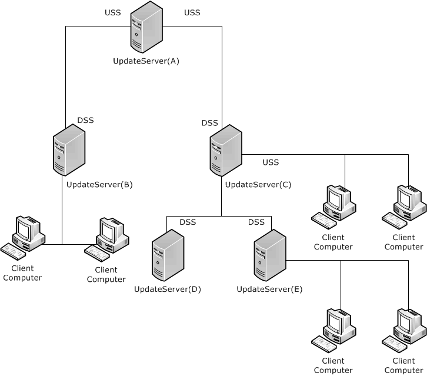
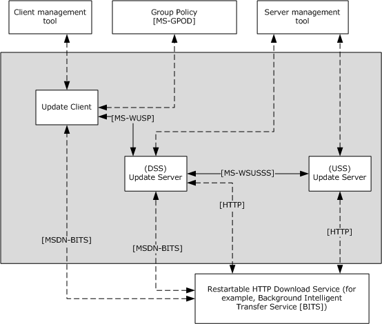
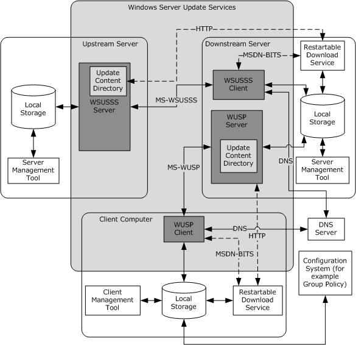
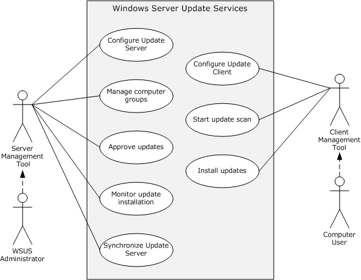
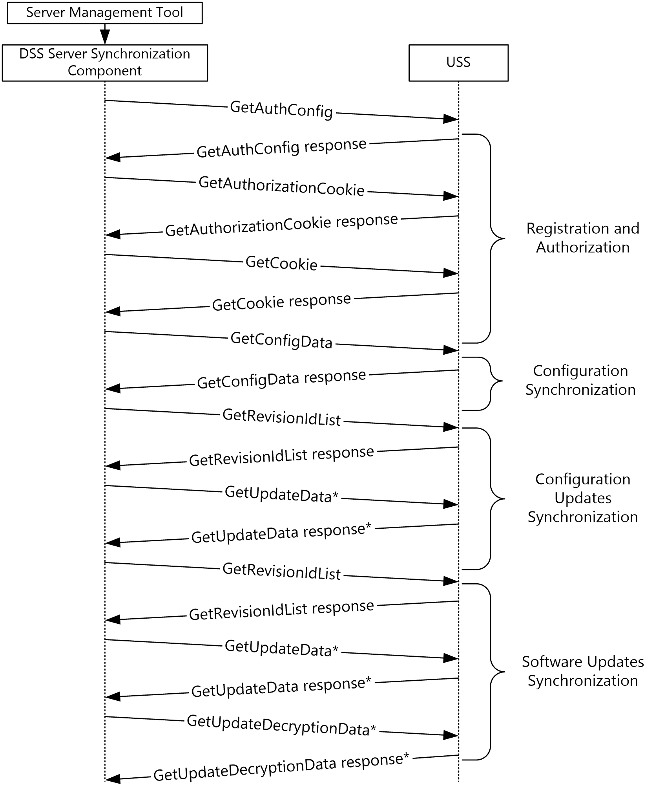
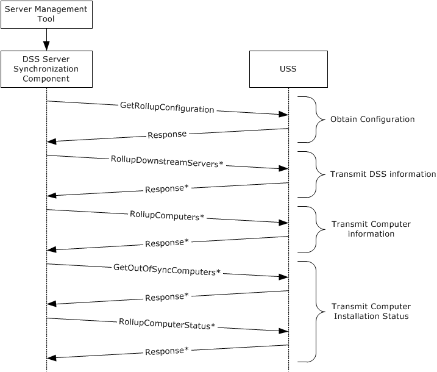

# [MS-WSUSOD]: Windows Server Update Services Protocols Overview

Table of Contents

1 Introduction

- [1 Introduction](#Section_1)
  - [1.1 Conceptual Overview](#Section_1.1)
    - [1.1.1 Software Updates](#Section_1.1.1)
    - [1.1.2 Update Server](#Section_1.1.2)
    - [1.1.3 Update Client](#Section_1.1.3)
    - [1.1.4 Downstream Server (DSS)](#Section_1.1.4)
    - [1.1.5 Upstream Server (USS)](#Section_1.1.5)
    - [1.1.6 Reporting Data](#Section_1.1.6)
  - [1.2 Glossary](#Section_1.2)
  - [1.3 References](#Section_1.3)

2 Functional Architecture

- [2 Functional Architecture](#Section_2)
  - [2.1 Overview](#Section_2.1)
    - [2.1.1 System Purpose](#Section_2.1.1)
    - [2.1.2 Functional Overview](#Section_2.1.2)
      - [2.1.2.1 Black Box Diagram](#Section_2.1.2.1)
      - [2.1.2.2 White Box Diagram](#Section_2.1.2.2)
    - [2.1.3 Applicability](#Section_2.1.3)
    - [2.1.4 Relevant Standards](#Section_2.1.4)
  - [2.2 Protocol Summary](#Section_2.2)
  - [2.3 Environment](#Section_2.3)
    - [2.3.1 Dependencies on This System](#Section_2.3.1)
    - [2.3.2 Dependencies on Other Systems](#Section_2.3.2)
      - [2.3.2.1 Network Connectivity](#Section_2.3.2.1)
      - [2.3.2.2 Underlying Protocols](#Section_2.3.2.2)
      - [2.3.2.3 Persistent Storage Facility](#Section_2.3.2.3)
      - [2.3.2.4 External Configuration System](#Section_2.3.2.4)
      - [2.3.2.5 External Restartable HTTP Download Service](#Section_2.3.2.5)
  - [2.4 Assumptions and Preconditions](#Section_2.4)
  - [2.5 Use Cases](#Section_2.5)
    - [2.5.1 Actors](#Section_2.5.1)
    - [2.5.2 Use Case Summary Diagram](#Section_2.5.2)
    - [2.5.3 Use Case Descriptions](#Section_2.5.3)
      - [2.5.3.1 Configure Update Server - Server Management Tool](#Section_2.5.3.1)
      - [2.5.3.2 Manage Computer Groups - WSUS Administrator](#Section_2.5.3.2)
      - [2.5.3.3 Approve Update - WSUS Administrator](#Section_2.5.3.3)
      - [2.5.3.4 Monitor Update Installation - WSUS Administrator](#Section_2.5.3.4)
      - [2.5.3.5 Synchronize Server - Server Management Tool](#Section_2.5.3.5)
      - [2.5.3.6 Configure Update Client - Computer User](#Section_2.5.3.6)
      - [2.5.3.7 Start Update Scan - Computer User](#Section_2.5.3.7)
      - [2.5.3.8 Install Updates - Computer User](#Section_2.5.3.8)
  - [2.6 Versioning, Capability Negotiation, and Extensibility](#Section_2.6)
  - [2.7 Error Handling](#Section_2.7)
    - [2.7.1 Failure Scenarios](#Section_2.7.1)
      - [2.7.1.1 Network Failure](#Section_2.7.1.1)
      - [2.7.1.2 Data Stores Corrupted](#Section_2.7.1.2)
      - [2.7.1.3 Update Content Corrupted](#Section_2.7.1.3)
  - [2.8 Coherency Requirements](#Section_2.8)
    - [2.8.1 Timers](#Section_2.8.1)
    - [2.8.2 Non-Timer Events](#Section_2.8.2)
    - [2.8.3 Initialization and Reinitialization Procedures](#Section_2.8.3)
  - [2.9 Security](#Section_2.9)
  - [2.10 Additional Considerations](#Section_2.10)

3 Examples

- [3 Examples](#Section_3)
  - [3.1 Example 1: Update Synchronization to DSS](#Section_3.1)
    - [3.1.1 Registration and Authorization](#Section_3.1.1)
    - [3.1.2 Configuration Synchronization](#Section_3.1.2)
    - [3.1.3 Configuration Updates Synchronization](#Section_3.1.3)
    - [3.1.4 Software Updates Synchronization](#Section_3.1.4)
  - [3.2 Example 2: Initial Deployment Synchronization to Replica DSS](#Section_3.2)
  - [3.3 Example 3: Initial Update Synchronization to Update Client](#Section_3.3)
  - [3.4 Example 4: Differential Update Synchronization to Update Client](#Section_3.4)
  - [3.5 Example 5: Rollup of Reporting Data to USS](#Section_3.5)
  - [3.6 Example 6: Update Client Is Pointed to a New Update Server](#Section_3.6)

4 Microsoft Implementations

- [4 Microsoft Implementations](#Section_4)
  - [4.1 Product Behavior](#Section_4.1)

5 Change Tracking

- [5 Change Tracking](#Section_5)

For the legal notice and IP terms, see [LEGAL.md](../LEGAL.md).
Last updated: 6/14/2022.
See [Revision History](#revision-history) for full version history.

# 1 Introduction

This document describes how the Windows Server Update Services (WSUS) protocols interact with each other and provide specific scenarios to highlight the WSUS design goals. The details of the communication at the protocol level are specified in the member protocol technical documents and are not duplicated in this document unless they are specifically used to clarify a concept.

It is often difficult for IT administrators to keep the computers on their organization's network updated in a timely manner with software updates that are critical for secure operation. A software update is any [**update**](#gt_update), update rollup, service pack, feature pack, critical update, security update, or hotfix that improves or fixes a software product. IT administrators require centralized management for distribution of software updates. In addition to keeping software up-to-date, IT administrators require automated updates in order to test the updates before making them generally available and to provide statistics about the dissemination of the updates.

These requirements establish a feedback loop to improve administrator confidence about the compliance of the managed computers around critical and security updates. From a scalability perspective, an update service will provide a solution that tailors the updates to specific computer configurations without having to evaluate every available update. This is essential because updates that a single computer requires are based on the hardware and software configuration and usually represent a minority of all available updates. WSUS is designed to meet this need.

## 1.1 Conceptual Overview

This section provides a conceptual overview of Windows Server Update Services (WSUS). This document assumes that the reader has the following background knowledge:

- [**SOAP**](#gt_soap) web service-based protocols
- Use of XML to package data
WSUS enables IT administrators to distribute and manage software updates from a central location to a large number of computers. Administrators are able to approve software updates to groups of computers and retrieve status reports to monitor the state of [**update**](#gt_update) installations across those computers. WSUS consists of one or more WSUS servers and many WSUS clients. The WSUS server enables administrators to synchronize updates from a parent WSU server, organize computers into groups for efficient update management, approve updates for installation, and generate reports on update installation activity. Multiple servers can be configured as a hierarchy to allow a variety of [**deployment**](#gt_deployment) options, either with autonomous control or with centralized control. The WSUS client can detect updates that are applicable from the available set of updates on the server, install those updates, and report installation activity back to the server.

WSUS requires communication between the WSUS client and server to enable clients to discover updates that are available on the server. In addition, WSUS requires communication between servers to propagate update information, the updates, and [**administrative intent**](#gt_administrative-intent) in a hierarchical deployment.

### 1.1.1 Software Updates

A software update is either an update to an application or an update to a driver for a hardware device. WSUS treats any type of update the same way; it defines a software update as [**update metadata**](#gt_update-metadata) plus the update [**content**](#gt_content). The metadata contains information about other updates that it depends on, rules that define under which conditions the update can be applied to a target computer, information about binary files that are used in the update installation process, and information about how the binary files ought to be applied on the target computer to complete the installation.

### 1.1.2 Update Server

WSUS has a hierarchical topology that consists of servers called [**update servers**](#gt_update-server) and [**client computers**](#gt_client-computer) that are called [**update clients**](#gt_update-client). An update server is a computer that implements both the Windows Server Update Services: Server-Server Protocol, as specified in [MS-WSUSSS](../MS-WSUSSS/MS-WSUSSS.md), and the Windows Server Update Services: Client-Server Protocol, as specified in [MS-WUSP](../MS-WUSP/MS-WUSP.md), for providing [**update**](#gt_update) to other update servers and client computers.

### 1.1.3 Update Client

Individual [**update clients**](#gt_update-client) report the update installation activity to its [**update server**](#gt_update-server), as specified in [MS-WUSP](../MS-WUSP/MS-WUSP.md) section 3.2.4. Data from individual update clients are propagated by a [**downstream server (DSS)**](#gt_downstream-server-dss) to its [**upstream server (USS)**](#gt_upstream-server-uss), based on the DSS and USS configuration as specified in [MS-WSUSSS](../MS-WSUSSS/MS-WSUSSS.md) section 3.2.4.5. The [**reporting data**](#gt_reporting-data) provides the basis on which update installation reports can be generated by administrators to gauge the penetration and health of update distribution.

### 1.1.4 Downstream Server (DSS)

WSUS has a hierarchical topology of servers with individual child servers that are configured either as an autonomous [**downstream server (DSS)**](#gt_downstream-server-dss) or as a [**replica DSS**](#gt_replica-dss), as described in [MS-WSUSSS](../MS-WSUSSS/MS-WSUSSS.md) section 1.3. A DSS synchronizes [**update metadata**](#gt_update-metadata) and [**content**](#gt_content) as specified in [MS-WSUSSS] section 3.2.4.2and section 3.2.4.4, respectively. If the DSS is configured as a replica DSS, it additionally synchronizes the [**deployments**](#gt_deployment) , as specified in [MS-WSUSSS] section 3.2.4.3.

The update metadata, content, and deployment that are synchronized in this way on a WSUS server are used to determine available, applicable software updates for an individual [**update client**](#gt_update-client). The protocol between an update client and its [**update server**](#gt_update-server) is specified in [MS-WUSP](../MS-WUSP/MS-WUSP.md).

### 1.1.5 Upstream Server (USS)

A [**USS**](#gt_upstream-server-uss) is an [**update server**](#gt_update-server) that provides updates to other update servers. The following figure shows an example of a WSUS hierarchy. The upstream servers in a hierarchy provide information about [**updates**](#gt_update) to [**downstream servers**](#gt_downstream-server-dss). Any update server in the hierarchy can serve simultaneously as a DSS with respect to its upstream server and as a USS with respect to its downstream servers.

For example, in the following figure, update server C acts as a DSS when it communicates with its upstream server A and acts as a USS when it communicates with its downstream servers D or E.

Figure 1: Typical hierarchical topology of update servers and client computers

An update server groups its [**client computers**](#gt_client-computer) into [**target groups**](#gt_target-group). An update server can be configured to deploy the updates to its client computers by assigning the updates to the target groups for [**deployment**](#gt_deployment) and, optionally, by specifying an installation or removal deadline. This mapping of the individual update revisions to target groups is known as a deployment.

### 1.1.6 Reporting Data

In WSUS, the term [**reporting data**](#gt_reporting-data) is used to describe data about update installation activity. Reporting data is generated by the [**update client**](#gt_update-client) on the target computer and it is sent to [**update servers**](#gt_update-server). When WSUS is configured as a hierarchy, it can send the reporting data from a [**DSS**](#gt_downstream-server-dss) to a [**USS**](#gt_upstream-server-uss). The reporting data provides the basis on which update installation reports can be generated by administrators to gauge the penetration and health of update distribution.

## 1.2 Glossary

This document uses the following terms:

**administrative intent**: A combination of target groups, group membership, and update approvals that defines the WSUS administrator's choices regarding which available updates should be installed on each of the managed computers.

**anchor**: An opaque data element generated by an [**update server**](#gt_update-server) to identify the occurrence of a software [**update**](#gt_update)-related event in a manner that distinguishes temporally separate occurrences of the event.

**client computer**: A computer that gets its [**updates**](#gt_update) from an [**update server**](#gt_update-server). A client can be a desktop computer, a server, or the [**update server**](#gt_update-server). For more information, see [MS-WUSP](../MS-WUSP/MS-WUSP.md) and [MS-WSUSSS](../MS-WSUSSS/MS-WSUSSS.md).

**content**: A package that contains all the associated files for an [**update**](#gt_update) that is to be installed on a [**client computer**](#gt_client-computer).

**deployment**: An administratively specified decision to make a specific [**update**](#gt_update) revision available to a specific [**target group**](#gt_target-group).

**detectoid**: A logical condition that is evaluated on a [**client computer**](#gt_client-computer) to detect the presence of software, drivers, or their [**updates**](#gt_update). A [**detectoid**](#gt_detectoid) is identified by a [**GUID**](#gt_globally-unique-identifier-guid) and described by [**metadata**](#gt_metadata). It is represented as an [**update**](#gt_update) with no associated [**content**](#gt_content).

**downstream server (DSS)**: An [**update server**](#gt_update-server) that synchronizes its [**updates**](#gt_update) from another [**update server**](#gt_update-server).

**globally unique identifier (GUID)**: A term used interchangeably with universally unique identifier (UUID) in Microsoft protocol technical documents (TDs). Interchanging the usage of these terms does not imply or require a specific algorithm or mechanism to generate the value. Specifically, the use of this term does not imply or require that the algorithms described in [[RFC4122]](https://go.microsoft.com/fwlink/?LinkId=90460) or [[C706]](https://go.microsoft.com/fwlink/?LinkId=89824) must be used for generating the [**GUID**](#gt_globally-unique-identifier-guid). See also universally unique identifier (UUID).

**man in the middle (MITM)**: An attack that deceives a server or client into accepting an unauthorized upstream host as the actual legitimate host. Instead, the upstream host is an attacker's host that is manipulating the network so that the attacker's host appears to be the desired destination. This enables the attacker to decrypt and access all network traffic that would go to the legitimate host. The attacker is able to read, insert, and modify at-will messages between two hosts without either party knowing that the link between them is compromised.

**metadata**: XML-formatted data that defines the characteristics of an [**update**](#gt_update), including its title, description, rules for determining whether the [**update**](#gt_update) is applicable to a [**client computer**](#gt_client-computer), and instructions for installing the [**update**](#gt_update) content.

**replica DSS**: A [**DSS**](#gt_downstream-server-dss) that obtains both [**updates**](#gt_update) and update [**deployments**](#gt_deployment) from its [**USS**](#gt_upstream-server-uss).

**reporting data**: A description of update installation activity.

**SOAP**: A lightweight protocol for exchanging structured information in a decentralized, distributed environment. [**SOAP**](#gt_soap) uses XML technologies to define an extensible messaging framework, which provides a message construct that can be exchanged over a variety of underlying protocols. The framework has been designed to be independent of any particular programming model and other implementation-specific semantics. SOAP 1.2 supersedes SOAP 1.1. See [[SOAP1.2-1/2003]](https://go.microsoft.com/fwlink/?LinkId=90521).

**synchronization**: The process by which a downstream server (DSS) obtains update metadata, target groups, and update deployments from an upstream server (USS) in order to reconcile its state with the USS.

**target group**: A named collection of [**client computers**](#gt_client-computer) whose members are defined administratively.

**update**: The combination of [**metadata**](#gt_metadata) and associated [**content**](#gt_content) for a software update. An [**update**](#gt_update) is identified by a [**GUID**](#gt_globally-unique-identifier-guid).

**update classification**: A scheme to classify [**updates**](#gt_update) such as Critical, Security, Service Pack, and so on. An [**update classification**](#gt_update-classification) is identified by a [**GUID**](#gt_globally-unique-identifier-guid) and described by [**metadata**](#gt_metadata). It can be treated as an [**update**](#gt_update) with no associated [**content**](#gt_content).

**update client**: A computer that implements the Windows Server Update Services: Client-Server Protocol to get updates from an update server. The client can be a desktop computer, a server, or the update server itself.

**update metadata**: A combination of XML-formatted metadata and associated content that contains information about an update.

**update server**: A computer that implements the Windows Server Update Services: Server-Server Protocol or the Windows Server Update Services: Client-Server Protocol to provide [**updates**](#gt_update) to [**client computers**](#gt_client-computer) and other [**update servers**](#gt_update-server).

**upstream server (USS)**: An [**update server**](#gt_update-server) that provides [**updates**](#gt_update) to other [**update servers**](#gt_update-server).

**WSUS administrator**: A user who deploys the latest Microsoft product updates to computers running the Windows operating system. WSUS administrators can fully manage the distribution of updates that are released through Microsoft Update to computers on their network. They are responsible for creating target group and update deployments.

## 1.3 References

[MS-GPOD] Microsoft Corporation, "[Group Policy Protocols Overview](../MS-GPOD/MS-GPOD.md)".

[MS-GPOL] Microsoft Corporation, "[Group Policy: Core Protocol](../MS-GPOL/MS-GPOL.md)".

[MS-WSUSSS] Microsoft Corporation, "[Windows Update Services: Server-Server Protocol](../MS-WSUSSS/MS-WSUSSS.md)".

[MS-WUSP] Microsoft Corporation, "[Windows Update Services: Client-Server Protocol](../MS-WUSP/MS-WUSP.md)".

[MSDN-BITS] Microsoft Corporation, "Background Intelligent Transfer Service", [http://msdn.microsoft.com/en-us/library/bb968799(VS.85).aspx](https://go.microsoft.com/fwlink/?LinkId=89959)

[RFC2616] Fielding, R., Gettys, J., Mogul, J., et al., "Hypertext Transfer Protocol -- HTTP/1.1", RFC 2616, June 1999, [https://www.rfc-editor.org/info/rfc2616](https://go.microsoft.com/fwlink/?LinkId=90372)

[SOAP1.2-1/2003] Gudgin, M., Hadley, M., Mendelsohn, N., et al., "SOAP Version 1.2 Part 1: Messaging Framework", W3C Recommendation, June 2003, [http://www.w3.org/TR/2003/REC-soap12-part1-20030624](https://go.microsoft.com/fwlink/?LinkId=90521)

# 2 Functional Architecture

## 2.1 Overview

WSUS is composed of two protocols:

- **Windows Update Services: Client-Server Protocol**, as specified in [MS-WUSP](../MS-WUSP/MS-WUSP.md). This protocol enables update-client-to-update-server communication. Its purpose is to transfer [**update metadata**](#gt_update-metadata), [**deployments**](#gt_deployment), and [**content**](#gt_content) from an [**update server**](#gt_update-server) to an [**update client**](#gt_update-client), and to report status information from an update client to an update server. These operations might rely on the update server that has acquired update metadata, deployments, and content from another update server by using the Windows Update Services: Server-Server Protocol.
- **Windows Update Services: Server-Server Protocol**, as specified in [MS-WSUSSS](../MS-WSUSSS/MS-WSUSSS.md). This protocol enables server-to-update-server communication. Its purpose is to transfer update metadata, deployments, and content from an [**upstream server (USS)**](#gt_upstream-server-uss) to a [**downstream server (DSS)**](#gt_downstream-server-dss), and to send aggregated status information from a DSS to a USS. These operations might rely on the DSS that has acquired status information from update clients by using the Windows Update Services: Client-Server Protocol.

### 2.1.1 System Purpose

WSUS enables the [**WSUS administrator**](#gt_wsus-administrator) to control automated delivery of [**updates**](#gt_update) to computers in an environment where the computers are managed by one or more WSUS administrators. WSUS is designed to quickly and efficiently distribute updates to computers without the need for an administrator to manually install the updates.

For WSUS administrators, WSUS provides the following:

**Acts as a centralized repository for updates**. WSUS enables administrators to review available updates from one location, the [**update server**](#gt_update-server). They can perform all the update-related activities on the server without the need to examine [**client computers**](#gt_client-computer) where the updates are eventually applied.

**Provides ways to control the delivery of updates**. There is a variety of updates with varying severity. Similarly, the computers being managed have varying requirements with respect to allowing change through software updating. For example, servers running line-of-business applications have strict requirements with regard to downtime and update testing. To balance these requirements, WSUS provides administrators with tools to group computers of similar requirements together and allows or disallows installation of selected updates to such groups.

**Enables automatic update discovery, delivery, and installation on client computers**. Not all updates that are available on the update server are applicable on a given computer. The applicability of an update is based on the specific hardware and software configuration of the computer. WSUS determines update applicability automatically and only installs relevant updates on computers.

**Allows deployment options that enable distributed administration or scale-out**. In large enterprises, there can be multiple branch offices with different administrators. In addition, the total number of computers might be such that one update server cannot handle the processing load. WSUS solves this problem by allowing a deployment configuration where multiple update servers are deployed in a parent-child relationship that forms a tree. The [**DSS**](#gt_downstream-server-dss) servers can be independently administered or can receive [**administrative intent**](#gt_administrative-intent) from the [**USS**](#gt_upstream-server-uss) servers.

**Provides reporting data about update installation activity**. Reporting data sets up a feedback loop for the administrator to check the update installation status. When the update servers are deployed as a hierarchy, WSUS allows for the root server to receive rolled-up [**reporting data**](#gt_reporting-data) from all the client computers across the hierarchy, enabling the administrator to assess the overall health of the computing environment across the enterprise.

**Enables software update delivery and installation in a secure and scalable way**. Applying updates essentially means executing external code and placing external code on a computer. It is therefore critical that safeguards are in place to prevent attackers from leveraging these capabilities to take control of or damage the computers.

For the end user, WSUS provides the following:

**Updates software on the computer automatically or with minimal intervention**. Typically, the end user wants software to be up-to-date. WSUS allows for a scheduled discovery and installation mode where the [**update client**](#gt_update-client) periodically contacts the update server to determine whether new updates are applicable and to install the updates.

**Allows configuration options to control the update installation**. In cases where the end user requires additional control, WSUS allows client configuration options that enable manual settings.

### 2.1.2 Functional Overview

The WSUS protocols provide centralized [**update**](#gt_update) management in an enterprise computing environment. The protocols provides automated update discovery and delivery, and administrative control over update availability.

WSUS provides the following update functionality:

- Enable update discovery by computers
- Deliver relevant updates to computers
- Update distribution controls for administrators
- Monitor update activity
For update discovery, WSUS evaluates the rules contained in update [**metadata**](#gt_metadata) to determine whether an update is required by the target computer. Update delivery is performed through HTTP file download.

Administrators control update distribution by placing computers into [**target groups**](#gt_target-group) and creating update [**deployments**](#gt_deployment). A target group is a collection of computers (for example, servers or desktop computers) that are defined by the [**WSUS administrator**](#gt_wsus-administrator). The target group is used to treat a set of computers collectively rather than having to perform actions on a per-computer basis. An update deployment is an [**administrative intent**](#gt_administrative-intent) about whether an update will be made available for a given target group. Administrators use update deployments to control the availability of updates to the computers that they manage.

Administrators can also configure a distributed server environment to manage update distribution to remote locations efficiently. Update installation is monitored by computers sending update detection and installation status using a reporting channel.

WSUS consist of the following:

- One or more [**update servers**](#gt_update-server) that act as distribution points for updates, and receive and relay update status information. The update servers are essentially repositories for [**update metadata**](#gt_update-metadata).
- One [**update client**](#gt_update-client) on each computer that is configured to receive updates. The update client communicates with an update server to discover updates and send installation information.
To discover and install updates, the update clients send a series of requests to the update server to progressively determine updates that are applicable, while excluding updates that are not applicable. At the end of the discovery phase, the update client downloads the installation files from the update server to complete the update installation. The update client sends back information about the update detection and installation phases as events to the update server.

#### 2.1.2.1 Black Box Diagram

The following diagram shows the communication in a black box relationship.

Figure 2: Black box relationship

WSUS is depicted in the gray box and is composed of an [**update client**](#gt_update-client) and two [**update servers**](#gt_update-server). Specifically, the diagram depicts two update servers in the [**upstream server (USS)**](#gt_upstream-server-uss) and [**downstream server (DSS)**](#gt_downstream-server-dss) roles and an update client. Communication between an update client and an update server uses the Windows Update Services: Client-Server Protocol (WUSP). Communication between the DSS and USS uses the Windows Update Services: Server-Server Protocol (WSUSSS). [**Content**](#gt_content) download by the update client and DSS is accomplished by making requests to the Background Intelligent Transfer Service (BITS), as specified in [[MSDN-BITS]](https://go.microsoft.com/fwlink/?LinkId=89959). BITS relays the requests over the HTTP protocol.

The abstract data model (ADM) that represents the state of WSUS is persisted in local storage on the update client and update servers.

Update client and update server management tools can interact with WSUS in an implementation-defined manner by altering the state of the ADM elements that are part of the member protocol or by using one of the protocol initialization mechanisms.

The ADM elements for the WUSP server and ways to populate them are specified in [MS-WUSP](../MS-WUSP/MS-WUSP.md) section 3.1.1 and section 3.1.1.1. Out of the ADM elements described, the server management tool can be used to alter the state of the **Client Computers Table**, **Target Group Table**, and the **Deployment Table** to express [**administrative intent**](#gt_administrative-intent).

The various initialization triggers that the server management tool can fire to initiate the Windows Server Update Services: Server-Server Protocol are specified in [MS-WSUSSS](../MS-WSUSSS/MS-WSUSSS.md) section 3.2.3.

The Group Policy protocols interact with WSUS by altering the state of the ADM element **Policy Table** as specified in [MS-WUSP] section 3.2.1.

#### 2.1.2.2 White Box Diagram

This section describes the primary relationship between the Windows Update Services: Client-Server Protocol (WUSP) and the Windows Update Services: Server-Server Protocol (WSUSSS). The primary relationship between the Windows Update Services: Client-Server Protocol (WUSP) and the Windows Update Services: Server-Server Protocol (WSUSSS) is based on shared data among the member protocols.

State sharing of the information passed using WSUSSS and WUSP takes place on an update server. An [**update server**](#gt_update-server) can participate in protocol exchanges with a [**USS**](#gt_upstream-server-uss) or a [**DSS**](#gt_downstream-server-dss) using WSUSSS as well as protocol exchanges with [**update clients**](#gt_update-client) using WUSP. WSUS maintains data for each protocol, and there is substantial overlap among the data maintained for each protocol. Data that is modified by a WSUSSS protocol exchange can be consumed by a WUSP protocol exchange, and vice versa.

The following diagram illustrates WSUS topology.

Figure 3: Example of a WSUS topology

An update client synchronizes updates from an update server, which can be a DSS that itself synchronizes [**updates**](#gt_update) from a USS. Two examples are illustrated in the preceding figure.

In the first example, a new update is introduced to the USS. The DSS initiates an update [**synchronization**](#gt_synchronization) from the USS using WSUSSS, which returns the new update. The DSS adds the new update to its WSUSSS ADM. Later, the update client initiates an update synchronization from the downstream server (DSS) using WUSP. Since an update is shared data, it also appears in the DSS's WUSP data and is returned to the update client.

The second example describes data introduced from the [**client computer**](#gt_client-computer). The update client can report client computer information to the DSS by using WUSP. The DSS inserts this data into its WUSP data model. Because this data is shared with its WSUSSS data counterpart, this data (or a derivative of it) is sent to the USS by using a WSUSSS protocol exchange.

A data dependency between the protocols is introduced through the sharing of data. In the first example, the update client cannot synchronize the new update via WUSP until the DSS has synchronized it from the USS via WSUSSS. In the second example, the USS cannot learn of the client computer information until the update client has reported its client computer information to the DSS.

### 2.1.3 Applicability

WSUS is appropriate for the management of [**updates**](#gt_update) for groups of computers. Additionally, it is applicable to situations in which several groups of computers need to be managed separately.

WSUS is not useful for situations in which computers that require updates are not on the network with the WSUS servers.

WSUS can be implemented in a Windows environment by enabling the [**update server**](#gt_update-server) component on computers running applicable Windows Server releases and configuring the [**update client**](#gt_update-client) on computers with Windows to communicate with the update server. For the Windows versions that WSUS supports, see section [4](#Section_4).

In a distributed [**deployment**](#gt_deployment) of WSUS with more than one update server, a [**downstream server (DSS)**](#gt_downstream-server-dss) communicates with an [**upstream server (USS)**](#gt_upstream-server-uss) to synchronize the [**update metadata**](#gt_update-metadata) and associated [**content**](#gt_content), and optionally, [**administrative intent**](#gt_administrative-intent) such as [**target groups**](#gt_target-group) and deployments. In addition, the DSS can be configured to relay information about the update installation information that it collected from update clients to the USS.

WSUS defines a set of internal protocols to enable server-to-server and client-to-server communication, as described in section [2.1](#Section_2.1). There are no external protocols defined by WSUS.

The following figure shows the layout of multiple update servers that are deployed as a hierarchy. Computers are configured to receive updates from one of the update servers in the hierarchy. The server-to-server communication is represented using solid lines, and client-to-server communication is represented using dashed lines. Within the context of each server pair communicating with each other, the parent server forms the USS, and the child server forms the DSS.

Figure 4: Windows Server Update Services overview

### 2.1.4 Relevant Standards

The Windows Server Update Services protocols use and extend the following standards:

**Hypertext Transfer Protocol - HTTP/1.1**, as specified in [[RFC2616]](https://go.microsoft.com/fwlink/?LinkId=90372). This protocol enables file transfer from [**update server**](#gt_update-server) to [**update client**](#gt_update-client).

**SOAP Version 1.2 Part 1: Messaging Framework**, as specified in [[SOAP1.2-1/2003]](https://go.microsoft.com/fwlink/?LinkId=90521). This protocol serves as the base protocol from which most of the internal protocols for WSUS are defined.

## 2.2 Protocol Summary

The following table lists the WSUS member protocols.

| Protocol name | Description | Short name |
| --- | --- | --- |
| **Windows Update Services: Client-Server Protocol** | This protocol enables update discovery, delivery, and reporting facilities for communication between an update client and update server. The purpose of this protocol is to transfer update metadata, update [**content**](#gt_content) and [**deployments**](#gt_deployment) from an update server to an update client, and to report status information from an update client to an update server. These operations might rely on the update server having acquired update metadata and deployments from a parent update server using the Windows Update Services: Server-Server Protocol. | [MS-WUSP](../MS-WUSP/MS-WUSP.md) |
| **Windows Update Services: Server-Server Protocol** | This protocol enables update synchronization, transfer of administrative intent, and relay of reporting data for communication between one update server and another update server. The purpose of this protocol is to transfer update metadata, update content and deployments from an upstream server (USS) to a downstream server (DSS), and to send aggregated status information from a DSS to a USS. These operations might rely on the DSS having acquired status information from update clients using the Windows Update Services: Client-Server Protocol. | [MS-WSUSSS](../MS-WSUSSS/MS-WSUSSS.md) |

## 2.3 Environment

The following sections identify the context in which WSUS exists. This includes the systems that use the interfaces provided by the WSUS protocols, other systems that depend on WSUS, and, as appropriate, how WSUS components communicate.

### 2.3.1 Dependencies on This System

None.

### 2.3.2 Dependencies on Other Systems

This section describes the relationships between WSUS and external components, dependencies, and other systems influenced by WSUS.

The WSUS environment requires the following:

- A networked environment
- Implementation of [**SOAP**](#gt_soap), HTTP, and HTTPS protocols
- A persistent storage facility
- Configuration system
- HTTP download service to download update [**content**](#gt_content)

#### 2.3.2.1 Network Connectivity

WSUS requires a networked environment in which clients and servers are connected. However, constant connectivity is not required; client and server implementations can take advantage of intermittent periods of connectivity to communicate. This requirement is necessary because a primary function of WSUS is to transfer update-related information between clients and servers and servers and servers. If the requirement is not satisfied, WSUS will not function. A temporary loss of connectivity can be mitigated by retrying the protocol operation at a later time.

#### 2.3.2.2 Underlying Protocols

All WSUS member protocols are implemented as a layer on top of other protocols. These underlying protocols include [**SOAP**](#gt_soap), HTTP, and HTTPS. The WSUS environment is required to provide implementations of these underlying protocols; for example, as operating system libraries. If the requirement is not met, WSUS will not function.

#### 2.3.2.3 Persistent Storage Facility

WSUS requires a persistent storage facility so that abstract data models (ADMs) can be maintained. Examples of such a facility include file systems and databases. If the requirement is not satisfied, WSUS will not function.

WSUS uses a configuration system to configure [**update clients**](#gt_update-client). Configurable aspects of update clients are specified in [MS-WUSP](../MS-WUSP/MS-WUSP.md) sections 1.5, 2.1, 2.2.2.1.1, section 3.2.2, and section 3.2.4. An example of a configuration system is the Group Policy: Core Protocol, defined in [MS-GPOL](../MS-GPOL/MS-GPOL.md). It is used to control the WUSP client.

It is recommended that WSUS use a restartable HTTP download service to download files. Such a service allows interrupted HTTP downloads to be restarted. An example of such a service is:

- Background Intelligent Transfer Service [[MSDN-BITS]](https://go.microsoft.com/fwlink/?LinkId=89959): Used to download files associated with updates. This functionality is used in both WUSP and WSUSSS communication. These interactions are shown in the black box diagram in section [2.1.2.1](#Section_2.1.2.1), where dashed lines show a possible implementation of WSUS.
WSUS can depend on other systems or external entities to provide configuration data or other services. The relationships described in this section are not required to implement WSUS, but are examples of such relationships.

#### 2.3.2.4 External Configuration System

An external system that provides configuration data can be used to configure clients of WSUS. One such system is Group Policy [MS-GPOD](../MS-GPOD/MS-GPOD.md).

An external configuration system can influence WSUS by configuring a client's ADM values for:

- [**Update server**](#gt_update-server)
- [**Target groups**](#gt_target-group)
Configuration of these values is specified in [MS-WUSP](../MS-WUSP/MS-WUSP.md) section 3.2.1.

#### 2.3.2.5 External Restartable HTTP Download Service

The member protocols do not specify how update content files are downloaded. However, an external restartable HTTP download service that can restart interrupted downloads is typically used. One such service is the Background Intelligent Transfer Service [[MSDN-BITS]](https://go.microsoft.com/fwlink/?LinkId=89959). Such a service can produce a notification when a download is complete, which can be used to trigger WSUS behavior. For example, on an [**update server**](#gt_update-server), when an update's files finish downloading, the update can become available to [**update clients**](#gt_update-client).

## 2.4 Assumptions and Preconditions

WSUS has the following assumptions and preconditions:

- An [**update client**](#gt_update-client) is required to be initialized with the location of its [**update server**](#gt_update-server).
- A [**DSS**](#gt_downstream-server-dss) is required to be initialized with the location of its [**USS**](#gt_upstream-server-uss).

## 2.5 Use Cases

### 2.5.1 Actors

The actors that participate in the WSUS use cases are:

**WSUS administrator**: The [**WSUS administrator**](#gt_wsus-administrator) is the individual responsible for managing the distribution of updates that are released through Microsoft Update to computers on the administrator's network. The WSUS administrator installs agents on the computers that need to be managed. The WSUS administrator approves updates, monitors the update installations, configures server(s) for updates, and synchronizes servers.

**Computer user**: A computer user is a user of a computer that is managed by the [**update server**](#gt_update-server). The computer can include laptops, desktops, and servers. The user can be required to keep his or her computer updated with the latest security patches and service packs. The update server can require the user either to install the updates right away or to schedule the updates for a more convenient time. The computer user can also be required to configure the client and start an update scan. Optionally, all of these tasks can be automated.

**Server management tool**: A tool that provides an administrative interface to the update server. The primary interest of the server management tool is to enable a WSUS administrator to read and update the update server configuration, display available updates, manage [**target groups**](#gt_target-group) and group membership, and approve updates. The server management tool enables the display of update installation status reports to the WSUS administrator.

**Client management tool**: A tool that provides a management interface to the [**update client**](#gt_update-client). The primary interest of the client management tool is to enable a computer user to read and update the update client configuration, start a scan for updates, and control the download and installation of updates.

**Configuration system**: A supporting actor that is used by the WSUS administrator to assign user-specified values to distribute configuration settings that control the client's behavior. An example of such a configuration system is Group Policy, as described in [MS-GPOD](../MS-GPOD/MS-GPOD.md).

### 2.5.2 Use Case Summary Diagram

The following diagram provides an overview of WSUS use cases with the [**WSUS administrator**](#gt_wsus-administrator) and computer user as the primary actors.

Figure 5: Windows Server Update Services use cases

### 2.5.3 Use Case Descriptions

#### 2.5.3.1 Configure Update Server - Server Management Tool

Goal: To configure the [**update server**](#gt_update-server) according to the [**deployment**](#gt_deployment) requirements.

Configuration options include:

- Determining from where the [**USS**](#gt_upstream-server-uss) receives [**updates**](#gt_update).
- Whether a [**DSS**](#gt_downstream-server-dss) receives only updates from the USS or update deployments also.
- Whether DSSs send detailed [**reporting data**](#gt_reporting-data) or just a summary of the computers they manage.
- Whether computer membership is based on groups that are assigned using client configuration or manual membership assignment on the server.
- Whether [**synchronization**](#gt_synchronization) is manually triggered by the [**WSUS administrator**](#gt_wsus-administrator) or set up to run on a schedule.
Context of Use: This use case is initiated after the update server installation is complete and before the update server is used to service clients.

Direct Actor: The direct actor of this use case is the server management tool.

Primary Actor: The primary actor is the WSUS administrator.

Supporting Actors: None.

Stakeholders and Interests:

- The server management tool's primary interest for this use case is to enable a WSUS administrator to read and update the update server configuration.
- The primary interest of the WSUS administrator is to customize a Windows Server Update Services deployment to meet the requirements of the organization's environment.
Preconditions: The update server is operational.

Minimal Guarantees: None.

Success Guarantee:

- If the server configuration is successful, the update server persists configuration changes to the server's local storage.
- If the server configuration is successful, the server components that depend on the configuration use the updates configuration to determine their behavior.
Trigger: The server management tool triggers this use case on behalf of the WSUS administrator.

Main Success Scenario:

- The server management tool identifies the relevant configuration elements that have changed.
- The configuration is modified according to input from the WSUS administrator.
- The configuration is successfully saved to the data store.
Extensions:

- The USS from which the update server receives updates.
- Whether the update server receives updates or update deployments from the USS.
- Whether DSSs of the update server send detailed reporting data or a summary only of the computers they manage.
- Whether computer membership is based on groups that are assigned by using client configuration or by manual membership assignment on the update server.
- Whether synchronization is manually triggered by the administrator or set up to run on a schedule.

#### 2.5.3.2 Manage Computer Groups - WSUS Administrator

Goal: To create computer [**target groups**](#gt_target-group) and establish membership of computers managed by the [**update server**](#gt_update-server) within those target groups.

Context of Use: The use case is initiated when the [**WSUS administrator**](#gt_wsus-administrator) wants to do the following:

- Create an initial plan for how updates will be delivered to computers.
- Fine-tune the plan as requirements evolve.
- Add new computers to WSUS and assign them to target groups.
Direct actor: The direct actor of this use case is the server management tool.

Primary actor: The primary actor is the WSUS administrator.

Supporting actors: None.

Stakeholders and interests:

- The server management tool's primary interest for this use case is to enable a WSUS administrator to manage target groups and group membership.
- WSUS administrators perform this use case with the intent of organizing managed computers into groups to which they can apply the updating strategy. To minimize effort, the administrator's primary interest is to manage computers that are based on classes of computers rather than individual computers.
For example, it is typical for the WSUS administrator to create separate groups for desktop computers and servers because these classes of computers have very different update requirements. Similarly, it is common for the administrator to create a test group for a representative set of computers. The administrator uses such a group to test the effects of [**updates**](#gt_update) and ensure normal operation before the update is rolled out generally.

Preconditions:

- The update server is operational.
- The update server is configured to use server-side targeting.
Minimal Guarantees: None.

Success Guarantee:

- For group creation, a target group entry is persisted in the server data store.
- For membership assignment, the information that associates the computer to a target group is persisted in the server data store.
- The target group and computer membership information, along with the update [**deployments**](#gt_deployment), are used during the client detection phase (the Start Update Scan - Computer User use case, section [2.5.3.7](#Section_2.5.3.7)) to determine which updates will be made available.
Trigger: The Server Management Tool initiates this use case on behalf of the WSUS administrator.

Main Success Scenario:

- The target group creation or target group membership is obtained from the WSUS administrator.
- This information is persisted in the server data store.
Extensions: None.

#### 2.5.3.3 Approve Update - WSUS Administrator

Goal: To approve an update to a [**target group**](#gt_target-group) either for installation or uninstallation. This is the primary use case that enables WSUS to control update delivery.

Context of Use: This use case is initiated when the [**WSUS administrator**](#gt_wsus-administrator) enables available updates to be installed or uninstalled on managed computers.

Direct Actor: The direct actor of this use case is the server management tool.

Primary Actor: The primary actor is the WSUS administrator.

Supporting Actors: None.

Stakeholders and Interests:

- The primary interest of the server management tool in this use case is to enable a WSUS administrator to display and approve available updates.
- The primary purpose of the WSUS administrator in this use case is to distribute updates to the managed computers.
Preconditions:

- The [**update server**](#gt_update-server) is operational.
- The update server is configured to be an autonomous update server.
- The update server has synchronized updates.
- Target groups have been created.
Minimal Guarantees: None.

Success Guarantees:

- The [**update**](#gt_update) deployment information that associates an update with a target group is persisted in the server data store.
- This information is utilized by the update server during the client detection phase, as described in use case [2.5.3.7](#Section_2.5.3.7).
Trigger: The server management tool triggers this use case on behalf of the WSUS administrator.

Main Success Scenario:

- The update deployment information is obtained from the WSUS administrator.
- This information is persisted in the server data store.
Extensions: None.

#### 2.5.3.4 Monitor Update Installation - WSUS Administrator

Goal: To generate update installation and applicability reports. How WSUS is implemented determines the type of reports that are generated. Reports can vary between high-level summary reports to detailed reports for a given update or a given computer.

Context of Use: This use case is initiated when the [**WSUS administrator**](#gt_wsus-administrator) reviews which computers require updates and which have installation failures.

Direct Actor: The direct actor of this use case is the server management tool.

Primary Actor: The primary actor is the WSUS administrator.

Supporting Actors: None.

Stakeholders and Interests:

- The primary purpose of the server management tool in this use case is to enable a WSUS administrator to view update installation status reports.
- The primary purpose of the WSUS administrator in this use case is to determine the health of WSUS and the results of this update distribution strategy.
Preconditions:

- The [**update server**](#gt_update-server) is operational.
- The update server has synchronized updates.
- Computers managed by the update server have completed detection and installation of updates, as described in sections [2.5.3.7](#Section_2.5.3.7) and [2.5.3.8](#Section_2.5.3.8).
Minimal Guarantees: None.

Success Guarantees:

- Based on the report type, the update server calculates the results of the update installation and applicability and generates a formatted report.
Trigger: The server management tool triggers this use case on behalf of the WSUS administrator.

Main Success Scenario:

- The update server collects the raw update events from the data store related to the report that is generated.
- Any calculations required to summarize the data are performed.
- The results are formatted and displayed in the management tool.
Extensions: None.

#### 2.5.3.5 Synchronize Server - Server Management Tool

Goal: To synchronize a [**DSS**](#gt_downstream-server-dss) in an [**update server**](#gt_update-server) hierarchy with updates and [**deployments**](#gt_deployment) from a [**USS**](#gt_upstream-server-uss).

Context of Use: This use case is initiated when the [**WSUS administrator**](#gt_wsus-administrator) wants to bring the update server into [**synchronization**](#gt_synchronization) with a USS. This use case can be initiated on a schedule.

Direct Actor: The direct actor for this use case is the server management tool.

Primary Actor: The primary actor for this use case is the WSUS administrator.

Supporting Actors: None.

Stakeholders and Interests:

- The primary purpose of the server synchronization component in this use case is to enable a WSUS administrator to synchronize the update server with a USS.
- The primary purpose of the WSUS administrator is to ensure uniform access to updates across the enterprise when WSUS is deployed as a hierarchy of servers.
Preconditions:

- The update server is operational.
- The update server is configured as a DSS.
- The USS is operational.
- Network connectivity is present between the DSSs and USSs.
Minimal Guarantees: None.

Success Guarantee:

- Updates available on the USS that are not already present on the DSS are obtained and persisted in the DSS data store.
- When the DSS is configured as a [**replica DSS**](#gt_replica-dss), the computer [**target groups**](#gt_target-group) and update deployments are also obtained and persisted in the DSS data store.
Trigger:

- The update server triggers this use case automatically.
- In addition, the server management tool can trigger this use case on behalf of the WSUS administrator at any time.
Main Success Scenario:

- The DSS contacts the USS to identify new updates that have been created since the last successful synchronization. If this is the first synchronization, all updates are selected.
- The selected updates are imported into the local data store.
Extensions:

- If the DSS is a replica DSS, target groups and deployments are also selected.
- If the DSS is a replica DSS, the selected target groups and deployments are created in the local data store.

#### 2.5.3.6 Configure Update Client - Computer User

The following use case diagram describes the interaction between the computer user and the [**WSUS administrator**](#gt_wsus-administrator) to update the client with user-specified settings.

Figure 6: Configure Update Client use case

Goal: To assign user-specified values to configuration settings that control the client's behavior.

Context of Use: This use case is initiated at any time in order to initialize or modify configurable aspects of the client's behavior.

Direct Actor: The direct actor of this use case is a client management tool.

Primary Actor: The primary actor of this use case is the WSUS administrator or the computer user.

Supporting Actors: A configuration system such as Group Policy.

Stakeholders and Interests:

- A client management tool, as described in section [2.5.1](#Section_2.5.1), enables a computer user to read and update the [**update client**](#gt_update-client) configuration.
- Computer users, as described in section 2.5.1, expect that after this use case is executed, the client behaves in a manner consistent with the new configuration.
- WSUS administrators, as described in section 2.5.1, can execute this use case on [**client computers**](#gt_client-computer) they manage in order to apply an organizational policy regarding client configuration.
Preconditions:

- The client management tool is available to the computer user and can communicate with the client.
Minimal Guarantees:

- A failure to modify configuration settings is not destructive to previously configured settings. Previously configured settings are retained.
Success Guarantee:

- If the configuration is successful, the user-specified values of the configuration settings are persistently stored by the update client and the behavior of the update client affected by these settings is consistent with the configured values.
Trigger:

- A computer user can trigger this use case by use of a client management tool.
Main Success Scenario:

- The computer user uses the client management tool to provide values for one or more configuration settings.
- The client management tool communicates with the client (either directly or indirectly, for example by modifying shared state) in order to update its configuration settings with the values specified by the computer user.
- Future operations performed by the client behave in ways that are consistent with the configured values.
Variations:

Trigger:

- The WSUS administrator can trigger this use case through a configuration system, for example, Group Policy as specified in [MS-WUSP](../MS-WUSP/MS-WUSP.md) section 3.2.1.
Main Success Scenario (Variation):

- The computer user uses the client management tool to provide values for one or more configuration settings.
- The client management tool communicates with the client (either directly or indirectly, for example by modifying shared state) in order to update its configuration settings with the values specified by the computer user.
- Future operations performed by the client behave in ways that are consistent with the configured values.
Extensions: None.

#### 2.5.3.7 Start Update Scan - Computer User

Goal: To discover changes in the set of updates available to the [**client computer**](#gt_client-computer) and their deployments since the last time the use case was executed. Additionally, [**update metadata**](#gt_update-metadata) is retrieved from the [**update server**](#gt_update-server) for new updates. The result of the first execution of this use case on a client computer is the discovery of the entire set of updates available to the client computer, and their deployments and [**metadata**](#gt_metadata).

Context of Use: This use case is executed periodically to poll for changes in the update set and deployments.

Direct Actor: The direct actor of this use case is a client management tool.

Primary Actor: The primary actor of this use case is a computer user.

Supporting Actors: None.

Stakeholders and Interests:

- A client management tool, as described in section [2.5.1](#Section_2.5.1), enables a computer user to start a scan for updates.
- Computer users, as described in section 2.5.1, expect that after this use case is executed, the results of the update scan are reported back to the computer user.
- [**WSUS administrators**](#gt_wsus-administrator), as described in section 2.5.1 can execute this use case to understand the set of updates that are applicable to a given computer, or to understand the set of computers to which a given update is applicable.
Preconditions:

- The [**update client**](#gt_update-client) is required to know the network location of its server.
- The update client is required to be able to reach its server over the network.
Minimal Guarantees:

- If the update scan fails, the client attempts to report the failed operation back to the server.
Success Guarantee:

- If the update scan is successful, the client's update set and update deployments are synchronized with the server.
- If the update scan is successful, the client attempts to report the successful operation back to the server.
Trigger:

- A computer user can trigger this use case by use of a client management tool.
- An automated agent can trigger this use case periodically on a schedule.
Main Success Scenario:

- The computer user triggers the use case.
- The client communicates with the server to synchronize the update set and update deployments. This data is cached on the client.
- The client reports success back to the server.
Extensions: None.

#### 2.5.3.8 Install Updates - Computer User

Goal: To carry out the directive that the [**WSUS administrator**](#gt_wsus-administrator) specified for each update that is applicable to the [**client computer**](#gt_client-computer). These directives include Install and Uninstall. An update installation can also result in a download of update content.

Context of Use: This use case is executed after the Start Update Scan use case (see section [2.5.3.7](#Section_2.5.3.7)) in order to carry out the WSUS administrator directive that was synchronized from the server by the Start Update Scan use case.

Direct Actor: The direct actor of this use case is a client management tool.

Primary Actor: The primary actor of this use case is a computer user.

Supporting Actors: None.

Stakeholders and Interests:

- A client management tool, as described in section [2.5.1](#Section_2.5.1), enables a Computer User to control the download and installation of updates.
- Computer users, as described in section 2.5.1, expect that after this use case is executed, their computer is up-to-date.
Preconditions:

- The client is required to have executed the Start Update Scan use case and determined that there are applicable updates.
Minimal Guarantees:

- If the update is being installed and the download of update content is unsuccessful, the client attempts to report the failed download back to the server.
- If the update installation or removal is unsuccessful, the client will attempt to report the failed operation back to the server.
Success Guarantee:

- If the update installation (or removal) is successful, the update is installed on (or removed from) the client computer.
- If the update installation or removal is successful, the client attempts to report the successful operation back to the server.
Trigger:

- A computer user can trigger this use case by use of a client management tool.
- An automated agent can trigger this use case periodically on a schedule.
Main Success Scenario:

- The client management tool triggers this use case.
- If the update is to be installed, the [**update client**](#gt_update-client) downloads the update from the [**update server**](#gt_update-server).
- The update client reports success back to the update server.
Extensions: None.

## 2.6 Versioning, Capability Negotiation, and Extensibility

No capability negotiation is associated with WSUS. Any deviations from the implementation of a specific version of these protocol specifications are documented in the respective protocol document. Capability negotiations between client and server implementations of these protocols are specified in the Versioning and Capability Negotiation sections in their respective technical documents. For more detailed information, see [MS-WUSP](../MS-WUSP/MS-WUSP.md) section 1.7 and [MS-WSUSSS](../MS-WSUSSS/MS-WSUSSS.md) section 1.7.

If the [**DSS**](#gt_downstream-server-dss) or [**USS**](#gt_upstream-server-uss) or client is not of a sufficiently high version to support the transfer of the data, then the client ultimately does not receive that data.

## 2.7 Error Handling

WSUS does not define any errors beyond those that are described in the specifications of the member protocols, as described in section [2.2](#Section_2.2).

Section [3](#Section_3) of the member protocol specifications describes the errors that are relevant to each protocol.

The following sections describe common failure scenarios.

### 2.7.1 Failure Scenarios

#### 2.7.1.1 Network Failure

A common failure scenario is the inability of an [**update client**](#gt_update-client) or [**update server**](#gt_update-server) to contact an update server due to an underlying network failure. Network failures can be caused by a lack of connectivity to the update server or any number of problems in the underlying networking layers.

This failure results in an inability for update clients or update servers to synchronize updates, deployments, or [**target groups**](#gt_target-group), or to report back client computer information. The failure is typically recognized in the subsystems that implement the protocols by inspecting error information provided by lower level operating system networking components (for example, error codes or exceptions).

Recovering from this error requires that the protocol operation be retried at a later time.

#### 2.7.1.2 Data Stores Corrupted

This failure scenario occurs when the data store of an [**update client**](#gt_update-client) or [**update server**](#gt_update-server) becomes corrupted. This corruption can occur due to an error in the underlying storage facility or hardware, which is implementation-specific.

This failure results in an inability for update clients or update servers to retrieve stored information. This can result in data loss. The failure is typically recognized by inspecting error information that storage components provide.

To recover from this error requires resetting the data store to an empty state and resynchronizing data from a server. The data store can either be reset in manual operation or reset automatically if the implementation can recognize data store corruption; in either case this recovery is not part of the protocol itself.

#### 2.7.1.3 Update Content Corrupted

This failure scenario occurs when the installation files that are associated with an update are corrupted or modified either due to unintentional causes, such as network unreliability, or an intentional attempt to breach security.

As a safeguard, it is recommended that the client accept content only for an update that is signed by a trusted certificate and whose hash matches the value retrieved from the [**update metadata**](#gt_update-metadata), as specified in [MS-WUSP](../MS-WUSP/MS-WUSP.md) section 5. These cryptographic techniques ensure that the client can detect corrupted content in all cases.

It is recommended that the client delete the suspect files and not attempt installation if corruption is detected during the recovery steps.

Because no change is made to the client environment, when corrupted content is encountered, there are no negative consequences from recovery.

## 2.8 Coherency Requirements

### 2.8.1 Timers

It is recommended that an [**update server**](#gt_update-server) use a timer to trigger periodic [**synchronization**](#gt_synchronization) with its [**USS**](#gt_upstream-server-uss). The frequency of the timer is implementation-specific. The synchronization time and frequency will be configurable so that the [**WSUS administrator**](#gt_wsus-administrator) can set a schedule based on the administrative schedule, requirements on the timeliness of the updates, and the WSUS topology that is deployed in an environment, as specified in [MS-WSUSSS](../MS-WSUSSS/MS-WSUSSS.md) section 3.2.3. The periodic synchronization of the update server with its USS affect [**update clients**](#gt_update-client) that are synchronizing with the update server due to the relationships between the protocols, as described in section [2.1.2.2](#Section_2.1.2.2).

Similarly, it is recommended that an update client use a timer to trigger periodic reporting to its update server. The frequency of the timer is implementation-specific. The periodic reporting of the update client to its update server affects the update server's USS due to the relationship between the protocols, as described in section 2.1.2.2.<1>

### 2.8.2 Non-Timer Events

There are no non-timer events with system-level significance.

### 2.8.3 Initialization and Reinitialization Procedures

WSUS initialization consists of the following:

- [**Update servers**](#gt_update-server) generate a [**globally unique identifier (GUID)**](#gt_globally-unique-identifier-guid) to identify themselves to other update servers.
- [**Update clients**](#gt_update-client) generate a GUID to identify themselves to update servers.
- Update servers are initialized with the location, for example, the DNS name and port, of their [**upstream server (USS)**](#gt_upstream-server-uss).
- Update clients are initialized with the location, for example, the DNS name and port, of their update server.
An update server or update client can be individually reinitialized without reinitializing the entire system.

## 2.9 Security

This section documents WSUS security issues that are not otherwise specified in the technical documents for the member protocols. It does not duplicate what is already in the member protocol technical documents unless there is some unique aspect that applies to WSUS as a whole.

The following high-level threats have to be considered when implementing WSUS:

- [**Man-in-the-middle**](#gt_9918372c-45a0-4f70-b53f-06972f29318e) attacks: [**Update metadata**](#gt_update-metadata) and [**administrative intent**](#gt_administrative-intent) can be tampered with by man-in-the-middle attacks to deny availability of critical or security updates to [**DSSs**](#gt_downstream-server-dss) or computers. Therefore, the communication channel used by the member protocols will be secured using SSL.
- Spoofing: WSUS identifies computers and DSSs using [**GUIDs**](#gt_globally-unique-identifier-guid). Given those identifiers, a malicious user can spoof [**reporting data**](#gt_reporting-data) for DSSs and computers in a way to mask the actual health of the computers. Therefore, the communication channel between [**update servers**](#gt_update-server), and [**update client**](#gt_update-client) and update server, will employ some form of authentication to prevent rogue entities from masquerading as valid clients or servers.

## 2.10 Additional Considerations

There are no additional considerations.

# 3 Examples

This section provides examples that describe the use of Windows Server Update Services. The examples are as follows:

- Update [**synchronization**](#gt_synchronization) to a [**DSS**](#gt_downstream-server-dss)
- Initial [**deployment**](#gt_deployment) synchronization to a [**replica DSS**](#gt_replica-dss)
- Initial [**update**](#gt_update) synchronization to an [**update client**](#gt_update-client)
- Differential update synchronization to an update client
- Rollup of [**reporting data**](#gt_reporting-data) to the [**USS**](#gt_upstream-server-uss)
- Pointing the update client to a new [**update server**](#gt_update-server)

## 3.1 Example 1: Update Synchronization to DSS

This example describes the scenario where a [**DSS**](#gt_downstream-server-dss) is configured to synchronize with an [**USS**](#gt_upstream-server-uss), and the [**synchronization**](#gt_synchronization) is triggered by using the server management tool or triggered on a schedule from the downstream server. This scenario supports the use case in Synchronize Server - Server Management Tool [2.5.3.5](#Section_2.5.3.5).

The following sequence diagram shows the sequence of messages that are exchanged between the DSS and USS to accomplish this scenario. All communication between the USS and the DSS is initiated by the DSS and occurs over the WSUSSS member protocol.

Figure 7: Sequence diagram for initial update synchronization to the DSS

The phases in the message flow are described in the following sections.

### 3.1.1 Registration and Authorization

During this phase of the message exchanges, the [**DSS**](#gt_downstream-server-dss) establishes its identity to the [**USS**](#gt_upstream-server-uss), and the USS provides a cookie to the DSS that is to be used for the remaining requests. If this is the first [**synchronization**](#gt_synchronization), the USS creates an entry for the DSS in its data store. The following sections in [MS-WSUSSS](../MS-WSUSSS/MS-WSUSSS.md) specify the message details:

- Section 3.1.4.1: GetAuthConfig
- Section 3.1.4.2: GetAuthorizationCookie
- Section 3.1.4.3: GetCookie

### 3.1.2 Configuration Synchronization

During this phase, the [**DSS**](#gt_downstream-server-dss) obtains the configuration data from the [**USS**](#gt_upstream-server-uss) that governs the [**metadata**](#gt_metadata) and [**content**](#gt_content) [**synchronization**](#gt_synchronization) phases of the protocol and persists this information in its data store. This is specified in [MS-WSUSSS](../MS-WSUSSS/MS-WSUSSS.md) section 3.1.4.4.

### 3.1.3 Configuration Updates Synchronization

If this is an initial [**synchronization**](#gt_synchronization), the [**DSS**](#gt_downstream-server-dss) obtains and persists the full set of categories, [**update classifications**](#gt_update-classification), and [**detectoids**](#gt_detectoid) that are available on the [**USS**](#gt_upstream-server-uss). On subsequent synchronizations, the DSS obtains and persists the categories, update classifications and detectoids that have been added to the USS since the last successful synchronization. The DSS obtains the list of such updates by using a single GetRevisionIdList request, as specified in [MS-WSUSSS](../MS-WSUSSS/MS-WSUSSS.md) section 3.1.4.5. Note that on subsequent synchronizations, the DSS has to include the [**anchor**](#gt_anchor) it received from the USS as part of the previous synchronization in the GetRevisionIdList request. The [**update metadata**](#gt_update-metadata) is then obtained through a series of batched GetUpdateData and GetUpdateDecryptionData requests, as specified in [MS-WSUSSS] section 3.1.4.6.

### 3.1.4 Software Updates Synchronization

If this is the initial [**synchronization**](#gt_synchronization), the [**DSS**](#gt_downstream-server-dss) obtains and persists the full set of software updates that are available on the [**USS**](#gt_upstream-server-uss). The DSS first obtains the list of software updates by using a single GetRevisionIdList request. The [**update metadata**](#gt_update-metadata) is then obtained through a series of batched GetUpdateData and GetUpdateDecryptionData requests. This phase differs from the previous phase with respect to the type of updates that are being synchronized. The DSS controls this phase by using the parameters for the GetRevisionIdList request. On subsequent synchronizations, the DSS obtains and persists software updates that have been added to the USS since the last successful synchronization; the DSS has to include the [**anchor**](#gt_anchor) it received from the USS as part of the previous synchronization, as specified in the GetRevisionIdList request [MS-WSUSSS](../MS-WSUSSS/MS-WSUSSS.md) section 3.1.4.5.

Additional details about message sequencing and processing for this scenario are specified in:

- [MS-WSUSSS] section 3.2.4.1: Authorization
- [MS-WSUSSS] section 3.2.4.2: Metadata synchronization
By the end of this scenario, the DSS has the same set of [**updates**](#gt_update) in its data store as the USS.

## 3.2 Example 2: Initial Deployment Synchronization to Replica DSS

When the [**DSS**](#gt_downstream-server-dss) is configured as a replica of the [**USS**](#gt_upstream-server-uss), it synchronizes [**target groups**](#gt_target-group) and update [**deployments**](#gt_deployment) from the USS in addition to updates. This example describes the message exchanges that are required to accomplish this [**synchronization**](#gt_synchronization) when a DSS communicates with a USS. This is a continuation of the initial update synchronization example, described in section [3.1](#Section_3.1), for a [**replica DSS**](#gt_replica-dss) that is specific to replica downstream servers. This scenario supports the use case in section [2.5.3.5](#Section_2.5.3.5), Synchronize Server - Server Management Tool.

The following sequence diagram shows the messages that are exchanged between the DSS and USS for this example. The messages in this sequence are part of the WSUSSS protocol [MS-WSUSSS](../MS-WSUSSS/MS-WSUSSS.md).

Figure 8: Sequence diagram for initial deployment synchronization to a replica DSS

The USS provides the list of all target groups and update deployments as part of the GetDeployments response during the first synchronization. The response also contains an [**anchor**](#gt_anchor) for use in subsequent GetDeployments requests. On subsequent synchronizations, only the changes since that previous synchronization are returned. For more information about message details and processing requirements, see [MS-WSUSSS] section 3.1.4.10 and section 3.2.4.3.

## 3.3 Example 3: Initial Update Synchronization to Update Client

The goal of this example is for a particular update client to synchronize [**update metadata**](#gt_update-metadata) and [**deployments**](#gt_deployment) from a particular update server for the first time. In this case, the update client has no cached data from previous synchronizations with the update server. This example is part of the Start Update Scan use case (section [2.5.3.7](#Section_2.5.3.7)).

This scenario can be initiated on a schedule, by an automated agent, or by a user by means of a client management tool. After this scenario occurs successfully, the update client has synchronized update metadata and deployment and can cache this data to make subsequent synchronizations faster.

The following sequence diagram illustrates the interactions between parts of WSUS during this scenario. The notes following the diagram describe the messages with reference to the [MS-WUSP](../MS-WUSP/MS-WUSP.md) technical document.

Figure 9: Sequence diagram for an initial update synchronization to an update client

The message flow is as follows:

- (Optional) The [**update client**](#gt_update-client) makes a series of HTTP GET requests to determine the availability of applicable update client software. If applicable update client software is available, it downloads the software using HTTP GET requests and updates itself. The message details are specified in [MS-WUSP] section 3.1.5.1.<2>
- The update client sends a GetConfig message to the [**update server**](#gt_update-server), which responds with configuration data. The message details are specified in [MS-WUSP] section 3.1.5.2.
- The update client sends a GetAuthorizationCookie message to the update server, which responds with an authorization cookie. The message details are specified in [MS-WUSP] section 3.1.5.3.
- The update client sends a GetCookie message to the update server, which responds with a cookie. The message details are specified in [MS-WUSP] section 3.1.5.4.
**Note** The GetAuthorizationCookie and GetCookie messages can be sent at any time during the message sequence to request a new cookie. In this example, the cookie is requested only once; however, a client implementation can renew the cookie at any time either because the cookie expired or because a fault, as specified in [MS-WUSP] section 2.2.2.4, has occurred.

- The update client sends a RegisterComputer message to the update server, which responds with a Success message. The message details are specified in [MS-WUSP] section 3.1.5.5.
- The update client sends a SyncUpdates message for updates to the update server, which responds with update information. There can be multiple iterations of this message and response. The message details are specified in [MS-WUSP] section 3.1.5.7.
- The update client sends a SyncUpdates message for drivers to the update server, which responds with the driver update information. The message details are specified in [MS-WUSP] section 3.1.5.7.
- If [**updates**](#gt_update) are determined to be applicable, the update client sends a GetExtendedUpdateInfo message to the server, which responds with extended update information for each of the new updates. The message details are specified in [MS-WUSP] section 3.1.5.9.
- If the client determines that additional data, such as a decryption key, is required for the update, the client sends a GetExtendedUpdateInfo2 message to the server, which responds with the extended update information for each of the new updates. The message details are specified in [MS-WUSP] section 2.2.2.2.10.
**Note** The callerAttributes element, as an optional part of the GetExtendedUpdateInfo2 request, enables improved alignment of SyncUpdates and GetExtendedUpdateInfo2 call results by sending callerAttributes in both calls, as defined in [MS-WUSP] section [2.2.2.2.10](../MS-WUSP/MS-WUSP.md) GetExtendedUpdateInfo2.<3>

- If there is a new update, the message GetFileLocations is sent and the server responds with the new file information. The message details are specified in [MS-WUSP] section 3.1.5.10.
**Note** As noted in the diagram, the GetFileLocations call is optional. If the GetExtendedUpdateInfo call can retrieve the file digests and update metadata, the GetFileLocations call is not needed. GetFileLocations is triggered either because the update server environment has changed, the cookie is invalid, or the file location has changed.

- The update client sends a ReportEventBatch message to the update server, which responds with the status. The message details are specified in [MS-WUSP] section 3.1.5.11.

## 3.4 Example 4: Differential Update Synchronization to Update Client

The goal of this example is for a particular update client to synchronize [**update metadata**](#gt_update-metadata) and deployments from a particular update server after having already synchronized at a previous point in time. In this case, the update client has cached data from previous synchronizations with the update server, which it uses to optimize the [**synchronization**](#gt_synchronization). This example is part of the Start Update Scan use case. This scenario supports the use case described in section [2.5.3.7](#Section_2.5.3.7).

The scenario described in this example can initiated on a schedule by an automated agent, or by a user by means of a client management tool. After this scenario occurs successfully, the update client has synchronized update metadata and deployment and can cache this data to make subsequent synchronizations faster.

The following sequence diagram illustrates the interactions between client and server during this scenario.

Figure 10: Sequence diagram for differential update synchronization to an update client

This sequence diagram assumes that the client has a valid authorization cookie from a previous synchronization.

This message sequence is as follows:

- (Optional) The [**update client**](#gt_update-client) makes a series of HTTP GET requests to determine the availability of applicable update client software. If so, it downloads the software using HTTP GET requests and updates itself. The message details are specified in [MS-WUSP](../MS-WUSP/MS-WUSP.md) section 3.1.5.1.<4> A differential update synchronization is less likely to find applicable update client software if a previous update synchronization was performed recently.
- The update client sends a SyncUpdates message, specified in [MS-WUSP] section 3.1.5.3 for updates to the [**update server**](#gt_update-server), which responds with update information. There can be multiple iterations of this message and response.
- The update client sends a SyncUpdates message for drivers to the update server, which responds with the driver update information.
- If updates are determined to be applicable, the update client sends a GetExtendedUpdateInfo message to the server, which responds with extended update information. Message details are specified in [MS-WUSP] section 3.1.5.9.
- If the client determines that additional data, such as a decryption key, is required for the update, the client sends a GetExtendedUpdateInfo2 message to the server, which responds with the extended update information for each of the new updates. Message details are specified in [MS-WUSP] section 2.2.2.2.10.
- If there is a new update, the message GetFileLocations will be sent to get the new FileLocation information. The message details are specified in [MS-WUSP] section 3.1.5.10.
- The update client sends a ReportEventBatch message to the update server, which responds with the status. Message details are specified in [MS-WUSP] section 3.1.5.11.
**Note** In addition to the messages shown in the diagram, a client implementation can send the messages GetAuthorizationCookie and GetCookie ([MS-WUSP] section 3.1.5.3 and section 3.1.5.4 respectively) at any time during the message sequence to request or renew a cookie. These messages are sent either because a cookie has expired or because a fault has occurred. See [MS-WUSP] section 2.2.2.4 for information on faults.

## 3.5 Example 5: Rollup of Reporting Data to USS

In this example, the goal of the scenario is for the [**DSS**](#gt_downstream-server-dss) to send update installation and applicability information about the clients and descendent DSSs to the [**USS**](#gt_upstream-server-uss). This supports the Monitor Update Installation - WSUS Administrator use case described in section [2.5.3.4](#Section_2.5.3.4) by allowing the USS to collect information about all the [**update servers**](#gt_update-server) in a hierarchy when they are configured appropriately.

The conditions under which this scenario can be initiated are specified in [MS-WSUSSS](../MS-WSUSSS/MS-WSUSSS.md) section 3.2.4.5.

The following sequence diagram shows the messages that are exchanged between the DSS and USS during this scenario when the DSS is configured as a replica DSS and the USS configuration indicates that a detailed rollup is required.

Figure 11: Sequence diagram for rollup of reporting data to USS

Reporting data synchronization specifies message processing and sequencing for the messages, as specified in [MS-WSUSSS] section 3.2.4.5. Because the amount of data to be sent from a DSS to USS as part of this scenario can be large, some of the messages are required to be put into batches by the DSS in order not to overwhelm the USS.

## 3.6 Example 6: Update Client Is Pointed to a New Update Server

In this example, the goal of the scenario is for a particular update client to synchronize [**update metadata**](#gt_update-metadata) and deployments from a different update server than it used for its previous [**synchronization**](#gt_synchronization). This is part of both the Configure Update Client and the Start Update Scan use cases. This scenario supports the Configure Update Client - Computer User use case in section [2.5.3.6](#Section_2.5.3.6) and the Start Update Scan - Computer User use case in section [2.5.3.7](#Section_2.5.3.7).

This scenario can be initiated by a [**WSUS administrator**](#gt_wsus-administrator) by means of a management system (such as described in [MS-GPOD](../MS-GPOD/MS-GPOD.md)) or by a user by means of a client management tool. After this scenario occurs successfully, the [**update client**](#gt_update-client) has synchronized update metadata and deployment from the new update server and purged cached data from the old [**update server**](#gt_update-server).

The following sequence diagram illustrates the interactions between client and server during this scenario. Note that in this diagram, the update client begins by attempting a differential update synchronization and then detects that its update server has changed.

Figure 12: Sequence diagram for pointing the update client to a new update server

The message flow is as follows:

- (Optional) The update client makes a series of HTTP GET requests to determine the availability of applicable update client software. If applicable update client software is available, it downloads the software using HTTP GET requests and updates itself. The message details are specified in [MS-WUSP](../MS-WUSP/MS-WUSP.md) section 3.1.5.1. <5>
- The update client sends a GetConfig message to the update server, which responds with configuration data. Message details are specified in [MS-WUSP] section 3.1.5.2.
- The update client sends a GetAuthorizationCookie message to the update server, which responds with an authorization cookie. Message details are specified in [MS-WUSP] section 3.1.5.3.
- The update client sends a GetCookie message to the update server, which responds with a cookie. Message details are specified in [MS-WUSP] section 3.1.5.4.
**Note** The GetAuthorizationCookie and GetCookie messages can be sent at any time during the message sequence to request a new cookie. In this example, the cookie is requested only once; however, a client implementation can renew the cookie at any time, either because the cookie expired or because a fault, as specified in [MS-WUSP] section 2.2.2.4, has occurred.

- The update client sends a RegisterComputer message to the update server, which responds with a Success message. Message details are specified in [MS-WUSP] section 3.1.5.5.
- The update client sends a RefreshCache message to the update server to update its cache of mappings between compact RevisionIDs and GUIDs. Message details are specified in [MS-WUSP] section 3.1.5.8.
- If there is a new update, the message GetFileLocations is sent and the server responds with the new file information. Message details are specified in [MS-WUSP] section 3.1.5.10.
- The update client sends a SyncUpdates message for updates to the update server, which responds with update information. There can be multiple iterations of this message and response. Message details are specified in [MS-WUSP] section 3.1.5.7.
- The update client sends a SyncUpdates message for drivers to the update server, which responds with the driver update information.
- If updates are determined to be applicable, the update client sends a GetExtendedUpdateInfo message to the server, which responds with extended update information. Message details are specified in [MS-WUSP] section 3.1.5.9.
- If the client determines that additional data, such as a decryption key, is required for the update, the client sends a GetExtendedUpdateInfo2 message to the server, which responds with the extended update information for each of the new updates. Message details are specified in [MS-WUSP] section 2.2.2.2.10.
- If there is a new update, the message GetFileLocations will be sent to get the new FileLocation information. Message details are specified in [MS-WUSP] section 3.1.5.10.
- The update client sends a ReportEventBatch message to the update server, which responds with the status. Message details are specified in [MS-WUSP] section 3.1.5.11.

# 4 Microsoft Implementations

The information in this document is applicable to the following Microsoft products:

The terms "earlier" and "later", when used with a product version, refer to either all preceding versions or all subsequent versions, respectively. The term "through" refers to the inclusive range of versions. Applicable Microsoft products are listed chronologically in this section.

**Windows Client**

- Windows 2000 operating system
- Windows XP operating system
- Windows Vista operating system
- Windows 7 operating system
- Windows 8 operating system
- Windows 8.1 operating system
- Windows 10 operating system
- Windows 11 operating system
**Windows Server**

- Windows Server 2003 operating system
- Windows Server 2003 R2 operating system
- Windows Server 2008 operating system
- Windows Server 2008 R2 operating system
- Windows Server 2012 operating system
- Windows Server 2012 R2 operating system
- Windows Server 2016 operating system
- Windows Server operating system
- Windows Server 2019 operating system
- Windows Server 2022 operating system
Exceptions, if any, are noted in the following section.

## 4.1 Product Behavior

<1> Section 2.8.1: The [**update client**](#gt_update-client) periodically reports to its [**update server**](#gt_update-server) with a randomly chosen frequency of between one time every minute and one time every fifteen minutes.

<2> Section 3.3: Self-update functionality is only available in Windows 8.1 and earlier.

<3> Section 3.3: The callerAttributes element is supported in Windows 11, version 22H2 operating system and later operating systems.

<4> Section 3.4: Self-update functionality is only available in Windows 8.1 and earlier.

<5> Section 3.6: Self-update functionality is only available in Windows 8.1 and earlier.

# 5 Change Tracking

This section identifies changes that were made to this document since the last release. Changes are classified as Major, Minor, or None.

The revision class **Major** means that the technical content in the document was significantly revised. Major changes affect protocol interoperability or implementation. Examples of major changes are:

- A document revision that incorporates changes to interoperability requirements.
- A document revision that captures changes to protocol functionality.
The revision class **Minor** means that the meaning of the technical content was clarified. Minor changes do not affect protocol interoperability or implementation. Examples of minor changes are updates to clarify ambiguity at the sentence, paragraph, or table level.

The revision class **None** means that no new technical changes were introduced. Minor editorial and formatting changes may have been made, but the relevant technical content is identical to the last released version.

The changes made to this document are listed in the following table. For more information, please contact [dochelp@microsoft.com](mailto:dochelp@microsoft.com).

| Section | Description | Revision class |
| --- | --- | --- |
| [3.3](#Section_3.3) Example 3: Initial Update Synchronization to Update Client | Added note following step 9 in the message flow to indicate that using the callerAttributes element in both the GetExtendedUpdateInfo2 and SyncUpdates requests can better align and expand the returned call results content. Added new behavior note to specify Windows 11 v22H2 applicability to the callerAttributes feature. | Major |

## Revision History

| Date | Version | Revision Class | Comments |
| --- | --- | --- | --- |
| 9/23/2011 | 1.0 | New | Released new document. |
| 12/16/2011 | 1.0 | None | No changes to the meaning, language, or formatting of the technical content. |
| 3/30/2012 | 2.0 | Major | Updated and revised the technical content. |
| 7/12/2012 | 2.0 | None | No changes to the meaning, language, or formatting of the technical content. |
| 10/25/2012 | 2.0 | None | No changes to the meaning, language, or formatting of the technical content. |
| 1/31/2013 | 2.0 | None | No changes to the meaning, language, or formatting of the technical content. |
| 8/8/2013 | 3.0 | Major | Updated and revised the technical content. |
| 11/14/2013 | 3.1 | Minor | Clarified the meaning of the technical content. |
| 2/13/2014 | 4.0 | Major | Updated and revised the technical content. |
| 5/15/2014 | 4.0 | None | No changes to the meaning, language, or formatting of the technical content. |
| 6/30/2015 | 5.0 | Major | Significantly changed the technical content. |
| 10/16/2015 | 5.0 | None | No changes to the meaning, language, or formatting of the technical content. |
| 9/26/2016 | 6.0 | Major | Significantly changed the technical content. |
| 6/1/2017 | 6.1 | Minor | Clarified the meaning of the technical content. |
| 12/15/2017 | 7.0 | Major | Significantly changed the technical content. |
| 11/5/2018 | 8.0 | Major | Significantly changed the technical content. |
| 6/3/2021 | 9.0 | Major | Significantly changed the technical content. |
| 10/26/2021 | 10.0 | Major | Significantly changed the technical content. |
| 6/14/2022 | 11.0 | Major | Significantly changed the technical content. |
