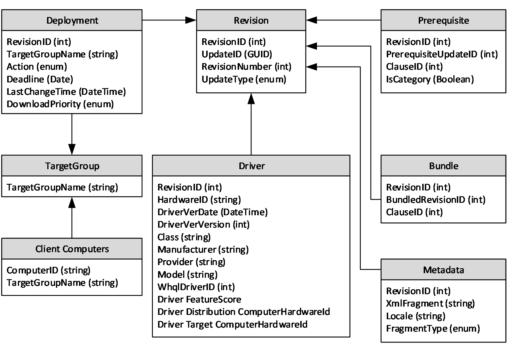
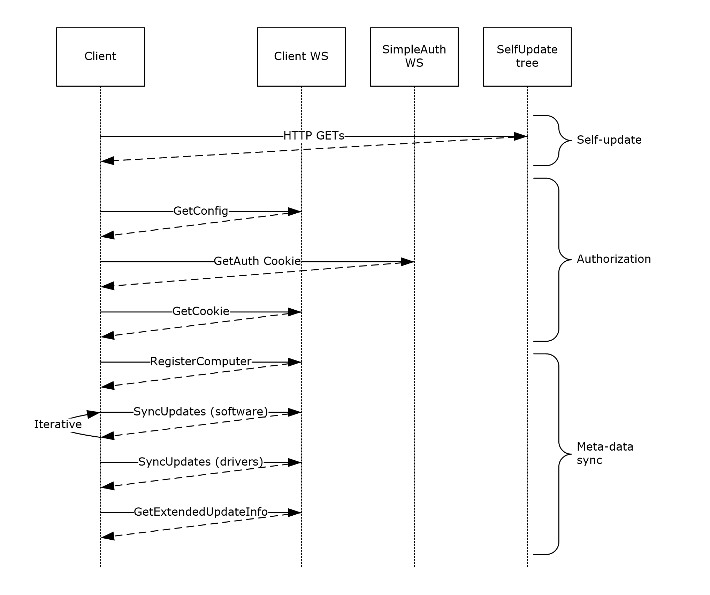

# [MS-WUSP]: Windows Update Services: Client-Server Protocol

Table of Contents

1 Introduction

- [1 Introduction](#Section_1)
  - [1.1 Glossary](#Section_1.1)
  - [1.2 References](#Section_1.2)
    - [1.2.1 Normative References](#Section_1.2.1)
    - [1.2.2 Informative References](#Section_1.2.2)
  - [1.3 Overview](#Section_1.3)
  - [1.4 Relationship to Other Protocols](#Section_1.4)
  - [1.5 Prerequisites/Preconditions](#Section_1.5)
  - [1.6 Applicability Statement](#Section_1.6)
  - [1.7 Versioning and Capability Negotiation](#Section_1.7)
  - [1.8 Vendor-Extensible Fields](#Section_1.8)
  - [1.9 Standards Assignments](#Section_1.9)

2 Messages

- [2 Messages](#Section_2)
  - [2.1 Transport](#Section_2.1)
    - [2.1.1 Xpress Compression](#Section_2.1.1)
      - [2.1.1.1 CompressOrDecompressWin2k3](#Section_2.1.1.1)
        - [2.1.1.1.1 LZ77 Compression Algorithm](#Section_2.1.1.1.1)
        - [2.1.1.1.2 DIRECT2 Encoding Algorithm](#Section_2.1.1.1.2)
  - [2.2 Common Message Syntax](#Section_2.2)
    - [2.2.1 Namespaces](#Section_2.2.1)
    - [2.2.2 Messages](#Section_2.2.2)
      - [2.2.2.1 SimpleAuth Web Service](#Section_2.2.2.1)
        - [2.2.2.1.1 GetAuthorizationCookie](#Section_2.2.2.1.1)
      - [2.2.2.2 Client Web Service](#Section_2.2.2.2)
        - [2.2.2.2.1 GetConfig](#Section_2.2.2.2.1)
        - [2.2.2.2.2 GetCookie](#Section_2.2.2.2.2)
        - [2.2.2.2.3 RegisterComputer](#Section_2.2.2.2.3)
        - [2.2.2.2.4 SyncUpdates](#Section_2.2.2.2.4)
        - [2.2.2.2.5 RefreshCache](#Section_2.2.2.2.5)
        - [2.2.2.2.6 GetExtendedUpdateInfo](#Section_2.2.2.2.6)
        - [2.2.2.2.7 GetFileLocations](#Section_2.2.2.2.7)
        - [2.2.2.2.8 StartCategoryScan](#Section_2.2.2.2.8)
        - [2.2.2.2.9 SyncPrinterCatalog](#Section_2.2.2.2.9)
        - [2.2.2.2.10 GetExtendedUpdateInfo2](#Section_2.2.2.2.10)
      - [2.2.2.3 Reporting Web Service](#Section_2.2.2.3)
        - [2.2.2.3.1 ReportEventBatch](#Section_2.2.2.3.1)
      - [2.2.2.4 Faults](#Section_2.2.2.4)
      - [2.2.2.5 Update Content Directory and Self-Update Content Directory](#Section_2.2.2.5)
    - [2.2.3 Complex Types](#Section_2.2.3)
      - [2.2.3.1 ArrayOfInt](#Section_2.2.3.1)
      - [2.2.3.2 ArrayOfString](#Section_2.2.3.2)
      - [2.2.3.3 ArrayOfGuid](#Section_2.2.3.3)
      - [2.2.3.4 AuthorizationCookie](#Section_2.2.3.4)
      - [2.2.3.5 Cookie](#Section_2.2.3.5)
      - [2.2.3.6 UpdateIdentity](#Section_2.2.3.6)
      - [2.2.3.7 ArrayOfBase64Binary](#Section_2.2.3.7)
    - [2.2.4 Simple Types](#Section_2.2.4)
      - [2.2.4.1 Guid](#Section_2.2.4.1)

3 Protocol Details

- [3 Protocol Details](#Section_3)
  - [3.1 Server Details](#Section_3.1)
    - [3.1.1 Abstract Data Model](#Section_3.1.1)
      - [3.1.1.1 Populating the Data Model](#Section_3.1.1.1)
    - [3.1.2 Timers](#Section_3.1.2)
    - [3.1.3 Initialization](#Section_3.1.3)
    - [3.1.4 Higher-Layer Triggered Events](#Section_3.1.4)
    - [3.1.5 Message Processing Events and Sequencing Rules](#Section_3.1.5)
      - [3.1.5.1 Self-Update](#Section_3.1.5.1)
      - [3.1.5.2 GetConfig](#Section_3.1.5.2)
      - [3.1.5.3 GetAuthorizationCookie](#Section_3.1.5.3)
      - [3.1.5.4 GetCookie](#Section_3.1.5.4)
      - [3.1.5.5 RegisterComputer](#Section_3.1.5.5)
      - [3.1.5.6 StartCategoryScan](#Section_3.1.5.6)
      - [3.1.5.7 SyncUpdates](#Section_3.1.5.7)
      - [3.1.5.8 RefreshCache](#Section_3.1.5.8)
      - [3.1.5.9 GetExtendedUpdateInfo](#Section_3.1.5.9)
      - [3.1.5.10 GetFileLocations](#Section_3.1.5.10)
      - [3.1.5.11 ReportEventBatch](#Section_3.1.5.11)
      - [3.1.5.12 SyncPrinterCatalog](#Section_3.1.5.12)
    - [3.1.6 Timer Events](#Section_3.1.6)
    - [3.1.7 Other Local Events](#Section_3.1.7)
  - [3.2 Client Details](#Section_3.2)
    - [3.2.1 Abstract Data Model](#Section_3.2.1)
    - [3.2.2 Timers](#Section_3.2.2)
    - [3.2.3 Initialization](#Section_3.2.3)
    - [3.2.4 Higher-Layer Triggered Events](#Section_3.2.4)
    - [3.2.5 Message Processing Events and Sequencing Rules](#Section_3.2.5)
    - [3.2.6 Timer Events](#Section_3.2.6)
    - [3.2.7 Other Local Events](#Section_3.2.7)

4 Protocol Examples

- [4 Protocol Examples](#Section_4)

5 Security

- [5 Security](#Section_5)
  - [5.1 Security Considerations](#Section_5.1)

6 Appendix A: Full WSDL Definitions

- [6 Appendix A: Full WSDL Definitions](#Section_6)
  - [6.1 SimpleAuth Web Service WSDL](#Section_6.1)
  - [6.2 Client Web Service WSDL](#Section_6.2)
  - [6.3 Reporting Web Service WSDL](#Section_6.3)

7 Appendix B: Product Behavior

- [7 Appendix B: Product Behavior](#Section_7)

8 Change Tracking

- [8 Change Tracking](#Section_8)

For the legal notice and IP terms, see [LEGAL.md](../LEGAL.md).
Last updated: 2/9/2026.
See [Revision History](#revision-history) for full version history.

# 1 Introduction

The Windows Server Update Services: Client-Server Protocol enables machines to discover and download software updates over the Internet by using the [**SOAP**](#gt_soap) and HTTP protocols (as specified in [[SOAP1.1]](https://go.microsoft.com/fwlink/?LinkId=90520), [[SOAP1.2-1/2003]](https://go.microsoft.com/fwlink/?LinkId=90521), [[SOAP1.2-2/2003]](https://go.microsoft.com/fwlink/?LinkId=90522), and [[RFC2616]](https://go.microsoft.com/fwlink/?LinkId=90372)).

Sections 1.5, 1.8, 1.9, 2, and 3 of this specification are normative. All other sections and examples in this specification are informative.

## 1.1 Glossary

This document uses the following terms:

**Advanced Encryption Standard (AES)**: A block cipher that supersedes the Data Encryption Standard (DES). AES can be used to protect electronic data. The AES algorithm can be used to encrypt (encipher) and decrypt (decipher) information. Encryption converts data to an unintelligible form called ciphertext; decrypting the ciphertext converts the data back into its original form, called plaintext. AES is used in symmetric-key cryptography, meaning that the same key is used for the encryption and decryption operations. It is also a block cipher, meaning that it operates on fixed-size blocks of plaintext and ciphertext, and requires the size of the plaintext as well as the ciphertext to be an exact multiple of this block size. AES is also known as the Rijndael symmetric encryption algorithm [[FIPS197]](https://go.microsoft.com/fwlink/?LinkId=89870).

**AND group**: A conjunctive clause in a disjunctive normal form (DNF) formula. For example, in the formula (A AND B) OR (A AND C), the clauses "(A AND B)" and "(A AND C)" are AND groups.

**cipher block chaining (CBC)**: A method of encrypting multiple blocks of plaintext with a block cipher such that each ciphertext block is dependent on all previously processed plaintext blocks. In the CBC mode of operation, the first block of plaintext is XOR'd with an Initialization Vector (IV). Each subsequent block of plaintext is XOR'd with the previously generated ciphertext block before encryption with the underlying block cipher. To prevent certain attacks, the IV has to be unpredictable, and no IV is used more than once with the same key. CBC is specified in [[SP800-38A]](https://go.microsoft.com/fwlink/?LinkId=128809) section 6.2.

**client computer**: (1) A computer that receives and applies settings from a Group Policy Object (GPO), as specified in [MS-GPOL](../MS-GPOL/MS-GPOL.md).

(2) A computer that gets its [**updates**](#gt_updates) from an [**update server**](#gt_update-server). A client can be a desktop computer, a server, or the update server.

**ClientIdString**: A globally unique string that identifies a client machine to the update server. It is between 1 and 255 characters in length and contains only the letters a-z, the digits 0-9, or the hyphen.

**conjunctive normal form (CNF)**: A logical formula consisting of a conjunction of disjunctions of terms in which no disjunction contains a conjunction. For example, A OR (B AND C) is not in CNF, whereas the equivalent (A OR B) AND (A OR C) is in CNF.

**Cryptographic Application Programming Interface (CAPI) or CryptoAPI**: The Microsoft cryptographic application programming interface (API). An API that enables application developers to add authentication, encoding, and encryption to Windows-based applications.

**deployment**: An administratively specified decision to make a specific [**update**](#gt_updates) revision available to a specific [**target group**](#gt_target-group).

**disjunctive normal form (DNF)**: A logical formula consisting of a disjunction of conjunctions of terms in which no conjunction contains a disjunction. For example, A AND (B OR C) is not in DNF, whereas the equivalent (A AND B) OR (A AND C) is in DNF.

**globally unique identifier (GUID)**: A term used interchangeably with universally unique identifier (UUID) in Microsoft protocol technical documents (TDs). Interchanging the usage of these terms does not imply or require a specific algorithm or mechanism to generate the value. Specifically, the use of this term does not imply or require that the algorithms described in [[RFC4122]](https://go.microsoft.com/fwlink/?LinkId=90460) or [[C706]](https://go.microsoft.com/fwlink/?LinkId=89824) have to be used for generating the GUID. See also universally unique identifier (UUID).

**JavaScript Object Notation (JSON)**: A text-based, data interchange format that is used to transmit structured data, typically in Asynchronous JavaScript + XML (AJAX) web applications, as described in [[RFC7159]](https://go.microsoft.com/fwlink/?linkid=842522). The JSON format is based on the structure of ECMAScript (Jscript, JavaScript) objects.

**locale**: An identifier, as specified in [MS-LCID](../MS-LCID/MS-LCID.md), that specifies preferences related to language. These preferences indicate how dates and times are to be formatted, how items are to be sorted alphabetically, how strings are to be compared, and so on.

**man in the middle (MITM)**: An attack that deceives a server or client into accepting an unauthorized upstream host as the actual legitimate host. Instead, the upstream host is an attacker's host that is manipulating the network so that the attacker's host appears to be the desired destination. This enables the attacker to decrypt and access all network traffic that would go to the legitimate host. The attacker is able to read, insert, and modify at-will messages between two hosts without either party knowing that the link between them is compromised.

**metadata**: XML-formatted data that defines the characteristics of an [**update**](#gt_updates), including its title, description, rules for determining whether the [**update**](#gt_updates) is applicable to a [**client computer**](#gt_client-computer), and instructions for installing the [**update**](#gt_updates) content.

**Microsoft Windows Installer (MSI)**: A file format that contains information used by Windows Installer to install software and software updates.

**prerequisite graph**: A directed graph with revisions as vertices and prerequisite relationships as edges.

**quick fix engineering (QFE)**: Quick fixes by engineering, also called [**QFEs**](#gt_quick-fix-engineering-qfe), are a small update designed to address a specific software bug. They are uniquely numbered to enable each fix to be identified easily by its associated QFE number.

**Reporting Web Service**: A Web service used by clients to report status to the server.

**revision ID**: A compact, server-assigned, 32-bit identifier for a revision that is used to identify the revision during client/server communication.

**Secure Sockets Layer (SSL)**: A security protocol that supports confidentiality and integrity of messages in client and server applications that communicate over open networks. SSL supports server and, optionally, client authentication using X.509 certificates [[X509]](https://go.microsoft.com/fwlink/?LinkId=90590) and [[RFC5280]](https://go.microsoft.com/fwlink/?LinkId=131034). SSL is superseded by Transport Layer Security (TLS). TLS version 1.0 is based on SSL version 3.0 [[SSL3]](https://go.microsoft.com/fwlink/?LinkId=90534).

**self-update**: A process by which a client first communicates with the update server to detect updates to the executable files that implement the client role on computers running Windows, and then applies those updated executable files before carrying on further communication.

**self-update content directory**: A location on the update server containing update content files for the update client that is identified by an HTTP URL and exposed to clients.

**SHA-1**: An algorithm that generates a 160-bit hash value from an arbitrary amount of input data, as described in [[RFC3174]](https://go.microsoft.com/fwlink/?LinkId=90408). SHA-1 is used with the Digital Signature Algorithm (DSA) in the Digital Signature Standard (DSS), in addition to other algorithms and standards.

**SHA1 hash**: A hashing algorithm defined in [[FIPS180]](https://go.microsoft.com/fwlink/?LinkId=89867) that was developed by the National Institute of Standards and Technology (NIST) and the National Security Agency (NSA).

**SHA-256**: An algorithm that generates a 256-bit hash value from an arbitrary amount of input data.

**SimpleAuth Web Service**: A Web service on the server that is used to authorize which clients are to get metadata for which revisions.

**SOAP**: A lightweight protocol for exchanging structured information in a decentralized, distributed environment. [**SOAP**](#gt_soap) uses XML technologies to define an extensible messaging framework, which provides a message construct that can be exchanged over a variety of underlying protocols. The framework has been designed to be independent of any particular programming model and other implementation-specific semantics. SOAP 1.2 supersedes SOAP 1.1. See [[SOAP1.2-1/2003]](https://go.microsoft.com/fwlink/?LinkId=90521).

**target group**: A named collection of [**client computers**](#gt_client-computer) whose members are defined administratively.

**UncPath**: The location of a file in a network of computers, as specified in Universal Naming Convention (UNC) syntax.

**update**: The combination of [**metadata**](#gt_metadata) and associated content for a software update. An [**update**](#gt_updates) is identified by a [**GUID**](#gt_globally-unique-identifier-guid).

**update category**: A group of updates. Each update belongs to zero or more update categories. An update category can be a product category that contains updates for a particular product, or a classification category that contains updates of a particular classification (for example, all security updates).

**update content directory**: A location on the update server containing update content files that is identified by an HTTP URL and exposed to clients.

**update metadata**: A combination of XML-formatted metadata and associated content that contains information about an update.

**update server**: A computer that implements the Windows Server Update Services: Server-Server Protocol or the Windows Server Update Services: Client-Server Protocol to provide [**updates**](#gt_updates) to [**client computers**](#gt_client-computer) and other [**update servers**](#gt_update-server).

**virtual directory**: An HTTP URL that represents the root of a location where content can be published administratively.

**web service**: A software entity that responds to SOAP messages ([[SOAP1.1]](https://go.microsoft.com/fwlink/?LinkId=90520),.[[WSDL]](https://go.microsoft.com/fwlink/?LinkId=90577)).

**Web Services Description Language (WSDL)**: An XML format for describing network services as a set of endpoints that operate on messages that contain either document-oriented or procedure-oriented information. The operations and messages are described abstractly and are bound to a concrete network protocol and message format in order to define an endpoint. Related concrete endpoints are combined into abstract endpoints, which describe a network service. WSDL is extensible, which allows the description of endpoints and their messages regardless of the message formats or network protocols that are used.

**Windows Server Update Services (WSUS)**: An optional component that enables a machine to operate as an [**update server**](#gt_update-server).

**Windows Update Agent (WUA)**: A component originally introduced in the Windows 2000 Server operating system Service Pack 3 (SP3) operating system that enables a computer to operate as a client of an [**update server**](#gt_update-server).

**MAY, SHOULD, MUST, SHOULD NOT, MUST NOT:** These terms (in all caps) are used as defined in [[RFC2119]](https://go.microsoft.com/fwlink/?LinkId=90317). All statements of optional behavior use either MAY, SHOULD, or SHOULD NOT.

## 1.2 References

Links to a document in the Microsoft Open Specifications library point to the correct section in the most recently published version of the referenced document. However, because individual documents in the library are not updated at the same time, the section numbers in the documents may not match. You can confirm the correct section numbering by checking the [Errata](https://go.microsoft.com/fwlink/?linkid=850906).

### 1.2.1 Normative References

We conduct frequent surveys of the normative references to assure their continued availability. If you have any issue with finding a normative reference, please contact [dochelp@microsoft.com](mailto:dochelp@microsoft.com). We will assist you in finding the relevant information.

[ISO-3166] International Organization for Standardization, "Codes for the representation of names of countries and their subdivisions -- Part1: Country codes", ISO 3166-1:2013, November 2013, [http://www.iso.org/iso/home/store/catalogue_tc/catalogue_detail.htm?csnumber=63545](https://go.microsoft.com/fwlink/?LinkId=89917)

**Note** There is a charge to download the specification.

[MS-ERREF] Microsoft Corporation, "[Windows Error Codes](../MS-ERREF/MS-ERREF.md)".

[MS-GPOL] Microsoft Corporation, "[Group Policy: Core Protocol](../MS-GPOL/MS-GPOL.md)".

[MS-LCID] Microsoft Corporation, "[Windows Language Code Identifier (LCID) Reference](../MS-LCID/MS-LCID.md)".

[MS-WSUSSS] Microsoft Corporation, "[Windows Update Services: Server-Server Protocol](../MS-WSUSSS/MS-WSUSSS.md)".

[RFC2119] Bradner, S., "Key words for use in RFCs to Indicate Requirement Levels", BCP 14, RFC 2119, March 1997, [https://www.rfc-editor.org/info/rfc2119](https://go.microsoft.com/fwlink/?LinkId=90317)

[RFC2616] Fielding, R., Gettys, J., Mogul, J., et al., "Hypertext Transfer Protocol -- HTTP/1.1", RFC 2616, June 1999, [https://www.rfc-editor.org/info/rfc2616](https://go.microsoft.com/fwlink/?LinkId=90372)

[SOAP1.1] Box, D., Ehnebuske, D., Kakivaya, G., et al., "Simple Object Access Protocol (SOAP) 1.1", W3C Note, May 2000, [https://www.w3.org/TR/2000/NOTE-SOAP-20000508/](https://go.microsoft.com/fwlink/?LinkId=90520)

[SOAP1.2-1/2003] Gudgin, M., Hadley, M., Mendelsohn, N., et al., "SOAP Version 1.2 Part 1: Messaging Framework", W3C Recommendation, June 2003, [http://www.w3.org/TR/2003/REC-soap12-part1-20030624](https://go.microsoft.com/fwlink/?LinkId=90521)

[SOAP1.2-2/2003] Gudgin, M., Hadley, M., Mendelsohn, N., et al., "SOAP Version 1.2 Part 2: Adjuncts", W3C Recommendation, June 2003, [http://www.w3.org/TR/2003/REC-soap12-part2-20030624](https://go.microsoft.com/fwlink/?LinkId=90522)

[WSDL] Christensen, E., Curbera, F., Meredith, G., and Weerawarana, S., "Web Services Description Language (WSDL) 1.1", W3C Note, March 2001, [https://www.w3.org/TR/2001/NOTE-wsdl-20010315](https://go.microsoft.com/fwlink/?LinkId=90577)

[XMLSCHEMA2] Biron, P.V., Ed. and Malhotra, A., Ed., "XML Schema Part 2: Datatypes", W3C Recommendation, May 2001, [https://www.w3.org/TR/2001/REC-xmlschema-2-20010502/](https://go.microsoft.com/fwlink/?LinkId=90610)

[XPATH] Clark, J. and DeRose, S., "XML Path Language (XPath), Version 1.0", W3C Recommendation, November 1999, [http://www.w3.org/TR/1999/REC-xpath-19991116/](https://go.microsoft.com/fwlink/?LinkId=90611)

### 1.2.2 Informative References

[AUPOLICY] Microsoft Corporation, "Configure Automatic Updates by Using Group Policy", [http://technet2.microsoft.com/WindowsServer/en/Library/51c8a814-6665-4d50-a0d8-2ae27e69ca7c1033.mspx](https://go.microsoft.com/fwlink/?LinkId=89817)

[GPADM] Microsoft Corporation, "Group Policy ADM Files", September 2008, [https://www.microsoft.com/en-us/download/details.aspx?id=18664](https://go.microsoft.com/fwlink/?LinkId=165963)

[MC-BUP] Microsoft Corporation, "[Background Intelligent Transfer Service (BITS) Upload Protocol](../MC-BUP/MC-BUP.md)".

[MSKB-5005101] Microsoft Corporation, "September 1, 2021—KB5005101 (OS Builds 19041.1202, 19042.1202, and 19043.1202) Preview", September 2021, [https://support.microsoft.com/en-us/topic/september-1-2021-kb5005101-os-builds-19041-1202-19042-1202-and-19043-1202-preview-82a50f27-a56f-4212-96ce-1554e8058dc1](https://go.microsoft.com/fwlink/?linkid=2170020)

[MSKB-5011558] Microsoft Corporation, "March 22, 2022—KB5011558 (OS Build 20348.617) Preview", March 2022, [https://support.microsoft.com/en-us/topic/march-22-2022-kb5011558-os-build-20348-617-preview-8bb6ded6-7515-44eb-9fa0-e214eb6d7a75](https://go.microsoft.com/fwlink/?linkid=2188592)

[MSKB-5011563] Microsoft Corporation, "March 28, 2022—KB5011563 (OS Build 22000.593) Preview", March 2022, [https://support.microsoft.com/en-us/topic/march-28-2022-kb5011563-os-build-22000-593-preview-40df54c9-b5a9-42e5-ae1c-9a33ff91ca91](https://go.microsoft.com/fwlink/?linkid=2188658)

[MSKB-5011831] Microsoft Corporation, "April 25, 2022—KB5011831 (OS Builds 19042.1682, 19043.1682, and 19044.1682) Preview", April 2022, [https://support.microsoft.com/en-us/topic/april-25-2022-kb5011831-os-builds-19042-1682-19043-1682-and-19044-1682-preview-fe4ff411-d25a-4185-aabb-8bc66e9dbb6c](https://go.microsoft.com/fwlink/?linkid=2190540)

[MSKB-5014668] Microsoft Corporation, "June 23, 2022—KB5014668 (OS Build 22000.778) Preview", [https://support.microsoft.com/en-us/topic/june-23-2022-kb5014668-os-build-22000-778-preview-2b5f1da6-d602-48b4-b443-96b460e3c38d](https://go.microsoft.com/fwlink/?linkid=2207562)

[WSUS] Microsoft Corporation, "Windows Server Update Services", [http://www.microsoft.com/windowsserversystem/updateservices/default.mspx](https://go.microsoft.com/fwlink/?LinkId=90585)

## 1.3 Overview

The [**Windows Server Update Services (WSUS)**](#gt_windows-server-update-services-wsus) family of protocols provides support for central publication and distribution of software updates from server machines to client machines, and for hierarchical synchronization of available software components between servers.<1>

This protocol enables client machines to determine available, applicable software updates, and to download those updates for installation. This protocol is a [**SOAP**](#gt_soap)-based protocol that uses HTTP 1.1 as its transport and includes four distinct phases.

- **Self-Update:** The client consults the server to determine if updated executable files are available for the client implementation of this protocol. If so, the client updates itself to operate using the updated executable files before continuing to communicate with the server.
- **Metadata Synchronization:** The client synchronizes [**update metadata**](#gt_update-metadata) from the [**update server**](#gt_update-server) by calling a sequence of [**web service**](#gt_web-service) methods, as specified in section [3.1.5](#Section_3.1.5). The [**metadata**](#gt_metadata) describes various characteristics of the update including its title, description, rules for determining if the update is applicable to a computer, and instructions for installing the update content.
- To reduce network overhead and increase performance, the protocol facilitates the caching of update metadata on clients.
- To further reduce the amount of update metadata that clients need to synchronize, update metadata is divided into fragments. Each client synchronizes only the fragments that it needs. In particular:
- The client invokes the [SyncUpdates (section 2.2.2.2.4)](#Section_2.2.2.2.4) method, which returns to the client a "core" fragment. This fragment contains sufficient update metadata for a client to evaluate if the update content is required.
- If the client determines that update content is required, it then invokes the [GetExtendedUpdateInfo (section 2.2.2.2.6)](#Section_2.2.2.2.6) method to obtain additional metadata fragments.
- **Content Synchronization:** The client can request update content comprised of any files associated with the updates required by the client.
- **Reporting:** The client reports events to the server that provide information on its update-related activities (for example, content download succeeded or failed; content install succeeded or failed). Reports are generated asynchronously from the rest of the protocol.
A UML sequence diagram can be found in section 3.1.5.

This specification details the protocol mechanisms that enable clients to download [**self-update**](#gt_self-update) binaries, synchronize update metadata , and download update content. It also details the protocol mechanisms for enabling clients to report events to servers.

## 1.4 Relationship to Other Protocols

The reporting and [**metadata**](#gt_metadata) synchronization protocols include [**web services**](#gt_web-service) that use [**SOAP**](#gt_soap) (as specified in [[SOAP1.1]](https://go.microsoft.com/fwlink/?LinkId=90520)) over HTTP or HTTPS (as specified in [[RFC2616]](https://go.microsoft.com/fwlink/?LinkId=90372)) for communication. The [**self-update**](#gt_self-update) and content synchronization protocols use HTTP 1.1 ([RFC2616]).

Figure 1: Relationship between protocols related to this protocol

Content download (both update content and [**self-update content directory**](#gt_self-update-content-directory)) uses HTTP 1.1 HEAD and GET (Range) requests (as specified in [RFC2616] sections 9.3 and 9.4).

This specification is closely related to the Windows Server Update Services: Server-Server Protocol, as specified in [MS-WSUSSS](../MS-WSUSSS/MS-WSUSSS.md), which defines mechanisms for synchronizing updates within a hierarchical configuration of [**update servers**](#gt_update-server).

## 1.5 Prerequisites/Preconditions

This protocol imposes the following requirement on server implementations.

- This document specifies how the binaries and [**metadata**](#gt_metadata) are distributed using the Client-Server Communications Protocol. It does not specify the format of the binaries or metadata themselves, but it assumes that the metadata is well-formed XML and is compatible with the XPATH queries specified in section [3.1.1.1](#Section_3.1.1.1) for populating the server data model. In all other respects, the binaries and metadata are treated as opaque by the server.
This protocol imposes the following requirement on client implementations.

- Clients are required to be configured to obtain updates from the server. This configuration can be performed manually or, in managed environments, by an appropriate form of centralized machine configuration.

## 1.6 Applicability Statement

This protocol is applicable in environments where there is a need for centralized, systematic distribution of software updates to managed [**client computer (2)**](#gt_client-computer).

## 1.7 Versioning and Capability Negotiation

This specification covers versioning issues in the following areas.

**Client protocol versions:** There are different versions of the client side of the protocol. The latest client protocol version is specified in section [2.2.2.2.1](#Section_2.2.2.2.1). Differences in behavior due to client protocol versions are specified in several sections:

- GetConfig (section 2.2.2.2.1)
- [SyncUpdates (section 2.2.2.2.4)](#Section_2.2.2.2.4)
- [GetCookie (section 2.2.2.2.2)](#Section_2.2.2.2.2)
**Server protocol versions:** There are different versions of the server side of the protocol. The latest server protocol version is specified in section 2.2.2.2.1. Differences in behavior due to server protocol versions are specified in several sections:

- [GetConfig (section 3.1.5.2)](#Section_3.1.5.2)
- [GetCookie (section 3.1.5.4)](#Section_3.1.5.4)
- [SyncUpdates (section 3.1.5.7)](#Section_3.1.5.7)
- [StartCategoryScan (section 3.1.5.6)](#Section_3.1.5.6)
**Supported transports:** All versions of the protocol use HTTP and [**SOAP**](#gt_soap) for communications.

**Capability negotiation:** As specified in section [1.3](#Section_1.3), clients initiate communication by obtaining updated executable files, which implement the most recent protocol behavior required by the server. This process is specified in section [2.1](#Section_2.1). In some instances, client behavior depends on the server protocol version. Those are specified in this document.

## 1.8 Vendor-Extensible Fields

This protocol does not define any vendor-extensible fields.

## 1.9 Standards Assignments

This protocol has not received any standards assignments.

# 2 Messages

This protocol MUST be carried out over [**SOAP**](#gt_soap) (as specified in [[SOAP1.1]](https://go.microsoft.com/fwlink/?LinkId=90520)) and HTTP (as specified in [[RFC2616]](https://go.microsoft.com/fwlink/?LinkId=90372)) and consists of the following set of [**web services**](#gt_web-service) and virtual directories.

- **Update content directory**: A [**virtual directory**](#gt_virtual-directory), as specified in section [2.2.2.5](#Section_2.2.2.5), which MUST be populated with update content files. The server provides this virtual directory only as a container of files, which are accessible by clients through HTTP GET and HEAD requests.
- **Self-update content directory**: A virtual directory containing the client [**self-update**](#gt_self-update) binaries, as specified in section 2.2.2.5, which MUST be populated with self-update content files. The server provides this virtual directory only as a container of files, which are accessible by clients through HTTP GET and HEAD requests.<2>
- **SimpleAuth Web service**: A web service that clients consult to obtain cached state for use by servers in restricting availability of updates to groups of clients, as specified in section [2.2.2.1](#Section_2.2.2.1).
- **Client Web service**: A web service that synchronizes [**metadata**](#gt_metadata) to the client, as specified in section [2.2.2.2](#Section_2.2.2.2).
- **Reporting Web service**: A web service that clients contact to report selected events containing information on their update activity, as specified in section [2.2.2.3](#Section_2.2.2.3).
The following sections specify the use of the transports listed above and the syntax of these web services.

## 2.1 Transport

This protocol is carried out over a set of [**web services**](#gt_web-service) and [**virtual directories**](#gt_virtual-directory).

- Each web service MUST support [**Simple Object Access Protocol (SOAP)**](#gt_soap) [[SOAP1.1]](https://go.microsoft.com/fwlink/?LinkId=90520) over HTTP over TCP/IP [[RFC2616]](https://go.microsoft.com/fwlink/?LinkId=90372). Each web service SHOULD support HTTPS for securing its communication with clients.<3>
- Each virtual directory MUST support HTTP over TCP/IP. Each virtual directory SHOULD support HTTPS.
The following TCP ports MUST be exposed by the server as endpoints for the HTTP over TCP/IP transport.

- **commonPort:** Used for [**self-update**](#gt_self-update) and web services communication.<4>
- **contentPort:** Used by the virtual directory that contains content.<5>
The following virtual directories MUST be exposed by the server as endpoints for the HTTP and SOAP over HTTP transports.

**Update content directory:** This virtual directory MUST be exposed at URL http://serverUrl:[contentPort]/Content

**Self-update content directory:** This virtual directory, MUST be exposed at URL http://serverUrl:[commonPort]/SelfUpdate<6>

**SimpleAuth Web service:** This virtual directory, as specified in section [2.2.2.1](#Section_2.2.2.1), MUST be exposed at URL http[s]://serverUrl:[commonPort]/SimpleAuthWebService/SimpleAuth.asmx

**Client Web service:** This virtual directory, as specified in section [2.2.2.2](#Section_2.2.2.2), MUST be exposed at URL http[s]://serverUrl:[commonPort]/ClientWebService/Client.asmx

**Reporting Web service:** This virtual directory, as specified in section [2.2.2.3](#Section_2.2.2.3), MUST be exposed at URL http[s]://serverUrl:[commonPort]/ReportingWebService/ReportingWebService.asmx

Windows Server Update Services: Client-Server Protocol version 0.9 is a legacy version of the protocol that requires the following:

- Requires that commonPort be configured to port 80.
- Requires an additional virtual directory at URL http://serverUrl:[commonPort], which MUST be populated with self-update configuration files.
The server SHOULD<7> self-update over a configurable commonPort.

To optimize network bandwidth when invoking client Web service and [**SimpleAuth Web service**](#gt_simpleauth-web-service) methods, the client implementation SHOULD add xpress to the HTTP "Accept-Encoding" request-header to request xpress compression. If the client requests xpress compression, the [**update server**](#gt_update-server) SHOULD encode the response using the requested format, as specified in [2.1.1.1](#Section_2.1.1.1).

A client implementation MAY request another type of compression by specifying the encoding format in the HTTP Accept-Encoding request-header field ([RFC2616] section 14.3). If the client requests another type of compression, the update server MAY encode the response using the requested format.

### 2.1.1 Xpress Compression

To compress an input stream of bytes using Xpress Compression, the server MUST first segment the input stream into a sequence of blocks. The original, uncompressed size of each block MUST NOT be greater than 65535 bytes.<8>

Each block MUST then be compressed and encoded using the [CompressOrDecompressWin2k3](#Section_2.1.1.1) procedure, as specified in section 2.1.1.1. The compressed size of each block MUST NOT be greater than 65535 bytes. The compressed blocks MUST be output in sequence, each prefixed with a header.

The header MUST be in the following format.

| original | compressed |
| --- | --- |

**original**: A signed, 32-bit integer indicating the original, uncompressed size, in bytes, of the block that follows. The encoding MUST be little-endian.

**compressed**: A signed, 32-bit integer indicating the compressed size, in bytes, of the block that follows. The encoding MUST be little-endian.

#### 2.1.1.1 CompressOrDecompressWin2k3

procedure CompressOrDecompressWin2k3(

inputBuffer: sequence of BYTE,

inputSize: DWORD

ref outputBuffer: sequence of BYTE,

comp: BOOLEAN)

*Informative summary of behavior*: The CompressOrDecompressWin2k3 procedure compresses or decompresses data using the compression algorithm LZ77 (section [2.1.1.1.1](#Section_2.1.1.1.1)) and the basic encoding algorithm DIRECT2 (section [2.1.1.1.2](#Section_2.1.1.1.2)). The procedure has the following parameters:

- *inputBuffer*: A sequence of BYTE containing data to compress or decompress.
- *inputSize*: The DWORD value that indicates the size of *inputBuffer* in bytes.
- *outputBuffer*: A sequence of BYTE that is an empty buffer. Compressed or decompressed data is filled into this buffer.
- *comp*: A Boolean indicating whether to compress (*comp*=TRUE) or decompress (*comp*=FALSE) the inputBuffer.

##### 2.1.1.1.1 LZ77 Compression Algorithm

The LZ77 Compression Algorithm is used to analyze input data and determine how to reduce the size of that input data by replacing redundant information with [**metadata**](#gt_metadata). Sections of the data that are identical to sections of the data that have been encoded are replaced by a small amount of metadata that indicates how to expand those sections again. The encoding algorithm is used to take that combination of data and metadata and serialize it into a stream of bytes that can later be decoded and decompressed.

**Compression Algorithm Terminology**

The following terms are associated with the compression algorithm. Some of the terms also apply to the [DIRECT2 Encoding Algorithm](#Section_2.1.1.1.2) defined in section 2.1.1.1.2.

**input stream**: The sequence of bytes to be compressed.

**byte**: The basic data element in the input stream.

**coding position**: The position of the byte in the input stream that is currently being coded (the beginning of the lookahead buffer).

**lookahead buffer**: The byte sequence from the coding position to the end of the input stream.

**window**: A buffer of size W that indicates the number of bytes from the coding position backward. The window is empty at the beginning of the compression, then grows to size W as the input stream is processed. Once it reaches size W, it then "slides" along with the coding position.

**pointer**: Information about the starting offset of the match in the window (referred to as "B" in the example later in this section) and its length (referred to as "L" in the example later in this section). The starting offset is expressed as the count of bytes from the coding position backwards into the window. The length is the number of bytes to read forward from the starting offset.

The length expressed by the pointer can be longer than the starting offset. This indicates that the match repeats by returning back to the starting offset after reaching the coding position.

A null pointer indicates no match and is expressed as a starting offset of 0 and a length of 0.

**match**: The string that is used to find a match of the byte sequence between the lookahead buffer and the window.

**Using the Compression Algorithm**

To use the LZ77 Compression Algorithm:

- Set the coding position to the beginning of the input stream.
- Find the longest match in the window for the lookahead buffer.
- If a match is found, output the pointer P. Move the coding position (and the window) L bytes forward.
- If a match is not found, output a null pointer and the first byte in the lookahead buffer. Move the coding position (and the window) one byte forward.
- If the lookahead buffer is not empty, return to step 2.
**Compression Process**

The compression algorithm searches the window for the longest match with the beginning of the lookahead buffer and then outputs a pointer to that match. Because even a 1-byte match might not be found, the output cannot only contain pointers. The compression algorithm solves this problem by outputting after the pointer the first byte in the lookahead buffer after the match. If no match is found, the algorithm outputs a null-pointer and the byte at the coding position.

**Compression Process Example**

The following table shows the input stream that is used for this compression example. The bytes in the input, "AABCBBABC", occupy the first nine positions of the stream.

**Input stream**

Position 1 2 3 4 5 6 7 8 9

Byte A A B C B B A B C

The following table shows the output from the compression process. The table includes the following columns:

**Step**: Indicates the number of the encoding step. A step in the table finishes every time that the encoding algorithm makes an output. With the compression algorithm, this process happens in each pass through step 3.

**Position**: Indicates the coding position. The first byte in the input stream has the coding position 1.

**Match**: Shows the longest match found in the window.

**Byte**: Shows the first byte in the lookahead buffer after the match.

**Output**: Presents the output in the format (B,L)C, where (B,L) is the pointer (P) to the match. This gives the following instructions to the decoder: Go back B bytes in the window and copy L bytes to the output. C is the explicit byte.

**Note** One or more pointers might be included before the explicit byte that is shown in the Byte column. That is, a metadata pointer does not always need to be followed by an explicit byte. An input stream of "ABCABCCCC", for example, can be represented as "(0,0)A(0,0)B(0,0)C(3,3)(1,3)" using the (B,L)C notation, with the last two elements being pointers without explicit bytes. The compressed output can be any combination of pointers and explicit bytes.

**Compression process output**

| Bit Range | Field | Description |
| --- | --- | --- |
| Variable | 1. | 1 -- A (0,0)A |
| Variable | 2. | 2 A -- (1,1) |
| Variable | 3. | 3 -- B (0,0)B |
| Variable | 4. | 4 -- C (0,0)C |
| Variable | 5. | 5 B -- (2,1) |
| Variable | 6. | 6 B -- (1,1) |
| Variable | 7. | 7 A B C -- (5,3) |

The result of compression, conceptually, is the output column—that is, a series of bytes and optional metadata that indicates whether that byte is preceded by some sequence of bytes that is already in the output.

Because representing the metadata itself requires bytes in the output stream, it is inefficient to represent a single byte that has previously been encoded by two bytes of metadata (offset and length). The overhead of the metadata bytes equals or exceeds the cost of outputting the bytes directly. Therefore, the protocol considers sequences of bytes to only be a match if the sequences have three or more bytes in common.

**Decompression Process**

The decompression algorithm processes the compressed stream from start to end. For each null pointer, it appends the associated byte directly to the end of the output stream. For each non-null pointer, it reads back to the specified offset from the current end of the output stream and appends the specified number of bytes to the end of the output stream.

**Decompression Process Example**

The input stream for this example is the output of the compression example above.

The following table shows the construction of the output stream as it is built from the sequence of pointers in the input stream. The table includes the following columns:

**Step**: Indicates the number of the decoding step. A step in the table finishes every time the decoding algorithm appends the set of bytes identified by the pointer to the output stream.

**Input Pointer**: The next pointer from the input stream.

**Append Bytes**: The bytes that the pointer identifies to be appended to the output stream.

**Output Stream**: The output stream as it looks at the end of each step.

| Bit Range | Field | Description |
| --- | --- | --- |
| Variable | 1. | (0,0)A A A |
| Variable | 2. | (1,1) A A A |
| Variable | 3. | (0,0)B B A A B |
| Variable | 4. | (0,0)C C A A B C |
| Variable | 5. | (2,1) B A A B C B |
| Variable | 6. | (1,1) B A A B C B B |
| Variable | 7. | (5,3) ABC A A B C B B A B C |

##### 2.1.1.1.2 DIRECT2 Encoding Algorithm

The basic notion of the DIRECT2 Encoding Algorithm is that data appears unchanged in the compressed representation, and [**metadata**](#gt_metadata) is encoded in the same output stream, and in line with the data.

The key to decoding the compressed data is recognizing what bytes are metadata and what bytes are data. The decoder MUST be able to identify the presence of metadata in the compressed and encoded data stream. Bitmasks are inserted periodically in the byte stream to provide this information to the decoder.

This section describes the bitmasks that enable the decoder to distinguish data from metadata. It also describes the process of encoding the metadata.

**Bitmask**

To distinguish data from metadata in the compressed byte stream, the data stream begins with a 4-byte bitmask that indicates to the decoder whether the next byte to be processed is data (a "0" value in the bit), or if the next byte (or series of bytes) is metadata (a "1" value in the bit). If a "0" bit is encountered, the next byte in the input stream is the next byte in the output stream. If a "1" bit is encountered, the next byte or series of bytes is metadata that MUST be interpreted further.

For example, a bitmask of 0x01000000 indicates that the first seven bytes are actual data, followed by encoded metadata that starts at the eighth byte. The metadata is followed by 24 additional bytes of data. A bitmask of 0x112000000 indicates that there will be metadata in the 4th, 8th, and 11th elements (note that it is possible for the actual byte positions in the compressed data to be different because metadata elements range from 2 to 6 bytes in length), with the remaining elements being data bytes.

When the bitmask has been consumed, the next four bytes in the input stream are another bitmask.

The bitmask MUST also contain a "1" in the bit following the last encoded element, to indicate the end of the compressed data. For example, given a hypothetical 8-bit bitmask, the string "ABCABCDEF" is compressed as (0,0)A(0,0)B(0,0)C(3,3)D(0,0)E(0,0)F. Its bitmask would be b'00010001' (0x11). This would indicate three bytes of data, followed by metadata, followed by an additional 3 bytes, finally terminated with a "1" to indicate the end of the stream.

The final end bit is always necessary, even if an additional bitmask has to be allocated. If the string in the above example was "ABCABCDEFG", for example, it would require an additional bitmask. It would begin with the bitmask b'00010000', followed by the compressed data, and followed by another bitmask with a "1" as the next bit to indicate the end of the stream.

**Encoding Metadata**

In the output stream, actual data bytes are stored unchanged. Bitmasks are stored periodically to indicate whether the next byte or bytes are data or metadata. If the next bit in the bitmask is a "1", the next set of bytes in the input data stream is metadata (unless the last element of data was read, in which case the "1" bit would indicate the end of the stream as noted above). This metadata contains an offset back to the start of the data to be copied to the output stream, and the length of the data to be copied.

To represent the metadata as efficiently as possible, the encoding of that metadata is not fixed in length. The encoding algorithm supports the largest possible floating compression window to increase the probability of finding a large match; the larger the window, the greater the number of bytes that are needed for the offset. The encoding algorithm also supports the longest possible match; the longer the match length, the greater the number of bytes that are needed to encode the length.

**Metadata Offset**

The protocol assumes the metadata is two bytes in length. The three low-order bits are used to encode the length. The high-order 13 bits are a first complement of the offset, which is represented as a negative signed value in 2's complement. The offset is only encoded with those 13 bits. This value cannot be extended and defines the maximum size of the compression floating window. For example, the metadata 0x0018 is converted into the offset b'000000000011', and the length b'000'. The offset is '-4', computed by inverting the offset bits, treating the result as a 2's complement, and converting it to an integer.

**Match Length**

Unlike the metadata offset, the match length is extensible. If the length is less than 10 bytes, it is encoded in the three low-order bits of the 2-byte metadata. Although three bits seems to allow for a maximum length of six (the value b'111' is reserved), because the minimum match is three bytes, these three bits actually allow for the expression of lengths from three to nine. The match length goes from L = b'000' + 3 bytes, to L = b'110' + 3 bytes. Because smaller lengths are much more common than the larger lengths, the algorithm tries to optimize for smaller lengths. To encode a length between three and nine, we use the three bits that are "in-line" in the 2-byte metadata.

If the length of the match is greater than nine bytes, an initial bit pattern of b'111' is put in the three bits. This does not signify a length of 10 bytes, but instead a length that is greater than or equal to 10, which is included in the low-order nibble of the following byte.

Every other time that the length is greater than nine, an additional byte follows the initial 2-byte metadata. The first time that the additional byte is included, the low-order nibble is used as the additive length. The high-order nibble is "reserved" for the next metadata instance when the length is greater than nine. Therefore, the first time that the decoder encounters a length that is greater than nine, it reads the next byte from the data stream and the low-order nibble is extracted and used to compute the length for this metadata instance. The high-order nibble is remembered and used the next time that the decoder encounters a metadata length that is greater than nine. The third time that a length that is greater than nine is encountered, another extra byte is added after the 2-byte metadata, with the low-order nibble used for this length and the high-order nibble reserved for the fourth length that is greater than nine, and so on.

If the nibble from this "shared" byte is all "1s" (for example, b'1111'), another byte is added after the shared byte to hold more length. In this manner, a length of 24 is encoded as follows:

- b'111' (in the three bits in the original two bytes of metadata), plus
- b'1110' (in the nibble of the "shared' byte" of extended length)
- b'111' means 10 bytes plus b'1110', which is 14, which results in a total of 24.
If the length is more than 24, the next byte is also used in the length calculation. In this manner, a length of 25 is encoded as follows:

- b'111' (in the three bits in the original two bytes of metadata), plus
- b'1111' (in the nibble of the "shared" byte of extended length), plus
- b'00000000' (in the next byte).
This scheme is good for lengths of up to 279 (a length of 10 in the three bits in the original two bytes of metadata, plus a length of 15 in the nibble of the "shared" byte of extended length, plus a length of up to 254 in the extra byte).

A "full" (all b'1') bit pattern (b'111', b'1111', and b'11111111') means that there is more length in the following two bytes.

The final two bytes of length differ from the length information that comes earlier in the metadata. For lengths that are equal to 280 or greater, the length is calculated only from these last two bytes, and is not added to the previous length bits. The value in the last two bytes, a 16-bit integer, is three less than the metadata length. These last two bytes allow for a match length of up to 65,535 bytes + 3 bytes (the minimum match length).

The following table summarizes the length representation in metadata.

**Note** Length is computed from the bits that are included in the metadata plus the minimum match length of three.

**Length representation in metadata**

| Bit Range | Field | Description |
| --- | --- | --- |
| b'111' (three bits in the original two bytes of metadata) + b'1110' (in the high-order or lower-order nibble, as appropriate, of the shared byte) | 24 | - |
| b'111' (three bits in the original two bytes of metadata) + b'1111' (in the high-order or lower-order nibble, as appropriate, of the shared byte) + b'00000000' (in the next byte) | 25 | - |
| b'111' (three bits in the original two bytes of metadata) + b'1111' (in the high-order or lower-order nibble, as appropriate, of the shared byte) + b'00000001' (in the next byte) | 26 | - |
| b'111' (three bits in the original two bytes of metadata) + b'1111' (in the high-order or lower-order nibble, as appropriate, of the shared byte) + b'11111110' (in the next byte) | 279 | - |
| b'111' (three bits in the original two bytes of metadata) b'1111' (in the high-order or lower-order nibble, as appropriate, of the shared byte) b'11111111' (in the next byte) 0x0115 (in the next two bytes). These two bytes represent a length of 277 + 3 (minimum match length). **Note** All of the length is included in the final two bytes and is not additive, as were the previous length calculations for lengths that are smaller than 280 bytes. | 280 | - |
| b'111' (three bits in the original two bytes of metadata) b'1111' (in the high-order or lower-order nibble, as appropriate, of the shared byte) b'11111111' (in the next byte) 0x0116 (in the next two bytes). This is 278 + 3 (minimum match length). **Note** All of the length is included in the final two bytes and is not additive, as were the previous length calculations for lengths that are smaller than 280 bytes. | 281 | - |

A "full" bit pattern in that last half word does not mean that more metadata is coming after the last bytes.

The [LZ77 Compression Algorithm (section 2.1.1.1.1)](#Section_2.1.1.1.1) produces a well-compressed encoding for small valued lengths, but as the length increases, the encoding becomes less well compressed. A match length of greater than 278 bytes requires a relatively large number of bits: 3+4+8+16. This includes three bits in the original two bytes of metadata, four bits in the nibble in the "shared" byte, eight bits in the next byte, and 16 bits in the final two bytes of metadata.

## 2.2 Common Message Syntax

This section specifies the syntax of [**SOAP**](#gt_soap) messages, which are part of this protocol. The following rules apply to all SOAP messages in the protocol.

- The **soap:header** element (as specified in [[SOAP1.1]](https://go.microsoft.com/fwlink/?LinkId=90520) section 4.2 and [[SOAP1.2-1/2003]](https://go.microsoft.com/fwlink/?LinkId=90521) section 5.2) MUST NOT be used.
- The **soap:binding** element of the [**Web Services Description Language (WSDL)**](#gt_web-services-description-language-wsdl) MUST specify style="document", as specified in [[WSDL]](https://go.microsoft.com/fwlink/?LinkId=90577) section 3.3.
- The **soap:body** element of the WSDL MUST specify use="literal", as specified in [WSDL] section 3.5.
For specific WSDL elements, the protocol specifies additional restrictions beyond those specified by the WSDL syntax of the elements<9>. For instance, in some cases, the protocol always requires the presence of an element in a message, even though its WSDL specification has a **minOccurs** attribute set to 0. In other cases, the protocol requires stronger typing on elements than is specified by the WSDL for the elements.

In all such cases, the additional restrictions are specified immediately after the WSDL is given.

### 2.2.1 Namespaces

The following table shows the standard XML namespaces used within this protocol and the alias (prefix) used in the remaining sections of this specification.

| Alias (Prefix) | XML Namespace |
| --- | --- |
| http | http://schemas.xmlsoap.org/wsdl/http/ (as specified in [[RFC2616]](https://go.microsoft.com/fwlink/?LinkId=90372)) |
| s | http://www.w3.org/2001/XMLSchema (as specified in [[XMLSCHEMA2]](https://go.microsoft.com/fwlink/?LinkId=90610)) |
| soap | http://schemas.xmlsoap.org/wsdl/soap/ (as specified in [[SOAP1.1]](https://go.microsoft.com/fwlink/?LinkId=90520)) |
| soap12 | http://schemas.xmlsoap.org/wsdl/soap12/ (as specified in [[SOAP1.2-1/2003]](https://go.microsoft.com/fwlink/?LinkId=90521) and [[SOAP1.2-2/2003]](https://go.microsoft.com/fwlink/?LinkId=90522)) |
| soapenc | http://schemas.xmlsoap.org/soap/encoding/ (as specified in [SOAP1.1]) |
| wsdl | http://schemas.xmlsoap.org/wsdl/ (as specified in [[WSDL]](https://go.microsoft.com/fwlink/?LinkId=90577)) |

The Microsoft-defined XML namespaces used in this protocol are listed in the product behavior appendix.<10>

### 2.2.2 Messages

#### 2.2.2.1 SimpleAuth Web Service

The [**SimpleAuth Web service**](#gt_simpleauth-web-service) is used for restricting availability of updates to groups of clients.

##### 2.2.2.1.1 GetAuthorizationCookie

**Synopsis:**

This method provides a mechanism for the server to authenticate and authorize client access to the client Web service.

<wsdl:operation name="GetAuthorizationCookie" />

The [**SOAP**](#gt_soap) operation is defined as given below.

<soap:operation soapAction="http://www.microsoft.com/

SoftwareDistribution/Server/SimpleAuthWebService/GetAuthorizationCookie"

style="document" />

**Request:**

<s:element name="GetAuthorizationCookie">

<s:complexType>

<s:sequence>

<s:element minOccurs="0" maxOccurs="1" name="clientId"

type="s:string" />

<s:element minOccurs="0" maxOccurs="1" name="targetGroupName"

type="s:string" />

<s:element minOccurs="0" maxOccurs="1" name="dnsName"

type="s:string" />

</s:sequence>

</s:complexType>

</s:element>

**clientId:** A [**ClientIdString**](#gt_clientidstring) that the client SHOULD generate at the time of installation to identify itself. This element MUST be present.

**targetGroupName:** A named collection of computers ([**target group**](#gt_target-group)) in which the client claims membership.

**dnsName:** The client's name. It MUST uniquely identify the computer on the network. The client MUST also use the same value in the call to [RegisterComputer (section 2.2.2.2.3)](#Section_2.2.2.2.3). This element MUST be present.

**Response:**

The server MUST return a result with the following syntax.

<s:element minOccurs="0" maxOccurs="1"

name="GetAuthorizationCookieResult" type="s1:AuthorizationCookie" />

**GetAuthorizationCookieResult:** Upon successful completion of this operation, this element MUST be returned. The syntax for the [AuthorizationCookie](#Section_2.2.3.4) type MUST be as specified in section 2.2.3.4.

#### 2.2.2.2 Client Web Service

The client Web service is used for synchronizing metadata to the client.

##### 2.2.2.2.1 GetConfig

**Synopsis:**

This method returns information on the server's registration, authorization, and reporting requirements.

<wsdl:operation name="GetConfig" />

The [**SOAP**](#gt_soap) operation is defined as follows.

<soap:operation soapAction="http://www.microsoft.com/

SoftwareDistribution/Server/ClientWebService/GetConfig"

style="document" />

**Request:**

<s:element name="GetConfig">

<s:complexType>

<s:sequence>

<s:element minOccurs="0" maxOccurs="1" name="protocolVersion"

type="s:string" />

</s:sequence>

</s:complexType>

</s:element>

**protocolVersion:** The client protocol version, as a two-part version string where the two parts are separated by a period. The client SHOULD pass "1.8".<11>

**Response:** The server MUST return a result with the following syntax.

<s:element name="GetConfigResponse">

<s:complexType>

<s:sequence>

<s:element minOccurs="0" maxOccurs="1" name="GetConfigResult"

type="s1:Config" />

</s:sequence>

</s:complexType>

</s:element>

**GetConfigResult:** On successful completion of this operation, this element MUST be returned. The syntax of the GetConfigResult type MUST be as follows.

<s:complexType name="Config">

<s:sequence>

<s:element minOccurs="1" maxOccurs="1" name="LastChange"

type="s:dateTime" />

<s:element minOccurs="1" maxOccurs="1" name="IsRegistrationRequired"

type="s:boolean" />

<s:element minOccurs="0" maxOccurs="1" name="AuthInfo"

type="s1:ArrayOfAuthPlugInInfo" />

<s:element minOccurs="0" maxOccurs="1" name="AllowedEventIds"

type="s1:ArrayOfInt" />

<s:element minOccurs="0" maxOccurs="1" name="Properties"

type="s1:ArrayOfConfigurationProperty" />

</s:sequence>

</s:complexType>

**LastChange:** The last time configuration data changed on the server.

**IsRegistrationRequired:** Specifies whether the server requires registration (as specified in section [2.2.2.2.3](#Section_2.2.2.2.3)). Set TRUE to indicate registration is required. Set FALSE to indicate that registration is not required.

**AuthInfo:** Contains an array of authorization plug-ins supported by the server. On successful execution of this operation, this array MUST contain exactly one element. Its format (ArrayOfAuthPlugInInfo) is as follows.

<s:complexType name="ArrayOfAuthPlugInInfo">

<s:sequence>

<s:element minOccurs="0" maxOccurs="unbounded" name="AuthPlugInInfo"

nillable="true" type="s1:AuthPlugInInfo" />

</s:sequence>

</s:complexType>

**AuthPlugInInfo:** This field MUST be present and MUST contain exactly one element in the array. It provides information about the Authorization PlugIn available on the server. Its format is as follows.

<s:complexType name="AuthPlugInInfo">

<s:sequence>

<s:element minOccurs="0" maxOccurs="1" name="PlugInID"

type="s:string" />

<s:element minOccurs="0" maxOccurs="1" name="ServiceUrl"

type="s:string" />

<s:element minOccurs="0" maxOccurs="1" name="Parameter"

type="s:string" />

</s:sequence>

</s:complexType>

**PlugInID:** This MUST be present and MUST have the value "SimpleTargeting".

**ServiceUrl:** This MUST be set to the URL of the [**SimpleAuth Web service**](#gt_simpleauth-web-service). It is a partial URL that can be appended to http://<server>:<server port>/ to form the full URL to be used for SimpleAuth Web service. The client MUST only use this web service URL to make GetAuthorizationCookie calls.

**Parameter:** Unused. It MUST NOT be present and MUST be ignored upon receipt.

**AllowedEventIds:** Contains an array of event identifiers specifying events required by the [**reporting Web service**](#gt_reporting-web-service) of the server.

**Properties:** A set of properties used in the protocol. Its format (ArrayOfConfigurationProperty) is in the following example. A ConfigurationProperty with Name set to "MaxExtendedUpdatesPerRequest" MUST be present. The other listed ConfigurationProperty properties SHOULD be present in server protocol version 3.0 or higher, but MUST NOT be present in prior versions.

<s:complexType name="ArrayOfConfigurationProperty">

<s:sequence>

<s:element minOccurs="0" maxOccurs="unbounded"

name="ConfigurationProperty" nillable="true"

type="s1:ConfigurationProperty" />

</s:sequence>

</s:complexType>

**ConfigurationProperty:** Its format is as follows.

<s:complexType name="ConfigurationProperty">

<s:sequence>

<s:element minOccurs="0" maxOccurs="1" name="Name"

type="s:string" />

<s:element minOccurs="0" maxOccurs="1" name="Value"

type="s:string" />

</s:sequence>

</s:complexType>

| Name | Value |
| --- | --- |
| MaxExtendedUpdatesPerRequest | This element specifies the maximum number of revisionIDs that the server allows the client to specify in the [GetExtendedUpdateInfo (section 2.2.2.2.6)](#Section_2.2.2.2.6) method. |
| PackageServerShare | This element is a [**UncPath**](#gt_uncpath) that specifies the repair path. |
| ProtocolVersion | This element specifies the server protocol version number that this protocol server is using. It SHOULD be "3.2".<12> |
| IsInventoryRequired | The value MUST be "0". |
| ClientReportingLevel | The value SHOULD be "2". |

##### 2.2.2.2.2 GetCookie

**Synopsis:**

A client invokes this method to obtain or renew a cookie containing opaque implementation-specific authorization, authentication, and state information for use by the server.

<wsdl:operation name="GetCookie" />

The [**SOAP**](#gt_soap) operation is defined as follows.

<soap:operation soapAction="http://www.microsoft.com/

SoftwareDistribution/Server/ClientWebService/GetCookie"

style="document" />

**Request:**

<s:element name="GetCookie">

<s:complexType>

<s:sequence>

<s:element minOccurs="0" maxOccurs="1" name="authCookies"

type="s1:ArrayOfAuthorizationCookie" />

<s:element minOccurs="0" maxOccurs="1" name="oldCookie"

type="s1:Cookie" />

<s:element minOccurs="1" maxOccurs="1" name="lastChange"

type="s:dateTime" />

<s:element minOccurs="1" maxOccurs="1" name="currentTime"

type="s:dateTime" />

<s:element minOccurs="0" maxOccurs="1" name="protocolVersion"

type="s:string" />

</s:sequence>

</s:complexType>

</s:element>

**authCookies:** Specifies an array of authorization cookies. Its format (ArrayOfAuthorizationCookie) is in the following example. Upon successful completion of this operation, this element MUST be present and MUST contain exactly one [AuthorizationCookie (section 2.2.3.4)](#Section_2.2.3.4).

<s:complexType name="ArrayOfAuthorizationCookie">

<s:sequence>

<s:element minOccurs="0" maxOccurs="unbounded"

name="AuthorizationCookie" nillable="true"

type="s1:AuthorizationCookie" />

</s:sequence>

</s:complexType>

**AuthorizationCookie:** Authorization cookie MUST be as specified in section 2.2.3.4.

**oldCookie:** Optionally specifies an existing cookie (that MUST have been obtained from a previous method call to GetCookie, [GetFileLocations (section 2.2.2.2.7)](#Section_2.2.2.2.7), or [SyncUpdates (section 2.2.2.2.4)](#Section_2.2.2.2.4)) that needs renewal by the server.

**lastChange:** Specifies the value returned from the client's most recent call to the [GetConfig (section 2.2.2.2.1)](#Section_2.2.2.2.1) method.

**currentTime:** The current time on the client.

**protocolVersion:** The client protocol version, as a two-part version string where the two parts are separated by a period. The client SHOULD pass "1.8".

**Response:** The server MUST return a result with the following syntax.

<s:element name="GetCookieResponse">

<s:complexType>

<s:sequence>

<s:element minOccurs="0" maxOccurs="1" name="GetCookieResult"

type="s1:Cookie" />

</s:sequence>

</s:complexType>

</s:element>

**GetCookieResult:** On successful completion of this operation, this element MUST be returned. The format for this element MUST be as specified in section [2.2.3.5](#Section_2.2.3.5).

##### 2.2.2.2.3 RegisterComputer

**Synopsis:**

The client invokes this method to perform registration with the server by providing information about its operating system, hardware, and network parameter configuration.

<wsdl:operation name="RegisterComputer" />

The [**SOAP**](#gt_soap) operation is defined as follows.

<soap:operation soapAction="http://www.microsoft.com/

SoftwareDistribution/Server/ClientWebService/RegisterComputer"

style="document" />

**Request:**

<s:element name="RegisterComputer">

<s:complexType>

<s:sequence>

<s:element minOccurs="0" maxOccurs="1" name="cookie"

type="s1:Cookie" />

<s:element minOccurs="0" maxOccurs="1" name="computerInfo"

type="s1:ComputerInfo" />

</s:sequence>

</s:complexType>

</s:element>

**cookie:** Specifies a cookie that MUST have been obtained from a previous call to [GetCookie (section 2.2.2.2.2)](#Section_2.2.2.2.2), [GetFileLocations (section 2.2.2.2.7)](#Section_2.2.2.2.7), or [SyncUpdates (section 2.2.2.2.4)](#Section_2.2.2.2.4). This element MUST be present.

**computerInfo:** Information about the [**client computer (2)**](#gt_client-computer). Its format is as follows.

<s:complexType name="ComputerInfo"> <s:sequence>

<s:element minOccurs="0" maxOccurs="1" name="DnsName"

type="s:string" />

<s:element minOccurs="1" maxOccurs="1" name="OSMajorVersion"

type="s:int" />

<s:element minOccurs="1" maxOccurs="1" name="OSMinorVersion"

type="s:int" />

<s:element minOccurs="1" maxOccurs="1" name="OSBuildNumber"

type="s:int" />

<s:element minOccurs="1" maxOccurs="1" name="OSServicePackMajorNumber"

type="s:short" />

<s:element minOccurs="1" maxOccurs="1" name="OSServicePackMinorNumber"

type="s:short" />

<s:element minOccurs="0" maxOccurs="1" name="OSLocale"

type="s:string" />

<s:element minOccurs="0" maxOccurs="1" name="ComputerManufacturer"

type="s:string" />

<s:element minOccurs="0" maxOccurs="1" name="ComputerModel"

type="s:string" />

<s:element minOccurs="0" maxOccurs="1" name="BiosVersion"

type="s:string" />

<s:element minOccurs="0" maxOccurs="1" name="BiosName"

type="s:string" />

<s:element minOccurs="1" maxOccurs="1" name="BiosReleaseDate"

type="s:dateTime" />

<s:element minOccurs="0" maxOccurs="1" name="ProcessorArchitecture"

type="s:string" />

<s:element minOccurs="1" maxOccurs="1" name="SuiteMask"

type="s:short" />

<s:element minOccurs="1" maxOccurs="1" name="OldProductType"

type="s:unsignedByte" />

<s:element minOccurs="1" maxOccurs="1" name="NewProductType"

type="s:int" />

<s:element minOccurs="1" maxOccurs="1" name="SystemMetrics"

type="s:int" />

<s:element minOccurs="1" maxOccurs="1" name="ClientVersionMajorNumber"

type="s:short" />

<s:element minOccurs="1" maxOccurs="1" name="ClientVersionMinorNumber"

type="s:short" />

<s:element minOccurs="1" maxOccurs="1" name="ClientVersionBuildNumber"

type="s:short" />

<s:element minOccurs="1" maxOccurs="1" name="ClientVersionQfeNumber"

type="s:short" />

<s:element minOccurs="0" maxOccurs="1" name="OSDescription" type="s:string" />

<s:element minOccurs="0" maxOccurs="1" name="OEM" type="s:string" />

<s:element minOccurs="0" maxOccurs="1" name="DeviceType" type="s:string" />

<s:element minOccurs="0" maxOccurs="1" name="FirmwareVersion" type="s:string" />

<s:element minOccurs="0" maxOccurs="1" name="MobileOperator" type="s:string" />

</s:sequence>

</s:complexType>

**DnsName:** The client's name. It MUST uniquely identify the computer on the network. The client MUST also use the same value in the call to [GetAuthorizationCookie (section 2.2.2.1.1)](#Section_2.2.2.1.1). This element MUST be present.

**OSMajorVersion:** The client operating system major version number.

**OSMinorVersion:** The client operating system minor version number.

**OSBuildNumber:** The client operating system build number.

**OSServicePackMajorNumber:** The client operating system service pack major number.

**OSServicePackMinorNumber:** The client operating system service pack minor number.

**OSLocale:** The client operating system locale, as specified in [MS-LCID](../MS-LCID/MS-LCID.md).

**ComputerManufacturer:** The manufacturer of the client computer.

**ComputerModel:** The model of the client computer.

**BiosVersion:** The version of the client computer's BIOS firmware.

**BiosName:** The name of the client computer's BIOS firmware.

**BiosReleaseDate:** The release date of the client computer's BIOS firmware.

**ProcessorArchitecture:** The architecture of the client computer's CPU. Unlike the ProcessorArchitecture element used in the **ReportEventBatch** method (described in section [2.2.2.3.1](#Section_2.2.2.3.1)), the ProcessorArchitecture element of the **RegisterComputer** method is not an enumeration; there is no predefined set of values, and a given client need not use the same value for ProcessorArchitecture in the **ReportEventBatch** method that it uses for the **RegisterComputer** method.

**SuiteMask, OldProductType, NewProductType, SystemMetrics:** Operating system properties that help the server identify the name of the client's operating system. These elements SHOULD<13> be present.

**ClientVersionMajorNumber:** The [**Windows Update Agent (WUA)**](#gt_windows-update-agent-wua) major version number. This is the first part in the four-part WUA version string. This element SHOULD be present.

**ClientVersionMinorNumber:** The WUA minor version number. This is the second part in the four-part WUA version string. This element SHOULD be present.

**ClientVersionBuildNumber:** The WUA build number. This is the third part in the four-part WUA version string. This element SHOULD be present.

**ClientVersionQfeNumber:** The WUA [**QFE**](#gt_quick-fix-engineering-qfe) number. This is the fourth part in the four-part WUA version string. This element SHOULD be present.

The following elements SHOULD<14> be present.

**OSDescription**: The commercial name of the operating system including the edition.

**OEM**: The original equipment manufacturer of the client device.

**DeviceType**: The model of the client device.

**FirmwareVersion**: The firmware version of the client device; for example 2040.0021.12522.211.

**MobileOperator**: For devices with mobile SKUs only. This is the current mobile operator of the device. The field is in form xxx-yy where xxx is the alphanumeric mobile operator ID and yy is the country code. For example: 000-88 (World-wide Open Market), or VZW-US (Verizon Wireless).

**Response:**

<s:element name="RegisterComputerResponse">

<s:complexType />

</s:element>

This type has no fields.

##### 2.2.2.2.4 SyncUpdates

**Synopsis:**

This method is invoked to perform synchronization of metadata describing software update content. The syntax of this method refers to the following concepts as specified in sections [3.1.1](#Section_3.1.1) and [3.2.1](#Section_3.2.1).

- The integer-valued [**revision ID**](#gt_revision-id) used to identify an update revision.
- The string-valued HardwareID, which identifies a hardware device installed on the client machine.
- The integer-valued [**deployment**](#gt_deployment) ID, which identifies a deployment.
- The prerequisite relationship between updates.
- The client metadata cache.
<wsdl:operation name="SyncUpdates" />

The [**SOAP**](#gt_soap) operation is defined as follows.

<soap:operation soapAction="http://www.microsoft.com/

SoftwareDistribution/Server/ClientWebService/SyncUpdates"

style="document" />

**Request:**

<s:element name="SyncUpdates">

<s:complexType>

<s:sequence>

<s:element minOccurs="0" maxOccurs="1" name="cookie"

type="s1:Cookie" />

<s:element minOccurs="0" maxOccurs="1" name="parameters"

type="s1:SyncUpdateParameters" />

</s:sequence>

</s:complexType>

</s:element>

**cookie:** Specifies a cookie that MUST have been obtained from a previous call to [GetCookie (section 2.2.2.2.2)](#Section_2.2.2.2.2), [GetFileLocations (section 2.2.2.2.7)](#Section_2.2.2.2.7), or SyncUpdates. This element MUST be present.

**Parameters:** Additional parameters to this method. This element MUST be present. Its format is as follows.<15>

<s:complexType name="SyncUpdateParameters">

<s:sequence>

<s:element minOccurs="1" maxOccurs="1" name="ExpressQuery" type="s:boolean" />

<s:element minOccurs="0" maxOccurs="1" name="InstalledNonLeafUpdateIDs"

type="s1:ArrayOfInt" />

<s:element minOccurs="0" maxOccurs="1" name="OtherCachedUpdateIDs"

type="s1:ArrayOfInt" />

<s:element minOccurs="0" maxOccurs="1" name="SystemSpec" type="s1:ArrayOfDevice" />

<s:element minOccurs="0" maxOccurs="1" name="CachedDriverIDs"

type="s1:ArrayOfInt" />

<s:element minOccurs="1" maxOccurs="1" name="SkipSoftwareSync" type="s:boolean" />

<s:element minOccurs="0" maxOccurs="1" name="FilterCategoryIds"

type="s1:ArrayOfCategoryIdentifier" />

<s:element minOccurs="0" maxOccurs="1" name="NeedTwoGroupOutOfScopeUpdates"

type="s:boolean" />

<s:element minOccurs="0" maxOccurs="1" name="ComputerSpec"

type="s1:ComputerHardwareSpecification" />

<s:element minOccurs="0" maxOccurs="1" name="FeatureScoreMatchingKey"

type="s:string" />

</s:sequence>

</s:complexType>

**ExpressQuery:** This parameter MUST be absent or set to FALSE by the client. It MUST be ignored by the [**update server**](#gt_update-server).

**InstalledNonLeafUpdateIDs:** Contains an array of revision IDs of all non-leaf (in the [**prerequisite graph**](#gt_prerequisite-graph)) revisions in the client cache that are installed on the client. These IDs MUST have been obtained from the UpdateInfo.ID returned from previous calls to this method.

**OtherCachedUpdateIDs:** Contains an array of revision IDs of other revisions in the client cache. These IDs MUST have been obtained from the UpdateInfo.ID returned from previous calls to this method.

**SystemSpec:** Specifies the client's existing hardware devices and installed drivers. This information is used in the driver synchronization query to determine if a more closely-matching driver is available on the server. Its format (ArrayOfDevice) is as follows:

<s:complexType name="ArrayOfDevice">

<s:sequence>

<s:element minOccurs="0" maxOccurs="unbounded" name="Device"

nillable="true" type="s1:Device" />

</s:sequence>

</s:complexType>

**Device:** The SystemSpec is an array of devices. Its format is as follows:

<s:complexType name="Device">

<s:sequence>

<s:element minOccurs="0" maxOccurs="1" name="HardwareIDs"

type="s1:ArrayOfString" />

<s:element minOccurs="0" maxOccurs="1" name="CompatibleIDs"

type="s1:ArrayOfString" />

<s:element minOccurs="0" maxOccurs="1" name="installedDriver"

type="s1:InstalledDriver" />

<s:element minOccurs="0" maxOccurs="1" name="extensionDriver" type="s1:ArrayOfExtensionDriver" />

<s:element minOccurs="0" maxOccurs="1" name="DriverRecoveryIDs" type="s1:ArrayOfDriverRecoveryID" />

<s:element minOccurs="0" maxOccurs="1" name="DeviceFlags" type="xs:unsignedByte"/>

</s:sequence>

</s:complexType>

**HardwareIDs:** An array of HardwareID values that identify the devices hardware supported by this driver.

**CompatibleIDs:** An array of HardwareID values that identify the compatible hardware for this device driver.

**InstalledDriver:** If a driver is already installed for this device, this describes properties of that driver. Its format is as follows:<16>

<s:complexType name="InstalledDriver">

<s:sequence>

<s:element minOccurs="0" maxOccurs="1" name="MatchingID"

type="s:string" />

<s:element minOccurs="1" maxOccurs="1" name="DriverVerDate"

type="s:dateTime" />

<s:element minOccurs="1" maxOccurs="1" name="DriverVerVersion"

type="s:long" />

<s:element minOccurs="0" maxOccurs="1" name="Class" type="s:string" />

<s:element minOccurs="0" maxOccurs="1" name="Manufacturer"

type="s:string" />

<s:element minOccurs="0" maxOccurs="1" name="Provider"

type="s:string" />

<s:element minOccurs="0" maxOccurs="1" name="Model"

type="s:string" />

<s:element minOccurs="0" maxOccurs="1" name="MatchingComputerHWID" nillable="true" type="s2:guid" />

<s:element minOccurs="1" maxOccurs="1" name="DriverRank" type="s:int" />

</s:sequence>

</s:complexType>

- **MatchingID:** The HardwareID or compatibleID corresponding to the installed driver.
- **DriverVerDate:** The release date of the driver.
- **DriverVerVersion:** The software version of the driver.
- **Class:** The driver class (for example, Printer, Display, and so on), as specified by the driver during installation (typically in the driver INF file).
- **Manufacturer:** The company that created the driver.
- **Provider:** The company providing the driver.
- **Model:** The hardware model that the driver targets.
- **MatchingComputerHWID**: The computer HardwareId to which the driver matches.
- **DriverRank**: The rank of the driver against a device.
**extensionDriver:** An extension of a base driver. A base driver MAY have 0 or more associated extension drivers.<17>

<s:complexType name="extensionDriver">

<s:sequence>

<s:element name="ExtensionId" type="s:string" minOccurs="1" maxOccurs="1" />

<s:element name="DriverVerDate" type="s:dateTime" minOccurs="1" maxOccurs="1" />

<s:element name="DriverVerVersion" type="s:long" minOccurs="1" maxOccurs="1" />

<s:element name="Class" type="s:string" minOccurs="1" maxOccurs="1" />

<s:element name="DriverRank" type="xs:int" minOccurs="1" maxOccurs="1" />

<s:element name="MatchingComputerHWID" type="q4:guid" nillable="true"

xmlns:q4="http://microsoft.com/wsdl/types/" minOccurs="0" maxOccurs="1" />

</s:sequence>

</s:complexType>

- **ExtensionId:** Specifies the GUID identifier for the extension driver.
- **DriverVerDate:** The release date of the extension driver.
- **DriverVerVersion:** The software version of the extension driver.
- **Class:** The driver class (for example, Printer, Display, and so on), as specified by the driver during installation (typically in the driver INF file).
- **DriverRank**: The rank of the extension driver against a device.<18>
- **MatchingComputerHWID**: The computer HardwareId to which the driver matches.
**ArrayofDriverRecoveryID:** An optional array of driver IDs that allow the service to deploy a driver to be uninstalled (set the revision Action to Uninstall) only for drivers originally installed by the WUA agent.

<s:complexType name="ArrayOfDriverRecoveryID">

<s:sequence>

<s:element minOccurs="0" maxOccurs="unbounded" name="DriverRecoveryID" nillable="true" type="s:string" />

</s:sequence>

</s:complexType>

- **DriverRecoveryID:** A string that indicates that the driver originated from WU. The WUA agent maintains a record of each driver it installs, so that it can be passed up to the server. The format of the string is the update ID of the driver that was installed. The WUA agent SHOULD omit this field for drivers that were installed via other mechanisms<19>.
- **DeviceFlags:** A bitmap of various flags for a device. Bit position 0 indicates enumerated by PNP. A value of 0 means a PNP device. A value of 1 indicates not enumerated by PNP device, for example, a printer device.<20>
**CachedDriverIDs:** The revision IDs of all driver revisions in the client cache. These IDs MUST have been obtained from the UpdateInfo.ID returned from previous calls to this method.

**SkipSoftwareSync:** Specifies if this request is for a software or driver metadata sync.

**FilterCategoryIds:** Specifies the list of categories to which the server limits the synchronization. The client MUST NOT send this parameter unless it has specified a protocolVersion greater than or equal to 1.7 during the GetCookie request (section 2.2.2.2.2) and the server specified a ProtocolVersion greater than or equal to 3.2 in the Properties returned in the response to the [GetConfig](#Section_2.2.2.2.1) method call (section 2.2.2.2.1). If the client is performing a category scan (as discussed in section [2.2.2.2.8](#Section_2.2.2.2.8)), then the category identifiers in this list MUST be obtained from the response to a call to the StartCategoryScan method (section 2.2.2.2.8). If the client is not performing a category scan, then this list MUST be empty. If this parameter is specified and is not empty, the server MUST return only updates that are related to these categories. Its format is as follows:

<s:complexType name="ArrayOfCategoryIdentifier">

<s:sequence>

<s:element minOccurs="0" maxOccurs="unbounded" name="CategoryIdentifier"

nillable="true" type="s1:CategoryIdentifier" />

</s:sequence>

</s:complexType>

**CategoryIdentifier:** A [**GUID**](#gt_globally-unique-identifier-guid) identifying a category:

<s:complexType name="CategoryIdentifier">

<s:sequence>

<s:element minOccurs="1" maxOccurs="1" name="Id" type="s2:guid" />

</s:sequence>

</s:complexType>

**NeedTwoGroupOutOfScopeUpdates:** Specifies that the client requires the server to return two sets of out-of-scope updates in the response (documented in the response below). The client MUST NOT send this parameter unless it has specified a protocolVersion greater than or equal to 1.7 during the GetCookie request (section 2.2.2.2.2) and the server specified a ProtocolVersion greater than or equal to 3.2 in the Properties returned in the response to the GetConfig method call (section 2.2.2.2.1).

**ComputerSpec**: Specifies HardwareIDs for a computer. The HardwareID of a computer contains a list of GUIDs as defined here.

<s:complexType name="ComputerHardwareSpecification">

<s:sequence>

<s:element minOccurs="0" maxOccurs="1" name="HardwareIDs" type="s1:ArrayOfGuid" />

</s:sequence>

</s:complexType>

**FeatureScoreMatchingKey**: Each driver package can have different feature scores corresponding to processor architecture and OS version. The key has the format of "Architecture.OSMajorVersion.OSMinorVersion" (for example "AMD64.10.0"), so the service can select the correct feature score from driver packages and decide the best match.

**Response**:

<s:element name="SyncUpdatesResponse">

<s:complexType>

<s:sequence>

<s:element minOccurs="0" maxOccurs="1" name="SyncUpdatesResult"

type="s1:SyncInfo" />

</s:sequence>

</s:complexType>

</s:element>

**SyncUpdatesResult:** Upon successful completion of this operation, this element MUST be returned. The client SHOULD interpret this result, as specified in section [3.1.5.7](#Section_3.1.5.7). Its format is as follows.

<s:complexType name="SyncInfo">

<s:sequence>

<s:element minOccurs="0" maxOccurs="1" name="NewUpdates"

type="s1:ArrayOfUpdateInfo" />

<s:element minOccurs="0" maxOccurs="1" name="OutOfScopeRevisionIDs"

type="s1:ArrayOfInt" />

<s:element minOccurs="0" maxOccurs="1" name="ChangedUpdates"

type="s1:ArrayOfUpdateInfo" />

<s:element minOccurs="1" maxOccurs="1" name="Truncated" type="s:boolean" />

<s:element minOccurs="0" maxOccurs="1" name="NewCookie" type="s1:Cookie" />

<s:element minOccurs="0" maxOccurs="1" name="DeployedOutOfScopeRevisionIds"

type="s1:ArrayOfInt" />

<s:element minOccurs="0" maxOccurs="1" name="DriverSyncNotNeeded" type="s:string" />

</s:sequence>

</s:complexType>

**NewUpdates:** An array of revisions to be added to the client cache. Its format is as follows.

<s:complexType name="ArrayOfUpdateInfo">

<s:sequence>

<s:element minOccurs="0" maxOccurs="unbounded" name="UpdateInfo"

nillable="true" type="s1:UpdateInfo" />

</s:sequence>

</s:complexType>

**UpdateInfo:** Information about an update revision. Its format is as follows.

<s:complexType name="UpdateInfo">

<s:sequence>

<s:element minOccurs="1" maxOccurs="1" name="ID" type="s:int" />

<s:element minOccurs="0" maxOccurs="1" name="Deployment"

type="s1:Deployment" />

<s:element minOccurs="1" maxOccurs="1" name="IsLeaf"

type="s:boolean" />

<s:element minOccurs="0" maxOccurs="1" name="Xml"

type="s:string" />

</s:sequence>

</s:complexType>

**ID:** Specifies the revision ID of this update revision. This ID will be passed as Parameters.InstalledNonLeafUpdateIDs, Parameters.OtherCachedUpdateIDs, or Parameters.CachedDriverIDs in subsequent calls to this method.

**Deployment:** Information about how this revision was deployed to this client. Its format SHOULD<21> be as follows.

<s:complexType name="Deployment">

<s:sequence>

<s:element minOccurs="1" maxOccurs="1" name="ID" type="s:int" />

<s:element minOccurs="1" maxOccurs="1" name="Action"

type="s1:DeploymentAction" />

<s:element minOccurs="0" maxOccurs="1" name="Deadline"

type="s:string" />

<s:element minOccurs="1" maxOccurs="1" name="IsAssigned"

type="s:boolean" />

<s:element minOccurs="1" maxOccurs="1" name="LastChangeTime"

type="s:string" />

<s:element minOccurs="0" maxOccurs="1" name="DownloadPriority"

type="s:string" />

<s:element minOccurs="0" maxOccurs="1" name="HardwareIds"

type="s1:ArrayOfString" />

<s:element minOccurs="0" maxOccurs="1" name="AutoSelect"

type="s:string" />

<s:element minOccurs="0" maxOccurs="1" name="AutoDownload"

type="s:string" />

<s:element minOccurs="0" maxOccurs="1" name="SupersedenceBehavior"

- type="s:string" /> <s:element minOccurs="0" maxOccurs="1" name="FlagBitmask"
type="s:string" />

<s:element minOccurs="0" maxOccurs="1" name="ClientBehaviors" type="tns:ArrayOfClientBehavior" />

</s:sequence>

</s:complexType>

**ID:** The server-assigned ID for this deployment.

**Action:** The action the client performs on this revision: OptionalInstall, Install, Uninstall, PreDeploymentCheck (which means do not offer the update, just report back on the status), Block (which means that the update MUST NOT be deployed, and is used to override another deployment), Evaluate (which means do not offer the update and do not report back on the status), or Bundle (which means that the update is not be offered for install—it is only deployed because it is bundled by some other explicitly deployed update). Revisions whose assigned Action is OptionalInstall SHOULD NOT be downloaded and installed automatically by the WUA agent, but are expected to be available to end users for explicit approval.<22> For revisions whose assigned Action is Block, the server SHOULD send the revision to the client with an Action value of PreDeploymentCheck. Alternately, the server MAY refrain from sending the revision to the client at all.

The enumeration (DeploymentAction) for this element is as follows:

<s:simpleType name="DeploymentAction">

<s:restriction base="s:string">

<s:enumeration value="OptionalInstall" />

<s:enumeration value="Install" />

<s:enumeration value="Uninstall" />

<s:enumeration value="PreDeploymentCheck" />

<s:enumeration value="Block" />

<s:enumeration value="Evaluate" />

<s:enumeration value="Bundle" />

</s:restriction>

</s:simpleType>

**Deadline:** Optionally specifies the time by which the deployment action SHOULD occur, in the syntax specified for s:dateTime (as specified in [[XMLSCHEMA2]](https://go.microsoft.com/fwlink/?LinkId=90610) section 3.2.7). This field MAY be omitted if there is no deadline.

**IsAssigned:** If set to TRUE, the revision SHOULD be installed automatically by the client. If set to FALSE, the revision SHOULD be offered to users of the [**client computer (2)**](#gt_client-computer) but not automatically installed.

**LastChangeTime:** Specifies when the deployment was created, in the syntax specified for s:date (as specified in [XMLSCHEMA2] section 3.2.9). This element MUST be present.

**DownloadPriority:** Specifies a value indicating how the client SHOULD prioritize its downloads of content for this update relative to other updates.

**HardwareIds:** An optional array of HardwareId values that identify the device hardware supported by this update revision. This SHOULD be present when the deployment is of a device driver and when the protocolVersion reported by the client in the GetCookie call is "1.6" or higher.<23>

**AutoSelect:** The server MUST NOT send this field if the client protocol version is less than 1.8. If this field is sent, it MUST be set to 0.

**AutoDownload:** The server MUST NOT send this field if the client protocol version is less than 1.8. If this field is sent, it MUST be set to 0.

**SupersedenceBehavior:** The server MUST NOT send this field if the client protocol version is less than 1.8. If this field is sent, it MUST be set to 0.

**FlagBitmask:** The server MUST NOT send this field if the client protocol version is less than 1.8. If this field is sent, it MUST be set to 0.

**ClientBehaviors**: An optional array of ClientBehavior values that identify the metadata a publisher intended for the client.<24>

<s:complexType name="ArrayOfClientBehavior">

<s:sequence>

<s:element minOccurs="0" maxOccurs="unbounded" name="ClientMetadata" nillable="true" type="tns:ClientMetadata" />

</s:sequence>

</s:complexType>

**IsLeaf:** Specifies whether this revision is a leaf in the prerequisite graph.

**Xml:** The core metadata associated with this revision. The server MUST populate this with metadata. These fragments are created as specified in section 3.1.1. The format of the fragment is opaque to the server.

**OutOfScopeRevisionIDs:** An array of RevisionIDs that identify revisions to be removed from the client cache. If the client is performing a category scan by specifying a list of FilterCategoryIds and by specifying True for NeedTwoGroupOutOfScopeUpdates in the request, this list shall contain only updates that are no longer deployed by the server.

**ChangedUpdates:** Changes that SHOULD be applied to the deployment or IsLeaf status for revisions in the client cache.

**Truncated:** Specifies that the server has truncated the set of new revisions returned. If the results have been truncated, it MUST be set to TRUE to indicate that the client SHOULD call this method again. If the results have not been truncated, it MUST be set to FALSE to indicate that the results have not been truncated, so the client SHOULD only call this method again if the method returns a new UpdateInfo with IsLeaf = FALSE.

**NewCookie:** An updated cookie that the client SHOULD use in subsequent calls.

**DeployedOutOfScopeRevisionIds:** A list of updates that are still deployed by the server but that are no longer in scope for the current synchronization. The server MUST NOT return this parameter unless it specified a ProtocolVersion of greater than or equal to 3.2 in the Properties returned in the response to the GetConfig method call (section 2.2.2.2.1) and the client specified that it supports a protocolVersion greater than or equal to 1.7 in the GetCookie request (section 2.2.2.2.2), and only if the client specified True for the *NeedTwoGroupOutOfScopeUpdates* parameter in the SyncUpdates request.

**DriverSyncNotNeeded:** Specifies that there are no drivers in scope for the current synchronization and so it is not necessary for the client to perform a driver sync pass. The server MUST NOT return this parameter unless it specified a ProtocolVersion of greater than or equal to 3.2 in the Properties returned in the response to the GetConfig method call (section 2.2.2.2.1) and if the client specified that it supports a protocolVersion greater than or equal to 1.7 in the GetCookie request (section 2.2.2.2.2).

##### 2.2.2.2.5 RefreshCache

**Synopsis:**

This method is invoked by the client to update its cache of mappings between compact RevisionIDs and globally unique update identifiers. The difference between these two types of identifiers is specified in section [3.1.1](#Section_3.1.1).

<wsdl:operation name="RefreshCache" />

<soap:operation soapAction="http://www.microsoft.com/

SoftwareDistribution/Server/ClientWebService/RefreshCache"

style="document" />

**Request:**

<s:element name="RefreshCache">

<s:complexType>

<s:sequence>

<s:element minOccurs="0" maxOccurs="1" name="cookie"

type="s1:Cookie" />

<s:element minOccurs="0" maxOccurs="1" name="globalIDs"

type="s1:ArrayOfUpdateIdentity" />

</s:sequence>

</s:complexType>

</s:element>

**cookie:** Specifies a cookie that was obtained from a previous call to [GetCookie (section 2.2.2.2.2)](#Section_2.2.2.2.2), [GetFileLocations (section 2.2.2.2.7)](#Section_2.2.2.2.7), or [SyncUpdates (section 2.2.2.2.4)](#Section_2.2.2.2.4). This element MUST be present.

**globalIDs:** An array of **UpdateIdentity** elements. Its format MUST be as follows.

<s:complexType name="ArrayOfUpdateIdentity">

<s:sequence>

<s:element minOccurs="0" maxOccurs="unbounded" name="UpdateIdentity"

nillable="true" type="s1:UpdateIdentity" />

</s:sequence>

</s:complexType>

**UpdateIdentity:** Identifies an update revision. Its format is specified in section [2.2.3.6](#Section_2.2.3.6):

**Response:**

<s:element name="RefreshCacheResponse">

<s:complexType>

<s:sequence>

<s:element minOccurs="0" maxOccurs="1" name="RefreshCacheResult"

type="s1:ArrayOfRefreshCacheResult" />

</s:sequence>

</s:complexType>

</s:element>

**RefreshCacheResult:** Upon successful completion of this operation, this element MUST be returned. Its format is as follows.

<s:complexType name="ArrayOfRefreshCacheResult">

<s:sequence>

<s:element minOccurs="0" maxOccurs="unbounded" name="RefreshCacheResult"

nillable="true" type="s1:RefreshCacheResult" />

</s:sequence>

</s:complexType>

**RefreshCacheResult:** Specifies information about a specific revision. Its format is as follows.

<s:complexType name="RefreshCacheResult">

<s:sequence>

<s:element minOccurs="1" maxOccurs="1" name="RevisionID"

type="s:int" />

<s:element minOccurs="0" maxOccurs="1" name="GlobalID"

type="s1:UpdateIdentity" />

<s:element minOccurs="1" maxOccurs="1" name="IsLeaf"

type="s:boolean" />

<s:element minOccurs="0" maxOccurs="1" name="Deployment"

type="s1:Deployment" />

</s:sequence>

</s:complexType>

**RevisionID:** Specifies the new 32-bit integer ID for the revision.

**GlobalID:** The UpdateIdentity for this revision. This field MUST be present. Its format is specified in section 2.2.3.6.

**IsLeaf:** Specifies whether the revision is a leaf of a hierarchy of updates.

**Deployment:** The [**deployment**](#gt_deployment) for this revision. This field MUST be present. Its format is specified in section 2.2.2.2.4.

Each of the above values is specified in more detail in section 3.1.1.

##### 2.2.2.2.6 GetExtendedUpdateInfo

**Synopsis:**

This method is invoked to obtain detailed metadata for an update.

As specified in section [1.3](#Section_1.3), the client does not download all the metadata at once during the call to [SyncUpdates (section 2.2.2.2.4)](#Section_2.2.2.2.4). Rather, the metadata is divided into fragments, and only the "core" fragment, which contains just enough metadata to allow the client to evaluate if the content is needed, is returned to the client. If the client determines the content is needed, it SHOULD then call this method to obtain the additional metadata fragments that it requires.

<wsdl:operation name="GetExtendedUpdateInfo" />

The [**SOAP**](#gt_soap) operation is defined as follows.

<soap:operation soapAction="http://www.microsoft.com/

SoftwareDistribution/Server/ClientWebService/GetExtendedUpdateInfo"

style="document" />

**Request:**

<s:element name="GetExtendedUpdateInfo">

<s:complexType>

<s:sequence>

<s:element minOccurs="0" maxOccurs="1" name="cookie"

type="s1:Cookie" />

<s:element minOccurs="0" maxOccurs="1" name="revisionIDs"

type="s1:ArrayOfInt" />

<s:element minOccurs="0" maxOccurs="1" name="infoTypes"

type="s1:ArrayOfXmlUpdateFragmentType" />

<s:element minOccurs="0" maxOccurs="1" name="locales"

type="s1:ArrayOfString" />

<s:element minOccurs="0" maxOccurs="1" name="GeoId"

type="s1:String" />

<s:element minOccurs="0" maxOccurs="1" name="callerAttributes" type="s1:String" />

</s:sequence>

</s:complexType>

</s:element>

**cookie:** Specifies a cookie that MUST have been obtained from a previous call to [GetCookie (section 2.2.2.2.2)](#Section_2.2.2.2.2), [GetFileLocations (section 2.2.2.2.7)](#Section_2.2.2.2.7), or SyncUpdates (section 2.2.2.2.4). This element MUST be present.

**revisionIDs:** Specifies the array of [**revision IDs**](#gt_revision-id) for which extended metadata fragments are to be returned.

**infoTypes:** Specifies the type of metadata fragments to be returned. Its format (ArrayOfXmlUpdateFragmentType) MUST be as follows.

<s:complexType name="ArrayOfXmlUpdateFragmentType">

<s:sequence>

<s:element minOccurs="0" maxOccurs="unbounded"

name="XmlUpdateFragmentType" type="s1:XmlUpdateFragmentType" />

</s:sequence>

</s:complexType>

**XmlUpdateFragmentType:** Specifies the type of metadata fragment. Its enumeration is as follows.

<s:simpleType name="XmlUpdateFragmentType">

<s:restriction base="s:string">

<s:enumeration value="Published" />

<s:enumeration value="Core" />

<s:enumeration value="Extended" />

<s:enumeration value="VerificationRule" />

<s:enumeration value="LocalizedProperties" />

<s:enumeration value="Eula" />

</s:restriction>

</s:simpleType>

**locales**: Optionally specifies the [**locales**](#gt_locales) for which localizable extended metadata MUST be returned. Localizable metadata are elements such as human-readable strings, which are represented differently between locales, as specified in [MS-LCID](../MS-LCID/MS-LCID.md). The service SHOULD always return the EN locale extended metadata.

**GeoId**: Optionally specifies the region for which to retrieve end user license agreement (EULA) XML fragments and digests for the requested updates, as specified in the [[ISO-3166]](https://go.microsoft.com/fwlink/?LinkId=89917) three-letter region codes.<25>

**callerAttributes**: Optionally specifies the attributes of the caller.

**Response:**

<s:element name="GetExtendedUpdateInfoResponse">

<s:complexType>

<s:sequence>

<s:element minOccurs="0" maxOccurs="1"

name="GetExtendedUpdateInfoResult" type="s1:ExtendedUpdateInfo" />

</s:sequence>

</s:complexType>

</s:element>

**GetExtendedUpdateInfoResult:** Upon successful completion of this operation, this element MUST be returned. Its format MUST be follows.

<s:complexType name="ExtendedUpdateInfo">

<s:sequence>

<s:element minOccurs="0" maxOccurs="1" name="Updates"

type="s1:ArrayOfUpdateData" />

<s:element minOccurs="0" maxOccurs="1" name="FileLocations"

type="s1:ArrayOfFileLocation" />

<s:element minOccurs="0" maxOccurs="1" name="OutOfScopeRevisionIDs"

type="s1:ArrayOfInt" />

</s:sequence>

</s:complexType>

**Updates:** An array of entries containing the extended metadata requested for each update. Its format (ArrayOfUpdateData) MUST be as follows.

<s:complexType name="ArrayOfUpdateData">

<s:sequence>

<s:element minOccurs="0" maxOccurs="unbounded" name="Update"

nillable="true" type="s1:UpdateData" />

</s:sequence>

</s:complexType>

**UpdateData**: Specifies the extended metadata for an update. Its format MUST be as follows.

<s:complexType name="UpdateData">

<s:sequence>

<s:element minOccurs="1" maxOccurs="1" name="ID" type="s:int" />

<s:element minOccurs="0" maxOccurs="1" name="Xml" type="s:string" />

</s:sequence>

</s:complexType>

**ID:** The revision ID of the revision.

**Xml:** An extended metadata fragment for this update. This element MUST be present. These fragments are created as specified in section [3.1.1](#Section_3.1.1). The format of the fragment is opaque to the server.

**FileLocations:** An array of locations for the content corresponding to each update. Its format (ArrayOfFileLocation) MUST be as follows.

<s:complexType name="ArrayOfFileLocation">

<s:sequence>

<s:element minOccurs="0" maxOccurs="unbounded" name="FileLocation"

nillable="true" type="s1:FileLocation" />

</s:sequence>

</s:complexType>

**FileLocation:** Specifies the location of the file. Its format MUST be as follows.

<s:complexType name="FileLocation">

<s:sequence>

<s:element minOccurs="0" maxOccurs="1" name="FileDigest"

type="s:base64Binary" />

<s:element minOccurs="0" maxOccurs="1" name="Url"

type="s:string" />

</s:sequence>

</s:complexType>

**FileDigest:** This field MUST be present. The value MUST be the [**SHA-1**](#gt_sha-1) hash computed over the content of the file. This value is used to retrieve the file's download location using the GetFileLocations (section 2.2.2.2.7) method. In addition, client implementations SHOULD use this value to authenticate the content file when it is downloaded from the server, by calculating the SHA-1 hash of the downloaded file and comparing the calculated hash to the **FileDigest** hash. Files whose hash does not match SHOULD<26> be discarded by the client.

**Url:** This field MUST be present. It is an HTTP URI from which it MUST be possible to download the file.

**OutOfScopeRevisionIDs:** Specifies an array of revision IDs that SHOULD be purged from the client's cache because these updates are no longer in-scope for the client.

##### 2.2.2.2.7 GetFileLocations

**Synopsis:**

Returns the URL where the specified set of files can be found.

<wsdl:operation name="GetFileLocations" />

The [**SOAP**](#gt_soap) operation is defined as follows.

<soap:operation soapAction="http://www.microsoft.com/

SoftwareDistribution/Server/ClientWebService/GetFileLocations"

style="document" />

**Request:**

<s:element name="GetFileLocations">

<s:complexType>

<s:sequence>

<s:element minOccurs="0" maxOccurs="1" name="cookie"

type="s1:Cookie" />

<s:element minOccurs="0" maxOccurs="1" name="fileDigests"

type="s1:ArrayOfBase64Binary" />

</s:sequence>

</s:complexType>

</s:element>

**cookie:** Specifies a cookie that was obtained from a previous call to [GetCookie (section 2.2.2.2.2)](#Section_2.2.2.2.2), GetFileLocations (section 2.2.2.2.7), or [SyncUpdates (section 2.2.2.2.4)](#Section_2.2.2.2.4). This element MUST be present.

**fileDigests:** An array of digests for content corresponding to updates. Each digest MUST be specified as a [**SHA1 hash**](#gt_sha1-hash). The format is specified in section [2.2.3.7](#Section_2.2.3.7).

**Response:**

<s:element name="GetFileLocationsResponse">

<s:complexType>

<s:sequence>

<s:element minOccurs="0" maxOccurs="1" name="GetFileLocationsResult"

type="s1:GetFileLocationsResults" />

</s:sequence>

</s:complexType>

</s:element>

**GetFileLocationsResults:** Upon successful completion of the operation, this element MUST be returned. Its format is as follows.

<s:complexType name="GetFileLocationsResults">

<s:sequence>

<s:element minOccurs="0" maxOccurs="1" name="FileLocations"

type="s1:ArrayOfFileLocation" />

<s:element minOccurs="0" maxOccurs="1" name="NewCookie"

type="s1:Cookie" />

</s:sequence>

</s:complexType>

**FileLocations:** The file locations for the files. Its format is specified in section [2.2.2.2.6](#Section_2.2.2.2.6).

**NewCookie:** A replacement cookie, generated by the server, that SHOULD be provided by the client in subsequent method invocations.

##### 2.2.2.2.8 StartCategoryScan

**Synopsis:**

A client invokes this method to request from the server a list of preferred categories to use when synchronizing updates via the [SyncUpdates](#Section_3.1.5.7) method (section 2.2.2.2.4). A category scan allows a client to synchronize a smaller part of the larger update catalog.

<wsdl:operation name="StartCategoryScan" />

The [**SOAP**](#gt_soap) operation is defined as follows.

<soap:operation soapAction="http://www.microsoft.com/SoftwareDistribution/Server/ClientWebService/StartCategoryScan" style="document" />

**Request:**

<s:element name="StartCategoryScan">

<s:complexType>

- <s:sequence>
- <s:element minOccurs="0" maxOccurs="1" name="requestedCategories"
- type="s1:ArrayOfCategoryRelationship" />
</s:sequence>

</s:complexType>

</s:element>

**requestedCategories:** Specifies an array of categories that the client will synchronize. Its format (ArrayOfCategoryRelationships) MUST be as follows. A category scan is expressed using [**disjunctive normal form (DNF)**](#gt_disjunctive-normal-form-dnf) and is composed of one or more groups of ANDed categories that are Ored together. For instance, a given category scan might request (CAT1 AND CAT2) OR CAT3. In this example, the StartCategoryScan request would contain three requested categories. (CAT1 and CAT2) would be specified as belonging to [**AND group**](#gt_and-group) 1 and CAT3 would belong to AND group 2.

<s:complexType name="ArrayOfCategoryRelationship">

<s:sequence>

<s:element minOccurs="0" maxOccurs="unbounded" name="CategoryRelationship"

nillable="true" type="s1:CategoryRelationship" />

</s:sequence>

</s:complexType>

<s:complexType name="CategoryRelationship">

<s:sequence>

<s:element minOccurs="1" maxOccurs="1" name="IndexOfAndGroup" type="s:int" />

<s:element minOccurs="1" maxOccurs="1" name="CategoryId" type="s2:guid" />

</s:sequence>

</s:complexType>

**CategoryRelationship:** A category that the client wishes to synchronize.

**IndexOfAndGroup:** The AND group to which the specified category belongs.

**CategoryId:** The [**GUID**](#gt_globally-unique-identifier-guid) of the requested category.

**Response:** The server MUST return a result with the following syntax.

<s:element name="StartCategoryScanResponse">

<s:complexType>

<s:sequence>

<s:element minOccurs="0" maxOccurs="1" name="preferredCategoryIds"

type="s1:ArrayOfGuid" />

<s:element minOccurs="0" maxOccurs="1" name="requestedCategoryIdsInError"

type="s1:ArrayOfGuid" />

</s:sequence>

</s:complexType>

</s:element>

**StartCategoryScanResponse:** On successful completion of this operation, this element MUST be returned.

**preferredCategoryIds:** The GUID list of categories that the server wants the client to provide when it invokes the SyncUpdates method.

**requestedCategoryIdsInError:** The GUID list of categories that the server does not recognize.

##### 2.2.2.2.9 SyncPrinterCatalog

This method is invoked to synchronize metadata describing the best matching printer drivers for the client. The syntax of this method refers to the following concepts as specified in sections [3.1.1](#Section_3.1.1) and [3.2.1](#Section_3.2.1).

- The integer-valued [**revision ID**](#gt_revision-id) used to identify an update revision.
- The string-valued HardwareID, which identifies a hardware device installed on the client machine.
- The integer-valued deployment ID, which identifies a deployment.
- The prerequisite relationship between updates.
- The client metadata cache.
<wsdl:operation name="SyncPrinterCatalog" />

The SOAP operation is defined as follows:

<soap:operation soapAction="http://www.microsoft.com/

SoftwareDistribution/Server/ClientWebService/SyncUpdates"

style="document" />

**Request:**

<s:element name="SyncPrinterCatalog">

<s:complexType>

<s:sequence>

<s:element minOccurs="0" maxOccurs="1" name="cookie" type="tns:Cookie" />

<s:element minOccurs="0" maxOccurs="1" name="installedNonLeafUpdateIDs"

type="tns:ArrayOfInt" />

<s:element minOccurs="0" maxOccurs="1" name="printerUpdateIDs"

type="tns:ArrayOfInt" />

</s:sequence>

</s:complexType>

</s:element>

**cookie:** Specifies a cookie that MUST have been obtained from a previous call to [GetCookie (section 2.2.2.2.2)](#Section_2.2.2.2.2), [GetFileLocations (section 2.2.2.2.7)](#Section_2.2.2.2.7), or [SyncUpdates (section 2.2.2.2.4)](#Section_2.2.2.2.4). This element MUST be present.

**InstalledNonLeafUpdateIDs:** Contains an array of revision IDs of all nonleaf (in the prerequisite graph) revisions in the client cache that are installed on the client. These IDs MUST have been obtained from the UpdateInfo.ID returned from a previous call to SyncUpdates.

**printerUpdateIDs:** Contains an array of revision IDs of all printer driver updates in the client cache. These IDs MUST have been obtained from the UpdateInfo.ID returned from a previous call to SyncUpdates.

**Response:**

<s:element name="SyncPrinterCatalogResponse">

<s:complexType>

<s:sequence>

<s:element minOccurs="0" maxOccurs="1" name="SyncPrinterCatalogResult"

type="s1:SyncInfo" />

</s:sequence>

</s:complexType>

</s:element>

**SyncPrinterCatalogResult:** Upon successful completion of this operation, this element MUST be returned. The client SHOULD interpret this result, as specified in section [3.1.5.7](#Section_3.1.5.7). The format is the same as the one defined in the Response section of 2.2.2.2.4.

##### 2.2.2.2.10 GetExtendedUpdateInfo2

This method is invoked to obtain additional metadata, such as the file decryption key, for the encrypted files in an update. If the client determines that additional metadata is needed, it SHOULD<27> call this method.

<wsdl:operation name="GetExtendedUpdateInfo2" />

The SOAP operation is defined as follows.

<soap:operation soapAction="http://www.microsoft.com/SoftwareDistribution/Server/ClientWebService/GetExtendedUpdateInfo2" style="document" />

**Request:**

<s:element name="GetExtendedUpdateInfo2">

<s:complexType>

<s:sequence>

<s:element minOccurs="0" maxOccurs="1" name="cookie" type="tns:Cookie"/>

<s:element minOccurs="0" maxOccurs="1" name="updateIDs" type="tns:ArrayOfUpdateIdentity"/>

<s:element minOccurs="0" maxOccurs="1" name="infoTypes" type="tns:ArrayOfXmlUpdateFragmentType"/>

<s:element minOccurs="0" maxOccurs="1" name="locales" type="tns:ArrayOfString"/>

<s:element minOccurs="0" maxOccurs="1" name="callerAttributes" type="s:string"/>

</s:sequence>

</s:complexType>

</s:element>

**cookie:** Specifies a cookie that MUST have been obtained from a previous call to [GetCookie (section 2.2.2.2.2)](#Section_2.2.2.2.2), [GetFileLocations (section 2.2.2.2.7)](#Section_2.2.2.2.7), or [SyncUpdates (section 2.2.2.2.4)](#Section_2.2.2.2.4). This element MUST be present.

**updateIDs:** Specifies the array of UpdateIDs for which the additional metadata are to be returned.

**infoTypes:** Specifies the type of metadata fragments to be returned. Its format (ArrayOfXmlUpdateFragmentType) MUST be as follows:

<s:complexType name="ArrayOfXmlUpdateFragmentType">

<s:sequence>

<s:element minOccurs="0" maxOccurs="unbounded"

name="XmlUpdateFragmentType" type="s1:XmlUpdateFragmentType" />

</s:sequence>

</s:complexType>

**XmlUpdateFragmentType:** Specifies the type of metadata fragment. Its enumeration is as follows:

<s:simpleType name="XmlUpdateFragmentType">

<s:restriction base="s:string">

<s:enumeration value="Published" />

<s:enumeration value="Core" />

<s:enumeration value="Extended" />

<s:enumeration value="VerificationRule" />

<s:enumeration value="LocalizedProperties" />

<s:enumeration value="Eula" />

<s:enumeration value="FileUrl" />

<s:enumeration value="FileDecryption" />

</s:restriction>

</s:simpleType>

**locales**: Optionally specifies the [**locales**](#gt_locales) for which localizable extended metadata MUST be returned. Localizable metadata are elements such as human-readable strings, which are represented differently between locales, as specified in [MS-LCID](../MS-LCID/MS-LCID.md).

**callerAttributes**: Optionally specifies the attributes of the caller. Enables the alignment of **SyncUpdates** and **GetExtendedUpdateInfo2** calls by sending callerAttributes in both calls.<28>

**Response**:

<s:element name="GetExtendedUpdateInfo2Response">

<s:complexType>

<s:sequence>

<s:element minOccurs="0" maxOccurs="1" name="GetExtendedUpdateInfo2Result" type="s1:ExtendedUpdateInfo2"/>

</s:sequence>

</s:complexType>

</s:element>

**GetExtendedUpdateInfo2Result**: Upon successful completion of this operation, this element must be returned. Its format MUST be as follows:

<s:complexType name="ExtendedUpdateInfo2">

<s:sequence>

<s:element minOccurs="0" maxOccurs="1" name="Updates" type="tns:ArrayOfUpdateData"/>

<s:element minOccurs="0" maxOccurs="1" name="FileLocations" type="tns:ArrayOfFileLocation"/>

<s:element minOccurs="0" maxOccurs="1" name="FileDecryptionData" type="tns:ArrayOfFileDecryption"/>

<s:element minOccurs="0" maxOccurs="1" name="FileDecryptionData2" type="tns:ArrayOfFileDecryption2"/>

<s:element minOccurs="0" maxOccurs="1" name="UpdateEncryptionDetails" type="tns:ArrayOfUpdateEncryptionDetail"/>

</s:sequence>

</s:complexType>

**Updates**: An array of entries containing the extended metadata requested for each update. Its format (ArrayOfUpdateData) MUST be as follows:

<s:complexType name="ArrayOfUpdateData">

<s:sequence>

<s:element minOccurs="0" maxOccurs="unbounded" name="Update"

nillable="true" type="s1:UpdateData" />

</s:sequence>

</s:complexType>

**UpdateData**: Specifies the extended metadata for an update. Its format MUST be as follows:

<s:complexType name="UpdateData">

<s:sequence>

<s:element minOccurs="1" maxOccurs="1" name="ID" type="s:int" />

<s:element minOccurs="0" maxOccurs="1" name="Xml" type="s:string" />

</s:sequence>

</s:complexType>

**ID**: The revision ID of the revision.

**Xml**: An extended metadata fragment for this update. This element MUST be present. These fragments are created as specified in section [3.1.1](#Section_3.1.1). The format of the fragment is opaque to the server.

**FileLocations**: An array of locations for the content corresponding to each update. Its format (ArrayOfFileLocation) MUST be as follows:

<s:complexType name="ArrayOfFileLocation">

<s:sequence>

<s:element minOccurs="0" maxOccurs="unbounded" name="FileLocation"

nillable="true" type="s1:FileLocation" />

</s:sequence>

</s:complexType>

**FileLocation**: Specifies the location of the file. Its format MUST be as follows:

<s:complexType name="FileLocation">

<s:sequence>

<s:element minOccurs="0" maxOccurs="1" name="FileDigest"

type="s:base64Binary" />

<s:element minOccurs="0" maxOccurs="1" name="Url"

type="s:string" />

<s:element minOccurs="0" maxOccurs="1" name="PiecesHashUrl" type="s:string"/>

<s:element minOccurs="0" maxOccurs="1" name="BlockMapUrl" type="s:string"/>

<s:element minOccurs="0" maxOccurs="1" name="DecryptionInformation" type="s:string"/>

<s:element minOccurs="0" maxOccurs="1" name="FileDigestAlgorithm" type="s:string"/>

<s:element minOccurs="0" maxOccurs="1" name="EncryptedFileDigest" type="s:base64Binary"/>

<s:element minOccurs="0" maxOccurs="1" name="EncryptedFileDigestAlgorithm" type="xs:string"/>

</s:sequence>

</s:complexType>

**FileDigest:** This field MUST be present. The value MUST be the [**SHA-1**](#gt_sha-1) hash computed over the content of the file. This value is used to retrieve the file's download location using the GetFileLocations (section 2.2.2.2.7) method. In addition, client implementations SHOULD use this value to authenticate the content file when it is downloaded from the server, by calculating the SHA-1 hash value of the downloaded file and comparing the calculated hash to the **FileDigest** hash. Files whose hash does not match SHOULD<29> be discarded by the client.

**Url:** This field MUST be present. It is an HTTP URI from which it MUST be possible to download the file.

**PiecesHashURL**: This element contains a URL that points to a file containing the hashes of all the pieces of the file being downloaded. This file is used by the client to verify the integrity of the downloaded content by comparing the hashes of the downloaded pieces with the hashes in the **PiecesHashURL**. This is an optional field.<30>

**BlockMapURL**: This element contains a URL that points to the block map file of an Appx package. The block map file contains information about the blocks that make up the Appx package, including their hashes and sizes. This information is used to verify the integrity of the downloaded package and ensure that it is not tampered with. This is an optional field.<31>

**DecryptionInformation**: This element contains the information required to decrypt the encrypted file. The format of this element is a [**JSON**](#gt_javascript-object-notation-json) string with the following keys such as KeyData, EncryptionBufferSize, AlgorithmName and ChainingMode.<32>

{

"KeyData": <base64Binary>,

"EncryptionBufferSize": 65536,

"AlgorithmName": "AES",

"ChainingMode": "ChainingModeCBC"

}

**KeyData**: This field contains base64-encoded decryption key. This is an optional field.

**EncryptionBufferSize**: This is an integer specifying the buffer size for encryption. If not provided, the default value is 65536 (64KB). This is an optional field.

**AlgorithmName**: This is a string specifying the name of the encryption algorithm to use. This is an optional field. If not provided, the default value is “[**AES**](#gt_advanced-encryption-standard-aes)“ algorithm. If AES algorithm is used, block size MUST be set to 16 bytes (128 bits).

**ChainingMode**: This is a string specifying the chaining mode for encryption. If not provided, the default value is “ChainingModeCBC” ([**Cipher block chaining (CBC)**](#gt_cipher-block-chaining-cbc)). This is an optional field.

**FileDigestAlgorithm:** This is a string specifying the algorithm used to compute the hash of a plaintext file. (pre-encrypted file hash). This element MUST be present.<33>

**EncryptedFileDigest:** This element contains the hash computed over the content of encrypted files. If the file is not encrypted, this value MUST be set to NULL. This is an optional field.<34>

**EncryptedFileDigestAlgorithm**: This is a string specifying the algorithm used to compute the hash of an encrypted file. This is an optional field.<35>

**FileDecryptionData**: An array of file decryption data for files in the update. Its format (ArrayOfFileDecryption) MUST be as follows:

<s:complexType name="ArrayOfFileDecryption">

<s:sequence>

<s:element minOccurs="0" maxOccurs="unbounded" name="FileDecryption" nillable="true" type="tns:FileDecryption"/>

</s:sequence>

- </s:complexType>
<s:complexType name="FileDecryption">

<s:sequence>

<s:element minOccurs="0" maxOccurs="1" name="FileDigest" type="s:base64Binary"/>

<s:element minOccurs="0" maxOccurs="1" name="DecryptionKey" type="s:base64Binary"/>

<s:element minOccurs="0" maxOccurs="1" name="SecurityData" type="tns:ArrayOfBase64Binary"/>

</s:sequence>

</s:complexType>

**FileDecryption**: Specifies the decryption data for a file.

**FileDigest**: This field MUST be present. The value MUST be the SHA-1 hash computed over the content of the file.

**DecryptionKey:** This field MUST be present. The value MUST be the decryption key corresponding to the file represented by **FileDigest**, and is used to decrypt the file.

**SecurityData**: This field MUST be present. [**WSUS**](#gt_windows-server-update-services-wsus) MUST return an array of size 1 (that is, it contains a single element), and its value MUST be the same as the decryption key.

**FileDecryptionData2**: An array of file decryption data for files in the updates. Its format (ArrayOfFileDecryption2) MUST be as follows:

<s:complexType name="ArrayOfFileDecryption2">

<s:sequence>

<s:element minOccurs="0" maxOccurs="unbounded" name="FileDecryption2" nillable="true" type="tns:FileDecryption2"/>

</s:sequence>

</s:complexType>

**FileDecryption2:** Same as **FileDecryption**.

**UpdateEncryptionDetails:** An array of encryption details for all updates. Its format (ArrayOfUpdateEncryptionDetail) MUST be as follows:

<s:complexType name="ArrayOfUpdateEncryptionDetail">

<s:sequence>

<s:element minOccurs="0" maxOccurs="unbounded" name="UpdateEncryptionDetail" nillable="true" type="tns:UpdateEncryptionDetail"/>

</s:sequence>

</s:complexType>

**UpdateEncryptionDetail:** Encryption details of an update. Its format MUST be as follows:

<s:complexType name="UpdateEncryptionDetail">

<s:sequence>

<s:element minOccurs="1" maxOccurs="1" name="UpdateIdentity" type="tns:UpdateIdentity"/>

<s:element minOccurs="1" maxOccurs="1" name="HasEncryptedFiles" type="s:boolean"/>

</s:complexType>

**UpdateEncryptionDetail**: Specifies the encryption state for an update. This is an optional field used when the files are encrypted.<36>

**UpdateIdentity:** An identifier for a specific revision of an update, as specified in section [2.2.3.6](#Section_2.2.3.6). This element MUST be present.

**HasEncryptedFiles:** This element MUST be set to TRUE if the update is encrypted, otherwise it MUST be set to FALSE. This element MUST be present.

#### 2.2.2.3 Reporting Web Service

The [**reporting Web service**](#gt_reporting-web-service) is used by clients to report selected events that contain information on their update activity.

##### 2.2.2.3.1 ReportEventBatch

**Synopsis:**

This method is invoked by a client to report the occurrence of one or more software-update–related events.

<wsdl:operation name="ReportEventBatch" />

The [**SOAP**](#gt_soap) operation is defined as follows.

<soap:operation soapAction="http://www.microsoft.com/

SoftwareDistribution/ReportEventBatch" style="document" />

**Request:**

<s:element name="ReportEventBatch">

<s:complexType>

<s:sequence>

<s:element minOccurs="0" maxOccurs="1" name="cookie"

type="s1:Cookie" />

<s:element minOccurs="1" maxOccurs="1" name="clientTime"

type="s:dateTime" />

<s:element minOccurs="0" maxOccurs="1" name="eventBatch"

type="s1:ArrayOfReportingEvent" />

</s:sequence>

</s:complexType>

</s:element>

**cookie:** Specifies a cookie that MUST have been obtained from a previous call to [GetCookie (section 2.2.2.2.2)](#Section_2.2.2.2.2), [GetFileLocations (section 2.2.2.2.7)](#Section_2.2.2.2.7), or [SyncUpdates (section 2.2.2.2.4)](#Section_2.2.2.2.4). This element MUST be present.

**clientTime:** The current time (when this method was called) on the client in Coordinated Universal Time (UTC).

**eventBatch:** An array of ReportingEvents. Its format MUST be as follows.

<s:complexType name="ArrayOfReportingEvent">

<s:sequence>

<s:element minOccurs="0" maxOccurs="unbounded" name="ReportingEvent"

nillable="true" type="s1:ReportingEvent" />

</s:sequence>

</s:complexType>

**ReportingEvent:** Specifies information of an update-related event. Its format MUST be as follows.

<s:complexType name="ReportingEvent">

<s:sequence>

<s:element minOccurs="0" maxOccurs="1" name="BasicData"

type="s1:BasicData" />

<s:element minOccurs="0" maxOccurs="1" name="ExtendedData"

type="s1:ExtendedData" />

<s:element minOccurs="0" maxOccurs="1" name="PrivateData"

type="s1:PrivateData" />

</s:sequence>

</s:complexType>

**BasicData:** Generic data provided for all events. Its format (BasicData) MUST be as follows.

<s:complexType name="BasicData">

<s:sequence>

<s:element minOccurs="0" maxOccurs="1" name="TargetID"

type="s1:ComputerTargetIdentifier" />

<s:element minOccurs="1" maxOccurs="1" name="SequenceNumber"

type="s:int" />

<s:element minOccurs="1" maxOccurs="1" name="TimeAtTarget"

type="s:dateTime" />

<s:element minOccurs="1" maxOccurs="1" name="EventInstanceID"

type="s2:guid" />

<s:element minOccurs="1" maxOccurs="1" name="NamespaceID"

type="s:int" />

<s:element minOccurs="1" maxOccurs="1" name="EventID"

type="s:short" />

<s:element minOccurs="1" maxOccurs="1" name="SourceID"

type="s:short" />

<s:element minOccurs="0" maxOccurs="1" name="UpdateID"

type="s1:UpdateRevisionIdentifier" />

<s:element minOccurs="1" maxOccurs="1" name="Win32Hresult"

type="s:int" />

<s:element minOccurs="0" maxOccurs="1" name="AppName"

type="s:string" />

</s:sequence>

</s:complexType>

**TargetID:** The identity of the client computer (same as the *clientID* parameter to [GetAuthorizationCookie (section 2.2.2.1.1)](#Section_2.2.2.1.1)). Its format (ComputerTargetIdentifier) MUST be as follows.

<s:complexType name="ComputerTargetIdentifier">

<s:sequence>

<s:element minOccurs="0" maxOccurs="1" name="Sid"

type="s:string" />

</s:sequence>

</s:complexType>

**Sid:** A [**ClientIdString**](#gt_clientidstring) that MUST match the string used as the *clientId* parameter to GetAuthorizationCookie (section 2.2.2.1.1).

**SequenceNumber:** Unused. MUST be set to 0, and MUST be ignored upon receipt.

**TimeAtTarget:** The time in Coordinated Universal Time (UTC) when the event was recorded by the client.

**EventInstanceID:** A [**GUID**](#gt_globally-unique-identifier-guid) generated by the client to uniquely identify this occurrence of this event.

**NamespaceID:** MUST be set to 1 by all clients. The server MAY ignore events with other values.

**EventID:** This SHOULD be set to a numeric value that identifies the type of the event that occurred on the client. This numeric value SHOULD be one of the EventID numbers specified in the EventID Table in this section.

**SourceID:** Defines the subcomponent within the client that generated the event.

**UpdateID:** Optionally specifies the ID of the update related to this occurrence of this event, for events related to a particular update. If the event is not associated with any particular update, it MUST be specified as {00000000-0000-0000-0000-000000000000}. Its format (UpdateRevisionIdentifier) MUST be as given below.

<s:complexType name="UpdateRevisionIdentifier">

<s:sequence>

<s:element minOccurs="1" maxOccurs="1" name="UpdateID"

type="s2:guid" />

<s:element minOccurs="1" maxOccurs="1" name="RevisionNumber"

type="s:int" />

</s:sequence>

</s:complexType>

**UpdateID:** A GUID that uniquely identifies an update.

**RevisionNumber:** A number that specifies the version of the update identified by this revision.

**Win32Hresult:** Optionally specifies a Win32 HRESULT code for events that correspond to a failure. Win32 HRESULT codes are specified in [MS-ERREF](../MS-ERREF/MS-ERREF.md).

**AppName:** The name of the application that triggered the client to perform the operation.

**ExtendedData:** Additional data associated with an event. Its format (ExtendedData) MUST be as given below.

<s:complexType name="ExtendedData">

<s:sequence>

<s:element minOccurs="0" maxOccurs="1" name="ReplacementStrings"

type="s1:ArrayOfString" />

<s:element minOccurs="0" maxOccurs="1" name="MiscData"

type="s1:ArrayOfString" />

<s:element minOccurs="0" maxOccurs="1" name="ComputerBrand"

type="s:string" />

<s:element minOccurs="0" maxOccurs="1" name="ComputerModel"

type="s:string" />

<s:element minOccurs="0" maxOccurs="1" name="BiosRevision"

type="s:string" />

<s:element minOccurs="1" maxOccurs="1" name="ProcessorArchitecture"

type="s1:ProcessorArchitecture" />

<s:element minOccurs="1" maxOccurs="1" name="OSVersion"

type="s1:DetailedVersion" />

<s:element minOccurs="1" maxOccurs="1" name="OSLocaleID"

type="s:int" />

<s:element minOccurs="0" maxOccurs="1" name="DeviceID"

type="s:string" />

</s:sequence>

</s:complexType>

**ReplacementStrings:** Specifies an array of strings to be used as parameters in expanding parameterized message strings. Parameterized message strings are message strings that contain placeholders into which instance-specific strings are inserted to obtain an expanded message string. Its format MUST be as follows.

<s:complexType name="ArrayOfString">

<s:sequence>

<s:element minOccurs="0" maxOccurs="unbounded" name="string"

nillable="true" type="s:string" />

</s:sequence>

</s:complexType>

**MiscData:** Additional data not covered by the properties listed here. These MUST be specified in the form "x=value" where x is called a tag.<37> See the MiscData table below for information on such well-known tags.

**ComputerBrand:** Client computer manufacturer.

**ComputerModel:** Client computer model name.

**BiosRevision:** Client BIOS firmware revision.

**ProcessorArchitecture:** Client CPU architecture. The value MUST be one of those enumerated. Note that this differs from the ProcessorArchitecture element used in the **RegisterComputer** method, described in section [2.2.2.2.3](#Section_2.2.2.2.3).

<s:simpleType name="ProcessorArchitecture">

<s:restriction base="s:string">

<s:enumeration value="Unknown" />

<s:enumeration value="X86Compatible" />

<s:enumeration value="IA64Compatible" />

<s:enumeration value="Amd64Compatible" />

</s:restriction>

</s:simpleType>

**OSVersion:** Client operating system version. Its format (DetailedVersion) MUST be as follows.

<s:complexType name="DetailedVersion">

<s:sequence>

<s:element minOccurs="1" maxOccurs="1" name="Major" type="s:int" />

<s:element minOccurs="1" maxOccurs="1" name="Minor" type="s:int" />

<s:element minOccurs="1" maxOccurs="1" name="Build" type="s:int" />

<s:element minOccurs="1" maxOccurs="1" name="Revision" type="s:int" />

<s:element minOccurs="1" maxOccurs="1" name="ServicePackMajor"

type="s:int" />

<s:element minOccurs="1" maxOccurs="1" name="ServicePackMinor"

type="s:int" />

</s:sequence>

</s:complexType>

The values provided by the client are implementation-specific.<38>

**OSLocaleID:** The client operating system locale.

**DeviceID:** An event-dependent string.

- MUST be a zero-length string if the associated update is not a driver. How the client can determine if an update is a driver is specified in section [3.1.1](#Section_3.1.1).
- If EventID indicates a download driver success/failure event, MUST be set to "1".
- If EventID indicates a driver install success/failure event, MUST be set to a non-empty string whose format is opaque to the server.
- Else, MUST be a zero-length string.
**PrivateData:** This field MUST be present and empty, and MUST be ignored upon receipt. Its format (PrivateData) is as follows.

<s:complexType name="PrivateData">

<s:sequence>

<s:element minOccurs="0" maxOccurs="1" name="ComputerDnsName"

type="s:string" />

<s:element minOccurs="0" maxOccurs="1" name="UserAccountName"

type="s:string" />

</s:sequence>

</s:complexType>

**ComputerDnsName:** This field MUST be a zero-length string.

**UserAccountName:** This field MUST be a zero-length string.

**MiscData Table**

This table defines the tags, their descriptions, and the events for which such tags are used by [**WUA**](#gt_windows-update-agent-wua) to populate the **MiscData** element within a ReportingEvent.

| Friendly Name | Misc Data Tag | Data Type | Description | Associated Event IDs |
| --- | --- | --- | --- | --- |
| OSServicePackBuildNumber | A | Int | Client operating system service pack build number. | All events |
| ByteCount | B | Int | Number of bytes downloaded. | Download success events |
| RepeatFailFlag | C | Int | Number of times the update has failed to install in the past. | Install failure events |
| NumberApplicable | D | Int | Number of updates that were explicitly deployable, installable on the client (Needed), and deployed for install. | Detection events |
| LastError | F | Int | Secondary error code when Win32HResult is not sufficient to diagnose the problem. | Install and download events |
| ClientVersion | G | Int | Client version. | All events |
| ClientSamplingValue | J | Int | Random number between 0 and 999 inclusive, chosen once per computer. | All events |
| BiosName | K | String | Client BIOS name. | All events |
| BiosReleaseDate | L | DateTime | Client BIOS release date. | All events |
| EventType | Q | Int | If this is an install or download event, and the update being reported on is a bundle, then 2. Else 1. | All events |
| TargetClientVersion | S | String | WUA agent version that the agent is self-updating to. | [**Self-update**](#gt_self-update) events<39> |
| InstallableUpdateIDs | U | List of GUIDs separated by ; | IDs of updates that were deployed for install, uninstall, or scan, that were found to be installable (Needed). | Status events |
| InstalledUpdateIDs | V | List of GUIDs separated by ; | IDs of updates that were deployed for install, uninstall, or scan, that were found to be installed. | Status events |
| InstalledPendingRebootIDs | W | List of GUIDs separated by ; | IDs of updates that were deployed for install, uninstall, or scan, that were found to be installed, but require reboot before taking effect. | Status events |
| FailedUpdateIDs | g | List of GUIDs separated by ; | IDs of updates that were deployed for install, uninstall, or scan, that were found to need installing or uninstalling, but the attempt to download, install, or uninstall the update has failed. | Status events |
| DownloadedUpdateIDs | h | List of GUIDs separated by ; | IDs of updates that were deployed for install, that were downloaded to the client but not yet installed. | Status events |
| MSIAction | X | String | A [**Microsoft Windows Installer (MSI)**](#gt_microsoft-windows-installer-msi) action that failed. | MSI/MSP install failure events |
| MSITransactionCode | Y | GUIDs | Unique ID identifying the transaction that the update was part of. | MSI/MSP install failure events |
| MSIProductCode | Z | GUIDs | Product code of the MSP. | MSI/MSP install failure events |
| MSIErrorRec | f | int | Extended MSI error code. | MSI/MSP install failure events |
| SelfUpdatePackageName | a | String | The name of the self-update package. | Self-update events |
| OSProductType | c | Int | Client operating system ProductType. The value provided in the OSProductType tag is implementation-specific. <40> | All events, if client is Windows Vista operating system or later |

**EventID Table**

This table specifies the list of events that WUA reports to a [**Windows Server Update Services (WSUS)**](#gt_windows-server-update-services-wsus) server. The Name column is a friendly name for the event type, EventID is the numeric identifier used in ReportingEvent, and the English message template is the message that could be shown to the end user for this event type. Where a message template is parameterized (%1, %2, and so on), the WSUS server populates the placeholders with content from the **ReplacementStrings** element of the ReportingEvent. The placeholders are specified starting with %1 and are not recursively evaluated. The <ReplacementStrings> array MUST contain the same number of elements as the number of placeholders specified in the parameterized message.

| Name | Event ID | Description | Remarks | English message template |
| --- | --- | --- | --- | --- |
| **Detection Events** | - | - | - | - |
| AGENT_DETECTION_STARTED | 141 | Indicates a scan started event. | Check for updates started. | AGENT_DETECTION_STARTED |
| AGENT_DETECTION_RETRY | 145 | Indicates a scan retry event. | Check for updates retry. | AGENT_DETECTION_RETRY |
| AGENT_DETECTION_CANCELED | 146 | Indicates a scan cancel event. | - | Check for updates canceled. |
| AGENT_DETECTION_FINISHED | 147 | Indicates a scan succeeded event. | - | Windows Update Client successfully detected %1 updates. |
| AGENT_DETECTION_FAILED | 148 | Indicates a scan failed event. | - | Windows Update Client failed to detect with error %1. |
| AGENT_DETECTION_QOS | 150 | Indicates quality of service (QOS) details for scan events, such as scan duration, detected updates count, and so on. | This event is sent at the time of scan retry, scan succeeded, scan failed, and scan canceled events. | AGENT_DETECTION_QOS |
| AGENT_DETECTION_INIT_FAILED | 157 | Indicates a scan initialization failed event. | - | Check for updates scan initialization failed. |
| AGENT_DETECTION_SERVICE_REG_FAILED | 158 | Indicates a service registration failed event. | - | Check for updates Service Registration failed. |
| **Status Events** | - | - | - | - |
| AU_UNABLE_TO_CONNECT | 149 | Indicates Windows cannot connect to Automatic Update service. | Deprecated | Unable to Connect: Windows is unable to connect to the automatic updates service and therefore cannot download and install updates according to the set schedule. Windows will continue to try to establish a connection. |
| AGENT_STATUS | 153 | Reports status of all updates to MS-WUSP 2.0. | Deprecated | Reporting client status. |
| AGENT_INVALID_PID | 154 | Indicates client has an invalid Pid. | Deprecated | Client has an invalid Pid. |
| AGENT_STATUS_30 | 156 | Reports status of all updates to MS-WUSP 3.0. | Deprecated. This event was new in version 3.0 of the protocol. | Reporting client status. |
| **Download Events** | - | - | - | - |
| AGENT_DOWNLOAD_FAILED | 161 | Indicates a download failed event. | - | Error: Download failed. |
| AGENT_DOWNLOAD_SUCCEEDED | 162 | Indicates a download succeeded event. | - | Download succeeded. |
| AGENT_DOWNLOAD_CANCELED | 163 | Indicates a download canceled event. | - | Download canceled. |
| AGENT_DOWNLOAD_SUCCEEDED_FROM_PEER | 164 | Indicates a download succeeded event. | - | Download succeeded. Some bits came from a peer and not the server. |
| AGENT_DOWNLOAD_SUSPENDED | 165 | Indicates a download paused event. | - | Download paused. |
| AGENT_DOWNLOAD_RESUMED | 166 | Indicates a download resumed event. | - | Download resumed. |
| AGENT_DOWNLOAD_STARTED | 167 | Indicates a download started event | - | Download started. |
| AGENT_DOWNLOAD_QUEUED | 168 | Indicates a download queued event. | - | Download queued. |
| AGENT_DOWNLOAD_HEARTBEAT | 169 | Indicates a download heartbeat event. | This event details the state of the download at certain points. | Download Heartbeat |
| AGENT_DOWNLOAD_PROGRESS | 170 | Indicates a download progress event. | - | Download progress |
| **Install Events** | - | - | - | - |
| AGENT_INSTALLING_STARTED | 181 | User-initiated installation started. | - | Installation Started: Windows has started installing the following update: %1 |
| AGENT_INSTALLING_FAILED | 182 | User-initiated installation failed. | - | Installation Failure: Windows failed to install the following update with error %1: %2. |
| AGENT_INSTALLING_SUCCEEDED | 183 | User-initiated installation succeeded. | - | Installation Successful: Windows successfully installed the following update: %1. |
| AGENT_INSTALL_COMPLETE_ WITH_REBOOT | 184 | User-initiated installation succeeded, requires reboot. | - | Installation successful and restart required for the following update: %1. |
| AGENT_INSTALL_CANCEL | 186 | User-initiated installation canceled. | - | User canceled the installation. |
| AGENT_INSTALL_KILLED | 187 | User-initiated installation timed out, was terminated by the WUA. | - | Installation killed: Installation of the following update is killed by the agent: %2. |
| AU_SCHEDULED_INSTALL_READY | 188 | Indicates updates scheduled to install. | Deprecated | Installation Ready: The following updates are downloaded and ready for installation. This computer is currently scheduled to install these updates on %1 at %2: %3 |
| AU_UNSCHEDULED_INSTALL_READY | 189 | Indicates updates ready to install. | Deprecated | Installation Ready: The following updates are downloaded and ready for installation. To install the updates, an administrator should log on to this computer and Windows will prompt with further instructions: %1 |
| AU_SCHEDULED_INSTALL_SUCCESS | 190 | Scheduled installation succeeded. | - | Installation Successful: Windows successfully installed the following update: %1. |
| AU_SCHEDULED_INSTALL _COMPLETE_WITH_REBOOT | 191 | Scheduled installation succeeded, requires reboot. | - | Installation successful and restart required for the following update: %1. |
| AU_SCHEDULED_INSTALL_KILLED | 192 | Scheduled installation timed out, was terminated by the WUA. | - | Installation killed: Installation of the following update is killed by the agent: %2 |
| AU_UNSCHEDULED_REBOOT_REQUIRED | 193 | Indicates computer reboot required. | Deprecated | Restart Required: To complete the installation of the following updates, the computer must be restarted. Until this computer has been restarted, Windows cannot search for or download new updates: %1 |
| AU_SCHEDULED_REBOOT_REQUIRED | 194 | Indicates computer reboot scheduled. | Deprecated | Restart Required: To complete the installation of the following updates, the computer will be restarted within %1 minutes: %2 |
| AU_SCHEDULED_INSTALL_FAILED | 195 | Scheduled installation failed. | - | Installation Failure: Windows failed to install the following update with error %1: %2. |
| AU_SHUTDOWN_INSTALL_SUCCESS | 197 | Install at shutdown succeeded. | - | Installation Successful: Windows successfully installed the following update: %1. |
| AU_SHUTDOWN_INSTALL_FAILED | 198 | Install at shutdown failed. | - | Installation Failure: Windows failed to install the following update with error %1: %2. |
| AU_SHUTDOWN_INSTALL_COMPLETE _WITH_REBOOT | 199 | Install at shutdown succeeded, requires reboot. | - | Installation successful and restart required for the following update: %1. |
| AU_SHUTDOWN_INSTALL_KILLED | 200 | Install at shutdown timed out, was terminated by the WUA. | - | Installation killed: Installation of the following update is killed by the agent: %2. |
| AGENT_INSTALLING_FAILED _POST_REBOOT | 203 | Post-reboot processing of an installed update failed. | New to Windows Vista | Installation Failure Post Reboot. |
| AGENT_INSTALLING_FAILED_POST_REBOOT | 204 | Indicates update failed to install post reboot. | Deprecated | Installation Failure Post Reboot. |
| AGENT_UNINSTALLING_FAILED | 221 | Uninstallation failed. | - | Uninstallation Failure: Windows failed to uninstall the following update with error %1: %2. |
| AGENT_UNINSTALLING_SUCCEEDED | 222 | Uninstallation succeeded. | - | Uninstallation Successful: Windows successfully uninstalled the following update: %1. |
| AGENT_UNINSTALL_CANCEL | 223 | Uninstallation canceled. | - | User canceled the uninstall. |
| AGENT_UNINSTALL_COMPLETE _WITH_REBOOT | 224 | Uninstallation succeeded, requires reboot. | - | Uninstallation successful and restart required for the following update: %1. |
| AGENT_UNINSTALL_KILLED | 225 | Uninstallation timed out, was terminated by the WUA. | - | Uninstallation killed: Uninstallation of the following update is killed by the agent: %2. |
| **Commit Events** | - | - | - | - |
| AGENT_COMMIT_STARTED | 521 | Indicates a commit started event. | - | Commit Started: Windows has started committing the following update: %1. |
| AGENT_COMMIT_FAILED | 522 | Indicates a commit failed event. | - | Commit Failure: Windows failed to commit the following update with error %1: %2. |
| AGENT_COMMIT_SUCCEEDED | 523 | Indicates a commit succeeded event. | - | Commit Successful: Windows successfully committed the following update: %1. |
| AGENT_COMMIT_CANCEL | 524 | Indicates a commit canceled event. | - | Commit cancelled by agent. |
| AGENT_COMMIT_KILLED | 525 | Indicates a commit terminated event. | - | Commit terminated: Commit of the following update is terminated by the agent: %2. |
| **Revert Events** | - | - | - | - |
| AGENT_REVERT_FAILED | 541 | Indicates a revert failed event. | - | Revert Failure: Windows failed to revert the following update with error %1: %2. |
| AGENT_REVERT_SUCCEEDED | 542 | Indicates a revert succeeded event. | - | Revert Successful: Windows successfully reverted the following update: %1. |
| AGENT_REVERT_CANCEL | 543 | Indicates a revert canceled event. | - | User cancelled the revert. |
| AGENT_REVERT_COMPLETE_WITH_REBOOT | 544 | Indicates a revert complete event with reboot requirement. | - | Revert successful and restart required for the following update: %1. |
| AGENT_REVERT_KILLED | 545 | Indicates a revert terminated event. | - | Revert terminated: Revert of the following update is terminated by the agent: %2. |
| AGENT_REVERT_STARTED | 546 | Indicates a revert started event. | - | Revert Started: Windows has started reverting the following update: %1. |
| **Update Hidden/Unhidden Events** | - | - | - | - |
| AGENT_INSTALL_HIDE | 185 | User chose to hide the update from the UI. | - | Hide update: user hid one update. |
| AGENT_INSTALL_UNHIDE | 196 | User chose to unhide the update from the UI. | - | Unhide update: user unhide one update. |
| **Misc Events** | - | - | - | - |
| AGENT_INSTALLING_PENDING | 201 | Self-update is about to begin. | - | Installation pending. |
| AU_REBOOT_COMPLETED | 202 | Client computer has finished rebooting following an install/uninstall. | - | Reboot completed. |

**Response:**

<s:element name="ReportEventBatchResponse">

<s:complexType>

<s:sequence>

<s:element minOccurs="1" maxOccurs="1" name="ReportEventBatchResult"

type="s:boolean" />

</s:sequence>

</s:complexType>

</s:element>

**ReportEventBatchResult:** Upon successful completion of this operation, this MUST be returned. Its value MUST be TRUE if the events were successfully received by the server. Otherwise, it MUST be FALSE.

#### 2.2.2.4 Faults

This protocol allows a server to notify a client of application-level faults by generating [**SOAP**](#gt_soap) faults by using the following XML syntax.

It does this by throwing a SOAP fault (as specified in [[SOAP1.1]](https://go.microsoft.com/fwlink/?LinkId=90520) section 4.4) with XML, which MUST have the following format in the faults "detail" element.

<ErrorCode>errorCode</ErrorCode>

<Message>message</Message>

<ID>id</ID>

<Method>method</Method>

**errorCode:** Identifies the type of exception being thrown, the value of which MUST be one of those in the following table. The Description column in the table below defines possible actions that the client SHOULD take in response to the error.

**message:** An ErrorCode-specific user friendly string. This MAY be omitted.

**id:** A server-generated [**GUID**](#gt_globally-unique-identifier-guid) that uniquely identifies the particular instance of this fault. This can be used to look up additional diagnostic data about the fault in a log, for example.

| ErrorCode | Description |
| --- | --- |
| InvalidCookie | The server cannot decrypt the cookie to validate it. The client MUST discard the cookie and start the initial handshake again by calling [GetConfig (section 2.2.2.2.1)](#Section_2.2.2.2.1), [GetAuthorizationCookie (section 2.2.2.1.1)](#Section_2.2.2.1.1), [GetCookie (section 2.2.2.2.2)](#Section_2.2.2.2.2), and [RefreshCache (section 2.2.2.2.5)](#Section_2.2.2.2.5). |
| ConfigChanged | The server configuration has changed since the last time the client called GetConfig (section 2.2.2.2.1). The client MUST call GetConfig, GetAuthorizationCookie (section 2.2.2.1.1), and GetCookie (section 2.2.2.2.2) again. |
| RegistrationRequired | Client registration is required. The client SHOULD call [RegisterComputer (section 2.2.2.2.3)](#Section_2.2.2.2.3) before calling [SyncUpdates (section 2.2.2.2.4)](#Section_2.2.2.2.4) again. |
| ServerChanged | The server's identity or state has changed. The client MUST discard the cookie and start the initial handshake again by calling GetConfig (section 2.2.2.2.1), GetAuthorizationCookie (section 2.2.2.1.1), GetCookie (section 2.2.2.2.2), and RefreshCache (section 2.2.2.2.5). |
| InternalServerError | An internal error has occurred in the server while processing the request. The client SHOULD try the failed operation again later. |
| CookieExpired | The client is using an expired cookie that the server is able to decrypt. It MUST call GetAuthorizationCookie (section 2.2.2.1.1) and GetCookie (section 2.2.2.2.2) again to renew its expired cookie. |
| InvalidParameters | The client has passed invalid parameters to the server. The "message" part of the exception will contain the parameter name. |
| InvalidAuthorizationCookie | The authorization cookie passed to GetCookie (section 2.2.2.2.2) is invalid. |
| RegistrationNotRequired | The client has called RegisterComputer (section 2.2.2.2.3) even though the server told it not to in the GetConfig (section 2.2.2.2.1) response. |
| ServerBusy | The server is too busy to handle this request. The client SHOULD try again later. |
| FileLocationChanged | The file locations have changed since the last time the client synced. The client SHOULD call [GetFileLocations (section 2.2.2.2.7)](#Section_2.2.2.2.7) to get the current file locations. |

**method:** A string indicating the web service method in which the fault occurred. This can be omitted.

#### 2.2.2.5 Update Content Directory and Self-Update Content Directory

Both the [**update content directory**](#gt_update-content-directory) and [**self-update content directory**](#gt_self-update-content-directory) MUST support HTTP requests, as specified in [[RFC2616]](https://go.microsoft.com/fwlink/?LinkId=90372). The update content directory and the self-update content directory MUST support HTTP HEAD and GET (range) request messages. The locations of the update content directory and the self-update content directory are specified in section [2.1](#Section_2.1).

### 2.2.3 Complex Types

The following sections define the common complex types that are used in this protocol.

#### 2.2.3.1 ArrayOfInt

An array of integer values used in messages within the protocol.

Defined in namespace: http://www.microsoft.com/SoftwareDistribution.

<s:complexType name="ArrayOfInt">

<s:sequence>

<s:element minOccurs="0" maxOccurs="unbounded" name="int"

type="s:int" />

</s:sequence>

</s:complexType>

#### 2.2.3.2 ArrayOfString

An array of string values used in messages within the protocol.

Defined in namespace: http://www.microsoft.com/SoftwareDistribution.

<s:complexType name="ArrayOfString">

<s:sequence>

<s:element minOccurs="0" maxOccurs="unbounded" name="string"

nillable="true" type="s:string" />

</s:sequence>

</s:complexType>

#### 2.2.3.3 ArrayOfGuid

An array of [**GUID**](#gt_globally-unique-identifier-guid) values used in messages within the protocol.

Defined in namespace: http://www.microsoft.com/SoftwareDistribution.

<s:complexType name="ArrayOfGuid">

<s:sequence>

<s:element minOccurs="0" maxOccurs="unbounded" name="guid"

type="s2:guid" />

</s:sequence>

</s:complexType>

#### 2.2.3.4 AuthorizationCookie

An object returned by the server on successful completion of the [GetAuthorizationCookie (section 2.2.2.1.1)](#Section_2.2.2.1.1) operation.

Defined in namespace: http://www.microsoft.com/SoftwareDistribution.

<s:complexType name="AuthorizationCookie">

<s:sequence>

<s:element minOccurs="0" maxOccurs="1" name="PlugInId"

type="s:string" />

<s:element minOccurs="0" maxOccurs="1" name="CookieData"

type="s:base64Binary" />

</s:sequence>

</s:complexType>

**PlugInId:** Name identifying the Authorization PlugIn issuing the AuthorizationCookie.

**CookieData:** An opaque sequence of one or more bytes containing implementation-specific authorization and authentication information for use by the server. The format of this data, including the type of encryption used, if any, is implementation-specific. Different server implementations can use different data formats that are not always compatible. A server SHOULD return an InvalidCookie error if passed an AuthorizationCookie that a client obtained from another server.

The data SHOULD include the client ID and the [**target groups**](#gt_target-group) to which the client belongs. The server can implement authentication by using the client ID and can implement authorization by using both the client ID and target groups. This element MUST be present.

#### 2.2.3.5 Cookie

Used by the server to store client authorization, authentication, and protocol state information in a format opaque to the client.

Defined in namespace: http://www.microsoft.com/SoftwareDistribution.

<s:complexType name="Cookie">

<s:sequence>

<s:element minOccurs="1" maxOccurs="1" name="Expiration"

type="s:dateTime" />

<s:element minOccurs="0" maxOccurs="1" name="EncryptedData"

type="s:base64Binary" />

</s:sequence>

</s:complexType>

**Expiration:** A clear-text copy of the time this Cookie expires. The actual time the Cookie expires SHOULD be stored in EncryptedData to prevent client tampering.

**EncryptedData:** An opaque sequence of one or more bytes that contain implementation-specific authorization, authentication, and protocol state information for use by the server. The format of this data, including the type of encryption used, if any, is implementation-specific. Different server implementations can use different data formats that are not always compatible. A server SHOULD return an InvalidCookie error if passed a Cookie that a client obtained from another server.

The data SHOULD include the client ID, the [**target groups**](#gt_target-group) the client belongs to; the Cookie expiration time; the client protocol version; the last time the client synchronized software, drivers, and printer catalog; and the server's identity. This element MUST be present.

#### 2.2.3.6 UpdateIdentity

A [**globally unique identifier (GUID)**](#gt_globally-unique-identifier-guid) for a specific revision of an update.

Defined in namespace: http://www.microsoft.com/SoftwareDistribution.

<s:complexType name="UpdateIdentity">

<s:sequence>

<s:element minOccurs="1" maxOccurs="1" name="UpdateID"

type="s2:guid" />

<s:element minOccurs="1" maxOccurs="1" name="RevisionNumber"

type="s:int" />

</s:sequence>

</s:complexType>

**UpdateID:** A GUID that identifies an update.

**RevisionNumber:** A 32-bit number that uniquely identifies a specific version of an update. These types are specified in the [Abstract Data Model (section 3.1.1)](#Section_3.1.1).

#### 2.2.3.7 ArrayOfBase64Binary

An array of binary values encoded in base 64.

Defined in namespace: http://www.microsoft.com/SoftwareDistribution.

<s:complexType name="ArrayOfBase64Binary">

<s:sequence>

<s:element minOccurs="0" maxOccurs="unbounded"

name="base64Binary" nillable="true"

type="s:base64Binary" />

</s:sequence>

</s:complexType>

### 2.2.4 Simple Types

The following sections define the common simple types that are used in this protocol.

#### 2.2.4.1 Guid

Simple type corresponding to a [**GUID**](#gt_globally-unique-identifier-guid) or uniqueidentifier.

Defined in namespace: http://www.microsoft.com/SoftwareDistribution.

<s:simpleType name="guid">

<s:restriction base="s:string">

<s:pattern value="[0-9a-fA-F]{8}-[0-9a-fA-F]{4}-[0-9a-fA-F]{4}-[0-9a-fA-F]{4}-[0-9a-fA-F]{12}" />

</s:restriction>

</s:simpleType>

# 3 Protocol Details

This protocol operates between a client (the initiator) and a server (the responder).

The protocol incorporates mechanisms to enable stateless server operation wherever possible. In particular, a server generates an encrypted cookie that encapsulates the server's protocol state with respect to each client, and the server requires the client to retain that cookie on its behalf. The client presents its cookie when invoking methods against the server, and the server updates the cookie as appropriate over the course of its communication with the client.

## 3.1 Server Details

### 3.1.1 Abstract Data Model

This section describes a conceptual model and possible data organization that an implementation maintains to participate in this protocol. The described organization is provided to facilitate the explanation of how the protocol behaves. This document does not mandate that implementations adhere to this model as long as the external behavior is consistent with that described in this document.

In the following illustration, each table specifies a type of entity in the model, and each arrow specifies that one type of entity always contains a reference to another.

Figure 2: Server abstract data model

**Revision Table:** A collection of entries corresponding to the revisions available on the server. Each entry is uniquely identified by an UpdateID and RevisionNumber, and is also independently identified uniquely by a RevisionID. Each entry includes the following elements:

- **RevisionID:** A server-assigned [**revision identifier**](#gt_revision-id). Because it is more compact than the globally unique (UpdateID, RevisionNumber) pair, the RevisionID is used as the revision identifier during client/server communications to minimize network traffic.
- **UpdateID:** A [**GUID**](#gt_globally-unique-identifier-guid) that is the same for all revisions of an update.
- **RevisionNumber:** Used in conjunction with the UpdateID to uniquely identify the revision.
- **UpdateType:** Specifies whether the update is a Driver, Software, Category, or Detectoid. The [SyncUpdates (section 2.2.2.2.4)](#Section_2.2.2.2.4) method treats Drivers and non-drivers differently, as specified in section [3.1.5.7](#Section_3.1.5.7).
This ADM element contains data that overlaps with the Revision Table specified in [MS-WSUSSS](../MS-WSUSSS/MS-WSUSSS.md) section 3.1.1.

**Driver Table:** A collection of entries corresponding to the revisions available on the server with an UpdateType of "Driver". Each entry is uniquely identified by a RevisionID. Each entry includes the following elements:

- **RevisionID:** A reference to the revision of the driver.
- **HardwareID:** A value that identifies the device hardware supported by the driver.
- **DriverVerDate:** The release date of the driver.
- **DriverVerVersion:** The software version of the driver.
- **Class:** The device function class of the driver.
- **Manufacturer:** The company that created the driver.
- **Provider:** The company providing the driver.
- **Model:** The model of hardware that the driver targets.
- **WhqlDriverID:** The ID assigned to this driver as part of the driver certification process. A higher number means the driver was submitted to the Microsoft Update live service more recently.
**Driver FeatureScore Table**: A collection of entries corresponding to the various feature score values for a driver revision per operating system (the same driver can have different feature scores on different operating system versions). FeatureScore is an additional metadata element used to rank drivers.

- **OperatingSystem**: A string that defines the specific architecture and operating system for a particular feature score. The format is [Arch].[OSMajorVersion].[OSMinorVersion].<41>
- **FeatureScore**: An integer value from 0-255 that represents the feature score of the driver. A lower feature score value is considered better.
- **RevisionID**: A reference to a specific driver revision.
- **HardwareID**: A value that identifies the device to which the feature score applies.
**Driver Distribution ComputerHardwareID Table**: A collection of entries corresponding to the distribution-targeted ComputerHardwareID values for a specific driver revision. A driver can be targeted to a particular computer HardwareId at the distribution level within the service or at the INF level within the driver package.

- **DistributionComputerHardwareId**: A GUID that represents a set of computer systems to which this driver revision is distribution-targeted for a specific device HardwareId.
- **RevisionID**: A reference to a specific driver revision.
- **HardwareID**: A value that identifies the device to which this distribution computer HardwareId applies.
**Driver Target ComputerHardwareID Table**: A collection of entries corresponding to the INF-targeted ComputerHardwareID values for a specific driver revision.

- **TargetComputerHardwareId**: A GUID that represents a set of targeted computer systems that this driver revision is INF-targeted to for a specific device HardwareId.
- **RevisionID**: A reference to a specific driver revision.
- **HardwareID**: A value that identifies the device to which this distribution computer HardwareId applies.
**Metadata Table:** A collection of metadata fragments, which are derived from the revision metadata, as specified in section [3.1.1.1](#Section_3.1.1.1). Each entry is uniquely identified by the combination of its RevisionID, FragmentType, and [**locale**](#gt_locales). Each entry includes the following elements:

- **RevisionID:** A reference to the revision that this fragment was derived from.
- **XmlFragment:** The metadata fragment.
- **FragmentType:** The type of fragment: Core, Extended, LocalizedProperties, or Eula.
- **Locale:** For entries with FragmentType of LocalizedProperties or Eula, specifies the locale of the entry. NULL for entries of other FragmentTypes.
**Prerequisite Table:** A collection of relationships between updates. An update's prerequisites are specified in [**conjunctive normal form (CNF)**](#gt_conjunctive-normal-form-cnf); for example, (U6 OR U8) AND (U2) AND (U5 OR U3). A client does not treat a revision as requiring installation unless its prerequisites are satisfied (that is, at least one update in each CNF disjunctive clause is installed on the client). Each entry is uniquely identified by the combination of its RevisionID, PrerequisiteUpdateID, and ClauseID. Each entry includes the following elements:

- **RevisionID:** A reference to a revision that has a prerequisite relationship on other updates.
- **PrerequisiteUpdateID:** A reference to a revision that is a prerequisite. Only the UpdateID is declared, but the reference implicitly refers to the revision with the highest RevisionNumber that has the specified UpdateID.
- **ClauseID:** Specifies the CNF "AND clause" in which the prerequisite appears. The ClauseID is used to group each disjunctive clause. In the above example, U6 and U8 have the same ClauseID in this table.
- **IsCategory:** Specifies whether the prerequisite is an [**update category**](#gt_update-category).
**Bundle Table:** A collection of relationships between updates. Bundled updates are specified in CNF form; for example, (R6 OR R8) AND (R2) AND (R5 OR R3). Each entry is uniquely identified by the combination of its RevisionID, BundledRevisionID, and ClauseID. Each entry includes the following elements:

- **RevisionID:** A reference to a revision that bundles other revisions.
- **BundledRevisionID:** A reference to a bundled revision.
- **ClauseID:** Specifies the CNF "AND clause" in which the bundled revision appears. The ClauseID is used to group each disjunctive clause. In the above example, R6 and R8 have the same ClauseID in this table.
**TargetGroup Table:** A collection of named groups of clients. Each entry is uniquely identified by a TargetGroupName, the only element in each entry.

This ADM element contains data that overlaps with the TargetGroup Table specified in [MS-WSUSSS] section 3.1.1.

**Client Table:** A collection of clients. Each entry is uniquely identified by a ComputerID. Each entry includes the following elements:

- **ComputerID:** A unique identifier for the client. The server SHOULD use ComputerID to identify clients. A suitable unique identifier is the *clientID* parameter passed to the [GetAuthorizationCookie (section 2.2.2.1.1)](#Section_2.2.2.1.1) method.
- **TargetGroupName:** A reference to the [**target group**](#gt_target-group) to which this client belongs.
This ADM element contains data that overlaps with the Client computer table specified in [MS-WSUSSS] section 3.1.1.

**Deployment Table:** A collection of administrator-defined specifications that state that specific revisions will be made available to specific clients. Each entry is uniquely identified by the combination of its RevisionID and TargetGroupName. Each entry includes the following elements.

- **RevisionID:** A reference to the deployed revision.
- **TargetGroupName:** A reference to the target group to which the revision is deployed.
- **Action:** The action that clients in the specified target group will perform on this revision: OptionalInstall, Install, Uninstall, PreDeploymentCheck (which means that clients will not offer the update, just report back on the status), Block (which means that the update will not be deployed, and is used to override another [**deployment**](#gt_deployment) ), Evaluate (which means that clients will not offer the update and will not report back on the status), or Bundle (which means that clients will not offer the update for install; it is only deployed because it is bundled by some other explicitly deployed update).
- **LastChangeTime:** The time the deployment was last modified.
- **DownloadPriority:** Specifies whether the client will download the revision's content as high-, medium-, or low-priority relative to other content needed by the client.
- **Deadline:** An optionally specified time by which clients SHOULD perform the deployment action.
This ADM element contains data that overlaps with the Deployment Table specified in [MS-WSUSSS] section 3.1.1.

#### 3.1.1.1 Populating the Data Model

The server implementation extracts information for the data model from the update metadata. Except as specified below, the update metadata does not need to be interpreted by the server. Because the metadata is well-formed XML, the properties specified below can all be extracted using XPATH queries, as specified in [[XPATH]](https://go.microsoft.com/fwlink/?LinkId=90611). The manner in which the server obtains the update metadata is specified in [MS-WSUSSS](../MS-WSUSSS/MS-WSUSSS.md) (section 3.1.4.6, GetUpdateData).

**Revision Table**

There is one entry in the revision table for each metadata revision in the server. The RevisionID element is populated with a unique server-assigned value. The remaining elements are populated from the revision metadata using the following unqualified XPATHs.

| Property | XPATH |
| --- | --- |
| UpdateID | /Update/UpdateIdentity/@UpdateID |
| RevisionNumber | /Update/UpdateIdentity/@RevisionNumber |
| UpdateType | /Update/Properties/@UpdateType |

**Driver Table**

There is at least one entry in the driver table for each entry in the revision table with UpdateType=Driver. The **RevisionID** element is populated with a reference to the associated entry in the revision table. The remaining elements are populated from the revision metadata using the following unqualified XPATHs.

| Property | XPATH |
| --- | --- |
| HardwareID | /Update/ApplicabilityRules/Metadata/WindowsDriverMetaData/@HardwareID |
| DriverVerDate | /Update/ApplicabilityRules/Metadata/WindowsDriverMetaData/@DriverVerDate |
| DriverVerVersion | /Update/ApplicabilityRules/Metadata/WindowsDriverMetaData/@DriverVerVersion |
| Class | /Update/ApplicabilityRules/Metadata/WindowsDriverMetaData/@Class |
| Manufacturer | /Update/ApplicabilityRules/Metadata/WindowsDriverMetaData/@Manufacturer |
| Provider | /Update/ApplicabilityRules/Metadata/WindowsDriverMetaData/@Provider |
| Model | /Update/ApplicabilityRules/Metadata/WindowsDriverMetaData/@Model |
| WhqlDriverID | /Update/ApplicabilityRules/Metadata/WindowsDriverMetaData/@WhqlDriverID |

**Driver FeatureScore Table**

There can be anywhere from 0 to an unlimited number of FeatureScore entries per RevisionID/HardwareID. The **RevisionID** element is populated with a reference to the associated entry in the revision table. The remaining elements are populated from the revision metadata using the following unqualified XPATHs.

| Property | XPATH |
| --- | --- |
| HardwareID | /Update/ApplicabilityRules/Metadata/WindowsDriverMetaData/@HardwareID |
| OperatingSystem | /Update/ApplicabilityRules/Metadata/WindowsDriverMetaData/FeatureScore/@OperatingSystem |
| FeatureScore | /Update/ApplicabilityRules/Metadata/WindowsDriverMetaData/FeatureScore/@FeatureScore |

**Driver Distribution ComputerHardwareID Table**

There can be anywhere from 0 to an unlimited number of Distribution ComputerHardwareID entries per RevisionID/HardwareID. The **RevisionID** element is populated with a reference to the associated entry in the revision table. The remaining elements are populated from the revision metadata using the following unqualified XPATHs.

| Property | XPATH |
| --- | --- |
| HardwareID | /Update/ApplicabilityRules/Metadata/WindowsDriverMetaData/@HardwareID |
| DistributionComputerHardwareId | /Update/ApplicabilityRules/Metadata/WindowsDriverMetaData/ DistributionComputerHardwareId/text() |

**Driver Target ComputerHardwareID Table**

There can be anywhere from 0 to an unlimited number of Target ComputerHardwareID entries per RevisionID/HardwareID. The **RevisionID** element is populated with a reference to the associated entry in the revision table. The remaining elements are populated from the revision metadata using the following unqualified XPATHs.

| Property | XPATH |
| --- | --- |
| HardwareID | /Update/ApplicabilityRules/Metadata/WindowsDriverMetaData/@HardwareID |
| TargetComputerHardwareId | /Update/ApplicabilityRules/Metadata/WindowsDriverMetaData/ TargetComputerHardwareId/text() |

**Prerequisite Table**

There is one entry in the prerequisite table for each prerequisite relationship declared in the revision metadata. The **RevisionID** element is populated with a reference to an entry in the revision table corresponding to the revision metadata declaring the prerequisite relationship. The **PrerequisiteUpdateID** element is populated by using one of the following unqualified XPATHs.

| Property | XPATH |
| --- | --- |
| PrerequisiteUpdateID | /Update/Relationships/Prerequisites/AtLeastOne/UpdateIdentity/@UpdateID |
| PrerequisiteUpdateID | /Update/Relationships/Prerequisites/UpdateIdentity/@UpdateID |

The server-assigned **ClauseID** element is the same between different entries in the table if and only if:

- The entries have the same **RevisionID** element, and
- The entries were populated from the same AtLeastOne XML element from the revision metadata as defined by the following XPATH: /Update/Relationships/Prerequisites/AtLeastOne/UpdateIdentity/@UpdateID.
If the **PrerequisiteUpdateID** element was populated with the first XPATH query in the preceding table, then the **IsCategory** element is populated using the following XPATH query:

/Update/Relationships/Prerequisites/AtLeastOne/@IsCategory

Otherwise, the **IsCategory** element is populated with FALSE.

**Bundle Table**

There is one entry in the bundle table for each bundle relationship declared in the revision metadata. Each entry has the **RevisionID** element populated with a reference to the entry in the revision table corresponding to the revision metadata that declares the prerequisite relationship.

There is one entry in the table for each node returned from the following XPATH query:

/Update/Relationships/BundledUpdates/AtLeastOne/UpdateIdentity

The entry has the following elements:

**RevisionID**: Set to the RevisionID of the metadata declaring the bundle relationship.

**BundledRevisionID**: Set to the RevisionID of the entry in the revision table whose UpdateID and RevisionNumber match the values in the XPATH query above.

**ClauseID**: This server-assigned element is the same between different entries in the table if and only if:

- The entries have the same **RevisionID** element, and
- The entries were populated from the same AtLeastOne XML element from the revision metadata as defined by the following XPATH: /Update/Relationships/ BundledUpdates/AtLeastOne/UpdateIdentity.
**Metadata Table**

The metadata table is populated with metadata fragments generated from the original metadata. For each revision, the server generates the following entries in the metadata table.

**Core:** There is exactly one "Core" entry created from the revisions metadata.

**RevisionID:** References the entry in the revision table for the revisions metadata.

**FragmentType:** Core.

**Locale:** NULL.

**XmlFragment:** MUST be derived from the original metadata by:

- Collecting the following XmlNodes:
- The XmlNode identified by XPATH /Update/UpdateIdentity
- The XmlNode identified by XPATH /Update/Properties, all attributes removed except: UpdateType, ExplicitlyDeployable, AutoSelectOnWebSites, OSUpgrade, and EulaID
- The XmlNode identified by XPATH /Update/Relationships
- The XmlNode identified by XPATH /Update/ApplicabilityRules
- Then, for each XmlNode, it MUST transform element names as follows:
- Prepend "b." to any element in namespace http://schemas.microsoft.com/msus/2002/12/BaseApplicabilityRules
- Prepend "m." to any element in namespace http://schemas.microsoft.com/msus/2002/12/MsiApplicabilityRules
- Prepend "d." to any element in namespace http://schemas.microsoft.com/msus/2002/12/UpdateHandlers/WindowsDriver <42>
- Next, strip all namespace definitions.
**Note** The resulting fragment is not well-formed XML.

**Extended:** There is exactly one "Extended" entry created from the revisions metadata.

**RevisionID:** References the entry in the revision table for the revisions metadata.

**FragmentType:** Extended.

**Locale:** NULL.

**XmlFragment:** MUST be derived from the original metadata by concatenating the following strings together after removing all XML namespace definitions from each string (the result of which is not well-formed XML):

- The XmlNode identified by XPATH /Update/Properties, with the following attributes removed: UpdateType, ExplicitlyDeployable, AutoSelectOnWebSites, EulaID, PublicationState, PublisherID, CreationDate, IsPublic, LegacyName, DetectoidType, OSUpgrade.
- The XmlNode identified by XPATH /Update/Files.
- The XmlNode identified by XPATH /Update/HandlerSpecificData.
**LocalizedProperties:** There are one or more "LocalizedProperties" entries that are created from the revision's metadata: one for each XmlNode, N, with unqualified XPATH /Update/LocalizedPropertiesCollection/LocalizedProperties.

**RevisionID:** References the entry in the revision table for the revisions metadata.

**FragmentType:** LocalizedProperties.

**XmlFragment:** Strip namespaces from the XmlNode.

**Locale:** The "Language" sub-element of the XmlNode.

**Eula:** There are zero or more "Eula" entries created from the revision's metadata: one for each XmlNode, N, with unqualified XPATH /Update/LocalizedPropertiesCollection/EulaFile.

**RevisionID:** References the entry in the revision table for the revision's metadata.

**FragmentType:** Eula.

**XmlFragment:** Strip namespaces from the XmlNode.

**Locale:** The "Language" attribute of the XmlNode.

**GeoId**: Specifies the geographic region for which the end user license agreement (EULA) XML fragment is intended, if any. No **GeoId** or an empty **GeoId** indicates that the EULA is a “Rest of World” EULA with no region-specific targeting, as specified in the [[ISO-3166]](https://go.microsoft.com/fwlink/?LinkId=89917) three-letter region codes.<43>

**Note** Clients don't use the EULA fragments obtained from a [**Windows Server Update Services (WSUS)**](#gt_windows-server-update-services-wsus) server (this fragment is only used by clients talking to the WSUS). Instead, a WSUS server administrator MUST accept EULAs on behalf of clients.<44>

**Client Table**

This protocol does not mandate a specific mechanism for populating this table. Implementations can do so via administrative configuration , at runtime, or by other means.<45>

**Target Group Table**

This protocol does not mandate a specific mechanism for populating this table. Implementations can do so by implementation-specific<46> means.

**Deployment Table**

This protocol does not mandate a specific mechanism for populating this table. Implementations can do so by implementation-specific<47> means.

### 3.1.2 Timers

None. All protocol requests are initiated by the client.

### 3.1.3 Initialization

The following initialization steps MUST be performed.

- All tables in the abstract data model contain persistent data that MUST be retrieved from persistent storage at initialization time.
- Each [**web service**](#gt_web-service) within the server MUST begin listening for requests at the respective URL addresses given in the message transport (as specified in section [2.1](#Section_2.1)).
- The [**update content directory**](#gt_update-content-directory) and [**self-update content directory**](#gt_self-update-content-directory) MUST be made available at the URL address given in the message transport (as specified in section 2.1).

### 3.1.4 Higher-Layer Triggered Events

There are no higher-layer triggered events. All protocol requests are initiated by the client.

### 3.1.5 Message Processing Events and Sequencing Rules

The following high-level sequence diagram illustrates the operation of the protocol.

Figure 3: Message processing sequence of this protocol

[**Self-update**](#gt_self-update), authorization, and metadata sync MUST always be performed in the sequence illustrated in this diagram, although specific steps in the sequence can be omitted as an optimization. Many of the web method calls in the sequence produce an output that is needed as input to the next web method call, therefore the overall ordering of the web method calls need to be maintained. Content download and event reporting SHOULD be performed asynchronously from other operations. Each of these operations is specified in more detail in the following sections.

#### 3.1.5.1 Self-Update

At the start of the protocol, a client that implements the self-update protocol SHOULD<48> check if it needs to [**self-update**](#gt_self-update). Client/server communications can fail if the server does not expose the [**self-update content directory**](#gt_self-update-content-directory), as specified in this section.

As specified in section [2](#Section_2), the server implementation MUST expose the self-update content directory as a [**virtual directory**](#gt_virtual-directory). Clients that support the self-update protocol issue HTTP GET requests (as specified in [[RFC2616]](https://go.microsoft.com/fwlink/?LinkId=90372) section 9.3) to obtain files from the self-update content directory; therefore, the server MUST support HTTP requests on this virtual directory to support these clients. The files that the client accesses in the self-update directory, and the way in which the client uses them, are implementation-specific<49>

#### 3.1.5.2 GetConfig

**Synopsis:**

This method returns configuration information on the server. It MUST be the initial method called by the client when connecting to the server. The client SHOULD cache the results of this call and only call it again if the server throws a SoapFault with one of the following ErrorCodes: InvalidCookie, ServerChanged, or ConfigChanged.

**Request Validation:**

| Parameter | Validation Conditions | ErrorCode |
| --- | --- | --- |
| protocolVersion | MUST be a non-NULL two-part version string (for example, "1.0"). | If the validation conditions are not met, the server MAY return InvalidParameters. |

**Results:**

If no faults occur during the operation, the server MUST return a GetConfigResponse message in response to the client.

#### 3.1.5.3 GetAuthorizationCookie

**Synopsis:**

This method provides a mechanism for the server to authenticate and authorize client access to the client Web service.

The client SHOULD only call this method to renew its cookie, either because the cookie expired or because the server has thrown a SoapFault with one of the following ErrorCodes: InvalidCookie, ServerChanged, ConfigChanged, or CookieExpired. If this method is called in response to one of these errors, it MUST be called in the sequence specified for the error in section [2.2.2.4](#Section_2.2.2.4).

**Request Validation:**

| Parameter | Validation Conditions | Error Code |
| --- | --- | --- |
| clientID | MUST be a non-NULL [**ClientIdString**](#gt_clientidstring). | InvalidParameters or InternalServerError<50> |
| dnsName | MUST be a non-NULL string consistent with DNS naming requirements. | InvalidParameters or InternalServerError<51> |

**Data processing:**

As a result of this request, the server SHOULD persist the provided client information and add the client to the requested [**target group**](#gt_target-group), if supported. Alternatively, the client MAY disregard the provided client information (if the server does not need this information to implement the desired levels of reporting) and/or the provided target group (if the server does not support target groups or uses another method of assigning client computers to target groups).

**Results:**

If no faults occur during the operation, the server MUST return a GetAuthorizationCookieResponse message to the client.

#### 3.1.5.4 GetCookie

**Synopsis:**

This method is called by the client during the initial dialog between the client and the server. It MUST be called after [GetConfig (section 3.1.5.2)](#Section_3.1.5.2) and [GetAuthorizationCookie (section 3.1.5.3)](#Section_3.1.5.3), but before calling any other operation. The cookie returned by the method MUST be passed to all subsequent operations in the client Web service. The client SHOULD cache the cookie and call this method only to renew the cached cookie, either because the cookie expired or because the server has thrown a SoapFault with one of the following ErrorCodes: InvalidCookie, ServerChanged, ConfigChanged, or CookieExpired. If this method is called in response to one of these errors, it MUST be called in the sequence specified for the error in section [2.2.2.4](#Section_2.2.2.4).

**Request Validation:**

| Parameter | Validation Conditions | Error Code |
| --- | --- | --- |
| authCookies | MUST contain exactly one Authorization Cookie—the one returned from GetAuthorizationCookie (section 3.1.5.3). | InvalidAuthorizationCookie |
| oldCookie | MUST either be NULL or contain a valid cookie issued by this server (typically an expired cookie). | InvalidCookie or ServerChanged |
| lastChange | MUST be the same as the last time the configuration changed on the server (although this check can be done in [SyncUpdates (section 3.1.5.7)](#Section_3.1.5.7) instead). | ConfigChanged |
| protocolVersion | SHOULD be a non-NULL two-part version string (for example, "1.0"). | InvalidParameters |

**Data Processing:**

The returned cookie SHOULD contain opaque authorization, authentication, and state information for use by the server. This information can include the following:

- Client identity and [**target group**](#gt_target-group) membership (as extracted from the cookie returned by the [**SimpleAuth Web service**](#gt_simpleauth-web-service)).
- Cookie expiration time (enabling the server to determine whether the cookie has expired).
- Server identity (enabling the server to verify that it issued the cookie).
- Client protocol version (enabling the server to implement version-specific behavior).
- Configuration "lastChange" time (enabling the server to determine whether to force the client to call GetConfig (section 3.1.5.2) again).
- The client's last synchronization time.
The server SHOULD copy state information from the oldCookie element to the new cookie it returns from this method, providing the oldCookie was obtained from the same server. Alternatively, the client MAY disregard the oldCookie's state information and generate new state information as if the client had passed an oldCookie value of NULL.

**Results:**

If no faults occur during the operation, the server MUST return a GetCookieResponse message to the client.

#### 3.1.5.5 RegisterComputer

**Synopsis:**

The client calls this method to pass information about itself to the server. The client MUST call this method if the server has returned IsRegistrationRequired=true from the client's most recent preceding call to [GetConfig (section 3.1.5.2)](#Section_3.1.5.2). The client SHOULD only call this method again if any of its registration information has changed, or if the server has requested it be called again by throwing a RegistrationRequired ErrorCode while processing a subsequent method invocation.

**Request Validation:**

| Parameter | Validation Conditions | Error Code |
| --- | --- | --- |
| cookie | MUST be a valid cookie, issued by this server, that has not expired. | InvalidCookie, ServerChanged, or CookieExpired |
| computerInfo | MAY perform validation of these fields. | InvalidParameters |

**Note** Validation of the computerInfo data is optional, because this data is purely informational and is not used anywhere else in the client/server protocol.

**Data Processing:**

The server SHOULD store client registration info on the server so that administrators can see the types of computers that are getting updates from the server. This is not required because the cookie is created and maintained through the **GetCookie** method (section [3.1.5.4](#Section_3.1.5.4)), and the computerInfo is purely informational and is not used anywhere else in the client/server protocol. If the server does not store this information, then the server will generally take no action in response to this method (other than validating parameters and returning a result). A server that does not store client registration information could include IsRegistrationRequired=false in its response to **GetConfig** (section 3.1.5.2), to inform the client that a call to the **RegisterComputer** method is not needed.

**Results:**

If no faults occur during the operation, the server MUST return a RegisterComputerResponse message to the client.

#### 3.1.5.6 StartCategoryScan

**Synopsis:**

Clients can perform update synchronization that is limited to a set of update categories by using the [SyncUpdates](#Section_3.1.5.7) operation. The [StartCategoryScan](#Section_2.2.2.2.8) method enables the client to obtain the preferred set of categories that the server expects as part of the SyncUpdates method parameters. It also allows the client to obtain any requested categories that are not recognized by the server.

When a client is performing limited update synchronization of a category, it MUST call the StartCategoryScan method before calling the SyncUpdates method. The client MUST NOT call this method if the "ProtocolVersion" ConfigurationProperty from the [GetConfig](#Section_2.2.2.2.1) response (section 2.2.2.2.1) is less than "3.2". This method SHOULD NOT exist on servers that return a "ProtocolVersion" less than "3.2".

**Request Validation:**

| Parameter | Validation conditions | Error code |
| --- | --- | --- |
| requestedCategories | MUST be present | InvalidParameters |

The server SHOULD limit the number of categories being requested as an optimization.<52>

**Data Processing:**

The input to this method is an array of **CategoryRelationship** elements as specified in section 2.2.2.2.8.

The server MUST follow the rules specified below to compute the PreferredCategoryList and ErrorList:

- For each C**ategoryRelationship** element, if the server does not recognize the category identified by the CategoryId [**GUID**](#gt_globally-unique-identifier-guid), it places that CategoryID in the ErrorList. In addition, the group of CategoryRelationship elements that are identified by the same IndexOfAndGroup value is removed from the input.
- For each of the remaining CategoryRelationship groups:
- If the group contains one CategoryID that identifies a product category, that CategoryID is added to the PreferredCategoryList.
- If the group contains two CategoryIDs, one of which identifies a product category and the other identifies an [**update**](#gt_updates) classification category, only the CategoryID of the product category is added to the PreferredCategoryList.
- All other cases are not allowed, in which case, the PreferredCategoryList is cleared of any existing entries and processing stops.
**Results:**

If no faults occur during this operation, the server MUST return a StartCategoryScanResponse message to the client (section 2.2.2.2.8). It MUST generate the response as follows:

**StartCategoryScanResponse.preferredCategoryIds:** This MUST be populated with the list of category GUIDs from the PreferredCategoryList, which is computed as specified previously.

**StartCategoryScanResponse.requestedCategoryIdsInError:** This MUST be populated with the category GUIDs from the ErrorList, which is computed as specified previously.

#### 3.1.5.7 SyncUpdates

**Synopsis:**

This is the main operation that supports the synchronization of update metadata to [**client computers (2)**](#gt_client-computer). It is invoked to perform both software and driver metadata synchronization. Software update synchronization SHOULD be performed first, using a sequence of calls to this method as described below. Driver synchronization SHOULD then be performed using a single call to the method.

During the Software update synchronization phase, the client MUST call the SyncUpdates method with the **SkipSoftwareSync** field in the *SyncUpdateParameters* input parameter set to false. The client MUST make multiple calls to this method to retrieve all applicable software updates from the server. The client MUST follow the below rules to determine the input parameters for each call in the sequence and to determine when to stop:

The client MUST

- First call SyncUpdates with **InstalledNonLeafUpdateIDs** field set to empty.
- Check if the **NewUpdates** element in the result is empty. If it is empty, then the software update synchronization is complete.
- Otherwise, evaluate the applicability of updates in the result of the call and collect applicable updates into a list. The applicability evaluation is performed using the metadata contained in the XmlFragments provided by the server and is implementation-specific.<53>
- From the list compiled in step 3, select those updates that evaluated as installed and which are marked with the **IsLeaf** field as false in the **UpdateInfo** structure and append their IDs to the InstalledNonLeafUpdateIDs sent in the last call to [SyncUpdates](#Section_3.1.5.7). From the remaining updates in the list, select those that are drivers and append their IDs to the CachedDriverIDs sent in the last call to SyncUpdates. For the remaining updates in the list, append their IDs to the OtherCachedUpdateIDs sent in the last call to SyncUpdates. Call SyncUpdates again and continue from step 2.
**Request Validation:**

| Parameter | Validation conditions | Error code |
| --- | --- | --- |
| cookie | MUST be a valid cookie, issued by this server, that has not expired. | InvalidCookie, ServerChanged, or CookieExpired |
| Parameters | MUST be specified. | InvalidParameters |

Additional checks the server MUST perform:

- If **Parameters.SystemSpec** is present and **Parameters.SkipSoftwareSync** is FALSE, throw an InvalidParameters ErrorCode.
**Data Processing:**

The data processing specified in this section references most of the elements of the abstract data model, as specified in section [3.1.1](#Section_3.1.1).

The server MUST check whether the configuration data returned from [GetConfig (section 3.1.5.2)](#Section_3.1.5.2) has changed since the last time the client synchronized and, if so, throw a ConfigChanged ErrorCode fault.

The server checks whether client registration is required but the client is not yet registered. If so, it SHOULD throw a RegistrationRequired ErrorCode.

The following rules for driver matching are implemented by the server. Given any two drivers in the driver table as specified in the Abstract Data Model (section 3.1.1), the server MUST conclude that one of the two is a better match for a device listed in the system specification if one of the following rules applies:

- It is targeted to a more specific Computer HardwareId match for the client system that is listed earlier in the ComputerHardwareIDs section of the system spec XML.
- Both Computer HardwareId matches are the same specificity, but it has a better feature score, meaning the feature score value was lower.
- ComputerHardwareIDs and FeatureScores are the same, but it has a better HardwareID match: the one driver HardwareID matches on a device HardwareID or CompatibleID that is listed earlier in the device XML.
- ComputerHardwareIDs, FeatureScores, and HardwareIDs are equal matches, but the one driver has a more recent DriverVerDate.
- ComputerHardwareIDs, FeatureScores, HardwareIDs, and DriverVerDate are the same, but the one driver has a higher DriverVerVersion (after converting the four-part version string to a 64-bit integer.
Given a collection of drivers and a particular device listed in the system spec, the "best" driver for that device is determined by applying the above rules repeatedly to each pair-wise combination of drivers, discarding any driver not deemed "better" in a given pair-wise combination. The last remaining driver is the "best" match.

Given the above rules, the next step is for the server to compute the NeededRevisions list for the client. The server MUST do so as follows:

- Restrict the set of revisions to those that are deployed to the client computer's [**target group**](#gt_target-group), combined with any dependencies (prerequisite or bundle) of such updates.
- Restrict the resulting set further to those revisions whose prerequisites are satisfied by the updates whose [**revision IDs**](#gt_revision-id) are specified in **Parameters.InstalledNonLeafUpdateIDs**.
- Restrict the resulting set further to either:
- If performing software update synchronization (SkipSoftwareSync = false): revisions with UpdateType = Software.
- If performing driver synchronization (SkipSoftwareSync = true): revisions for which all the following conditions hold:
- UpdateType = Driver, and
- The revision has an entry in the driver table that MUST be the "best" match for one of the devices in the system spec, and
- If there is already a driver installed on the device:
- The revision has an entry in the driver table that MUST be a "better" match than the installed driver, and
- If the installed driver is a printer (Class='Printer'), then the revision MUST have an entry in the driver table which matches the Provider and Manufacturer for the installed driver.
Next, the server MUST generate the list of CachedRevisions for the client as follows:

- If performing software synchronization (SkipSoftwareSync = false), take the union of revisions in **Parameters.InstalledNonLeafUpdateIDs** and **Parameters.OtherCachedUpdateIDs**.
- If performing driver synchronization (SkipSoftwareSync = true), take the revisions listed in Parameters.CachedDriverIDs.
**Results:**

If no faults occur during the operation, the server MUST return a SyncUpdatesResponse message to the client. It MUST generate the response as follows:

- **SyncUpdatesResponse.NewUpdates:** Populated with entries for revision in the NeededRevisions list that are not in the CachedRevisions list:
- **ID:** The revision ID.
- **Deployment:**
Information about the [**deployment**](#gt_deployment) to this revision. If this revision was not itself explicitly deployed to the client by an administrator (for example, it was included in the NeededRevisions list because it was a dependency of an explicitly deployed revision), the DeploymentAction MUST be set to "Evaluate". For driver updates (UpdateType = driver), when the client reports a protocolVersion of "1.6" or higher in the GetCookie call, the server SHOULD include all the HardwareIDs associated with this revision from the driver table that are selected as "best" matches.<54>

- **IsLeaf:** Specifies whether the revision is a leaf on the [**prerequisite graph**](#gt_prerequisite-graph) or not. In particular, that there are no entries in the abstract data model Prerequisite table (as specified in section 3.1.1) that have this revisions UpdateID specified as a PrerequisiteUpdateID.
- **Xml:** The revision's associated "core" metadata (FragmentType = "Core").
**Note:** The server implementation MUST send no more than one revision for a given Update. It is recommended that the implementation SHOULD, in the event of multiple matches, select only the latest revision (the one with the highest revision number).

- **SyncUpdatesResponse.OutOfScopeRevisionIDs:** Populated with the IDs of revision that are in the CachedRevisions list that are not in the NeededRevisions list.
- **SyncUpdatesResponse.ChangedUpdates:** Populated with entries for revisions in the NeededRevisions list that are also in the CachedRevisions list, but for which Deployment or IsLeaf data has changed since the last time the client synchronized with the server. The fields of these entries are populated according to the server's abstract data model (as specified in section 3.1.1) as follows:
- **Deployment**: The entry in the deployment table that specifies how the revision is deployed to the client's target group.
- **IsLeaf:** The entry in the Revision table that specifies whether the revision is a leaf in the prerequisite graph.
- **SyncUpdatesResponse.Truncated:** The server MAY choose to return a subset of the updates that would normally be returned in the <NewUpdates> collection, in order to reduce the processing overhead incurred by a single call to the server. In such cases, the server MUST set Truncated = true.<55>
- **SyncUpdatesResponse.NewCookie:** The server MUST return a new cookie for the client to use on subsequent SyncUpdates calls. The server SHOULD update the cookie with the highest (most recent) LastChangeTime stored in the deployment table. This allows the server to determine, on future calls to SyncUpdates, if a revision that stays in scope for the client needs to have its deployment returned in the ChangedUpdates list; if the current deployment's LastChangeTime is less than the value stored in this cookie, then the deployment need not be returned in the ChangedUpdates list, since the deployment data will already be cached on the client.

#### 3.1.5.8 RefreshCache

**Synopsis:**

This method is called by the client to refresh the [**revision IDs**](#gt_revision-id) it uses to reference its cache revisions when it initiates synchronization with a new server.

This protocol uses revision IDs to identify revisions. Because revision IDs are generated by each server, the client MUST invoked this method to update the revision ID identifiers for each revision in its cache whenever it changes servers. This method MUST only be called by the client in response to the server throwing a ServerChanged or InvalidCookie ErrorCode and it MUST be called in the sequence specified for the error in section [2.2.2.4](#Section_2.2.2.4).

**Request Validation:**

| Parameter | Validation conditions | Error code |
| --- | --- | --- |
| cookie | MUST be a valid cookie, issued by this server, that has not expired. | InvalidCookie, ServerChanged, or CookieExpired |
| globalIDs | MUST be present. | InvalidParameters |

**Results:**

If no faults occur during the operation, the server MUST return a RefreshCacheResponse message to the client.

The response consists of an array of **RefreshCacheResult** elements. There MUST be one element for each *GlobalID* parameter for which an entry exists in the deployment table from that update to the client's [**target group**](#gt_target-group). Each such element MUST contain:

**RevisionID:** The revision ID referenced by the entry in the [**deployment**](#gt_deployment).

**GlobalID:** The *GlobalID* parameter.

**IsLeaf:** The **IsLeaf** element in the revision table referenced by the revision ID.

**Deployment:** The entry in the deployment table that specifies the revision ID and the client's TargetGroupName.

#### 3.1.5.9 GetExtendedUpdateInfo

**Synopsis:**

To optimize client/server communications, the [SyncUpdates (section 3.1.5.7)](#Section_3.1.5.7) method only downloads the "Core" metadata associated with an update revision. Additional metadata and the URLs of the revision content MUST be obtained by using this method.

**Request Validation:**

| Parameter | Validation Conditions | Error Code |
| --- | --- | --- |
| *cookie* | MUST be a valid cookie, issued by this server, that has not expired. | InvalidCookie, ServerChanged, or CookieExpired |
| *revisionIDs* | MUST be smaller than the maximum request value that the server specified in the return value of GetConfig(). | InvalidParameter |
| infoTypes | MUST be present. | InvalidParameters |
| locales | MUST be present, if the infoTypes parameter contains either the Eula or the LocalizedProperties element. | InvalidParameters |

**Response:**

Upon successful completion, the server MUST return a GetExtendedUpdateInfoResponse message to the client. The message MUST be composed as follows:

- **OutOfScopeRevisionIDs:** The IDs of requested revisions that are not deployed to the client.
- **Updates:** Metadata fragments associated with the requested revision that match one of the requested infoTypes.
- **FileLocations:** For each requested revision that is deployed to the client, the URLs (in the update content directory) of the updates-associated content. The structure of the content directory is implementation-specific.<56>

#### 3.1.5.10 GetFileLocations

**Synopsis:**

This method is called when the client needs to update its cached FileLocation information. A client MUST invoke this method when another method returns a FileLocationsChanged ErrorCode. A client MAY invoke GetFileLocations at other times when it has a valid *cookie* and a valid list of *fileDigests*.

**Request Validation:**

| Parameter | Validation Conditions | Error Code |
| --- | --- | --- |
| *cookie* | MUST be a valid cookie, issued by this server, that has not expired. | InvalidCookie, ServerChanged, or CookieExpired |
| fileDigests | MUST be present. Each element within this array MUST be 20 bytes in length. | InvalidParameters |

**Response:**

Upon successful completion, the server MUST return a GetFileLocationsResponse message to the client. The message MUST include file locations for content matching the specified SHA1 hashes, although the file location itself is implementation-specific.<57>

#### 3.1.5.11 ReportEventBatch

**Synopsis:**

This web method is invoked by clients to report events to the server.

**Request Validation:**

| Parameter | Validation Conditions | Error Code |
| --- | --- | --- |
| *cookie* | MUST be a valid cookie, issued by this server, that has not expired. | InvalidCookie, ServerChanged, or CookieExpired |
| clientTime | MUST be present. | The server MAY return InvalidParameters |
| eventBatch | MUST be present. | The server MAY return InvalidParameters. |

**Data Processing:**

All processing of reported events is implementation-specific.

**Response:**

If no faults occur during the operation, the server MUST return a ReportEventBatchResponse message to the client.

#### 3.1.5.12 SyncPrinterCatalog

**Synopsis**:

This call supports the synchronization of printer driver update metadata to [**client computers (2)**](#gt_client-computer) and is used only by the Add Printer Wizard on the client.

**Request Validation**:

| Parameter | Validation conditions | Error code |
| --- | --- | --- |
| cookie | MUST be a valid cookie, issued by this server, that has not expired. | InvalidCookie, ServerChanged, or CookieExpired |

**Data Processing**:

The data processing specified in this section references most of the elements of the abstract data model, as specified in section [3.1.1](#Section_3.1.1).

The server MUST check whether the configuration data returned from [GetConfig (section 3.1.5.2)](#Section_3.1.5.2) has changed since the last time the client synchronized and, if so, throw a ConfigChanged ErrorCode fault.

The server SHOULD check whether client registration is required but the client is not yet registered. If so, it SHOULD throw a RegistrationRequired ErrorCode.

The next step is for the server to compute the NeededRevisions list for the client. The server MUST do so as follows:

- Restrict the set of revisions to those that are deployed to the client computer's target group, combined with any dependencies (prerequisite or bundle) of such updates.
- Restrict the resulting set further to those revisions whose prerequisites are satisfied by the updates whose revision IDs are specified in Parameters.InstalledNonLeafUpdateIDs.
- Restrict the resulting set further to either:
- Revisions for which all the following conditions hold:
- UpdateType = Driver
- DriverClass = Printer
- If there is already a driver installed on the device:
- The revision has an entry in the driver table that MUST be a "better" match than the installed driver.
- The revision MUST have an entry in the driver table that matches the Provider and Manufacturer for the installed driver.
Next, the server MUST generate the list of CachedRevisions by accepting the revisions listed in Parameters.CachedDriverIDs.

**Results**:

If no faults occur during the operation, the server MUST return a SyncPrinterCatalogResponse message to the client. It MUST generate the response as follows:

- **SyncPrinterCatalogResponse.NewUpdates**: Populated with entries for revision in the NeededRevisions list that are not in the CachedRevisions list:
- **ID:** The revision ID.
- **Deployment**: Information about the deployment to this revision. If this revision was not explicitly deployed to the client by an administrator (for example, it was included in the NeededRevisions list because it was a dependency of an explicitly deployed revision), the DeploymentAction MUST be set to "Evaluate". For driver updates (UpdateType = driver), when the client reports a protocolVersion of "1.6" or higher in the GetCookie call, the server SHOULD include all the HardwareIDs that are selected as "best" matches associated with this revision from the driver table.<58>
- **IsLeaf**: Specifies whether the revision is a leaf on the prerequisite graph. That is, no entries in the abstract data model prerequisite table (as specified in section 3.1.1) have this revision's UpdateID specified as a PrerequisiteUpdateID.
- **Xml**: The "core" metadata (FragmentType = "Core") associated with the revision.
**Note:** The server implementation MUST send no more than one revision for a given Update. It is recommended that the implementation SHOULD, in the event of multiple matches, select only the latest revision (the one with the highest revision number).

- **SyncPrinterCatalogResponse.OutOfScopeRevisionIDs**: Populated with the revision's IDs in the CachedRevisions list that are not in the NeededRevisions list.
- **SyncPrinterCatalogResponse.ChangedUpdates**: Populated with entries for revisions in the NeededRevisions list that are also in the CachedRevisions list, but for which Deployment or IsLeaf data has changed since the last time the client synchronized with the server. The fields of these entries are populated according to the server's abstract data model (as specified in section 3.1.1) as follows:
- **Deployment**: The entry in the deployment table that specifies how the revision is deployed to the client's target group.
- **IsLeaf**: The entry in the Revision table that specifies whether the revision is a leaf in the prerequisite graph.
- **SyncPrinterCatalogResponse.Truncated**: The server MAY choose to return a subset of the updates that would normally be returned in the <NewUpdates> collection to reduce the processing overhead incurred by a single call to the server. In such cases, the server MUST set Truncated = TRUE.<59>
- **SyncPrinterCatalogResponse.NewCookie**: The server MUST return a new cookie for the client to use on subsequent SyncUpdates calls. The server SHOULD update the cookie with the highest (most recent) LastChangeTime stored in the deployment table. This allows the server to determine, on future calls to SyncUpdates, whether a revision that stays in scope for the client needs to have its deployment returned in the ChangedUpdates list; if the current deployment's LastChangeTime is less than the value stored in this cookie, then the deployment need not be returned in the ChangedUpdates list, because the deployment data will already be cached on the client.

### 3.1.6 Timer Events

None.

### 3.1.7 Other Local Events

None.

## 3.2 Client Details

This section describes the logical structure, components, and event handlers of this protocol.

### 3.2.1 Abstract Data Model

This section describes a conceptual model and possible data organization that an implementation maintains to participate in this protocol. The described organization is provided to facilitate the explanation of how the protocol behaves. This document does not mandate that implementations adhere to this model as long as the external behavior is consistent with that described in this document.

Figure 4: Client abstract data model

**Prerequisite table**: Has the same definition as specified in section [3.1.1](#Section_3.1.1).

**Bundle table:** Has the same definition as specified in section 3.1.1.

**Metadata table:** Has the same definition as specified in section 3.1.1.

**Deployment table:** Has the same definition as specified in section 3.1.1, but adds the following additional elements:

**DeploymentAction:** Has the same definition as the Deployment table's Action element as specified in section 3.1.1.

**DeploymentDeadline:** Has the same definition as the Deployment table's Deadline element as specified in section 3.1.1.

**DeploymentDownloadPriority:** Has the same definition as the Deployment table's DownloadPriority element as specified in section 3.1.1.

**IsLeaf:** Specifies whether this revision is a leaf in the server's [**prerequisite graph**](#gt_prerequisite-graph). This value is returned to the client in the [SyncUpdates (section 3.1.5.7)](#Section_3.1.5.7) method.

**ApplicabilityState:** The client evaluates whether the revision is needed, installed, or not applicable during metadata synchronization. The client does this by evaluating the applicability rules in the core metadata fragment (although the format of the applicability rules is opaque to the client-server protocol). The client obtains the core revision metadata from the server's SyncUpdates (section 3.1.5.7) method. The client reevaluates the applicability state of all revisions before each sync. The applicability state of the revisions affects how the client passes the parameters to the SyncUpdates (section 3.1.5.7) method.

**Revision Table:** A collection of entries corresponding to the revisions available on the server. Each entry is uniquely identified by an update ID and revision's number, and is also independently uniquely identified by a [**revision ID**](#gt_revision-id). Each entry includes the following elements:

**RevisionID:** A server-assigned revision identifier. Because it is more compact than the globally unique (UpdateID, RevisionNumber) pair, the RevisionID is used as the revision identifier during client-server communications in order to minimize network traffic.

**UpdateID:** A [**globally unique identifier (GUID)**](#gt_globally-unique-identifier-guid) that is the same for all revisions of an update.

**RevisionNumber:** Used in conjunction with the UpdateID to uniquely identify the revision.

**UpdateType:** Specifies whether the update is a Driver, Software, Category, or Detectoid. The SyncUpdates (section 3.1.5.7) method treats drivers and non-drivers differently as specified in section 3.1.5.7.

**Properties Table:** Persistently stored properties used by the client. There is exactly one entry, which includes the following element.

**ClientID:** A [**ClientIdString**](#gt_clientidstring) that the client generates to uniquely identify itself to the server.

**CachedConfig table:** The client caches the return value from [GetConfig (section 3.1.5.2)](#Section_3.1.5.2) so that it can avoid calling this method on every sync. The **GetConfigResult** structure (section [2.2.2.2.1](#Section_2.2.2.2.1)) describes the individual elements.

**CachedCookie table:** The cookie returned from [GetCookie (section 3.1.5.4)](#Section_3.1.5.4), SyncUpdates (section 3.1.5.7), or [GetFileLocations (section 3.1.5.10)](#Section_3.1.5.10). There is at most one entry, which includes the following elements:

**Expiration:** A clear-text copy of the time the cookie expires.

**EncryptedData:** An opaque sequence of one or more bytes containing server-implementation–specific authorization, authentication, and protocol state information.

**CachedRegistrationInfo Table:** The last set of parameters passed to the server's [RegisterComputer (section 3.1.5.5)](#Section_3.1.5.5) method. There is at most one entry, which includes one element for each parameter passed to the RegisterComputer method. The complete list of parameters are described as part of the **computerInfo** structure which is specified in section [2.2.2.2.3](#Section_2.2.2.2.3)

**Configuration Table:** A set of properties that configure client behavior. Storage of these properties is implementation-dependent.<60> There is exactly one entry, which includes the following elements:

**Update server:** The server against which this protocol is performed.

**Target groups:** Unordered set of [**target group**](#gt_target-group)s to which the client belongs. When calling **GetAuthorizationCookie**, the client SHOULD read this value from its configuration store and use it to populate the *targetGroupName* parameter.

**DetectionFrequency:** If the client automatically performs periodic protocol exchanges, this is the interval in hours for which the client waits between such exchanges.

### 3.2.2 Timers

If the client automatically performs periodic protocol exchanges on the interval defined by the **DetectionFrequency** setting of the **Configuration Table** ADM element, it SHOULD use a timer for the next protocol exchange time.<61>

All other timers are implementation-specific.<62>

### 3.2.3 Initialization

On its first initialization, each client MUST assign itself a [**ClientIdString**](#gt_clientidstring). The resulting value MUST be stored as the ClientID property in a persistent storage location for use in subsequent protocol operations. The algorithm used by the client to create the ClientID is implementation-specific.<63>

Before initiating any protocol communication with a server, the client SHOULD read the **Update Server** element of the **Configuration Table** to determine the server to communicate with.

### 3.2.4 Higher-Layer Triggered Events

The only higher-layer triggered events required by the protocol are the generation of the reporting events as specified in the EventID table of [ReportEventBatch (section 2.2.2.3.1)](#Section_2.2.2.3.1). The client SHOULD send these events up after a small random delay in order to allow events to be batched together, which improves network, client, and server performance.<64>

Other higher-layer triggers are up to the implementation.

### 3.2.5 Message Processing Events and Sequencing Rules

The "metadata sync" portion of this protocol conforms to the figure as specified in section [3.1.5](#Section_3.1.5).

[**Self-update**](#gt_self-update), authorization, and metadata sync MUST be performed in the sequence shown in the figure as specified in section 3.1.5, although, as an optimization, certain steps MAY be omitted under the conditions specified below. In particular, the client MAY perform the following optimizations.

- The result of [GetConfig (section 3.1.5.2)](#Section_3.1.5.2) SHOULD be cached on the client. Subsequent synchronizations MAY omit this method invocation unless the server throws a ConfigChanged ErrorCode.
- The cookie returned from [GetCookie (section 3.1.5.4)](#Section_3.1.5.4) or [SyncUpdates (section 3.1.5.7)](#Section_3.1.5.7) SHOULD be cached on the client. Subsequent synchronizations SHOULD omit the call to [GetAuthorizationCookie (section 3.1.5.3)](#Section_3.1.5.3) and GetCookie unless the server throws a CookieExpired ErrorCode, or unless the client determines that the clear-text copy of the cookie expiration time shows the cookie to be expired.
- The registration information sent to the server SHOULD be cached on the client.
Subsequent synchronizations SHOULD omit the call to [RegisterComputer (section 3.1.5.5)](#Section_3.1.5.5), unless the registration information has changed on the client, or unless the server throws a RegistrationRequired exception.

In addition to the standard sync path specified above, the client MUST also perform special recovery steps when the server returns certain application-level faults, as specified in section [2.2.2.4](#Section_2.2.2.4).

In addition to metadata sync, the client also initiates content download for applicable updates, installation of those updates after the download completes, and generation of events to report to the server. It is implementation-specific as to when these are performed. Content is downloaded using HTTP (as specified in [[RFC2616]](https://go.microsoft.com/fwlink/?LinkId=90372). Optionally, content can be downloaded using HTTP in a restartable (progressive) manner using the BITS Upload Protocol [MC-BUP](../MC-BUP/MC-BUP.md).

### 3.2.6 Timer Events

There are no timer events required by this protocol.<65>

### 3.2.7 Other Local Events

If, at the start of metadata synchronization, the client determines that the registration information it last sent to the server has changed, it SHOULD call the [RegisterComputer (section 3.1.5.5)](#Section_3.1.5.5) method during metadata synchronization, as specified in section 3.1.5.5.

# 4 Protocol Examples

<!-- S A M P L E C L I E N T - S E R V E R C O N V E R S A T I O N -->

<!-- AUTHORIZATION PHASE: GetConfig() Request -->

<soap:Envelope xmlns:soap="http://schemas.xmlsoap.org/soap/envelope/"

xmlns:xsi="http://www.w3.org/2001/XMLSchema-instance"

xmlns:xsd="http://www.w3.org/2001/XMLSchema"

xmlns:soapenc="http://schemas.xmlsoap.org/soap/encoding/">

<soap:Body>

<GetConfig xmlns="http://www.microsoft.com/SoftwareDistribution/

Server/ClientWebService">

<protocolVersion>1.0</protocolVersion>

</GetConfig>

</soap:Body>

</soap:Envelope>

<!-- AUTHORIZATION PHASE: GetConfig() Response - Success -->

<soap:Envelope xmlns:soap="http://schemas.xmlsoap.org/soap/envelope/"

xmlns:xsi="http://www.w3.org/2001/XMLSchema-instance"

xmlns:xsd="http://www.w3.org/2001/XMLSchema">

<soap:Body>

<GetConfigResponse xmlns="http://www.microsoft.com/SoftwareDistribut

ion/Server/ClientWebService">

<GetConfigResult>

<LastChange>2007-01-31T04:16:35.24Z</LastChange>

<IsRegistrationRequired>true</IsRegistrationRequired>

<AuthInfo>

<AuthPlugInInfo>

<PlugInID>SimpleTargeting</PlugInID>

<ServiceUrl>SimpleAuthWebService/SimpleAuth.asmx</ServiceUrl>

<Parameter />

</AuthPlugInInfo>

</AuthInfo>

<Properties>

<ConfigurationProperty>

<Name>MaxExtendedUpdatesPerRequest</Name>

<Value>50</Value>

</ConfigurationProperty>

<ConfigurationProperty>

<Name>PackageServerShare</Name>

<Value>\\microsof-

cd0710.redmond.corp.microsoft.com\UpdateServicesPackages</Value>

</ConfigurationProperty>

<ConfigurationProperty>

<Name>ProtocolVersion</Name>

<Value>3.0</Value>

</ConfigurationProperty>

<ConfigurationProperty>

<Name>IsInventoryRequired</Name>

<Value>0</Value>

</ConfigurationProperty>

<ConfigurationProperty>

<Name>ClientReportingLevel</Name>

<Value>2</Value>

</ConfigurationProperty>

</Properties>

</GetConfigResult>

</GetConfigResponse>

</soap:Body>

</soap:Envelope>

<!-- AUTHORIZATION PHASE: GetAuthorizationCookie() Request -->

<soap:Envelope xmlns:soap="http://schemas.xmlsoap.org/soap/envelope/"

xmlns:xsi="http://www.w3.org/2001/XMLSchema-instance"

xmlns:xsd="http://www.w3.org/2001/XMLSchema"

xmlns:soapenc="http://schemas.xmlsoap.org/soap/encoding/">

<soap:Body>

<GetAuthorizationCookie

xmlns="http://www.microsoft.com/SoftwareDistribution/Server/SimpleAuthWebService">

<clientId>5c7f4f80-3896-4d10-8a38-469286a0febc</clientId>

<targetGroupName />

<dnsName>microsof-cd0710.redmond.corp.microsoft.com</dnsName>

</GetAuthorizationCookie>

</soap:Body>

</soap:Envelope>

<!-- AUTHORIZATION PHASE: GetAuthorizationCookie() Response - Success -->

<soap:Envelope xmlns:soap="http://schemas.xmlsoap.org/soap/envelope/"

xmlns:xsi="http://www.w3.org/2001/XMLSchema-instance"

xmlns:xsd="http://www.w3.org/2001/XMLSchema">

<soap:Body>

<GetAuthorizationCookieResponse xmlns="http://www.microsoft.com/SoftwareDistribut

ion/Server/SimpleAuthWebService">

<GetAuthorizationCookieResult>

<PlugInId>SimpleTargeting</PlugInId>

<CookieData>cXwHhVfNGxd/aJZ9ZqE4zwDbISp2BEDW1uTJ9CUX5N5adk8+If+RLCCC9hq335lESmH

aHAmAkAgTr53kDAHesvDrgOtT39tzQjbqwBE+d+WI1bCisLMcxIzXyvZIONiAYcEnb0xNkximY6b4Cs

rVkXqd6cFdMvWlEg70++f2CEgck23j3jW+ak5LE4Yjf/WnbwUFuYkZvUF3xedDVclrSj2xorvdcPMnX

ieg0zMnCT1hzWACmSNDYR1kgDu4t9/ScE/Y8AwIBZS9d/+OzNUA/Ae0LeQtuqSQMHB+XEHu5bN255tt

f2Lwib8qE0DkD9gVDqSIYeChI5i/17zIc+9ZDsITO+evN30wR3d48yLZkj5PkubRh5K0Ni5ugehov2e

FSGO24t5o5miYBiLC6HR/Urmr9m4EuJvyCRfT95voBXnWS4JtbKz/Dcn614SpMemZF8KMlFgRwDe+kG

rSmnrHqoKvxyR/km/HRt1FN2NuLOO+VxwxSQ0Ion9hQ9E346qR4dAU9TcdOxBlaOJw5y44o+0q+WRlI

if7fzGXsvy7ibvW9Rnn4LmLpMZT4haAPxM7qPdFQU+AMJK9IniOVHTm+26WaTSd6Ezhe6WcJPU6ymEA

8T10FYNkuULLllTL2HD44TbhMzLsXTsjtl2zVcTk7eEOnN/o+0kZX+oCnkHxtS8k6kqqQPBYJu34uVw

pjuW6</CookieData>

</GetAuthorizationCookieResult>

</GetAuthorizationCookieResponse>

</soap:Body>

</soap:Envelope>

<!-- AUTHORIZATION PHASE: GetCookie() Request -->

<soap:Envelope xmlns:soap="http://schemas.xmlsoap.org/soap/envelope/"

xmlns:xsi="http://www.w3.org/2001/XMLSchema-instance" xmlns:xsd="http://www.w3.org

/2001/XMLSchema" xmlns:soapenc="http://schemas.xmlsoap.org/soap/encoding/">

<soap:Body>

<GetCookie xmlns="http://www.microsoft.com/SoftwareDistribution/Server/ClientWebS

ervice">

<authCookies xmlns:q1="http://www.microsoft.com/SoftwareDistribution/Server/Clie

ntWebService" soapenc:arrayType="q1:AuthorizationCookie[1]">

<AuthorizationCookie>

<PlugInId>SimpleTargeting</PlugInId>

<CookieData>cXwHhVfNGxd/aJZ9ZqE4zwDbISp2BEDW1uTJ9CUX5N5adk8+If+RLCCC9hq335lESm

HaHAmAkAgT r53kDAHesvDrgOtT39tzQjbqwBE+d+WI1bCisLMcxIzXyvZIONiAYcEnb0xNkximY6b

4CsrVkXqd 6cFdMvWlEg70++f2CEgck23j3jW+ak5LE4Yjf/WnbwUFuYkZvUF3xedDVclrSj2xorvd

cPMnXieg 0zMnCT1hzWACmSNDYR1kgDu4t9/ScE/Y8AwIBZS9d/+OzNUA/Ae0LeQtuqSQMHB+XEHu5

bN255tt f2Lwib8qE0DkD9gVDqSIYeChI5i/17zIc+9ZDsITO+evN30wR3d48yLZkj5PkubRh5K0Ni

5ugeho v2eFSGO24t5o5miYBiLC6HR/Urmr9m4EuJvyCRfT95voBXnWS4JtbKz/Dcn614SpMemZF8K

MlFgR wDe+kGrSmnrHqoKvxyR/km/HRt1FN2NuLOO+VxwxSQ0Ion9hQ9E346qR4dAU9TcdOxBlaOJw

5y44 o+0q+WRlIif7fzGXsvy7ibvW9Rnn4LmLpMZT4haAPxM7qPdFQU+AMJK9IniOVHTm+26WaTSd6

Ezh e6WcJPU6ymEA8T10FYNkuULLllTL2HD44TbhMzLsXTsjtl2zVcTk7eEOnN/o+0kZX+oCnkHxtS

8k 6kqqQPBYJu34uVwpjuW6</CookieData>

</AuthorizationCookie>

</authCookies>

<oldCookie>

<Expiration>2006-05-16T18:54:28.85Z</Expiration>

<EncryptedData xsi:nil="1" />

</oldCookie>

<lastChange>2006-05-16T18:54:28.85Z</lastChange>

<currentTime>2006-05-17T16:16:38Z</currentTime>

<protocolVersion>1.8</protocolVersion>

</GetCookie>

</soap:Body>

</soap:Envelope>

<!-- AUTHORIZATION PHASE: GetCookie() Response - Success -->

<soap:Envelope xmlns:soap="http://schemas.xmlsoap.org/soap/envelope/" xmlns:xsi="http

://www.w3.org/2001/XMLSchema-instance" xmlns:xsd="http://www.w3.org/2001/XMLSchema">

<soap:Body>

<GetCookieResponse xmlns="http://www.microsoft.com/SoftwareDistribution/Server/Clie

ntWebService">

<GetCookieResult>

<Expiration>2006-05-26T16:58:01.8749472Z</Expiration>

<EncryptedData>Y41m+GJEYODokhVx8U56ON1R7zAaKLtLMykG5g5pOveyMPUJ4XKTUm/XPSrLz/OxDe

AH2/ZVi2HMzl/dclPbemJzsa3NymBvcBW1XBAJNCmMIwt80Bo2prJoCG1tj2k1XMFf0kXWBueYaBmJdd

09PQ/upwDElfGSaqVA0zfxpZ0nmLPfkq199+HP8l2eOjtY0N3aYlOUbJg09UecBkKhH0TpiAT50m4Jey

ChR2DVdxGFgsYW0M7ToiElMkeh4lbErkrYBTczYiHKyapXZbk5pg==

</EncryptedData>

</GetCookieResult>

</GetCookieResponse>

</soap:Body>

</soap:Envelope>

<!-- AUTHORIZATION PHASE: GetCookie() Response - SOAP Fault - ConfigChanged -->

<soap:Envelope xmlns:soap="http://schemas.xmlsoap.org/soap/envelope/" xmlns:xsi=

"http://www.w3.org/2001/XMLSchema-instance" xmlns:xsd="http://www.w3.org/2001/X

MLSchema">

<soap:Body>

<soap:Fault>

<faultcode>soap:Client</faultcode>

<faultstring>System.Web.Services.Protocols.SoapException: Fault occurred at M

icrosoft.UpdateServices.Internal.SoapUtilities.ThrowException(ErrorCode erro

rCode, String message) at Microsoft.UpdateServices.Internal.ClientImplementa

tion.GetCookie(AuthorizationCookie[] authCookies, Cookie oldCookie, DateTime

lastChange, DateTime currentClientTime, String protocolVersion) at Microsof

t.UpdateServices.Internal.Client.GetCookie(AuthorizationCookie[] authCookies

, Cookie oldCookie, DateTime lastChange, DateTime currentTime, String protoc

olVersion)</faultstring>

<faultactor>http://hemantn-srv:8530/ClientWebService/client.asmx</faultactor>

<detail>

<ErrorCode>ConfigChanged</ErrorCode>

<Message />

<ID>2587c8c1-4f54-4033-9f1a-3a195bf0495d</ID>

<Method>"http://www.microsoft.com/SoftwareDistribution/Server/

ClientWebService/GetCookie"</Method>

</detail>

</soap:Fault>

</soap:Body>

</soap:Envelope>

<!-- AUTHORIZATION PHASE: GetCookie() Response - SOAP Fault - InvalidCookie -->

<soap:Envelope xmlns:soap="http://schemas.xmlsoap.org/soap/envelope/" xmlns:xsi=

"http://www.w3.org/2001/XMLSchema-instance" xmlns:xsd="http://www.w3.org/2001/XM

LSchema">

<soap:Body>

<soap:Fault>

<faultcode>soap:Client</faultcode>

<faultstring>System.Web.Services.Protocols.SoapException: Fault occurred at M

icrosoft.UpdateServices.Internal.SoapUtilities.ThrowException(ErrorCode erro

rCode, String message) at Microsoft.UpdateServices.Internal.Authorization.Au

thorizationManager.DecryptOldCookie(Cookie oldCookie) at Microsoft.UpdateSer

vices.Internal.Authorization.AuthorizationManager.GetCookie(AuthorizationCoo

kie[] authCookies, Cookie oldCookie, DateTime lastChange, DateTime currentCl

ientTime, String clientProtocolVersion) at Microsoft.UpdateServices.Internal

.ClientImplementation.GetCookie(AuthorizationCookie[] authCookies, Cookie ol

dCookie, DateTime lastChange, DateTime currentClientTime, String protocolVer

sion) at Microsoft.UpdateServices.Internal.Client.GetCookie(AuthorizationCoo

kie[] authCookies, Cookie oldCookie, DateTime lastChange, DateTime currentTi

me, String protocolVersion)</faultstring>

<faultactor>http://MyUpdateServer:8530/ClientWebService/

client.asmx</faultactor>

<detail>

<ErrorCode>InvalidCookie</ErrorCode>

<Message />

<ID>34f57c46-0f67-45ed-b3d5-90bd2e8a1e87</ID>

<Method>"http://www.microsoft.com/SoftwareDistribution/Server/ClientWebServi

ce/GetCookie"</Method>

</detail>

</soap:Fault>

</soap:Body>

</soap:Envelope>

<!-- AUTHORIZATION PHASE: RegisterComputer() Request -->

<soap:Envelope xmlns:soap="http://schemas.xmlsoap.org/soap/envelope/" xmlns:xsi="

http://www.w3.org/2001/XMLSchema-instance" xmlns:xsd="http://www.w3.org/2001/XML

Schema" xmlns:soapenc="http://schemas.xmlsoap.org/soap/encoding/">

<soap:Body>

<RegisterComputer

xmlns="http://www.microsoft.com/SoftwareDistribution/Server/ClientWebService">

<cookie>

<Expiration>2007-02-06T03:08:47.9843753Z</Expiration>

<EncryptedData>QNmzcgoarx4NjlUDjxZmtwZBqxczAszEMbYFOI3Ud/zeFNc1RZ2L/HXS

H7VdVYAgo0+svC7MwMplSsU14c7nkbStGb91OV5fuLWMdPGATzRNO2Z6P8wXwVpX129YSpg

0n9kiRG17RL+S+uUdgByFCKT+TUvxCbUSvsDwym3+wcHoips2CPnqRDJLXPjDbGzDvFGIRo

27f4HETOVHGuHNErOQj0miMYCRGDX42mQklvNgDiYaJSC1tikOFfHTnG6mVweI4A+cmgmg0

cer8yasZA==</EncryptedData>

</cookie>

<computerInfo>

<DnsName>microsof-cd0710.redmond.corp.microsoft.com</DnsName>

<OSMajorVersion>10</OSMajorVersion>

<OSMinorVersion>0</OSMinorVersion>

<OSBuildNumber>3790</OSBuildNumber>

<OSServicePackMajorNumber>1</OSServicePackMajorNumber>

<OSServicePackMinorNumber>0</OSServicePackMinorNumber>

<OSLocale>en-US</OSLocale>

<ComputerManufacturer>Microsoft

Corporation</ComputerManufacturer>

<ComputerModel>Virtual Machine</ComputerModel>

<BiosVersion>080002</BiosVersion>

<BiosName>BIOS Date: 08/14/03 19:41:02 Ver: 08.00.02</BiosName>

<BiosReleaseDate>2003-08-14T00:00:00Z</BiosReleaseDate>

<ProcessorArchitecture>x86</ProcessorArchitecture>

<SuiteMask>272</SuiteMask>

<OldProductType>3</OldProductType>

<NewProductType>0</NewProductType>

<SystemMetrics>0</SystemMetrics>

<ClientVersionMajorNumber>7</ClientVersionMajorNumber>

<ClientVersionMinorNumber>0</ClientVersionMinorNumber>

<ClientVersionBuildNumber>6000</ClientVersionBuildNumber>

<ClientVersionQfeNumber>317</ClientVersionQfeNumber>

<OSDescription>Windows 10 Enterprise Technical Preview</OSDescription>

<OEM>Microsoft Corporation</OEM>

<DeviceType>Virtual Machine</DeviceType>

<FirmwareVersion>090006</FirmwareVersion>

</computerInfo>

</RegisterComputer>

</soap:Body>

</soap:Envelope>

<!-- AUTHORIZATION PHASE: RegisterComputer() Response -->

<!-- AUTHORIZATION PHASE: RefreshCache() Request ==> After getting an InvalidCoo

kie SOAP Fault on GetCookie, new auth phase followed by this -->

<soap:Envelope xmlns:soap="http://schemas.xmlsoap.org/soap/envelope/" xmlns:xsi=

"http://www.w3.org/2001/XMLSchema-instance" xmlns:xsd="http://www.w3.org/2001/XM

LSchema" xmlns:soapenc="http://schemas.xmlsoap.org/soap/encoding/">

<soap:Body>

<RefreshCache xmlns="http://www.microsoft.com/SoftwareDistribution/Server/Clie

ntWebService">

<cookie>

<Expiration>2006-05-23T03:18:56Z</Expiration>

<EncryptedData>JTaRKKkZAjLUqC8SaVvfYrrNigA8ICtNu1po4umDm6aXpgEo91QPg5wa8u9+q

ecS3SkW42bZnI6nSw9j/r4SEeA4nD4IyZbpqSNTeBEbdQbfkS8ZfbqkzPzVcWZ16QY4Mq2JBhJ

exvqAv711twO5bZjFyb57rG7eSnFIas2J06tvCnQ9l1x+nJWtlFO+gU70BuZNfaviHvCj3ByaD

9M33eLPaq0cZzKNYt/F mvAW9ddl5L6a9GTL4+eV1raIY/sb7ABevwIX4jOsnXSd9Mt8cw==

</EncryptedData>

</cookie>

<globalIDs xmlns:q1="http://www.microsoft.com/SoftwareDistribution/Server/Cli

entWebService" soapenc:arrayType="q1:UpdateIdentity[7]">

<UpdateIdentity>

<UpdateID>0a4c6c73-8887-4d7f-9cbe-d08fa8fa9d1e</UpdateID>

<RevisionNumber>50</RevisionNumber>

</UpdateIdentity>

<UpdateIdentity>

<UpdateID>352f9494-d516-4b40-a21a-cd2416098982</UpdateID>

<RevisionNumber>51</RevisionNumber>

</UpdateIdentity>

<UpdateIdentity>

<UpdateID>5c9376ab-8ce6-464a-b136-22113dd69801</UpdateID>

<RevisionNumber>1</RevisionNumber>

</UpdateIdentity>

<UpdateIdentity>

<UpdateID>7c40e8c2-01ae-47f5-9af2-6e75a0582518</UpdateID>

<RevisionNumber>1</RevisionNumber>

</UpdateIdentity>

<UpdateIdentity>

<UpdateID>a4bedb1d-a809-4f63-9b49-3fe31967b6d0</UpdateID>

<RevisionNumber>100</RevisionNumber>

</UpdateIdentity>

<UpdateIdentity>

<UpdateID>7145181b-9556-4b11-b659-0162fa9df11f</UpdateID>

<RevisionNumber>50</RevisionNumber>

</UpdateIdentity>

<UpdateIdentity>

<UpdateID>5cc25303-143f-40f3-a2ff-803a1db69955</UpdateID>

<RevisionNumber>1</RevisionNumber>

</UpdateIdentity>

</globalIDs>

</RefreshCache>

</soap:Body>

</soap:Envelope>

<!-- AUTHORIZATION PHASE: RefreshCache() Response -->

<!-- AUTHORIZATION PHASE: GetFileLocations() Request -->

<soap:Envelope xmlns:soap="http://schemas.xmlsoap.org/soap/envelope/" xmlns:xsi="

http://www.w3.org/2001/XMLSchema-instance" xmlns:xsd="http://www.w3.org/2001/XML

Schema" xmlns:soapenc="http://schemas.xmlsoap.org/soap/encoding/">

<soap:Body>

<GetFileLocations xmlns="http://www.microsoft.com/SoftwareDistribution/Server/C

lientWebService">

<cookie>

<Expiration>2006-05-23T03:18:56Z</Expiration>

<EncryptedData>JTaRKKkZAjLUqC8SaVvfYrrNigA8ICtNu1po4umDm6aXpgEo91QPg5wa8u9+qe

cS3SkW42bZnI6nSw9j/r4SEeA4nD4IyZbpqSNTeBEbdQbfkS8ZfbqkzPzVcWZ16QY4Mq2JBhJex

vqAv711twO5bZjFyb57rG7eSnFIas2J06tvCnQ9l1x+nJWtlFO+gU70BuZNfaviHvCj3ByaD9M3

3eLPaq0cZzKNYt/F mvAW9ddl5L6a9GTL4+eV1raIY/sb7ABevwIX4jOsnXSd9Mt8cw==

</EncryptedData>

</cookie>

<fileDigests soapenc:arrayType="xsd:base64Binary[1]">

<base64Binary>AAAAAAAAAAAAAAAAAAAAAAAAAAA=</base64Binary>

</fileDigests>

</GetFileLocations>

</soap:Body>

</soap:Envelope>

<!-- AUTHORIZATION PHASE: GetFileLocations() Response -->

<!-- AUTHORIZATION PHASE: SyncUpdates() Request - Very First from WinXP -->

<soap:Envelope xmlns:soap="http://schemas.xmlsoap.org/soap/envelope/" xmlns:xsi="

http://www.w3.org/2001/XMLSchema-instance" xmlns:xsd="http://www.w3.org/2001/XML

Schema" xmlns:soapenc="http://schemas.xmlsoap.org/soap/encoding/">

<soap:Body>

<SyncUpdates xmlns="http://www.microsoft.com/SoftwareDistribution/Server/Client

WebService">

<cookie>

<Expiration>2006-05-23T04:06:32.9843746</Expiration>

<EncryptedData>vS39KAEKKzRInaR4GVchjeaj4kJ3GEFqsmQE6fQGdxntnGxs+PPNTGQqqnBrJT

JTgSlQl3aZsax5I/bpT+u017LSMUnuR68LyMQXmk9EikRsYbZto2NEVowAXMRe5B8bmlTXFKj4v

gVYqhyq7Yas57FPWjTOAjtLMUVB9vdoWeqwq7PDwwZJNqhhvqmYU3z0aSnK6G1rQ4zv765bmqb5

Mti9Dp/16ODVZEic4Q8IzX0V2Rb7BOk7PA7RMdXMbBDbZ6ZTU0eMebi6tzVp+Qu0eA==

</EncryptedData>

</cookie>

<parameters>

<ExpressQuery>false</ExpressQuery>

<InstalledNonLeafUpdateIDs xsi:nil="1" />

<OtherCachedUpdateIDs xsi:nil="1" />

<SystemSpec xsi:nil="1" />

<CachedDriverIDs xsi:nil="1" />

<SkipSoftwareSync>false</SkipSoftwareSync>

</parameters>

</SyncUpdates>

</soap:Body>

</soap:Envelope>

<!-- AUTHORIZATION PHASE: SyncUpdates() Request - Second Request from WinXP after R

esponse from the previous one -->

<soap:Envelope xmlns:soap="http://schemas.xmlsoap.org/soap/envelope/" xmlns:xsi="ht

tp://www.w3.org/2001/XMLSchema-instance" xmlns:xsd="http://www.w3.org/2001/XMLSche

ma" xmlns:soapenc="http://schemas.xmlsoap.org/soap/encoding/">

<soap:Body>

<SyncUpdates xmlns="http://www.microsoft.com/SoftwareDistribution/Server/ClientWe

bService">

<cookie>

<Expiration>2006-05-23T04:06:32.9843746Z</Expiration>

<EncryptedData>aOEIdlPlPHBDVMJgwkbRuDeInZcJr/v272AcY/kDqTghmncGveoB80UQI9jzAQY6

N9Hio13440BbUAtx640sUkvw8lFh+0rupjSFg/KWq4CSpUoESWlfKItW+RnYS5bc7T/5ORSr+7BOf

8Xy6SP3EkuRqDm2Y/AXphfLoJhSXW1AifcyLuzQf5VOBoyYjIL7elkKt1JKMHCfyAeiHEy3Si6a0r

gu/2endOWn5CLxgmlDlfsmmewhk/omaKr2Lk8rnBMf5Qiid76jvMwnbO7PeA==

</EncryptedData>

</cookie>

<parameters>

<ExpressQuery>false</ExpressQuery>

<InstalledNonLeafUpdateIDs soapenc:arrayType="xsd:int[1]">

<int>109</int>

</InstalledNonLeafUpdateIDs>

<OtherCachedUpdateIDs soapenc:arrayType="xsd:int[29]">

<int>101</int>

<int>102</int>

<int>103</int>

<int>104</int>

<int>105</int>

<int>106</int>

<int>107</int>

<int>108</int>

<int>110</int>

<int>111</int>

<int>112</int>

<int>113</int>

<int>114</int>

<int>115</int>

<int>378</int>

<int>379</int>

<int>380</int>

<int>381</int>

<int>382</int>

<int>383</int>

<int>384</int>

<int>385</int>

<int>386</int>

<int>387</int>

<int>388</int>

<int>389</int>

<int>390</int>

<int>391</int>

<int>392</int>

</OtherCachedUpdateIDs>

<SystemSpec xsi:nil="1" />

<CachedDriverIDs xsi:nil="1" />

<SkipSoftwareSync>false</SkipSoftwareSync>

</parameters>

</SyncUpdates>

</soap:Body>

</soap:Envelope>

<!-- AUTHORIZATION PHASE: SyncUpdates() Request - Third Request from WinXP after R

esponse from the previous one -->

<soap:Envelope xmlns:soap="http://schemas.xmlsoap.org/soap/envelope/" xmlns:xsi="h

ttp://www.w3.org/2001/XMLSchema-instance" xmlns:xsd="http://www.w3.org/2001/XMLSc

hema" xmlns:soapenc="http://schemas.xmlsoap.org/soap/encoding/">

<soap:Body>

<SyncUpdates xmlns="http://www.microsoft.com/SoftwareDistribution/Server/ClientW

ebService">

<cookie>

<Expiration>2006-05-23T04:06:32.9843746Z</Expiration>

<EncryptedData>ae5VXUP5lEJygdVCP7NnJFmZVzmsbo8agdMfdqYe03xJfNw/P2SpXL/RtaBlQzc

TTLn8SUarYVnekc1XU/c5MP+7MNdW1b9xERCy+Vm/CXNFluJ64veTPuVGgJ8wtlIAcsEHVmCNbhw

UXnb1wS/YOnUC3OmcXdwQcVRWAASxepjBaF/Y8em5KGn37XW75D0cSCVdmUts+uGMgQ2QYze5AuC

WDAqpHf0x2jSb8QfL2Ygljs44gLGOIlN40E72tLpQuIe3yn9C4lAg0VKdbAsieA==

</EncryptedData>

</cookie>

<parameters>

<ExpressQuery>false</ExpressQuery>

<InstalledNonLeafUpdateIDs soapenc:arrayType="xsd:int[2]">

<int>109</int>

<int>191</int>

</InstalledNonLeafUpdateIDs>

<OtherCachedUpdateIDs soapenc:arrayType="xsd:int[58]">

<int>39</int>

<int>40</int>

<int>41</int>

<int>42</int>

<int>43</int>

<int>44</int>

<int>45</int>

<int>46</int>

<int>47</int>

<int>48</int>

<int>49</int>

<int>50</int>

<int>51</int>

<int>52</int>

<int>53</int>

<int>54</int>

<int>55</int>

<int>56</int>

<int>57</int>

<int>58</int>

<int>97</int>

<int>99</int>

<int>100</int>

<int>101</int>

<int>102</int>

<int>103</int>

<int>104</int>

<int>105</int>

<int>106</int>

<int>107</int>

<int>108</int>

<int>110</int>

<int>111</int>

<int>112</int>

<int>113</int>

<int>114</int>

<int>115</int>

<int>179</int>

<int>181</int>

<int>196</int>

<int>197</int>

<int>198</int>

<int>210</int>

<int>378</int>

<int>379</int>

<int>380</int>

<int>381</int>

<int>382</int>

<int>383</int>

<int>384</int>

<int>385</int>

<int>386</int>

<int>387</int>

<int>388</int>

<int>389</int>

<int>390</int>

<int>391</int>

<int>392</int>

</OtherCachedUpdateIDs>

<SystemSpec xsi:nil="1" />

<CachedDriverIDs xsi:nil="1" />

<SkipSoftwareSync>false</SkipSoftwareSync>

</parameters>

</SyncUpdates>

</soap:Body>

</soap:Envelope>

<!-- AUTHORIZATION PHASE: SyncUpdates() Request - Fourth Request from WinXP after R

esponse from the previous one -->

<soap:Envelope xmlns:soap="http://schemas.xmlsoap.org/soap/envelope/" xmlns:xsi="ht

tp://www.w3.org/2001/XMLSchema-instance" xmlns:xsd="http://www.w3.org/2001/XMLSche

ma" xmlns:soapenc="http://schemas.xmlsoap.org/soap/encoding/">

<soap:Body>

<SyncUpdates xmlns="http://www.microsoft.com/SoftwareDistribution/Server/ClientWe

bService">

<cookie>

<Expiration>2006-05-23T04:06:32.9843746Z</Expiration>

<EncryptedData>ae5VXUP5lEJygdVCP7NnJFmZVzmsbo8agdMfdqYe03xJfNw/P2SpXL/RtaBlQzcT

TLn8SUarYVnekc1XU/c5MP+7MNdW1b9xERCy+Vm/CXNFluJ64veTPuVGgJ8wtlIAcsEHVmCNbhwUX

nb1wS/YOnUC3OmcXdwQcVRWAASxepjBaF/Y8em5KGn37XW75D0cSCVdmUts+uGMgQ2QYze5AuCWDA

qpHf0x2jSb8QfL2Ygljs44gLGOIlN40E72tLpQuIe3yn9C4lAg0VKdbAsieA==

</EncryptedData>

</cookie>

<parameters>

<ExpressQuery>false</ExpressQuery>

<InstalledNonLeafUpdateIDs soapenc:arrayType="xsd:int[2]">

<int>109</int>

<int>191</int>

</InstalledNonLeafUpdateIDs>

<OtherCachedUpdateIDs soapenc:arrayType="xsd:int[58]">

<int>39</int>

<int>40</int>

<int>41</int>

<int>42</int>

<int>43</int>

<int>44</int>

<int>45</int>

<int>46</int>

<int>47</int>

<int>48</int>

<int>49</int>

<int>50</int>

<int>51</int>

<int>52</int>

<int>53</int>

<int>54</int>

<int>55</int>

<int>56</int>

<int>57</int>

<int>58</int>

<int>97</int>

<int>99</int>

<int>100</int>

<int>101</int>

<int>102</int>

<int>103</int>

<int>104</int>

<int>105</int>

<int>106</int>

<int>107</int>

<int>108</int>

<int>110</int>

<int>111</int>

<int>112</int>

<int>113</int>

<int>114</int>

<int>115</int>

<int>179</int>

<int>181</int>

<int>196</int>

<int>197</int>

<int>198</int>

<int>210</int>

<int>378</int>

<int>379</int>

<int>380</int>

<int>381</int>

<int>382</int>

<int>383</int>

<int>384</int>

<int>385</int>

<int>386</int>

<int>387</int>

<int>388</int>

<int>389</int>

<int>390</int>

<int>391</int>

<int>392</int>

</OtherCachedUpdateIDs>

<SystemSpec xsi:nil="1" />

<CachedDriverIDs xsi:nil="1" />

<SkipSoftwareSync>false</SkipSoftwareSync>

</parameters>

</SyncUpdates>

</soap:Body>

</soap:Envelope><!-- AUTHORIZATION PHASE: SyncUpdates() Response -->

<!-- AUTHORIZATION PHASE: GetCookie() Request -->

<!-- AUTHORIZATION PHASE: GetCookie() Response -->

<!-- AUTHORIZATION PHASE: GetCookie() Request -->

<!-- AUTHORIZATION PHASE: GetCookie() Response -->

<!-- AUTHORIZATION PHASE: ReportEventBatch() Request - EventID=148 -->

<soap:Envelope xmlns:soap="http://schemas.xmlsoap.org/soap/envelope/" xmlns:xsi="ht

tp://www.w3.org/2001/XMLSchema-instance" xmlns:xsd="http://www.w3.org/2001/XMLSche

ma" xmlns:soapenc="http://schemas.xmlsoap.org/soap/encoding/">

<soap:Body>

<ReportEventBatch xmlns="http://www.microsoft.com/SoftwareDistribution">

<cookie>

<Expiration>2006-05-17T17:16:37.9843748Z</Expiration>

<EncryptedData>QNmzcgoarx4NjlUDjxZmtwZBqxczAszEMbYFOI3Ud/zeFNc1RZ2L/HXSH7VdVYAg

o0+svC7MwMplSsU14c7nkbStGb91OV5fuLWMdPGATzRNO2Z6P8wXwVpX129YSpg0n9kiRG17RL+S+

uUdgByFCKT+TUvxCbUSvsDwym3+wcHoips2CPnqRDJLXPjDbGzDvFGIRo27f4HETOVHGuHNErOQj0

miMYCRGDX42mQklvNgDiYaJSC1tikOFfHTnG6mVweI4A+cmgmg0cer8yasZA==

</EncryptedData>

</cookie>

<clientTime>2006-05-17T16:16:38.015</clientTime>

<eventBatch xmlns:q1="http://www.microsoft.com/SoftwareDistribution" soapenc:arr

ayType="q1:ReportingEvent[2]">

<ReportingEvent>

<BasicData>

<TargetID>

<Sid>5c7f4f80-3896-4d10-8a38-469286a0febc</Sid>

</TargetID>

<SequenceNumber>0</SequenceNumber>

<TimeAtTarget>2006-05-17T16:13:29.734</TimeAtTarget>

<EventInstanceID>E6D82915-627F-418B-A5CC-B9FCD400455B</EventInstanceID>

<NamespaceID>1</NamespaceID>

<EventID>148</EventID>

<SourceID>101</SourceID>

<UpdateID>

<UpdateID>D67661EB-2423-451D-BF5D-13199E37DF28</UpdateID>

<RevisionNumber>0</RevisionNumber>

</UpdateID>

<Win32HResult>-2145107943</Win32HResult>

<AppName>SelfUpdate</AppName>

</BasicData>

<ExtendedData>

<ReplacementStrings soapenc:arrayType="xsd:string[1]">

<string>0x80244019</string>

</ReplacementStrings>

<MiscData soapenc:arrayType="xsd:string[5]">

<string>Q=1</string>

<string>G=7.0.5378.45</string>

<string>J=703</string>

<string>K=EPP runtime BIOS - Version 1.1</string>

<string>L=2005-11-22T00:00:00</string>

</MiscData>

<ComputerBrand>Hewlett-Packard</ComputerBrand>

<ComputerModel>HP Compaq nx6125 (EM493UC#ABA)</ComputerModel>

<BiosRevision>68DTT Ver. F.0D</BiosRevision>

<ProcessorArchitecture>X86Compatible</ProcessorArchitecture>

<OSVersion>

<Major>5</Major>

<Minor>1</Minor>

<Build>2600</Build>

<Revision>65792</Revision>

<ServicePackMajor>2</ServicePackMajor>

<ServicePackMinor>0</ServicePackMinor>

</OSVersion>

<OSLocaleID>1033</OSLocaleID>

<DeviceID />

</ExtendedData>

<PrivateData>

<ComputerDnsName />

<UserAccountName />

</PrivateData>

</ReportingEvent>

<ReportingEvent>

<BasicData>

<TargetID>

<Sid>5c7f4f80-3896-4d10-8a38-469286a0febc</Sid>

</TargetID>

<SequenceNumber>0</SequenceNumber>

<TimeAtTarget>2006-05-17T16:15:11.171</TimeAtTarget>

<EventInstanceID>3F5E26A3-4BF8-4E25-9D3F-9D9C420E3D43</EventInstanceID>

<NamespaceID>1</NamespaceID>

<EventID>148</EventID>

<SourceID>101</SourceID>

<UpdateID>

<UpdateID>D67661EB-2423-451D-BF5D-13199E37DF28</UpdateID>

<RevisionNumber>0</RevisionNumber>

</UpdateID>

<Win32HResult>-2145107943</Win32HResult>

<AppName>SelfUpdate</AppName>

</BasicData>

<ExtendedData>

<ReplacementStrings soapenc:arrayType="xsd:string[1]">

<string>0x80244019</string>

</ReplacementStrings>

<MiscData soapenc:arrayType="xsd:string[5]">

<string>Q=1</string>

<string>G=7.0.5378.45</string>

<string>J=703</string>

<string>K=EPP runtime BIOS - Version 1.1</string>

<string>L=2005-11-22T00:00:00</string>

</MiscData>

<ComputerBrand>Hewlett-Packard</ComputerBrand>

<ComputerModel>HP Compaq nx6125 (EM493UC#ABA)</ComputerModel>

<BiosRevision>68DTT Ver. F.0D</BiosRevision>

<ProcessorArchitecture>X86Compatible</ProcessorArchitecture>

<OSVersion>

<Major>5</Major>

<Minor>1</Minor>

<Build>2600</Build>

<Revision>65792</Revision>

<ServicePackMajor>2</ServicePackMajor>

<ServicePackMinor>0</ServicePackMinor>

</OSVersion>

<OSLocaleID>1033</OSLocaleID>

<DeviceID />

</ExtendedData>

<PrivateData>

<ComputerDnsName />

<UserAccountName />

</PrivateData>

</ReportingEvent>

</eventBatch>

</ReportEventBatch>

</soap:Body>

</soap:Envelope>

<!-- AUTHORIZATION PHASE: ReportEventBatch() Request - EventID=147, 156 -->

<soap:Envelope xmlns:soap="http://schemas.xmlsoap.org/soap/envelope/" xmlns:xsi="ht

tp://www.w3.org/2001/XMLSchema-instance" xmlns:xsd="http://www.w3.org/2001/XMLSche

ma" xmlns:soapenc="http://schemas.xmlsoap.org/soap/encoding/">

<soap:Body>

<ReportEventBatch xmlns="http://www.microsoft.com/SoftwareDistribution">

<cookie>

<Expiration>2006-05-23T04:06:32.9843746Z</Expiration>

<EncryptedData>pEJ+Mq0mpyyWk8c4LHBlmHO1vCdZqcwgO+v4lvmAdPnUce/+FZ3Zm/Z2a7vJ6Q3

kFq8wiygisS6rEqD9kD14aUtN2fPPhstSDI0f7IEKPrmoKpZ9Ub62olCDp/QaUWTcHsDeEgzA5+D

iDotyfXs0bNkcplTR44TgJo52m+s+IKj+OhoEyxlPY4q8rzAQ1/9PIwQ2IDKykZRR97etYlrG0JK

OnJOsoo0b6UyR29SdCo5UWBkk4ddKFvPYzc1hW/DuOH2x8n4Erw0XrQVqZB1shQ==

</EncryptedData>

</cookie>

<clientTime>2006-05-23T03:12:14.859</clientTime>

<eventBatch xmlns:q1="http://www.microsoft.com/SoftwareDistribution" soapenc:ar

rayType="q1:ReportingEvent[2]">

<ReportingEvent>

<BasicData>

<TargetID>

<Sid>5c7f4f80-3896-4d10-8a38-469286a0febc</Sid>

</TargetID>

<SequenceNumber>0</SequenceNumber>

<TimeAtTarget>2006-05-23T03:09:45.828</TimeAtTarget>

<EventInstanceID>D61E5EE1-968B-4162-88BE-BCEA05C5992F</EventInstanceID>

<NamespaceID>1</NamespaceID>

<EventID>147</EventID>

<SourceID>101</SourceID>

<UpdateID>

<UpdateID>00000000-0000-0000-0000-000000000000</UpdateID>

<RevisionNumber>0</RevisionNumber>

</UpdateID>

<Win32HResult>0</Win32HResult>

<AppName>AutomaticUpdates</AppName>

</BasicData>

<ExtendedData>

<ReplacementStrings soapenc:arrayType="xsd:string[1]">

<string>0</string>

</ReplacementStrings>

<MiscData soapenc:arrayType="xsd:string[6]">

<string>D=0</string>

<string>Q=1</string>

<string>G=7.0.5378.51</string>

<string>J=703</string>

<string>K=EPP runtime BIOS - Version 1.1</string>

<string>L=2005-11-22T00:00:00</string>

</MiscData>

<ComputerBrand>Hewlett-Packard</ComputerBrand>

<ComputerModel>HP Compaq nx6125 (EM493UC#ABA)</ComputerModel>

<BiosRevision>68DTT Ver. F.0D</BiosRevision>

<ProcessorArchitecture>X86Compatible</ProcessorArchitecture>

<OSVersion>

<Major>5</Major>

<Minor>1</Minor>

<Build>2600</Build>

<Revision>65792</Revision>

<ServicePackMajor>2</ServicePackMajor>

<ServicePackMinor>0</ServicePackMinor>

</OSVersion>

<OSLocaleID>1033</OSLocaleID>

<DeviceID />

</ExtendedData>

<PrivateData>

<ComputerDnsName />

<UserAccountName />

</PrivateData>

</ReportingEvent>

<ReportingEvent>

<BasicData>

<TargetID>

<Sid>5c7f4f80-3896-4d10-8a38-469286a0febc</Sid>

</TargetID>

<SequenceNumber>0</SequenceNumber>

<TimeAtTarget>2006-05-23T03:09:45.828</TimeAtTarget>

<EventInstanceID>07B6BD18-BC34-4458-8FDA-D517E3500272</EventInstanceID>

<NamespaceID>1</NamespaceID>

<EventID>156</EventID>

<SourceID>101</SourceID>

<UpdateID>

<UpdateID>00000000-0000-0000-0000-000000000000</UpdateID>

<RevisionNumber>0</RevisionNumber>

</UpdateID>

<Win32HResult>0</Win32HResult>

<AppName>AutomaticUpdates</AppName>

</BasicData>

<ExtendedData>

<ReplacementStrings xsi:nil="1" />

<MiscData soapenc:arrayType="xsd:string[6]">

<string>V=E45B26C2-278F-48F3-97D1-AA0FD57423D5;6917A042-BA50-4723-A0C3-3783

A8DDC28B;BBE805EE-2CF7-4110-9BE8-4FE32B144E5A;9A127D52-45FA-44BA-ACC5-5EA9

A637FE4E;BB758AAA-8024-44D0-8434-73CEFE8CA80B;4B689082-CA9C-46CC-B2FC-720F

EDE21299;3A7EFDB0-D88D-42A6-8439-C7D0B1BCAC82;B20C7AC9-F972-480C-9601-DE04

86342506;1FD3B3AC-9E83-4286-8369-D122669C24F6;C4B891EE-36A1-DDB6-2F9F-C7B4

E58990A3;B166A6A9-398B-4C81-B8DB-2043CF0672A1;4CDB577B-FDD1-49D4-87CC-3808

AD20ACBC;9306CDFC-C4A1-4A22-9996-848CB67EDDC3;5BC6E116-9964-4452-AE5A-C54B

D709BC53;1E59F963-12F5-4BFD-A73D-366921779C28;D3AC165E-D7C4-4BDF-83F0-E249

ECBE873B;DD167F04-69E8-46A0-83DA-D4A5143EDBF1;AADB419D-3C09-408D-9D64-20A4

51CBD5BC;D80D91CF-6361-4FDF-B35D-F05077902973;2FCDEFD7-B98F-4A25-8DF4-F806

0AFC0942;1AFB1AFE-9AAF-4DC4-9DAC-C75303A84655;70E702CB-5D44-494D-8594-476A

C774CD51;06F7520C-2CF3-46AB-A457-402327016632;66216830-74FA-4A91-BEA8-212E

6A5A43DD;3AD5B256-D0BB-4391-8E3C-3EE605D1A7F1;E0A7FC7E-FF6E-4559-990B-4B4A

01F0AD39;EE49A276-D4AE-4C9E-829E-7901D10055E0;9197DADA-DE1C-420F-B558-E701

8602E960;B00FE76D-8C87-48A2-9D5D-FD2D1336698C;AE76FA20-B794-4E9C-8554-7A00

C8153E27;6D5B814E-201C-4F9B-965A-6672F85CEB9A;923E52D0-B0B7-48A5-9C4D-C074

1AD4B53F;88ECB294-6967-4250-BCB7-8C37B83915A8;B5503E2C-ADAF-494B-B3F7-15E8

93F84273;5E7DD70B-B694-4D0C-9146-14C08F4BAE3B;0E23ED43-08B0-4EB6-8539-1449

C29FB131;41A25FE0-F119-4AA4-AFC6-86A1CCA0F195;FF8EC90C-6D23-48EB-8158-BAE4

696563DC;9B390F2B-845A-4C1C-9964-4C49D1788D00;58313F8C-4976-48AA-9537-79E4

C1BFEBE0;3B936005-0C22-4DD7-90BB-51793D6D2E57;9C0CFA0F-28F6-4A26-AD6C-61FB

34130873;015984CC-2265-47B6-B255-1818F9937F20;F4D3F81B-6CB8-4501-A316-9A62

16001FEC;C94437C9-5C05-47C9-9891-424A9C01D1FF;8C6B7628-95CF-4450-8F60-136A

70B930C5;9608001E-2D54-4C54-B795-ACBCAC1A9930</string>

<string>Q=1</string>

<string>G=7.0.5378.51</string>

<string>J=703</string>

<string>K=EPP runtime BIOS - Version 1.1</string>

<string>L=2005-11-22T00:00:00</string>

</MiscData>

<ComputerBrand>Hewlett-Packard</ComputerBrand>

<ComputerModel>HP Compaq nx6125 (EM493UC#ABA)</ComputerModel>

<BiosRevision>68DTT Ver. F.0D</BiosRevision>

<ProcessorArchitecture>X86Compatible</ProcessorArchitecture>

<OSVersion>

<Major>5</Major>

<Minor>1</Minor>

<Build>2600</Build>

<Revision>65792</Revision>

<ServicePackMajor>2</ServicePackMajor>

<ServicePackMinor>0</ServicePackMinor>

</OSVersion>

<OSLocaleID>1033</OSLocaleID>

<DeviceID />

</ExtendedData>

<PrivateData>

<ComputerDnsName />

<UserAccountName />

</PrivateData>

</ReportingEvent>

</eventBatch>

</ReportEventBatch>

</soap:Body>

</soap:Envelope>

<!-- AUTHORIZATION PHASE: ReportEventBatch() Request - EventID=183, 202, 147, 156 -->

<soap:Envelope xmlns:soap="http://schemas.xmlsoap.org/soap/envelope/" xmlns:xsi="http:

//www.w3.org/2001/XMLSchema-instance" xmlns:xsd="http://www.w3.org/2001/XMLSchema" xm

lns:soapenc="http://schemas.xmlsoap.org/soap/encoding/">

<soap:Body>

<ReportEventBatch xmlns="http://www.microsoft.com/SoftwareDistribution">

<cookie>

<Expiration>2006-05-23T07:10:57Z</Expiration>

<EncryptedData>tWB+wl7EII8S0t3g14U/ZzYZBZMMNs799VoKHe3nvDSOjTHL0b1PT9T1ODoD4fSKkwq

6SLwNL35cFprXzFyZVYJ62wX3cSjGtTHkn1OlSHx0hLBXuUxpt6EQAFNRWorX2niWD7KDK8l9tUOXMCD

0k59jBjjWnUTKWl+U4s4r/ZjoSMrdxXLW+9zSOv1YY2oCM4WpCL/3KapdjWkPDG3gwDzF8hNECd3dUBA

6FaUzdClEo0hPGvX3Un0SWDLl+C9sOraRb5ogogOy351TgrQQyA==

</EncryptedData>

</cookie>

<clientTime>2006-05-23T06:17:10.839</clientTime>

<eventBatch xmlns:q1="http://www.microsoft.com/SoftwareDistribution" soapenc:arrayT

ype="q1:ReportingEvent[4]">

<ReportingEvent>

<BasicData>

<TargetID>

<Sid>0f6d43f3-8a2e-4313-99a6-71558f67f436</Sid>

</TargetID>

<SequenceNumber>0</SequenceNumber>

<TimeAtTarget>2006-05-23T06:10:58.306</TimeAtTarget>

<EventInstanceID>83626623-594A-4B8F-B60D-FCE0618EEA30</EventInstanceID>

<NamespaceID>1</NamespaceID>

<EventID>183</EventID>

<SourceID>101</SourceID>

<UpdateID>

<UpdateID>D67661EB-2423-451D-BF5D-13199E37DF28</UpdateID>

<RevisionNumber>0</RevisionNumber>

</UpdateID>

<Win32HResult>0</Win32HResult>

<AppName>SelfUpdate</AppName>

</BasicData>

<ExtendedData>

<ReplacementStrings soapenc:arrayType="xsd:string[1]">

<string>Automatic Updates</string>

</ReplacementStrings>

<MiscData soapenc:arrayType="xsd:string[6]">

<string>Q=1</string>

<string>G=7.0.5378.51</string>

<string>A=1830</string>

<string>J=465</string>

<string>K=Phoenix ROM BIOS PLUS Version 1.10 A06</string>

<string>L=2006-02-20T00:00:00</string>

</MiscData>

<ComputerBrand>Dell Inc.</ComputerBrand>

<ComputerModel>OptiPlex GX620</ComputerModel>

<BiosRevision>A06</BiosRevision>

<ProcessorArchitecture>X86Compatible</ProcessorArchitecture>

<OSVersion>

<Major>5</Major>

<Minor>2</Minor>

<Build>3790</Build>

<Revision>196882</Revision>

<ServicePackMajor>1</ServicePackMajor>

<ServicePackMinor>0</ServicePackMinor>

</OSVersion>

<OSLocaleID>1033</OSLocaleID>

<DeviceID />

</ExtendedData>

<PrivateData>

<ComputerDnsName />

<UserAccountName />

</PrivateData>

</ReportingEvent>

<ReportingEvent>

<BasicData>

<TargetID>

<Sid>0f6d43f3-8a2e-4313-99a6-71558f67f436</Sid>

</TargetID>

<SequenceNumber>0</SequenceNumber>

<TimeAtTarget>2006-05-23T06:11:43.290</TimeAtTarget>

<EventInstanceID>AEFA4BAA-BAB6-4696-8991-07B2BC766009</EventInstanceID>

<NamespaceID>1</NamespaceID>

<EventID>202</EventID>

<SourceID>102</SourceID>

<UpdateID>

<UpdateID>00000000-0000-0000-0000-000000000000</UpdateID>

<RevisionNumber>0</RevisionNumber>

</UpdateID>

<Win32HResult>0</Win32HResult>

<AppName>AutomaticUpdates</AppName>

</BasicData>

<ExtendedData>

<ReplacementStrings xsi:nil="1" />

<MiscData soapenc:arrayType="xsd:string[6]">

<string>Q=1</string>

<string>G=7.0.5378.51</string>

<string>A=1830</string>

<string>J=465</string>

<string>K=Phoenix ROM BIOS PLUS Version 1.10 A06</string>

<string>L=2006-02-20T00:00:00</string>

</MiscData>

<ComputerBrand>Dell Inc.</ComputerBrand>

<ComputerModel>OptiPlex GX620</ComputerModel>

<BiosRevision>A06</BiosRevision>

<ProcessorArchitecture>X86Compatible</ProcessorArchitecture>

<OSVersion>

<Major>5</Major>

<Minor>2</Minor>

<Build>3790</Build>

<Revision>196882</Revision>

<ServicePackMajor>1</ServicePackMajor>

<ServicePackMinor>0</ServicePackMinor>

</OSVersion>

<OSLocaleID>1033</OSLocaleID>

<DeviceID />

</ExtendedData>

<PrivateData>

<ComputerDnsName />

<UserAccountName />

</PrivateData>

</ReportingEvent>

<ReportingEvent>

<BasicData>

<TargetID>

<Sid>0f6d43f3-8a2e-4313-99a6-71558f67f436</Sid>

</TargetID>

<SequenceNumber>0</SequenceNumber>

<TimeAtTarget>2006-05-23T06:11:50.525</TimeAtTarget>

<EventInstanceID>640E4DD8-1717-466B-8D78-3E0547DC11F6</EventInstanceID>

<NamespaceID>1</NamespaceID>

<EventID>147</EventID>

<SourceID>101</SourceID>

<UpdateID>

<UpdateID>00000000-0000-0000-0000-000000000000</UpdateID>

<RevisionNumber>0</RevisionNumber>

</UpdateID>

<Win32HResult>0</Win32HResult>

<AppName>AutomaticUpdates</AppName>

</BasicData>

<ExtendedData>

<ReplacementStrings soapenc:arrayType="xsd:string[1]">

<string>0</string>

</ReplacementStrings>

<MiscData soapenc:arrayType="xsd:string[7]">

<string>D=0</string>

<string>Q=1</string>

<string>G=7.0.5378.51</string>

<string>A=1830</string>

<string>J=465</string>

<string>K=Phoenix ROM BIOS PLUS Version 1.10 A06</string>

<string>L=2006-02-20T00:00:00</string>

</MiscData>

<ComputerBrand>Dell Inc.</ComputerBrand>

<ComputerModel>OptiPlex GX620</ComputerModel>

<BiosRevision>A06</BiosRevision>

<ProcessorArchitecture>X86Compatible</ProcessorArchitecture>

<OSVersion>

<Major>5</Major>

<Minor>2</Minor>

<Build>3790</Build>

<Revision>196882</Revision>

<ServicePackMajor>1</ServicePackMajor>

<ServicePackMinor>0</ServicePackMinor>

</OSVersion>

<OSLocaleID>1033</OSLocaleID>

<DeviceID />

</ExtendedData>

<PrivateData>

<ComputerDnsName />

<UserAccountName />

</PrivateData>

</ReportingEvent>

<ReportingEvent>

<BasicData>

<TargetID>

<Sid>0f6d43f3-8a2e-4313-99a6-71558f67f436</Sid>

</TargetID>

<SequenceNumber>0</SequenceNumber>

<TimeAtTarget>2006-05-23T06:11:50.525</TimeAtTarget>

<EventInstanceID>76484064-8BB7-44C2-86EC-8DB03489B5D1</EventInstanceID>

<NamespaceID>1</NamespaceID>

<EventID>156</EventID>

<SourceID>101</SourceID>

<UpdateID>

<UpdateID>00000000-0000-0000-0000-000000000000</UpdateID>

<RevisionNumber>0</RevisionNumber>

</UpdateID>

<Win32HResult>0</Win32HResult>

<AppName>AutomaticUpdates</AppName>

</BasicData>

<ExtendedData>

<ReplacementStrings xsi:nil="1" />

<MiscData soapenc:arrayType="xsd:string[7]">

<string>V=2D6C4040-E112-4803-89D7-E5C7FB0560D3;9FE4C2B1-5280-4291-838E-D9B6

3B7143DA;745BEB74-FCB0-4323-ADF3-470A9AF3C615;A9711EF4-689B-4833-975B-0FBF

38D7236A;5B4AF580-4613-4C09-A7C8-25EA125B9DD5;2FC54BAF-DCA9-41EC-91F0-298E

26DA6207;0B8645AF-7D19-4687-B103-3390169C50F6;BA825FF2-7B5B-411A-B066-B021

2DC66425;CDEA1B11-FE38-4967-8402-C0F4E6293842;9766EE68-0156-4898-9BB8-D1BC

08E0F4B1;56C460FB-3A01-4867-958B-2F4959CB899E;F39ABD66-507F-419A-BB26-9F2D

AC21EDE9;2542DF13-B081-4F4A-908B-11A404EE251C;5716D3F3-0550-4294-B8E6-64CA

C43DC876;1FFF7AF8-E5CF-40CE-BB8C-E156F1788EF0;E423E6DE-9555-4580-A922-12A6

2292C242;58305952-B8B4-4983-8685-09995FBC05E6;BF8C38FB-75B6-4A5B-87C4-A73C

2169F62D;0E7075AE-C8E0-47B4-AE21-1FD753A7F9A6;B362BBF8-37AD-46F7-A29D-10B2

337636D7;4B8C1BD1-F2E6-45B5-9211-F6AF0EEDB5A0;3309C6C8-9B2F-4191-A300-98D9

202D48B1;58313F8C-4976-48AA-9537-79E4C1BFEBE0;A3F4DE35-7701-4579-8500-9172

07724D85;4AC190F1-6581-46AE-8FFC-56186988D355;7F6BEDB4-9710-4170-A1D4-6D80

9EF8BAD0;C36EE53C-FE94-417F-BEB4-B997775A040A;D0C919F2-15A0-4738-B0D1-B2FF

6E908E21</string>

<string>Q=1</string>

<string>G=7.0.5378.51</string>

<string>A=1830</string>

<string>J=465</string>

<string>K=Phoenix ROM BIOS PLUS Version 1.10 A06</string>

<string>L=2006-02-20T00:00:00</string>

</MiscData>

<ComputerBrand>Dell Inc.</ComputerBrand>

<ComputerModel>OptiPlex GX620</ComputerModel>

<BiosRevision>A06</BiosRevision>

<ProcessorArchitecture>X86Compatible</ProcessorArchitecture>

<OSVersion>

<Major>5</Major>

<Minor>2</Minor>

<Build>3790</Build>

<Revision>196882</Revision>

<ServicePackMajor>1</ServicePackMajor>

<ServicePackMinor>0</ServicePackMinor>

</OSVersion>

<OSLocaleID>1033</OSLocaleID>

<DeviceID />

</ExtendedData>

<PrivateData>

<ComputerDnsName />

<UserAccountName />

</PrivateData>

</ReportingEvent>

</eventBatch>

</ReportEventBatch>

</soap:Body>

</soap:Envelope>

<!-- AUTHORIZATION PHASE: ReportEventBatch() Response - Success -->

<soap:Envelope xmlns:soap="http://schemas.xmlsoap.org/soap/envelope/" xmlns:xsi="

http://www.w3.org/2001/XMLSchema-instance" xmlns:xsd="http://www.w3.org/2001/XML

Schema">

<soap:Body>

<ReportEventBatchResponse xmlns="http://www.microsoft.com/SoftwareDistribution">

<ReportEventBatchResult>true</ReportEventBatchResult>

</ReportEventBatchResponse>

</soap:Body>

</soap:Envelope>

<!-- AUTHORIZATION PHASE: ReportEventBatch() Response - SOAP Fault - ConfigChange

d -->

<soap:Envelope xmlns:soap="http://schemas.xmlsoap.org/soap/envelope/" xmlns:xsi="

http://www.w3.org/2001/XMLSchema-instance" xmlns:xsd="http://www.w3.org/2001/XML

Schema">

<soap:Body>

<soap:Fault>

<faultcode>soap:Client</faultcode>

<faultstring>System.Web.Services.Protocols.SoapException: Fault occurred at Mi

crosoft.UpdateServices.Internal.SoapUtilities.ThrowException(ErrorCode errorC

ode, String message) at Microsoft.UpdateServices.Internal.Authorization.Autho

rizationManager.CrackCookie(Cookie cookie) at Microsoft.UpdateServices.Intern

al.Reporting.WebService.ReportEventBatch(Cookie cookie, DateTime clientTime,

ReportingEvent[] eventBatch)</faultstring>

<faultactor>http://hemantn-srv:8530/ReportingWebService/ReportingWebService.as

mx</faultactor>

<detail>

<ErrorCode>ConfigChanged</ErrorCode>

<Message />

<ID>f83d0ddb-2937-4d0a-a564-2d9a5cb906a4</ID>

<Method>"http://www.microsoft.com/SoftwareDistribution/ReportEventBatch"</Met

hod>

</detail>

</soap:Fault>

</soap:Body>

</soap:Envelope>

# 5 Security

## 5.1 Security Considerations

Because the server can tell the client to install binaries, it is important to prevent a [**man-in-the-middle**](#gt_9918372c-45a0-4f70-b53f-06972f29318e) or other forms of a spoof server telling the client to install binaries that will compromise the [**client computer (1)**](#gt_client-computer). For this reason, it is recommended that the client perform several checks:

- Only accept content signed by trusted certificates. The set of certificates to be considered trusted is implementation-specific.<66>
- Only accept content whose SHA1 hash matches the SHA1 hash specified in the metadata.
As a result, it is strongly recommended that the server be configured so that all metadata communication is done over a [**Secure Sockets Layer (SSL)**](#gt_secure-sockets-layer-ssl) port. Using SSL ensures that the client is communicating with the real server and so prevents a spoof server from sending the client harmful requests (for example, to uninstall patches). If the server allows downloading content via SSL, then additional checks are performed on the certificates to verify trust and confirm authenticity of the content.<67>

Because the [**WSUS**](#gt_windows-server-update-services-wsus) server distributes publicly available patches (from Microsoft Update), client authentication is not a particularly important security consideration. In fact, supporting unauthenticated clients is probably the best approach because in most environments, it is more important to keep all machines patched than it is to deny access to unauthenticated clients.

There are two strategies one can use to reduce the impact of denial-of-service (DOS) attacks against the server:

- Turn on authentication and deny access to unauthenticated clients. This will allow one to quickly disable access to rogue client machines. The downside of this approach, discussed in the section above, is that it means new clients might not get patched by default.
- Make sure no single operation takes too much processing time on the server. That will ensure that any attacker keeps up a steady stream of requests to deny access to the server, and so a simple network trace will allow one to identify the offending machine and shut it down. This applies to requests sent by "spoof clients" (for example, a virus emulating a client, which might try to pass an unbounded set of parameters to various methods).
If the server implementation stores and displays any data passed to it from clients (for example, DnsName or BiosName), it is important to ensure that the data is not malformed—especially if it is displayed in the context of a scripting language (for example, from JScript from within a webpage).

# 6 Appendix A: Full WSDL Definitions

For ease of implementation, this section provides the full WSDL.

## 6.1 SimpleAuth Web Service WSDL

<?xml version="1.0" encoding="utf-8"?>

<wsdl:definitions xmlns:soap="http://schemas.xmlsoap.org/wsdl/soap/" xmlns:tm="http://microsoft.com/wsdl/mime/textMatching/" xmlns:soapenc="http://schemas.xmlsoap.org/soap/encoding/" xmlns:mime="http://schemas.xmlsoap.org/wsdl/mime/" xmlns:tns="http://www.microsoft.com/SoftwareDistribution/Server/SimpleAuthWebService" xmlns:s="http://www.w3.org/2001/XMLSchema" xmlns:soap12="http://schemas.xmlsoap.org/wsdl/soap12/" xmlns:http="http://schemas.xmlsoap.org/wsdl/http/" targetNamespace="http://www.microsoft.com/SoftwareDistribution/Server/SimpleAuthWebService" xmlns:wsdl="http://schemas.xmlsoap.org/wsdl/">

<wsdl:types>

<s:schema elementFormDefault="qualified" targetNamespace="http://www.microsoft.com/SoftwareDistribution/Server/SimpleAuthWebService">

<s:element name="GetAuthorizationCookie">

<s:complexType>

<s:sequence>

<s:element minOccurs="0" maxOccurs="1" name="clientId" type="s:string" />

<s:element minOccurs="0" maxOccurs="1" name="targetGroupName" type="s:string" />

<s:element minOccurs="0" maxOccurs="1" name="dnsName" type="s:string" />

</s:sequence>

</s:complexType>

</s:element>

<s:element name="GetAuthorizationCookieResponse">

<s:complexType>

<s:sequence>

<s:element minOccurs="0" maxOccurs="1" name="GetAuthorizationCookieResult" type="tns:AuthorizationCookie" />

</s:sequence>

</s:complexType>

</s:element>

<s:complexType name="AuthorizationCookie">

<s:sequence>

<s:element minOccurs="0" maxOccurs="1" name="PlugInId" type="s:string" />

<s:element minOccurs="0" maxOccurs="1" name="CookieData" type="s:base64Binary" />

</s:sequence>

</s:complexType>

</s:schema>

</wsdl:types>

<wsdl:message name="GetAuthorizationCookieSoapIn">

<wsdl:part name="parameters" element="tns:GetAuthorizationCookie" />

</wsdl:message>

<wsdl:message name="GetAuthorizationCookieSoapOut">

<wsdl:part name="parameters" element="tns:GetAuthorizationCookieResponse" />

</wsdl:message>

<wsdl:portType name="SimpleAuthSoap">

<wsdl:operation name="GetAuthorizationCookie">

<wsdl:input message="tns:GetAuthorizationCookieSoapIn" />

<wsdl:output message="tns:GetAuthorizationCookieSoapOut" />

</wsdl:operation>

</wsdl:portType>

<wsdl:binding name="SimpleAuthSoap" type="tns:SimpleAuthSoap">

<soap:binding transport="http://schemas.xmlsoap.org/soap/http" />

<wsdl:operation name="GetAuthorizationCookie">

<soap:operation soapAction="http://www.microsoft.com/SoftwareDistribution/Server/SimpleAuthWebService/GetAuthorizationCookie" style="document" />

<wsdl:input>

<soap:body use="literal" />

</wsdl:input>

<wsdl:output>

<soap:body use="literal" />

</wsdl:output>

</wsdl:operation>

</wsdl:binding>

<wsdl:binding name="SimpleAuthSoap12" type="tns:SimpleAuthSoap">

<soap12:binding transport="http://schemas.xmlsoap.org/soap/http" />

<wsdl:operation name="GetAuthorizationCookie">

<soap12:operation soapAction="http://www.microsoft.com/SoftwareDistribution/Server/SimpleAuthWebService/GetAuthorizationCookie" style="document" />

<wsdl:input>

<soap12:body use="literal" />

</wsdl:input>

<wsdl:output>

<soap12:body use="literal" />

</wsdl:output>

</wsdl:operation>

</wsdl:binding>

<wsdl:service name="SimpleAuth">

<wsdl:port name="SimpleAuthSoap" binding="tns:SimpleAuthSoap">

<soap:address location="http://localhost/SimpleAuthWebService/SimpleAuth.asmx" />

</wsdl:port>

<wsdl:port name="SimpleAuthSoap12" binding="tns:SimpleAuthSoap12">

<soap12:address location="http://localhost/SimpleAuthWebService/SimpleAuth.asmx" />

</wsdl:port>

</wsdl:service>

</wsdl:definitions>

## 6.2 Client Web Service WSDL

<?xml version="1.0" encoding="utf-8"?>

<wsdl:definitions xmlns:soap="http://schemas.xmlsoap.org/wsdl/soap/" xmlns:tm="http://microsoft.com/wsdl/mime/textMatching/" xmlns:soapenc="http://schemas.xmlsoap.org/soap/encoding/" xmlns:mime="http://schemas.xmlsoap.org/wsdl/mime/" xmlns:tns="http://www.microsoft.com/SoftwareDistribution/Server/ClientWebService" xmlns:s1="http://www.microsoft.com/SoftwareDistribution/Server/ClientWebService" xmlns:s2="http://microsoft.com/wsdl/types/" xmlns:s="http://www.w3.org/2001/XMLSchema" xmlns:soap12="http://schemas.xmlsoap.org/wsdl/soap12/" xmlns:http="http://schemas.xmlsoap.org/wsdl/http/" targetNamespace="http://www.microsoft.com/SoftwareDistribution/Server/ClientWebService" xmlns:wsdl="http://schemas.xmlsoap.org/wsdl/">

<wsdl:types>

<s:schema elementFormDefault="qualified" targetNamespace="http://www.microsoft.com/SoftwareDistribution/Server/ClientWebService">

<s:import namespace="http://microsoft.com/wsdl/types/" />

<s:element name="GetConfig">

<s:complexType>

<s:sequence>

<s:element minOccurs="0" maxOccurs="1" name="protocolVersion" type="s:string" />

</s:sequence>

</s:complexType>

</s:element>

<s:element name="GetConfigResponse">

<s:complexType>

<s:sequence>

<s:element minOccurs="0" maxOccurs="1" name="GetConfigResult" type="tns:Config" />

</s:sequence>

</s:complexType>

</s:element>

<s:complexType name="Config">

<s:sequence>

<s:element minOccurs="1" maxOccurs="1" name="LastChange" type="s:dateTime" />

<s:element minOccurs="1" maxOccurs="1" name="IsRegistrationRequired" type="s:boolean" />

<s:element minOccurs="0" maxOccurs="1" name="AuthInfo" type="tns:ArrayOfAuthPlugInInfo" />

<s:element minOccurs="0" maxOccurs="1" name="AllowedEventIds" type="tns:ArrayOfInt" />

<s:element minOccurs="0" maxOccurs="1" name="Properties" type="tns:ArrayOfConfigurationProperty" />

</s:sequence>

</s:complexType>

<s:complexType name="ArrayOfAuthPlugInInfo">

<s:sequence>

<s:element minOccurs="0" maxOccurs="unbounded" name="AuthPlugInInfo" nillable="true" type="tns:AuthPlugInInfo" />

</s:sequence>

</s:complexType>

<s:complexType name="AuthPlugInInfo">

<s:sequence>

<s:element minOccurs="0" maxOccurs="1" name="PlugInID" type="s:string" />

<s:element minOccurs="0" maxOccurs="1" name="ServiceUrl" type="s:string" />

<s:element minOccurs="0" maxOccurs="1" name="Parameter" type="s:string" />

</s:sequence>

</s:complexType>

<s:complexType name="ArrayOfInt">

<s:sequence>

<s:element minOccurs="0" maxOccurs="unbounded" name="int" type="s:int" />

</s:sequence>

</s:complexType>

<s:complexType name="ArrayOfConfigurationProperty">

<s:sequence>

<s:element minOccurs="0" maxOccurs="unbounded" name="ConfigurationProperty" nillable="true" type="tns:ConfigurationProperty" />

</s:sequence>

</s:complexType>

<s:complexType name="ConfigurationProperty">

<s:sequence>

<s:element minOccurs="0" maxOccurs="1" name="Name" type="s:string" />

<s:element minOccurs="0" maxOccurs="1" name="Value" type="s:string" />

</s:sequence>

</s:complexType>

<s:element name="GetCookie">

<s:complexType>

<s:sequence>

<s:element minOccurs="0" maxOccurs="1" name="authCookies" type="tns:ArrayOfAuthorizationCookie" />

<s:element minOccurs="0" maxOccurs="1" name="oldCookie" type="tns:Cookie" />

<s:element minOccurs="1" maxOccurs="1" name="lastChange" type="s:dateTime" />

<s:element minOccurs="1" maxOccurs="1" name="currentTime" type="s:dateTime" />

<s:element minOccurs="0" maxOccurs="1" name="protocolVersion" type="s:string" />

</s:sequence>

</s:complexType>

</s:element>

<s:complexType name="ArrayOfAuthorizationCookie">

<s:sequence>

<s:element minOccurs="0" maxOccurs="unbounded" name="AuthorizationCookie" nillable="true" type="tns:AuthorizationCookie" />

</s:sequence>

</s:complexType>

<s:complexType name="AuthorizationCookie">

<s:sequence>

<s:element minOccurs="0" maxOccurs="1" name="PlugInId" type="s:string" />

<s:element minOccurs="0" maxOccurs="1" name="CookieData" type="s:base64Binary" />

</s:sequence>

</s:complexType>

<s:complexType name="Cookie">

<s:sequence>

<s:element minOccurs="1" maxOccurs="1" name="Expiration" type="s:dateTime" />

<s:element minOccurs="0" maxOccurs="1" name="EncryptedData" type="s:base64Binary" />

</s:sequence>

</s:complexType>

<s:element name="GetCookieResponse">

<s:complexType>

<s:sequence>

<s:element minOccurs="0" maxOccurs="1" name="GetCookieResult" type="tns:Cookie" />

</s:sequence>

</s:complexType>

</s:element>

<s:element name="RegisterComputer">

<s:complexType>

<s:sequence>

<s:element minOccurs="0" maxOccurs="1" name="cookie" type="tns:Cookie" />

<s:element minOccurs="0" maxOccurs="1" name="computerInfo" type="tns:ComputerInfo" />

</s:sequence>

</s:complexType>

</s:element>

<s:complexType name="ComputerInfo">

<s:sequence>

<s:element minOccurs="0" maxOccurs="1" name="DnsName" type="s:string" />

<s:element minOccurs="1" maxOccurs="1" name="OSMajorVersion" type="s:int" />

<s:element minOccurs="1" maxOccurs="1" name="OSMinorVersion" type="s:int" />

<s:element minOccurs="1" maxOccurs="1" name="OSBuildNumber" type="s:int" />

<s:element minOccurs="1" maxOccurs="1" name="OSServicePackMajorNumber" type="s:short" />

<s:element minOccurs="1" maxOccurs="1" name="OSServicePackMinorNumber" type="s:short" />

<s:element minOccurs="0" maxOccurs="1" name="OSLocale" type="s:string" />

<s:element minOccurs="0" maxOccurs="1" name="ComputerManufacturer" type="s:string" />

<s:element minOccurs="0" maxOccurs="1" name="ComputerModel" type="s:string" />

<s:element minOccurs="0" maxOccurs="1" name="BiosVersion" type="s:string" />

<s:element minOccurs="0" maxOccurs="1" name="BiosName" type="s:string" />

<s:element minOccurs="1" maxOccurs="1" name="BiosReleaseDate" type="s:dateTime" />

<s:element minOccurs="0" maxOccurs="1" name="ProcessorArchitecture" type="s:string" />

<s:element minOccurs="1" maxOccurs="1" name="SuiteMask" type="s:short" />

<s:element minOccurs="1" maxOccurs="1" name="OldProductType" type="s:unsignedByte" />

<s:element minOccurs="1" maxOccurs="1" name="NewProductType" type="s:int" />

<s:element minOccurs="1" maxOccurs="1" name="SystemMetrics" type="s:int" />

<s:element minOccurs="1" maxOccurs="1" name="ClientVersionMajorNumber" type="s:short" />

<s:element minOccurs="1" maxOccurs="1" name="ClientVersionMinorNumber" type="s:short" />

<s:element minOccurs="1" maxOccurs="1" name="ClientVersionBuildNumber" type="s:short" />

<s:element minOccurs="1" maxOccurs="1" name="ClientVersionQfeNumber" type="s:short" />

<s:element minOccurs="0" maxOccurs="1" name="OSDescription" type="s:string" />

<s:element minOccurs="0" maxOccurs="1" name="OEM" type="s:string" />

<s:element minOccurs="0" maxOccurs="1" name="DeviceType" type="s:string" />

<s:element minOccurs="0" maxOccurs="1" name="FirmwareVersion" type="s:string" />

<s:element minOccurs="0" maxOccurs="1" name="MobileOperator" type="s:string" />

</s:sequence>

</s:complexType>

<s:element name="RegisterComputerResponse">

<s:complexType />

</s:element>

<s:element name="StartCategoryScan">

<s:complexType>

<s:sequence>

<s:element minOccurs="0" maxOccurs="1" name="requestedCategories" type="tns:ArrayOfCategoryRelationship" />

</s:sequence>

</s:complexType>

</s:element>

<s:complexType name="ArrayOfCategoryRelationship">

<s:sequence>

<s:element minOccurs="0" maxOccurs="unbounded" name="CategoryRelationship" nillable="true" type="tns:CategoryRelationship" />

</s:sequence>

</s:complexType>

<s:complexType name="CategoryRelationship">

<s:sequence>

<s:element minOccurs="1" maxOccurs="1" name="IndexOfAndGroup" type="s:int" />

<s:element minOccurs="1" maxOccurs="1" name="CategoryId" type="s2:guid" />

</s:sequence>

</s:complexType>

<s:element name="StartCategoryScanResponse">

<s:complexType>

<s:sequence>

<s:element minOccurs="0" maxOccurs="1" name="preferredCategoryIds" type="tns:ArrayOfGuid" />

<s:element minOccurs="0" maxOccurs="1" name="requestedCategoryIdsInError" type="tns:ArrayOfGuid" />

</s:sequence>

</s:complexType>

</s:element>

<s:complexType name="ArrayOfGuid">

<s:sequence>

<s:element minOccurs="0" maxOccurs="unbounded" name="guid" type="s2:guid" />

</s:sequence>

</s:complexType>

<s:element name="SyncUpdates">

<s:complexType>

<s:sequence>

<s:element minOccurs="0" maxOccurs="1" name="cookie" type="tns:Cookie" />

<s:element minOccurs="0" maxOccurs="1" name="parameters" type="tns:SyncUpdateParameters" />

</s:sequence>

</s:complexType>

</s:element>

<s:complexType name="SyncUpdateParameters">

<s:sequence>

<s:element minOccurs="1" maxOccurs="1" name="ExpressQuery" type="s:boolean" />

<s:element minOccurs="0" maxOccurs="1" name="InstalledNonLeafUpdateIDs" type="tns:ArrayOfInt" />

<s:element minOccurs="0" maxOccurs="1" name="OtherCachedUpdateIDs" type="tns:ArrayOfInt" />

<s:element minOccurs="0" maxOccurs="1" name="SystemSpec" type="tns:ArrayOfDevice" />

<s:element minOccurs="0" maxOccurs="1" name="CachedDriverIDs" type="tns:ArrayOfInt" />

<s:element minOccurs="1" maxOccurs="1" name="SkipSoftwareSync" type="s:boolean" />

<s:element minOccurs="0" maxOccurs="1" name="FilterCategoryIds" type="tns:ArrayOfCategoryIdentifier" />

<s:element minOccurs="0" maxOccurs="1" name="NeedTwoGroupOutOfScopeUpdates" type="s:boolean" />

<s:element minOccurs="0" maxOccurs="1" name="ComputerSpec" type="s1:ComputerHardwareSpecification" />

<s:element minOccurs="0" maxOccurs="1" name="FeatureScoreMatchingKey" type="s:string" />

</s:sequence>

</s:complexType>

<s:complexType name="ArrayOfDevice">

<s:sequence>

<s:element minOccurs="0" maxOccurs="unbounded" name="Device" nillable="true" type="tns:Device" />

</s:sequence>

</s:complexType>

<s:complexType name="Device">

<s:sequence>

<s:element minOccurs="0" maxOccurs="1" name="HardwareIDs" type="tns:ArrayOfString" />

<s:element minOccurs="0" maxOccurs="1" name="CompatibleIDs" type="tns:ArrayOfString" />

<s:element minOccurs="0" maxOccurs="1" name="installedDriver" type="tns:InstalledDriver" />

<s:element minOccurs="0" maxOccurs="1" name="extensionDriver" type="tns:ArrayOfExtensionDriver" />

<s:element minOccurs="0" maxOccurs="1" name="DriverRecoveryIDs" type="tns:ArrayOfDriverRecoveryID" />

<s:element minOccurs="0" maxOccurs="1" name="DeviceFlags" type="xs:unsignedByte"/>

</s:sequence>

</s:complexType>

<s:complexType name="ArrayOfString">

<s:sequence>

<s:element minOccurs="0" maxOccurs="unbounded" name="string" nillable="true" type="s:string" />

</s:sequence>

</s:complexType>

<s:complexType name="InstalledDriver">

<s:sequence>

<s:element minOccurs="0" maxOccurs="1" name="MatchingID" type="s:string" />

<s:element minOccurs="1" maxOccurs="1" name="DriverVerDate" type="s:dateTime" />

<s:element minOccurs="1" maxOccurs="1" name="DriverVerVersion" type="s:long" />

<s:element minOccurs="0" maxOccurs="1" name="Class" type="s:string" />

<s:element minOccurs="0" maxOccurs="1" name="Manufacturer" type="s:string" />

<s:element minOccurs="0" maxOccurs="1" name="Provider" type="s:string" />

<s:element minOccurs="0" maxOccurs="1" name="Model" type="s:string" />

<s:element minOccurs="0" maxOccurs="1" name="MatchingComputerHWID" nillable="true"

type="s2:guid" />

<s:element minOccurs="1" maxOccurs="1" name="DriverRank" type="s:int" />

</s:sequence>

</s:complexType>

<s:complexType name="extensionDriver">

<s:sequence>

<s:element name="ExtensionId" type="s:string" minOccurs="1" maxOccurs="1" />

<s:element name="DriverVerDate" type="s:dateTime" minOccurs="1" maxOccurs="1" />

<s:element name="DriverVerVersion" type="s:long" minOccurs="1" maxOccurs="1" />

<s:element name="Class" type="s:string" minOccurs="1" maxOccurs="1" />

<s:element name="DriverRank" type="xs:int" minOccurs="1" maxOccurs="1" />

<s:element name="MatchingComputerHWID" type="q4:guid" nillable="true"

xmlns:q4="http://microsoft.com/wsdl/types/" minOccurs="0" maxOccurs="1" />

</s:sequence>

</s:complexType>

<s:complexType name="ArrayOfExtensionDriver">

<s:sequence>

<s:element minOccurs="1" maxOccurs="unbounded" name="extensionDriver" nillable="true" type="tns:extensionDriver" />

</s:sequence>

</s:complexType>

<s:complexType name="ArrayOfDriverRecoveryID">

<s:sequence>

<s:element minOccurs="0" maxOccurs="unbounded" name="DriverRecoveryID" nillable="true" type="s:string" />

</s:sequence>

</s:complexType>

<s:complexType name="ComputerHardwareSpecification">

<s:sequence>

<s:element minOccurs="0" maxOccurs="1" name="HardwareIDs" type="s1:ArrayOfGuid" />

</s:sequence>

</s:complexType>

<s:complexType name="ArrayOfCategoryIdentifier">

<s:sequence>

<s:element minOccurs="0" maxOccurs="unbounded" name="CategoryIdentifier" nillable="true" type="tns:CategoryIdentifier" />

</s:sequence>

</s:complexType>

<s:complexType name="CategoryIdentifier">

<s:sequence>

<s:element minOccurs="1" maxOccurs="1" name="Id" type="s2:guid" />

</s:sequence>

</s:complexType>

<s:element name="SyncUpdatesResponse">

<s:complexType>

<s:sequence>

<s:element minOccurs="0" maxOccurs="1" name="SyncUpdatesResult" type="tns:SyncInfo" />

</s:sequence>

</s:complexType>

</s:element>

<s:complexType name="SyncInfo">

<s:sequence>

<s:element minOccurs="0" maxOccurs="1" name="NewUpdates" type="tns:ArrayOfUpdateInfo" />

<s:element minOccurs="0" maxOccurs="1" name="OutOfScopeRevisionIDs" type="tns:ArrayOfInt" />

<s:element minOccurs="0" maxOccurs="1" name="ChangedUpdates" type="tns:ArrayOfUpdateInfo" />

<s:element minOccurs="1" maxOccurs="1" name="Truncated" type="s:boolean" />

<s:element minOccurs="0" maxOccurs="1" name="NewCookie" type="tns:Cookie" />

<s:element minOccurs="0" maxOccurs="1" name="DeployedOutOfScopeRevisionIds" type="tns:ArrayOfInt" />

<s:element minOccurs="0" maxOccurs="1" name="DriverSyncNotNeeded" type="s:string" />

</s:sequence>

</s:complexType>

<s:complexType name="ArrayOfUpdateInfo">

<s:sequence>

<s:element minOccurs="0" maxOccurs="unbounded" name="UpdateInfo" nillable="true" type="tns:UpdateInfo" />

</s:sequence>

</s:complexType>

<s:complexType name="UpdateInfo">

<s:sequence>

<s:element minOccurs="1" maxOccurs="1" name="ID" type="s:int" />

<s:element minOccurs="0" maxOccurs="1" name="Deployment" type="tns:Deployment" />

<s:element minOccurs="1" maxOccurs="1" name="IsLeaf" type="s:boolean" />

<s:element minOccurs="0" maxOccurs="1" name="Xml" type="s:string" />

</s:sequence>

</s:complexType>

<s:complexType name="Deployment">

<s:sequence>

<s:element minOccurs="1" maxOccurs="1" name="ID" type="s:int" />

<s:element minOccurs="1" maxOccurs="1" name="Action" type="tns:DeploymentAction" />

<s:element minOccurs="0" maxOccurs="1" name="Deadline" type="s:string" />

<s:element minOccurs="1" maxOccurs="1" name="IsAssigned" type="s:boolean" />

<s:element minOccurs="1" maxOccurs="1" name="LastChangeTime" type="s:string" />

<s:element minOccurs="0" maxOccurs="1" name="DownloadPriority" type="s:string" />

<s:element minOccurs="0" maxOccurs="1" name="HardwareIds" type="tns:ArrayOfString" />

<s:element minOccurs="0" maxOccurs="1" name="AutoSelect" type="s:string" />

<s:element minOccurs="0" maxOccurs="1" name="AutoDownload" type="s:string" />

<s:element minOccurs="0" maxOccurs="1" name="SupersedenceBehavior" type="s:string" />

<s:element minOccurs="0" maxOccurs="1" name="FlagBitmask" type="s:string" /> <s:element minOccurs="0" maxOccurs="1" name=" ClientBehaviors" type="tns:ArrayOfClientBehavior" />

</s:sequence>

</s:complexType>

<s:simpleType name="DeploymentAction">

<s:restriction base="s:string">

<s:enumeration value="OptionalInstall" />

<s:enumeration value="Install" />

<s:enumeration value="Uninstall" />

<s:enumeration value="PreDeploymentCheck" />

<s:enumeration value="Block" />

<s:enumeration value="Evaluate" />

<s:enumeration value="Bundle" />

</s:restriction>

</s:simpleType> <s:complexType name="ArrayOfClientBehavior">

<s:sequence>

<s:element minOccurs="0" maxOccurs="unbounded" name="ClientMetadata" nillable="true" type="tns:ClientMetadata" />

</s:sequence>

</s:complexType> <s:complexType name="ClientMetadata">

<s:sequence>

<s:element minOccurs="1" maxOccurs="1" name="MetadataType" type="tns:MetadataType" />

<s:element minOccurs="1" maxOccurs="1" name="Metadata" type="s:string" />

<s:element minOccurs="0" maxOccurs="1" name="Verification" type="tns:Verification" />

</s:sequence>

</s:complexType> <s:simpleType name="MetadataType">

<s:restriction base="s:string">

<s:enumeration value="Audience" />

<s:enumeration value="Update" />

<s:enumeration value="Admin" />

</s:restriction>

</s:simpleType>

<s:complexType name="Verification">

<s:attribute name="Timestamp" type="s:dateTime" use="required" />

<s:attribute name="LeafCertificateId" type="s:unsignedInt" use="required" />

<s:attribute name="Signature" type="s:base64Binary" use="required" />

<s:attribute name="Algorithm" type="s:string" use="required" />

</s:complexType>

<s:element name="SyncPrinterCatalog">

<s:complexType>

<s:sequence>

<s:element minOccurs="0" maxOccurs="1" name="cookie" type="tns:Cookie" />

<s:element minOccurs="0" maxOccurs="1" name="installedNonLeafUpdateIDs" type="tns:ArrayOfInt" />

<s:element minOccurs="0" maxOccurs="1" name="printerUpdateIDs" type="tns:ArrayOfInt" />

</s:sequence>

</s:complexType>

</s:element>

<s:element name="SyncPrinterCatalogResponse">

<s:complexType>

<s:sequence>

<s:element minOccurs="0" maxOccurs="1" name="SyncPrinterCatalogResult" type="tns:SyncInfo" />

</s:sequence>

</s:complexType>

</s:element>

<s:element name="RefreshCache">

<s:complexType>

<s:sequence>

<s:element minOccurs="0" maxOccurs="1" name="cookie" type="tns:Cookie" />

<s:element minOccurs="0" maxOccurs="1" name="globalIDs" type="tns:ArrayOfUpdateIdentity" />

</s:sequence>

</s:complexType>

</s:element>

<s:complexType name="ArrayOfUpdateIdentity">

<s:sequence>

<s:element minOccurs="0" maxOccurs="unbounded" name="UpdateIdentity" nillable="true" type="tns:UpdateIdentity" />

</s:sequence>

</s:complexType>

<s:complexType name="UpdateIdentity">

<s:sequence>

<s:element minOccurs="1" maxOccurs="1" name="UpdateID" type="s2:guid" />

<s:element minOccurs="1" maxOccurs="1" name="RevisionNumber" type="s:int" />

</s:sequence>

</s:complexType>

<s:element name="RefreshCacheResponse">

<s:complexType>

<s:sequence>

<s:element minOccurs="0" maxOccurs="1" name="RefreshCacheResult" type="tns:ArrayOfRefreshCacheResult" />

</s:sequence>

</s:complexType>

</s:element>

<s:complexType name="ArrayOfRefreshCacheResult">

<s:sequence>

<s:element minOccurs="0" maxOccurs="unbounded" name="RefreshCacheResult" nillable="true" type="tns:RefreshCacheResult" />

</s:sequence>

</s:complexType>

<s:complexType name="RefreshCacheResult">

<s:sequence>

<s:element minOccurs="1" maxOccurs="1" name="RevisionID" type="s:int" />

<s:element minOccurs="0" maxOccurs="1" name="GlobalID" type="tns:UpdateIdentity" />

<s:element minOccurs="1" maxOccurs="1" name="IsLeaf" type="s:boolean" />

<s:element minOccurs="0" maxOccurs="1" name="Deployment" type="tns:Deployment" />

</s:sequence>

</s:complexType>

<s:element name="GetExtendedUpdateInfo">

<s:complexType>

<s:sequence>

<s:element minOccurs="0" maxOccurs="1" name="cookie" type="tns:Cookie" />

<s:element minOccurs="0" maxOccurs="1" name="revisionIDs" type="tns:ArrayOfInt" />

<s:element minOccurs="0" maxOccurs="1" name="infoTypes" type="tns:ArrayOfXmlUpdateFragmentType" />

<s:element minOccurs="0" maxOccurs="1" name="locales" type="tns:ArrayOfString" />

<s:element minOccurs="0" maxOccurs="1" name="GeoId" type="s1:String" />

<s:element minOccurs="0" maxOccurs="1" name="callerAttributes" type="s1:String" />

</s:sequence>

</s:complexType>

</s:element>

<s:complexType name="ArrayOfXmlUpdateFragmentType">

<s:sequence>

<s:element minOccurs="0" maxOccurs="unbounded" name="XmlUpdateFragmentType" type="tns:XmlUpdateFragmentType" />

</s:sequence>

</s:complexType>

<s:simpleType name="XmlUpdateFragmentType">

<s:restriction base="s:string">

<s:enumeration value="Published" />

<s:enumeration value="Core" />

<s:enumeration value="Extended" />

<s:enumeration value="VerificationRule" />

<s:enumeration value="LocalizedProperties" />

<s:enumeration value="Eula" />

<s:enumeration value="FileUrl" />

<s:enumeration value="FileDecryption" />

</s:restriction>

</s:simpleType>

<s:element name="GetExtendedUpdateInfoResponse">

<s:complexType>

<s:sequence>

<s:element minOccurs="0" maxOccurs="1" name="GetExtendedUpdateInfoResult" type="tns:ExtendedUpdateInfo" />

</s:sequence>

</s:complexType>

</s:element>

<s:complexType name="ExtendedUpdateInfo">

<s:sequence>

<s:element minOccurs="0" maxOccurs="1" name="Updates" type="tns:ArrayOfUpdateData" />

<s:element minOccurs="0" maxOccurs="1" name="FileLocations" type="tns:ArrayOfFileLocation" />

<s:element minOccurs="0" maxOccurs="1" name="OutOfScopeRevisionIDs" type="tns:ArrayOfInt" />

</s:sequence>

</s:complexType>

<s:complexType name="ArrayOfUpdateData">

<s:sequence>

<s:element minOccurs="0" maxOccurs="unbounded" name="Update" nillable="true" type="tns:UpdateData" />

</s:sequence>

</s:complexType>

<s:complexType name="UpdateData">

<s:sequence>

<s:element minOccurs="1" maxOccurs="1" name="ID" type="s:int" />

<s:element minOccurs="0" maxOccurs="1" name="Xml" type="s:string" />

</s:sequence>

</s:complexType>

<s:complexType name="ArrayOfFileLocation">

<s:sequence>

<s:element minOccurs="0" maxOccurs="unbounded" name="FileLocation" nillable="true" type="tns:FileLocation" />

</s:sequence>

</s:complexType>

<s:complexType name="FileLocation">

<s:sequence>

<s:element minOccurs="0" maxOccurs="1" name="FileDigest" type="s:base64Binary" />

<s:element minOccurs="0" maxOccurs="1" name="Url" type="s:string" />

<s:element minOccurs="0" maxOccurs="1" name="PiecesHashUrl" type="s:string"/>

<s:element minOccurs="0" maxOccurs="1" name="BlockMapUrl" type="s:string"/>

<s:element minOccurs="0" maxOccurs="1" name="DecryptionInformation" type="s:string"/>

<s:element minOccurs="0" maxOccurs="1" name="FileDigestAlgorithm" type="s:string"/>

<s:element minOccurs="0" maxOccurs="1" name="EncryptedFileDigest" type="s:base64Binary"/>

<s:element minOccurs="0" maxOccurs="1" name="EncryptedFileDigestAlgorithm" type="xs:string"/>

</s:sequence>

</s:complexType>

<s:element name="GetFileLocations">

<s:complexType>

<s:sequence>

<s:element minOccurs="0" maxOccurs="1" name="cookie" type="tns:Cookie" />

<s:element minOccurs="0" maxOccurs="1" name="fileDigests" type="tns:ArrayOfBase64Binary" />

</s:sequence>

</s:complexType>

</s:element>

<s:complexType name="ArrayOfBase64Binary">

<s:sequence>

<s:element minOccurs="0" maxOccurs="unbounded" name="base64Binary" nillable="true" type="s:base64Binary" />

</s:sequence>

</s:complexType>

<s:element name="GetExtendedUpdateInfo2">

<s:complexType>

<s:sequence>

<s:element minOccurs="0" maxOccurs="1" name="cookie" type="tns:Cookie"/>

<s:element minOccurs="0" maxOccurs="1" name="updateIDs" type="tns:ArrayOfUpdateIdentity"/>

<s:element minOccurs="0" maxOccurs="1" name="infoTypes" type="tns:ArrayOfXmlUpdateFragmentType"/>

<s:element minOccurs="0" maxOccurs="1" name="locales" type="tns:ArrayOfString"/>

<s:element minOccurs="0" maxOccurs="1" name="callerAttributes" type="s:string"/>

</s:sequence>

</s:complexType>

</s:element>

<s:element name="GetExtendedUpdateInfo2Response">

<s:complexType>

<s:sequence>

<s:element minOccurs="0" maxOccurs="1" name="GetExtendedUpdateInfo2Result" type="s1:ExtendedUpdateInfo2"/>

</s:sequence>

</s:complexType>

</s:element>

<s:complexType name="ExtendedUpdateInfo2">

<s:sequence>

<s:element minOccurs="0" maxOccurs="1" name="Updates" type="tns:ArrayOfUpdateData"/>

<s:element minOccurs="0" maxOccurs="1" name="FileLocations" type="tns:ArrayOfFileLocation"/>

<s:element minOccurs="0" maxOccurs="1" name="FileDecryptionData" type="tns:ArrayOfFileDecryption"/>

<s:element minOccurs="0" maxOccurs="1" name="FileDecryptionData2" type="tns:ArrayOfFileDecryption2"/>

<s:element minOccurs="0" maxOccurs="1" name="UpdateEncryptionDetails" type="tns:ArrayOfUpdateEncryptionDetail"/>

</s:sequence>

</s:complexType>

<s:complexType name="ArrayOfFileDecryption">

<s:sequence>

<s:element minOccurs="0" maxOccurs="unbounded" name="FileDecryption" nillable="true" type="tns:FileDecryption" />

</s:sequence>

</s:complexType>

<s:complexType name="FileDecryption">

<s:sequence>

<s:element minOccurs="0" maxOccurs="1" name="FileDigest" type="s:base64Binary" />

<s:element minOccurs="0" maxOccurs="1" name="DecryptionKey" type="s:base64Binary" />

<s:element minOccurs="0" maxOccurs="1" name="SecurityData" type="tns:ArrayOfBase64Binary" />

</s:sequence>

</s:complexType>

<s:complexType name="ArrayOfFileDecryption2">

<s:sequence>

<s:element minOccurs="0" maxOccurs="unbounded" name="FileDecryption2" nillable="true" type="tns:FileDecryption2" />

</s:sequence>

</s:complexType>

<s:complexType name="FileDecryption2">

<s:sequence>

<s:element minOccurs="0" maxOccurs="1" name="FileDigest" type="s:base64Binary" />

<s:element minOccurs="0" maxOccurs="1" name="DecryptionKey" type="s:base64Binary" />

<s:element minOccurs="0" maxOccurs="1" name="SecurityData" type="tns:ArrayOfBase64Binary" />

</s:sequence>

</s:complexType>

<s:complexType name="ArrayOfUpdateEncryptionDetail">

<s:sequence>

<s:element minOccurs="0" maxOccurs="unbounded" name="UpdateEncryptionDetail" nillable="true" type="tns:UpdateEncryptionDetail"/>

</s:sequence>

</s:complexType>

<s:complexType name="UpdateEncryptionDetail">

<s:sequence>

<s:element minOccurs="1" maxOccurs="1" name="UpdateIdentity" type="tns:UpdateIdentity"/>

<s:element minOccurs="1" maxOccurs="1" name="HasEncryptedFiles" type="s:boolean"/>

</s:sequence>

</s:complexType>

<s:element name="GetFileLocationsResponse">

<s:complexType>

<s:sequence>

<s:element minOccurs="0" maxOccurs="1" name="GetFileLocationsResult" type="tns:GetFileLocationsResults" />

</s:sequence>

</s:complexType>

</s:element>

<s:complexType name="GetFileLocationsResults">

<s:sequence>

<s:element minOccurs="0" maxOccurs="1" name="FileLocations" type="tns:ArrayOfFileLocation" />

<s:element minOccurs="0" maxOccurs="1" name="NewCookie" type="tns:Cookie" />

</s:sequence>

</s:complexType>

</s:schema>

<s:schema elementFormDefault="qualified" targetNamespace="http://microsoft.com/wsdl/types/">

<s:simpleType name="guid">

<s:restriction base="s:string">

<s:pattern value="[0-9a-fA-F]{8}-[0-9a-fA-F]{4}-[0-9a-fA-F]{4}-[0-9a-fA-F]{4}-[0-9a-fA-F]{12}" />

</s:restriction>

</s:simpleType>

</s:schema>

</wsdl:types>

<wsdl:message name="GetConfigSoapIn">

<wsdl:part name="parameters" element="tns:GetConfig" />

</wsdl:message>

<wsdl:message name="GetConfigSoapOut">

<wsdl:part name="parameters" element="tns:GetConfigResponse" />

</wsdl:message>

<wsdl:message name="GetCookieSoapIn">

<wsdl:part name="parameters" element="tns:GetCookie" />

</wsdl:message>

<wsdl:message name="GetCookieSoapOut">

<wsdl:part name="parameters" element="tns:GetCookieResponse" />

</wsdl:message>

<wsdl:message name="RegisterComputerSoapIn">

<wsdl:part name="parameters" element="tns:RegisterComputer" />

</wsdl:message>

<wsdl:message name="RegisterComputerSoapOut">

<wsdl:part name="parameters" element="tns:RegisterComputerResponse" />

</wsdl:message>

<wsdl:message name="StartCategoryScanSoapIn">

<wsdl:part name="parameters" element="tns:StartCategoryScan" />

</wsdl:message>

<wsdl:message name="StartCategoryScanSoapOut">

<wsdl:part name="parameters" element="tns:StartCategoryScanResponse" />

</wsdl:message>

<wsdl:message name="SyncUpdatesSoapIn">

<wsdl:part name="parameters" element="tns:SyncUpdates" />

</wsdl:message>

<wsdl:message name="SyncUpdatesSoapOut">

<wsdl:part name="parameters" element="tns:SyncUpdatesResponse" />

</wsdl:message>

<wsdl:message name="SyncPrinterCatalogSoapIn">

<wsdl:part name="parameters" element="tns:SyncPrinterCatalog" />

</wsdl:message>

<wsdl:message name="SyncPrinterCatalogSoapOut">

<wsdl:part name="parameters" element="tns:SyncPrinterCatalogResponse" />

</wsdl:message>

<wsdl:message name="RefreshCacheSoapIn">

<wsdl:part name="parameters" element="tns:RefreshCache" />

</wsdl:message>

<wsdl:message name="RefreshCacheSoapOut">

<wsdl:part name="parameters" element="tns:RefreshCacheResponse" />

</wsdl:message>

<wsdl:message name="GetExtendedUpdateInfoSoapIn">

<wsdl:part name="parameters" element="tns:GetExtendedUpdateInfo" />

</wsdl:message>

<wsdl:message name="GetExtendedUpdateInfoSoapOut">

<wsdl:part name="parameters" element="tns:GetExtendedUpdateInfoResponse" />

</wsdl:message>

<wsdl:message name="GetExtendedUpdateInfo2SoapIn">

<wsdl:part name="parameters" element="tns:GetExtendedUpdateInfo2" />

</wsdl:message>

<wsdl:message name="GetExtendedUpdateInfo2SoapOut">

<wsdl:part name="parameters" element="tns:GetExtendedUpdateInfo2Response" />

</wsdl:message>

<wsdl:message name="GetFileLocationsSoapIn">

<wsdl:part name="parameters" element="tns:GetFileLocations" />

</wsdl:message>

<wsdl:message name="GetFileLocationsSoapOut">

<wsdl:part name="parameters" element="tns:GetFileLocationsResponse" />

</wsdl:message>

<wsdl:portType name="ClientSoap">

<wsdl:operation name="GetConfig">

<wsdl:input message="tns:GetConfigSoapIn" />

<wsdl:output message="tns:GetConfigSoapOut" />

</wsdl:operation>

<wsdl:operation name="GetCookie">

<wsdl:input message="tns:GetCookieSoapIn" />

<wsdl:output message="tns:GetCookieSoapOut" />

</wsdl:operation>

<wsdl:operation name="RegisterComputer">

<wsdl:input message="tns:RegisterComputerSoapIn" />

<wsdl:output message="tns:RegisterComputerSoapOut" />

</wsdl:operation>

<wsdl:operation name="StartCategoryScan">

<wsdl:input message="tns:StartCategoryScanSoapIn" />

<wsdl:output message="tns:StartCategoryScanSoapOut" />

</wsdl:operation>

<wsdl:operation name="SyncUpdates">

<wsdl:input message="tns:SyncUpdatesSoapIn" />

<wsdl:output message="tns:SyncUpdatesSoapOut" />

</wsdl:operation>

<wsdl:operation name="SyncPrinterCatalog">

<wsdl:input message="tns:SyncPrinterCatalogSoapIn" />

<wsdl:output message="tns:SyncPrinterCatalogSoapOut" />

</wsdl:operation>

<wsdl:operation name="RefreshCache">

<wsdl:input message="tns:RefreshCacheSoapIn" />

<wsdl:output message="tns:RefreshCacheSoapOut" />

</wsdl:operation>

<wsdl:operation name="GetExtendedUpdateInfo">

<wsdl:input message="tns:GetExtendedUpdateInfoSoapIn" />

<wsdl:output message="tns:GetExtendedUpdateInfoSoapOut" />

</wsdl:operation>

<wsdl:operation name="GetExtendedUpdateInfo2">

<wsdl:input message="tns:GetExtendedUpdateInfo2SoapIn" />

<wsdl:output message="tns:GetExtendedUpdateInfo2SoapOut" />

</wsdl:operation>

<wsdl:operation name="GetFileLocations">

<wsdl:input message="tns:GetFileLocationsSoapIn" />

<wsdl:output message="tns:GetFileLocationsSoapOut" />

</wsdl:operation>

</wsdl:portType>

<wsdl:binding name="ClientSoap" type="tns:ClientSoap">

<soap:binding transport="http://schemas.xmlsoap.org/soap/http" />

<wsdl:operation name="GetConfig">

<soap:operation soapAction="http://www.microsoft.com/SoftwareDistribution/Server/ClientWebService/GetConfig" style="document" />

<wsdl:input>

<soap:body use="literal" />

</wsdl:input>

<wsdl:output>

<soap:body use="literal" />

</wsdl:output>

</wsdl:operation>

<wsdl:operation name="GetCookie">

<soap:operation soapAction="http://www.microsoft.com/SoftwareDistribution/Server/ClientWebService/GetCookie" style="document" />

<wsdl:input>

<soap:body use="literal" />

</wsdl:input>

<wsdl:output>

<soap:body use="literal" />

</wsdl:output>

</wsdl:operation>

<wsdl:operation name="RegisterComputer">

<soap:operation soapAction="http://www.microsoft.com/SoftwareDistribution/Server/ClientWebService/RegisterComputer" style="document" />

<wsdl:input>

<soap:body use="literal" />

</wsdl:input>

<wsdl:output>

<soap:body use="literal" />

</wsdl:output>

</wsdl:operation>

<wsdl:operation name="StartCategoryScan">

<soap:operation soapAction="http://www.microsoft.com/SoftwareDistribution/Server/ClientWebService/StartCategoryScan" style="document" />

<wsdl:input>

<soap:body use="literal" />

</wsdl:input>

<wsdl:output>

<soap:body use="literal" />

</wsdl:output>

</wsdl:operation>

<wsdl:operation name="SyncUpdates">

<soap:operation soapAction="http://www.microsoft.com/SoftwareDistribution/Server/ClientWebService/SyncUpdates" style="document" />

<wsdl:input>

<soap:body use="literal" />

</wsdl:input>

<wsdl:output>

<soap:body use="literal" />

</wsdl:output>

</wsdl:operation>

<wsdl:operation name="SyncPrinterCatalog">

<soap:operation soapAction="http://www.microsoft.com/SoftwareDistribution/Server/ClientWebService/SyncPrinterCatalog" style="document" />

<wsdl:input>

<soap:body use="literal" />

</wsdl:input>

<wsdl:output>

<soap:body use="literal" />

</wsdl:output>

</wsdl:operation>

<wsdl:operation name="RefreshCache">

<soap:operation soapAction="http://www.microsoft.com/SoftwareDistribution/Server/ClientWebService/RefreshCache" style="document" />

<wsdl:input>

<soap:body use="literal" />

</wsdl:input>

<wsdl:output>

<soap:body use="literal" />

</wsdl:output>

</wsdl:operation>

<wsdl:operation name="GetExtendedUpdateInfo">

<soap:operation soapAction="http://www.microsoft.com/SoftwareDistribution/Server/ClientWebService/GetExtendedUpdateInfo" style="document" />

<wsdl:input>

<soap:body use="literal" />

</wsdl:input>

<wsdl:output>

<soap:body use="literal" />

</wsdl:output>

</wsdl:operation>

<wsdl:operation name="GetExtendedUpdateInfo2">

<soap:operation soapAction="http://www.microsoft.com/SoftwareDistribution/Server/ClientWebService/GetExtendedUpdateInfo2" style="document" />

<wsdl:input>

<soap:body use="literal" />

</wsdl:input>

<wsdl:output>

<soap:body use="literal" />

</wsdl:output>

</wsdl:operation>

<wsdl:operation name="GetFileLocations">

<soap:operation soapAction="http://www.microsoft.com/SoftwareDistribution/Server/ClientWebService/GetFileLocations" style="document" />

<wsdl:input>

<soap:body use="literal" />

</wsdl:input>

<wsdl:output>

<soap:body use="literal" />

</wsdl:output>

</wsdl:operation>

</wsdl:binding>

<wsdl:binding name="ClientSoap12" type="tns:ClientSoap">

<soap12:binding transport="http://schemas.xmlsoap.org/soap/http" />

<wsdl:operation name="GetConfig">

<soap12:operation soapAction="http://www.microsoft.com/SoftwareDistribution/Server/ClientWebService/GetConfig" style="document" />

<wsdl:input>

<soap12:body use="literal" />

</wsdl:input>

<wsdl:output>

<soap12:body use="literal" />

</wsdl:output>

</wsdl:operation>

<wsdl:operation name="GetCookie">

<soap12:operation soapAction="http://www.microsoft.com/SoftwareDistribution/Server/ClientWebService/GetCookie" style="document" />

<wsdl:input>

<soap12:body use="literal" />

</wsdl:input>

<wsdl:output>

<soap12:body use="literal" />

</wsdl:output>

</wsdl:operation>

<wsdl:operation name="RegisterComputer">

<soap12:operation soapAction="http://www.microsoft.com/SoftwareDistribution/Server/ClientWebService/RegisterComputer" style="document" />

<wsdl:input>

<soap12:body use="literal" />

</wsdl:input>

<wsdl:output>

<soap12:body use="literal" />

</wsdl:output>

</wsdl:operation>

<wsdl:operation name="StartCategoryScan">

<soap12:operation soapAction="http://www.microsoft.com/SoftwareDistribution/Server/ClientWebService/StartCategoryScan" style="document" />

<wsdl:input>

<soap12:body use="literal" />

</wsdl:input>

<wsdl:output>

<soap12:body use="literal" />

</wsdl:output>

</wsdl:operation>

<wsdl:operation name="SyncUpdates">

<soap12:operation soapAction="http://www.microsoft.com/SoftwareDistribution/Server/ClientWebService/SyncUpdates" style="document" />

<wsdl:input>

<soap12:body use="literal" />

</wsdl:input>

<wsdl:output>

<soap12:body use="literal" />

</wsdl:output>

</wsdl:operation>

<wsdl:operation name="SyncPrinterCatalog">

<soap12:operation soapAction="http://www.microsoft.com/SoftwareDistribution/Server/ClientWebService/SyncPrinterCatalog" style="document" />

<wsdl:input>

<soap12:body use="literal" />

</wsdl:input>

<wsdl:output>

<soap12:body use="literal" />

</wsdl:output>

</wsdl:operation>

<wsdl:operation name="RefreshCache">

<soap12:operation soapAction="http://www.microsoft.com/SoftwareDistribution/Server/ClientWebService/RefreshCache" style="document" />

<wsdl:input>

<soap12:body use="literal" />

</wsdl:input>

<wsdl:output>

<soap12:body use="literal" />

</wsdl:output>

</wsdl:operation>

<wsdl:operation name="GetExtendedUpdateInfo">

<soap12:operation soapAction="http://www.microsoft.com/SoftwareDistribution/Server/ClientWebService/GetExtendedUpdateInfo" style="document" />

<wsdl:input>

<soap12:body use="literal" />

</wsdl:input>

<wsdl:output>

<soap12:body use="literal" />

</wsdl:output>

</wsdl:operation>

<wsdl:operation name="GetFileLocations">

<soap12:operation soapAction="http://www.microsoft.com/SoftwareDistribution/Server/ClientWebService/GetFileLocations" style="document" />

<wsdl:input>

<soap12:body use="literal" />

</wsdl:input>

<wsdl:output>

<soap12:body use="literal" />

</wsdl:output>

</wsdl:operation>

</wsdl:binding>

<wsdl:service name="Client">

<wsdl:port name="ClientSoap" binding="tns:ClientSoap">

<soap:address location="http://localhost/ClientWebService/Client.asmx" />

</wsdl:port>

<wsdl:port name="ClientSoap12" binding="tns:ClientSoap12">

<soap12:address location="http://localhost/ClientWebService/Client.asmx" />

</wsdl:port>

</wsdl:service>

</wsdl:definitions>

## 6.3 Reporting Web Service WSDL

<?xml version="1.0" encoding="utf-8"?>

<wsdl:definitions xmlns:soap="http://schemas.xmlsoap.org/wsdl/soap/" xmlns:tm="http://microsoft.com/wsdl/mime/textMatching/" xmlns:soapenc="http://schemas.xmlsoap.org/soap/encoding/" xmlns:mime="http://schemas.xmlsoap.org/wsdl/mime/" xmlns:tns="http://www.microsoft.com/SoftwareDistribution" xmlns:s2="http://microsoft.com/wsdl/types/" xmlns:s="http://www.w3.org/2001/XMLSchema" xmlns:soap12="http://schemas.xmlsoap.org/wsdl/soap12/" xmlns:http="http://schemas.xmlsoap.org/wsdl/http/" targetNamespace="http://www.microsoft.com/SoftwareDistribution" xmlns:wsdl="http://schemas.xmlsoap.org/wsdl/">

<wsdl:types>

<s:schema elementFormDefault="qualified" targetNamespace="http://www.microsoft.com/SoftwareDistribution">

<s:import namespace="http://microsoft.com/wsdl/types/" />

<s:element name="ReportEventBatch">

<s:complexType>

<s:sequence>

<s:element minOccurs="0" maxOccurs="1" name="cookie" type="tns:Cookie" />

<s:element minOccurs="1" maxOccurs="1" name="clientTime" type="s:dateTime" />

<s:element minOccurs="0" maxOccurs="1" name="eventBatch" type="tns:ArrayOfReportingEvent" />

</s:sequence>

</s:complexType>

</s:element>

<s:complexType name="Cookie">

<s:sequence>

<s:element minOccurs="1" maxOccurs="1" name="Expiration" type="s:dateTime" />

<s:element minOccurs="0" maxOccurs="1" name="EncryptedData" type="s:base64Binary" />

</s:sequence>

</s:complexType>

<s:complexType name="ArrayOfReportingEvent">

<s:sequence>

<s:element minOccurs="0" maxOccurs="unbounded" name="ReportingEvent" nillable="true" type="tns:ReportingEvent" />

</s:sequence>

</s:complexType>

<s:complexType name="ReportingEvent">

<s:sequence>

<s:element minOccurs="0" maxOccurs="1" name="BasicData" type="tns:BasicData" />

<s:element minOccurs="0" maxOccurs="1" name="ExtendedData" type="tns:ExtendedData" />

<s:element minOccurs="0" maxOccurs="1" name="PrivateData" type="tns:PrivateData" />

</s:sequence>

</s:complexType>

<s:complexType name="BasicData">

<s:sequence>

<s:element minOccurs="0" maxOccurs="1" name="TargetID" type="tns:ComputerTargetIdentifier" />

<s:element minOccurs="1" maxOccurs="1" name="SequenceNumber" type="s:int" />

<s:element minOccurs="1" maxOccurs="1" name="TimeAtTarget" type="s:dateTime" />

<s:element minOccurs="1" maxOccurs="1" name="EventInstanceID" type="s2:guid" />

<s:element minOccurs="1" maxOccurs="1" name="NamespaceID" type="s:int" />

<s:element minOccurs="1" maxOccurs="1" name="EventID" type="s:short" />

<s:element minOccurs="1" maxOccurs="1" name="SourceID" type="s:short" />

<s:element minOccurs="0" maxOccurs="1" name="UpdateID" type="tns:UpdateRevisionIdentifier" />

<s:element minOccurs="1" maxOccurs="1" name="Win32HResult" type="s:int" />

<s:element minOccurs="0" maxOccurs="1" name="AppName" type="s:string" />

</s:sequence>

</s:complexType>

<s:complexType name="ComputerTargetIdentifier">

<s:sequence>

<s:element minOccurs="0" maxOccurs="1" name="Sid" type="s:string" />

</s:sequence>

</s:complexType>

<s:complexType name="UpdateRevisionIdentifier">

<s:sequence>

<s:element minOccurs="1" maxOccurs="1" name="UpdateID" type="s2:guid" />

<s:element minOccurs="1" maxOccurs="1" name="RevisionNumber" type="s:int" />

</s:sequence>

</s:complexType>

<s:complexType name="ExtendedData">

<s:sequence>

<s:element minOccurs="0" maxOccurs="1" name="ReplacementStrings" type="tns:ArrayOfString" />

<s:element minOccurs="0" maxOccurs="1" name="MiscData" type="tns:ArrayOfString" />

<s:element minOccurs="0" maxOccurs="1" name="ComputerBrand" type="s:string" />

<s:element minOccurs="0" maxOccurs="1" name="ComputerModel" type="s:string" />

<s:element minOccurs="0" maxOccurs="1" name="BiosRevision" type="s:string" />

<s:element minOccurs="1" maxOccurs="1" name="ProcessorArchitecture" type="tns:ProcessorArchitecture" />

<s:element minOccurs="1" maxOccurs="1" name="OSVersion" type="tns:DetailedVersion" />

<s:element minOccurs="1" maxOccurs="1" name="OSLocaleID" type="s:int" />

<s:element minOccurs="0" maxOccurs="1" name="DeviceID" type="s:string" />

</s:sequence>

</s:complexType>

<s:complexType name="ArrayOfString">

<s:sequence>

<s:element minOccurs="0" maxOccurs="unbounded" name="string" nillable="true" type="s:string" />

</s:sequence>

</s:complexType>

<s:simpleType name="ProcessorArchitecture">

<s:restriction base="s:string">

<s:enumeration value="Unknown" />

<s:enumeration value="X86Compatible" />

<s:enumeration value="IA64Compatible" />

<s:enumeration value="Amd64Compatible" />

</s:restriction>

</s:simpleType>

<s:complexType name="DetailedVersion">

<s:sequence>

<s:element minOccurs="1" maxOccurs="1" name="Major" type="s:int" />

<s:element minOccurs="1" maxOccurs="1" name="Minor" type="s:int" />

<s:element minOccurs="1" maxOccurs="1" name="Build" type="s:int" />

<s:element minOccurs="1" maxOccurs="1" name="Revision" type="s:int" />

<s:element minOccurs="1" maxOccurs="1" name="ServicePackMajor" type="s:int" />

<s:element minOccurs="1" maxOccurs="1" name="ServicePackMinor" type="s:int" />

</s:sequence>

</s:complexType>

<s:complexType name="PrivateData">

<s:sequence>

<s:element minOccurs="0" maxOccurs="1" name="ComputerDnsName" type="s:string" />

<s:element minOccurs="0" maxOccurs="1" name="UserAccountName" type="s:string" />

</s:sequence>

</s:complexType>

<s:element name="ReportEventBatchResponse">

<s:complexType>

<s:sequence>

<s:element minOccurs="1" maxOccurs="1" name="ReportEventBatchResult" type="s:boolean" />

</s:sequence>

</s:complexType>

</s:element>

<s:element name="ReportEventBatch2">

<s:complexType>

<s:sequence>

<s:element minOccurs="0" maxOccurs="1" name="computerId" type="s:string" />

<s:element minOccurs="1" maxOccurs="1" name="clientTime" type="s:dateTime" />

<s:element minOccurs="0" maxOccurs="1" name="eventBatch" type="tns:ArrayOfReportingEvent" />

</s:sequence>

</s:complexType>

</s:element>

<s:element name="ReportEventBatch2Response">

<s:complexType>

<s:sequence>

<s:element minOccurs="1" maxOccurs="1" name="ReportEventBatch2Result" type="s:boolean" />

</s:sequence>

</s:complexType>

</s:element>

<s:element name="GetRequiredInventoryType">

<s:complexType>

<s:sequence>

<s:element minOccurs="0" maxOccurs="1" name="cookie" type="tns:Cookie" />

<s:element minOccurs="1" maxOccurs="1" name="rulesId" type="s2:guid" />

<s:element minOccurs="0" maxOccurs="1" name="rulesVersion" type="s:string" />

</s:sequence>

</s:complexType>

</s:element>

<s:element name="GetRequiredInventoryTypeResponse">

<s:complexType>

<s:sequence>

<s:element minOccurs="1" maxOccurs="1" name="GetRequiredInventoryTypeResult" type="s:int" />

</s:sequence>

</s:complexType>

</s:element>

<s:element name="ReportInventory">

<s:complexType>

<s:sequence>

<s:element minOccurs="0" maxOccurs="1" name="cookie" type="tns:Cookie" />

<s:element minOccurs="1" maxOccurs="1" name="clientTime" type="s:dateTime" />

<s:element minOccurs="0" maxOccurs="1" name="inventory" type="tns:ReportingInventory" />

</s:sequence>

</s:complexType>

</s:element>

<s:complexType name="ReportingInventory">

<s:sequence>

<s:element minOccurs="1" maxOccurs="1" name="IsCompressed" type="s:boolean" />

<s:element minOccurs="0" maxOccurs="1" name="RawXml" type="s:string" />

<s:element minOccurs="0" maxOccurs="1" name="CompressedXml" type="s:base64Binary" />

</s:sequence>

</s:complexType>

<s:element name="ReportInventoryResponse">

<s:complexType>

<s:sequence>

<s:element minOccurs="1" maxOccurs="1" name="ReportInventoryResult" type="s:boolean" />

</s:sequence>

</s:complexType>

</s:element>

<s:element name="GetRollupConfiguration">

<s:complexType>

<s:sequence>

<s:element minOccurs="0" maxOccurs="1" name="cookie" type="tns:Cookie" />

</s:sequence>

</s:complexType>

</s:element>

<s:element name="GetRollupConfigurationResponse">

<s:complexType>

<s:sequence>

<s:element minOccurs="0" maxOccurs="1" name="GetRollupConfigurationResult" type="tns:RollupConfiguration" />

</s:sequence>

</s:complexType>

</s:element>

<s:complexType name="RollupConfiguration">

<s:sequence>

<s:element minOccurs="1" maxOccurs="1" name="DoDetailedRollup" type="s:boolean" />

<s:element minOccurs="1" maxOccurs="1" name="RollupResetGuid" type="s2:guid" />

<s:element minOccurs="1" maxOccurs="1" name="ServerId" type="s2:guid" />

<s:element minOccurs="1" maxOccurs="1" name="RollupDownstreamServersMaxBatchSize" type="s:int" />

<s:element minOccurs="1" maxOccurs="1" name="RollupComputersMaxBatchSize" type="s:int" />

<s:element minOccurs="1" maxOccurs="1" name="GetOutOfSyncComputersMaxBatchSize" type="s:int" />

<s:element minOccurs="1" maxOccurs="1" name="RollupComputerStatusMaxBatchSize" type="s:int" />

</s:sequence>

</s:complexType>

<s:element name="RollupDownstreamServers">

<s:complexType>

<s:sequence>

<s:element minOccurs="0" maxOccurs="1" name="cookie" type="tns:Cookie" />

<s:element minOccurs="1" maxOccurs="1" name="clientTime" type="s:dateTime" />

<s:element minOccurs="0" maxOccurs="1" name="downstreamServers" type="tns:ArrayOfDownstreamServerRollupInfo" />

</s:sequence>

</s:complexType>

</s:element>

<s:complexType name="ArrayOfDownstreamServerRollupInfo">

<s:sequence>

<s:element minOccurs="0" maxOccurs="unbounded" name="DownstreamServerRollupInfo" nillable="true" type="tns:DownstreamServerRollupInfo" />

</s:sequence>

</s:complexType>

<s:complexType name="DownstreamServerRollupInfo">

<s:sequence>

<s:element minOccurs="1" maxOccurs="1" name="ServerId" type="s2:guid" />

<s:element minOccurs="0" maxOccurs="1" name="FullDomainName" type="s:string" />

<s:element minOccurs="1" maxOccurs="1" name="LastSyncTime" type="s:dateTime" />

<s:element minOccurs="1" maxOccurs="1" name="ParentServerId" type="s2:guid" />

<s:element minOccurs="0" maxOccurs="1" name="Version" type="s:string" />

<s:element minOccurs="1" maxOccurs="1" name="IsReplica" type="s:boolean" />

<s:element minOccurs="1" maxOccurs="1" name="LastRollupTime" type="s:dateTime" />

<s:element minOccurs="0" maxOccurs="1" name="ServerSummary" type="tns:DownstreamServerRollupServerSummary" />

<s:element minOccurs="0" maxOccurs="1" name="ClientSummaries" type="tns:ArrayOfDownstreamServerRollupClientSummary" />

</s:sequence>

</s:complexType>

<s:complexType name="DownstreamServerRollupServerSummary">

<s:sequence>

<s:element minOccurs="1" maxOccurs="1" name="UpdateCount" type="s:int" />

<s:element minOccurs="1" maxOccurs="1" name="DeclinedUpdateCount" type="s:int" />

<s:element minOccurs="1" maxOccurs="1" name="ApprovedUpdateCount" type="s:int" />

<s:element minOccurs="1" maxOccurs="1" name="NotApprovedUpdateCount" type="s:int" />

<s:element minOccurs="1" maxOccurs="1" name="UpdatesWithStaleUpdateApprovalsCount" type="s:int" />

<s:element minOccurs="1" maxOccurs="1" name="ExpiredUpdateCount" type="s:int" />

<s:element minOccurs="1" maxOccurs="1" name="CriticalOrSecurityUpdatesNotApprovedForInstallCount" type="s:int" />

<s:element minOccurs="1" maxOccurs="1" name="WsusInfrastructureUpdatesNotApprovedForInstallCount" type="s:int" />

<s:element minOccurs="1" maxOccurs="1" name="UpdatesWithClientErrorsCount" type="s:int" />

<s:element minOccurs="1" maxOccurs="1" name="UpdatesWithServerErrorsCount" type="s:int" />

<s:element minOccurs="1" maxOccurs="1" name="UpdatesNeedingFilesCount" type="s:int" />

<s:element minOccurs="1" maxOccurs="1" name="UpdatesNeededByComputersCount" type="s:int" />

<s:element minOccurs="1" maxOccurs="1" name="UpdatesUpToDateCount" type="s:int" />

<s:element minOccurs="1" maxOccurs="1" name="CustomComputerTargetGroupCount" type="s:int" />

<s:element minOccurs="1" maxOccurs="1" name="ComputerTargetCount" type="s:int" />

<s:element minOccurs="1" maxOccurs="1" name="ComputerTargetsNeedingUpdatesCount" type="s:int" />

<s:element minOccurs="1" maxOccurs="1" name="ComputerTargetsWithUpdateErrorsCount" type="s:int" />

<s:element minOccurs="1" maxOccurs="1" name="ComputersUpToDateCount" type="s:int" />

</s:sequence>

</s:complexType>

<s:complexType name="ArrayOfDownstreamServerRollupClientSummary">

<s:sequence>

<s:element minOccurs="0" maxOccurs="unbounded" name="DownstreamServerRollupClientSummary" nillable="true" type="tns:DownstreamServerRollupClientSummary" />

</s:sequence>

</s:complexType>

<s:complexType name="DownstreamServerRollupClientSummary">

<s:sequence>

<s:element minOccurs="1" maxOccurs="1" name="OSMajorVersion" type="s:int" />

<s:element minOccurs="1" maxOccurs="1" name="OSMinorVersion" type="s:int" />

<s:element minOccurs="1" maxOccurs="1" name="OSBuildNumber" type="s:int" />

<s:element minOccurs="1" maxOccurs="1" name="OSServicePackMajorNumber" type="s:int" />

<s:element minOccurs="1" maxOccurs="1" name="OSServicePackMinorNumber" type="s:int" />

<s:element minOccurs="0" maxOccurs="1" name="OSLocale" type="s:string" />

<s:element minOccurs="1" maxOccurs="1" name="SuiteMask" type="s:short" />

<s:element minOccurs="1" maxOccurs="1" name="OldProductType" type="s:unsignedByte" />

<s:element minOccurs="1" maxOccurs="1" name="NewProductType" type="s:int" />

<s:element minOccurs="1" maxOccurs="1" name="SystemMetrics" type="s:int" />

<s:element minOccurs="0" maxOccurs="1" name="ProcessorArchitecture" type="s:string" />

<s:element minOccurs="1" maxOccurs="1" name="Count" type="s:int" />

<s:element minOccurs="0" maxOccurs="1" name="ActivitySummaries" type="tns:ArrayOfDownstreamServerRollupClientActivitySummary" />

</s:sequence>

</s:complexType>

<s:complexType name="ArrayOfDownstreamServerRollupClientActivitySummary">

<s:sequence>

<s:element minOccurs="0" maxOccurs="unbounded" name="DownstreamServerRollupClientActivitySummary" nillable="true" type="tns:DownstreamServerRollupClientActivitySummary" />

</s:sequence>

</s:complexType>

<s:complexType name="DownstreamServerRollupClientActivitySummary">

<s:sequence>

<s:element minOccurs="1" maxOccurs="1" name="UpdateId" type="s2:guid" />

<s:element minOccurs="1" maxOccurs="1" name="RevisionNumber" type="s:int" />

<s:element minOccurs="1" maxOccurs="1" name="InstallSuccessCount" type="s:int" />

<s:element minOccurs="1" maxOccurs="1" name="InstallFailureCount" type="s:int" />

</s:sequence>

</s:complexType>

<s:element name="RollupDownstreamServersResponse">

<s:complexType />

</s:element>

<s:element name="RollupComputers">

<s:complexType>

<s:sequence>

<s:element minOccurs="0" maxOccurs="1" name="cookie" type="tns:Cookie" />

<s:element minOccurs="1" maxOccurs="1" name="clientTime" type="s:dateTime" />

<s:element minOccurs="0" maxOccurs="1" name="computers" type="tns:ArrayOfComputerRollupInfo" />

</s:sequence>

</s:complexType>

</s:element>

<s:complexType name="ArrayOfComputerRollupInfo">

<s:sequence>

<s:element minOccurs="0" maxOccurs="unbounded" name="ComputerRollupInfo" nillable="true" type="tns:ComputerRollupInfo" />

</s:sequence>

</s:complexType>

<s:complexType name="ComputerRollupInfo">

<s:sequence>

<s:element minOccurs="0" maxOccurs="1" name="Details" type="tns:ComputerRollupDetails" />

</s:sequence>

<s:attribute name="ComputerId" type="s:string" />

<s:attribute name="LastSyncTime" type="s:dateTime" use="required" />

<s:attribute name="LastSyncResult" type="s:int" use="required" />

<s:attribute name="LastReportedRebootTime" type="s:dateTime" use="required" />

<s:attribute name="LastReportedStatusTime" type="s:dateTime" use="required" />

<s:attribute name="LastInventoryTime" type="s:dateTime" use="required" />

<s:attribute name="ParentServerId" type="s2:guid" use="required" />

</s:complexType>

<s:complexType name="ComputerRollupDetails">

<s:sequence>

<s:element minOccurs="0" maxOccurs="1" name="TargetGroupIdList" type="tns:ArrayOfGuid" />

<s:element minOccurs="0" maxOccurs="1" name="RequestedTargetGroupNames" type="tns:ArrayOfString" />

</s:sequence>

<s:attribute name="IPAddress" type="s:string" />

<s:attribute name="FullDomainName" type="s:string" />

<s:attribute name="OSMajorVersion" type="s:int" use="required" />

<s:attribute name="OSMinorVersion" type="s:int" use="required" />

<s:attribute name="OSBuildNumber" type="s:int" use="required" />

<s:attribute name="OSServicePackMajorNumber" type="s:int" use="required" />

<s:attribute name="OSServicePackMinorNumber" type="s:int" use="required" />

<s:attribute name="OSLocale" type="s:string" />

<s:attribute name="OSFamily" type="s:string" />

<s:attribute name="OSDescription" type="s:string" />

<s:attribute name="ComputerMake" type="s:string" />

<s:attribute name="ComputerModel" type="s:string" />

<s:attribute name="BiosVersion" type="s:string" />

<s:attribute name="BiosName" type="s:string" />

<s:attribute name="BiosReleaseDate" type="s:dateTime" use="required" />

<s:attribute name="ProcessorArchitecture" type="s:string" />

<s:attribute name="SuiteMask" type="s:short" use="required" />

<s:attribute name="OldProductType" type="s:unsignedByte" use="required" />

<s:attribute name="NewProductType" type="s:int" use="required" />

<s:attribute name="SystemMetrics" type="s:int" use="required" />

<s:attribute name="ClientVersion" type="s:string" />

</s:complexType>

<s:complexType name="ArrayOfGuid">

<s:sequence>

<s:element minOccurs="0" maxOccurs="unbounded" name="guid" type="s2:guid" />

</s:sequence>

</s:complexType>

<s:element name="RollupComputersResponse">

<s:complexType>

<s:sequence>

<s:element minOccurs="0" maxOccurs="1" name="RollupComputersResult" type="tns:ArrayOfChangedComputer" />

</s:sequence>

</s:complexType>

</s:element>

<s:complexType name="ArrayOfChangedComputer">

<s:sequence>

<s:element minOccurs="0" maxOccurs="unbounded" name="ChangedComputer" nillable="true" type="tns:ChangedComputer" />

</s:sequence>

</s:complexType>

<s:complexType name="ChangedComputer">

<s:attribute name="ComputerId" type="s:string" />

<s:attribute name="Change" type="tns:ComputerChangeType" use="required" />

</s:complexType>

<s:simpleType name="ComputerChangeType">

<s:restriction base="s:string">

<s:enumeration value="Deleted" />

<s:enumeration value="NewParent" />

</s:restriction>

</s:simpleType>

<s:element name="GetOutOfSyncComputers">

<s:complexType>

<s:sequence>

<s:element minOccurs="0" maxOccurs="1" name="cookie" type="tns:Cookie" />

<s:element minOccurs="1" maxOccurs="1" name="parentServerId" type="s2:guid" />

<s:element minOccurs="0" maxOccurs="1" name="lastRollupNumbers" type="tns:ArrayOfComputerLastRollupNumber" />

</s:sequence>

</s:complexType>

</s:element>

<s:complexType name="ArrayOfComputerLastRollupNumber">

<s:sequence>

<s:element minOccurs="0" maxOccurs="unbounded" name="ComputerLastRollupNumber" nillable="true" type="tns:ComputerLastRollupNumber" />

</s:sequence>

</s:complexType>

<s:complexType name="ComputerLastRollupNumber">

<s:sequence>

<s:element minOccurs="0" maxOccurs="1" name="ComputerId" type="s:string" />

<s:element minOccurs="1" maxOccurs="1" name="RollupNumber" type="s:int" />

</s:sequence>

</s:complexType>

<s:element name="GetOutOfSyncComputersResponse">

<s:complexType>

<s:sequence>

<s:element minOccurs="0" maxOccurs="1" name="GetOutOfSyncComputersResult" type="tns:ArrayOfString" />

</s:sequence>

</s:complexType>

</s:element>

<s:element name="RollupComputerStatus">

<s:complexType>

<s:sequence>

<s:element minOccurs="0" maxOccurs="1" name="cookie" type="tns:Cookie" />

<s:element minOccurs="1" maxOccurs="1" name="clientTime" type="s:dateTime" />

<s:element minOccurs="1" maxOccurs="1" name="parentServerId" type="s2:guid" />

<s:element minOccurs="0" maxOccurs="1" name="computers" type="tns:ArrayOfComputerStatusRollupInfo" />

</s:sequence>

</s:complexType>

</s:element>

<s:complexType name="ArrayOfComputerStatusRollupInfo">

<s:sequence>

<s:element minOccurs="0" maxOccurs="unbounded" name="ComputerStatusRollupInfo" nillable="true" type="tns:ComputerStatusRollupInfo" />

</s:sequence>

</s:complexType>

<s:complexType name="ComputerStatusRollupInfo">

<s:sequence>

<s:element minOccurs="1" maxOccurs="1" name="InstanceId" type="s2:guid" />

<s:element minOccurs="0" maxOccurs="1" name="ComputerId" type="s:string" />

<s:element minOccurs="1" maxOccurs="1" name="EffectiveLastDetectionTime" type="s:dateTime" />

<s:element minOccurs="1" maxOccurs="1" name="RollupNumber" type="s:int" />

<s:element minOccurs="1" maxOccurs="1" name="IsFullRollup" type="s:boolean" />

<s:element minOccurs="0" maxOccurs="1" name="UpdateStatus" type="tns:ArrayOfComputerStatusRollupUpdateStatus" />

</s:sequence>

</s:complexType>

<s:complexType name="ArrayOfComputerStatusRollupUpdateStatus">

<s:sequence>

<s:element minOccurs="0" maxOccurs="unbounded" name="ComputerStatusRollupUpdateStatus" nillable="true" type="tns:ComputerStatusRollupUpdateStatus" />

</s:sequence>

</s:complexType>

<s:complexType name="ComputerStatusRollupUpdateStatus">

<s:sequence>

<s:element minOccurs="1" maxOccurs="1" name="UpdateId" type="s2:guid" />

<s:element minOccurs="1" maxOccurs="1" name="SummarizationState" type="s:int" />

<s:element minOccurs="1" maxOccurs="1" name="LastChangeTime" type="s:dateTime" />

</s:sequence>

</s:complexType>

<s:element name="RollupComputerStatusResponse">

<s:complexType>

<s:sequence>

<s:element minOccurs="1" maxOccurs="1" name="RollupComputerStatusResult" type="s:boolean" />

</s:sequence>

</s:complexType>

</s:element>

</s:schema>

<s:schema elementFormDefault="qualified" targetNamespace="http://microsoft.com/wsdl/types/">

<s:simpleType name="guid">

<s:restriction base="s:string">

<s:pattern value="[0-9a-fA-F]{8}-[0-9a-fA-F]{4}-[0-9a-fA-F]{4}-[0-9a-fA-F]{4}-[0-9a-fA-F]{12}" />

</s:restriction>

</s:simpleType>

</s:schema>

</wsdl:types>

<wsdl:message name="ReportEventBatchSoapIn">

<wsdl:part name="parameters" element="tns:ReportEventBatch" />

</wsdl:message>

<wsdl:message name="ReportEventBatchSoapOut">

<wsdl:part name="parameters" element="tns:ReportEventBatchResponse" />

</wsdl:message>

<wsdl:message name="ReportEventBatch2SoapIn">

<wsdl:part name="parameters" element="tns:ReportEventBatch2" />

</wsdl:message>

<wsdl:message name="ReportEventBatch2SoapOut">

<wsdl:part name="parameters" element="tns:ReportEventBatch2Response" />

</wsdl:message>

<wsdl:message name="GetRequiredInventoryTypeSoapIn">

<wsdl:part name="parameters" element="tns:GetRequiredInventoryType" />

</wsdl:message>

<wsdl:message name="GetRequiredInventoryTypeSoapOut">

<wsdl:part name="parameters" element="tns:GetRequiredInventoryTypeResponse" />

</wsdl:message>

<wsdl:message name="ReportInventorySoapIn">

<wsdl:part name="parameters" element="tns:ReportInventory" />

</wsdl:message>

<wsdl:message name="ReportInventorySoapOut">

<wsdl:part name="parameters" element="tns:ReportInventoryResponse" />

</wsdl:message>

<wsdl:message name="GetRollupConfigurationSoapIn">

<wsdl:part name="parameters" element="tns:GetRollupConfiguration" />

</wsdl:message>

<wsdl:message name="GetRollupConfigurationSoapOut">

<wsdl:part name="parameters" element="tns:GetRollupConfigurationResponse" />

</wsdl:message>

<wsdl:message name="RollupDownstreamServersSoapIn">

<wsdl:part name="parameters" element="tns:RollupDownstreamServers" />

</wsdl:message>

<wsdl:message name="RollupDownstreamServersSoapOut">

<wsdl:part name="parameters" element="tns:RollupDownstreamServersResponse" />

</wsdl:message>

<wsdl:message name="RollupComputersSoapIn">

<wsdl:part name="parameters" element="tns:RollupComputers" />

</wsdl:message>

<wsdl:message name="RollupComputersSoapOut">

<wsdl:part name="parameters" element="tns:RollupComputersResponse" />

</wsdl:message>

<wsdl:message name="GetOutOfSyncComputersSoapIn">

<wsdl:part name="parameters" element="tns:GetOutOfSyncComputers" />

</wsdl:message>

<wsdl:message name="GetOutOfSyncComputersSoapOut">

<wsdl:part name="parameters" element="tns:GetOutOfSyncComputersResponse" />

</wsdl:message>

<wsdl:message name="RollupComputerStatusSoapIn">

<wsdl:part name="parameters" element="tns:RollupComputerStatus" />

</wsdl:message>

<wsdl:message name="RollupComputerStatusSoapOut">

<wsdl:part name="parameters" element="tns:RollupComputerStatusResponse" />

</wsdl:message>

<wsdl:portType name="WebServiceSoap">

<wsdl:operation name="ReportEventBatch">

<wsdl:input message="tns:ReportEventBatchSoapIn" />

<wsdl:output message="tns:ReportEventBatchSoapOut" />

</wsdl:operation>

<wsdl:operation name="ReportEventBatch2">

<wsdl:input message="tns:ReportEventBatch2SoapIn" />

<wsdl:output message="tns:ReportEventBatch2SoapOut" />

</wsdl:operation>

<wsdl:operation name="GetRequiredInventoryType">

<wsdl:input message="tns:GetRequiredInventoryTypeSoapIn" />

<wsdl:output message="tns:GetRequiredInventoryTypeSoapOut" />

</wsdl:operation>

<wsdl:operation name="ReportInventory">

<wsdl:input message="tns:ReportInventorySoapIn" />

<wsdl:output message="tns:ReportInventorySoapOut" />

</wsdl:operation>

<wsdl:operation name="GetRollupConfiguration">

<wsdl:input message="tns:GetRollupConfigurationSoapIn" />

<wsdl:output message="tns:GetRollupConfigurationSoapOut" />

</wsdl:operation>

<wsdl:operation name="RollupDownstreamServers">

<wsdl:input message="tns:RollupDownstreamServersSoapIn" />

<wsdl:output message="tns:RollupDownstreamServersSoapOut" />

</wsdl:operation>

<wsdl:operation name="RollupComputers">

<wsdl:input message="tns:RollupComputersSoapIn" />

<wsdl:output message="tns:RollupComputersSoapOut" />

</wsdl:operation>

<wsdl:operation name="GetOutOfSyncComputers">

<wsdl:input message="tns:GetOutOfSyncComputersSoapIn" />

<wsdl:output message="tns:GetOutOfSyncComputersSoapOut" />

</wsdl:operation>

<wsdl:operation name="RollupComputerStatus">

<wsdl:input message="tns:RollupComputerStatusSoapIn" />

<wsdl:output message="tns:RollupComputerStatusSoapOut" />

</wsdl:operation>

</wsdl:portType>

<wsdl:binding name="WebServiceSoap" type="tns:WebServiceSoap">

<soap:binding transport="http://schemas.xmlsoap.org/soap/http" />

<wsdl:operation name="ReportEventBatch">

<soap:operation soapAction="http://www.microsoft.com/SoftwareDistribution/ReportEventBatch" style="document" />

<wsdl:input>

<soap:body use="literal" />

</wsdl:input>

<wsdl:output>

<soap:body use="literal" />

</wsdl:output>

</wsdl:operation>

<wsdl:operation name="ReportEventBatch2">

<soap:operation soapAction="http://www.microsoft.com/SoftwareDistribution/ReportEventBatch2" style="document" />

<wsdl:input>

<soap:body use="literal" />

</wsdl:input>

<wsdl:output>

<soap:body use="literal" />

</wsdl:output>

</wsdl:operation>

<wsdl:operation name="GetRequiredInventoryType">

<soap:operation soapAction="http://www.microsoft.com/SoftwareDistribution/GetRequiredInventoryType" style="document" />

<wsdl:input>

<soap:body use="literal" />

</wsdl:input>

<wsdl:output>

<soap:body use="literal" />

</wsdl:output>

</wsdl:operation>

<wsdl:operation name="ReportInventory">

<soap:operation soapAction="http://www.microsoft.com/SoftwareDistribution/ReportInventory" style="document" />

<wsdl:input>

<soap:body use="literal" />

</wsdl:input>

<wsdl:output>

<soap:body use="literal" />

</wsdl:output>

</wsdl:operation>

<wsdl:operation name="GetRollupConfiguration">

<soap:operation soapAction="http://www.microsoft.com/SoftwareDistribution/GetRollupConfiguration" style="document" />

<wsdl:input>

<soap:body use="literal" />

</wsdl:input>

<wsdl:output>

<soap:body use="literal" />

</wsdl:output>

</wsdl:operation>

<wsdl:operation name="RollupDownstreamServers">

<soap:operation soapAction="http://www.microsoft.com/SoftwareDistribution/RollupDownstreamServers" style="document" />

<wsdl:input>

<soap:body use="literal" />

</wsdl:input>

<wsdl:output>

<soap:body use="literal" />

</wsdl:output>

</wsdl:operation>

<wsdl:operation name="RollupComputers">

<soap:operation soapAction="http://www.microsoft.com/SoftwareDistribution/RollupComputers" style="document" />

<wsdl:input>

<soap:body use="literal" />

</wsdl:input>

<wsdl:output>

<soap:body use="literal" />

</wsdl:output>

</wsdl:operation>

<wsdl:operation name="GetOutOfSyncComputers">

<soap:operation soapAction="http://www.microsoft.com/SoftwareDistribution/GetOutOfSyncComputers" style="document" />

<wsdl:input>

<soap:body use="literal" />

</wsdl:input>

<wsdl:output>

<soap:body use="literal" />

</wsdl:output>

</wsdl:operation>

<wsdl:operation name="RollupComputerStatus">

<soap:operation soapAction="http://www.microsoft.com/SoftwareDistribution/RollupComputerStatus" style="document" />

<wsdl:input>

<soap:body use="literal" />

</wsdl:input>

<wsdl:output>

<soap:body use="literal" />

</wsdl:output>

</wsdl:operation>

</wsdl:binding>

<wsdl:binding name="WebServiceSoap12" type="tns:WebServiceSoap">

<soap12:binding transport="http://schemas.xmlsoap.org/soap/http" />

<wsdl:operation name="ReportEventBatch">

<soap12:operation soapAction="http://www.microsoft.com/SoftwareDistribution/ReportEventBatch" style="document" />

<wsdl:input>

<soap12:body use="literal" />

</wsdl:input>

<wsdl:output>

<soap12:body use="literal" />

</wsdl:output>

</wsdl:operation>

<wsdl:operation name="ReportEventBatch2">

<soap12:operation soapAction="http://www.microsoft.com/SoftwareDistribution/ReportEventBatch2" style="document" />

<wsdl:input>

<soap12:body use="literal" />

</wsdl:input>

<wsdl:output>

<soap12:body use="literal" />

</wsdl:output>

</wsdl:operation>

<wsdl:operation name="GetRequiredInventoryType">

<soap12:operation soapAction="http://www.microsoft.com/SoftwareDistribution/GetRequiredInventoryType" style="document" />

<wsdl:input>

<soap12:body use="literal" />

</wsdl:input>

<wsdl:output>

<soap12:body use="literal" />

</wsdl:output>

</wsdl:operation>

<wsdl:operation name="ReportInventory">

<soap12:operation soapAction="http://www.microsoft.com/SoftwareDistribution/ReportInventory" style="document" />

<wsdl:input>

<soap12:body use="literal" />

</wsdl:input>

<wsdl:output>

<soap12:body use="literal" />

</wsdl:output>

</wsdl:operation>

<wsdl:operation name="GetRollupConfiguration">

<soap12:operation soapAction="http://www.microsoft.com/SoftwareDistribution/GetRollupConfiguration" style="document" />

<wsdl:input>

<soap12:body use="literal" />

</wsdl:input>

<wsdl:output>

<soap12:body use="literal" />

</wsdl:output>

</wsdl:operation>

<wsdl:operation name="RollupDownstreamServers">

<soap12:operation soapAction="http://www.microsoft.com/SoftwareDistribution/RollupDownstreamServers" style="document" />

<wsdl:input>

<soap12:body use="literal" />

</wsdl:input>

<wsdl:output>

<soap12:body use="literal" />

</wsdl:output>

</wsdl:operation>

<wsdl:operation name="RollupComputers">

<soap12:operation soapAction="http://www.microsoft.com/SoftwareDistribution/RollupComputers" style="document" />

<wsdl:input>

<soap12:body use="literal" />

</wsdl:input>

<wsdl:output>

<soap12:body use="literal" />

</wsdl:output>

</wsdl:operation>

<wsdl:operation name="GetOutOfSyncComputers">

<soap12:operation soapAction="http://www.microsoft.com/SoftwareDistribution/GetOutOfSyncComputers" style="document" />

<wsdl:input>

<soap12:body use="literal" />

</wsdl:input>

<wsdl:output>

<soap12:body use="literal" />

</wsdl:output>

</wsdl:operation>

<wsdl:operation name="RollupComputerStatus">

<soap12:operation soapAction="http://www.microsoft.com/SoftwareDistribution/RollupComputerStatus" style="document" />

<wsdl:input>

<soap12:body use="literal" />

</wsdl:input>

<wsdl:output>

<soap12:body use="literal" />

</wsdl:output>

</wsdl:operation>

</wsdl:binding>

<wsdl:service name="WebService">

<wsdl:port name="WebServiceSoap" binding="tns:WebServiceSoap">

<soap:address location="http://localhost/ReportingWebService/WebService.asmx" />

</wsdl:port>

<wsdl:port name="WebServiceSoap12" binding="tns:WebServiceSoap12">

<soap12:address location="http://localhost/ReportingWebService/WebService.asmx" />

</wsdl:port>

</wsdl:service>

</wsdl:definitions>

# 7 Appendix B: Product Behavior

The information in this specification is applicable to the following Microsoft products or supplemental software. References to product versions include updates to those products.

The terms "earlier" and "later", when used with a product version, refer to either all preceding versions or all subsequent versions, respectively. The term "through" refers to the inclusive range of versions. Applicable Microsoft products are listed chronologically in this section.

**Windows Client**

- Windows 2000 Professional operating system Service Pack 3 (SP3)
- Windows XP operating system
- Windows Vista operating system
- Windows 7 operating system
- Windows 8 operating system
- Windows 8.1 operating system
- Windows 10 operating system
- Windows 11 operating system
**Windows Server**

- Windows 2000 Server operating system
- Windows Server 2003 operating system
- Windows Server 2008 operating system
- Windows Server 2008 R2 operating system
- Windows Server 2012 operating system
- Windows Server 2012 R2 operating system
- Windows Server 2016 operating system
- Windows Server operating system
- Windows Server 2019 operating system
- Windows Server 2022 operating system
- Windows Server 2025 operating system
Exceptions, if any, are noted in this section. If an update version, service pack or Knowledge Base (KB) number appears with a product name, the behavior changed in that update. The new behavior also applies to subsequent updates unless otherwise specified. If a product edition appears with the product version, behavior is different in that product edition.

Unless otherwise specified, any statement of optional behavior in this specification that is prescribed using the terms "SHOULD" or "SHOULD NOT" implies product behavior in accordance with the SHOULD or SHOULD NOT prescription. Unless otherwise specified, the term "MAY" implies that the product does not follow the prescription.

<1> Section 1.3: **WSUS** is a component of Windows that consists of both an update client implementation and an [**update server**](#gt_update-server) implementation.

The update server is a component of some Windows versions and can be installed to enable applicable Windows Server releases to operate as update servers. The following table lists the Windows versions supported by each version of the update server.

|  | WSUS 2.0 update server | WSUS 2.0 SP1 update server | WSUS 3.0 update server | WSUS 3.0 SP1 update server | WSUS 3.0 SP2 update server |
| --- | --- | --- | --- | --- | --- |
| Windows 2000 Server | Supported | Supported | Not supported | Not supported | Not supported |
| Windows Server 2003 | Supported | Supported | Supported | Supported | Supported |
| Windows Server 2008 | Not supported | Not supported | Not supported | Supported | Supported |
| Windows Server 2008 R2 | Not supported | Not supported | Not supported | Not supported | Supported |
| Windows Server 2012 | Not supported | Not supported | Not supported | Not supported | Supported |
| Windows Server 2012 R2 operating system | Not supported | Not supported | Not supported | Not supported | Supported |
| Windows Server 2016 | Not supported | Not supported | Not supported | Not supported | Supported |

The update client is a component of some Windows versions. The following table describes the Windows versions supported by each version of the update client.

|  | WSUS 2.0 update client | WSUS 2.0 SP1 update client | WSUS 3.0 update client | WSUS 3.0 SP1 update client | WSUS 3.0 SP2 update client |
| --- | --- | --- | --- | --- | --- |
| Windows 2000 operating system | Supported | Supported | Supported | Supported | Supported |
| Windows XP | Supported | Supported | Supported | Supported | Supported |
| Windows Vista | Not supported | Not supported | Supported | Supported | Supported |
| Windows 7 | Not supported | Not supported | Not supported | Not supported | Supported |
| Windows 8 | Not supported | Not supported | Not supported | Not supported | Supported |
| Windows 8.1 | Not supported | Not supported | Not supported | Not supported | Supported |
| Windows 10 | Not supported | Not supported | Not supported | Not supported | Supported |

<2> Section 2: Self-updating functionality is available only in Windows XP, Windows Vista, Windows 7, Windows 8, and Windows 8.1.

<3> Section 2.1: This protocol supports HTTPS for securing its ports, although SSL is not configured by default when the Server-Server Protocol [MS-WSUSSS](../MS-WSUSSS/MS-WSUSSS.md) is installed.

<4> Section 2.1: Self-updating functionality is available only in Windows XP, Windows Vista, Windows 7, Windows 8, and Windows 8.1.

<5> Section 2.1: This protocol exposes the [**self-update content directory**](#gt_self-update-content-directory) on port 80. It has a setup-time configuration option to expose a non-SSL contentPort on either port 80 or port 8530. For non-SSL configurations, this protocol uses the contentPort as the commonPort. For SSL configurations, this protocol uses port 443 for the commonPort if the content port is 80, or port N+1 for the commonPort if the content port is any other port. So, if the contentPort is 8530, the commonPort can be either 8530 (non-SSL) or 8531 (SSL) [MS-WSUSSS].

<6> Section 2.1: Self-updating functionality is available only in Windows XP, Windows Vista, Windows 7, Windows 8, and Windows 8.1.

<7> Section 2.1: The WSUS server exposes the self-update content directory on port 80 to support the [**WUA**](#gt_windows-update-agent-wua) on Windows 2000 Professional SP3, which implements client protocol version 0.9.

<8> Section 2.1.1: Windows uses a block size of 65535 bytes.

<9> Section 2.2: In this specification, excerpts are given from the [**WSDL**](#gt_web-services-description-language-wsdl) file for the Windows implementation of this protocol. In the WSDL file, the attributes **minOccurs** and **maxOccurs** denote the number of elements allowed, so that zero is ≤ **minOccurs** ≤ **maxOccurs**, as specified in [[WSDL]](https://go.microsoft.com/fwlink/?LinkId=90577).

<10> Section 2.2.1: The following table shows the Microsoft-defined XML namespaces used within this protocol and the alias (prefix) used in the remaining sections of this specification.

| Alias (Prefix) | XML Namespace |
| --- | --- |
| s2 | http://microsoft.com/wsdl/types/ |
| s1 | The target namespace. The XML namespace it refers to depends on the WSDL file it is used in. For [**SimpleAuth Web Service**](#gt_simpleauth-web-service) WSDL, it is http://www.microsoft.com/SoftwareDistribution/Server/SimpleAuthWebService. For the client Web service WSDL, it is http://www.microsoft.com/SoftwareDistribution/Server/ClientWebService. For [**Reporting Web Service**](#gt_reporting-web-service) WSDL, it is http://www.microsoft.com/SoftwareDistribution |

<11> Section 2.2.2.2.1: The following table shows the client protocol version used by various versions of the WSUS update client.

| WSUS update client | Client protocol version |
| --- | --- |
| WSUS 2.0 | 1.0 |
| WSUS 2.0 SP1 | 1.0 |
| WSUS 3.0 | 1.0 |
| WSUS 3.0 SP1 | 1.6 |
| WSUS 3.0 SP2 | 1.8 |

Client protocol versions greater than 1.8 are as follows. They are updated by servicing updates and will interoperate with any version of the WSUS update client.

| Windows version | Client protocol version |
| --- | --- |
| Windows 10 v1809 operating system | 1.9 |
| Windows 10 v1903 operating system | 2.0 |
| Windows 10 v2004 operating system | 2.3 |
| Windows 10 v20H2 operating system | 2.4 |

<12> Section 2.2.2.2.1: The following table shows the server protocol version returned by various versions of the WSUS update server.

| WSUS update server | Server protocol version |
| --- | --- |
| WSUS 2.0 | Not returned |
| WSUS 2.0 SP1 | Not returned |
| WSUS 3.0 | 3.0 |
| WSUS 3.0 SP1 | 3.1 |
| WSUS 3.0 SP2 | 3.2 |

<13> Section 2.2.2.2.3: The following table details how the WSUS server determines the name of the client's operating system. An empty cell means that the WSUS server assumes that the name of the client operating system is the one specified in the first column if the values in the other columns match. All string comparisons are case-insensitive. For example, the following are all treated the same: AMD64, amd64, and Amd64. If multiple rows of the table match, the WSUS server uses the name in the row that appears first.

| Name of client operating system | OS major version | OS minor version | Suite mask | Old product type | New product type | System metrics | Processor architecture |
| --- | --- | --- | --- | --- | --- | --- | --- |
| Windows Server 2019 | 10 | 0 | - | - | - | - | - |
| Windows 10 | 10 | 0 | - | - | - | - | - |
| Windows Server 2016 | 10 | 0 | - | - | - | - | - |
| Windows 8.1 | 6 | 3 | - | 0x1 | - | - | - |
| Windows Server 2012 R2 | 6 | 3 | - | - | - | - | - |
| Windows 8 | 6 | 2 | - | 0x1 | - | - | - |
| Windows Server 2012 | 6 | 2 | - | - | - | - | - |
| Windows 7 Ultimate Edition | 6 | 1 | - | - | 0x00000001 | - | - |
| Windows 7 Home Basic Edition | 6 | 1 | - | - | 0x00000002 | - | - |
| Windows 7 Home Premium Edition | 6 | 1 | - | - | 0x00000003 | - | - |
| Windows 7 Enterprise | 6 | 1 | - | - | 0x00000004 | - | - |
| Windows 7 Home Basic N Edition | 6 | 1 | - | - | 0x00000005 | - | - |
| Windows Server 2008 R2 | 6 | 1 | - | - | 0x00000007 | - | - |
| Windows Server 2008 R2 Datacenter Edition | 6 | 1 | - | - | 0x00000008 | - | - |
| Windows Server 2008 R2 Enterprise Edition | 6 | 1 | - | - | 0x0000000A | - | - |
| Windows 7 Starter | 6 | 1 | - | - | 0x0000000B | - | - |
| Windows Server 2008 R2 Datacenter (Core installation) | 6 | 1 | - | - | 0x0000000C | - | - |
| Windows Server 2008 R2 (Core Installation) | 6 | 1 | - | - | 0x0000000D | - | - |
| Windows Server 2008 R2 Enterprise (Core Installation) | 6 | 1 | - | - | 0x0000000E | - | - |
| Windows Server 2008 R2 for Itanium-Based Systems | 6 | 1 | - | - | 0x0000000F | - | - |
| Windows Web Server 2008 R2 | 6 | 1 | - | - | 0x00000011 | - | - |
| Windows Web Server 2008 R2 HPC Edition | 6 | 1 | - | - | 0x00000012 | - | - |
| Windows 7 Home Premium N | 6 | 1 | - | - | 0x0000001A | - | - |
| Windows 7 Enterprise N | 6 | 1 | - | - | 0x0000001B | - | - |
| Windows 7 Ultimate N | 6 | 1 | - | - | 0x0000001C | - | - |
| Windows Server 2008 R2 (Core Installation) | 6 | 1 | - | - | 0x0000001D | - | - |
| Windows Server 2008 R2 Standard without Hyper-V | 6 | 1 | - | - | 0x00000024 | - | - |
| Windows Server 2008 R2 Datacenter without Hyper-V | 6 | 1 | - | - | 0x00000025 | - | - |
| Windows Server 2008 R2 Enterprise without Hyper-V | 6 | 1 | - | - | 0x00000026 | - | - |
| Windows Server 2008 R2 Datacenter without Hyper-V (Core Installation) | 6 | 1 | - | - | 0x00000027 | - | - |
| Windows Server 2008 R2 Standard without Hyper-V (Core Installation) | 6 | 1 | - | - | 0x00000028 | - | - |
| Windows Server 2008 R2 Enterprise without Hyper-V (Core Installation) | 6 | 1 | - | - | 0x00000029 | - | - |
| Microsoft Hyper-V Server 2008 R2 | 6 | 1 | - | - | 0x0000002A | - | - |
| Windows 7 Starter N | 6 | 1 | - | - | 0x0000002F | - | - |
| Windows 7 Professional | 6 | 1 | - | - | 0x00000030 | - | - |
| Windows 7 Professional N | 6 | 1 | - | - | 0x00000031 | - | - |
| Windows Vista Business | 6 | 0 | - | - | 0x00000006 | - | - |
| Windows Vista Business N Edition | 6 | 0 | - | - | 0x00000010 | - | - |
| Windows Cluster Server Edition | 6 | 0 | - | - | 0x00000012 | - | - |
| Windows Server Datacenter Edition Full Installation | 6 | 0 | - | - | 0x00000008 | - | - |
| Windows Server Datacenter Edition Core Installation | 6 | 0 | - | - | 0x0000000C | - | - |
| Windows Vista Enterprise | 6 | 0 | - | - | 0x00000004 | - | - |
| Windows Server Enterprise Edition Full Installation | 6 | 0 | - | - | 0x0000000A | - | - |
| Windows Server Enterprise Edition Core Installation | 6 | 0 | - | - | 0x0000000E | - | - |
| Windows Server Enterprise Edition For Itanium Based Systems | 6 | 0 | - | - | 0x0000000F | - | - |
| Windows Vista Home Basic Edition | 6 | 0 | - | - | 0x00000002 | - | - |
| Windows Vista Home Basic N Edition | 6 | 0 | - | - | 0x00000005 | - | - |
| Windows Vista Home Premium Edition | 6 | 0 | - | - | 0x00000003 | - | - |
| Windows Home Server Edition | 6 | 0 | - | - | 0x00000013 | - | - |
| Windows Server For Small Business Edition | 6 | 0 | - | - | 0x00000018 | - | - |
| Windows Small Business Server | 6 | 0 | - | - | 0x00000009 | - | - |
| Windows Small Business Server Premium Edition | 6 | 0 | - | - | 0x00000019 | - | - |
| Windows Server Standard Edition Full Installation | 6 | 0 | - | - | 0x00000007 | - | - |
| Windows Server Standard Edition Core Installation | 6 | 0 | - | - | 0x0000000D | - | - |
| Windows Vista Starter Edition | 6 | 0 | - | - | 0x0000000B | - | - |
| Windows Storage Server Enterprise Edition | 6 | 0 | - | - | 0x00000017 | - | - |
| Windows Storage Server Express Edition | 6 | 0 | - | - | 0x00000014 | - | - |
| Windows Storage Server Standard Edition | 6 | 0 | - | - | 0x00000015 | - | - |
| Windows Storage Server Workgroup Edition | 6 | 0 | - | - | 0x00000016 | - | - |
| Windows Vista Ultimate | 6 | 0 | - | - | 0x00000001 | - | - |
| Windows Web Server Edition | 6 | 0 | - | - | 0x00000011 | - | - |
| Windows Vista Home Premium N Edition | 6 | 0 | - | - | 0x0000001A | - | - |
| Windows Vista Enterprise N Edition | 6 | 0 | - | - | 0x0000001B | - | - |
| Windows Vista Ultimate N Edition | 6 | 0 | - | - | 0x0000001C | - | - |
| Windows Web Server 2008 Edition (core installation) | 6 | 0 | - | - | 0x0000001D | - | - |
| Windows for Essential Server Solutions 2008 without Hyper-V | 6 | 0 | - | - | 0x00000023 | - | - |
| Windows Server 2008 Standard without Hyper-V | 6 | 0 | - | - | 0x00000024 | - | - |
| Windows Server 2008 Datacenter operating system without Hyper-V | 6 | 0 | - | - | 0x00000025 | - | - |
| Windows Server 2008 Enterprise operating system without Hyper-V | 6 | 0 | - | - | 0x00000026 | - | - |
| Windows Server 2008 Datacenter without Hyper-V (Core Installation) | 6 | 0 | - | - | 0x00000027 | - | - |
| Windows Server 2008 Standard without Hyper-V (Core Installation) | 6 | 0 | - | - | 0x00000028 | - | - |
| Windows Server 2008 Enterprise without Hyper-V (Core Installation) | 6 | 0 | - | - | 0x00000029 | - | - |
| Microsoft Hyper-V Server | 6 | 0 | - | - | 0x0000002A | - | - |
| Windows Server 2003 R2 Web Edition operating system | 5 | - | (suiteMask & 0x00000400) != 0 | - | - | 89 | - |
| Windows Server 2003 Web Edition | 5 | - | (suiteMask & 0x00000400) != 0 | - | - | - | - |
| Windows Server 2003 R2 operating system Compute Cluster Edition | 5 | - | (suiteMask & 0x00004000) != 0 | - | - | 89 | - |
| Windows Server 2003 operating system Compute Cluster Edition | 5 | - | (suiteMask & 0x00004000) != 0 | - | - | - | - |
| Windows Server 2003 R2 Datacenter Edition operating system | 5 | 2 | (suiteMask & 0x00000080) != 0 | - | - | 89 | Contains "X86" |
| Windows Server 2003 R2 Datacenter x64 Edition operating system | 5 | 2 | (suiteMask & 0x00000080) != 0 | - | - | 89 | Contains "AMD64" |
| Windows Server 2003 Datacenter Edition operating system | 5 | 2 | (suiteMask & 0x00000080) != 0 | - | - | - | Contains "X86" |
| Windows Server 2003 x64 Datacenter Edition operating system | 5 | 2 | (suiteMask & 0x00000080) != 0 | - | - | - | Contains "AMD64" |
| Windows Server 2003 R2 Datacenter Edition for Itanium-based Systems operating system | 5 | 2 | (suiteMask & 0x00000080) != 0 | - | - | - | Contains "IA64" |
| Windows 2000 Datacenter Server operating system | 5 | - | (suiteMask & 0x00000080) != 0 | - | - | - | - |
| Windows Server 2003 R2 Enterprise Edition operating system | 5 | 2 | (suiteMask & 0x00000002) != 0 | - | - | 89 | Contains "X86" |
| Windows Server 2003 R2 Enterprise x64 Edition operating system | 5 | 2 | (suiteMask & 0x00000002) != 0 | - | - | 89 | Contains "AMD64" |
| Windows Server 2003 Enterprise Edition operating system | 5 | 2 | (suiteMask & 0x00000002) != 0 | - | - | - | Contains "X86" |
| Windows Server 2003 Enterprise x64 Edition operating system | 5 | 2 | (suiteMask & 0x00000002) != 0 | - | - | - | Contains "AMD64" |
| Windows Server 2003 Enterprise Edition Itanium | 5 | 2 | (suiteMask & 0x00000002) != 0 | - | - | - | Contains "IA64" |
| Windows 2000 Advanced Server operating system | 5 | - | (suiteMask & 0x00000002) != 0 | - | - | - | - |
| Windows XP Embedded | 5 | - | (suiteMask & 0x00000040) != 0 | - | - | - | - |
| Windows XP Home Edition | 5 | - | (suiteMask & 0x00000200) != 0 | - | - | - | - |
| Windows Storage Server 2003 R2 operating system, Standard Edition | 5 | - | (suiteMask & 0x00002000) != 0 | - | - | 89 | - |
| Windows Storage Server 2003 operating system | 5 | - | (suiteMask & 0x00002000) != 0 | - | - | - | - |
| Windows 2000 Server Professional | 5 | 0 | - | 1 | - | - | - |
| Windows 2000 Server | 5 | 0 | - | > 1 | - | - | - |
| Windows XP Media Center Edition | 5 | 1 | - | - | - | 87 | - |
| Windows XP Starter Edition operating system | 5 | 1 | - | - | - | 88 | - |
| Windows XP Tablet PC Edition | 5 | 1 | - | - | - | 86 | - |
| Windows XP Professional operating system | 5 | 1 | - | - | - | - | Contains "X86" |
| Windows XP 64-Bit Edition operating system for Itanium systems | 5 | 1 | - | - | - | - | Contains "IA64" |
| Windows XP Professional x64 Edition operating system | 5 | 2 | - | 1 | - | - | Contains "AMD64" |
| Windows XP Professional x64 Edition Version 2003 | 5 | 2 | - | 1 | - | - | Contains "IA64" |
| Windows Server 2003 R2 Standard Edition operating system | 5 | 2 | - | - | - | 89 | Contains "X86" |
| Windows Server 2003 R2 Standard Edition | 5 | 2 | - | - | - | 89 | Contains "AMD64" |
| Windows Server 2003 Standard Edition operating system | 5 | 2 | - | > 1 | - | - | Contains "X86" |
| Windows Server 2003 Standard x64 Edition operating system | 5 | 2 | - | > 1 | - | - | Contains "AMD64" |

<14> Section 2.2.2.2.3: The elements OSDescription, OEM, DeviceType, FirmwareVersion, and MobileOperator are not available on Windows 2000 Server, Windows 2000 Professional SP3, Windows XP, Windows Server 2003, Windows Vista, Windows Server 2008, Windows 7, Windows Server 2008 R2, Windows 8, Windows Server 2012, Windows 8.1, and Windows Server 2012 R2.

<15> Section 2.2.2.2.4: ComputerSpec and FeatureScoreMatchingKey are not available on Windows 2000 Professional SP3, Windows XP, Windows Vista, Windows 7, Windows 8, and Windows 8.1.

<16> Section 2.2.2.2.4: MatchingComputerHWID and DriverRank elements are not available on Windows 2000 Professional SP3, Windows XP, Windows Vista, Windows 7, Windows 8, and Windows 8.1.

<17> Section 2.2.2.2.4: extensionDrivers are not supported in clients earlier than Windows 10 v1709 operating system.

<18> Section 2.2.2.2.4: The **DriverRank** element ensures parity with the base **InstalledDriver** type, by indicating the rank of the driver. The **DriverRank** element is also supported in Windows 11, version 22H2 operating system and later.

<19> Section 2.2.2.2.4: DriverRecoveryID is not supported in clients earlier than Windows 10 v1809.

<20> Section 2.2.2.2.4: **DeviceFlags** are supported by the down-level operating systems specified in [[MSKB-5011563]](https://go.microsoft.com/fwlink/?linkid=2188658), [[MSKB-5011558]](https://go.microsoft.com/fwlink/?linkid=2188592), and [[MSKB-5011831]](https://go.microsoft.com/fwlink/?linkid=2190540); each with its corresponding KB article download installed. **DeviceFlags** are also supported by Windows 11 v22H2 and later.

<21> Section 2.2.2.2.4: The ClientBehaviors element is not supported in Windows clients and servers earlier than Windows 10 v2004 and Windows Server v2004 operating system.

<22> Section 2.2.2.2.4: OptionalInstall is not supported in clients earlier than Windows 10 v1903.

<23> Section 2.2.2.2.4: WSUS 3.0 SP1 and WSUS 3.0 SP2 include this element when the deployment is associated with a driver update and the protocolVersion reported by the client in the GetCookie call is "1.6" or higher. WSUS 2.0 and WSUS 3.0 RTM versions of the server do not include this in the response.

<24> Section 2.2.2.2.4: The ClientBehaviors array is supported in Windows 11 v22H2 and later.

<25> Section 2.2.2.2.6: The **GeoId** property is supported on Windows 11 v22H2 and later. It has also been backported to the down-level operating systems specified in [[MSKB-5005101]](https://go.microsoft.com/fwlink/?linkid=2170020) and [[MSKB-5014668]](https://go.microsoft.com/fwlink/?linkid=2207562), each with its related KB article download installed.

<26> Section 2.2.2.2.6: In Windows 8 and later and Windows Server 2012 and later, WUA performs an additional security check on downloaded payload files. These versions of WUA require the update's extended metadata XML fragment to contain a Files element using the following schema.

<simpleType name="FileDigestAlgorithm">

<annotation>

<documentation>A cryptography algorithm supported by MSUS that is used to produce FileDigest values.</documentation>

</annotation>

<restriction base="token">

<enumeration value="SHA1" />

</restriction>

</simpleType>

<simpleType name="AdditionalDigestAlgorithm">

<annotation>

<documentation>Contains the string representation of the hashing algorithm.</documentation>

</annotation>

<restriction base="token">

<enumeration value="SHA256" />

</restriction>

</simpleType>

<complexType name="AdditionalDigest">

<annotation>

<documentation>Contains the hash value for the relevant hashing algorithm.</documentation>

</annotation>

<simpleContent>

<extension base="base64Binary">

<attribute name="Algorithm" type="bt:AdditionalDigestAlgorithm" use="required"/>

</extension>

</simpleContent>

</complexType>

<complexType name="Files">

<annotation>

<documentation>The list of files that must be obtained by the MSUS Client prior to installing / uninstalling the update.</documentation>

</annotation>

<sequence>

<element name="File" minOccurs="0" maxOccurs="unbounded">

<annotation>

<documentation>A file to obtain.</documentation>

</annotation>

<complexType>

<!-- The following sequence is expected only by clients running Windows 8 or Windows Server 2012 -->

<sequence>

<element name="AdditionalDigest" minOccurs="0" maxOccurs="unbounded" type="bt:AdditionalDigest"></element>

</sequence>

<attribute name="Digest" type="bt:FileDigest" use="required">

<annotation>

<documentation>The digest (hash) of the file, that both uniquely identifies it and allows the MSUS Client to verify its integrity.</documentation>

</annotation>

</attribute>

<attribute name="DigestAlgorithm" type="bt:FileDigestAlgorithm" use="required">

<annotation>

<documentation>The cryptography algorithm that was used to produce Digest.</documentation>

</annotation>

</attribute>

<attribute name="FileName" type="bt:FileName" use="required">

<annotation>

<documentation>The file name that the file should have prior to attempting installation. (This is needed because the file is stored on the MSUS Server using a different file name.)</documentation>

</annotation>

</attribute>

<attribute name="Size" type="bt:FileSize" use="required">

<annotation>

<documentation>The exact size of the file, in bytes.</documentation>

</annotation>

</attribute>

<attribute name="Modified" type="bt:FileDate" use="required">

<annotation>

<documentation>The date and time the file was last modified. (Literally, the modified date from NTFS.)</documentation>

</annotation>

</attribute>

<attribute name="PatchingType" type="upd:PatchingType" use="optional" />

</complexType>

</element>

</sequence>

</complexType>

WUA finds the **Files/File** element whose Digest attribute matches the FileDigest of the content file being downloaded. It then finds the **AdditionalDigest** element whose Algorithm attribute is equal to SHA256. It takes the contents of that **AdditionalDigest** element, compares it to the calculated [**SHA-256**](#gt_sha-256) hash value of the downloaded content file, and rejects the content file if the two hashes do not match (or if the update metadata does not contain the additional digest information).

<27> Section 2.2.2.2.10: The GetExtendedUpdateInfo2 is not available in Windows 2000 Server, Windows 2000 Professional SP3, Windows XP, Windows Server 2003, Windows Vista, Windows Server 2008, and Windows Server 2008 R2.

<28> Section 2.2.2.2.10: The callerAttributes element is supported on Windows 11 v22H2 and later.

<29> Section 2.2.2.2.10: In Windows 8 and later and Windows Server 2012 and later, WUA performs an additional security check on downloaded payload files. These versions of WUA require the update's extended metadata XML fragment to contain a Files element using the following schema.

<simpleType name="FileDigestAlgorithm">

<annotation>

<documentation>A cryptography algorithm supported by MSUS that is used to produce FileDigest values.</documentation>

</annotation>

<restriction base="token">

<enumeration value="SHA1" />

</restriction>

</simpleType>

<simpleType name="AdditionalDigestAlgorithm">

<annotation>

<documentation>Contains the string representation of the hashing algorithm.</documentation>

</annotation>

<restriction base="token">

<enumeration value="SHA256" />

</restriction>

</simpleType>

<complexType name="AdditionalDigest">

<annotation>

<documentation>Contains the hash value for the relevant hashing algorithm.</documentation>

</annotation>

<simpleContent>

<extension base="base64Binary">

<attribute name="Algorithm" type="bt:AdditionalDigestAlgorithm" use="required"/>

</extension>

</simpleContent>

</complexType>

<complexType name="Files">

<annotation>

<documentation>The list of files that must be obtained by the MSUS Client prior to installing / uninstalling the update.</documentation>

</annotation>

<sequence>

<element name="File" minOccurs="0" maxOccurs="unbounded">

<annotation>

<documentation>A file to obtain.</documentation>

</annotation>

<complexType>

<!-- The following sequence is expected only by clients running Windows 8 or Windows Server 2012 -->

<sequence>

<element name="AdditionalDigest" minOccurs="0" maxOccurs="unbounded" type="bt:AdditionalDigest"></element>

</sequence>

<attribute name="Digest" type="bt:FileDigest" use="required">

<annotation>

<documentation>The digest (hash) of the file, that both uniquely identifies it and allows the MSUS Client to verify its integrity.</documentation>

</annotation>

</attribute>

<attribute name="DigestAlgorithm" type="bt:FileDigestAlgorithm" use="required">

<annotation>

<documentation>The cryptography algorithm that was used to produce Digest.</documentation>

</annotation>

</attribute>

<attribute name="FileName" type="bt:FileName" use="required">

<annotation>

<documentation>The file name that the file should have prior to attempting installation. (This is needed because the file is stored on the MSUS Server using a different file name.)</documentation>

</annotation>

</attribute>

<attribute name="Size" type="bt:FileSize" use="required">

<annotation>

<documentation>The exact size of the file, in bytes.</documentation>

</annotation>

</attribute>

<attribute name="Modified" type="bt:FileDate" use="required">

<annotation>

<documentation>The date and time the file was last modified. (Literally, the modified date from NTFS.)</documentation>

</annotation>

</attribute>

<attribute name="PatchingType" type="upd:PatchingType" use="optional" />

</complexType>

</element>

</sequence>

</complexType>

WUA finds the **Files/File** element whose Digest attribute matches the FileDigest of the content file being downloaded. It then finds the **AdditionalDigest** element whose Algorithm attribute is equal to SHA256. It takes the contents of that **AdditionalDigest** element, compares it to the calculated SHA-256 hash value of the downloaded content file, and rejects the content file if the two hashes do not match (or if the update metadata does not contain the additional digest information).

<30> Section 2.2.2.2.10: **PiecesHashURL** element is available in Windows 10 v1803 operating system and later and Windows Server v1803 operating system and later.

<31> Section 2.2.2.2.10: **BlockMapURL** element is available in Windows 10 v1803 and later and Windows Server v1803 and later.

<32> Section 2.2.2.2.10: **DecryptionInformation** element is available in Windows 10 v1803 and later and Windows Server v1803 and later.

<33> Section 2.2.2.2.10: **FileDigestAlgorithm** element is available in Windows 11, version 24H2 operating system and later and Windows Server 2025 and later. The value of this element is set to “SHA1”.

<34> Section 2.2.2.2.10: **EncryptedFileDigest** element is available in Windows 11, version 24H2 and later and Windows Server 2025 and later.

<35> Section 2.2.2.2.10: **EncryptedFileDigestAlgorithm** element is available in Windows 11, version 24H2 and later and Windows Server 2025 and later. The value of this element is set to “SHA256”.

<36> Section 2.2.2.2.10: **UpdateEncryptionDetail** element is available in Windows 11, version 24H2 and later and Windows Server 2025 and later.

<37> Section 2.2.2.3.1: For the tags used by WUA, see the MiscData table in section [2.2.2.3.1](#Section_2.2.2.3.1).

<38> Section 2.2.2.3.1: The Windows Update Agent (WUA) uses Windows system APIs to determine the values returned. The following table shows the values of "Major", "Minor", and "Build" generated by the WUA on various versions of Windows. The values of "Build", "Revision", "ServicePackMajor", and "ServicePackMinor" vary depending on the updates and service packs installed.

This table also includes the OSProductType ('c') value returned in the MiscData structure for applicable Windows Server releases whose OSProductType is documented as "2 or 3". The WUA returns 2 if the system is configured to act as a domain controller and 3 otherwise.

| Windows version | Major | Minor | OSProductType |
| --- | --- | --- | --- |
| Windows Server 2019 | 10 | 0 | 2 or 3 |
| Windows 10 | 10 | 0 | 1 |
| Windows Server 2016 | 10 | 0 | 2 or 3 |
| Windows 8.1 | 6 | 3 | 1 |
| Windows Server 2012 R2 | 6 | 3 | 2 or 3 |
| Windows 8 | 6 | 2 | 1 |
| Windows Server 2012 | 6 | 2 | 2 or 3 |
| Windows 7 | 6 | 1 | 1 |
| Windows Server 2008 R2 operating system | 6 | 1 | 2 or 3 |
| Windows Server 2008 | 6 | 0 | 2 or 3 |
| Windows Vista | 6 | 0 | 1 |
| Windows Server 2003 R2 | 5 | 2 | Not returned |
| Windows Home Server server software | 5 | 2 | Not returned |
| Windows Server 2003 | 5 | 2 | Not returned |
| Windows XP Professional x64 Edition | 5 | 2 | Not returned |
| Windows XP | 5 | 1 | Not returned |
| Windows 2000 | 5 | 0 | Not returned |

<39> Section 2.2.2.3.1: Self-updating functionality is available only in Windows XP, Windows Vista, Windows 7, Windows 8, and Windows 8.1 operating system.

<40> Section 2.2.2.3.1: See the product behavior note for **OSVersion** earlier in this section.

<41> Section 3.1.1: On an AMD64 architecture machine running Windows 10, this would be "amd64.10.0".

<42> Section 3.1.1.1: Windows uses the following schemas to describe the applicability of Windows Updates. The WUA uses Windows APIs to process the rules.

BaseApplicabilityRules Schema

<?xml version="1.0" encoding="UTF-8"?>

<schema targetNamespace="http://schemas.microsoft.com/msus/2002/12/BaseApplicabilityRules" xmlns="http://www.w3.org/2001/XMLSchema" xmlns:upd="http://schemas.microsoft.com/msus/2002/12/Update" xmlns:bt="http://schemas.microsoft.com/msus/2002/12/BaseTypes" xmlns:bar="http://schemas.microsoft.com/msus/2002/12/BaseApplicabilityRules" elementFormDefault="qualified" attributeFormDefault="unqualified">

<import namespace="http://schemas.microsoft.com/msus/2002/12/BaseTypes" />

<import namespace="http://schemas.microsoft.com/msus/2002/12/Update" />

<!--

Operating system checks

-->

<element name="Platform" substitutionGroup="upd:ApplicabilityRuleElement">

<annotation>

<documentation>Compares the platform type to specified values.</documentation>

</annotation>

<complexType>

<attribute name="PlatformID" type="bt:PlatformID" use="required"/>

</complexType>

</element>

<element name="WindowsVersion" substitutionGroup="upd:ApplicabilityRuleElement">

<annotation>

<documentation>Compare's the operating system's version information to specified values. Implemented using Win32 VerifyVersionInfo(). The Comparison attribute applies to MajorVersion, MinorVersion, BuildNumber, ServicePackMajor, and ServicePack Minor. If Comparison is omitted, it is assumed to be set to EqualTo. The AllSuitesMustBePresent attribute applies to SuiteMask. If true, all specified suites need to be present. If false or omitted, one or more suites needs to be present.</documentation>

</annotation>

<complexType>

<attribute name="Comparison" type="bt:ScalarComparison" use="optional"/>

<attribute name="MajorVersion" type="unsignedInt" use="optional"/>

<attribute name="MinorVersion" type="unsignedInt" use="optional"/>

<attribute name="BuildNumber" type="unsignedInt" use="optional"/>

<attribute name="ServicePackMajor" type="unsignedShort" use="optional"/>

<attribute name="ServicePackMinor" type="unsignedShort" use="optional"/>

<attribute name="AllSuitesMustBePresent" type="boolean" use="optional" default="false"/>

<attribute name="SuiteMask" type="unsignedShort" use="optional"/>

<attribute name="ProductType" type="unsignedShort" use="optional"/>

</complexType>

</element>

<element name="PlatformVersion" substitutionGroup="upd:ApplicabilityRuleElement">

<annotation>

<documentation>Compare's the operating system's version information to specified values. Implemented on Windows using Win32 VerifyVersionInfo(). Mac implementation TBD. The Comparison attribute applies to MajorVersion, MinorVersion, BuildNumber, ServicePackMajor, and ServicePack Minor. If Comparison is omitted, it is assumed to be set to EqualTo. The AllSuitesMustBePresent attribute applies to SuiteMask. If true, all specified suites need to be present. If false or omitted, one or more suites need to be present.</documentation>

</annotation>

<complexType>

<attribute name="Comparison" type="bt:ScalarComparison" use="optional"/>

<attribute name="MajorVersion" type="unsignedInt" use="optional"/>

<attribute name="MinorVersion" type="unsignedInt" use="optional"/>

<attribute name="BuildNumber" type="unsignedInt" use="optional"/>

<attribute name="ServicePackMajor" type="unsignedShort" use="optional"/>

<attribute name="ServicePackMinor" type="unsignedShort" use="optional"/>

<attribute name="AllSuitesMustBePresent" type="boolean" use="optional" default="false"/>

<attribute name="SuiteMask" type="unsignedShort" use="optional"/>

<attribute name="ProductType" type="unsignedShort" use="optional"/>

</complexType>

</element>

<element name="WindowsLanguage" substitutionGroup="upd:ApplicabilityRuleElement">

<annotation>

<documentation>Returns true if the operating system is localized to the specified language. Always returns false if the Windows Multilanguage User Interface (MUI) is installed.</documentation>

</annotation>

<complexType>

<attribute name="Language" type="language" use="required"/>

</complexType>

</element>

<element name="PlatformLanguage" substitutionGroup="upd:ApplicabilityRuleElement">

<annotation>

<documentation>Returns true if the operating system is localized to the specified language. Always returns false if the Windows Multilanguage User Interface (MUI) is installed.</documentation>

</annotation>

<complexType>

<attribute name="Language" type="language" use="required"/>

</complexType>

</element>

<element name="MuiInstalled" substitutionGroup="upd:ApplicabilityRuleElement">

<annotation>

<documentation>Returns true if the Windows Multilanguage User Interface (MUI) is installed.</documentation>

</annotation>

<complexType/>

</element>

<element name="MuiLanguageInstalled" substitutionGroup="upd:ApplicabilityRuleElement">

<annotation>

<documentation>Returns true if the specified language is installed for the Windows Multilanguage User Interface (MUI). Always returns false if MUI itself is not installed.</documentation>

</annotation>

<complexType>

<attribute name="Language" type="language" use="required"/>

</complexType>

</element>

<element name="SystemMetric" substitutionGroup="upd:ApplicabilityRuleElement">

<annotation>

<documentation>Calls Win32 GetSystemMetrics and compares the metric with the specified index to the specified value.</documentation>

</annotation>

<complexType>

<attribute name="Comparison" type="bt:ScalarComparison" use="required"/>

<attribute name="Index" type="int" use="required"/>

<attribute name="Value" type="int" use="required"/>

</complexType>

</element>

<!--

Processor checks

-->

<element name="Processor" substitutionGroup="upd:ApplicabilityRuleElement">

<annotation>

<documentation>Checks that the system's processor is the specified architecture, level, and revision.</documentation>

</annotation>

<complexType>

<attribute name="Architecture" type="bt:ProcessorArchitecture" use="required"/>

<attribute name="Level" type="bt:ProcessorLevel" use="optional"/>

<attribute name="Revision" type="bt:ProcessorRevision" use="optional"/>

</complexType>

</element>

<element name="NumberOfProcessors" substitutionGroup="upd:ApplicabilityRuleElement">

<annotation>

<documentation>Compares the number of processors in the system to a specified value.</documentation>

</annotation>

<complexType>

<attribute name="Comparison" type="bt:ScalarComparison" use="required"/>

<attribute name="Number" type="unsignedInt" use="required"/>

</complexType>

</element>

<!-- Need someone to research locale/language/MUI rules -->

<!--

Cluster related checks

-->

<element name="ClusteredOS" substitutionGroup="upd:ApplicabilityRuleElement">

<annotation>

<documentation>Returns true if the operating system is part of a Windows Server Cluster.</documentation>

</annotation>

<complexType/>

</element>

<element name="ClusterResourceOwner" substitutionGroup="upd:ApplicabilityRuleElement">

<annotation>

<documentation>Returns true if the cluster resource specified by the registry value is owned by this computer (node). Returns false if the cluster resource could not be opened or it is not the owner, otherwise it results in an error.</documentation>

</annotation>

<complexType>

<attributeGroup ref="bt:RegistryValueAttributes"/>

<attribute name="Prefix" type="string" use="optional"/>

<attribute name="Suffix" type="string" use="optional"/>

</complexType>

</element>

<!--

File system checks

-->

<complexType name="FileExistsType">

<attribute name="Path" type="bt:FilePath" use="required"/>

<attribute name="Version" type="bt:Version" use="optional"/>

<attribute name="Created" type="bt:FileDate" use="optional"/>

<attribute name="Modified" type="bt:FileDate" use="optional"/>

<attribute name="Size" type="bt:FileSize" use="optional"/>

<attribute name="Language" type="unsignedShort" use="optional"/>

</complexType>

<element name="FileExists" substitutionGroup="upd:ApplicabilityRuleElement">

<annotation>

<documentation>Checks for the existence of the specified file. If Csidl is specified, the MSUS Client will call Win32 SHGetFolderPath to retrieve the CSIDL and prepend it to Path to form the actual path to the file. Before checking the file, the Client will canonicalize the path to remove duplicate backslashes (among other things). If other optional metadata are specified, such as Version or Size, they must all match for this applicability rule to return true.</documentation>

</annotation>

<complexType>

<complexContent>

<extension base="bar:FileExistsType">

<attribute name="Csidl" type="bt:Csidl" use="optional"/>

</extension>

</complexContent>

</complexType>

</element>

<element name="FileExistsPrependRegSz" substitutionGroup="upd:ApplicabilityRuleElement">

<annotation>

<documentation>Same as FileExists, but the MSUS Client will prepend the specified REG_SZ value from the registry instead of a CSIDL.</documentation>

</annotation>

<complexType>

<complexContent>

<extension base="bar:FileExistsType">

<attributeGroup ref="bt:RegistryValueAttributes"/>

</extension>

</complexContent>

</complexType>

</element>

<complexType name="FileCompareVersionType">

<attribute name="Path" type="bt:FilePath" use="required"/>

<attribute name="Comparison" type="bt:ScalarComparison" use="required"/>

<attribute name="Version" type="bt:Version" use="required"/>

</complexType>

<element name="FileVersion" substitutionGroup="upd:ApplicabilityRuleElement">

<annotation>

<documentation>Compares the specified file's version to the specified four-part version string. If Csidl is specified, the MSUS Client will call Win32 SHGetFolderPath to retrieve the CSIDL and prepend it to Path to form the actual path to the file. Before checking the file, the Client will canonicalize the path to remove duplicate backslashes (among other things).</documentation>

</annotation>

<complexType>

<complexContent>

<extension base="bar:FileCompareVersionType">

<attribute name="Csidl" type="bt:Csidl" use="optional"/>

</extension>

</complexContent>

</complexType>

</element>

<element name="FileVersionPrependRegSz" substitutionGroup="upd:ApplicabilityRuleElement">

<annotation>

<documentation>Same as FileVersion, but the MSUS Client will prepend the specified REG_SZ value from the registry instead of a CSIDL.</documentation>

</annotation>

<complexType>

<complexContent>

<extension base="bar:FileCompareVersionType">

<attributeGroup ref="bt:RegistryValueAttributes"/>

</extension>

</complexContent>

</complexType>

</element>

<complexType name="FileCompareCreationDateType">

<attribute name="Path" type="bt:FilePath" use="required"/>

<attribute name="Comparison" type="bt:ScalarComparison" use="required"/>

<attribute name="Created" type="bt:FileDate" use="required"/>

</complexType>

<element name="FileCreated" substitutionGroup="upd:ApplicabilityRuleElement">

<annotation>

<documentation>Compares the specified file's creation date to the specified value. If Csidl is specified, the MSUS Client will call Win32 SHGetFolderPath to retrieve the CSIDL and prepend it to Path to form the actual path to the file. Before checking the file, the Client will canonicalize the path to remove duplicate backslashes (among other things).</documentation>

</annotation>

<complexType>

<complexContent>

<extension base="bar:FileCompareCreationDateType">

<attribute name="Csidl" type="bt:Csidl" use="optional"/>

</extension>

</complexContent>

</complexType>

</element>

<element name="FileCreatedPrependRegSz" substitutionGroup="upd:ApplicabilityRuleElement">

<annotation>

<documentation>Same as FileCreated, but the MSUS Client will prepend the specified REG_SZ value from the registry instead of a CSIDL.</documentation>

</annotation>

<complexType>

<complexContent>

<extension base="bar:FileCompareCreationDateType">

<attributeGroup ref="bt:RegistryValueAttributes"/>

</extension>

</complexContent>

</complexType>

</element>

<complexType name="FileCompareModificationDateType">

<attribute name="Path" type="bt:FilePath" use="required"/>

<attribute name="Comparison" type="bt:ScalarComparison" use="required"/>

<attribute name="Modified" type="bt:FileDate" use="required"/>

</complexType>

<element name="FileModified" substitutionGroup="upd:ApplicabilityRuleElement">

<annotation>

<documentation>Compares the specified file's modification date to the specified value. If Csidl is specified, the MSUS Client will call Win32 SHGetFolderPath to retrieve the CSIDL and prepend it to Path to form the actual path to the file. Before checking the file, the Client will canonicalize the path to remove duplicate backslashes (among other things).</documentation>

</annotation>

<complexType>

<complexContent>

<extension base="bar:FileCompareModificationDateType">

<attribute name="Csidl" type="bt:Csidl" use="optional"/>

</extension>

</complexContent>

</complexType>

</element>

<element name="FileModifiedPrependRegSz" substitutionGroup="upd:ApplicabilityRuleElement">

<annotation>

<documentation>Same as FileModified, but the MSUS Client will prepend the specified REG_SZ value from the registry instead of a CSIDL.</documentation>

</annotation>

<complexType>

<complexContent>

<extension base="bar:FileCompareModificationDateType">

<attributeGroup ref="bt:RegistryValueAttributes"/>

</extension>

</complexContent>

</complexType>

</element>

<complexType name="FileCompareSizeType">

<attribute name="Path" type="bt:FilePath" use="required"/>

<attribute name="Comparison" type="bt:ScalarComparison" use="required"/>

<attribute name="Size" type="bt:FileSize" use="required"/>

</complexType>

<element name="FileSize" substitutionGroup="upd:ApplicabilityRuleElement">

<annotation>

<documentation>Compares the specified file's size to the specified value. If Csidl is specified, the MSUS Client will call Win32 SHGetFolderPath to retrieve the CSIDL and prepend it to Path to form the actual path to the file. Before checking the file, the Client will canonicalize the path to remove duplicate backslashes (among other things).</documentation>

</annotation>

<complexType>

<complexContent>

<extension base="bar:FileCompareSizeType">

<attribute name="Csidl" type="bt:Csidl" use="optional"/>

</extension>

</complexContent>

</complexType>

</element>

<element name="FileSizePrependRegSz" substitutionGroup="upd:ApplicabilityRuleElement">

<annotation>

<documentation>Same as FileSize, but the MSUS Client will prepend the specified REG_SZ value from the registry instead of a CSIDL.</documentation>

</annotation>

<complexType>

<complexContent>

<extension base="bar:FileCompareSizeType">

<attributeGroup ref="bt:RegistryValueAttributes"/>

</extension>

</complexContent>

</complexType>

</element>

<!--

Registry checks

-->

<element name="RegKeyExists" substitutionGroup="upd:ApplicabilityRuleElement">

<annotation>

<documentation>Checks for the existence of the specified registry subkey.</documentation>

</annotation>

<complexType>

<attributeGroup ref="bt:RegistryKeyAttributes"/>

</complexType>

</element>

<element name="RegValueExists" substitutionGroup="upd:ApplicabilityRuleElement">

<annotation>

<documentation>Checks for the existence of the specified registry value. Checks the existence of the default value for the subkey when no value is specified. Checks that the value is of a specific type when a type is specified. The type must be REG_SZ if a value is not specified (the type of the default value of a subkey is always REG_SZ).</documentation>

</annotation>

<complexType>

<attributeGroup ref="bt:RegistryKeyAttributes"/>

<attribute name="Value" type="bt:RegistryValue" use="optional"/>

<attribute name="Type" type="bt:RegistryValueType" use="optional"/>

</complexType>

</element>

<element name="RegDword" substitutionGroup="upd:ApplicabilityRuleElement">

<annotation>

<documentation>Compares a specified REG_DWORD registry value to a specified number.</documentation>

</annotation>

<complexType>

<attributeGroup ref="bt:RegistryValueAttributes"/>

<attribute name="Comparison" type="bt:ScalarComparison" use="required"/>

<attribute name="Data" type="bt:RegistryValueDword" use="required"/>

</complexType>

</element>

<element name="RegExpandSz" substitutionGroup="upd:ApplicabilityRuleElement">

<annotation>

<documentation>Compares a specified REG_EXPAND_SZ registry value to a specified string.</documentation>

</annotation>

<complexType>

<attributeGroup ref="bt:RegistryValueAttributes"/>

<attribute name="Comparison" type="bt:StringComparison" use="required"/>

<attribute name="Data" type="bt:RegistryValueExpandSz" use="required"/>

</complexType>

</element>

<element name="RegSz" substitutionGroup="upd:ApplicabilityRuleElement">

<annotation>

<documentation>Compares a specified REG_SZ registry value to a specified string.</documentation>

</annotation>

<complexType>

<attributeGroup ref="bt:RegistryValueAttributes"/>

<attribute name="Comparison" type="bt:StringComparison" use="required"/>

<attribute name="Data" type="bt:RegistryValueSz" use="required"/>

</complexType>

</element>

<element name="RegSzToVersion" substitutionGroup="upd:ApplicabilityRuleElement">

<annotation>

<documentation>Compares a specified REG_SZ registry value to a specified four-part version string.</documentation>

</annotation>

<complexType>

<attributeGroup ref="bt:RegistryValueAttributes"/>

<attribute name="Comparison" type="bt:ScalarComparison" use="required"/>

<attribute name="Data" type="bt:Version" use="required"/>

</complexType>

</element>

<element name="WUv4RegKeyValue" substitutionGroup="upd:ApplicabilityRuleElement">

<annotation>

<documentation>Compares a specified registry value to a specified string, using the exact matching algorithm for the Windows Update v4 RegKeyValue detection rule. WUv4RegKeyValue is provided for backward compatibility only, to ease the problem of migrating existing WUv4 items forward. New updates should not use WUv4RegKeyValue. Please see other specifications for details of the matching algorithm.</documentation>

</annotation>

<complexType>

<attributeGroup ref="bt:RegistryKeyAttributes"/>

<attribute name="Value" type="bt:RegistryValue" use="optional"/>

<attribute name="Data" type="string" use="required"/>

</complexType>

</element>

<element name="WUv4RegKeySubstring" substitutionGroup="upd:ApplicabilityRuleElement">

<annotation>

<documentation>Examines a specified registry value to see if it contains a specified substring, using the exact comparison algorithm for the Windows Update v4 RegKeySubstring detection rule. WUv4RegKeySubstringis provided for backward compatibility only, to ease the problem of migrating existing WUv4 items forward. New updates should not use WUv4RegKeySubstring. Please see other specifications for details of the matching algorithm.</documentation>

</annotation>

<complexType>

<attributeGroup ref="bt:RegistryKeyAttributes"/>

<attribute name="Value" type="bt:RegistryValue" use="optional"/>

<attribute name="Data" type="string" use="required"/>

</complexType>

</element>

<element name="RegKeyLoop" substitutionGroup="upd:ApplicabilityRuleElement">

<annotation>

<documentation>Evaluates a rule against every subkey of the specified key.</documentation>

</annotation>

<complexType>

<sequence>

<element ref="upd:ApplicabilityRuleElement"/>

</sequence>

<attributeGroup ref="bt:RegistryKeyAttributes"/>

<attribute name="TrueIf" type="bt:LoopLogic" use="required"/>

</complexType>

</element>

<!--

Software License checks

-->

<element name="LicenseValueExists" substitutionGroup="upd:ApplicabilityRuleElement">

<annotation>

<documentation>Checks for the existence of the specified Software License value.</documentation>

</annotation>

<complexType>

<attribute name="Value" type="bt:LicenseValue" use="required"/>

</complexType>

</element>

<element name="LicenseDword" substitutionGroup="upd:ApplicabilityRuleElement">

<annotation>

<documentation>Compares a specified Software License DWORD value to a specified number.</documentation>

</annotation>

<complexType>

<attribute name="Value" type="bt:LicenseValue" use="required"/>

<attribute name="Comparison" type="bt:ScalarComparison" use="required"/>

<attribute name="Data" type="bt:LicenseValueDword" use="required"/>

</complexType>

</element>

<!--

WMI queries

-->

<element name="WmiQuery" substitutionGroup="upd:ApplicabilityRuleElement">

<annotation>

<documentation>Executes a specified WMI query and evaluates to true if one or more results are returned, or false of zero results are returned.</documentation>

</annotation>

<complexType>

<attribute name="Namespace" type="bt:WmiNamespace" use="optional"/>

<attribute name="WqlQuery" type="bt:WmiWqlQuery" use="required"/>

</complexType>

</element>

<!--

Internal State queries

-->

<element name="InstalledOnce" substitutionGroup="upd:ApplicabilityRuleElement">

<annotation>

<documentation>Returns true if the update has been installed on this client, based on the machine's installation history.</documentation>

</annotation>

<complexType/>

</element>

<!--

A generic extension query for simple extensions to applicability rules.

-->

<element name="GenericQuery" substitutionGroup="upd:ApplicabilityRuleElement">

<annotation>

<documentation>Defines a generic query that can be leveraged to create simple extensions to applicability rules that can be evaluated by client servicing stacks. The Namespace attribute should be set to a string value that would prevent collisions between rules defined by different vendors.</documentation>

</annotation>

<complexType>

<attribute name="Namespace" type="string" use="required" />

<attribute name="Type" type="string" use="required" />

<attribute name="Parameter" type="string" use="required" />

<attribute name="Comparison" type="bt:ScalarComparison" use="optional" />

<attribute name="Value" type="string" use="optional" />

</complexType>

</element>

</schema>

MsiApplicabilityRules Schema

<?xml version="1.0" encoding="UTF-8"?>

<schema targetNamespace="http://schemas.microsoft.com/msus/2002/12/MsiApplicabilityRules"

xmlns="http://www.w3.org/2001/XMLSchema"

xmlns:bt="http://schemas.microsoft.com/msus/2002/12/BaseTypes"

xmlns:upd="http://schemas.microsoft.com/msus/2002/12/Update"

xmlns:msiar="http://schemas.microsoft.com/msus/2002/12/MsiApplicabilityRules"

xmlns:mspblob="http://www.microsoft.com/msi/patch_applicability.xsd"

elementFormDefault="qualified"

attributeFormDefault="unqualified">

<import namespace="http://schemas.microsoft.com/msus/2002/12/BaseTypes" />

<import namespace="http://schemas.microsoft.com/msus/2002/12/Update" />

<import namespace="http://www.microsoft.com/msi/patch_applicability.xsd" />

<!--

MSI (Windows Installer) checks

-->

<element name="MsiProductInstalled" substitutionGroup="upd:ApplicabilityRuleElement">

<annotation>

<documentation>Checks that the specified product is installed. Only the ProductCode is required, but the other attributes will be checked if they are supplied.</documentation>

</annotation>

<complexType>

<attribute name="ProductCode" type="mspblob:GUID" use="required">

<annotation>

<documentation>MSI product code for the product to be checked.</documentation>

</annotation>

</attribute>

<attribute name="VersionMax" type="mspblob:Version" use="optional">

<annotation>

<documentation>If present, this specified the maximum version of the product. If not present, there is no maximum version filter.</documentation>

</annotation>

</attribute>

<attribute name="ExcludeVersionMax" type="boolean" use="optional" default="false">

<annotation>

<documentation>This is only valid if VersionMax is specified. If set to true, the value in VersionMax is not considered a valid version for this check. If set to false, VersionMax is valid.</documentation>

</annotation>

</attribute>

<attribute name="VersionMin" type="mspblob:Version" use="optional">

<annotation>

<documentation>If present, this specified the minimum version of the product. If not present, there is no minimum version filter.</documentation>

</annotation>

</attribute>

<attribute name="ExcludeVersionMin" type="boolean" use="optional" default="false">

<annotation>

<documentation>This is only valid if VersionMin is specified. If set to true, the value in VersionMin is not considered a valid version for this check. If set to false, VersionMin is valid.</documentation>

</annotation>

</attribute>

<attribute name="Language" type="int" use="optional">

<annotation>

<documentation>If present, specifies the language to be filtered on. If not present, all languages are considered valid.</documentation>

</annotation>

</attribute>

</complexType>

</element>

<element name="MsiFeatureInstalledForProduct" substitutionGroup="upd:ApplicabilityRuleElement">

<annotation>

<documentation>Checks that the specified feature(s) are installed for one (optionally all) of the specified products.</documentation>

</annotation>

<complexType>

<sequence>

<element name="Feature" type="bt:MsiFeatureName" minOccurs="1" maxOccurs="unbounded" />

<element name="Product" type="mspblob:GUID" minOccurs="1" maxOccurs="unbounded" />

</sequence>

<attribute name="AllFeaturesRequired" type="boolean" use="optional" default="false" />

<attribute name="AllProductsRequired" type="boolean" use="optional" default="false" />

</complexType>

</element>

<element name="MsiComponentInstalledForProduct" substitutionGroup="upd:ApplicabilityRuleElement">

<annotation>

<documentation>Checks that the specified component(s) are installed for one (optionally all) of the specified products.</documentation>

</annotation>

<complexType>

<sequence>

<element name="Component" type="bt:MsiComponentCode" minOccurs="1" maxOccurs="unbounded" />

<element name="Product" type="mspblob:GUID" minOccurs="1" maxOccurs="unbounded" />

</sequence>

<attribute name="AllComponentsRequired" type="boolean" use="optional" default="false" />

<attribute name="AllProductsRequired" type="boolean" use="optional" default="false" />

</complexType>

</element>

<element name="MsiPatchInstalledForProduct" substitutionGroup="upd:ApplicabilityRuleElement">

<annotation>

<documentation>Checks that the specified patch is installed for the specified product.</documentation>

</annotation>

<complexType>

<attribute name="PatchCode" type="mspblob:GUID" use="required">

<annotation>

<documentation>MSI patch code for the patch whose install status is to be checked.</documentation>

</annotation>

</attribute>

<attribute name="ProductCode" type="mspblob:GUID" use="required">

<annotation>

<documentation>MSI product code for the product to be checked.</documentation>

</annotation>

</attribute>

<attribute name="VersionMax" type="mspblob:Version" use="optional">

<annotation>

<documentation>If present, this specified the maximum version of the product. If not present, there is no maximum version filter.</documentation>

</annotation>

</attribute>

<attribute name="ExcludeVersionMax" type="boolean" use="optional" default="false">

<annotation>

<documentation>This is only valid if VersionMax is specified. If set to true, the value in VersionMax is not considered a valid version for this check. If set to false, VersionMax is valid.</documentation>

</annotation>

</attribute>

<attribute name="VersionMin" type="mspblob:Version" use="optional">

<annotation>

<documentation>If present, this specified the minimum version of the product. If not present, there is no minimum version filter.</documentation>

</annotation>

</attribute>

<attribute name="ExcludeVersionMin" type="boolean" use="optional" default="false">

<annotation>

<documentation>This is only valid if VersionMin is specified. If set to true, the value in VersionMin is not considered a valid version for this check. If set to false, VersionMin is valid.</documentation>

</annotation>

</attribute>

<attribute name="Language" type="int" use="optional">

<annotation>

<documentation>If present, specifies the language to be filtered on. If not present, all languages are considered valid.</documentation>

</annotation>

</attribute>

</complexType>

</element>

<!--

MSP (Windows Installer Patch) checks - these rely on the MSP metadata

-->

<element name="MsiPatchInstalled" substitutionGroup="upd:ApplicabilityRuleElement">

<annotation>

<documentation>Checks that the specified patch is installed. This rule uses the MSP metadata to perform the check.</documentation>

</annotation>

</element>

<element name="MsiPatchSuperseded" substitutionGroup="upd:ApplicabilityRuleElement">

<annotation>

<documentation>Checks that the specified patch is superseded. This rule uses the MSP metadata to perform the check.</documentation>

</annotation>

</element>

<element name="MsiPatchInstallable" substitutionGroup="upd:ApplicabilityRuleElement">

<annotation>

<documentation>Checks that the specified patch is installable. This rule uses the MSP metadata to perform the check.</documentation>

</annotation>

</element>

<!--

MSI (Windows Installer Application) checks - these rely on the MSI metadata

-->

<element name="MsiApplicationInstalled" substitutionGroup="upd:ApplicabilityRuleElement">

<annotation>

<documentation>Checks that the specified application is installed. This rule uses the MSI metadata to perform the check.</documentation>

</annotation>

</element>

<element name="MsiApplicationSuperseded" substitutionGroup="upd:ApplicabilityRuleElement">

<annotation>

<documentation>Checks that the specified application is superseded. This rule uses the MSI metadata to perform the check.</documentation>

</annotation>

</element>

<element name="MsiApplicationInstallable" substitutionGroup="upd:ApplicabilityRuleElement">

<annotation>

<documentation>Checks that the specified application is installable. This rule uses the MSI metadata to perform the check.</documentation>

</annotation>

</element>

<!--

MSP (Windows Installer Patch) metadata

-->

<complexType name="MsiPatchMetadataStuff">

<annotation>

<documentation>The metadata for an MSP (Windows Installer Patch). This metadata is used by the MsiPatchInstalled, MsiPatchSuperseded, and MsiPatchInstallable applicability rules.</documentation>

</annotation>

<sequence>

<element ref="mspblob:MsiPatch" />

<element name="FallbackPatchCode" type="mspblob:GUID" minOccurs="0" maxOccurs="1" />

</sequence>

</complexType>

<element name="MsiPatchMetadata" substitutionGroup="upd:ApplicabilityMetadataElement" type="msiar:MsiPatchMetadataStuff"/>

<!--

MSI (Windows Installer Application) metadata

-->

<simpleType name="MsiRecacheReinstallOption">

<annotation>

<documentation>An enumeration defining scenarios when RecacheReinstall can be enabled for MSI updates. </documentation>

</annotation>

<restriction base="token">

<enumeration value="Never" />

<enumeration value="LowerVersion" />

<enumeration value="AnyVersion" />

</restriction>

</simpleType>

<complexType name="MsiApplicationMetadataStuff">

<annotation>

<documentation>The metadata for an MSI (Windows Installer Application). This metadata is used by the MsiApplicationInstalled, MsiApplicationSuperseded, and MsiApplicationInstallable applicability rules.</documentation>

</annotation>

<sequence>

<element name="ProductCode" minOccurs="1" maxOccurs="1">

<complexType>

<simpleContent>

<extension base="mspblob:GUID">

<attribute name="Version" type="mspblob:Version" use="optional">

<annotation>

<documentation>Specifies the product version used in recache-reinstall version comparisons.</documentation>

</annotation>

</attribute>

<attribute name="UseRecacheReinstall" type="msiar:MsiRecacheReinstallOption" use="optional">

<annotation>

<documentation>Enables recache-reinstall support for this MSI update. Valid options are "Never", "LowerVersion", and "AnyVersion".</documentation>

</annotation>

</attribute>

</extension>

</simpleContent>

</complexType>

</element>

</sequence>

</complexType>

<element name="MsiApplicationMetadata" substitutionGroup="upd:ApplicabilityMetadataElement" type="msiar:MsiApplicationMetadataStuff"/>

</schema>

WindowsDriver Schema

<?xml version="1.0" encoding="UTF-8" ?>

<schema targetNamespace="http://schemas.microsoft.com/msus/2002/12/UpdateHandlers/WindowsDriver"

xmlns:tns="http://schemas.microsoft.com/msus/2002/12/UpdateHandlers/WindowsDriver"

xmlns:bt="http://schemas.microsoft.com/msus/2002/12/BaseTypes"

xmlns:upd="http://schemas.microsoft.com/msus/2002/12/Update" xmlns="http://www.w3.org/2001/XMLSchema"

elementFormDefault="qualified" attributeFormDefault="unqualified">

<import namespace="http://schemas.microsoft.com/msus/2002/12/BaseTypes" />

<import namespace="http://schemas.microsoft.com/msus/2002/12/Update" />

<!--

Primitive types that are specific to Windows Drivers

-->

<simpleType name="HardwareID">

<annotation>

<documentation>A hardware ID.</documentation>

</annotation>

<restriction base="string" >

<maxLength value="200" />

</restriction>

</simpleType>

<simpleType name="DriverCompany">

<annotation>

<documentation>A driver manufacturer string.</documentation>

</annotation>

<restriction base="string">

<maxLength value="256" />

</restriction>

</simpleType>

<simpleType name="DriverProvider">

<annotation>

<documentation>A driver provider string.</documentation>

</annotation>

<restriction base="string">

<maxLength value="256" />

</restriction>

</simpleType>

<simpleType name="DriverManufacturer">

<annotation>

<documentation>A driver manufacturer string.</documentation>

</annotation>

<restriction base="string">

<maxLength value="256" />

</restriction>

</simpleType>

<simpleType name="DriverClass">

<annotation>

<documentation>A SUS driver classification (e.g., Printers). This is mapped from the driver's INF class by WHOS (WHQL) before publishing to MU. The only guaranteed mapping is from INF "Printer" class to SUS "Printers" classification.</documentation>

</annotation>

<restriction base="string">

<maxLength value="256" />

</restriction>

</simpleType>

<simpleType name="DriverModel">

<annotation>

<documentation>A driver model string.</documentation>

</annotation>

<restriction base="string">

<maxLength value="256" />

</restriction>

</simpleType>

<simpleType name="DriverVerVersion">

<annotation>

<documentation>The drivers version string written as four integers separated by dots (e.g., "1.2.3.4"). The DriverVerVersion is derived from information in the driver INF.</documentation>

</annotation>

<restriction base="bt:Version"/>

</simpleType>

<!--

The main data-type for windows drivers

-->

<complexType name="WindowsDriverMetaData">

<annotation>

<documentation>Meta-data needed by both the driver installation handler and the driver applicability rules evaluator.</documentation>

</annotation>

<sequence>

<element name="CompatibleProvider" type="tns:DriverProvider" minOccurs="0" maxOccurs="unbounded">

<annotation>

<documentation>Compatible driver providers. This information is only needed for printer drivers, because printer drivers are only offered as updates to existing drivers if the existing driver provider is the same as the new driver'sprovider, or if it is one of the new driver's compatible providers.</documentation>

</annotation>

</element>

</sequence>

<attribute name="HardwareID" type="tns:HardwareID" use="required">

<annotation>

<documentation>The hardware ID (HWID) or compatible ID that this driver must match to be applicable. The HardwareID is derived from the submitted INF file as part of the publication process.</documentation>

</annotation>

</attribute>

<attribute name="DriverVerDate" type="date" use="required">

<annotation>

<documentation>The driver version date. The driver version date is derived from the submitted INF file as part of the publication process.</documentation>

</annotation>

</attribute>

<attribute name="DriverVerVersion" type="tns:DriverVerVersion" use="required">

</attribute>

<attribute name="WhqlDriverID" type="unsignedInt" use="required">

<annotation>

<documentation>The WHQL driver submission number. The driver ID is assigned to the driver by WHQL as part of the publication process.</documentation>

</annotation>

</attribute>

<attribute name="Class" type="tns:DriverClass" use="required">

<annotation>

<documentation>The class of driver (e.g., printer). The driver class is derived from the submitted INF file as part of the publication process.</documentation>

</annotation>

</attribute>

<attribute name="Company" type="tns:DriverCompany" use="required">

<annotation>

<documentation>The company that signed the driver. The company is derived from the cab signature as part of the publication process.</documentation>

</annotation>

</attribute>

<attribute name="Provider" type="tns:DriverProvider" use="required">

<annotation>

<documentation>The company providing the driver. The provider is derived from the submitted INF file as part of the publication process.</documentation>

</annotation>

</attribute>

<attribute name="Manufacturer" type="tns:DriverManufacturer" use="required">

<annotation>

<documentation>The company that manufactured the driver. The manufacturer is derived from the submitted INF file as part of the publication process.</documentation>

</annotation>

</attribute>

<attribute name="Model" type="tns:DriverModel" use="required">

<annotation>

<documentation>The model of the device for which this driver is intended. The device model is derived from the submitted INF file as part of the publication process.</documentation>

</annotation>

</attribute>

</complexType>

<!--

The <WindowsDriverMetaData> element, used by the driver applicability evaluation engine.

-->

<element name="WindowsDriverMetaData" substitutionGroup="upd:ApplicabilityMetadataElement" type="tns:WindowsDriverMetaData">

<annotation>

<documentation>The metadata for a windows driver. This metadata is used by all the driver applicability rules as well as the driver installation handler.</documentation>

</annotation>

</element>

<element name="WindowsDriverInstalled" substitutionGroup="upd:ApplicabilityRuleElement">

<annotation>

<documentation>Checks that the specified update is installed. This rule uses the applicability metadata to perform the check. It returns true if this driver is an equal match as the currently installed driver.</documentation>

</annotation>

<complexType />

</element>

<element name="WindowsDriverSuperseded" substitutionGroup="upd:ApplicabilityRuleElement">

<annotation>

<documentation>Checks that the specified update is superseded. This rule uses the applicability metadata to perform the check. It returns true if this driver is a worse match as the currently installed driver.</documentation>

</annotation>

<complexType />

</element>

<element name="WindowsDriverInstallable" substitutionGroup="upd:ApplicabilityRuleElement">

<annotation>

<documentation>Checks that the specified update is installable. This rule uses the applicability metadata to perform the check. It returns true if this driver is a better match as the currently installed driver.</documentation>

</annotation>

<complexType />

</element>

</schema>

<43> Section 3.1.1.1: The **GeoId** property is supported in Windows 11 v22H2 and later. It has also been backported to the down-level operating systems specified in [MSKB-5005101] and [MSKB-5014668], each with its related KB article download installed.

<44> Section 3.1.1.1: WUA expects the /Update/LocalizedPropertiesCollection/EulaFile node to conform to the following schema.

<complexType name="EulaFile">

<annotation>

<documentation>A localized end user license agreement (EULA) file for the update. The MSUS Client will download the EULA to the local hard drive and validate Digest.</documentation>

</annotation>

<!-- The following sequence is expected only by Windows 8 and Windows Server 2012 -->

<sequence>

<element name="AdditionalDigest" minOccurs="0" maxOccurs="unbounded" type="bt:AdditionalDigest"></element>

</sequence>

<attribute name="Digest" type="bt:FileDigest" use="required" />

<attribute name="DigestAlgorithm" type="bt:FileDigestAlgorithm" use="required" />

<attribute name="FileName" type="bt:FileName" use="required" />

<attribute name="Size" type="bt:FileSize" use="required" />

<attribute name="Language" type="upd:LocalizedPropertiesLanguage" use="required" />

<attribute name="GeoId" type="s1:String" use="optional" />

</complexType>

WUA uses the Digest attribute both to obtain the download URL for the EULA file (using the GetFileLocations method) and to verify the authenticity of the EULA file downloaded from the server. WUA calculates the [**SHA-1**](#gt_sha-1) hash value of the downloaded EULA file and compares it to the SHA-1 hash value contained in the Digest attribute; if the two hashes do not match, WUA discards the file.

In Windows 8 and later and Windows Server 2012 and later, WUA performs an additional security check on downloaded EULA files. WUA will find the **AdditionalDigest** element whose Algorithm attribute is equal to "SHA256". It will take the contents of that **AdditionalDigest** element, compare it to the calculated SHA-256 hash value of the downloaded EULA file, and reject the content file if the two hashes do not match (or if the update metadata does not contain the additional digest information.

<45> Section 3.1.1.1: WSUS 2.0 populates table entries when the clients call the [GetAuthorizationCookie (section 2.2.2.1.1)](#Section_2.2.2.1.1) method.

<46> Section 3.1.1.1: WSUS populates table entries based on administrative configuration. The entries are never populated automatically by the server.

<47> Section 3.1.1.1: WSUS populates table entries based on administrative configuration. For more information, see [[WSUS]](https://go.microsoft.com/fwlink/?LinkId=90585).

<48> Section 3.1.5.1: Only Windows 8.1 and earlier Windows versions use this self-update mechanism.

<49> Section 3.1.5.1: Windows 8.1 and earlier Windows versions perform self-update using the contents of the self-update content directory. Since these versions of Windows require that these files be Microsoft-signed, the files cannot be modified. For information on how to receive a redistributable copy of these files, contact [dochelp@microsoft.com](mailto:dochelp@microsoft.com).

Windows 10 does not perform self-update and does not access the files in the self-update content directory.

For reference, here is a summary of how Windows 8.1 and earlier Windows versions perform self-update.

- The client retrieves the file wuident.cab from the self-update content directory and verifies that it is signed by Microsoft. If the wuident.cab file is not present or is not signed by Microsoft, the client stops self-update and does not further interoperate with the server.
- The client retrieves the file wuident.txt from the wuident.cab file.
- The client compares the version number of the current version of the Windows Update client files to the versions listed in the [OS], [OS2], and [OS3] sections of the wuident.txt file, and finds the matching line in the file.
- If the matching line in wuident.txt contains the directive “/SKIP”, then the client is already up-to-date and self-update is complete.
- If the matching line in wuident contains the directive “/UNSUPPORTED”, then the client cannot self-update and does not further interoperate with the server.
- If the matching line in wuident contains neither “/SKIP” nor “/UNSUPPORTED”, then it specifies a subdirectory.
- The client compares the architecture of the current version of Windows to the list of architectures in the [ARCH] section of the wuident.txt file and retrieves a subdirectory name from the matching line.
- The client compares the primary language of the current version of Windows to the list of languages in the [LANG] section of the wuident.txt file and retrieves a subdirectory name from the matching line.
- The client assembles the full subdirectory path from the three subdirectory names it has retrieved, using the format specified in the StructureKeyEx, StructureKeyEx2, or StructureKeyEx3 lines in the [SelfClientUpdate] section of the wuident.txt file.
- The client accesses the resulting self-directory within the self-update content directory. This directory will contain a set of several files containing the appropriate Windows Update client binaries for the current version, architecture, and language of Windows.
- The client verifies that these files are Microsoft-signed, unpacks the contents into a secure directory, and executes them to update the client binaries.
- If the installation succeeds, then self-update is complete.
- If the installation fails, then the client cannot self-update and does not further interoperate with the server.
<50> Section 3.1.5.3: WSUS returns InternalServerError

<51> Section 3.1.5.3: WSUS returns InternalServerError

<52> Section 3.1.5.6: WSUS 3.0 SP2 validates the number of categories to be less than 200. Otherwise, it returns an error code of InvalidParameters. The StartCategoryScan method is not supported on WSUS 2.0, WSUS 2.0 SP1, WSUS 3.0, or WSUS 3.0 SP1.

<53> Section 3.1.5.7: Windows uses the following schemas to describe the applicability of Windows Updates. The Windows Update Agent uses Windows system APIs to process the rules.

BaseApplicabilityRules Schema

<?xml version="1.0" encoding="UTF-8"?>

<schema targetNamespace="http://schemas.microsoft.com/msus/2002/12/BaseApplicabilityRules" xmlns="http://www.w3.org/2001/XMLSchema" xmlns:upd="http://schemas.microsoft.com/msus/2002/12/Update" xmlns:bt="http://schemas.microsoft.com/msus/2002/12/BaseTypes" xmlns:bar="http://schemas.microsoft.com/msus/2002/12/BaseApplicabilityRules" elementFormDefault="qualified" attributeFormDefault="unqualified">

<import namespace="http://schemas.microsoft.com/msus/2002/12/BaseTypes" />

<import namespace="http://schemas.microsoft.com/msus/2002/12/Update" />

<!--

Operating system checks

-->

<element name="Platform" substitutionGroup="upd:ApplicabilityRuleElement">

<annotation>

<documentation>Compares the platform type to specified values.</documentation>

</annotation>

<complexType>

<attribute name="PlatformID" type="bt:PlatformID" use="required"/>

</complexType>

</element>

<element name="WindowsVersion" substitutionGroup="upd:ApplicabilityRuleElement">

<annotation>

<documentation>Compare's the operating system's version information to specified values. Implemented using Win32 VerifyVersionInfo(). The Comparison attribute applies to MajorVersion, MinorVersion, BuildNumber, ServicePackMajor, and ServicePack Minor. If Comparison is omitted, it is assumed to be set to EqualTo. The AllSuitesMustBePresent attribute applies to SuiteMask. If true, all specified suites must be present. If false or omitted, one or more suites must be present.</documentation>

</annotation>

<complexType>

<attribute name="Comparison" type="bt:ScalarComparison" use="optional"/>

<attribute name="MajorVersion" type="unsignedInt" use="optional"/>

<attribute name="MinorVersion" type="unsignedInt" use="optional"/>

<attribute name="BuildNumber" type="unsignedInt" use="optional"/>

<attribute name="ServicePackMajor" type="unsignedShort" use="optional"/>

<attribute name="ServicePackMinor" type="unsignedShort" use="optional"/>

<attribute name="AllSuitesMustBePresent" type="boolean" use="optional" default="false"/>

<attribute name="SuiteMask" type="unsignedShort" use="optional"/>

<attribute name="ProductType" type="unsignedShort" use="optional"/>

</complexType>

</element>

<element name="PlatformVersion" substitutionGroup="upd:ApplicabilityRuleElement">

<annotation>

<documentation>Compare's the operating system's version information to specified values. Implemented on Windows using Win32 VerifyVersionInfo(). Mac implementation TBD. The Comparison attribute applies to MajorVersion, MinorVersion, BuildNumber, ServicePackMajor, and ServicePack Minor. If Comparison is omitted, it is assumed to be set to EqualTo. The AllSuitesMustBePresent attribute applies to SuiteMask. If true, all specified suites must be present. If false or omitted, one or more suites must be present.</documentation>

</annotation>

<complexType>

<attribute name="Comparison" type="bt:ScalarComparison" use="optional"/>

<attribute name="MajorVersion" type="unsignedInt" use="optional"/>

<attribute name="MinorVersion" type="unsignedInt" use="optional"/>

<attribute name="BuildNumber" type="unsignedInt" use="optional"/>

<attribute name="ServicePackMajor" type="unsignedShort" use="optional"/>

<attribute name="ServicePackMinor" type="unsignedShort" use="optional"/>

<attribute name="AllSuitesMustBePresent" type="boolean" use="optional" default="false"/>

<attribute name="SuiteMask" type="unsignedShort" use="optional"/>

<attribute name="ProductType" type="unsignedShort" use="optional"/>

</complexType>

</element>

<element name="WindowsLanguage" substitutionGroup="upd:ApplicabilityRuleElement">

<annotation>

<documentation>Returns true if the operating system is localized to the specified language. Always returns false if the Windows Multilanguage User Interface (MUI) is installed.</documentation>

</annotation>

<complexType>

<attribute name="Language" type="language" use="required"/>

</complexType>

</element>

<element name="PlatformLanguage" substitutionGroup="upd:ApplicabilityRuleElement">

<annotation>

<documentation>Returns true if the operating system is localized to the specified language. Always returns false if the Windows Multilanguage User Interface (MUI) is installed.</documentation>

</annotation>

<complexType>

<attribute name="Language" type="language" use="required"/>

</complexType>

</element>

<element name="MuiInstalled" substitutionGroup="upd:ApplicabilityRuleElement">

<annotation>

<documentation>Returns true if the Windows Multilanguage User Interface (MUI) is installed.</documentation>

</annotation>

<complexType/>

</element>

<element name="MuiLanguageInstalled" substitutionGroup="upd:ApplicabilityRuleElement">

<annotation>

<documentation>Returns true if the specified language is installed for the Windows Multilanguage User Interface (MUI). Always returns false if MUI itself is not installed.</documentation>

</annotation>

<complexType>

<attribute name="Language" type="language" use="required"/>

</complexType>

</element>

<element name="SystemMetric" substitutionGroup="upd:ApplicabilityRuleElement">

<annotation>

<documentation>Calls Win32 GetSystemMetrics and compares the metric with the specified index to the specified value.</documentation>

</annotation>

<complexType>

<attribute name="Comparison" type="bt:ScalarComparison" use="required"/>

<attribute name="Index" type="int" use="required"/>

<attribute name="Value" type="int" use="required"/>

</complexType>

</element>

<!--

Processor checks

-->

<element name="Processor" substitutionGroup="upd:ApplicabilityRuleElement">

<annotation>

<documentation>Checks that the system's processor is the specified architecture, level, and revision.</documentation>

</annotation>

<complexType>

<attribute name="Architecture" type="bt:ProcessorArchitecture" use="required"/>

<attribute name="Level" type="bt:ProcessorLevel" use="optional"/>

<attribute name="Revision" type="bt:ProcessorRevision" use="optional"/>

</complexType>

</element>

<element name="NumberOfProcessors" substitutionGroup="upd:ApplicabilityRuleElement">

<annotation>

<documentation>Compares the number of processors in the system to a specified value.</documentation>

</annotation>

<complexType>

<attribute name="Comparison" type="bt:ScalarComparison" use="required"/>

<attribute name="Number" type="unsignedInt" use="required"/>

</complexType>

</element>

<!-- Need someone to research locale/language/MUI rules -->

<!--

Cluster related checks

-->

<element name="ClusteredOS" substitutionGroup="upd:ApplicabilityRuleElement">

<annotation>

<documentation>Returns true if the operating system is part of a Windows Server Cluster.</documentation>

</annotation>

<complexType/>

</element>

<element name="ClusterResourceOwner" substitutionGroup="upd:ApplicabilityRuleElement">

<annotation>

<documentation>Returns true if the cluster resource specified by the registry value is owned by this computer (node). Returns false if the cluster resource could not be opened or it is not the owner, otherwise it results in an error.</documentation>

</annotation>

<complexType>

<attributeGroup ref="bt:RegistryValueAttributes"/>

<attribute name="Prefix" type="string" use="optional"/>

<attribute name="Suffix" type="string" use="optional"/>

</complexType>

</element>

<!--

File system checks

-->

<complexType name="FileExistsType">

<attribute name="Path" type="bt:FilePath" use="required"/>

<attribute name="Version" type="bt:Version" use="optional"/>

<attribute name="Created" type="bt:FileDate" use="optional"/>

<attribute name="Modified" type="bt:FileDate" use="optional"/>

<attribute name="Size" type="bt:FileSize" use="optional"/>

<attribute name="Language" type="unsignedShort" use="optional"/>

</complexType>

<element name="FileExists" substitutionGroup="upd:ApplicabilityRuleElement">

<annotation>

<documentation>Checks for the existence of the specified file. If Csidl is specified, the MSUS Client will call Win32 SHGetFolderPath to retrieve the CSIDL and prepend it to Path to form the actual path to the file. Before checking the file, the Client will canonicalize the path to remove duplicate backslashes (among other things). If other optional metadata are specified, such as Version or Size, they must all match for this applicability rule to return true.</documentation>

</annotation>

<complexType>

<complexContent>

<extension base="bar:FileExistsType">

<attribute name="Csidl" type="bt:Csidl" use="optional"/>

</extension>

</complexContent>

</complexType>

</element>

<element name="FileExistsPrependRegSz" substitutionGroup="upd:ApplicabilityRuleElement">

<annotation>

<documentation>Same as FileExists, but the MSUS Client will prepend the specified REG_SZ value from the registry instead of a CSIDL.</documentation>

</annotation>

<complexType>

<complexContent>

<extension base="bar:FileExistsType">

<attributeGroup ref="bt:RegistryValueAttributes"/>

</extension>

</complexContent>

</complexType>

</element>

<complexType name="FileCompareVersionType">

<attribute name="Path" type="bt:FilePath" use="required"/>

<attribute name="Comparison" type="bt:ScalarComparison" use="required"/>

<attribute name="Version" type="bt:Version" use="required"/>

</complexType>

<element name="FileVersion" substitutionGroup="upd:ApplicabilityRuleElement">

<annotation>

<documentation>Compares the specified file's version to the specified four-part version string. If Csidl is specified, the MSUS Client will call Win32 SHGetFolderPath to retrieve the CSIDL and prepend it to Path to form the actual path to the file. Before checking the file, the Client will canonicalize the path to remove duplicate backslashes (among other things).</documentation>

</annotation>

<complexType>

<complexContent>

<extension base="bar:FileCompareVersionType">

<attribute name="Csidl" type="bt:Csidl" use="optional"/>

</extension>

</complexContent>

</complexType>

</element>

<element name="FileVersionPrependRegSz" substitutionGroup="upd:ApplicabilityRuleElement">

<annotation>

<documentation>Same as FileVersion, but the MSUS Client will prepend the specified REG_SZ value from the registry instead of a CSIDL.</documentation>

</annotation>

<complexType>

<complexContent>

<extension base="bar:FileCompareVersionType">

<attributeGroup ref="bt:RegistryValueAttributes"/>

</extension>

</complexContent>

</complexType>

</element>

<complexType name="FileCompareCreationDateType">

<attribute name="Path" type="bt:FilePath" use="required"/>

<attribute name="Comparison" type="bt:ScalarComparison" use="required"/>

<attribute name="Created" type="bt:FileDate" use="required"/>

</complexType>

<element name="FileCreated" substitutionGroup="upd:ApplicabilityRuleElement">

<annotation>

<documentation>Compares the specified file's creation date to the specified value. If Csidl is specified, the MSUS Client will call Win32 SHGetFolderPath to retrieve the CSIDL and prepend it to Path to form the actual path to the file. Before checking the file, the Client will canonicalize the path to remove duplicate backslashes (among other things).</documentation>

</annotation>

<complexType>

<complexContent>

<extension base="bar:FileCompareCreationDateType">

<attribute name="Csidl" type="bt:Csidl" use="optional"/>

</extension>

</complexContent>

</complexType>

</element>

<element name="FileCreatedPrependRegSz" substitutionGroup="upd:ApplicabilityRuleElement">

<annotation>

<documentation>Same as FileCreated, but the MSUS Client will prepend the specified REG_SZ value from the registry instead of a CSIDL.</documentation>

</annotation>

<complexType>

<complexContent>

<extension base="bar:FileCompareCreationDateType">

<attributeGroup ref="bt:RegistryValueAttributes"/>

</extension>

</complexContent>

</complexType>

</element>

<complexType name="FileCompareModificationDateType">

<attribute name="Path" type="bt:FilePath" use="required"/>

<attribute name="Comparison" type="bt:ScalarComparison" use="required"/>

<attribute name="Modified" type="bt:FileDate" use="required"/>

</complexType>

<element name="FileModified" substitutionGroup="upd:ApplicabilityRuleElement">

<annotation>

<documentation>Compares the specified file's modification date to the specified value. If Csidl is specified, the MSUS Client will call Win32 SHGetFolderPath to retrieve the CSIDL and prepend it to Path to form the actual path to the file. Before checking the file, the Client will canonicalize the path to remove duplicate backslashes (among other things).</documentation>

</annotation>

<complexType>

<complexContent>

<extension base="bar:FileCompareModificationDateType">

<attribute name="Csidl" type="bt:Csidl" use="optional"/>

</extension>

</complexContent>

</complexType>

</element>

<element name="FileModifiedPrependRegSz" substitutionGroup="upd:ApplicabilityRuleElement">

<annotation>

<documentation>Same as FileModified, but the MSUS Client will prepend the specified REG_SZ value from the registry instead of a CSIDL.</documentation>

</annotation>

<complexType>

<complexContent>

<extension base="bar:FileCompareModificationDateType">

<attributeGroup ref="bt:RegistryValueAttributes"/>

</extension>

</complexContent>

</complexType>

</element>

<complexType name="FileCompareSizeType">

<attribute name="Path" type="bt:FilePath" use="required"/>

<attribute name="Comparison" type="bt:ScalarComparison" use="required"/>

<attribute name="Size" type="bt:FileSize" use="required"/>

</complexType>

<element name="FileSize" substitutionGroup="upd:ApplicabilityRuleElement">

<annotation>

<documentation>Compares the specified file's size to the specified value. If Csidl is specified, the MSUS Client will call Win32 SHGetFolderPath to retrieve the CSIDL and prepend it to Path to form the actual path to the file. Before checking the file, the Client will canonicalize the path to remove duplicate backslashes (among other things).</documentation>

</annotation>

<complexType>

<complexContent>

<extension base="bar:FileCompareSizeType">

<attribute name="Csidl" type="bt:Csidl" use="optional"/>

</extension>

</complexContent>

</complexType>

</element>

<element name="FileSizePrependRegSz" substitutionGroup="upd:ApplicabilityRuleElement">

<annotation>

<documentation>Same as FileSize, but the MSUS Client will prepend the specified REG_SZ value from the registry instead of a CSIDL.</documentation>

</annotation>

<complexType>

<complexContent>

<extension base="bar:FileCompareSizeType">

<attributeGroup ref="bt:RegistryValueAttributes"/>

</extension>

</complexContent>

</complexType>

</element>

<!--

Registry checks

-->

<element name="RegKeyExists" substitutionGroup="upd:ApplicabilityRuleElement">

<annotation>

<documentation>Checks for the existence of the specified registry subkey.</documentation>

</annotation>

<complexType>

<attributeGroup ref="bt:RegistryKeyAttributes"/>

</complexType>

</element>

<element name="RegValueExists" substitutionGroup="upd:ApplicabilityRuleElement">

<annotation>

<documentation>Checks for the existence of the specified registry value. Checks the existence of the default value for the subkey when no value is specified. Checks that the value is of a specific type when a type is specified. The type must be REG_SZ if a value is not specified (the type of the default value of a subkey is always REG_SZ).</documentation>

</annotation>

<complexType>

<attributeGroup ref="bt:RegistryKeyAttributes"/>

<attribute name="Value" type="bt:RegistryValue" use="optional"/>

<attribute name="Type" type="bt:RegistryValueType" use="optional"/>

</complexType>

</element>

<element name="RegDword" substitutionGroup="upd:ApplicabilityRuleElement">

<annotation>

<documentation>Compares a specified REG_DWORD registry value to a specified number.</documentation>

</annotation>

<complexType>

<attributeGroup ref="bt:RegistryValueAttributes"/>

<attribute name="Comparison" type="bt:ScalarComparison" use="required"/>

<attribute name="Data" type="bt:RegistryValueDword" use="required"/>

</complexType>

</element>

<element name="RegExpandSz" substitutionGroup="upd:ApplicabilityRuleElement">

<annotation>

<documentation>Compares a specified REG_EXPAND_SZ registry value to a specified string.</documentation>

</annotation>

<complexType>

<attributeGroup ref="bt:RegistryValueAttributes"/>

<attribute name="Comparison" type="bt:StringComparison" use="required"/>

<attribute name="Data" type="bt:RegistryValueExpandSz" use="required"/>

</complexType>

</element>

<element name="RegSz" substitutionGroup="upd:ApplicabilityRuleElement">

<annotation>

<documentation>Compares a specified REG_SZ registry value to a specified string.</documentation>

</annotation>

<complexType>

<attributeGroup ref="bt:RegistryValueAttributes"/>

<attribute name="Comparison" type="bt:StringComparison" use="required"/>

<attribute name="Data" type="bt:RegistryValueSz" use="required"/>

</complexType>

</element>

<element name="RegSzToVersion" substitutionGroup="upd:ApplicabilityRuleElement">

<annotation>

<documentation>Compares a specified REG_SZ registry value to a specified four-part version string.</documentation>

</annotation>

<complexType>

<attributeGroup ref="bt:RegistryValueAttributes"/>

<attribute name="Comparison" type="bt:ScalarComparison" use="required"/>

<attribute name="Data" type="bt:Version" use="required"/>

</complexType>

</element>

<element name="WUv4RegKeyValue" substitutionGroup="upd:ApplicabilityRuleElement">

<annotation>

<documentation>Compares a specified registry value to a specified string, using the exact matching algorithm for the Windows Update v4 RegKeyValue detection rule. WUv4RegKeyValue is provided for backward compatibility only, to ease the problem of migrating existing WUv4 items forward. New updates should not use WUv4RegKeyValue. Please see other specifications for details of the matching algorithm.</documentation>

</annotation>

<complexType>

<attributeGroup ref="bt:RegistryKeyAttributes"/>

<attribute name="Value" type="bt:RegistryValue" use="optional"/>

<attribute name="Data" type="string" use="required"/>

</complexType>

</element>

<element name="WUv4RegKeySubstring" substitutionGroup="upd:ApplicabilityRuleElement">

<annotation>

<documentation>Examines a specified registry value to see if it contains a specified substring, using the exact comparison algorithm for the Windows Update v4 RegKeySubstring detection rule. WUv4RegKeySubstringis provided for backward compatibility only, to ease the problem of migrating existing WUv4 items forward. New updates should not use WUv4RegKeySubstring. Please see other specifications for details of the matching algorithm.</documentation>

</annotation>

<complexType>

<attributeGroup ref="bt:RegistryKeyAttributes"/>

<attribute name="Value" type="bt:RegistryValue" use="optional"/>

<attribute name="Data" type="string" use="required"/>

</complexType>

</element>

<element name="RegKeyLoop" substitutionGroup="upd:ApplicabilityRuleElement">

<annotation>

<documentation>Evaluates a rule against every subkey of the specified key.</documentation>

</annotation>

<complexType>

<sequence>

<element ref="upd:ApplicabilityRuleElement"/>

</sequence>

<attributeGroup ref="bt:RegistryKeyAttributes"/>

<attribute name="TrueIf" type="bt:LoopLogic" use="required"/>

</complexType>

</element>

<!--

Software License checks

-->

<element name="LicenseValueExists" substitutionGroup="upd:ApplicabilityRuleElement">

<annotation>

<documentation>Checks for the existence of the specified Software License value.</documentation>

</annotation>

<complexType>

<attribute name="Value" type="bt:LicenseValue" use="required"/>

</complexType>

</element>

<element name="LicenseDword" substitutionGroup="upd:ApplicabilityRuleElement">

<annotation>

<documentation>Compares a specified Software License DWORD value to a specified number.</documentation>

</annotation>

<complexType>

<attribute name="Value" type="bt:LicenseValue" use="required"/>

<attribute name="Comparison" type="bt:ScalarComparison" use="required"/>

<attribute name="Data" type="bt:LicenseValueDword" use="required"/>

</complexType>

</element>

<!--

WMI queries

-->

<element name="WmiQuery" substitutionGroup="upd:ApplicabilityRuleElement">

<annotation>

<documentation>Executes a specified WMI query and evaluates to true if one or more results are returned, or false of zero results are returned.</documentation>

</annotation>

<complexType>

<attribute name="Namespace" type="bt:WmiNamespace" use="optional"/>

<attribute name="WqlQuery" type="bt:WmiWqlQuery" use="required"/>

</complexType>

</element>

<!--

Internal State queries

-->

<element name="InstalledOnce" substitutionGroup="upd:ApplicabilityRuleElement">

<annotation>

<documentation>Returns true if the update has been installed on this client, based on the machine's installation history.</documentation>

</annotation>

<complexType/>

</element>

<!--

A generic extension query for simple extensions to applicability rules.

-->

<element name="GenericQuery" substitutionGroup="upd:ApplicabilityRuleElement">

<annotation>

<documentation>Defines a generic query that can be leveraged to create simple extensions to applicability rules that can be evaluated by client servicing stacks. The Namespace attribute should be set to a string value that would prevent collisions between rules defined by different vendors.</documentation>

</annotation>

<complexType>

<attribute name="Namespace" type="string" use="required" />

<attribute name="Type" type="string" use="required" />

<attribute name="Parameter" type="string" use="required" />

<attribute name="Comparison" type="bt:ScalarComparison" use="optional" />

<attribute name="Value" type="string" use="optional" />

</complexType>

</element>

</schema>

MsiApplicabilityRules Schema

<?xml version="1.0" encoding="UTF-8"?>

<schema targetNamespace="http://schemas.microsoft.com/msus/2002/12/MsiApplicabilityRules"

xmlns="http://www.w3.org/2001/XMLSchema"

xmlns:bt="http://schemas.microsoft.com/msus/2002/12/BaseTypes"

xmlns:upd="http://schemas.microsoft.com/msus/2002/12/Update"

xmlns:msiar="http://schemas.microsoft.com/msus/2002/12/MsiApplicabilityRules"

xmlns:mspblob="http://www.microsoft.com/msi/patch_applicability.xsd"

elementFormDefault="qualified"

attributeFormDefault="unqualified">

<import namespace="http://schemas.microsoft.com/msus/2002/12/BaseTypes" />

<import namespace="http://schemas.microsoft.com/msus/2002/12/Update" />

<import namespace="http://www.microsoft.com/msi/patch_applicability.xsd" />

<!--

MSI (Windows Installer) checks

-->

<element name="MsiProductInstalled" substitutionGroup="upd:ApplicabilityRuleElement">

<annotation>

<documentation>Checks that the specified product is installed. Only the ProductCode is required, but the other attributes will be checked if they are supplied.</documentation>

</annotation>

<complexType>

<attribute name="ProductCode" type="mspblob:GUID" use="required">

<annotation>

<documentation>MSI product code for the product to be checked.</documentation>

</annotation>

</attribute>

<attribute name="VersionMax" type="mspblob:Version" use="optional">

<annotation>

<documentation>If present, this specified the maximum version of the product. If not present, there is no maximum version filter.</documentation>

</annotation>

</attribute>

<attribute name="ExcludeVersionMax" type="boolean" use="optional" default="false">

<annotation>

<documentation>This is only valid if VersionMax is specified. If set to true, the value in VersionMax is not considered a valid version for this check. If set to false, VersionMax is valid.</documentation>

</annotation>

</attribute>

<attribute name="VersionMin" type="mspblob:Version" use="optional">

<annotation>

<documentation>If present, this specified the minimum version of the product. If not present, there is no minimum version filter.</documentation>

</annotation>

</attribute>

<attribute name="ExcludeVersionMin" type="boolean" use="optional" default="false">

<annotation>

<documentation>This is only valid if VersionMin is specified. If set to true, the value in VersionMin is not considered a valid version for this check. If set to false, VersionMin is valid.</documentation>

</annotation>

</attribute>

<attribute name="Language" type="int" use="optional">

<annotation>

<documentation>If present, specifies the language to be filtered on. If not present, all languages are considered valid.</documentation>

</annotation>

</attribute>

</complexType>

</element>

<element name="MsiFeatureInstalledForProduct" substitutionGroup="upd:ApplicabilityRuleElement">

<annotation>

<documentation>Checks that the specified feature(s) are installed for one (optionally all) of the specified products.</documentation>

</annotation>

<complexType>

<sequence>

<element name="Feature" type="bt:MsiFeatureName" minOccurs="1" maxOccurs="unbounded" />

<element name="Product" type="mspblob:GUID" minOccurs="1" maxOccurs="unbounded" />

</sequence>

<attribute name="AllFeaturesRequired" type="boolean" use="optional" default="false" />

<attribute name="AllProductsRequired" type="boolean" use="optional" default="false" />

</complexType>

</element>

<element name="MsiComponentInstalledForProduct" substitutionGroup="upd:ApplicabilityRuleElement">

<annotation>

<documentation>Checks that the specified component(s) are installed for one (optionally all) of the specified products.</documentation>

</annotation>

<complexType>

<sequence>

<element name="Component" type="bt:MsiComponentCode" minOccurs="1" maxOccurs="unbounded" />

<element name="Product" type="mspblob:GUID" minOccurs="1" maxOccurs="unbounded" />

</sequence>

<attribute name="AllComponentsRequired" type="boolean" use="optional" default="false" />

<attribute name="AllProductsRequired" type="boolean" use="optional" default="false" />

</complexType>

</element>

<element name="MsiPatchInstalledForProduct" substitutionGroup="upd:ApplicabilityRuleElement">

<annotation>

<documentation>Checks that the specified patch is installed for the specified product.</documentation>

</annotation>

<complexType>

<attribute name="PatchCode" type="mspblob:GUID" use="required">

<annotation>

<documentation>MSI patch code for the patch whose install status is to be checked.</documentation>

</annotation>

</attribute>

<attribute name="ProductCode" type="mspblob:GUID" use="required">

<annotation>

<documentation>MSI product code for the product to be checked.</documentation>

</annotation>

</attribute>

<attribute name="VersionMax" type="mspblob:Version" use="optional">

<annotation>

<documentation>If present, this specified the maximum version of the product. If not present, there is no maximum version filter.</documentation>

</annotation>

</attribute>

<attribute name="ExcludeVersionMax" type="boolean" use="optional" default="false">

<annotation>

<documentation>This is only valid if VersionMax is specified. If set to true, the value in VersionMax is not considered a valid version for this check. If set to false, VersionMax is valid.</documentation>

</annotation>

</attribute>

<attribute name="VersionMin" type="mspblob:Version" use="optional">

<annotation>

<documentation>If present, this specified the minimum version of the product. If not present, there is no minimum version filter.</documentation>

</annotation>

</attribute>

<attribute name="ExcludeVersionMin" type="boolean" use="optional" default="false">

<annotation>

<documentation>This is only valid if VersionMin is specified. If set to true, the value in VersionMin is not considered a valid version for this check. If set to false, VersionMin is valid.</documentation>

</annotation>

</attribute>

<attribute name="Language" type="int" use="optional">

<annotation>

<documentation>If present, specifies the language to be filtered on. If not present, all languages are considered valid.</documentation>

</annotation>

</attribute>

</complexType>

</element>

<!--

MSP (Windows Installer Patch) checks - these rely on the MSP metadata

-->

<element name="MsiPatchInstalled" substitutionGroup="upd:ApplicabilityRuleElement">

<annotation>

<documentation>Checks that the specified patch is installed. This rule uses the MSP metadata to perform the check.</documentation>

</annotation>

</element>

<element name="MsiPatchSuperseded" substitutionGroup="upd:ApplicabilityRuleElement">

<annotation>

<documentation>Checks that the specified patch is superseded. This rule uses the MSP metadata to perform the check.</documentation>

</annotation>

</element>

<element name="MsiPatchInstallable" substitutionGroup="upd:ApplicabilityRuleElement">

<annotation>

<documentation>Checks that the specified patch is installable. This rule uses the MSP metadata to perform the check.</documentation>

</annotation>

</element>

<!--

MSI (Windows Installer Application) checks - these rely on the MSI metadata

-->

<element name="MsiApplicationInstalled" substitutionGroup="upd:ApplicabilityRuleElement">

<annotation>

<documentation>Checks that the specified application is installed. This rule uses the MSI metadata to perform the check.</documentation>

</annotation>

</element>

<element name="MsiApplicationSuperseded" substitutionGroup="upd:ApplicabilityRuleElement">

<annotation>

<documentation>Checks that the specified application is superseded. This rule uses the MSI metadata to perform the check.</documentation>

</annotation>

</element>

<element name="MsiApplicationInstallable" substitutionGroup="upd:ApplicabilityRuleElement">

<annotation>

<documentation>Checks that the specified application is installable. This rule uses the MSI metadata to perform the check.</documentation>

</annotation>

</element>

<!--

MSP (Windows Installer Patch) metadata

-->

<complexType name="MsiPatchMetadataStuff">

<annotation>

<documentation>The metadata for an MSP (Windows Installer Patch). This metadata is used by the MsiPatchInstalled, MsiPatchSuperseded, and MsiPatchInstallable applicability rules.</documentation>

</annotation>

<sequence>

<element ref="mspblob:MsiPatch" />

<element name="FallbackPatchCode" type="mspblob:GUID" minOccurs="0" maxOccurs="1" />

</sequence>

</complexType>

<element name="MsiPatchMetadata" substitutionGroup="upd:ApplicabilityMetadataElement" type="msiar:MsiPatchMetadataStuff"/>

<!--

MSI (Windows Installer Application) metadata

-->

<simpleType name="MsiRecacheReinstallOption">

<annotation>

<documentation>An enumeration defining scenarios when RecacheReinstall can be enabled for MSI updates. </documentation>

</annotation>

<restriction base="token">

<enumeration value="Never" />

<enumeration value="LowerVersion" />

<enumeration value="AnyVersion" />

</restriction>

</simpleType>

<complexType name="MsiApplicationMetadataStuff">

<annotation>

<documentation>The metadata for an MSI (Windows Installer Application). This metadata is used by the MsiApplicationInstalled, MsiApplicationSuperseded, and MsiApplicationInstallable applicability rules.</documentation>

</annotation>

<sequence>

<element name="ProductCode" minOccurs="1" maxOccurs="1">

<complexType>

<simpleContent>

<extension base="mspblob:GUID">

<attribute name="Version" type="mspblob:Version" use="optional">

<annotation>

<documentation>Specifies the product version used in recache-reinstall version comparisons.</documentation>

</annotation>

</attribute>

<attribute name="UseRecacheReinstall" type="msiar:MsiRecacheReinstallOption" use="optional">

<annotation>

<documentation>Enables recache-reinstall support for this MSI update. Valid options are "Never", "LowerVersion", and "AnyVersion".</documentation>

</annotation>

</attribute>

</extension>

</simpleContent>

</complexType>

</element>

</sequence>

</complexType>

<element name="MsiApplicationMetadata" substitutionGroup="upd:ApplicabilityMetadataElement" type="msiar:MsiApplicationMetadataStuff"/>

</schema>

WindowsDriver Schema

<?xml version="1.0" encoding="UTF-8" ?>

<schema targetNamespace="http://schemas.microsoft.com/msus/2002/12/UpdateHandlers/WindowsDriver"

xmlns:tns="http://schemas.microsoft.com/msus/2002/12/UpdateHandlers/WindowsDriver"

xmlns:bt="http://schemas.microsoft.com/msus/2002/12/BaseTypes"

xmlns:upd="http://schemas.microsoft.com/msus/2002/12/Update" xmlns="http://www.w3.org/2001/XMLSchema"

elementFormDefault="qualified" attributeFormDefault="unqualified">

<import namespace="http://schemas.microsoft.com/msus/2002/12/BaseTypes" />

<import namespace="http://schemas.microsoft.com/msus/2002/12/Update" />

<!--

Primitive types that are specific to Windows Drivers

-->

<simpleType name="HardwareID">

<annotation>

<documentation>A hardware ID.</documentation>

</annotation>

<restriction base="string" >

<maxLength value="200" />

</restriction>

</simpleType>

<simpleType name="DriverCompany">

<annotation>

<documentation>A driver manufacturer string.</documentation>

</annotation>

<restriction base="string">

<maxLength value="256" />

</restriction>

</simpleType>

<simpleType name="DriverProvider">

<annotation>

<documentation>A driver provider string.</documentation>

</annotation>

<restriction base="string">

<maxLength value="256" />

</restriction>

</simpleType>

<simpleType name="DriverManufacturer">

<annotation>

<documentation>A driver manufacturer string.</documentation>

</annotation>

<restriction base="string">

<maxLength value="256" />

</restriction>

</simpleType>

<simpleType name="DriverClass">

<annotation>

<documentation>A SUS driver classification (e.g., Printers). This is mapped from the driver's INF class by WHOS (WHQL) before publishing to MU. The only guaranteed mapping is from INF "Printer" class to SUS "Printers" classification.</documentation>

</annotation>

<restriction base="string">

<maxLength value="256" />

</restriction>

</simpleType>

<simpleType name="DriverModel">

<annotation>

<documentation>A driver model string.</documentation>

</annotation>

<restriction base="string">

<maxLength value="256" />

</restriction>

</simpleType>

<simpleType name="DriverVerVersion">

<annotation>

<documentation>The drivers version string written as four integers separated by dots (e.g., "1.2.3.4"). The DriverVerVersion is derived from information in the driver INF.</documentation>

</annotation>

<restriction base="bt:Version"/>

</simpleType>

<!--

The main data-type for windows drivers

-->

<complexType name="WindowsDriverMetaData">

<annotation>

<documentation>Meta-data needed by both the driver installation handler and the driver applicability rules evaluator.</documentation>

</annotation>

<sequence>

<element name="CompatibleProvider" type="tns:DriverProvider" minOccurs="0" maxOccurs="unbounded">

<annotation>

<documentation>Compatible driver providers. This information is only needed for printer drivers, because printer drivers are only offered as updates to existing drivers if the existing driver provider is the same as the new driver'sprovider, or if it is one of the new driver's compatible providers.</documentation>

</annotation>

</element>

</sequence>

<attribute name="HardwareID" type="tns:HardwareID" use="required">

<annotation>

<documentation>The hardware ID (HWID) or compatible ID that this driver must match to be applicable. The HardwareID is derived from the submitted INF file as part of the publication process.</documentation>

</annotation>

</attribute>

<attribute name="DriverVerDate" type="date" use="required">

<annotation>

<documentation>The driver version date. The driver version date is derived from the submitted INF file as part of the publication process.</documentation>

</annotation>

</attribute>

<attribute name="DriverVerVersion" type="tns:DriverVerVersion" use="required">

</attribute>

<attribute name="WhqlDriverID" type="unsignedInt" use="required">

<annotation>

<documentation>The WHQL driver submission number. The driver ID is assigned to the driver by WHQL as part of the publication process.</documentation>

</annotation>

</attribute>

<attribute name="Class" type="tns:DriverClass" use="required">

<annotation>

<documentation>The class of driver (e.g., printer). The driver class is derived from the submitted INF file as part of the publication process.</documentation>

</annotation>

</attribute>

<attribute name="Company" type="tns:DriverCompany" use="required">

<annotation>

<documentation>The company that signed the driver. The company is derived from the cab signature as part of the publication process.</documentation>

</annotation>

</attribute>

<attribute name="Provider" type="tns:DriverProvider" use="required">

<annotation>

<documentation>The company providing the driver. The provider is derived from the submitted INF file as part of the publication process.</documentation>

</annotation>

</attribute>

<attribute name="Manufacturer" type="tns:DriverManufacturer" use="required">

<annotation>

<documentation>The company that manufactured the driver. The manufacturer is derived from the submitted INF file as part of the publication process.</documentation>

</annotation>

</attribute>

<attribute name="Model" type="tns:DriverModel" use="required">

<annotation>

<documentation>The model of the device for which this driver is intended. The device model is derived from the submitted INF file as part of the publication process.</documentation>

</annotation>

</attribute>

</complexType>

<!--

The <WindowsDriverMetaData> element, used by the driver applicability evaluation engine.

-->

<element name="WindowsDriverMetaData" substitutionGroup="upd:ApplicabilityMetadataElement" type="tns:WindowsDriverMetaData">

<annotation>

<documentation>The metadata for a windows driver. This metadata is used by all the driver applicability rules as well as the driver installation handler.</documentation>

</annotation>

</element>

<element name="WindowsDriverInstalled" substitutionGroup="upd:ApplicabilityRuleElement">

<annotation>

<documentation>Checks that the specified update is installed. This rule uses the applicability metadata to perform the check. It returns true if this driver is an equal match as the currently installed driver.</documentation>

</annotation>

<complexType />

</element>

<element name="WindowsDriverSuperseded" substitutionGroup="upd:ApplicabilityRuleElement">

<annotation>

<documentation>Checks that the specified update is superseded. This rule uses the applicability metadata to perform the check. It returns true if this driver is a worse match as the currently installed driver.</documentation>

</annotation>

<complexType />

</element>

<element name="WindowsDriverInstallable" substitutionGroup="upd:ApplicabilityRuleElement">

<annotation>

<documentation>Checks that the specified update is installable. This rule uses the applicability metadata to perform the check. It returns true if this driver is a better match as the currently installed driver.</documentation>

</annotation>

<complexType />

</element>

</schema>

<54> Section 3.1.5.7: WSUS 3.0 SP1 and WSUS 3.0 SP2 include the HardwareIDs when the deployment is associated with a driver update and the protocolVersion reported by the client in the GetCookie call is "1.6" or higher.

<55> Section 3.1.5.7: WSUS truncates responses at 200 NewUpdates.

<56> Section 3.1.5.9: WSUS stores all content in a relative path on the [**update content directory**](#gt_update-content-directory) based on the SHA1 hash of the content. The SHA1 hash of the content can be parsed from the metadata as specified in section [3.1.1](#Section_3.1.1). The SHA1 hash is converted to a Binhex string; the last two bytes of that string are used to specify the subdirectory, and the full string is used as the location of the file in the subdirectory.

<57> Section 3.1.5.10: WSUS stores all content in a relative path on the update content directory based on the SHA1 hash of the content. The SHA1 hash of the content can be parsed from the metadata as specified in section 3.1.1. The SHA1 hash is converted to a Binhex string; the last two bytes of that string are used to specify the subdirectory, and the full string is used as the location of the file in the subdirectory.

<58> Section 3.1.5.12: WSUS 3.0 SP1 and WSUS 3.0 SP2 include the HardwareIDs when the deployment is associated with a driver update and the protocolVersion reported by the client in the GetCookie call is "1.6" or higher.

<59> Section 3.1.5.12: WSUS truncates responses at 200 NewUpdates.

<60> Section 3.2.1: WUA uses Group Policy. For more information about configuring additional client behavior, see [[AUPOLICY]](https://go.microsoft.com/fwlink/?LinkId=89817). The policy settings that are relevant to this protocol are as follows.

- The value of the **Update server** element is provided by the CorpWUURL_Name Group Policy setting.
- The value of the **Target groups** element is provided by the TargetGroup_Name Group Policy setting.
- The value of the **DetectionFrequency** element is provided by the DetectionFrequencyEnabled and DetectionFrequency Group Policy settings. If the value of the DetectionFrequencyEnabled Group Policy setting is 1, then the interval, in hours, is set to the value of the DetectionFrequency Group Policy setting. Otherwise, the interval is set to 22 hours.
The mapping of these Group Policy settings to registry keys is given in the wuau.adm file, which is available from [[GPADM]](https://go.microsoft.com/fwlink/?LinkId=165963).

<61> Section 3.2.2: WUA can set a timer to automatically perform a periodic metadata synchronization. The period of the timer is randomized. After each metadata synchronization, the time of the next synchronization is computed as follows.

- The maximum period, in hours, is set to the value of the DetectionFrequency ADM element.
- The time of the next automatic synchronization is then computed by randomly selecting a period that is at most the maximum period and at least 0.8 multiplied with the maximum period, added to the current time.
<62> Section 3.2.2: The Windows Update Agent (WUA) obtains its configuration by using Group Policy, as specified in [MS-GPOL](../MS-GPOL/MS-GPOL.md). For more information, see [AUPOLICY].

- Scheduled Install: Specifies whether the client initiates an install of downloaded software on a specified schedule. This option is enabled in the default configuration of the client on Windows XP operating system Service Pack 2 (SP2) and later and Windows Server 2003 and later. This option is disabled by default on Windows 2000 Professional SP3, Windows XP, and Windows XP operating system Service Pack 1 (SP1).
<63> Section 3.2.3: WUA uses a self-generated [**GUID**](#gt_globally-unique-identifier-guid) as the client ID. It stores the GUID in the registry in HKEY_LOCAL_MACHINE\SOFTWARE\Microsoft\Windows\CurrentVersion\WindowsUpdate/SusClientId. It regenerates the GUID whenever the client joins an Active Directory domain or changes its domain membership.

<64> Section 3.2.4: The WUA uses a random delay of between 1 and 10 minutes before reporting an event batch.

<65> Section 3.2.6: WUA implements the following timer events.

- Reporting. When a reporting event is generated on the client, it is not sent to the server right away. Rather, it is added to an event queue and a timer is started. In a random time interval from 0 to 5 minutes, the client uploads all events in the queue in a batch. This allows the client to send events up in batches, which optimizes network bandwidth compared to sending all the events individually.
- Retry failed sync. If [**metadata**](#gt_metadata) synchronization fails for some reason, the client will retry in 5 hours.
<66> Section 5.1: WUA only accepts install binaries signed by Microsoft certificates.

<67> Section 5.1: WUA uses [**CAPI**](#gt_7ddf051d-9105-430a-8a89-f551dd4dd0ee) to perform certificate revocation checks to ensure that the certificates can be trusted. There are three revocation check methods: CRL (cert revocation list), CTL (cert trust list), and OCSP stapling.

- For servers that provide non-Microsoft rooted certificates, such as WSUS supporting SSL, CAPI uses the method based on the certificates it encounters. Typically, it is the CRL method, where the CRL URL is embedded onto the certificates.
- For servers that provide Microsoft rooted certificates, CAPI uses the disallow trust list (CTL) instead of the embedded CRL URLs. See [MSKB-2813430] for more information.
WUA ignores any "revocation server offline/unreachable error"; that is, CAPI cannot refresh the CRL/CTL cache. If the server is reachable, WUA will honor any revocation errors that occur and fail the operation if the certificate is found to be revoked.

# 8 Change Tracking

This section identifies changes that were made to this document since the last release. Changes are classified as Major, Minor, or None.

The revision class **Major** means that the technical content in the document was significantly revised. Major changes affect protocol interoperability or implementation. Examples of major changes are:

- A document revision that incorporates changes to interoperability requirements.
- A document revision that captures changes to protocol functionality.
The revision class **Minor** means that the meaning of the technical content was clarified. Minor changes do not affect protocol interoperability or implementation. Examples of minor changes are updates to clarify ambiguity at the sentence, paragraph, or table level.

The revision class **None** means that no new technical changes were introduced. Minor editorial and formatting changes may have been made, but the relevant technical content is identical to the last released version.

The changes made to this document are listed in the following table. For more information, please contact [dochelp@microsoft.com](mailto:dochelp@microsoft.com).

| Section | Description | Revision class |
| --- | --- | --- |
| [2.2.2.2.10](#Section_2.2.2.2.10) GetExtendedUpdateInfo2 | 31982 : Updated the specification to omit the reference to "UpdateReportingSamplingRates". | Major |
| 2.2.2.2.10 GetExtendedUpdateInfo2 | 31983 : Added the definition for "FileDigest". | Major |
| [6.2](#Section_6.2) Client Web Service WSDL | 31982 : Updated the specification to omit the reference to "UpdateReportingSamplingRates". | Major |

## Revision History

| Date | Version | Revision Class | Comments |
| --- | --- | --- | --- |
| 3/2/2007 | 1.0 | New | Version 1.0 release |
| 4/3/2007 | 1.1 | Minor | Version 1.1 release |
| 5/11/2007 | 1.2 | Minor | Version 1.2 release |
| 6/1/2007 | 1.2.1 | Editorial | Changed language and formatting in the technical content. |
| 7/3/2007 | 2.0 | Major | Changed to unified format; updated technical content. |
| 8/10/2007 | 3.0 | Major | Updated and revised the technical content. |
| 9/28/2007 | 4.0 | Major | Updated and revised the technical content. |
| 10/23/2007 | 4.0.1 | Editorial | Changed language and formatting in the technical content. |
| 1/25/2008 | 4.0.2 | Editorial | Changed language and formatting in the technical content. |
| 3/14/2008 | 4.0.3 | Editorial | Changed language and formatting in the technical content. |
| 6/20/2008 | 5.0 | Major | Updated and revised the technical content. |
| 7/25/2008 | 6.0 | Major | Updated and revised the technical content. |
| 8/29/2008 | 6.0.1 | Editorial | Changed language and formatting in the technical content. |
| 10/24/2008 | 7.0 | Major | Updated and revised the technical content. |
| 12/5/2008 | 8.0 | Major | Updated and revised the technical content. |
| 1/16/2009 | 9.0 | Major | Updated and revised the technical content. |
| 2/27/2009 | 9.0.1 | Editorial | Changed language and formatting in the technical content. |
| 4/10/2009 | 9.1 | Minor | Clarified the meaning of the technical content. |
| 5/22/2009 | 9.2 | Minor | Clarified the meaning of the technical content. |
| 7/2/2009 | 10.0 | Major | Updated and revised the technical content. |
| 8/14/2009 | 11.0 | Major | Updated and revised the technical content. |
| 9/25/2009 | 12.0 | Major | Updated and revised the technical content. |
| 11/6/2009 | 12.1 | Minor | Clarified the meaning of the technical content. |
| 12/18/2009 | 13.0 | Major | Updated and revised the technical content. |
| 1/29/2010 | 13.1 | Minor | Clarified the meaning of the technical content. |
| 3/12/2010 | 14.0 | Major | Updated and revised the technical content. |
| 4/23/2010 | 14.0.1 | Editorial | Changed language and formatting in the technical content. |
| 6/4/2010 | 14.0.2 | Editorial | Changed language and formatting in the technical content. |
| 7/16/2010 | 14.1 | Minor | Clarified the meaning of the technical content. |
| 8/27/2010 | 14.1 | None | No changes to the meaning, language, or formatting of the technical content. |
| 10/8/2010 | 15.0 | Major | Updated and revised the technical content. |
| 11/19/2010 | 16.0 | Major | Updated and revised the technical content. |
| 1/7/2011 | 17.0 | Major | Updated and revised the technical content. |
| 2/11/2011 | 18.0 | Major | Updated and revised the technical content. |
| 3/25/2011 | 18.0 | None | No changes to the meaning, language, or formatting of the technical content. |
| 5/6/2011 | 18.0 | None | No changes to the meaning, language, or formatting of the technical content. |
| 6/17/2011 | 18.1 | Minor | Clarified the meaning of the technical content. |
| 9/23/2011 | 18.1 | None | No changes to the meaning, language, or formatting of the technical content. |
| 12/16/2011 | 19.0 | Major | Updated and revised the technical content. |
| 3/30/2012 | 19.0 | None | No changes to the meaning, language, or formatting of the technical content. |
| 7/12/2012 | 19.1 | Minor | Clarified the meaning of the technical content. |
| 10/25/2012 | 20.0 | Major | Updated and revised the technical content. |
| 1/31/2013 | 21.0 | Major | Updated and revised the technical content. |
| 8/8/2013 | 22.0 | Major | Updated and revised the technical content. |
| 11/14/2013 | 22.0 | None | No changes to the meaning, language, or formatting of the technical content. |
| 2/13/2014 | 23.0 | Major | Updated and revised the technical content. |
| 5/15/2014 | 23.0 | None | No changes to the meaning, language, or formatting of the technical content. |
| 6/30/2015 | 24.0 | Major | Significantly changed the technical content. |
| 10/16/2015 | 24.0 | None | No changes to the meaning, language, or formatting of the technical content. |
| 7/14/2016 | 25.0 | Major | Significantly changed the technical content. |
| 6/1/2017 | 26.0 | Major | Significantly changed the technical content. |
| 9/15/2017 | 27.0 | Major | Significantly changed the technical content. |
| 12/1/2017 | 27.0 | None | No changes to the meaning, language, or formatting of the technical content. |
| 9/12/2018 | 28.0 | Major | Significantly changed the technical content. |
| 3/4/2020 | 29.0 | Major | Significantly changed the technical content. |
| 4/7/2021 | 30.0 | Major | Significantly changed the technical content. |
| 6/25/2021 | 31.0 | Major | Significantly changed the technical content. |
| 10/6/2021 | 32.0 | Major | Significantly changed the technical content. |
| 4/29/2022 | 33.0 | Major | Significantly changed the technical content. |
| 4/11/2023 | 34.0 | Major | Significantly changed the technical content. |
| 11/28/2023 | 35.0 | Major | Significantly changed the technical content. |
| 4/23/2024 | 36.0 | Major | Significantly changed the technical content. |
| 1/13/2025 | 37.0 | Major | Significantly changed the technical content. |
| 1/27/2025 | 37.0 | None | No changes to the meaning, language, or formatting of the technical content. |
| 2/9/2026 | 38.0 | Major | Significantly changed the technical content. |
