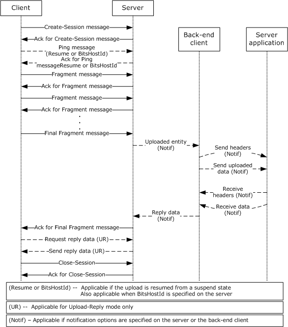
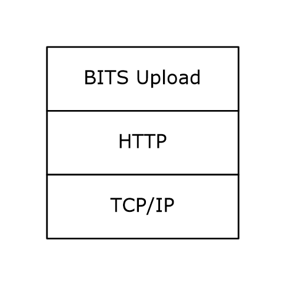
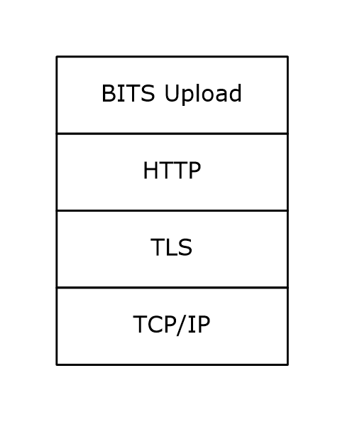
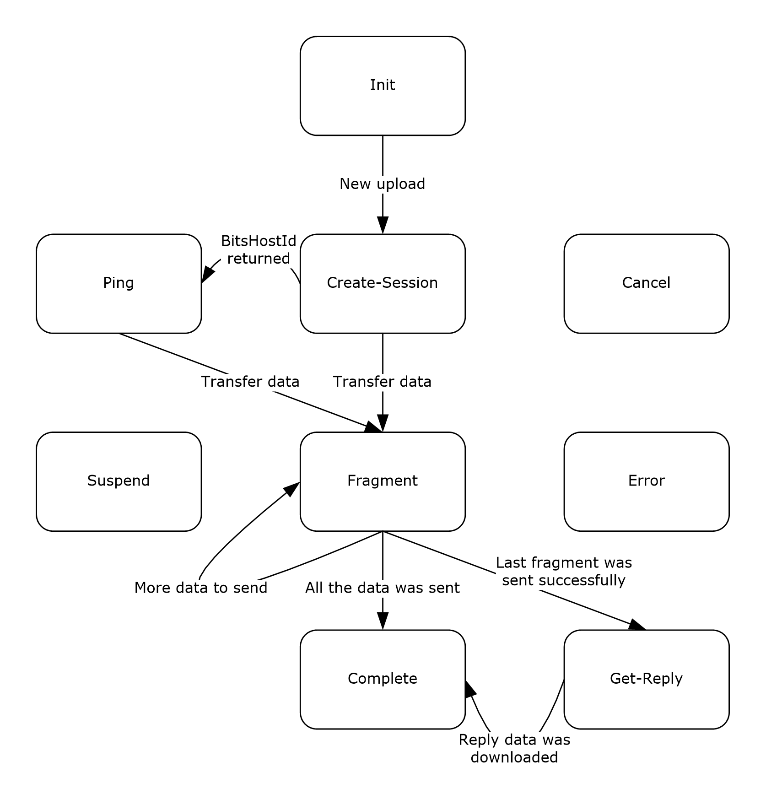
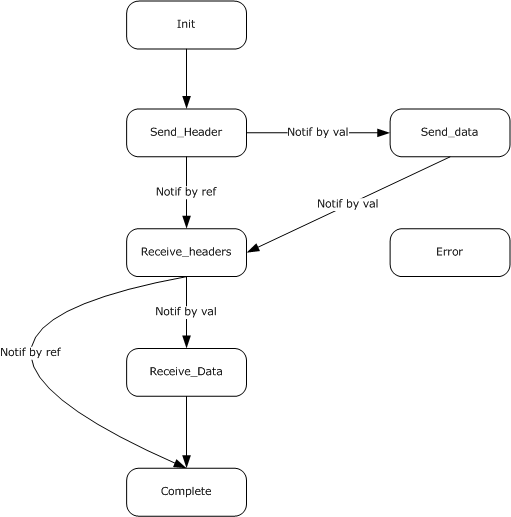
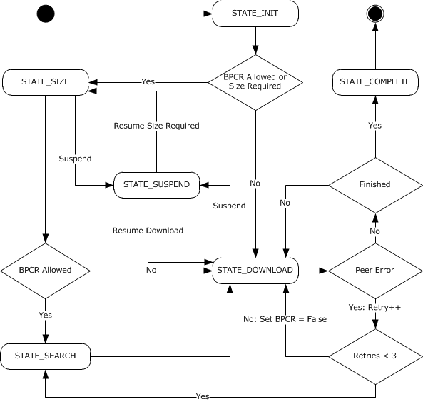

# [MC-BUP]: Background Intelligent Transfer Service (BITS) Upload Protocol

Table of Contents

1 Introduction

- [1 Introduction](#Section_1)
  - [1.1 Glossary](#Section_1.1)
  - [1.2 References](#Section_1.2)
    - [1.2.1 Normative References](#Section_1.2.1)
    - [1.2.2 Informative References](#Section_1.2.2)
  - [1.3 Overview](#Section_1.3)
    - [1.3.1 Message Flow Common to Both Modes](#Section_1.3.1)
    - [1.3.2 Message Flow for Upload Mode](#Section_1.3.2)
    - [1.3.3 Message Flow for Upload-Reply Mode](#Section_1.3.3)
    - [1.3.4 Message Flow Optional in Both Modes](#Section_1.3.4)
      - [1.3.4.1 Canceling an Upload](#Section_1.3.4.1)
      - [1.3.4.2 Uploading to an Alternate Server](#Section_1.3.4.2)
  - [1.4 Relationship to Other Protocols](#Section_1.4)
  - [1.5 Prerequisites/Preconditions](#Section_1.5)
  - [1.6 Applicability Statement](#Section_1.6)
  - [1.7 Versioning and Capability Negotiation](#Section_1.7)
    - [1.7.1 Client to Server Upload](#Section_1.7.1)
    - [1.7.2 Server to Client Download](#Section_1.7.2)
    - [1.7.3 Back-End Client to Server Application](#Section_1.7.3)
  - [1.8 Vendor-Extensible Fields](#Section_1.8)
  - [1.9 Standards Assignments](#Section_1.9)

2 Messages

- [2 Messages](#Section_2)
  - [2.1 Transport](#Section_2.1)
  - [2.2 Upload Message Syntax](#Section_2.2)
    - [2.2.1 Common Among the Message Types](#Section_2.2.1)
      - [2.2.1.1 Standard HTTP Header Fields](#Section_2.2.1.1)
      - [2.2.1.2 HTTP Header Fields Introduced by the BITS Upload Protocol](#Section_2.2.1.2)
    - [2.2.2 CREATE-SESSION Request](#Section_2.2.2)
      - [2.2.2.1 Standard HTTP Header Fields](#Section_2.2.2.1)
      - [2.2.2.2 HTTP Header Fields Introduced by the BITS Upload Protocol](#Section_2.2.2.2)
      - [2.2.2.3 Message Body](#Section_2.2.2.3)
    - [2.2.3 Ack Response for CREATE-SESSION](#Section_2.2.3)
      - [2.2.3.1 Standard HTTP Header Fields](#Section_2.2.3.1)
      - [2.2.3.2 HTTP Header Fields Introduced by the BITS Upload Protocol](#Section_2.2.3.2)
      - [2.2.3.3 Message Body](#Section_2.2.3.3)
    - [2.2.4 PING](#Section_2.2.4)
      - [2.2.4.1 Standard HTTP Header Fields](#Section_2.2.4.1)
      - [2.2.4.2 HTTP Header Fields Introduced by the BITS Upload Protocol](#Section_2.2.4.2)
      - [2.2.4.3 Message Body](#Section_2.2.4.3)
    - [2.2.5 ACK for PING](#Section_2.2.5)
      - [2.2.5.1 Standard HTTP Header Fields](#Section_2.2.5.1)
      - [2.2.5.2 HTTP Header Fields Introduced by the BITS Upload Protocol](#Section_2.2.5.2)
      - [2.2.5.3 Message Body](#Section_2.2.5.3)
    - [2.2.6 FRAGMENT](#Section_2.2.6)
      - [2.2.6.1 Standard HTTP Header Fields](#Section_2.2.6.1)
      - [2.2.6.2 HTTP Header Fields Introduced by the BITS Upload Protocol](#Section_2.2.6.2)
      - [2.2.6.3 Message Body](#Section_2.2.6.3)
    - [2.2.7 ACK for FRAGMENT](#Section_2.2.7)
      - [2.2.7.1 Standard HTTP Header Fields](#Section_2.2.7.1)
      - [2.2.7.2 HTTP Header Fields Introduced by the BITS Upload Protocol](#Section_2.2.7.2)
      - [2.2.7.3 Message Body](#Section_2.2.7.3)
    - [2.2.8 CLOSE-SESSION](#Section_2.2.8)
      - [2.2.8.1 Standard HTTP Header Fields](#Section_2.2.8.1)
      - [2.2.8.2 HTTP Header Fields Introduced by the BITS Upload Protocol](#Section_2.2.8.2)
      - [2.2.8.3 Message Body](#Section_2.2.8.3)
    - [2.2.9 ACK for CLOSE-SESSION](#Section_2.2.9)
      - [2.2.9.1 Standard HTTP Header Fields](#Section_2.2.9.1)
      - [2.2.9.2 HTTP Header Fields Introduced by the BITS Upload Protocol](#Section_2.2.9.2)
      - [2.2.9.3 Message Body](#Section_2.2.9.3)
    - [2.2.10 CANCEL-SESSION](#Section_2.2.10)
      - [2.2.10.1 Standard HTTP Header Fields](#Section_2.2.10.1)
      - [2.2.10.2 HTTP Header Fields Introduced by the BITS Upload Protocol](#Section_2.2.10.2)
      - [2.2.10.3 Message Body](#Section_2.2.10.3)
    - [2.2.11 ACK for CANCEL-SESSION](#Section_2.2.11)
      - [2.2.11.1 Standard HTTP Header Fields](#Section_2.2.11.1)
      - [2.2.11.2 HTTP Header Fields Introduced by the BITS Upload Protocol](#Section_2.2.11.2)
      - [2.2.11.3 Message Body](#Section_2.2.11.3)
    - [2.2.12 Notification Request to the Server Application](#Section_2.2.12)
      - [2.2.12.1 Standard HTTP Header Fields](#Section_2.2.12.1)
      - [2.2.12.2 HTTP Header Fields Introduced by the BITS Upload Protocol](#Section_2.2.12.2)
      - [2.2.12.3 Message Body](#Section_2.2.12.3)
    - [2.2.13 Notification Response from the Server Application](#Section_2.2.13)
      - [2.2.13.1 Standard HTTP Header Fields](#Section_2.2.13.1)
      - [2.2.13.2 HTTP Header Fields Introduced by the BITS Upload Protocol](#Section_2.2.13.2)
      - [2.2.13.3 Message Body](#Section_2.2.13.3)
  - [2.3 Download Message Syntax](#Section_2.3)

3 Protocol Details

- [3 Protocol Details](#Section_3)
  - [3.1 Upload Client Details](#Section_3.1)
    - [3.1.1 Abstract Data Model](#Section_3.1.1)
      - [3.1.1.1 UploadEntityInfo](#Section_3.1.1.1)
      - [3.1.1.2 HTTPUploader](#Section_3.1.1.2)
    - [3.1.2 Timers](#Section_3.1.2)
      - [3.1.2.1 Upload Request Timeout](#Section_3.1.2.1)
      - [3.1.2.2 Upload Response Timeout](#Section_3.1.2.2)
      - [3.1.2.3 Host Fallback Timeout](#Section_3.1.2.3)
    - [3.1.3 Initialization](#Section_3.1.3)
    - [3.1.4 Higher-Layer Triggered Events](#Section_3.1.4)
      - [3.1.4.1 New Upload Request](#Section_3.1.4.1)
      - [3.1.4.2 Pause Existing Upload](#Section_3.1.4.2)
      - [3.1.4.3 Resume Existing Upload](#Section_3.1.4.3)
      - [3.1.4.4 Cancel Existing Upload](#Section_3.1.4.4)
    - [3.1.5 Message Processing Events and Sequencing Rules](#Section_3.1.5)
      - [3.1.5.1 Action for States](#Section_3.1.5.1)
        - [3.1.5.1.1 STATE_INIT](#Section_3.1.5.1.1)
        - [3.1.5.1.2 STATE_CREATE_SESSION](#Section_3.1.5.1.2)
        - [3.1.5.1.3 STATE_PING](#Section_3.1.5.1.3)
        - [3.1.5.1.4 STATE_FRAGMENT](#Section_3.1.5.1.4)
        - [3.1.5.1.5 STATE_COMPLETE](#Section_3.1.5.1.5)
        - [3.1.5.1.6 STATE_CANCEL](#Section_3.1.5.1.6)
        - [3.1.5.1.7 STATE_ERROR](#Section_3.1.5.1.7)
        - [3.1.5.1.8 STATE_GET_REPLY](#Section_3.1.5.1.8)
        - [3.1.5.1.9 STATE_SUSPEND](#Section_3.1.5.1.9)
      - [3.1.5.2 Message Processing](#Section_3.1.5.2)
        - [3.1.5.2.1 Common to All Message Types](#Section_3.1.5.2.1)
        - [3.1.5.2.2 CREATE-SESSION Response](#Section_3.1.5.2.2)
        - [3.1.5.2.3 PING Response](#Section_3.1.5.2.3)
        - [3.1.5.2.4 FRAGMENT Response](#Section_3.1.5.2.4)
        - [3.1.5.2.5 CLOSE-SESSION Response](#Section_3.1.5.2.5)
        - [3.1.5.2.6 CANCEL-SESSION Response](#Section_3.1.5.2.6)
    - [3.1.6 Timer Events](#Section_3.1.6)
      - [3.1.6.1 Upload Request Timeout](#Section_3.1.6.1)
      - [3.1.6.2 Upload Response Timeout](#Section_3.1.6.2)
      - [3.1.6.3 Host Fallback Timeout](#Section_3.1.6.3)
    - [3.1.7 Other Local Events](#Section_3.1.7)
      - [3.1.7.1 Transport Error Occurred During the Transfer](#Section_3.1.7.1)
  - [3.2 Upload Server Details](#Section_3.2)
    - [3.2.1 Abstract Data Model](#Section_3.2.1)
      - [3.2.1.1 BITSDirectoryConfig](#Section_3.2.1.1)
      - [3.2.1.2 ServerPortListener](#Section_3.2.1.2)
      - [3.2.1.3 BITSSessionManager](#Section_3.2.1.3)
        - [3.2.1.3.1 Table of Active Sessions](#Section_3.2.1.3.1)
      - [3.2.1.4 BITSSessionWrapper](#Section_3.2.1.4)
    - [3.2.2 Timers](#Section_3.2.2)
      - [3.2.2.1 BITS Session Timeout](#Section_3.2.2.1)
    - [3.2.3 Initialization](#Section_3.2.3)
    - [3.2.4 Higher-Layer Triggered Events](#Section_3.2.4)
      - [3.2.4.1 BITS Uploads Are Enabled for a Given Virtual Directory](#Section_3.2.4.1)
      - [3.2.4.2 BITS Uploads Are Disabled for a Given Virtual Directory](#Section_3.2.4.2)
    - [3.2.5 Message Processing Events and Sequencing Rules](#Section_3.2.5)
      - [3.2.5.1 Action for States](#Section_3.2.5.1)
        - [3.2.5.1.1 STATE_INIT](#Section_3.2.5.1.1)
        - [3.2.5.1.2 STATE_RECEIVE_FRAGMENTS](#Section_3.2.5.1.2)
        - [3.2.5.1.3 STATE_NOTIFY](#Section_3.2.5.1.3)
        - [3.2.5.1.4 STATE_WAIT_FOR_CLOSE](#Section_3.2.5.1.4)
        - [3.2.5.1.5 STATE_COMPLETE](#Section_3.2.5.1.5)
        - [3.2.5.1.6 STATE_CANCEL](#Section_3.2.5.1.6)
      - [3.2.5.2 Message Processing](#Section_3.2.5.2)
        - [3.2.5.2.1 General Rules for HTTP-Level Error Responses](#Section_3.2.5.2.1)
        - [3.2.5.2.2 Message Flow](#Section_3.2.5.2.2)
        - [3.2.5.2.3 Common Message Validation](#Section_3.2.5.2.3)
        - [3.2.5.2.4 CREATE-SESSION REQUEST](#Section_3.2.5.2.4)
        - [3.2.5.2.5 PING REQUEST](#Section_3.2.5.2.5)
        - [3.2.5.2.6 FRAGMENT REQUEST](#Section_3.2.5.2.6)
        - [3.2.5.2.7 CLOSE-SESSION REQUEST](#Section_3.2.5.2.7)
        - [3.2.5.2.8 CANCEL-SESSION REQUEST](#Section_3.2.5.2.8)
    - [3.2.6 Timer Events](#Section_3.2.6)
      - [3.2.6.1 BITS Session Timeout](#Section_3.2.6.1)
    - [3.2.7 Other Local Events](#Section_3.2.7)
  - [3.3 Back-End Client Details](#Section_3.3)
    - [3.3.1 Abstract Data Model](#Section_3.3.1)
      - [3.3.1.1 Back-End Client's State](#Section_3.3.1.1)
    - [3.3.2 Timers](#Section_3.3.2)
      - [3.3.2.1 Notification Send Timeout](#Section_3.3.2.1)
      - [3.3.2.2 Notification Receive Timeout](#Section_3.3.2.2)
      - [3.3.2.3 Notification Receive Response Timeout](#Section_3.3.2.3)
    - [3.3.3 Initialization](#Section_3.3.3)
    - [3.3.4 Higher-Layer Triggered Events](#Section_3.3.4)
    - [3.3.5 Message Processing Events and Sequencing Rules](#Section_3.3.5)
      - [3.3.5.1 Common](#Section_3.3.5.1)
      - [3.3.5.2 Action for States](#Section_3.3.5.2)
        - [3.3.5.2.1 STATE_INIT](#Section_3.3.5.2.1)
        - [3.3.5.2.2 STATE_SEND_HEADERS](#Section_3.3.5.2.2)
        - [3.3.5.2.3 STATE_SEND_DATA](#Section_3.3.5.2.3)
        - [3.3.5.2.4 STATE_RECEIVE_HEADERS](#Section_3.3.5.2.4)
        - [3.3.5.2.5 STATE_RECEIVE_DATA](#Section_3.3.5.2.5)
        - [3.3.5.2.6 STATE_COMPLETE](#Section_3.3.5.2.6)
        - [3.3.5.2.7 STATE_ERROR](#Section_3.3.5.2.7)
      - [3.3.5.3 Message Processing](#Section_3.3.5.3)
        - [3.3.5.3.1 General Rules for HTTP-Level Error Responses](#Section_3.3.5.3.1)
        - [3.3.5.3.2 Notification Response](#Section_3.3.5.3.2)
    - [3.3.6 Timer Events](#Section_3.3.6)
      - [3.3.6.1 Notification Send Timeout](#Section_3.3.6.1)
      - [3.3.6.2 Notification Receive Timeout](#Section_3.3.6.2)
      - [3.3.6.3 Notification Receive Response Timeout](#Section_3.3.6.3)
    - [3.3.7 Other Local Events](#Section_3.3.7)
  - [3.4 Server Application Details](#Section_3.4)
    - [3.4.1 Abstract Data Model](#Section_3.4.1)
    - [3.4.2 Timers](#Section_3.4.2)
    - [3.4.3 Initialization](#Section_3.4.3)
    - [3.4.4 Higher-Layer Triggered Events](#Section_3.4.4)
    - [3.4.5 Message Processing Events and Sequencing Rules](#Section_3.4.5)
      - [3.4.5.1 General Rules for HTTP-Level Error Responses](#Section_3.4.5.1)
      - [3.4.5.2 Notification Request](#Section_3.4.5.2)
    - [3.4.6 Timer Events](#Section_3.4.6)
    - [3.4.7 Other Local Events](#Section_3.4.7)
  - [3.5 Download Server Details](#Section_3.5)
    - [3.5.1 Abstract Data Model](#Section_3.5.1)
    - [3.5.2 Timers](#Section_3.5.2)
    - [3.5.3 Initialization](#Section_3.5.3)
    - [3.5.4 Higher-Layer Triggered Events](#Section_3.5.4)
      - [3.5.4.1 Modify URL Content](#Section_3.5.4.1)
    - [3.5.5 Message Processing Events and Sequencing Rules](#Section_3.5.5)
      - [3.5.5.1 Receive GET Request](#Section_3.5.5.1)
      - [3.5.5.2 Receive HEAD Request](#Section_3.5.5.2)
    - [3.5.6 Timer Events](#Section_3.5.6)
    - [3.5.7 Other Local Events](#Section_3.5.7)
  - [3.6 Download Client Details](#Section_3.6)
    - [3.6.1 Abstract Data Model](#Section_3.6.1)
      - [3.6.1.1 STATE](#Section_3.6.1.1)
    - [3.6.2 Timers](#Section_3.6.2)
      - [3.6.2.1 Request Timeout](#Section_3.6.2.1)
      - [3.6.2.2 Response Timeout](#Section_3.6.2.2)
    - [3.6.3 Initialization](#Section_3.6.3)
    - [3.6.4 Higher-Layer Triggered Events](#Section_3.6.4)
      - [3.6.4.1 Pause Download](#Section_3.6.4.1)
      - [3.6.4.2 Resume Download](#Section_3.6.4.2)
      - [3.6.4.3 Cancel Download](#Section_3.6.4.3)
    - [3.6.5 Message Processing Events and Sequencing Rules](#Section_3.6.5)
      - [3.6.5.1 Common](#Section_3.6.5.1)
      - [3.6.5.2 Action for States](#Section_3.6.5.2)
        - [3.6.5.2.1 STATE_INIT](#Section_3.6.5.2.1)
        - [3.6.5.2.2 STATE_SIZE](#Section_3.6.5.2.2)
        - [3.6.5.2.3 STATE_SEARCH](#Section_3.6.5.2.3)
        - [3.6.5.2.4 STATE_DOWNLOAD](#Section_3.6.5.2.4)
          - [3.6.5.2.4.1 Download from the BITS Peer-Caching: Content Retrieval Protocol Server](#Section_3.6.5.2.4.1)
          - [3.6.5.2.4.2 Download from Original Server](#Section_3.6.5.2.4.2)
          - [3.6.5.2.4.3 Choosing Ranges](#Section_3.6.5.2.4.3)
          - [3.6.5.2.4.4 Trimming a Request to a Single URL](#Section_3.6.5.2.4.4)
        - [3.6.5.2.5 STATE_SUSPEND](#Section_3.6.5.2.5)
        - [3.6.5.2.6 STATE_COMPLETE](#Section_3.6.5.2.6)
      - [3.6.5.3 Message Processing](#Section_3.6.5.3)
    - [3.6.6 Timer Events](#Section_3.6.6)
      - [3.6.6.1 Request Timeout](#Section_3.6.6.1)
      - [3.6.6.2 Response Timeout](#Section_3.6.6.2)
    - [3.6.7 Other Local Events](#Section_3.6.7)
      - [3.6.7.1 Result Found on Peers](#Section_3.6.7.1)

4 Protocol Examples

- [4 Protocol Examples](#Section_4)
  - [4.1 Successful Upload](#Section_4.1)
  - [4.2 Successful Upload-Reply with Bits-Host-Id and Back-End Notifications](#Section_4.2)

5 Security

- [5 Security](#Section_5)
  - [5.1 Security Considerations for Implementers](#Section_5.1)
  - [5.2 Index of Security Parameters](#Section_5.2)

6 Appendix A: Product Behavior

- [6 Appendix A: Product Behavior](#Section_6)

7 Change Tracking

- [7 Change Tracking](#Section_7)

For the legal notice and IP terms, see [LEGAL.md](../LEGAL.md).
Last updated: 4/23/2024.
See [Revision History](#revision-history) for full version history.

# 1 Introduction

This document is a specification for the Background Intelligent Transfer Service (BITS) Upload Protocol. This protocol is used to transfer large payloads from a client to a server or server to client over networks with frequent disconnections and to send notifications from the server to a [**server application**](#gt_server-application) about the availability of uploaded payloads. This protocol is layered on top of HTTP 1.1 and uses several standard HTTP headers and defines some new headers.

Sections 1.5, 1.8, 1.9, 2, and 3 of this specification are normative. All other sections and examples in this specification are informative.

## 1.1 Glossary

This document uses the following terms:

**back-end client**: A component of this protocol that sends the notifications to the [**server application**](#gt_server-application).

**BITS session**: An [**entity**](#gt_entity) collection of data on the server that maintains the state of a single instance of a BITS upload. More details about the session state and actions can be found in section 3.2.1.4.

**BITS session ID**: A [**GUID**](#gt_globally-unique-identifier-guid) that identifies the [**BITS session**](#gt_bits-session) on the server. See section 2.2.1.2 for more details.

**BITS-Host-ID**: An optional secondary server address. See section 2.2.3.2 for more information.

**destination URL**: The location to which the [**request entity**](#gt_request-entity) is being uploaded. For more information, see [[RFC1738]](https://go.microsoft.com/fwlink/?LinkId=90287).

**entity**: The payload of a transfer (by analogy to the definition in [[RFC2616]](https://go.microsoft.com/fwlink/?LinkId=90372)).

**globally unique identifier (GUID)**: A term used interchangeably with universally unique identifier (UUID) in Microsoft protocol technical documents (TDs). Interchanging the usage of these terms does not imply or require a specific algorithm or mechanism to generate the value. Specifically, the use of this term does not imply or require that the algorithms described in [[RFC4122]](https://go.microsoft.com/fwlink/?LinkId=90460) or [[C706]](https://go.microsoft.com/fwlink/?LinkId=89824) must be used for generating the [**GUID**](#gt_globally-unique-identifier-guid). See also universally unique identifier (UUID).

**origin server**: The URL host name in the [**destination URL**](#gt_destination-url) or an IPv6address (as specified in [[RFC2373]](https://go.microsoft.com/fwlink/?LinkId=94517) Appendix B).

**proxy**: A network node that accepts network traffic originating from one network agent and transmits it to another network agent.

**reply URL**: The URL of the [**response entity**](#gt_response-entity).

**request entity**: The server's copy of an [**entity**](#gt_entity) being uploaded from the client.

**response entity**: An [**entity**](#gt_entity) that maintains the response data from the [**server application**](#gt_server-application). See section 1.3.3 for more information.

**server application**: The application that listens to the notification URL in [MC-BUP](#Section_2c2fe5e1f1054264b80b1f31e9e5dc6b) section 3.2.1.1. This is also called a back-end server.

**Transport Layer Security (TLS)**: A security protocol that supports confidentiality and integrity of messages in client and server applications communicating over open networks. TLS supports server and, optionally, client authentication by using X.509 certificates (as specified in [[X509]](https://go.microsoft.com/fwlink/?LinkId=90590)). TLS is standardized in the IETF TLS working group.

**Universal Naming Convention (UNC)**: A string format that specifies the location of a resource. For more information, see [MS-DTYP](../MS-DTYP/MS-DTYP.md) section 2.2.57.

**upload-reply**: A type of upload where the [**server application**](#gt_server-application) sends a [**response entity**](#gt_response-entity) to the client upon receiving and processing the complete [**request entity**](#gt_request-entity). See section 1.3.3 for more information.

**virtual directory**: A URL prefix that corresponds to a physical directory on the server.

**MAY, SHOULD, MUST, SHOULD NOT, MUST NOT:** These terms (in all caps) are used as defined in [[RFC2119]](https://go.microsoft.com/fwlink/?LinkId=90317). All statements of optional behavior use either MAY, SHOULD, or SHOULD NOT.

## 1.2 References

Links to a document in the Microsoft Open Specifications library point to the correct section in the most recently published version of the referenced document. However, because individual documents in the library are not updated at the same time, the section numbers in the documents may not match. You can confirm the correct section numbering by checking the [Errata](https://go.microsoft.com/fwlink/?linkid=850906).

### 1.2.1 Normative References

We conduct frequent surveys of the normative references to assure their continued availability. If you have any issue with finding a normative reference, please contact [dochelp@microsoft.com](mailto:dochelp@microsoft.com). We will assist you in finding the relevant information.

[MS-BPCR] Microsoft Corporation, "[Background Intelligent Transfer Service (BITS) Peer-Caching: Content Retrieval Protocol](../MS-BPCR/MS-BPCR.md)".

[MS-DTYP] Microsoft Corporation, "[Windows Data Types](../MS-DTYP/MS-DTYP.md)".

[MS-ERREF] Microsoft Corporation, "[Windows Error Codes](../MS-ERREF/MS-ERREF.md)".

[MS-NTHT] Microsoft Corporation, "[NTLM Over HTTP Protocol](../MS-NTHT/MS-NTHT.md)".

[MS-SMB] Microsoft Corporation, "[Server Message Block (SMB) Protocol](../MS-SMB/MS-SMB.md)".

[RFC1510] Kohl, J., and Neuman, C., "The Kerberos Network Authentication Service (V5)", RFC 1510, September 1993, [https://www.rfc-editor.org/info/rfc1510](https://go.microsoft.com/fwlink/?LinkId=90279)

[RFC1738] Berners-Lee, T., Masinter, L., and McCahill, M., Eds., "Uniform Resource Locators (URL)", RFC 1738, December 1994, [https://www.rfc-editor.org/info/rfc1738](https://go.microsoft.com/fwlink/?LinkId=90287)

[RFC2119] Bradner, S., "Key words for use in RFCs to Indicate Requirement Levels", BCP 14, RFC 2119, March 1997, [https://www.rfc-editor.org/info/rfc2119](https://go.microsoft.com/fwlink/?LinkId=90317)

[RFC2373] Hinden, R. and Deering, S., "IP Version 6 Addressing Architecture", RFC 2373, July 1998, [https://www.rfc-editor.org/info/rfc2373](https://go.microsoft.com/fwlink/?LinkId=94517)

[RFC2616] Fielding, R., Gettys, J., Mogul, J., et al., "Hypertext Transfer Protocol -- HTTP/1.1", RFC 2616, June 1999, [https://www.rfc-editor.org/info/rfc2616](https://go.microsoft.com/fwlink/?LinkId=90372)

[RFC2617] Franks, J., Hallam-Baker, P., Hostetler, J., et al., "HTTP Authentication: Basic and Digest Access Authentication", RFC 2617, June 1999, [https://www.rfc-editor.org/info/rfc2617](https://go.microsoft.com/fwlink/?LinkId=90373)

[RFC2818] Rescorla, E., "HTTP Over TLS", RFC 2818, May 2000, [https://www.rfc-editor.org/info/rfc2818](https://go.microsoft.com/fwlink/?LinkId=90383)

[RFC4559] Jaganathan, K., Zhu, L., and Brezak, J., "SPNEGO-based Kerberos and NTLM HTTP Authentication in Microsoft Windows", RFC 4559, June 2006, [https://www.rfc-editor.org/info/rfc4559](https://go.microsoft.com/fwlink/?LinkId=90483)

### 1.2.2 Informative References

[MSDN-BITS] Microsoft Corporation, "Background Intelligent Transfer Service", [http://msdn.microsoft.com/en-us/library/bb968799(VS.85).aspx](https://go.microsoft.com/fwlink/?LinkId=89959)

## 1.3 Overview

The Background Intelligent Transfer Service (BITS) Upload Protocol, hereafter called the BITS Upload Protocol, defines a way to transfer large payloads from a client to an HTTP server or vice versa, even in the face of interruptions, by sending the payload in multiple fragments. Both HTTP and HTTPS are supported. For more information see [[MSDN-BITS]](https://go.microsoft.com/fwlink/?LinkId=89959).

The protocol allows a client to pause, resume, or cancel a transfer.

A client can also limit the rate of bandwidth used by manipulating the length and pace of the transmitted fragments; details are beyond the scope of this specification.

The protocol defines a method for the server to send a notification to a [**server application**](#gt_server-application) about the availability of a payload upon completion of the upload and to send the response data from the server application to the client.

A download from the server to the client follows standard HTTP GET syntax, using byte ranges to control the length of downloaded fragments. The message flow is summarized below:

- The client optionally determines the length of the content using a HEAD request.
- The client downloads the content by sending one or more GET requests. If the request does not encompass the entire URL, the GET request identifies the requested fragment using the Range: header.
An upload from client to server uses the message flow below.

Figure 1: Various messages exchanged among the roles as part of the protocol

In the preceding diagram, the dotted lines indicate messages that are sent only in some variations of the protocol. The following sections describe the message flow for each type of upload, and the examples in section [4](#Section_4) contain detailed examples of each of the messages.

Uploads can be accomplished in two modes: upload and [**upload-reply**](#gt_upload-reply). The details about the messages exchanged in each mode are mentioned later.

### 1.3.1 Message Flow Common to Both Modes

The following steps describe the message flow process that is common to both modes of operation.

The client gets the [**request entity**](#gt_request-entity) and the [**destination URL**](#gt_destination-url) through the higher-layer protocol.

- The client initiates the upload by sending a [CREATE-SESSION (section 2.2.2)](#Section_1.3) message, which prompts the server to create a [**BITS session**](#gt_bits-session) for the destination URL.
- After the BITS session is created, the server sends a [**BITS session ID**](#gt_bits-session-id) through an [Ack response (section 2.2.3)](#Section_2.2.3).
- After the client determines that the BITS session creation was successful, it sends the request entity in a set of [FRAGMENT (section 2.2.6)](#Section_2.2.6) messages to the server. For each fragment being sent from the client, the server processes and updates its copy of the request entity.
- After the FRAGMENT (section 2.2.6) is successfully received and processed, the server sends [Ack (section 2.2.7)](#Section_2.2.7) with the byte range received.

### 1.3.2 Message Flow for Upload Mode

In this mode, the [**request entity**](#gt_request-entity) is uploaded to the server. Figure 1 (section [1.3)](#Section_1.3) explains this mode of operation in detail.

- Steps 1 through 5, described in section [1.3.1](#Section_3.2.5.2.2), are executed.
- After the final FRAGMENT message is processed successfully by the server, the request entity is reassembled at the server. Depending on the [notification options (section 3.2.1.1)](#Section_3.2.1.1) (NotificationType and NotificationURL) defined on the [**back-end client**](#gt_back-end-client), the back-end client can send the request entity to the server application provided through the notificationURL. This step is needed ONLY if the back-end server needs to be notified about the request entity and is not necessary for a simple upload.
- After the server sends a success Ack response to the final FRAGMENT message, the client sends a [CLOSE-SESSION (section 2.2.8)](#Section_2.2.8) message, which prompts the server to move the request entity to the [**destination URL**](#gt_destination-url) and delete [**BITS session**](#gt_bits-session) data for the given session on the server.

### 1.3.3 Message Flow for Upload-Reply Mode

In this mode, the server sends the [**request entity**](#gt_request-entity) to the server application, which constructs a [**response entity**](#gt_response-entity). The server application sends the URL of the reply to the client as part of the response to the final FRAGMENT sent from the client. The following steps, along with the diagram in section [1.3](#Section_1.3), explain this mode of operation in detail.

- Steps 1 through 5, described in section [1.3.1](#Section_3.2.5.2.2), are executed.
- After the final [FRAGMENT (section 2.2.6)](#Section_2.2.6) message is processed successfully by the server, the server sends the path to the request entity to the [**back-end client**](#gt_back-end-client).
- The back-end client sends the request entity to the server application provided through the notificationURL.
- The server application sends a [**reply URL**](#gt_reply-url) to the back-end client. The back-end client sends this information to the server. The server sends this information to the client as part of a header in the [Ack (section 2.2.7)](#Section_2.2.7) response for the final FRAGMENT message.
- The client passes the reply URL to the higher-layer protocol. The download of the reply URL by the higher-layer protocol is beyond the scope of this document.
- The client sends a [CLOSE-SESSION (section 2.2.8)](#Section_2.2.8) message, which prompts the server to move the request entity to the [**destination URL**](#gt_destination-url) and delete [**BITS session**](#gt_bits-session) data for the given session on the server.

### 1.3.4 Message Flow Optional in Both Modes

#### 1.3.4.1 Canceling an Upload

If at any time during the upload, the client sends a [CANCEL-SESSION (section 2.2.10)](#Section_2.2.10) message to the server, the server deletes the [**BITS session**](#gt_bits-session) data it maintains for the corresponding session represented through the [**BITS session ID**](#gt_bits-session-id) and then replies with an Ack.

#### 1.3.4.2 Uploading to an Alternate Server

If the [**destination URL**](#gt_destination-url) refers to a network load balancer or multiple servers, it is possible that the messages sent as part of each request could be forwarded to a different server behind the load balancer, depending on the server configuration.

In order to have the messages related to a given [**request entity**](#gt_request-entity) sent only to a specific server, this protocol provides the capability of sending the server's unique address as part of the [**BITS-Host-ID**](#gt_bits-host-id) header as part of the Ack to the CREATE-SESSION message. See section [2.2.3](#Section_2.2.3) for the message format for the Ack to CREATE-SESSION.

After the client sees that BITS-Host-ID header fields are sent from the server, it replaces the host in the destination URL with the value of the [BITS-Host-Id (section 2.2.3.2)](#Section_2.2.3.2) header field, and it sends the future message requests related to the given upload to the updated destination URL. Header fields are used as specified in [[RFC2616]](https://go.microsoft.com/fwlink/?LinkId=90372) section 4.2.

If the client makes no progress in the time interval provided through BITS-Host-Id-Fallback-Timeout (as specified in section 2.2.3), the client reverts to the [**origin server**](#gt_origin-server) and continues the given upload.

See the state diagram in section [3.1.1.2](#Section_3.1.1.2) for the use of BITS-Host-ID and BITS-Host-Id-Fallback-Timeout.

## 1.4 Relationship to Other Protocols

This protocol is built on top of the HTTP 1.1 Protocol and has direct dependency on it. Depending on the authentication mechanism needed to perform the upload to a URL, this protocol can also have dependency on authentication protocols such as [**Transport Layer Security (TLS)**](#gt_transport-layer-security-tls) [[RFC2818]](https://go.microsoft.com/fwlink/?LinkId=90383).

Figure 2: BITS Upload Protocol dependency

Figure 3: BITS Upload Protocol dependency with TLS authentication

## 1.5 Prerequisites/Preconditions

None.

## 1.6 Applicability Statement

This protocol is best suited for transferring large entities over networks with frequent disconnections.

This protocol can be used along with a rate throttling mechanism to throttle the transfers.

If an [**entity**](#gt_entity) can be uploaded in a single fragment, this protocol is less efficient than an HTTP PUT or POST.

## 1.7 Versioning and Capability Negotiation

This document covers versioning issues in the following areas.

### 1.7.1 Client to Server Upload

- Supported Transports: This protocol is implemented on top of HTTP 1.1 as discussed in section [2.2](#Section_1.3).
- Capability Negotiation: The client sends the supported protocols initially as part of the CREATE-SESSION message request. The server picks the best protocol it can use to talk to the client and sends it as part of the Ack response for CREATE-SESSION. This version of the specification defines a single protocol whose identifying [**GUID**](#gt_globally-unique-identifier-guid) is {7df0354d-249b-430f-820d-3d2a9bef4931}.

### 1.7.2 Server to Client Download

- Capability Negotiation: A client using multi-range HTTP requests can detect a server that does not support multi-range requests and then retry using single-range requests.

### 1.7.3 Back-End Client to Server Application

This protocol does not define an explicit system for version negotiation between the [**back-end client**](#gt_back-end-client) and the server application. The presence of individual capabilities is implicitly signaled in each message by the presence or absence of optional fields. See sections [2.2.12](#Section_2.2.12) and [2.2.13](#Section_2.2.13) for details of each message. No optional capabilities are defined in this version of the specification.

## 1.8 Vendor-Extensible Fields

This protocol uses HRESULT values as defined in [MS-ERREF](../MS-ERREF/MS-ERREF.md). Vendors can define their own HRESULT values, provided they set the C bit (0x20000000) for each vendor-defined value, indicating that the value is a customer code.

## 1.9 Standards Assignments

None.

# 2 Messages

## 2.1 Transport

The client, server, or [**proxy**](#gt_proxy) MAY impose additional requirements on authentication as part of the transfer. In these cases, authentication information MUST be exchanged between the client, server, and proxy as required by HTTP and the relevant authentication protocol.<1>

## 2.2 Upload Message Syntax

Messages follow HTTP 1.1 syntax. The required HTTP headers and the format of the HTTP message body, as specified in section 4.3 of [[RFC2616]](https://go.microsoft.com/fwlink/?LinkId=90372), for each message are described later. An implementation MAY include additional HTTP headers in each message, following the rules in [RFC2616], and MUST treat recognized headers according to their standard meaning in [RFC2616].

A future version of this protocol MAY define new HTTP header fields. The recipient of a message MUST ignore any header fields that it does not understand.

### 2.2.1 Common Among the Message Types

The HTTP version MUST be 1.1.

Each message includes a number of fields in the HTTP message header. Some of them are standard fields, as specified in [[RFC2616]](https://go.microsoft.com/fwlink/?LinkId=90372), that are required to take on specific values, whereas others are new fields defined by the BITS Upload Protocol. The fields MUST follow the rules defined in [RFC2616] section 4.2.

Each request message MUST be sent as an HTTP extension-method (as discussed in [RFC2616] section 5.1.1) called BITS_POST.

Each response message MUST follow the rules defined in [RFC2616] section 6.

The size of the value of a header field SHOULD NOT<2> be more than 4 kilobytes.

Each response message MUST include a BITS-specific HTTP message header field named BITS-Package-Type with the field value Ack.

#### 2.2.1.1 Standard HTTP Header Fields

Content-Name: This indicates the name of the [**request entity**](#gt_request-entity). This SHOULD follow the rules mentioned for field content in [[RFC2616]](https://go.microsoft.com/fwlink/?LinkId=90372) section 4.2. The length SHOULD NOT exceed 260 characters. The value passed through this header is not currently being used on the server.<3>

Content-Length: This indicates the number of bytes being included in the message body of the request or the response. This MUST follow the rules described in [RFC2616] section 14.13. This field MUST be present for all the request messages in section [2.2](#Section_1.3).

#### 2.2.1.2 HTTP Header Fields Introduced by the BITS Upload Protocol

BITS-Packet-Type: This represents the type of the message being sent from client to server or server to client. This is a string of characters and MUST be one of the following: CREATE-SESSION, PING, FRAGMENT, CLOSE-SESSION, CANCEL-SESSION, or Ack. This field MUST be present for all the request and response messages defined in section [2.2](#Section_1.3) except sections [2.2.12](#Section_2.2.12) and [2.2.13](#Section_2.2.13).

**BITS-Session-Id**: A [**GUID**](#gt_globally-unique-identifier-guid) (as specified in [MS-DTYP](../MS-DTYP/MS-DTYP.md) section 2.3.4.3), which MUST be unique among all sessions on a particular server, that identifies the [**BITS session**](#gt_bits-session) for the given [**request entity**](#gt_request-entity). This field MUST be present in all request messages except CREATE-SESSION. The field MUST be present in response messages with an HTTP status of 200. It MAY be present in other response messages; if present, its value MUST be the same as in the corresponding request message.

**BITS-Error**: An HRESULT value that represents the error returned from the BITS server. This header SHOULD be included only if the HTTP status code is not 200.<4>

**BITS-Error-Context**: This specifies the context in which the error was generated. This MUST be CONTEXT_SERVER (0x5) if the error was encountered during the message processing on the server or CONTEXT_REMOTE_APPLICATION (0x7) if the error was returned from the [**server application**](#gt_server-application). This header MUST be included only if BITS-Error is present.

The errors that could be returned from the server to the client are described in the following table.

| HRESULT | HTTP status code | Description |
| --- | --- | --- |
| BG_E_SESSION_NOT_FOUND (x8020001F) | 500 | BITS session–related information is not found on the server. |
| E_ACCESSDENIED (x80070005) | 403 | It can be one of the following: The [**destination URL**](#gt_destination-url) exists on the server and cannot be overwritten. The client is not authorized to access the URL on the server. |
| E_ACCESSDENIED (x80070005) | 501 | Uploads are not enabled for the [**virtual directory**](#gt_virtual-directory). |
| 0 | 416 | The client and server are out of sync, and the server cannot proceed further with the FRAGMENT message processing. The client can read the correct offset from the Ack and send another FRAGMENT. |
| E_INVALIDARG (0x80070057) | 400 | The client's request was invalid in some way, including: The Content-Range format was invalid or the range information sent from the client is incorrect. The size of the header field value sent from the client is greater than 4 kilobytes. None of the GUIDs (as specified in [MS-DTYP] section 2.3.4.3) sent by the client as part of the BITS-Supported-Protocols header can be recognized by the server. The client sends a different request entity length as part of the Content-Range header in subsequent fragments. The destination URL maps to a directory instead. The Content-Length header is not sent from the client. An Unknown BITS-Packet-Type value was received by the server. The size of the [**reply URL**](#gt_reply-url) received by the server from the server application is greater than 2,200 characters. |
| BG_E_TOO_LARGE (x80200020) | 500 | The fragment size sent by the client cannot be handled by the server. |
| ERROR_DISK_FULL (x80070112) | 500 | The server is out of disk space. |

### 2.2.2 CREATE-SESSION Request

The CREATE-SESSION message represents a request to the server to create an upload [**BITS session**](#gt_bits-session) for a new upload instance.

#### 2.2.2.1 Standard HTTP Header Fields

The standard HTTP header fields are [Content-Name (section 2.2.1.1)](#Section_2.2.11.1) and Content-Length (section 2.2.1.1).

The Content-Name field SHOULD<5> be present. The value is defined in section [2.2.1.2](#Section_2.2.1.2).

The value of the Content-Length field MUST be zero for this message type.

#### 2.2.2.2 HTTP Header Fields Introduced by the BITS Upload Protocol

[BITS-Packet-Type (section 2.2.1.2)](#Section_2.2.1.2): The value of this field MUST be CREATE-SESSION for this message type.

BITS-Supported-Protocols: This represents a space-delimited or comma-delimited list of the protocols that the client supports. A [**GUID**](#gt_globally-unique-identifier-guid) (as specified in [MS-DTYP](../MS-DTYP/MS-DTYP.md) section 2.3.4.3) MUST be used to represent each protocol. The list MUST be ordered with the most preferred protocol being the head of the list. This field MUST be present.<6>

#### 2.2.2.3 Message Body

This message MUST NOT contain any message body.

### 2.2.3 Ack Response for CREATE-SESSION

This message is an acknowledgment to the CREATE-SESSION message.

#### 2.2.3.1 Standard HTTP Header Fields

Accept-Encoding: This specifies the content encoding schemes that the server supports; see sections 3.5 and 14.3 of [[RFC2616]](https://go.microsoft.com/fwlink/?LinkId=90372) for more details.<7>

[Content-Length (section 2.2.1.1)](#Section_2.2.11.1): The value MUST be 0 for this message.

#### 2.2.3.2 HTTP Header Fields Introduced by the BITS Upload Protocol

[BITS-Packet-Type (section 2.2.1.2)](#Section_2.2.1.2): The value MUST be Ack for this message.

BITS-Protocol: A [**GUID**](#gt_globally-unique-identifier-guid) (as specified in [MS-DTYP](../MS-DTYP/MS-DTYP.md) section 2.3.4.3) that identifies the best protocol that the server wants to use for the [**BITS session**](#gt_bits-session) created. This header MUST be present only if the HTTP status code is 200 and MUST NOT be present otherwise.<8>

BITS-Session-Id (section 2.2.1.2): The [**BITS session ID**](#gt_bits-session-id) that the client MUST include in future messages relating to this upload. This field MUST be present unless the server encountered an error creating the session.

[**BITS-Host-ID**](#gt_bits-host-id): Specifies an alternate host address that the client MUST use in subsequent messages. It MUST have the host format specified in [[RFC1738]](https://go.microsoft.com/fwlink/?LinkId=90287) section 5 or the IPv6address specified in [[RFC2373]](https://go.microsoft.com/fwlink/?LinkId=94517) Appendix B. The client MUST replace the host portion of the [**destination URL**](#gt_destination-url) with the value returned as part of BITS-Host-ID header field. This header MUST be returned if the [virtual directory (section 3.2.1.1)](#Section_3.2.1.1) is configured with the alternate upload server value, and this header MUST NOT be returned otherwise.

BITS-Host-Id-Fallback-Timeout (Optional): This specifies the time, in seconds, that the client MUST use to revert to the [**origin server**](#gt_origin-server) if no bytes were uploaded to the destination URL during the time specified by this time-out value. This header MUST be returned if the virtual directory (section 3.2.1.1) is configured with the alternate upload server value; otherwise, this header MUST NOT be returned.

BITS-Error (section 2.2.1.2): This field MUST be present if the server encounters an error processing the request and MUST NOT be present otherwise.

BITS-Error-Context (section 2.2.1.2): This field MUST be present if the server encounters an error processing the request and MUST NOT be present otherwise.

#### 2.2.3.3 Message Body

This message MUST NOT contain any message body.

### 2.2.4 PING

The client MAY send this message to check if it can contact the host returned as part of [**BITS-Host-ID**](#gt_bits-host-id) header field before manipulating the [**destination URL**](#gt_destination-url) as specified in section [2.2.3.2](#Section_2.2.3.2). The client SHOULD also send this message when a new TCP session to the server is established if a connection-oriented HTTP authentication scheme such as NTLM is expected.<9>

#### 2.2.4.1 Standard HTTP Header Fields

[Content-Length (section 2.2.1.1)](#Section_2.2.11.1): The value MUST be 0 for this message.

#### 2.2.4.2 HTTP Header Fields Introduced by the BITS Upload Protocol

[BITS-Packet-Type (section 2.2.1.2)](#Section_2.2.1.2): The value MUST be PING for this message.

#### 2.2.4.3 Message Body

This message MUST NOT contain any message body.

### 2.2.5 ACK for PING

This message is an acknowledgment to the PING message.

#### 2.2.5.1 Standard HTTP Header Fields

[Content-Length (section 2.2.1.1)](#Section_2.2.11.1): The value MUST be 0.

#### 2.2.5.2 HTTP Header Fields Introduced by the BITS Upload Protocol

[BITS-Packet-Type (section 2.2.1.2)](#Section_2.2.1.2): The value MUST be Ack.

BITS-Error (section 2.2.1.2): This field MUST be present if the server encountered an error processing the request and MUST NOT be present otherwise.

BITS-Error-Context (section 2.2.1.2): This field MUST be present if the server encountered an error processing the request and MUST NOT be present otherwise.

#### 2.2.5.3 Message Body

This message MUST NOT contain any message body.

### 2.2.6 FRAGMENT

The client MUST use this message to send a block of data from the [**request entity**](#gt_request-entity) to the [**destination URL**](#gt_destination-url). The intent of the protocol is for the client to send the data in one or more nonoverlapping fragments, starting with the first byte of the request entity and proceeding to the last byte. However, in several cases the client state and server state can hold different values for the next byte to be transferred. For instance:

- When a previous FRAGMENT message was interrupted due to a transient failure in the network, the client, or the server.
- When the server or client state changes due to external events such as restoration from a backup.
- When the client's current fragment is sent to a different server than previous fragments, for example, because the client's HostID fallback timer expires.
See section [3.2.5.1.2](#Section_3.2.5.1.2) for the validation required of the server.

The client and server MAY impose limits on the minimum and maximum length of a fragment's body.<10>

#### 2.2.6.1 Standard HTTP Header Fields

[Content-Name (section 2.2.1.1)](#Section_2.2.11.1): This SHOULD be sent with the first fragment message and MAY be sent with the other fragment messages. This value SHOULD match the Content-Name value sent as part of a [CREATE-SESSION (section 2.2.2)](#Section_1.3) message.<11>

Content-Length (section 2.2.1.1): This specifies the length of the data being uploaded.

Content-Range: This specifies start and end offsets of the [**request entity**](#gt_request-entity) being sent as part of this message, using the format in section 14.16 of [[RFC2616]](https://go.microsoft.com/fwlink/?LinkId=90372). This field MUST be present.

Content-Encoding: This specifies the content encoding of the message body; see section 3.5 of [RFC2616] for more details.<12>

#### 2.2.6.2 HTTP Header Fields Introduced by the BITS Upload Protocol

[BITS-Packet-Type (section 2.2.1.2)](#Section_2.2.1.2): The value MUST be FRAGMENT for this message.

BITS-Session-Id (section 2.2.1.2).

#### 2.2.6.3 Message Body

The message body MUST contain the range of bytes being sent as part of the fragment.

### 2.2.7 ACK for FRAGMENT

The server MUST send this message as an acknowledgment to the FRAGMENT message.

#### 2.2.7.1 Standard HTTP Header Fields

[Content-Length (section 2.2.1.1)](#Section_2.2.11.1): The value MUST be 0.

#### 2.2.7.2 HTTP Header Fields Introduced by the BITS Upload Protocol

[BITS-Packet-Type (section 2.2.1.2)](#Section_2.2.1.2): The value MUST be Ack for this message.

BITS-Received-Content-Range: This refers to the start offset of the next fragment message that the client MUST send. For example, if the fragment contained the range 128–212, this value MUST be set to 213. This field MUST be included.

BITS-Session-Id (section 2.2.1.2).

BITS-Reply-URL: This header MUST NOT be present when the Ack pertains to a simple upload. For an upload with reply, this header MUST be present if the fragment triggering the Ack is the last fragment of a [**request entity**](#gt_request-entity) (that is, if the range of the fragment includes the final byte of the request entity). The header SHOULD NOT be present in Acks to other fragments.

BITS-Error (section 2.2.1.2): This field MUST be present if the server encountered an error processing the request and MUST NOT be present otherwise.

BITS-Error-Context (section 2.2.1.2): This field MUST be present if the server encountered an error processing the request and MUST NOT be present otherwise.

#### 2.2.7.3 Message Body

This message MUST NOT contain any message body.

### 2.2.8 CLOSE-SESSION

This message MUST be sent to the server to inform that the upload of the [**request entity**](#gt_request-entity) is complete and successful. This SHOULD trigger cleanup of any [**BITS session**](#gt_bits-session)–specific information for the upload present on the server, including the [**reply URL**](#gt_reply-url).

#### 2.2.8.1 Standard HTTP Header Fields

[Content-Length (section 2.2.1.1)](#Section_2.2.11.1): The value MUST be 0.

#### 2.2.8.2 HTTP Header Fields Introduced by the BITS Upload Protocol

[BITS-Packet-Type (section 2.2.1.2)](#Section_2.2.1.2): The value MUST be CLOSE-SESSION for this message.

BITS-Session-Id (section 2.2.1.2).

#### 2.2.8.3 Message Body

This message MUST NOT contain any message body.

### 2.2.9 ACK for CLOSE-SESSION

The server MUST send this message as an acknowledgment to CLOSE-SESSION request after releasing all the resources held on the server for the given [**BITS session**](#gt_bits-session).

#### 2.2.9.1 Standard HTTP Header Fields

[Content-Length (section 2.2.1.1)](#Section_2.2.11.1): The value MUST be 0.

#### 2.2.9.2 HTTP Header Fields Introduced by the BITS Upload Protocol

[BITS-Packet-Type (section 2.2.1.2)](#Section_2.2.1.2): The value MUST be Ack for this message.

BITS-Session-Id (section 2.2.1.2).

BITS-Error (section 2.2.1.2): This field MUST be present if the server encountered an error processing the request and MUST NOT be present otherwise.

BITS-Error-Context (section 2.2.1.2): This field MUST be present if the server encountered an error processing the request and MUST NOT be present otherwise.

#### 2.2.9.3 Message Body

This message MUST NOT contain any message body.

### 2.2.10 CANCEL-SESSION

The client MUST send this message to terminate the given upload and cause the server to delete the BITS session.

#### 2.2.10.1 Standard HTTP Header Fields

[Content-Length (section 2.2.1.1)](#Section_2.2.11.1): The value MUST be 0.

#### 2.2.10.2 HTTP Header Fields Introduced by the BITS Upload Protocol

[BITS-Packet-Type (section 2.2.1.2)](#Section_2.2.1.2): The value MUST be CANCEL-SESSION for this message.

BITS-Session-Id (section 2.2.1.2).

#### 2.2.10.3 Message Body

This message MUST NOT contain any message body.

### 2.2.11 ACK for CANCEL-SESSION

The server MUST send this message as an acknowledgment to the CANCEL-SESSION request after releasing all the resources held on the server for the given [**BITS session**](#gt_bits-session).

#### 2.2.11.1 Standard HTTP Header Fields

[Content-Length (section 2.2.1.1)](#Section_2.2.11.1): The value MUST be 0.

#### 2.2.11.2 HTTP Header Fields Introduced by the BITS Upload Protocol

[BITS-Packet-Type (section 2.2.1.2)](#Section_2.2.1.2): The value MUST be ACK for this message.

BITS-Session-Id (section 2.2.1.2).

BITS-Error (section 2.2.1.2): This field MUST be present if the server encountered an error processing the request and MUST NOT be present otherwise.

BITS-Error-Context (section 2.2.1.2): This field MUST be present if the server encountered an error processing the request and MUST NOT be present otherwise.

#### 2.2.11.3 Message Body

This message MUST NOT contain any message body.

### 2.2.12 Notification Request to the Server Application

The [**back-end client**](#gt_back-end-client) MUST send this message if the notification option was defined for the virtual directory to which the [**request entity**](#gt_request-entity) is being uploaded and is either [NOTIFICATION_BY_REFERENCE (section 3.2.1.1)](#Section_3.2.1.1) or NOTIFICATION_BY_VALUE (section 3.2.1.1).

#### 2.2.12.1 Standard HTTP Header Fields

[Content-Length (section 2.2.1.1)](#Section_2.2.11.1): This MUST be equal to the size of the message body.

#### 2.2.12.2 HTTP Header Fields Introduced by the BITS Upload Protocol

BITS-Original-Request-URL: This specifies the [**destination URL**](#gt_destination-url) of the [**request entity**](#gt_request-entity). This MUST follow the rules defined in [[RFC2616]](https://go.microsoft.com/fwlink/?LinkId=90372) section 3.2.2. This field MUST be present.

BITS-Request-DataEntity-Name: If the [**back-end client**](#gt_back-end-client) and server reside on the same host, the value MAY be a local file system path, using whatever naming conventions are supported by the host. If the back-end client and server reside on different hosts, the value MUST be in [**Universal Naming Convention (UNC)**](#gt_universal-naming-convention-unc) format, accessible via the [MS-SMB](../MS-SMB/MS-SMB.md) protocol. This specifies the full path to the request entity. This field MUST be present only if the notification type is [NOTIFICATION_BY_REFERENCE (section 3.2.1.1)](#Section_3.2.1.1), and this field MUST NOT be present otherwise. The rules specified for the [Content-Name (section 2.2.1.1)](#Section_2.2.11.1) header (range of characters that can be used) would apply to this as well. No limit is imposed in the back-end client on the number of characters that the value of this field could contain.<13>

BITS-Response-DataEntity-Name: This specifies the full path where the response data from the [**server application**](#gt_server-application) MUST be stored. If the back-end client and server reside on the same host, the value MAY be a local file system path, using whatever naming conventions are supported by the host. If the back-end client and server reside on different hosts, the value MUST be in UNC format, accessible via the [MS-SMB] protocol. This field MUST be present only if the notification type is NOTIFICATION_BY_REFERENCE (section 3.2.1.1), and this field MUST NOT be present otherwise. The rules specified for the Content-Name (section 2.2.1.1) header (range of characters that can be used) would apply to this as well. No limit is imposed in the back-end client on the number of characters that the value of this field could contain.<14>

#### 2.2.12.3 Message Body

If the notification type is [NOTIFICATION_BY_VALUE (section 3.2.1.1)](#Section_3.2.1.1), the [**request entity**](#gt_request-entity) MUST be sent as the body of this message. For all other notification types, this message MUST NOT contain any message body.

### 2.2.13 Notification Response from the Server Application

The server application sends this message to the [**back-end client**](#gt_back-end-client), either to report successful processing of the [**request entity**](#gt_request-entity) or to report an error. In [**upload-reply**](#gt_upload-reply) mode, the message defines the [**response entity**](#gt_response-entity), either by reference using the BITS-Static-Response-URL or by value in the HTTP message body.

#### 2.2.13.1 Standard HTTP Header Fields

[Content-Length (section 2.2.1.1)](#Section_2.2.11.1): This MUST be equal to the size of the message body.

#### 2.2.13.2 HTTP Header Fields Introduced by the BITS Upload Protocol

BITS-Static-Response-URL: This MUST contain the absolute URL (do not specify a relative URL) to a static data entity to use as the response. The static data entity MUST be accessible by the client. This MUST follow the rules defined in [[RFC2616]](https://go.microsoft.com/fwlink/?LinkId=90372) section 3.2.2.

**BITS-Copy-File-To-Destination**: The server application MUST send this header when requesting the server to copy the [**request entity**](#gt_request-entity) to the [**destination URL**](#gt_destination-url).

#### 2.2.13.3 Message Body

If the notification type is [NOTIFICATION_BY_VALUE (section 3.2.1.1)](#Section_3.2.1.1) and if the BITS-Static-Response-URL header field is not present, the [**response entity**](#gt_response-entity) MUST be sent as the body of this message. If any other notification type is present or if the BITS-Static-Response-URL header field is present, this message MUST NOT contain a message body.

## 2.3 Download Message Syntax

Download messages are HTTP HEAD and GET request and response messages, following the syntax specified in [[RFC2616]](https://go.microsoft.com/fwlink/?LinkId=90372). The choice of HTTP/1.0 or HTTP/1.1 is implementation-dependent.<15>

An implementation MAY include additional HTTP headers in each message, following the rules in [RFC2616], and MUST treat recognized headers according to their standard meaning in [RFC2616].

The recipient of a message MUST ignore any header fields that it does not understand.

# 3 Protocol Details

## 3.1 Upload Client Details

### 3.1.1 Abstract Data Model

This section describes a conceptual model of possible data organization that an implementation maintains to participate in this protocol. The described organization is provided to facilitate the explanation of how the protocol behaves. This document does not mandate that implementations adhere to this model as long as their external behavior is consistent with that described in this document.

#### 3.1.1.1 UploadEntityInfo

The client maintains the following information about the upload:

**SourceEntityBuffer:** The buffer that contains data passed by a higher-layer protocol that needs to be uploaded.

**SourceEntityName:** This represents the value sent as part of the [Content-Name (section 2.2.1.1)](#Section_2.2.11.1) header field.

**SourceEntitySize:** A 64-bit integer that holds the size of the data being uploaded.

**Destination URL:** See section [1.1](#Section_1.1).

**AuthCredentials:** The authentication information passed by the higher-layer protocol. The format of this information MUST be same as that defined by the authentication protocols.

#### 3.1.1.2 HTTPUploader

HTTPUploader encapsulates state associated with the upload of a specific [**request entity**](#gt_request-entity). HTTPUploader can be represented in the following states.

| State | Description |
| --- | --- |
| STATE_INIT | This is the initial state for the machine. |
| STATE_CREATE_SESSION | The HTTPUploader sends a CREATE-SESSION message to the server and reads the response headers. |
| STATE_PING | The HTTPUploader sends a PING message to the server and reads the response headers. |
| STATE_FRAGMENT | The HTTPUploader sends a block of data from the request entity as part of the FRAGMENT message and reads the response headers. |
| STATE_COMPLETE | The HTTPUploader sends a CLOSE-SESSION to the server. Request entity upload is complete at this point. This is a terminal state. |
| STATE_CANCEL | The HTTPUploader sends a CANCEL-SESSION to the server. Request entity upload is canceled at this point. This is a terminal state. |
| STATE_ERROR | The HTTPUploader receives the error message and would wait for the higher-layer protocol to resume. STATUS_CODE will have information about various error messages. |
| STATE_GET_REPLY | The HTTPUploader informs the higher-layer protocol to download the [**response entity**](#gt_response-entity). The download of the reply is dependent on the implementation in the higher-layer protocol. |
| STATE_SUSPEND | The HTTPUploader pauses the existing upload and would wait for the higher-layer protocol to resume. |

HTTPUploader contains several state elements, described as follows:

Pointer to the UploadEntityInfo passed by the higher-layer protocol.

FRAGMENT-START-OFFSET: A 64-bit integer that represents the offset at which the given block of data is written in the [**destination URL**](#gt_destination-url).

FRAGMENT-BUFFER: A buffer to hold the fragment data being sent. This MUST be equal to or greater than the FRAGMENT-LENGTH size.

FRAGMENT-LENGTH: A 64-bit integer that represents the length of the fragment being sent.

HTTPStatusCode: This represents the HTTP status code (as described in [[RFC2616]](https://go.microsoft.com/fwlink/?LinkId=90372) section 10) returned from the server.

BitsErrorCode: This represents [BITS-Error (section 2.2.1.2)](#Section_2.2.1.2).

BitsErrorContext: This represents BITS-Error-Context (section 2.2.1.2).

BytesTransferred: A 64-bit integer that holds the number of bytes uploaded so far.

state: The state as shown in Figure 4.

[**Origin server**](#gt_origin-server): The host specified in the destination URL sent by the higher-layer protocol.

BITSSessionId (section 2.2.1.2): The [**BITS session ID**](#gt_bits-session-id) for the current upload session.

BitsHostID (section 2.2.1.2): See the [**BITS-Host-ID**](#gt_bits-host-id) header field in section [2.2.3.2](#Section_2.2.3.2) for a detailed description. Initially, the value is NULL.

BitsHostIDFallbackTimeout (section 2.2.1.2): See the BITS-Host-Id-Fallback-Timeout header field in section 2.2.3.2 for a detailed description. Initially, the time-out value is 0xFFFFFFFF.

[Reply URL (section 1.1)](#Section_1.1): Initially, the value is NULL.

UploadSuspended: TRUE if the upload has been suspended by the higher-layer protocol. FALSE otherwise.

Various errors that could be returned from the client to the higher-layer protocol are as follows. In addition to the following, the errors sent from the server to the client (as specified in section 2.2.1.2) are sent to the higher-layer protocol unmodified.

| STATUS_CODE | Description |
| --- | --- |
| ERROR_AUTH_REQUIRED | The server requires the client to authenticate to proceed with the upload. |
| ERROR_TRANSPORT | A lower-layer transport encountered an error. |
| ERROR_TIMEOUT | The request was not sent, or the response was not received within the time limit. See section [3.1.2](#Section_3.1.2) for more details. |

Figure 4: Possible state transitions

### 3.1.2 Timers

#### 3.1.2.1 Upload Request Timeout

This timer limits the amount of time taken for sending any of the requests mentioned in section [2.2](#Section_1.3) regardless of the state transitions involved. The default value is 2 minutes; the legal range is any positive value.

#### 3.1.2.2 Upload Response Timeout

This timer limits the amount of time taken for receiving any of the responses mentioned in section [2.2](#Section_1.3) from the server regardless of the state transitions involved. The default value is 5 minutes; the legal range is any positive value.

#### 3.1.2.3 Host Fallback Timeout

This timer limits the amount of time taken for the client to reconnect to the host name specified in the [**BITS-Host-ID**](#gt_bits-host-id) header before reverting to the host name specified in the [**destination URL**](#gt_destination-url). The default value is 0xffffffff, meaning INFINITE; the legal range is any positive value.

### 3.1.3 Initialization

None.

### 3.1.4 Higher-Layer Triggered Events

#### 3.1.4.1 New Upload Request

The higher-layer protocol MUST populate the SourceEntityBuffer, SourceEntityName, SourceEntitySize, [**destination URL**](#gt_destination-url), and AuthCredentials member variables of the [UploadEntityInfo (section 3.1.1.1)](#Section_3.1.1.1) object and pass the UploadEntityInfo object to the client. The client sets the UploadEntityInfo.state to STATE_INIT, instantiates the HTTPUploader object, and passes the UploadEntityInfo object to it. The client returns the reference to the HTTPUploader object to the higher-layer protocol.

#### 3.1.4.2 Pause Existing Upload

The higher-layer protocol might interrupt the existing upload. For this, the higher-layer protocol MUST pass the reference to the HTTPUploader object provided as part of [3.1.4.1](#Section_3.1.4.1).

The client MUST set HTTPUploader.UploadSuspended to TRUE and wait for UploadEntityInfo.state to become STATE_SUSPEND.

#### 3.1.4.3 Resume Existing Upload

The higher-layer protocol might resume the existing upload; either it was interrupted through a [Pause Existing Upload](#Section_3.1.4.2) event (section 3.1.4.2) or some error occurred that was sent to the higher-layer protocol for further processing. For this, the higher-layer protocol MUST pass the reference to the HTTPUploader object provided as part of section [3.1.4.1](#Section_3.1.4.1).

If the higher-layer protocol passes authentication info

populate HTTPUploader.AuthCredentials accordingly.

Set HTTPUploader.UploadSuspended to FALSE

Set HTTPUploader.State to PING

#### 3.1.4.4 Cancel Existing Upload

The higher-layer protocol might cancel the existing upload. For this, the higher-layer protocol MUST pass the reference to the HTTPUploader object provided as part of section [3.1.4.1](#Section_3.1.4.1).

Set HTTPUploader.UploadSuspended to FALSE

Set HTTPUploader.State to CANCEL

### 3.1.5 Message Processing Events and Sequencing Rules

#### 3.1.5.1 Action for States

This section describes the actions taken at each state.

##### 3.1.5.1.1 STATE_INIT

Set FRAGMENT-START-OFFSET to 0

Set FRAGMENT-BUFFER to NULL

Set FRAGMENT-LENGTH to 0

Set HTTPStatusCode to 0

Set BitsErrorCode to 0

Set BitsErrorContext to 0

Set BytesTransferred to 0.

Set Origin server to host in destination URL

Set BITSSessionId to NULL.

Set BitsHostID to NULL.

Set BitsHostIDFallbackTimeout to 0xFFFFFFFF

Set Reply URL to NULL

Set UploadSuspended to FALSE

Set state to CREATE_SESSION

Return from this state.

##### 3.1.5.1.2 STATE_CREATE_SESSION

If (UploadSuspended is TRUE)

Set state to SUSPEND

Return from this state.

Obtain the host from BitsHostId (if not NULL) or Origin server

Send CREATE-SESSION message to the server.

If (error encountered in send)

Set State to ERROR

Return from this state.

Receive the Ack response from the server.

Update BITSSessionId, BitsHostId, BitsHostIdFallbackTimeout

with the values received from the server.

If (error encountered while receiving or reading the response info)

Set State to ERROR

Return from this state.

If BitsHostId is not empty

Set State to PING

Return from this state.

Set state to FRAGMENT

##### 3.1.5.1.3 STATE_PING

If (UploadSuspended is TRUE)

Set State to SUSPEND

Return from this state.

Obtain the host from BitsHostId (if not NULL) or Origin server

Send PING message to the server.

If (error encountered in send)

Set State to ERROR

Return from this state.

Receive Ack for PING response from the server.

If (error encountered while receiving or reading the response info)

Set State to ERROR

Return from this state.

Set state to FRAGMENT

##### 3.1.5.1.4 STATE_FRAGMENT

If (UploadSuspended is TRUE)

Set State to SUSPEND

Return from this state.

Determine the size of the fragment i.e. FRAGMENT-LENGTH to be sent by implementation dependent means.

Read the data of size FRAGMENT-LENGTH starting at FRAGMENT-START-OFFSET from UploadEntityInfo.SourceEntityBuffer into FRAGMENT-BUFFER.

Send FRAGMENT message to the server. The content-range MUST be FRAGMENT-START-OFFSET to FRAGMENT-START-OFFSET+FRAGMENT-LENGTH-1.

If (error encountered in send)

Set State to ERROR

Return from this state.

Receive Ack for FRAGMENT response from the server.

If (error encountered while receiving or reading the response info

and HTTP status code is not 416)

Set State to ERROR

Return from this state.

If (HostIdFallback timer has been set)

Reset the HostIdFallback timer

If (value of BITS-Received-Content-Range header is not equal to FRAGMENT-START-OFFSET+ FRAGMENT-LENGTH)

Set FRAGMENT-START-OFFSET to value of BITS-Received-Content-Range header field.

If(FRAGMENT-START-OFFSET is equal to UploadEntityInfo.SourceEntitySize)

If(BITS-Reply-URL header field is present and the size is not 0)

Update UploadEntityInfo.ReplyURL

Set State to GET-REPLY

Return from this state.

Set State to COMPLETE

Return from this state.

Set State to FRAGMENT

##### 3.1.5.1.5 STATE_COMPLETE

If (UploadSuspended is TRUE)

Set State to SUSPEND

Return from this state.

Send CLOSE-SESSION message to the server.

If (error encountered in send)

Set State to ERROR

Return from this state.

Receive Ack for CLOSE-SESSION response from the server.

If (error encountered while receiving or reading the response info)

Set State to ERROR

Return from this state.

##### 3.1.5.1.6 STATE_CANCEL

If (UploadSuspended is TRUE)

Set State to SUSPEND

Return from this state.

Send CANCEL-SESSION message to the server.

If (error encountered in send)

Set State to ERROR

Return from this state.

Receive Ack for CANCEL-SESSION response from the server.

If (error encountered while receiving or reading the response info)

Set state to ERROR

Return from this state.

##### 3.1.5.1.7 STATE_ERROR

If (UploadSuspended is TRUE)

Set State to SUSPEND

Return from this state.

If (BITSErrorCode is BG_E_SESSION_NOT_FOUND)

Set State to CREATE-SESSION

Return from this state.

If (HTTPStatusCode is 401 or 407)

If (UploadEntityInfo.AuthCredentials were not already supplied)

Add UploadEntityInfo.AuthCredentials to the request

Resend the previous message that failed with this error.

If (UploadEntityInfo.AuthCredentials were already supplied)

Return the error info (HTTPStatusCode , BITSErrorCode and BITSErrorContext) to the higher-layer protocol so proper action can be taken

If (HTTPStatusCode is 413)

Reduce the FRAGMENT-LENGTH based on an implementation-dependent method.

Set State to FRAGMENT.

Return from this state.

If (HostIdFallback timer has not already started)

If (UploadEntityInfo.BitsHostId is not empty)

Start the HostIdFallback timer with UploadEntityInfo.BitsHostIdFallbackTimeout value

Return the error info (HTTPStatusCode , BITSErrorCode and BITSErrorContext) to the higher-layer protocol so proper action can be taken

##### 3.1.5.1.8 STATE_GET_REPLY

If (UploadSuspended is TRUE)

Set State to SUSPEND

Return from this state.

This is applicable for [**upload-reply**](#gt_upload-reply) mode only.

The higher-layer protocol MUST download the UploadEntityInfo.ReplyURL using an implementation-dependent method.

If (higher-layer protocol passes an error to the client)

Set State to ERROR

Return from this state.

If (higher-layer protocol passes a success code to the client)

Set State to COMPLETE

Return from this state.

##### 3.1.5.1.9 STATE_SUSPEND

Wait for the current state to stop further processing and return.

Return to higher-layer protocol.

#### 3.1.5.2 Message Processing

##### 3.1.5.2.1 Common to All Message Types

If the HTTP status code is 401 or 407, the client MUST follow the rules defined in [[RFC2617]](https://go.microsoft.com/fwlink/?LinkId=90373) and [[RFC2616]](https://go.microsoft.com/fwlink/?LinkId=90372) regarding sending the response for the authentication challenge.

If the HTTP status code is 403, the user does not have access rights to upload the [**request entity**](#gt_request-entity) to the location specified through the [**destination URL**](#gt_destination-url). The client MUST return this error to the higher-layer protocol so that the necessary steps can be taken.

If the HTTP status code is 501 and the BITS-Error value returned as part of the response is x80070005, uploads are not enabled for the virtual directory, where the destination URL MUST be present. The client MUST return this error to the higher-layer protocol so that the necessary steps can be taken.

If the BITS-Error value returned as part of the response is x8020001F, the client MUST restart the upload with a CREATE-SESSION message. This is true for all the messages except CANCEL-SESSION (section [3.1.5.2.6](#Section_3.1.5.2.6)).

If the BITS-Error value returned as part of the response is x80200020, it means that the size of the request entity is larger than the maximum request entity size specified for the virtual directory, as discussed in section [2.2.1.2](#Section_2.2.1.2). The client MUST return this error to the higher-layer protocol so that the necessary steps can be taken.

If the BITS-Error value returned as part of the response is x80070057, the values of the headers sent from the client do not satisfy the message rules previously specified. The client MUST return this error to the higher-layer protocol so that the necessary steps can be taken.

For all other HTTP status codes returned from the server that have a valid BITS-error, the client MUST return this error to the higher-layer protocol so that the necessary steps can be taken.

For all other HTTP status codes as specified in [RFC2616] section 10, the client MUST return this error to the higher-layer protocol so that the necessary steps can be taken.

The upload request timer MUST be started before each message is sent to the server. It MUST be stopped when the send is complete.

The upload response timer MUST be started before the response is requested from the server. It MUST be stopped when the response from the server is received with either a success status code or a failure status code.

##### 3.1.5.2.2 CREATE-SESSION Response

The client MUST verify that the message satisfies the requirements in sections [2.2.1](#Section_2.2.1) and [2.2.3](#Section_2.2.3), discarding the message if not.

If the HTTP status code is 200, the request was successful and [**BITS session**](#gt_bits-session)–specific information has been set up for upload on the server.

If the HTTP status code is 200, as specified in section [3.1.5.1.2](#Section_3.1.5.1.2) the client MUST update the fields in HTTPUploader with the values returned through the response headers. See section [2.2.3.2](#Section_2.2.3.2) for the headers returned. The client MUST update the [**destination URL**](#gt_destination-url) as described in [**BITS-Host-ID**](#gt_bits-host-id) in section 2.2.3.2. The client SHOULD send a PING message request to the host, sent through BITS-Host-ID, to validate that the host can be contacted.

For handling other HTTP status codes, see section [3.1.5.2.1](#Section_3.1.5.2.1).

##### 3.1.5.2.3 PING Response

The client MUST verify that the message satisfies the requirements in sections [2.2.1](#Section_2.2.1) and [2.2.5](#Section_2.2.5), discarding the message if not.

If the result is 200, the request was successful.

For handling other HTTP status codes, refer to [3.1.5.2.1](#Section_3.1.5.2.1).

##### 3.1.5.2.4 FRAGMENT Response

The client MUST verify that the message satisfies the requirements in sections [2.2.1](#Section_2.2.1) and [2.2.7](#Section_2.2.7), discarding the message if not.

If the HTTP status code is 200 or 416, the client MUST perform necessary checks on the value received through BITS-Received-Content-Range and update the fragment offset as shown in the state logic in section [3.1.5.1.4](#Section_3.1.5.1.4).

If the HTTP status code is 413 (request too large), the client SHOULD send fragments of smaller sizes until 413 error is not returned from the server. The maximum size of fragment allowed and the size of the fragment being sent from the client are implementation-specific.<16>

In [**upload-reply**](#gt_upload-reply) mode, the server MUST send Reply-URL as part of uploading the final fragment. If the server does not send Reply-URL, the client MUST report the error to the higher-layer protocol. More details of state transitions can be found in section [3.1.5.1.8](#Section_3.1.5.1.8).

For handling other HTTP status codes, refer to section [3.1.5.2.1](#Section_3.1.5.2.1).

##### 3.1.5.2.5 CLOSE-SESSION Response

The client MUST verify that the message satisfies the requirements in sections [2.2.1](#Section_2.2.1) and [2.2.9](#Section_2.2.9), discarding the message if not.

If the HTTP status code is 200, the server has successfully cleaned up [**BITS session**](#gt_bits-session)–specific data for the given upload. More details of state transitions based on the response information can be found in section [3.1.5.1.5](#Section_3.1.5.1.5).

For handling other HTTP status codes, refer to section [3.1.5.2.1](#Section_3.1.5.2.1).

##### 3.1.5.2.6 CANCEL-SESSION Response

The client MUST verify that the message satisfies the requirements in sections [2.2.1](#Section_2.2.1) and [2.2.11](#Section_2.2.10), discarding the message if not.

If the HTTP status code is 200, the server has successfully cleaned up [**BITS session**](#gt_bits-session)-specific data for the given upload. More details of state transitions based on the response is in section [3.1.5.1.6](#Section_3.1.5.1.6).

For handling other HTTP status codes, refer to section [3.1.5.2.1](#Section_3.1.5.2.1).

### 3.1.6 Timer Events

#### 3.1.6.1 Upload Request Timeout

The client cancels the current request, sets the state to STATE_SUSPENDED, and sends ERROR_TIMEOUT to the higher-layer protocol.

#### 3.1.6.2 Upload Response Timeout

The client cancels the current request, sets the state to STATE_SUSPENDED, and sends ERROR_TIMEOUT to the higher-layer protocol.

#### 3.1.6.3 Host Fallback Timeout

The client MUST send future messages to the host in the [**destination URL**](#gt_destination-url), not the address in BitsHostID. See section [3.1.5.1.7](#Section_3.1.5.1.7) for more details.

### 3.1.7 Other Local Events

#### 3.1.7.1 Transport Error Occurred During the Transfer

The client sends ERROR_TRANSPORT to the higher-layer protocol.

## 3.2 Upload Server Details

An implementation that includes the upload mode SHOULD also implement the notification semantics presented in this section and in sections [3.3](#Section_1.3) and [3.4](#Section_3.4). If the implementation also implements the [**upload-reply**](#gt_upload-reply) of this protocol, it MUST implement the notification semantics as described in sections 3.3 and 3.4.

### 3.2.1 Abstract Data Model

This section describes a conceptual model of possible data organization that an implementation maintains to participate in this protocol. The described organization is provided to facilitate the explanation of how the protocol behaves. This document does not mandate that implementations adhere to this model as long as their external behavior is consistent with that described in this document.

#### 3.2.1.1 BITSDirectoryConfig

This represents the configuration options that apply to the virtual directory. Storing and retrieving the values for these properties is beyond the scope of this protocol.<17>

BITSDirectoryConfig contains the following state elements:

**UploadEnabled:** Boolean value. If true, enable BITS uploads within the virtual directory. If false, disable BITS uploads for the virtual directory.

**MaximumUploadSize:** A 64-bit integer that represents the maximum number of bytes in a single [**request entity**](#gt_request-entity).

**NotificationType:** An enumeration value that represents the way the request entity is sent to the [**server application**](#gt_server-application).<18> NotificationType MUST contain one of the following values:

- NONE: The request entity MUST NOT be sent to the server application. The server populates the request entity in the location provided through the [**destination URL**](#gt_destination-url). This value is not legal for [**upload-reply**](#gt_upload-reply) mode.
- NOTIFICATION_BY_REFERENCE: The [**back-end client**](#gt_back-end-client) MUST pass the physical path of the request entity to the server application specified in the NotificationURL state element.
- NOTIFICATION_BY_VALUE: The back-end client MUST pass request entity data in the body of the request to the server application specified in the NotificationURL property.
**NotificationURL:** (Optional) This specifies the URL of the server application to which the server sends the request entity. This MUST be present if NotificationType property is not NONE.<19>

**BITSHostId:** If nonempty, this specifies the value of the [Bits-Host-Id (section 2.2.3.2)](#Section_2.2.3.2) header field to be returned in the reply to a CREATE-SESSION message.

**BITSHostIdFallbackTimeout:** If nonzero, this specifies the value of the Bits-HostId-Fallback-Timeout (section 2.2.3.2) header field to be returned in the reply to a CREATE-SESSION message.

**AllowOverwrites:** A Boolean value that indicates whether a request entity can overwrite an existing entity with the same name.

#### 3.2.1.2 ServerPortListener

The ServerPortListener role is to listen to the incoming messages from various clients and forward them to the appropriate handlers.

#### 3.2.1.3 BITSSessionManager

The role of BITSSessionManager is to forward the message BITSSessionWrapper object that is associated with the [**BITS session ID**](#gt_bits-session-id) value sent as part of the message.

##### 3.2.1.3.1 Table of Active Sessions

Each row of this table contains a [**BITS session ID**](#gt_bits-session-id) and a reference to the corresponding BITSSessionWrapper object. The table contains one row for each upload session known to the BITS server.

#### 3.2.1.4 BITSSessionWrapper

BITSSessionWrapper encapsulates the state associated with the upload of a specific [**request entity**](#gt_request-entity).

A BITSSessionWrapper object contains the following properties:

- BITSSessionId: This refers to [BITS-Session-Id (section 2.2.3.2)](#Section_2.2.3.2).
- State: This represents the current active state of a BITSSessionWrapper object. This is an enumeration and contains one of the values mentioned in the following state table.
- DestinationURL: This refers to the [**destination URL**](#gt_destination-url).
- RequestEntityPath: This represents the physical path to the request entity for the upload. The rules specified for the [Content-Name (section 2.2.1.1)](#Section_2.2.11.1) header (maximum character limit, range of characters that can be used) apply to this as well.
- ResponseEntityPath: This represents the physical path to the [response entity](#Section_1.3.3) used in [**upload-reply**](#gt_upload-reply) mode. The rules specified for Content-Name (section 2.2.1.1) header (maximum character limit, range of characters that can be used) apply to this as well.
- UploadEntitySize: A 64-bit integer that represents the number of bytes of the request entity.
- ReplyURL: This is the same as [**reply URL**](#gt_reply-url).
- UploadComplete: A Boolean value that represents whether the server has all the bytes of the request entity.<20>
- NotifyCache: A Boolean value that specifies whether the communication with the [**back-end client**](#gt_back-end-client) is complete.
- ShouldcopyToDestination: A Boolean value that specifies whether the destination URL is populated.
- HTTPStatusCode: This represents HTTP status code as described in [[RFC2616]](https://go.microsoft.com/fwlink/?LinkId=90372) section 10.
- BitsErrorCode: This represents [BITS-Error (section 2.2.1.2)](#Section_2.2.1.2).
- BitsErrorContext: This represents BITS-Error-Context (section 2.2.1.2).
BITSSessionWrapper can be represented in the following states:

| State | Description |
| --- | --- |
| STATE_INIT | This is the initial state for the machine. |
| STATE_RECEIVE_FRAGMENTS | BITSSessionWrapper waits for receiving fragments. |
| STATE_CANCEL | BITSSessionWrapper processes the CANCEL-SESSION request from the client. This is a terminal state. |
| STATE_NOTIFY | BITSSessionWrapper sends the request entity to the back-end client object, which in turn triggers notification to the [**server application**](#gt_server-application). |
| STATE_WAIT_FOR_CLOSE | BITSSessionWrapper waits for a CLOSE-SESSION message from the client. |
| STATE_COMPLETE | BITSSessionWrapper processes CANCEL-SESSION, CLOSE-SESSION, and PING requests from the client. This is a terminal state. |

Figure 5: Possible state transitions

### 3.2.2 Timers

#### 3.2.2.1 BITS Session Timeout

The number of seconds the server maintains the [**BITS session**](#gt_bits-session) information if no client messages are processed successfully. This MAY be set as part of [BITSDirectoryConfig (section 3.2.1.1)](#Section_3.2.1.1). This timer MAY be applicable for all the BITS sessions associated with a given virtual directory.<21> The default value is 14 days; the legal range is any positive value.

### 3.2.3 Initialization

When the server is initialized, the higher-layer protocol passes the port to which the server is listening for the incoming BITS upload messages. The server MUST verify that there is an existing [ServerPortListener (section 3.2.1.2)](#Section_3.2.1.2) for the given port, and it MUST create a new instance of ServerPortListener otherwise. The server MUST register itself with ServerPortListener to receive the BITS upload messages (sent by the clients) from ServerPortListener.

### 3.2.4 Higher-Layer Triggered Events

#### 3.2.4.1 BITS Uploads Are Enabled for a Given Virtual Directory

The URL prefix that identifies the virtual directory MUST be registered with ServerPortListener.

#### 3.2.4.2 BITS Uploads Are Disabled for a Given Virtual Directory

The server MUST clean up the [**BITS session**](#gt_bits-session) data for all BITS sessions associated with the given virtual directory. The URL prefix that identifies the virtual directory MUST be removed from the list of URL prefixes registered with ServerPortListener.

The responses to the BITS upload messages sent by the client after BITS uploads are disabled for a given virtual directory are outside the scope of this document.<22>

### 3.2.5 Message Processing Events and Sequencing Rules

#### 3.2.5.1 Action for States

The actions taken at each state are described in the following sections.

##### 3.2.5.1.1 STATE_INIT

Apply the message processing rules as described in sections [3.2.5.2.1](#Section_3.2.5.2.1), [3.2.5.2.3](#Section_3.2.5.2.3), and [3.2.5.2.4](#Section_3.2.5.2.4).

Initialize all the members.

Set UploadEntitySize to 0

Set ReplyURL to NULL

Set UploadComplete to false

Set HTTPStatusCode to 0

Set BitsErrorCode to 0

Set ShouldcopyToDestination to true

Set state to RECEIVE_FRAGMENTS

##### 3.2.5.1.2 STATE_RECEIVE_FRAGMENTS

Wait for the BITS message sent from the client for the given BITS session.

If (message type is CLOSE-SESSION)

Set State to COMPLETE

Return from this state.

If (message type is CANCEL-SESSION)

Set State to CANCEL

Return from this state.

If (message type is FRAGMENT)

Apply the message processing rules as described in sections 3.2.5.1, 3.2.5.2 and 3.2.5.5

If (NotifyCache is true)

Send response to the client with the message format described in section 2.2.7.

Return from this state.

If(UploadComplete is true)

Set state to STATE_NOTIFY

Return from this state.

If (processed the last fragment of the entity successfully)

Set UploadComplete to true

Set state to STATE_NOTIFY

Return from this state.

If (not the last fragment of the request entity)

Set state to RECEIVE_FRAGMENTS

Return from this state.

##### 3.2.5.1.3 STATE_NOTIFY

Send a message to the back-end client about the availability of the request entity.

Include the DestinationURL, RequestEntityPath.

MAY Include BITSDirectoryConfig.Notification type

and BITSDirectoryConfig.Notification URL.

if(there is an error while sending)

Send response to the client with the message format described in section 2.2.7

Set state to RECEIVE_FRAGMENTS

Return from this state.

Receive the response from back-end client

if(there is an error while receiving)

Send response to the client with the message format described in section 2.2.7.

Set state to RECEIVE_FRAGMENTS

Return from this state.

Read HTTPStatusCode, BITSErrorCode, IsReplyStaticURL,

ShouldcopyToDestination, ResponseEntityPath, ReplyURL

received as part of the response.

if(there is an error while reading the values or HTTPStatusCode is an error)

Send response to the client with the message format described in section 2.2.7.

Set state to RECEIVE_FRAGMENTS

Return from this state.

If(BITSErrorCode is not a success)

Set BITSErrorContext to 0x7

If (IsReplyStaticURL is true)

Set ResponseEntityPath to NULL

Send success response to the client with the message format

described in section 2.2.7 with ReplyURL info.

Set state to WAIT_FOR_CLOSE

##### 3.2.5.1.4 STATE_WAIT_FOR_CLOSE

Wait for the BITS message sent from the client for the given BITS session.

If (message type CLOSE_SESSION)

Set state to COMPLETE

If (message type other than CLOSE-SESSION)

Send the appropriate response to the client based on the message type

as described in section 2.2.

Set state to WAIT_FOR_CLOSE

##### 3.2.5.1.5 STATE_COMPLETE

Apply the message processing rules as described in sections [3.2.5.2.1](#Section_3.2.5.2.1), [3.2.5.2.3](#Section_3.2.5.2.3), and [3.2.5.2.7](#Section_3.2.5.2.7).

If(ShouldcopyToDestination is true)

Populate destination URL with the info at RequestEntityPath in

an implementation-dependent manner.

Remove the corresponding row from the BITSSessionManager's table of active

sessions.

##### 3.2.5.1.6 STATE_CANCEL

Apply the message processing rules as described in sections [3.2.5.2.1](#Section_3.2.5.2.1), [3.2.5.2.3](#Section_3.2.5.2.3), and [3.2.5.2.8](#Section_3.2.5.2.8).

#### 3.2.5.2 Message Processing

##### 3.2.5.2.1 General Rules for HTTP-Level Error Responses

This section describes several circumstances where the server's response to an incoming message is a response at the HTTP level rather than a message from section [2.2](#Section_1.3). In all such cases, the response MUST conform to the format defined in section 6 of [[RFC2616]](https://go.microsoft.com/fwlink/?LinkId=90372). The HTTP message body of these messages SHOULD be empty.

##### 3.2.5.2.2 Message Flow

After [BITSSessionManager (section 3.2.1.3)](#Section_3.2.1.3) receives the message from [ServerPortListener (section 3.2.1.2)](#Section_3.2.1.2), it parses the message to obtain the message type and [**BITS session ID**](#gt_bits-session-id). Detailed information about the headers can be found in section [2.2.1](#Section_2.2.1).

If (the message type is CREATE-SESSION)

Create a new BITSSessionWrapper object and pass the message info

Add a corresponding row to the table of active sessions.

If (message type is PING)

Send response to the client with the message format described in 2.2.5

If (the message type is not CREATE-SESSION and not a PING)

Obtain the BITS-Session-Id header value

Find the session ID in the table of active sessions

Send the message info to the corresponding BITSSessionWrapper object.

If (error occurs in any of the above actions)

Return error response to the client.

The message format for responses for the corresponding request messages can be found in section [2.2](#Section_1.3).

##### 3.2.5.2.3 Common Message Validation

See section [2.2.1](#Section_2.2.1) for more details about the common standard HTTP headers and HTTP headers specific to the BITS Upload Protocol. The response sent from the server in the discussion that follows MUST be based on the type of message received from the client (except PING messages). See sections [2.2.3](#Section_2.2.3), [2.2.7](#Section_2.2.7), [2.2.9](#Section_2.2.9), and [2.2.11](#Section_2.2.10) for the message format of various responses sent from the server.

The server MUST verify that the request message satisfies the requirements in section [2.2](#Section_1.3). If the request message fails to satisfy the requirements, the server MUST send a 400 HTTP status code with BITS-Error 0x80070057, BITS-Error-Context 0x5.

The server MUST check whether the client has sufficient access permissions to upload the [**request entity**](#gt_request-entity) to the location provided through the [**destination URL**](#gt_destination-url). If not, the server MUST send a 403 HTTP status code with BITS-Error 0x80070005, BITS-Error-Context 0x5.

The request MUST contain a Content-Length header. If not, the server MUST reject the message and SHOULD return a 411 HTTP status code with BITS-Error 0x80070057, BITS-Error-Context 0x5.<23>

Except for the CREATE-SESSION message, the server MUST validate that the [**BITS session ID**](#gt_bits-session-id) sent from the client is one of the active [**BITS sessions**](#gt_bits-session) on the server. If no corresponding active BITS session exists on the server, the server MUST return a 500 HTTP status code with BITS-Error x8020001F, BITS-Error-Context 0x5.

After the initial validation has succeeded, the server uses the BITS-Packet-Type header to determine the message type and processes the message as appropriate. Specific actions for each message type are described in the following sections.

##### 3.2.5.2.4 CREATE-SESSION REQUEST

The server MUST validate that it supports at least one of the supported protocols sent by the client. If no supported protocols are common between the client and the server, the server MUST send an HTTP status code as 400 and a BITS-Error as x80070057, BITS-Error-Context 0x5.

The server MUST generate a [**GUID**](#gt_globally-unique-identifier-guid) (as specified in [MS-DTYP](../MS-DTYP/MS-DTYP.md) section 2.3.4.3) for [**BITS session ID**](#gt_bits-session-id) and store it in BITSSessionWrapper for the upload.

The server SHOULD<24> create a temporary location for storing the [**request entity**](#gt_request-entity) being uploaded before updating the final destination entity.

If BITSHostId or BITSHostIdFallbackTimeout is specified for the virtual directory, the server SHOULD<25> send these headers as part of the response sent to the client.

If the create-session request is completed successfully or failed for some reason, the server MUST send the response as described in section [2.2.3](#Section_2.2.3).

##### 3.2.5.2.5 PING REQUEST

No special processing is done for handling this request.

The server MUST send the response as described in section [2.2.5](#Section_2.2.5) with HTTP status code 200.

##### 3.2.5.2.6 FRAGMENT REQUEST

If the start offset of Content-Range received as part of the current fragment is not the start offset of the next block of data that the server receives, the server MUST return a response as described in section [2.2.7](#Section_2.2.7) with HTTP status code 416 and with BITS-Received-Content-Range as the start offset that the client MUST send as part of the next fragment request.

All the rules described in [[RFC2616]](https://go.microsoft.com/fwlink/?LinkId=90372) section 14.16 related to Content-Range would apply while the Content-Range header value received from the client is being processed. The server MUST return a response as described in section 2.2.7 with HTTP status code 400 and with BITS-Error as x80070057, BITS-Error-Context as 0x5.

The server MUST send the response as described in section 2.2.7. The BITS-Error-Context MUST be returned as 0x7 if an error was returned from the back-end client.

##### 3.2.5.2.7 CLOSE-SESSION REQUEST

The server MUST move the [**request entity**](#gt_request-entity) to the final destination to complete the upload. The server MUST delete the request entity and other state data associated with the [**BITS session**](#gt_bits-session). If the server finds that the request entity was deleted, the server MUST return a response as described in section [2.2.9](#Section_2.2.9) with HTTP status code 404.

If ResponseEntityPath was returned from the [**back-end client**](#gt_back-end-client), the server MUST delete it.

The server MUST send the response as described in section 2.2.9.

##### 3.2.5.2.8 CANCEL-SESSION REQUEST

The server MUST delete the [**request entity**](#gt_request-entity), [**response entity**](#gt_response-entity), and other state data associated with the [**BITS session**](#gt_bits-session).

If ResponseEntityPath was returned from the [**back-end client**](#gt_back-end-client), the server MUST delete it.

The server MUST send the response as described in section [2.2.11](#Section_2.2.10).

### 3.2.6 Timer Events

#### 3.2.6.1 BITS Session Timeout

When the time-out is hit, the server MUST clean up all the data associated with the session and remove its row from the [BITSSessionManager (section 3.2.1.3)](#Section_3.2.1.3) table of active sessions. Setting a short session time-out is an issue if the client needs to download replyURL, depending on the cleanup semantics implemented on the server.

### 3.2.7 Other Local Events

The server MAY choose to reduce the number of active sessions in response to implementation-dependent criteria, such as resource limits or detection of a denial-of-service attack.<26> The affected sessions MUST be cleaned up as described in section [3.2.6.1](#Section_3.2.2.1).

## 3.3 Back-End Client Details

The [**back-end client**](#gt_back-end-client) is an optional role responsible for sending a reassembled [**request entity**](#gt_request-entity) from the BITS server to a server application. If the server URL is configured as an [**upload-reply**](#gt_upload-reply) URL, the back-end client also receives the server application's reply data and makes it available to the BITS server.

### 3.3.1 Abstract Data Model

This section describes a conceptual model of possible data organization that an implementation maintains to participate in this protocol. The described organization is provided to facilitate the explanation of how the protocol behaves. This document does not mandate that implementations adhere to this model as long as their external behavior is consistent with that described in this document.

#### 3.3.1.1 Back-End Client's State

The [**back-end client**](#gt_back-end-client) uses the following state elements:

- NotificationType: An enumeration value that represents the way the [**request entity**](#gt_request-entity) is sent to the server application. This has the following values:
- NONE: No server application is associated with the server URL. The request entity is not sent to the server application. The server populates the request entity in the location provided through the [**destination URL**](#gt_destination-url).
- NOTIFICATION_BY_REFERENCE: The back-end client passes the physical path of the request entity to the server application specified in the NotificationURL state element.
- NOTIFICATION_BY_VALUE: The back-end client passes request entity data in the body of the request to the server application specified in the NotificationURL property.
- NotificationURL (Optional): This specifies the URL of the server application to which the server sends the request entity. This MUST be present if the NotificationType property is not NONE.
- [DestinationURL](#Section_1.1): This SHOULD be passed from the upload server. This is the same as destination URL.
- [RequestEntityPath (section 3.2.1.4)](#Section_3.2.1.4): This SHOULD be passed from the upload server.
- ResponseEntityPath: This represents the physical path to the request entity used in [upload-reply (section 1.3.3)](#Section_1.3.3) mode. The rules specified for [Content-Name (section 2.2.1.1)](#Section_2.2.11.1) header (maximum character limit, range of characters that can be used) apply to this as well. This information is passed to the upload server.
- ReplyURL: This is same as [**reply URL**](#gt_reply-url).
- HTTPStatusCode: This represents the HTTP status code as described in [[RFC2616]](https://go.microsoft.com/fwlink/?LinkId=90372) section 10. This is returned to a server component.
- BitsErrorCode: This represents [BITS-Error (section 2.2.1.2)](#Section_2.2.1.2).
- ShouldcopyToDestination: A Boolean value that specifies whether the destination URL is populated.
- IsReplyStaticURL: A Boolean value that specifies whether the response sent from the server is a static URL that can be directly downloaded by the client.
The back-end client can be represented in the following states:

| State | Description |
| --- | --- |
| STATE_INIT | This is the initial state for the machine. |
| STATE_SEND_HEADERS | The back-end client sends the relevant headers to the server application. |
| STATE_SEND_DATA | The back-end client sends the request entity data to the server application. |
| STATE_RECEIVE_HEADERS | The back-end client receives the response headers from the server application. |
| STATE_RECEIVE_DATA | The back-end client receives the response data sent by the server application. |
| STATE_COMPLETE | The back-end client provides the success HTTP status code and reply URL if applicable to the BITSSessionWrapper object. |
| STATE_ERROR | The back-end client provides the error HTTP status code to the BITSSessionWrapper object. |

Figure 6: Possible state transitions

### 3.3.2 Timers

#### 3.3.2.1 Notification Send Timeout

This timer limits the amount of time taken for sending any of the requests mentioned in section [2.2.12](#Section_2.2.12) regardless of the state transitions involved. The default value is 5 minutes; the legal range is any positive value.

#### 3.3.2.2 Notification Receive Timeout

This timer limits the amount of time taken for receiving any of the responses mentioned in section [2.2.13](#Section_2.2.13) from the server regardless of the state transitions involved. The default value is 5 minutes; the legal range is any positive value.

#### 3.3.2.3 Notification Receive Response Timeout

This timer limits the amount of time taken for receiving all the response headers mentioned in section [2.2.13](#Section_2.2.13) from the server regardless of the state transitions involved. The default value is 5 minutes; the legal range is any positive value.

### 3.3.3 Initialization

At initialization, the layered protocol provides values for the [**back-end client's**](#gt_back-end-client) notificationType, notificationURL, RequestEntityPath, and destinationURL fields.

State is set to STATE_INIT, ShouldcopyToDestination is set to FALSE, Set IsReplyStaticURL is set to FALSE, and the back-end client state machine is set in motion.

### 3.3.4 Higher-Layer Triggered Events

None.

### 3.3.5 Message Processing Events and Sequencing Rules

#### 3.3.5.1 Common

The Notification send timer MUST be started before each message is sent to the server application. It MUST be stopped after the send is complete.

The Notification receive timer MUST be started before the response from the server application is requested. It MUST be stopped after the response from the server application is received with either a success status code or a failure status code.

The Notification receive response timer MUST be started before the response from the server application is requested. It MUST be stopped after all the response headers are received from the server application with either a success status code or a failure status code.

#### 3.3.5.2 Action for States

The actions taken at each state are described in the following sections.

##### 3.3.5.2.1 STATE_INIT

Set ShouldcopyToDestination to false.

Set IsReplyStaticURL to false

Set HTTPStatusCode to 0

Set BITSErrorCode to 0

If (NotificationType is NONE)

Set ShouldcopyToDestination to true

Set State to STATE_COMPLETE

Return from this state.

Set state to SEND_HEADERS

##### 3.3.5.2.2 STATE_SEND_HEADERS

If (NotificationType is NOTIFICATION_BY_REFERENCE)

Prepare the HTTP request as specified in section 2.2.12

Send the request to server application specified through NotificationURL.

If (error occurred during send)

Set state to ERROR

Return from this state.

If (no error occurred during send)

Set state to RECEIVE_HEADERS

Return from this state.

If (NotificationType is NOTIFICATION_BY_VALUE)

Prepare the HTTP request headers of the request as specified in section 2.2.12

Send the request headers to server application specified through the NotificationURL

If (error occurred during send)

Set state to ERROR

Return from this state.

If (no error during send)

Set state to SEND_DATA

Return from this state.

##### 3.3.5.2.3 STATE_SEND_DATA

If (notification type is not NOTIFICATION_BY_VALUE)

Set state to ERROR

Return from this state.

Read upload data from the request entity (RequestEntityPath)

If (error during read)

Set state to ERROR

Return from this state.

Send request entity data to the server application as the body of the HTTP request.

If (error occurred during send)

Set state to ERROR

Return from this state.

Set state to RECEIVE_HEADERS

##### 3.3.5.2.4 STATE_RECEIVE_HEADERS

Read the response headers from the server application.

If (error during read)

Set state to ERROR

Return from this state.

If (BITS-Static-Response-URL header is sent from the server application and is not empty)

Set IsReplyStaticURL to true

Set ReplyURL as the value of BITS-Static-Response-URL header

If (BITS-Copy-File-To-Destination header is sent from the server application)

Set ShouldcopyToDestination to true

If (NotificationType is NOTIFICATION_BY_REFERENCE)

Set state to STATE_COMPLETE

If (NotificationType is NOTIFICATION_BY_VALUE)

Set state to STATE_RECEIVE_DATA

##### 3.3.5.2.5 STATE_RECEIVE_DATA

Create a response file and update the ResponseEntityPath accordingly

Read the HTTP message body from the server application and store in ResponseEntityPath.

If (error during read)

Set state to ERROR

Return from this state.

Set state to COMPLETE.

##### 3.3.5.2.6 STATE_COMPLETE

If (HTTPStatusCode is not a success)

Set state to ERROR

Return from this state.

Create ReplyURL based on the DestinationURL and ResponseEntityPath.

Client MUST be able to download the response entity through

the ReplyURL.

Send HTTPStatusCode, BITSErrorCode, ShouldcopyToDestination,

IsReplyStaticURL, ResponseEntityPath, ReplyURL as part of

the response to the higher-layer protocol (in this case the

server component).

If (there is an error while reading the values)

Set state to ERROR

Return from this state.

##### 3.3.5.2.7 STATE_ERROR

Report HTTPStatusCode, BITSErrorCode to the higher-layer protocol.

#### 3.3.5.3 Message Processing

##### 3.3.5.3.1 General Rules for HTTP-Level Error Responses

This section describes several circumstances where the server's response to an incoming message is a response at the HTTP level rather than a message from section [2.2](#Section_1.3). In all such cases, the response MUST conform to the format defined in section 6 of [[RFC2616]](https://go.microsoft.com/fwlink/?LinkId=90372). The HTTP message body of these messages SHOULD be empty.

##### 3.3.5.3.2 Notification Response

The [**back-end client**](#gt_back-end-client) MUST validate the following aspects of a received message before determining the message type:

- The HTTP version MUST be 1.1.
The back-end client MUST verify that the response message satisfies the requirements in section [2.2.13](#Section_2.2.13). If the requirements are not satisfied, the back-end client SHOULD<27> send a 411 HTTP status code with BITS-Error 0x80070057 to the server, which will be sent to the client.

More details about message processing can be found in sections [3.3.5.2.4](#Section_3.3.5.2.4) and [3.3.5.2.5](#Section_3.3.5.2.5).

### 3.3.6 Timer Events

#### 3.3.6.1 Notification Send Timeout

The [**back-end client**](#gt_back-end-client) SHOULD abort the notification processing and enter STATE_ERROR with HTTP status code as 408, BITS-Error as x80070112, and BITS-Error-Context as CONTEXT_REMOTE_APPLICATION to the client.

#### 3.3.6.2 Notification Receive Timeout

The [**back-end client**](#gt_back-end-client) SHOULD abort the notification processing and enter STATE_ERROR with HTTP status code as 408, BITS-Error as x80070112, and BITS-Error-Context as CONTEXT_REMOTE_APPLICATION to the client.

#### 3.3.6.3 Notification Receive Response Timeout

The [**back-end client**](#gt_back-end-client) SHOULD abort the notification processing and enter STATE_ERROR HTTP status code as 408, BITS-Error as x80070112, and BITS-Error-Context as CONTEXT_REMOTE_APPLICATION to the client.

### 3.3.7 Other Local Events

None.

## 3.4 Server Application Details

### 3.4.1 Abstract Data Model

This section describes a conceptual model of possible data organization that an implementation maintains to participate in this protocol. The described organization is provided to facilitate the explanation of how the protocol behaves. This document does not mandate that implementations adhere to this model as long as their external behavior is consistent with that described in this document.

The server application maintains the following state elements:

- StaticResponseURL: The URL that is sent with the BITS-Static-Response-URL header.
- RemoteUploadURL: This is the same as the [**destination URL**](#gt_destination-url).
- UploadedEntityPath: The local path where the [**request entity**](#gt_request-entity) received from the server is stored.
- ReplyEntityPath: The local path that contains the [**response entity**](#gt_response-entity) that is passed to the server.

### 3.4.2 Timers

None.

### 3.4.3 Initialization

None.

### 3.4.4 Higher-Layer Triggered Events

None.

### 3.4.5 Message Processing Events and Sequencing Rules

#### 3.4.5.1 General Rules for HTTP-Level Error Responses

This section describes several circumstances where the server's response to an incoming message is a response at the HTTP level rather than a message from section [2.2](#Section_1.3). In all such cases, the response MUST conform to the format defined in section 6 of [[RFC2616]](https://go.microsoft.com/fwlink/?LinkId=90372). The HTTP message body of these messages SHOULD be empty.

#### 3.4.5.2 Notification Request

The server MUST validate the following aspects of a received message before determining the message type:

- The HTTP version MUST be 1.1.
The server application MUST verify that the request message satisfies the requirements in section [2.2.12](#Section_2.2.12). If it fails to satisfy the requirements, the server application MUST send a valid HTTP status code based on rules defined in [[RFC2616]](https://go.microsoft.com/fwlink/?LinkId=90372).

If the server application plans to access the uploaded data through BITS-Original-Request-URL, the server application MUST store the value in RemoteUploadURL and send the message response in the format described in section [2.2.13](#Section_2.2.13) with the BITS-Copy-File-To-Destination header field.

If the request's HTTP headers include both the BITS-Request-DataFile-Name and BITS-Response-DataFile-Name header fields, the [**back-end client**](#gt_back-end-client) is configured to pass the request and [**response entities**](#gt_response-entity) by reference. The server SHOULD process the [**request entity**](#gt_request-entity) by implementation-defined means and MUST specify the reply data by one of two means:

- Omit the BITS-Static-Response-URL header field from its HTTP response, and write the data of the response entity as the message body of its HTTP response.
- Make the data of the response entity available from a URL, and include the BITS-Static-Response-URL header field in its HTTP response.
Any errors that occur during the preceding interactions MUST be sent to the back-end client.

If the HTTP request lacks both the BITS-Request-DataFile-Name and BITS-Response-DataFile-Name header fields, the back-end client is configured to pass the request and response entities by value. The server application MUST read the request entity from the body of the HTTP request. The server MUST specify the reply data by one of two means:

- Omit the BITS-Static-Response-URL header field from its HTTP response, and write the data of the response entity as the message body of its HTTP response.
- Make the data of the response entity available from a URL, and include the BITS-Static-Response-URL header field in its HTTP response.
Any errors that occur while reading or populating MUST be sent to the back-end client.

### 3.4.6 Timer Events

None.

### 3.4.7 Other Local Events

None.

## 3.5 Download Server Details

### 3.5.1 Abstract Data Model

This section describes a conceptual model of possible data organization that an implementation maintains to participate in this protocol. The described organization is provided to facilitate the explanation of how the protocol behaves. This document does not mandate that implementations adhere to this model as long as their external behavior is consistent with that described in this document.

Conceptually, the download server is acting as a file server, that is, the URL maps to a piece of content with fixed size and modification time. The server maintains the following data for the URL:

- DATA_BUFFER: A buffer of the URL content.
- DATA_LENGTH: A 64-bit integer containing the length of the URL content.
- DATA_TIMESTAMP: The last-modified time of the URL content.

### 3.5.2 Timers

None.

### 3.5.3 Initialization

None.

### 3.5.4 Higher-Layer Triggered Events

#### 3.5.4.1 Modify URL Content

The higher-layer protocol MUST pass the new URL content and length. The server MUST set DATA_BUFFER and DATA_LENGTH to the new values. The server MUST set the DATA_TIMESTAMP to the current UTC time.

### 3.5.5 Message Processing Events and Sequencing Rules

The server MUST follow standard message-processing rules in [[RFC2616]](https://go.microsoft.com/fwlink/?LinkId=90372). In addition:

- The server MUST support the GET and HEAD verbs.
- The server MUST support HTTP byte-range requests containing a single byte range, as described in section 14.35 of [RFC2616]. The server SHOULD support byte-range requests containing multiple byte ranges.
- Successful responses to GET and HEAD requests MUST include the Content-Length header.

#### 3.5.5.1 Receive GET Request

If the request contains a Range: header, the server MUST follow the rules in section 14.35 of [[RFC2616]](https://go.microsoft.com/fwlink/?LinkId=90372) to validate the byte range(s) being requested and generate an appropriate response message.

If the status of the resulting response is 200 or 206:

- The response byte ranges MUST be taken from the matching ranges of DATA_BUFFER.
- The response Last-Modified header MUST be set to DATA_TIMESTAMP. For details, see [RFC2616] section 14.29.
- If the server supports multiple byte-range requests, the response MUST return the byte ranges in the same order as in the GET request; no merging or reordering of ranges is allowed.

#### 3.5.5.2 Receive HEAD Request

[[RFC2616]](https://go.microsoft.com/fwlink/?LinkId=90372) specifies that the response MUST be identical to the response to a matching GET request, except that the body of the response is suppressed.

### 3.5.6 Timer Events

None.

### 3.5.7 Other Local Events

None.

## 3.6 Download Client Details

### 3.6.1 Abstract Data Model

This section describes a conceptual model of possible data organization that an implementation maintains to participate in this protocol. The described organization is provided to facilitate the explanation of how the protocol behaves. This document does not mandate that implementations adhere to this model as long as their external behavior is consistent with that described in this document.

- Table of Contents: A table where each row represents a byte range of the URL contents, and the data required to download the range from either the origin server or a Background Intelligent Transfer Service (BITS) Peer-Caching: Content Retrieval Protocol. [MS-BPCR](../MS-BPCR/MS-BPCR.md) peer server. The table contains following columns:
- Source: Host name or IP Address of a peer server from the BITS Peer-Caching: Content Retrieval Protocol, or the address of the origin server.
- Record-ID: A string containing the ID of the cached record from the BITS Peer-Caching: Content Retrieval Protocol.
- Offset: The offset of the data fragment.
- Length: The length of the data fragment.
- BPCR_ALLOWED: A Boolean that is TRUE to allow retrieval of data using the BITS Peer-Caching: Content Retrieval Protocol [MS-BPCR], or FALSE to disallow.
- PEER_RETRY_COUNT: An integer that holds the number of download retries from the peer network.
- DESTINATION_URL: A string containing the URL to download.
- APPLICATION_RANGES: An array of one or more byte ranges requested by the higher-layer protocol. The array SHOULD<28> be a single range encompassing the entire URL.
- AUTH_CREDENTIALS: The authentication information passed by the higher-layer protocol. The format of this information MUST be the same as that defined by the authentication protocols.
- DATA_BUFFER: A buffer to hold the downloaded data.
- DATA_LENGTH: A 64-bit integer containing the length of the URL content.
- DATA_TIMESTAMP: The last-modified time of the URL content.
- FRAGMENT_OFFSET: A 64-bit integer that holds the number of bytes downloaded so far.
- FRAGMENT_LENGTH: A 64-bit integer that contains the number of bytes in the current fragment.
- SINGLE_RANGE_ONLY: A Boolean that is TRUE if the server does not support multi-range HTTP requests.
- SUSPENDED: A Boolean that is TRUE if the download is suspended.
- STATE: See section [3.6.1.1](#Section_3.6.1.1).

#### 3.6.1.1 STATE

The client can be represented in the following states.

| State | Description |
| --- | --- |
| STATE_INIT | This is the initial state. |
| STATE_SIZE | The client sends a HEAD request to determine the size and timestamp of the URL. |
| STATE_SEARCH | The client sends a **FileSearchRequest** element to the BITS Peer-Caching: Content Retrieval Protocol [MS-BPCR](../MS-BPCR/MS-BPCR.md) client role. |
| STATE_DOWNLOAD | The client sends a GET request to download a fragment of the URL. |
| STATE_SUSPEND | The client pauses and waits for the higher-layer protocol to resume. |
| STATE_COMPLETE | This is the terminal state. |

Figure 7: Possible state transitions

### 3.6.2 Timers

#### 3.6.2.1 Request Timeout

This timer limits the amount of time taken for sending any HTTP request. The default value is 5 minutes; the legal range is any positive value.

#### 3.6.2.2 Response Timeout

This timer limits the amount of time taken for receiving any HTTP response. The default value is 5 minutes; the legal range is any positive value.

### 3.6.3 Initialization

The higher-layer protocol passes values for the DESTINATION_URL, APPLICATION_RANGES, BPCR_ALLOWED, and optionally AUTH_CREDENTIALS.

If BPCR_ALLOWED is TRUE, the client MUST initialize the BITS Peer-Caching: Content Retrieval Protocol Client Role as specified in [MS-BPCR](../MS-BPCR/MS-BPCR.md) section 3.1.3.

The client initializes Table of Contents and sets the Source field of each row to NULL.

Set STATE to STATE_INIT.

Set PEER_RETRY_COUNT = 0.

### 3.6.4 Higher-Layer Triggered Events

#### 3.6.4.1 Pause Download

The higher-layer protocol might interrupt the existing download.

The client MUST set SUSPENDED to TRUE and wait for State to become STATE_SUSPEND.

#### 3.6.4.2 Resume Download

The higher-layer protocol might resume the existing download; either it was interrupted through a Pause download event (section [3.6.4.1](#Section_3.6.4.1)) or some error occurred that was sent to the higher-layer protocol for further processing.

If the higher-layer protocol passes authentication info

populate AUTH_CREDENTIALS accordingly.

Set SUSPENDED to FALSE.

If DATA_TIMESTAMP is UNKNOWN, the client MAY set state to STATE_SIZE in order to determine the length of the URL prior to download; otherwise it MUST set it to STATE_DOWNLOAD.<29>

#### 3.6.4.3 Cancel Download

The higher-layer protocol might cancel the existing download.

Set STATE to STATE_COMPLETE.

### 3.6.5 Message Processing Events and Sequencing Rules

#### 3.6.5.1 Common

The request timer MUST be started before each message is sent to the server. It MUST be stopped when the send is complete.

The response timer MUST be started before the response is requested from the server. It MUST be stopped when the response from the server is received with either a success status code or a failure status code.

#### 3.6.5.2 Action for States

The actions taken at each state are described in the following sections.

##### 3.6.5.2.1 STATE_INIT

Set DATA_LENGTH to UNKNOWN.

Set DATA_TIMESTAMP to UNKNOWN.

Set BYTES_TRANSFERRED to 0.

Set SUSPENDED to FALSE.

Set SINGLE_RANGE_ONLY to FALSE.

If BPCR_ALLOWED is set to TRUE the client MUST set STATE to STATE_SIZE.

If BPCR_ALLOWED is set to FALSE the client MAY set STATE to STATE_SIZE in order to determine the length of the URL prior to download; otherwise, it MUST set it to STATE_DOWNLOAD.<30>

##### 3.6.5.2.2 STATE_SIZE

If (SUSPENDED is TRUE)

Set state to STATE_SUSPEND

Return from this state.

Send HEAD request to the server.

If (error encountered in send)

Set state to STATE_SUSPEND.

Return the error to the higher-layer protocol.

Receive the HEAD response from the server.

If (error encountered while receiving or reading the response info)

Set state to STATE_SUSPEND.

Return the error to the higher-layer protocol.

Set DATA_LENGTH to the value of the response’s Content-Length header.

Set DATA_TIMESTAMP to the value of the response’s Last-Modified header, or UNKNOWN if not present.

If (BPCR_ALLOWED is TRUE)

Set state to STATE_SEARCH

else

Set state to STATE_DOWNLOAD.

##### 3.6.5.2.3 STATE_SEARCH

The client initiates a new **FileSearchRequest** element as specified in [MS-BPCR](../MS-BPCR/MS-BPCR.md) section 3.1.4.1 by setting the values of OriginalUrl to DESTINATION_URL, FileModificationTime to DATA_TIMESTAMP and FileSize to DATA_LENGTH, and waits for the search to complete.

During this time, The RESULT_FOUND event ([MS-BPCR] section 3.1.7.3.2) is handled as specified in section [3.6.7.1](../MS-BPCR/MS-BPCR.md).

After the search is completed, the client searches the **Table of Contents**, identifying ranges in APPLICATION_RANGES that do not have a corresponding row. For each missing range, the client inserts a row with RECORD_ID set to NULL and **Source** set to the hostname from DESTINATION_URL.

The client sets STATE to STATE_DOWNLOAD.

##### 3.6.5.2.4 STATE_DOWNLOAD

If SUSPENDED is TRUE, set state to STATE_SUSPEND and return from this state.

If FRAGMENT_OFFSET equals the number of bytes in APPLICATION_RANGES, then the client MUST set state to STATE_COMPLETE and halt processing of the current state.

Otherwise, determine the size of the fragment, that is, FRAGMENT-LENGTH, by implementation-dependent means. Set FRAGMENT_RANGES to the byte ranges to be requested using the algorithm in section [3.6.5.2.4.3](#Section_3.6.5.2.4.3).

If BPCR_ALLOWED is FALSE, then download the required contents from the original server as specified in section [3.6.5.2.4.2](#Section_3.6.5.2.4.2).

Otherwise, download the fragment from the peer server as specified in section [3.6.5.2.4.1](#Section_3.6.5.2.4.1).

###### 3.6.5.2.4.1 Download from the BITS Peer-Caching: Content Retrieval Protocol Server

Trim FRAGMENT_RANGES and FRAGMENT_LENGTH so that all ranges are provided by a single URL, using the algorithm in section [3.6.5.2.4.4](#Section_3.6.5.2.4.4).

Identify the row index of the row of APPLICATION_RANGES containing the first byte of FRAGMENT_RANGES. Then look at the row of the Table of Contents with the same index.

If the row's **Source** is NULL:

- Download the contents from the original server as described in section [3.6.5.2.4.2](#Section_3.6.5.2.4.2).
Otherwise:

- The offsets in FRAGMENT_RANGES are relative to the URL of the origin server. Transform them into offsets relative to the peer URL, using the following algorithm:
- Let FIRST_INDEX be the row index of APPLICATION_RANGES that contains the first byte of FRAGMENT_RANGES. Iterate through each range in FRAGMENT_RANGES, proceeding from first to last.
- Let INDEX be the row index of APPLICATION_RANGES that contains the first byte of the current range.
- Set FRAGMENT_RANGES[INDEX].Offset to Table_of_Contents[FIRST_INDEX].Offset.
- Send a Download request to the BITS Peer-Caching: Content Retrieval Protocol client ([MS-BPCR](../MS-BPCR/MS-BPCR.md) section 3.1.4.3), passing row.Source as the server address, row.RECORD-ID as the content record, and FRAGMENT_RANGES as the set of ranges.
- In case of a successful download as specified in [MS-BPCR] section 3.1.5.2, copy the body data of the response ranges to DATA_BUFFER starting at offset FRAGMENT_OFFSET, advance FRAGMENT_OFFSET by FRAGMENT_LENGTH, then set the state to STATE_DOWNLOAD.
Otherwise:

- Remove the peer from the table of servers (as specified in [MS-BPCR] section 3.1.1.1) and increment PEER_RETRY_COUNT.
- If PEER_RETRY_COUNT is less than or equal to 3, client MUST set STATE to STATE_SEARCH, else set BPCR_ALLOWED to FALSE and set STATE to STATE_DOWNLOAD.

###### 3.6.5.2.4.2 Download from Original Server

Send an HTTP GET request to the server following the format in section 5 of [[RFC2616]](https://go.microsoft.com/fwlink/?LinkId=90372), setting HTTP header fields as follows:

- "Range" header specifies the byte ranges chosen in the previous step, following the rules in section 14.35 of [RFC2616]. If FRAGMENT_RANGES is a single range covering the entire URL, the client SHOULD suppress the "Range" header.
If an error is encountered during the send, set state to STATE_SUSPEND and return the error to the higher-layer protocol.

Receive the response from the server.

If an error is encountered while receiving or reading the response info, set state to STATE_SUSPEND and return the error to the higher-layer protocol.

If FRAGMENT_RANGES contains a single range, validate and read the response as follows:

- If DATA_TIMESTAMP is UNKNOWN, set it to the value of the response's Last-Modified header.
- If the response's Last-Modified header does not match DATA_TIMESTAMP, then set state to STATE_INIT, terminating processing of the current state.
- If DATA_LENGTH is unknown, set it to the value of the response's Content-Length header.
- If the response's Content-Length header does not match DATA_LENGTH, then set state to STATE_SUSPEND and report an error to the higher-layer protocol.
- If the HTTP status is 200 and FRAGMENT_RANGES does not encompass the entire URL, then set state to STATE_SUSPEND and report an error to the higher-layer protocol.
- Copy the response body data to DATA_BUFFER starting at offset FRAGMENT_OFFSET, then advance FRAGMENT_OFFSET by FRAGMENT_LENGTH.
- Set state to STATE_DOWNLOAD.
If FRAGMENT_RANGES contains multiple ranges, validate the response as follows. If validation fails, the client SHOULD set SINGLE_RANGE_ONLY to TRUE and go to state STATE_DOWNLOAD; otherwise, it MUST set state to STATE_SUSPEND and report an error to the higher-layer protocol.

- If the HTTP status is 200, validation fails.
- If the response does not follow the format in section 19.2 of [RFC2616], validation fails.
- If the byte range specified in any Content-Range header of the response does not match the corresponding range of FRAGMENT_RANGES, then validation fails.
- If DATA_LENGTH is unknown, set it to the value of the first response range's Content-Length header.
- If the URL-length specified in any Content-Range header of the response does not match DATA_LENGTH, then validation fails.
- Copy the body data of the response ranges to DATA_BUFFER starting at offset FRAGMENT_OFFSET, then advance FRAGMENT_OFFSET by FRAGMENT_LENGTH.
- Set state to STATE_DOWNLOAD.

###### 3.6.5.2.4.3 Choosing Ranges

The client is given FRAGMENT_LENGTH in bytes, FRAGMENT_OFFSET in bytes, and the array of byte ranges APPLICATION_RANGES.

To set FRAGMENT_RANGES, the client MUST consider APPLICATION_RANGES as an aggregate collection of bytes, and FRAGMENT_OFFSET as the starting offset into it. Similarly, it MUST consider (FRAGMENT_OFFSET+FRAGMENT_LENGTH) as the ending offset. If (FRAGMENT_OFFSET+FRAGMENT_LENGTH) is greater than the number of bytes in APPLICATION_RANGES, then it MUST reduce FRAGMENT_LENGTH so that (FRAGMENT_OFFSET+FRAGMENT_LENGTH) equals the number of bytes in APPLICATION_RANGES.

The subset of ranges bounded by the starting and ending offsets MUST be stored in FRAGMENT_RANGES.

If SINGLE_RANGE_ONLY is TRUE, remove all but the first range from FRAGMENT_RANGES and set FRAGMENT_LENGTH to the length of that range.

As a concrete example, assume APPLICATION_RANGES contains the following array of ranges:

- Offset 100, length 100
- Offset 1000, length 100
- Offset 200, length 100
and that FRAGMENT_OFFSET is 25, and FRAGMENT_LENGTH is 200. Then the starting offset is 25 bytes into the first range, and the ending offset is 200 bytes of APPLICATION_RANGES later, or 25 bytes into the third range. Thus, if SINGLE_RANGE_ONLY is false, FRAGMENT_RANGES is

- Offset 125, length 75
- Offset 1000, length 100
- Offset 200, length 25
If SINGLE_RANGE_ONLY is true, then FRAGMENT_RANGES is

- Offset 125, length 75
and FRAGMENT_LENGTH is 75.

Given the same APPLICATION_RANGES with FRAGMENT_OFFSET as 200 and FRAGMENT_LENGTH as 1000, the starting offset is the beginning of the third range. (FRAGMENT_OFFSET+FRAGMENT_LENGTH) is greater than the 100 bytes remaining in APPLICATION_RANGES, so FRAGMENT_LENGTH MUST be set to 100 and the resulting FRAGMENT_RANGES is

- Offset 200, length 100

###### 3.6.5.2.4.4 Trimming a Request to a Single URL

The Table of Contents can include multiple servers and/or peer records. Since a single HTTP request can contain only one URL, FRAGMENT_RANGES MUST be limited to a set of ranges in a single URL. This is accomplished by the following algorithm.

Let FIRST_INDEX be the row index of APPLICATION_RANGES that contains the first byte of FRAGMENT_RANGES. Iterate through each range in FRAGMENT_RANGES, proceeding from first to last:

- Let INDEX be the row index of APPLICATION_RANGES that contains the first byte of the current range.
- If Table_of_Contents[FIRST_INDEX].**Source** is different than Table_of_Contents[INDEX].**Source**, then delete the current range and all following ranges from FRAGMENT_RANGES, subtracting the same number of bytes from FRAGMENT_LENGTH. Terminate the algorithm.
If Table_of_Contents[FIRST_INDEX].**RecordId** is different than Table_of_Contents[INDEX].**RecordId**, then delete the current range and all following ranges from FRAGMENT_RANGES, subtracting the same number of bytes from FRAGMENT_LENGTH. Terminate the algorithm.

##### 3.6.5.2.5 STATE_SUSPEND

Wait for the current state to stop further processing and return. Then return to the higher-layer protocol.

##### 3.6.5.2.6 STATE_COMPLETE

Signal completion to the higher-layer protocol.

#### 3.6.5.3 Message Processing

If the HTTP status code is 200 or 206, the client MUST continue processing for the current state, as specified in section [3.6.1.1](#Section_3.6.1.1).

If the HTTP status code is 401 or 407, the client MUST follow the rules defined in [[RFC2617]](https://go.microsoft.com/fwlink/?LinkId=90373) and [[RFC2616]](https://go.microsoft.com/fwlink/?LinkId=90372) regarding sending the response for the authentication challenge.

For all other HTTP status codes as specified in [RFC2616] section 10, the client MUST return this error to the higher-layer protocol so that the necessary steps can be taken.

### 3.6.6 Timer Events

#### 3.6.6.1 Request Timeout

The client MUST cancel the current request, set the state to STATE_SUSPENDED, and send ERROR_TIMEOUT to the higher-layer protocol.

#### 3.6.6.2 Response Timeout

The client MUST cancel the current request, set the state to STATE_SUSPENDED, and send ERROR_TIMEOUT to the higher-layer protocol.

### 3.6.7 Other Local Events

None.

#### 3.6.7.1 Result Found on Peers

When the BITS Peer-Caching: Content Retrieval Protocol client reports RESULT_FOUND ([MS-BPCR](../MS-BPCR/MS-BPCR.md) section 3.1.7.3.2), update the table of cached contents with the returned results, as follows.

- Set RECORD_OFFSET to zero.
- Iterate over each range in the cache record:
- Set URL_OFFSET and URL_LENGTH to the current range’s offset and length respectively.
- For all rows of APPLICATION_RANGES whose offset and length match URL_OFFSET and URL_LENGTH, update the corresponding rows in the **Table of Contents** as follows:
- **Row.Offset** = RECORD_OFFSET
- **Row.Source** = peer server address
- **Row.Record** = peer record ID
- Increment RECORD_OFFSET by URL_LENGTH.
- If the cache record contains another range, then advance to the next range and go to step 1.
If all rows of APPLICATION_RANGE have a non-NULL **Source** field, then cancel the **FileSearchRequest** element in Progress as specified in [MS-BPCR] section 3.1.4.2 and set STATE to STATE_DOWNLOAD.

# 4 Protocol Examples

## 4.1 Successful Upload

This contains the information about the messages exchanged as part of the upload of rfx2119.txt from BITS-CLT (client) to http://frankcao8/upload/2000mb-rfc2119.txt on FRANKCAO8 (server).

Create-session request from the client:

00fae000 42 49 54 53 5f 50 4f 53 54 20 2f 75 70 6c 6f 61 BITS_POST /uploa

00fae010 64 2f 32 30 30 30 6d 62 2d 72 66 63 32 31 31 39 d/2000mb-rfc2119

00fae020 2e 74 78 74 20 48 54 54 50 2f 31 2e 31 0d 0a 41 .txt HTTP/1.1..A

00fae030 63 63 65 70 74 3a 20 2a 2f 2a 0d 0a 42 49 54 53 ccept: */*..BITS

00fae040 2d 50 61 63 6b 65 74 2d 54 79 70 65 3a 20 43 72 -Packet-Type: Cr

00fae050 65 61 74 65 2d 53 65 73 73 69 6f 6e 0d 0a 42 49 eate-Session..BI

00fae060 54 53 2d 53 75 70 70 6f 72 74 65 64 2d 50 72 6f TS-Supported-Pro

00fae070 74 6f 63 6f 6c 73 3a 20 7b 37 64 66 30 33 35 34 tocols: {7df0354

00fae080 64 2d 32 34 39 62 2d 34 33 30 66 2d 38 32 30 64 d-249b-430f-820d

00fae090 2d 33 64 32 61 39 62 65 66 34 39 33 31 7d 0d 0a -3d2a9bef4931}..

00fae0a0 43 6f 6e 74 65 6e 74 2d 4e 61 6d 65 3a 20 72 66 Content-Name: rf

00fae0b0 63 32 31 31 39 2e 74 78 74 0d 0a 55 73 65 72 2d c2119.txt..User-

00fae0c0 41 67 65 6e 74 3a 20 4d 69 63 72 6f 73 6f 66 74 Agent: Microsoft

00fae0d0 20 42 49 54 53 2f 36 2e 37 0d 0a 48 6f 73 74 3a BITS/6.7..Host:

00fae0e0 20 66 72 61 6e 6b 63 61 6f 38 0d 0a 43 6f 6e 74 frankcao8..Cont

00fae0f0 65 6e 74 2d 4c 65 6e 67 74 68 3a 20 30 0d 0a 43 ent-Length: 0..C

00fae100 6f 6e 6e 65 63 74 69 6f 6e 3a 20 4b 65 65 70 2d onnection: Keep-

00fae110 41 6c 69 76 65 0d 0a 0d 0a Alive....

Ack response from the server:

00fc2000 48 54 54 50 2f 31 2e 31-20 32 30 30 20 4f 4b 0d HTTP/1.1 200 OK.

00fc2010 0a 44 61 74 65 3a 20 4d-6f 6e 2c 20 31 38 20 4a .Date: Mon, 18 J

00fc2020 75 6e 20 32 30 30 37 20-32 31 3a 30 31 3a 35 36 un 2007 21:01:56

00fc2030 20 47 4d 54 0d 0a 53 65-72 76 65 72 3a 20 4d 69 GMT..Server: Mi

00fc2040 63 72 6f 73 6f 66 74 2d-49 49 53 2f 36 2e 30 0d crosoft-IIS/6.0.

00fc2050 0a 50 72 61 67 6d 61 3a-20 6e 6f 2d 63 61 63 68 .Pragma: no-cach

00fc2060 65 0d 0a 42 49 54 53 2d-50 61 63 6b 65 74 2d 54 e..BITS-Packet-T

00fc2070 79 70 65 3a 20 41 63 6b-0d 0a 42 49 54 53 2d 50 ype: Ack..BITS-P

00fc2080 72 6f 74 6f 63 6f 6c 3a-20 7b 37 64 66 30 33 35 rotocol: {7df035

00fc2090 34 64 2d 32 34 39 62 2d-34 33 30 66 2d 38 32 30 4d-249b-430f-820

00fc20a0 64 2d 33 64 32 61 39 62-65 66 34 39 33 31 7d 0d d-3d2a9bef4931}.

00fc20b0 0a 42 49 54 53 2d 53 65-73 73 69 6f 6e 2d 49 64 .BITS-Session-Id

00fc20c0 3a 20 7b 41 30 46 46 35-39 31 31 2d 34 31 34 34 : {A0FF5911-4144

00fc20d0 2d 34 35 42 33 2d 42 46-32 37 2d 32 37 41 46 43 -45B3-BF27-27AFC

00fc20e0 38 45 43 38 41 36 37 7d-0d 0a 43 6f 6e 74 65 6e 8EC8A67}..Conten

00fc20f0 74 2d 4c 65 6e 67 74 68-3a 20 30 0d 0a 41 63 63 t-Length: 0..Acc

00fc2100 65 70 74 2d 65 6e 63 6f-64 69 6e 67 3a 20 69 64 ept-encoding: id

00fc2110 65 6e 74 69 74 79 0d 0a-0d 0a entity....

Fragment request from the client (headers only):

00fae000 42 49 54 53 5f 50 4f 53-54 20 2f 75 70 6c 6f 61 BITS_POST /uploa

00fae010 64 2f 32 30 30 30 6d 62-2d 72 66 63 32 31 31 39 d/2000mb-rfc2119

00fae020 2e 74 78 74 20 48 54 54-50 2f 31 2e 31 0d 0a 41 .txt HTTP/1.1..A

00fae030 63 63 65 70 74 3a 20 2a-2f 2a 0d 0a 42 49 54 53 ccept: */*..BITS

00fae040 2d 50 61 63 6b 65 74 2d-54 79 70 65 3a 20 46 72 -Packet-Type: Fr

00fae050 61 67 6d 65 6e 74 0d 0a-42 49 54 53 2d 53 65 73 agment..BITS-Ses

00fae060 73 69 6f 6e 2d 49 64 3a-20 7b 41 30 46 46 35 39 sion-Id: {A0FF59

00fae070 31 31 2d 34 31 34 34 2d-34 35 42 33 2d 42 46 32 11-4144-45B3-BF2

00fae080 37 2d 32 37 41 46 43 38-45 43 38 41 36 37 7d 0d 7-27AFC8EC8A67}.

00fae090 0a 43 6f 6e 74 65 6e 74-2d 4e 61 6d 65 3a 20 72 .Content-Name: r

00fae0a0 66 63 32 31 31 39 2e 74-78 74 0d 0a 43 6f 6e 74 fc2119.txt..Cont

00fae0b0 65 6e 74 2d 52 61 6e 67-65 3a 20 62 79 74 65 73 ent-Range: bytes

00fae0c0 20 30 2d 34 38 39 31 2f-34 38 39 32 0d 0a 55 73 0-4891/4892..Us

00fae0d0 65 72 2d 41 67 65 6e 74-3a 20 4d 69 63 72 6f 73 er-Agent: Micros

00fae0e0 6f 66 74 20 42 49 54 53-2f 36 2e 37 0d 0a 48 6f oft BITS/6.7..Ho

00fae0f0 73 74 3a 20 66 72 61 6e-6b 63 61 6f 38 0d 0a 43 st: frankcao8..C

00fae100 6f 6e 74 65 6e 74 2d 4c-65 6e 67 74 68 3a 20 34 ontent-Length: 4

00fae110 38 39 32 0d 0a 43 6f 6e-6e 65 63 74 69 6f 6e 3a 892..Connection:

00fae120 20 4b 65 65 70 2d 41 6c-69 76 65 0d 0a 0d 0a Keep-Alive....

Fragment request from the client (message body):

00e20000 0d 0a 0d 0a 0d 0a 0d 0a-0d 0a 4e 65 74 77 6f 72 ..........Networ

00e20010 6b 20 57 6f 72 6b 69 6e-67 20 47 72 6f 75 70 20 k Working Group

00e20020 20 20 20 20 20 20 20 20-20 20 20 20 20 20 20 20

00e20030 20 20 20 20 20 20 20 20-20 20 20 20 20 20 20 20

00e20040 20 20 20 20 20 20 20 20-53 2e 20 42 72 61 64 6e S. Bradn

00e20050 65 72 0d 0a 52 65 71 75-65 73 74 20 66 6f 72 20 er..Request for

00e20060 43 6f 6d 6d 65 6e 74 73-3a 20 32 31 31 39 20 20 Comments: 2119

00e20070 20 20 20 20 20 20 20 20-20 20 20 20 20 20 20 20

00e20080 20 20 20 20 20 20 20 20-20 20 48 61 72 76 61 72 Harvar

00e20090 64 20 55 6e 69 76 65 72-73 69 74 79 0d 0a 42 43 d University..BC

00e200a0 50 3a 20 31 34 20 20 20-20 20 20 20 20 20 20 20 P: 14

00e200b0 20 20 20 20 20 20 20 20-20 20 20 20 20 20 20 20

00e200c0 20 20 20 20 20 20 20 20-20 20 20 20 20 20 20 20

00e200d0 20 20 20 20 20 20 20 20-20 20 20 20 4d 61 72 63 Marc

00e200e0 68 20 31 39 39 37 0d 0a-43 61 74 65 67 6f 72 79 h 1997..Category

00e200f0 3a 20 42 65 73 74 20 43-75 72 72 65 6e 74 20 50 : Best Current P

00e20100 72 61 63 74 69 63 65 0d-0a 0d 0a 0d 0a 20 20 20 ractice......

00e20110 20 20 20 20 20 4b 65 79-20 77 6f 72 64 73 20 66 Key words f

00e20120 6f 72 20 75 73 65 20 69-6e 20 52 46 43 73 20 74 or use in RFCs t

00e20130 6f 20 49 6e 64 69 63 61-74 65 20 52 65 71 75 69 o Indicate Requi

00e20140 72 65 6d 65 6e 74 20 4c-65 76 65 6c 73 0d 0a 0d rement Levels...

00e20150 0a 53 74 61 74 75 73 20-6f 66 20 74 68 69 73 20 .Status of this

00e20160 4d 65 6d 6f 0d 0a 0d 0a-20 20 20 54 68 69 73 20 Memo.... This

00e20170 64 6f 63 75 6d 65 6e 74-20 73 70 65 63 69 66 69 document specifi

00e20180 65 73 20 61 6e 20 49 6e-74 65 72 6e 65 74 20 42 es an Internet B

00e20190 65 73 74 20 43 75 72 72-65 6e 74 20 50 72 61 63 est Current Prac

00e201a0 74 69 63 65 73 20 66 6f-72 20 74 68 65 0d 0a 20 tices for the..

00e201b0 20 20 49 6e 74 65 72 6e-65 74 20 43 6f 6d 6d 75 Internet Commu

00e201c0 6e 69 74 79 2c 20 61 6e-64 20 72 65 71 75 65 73 nity, and reques

00e201d0 74 73 20 64 69 73 63 75-73 73 69 6f 6e 20 61 6e ts discussion an

00e201e0 64 20 73 75 67 67 65 73-74 69 6f 6e 73 20 66 6f d suggestions fo

00e201f0 72 0d 0a 20 20 20 69 6d-70 72 6f 76 65 6d 65 6e r.. improvemen

00e20200 74 73 2e 20 20 44 69 73-74 72 69 62 75 74 69 6f ts. Distributio

00e20210 6e 20 6f 66 20 74 68 69-73 20 6d 65 6d 6f 20 69 n of this memo I

00e20220 73 20 75 6e 6c 69 6d 69-74 65 64 2e 0d 0a 0d 0a s unlimited.....

00e20230 41 62 73 74 72 61 63 74-0d 0a 0d 0a 20 20 20 49 Abstract.... I

00e20240 6e 20 6d 61 6e 79 20 73-74 61 6e 64 61 72 64 73 n many standards

00e20250 20 74 72 61 63 6b 20 64-6f 63 75 6d 65 6e 74 73 track documents

00e20260 20 73 65 76 65 72 61 6c-20 77 6f 72 64 73 20 61 several words a

00e20270 72 65 20 75 73 65 64 20-74 6f 20 73 69 67 6e 69 re used to signi

00e20280 66 79 0d 0a 20 20 20 74-68 65 20 72 65 71 75 69 fy.. the requi

00e20290 72 65 6d 65 6e 74 73 20-69 6e 20 74 68 65 20 73 rements in the s

00e202a0 70 65 63 69 66 69 63 61-74 69 6f 6e 2e 20 20 54 pecification. T

00e202b0 68 65 73 65 20 77 6f 72-64 73 20 61 72 65 20 6f hese words are o

00e202c0 66 74 65 6e 0d 0a 20 20-20 63 61 70 69 74 61 6c ften.. capital

00e202d0 69 7a 65 64 2e 20 20 54-68 69 73 20 64 6f 63 75 ized. This docu

00e202e0 6d 65 6e 74 20 64 65 66-69 6e 65 73 20 74 68 65 ment defines the

00e202f0 73 65 20 77 6f 72 64 73-20 61 73 20 74 68 65 79 se words as they

00e20300 20 73 68 6f 75 6c 64 20-62 65 0d 0a 20 20 20 69 should be.. i

00e20310 6e 74 65 72 70 72 65 74-65 64 20 69 6e 20 49 45 nterpreted in IE

00e20320 54 46 20 64 6f 63 75 6d-65 6e 74 73 2e 20 20 41 TF documents. A

00e20330 75 74 68 6f 72 73 20 77-68 6f 20 66 6f 6c 6c 6f uthors who follo

00e20340 77 20 74 68 65 73 65 20-67 75 69 64 65 6c 69 6e w these guidelin

00e20350 65 73 0d 0a 20 20 20 73-68 6f 75 6c 64 20 69 6e es.. should in

00e20360 63 6f 72 70 6f 72 61 74-65 20 74 68 69 73 20 70 corporate this p

00e20370 68 72 61 73 65 20 6e 65-61 72 20 74 68 65 20 62 hrase near the b

00e20380 65 67 69 6e 6e 69 6e 67-20 6f 66 20 74 68 65 69 eginning of thei

00e20390 72 20 64 6f 63 75 6d 65-6e 74 3a 0d 0a 0d 0a 20 r document:....

00e203a0 20 20 20 20 20 54 68 65-20 6b 65 79 20 77 6f 72 The key wor

00e203b0 64 73 20 22 4d 55 53 54-22 2c 20 22 4d 55 53 54 ds "MUST", "MUST

00e203c0 20 4e 4f 54 22 2c 20 22-52 45 51 55 49 52 45 44 NOT", "REQUIRED

00e203d0 22 2c 20 22 53 48 41 4c-4c 22 2c 20 22 53 48 41 ", "SHALL", "SHA

00e203e0 4c 4c 0d 0a 20 20 20 20-20 20 4e 4f 54 22 2c 20 LL.. NOT",

00e203f0 22 53 48 4f 55 4c 44 22-2c 20 22 53 48 4f 55 4c "SHOULD", "SHOUL

00e20400 44 20 4e 4f 54 22 2c 20-22 52 45 43 4f 4d 4d 45 D NOT", "RECOMME

00e20410 4e 44 45 44 22 2c 20 20-22 4d 41 59 22 2c 20 61 NDED", "MAY", a

00e20420 6e 64 0d 0a 20 20 20 20-20 20 22 4f 50 54 49 4f nd.. "OPTIO

00e20430 4e 41 4c 22 20 69 6e 20-74 68 69 73 20 64 6f 63 NAL" in this doc

00e20440 75 6d 65 6e 74 20 61 72-65 20 74 6f 20 62 65 20 ument are to be

00e20450 69 6e 74 65 72 70 72 65-74 65 64 20 61 73 20 64 interpreted as d

00e20460 65 73 63 72 69 62 65 64-20 69 6e 0d 0a 20 20 20 escribed in..

00e20470 20 20 20 52 46 43 20 32-31 31 39 2e 0d 0a 0d 0a RFC 2119.....

00e20480 20 20 20 4e 6f 74 65 20-74 68 61 74 20 74 68 65 Note that the

00e20490 20 66 6f 72 63 65 20 6f-66 20 74 68 65 73 65 20 force of these

00e204a0 77 6f 72 64 73 20 69 73-20 6d 6f 64 69 66 69 65 words is modifie

00e204b0 64 20 62 79 20 74 68 65-20 72 65 71 75 69 72 65 d by the require

00e204c0 6d 65 6e 74 0d 0a 20 20-20 6c 65 76 65 6c 20 6f ment.. level o

00e204d0 66 20 74 68 65 20 64 6f-63 75 6d 65 6e 74 20 69 f the document i

00e204e0 6e 20 77 68 69 63 68 20-74 68 65 79 20 61 72 65 n which they are

00e204f0 20 75 73 65 64 2e 0d 0a-0d 0a 31 2e 20 4d 55 53 used.....1. MUS

00e20500 54 20 20 20 54 68 69 73-20 77 6f 72 64 2c 20 6f T This word, o

00e20510 72 20 74 68 65 20 74 65-72 6d 73 20 22 52 45 51 r the terms "REQ

00e20520 55 49 52 45 44 22 20 6f-72 20 22 53 48 41 4c 4c UIRED" or "SHALL

00e20530 22 2c 20 6d 65 61 6e 20-74 68 61 74 20 74 68 65 ", mean that the

00e20540 0d 0a 20 20 20 64 65 66-69 6e 69 74 69 6f 6e 20 .. definition

00e20550 69 73 20 61 6e 20 61 62-73 6f 6c 75 74 65 20 72 is an absolute r

00e20560 65 71 75 69 72 65 6d 65-6e 74 20 6f 66 20 74 68 equirement of th

00e20570 65 20 73 70 65 63 69 66-69 63 61 74 69 6f 6e 2e e specification.

00e20580 0d 0a 0d 0a 32 2e 20 4d-55 53 54 20 4e 4f 54 20 ....2. MUST NOT

00e20590 20 20 54 68 69 73 20 70-68 72 61 73 65 2c 20 6f This phrase, o

00e205a0 72 20 74 68 65 20 70 68-72 61 73 65 20 22 53 48 r the phrase "SH

00e205b0 41 4c 4c 20 4e 4f 54 22-2c 20 6d 65 61 6e 20 74 ALL NOT", mean t

00e205c0 68 61 74 20 74 68 65 0d-0a 20 20 20 64 65 66 69 hat the.. defi

00e205d0 6e 69 74 69 6f 6e 20 69-73 20 61 6e 20 61 62 73 nition is an abs

00e205e0 6f 6c 75 74 65 20 70 72-6f 68 69 62 69 74 69 6f olute prohibitio

00e205f0 6e 20 6f 66 20 74 68 65-20 73 70 65 63 69 66 69 n of the specifi

00e20600 63 61 74 69 6f 6e 2e 0d-0a 0d 0a 33 2e 20 53 48 cation.....3. SH

00e20610 4f 55 4c 44 20 20 20 54-68 69 73 20 77 6f 72 64 OULD This word

00e20620 2c 20 6f 72 20 74 68 65-20 61 64 6a 65 63 74 69 , or the adjecti

00e20630 76 65 20 22 52 45 43 4f-4d 4d 45 4e 44 45 44 22 ve "RECOMMENDED"

00e20640 2c 20 6d 65 61 6e 20 74-68 61 74 20 74 68 65 72 , mean that ther

00e20650 65 0d 0a 20 20 20 6d 61-79 20 65 78 69 73 74 20 e.. may exist

00e20660 76 61 6c 69 64 20 72 65-61 73 6f 6e 73 20 69 6e valid reasons in

00e20670 20 70 61 72 74 69 63 75-6c 61 72 20 63 69 72 63 particular circ

00e20680 75 6d 73 74 61 6e 63 65-73 20 74 6f 20 69 67 6e umstances to ign

00e20690 6f 72 65 20 61 0d 0a 20-20 20 70 61 72 74 69 63 ore a.. partic

00e206a0 75 6c 61 72 20 69 74 65-6d 2c 20 62 75 74 20 74 ular item, but t

00e206b0 68 65 20 66 75 6c 6c 20-69 6d 70 6c 69 63 61 74 he full implicat

00e206c0 69 6f 6e 73 20 6d 75 73-74 20 62 65 20 75 6e 64 ions must be und

00e206d0 65 72 73 74 6f 6f 64 20-61 6e 64 0d 0a 20 20 20 erstood and..

00e206e0 63 61 72 65 66 75 6c 6c-79 20 77 65 69 67 68 65 carefully weighe

00e206f0 64 20 62 65 66 6f 72 65-20 63 68 6f 6f 73 69 6e d before choosin

00e20700 67 20 61 20 64 69 66 66-65 72 65 6e 74 20 63 6f g a different co

00e20710 75 72 73 65 2e 0d 0a 0d-0a 34 2e 20 53 48 4f 55 urse.....4. SHOU

00e20720 4c 44 20 4e 4f 54 20 20-20 54 68 69 73 20 70 68 LD NOT This ph

00e20730 72 61 73 65 2c 20 6f 72-20 74 68 65 20 70 68 72 rase, or the phr

00e20740 61 73 65 20 22 4e 4f 54-20 52 45 43 4f 4d 4d 45 ase "NOT RECOMME

00e20750 4e 44 45 44 22 20 6d 65-61 6e 20 74 68 61 74 0d NDED" mean that.

00e20760 0a 20 20 20 74 68 65 72-65 20 6d 61 79 20 65 78 . there may ex

00e20770 69 73 74 20 76 61 6c 69-64 20 72 65 61 73 6f 6e ist valid reason

00e20780 73 20 69 6e 20 70 61 72-74 69 63 75 6c 61 72 20 s in particular

00e20790 63 69 72 63 75 6d 73 74-61 6e 63 65 73 20 77 68 circumstances wh

00e207a0 65 6e 20 74 68 65 0d 0a-20 20 20 70 61 72 74 69 en the.. parti

00e207b0 63 75 6c 61 72 20 62 65-68 61 76 69 6f 72 20 69 cular behavior i

00e207c0 73 20 61 63 63 65 70 74-61 62 6c 65 20 6f 72 20 s acceptable or

00e207d0 65 76 65 6e 20 75 73 65-66 75 6c 2c 20 62 75 74 even useful, but

00e207e0 20 74 68 65 20 66 75 6c-6c 0d 0a 20 20 20 69 6d the full.. im

00e207f0 70 6c 69 63 61 74 69 6f-6e 73 20 73 68 6f 75 6c plications shoul

00e20800 64 20 62 65 20 75 6e 64-65 72 73 74 6f 6f 64 20 d be understood

00e20810 61 6e 64 20 74 68 65 20-63 61 73 65 20 63 61 72 and the case car

00e20820 65 66 75 6c 6c 79 20 77-65 69 67 68 65 64 0d 0a efully weighed..

00e20830 20 20 20 62 65 66 6f 72-65 20 69 6d 70 6c 65 6d before implem

00e20840 65 6e 74 69 6e 67 20 61-6e 79 20 62 65 68 61 76 enting any behav

00e20850 69 6f 72 20 64 65 73 63-72 69 62 65 64 20 77 69 ior described wi

00e20860 74 68 20 74 68 69 73 20-6c 61 62 65 6c 2e 0d 0a th this label...

00e20870 0d 0a 0d 0a 0d 0a 0d 0a-0d 0a 42 72 61 64 6e 65 ..........Bradne

00e20880 72 20 20 20 20 20 20 20-20 20 20 20 20 20 20 20 r

00e20890 20 20 20 42 65 73 74 20-43 75 72 72 65 6e 74 20 Best Current

00e208a0 50 72 61 63 74 69 63 65-20 20 20 20 20 20 20 20 Practice

00e208b0 20 20 20 20 20 20 20 20-20 20 5b 50 61 67 65 20 [Page

00e208c0 31 5d 0d 0a 0c 0d 0a 52-46 43 20 32 31 31 39 20 1].....RFC 2119

00e208d0 20 20 20 20 20 20 20 20-20 20 20 20 20 20 20 20

00e208e0 20 20 20 20 52 46 43 20-4b 65 79 20 57 6f 72 64 RFC Key Word

00e208f0 73 20 20 20 20 20 20 20-20 20 20 20 20 20 20 20 s

00e20900 20 20 20 20 20 4d 61 72-63 68 20 31 39 39 37 0d March 1997.

00e20910 0a 0d 0a 0d 0a 35 2e 20-4d 41 59 20 20 20 54 68 .....5. MAY Th

00e20920 69 73 20 77 6f 72 64 2c-20 6f 72 20 74 68 65 20 is word, or the

00e20930 61 64 6a 65 63 74 69 76-65 20 22 4f 50 54 49 4f adjective "OPTIO

00e20940 4e 41 4c 22 2c 20 6d 65-61 6e 20 74 68 61 74 20 NAL", mean that

00e20950 61 6e 20 69 74 65 6d 20-69 73 0d 0a 20 20 20 74 an item is.. t

00e20960 72 75 6c 79 20 6f 70 74-69 6f 6e 61 6c 2e 20 20 ruly optional.

00e20970 4f 6e 65 20 76 65 6e 64-6f 72 20 6d 61 79 20 63 One vendor may c

00e20980 68 6f 6f 73 65 20 74 6f-20 69 6e 63 6c 75 64 65 hoose to include

00e20990 20 74 68 65 20 69 74 65-6d 20 62 65 63 61 75 73 the item becaus

00e209a0 65 20 61 0d 0a 20 20 20-70 61 72 74 69 63 75 6c e a.. particul

00e209b0 61 72 20 6d 61 72 6b 65-74 70 6c 61 63 65 20 72 ar marketplace r

00e209c0 65 71 75 69 72 65 73 20-69 74 20 6f 72 20 62 65 equires it or be

00e209d0 63 61 75 73 65 20 74 68-65 20 76 65 6e 64 6f 72 cause the vendor

00e209e0 20 66 65 65 6c 73 20 74-68 61 74 0d 0a 20 20 20 feels that..

00e209f0 69 74 20 65 6e 68 61 6e-63 65 73 20 74 68 65 20 it enhances the

00e20a00 70 72 6f 64 75 63 74 20-77 68 69 6c 65 20 61 6e product while an

00e20a10 6f 74 68 65 72 20 76 65-6e 64 6f 72 20 6d 61 79 other vendor may

00e20a20 20 6f 6d 69 74 20 74 68-65 20 73 61 6d 65 20 69 omit the same i

00e20a30 74 65 6d 2e 0d 0a 20 20-20 41 6e 20 69 6d 70 6c tem... An impl

00e20a40 65 6d 65 6e 74 61 74 69-6f 6e 20 77 68 69 63 68 ementation which

00e20a50 20 64 6f 65 73 20 6e 6f-74 20 69 6e 63 6c 75 64 does not includ

00e20a60 65 20 61 20 70 61 72 74-69 63 75 6c 61 72 20 6f e a particular o

00e20a70 70 74 69 6f 6e 20 4d 55-53 54 20 62 65 0d 0a 20 ption MUST be..

00e20a80 20 20 70 72 65 70 61 72-65 64 20 74 6f 20 69 6e prepared to in

00e20a90 74 65 72 6f 70 65 72 61-74 65 20 77 69 74 68 20 teroperate with

00e20aa0 61 6e 6f 74 68 65 72 20-69 6d 70 6c 65 6d 65 6e another implemen

00e20ab0 74 61 74 69 6f 6e 20 77-68 69 63 68 20 64 6f 65 tation which doe

00e20ac0 73 0d 0a 20 20 20 69 6e-63 6c 75 64 65 20 74 68 s.. include th

00e20ad0 65 20 6f 70 74 69 6f 6e-2c 20 74 68 6f 75 67 68 e option, though

00e20ae0 20 70 65 72 68 61 70 73-20 77 69 74 68 20 72 65 perhaps with re

00e20af0 64 75 63 65 64 20 66 75-6e 63 74 69 6f 6e 61 6c duced functional

00e20b00 69 74 79 2e 20 49 6e 20-74 68 65 0d 0a 20 20 20 ity. In the..

00e20b10 73 61 6d 65 20 76 65 69-6e 20 61 6e 20 69 6d 70 same vein an imp

00e20b20 6c 65 6d 65 6e 74 61 74-69 6f 6e 20 77 68 69 63 lementation whic

00e20b30 68 20 64 6f 65 73 20 69-6e 63 6c 75 64 65 20 61 h does include a

00e20b40 20 70 61 72 74 69 63 75-6c 61 72 20 6f 70 74 69 particular opti

00e20b50 6f 6e 0d 0a 20 20 20 4d-55 53 54 20 62 65 20 70 on.. MUST be p

00e20b60 72 65 70 61 72 65 64 20-74 6f 20 69 6e 74 65 72 repared to inter

00e20b70 6f 70 65 72 61 74 65 20-77 69 74 68 20 61 6e 6f operate with ano

00e20b80 74 68 65 72 20 69 6d 70-6c 65 6d 65 6e 74 61 74 ther implementat

00e20b90 69 6f 6e 20 77 68 69 63-68 0d 0a 20 20 20 64 6f ion which.. do

00e20ba0 65 73 20 6e 6f 74 20 69-6e 63 6c 75 64 65 20 74 es not include t

00e20bb0 68 65 20 6f 70 74 69 6f-6e 20 28 65 78 63 65 70 he option (excep

00e20bc0 74 2c 20 6f 66 20 63 6f-75 72 73 65 2c 20 66 6f t, of course, fo

00e20bd0 72 20 74 68 65 20 66 65-61 74 75 72 65 20 74 68 r the feature th

00e20be0 65 0d 0a 20 20 20 6f 70-74 69 6f 6e 20 70 72 6f e.. option pro

00e20bf0 76 69 64 65 73 2e 29 0d-0a 0d 0a 36 2e 20 47 75 vides.)....6. Gu

00e20c00 69 64 61 6e 63 65 20 69-6e 20 74 68 65 20 75 73 idance in the us

00e20c10 65 20 6f 66 20 74 68 65-73 65 20 49 6d 70 65 72 e of these Imper

00e20c20 61 74 69 76 65 73 0d 0a-0d 0a 20 20 20 49 6d 70 atives.... Imp

00e20c30 65 72 61 74 69 76 65 73-20 6f 66 20 74 68 65 20 eratives of the

00e20c40 74 79 70 65 20 64 65 66-69 6e 65 64 20 69 6e 20 type defined in

00e20c50 74 68 69 73 20 6d 65 6d-6f 20 6d 75 73 74 20 62 this memo must b

00e20c60 65 20 75 73 65 64 20 77-69 74 68 20 63 61 72 65 e used with care

00e20c70 0d 0a 20 20 20 61 6e 64-20 73 70 61 72 69 6e 67 .. and sparing

00e20c80 6c 79 2e 20 20 49 6e 20-70 61 72 74 69 63 75 6c ly. In particul

00e20c90 61 72 2c 20 74 68 65 79-20 4d 55 53 54 20 6f 6e ar, they MUST on

00e20ca0 6c 79 20 62 65 20 75 73-65 64 20 77 68 65 72 65 ly be used where

00e20cb0 20 69 74 20 69 73 0d 0a-20 20 20 61 63 74 75 61 it is.. actua

00e20cc0 6c 6c 79 20 72 65 71 75-69 72 65 64 20 66 6f 72 lly required for

00e20cd0 20 69 6e 74 65 72 6f 70-65 72 61 74 69 6f 6e 20 interoperation

00e20ce0 6f 72 20 74 6f 20 6c 69-6d 69 74 20 62 65 68 61 or to limit beha

00e20cf0 76 69 6f 72 20 77 68 69-63 68 20 68 61 73 0d 0a vior which has..

00e20d00 20 20 20 70 6f 74 65 6e-74 69 61 6c 20 66 6f 72 potential for

00e20d10 20 63 61 75 73 69 6e 67-20 68 61 72 6d 20 28 65 causing harm (e

00e20d20 2e 67 2e 2c 20 6c 69 6d-69 74 69 6e 67 20 72 65 .g., limiting re

00e20d30 74 72 61 6e 73 6d 69 73-73 73 69 6f 6e 73 29 20 transmisssions)

00e20d40 20 46 6f 72 0d 0a 20 20-20 65 78 61 6d 70 6c 65 For.. example

00e20d50 2c 20 74 68 65 79 20 6d-75 73 74 20 6e 6f 74 20 , they must not

00e20d60 62 65 20 75 73 65 64 20-74 6f 20 74 72 79 20 74 be used to try t

00e20d70 6f 20 69 6d 70 6f 73 65-20 61 20 70 61 72 74 69 o impose a parti

00e20d80 63 75 6c 61 72 20 6d 65-74 68 6f 64 0d 0a 20 20 cular method..

00e20d90 20 6f 6e 20 69 6d 70 6c-65 6d 65 6e 74 6f 72 73 on implementors

00e20da0 20 77 68 65 72 65 20 74-68 65 20 6d 65 74 68 6f where the metho

00e20db0 64 20 69 73 20 6e 6f 74-20 72 65 71 75 69 72 65 d is not require

00e20dc0 64 20 66 6f 72 0d 0a 20-20 20 69 6e 74 65 72 6f d for.. intero

00e20dd0 70 65 72 61 62 69 6c 69-74 79 2e 0d 0a 0d 0a 37 perability.....7

00e20de0 2e 20 53 65 63 75 72 69-74 79 20 43 6f 6e 73 69 . Security Consi

00e20df0 64 65 72 61 74 69 6f 6e-73 0d 0a 0d 0a 20 20 20 derations....

00e20e00 54 68 65 73 65 20 74 65-72 6d 73 20 61 72 65 20 These terms are

00e20e10 66 72 65 71 75 65 6e 74-6c 79 20 75 73 65 64 20 frequently used

00e20e20 74 6f 20 73 70 65 63 69-66 79 20 62 65 68 61 76 to specify behav

00e20e30 69 6f 72 20 77 69 74 68-20 73 65 63 75 72 69 74 ior with securit

00e20e40 79 0d 0a 20 20 20 69 6d-70 6c 69 63 61 74 69 6f y.. implicatio

00e20e50 6e 73 2e 20 20 54 68 65-20 65 66 66 65 63 74 73 ns. The effects

00e20e60 20 6f 6e 20 73 65 63 75-72 69 74 79 20 6f 66 20 on security of

00e20e70 6e 6f 74 20 69 6d 70 6c-65 6d 65 6e 74 69 6e 67 not implementing

00e20e80 20 61 20 4d 55 53 54 20-6f 72 0d 0a 20 20 20 53 a MUST or.. S

00e20e90 48 4f 55 4c 44 2c 20 6f-72 20 64 6f 69 6e 67 20 HOULD, or doing

00e20ea0 73 6f 6d 65 74 68 69 6e-67 20 74 68 65 20 73 70 something the sp

00e20eb0 65 63 69 66 69 63 61 74-69 6f 6e 20 73 61 79 73 ecification says

00e20ec0 20 4d 55 53 54 20 4e 4f-54 20 6f 72 20 53 48 4f MUST NOT or SHO

00e20ed0 55 4c 44 0d 0a 20 20 20-4e 4f 54 20 62 65 20 64 ULD.. NOT be d

00e20ee0 6f 6e 65 20 6d 61 79 20-62 65 20 76 65 72 79 20 one may be very

00e20ef0 73 75 62 74 6c 65 2e 20-44 6f 63 75 6d 65 6e 74 subtle. Document

00e20f00 20 61 75 74 68 6f 72 73-20 73 68 6f 75 6c 64 20 authors should

00e20f10 74 61 6b 65 20 74 68 65-20 74 69 6d 65 0d 0a 20 take the time..

00e20f20 20 20 74 6f 20 65 6c 61-62 6f 72 61 74 65 20 74 to elaborate t

00e20f30 68 65 20 73 65 63 75 72-69 74 79 20 69 6d 70 6c he security impl

00e20f40 69 63 61 74 69 6f 6e 73-20 6f 66 20 6e 6f 74 20 ications of not

00e20f50 66 6f 6c 6c 6f 77 69 6e-67 0d 0a 20 20 20 72 65 following.. re

00e20f60 63 6f 6d 6d 65 6e 64 61-74 69 6f 6e 73 20 6f 72 commendations or

00e20f70 20 72 65 71 75 69 72 65-6d 65 6e 74 73 20 61 73 requirements as

00e20f80 20 6d 6f 73 74 20 69 6d-70 6c 65 6d 65 6e 74 6f most implemento

00e20f90 72 73 20 77 69 6c 6c 20-6e 6f 74 20 68 61 76 65 rs will not have

00e20fa0 0d 0a 20 20 20 68 61 64-20 74 68 65 20 62 65 6e .. had the ben

00e20fb0 65 66 69 74 20 6f 66 20-74 68 65 20 65 78 70 65 efit of the expe

00e20fc0 72 69 65 6e 63 65 20 61-6e 64 20 64 69 73 63 75 rience and discu

00e20fd0 73 73 69 6f 6e 20 74 68-61 74 20 70 72 6f 64 75 ssion that produ

00e20fe0 63 65 64 20 74 68 65 0d-0a 20 20 20 73 70 65 63 ced the.. spec

00e20ff0 69 66 69 63 61 74 69 6f-6e 2e 0d 0a 0d 0a 38 2e ification.....8.

00e21000 20 41 63 6b 6e 6f 77 6c-65 64 67 6d 65 6e 74 73 Acknowledgments

00e21010 0d 0a 0d 0a 20 20 20 54-68 65 20 64 65 66 69 6e .... The defin

00e21020 69 74 69 6f 6e 73 20 6f-66 20 74 68 65 73 65 20 itions of these

00e21030 74 65 72 6d 73 20 61 72-65 20 61 6e 20 61 6d 61 terms are an ama

00e21040 6c 67 61 6d 20 6f 66 20-64 65 66 69 6e 69 74 69 lgam of definiti

00e21050 6f 6e 73 20 74 61 6b 65-6e 0d 0a 20 20 20 66 72 ons taken.. fr

00e21060 6f 6d 20 61 20 6e 75 6d-62 65 72 20 6f 66 20 52 om a number of R

00e21070 46 43 73 2e 20 20 49 6e-20 61 64 64 69 74 69 6f FCs. In additio

00e21080 6e 2c 20 73 75 67 67 65-73 74 69 6f 6e 73 20 68 n, suggestions h

00e21090 61 76 65 20 62 65 65 6e-0d 0a 20 20 20 69 6e 63 ave been.. inc

00e210a0 6f 72 70 6f 72 61 74 65-64 20 66 72 6f 6d 20 61 orporated from a

00e210b0 20 6e 75 6d 62 65 72 20-6f 66 20 70 65 6f 70 6c number of peopl

00e210c0 65 20 69 6e 63 6c 75 64-69 6e 67 20 52 6f 62 65 e including Robe

00e210d0 72 74 20 55 6c 6c 6d 61-6e 6e 2c 20 54 68 6f 6d rt Ullmann, Thom

00e210e0 61 73 0d 0a 20 20 20 4e-61 72 74 65 6e 2c 20 4e as.. Narten, N

00e210f0 65 61 6c 20 4d 63 42 75-72 6e 65 74 74 2c 20 61 eal McBurnett, a

00e21100 6e 64 20 52 6f 62 65 72-74 20 45 6c 7a 2e 0d 0a nd Robert Elz...

00e21110 0d 0a 0d 0a 0d 0a 0d 0a-0d 0a 0d 0a 0d 0a 0d 0a ................

00e21120 0d 0a 0d 0a 0d 0a 0d 0a-42 72 61 64 6e 65 72 20 ........Bradner

00e21130 20 20 20 20 20 20 20 20-20 20 20 20 20 20 20 20

00e21140 20 42 65 73 74 20 43 75-72 72 65 6e 74 20 50 72 Best Current Pr

00e21150 61 63 74 69 63 65 20 20-20 20 20 20 20 20 20 20 actice

00e21160 20 20 20 20 20 20 20 20-5b 50 61 67 65 20 32 5d [Page 2]

00e21170 0d 0a 0c 0d 0a 52 46 43-20 32 31 31 39 20 20 20 .....RFC 2119

00e21180 20 20 20 20 20 20 20 20-20 20 20 20 20 20 20 20

00e21190 20 20 52 46 43 20 4b 65-79 20 57 6f 72 64 73 20 RFC Key Words

00e211a0 20 20 20 20 20 20 20 20-20 20 20 20 20 20 20 20

00e211b0 20 20 20 4d 61 72 63 68-20 31 39 39 37 0d 0a 0d March 1997...

00e211c0 0a 0d 0a 39 2e 20 41 75-74 68 6f 72 27 73 20 41 ...9. Author's A

00e211d0 64 64 72 65 73 73 0d 0a-0d 0a 20 20 20 20 20 20 ddress....

00e211e0 53 63 6f 74 74 20 42 72-61 64 6e 65 72 0d 0a 20 Scott Bradner..

00e211f0 20 20 20 20 20 48 61 72-76 61 72 64 20 55 6e 69 Harvard Uni

00e21200 76 65 72 73 69 74 79 0d-0a 20 20 20 20 20 20 31 versity.. 1

00e21210 33 35 30 20 4d 61 73 73-2e 20 41 76 65 2e 0d 0a 350 Mass. Ave...

00e21220 20 20 20 20 20 20 43 61-6d 62 72 69 64 67 65 2c Cambridge,

00e21230 20 4d 41 20 30 32 31 33-38 0d 0a 0d 0a 20 20 20 MA 02138....

00e21240 20 20 20 70 68 6f 6e 65-20 2d 20 2b 31 20 36 31 phone - +1 61

00e21250 37 20 34 39 35 20 33 38-36 34 0d 0a 0d 0a 20 20 7 495 3864....

00e21260 20 20 20 20 65 6d 61 69-6c 20 2d 20 73 6f 62 40 email - sob@

00e21270 68 61 72 76 61 72 64 2e-65 64 75 0d 0a 0d 0a 0d harvard.edu.....

00e21280 0a 0d 0a 0d 0a 0d 0a 0d-0a 0d 0a 0d 0a 0d 0a 0d ................

00e21290 0a 0d 0a 0d 0a 0d 0a 0d-0a 0d 0a 0d 0a 0d 0a 0d ................

00e212a0 0a 0d 0a 0d 0a 0d 0a 0d-0a 0d 0a 0d 0a 0d 0a 0d ................

00e212b0 0a 0d 0a 0d 0a 0d 0a 0d-0a 0d 0a 0d 0a 0d 0a 0d ................

00e212c0 0a 0d 0a 0d 0a 0d 0a 0d-0a 0d 0a 0d 0a 0d 0a 42 ...............B

00e212d0 72 61 64 6e 65 72 20 20-20 20 20 20 20 20 20 20 radner

00e212e0 20 20 20 20 20 20 20 20-42 65 73 74 20 43 75 72 Best Cur

00e212f0 72 65 6e 74 20 50 72 61-63 74 69 63 65 20 20 20 rent Practice

00e21300 20 20 20 20 20 20 20 20-20 20 20 20 20 20 20 5b [

00e21310 50 61 67 65 20 33 5d 0d-0a 0c 0d 0a Page 3].....

Ack response from the server:

00fc2000 48 54 54 50 2f 31 2e 31-20 32 30 30 20 4f 4b 0d HTTP/1.1 200 OK.

00fc2010 0a 44 61 74 65 3a 20 4d-6f 6e 2c 20 31 38 20 4a .Date: Mon, 18 J

00fc2020 75 6e 20 32 30 30 37 20-32 31 3a 30 32 3a 30 31 un 2007 21:02:01

00fc2030 20 47 4d 54 0d 0a 53 65-72 76 65 72 3a 20 4d 69 GMT..Server: Mi

00fc2040 63 72 6f 73 6f 66 74 2d-49 49 53 2f 36 2e 30 0d crosoft-IIS/6.0.

00fc2050 0a 50 72 61 67 6d 61 3a-20 6e 6f 2d 63 61 63 68 .Pragma: no-cach

00fc2060 65 0d 0a 42 49 54 53 2d-50 61 63 6b 65 74 2d 54 e..BITS-Packet-T

00fc2070 79 70 65 3a 20 41 63 6b-0d 0a 43 6f 6e 74 65 6e ype: Ack..Conten

00fc2080 74 2d 4c 65 6e 67 74 68-3a 20 30 0d 0a 42 49 54 t-Length: 0..BIT

00fc2090 53 2d 52 65 63 65 69 76-65 64 2d 43 6f 6e 74 65 S-Received-Conte

00fc20a0 6e 74 2d 52 61 6e 67 65-3a 20 34 38 39 32 0d 0a nt-Range: 4892..

00fc20b0 0d 0a ..

Ping request from the client:

015a6000 42 49 54 53 5f 50 4f 53-54 20 2f 75 70 6c 6f 61 BITS_POST /uploa

015a6010 64 2f 32 30 30 30 6d 62-2d 72 66 63 32 31 31 39 d/2000mb-rfc2119

015a6020 2e 74 78 74 20 48 54 54-50 2f 31 2e 31 0d 0a 41 .txt HTTP/1.1..A

015a6030 63 63 65 70 74 3a 20 2a-2f 2a 0d 0a 42 49 54 53 ccept: */*..BITS

015a6040 2d 50 61 63 6b 65 74 2d-54 79 70 65 3a 20 50 69 -Packet-Type: Pi

015a6050 6e 67 0d 0a 55 73 65 72-2d 41 67 65 6e 74 3a 20 ng..User-Agent:

015a6060 4d 69 63 72 6f 73 6f 66-74 20 42 49 54 53 2f 36 Microsoft BITS/6

015a6070 2e 37 0d 0a 48 6f 73 74-3a 20 66 72 61 6e 6b 63 .7..Host: frankc

015a6080 61 6f 38 0d 0a 43 6f 6e-74 65 6e 74 2d 4c 65 6e ao8..Content-Len

015a6090 67 74 68 3a 20 30 0d 0a-43 6f 6e 6e 65 63 74 69 gth: 0..Connecti

015a60a0 6f 6e 3a 20 4b 65 65 70-2d 41 6c 69 76 65 0d 0a on: Keep-Alive..

015a60b0 0d 0a ..

Ack response from the server:

015c0000 48 54 54 50 2f 31 2e 31-20 32 30 30 20 4f 4b 0d HTTP/1.1 200 OK.

015c0010 0a 44 61 74 65 3a 20 4d-6f 6e 2c 20 31 38 20 4a .Date: Mon, 18 J

015c0020 75 6e 20 32 30 30 37 20-32 31 3a 30 32 3a 30 32 un 2007 21:02:02

015c0030 20 47 4d 54 0d 0a 53 65-72 76 65 72 3a 20 4d 69 GMT..Server: Mi

015c0040 63 72 6f 73 6f 66 74 2d-49 49 53 2f 36 2e 30 0d crosoft-IIS/6.0.

015c0050 0a 50 72 61 67 6d 61 3a-20 6e 6f 2d 63 61 63 68 .Pragma: no-cach

015c0060 65 0d 0a 42 49 54 53 2d-50 61 63 6b 65 74 2d 54 e..BITS-Packet-T

015c0070 79 70 65 3a 20 41 63 6b-0d 0a 43 6f 6e 74 65 6e ype: Ack..Conten

015c0080 74 2d 4c 65 6e 67 74 68-3a 20 30 0d 0a 0d 0a t-Length: 0....

Close-session request from the client:

015a8000 42 49 54 53 5f 50 4f 53-54 20 2f 75 70 6c 6f 61 BITS_POST /uploa

015a8010 64 2f 32 30 30 30 6d 62-2d 72 66 63 32 31 31 39 d/2000mb-rfc2119

015a8020 2e 74 78 74 20 48 54 54-50 2f 31 2e 31 0d 0a 41 .txt HTTP/1.1..A

015a8030 63 63 65 70 74 3a 20 2a-2f 2a 0d 0a 42 49 54 53 ccept: */*..BITS

015a8040 2d 50 61 63 6b 65 74 2d-54 79 70 65 3a 20 43 6c -Packet-Type: Cl

015a8050 6f 73 65 2d 53 65 73 73-69 6f 6e 0d 0a 42 49 54 ose-Session..BIT

015a8060 53 2d 53 65 73 73 69 6f-6e 2d 49 64 3a 20 7b 41 S-Session-Id: {A

015a8070 30 46 46 35 39 31 31 2d-34 31 34 34 2d 34 35 42 0FF5911-4144-45B

015a8080 33 2d 42 46 32 37 2d 32-37 41 46 43 38 45 43 38 3-BF27-27AFC8EC8

015a8090 41 36 37 7d 0d 0a 43 6f-6e 74 65 6e 74 2d 4e 61 A67}..Content-Na

015a80a0 6d 65 3a 20 72 66 63 32-31 31 39 2e 74 78 74 0d me: rfc2119.txt.

015a80b0 0a 55 73 65 72 2d 41 67-65 6e 74 3a 20 4d 69 63 .User-Agent: Mic

015a80c0 72 6f 73 6f 66 74 20 42-49 54 53 2f 36 2e 37 0d rosoft BITS/6.7.

015a80d0 0a 48 6f 73 74 3a 20 66-72 61 6e 6b 63 61 6f 38 .Host: frankcao8

015a80e0 0d 0a 43 6f 6e 74 65 6e-74 2d 4c 65 6e 67 74 68 ..Content-Length

015a80f0 3a 20 30 0d 0a 43 6f 6e-6e 65 63 74 69 6f 6e 3a : 0..Connection:

015a8100 20 4b 65 65 70 2d 41 6c-69 76 65 0d 0a 0d 0a Keep-Alive....

Ack response from the server:

015c0000 48 54 54 50 2f 31 2e 31-20 32 30 30 20 4f 4b 0d HTTP/1.1 200 OK.

015c0010 0a 44 61 74 65 3a 20 4d-6f 6e 2c 20 31 38 20 4a .Date: Mon, 18 J

015c0020 75 6e 20 32 30 30 37 20-32 31 3a 30 32 3a 30 32 un 2007 21:02:02

015c0030 20 47 4d 54 0d 0a 53 65-72 76 65 72 3a 20 4d 69 GMT..Server: Mi

015c0040 63 72 6f 73 6f 66 74 2d-49 49 53 2f 36 2e 30 0d crosoft-IIS/6.0.

015c0050 0a 50 72 61 67 6d 61 3a-20 6e 6f 2d 63 61 63 68 .Pragma: no-cach

015c0060 65 0d 0a 42 49 54 53 2d-50 61 63 6b 65 74 2d 54 e..BITS-Packet-T

015c0070 79 70 65 3a 20 41 63 6b-0d 0a 43 6f 6e 74 65 6e ype: Ack..Conten

015c0080 74 2d 4c 65 6e 67 74 68-3a 20 30 0d 0a 0d 0a t-Length: 0....

## 4.2 Successful Upload-Reply with Bits-Host-Id and Back-End Notifications

This contains the information about the messages exchanged as part of the upload of rfx2119.txt from BITS-CLT (client) to http://frankcao8/upload/2100mb-rfc2119.txt on FRANKCAO8 (server).

In this example, the [**BITS-Host-ID**](#gt_bits-host-id) used is FRANKCAO8. The notification type is NOTIFICATION_BY_REFERENCE, and the notification URL is http://frankcao8/bitsasp/test.REPLY.

Create-session request from the client:

011d9000 42 49 54 53 5f 50 4f 53-54 20 2f 75 70 6c 6f 61 BITS_POST /uploa

011d9010 64 2d 72 65 66 2d 69 73-61 70 69 2d 57 65 62 46 d-ref-isapi-WebF

011d9020 61 72 6d 2f 32 31 30 30-6d 62 2d 72 66 63 32 31 arm/2100mb-rfc21

011d9030 31 39 2e 74 78 74 20 48-54 54 50 2f 31 2e 31 0d 19.txt HTTP/1.1.

011d9040 0a 41 63 63 65 70 74 3a-20 2a 2f 2a 0d 0a 42 49 .Accept: */*..BI

011d9050 54 53 2d 50 61 63 6b 65-74 2d 54 79 70 65 3a 20 TS-Packet-Type:

011d9060 43 72 65 61 74 65 2d 53-65 73 73 69 6f 6e 0d 0a Create-Session..

011d9070 42 49 54 53 2d 53 75 70-70 6f 72 74 65 64 2d 50 BITS-Supported-P

011d9080 72 6f 74 6f 63 6f 6c 73-3a 20 7b 37 64 66 30 33 rotocols: {7df03

011d9090 35 34 64 2d 32 34 39 62-2d 34 33 30 66 2d 38 32 54d-249b-430f-82

011d90a0 30 64 2d 33 64 32 61 39-62 65 66 34 39 33 31 7d 0d-3d2a9bef4931}

011d90b0 0d 0a 43 6f 6e 74 65 6e-74 2d 4e 61 6d 65 3a 20 ..Content-Name:

011d90c0 72 66 63 32 31 31 39 2e-74 78 74 0d 0a 55 73 65 rfc2119.txt..Use

011d90d0 72 2d 41 67 65 6e 74 3a-20 4d 69 63 72 6f 73 6f r-Agent: Microso

011d90e0 66 74 20 42 49 54 53 2f-36 2e 37 0d 0a 48 6f 73 ft BITS/6.7..Hos

011d90f0 74 3a 20 66 72 61 6e 6b-63 61 6f 38 0d 0a 43 6f t: frankcao8..Co

011d9100 6e 74 65 6e 74 2d 4c 65-6e 67 74 68 3a 20 30 0d ntent-Length: 0.

011d9110 0a 43 6f 6e 6e 65 63 74-69 6f 6e 3a 20 4b 65 65 .Connection: Kee

011d9120 70 2d 41 6c 69 76 65 0d-0a 0d 0a p-Alive....

Ack response from the server:

01470000 48 54 54 50 2f 31 2e 31-20 32 30 30 20 4f 4b 0d HTTP/1.1 200 OK.

01470010 0a 44 61 74 65 3a 20 4d-6f 6e 2c 20 31 38 20 4a .Date: Mon, 18 J

01470020 75 6e 20 32 30 30 37 20-32 31 3a 31 31 3a 35 37 un 2007 21:11:57

01470030 20 47 4d 54 0d 0a 53 65-72 76 65 72 3a 20 4d 69 GMT..Server: Mi

01470040 63 72 6f 73 6f 66 74 2d-49 49 53 2f 36 2e 30 0d crosoft-IIS/6.0.

01470050 0a 50 72 61 67 6d 61 3a-20 6e 6f 2d 63 61 63 68 .Pragma: no-cach

01470060 65 0d 0a 42 49 54 53 2d-50 61 63 6b 65 74 2d 54 e..BITS-Packet-T

01470070 79 70 65 3a 20 41 63 6b-0d 0a 42 49 54 53 2d 50 ype: Ack..BITS-P

01470080 72 6f 74 6f 63 6f 6c 3a-20 7b 37 64 66 30 33 35 rotocol: {7df035

01470090 34 64 2d 32 34 39 62 2d-34 33 30 66 2d 38 32 30 4d-249b-430f-820

014700a0 64 2d 33 64 32 61 39 62-65 66 34 39 33 31 7d 0d d-3d2a9bef4931}.

014700b0 0a 42 49 54 53 2d 53 65-73 73 69 6f 6e 2d 49 64 .BITS-Session-Id

014700c0 3a 20 7b 43 38 35 42 34-45 30 41 2d 39 45 42 39 : {C85B4E0A-9EB9

014700d0 2d 34 31 31 34 2d 42 46-41 34 2d 38 41 34 33 42 -4114-BFA4-8A43B

014700e0 34 37 31 30 30 39 31 7d-0d 0a 42 49 54 53 2d 48 4710091}..BITS-H

014700f0 6f 73 74 2d 49 64 3a 20-46 52 41 4e 4b 43 41 4f ost-Id: FRANKCAO

01470100 38 0d 0a 42 49 54 53 2d-48 6f 73 74 2d 49 64 2d 8..BITS-Host-Id-

01470110 46 61 6c 6c 62 61 63 6b-2d 54 69 6d 65 6f 75 74 Fallback-Timeout

01470120 3a 20 31 31 30 0d 0a 43-6f 6e 74 65 6e 74 2d 4c : 110..Content-L

01470130 65 6e 67 74 68 3a 20 30-0d 0a 41 63 63 65 70 74 ength: 0..Accept

01470140 2d 65 6e 63 6f 64 69 6e-67 3a 20 69 64 65 6e 74 -encoding: ident

01470150 69 74 79 0d 0a 0d 0a ity....

Ping request from the client:

011db000 42 49 54 53 5f 50 4f 53-54 20 2f 75 70 6c 6f 61 BITS_POST /uploa

011db010 64 2d 72 65 66 2d 69 73-61 70 69 2d 57 65 62 46 d-ref-isapi-WebF

011db020 61 72 6d 2f 32 31 30 30-6d 62 2d 72 66 63 32 31 arm/2100mb-rfc21

011db030 31 39 2e 74 78 74 20 48-54 54 50 2f 31 2e 31 0d 19.txt HTTP/1.1.

011db040 0a 41 63 63 65 70 74 3a-20 2a 2f 2a 0d 0a 42 49 .Accept: */*..BI

011db050 54 53 2d 50 61 63 6b 65-74 2d 54 79 70 65 3a 20 TS-Packet-Type:

011db060 50 69 6e 67 0d 0a 55 73-65 72 2d 41 67 65 6e 74 Ping..User-Agent

011db070 3a 20 4d 69 63 72 6f 73-6f 66 74 20 42 49 54 53 : Microsoft BITS

011db080 2f 36 2e 37 0d 0a 48 6f-73 74 3a 20 46 52 41 4e /6.7..Host: FRAN

011db090 4b 43 41 4f 38 0d 0a 43-6f 6e 74 65 6e 74 2d 4c KCAO8..Content-L

011db0a0 65 6e 67 74 68 3a 20 30-0d 0a 43 6f 6e 6e 65 63 ength: 0..Connec

011db0b0 74 69 6f 6e 3a 20 4b 65-65 70 2d 41 6c 69 76 65 tion: Keep-Alive

011db0c0 0d 0a 0d 0a ....

Ack response from the server:

01470000 48 54 54 50 2f 31 2e 31-20 32 30 30 20 4f 4b 0d HTTP/1.1 200 OK.

01470010 0a 44 61 74 65 3a 20 4d-6f 6e 2c 20 31 38 20 4a .Date: Mon, 18 J

01470020 75 6e 20 32 30 30 37 20-32 31 3a 31 31 3a 35 37 un 2007 21:11:57

01470030 20 47 4d 54 0d 0a 53 65-72 76 65 72 3a 20 4d 69 GMT..Server: Mi

01470040 63 72 6f 73 6f 66 74 2d-49 49 53 2f 36 2e 30 0d crosoft-IIS/6.0.

01470050 0a 50 72 61 67 6d 61 3a-20 6e 6f 2d 63 61 63 68 .Pragma: no-cach

01470060 65 0d 0a 42 49 54 53 2d-50 61 63 6b 65 74 2d 54 e..BITS-Packet-T

01470070 79 70 65 3a 20 41 63 6b-0d 0a 43 6f 6e 74 65 6e ype: Ack..Conten

01470080 74 2d 4c 65 6e 67 74 68-3a 20 30 0d 0a 0d 0a t-Length: 0....

Fragment request from the client (headers only):

011d7000 42 49 54 53 5f 50 4f 53-54 20 2f 75 70 6c 6f 61 BITS_POST /uploa

011d7010 64 2d 72 65 66 2d 69 73-61 70 69 2d 57 65 62 46 d-ref-isapi-WebF

011d7020 61 72 6d 2f 32 31 30 30-6d 62 2d 72 66 63 32 31 arm/2100mb-rfc21

011d7030 31 39 2e 74 78 74 20 48-54 54 50 2f 31 2e 31 0d 19.txt HTTP/1.1.

011d7040 0a 41 63 63 65 70 74 3a-20 2a 2f 2a 0d 0a 42 49 .Accept: */*..BI

011d7050 54 53 2d 50 61 63 6b 65-74 2d 54 79 70 65 3a 20 TS-Packet-Type:

011d7060 46 72 61 67 6d 65 6e 74-0d 0a 42 49 54 53 2d 53 Fragment..BITS-S

011d7070 65 73 73 69 6f 6e 2d 49-64 3a 20 7b 43 38 35 42 ession-Id: {C85B

011d7080 34 45 30 41 2d 39 45 42-39 2d 34 31 31 34 2d 42 4E0A-9EB9-4114-B

011d7090 46 41 34 2d 38 41 34 33-42 34 37 31 30 30 39 31 FA4-8A43B4710091

011d70a0 7d 0d 0a 43 6f 6e 74 65-6e 74 2d 4e 61 6d 65 3a }..Content-Name:

011d70b0 20 72 66 63 32 31 31 39-2e 74 78 74 0d 0a 43 6f rfc2119.txt..Co

011d70c0 6e 74 65 6e 74 2d 52 61-6e 67 65 3a 20 62 79 74 ntent-Range: byt

011d70d0 65 73 20 30 2d 34 38 39-31 2f 34 38 39 32 0d 0a es 0-4891/4892..

011d70e0 55 73 65 72 2d 41 67 65-6e 74 3a 20 4d 69 63 72 User-Agent: Micr

011d70f0 6f 73 6f 66 74 20 42 49-54 53 2f 36 2e 37 0d 0a osoft BITS/6.7..

011d7100 48 6f 73 74 3a 20 46 52-41 4e 4b 43 41 4f 38 0d Host: FRANKCAO8.

011d7110 0a 43 6f 6e 74 65 6e 74-2d 4c 65 6e 67 74 68 3a .Content-Length:

011d7120 20 34 38 39 32 0d 0a 43-6f 6e 6e 65 63 74 69 6f 4892..Connectio

011d7130 6e 3a 20 4b 65 65 70 2d-41 6c 69 76 65 0d 0a 0d n: Keep-Alive...

011d7140 0a .

Fragment request from the client (message body):

00e20000 0d 0a 0d 0a 0d 0a 0d 0a-0d 0a 4e 65 74 77 6f 72 ..........Networ

00e20010 6b 20 57 6f 72 6b 69 6e-67 20 47 72 6f 75 70 20 k Working Group

00e20020 20 20 20 20 20 20 20 20-20 20 20 20 20 20 20 20

00e20030 20 20 20 20 20 20 20 20-20 20 20 20 20 20 20 20

00e20040 20 20 20 20 20 20 20 20-53 2e 20 42 72 61 64 6e S. Bradn

00e20050 65 72 0d 0a 52 65 71 75-65 73 74 20 66 6f 72 20 er..Request for

00e20060 43 6f 6d 6d 65 6e 74 73-3a 20 32 31 31 39 20 20 Comments: 2119

00e20070 20 20 20 20 20 20 20 20-20 20 20 20 20 20 20 20

00e20080 20 20 20 20 20 20 20 20-20 20 48 61 72 76 61 72 Harvar

00e20090 64 20 55 6e 69 76 65 72-73 69 74 79 0d 0a 42 43 d University..BC

00e200a0 50 3a 20 31 34 20 20 20-20 20 20 20 20 20 20 20 P: 14

00e200b0 20 20 20 20 20 20 20 20-20 20 20 20 20 20 20 20

00e200c0 20 20 20 20 20 20 20 20-20 20 20 20 20 20 20 20

00e200d0 20 20 20 20 20 20 20 20-20 20 20 20 4d 61 72 63 Marc

00e200e0 68 20 31 39 39 37 0d 0a-43 61 74 65 67 6f 72 79 h 1997..Category

00e200f0 3a 20 42 65 73 74 20 43-75 72 72 65 6e 74 20 50 : Best Current P

00e20100 72 61 63 74 69 63 65 0d-0a 0d 0a 0d 0a 20 20 20 ractice......

00e20110 20 20 20 20 20 4b 65 79-20 77 6f 72 64 73 20 66 Key words f

00e20120 6f 72 20 75 73 65 20 69-6e 20 52 46 43 73 20 74 or use in RFCs t

00e20130 6f 20 49 6e 64 69 63 61-74 65 20 52 65 71 75 69 o Indicate Requi

00e20140 72 65 6d 65 6e 74 20 4c-65 76 65 6c 73 0d 0a 0d rement Levels...

00e20150 0a 53 74 61 74 75 73 20-6f 66 20 74 68 69 73 20 .Status of this

00e20160 4d 65 6d 6f 0d 0a 0d 0a-20 20 20 54 68 69 73 20 Memo.... This

00e20170 64 6f 63 75 6d 65 6e 74-20 73 70 65 63 69 66 69 document specifi

00e20180 65 73 20 61 6e 20 49 6e-74 65 72 6e 65 74 20 42 es an Internet B

00e20190 65 73 74 20 43 75 72 72-65 6e 74 20 50 72 61 63 est Current Prac

00e201a0 74 69 63 65 73 20 66 6f-72 20 74 68 65 0d 0a 20 tices for the..

00e201b0 20 20 49 6e 74 65 72 6e-65 74 20 43 6f 6d 6d 75 Internet Commu

00e201c0 6e 69 74 79 2c 20 61 6e-64 20 72 65 71 75 65 73 nity, and reques

00e201d0 74 73 20 64 69 73 63 75-73 73 69 6f 6e 20 61 6e ts discussion an

00e201e0 64 20 73 75 67 67 65 73-74 69 6f 6e 73 20 66 6f d suggestions fo

00e201f0 72 0d 0a 20 20 20 69 6d-70 72 6f 76 65 6d 65 6e r.. improvemen

00e20200 74 73 2e 20 20 44 69 73-74 72 69 62 75 74 69 6f ts. Distributio

00e20210 6e 20 6f 66 20 74 68 69-73 20 6d 65 6d 6f 20 69 n of this memo I

00e20220 73 20 75 6e 6c 69 6d 69-74 65 64 2e 0d 0a 0d 0a s unlimited.....

00e20230 41 62 73 74 72 61 63 74-0d 0a 0d 0a 20 20 20 49 Abstract.... I

00e20240 6e 20 6d 61 6e 79 20 73-74 61 6e 64 61 72 64 73 n many standards

00e20250 20 74 72 61 63 6b 20 64-6f 63 75 6d 65 6e 74 73 track documents

00e20260 20 73 65 76 65 72 61 6c-20 77 6f 72 64 73 20 61 several words a

00e20270 72 65 20 75 73 65 64 20-74 6f 20 73 69 67 6e 69 re used to signi

00e20280 66 79 0d 0a 20 20 20 74-68 65 20 72 65 71 75 69 fy.. the requi

00e20290 72 65 6d 65 6e 74 73 20-69 6e 20 74 68 65 20 73 rements in the s

00e202a0 70 65 63 69 66 69 63 61-74 69 6f 6e 2e 20 20 54 pecification. T

00e202b0 68 65 73 65 20 77 6f 72-64 73 20 61 72 65 20 6f hese words are o

00e202c0 66 74 65 6e 0d 0a 20 20-20 63 61 70 69 74 61 6c ften.. capital

00e202d0 69 7a 65 64 2e 20 20 54-68 69 73 20 64 6f 63 75 ized. This docu

00e202e0 6d 65 6e 74 20 64 65 66-69 6e 65 73 20 74 68 65 ment defines the

00e202f0 73 65 20 77 6f 72 64 73-20 61 73 20 74 68 65 79 se words as they

00e20300 20 73 68 6f 75 6c 64 20-62 65 0d 0a 20 20 20 69 should be.. i

00e20310 6e 74 65 72 70 72 65 74-65 64 20 69 6e 20 49 45 nterpreted in IE

00e20320 54 46 20 64 6f 63 75 6d-65 6e 74 73 2e 20 20 41 TF documents. A

00e20330 75 74 68 6f 72 73 20 77-68 6f 20 66 6f 6c 6c 6f uthors who follo

00e20340 77 20 74 68 65 73 65 20-67 75 69 64 65 6c 69 6e w these guidelin

00e20350 65 73 0d 0a 20 20 20 73-68 6f 75 6c 64 20 69 6e es.. should in

00e20360 63 6f 72 70 6f 72 61 74-65 20 74 68 69 73 20 70 corporate this p

00e20370 68 72 61 73 65 20 6e 65-61 72 20 74 68 65 20 62 hrase near the b

00e20380 65 67 69 6e 6e 69 6e 67-20 6f 66 20 74 68 65 69 eginning of thei

00e20390 72 20 64 6f 63 75 6d 65-6e 74 3a 0d 0a 0d 0a 20 r document:....

00e203a0 20 20 20 20 20 54 68 65-20 6b 65 79 20 77 6f 72 The key wor

00e203b0 64 73 20 22 4d 55 53 54-22 2c 20 22 4d 55 53 54 ds "MUST", "MUST

00e203c0 20 4e 4f 54 22 2c 20 22-52 45 51 55 49 52 45 44 NOT", "REQUIRED

00e203d0 22 2c 20 22 53 48 41 4c-4c 22 2c 20 22 53 48 41 ", "SHALL", "SHA

00e203e0 4c 4c 0d 0a 20 20 20 20-20 20 4e 4f 54 22 2c 20 LL.. NOT",

00e203f0 22 53 48 4f 55 4c 44 22-2c 20 22 53 48 4f 55 4c "SHOULD", "SHOUL

00e20400 44 20 4e 4f 54 22 2c 20-22 52 45 43 4f 4d 4d 45 D NOT", "RECOMME

00e20410 4e 44 45 44 22 2c 20 20-22 4d 41 59 22 2c 20 61 NDED", "MAY", a

00e20420 6e 64 0d 0a 20 20 20 20-20 20 22 4f 50 54 49 4f nd.. "OPTIO

00e20430 4e 41 4c 22 20 69 6e 20-74 68 69 73 20 64 6f 63 NAL" in this doc

00e20440 75 6d 65 6e 74 20 61 72-65 20 74 6f 20 62 65 20 ument are to be

00e20450 69 6e 74 65 72 70 72 65-74 65 64 20 61 73 20 64 interpreted as d

00e20460 65 73 63 72 69 62 65 64-20 69 6e 0d 0a 20 20 20 escribed in..

00e20470 20 20 20 52 46 43 20 32-31 31 39 2e 0d 0a 0d 0a RFC 2119.....

00e20480 20 20 20 4e 6f 74 65 20-74 68 61 74 20 74 68 65 Note that the

00e20490 20 66 6f 72 63 65 20 6f-66 20 74 68 65 73 65 20 force of these

00e204a0 77 6f 72 64 73 20 69 73-20 6d 6f 64 69 66 69 65 words is modifie

00e204b0 64 20 62 79 20 74 68 65-20 72 65 71 75 69 72 65 d by the require

00e204c0 6d 65 6e 74 0d 0a 20 20-20 6c 65 76 65 6c 20 6f ment.. level o

00e204d0 66 20 74 68 65 20 64 6f-63 75 6d 65 6e 74 20 69 f the document i

00e204e0 6e 20 77 68 69 63 68 20-74 68 65 79 20 61 72 65 n which they are

00e204f0 20 75 73 65 64 2e 0d 0a-0d 0a 31 2e 20 4d 55 53 used.....1. MUS

00e20500 54 20 20 20 54 68 69 73-20 77 6f 72 64 2c 20 6f T This word, o

00e20510 72 20 74 68 65 20 74 65-72 6d 73 20 22 52 45 51 r the terms "REQ

00e20520 55 49 52 45 44 22 20 6f-72 20 22 53 48 41 4c 4c UIRED" or "SHALL

00e20530 22 2c 20 6d 65 61 6e 20-74 68 61 74 20 74 68 65 ", mean that the

00e20540 0d 0a 20 20 20 64 65 66-69 6e 69 74 69 6f 6e 20 .. definition

00e20550 69 73 20 61 6e 20 61 62-73 6f 6c 75 74 65 20 72 is an absolute r

00e20560 65 71 75 69 72 65 6d 65-6e 74 20 6f 66 20 74 68 equirement of th

00e20570 65 20 73 70 65 63 69 66-69 63 61 74 69 6f 6e 2e e specification.

00e20580 0d 0a 0d 0a 32 2e 20 4d-55 53 54 20 4e 4f 54 20 ....2. MUST NOT

00e20590 20 20 54 68 69 73 20 70-68 72 61 73 65 2c 20 6f This phrase, o

00e205a0 72 20 74 68 65 20 70 68-72 61 73 65 20 22 53 48 r the phrase "SH

00e205b0 41 4c 4c 20 4e 4f 54 22-2c 20 6d 65 61 6e 20 74 ALL NOT", mean t

00e205c0 68 61 74 20 74 68 65 0d-0a 20 20 20 64 65 66 69 hat the.. defi

00e205d0 6e 69 74 69 6f 6e 20 69-73 20 61 6e 20 61 62 73 nition is an abs

00e205e0 6f 6c 75 74 65 20 70 72-6f 68 69 62 69 74 69 6f olute prohibitio

00e205f0 6e 20 6f 66 20 74 68 65-20 73 70 65 63 69 66 69 n of the specifi

00e20600 63 61 74 69 6f 6e 2e 0d-0a 0d 0a 33 2e 20 53 48 cation.....3. SH

00e20610 4f 55 4c 44 20 20 20 54-68 69 73 20 77 6f 72 64 OULD This word

00e20620 2c 20 6f 72 20 74 68 65-20 61 64 6a 65 63 74 69 , or the adjecti

00e20630 76 65 20 22 52 45 43 4f-4d 4d 45 4e 44 45 44 22 ve "RECOMMENDED"

00e20640 2c 20 6d 65 61 6e 20 74-68 61 74 20 74 68 65 72 , mean that ther

00e20650 65 0d 0a 20 20 20 6d 61-79 20 65 78 69 73 74 20 e.. may exist

00e20660 76 61 6c 69 64 20 72 65-61 73 6f 6e 73 20 69 6e valid reasons in

00e20670 20 70 61 72 74 69 63 75-6c 61 72 20 63 69 72 63 particular circ

00e20680 75 6d 73 74 61 6e 63 65-73 20 74 6f 20 69 67 6e umstances to ign

00e20690 6f 72 65 20 61 0d 0a 20-20 20 70 61 72 74 69 63 ore a.. partic

00e206a0 75 6c 61 72 20 69 74 65-6d 2c 20 62 75 74 20 74 ular item, but t

00e206b0 68 65 20 66 75 6c 6c 20-69 6d 70 6c 69 63 61 74 he full implicat

00e206c0 69 6f 6e 73 20 6d 75 73-74 20 62 65 20 75 6e 64 ions must be und

00e206d0 65 72 73 74 6f 6f 64 20-61 6e 64 0d 0a 20 20 20 erstood and..

00e206e0 63 61 72 65 66 75 6c 6c-79 20 77 65 69 67 68 65 carefully weighe

00e206f0 64 20 62 65 66 6f 72 65-20 63 68 6f 6f 73 69 6e d before choosin

00e20700 67 20 61 20 64 69 66 66-65 72 65 6e 74 20 63 6f g a different co

00e20710 75 72 73 65 2e 0d 0a 0d-0a 34 2e 20 53 48 4f 55 urse.....4. SHOU

00e20720 4c 44 20 4e 4f 54 20 20-20 54 68 69 73 20 70 68 LD NOT This ph

00e20730 72 61 73 65 2c 20 6f 72-20 74 68 65 20 70 68 72 rase, or the phr

00e20740 61 73 65 20 22 4e 4f 54-20 52 45 43 4f 4d 4d 45 ase "NOT RECOMME

00e20750 4e 44 45 44 22 20 6d 65-61 6e 20 74 68 61 74 0d NDED" mean that.

00e20760 0a 20 20 20 74 68 65 72-65 20 6d 61 79 20 65 78 . there may ex

00e20770 69 73 74 20 76 61 6c 69-64 20 72 65 61 73 6f 6e ist valid reason

00e20780 73 20 69 6e 20 70 61 72-74 69 63 75 6c 61 72 20 s in particular

00e20790 63 69 72 63 75 6d 73 74-61 6e 63 65 73 20 77 68 circumstances wh

00e207a0 65 6e 20 74 68 65 0d 0a-20 20 20 70 61 72 74 69 en the.. parti

00e207b0 63 75 6c 61 72 20 62 65-68 61 76 69 6f 72 20 69 cular behavior i

00e207c0 73 20 61 63 63 65 70 74-61 62 6c 65 20 6f 72 20 s acceptable or

00e207d0 65 76 65 6e 20 75 73 65-66 75 6c 2c 20 62 75 74 even useful, but

00e207e0 20 74 68 65 20 66 75 6c-6c 0d 0a 20 20 20 69 6d the full.. im

00e207f0 70 6c 69 63 61 74 69 6f-6e 73 20 73 68 6f 75 6c plications shoul

00e20800 64 20 62 65 20 75 6e 64-65 72 73 74 6f 6f 64 20 d be understood

00e20810 61 6e 64 20 74 68 65 20-63 61 73 65 20 63 61 72 and the case car

00e20820 65 66 75 6c 6c 79 20 77-65 69 67 68 65 64 0d 0a efully weighed..

00e20830 20 20 20 62 65 66 6f 72-65 20 69 6d 70 6c 65 6d before implem

00e20840 65 6e 74 69 6e 67 20 61-6e 79 20 62 65 68 61 76 enting any behav

00e20850 69 6f 72 20 64 65 73 63-72 69 62 65 64 20 77 69 ior described wi

00e20860 74 68 20 74 68 69 73 20-6c 61 62 65 6c 2e 0d 0a th this label...

00e20870 0d 0a 0d 0a 0d 0a 0d 0a-0d 0a 42 72 61 64 6e 65 ..........Bradne

00e20880 72 20 20 20 20 20 20 20-20 20 20 20 20 20 20 20 r

00e20890 20 20 20 42 65 73 74 20-43 75 72 72 65 6e 74 20 Best Current

00e208a0 50 72 61 63 74 69 63 65-20 20 20 20 20 20 20 20 Practice

00e208b0 20 20 20 20 20 20 20 20-20 20 5b 50 61 67 65 20 [Page

00e208c0 31 5d 0d 0a 0c 0d 0a 52-46 43 20 32 31 31 39 20 1].....RFC 2119

00e208d0 20 20 20 20 20 20 20 20-20 20 20 20 20 20 20 20

00e208e0 20 20 20 20 52 46 43 20-4b 65 79 20 57 6f 72 64 RFC Key Word

00e208f0 73 20 20 20 20 20 20 20-20 20 20 20 20 20 20 20 s

00e20900 20 20 20 20 20 4d 61 72-63 68 20 31 39 39 37 0d March 1997.

00e20910 0a 0d 0a 0d 0a 35 2e 20-4d 41 59 20 20 20 54 68 .....5. MAY Th

00e20920 69 73 20 77 6f 72 64 2c-20 6f 72 20 74 68 65 20 is word, or the

00e20930 61 64 6a 65 63 74 69 76-65 20 22 4f 50 54 49 4f adjective "OPTIO

00e20940 4e 41 4c 22 2c 20 6d 65-61 6e 20 74 68 61 74 20 NAL", mean that

00e20950 61 6e 20 69 74 65 6d 20-69 73 0d 0a 20 20 20 74 an item is.. t

00e20960 72 75 6c 79 20 6f 70 74-69 6f 6e 61 6c 2e 20 20 ruly optional.

00e20970 4f 6e 65 20 76 65 6e 64-6f 72 20 6d 61 79 20 63 One vendor may c

00e20980 68 6f 6f 73 65 20 74 6f-20 69 6e 63 6c 75 64 65 hoose to include

00e20990 20 74 68 65 20 69 74 65-6d 20 62 65 63 61 75 73 the item becaus

00e209a0 65 20 61 0d 0a 20 20 20-70 61 72 74 69 63 75 6c e a.. particul

00e209b0 61 72 20 6d 61 72 6b 65-74 70 6c 61 63 65 20 72 ar marketplace r

00e209c0 65 71 75 69 72 65 73 20-69 74 20 6f 72 20 62 65 equires it or be

00e209d0 63 61 75 73 65 20 74 68-65 20 76 65 6e 64 6f 72 cause the vendor

00e209e0 20 66 65 65 6c 73 20 74-68 61 74 0d 0a 20 20 20 feels that..

00e209f0 69 74 20 65 6e 68 61 6e-63 65 73 20 74 68 65 20 it enhances the

00e20a00 70 72 6f 64 75 63 74 20-77 68 69 6c 65 20 61 6e product while an

00e20a10 6f 74 68 65 72 20 76 65-6e 64 6f 72 20 6d 61 79 other vendor may

00e20a20 20 6f 6d 69 74 20 74 68-65 20 73 61 6d 65 20 69 omit the same i

00e20a30 74 65 6d 2e 0d 0a 20 20-20 41 6e 20 69 6d 70 6c tem... An impl

00e20a40 65 6d 65 6e 74 61 74 69-6f 6e 20 77 68 69 63 68 ementation which

00e20a50 20 64 6f 65 73 20 6e 6f-74 20 69 6e 63 6c 75 64 does not includ

00e20a60 65 20 61 20 70 61 72 74-69 63 75 6c 61 72 20 6f e a particular o

00e20a70 70 74 69 6f 6e 20 4d 55-53 54 20 62 65 0d 0a 20 ption MUST be..

00e20a80 20 20 70 72 65 70 61 72-65 64 20 74 6f 20 69 6e prepared to in

00e20a90 74 65 72 6f 70 65 72 61-74 65 20 77 69 74 68 20 teroperate with

00e20aa0 61 6e 6f 74 68 65 72 20-69 6d 70 6c 65 6d 65 6e another implemen

00e20ab0 74 61 74 69 6f 6e 20 77-68 69 63 68 20 64 6f 65 tation which doe

00e20ac0 73 0d 0a 20 20 20 69 6e-63 6c 75 64 65 20 74 68 s.. include th

00e20ad0 65 20 6f 70 74 69 6f 6e-2c 20 74 68 6f 75 67 68 e option, though

00e20ae0 20 70 65 72 68 61 70 73-20 77 69 74 68 20 72 65 perhaps with re

00e20af0 64 75 63 65 64 20 66 75-6e 63 74 69 6f 6e 61 6c duced functional

00e20b00 69 74 79 2e 20 49 6e 20-74 68 65 0d 0a 20 20 20 ity. In the..

00e20b10 73 61 6d 65 20 76 65 69-6e 20 61 6e 20 69 6d 70 same vein an imp

00e20b20 6c 65 6d 65 6e 74 61 74-69 6f 6e 20 77 68 69 63 lementation whic

00e20b30 68 20 64 6f 65 73 20 69-6e 63 6c 75 64 65 20 61 h does include a

00e20b40 20 70 61 72 74 69 63 75-6c 61 72 20 6f 70 74 69 particular opti

00e20b50 6f 6e 0d 0a 20 20 20 4d-55 53 54 20 62 65 20 70 on.. MUST be p

00e20b60 72 65 70 61 72 65 64 20-74 6f 20 69 6e 74 65 72 repared to inter

00e20b70 6f 70 65 72 61 74 65 20-77 69 74 68 20 61 6e 6f operate with ano

00e20b80 74 68 65 72 20 69 6d 70-6c 65 6d 65 6e 74 61 74 ther implementat

00e20b90 69 6f 6e 20 77 68 69 63-68 0d 0a 20 20 20 64 6f ion which.. do

00e20ba0 65 73 20 6e 6f 74 20 69-6e 63 6c 75 64 65 20 74 es not include t

00e20bb0 68 65 20 6f 70 74 69 6f-6e 20 28 65 78 63 65 70 he option (excep

00e20bc0 74 2c 20 6f 66 20 63 6f-75 72 73 65 2c 20 66 6f t, of course, fo

00e20bd0 72 20 74 68 65 20 66 65-61 74 75 72 65 20 74 68 r the feature th

00e20be0 65 0d 0a 20 20 20 6f 70-74 69 6f 6e 20 70 72 6f e.. option pro

00e20bf0 76 69 64 65 73 2e 29 0d-0a 0d 0a 36 2e 20 47 75 vides.)....6. Gu

00e20c00 69 64 61 6e 63 65 20 69-6e 20 74 68 65 20 75 73 idance in the us

00e20c10 65 20 6f 66 20 74 68 65-73 65 20 49 6d 70 65 72 e of these Imper

00e20c20 61 74 69 76 65 73 0d 0a-0d 0a 20 20 20 49 6d 70 atives.... Imp

00e20c30 65 72 61 74 69 76 65 73-20 6f 66 20 74 68 65 20 eratives of the

00e20c40 74 79 70 65 20 64 65 66-69 6e 65 64 20 69 6e 20 type defined in

00e20c50 74 68 69 73 20 6d 65 6d-6f 20 6d 75 73 74 20 62 this memo must b

00e20c60 65 20 75 73 65 64 20 77-69 74 68 20 63 61 72 65 e used with care

00e20c70 0d 0a 20 20 20 61 6e 64-20 73 70 61 72 69 6e 67 .. and sparing

00e20c80 6c 79 2e 20 20 49 6e 20-70 61 72 74 69 63 75 6c ly. In particul

00e20c90 61 72 2c 20 74 68 65 79-20 4d 55 53 54 20 6f 6e ar, they MUST on

00e20ca0 6c 79 20 62 65 20 75 73-65 64 20 77 68 65 72 65 ly be used where

00e20cb0 20 69 74 20 69 73 0d 0a-20 20 20 61 63 74 75 61 it is.. actua

00e20cc0 6c 6c 79 20 72 65 71 75-69 72 65 64 20 66 6f 72 lly required for

00e20cd0 20 69 6e 74 65 72 6f 70-65 72 61 74 69 6f 6e 20 interoperation

00e20ce0 6f 72 20 74 6f 20 6c 69-6d 69 74 20 62 65 68 61 or to limit beha

00e20cf0 76 69 6f 72 20 77 68 69-63 68 20 68 61 73 0d 0a vior which has..

00e20d00 20 20 20 70 6f 74 65 6e-74 69 61 6c 20 66 6f 72 potential for

00e20d10 20 63 61 75 73 69 6e 67-20 68 61 72 6d 20 28 65 causing harm (e

00e20d20 2e 67 2e 2c 20 6c 69 6d-69 74 69 6e 67 20 72 65 .g., limiting re

00e20d30 74 72 61 6e 73 6d 69 73-73 73 69 6f 6e 73 29 20 transmisssions)

00e20d40 20 46 6f 72 0d 0a 20 20-20 65 78 61 6d 70 6c 65 For.. example

00e20d50 2c 20 74 68 65 79 20 6d-75 73 74 20 6e 6f 74 20 , they must not

00e20d60 62 65 20 75 73 65 64 20-74 6f 20 74 72 79 20 74 be used to try t

00e20d70 6f 20 69 6d 70 6f 73 65-20 61 20 70 61 72 74 69 o impose a parti

00e20d80 63 75 6c 61 72 20 6d 65-74 68 6f 64 0d 0a 20 20 cular method..

00e20d90 20 6f 6e 20 69 6d 70 6c-65 6d 65 6e 74 6f 72 73 on implementors

00e20da0 20 77 68 65 72 65 20 74-68 65 20 6d 65 74 68 6f where the metho

00e20db0 64 20 69 73 20 6e 6f 74-20 72 65 71 75 69 72 65 d is not require

00e20dc0 64 20 66 6f 72 0d 0a 20-20 20 69 6e 74 65 72 6f d for.. intero

00e20dd0 70 65 72 61 62 69 6c 69-74 79 2e 0d 0a 0d 0a 37 perability.....7

00e20de0 2e 20 53 65 63 75 72 69-74 79 20 43 6f 6e 73 69 . Security Consi

00e20df0 64 65 72 61 74 69 6f 6e-73 0d 0a 0d 0a 20 20 20 derations....

00e20e00 54 68 65 73 65 20 74 65-72 6d 73 20 61 72 65 20 These terms are

00e20e10 66 72 65 71 75 65 6e 74-6c 79 20 75 73 65 64 20 frequently used

00e20e20 74 6f 20 73 70 65 63 69-66 79 20 62 65 68 61 76 to specify behav

00e20e30 69 6f 72 20 77 69 74 68-20 73 65 63 75 72 69 74 ior with securit

00e20e40 79 0d 0a 20 20 20 69 6d-70 6c 69 63 61 74 69 6f y.. implicatio

00e20e50 6e 73 2e 20 20 54 68 65-20 65 66 66 65 63 74 73 ns. The effects

00e20e60 20 6f 6e 20 73 65 63 75-72 69 74 79 20 6f 66 20 on security of

00e20e70 6e 6f 74 20 69 6d 70 6c-65 6d 65 6e 74 69 6e 67 not implementing

00e20e80 20 61 20 4d 55 53 54 20-6f 72 0d 0a 20 20 20 53 a MUST or.. S

00e20e90 48 4f 55 4c 44 2c 20 6f-72 20 64 6f 69 6e 67 20 HOULD, or doing

00e20ea0 73 6f 6d 65 74 68 69 6e-67 20 74 68 65 20 73 70 something the sp

00e20eb0 65 63 69 66 69 63 61 74-69 6f 6e 20 73 61 79 73 ecification says

00e20ec0 20 4d 55 53 54 20 4e 4f-54 20 6f 72 20 53 48 4f MUST NOT or SHO

00e20ed0 55 4c 44 0d 0a 20 20 20-4e 4f 54 20 62 65 20 64 ULD.. NOT be d

00e20ee0 6f 6e 65 20 6d 61 79 20-62 65 20 76 65 72 79 20 one may be very

00e20ef0 73 75 62 74 6c 65 2e 20-44 6f 63 75 6d 65 6e 74 subtle. Document

00e20f00 20 61 75 74 68 6f 72 73-20 73 68 6f 75 6c 64 20 authors should

00e20f10 74 61 6b 65 20 74 68 65-20 74 69 6d 65 0d 0a 20 take the time..

00e20f20 20 20 74 6f 20 65 6c 61-62 6f 72 61 74 65 20 74 to elaborate t

00e20f30 68 65 20 73 65 63 75 72-69 74 79 20 69 6d 70 6c he security impl

00e20f40 69 63 61 74 69 6f 6e 73-20 6f 66 20 6e 6f 74 20 ications of not

00e20f50 66 6f 6c 6c 6f 77 69 6e-67 0d 0a 20 20 20 72 65 following.. re

00e20f60 63 6f 6d 6d 65 6e 64 61-74 69 6f 6e 73 20 6f 72 commendations or

00e20f70 20 72 65 71 75 69 72 65-6d 65 6e 74 73 20 61 73 requirements as

00e20f80 20 6d 6f 73 74 20 69 6d-70 6c 65 6d 65 6e 74 6f most implemento

00e20f90 72 73 20 77 69 6c 6c 20-6e 6f 74 20 68 61 76 65 rs will not have

00e20fa0 0d 0a 20 20 20 68 61 64-20 74 68 65 20 62 65 6e .. had the ben

00e20fb0 65 66 69 74 20 6f 66 20-74 68 65 20 65 78 70 65 efit of the expe

00e20fc0 72 69 65 6e 63 65 20 61-6e 64 20 64 69 73 63 75 rience and discu

00e20fd0 73 73 69 6f 6e 20 74 68-61 74 20 70 72 6f 64 75 ssion that produ

00e20fe0 63 65 64 20 74 68 65 0d-0a 20 20 20 73 70 65 63 ced the.. spec

00e20ff0 69 66 69 63 61 74 69 6f-6e 2e 0d 0a 0d 0a 38 2e ification.....8.

00e21000 20 41 63 6b 6e 6f 77 6c-65 64 67 6d 65 6e 74 73 Acknowledgments

00e21010 0d 0a 0d 0a 20 20 20 54-68 65 20 64 65 66 69 6e .... The defin

00e21020 69 74 69 6f 6e 73 20 6f-66 20 74 68 65 73 65 20 itions of these

00e21030 74 65 72 6d 73 20 61 72-65 20 61 6e 20 61 6d 61 terms are an ama

00e21040 6c 67 61 6d 20 6f 66 20-64 65 66 69 6e 69 74 69 lgam of definiti

00e21050 6f 6e 73 20 74 61 6b 65-6e 0d 0a 20 20 20 66 72 ons taken.. fr

00e21060 6f 6d 20 61 20 6e 75 6d-62 65 72 20 6f 66 20 52 om a number of R

00e21070 46 43 73 2e 20 20 49 6e-20 61 64 64 69 74 69 6f FCs. In additio

00e21080 6e 2c 20 73 75 67 67 65-73 74 69 6f 6e 73 20 68 n, suggestions h

00e21090 61 76 65 20 62 65 65 6e-0d 0a 20 20 20 69 6e 63 ave been.. inc

00e210a0 6f 72 70 6f 72 61 74 65-64 20 66 72 6f 6d 20 61 orporated from a

00e210b0 20 6e 75 6d 62 65 72 20-6f 66 20 70 65 6f 70 6c number of peopl

00e210c0 65 20 69 6e 63 6c 75 64-69 6e 67 20 52 6f 62 65 e including Robe

00e210d0 72 74 20 55 6c 6c 6d 61-6e 6e 2c 20 54 68 6f 6d rt Ullmann, Thom

00e210e0 61 73 0d 0a 20 20 20 4e-61 72 74 65 6e 2c 20 4e as.. Narten, N

00e210f0 65 61 6c 20 4d 63 42 75-72 6e 65 74 74 2c 20 61 eal McBurnett, a

00e21100 6e 64 20 52 6f 62 65 72-74 20 45 6c 7a 2e 0d 0a nd Robert Elz...

00e21110 0d 0a 0d 0a 0d 0a 0d 0a-0d 0a 0d 0a 0d 0a 0d 0a ................

00e21120 0d 0a 0d 0a 0d 0a 0d 0a-42 72 61 64 6e 65 72 20 ........Bradner

00e21130 20 20 20 20 20 20 20 20-20 20 20 20 20 20 20 20

00e21140 20 42 65 73 74 20 43 75-72 72 65 6e 74 20 50 72 Best Current Pr

00e21150 61 63 74 69 63 65 20 20-20 20 20 20 20 20 20 20 actice

00e21160 20 20 20 20 20 20 20 20-5b 50 61 67 65 20 32 5d [Page 2]

00e21170 0d 0a 0c 0d 0a 52 46 43-20 32 31 31 39 20 20 20 .....RFC 2119

00e21180 20 20 20 20 20 20 20 20-20 20 20 20 20 20 20 20

00e21190 20 20 52 46 43 20 4b 65-79 20 57 6f 72 64 73 20 RFC Key Words

00e211a0 20 20 20 20 20 20 20 20-20 20 20 20 20 20 20 20

00e211b0 20 20 20 4d 61 72 63 68-20 31 39 39 37 0d 0a 0d March 1997...

00e211c0 0a 0d 0a 39 2e 20 41 75-74 68 6f 72 27 73 20 41 ...9. Author's A

00e211d0 64 64 72 65 73 73 0d 0a-0d 0a 20 20 20 20 20 20 ddress....

00e211e0 53 63 6f 74 74 20 42 72-61 64 6e 65 72 0d 0a 20 Scott Bradner..

00e211f0 20 20 20 20 20 48 61 72-76 61 72 64 20 55 6e 69 Harvard Uni

00e21200 76 65 72 73 69 74 79 0d-0a 20 20 20 20 20 20 31 versity.. 1

00e21210 33 35 30 20 4d 61 73 73-2e 20 41 76 65 2e 0d 0a 350 Mass. Ave...

00e21220 20 20 20 20 20 20 43 61-6d 62 72 69 64 67 65 2c Cambridge,

00e21230 20 4d 41 20 30 32 31 33-38 0d 0a 0d 0a 20 20 20 MA 02138....

00e21240 20 20 20 70 68 6f 6e 65-20 2d 20 2b 31 20 36 31 phone - +1 61

00e21250 37 20 34 39 35 20 33 38-36 34 0d 0a 0d 0a 20 20 7 495 3864....

00e21260 20 20 20 20 65 6d 61 69-6c 20 2d 20 73 6f 62 40 email - sob@

00e21270 68 61 72 76 61 72 64 2e-65 64 75 0d 0a 0d 0a 0d harvard.edu.....

00e21280 0a 0d 0a 0d 0a 0d 0a 0d-0a 0d 0a 0d 0a 0d 0a 0d ................

00e21290 0a 0d 0a 0d 0a 0d 0a 0d-0a 0d 0a 0d 0a 0d 0a 0d ................

00e212a0 0a 0d 0a 0d 0a 0d 0a 0d-0a 0d 0a 0d 0a 0d 0a 0d ................

00e212b0 0a 0d 0a 0d 0a 0d 0a 0d-0a 0d 0a 0d 0a 0d 0a 0d ................

00e212c0 0a 0d 0a 0d 0a 0d 0a 0d-0a 0d 0a 0d 0a 0d 0a 42 ...............B

00e212d0 72 61 64 6e 65 72 20 20-20 20 20 20 20 20 20 20 radner

00e212e0 20 20 20 20 20 20 20 20-42 65 73 74 20 43 75 72 Best Cur

00e212f0 72 65 6e 74 20 50 72 61-63 74 69 63 65 20 20 20 rent Practice

00e21300 20 20 20 20 20 20 20 20-20 20 20 20 20 20 20 5b [

00e21310 50 61 67 65 20 33 5d 0d-0a 0c 0d 0a Page 3].....

Notification request to the server application:

0014b950 50 4f 53 54 20 2f 62 69-74 73 61 73 70 2f 74 65 POST /bitsasp/te

0014b960 73 74 2e 52 45 50 4c 59-20 48 54 54 50 2f 31 2e st.REPLY HTTP/1.

0014b970 31 0d 0a 41 63 63 65 70-74 3a 20 2a 2f 2a 0d 0a 1..Accept: */*..

0014b980 42 49 54 53 2d 4f 72 69-67 69 6e 61 6c 2d 52 65 BITS-Original-Re

0014b990 71 75 65 73 74 2d 55 52-4c 3a 20 68 74 74 70 3a quest-URL: http:

0014b9a0 2f 2f 66 72 61 6e 6b 63-61 6f 38 2f 75 70 6c 6f //frankcao8/uplo

0014b9b0 61 64 2d 72 65 66 2d 69-73 61 70 69 2d 57 65 62 ad-ref-isapi-Web

0014b9c0 46 61 72 6d 2f 32 31 30-30 6d 62 2d 72 66 63 32 Farm/2100mb-rfc2

0014b9d0 31 31 39 2e 74 78 74 0d-0a 42 49 54 53 2d 52 65 119.txt..BITS-Re

0014b9e0 71 75 65 73 74 2d 44 61-74 61 46 69 6c 65 2d 4e quest-DataFile-N

0014b9f0 61 6d 65 3a 20 43 3a 5c-62 69 74 73 5c 77 65 62 ame: C:\bits\web

0014ba00 5c 75 70 6c 6f 61 64 2d-72 65 66 2d 69 73 61 70 \upload-ref-isap

0014ba10 69 2d 57 65 62 46 61 72-6d 5c 42 49 54 53 2d 53 i-WebFarm\BITS-S

0014ba20 65 73 73 69 6f 6e 73 5c-52 65 71 75 65 73 74 73 essions\Requests

0014ba30 5c 7b 43 38 35 42 34 45-30 41 2d 39 45 42 39 2d \{C85B4E0A-9EB9-

0014ba40 34 31 31 34 2d 42 46 41-34 2d 38 41 34 33 42 34 4114-BFA4-8A43B4

0014ba50 37 31 30 30 39 31 7d 5c-72 65 71 75 65 73 74 66 710091}\requestf

0014ba60 69 6c 65 2e 62 69 6e 0d-0a 42 49 54 53 2d 52 65 ile.bin..BITS-Re

0014ba70 73 70 6f 6e 73 65 2d 44-61 74 61 46 69 6c 65 2d sponse-DataFile-

0014ba80 4e 61 6d 65 3a 20 43 3a-5c 62 69 74 73 5c 77 65 Name: C:\bits\we

0014ba90 62 5c 75 70 6c 6f 61 64-2d 72 65 66 2d 69 73 61 b\upload-ref-isa

0014baa0 70 69 2d 57 65 62 46 61-72 6d 5c 42 49 54 53 2d pi-WebFarm\BITS-

0014bab0 53 65 73 73 69 6f 6e 73-5c 52 65 70 6c 69 65 73 Sessions\Replies

0014bac0 5c 7b 43 38 35 42 34 45-30 41 2d 39 45 42 39 2d \{C85B4E0A-9EB9-

0014bad0 34 31 31 34 2d 42 46 41-34 2d 38 41 34 33 42 34 4114-BFA4-8A43B4

0014bae0 37 31 30 30 39 31 7d 5c-72 65 73 70 6f 6e 73 65 710091}\response

0014baf0 66 69 6c 65 2e 62 69 6e-0d 0a 55 73 65 72 2d 41 file.bin..User-A

0014bb00 67 65 6e 74 3a 20 42 49-54 53 45 78 74 73 20 31 gent: BITSExts 1

0014bb10 2e 35 0d 0a 48 6f 73 74-3a 20 66 72 61 6e 6b 63 .5..Host: frankc

0014bb20 61 6f 38 0d 0a 43 6f 6e-74 65 6e 74 2d 4c 65 6e ao8..Content-Len

0014bb30 67 74 68 3a 20 30 0d 0a-43 6f 6e 6e 65 63 74 69 gth: 0..Connecti

0014bb40 6f 6e 3a 20 4b 65 65 70-2d 41 6c 69 76 65 0d 0a on: Keep-Alive..

0014bb50 0d 0a ..

Notification response from the server application:

00118fc0 48 54 54 50 2f 31 2e 31-20 32 30 30 20 4f 4b 0d HTTP/1.1 200 OK.

00118fd0 0a 43 6f 6e 6e 65 63 74-69 6f 6e 3a 20 63 6c 6f .Connection: clo

00118fe0 73 65 0d 0a 44 61 74 65-3a 20 4d 6f 6e 2c 20 31 se..Date: Mon, 1

00118ff0 38 20 4a 75 6e 20 32 30-30 37 20 32 31 3a 31 32 8 Jun 2007 21:12

00119000 3a 30 31 20 47 4d 54 0d-0a 53 65 72 76 65 72 3a :01 GMT..Server:

00119010 20 4d 69 63 72 6f 73 6f-66 74 2d 49 49 53 2f 36 Microsoft-IIS/6

00119020 2e 30 0d 0a 43 6f 6e 74-65 6e 74 2d 74 79 70 65 .0..Content-type

00119030 3a 20 74 65 78 74 2f 68-74 6d 6c 0d 0a 0d 0a : text/html....

Ack response from the server:

01470400 48 54 54 50 2f 31 2e 31-20 32 30 30 20 4f 4b 0d HTTP/1.1 200 OK.

01470410 0a 44 61 74 65 3a 20 4d-6f 6e 2c 20 31 38 20 4a .Date: Mon, 18 J

01470420 75 6e 20 32 30 30 37 20-32 31 3a 31 32 3a 30 31 un 2007 21:12:01

01470430 20 47 4d 54 0d 0a 53 65-72 76 65 72 3a 20 4d 69 GMT..Server: Mi

01470440 63 72 6f 73 6f 66 74 2d-49 49 53 2f 36 2e 30 0d crosoft-IIS/6.0.

01470450 0a 50 72 61 67 6d 61 3a-20 6e 6f 2d 63 61 63 68 .Pragma: no-cach

01470460 65 0d 0a 42 49 54 53 2d-50 61 63 6b 65 74 2d 54 e..BITS-Packet-T

01470470 79 70 65 3a 20 41 63 6b-0d 0a 43 6f 6e 74 65 6e ype: Ack..Conten

01470480 74 2d 4c 65 6e 67 74 68-3a 20 30 0d 0a 42 49 54 t-Length: 0..BIT

01470490 53 2d 52 65 63 65 69 76-65 64 2d 43 6f 6e 74 65 S-Received-Conte

014704a0 6e 74 2d 52 61 6e 67 65-3a 20 34 38 39 32 0d 0a nt-Range: 4892..

014704b0 42 49 54 53 2d 52 65 70-6c 79 2d 55 52 4c 3a 20 BITS-Reply-URL:

014704c0 42 49 54 53 2d 53 65 73-73 69 6f 6e 73 5c 52 65 BITS-Sessions\Re

014704d0 70 6c 69 65 73 5c 7b 43-38 35 42 34 45 30 41 2d plies\{C85B4E0A-

014704e0 39 45 42 39 2d 34 31 31-34 2d 42 46 41 34 2d 38 9EB9-4114-BFA4-8

014704f0 41 34 33 42 34 37 31 30-30 39 31 7d 5c 72 65 73 A43B4710091}\res

01470500 70 6f 6e 73 65 66 69 6c-65 2e 62 69 6e 0d 0a 0d ponsefile.bin...

01470510 0a .

Higher-layer protocol requesting the response data:

01476000 47 45 54 20 2f 75 70 6c-6f 61 64 2d 72 65 66 2d GET /upload-ref-

01476010 69 73 61 70 69 2d 57 65-62 46 61 72 6d 2f 42 49 isapi-WebFarm/BI

01476020 54 53 2d 53 65 73 73 69-6f 6e 73 2f 52 65 70 6c TS-Sessions/Repl

01476030 69 65 73 2f 25 37 42 43-38 35 42 34 45 30 41 2d ies/%7BC85B4E0A-

01476040 39 45 42 39 2d 34 31 31-34 2d 42 46 41 34 2d 38 9EB9-4114-BFA4-8

01476050 41 34 33 42 34 37 31 30-30 39 31 25 37 44 2f 72 A43B4710091%7D/r

01476060 65 73 70 6f 6e 73 65 66-69 6c 65 2e 62 69 6e 20 esponsefile.bin

01476070 48 54 54 50 2f 31 2e 31-0d 0a 41 63 63 65 70 74 HTTP/1.1..Accept

01476080 3a 20 2a 2f 2a 0d 0a 41-63 63 65 70 74 2d 45 6e : */*..Accept-En

01476090 63 6f 64 69 6e 67 3a 20-69 64 65 6e 74 69 74 79 coding: identity

014760a0 0d 0a 52 61 6e 67 65 3a-20 62 79 74 65 73 3d 30 ..Range: bytes=0

014760b0 2d 39 39 37 36 0d 0a 55-73 65 72 2d 41 67 65 6e -9976..User-Agen

014760c0 74 3a 20 4d 69 63 72 6f-73 6f 66 74 20 42 49 54 t: Microsoft BIT

014760d0 53 2f 36 2e 37 0d 0a 48-6f 73 74 3a 20 66 72 61 S/6.7..Host: fra

014760e0 6e 6b 63 61 6f 38 0d 0a-43 6f 6e 6e 65 63 74 69 nkcao8..Connecti

014760f0 6f 6e 3a 20 4b 65 65 70-2d 41 6c 69 76 65 0d 0a on: Keep-Alive..

01476100 0d 0a ..

Higher-layer protocol receiving the response data (partially):

01480000 48 54 54 50 2f 31 2e 31-20 32 30 36 20 50 61 72 HTTP/1.1 206 Par

01480010 74 69 61 6c 20 43 6f 6e-74 65 6e 74 0d 0a 43 6f tial Content..Co

01480020 6e 74 65 6e 74 2d 4c 65-6e 67 74 68 3a 20 39 39 ntent-Length: 99

01480030 37 37 0d 0a 43 6f 6e 74-65 6e 74 2d 54 79 70 65 77..Content-Type

01480040 3a 20 61 70 70 6c 69 63-61 74 69 6f 6e 2f 6f 63 : application/oc

01480050 74 65 74 2d 73 74 72 65-61 6d 0d 0a 43 6f 6e 74 tet-stream..Cont

01480060 65 6e 74 2d 4c 6f 63 61-74 69 6f 6e 3a 20 68 74 ent-Location: ht

01480070 74 70 3a 2f 2f 66 72 61-6e 6b 63 61 6f 38 2f 75 tp://frankcao8/u

01480080 70 6c 6f 61 64 2d 72 65-66 2d 69 73 61 70 69 2d pload-ref-isapi-

01480090 57 65 62 46 61 72 6d 2f-42 49 54 53 2d 53 65 73 WebFarm/BITS-Ses

014800a0 73 69 6f 6e 73 2f 52 65-70 6c 69 65 73 2f 25 37 sions/Replies/%7

014800b0 42 43 38 35 42 34 45 30-41 2d 39 45 42 39 2d 34 BC85B4E0A-9EB9-4

014800c0 31 31 34 2d 42 46 41 34-2d 38 41 34 33 42 34 37 114-BFA4-8A43B47

014800d0 31 30 30 39 31 25 37 44-2f 72 65 73 70 6f 6e 73 10091%7D/respons

014800e0 65 66 69 6c 65 2e 62 69-6e 0d 0a 43 6f 6e 74 65 efile.bin..Conte

014800f0 6e 74 2d 52 61 6e 67 65-3a 20 62 79 74 65 73 20 nt-Range: bytes

01480100 30 2d 39 39 37 36 2f 31-30 32 34 30 0d 0a 4c 61 0-9976/10240..La

01480110 73 74 2d 4d 6f 64 69 66-69 65 64 3a 20 4d 6f 6e st-Modified: Mon

01480120 2c 20 31 38 20 4a 75 6e-20 32 30 30 37 20 32 31 , 18 Jun 2007 21

01480130 3a 31 32 3a 30 31 20 47-4d 54 0d 0a 41 63 63 65 :12:01 GMT..Acce

01480140 70 74 2d 52 61 6e 67 65-73 3a 20 62 79 74 65 73 pt-Ranges: bytes

01480150 0d 0a 45 54 61 67 3a 20-22 66 38 34 64 35 62 35 ..ETag: "f84d5b5

01480160 30 65 64 62 31 63 37 31-3a 32 34 38 38 22 0d 0a 0edb1c71:2488"..

01480170 53 65 72 76 65 72 3a 20-4d 69 63 72 6f 73 6f 66 Server: Microsof

01480180 74 2d 49 49 53 2f 36 2e-30 0d 0a 44 61 74 65 3a t-IIS/6.0..Date:

01480190 20 4d 6f 6e 2c 20 31 38-20 4a 75 6e 20 32 30 30 Mon, 18 Jun 200

014801a0 37 20 32 31 3a 31 32 3a-30 36 20 47 4d 54 0d 0a 7 21:12:06 GMT..

014801b0 0d 0a 73 00 72 73 00 28-00 00 0d 0a 4e 65 74 77 ..s.rs.(....Netw

014801c0 6f 72 6b 20 57 6f 72 6b-69 6e 67 20 47 72 6f 75 ork Working Grou

014801d0 70 20 20 20 20 20 20 20-20 20 20 20 20 20 20 20 p

014801e0 20 20 20 20 20 20 20 20-20 20 20 20 20 20 20 20

014801f0 20 20 20 20 20 20 20 20-20 20 53 2e 20 42 72 61 S. Bra

01480200 64 6e 65 72 0d 0a 52 65-71 75 65 73 74 20 66 6f dner..Request fo

01480210 72 20 43 6f 6d 6d 65 6e-74 73 3a 20 32 31 31 39 r Comments: 2119

01480220 20 20 20 20 20 20 20 20-20 20 20 20 20 20 20 20

01480230 20 20 20 20 20 20 20 20-20 20 20 20 48 61 72 76 Harv

01480240 61 72 64 20 55 6e 69 76-65 72 73 69 74 79 0d 0a ard University..

01480250 42 43 50 3a 20 31 34 20-20 20 20 20 20 20 20 20 BCP: 14

01480260 20 20 20 20 20 20 20 20-20 20 20 20 20 20 20 20

01480270 20 20 20 20 20 20 20 20-20 20 20 20 20 20 20 20

01480280 20 20 20 20 20 20 20 20-20 20 20 20 20 20 4d 61 Ma

01480290 72 63 68 20 31 39 39 37-0d 0a 43 61 74 65 67 6f rch 1997..Catego

014802a0 72 79 3a 20 42 65 73 74-20 43 75 72 72 65 6e 74 ry: Best Current

014802b0 20 50 72 61 63 74 69 63-65 0d 0a 0d 0a 0d 0a 20 Practice......

014802c0 20 20 20 20 20 20 20 4b-65 79 20 77 6f 72 64 73 Key words

014802d0 20 66 6f 72 20 75 73 65-20 69 6e 20 52 46 43 73 for use in RFCs

014802e0 20 74 6f 20 49 6e 64 69-63 61 74 65 20 52 65 71 to Indicate Req

014802f0 75 69 72 65 6d 65 6e 74-20 4c 65 76 65 6c 73 0d uirement Levels.

01480300 0a 0d 0a 53 74 61 74 75-73 20 6f 66 20 74 68 69 ...Status of thi

01480310 73 20 4d 65 6d 6f 0d 0a-0d 0a 20 20 20 54 68 69 s Memo.... Thi

01480320 73 20 64 6f 63 75 6d 65-6e 74 20 73 70 65 63 69 s document speci

01480330 66 69 65 73 20 61 6e 20-49 6e 74 65 72 6e 65 74 fies an Internet

01480340 20 42 65 73 74 20 43 75-72 72 65 6e 74 20 50 72 Best Current Pr

01480350 61 63 74 69 63 65 73 20-66 6f 72 20 74 68 65 0d actices for the.

01480360 0a 20 20 20 49 6e 74 65-72 6e 65 74 20 43 6f 6d . Internet Com

01480370 6d 75 6e 69 74 79 2c 20-61 6e 64 20 72 65 71 75 munity, and requ

01480380 65 73 74 73 20 64 69 73-63 75 73 73 69 6f 6e 20 ests discussion

01480390 61 6e 64 20 73 75 67 67-65 73 74 69 6f 6e 73 20 and suggestions

014803a0 66 6f 72 0d 0a 20 20 20-69 6d 70 72 6f 76 65 6d for.. improvem

014803b0 65 6e 74 73 2e 20 20 44-69 73 74 72 69 62 75 74 ents. Distribut

014803c0 69 6f 6e 20 6f 66 20 74-68 69 73 20 6d 65 6d 6f ion of this memo

014803d0 20 69 73 20 75 6e 6c 69-6d 69 74 65 64 2e 0d 0a is unlimited...

014803e0 0d 0a 41 62 73 74 72 61-63 74 0d 0a 0d 0a 20 20 ..Abstract....

014803f0 20 49 6e 20 6d 61 6e 79-20 73 74 61 6e 64 61 72 In many standar

Close-session request from the client:

011d9000 42 49 54 53 5f 50 4f 53-54 20 2f 75 70 6c 6f 61 BITS_POST /uploa

011d9010 64 2d 72 65 66 2d 69 73-61 70 69 2d 57 65 62 46 d-ref-isapi-WebF

011d9020 61 72 6d 2f 32 31 30 30-6d 62 2d 72 66 63 32 31 arm/2100mb-rfc21

011d9030 31 39 2e 74 78 74 20 48-54 54 50 2f 31 2e 31 0d 19.txt HTTP/1.1.

011d9040 0a 41 63 63 65 70 74 3a-20 2a 2f 2a 0d 0a 42 49 .Accept: */*..BI

011d9050 54 53 2d 50 61 63 6b 65-74 2d 54 79 70 65 3a 20 TS-Packet-Type:

011d9060 43 6c 6f 73 65 2d 53 65-73 73 69 6f 6e 0d 0a 42 Close-Session..B

011d9070 49 54 53 2d 53 65 73 73-69 6f 6e 2d 49 64 3a 20 ITS-Session-Id:

011d9080 7b 43 38 35 42 34 45 30-41 2d 39 45 42 39 2d 34 {C85B4E0A-9EB9-4

011d9090 31 31 34 2d 42 46 41 34-2d 38 41 34 33 42 34 37 114-BFA4-8A43B47

011d90a0 31 30 30 39 31 7d 0d 0a-43 6f 6e 74 65 6e 74 2d 10091}..Content-

011d90b0 4e 61 6d 65 3a 20 72 66-63 32 31 31 39 2e 74 78 Name: rfc2119.tx

011d90c0 74 0d 0a 55 73 65 72 2d-41 67 65 6e 74 3a 20 4d t..User-Agent: M

011d90d0 69 63 72 6f 73 6f 66 74-20 42 49 54 53 2f 36 2e icrosoft BITS/6.

011d90e0 37 0d 0a 48 6f 73 74 3a-20 46 52 41 4e 4b 43 41 7..Host: FRANKCA

011d90f0 4f 38 0d 0a 43 6f 6e 74-65 6e 74 2d 4c 65 6e 67 O8..Content-Leng

011d9100 74 68 3a 20 30 0d 0a 43-6f 6e 6e 65 63 74 69 6f th: 0..Connectio

011d9110 6e 3a 20 4b 65 65 70 2d-41 6c 69 76 65 0d 0a 0d n: Keep-Alive...

011d9120 0a .

Ack response from the server:

01480000 48 54 54 50 2f 31 2e 31-20 32 30 30 20 4f 4b 0d HTTP/1.1 200 OK.

01480010 0a 44 61 74 65 3a 20 4d-6f 6e 2c 20 31 38 20 4a .Date: Mon, 18 J

01480020 75 6e 20 32 30 30 37 20-32 31 3a 31 32 3a 30 37 un 2007 21:12:07

01480030 20 47 4d 54 0d 0a 53 65-72 76 65 72 3a 20 4d 69 GMT..Server: Mi

01480040 63 72 6f 73 6f 66 74 2d-49 49 53 2f 36 2e 30 0d crosoft-IIS/6.0.

01480050 0a 50 72 61 67 6d 61 3a-20 6e 6f 2d 63 61 63 68 .Pragma: no-cach

01480060 65 0d 0a 42 49 54 53 2d-50 61 63 6b 65 74 2d 54 e..BITS-Packet-T

01480070 79 70 65 3a 20 41 63 6b-0d 0a 43 6f 6e 74 65 6e ype: Ack..Conten

01480080 74 2d 4c 65 6e 67 74 68-3a 20 30 0d 0a 0d 0a t-Length: 0....

# 5 Security

## 5.1 Security Considerations for Implementers

None.

## 5.2 Index of Security Parameters

None.

# 6 Appendix A: Product Behavior

The information in this specification is applicable to the following Microsoft products or supplemental software. References to product versions include updates to those products.

The terms "earlier" and "later", when used with a product version, refer to either all preceding versions or all subsequent versions, respectively. The term "through" refers to the inclusive range of versions. Applicable Microsoft products are listed chronologically in this section.

**Windows Client**

- Windows 2000 Professional operating system
- Windows XP operating system
- Windows Vista operating system
- Windows 7 operating system
- Windows 8 operating system
- Windows 8.1 operating system
- Windows 10 operating system
- Windows 11 operating system
**Windows Server**

- Windows 2000 Server operating system
- Windows Server 2003 operating system
- Windows Server 2008 operating system
- Windows Server 2008 R2 operating system
- Windows Server 2012 operating system
- Windows Server 2012 R2 operating system
- Windows Server 2016 operating system
- Windows Server operating system
- Windows Server 2019 operating system
- Windows Server 2022 operating system
- Windows Server 2025 operating system
Exceptions, if any, are noted in this section. If an update version, service pack or Knowledge Base (KB) number appears with a product name, the behavior changed in that update. The new behavior also applies to subsequent updates unless otherwise specified. If a product edition appears with the product version, behavior is different in that product edition.

Unless otherwise specified, any statement of optional behavior in this specification that is prescribed using the terms "SHOULD" or "SHOULD NOT" implies product behavior in accordance with the SHOULD or SHOULD NOT prescription. Unless otherwise specified, the term "MAY" implies that the product does not follow the prescription.

<1> Section 2.1: In Windows, the client has the support to handle Basic [[RFC2617]](https://go.microsoft.com/fwlink/?LinkId=90373), digest [RFC2617], and NTLM and Kerberos [MS-NTHT](../MS-NTHT/MS-NTHT.md), [[RFC1510]](https://go.microsoft.com/fwlink/?LinkId=90279), and [[RFC4559]](https://go.microsoft.com/fwlink/?LinkId=90483) authentication challenges returned by the server. Also, the client has support for client certificate–based authentication and server certificate–based authentication [[RFC2818]](https://go.microsoft.com/fwlink/?LinkId=90383) for the [**request entity**](#gt_request-entity).

<2> Section 2.2.1: In Windows, the maximum header field size supported on the server is 4 kilobytes.

<3> Section 2.2.1.1: In Windows, the value cannot contain the following characters (in addition to the characters listed in [[RFC2616]](https://go.microsoft.com/fwlink/?LinkId=90372)): "\ / : * ? " <> |".

<4> Section 2.2.1.2: In Windows, this header is not included in the cases where an explicit HTTP status code was sent that matches the appropriate error.

<5> Section 2.2.2.1: Only the following Windows versions send the Content-Name header.

- Windows 2000 operating system
- Windows XP
- Windows Server 2003
- Windows Vista (excluding Windows Vista operating system with Service Pack 1 (SP1))
<6> Section 2.2.2.2: In Windows, currently only one supported protocol is used on the client and the server. This protocol is represented with [**GUID**](#gt_globally-unique-identifier-guid) as {7df0354d-249b-430f-820d-3d2a9bef4931}. Windows has support on the server to process a maximum of 100 protocols (GUIDs) sent from the client as the value of this header field.

<7> Section 2.2.3.1: In Windows, the server sends Identity encoding (plaintext) in the current version of this protocol.

<8> Section 2.2.3.2: In Windows, the server returns the value {7df0354d-249b-430f-820d-3d2a9bef4931} for this header field.

<9> Section 2.2.4: In Windows, the client sends a PING message after detecting the [**BITS-Host-ID**](#gt_bits-host-id) header and whenever an interrupted session is resumed.

<10> Section 2.2.6: In Windows where BITS 2.5 is not installed, the maximum block size allowed on the client is 128 kilobytes. In Windows Vista SP1 and later and Windows 7 and later, or if BITS 2.5 is installed, the minimum and maximum block sizes allowed on the client are 5 kilobytes and 13 megabytes. If the ACK to a FRAGMENT contains HTTP status 413, the client resends the data in smaller fragments. The fragment size is not reduced to less than 5 kilobytes.

<11> Section 2.2.6.1: In Windows, the client sends this header as part of each fragment message, and the server does not use the value of this header.

<12> Section 2.2.6.1: Windows clients always omit this field, and applicable Windows Server releases support only the identity encoding.

<13> Section 2.2.12.2: In Windows, this limit is imposed on the server application side.

<14> Section 2.2.12.2: In Windows, this limit is imposed on the server application side.

<15> Section 2.3: Windows XP and Windows XP operating system Service Pack 1 (SP1) always send an initial HTTP/1.1 HEAD request, and future messages use HTTP/1.0 if the server responds with HTTP/1.0. Other versions of Windows always send HTTP/1.1.

<16> Section 3.1.5.2.4: In Windows where BITS 2.5 is not installed, the maximum block size allowed on the client is 128 kilobytes. In Windows Vista SP1 and later and Windows 7 and later, or if BITS 2.5 is installed, minimum and maximum block sizes allowed on the client are 5 kilobytes and 13 megabytes. If the Ack to a FRAGMENT contains HTTP status 413, the client resends the data in smaller fragments. The fragment size is not reduced to less than 5 kilobytes.

<17> Section 3.2.1.1: In Windows, all the state elements can be set on the IIS virtual directory.

<18> Section 3.2.1.1: In Windows, this can be set on the IIS virtual directory.

<19> Section 3.2.1.1: In Windows, this is a property of the IIS virtual directory.

<20> Section 3.2.1.4: In Windows, this value is used to send the notification if it has not been sent already.

<21> Section 3.2.2.1: In Windows, the server sets this value as part of the virtual directory configuration on the web server.

<22> Section 3.2.4.2: In Windows, the server returns the HTTP status code as 501 and BITS-Error as x80070005 to the client if the client sends BITS upload messages after BITS uploads are disabled for a given virtual directory.

<23> Section 3.2.5.2.3: In Windows, the server returns the HTTP status code as 400.

<24> Section 3.2.5.2.4: In Windows, the server creates a file on the server that contains the uploaded data until all the fragments are successfully received from the client.

<25> Section 3.2.5.2.4: In Windows, if BITSDirectoryConfig has these values populated, the server sends these as part of the response to the client.

<26> Section 3.2.7: Windows Server 2003 does not allow the administrator to limit the number of active sessions for a given user account and the number for a given client certificate.

<27> Section 3.3.5.3.2: In Windows, the server returns multiple errors as BITS-Error and HTTP status code, depending on the context.

<28> Section 3.6.1: Windows 2000 operating system Service Pack 3 (SP3), Windows 2000 operating system Service Pack 4 (SP4), Windows XP, and Windows XP SP1 do not support downloads of partial URL content. They support only a download of the entire URL.

<29> Section 3.6.4.2: Windows sets state to STATE_SIZE if the BITS job contains more than one URL or if APPLICATION_RANGES is anything other than the entire URL.

<30> Section 3.6.5.2.1: Windows sets the state to STATE_SIZE if the BITS job contains more than one URL, or if APPLICATION_RANGES is anything other than the entire URL.

# 7 Change Tracking

This section identifies changes that were made to this document since the last release. Changes are classified as Major, Minor, or None.

The revision class **Major** means that the technical content in the document was significantly revised. Major changes affect protocol interoperability or implementation. Examples of major changes are:

- A document revision that incorporates changes to interoperability requirements.
- A document revision that captures changes to protocol functionality.
The revision class **Minor** means that the meaning of the technical content was clarified. Minor changes do not affect protocol interoperability or implementation. Examples of minor changes are updates to clarify ambiguity at the sentence, paragraph, or table level.

The revision class **None** means that no new technical changes were introduced. Minor editorial and formatting changes may have been made, but the relevant technical content is identical to the last released version.

The changes made to this document are listed in the following table. For more information, please contact [dochelp@microsoft.com](mailto:dochelp@microsoft.com).

| Section | Description | Revision class |
| --- | --- | --- |
| [6](#Section_6) Appendix A: Product Behavior | Added Windows Server 2025 to the list of applicable products. | Major |

## Revision History

| Date | Version | Revision Class | Comments |
| --- | --- | --- | --- |
| 8/10/2007 | 0.1 | Major | Initial Availability |
| 9/28/2007 | 0.2 | Minor | Clarified the meaning of the technical content. |
| 10/23/2007 | 1.0 | Major | Updated and revised the technical content. |
| 11/30/2007 | 1.0.1 | Editorial | Changed language and formatting in the technical content. |
| 1/25/2008 | 1.0.2 | Editorial | Changed language and formatting in the technical content. |
| 3/14/2008 | 1.0.3 | Editorial | Changed language and formatting in the technical content. |
| 5/16/2008 | 1.0.4 | Editorial | Changed language and formatting in the technical content. |
| 6/20/2008 | 1.1 | Minor | Clarified the meaning of the technical content. |
| 7/25/2008 | 1.1.1 | Editorial | Changed language and formatting in the technical content. |
| 8/29/2008 | 1.1.2 | Editorial | Changed language and formatting in the technical content. |
| 10/24/2008 | 1.1.3 | Editorial | Changed language and formatting in the technical content. |
| 12/5/2008 | 1.2 | Minor | Clarified the meaning of the technical content. |
| 1/16/2009 | 2.0 | Major | Updated and revised the technical content. |
| 2/27/2009 | 2.0.1 | Editorial | Changed language and formatting in the technical content. |
| 4/10/2009 | 3.0 | Major | Updated and revised the technical content. |
| 5/22/2009 | 3.1 | Minor | Clarified the meaning of the technical content. |
| 7/2/2009 | 3.1.1 | Editorial | Changed language and formatting in the technical content. |
| 8/14/2009 | 3.1.2 | Editorial | Changed language and formatting in the technical content. |
| 9/25/2009 | 3.2 | Minor | Clarified the meaning of the technical content. |
| 11/6/2009 | 3.3 | Minor | Clarified the meaning of the technical content. |
| 12/18/2009 | 3.3.1 | Editorial | Changed language and formatting in the technical content. |
| 1/29/2010 | 3.4 | Minor | Clarified the meaning of the technical content. |
| 3/12/2010 | 3.4.1 | Editorial | Changed language and formatting in the technical content. |
| 4/23/2010 | 4.0 | Major | Updated and revised the technical content. |
| 6/4/2010 | 5.0 | Major | Updated and revised the technical content. |
| 7/16/2010 | 6.0 | Major | Updated and revised the technical content. |
| 8/27/2010 | 7.0 | Major | Updated and revised the technical content. |
| 10/8/2010 | 7.0 | None | No changes to the meaning, language, or formatting of the technical content. |
| 11/19/2010 | 7.0 | None | No changes to the meaning, language, or formatting of the technical content. |
| 1/7/2011 | 8.0 | Major | Updated and revised the technical content. |
| 2/11/2011 | 8.0 | None | No changes to the meaning, language, or formatting of the technical content. |
| 3/25/2011 | 8.0 | None | No changes to the meaning, language, or formatting of the technical content. |
| 5/6/2011 | 8.0 | None | No changes to the meaning, language, or formatting of the technical content. |
| 6/17/2011 | 8.1 | Minor | Clarified the meaning of the technical content. |
| 9/23/2011 | 8.1 | None | No changes to the meaning, language, or formatting of the technical content. |
| 12/16/2011 | 9.0 | Major | Updated and revised the technical content. |
| 3/30/2012 | 9.0 | None | No changes to the meaning, language, or formatting of the technical content. |
| 7/12/2012 | 9.0 | None | No changes to the meaning, language, or formatting of the technical content. |
| 10/25/2012 | 9.1 | Minor | Clarified the meaning of the technical content. |
| 1/31/2013 | 9.1 | None | No changes to the meaning, language, or formatting of the technical content. |
| 8/8/2013 | 10.0 | Major | Updated and revised the technical content. |
| 11/14/2013 | 10.0 | None | No changes to the meaning, language, or formatting of the technical content. |
| 2/13/2014 | 10.0 | None | No changes to the meaning, language, or formatting of the technical content. |
| 5/15/2014 | 10.0 | None | No changes to the meaning, language, or formatting of the technical content. |
| 6/30/2015 | 11.0 | Major | Significantly changed the technical content. |
| 10/16/2015 | 11.0 | None | No changes to the meaning, language, or formatting of the technical content. |
| 7/14/2016 | 11.0 | None | No changes to the meaning, language, or formatting of the technical content. |
| 6/1/2017 | 11.0 | None | No changes to the meaning, language, or formatting of the technical content. |
| 9/15/2017 | 12.0 | Major | Significantly changed the technical content. |
| 9/12/2018 | 13.0 | Major | Significantly changed the technical content. |
| 4/7/2021 | 14.0 | Major | Significantly changed the technical content. |
| 6/25/2021 | 15.0 | Major | Significantly changed the technical content. |
| 4/23/2024 | 16.0 | Major | Significantly changed the technical content. |
