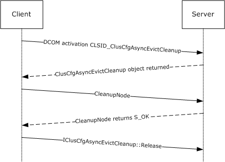

# [MC-CCFG]: Server Cluster: Configuration (ClusCfg) Protocol

Table of Contents

1 Introduction

- [1 Introduction](#Section_1)
  - [1.1 Glossary](#Section_1.1)
  - [1.2 References](#Section_1.2)
    - [1.2.1 Normative References](#Section_1.2.1)
    - [1.2.2 Informative References](#Section_1.2.2)
  - [1.3 Overview](#Section_1.3)
  - [1.4 Relationship to Other Protocols](#Section_1.4)
  - [1.5 Prerequisites/Preconditions](#Section_1.5)
  - [1.6 Applicability Statement](#Section_1.6)
  - [1.7 Versioning and Capability Negotiation](#Section_1.7)
  - [1.8 Vendor-Extensible Fields](#Section_1.8)
  - [1.9 Standards Assignments](#Section_1.9)

2 Messages

- [2 Messages](#Section_2)
  - [2.1 Transport](#Section_2.1)
  - [2.2 Common Data Types](#Section_2.2)

3 Protocol Details

- [3 Protocol Details](#Section_3)
  - [3.1 Server Details](#Section_3.1)
    - [3.1.1 Abstract Data Model](#Section_3.1.1)
    - [3.1.2 Timers](#Section_3.1.2)
    - [3.1.3 Initialization](#Section_3.1.3)
    - [3.1.4 IClusCfgAsyncEvictCleanup Server Details](#Section_3.1.4)
      - [3.1.4.1 CleanupNode (Opnum 7)](#Section_3.1.4.1)
    - [3.1.5 Timer Events](#Section_3.1.5)
    - [3.1.6 Other Local Events](#Section_3.1.6)
  - [3.2 Client Details](#Section_3.2)
    - [3.2.1 Abstract Data Model](#Section_3.2.1)
    - [3.2.2 Timers](#Section_3.2.2)
    - [3.2.3 Initialization](#Section_3.2.3)
    - [3.2.4 Message Processing Events and Sequencing Rules](#Section_3.2.4)
    - [3.2.5 Timer Events](#Section_3.2.5)
    - [3.2.6 Other Local Events](#Section_3.2.6)

4 Protocol Examples

- [4 Protocol Examples](#Section_4)

5 Security

- [5 Security](#Section_5)
  - [5.1 Security Considerations for Implementers](#Section_5.1)
  - [5.2 Index of Security Parameters](#Section_5.2)

6 Appendix A: Full IDL

- [6 Appendix A: Full IDL](#Section_6)

7 Appendix B: Product Behavior

- [7 Appendix B: Product Behavior](#Section_7)

8 Change Tracking

- [8 Change Tracking](#Section_8)

For the legal notice and IP terms, see [LEGAL.md](../LEGAL.md).
Last updated: 1/17/2020.
See [Revision History](#revision-history) for full version history.

# 1 Introduction

The Server Cluster: Configuration (ClusCfg) Protocol is a [**DCOM**](#gt_distributed-component-object-model-dcom) interface, as specified in [MS-DCOM](../MS-DCOM/MS-DCOM.md), for initiating configuration operations for a [**failover cluster**](#gt_failover-cluster). The ClusCfg Protocol allows users to restore a [**node**](#gt_node) that is no longer a configured member of a failover cluster, back to its precluster installation state.

Sections 1.5, 1.8, 1.9, 2, and 3 of this specification are normative. All other sections and examples in this specification are informative.

## 1.1 Glossary

This document uses the following terms:

**class identifier (CLSID)**: A GUID that identifies a software component; for instance, a DCOM object class or a COM class.

**cluster**: A group of computers that are able to dynamically assign resource tasks among nodes in a group.

**Distributed Component Object Model (DCOM)**: The Microsoft Component Object Model (COM) specification that defines how components communicate over networks, as specified in [MS-DCOM](../MS-DCOM/MS-DCOM.md).

**failover cluster**: A set of independent computers that work together to increase the availability of services and applications. The term cluster is sometimes used as shorthand for [**failover cluster**](#gt_failover-cluster).

**Interface Definition Language (IDL)**: The International Standards Organization (ISO) standard language for specifying the interface for remote procedure calls. For more information, see [[C706]](https://go.microsoft.com/fwlink/?LinkId=89824) section 4.

**node**: A computer system that is configured as a member of a [**cluster**](#gt_cluster). That is, the computer has the necessary software installed and configured to participate in the [**cluster**](#gt_cluster), and the [**cluster**](#gt_cluster) configuration includes this computer as a member.

**opnum**: An operation number or numeric identifier that is used to identify a specific [**remote procedure call (RPC)**](#gt_remote-procedure-call-rpc) method or a method in an interface. For more information, see [C706] section 12.5.2.12 or [MS-RPCE](../MS-RPCE/MS-RPCE.md).

**registry**: A local system-defined database in which applications and system components store and retrieve configuration data. It is a hierarchical data store with lightly typed elements that are logically stored in tree format. Applications use the registry API to retrieve, modify, or delete registry data. The data stored in the registry varies according to the version of the operating system.

**remote procedure call (RPC)**: A communication protocol used primarily between client and server. The term has three definitions that are often used interchangeably: a runtime environment providing for communication facilities between computers (the RPC runtime); a set of request-and-response message exchanges between computers (the RPC exchange); and the single message from an RPC exchange (the RPC message). For more information, see [C706].

**universally unique identifier (UUID)**: A 128-bit value. UUIDs can be used for multiple purposes, from tagging objects with an extremely short lifetime, to reliably identifying very persistent objects in cross-process communication such as client and server interfaces, manager entry-point vectors, and [**RPC**](#gt_remote-procedure-call-rpc) objects. UUIDs are highly likely to be unique. UUIDs are also known as globally unique identifiers (GUIDs) and these terms are used interchangeably in the Microsoft protocol technical documents (TDs). Interchanging the usage of these terms does not imply or require a specific algorithm or mechanism to generate the UUID. Specifically, the use of this term does not imply or require that the algorithms described in [[RFC4122]](https://go.microsoft.com/fwlink/?LinkId=90460) or [C706] must be used for generating the UUID.

**well-known endpoint**: A preassigned, network-specific, stable address for a particular client/server instance. For more information, see [C706].

**MAY, SHOULD, MUST, SHOULD NOT, MUST NOT:** These terms (in all caps) are used as defined in [[RFC2119]](https://go.microsoft.com/fwlink/?LinkId=90317). All statements of optional behavior use either MAY, SHOULD, or SHOULD NOT.

## 1.2 References

Links to a document in the Microsoft Open Specifications library point to the correct section in the most recently published version of the referenced document. However, because individual documents in the library are not updated at the same time, the section numbers in the documents may not match. You can confirm the correct section numbering by checking the [Errata](https://go.microsoft.com/fwlink/?linkid=850906).

### 1.2.1 Normative References

We conduct frequent surveys of the normative references to assure their continued availability. If you have any issue with finding a normative reference, please contact [dochelp@microsoft.com](mailto:dochelp@microsoft.com). We will assist you in finding the relevant information.

[C706] The Open Group, "DCE 1.1: Remote Procedure Call", C706, August 1997, [https://publications.opengroup.org/c706](https://go.microsoft.com/fwlink/?LinkId=89824)

**Note** Registration is required to download the document.

[MS-CMRP] Microsoft Corporation, "[Failover Cluster: Management API (ClusAPI) Protocol](../MS-CMRP/MS-CMRP.md)".

[MS-DCOM] Microsoft Corporation, "[Distributed Component Object Model (DCOM) Remote Protocol](../MS-DCOM/MS-DCOM.md)".

[MS-ERREF] Microsoft Corporation, "[Windows Error Codes](../MS-ERREF/MS-ERREF.md)".

[MS-OAUT] Microsoft Corporation, "[OLE Automation Protocol](../MS-OAUT/MS-OAUT.md)".

[MS-RPCE] Microsoft Corporation, "[Remote Procedure Call Protocol Extensions](../MS-RPCE/MS-RPCE.md)".

[MS-RRP] Microsoft Corporation, "[Windows Remote Registry Protocol](../MS-RRP/MS-RRP.md)".

[MS-SCMR] Microsoft Corporation, "[Service Control Manager Remote Protocol](../MS-SCMR/MS-SCMR.md)".

[RFC2119] Bradner, S., "Key words for use in RFCs to Indicate Requirement Levels", BCP 14, RFC 2119, March 1997, [http://www.rfc-editor.org/rfc/rfc2119.txt](https://go.microsoft.com/fwlink/?LinkId=90317)

### 1.2.2 Informative References

[MSDN-CLUS] Microsoft Corporation, "Windows Clustering", [http://msdn.microsoft.com/en-us/library/aa373130.aspx](https://go.microsoft.com/fwlink/?LinkId=89973)

## 1.3 Overview

The ClusCfg Protocol provides a [**DCOM**](#gt_distributed-component-object-model-dcom) interface that enables a client to restore a [**node**](#gt_node) back to its pre-cluster installation state. For more information about clustering, see [[MSDN-CLUS]](https://go.microsoft.com/fwlink/?LinkId=89973).

## 1.4 Relationship to Other Protocols

This protocol relies on the Distributed Component Object Model (DCOM) Remote Protocol, as specified in [MS-DCOM](../MS-DCOM/MS-DCOM.md), and on the Microsoft Remote Procedure Call (RPC) Extensions, as specified in [MS-RPCE](../MS-RPCE/MS-RPCE.md).

## 1.5 Prerequisites/Preconditions

This protocol is implemented over [**DCOM**](#gt_distributed-component-object-model-dcom) and [**RPC**](#gt_remote-procedure-call-rpc), and as a result, has the prerequisites that are specified in the Distributed Component Object Model (DCOM) Remote Protocol [MS-DCOM](../MS-DCOM/MS-DCOM.md) and the Remote Procedure Call Protocol Extensions [MS-RPCE](../MS-RPCE/MS-RPCE.md) as being common to the DCOM and RPC interfaces.

It is assumed that a ClusCfg Protocol client has obtained the name or IP address of a remote computer that supports the ClusCfg Protocol before this protocol is invoked. This is done by using any implementation-specific method.

## 1.6 Applicability Statement

The method of the ClusCfg Protocol is specific to a Windows Server 2003 operating system [**failover cluster**](#gt_failover-cluster). As such, the protocol is applicable to a [**node**](#gt_node) that was a member of a failover cluster.

## 1.7 Versioning and Capability Negotiation

This document covers versioning issues in the following areas:

Supported transports: This protocol uses the [**DCOM**](#gt_distributed-component-object-model-dcom) technology (as specified in [MS-DCOM](../MS-DCOM/MS-DCOM.md)), which provides capabilities to query for interface versions.

Protocol versions: This protocol is composed of the IClusCfgAsyncEvictCleanup DCOM interface version 0.0.

Security and authentication methods: As specified in [MS-DCOM] and [MS-RPCE](../MS-RPCE/MS-RPCE.md).

Capability and versioning negotiation is handled as specified in [MS-DCOM].

## 1.8 Vendor-Extensible Fields

This protocol does not define any vendor-extensible fields.

This protocol uses HRESULT values as defined in [MS-ERREF](../MS-ERREF/MS-ERREF.md) section 2.1. Vendors can define their own HRESULT values, provided they set the C bit (0x20000000) for each vendor-defined value, indicating that the value is a customer code.

## 1.9 Standards Assignments

No standards assignments have been received for this protocol. All values that are used in these extensions are in the private ranges that are specified in section [2.1](#Section_2.1). The following table contains the GUIDs for all the interfaces that are part of the *ClusCfg* Protocol object model.

| Parameter | Value | Reference |
| --- | --- | --- |
| [**RPC**](#gt_remote-procedure-call-rpc) Interface [**UUID**](#gt_universally-unique-identifier-uuid) for IClusCfgAsyncEvictCleanup | 52C80B95-C1AD-4240-8D89-72E9FA84025E | [3.1.4](#Section_3.1.4) |
| [**CLSID**](#gt_class-identifier-clsid) for ClusCfgAsyncEvictCleanup object | 08F35A72-D7C4-42F4-BC81-5188E19DFA39 | 3.1.4 |

# 2 Messages

## 2.1 Transport

[**DCOM**](#gt_distributed-component-object-model-dcom) (as specified in [MS-DCOM](../MS-DCOM/MS-DCOM.md)) is used as the transport protocol. The ClusCfg Protocol that is documented here relies on DCOM authentication (as specified in [MS-DCOM]) and encryption for all protocol messages. The protocol uses dynamic endpoints as allocated and managed by the DCOM infrastructure.

This protocol MUST use the [**UUID**](#gt_universally-unique-identifier-uuid) interface, as explained in section [1.9](#Section_1.9): 52C80B95-C1AD-4240-8D89-72E9FA84025E.

The [**class identifier (CLSID)**](#gt_class-identifier-clsid) of the object that implements this interface, as explained in section 1.9, is 08F35A72-D7C4-42F4-BC81-5188E19DFA39.

## 2.2 Common Data Types

This protocol uses the [**RPC**](#gt_remote-procedure-call-rpc) base types and definitions that are specified in [[C706]](https://go.microsoft.com/fwlink/?LinkId=89824) and [MS-RPCE](../MS-RPCE/MS-RPCE.md), and does not define any additional data types.

# 3 Protocol Details

## 3.1 Server Details

The ClusCfg Protocol server provides a method to allow a client to restore a [**node**](#gt_node) that was evicted from a [**cluster**](#gt_cluster) to be restored to its precluster installation state. Evicting a node from a cluster is described in [MS-CMRP](../MS-CMRP/MS-CMRP.md) section 3.1.1.6.

The following sections specify server details of the IClusCfgAsyncEvictCleanup interface of the ClusCfg Protocol including abstract data models, timers, and message processing rules.

### 3.1.1 Abstract Data Model

This section describes a conceptual model of possible data organization that an implementation maintains to participate in this protocol. The described organization is provided to explain how the protocol behaves. This document does not mandate that implementations adhere to this model as long as their external behavior is consistent with the behavior that is described in this document.

A server that implements this protocol was potentially configured as a [**node**](#gt_node) in a [**failover cluster**](#gt_failover-cluster). As such, the configuration operation might have left various executable and data files on the node as well as other persisted data, such as data that can be stored in a [**registry**](#gt_registry).

Configuration of a node as a member of a [**cluster**](#gt_cluster) is done by using implementation-specific methods between servers.

### 3.1.2 Timers

No protocol timers are required other than the internal timers that are used in [**RPC**](#gt_remote-procedure-call-rpc) to implement resiliency to network outages, as specified in [MS-RPCE](../MS-RPCE/MS-RPCE.md).

### 3.1.3 Initialization

The server MUST listen on the [**well-known endpoint**](#gt_well-known-endpoint) that is defined for this [**RPC**](#gt_remote-procedure-call-rpc) interface. For more information, see Transport (section [2.1](#Section_2.1)).

### 3.1.4 IClusCfgAsyncEvictCleanup Server Details

This protocol MUST indicate to the [**RPC**](#gt_remote-procedure-call-rpc) runtime that it is to perform a strict Network Data Representation (NDR) data consistency check at target level 5.0, as specified in [MS-RPCE](../MS-RPCE/MS-RPCE.md) section 3.

The IClusCfgAsyncEvictCleanup interface is implemented by the server to allow the client to initiate the restoration of the designated server to its precluster installation state. The cleanup is accomplished through implementation-specific methods.

To receive incoming remote calls for this interface, the server MUST implement a DCOM object class with the [**CLSID**](#gt_class-identifier-clsid) ClusCfgAsyncEvictCleanup (as specified in section [1.9](#Section_1.9)) by using the [**UUID**](#gt_universally-unique-identifier-uuid) {52C80B95-C1AD-4240-8D89-72E9FA84025} for this interface.

Methods in RPC Opnum Order

| Method | Description |
| --- | --- |
| [CleanupNode](#Section_3.1.4.1) | The CleanupNode method restores the designated [**node**](#gt_node) to its pre-cluster installation state. Opnum: 7 |

[**Opnums**](#gt_opnum) 0, 1, and 2 are reserved for the QueryInterface, AddRef, and Release methods that are used by the standard COM IUnknown interface, as specified in [MS-DCOM](../MS-DCOM/MS-DCOM.md). Opnums 3 and 4 are not used across the network. These opnums are reserved and MUST NOT be reused by non-Microsoft implementations. Opnums 5 and 6 are reserved for the GetIDsOfNames, and Invoke methods in the IDispatch interface, as specified in [MS-OAUT](../MS-OAUT/MS-OAUT.md).<1>

#### 3.1.4.1 CleanupNode (Opnum 7)

The CleanupNode method removes all persistent artifacts that exist on the [**node**](#gt_node) after it is evicted from a [**cluster**](#gt_cluster).

The Failover Cluster: Management API (ClusAPI) Protocol server provides a method to evict a node from a cluster. Evicting a node from a cluster is specified in [MS-CMRP](../MS-CMRP/MS-CMRP.md), section 3.1.1.5. Once evicted, the node can be restored to its precluster installation state.

This method is idempotent. After it is invoked, the following actions MUST occur.

- The target node MUST no longer be a server for the Failover Cluster: Management API (ClusAPI) Protocol (as specified in [MS-CMRP]) until the node is reconfigured as a member of a cluster by using implementation-specific methods between servers.
- In any subsequent query of the ClusterInstallationState Registry Value, by means of the Windows Remote Registry Protocol ([MS-RRP](../MS-RRP/MS-RRP.md)), as specified in [MS-CMRP] section 3.1.3.1, the server MUST return that the Value is set to 0x00000001 (eClusterInstallStateFilesCopied).
- In any subsequent calls of the Service Control Manager Remote Protocol ([MS-SCMR](../MS-SCMR/MS-SCMR.md)) OpenService method for service name "ClusSvc", the server MUST complete with error 1060 (ERROR_SERVICE_DOES_NOT_EXIST). This behavior is in contrast to the behavior specified in the first bullet of [MS-CMRP] section 3.1.3.2.
- Reset any other implementation-specific values to their precluster installation state.
This method MUST NOT be invoked while the node is a configured member of a cluster.

HRESULT CleanupNode(

[in] BSTR bstrEvictedNodeNameIn,

[in] long nDelayIn,

[in] long nTimeoutIn

);

**bstrEvictedNodeNameIn:** The name of the node on which cleanup is to be initiated. The client MUST provide the name of a configured node that was evicted from its cluster.

The name of the node passed in the *bstrEvictedNodeNameIn* parameter is the same as the name of the node evicted using [MS-CMRP]. How clients obtain node names is specified in the ApiOpenNode method of [MS-CMRP], section 3.1.4.67.

**nDelayIn:** The number of milliseconds that will elapse before cleanup is started on the target node. If some other process cleans up the target node while the delay is in progress, the delay is terminated before its expiration. If this value is zero, the node is cleaned up immediately.

**nTimeoutIn:** The number of milliseconds that this method will wait for cleanup to complete. This time-out is independent of the delay described previously, so if *nDelayIn* is greater than *nTimeoutIn*, this method will probably time out. However, after cleanup is initiated, cleanup will run to completion, but this method might not wait for it to complete.

**Return Values:** A signed 32-bit value that indicates return status. If the method returns a negative value, the method has failed. If the 12-bit facility code (bits 16-27) is set to 0x007, the value contains a Win32 error code (defined in [MS-ERREF](../MS-ERREF/MS-ERREF.md)) in the lower 16 bits. A zero value or positive values indicate success, with the lower 16 bits in positive nonzero values containing warnings or flags that are defined in the method implementation.

| Return value/code | Description |
| --- | --- |
| 0x00000000 S_OK | The call was successful. |

Exceptions thrown:

No exceptions are thrown except those that are thrown by the underlying [**RPC**](#gt_remote-procedure-call-rpc) protocol, as specified in [MS-RPCE](../MS-RPCE/MS-RPCE.md).

### 3.1.5 Timer Events

No timer events are required except the events that are maintained in the underlying [**RPC**](#gt_remote-procedure-call-rpc) transport (see section [2.1](#Section_2.1)).

### 3.1.6 Other Local Events

No additional local events are used other than the events that are maintained in the underlying [**RPC**](#gt_remote-procedure-call-rpc) transport (see section [2.1](#Section_2.1)).

## 3.2 Client Details

The following sections specify client details of the ClusCfg Protocol, including abstract data models, timers, and message processing rules.

### 3.2.1 Abstract Data Model

None.

### 3.2.2 Timers

No protocol timers are required other than those internal ones that are used in an [**RPC**](#gt_remote-procedure-call-rpc) to implement resiliency to network outages, as specified in [MS-RPCE](../MS-RPCE/MS-RPCE.md).

### 3.2.3 Initialization

The client application initiates the conversation with the server by performing [**DCOM**](#gt_distributed-component-object-model-dcom) activation (as specified in [MS-DCOM](../MS-DCOM/MS-DCOM.md) section 3.2.4.1.1) of the [**CLSID**](#gt_class-identifier-clsid) specified in section [1.9](#Section_1.9). After getting the interface pointer to the DCOM object as a result of the activation, the client application works with the object by making calls on the DCOM interface that it supports. After the conversation with the server is complete, the client application does a Release on the interface pointer.

### 3.2.4 Message Processing Events and Sequencing Rules

This protocol MUST indicate to the [**RPC**](#gt_remote-procedure-call-rpc) runtime that it is to perform a strict Network Data Representation (NDR) data consistency check at target level 5.0, as specified in [MS-RPCE](../MS-RPCE/MS-RPCE.md) section 3.

### 3.2.5 Timer Events

No protocol timer events are required on the client other than the events that are maintained in the underlying [**RPC**](#gt_remote-procedure-call-rpc) transport.

### 3.2.6 Other Local Events

No additional local events are used on the client other than the events that are maintained in the underlying [**RPC**](#gt_remote-procedure-call-rpc) transport.

# 4 Protocol Examples

The following example builds on the example that is provided in [MS-DCOM](../MS-DCOM/MS-DCOM.md) section 4.1.

Figure 1: Cleaning up an evicted cluster node

It shows the sequence for a client application that issues a [CleanupNode](#Section_3.1.4.1) call to the server.

# 5 Security

## 5.1 Security Considerations for Implementers

This protocol relies on the security features that are provided by [**DCOM**](#gt_distributed-component-object-model-dcom) as specified in [MS-DCOM](../MS-DCOM/MS-DCOM.md). Review the security considerations that are listed in [MS-RPCE](../MS-RPCE/MS-RPCE.md) section 5.1 because those considerations are also valid for DCOM and DCOM-based protocols.

## 5.2 Index of Security Parameters

There are no security parameters for this protocol.

# 6 Appendix A: Full IDL

For ease of implementation, the full [**IDL**](#gt_interface-definition-language-idl) is provided where "ms-oaut.idl" is the IDL that is specified in [MS-OAUT](../MS-OAUT/MS-OAUT.md) Appendix A.

import "ms-oaut.idl";

[

object,

uuid( 52C80B95-C1AD-4240-8D89-72E9FA84025E ),

dual,

helpstring("IClusCfgAsyncEvictCleanup interface"),

pointer_default( unique )

]

interface

IClusCfgAsyncEvictCleanup : IDispatch

{

HRESULT CleanupNode(

[ in ] BSTR bstrEvictedNodeNameIn,

[ in ] long nDelayIn,

[ in ] long nTimeoutIn

);

};

# 7 Appendix B: Product Behavior

The information in this specification is applicable to the following Microsoft products or supplemental software. References to product versions include updates to those products.

- Windows Server 2003 operating system
Exceptions, if any, are noted in this section. If an update version, service pack or Knowledge Base (KB) number appears with a product name, the behavior changed in that update. The new behavior also applies to subsequent updates unless otherwise specified. If a product edition appears with the product version, behavior is different in that product edition.

Unless otherwise specified, any statement of optional behavior in this specification that is prescribed using the terms "SHOULD" or "SHOULD NOT" implies product behavior in accordance with the SHOULD or SHOULD NOT prescription. Unless otherwise specified, the term "MAY" implies that the product does not follow the prescription.

<1> Section 3.1.4: Gaps in the [**opnum**](#gt_opnum) numbering sequence apply to Windows as follows: opnums 3-4 are used only locally by Windows, never remotely.

# 8 Change Tracking

No table of changes is available. The document is either new or has had no changes since its last release.

## Revision History

| Date | Version | Revision Class | Comments |
| --- | --- | --- | --- |
| 8/10/2007 | 0.1 | Major | Initial Availability |
| 9/28/2007 | 0.2 | Minor | Clarified the meaning of the technical content. |
| 10/23/2007 | 0.2.1 | Editorial | Changed language and formatting in the technical content. |
| 11/30/2007 | 0.2.2 | Editorial | Changed language and formatting in the technical content. |
| 1/25/2008 | 0.2.3 | Editorial | Changed language and formatting in the technical content. |
| 3/14/2008 | 0.2.4 | Editorial | Changed language and formatting in the technical content. |
| 5/16/2008 | 0.2.5 | Editorial | Changed language and formatting in the technical content. |
| 6/20/2008 | 0.2.6 | Editorial | Changed language and formatting in the technical content. |
| 7/25/2008 | 0.2.7 | Editorial | Changed language and formatting in the technical content. |
| 8/29/2008 | 0.2.8 | Editorial | Changed language and formatting in the technical content. |
| 10/24/2008 | 0.2.9 | Editorial | Changed language and formatting in the technical content. |
| 12/5/2008 | 0.2.10 | Editorial | Changed language and formatting in the technical content. |
| 1/16/2009 | 0.2.11 | Editorial | Changed language and formatting in the technical content. |
| 2/27/2009 | 0.2.12 | Editorial | Changed language and formatting in the technical content. |
| 4/10/2009 | 0.2.13 | Editorial | Changed language and formatting in the technical content. |
| 5/22/2009 | 0.2.14 | Editorial | Changed language and formatting in the technical content. |
| 7/2/2009 | 0.2.15 | Editorial | Changed language and formatting in the technical content. |
| 8/14/2009 | 0.2.16 | Editorial | Changed language and formatting in the technical content. |
| 9/25/2009 | 0.3 | Minor | Clarified the meaning of the technical content. |
| 11/6/2009 | 0.3.1 | Editorial | Changed language and formatting in the technical content. |
| 12/18/2009 | 0.3.2 | Editorial | Changed language and formatting in the technical content. |
| 1/29/2010 | 1.0 | Major | Updated and revised the technical content. |
| 3/12/2010 | 1.0.1 | Editorial | Changed language and formatting in the technical content. |
| 4/23/2010 | 1.0.2 | Editorial | Changed language and formatting in the technical content. |
| 6/4/2010 | 1.0.3 | Editorial | Changed language and formatting in the technical content. |
| 7/16/2010 | 1.0.3 | None | No changes to the meaning, language, or formatting of the technical content. |
| 8/27/2010 | 1.0.3 | None | No changes to the meaning, language, or formatting of the technical content. |
| 10/8/2010 | 1.0.3 | None | No changes to the meaning, language, or formatting of the technical content. |
| 11/19/2010 | 1.0.3 | None | No changes to the meaning, language, or formatting of the technical content. |
| 1/7/2011 | 1.0.3 | None | No changes to the meaning, language, or formatting of the technical content. |
| 2/11/2011 | 1.0.3 | None | No changes to the meaning, language, or formatting of the technical content. |
| 3/25/2011 | 1.0.3 | None | No changes to the meaning, language, or formatting of the technical content. |
| 5/6/2011 | 1.0.3 | None | No changes to the meaning, language, or formatting of the technical content. |
| 6/17/2011 | 1.1 | Minor | Clarified the meaning of the technical content. |
| 9/23/2011 | 1.1 | None | No changes to the meaning, language, or formatting of the technical content. |
| 12/16/2011 | 1.1 | None | No changes to the meaning, language, or formatting of the technical content. |
| 3/30/2012 | 1.1 | None | No changes to the meaning, language, or formatting of the technical content. |
| 7/12/2012 | 1.1 | None | No changes to the meaning, language, or formatting of the technical content. |
| 10/25/2012 | 1.2 | Minor | Clarified the meaning of the technical content. |
| 1/31/2013 | 1.2 | None | No changes to the meaning, language, or formatting of the technical content. |
| 8/8/2013 | 1.2 | None | No changes to the meaning, language, or formatting of the technical content. |
| 11/14/2013 | 1.2 | None | No changes to the meaning, language, or formatting of the technical content. |
| 2/13/2014 | 1.2 | None | No changes to the meaning, language, or formatting of the technical content. |
| 5/15/2014 | 1.2 | None | No changes to the meaning, language, or formatting of the technical content. |
| 6/30/2015 | 1.2 | None | No changes to the meaning, language, or formatting of the technical content. |
| 7/14/2016 | 1.2 | None | No changes to the meaning, language, or formatting of the technical content. |
| 6/1/2017 | 1.2 | None | No changes to the meaning, language, or formatting of the technical content. |
| 1/17/2020 | 1.2 | None | No changes to the meaning, language, or formatting of the technical content. |
