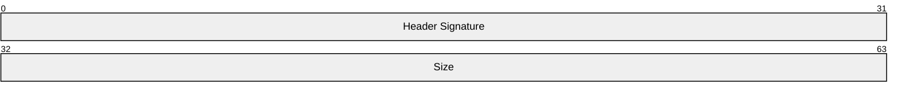
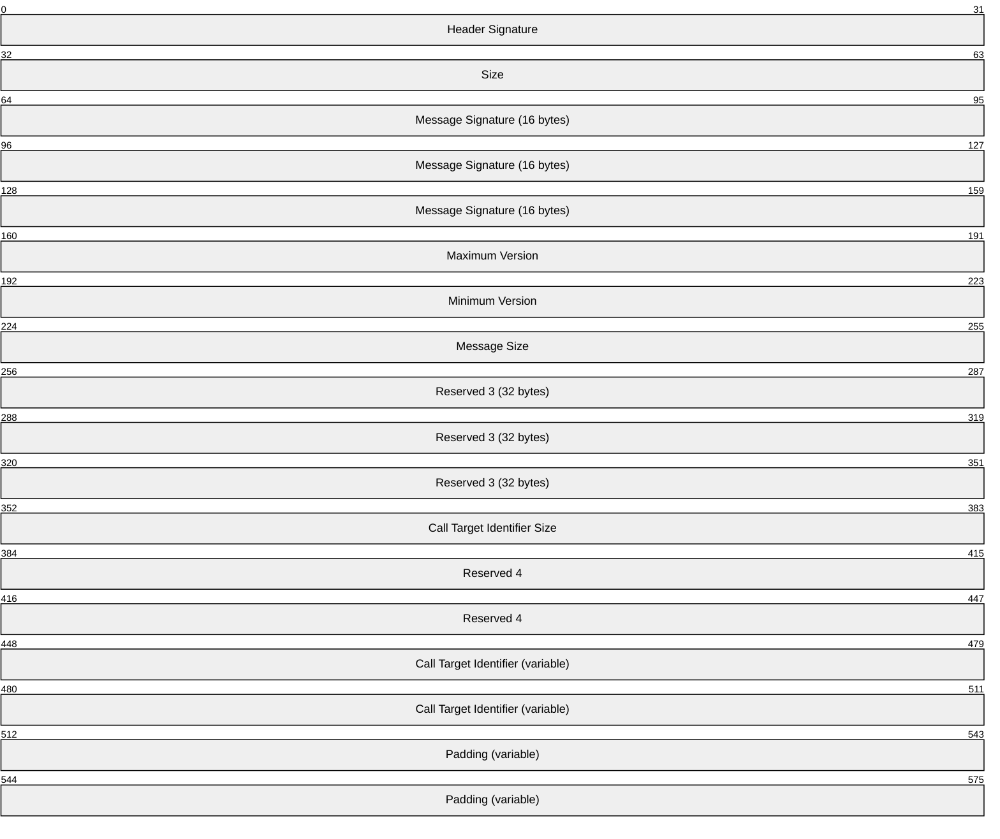
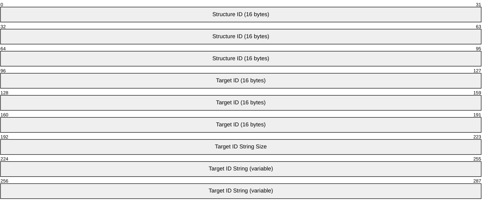
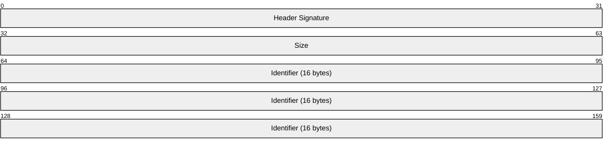
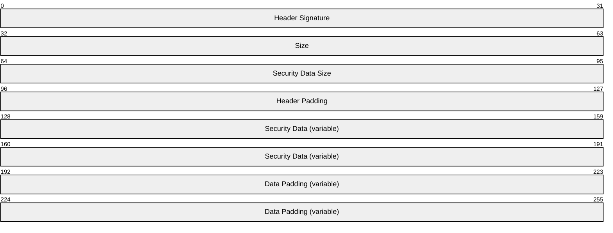
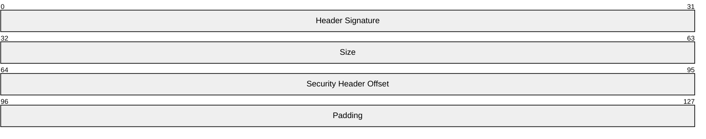
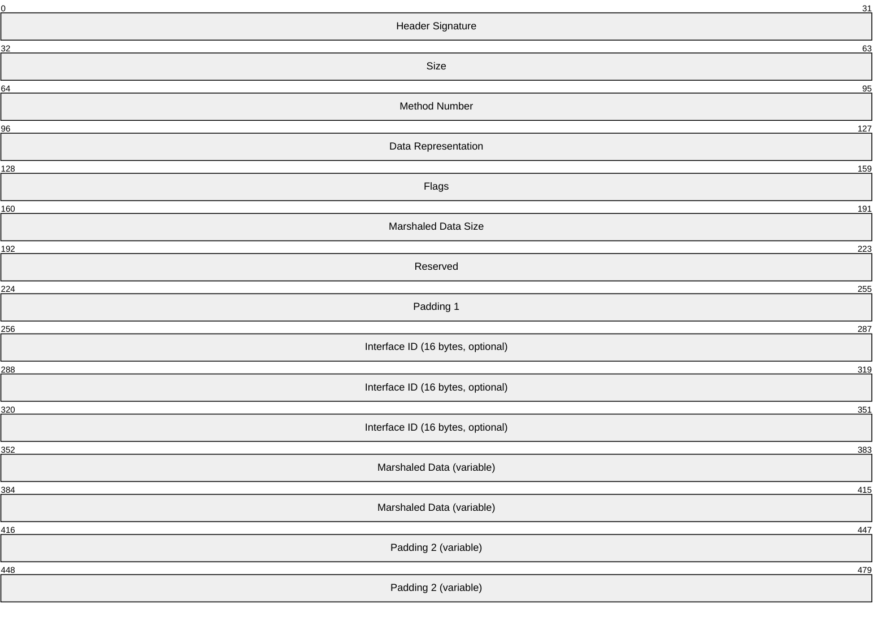
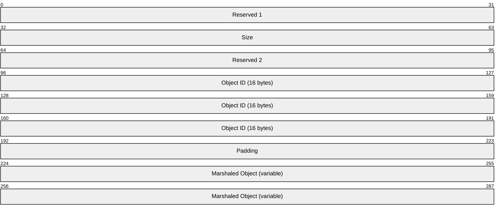

# [MC-COMQC]: Component Object Model Plus (COM+) Queued Components Protocol

Table of Contents

1 Introduction

- [1 Introduction](#Section_1)
  - [1.1 Glossary](#Section_1.1)
  - [1.2 References](#Section_1.2)
    - [1.2.1 Normative References](#Section_1.2.1)
    - [1.2.2 Informative References](#Section_1.2.2)
  - [1.3 Overview](#Section_1.3)
    - [1.3.1 Server Role](#Section_1.3.1)
    - [1.3.2 Client Role](#Section_1.3.2)
  - [1.4 Relationship to Other Protocols](#Section_1.4)
  - [1.5 Prerequisites/Preconditions](#Section_1.5)
  - [1.6 Applicability Statement](#Section_1.6)
  - [1.7 Versioning and Capability Negotiation](#Section_1.7)
  - [1.8 Vendor-Extensible Fields](#Section_1.8)
  - [1.9 Standards Assignments](#Section_1.9)

2 Messages

- [2 Messages](#Section_2)
  - [2.1 Transport](#Section_2.1)
  - [2.2 Message Syntax](#Section_2.2)
    - [2.2.1 Common Header](#Section_2.2.1)
    - [2.2.2 Container Header](#Section_2.2.2)
      - [2.2.2.1 Call Target Identifier](#Section_2.2.2.1)
    - [2.2.3 Partition Identifier Header](#Section_2.2.3)
    - [2.2.4 Security Header](#Section_2.2.4)
    - [2.2.5 Security Reference Header](#Section_2.2.5)
    - [2.2.6 Method Header](#Section_2.2.6)
      - [2.2.6.1 Marshaled Data](#Section_2.2.6.1)
        - [2.2.6.1.1 NDR Marshaling](#Section_2.2.6.1.1)
        - [2.2.6.1.2 Dispatch Marshaling](#Section_2.2.6.1.2)
        - [2.2.6.1.3 Supported Types](#Section_2.2.6.1.3)
        - [2.2.6.1.4 Padding of the Marshaled Data](#Section_2.2.6.1.4)
        - [2.2.6.1.5 Object References](#Section_2.2.6.1.5)

3 Protocol Details

- [3 Protocol Details](#Section_3)
  - [3.1 Server Details](#Section_3.1)
    - [3.1.1 Abstract Data Model](#Section_3.1.1)
    - [3.1.2 Timers](#Section_3.1.2)
    - [3.1.3 Initialization](#Section_3.1.3)
    - [3.1.4 Higher-Layer Triggered Events](#Section_3.1.4)
    - [3.1.5 Message Processing Events and Sequencing Rules](#Section_3.1.5)
    - [3.1.6 Timer Events](#Section_3.1.6)
    - [3.1.7 Other Local Events](#Section_3.1.7)
  - [3.2 Client Details](#Section_3.2)
    - [3.2.1 Abstract Data Model](#Section_3.2.1)
    - [3.2.2 Timers](#Section_3.2.2)
    - [3.2.3 Initialization](#Section_3.2.3)
    - [3.2.4 Higher-Layer Triggered Events](#Section_3.2.4)
      - [3.2.4.1 Application Requesting Interface](#Section_3.2.4.1)
      - [3.2.4.2 Application Making Method Call](#Section_3.2.4.2)
      - [3.2.4.3 Application Signaling that Method Calls Are Complete](#Section_3.2.4.3)
    - [3.2.5 Message Processing Events and Sequencing Rules](#Section_3.2.5)
    - [3.2.6 Timer Events](#Section_3.2.6)
    - [3.2.7 Other Local Events](#Section_3.2.7)

4 Protocol Examples

- [4 Protocol Examples](#Section_4)
  - [4.1 Client Creating and Sending a Message](#Section_4.1)
  - [4.2 Server Retrieving and Processing a Message](#Section_4.2)

5 Security

- [5 Security](#Section_5)
  - [5.1 Security Considerations for Implementers](#Section_5.1)
  - [5.2 Index of Security Parameters](#Section_5.2)

6 Appendix A: Product Behavior

- [6 Appendix A: Product Behavior](#Section_6)

7 Change Tracking

- [7 Change Tracking](#Section_7)

For the legal notice and IP terms, see [LEGAL.md](../LEGAL.md).
Last updated: 4/23/2024.
See [Revision History](#revision-history) for full version history.

# 1 Introduction

The Component Object Model Plus (COM+) Queued Components Protocol (COMQC) is a protocol for persisting method calls made on COM+ objects in such a way that they can later be played back and executed. The protocol consists of a binary format used to store the information needed to achieve that goal.

Sections 1.5, 1.8, 1.9, 2, and 3 of this specification are normative. All other sections and examples in this specification are informative.

## 1.1 Glossary

This document uses the following terms:

**ASCII**: The American Standard Code for Information Interchange (ASCII) is an 8-bit character-encoding scheme based on the English alphabet. ASCII codes represent text in computers, communications equipment, and other devices that work with text. ASCII refers to a single 8-bit ASCII character or an array of 8-bit ASCII characters with the high bit of each character set to zero.

**binary large object (BLOB)**: A discrete packet of data that is stored in a database and is treated as a sequence of uninterpreted bytes.

**class identifier (CLSID)**: A [**GUID**](#gt_globally-unique-identifier-guid) that identifies a software component; for instance, a DCOM object class or a COM class.

**client**: A computer on which the remote procedure call (RPC) client is executing.

**Component Object Model (COM)**: An object-oriented programming model that defines how objects interact within a single process or between processes. In [**COM**](#gt_component-object-model-com), clients have access to an object through interfaces implemented on the object. For more information, see [MS-DCOM](../MS-DCOM/MS-DCOM.md).

**globally unique identifier (GUID)**: A term used interchangeably with universally unique identifier (UUID) in Microsoft protocol technical documents (TDs). Interchanging the usage of these terms does not imply or require a specific algorithm or mechanism to generate the value. Specifically, the use of this term does not imply or require that the algorithms described in [[RFC4122]](https://go.microsoft.com/fwlink/?LinkId=90460) or [[C706]](https://go.microsoft.com/fwlink/?LinkId=89824) must be used for generating the [**GUID**](#gt_globally-unique-identifier-guid). See also universally unique identifier (UUID).

**handle**: Any token that can be used to identify and access an object such as a device, file, or a window.

**interface**: A specification in a [**Component Object Model (COM)**](#gt_component-object-model-com) server that describes how to access the methods of a class. For more information, see [MS-DCOM].

**Interface Definition Language (IDL)**: The International Standards Organization (ISO) standard language for specifying the [**interface**](#gt_interface) for remote procedure calls. For more information, see [C706] section 4.

**interface identifier (IID)**: A [**GUID**](#gt_globally-unique-identifier-guid) that identifies an [**interface**](#gt_interface).

**little-endian**: Multiple-byte values that are byte-ordered with the least significant byte stored in the memory location with the lowest address.

**marshal**: To encode one or more data structures into an octet stream using a specific remote procedure call (RPC) transfer syntax (for example, marshaling a 32-bit integer).

**message**: A data structure representing a unit of data transfer between distributed applications. A message has message properties, which may include message header properties, a message body property, and message trailer properties.

**message queue**: A data structure containing an ordered list of zero or more [**messages**](#gt_message). A queue has a head and a tail and supports a first in, first out (FIFO) access pattern. [**Messages**](#gt_message) are appended to the tail through a write operation (Send) that appends the [**message**](#gt_message) and increments the tail pointer. [**Messages**](#gt_message) are consumed from the head through a destructive read operation (Receive) that deletes the [**message**](#gt_message) and increments the head pointer. A [**message**](#gt_message) at the head can also be read through a nondestructive read operation (Peek).

**message queuing**: A communications service that provides asynchronous and reliable message passing between distributed [**client**](#gt_client) applications. In message queuing, clients send messages to [**message queues**](#gt_message-queue) and consume messages from [**message queues**](#gt_message-queue). The [**message queues**](#gt_message-queue) provide persistence of the messages, which enables the sending and receiving client applications to operate asynchronously from each other.

**Microsoft Interface Definition Language (MIDL)**: The Microsoft implementation and extension of the OSF-DCE [**Interface Definition Language (IDL)**](#gt_interface-definition-language-idl). [**MIDL**](#gt_microsoft-interface-definition-language-midl) can also mean the [**Interface Definition Language (IDL)**](#gt_interface-definition-language-idl) compiler provided by Microsoft. For more information, see [MS-RPCE](../MS-RPCE/MS-RPCE.md).

**Microsoft Message Queuing (MSMQ)**: A communications service that provides asynchronous and reliable [**message**](#gt_message) passing between distributed applications. In Message Queuing, applications send [**messages**](#gt_message) to queues and consume [**messages**](#gt_message) from queues. The queues provide persistence of the [**messages**](#gt_message), enabling the sending and receiving applications to operate asynchronously from one another.

**Network Data Representation (NDR)**: A specification that defines a mapping from [**Interface Definition Language (IDL)**](#gt_interface-definition-language-idl) data types onto octet streams. [**NDR**](#gt_network-data-representation-ndr) also refers to the runtime environment that implements the mapping facilities (for example, data provided to [**NDR**](#gt_network-data-representation-ndr)). For more information, see [MS-RPCE] and [C706] section 14.

**object**: In [**COM**](#gt_component-object-model-com), a software entity that implements the IUnknown interface and zero or more additional interfaces that may be obtained from each other using the IUnknown interface. A [**COM**](#gt_component-object-model-com) [**object**](#gt_object) can be exposed to remote clients via the DCOM protocol, in which case it is also a DCOM object.

**object reference**: In the DCOM protocol, a reference to an object, represented on the wire as an OBJREF. An [**object reference**](#gt_object-reference) enables the [**object**](#gt_object) to be reached by entities outside the [**object's**](#gt_object) object exporter.

**opnum**: An operation number or numeric identifier that is used to identify a specific remote procedure call (RPC) method or a method in an interface. For more information, see [C706] section 12.5.2.12 or [MS-RPCE].

**partition**: A container for a specific configuration of a COM+ object class.

**partition identifier**: A GUID that identifies a partition.

**proxy object**: A local [**object**](#gt_object) that acts as an intermediary between an application and a remote [**object**](#gt_object). The purpose of the proxy object is to monitor the life span of the remote [**object**](#gt_object) and to forward calls to the remote [**object**](#gt_object).

**security context**: An abstract data structure that contains authorization information for a particular security principal in the form of a Token/Authorization Context (see [MS-DTYP](../MS-DTYP/MS-DTYP.md) section 2.5.2). A server uses the authorization information in a [**security context**](#gt_security-context) to check access to requested resources. A [**security context**](#gt_security-context) also contains a key identifier that associates mutually established cryptographic keys, along with other information needed to perform secure communication with another security principal.

**UTF-16**: A standard for encoding Unicode characters, defined in the Unicode standard, in which the most commonly used characters are defined as double-byte characters. Unless specified otherwise, this term refers to the UTF-16 encoding form specified in [[UNICODE5.0.0/2007]](https://go.microsoft.com/fwlink/?LinkId=154659) section 3.9.

**workgroup mode**: A Message Queuing deployment mode in which the clients and servers operate without using a Directory Service. In this mode, features pertaining to [**message**](#gt_message) security, efficient routing, queue discovery, distribution lists, and aliases are not available. See also Directory-Integrated mode.

**MAY, SHOULD, MUST, SHOULD NOT, MUST NOT:** These terms (in all caps) are used as defined in [[RFC2119]](https://go.microsoft.com/fwlink/?LinkId=90317). All statements of optional behavior use either MAY, SHOULD, or SHOULD NOT.

## 1.2 References

Links to a document in the Microsoft Open Specifications library point to the correct section in the most recently published version of the referenced document. However, because individual documents in the library are not updated at the same time, the section numbers in the documents may not match. You can confirm the correct section numbering by checking the [Errata](https://go.microsoft.com/fwlink/?linkid=850906).

### 1.2.1 Normative References

We conduct frequent surveys of the normative references to assure their continued availability. If you have any issue with finding a normative reference, please contact [dochelp@microsoft.com](mailto:dochelp@microsoft.com). We will assist you in finding the relevant information.

[C706] The Open Group, "DCE 1.1: Remote Procedure Call", C706, August 1997, [https://publications.opengroup.org/c706](https://go.microsoft.com/fwlink/?LinkId=89824)

**Note** Registration is required to download the document.

[MS-COM] Microsoft Corporation, "[Component Object Model Plus (COM+) Protocol](../MS-COM/MS-COM.md)".

[MS-DCOM] Microsoft Corporation, "[Distributed Component Object Model (DCOM) Remote Protocol](../MS-DCOM/MS-DCOM.md)".

[MS-DTYP] Microsoft Corporation, "[Windows Data Types](../MS-DTYP/MS-DTYP.md)".

[MS-MQDMPR] Microsoft Corporation, "[Message Queuing (MSMQ): Common Data Model and Processing Rules](../MS-MQDMPR/MS-MQDMPR.md)".

[MS-MQMP] Microsoft Corporation, "[Message Queuing (MSMQ): Queue Manager Client Protocol](../MS-MQMP/MS-MQMP.md)".

[MS-MQMQ] Microsoft Corporation, "[Message Queuing (MSMQ): Data Structures](../MS-MQMQ/MS-MQMQ.md)".

[MS-OAUT] Microsoft Corporation, "[OLE Automation Protocol](../MS-OAUT/MS-OAUT.md)".

[RFC2119] Bradner, S., "Key words for use in RFCs to Indicate Requirement Levels", BCP 14, RFC 2119, March 1997, [https://www.rfc-editor.org/info/rfc2119](https://go.microsoft.com/fwlink/?LinkId=90317)

[RFC4234] Crocker, D., Ed., and Overell, P., "Augmented BNF for Syntax Specifications: ABNF", RFC 4234, October 2005, [https://www.rfc-editor.org/info/rfc4234](https://go.microsoft.com/fwlink/?LinkId=90462)

### 1.2.2 Informative References

[MSDN-IPersistStream] Microsoft Corporation, "IPersistStream interface", [http://msdn.microsoft.com/en-us/library/ms690091.aspx](https://go.microsoft.com/fwlink/?LinkId=99065)

## 1.3 Overview

The Component Object Model Plus (COM+) Queued Components Protocol enables a [**client**](#gt_client) to asynchronously invoke methods on a server in scenarios of limited or intermittent connectivity. It does so by writing all the necessary states into a self-contained [**binary large object (BLOB)**](#gt_binary-large-object-blob). That BLOB can be parsed and the method calls be replayed at a later point when it is possible to transmit the data to the recipient. As the BLOB is self-contained, the original creator of the BLOB is not required to be alive or connected for the operation to succeed.

To transmit the BLOB without regard to connectivity, the protocol relies on a [**message queuing**](#gt_message-queuing) transport. The following figure shows the layering of the protocol stack.

Figure 1: Protocol layering

COMQC is asynchronous and one-way with information flowing exclusively from the client to the server.

### 1.3.1 Server Role

The server is responsible for receiving COMQC [**messages**](#gt_message) and dispatching the recorded method calls.

Each COMQC server is associated with a single COM+ application using COMQC and services messages for all server objects in that COMQC application. Each COMQC server has its own [**message queue**](#gt_message-queue). There can be multiple COMQC servers per machine.

### 1.3.2 Client Role

The [**client**](#gt_client) is responsible for recording method calls, packaging them up into a COMQC message, and transmitting the [**message**](#gt_message) to the [**message queuing**](#gt_message-queuing) infrastructure.

A COMQC client queues calls to a single COMQC server object, and hence connects to a single [**message queue**](#gt_message-queue). A higher-layer application protocol can maintain multiple COMQC clients that queue calls to different server objects but, for the purpose of this specification, they are independent clients unrelated to each other. That is, even if a client application uses COMQC to queue calls to multiple server objects in the same COM+ application (and hence to the same message queue and the same COMQC server), this involves a separate conceptual COMQC client per server object.

## 1.4 Relationship to Other Protocols

COMQC relies on DCE 1.1: Remote Procedure Call [[C706]](https://go.microsoft.com/fwlink/?LinkId=89824) and the OLE Automation Protocol [MS-OAUT](../MS-OAUT/MS-OAUT.md) to [**marshal**](#gt_marshal) the parameters of the recorded method calls. It further relies on [MS-MQMP](../MS-MQMP/MS-MQMP.md) and [MS-MQMQ](../MS-MQMQ/MS-MQMQ.md) as transport. The COMQC is limited to calls made on COM+ Protocol [MS-COM](../MS-COM/MS-COM.md) objects.

There are no protocols that rely on COMQC.

## 1.5 Prerequisites/Preconditions

COMQC assumes that the [**message queuing**](#gt_message-queuing) infrastructure is already running and that the [**client**](#gt_client) application is aware of the name of the [**message queue**](#gt_message-queue).

The server [**object**](#gt_object) is installed on the COMQC server before a COMQC client attempts to invoke it.

## 1.6 Applicability Statement

COMQC is useful and appropriate for performing asynchronous method calls when the [**client**](#gt_client) and the server do not have constant connectivity and a [**message queuing**](#gt_message-queuing) mechanism is available.

It is not applicable to use with method calls that have output parameters or return values that the client application needs to get.

## 1.7 Versioning and Capability Negotiation

COMQC does not perform versioning or capability negotiation.

## 1.8 Vendor-Extensible Fields

None.

## 1.9 Standards Assignments

None.

The following is a table of well-known [**GUIDs**](#gt_globally-unique-identifier-guid) in COMQC, as generated by the mechanism specified in [[C706]](https://go.microsoft.com/fwlink/?LinkId=89824) section A.2.5.

| Parameter | Value |
| --- | --- |
| Message Signature | {1664BCFB-1751-11d2-B58E-00E0290E6C31} |
| Header Signature | {71bbdb83-fc41-11d0-b7640080c7ec3fc1} |
| Moniker GUID | {ecabafc6-7f19-11d2-978e-0000f8757e2a} |

# 2 Messages

## 2.1 Transport

For the remainder of sections 2 and 3, "message" refers to a COMQC [**message**](#gt_message) unless otherwise specified.

COMQC uses MSMQ Queue Manager Client Protocol [MS-MQMP](../MS-MQMP/MS-MQMP.md), and MSMQ: Data Structures [MS-MQMQ](../MS-MQMQ/MS-MQMQ.md) as transport.

A new instance of a Message Queuing ([**MSMQ**](#gt_microsoft-message-queuing-msmq)) **Message** ADM element (as specified in [MS-MQDMPR](../MS-MQDMPR/MS-MQDMPR.md) section 3.1.1.12) MUST be created. The message defined in section [2.2](#Section_2.2) MUST be stored as a [**BLOB**](#gt_binary-large-object-blob) in the **Body** attribute of the **Message** ADM element instance.

The **Extension** attribute of the **Message** ADM element MUST be set to GUID (as specified in [MS-DTYP](../MS-DTYP/MS-DTYP.md) section 2.3.4.2) {1664BCFB-1751-11d2-B58E-00E0290E6C31}.

When opening a [**message queue**](#gt_message-queue), a COMQC client MUST specify the MSMQ parameters MQ_SEND_ACCESS (as specified in [MS-MQMP] section 3.1.4.17) and MQ_DENY_NONE. When opening a message queue, a COMQC server MUST specify MQ_RECEIVE_ACCESS and MQ_DENY_NONE. Both transacted and nontransacted message queues MUST be supported.

When running MSMQ in [**workgroup mode**](#gt_workgroup-mode), the **AuthenticationLevel** attribute of the **Message** ADM element (as specified in [MS-MQDMPR] section 3.1.1.12) MUST be set to None and the **SenderIdentifierType** attribute of the **Message** ADM element to None. Otherwise, a COMQC client SHOULD allow all MSMQ message-level parameters to be configurable. A COMQC server MUST support all MSMQ message-level parameters.

When running MSMQ in workgroup mode, the message queue name SHOULD be set to "<computer name>\PRIVATE$\<COM+ application name>", where <computer name> is the lowercase, non-fully-qualified domain name of the computer running the server and <COM+ application name> is the display name of the COM+ application hosting the [**objects**](#gt_object) that are exposed via COMQC.

Otherwise, the message queue name SHOULD be set to "<computer name>\<COM+ application name>".

The entire communication between [**client**](#gt_client) and server MUST be contained in a single message. The server MUST NOT send a reply message, and the client MUST NOT expect one.

## 2.2 Message Syntax

A [**message**](#gt_message) contains the state of one or more method calls to be made on the server as well as the general state associated with the request. Messages are self-contained and MUST NOT rely on any other message to be processed.

Every message MUST contain at least one method call.

A message is divided into headers. The following figure defines the ordering of the individual headers. The headers themselves are defined in section [2.2.1](#Section_2.2.1) to section [2.2.6](#Section_2.2.6).

Figure 2: Header ordering

A method header group contains all state of a single method call to be made on the server. Every message MUST contain one or more method header groups. The default method header group is defined in the following figure.

Figure 3: Default method header group

If the security properties of the method call as defined by the Security object RPC (ORPC) Extension, defined in [MS-COM](../MS-COM/MS-COM.md) section 2.2.3.2, are identical to the security properties of the method call appearing immediately before it in the message, the security header SHOULD be omitted. Note that the first method header group contains no security header, as it is already present as part of the overall layout.

If the method call is made on the same [**interface**](#gt_interface) as the immediately preceding method call, the optimization defined in the following figure SHOULD be used.

Figure 4: Short method optimization

If the security properties do not match the [**security context**](#gt_security-context) of the immediately preceding method call but do match the security context of a different previous method call, the optimization defined in the following figure SHOULD be used.

Figure 5: Security reference optimization

If the security properties do not match the security properties of the immediately preceding method call but does match the security properties of a different previous method call, and if the call is made on the same interface as the immediately preceding method call, the optimization defined in the following figure SHOULD be used.

Figure 6: Security reference and short header optimization

Unless otherwise specified, all fields MUST be specified in [**little-endian**](#gt_little-endian) format. Unless otherwise specified, all headers and all custom data MUST be aligned on 8-byte boundaries, meaning that each header MUST be padded at the end so that its length is a multiple of 8.

### 2.2.1 Common Header

The common header specifies the size and type of a header. Every header MUST begin with the common header. The common header MUST NOT appear by itself.

**Header Signature (4 bytes):** A predefined value that identifies the specific header. (The value is given in the section that defines each specific header.)

**Size (4 bytes):** Size in bytes of the header, plus the size of header-specific variable length data fields if present. Some, but not all, headers have such fields following the header itself, and their size is included in this number. The value MUST be a multiple of 8. Adding the size to the starting offset of a header gives the starting offset of the next header.

All headers defined in section [2.2.2](#Section_2.2.2) to section [2.2.6](#Section_2.2.6) contain the common header. Unless otherwise specified, "Header Signature" refers to the Header Signature field of the common header that is embedded in the other headers.

### 2.2.2 Container Header

The container header contains general information regarding the [**message**](#gt_message). Every message MUST have exactly one container header, and it MUST be the first header in the message.

**Header Signature (4 bytes):** MUST be set to "CHDR" in [**ASCII**](#gt_ascii) (0x52444843).

**Size (4 bytes):** Size in bytes of the container header.

**Message Signature (16 bytes):** [**GUID**](#gt_globally-unique-identifier-guid) (as specified in [MS-DTYP](../MS-DTYP/MS-DTYP.md) section 2.3.4.2) that MUST be set to {71bbdb83-fc41-11d0-b7640080c7ec3fc1}.

**Maximum Version (4 bytes):** Maximum version of the header. MUST be set to 0x00000001.

**Minimum Version (4 bytes):** Minimum version of the header. MUST be set to 0x00000001.

**Message Size (4 bytes):** Size in bytes of the entire message.

**Reserved 3 (32 bytes):** Reserved. MUST be set to 0 and ignored on receipt.

**Call Target Identifier Size (4 bytes):** Size of the Call Target Identifier field plus padding. MUST be a multiple of 8.

**Reserved 4 (8 bytes):** Reserved. MUST be set to 0 and ignored on receipt.

**Call Target Identifier (variable):** The target of the call, as defined in section [2.2.2.1](#Section_2.2.2.1).

**Padding (variable):** Enough space to pad the message to an 8-byte boundary. MUST be set to 0 and ignored on receipt.

#### 2.2.2.1 Call Target Identifier

The Call Target Identifier is part of the container header and identifies the target of the call. The server MUST use the information stored here to determine where to dispatch the call.

**Structure ID (16 bytes):** [**GUID**](#gt_globally-unique-identifier-guid) (as specified in [MS-DTYP](../MS-DTYP/MS-DTYP.md) section 2.3.4.2) identifying the Call Target Identifier structure. MUST be set to {ecabafc6-7f19-11d2-978e-0000f8757e2a}.

**Target ID (16 bytes):** A [**Component Object Model (COM)**](#gt_component-object-model-com) class identifier (CLSID) (see [MS-DCOM](../MS-DCOM/MS-DCOM.md) section 2.2.7) identifying the target of the call.

**Target ID String Size (4 bytes):** Size of the Target ID String field in bytes.

**Target ID String (variable):** String buffer identifying the target of the call. It SHOULD be set to the string representation of the Target ID, and on receipt, the value MUST be ignored after validating that the string conforms to the syntax. The string representation MUST conform to the following Augmented Backus-Naur Form (ABNF) (as specified in [[RFC4234]](https://go.microsoft.com/fwlink/?LinkId=90462)) syntax:

GUID = [ UUID / "{" UUID "}" ]

where UUID is defined by [[C706]](https://go.microsoft.com/fwlink/?LinkId=89824) section 3.1.17. The string MUST be encoded in [**UTF-16**](#gt_utf-16) and MUST be NULL-terminated.

### 2.2.3 Partition Identifier Header

The partition identifier header contains the COM+ [**partition identifier**](#gt_partition-identifier) (as defined in [MS-COM](../MS-COM/MS-COM.md) section 1.3.6) that the server [**object**](#gt_object) resides in.

**Header Signature (4 bytes):** MUST be set to "PART" in [**ASCII**](#gt_ascii) (0x54524150).

**Size (4 bytes):** The size, in bytes, of the partition identifier header. MUST be set to 0x00000018.

**Identifier (16 bytes):** [**GUID**](#gt_globally-unique-identifier-guid) (as specified in [MS-DTYP](../MS-DTYP/MS-DTYP.md) section 2.3.4.2) identifying the [**partition**](#gt_partition) that the server object resides in.

### 2.2.4 Security Header

The security header is a wrapper for the Security ORPC Extension defined in [MS-COM](../MS-COM/MS-COM.md) section 2.2.3.2. It is used to capture the current [**security context**](#gt_security-context) so that it can be recreated on the COMQC server when the stored calls are being dispatched.

The security properties stored in this header MUST be applied to all method calls following the security header in the [**message**](#gt_message) until another security header or security reference header (section [2.2.5](#Section_2.2.5)) is encountered.

If the security properties of a method call are identical to the security properties of the method call stored in the message immediately prior to the current method call, a security header SHOULD NOT be included.

If the security properties are identical to the security context of any other previous method call, a security reference header SHOULD be included instead. Otherwise, a full security header MUST be included.

A security header MUST be included before the first method call.

**Header Signature (4 bytes):** MUST be set to "SECD" in [**ASCII**](#gt_ascii) (0x44434553).

**Size (4 bytes):** The size, in bytes, of the security header.

**Security Data Size (4 bytes):** The size, in bytes, of the Security Data field.

**Header Padding (4 bytes):** Aligns the Security Data field on an 8-byte boundary. MUST be set to 0 and ignored on receipt.

**Security Data (variable):** The Security ORPC Extension as defined in [MS-COM] section 2.2.3.2.

**Data Padding (variable):** Enough space to extend the header to an 8-byte boundary. MUST be set to 0 and ignored on receipt.

### 2.2.5 Security Reference Header

A security reference header is used to refer to a previous security header. If the security properties of the current call match the security properties of the call stored immediately before it in the [**message**](#gt_message), a security reference header SHOULD NOT be included. If the [**security context**](#gt_security-context) matches any other previous call, a security reference header SHOULD be included instead of a security header.

**Header Signature (4 bytes):** MUST be set to "SECR" in [**ASCII**](#gt_ascii) (0x52434553).

**Size (4 bytes):** The size, in bytes, of the security reference header. MUST be set to 0x00000010.

**Security Header Offset (4 bytes):** Offset, in bytes, into the message where the security header this header refers to is located.

**Padding (4 bytes):** Aligns the header on an 8-byte boundary. MUST be set to 0 and ignored on receipt.

### 2.2.6 Method Header

The method header encapsulates a method call. Each method call has exactly one method header. Each [**message**](#gt_message) MUST contain one or more method headers.

**Header Signature (4 bytes):** MUST be set to "METH" in [**ASCII**](#gt_ascii) (0x4854454D) if the [**Interface ID**](#gt_76ad3105-3f05-479d-a40c-c9c8fa2ebd83) field is present. Otherwise, MUST be set to "SMTH" in ASCII(0x48544D53).

**Size (4 bytes):** The size, in bytes, of the method header.

**Method Number (4 bytes):** [**Opnum**](#gt_opnum) of the method to invoke as it appears on the [**Interface Definition Language (IDL)**](#gt_interface-definition-language-idl) describing the [**interface**](#gt_interface). See [[C706]](https://go.microsoft.com/fwlink/?LinkId=89824) section 4.

**Data Representation (4 bytes):** The data representation that was used to marshal the method parameters. MUST be set to 0x00000010.

**Flags (4 bytes):** MUST be set to 0x00001000.

**Marshaled Data Size (4 bytes):** The size, in bytes, of the Marshaled Data field.

**Reserved (4 bytes):** Reserved. MUST be set to 0x00000001.

**Padding 1 (4 bytes):** Padding bytes used to align the Interface ID on 8-byte boundary. MUST be set to 0 and ignored on receipt.

**Interface ID (16 bytes):** The IID of the interface being invoked. This field is optional. If the method call is made on the same interface as the immediately preceding method call, the ID SHOULD be absent. Implementations of this specification MUST use the ID specified in the most recent method header to invoke this call. Since no previous interface is specified at that point, the first method header in a message MUST contain the ID field.

**Marshaled Data (variable):** Binary representation of the marshaled method parameters as defined in section [2.2.6.1](#Section_2.2.6.1).

**Padding 2 (variable):** Aligns the marshaled data on an 8-byte boundary. See section [2.2.6.1.4](#Section_2.2.6.1.4) for details.

#### 2.2.6.1 Marshaled Data

This field contains the binary representation of the marshaled method parameters. The binary format is based on either the [**Network Data Representation (NDR)**](#gt_network-data-representation-ndr) format, defined in [[C706]](https://go.microsoft.com/fwlink/?LinkId=89824), or the dispatch format (defined in [MS-OAUT](../MS-OAUT/MS-OAUT.md) section 3.1.4.4.2) with two exceptions defined in section [2.2.6.1.4](#Section_2.2.6.1.4) and section [2.2.6.1.5](#Section_2.2.6.1.5).

If the ID in the method header is set to IID_IDispatch (as defined in [MS-OAUT] section [1.9](#Section_1.9)), the dispatch marshaling format MUST be used. Otherwise, the NDR format MUST be used.

##### 2.2.6.1.1 NDR Marshaling

If the ID specified in the method header is not IID_IDispatch, the marshaled data MUST conform to [[C706]](https://go.microsoft.com/fwlink/?LinkId=89824) with the exception of what is defined in section [2.2.6.1.4](#Section_2.2.6.1.4) and section [2.2.6.1.5](#Section_2.2.6.1.5).

When using [**NDR**](#gt_network-data-representation-ndr) marshaling, input/output and output ([in, out] and [out] in [**Microsoft Interface Definition Language (MIDL)**](#gt_microsoft-interface-definition-language-midl)) parameters MUST NOT be supported. Input parameters ([in]) MUST be supported.

##### 2.2.6.1.2 Dispatch Marshaling

If the ID specified in the method header is IID_IDispatch, the marshaled data MUST conform to [MS-OAUT](../MS-OAUT/MS-OAUT.md) section 3.1.4.4.2, with the exception of what is defined in section [2.2.6.1.4](#Section_2.2.6.1.4) and section [2.2.6.1.5](#Section_2.2.6.1.5).

When using dispatch marshaling, [out] parameters MUST NOT be supported. [in] and [in, out] parameters MUST be supported. However, because COMQC is a one-way protocol, [in, out] parameters MUST NOT be filled with data returned from the server.

##### 2.2.6.1.3 Supported Types

All types that are OLE Automation-compliant MUST be supported, with the exception of [**object references**](#gt_object-reference) as defined in [MS-DCOM](../MS-DCOM/MS-DCOM.md) section 1.3.2. See [MS-OAUT](../MS-OAUT/MS-OAUT.md) section 2.2 for a definition of OLE Automation-compliant types. Other types MUST NOT be supported. See section [2.2.6.1.5](#Section_2.2.6.1.5) regarding handling of object references.

##### 2.2.6.1.4 Padding of the Marshaled Data

Following the marshaled method parameters, the marshaled data MAY<1> contain an arbitrary amount of undefined padding that is not part of the marshaled method parameters as defined in sections [2.2.6.1.1](#Section_2.2.6.1.1) and [2.2.6.1.2](#Section_2.2.6.1.2).

Implementations of this specification MUST ignore that data when unmarshaling the method parameters on the server and MUST NOT reject incoming messages that contain such data.

##### 2.2.6.1.5 Object References

[**Object references**](#gt_object-reference) as defined in [MS-DCOM](../MS-DCOM/MS-DCOM.md) section 1.3.2 MUST NOT be supported unless a well-known binary representation of the object exists.<2> It is the responsibility of the implementation of this specification to obtain that binary representation.

When encountering an object reference while marshaling the method parameters into the marshaled data buffer, implementations of this specification MUST write the structure defined as follows into the buffer instead of writing the reference. If that is not possible, the marshaling MUST fail.

When unmarshaling, a COMQC server MUST replace the binary representation with an instance of the [**object**](#gt_object) specified by the binary representation before dispatching the call.

The Object References structure is defined as follows. The alignment of this structure is defined by the marshaling format used. This specification does not mandate any particular alignment.

**Reserved 1 (4 bytes):** MUST be set to 0 and ignored on receipt.

**Size (4 bytes):** Size of the header not counting the size of the marshaled object. That is, it counts everything up to and including the padding.

**Reserved 2 (4 bytes):** MUST be set to either 0x00000001 or 0x00000003 and MUST be ignored on receipt.

**Object ID (16 bytes):** [**COM**](#gt_component-object-model-com) [**CLSID**](#gt_class-identifier-clsid) identifying the object to be marshaled.

**Padding (4 bytes):** Aligns the Marshaled Object field on an 8-byte boundary. MUST be set to 0 and ignored on receipt.

**Marshaled Object (variable):** The binary representation of the object.

# 3 Protocol Details

This section specifies the two roles of COMQC: the client role and the server role.

## 3.1 Server Details

### 3.1.1 Abstract Data Model

This section describes a conceptual model of possible data organization that an implementation maintains to participate in this protocol. The organization is provided to explain how the protocol behaves. This document does not mandate that implementations adhere to this model provided that their external behavior is consistent with that specified in this document.

Servers maintain the following data elements:

- Queue Handle: A [**handle**](#gt_handle) that identifies the [**message queue**](#gt_message-queue) and is used to retrieve [**messages**](#gt_message) from the message queue.
- Object Table: A table that associates [**object**](#gt_object) [**GUIDs**](#gt_globally-unique-identifier-guid) (as specified in [MS-DTYP](../MS-DTYP/MS-DTYP.md) section 2.3.4.2) with the object they refer to.

### 3.1.2 Timers

None.

### 3.1.3 Initialization

During initialization, the COMQC server MUST open a [**message queue**](#gt_message-queue) on the already running [**MSMQ**](#gt_microsoft-message-queuing-msmq) infrastructure and store the queue [**handle**](#gt_handle) for future use. It MUST then initialize the [**objects**](#gt_object) on which the [**client**](#gt_client) makes calls or initialize a client activation mechanism (as specified in [MS-COM](../MS-COM/MS-COM.md) sections 3.7.4 and 3.10.4) used to create the client upon receipt of a [**message**](#gt_message).

### 3.1.4 Higher-Layer Triggered Events

None.

### 3.1.5 Message Processing Events and Sequencing Rules

When a [**message**](#gt_message) arrives, the server MUST verify that the **Extension** attribute of the [**MSMQ**](#gt_microsoft-message-queuing-msmq) **Message** ADM element is set to {1664BCFB-1751-11d2-B58E-00E0290E6C31}. Messages that do not have that value set MUST be rejected and ignored.

Next, the server MUST validate that the message conforms to the format defined in section [2.2](#Section_2.2). Messages that do not conform to that format MUST be rejected and ignored.

Otherwise, the server MUST search the object table for an [**object**](#gt_object) that matches the target ID of the received message as defined in section [2.2.2.1](#Section_2.2.2.1). If no matching object is found, the message MUST be rejected.

Otherwise, the server MUST attempt to use the security properties that are part of the received message in accordance with [MS-COM](../MS-COM/MS-COM.md) section 2.2.3.2.1. If this fails, the message MUST be rejected.

The server MUST then play back the recorded method calls in the order in which they appear in the message. Playing back a method call means locally executing the method call as if it were invoked locally (without the involvement of COMQC).

Any communication following the receipt of a message MUST be treated as a new exchange independent of the previous one, where the server acts as a [**client**](#gt_client) and the client acts as a server with no knowledge of the previous exchange.

### 3.1.6 Timer Events

None.

### 3.1.7 Other Local Events

When stopping, the COMQC server MUST close the queue [**handle**](#gt_handle).

## 3.2 Client Details

The [**client**](#gt_client) composes a [**message**](#gt_message) in accordance with the format defined in section [2.2](#Section_2.2) and then transmits it via [**MSMQ**](#gt_microsoft-message-queuing-msmq).

After sending the message to the transport, the client side of the message exchange is complete.

COMQC does not specify how to deal with transmission failures. An implementation MAY communicate failures to the higher-layer application or protocol.

### 3.2.1 Abstract Data Model

This section describes a conceptual model of possible data organization that an implementation maintains to participate in this protocol. The described organization is provided to facilitate the explanation of how the protocol behaves. This document does not mandate that implementations adhere to this model as long as their external behavior is consistent with that described in this document.

[**Clients**](#gt_client) maintain the following data elements:

- Proxy: Local [**proxy object**](#gt_proxy-object) to the server [**object**](#gt_object) that is used by the higher-layer application or protocol to invoke method calls on the server object.
- List of Pending Calls: A list containing all calls that the higher-layer protocol or application has made but that have not been sent to the server. Each entry contains all state needed to later write a method call to the message:
- Method Number: The [**opnum**](#gt_opnum) of the method to call.
- Parameter Values: The parameter values to pass to the method.
- Security Context: The current [**security context**](#gt_security-context) data as defined by [MS-COM](../MS-COM/MS-COM.md) section 2.2.3.2.

### 3.2.2 Timers

None.

### 3.2.3 Initialization

None.

### 3.2.4 Higher-Layer Triggered Events

#### 3.2.4.1 Application Requesting Interface

When a higher-layer protocol or application requests an [**interface**](#gt_interface) to the server [**object**](#gt_object), the COMQC [**client**](#gt_client) MUST attempt to create a local [**proxy object**](#gt_proxy-object) representing the server object and fail the call if it cannot. (The server is not notified that a proxy object has been created.)

#### 3.2.4.2 Application Making Method Call

When a higher-layer protocol or application performs a method call on the [**proxy object**](#gt_proxy-object), the COMQC [**client**](#gt_client) MUST attempt to create a new entry in the list of pending calls and store the data describing the call and fail the call if it cannot. The relevant data are the method parameters and the [**security context**](#gt_security-context) as defined in [MS-COM](../MS-COM/MS-COM.md) section 2.2.3.2.

Alternatively, an implementation MAY immediately convert the method call into a [**message**](#gt_message) conforming to the format defined in section [2.2](#Section_2.2) and send it to the [**message queue**](#gt_message-queue) without storing any internal state. (Such an implementation would not implement application signaling as defined in section [3.2.4.3](#Section_3.2.4.3).)

#### 3.2.4.3 Application Signaling that Method Calls Are Complete

When the higher-layer protocol or application signals that no more method calls are coming (for example, by destroying the [**proxy object**](#gt_proxy-object)), the COMQC [**client**](#gt_client) MUST convert all entries in the list of pending calls into a [**message**](#gt_message) conforming to the format defined in section [2.2](#Section_2.2), open a connection to the server's [**message queue**](#gt_message-queue), send the message to the message queue, and close the connection to the message queue. If the list of pending calls is empty, an [**MSMQ**](#gt_microsoft-message-queuing-msmq) message MUST NOT be sent.

An implementation MAY provide feedback to the higher-layer protocol or application when a message queue transfer succeeds or fails, but if or how this is done is outside of the scope of this protocol.

### 3.2.5 Message Processing Events and Sequencing Rules

None.

### 3.2.6 Timer Events

None.

### 3.2.7 Other Local Events

None.

# 4 Protocol Examples

This section describes an example of a common use of the COMQC where a client application running on a roaming computer with intermittent access to a network wants to send data to a server application without regard for the current state of connectivity.

## 4.1 Client Creating and Sending a Message

A typical sequence of events for a COMQC [**client**](#gt_client) is as follows.

Figure 7: Client-side exchange

The client application requests an interface to the server from the COMQC client via the [**interface**](#gt_interface) UUID and server name. The COMQC client creates a [**proxy object**](#gt_proxy-object) and an empty list of pending calls.

The client application invokes a specific method on the interface by supplying the method number and parameter values. The COMQC client creates a new entry in the list of pending calls and stores the method number and parameter values, along with the current [**security context**](#gt_security-context) data as defined by [MS-COM](../MS-COM/MS-COM.md) section 2.2.3.2.

The client application invokes another method. The COMQC client repeats the previous steps.

The client application destroys the proxy object. At this point, the COMQC client creates a COMQC [**message**](#gt_message) (as defined in section [2.2](#Section_2.2)) that contains the data that it received from the client application.

The COMQC client asynchronously transmits the COMQC message in the payload of an [**MSMQ**](#gt_microsoft-message-queuing-msmq) message. This concludes the client-side portion of the protocol.

## 4.2 Server Retrieving and Processing a Message

A typical sequence of events for a COMQC server is as follows.

Figure 8: Server-side exchange

The COMQC server is notified by [**MSMQ**](#gt_microsoft-message-queuing-msmq) that a [**message**](#gt_message) arrived. The server receives the message from MSMQ and validates it.

The server sets up the [**security context**](#gt_security-context) that was specified in the message.

The server unmarshals the parameters of the first method call, looks up the target ID in its object table to find the target [**object**](#gt_object), and locally calls the specified method on the target object.

The server repeats the previous two steps for each method that is stored in the message.

After the last call has finished, all state relevant to the message is freed. This concludes the exchange.

# 5 Security

## 5.1 Security Considerations for Implementers

The COMQC does not define any specific means by which the contents of a [**message**](#gt_message) have to be encrypted. COMQC messages, as defined in this specification, are transmitted in plain text. They are also not numbered, time stamped, or otherwise identified. If implementers of this specification require properties such as confidentiality or nonrepudiation, they have to use functionality provided by the underlying transport to achieve the desired result.

The protocol also does not define how to validate and set up the security properties that were transmitted as part of the message beyond what is defined in [MS-COM](../MS-COM/MS-COM.md) section 2.2.3.2. It is the responsibility of the implementer of this protocol to build the security infrastructure, since the protocol does not provide feedback to the [**client**](#gt_client) regarding how to communicate security violations.

Many fields of a COMQC message are of variable length. Implementers have to exercise caution when accessing memory based on the size fields in the message because the protocol does not specify any validation fields such as checksums.

This protocol does not define ways to detect or prevent replays of messages. As a matter of fact, due to the use of this protocol in scenarios of limited or unreliable connectivity, multiple transmission attempts by the underlying transport can occur. This protocol itself does not define any retry mechanisms and relies on [**MSMQ**](#gt_microsoft-message-queuing-msmq) to retransmit the messages in case of failures and to ensure the messages are delivered only once.

## 5.2 Index of Security Parameters

| Security parameter | Section |
| --- | --- |
| MQ_SEND_ACCESS | [2.1](#Section_2.1) |
| MQ_DENY_NONE | 2.1 |
| MQ_RECEIVE_ACCESS | 2.1 |
| **Message.AuthenticationLevel** (value = **None** when running MSMQ in workgroup mode) (see [MS-MQDMPR](../MS-MQDMPR/MS-MQDMPR.md) section 3.1.1.12) | 2.1 |
| **Message.SenderIdentifierType** (value = **None** when running MSMQ in workgroup mode) (see [MS-MQDMPR] section 3.1.1.12) | 2.1 |

# 6 Appendix A: Product Behavior

The information in this specification is applicable to the following Microsoft products or supplemental software. References to product versions include updates to those products.

**Windows Releases**

- Windows 2000 operating system
- Windows XP operating system
- Windows Server 2003 operating system
- Windows Vista operating system
- Windows Server 2008 operating system
- Windows 7 operating system
- Windows Server 2008 R2 operating system
- Windows 8 operating system
- Windows Server 2012 operating system
- Windows 8.1 operating system
- Windows Server 2012 R2 operating system
- Windows 10 operating system
- Windows Server 2016 operating system
- Windows Server operating system
- Windows Server 2019 operating system
- Windows Server 2022 operating system
- Windows 11 operating system
- Windows Server 2025 operating system
Exceptions, if any, are noted in this section. If an update version, service pack or Knowledge Base (KB) number appears with a product name, the behavior changed in that update. The new behavior also applies to subsequent updates unless otherwise specified. If a product edition appears with the product version, behavior is different in that product edition.

Unless otherwise specified, any statement of optional behavior in this specification that is prescribed using the terms "SHOULD" or "SHOULD NOT" implies product behavior in accordance with the SHOULD or SHOULD NOT prescription. Unless otherwise specified, the term "MAY" implies that the product does not follow the prescription.

<1> Section 2.2.6.1.4: On Windows, the COMQC [**client**](#gt_client) puts a varying amount of undefined data into the padding. No other guarantee regarding the content or length of the padding is given. On Windows, the COMQC server ignores the superfluous data.

<2> Section 2.2.6.1.5: On Windows, implementations use the IPersistStream [[MSDN-IPersistStream]](https://go.microsoft.com/fwlink/?LinkId=99065) [**interface**](#gt_interface) to obtain the binary representation of the [**object**](#gt_object). If the object does not support IPersistStream, the call to be recorded will be rejected by the Windows COMQC client.

# 7 Change Tracking

This section identifies changes that were made to this document since the last release. Changes are classified as Major, Minor, or None.

The revision class **Major** means that the technical content in the document was significantly revised. Major changes affect protocol interoperability or implementation. Examples of major changes are:

- A document revision that incorporates changes to interoperability requirements.
- A document revision that captures changes to protocol functionality.
The revision class **Minor** means that the meaning of the technical content was clarified. Minor changes do not affect protocol interoperability or implementation. Examples of minor changes are updates to clarify ambiguity at the sentence, paragraph, or table level.

The revision class **None** means that no new technical changes were introduced. Minor editorial and formatting changes may have been made, but the relevant technical content is identical to the last released version.

The changes made to this document are listed in the following table. For more information, please contact [dochelp@microsoft.com](mailto:dochelp@microsoft.com).

| Section | Description | Revision class |
| --- | --- | --- |
| [6](#Section_6) Appendix A: Product Behavior | Added Windows Server 2025 to the list of applicable products. | Major |

## Revision History

| Date | Version | Revision Class | Comments |
| --- | --- | --- | --- |
| 8/10/2007 | 0.1 | Major | Initial Availability |
| 9/28/2007 | 0.2 | Minor | Clarified the meaning of the technical content. |
| 10/23/2007 | 0.2.1 | Editorial | Changed language and formatting in the technical content. |
| 11/30/2007 | 0.3 | Minor | Updates to MS-MQMQ external references. |
| 1/25/2008 | 0.3.1 | Editorial | Changed language and formatting in the technical content. |
| 3/14/2008 | 0.3.2 | Editorial | Changed language and formatting in the technical content. |
| 5/16/2008 | 0.3.3 | Editorial | Changed language and formatting in the technical content. |
| 6/20/2008 | 0.4 | Minor | Clarified the meaning of the technical content. |
| 7/25/2008 | 0.4.1 | Editorial | Changed language and formatting in the technical content. |
| 8/29/2008 | 0.4.2 | Editorial | Changed language and formatting in the technical content. |
| 10/24/2008 | 0.4.3 | Editorial | Changed language and formatting in the technical content. |
| 12/5/2008 | 0.4.4 | Editorial | Changed language and formatting in the technical content. |
| 1/16/2009 | 0.4.5 | Editorial | Changed language and formatting in the technical content. |
| 2/27/2009 | 0.4.6 | Editorial | Changed language and formatting in the technical content. |
| 4/10/2009 | 0.4.7 | Editorial | Changed language and formatting in the technical content. |
| 5/22/2009 | 0.4.8 | Editorial | Changed language and formatting in the technical content. |
| 7/2/2009 | 0.5 | Minor | Clarified the meaning of the technical content. |
| 8/14/2009 | 0.5.1 | Editorial | Changed language and formatting in the technical content. |
| 9/25/2009 | 0.6 | Minor | Clarified the meaning of the technical content. |
| 11/6/2009 | 0.6.1 | Editorial | Changed language and formatting in the technical content. |
| 12/18/2009 | 0.6.2 | Editorial | Changed language and formatting in the technical content. |
| 1/29/2010 | 1.0 | Major | Updated and revised the technical content. |
| 3/12/2010 | 1.0.1 | Editorial | Changed language and formatting in the technical content. |
| 4/23/2010 | 1.0.2 | Editorial | Changed language and formatting in the technical content. |
| 6/4/2010 | 1.0.3 | Editorial | Changed language and formatting in the technical content. |
| 7/16/2010 | 1.0.3 | None | No changes to the meaning, language, or formatting of the technical content. |
| 8/27/2010 | 1.1 | Minor | Clarified the meaning of the technical content. |
| 10/8/2010 | 1.1 | None | No changes to the meaning, language, or formatting of the technical content. |
| 11/19/2010 | 1.1 | None | No changes to the meaning, language, or formatting of the technical content. |
| 1/7/2011 | 2.0 | Major | Updated and revised the technical content. |
| 2/11/2011 | 2.0 | None | No changes to the meaning, language, or formatting of the technical content. |
| 3/25/2011 | 2.0 | None | No changes to the meaning, language, or formatting of the technical content. |
| 5/6/2011 | 2.0 | None | No changes to the meaning, language, or formatting of the technical content. |
| 6/17/2011 | 2.1 | Minor | Clarified the meaning of the technical content. |
| 9/23/2011 | 3.0 | Major | Updated and revised the technical content. |
| 12/16/2011 | 4.0 | Major | Updated and revised the technical content. |
| 3/30/2012 | 4.0 | None | No changes to the meaning, language, or formatting of the technical content. |
| 7/12/2012 | 4.0 | None | No changes to the meaning, language, or formatting of the technical content. |
| 10/25/2012 | 5.0 | Major | Updated and revised the technical content. |
| 1/31/2013 | 5.0 | None | No changes to the meaning, language, or formatting of the technical content. |
| 8/8/2013 | 5.1 | Minor | Clarified the meaning of the technical content. |
| 11/14/2013 | 5.1 | None | No changes to the meaning, language, or formatting of the technical content. |
| 2/13/2014 | 5.1 | None | No changes to the meaning, language, or formatting of the technical content. |
| 5/15/2014 | 5.1 | None | No changes to the meaning, language, or formatting of the technical content. |
| 6/30/2015 | 6.0 | Major | Significantly changed the technical content. |
| 10/16/2015 | 6.0 | None | No changes to the meaning, language, or formatting of the technical content. |
| 7/14/2016 | 7.0 | Major | Significantly changed the technical content. |
| 6/1/2017 | 7.0 | None | No changes to the meaning, language, or formatting of the technical content. |
| 9/15/2017 | 8.0 | Major | Significantly changed the technical content. |
| 9/12/2018 | 9.0 | Major | Significantly changed the technical content. |
| 4/7/2021 | 10.0 | Major | Significantly changed the technical content. |
| 6/25/2021 | 11.0 | Major | Significantly changed the technical content. |
| 4/23/2024 | 12.0 | Major | Significantly changed the technical content. |
