# [MC-DPL4CS]: DirectPlay 4 Protocol: Core and Service Providers

Table of Contents

<details>
<summary>1 Introduction</summary>

- [1 Introduction](#Section_1)
  - [1.1 Glossary](#Section_1.1)
  - [1.2 References](#Section_1.2)
    - [1.2.1 Normative References](#Section_1.2.1)
    - [1.2.2 Informative References](#Section_1.2.2)
  - [1.3 Overview](#Section_1.3)
  - [1.4 Relationship to Other Protocols](#Section_1.4)
  - [1.5 Prerequisites/Preconditions](#Section_1.5)
  - [1.6 Applicability Statement](#Section_1.6)
  - [1.7 Versioning and Capability Negotiation](#Section_1.7)
  - [1.8 Vendor-Extensible Fields](#Section_1.8)
  - [1.9 Standards Assignments](#Section_1.9)
</details>

<details>
<summary>2 Messages</summary>

- [2 Messages](#Section_2)
  - [2.1 Transport](#Section_2.1)
  - [2.2 Message Syntax](#Section_2.2)
    - [2.2.1 SOCKADDR_IN](#Section_2.2.1)
    - [2.2.2 DPLAYI_PACKEDPLAYER](#Section_2.2.2)
    - [2.2.3 DPLAYI_SUPERPACKEDPLAYER](#Section_2.2.3)
    - [2.2.4 DPSECURITYDESC](#Section_2.2.4)
    - [2.2.5 DPSESSIONDESC2](#Section_2.2.5)
    - [2.2.6 DPSP_MSG_HEADER](#Section_2.2.6)
    - [2.2.7 DPSP_MSG_ACCESSGRANTED](#Section_2.2.7)
    - [2.2.8 DPSP_MSG_ADDFORWARD](#Section_2.2.8)
    - [2.2.9 DPSP_MSG_ADDFORWARDACK](#Section_2.2.9)
    - [2.2.10 DPSP_MSG_ADDFORWARDREPLY](#Section_2.2.10)
    - [2.2.11 DPSP_MSG_ADDFORWARDREQUEST](#Section_2.2.11)
    - [2.2.12 DPSP_MSG_ADDPLAYERTOGROUP](#Section_2.2.12)
    - [2.2.13 DPSP_MSG_ADDSHORTCUTTOGROUP](#Section_2.2.13)
    - [2.2.14 DPSP_MSG_ASK4MULTICAST](#Section_2.2.14)
    - [2.2.15 DPSP_MSG_ASK4MULTICASTGUARANTEED](#Section_2.2.15)
    - [2.2.16 DPSP_MSG_AUTHERROR](#Section_2.2.16)
    - [2.2.17 DPSP_MSG_CHALLENGE](#Section_2.2.17)
    - [2.2.18 DPSP_MSG_CHALLENGERESPONSE](#Section_2.2.18)
    - [2.2.19 DPSP_MSG_CHAT](#Section_2.2.19)
    - [2.2.20 DPSP_MSG_CREATEGROUP](#Section_2.2.20)
    - [2.2.21 DPSP_MSG_CREATEPLAYER](#Section_2.2.21)
    - [2.2.22 DPSP_MSG_CREATEPLAYERVERIFY](#Section_2.2.22)
    - [2.2.23 DPSP_MSG_DELETEGROUP](#Section_2.2.23)
    - [2.2.24 DPSP_MSG_DELETEGROUPFROMGROUP](#Section_2.2.24)
    - [2.2.25 DPSP_MSG_DELETEPLAYER](#Section_2.2.25)
    - [2.2.26 DPSP_MSG_DELETEPLAYERFROMGROUP](#Section_2.2.26)
    - [2.2.27 DPSP_MSG_ENUMPLAYER](#Section_2.2.27)
    - [2.2.28 DPSP_MSG_ENUMPLAYERSREPLY](#Section_2.2.28)
    - [2.2.29 DPSP_MSG_ENUMSESSIONS](#Section_2.2.29)
    - [2.2.30 DPSP_MSG_ENUMSESSIONSREPLY](#Section_2.2.30)
    - [2.2.31 DPSP_MSG_GROUPDATACHANGED](#Section_2.2.31)
    - [2.2.32 DPSP_MSG_GROUPNAMECHANGED](#Section_2.2.32)
    - [2.2.33 DPSP_MSG_IAMNAMESERVER](#Section_2.2.33)
    - [2.2.34 DPSP_MSG_KEYEXCHANGE](#Section_2.2.34)
    - [2.2.35 DPSP_MSG_KEYEXCHANGEREPLY](#Section_2.2.35)
    - [2.2.36 DPSP_MSG_LOGONDENIED](#Section_2.2.36)
    - [2.2.37 DPSP_MSG_MULTICASTDELIVERY](#Section_2.2.37)
    - [2.2.38 DPSP_MSG_NEGOTIATE](#Section_2.2.38)
    - [2.2.39 DPSP_MSG_PACKET](#Section_2.2.39)
    - [2.2.40 DPSP_MSG_PACKET2_ACK](#Section_2.2.40)
    - [2.2.41 DPSP_MSG_PACKET2_DATA](#Section_2.2.41)
    - [2.2.42 DPSP_MSG_PING](#Section_2.2.42)
    - [2.2.43 DPSP_MSG_PINGREPLY](#Section_2.2.43)
    - [2.2.44 DPSP_MSG_PLAYERDATACHANGED](#Section_2.2.44)
    - [2.2.45 DPSP_MSG_PLAYERMESSAGE](#Section_2.2.45)
    - [2.2.46 DPSP_MSG_PLAYERNAMECHANGED](#Section_2.2.46)
    - [2.2.47 DPSP_MSG_PLAYERWRAPPER](#Section_2.2.47)
    - [2.2.48 DPSP_MSG_REQUESTGROUPID](#Section_2.2.48)
    - [2.2.49 DPSP_MSG_REQUESTPLAYERID](#Section_2.2.49)
    - [2.2.50 DPSP_MSG_REQUESTPLAYERREPLY](#Section_2.2.50)
    - [2.2.51 DPSP_MSG_SESSIONDESCCHANGED](#Section_2.2.51)
    - [2.2.52 DPSP_MSG_SIGNED](#Section_2.2.52)
    - [2.2.53 DPSP_MSG_SUPERENUMPLAYERSREPLY](#Section_2.2.53)
    - [2.2.54 DPSP_MSG_VOICE](#Section_2.2.54)
    - [2.2.55 DPSP_MSG_YOUAREDEAD](#Section_2.2.55)
</details>

<details>
<summary>3 Protocol Details</summary>

- [3 Protocol Details](#Section_3)
  - [3.1 DirectPlay Client Details](#Section_3.1)
    - [3.1.1 Abstract Data Model](#Section_3.1.1)
    - [3.1.2 Timers](#Section_3.1.2)
      - [3.1.2.1 Session Enumeration Timer](#Section_3.1.2.1)
      - [3.1.2.2 Reliable API Timer](#Section_3.1.2.2)
      - [3.1.2.3 Logon Timer](#Section_3.1.2.3)
      - [3.1.2.4 Packetize Timer](#Section_3.1.2.4)
      - [3.1.2.5 Ping Timer](#Section_3.1.2.5)
    - [3.1.3 Initialization](#Section_3.1.3)
    - [3.1.4 Higher-Layer Triggered Events](#Section_3.1.4)
      - [3.1.4.1 Enumerate Sessions](#Section_3.1.4.1)
      - [3.1.4.2 Join Session](#Section_3.1.4.2)
      - [3.1.4.3 Enumerate Players or Groups](#Section_3.1.4.3)
      - [3.1.4.4 Create Player](#Section_3.1.4.4)
      - [3.1.4.5 Delete Player](#Section_3.1.4.5)
      - [3.1.4.6 Create Group](#Section_3.1.4.6)
      - [3.1.4.7 Remove Group](#Section_3.1.4.7)
      - [3.1.4.8 Set Group Data](#Section_3.1.4.8)
      - [3.1.4.9 Set Group Name](#Section_3.1.4.9)
      - [3.1.4.10 Set Player Data](#Section_3.1.4.10)
      - [3.1.4.11 Set Player Name](#Section_3.1.4.11)
      - [3.1.4.12 Add Player to Group](#Section_3.1.4.12)
      - [3.1.4.13 Remove Player from Group](#Section_3.1.4.13)
      - [3.1.4.14 Add Group to Group](#Section_3.1.4.14)
      - [3.1.4.15 Remove Group from Group](#Section_3.1.4.15)
      - [3.1.4.16 Send Application Data](#Section_3.1.4.16)
        - [3.1.4.16.1 Sending Encrypted/Signed Data](#Section_3.1.4.16.1)
        - [3.1.4.16.2 Sending Unencrypted/Unsigned Data](#Section_3.1.4.16.2)
      - [3.1.4.17 Send Chat](#Section_3.1.4.17)
      - [3.1.4.18 Large Messages](#Section_3.1.4.18)
    - [3.1.5 Processing Events and Sequencing Rules](#Section_3.1.5)
      - [3.1.5.1 DPSP_MSG_REQUESTPLAYERREPLY](#Section_3.1.5.1)
      - [3.1.5.2 DPSP_MSG_CHALLENGE](#Section_3.1.5.2)
      - [3.1.5.3 DPSP_MSG_ACCESSGRANTED](#Section_3.1.5.3)
      - [3.1.5.4 DPSP_MSG_AUTHERROR](#Section_3.1.5.4)
      - [3.1.5.5 DPSP_MSG_LOGONDENIED](#Section_3.1.5.5)
      - [3.1.5.6 DPSP_MSG_KEYEXCHANGEREPLY](#Section_3.1.5.6)
      - [3.1.5.7 DPSP_MSG_SUPERENUMPLAYERSREPLY](#Section_3.1.5.7)
      - [3.1.5.8 DPSP_MSG_ADDFORWARDREPLY](#Section_3.1.5.8)
      - [3.1.5.9 DPSP_MSG_SIGNED](#Section_3.1.5.9)
      - [3.1.5.10 DPSP_MSG_ADDFORWARD](#Section_3.1.5.10)
      - [3.1.5.11 DPSP_MSG_CREATEGROUP](#Section_3.1.5.11)
      - [3.1.5.12 DPSP_MSG_CREATEPLAYER](#Section_3.1.5.12)
      - [3.1.5.13 DPSP_MSG_CREATEPLAYERVERIFY](#Section_3.1.5.13)
      - [3.1.5.14 DPSP_MSG_DELETEPLAYER](#Section_3.1.5.14)
      - [3.1.5.15 DPSP_MSG_DELETEGROUP](#Section_3.1.5.15)
      - [3.1.5.16 DPSP_MSG_GROUPDATACHANGED](#Section_3.1.5.16)
      - [3.1.5.17 DPSP_MSG_GROUPNAMECHANGED](#Section_3.1.5.17)
      - [3.1.5.18 DPSP_MSG_PLAYERNAMECHANGED](#Section_3.1.5.18)
      - [3.1.5.19 DPSP_MSG_PLAYERDATACHANGED](#Section_3.1.5.19)
      - [3.1.5.20 DPSP_MSG_ADDPLAYERTOGROUP](#Section_3.1.5.20)
      - [3.1.5.21 DPSP_MSG_DELETEPLAYERFROMGROUP](#Section_3.1.5.21)
      - [3.1.5.22 DPSP_MSG_SESSIONDESCCHANGED](#Section_3.1.5.22)
      - [3.1.5.23 DPSP_MSG_ADDSHORTCUTTOGROUP](#Section_3.1.5.23)
      - [3.1.5.24 DPSP_MSG_DELETEGROUPFROMGROUP](#Section_3.1.5.24)
      - [3.1.5.25 DPSP_MSG_VOICE](#Section_3.1.5.25)
      - [3.1.5.26 DPSP_MSG_CHAT](#Section_3.1.5.26)
      - [3.1.5.27 DPSP_MSG_PACKET](#Section_3.1.5.27)
      - [3.1.5.28 DPSP_MSG_PACKET2_DATA](#Section_3.1.5.28)
      - [3.1.5.29 DPSP_MSG_PACKET2_ACK](#Section_3.1.5.29)
      - [3.1.5.30 DPSP_MSG_PING](#Section_3.1.5.30)
      - [3.1.5.31 DPSP_MSG_PINGREPLY](#Section_3.1.5.31)
      - [3.1.5.32 DPSP_MSG_YOUAREDEAD](#Section_3.1.5.32)
    - [3.1.6 Timer Events](#Section_3.1.6)
      - [3.1.6.1 Packetize Timer](#Section_3.1.6.1)
      - [3.1.6.2 Ping Timer](#Section_3.1.6.2)
    - [3.1.7 Other Local Events](#Section_3.1.7)
      - [3.1.7.1 Host Migration](#Section_3.1.7.1)
  - [3.2 Game Host Details](#Section_3.2)
    - [3.2.1 Abstract Data Model](#Section_3.2.1)
    - [3.2.2 Timers](#Section_3.2.2)
      - [3.2.2.1 Name Table Population Timer](#Section_3.2.2.1)
      - [3.2.2.2 Ping Timer](#Section_3.2.2.2)
    - [3.2.3 Initialization](#Section_3.2.3)
    - [3.2.4 Higher-Layer Triggered Events](#Section_3.2.4)
    - [3.2.5 Processing Events and Sequencing Rules](#Section_3.2.5)
      - [3.2.5.1 DPSP_MSG_ASK4MULTICAST](#Section_3.2.5.1)
      - [3.2.5.2 DPSP_MSG_ASK4MULTICASTGUARANTEED](#Section_3.2.5.2)
      - [3.2.5.3 DPSP_MSG_ENUMSESSIONS](#Section_3.2.5.3)
      - [3.2.5.4 DPSP_MSG_REQUESTPLAYERID](#Section_3.2.5.4)
      - [3.2.5.5 DPSP_MSG_ADDFORWARDREQUEST](#Section_3.2.5.5)
      - [3.2.5.6 DPSP_MSG_ADDFORWARDACK](#Section_3.2.5.6)
      - [3.2.5.7 DPSP_MSG_NEGOTIATE](#Section_3.2.5.7)
      - [3.2.5.8 DPSP_MSG_CHALLENGERESPONSE](#Section_3.2.5.8)
      - [3.2.5.9 DPSP_MSG_KEYEXCHANGE](#Section_3.2.5.9)
      - [3.2.5.10 DPSP_MSG_PING](#Section_3.2.5.10)
      - [3.2.5.11 DPSP_MSG_PINGREPLY](#Section_3.2.5.11)
    - [3.2.6 Timer Events](#Section_3.2.6)
      - [3.2.6.1 Name Table Population Timer](#Section_3.2.6.1)
      - [3.2.6.2 Ping Timer](#Section_3.2.6.2)
    - [3.2.7 Other Local Events](#Section_3.2.7)
</details>

<details>
<summary>4 Protocol Examples</summary>

- [4 Protocol Examples](#Section_4)
  - [4.1 DirectPlay4EnumSessionsRequest](#Section_4.1)
  - [4.2 DirectPlay4 EnumSessionsReply](#Section_4.2)
  - [4.3 Joining a Game](#Section_4.3)
</details>

<details>
<summary>5 Security</summary>

- [5 Security](#Section_5)
  - [5.1 Security Considerations for Implementers](#Section_5.1)
  - [5.2 Index of Security Parameters](#Section_5.2)
</details>

<details>
<summary>6 Appendix A: Product Behavior</summary>

- [6 Appendix A: Product Behavior](#Section_6)
</details>

<details>
<summary>7 Change Tracking</summary>

- [7 Change Tracking](#Section_7)
</details>

For the legal notice and IP terms, see [LEGAL.md](../LEGAL.md).
Last updated: 4/23/2024.
See [Revision History](#revision-history) for full version history.

<a id="Section_1"></a>
# 1 Introduction

This specification describes the core protocol services of the DirectPlay 4 Protocol. The DirectPlay 4 Protocol facilitates communication between computer games for which a host computer manages the metadata of multiple computer game instances supporting multiple players. The protocol enables the implementation of functions to enumerate hosted game sessions and players, to add and remove game players, and to interchange data between game instances.

Sections 1.5, 1.8, 1.9, 2, and 3 of this specification are normative. All other sections and examples in this specification are informative.

<a id="Section_1.1"></a>
## 1.1 Glossary

This document uses the following terms:

<a id="gt_acknowledgment-ack"></a>
**acknowledgment (ACK)**: A signal passed between communicating processes or computers to signify successful receipt of a transmission as part of a communications protocol.

<a id="gt_application-identifier"></a>
**application identifier**: A globally unique identifier (GUID) that uniquely identifies a [**game**](#gt_game).

<a id="gt_directplay"></a>
**DirectPlay**: A network communication library included with the Microsoft [**DirectX**](#gt_directx) application programming interfaces. [**DirectPlay**](#gt_directplay) is a high-level software interface between applications and communication services that makes it easy to connect games over the Internet, a modem link, or a network.

<a id="gt_directplay-4"></a>
**DirectPlay 4**: A programming library that implements the IDirectPlay4 programming interface. [**DirectPlay 4**](#gt_directplay-4) provides peer-to-peer session-layer services to applications, including session lifetime management, data management, and media abstraction. [**DirectPlay 4**](#gt_directplay-4) first shipped with the DirectX 6 multimedia toolkit. Later versions continued to ship up to, and including, DirectX 9. [**DirectPlay 4**](#gt_directplay-4) was subsequently deprecated. The [**DirectPlay 4**](#gt_directplay-4) DLL continues to ship in current versions of Windows operating systems, but the development library is no longer shipping in Microsoft development tools and software development kits (SDKs).

<a id="gt_directplay-8"></a>
**DirectPlay 8**: A programming library that implements the IDirectPlay8 programming interface. [**DirectPlay 8**](#gt_directplay-8) provides peer-to-peer session-layer services to applications, including session lifetime management, data management, and media abstraction. [**DirectPlay 8**](#gt_directplay-8) first shipped with the DirectX 8 software development toolkit. Later versions continued to ship up to, and including, DirectX 9. [**DirectPlay 8**](#gt_directplay-8) was subsequently deprecated. The [**DirectPlay 8**](#gt_directplay-8) DLL continues to ship in current versions of Windows operating systems, but the development library is no longer shipping in Microsoft development tools and Software Development Kits (SDKs).

<a id="gt_directplay-client"></a>
**DirectPlay client**: A [**player**](#gt_player) in a [**DirectPlay**](#gt_directplay) client/server game session that has a single established connection with a DirectPlay server and is not performing game session management duties. It also refers to a potential [**player**](#gt_player) that is enumerating available DirectPlay servers to join.

<a id="gt_directplay-host"></a>
**DirectPlay host**: The [**player**](#gt_player) in a [**DirectPlay**](#gt_directplay) peer-to-peer game session that is responsible for performing game session management duties, such as responding to game session enumeration requests and maintaining the master copy of all the [**player**](#gt_player) and group lists for the game. It has connections to all DirectPlay peers in the game session.

<a id="gt_directx"></a>
**DirectX**: Microsoft [**DirectX**](#gt_directx) is a collection of application programming interfaces for handling tasks related to multimedia, especially game programming and video, on Microsoft platforms.

<a id="gt_directx-runtime"></a>
**DirectX runtime**: A set of libraries created for the family of Windows operating systems that provide interfaces to ease the development of video games.

<a id="gt_directx-software-development-kit-directx-sdk"></a>
**DirectX Software Development Kit (DirectX SDK)**: A set of libraries, called the [**DirectX runtime**](#gt_directx-runtime), and supporting infrastructure for building applications for those libraries.

<a id="gt_game"></a>
**game**: An application that uses a [**DirectPlay**](#gt_directplay) protocol to communicate between computers.

<a id="gt_game-session"></a>
**game session**: The metadata associated with the collection of computers participating in a single [**instance**](#gt_instance) of a computer [**game**](#gt_game).

<a id="gt_globally-unique-identifier-guid"></a>
**globally unique identifier (GUID)**: A term used interchangeably with universally unique identifier (UUID) in Microsoft protocol technical documents (TDs). Interchanging the usage of these terms does not imply or require a specific algorithm or mechanism to generate the value. Specifically, the use of this term does not imply or require that the algorithms described in [[RFC4122]](https://go.microsoft.com/fwlink/?LinkId=90460) or [[C706]](https://go.microsoft.com/fwlink/?LinkId=89824) must be used for generating the [**GUID**](#gt_globally-unique-identifier-guid). See also universally unique identifier (UUID).

<a id="gt_group"></a>
**group**: A collection of [**players**](#gt_player) within a [**game session**](#gt_game-session). Typically, [**players**](#gt_player) are placed in a [**group**](#gt_group) when they serve a common purpose.

<a id="gt_group-id"></a>
**group ID**: A 32-bit integer that uniquely represents a group.

<a id="gt_host"></a>
**host**: In [**DirectPlay**](#gt_directplay), the computer responsible for responding to [**DirectPlay**](#gt_directplay) game session enumeration requests and maintaining the master copy of all the [**player**](#gt_player) and group lists for the game. One computer is designated as the [**host**](#gt_host) of the [**DirectPlay**](#gt_directplay) game session. All other participants in the [**DirectPlay**](#gt_directplay) game session are called [**peers**](#gt_peer). However, in peer-to-peer mode the name table entry representing the [**host**](#gt_host) of the session is also marked as a [**peer**](#gt_peer).

<a id="gt_host-migration"></a>
**host migration**: The protocol-specific procedure that occurs when the DirectPlay peer that is designated as the [**host**](#gt_host) or voice server leaves the [**DirectPlay**](#gt_directplay) game or voice session and another [**peer**](#gt_peer) assumes that role.

<a id="gt_hresult"></a>
**HRESULT**: An integer value that indicates the result or status of an operation. A particular HRESULT can have different meanings depending on the protocol using it. See [MS-ERREF](../MS-ERREF/MS-ERREF.md) section 2.1 and specific protocol documents for further details.

<a id="gt_instance"></a>
**instance**: A specific occurrence of a [**game**](#gt_game) running in a [**game session**](#gt_game-session). A [**game**](#gt_game) application process or module may be created more than one time on a single computer system, or on separate computer systems. Each time a [**game**](#gt_game) application process or module is created, the occurrence is considered to be a separate [**instance**](#gt_instance).

<a id="gt_little-endian"></a>
**little-endian**: Multiple-byte values that are byte-ordered with the least significant byte stored in the memory location with the lowest address.

<a id="gt_maximum-transmission-unit-mtu"></a>
**maximum transmission unit (MTU)**: The size, in bytes, of the largest packet that a given layer of a communications protocol can pass onward.

<a id="gt_name-table"></a>
**name table**: The list of systems participating in a DXDiag, [**DirectPlay 4**](#gt_directplay-4), or [**DirectPlay 8**](#gt_directplay-8) session, as well as any application-created groups.

<a id="gt_payload"></a>
**payload**: The data that is transported to and from the application that is using either the DirectPlay 4 protocol or DirectPlay 8 protocol.

<a id="gt_peer"></a>
**peer**: In [**DirectPlay**](#gt_directplay), a player within a DirectPlay game session that has an established connection with every other peer in the game session, and which is not performing game session management duties. The participant that is managing the game session is called the host.

<a id="gt_peer-to-peer"></a>
**peer-to-peer**: A server-less networking technology that allows several participating network devices to share resources and communicate directly with each other.

<a id="gt_player"></a>
**player**: A person who is playing a computer game. There can be multiple players on a computer participating in any given game session. See also [**name table**](#gt_name-table).

<a id="gt_player-id"></a>
**player ID**: A 32-bit integer that uniquely represents a [**player**](#gt_player).

<a id="gt_round-trip"></a>
**round-trip**: A process that imports data and then exports that data without data loss.

<a id="gt_security-support-provider-interface-sspi"></a>
**Security Support Provider Interface (SSPI)**: An API that allows connected applications to call one of several security providers to establish authenticated connections and to exchange data securely over those connections. It is equivalent to Generic Security Services (GSS)-API, and the two are on-the-wire compatible.

<a id="gt_service-provider"></a>
**service provider**: A module that abstracts details of underlying transports for generic [**DirectPlay**](#gt_directplay) message transmission. Each [**DirectPlay**](#gt_directplay) message is transmitted by a [**DirectPlay**](#gt_directplay) [**service provider**](#gt_service-provider). The [**service providers**](#gt_service-provider) that shipped with [**DirectPlay 4**](#gt_directplay-4) are modem, serial, IPX, and TCP/IP.

<a id="gt_shortcut"></a>
**shortcut**: The name given to a child group contained in a parent [**group**](#gt_group).

<a id="gt_system-message"></a>
**system message**: A message sent by one [**instance**](#gt_instance) of [**DirectPlay**](#gt_directplay) to another [**instance**](#gt_instance) of [**DirectPlay**](#gt_directplay) for the purposes of [**game session**](#gt_game-session) management.

<a id="gt_system-player"></a>
**system player**: A specially designated player in a [**game session**](#gt_game-session) that receives system messages, including single messages that should be redistributed to one or more standard [**players**](#gt_player) in the [**game**](#gt_game). Each [**game session**](#gt_game-session) has exactly one [**system player**](#gt_system-player).

<a id="gt_tick-count"></a>
**tick count**: In [**DirectPlay**](#gt_directplay), the count from when the system was booted, in milliseconds.

<a id="gt_transmission-control-protocol-tcp"></a>
**Transmission Control Protocol (TCP)**: A protocol used with the Internet Protocol (IP) to send data in the form of message units between computers over the Internet. TCP handles keeping track of the individual units of data (called packets) that a message is divided into for efficient routing through the Internet.

<a id="gt_unicode"></a>
**Unicode**: A character encoding standard developed by the Unicode Consortium that represents almost all of the written languages of the world. The [**Unicode**](#gt_unicode) standard [[UNICODE5.0.0/2007]](https://go.microsoft.com/fwlink/?LinkId=154659) provides three forms (UTF-8, UTF-16, and UTF-32) and seven schemes (UTF-8, UTF-16, UTF-16 BE, UTF-16 LE, UTF-32, UTF-32 LE, and UTF-32 BE).

<a id="gt_user-datagram-protocol-udp"></a>
**User Datagram Protocol (UDP)**: The connectionless protocol within TCP/IP that corresponds to the transport layer in the ISO/OSI reference model.

<a id="gt_user-message"></a>
**user message**: A message that is sent between instances of an application using the DirectPlay network library as a transport.

**MAY, SHOULD, MUST, SHOULD NOT, MUST NOT:** These terms (in all caps) are used as defined in [[RFC2119]](https://go.microsoft.com/fwlink/?LinkId=90317). All statements of optional behavior use either MAY, SHOULD, or SHOULD NOT.

<a id="Section_1.2"></a>
## 1.2 References

Links to a document in the Microsoft Open Specifications library point to the correct section in the most recently published version of the referenced document. However, because individual documents in the library are not updated at the same time, the section numbers in the documents may not match. You can confirm the correct section numbering by checking the [Errata](https://go.microsoft.com/fwlink/?linkid=850906).

<a id="Section_1.2.1"></a>
### 1.2.1 Normative References

We conduct frequent surveys of the normative references to assure their continued availability. If you have any issue with finding a normative reference, please contact [dochelp@microsoft.com](mailto:dochelp@microsoft.com). We will assist you in finding the relevant information.

[FIPS197] FIPS PUBS, "Advanced Encryption Standard (AES)", FIPS PUB 197, November 2001, [https://nvlpubs.nist.gov/nistpubs/FIPS/NIST.FIPS.197.pdf](https://go.microsoft.com/fwlink/?LinkId=89870)

[FIPS46-2] FIPS PUBS, "Data Encryption Standard (DES)", FIPS PUB 46-2, December 1993, [https://csrc.nist.gov/publications/detail/fips/46/2/archive/1993-12-30](https://go.microsoft.com/fwlink/?LinkId=89871)

[FIPS46-3] FIPS PUBS, "Data Encryption Standard (DES)", FIPS PUB 46-3, October 1999, [https://csrc.nist.gov/csrc/media/publications/fips/46/3/archive/1999-10-25/documents/fips46-3.pdf](https://go.microsoft.com/fwlink/?LinkId=89872)

[IANAPORT] IANA, "Service Name and Transport Protocol Port Number Registry", [https://www.iana.org/assignments/service-names-port-numbers/service-names-port-numbers.xhtml](https://go.microsoft.com/fwlink/?LinkId=89888)

[MC-DPL4R] Microsoft Corporation, "[DirectPlay 4 Protocol: Reliable](../MC-DPL4R/MC-DPL4R.md)".

[MC-DPLVP] Microsoft Corporation, "[DirectPlay Voice Protocol](../MC-DPLVP/MC-DPLVP.md)".

[MS-DTYP] Microsoft Corporation, "[Windows Data Types](../MS-DTYP/MS-DTYP.md)".

[MS-ERREF] Microsoft Corporation, "[Windows Error Codes](../MS-ERREF/MS-ERREF.md)".

[MS-NLMP] Microsoft Corporation, "[NT LAN Manager (NTLM) Authentication Protocol](../MS-NLMP/MS-NLMP.md)".

[MSDN-CAPI] Microsoft Corporation, "Cryptography", [https://msdn.microsoft.com/en-us/library/aa380255.aspx](https://go.microsoft.com/fwlink/?LinkId=89964)

[RFC2119] Bradner, S., "Key words for use in RFCs to Indicate Requirement Levels", BCP 14, RFC 2119, March 1997, [https://www.rfc-editor.org/info/rfc2119](https://go.microsoft.com/fwlink/?LinkId=90317)

[RFC2268] Rivest, R., "A Description of the RC2(r) Encryption Algorithm", RFC 2268, March 1998, [https://www.rfc-editor.org/info/rfc2268](https://go.microsoft.com/fwlink/?LinkId=90330)

[RFC768] Postel, J., "User Datagram Protocol", STD 6, RFC 768, August 1980, [https://www.rfc-editor.org/info/rfc768](https://go.microsoft.com/fwlink/?LinkId=90490)

[RFC791] Postel, J., Ed., "Internet Protocol: DARPA Internet Program Protocol Specification", RFC 791, September 1981, [https://www.rfc-editor.org/info/rfc791](https://go.microsoft.com/fwlink/?LinkId=392659)

[RFC793] Postel, J., Ed., "Transmission Control Protocol: DARPA Internet Program Protocol Specification", RFC 793, September 1981, [https://www.rfc-editor.org/info/rfc793](https://go.microsoft.com/fwlink/?LinkId=150872)

[TDEA] National Institute of Standards and Technology, "Recommendation for the Triple Data Encryption Algorithm (TDEA) Block Cipher", Special Publication 800-67, May 2004, [https://nvlpubs.nist.gov/nistpubs/Legacy/SP/nistspecialpublication800-67ver1.pdf](https://go.microsoft.com/fwlink/?LinkId=690523)

<a id="Section_1.2.2"></a>
### 1.2.2 Informative References

[MSDN-ALG_ID] Microsoft Corporation, "ALG_ID Data Type", [http://msdn.microsoft.com/en-us/library/aa375549.aspx](https://go.microsoft.com/fwlink/?LinkId=103849)

[MSDN-CRYPTO] Microsoft Corporation, "Cryptography Reference", [http://msdn.microsoft.com/en-us/library/aa380256.aspx](https://go.microsoft.com/fwlink/?LinkId=89984)

[SCHNEIER] Schneier, B., "Applied Cryptography, Second Edition", John Wiley and Sons, 1996, ISBN: 0471117099, [http://www.wiley.com/WileyCDA/WileyTitle/productCd-0471117099.html](https://go.microsoft.com/fwlink/?LinkId=817338)

[SOCKADDR] Microsoft Corporation, "Sockaddr", [http://msdn.microsoft.com/en-us/library/ms740496.aspx](https://go.microsoft.com/fwlink/?LinkId=90723)

<a id="Section_1.3"></a>
## 1.3 Overview

The **DirectPlay 4 Protocol** is a [**peer-to-peer**](#gt_peer-to-peer) protocol intended to allow computer [**games**](#gt_game) to manage metadata associated with many multiplayer computer games. It provides functionality that allows the game to:

- Enumerate the hosted [**game sessions**](#gt_game-session) of the game.
- Connect to a game hosted on another computer.
- Enumerate the [**players**](#gt_player) and [**groups**](#gt_group) of players in an established game [**instance**](#gt_instance).
- Send data from one established instance of the game to another established instance of the game.
- Add and remove players from the game.
Because this is a peer-to-peer protocol, applications that participate in the protocol are typically not clients or servers; instead, each application participating in the protocol maintains its own version of the state of the protocol.

The first computer that started the game is designated as the [**host**](#gt_host) computer. The host computer holds the master set of game metadata and responds to requests to enumerate the game sessions and add players and groups.

When a game application decides to host a game, it configures the [**DirectPlay 4**](#gt_directplay-4) game session using the following options.

| DirectPlay flag | Behavior |
| --- | --- |
| DPSESSION_NEWPLAYERSDISABLED 0x00000001 | The DirectPlay 4 host disables the creation of new players. Groups can continue to be added and managed. **Note** This flag is dynamic. |
| DPSESSION_MIGRATEHOST 0x00000004 | If the DirectPlay 4 host computer fails, the **DirectPlay 4 Protocol** will migrate the host computer to another machine. See section [3.1.6.2](#Section_3.2.6.2) for more information. |
| DPSESSION_NOMESSAGEID 0x00000008 | If this option is set, the **DirectPlay 4 Protocol** will not include the **PlayerTo** and **PlayerFrom** field in player management messages (**DPSP_MSG_PLAYERMESSAGE**, **DPSP_MSG_DELETEPLAYER**, **DPSP_MSG_DELETEGROUP**, **DPSP_MSG_ADDPLAYERTOGROUP**, **DPSP_MSG_DELETEPLAYERFROMGROUP**). |
| DPSESSION_NOPLAYERMGMT 0x00000010 | The DirectPlay 4 client will not generate player management messages (**DPSP_MSG_PLAYERMESSAGE**, **DPSP_MSG_DELETEPLAYER**, **DPSP_MSG_DELETEGROUP**, **DPSP_MSG_ADDPLAYERTOGROUP**, **DPSP_MSG_DELETEPLAYERFROMGROUP**). |
| DPSESSION_JOINDISABLED 0x00000020 | The **DirectPlay 4 Protocol** will no longer allow computers to join the game session. Players and groups can continue to be added by computers already in the game session. **Note** This flag is dynamic. |
| DPSESSION_KEEPALIVE 0x00000040 | The **DirectPlay 4 Protocol** will periodically send **DPSP_MSG_PING** (section [2.2.42](#Section_3.1.5.30)) messages to ensure that all computers in the game session are still functioning. |
| DPSESSION_NODATAMESSAGES 0x00000080 | The **DirectPlay 4 Protocol** will not send **DPSP_MSG_PLAYERDATACHANGED** (section [2.2.44](#Section_2.2.44)) messages. |
| DPSESSION_SECURESERVER 0x00000100 | The DirectPlay 4 host computer will require all DirectPlay 4 clients connecting to the computer to authenticate, as specified in sections [3.1.5.1](#Section_3.1.5.1) and [3.2.5.7](#Section_3.2.5.7). Players in the game session can then sign and/or encrypt application data. **Note** This option is incompatible with the DPSESSION_MIGRATEHOST option. |
| DPSESSION_PRIVATE 0x00000200 | Established instances of the game that require computers to join ensure the user has entered the desired password prior to initiating the connection. |
| DPSESSION_PASSWORDREQUIRED 0x00000400 | The game host will reply only to **DPSP_MSG_ENUMSESSIONS** (section [2.2.29](#Section_2.2.29)) messages whose password matches the password of the game session. |
| DPSESSION_MULTICASTSERVER 0x00000800 | The DirectPlay 4 client will transmit all game messages through the game host, which will then retransmit them to the various game clients. **Note** This flag is incompatible with the DPSESSION_MIGRATEHOST option. |
| DPSESSION_CLIENTSERVER 0x00001000 | When joining a game session, the game host will transmit information only about the system players on all the joined machines, not about the normal players. **Note** This flag is incompatible with the DPSESSION_MIGRATEHOST option. |
| DPSESSION_DIRECTPLAYPROTOCOL 0x00002000 | The DirectPlay 4 client will use the DirectPlay 4 Reliable Protocol [MC-DPL4R](../MC-DPL4R/MC-DPL4R.md) for communication from the DirectPlay client to the game host and other DirectPlay 4 clients. |
| DPSESSION_NOPRESERVEORDER 0x00004000 | When this option is set, the DirectPlay 4 client will not ensure that packets are passed to the higher-level protocol in the order in which they were received. |
| DPSESSION_OPTIMIZELATENCY 0x00008000 | Tells the **DirectPlay 4 Protocol** to optimize for latency. |
| DPSESSION_NOSESSIONDESCMESSAGES 0x00020000 | When a game on the DirectPlay 4 host updates game session information, the DirectPlay 4 host will not send a **DPSP_MSG_SESSIONDESCCHANGED** (section [2.2.51](#Section_2.2.51)) message. |

As other nascent game instances start on other computers, these instances use the **DirectPlay 4 Protocol** to enumerate established game sessions on the local network (a nascent game instance might ask the user to specify a specific game host and enumerate the list of game sessions explicitly from that host).

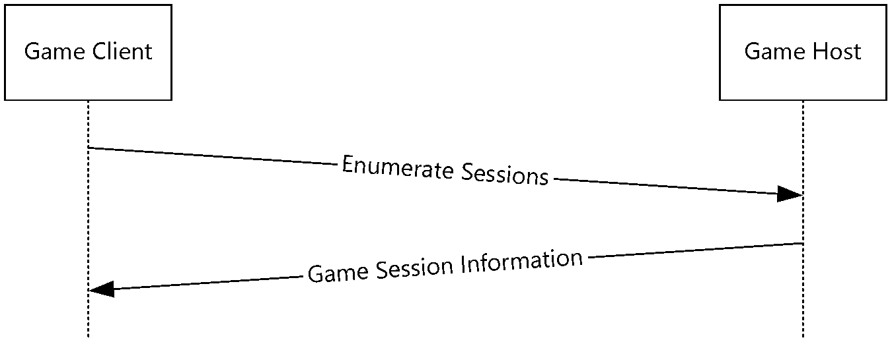

Figure 1: Diagram of session enumeration request and response

After enumerating the available game sessions, the game can choose one game session (typically after consulting with the user playing the game), and attempt to join the game session by requesting that the game host create a system player.

Once the system player for the client has been created, the game host will transmit the current set of game data to the joining nascent game instance and will notify all established game instances about the nascent game instance.

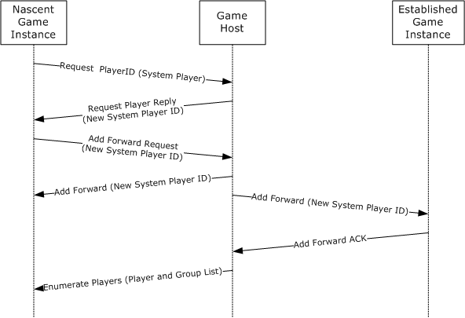

Figure 2: Diagram of a nascent game instance joining a game host and a third, established game instance

Once a nascent game instance has joined a game session, it becomes an established game instance. Any established game instance can add players or groups by requesting a player ID from the game host and transmitting information about the player to all of the established game instances, as shown in the following figure.

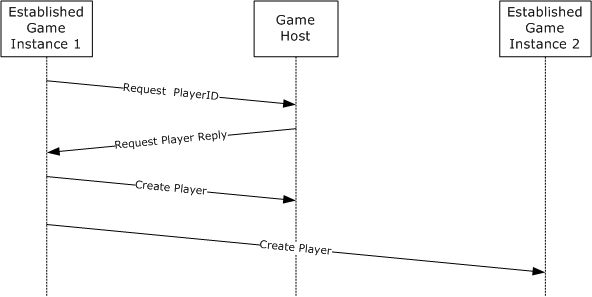

Figure 3: Diagram of an established game instance creating a non-system player

<a id="Section_1.4"></a>
## 1.4 Relationship to Other Protocols

The DirectPlay 4 Core and Service Providers Protocol is transmitted via both the [**Transmission Control Protocol (TCP)**](#gt_transmission-control-protocol-tcp) [[RFC793]](https://go.microsoft.com/fwlink/?LinkId=150872) and the [**User Datagram Protocol (UDP)**](#gt_user-datagram-protocol-udp) [[RFC768]](https://go.microsoft.com/fwlink/?LinkId=90490) protocols, as specified in [[RFC791]](https://go.microsoft.com/fwlink/?LinkId=392659). In addition, at the discretion of the [**game**](#gt_game), all of the messages listed in this protocol might be transmitted via the DirectPlay 4 Reliable Protocol, as specified in [MC-DPL4R](../MC-DPL4R/MC-DPL4R.md).

<a id="Section_1.5"></a>
## 1.5 Prerequisites/Preconditions

The **DirectPlay 4 Protocol** requires the DirectX 6 runtime.<1>

<a id="Section_1.6"></a>
## 1.6 Applicability Statement

The **DirectPlay 4 Protocol** is used when a game requires communication with other games. All of the functionality present in the **DirectPlay 4 Protocol** has been superseded by the **DirectPlay 8 Protocol** and, as such, the **DirectPlay 4 Protocol** is only to be used when the game has a requirement to interoperate with other [**DirectPlay 4**](#gt_directplay-4) [**games**](#gt_game).

<a id="Section_1.7"></a>
## 1.7 Versioning and Capability Negotiation

This document covers versioning issues in the following areas:

- **Protocol Versions**: The DirectPlay 4 Core and Service Provider Protocol supports the following explicit dialects: "DX6VERSION", "DX61VERSION", "DX61AVERSION", "DX71VERSION", "DX8VERSION", and "DX9VERSION". These dialects are defined in section [2.2.3](#Section_2.2.3) and are backward compatible.<2>
- **Capability Negotiation**: When joining a [**game session**](#gt_game-session), each client creates a "system player" and reports the [**DirectPlay**](#gt_directplay) dialect supported by that client. The [**host**](#gt_host) cannot allow the connection of a client that does not have the capabilities of interoperating with the existing game session.
<a id="Section_1.8"></a>
## 1.8 Vendor-Extensible Fields

This protocol can be transmitted over network protocols other than the IP networking stack. The protocol includes a **Service Provider Data** field in the **DPLAYI_PACKEDPLAYER** structure (section [2.2.2](#Section_2.2.2)) and the **DPLAYI_SUPERPACKEDPLAYER** structure (section [2.2.3](#Section_2.2.3)) that can be used to transmit protocol-specific information.

Each [**game**](#gt_game) can also extend the protocol with [**player**](#gt_player), per-[**group**](#gt_group), and per-[**game-session**](#gt_game-session) data. The per-player and per-group data is specified in the **Player Data** field of the **DPLAYI_PACKEDPLAYER** structure (section 2.2.2) and the **DPLAYI_SUPERPACKEDPLAYER** structure (section 2.2.3). The per-game-session data is contained in the **Application Defined 1** and **Application Defined 4** fields of the **DPSESSIONDESC2** structure (section [2.2.5](#Section_2.2.5)).

This protocol uses [**HRESULT**](#gt_hresult) values as defined in [MS-ERREF](../MS-ERREF/MS-ERREF.md) section 2.1. Vendors can define their own HRESULT values provided that they set the C bit (0x20000000) for each vendor-defined value to indicate that the value is a customer code.

<a id="Section_1.9"></a>
## 1.9 Standards Assignments

| Parameter | Value | Reference |
| --- | --- | --- |
| [**DirectPlay 4**](#gt_directplay-4) Port Number | 47624 | [[IANAPORT]](https://go.microsoft.com/fwlink/?LinkId=89888) |
| DirectPlay 4 Port Number (registered but unused) | 2234 | [IANAPORT] |

<a id="Section_2"></a>
# 2 Messages

This protocol references commonly used data types as defined in [MS-DTYP](../MS-DTYP/MS-DTYP.md).

<a id="Section_2.1"></a>
## 2.1 Transport

[**DirectPlay**](#gt_directplay) messages are transmitted either by [**UDP**](#gt_user-datagram-protocol-udp) or [**TCP**](#gt_transmission-control-protocol-tcp) depending on whether the destination of the protocol message is broadcast or unicast. Clients of the **DirectPlay 4 protocol** MUST use TCP and UDP port numbers in the range from 2300 to 2400. Enumeration messages transmitted to the DirectPlay host computer MUST be transmitted to port 47624. Broadcast messages MUST be sent to the UDP broadcast address of 255.255.255.255.

<a id="Section_2.2"></a>
## 2.2 Message Syntax

All multibyte values transmitted by the **DirectPlay 4 Protocol** are transmitted in [**little-endian**](#gt_little-endian) format unless otherwise specified.

This protocol specification uses curly braced [**GUID**](#gt_globally-unique-identifier-guid) strings as specified in [MS-DTYP](../MS-DTYP/MS-DTYP.md) section 2.3.4.3.

<a id="Section_2.2.1"></a>
### 2.2.1 SOCKADDR_IN

The **SOCKADDR_IN** structure is built as if it were on a [**little-endian**](#gt_little-endian) machine and is treated as a byte array. For more information, see [[SOCKADDR]](https://go.microsoft.com/fwlink/?LinkId=90723).

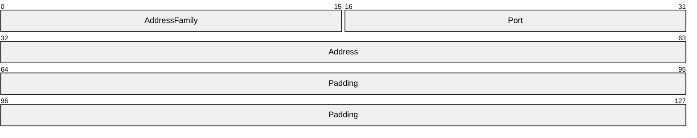

**AddressFamily (2 bytes):** Address family. It MUST be 0x0002.

**Port (2 bytes):** IP port.

**Address (4 bytes):** IP address, as specified in [[RFC791]](https://go.microsoft.com/fwlink/?LinkId=392659).

**Padding (8 bytes):** MUST be set to zero when sent and MUST be ignored on receipt.

<a id="Section_2.2.2"></a>
### 2.2.2 DPLAYI_PACKEDPLAYER

The **DPLAYI_PACKEDPLAYER** structure contains data related to [**players**](#gt_player) or [**groups**](#gt_group).

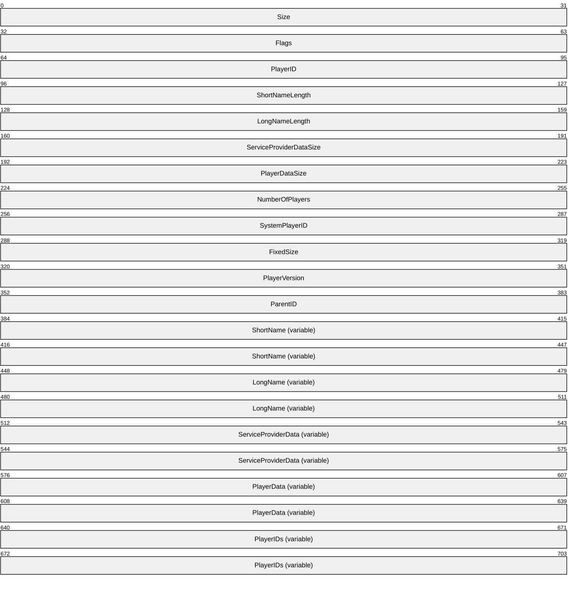

**Size (4 bytes):** MUST contain the total size of the **DPLAYI_PACKEDPLAYER** structure plus the values of the **ShortNameLength**, **LongNameLength**, **ServiceProviderDataSize**, and **PlayerDataSize** fields.

**Flags (4 bytes):** MUST contain 0 or more of the following player flags.

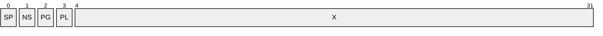

**SP (1 bit):** The player is the [**system player**](#gt_system-player).

**NS (1 bit):** The player is the name server (host). It MUST be combined with **SP**.

**PG (1 bit):** The player belongs to a group. This flag MUST be set for system players, for other players that have been added to a group using [DPSP_MSG_ADDPLAYERTOGROUP (section 2.2.12)](#Section_2.2.12), or for groups that have been added to a group using [DPSP_MSG_ADDSHORTCUTTOGROUP (section 2.2.13)](#Section_3.1.5.23).

**PL (1 bit):** The player is on the sending machine. This flag does not have meaning on other machines and MUST be ignored on receipt.

**X (28 bits):** All bits that have this label SHOULD be set to zero when sent and MUST be ignored on receipt.

**PlayerID (4 bytes):** The [**player ID**](#gt_player-id).

**ShortNameLength (4 bytes):** MUST contain the length of the player's short name, in octets. If there is no player short name, this field MUST be set to zero.

**LongNameLength (4 bytes):** MUST contain the length, in octets, of the player's long name. If there is no player long name, this field MUST be set to zero.

**ServiceProviderDataSize (4 bytes):** MUST contain the length, in octets, of the **ServiceProviderData** field. If there is no network [**service provider**](#gt_service-provider) data, this field MUST be set to zero.

**PlayerDataSize (4 bytes):** MUST contain the length of the per-game player data, in octets. If there is no per-game player data, this field MUST be set to zero.

**NumberOfPlayers (4 bytes):** MUST contain the number of entries in the **PlayerIDs** field. If the player represented in the **DPLAYI_PACKEDPLAYER** structure is not a group, this field MUST be set to zero.

**SystemPlayerID (4 bytes):** MUST contain the ID of the system player for this [**game session**](#gt_game-session).

**FixedSize (4 bytes):** MUST contain the size, in octets, of the fixed portion of this structure and MUST be 48.

**PlayerVersion (4 bytes):** MUST contain the version of the current player or group. The version for system players MUST match the protocol dialect version used by the creating [**instance**](#gt_instance). The version for non-system players or groups SHOULD be the protocol dialect version used by the creating instance and it MUST be ignored by receivers. The DirectPlay4 Core and Service Provider Protocol supports the protocol dialect versions identified in the description of the **VersionOrSystemPlayerID** field in [DPLAYI_SUPERPACKEDPLAYER (section 2.2.3)](#Section_2.2.3).

**ParentID (4 bytes):** MUST contain the identifier of the parent group. If this **DPLAYI_PACKEDPLAYER** structure represents a player, or if it is a group that is not contained in another group, this field MUST be set to zero.

**ShortName (variable):** If the **ShortNameLength** field is nonzero, this MUST contain the null-terminated [**Unicode**](#gt_unicode) string that contains the player's short name.

**LongName (variable):** If the **LongNameLength** field is nonzero, this MUST contain the null-terminated Unicode string that contains the player's long name.

**ServiceProviderData (variable):** If **ServiceProviderDataSize** is nonzero, this MUST be set to the data that is used by the DirectPlay Service Provider.

If provided, the Windows Winsock DirectPlay Service Provider stores the following data in the **ServiceProviderData** field.

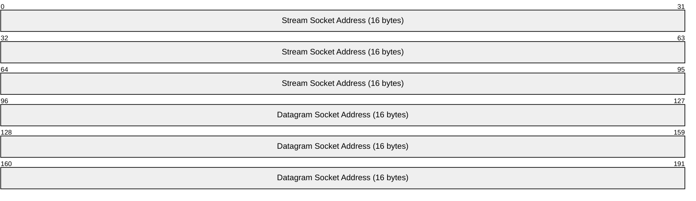

**Stream Socket Address (16 bytes):** A [SOCKADDR_IN](#Section_2.2.1) structure that contains the addressing information to be used when contacting this player over [**TCP**](#gt_transmission-control-protocol-tcp). If the **PL** flag is set in the **Flags** field, the **Address** field of this SOCKADDR_IN must be set to 0.0.0.0.

**Datagram Socket Address (16 bytes):** A SOCKADDR_IN structure that contains the addressing information to be used when contacting this player over [**UDP**](#gt_user-datagram-protocol-udp). If the **PL** flag is set in the **Flags** field, the **Address** field of this SOCKADDR_IN must be set to 0.0.0.0.

**PlayerData (variable):** If **PlayerDataSize** is nonzero, this MUST be set to the byte array of game-specific per-player data.

**PlayerIDs (variable):** MUST contain an array of **PlayerIDs** where the array size is specified in **NumberOfPlayers**. If **NumberOfPlayers** is 0, this field MUST NOT be present.

<a id="Section_2.2.3"></a>
### 2.2.3 DPLAYI_SUPERPACKEDPLAYER

The **DPLAYI_SUPERPACKEDPLAYER** structure is used to transmit player or [**group**](#gt_group)-related data.

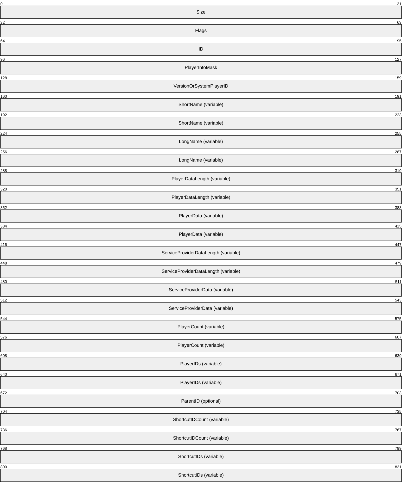

**Size (4 bytes):** The size of the fixed player header, in bytes. This includes the **Size** field, as well as the **Flags**, **ID**, and **PlayerInfoMask** fields. MUST be 0x00000010 (16).

**Flags (4 bytes):** Player flags. Player Flags MUST be 0 or more of the following values.


**SP (1 bit):** The player is the [**system player**](#gt_system-player).

**NS (1 bit):** The player is the name server (host). It MUST be combined with **SP**.

**PG (1 bit):** The player belongs to a group. This flag MUST be set for system players, for other players that have been added to a group using [DPSP_MSG_ADDPLAYERTOGROUP (section 2.2.12)](#Section_2.2.12), or for groups that have been added to a group using [DPSP_MSG_ADDSHORTCUTTOGROUP (section 2.2.13)](#Section_3.1.5.23).

**PL (1 bit):** The player is on the sending machine. This flag does not have meaning on other machines and MUST be ignored on receipt.

**X (28 bits):** All bits that have this label SHOULD be set to zero when sent and MUST be ignored on receipt.

**ID (4 bytes):** MUST contain the [**player ID**](#gt_player-id) of the player that is described in this structure.

**PlayerInfoMask (4 bytes):** A bit field that indicates which optional fields are present. The **PlayerInfoMask** field MUST be a bitmask that is composed of the following fields.

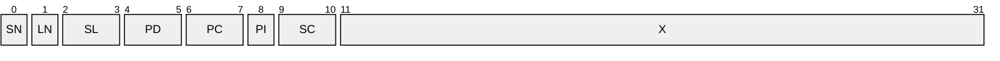

**SN (1 bit):** MUST be set if the **ShortName** field is present in the structure.

**LN (1 bit):** MUST be set if the **LongName** field is present in the structure.

**SL (2 bits):** MUST be set if the **ServiceProviderDataLength** field is present in the structure. **SL** MUST be set to one of the following values.

| Value | Meaning |
| --- | --- |
| 0x01 | If the **ServiceProviderDataLength** field occupies 1 byte. |
| 0x02 | If the **ServiceProviderDataLength** field occupies 2 bytes. |
| 0x03 | If the **ServiceProviderDataLength** field occupies 4 bytes. |

**PD (2 bits):** MUST be set if the **PlayerDataLength** field is present in the structure. **PD** MUST be set to one of the following values.

| Value | Meaning |
| --- | --- |
| 0x01 | If the **PlayerDataLength** field occupies 1 byte. |
| 0x02 | If the **PlayerDataLength** field occupies 2 bytes. |
| 0x03 | If the **PlayerDataLength** field occupies 4 bytes. |

**PC (2 bits):** MUST be set if the **PlayerCount** field is present in the structure. **PC** MUST be set to one of the following values.

| Value | Meaning |
| --- | --- |
| 0x01 | If the **PlayerCount** field occupies 1 byte. |
| 0x02 | If the **PlayerCount** field occupies 2 bytes. |
| 0x03 | If the **PlayerCount** field occupies 4 bytes. |

**PI (1 bit):** MUST be set if the **ParentID** field is present in the structure.

**SC (2 bits):** MUST be set if the **ShortcutCount** field is present in the structure. **SC** MUST be set to one of the following values.

| Value | Meaning |
| --- | --- |
| 0x01 | If the **ShortcutCount** field occupies 1 byte. |
| 0x02 | If the **ShortcutCount** field occupies 2 bytes. |
| 0x03 | If the **ShortcutCount** field occupies 4 bytes. |

**X (21 bits):** All bits with this label SHOULD be set to zero when sent and MUST be ignored on receipt.

**VersionOrSystemPlayerID (4 bytes):** If the DPLAYI_PLAYER_SYSPLAYER flag is set in the **Flags** field, this field MUST contain the protocol version for the machine hosting the protocol. If the DPLAYI_PLAYER_SYSPLAYER flag is not set, this field MUST contain the **ID** of the system player for this game. When the protocol version is used for a system player, it will be one of the following values.

| Version/Value | Meaning |
| --- | --- |
| DX6VERSION 9 | First version documented. |
| DX61VERSION 10 | New Hosts send [DPSP_MSG_IAMNAMESERVER](#Section_2.2.33) as first message when they become the new host. |
| DX61AVERSION 11 | No Change. |
| DX71VERSION 12 | The version in which [**DirectPlay**](#gt_directplay) Voice was introduced. Does not affect any of the core logic. |
| DX8VERSION 13 | Added [DPSP_MSG_CREATEPLAYERVERIFY](#Section_2.2.22) message. |
| DX9VERSION 14 | No Change. |

**ShortName (variable):** If the **SN** bit in the **PlayerInfoMask** field is set, the **ShortName** field MUST contain a null-terminated Unicode string that contains the short name of the player.

**LongName (variable):** If the **LN** bit in the **PlayerInfoMask** field is set, the **LongName** field MUST contain a null-terminated Unicode string that contains the long name of the player.

**PlayerDataLength (variable):** The **PD** bits in **PlayerInfoMask** indicate the size of this optional field. When present, this field MUST contain the size, in octets, of the **PlayerData** field.

**PlayerData (variable):** If **PlayerDataSize** is nonzero, this MUST be set to per-game player data.

**ServiceProviderDataLength (variable):** The **SL** bits in **PlayerInfoMask** indicate the size of this optional field. When present, this field MUST contain the size, in octets, of the **ServiceProviderData** field.<3>

**ServiceProviderData (variable):** If **ServiceProviderDataSize** is nonzero, this MUST be set to the data that is used by the DirectPlay Service Provider.

If provided, the Windows Winsock DirectPlay Service Provider stores the following data in the **ServiceProviderData** field.


**Stream Socket Address (16 bytes):** A [SOCKADDR_IN](#Section_2.2.1) structure that contains the addressing information to be used when contacting this player over [**TCP**](#gt_transmission-control-protocol-tcp). If the **PL** flag is set in the **Flags** field, the **Address** field of this SOCKADDR_IN must be set to 0.0.0.0.

**Datagram Socket Address (16 bytes):** A SOCKADDR_IN structure that contains the addressing information to be used when contacting this player over [**UDP**](#gt_user-datagram-protocol-udp). If the **PL** flag is set in the **Flags** field, the **Address** field of this SOCKADDR_IN must be set to 0.0.0.0.

**PlayerCount (variable):** The **PC** bits in **PlayerInfoMask** indicate the size of this optional field. When present, this field MUST contain the number of entries in the **PlayerIDs** field.

**PlayerIDs (variable):** If the **PlayerCount** field is present and nonzero, this MUST be set to a list of player IDs that are contained in the group. The length of this field is equivalent to the value of the **PlayerCount** field multiplied by four.

**ParentID (4 bytes):** If the **PI** field is set in the **PlayerInfoMask**, this field MUST be set to the ID of the parent for this group.

**ShortcutIDCount (variable):** The **SC** bits in **PlayerInfoMask** indicate the size of this optional field. When present, this field MUST contain the number of [**shortcut**](#gt_shortcut) IDs in the **ShortcutIDs** field.

**ShortcutIDs (variable):** If the **ShortcutIDCount** field is nonzero, this MUST be set to a list of shortcut IDs. The length of this field is equivalent to the value of **ShortcutIDCount** multiplied by four.

<a id="Section_2.2.4"></a>
### 2.2.4 DPSECURITYDESC

The **DPSECURITYDESC** structure describes the security properties of a [**game session**](#gt_game-session) instance.

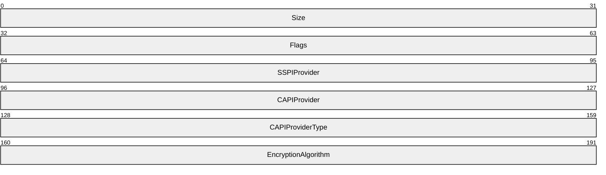

**Size (4 bytes):** MUST be set to the size of the structure, in octets.<4>

**Flags (4 bytes):** Game session flags. This is not used. MUST be set to zero when sent and MUST be ignored on receipt.

**SSPIProvider (4 bytes):** MUST be ignored on receipt.

**CAPIProvider (4 bytes):** MUST be ignored on receipt.

**CAPIProviderType (4 bytes):** Crypto [**service provider**](#gt_service-provider) type. If the application does not specify a value, the default value of PROV_RSA_FULL is used. For more information, see Cryptographic Provider Types [[MSDN-CAPI]](https://go.microsoft.com/fwlink/?LinkId=89964).

**EncryptionAlgorithm (4 bytes):** Encryption algorithm type. If the application does not specify a value, the default value of CALG_RC4 is used.<5>

<a id="Section_2.2.5"></a>
### 2.2.5 DPSESSIONDESC2

The **DPSESSIONDESC2** structure contains [**game session**](#gt_game-session)-related information. A game session is an [**instance**](#gt_instance) of a [**game**](#gt_game).

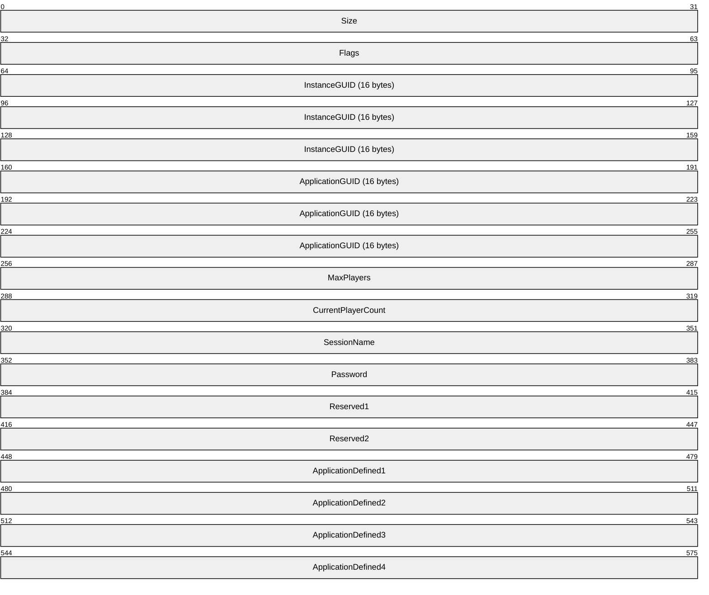

**Size (4 bytes):** MUST be set to the size of the structure, in octets.

**Flags (4 bytes):** Game session flags. Game session flags are set by the game and allow the game to specify semantics for the **DirectPlay 4 protocol**.

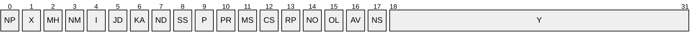

**NP (1 bit):** Applications cannot create new players in this game session, as specified in section [3.2.5.4](#Section_3.2.5.4).

**X (1 bit):** All bits with this label SHOULD be set to zero when sent and MUST be ignored on receipt.

**MH (1 bit):** When the game host quits, the game host responsibilities migrate to another DirectPlay machine so that new players can continue to be created and nascent game instances can join the game session, as specified in section [3.1.6.2](#Section_3.2.6.2).

**NM (1 bit):** DirectPlay will not set the **PlayerTo** and **PlayerFrom** fields in player messages.

**I (1 bit):** (Ignored). All bits with this label MUST be ignored on receipt.

**JD (1 bit):** [**DirectPlay**](#gt_directplay) will not allow any new applications to join the game session. Applications already in the game session can still create new players, as specified in section 3.2.5.4.

**KA (1 bit):** DirectPlay will detect when remote players exit abnormally (for example, because their computer or modem was unplugged) through the use of the [Ping Timer](#Section_3.2.6.2), as described in sections 3.1.2.5 and [3.2.2.2](#Section_3.2.6.2).

**ND (1 bit):** DirectPlay will not send a message to all players when a player's remote data changes.

**SS (1 bit):** Instructs the game session establishment logic to use user authentication as specified in sections [3.1.5.1](#Section_3.1.5.1) and [3.2.5.7](#Section_3.2.5.7).

**P (1 bit):** Indicates that the game session is private and requires a password for EnumSessions as well as Open.

**PR (1 bit):** Indicates that the game session requires a password to join.

**MS (1 bit):** DirectPlay will route all messages through the game host, as specified in section 3.1.5.1.

**CS (1 bit):** DirectPlay will download information about the DPPLAYER_SERVERPLAYER only.

**RP (1 bit):** Instructs the DirectPlay client to always use DirectPlay 4 Reliable Protocol [MC-DPL4R](../MC-DPL4R/MC-DPL4R.md). When this bit is set, only other game sessions with the same bit set can join or be joined.

**NO (1 bit):** Instructs the DirectPlay client that, when using reliable delivery, preserving the order of received packets is not important. This allows messages to be indicated out of order if preceding messages have not yet arrived. If this flag is not set, DirectPlay waits for earlier messages to arrive before delivering later reliable messages.

**OL (1 bit):** DirectPlay will optimize communication for latency. Implementations SHOULD use the presence of the **OL** flag for guidance on how to send or process messages to optimize for latency rather than throughput; however, implementations can choose to ignore this flag. The presence or absence of the **OL** flag MUST NOT affect the sequence or binary contents of **DirectPlay 4 protocol** messages.<6>

**AV (1 bit):** Allows lobby-launched games that are not voice-enabled to acquire voice capabilities.

**NS (1 bit):** Suppresses transmission of game session description changes.

**Y (14 bits):** All bits with this label SHOULD be set to zero when sent and MUST be ignored on receipt.

**InstanceGUID (16 bytes):** Identifier for the game session instance.

**ApplicationGUID (16 bytes):** MUST be set to the unique identifier of the DirectPlay game.

**MaxPlayers (4 bytes):** Maximum number of [**players**](#gt_player) allowed in the game session.

**CurrentPlayerCount (4 bytes):** Current number of players in the game session.

**SessionName (4 bytes):** Placeholder for a pointer to a [**Unicode**](#gt_unicode) string that contains the game session name and the NULL terminating character. This field SHOULD be set to zero when sent and MUST be ignored on receipt.<7>

**Password (4 bytes):** Placeholder for a pointer to a Unicode string that contains the game session password and the NULL terminating character. This field SHOULD be set to zero when sent and MUST be ignored on receipt.<8>

**Note** A secure game session is different from a password protected game session. DirectPlay 4 allows for securing access to a game session with a user-specified cleartext password that is specified by the [**host**](#gt_host) and which MUST be provided by all clients. Although not very secure, this form of security provides a very lightweight alternative that does not require user accounts and associated management. It is used to casually restrict access to a particular instance of a game session.

**Reserved1 (4 bytes):** MUST be set to a unique value that is used to construct the player and group ID values. For more information about how this value is used to construct player and group identifiers, see section 3.2.5.4.

**Reserved2 (4 bytes):** Reserved for future use.

**ApplicationDefined1 (4 bytes):** For use by the DirectPlay game.

**ApplicationDefined2 (4 bytes):** For use by the DirectPlay game.

**ApplicationDefined3 (4 bytes):** For use by the DirectPlay game.

**ApplicationDefined4 (4 bytes):** For use by the DirectPlay game.

<a id="Section_2.2.6"></a>
### 2.2.6 DPSP_MSG_HEADER

The **DPSP_MSG_HEADER** is prepended to all **DirectPlay 4 Protocol** messages and contains an identifier that describes each message structure.

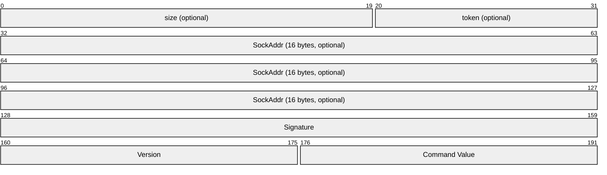

**size (20 bits):** Indicates the size of the message (in octets). The value is obtained by performing a bitwise AND (&) operation with the **token** field and 0x000FFFFF. This field is optional and its existence depends on the message type and whether the DirectPlay 4 Reliable Protocol is used; it is present unless the containing message specifies otherwise.

**token (12 bits):** Describes high-level message characteristics. The value is obtained by performing a bitwise AND (&) operation with the **size** field and 0xFFF00000. This field is optional and its existence depends on the message type and whether the DirectPlay 4 Reliable Protocol is used; it is present unless the containing message specifies otherwise.

| Value | Meaning |
| --- | --- |
| 0xFAB | Indicates that the message was received from a remote [**DirectPlay**](#gt_directplay) machine. |
| 0xCAB | Indicates that the message will be forwarded to all registered servers. |
| 0xBAB | Indicates that the message was received from a DirectPlay server. |

**SockAddr (16 bytes):** 16 bytes of data containing a sockets **SOCKADDR_IN** (section [2.2.1](#Section_2.2.1)) structure. If the machine is on the same network as the receiving machine, the **Address** field of this structure is set to 0.0.0.0. This field is optional and its existence depends on the message type and whether the DirectPlay 4 Reliable Protocol is used; it is present unless the containing message specifies otherwise.

**Signature (4 bytes):** MUST be set to the value 0x79616c70 (ASCII 'play').

**Version (2 bytes):** MUST be set to the version number of the protocol. The DirectPlay 4 Core and Service Provider Protocol supports the protocol versions identified in the description of the **VersionOrSystemPlayerID** field in [DPLAYI_SUPERPACKEDPLAYER (section 2.2.3)](#Section_2.2.3).

**Command Value (2 bytes):** MUST contain one of the following values.

| Name | Value |
| --- | --- |
| DPSP_MSG_ENUMSESSIONSREPLY | 0x0001 |
| DPSP_MSG_ENUMSESSIONS | 0x0002 |
| DPSP_MSG_ENUMPLAYERSREPLY | 0x0003 |
| DPSP_MSG_ENUMPLAYER | 0x0004 |
| DPSP_MSG_REQUESTPLAYERID | 0x0005 |
| DPSP_MSG_REQUESTGROUPID | 0x0006 |
| DPSP_MSG_REQUESTPLAYERREPLY | 0x0007 |
| DPSP_MSG_CREATEPLAYER | 0x0008 |
| DPSP_MSG_CREATEGROUP | 0x0009 |
| DPSP_MSG_PLAYERMESSAGE | 0x000A |
| DPSP_MSG_DELETEPLAYER | 0x000B |
| DPSP_MSG_DELETEGROUP | 0x000C |
| DPSP_MSG_ADDPLAYERTOGROUP | 0x000D |
| DPSP_MSG_DELETEPLAYERFROMGROUP | 0x000E |
| DPSP_MSG_PLAYERDATACHANGED | 0x000F |
| DPSP_MSG_PLAYERNAMECHANGED | 0x0010 |
| DPSP_MSG_GROUPDATACHANGED | 0x0011 |
| DPSP_MSG_GROUPNAMECHANGED | 0x0012 |
| DPSP_MSG_ADDFORWARDREQUEST | 0x0013 |
| DPSP_MSG_PACKET | 0x0015 |
| DPSP_MSG_PING | 0x0016 |
| DPSP_MSG_PINGREPLY | 0x0017 |
| DPSP_MSG_YOUAREDEAD | 0x0018 |
| DPSP_MSG_PLAYERWRAPPER | 0x0019 |
| DPSP_MSG_SESSIONDESCCHANGED | 0x001A |
| DPSP_MSG_CHALLENGE | 0x001C |
| DPSP_MSG_ACCESSGRANTED | 0x001D |
| DPSP_MSG_LOGONDENIED | 0x001E |
| DPSP_MSG_AUTHERROR | 0x001F |
| DPSP_MSG_NEGOTIATE | 0x0020 |
| DPSP_MSG_CHALLENGERESPONSE | 0x0021 |
| DPSP_MSG_SIGNED | 0x0022 |
| DPSP_MSG_ADDFORWARDREPLY | 0x0024 |
| DPSP_MSG_ASK4MULTICAST | 0x0025 |
| DPSP_MSG_ASK4MULTICASTGUARANTEED | 0x0026 |
| DPSP_MSG_ADDSHORTCUTTOGROUP | 0x0027 |
| DPSP_MSG_DELETEGROUPFROMGROUP | 0x0028 |
| DPSP_MSG_SUPERENUMPLAYERSREPLY | 0x0029 |
| DPSP_MSG_KEYEXCHANGE | 0x002B |
| DPSP_MSG_KEYEXCHANGEREPLY | 0x002C |
| DPSP_MSG_CHAT | 0x002D |
| DPSP_MSG_ADDFORWARD | 0x002E |
| DPSP_MSG_ADDFORWARDACK | 0x002F |
| DPSP_MSG_PACKET2_DATA | 0x0030 |
| DPSP_MSG_PACKET2_ACK | 0x0031 |
| DPSP_MSG_IAMNAMESERVER | 0x0035 |
| DPSP_MSG_VOICE | 0x0036 |
| DPSP_MSG_MULTICASTDELIVERY | 0x0037 |
| DPSP_MSG_CREATEPLAYERVERIFY | 0x0038 |

<a id="Section_2.2.7"></a>
### 2.2.7 DPSP_MSG_ACCESSGRANTED

The **DPSP_MSG_ACCESSGRANTED** packet is sent to a [**DirectPlay client**](#gt_directplay-client) after the client has successfully been authenticated as a member of the [**game session**](#gt_game-session).

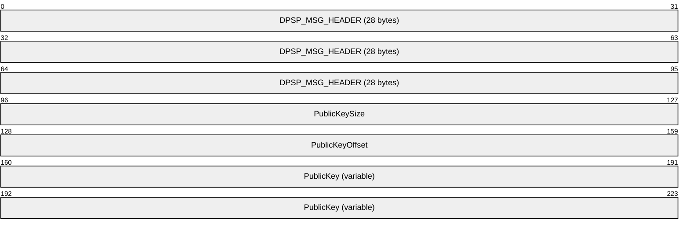

**DPSP_MSG_HEADER (28 bytes):** Message header for this packet. The Command Value member of this field MUST be set to 29 (0x1D).

**PublicKeySize (4 bytes):** MUST be set to the size of the **PublicKey** field, in octets. It MUST be set to 24 (0x00000018).

**PublicKeyOffset (4 bytes):** MUST be set to the offset, in octets, from the beginning of the packet to the **PublicKey** field.

**PublicKey (variable):** Array of bytes that contains the sender's signed public key.

<a id="Section_2.2.8"></a>
### 2.2.8 DPSP_MSG_ADDFORWARD

The **DPSP_MSG_ADDFORWARD** packet is sent to inform a [**game**](#gt_game) [**instance**](#gt_instance) of the existence of other game instances.

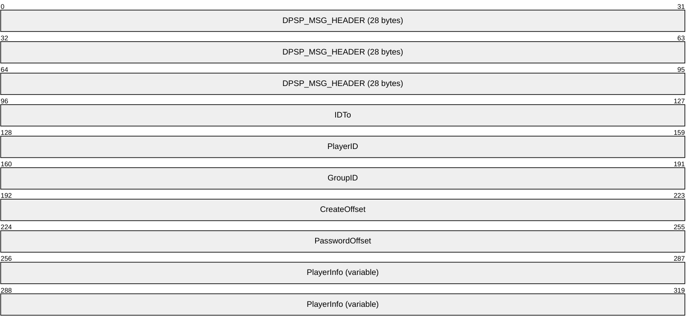

**DPSP_MSG_HEADER (28 bytes):** Message header for this packet. The Command Value member of this field MUST be set to 46 (0x2E).

**IDTo (4 bytes):** Identifier of the [**player**](#gt_player) to whom the message is being sent.

**PlayerID (4 bytes):** Identifier of the affected player.

**GroupID (4 bytes):** Identifier of the affected [**group**](#gt_group).

**CreateOffset (4 bytes):** Offset, in octets, of the **PlayerInfo** field. It MUST be set to 28 (0x0000001C).

**PasswordOffset (4 bytes):** Not used. It MUST be ignored on receipt.

**PlayerInfo (variable):** MUST be set to a **DPLAYI_PACKEDPLAYER** structure (section [2.2.2](#Section_2.2.2)) that contains information about the [**system player**](#gt_system-player) on the newly added machine.

<a id="Section_2.2.9"></a>
### 2.2.9 DPSP_MSG_ADDFORWARDACK

The **DPSP_MSG_ADDFORWARDACK** packet is sent in response to a [DPSP_MSG_ADDFORWARD](#Section_3.1.5.10) message.

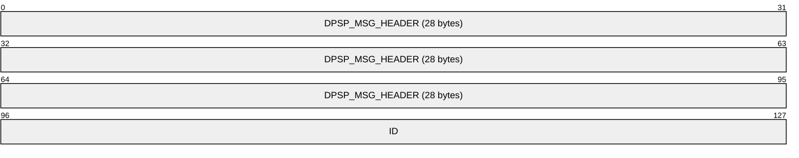

**DPSP_MSG_HEADER (28 bytes):** Message header for this packet. The Command Value member of this field MUST be set to 47 (0x2F).

**ID (4 bytes):** Identifier of the player for whom a **DPSP_MSG_ADDFORWARD** message was sent.

<a id="Section_2.2.10"></a>
### 2.2.10 DPSP_MSG_ADDFORWARDREPLY

The **DPSP_MSG_ADDFORWARDREPLY** packet is sent in response to a [DPSP_MSG_ADDFORWARDREQUEST](#Section_3.2.5.5) message when there is an error.

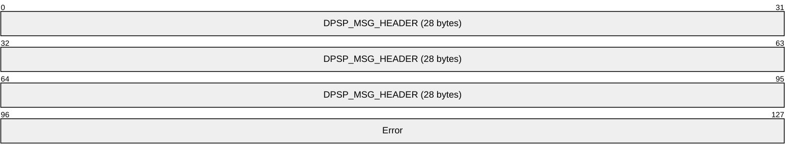

**DPSP_MSG_HEADER (28 bytes):** Message header for this packet. The Command Value member of this field MUST be set to 36 (0x24).

**Error (4 bytes):** Indicates the reason that the **DPSP_MSG_ADDFORWARD** (section [2.2.8](#Section_3.1.5.10)) message failed. For a complete list of [**DirectPlay 4**](#gt_directplay-4) [**HRESULT**](#gt_hresult) codes, see [MS-ERREF](../MS-ERREF/MS-ERREF.md).

<a id="Section_2.2.11"></a>
### 2.2.11 DPSP_MSG_ADDFORWARDREQUEST

The **DPSP_MSG_ADDFORWARDREQUEST** packet is sent to forward a message to a downstream [**player**](#gt_player).

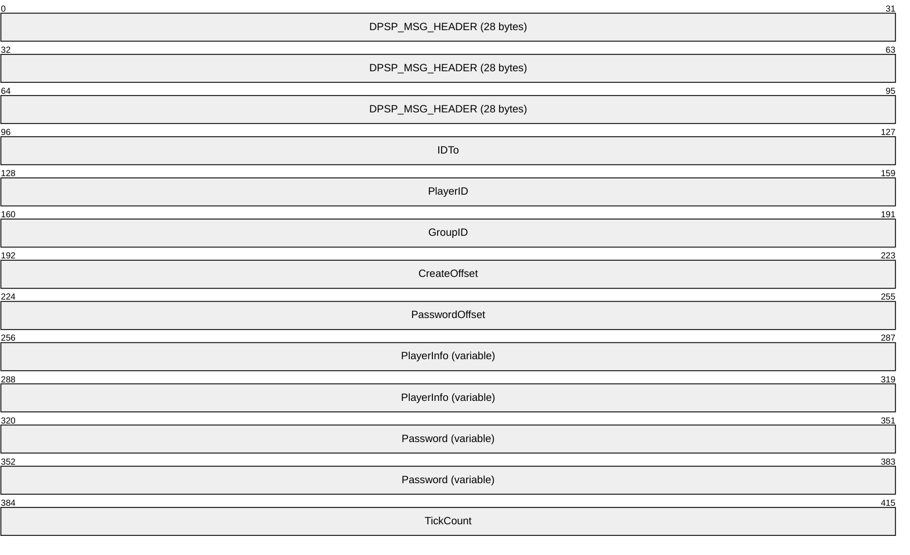

**DPSP_MSG_HEADER (28 bytes):** Message header for this packet. The Command Value member of this field MUST be set to 19 (0x13).

**IDTo (4 bytes):** Identifier of the player to whom the message is being sent.

**PlayerID (4 bytes):** MUST be the identity of the player being added.

**GroupID (4 bytes):** SHOULD be set to zero when sent and MUST be ignored on receipt.

**CreateOffset (4 bytes):** Offset, in bytes, of the **PlayerInfo** field from the beginning of the **Signature** field in the [DPSP_MSG_HEADER (section 2.2.6)](#Section_2.2.6) message. It SHOULD be set to 28 (0x1C).

**PasswordOffset (4 bytes):** Offset, in bytes, of the **Password** field from the beginning of the **Signature** field in the DPSP_MSG_HEADER message.

**PlayerInfo (variable):** MUST be set to a **DPLAYI_PACKEDPLAYER** structure (section [2.2.2](#Section_2.2.2)) that contains information about the [**system player**](#gt_system-player) on the newly added machine.

**Password (variable):** Null-terminated [**Unicode**](#gt_unicode) string that contains the [**game session**](#gt_game-session) password.

**TickCount (4 bytes):** MUST contain the computing system [**tick count**](#gt_tick-count) when the packet was generated.

<a id="Section_2.2.12"></a>
### 2.2.12 DPSP_MSG_ADDPLAYERTOGROUP

The **DPSP_MSG_ADDPLAYERTOGROUP** packet is sent from one game participant to other game participants when a player is added to a [**group**](#gt_group).

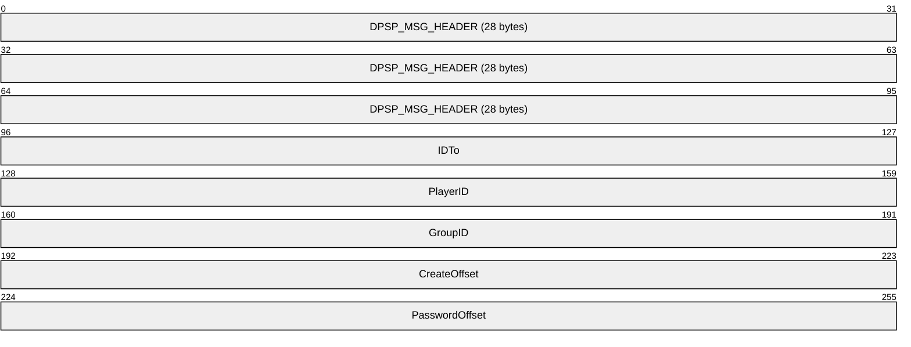

**DPSP_MSG_HEADER (28 bytes):** Message header for this packet. The Command Value member of this field MUST be set to 13 (0x0D).

**IDTo (4 bytes):** Identifier of the player to whom the message is being sent. It SHOULD be set to zero when sent and MUST be ignored on receipt.

**PlayerID (4 bytes):** Identifier of the player to add to the group specified by the **GroupID** field.

**GroupID (4 bytes):** Identifier of the group to which the player will be added.

**CreateOffset (4 bytes):** Not used. It SHOULD be set to zero when sent and MUST be ignored on receipt.

**PasswordOffset (4 bytes):** Not used. It SHOULD be set to zero when sent and MUST be ignored on receipt.

<a id="Section_2.2.13"></a>
### 2.2.13 DPSP_MSG_ADDSHORTCUTTOGROUP

The **DPSP_MSG_ADDSHORTCUTTOGROUP** packet is sent to add a [**shortcut**](#gt_shortcut) to a [**group**](#gt_group).

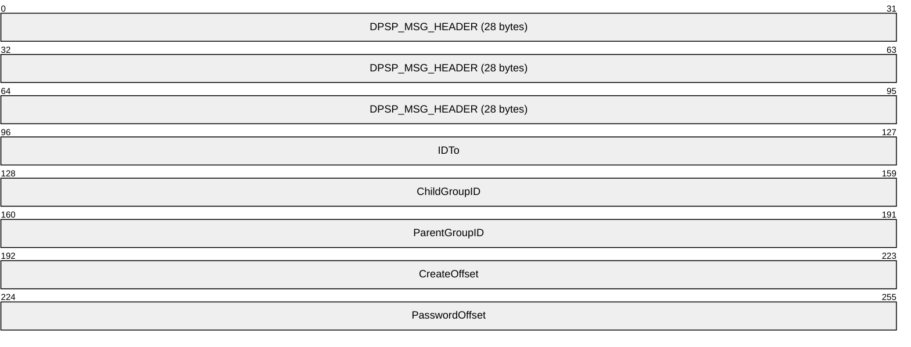

**DPSP_MSG_HEADER (28 bytes):** Message header for this packet. The Command Value member of this field MUST be set to 39 (0x27).

**IDTo (4 bytes):** Identifier of the [**player**](#gt_player) to whom the message is being sent.

**ChildGroupID (4 bytes):** Identifier of the group to add to the group specified by **ParentGroupID**.

**ParentGroupID (4 bytes):** The containing group identifier.

**CreateOffset (4 bytes):** Not used. It SHOULD be set to zero when sent and MUST be ignored on receipt.

**PasswordOffset (4 bytes):** Not used. It SHOULD be set to zero when sent and MUST be ignored on receipt.

<a id="Section_2.2.14"></a>
### 2.2.14 DPSP_MSG_ASK4MULTICAST

The **DPSP_MSG_ASK4MULTICAST** packet is sent to request that the server forward a message to [**players**](#gt_player) in a specified [**group**](#gt_group).

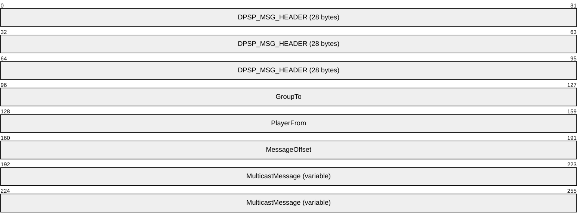

**DPSP_MSG_HEADER (28 bytes):** Message header for this packet. The Command Value member of this field MUST be set to 37 (0x25).

**GroupTo (4 bytes):** Identifier of the group that is the target of the request.

**PlayerFrom (4 bytes):** Identifier of the player that originated the request.

**MessageOffset (4 bytes):** Offset, in octets, from the beginning of the message to the **MulticastMessage** field.

**MulticastMessage (variable):** An array of octets that contains the message to forward. This field MUST contain a complete **DirectPlay 4 Protocol** message. However, the message MUST begin with the **Signature** field of the [DPSP_MSG_HEADER (section 2.2.6)](#Section_2.2.6) rather than the entire **DPSP_MSG_HEADER** structure.

<a id="Section_2.2.15"></a>
### 2.2.15 DPSP_MSG_ASK4MULTICASTGUARANTEED

The **DPSP_MSG_ASK4MULTICASTGUARANTEED** packet is used to request that the server forward a message to [**players**](#gt_player) in a specified group using the guaranteed messaging mechanism.

```mermaid
packet-beta
  0-95: "DPSP_MSG_HEADER (28 bytes)"
  96-127: "GroupTo"
  128-159: "PlayerFrom"
  160-191: "MessageOffset"
  192-255: "MulticastMessage (variable)"
```

**DPSP_MSG_HEADER (28 bytes):** Message header for this packet. The Command Value member of this field MUST be set to 38 (0x26).

**GroupTo (4 bytes):** MUST be set to the identifier of the group that is the target of the request.

**PlayerFrom (4 bytes):** MUST be set to the identifier of the player that originated the request.

**MessageOffset (4 bytes):** Offset, in octets, from the beginning of the message to the **MulticastMessage** field.

**MulticastMessage (variable):** An array of octets that contains the message to forward. This field MUST contain a complete **DirectPlay 4 Protocol** message. However, the message MUST begin with the **Signature** field of the [DPSP_MSG_HEADER (section 2.2.6)](#Section_2.2.6) rather than the entire **DPSP_MSG_HEADER** structure.

<a id="Section_2.2.16"></a>
### 2.2.16 DPSP_MSG_AUTHERROR

The **DPSP_MSG_AUTHERROR** packet is sent to indicate the reason that authentication failed.

```mermaid
packet-beta
  0-95: "DPSP_MSG_HEADER (28 bytes)"
  96-127: "Error"
```

**DPSP_MSG_HEADER (28 bytes):** Message header for this packet. The Command Value member of this field MUST be set to 31 (0x1F).

**Error (4 bytes):** MUST contain the reason authentication failed. The values associated with each error can be found in [MS-ERREF](../MS-ERREF/MS-ERREF.md).

| Value | Meaning |
| --- | --- |
| SEC_E_INVALID_TOKEN 0x80090308 | The token passed is invalid. |
| SEC_E_INVALID_HANDLE 0x80090301 | An internal handle is invalid. |
| SEC_E_INTERNAL_ERROR 0x80090304 | The Local Security Authority could not be contacted. |
| SEC_E_NO_AUTHENTICATING_AUTHORITY 0x80090311 | No authority could be contacted for authentication. |

<a id="Section_2.2.17"></a>
### 2.2.17 DPSP_MSG_CHALLENGE

The **DPSP_MSG_CHALLENGE** packet is used to request a security token.

```mermaid
packet-beta
  0-95: "DPSP_MSG_HEADER (28 bytes)"
  96-127: "IDFrom"
  128-159: "DataSize"
  160-191: "DataOffset"
  192-255: "SecurityToken (variable)"
```

**DPSP_MSG_HEADER (28 bytes):** Message header for this packet. The Command Value member of this field MUST be set to 28 (0x1C).

**IDFrom (4 bytes):** MUST be set to the system [**player ID**](#gt_player-id) on the sender's computing system.

**DataSize (4 bytes):** MUST be set to the size, in octets, of the **SecurityToken** field.

**DataOffset (4 bytes):** MUST be set to the offset, in octets, from the beginning of the message to the **SecurityToken** field.

**SecurityToken (variable):** Opaque security token whose size is specified by the **DataSize** field.

<a id="Section_2.2.18"></a>
### 2.2.18 DPSP_MSG_CHALLENGERESPONSE

The **DPSP_MSG_CHALLENGERESPONSE** packet is sent in response to a **DPSP_MSG_CHALLENGE** (section [2.2.17](#Section_2.2.17)) message.

```mermaid
packet-beta
  0-95: "DPSP_MSG_HEADER (28 bytes)"
  96-127: "IDFrom"
  128-159: "DataSize"
  160-191: "DataOffset"
  192-255: "SecurityToken (variable)"
```

**DPSP_MSG_HEADER (28 bytes):** Message header for this packet. The Command Value member of this field MUST be set to 33 (0x21).

**IDFrom (4 bytes):** MUST be set to the system [**player ID**](#gt_player-id) for the sender's computing system.

**DataSize (4 bytes):** MUST be set to the size, in octets, of the message in the **SecurityToken** field.

**DataOffset (4 bytes):** MUST be set to the offset, in octets, from the beginning of the message to the **SecurityToken** field.

**SecurityToken (variable):** Opaque security token whose size is specified by the **DataSize** field.

<a id="Section_2.2.19"></a>
### 2.2.19 DPSP_MSG_CHAT

The DPSP_MSG_CHAT packet is used to exchange text between [**players**](#gt_player).

```mermaid
packet-beta
  0-63: "DPSP_MSG_HEADER"
  64-95: "IDFrom"
  96-127: "IDTo"
  128-159: "Flags"
  160-191: "MessageOffset"
  192-255: "ChatMessage (variable)"
```

**DPSP_MSG_HEADER (8 bytes):** Message header for this packet. It does not contain the **size**, **token**, and **SockAddr** fields. The Command Value member of this field MUST be set to 45 (0x2D).

**IDFrom (4 bytes):** MUST be set to the identifier of the sending player.

**IDTo (4 bytes):** MUST be set to the identifier of the destination player or [**group**](#gt_group).

**Flags (4 bytes):** Chat flags. MUST be set to one of the following values.

```mermaid
packet-beta
  0-0: "GS"
  1-31: "X"
```

**GS (1 bit):** If this bit is set, send the message using a guaranteed send method. If this bit is clear, send the message using a nonguaranteed send method.

**Note** Determining whether to send the message guaranteed can be inferred from the **DPSP_MSG_HEADER** and the transport method. Use of the **GS** flag is not required.

**X (31 bits):** Not used. SHOULD be set to zero when sent and MUST be ignored on receipt.

**MessageOffset (4 bytes):** MUST be set to the offset, in octets, from the beginning of the message to the **ChatMessage** field. Zero indicates a NULL message.

**ChatMessage (variable):** Null-terminated [**Unicode**](#gt_unicode) string that contains the contents of the chat message.

<a id="Section_2.2.20"></a>
### 2.2.20 DPSP_MSG_CREATEGROUP

The **DPSP_MSG_CREATEGROUP** packet is sent to indicate that a new [**group**](#gt_group) has been created.

```mermaid
packet-beta
  0-95: "DPSP_MSG_HEADER (28 bytes)"
  96-127: "IDTo"
  128-159: "PlayerID"
  160-191: "GroupID"
  192-223: "CreateOffset"
  224-255: "PasswordOffset"
  256-319: "GroupInfo (variable)"
```

**DPSP_MSG_HEADER (28 bytes):** Message header for this packet. The Command Value member of this field MUST be set to 9 (0x9).

**IDTo (4 bytes):** Ignored. SHOULD be set to zero when sent and MUST be ignored on receipt.

**PlayerID (4 bytes):** MUST be set to the [**group ID**](#gt_group-id) of the newly created group.

**GroupID (4 bytes):** Ignored. SHOULD be set to zero when sent and MUST be ignored on receipt.

**CreateOffset (4 bytes):** MUST be set to the offset, in octets, of the **GroupInfo** field. MUST be set to 28 (0x1C).

**PasswordOffset (4 bytes):** Ignored. SHOULD be set to zero when sent and MUST be ignored on receipt.

**GroupInfo (variable):** MUST contain a **DPLAYI_PACKEDPLAYER** (section [2.2.2](#Section_2.2.2)) structure that contains information about the group to be created.

<a id="Section_2.2.21"></a>
### 2.2.21 DPSP_MSG_CREATEPLAYER

The **DPSP_MSG_CREATEPLAYER** packet is sent to indicate that a new [**player**](#gt_player) has been created.

```mermaid
packet-beta
  0-95: "DPSP_MSG_HEADER (28 bytes)"
  96-127: "IDTo"
  128-159: "PlayerID"
  160-191: "GroupID"
  192-223: "CreateOffset"
  224-255: "PasswordOffset"
  256-319: "PlayerInfo (variable)"
  320-335: "Reserved1"
  336-367: "Reserved2"
```

**DPSP_MSG_HEADER (28 bytes):** Message header for this packet. The Command Value member of this field MUST be set to 8 (0x08).

**IDTo (4 bytes):** Player to whom the message is being sent. SHOULD be set to zero when sent and MUST be ignored on receipt.

**PlayerID (4 bytes):** MUST be set to the identifier of the newly created player.

**GroupID (4 bytes):** Ignored. SHOULD be set to zero when sent and MUST be ignored on receipt.

**CreateOffset (4 bytes):** Offset, in octets, of the **PlayerInfo** field. MUST be set to 28 (0x001C).

**PasswordOffset (4 bytes):** Not used. SHOULD be set to zero when sent and MUST be ignored on receipt.

**PlayerInfo (variable):** MUST contain a **DPLAYI_PACKEDPLAYER** (section [2.2.2](#Section_2.2.2)) structure containing the information about the newly created player.

**Reserved1 (2 bytes):** SHOULD be set to zero when sent and MUST be ignored on receipt.

**Reserved2 (4 bytes):** SHOULD be set to zero when sent and MUST be ignored on receipt.

<a id="Section_2.2.22"></a>
### 2.2.22 DPSP_MSG_CREATEPLAYERVERIFY

A **DPSP_MSG_CREATEPLAYERVERIFY** message is sent as verification that a player was previously created. When all of the following conditions are met, one or more **DPSP_MSG_CREATEPLAYERVERIFY** messages are sent in response to a [DPSP_MSG_CREATEPLAYER (section 2.2.21)](#Section_3.1.5.12) message:

- The receiving computer system is not the [**host**](#gt_host).
- The [**player**](#gt_player) referenced in the incoming DPSP_MSG_CREATEPLAYER message has not already been added to the [**name table**](#gt_name-table).
- The player referenced in the incoming DPSP_MSG_CREATEPLAYER message is not a system player.
- The value of the **Version** field of the received [DPSP_MSG_HEADER (section 2.2.6)](#Section_2.2.6) of the message is 13 or higher.
- The receiving computer system created a local player that was not designated as a system player within the last 40 seconds. If more than one local player has been created within that time period, then a separate **DPSP_MSG_CREATEPLAYERVERIFY** message MUST be sent for each player.
```mermaid
packet-beta
  0-95: "DPSP_MSG_HEADER (28 bytes)"
  96-127: "IDTo"
  128-159: "PlayerID"
  160-191: "GroupID"
  192-223: "CreateOffset"
  224-255: "PasswordOffset"
  256-319: "PlayerInfo (variable)"
  320-335: "Reserved1"
  336-367: "Reserved2"
```

**DPSP_MSG_HEADER (28 bytes):** Message header for this packet. The **Command Value** member of this field MUST be set to 56 (0x38).

**IDTo (4 bytes):** The player to whom the message is being sent. SHOULD be set to zero when sent and MUST be ignored on receipt.

**PlayerID (4 bytes):** MUST be set to the identifier of the previously created player.

**GroupID (4 bytes):** Ignored. SHOULD be set to zero when sent and MUST be ignored on receipt.

**CreateOffset (4 bytes):** Offset, in octets, of the **PlayerInfo** field. MUST be set to 28 (0x0000001C).

**PasswordOffset (4 bytes):** Not used. SHOULD be set to zero when sent and MUST be ignored on receipt.

**PlayerInfo (variable):** MUST contain a **DPLAYI_PACKEDPLAYER** ([2.2.2](#Section_2.2.2)) structure containing the information about the previously created player.

**Reserved1 (2 bytes):** SHOULD be set to zero when sent and MUST be ignored on receipt.

**Reserved2 (4 bytes):** SHOULD be set to zero when sent and MUST be ignored on receipt.

<a id="Section_2.2.23"></a>
### 2.2.23 DPSP_MSG_DELETEGROUP

The **DPSP_MSG_DELETEGROUP** packet is sent when a [**group**](#gt_group) is deleted.

```mermaid
packet-beta
  0-95: "DPSP_MSG_HEADER (28 bytes)"
  96-127: "IDTo"
  128-159: "PlayerID"
  160-191: "GroupID"
  192-223: "CreateOffset"
  224-255: "PasswordOffset"
```

**DPSP_MSG_HEADER (28 bytes):** Message header for this packet. The Command Value member of this field MUST be set to 12 (0x0C).

**IDTo (4 bytes):** Ignored. SHOULD be set to zero when sent and MUST be ignored on receipt.

**PlayerID (4 bytes):** Ignored. SHOULD be set to zero when sent and MUST be ignored on receipt.

**GroupID (4 bytes):** MUST be set to the [**group ID**](#gt_group-id) of the newly deleted group.

**CreateOffset (4 bytes):** Ignored. SHOULD be set to zero when sent and MUST be ignored on receipt.

**PasswordOffset (4 bytes):** Ignored. SHOULD be set to zero when sent and MUST be ignored on receipt.

<a id="Section_2.2.24"></a>
### 2.2.24 DPSP_MSG_DELETEGROUPFROMGROUP

The **DPSP_MSG_DELETEGROUPFROMGROUP** packet is sent to delete a [**group**](#gt_group) from a group.

```mermaid
packet-beta
  0-95: "DPSP_MSG_HEADER (28 bytes)"
  96-127: "IDTo"
  128-159: "ChildGroupID"
  160-191: "ParentGroupID"
  192-223: "CreateOffset"
  224-255: "PasswordOffset"
```

**DPSP_MSG_HEADER (28 bytes):** Message header for this packet. The Command Value member of this field MUST be set to 40 (0x28).

**IDTo (4 bytes):** Ignored. SHOULD be set to zero when sent and MUST be ignored on receipt.

**ChildGroupID (4 bytes):** MUST be set to the [**group ID**](#gt_group-id) of the child group to remove.

**ParentGroupID (4 bytes):** MUST be set to the group ID of the parent group containing the child group.

**CreateOffset (4 bytes):** Ignored. SHOULD be set to zero when sent and MUST be ignored on receipt.

**PasswordOffset (4 bytes):** Ignored. SHOULD be set to zero when sent and MUST be ignored on receipt.

<a id="Section_2.2.25"></a>
### 2.2.25 DPSP_MSG_DELETEPLAYER

The **DPSP_MSG_DELETEPLAYER** packet is sent to indicate that a [**player**](#gt_player) has been deleted.

```mermaid
packet-beta
  0-95: "DPSP_MSG_HEADER (28 bytes)"
  96-127: "IDTo"
  128-159: "PlayerID"
  160-191: "GroupID"
  192-223: "CreateOffset"
  224-255: "PasswordOffset"
```

**DPSP_MSG_HEADER (28 bytes):** Message header for this packet. The Command Value member of this field MUST be set to 11 (0x0B).

**IDTo (4 bytes):** Ignored. SHOULD be set to zero when sent and MUST be ignored on receipt.

**PlayerID (4 bytes):** MUST be set to the [**player ID**](#gt_player-id) of the newly deleted player.

**GroupID (4 bytes):** Ignored. SHOULD be set to zero when sent and MUST be ignored on receipt.

**CreateOffset (4 bytes):** Ignored. SHOULD be set to zero when sent and MUST be ignored on receipt.

**PasswordOffset (4 bytes):** Ignored. SHOULD be set to zero when sent and MUST be ignored on receipt.

<a id="Section_2.2.26"></a>
### 2.2.26 DPSP_MSG_DELETEPLAYERFROMGROUP

The **DPSP_MSG_DELETEPLAYERFROMGROUP** packet is sent to indicate that a [**player**](#gt_player) has been deleted from a [**group**](#gt_group).

```mermaid
packet-beta
  0-95: "DPSP_MSG_HEADER (28 bytes)"
  96-127: "IDTo"
  128-159: "PlayerID"
  160-191: "GroupID"
  192-223: "CreateOffset"
  224-255: "PasswordOffset"
```

**DPSP_MSG_HEADER (28 bytes):** Message header for this packet. The Command Value member of this field MUST be set to 14 (0x0E).

**IDTo (4 bytes):** Ignored. SHOULD be set to zero when sent and MUST be ignored on receipt.

**PlayerID (4 bytes):** MUST be set to the [**player ID**](#gt_player-id) of the newly deleted player.

**GroupID (4 bytes):** MUST be set to the [**group ID**](#gt_group-id) that contained the deleted player.

**CreateOffset (4 bytes):** Ignored. SHOULD be set to zero when sent and MUST be ignored on receipt.

**PasswordOffset (4 bytes):** Ignored. SHOULD be set to zero when sent and MUST be ignored on receipt.

<a id="Section_2.2.27"></a>
### 2.2.27 DPSP_MSG_ENUMPLAYER

The **DPSP_MSG_ENUMPLAYER** packet is sent to the server to request an enumeration of [**DirectPlay 4**](#gt_directplay-4) [**players**](#gt_player).

```mermaid
packet-beta
  0-95: "DPSP_MSG_HEADER (28 bytes)"
```

**DPSP_MSG_HEADER (28 bytes):** Message header for this packet. The Command Value member of this field MUST be set to 4 (0x04).

<a id="Section_2.2.28"></a>
### 2.2.28 DPSP_MSG_ENUMPLAYERSREPLY

The **DPSP_MSG_ENUMPLAYERSREPLY** packet can be sent in response to a [DPSP_MSG_ENUMPLAYER (section 2.2.27)](#Section_2.2.27) message or a [DPSP_MSG_ADDFORWARDREQUEST (section 2.2.11)](#Section_3.2.5.5) message.

**Note** If the **CS** flag in the [DPSESSIONDESC2 (section 2.2.5)](#Section_2.2.5) structure associated with the [**game session**](#gt_game-session) is set, implementations SHOULD use the **DPSP_MSG_ENUMPLAYERSREPLY** message; otherwise, implementations SHOULD use the [DPSP_MSG_SUPERENUMPLAYERSREPLY (section 2.2.53)](#Section_2.2.53) message.

```mermaid
packet-beta
  0-95: "DPSP_MSG_HEADER (28 bytes)"
  96-127: "PlayerCount"
  128-159: "GroupCount"
  160-191: "PlayerOffset"
  192-223: "ShortcutCount"
  224-255: "DescriptionOffset"
  256-287: "NameOffset"
  288-319: "PasswordOffset"
  320-383: "DPSessionDesc2 (variable)"
  384-447: "SessionName (variable)"
  448-511: "Password (variable)"
  512-575: "PlayerInfo (variable)"
```

**DPSP_MSG_HEADER (28 bytes):** Message header for this packet. The Command Value member of this field MUST be set to 3 (0x03).

**PlayerCount (4 bytes):** MUST be set to the number of [**players**](#gt_player) contained in the **PlayerInfo** field.

**GroupCount (4 bytes):** MUST be set to the number of [**groups**](#gt_group) contained in the **PlayerInfo** field.

**PlayerOffset (4 bytes):** MUST be set to the offset, in octets, of the **PlayerInfo** field from the beginning of the message.

**ShortcutCount (4 bytes):** MUST be ignored on receipt.<9>

**DescriptionOffset (4 bytes):** MUST be set to the offset, in octets, of the **SessionDescription** field from the beginning of the message.

**NameOffset (4 bytes):** MUST be set to the offset, in octets, from the beginning of the message to the **SessionName** field. A value of zero means a NULL game session name.

**PasswordOffset (4 bytes):** MUST be set to the offset, in octets, from the beginning of the message to the **Password** field. A value of 0 means a NULL password.

**DPSessionDesc2 (variable):** Structure that contains the game session description information. MUST be set to a **DPSESSIONDESC2** (section 2.2.5) structure that contains the game session description information.

**SessionName (variable):** Null-terminated [**Unicode**](#gt_unicode) string that contains the game session name.

**Password (variable):** Null-terminated Unicode string that contains the password.

**PlayerInfo (variable):** MUST be set to an array of **DPLAYI_PACKEDPLAYER** (section [2.2.2](#Section_2.2.2)) structures. Each entry can hold either group information or player information. The same structure is used for groups and players. Player entries are followed by group entries. The number of entries in the array can be found by adding the **PlayerCount** and **GroupCount** fields.

<a id="Section_2.2.29"></a>
### 2.2.29 DPSP_MSG_ENUMSESSIONS

The **DPSP_MSG_ENUMSESSIONS** packet is sent by the client to request an enumeration of [**DirectPlay 4**](#gt_directplay-4) [**game sessions**](#gt_game-session).

```mermaid
packet-beta
  0-95: "DPSP_MSG_HEADER (28 bytes)"
  96-191: "ApplicationGuid (16 bytes)"
  192-223: "PasswordOffset"
  224-255: "Flags"
  256-319: "Password (variable)"
```

**DPSP_MSG_HEADER (28 bytes):** Message header for this packet. The Command Value member of this field MUST be set to 2 (0x02).

**ApplicationGuid (16 bytes):** MUST be set to the [**application identifier**](#gt_application-identifier) for the game.

**PasswordOffset (4 bytes):** MUST be set to the offset, in octets, of the password from the beginning of the message.

**Flags (4 bytes):** MUST be set to one or more of the specified enumeration game session flags passed in by the game.

```mermaid
packet-beta
  0-0: "AV"
  1-1: "AL"
  2-5: "X"
  6-6: "PR"
  7-31: "Y"
```

**AV (1 bit):** Enumerate game sessions that can be joined.

**AL (1 bit):** Enumerate all game sessions, even if they cannot be joined.

**X (4 bits):** Not used. SHOULD be set to zero when sent and MUST be ignored on receipt.

**PR (1 bit):** Enumerate all game sessions, even if they require a password.

**Y (25 bits):** Not used. SHOULD be set to zero when sent and MUST be ignored on receipt.

**Password (variable):** MUST be set to a null-terminated [**Unicode**](#gt_unicode) string that contains the password. This value is present only if the **PasswordOffset** field is nonzero.

<a id="Section_2.2.30"></a>
### 2.2.30 DPSP_MSG_ENUMSESSIONSREPLY

The **DPSP_MSG_ENUMSESSIONSREPLY** packet is sent by the server in response to a **DPSP_MSG_ENUMSESSIONS** (section [2.2.29](#Section_2.2.29)) request. One packet is sent for each active [**game session**](#gt_game-session).

```mermaid
packet-beta
  0-95: "DPSP_MSG_HEADER (28 bytes)"
  96-159: "SessionDescription (variable)"
  160-191: "NameOffset"
  192-255: "SessionName (variable)"
```

**DPSP_MSG_HEADER (28 bytes):** Message header for this packet. The Command Value member of this field MUST be set to 1 (0x01).

**SessionDescription (variable):** MUST be set to a **DPSESSIONDESC2** (section [2.2.5](#Section_2.2.5)) structure that describes the game session.

**NameOffset (4 bytes):** MUST be set to the offset, in octets, from the beginning of the message in the **SessionName** field.

**SessionName (variable):** MUST be set to the null-terminated [**Unicode**](#gt_unicode) string that contains the game session name. This value is present only if the **NameOffset** field is nonzero.

<a id="Section_2.2.31"></a>
### 2.2.31 DPSP_MSG_GROUPDATACHANGED

The **DPSP_MSG_GROUPDATACHANGED** packet is sent to inform all participants that [**group**](#gt_group) data has changed.

```mermaid
packet-beta
  0-95: "DPSP_MSG_HEADER (28 bytes)"
  96-127: "IDTo"
  128-159: "GroupID"
  160-191: "dwDataSize"
  192-223: "dwDataOffset"
  224-287: "GroupData (variable)"
```

**DPSP_MSG_HEADER (28 bytes):** Message header for this packet. The Command Value member of this field MUST be set to 17 (0x11).

**IDTo (4 bytes):** Ignored. SHOULD be set to zero when sent and MUST be ignored on receipt.

**GroupID (4 bytes):** MUST be set to the identifier of the groups whose data is being set.

**dwDataSize (4 bytes):** MUST be set to the length of **GroupData**.

**dwDataOffset (4 bytes):** MUST be set to the offset, in octets, of **GroupData** from the beginning of the message.

**GroupData (variable):** Byte array that contains application data associated with the groups.

<a id="Section_2.2.32"></a>
### 2.2.32 DPSP_MSG_GROUPNAMECHANGED

The **DPSP_MSG_GROUPNAMECHANGED** packet is sent to inform all participants that a [**group**](#gt_group) name has changed.

```mermaid
packet-beta
  0-95: "DPSP_MSG_HEADER (28 bytes)"
  96-127: "IDTo"
  128-159: "GroupID"
  160-191: "ShortOffset"
  192-223: "LongOffset"
  224-287: "ShortName (variable)"
  288-351: "LongName (variable)"
```

**DPSP_MSG_HEADER (28 bytes):** Message header for this packet. The Command Value member of this field MUST be set to 18 (0x12).

**IDTo (4 bytes):** Ignored. SHOULD be set to zero when sent and MUST be ignored on receipt.

**GroupID (4 bytes):** MUST be set to the identifier of the group whose data is being set.

**ShortOffset (4 bytes):** MUST be set to the offset, in octets, of the **ShortName** field from the beginning of the message, or 0, which indicates a null short name.

**LongOffset (4 bytes):** MUST be set to the offset, in octets, of the **LongName** field from the beginning of the message, or zero, which indicates a null long name.

**ShortName (variable):** MUST be set to the null-terminated [**Unicode**](#gt_unicode) string that contains the new short name.

**LongName (variable):** MUST be set to the null-terminated Unicode string that contains the new long name.

<a id="Section_2.2.33"></a>
### 2.2.33 DPSP_MSG_IAMNAMESERVER

The **DPSP_MSG_IAMNAMESERVER** packet is sent to inform participants of the identity of the name server (host).

```mermaid
packet-beta
  0-95: "DPSP_MSG_HEADER (28 bytes)"
  96-127: "IDTo"
  128-159: "IDHost"
  160-191: "Flags"
  192-223: "SPDataSize"
  224-287: "SPData (variable)"
```

**DPSP_MSG_HEADER (28 bytes):** The message header for this packet. The Command Value member of this field MUST be set to 53 (0x35).

**IDTo (4 bytes):** MUST be set to the identifier of the destination [**player**](#gt_player).

**IDHost (4 bytes):** MUST be set to the system [**player ID**](#gt_player-id) of the new [**DirectPlay**](#gt_directplay) [**host**](#gt_host).

**Flags (4 bytes):** MUST be set to the player flags that describe the [**system player**](#gt_system-player) of the new host.

```mermaid
packet-beta
  0-0: "SP"
  1-1: "NS"
  2-2: "PG"
  3-31: "X"
```

**SP (1 bit):** The player is the system player.

**NS (1 bit):** The player is the name server (host). MUST be combined with **SP**.

**PG (1 bit):** The player belongs to a group. This flag MUST be set for system players, for other players that have been added to a group using [DPSP_MSG_ADDPLAYERTOGROUP (section 2.2.12)](#Section_2.2.12), or for groups that have been added to a group using [DPSP_MSG_ADDSHORTCUTTOGROUP (section 2.2.13)](#Section_3.1.5.23).

**X (29 bits):** All bits that have this label SHOULD be set to zero when sent and MUST be ignored on receipt.

**SPDataSize (4 bytes):** MUST contain the length, in octets, of the **SPData** field.

**SPData (variable):** If **SPDataSize** is nonzero, MUST be set to the data that is used by the DirectPlay Service Provider.

If provided, the Windows Winsock DirectPlay Service Provider stores the following data in the **SPData** field.

```mermaid
packet-beta
  0-95: "Stream Socket Address (16 bytes)"
  96-191: "Datagram Socket Address (16 bytes)"
```

**Stream Socket Address (16 bytes):** A [SOCKADDR_IN](#Section_2.2.1) structure that contains the addressing information to be used when contacting this player over [**TCP**](#gt_transmission-control-protocol-tcp). The **Address** field of this SOCKADDR_IN must be set to 0.0.0.0.

**Datagram Socket Address (16 bytes):** A SOCKADDR_IN structure that contains the addressing information to be used when contacting this player over [**UDP**](#gt_user-datagram-protocol-udp). The **Address** field of this SOCKADDR_IN must be set to 0.0.0.0.

<a id="Section_2.2.34"></a>
### 2.2.34 DPSP_MSG_KEYEXCHANGE

The **DPSP_MSG_KEYEXCHANGE** packet is used to send the client's public key to the server.

```mermaid
packet-beta
  0-95: "DPSP_MSG_HEADER (28 bytes)"
  96-127: "SessionKeySize"
  128-159: "SessionKeyOffset"
  160-191: "PublicKeySize"
  192-223: "PublicKeyOffset"
  224-287: "SessionKey (variable)"
  288-351: "PublicKey (variable)"
```

**DPSP_MSG_HEADER (28 bytes):** Message header for this packet. The Command Value member of this field MUST be set to 43 (0x2B).

**SessionKeySize (4 bytes):** MUST be set to the size, in octets, of the **SessionKey** field.

**SessionKeyOffset (4 bytes):** MUST be set to the offset, in octets, from the beginning of the message to the **SessionKey** field.

**PublicKeySize (4 bytes):** MUST be set to the size of the **PublicKey** field.

**PublicKeyOffset (4 bytes):** MUST be set to the offset, in octets, from the beginning of the message to the **PublicKey** field.

**SessionKey (variable):** Array of bytes that contains the key used to encrypt data.

**PublicKey (variable):** Array of bytes that contains the client's public key.

<a id="Section_2.2.35"></a>
### 2.2.35 DPSP_MSG_KEYEXCHANGEREPLY

The **DPSP_MSG_KEYEXCHANGEREPLY** packet is sent in response to a **DPSP_MSG_KEYEXCHANGE** (section [2.2.34](#Section_3.2.5.9)) message that contains the server's public key.

```mermaid
packet-beta
  0-95: "DPSP_MSG_HEADER (28 bytes)"
  96-127: "SessionKeySize"
  128-159: "SessionKeyOffset"
  160-191: "PublicKeySize"
  192-223: "PublicKeyOffset"
  224-287: "SessionKey (variable)"
```

**DPSP_MSG_HEADER (28 bytes):** Message header for this packet. The Command Value member of this field MUST be set to 44 (0x2C).

**SessionKeySize (4 bytes):** MUST be set to the size, in octets, of the **SessionKey** field.

**SessionKeyOffset (4 bytes):** MUST be set to the offset, in octets, from the beginning of the message to the **SessionKey** field.

**PublicKeySize (4 bytes):** Not used. SHOULD be set to zero when sent and MUST be ignored on receipt.

**PublicKeyOffset (4 bytes):** Not used. SHOULD be set to zero when sent and MUST be ignored on receipt.

**SessionKey (variable):** Array of bytes that contains the key used to encrypt data.

<a id="Section_2.2.36"></a>
### 2.2.36 DPSP_MSG_LOGONDENIED

The **DPSP_MSG_LOGONDENIED** packet is sent to indicate that a logon failed.

```mermaid
packet-beta
  0-95: "DPSP_MSG_HEADER (28 bytes)"
```

**DPSP_MSG_HEADER (28 bytes):** Message header for this packet. The Command Value member of this field MUST be set to 30 (0x1E).

<a id="Section_2.2.37"></a>
### 2.2.37 DPSP_MSG_MULTICASTDELIVERY

The DPSP_MSG_MULTICASTDELIVERY packet is used to perform a message broadcast.

```mermaid
packet-beta
  0-63: "DPSP_MSG_HEADER (variable)"
  64-95: "GroupIDTo"
  96-127: "PlayerIDFrom"
  128-159: "MessageOffset"
  160-223: "BroadcastMessage (variable)"
```

**DPSP_MSG_HEADER (variable):** Message header for this packet. The Command Value member of this field MUST be set to 55 (0x37). If the DirectPlay 4 Reliable Protocol is used, the header does not contain the **size**, **token**, and **SockAddr** fields.

**GroupIDTo (4 bytes):** MUST be set to the identifier of the [**group**](#gt_group) that is the target of the request.

**PlayerIDFrom (4 bytes):** MUST be set to the identifier of the [**player**](#gt_player) that is originating the request.

**MessageOffset (4 bytes):** MUST be set to the offset, in octets, from the beginning of the message to the **BroadcastMessage** field.

**BroadcastMessage (variable):** An array of octets that contains the message to broadcast. This field MUST contain a complete **DirectPlay 4 Protocol** message. However, the message MUST begin with the **Signature** field of the [DPSP_MSG_HEADER (section 2.2.6)](#Section_2.2.6) rather than the entire **DPSP_MSG_HEADER** structure.

<a id="Section_2.2.38"></a>
### 2.2.38 DPSP_MSG_NEGOTIATE

The **DPSP_MSG_NEGOTIATE** packet is sent to indicate to the server that the client is seeking to initiate a secure connection.

```mermaid
packet-beta
  0-95: "DPSP_MSG_HEADER (28 bytes)"
  96-127: "IDFrom"
  128-159: "DataSize"
  160-191: "DataOffset"
  192-255: "SecurityToken (variable)"
```

**DPSP_MSG_HEADER (28 bytes):** Message header for this packet. The Command Value member of this field MUST be set to 32 (0x20).

**IDFrom (4 bytes):** MUST be set to the system [**player ID**](#gt_player-id) on the sender's computing system.

**DataSize (4 bytes):** MUST be set to the size, in octets, of the **SecurityToken** field.

**DataOffset (4 bytes):** MUST be set to the offset, in octets, from the beginning of the message to the **SecurityToken** field.

**SecurityToken (variable):** Opaque security token whose size is specified by the **DataSize** field.

<a id="Section_2.2.39"></a>
### 2.2.39 DPSP_MSG_PACKET

The **DPSP_MSG_PACKET** packet contains [**player**](#gt_player)-to-player data that is part of a larger message that does not fit within the [**maximum transmission unit (MTU)**](#gt_maximum-transmission-unit-mtu) size of the transport.

```mermaid
packet-beta
  0-95: "DPSP_MSG_HEADER (28 bytes)"
  96-191: "GuidMessage (16 bytes)"
  192-223: "PacketIndex"
  224-255: "DataSize"
  256-287: "Offset"
  288-319: "TotalPackets"
  320-351: "MessageSize"
  352-383: "PackedOffset"
  384-447: "PacketData (variable)"
```

**DPSP_MSG_HEADER (28 bytes):** Message header for this packet. The Command Value member of this field MUST be set to 21 (0x15).

**GuidMessage (16 bytes):** MUST be set to an identifier that uniquely identifies the message to which the packet belongs.

**PacketIndex (4 bytes):** MUST be set to the index of the packet in the series of packets that make up the message.

**DataSize (4 bytes):** MUST be set to the total size, in octets, of the data in the packet.

**Offset (4 bytes):** MUST be set to the offset of this packet in the larger message to be transmitted.

**TotalPackets (4 bytes):** MUST be set to the total number of packets that are used to transmit this message.

**MessageSize (4 bytes):** MUST be set to the size of the buffer, in octets, that will contain the entire message.

**PackedOffset (4 bytes):** MUST be set to the offset, in octets, in the message of the actual packet data.

**PacketData (variable):** Array of **DataSize** bytes that contains the packet data. **PacketData** is a fragment of a large message that spans multiple packets because it exceeded the MTU size of the network. When all fragments have been reassembled, the large message must contain a complete [**DirectPlay 4**](#gt_directplay-4) packet.

<a id="Section_2.2.40"></a>
### 2.2.40 DPSP_MSG_PACKET2_ACK

The **DPSP_MSG_PACKET2_ACK** packet is sent in response to a **DPSP_MSG_PACKET2_DATA** (section [2.2.41](#Section_2.2.39)) message.

```mermaid
packet-beta
  0-95: "DPSP_MSG_HEADER (28 bytes)"
  96-191: "GuidMessage (16 bytes)"
  192-223: "PacketID"
```

**DPSP_MSG_HEADER (28 bytes):** Message header for this packet. The Command Value member of this field MUST be set to 49 (0x31).

**GuidMessage (16 bytes):** Identifier of the message to which this packet belongs.

**PacketID (4 bytes):** [**Acknowledgment (ACK)**](#gt_acknowledgment-ack) packet identifier.

<a id="Section_2.2.41"></a>
### 2.2.41 DPSP_MSG_PACKET2_DATA

The **DPSP_MSG_PACKET2_DATA** packet contains [**player**](#gt_player)-to-player data that is part of a larger message that does not fit within the [**maximum transmission unit (MTU)**](#gt_maximum-transmission-unit-mtu) size of the transport. It MUST be [**acknowledged**](#gt_acknowledgment-ack) with a **DPSP_MSG_PACKET2_ACK** (section [2.2.40](#Section_2.2.39)) message.

Once all the **DPSP_MSG_PACKET2_DATA** packets for a particular message have been received (as identified by the **GuidMessage** field), they are assembled into one contiguous message that is the concatenation of all the **PacketData** fields of all the associated **DPSP_MSG_PACKET2_DATA** messages. If the message was sent without reliability, then, after a 15-second period during which no **DPSP_MSG_PACKET2_DATA** packets are received for a particular message, the entire message is discarded.

This assembly mechanism for large messages is used both for internal [**system messages**](#gt_system-message) and for [**user messages**](#gt_user-message). The packet breakup and assembly system does not recognize the contents of the [**payload**](#gt_payload). Once the payload is reassembled, the payload is re-indicated to the lowest level of the receive path as any other received message.

```mermaid
packet-beta
  0-95: "DPSP_MSG_HEADER (28 bytes)"
  96-191: "GuidMessage (16 bytes)"
  192-223: "PacketIndex"
  224-255: "DataSize"
  256-287: "Offset"
  288-319: "TotalPackets"
  320-351: "MessageSize"
  352-383: "PacketOffset"
  384-447: "PacketData (variable)"
```

**DPSP_MSG_HEADER (28 bytes):** Message header for this packet. The Command Value member of this field MUST be set to 48 (0x30).

**GuidMessage (16 bytes):** MUST be set to an identifier that uniquely identifies the message to which the packet belongs.

**PacketIndex (4 bytes):** MUST be set to the index of the packet in the series of packets that make up the message.

**DataSize (4 bytes):** MUST be set to the total size, in octets, of the data in the packet.

**Offset (4 bytes):** MUST be set to the offset of this packet in the larger message to be transmitted.

**TotalPackets (4 bytes):** MUST be set to the total number of packets that are used to transmit this message.

**MessageSize (4 bytes):** MUST be set to the size of the buffer, in octets, that will contain the entire message.

**PacketOffset (4 bytes):** MUST be set to the offset, in octets, into the message of the actual packet data.

**PacketData (variable):** Array of **DataSize** bytes that contains the packet data.

<a id="Section_2.2.42"></a>
### 2.2.42 DPSP_MSG_PING

The DPSP_MSG_PING packet is used to keep the [**UDP**](#gt_user-datagram-protocol-udp) session active and to optimize the protocol.

```mermaid
packet-beta
  0-63: "DPSP_MSG_HEADER (variable)"
  64-95: "IDFrom"
  96-127: "TickCount"
```

**DPSP_MSG_HEADER (variable):** Message header for this packet. The Command Value member of this field MUST be set to 22 (0x16). If the DirectPlay 4 Reliable Protocol is used, the header does not contain the **size**, **token**, and **SockAddr** fields.

**IDFrom (4 bytes):** MUST be set to the identifier of the [**player**](#gt_player) who sent the ping.

**TickCount (4 bytes):** MUST be set to the number of milliseconds that have elapsed since the computer system was started.

<a id="Section_2.2.43"></a>
### 2.2.43 DPSP_MSG_PINGREPLY

The DPSP_MSG_PINGREPLY packet is sent in response to a **DPSP_MSG_PING** (section [2.2.42](#Section_3.1.5.30)) message.

```mermaid
packet-beta
  0-63: "DPSP_MSG_HEADER (variable)"
  64-95: "IDFrom"
  96-127: "TickCount"
```

**DPSP_MSG_HEADER (variable):** Message header for this packet. The Command Value member of this field MUST be set to 23 (0x17). If the DirectPlay 4 Reliable Protocol is used, the header does not contain the **size**, **token**, and **SockAddr** fields.

**IDFrom (4 bytes):** MUST be set to the identifier of the [**player**](#gt_player) who sent the ping for which this is a response.

**TickCount (4 bytes):** MUST be set to the value in the **DPSP_MSG_PING** (section 2.2.42) for which this is the reply.

<a id="Section_2.2.44"></a>
### 2.2.44 DPSP_MSG_PLAYERDATACHANGED

The **DPSP_MSG_PLAYERDATACHANGED** packet is sent to inform all participants that the data of a [**player**](#gt_player) has changed.

```mermaid
packet-beta
  0-95: "DPSP_MSG_HEADER (28 bytes)"
  96-127: "IDTo"
  128-159: "PlayerID"
  160-191: "DataSize"
  192-223: "DataOffset"
  224-287: "PlayerData (variable)"
```

**DPSP_MSG_HEADER (28 bytes):** Message header for this packet. The Command Value member of this field MUST be set to 15 (0x0F).

**IDTo (4 bytes):** Identifier of the destination player. MUST be set to zero.

**PlayerID (4 bytes):** MUST be set to the identifier of the player whose data is being set.

**DataSize (4 bytes):** MUST be set to the length of **PlayerData**, in octets.

**DataOffset (4 bytes):** MUST be set to the offset, in octets, of **PlayerData** from the beginning of the message.

**PlayerData (variable):** [**Game**](#gt_game) data that contains **DataSize** octets of changed data associated with the player.

<a id="Section_2.2.45"></a>
### 2.2.45 DPSP_MSG_PLAYERMESSAGE

The **DPSP_MSG_PLAYERMESSAGE** is used to send a [**player**](#gt_player)-to-player message.

```mermaid
packet-beta
  0-95: "DPSP_MSG_HEADER (28 bytes)"
  96-115: "size"
  116-127: "token"
  128-223: "sockaddr (16 bytes)"
  224-255: "idFrom (optional)"
  256-287: "idTo (optional)"
  288-351: "PlayerMessage (variable)"
```

**DPSP_MSG_HEADER (28 bytes):** Message header for this packet. The Command Value member of this field MUST be set to 10 (0x0A).

**size (20 bits):** Indicates the size of the message (in octets). The value is obtained by performing a bitwise AND (&) operation with the **token** field and 0x000FFFFF.

**token (12 bits):** Describes high-level message characteristics. The value is obtained by performing a bitwise AND (&) operation with the **size** field and 0xFFF00000.

| Value | Meaning |
| --- | --- |
| 0xFAB | Indicates that the message was received from a remote DirectPlay machine. |
| 0xCAB | Indicates that the message will be forwarded to all registered servers. |
| 0xBAB | Indicates that the message was received from a DirectPlay server. |

**sockaddr (16 bytes):** Not used to transmit data. This field is a placeholder within the packet to be used by the sender and the receiver before the packet is sent or after it is received. For more information about the SOCKADDR structure, see [[SOCKADDR]](https://go.microsoft.com/fwlink/?LinkId=90723).

**idFrom (4 bytes):** Identifier of the player who is the source of the message. This field MUST be present when the **NM** flag in the **DPSESSIONDESC2** structure (section [2.2.5](#Section_2.2.5)) is not set for the [**game session**](#gt_game-session) and it MUST NOT be present when the **NM** flag is set for the game session.

**idTo (4 bytes):** Identifier of the player who is the destination of the message. This field MUST be present when the **NM** flag in the **DPSESSIONDESC2** structure (section 2.2.5) is not set for the game session and it MUST NOT be present when the **NM** flag is set for the game session.

**PlayerMessage (variable):** Player messages are the primary application method of communication between [**DirectPlay**](#gt_directplay) applications. They are distinguished from other DirectPlay messages by the format of their header and the lack of the presence of the "play" signature in the header. The **PlayerMessage** portion of the message contains an application-specific [**payload**](#gt_payload).

<a id="Section_2.2.46"></a>
### 2.2.46 DPSP_MSG_PLAYERNAMECHANGED

The **DPSP_MSG_PLAYERNAMECHANGED** packet is sent to inform all participants that the name of a [**player**](#gt_player) has changed.

```mermaid
packet-beta
  0-95: "DPSP_MSG_HEADER (28 bytes)"
  96-127: "IDTo"
  128-159: "PlayerID"
  160-191: "ShortOffset"
  192-223: "LongOffset"
  224-287: "ShortName (variable)"
  288-351: "LongName (variable)"
```

**DPSP_MSG_HEADER (28 bytes):** Message header for this packet. The Command Value member of this field MUST be set to 16 (0x10).

**IDTo (4 bytes):** Identifier of the destination player. MUST be set to zero.

**PlayerID (4 bytes):** MUST be set to the identifier of the player whose name is being changed.

**ShortOffset (4 bytes):** MUST be set to the offset, in octets, of the **ShortName** field from the beginning of the message or 0, which indicates a null short name.

**LongOffset (4 bytes):** MUST be set to the offset, in octets, of the **LongName** field from the beginning of the message or 0, which indicates a null long name.

**ShortName (variable):** Null-terminated [**Unicode**](#gt_unicode) string that contains the new short name.

**LongName (variable):** Null-terminated Unicode string that contains the new long name.

<a id="Section_2.2.47"></a>
### 2.2.47 DPSP_MSG_PLAYERWRAPPER

The **DPSP_MSG_PLAYERWRAPPER** packet provides a wrapper message for a **DPSP_MSG_PLAYERMESSAGE** (section [2.2.45](#Section_2.2.45)) packet.

```mermaid
packet-beta
  0-95: "DPSP_MSG_HEADER (28 bytes)"
  96-159: "PlayerMessage (variable)"
```

**DPSP_MSG_HEADER (28 bytes):** Message header for this packet. The Command Value member of this field MUST be set to 25 (0x19).

**PlayerMessage (variable):** Enclosed [**player**](#gt_player) message.

<a id="Section_2.2.48"></a>
### 2.2.48 DPSP_MSG_REQUESTGROUPID

The **DPSP_MSG_REQUESTGROUPID** packet is sent to the [**game**](#gt_game) [**host**](#gt_host) to request a new [**group**](#gt_group) identifier.

```mermaid
packet-beta
  0-95: "DPSP_MSG_HEADER (28 bytes)"
  96-127: "Flags"
```

**DPSP_MSG_HEADER (28 bytes):** Message header for this packet. The Command Value member of this field MUST be set to 6 (0x06).

**Flags (4 bytes):** Flag values. MUST be set to one or more of the following.

```mermaid
packet-beta
  0-2: "Z"
  3-3: "GL"
  4-31: "X"
```

**Z (3 bits):** All bits with this label SHOULD be set to zero when sent and MUST be ignored on receipt.

**GL (1 bit):** The group is on the sending machine. This flag does not have meaning on other machines and MUST be ignored on receipt.

**X (28 bits):** All bits with this label SHOULD be set to zero when sent and MUST be ignored on receipt.<10>

<a id="Section_2.2.49"></a>
### 2.2.49 DPSP_MSG_REQUESTPLAYERID

The **DPSP_MSG_REQUESTPLAYERID** packet is sent to the [**game**](#gt_game) [**host**](#gt_host) to request a new [**player ID**](#gt_player-id).

```mermaid
packet-beta
  0-95: "DPSP_MSG_HEADER (28 bytes)"
  96-127: "Flags"
```

**DPSP_MSG_HEADER (28 bytes):** Message header for this packet. The Command Value member of this field MUST be set to 5 (0x05).

**Flags (4 bytes):** Flag values. MUST be set to one or more of the following.

```mermaid
packet-beta
  0-0: "SP"
  1-2: "X"
  3-3: "PL"
  4-31: "Y"
```

**SP (1 bit):** The player is the [**system player**](#gt_system-player).

**X (2 bits):** All bits with this label SHOULD be set to zero when sent and MUST be ignored on receipt.

**PL (1 bit):** The player is on the sending machine. This flag does not have meaning on other machines and MUST be ignored.

**Y (28 bits):** All bits with this label SHOULD be set to zero when sent and MUST be ignored on receipt.

<a id="Section_2.2.50"></a>
### 2.2.50 DPSP_MSG_REQUESTPLAYERREPLY

The **DPSP_MSG_REQUESTPLAYERREPLY** packet is sent in response to a **DPSP_MSG_REQUESTPLAYERID** (section [2.2.49](#Section_3.2.5.4)) or **DPSP_MSG_REQUESTGROUPID** (section [2.2.48](#Section_2.2.48)) message. The reply message contains either a new [**player ID**](#gt_player-id) or a new [**group**](#gt_group) identifier.

```mermaid
packet-beta
  0-95: "DPSP_MSG_HEADER (28 bytes)"
  96-127: "ID"
  128-223: "SecDesc (24 bytes)"
  224-255: "SSPIProviderOffset"
  256-287: "CAPIProviderOffset"
  288-319: "Result"
  320-383: "SSPIProvider (variable)"
  384-447: "CAPIProvider (variable)"
```

**DPSP_MSG_HEADER (28 bytes):** Message header for this packet. The Command Value member of this field MUST be set to 7 (0x07).

**ID (4 bytes):** MUST be set to the new [**player**](#gt_player) (or group) identifier.

**SecDesc (24 bytes):** MUST be set to a **DPSECURITYDESC** (section [2.2.4](#Section_2.2.4)) structure that contains the security properties of the [**DirectPlay**](#gt_directplay) [**game session**](#gt_game-session) [**instance**](#gt_instance).

**SSPIProviderOffset (4 bytes):** MUST be set to the offset, in octets, of the Security Support Provider Interface ([**SSPI**](#gt_security-support-provider-interface-sspi)) provider name from the beginning of the message. Zero means that the game session is not secure.

**CAPIProviderOffset (4 bytes):** MUST be set to the offset, in octets, of the Crypto API [[MSDN-CAPI]](https://go.microsoft.com/fwlink/?LinkId=89964) provider name from the beginning of the message. Zero means that the game session will not use encryption.

**Result (4 bytes):** MUST be set to a Win32 [**HRESULT**](#gt_hresult) error code. If 0, the request succeeded; if nonzero, indicates the reason the request failed. For a complete list of HRESULT codes, see [MS-ERREF](../MS-ERREF/MS-ERREF.md).

**SSPIProvider (variable):** Null-terminated [**Unicode**](#gt_unicode) string that contains the SSPI name. If no SSPI provider is specified, the game session is not a secure game session.

**CAPIProvider (variable):** Null-terminated Unicode string that contains the Crypto API provider name. For a list of provider names, see Cryptographic Provider Names.

<a id="Section_2.2.51"></a>
### 2.2.51 DPSP_MSG_SESSIONDESCCHANGED

The **DPSP_MSG_SESSIONDESCCHANGED** packet is sent to notify [**players**](#gt_player) that a [**game session**](#gt_game-session) description changed.

```mermaid
packet-beta
  0-95: "DPSP_MSG_HEADER (28 bytes)"
  96-127: "IDTo"
  128-159: "SessionNameOffset"
  160-191: "PasswordOffset"
  192-255: "SessionDesc (variable)"
  256-319: "SessionName (variable)"
  320-383: "Password (variable)"
```

**DPSP_MSG_HEADER (28 bytes):** Message header for this packet. The Command Value member of this field MUST be set to 26 (0x1A).

**IDTo (4 bytes):** MUST be set to zero.

**SessionNameOffset (4 bytes):** MUST be set to the offset, in octets, from the beginning of the message to the **SessionName** field. If this field is 0, the game session name is not present.

**PasswordOffset (4 bytes):** MUST be set to the offset, in octets, from the beginning of the message to the **Password** field. If this field is 0, the game session has no password.

**SessionDesc (variable):** MUST be set to a **DPSESSIONDESC2** (section [2.2.5](#Section_2.2.5)) structure containing the game session description.

**SessionName (variable):** If present, MUST be set to a null-terminated [**Unicode**](#gt_unicode) string containing the game session name.

**Password (variable):** If present, MUST be set to a null-terminated Unicode string containing the game session password.

<a id="Section_2.2.52"></a>
### 2.2.52 DPSP_MSG_SIGNED

The **DPSP_MSG_SIGNED** packet is used to send a signed message along with its signature.

```mermaid
packet-beta
  0-95: "DPSP_MSG_HEADER (28 bytes)"
  96-127: "IDFrom"
  128-159: "DataOffset"
  160-191: "DataSize"
  192-223: "SignatureSize"
  224-255: "Flags"
  256-319: "Message (variable)"
  320-383: "Signature (variable)"
```

**DPSP_MSG_HEADER (28 bytes):** Message header for this packet. The Command Value member of this field MUST be set to 34 (0x22).

**IDFrom (4 bytes):** MUST be set to the system [**player ID**](#gt_player-id) of the sender.

**DataOffset (4 bytes):** MUST be set to the offset, in octets, of the [**DirectPlay**](#gt_directplay) message.

**DataSize (4 bytes):** MUST be set to the size of the **Message** field, in octets.

**SignatureSize (4 bytes):** MUST be set to the size of the signature, in octets.

**Flags (4 bytes):** Flag values. MUST be set to one or more of the following:

```mermaid
packet-beta
  0-0: "SS"
  1-1: "SC"
  2-2: "EC"
  3-31: "X"
```

**SS (1 bit):** If set, the message was signed by the Security Support Provider Interface (SSPI) specified when the [**game session**](#gt_game-session) was established.

**SC (1 bit):** If set, the message was signed by the cryptographic algorithm specified when the game session was established.

**EC (1 bit):** Message was encrypted by Crypto API.

**X (29 bits):** All bits with this label SHOULD be set to zero when sent and MUST be ignored on receipt.

**Message (variable):** Array of bytes that contains the DirectPlay message. The **Message** field can contain any **DirectPlay 4 Protocol** message. However, the message MUST begin with the **Signature** field of the [DPSP_MSG_HEADER (section 2.2.6)](#Section_2.2.6) rather than the entire **DPSP_MSG_HEADER** structure. Once authentication is negotiated, DirectPlay sends all messages in as signed, except the following:

- The [DPSP_MSG_ADDFORWARDREQUEST (section 2.2.11)](#Section_3.2.5.5) and [DPSP_MSG_SESSIONDESCCHANGED (section 2.2.51)](#Section_2.2.51) messages are sent signed and encrypted.
- The higher layer determines whether the [DPSP_MSG_PLAYERMESSAGE (section 2.2.45)](#Section_2.2.45) or [DPSP_MSG_ASK4MULTICASTGUARANTEED (section 2.2.15)](#Section_2.2.15) message SHOULD be sent signed and/or encrypted.
- The [DPSP_MSG_PING (section 2.2.42)](#Section_3.1.5.30) and [DPSP_MSG_PINGREPLY (section 2.2.43)](#Section_3.1.5.30) messages are not signed or encrypted.
**Signature (variable):** Array of bytes that contains the message signature.

<a id="Section_2.2.53"></a>
### 2.2.53 DPSP_MSG_SUPERENUMPLAYERSREPLY

The **DPSP_MSG_SUPERENUMPLAYERSREPLY** packet can be sent in response to a **DPSP_MSG_ENUMPLAYER** (section [2.2.27](#Section_2.2.27)) message or a [DPSP_MSG_ADDFORWARDREQUEST (section 2.2.11)](#Section_3.2.5.5) message.

**Note** If the **CS** flag in the [DPSESSIONDESC2 (section 2.2.5)](#Section_2.2.5) structure associated with the [**game session**](#gt_game-session) is not set, implementations SHOULD use the **DPSP_MSG_SUPERENUMPLAYERSREPLY** message; otherwise implementations SHOULD use the [DPSP_MSG_ENUMPLAYERSREPLY (section 2.2.28)](#Section_2.2.28) message.

```mermaid
packet-beta
  0-95: "DPSP_MSG_HEADER (28 bytes)"
  96-127: "PlayerCount"
  128-159: "GroupCount"
  160-191: "PackedOffset"
  192-223: "ShortcutCount"
  224-255: "DescriptionOffset"
  256-287: "NameOffset"
  288-319: "PasswordOffset"
  320-383: "DPSessionDesc (variable)"
  384-447: "SessionName (variable)"
  448-511: "Password (variable)"
  512-575: "SuperPackedPlayer (variable)"
```

**DPSP_MSG_HEADER (28 bytes):** Message header for this packet. The Command Value member of this field MUST be set to 41 (0x29).

**PlayerCount (4 bytes):** Number of [**players**](#gt_player).

**GroupCount (4 bytes):** Number of [**groups**](#gt_group).

**PackedOffset (4 bytes):** Offset, in octets, of the **SuperPackedPlayer** field from the beginning of the message.

**ShortcutCount (4 bytes):** Number of groups with [**shortcuts**](#gt_shortcut).

**DescriptionOffset (4 bytes):** MUST be set to the offset, in octets, of the **DPSessionDesc** field from the beginning of the message.

**NameOffset (4 bytes):** MUST be set to the offset, in octets, from the beginning of the message in the **SessionName** field. A value of zero means a null game session name.

**PasswordOffset (4 bytes):** MUST be set to the offset, in octets, of the **Password** field from the beginning of the message. A value of zero means there is no password.

**DPSessionDesc (variable):** MUST be set to a **DPSESSIONDESC2** (section 2.2.5) structure that contains the game session description information.

**SessionName (variable):** MUST be set to the null-terminated Unicode string that contains the game session name.

**Password (variable):** If present, MUST be set to the null-terminated Unicode string that contains the password for the game session.

**SuperPackedPlayer (variable):** Array of **DPLAYI_SUPERPACKEDPLAYER** (section [2.2.3](#Section_2.2.3)) structures. The number of elements in the array is determined by finding the sum of the **PlayerCount**, **GroupCount**, and **ShortcutCount** fields. The order of items in the array is fixed, and is as follows: players, groups, and shortcuts.

<a id="Section_2.2.54"></a>
### 2.2.54 DPSP_MSG_VOICE

The **DPSP_MSG_VOICE** packet is used to send voice message data.

```mermaid
packet-beta
  0-95: "DPSP_MSG_HEADER (28 bytes)"
  96-127: "dwIDFrom"
  128-159: "dwIDTo"
  160-223: "voiceData (variable)"
```

**DPSP_MSG_HEADER (28 bytes):** Message header for this packet. The Command Value member of this field MUST be set to 54 (0x36).

**dwIDFrom (4 bytes):** The [**player ID**](#gt_player-id) of the source for the voice data.

**dwIDTo (4 bytes):** The player ID of the destination for the voice data.

**voiceData (variable):** Variable-sized voice data [**payload**](#gt_payload) to be delivered to the voice layer. See [MC-DPLVP](../MC-DPLVP/MC-DPLVP.md).

<a id="Section_2.2.55"></a>
### 2.2.55 DPSP_MSG_YOUAREDEAD

The **DPSP_MSG_YOUAREDEAD** packet is sent in response to a **DPSP_MSG_PING** (section [2.2.42](#Section_3.1.5.30)) message when the sender of the ping is not recognized as a [**player**](#gt_player) who belongs to the active [**game session**](#gt_game-session).

```mermaid
packet-beta
  0-95: "DPSP_MSG_HEADER (28 bytes)"
```

**DPSP_MSG_HEADER (28 bytes):** Message header for this packet. The Command Value member of this field MUST be set to 24 (0x18).

<a id="Section_3"></a>
# 3 Protocol Details

All computers that implement the **DirectPlay 4 protocol** are considered [**peers**](#gt_peer) of each other; however, the [**game**](#gt_game) [**host**](#gt_host) has special responsibilities beyond those of other game clients.

Implementations MUST ignore malformed packets and packets with unknown message types.

<a id="Section_3.1"></a>
## 3.1 DirectPlay Client Details

<a id="Section_3.1.1"></a>
### 3.1.1 Abstract Data Model

This section describes a conceptual model of possible data organization that an implementation maintains to participate in this protocol. The described organization is provided to facilitate the explanation of how the protocol behaves. This document does not mandate that implementations adhere to this model as long as their external behavior is consistent with that described in this document.

Each participant in the **DirectPlay 4 Protocol** functions as a [**peer**](#gt_peer) and, as such, each participant maintains the following state.

**Game**: An application using the [**DirectPlay**](#gt_directplay) Protocol has a certain state associated with the [**game**](#gt_game).

**Game.ApplicationGuid**: A [**GUID**](#gt_globally-unique-identifier-guid) that uniquely identifies the game being played.

**Game.SSPIProvider**: A [**Unicode**](#gt_unicode) string that specifies which authentication service is to be used when authenticating game clients. If this value is not provided by the game, then [**DirectPlay 4**](#gt_directplay-4) will use the NT LAN Manager authentication service as specified in [MS-NLMP](../MS-NLMP/MS-NLMP.md).<11>

**Game.CAPIProvider**: A Unicode string that specifies which cryptographic service is to be used when signing or encrypting game messages. If this value is not provided, then the value of "Microsoft Base Cryptographic Provider v1.0" is used.<12>

**Game.CAPIProviderType**: A 32-bit integer that specifies the required capabilities of the cryptographic provider used by the DirectPlay 4 client. If the game does not provide a specific value, it is interpreted as PROV_RSA_FULL.<13>

**Game.EncryptionAlgorithm**: A 32-bit integer that specifies the required encryption algorithm to be used for secured DirectPlay messages. If the game does not provide a specific value, it is interpreted as CALG_RC4.<14>

**Session List**: A list of all the [**game sessions**](#gt_game-session) hosted on the current machine. For each game session in the Session List, the following information is maintained.

**Session.SessionName**: A description of the game session.

**Session.GameData**: 128 bits of game-specific data.

**Session.InstanceID**: GUID which uniquely identifies this [**instance**](#gt_instance) of the game.

**Session.Flags**: Flags about the capabilities/configuration of the game session.

**Session.Host**: The computer that "hosts" the game session. The game session host is responsible for maintaining the player and group list and for responding to **DPSP_MSG_ENUMSESSIONS** (section [2.2.29](#Section_2.2.29)) requests.

**Session.MaxPlayers**: The maximum number of [**players**](#gt_player) that can participate in a game session.

**Session.CurrentPlayers**: The current number of players in the game.

**Session.Password**: The password for the game session.

**Session.NewPlayersDisabled**: If true, the game host does not accept new players to the game session. This field corresponds to the **NP** flag in the **DPSESSIONDESC2** structure (section [2.2.5](#Section_2.2.5)).

**Session.MigrateHost**: If true, when the game host exits, the remaining DirectPlay 4 clients will designate a new game host. This field corresponds to the **MH** flag in the **DPSESSIONDESC2** structure (section 2.2.5).

**Session.ReliableProtocol**: If true, then messages transmitted by the protocol are transmitted via a reliable mechanism. This field corresponds to the **RP** flag in the **DPSESSIONDESC2** structure (section 2.2.5).

**Session.NoMessageId**: If true, then the protocol omits the **idFrom** and **idTo** fields when sending all **DPSP_MSG_PLAYERMESSAGE** messages (section [2.2.45](#Section_2.2.45)), making the effective structure 8 bytes shorter. Similarly, the protocol assumes that the **idFrom** and **idTo** fields are not present when receiving **DPSP_MSG_PLAYERMESSAGE** messages. This setting allows higher layers to reduce the size of player messages in exchange for losing the identity of the sending and receiving players. **Session.NoMessageId** corresponds to the **NM** flag in the **DPSESSIONDESC2** structure (section 2.2.5).

**Session.JoinDisabled**: If true, then the game host does not allow nascent game instances to join the game, but will continue to allow new players to be created by established game instances. This field corresponds to the **JD** flag in the **DPSESSIONDESC2** structure (section 2.2.5).

**Session.KeepAlive**: If true, then the game client periodically sends **DPSP_MSG_PING** messages to the other members of the game. This field corresponds to the **KA** flag in the **DPSESSIONDESC2** structure (section 2.2.5).

**Session.NoDataMessages**: If true, then the game clients do not send **DPSP_MSG_PLAYERDATACHANGED** messages (section [2.2.44](#Section_2.2.44)). This field corresponds to the **ND** flag in the **DPSESSIONDESC2** structure (section 2.2.5).

**Session.Authenticated**: If true, then the game host authenticates all new game clients. This field corresponds to the **SS** flag in the **DPSESSIONDESC2** structure (section 2.2.5). This flag is incompatible with the Session.MigrateHost option.

**Session.Private**: If true, then the game host requires that the password in the **DPSP_MSG_ENUMSESSIONS** message (section 2.2.29) matches the Session.Password. This field corresponds to the **P** flag in the **DPSESSIONDESC2** structure (section 2.2.5).

**Session.PasswordRequired**: If true, then the game host requires a password to join the game session. This field corresponds to the **PR** flag in the **DPSESSIONDESC2** structure (section 2.2.5).

**Session.MulticastServer**: If true, then the game clients send all DirectPlay messages to the game host and the game host relays all the DirectPlay messages to the other game clients. This field corresponds to the **MS** flag in the **DPSESSIONDESC2** structure (section 2.2.5).

**Session.ClientServer**: If true, then the game host does not transmit information about non-system players. This field corresponds to the **CS** flag in the **DPSESSIONDESC2** structure (section 2.2.5).

**Session.NoPreserveOrder**: See the DirectPlay4 Reliable Protocol [MC-DPL4R](../MC-DPL4R/MC-DPL4R.md) for information on this flag. This field corresponds to the **NO** flag in the **DPSESSIONDESC2** structure (section 2.2.5).

**Session.OptimizeLatency**: Indicates that message transmission is optimized for latency, rather than bandwidth, when appropriate. Implementations can ignore this flag. This field corresponds to the **OL** flag in the **DPSESSIONDESC2** structure (section 2.2.5).

**Session.NoSessionDescMessages**: If true, then when the game running on the game host modifies the state of the game session data model, the game host does not transmit **DPSP_MSG_SESSIONDESCCHANGED** messages (section [2.2.51](#Section_2.2.51)). This field corresponds to the **NS** flag in the **DPSESSIONDESC2** structure (section 2.2.5).

**Session.SessionKey**: Encryption key used to encrypt messages when the game requests that an encrypted message be sent.

**Session.HostPublicKey**: Public key for the game host.

**Player List**: A list of all the current players in the game. Each player in the Player List maintains the following information.

**Player.LongName**: The "long name" for the player. The meaning of a "long name" is game-defined.

**Player.ShortName**: The "short name" for the player. The meaning of a "short name" is game-defined.

**Player.ID**: A 32-bit identifier that uniquely represents the player within the game.

**Player.SystemPlayer**: If this flag is set, then the player is the "system player" for this game instance. This flag corresponds to the DPLAYI_PLAYER_SYSTEMPLAYER flag in the **Flags** field of the **DPSP_MSG_REQUESTPLAYERID** (section [2.2.49](#Section_3.2.5.4)) message.

**Player.GameData**: Per-game data associated with each player.

**Player.ChatterCount**: A counter incremented when messages are received, which is reset to 0 every time the [Ping Timer](#Section_3.2.6.2) elapses.

**Group List**: A group is a container for players or other groups. Each group in the Group List contains the following information.

**Group.LongName**: The "long name" for the group. The meaning of a "long name" is game-defined.

**Group.ShortName**: The "short name" for the group. The meaning of a "short name" is game-defined.

**Group.ID**: A 32-bit identifier that uniquely represents the group within the game.

**Group.ParentID**: The ID of the group that contains this group.

**Group.GameData**: Per-game data associated with each group.

**Client**: A player in the game session. Each Client contains the following information.

**Client.HostPublicKey**: Public key for the game host on this game session.

**Client.ClientPrivateKey**: Private key used when encrypting or signing messages to be sent to the game host.

**Client.ClientPublicKey**: Public key transmitted to game host.

<a id="Section_3.1.2"></a>
### 3.1.2 Timers

<a id="Section_3.1.2.1"></a>
#### 3.1.2.1 Session Enumeration Timer

The Session Enumeration Timer is set by a [**DirectPlay client**](#gt_directplay-client) when it sends a **DPSP_MSG_ENUMSESSIONS** (section [2.2.29](#Section_2.2.29)) request. The timeout value for this timer is application-defined.<15>

<a id="Section_3.1.2.2"></a>
#### 3.1.2.2 Reliable API Timer

The Reliable API Timer is set by a [**DirectPlay client**](#gt_directplay-client) when it sends a request that requires a response. The timeout value for this timer is 5 seconds.

<a id="Section_3.1.2.3"></a>
#### 3.1.2.3 Logon Timer

The Logon Timer is set by a [**DirectPlay client**](#gt_directplay-client) when it is exchanging the **DPSP_MSG_NEGOTIATE** (section [2.2.38](#Section_2.2.38)), **DPSP_MSG_CHALLENGE** (section [2.2.17](#Section_2.2.17)), and **DPSP_MSG_CHALLENGERESPONSE** (section [2.2.18](#Section_2.2.18)) messages. The timeout value for this timer is 25 seconds.

<a id="Section_3.1.2.4"></a>
#### 3.1.2.4 Packetize Timer

The Packetize Timer is set by a [**DirectPlay client**](#gt_directplay-client) when it is sending **DPSP_MSG_PACKET2_DATA** (section [2.2.41](#Section_2.2.39)) messages. The initial timeout value for this timer is 900 milliseconds. This value SHOULD continue to be used until a packet is [**acknowledged**](#gt_acknowledgment-ack). At that time, 1.5 times the [**round-trip**](#gt_round-trip) latency of the packet and acknowledgment SHOULD be used instead. If the measured latency is less than 25 milliseconds, the timer SHOULD be set to 1.5 times 25, or 37.5 milliseconds.

<a id="Section_3.1.2.5"></a>
#### 3.1.2.5 Ping Timer

The Ping Timer is set by a [**DirectPlay client**](#gt_directplay-client) when either the joined [**game session**](#gt_game-session) has the **Session.KeepAlive** flag set, or the game session has the **Session.MigrateHost** flag set and the client is waiting for the new [**host**](#gt_host) to send a **DPSP_MSG_IAMNAMESERVER** (section [2.2.33](#Section_2.2.33)) message. It elapses periodically so that **DPSP_MSG_PING** (section [2.2.42](#Section_3.1.5.30)) messages are sent to [**players**](#gt_player) with a ChatterCount of 0 (that is, for which no messages have been received since the last Ping Timer expiration). If not waiting for the **DPSP_MSG_IAMNAMESERVER** message, **DPSP_MSG_PING** messages are sent only to the host; otherwise they are sent to all connected computing systems. The period for this timer is 35 seconds.

<a id="Section_3.1.3"></a>
### 3.1.3 Initialization

None.

<a id="Section_3.1.4"></a>
### 3.1.4 Higher-Layer Triggered Events

Most client actions in the **DirectPlay 4 Protocol** are triggered by [**game**](#gt_game) actions. In the following sections, each of the game actions supported are enumerated and the protocol actions associated with those actions are described.

In addition to those actions explicitly enumerated in the following sections, a game can choose to query information contained in the abstract data model from the [**DirectPlay client**](#gt_directplay-client) on the machine.

<a id="Section_3.1.4.1"></a>
#### 3.1.4.1 Enumerate Sessions

When a higher-level entity chooses to enumerate the established [**game sessions**](#gt_game-session), the [**DirectPlay client**](#gt_directplay-client) MUST format a **DPSP_MSG_ENUMSESSIONS** message (see section [2.2.29](#Section_2.2.29)) with the **ApplicationGuid** set to **Game.GUID** and the **Flags** and **Password** field set appropriately based on information from the higher-level entity to the broadcast socket address (255.255.255.255) on the [**DirectPlay**](#gt_directplay) [**UDP**](#gt_user-datagram-protocol-udp) port (see section [1.9](#Section_1.9)).

It then MUST start listening for responses on the DirectPlay [**TCP**](#gt_transmission-control-protocol-tcp)/IP port (see section 1.9). It then MUST start the game session enumeration timer. Until the game session enumeration timer expires, it MUST collect all **DPSP_MSG_ENUMSESSIONSREPLY** (section [2.2.30](#Section_2.2.30)) messages. It then MUST return that collected information to the higher level. If no **DPSP_MSG_ENUMSESSIONSREPLY** messages are received, it MUST return that information to the higher level.

<a id="Section_3.1.4.2"></a>
#### 3.1.4.2 Join Session

When a higher-level entity chooses to join an existing session (determined from received **DPSP_MSG_ENUMSESSIONSREPLY** (section [2.2.30](#Section_2.2.30)) packets), the DirectPlay client MUST create a new Player in the players list, setting the **Player.SystemPlayer** flag. It MUST then format a **DPSP_MSG_REQUESTPLAYERID** (section [2.2.49](#Section_3.2.5.4)) packet with the DPLAYI_PLAYER_SYSTEMPLAYER flag set in the **Flags** field to the host server for the specified game instance. It MUST then start the Reliable API timer and wait for a **DPSP_MSG_REQUESTPLAYERREPLY** response (section [2.2.50](#Section_2.2.50)) from the host server. If no reply is received before the Reliable API timer fires, it MUST communicate this information to the higher-level entity.

<a id="Section_3.1.4.3"></a>
#### 3.1.4.3 Enumerate Players or Groups

If the [**DirectPlay client**](#gt_directplay-client) is joined to a [**game session**](#gt_game-session), then the DirectPlay client SHOULD return the list of [**players**](#gt_player) from the **Player List** contained in the abstract data model. If the DirectPlay client is not joined to a game session, then the DirectPlay client MUST format and transmit a **DPSP_MSG_ENUMPLAYER** (section [2.2.27](#Section_2.2.27)) to the game host. It MUST then start the Reliable API timer and wait for either a **DPSP_MSG_SUPERENUMPLAYERSREPLY** (section [2.2.53](#Section_2.2.53)) message from the game host or a **DPSP_MSG_ENUMPLAYERSREPLY** (section [2.2.28](#Section_2.2.28)). If no reply is received before the Reliable API timer fires, it MUST communicate this information to the higher-level entity. Once the DirectPlay client receives the **DPSP_MSG_SUPERENUMPLAYERSREPLY** message or **DPSP_MSG_ENUMPLAYERSREPLY** message, it MUST return that information to the higher-level entity.

<a id="Section_3.1.4.4"></a>
#### 3.1.4.4 Create Player

When a higher-level entity indicates that the [**DirectPlay client**](#gt_directplay-client) SHOULD create a [**player**](#gt_player) and the DirectPlay client has joined a [**game session**](#gt_game-session), the DirectPlay client MUST create a new player in the **Player List** with the **Player.SystemPlayer** flag clear. It MUST then format a **DPSP_MSG_REQUESTPLAYERID** (section [2.2.49](#Section_3.2.5.4)) packet with the DPLAYI_PLAYER_SYSTEMPLAYER flag clear in the **Flags** field to the host server for the specified game instance. It MUST then start the Reliable API timer and wait for a **DPSP_MSG_REQUESTPLAYERREPLY** response (section [2.2.50](#Section_2.2.50)) from the host server. If no reply is received before the Reliable API timer fires, it MUST communicate this information to the higher-level entity.

<a id="Section_3.1.4.5"></a>
#### 3.1.4.5 Delete Player

When a higher-level entity indicates that the [**DirectPlay client**](#gt_directplay-client) SHOULD remove a [**player**](#gt_player) and the DirectPlay client has joined a [**game session**](#gt_game-session), the DirectPlay client MUST format and transmit a **DPSP_MSG_DELETEPLAYER** (section [2.2.25](#Section_2.2.25)) packet to each of the computers that are currently joined to the game session. There is no response expected to this message.

<a id="Section_3.1.4.6"></a>
#### 3.1.4.6 Create Group

When a higher-level entity indicates that the [**DirectPlay client**](#gt_directplay-client) SHOULD create a [**group**](#gt_group) and the DirectPlay client has joined a [**game session**](#gt_game-session), the DirectPlay client MUST format a **DPSP_MSG_REQUESTGROUPID** (section [2.2.48](#Section_2.2.48)) packet with the DPLAYI_PLAYER_SYSTEMPLAYER flag clear in the **Flags** field to the host server for the specified game instance. It must then start the Reliable API timer and wait for a **DPSP_MSG_REQUESTPLAYERREPLY** response (section [2.2.50](#Section_2.2.50)) from the host server. If no reply is received before the Reliable API timer fires, it MUST communicate this information to the higher-level entity.

<a id="Section_3.1.4.7"></a>
#### 3.1.4.7 Remove Group

When a higher-level entity indicates that the [**DirectPlay client**](#gt_directplay-client) SHOULD remove a [**group**](#gt_group) and the DirectPlay client has joined a game session, the DirectPlay client MUST format a **DPSP_MSG_DELETEGROUP** (section [2.2.23](#Section_2.2.23)) message. If the **Session.MulticastServer** flag is set, the DirectPlay client MUST wrap the **DPSP_MSG_DELETEGROUP** message in a **DPSP_MSG_ASK4MULTICAST** message (section [2.2.14](#Section_2.2.14)) and it MUST transmit the wrapped message to the game host. If the **Session.MulticastServer** flag is not set, the DirectPlay client MUST transmit the **DPSP_MSG_DELETEGROUP** message to each of the computers that are currently joined to the [**game session**](#gt_game-session). There is no response expected to this message.

<a id="Section_3.1.4.8"></a>
#### 3.1.4.8 Set Group Data

When a higher-level entity indicates that the [**DirectPlay client**](#gt_directplay-client) SHOULD change the data associated with a [**group**](#gt_group) and the DirectPlay client has joined a [**game session**](#gt_game-session), the DirectPlay client MUST format a **DPSP_MSG_GROUPDATACHANGED** (section [2.2.31](#Section_3.1.5.16)) message. If the **Session.MulticastServer** flag is set, the DirectPlay client MUST wrap the **DPSP_MSG_GROUPDATACHANGED** message in a **DPSP_MSG_ASK4MULTICAST** message (section [2.2.14](#Section_2.2.14)) and it MUST transmit the wrapped message to the game host. If the **Session.MulticastServer** flag is not set, the DirectPlay client MUST transmit the **DPSP_MSG_GROUPDATACHANGED** message to each of the computers that are currently joined to the game session. There is no response expected to this message.

<a id="Section_3.1.4.9"></a>
#### 3.1.4.9 Set Group Name

When a higher-level entity indicates that the [**DirectPlay client**](#gt_directplay-client) SHOULD change the name of a [**group**](#gt_group) and the DirectPlay client has joined a [**game session**](#gt_game-session), the DirectPlay client MUST format a **DPSP_MSG_GROUPNAMECHANGED** (section [2.2.32](#Section_2.2.32)) message. If the **Session.MulticastServer** flag is set, the DirectPlay client MUST wrap the **DPSP_MSG_GROUPNAMECHANGED** message in a **DPSP_MSG_ASK4MULTICAST** message (section [2.2.14](#Section_2.2.14)) and it MUST transmit the wrapped message to the game host. If the **Session.MulticastServer** flag is not set, the DirectPlay client MUST transmit the **DPSP_MSG_GROUPNAMECHANGED** message to each of the computers that are currently joined to the game session. There is no response expected to this message.

<a id="Section_3.1.4.10"></a>
#### 3.1.4.10 Set Player Data

When a higher-level entity indicates that the [**DirectPlay client**](#gt_directplay-client) SHOULD change the data associated with a [**player**](#gt_player) and the DirectPlay client has joined a [**game session**](#gt_game-session), the DirectPlay client MUST format a **DPSP_MSG_PLAYERDATACHANGED** (section [2.2.44](#Section_2.2.44)) message. If the **Session.MulticastServer** flag is set, the DirectPlay client MUST wrap the **DPSP_MSG_PLAYERDATACHANGED** message in a **DPSP_MSG_ASK4MULTICAST** message (section [2.2.14](#Section_2.2.14)) and it MUST transmit the wrapped message to the game host. If the **Session.MulticastServer** flag is not set, the DirectPlay client MUST transmit the **DPSP_MSG_PLAYERDATACHANGED** message to each of the computers that are currently joined to the game session. There is no response expected to this message.

<a id="Section_3.1.4.11"></a>
#### 3.1.4.11 Set Player Name

When a higher-level entity indicates that the [**DirectPlay client**](#gt_directplay-client) SHOULD change the name associated with a [**player**](#gt_player) and the DirectPlay client has joined a [**game session**](#gt_game-session), the DirectPlay client MUST format a **DPSP_MSG_PLAYERNAMECHANGED** (section [2.2.46](#Section_2.2.46)) message. If the **Session.MulticastServer** flag is set, the DirectPlay client MUST wrap the **DPSP_MSG_PLAYERNAMECHANGED** message in a **DPSP_MSG_ASK4MULTICAST** message (section [2.2.14](#Section_2.2.14)) and it MUST transmit the wrapped message to the game host. If the **Session.MulticastServer** flag is not set, the DirectPlay client MUST transmit the **DPSP_MSG_PLAYERNAMECHANGED** message to each of the computers that are currently joined to the game session. There is no response expected to this message.

<a id="Section_3.1.4.12"></a>
#### 3.1.4.12 Add Player to Group

When a higher-level entity indicates that the [**DirectPlay client**](#gt_directplay-client) SHOULD add a player to a group and the DirectPlay client has joined a [**game session**](#gt_game-session), the DirectPlay client MUST format a **DPSP_MSG_ADDPLAYERTOGROUP** (section [2.2.12](#Section_2.2.12)) packet with the **PlayerID** and **GroupID** fields set to the [**player ID**](#gt_player-id) and [**group ID**](#gt_group-id) to be added. If the **Session.MulticastServer** flag is set, the DirectPlay client MUST wrap the **DPSP_MSG_ADDPLAYERTOGROUP** message in a **DPSP_MSG_ASK4MULTICAST** message (section [2.2.14](#Section_2.2.14)) and it MUST transmit the wrapped message to the game host. If the **Session.MulticastServer** flag is not set, the DirectPlay client MUST transmit the **DPSP_MSG_ADDPLAYERTOGROUP** message to each of the computers currently joined to the game session. There is no response expected to this message.

<a id="Section_3.1.4.13"></a>
#### 3.1.4.13 Remove Player from Group

When a higher-level entity indicates that the [**DirectPlay client**](#gt_directplay-client) SHOULD remove a [**player**](#gt_player) previously added to a [**group**](#gt_group) and the DirectPlay client has joined a [**game session**](#gt_game-session), the DirectPlay client MUST format a **DPSP_MSG_DELETEPLAYERFROMGROUP** (section [2.2.26](#Section_2.2.26)) packet with the **PlayerID** and **GroupID** fields set to the [**player ID**](#gt_player-id) and [**group ID**](#gt_group-id) to be added. If the **Session.MulticastServer** flag is set, the DirectPlay client MUST wrap the **DPSP_MSG_DELETEPLAYERFROMGROUP** message in a **DPSP_MSG_ASK4MULTICAST** message (section [2.2.14](#Section_2.2.14)) and it MUST transmit the wrapped message to the game host. If the **Session.MulticastServer** flag is not set, the DirectPlay client MUST transmit the **DPSP_MSG_DELETEPLAYERFROMGROUP** message to each of the computers currently joined to the game session. There is no response expected to this message.

<a id="Section_3.1.4.14"></a>
#### 3.1.4.14 Add Group to Group

When a higher-level entity indicates that the [**DirectPlay client**](#gt_directplay-client) SHOULD add a [**group**](#gt_group) to another group and the DirectPlay client has joined a [**game session**](#gt_game-session), the DirectPlay client MUST format a **DPSP_MSG_ADDSHORTCUTTOGROUP** (section [2.2.13](#Section_3.1.5.23)) packet with the **ChildGroupID** field set to the group ID of the child group to be added and the ParentGroupID field set to the group ID of the parent group in which to add the child group. If the **Session.MulticastServer** flag is set, the DirectPlay client MUST wrap the **DPSP_MSG_ADDSHORTCUTTOGROUP** message in a **DPSP_MSG_ASK4MULTICAST** message (section [2.2.14](#Section_2.2.14)) and it MUST transmit the wrapped message to the game host. If the **Session.MulticastServer** flag is not set, the DirectPlay client MUST transmit the **DPSP_MSG_ADDSHORTCUTTOGROUP** message to each of the computers that are currently joined to the game session. There is no response expected to this message.

<a id="Section_3.1.4.15"></a>
#### 3.1.4.15 Remove Group from Group

When a higher-level entity indicates that the [**DirectPlay client**](#gt_directplay-client) SHOULD remove a group from another group and the DirectPlay client has joined a [**game session**](#gt_game-session), the DirectPlay client MUST format a **DPSP_MSG_DELETEGROUPFROMGROUP** (section [2.2.24](#Section_2.2.23)) packet with the **ChildGroupID** field set to the [**group ID**](#gt_group-id) of the child group to be removed and the **ParentGroupID** field set to the group ID of the parent group from which to remove the child group. If the **Session.MulticastServer** flag is set, the DirectPlay client MUST wrap the **DPSP_MSG_DELETEGROUPFROMGROUP** message in a **DPSP_MSG_ASK4MULTICAST** message (section [2.2.14](#Section_2.2.14)) and it MUST transmit the wrapped message to the game host. If the **Session.MulticastServer** flag is not set, the DirectPlay client MUST transmit the **DPSP_MSG_DELETEGROUPFROMGROUP** message to each of the computers currently joined to the game session. There is no response expected to this message.

<a id="Section_3.1.4.16"></a>
#### 3.1.4.16 Send Application Data

There are three options available to the higher-level entity ([**game**](#gt_game)) when requesting that the [**DirectPlay client**](#gt_directplay-client) send a message to another client. The game can request guaranteed delivery of the message, the game can request encrypted delivery of the message, and the game can request that the contents of the message be signed.

When a higher-level entity indicates that the DirectPlay client SHOULD send a message to another [**player**](#gt_player) or group, if the DirectPlay client has not joined a [**game session**](#gt_game-session), then the DirectPlay client MUST return an error to the application.

If the game session specified by the game has the **Session.MulticastServer** flag set and the higher layer entity requires to send a message to a group and the local client is not the [**DirectPlay host**](#gt_directplay-host), then the DirectPlay client MUST route the message through the host. Instead of transmitting the message to the [**peers**](#gt_peer) in the group directly, it MUST wrap the message with a **DPSP_MSG_ASK4MULTICAST** (section [2.2.14](#Section_2.2.14)) or **DPSP_MSG_ASK4MULTICASTGUARANTEED** (section [2.2.15](#Section_2.2.15)) header, depending on whether guaranteed delivery is required, and send this message to the host. The host MUST then forward the message without the header on to the clients in the group. If the game session was also created with the **Session.ReliableProtocol** flag set, then the forwarded message MUST be rewrapped, but with a **DPSP_MSG_MULTICASTDELIVERY** (section [2.2.37](#Section_2.2.37)) header instead.

If the **Session.Authenticated** flag is not set, then the DirectPlay client MUST ignore the Encrypted or Signed option and treat the message as if the application did not request encryption or signing. Encryption and the signing of messages allows for applications to secure their [**payload**](#gt_payload) and verify that the participants are valid, as well as ensure that the messages are not transformed during transport. Encryption and message-signing are activated by the application.<16>

**Note** A secure game session is different from a password-protected game session. [**DirectPlay 4**](#gt_directplay-4) allows for securing access to a game session with a user-specified cleartext password that is specified by the host and which MUST be provided by all clients. Although not very secure, this form of security provides a very lightweight alternative that does not require user accounts and associated management. It is used to casually restrict access to a particular [**instance**](#gt_instance) of a game session.

If the game session has the **DPSESSION_DIRECTPLAYPROTOCOL** flag set, then the DirectPlay client MUST transmit the message using the DirectPlay4 Reliable Protocol [MC-DPL4R](../MC-DPL4R/MC-DPL4R.md).

<a id="Section_3.1.4.16.1"></a>
##### 3.1.4.16.1 Sending Encrypted/Signed Data

When a higher-level entity requires to send encrypted or signed data, then the [**DirectPlay client**](#gt_directplay-client) MUST encrypt or sign the data using the encryption algorithm specified by **Game.CAPIProviderType** and the public key of the recipient. It MUST then wrap the encrypted or signed data in a **DPSP_MSG_SIGNED** packet (section [2.2.52](#Section_3.1.5.9)). If the higher-level entity requested that the message be signed, the DirectPlay client MUST append the encryption signature to the **DPSP_MSG_SIGNED** packet and transmit the resulting packet to the designated recipient.

<a id="Section_3.1.4.16.2"></a>
##### 3.1.4.16.2 Sending Unencrypted/Unsigned Data

When a higher-level entity requires to send unencrypted/unsigned data, then the [**DirectPlay client**](#gt_directplay-client) MUST check the outgoing message.

If the data has the value 0x79616c70 (ASCII 'play') at offset 20 into the data, then the DirectPlay client MUST format a **DPSP_MSG_PLAYERWRAPPER** message (section [2.2.47](#Section_2.2.47)) that wraps the data. It MUST then transmit the data to the recipient computer.

If the data does not have the value 0x79616c70 (ASCII 'play') at offset 20 into the data, then the DirectPlay client MUST transmit the message to the recipient computer directly with no header data via a streaming protocol.

In either case, when the higher-level entity does not specify guaranteed delivery for the data, the DirectPlay client MUST send the data to the socket address associated with the target [**player**](#gt_player).<17>

<a id="Section_3.1.4.17"></a>
#### 3.1.4.17 Send Chat

When a higher-level entity (game) requests that the DirectPlay client send a text chat message to another client or a group, the sending client MUST construct a **DPSP_MSG_CHAT** (section [2.2.19](#Section_3.1.5.26)) message. If the target is a group, it MUST send a copy of the **DPSP_MSG_CHAT** message to each player in the group. Otherwise, the client MUST send the message only to the desired player.

If the game session specified by the game has the **Session.MulticastServer** flag set and the higher-layer entity requires to send a chat message to a group and the local client is not the DirectPlay host, then the client MUST route the message through the host as described in section [3.1.4.16](#Section_3.1.4.16.1).

<a id="Section_3.1.4.18"></a>
#### 3.1.4.18 Large Messages

When a higher-level entity ([**game**](#gt_game)) requests that the [**DirectPlay client**](#gt_directplay-client) send a message that is larger than the [**maximum transmission unit (MTU)**](#gt_maximum-transmission-unit-mtu) size supported by the transport, the sending client MUST split the message into smaller fragments that will fit. Each fragment MUST then be transmitted using a **DPSP_MSG_PACKET** (section [2.2.39](#Section_2.2.39)) header if the message is not reliable, or a **DPSP_MSG_PACKET2_DATA** (section [2.2.41](#Section_2.2.39)) header if the message is reliable. If it is not reliable, the **DPSP_MSG_PACKET** messages SHOULD be transmitted without waiting for an acknowledgement. If it is not reliable, the sender MUST only send the first **DPSP_MSG_PACKET2_DATA** message and MUST start the [Packetize Timer](#Section_3.1.6.1) to retry the fragment if necessary. Future reliable fragments MUST NOT be sent until this fragment is [**acknowledged**](#gt_acknowledgment-ack) as specified in sections [3.1.5.28](#Section_3.1.5.28) and [3.1.5.29](#Section_3.1.5.29).

<a id="Section_3.1.5"></a>
### 3.1.5 Processing Events and Sequencing Rules

When a [**DirectPlay client**](#gt_directplay-client) receives a packet on the [**DirectPlay**](#gt_directplay) port, it MUST inspect the four bytes of data at offset 8 into the packet. If the value at that location is not the sequence: 0x70, 0x6c, 0x61, 0x79 (ASCII play), then the DirectPlay client MUST interpret the incoming packet as raw [**game**](#gt_game) data and the DirectPlay client MUST inform any higher-level entity of the arrival of this message.

If the 4-byte value at location 8 in the incoming packet is not 0x70, 0x6c, 0x61, or 0x79, then the DirectPlay client MUST interpret the incoming data as a **DPSP_MSG_HEADER** structure (section [2.2.6](#Section_2.2.6)) and MUST implement the following behaviors based on the **Command Value** field of that header.

**Note** The **DirectPlay 4 Protocol** does not perform validation on the sender of a message. An implementation MAY choose to validate the sender of a message, but it is not a requirement for compatibility with DirectPlay. For more information, see section [5.1](#Section_5).

<a id="Section_3.1.5.1"></a>
#### 3.1.5.1 DPSP_MSG_REQUESTPLAYERREPLY

When a [**DirectPlay 4**](#gt_directplay-4) client receives a **DPSP_MSG_REQUESTPLAYERREPLY** message (section [2.2.50](#Section_2.2.50)), if the [**DirectPlay client**](#gt_directplay-client) does not have a **DPSP_MSG_REQUESTPLAYERID** (section [2.2.49](#Section_3.2.5.4)) command outstanding, the DirectPlay client MUST ignore the message.

Otherwise, the DirectPlay client MUST remember the **ID** (contained in the **DPSP_MSG_REQUESTPLAYERREPLY** message) as the **Player.ID** for the newly created [**player**](#gt_player).

If the player being created has the **Player.SystemPlayer** flag set and the **Session.Authenticated** flag is not set, then the client MUST format a **DPSP_MSG_ADDFORWARDREQUEST** message (section [2.2.11](#Section_3.2.5.5)) with the **PlayerID** field set to the system [**player ID**](#gt_player-id). The client MUST then start the reliable API timer and wait for a **DPSP_MSG_SUPERENUMPLAYERSREPLY** message (section [2.2.53](#Section_2.2.53)). If no reply is received before the reliable API timer fires, then the client MUST return this information to the higher-level entity.

If the player being created has the **Player.SystemPlayer** flag set and the **Session.Authenticated** flag is set, then the client MUST format an NTLM NEGOTIATE packet as, specified in [MS-NLMP](../MS-NLMP/MS-NLMP.md), using information provided by the higher-level entity (or the operating system, if applicable).<18>

The DirectPlay client MUST then format and transmit a **DPSP_MSG_NEGOTIATE** (section [2.2.38](#Section_2.2.38)) to the [**game**](#gt_game) [**host**](#gt_host) with the **SecurityToken** of the message set to the NEGOTIATE message. It MUST start the Login Timer and wait for the game host to reply with a **DPSP_MSG_CHALLENGE** (section [2.2.17](#Section_2.2.17)) message. If the Login timer expires before a DPSP_MSG_CHALLENGE (section 2.2.17) response is received, the DirectPlay client MUST indicate that the logon operation failed to the higher level.

If the player being created does not have the **Player.SystemPlayer** flag set, the DirectPlay client MUST format a **DPSP_MSG_CREATEPLAYER** (section [2.2.21](#Section_3.1.5.12)) message. If the **Session.MulticastServer** flag is set, the DirectPlay client MUST wrap the **DPSP_MSG_CREATEPLAYER** message in a **DPSP_MSG_ASK4MULTICAST** message (section [2.2.14](#Section_2.2.14)) and it MUST transmit the wrapped **DPSP_MSG_CREATEPLAYER** message to the game host. If the **Session.MulticastServer** flag is not set, the DirectPlay client MUST transmit the **DPSP_MSG_CREATEPLAYER** message to each of the computers currently joined to the [**game session**](#gt_game-session). There is no response expected to this message.

<a id="Section_3.1.5.2"></a>
#### 3.1.5.2 DPSP_MSG_CHALLENGE

When a [**DirectPlay 4**](#gt_directplay-4) client receives a **DPSP_MSG_CHALLENGE** (section [2.2.17](#Section_2.2.17)), it MUST ignore the message if it is not in the process of joining a [**game session**](#gt_game-session). If the client is in the process of joining a game session, it MUST stop the logon timer and it MUST format an NTLM RESPONSE packet as specified in [MS-NLMP](../MS-NLMP/MS-NLMP.md). It then MUST format and send a **DPSP_MSG_CHALLENGERESPONSE** (section [2.2.18](#Section_2.2.18)) message to the [**game**](#gt_game) [**host**](#gt_host). It MUST then start the logon timer.

<a id="Section_3.1.5.3"></a>
#### 3.1.5.3 DPSP_MSG_ACCESSGRANTED

When a [**DirectPlay 4**](#gt_directplay-4) client receives a **DPSP_MSG_ACCESSGRANTED** (section [2.2.7](#Section_3.1.5.3)) message, the DirectPlay 4 client MUST ignore the message if it is not in the process of joining a [**game session**](#gt_game-session). If the DirectPlay 4 client is in the process of joining the game session, it MUST save the **PublicKey** contained in the **DPSP_MSG_ACCESSGRANTED** message as **Session.HostPublicKey**.

The DirectPlay 4 client MUST then generate a public/private key pair and remember it as **Client.PublicKey** and **Client**.

The DirectPlay 4 client MUST then format a **DPSP_MSG_KEYEXCHANGE** (section [2.2.34](#Section_3.2.5.9)) request with the **PublicKey** field set to the public key received in the **DPSP_MSG_ACCESSGRANTED** and the **SessionKey** field set to the game session's public key, and it MUST then transmit it to the [**game**](#gt_game) [**host**](#gt_host). It MUST then start the logon timer.

<a id="Section_3.1.5.4"></a>
#### 3.1.5.4 DPSP_MSG_AUTHERROR

When a DirectPlay 4 client receives a **DPSP_MSG_AUTHERROR** (section [2.2.16](#Section_3.1.5.4)) message, the DirectPlay 4 client MUST ignore the message if it is not in the process of joining a [**game session**](#gt_game-session). If the DirectPlay 4 client is in the process of joining a game session, it MUST fail the game session join operation by returning the **Error** field in the **DPSP_MSG_AUTHERROR** to the higher-level entity.

<a id="Section_3.1.5.5"></a>
#### 3.1.5.5 DPSP_MSG_LOGONDENIED

When a [**DirectPlay 4**](#gt_directplay-4) client receives a **DPSP_MSG_LOGONDENIED** (section [2.2.36](#Section_3.1.5.5)) message, the DirectPlay 4 client MUST ignore the message if it is not in the process of joining a [**game session**](#gt_game-session). If the DirectPlay 4 client is in the process of joining a game session, it MUST fail the game session join operation by returning an access denied error to the higher-level entity.<19>

<a id="Section_3.1.5.6"></a>
#### 3.1.5.6 DPSP_MSG_KEYEXCHANGEREPLY

When a [**DirectPlay 4**](#gt_directplay-4) client receives a **DPSP_MSG_KEYEXCHANGEREPLY** message (section [2.2.35](#Section_2.2.35)), the DirectPlay 4 client MUST remember the **SessionKey** contained in the message as **Session.SessionKey**. It MUST then format a **DPSP_MSG_ADDFORWARDREQUEST** message (section [2.2.11](#Section_3.2.5.5)) with the **PlayerID** field set to the system [**player ID**](#gt_player-id). The client MUST then start the reliable API timer and wait for a **DPSP_MSG_SUPERENUMPLAYERSREPLY** message (section [2.2.53](#Section_2.2.53)). If no reply is received before the reliable API timer fires, then the client MUST return this information to the higher-level entity.

<a id="Section_3.1.5.7"></a>
#### 3.1.5.7 DPSP_MSG_SUPERENUMPLAYERSREPLY

When a [**DirectPlay 4**](#gt_directplay-4) client receives a **DPSP_MSG_SUPERENUMPLAYERSREPLY** (section [2.2.53](#Section_2.2.53)) message, if the DirectPlay client is in the process of joining a [**game session**](#gt_game-session), the DirectPlay client MUST merge the [**player**](#gt_player) information contained in the **DPSP_MSG_SUPERENUMPLAYERSREPLY** with the **Player List**. It MUST then indicate to the higher-level entity that the client has successfully joined the [**game**](#gt_game).

If the DirectPlay 4 client is not joining a game session, then if the DirectPlay client is processing an Enumerate Players or Groups higher-level event (section [3.1.4.3](#Section_3.1.4.3)), the DirectPlay 4 client MUST return the information contained in the **DPSP_MSG_SUPERENUMPLAYERSREPLY** to the higher-level entity. Otherwise, the DirectPlay client MUST ignore the message.

<a id="Section_3.1.5.8"></a>
#### 3.1.5.8 DPSP_MSG_ADDFORWARDREPLY

When a DirectPlay 4 client receives a **DPSP_MSG_ADDFORWARDREPLY** message (section [2.2.10](#Section_3.1.5.8)), if the DirectPlay client is in the process of joining a [**game session**](#gt_game-session), it MUST indicate that the join failed and return the **Error** field to the higher-level entity. Otherwise, the DirectPlay client MUST ignore this message.

<a id="Section_3.1.5.9"></a>
#### 3.1.5.9 DPSP_MSG_SIGNED

When a [**DirectPlay 4**](#gt_directplay-4) client receives a **DPSP_MSG_SIGNED** message (section [2.2.52](#Section_3.1.5.9)), it MUST verify that the signature of the **Message** field matches the **Signature** field.

If bit 2 in the **Flags** field is equal to 1 (0x00000004), then the **Message** field MUST first be decrypted by using the encryption algorithm specified in section [3.1.1](#Section_3.1) and designating the **Session.SessionKey** as the encryption key.

If the **Flags** field is equal to 0x00000001, then the **Signature** field MUST be interpreted as a NTLMSSP_MESSAGE_SIGNATURE structure, as specified in [MS-NLMP](../MS-NLMP/MS-NLMP.md) section 2.2.2.9.

If the **Flags** field is equal to 0x00000002, then the **Signature** field MUST be interpreted as a signature block created by the signature algorithm, as specified in section 3.1.1.

Once the **Message** field has been validated, then the [**DirectPlay client**](#gt_directplay-client) MUST reinterpret the **Message** field as if it were received from the sender.

<a id="Section_3.1.5.10"></a>
#### 3.1.5.10 DPSP_MSG_ADDFORWARD

When a [**DirectPlay client**](#gt_directplay-client) receives a **DPSP_MSG_ADDFORWARD** message (section [2.2.8](#Section_3.1.5.10)), it MUST add a new entry in the **Player List** using the information contained in the message. The DirectPlay client MUST then format and transmit a **DPSP_MSG_ADDFORWARDACK** message (section [2.2.9](#Section_3.1.5.10)) to the [**game**](#gt_game) [**host**](#gt_host). There is no response expected to this message.<20>

<a id="Section_3.1.5.11"></a>
#### 3.1.5.11 DPSP_MSG_CREATEGROUP

When a [**DirectPlay client**](#gt_directplay-client) receives a **DPSP_MSG_CREATEGROUP** (section [2.2.20](#Section_2.2.20)) message, it MUST create a new entry in the **Group List** using the information contained in the message. The DirectPlay client SHOULD inform any higher-level entity of the arrival of this message.

<a id="Section_3.1.5.12"></a>
#### 3.1.5.12 DPSP_MSG_CREATEPLAYER

When a DirectPlay client receives a **DPSP_MSG_CREATEPLAYER** (section [2.2.21](#Section_3.1.5.12)) message, it MUST create a new entry in the **Player List** using the information contained in the message. The DirectPlay client SHOULD inform any higher-level entity of the arrival of this message.

<a id="Section_3.1.5.13"></a>
#### 3.1.5.13 DPSP_MSG_CREATEPLAYERVERIFY

When a [**DirectPlay client**](#gt_directplay-client) receives a [DPSP_MSG_CREATEPLAYERVERIFY message (section 2.2.22)](#Section_2.2.22), the recipient SHOULD respond as though it had received a [DPSP_MSG_CREATEPLAYER message (section 2.2.21)](#Section_3.1.5.12). The client SHOULD create the specified [**player**](#gt_player) if it was not already created.

However, in contrast to the usual response to a DPSP_MSG_CREATEPLAYER message, the recipient MUST NOT send any **DPSP_MSG_CREATEPLAYERVERIFY** messages. By not sending any **DPSP_MSG_CREATEPLAYERVERIFY** messages in response, a feedback loop is avoided.

<a id="Section_3.1.5.14"></a>
#### 3.1.5.14 DPSP_MSG_DELETEPLAYER

Each [**DirectPlay client**](#gt_directplay-client) has a [**system player**](#gt_system-player) allocated to it by the computing system. In addition, a client can create as many non-system [**players**](#gt_player) as it desires, where each player has a unique identity.

A DirectPlay client can delete any player it created by sending the **DPSP_MSG_DELETEPLAYER** (section [2.2.25](#Section_2.2.25)) message. A client MUST NOT delete the players of another [**peer**](#gt_peer).

When a DirectPlay client is instructed to leave the [**game session**](#gt_game-session) by the game session [**host**](#gt_host), the client MUST delete all of its players and disconnect from the game session. The disconnect process results in the deletion of the client's system player.

When a DirectPlay client receives a **DPSP_MSG_DELETEPLAYER** (section 2.2.25) message, it MUST locate the specified **PlayerID** in the **Player List** using the information contained in the message and remove the player associated with the **PlayerID**. The DirectPlay client SHOULD inform any higher-level entity of the arrival of this message.

<a id="Section_3.1.5.15"></a>
#### 3.1.5.15 DPSP_MSG_DELETEGROUP

When a [**DirectPlay client**](#gt_directplay-client) receives a **DPSP_MSG_DELETEGROUP** (section [2.2.23](#Section_2.2.23)) message, it MUST look up the specified **PlayerID** in the **Player List** using the information contained in the message and remove it. The DirectPlay client SHOULD inform any higher-level entity of the arrival of this message.

<a id="Section_3.1.5.16"></a>
#### 3.1.5.16 DPSP_MSG_GROUPDATACHANGED

Only the owner of a [**group**](#gt_group) is allowed to change the group's data, and it does so by sending the **DPSP_MSG_GROUPDATACHANGED** (section [2.2.31](#Section_3.1.5.16)) message. The owner of the group is the DirectPlay client that created the group. When a DirectPlay client is destroyed, so are any groups that it created.

When a DirectPlay client receives a **DPSP_MSG_GROUPDATACHANGED** message, it MUST locate the specified **GroupID** in the **Group List** using the information contained in the message and update the per-[**game**](#gt_game) data associated with the group. The [**DirectPlay client**](#gt_directplay-client) SHOULD inform any higher-level entity of the arrival of this message.

<a id="Section_3.1.5.17"></a>
#### 3.1.5.17 DPSP_MSG_GROUPNAMECHANGED

When a [**DirectPlay client**](#gt_directplay-client) receives a **DPSP_MSG_GROUPNAMECHANGED** (section [2.2.32](#Section_2.2.32)) message, it MUST look up the specified **GroupID** in the **Group List** using the information contained in the message and update the name associated with the [**group**](#gt_group). The DirectPlay client SHOULD inform any higher-level entity of the arrival of this message.

<a id="Section_3.1.5.18"></a>
#### 3.1.5.18 DPSP_MSG_PLAYERNAMECHANGED

When a [**DirectPlay client**](#gt_directplay-client) receives a **DPSP_MSG_PLAYERNAMECHANGED** (section [2.2.46](#Section_2.2.46)) message, it MUST look up the specified **PlayerID** in the **Player List** using the information contained in the message and update the name associated with the [**player**](#gt_player). The DirectPlay client SHOULD inform any higher-level entity of the arrival of this message.

<a id="Section_3.1.5.19"></a>
#### 3.1.5.19 DPSP_MSG_PLAYERDATACHANGED

When a [**DirectPlay client**](#gt_directplay-client) receives a **DPSP_MSG_PLAYERDATACHANGED** (section [2.2.44](#Section_2.2.44)) message, it MUST look up the specified **PlayerID** in the **Player List** using the information contained in the message and update the per-[**game**](#gt_game) data associated with the [**player**](#gt_player). The DirectPlay client SHOULD inform any higher-level entity of the arrival of this message.

<a id="Section_3.1.5.20"></a>
#### 3.1.5.20 DPSP_MSG_ADDPLAYERTOGROUP

When a [**DirectPlay client**](#gt_directplay-client) receives a **DPSP_MSG_ADDPLAYERTOGROUP** (section [2.2.12](#Section_2.2.12)) message, it MUST look up the specified **GroupID** in the **Group List** and the specified **PlayerID** in the **Player List**. It MUST then add the [**player**](#gt_player) associated with the **PlayerID** to the [**group**](#gt_group) specified by the **GroupID**. The DirectPlay client SHOULD inform any higher-level entity of the arrival of this message.

<a id="Section_3.1.5.21"></a>
#### 3.1.5.21 DPSP_MSG_DELETEPLAYERFROMGROUP

When a [**DirectPlay client**](#gt_directplay-client) receives a **DPSP_MSG_DELETEPLAYERFROMGROUP** (section [2.2.26](#Section_2.2.26)) message, it MUST locate the specified **Group.ID** in the **Group List** and the specified **Player.ID** in the **Player List**. It MUST then remove the [**player**](#gt_player) associated with the [**player ID**](#gt_player-id) from the group specified by the [**group ID**](#gt_group-id). The DirectPlay client SHOULD inform any higher-level entity of the arrival of this message.

<a id="Section_3.1.5.22"></a>
#### 3.1.5.22 DPSP_MSG_SESSIONDESCCHANGED

When a [**DirectPlay client**](#gt_directplay-client) receives a **DPSP_MSG_SESSIONDESCCHANGED** (section [2.2.51](#Section_2.2.51)) message, it MUST update any cached local representation of the [DPSESSIONDESC2](#Section_2.2.5) structure.

<a id="Section_3.1.5.23"></a>
#### 3.1.5.23 DPSP_MSG_ADDSHORTCUTTOGROUP

When a [**DirectPlay client**](#gt_directplay-client) receives a **DPSP_MSG_ADDSHORTCUTTOGROUP** (section [2.2.13](#Section_3.1.5.23)) message, it MUST look up the specified **ChildGroupID** and **ParentGroupID** values in the **Group List**. It MUST then add the group specified by **ChildGroupID** to the group specified by the **ParentGroupID**. The DirectPlay client SHOULD inform any higher-level entity of the arrival of this message.

<a id="Section_3.1.5.24"></a>
#### 3.1.5.24 DPSP_MSG_DELETEGROUPFROMGROUP

When a [**DirectPlay client**](#gt_directplay-client) receives a **DPSP_MSG_DELETEGROUPFROMGROUP** (section [2.2.24](#Section_2.2.23)) message, it MUST look up the specified **ChildGroupID** and **ParentGroupID** values in the **Group List**. It MUST then remove the group specified by **ChildGroupID** from the group specified by the **ParentGroupID**. The DirectPlay client SHOULD inform any higher-level entity of the arrival of this message.

<a id="Section_3.1.5.25"></a>
#### 3.1.5.25 DPSP_MSG_VOICE

When a [**DirectPlay client**](#gt_directplay-client) or server receives a **DPSP_MSG_VOICE** (section [2.2.54](#Section_2.2.54)) message, it MUST pass the contents of the **voiceData**, **dwIDFrom**, and **dwIDTo** to the DirectPlay Protocol: DirectPlay Voice Extension if it is active. If the **DirectPlay Voice Protocol** is not present within the [**game session**](#gt_game-session), then this message MUST be ignored. For details on how the contents of the message are processed, see the **DirectPlay Voice Protocol** document [MC-DPLVP](../MC-DPLVP/MC-DPLVP.md).

<a id="Section_3.1.5.26"></a>
#### 3.1.5.26 DPSP_MSG_CHAT

When a [**DirectPlay client**](#gt_directplay-client) receives a **DPSP_MSG_CHAT** (section [2.2.19](#Section_3.1.5.26)) message, it MUST inform any higher-level entity of the arrival of the chat string from the specified [**player**](#gt_player) to the specified player or group. The client MUST also increment the **Player.ChatterCount**.

<a id="Section_3.1.5.27"></a>
#### 3.1.5.27 DPSP_MSG_PACKET

When a [**DirectPlay 4**](#gt_directplay-4) client receives a **DPSP_MSG_PACKET** message (section [2.2.39](#Section_2.2.39)), it MUST determine if previous fragments of the packets identified by **MessageGuid** have already been processed. If not, the client MUST begin reassembling the total message, starting with the received fragment. Otherwise, the client MUST check that **PacketID** is the next ID in the sequence and ignore the packet if not. It MUST then include the additional fragment [**payload**](#gt_payload) in its correct location in the total message. When all fragments have been received, the completed message MUST be delivered to the higher-layer entity.

<a id="Section_3.1.5.28"></a>
#### 3.1.5.28 DPSP_MSG_PACKET2_DATA

When a [**DirectPlay 4**](#gt_directplay-4) client receives a **DPSP_MSG_PACKET2_DATA** message (section [2.2.41](#Section_2.2.39)), it MUST send a **DPSP_MSG_PACKET2_ACK** (section [2.2.40](#Section_2.2.39)) message to the sender to [**acknowledge**](#gt_acknowledgment-ack) reception. It MUST then determine if previous fragments of the packets identified by **MessageGuid** have already been processed. If not, the client MUST begin reassembling the total message, starting with the received fragment. Otherwise, the client MUST check that **PacketID** is the next ID in the sequence and ignore the packet if not. It MUST then include the additional fragment [**payload**](#gt_payload) in its correct location in the total message. When all fragments have been received, the completed message MUST be delivered to the higher-layer entity.

<a id="Section_3.1.5.29"></a>
#### 3.1.5.29 DPSP_MSG_PACKET2_ACK

When a [**DirectPlay 4**](#gt_directplay-4) client receives a **DPSP_MSG_PACKET2_ACK** message (section [2.2.40](#Section_2.2.39)), it MUST determine if the packet identified by **MessageGuid** and **PacketID** has not already been acknowledged. If it has, the client MUST ignore this redundant [**acknowledgment (ACK)**](#gt_acknowledgment-ack). Otherwise, the client MUST reset the [Packetize Timer](#Section_3.1.6.1) and send the next **PacketID** in the fragmented message. If there are no more packets, then the entire message has completed and the Packetize Timer MUST be canceled.

<a id="Section_3.1.5.30"></a>
#### 3.1.5.30 DPSP_MSG_PING

When a [**DirectPlay 4**](#gt_directplay-4) client receives a **DPSP_MSG_PING** message (section [2.2.42](#Section_3.1.5.30)), it MUST look up the [**player**](#gt_player) specified by the **IDFrom** field in the **Player List**. If the ID does not represent a valid player, the client MUST ignore this message. Otherwise, the client MUST send a **DPSP_MSG_PINGREPLY** message (section [2.2.43](#Section_3.1.5.30)) and echo the **TickCount** field. It MUST also increment the **Player.ChatterCount**.

<a id="Section_3.1.5.31"></a>
#### 3.1.5.31 DPSP_MSG_PINGREPLY

When a [**DirectPlay 4**](#gt_directplay-4) client receives a **DPSP_MSG_PINGREPLY** message (section [2.2.43](#Section_3.1.5.30)), it MUST look up the [**player**](#gt_player) specified by **IDFrom** in the **Player List**. If the ID does not represent a valid player, the client MUST ignore this message. Otherwise, the client MUST also increment the **Player.ChatterCount** counter.

<a id="Section_3.1.5.32"></a>
#### 3.1.5.32 DPSP_MSG_YOUAREDEAD

Only a [**DirectPlay 4**](#gt_directplay-4) client that determines itself to be the [**game session**](#gt_game-session) host can send a **DPSP_MSG_YOUAREDEAD** message (section [2.2.55](#Section_3.1.5.32)) to another peer in the game session.

Any DirectPlay 4 client that is not the game session host, yet receives a **DPSP_MSG_IAMNAMESERVER** message (section [2.2.33](#Section_2.2.33)), treats the sender of the **DPSP_MSG_IAMNAMESERVER** message as the new game session host.

If a DirectPlay 4 client is the game session host and it receives a **DPSP_MSG_IAMNAMESERVER** message, the game session host responds to the sender with a **DPSP_MSG_YOUAREDEAD** message to tell that client to disconnect from the game session.

When a DirectPlay 4 client receives a **DPSP_MSG_YOUAREDEAD** message, it MUST terminate all connections to all computer systems and communicate this event to a higher-level entity.

<a id="Section_3.1.6"></a>
### 3.1.6 Timer Events

<a id="Section_3.1.6.1"></a>
#### 3.1.6.1 Packetize Timer

When the Packetize Timer expires, the [**DirectPlay 4**](#gt_directplay-4) client MUST resend the current **DPSP_MSG_PACKET2_DATA** message (section [2.2.41](#Section_2.2.39)), unless it has already sent the same packet 16 times and 60 seconds have elapsed since the first packet was sent, in which case the client MUST abort sending the entire message.

<a id="Section_3.1.6.2"></a>
#### 3.1.6.2 Ping Timer

When the Ping Timer expires, the [**DirectPlay 4**](#gt_directplay-4) client SHOULD send a **DPSP_MSG_PING** message (section [2.2.42](#Section_3.1.5.30)) to the [**host**](#gt_host) if no messages have been received since the last Ping Timer expiration. If 8 **DPSP_MSG_PING** messages have been sent without a reply, the connection to the host SHOULD be terminated.

<a id="Section_3.1.7"></a>
### 3.1.7 Other Local Events

<a id="Section_3.1.7.1"></a>
#### 3.1.7.1 Host Migration

The [**host migration**](#gt_host-migration) process is initiated when the [**game session**](#gt_game-session) [**host**](#gt_host) leaves the game session for any reason, such as failing to reply to 8 [DPSP_MSG_PING (section 2.2.42)](#Section_3.1.5.30) messages. When this occurs, clients in the game session MUST check whether the host migration flag (**Session.MigrateHost**) is set in the abstract data model. If the flag is not set, the clients MUST terminate connections to all other computer systems and inform the higher layer ([**game**](#gt_game)) that the game session has terminated. When the flag is set, a deterministic algorithm is employed to establish the new game session host.

The algorithm requires clients to locate the [**system players**](#gt_system-player) in the **Player List** and, of these, to determine which player has the lowest **Player.ID** value. If the system player with the lowest **Player.ID** value is found to be local, then the client associated with that player MUST become the new game session host. This player then sends a [DPSP_MSG_IAMNAMESERVER (section 2.2.33)](#Section_2.2.33) message to all other clients.

**Note** Because [**player IDs**](#gt_player-id) are assigned by the host, a new player has no way to "force" itself to become the new host. In addition, although player IDs are allocated sequentially (and starting from a random value), the random value is XOR'd with a secret value to generate the player ID. As a result, there is no guarantee that the distributed player ID values will be sequential. For more information, see sections [3.2.5.4](#Section_3.2.5.4) and [5.1](#Section_5).

If the system player with the lowest player ID is not local, the client MUST start the [Ping Timer](#Section_3.2.6.2) to detect any other unreachable players until it either receives a **DPSP_MSG_IAMNAMESERVER** message, or all other computer systems are determined to be unreachable and the local system player now has the lowest player ID value.

**Note** The **DirectPlay 4 Protocol** does not perform validation on the sender of a message. An implementation MAY choose to validate the sender of a message but it is not a requirement for compatibility with [**DirectPlay**](#gt_directplay). For more information, see section 5.1.

Any client that cannot be seen by the new host SHOULD be ejected from the game session by the host sending the client a **DPSP_MSG_IAMNAMESERVER** message. However, in the existing implementation, only the game session host can send messages to inform [**players**](#gt_player) that they are no longer in the game session, which the game session host would not do if a particular client were not reachable from the game session host. Therefore, this behavior is flawed.

The nature of the host migration process is such that any client can send a **DPSP_MSG_IAMNAMESERVER** message at any time during the process. The algorithm for determining the new game session host is run on all clients simultaneously and, normally, only the client that is determined to be the new host will send the **DPSP_MSG_IAMNAMESERVER** message. However, sometimes multiple clients can leave the game session simultaneously and connectivity between clients can become inconsistent. As a result, there are situations where more than one client in a game session can decide that it has become the new host, and, as a result, it can send the **DPSP_MSG_IAMNAMESERVER** message.

Because a client that could potentially become the new host (in the case where there have been multiple client failures) times out each potential new host in-line and in-order, the total amount of time to resolve a migration can be very long. During this time, the view on the game can become inconsistent among the clients. These inconsistencies can lead to a problem where multiple clients with varying views of the remaining clients in the game session can elect themselves as the new host at the same time. This can cause fragmentation of the game session or possibly multiple game sessions with overlapping inconsistent views of the remaining clients.

**Note** The host migration mechanism in [**DirectPlay 4**](#gt_directplay-4) is insufficient for handling some complex host migration situations. Recovery from the simultaneous failure of multiple clients might or might not succeed in leaving an accurate image of the clients in the game session. This problem is addressed by [**DirectPlay 8**](#gt_directplay-8).

<a id="Section_3.2"></a>
## 3.2 Game Host Details

Under the **DirectPlay 4 Protocol**, the first computer that creates a [**DirectPlay 4**](#gt_directplay-4) [**game session**](#gt_game-session) is designated as the [**game**](#gt_game) [**host**](#gt_host). This server functions the same as any other game client, but it has certain additional responsibilities associated with game management. These include:

- Responding to game session enumeration requests.
- Accepting nascent game [**instances**](#gt_instance) into the game session and forwarding their information to established instances.
- Redistributing specific multicast requests from game clients to all game instances.
<a id="Section_3.2.1"></a>
### 3.2.1 Abstract Data Model

This section describes a conceptual model of possible data organization that an implementation maintains to participate in this protocol. The described organization is provided to facilitate the explanation of how the protocol behaves. This document does not mandate that implementations adhere to this model as long as their external behavior is consistent with that described in this document.

The [**game**](#gt_game) [**host**](#gt_host) acts as a [**DirectPlay client**](#gt_directplay-client) and, as such, implements the same abstract data model as other DirectPlay clients. In addition, the game host implements the following abstract data model.

**ClientList**: A list of all the current [**DirectPlay 4**](#gt_directplay-4) clients.

Each client contains the following information:

**Client.SessionKey**: An encryption key used to protect data transmitted to the client.

<a id="Section_3.2.2"></a>
### 3.2.2 Timers

<a id="Section_3.2.2.1"></a>
#### 3.2.2.1 Name Table Population Timer

The Name Table Population timer is set by a [**DirectPlay host**](#gt_directplay-host) when it receives a **DPSP_MSG_ADDFORWARDREQUEST** message (see section [2.2.11](#Section_3.2.5.5)). The timeout for this timer is 15 seconds.

<a id="Section_3.2.2.2"></a>
#### 3.2.2.2 Ping Timer

The Ping timer is set by a [**DirectPlay**](#gt_directplay) server when the **Session.KeepAlive** flag is set in the abstract data model. It elapses periodically so that **DPSP_MSG_PING** (section [2.2.42](#Section_3.1.5.30)) messages are sent to any connected [**player**](#gt_player) with a **Player.ChatterCount** of 0 (that is, for which no messages have been received since the last Ping timer expiration). The period for this timer is 35 seconds.

<a id="Section_3.2.3"></a>
### 3.2.3 Initialization

When a [**DirectPlay 4**](#gt_directplay-4) host computer starts, it MUST open a [**UDP**](#gt_user-datagram-protocol-udp) datagram socket on port 47624 and listen for broadcast datagrams sent to that port. It MUST also open a [**TCP**](#gt_transmission-control-protocol-tcp) and UDP port within the defined DirectPlay 4 port range of 2300 to 2400. The game host MUST also assign a new [**GUID**](#gt_globally-unique-identifier-guid) value to the **Session.InstanceID** identifier.

<a id="Section_3.2.4"></a>
### 3.2.4 Higher-Layer Triggered Events

A [**DirectPlay 4**](#gt_directplay-4) [**game**](#gt_game) [**host**](#gt_host) functions as a [**DirectPlay client**](#gt_directplay-client) and, as such, MUST handle all of the higher-layer triggered events as specified in section [3.1.4](#Section_3.2.4).

**Note** When a DirectPlay client is the host, the messages specified in section 3.1.4 as being sent to or from the host, are therefore, inherently sent to or from the host itself. An implementation can handle these local message transport paths specifically for optimization or for other purposes, as long as the resulting protocol state or behavior remains the same as would be expected for and by external clients.

<a id="Section_3.2.5"></a>
### 3.2.5 Processing Events and Sequencing Rules

<a id="Section_3.2.5.1"></a>
#### 3.2.5.1 DPSP_MSG_ASK4MULTICAST

When a [**DirectPlay 4**](#gt_directplay-4) [**host**](#gt_host) receives a **DPSP_MSG_ASK4MULTICAST** (section [2.2.14](#Section_2.2.14)) message, it MUST validate that the **PlayerFrom** and **GroupTo** fields refer to a valid [**player**](#gt_player) and group, respectively, or else ignore the message. If valid, the host MUST then extract the wrapped message [**payload**](#gt_payload) at **MessageOffset** and resend the message to all members of the specified group. If the [**game session**](#gt_game-session) has the **Session.ReliableProtocol** flag set, then the forwarded message MUST be rewrapped, but with a **DPSP_MSG_MULTICASTDELIVERY** (section [2.2.37](#Section_2.2.37)) header instead. The host MUST also increment the **Player.ChatterCount** counter.

<a id="Section_3.2.5.2"></a>
#### 3.2.5.2 DPSP_MSG_ASK4MULTICASTGUARANTEED

When a [**DirectPlay host**](#gt_directplay-host) receives a **DPSP_MSG_ASK4MULTICASTGUARANTEED** (section [2.2.15](#Section_2.2.15)) message, it MUST validate that the **PlayerFrom** and **GroupTo** fields refer to a valid [**player**](#gt_player) and [**group**](#gt_group), respectively, or else ignore the message. If valid, the host MUST then extract the wrapped message [**payload**](#gt_payload) at the **MessageOffset** field and resend the message to all members of the specified group using the guaranteed message mechanism. If the [**game session**](#gt_game-session) has the **Session.ReliableProtocol** flag set, then the forwarded message MUST be re-wrapped, but with a **DPSP_MSG_MULTICASTDELIVERY** (section [2.2.37](#Section_2.2.37)) header instead. The host MUST also increment the **Player.ChatterCount** counter.

<a id="Section_3.2.5.3"></a>
#### 3.2.5.3 DPSP_MSG_ENUMSESSIONS

When a [**DirectPlay 4**](#gt_directplay-4) [**host**](#gt_host) receives a **DPSP_MSG_ ENUMSESSIONS** (section [2.2.29](#Section_2.2.29)) message, it MUST format and transmit one **DPSP_MSG_ENUMSESSIONSREPLY** (section [2.2.30](#Section_2.2.30)) for each [**game session**](#gt_game-session) on the DirectPlay 4 host computer which meets the following criteria:

- The host MUST only return those game sessions whose **Game.ApplicationGuid** matches the **ApplicationGuid** field in the **DPSP_MSG_ ENUMSESSIONS** request.
- If the **AV** flag of the **Flags** field of the **DPSP_MSG_ ENUMSESSIONS** is set, the host MUST NOT return those game sessions whose **Session.MaxPlayers** is less than or equal to **Session.CurrentPlayers**.
- If the **AL** flag is set, the host MUST return those game sessions whose **Session.MaxPlayers** is less than or equal to **Session.CurrentPlayers**.
- If the **PR** flag is not set, the host MUST return those game sessions whose **Session.Password** matches the **Password** field in the **DPSP_MSG_ ENUMSESSIONS** request.
The information in the **DPSP_MSG_ENUMSESSIONSREPLY** message MUST be extracted from information stored in the abstract data model. The host MUST send the response via the [**TCP**](#gt_transmission-control-protocol-tcp) protocol to the port specified in the **SockAddr** field of the **DPSP_MSG_HEADER** portion (section [2.2.6](#Section_2.2.6)) of the request and to the IP address that sent the request.

<a id="Section_3.2.5.4"></a>
#### 3.2.5.4 DPSP_MSG_REQUESTPLAYERID

When a [**DirectPlay host**](#gt_directplay-host) receives a **DPSP_MSG_REQUESTPLAYERID** (section [2.2.49](#Section_3.2.5.4)) message, it MUST inspect the **Flags** field of the **DPSP_MSG_REQUESTPLAYERID** request. If the **DPLAYI_PLAYER_SYSTEMPLAYER** flag is set, this request is a request to join the [**game**](#gt_game). If the **DPLAYI_PLAYER_SYSTEMPLAYER** flag is not set, the request is a request to add a normal [**player**](#gt_player) from an existing member of the [**game session**](#gt_game-session).

When adding a normal player to the game session, the game host MUST check to see if the number of current players identified in **Session.CurrentPlayers** is equal to the maximum number of players specified in **Session.MaxPlayers** or if the **Session.NewPlayersDisabled** flag is set. If it is set, the game host MUST format and transmit a **DPSP_MSG_REQUESTPLAYERREPLY** (section [2.2.50](#Section_2.2.50)) with the **Result** field set to DPERR_NONEWPLAYERS (0x8877014A). Otherwise, the game host MUST reserve a new [**player ID**](#gt_player-id) for the new player and the game host MUST add the player to the **Player List**. The game host MUST then format and transmit a **DPSP_MSG_REQUESTPLAYERREPLY** message with the **ID** field set to the new player ID. The **SecDesc** field in the **DPSP_MSG_REQUESTPLAYERREPLY** structure MUST be filled with 0s, and the **Result** field MUST be set to S_OK (0x00000000).

**Note** The 32-bit player and group identifiers are constructed as follows:

- A zero-based value not shared by an existing identifier is assigned in the lowest 16 bits of the identifier.
- A zero-based value that is incremented to provide uniqueness for each identifier is assigned in the highest 16 bits of the identifier.
- The resulting 32-bit identifier value is bitwise XOR'd with the unique value specified in the **Reserved1** field of the [DPSESSIONDESC2](#Section_2.2.5) message.
Although player IDs are allocated sequentially (and starting from a random value), because the random value is XOR'd with this unique value, there is no guarantee that the distributed player ID values will be sequential. For more information, see section [5.1](#Section_5).

When a client is joining a game session, the game host MUST check to see if **Session.CurrentPlayers** is equal to the **Session.MaxPlayers** constraint or if the **Session.JoinDisabled** flag is set. If it is set, the game host MUST format and transmit a **DPSP_MSG_REQUESTPLAYERREPLY** with the **Result** field set to **DPERR_NONEWPLAYERS** (0x8877014A). Otherwise, the game host MUST reserve a new player ID for the new player and the game host MUST add the player to the **Player List**. The game host MUST then format and transmit a **DPSP_MSG_REQUESTPLAYERREPLY** message with the **ID** field set to the new player ID and the **Result** field MUST be set to **S_OK** (0x00000000). If the **Session.Authenticated** flag is not set, the **SecDesc** field in the **DPSP_MSG_REQUESTPLAYERREPLY** structure MUST be filled with 0s. If the **Session.Authenticated** flag is set, the **SecDesc** field MUST be filled in with the **SSPIProvider** field set to **Game.SSPIProvider** value for the authentication.<21>

The **CAPIProvider** field MUST be set to the cryptographic service specified in **Game.CAPIProvider**, the **CAPIProviderType** field MUST be set to the cryptographic provider capabilities identified in **Game.CAPIProviderType**, and the **Encryption Algorithm** MUST be set to the algorithm indicated in **Game.EncryptionAlgorithm**.

<a id="Section_3.2.5.5"></a>
#### 3.2.5.5 DPSP_MSG_ADDFORWARDREQUEST

When the [**game**](#gt_game) [**host**](#gt_host) receives a **DPSP_MSG_ADDFORWARDREQUEST** message (section [2.2.11](#Section_3.2.5.5)), the game host MUST format a **DPSP_MSG_ADDFORWARD** message (section [2.2.8](#Section_3.1.5.10)) containing the information for the [**system player**](#gt_system-player) contained in the **DPSP_MSG_ADDFORWARDREQUEST**.<22>

The game host MUST then transmit the **DPSP_MSG_ADDFORWARD** request to each of the other [**players**](#gt_player) in the game to allow them to update their name tables. It MUST then start the **Name Table Population** timer and wait for each of the players to respond with a **DPSP_MSG_ADDFORWARDACK** (section [2.2.9](#Section_3.1.5.10)) message.

<a id="Section_3.2.5.6"></a>
#### 3.2.5.6 DPSP_MSG_ADDFORWARDACK

When a [**DirectPlay host**](#gt_directplay-host) computer receives a **DPSP_MSG_ADDFORWARDACK** message (section [2.2.9](#Section_3.1.5.10)), if the [**host**](#gt_host) has an outstanding **DPSP_MSG_ADDFORWARDACK** from the client which sent the message, the DirectPlay host computer MUST indicate that it has received the **DPSP_MSG_ADDFORWARDACK**. When the DirectPlay host computer has received a **DPSP_MSG_ADDFORWARDACK** message from all of the clients to which it sent the **DPSP_MSG_ADDFORWARD** message (section [2.2.8](#Section_3.1.5.10)), then the game host MUST format and transmit a **DPSP_MSG_SUPERENUMPLAYERSREPLY** message (section [2.2.53](#Section_2.2.53)) to the client that sent the **DPSP_MSG_ADDFORWARDREQUEST** (section [3.2.5.5](#Section_3.2.5.5)).

<a id="Section_3.2.5.7"></a>
#### 3.2.5.7 DPSP_MSG_NEGOTIATE

When a [**DirectPlay host**](#gt_directplay-host) receives a **DPSP_MSG_NEGOTIATE** message (section [2.2.38](#Section_2.2.38)), it MUST ignore the message if the sending client is not in the process of joining a [**game**](#gt_game); otherwise, it MUST process it as an NTLM **NEGOTIATE_MESSAGE** packet, as specified in [MS-NLMP](../MS-NLMP/MS-NLMP.md) section 2.2.1.1.

If the negotiate message is successful, then the host MUST format and transmit a **DPSP_MSG_CHALLENGE** message (section [2.2.17](#Section_2.2.17)) with the **SecurityToken** field set to an NTLM **CHALLENGE_MESSAGE**, as specified in [MS-NLMP] section 2.2.1.2.

If the negotiate message is unsuccessful, then the host MUST format and transmit a **DPSP_MSG_AUTHERROR** message (section [2.2.16](#Section_3.1.5.4)) to the client.

<a id="Section_3.2.5.8"></a>
#### 3.2.5.8 DPSP_MSG_CHALLENGERESPONSE

When a [**DirectPlay host**](#gt_directplay-host) receives a **DPSP_MSG_CHALLENGERESPONSE** message (section [2.2.18](#Section_2.2.18)), it MUST ignore the message if the sending client is not in the process of joining a [**game**](#gt_game); otherwise, it MUST process it as an NTLM **AUTHENTICATE_MESSAGE** packet, as specified in [MS-NLMP](../MS-NLMP/MS-NLMP.md) section 2.2.1.3.

If the authenticate message is successful, then the host MUST format and transmit a **DPSP_MSG_ACCESSGRANTED** message (section [2.2.7](#Section_3.1.5.3)) with the **PublicKey** field set to **Session.SessionPublicKey**.

If the authenticate message is unsuccessful, then the host MUST format and transmit either a **DPSP_MSG_LOGONDENIED** message (section [2.2.36](#Section_3.1.5.5)) or a **DPSP_MSG_AUTHERROR** message (section [2.2.16](#Section_3.1.5.4)) to the client.

<a id="Section_3.2.5.9"></a>
#### 3.2.5.9 DPSP_MSG_KEYEXCHANGE

When a [**DirectPlay**](#gt_directplay) server receives a **DPSP_MSG_KEYEXCHANGE** message (section [2.2.34](#Section_3.2.5.9)), it MUST remember the **PublicKey** and **SessionKey** fields in the message as **Client.PublicKey** and **Client.SessionKey** and it MUST use these keys for subsequent encrypted communication to the client.

It MUST then allocate a new public/private key pair to be used when transmitting messages to this client and save it as **Client.HostPublicKey**. It MUST then format and transmit a **DPSP_MSG_KEYEXCHANGEREPLY** message (section [2.2.35](#Section_2.2.35)) with the **SessionKey** set to **Client.HostPublicKey**.

<a id="Section_3.2.5.10"></a>
#### 3.2.5.10 DPSP_MSG_PING

When a [**DirectPlay 4**](#gt_directplay-4) server receives a **DPSP_MSG_PING** message (section [2.2.42](#Section_3.1.5.30)) it MUST be handled as specified in section [3.1.5.30](#Section_3.1.5.30), except that if **IDFrom** does not represent a valid [**player**](#gt_player), then the server MUST send a **DPSP_MSG_YOUAREDEAD** message (section [2.2.55](#Section_3.1.5.32)) rather than ignoring the packet.

<a id="Section_3.2.5.11"></a>
#### 3.2.5.11 DPSP_MSG_PINGREPLY

When a [**DirectPlay 4**](#gt_directplay-4) server receives a **DPSP_MSG_PINGREPLY** message (section [2.2.43](#Section_3.1.5.30)), it MUST be handled as specified in section [3.1.5.31](#Section_3.1.5.31), except that if **IDFrom** does not represent a valid [**player**](#gt_player), then the server MUST send a **DPSP_MSG_YOUAREDEAD** message (section [2.2.55](#Section_3.1.5.32)) rather than ignoring the packet.

<a id="Section_3.2.6"></a>
### 3.2.6 Timer Events

<a id="Section_3.2.6.1"></a>
#### 3.2.6.1 Name Table Population Timer

When the Name Table Population timer expires, the [**game**](#gt_game) [**host**](#gt_host) MUST format and transmit a **DPSP_MSG_SUPERENUMPLAYERSREPLY** message (section [2.2.53](#Section_2.2.53)) to the client that sent the **DPSP_MSG_ADDFORWARDREQUEST** (section [3.2.5.5](#Section_3.2.5.5)).

<a id="Section_3.2.6.2"></a>
#### 3.2.6.2 Ping Timer

When the Ping timer expires, the [**DirectPlay 4**](#gt_directplay-4) server SHOULD send a **DPSP_MSG_PING** (section [2.2.42](#Section_3.1.5.30)) message to all connected computer systems if no messages have been received since the last Ping timer expiration. If eight **DPSP_MSG_PING** messages have been sent without a reply, the connection to the computer system SHOULD be terminated.

<a id="Section_3.2.7"></a>
### 3.2.7 Other Local Events

None.

<a id="Section_4"></a>
# 4 Protocol Examples

<a id="Section_4.1"></a>
## 4.1 DirectPlay4EnumSessionsRequest

The following is a sample **DPSP_MSG_ENUMSESSIONS** (section [2.2.29](#Section_2.2.29)) message, indicating its parsed fields and example values.

- DirectPlay4:

DpspMsgEnumSessions (0x0002): ,

Application GUID: {A052A50B-FFE0-CF11-9C4E-00A0C905425E},

Flags: 0x00000002,

Message Size: 70,

Token: 0xfab

- MessageSize:

Message Size: 70,

Token: 0xfab

Size: 70 (0x46)

Token: 0xFAB - Message received from a remote DirectPlay machine

- SockAddr: Family = 2 (0x2),

Port = 2300 (0x08FC),

Address = 0.0.0.0

SinFamily: 2 (0x2)

SinPort: 2300 (0x08FC)

SinAddr: 0.0.0.0

SinZero: 0 (0x0)

- Message:

DpspMsgEnumSessions (0x0002): ,

Application GUID: {A052A50B-FFE0-CF11-9C4E-00A0C905425E},

Flags: 0x00000002

Signature: play

- CmdToken: DpspMsgEnumSessions (0x0002)

Command: DpspMsgEnumSessions (0x0002)

Version: 14 (0xE)

- DpspMsgEnumSessions:

GuidApplication: {A052A50B-FFE0-CF11-9C4E-00A0C905425E}

PasswordOffset: 32 (0x20)

- Flags: 0x00000002

Available: (...............................0)

Don't enumerate sessions which can be joined

All: (..............................1.)

Enumerate all sessions even if they can't be joined

Previous: (.............................0..) Obsolete

NoRefresh: (............................0...)

The response from previous enums will be freed

Async: (...........................0....)

Don't start an asynchronous enum sessions

StopAsync: (..........................0.....)

Don't stop an asynchronous enum sessions

PasswordRequired: (.........................0......)

Don't enumerate sessions if they require a password

ReturnStatus: (........................0.......)

Don't return enumeration status

Unused: (000000000000000000000000........)

Password: Password

<a id="Section_4.2"></a>
## 4.2 DirectPlay4 EnumSessionsReply

The following is a sample **DPSP_MSG_ENUMSESSIONSREPLY** (section [2.2.30](#Section_2.2.30)) message, indicating its parsed fields and example values.

- DirectPlay4: DpspMsgEnumSessionsReply (0x0001): ,

Session Name: LOTHAIR,

Message Size: 128,

Token: 0xfab

- MessageSize: Message Size: 128,

Token: 0xfab

Size: 128 (0x80)

Token: 0xFAB - Message received from a remote DirectPlay machine

- SockAddr: Family = 2 (0x2), Port = 2300 (0x08FC),

Address = 0.0.0.0

SinFamily: 2 (0x2)

SinPort: 2300 (0x08FC)

SinAddr: 0.0.0.0

SinZero: 0 (0x0)

- Message: DpspMsgEnumSessionsReply (0x0001): ,

Session Name: LOTHAIR

Signature: play

- CmdToken: DpspMsgEnumSessionsReply (0x0001)

Command: DpspMsgEnumSessionsReply (0x0001)

Version: 14 (0xE)

- DpspMsgEnumSessionsReply:

- Desc:

Size: 80 (0x50)

+ Flags: 0x00000404

GuidInstance: {21FAA08E-42FC-B546-AFD3-5E1584FBBB60}

GuidApplication: {A052A50B-FFE0-CF11-9C4E-00A0C905425E}

MaxPlayers: 1000 (0x3E8)

CurrentPlayers: 1 (0x1)

SessionNameOffset: 0 (0x0)

PasswordOffset: 0 (0x0)

Reserved1: 508731553 (0x1E52A0A1)

Reserved2: 0 (0x0)

User1: 0 (0x0)

User2: 2 (0x2)

User3: 3 (0x3)

User4: 4 (0x4)

NameOffset: 92 (0x5C)

SessionName: LOTHAIR

<a id="Section_4.3"></a>
## 4.3 Joining a Game

The following figure shows a nascent [**game**](#gt_game) [**instance**](#gt_instance) joining a game [**host**](#gt_host) and a third, established game instance.


Figure 4: Joining a game

A nascent game instance transmits a **DPSP_MSG_REQUESTPLAYERID** (section [2.2.49](#Section_3.2.5.4)) message requesting a new system player to the game host.

The game host responds with a **DPSP_MSG_REQUESTPLAYERREPLY** message (section [2.2.50](#Section_2.2.50)) with the new system [**player ID**](#gt_player-id).

The nascent game instance transmits a **DPSP_MSG_ADDFORWARDREQUEST** message (section [2.2.11](#Section_3.2.5.5)) to the game host.

The game host transmits a **DPSP_MSG_ADDFORWARD** message (section [2.2.8](#Section_3.1.5.10)) to each of the established game instances.

The established game instances respond with a **DPSP_MSG_ADDFORWARDACK** message (section [2.2.9](#Section_3.1.5.10)).

The game host completes the join process by sending a **DPSP_MSG_SUPERENUMPLAYERSREPLY** message (section [2.2.53](#Section_2.2.53)) to the nascent game instance with the state of the game session.

<a id="Section_5"></a>
# 5 Security

<a id="Section_5.1"></a>
## 5.1 Security Considerations for Implementers

The following security considerations pertain to the **DirectPlay 4 Protocol**:

- The **DirectPlay 4 Protocol** was not designed to be a secure protocol. Any application that requires end-to-end security would need to implement secure identity, and possibly encryption and/or packet signing. This is no different than the case where applications are built on sockets.<23>
- The only exploits that are prevented in [**DirectPlay 4**](#gt_directplay-4) are problems where the formatting of a message could lead to a buffer overrun or cause a computer to crash. Since DirectPlay 4 was a sufficiently complex and proprietary protocol, used primarily in the domain of [**game**](#gt_game) applications, it was not anticipated that there would be much point in attacking the link. If an application required to secure a link, it could use the secure modes and packet signing that would prevent such exploits as mentioned above.
- The **DirectPlay 4 Protocol** does not perform validation on the sender of a message. An implementation might choose to validate the sender of a message, but it is not a requirement for compatibility with DirectPlay.
- [**Player IDs**](#gt_player-id) are assigned by the [**game session**](#gt_game-session) [**host**](#gt_host) and as a result, a new [**player**](#gt_player) has no way to "force" itself to become the new host. For more information, see section [3.1.7.1](#Section_3.1.7.1).
- Although player IDs are allocated sequentially (starting from a random value), the random value is XOR'd with a secret value to generate the player ID. As a result, there is no guarantee that the distributed player ID values will be sequential. From a security perspective, this manner of allocation is helpful because it generates values that cannot be easily guessed. If an implementation were to attempt to spoof a game and join the game session by accurately guessing a player ID value, the implementation would also have to recognize the secret value in order to be able to guess the next player ID.
<a id="Section_5.2"></a>
## 5.2 Index of Security Parameters

None.

<a id="Section_6"></a>
# 6 Appendix A: Product Behavior

The information in this specification is applicable to the following Microsoft products or supplemental software. References to product versions include updates to those products.

- Windows NT operating system
- Windows 2000 operating system
- Windows XP operating system
- Windows Server 2003 operating system
- Windows Vista operating system
- Windows Server 2008 operating system
- Windows 7 operating system
- Windows Server 2008 R2 operating system
- Windows 8 operating system
- Windows Server 2012 operating system
- Windows 8.1 operating system
- Windows Server 2012 R2 operating system
- Windows 10 operating system
- Windows Server 2016 operating system
- Windows Server 2019 operating system
- Windows Server 2022 operating system
- Windows 11 operating system
- Windows Server 2025 operating system
Exceptions, if any, are noted in this section. If an update version, service pack or Knowledge Base (KB) number appears with a product name, the behavior changed in that update. The new behavior also applies to subsequent updates unless otherwise specified. If a product edition appears with the product version, behavior is different in that product edition.

Unless otherwise specified, any statement of optional behavior in this specification that is prescribed using the terms "SHOULD" or "SHOULD NOT" implies product behavior in accordance with the SHOULD or SHOULD NOT prescription. Unless otherwise specified, the term "MAY" implies that the product does not follow the prescription.

<1> Section 1.5: The **DirectPlay 4 Protocol** is available only in Windows operating systems that have the [**DirectX 6 runtime**](#gt_directx-runtime) (from the [**DirectX 6 Software Development Kit (DirectX SDK)**](#gt_3f00b39b-e70d-496a-9f3b-15c4fa803c97)), or later version of the runtime installed. All Microsoft products that are identified as applicable to this protocol in section 6 of this specification meet this requirement.

<2> Section 1.7: The following [**DirectPlay 4**](#gt_directplay-4) dialects are natively included in Windows operating systems: DX71VERSION (supported only in Windows 2000), DX8VERSION (supported only in Windows XP and Windows Server 2003), and DX9VERSION (not supported in Windows NT, Windows 2000, and Windows XP).

An operating system service pack or out-of-band [**DirectX**](#gt_directx) redistributable can upgrade the native dialect to a later version. The maximum version to which a dialect can be upgraded is DX9VERSION.

The DirectX Software Development Kit (DirectX SDK) provided multiple programming interfaces with names such as **IDirectPlay4** and **IDirectPlay3**, but these do not affect the wire protocol. All interfaces implement the DirectPlay 4 Core and Service Provider Protocol according to the native or upgraded dialect associated with the operating system.

<3> Section 2.2.3: If the Windows Winsock [**DirectPlay**](#gt_directplay) Service Provider is used, the **SL** field is set to 0x1 in the **PlayerInfoMask** field, and the **ServiceProviderDataLength** field is set to 0x20.

<4> Section 2.2.4: Windows sets the **Size** field to 0.

<5> Section 2.2.4: An implementation supports at least one of the values shown in the following table.

| Algorithm | Description | OS versions exceptions | Reference |
| --- | --- | --- | --- |
| CALG_AES 0x00006611 | Advanced Encryption Standard (AES). This algorithm is supported by the Microsoft AES Cryptographic Provider. | Not supported in Windows NT, Windows 2000 and Windows XP. Supported in Windows XP operating system Service Pack 1 (SP1) | [[FIPS197]](https://go.microsoft.com/fwlink/?LinkId=89870) |
| CALG_3DES 0x00006603 | Triple Data Encryption Standard (DES) encryption algorithm (3DES). | Not supported in Windows NT and Windows 2000 | For more information, see the entry for [[TDEA]](https://go.microsoft.com/fwlink/?LinkId=690523) in section [1.2.1](#Section_1.2.1). |
| CALG_DES 0x00006601 | Data Encryption Standard (DES). | Not supported in Windows NT | [[FIPS46-2]](https://go.microsoft.com/fwlink/?LinkId=89871) and [[FIPS46-3]](https://go.microsoft.com/fwlink/?LinkId=89872) |
| CALG_RC2 0x00006602 | Rivest Cipher 2 (RC2) block encryption algorithm. This algorithm is supported by the Microsoft Base Cryptographic Provider. | None | [[RFC2268]](https://go.microsoft.com/fwlink/?LinkId=90330) |
| CALG_RC4 0x00006801 | RC4 stream encryption algorithm. This algorithm is supported by the Microsoft Base Cryptographic Provider. | None | [[SCHNEIER]](https://go.microsoft.com/fwlink/?LinkId=817338), section 17.1 |

For more information about these encryption algorithms, see [[MSDN-ALG_ID]](https://go.microsoft.com/fwlink/?LinkId=103849).

Implementations might choose to support other algorithms and values not shown here; if they do, they reuse the values specified in [[MSDN-CRYPTO]](https://go.microsoft.com/fwlink/?LinkId=89984) to avoid collisions.

<6> Section 2.2.5: When the **OL** flag is present, Windows disables the Nagle algorithm for its [**TCP**](#gt_transmission-control-protocol-tcp) sockets.

<7> Section 2.2.5: Windows does not initialize the **SessionName** field to zero when sending; the receiver must ignore the data.

<8> Section 2.2.5: Windows does not initialize the **Password** field to zero when sending; the receiver ignores the data.

<9> Section 2.2.28: In Microsoft Windows, the **ShortcutCount** field is uninitialized when sent.

<10> Section 2.2.48: Windows implementations can send nonzero values for the X bitfield.

<11> Section 3.1.1: In Windows, the only supported value for Game.SSPIProvider is NTLM.

<12> Section 3.1.1: In Windows, the Game.CAPIProvider is one of the following cryptographic provider names.

- Microsoft Base Cryptographic Provider v1.0
- Microsoft Enhanced Cryptographic Provider v1.0
- Microsoft RSA Signature Cryptographic Provider
- Microsoft Base RSA SChannel Cryptographic Provider
- Microsoft Enhanced RSA SChannelStrong Cryptographic Provider
- Microsoft Base DSS Cryptographic Provider
- Microsoft Base DSS and Diffie-Hellman Cryptographic Provider
- Microsoft Enhanced DSS and Diffie-Hellman Cryptographic Provider
- Microsoft Base DH SChannel Cryptographic Provider
- Microsoft Enhanced DH SChannel Cryptographic Provider
- Microsoft Base Smart Card Crypto Provider
<13> Section 3.1.1: In Windows, the Game.CAPIProviderType value is one of the following values.

- PROV_RSA_FULL (0x00000001).
- PROV_RSA_SIG (0x00000002): The PROV_RSA_SIG provider type is a subset of the PROV_RSA_FULL type, it only provides support for hashes and signatures using the RSA signature algorithm.
- PROV_DSS (0x00000003): The PROV_DSS provider type is a subset of the PROV_RSA_FULL type; it only provides support for hashes and signatures using the DSS signature algorithm.
- PROV_FORTEZZA (0x00000004): The PROV_FORTEZZA provider type specifies cryptographic protocols and algorithms specified by the National Institute for Standards and Technology.
- PROV_MS_EXCHANGE (0x00000005): The PROV_MS_EXCHANGE provider type is intended for the needs of Microsoft Exchange.
<14> Section 3.1.1: An implementation supports at least one of the values shown in the following table.

| Algorithm | Description | OS versions exceptions | Reference |
| --- | --- | --- | --- |
| CALG_AES 0x00006611 | Advanced Encryption Standard (AES). This algorithm is supported by the Microsoft AES Cryptographic Provider. | Not supported in Windows NT, Windows 2000 and Windows XP. Supported in Windows XP SP1 | [FIPS197] |
| CALG_3DES 0x00006603 | Triple DES encryption algorithm (3DES). | Not supported in Windows NT and Windows 2000 | For more information, see the entry for [TDEA] in section 1.2.1. |
| CALG_DES 0x00006601 | DES Encryption Standard (DES). | Not supported in Windows NT | [FIPS46-2] and [FIPS46-3] |
| CALG_RC2 0x00006602 | RC2 block encryption algorithm (RC2). This algorithm is supported by the Microsoft Base Cryptographic Provider. | none | [RFC2268] |
| CALG_RC4 0x00006801 | RC4 stream encryption algorithm (RC4). This algorithm is supported by the Microsoft Base Cryptographic Provider. | none | [SCHNEIER], section 17.1 |

For more information about these encryption algorithms, see [MSDN-ALG_ID].

Implementations can choose to support other algorithms and values not shown here; if they do, they reuse the values specified in [MSDN-CRYPTO] in order to avoid collisions.

<15> Section 3.1.2.1: If no application-defined timer has been set, Windows uses a default timer value of 5 seconds.

<16> Section 3.1.4.16: In DirectPlay library implementations for Windows platforms, encryption and signing services are provided by the Windows platform APIs.

<17> Section 3.1.4.16.2: In Windows, if the [**DirectPlay client**](#gt_directplay-client) is using the DirectPlay Winsock Service and the higher level did not specify guaranteed delivery, then the datagram ([**UDP**](#gt_user-datagram-protocol-udp)) or message (TCP) is sent over the protocol (UDP or TCP, respectively) to the socket address associated with the target [**player**](#gt_player).

<18> Section 3.1.5.1: In Windows, the only SSPI provider supported is "NTLM".

<19> Section 3.1.5.5: Windows returns a DPERR_LOGONDENIED error code to the caller when this message is received.

<20> Section 3.1.5.10: If the Windows Sockets DirectPlay provider is used, the **SpData** field of the [DPSP_MSG_ADDFORWARD](#Section_3.1.5.10) request contains the IP address and port number that are used to communicate with the [**system player**](#gt_system-player).

<21> Section 3.2.5.4: In Windows, the only supported SSPI provider is the NTLM SSPI provider which implements the NT LAN Manager (NTLM) Authentication Protocol, as specified in [MS-NLMP](../MS-NLMP/MS-NLMP.md).

<22> Section 3.2.5.5: If the service provider is the Windows Winsock DirectPlay Service Provider, then the **DPSP_MSG_ADDFORWARD** message contains the IP address of the sender of the **DPSP_MSG_ADDFORWARDREQUEST** message and the port number contained in the **DPSP_MSG_HEADER.SockAddr** field (section [2.2.6](#Section_2.2.6)).

<23> Section 5.1: DirectPlay actually provides access to end-to-end secure identity using Windows NT security, and it provides for packet encryption and signing. For secure operation, employ that mode.

<a id="Section_7"></a>
# 7 Change Tracking

This section identifies changes that were made to this document since the last release. Changes are classified as Major, Minor, or None.

The revision class **Major** means that the technical content in the document was significantly revised. Major changes affect protocol interoperability or implementation. Examples of major changes are:

- A document revision that incorporates changes to interoperability requirements.
- A document revision that captures changes to protocol functionality.
The revision class **Minor** means that the meaning of the technical content was clarified. Minor changes do not affect protocol interoperability or implementation. Examples of minor changes are updates to clarify ambiguity at the sentence, paragraph, or table level.

The revision class **None** means that no new technical changes were introduced. Minor editorial and formatting changes may have been made, but the relevant technical content is identical to the last released version.

The changes made to this document are listed in the following table. For more information, please contact [dochelp@microsoft.com](mailto:dochelp@microsoft.com).

| Section | Description | Revision class |
| --- | --- | --- |
| [6](#Section_6) Appendix A: Product Behavior | Added Windows Server 2025 to the list of applicable products. | Major |

<a id="revision-history"></a>

## Revision History

| Date | Version | Revision Class | Comments |
| --- | --- | --- | --- |
| 8/10/2007 | 0.1 | Major | Initial Availability |
| 9/28/2007 | 0.2 | Minor | Clarified the meaning of the technical content. |
| 10/23/2007 | 0.2.1 | Editorial | Changed language and formatting in the technical content. |
| 11/30/2007 | 1.0 | Major | Updated and revised the technical content. |
| 1/25/2008 | 2.0 | Major | Updated and revised the technical content. |
| 3/14/2008 | 3.0 | Major | Updated and revised the technical content. |
| 5/16/2008 | 3.0.1 | Editorial | Changed language and formatting in the technical content. |
| 6/20/2008 | 3.1 | Minor | Clarified the meaning of the technical content. |
| 7/25/2008 | 4.0 | Major | Updated and revised the technical content. |
| 8/29/2008 | 4.0.1 | Editorial | Changed language and formatting in the technical content. |
| 10/24/2008 | 4.1 | Minor | Clarified the meaning of the technical content. |
| 12/5/2008 | 4.1.1 | Editorial | Editorial Update. |
| 1/16/2009 | 4.1.2 | Editorial | Changed language and formatting in the technical content. |
| 2/27/2009 | 5.0 | Major | Updated and revised the technical content. |
| 4/10/2009 | 5.0.1 | Editorial | Changed language and formatting in the technical content. |
| 5/22/2009 | 6.0 | Major | Updated and revised the technical content. |
| 7/2/2009 | 7.0 | Major | Updated and revised the technical content. |
| 8/14/2009 | 7.0.1 | Editorial | Changed language and formatting in the technical content. |
| 9/25/2009 | 8.0 | Major | Updated and revised the technical content. |
| 11/6/2009 | 8.0.1 | Editorial | Changed language and formatting in the technical content. |
| 12/18/2009 | 8.0.2 | Editorial | Changed language and formatting in the technical content. |
| 1/29/2010 | 9.0 | Major | Updated and revised the technical content. |
| 3/12/2010 | 9.0.1 | Editorial | Changed language and formatting in the technical content. |
| 4/23/2010 | 9.0.2 | Editorial | Changed language and formatting in the technical content. |
| 6/4/2010 | 10.0 | Major | Updated and revised the technical content. |
| 7/16/2010 | 11.0 | Major | Updated and revised the technical content. |
| 8/27/2010 | 12.0 | Major | Updated and revised the technical content. |
| 10/8/2010 | 12.0 | None | No changes to the meaning, language, or formatting of the technical content. |
| 11/19/2010 | 12.0 | None | No changes to the meaning, language, or formatting of the technical content. |
| 1/7/2011 | 12.0 | None | No changes to the meaning, language, or formatting of the technical content. |
| 2/11/2011 | 12.0 | None | No changes to the meaning, language, or formatting of the technical content. |
| 3/25/2011 | 12.0 | None | No changes to the meaning, language, or formatting of the technical content. |
| 5/6/2011 | 12.0 | None | No changes to the meaning, language, or formatting of the technical content. |
| 6/17/2011 | 12.1 | Minor | Clarified the meaning of the technical content. |
| 9/23/2011 | 12.1 | None | No changes to the meaning, language, or formatting of the technical content. |
| 12/16/2011 | 13.0 | Major | Updated and revised the technical content. |
| 3/30/2012 | 13.0 | None | No changes to the meaning, language, or formatting of the technical content. |
| 7/12/2012 | 13.0 | None | No changes to the meaning, language, or formatting of the technical content. |
| 10/25/2012 | 13.0 | None | No changes to the meaning, language, or formatting of the technical content. |
| 1/31/2013 | 13.0 | None | No changes to the meaning, language, or formatting of the technical content. |
| 8/8/2013 | 14.0 | Major | Updated and revised the technical content. |
| 11/14/2013 | 14.0 | None | No changes to the meaning, language, or formatting of the technical content. |
| 2/13/2014 | 14.0 | None | No changes to the meaning, language, or formatting of the technical content. |
| 5/15/2014 | 14.0 | None | No changes to the meaning, language, or formatting of the technical content. |
| 6/30/2015 | 15.0 | Major | Significantly changed the technical content. |
| 10/16/2015 | 15.0 | None | No changes to the meaning, language, or formatting of the technical content. |
| 7/14/2016 | 15.0 | None | No changes to the meaning, language, or formatting of the technical content. |
| 6/1/2017 | 15.0 | None | No changes to the meaning, language, or formatting of the technical content. |
| 9/15/2017 | 16.0 | Major | Significantly changed the technical content. |
| 9/12/2018 | 17.0 | Major | Significantly changed the technical content. |
| 4/7/2021 | 18.0 | Major | Significantly changed the technical content. |
| 6/25/2021 | 19.0 | Major | Significantly changed the technical content. |
| 4/23/2024 | 20.0 | Major | Significantly changed the technical content. |
