# [MC-DPL8CS]: DirectPlay 8 Protocol: Core and Service Providers

Table of Contents

1 Introduction

- [1 Introduction](#Section_1)
  - [1.1 Glossary](#Section_1.1)
  - [1.2 References](#Section_1.2)
    - [1.2.1 Normative References](#Section_1.2.1)
    - [1.2.2 Informative References](#Section_1.2.2)
  - [1.3 Overview](#Section_1.3)
    - [1.3.1 DirectPlay 8 Protocol: Core and Service Providers Session Management](#Section_1.3.1)
    - [1.3.2 Session Modes](#Section_1.3.2)
      - [1.3.2.1 Client/Server](#Section_1.3.2.1)
      - [1.3.2.2 Peer-to-Peer (Peer/Host)](#Section_1.3.2.2)
    - [1.3.3 Connecting to a Session](#Section_1.3.3)
      - [1.3.3.1 Client/Server Connect](#Section_1.3.3.1)
      - [1.3.3.2 Peer-to-Peer Connect](#Section_1.3.3.2)
    - [1.3.4 Disconnecting from a Session](#Section_1.3.4)
      - [1.3.4.1 Client/Server Disconnect](#Section_1.3.4.1)
      - [1.3.4.2 Peer-to-Peer Disconnect](#Section_1.3.4.2)
    - [1.3.5 Integrity Check (Peer-to-Peer)](#Section_1.3.5)
    - [1.3.6 Host Migration (Peer-to-Peer)](#Section_1.3.6)
    - [1.3.7 Groups](#Section_1.3.7)
      - [1.3.7.1 Client/Server Groups](#Section_1.3.7.1)
      - [1.3.7.2 Peer-to-Peer Groups](#Section_1.3.7.2)
  - [1.4 Relationship to Other Protocols](#Section_1.4)
  - [1.5 Prerequisites/Preconditions](#Section_1.5)
  - [1.6 Applicability Statement](#Section_1.6)
  - [1.7 Versioning and Capability Negotiation](#Section_1.7)
  - [1.8 Vendor-Extensible Fields](#Section_1.8)
  - [1.9 Standards Assignments](#Section_1.9)

2 Messages

- [2 Messages](#Section_2)
  - [2.1 Transport](#Section_2.1)
    - [2.1.1 Packet Structure](#Section_2.1.1)
  - [2.2 Message Syntax](#Section_2.2)
    - [2.2.1 Connect Messages](#Section_2.2.1)
      - [2.2.1.1 DN_INTERNAL_MESSAGE_PLAYER_CONNECT_INFO](#Section_2.2.1.1)
      - [2.2.1.2 DN_INTERNAL_MESSAGE_PLAYER_CONNECT_INFO_EX](#Section_2.2.1.2)
      - [2.2.1.3 DN_CONNECT_FAILED](#Section_2.2.1.3)
      - [2.2.1.4 DN_SEND_CONNECT_INFO](#Section_2.2.1.4)
      - [2.2.1.5 DN_NAMETABLE_ENTRY_INFO](#Section_2.2.1.5)
      - [2.2.1.6 DN_NAMETABLE_MEMBERSHIP_INFO](#Section_2.2.1.6)
      - [2.2.1.7 DN_ADD_PLAYER (Peer-to-Peer Mode Only)](#Section_2.2.1.7)
      - [2.2.1.8 DN_ACK_CONNECT_INFO](#Section_2.2.1.8)
      - [2.2.1.9 DN_INSTRUCT_CONNECT](#Section_2.2.1.9)
      - [2.2.1.10 DN_SEND_PLAYER_DPNID](#Section_2.2.1.10)
      - [2.2.1.11 DN_INSTRUCTED_CONNECT_FAILED](#Section_2.2.1.11)
      - [2.2.1.12 DN_CONNECT_ATTEMPT_FAILED](#Section_2.2.1.12)
    - [2.2.2 Disconnect Messages](#Section_2.2.2)
      - [2.2.2.1 DN_TERMINATE_SESSION](#Section_2.2.2.1)
      - [2.2.2.2 DN_DESTROY_PLAYER](#Section_2.2.2.2)
      - [2.2.2.3 DN_HOST_MIGRATE](#Section_2.2.2.3)
      - [2.2.2.4 DN_NAMETABLE_VERSION](#Section_2.2.2.4)
      - [2.2.2.5 DN_RESYNC_VERSION](#Section_2.2.2.5)
      - [2.2.2.6 DN_REQ_INTEGRITY_CHECK](#Section_2.2.2.6)
      - [2.2.2.7 DN_INTEGRITY_CHECK](#Section_2.2.2.7)
      - [2.2.2.8 DN_INTEGRITY_CHECK_RESPONSE](#Section_2.2.2.8)
      - [2.2.2.9 DN_REQ_NAMETABLE_OP](#Section_2.2.2.9)
      - [2.2.2.10 DN_ACK_NAMETABLE_OP](#Section_2.2.2.10)
      - [2.2.2.11 DN_HOST_MIGRATE_COMPLETE](#Section_2.2.2.11)
    - [2.2.3 Send/Receive Messages](#Section_2.2.3)
      - [2.2.3.1 DN_SEND_DATA](#Section_2.2.3.1)
      - [2.2.3.2 DN_REQ_PROCESS_COMPLETION](#Section_2.2.3.2)
      - [2.2.3.3 DN_PROCESS_COMPLETION](#Section_2.2.3.3)
    - [2.2.4 Group Messages (Peer-to-Peer Mode Only)](#Section_2.2.4)
      - [2.2.4.1 DN_REQ_CREATE_GROUP](#Section_2.2.4.1)
      - [2.2.4.2 DN_CREATE_GROUP](#Section_2.2.4.2)
      - [2.2.4.3 DN_REQ_ADD_PLAYER_TO_GROUP](#Section_2.2.4.3)
      - [2.2.4.4 DN_ADD_PLAYER_TO_GROUP](#Section_2.2.4.4)
      - [2.2.4.5 DN_REQ_DELETE_PLAYER_FROM_GROUP](#Section_2.2.4.5)
      - [2.2.4.6 DN_DELETE_PLAYER_FROM_GROUP](#Section_2.2.4.6)
      - [2.2.4.7 DN_REQ_DESTROY_GROUP](#Section_2.2.4.7)
      - [2.2.4.8 DN_DESTROY_GROUP](#Section_2.2.4.8)
    - [2.2.5 Update Information](#Section_2.2.5)
      - [2.2.5.1 DN_REQ_UPDATE_INFO](#Section_2.2.5.1)
      - [2.2.5.2 DN_UPDATE_INFO](#Section_2.2.5.2)
    - [2.2.6 DN_NAMETABLE](#Section_2.2.6)
    - [2.2.7 DN_DPNID](#Section_2.2.7)
    - [2.2.8 DN_ADDRESSING_URL](#Section_2.2.8)
    - [2.2.9 DN_ALTERNATE_ADDRESS (IPv4)](#Section_2.2.9)
    - [2.2.10 DN_ALTERNATE_ADDRESS (IPv6)](#Section_2.2.10)

3 Protocol Details

- [3 Protocol Details](#Section_3)
  - [3.1 Connect Role Details](#Section_3.1)
    - [3.1.1 Abstract Data Model](#Section_3.1.1)
    - [3.1.2 Timers](#Section_3.1.2)
    - [3.1.3 Initialization](#Section_3.1.3)
    - [3.1.4 Higher-Layer Triggered Events](#Section_3.1.4)
    - [3.1.5 Processing Events and Sequencing Rules](#Section_3.1.5)
      - [3.1.5.1 Client/Server Connect Sequence](#Section_3.1.5.1)
      - [3.1.5.2 Peer-to-Peer Connect Sequence](#Section_3.1.5.2)
    - [3.1.6 Timer Events](#Section_3.1.6)
    - [3.1.7 Other Local Events](#Section_3.1.7)
  - [3.2 Disconnect Role Details](#Section_3.2)
    - [3.2.1 Abstract Data Model](#Section_3.2.1)
    - [3.2.2 Timers](#Section_3.2.2)
    - [3.2.3 Initialization](#Section_3.2.3)
    - [3.2.4 Higher-Layer Triggered Events](#Section_3.2.4)
    - [3.2.5 Processing Events and Sequencing Rules](#Section_3.2.5)
      - [3.2.5.1 Client/Server Disconnect Sequence](#Section_3.2.5.1)
      - [3.2.5.2 Peer-to-Peer Host Disconnect Sequence](#Section_3.2.5.2)
      - [3.2.5.3 Peer-to-Peer Integrity Check Sequence](#Section_3.2.5.3)
      - [3.2.5.4 Peer-to-Peer Host Disconnect (Possible Host Migration)](#Section_3.2.5.4)
    - [3.2.6 Timer Events](#Section_3.2.6)
    - [3.2.7 Other Local Events](#Section_3.2.7)
  - [3.3 Send/Receive Communications Role Details](#Section_3.3)
    - [3.3.1 Abstract Data Model](#Section_3.3.1)
    - [3.3.2 Timers](#Section_3.3.2)
    - [3.3.3 Initialization](#Section_3.3.3)
    - [3.3.4 Higher-Layer Triggered Events](#Section_3.3.4)
    - [3.3.5 Processing Events and Sequencing Rules](#Section_3.3.5)
      - [3.3.5.1 Client/Server and Peer-to-Peer Send/Receive Communications Sequence](#Section_3.3.5.1)
    - [3.3.6 Timer Events](#Section_3.3.6)
    - [3.3.7 Other Local Events](#Section_3.3.7)
  - [3.4 Groups Role Details](#Section_3.4)
    - [3.4.1 Abstract Data Model](#Section_3.4.1)
    - [3.4.2 Timers](#Section_3.4.2)
    - [3.4.3 Initialization](#Section_3.4.3)
    - [3.4.4 Higher-Layer Triggered Events](#Section_3.4.4)
    - [3.4.5 Processing Events and Sequencing Rules](#Section_3.4.5)
      - [3.4.5.1 Client/Server Group Role](#Section_3.4.5.1)
      - [3.4.5.2 Peer-to-Peer Group Sequence](#Section_3.4.5.2)
    - [3.4.6 Timer Events](#Section_3.4.6)
    - [3.4.7 Other Local Events](#Section_3.4.7)
  - [3.5 Update Information Role Details](#Section_3.5)
    - [3.5.1 Abstract Data Model](#Section_3.5.1)
    - [3.5.2 Timers](#Section_3.5.2)
    - [3.5.3 Initialization](#Section_3.5.3)
    - [3.5.4 Higher-Layer Triggered Events](#Section_3.5.4)
    - [3.5.5 Processing Events and Sequencing Rules](#Section_3.5.5)
      - [3.5.5.1 Update Information Sequence](#Section_3.5.5.1)
    - [3.5.6 Timer Events](#Section_3.5.6)
    - [3.5.7 Other Local Events](#Section_3.5.7)

4 Protocol Examples

- [4 Protocol Examples](#Section_4)

5 Security

- [5 Security](#Section_5)
  - [5.1 Security Considerations for Implementers](#Section_5.1)
  - [5.2 Index of Security Parameters](#Section_5.2)

6 Appendix A: Product Behavior

- [6 Appendix A: Product Behavior](#Section_6)

7 Change Tracking

- [7 Change Tracking](#Section_7)

For the legal notice and IP terms, see [LEGAL.md](../LEGAL.md).
Last updated: 4/23/2024.
See [Revision History](#revision-history) for full version history.

# 1 Introduction

This specification describes the core protocol services of the DirectPlay 8 Protocol. The protocol provides functionality necessary for multiplayer game communication, including the ability to create and manage game sessions over existing datagram protocols such as [**User Datagram Protocol (UDP)**](#gt_user-datagram-protocol-udp). The DirectPlay 8 Protocol: Core and Service Providers relies on the DirectPlay 8 Protocol: Reliable (as specified in [MC-DPL8R](../MC-DPL8R/MC-DPL8R.md)) to manage network connections, to send and receive packets, and to perform reliable communication.

Sections 1.5, 1.8, 1.9, 2, and 3 of this specification are normative. All other sections and examples in this specification are informative.

## 1.1 Glossary

This document uses the following terms:

**acknowledgment (ACK)**: A signal passed between communicating processes or computers to signify successful receipt of a transmission as part of a communications protocol.

**client/server mode**: A mode that consists of one server with many client connections (one-to-many). From the perspective of each client, there is only one connection: the connection to the server.

**data frame (DFRAME)**: A [**DirectPlay 8**](#gt_directplay-8) frame that exists in the standard connection sequence space and typically carries application payload data. The total size of the DFRAME header and payload are to be less than the Maximum Transmission Unit (MTU) of the underlying protocols and network. For more information, see the DirectPlay 8 Protocol: Reliable Specification ([MC-DPL8R](../MC-DPL8R/MC-DPL8R.md) section 2.2.2). See Also, command frame.

**DirectPlay**: A network communication library included with the Microsoft [**DirectX**](#gt_directx) application programming interfaces. [**DirectPlay**](#gt_directplay) is a high-level software interface between applications and communication services that makes it easy to connect games over the Internet, a modem link, or a network.

**DirectPlay 8**: A programming library that implements the IDirectPlay8 programming interface. [**DirectPlay 8**](#gt_directplay-8) provides peer-to-peer session-layer services to applications, including session lifetime management, data management, and media abstraction. [**DirectPlay 8**](#gt_directplay-8) first shipped with the DirectX 8 software development toolkit. Later versions continued to ship up to, and including, DirectX 9. [**DirectPlay 8**](#gt_directplay-8) was subsequently deprecated. The [**DirectPlay 8**](#gt_directplay-8) DLL continues to ship in current versions of Windows operating systems, but the development library is no longer shipping in Microsoft development tools and Software Development Kits (SDKs).

**DirectX**: Microsoft [**DirectX**](#gt_directx) is a collection of application programming interfaces for handling tasks related to multimedia, especially game programming and video, on Microsoft platforms.

**DirectX Diagnostic (DXDiag)**: DXDiag.exe is an application that uses the DirectPlay DXDiag Usage Protocol [MS-DPDX](../MS-DPDX/MS-DPDX.md) traffic.

**DPNID**: A 32-bit identification value assigned to a DirectPlay player as part of its participation in a DirectPlay game session.

**game session**: The metadata associated with the collection of computers participating in a single instance of a computer game.

**globally unique identifier (GUID)**: A term used interchangeably with universally unique identifier (UUID) in Microsoft protocol technical documents (TDs). Interchanging the usage of these terms does not imply or require a specific algorithm or mechanism to generate the value. Specifically, the use of this term does not imply or require that the algorithms described in [[RFC4122]](https://go.microsoft.com/fwlink/?LinkId=90460) or [[C706]](https://go.microsoft.com/fwlink/?LinkId=89824) must be used for generating the [**GUID**](#gt_globally-unique-identifier-guid). See also universally unique identifier (UUID).

**group**: A collection of [**players**](#gt_player) within a [**game session**](#gt_game-session). Typically, [**players**](#gt_player) are placed in a [**group**](#gt_group) when they serve a common purpose.

**host**: In [**DirectPlay**](#gt_directplay), the computer responsible for responding to [**DirectPlay**](#gt_directplay) game session enumeration requests and maintaining the master copy of all the [**player**](#gt_player) and group lists for the game. One computer is designated as the [**host**](#gt_host) of the [**DirectPlay**](#gt_directplay) game session. All other participants in the [**DirectPlay**](#gt_directplay) game session are called [**peers**](#gt_peer). However, in peer-to-peer mode the name table entry representing the [**host**](#gt_host) of the session is also marked as a [**peer**](#gt_peer).

**host migration**: The protocol-specific procedure that occurs when the DirectPlay peer that is designated as the [**host**](#gt_host) or voice server leaves the [**DirectPlay**](#gt_directplay) game or voice session and another [**peer**](#gt_peer) assumes that role.

**HRESULT**: An integer value that indicates the result or status of an operation. A particular HRESULT can have different meanings depending on the protocol using it. See [MS-ERREF](../MS-ERREF/MS-ERREF.md) section 2.1 and specific protocol documents for further details.

**Internet Protocol version 4 (IPv4)**: An Internet protocol that has 32-bit source and destination addresses. IPv4 is the predecessor of IPv6.

**Internet Protocol version 6 (IPv6)**: A revised version of the Internet Protocol (IP) designed to address growth on the Internet. Improvements include a 128-bit IP address size, expanded routing capabilities, and support for authentication and privacy.

**Internetwork Packet Exchange (IPX)**: A protocol that provides connectionless datagram delivery of messages. See [[IPX]](https://go.microsoft.com/fwlink/?LinkId=89914).

**little-endian**: Multiple-byte values that are byte-ordered with the least significant byte stored in the memory location with the lowest address.

**modem link (or modem transport)**: Running the [**DXDiag**](#gt_directx-diagnostic-dxdiag) application over a modem-to-modem link. See Also, [**serial link**](#gt_serial-link-or-serial-transport).

**name table**: The list of systems participating in a [**DXDiag**](#gt_directx-diagnostic-dxdiag), DirectPlay 4, or [**DirectPlay 8**](#gt_directplay-8) session, as well as any application-created groups.

**name table entry**: The DN_NAMETABLE_MEMBERSHIP_INFO structure ([MS-DPDX] section 2.2.33) along with associated strings and data buffers for an individual participant in the [**DXDiag**](#gt_directx-diagnostic-dxdiag) session. These could be considered players.

**network byte order**: The order in which the bytes of a multiple-byte number are transmitted on a network, most significant byte first (in big-endian storage). This may or may not match the order in which numbers are normally stored in memory for a particular processor.

**payload**: The data that is transported to and from the application that is using either the DirectPlay 4 protocol or DirectPlay 8 protocol.

**peer**: In [**DirectPlay**](#gt_directplay), a player within a DirectPlay game session that has an established connection with every other peer in the game session, and which is not performing game session management duties. The participant that is managing the game session is called the host.

**peer-to-peer**: A server-less networking technology that allows several participating network devices to share resources and communicate directly with each other.

**peer-to-peer mode**: A game-playing mode that consists of multiple peers. Each peer has a connection to all other peers in the DirectPlay game session. If there are N peers in the game session, each peer has N–1 connections.

**player**: A person who is playing a computer game. There can be multiple players on a computer participating in any given game session. See also [**name table**](#gt_name-table).

**serial link (or serial transport)**: Running the [**DXDiag**](#gt_directx-diagnostic-dxdiag) application over a null modem cable connecting two computers. See also [**modem link**](#gt_modem-link-or-modem-transport).

**service provider**: A module that abstracts details of underlying transports for generic [**DirectPlay**](#gt_directplay) message transmission. Each [**DirectPlay**](#gt_directplay) message is transmitted by a [**DirectPlay**](#gt_directplay) [**service provider**](#gt_service-provider). The [**service providers**](#gt_service-provider) that shipped with DirectPlay 4 are modem, serial, IPX, and TCP/IP.

**User Datagram Protocol (UDP)**: The connectionless protocol within TCP/IP that corresponds to the transport layer in the ISO/OSI reference model.

**wide characters**: Characters represented by a 2-byte value that are encoded using Unicode UTF-16. Unless otherwise stated, no range restrictions apply.

**MAY, SHOULD, MUST, SHOULD NOT, MUST NOT:** These terms (in all caps) are used as defined in [[RFC2119]](https://go.microsoft.com/fwlink/?LinkId=90317). All statements of optional behavior use either MAY, SHOULD, or SHOULD NOT.

## 1.2 References

Links to a document in the Microsoft Open Specifications library point to the correct section in the most recently published version of the referenced document. However, because individual documents in the library are not updated at the same time, the section numbers in the documents may not match. You can confirm the correct section numbering by checking the [Errata](https://go.microsoft.com/fwlink/?linkid=850906).

### 1.2.1 Normative References

We conduct frequent surveys of the normative references to assure their continued availability. If you have any issue with finding a normative reference, please contact [dochelp@microsoft.com](mailto:dochelp@microsoft.com). We will assist you in finding the relevant information.

[MC-DPL8R] Microsoft Corporation, "[DirectPlay 8 Protocol: Reliable](../MC-DPL8R/MC-DPL8R.md)".

[MS-DPDX] Microsoft Corporation, "[DirectPlay DXDiag Usage Protocol](../MS-DPDX/MS-DPDX.md)".

[MS-DTYP] Microsoft Corporation, "[Windows Data Types](../MS-DTYP/MS-DTYP.md)".

[MS-ERREF] Microsoft Corporation, "[Windows Error Codes](../MS-ERREF/MS-ERREF.md)".

[RFC2119] Bradner, S., "Key words for use in RFCs to Indicate Requirement Levels", BCP 14, RFC 2119, March 1997, [https://www.rfc-editor.org/info/rfc2119](https://go.microsoft.com/fwlink/?LinkId=90317)

### 1.2.2 Informative References

[MC-DPLHP] Microsoft Corporation, "[DirectPlay 8 Protocol: Host and Port Enumeration](../MC-DPLHP/MC-DPLHP.md)".

[MC-DPLVP] Microsoft Corporation, "[DirectPlay Voice Protocol](../MC-DPLVP/MC-DPLVP.md)".

## 1.3 Overview

The DirectPlay 8 Protocol: Core and Service Providers enables two or more participants to collectively communicate multiplayer [**game session**](#gt_game-session) information. The exchange is coordinated by either the server or a [**host**](#gt_host) [**peer**](#gt_peer). The protocol depends on the underlying DirectPlay 8 Protocol: Reliable messaging protocol [MC-DPL8R](../MC-DPL8R/MC-DPL8R.md) to handle connectivity and transport between the clients and the server or host.

### 1.3.1 DirectPlay 8 Protocol: Core and Service Providers Session Management

The DirectPlay 8 Protocol: Core and Service Providers is used to manage the list of clients participating in a [**DirectPlay**](#gt_directplay) [**game session**](#gt_game-session). A designated server or [**host**](#gt_host) [**peer**](#gt_peer) owns all changes to that list and coordinates the distribution of information and associated commands to the other clients or peers.

### 1.3.2 Session Modes

[**DirectPlay**](#gt_directplay) [**game sessions**](#gt_game-session) are created in one of two modes: client/server or [**peer-to-peer**](#gt_peer-to-peer).

#### 1.3.2.1 Client/Server

[**Client/server mode**](#gt_clientserver-mode) consists of one server with many client connections (one-to-many). From the perspective of each client, there is only one connection: the connection to the server.

#### 1.3.2.2 Peer-to-Peer (Peer/Host)

[**Peer-to-peer mode**](#gt_peer-to-peer-mode) consists of multiple [**peers**](#gt_peer). Each peer has a connection to all other peers in the [**game session**](#gt_game-session). If there are N peers in the game session, each peer has N-1 connections.

During a [**peer-to-peer**](#gt_peer-to-peer) game session, one peer in the game session is considered the [**host**](#gt_host). The host is responsible for the synchronization of all other peers in the game session.

### 1.3.3 Connecting to a Session

The DirectPlay 8 Protocol: Core and Service Providers requires that clients first be connected through the DirectPlay 8 Protocol: Reliable (as specified in [MC-DPL8R](../MC-DPL8R/MC-DPL8R.md)). After clients are connected through the DirectPlay 8 Protocol: Reliable, they can then connect to a DirectPlay 8 Protocol: Core and Service Providers multiplayer [**game session**](#gt_game-session) as described in section [3.1](#Section_1.3).

#### 1.3.3.1 Client/Server Connect

Clients attempt to connect to a multiplayer [**game session**](#gt_game-session) server by sending a connection request message to the server.

The server attempts to validate the [**payload**](#gt_payload) sent in with the connection request message. If the payload is valid, the server sends a connect information request message. If the server fails to validate the connection request message, the server sends a connection failed message.

Upon receiving an [**acknowledgment (ACK)**](#gt_acknowledgment-ack) from the server, the client acknowledges the connection by sending a connection ACK message confirming the connection.

#### 1.3.3.2 Peer-to-Peer Connect

The first [**peer**](#gt_peer) in a [**DirectPlay**](#gt_directplay) [**game session**](#gt_game-session) is considered the [**host**](#gt_host) of the multiplayer game session. This host peer waits for additional peers to connect to the DirectPlay game session.

A new peer that wants to connect to the multiplayer game session sends a connection request message.

The host validates the payload sent in and, if it is valid, the host will respond with connection information to the peer.

If the host fails to validate the connection request message, the host sends a connection failed message to the peer.

If the host has successfully validated the connection package, then at the same time it is responding to the connecting peer, the host will also send a message to the other connected [**players**](#gt_player) indicating that a new player is joining. This informs each existing client that a new peer has joined the game session.

When the connecting peer has received confirmation from the host, it [**acknowledges**](#gt_acknowledgment-ack) the connection by sending a message back to the host.

After the host receives the acknowledgment (ACK) message from the newly connected client peer, the host will send a connect instruct message to all existing peers, instructing them to also establish a connection to the new peer. The existing peers will send their unique identifiers to the newly connected peer.

It might be the case that existing peers are unable to connect to the new peer. Existing peers that are unable to connect to the newly connecting peer issue a failure notification back to the host. If the host receives a failure message from any existing peers, the host sends a connection failure message to the peer that is requesting a connection.

### 1.3.4 Disconnecting from a Session

#### 1.3.4.1 Client/Server Disconnect

If the server wants to remove a client from the multiplayer [**game session**](#gt_game-session), it will send a disconnect message to the client. In response, the client is required to disconnect itself from the DirectPlay 8 Protocol: Reliable [MC-DPL8R](../MC-DPL8R/MC-DPL8R.md) game session.

If a client wants to leave a multiplayer game session, it disconnects itself from the DirectPlay 8 Protocol: Reliable game session.

There are no messages specific to the DirectPlay 8 Protocol: Core and Service Providers that a client uses to disconnect itself from a multiplayer game session.

#### 1.3.4.2 Peer-to-Peer Disconnect

If the [**host**](#gt_host) [**peer**](#gt_peer) wants to remove a peer from the multiplayer [**game session**](#gt_game-session), the host sends a disconnect message to the peer. In response, the peer disconnects itself from each peer in the multiplayer game session and then disconnects itself from the DirectPlay 8 Protocol: Reliable [MC-DPL8R](../MC-DPL8R/MC-DPL8R.md) game session.

The host also sends a remove [**player**](#gt_player) message to all other peers in the multiplayer game session to indicate removal of the disconnecting peer. Peers can receive this message before or after the disconnecting peer has disconnected itself from the DirectPlay 8 Protocol: Reliable game session (that is, a peer can receive a remove player message from the host even though the referenced peer has already disconnected from the game session).

If the disconnecting peer is the game session host, [**host migration**](#gt_host-migration) is performed (as specified in section [1.3.6](#Section_3.2.5.4)).

### 1.3.5 Integrity Check (Peer-to-Peer)

If a client [**peer**](#gt_peer) detects a connection loss to another peer and has not been notified by the [**host**](#gt_host) that the peer has left, the detecting client peer sends a disconnect notification message to the host to request that the host verify the connection to the possibly disconnected peer.

In response, the host sends an integrity check to the peer that has been reported as disconnected. This message includes an identifier to the requesting peer (the client peer that detected the loss of connection).

Whenever a client peer receives an integrity check message from the host, it responds to the host by sending an integrity check response message.

The integrity check that was sent from the host is sent via a reliable message through the protocol. If the peer in question has dropped, the message will fail to be sent via the protocol, and the [**player**](#gt_player) will be removed from the [**game session**](#gt_game-session).

If the host receives an integrity check response message from the client peer in question, the host will terminate the requesting peer (the peer that detected a connection loss and questioned the integrity of the other peer) by sending a disconnect message to the requesting peer, removing it from the multiplayer game session.

### 1.3.6 Host Migration (Peer-to-Peer)

[**Host migration**](#gt_host-migration) enables a set of [**peer-to-peer**](#gt_peer-to-peer) clients to elect a new [**host**](#gt_host) [**peer**](#gt_peer) to replace an existing host peer that either drops from the game session, cannot be reached, or is otherwise unavailable. A host peer could become unavailable due to lost connectivity, game session disconnect, or termination.

Host migration is not performed in game sessions that are operating in client/server mode. Only peer-to-peer game sessions can perform host migration.

Host migration is initiated when one or more peer-to-peer clients detects a disconnect with the current host. When this occurs, the current [**name table**](#gt_name-table) is referenced to determine the oldest client (the peer that has been connected to the [**game session**](#gt_game-session) for the longest time determined by the name table version when the [**player**](#gt_player) was added to the game session) that is still connected to the game session. This client becomes the new host candidate. Note that there might be more than one host candidate if a game session splits and multiple connections are severed.

The host candidate (or candidates) sends a message to all connected peers. Each peer that receives the message responds to the candidate with a message to provide the client's name table version to the host candidate.

If the host candidate detects a peer with a name table that is newer than the candidate's, the candidate will send a message back to that peer instructing the peer to send the name table operations that are in the peer's name table and not in the candidate's name table.

The peer responds by sending a message back to the host candidate. The message contains the name table operations that are in the peer's name table but not in the host candidate's name table. The host candidate then begins execution against the name table operations that were returned, which in turn will resynchronize all of the players' name tables in the game session.

Once all name table operations have been executed, the host candidate then sends a message to all peers informing them that host migration is complete and that the host candidate is now the game session host.

### 1.3.7 Groups

When working with [**groups**](#gt_group), be aware of considerations related to [**DirectX Diagnostic (DXDiag)**](#gt_directx-diagnostic-dxdiag). The DXDiag tool (DxDiag.exe) implementation of this specification does not support groups.

#### 1.3.7.1 Client/Server Groups

Although the concept of [**groups**](#gt_group) exists in a [**DirectPlay 8**](#gt_directplay-8) client/server [**game session**](#gt_game-session), all activity related to groups is handled by the DirectPlay 8 server. There is no network traffic between the client and the server to indicate the existence of a group.

#### 1.3.7.2 Peer-to-Peer Groups

Only the [**game session**](#gt_game-session) [**host**](#gt_host) can create or modify [**groups**](#gt_group). These capabilities include creating and destroying groups along with adding and removing players from groups.

If a non-host peer wants to create a group, it will issue a message to the host requesting that a new group be generated. Once the host has created the new group (via a request from a peer or locally), it issues a message to all the connected peers indicating to them that a new group has been created.

If a non-host peer wants to add a new player to an existing group, it will issue a message to the host requesting that an existing player be added to an existing group. Once the host receives the request and adds the new player to the group (via a peer or locally), the host will send a message to all connected peers indicating to them that a new peer/group matching has been created.

If a non-host peer wants to delete a player from an existing group, it issues a message to the host requesting that a player be removed. Once the host has received the request and has deleted the player from the group (via a peer or locally), the host sends a message to all connected peers letting them know that a peer/group match has been deleted.

If a non-host peer wants to destroy an existing group, it will issue a request to the host. Once the host has received the request and has destroyed the group (via a peer or locally), the host will respond to all connected peers letting them know that a group has been destroyed from the game session.

## 1.4 Relationship to Other Protocols

DirectPlay 8 Protocol: Core and Service Providers packets are embedded within DirectPlay 8 Protocol: Reliable [MC-DPL8R](../MC-DPL8R/MC-DPL8R.md) packets.

## 1.5 Prerequisites/Preconditions

The DirectPlay 8 Protocol: Core and Service Providers functions only after a DirectPlay 8 Protocol: Reliable [MC-DPL8R](../MC-DPL8R/MC-DPL8R.md) [**game session**](#gt_game-session) is established. If the DirectPlay 8 Protocol: Reliable game session is terminated, the DirectPlay 8 Protocol: Core and Service Providers game session is also terminated.

## 1.6 Applicability Statement

The DirectPlay 8 Protocol: Core and Service Providers is designed to provide a mechanism for managing multiplayer [**game sessions**](#gt_game-session) within a DirectPlay 8 Protocol: Reliable [MC-DPL8R](../MC-DPL8R/MC-DPL8R.md) game session.

## 1.7 Versioning and Capability Negotiation

This specification covers versioning issues in the following areas:

**Supported Transports:** This protocol can be implemented on top of the DirectPlay 8 Protocol: Reliable [MC-DPL8R](../MC-DPL8R/MC-DPL8R.md).

## 1.8 Vendor-Extensible Fields

This protocol uses [**HRESULT**](#gt_hresult) values as specified in [MS-ERREF](../MS-ERREF/MS-ERREF.md) section 2.1. Vendors can define their own HRESULT values, provided they set the C bit (0x20000000) for each vendor-defined value, indicating that the value is a customer code.

## 1.9 Standards Assignments

None.

# 2 Messages

This protocol references commonly used data types as defined in [MS-DTYP](../MS-DTYP/MS-DTYP.md).

## 2.1 Transport

The DirectPlay 8 Protocol: Core and Service Providers creates and manages [**game sessions**](#gt_game-session) by using the DirectPlay 8 Protocol: Reliable [MC-DPL8R](../MC-DPL8R/MC-DPL8R.md). The DirectPlay 8 Protocol: Reliable is responsible for managing network connections, sending and receiving packets, and performing reliable communications. All game session messages are sent reliably through the DirectPlay 8 Protocol: Reliable.

Network addresses that are passed to the DirectPlay 8 Protocol: Reliable are used to establish connections via the **DN_ADDRESSING_URL** structure (as specified in section [2.2.8](#Section_2.2.8)).

The data that is passed from the DirectPlay 8 Protocol: Core and Service Providers is passed in the clear to the DirectPlay 8 Protocol: Reliable.

### 2.1.1 Packet Structure

In regard to a [**DirectPlay 8**](#gt_directplay-8) [**game session**](#gt_game-session), all packets are actually embedded within the [**data frame (DFRAME)**](#gt_data-frame-dframe) from the protocol. If the **bCommand** field within the DFRAME has the **PACKET_COMMAND_USER_1** flag set, this is a system message that needs to be interpreted. However, if the **PACKET_COMMAND_USER_1** or **PACKET_COMMAND_USER_2** flags are not set, this is data that SHOULD be passed directly to the application.

**Note PACKET_COMMAND_USER_2** is used specifically for DirectPlay Voice Protocol [MC-DPLVP](../MC-DPLVP/MC-DPLVP.md).

## 2.2 Message Syntax

This protocol specification uses curly braced [**GUID**](#gt_globally-unique-identifier-guid) strings as specified in [MS-DTYP](../MS-DTYP/MS-DTYP.md) section 2.3.4.3.

### 2.2.1 Connect Messages

#### 2.2.1.1 DN_INTERNAL_MESSAGE_PLAYER_CONNECT_INFO

This is the first message passed into a host/server to initiate the connect sequence.

**Note** [DN_INTERNAL_MESSAGE_PLAYER_CONNECT_INFO_EX](#Section_2.2.1.2) is an extended version of this packet for DirectPlay 9. If the value of the **dwDNETVersion** field is 7 or greater, the message is DN_INTERNAL_MESSAGE_PLAYER_CONNECT_INFO_EX; otherwise, if it is less than 7, the message is DN_INTERNAL_MESSAGE_PLAYER_CONNECT_INFO. The host/server has to recognize both messages, as clients/peers can send in either type of message depending on the client/peer version.

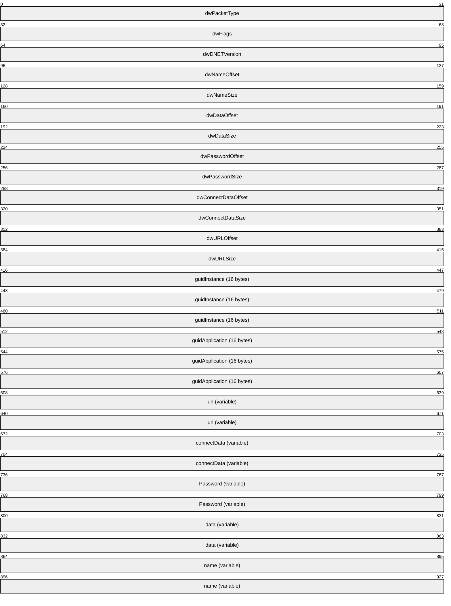
```mermaid
packet-beta
  0-31: "dwPacketType"
  32-63: "dwFlags"
  64-95: "dwDNETVersion"
  96-127: "dwNameOffset"
  128-159: "dwNameSize"
  160-191: "dwDataOffset"
  192-223: "dwDataSize"
  224-255: "dwPasswordOffset"
  256-287: "dwPasswordSize"
  288-319: "dwConnectDataOffset"
  320-351: "dwConnectDataSize"
  352-383: "dwURLOffset"
  384-415: "dwURLSize"
  416-511: "guidInstance (16 bytes)"
  512-607: "guidApplication (16 bytes)"
  608-671: "url (variable)"
  672-735: "connectData (variable)"
  736-799: "Password (variable)"
  800-863: "data (variable)"
  864-927: "name (variable)"
```

**dwPacketType (4 bytes):** A 32-bit field that contains the packet type.

| Value | Meaning |
| --- | --- |
| DN_MSG_INTERNAL_PLAYER_CONNECT_INFO 0x000000C1 | Sends client/peer connection information to the server/host. |

**dwFlags (4 bytes):** A 32-bit field that specifies the connect flags.

| Value | Meaning |
| --- | --- |
| DP_OBECT_TYPE_CLIENT 0x00000002 | Connecting application is a client. |
| DN_OBJECT_TYPE_PEER 0x00000004 | Connecting application is a [**peer**](#gt_peer). |

**dwDNETVersion (4 bytes):** A 32-bit field that specifies the [**DirectPlay**](#gt_directplay) version.

| Value | Meaning |
| --- | --- |
| 0x00000001 | DirectX 8.0 |
| 0x00000002 | DirectX 8.1 |
| 0x00000003 | PocketPC |
| 0x00000004 | Not used |
| 0x00000005 | Windows Server 2003 operating system |
| 0x00000006 | DirectX 8.2 |

**dwNameOffset (4 bytes):** A 32-bit field that provides the offset from the end of **dwPacketType** of the connecting application's **name** field. If **dwNameOffset** is 0, the packet does not include name data.

**dwNameSize (4 bytes):** A 32-bit field that specifies the size, in bytes, of the data in the **name** field. If **dwNameOffset** is set to 0, **dwNameSize** SHOULD also be 0. If **dwNameOffset** is not 0, **dwNameSize** SHOULD also not be 0.

**dwDataOffset (4 bytes):** A 32-bit field that specifies the offset from the end of **dwPacketType** of the **data** field. If **dwNameOffset** is 0, the packet does not include application data.

**dwDataSize (4 bytes):** A 32-bit field that specifies the size, in bytes, of the **data** field. If **dwDataOffset** is set to 0, **dwDataSize** SHOULD also be 0. If **dwDataOffset** is not 0, **dwDataSize** SHOULD also not be 0.

**dwPasswordOffset (4 bytes):** A 32-bit field that specifies the offset from the end of **dwPacketType** of the **Password** field.

**dwPasswordSize (4 bytes):** A 32-bit field that specifies the size, in bytes, of the **Password** field. If **dwPasswordOffset** is set to 0, **dwPasswordSize** SHOULD also be 0. If **dwPasswordOffset** is not 0, **dwPasswordSize** SHOULD also not be 0.

**dwConnectDataOffset (4 bytes):** A 32-bit field that specifies the offset from the end of **dwPacketType** of the **connectData** field. If **dwConnectDataOffset** is 0, the packet does not include connection data.

**dwConnectDataSize (4 bytes):** A 32-bit field that specifies the size, in bytes, of the **connectData** field. If **dwConnectDataOffset** is 0, **dwConnectDataSize** SHOULD also be 0. If **dwConnectDataOffset** is not 0, **dwConnectDataSize** SHOULD also not be 0.

**dwURLOffset (4 bytes):** A 32-bit field that specifies the offset from the end of **dwPacketType** to the **url** field. If **dwURLOffset** is 0, the packet does not include the client URL. This URL represents the address of the client/peer that is connecting to the [**game session**](#gt_game-session).

**dwURLSize (4 bytes):** A 32-bit field that specifies the size, in bytes, of the **url** field. If **dwURLOffset** is 0, **dwURLSize** SHOULD also be 0. If **dwURLOffset** is not 0, **dwURLSize** SHOULD also not be 0.

**guidInstance (16 bytes):** A 128-bit field that contains the [**GUID**](#gt_globally-unique-identifier-guid) that identifies the particular instance of the server/host application to which the client/peer is attempting to connect. Each instance of a DirectPlay server/host application generates a new unique GUID each time the application hosts a new game session. In order for the client/peer to connect, the value of guidInstance MUST match the value of the GUID instance defined on the server/host or the value MUST be all zeroes. If a different, nonzero GUID instance value is specified, the recipient MUST send a [DN_CONNECT_FAILED](#Section_2.2.1.3) message with the result code DPNERR_INVALIDINSTANCE (0x80158380) and terminate the [MC-DPL8R](../MC-DPL8R/MC-DPL8R.md) connection. For information on how a client/peer retrieves the value of the GUID instance defined on the server/host, see the description of the **ApplicationInstanceGUID** field in the EnumResponse message defined in [MC-DPLHP](../MC-DPLHP/MC-DPLHP.md) section 2.2.2.

**guidApplication (16 bytes):** A 128-bit field that specifies the application's assigned GUID. This is the unique identifier for the specific application, not per instance.

**url (variable):** A variable-length field that contains a 0-terminated byte character array that specifies the client URL. This field's position is determined by **dwURLOffset** and the size stated in **dwURLSize**. It is defined in [DN_ADDRESSING_URL](#Section_2.2.8).

**connectData (variable):** A variable-length field that contains a byte array that provides the connection data. This field's position is determined by **dwConnectDataOffset** and the size stated in **dwConnectDataSize**.

**Password (variable):** A variable-length field that contains a 0-terminated [**wide character**](#gt_wide-characters) array that specifies the application password data. This field's position is determined by **dwPasswordOffset** and the size stated in **dwPasswordSize**. This data is passed in clear text to the protocol layer.

**data (variable):** A variable-length field that contains a byte array that specifies the application data. This field's position is determined by **dwDataOffset** and the size stated in **dwDataSize**.

**name (variable):** A variable-length field that contains a 0-terminated wide character array that specifies the client/peer name. This field's position is determined by **dwNameOffset** and the size stated in **dwNameSize**.

#### 2.2.1.2 DN_INTERNAL_MESSAGE_PLAYER_CONNECT_INFO_EX

This is the first message passed into a host/server to initiate the connect sequence.

**Note** This packet is an extended version of the [DN_INTERNAL_MESSAGE_PLAYER_CONNECT_INFO](#Section_2.2.1.1) packet for [**DirectPlay**](#gt_directplay) 9 that includes the **dwAlternateAddressDataOffset**, **dwAlternateAddressDataSize**, and **alternateAddressData** fields. If the value of the **dwDNETVersion** field is 7 or greater, the message is DN_INTERNAL_MESSAGE_PLAYER_CONNECT_INFO_EX; otherwise, if it is less than 7, the message is DN_INTERNAL_MESSAGE_PLAYER_CONNECT_INFO. The host/server has to recognize both messages, as clients/peers can send in either type of message depending on the client/peer version.

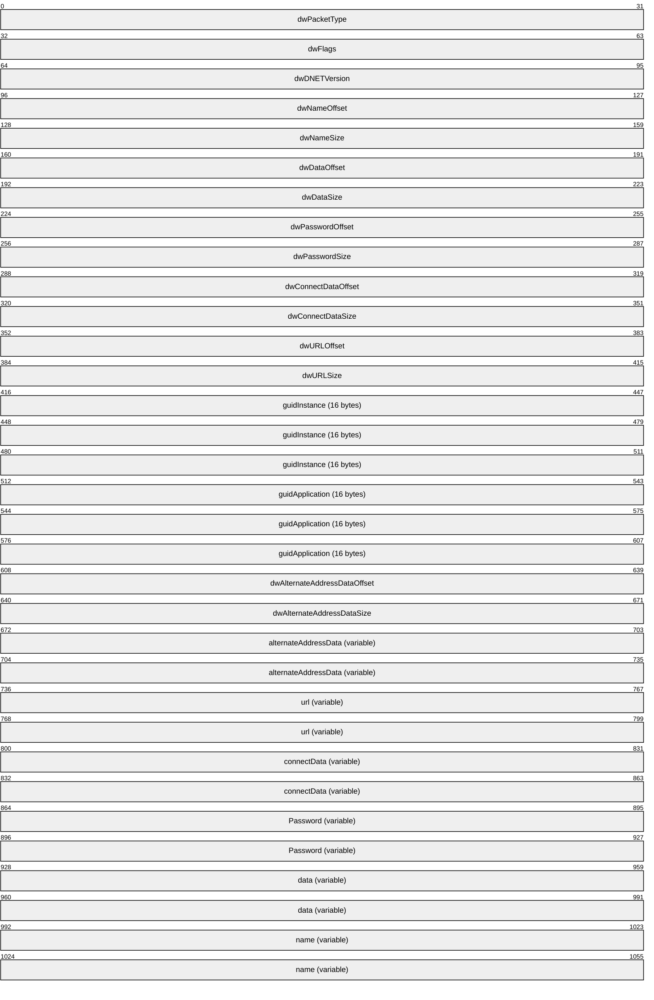
```mermaid
packet-beta
  0-31: "dwPacketType"
  32-63: "dwFlags"
  64-95: "dwDNETVersion"
  96-127: "dwNameOffset"
  128-159: "dwNameSize"
  160-191: "dwDataOffset"
  192-223: "dwDataSize"
  224-255: "dwPasswordOffset"
  256-287: "dwPasswordSize"
  288-319: "dwConnectDataOffset"
  320-351: "dwConnectDataSize"
  352-383: "dwURLOffset"
  384-415: "dwURLSize"
  416-511: "guidInstance (16 bytes)"
  512-607: "guidApplication (16 bytes)"
  608-639: "dwAlternateAddressDataOffset"
  640-671: "dwAlternateAddressDataSize"
  672-735: "alternateAddressData (variable)"
  736-799: "url (variable)"
  800-863: "connectData (variable)"
  864-927: "Password (variable)"
  928-991: "data (variable)"
  992-1055: "name (variable)"
```

**dwPacketType (4 bytes):** A 32-bit field that contains the packet type.

| Value | Meaning |
| --- | --- |
| DN_MSG_INTERNAL_PLAYER_CONNECT_INFO 0x000000C1 | Sends client/peer connection information to the server/host. |

**dwFlags (4 bytes):** A 32-bit field that specifies the connect flags.

| Value | Meaning |
| --- | --- |
| DP_OBECT_TYPE_CLIENT 0x00000002 | Connecting application is a client. |
| DN_OBJECT_TYPE_PEER 0x00000004 | Connecting application is a [**peer**](#gt_peer). |

**dwDNETVersion (4 bytes):** A 32-bit field that specifies the DirectPlay version.

| Value | Meaning |
| --- | --- |
| 0x00000007 | DirectX 9.0 |
| 0x00000008 | DirectX 9.0 |

**dwNameOffset (4 bytes):** A 32-bit field that provides the offset from the end of **dwPacketType** of the connecting application's **name** field. If **dwNameOffset** is 0, the packet does not include name data.

**dwNameSize (4 bytes):** A 32-bit field that specifies the size, in bytes, of the data in the **name** field. If **dwNameOffset** is set to 0, **dwNameSize** SHOULD also be 0. If **dwNameOffset** is not 0, **dwNameSize** SHOULD also not be 0.

**dwDataOffset (4 bytes):** A 32-bit field that specifies the offset from the end of **dwPacketType** of the **data** field. If **dwNameOffset** is 0, the packet does not include application data.

**dwDataSize (4 bytes):** A 32-bit field that specifies the size, in bytes, of the **data** field. If **dwDataOffset** is set to 0, **dwDataSize** SHOULD also be 0. If **dwDataOffset** is not 0, **dwDataSize** SHOULD also not be 0.

**dwPasswordOffset (4 bytes):** A 32-bit field that specifies the offset from the end of **dwPacketType** of the **Password** field.

**dwPasswordSize (4 bytes):** A 32-bit field that specifies the size, in bytes, of the password. If **dwPasswordOffset** is set to 0, **dwPasswordSize** SHOULD also be 0. If **dwPasswordOffset** is not 0, **dwPasswordSize** SHOULD also not be 0.

**dwConnectDataOffset (4 bytes):** A 32-bit field that specifies the offset from the end of **dwPacketType** of the **connectData** field. If **dwConnectDataOffset** is 0, the packet does not include connection data.

**dwConnectDataSize (4 bytes):** A 32-bit field that specifies the size, in bytes, of the **connectData** field. If **dwConnectDataOffset** is 0, **dwConnectDataSize** SHOULD also be 0. If **dwConnectDataOffset** is not 0, **dwConnectDataSize** SHOULD also not be 0.

**dwURLOffset (4 bytes):** A 32-bit field that specifies the offset from the end of **dwPacketType** to the **url** field. If **dwURLOffset** is 0, the packet does not include the client URL. This URL represents the address of the client/peer that is connecting to the [**game session**](#gt_game-session).

**dwURLSize (4 bytes):** A 32-bit field that specifies the size, in bytes, of the **url** field. If **dwURLOffset** is 0, **dwURLSize** SHOULD also be 0. If **dwURLOffset** is not 0, **dwURLSize** SHOULD also not be 0.

**guidInstance (16 bytes):** A 128-bit field that contains the [**GUID**](#gt_globally-unique-identifier-guid) that identifies the particular instance of the server/host application to which the client/peer is attempting to connect. Each instance of a DirectPlay server/host application generates a new unique GUID each time the application hosts a new game session. In order for the client/peer to connect, the value of **guidInstance** MUST match the value of the GUID instance defined on the server/host or the value MUST be all zeroes. If a different, nonzero GUID instance value is specified, the recipient MUST send a [DN_CONNECT_FAILED](#Section_2.2.1.3) message with the result code DPNERR_INVALIDINSTANCE (0x80158380) and terminate the [MC-DPL8R](../MC-DPL8R/MC-DPL8R.md) connection. For information on how a client/peer retrieves the value of the GUID instance defined on the server/host, see the description of the **ApplicationInstanceGUID** field in the EnumResponse message defined in [MC-DPLHP](../MC-DPLHP/MC-DPLHP.md) section 2.2.2.

**guidApplication (16 bytes):** A 128-bit field that specifies the application's assigned GUID. This is the unique identifier for the specific application, not per instance.

**dwAlternateAddressDataOffset (4 bytes):** A 32-bit field that specifies the offset from the end of **dwPacketType** to the **alternateAddressData** field. If **dwAlternateAddressDataOffset** is 0, the packet does not include the alternate address data.

**dwAlternateAddressDataSize (4 bytes):** A 32-bit field that specifies the size, in bytes, of the **alternateAddressData** field. If **dwAlternateAddressDataOffset** is set to 0, **dwAlternateAddressDataSize** SHOULD also be 0. If **dwAlternateAddressDataOffset** is not 0, **dwAlternateAddressDataSize** SHOULD also not be 0.

**alternateAddressData (variable):** A variable-length field that specifies alternative address data used to connect the client. This field's position is determined by **dwAlternateAddressDataOffset** and the size stated in **dwAlternateAddressDataSize**. The addresses that are passed into the **alternateAddressData** field are formatted via the [DN_ALTERNATE_ADDRESS](#Section_2.2.9) structure. Because DN_ALTERNATE_ADDRESS contains its own size, multiple alternate addresses can be passed in by appending the DN_ALTERNATE_ADDRESS structures together. However, the maximum number of alternate addresses that can be passed in at a single time is limited to 12.

**url (variable):** A variable-length field that contains a 0-terminated byte character array that specifies the client URL. This field's position is determined by **dwURLOffset** and the size stated in **dwURLSize**. It is defined in [DN_ADDRESSING_URL](#Section_2.2.8).

**connectData (variable):** A variable-length field that contains a byte array that provides the connection data. This field's position is determined by **dwConnectDataOffset** and the size stated in **dwConnectDataSize**.

**Password (variable):** A variable-length field that contains a 0-terminated [**wide character**](#gt_wide-characters) array that specifies the application password data. This field's position is determined by **dwPasswordOffset** and the size stated in **dwPasswordSize**. This data is passed in clear text to the protocol layer.

**data (variable):** A variable-length field that contains a byte array that specifies the application data. This field's position is determined by **dwDataOffset** and the size stated in **dwDataSize**.

**name (variable):** A variable-length field that contains a 0-terminated wide character array that specifies the client/peer name. This field's position is determined by **dwNameOffset** and the size stated in **dwNameSize**.

#### 2.2.1.3 DN_CONNECT_FAILED

The DN_CONNECT_FAILED packet indicates that a connection attempt failed.

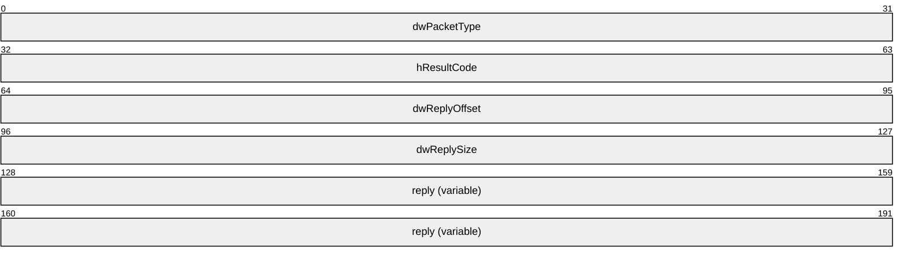
```mermaid
packet-beta
  0-31: "dwPacketType"
  32-63: "hResultCode"
  64-95: "dwReplyOffset"
  96-127: "dwReplySize"
  128-191: "reply (variable)"
```

**dwPacketType (4 bytes):** A 32-bit field that contains the packet type.

| Value | Meaning |
| --- | --- |
| DN_MSG_INTERNAL_CONNECT_FAILED 0x000000C5 | Connection attempt failed. |

**hResultCode (4 bytes):** A 32-bit field that contains the failure code.

| Value | Meaning |
| --- | --- |
| DPNERR_ALREADYCLOSING 0x80158050 | Server/host is closing or host is migrating. |
| DPNERR_NOTHOST 0x80158530 | Attempting to connect to an application that is not the host/server. |
| DPNERR_INVALIDINTERFACE 0x80158390 | Nonclient attempting to connect to a server. Nonpeer attempting to connect to a host/peer. |
| DPNERR_INVALIDVERSION 0x80158460 | Version passed in is not a valid [**DirectPlay**](#gt_directplay) version. |
| DPNERR_INVALIDINSTANCE 0x80158380 | Instance [**GUID**](#gt_globally-unique-identifier-guid) is not valid for this [**game session**](#gt_game-session). |
| DPNERR_INVALIDAPPLICATION 0x80158300 | Application GUID is not valid for this application. |
| DPNERR_INVALIDPASSWORD 0x80158410 | Password passed in does not match what is expected. |
| DPNERR_HOSTREJECTEDCONNECTION 0x80158260 | Application declined connection attempt. |
| DPNERR_GENERIC 0x80004005 | An undetermined error occurred inside a [**DirectX**](#gt_directx) subsystem. This includes uncommon errors that cannot be generalized. |

**dwReplyOffset (4 bytes):** A 32-bit field that specifies the offset from the end of **dwPacketType** to the **reply** field. If **dwReplyOffset** is 0, there is no reply data.

**dwReplySize (4 bytes):** A 32-bit field that specifies the size, in bytes, of the data in the **reply** field. If **dwReplyOffset** is 0, **dwReplySize** SHOULD also be 0. If **dwReplyOffset** is not 0, **dwReplySize** SHOULD also not be 0.

**reply (variable):** A variable-length field that contains an array of bytes that provides a reply message from the application identifying the connection failure. Reply data is only expected when the failure type is **DPNERR_HOSTREJECTEDCONNECTION**.

#### 2.2.1.4 DN_SEND_CONNECT_INFO

The DN_SEND_CONNECT_INFO packet is sent from the host/server indicating to the connecting peer/client that it has joined the [**game session**](#gt_game-session).

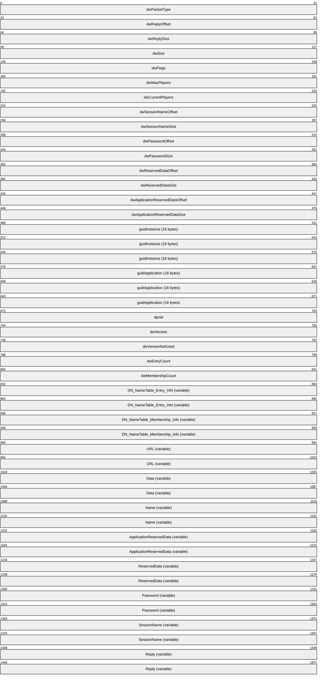
```mermaid
packet-beta
  0-31: "dwPacketType"
  32-63: "dwReplyOffset"
  64-95: "dwReplySize"
  96-127: "dwSize"
  128-159: "dwFlags"
  160-191: "dwMaxPlayers"
  192-223: "dwCurrentPlayers"
  224-255: "dwSessionNameOffset"
  256-287: "dwSessionNameSize"
  288-319: "dwPasswordOffset"
  320-351: "dwPasswordSize"
  352-383: "dwReservedDataOffset"
  384-415: "dwReservedDataSize"
  416-447: "dwApplicationReservedDataOffset"
  448-479: "dwApplicationReservedDataSize"
  480-575: "guidInstance (16 bytes)"
  576-671: "guidApplication (16 bytes)"
  672-703: "dpnid"
  704-735: "dwVersion"
  736-767: "dwVersionNotUsed"
  768-799: "dwEntryCount"
  800-831: "dwMembershipCount"
  832-895: "DN_NameTable_Entry_Info (variable)"
  896-959: "DN_NameTable_Membership_Info (variable)"
  960-1023: "URL (variable)"
  1024-1087: "Data (variable)"
  1088-1151: "Name (variable)"
  1152-1215: "ApplicationReservedData (variable)"
  1216-1279: "ReservedData (variable)"
  1280-1343: "Password (variable)"
  1344-1407: "SessionName (variable)"
  1408-1471: "Reply (variable)"
```

**dwPacketType (4 bytes):** A 32-bit integer that indicates the packet type.

| Value | Meaning |
| --- | --- |
| DN_MSG_INTERNAL_SEND_CONNECT_INFO 0x000000C2 | The server/host response to a client/peer that contains game session information. |

**dwReplyOffset (4 bytes):** A 32-bit field that specifies the offset in bytes from the end of **dwPacketType** of the **reply** field. If **dwReplyOffset** is 0, the packet does not include a reply.

**dwReplySize (4 bytes):** A 32-bit field that specifies the size, in bytes, of the **reply** field. If **dwReplyOffset** is set to 0, **dwReplySize** MUST be 0. If **dwReplyOffset** is not 0, **dwReplySize** MUST NOT be 0.

**dwSize (4 bytes):** A 32-bit field that specifies the size, in bytes, of the application description information. This includes all fields starting with **dwSize** through **guidApplication**.

**dwFlags (4 bytes):** A 32-bit integer that specifies the application flags.

| Value | Meaning |
| --- | --- |
| DPNSESSION_CLIENT_SERVER 0x00000001 | A client/server game session. |
| DPNSESSION_MIGRATE_HOST 0x00000004 | [**Host migration**](#gt_host-migration) is allowed. |
| DPNSESSION_NODPNSVR 0x00000040 | The [**DirectPlay**](#gt_directplay) enumeration server is not running. |
| DPNSESSION_REQUIREPASSWORD 0x00000080 | Password is REQUIRED. |
| DPNSESSION_NOENUMS 0x00000100 | No enumerations are allowed from the game session. This value is only available in DirectPlay 9. |
| DPNSESSION_FAST_SIGNED 0x00000200 | Fast signing is turned on for the game session. Passed to protocol layer. Cannot be used with **DPNSESSION_FULL_SIGNED**. This value is available only in DirectPlay 9. |
| DPNSESSION_FULL_SIGNED 0x00000400 | Full signing turned on for the game session. Passed to protocol layer. Cannot be used with **DPNSESSION_FAST_SIGNED**. This value is available only in DirectPlay 9. |

**dwMaxPlayers (4 bytes):** A 32-bit integer that specifies the maximum number of clients/peers allowed in the game session. A value of 0 indicates that the maximum number of [**players**](#gt_player) is not specified.

**dwCurrentPlayers (4 bytes):** A 32-bit integer that specifies the current number of clients/peers in the game session.

**dwSessionNameOffset (4 bytes):** A 32-bit field that specifies the offset in bytes from the end of **dwPacketType** to the **sessionName** field. If **dwSessionNameOffset** is 0, the packet does not include a game session name.

**dwSessionNameSize (4 bytes):** A 32-bit field that specifies the size, in bytes, of the **sessionName** field. If **dwSessionNameOffset** is 0, **dwSessionNameSize** MUST be 0. If **dwSessionNameOffset** is not 0, **dwSessionNameSize** MUST NOT be 0.

**dwPasswordOffset (4 bytes):** A 32-bit field that specifies the offset, in bytes, from the end of **dwPacketType** to the start of the password. If **dwPasswordOffset** is 0, the packet does not include a password.

**dwPasswordSize (4 bytes):** A 32-bit field that specifies the size, in bytes, of the password. If **dwPasswordOffset** is 0, **dwPasswordSize** MUST be 0. If **dwPasswordOffset** is not 0, **dwPasswordSize** MUST NOT be 0.

**dwReservedDataOffset (4 bytes):** A 32-bit field that specifies the offset, in bytes, from the end of **dwPacketType** to the **reservedData** field. If **dwReservedDataOffset** is 0, the packet does not include reserved data.

**dwReservedDataSize (4 bytes):** A 32-bit field that specifies the size, in bytes, of the **reservedData** field. If **dwReservedDataOffset** is 0, **dwReservedDataSize** MUST be 0. If **dwReservedDataOffset** is not 0, **dwReservedDataSize** MUST NOT be 0.

**dwApplicationReservedDataOffset (4 bytes):** A 32-bit field that specifies the offset, in bytes, from the end of **dwPacketType** to the **applicationReservedData** field. If **dwApplicationReservedDataOffset** is 0, the packet does not include application reserved data.

**dwApplicationReservedDataSize (4 bytes):** A 32-bit field that specifies the size, in bytes, of the **applicationReservedData** field. If **dwApplicationReservedDataOffset** is 0, **dwApplicationReservedDataSize** MUST also be 0. If **dwApplicationReservedDataOffset** is not 0, **dwApplicationReservedDataSize** MUST NOT be 0.

**guidInstance (16 bytes):** A 128-bit field that contains the [**GUID**](#gt_globally-unique-identifier-guid) that identifies the particular instance of the server/host application. The value of this field implicitly SHOULD match the value of the **guidInstance** field specified in the [DN_INTERNAL_MESSAGE_PLAYER_CONNECT_INFO](#Section_2.2.1.1) or [DN_INTERNAL_MESSAGE_PLAYER_CONNECT_INFO_EX](#Section_2.2.1.2) message, unless that field contained all zeroes, in which case this **guidInstance** value informs the receiving client of the actual game session instance GUID.

**guidApplication (16 bytes):** The application GUID as defined by the host/server.

**dpnid (4 bytes):** A 32-bit integer created by the server/host that provides the identifier for the new client joining the game session. For more information, see [DN_DPNID](#Section_2.2.7).

**dwVersion (4 bytes):** A 32-bit integer that specifies the current [**name table**](#gt_name-table) version.

**dwVersionNotUsed (4 bytes):** Not used.

**dwEntryCount (4 bytes):** A 32-bit integer that provides the number of entries in the name table contained in the [DN_NAMETABLE_ENTRY_INFO](#Section_2.2.1.5) field below. These are in essence players in the game session.

**dwMembershipCount (4 bytes):** A 32-bit integer that provides the number of memberships in the name table contained in the [DN_NAMETABLE_MEMBERSHIP_INFO](#Section_2.2.1.6) field below. These are in essence player to [**group**](#gt_group) combinations.

**DN_NameTable_Entry_Info (variable):** This field contains a variable-length array of DN_NAMETABLE_ENTRY_INFO structures. The length of this array is described above in the **dwEntryCount** field. Each entry in this array describes a player or group in the game session. In peer-to-peer mode, the [**host**](#gt_host) MUST transmit entries for all existing participants and the new participant. In [**client/server mode**](#gt_clientserver-mode), the server MUST transmit only two entries: one for the server player and one for the new participant.

**DN_NameTable_Membership_Info (variable):** This field contains a variable-length array of DN_NAMETABLE_MEMBERSHIP_INFO structures. The length of this array is described above in the **dwMembershipCount** field. Each entry in this array describes a player/group combination.

**URL (variable):** A variable-length field that contains a 0-terminated character array that provides the URL of a user in the game session. This field's position is determined by **dwURLOffset** and the size stated in **dwURLSize**, both fields in the corresponding DN_NAMETABLE_ENTRY_INFO structure. There can be multiple instances of the URL field, as defined by the number of DN_NAMETABLE_ENTRY_INFO sections that are included.

**Data (variable):** A variable-length field that contains a 0-terminated character array that specifies the user data. This field's position is determined by **dwDataOffset** and the size stated in **dwDataSize**, both fields in the corresponding DN_NAMETABLE_ENTRY_INFO structure. There can be multiple instances of the Data field, as defined by the number of DN_NAMETABLE_ENTRY_INFO sections that are included.

**Name (variable):** A variable-length field that contains a 0-terminated [**wide character**](#gt_wide-characters) array that contains the client name. This field's position is determined by **dwNameOffset** and the size stated in **dwNameSize**, both fields in the corresponding DN_NAMETABLE_ENTRY_INFO structure. There can be multiple instances of the Name field, as defined by the number of DN_NAMETABLE_ENTRY_INFO sections that are included.

**ApplicationReservedData (variable):** A variable-length field that contains a 0-terminated character array that specifies the application reserved data. This field's position is determined by **dwApplicationReservedDataOffset** and the size stated in **dwApplicationReservedDataSize**.

**ReservedData (variable):** A variable-length field that contains a byte array that provides the reserved data. This field's position is determined by **dwReservedDataOffset** and the size stated in **dwReservedDataSize**.

**Password (variable):** A variable-length field that contains a 0-terminated wide character array that specifies the application password data. This field's position is determined by **dwPasswordOffset** and the size stated in **dwPasswordSize**. This data is passed in clear text to the protocol layer.

**SessionName (variable):** A variable-length field that contains a 0-terminated wide character array that specifies the game session name. This field's position is determined by **dwSessionNameOffset** and the size stated in **dwSessionNameSize**.

**Reply (variable):** A variable-length field that contains a byte array that provides the reply. This field's position is determined by **dwReplyOffset** and the size stated in **dwReplySize**.

#### 2.2.1.5 DN_NAMETABLE_ENTRY_INFO

The DN_NAMETABLE_ENTRY_INFO contains a [**player**](#gt_player) or [**group**](#gt_group) that exists in a [**DirectPlay 8**](#gt_directplay-8) [**name table**](#gt_name-table). This includes all the information that the DirectPlay 8 Protocol: Core and Service Providers would need about a certain entry.

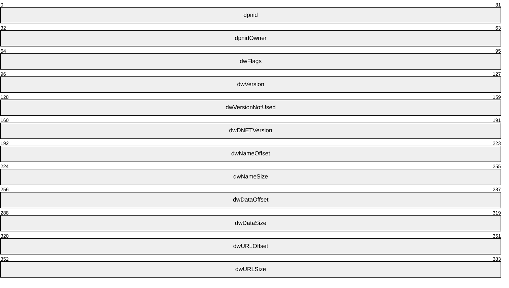
```mermaid
packet-beta
  0-31: "dpnid"
  32-63: "dpnidOwner"
  64-95: "dwFlags"
  96-127: "dwVersion"
  128-159: "dwVersionNotUsed"
  160-191: "dwDNETVersion"
  192-223: "dwNameOffset"
  224-255: "dwNameSize"
  256-287: "dwDataOffset"
  288-319: "dwDataSize"
  320-351: "dwURLOffset"
  352-383: "dwURLSize"
```

**dpnid (4 bytes):** A 32-bit integer that specifies the [**DirectPlay**](#gt_directplay) identifier ([**DPNID**](#gt_dpnid)) of the player or group that has been defined by the host/server. For more information about DPNIDs, see section [2.2.7](#Section_2.2.7).

**dpnidOwner (4 bytes):** A 32-bit integer that provides the DirectPlay identifier (DPNID) for the owner of the player or group. When the DN_NAMETABLE_ENTRY_INFO message represents a group, that is, **NAMETABLE_ENTRY_FLAG_GROUP** is set in the **dwFlags** field, the **dpnidOwner** field MUST be nonzero. When DN_NAMETABLE_ENTRY_INFO represents a player, **dpnidOwner** SHOULD be set to zero when sending and MUST be ignored on receipt. For more information about DPNIDs, see section 2.2.7.

**dwFlags (4 bytes):** A 32-bit integer that specifies the [**name table entry**](#gt_name-table-entry) flags. Entries are OR'd together.

| Value | Meaning |
| --- | --- |
| NAMETABLE_ENTRY_FLAG_LOCAL 0x00000001 | The name table entry is the local player. |
| NAMETABLE_ENTRY_FLAG_HOST 0x00000002 | The name table entry is the host. |
| NAMETABLE_ENTRY_FLAG_ALL_PLAYERS_GROUP 0x00000004 | The name table entry is the All Players Group. |
| NAMETABLE_ENTRY_FLAG_GROUP 0x00000010 | The name table entry is a group. |
| NAMETABLE_ENTRY_FLAG_GROUP_AUTODESTRUCT 0x00000040 | The name table entry supports group autodestruct. |
| NAMETABLE_ENTRY_FLAG_PEER 0x00000100 | The name table entry is a peer. In peer-to-peer mode, the name table entry representing the host of the game session is also marked as a peer. |
| NAMETABLE_ENTRY_FLAG_CLIENT 0x00000200 | The name table entry is a client. |
| NAMETABLE_ENTRY_FLAG_SERVER 0x00000400 | The name table entry is a server. |
| NAMETABLE_ENTRY_FLAG_CONNECTING 0x00001000 | The name table entry is connecting. |
| NAMETABLE_ENTRY_FLAG_AVAILABLE 0x00002000 | The name table entry is to make the member available for use. |
| NAMETABLE_ENTRY_FLAG_DISCONNECTING 0x00004000 | The name table entry to indicate disconnecting. |
| NAMETABLE_ENTRY_FLAG_INDICATED 0x00010000 | The name table entry to indicate connection to the application. |
| NAMETABLE_ENTRY_FLAG_CREATED 0x00020000 | The name table entry to indicate the application was given a created player. |
| NAMETABLE_ENTRY_FLAG_NEED_TO_DESTROY 0x00040000 | The name table entry to indicate the need to destroy the player. |
| NAMETABLE_ENTRY_FLAG_IN_USE 0x00080000 | The name table entry to indicate that the player is in use. |

**dwVersion (4 bytes):** A 32-bit integer that specifies the version number of the name table.

**dwVersionNotUsed (4 bytes):** Not used.

**dwDNETVersion (4 bytes):** A 32-bit integer that provides the DirectPlay version.

| Value | Meaning |
| --- | --- |
| 0x00000001 | [**DirectX**](#gt_directx) 8.0 |
| 0x00000002 | DirectX 8.1 |
| 0x00000003 | PocketPC |
| 0x00000004 | Not used. |
| 0x00000005 | Windows Server 2003 |
| 0x00000006 | DirectX 8.2 |
| 0x00000007 | DirectX 9.0 |
| 0x00000008 | DirectX 9.0 |

**dwNameOffset (4 bytes):** The offset, in bytes, from the end of **dwPacketType** to the **name** field. (Defined in [DN_SEND_CONNECT_INFO](#Section_2.2.1.4)). If **dwNameOffset** is 0, there is not a name.

**dwNameSize (4 bytes):** The size, in bytes, of the **name** field. (Specified in section 2.2.1.4). If **dwNameOffset** is 0, **dwNameSize** SHOULD also be 0. If **dwNameOffset** is not 0, **dwNameSize** SHOULD also not be 0.

**dwDataOffset (4 bytes):** The offset, in bytes, from the end of **dwPacketType** to the **data** field. If **dwDataOffset** is 0, there is no additional data.

**dwDataSize (4 bytes):** The size, in bytes, of the **data** field. If **dwDataOffset** is 0, **dwDataSize** SHOULD also be 0. If **dwDataOffset** is not 0, **dwDataSize** SHOULD also not be 0.

**dwURLOffset (4 bytes):** The offset, in bytes, from the end of **dwPacketType** to the **url** field. Specified in section [2.2.8](#Section_2.2.8)).

**dwURLSize (4 bytes):** The size, in bytes, of the **url** field.

#### 2.2.1.6 DN_NAMETABLE_MEMBERSHIP_INFO

The DN_NAMETABLE_MEMBERSHIP_INFO structure contains information about a [**name table's**](#gt_name-table) [**group**](#gt_group) and [**player**](#gt_player) memberships. The number of DN_NAMETABLE_MEMBERSHIP_INFO structures in this packet is specified in the **dwMembershipCount** field.

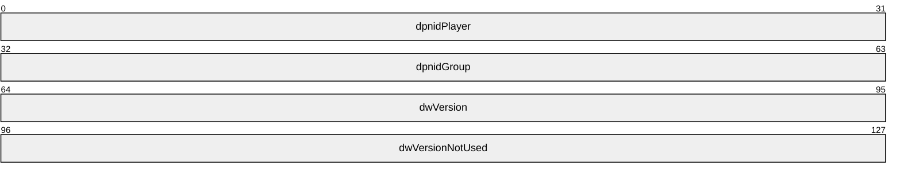
```mermaid
packet-beta
  0-31: "dpnidPlayer"
  32-63: "dpnidGroup"
  64-95: "dwVersion"
  96-127: "dwVersionNotUsed"
```

**dpnidPlayer (4 bytes):** A 32-bit integer that specifies the [**DirectPlay**](#gt_directplay) identifier for the user. For more information, see section [2.2.7](#Section_2.2.7).

**dpnidGroup (4 bytes):** A 32-bit integer that provides the DirectPlay identifier for the group. For more information, see section 2.2.7.

**dwVersion (4 bytes):** A 32-bit integer that specifies the name table version.

**dwVersionNotUsed (4 bytes):** Not used.

#### 2.2.1.7 DN_ADD_PLAYER (Peer-to-Peer Mode Only)

The DN_ADD_PLAYER packet is sent from the [**host**](#gt_host) and instructs [**peers**](#gt_peer) to add a specified peer to the [**game session**](#gt_game-session).

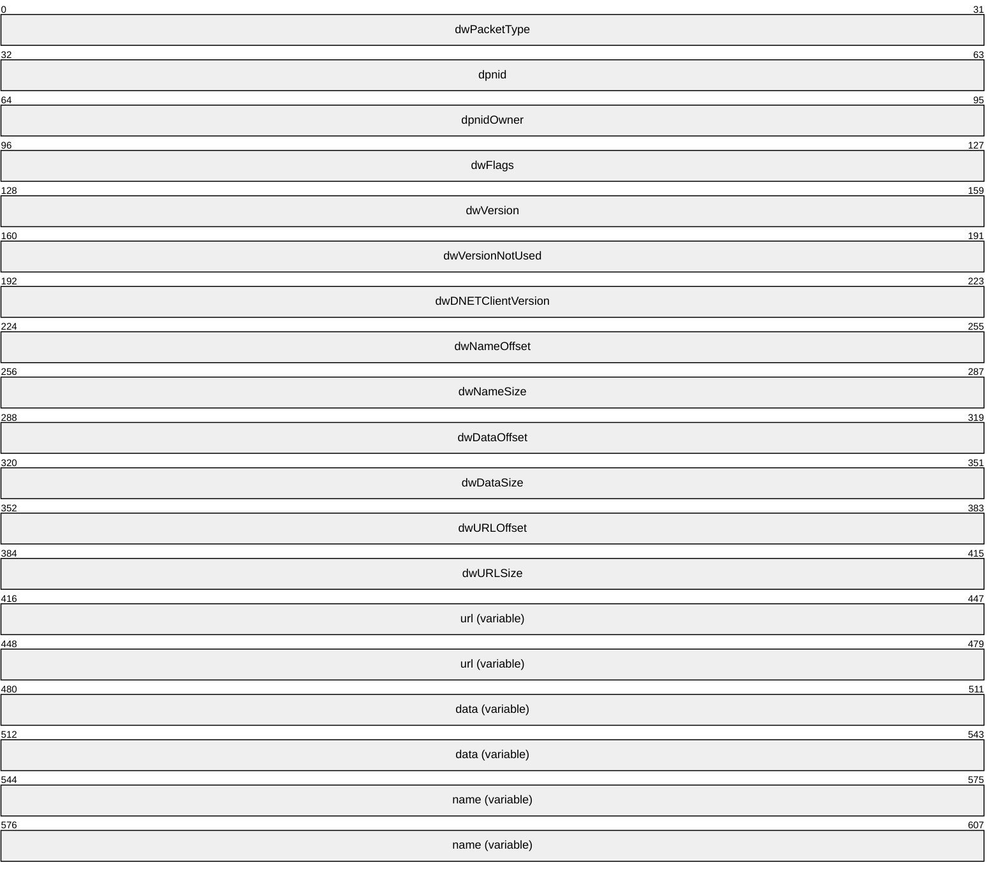
```mermaid
packet-beta
  0-31: "dwPacketType"
  32-63: "dpnid"
  64-95: "dpnidOwner"
  96-127: "dwFlags"
  128-159: "dwVersion"
  160-191: "dwVersionNotUsed"
  192-223: "dwDNETClientVersion"
  224-255: "dwNameOffset"
  256-287: "dwNameSize"
  288-319: "dwDataOffset"
  320-351: "dwDataSize"
  352-383: "dwURLOffset"
  384-415: "dwURLSize"
  416-479: "url (variable)"
  480-543: "data (variable)"
  544-607: "name (variable)"
```

**dwPacketType (4 bytes):** A 32-bit field that contains the packet type.

| Value | Meaning |
| --- | --- |
| DN_MSG_INTERNAL_ADD_PLAYER 0x000000D0 | Instructs peers to add the specified peer to the game session. |

**dpnid (4 bytes):** A 32-bit field that contains the identifier of the peer to add. For more information, see section [2.2.7](#Section_2.2.7).

**dpnidOwner (4 bytes):** A 32-bit field that contains the identifier of the game session owner. For more information, see section 2.2.7.

**dwFlags (4 bytes):** A 32-bit field that contains player flags.

| Value | Meaning |
| --- | --- |
| NAMETABLE_ENTRY_FLAG_LOCAL 0x00000001 | [**name table entry**](#gt_name-table-entry) is the local player. |
| NAMETABLE_ENTRY_FLAG_HOST 0x00000002 | Name table entry is the host. |
| NAMETABLE_ENTRY_FLAG_ALL_PLAYERS_GROUP 0x00000004 | Name table entry is the All Players Group. |
| NAMETABLE_ENTRY_FLAG_GROUP 0x00000010 | Name table entry is a group. |
| NAMETABLE_ENTRY_FLAG_GROUP_AUTODESTRUCT 0x00000040 | Name table entry supports group autodestruct. |
| NAMETABLE_ENTRY_FLAG_PEER 0x00000100 | Name table entry is a peer. |
| NAMETABLE_ENTRY_FLAG_CLIENT 0x00000200 | Name table entry is a client. |
| NAMETABLE_ENTRY_FLAG_SERVER 0x00000400 | Name table entry is a server. |
| NAMETABLE_ENTRY_FLAG_CONNECTING 0x00001000 | Name table entry is connecting. |
| NAMETABLE_ENTRY_FLAG_AVAILABLE 0x00002000 | Name table entry is to make member available for use. |
| NAMETABLE_ENTRY_FLAG_DISCONNECTING 0x00004000 | Name table entry to indicate disconnecting. |
| NAMETABLE_ENTRY_FLAG_INDICATED 0x00010000 | Name table entry to indicate connection to an application. |
| NAMETABLE_ENTRY_FLAG_CREATED 0x00020000 | Name table entry to indicate that the application was given the created player. |
| NAMETABLE_ENTRY_FLAG_NEED_TO_DESTROY 0x00040000 | Name table entry to indicate that the game session owner needs to destroy a player. |
| NAMETABLE_ENTRY_FLAG_IN_USE 0x00080000 | Name table entry to indicate that the player is in use. |

**dwVersion (4 bytes):** A 32-bit field that specifies the current name table version number.

**dwVersionNotUsed (4 bytes):** Not used.

**dwDNETClientVersion (4 bytes):** A 32-bit field that contains the [**DirectPlay**](#gt_directplay) version of the client being added to the game session.

| Value | Meaning |
| --- | --- |
| 0x00000001 | [**DirectX**](#gt_directx) 8.0 |
| 0x00000002 | DirectX 8.1 |
| 0x00000003 | PocketPC |
| 0x00000004 | Not used |
| 0x00000005 | Windows Server 2003 |
| 0x00000006 | DirectX 8.2 |
| 0x00000007 | DirectX 9.0 |
| 0x00000008 | DirectX 9.0 |

**dwNameOffset (4 bytes):** A 32-bit field that contains the offset from the end of **dwPacketType** to the peer name. If this field is 0, the packet does not include the peer name.

**dwNameSize (4 bytes):** A 32-bit field that specifies the size, in bytes, of the name. If **dwNameOffset** is 0, **dwNameSize** SHOULD also be 0. If **dwNameOffset** is not 0, **dwNameSize** SHOULD also not be 0.

**dwDataOffset (4 bytes):** A 32-bit field that contains the offset from the end of **dwPacketType** to peer data. If this field is 0, the packet does not include peer data.

**dwDataSize (4 bytes):** A 32-bit field that specifies the size, in bytes, of the peer data. If **dwDataOffset** is 0, **dwDataSize** SHOULD also be 0. If **dwDataOffset** is not 0, **dwDataSize** SHOULD also not be 0.

**dwURLOffset (4 bytes):** A 32-bit field that contains the offset from the end of **dwPacketType** to the peer URL.

**dwURLSize (4 bytes):** A 32-bit field that specifies the size, in bytes, of the connecting peer's URL address.

**url (variable):** A variable-length field that contains an array of characters that specify the client URL.

**data (variable):** A variable-length field that specifies a byte array of characters that contain user data.

**name (variable):** A variable-length field that specifies an array of [**wide characters**](#gt_wide-characters) that contain the peer name including the NULL termination character.

#### 2.2.1.8 DN_ACK_CONNECT_INFO

The DN_ACK_CONNECT_INFO packet is sent from the client/peer to the server/host to [**acknowledge**](#gt_acknowledgment-ack) the receipt of connection information. This packet contains no user data beyond the packet type field.

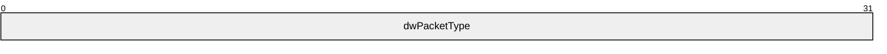
```mermaid
packet-beta
  0-31: "dwPacketType"
```

**dwPacketType (4 bytes):** A 32-bit field that contains the packet type.

| Value | Meaning |
| --- | --- |
| DN_MSG_INTERNAL_ACK_CONNECT_INFO 0x000000C3 | Acknowledges (ACK) the receipt of [**game session**](#gt_game-session) information. |

#### 2.2.1.9 DN_INSTRUCT_CONNECT

The DN_INSTRUCT_CONNECT packet instructs a peer to connect to a designated peer. This packet uses the CONNECT and CONNECTED packets defined in [MC-DPL8R](../MC-DPL8R/MC-DPL8R.md) sections 2.2.1.1 and 2.2.1.2. For an example of the message sequence for these packets, see [MC-DPL8R] section 4.1.

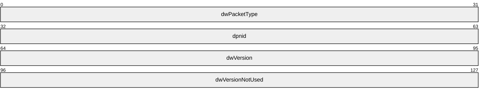
```mermaid
packet-beta
  0-31: "dwPacketType"
  32-63: "dpnid"
  64-95: "dwVersion"
  96-127: "dwVersionNotUsed"
```

**dwPacketType (4 bytes):** A 32-bit field that contains the packet type.

| Value | Meaning |
| --- | --- |
| DN_MSG_INTERNAL_INSTRUCT_CONNECT 0x000000C6 | Instructs a peer to connect to a designated peer. |

**dpnid (4 bytes):** A 32-bit field that contains the identifier of the designated client to which the connection is being made. For more information, see section [2.2.7](#Section_2.2.7).

**dwVersion (4 bytes):** A 32-bit field that contains the current version of the [**name table**](#gt_name-table).

**dwVersionNotUsed (4 bytes):** Not used.

#### 2.2.1.10 DN_SEND_PLAYER_DPNID

The DN_SEND_PLAYER_DPNID packet is used to send a user identification number to another client.

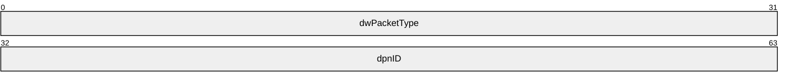
```mermaid
packet-beta
  0-31: "dwPacketType"
  32-63: "dpnID"
```

**dwPacketType (4 bytes):** A 32-bit field that contains the packet type.

| Value | Meaning |
| --- | --- |
| DN_MSG_INTERNAL_SEND_PLAYER_DNID 0x000000C4 | Sends user identification to another client/peer. |

**dpnID (4 bytes):** A 32-bit field that contains the identifier of the client/peer. For more information, see section [2.2.7](#Section_2.2.7).

#### 2.2.1.11 DN_INSTRUCTED_CONNECT_FAILED

The DN_INSTRUCTED_CONNECT_FAILED packet is sent from a peer to indicate that it was unable to carry out a host instruction to connect to a new peer.

```mermaid
packet-beta
  0-31: "dwPacketType"
  32-63: "dpnID"
```

**dwPacketType (4 bytes):** A 32-bit field that contains the packet type.

| Value | Meaning |
| --- | --- |
| DN_MSG_INTERNAL_INSTRUCTED_CONNECT_FAILED 0x000000C7 | Indicates that a peer was unable to carry out a host's instruction to connect to a new peer. |

**dpnID (4 bytes):** A 32-bit field that contains the identifier for the peer to which the attempted connection failed. For more information, see section [2.2.7](#Section_2.2.7).

#### 2.2.1.12 DN_CONNECT_ATTEMPT_FAILED

The DN_CONNECT_ATTEMPT_FAILED packet is sent from the [**host**](#gt_host) to a connecting [**peer**](#gt_peer) to indicate that an existing peer in the [**game session**](#gt_game-session) was unable to carry out the host's instruction to connect to a new peer.

```mermaid
packet-beta
  0-31: "dwPacketType"
  32-63: "dpnID"
```

**dwPacketType (4 bytes):** A 32-bit field that contains the packet type.

| Value | Meaning |
| --- | --- |
| DN_MSG_INTERNAL_CONNECT_ATTEMPT_FAILED 0x000000C8 | Indicates from the host that an existing peer was unable to carry out the host's instruction to connect to a new peer. |

**dpnID (4 bytes):** A 32-bit field that contains the identifier for the existing peer in the game session that was unable to connect to the new peer. For more information, see section [2.2.7](#Section_2.2.7).

### 2.2.2 Disconnect Messages

#### 2.2.2.1 DN_TERMINATE_SESSION

The DN_TERMINATE_SESSION packet instructs the client or the [**peer**](#gt_peer) to disconnect from the [**game session**](#gt_game-session).

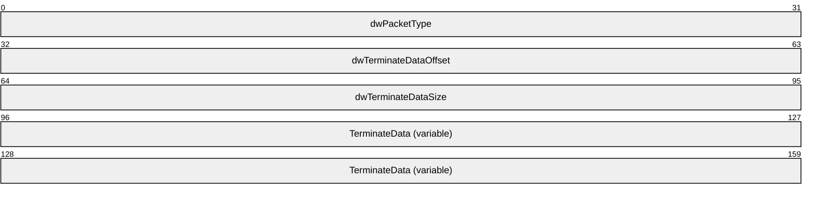
```mermaid
packet-beta
  0-31: "dwPacketType"
  32-63: "dwTerminateDataOffset"
  64-95: "dwTerminateDataSize"
  96-159: "TerminateData (variable)"
```

**dwPacketType (4 bytes):** A 32-bit field that contains the packet type.

| Value | Meaning |
| --- | --- |
| DN_MSG_INTERNAL_TERMINATE_SESSION 0x000000DF | Instructs the client or the peer to close and disconnect itself from the game session. |

**dwTerminateDataOffset (4 bytes):** A 32-bit field that contains the offset from the end of **dwPacketType** for the data passed from the server/host application that describes why the client or the peer is being terminated.

**dwTerminateDataSize (4 bytes):** A 32-bit field that contains the size, in bytes, of the terminate data. If **dwTerminateDataOffset** is 0, **dwTerminateDataSize** SHOULD also be 0. If **dwTerminateDataOffset** is not 0, **dwTerminateDataSize** SHOULD also not be 0.

**TerminateData (variable):** A variable-length field that contains a byte array from the application that describes why the client or the peer is being terminated from the game session.

#### 2.2.2.2 DN_DESTROY_PLAYER

The DN_DESTROY_PLAYER packet instructs the [**peer**](#gt_peer) to remove a specified user from its [**name table**](#gt_name-table).

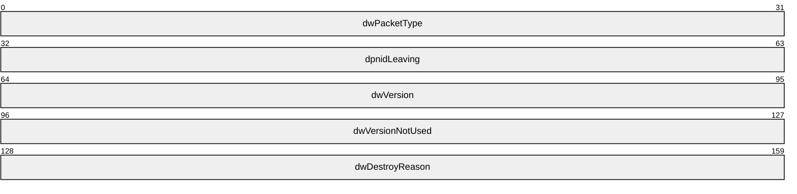
```mermaid
packet-beta
  0-31: "dwPacketType"
  32-63: "dpnidLeaving"
  64-95: "dwVersion"
  96-127: "dwVersionNotUsed"
  128-159: "dwDestroyReason"
```

**dwPacketType (4 bytes):** A 32-bit field that contains the packet type.

| Value | Meaning |
| --- | --- |
| DN_MSG_INTERNAL_DESTROY_PLAYER 0x000000D1 | Instructs the peer to remove the specified peer from the name table. |

**dpnidLeaving (4 bytes):** A 32-bit field that contains the identifier of the client or server to remove from the name table. For more information, see section [2.2.7](#Section_2.2.7).

**dwVersion (4 bytes):** A 32-bit field that contains the current name table version number.

**dwVersionNotUsed (4 bytes):** Not used.

**dwDestroyReason (4 bytes):** A 32-bit field that contains the reason for terminating the specified client or server.

| Value | Meaning |
| --- | --- |
| DPNDESTROYPLAYERREASON_NORMAL 0x0001 | Peer/host is leaving. |
| DPNDESTROYPLAYERREASON_CONNECTIONLOST 0x0002 | Connection to peer was lost. |
| DPNDESTROYPLAYERREASON_SESSIONTERMINATED 0x0003 | Game session was terminated. |
| DPNDESTROYPLAYERREASON_HOSTDESTROYEDPLAYER 0x0004 | Host removed the peer. |

#### 2.2.2.3 DN_HOST_MIGRATE

The DN_HOST_MIGRATE packet is sent from the new [**host**](#gt_host) to all remaining [**peers**](#gt_peer) in the [**game session**](#gt_game-session) to notify them that a migration is taking place.

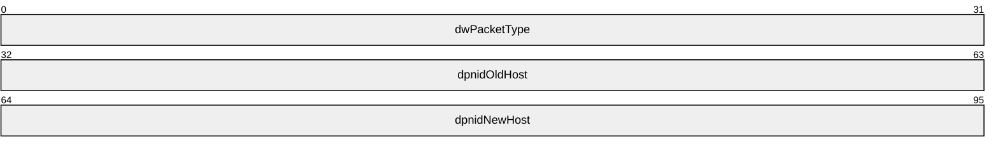
```mermaid
packet-beta
  0-31: "dwPacketType"
  32-63: "dpnidOldHost"
  64-95: "dpnidNewHost"
```

**dwPacketType (4 bytes):** A 32-bit field that contains the packet type.

| Value | Meaning |
| --- | --- |
| DN_MSG_INTERNAL_HOST_MIGRATE 0x000000CD | Notified peers in the game session that the host is currently migrating. |

**dpnidOldHost (4 bytes):** A 32-bit field that contains the identifier for the host that has just disconnected. For more information, see section [2.2.7](#Section_2.2.7).

**dpnidNewHost (4 bytes):** A 32-bit field that contains the identifier for the newly assigned host that is in the process of migrating. For more information, see section 2.2.7.

#### 2.2.2.4 DN_NAMETABLE_VERSION

The DN_NAMETABLE_VERSION packet specifies the version number of the [**name table**](#gt_name-table).

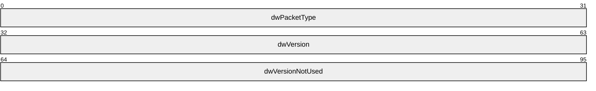
```mermaid
packet-beta
  0-31: "dwPacketType"
  32-63: "dwVersion"
  64-95: "dwVersionNotUsed"
```

**dwPacketType (4 bytes):** A 32-bit field that contains the packet type.

| Value | Meaning |
| --- | --- |
| DN_MSG_INTERNAL_NAMETABLE_VERSION 0x000000C9 | Specifies the version number of the name table. |

**dwVersion (4 bytes):** A 32-bit field that contains the current name table version number.

**dwVersionNotUsed (4 bytes):** Not used.

#### 2.2.2.5 DN_RESYNC_VERSION

The DN_RESYNC_VERSION packet is used to request that the [**name table**](#gt_name-table) version number be resynchronized to the current version number.

```mermaid
packet-beta
  0-31: "dwPacketType"
  32-63: "dwVersion"
  64-95: "dwVersionNotUsed"
```

**dwPacketType (4 bytes):** A 32-bit field that contains the packet type.

| Value | Meaning |
| --- | --- |
| DN_MSG_INTERNAL_RESYNC_VERSION 0x000000CA | Requests that the name table version number be resynchronized to the current version number. |

**dwVersion (4 bytes):** A 32-bit field that contains the current name table version number.

**dwVersionNotUsed (4 bytes):** Not used.

#### 2.2.2.6 DN_REQ_INTEGRITY_CHECK

The DN_REQ_INTEGRITY_CHECK packet requests that a [**host**](#gt_host) determine whether a target client is still in the [**game session**](#gt_game-session).

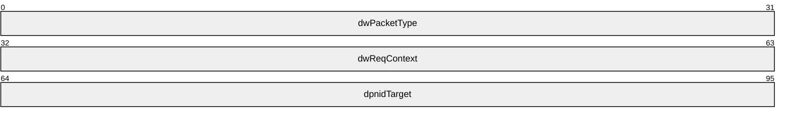
```mermaid
packet-beta
  0-31: "dwPacketType"
  32-63: "dwReqContext"
  64-95: "dpnidTarget"
```

**dwPacketType (4 bytes):** A 32-bit field that contains the packet type.

| Value | Meaning |
| --- | --- |
| DN_MSG_INTERNAL_REQ_INTEGRITY_CHECK 0x000000E2 | Requests that the host determine whether a target peer is still in the game session. |

**dwReqContext (4 bytes):** A 32-bit field that contains the context for the request operation. Values for the **dwReqContext** field SHOULD be ignored by the recipient.

**dpnidTarget (4 bytes):** A 32-bit field that contains the identifier of the selected target peer for the host to validate. For more information, see section [2.2.7](#Section_2.2.7).

#### 2.2.2.7 DN_INTEGRITY_CHECK

The DN_INTEGRITY_CHECK packet is a request from a [**host**](#gt_host) to a peer inquiring whether the peer is still in the [**game session**](#gt_game-session).

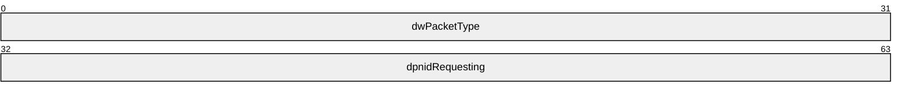
```mermaid
packet-beta
  0-31: "dwPacketType"
  32-63: "dpnidRequesting"
```

**dwPacketType (4 bytes):** A 32-bit field that contains the packet type.

| Value | Meaning |
| --- | --- |
| DN_MSG_INTERNAL_INTEGRITY_CHECK 0x000000E3 | Host is requesting a peer to validate that it is still in the game session. |

**dpnidRequesting (4 bytes):** A 32-bit field that contains the identifier of the [**peer**](#gt_peer) requesting this validation. For more information, see section [2.2.7](#Section_2.2.7).

#### 2.2.2.8 DN_INTEGRITY_CHECK_RESPONSE

The DN_INTEGRITY_CHECK_RESPONSE packet is a response from a peer to the host confirming that it is still in the [**game session**](#gt_game-session).

```mermaid
packet-beta
  0-31: "dwPacketType"
  32-63: "dpnidRequesting"
```

**dwPacketType (4 bytes):** A 32-bit field that contains the packet type.

| Value | Meaning |
| --- | --- |
| DN_MSG_INTERNAL_INTEGRITY_CHECK 0x000000E4 | Host is requesting a peer to validate that it is still in the game session. |

**dpnidRequesting (4 bytes):** Identifier of the peer that requested the validation. For more information, see section [2.2.7](#Section_2.2.7).

#### 2.2.2.9 DN_REQ_NAMETABLE_OP

The DN_REQ_NAMETABLE_OP packet is sent from the new [**host**](#gt_host) to a [**peer**](#gt_peer) with a newer [**name table**](#gt_name-table) to request that the peer send back name table operations that have not yet been performed on the host. If no newer name table exists, this message is not sent.

```mermaid
packet-beta
  0-31: "dwPacketType"
  32-63: "dwVersion"
  64-95: "dwVersionNotUsed"
```

**dwPacketType (4 bytes):** A 32-bit field that contains the packet type.

| Value | Meaning |
| --- | --- |
| DN_MSG_INTERNAL_REQ_NAMETABLE_OP 0x000000CB | Sent from the host after a migration requesting the name table from a peer with a newer name table, if any exists. |

**dwVersion (4 bytes):** A 32-bit field that contains the current name table version number of the host.

**dwVersionNotUsed (4 bytes):** Not used.

#### 2.2.2.10 DN_ACK_NAMETABLE_OP

The DN_ACK_NAMETABLE_OP packet is sent from the [**peer**](#gt_peer) that is being queried for [**name table**](#gt_name-table) information back to the new [**host**](#gt_host). It will include all entries missing from the new host's name table.

```mermaid
packet-beta
  0-31: "dwPacketType"
  32-63: "dwNumEntries"
  64-95: "dwMsgId"
  96-127: "dwOpOffset"
  128-159: "dwOpSize"
  160-191: "op"
```

**dwPacketType (4 bytes):** A 32-bit field that contains the packet type.

| Value | Meaning |
| --- | --- |
| DN_MSG_INTERNAL_REQ_NAMETABLE_OP 0x000000CC | Sent from the peer to the new host, acknowledging the new name table information. |

**dwNumEntries (4 bytes):** A 32-bit field that contains the number of name table entries included. The **dwMsgId**, **dwOpOffset**, **dwOpSize**, and **op** fields are present in a DN_ACK_NAMETABLE_OP message **dwNumEntries** times.

**dwMsgId (4 bytes):** A 32-bit field that contains the internal message for the given [**name table entry**](#gt_name-table-entry).

| Value | Meaning |
| --- | --- |
| 0x000000C6 | DN_INSTRUCT_CONNECT (section [2.2.1.9](#Section_2.2.1.9)) |
| 0x000000D0 | DN_ADD_PLAYER (section [2.2.1.7](#Section_2.2.4.4)) |
| 0x000000D1 | DN_DESTROY_PLAYER (section [2.2.2.2](#Section_2.2.2.2)) |
| 0x000000D7 | DN_CREATE_GROUP (section [2.2.4.2](#Section_2.2.4.2)) |
| 0x000000D8 | DN_DESTROY_GROUP (section [2.2.4.8](#Section_2.2.4.8)) |
| 0x000000D9 | DN_ADD_PLAYER_TO_GROUP (section [2.2.4.4](#Section_2.2.4.4)) |
| 0x000000DA | DN_DELETE_PLAYER_FROM_GROUP (section [2.2.4.6](#Section_2.2.4.6)) |
| 0x000000DB | DN_UPDATE_INFO (section [2.2.5.2](#Section_2.2.5.2)) |

**dwOpOffset (4 bytes):** A 32-bit field that contains the offset from end of **dwPacketType** for the given operation buffer.

**dwOpSize (4 bytes):** A 32-bit field that contains the size for the given operation buffer.

**op (4 bytes):** A variable length field that contains the portion of the packet originally associated with the name table operation, except for the **dwPacketType** field, as indicated by the **dwMsgId** field. Each operation buffer is atomic to itself. For example, an **op** value corresponding to a **dwMsgId** field value of 0x000000D1 would contain the **dpnidLeaving**, **dwVersion**, **dwVersionNotUsed**, and **dwDestroyReason** field information from an original DN_DESTROY_PLAYER packet.

#### 2.2.2.11 DN_HOST_MIGRATE_COMPLETE

The DN_HOST_MIGRATE_COMPLETE packet informs [**peers**](#gt_peer) that the session-hosting responsibilities have successfully migrated from the departing old [**host**](#gt_host).

```mermaid
packet-beta
  0-31: "dwPacketType"
```

**dwPacketType (4 bytes):** A 32-bit field that contains the packet type.

| Value | Meaning |
| --- | --- |
| DN_MSG_INTERNAL_HOST_MIGRATE_COMPLETE 0x000000CE | Informs peers that the session-hosting responsibilities have successfully migrated from the departing old host. |

### 2.2.3 Send/Receive Messages

There are two different types of user sends:

**Normal:** The sender does not care whether the receiving application actually received the message. In this case, the [DN_SEND_DATA](#Section_2.2.3.1) message is used.

**Requested Completion:** The sender REQUIRES confirmation that the message was delivered to the receiving application.

**Note** "Delivered to the receiving application" means that the message has been delivered to the application layer, not simply obtained by the receiver's machine. In this case, the [DN_REQ_PROCESS_COMPLETION](#Section_2.2.3.2) message is used.

#### 2.2.3.1 DN_SEND_DATA

The DN_SEND_DATA message is sent from one [**player**](#gt_player) to another player when the sending player's application does not require confirmation from the receiving player's application that the sent data has been consumed.

```mermaid
packet-beta
  0-63: "payload (variable)"
```

**payload (variable):** A variable-length field that contains the application data that is passed from one application to another.

#### 2.2.3.2 DN_REQ_PROCESS_COMPLETION

The DN_REQ_PROCESS_COMPLETION message is sent from one [**player**](#gt_player) to another player when the sending player's application wants confirmation regarding when the sent data has been consumed by the receiving player's application.

```mermaid
packet-beta
  0-31: "dwPacketType"
  32-63: "dwPacketContext"
  64-127: "payload (variable)"
```

**dwPacketType (4 bytes):** A 32-bit field that contains the packet type.

| Value | Meaning |
| --- | --- |
| DN_MSG_INTERNAL_REQ_PROCESS_COMPLETION 0x000000E0 | Used to inform the receiving application that the sending application is requesting delivery verification. |

**dwPacketContext (4 bytes):** A 32-bit field that contains the system identifier for this action. [DN_PROCESS_COMPLETION](#Section_2.2.3.3) needs to respond to this message in the identical manner in which it was passed.

**payload (variable):** A variable-length field that contains the application data passed from one player to another.

#### 2.2.3.3 DN_PROCESS_COMPLETION

The DN_PROCESS_COMPLETION message is returned to the [**peer**](#gt_peer) that sent the data after the sent [**payload**](#gt_payload) has been consumed.

```mermaid
packet-beta
  0-31: "dwPacketType"
  32-63: "dwPacketContext"
```

**dwPacketType (4 bytes):** A 32-bit field that contains the packet type.

| Value | Meaning |
| --- | --- |
| DN_MSG_INTERNAL_PROCESS_COMPLETION 0x000000E1 | Informs the sender that the payload data has been consumed. |

**dwPacketContext (4 bytes):** A 32-bit field that contains the system identifier for this action. The response to this message SHOULD include this context in the identical manner as it was sent.

### 2.2.4 Group Messages (Peer-to-Peer Mode Only)

**Note** When working with [**groups**](#gt_group), be aware of considerations related to [**DirectX Diagnostic (DXDiag)**](#gt_directx-diagnostic-dxdiag). The DXDiag tool (DxDiag.exe) implementation of this specification does not support groups.

#### 2.2.4.1 DN_REQ_CREATE_GROUP

The DN_REQ_CREATE_GROUP packet informs the [**host**](#gt_host) that a [**peer**](#gt_peer) is requesting that a new [**group**](#gt_group) be created for the [**game session**](#gt_game-session).

```mermaid
packet-beta
  0-31: "dwPacketType"
  32-63: "dwPacketContext"
  64-95: "dwGroupFlags"
  96-127: "dwInfoFlags"
  128-159: "dwNameOffset"
  160-191: "dwNameSize"
  192-223: "dwDataOffset"
  224-255: "dwDateSize"
  256-319: "data (variable)"
  320-383: "name (variable)"
```

**dwPacketType (4 bytes):** A 32-bit field that contains the packet type.

| Value | Meaning |
| --- | --- |
| DN_MSG_INTERNAL_REQ_CREATE_GROUP 0x000000D2 | Informs the host that a peer is requesting that a new group be created in the game session. |

**dwPacketContext (4 bytes):** A 32-bit field that contains the system identifier for this action. DN_CREATE_GROUP (see section [2.2.4.2](#Section_2.2.4.2)) SHOULD respond to this message in the identical manner in which it was passed.

**dwGroupFlags (4 bytes):** A 32-bit field that contains the flags passed in on creation of a group, indicating certain behavior.

| Value | Meaning |
| --- | --- |
| DPNGROUP_AUTODESTRUCT 0x00000001 | Informs the host that the group SHOULD be deleted once all players have been removed. |

**dwInfoFlags (4 bytes):** A 32-bit field that contains the flags passed in specifying the data that is to be updated with this request.

| Value | Meaning |
| --- | --- |
| DPNINFO_NAME 0x00000001 | Indicates whether a name is included with this packet. |
| DPNINFO_DATA 0x00000002 | Indicates whether data is included with this packet. |

**dwNameOffset (4 bytes):** A 32-bit field that contains the offset from the end of **dwPacketType** of the **name** field for the group. If **dwNameOffset** is 0, the packet does not include name data.

**dwNameSize (4 bytes):** A 32-bit field that contains the size, in bytes, of the data in the **name** field. If **dwNameOffset** is set to 0, **dwNameSize** SHOULD also be 0. If **dwNameOffset** is not 0, **dwNameSize** SHOULD also not be 0.

**dwDataOffset (4 bytes):** A 32-bit field that contains the offset from the end of **dwPacketType** of the **data** field. If **dwDataOffset** is 0, the packet does not include application data.

**dwDateSize (4 bytes):** A 32-bit field that contains the size, in bytes, of the **data** field. If **dwDataOffset** is set to 0, **dwDataSize** SHOULD also be 0. If **dwDataOffset** is not 0, **dwDataSize** SHOULD also not be 0.

**data (variable):** A variable-length field that contains the byte array that specifies the application data. This field's position is determined by **dwDataOffset** and the size stated in **dwDataSize**.

**name (variable):** A variable-length field that contains the zero-terminated [**wide character**](#gt_wide-characters) array that provides the group name. This field's position is determined by **dwNameOffset** and the size stated in **dwNameSize**.

#### 2.2.4.2 DN_CREATE_GROUP

The DN_CREATE_GROUP packet informs all of the connected [**peers**](#gt_peer) that the new [**group**](#gt_group) has been successfully created for the [**game session**](#gt_game-session).

```mermaid
packet-beta
  0-31: "dwPacketType"
  32-63: "dpnidRequesting"
  64-95: "dwPacketContext"
```

**dwPacketType (4 bytes):** A 32-bit field that contains the packet type.

| Value | Meaning |
| --- | --- |
| DN_MSG_INTERNAL_CREATE_GROUP 0x000000D7 | Informs the requesting peer that the group has been created. |

**dpnidRequesting (4 bytes):** A 32-bit field that contains the [**DPNID**](#gt_dpnid) of the peer that has requested the group to be created. For more information, see section [2.2.7](#Section_2.2.7).

**dwPacketContext (4 bytes):** A 32-bit field that contains the value sent in with the [DN_REQ_CREATE_GROUP](#Section_2.2.4.1) from the requesting peer. The value passed MUST be identical to that which was passed in.

#### 2.2.4.3 DN_REQ_ADD_PLAYER_TO_GROUP

The DN_REQ_ADD_PLAYER_TO_GROUP packet informs the [**host**](#gt_host) that a [**peer**](#gt_peer) is requesting that a new [**player**](#gt_player) be added to an existing [**group**](#gt_group).

```mermaid
packet-beta
  0-31: "dwPacketType"
  32-63: "dwPacketContext"
  64-95: "dpnidGroup"
  96-127: "dpnidPlayer"
```

**dwPacketType (4 bytes):** A 32-bit field that contains the packet type.

| Value | Meaning |
| --- | --- |
| DN_MSG_INTERNAL_REQ_ADD_PLAYER_TO_GROUP 0x000000D3 | Informs the host that a peer is requesting to add a player to an existing group in the game session. |

**dwPacketContext (4 bytes):** A 32-bit field that contains the context value passed in for this operation. It MUST be passed in exactly with [DN_ADD_PLAYER_TO_GROUP](#Section_2.2.4.4).

**dpnidGroup (4 bytes):** A 32-bit field that contains the group that the peer is asking the new player be added to. For more information, see section [2.2.7](#Section_2.2.7).

**dpnidPlayer (4 bytes):** A 32-bit field that contains the identifier of the player that is being added to the existing group. For more information, see section 2.2.7.

#### 2.2.4.4 DN_ADD_PLAYER_TO_GROUP

The DN_ADD_PLAYER_TO_GROUP packet informs the [**peers**](#gt_peer) that a [**player**](#gt_player) has been added to an existing [**group**](#gt_group).

```mermaid
packet-beta
  0-31: "dwPacketType"
  32-63: "dpnidGroup"
  64-95: "dpnidPlayer"
  96-127: "dwVersion"
  128-159: "dwVersionNotUsed"
  160-191: "dpnidRequesting"
  192-223: "dwPacketContext"
```

**dwPacketType (4 bytes):** A 32-bit field that contains the packet type.

| Value | Meaning |
| --- | --- |
| DN_MSG_INTERNAL_ADD_PLAYER_TO_GROUP 0x000000D9 | Informs the peers that the host has added a player in a game session to a group. |

**dpnidGroup (4 bytes):** A 32-bit field that contains the group to which the peer has been added. For more information, see section [2.2.7](#Section_2.2.7).

**dpnidPlayer (4 bytes):** A 32-bit field that contains the identifier of the peer that has been added to the group. For more information, see section 2.2.7.

**dwVersion (4 bytes):** A 32-bit integer that specifies the current [**name table**](#gt_name-table) version.

**dwVersionNotUsed (4 bytes):** Not used.

**dpnidRequesting (4 bytes):** A 32-bit field that contains the identifier of the peer that has requested the host to add a peer to a group. For more information, see section 2.2.7.

**dwPacketContext (4 bytes):** A 32-bit field that contains the context value passed in for this operation. The value MUST be passed in exactly as it was received in [DN_REQ_ADD_PLAYER_TO_GROUP](#Section_2.2.4.3).

#### 2.2.4.5 DN_REQ_DELETE_PLAYER_FROM_GROUP

The DN_REQ_DELETE_PLAYER_FROM_GROUP packet informs the [**host**](#gt_host) that a [**peer**](#gt_peer) is requesting a [**player**](#gt_player) be removed from an existing [**group**](#gt_group).

```mermaid
packet-beta
  0-31: "dwPacketType"
  32-63: "dwPacketContext"
  64-95: "dpnidGroup"
  96-127: "dpnidPlayer"
```

**dwPacketType (4 bytes):** A 32-bit field that contains the packet type.

| Value | Meaning |
| --- | --- |
| DN_MSG_INTERNAL_REQ_DELETE_PLAYER_FROM_GROUP 0x000000D4 | Informs the host that a peer is requesting to add a player in a game session to a group. |

**dwPacketContext (4 bytes):** A 32-bit field that contains the context value passed in for this operation. The value MUST be passed in exactly with [DN_DELETE_PLAYER_FROM_GROUP](#Section_2.2.4.6).

**dpnidGroup (4 bytes):** A 32-bit field that contains the group from which the peer is asking to have the player removed. For more information, see section [2.2.7](#Section_2.2.7).

**dpnidPlayer (4 bytes):** A 32-bit field that contains the identifier of the player that is being removed from the group. For more information, see section 2.2.7.

#### 2.2.4.6 DN_DELETE_PLAYER_FROM_GROUP

The DN_DELETE_PLAYER_FROM_GROUP packet informs the [**peers**](#gt_peer) that a [**player**](#gt_player) has been removed from a [**group**](#gt_group).

```mermaid
packet-beta
  0-31: "dwPacketType"
  32-63: "dpnidGroup"
  64-95: "dpnidPlayer"
  96-127: "dwVersion"
  128-159: "dwVersionNotUsed"
  160-191: "dpnidRequesting"
  192-223: "dwPacketContext"
```

**dwPacketType (4 bytes):** A 32-bit field that contains the packet type.

| Value | Meaning |
| --- | --- |
| DN_MSG_INTERNAL_DELETE_PLAYER_FROM_GROUP 0x000000DA | Informs the peers that the host has removed a player in a game session from a group. |

**dpnidGroup (4 bytes):** A 32-bit field that contains the group that has removed the player. For more information, see section [2.2.7](#Section_2.2.7).

**dpnidPlayer (4 bytes):** A 32-bit field that contains the identifier of the player that was removed from the group. For more information, see section 2.2.7.

**dwVersion (4 bytes):** A 32-bit integer that specifies the current [**name table**](#gt_name-table) version.

**dwVersionNotUsed (4 bytes):** Not used.

**dpnidRequesting (4 bytes):** A 32-bit field that contains the identifier of the peer that has requested the host to remove a player from a group. For more information, see section 2.2.7.

**dwPacketContext (4 bytes):** A 32-bit field that contains the context value passed in for this operation. The value MUST be passed in exactly as it was received in [DN_REQ_DELETE_PLAYER_FROM_GROUP](#Section_2.2.4.5).

#### 2.2.4.7 DN_REQ_DESTROY_GROUP

The DN_REQ_DESTROY_GROUP packet informs the [**host**](#gt_host) that a [**peer**](#gt_peer) is requesting that a [**group**](#gt_group) be deleted from the [**game session**](#gt_game-session).

```mermaid
packet-beta
  0-31: "dwPacketType"
  32-63: "dwPacketContext"
  64-95: "dpnidGroup"
  96-127: "dpnidPlayer"
```

**dwPacketType (4 bytes):** A 32-bit field that contains the packet type.

| Value | Meaning |
| --- | --- |
| DN_MSG_INTERNAL_REQ_DESTROY_GROUP 0x000000D5 | Informs the host that a peer is requesting that a group be deleted from the game session. |

**dwPacketContext (4 bytes):** A 32-bit field that contains the context value passed in for this operation. The value MUST be passed in exactly with [DN_DESTROY_GROUP](#Section_2.2.4.8).

**dpnidGroup (4 bytes):** A 32-bit field that contains the group from which the peer is asking to have the player removed. For more information, see section [2.2.7](#Section_2.2.7).

**dpnidPlayer (4 bytes):** A 32-bit field that contains the identifier of the player that is being removed from the group. For more information, see section 2.2.7.

#### 2.2.4.8 DN_DESTROY_GROUP

The DN_DESTROY_GROUP packet informs the [**peers**](#gt_peer) that a [**group**](#gt_group) has been removed from a [**game session**](#gt_game-session).

```mermaid
packet-beta
  0-31: "dwPacketType"
  32-63: "dpnidGroup"
  64-95: "dwVersion"
  96-127: "dwVersionNotUsed"
  128-159: "dpnidRequesting"
  160-191: "dwPacketContext"
```

**dwPacketType (4 bytes):** A 32-bit field that contains the packet type.

| Value | Meaning |
| --- | --- |
| DN_MSG_INTERNAL_DESTROY_GROUP 0x000000D8 | Informs the peers that the host has removed a group from the game session. |

**dpnidGroup (4 bytes):** A 32-bit field that contains the group that has been destroyed. For more information, see section [2.2.7](#Section_2.2.7).

**dwVersion (4 bytes):** A 32-bit integer that specifies the current [**name table**](#gt_name-table) version.

**dwVersionNotUsed (4 bytes):** Not used.

**dpnidRequesting (4 bytes):** A 32-bit integer identifying the peer that has requested the host to delete a group. For more information, see section 2.2.7.

**dwPacketContext (4 bytes):** A 32-bit field that contains the context value passed in for this operation. The value MUST be passed in exactly as it was received in [DN_REQ_DESTROY_GROUP](#Section_2.2.4.7).

### 2.2.5 Update Information

#### 2.2.5.1 DN_REQ_UPDATE_INFO

The DN_REQ_UPDATE_INFO message is sent from a peer/client to the host/server to update information about a specified peer/client in the [**game session**](#gt_game-session).

```mermaid
packet-beta
  0-31: "dwPacketType"
  32-63: "dwPacketContext"
  64-95: "dpnid"
  96-127: "dwInfoFlags"
  128-159: "dwNameOffset"
  160-191: "dwNameSize"
  192-223: "dwDataOffset"
  224-255: "dwDataSize"
  256-319: "data (variable)"
  320-383: "name (variable)"
```

**dwPacketType (4 bytes):** A 32-bit field that contains the packet type.

| Value | Meaning |
| --- | --- |
| DN_MSG_INTERNAL_REQ_UPDATE_INFO 0x000000D6 | Update info request from a peer/client to the host/server. |

**dwPacketContext (4 bytes):** A 32-bit field that contains the context value passed in for this operation. The value MUST be passed in exactly with [DN_UPDATE_INFO](#Section_2.2.5.2).

**dpnid (4 bytes):** A 32-bit field that contains the identifier for the peer/client to have update information. For more information, see section [2.2.7](#Section_2.2.7).

**dwInfoFlags (4 bytes):** A 32-bit field that contains the flags passed in specifying the data fields that are to be updated with this request.

| Value | Meaning |
| --- | --- |
| DPNINFO_NAME 0x00000001 | Indicates whether a name is included with this packet. |
| DPNINFO_DATA 0x00000002 | Indicates whether data is included with this packet. |

**dwNameOffset (4 bytes):** A 32-bit field that contains the offset from the end of **dwPacketType** of the **name** field for the dpnid. If **dwNameOffset** is 0, the packet does not include name data.

**dwNameSize (4 bytes):** A 32-bit field that contains the size, in bytes, of the data in the **name** field. If **dwNameOffset** is set to 0, **dwNameSize** SHOULD also be 0. If **dwNameOffset** is not 0, **dwNameSize** SHOULD also not be 0.

**dwDataOffset (4 bytes):** A 32-bit field that contains the offset from the end of **dwPacketType** of the **data** field. If **dwDataOffset** is 0, the packet does not include application data.

**dwDataSize (4 bytes):** A 32-bit field that contains the size, in bytes, of the **data** field. If **dwDataOffset** is set to 0, **dwDataSize** SHOULD also be 0. If **dwDataOffset** is not 0, **dwDataSize** SHOULD also not be 0.

**data (variable):** A variable-length field that contains a byte array that provides the application data. This field's position is determined by **dwDataOffset** and the size stated in **dwDataSize**.

**name (variable):** A variable-length field that contains a zero-terminated [**wide character**](#gt_wide-characters) array that specifies the [**player's**](#gt_player) name. This field's position is determined by **dwNameOffset** and the size stated in **dwNameSize**.

#### 2.2.5.2 DN_UPDATE_INFO

Response from the host/server to a [DN_REQ_UPDATE_INFO](#Section_2.2.5.1) packet. This packet is sent to all [**players**](#gt_player) with the updated information.

```mermaid
packet-beta
  0-31: "dwPacketType"
  32-63: "dwPacketContext"
  64-95: "dpnid"
  96-127: "dwVersion"
  128-159: "dwVersionNotUsed"
  160-191: "dwInfoFlags"
  192-223: "dwNameOffset"
  224-255: "dwNameSize"
  256-287: "dwDataOffset"
  288-319: "dwDataSize"
  320-351: "dpnidRequesting"
  352-415: "data (variable)"
  416-479: "name (variable)"
```

**dwPacketType (4 bytes):** A 32-bit field that contains the packet type.

| Value | Meaning |
| --- | --- |
| DN_MSG_INTERNAL_UPDATE_INFO 0x000000DB | Update info response from a host/server to a peer/client. |

**dwPacketContext (4 bytes):** A 32-bit field that contains the context value passed in for this operation. This value MUST be passed back exactly as it was passed in with DN_REQ_UPDATE_INFO (section 2.2.5.1).

**dpnid (4 bytes):** A 32-bit field that contains the identifier for the peer/client that was updated. For more information, see section [2.2.7](#Section_2.2.7).

**dwVersion (4 bytes):** A 32-bit integer that specifies the current [**name table**](#gt_name-table) version.

**dwVersionNotUsed (4 bytes):** Not used.

**dwInfoFlags (4 bytes):** A 32-bit field that contains the passed flags that were updated.

| Value | Meaning |
| --- | --- |
| DPNINFO_NAME 0x00000001 | Indicates whether a name is included with this packet. |
| DPNINFO_DATA 0x00000002 | Indicates whether data is included with this packet. |

**dwNameOffset (4 bytes):** A 32-bit field that contains the offset from the end of **dwPacketType** of the **name** field for the [**DPNID**](#gt_dpnid). If **dwNameOffset** is 0, the packet does not include name data.

**dwNameSize (4 bytes):** A 32-bit field that contains the size, in bytes, of the data in the **name** field. If **dwNameOffset** is set to 0, **dwNameSize** SHOULD also be 0. If **dwNameOffset** is not 0, **dwNameSize** SHOULD also not be 0.

**dwDataOffset (4 bytes):** A 32-bit field that contains the offset from the end of **dwPacketType** of the **data** field. If **dwDataOffset** is 0, the packet does not include application data.

**dwDataSize (4 bytes):** A 32-bit field that contains the size, in bytes, of the **data** field. If **dwDataOffset** is set to 0, **dwDataSize** SHOULD also be 0. If **dwDataOffset** is not 0, **dwDataSize** SHOULD also not be 0.

**dpnidRequesting (4 bytes):** A 32-bit field that contains the identifier for the player that requested that this information be updated. For more information, see section 2.2.7.

**data (variable):** A variable-length field that contains a byte array that provides the application data. This field's position is determined by **dwDataOffset** and the size stated in **dwDataSize**.

**name (variable):** A variable-length field that contains a zero-terminated [**wide character**](#gt_wide-characters) array that specifies the player's name. This field's position is determined by **dwNameOffset** and the size stated in **dwNameSize**.

### 2.2.6 DN_NAMETABLE

The [**name table**](#gt_name-table) is a concept used by [**DirectPlay**](#gt_directplay) to keep all participants in a [**game session**](#gt_game-session) in sync with the different actions that are being performed.

The name table is really a table of [**players**](#gt_player) and [**groups**](#gt_group) that are included in the game session. Each change to the state of the table is a versioned name table operation. Any participant in the game session who applies these operations will generate a view that is consistent with every other players' name table.

The following table identifies the name table operations that can be performed.

| Action | Meaning |
| --- | --- |
| 0x000000C6 | DN_INSTRUCT_CONNECT (section [2.2.1.9](#Section_2.2.1.9)) |
| 0x000000D0 | DN_ADD_PLAYER (section [2.2.1.7](#Section_2.2.4.4)) |
| 0x000000D1 | DN_DESTROY_PLAYER (section [2.2.2.2](#Section_2.2.2.2)) |
| 0x000000D7 | DN_CREATE_GROUP (section [2.2.4.2](#Section_2.2.4.2)) |
| 0x000000D8 | DN_DESTROY_GROUP (section [2.2.4.8](#Section_2.2.4.8)) |
| 0x000000D9 | DN_ADD_PLAYER_TO_GROUP (section [2.2.4.4](#Section_2.2.4.4)) |
| 0x000000DA | DN_DELETE_PLAYER_FROM_GROUP (section [2.2.4.6](#Section_2.2.4.6)) |
| 0x000000DB | DN _UPDATE_INFO (section [2.2.5.2](#Section_2.2.5.2)) |

The host/server is responsible for all name table operations, and all [**peers**](#gt_peer) in the game session MUST maintain their own name table copy for use in [**host migration**](#gt_host-migration). All participants MUST also preserve a record of all operations that they have performed on the name table that have incremented the version number used during host migration.

The first operation in the name table is set to a version number of 1 and each subsequent operation increments the version by one. Every time the modulo 4 result of the new version number of the name table is equal to 0, each non-host peer SHOULD send a [DN_NAMETABLE_VERSION](#Section_2.2.2.4) message to the host reporting the current name table version of the peer. The host SHOULD track the versions reported by all peers and determine the oldest version number from all reports. When the oldest version number advances, the host SHOULD send a [DN_RESYNC_VERSION](#Section_2.2.2.5) message to all participants indicating the new oldest value. All participants SHOULD then release their records of all name table operations with versions older than this value, as they will no longer be needed during host migration.

### 2.2.7 DN_DPNID

The [**DPNID**](#gt_dpnid) is a unique identifier created by a [**DirectPlay**](#gt_directplay) host and server for each [**player**](#gt_player) and [**group**](#gt_group) included in a [**game session**](#gt_game-session). A DPNID value is created for a player or group at the time when that player or group is added to the game session. The DPNID for each player and group in the game session MUST be unique. The value 0x0 is an invalid value for a DPNID.

The DPNID for a player or group is generated in several steps, at the time when the player or group is added to the game session.

- The index of the entry in the name table that was used to create the player or group is stored in the lowest 20 bits of the DPNID. For example, when the index of the entry within the [**name table**](#gt_name-table) is 5, the index is stored as follows:
0xNNN00005

- Along with the index, the version of the name table that existed when the entry was created is also stored. For example, when the name table version is 10 (0x0A), the index is stored as follows:
0x00A00005

- This value is then XOR'd with the first 32 bits of the game session instance [**GUID**](#gt_globally-unique-identifier-guid) to obfuscate. For example, if the instance GUID begins with 0xA1B2C3D4, the DPNID 0x00A00005 value would be XOR'd with 0xA1B2C3D4 to obfuscate as follows:
0xA112C3D1

It is important to point out that the DirectPlay host will use the DPNID of a player or group to determine the location for this entry in the name table.

### 2.2.8 DN_ADDRESSING_URL

[**DirectPlay**](#gt_directplay) represents addresses for an application in the form of a URL. The structure of the URL is as follows:

x-directplay:/key1=value1;key2=value2;key3=value3;...

All configuration information for a provider is specified using "key=value" pairs separated by semicolons.

**Note** This is the opaque representation of a URL, where a single slash mark "/" is used as a scheme terminator, not double slash mark "//".The responsibility of data interpretation is placed on the consumer of the URL and nothing else can be assumed.

A DirectPlay URL has three components: the scheme, the scheme separator, and the URL data:

**Scheme**: The scheme used for a DirectPlay URL is "x-directplay".

**Scheme separator**: The scheme separator is simply the string ":/" (a colon followed by a slash mark), implying that the data that follows is "opaque" and does not conform to the Internet standard. It MUST NOT be "://" (a colon followed by two slash marks) because the addition of the second slash mark implies an Internet standard for the remaining data, and the DirectPlay data does not conform to the Internet standard. If the second slash mark is detected, DirectPlay will flag the URL as invalid.

**URL data**: The URL data is a combination of "key=value" strings, where each string is separated by a semicolon. The semicolon character is reserved by the URL specification as being scheme-specific, and all of the URL data MUST be in canonicalized form to prevent misinterpretation.

There are no ordering requirements for the "key=value" pairs in the data, except for the "provider" key that is expected to be first to speed up parsing. All "key" identifiers SHOULD be lower-case and SHOULD not contain characters that are considered reserved, including the semicolon (;), the slash mark (/), the question mark (?), the colon (:), the at sign (@), the equals sign (=), the ampersand (&), and the number sign (#). All "value" strings will be treated as case-sensitive to cover future uses.

The following table identifies the current "keys" and their valid "values".

| Key | Value |
| --- | --- |
| applicationinstance | Text representation of a [**GUID**](#gt_globally-unique-identifier-guid) for an application instance. |
| baud | Any valid baud rate (subject to potential validation). Used by [**modem**](#gt_1fe7e0c1-8b87-4a20-a8f2-213c70299522) and [**serial links**](#gt_d3177233-a206-4a1c-9991-6288323da6a8). |
| device | Text representation of a device GUID. |
| flowcontrol | "NONE", "XONXOFF", "RTS", "DTR", or "RTSDTR". Used by modem and serial links. |
| hostname | Any valid hostname, used only for IP and [**Internetwork Packet Exchange (IPX)**](#gt_internetwork-packet-exchange-ipx). |
| parity | "NONE", "EVEN", "ODD", "MARK", or "SPACE". Used by modem and serial links. |
| phonenumber | Any valid telephone number. Used by modem links. |
| port | Any valid port address, used for IP and IPX, up to the maximum port value of 65535. |
| program | Text representation of the program GUID. |
| provider | Text representation of the [**service provider**](#gt_service-provider) GUID. |
| stopbits | "1", "1.5", or "2". Used by modem and serial links. |

**Note** The URL specification reserves the question mark character (?) and the number sign (#) to represent "extra information" at the end of a URL. DirectPlay reserves the number sign token to indicate "user data" appended to the end of a URL. The concept of user data is provided as a means to supply application-specific information in a DNAddress while performing a lobbied launch of that application.

**URL Examples**

**IP Address**

x-directplay:/

provider=%7BEBFE7BA0-628D-11D2-AE0F-006097B01411%7D;

device=%7BIP ADAPTER GUID%7D;port=0000230034#IPUserData

**IPX Address**

x-directplay:/

provider=%7B53934290-628D-11D2-AE0F-006097B01411%7D;

device=%7BIPX ADAPTER GUID%7D;port=00230#IPXUserData

**Serial Address**

x-directplay:/

provider=%7B743B5D60-628D-11D2-AE0F-006097B01411%7D;

device=%7BCOM PORT GUID%7D;baud=57600;stopbits=1;parity=NONE;

flowcontrol=RTSDTR#SerialUserData

**Modem Address**

x-directplay:/

provider=%7B6D4A3650-628D-11D2-AE0F-006097B01411%7D;

device=%7BMODEM DEVICE GUID%7D;

phonenumber=555-1212#ModemUserData

### 2.2.9 DN_ALTERNATE_ADDRESS (IPv4)

In [**DirectPlay**](#gt_directplay) 9, the DN_ALTERNATE_ADDRESS structure provides additional options for Internet Protocol (IP) connectivity. The alternative addresses included in DN_ALTERNATE_ADDRESS are supplemental to the primary address specified in the [DN_ADDRESSING_URL](#Section_2.2.8) structure.

In the DN_ALTERNATE_ADDRESS structure, the **wPort** field is derived from its conversion into a 2-byte binary value, and the **dwAddrIn** field is derived from its conversion into a 4-byte binary value. Both of these fields are treated as single binary buffers, and therefore, are not handled in [**network byte order**](#gt_network-byte-order). For example, a port value of 2302 would be converted into its 2-byte binary value of 00001000 11111110, and an [**IPv4**](#gt_internet-protocol-version-4-ipv4) transport address of 65.52.239.061 would be converted into its 4-byte binary IN_ADDR value of 01000001 00110100 11101111 00111101.

The [DN_ALTERNATE_ADDRESS (IPv6)](#Section_2.2.10) (section 2.2.10) structure demonstrates the contents of the same structure when it contains an [**IPv6**](#gt_internet-protocol-version-6-ipv6) alternative address.

```mermaid
packet-beta
  0-7: "bSize"
  8-15: "bFamily"
  16-31: "wPort"
  32-63: "dwAddrIn"
```

**bSize (1 byte):** The size of this DN_ALTERNATE_ADDRESS (IPv4) structure excluding the size of this **bSize** field.

**bFamily (1 byte):** The address family for this DN_ALTERNATE_ADDRESS (IPv4) structure, which MUST be set to 0x02.

**wPort (2 bytes):** The port value for this DN_ALTERNATE_ADDRESS (IPv4) structure. This field is treated as a single buffer and is not specified in network byte order.

**dwAddrIn (4 bytes):** The address of the corresponding **IN_ADDR (IPv4)** structure for this DN_ALTERNATE_ADDRESS (IPv4) structure, as described in [MS-DPDX](../MS-DPDX/MS-DPDX.md) section 2.2.35.1. This field is treated as a single buffer and is not specified in network byte order.

### 2.2.10 DN_ALTERNATE_ADDRESS (IPv6)

The DN_ALTERNATE_ADDRESS structure is described in detail in section [2.2.9](#Section_2.2.9).

The following diagram represents the contents of the structure when it contains an [**IPv6**](#gt_internet-protocol-version-6-ipv6) alternative address. The DN_ALTERNATE_ADDRESS (IPv4) (section 2.2.9) structure demonstrates the contents of the same structure when it contains an [**IPv4**](#gt_internet-protocol-version-4-ipv4) alternative address.

```mermaid
packet-beta
  0-7: "bSize"
  8-15: "bFamily"
  16-31: "wPort"
  32-127: "dwAddrIn (16 bytes)"
```

**bSize (1 byte):** The size of this DN_ALTERNATE_ADDRESS (IPv6) structure excluding the size of this **bSize** field.

**bFamily (1 byte):** The address family for this DN_ALTERNATE_ADDRESS (IPv6) structure, which MUST be set to 0x17.

**wPort (2 bytes):** The port value for this DN_ALTERNATE_ADDRESS (IPv6) structure. This field is treated as a single buffer and is not specified in [**network byte order**](#gt_network-byte-order).

**dwAddrIn (16 bytes):** The address of the corresponding IN6_ADDR (IPv6) structure for this DN_ALTERNATE_ADDRESS (IPv6) structure, as described in [MS-DPDX](../MS-DPDX/MS-DPDX.md) section 2.2.36.1. This field is treated as a single buffer and is not specified in network byte order.

# 3 Protocol Details

## 3.1 Connect Role Details

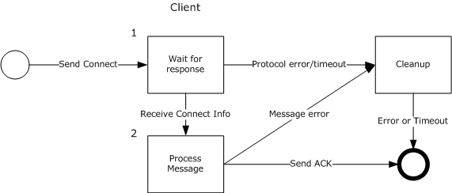

Figure 1: Role of a client when joining the client to the session

The role of a client when attempting to connect to the session:

- The client sends a [DN_INTERNAL_MESSAGE_PLAYER_CONNECT_INFO](#Section_2.2.1.1) message (section 2.2.1.1) to the server and waits for the [DN_SEND_CONNECT_INFO](#Section_2.2.1.4) message (section 2.2.1.4) to be sent in response. If the server does not respond in time, the protocol times out and terminates the connection.
**Note** When the client sends the DN_INTERNAL_MESSAGE_PLAYER_CONNECT_INFO message, it includes the user-provided password described in section [5.2](#Section_5.2). When the server receives the message, it attempts to verify the password as described in Step 4 of section [3.1.5.1](#Section_3.2.5.2). If the server is able to verify the password, it sends a DN_SEND_CONNECT_INFO message to bring the new client into consistency with regard to the current application description state and [**player**](#gt_player) list. The DN_SEND_CONNECT_INFO message includes the current user password, which is essentially a redundant echo of the password that was verified by the server. However, if the server is unable to verify the password and validation fails, the server sends a [DN_CONNECT_FAILED](#Section_2.2.1.3) message (section 2.2.1.3) with the **hResultCode** field set to DPNERR_INVALIDPASSWORD or to another validation failure code.

- When the DN_SEND_CONNECT_INFO message is received from the server, the client processes the message. After the message is successfully processed, the client MUST send a [DN_ACK_CONNECT_INFO](#Section_2.2.1.8) message (section 2.2.1.8) to the server. If an error occurs during message processing, the client performs cleanup and ends the connection attempt.
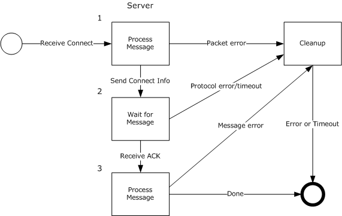

Figure 2: Role of the server when joining the client to the session

The role of the server when responding to a request from a client to be joined to the game session:

- The server receives a DN_INTERNAL_MESSAGE_PLAYER_CONNECT_INFO message from the client and begins message processing. If an error occurs during message processing, the message is ignored. Otherwise, the server responds to the client with a DN_SEND_CONNECT_INFO message that includes the connection data for the [**game session**](#gt_game-session).
- The server waits for a DN_ACK_CONNECT_INFO message from the client. If the client does not send the [**acknowledgment (ACK)**](#gt_acknowledgment-ack) in time, the protocol times out and terminates the connection.
- When the DN_ACK_CONNECT_INFO message from the client is received by the server, the server processes the ACK. After the ACK is successfully processed, the connection is made and the client is joined to the game session. If an error occurs during message processing, the server performs cleanup and ends the connection attempt.
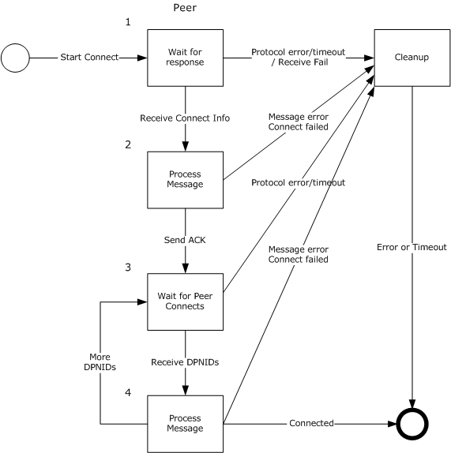

Figure 3: Role of a peer when adding the peer to the session

The role of a [**peer**](#gt_peer) when attempting to be added to the game session:

- The nascent peer sends a DN_INTERNAL_MESSAGE_PLAYER_CONNECT_INFO message to the [**host**](#gt_host) and waits for a response. If the host does not respond in time, the protocol times out and terminates the connection.
- When the DN_SEND_CONNECT_INFO message is received from the host, the nascent peer processes the message. The peer MUST maintain a copy of the name table information for each peer in the game session as specified in the **DN_NAMETABLE_ENTRY_INFO** field of the message. After the message is successfully processed, the nascent peer MUST send a DN_ACK_CONNECT_INFO message to the host. If an error occurs during message processing, the nascent peer performs cleanup and ends the connection attempt.
- After acknowledging the connection, the nascent peer waits to receive [DN_SEND_PLAYER_DPNID](#Section_2.2.1.10) messages (section 2.2.1.10) from all other connected, established peers in the game session. If all connected, established peers do not respond in time, the protocol times out and terminates the connection.
- When a DN_SEND_PLAYER_DPNID message is received from an established peer, the nascent peer processes the message. If an established peer is unable to connect to the nascent peer:
- The established peer responds to the host with a [DN_INSTRUCTED_CONNECT_FAILED](#Section_2.2.1.11) message (section 2.2.1.11).
- The connection attempt is canceled.
- The host issues a [DN_CONNECT_ATTEMPT_FAILED](#Section_2.2.1.12) message (section 2.2.1.12) to the nascent peer.
Otherwise, when DN_SEND_PLAYER_DPNID messages have been successfully received from all other connected, established peers, the nascent peer is connected and added to the game session.

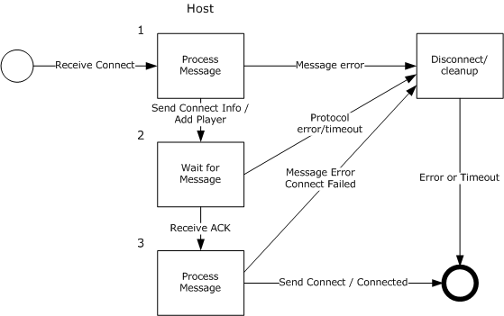

Figure 4: Role of the host when adding a peer to the session

The role of the host when responding to a request from a peer to be added to the game session:

The host receives a DN_INTERNAL_MESSAGE_PLAYER_CONNECT_INFO message from a nascent peer and begins message processing. If an error occurs during message processing, the message is ignored. Otherwise, the host responds to the nascent peer with a DN_SEND_CONNECT_INFO message that includes the connection data for the game session. At the same time, the host sends [DN_ADD_PLAYER](#Section_2.2.4.4) messages (section 2.2.1.7) to all connected, established peers in the game session.

- The peer processes the DN_SEND_CONNECT_INFO message. The peer SHOULD maintain a copy of the [**name table**](#gt_name-table) information for each peer in the game session as specified in the **DN_NAMETABLE_ENTRY_INFO** field of the message. The host waits for a DN_ACK_CONNECT_INFO message from the nascent peer. If the nascent peer does not respond in time, the protocol times out and terminates the connection.
- When the DN_ACK_CONNECT_INFO message from the nascent peer is received by the host, the host processes the ACK. If an error occurs during processing of the ACK, the host performs cleanup and ends the connection attempt. Otherwise, after the ACK is processed, the host sends a [DN_INSTRUCT_CONNECT](#Section_2.2.1.9) message (section 2.2.1.9) to all peers (including the nascent peer) instructing them to attempt a connection to the nascent peer. If an established peer is unable to connect to the nascent peer:
- The established peer responds to the host with a DN_INSTRUCTED_CONNECT_FAILED message.
- The connection attempt is canceled.
- The host issues a DN_CONNECT_ATTEMPT_FAILED message to the nascent peer.
Otherwise, it is assumed that the established peers are able to successfully connect to the nascent peer, and the nascent peer is added to the game session.

When the nascent peer receives a DN_INSTRUCT_CONNECT message from the host, the message is used only to synchronize its name table with the established peers.

### 3.1.1 Abstract Data Model

The connect sequence is initiated by the client or the peer. If there happens to be an error or disconnect on the server/host, cleanup and disconnect happens with only the client/peer with the failure. (Remaining clients/peers in the session remain connected.)

A DirectPlay 8 Protocol: Core and Service Providers Protocol implementation MUST maintain the following data element:

**name table:** All participants MUST maintain a [**name table**](#gt_name-table), as described in section [2.2.6](#Section_2.2.6). In [**peer-to-peer mode**](#gt_peer-to-peer-mode), the name table state MUST be kept consistent among all participants, and during connections:

- The host MUST generate a [DN_ADD_PLAYER (section 2.2.1.7)](#Section_2.2.4.4) name table operation associated with the connecting peer.
- Existing peers MUST process the DN_ADD_PLAYER name table operation from the host.
- New peers MUST construct the initial name table based on the entries contained in the [DN_SEND_CONNECT_INFO (section 2.2.1.4)](#Section_2.2.1.4) message.
In client/server mode, each client only keeps name table entries that represent its player and the server player. Therefore, only this subset of the name table is synchronized with the server during connection.

### 3.1.2 Timers

The connection sequence is event driven via packets sent and received via the Peer, Client, Host, or Server.

### 3.1.3 Initialization

None.

### 3.1.4 Higher-Layer Triggered Events

None.

### 3.1.5 Processing Events and Sequencing Rules

#### 3.1.5.1 Client/Server Connect Sequence

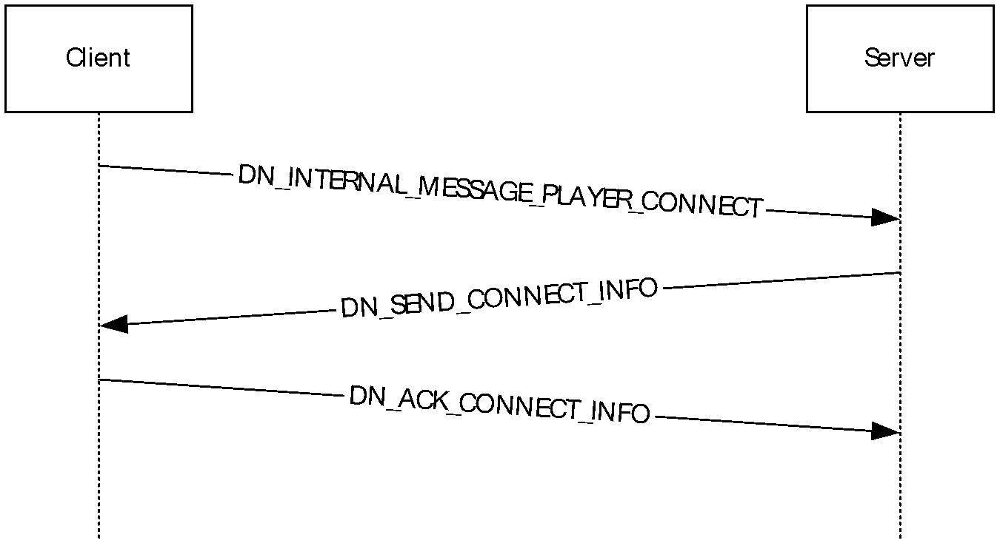

Figure 5: Client/server connect sequence

A server has been launched and is in the process of accepting incoming connections.

- The client establishes a connection to the server as specified in [MC-DPL8R](../MC-DPL8R/MC-DPL8R.md).
- The client sends a player connect message to the server:
- [DN_INTERNAL_MESSAGE_PLAYER_CONNECT_INFO](#Section_2.2.1.1)
- [DN_INTERNAL_MESSAGE_PLAYER_CONNECT_INFO_EX](#Section_2.2.1.2) (DirectPlay 9)
When the client sends the [**player**](#gt_player) connect message, it includes the user-provided password described in section [5.2](#Section_5.2), if present. When the server receives the message, it verifies the client has specified compatible values; if a higher layer indicated that a password is required, the client’s password string MUST exist and match exactly. If no password is required, the server SHOULD silently ignore any password string specified by the client.

- If the server successfully validates the password and other DN_INTERNAL_MESSAGE_PLAYER_CONNECT_INFO information, the server responds to the client:
[DN_SEND_CONNECT_INFO](#Section_2.2.1.4)

The DN_SEND_CONNECT_INFO message MUST contain the current [**game session**](#gt_game-session) state and settings.

**Note** For client/server, there are only two entries in the [DN_NAMETABLE_ENTRY_INFO](#Section_2.2.1.5) message as part of the DN_SEND_CONNECT_INFO packet.

**Note** If a password was required, the message includes the **DPNSESSION_REQUIREPASSWORD** flag and a redundant echo of the password that had been successfully verified. If no password was required, the **DPNSESSION_REQUIREPASSWORD** SHOULD NOT be included, and the **dwPasswordOffset** and **dwPasswordSize** values SHOULD be 0.

If the server is unable to verify the password and validation fails, the server sends a [DN_CONNECT_FAILED](#Section_2.2.1.3) message (section 2.2.1.3) with the **hResultCode** field set to DPNERR_INVALIDPASSWORD or to another validation failure code.

- Upon receipt of the DN_SEND_CONNECT_INFO message from the server, the client acknowledges the connection by returning:
[DN_ACK_CONNECT_INFO](#Section_2.2.1.8)

#### 3.1.5.2 Peer-to-Peer Connect Sequence

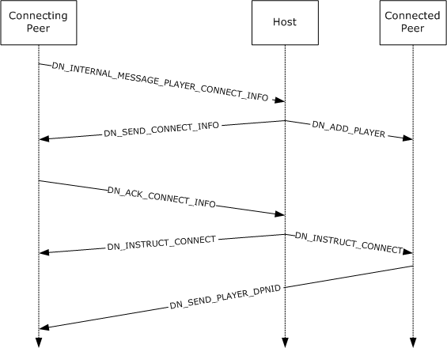

Figure 6: Peer-to-peer connect sequence

Assuming the first peer has been launched, that peer will be deemed the host of the game session and will be in the process of accepting incoming connections. (The peer host is responsible for all name table transactions and synchronization across peers in the game session.)

- The new peer establishes a connection to the host as specified in [MC-DPL8R](../MC-DPL8R/MC-DPL8R.md).
- The internal player connect message is sent in from the peer to the host:
- [DN_INTERNAL_MESSAGE_PLAYER_CONNECT_INFO](#Section_2.2.1.1)
- [DN_INTERNAL_MESSAGE_PLAYER_CONNECT_INFO_EX](#Section_2.2.1.2) (DirectPlay 9)
When the [**peer**](#gt_peer) sends the [**player**](#gt_player) connect message, it includes the user-provided password described in section [5.2](#Section_5.2), if present. When the host receives the message, it verifies the peer has specified compatible values; if a higher layer indicated that a password is required, the peer’s password string MUST exist and match exactly. If no password is required, the host SHOULD silently ignore any password string specified by the peer.

- If the host fails in validating DN_INTERNAL_MESSAGE_PLAYER_CONNECT_INFO, the connecting peer is sent:
[DN_CONNECT_FAILED](#Section_2.2.1.3)

- If the host successfully validates DN_INTERNAL_MESSAGE_PLAYER_CONNECT_INFO, the host creates a new [**name table entry**](#gt_name-table-entry) for the connecting peer and adds the new entry into the host’s name table. The host increases its name table version by 1 and enters the new version into the new name table entry. The host then responds to the connecting peer with:
[DN_SEND_CONNECT_INFO](#Section_2.2.1.4)

The DN_SEND_CONNECT_INFO message MUST contain the current [**game session**](#gt_game-session) state and settings. The message also contains a copy of the host’s updated name table.

**Note** The entries in the [DN_NAMETABLE_ENTRY_INFO](#Section_2.2.1.5) message will exist for each player connected to the game session.

**Note** If a password was required, the message includes the **DPNSESSION_REQUIREPASSWORD** flag and a redundant echo of the password that had been successfully verified. If no password was required, the **DPNSESSION_REQUIREPASSWORD** SHOULD NOT be included, and the **dwPasswordOffset** and **dwPasswordSize** values SHOULD be 0.

If the host is unable to verify the password and validation fails, the host sends a DN_CONNECT_FAILED message (section 2.2.1.3) with the **hResultCode** field set to DPNERR_INVALIDPASSWORD or to another validation failure code.

- At the same time as the host is responding to the connecting peer with DN_SEND_CONNECT_INFO, the host is also issuing a message to the already-connected peers:
[DN_ADD_PLAYER](#Section_2.2.4.4)

The DN_ADD_PLAYER message contains the new name table entry for the connecting player.

- Upon receipt of the DN_SEND_CONNECT_INFO message from the host, the connecting peer will construct its initial name table state based on the entries and version number sent by the host and acknowledge the connection by returning:
[DN_ACK_CONNECT_INFO](#Section_2.2.1.8)

- After receiving DN_ACK_CONNECT_INFO from the connecting peer, the host instructs all existing peers to also establish a connection to the connecting peer by sending them the following message. The host will also send the following message to the connecting peer in order to keep the name table for the connecting peer in sync with the name tables of the existing peers in the session:
[DN_INSTRUCT_CONNECT](#Section_2.2.1.9)

- Upon receiving DN_INSTRUCT_CONNECT from the host, the existing peers will issue their [**DPNIDs**](#gt_dpnid) to the new peer being added by sending:
[DN_SEND_PLAYER_DPNID](#Section_2.2.1.10)

If the modulo 4 result of the new version for the name table is equal to 0, the name tables of the existing peers are updated as described in section [2.2.6](#Section_2.2.6) with:

[DN_RESYNC_VERSION](#Section_2.2.2.5)

- If existing peers are unable to successfully send the DN_SEND_PLAYER_DPNID message to the connecting peer, the existing peers will issue a fail packet back to the host:
[DN_INSTRUCTED_CONNECT_FAILED](#Section_2.2.1.11)

- Upon receiving the DN_INSTRUCTED_CONNECT_FAILED message from any of the existing peers, the host will send the connecting peer:
[DN_CONNECT_ATTEMPT_FAILED](#Section_2.2.1.12)

- Host "removes player from the game session".

### 3.1.6 Timer Events

None.

### 3.1.7 Other Local Events

None.

## 3.2 Disconnect Role Details

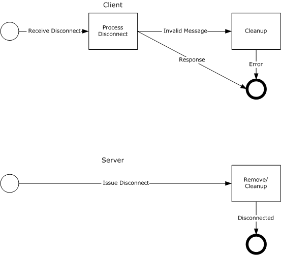

Figure 7: Role of a client and the server when disconnecting the client from the session

The role of the client when responding to the instruction to disconnect:

- The client receives a [DN_TERMINATE_SESSION](#Section_2.2.2.1) message (section 2.2.2.1) from the server and begins message processing. If an error occurs during message processing, or the received message is invalid, the client performs cleanup and the message is ignored. Otherwise, the client MUST remove itself from the game session.
The role of the server when responding to the instruction to disconnect:

- The server sends a DN_TERMINATE_SESSION message to the client and removes the client from the [**game session**](#gt_game-session).
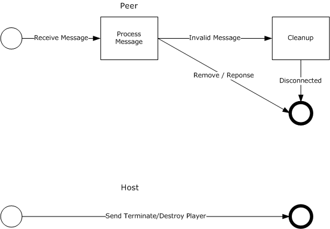

Figure 8: Role of a peer and the host when disconnecting the peer from the session

The role of a peer when responding to the instruction to disconnect:

- The peer receives a DN_TERMINATE_SESSION message from the host and begins message processing. If an error occurs during message processing, or the received message is invalid, the peer performs cleanup and the message is ignored. Otherwise, the peer MUST disconnect from the game session.
The role of the host when instructing a peer to disconnect:

- The host sends a DN_TERMINATE_SESSION message to the disconnecting peer and sends a [DN_DESTROY_PLAYER](#Section_2.2.2.2) message (section 2.2.2.2) to the other connected peers in the game session. Upon receipt of the DN_DESTROY_PLAYER message from the host, the other connected peers MUST remove the indicated [**player**](#gt_player) (the disconnecting peer) from the game session.
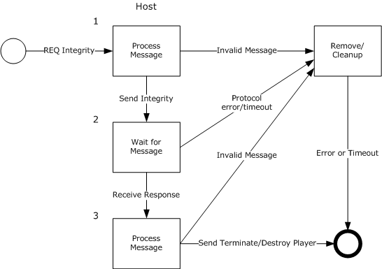

Figure 9: Role of the host when performing a peer integrity check

The role of the host when responding to a request to check the integrity of a peer in the game session:

- The [**host**](#gt_host) receives an [DN_REQ_INTEGRITY_CHECK](#Section_2.2.2.6) message (section 2.2.2.6) from a connected [**peer**](#gt_peer) in the game session and begins message processing. (The peer that is making the request is asking the host to check the integrity of another peer in the game session.) If an error occurs during message processing, or the message is invalid, the host performs cleanup and the message is ignored. Otherwise, the host sends a [DN_INTEGRITY_CHECK](#Section_2.2.2.7) message (section 2.2.2.7) to the peer that is to be checked.
- The host waits for a [DN_INTEGRITY_CHECK_RESPONSE](#Section_2.2.2.8) message (section 2.2.2.8) from the peer that is being checked. If the peer does not respond in time, the protocol times out and disconnects the peer that was being checked from the game session. The host then sends a DN_DESTROY_PLAYER message to the other connected peers in the game session. Upon receipt of the DN_DESTROY_PLAYER message from the host, the other connected peers MUST remove the indicated player (the disconnecting peer) from the game session.
- When a DN_INTEGRITY_CHECK_RESPONSE message is received from the peer that is being checked, the host begins message processing. If an error occurs during message processing, or the message is invalid, the host performs cleanup and the message is ignored. Otherwise, the host sends a DN_TERMINATE_SESSION message to the peer that sent the DN_REQ_INTEGRITY_CHECK message, and sends a DN_DESTROY_PLAYER message to the other connected peers in the game session. Upon receipt of the DN_DESTROY_PLAYER message from the host, the other connected peers MUST remove the indicated player (the terminated peer) from the game session.
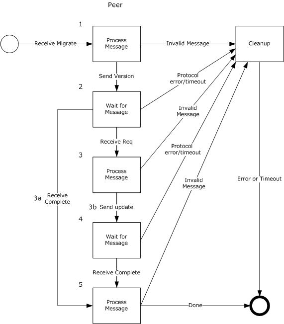

Figure 10: Role of a peer during host migration

The role of a peer when responding to a request to perform [**host migration**](#gt_host-migration):

- The peer receives a [DN_HOST_MIGRATE](#Section_2.2.2.3) message (section 2.2.2.3) from the host and begins message processing. If an error occurs during message processing, or the message is invalid, the peer performs cleanup and the message is ignored. Otherwise, the peer responds to the host by sending the [**name table**](#gt_name-table) version of the peer via a [DN_NAMETABLE_VERSION](#Section_2.2.2.4) message (section 2.2.2.4).
- The peer waits for an [**acknowledgment (ACK)**](#gt_acknowledgment-ack) from the host. If the host does not respond in time, the protocol times out and terminates the connection.
- When the response is received from the host, the peer processes the message.
- If the host has responded with a [DN_HOST_MIGRATE_COMPLETE](#Section_2.2.2.11) message (section 2.2.2.11), the peer processes the message. If an error occurs during message processing, or the message is invalid, the peer performs cleanup and the instruction to migrate is ignored. Otherwise, host migration is complete.
- If the host has responded with a [DN_REQ_NAMETABLE_OP](#Section_2.2.2.9) message (section 2.2.2.9) to the peer, the peer processes the request and sends a [DN_ACK_NAMETABLE_OP](#Section_2.2.2.10) message (section 2.2.2.10) to the host.
- The peer waits for a response from the host. If the host does not respond in time, the protocol times out and terminates the connection.
- When the response message is received from the host, the peer processes the messages. The peer MAY receive a [DN_RESYNC_VERSION](#Section_2.2.2.5) message (section 2.2.2.5) and SHOULD receive a DN_HOST_MIGRATE_COMPLETE message from the host. If an error occurs during message processing, or these messages are invalid, the peer performs cleanup and the messages are ignored. Otherwise, host migration is complete.
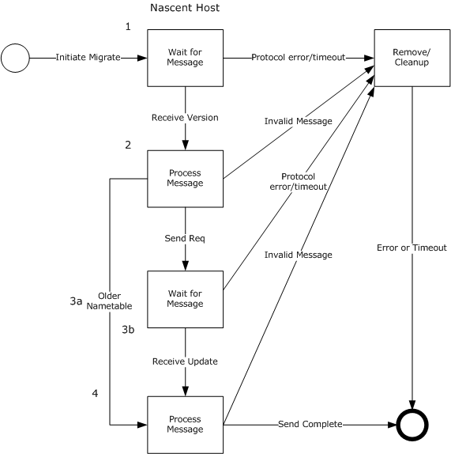

Figure 11: Role of the host during host migration

The role of the host when initiating host migration:

- The host sends a DN_HOST_MIGRATE message to all connected peers in the game session and waits to receive a DN_NAMETABLE_VERSION message from each peer. If a peer does not respond in time, the protocol times out and terminates the connection for that peer.
- When the DN_NAMETABLE_VERSION response is received from a peer, the host processes the message. If the host receives an invalid name table response message, the host performs cleanup and the message is ignored.
- Otherwise, the host examines the peer's name table to determine if it is newer than the host's name table.
- If the peer's name table is older than the host's name table, the host sends a DN_HOST_MIGRATE_COMPLETE message to that peer.
- If the peer's name table is newer than the host's name table, the host sends a DN_REQ_NAMETABLE_OP message to that peer and waits for a response. If the peer does not respond in time, the connection to that peer is dropped from the game session.
- When the DN_ACK_NAMETABLE_OP message is received from the peer, the host processes the message and uses the peer's name table to update it's own name table. The host then MAY send a DN_RESYNC_VERSION message containing the new name table version to all connected peers in the game session. Finally, the host sends a DN_HOST_MIGRATE_COMPLETE message to all connected peers in the game session.

### 3.2.1 Abstract Data Model

If there is an error with the protocol or message on the server/host, cleanup and disconnect happen with only the client/peer with the failure. (Remaining clients/peers in the session remain connected.)

A DirectPlay 8 Protocol: Core and Service Providers Protocol implementation MUST maintain the following data element:

**name table:** All participants MUST maintain a consistent [**name table**](#gt_name-table), as described in section [2.2.6](#Section_2.2.6). In [**peer-to-peer mode**](#gt_peer-to-peer-mode):

- If the host disconnects from the [**game session**](#gt_game-session), the process of [**host migration**](#gt_host-migration) is initiated in which the remaining peers examine the current state of the name table to identify the player with the next lowest version number to become the new host.
- If a peer disconnects from the game session, the host MUST generate a [DN_DESTROY_PLAYER (section 2.2.2.2)](#Section_2.2.2.2) name table operation to remove the disconnecting player from the name tables of all remaining participants.
In [**client/server mode**](#gt_clientserver-mode):

- Each client only keeps name table entries that represent its player and the server player, and is not informed of other clients leaving.
- When a client leaves, the server updates only its own name table.
- If the server disconnects, the game session is terminated.

### 3.2.2 Timers

The disconnect sequence is event driven via messages sent and received via the Peer, Client, Host, or Server.

### 3.2.3 Initialization

None.

### 3.2.4 Higher-Layer Triggered Events

None.

### 3.2.5 Processing Events and Sequencing Rules

#### 3.2.5.1 Client/Server Disconnect Sequence

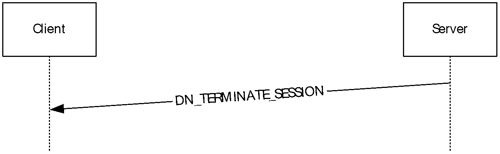

Figure 12: Client/server disconnect sequence

The server is purposefully removing a [**peer**](#gt_peer) from the [**game session**](#gt_game-session).

- The server issues a packet to the client being removed:
[DN_TERMINATE_SESSION](#Section_2.2.2.1)

- When the client receives the DN_TERMINATE_SESSION message, it is required to disconnect itself from the game session.
- If a client wants to leave the game session, it SHOULD issue a disconnect in the protocol to the server. (No core specific messages.)

#### 3.2.5.2 Peer-to-Peer Host Disconnect Sequence

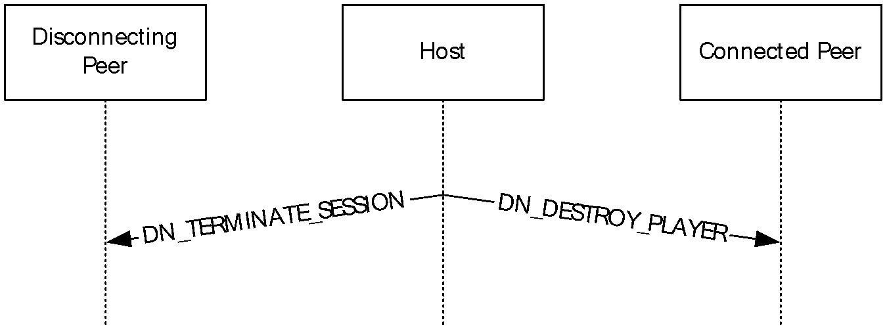

Figure 13: Peer-to-peer host disconnect sequence

- If the host is purposefully removing a peer from the game session, it will issue a packet to the peer being removed:
[DN_TERMINATE_SESSION](#Section_2.2.2.1)

The peer receiving the DN_TERMINATE_SESSION MUST disconnect all connections and leave the game session.

- The host also issues a message to the remaining connected peers indicating the removal of the disconnecting peer:
[DN_DESTROY_PLAYER](#Section_2.2.2.2)

#### 3.2.5.3 Peer-to-Peer Integrity Check Sequence

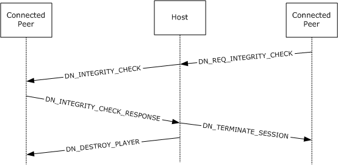

Figure 14: Peer-to-peer integrity check sequence

- If a nonhost peer has detected a loss of connection to another peer and has not received a [DN_DESTROY_PLAYER](#Section_2.2.2.2) message from the host for that peer, it sends a message notifying the host:
[DN_REQ_INTEGRITY_CHECK](#Section_2.2.2.6)

- The host forwards a packet to the peer in question including the [**DPNID**](#gt_dpnid) of the questioning peer:
[DN_INTEGRITY_CHECK](#Section_2.2.2.7)

- Upon receiving DN_INTEGRITY_CHECK, the peer responds back to the host:
[DN_INTEGRITY_CHECK_RESPONSE](#Section_2.2.2.8)

- If the host receives DN_INTEGRITY_CHECK_RESPONSE, the host will respond to the first peer terminating it from the [**game session**](#gt_game-session):
[DN_TERMINATE_SESSION](#Section_2.2.2.1)

- The host also issues a message to the remaining connected peers indicating the removal of the disconnecting peer:
DN_DESTROY_PLAYER

#### 3.2.5.4 Peer-to-Peer Host Disconnect (Possible Host Migration)

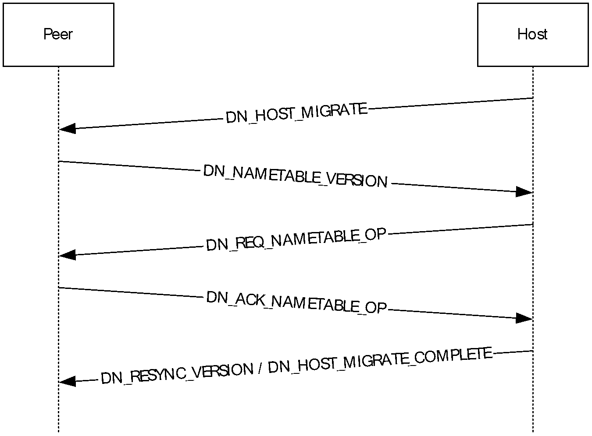

Figure 15: Peer-to-peer host disconnect (possible host migration)

The [**host**](#gt_host) drops out of the [**game session**](#gt_game-session).

- Using the version information for each [**player**](#gt_player) from the [**name table**](#gt_name-table), the player with the lowest version number (connected [**peer**](#gt_peer)) becomes the expected host. (This can be split out to more than one host, if multiple connections are severed when a host leaves.) That new host sends to the remaining connected peers:
[DN_HOST_MIGRATE](#Section_2.2.2.3)

- All peers still in the game session will respond to the new host, providing the host with their name table versions:
[DN_NAMETABLE_VERSION](#Section_2.2.2.4)

- If the host sees that there is a peer with a newer name table, the new host will request that peer to send the entries from its name table that are not contained within the host's name table:
[DN_REQ_NAMETABLE_OP](#Section_2.2.2.9)

- Upon receiving DN_REQ_NAMETABLE_OP, the peer will return the missing name table entries to the host:
[DN_ACK_NAMETABLE_OP](#Section_2.2.2.10)

- The host installs any missed name table entries and sends any name table operations missed by its peers as indicated by their reported name table versions in step 2. When all missing name table entries have been provided to all players, the host can confirm that all peers have the current name table version by sending:
[DN_RESYNC_VERSION](#Section_2.2.2.5)

- After the name table has been brought up-to-date, the new host will respond to all connected peers:
[DN_HOST_MIGRATE_COMPLETE](#Section_2.2.2.11)

### 3.2.6 Timer Events

None.

### 3.2.7 Other Local Events

None.

## 3.3 Send/Receive Communications Role Details

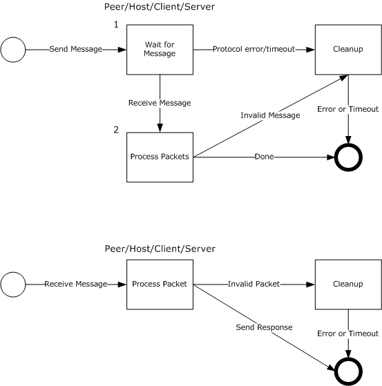

Figure 16: Role of the peer, host, client, and server when sending and receiving messages

The role of the [**peer**](#gt_peer), [**host**](#gt_host), client, and server when sending messages (section [2.2.3](#Section_2.2.3)):

- When any message is sent, if the sender specifies [DN_REQ_PROCESS_COMPLETION](#Section_2.2.3.2) (section 2.2.3.2) to indicate that the receiving application MUST confirm delivery of the sent message, the sender waits to either receive a [DN_PROCESS_COMPLETION](#Section_2.2.3.3) response message (section 2.2.3.3), or to be notified of connection termination by the lower-layer transport that is handling reliable message delivery [MC-DPL8R](../MC-DPL8R/MC-DPL8R.md). If the connection is terminated prior to receiving a response, the sender MUST treat the send operation as having failed in addition to performing standard disconnect handling as described in section [3.2](#Section_1.3).
- Otherwise, when the DN_PROCESS_COMPLETION message is received, the send/receive is completed.
The role of the peer, host, client, and server when receiving messages (section 2.2.3):

- When any message is received, the message is processed by the receiver. If the message is found to be invalid, the receiver performs cleanup and the message is ignored. Otherwise, when the message is valid and it contains a DN_REQ_PROCESS_COMPLETION request, a DN_PROCESS_COMPLETION response message is sent back to the sender. If the message does not contain a request for process completion, the message is consumed.

### 3.3.1 Abstract Data Model

Illustrated in this model is a send where the process completion request has been sent. In the non-process completion case, the messages are just consumed with no retained state.

### 3.3.2 Timers

The send/receive sequence is event driven via messages sent and received via the Peer, Client, Host, or Server. The DirectPlay 8 Protocol: Core and Service Providers does not directly implement timing-related functionality; instead, it relies on internal timer events described in [MC-DPL8R](../MC-DPL8R/MC-DPL8R.md) 3.1.2.5to provide feedback regarding the state of individual connections. When a connection has been lost, the DirectPlay 8 Protocol [MC-DPL8R] reports this to its consumers. The DirectPlay 8 Protocol: Core and Service Providers MUST then handle the disconnect as described in section [3.2](#Section_1.3).

### 3.3.3 Initialization

None.

### 3.3.4 Higher-Layer Triggered Events

None.

### 3.3.5 Processing Events and Sequencing Rules

#### 3.3.5.1 Client/Server and Peer-to-Peer Send/Receive Communications Sequence

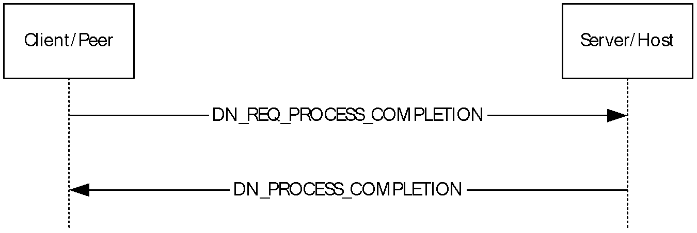

Figure 17: Communications Exchange diagram

Data send and receive sequences are identical for client/server and [**peer-to-peer modes**](#gt_peer-to-peer-mode).

There are two types of general data sends. One requires notification from the [**game session**](#gt_game-session) that the user data has been consumed, and the other does not.

To differentiate, on the [**data frame (DFRAME)**](#gt_data-frame-dframe) that is handed up from the protocol, if the **bCommand** field has the PACKET_COMMAND_USER_1 bit set, then this is a system message where PacketType and PacketContext will be included.

- If an application sends data to another application and wants a response when that data has been consumed, then it will send:
[DN_REQ_PROCESS_COMPLETION](#Section_2.2.3.2)

- When DN_REQ_PROCESS_COMPLETION is received, it is required that a message be returned indicating that this [**payload**](#gt_payload) has been consumed:
[DN_PROCESS_COMPLETION](#Section_2.2.3.3)

If the **bCommand** bit does not have the PACKET_COMMAND_USER_1 bit set, the data passed up via the payload is data that SHOULD be passed directly to the application with no further interpretation.

**Note** If Packet_Command_User_1 is set in the DFRAME, this indicates that it is a core message with the first four bytes indicating the PacketType and is always sent reliably.

### 3.3.6 Timer Events

None.

### 3.3.7 Other Local Events

None.

## 3.4 Groups Role Details

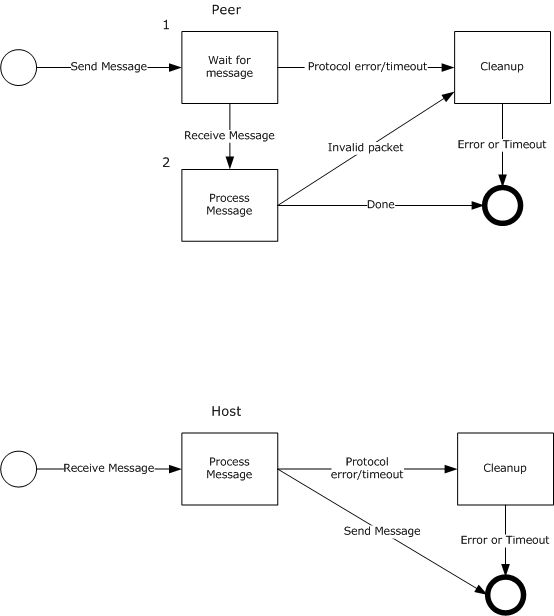

Figure 18: Role of a peer and the host when sending and receiving Group messages

The role of a [**peer**](#gt_peer) and the [**host**](#gt_host) when sending Group messages (section [2.2.4](#Section_2.2.4)):

- When any of the following messages are sent, the peer waits for a response from the host.
- [DN_REQ_CREATE_GROUP](#Section_2.2.4.1) (section 2.2.4.1)
- [DN_REQ_ADD_PLAYER_TO_GROUP](#Section_2.2.4.3) (section 2.2.4.3)
- [DN_REQ_DESTROY_GROUP](#Section_2.2.4.7) (section 2.2.4.7)
If the host does not respond in time, the protocol times out and the connection is terminated.

- Otherwise, when the peer receives any of the following messages in response from the host, the peer processes the message.
- [DN_CREATE_GROUP](#Section_2.2.4.2) (section 2.2.4.2)
- [DN_ADD_PLAYER_TO_GROUP](#Section_2.2.4.4) (section 2.2.4.4)
- [DN_DESTROY_GROUP](#Section_2.2.4.8) (section 2.2.4.8)
If the message is invalid, the peer performs cleanup and the message is ignored. Otherwise, the message is consumed.

The role of a peer and the host when receiving Group messages:

- When any of the following messages is received from a peer in the session, it is processed by the host.
- DN_REQ_CREATE_GROUP
- DN_REQ_ADD_PLAYER_TO_GROUP
- DN_REQ_DESTROY_GROUP
If the message is invalid, the host performs cleanup and the message is ignored. Otherwise, the host responds with one of the following messages back to the peer:

- DN_CREATE_GROUP
- DN_ADD_PLAYER_TO_GROUP
- DN_DESTROY_GROUP
**Note** When working with [**groups**](#gt_group), be aware of considerations related to [**DirectX Diagnostic (DXDiag)**](#gt_directx-diagnostic-dxdiag). The DXDiag tool (DxDiag.exe) implementation of this specification does not support groups.

### 3.4.1 Abstract Data Model

A DirectPlay 8 Protocol: Core and Service Providers Protocol implementation MUST maintain the following data element:

**name table:** All participants MUST maintain a [**name table**](#gt_name-table), as described in section [2.2.6](#Section_2.2.6). Each [**group**](#gt_group) has an entry in the name table. In [**peer-to-peer mode**](#gt_peer-to-peer-mode), the [**host**](#gt_host) MUST generate [DN_CREATE_GROUP (section 2.2.4.2)](#Section_2.2.4.2), [DN_ADD_PLAYER_TO_GROUP (section 2.2.4.4)](#Section_2.2.4.4), [DN_DELETE_PLAYER_FROM_GROUP (section 2.2.4.6)](#Section_2.2.4.6), and [DN_DESTROY_GROUP (section 2.2.4.8)](#Section_2.2.4.8) name table operations for each corresponding action that modifies the groups or their membership in the name table.

In client/server mode, only the server has information pertaining to all players and groups. Therefore, the server does generate name table operations associated with group management.

### 3.4.2 Timers

The [**group**](#gt_group) sequences are driven via messages sent and received via the Peer, Client, Host, or Server.

### 3.4.3 Initialization

None.

### 3.4.4 Higher-Layer Triggered Events

None.

### 3.4.5 Processing Events and Sequencing Rules

#### 3.4.5.1 Client/Server Group Role

There are no transactions on the wire for [**game session**](#gt_game-session) [**groups**](#gt_group) in [**client/server mode**](#gt_clientserver-mode). Game session groups are used only in peer-to-peer mode.

#### 3.4.5.2 Peer-to-Peer Group Sequence

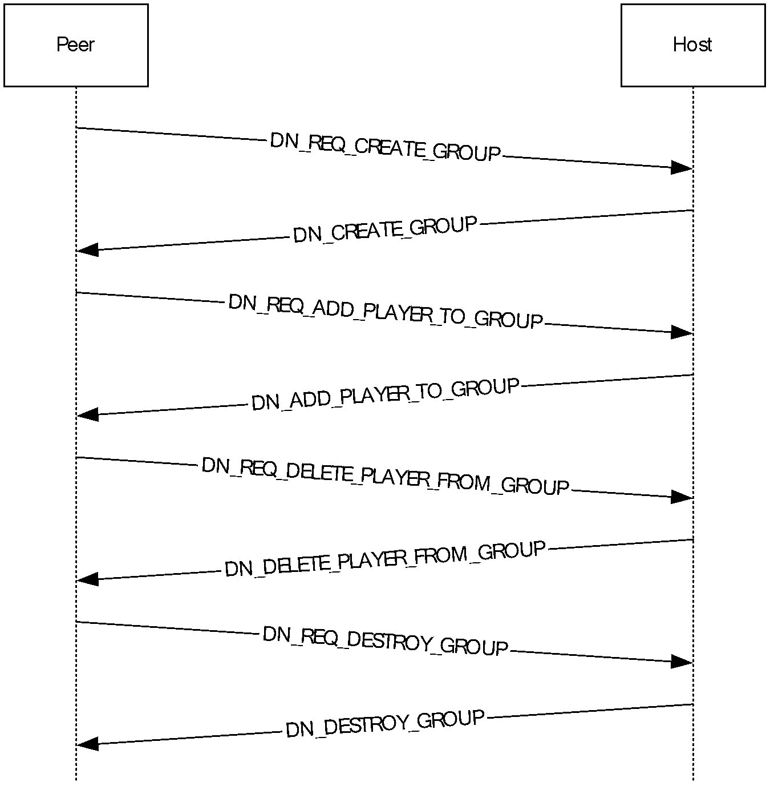

Figure 19: Peer-to-peer group sequence diagram

Only the [**game session**](#gt_game-session) [**host**](#gt_host) can create or modify [**groups**](#gt_group). The host can create and destroy groups and add and remove players from existing groups.

- If a non-host peer wants to create a group, it MUST issue a message to the host:
[DN_REQ_CREATE_GROUP](#Section_2.2.4.1)

- Once the host has created a new group (via request from a peer or locally), it issues a command to all the connected peers:
[DN_CREATE_GROUP](#Section_2.2.4.2)

- If a non-host peer wants to add a new player to an existing group, it MUST issue a message to the host:
[DN_REQ_ADD_PLAYER_TO_GROUP](#Section_2.2.4.3)

- Once the host has added the new player to the group (via a peer or locally), the host responds to all connected peers with:
[DN_ADD_PLAYER_TO_GROUP](#Section_2.2.4.4)

- If a non-host peer wants to delete a player from an existing group, it MUST issue a message to the host:
[DN_REQ_DELETE_PLAYER_FROM_GROUP](#Section_2.2.4.5)

- Once the host has deleted the player from the group (via a peer or locally), the host responds to all connected peers with:
[DN_DELETE_PLAYER_FROM_GROUP](#Section_2.2.4.6)

- If a non-host peer wants to destroy an existing group, it MUST issue a message to the host:
[DN_REQ_DESTROY_GROUP](#Section_2.2.4.7)

- Once the host has destroyed a group (via Req or locally), the host responds to all connected peers with:
[DN_DESTROY_GROUP](#Section_2.2.4.8)

### 3.4.6 Timer Events

None.

### 3.4.7 Other Local Events

None.

## 3.5 Update Information Role Details

Figure 20: Role of a peer/client and the host/server when sending and receiving Update Information messages

The role of a peer/client when sending Update Information messages (section [2.2.5](#Section_2.2.5)):

- When a [DN_REQ_UPDATE_INFO](#Section_2.2.5.1) message (section 2.2.5.1) is sent, the peer/client waits for a response from the host/server. If the host/server does not respond in time, the protocol times out and the connection is terminated.
- Otherwise, when the peer/client receives the response from the host/server, the peer/client processes the message. If the message is invalid, the peer/client performs cleanup and the message is ignored. Otherwise, the [DN_UPDATE_INFO](#Section_2.2.5.2) message (section 2.2.5.2) is consumed.
The role of the host/server when receiving Update Information messages:

- When a DN_REQ_UPDATE_INFO message is received from a peer/client in the session, the message is processed by the host/server. If the message is invalid, the host/server performs cleanup and the message is ignored. Otherwise, the host/server responds by sending a DN_UPDATE_INFO message back to the peer/client.

### 3.5.1 Abstract Data Model

An update is requested by a [**peer**](#gt_peer) or client to a [**host**](#gt_host) or server. The host/server will respond to all [**players**](#gt_player) with the appropriate response.

A DirectPlay 8 Protocol: Core and Service Providers Protocol implementation MUST maintain the following data element:

**name table:** All participants MUST maintain a [**name table**](#gt_name-table), as described in section [2.2.6](#Section_2.2.6). In [**peer-to-peer mode**](#gt_peer-to-peer-mode), the name table state MUST be kept consistent among all participants, and the host MUST generate a [DN_UPDATE_INFO (section 2.2.5.2)](#Section_2.2.5.2) name table operation associated with the modified player information.

In [**client/server mode**](#gt_clientserver-mode), each client only keeps name table entries that represent its player and the server player, and is not informed of information changes pertaining to other players.

### 3.5.2 Timers

The update information sequence is event driven via messages sent and received via the Peer, Client, Host, or Server.

### 3.5.3 Initialization

None.

### 3.5.4 Higher-Layer Triggered Events

None.

### 3.5.5 Processing Events and Sequencing Rules

#### 3.5.5.1 Update Information Sequence

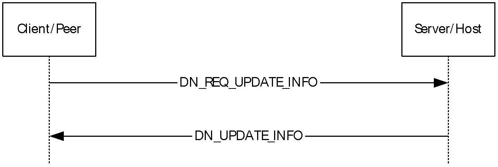

Figure 21: Update Information Sequence Diagram

This is used whenever a peer/client needs to update [**player**](#gt_player) or [**group**](#gt_group) information.

- The packet is sent to the host/server because the host/server is responsible for updating the [**name table**](#gt_name-table) and keeping everyone in sync:
[DN_REQ_UPDATE_INFO](#Section_2.2.5.1)

- The [**host**](#gt_host) SHOULD respond appropriately to all players with the updated information:
[DN_UPDATE_INFO](#Section_2.2.5.2)

### 3.5.6 Timer Events

None.

### 3.5.7 Other Local Events

None.

# 4 Protocol Examples

A standard [DN_INTERNAL_MESSAGE_PLAYER_CONNECT_INFO_EX](#Section_2.2.1.2) (section 2.2.1.2) for a DirectPlay 8 Protocol: Core and Service Providers [**game session**](#gt_game-session). This example includes the full Ethernet frame for the packet sent.

In [**little-endian**](#gt_little-endian) byte order:

- **MSGID** = 0x000000C1
- **dwFlags** indicates that this is a **DN_OBJECT_TYPE_PEER.**
- [**Player**](#gt_player) Name value of "Test User".
0000 00 0A E4 03 27 73 00 0B DB 5C 3F 45 08 00 45 00 ..ä.'s..Û\?E..E.

0010 00 98 3A 4C 00 00 80 11 9F B1 41 34 EF 3D 41 34 .˜:L..€.Ÿ±A4ï=A4

0020 EE B1 08 FE 08 FE 00 84 C2 BF 7F 00 01 00 C1 00 î±.þ.þ.„¿...Á.

0030 00 00 04 00 00 00 08 00 00 00 60 00 00 00 14 00 ..........`.....

0040 00 00 00 00 00 00 00 00 00 00 00 00 00 00 00 00 ................

0050 00 00 00 00 00 00 00 00 00 00 00 00 00 00 00 00 ................

0060 00 00 23 81 BE 94 AB A1 FB 48 A2 E7 23 85 9E 65 ..#□¾"«¡ûH¢ç#…□e

0070 89 36 DA 80 EF 61 1B 69 47 42 9A DD 1C 7B ED 2B ‰6Ú€ïa.iGBšÝ.{í+

0080 C1 3E 58 00 00 00 08 00 00 00 07 02 08 FE 41 34 Á>X..........þA4

0090 EF 3D 54 00 65 00 73 00 74 00 20 00 55 00 73 00 ï=T.e.s.t. .U.s.

00A0 65 00 72 00 00 00 e.r...

Upon success, the [**host**](#gt_host) will respond with the DN_SEND_CONNECT_INFO (section [2.2.1.4](#Section_2.2.1.4)) packet to the connecting [**peer**](#gt_peer). This example includes the full Ethernet frame for the packet sent.

In [**network byte order**](#gt_network-byte-order):

- **MSGID** = 0x000000C2
- **dwFlags** indicates that **DPNSESSION_MIGRATE_HOST** is allowed.
- **dwMaxPlayers** is not specified.
- **dwCurrentPlayers** is set to 2 for the host and connecting peer.
- **dpnid** for the connecting player value is 0x948E8120.
- [**Name table**](#gt_name-table) version entry of 0x03.
- **dwEntryCount** is set to 2.
- **dwMembershipCount** is 0, indicating no [**groups**](#gt_group) in the game session.
- Connecting Peers Name is "Test User".
- Host Peers Name is "Test User".
- Game session Name is "Test Session".
- Player Name value of "Test User".

0000 00 0B DB 5C 3F 45 00 0A E4 03 27 73 08 00 45 00 ..Û\?E..ä.'s..E.

0010 01 94 06 95 00 00 80 11 D2 6C 41 34 EE B1 41 34 .".•..€.ÒlA4î±A4

0020 EF 3D 08 FE 08 FE 01 80 0D 9F 7F 00 01 02 C2 00 ï=.þ.þ.€.Ÿ...Â.

0030 00 00 00 00 00 00 00 00 00 00 50 00 00 00 04 00 ..........P.....

0040 00 00 00 00 00 00 02 00 00 00 56 01 00 00 1A 00 ..........V.....

0050 00 00 00 00 00 00 00 00 00 00 00 00 00 00 00 00 ................

0060 00 00 00 00 00 00 00 00 00 00 23 81 BE 94 AB A1 ..........#□¾"«¡

0070 FB 48 A2 E7 23 85 9E 65 89 36 DA 80 EF 61 1B 69 ûH¢ç#…□e‰6Ú€ïa.i

0080 47 42 9A DD 1C 7B ED 2B C1 3E 20 81 8E 94 03 00 GBšÝ.{í+Á> □□"..

0090 00 00 00 00 00 00 02 00 00 00 00 00 00 00 21 81 ..............!□

00A0 9E 94 00 00 00 00 02 01 00 00 02 00 00 00 00 00 □"..............

00B0 00 00 07 00 00 00 42 01 00 00 14 00 00 00 00 00 ......B.........

00C0 00 00 00 00 00 00 00 00 00 00 00 00 00 00 20 81 .............. □

00D0 8E 94 00 00 00 00 00 01 00 00 03 00 00 00 00 00 □"..............

00E0 00 00 08 00 00 00 2E 01 00 00 14 00 00 00 00 00 ................

00F0 00 00 00 00 00 00 CC 00 00 00 62 00 00 00 78 2D ......Ì...b...x-

0100 64 69 72 65 63 74 70 6C 61 79 3A 2F 70 72 6F 76 directplay:/prov

0110 69 64 65 72 3D 25 37 42 45 42 46 45 37 42 41 30 ider=%7BEBFE7BA0

0120 2D 36 32 38 44 2D 31 31 44 32 2D 41 45 30 46 2D -628D-11D2-AE0F-

0130 30 30 36 30 39 37 42 30 31 34 31 31 25 37 44 3B 006097B01411%7D;

0140 68 6F 73 74 6E 61 6D 65 3D 36 35 2E 35 32 2E 32 hostname=65.52.2

0150 33 39 2E 36 31 3B 70 6F 72 74 3D 32 33 30 32 00 39.61;port=2302.

0160 54 00 65 00 73 00 74 00 20 00 55 00 73 00 65 00 T.e.s.t. .U.s.e.

0170 72 00 00 00 54 00 65 00 73 00 74 00 20 00 55 00 r...T.e.s.t. .U.

0180 73 00 65 00 72 00 00 00 54 00 65 00 73 00 74 00 s.e.r...T.e.s.t.

0190 20 00 53 00 65 00 73 00 73 00 69 00 6F 00 6E 00 .S.e.s.s.i.o.n.

01A0 00 00 ..

Given a game session with two connected peers, the following is an example of general data passed between the peers. The following is the message "Hi there", where the message includes the full 400-byte buffer. Everything after the plain text in this example is just random memory. This example includes the full Ethernet frame for the packet sent.

0000 00 0A E4 03 27 73 00 0B DB 5C 3F 45 08 00 45 00 ..ä.'s..Û\?E..E.

0010 01 B2 DF CD 00 00 80 11 F9 94 41 34 EF 3D 41 34 .²ßÍ..€.ù"A4ï=A4

0020 EE 32 08 FE 08 FE 01 9E 97 D4 3D 00 05 03 01 00 î2.þ.þ.□—Ô=.....

0030 48 00 49 00 20 00 54 00 48 00 45 00 52 00 45 00 H.I. .T.H.E.R.E.

0040 00 00 4E 1C 3F 77 64 00 83 00 00 00 00 00 FC 84 ..N.?wd.ƒ.....ü„

0050 41 7E A4 85 41 7E 22 06 2B 00 A6 88 41 7E BF 3D A~¤…A~".+.¦ˆA~¿=

0060 3F 77 48 EF CF 00 D1 88 41 7E A8 1B 60 00 00 00 ?wHïÏ.шA~¨.`...

0070 00 00 DA 88 41 7E A6 88 41 7E BF 3D 3F 77 00 00 ..ÚˆA~¦ˆA~¿=?w..

0080 00 00 24 EF CF 00 01 00 00 00 FC EF CF 00 87 D3 ..$ïÏ.....üïÏ.‡Ó

0090 00 00 78 EF CF 00 90 49 3F 77 20 3E 01 05 C2 00 ..xïÏ.□I?w >..Â.

00A0 00 00 00 00 00 00 18 5E 69 4F BF 3D 3F 77 BF 3D .......^iO¿=?w¿=

00B0 3F 77 00 00 00 00 0D 00 00 00 00 01 00 00 58 5E ?w............X^

00C0 A8 06 BF 3D 3F 77 01 00 00 00 A4 EF CF 00 34 87 ¨.¿=?w....¤ïÏ.4‡

00D0 41 7E 22 06 2B 00 C2 00 00 00 00 00 00 00 18 5E A~".+.Â........^

00E0 69 4F BF 3D 3F 77 CD AB BA DC 00 00 00 00 E0 EF iO¿=?wÍ«ºÜ....àï

00F0 CF 00 BF 3D 3F 77 0C F0 CF 00 16 88 41 7E 00 90 Ï.¿=?w.ðÏ..ˆA~.□

0100 FD 7F 0C F0 CF 00 5A 88 41 7E CC EF CF 00 2A 88 ý.ðÏ.ZˆA~ÌïÏ.*ˆ

0110 41 7E C2 00 00 00 A8 1B 60 00 BC 1B 60 00 14 00 A~Â...¨.`.¼.`...

0120 00 00 01 00 00 00 00 00 00 00 00 00 00 00 10 00 ................

0130 00 00 00 00 00 00 30 88 41 7E 00 00 00 00 00 00 ......0ˆA~......

0140 00 00 01 00 00 00 C0 EF CF 00 BF 3D 3F 77 5C F2 ......ÀïÏ.¿=?w\ò

0150 CF 00 57 04 44 7E C0 F1 CF 00 08 00 00 00 C0 F1 Ï.W.D~ÀñÏ.....Àñ

0160 CF 00 C0 F1 CF 00 C0 F1 CF 00 30 F0 CF 00 85 38 Ï.ÀñÏ.ÀñÏ.0ðÏ.…8

0170 6A 4F 09 00 00 00 C0 F1 CF 00 08 00 00 00 58 5E jO....ÀñÏ.....X^

0180 A8 06 48 F0 CF 00 2E 3B 6A 4F 58 5E A8 06 08 00 ¨.HðÏ..;jOX^¨...

0190 00 00 08 00 00 00 C0 F1 CF 00 64 F0 CF 00 A6 3F ......ÀñÏ.dðÏ.¦?

01A0 6A 4F 58 5E A8 06 08 00 00 00 CE 3D 42 7E 8E 13 jOX^¨.....Î=B~□.

01B0 00 00 BA B8 41 7E 74 F0 CF 00 BE 7A 6A 4F 00 00 ..º¸A~tðÏ.¾zjO..

# 5 Security

## 5.1 Security Considerations for Implementers

The DirectPlay 8 Protocol: Core and Service Providers provides no security features beyond those included in the underlying DirectPlay 8 Protocol: Reliable ([MC-DPL8R](../MC-DPL8R/MC-DPL8R.md)). The following are some security features that implementers might consider including in their implementations:

- Check all packets to ensure that they are of the proper length and contain valid values.
- Ignore malformed messages and messages from unknown clients, unless otherwise specified by the protocol.

## 5.2 Index of Security Parameters

It is up to the application that is using the DirectPlay 8 Protocol: Core and Service Providers to implement security. The following table allows only for simple passwords to be passed across [**game sessions**](#gt_game-session), but because these are transferred in the free and clear to the protocol, they cannot be used for robust security.

[**DirectPlay**](#gt_directplay) allows the application to specify simple passwords defined as a simple method to avoid unauthorized connections to the game session. Passwords are provided by the users in the game session as part of the application user interface. If the password provided by a user is not the same between the client and the host, then the host rejects the connection attempt by the user and returns an error.

| Security parameter | Section |
| --- | --- |
| Password (variable) | [DN_INTERNAL_MESSAGE_PLAYER_CONNECT_INFO](#Section_2.2.1.1), [DN_INTERNAL_MESSAGE_PLAYER_CONNECT_INFO_EX](#Section_2.2.1.2) (sections 2.2.1.1 and 2.2.1.2) |
| Password (variable) | DN_SEND_CONNECT_INFO (section [2.2.1.4](#Section_2.2.1.4)) |

# 6 Appendix A: Product Behavior

The information in this specification is applicable to the following Microsoft products or supplemental software. References to product versions include updates to those products.

- Windows XP operating system
- Windows Server 2003 operating system
- Windows Vista operating system
- Windows Server 2008 operating system
- Windows 7 operating system
- Windows Server 2008 R2 operating system
- Windows 8 operating system
- Windows Server 2012 operating system
- Windows 8.1 operating system
- Windows Server 2012 R2 operating system
- Windows 10 operating system
- Windows Server 2016 operating system
- Windows Server 2019 operating system
- Windows Server 2022 operating system
- Windows 11 operating system
- Windows Server 2025 operating system
Exceptions, if any, are noted in this section. If an update version, service pack or Knowledge Base (KB) number appears with a product name, the behavior changed in that update. The new behavior also applies to subsequent updates unless otherwise specified. If a product edition appears with the product version, behavior is different in that product edition.

Unless otherwise specified, any statement of optional behavior in this specification that is prescribed using the terms "SHOULD" or "SHOULD NOT" implies product behavior in accordance with the SHOULD or SHOULD NOT prescription. Unless otherwise specified, the term "MAY" implies that the product does not follow the prescription.

# 7 Change Tracking

This section identifies changes that were made to this document since the last release. Changes are classified as Major, Minor, or None.

The revision class **Major** means that the technical content in the document was significantly revised. Major changes affect protocol interoperability or implementation. Examples of major changes are:

- A document revision that incorporates changes to interoperability requirements.
- A document revision that captures changes to protocol functionality.
The revision class **Minor** means that the meaning of the technical content was clarified. Minor changes do not affect protocol interoperability or implementation. Examples of minor changes are updates to clarify ambiguity at the sentence, paragraph, or table level.

The revision class **None** means that no new technical changes were introduced. Minor editorial and formatting changes may have been made, but the relevant technical content is identical to the last released version.

The changes made to this document are listed in the following table. For more information, please contact [dochelp@microsoft.com](mailto:dochelp@microsoft.com).

| Section | Description | Revision class |
| --- | --- | --- |
| [6](#Section_6) Appendix A: Product Behavior | Added Windows Server 2025 to the list of applicable products. | Major |

## Revision History

| Date | Version | Revision Class | Comments |
| --- | --- | --- | --- |
| 8/10/2007 | 0.1 | Major | Initial Availability |
| 9/28/2007 | 0.2 | Minor | Clarified the meaning of the technical content. |
| 10/23/2007 | 0.2.1 | Editorial | Changed language and formatting in the technical content. |
| 11/30/2007 | 1.0 | Major | Updated and revised the technical content. |
| 1/25/2008 | 2.0 | Major | Updated and revised the technical content. |
| 3/14/2008 | 3.0 | Major | Updated and revised the technical content. |
| 5/16/2008 | 4.0 | Major | Updated and revised the technical content. |
| 6/20/2008 | 5.0 | Major | Updated and revised the technical content. |
| 7/25/2008 | 6.0 | Major | Updated and revised the technical content. |
| 8/29/2008 | 7.0 | Major | Updated and revised the technical content. |
| 10/24/2008 | 8.0 | Major | Updated and revised the technical content. |
| 12/5/2008 | 9.0 | Major | Updated and revised the technical content. |
| 1/16/2009 | 10.0 | Major | Updated and revised the technical content. |
| 2/27/2009 | 11.0 | Major | Updated and revised the technical content. |
| 4/10/2009 | 12.0 | Major | Updated and revised the technical content. |
| 5/22/2009 | 12.1 | Minor | Clarified the meaning of the technical content. |
| 7/2/2009 | 13.0 | Major | Updated and revised the technical content. |
| 8/14/2009 | 14.0 | Major | Updated and revised the technical content. |
| 9/25/2009 | 14.1 | Minor | Clarified the meaning of the technical content. |
| 11/6/2009 | 14.1.1 | Editorial | Changed language and formatting in the technical content. |
| 12/18/2009 | 14.1.2 | Editorial | Changed language and formatting in the technical content. |
| 1/29/2010 | 15.0 | Major | Updated and revised the technical content. |
| 3/12/2010 | 15.0.1 | Editorial | Changed language and formatting in the technical content. |
| 4/23/2010 | 16.0 | Major | Updated and revised the technical content. |
| 6/4/2010 | 17.0 | Major | Updated and revised the technical content. |
| 7/16/2010 | 18.0 | Major | Updated and revised the technical content. |
| 8/27/2010 | 18.0 | None | No changes to the meaning, language, or formatting of the technical content. |
| 10/8/2010 | 18.0 | None | No changes to the meaning, language, or formatting of the technical content. |
| 11/19/2010 | 18.0 | None | No changes to the meaning, language, or formatting of the technical content. |
| 1/7/2011 | 18.0 | None | No changes to the meaning, language, or formatting of the technical content. |
| 2/11/2011 | 18.0 | None | No changes to the meaning, language, or formatting of the technical content. |
| 3/25/2011 | 18.0 | None | No changes to the meaning, language, or formatting of the technical content. |
| 5/6/2011 | 18.0 | None | No changes to the meaning, language, or formatting of the technical content. |
| 6/17/2011 | 18.1 | Minor | Clarified the meaning of the technical content. |
| 9/23/2011 | 18.1 | None | No changes to the meaning, language, or formatting of the technical content. |
| 12/16/2011 | 19.0 | Major | Updated and revised the technical content. |
| 3/30/2012 | 19.0 | None | No changes to the meaning, language, or formatting of the technical content. |
| 7/12/2012 | 19.0 | None | No changes to the meaning, language, or formatting of the technical content. |
| 10/25/2012 | 19.0 | None | No changes to the meaning, language, or formatting of the technical content. |
| 1/31/2013 | 19.0 | None | No changes to the meaning, language, or formatting of the technical content. |
| 8/8/2013 | 20.0 | Major | Updated and revised the technical content. |
| 11/14/2013 | 20.0 | None | No changes to the meaning, language, or formatting of the technical content. |
| 2/13/2014 | 20.0 | None | No changes to the meaning, language, or formatting of the technical content. |
| 5/15/2014 | 20.0 | None | No changes to the meaning, language, or formatting of the technical content. |
| 6/30/2015 | 21.0 | Major | Significantly changed the technical content. |
| 10/16/2015 | 21.0 | None | No changes to the meaning, language, or formatting of the technical content. |
| 7/14/2016 | 21.0 | None | No changes to the meaning, language, or formatting of the technical content. |
| 6/1/2017 | 21.0 | None | No changes to the meaning, language, or formatting of the technical content. |
| 9/15/2017 | 22.0 | Major | Significantly changed the technical content. |
| 9/12/2018 | 23.0 | Major | Significantly changed the technical content. |
| 4/7/2021 | 24.0 | Major | Significantly changed the technical content. |
| 6/25/2021 | 25.0 | Major | Significantly changed the technical content. |
| 4/23/2024 | 26.0 | Major | Significantly changed the technical content. |
