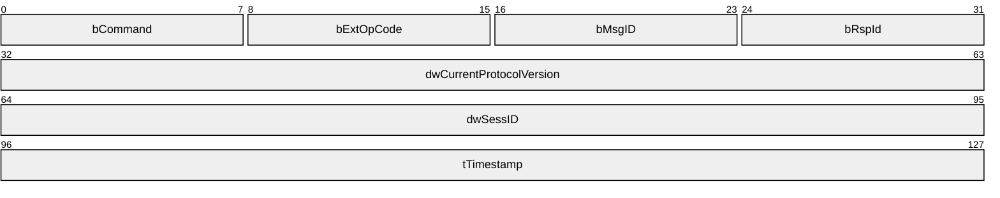
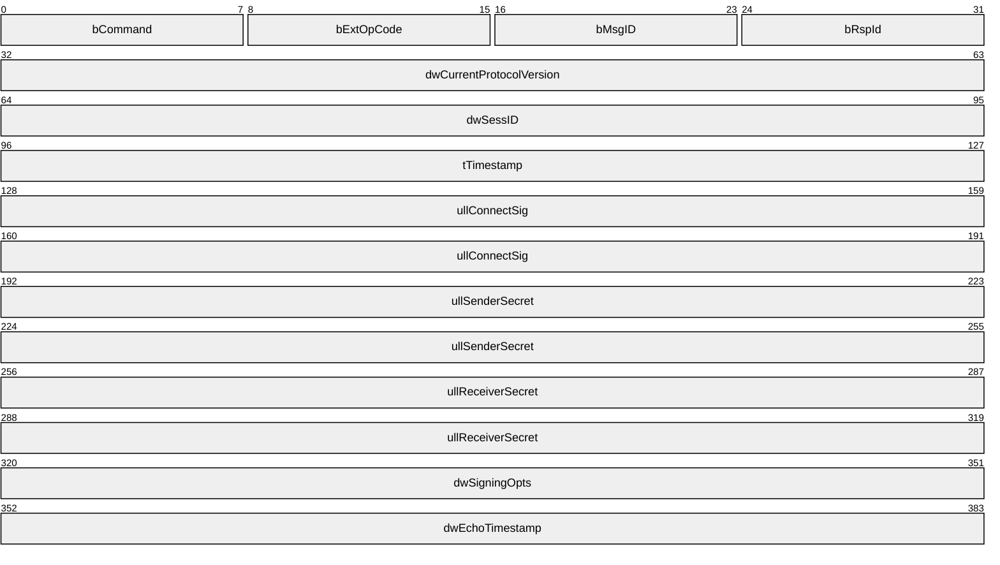
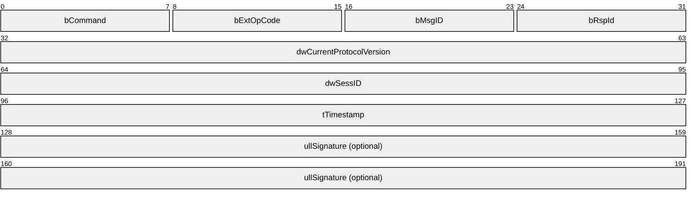
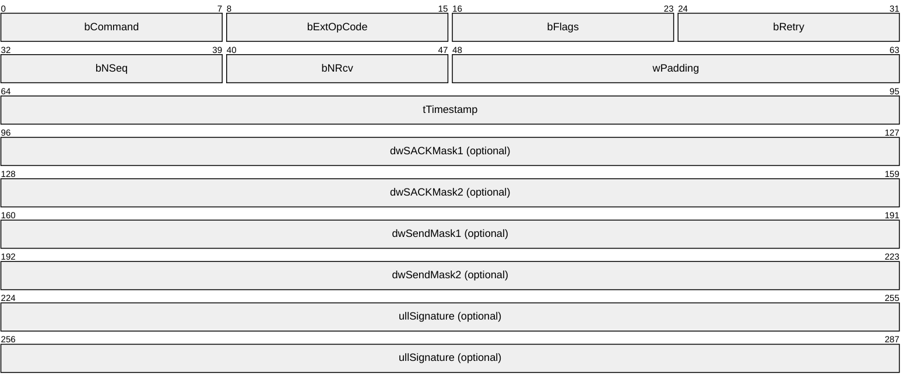
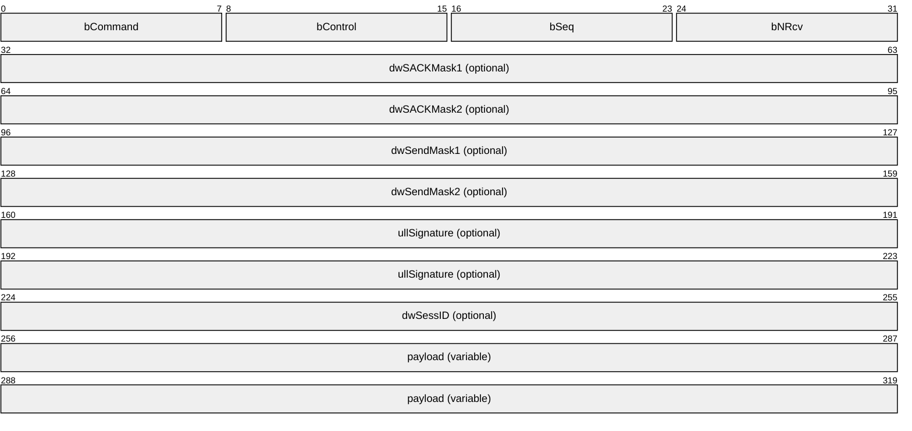
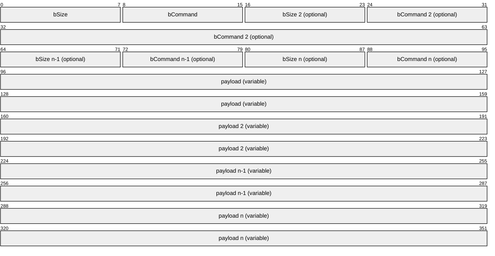

# [MC-DPL8R]: DirectPlay 8 Protocol: Reliable

Table of Contents

1 Introduction

- [1 Introduction](#Section_1)
  - [1.1 Glossary](#Section_1.1)
  - [1.2 References](#Section_1.2)
    - [1.2.1 Normative References](#Section_1.2.1)
    - [1.2.2 Informative References](#Section_1.2.2)
  - [1.3 Overview](#Section_1.3)
  - [1.4 Relationship to Other Protocols](#Section_1.4)
  - [1.5 Prerequisites/Preconditions](#Section_1.5)
  - [1.6 Applicability Statement](#Section_1.6)
  - [1.7 Versioning and Capability Negotiation](#Section_1.7)
  - [1.8 Vendor-Extensible Fields](#Section_1.8)
  - [1.9 Standards Assignments](#Section_1.9)

2 Messages

- [2 Messages](#Section_2)
  - [2.1 Transport](#Section_2.1)
  - [2.2 Message Syntax](#Section_2.2)
    - [2.2.1 Command Frames (CFRAMEs)](#Section_2.2.1)
      - [2.2.1.1 CONNECT](#Section_2.2.1.1)
      - [2.2.1.2 CONNECTED](#Section_2.2.1.2)
      - [2.2.1.3 CONNECTED_SIGNED](#Section_2.2.1.3)
      - [2.2.1.4 HARD_DISCONNECT](#Section_2.2.1.4)
      - [2.2.1.5 SACK](#Section_2.2.1.5)
    - [2.2.2 Data Frames (DFRAMEs)](#Section_2.2.2)
    - [2.2.3 Coalesced Payloads](#Section_2.2.3)

3 Protocol Details

- [3 Protocol Details](#Section_3)
  - [3.1 Common Details](#Section_3.1)
    - [3.1.1 Abstract Data Model](#Section_3.1.1)
    - [3.1.2 Timers](#Section_3.1.2)
      - [3.1.2.1 Connect Retry Timer](#Section_3.1.2.1)
      - [3.1.2.2 Delayed Acknowledgment Timer](#Section_3.1.2.2)
      - [3.1.2.3 Delayed Send Mask Timer](#Section_3.1.2.3)
      - [3.1.2.4 Hard Disconnect Timer](#Section_3.1.2.4)
      - [3.1.2.5 Retry Timer](#Section_3.1.2.5)
      - [3.1.2.6 KeepAlive Timer](#Section_3.1.2.6)
    - [3.1.3 Initialization](#Section_3.1.3)
    - [3.1.4 Higher-Layer Triggered Events](#Section_3.1.4)
      - [3.1.4.1 Listening](#Section_3.1.4.1)
      - [3.1.4.2 Connecting](#Section_3.1.4.2)
      - [3.1.4.3 Disconnecting Gracefully](#Section_3.1.4.3)
      - [3.1.4.4 Sending Application Data](#Section_3.1.4.4)
      - [3.1.4.5 Hard Disconnects](#Section_3.1.4.5)
    - [3.1.5 Processing Events and Sequencing Rules](#Section_3.1.5)
      - [3.1.5.1 CFRAMEs](#Section_3.1.5.1)
        - [3.1.5.1.1 CONNECT](#Section_3.1.5.1.1)
        - [3.1.5.1.2 CONNECTED](#Section_3.1.5.1.2)
        - [3.1.5.1.3 CONNECTED_SIGNED](#Section_3.1.5.1.3)
        - [3.1.5.1.4 HARD_DISCONNECT](#Section_3.1.5.1.4)
        - [3.1.5.1.5 SACK](#Section_3.1.5.1.5)
      - [3.1.5.2 DFRAMEs](#Section_3.1.5.2)
        - [3.1.5.2.1 Send Sequence ID (bSeq) Validation and Processing](#Section_3.1.5.2.1)
        - [3.1.5.2.2 Acknowledged Sequence ID (bNRcv) Processing](#Section_3.1.5.2.2)
        - [3.1.5.2.3 SACK Mask Processing](#Section_3.1.5.2.3)
        - [3.1.5.2.4 Send Mask Processing](#Section_3.1.5.2.4)
        - [3.1.5.2.5 Coalesced Payload Processing](#Section_3.1.5.2.5)
        - [3.1.5.2.6 Large (Multipacket) Payload Processing](#Section_3.1.5.2.6)
        - [3.1.5.2.7 Signature Processing](#Section_3.1.5.2.7)
    - [3.1.6 Timer Events](#Section_3.1.6)
      - [3.1.6.1 Connect Retry Timer](#Section_3.1.6.1)
      - [3.1.6.2 Delayed Acknowledgment Timer](#Section_3.1.6.2)
      - [3.1.6.3 Delayed Send Mask Timer](#Section_3.1.6.3)
      - [3.1.6.4 Hard Disconnect Timer](#Section_3.1.6.4)
      - [3.1.6.5 Retry Timer](#Section_3.1.6.5)
      - [3.1.6.6 KeepAlive Timer](#Section_3.1.6.6)
    - [3.1.7 Other Local Events](#Section_3.1.7)

4 Protocol Examples

- [4 Protocol Examples](#Section_4)
  - [4.1 Sample Connection Sequence](#Section_4.1)
  - [4.2 Sample Upper-Layer Data Transmission and Acknowledgment](#Section_4.2)

5 Security

- [5 Security](#Section_5)
  - [5.1 Security Considerations for Implementers](#Section_5.1)
  - [5.2 Index of Security Parameters](#Section_5.2)

6 Appendix A: Product Behavior

- [6 Appendix A: Product Behavior](#Section_6)

7 Change Tracking

- [7 Change Tracking](#Section_7)

For the legal notice and IP terms, see [LEGAL.md](../LEGAL.md).
Last updated: 4/23/2024.
See [Revision History](#revision-history) for full version history.

# 1 Introduction

This specification pertains to the DirectPlay 8 Protocol and describes functionality related to the reliable delivery of DirectPlay 8 messages. The protocol is intended for use in multiplayer game communication where it provides for the delivery of mixed messages, both reliable and unreliable, over existing datagram protocols such as the User Datagram Protocol (UDP).

Sections 1.5, 1.8, 1.9, 2, and 3 of this specification are normative. All other sections and examples in this specification are informative.

## 1.1 Glossary

This document uses the following terms:

**acknowledgment (ACK)**: A signal passed between communicating processes or computers to signify successful receipt of a transmission as part of a communications protocol.

**coalesced payload**: A special form of payload that consists of multiple traditional payloads combined into a single packet.

**command frame (CFRAME)**: A special DirectPlay 8 control frame that does not carry application payload data. For more information, see the DirectPlay 8 Protocol: Reliable Specification ([MC-DPL8R](#Section_7a35d96cdaca4311bc2bbd6a2f50bf14) section 2.2.1). See Also, [**data frame**](#gt_data-frame-dframe).

**data frame (DFRAME)**: A DirectPlay 8 frame that exists in the standard connection sequence space and typically carries application payload data. The total size of the DFRAME header and payload are to be less than the Maximum Transmission Unit (MTU) of the underlying protocols and network. For more information, see the DirectPlay 8 Protocol: Reliable Specification ([MC-DPL8R] section 2.2.2). See Also, [**command frame**](#gt_command-frame-cframe).

**DirectX**: Microsoft [**DirectX**](#gt_directx) is a collection of application programming interfaces for handling tasks related to multimedia, especially game programming and video, on Microsoft platforms.

**DirectX runtime**: A set of libraries created for the family of Windows operating systems that provide interfaces to ease the development of video games.

**game**: An application that uses a DirectPlay protocol to communicate between computers.

**game session**: The metadata associated with the collection of computers participating in a single instance of a computer [**game**](#gt_game).

**Internet Protocol security (IPsec)**: A framework of open standards for ensuring private, secure communications over Internet Protocol (IP) networks through the use of cryptographic security services. IPsec supports network-level peer authentication, data origin authentication, data integrity, data confidentiality (encryption), and replay protection.

**little-endian**: Multiple-byte values that are byte-ordered with the least significant byte stored in the memory location with the lowest address.

**local area network (LAN)**: A group of computers and other devices dispersed over a relatively limited area and connected by a communications link that enables any device to interact with any other device on the network.

**maximum transmission unit (MTU)**: The size, in bytes, of the largest packet that a given layer of a communications protocol can pass onward.

**next receive**: The next 8-bit packet [**sequence ID**](#gt_sequence-id) expected to be received, indicating [**acknowledgment**](#gt_acknowledgment-ack) of all packets up to this ID. This is typically represented as a field named bNRcv in packet structures. See Also, [**next send**](#gt_next-send).

**next send**: The next 8-bit packet [**sequence ID**](#gt_sequence-id) that will be sent. This is represented as bNSeq in the [**selective acknowledgment**](#gt_selective-acknowledgment-sack) packet structure, which does not have a [**sequence ID**](#gt_sequence-id) of its own. DirectPlay 8 protocol implementations also keep an internal counter so that IDs can be assigned in order. See Also, [**next receive**](#gt_next-receive).

**partner**: A computer connected to a local computer through either inbound or outbound connections.

**payload**: The data that is transported to and from the application that is using either the DirectPlay 4 protocol or DirectPlay 8 protocol.

**peer-to-peer**: A server-less networking technology that allows several participating network devices to share resources and communicate directly with each other.

**player**: A person who is playing a computer game. There can be multiple players on a computer participating in any given game session. See also name table.

**round-trip time (RTT)**: The time that it takes a packet to be sent to a remote partner and for that partner's acknowledgment to arrive at the original sender. This is a measurement of latency between partners.

**selective acknowledgment (SACK)**: A cumulative mechanism that indicates successful receipt of packets beyond the [**next receive**](#gt_next-receive) indicator. [**Next receive**](#gt_next-receive) reports all packets prior to when its [**sequence ID**](#gt_sequence-id) has been received, but subsequent packets can arrive out of order or with gaps in the sequence. [**SACK**](#gt_selective-acknowledgment-sack) masks enable the receiver to acknowledge these packets so that they do not have to be retried, in addition to the packets that were truly lost. See also [**acknowledgment (ACK)**](#gt_acknowledgment-ack), [**next receive**](#gt_next-receive), and [**next send**](#gt_next-send).

**send mask**: A bitmask mechanism indicating that previously sent packets might have been dropped, were not marked as reliable, and will never be retried.

**sequence ID**: A monotonically increasing 8-bit identifier for packets. This is typically represented as a field named bSeq in packet structures.

**tick count**: In DirectPlay, the count from when the system was booted, in milliseconds.

**Transmission Control Protocol (TCP)**: A protocol used with the Internet Protocol (IP) to send data in the form of message units between computers over the Internet. TCP handles keeping track of the individual units of data (called packets) that a message is divided into for efficient routing through the Internet.

**User Datagram Protocol (UDP)**: The connectionless protocol within TCP/IP that corresponds to the transport layer in the ISO/OSI reference model.

**MAY, SHOULD, MUST, SHOULD NOT, MUST NOT:** These terms (in all caps) are used as defined in [[RFC2119]](https://go.microsoft.com/fwlink/?LinkId=90317). All statements of optional behavior use either MAY, SHOULD, or SHOULD NOT.

## 1.2 References

Links to a document in the Microsoft Open Specifications library point to the correct section in the most recently published version of the referenced document. However, because individual documents in the library are not updated at the same time, the section numbers in the documents may not match. You can confirm the correct section numbering by checking the [Errata](https://go.microsoft.com/fwlink/?linkid=850906).

### 1.2.1 Normative References

We conduct frequent surveys of the normative references to assure their continued availability. If you have any issue with finding a normative reference, please contact [dochelp@microsoft.com](mailto:dochelp@microsoft.com). We will assist you in finding the relevant information.

[FIPS180] FIPS PUBS, "Secure Hash Standard", FIPS PUB 180-1, April 1995, [https://www.niatec.iri.isu.edu/GetFile.aspx?pid=63](https://go.microsoft.com/fwlink/?LinkId=89867)

[MS-DTYP] Microsoft Corporation, "[Windows Data Types](../MS-DTYP/MS-DTYP.md)".

[RFC2119] Bradner, S., "Key words for use in RFCs to Indicate Requirement Levels", BCP 14, RFC 2119, March 1997, [https://www.rfc-editor.org/info/rfc2119](https://go.microsoft.com/fwlink/?LinkId=90317)

### 1.2.2 Informative References

[MC-DPL8CS] Microsoft Corporation, "[DirectPlay 8 Protocol: Core and Service Providers](../MC-DPL8CS/MC-DPL8CS.md)".

[MC-DPLHP] Microsoft Corporation, "[DirectPlay 8 Protocol: Host and Port Enumeration](../MC-DPLHP/MC-DPLHP.md)".

[RFC2581] Allman, M., Paxson, V., and Stevens, W., "TCP Congestion Control", RFC 2581, April 1999, [https://www.rfc-editor.org/info/rfc2581](https://go.microsoft.com/fwlink/?LinkId=95127)

[RFC768] Postel, J., "User Datagram Protocol", STD 6, RFC 768, August 1980, [https://www.rfc-editor.org/info/rfc768](https://go.microsoft.com/fwlink/?LinkId=90490)

[RFC793] Postel, J., Ed., "Transmission Control Protocol: DARPA Internet Program Protocol Specification", RFC 793, September 1981, [https://www.rfc-editor.org/info/rfc793](https://go.microsoft.com/fwlink/?LinkId=150872)

## 1.3 Overview

The DirectPlay 8 Protocol is designed to perform low latency, [**multiplayer**](#gt_0258d4e2-d4f7-4099-ae0f-a02fad73e824) [**game**](#gt_game) communication between two [**partners**](#gt_partner). Its messages are nominally transported over the [**User Datagram Protocol (UDP)**](#gt_user-datagram-protocol-udp) [[RFC768]](https://go.microsoft.com/fwlink/?LinkId=90490) by using application-specific port numbers. They are processed by receivers that are also prepared to handle DirectPlay 8 Protocol: Host and Port Enumeration Protocol messages and are distinguished from such messages by their first UDP [**payload**](#gt_payload) byte, which is nonzero.

The DirectPlay 8 Protocol assigns a sequence number to each packet that it sends, and the sequence numbers received are acknowledged by the receiver. A sliding window is used to determine how many packets can be outstanding at a time, while waiting for [**acknowledgments (ACKs)**](#gt_acknowledgment-ack).

An ACK can be conveyed through two methods. One way is to bundle it within back traffic from the receiver. If no back traffic is flowing, a [**selective acknowledgment (SACK)**](#gt_selective-acknowledgment-sack) [**command frame (CFRAME)**](#gt_command-frame-cframe) packet without upper-layer payloads can be sent. If the original sender specifies the PACKET_COMMAND_POLL (acknowledge now) flag in the packet header, the receiver immediately acknowledges the packet when it arrives, which usually means that a SACK packet is required. Whether using a [**data frame (DFRAME)**](#gt_data-frame-dframe) or a SACK packet, the headers indicate the sequence number of the next packet that is expected to be received, which acknowledges that all packets with sequence numbers less than the specified number have been received correctly. Implementations might also include SACK masks in order to acknowledge that subsequent packets beyond the specified ID were received out of order.

The DirectPlay 8 Protocol uses combinations of two sets of characteristics for each payload that it sends: reliable/unreliable and sequential/nonsequential. Reliable packets are those that the upper layer deems important to retry if they are lost on the network. Packets that are not marked as reliable are for ephemeral messages that are not critical to operation and do not need to be retried—perhaps because they will be superseded by subsequent messages. Sequential packets are those that are delivered in order to the upper layer and that wait until any gaps in the sequence due to packet loss are resolved; however, nonsequential packets might be delivered to the upper layer as soon as they arrive.

A packet is deemed lost if an ACK is not received within a specified time-out—typically derived from the current [**round-trip time (RTT)**](#gt_round-trip-time-rtt), or if the receiver explicitly indicates that it encountered a gap in the sequence where the packet would have been using a SACK mask. When the loss is recognized, the implementation either resends the original packet with the same sequence number that was previously assigned if it had been marked as reliable; or the implementation updates future packets to include a [**send mask**](#gt_send-mask) that indicates that the data is never resent if the dropped packet is not marked as reliable.

The protocol also supports multiple payloads of mixed reliability and sequencing coalesced within a single message to reduce packet overhead. The packet takes on the most restrictive properties of the payload that it contains (reliable and/or sequential), although individual payloads retain their unique properties. Only the reliable subpayloads in a [**coalesced payload**](#gt_coalesced-payload) packet are retried.

The protocol uses a **KeepAlive** mechanism to make sure the network connection is still functional when no other packets are arriving to indicate that. A [KeepAlive](#Section_3.1.2.6) timer is started by both participants when the connection is established, and restarted whenever a valid packet is received. If it expires, then a [KeepAlive](#Section_3.1.2.6) message is sent. A KeepAlive message is a reliable packet that does not contain an application payload. It relies on the normal reliable packet retry mechanism to detect that the other side is no longer available.

## 1.4 Relationship to Other Protocols

The DirectPlay 8 Protocol requires [**UDP**](#gt_user-datagram-protocol-udp) or a similar datagram-oriented, connectionless protocol. The DirectPlay 8 Protocol is always implemented together with the DirectPlay 8 Host and Port Enumeration Protocol [MC-DPLHP](../MC-DPLHP/MC-DPLHP.md) and the DirectPlay 8 Core and Service Providers Protocol [MC-DPL8CS](../MC-DPL8CS/MC-DPL8CS.md). The DirectPlay 8 Protocol is required for use by the DirectPlay 8 Core and Service Providers Protocol.

**Note** All DirectPlay 8 Protocol messages are constructed so that at least one bit in the first byte is set. When a message is received and the lead byte is nonzero, the DirectPlay 8 Host and Port Enumeration Protocol passes the entire message through to the DirectPlay 8 Protocol.

## 1.5 Prerequisites/Preconditions

To establish a DirectPlay 8 Protocol connection, the consuming application on one computer system has to be listening for a new incoming connection or connections; that is, to be functioning as a server in traditional networking parlance. The application on another computer system has to discover this server via external means, such as through a [**game**](#gt_game) server list or a [**local area network (LAN)**](#gt_local-area-network-lan) broadcast discovery that uses the DirectPlay 8 Host and Port Enumeration Protocol.

## 1.6 Applicability Statement

The DirectPlay 8 Protocol is intended for use in [**multiplayer**](#gt_0258d4e2-d4f7-4099-ae0f-a02fad73e824) [**game**](#gt_game) communication where mixed reliable/unreliable, bidirectional, [**peer-to-peer**](#gt_peer-to-peer) traffic is desired. This protocol is not recommended for file transfer, or for applications with robust security needs that cannot ensure security at other layers such as [**IPsec**](#gt_internet-protocol-security-ipsec). It is also not intended as a generic replacement for the [**Transmission Control Protocol (TCP)**](#gt_transmission-control-protocol-tcp) [[RFC793]](https://go.microsoft.com/fwlink/?LinkId=150872).

## 1.7 Versioning and Capability Negotiation

This specification covers versioning issues in the following areas:

- Supported Transports: This protocol is implemented on top of [**UDP**](#gt_user-datagram-protocol-udp) but can be implemented on top of any connectionless, datagram-oriented protocol, as discussed in section [2.1](#Section_2.1).
- Protocol Versions: The DirectPlay 8 Protocol has the following version levels for features:
- Any version level between 0x00010000 and 0x00010004 implements the base features.
- A version level of 0x00010005 implements the base features and adds support for [**coalescence**](#gt_coalesced-payload).
- A version level of 0x00010006 implements the base features, supports coalescence, and adds support for signing.
The version level value is specified in the **dwCurrentProtocolVersion** field of the [CONNECT](#Section_2.2.1.1), [CONNECTED](#Section_2.2.1.2), or [CONNECTED_SIGNED](#Section_2.2.1.3) message. These features are defined in section [2.2](#Section_2.2).

- Security and Authentication Methods: The DirectPlay 8 Protocol does not natively provide robust authentication or encryption. It provides optional signing mechanisms that can be used to mitigate denial-of-service attacks, as discussed in sections [3.1.4.4](#Section_3.1.4.4) and [3.1.5.2.7](#Section_3.1.5.2.7).
- Capability Negotiation: This protocol detects some features by inspecting the **dwCurrentProtocolVersion** field in the CONNECT, CONNECTED, or CONNECTED_SIGNED messages, as described later in this section.
The fast, or full, signing packet authentication mechanisms are used to mitigate denial-of-service attacks. Both partners have to implement support for signing when sending messages and require the same support by received messages; otherwise, neither partner can make use of the signing functionality. For example, if a CONNECT packet with a version level of less than 0x00010006 (the version level that indicates support for signing) is received but the listener is using a signing mode, the receiver has to ignore the packet. Similarly, if the connector receives a CONNECTED packet instead of a CONNECTED_SIGNED packet but the connector is expecting to use signing mode, the connector has to ignore the response.

In order to use the coalescence mechanism to combine multiple, small messages into a single packet, the sender has to confirm whether the receiver will recognize the packet format. The receiver signals support for coalescence by specifying a version level value of 0x00010005 or higher in the **dwCurrentProtocolVersion** field of the CONNECT, CONNECTED, or CONNECTED_SIGNED message.

## 1.8 Vendor-Extensible Fields

None.

## 1.9 Standards Assignments

None.

# 2 Messages

This protocol references commonly used data types as defined in [MS-DTYP](../MS-DTYP/MS-DTYP.md).

## 2.1 Transport

DirectPlay 8 Protocol messages are nominally transported over [**UDP**](#gt_user-datagram-protocol-udp) by using application-specific port numbers. They are also processed by receivers that are prepared to handle DirectPlay 8 Protocol: Host and Port Enumeration Protocol messages and are distinguished from such enumeration messages by their first UDP [**payload**](#gt_payload) byte, which is nonzero.

The DirectPlay 8 Protocol does not require usage of UDP. It MAY be implemented on any connectionless, datagram-oriented protocol. It is not required, and it is not even recommended, that the underlying transport provider natively provide reliable messaging.

The DirectPlay 8 Protocol does not negotiate transport providers. If the transport provider to be used is ambiguous, the implementation MUST provide its own mechanism for distinguishing among providers. The DirectPlay 8 Protocol assumes that all remote [**partners**](#gt_partner) are using the same or binary-compatible transport providers.

## 2.2 Message Syntax

### 2.2.1 Command Frames (CFRAMEs)

[**Command frames (CFRAMEs)**](#gt_command-frame-cframe) are special control frames that do not carry application [**payload**](#gt_payload) data. They are identified by not having the **PACKET_COMMAND_DATA** flag (0x01) set in their **bCommand** fields.

#### 2.2.1.1 CONNECT

The CONNECT packet is used to request a connection. If accepted, the response is a [CONNECTED (section 2.2.1.2)](#Section_2.2.1.2) packet or a [CONNECTED_SIGNED (section 2.2.1.3)](#Section_2.2.1.3) packet, depending on whether packet signing is enabled.

**bCommand (1 byte):** A command-code bitmask that contains values that are combined by using the bitwise OR operation from the following table. The **PACKET_COMMAND_CFRAME** flag MUST be set, and the **PACKET_COMMAND_POLL** flag SHOULD be set. All other bits MUST be set to zero, and the packet MUST be ignored if they are not.

| Value | Meaning |
| --- | --- |
| 0x80 | PACKET_COMMAND_CFRAME ([**command frame (CFRAME)**](#gt_command-frame-cframe)) |
| 0x08 | PACKET_COMMAND_POLL ([**acknowledge**](#gt_acknowledgment-ack) immediately) |

**bExtOpCode (1 byte):** Extended operation code. It MUST be set to the following value:

| Value | Meaning |
| --- | --- |
| 0x01 | FRAME_EXOPCODE_CONNECT |

**bMsgID (1 byte):** A message identifier used to correlate responses. The initial value SHOULD be set to zero and SHOULD be incremented each time the connect packet is retried. The recipient MUST echo the value in **bRspId** when responding.

**bRspId (1 byte):** Not used in connect packets. This MUST be set to zero when sent and ignored on receipt.

**dwCurrentProtocolVersion (4 bytes):** The version number of the sender's DirectPlay 8 Protocol, in [**little-endian**](#gt_little-endian) byte order, where the upper 16 bits are considered a major version number and the lower 16 bits are considered a minor version number. The major version number MUST be set to 0x0001; otherwise, the packet MUST be ignored. The minor version number SHOULD<1> be set to 0x0006 to indicate support for all features, including [**coalescence**](#gt_coalesced-payload) and signing.

The recipient SHOULD be prepared to support older message formats used by earlier minor versions but MUST ignore this packet if it does not. To ensure security, the packet MUST be ignored if the recipient is using signing but the minor version number is less than 0x0006.

The recipient SHOULD be prepared to receive minor version numbers higher than what it implements and supplies in its own CONNECTED or CONNECTED_SIGNED message, but both sides MUST only use message formats compatible with the lower of their two version numbers.

| Value | Meaning |
| --- | --- |
| 0x00010000 — 0x00010004 | Any protocol version number between 1.0 and 1.4 implements the base features. |
| 0x00010005 | Protocol version number 1.5 implements the base features, and adds support for coalescence. |
| 0x00010006 | Protocol version number 1.6 implements the base features, supports coalescence, and adds support for signing. |

**dwSessID (4 bytes):** The session identifier used to correlate responses. The value is dependent upon the implementation and SHOULD be a random, nonpredictable number. This MUST NOT be set to zero unless **dwCurrentProtocolVersion** indicates a minor version less than 0x0005. This MUST remain the same value when retrying the CONNECT packet. The recipient MUST echo the value in **dwSessID** when responding.

**tTimestamp (4 bytes):** The requestor's computer system [**tick count**](#gt_tick-count), in millisecond units and specified in little-endian byte order.

#### 2.2.1.2 CONNECTED

The CONNECTED packet is used to accept a connection request or complete a connection handshake when signing is not enabled.

**bCommand (1 byte):** A command-code bitmask that contains values that are combined by using the bitwise OR operation from the following table. The **PACKET_COMMAND_CFRAME** flag MUST be set. The **PACKET_COMMAND_POLL** flag MUST be set by a listener accepting a connection request and MUST NOT be set by a connector completing the connection handshake. All other bits MUST be set to zero and the packet MUST be ignored if they are not.

| Value | Meaning |
| --- | --- |
| 0x80 | PACKET_COMMAND_CFRAME ([**command frame (CFRAME)**](#gt_command-frame-cframe)) |
| 0x08 | PACKET_COMMAND_POLL ([**acknowledge**](#gt_acknowledgment-ack) immediately) |

**bExtOpCode (1 byte):** An extended operation code. It MUST be set to the following value:

| Value | Meaning |
| --- | --- |
| 0x02 | FRAME_EXOPCODE_CONNECTED |

**bMsgID (1 byte):** A message identifier. The initial value SHOULD be set to zero and SHOULD be incremented if the packet is retried.

**bRspId (1 byte):** A response identifier. This value MUST be set to the value of the **bMsgID** field in the [CONNECT](#Section_2.2.1.1) or CONNECTED message to which this is a response.

**dwCurrentProtocolVersion (4 bytes):** The version number of the sender's DirectPlay 8 Protocol, in [**little-endian**](#gt_little-endian) byte order, where the upper 16 bits are considered a major version number and the lower 16 bits are considered a minor version number. The major version number MUST be set to 0x0001; otherwise, the packet MUST be ignored. The minor version number SHOULD<2> be set to 0x0006 to indicate support for all features, including [**coalescence**](#gt_coalesced-payload) and signing.

The recipient SHOULD be prepared to support older message formats used by earlier minor versions, but MUST ignore this packet if it does not. To ensure security, the packet MUST be ignored if the recipient is using signing but the minor version number is less than 0x0006.

The recipient SHOULD be prepared to receive minor version numbers higher than what it implements and supplies in its own CONNECTED or [CONNECTED_SIGNED](#Section_2.2.1.3) message, but both sides MUST only use message formats compatible with the lower of their two version numbers.

| Value | Meaning |
| --- | --- |
| 0x00010000 — 0x00010004 | Any protocol version number between 1.0 and 1.4 implements the base features. |
| 0x00010005 | Protocol version number 1.5 implements the base features and adds support for coalescence. |
| 0x00010006 | Protocol version number 1.6 implements the base features, supports coalescence, and adds support for signing. |

**dwSessID (4 bytes):** The session identifier. This value MUST be set to the value of **dwSessID** specified in the CONNECT or CONNECTED message to which this is a response.

**tTimestamp (4 bytes):** The sender's computer system [**tick count**](#gt_tick-count), in millisecond units, specified in little-endian byte order.

#### 2.2.1.3 CONNECTED_SIGNED

The CONNECTED_SIGNED packet is used to accept a connection request or complete a connection handshake when signing is enabled.

**bCommand (1 byte):** The command-code bitmask that contains values that are combined by using the bitwise OR operation from the following table. The **PACKET_COMMAND_CFRAME** flag MUST be set. The **PACKET_COMMAND_POLL** flag MUST be set by a listener accepting a connection request and MUST NOT be set by a connector completing the connection handshake. All other bits MUST be set to zero and the packet MUST be ignored if they are not.

| Value | Meaning |
| --- | --- |
| 0x80 | PACKET_COMMAND_CFRAME ([**command frame (CFRAME)**](#gt_command-frame-cframe)) |
| 0x08 | PACKET_COMMAND_POLL ([**acknowledge**](#gt_acknowledgment-ack) immediately) |

**bExtOpCode (1 byte):** An extended operation code. It MUST be set to the following value:

| Value | Meaning |
| --- | --- |
| 0x03 | FRAME_EXOPCODE_CONNECTED_SIGNED |

**bMsgID (1 byte):** The message identifier. The initial value SHOULD be set to zero and SHOULD be incremented by connectors if the packet is retried. Listeners SHOULD choose to avoid keeping any state by using the **ullConnectSig** cookie and MAY always set this to 0.

**bRspId (1 byte):** The response identifier. This value MUST be set to the value of **bMsgID** field in the [CONNECT](#Section_2.2.1.1) or CONNECTED_SIGNED message to which this is a response.

**dwCurrentProtocolVersion (4 bytes):** The version number of the sender's DirectPlay 8 Protocol, in [**little-endian**](#gt_little-endian) byte order, where the upper 16 bits are considered a major version number and the lower 16 bits are considered a minor version number. The major version number MUST be set to 0x0001; otherwise, the packet MUST be ignored. The minor version number SHOULD<3> be set to 0x0006 to indicate support for all features, including [**coalescence**](#gt_coalesced-payload) and signing, and MUST be set to 0x0005 or higher.

The recipient SHOULD be prepared to support older message formats used by earlier minor versions but MUST ignore this packet if it does not. To ensure security, the packet MUST be ignored if the recipient is using signing but the minor version number is less than 0x0006.

The recipient SHOULD be prepared to receive minor version numbers higher than what it implements and supplies in its own [CONNECTED](#Section_2.2.1.2) or CONNECTED_SIGNED message, but both sides MUST only use message formats compatible with the lower of their two version numbers.

| Value | Meaning |
| --- | --- |
| 0x00010000 — 0x00010004 | Any protocol version number between 1.0 and 1.4 implements the base features. |
| 0x00010005 | Protocol version number 1.5 implements the base features, and adds support for coalescence. |
| 0x00010006 | Protocol version number 1.6 implements the base features, supports coalescence, and adds support for signing. |

**dwSessID (4 bytes):** The session identifier. This value MUST be set to the value of **dwSessID**, as specified in the CONNECT or CONNECTED_SIGNED message to which this is a response.

**tTimestamp (4 bytes):** The sender's computer system [**tick count**](#gt_tick-count), in millisecond units, specified in little-endian byte order.

**ullConnectSig (8 bytes):** The listener cookie used to validate the connect handshake without keeping state. Connectors MUST echo the value specified in the CONNECTED_SIGNED message to which this is a response. Listeners MAY specify any value and SHOULD generate one that can be used to verify that the connector saw the listener's CONNECTED_SIGNED message. For more information, see section [3.1.5.1.3](#Section_3.1.5.1.3).

**ullSenderSecret (8 bytes):** The initial value for generating signatures on packets sent by the connector to the listener, in little-endian byte order. This MUST be set to zero when sent by the listener and MUST be nonzero when sent by the connector. Connectors SHOULD generate a cryptographically-secure random number.

**ullReceiverSecret (8 bytes):** The initial value for generating signatures on packets sent by the listener to the connector, in little-endian byte order. This MUST be set to zero when sent by the listener and MUST be nonzero when sent by the connector. Connectors SHOULD generate a cryptographically-secure random number.

**dwSigningOpts (4 bytes):** Option flag values, in little-endian byte order. One or the other described flag MUST be set but not both. All other bits SHOULD be set to zero when sent and MUST be ignored on receipt.

| Value | Meaning |
| --- | --- |
| 0x00000001 | PACKET_SIGNING_FAST (use signing cookie only) |
| 0x00000002 | PACKET_SIGNING_FULL (sign a digest of packet contents) |

**dwEchoTimestamp (4 bytes):** If this message is a response to a CONNECT message, the value of this field MUST be set to zero. Otherwise, if this message is a response to another CONNECTED_SIGNED message, then **dwEchoTimestamp** MUST be set to the value of the **tTimestamp** field in the CONNECTED_SIGNED message that was received.

#### 2.2.1.4 HARD_DISCONNECT

The HARD_DISCONNECT packet is used to quickly disconnect or [**acknowledge**](#gt_acknowledgment-ack) quick disconnection without waiting for remaining packets to be delivered.

**bCommand (1 byte):** The command-code bitmask that contains values that are combined by using the bitwise OR operation from the following table. The **PACKET_COMMAND_CFRAME** flag MUST be set. The **PACKET_COMMAND_POLL** flag SHOULD NOT be set. All other bits MUST be set to zero and the packet MUST be ignored if they are not.

| Value | Meaning |
| --- | --- |
| 0x80 | PACKET_COMMAND_CFRAME ([**command frame (CFRAME)**](#gt_command-frame-cframe)) |
| 0x08 | PACKET_COMMAND_POLL (acknowledge immediately) |

**bExtOpCode (1 byte):** An extended operation code. It MUST be set to the following value:

| Value | Meaning |
| --- | --- |
| 0x04 | FRAME_EXOPCODE_HARD_DISCONNECT |

**bMsgID (1 byte):** The message identifier. The value SHOULD be the next incremented value after the **bMsgID** value used when sending the previous CFRAME message of any type other than [**SACK**](#gt_selective-acknowledgment-sack), but the actual value used by a sender MUST be ignored on receipt.

**bRspId (1 byte):** The response identifier. This value SHOULD be set to zero, unless the connection is using **PACKET_SIGNING_FULL**; in which case, it MUST be set to the [**sequence ID**](#gt_sequence-id) of the next [**data frame (DFRAME)**](#gt_data-frame-dframe) that would have been sent had HARD_DISCONNECT not occurred.

**dwCurrentProtocolVersion (4 bytes):** The version number, in [**little-endian**](#gt_little-endian) byte order, of the requestor's DirectPlay 8 Protocol. The value SHOULD match the value previously sent in a [CONNECT](#Section_2.2.1.1), [CONNECTED](#Section_2.2.1.2), or [CONNECTED_SIGNED](#Section_2.2.1.3) packet, and MUST be ignored on receipt.

**dwSessID (4 bytes):** The session identifier. This value MUST be set to the same **dwSessID** value that is specified in the CONNECT message originally associated with the connection.

**tTimestamp (4 bytes):** The sender's computer system [**tick count**](#gt_tick-count), in millisecond units, specified in little-endian byte order.

**ullSignature (8 bytes):** If the connection was established using signing, this MUST be the signature of the packet using the agreed-upon signing algorithm. The packet sequence ID to be used in the calculation is the value in **bRspId**. This field MUST NOT be present if signing is not enabled for the connection.

#### 2.2.1.5 SACK

The SACK packet is used to selectively [**acknowledge**](#gt_acknowledgment-ack) outstanding packets. Packet acknowledgment (ACK) is typically bundled in all user data packets using the **bSeq** and **bNRec** fields found in the [**data frame (DFRAME)**](#gt_data-frame-dframe) header. However, the SACK packet is used when a dedicated ACK is requested (that is, when the **PACKET_COMMAND_POLL** bit in the **bCommand** header field is set) or when no user data remains for further bundled ACKs.

**bCommand (1 byte):** The command-code bitmask that contains bitwise OR values from the following table. The **PACKET_COMMAND_CFRAME** flag MUST be set. The **PACKET_COMMAND_POLL** flag SHOULD NOT be set and SHOULD be ignored on receipt. All other bits MUST be set to zero and the packet MUST be ignored if they are not.

| Value | Meaning |
| --- | --- |
| 0x80 | PACKET_COMMAND_CFRAME ([**command frame (CFRAME)**](#gt_command-frame-cframe)) |
| 0x08 | PACKET_COMMAND_POLL (acknowledge immediately) |

**bExtOpCode (1 byte):** An extended operation code. It MUST be set to the following value:

| Value | Meaning |
| --- | --- |
| 0x06 | FRAME_EXOPCODE_SACK |

**bFlags (1 byte):** A status flag or flags. The value can be one or more of the following values. All other bits MUST be set to zero. The **SACK_FLAGS_RESPONSE** flag SHOULD be set and **bRetry** SHOULD be filled in properly.

| Value | Meaning |
| --- | --- |
| 0x01 | SACK_FLAGS_RESPONSE (**bRetry** field is valid). |
| 0x02 | SACK_FLAGS_SACK_MASK1 (low 32 bits of the [**SACK**](#gt_selective-acknowledgment-sack) mask are present in **dwSACKMask1**). |
| 0x04 | SACK_FLAGS_SACK_MASK2 (high 32 bits of the SACK mask are present in **dwSACKMask2**). |
| 0x08 | SACK_FLAGS_SEND_MASK1 (low 32 bits of the [**send mask**](#gt_send-mask) are present in **dwSendMask1**). |
| 0x10 | SACK_FLAGS_SEND_MASK2 (high 32 bits of the send mask are present in **dwSendMask2**). |

**bRetry (1 byte):** Indicates whether the last received packet was a retry. This value MUST be ignored if **SACK_FLAGS_RESPONSE** is not set. The value SHOULD be set to zero if the last received DFRAME for the connection was not marked as a retry; otherwise, the value SHOULD be nonzero. Recipients MUST NOT require that any particular bit or bits be set in the nonzero case—only that at least one bit is set.

**bNSeq (1 byte):** This field represents the sequence number of the next DFRAME to send. SACK packets do not have sequence numbers of their own.

**bNRcv (1 byte):** The expected sequence number of the next packet received. If the **SACK_FLAGS_SACK_MASK1** or **SACK_FLAGS_SACK_MASK2** flag is set, the **bNRcv** field is supplemented with the corresponding additional **dwSACKMask1** or **dwSACKMask2** bitmask field that selectively acknowledges frames with sequence numbers higher than **bNRcv**.

**wPadding (2 bytes):** This SHOULD be set to zero when sent and MUST be ignored on receipt.

**tTimestamp (4 bytes):** The sender's computer system [**tick count**](#gt_tick-count), in millisecond units, specified in little-endian byte order.

**dwSACKMask1 (4 bytes):** The optional low 32 bits of the SACK mask, in little-endian byte order. The existence of this field in the packet is dependent upon the **bFlags** field having **SACK_FLAGS_SACK_MASK1** set.

**dwSACKMask2 (4 bytes):** The optional high 32 bits of the SACK mask, in little-endian byte order. The existence of this field in the packet is dependent upon the **bFlags** field having **SACK_FLAGS_SACK_MASK2** set.

**dwSendMask1 (4 bytes):** The optional low 32 bits of the send mask, in little-endian byte order. The existence of this field in the packet is dependent upon the **bFlags** field having **SACK_FLAGS_SEND_MASK1** set.

**dwSendMask2 (4 bytes):** The optional high 32 bits of the send mask, in little-endian byte order. The existence of this field in the packet is dependent upon the **bFlags** field having **SACK_FLAGS_SEND_MASK2** set.

**ullSignature (8 bytes):** If the connection was established using signing, this MUST be the signature of the packet using the agreed-upon signing algorithm. The packet [**sequence ID**](#gt_sequence-id) to be used in the calculation is the value in **bNSeq**. This field MUST NOT be present if signing is not enabled for the connection.

### 2.2.2 Data Frames (DFRAMEs)

Data frames exist in the standard connection sequence space and typically carry application [**payload**](#gt_payload) data. They all are identified by having the **PACKET_COMMAND_DATA** flag (0x01) set in their **bCommand** field. The total size of the [**data frame (DFRAME)**](#gt_data-frame-dframe) header and the application **payload** data SHOULD be less than the [**maximum transmission unit (MTU)**](#gt_maximum-transmission-unit-mtu) of the underlying protocols and network. If larger messages are to be transmitted, the implementation MUST break the application **payload** data into multiple DFRAME packets, send the portions sequentially, and set the **PACKET_COMMAND_NEW_MSG** flag on the first DFRAME and the **PACKET_COMMAND_END_MSG** flag on the final DFRAME. Otherwise, the single DFRAME MUST have both the **PACKET_COMMAND_NEW_MSG** and **PACKET_COMMAND_END_MSG** flags. Application payload data that is split into multiple DFRAMEs MUST NOT be [**coalesced**](#gt_coalesced-payload) with other payloads.

**bCommand (1 byte):** Command field. The **PACKET_COMMAND_DATA** flag MUST be set. If the packet is a **KeepAlive**, the **PACKET_COMMAND_RELIABLE**, **PACKET_COMMAND_SEQUENTIAL**, and **PACKET_COMMAND_END_MSG** flags MUST be set. If the packet contains coalesced payloads, the **PACKET_COMMAND_NEW_MSG** and **PACKET_COMMAND_END_MSG** flags MUST be set. All other flags are optional.

| Value | Meaning |
| --- | --- |
| 0x01 | PACKET_COMMAND_DATA (frame contains user data). |
| 0x02 | PACKET_COMMAND_RELIABLE (frame is delivered reliably). |
| 0x04 | PACKET_COMMAND_SEQUENTIAL (frame is indicated sequentially). |
| 0x08 | PACKET_COMMAND_POLL ([**partner**](#gt_partner) acknowledges immediately). |
| 0x10 | PACKET_COMMAND_NEW_MSG (DFRAME is first in message). |
| 0x20 | PACKET_COMMAND_END_MSG (DFRAME is last in message). |
| 0x40 | PACKET_COMMAND_USER_1 (first consumer-controlled flag). |
| 0x80 | PACKET_COMMAND_USER_2 (second consumer-controlled flag). |

**bControl (1 byte):** Control field. The following flags can be specified.

| Value | Meaning |
| --- | --- |
| 0x01 | PACKET_CONTROL_RETRY (indicates whether the frame is a retry for this sequence number). |
| 0x02 | PACKET_CONTROL_KEEPALIVE_OR_CORRELATE (protocol version levels of 0x00010005 and higher indicate that the frame is a keep-alive frame; version levels of less than 0x00010005 indicate a request for a dedicated [**acknowledgment (ACK)**](#gt_acknowledgment-ack) from the receiver). |
| 0x04 | PACKET_CONTROL_COALESCE (protocol version levels of 0x00010005 and higher indicate that the packet contains multiple payloads as described in section [2.2.3](#Section_2.2.3)). |
| 0x08 | PACKET_CONTROL_END_STREAM (last packet in the stream; indicates disconnect). |
| 0x10 | PACKET_CONTROL_SACK1 (low 32 bits of the [SACK](#Section_2.2.1.5) mask are present). |
| 0x20 | PACKET_CONTROL_SACK2 (high 32 bits of the SACK mask are present). |
| 0x40 | PACKET_CONTROL_SEND1 (low 32 bits of the cancel-[**send mask**](#gt_send-mask) are present). |
| 0x80 | PACKET_CONTROL_SEND2 (high 32 bits of the cancel-send mask are present). |

**bSeq (1 byte):** The sequence number of the packet.

**bNRcv (1 byte):** The expected sequence number of the next packet received.

**dwSACKMask1 (4 bytes):** Optional low 32 bits of the SACK mask, in [**little-endian**](#gt_little-endian) byte order. The existence of this field in the packet is dependent upon the **bControl** field having **PACKET_CONTROL_SACK1** set.

**dwSACKMask2 (4 bytes):** Optional high 32 bits of the SACK mask, in little-endian byte order. The existence of this field in the packet is dependent upon the **bControl** field having **PACKET_CONTROL_SACK2** set.

**dwSendMask1 (4 bytes):** Optional low 32 bits of the send mask, in little-endian byte order. The existence of this field in the packet is dependent upon the **bControl** field having **PACKET_CONTROL_SEND1** set.

**dwSendMask2 (4 bytes):** Optional high 32 bits of the send mask, in little-endian byte order. The existence of this field in the packet is dependent upon the **bControl** field having **PACKET_CONTROL_SEND2** set.

**ullSignature (8 bytes):** If the connection was established by using signing, this MUST be the signature of the packet using the agreed-upon signing algorithm. The packet [**sequence ID**](#gt_sequence-id) to be used in the calculation is the value in **bSeq**. This field MUST NOT be present if signing is not enabled for the connection.

**dwSessID (4 bytes):** The session identifier. When the packet is marked as **PACKET_CONTROL_KEEPALIVE_OR_CORRELATE** on connections reported as version 0x00010005 or higher, the **dwSessID** identifier MUST be set to the same **dwSessID** value specified in the [CONNECT](#Section_2.2.1.1) message originally associated with the connection, and there MUST NOT be any application **payload** data for the packet. Otherwise, **dwSessID** MUST NOT be present.

**payload (variable):** Application payload data. The size of the **payload** field is the total [**UDP**](#gt_user-datagram-protocol-udp) payload size minus the amount of data consumed by DFRAME headers up to this point. If the **PACKET_CONTROL_COALESCE** flag is set, the application **payload** data is not a single message or portion of a message; it is instead organized according to the coalesced payload format, as specified in section 2.2.3.

### 2.2.3 Coalesced Payloads

Coalesced payloads are a special form of [**payload**](#gt_payload) within standard [**data frames (DFRAME)**](#gt_data-frame-dframe). When the **PACKET_CONTROL_COALESCE** flag is set on the outer DFRAME header **bControl** field, the payload is interpreted by using this format. Frames with [**coalesced payloads**](#gt_coalesced-payload) MUST have the **PACKET_COMMAND_NEW_MSG** and **PACKET_COMMAND_END_MSG** flags set on the outer DFRAME header **bCommand** field.

Between 1 and 32 2-byte headers are placed at the beginning of the buffer. The buffer MUST NOT contain more than 32 coalesce headers. If there is an odd number of coalesce headers, two extra bytes of zero padding MUST be added at the end to align the subsequent data on a 32-bit boundary. The last nonpadded coalesce header MUST have the **PACKET_COMMAND_END_COALESCE** flag set in its **bCommand** field.

Following the headers are 1 to 32 payloads, where the sizes of each are indicated in the corresponding headers that were added in the same order. If the payload size is not a multiple of 32 bits and it is not the last payload in the message, 1 to 3 bytes of zero padding MUST be added to align the beginning of the next payload on a 32-bit boundary. The sizes indicated in the coalesce headers MUST NOT include any padding so as to preserve the message size as originally sent. The receiver MUST infer alignment padding when processing the payloads and SHOULD indicate the messages to the consumer using the unpadded size.

The total size of the DFRAME with coalesced payloads SHOULD NOT be larger than the [**maximum transmission unit (MTU)**](#gt_maximum-transmission-unit-mtu) of the underlying protocol and network. Each individual payload MUST NOT be larger than what is fit in the coalesced DFRAME.

**bSize (1 byte):** The least significant 8 bits of the size of the coalesced payload. The value is combined with the optional **PACKET_COMMAND_COALESCE_BIG_1**, **PACKET_COMMAND_COALESCE_BIG_2**, and **PACKET_COMMAND_COALESCE_BIG_3** flags to determine the actual size of the payload as an 11-bit value. The payload is constructed as follows:

- A left-bitwise-shift operation by 5 bits is performed on the contents of the **bCommand** field masked by the flags. This forms the 3 most significant bits in the actual payload.
- A bitwise OR operation with the value of **bSize** forms the lower 8 bits in the actual payload.
The actual size of the payload MUST NOT be larger than what can fit in a standard DFRAME, including any size already used to store previous coalesce headers and payloads.

**bCommand (1 byte):** Command field for the coalesced message containing zero or more flags from the following table.

| Value | Meaning |
| --- | --- |
| 0x01 | PACKET_COMMAND_END_COALESCE (this is the final coalesced payload in the frame). |
| 0x02 | PACKET_COMMAND_RELIABLE (payload is delivered reliably). |
| 0x04 | PACKET_COMMAND_SEQUENTIAL (payload is indicated sequentially). |
| 0x08 | PACKET_COMMAND_COALESCE_BIG_1 (bit 9 of the coalesced payload size). |
| 0x10 | PACKET_COMMAND_COALESCE_BIG_2 (bit 10 of the coalesced payload size). |
| 0x20 | PACKET_COMMAND_COALESCE_BIG_3 (bit 11 of the coalesced payload size, the most significant bit). |
| 0x40 | PACKET_COMMAND_USER_1 (first consumer-controlled flag). |
| 0x80 | PACKET_COMMAND_USER_2 (second consumer-controlled flag). |

**bSize 2 (1 byte):** See **bSize** earlier in this topic.

**bCommand 2 (5 bytes):** See **bCommand** earlier in this topic.

**bSize n (1 byte):** See **bSize** earlier in this topic.

**bCommand n (1 byte):** See **bCommand** earlier in this topic.

**payload (variable):** Consumer payload data.

**payload 2 (variable):** See **payload** earlier in this topic.

**payload n (variable):** See **payload** earlier in this topic.

# 3 Protocol Details

## 3.1 Common Details

Although there are no traditional client or server roles after a connection is established, a computing system MUST initially determine whether to establish an outbound connection or listen for an inbound one. After both sides have received a [CONNECTED](#Section_2.2.1.2) message from the other, they can mark the connection as established. The following diagram shows the states for a computing system performing the DirectPlay 8 Protocol unsigned connect sequence.

Figure 1: DirectPlay8 Reliable Protocol system states

When connected, the protocol behaves identically for both the connecting and listening computing systems.

### 3.1.1 Abstract Data Model

This section describes a conceptual model of possible data organization that an implementation maintains to participate in this protocol. The described organization is provided to facilitate the explanation of how the protocol behaves. This specification does not mandate that implementations adhere to this model as long as their external behavior is consistent with that described in this specification.

**dwSessID:** The [**game session**](#gt_game-session) ID used to establish the connection. This value is referenced in [HARD_DISCONNECT](#Section_2.2.1.4) [**command frames (CFRAME)**](#gt_command-frame-cframe) and **KeepAlive** [**data frames (DFRAME)**](#gt_data-frame-dframe).

**Local Secrets:** The 64-bit current local secret and previous local secret values for use when sending over fast and full-signed connections.

**Local Secret Modifier:** The 64-bit current local secret modifier value for use when sending for full-signed connections. This is derived from the most recently sent reliable message with the lowest sequence ID.

**Next Receive:** The next 8-bit packet [**sequence ID**](#gt_sequence-id) expected to be received, indicating [**acknowledgment (ACK)**](#gt_acknowledgment-ack) of all packets up to this ID.

**Next Send:** The next 8-bit packet sequence ID that will be sent.

**Remote Secrets:** The 64-bit current remote secret and previous remote secret values for use when receiving over fast and full-signed connections.

**Remote Secret Modifier:** The 64-bit current remote secret modifier value for use when receiving for full-signed connections. This is derived from the most recently received reliable message with the lowest sequence ID.

**Retry Counter:** A per-packet counter of how many times the individual [CONNECT](#Section_2.2.1.1), [CONNECTED](#Section_2.2.1.2), or reliable DFRAME has been retried.

**RTT:** A recent sample or running average of the [**round-trip time (RTT)**](#gt_round-trip-time-rtt) for the connection. This is used to schedule retries.

**Send Mask:** A sliding window bitmask that indicates whether DFRAMEs that are not marked as reliable will not be retried. The window base reference is the current [**next send**](#gt_next-send) and work backward for up to 64 bits (messages).

### 3.1.2 Timers

#### 3.1.2.1 Connect Retry Timer

The Connect Retry Timer is used to retry [CONNECT](#Section_2.2.1.1) and [CONNECTED](#Section_2.2.1.2) messages if no response is received. Implementations can retry as many times as needed and at any frequency. Recommended values are for the first retry to be 200 milliseconds, which doubles for every subsequent retry and caps at 5 seconds and 14 retries.

#### 3.1.2.2 Delayed Acknowledgment Timer

The Delayed Acknowledgment Timer that is used to reduce the frequency of dedicated [**acknowledgments (ACKs)**](#gt_acknowledgment-ack) so that they can be piggybacked onto return traffic or multiple receives, can be covered by a single reply. The recommended value is 100 milliseconds for normal ACKs and 20 milliseconds when acknowledging out-of-order or duplicate packets. However, it can be any value that maximizes ACK [**coalescence**](#gt_coalesced-payload) opportunity without introducing an undesirable latency under the particular application circumstances.

#### 3.1.2.3 Delayed Send Mask Timer

The Delayed Send Mask Timer is used to reduce the frequency of dedicated packets that contain a [**send mask**](#gt_send-mask) so that the mask can be piggybacked onto additional traffic. The recommended value is 40 milliseconds; however, it can be any value that maximizes a send mask [**coalescence**](#gt_coalesced-payload) opportunity under the particular application circumstances.

#### 3.1.2.4 Hard Disconnect Timer

The Hard Disconnect Timer is used to space multiple hard disconnect packets over time in order to increase the likelihood that one or more arrive. The recommended value is one-half of the current [**round-trip time (RTT)**](#gt_round-trip-time-rtt), with a minimum value of 10 milliseconds. The maximum interval SHOULD be capped at 500 milliseconds but MAY be any value that is appropriate for particular application requirements or network circumstances.

#### 3.1.2.5 Retry Timer

The Retry Timer is used to track when a message is considered to have been dropped and either needs to be retried or causes a [**send mask**](#gt_send-mask) to be sent. The recommended values are for the first retry to be 2.5 [**round-trip time (RTT)**](#gt_round-trip-time-rtt) plus the delayed [**acknowledgment (ACK)**](#gt_acknowledgment-ack) time-out (nominally 100 milliseconds). It is also recommended that there be linear backoff for the second and third retries, exponential backoff for the fourth through the eighth retries, and an overall cap at 5 seconds and 10 retries.

#### 3.1.2.6 KeepAlive Timer

The KeepAlive Timer is used to send a minimal reliable packet to keep the connection alive when no traffic has been received. The recommended value is 25 seconds of inactivity. There is a four second granularity on the timer.

### 3.1.3 Initialization

None.

### 3.1.4 Higher-Layer Triggered Events

#### 3.1.4.1 Listening

Higher layers that accept new connections SHOULD place the DirectPlay 8 Protocol in listening mode. The protocol SHOULD begin treating [CONNECT](#Section_2.2.1.1) messages from previously unknown sources as attempts to establish a connection and SHOULD respond with [CONNECTED](#Section_2.2.1.2) or [CONNECTED_SIGNED](#Section_2.2.1.3) messages, as specified in section [3.1.5.1.1](#Section_3.1.5.1.1).

#### 3.1.4.2 Connecting

To establish a new connection, higher layers SHOULD cause the DirectPlay 8 Protocol to send a [CONNECT](#Section_2.2.1.1) message to the specified destination. The connect timer SHOULD also be scheduled to trigger the resending of a CONNECT message if no response is received.

#### 3.1.4.3 Disconnecting Gracefully

Higher layers that will no longer communicate over an established connection SHOULD cause the DirectPlay 8 Protocol to send a reliable [DFRAME](#Section_2.2.2) message that has the **PACKET_CONTROL_END_STREAM** flag set. To avoid data loss for the upper layer, this message SHOULD NOT be sent until all messages that were previously queued by the higher layer have been sent. This **PACKET_CONTROL_END_STREAM** message SHOULD be a separate packet that contains no [**payload**](#gt_payload); however, it can be the final queued data packet.

If the connection was established with signing, the [**DFRAME**](#gt_data-frame-dframe) MUST be signed appropriately, as described in section [3.1.4.4](#Section_3.1.4.4).

Implementations MUST NOT send any additional DFRAMEs after sending a packet that has the **PACKET_CONTROL_END_STREAM** flag set to other than retries. It MUST be prepared to continue receiving and acknowledging packets until the remote [**partner**](#gt_partner) sends its own **PACKET_CONTROL_END_STREAM** packet.

Upon receipt of a packet with the **PACKET_CONTROL_END_STREAM** flag set, implementations SHOULD begin the process of disconnecting gracefully, including sending a final DFRAME with the **PACKET_CONTROL_END_STREAM** flag set, if this has not already been sent by the local system. Receivers MUST NOT expect additional DFRAMEs with [**sequence IDs**](#gt_sequence-id) beyond the one on the **PACKET_CONTROL_END_STREAM** packet, and SHOULD ignore all packets that have such sequence numbers.

When the DFRAME that contains a sender's **PACKET_CONTROL_END_STREAM** indicator has been acknowledged, and the remote partner's own **PACKET_CONTROL_END_STREAM** has been received and the [**acknowledgment (ACK)**](#gt_acknowledgment-ack) sent, the connection SHOULD be considered terminated.

Higher layers can also perform a hard disconnect, as described in section [3.1.4.5](#Section_3.1.4.5).

#### 3.1.4.4 Sending Application Data

Higher layers pass messages to the DirectPlay 8 Protocol for transmission over an established connection. The protocol SHOULD send the packets by using the requested reliable/unreliable behavior.

The higher layer MAY request that the **PACKET_COMMAND_USER_1** flag, the **PACKET_COMMAND_USER_2** flag, both flags, or neither flag be set in the **bCommand** field. On reception, the DirectPlay 8 Protocol implementation MUST pass the presence or absence of these bits unchanged to the upper layer and MUST NOT interpret their meaning.

If the message is smaller than the supported [**maximum transmission unit (MTU)**](#gt_maximum-transmission-unit-mtu) size, the packet MUST have the **PACKET_COMMAND_NEW_MSG** and **PACKET_COMMAND_END_MSG** flags set in the **bCommand** field. In this case, the [**payload**](#gt_payload) is eligible for [**coalescence**](#gt_coalesced-payload) with other payloads if the receiver's version number and the payload sizes allow.

If the message is larger than the supported MTU size, the protocol SHOULD split the message into multiple packets. The implementation SHOULD fill each packet to the maximum size allowed with any remainder in the final packet; however, it MAY divide the payload portions in any manner, such as equal portions in all packets.

The packets MUST be transmitted in order. The first packet in the series MUST have the **PACKET_COMMAND_NEW_MSG** flag set, and the last packet MUST have the **PACKET_COMMAND_END_MSG** flag set in the **bCommand** field. Subsequent messages MUST NOT be transmitted until the last packet of the large message is sent. This is because the receiver reconstructs messages according to the order of the [**sequence IDs**](#gt_sequence-id) of their constituent packets. If two messages were interleaved, the receiver would be unable to detect the end of one message from the start of the next.

If the connection was established with fast signing, the [DFRAME](#Section_2.2.2) MUST contain a **ullSignature** field that is set to the 64-bit local secret that is associated with the local sender; that is, the same value as the **CONNECTED_SIGNED** frame's **ullSenderSecret** field if the local computer system performed an outbound connection, or the same value as the **CONNECTED_SIGNED** frame's **ullReceiverSecret** field if the local computer system received an inbound connection.

If the connection was established by using full signing, the [**DFRAME**](#gt_data-frame-dframe) MUST contain a **ullSignature** field that is set to the first 64 bits of the SHA-1 signature digest, as specified in [[FIPS180]](https://go.microsoft.com/fwlink/?LinkId=89867). The digest MUST be calculated, in sequence, from the following data:

- The entire packet to be sent, extending from the beginning of the DFRAME header and concluding with the final byte of the final mask, payload, or coalesced payload, as appropriate, except with the DFRAME **ullSignature** bytes set to 0.
- The 64-bit current or previous local secret, in [**little-endian**](#gt_little-endian) byte order. The local secret to use when validating MUST be selected according to the following logic:
- If the packet is not a retry, use the current local secret.
- For retried packets, if the next new sequence ID that will be sent is less than 64 and the packet being retried has a sequence ID that is greater than or equal to 192, use the previous local secret.
- For all other retried packets, use the current local secret.
For full-signed connections, local secrets are also modified once for each time that the 8-bit sequence space wraps, in order to avoid signing all data with the same value. The modification is performed by using a modifier value that is derived from the lowest sequenced reliable payload, that is sent with a sequence ID of less than 192, and that is not a **KeepAlive**.

If the lowest sequenced packet that uses the **PACKET_COMMAND_RELIABLE** flag contains coalesced payloads, the first subpayload that is marked **PACKET_COMMAND_RELIABLE** is used to generate the modifier. If no non-**KeepAlive** reliable payload is sent with a sequence ID between 0 and 191 inclusive, the previous local secret modifier value is reused.

The local secret modifier value is initialized to the secret associated with the sender when the connection was established; that is, it begins with the same value as the [CONNECTED_SIGNED](#Section_2.2.1.3) frame's **ullSenderSecret** field if the local computer system performed an outbound connection, and it begins with the same value as the CONNECTED_SIGNED frame's **ullReceiverSecret** field if the local computer system received an inbound connection.

After sending the packet with sequence ID 255 on a full-signed connection, the sender MUST advance the secret by making the current local secret become the previous local secret and by setting the new current local secret to the first 64 bits of a SHA-1 digest (as specified in [FIPS180]) of the following data, in sequence:

- The previous 64-bit local secret, in little-endian byte order.
- The 64-bit local secret modifier value, in little-endian byte order.
DirectPlay 8 Protocol implementations MUST NOT allow more than 64 packets on the network simultaneously. Additional packets SHOULD be queued on the sender until an [**acknowledgment (ACK)**](#gt_acknowledgment-ack) for a previously sent packet is received.

Implementations SHOULD also implement [**TCP**](#gt_transmission-control-protocol-tcp)-friendly congestion control mechanisms [[RFC2581]](https://go.microsoft.com/fwlink/?LinkId=95127), such as initially allowing only two packets on the network and gradually increasing the window by one as ACKs arrive without packet loss.

#### 3.1.4.5 Hard Disconnects

Higher layers that require to terminate the connection as quickly as possible do not initiate the graceful disconnect that is specified in section [3.1.4.3](#Section_3.1.4.3). Instead, the implementation cancels all previously queued messages and terminates any packets that are still waiting for [**acknowledgments (ACKs)**](#gt_acknowledgment-ack). It MUST then send one or more [HARD_DISCONNECT](#Section_2.2.1.4) messages that are separated by brief intervals in order to make a best-effort attempt at informing the remote [**partner**](#gt_partner) of this abrupt termination. It is recommended that three HARD_DISCONNECT messages be sent by using the hard disconnect timer to schedule the subsequent attempts, as specified in section [3.1.2.4](#Section_3.1.2.4).

If the connection was established with signing, the HARD_DISCONNECT ([**CFRAME**](#gt_command-frame-cframe)) MUST be signed appropriately by using the mechanism that is specified in section [3.1.4.4](#Section_3.1.4.4).

Implementations MUST NOT send any additional data after initiating a hard disconnect. They MAY continue receiving packets until the remote partner acknowledges the termination request by sending its own hard disconnect packets.

When a HARD_DISCONNECT packet is received from the remote partner or the maximum number of local HARD_DISCONNECT packets have been sent and the final time-out has elapsed, the implementation SHOULD consider the connection terminated. See sections [3.1.5.1.4](#Section_3.1.5.1.4) and [3.1.6.4](#Section_3.1.6.4).

### 3.1.5 Processing Events and Sequencing Rules

When a packet arrives, the recipient SHOULD first check whether it is large enough to be a minimal [**data frame (DFRAME)**](#gt_data-frame-dframe) (4 bytes) and whether the first byte has the low bit (**PACKET_COMMAND_DATA**) set. If so, it MUST process the message as a [DFRAME (section 3.1.5.2)](#Section_3.1.5.2) data frame. Otherwise, if the data is at least 12 bytes and the first byte is either 0x80 or 0x88 (**PACKET_COMMAND_CFRAME** or **PACKET_COMMAND_CFRAME** | **PACKET_COMMAND_POLL**), it MUST process the message as a [CFRAME (section 3.1.5.1)](#Section_3.1.5.1) [**command frame**](#gt_command-frame-cframe). Otherwise, the message is not a valid DirectPlay 8 Protocol message and MUST be ignored or passed to other protocols.

#### 3.1.5.1 CFRAMEs

[**Command frames (CFRAMEs)**](#gt_command-frame-cframe) are handled according to the type of command; that is, the second byte of the packet listed as **bExtOpcode** MUST be a known value. If it is not one of the known values in this section, the packet MUST be discarded.

##### 3.1.5.1.1 CONNECT

If the **bExtOpcode** field indicates **FRAME_EXOPCODE_CONNECT** (0x01), the source address (for example, IPv4 address and port type when running on [**UDP**](#gt_user-datagram-protocol-udp)) for the message SHOULD be checked. If the address corresponds to one with an existing fully established connection, it SHOULD be ignored. If the address is for a previously received inbound connection that has not completed the handshake process and if the **dwSessID** field matches the previously received [CONNECT](#Section_2.2.1.1), another [CONNECTED](#Section_2.2.1.2) message SHOULD immediately be sent; otherwise, the packet SHOULD be ignored. If the address is for a previously established outbound connection that has not completed the handshake process, the packet SHOULD be ignored.

If the source address does not correspond to any existing connection, it is treated as a new connection attempt. If the recipient is not allowing connections, the packet MUST be ignored. Otherwise, it MUST check the **dwCurrentProtocolVersion** field for compatibility and reject incompatible version numbers, as indicated in section 2.2.1.1. If the recipient will require fast or full signing on the connection, it MUST also validate that **dwSessID** is not 0.

If the recipient is not enforcing signing, it SHOULD allocate resources for the new connection and send a CONNECTED response. This includes setting the connect retry timer to continue retrying the CONNECTED reply until either a valid CONNECTED response arrives from the connector, or the maximum number of retries elapses and the connection is terminated.

If the recipient is enforcing signing, it SHOULD NOT allocate resources but instead, send a [CONNECTED_SIGNED](#Section_2.2.1.3) response that uses a cookie value in its **ullConnectSig** field that can be used to subsequently verify that the connector saw the CONNECTED_SIGNED reply. This is described in more detail in section [3.1.5.1.3](#Section_3.1.5.1.3).

##### 3.1.5.1.2 CONNECTED

If the **bExtOpcode** field indicates **FRAME_EXOPCODE_CONNECTED** (0x02), the source address (for example, IPv4 address and port type when running on [**UDP**](#gt_user-datagram-protocol-udp)) for the message SHOULD be checked. If the address does not correspond to one with an existing partially or fully established connection, it SHOULD be ignored.

If the source address matches that of a previously initiated outbound connection that has not completed the handshake process, the **dwSessID** field MUST match that of the previously sent [CONNECT](#Section_2.2.1.1) packet, and the **PACKET_COMMAND_POLL** flag MUST be set in the **bCommand** field before the packet can be accepted. If the connector is enforcing signing, this unsigned response SHOULD be ignored. Otherwise, the connection is considered to be established and a [CONNECTED](#Section_2.2.1.2) response sent to confirm this connection.

If the source address matches that of a previously initiated inbound connection that has not completed the handshake process, the **dwSessID** field MUST match that of the previously received CONNECT, and the **PACKET_COMMAND_POLL** flag MUST NOT be set in the **bCommand** field before the packet can be accepted. If the connector is enforcing signing, this unsigned response SHOULD be ignored. Otherwise, the connection SHOULD be considered established.

If the source address matches that of an established connection, the **dwSessID** field MUST match the one used to establish the connection, and the **PACKET_COMMAND_POLL** flag MUST be set. If so, this connector's previous CONNECTED response was apparently lost and the connector SHOULD send a duplicate CONNECTED packet. Otherwise, the packet SHOULD be ignored.

##### 3.1.5.1.3 CONNECTED_SIGNED

If the **bExtOpcode** field indicates **FRAME_EXOPCODE_CONNECTED_SIGNED** (0x03), the source address (for example, IPv4 address and port type when running on [**UDP**](#gt_user-datagram-protocol-udp)) for the message is checked.

If the source address matches that of a previously initiated outbound connection that has not completed the handshake process, the **dwSessID** field MUST match that of the previously sent [CONNECT](#Section_2.2.1.1) packet, and the **PACKET_COMMAND_POLL** flag MUST be set in the **bCommand** field before the packet can be accepted. The **dwSigningOpts** field MUST have either the **PACKET_SIGNING_FAST** or the **PACKET_SIGNING_FULL** flag set, but not both, and the one set MUST exactly match the connector's desired signing mode. If the connector did not intend to use signing, this signed response SHOULD be ignored. Otherwise, the connection SHOULD be considered established, random sender and receiver signing secrets SHOULD be generated, and a [CONNECTED_SIGNED](#Section_2.2.1.3) response SHOULD be sent to confirm this connection. This CONNECTED_SIGNED response MUST NOT set the **PACKET_COMMAND_POLL** flag. A reliable **KeepAlive** [**DFRAME**](#gt_data-frame-dframe) MUST also then be scheduled to ensure that the remote side that did not allocate resources yet is prompted to complete the connection establishment if the CONNECTED_SIGNED response is dropped.

If the source address matches that of a previously initiated inbound connection that has not completed the handshake process, the **dwSessID** field MUST match that of the previously received CONNECT packet, and the **PACKET_COMMAND_POLL** flag MUST NOT be set in the **bCommand** field before the packet can be accepted. If the connector is not using signing, this confirmation SHOULD be ignored. Lastly, the **ullConnectSig** cookie signature field SHOULD be validated to ensure that the sender saw the previous CONNECTED_SIGNED packet. If the signature is not valid, the packet MUST be ignored. Otherwise, the connection SHOULD be allocated and considered established, and the sender and receiver secrets provided SHOULD be saved. A reliable **KeepAlive** DFRAME SHOULD also be scheduled to immediately update [**round-trip time (RTT)**](#gt_round-trip-time-rtt) measurements.

If the source address matches that of a previously established connection and the **dwSessID** field does not match the one that is used to establish the connection, or the **PACKET_COMMAND_POLL** flag is not set or the client is not intending to use signing, this packet MUST be ignored. Otherwise, a duplicate CONNECTED_SIGNED confirmation SHOULD be sent.

If the source address does not match any existing connection, the packet SHOULD be ignored. Note that if the implementation does not allocate resources when receiving the first CONNECT packet, the CONNECTED_SIGNED packets intended for previously initiated inbound connections that have not completed the handshake process would thus not match any existing connection. The **ullConnectSig** cookie field is used to determine whether this is the case, and if the cookie and thus the source address is validated, it SHOULD be handled as previously described.

This specification does not prescribe any particular method for generating or validating **ullConnectSig** cookies. If the implementation is set to use this field, it SHOULD incorporate the sender's source address (for example, the IP address and port for a UDP transport provider), the **dwSessID** value, and a time-dependent secret that only the listener knows and that uses a cryptographically secure algorithm that makes it difficult to guess.

##### 3.1.5.1.4 HARD_DISCONNECT

If the **bExtOpcode** field indicates **FRAME_EXOPCODE_HARD_DISCONNECT** (0x04), the source address (for example, the IPv4 address and port type when running on [**UDP**](#gt_user-datagram-protocol-udp)) for the message SHOULD be checked. If the address does not correspond to one with a fully established connection, it SHOULD be ignored. If the connection used signing, the signature MUST be valid or else the packet MUST be ignored. If a [HARD_DISCONNECT](#Section_2.2.1.4) message has already been received for the connection, additional actions SHOULD NOT be taken.

If the local node initiated the hard disconnect sequence, the received HARD_DISCONNECT is treated as an [**acknowledgment (ACK)**](#gt_acknowledgment-ack) of the previously sent HARD_DISCONNECT. The hard disconnect timer SHOULD be canceled, and connection termination SHOULD be considered complete.

Otherwise, the local node is receiving a new request to hard-terminate the connection and SHOULD abort all outstanding sends and then immediately send three HARD_DISCONNECT ACK packets. The connection is then considered to be terminated.

##### 3.1.5.1.5 SACK

If the **bExtOpcode** field indicates **FRAME_EXOPCODE_SACK** (0x06), the source address (for example, IPv4 address and port type when running on [**UDP**](#gt_user-datagram-protocol-udp)) for the message SHOULD be checked. If the address does not correspond to one with a fully established connection, it MUST be ignored. If the connection used signing, the signature MUST be valid; otherwise, the packet MUST be ignored. The **bNSeq**, **bNRcv**, optional [**selective acknowledgment (SACK)**](#gt_selective-acknowledgment-sack), and optional [**send mask**](#gt_send-mask) fields are then processed by using the standard rules in sections [3.1.5.2.1](#Section_3.1.5.2.1) through [3.1.5.2.4](#Section_3.1.5.2.4).

A successfully validated SACK packet SHOULD count as a valid receive and thus restart the **KeepAlive** timer.

#### 3.1.5.2 DFRAMEs

[**Data frames (DFRAME)**](#gt_data-frame-dframe) are checked to see if they were sent from an address (for example, IPv4 address and port tuple when running on [**UDP**](#gt_user-datagram-protocol-udp)) to which there is an established connection. If the address is unknown, the packet MUST be discarded.

If the connection enabled signing, and the DFRAME is not properly signed, it MUST be discarded.

If the remote computer system reported a version 0x00010005 or higher and the **PACKET_CONTROL_KEEPALIVE_OR_CORRELATE** bit was set in **bControl**, the packet is a **KeepAlive** and MUST contain the 32-bit session identifier as a [**payload**](#gt_payload). This identifier value MUST match the **dwSessID** value used to establish the connection, and receivers MUST ignore the packet if it does not match. The **PACKET_CONTROL_COALESCE** flag MUST NOT be set in **bControl** on **KeepAlives**. This payload MUST NOT be indicated to the upper layer as data.

All DFRAMEs, **KeepAlive** or otherwise, MUST have their **bNRcv**, **bSeq**, optional [**selective acknowledgment (SACK)**](#gt_selective-acknowledgment-sack) mask, and optional [**send mask**](#gt_send-mask) fields processed as described in sections [3.1.5.2.1](#Section_3.1.5.2.1) through [3.1.5.2.4](#Section_3.1.5.2.4). After the sequencing information is validated, and processing indicates that the data is either in sequence or was not marked as **PACKET_COMMAND_SEQUENTIAL** in **bCommand**, the implementation SHOULD report the data payload or [**coalesced data payloads**](#gt_coalesced-payload), if any, to its consumer. The exception is version 0x00010005 and higher **KeepAlives**, which SHOULD be treated as if they have a 0-byte payload as previously noted.

All successfully validated DFRAME packets SHOULD count as a valid receive and thus restart the [KeepAlive Timer (section 3.1.2.6)](#Section_3.1.2.6).

If the [DFRAME](#Section_2.2.2) has the **PACKET_CONTROL_END_STREAM** flag set, implementations SHOULD begin the process of disconnecting gracefully as described in section [3.1.4.3](#Section_3.1.4.3).

##### 3.1.5.2.1 Send Sequence ID (bSeq) Validation and Processing

The maximum number of unacknowledged, outstanding packets that an implementation can have at a single time is 64, and therefore, the **bSeq** field MUST either be the next [**sequence ID**](#gt_sequence-id) that is expected by the receiver, or a later ID that is less than or equal to the expected ID plus 63. If the sequence ID is outside this range, a [**selective acknowledgment (SACK)**](#gt_selective-acknowledgment-sack) packet SHOULD be sent that indicates the current expected state. If the **PACKET_COMMAND_POLL** flag is set in **bCommand**, this packet SHOULD be sent immediately. Otherwise, the dedicated [**acknowledgment (ACK)**](#gt_acknowledgment-ack) timer SHOULD be set by using the short time-out (nominally 20 milliseconds), and the SACK packet SHOULD be sent at that time. The [**payload**](#gt_payload) of the received packet MUST then be ignored.

After all other validation is performed and the packet has not been ignored, this **bSeq** value MUST become the new expected sequence ID. If the logic in the previous paragraph is used, receiving a retried packet that has the same **bSeq** value is treated as a duplicate.

Sequence IDs start at 0 for every connection. Therefore, each partner's [**next send**](#gt_next-send) value from which **bSeq** is generated MUST start at 0 for every connection.

If the sequence ID is the next expected, the receiver SHOULD process the payload and advance the expected sequence ID. If the sequence ID is out of order, but still within 63 packets, the receiver SHOULD queue the payload until it receives either:

- A delayed or retried transmission of the missing packet or packets, and can now process the sequence in order.
- A subsequent packet with a send mask indicating that the missing packet or packets did not use **PACKET_COMMAND_RELIABLE** and will never be retried. Therefore, the receiver advances its sequence as if it had already received and processed the packets.
If an implementation has out-of-order packets beyond the current expected sequence ID queued, it SHOULD indicate this to the sender using appropriate SACK masks on any outgoing [SACK](#Section_2.2.1.5)–based messages. This feedback enables the sender to avoid retrying packets that have already been successfully received.

##### 3.1.5.2.2 Acknowledged Sequence ID (bNRcv) Processing

The **bNRcv** field acknowledges reception of previously sent frames that are less than the specified ID. All [**data frame (DFRAME)**](#gt_data-frame-dframe) packets that had been sent with **bSeq** values less than **bNRcv**, accounting for 8-bit counter wrapping, no longer need to be remembered, and their retry timers SHOULD be canceled.

[**Sequence IDs**](#gt_sequence-id) start at 0 for every connection. Therefore, each partner's [**next receive**](#gt_next-receive) value from which **bNRcv** is generated MUST start at 0 for every connection.

##### 3.1.5.2.3 SACK Mask Processing

When one or both of the optional [**selective acknowledgment (SACK)**](#gt_selective-acknowledgment-sack) mask 32-bit fields is present and one or more bits are set, the sender is indicating that it received out-of-order, a packet or packets with [**sequence IDs**](#gt_sequence-id) higher than **bNRcv**, presumably due to packet loss. The two 32-bit [**little-endian**](#gt_little-endian) fields MUST be considered as one 64-bit field, where **dwSACKMask1** is the low 32 bits and **dwSACKMask2** is the high 32 bits. If one or the other field is not present, its contents MUST be considered as all 0.

The receiver of a SACK mask loops through each bit of the combined 64-bit value, from the least significant to most significant. Each bit corresponds to a sequence ID after **bNRcv**, and if that bit is set, it indicates that the corresponding packet was received out of order. Implementations SHOULD avoid retrying those packets in the future.

Implementations SHOULD also shorten the retry timer for the first frame of the window to 10 milliseconds in order to speed recovery from the packet loss indicated by a SACK mask.

##### 3.1.5.2.4 Send Mask Processing

When one or both of the optional [**send mask**](#gt_send-mask) 32-bit fields is present, and one or more bits are set, the sender is indicating that it sent a packet or packets that were not marked as reliable and for which it did not yet receive [**acknowledgments (ACK)**](#gt_acknowledgment-ack). The two 32-bit [**little-endian**](#gt_little-endian) fields MUST be considered as one 64-bit field, where **dwSendMask1** is the low 32 bits and **dwSendMask2** is the high 32 bits. If one or the other field is not present, its contents MUST be considered as all 0.

The receiver of a send mask loops through each bit of the combined 64-bit value, from the least significant to most significant. Each bit corresponds to a [**sequence ID**](#gt_sequence-id) prior to **bSeq**, and if that bit is set, it indicates that the corresponding packet has not been reliably sent and will not be retried. If the recipient of the send mask has not received the packet and has not already processed a send mask that identifies the sequence ID, it SHOULD consider the packet as dropped and release its placeholder in the sequence. For the purposes of sending acknowledgments and delivering sequential messages in order, these drops are treated the same as if the packet actually had arrived; the **Next Receive** value MUST be advanced, and if the packet with the next sequence ID was previously received, but had been queued due to the gap in the sequence, its contents SHOULD now be reported to the upper layer.

##### 3.1.5.2.5 Coalesced Payload Processing

When a [**data frame (DFRAME)**](#gt_data-frame-dframe) arrives with the **PACKET_CONTROL_COALESCE** flag set in **bControl**, the data [**payload**](#gt_payload) is made of one or more [**coalesced payloads**](#gt_coalesced-payload) instead of a single payload. These subpayloads begin with an array of 16-bit headers described in section [2.2.3](#Section_2.2.3), followed by an optional 16 bits of padding to ensure 32-bit alignment. Following this array are each of the actual payloads, all with 32-bit alignment padding except for the final payload. The recipient MUST ensure that the number of subpayloads indicated in the array is valid and does not report sizes larger than that of the remainder of the packet. It SHOULD then report each individual payload to the upper layer as if it had arrived in its own packet. These MUST be reported in the same order in which they were placed in the packet to preserve sequencing.

##### 3.1.5.2.6 Large (Multipacket) Payload Processing

When a [**data frame (DFRAME)**](#gt_data-frame-dframe) arrives with the **PACKET_COMMAND_NEW_MSG** flag set but not the **PACKET_COMMAND_END_MSG** flag set in **bCommand**, the complete data [**payload**](#gt_payload) spans more than one packet. The **PACKET_CONTROL_COALESCE** flag MUST NOT also be set. The receiver SHOULD save the received payload without indicating it to the upper layer and prepare to collect future packets.

Future DFRAME that arrive without the **PACKET_COMMAND_END_MSG** flag MUST NOT also have **PACKET_CONTROL_COALESCE** enabled. Their payloads SHOULD be added to the buffer or list.

When the next DFRAME in sequence that contains the **PACKET_COMMAND_END_MSG** flag arrives without any gaps in the sequence space, the implementation SHOULD indicate the payloads to the upper layer as a contiguous buffer in the same order in which they arrived.

If a DFRAME arrives in sequence after one that has the **PACKET_COMMAND_END_MSG** flag set but it does not have the **PACKET_COMMAND_NEW_MSG** set, the receiver SHOULD behave as if the **PACKET_COMMAND_NEW_MSG** flag were set but MAY terminate the connection. Similarly, if a DFRAME arrives in sequence with the **PACKET_COMMAND_NEW_MSG** flag set but the previous one did not have the **PACKET_COMMAND_END_MSG** flag set, the receiver SHOULD behave as if the previous packet had the **PACKET_COMMAND_END_MSG** flag set but MAY terminate the connection.

An implementation SHOULD provide an upper limit for the number of packets that can be used to send a large message, or the number of bytes that such a message can contain. If it receives the specified number of packets or bytes without any missing sequence numbers and it still has not encountered a **PACKET_COMMAND_END_MSG** flag, it SHOULD terminate the connection. The values for such limits SHOULD be appropriate for, and specific to, the application's intended resource consumption and sending patterns; no particular value is recommended in this specification.

##### 3.1.5.2.7 Signature Processing

All frames that are associated with a signed connection MUST have an **ullSignature** field present, and it MUST be validated. The method of validation depends on the signing mode that was agreed upon when the connection was established.

For fast-signed connections, the 64-bit signature MUST match exactly the secret that was associated with the remote [**partner**](#gt_partner) when the connection was set up; otherwise, the packet MUST be discarded.

For full-signed connections, the 64-bit signature MUST match exactly the first 64 bits of the expected SHA-1 signature digest or else the packet MUST be discarded. The digest MUST be calculated from the following data, in sequence:

- The entire received packet, extending from the beginning of the [**command frame (CFRAME)**](#gt_command-frame-cframe) or [**data frame (DFRAME)**](#gt_data-frame-dframe) header and concluding with the final byte of the final mask, [**payload**](#gt_payload), or [**coalesced payload**](#gt_coalesced-payload), as appropriate, except with the CFRAME or DFRAME u**llSignature** bytes set to 0.
- The 64-bit current or previous remote secret, in [**little-endian**](#gt_little-endian) byte order. The remote secret to use when validating MUST be selected according to the following logic:
- If the next expected receive [**sequence ID**](#gt_sequence-id) is greater than or equal to 192, use the previous remote secret.
- If the next expected receive sequence ID is less than 64 and the received **bSeq** value is greater than or equal to 192, use the previous remote secret.
- Otherwise, use the current remote secret.
For full-signed connections, remote secrets are also modified once each time the 8-bit sequence space wraps to avoid signing all data with the same value. The modification is performed using a modifier value derived from the lowest sequenced reliable payload received with a sequence ID of less than 192 that is not a **KeepAlive**. If the lowest sequenced packet using the **PACKET_COMMAND_RELIABLE** flag contains coalesced payload, the first subpayload that is marked **PACKET_COMMAND_RELIABLE** is used to generate the modifier. If no non-**KeepAlive** reliable payload is received with a sequence ID between 0 and 191 inclusive, the previous remote secret modifier value is reused. The remote secret modifier value is initialized to the secret associated with the sender when the connection was established; that is, it begins with the same value as the [CONNECTED_SIGNED](#Section_2.2.1.3) frame's **ullSenderSecret** field if the local computer system received an inbound connection, and it begins with the same value as the CONNECTED_SIGNED frame's **ullReceiverSecret** field if the local computer system performed an outbound connection.

Upon receiving the packet with sequence ID 192 on a full-signed connection, and there are no missing sequence IDs, the receiver MUST advance the secret by making the current remote secret become the previous remote secret, and then setting the new current remote secret to the first 64 bits of a SHA-1 digest of the following data, in sequence:

- The previous 64-bit remote secret, in little-endian byte order.
- The 64-bit remote secret modifier value, in little-endian byte order.

### 3.1.6 Timer Events

#### 3.1.6.1 Connect Retry Timer

When the Connect Retry Timer expires, a new [CONNECT](#Section_2.2.1.1) message SHOULD be sent if it is an outbound connection that has not yet received a response from the listener; otherwise, for all other cases where the Connect Retry Timer is active a new [CONNECTED](#Section_2.2.1.2) message SHOULD be sent. The Connect Retry Timer SHOULD then be rescheduled for the next period. It is recommended that the retry period starts at 200 milliseconds and doubles every time, with a maximum of 5 seconds and 14 retries.

If the maximum number of retries has already been attempted when the timer expires, the connection attempt MUST be considered as failed. If the connection was initiated from an inbound CONNECT packet arriving on a listening computing system, the listener MAY choose to go back to listening if it did not allow additional connection attempts while the failed attempt was in progress.

#### 3.1.6.2 Delayed Acknowledgment Timer

When the delayed [**acknowledgment (ACK)**](#gt_acknowledgment-ack) timer expires without having been canceled, the computer system SHOULD send a dedicated [**selective acknowledgment (SACK)**](#gt_selective-acknowledgment-sack) message that contains the current connection state information. Any active delayed [**send mask**](#gt_send-mask) timer SHOULD then be canceled.

#### 3.1.6.3 Delayed Send Mask Timer

When the delayed [**send mask**](#gt_send-mask) timer expires without having been canceled, the computer system SHOULD send a dedicated [**selective acknowledgment (SACK)**](#gt_selective-acknowledgment-sack) message that contains the current connection state information. Any active delayed [**acknowledgment (ACK)**](#gt_acknowledgment-ack) timer SHOULD then be canceled.

#### 3.1.6.4 Hard Disconnect Timer

When the Hard Disconnect Timer expires without having been canceled, the computer system SHOULD send another [HARD_DISCONNECT](#Section_2.2.1.4) packet. If the maximum number of resends has already occurred, the connection SHOULD be considered terminated. Otherwise, the hard disconnect timer SHOULD be rescheduled.

#### 3.1.6.5 Retry Timer

When the Retry Timer elapses without having been canceled and the associated packet was reliable, the [**data frame (DFRAME)**](#gt_data-frame-dframe) SHOULD be resent and the retry timer SHOULD then be scheduled for the next period. It is recommended that the retry period start at 2.5 times [**round-trip time (RTT)**](#gt_round-trip-time-rtt) plus the delayed [**acknowledgment (ACK)**](#gt_acknowledgment-ack) time-out (nominally 100 milliseconds), and that there be linear backoff for the second and third retries, exponential backoff for the fourth through eighth retries, and an overall cap at 5 seconds and 10 retries.

If the maximum number of retries has already been attempted when the timer expires, the connection MUST be considered as lost. All other in-progress sends MUST be discarded, and the upper layer SHOULD be informed of the disconnection.

When the retry timer elapses without having been canceled and the associated packet was not marked as reliable, the packet's [**sequence ID**](#gt_sequence-id) SHOULD be remembered as requiring a [**send mask**](#gt_send-mask), and a delayed send mask timer SHOULD be scheduled to transmit this information.

For reliable packets that contained [**coalesced**](#gt_coalesced-payload) reliable and unreliable subpayloads, only the reliable subpayloads SHOULD be retried. All subpayloads that are not marked as reliable MUST be removed from the packet.

Retried packets MUST always contain the latest DFRAME header information, except that **bSeq** MUST be the sequence ID originally assigned to the packet, and if the send mask is present, it MUST be relative to that **bSeq** value.

For connections that enabled full signing, retried packets MUST always be properly re-signed whenever any header information is updated, the packet is not marked as reliable, or coalesced subpayloads are removed.

#### 3.1.6.6 KeepAlive Timer

When the **KeepAlive** timer expires without having been canceled, the computing system SHOULD send a **KeepAlive** message. A **KeepAlive** message is a reliable [**data frame (DFRAME)**](#gt_data-frame-dframe) with no application [**payload**](#gt_payload). If both partners indicated a **dwCurrentProtocolVersion** value of 0x00010005 or higher, the DFRAME MUST have the **PACKET_CONTROL_KEEPALIVE_OR_CORRELATE** flag set and it MUST have the 32-bit **dwSessID** field present and set to the connection's [**game session**](#gt_game-session) ID. Otherwise, there MUST NOT be any payload.

After the reliable **KeepAlive** message begins transmitting, it MUST behave like all other reliable DFRAMEs with respect to time-outs and maximum retries. The implementation SHOULD reschedule the **KeepAlive** timer to expire again after another period of inactivity.

### 3.1.7 Other Local Events

None.

# 4 Protocol Examples

## 4.1 Sample Connection Sequence

The following five frames show an example of the multiple-step connection sequence and subsequent **KeepAlive** messages used when "Connector" initiates a connection to "Listener". The bytes are assumed to be a [**UDP**](#gt_user-datagram-protocol-udp) [**payload**](#gt_payload) (UDP and other headers not shown here).

1. Connector to Listener

[**Command Frame (CFRAME)**](#gt_command-frame-cframe) - [CONNECT](#Section_2.2.1.1), [**acknowledgment (ACK)**](#gt_acknowledgment-ack) now, message ID 0x00, response ID 0x00, version 0x00010006, [**game session**](#gt_game-session) ID 0x79C9AEC6, timestamp 0x2367369D

88 01 00 00 06 00 01 00 C6 AE C9 79 9D 36 67 23 ...........y.6g#

2. Listener to Connector

CFRAME - [CONNECTED](#Section_2.2.1.2), ACK now, message ID 0x00, response ID 0x00, version 0x00010006, game session ID 0x79C9AEC6, timestamp 0x0004DFE1

88 02 00 00 06 00 01 00 C6 AE C9 79 E1 DF 04 00 ...........y....

3. Connector to Listener

CFRAME - CONNECTED, message ID 0x01, response ID 0x00, version 0x00010006, game session ID 0x79C9AEC6, timestamp 0x2367369D

80 02 01 00 06 00 01 00 C6 AE C9 79 9D 36 67 23 ...........y.6g#

4. Connector to Listener

[**Data Frame (DFRAME)**](#gt_data-frame-dframe), marked as reliable, sequential, complete message, not a retry, not [**coalesced**](#gt_coalesced-payload), not final packet, no [**selective acknowledgment (SACK)**](#gt_selective-acknowledgment-sack) or [**send masks**](#gt_send-mask), [**sequence ID**](#gt_sequence-id) 0, [**Next Receive**](#gt_next-receive) 0, ACK now, **KeepAlive** for game session ID 0x79C9AEC6

3F 02 00 00 C6 AE C9 79 ?......y

5. Listener to Connector

DFRAME, marked as reliable, sequential, complete message, not a retry, not coalesced, not final packet, no SACK or send masks, sequence ID 0, Next Receive 0, ACK now, **KeepAlive** for game session ID 0x79C9AEC6

3F 02 00 00 C6 AE C9 79 ?......y

## 4.2 Sample Upper-Layer Data Transmission and Acknowledgment

The following two frames show an example of an upper layer sending a [**payload**](#gt_payload) from "Partner A" to "Partner B" and receiving an [**acknowledgment (ACK)**](#gt_acknowledgment-ack) in the reverse direction. The bytes are assumed to be a [**UDP**](#gt_user-datagram-protocol-udp) payload (UDP and other headers not shown here).

1. Partner A to Partner B

[**Data Frame (DFRAME)**](#gt_data-frame-dframe), not marked as reliable, sequential, ACK now, complete message, not a retry, not [**coalesced**](#gt_coalesced-payload), not final packet, no [**selective acknowledgment (SACK)**](#gt_selective-acknowledgment-sack) or [**send masks**](#gt_send-mask), [**sequence ID**](#gt_sequence-id) 5, [**Next Receive**](#gt_next-receive) 3, 5 byte payload "ABCDE"

3D 00 05 03 01 41 42 43 44 45 =....ABCDE

2. Partner B to Partner A

[**Command Frame (CFRAME)**](#gt_command-frame-cframe) - SACK, [**Next Send**](#gt_next-send) 3, Next Receive 5, not a retry, no SACK or send masks, timestamp 0x00115D07

80 06 01 00 03 06 00 00 07 5D 11 00 .........]..

# 5 Security

## 5.1 Security Considerations for Implementers

The DirectPlay 8 Protocol optionally uses the SHA-1 hashing algorithm (as specified in [[FIPS180]](https://go.microsoft.com/fwlink/?LinkId=89867)), which has been shown to have weaknesses. However, the protocol is not intended for use in applications that demand robust security without [**Internet Protocol security (IPsec)**](#gt_internet-protocol-security-ipsec) or other lower-level security mechanisms already in place.

## 5.2 Index of Security Parameters

| Security parameter | Section |
| --- | --- |
| SHA-1 digest | [3.1.4.4](#Section_3.1.4.4) and [3.1.5.2.7](#Section_3.1.5.2.7) |

# 6 Appendix A: Product Behavior

The information in this specification is applicable to the following Microsoft products or supplemental software. References to product versions include updates to those products.

- Windows XP operating system
- Windows Server 2003 operating system
- Windows Vista operating system
- Windows Server 2008 operating system
- Windows 7 operating system
- Windows Server 2008 R2 operating system
- Windows 8 operating system
- Windows Server 2012 operating system
- Windows 8.1 operating system
- Windows Server 2012 R2 operating system
- Windows 10 operating system
- Windows Server 2016 operating system
- Windows Server 2019 operating system
- Windows Server 2022 operating system
- Windows 11 operating system
- Windows Server 2025 operating system
Exceptions, if any, are noted in this section. If an update version, service pack or Knowledge Base (KB) number appears with a product name, the behavior changed in that update. The new behavior also applies to subsequent updates unless otherwise specified. If a product edition appears with the product version, behavior is different in that product edition.

Unless otherwise specified, any statement of optional behavior in this specification that is prescribed using the terms "SHOULD" or "SHOULD NOT" implies product behavior in accordance with the SHOULD or SHOULD NOT prescription. Unless otherwise specified, the term "MAY" implies that the product does not follow the prescription.

<1> Section 2.2.1.1: Windows Server 2003 and Windows XP, without the [**DirectX**](#gt_directx) 9 or later [**runtime**](#gt_1eeeaa67-fac3-4efc-859c-d30928efc6c0) installed, report versions less than 0x00010005, and do not support signing or [**coalescence**](#gt_coalesced-payload).

<2> Section 2.2.1.2: Windows Server 2003 and Windows XP, without the DirectX 9 or later runtime installed, report versions less than 0x00010005, and do not support signing or coalescence.

<3> Section 2.2.1.3: Windows Server 2003 and Windows XP, without the DirectX 9 or later runtime installed, report versions less than 0x00010005, and do not support signing or coalescence.

# 7 Change Tracking

This section identifies changes that were made to this document since the last release. Changes are classified as Major, Minor, or None.

The revision class **Major** means that the technical content in the document was significantly revised. Major changes affect protocol interoperability or implementation. Examples of major changes are:

- A document revision that incorporates changes to interoperability requirements.
- A document revision that captures changes to protocol functionality.
The revision class **Minor** means that the meaning of the technical content was clarified. Minor changes do not affect protocol interoperability or implementation. Examples of minor changes are updates to clarify ambiguity at the sentence, paragraph, or table level.

The revision class **None** means that no new technical changes were introduced. Minor editorial and formatting changes may have been made, but the relevant technical content is identical to the last released version.

The changes made to this document are listed in the following table. For more information, please contact [dochelp@microsoft.com](mailto:dochelp@microsoft.com).

| Section | Description | Revision class |
| --- | --- | --- |
| [6](#Section_6) Appendix A: Product Behavior | Added Windows Server 2025 to the list of applicable products. | Major |

## Revision History

| Date | Version | Revision Class | Comments |
| --- | --- | --- | --- |
| 8/10/2007 | 0.1 | Major | Initial Availability |
| 9/28/2007 | 0.2 | Minor | Clarified the meaning of the technical content. |
| 10/23/2007 | 0.3 | Minor | Clarified the meaning of the technical content. |
| 11/30/2007 | 1.0 | Major | Updated and revised the technical content. |
| 1/25/2008 | 2.0 | Major | Updated and revised the technical content. |
| 3/14/2008 | 3.0 | Major | Updated and revised the technical content. |
| 5/16/2008 | 4.0 | Major | Updated and revised the technical content. |
| 6/20/2008 | 4.1 | Minor | Clarified the meaning of the technical content. |
| 7/25/2008 | 4.1.1 | Editorial | Changed language and formatting in the technical content. |
| 8/29/2008 | 4.1.2 | Editorial | Changed language and formatting in the technical content. |
| 10/24/2008 | 4.1.3 | Editorial | Changed language and formatting in the technical content. |
| 12/5/2008 | 4.1.4 | Editorial | Editorial Update. |
| 1/16/2009 | 4.1.5 | Editorial | Changed language and formatting in the technical content. |
| 2/27/2009 | 5.0 | Major | Updated and revised the technical content. |
| 4/10/2009 | 6.0 | Major | Updated and revised the technical content. |
| 5/22/2009 | 6.1 | Minor | Clarified the meaning of the technical content. |
| 7/2/2009 | 6.1.1 | Editorial | Changed language and formatting in the technical content. |
| 8/14/2009 | 6.1.2 | Editorial | Changed language and formatting in the technical content. |
| 9/25/2009 | 6.2 | Minor | Clarified the meaning of the technical content. |
| 11/6/2009 | 6.2.1 | Editorial | Changed language and formatting in the technical content. |
| 12/18/2009 | 6.2.2 | Editorial | Changed language and formatting in the technical content. |
| 1/29/2010 | 7.0 | Major | Updated and revised the technical content. |
| 3/12/2010 | 7.0.1 | Editorial | Changed language and formatting in the technical content. |
| 4/23/2010 | 8.0 | Major | Updated and revised the technical content. |
| 6/4/2010 | 9.0 | Major | Updated and revised the technical content. |
| 7/16/2010 | 10.0 | Major | Updated and revised the technical content. |
| 8/27/2010 | 10.1 | Minor | Clarified the meaning of the technical content. |
| 10/8/2010 | 10.1 | None | No changes to the meaning, language, or formatting of the technical content. |
| 11/19/2010 | 10.1 | None | No changes to the meaning, language, or formatting of the technical content. |
| 1/7/2011 | 10.1 | None | No changes to the meaning, language, or formatting of the technical content. |
| 2/11/2011 | 10.1 | None | No changes to the meaning, language, or formatting of the technical content. |
| 3/25/2011 | 10.1 | None | No changes to the meaning, language, or formatting of the technical content. |
| 5/6/2011 | 10.1 | None | No changes to the meaning, language, or formatting of the technical content. |
| 6/17/2011 | 10.2 | Minor | Clarified the meaning of the technical content. |
| 9/23/2011 | 10.2 | None | No changes to the meaning, language, or formatting of the technical content. |
| 12/16/2011 | 11.0 | Major | Updated and revised the technical content. |
| 3/30/2012 | 11.0 | None | No changes to the meaning, language, or formatting of the technical content. |
| 7/12/2012 | 11.0 | None | No changes to the meaning, language, or formatting of the technical content. |
| 10/25/2012 | 11.0 | None | No changes to the meaning, language, or formatting of the technical content. |
| 1/31/2013 | 11.0 | None | No changes to the meaning, language, or formatting of the technical content. |
| 8/8/2013 | 12.0 | Major | Updated and revised the technical content. |
| 11/14/2013 | 12.0 | None | No changes to the meaning, language, or formatting of the technical content. |
| 2/13/2014 | 12.0 | None | No changes to the meaning, language, or formatting of the technical content. |
| 5/15/2014 | 12.0 | None | No changes to the meaning, language, or formatting of the technical content. |
| 6/30/2015 | 13.0 | Major | Significantly changed the technical content. |
| 10/16/2015 | 13.0 | None | No changes to the meaning, language, or formatting of the technical content. |
| 7/14/2016 | 13.0 | None | No changes to the meaning, language, or formatting of the technical content. |
| 6/1/2017 | 13.0 | None | No changes to the meaning, language, or formatting of the technical content. |
| 9/15/2017 | 14.0 | Major | Significantly changed the technical content. |
| 9/12/2018 | 15.0 | Major | Significantly changed the technical content. |
| 4/7/2021 | 16.0 | Major | Significantly changed the technical content. |
| 6/25/2021 | 17.0 | Major | Significantly changed the technical content. |
| 4/23/2024 | 18.0 | Major | Significantly changed the technical content. |
