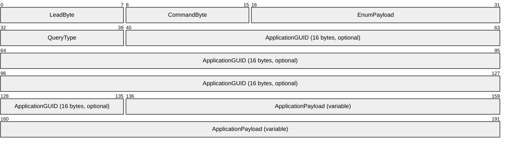
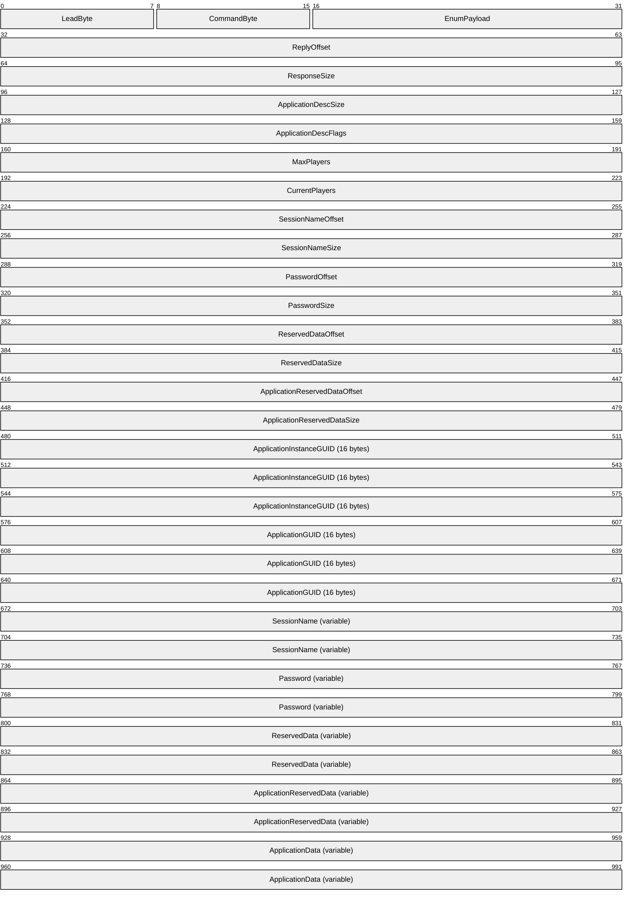
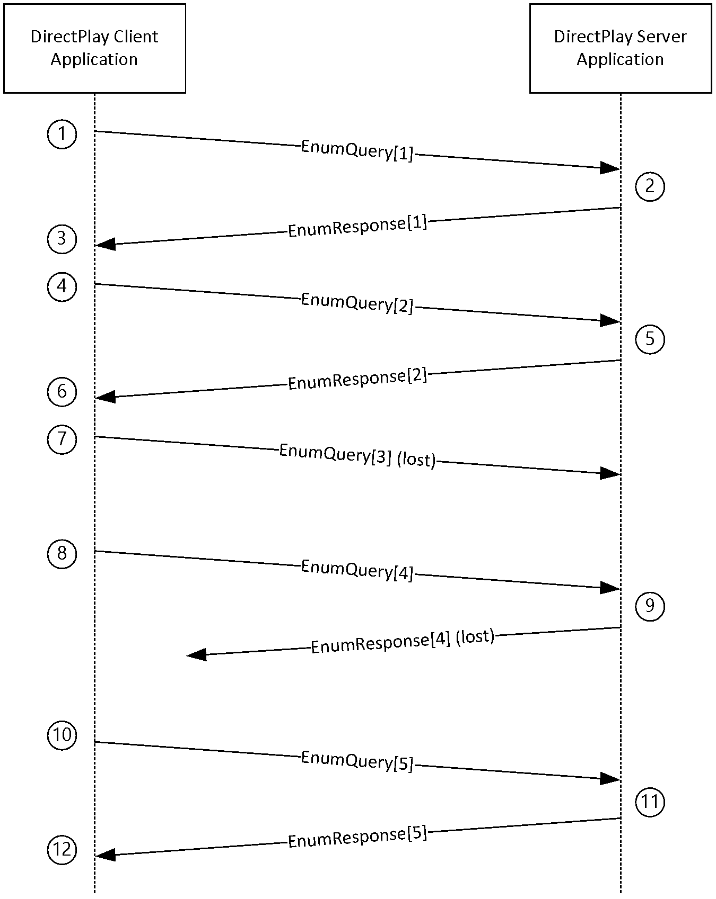

# [MC-DPLHP]: DirectPlay 8 Protocol: Host and Port Enumeration

Table of Contents

1 Introduction

- [1 Introduction](#Section_1)
  - [1.1 Glossary](#Section_1.1)
  - [1.2 References](#Section_1.2)
    - [1.2.1 Normative References](#Section_1.2.1)
    - [1.2.2 Informative References](#Section_1.2.2)
  - [1.3 Overview](#Section_1.3)
  - [1.4 Relationship to Other Protocols](#Section_1.4)
  - [1.5 Prerequisites/Preconditions](#Section_1.5)
  - [1.6 Applicability Statement](#Section_1.6)
  - [1.7 Versioning and Capability Negotiation](#Section_1.7)
  - [1.8 Vendor-Extensible Fields](#Section_1.8)
  - [1.9 Standards Assignments](#Section_1.9)

2 Messages

- [2 Messages](#Section_2)
  - [2.1 Transport](#Section_2.1)
  - [2.2 Message Syntax](#Section_2.2)
    - [2.2.1 EnumQuery](#Section_2.2.1)
    - [2.2.2 EnumResponse](#Section_2.2.2)

3 Protocol Details

- [3 Protocol Details](#Section_3)
  - [3.1 Server Details](#Section_3.1)
    - [3.1.1 Abstract Data Model](#Section_3.1.1)
    - [3.1.2 Timers](#Section_3.1.2)
    - [3.1.3 Initialization](#Section_3.1.3)
    - [3.1.4 Higher-Layer Triggered Events](#Section_3.1.4)
    - [3.1.5 Processing Events and Sequencing Rules](#Section_3.1.5)
    - [3.1.6 Timer Events](#Section_3.1.6)
    - [3.1.7 Other Local Events](#Section_3.1.7)
  - [3.2 Client Details](#Section_3.2)
    - [3.2.1 Abstract Data Model](#Section_3.2.1)
    - [3.2.2 Timers](#Section_3.2.2)
    - [3.2.3 Initialization](#Section_3.2.3)
    - [3.2.4 Higher-Layer Triggered Events](#Section_3.2.4)
    - [3.2.5 Processing Events and Sequencing Rules](#Section_3.2.5)
    - [3.2.6 Timer Events](#Section_3.2.6)
    - [3.2.7 Other Local Events](#Section_3.2.7)

4 Protocol Examples

- [4 Protocol Examples](#Section_4)

5 Security

- [5 Security](#Section_5)
  - [5.1 Security Considerations for Implementers](#Section_5.1)
  - [5.2 Index of Security Parameters](#Section_5.2)

6 Appendix A: Product Behavior

- [6 Appendix A: Product Behavior](#Section_6)

7 Change Tracking

- [7 Change Tracking](#Section_7)

For the legal notice and IP terms, see [LEGAL.md](../LEGAL.md).
Last updated: 4/23/2024.
See [Revision History](#revision-history) for full version history.

# 1 Introduction

This specification pertains to the DirectPlay 8 Protocol and describes the technology available for enumerating DirectPlay 8 hosts and ports. The enumeration functionality provided by the DirectPlay 8 Protocol allows a DirectPlay 8 Client/Peer to discover one or more DirectPlay 8 Servers/Hosts.

Sections 1.5, 1.8, 1.9, 2, and 3 of this specification are normative. All other sections and examples in this specification are informative.

## 1.1 Glossary

This document uses the following terms:

**DirectPlay**: A network communication library included with the Microsoft DirectX application programming interfaces. [**DirectPlay**](#gt_directplay) is a high-level software interface between applications and communication services that makes it easy to connect games over the Internet, a modem link, or a network.

**DirectPlay 8**: A programming library that implements the IDirectPlay8 programming interface. [**DirectPlay 8**](#gt_directplay-8) provides peer-to-peer session-layer services to applications, including session lifetime management, data management, and media abstraction. [**DirectPlay 8**](#gt_directplay-8) first shipped with the DirectX 8 software development toolkit. Later versions continued to ship up to, and including, DirectX 9. [**DirectPlay 8**](#gt_directplay-8) was subsequently deprecated. The [**DirectPlay 8**](#gt_directplay-8) DLL continues to ship in current versions of Windows operating systems, but the development library is no longer shipping in Microsoft development tools and Software Development Kits (SDKs).

**DirectPlay 8 application**: A software process that communicates with one or more software processes over a communications network by using the [**DirectPlay 8**](#gt_directplay-8) family of protocols.

**DirectPlay 8 protocol**: The [**DirectPlay 8 protocol**](#gt_directplay-8-protocol) is used by multiplayer games to perform low-latency communication between two or more computers.

**DirectPlay 8 service provider**: A service provider that can be implemented on top of the DirectPlay 8 protocol [MC-DPL8R](../MC-DPL8R/MC-DPL8R.md), as described in the DirectPlay 8 Protocol: Core and Service Providers Specification [MC-DPL8CS](../MC-DPL8CS/MC-DPL8CS.md). When a message is passed through for processing, the protocol [MC-DPLHP](#Section_1a901a85f85c497caac71e172a894243) DirectPlay 8 Protocol: Host and Port Enumeration Specification interacts directly with the DirectPlay 8 service provider.

**DirectPlay client**: A [**player**](#gt_player) in a [**DirectPlay**](#gt_directplay) client/server game session that has a single established connection with a [**DirectPlay server**](#gt_directplay-server) and is not performing game session management duties. It also refers to a potential [**player**](#gt_player) that is enumerating available [**DirectPlay servers**](#gt_directplay-server) to join.

**DirectPlay Name Server (DPNSVR)**: A forwarding service for enumeration requests that eliminates problems caused by conflicts between port usages for multiple [**DirectPlay**](#gt_directplay) applications.

**DirectPlay server**: The [**player**](#gt_player) in a [**DirectPlay**](#gt_directplay) client/server game session that is responsible for performing game session management duties, such as responding to session enumeration requests and maintaining the master copy of all the [**player**](#gt_player) and group lists for the game. It has connections to all [**DirectPlay clients**](#gt_directplay-client) in the game session.

**game**: An application that uses a [**DirectPlay**](#gt_directplay) protocol to communicate between computers.

**game session**: The metadata associated with the collection of computers participating in a single instance of a computer [**game**](#gt_game).

**globally unique identifier (GUID)**: A term used interchangeably with universally unique identifier (UUID) in Microsoft protocol technical documents (TDs). Interchanging the usage of these terms does not imply or require a specific algorithm or mechanism to generate the value. Specifically, the use of this term does not imply or require that the algorithms described in [[RFC4122]](https://go.microsoft.com/fwlink/?LinkId=90460) or [[C706]](https://go.microsoft.com/fwlink/?LinkId=89824) must be used for generating the [**GUID**](#gt_globally-unique-identifier-guid). See also universally unique identifier (UUID).

**host**: In [**DirectPlay**](#gt_directplay), the computer responsible for responding to [**DirectPlay**](#gt_directplay) game session enumeration requests and maintaining the master copy of all the [**player**](#gt_player) and group lists for the game. One computer is designated as the [**host**](#gt_host) of the [**DirectPlay**](#gt_directplay) game session. All other participants in the [**DirectPlay**](#gt_directplay) game session are called peers. However, in peer-to-peer mode the name table entry representing the [**host**](#gt_host) of the session is also marked as a peer.

**host migration**: The protocol-specific procedure that occurs when the DirectPlay peer that is designated as the [**host**](#gt_host) or voice server leaves the [**DirectPlay**](#gt_directplay) game or voice session and another peer assumes that role.

**Internetwork Packet Exchange (IPX)**: A protocol that provides connectionless datagram delivery of messages. See [[IPX]](https://go.microsoft.com/fwlink/?LinkId=89914).

**peer-to-peer**: A server-less networking technology that allows several participating network devices to share resources and communicate directly with each other.

**player**: A person who is playing a computer game. There can be multiple players on a computer participating in any given game session. See also name table.

**round-trip**: A process that imports data and then exports that data without data loss.

**round-trip time (RTT)**: The time that it takes a packet to be sent to a remote partner and for that partner's acknowledgment to arrive at the original sender. This is a measurement of latency between partners.

**serial link (or serial transport)**: Running the DXDiag application over a null modem cable connecting two computers. See also modem link.

**server application**: The application that listens to the notification URL in [MC-BUP](../MC-BUP/MC-BUP.md) section 3.2.1.1. This is also called a back-end server.

**service provider**: A module that abstracts details of underlying transports for generic [**DirectPlay**](#gt_directplay) message transmission. Each [**DirectPlay**](#gt_directplay) message is transmitted by a [**DirectPlay**](#gt_directplay) [**service provider**](#gt_service-provider). The [**service providers**](#gt_service-provider) that shipped with DirectPlay 4 are modem, serial, IPX, and TCP/IP.

**Unicode**: A character encoding standard developed by the Unicode Consortium that represents almost all of the written languages of the world. The [**Unicode**](#gt_unicode) standard [[UNICODE5.0.0/2007]](https://go.microsoft.com/fwlink/?LinkId=154659) provides three forms (UTF-8, UTF-16, and UTF-32) and seven schemes (UTF-8, UTF-16, UTF-16 BE, UTF-16 LE, UTF-32, UTF-32 LE, and UTF-32 BE).

**User Datagram Protocol (UDP)**: The connectionless protocol within TCP/IP that corresponds to the transport layer in the ISO/OSI reference model.

**MAY, SHOULD, MUST, SHOULD NOT, MUST NOT:** These terms (in all caps) are used as defined in [[RFC2119]](https://go.microsoft.com/fwlink/?LinkId=90317). All statements of optional behavior use either MAY, SHOULD, or SHOULD NOT.

## 1.2 References

Links to a document in the Microsoft Open Specifications library point to the correct section in the most recently published version of the referenced document. However, because individual documents in the library are not updated at the same time, the section numbers in the documents may not match. You can confirm the correct section numbering by checking the [Errata](https://go.microsoft.com/fwlink/?linkid=850906).

### 1.2.1 Normative References

We conduct frequent surveys of the normative references to assure their continued availability. If you have any issue with finding a normative reference, please contact [dochelp@microsoft.com](mailto:dochelp@microsoft.com). We will assist you in finding the relevant information.

[IANAPORT] IANA, "Service Name and Transport Protocol Port Number Registry", [https://www.iana.org/assignments/service-names-port-numbers/service-names-port-numbers.xhtml](https://go.microsoft.com/fwlink/?LinkId=89888)

[MC-DPL8CS] Microsoft Corporation, "[DirectPlay 8 Protocol: Core and Service Providers](../MC-DPL8CS/MC-DPL8CS.md)".

[MC-DPL8R] Microsoft Corporation, "[DirectPlay 8 Protocol: Reliable](../MC-DPL8R/MC-DPL8R.md)".

[MS-DPDX] Microsoft Corporation, "[DirectPlay DXDiag Usage Protocol](../MS-DPDX/MS-DPDX.md)".

[MS-DTYP] Microsoft Corporation, "[Windows Data Types](../MS-DTYP/MS-DTYP.md)".

[RFC2119] Bradner, S., "Key words for use in RFCs to Indicate Requirement Levels", BCP 14, RFC 2119, March 1997, [https://www.rfc-editor.org/info/rfc2119](https://go.microsoft.com/fwlink/?LinkId=90317)

[RFC768] Postel, J., "User Datagram Protocol", STD 6, RFC 768, August 1980, [https://www.rfc-editor.org/info/rfc768](https://go.microsoft.com/fwlink/?LinkId=90490)

### 1.2.2 Informative References

None.

## 1.3 Overview

The DirectPlay 8 Protocol: Host and Port Enumeration enables a [**DirectPlay Client**](#gt_directplay-client)/Peer to discover [**DirectPlay Servers**](#gt_directplay-server)/Hosts.

The basic functionality is simple. A DirectPlay Client/Peer sends an [EnumQuery](#Section_2.2.1) message over a communications network. If the EnumQuery message is received by a DirectPlay Server/Host, and the DirectPlay Server/Host looks to enable the DirectPlay Client/Peer to connect to the [**game session**](#gt_game-session) that it is hosting, it replies to the DirectPlay Client/Peer with an [EnumResponse](#Section_2.2.2) message. The EnumResponse message contains the information required by the DirectPlay Client/Peer to attempt to connect to the game session being hosted by the DirectPlay Server/Host.

Note that it is possible for one EnumQuery message to be delivered to multiple DirectPlay Servers/Hosts, each of which might or might not reply with an EnumResponse message. Therefore, one EnumQuery message can generate zero, one, or more than one EnumResponse messages. The DirectPlay Client/Peer is not obligated to connect to any of the DirectPlay Servers/Hosts that reply with an EnumResponse message. On the contrary, one of the purposes of the DirectPlay 8 Protocol: Host and Port Enumeration process is to allow a DirectPlay Client/Peer to discover multiple game sessions and to choose which one to join based on application-specific preferences, such as [**game**](#gt_game) modes, latency, number of [**players**](#gt_player), user preferences, and so on.

The EnumQuery and EnumResponse messages are delivered using the User Datagram Protocol (UDP) [[RFC768]](https://go.microsoft.com/fwlink/?LinkId=90490) or a similar datagram-oriented, connectionless protocol. As a result, both EnumQuery and EnumResponse messages can be lost. It is therefore expected that a DirectPlay Client/Peer will send multiple EnumQuery requests while searching for available DirectPlay Servers/Hosts.

It is possible, although not required, for the DirectPlay Client/Peer to note the round-trip latency of each EnumQuery/EnumResponse pair, and the number of EnumQuery/EnumResponse pairs that are lost, and use that information to predict the future quality of the network service between itself and the responding DirectPlay Servers/Hosts.

## 1.4 Relationship to Other Protocols

How a DirectPlay Client/Peer connects to the [**game session**](#gt_game-session) being hosted by a DirectPlay Server/Host that chooses to send an [EnumResponse](#Section_2.2.2) message is specified in [MC-DPL8CS](../MC-DPL8CS/MC-DPL8CS.md).

The first byte of a valid [EnumQuery](#Section_2.2.1) or EnumResponse message is set to 0x00. This causes the entire message to be processed as described in this specification. When the lead byte is nonzero, the entire message including the lead byte is passed through for processing as described in [MC-DPL8R](../MC-DPL8R/MC-DPL8R.md).

A [**DirectPlay 8 Service Provider**](#gt_directplay-8-service-provider) allows [**DirectPlay 8**](#gt_directplay-8) messages to be layered on top of multiple different underlying network transport protocols, such as IPv4, IPv6, [**IPX**](#gt_internetwork-packet-exchange-ipx), and [**serial links**](#gt_d3177233-a206-4a1c-9991-6288323da6a8). The details of the DirectPlay 8 Service Provider are specified in [MC-DPL8CS].

## 1.5 Prerequisites/Preconditions

The DirectPlay Client/Peer and DirectPlay Server/Host have already agreed upon the application [**GUID**](#gt_globally-unique-identifier-guid) they will use to identify themselves as instances of the same [**DirectPlay 8 application**](#gt_directplay-8-application).

The DirectPlay Server/Host is hosting a [**game session**](#gt_game-session) before it can participate in the DirectPlay 8 Protocol: Host and Port Enumeration.

## 1.6 Applicability Statement

The DirectPlay 8 Protocol: Host and Port Enumeration is appropriate for use when a DirectPlay Client/Peer has to query multiple DirectPlay Servers/Hosts for their current status, to determine (possibly with the assistance of user input) which DirectPlay Server/Host to connect to, if any.

On IPv4 networks, it is also appropriate to use the DirectPlay 8 Protocol: Host and Port Enumeration when only the IPv4 address information of a DirectPlay Server/Host is known, and the DirectPlay Client/Peer has to discover which port the DirectPlay Server/Host is using. In this case, the DirectPlay Client/Peer sends the [EnumQuery (section 2.2.1)](#Section_2.2.1) message to the DirectPlay 8 server well-known port, as specified in [[IANAPORT]](https://go.microsoft.com/fwlink/?LinkId=89888). Note that not all DirectPlay Servers/Hosts will respond to EnumQuery messages sent to this port. Nor do all implementations of this protocol support the use of the [**DirectPlay 8**](#gt_directplay-8) server well-known port.

## 1.7 Versioning and Capability Negotiation

The DirectPlay 8 Protocol: Host and Port Enumeration has no versioning or capability negotiation features. However, the application can use the application-specific fields of the protocol to perform application-level versioning or capability negotiation.

## 1.8 Vendor-Extensible Fields

None.

## 1.9 Standards Assignments

[**DirectPlay 8**](#gt_directplay-8) uses the following well-known [**UDP**](#gt_user-datagram-protocol-udp) port assignment, as specified in [[IANAPORT]](https://go.microsoft.com/fwlink/?LinkId=89888).

| Parameter | Value | Used by |
| --- | --- | --- |
| directplay8 | 6073/udp | DirectPlay 8 |

In addition to port 6073, a [**DirectPlay 8 application**](#gt_directplay-8-application) can also use any other arbitrary port for "in-game" communication. However, DirectPlay 8 does not mandate that these other ports be numbered within any particular range or selected according to any particular scheme. In fact, the DirectPlay 8 Host and Port Enumeration Protocol primarily uses port 6073 to allow for discovery of these other ports.

The sender of a query message can use any port for the source of the message. The server listening on port 6073 will reply to the address and port from which it receives a query. While a DirectPlay 8 application might find it convenient to send a query from the port that is being used for "in-game" communication, the sender is not required to use this port or any other particular port.

Although many DirectPlay 8 applications explicitly specify the port numbers to use for "in-game" communication, when the application has not specified particular port number(s), the DirectPlay 8 implementation chooses the first available port in the range 2302-2400.

# 2 Messages

## 2.1 Transport

[EnumQuery](#Section_2.2.1) and [EnumResponse](#Section_2.2.2) messages are delivered using the same transport upon which the DirectPlay 8 Protocol: Reliable [MC-DPL8R](../MC-DPL8R/MC-DPL8R.md) is built, which typically does not provide guaranteed message delivery. This means that both EnumQuery and EnumResponse messages might be lost.

## 2.2 Message Syntax

### 2.2.1 EnumQuery

The EnumQuery message is used to query for instances of a DirectPlay Server/Host that is hosting a [**game session**](#gt_game-session).

The size of the variable length field in the EnumQuery message is limited by whatever limit is placed on the overall message size by the [**DirectPlay 8 Service Provider**](#gt_directplay-8-service-provider) that is used to transmit the message.

**LeadByte (1 byte):** This field is 8 bits in length. It MUST be 0x00.

**Note** The first byte MUST be 0 for the message to be a valid EnumQuery message. When a message is received and the first byte is nonzero, the entire message MUST be passed through for processing as described in [MC-DPL8R](../MC-DPL8R/MC-DPL8R.md).

**CommandByte (1 byte):** This field is 8 bits in length. It MUST be 0x02.

**EnumPayload (2 bytes):** This field is 16 bits in length. The **EnumPayload** is a value selected by the sender of the EnumQuery message that can be used to match [EnumResponse](#Section_2.2.2) messages to their corresponding EnumQuery.

**QueryType (1 byte):** This field is 8 bits in length.

| Value | Meaning |
| --- | --- |
| 0x02 | Indicates that this EnumQuery message contains no **ApplicationGUID** field. All DirectPlay Servers/Hosts that receive this EnumQuery message in valid form SHOULD respond to it. |
| 0x01 | Indicates that this query contains an **ApplicationGUID** field. Only DirectPlay Servers/Hosts that are identified by the **ApplicationGUID** SHOULD respond to this EnumQuery message, if it is valid. For more information about the [**GUID**](#gt_globally-unique-identifier-guid) type, see [MS-DTYP](../MS-DTYP/MS-DTYP.md) section 2.3.4. |

**ApplicationGUID (16 bytes):** The Application GUID. This optional field, when present, is 128 bits in length.

**ApplicationPayload (variable):** This variable-length optional field, when present, MUST be a multiple of 8 bits in length. Note that the receiver is expected to discover the size of the **ApplicationPayload** field by examining the total size of the message delivered by the underlying DirectPlay 8 Service Provider, because this is the only variable-length field in this message. No explicit-size field is provided. The contents of this field are application-specific and allow the DirectPlay Client/Peer to send additional application-specific information to the DirectPlay Server/Host. The [**server application**](#gt_server-application) can then use the information to decide if it will reply to the EnumQuery, and/or determine what additional information, if any, it SHOULD return in the EnumResponse message.

### 2.2.2 EnumResponse

When a valid [EnumQuery](#Section_2.2.1) message is received by a DirectPlay Server/Host, it SHOULD reply with an EnumResponse message. The DirectPlay Server/Host SHOULD NOT respond to any EnumQuery messages where the **QueryType** field is 0x01 and the **ApplicationGUID** field does not match the [**DirectPlay Server**](#gt_directplay-server)/Host [**GUID**](#gt_globally-unique-identifier-guid).

The EnumResponse message MUST be sent to the address from which the EnumQuery message was sent. The form of this address will depend on the [**DirectPlay 8 Service Provider**](#gt_directplay-8-service-provider) that is being used. For example, in an IPv4 [**service provider**](#gt_service-provider), the address would consist of an IPv4 style address:port pair. The response MUST be sent from the address to which the DirectPlay Client/Peer connects if it chooses to join the [**game session**](#gt_game-session).

The sizes of the variable-length fields in the EnumQuery message are limited by whatever limit is placed on the overall message size by the DirectPlay 8 Service Provider that is used to transmit the message.

**LeadByte (1 byte):** This field is 8 bits in length. It MUST be 0x00.

**Note** The first byte MUST be 0 for the message to be a valid EnumResponse message. When a message is received and the first byte is nonzero, the entire message MUST be passed through for processing as described in [MC-DPL8R](../MC-DPL8R/MC-DPL8R.md).

**CommandByte (1 byte):** This field is 8 bits in length. It MUST be 0x03.

**EnumPayload (2 bytes):** This field is 16 bits in length. The **EnumPayload** is a value selected by the sender of the EnumQuery message that can be used to match EnumResponse messages to their corresponding EnumQuery.

Each EnumResponse message is generated because an EnumQuery message was received. The **EnumPayload** field in the EnumResponse message MUST match the **EnumPayload** field in the EnumQuery message that generated this EnumResponse message, so the [**DirectPlay Client**](#gt_directplay-client)/Peer can track which EnumQuery message this EnumResponse message is responding to.

**ReplyOffset (4 bytes):** This field is 32 bits in length. This field contains the zero-based offset, in bytes, of the **ApplicationData** field within this EnumResponse message. The zero-based offset of the **ApplicationData** field is measured from the start of the **ReplyOffset** field, that is, the offset into the EnumResponse message not counting the first 4 bytes. This field will be 0 if no **ApplicationData** field is contained in this message.

**ResponseSize (4 bytes):** This field is 32 bits in length. This field indicates the size, in bytes, of the **ApplicationData** field within the EnumResponse message. This field will be 0 if no **ApplicationData** field is contained in this message.

**ApplicationDescSize (4 bytes):** This field is 32 bits in length. Its value MUST be 0x00000050. It represents the sum of the size of this field plus the **ApplicationDescFlags**, **MaxPlayers**, **CurrentPlayers**, **SessionNameOffset**, **SessionNameSize**, **PasswordOffset**, **PasswordSize**, **ReservedDataOffset**, **ReservedDataSize**, **ApplicationReservedDataOffset**, **ApplicationReservedDataSize**, **ApplicationInstanceGUID**, and **ApplicationGUID** fields.

**ApplicationDescFlags (4 bytes):** This field is 32 bits in length and provides the characteristics of the application game session. It is a combination of the following bit flags.

| Value | Meaning |
| --- | --- |
| DPNSESSION_CLIENT_SERVER 0x00000001 | A client/server game session. If clear, a [**peer-to-peer**](#gt_peer-to-peer) game session. |
| DPNSESSION_MIGRATE_HOST 0x00000004 | [**Host migration**](#gt_host-migration) is allowed. |
| DPNSESSION_NODPNSVR 0x00000040 | Not using [**DirectPlay Name Server (DPNSVR)**](#gt_directplay-name-server-dpnsvr) (game session is not enumerable via well-known port 6073). |
| DPNSESSION_REQUIREPASSWORD 0x00000080 | Password required to join game session. |
| DPNSESSION_NOENUMS 0x00000100 | Enumerations are not allowed. This flag will never be set in an EnumResponse message. |
| DPNSESSION_FAST_SIGNED 0x00000200 | Fast message signing is in use. For details about fast message signing, see [MC-DPL8R]. |
| DPNSESSION_FULL_SIGNED 0x00000400 | Full message signing is in use. For details about full message signing, see [MC-DPL8R]. |

**Note** Flags 0x00000200 and 0x00000400 will never both be set, because a game session MUST never use both fast message signing and full message signing at the same time.

**MaxPlayers (4 bytes):** This field is 32 bits in length. It contains the maximum number of [**players**](#gt_player) that can join the game session identified by this EnumResponse message.

**CurrentPlayers (4 bytes):** This field is 32 bits in length. It contains the number of players currently in the game session at the time the EnumResponse message was sent by the DirectPlay Server/Host. Note that by the time the EnumResponse is received by the DirectPlay Client/Peer, the number of players in the game session might have changed.

**SessionNameOffset (4 bytes):** A 32-bit field that specifies the offset, in bytes, from the start of the **ReplyOffset** field to the **SessionName** field. If **SessionNameOffset** is 0, the packet does not include a game session name.

**SessionNameSize (4 bytes):** A 32-bit field that contains the size, in bytes, of the **SessionName** field within this EnumResponse message. The size includes the termination character. If **SessionNameSize** is 0, the packet does not include a game session name.

**PasswordOffset (4 bytes):** This field is 32 bits in length. A password is never used in the EnumResponse message; therefore, the **PasswordOffset** field will always be 0.

**PasswordSize (4 bytes):** This field is 32 bits in length. A password is never used in the EnumResponse message; therefore, the **PasswordSize** field will always be 0.

**ReservedDataOffset (4 bytes):** A 32-bit field that specifies the offset, in bytes, from the end of the **EnumPayload** field to the **ReservedData** field. If **ReservedDataOffset** is 0, the packet does not include any reserved data. The **ReservedDataOffset** field was intended to be used for future extensions to the [**DirectPlay 8 Protocol**](#gt_directplay-8-protocol), but was never used. This field is not used in the EnumResponse message and will be 0.

**ReservedDataSize (4 bytes):** A 32-bit field that specifies the size, in bytes, of the **ReservedData** field. If the value of the **ReservedDataOffset** field is 0, then **ReservedDataSize** MUST be 0. If **ReservedDataOffset** is not 0, then **ReservedDataSize** MUST NOT be 0. This field is not used in the EnumResponse message and will be 0.

**ApplicationReservedDataOffset (4 bytes):** This field is 32 bits in length. It contains the zero-based offset, in bytes, of the **ApplicationReservedData** field within this EnumResponse message. The zero-based offset of the **ApplicationReservedData** field is measured from the start of the **ReplyOffset** field, that is, the offset into the EnumResponse message not counting the first 4 bytes. If no **ApplicationReservedData** is contained in the EnumResponse message, this field will be 0.

**ApplicationReservedDataSize (4 bytes):** This field is 32 bits in length. It contains the size, in bytes, of the **ApplicationReservedData** field within this EnumResponse message. If no **ApplicationReservedData** is contained in the EnumResponse message, this field will be 0.

**ApplicationInstanceGUID (16 bytes):** This field is 128 bits in length. It contains the GUID that identifies the particular instance of the DirectPlay Server/Host that generated this EnumResponse message. Each instance of a DirectPlay Server/Host generates a new GUID each time it chooses to [**host**](#gt_host) a new game session. Since GUIDs are by definition unique, each game session will have a unique **ApplicationInstanceGUID**. For more information about the GUID type, see [MS-DTYP](../MS-DTYP/MS-DTYP.md) section 2.3.4.

**ApplicationGUID (16 bytes):** This field is 128 bits in length. It contains the GUID that identifies the DirectPlay Server/Host type that generated this EnumResponse. Each game MUST generate its own GUID to identify itself, and all DirectPlay Servers/Hosts for that game share the same ApplicationGUID that identifies the type of the DirectPlay Server/Host.

**SessionName (variable):** An optional, variable-length field that contains the human-readable name of the game session in 16-bit [**Unicode**](#gt_unicode) characters. The position of the field within the packet is determined by the **SessionNameOffset** field and the size specified in the **SessionNameSize** field, in bytes. The field is zero-terminated.

**Password (variable):** The EnumResponse message will never contain a password; therefore, this field is unused.

**ReservedData (variable):** The **ReservedData** field was intended to be used for future extensions to the DirectPlay 8 Protocol, but was never used. This field will never be used since [**DirectPlay**](#gt_directplay) has been deprecated.

**ApplicationReservedData (variable):** This optional field is of variable length. Its zero-based offset within the EnumResponse message is specified in the **ApplicationReservedDataOffset** field. Its size, in bytes, is specified in the **ApplicationReservedDataSize** field. The contents of this field are determined by the game. This field is intended to represent game-specific data that changes infrequently. For example, data that is set when the game session is created, but does not change thereafter, is appropriate for use in this field.

**ApplicationData (variable):** This optional field is of variable length. Its zero-based offset within the EnumResponse message is specified in the **ReplyOffset** field. Its size, in bytes, is specified in the **ResponseSize** field. The contents of this field are determined by the game. This field is intended to represent game-specific data that changes frequently. For example, data that changes as the game session is used, such as the current state of the game, is appropriate for use in this field.

# 3 Protocol Details

## 3.1 Server Details

### 3.1.1 Abstract Data Model

This section describes a conceptual model of possible data organization that an implementation maintains to participate in this protocol. The described organization is provided to facilitate the explanation of how the protocol behaves. This specification does not mandate that implementations adhere to this model as long as their external behavior is consistent with that described in this specification.

A [**DirectPlay Server**](#gt_directplay-server)/Host MUST be hosting a [**game session**](#gt_game-session) to be eligible to reply to [EnumQuery](#Section_2.2.1) messages. A DirectPlay Server/Host that is hosting a game session SHOULD maintain the following [**DirectPlay 8**](#gt_directplay-8) state information to be able to reply to an EnumQuery message:

- ApplicationDescFlags
- MaxPlayers
- CurrentPlayers
- SessionName (if any)
- Password (if any)
Additionally, a game can also maintain additional game specific state as follows:

- ApplicationReservedData
- ApplicationData
For detailed descriptions of each of these items, see the description of the [EnumResponse](#Section_2.2.2) message in section 2.2.2.

For more details on what it means to [**host**](#gt_host) a game session, see [MS-DPDX](../MS-DPDX/MS-DPDX.md).

### 3.1.2 Timers

[EnumQuery](#Section_2.2.1) and [EnumResponse](#Section_2.2.2) messages are delivered by using the [**DirectPlay 8 service providers**](#gt_directplay-8-service-provider), which do not offer reliable message delivery. Therefore, to achieve a degree of reliability and to enable the collection of [**RTT**](#gt_round-trip-time-rtt) and packet loss data, it is useful for the DirectPlay Client/Peer to send multiple EnumQuery messages that are spaced over a period of time.

It is appropriate to use a timer to manage the process of sending EnumQuery messages at regular intervals. The frequency of EnumQuery messages is implementation-defined. The DirectPlay 8 Protocol: Host and Port Enumeration places no restrictions on this frequency or on the number of EnumQuery messages that are sent.

### 3.1.3 Initialization

A [**DirectPlay Server**](#gt_directplay-server)/Host MUST be hosting a [**game session**](#gt_game-session) before it can respond to any [EnumQuery](#Section_2.2.1) messages.

Note that when using the IPv4 or IPv6 [**service provider**](#gt_service-provider), a DirectPlay Server/Host can specify which [**UDP**](#gt_user-datagram-protocol-udp) port to use to listen for incoming messages. The DirectPlay Client/Peer MUST be aware of this port selection in order to direct the EnumQuery message to the correct port. UDP port 6073 has been registered with IANA for use by [**DirectPlay 8**](#gt_directplay-8). If the [**DirectPlay 8 application**](#gt_directplay-8-application) has no compelling reason to use a different port, this is a good port to choose on an IPv4 or IPv6 network. Because this port is registered with IANA (as specified in [[IANAPORT]](https://go.microsoft.com/fwlink/?LinkId=89888)), and is used by multiple [**games**](#gt_game), it increases the likelihood that some firewalls might be preconfigured to allow traffic on this port. However, a game can use any port it deems appropriate, according to the rules and customs of the IP networks that it is using.

### 3.1.4 Higher-Layer Triggered Events

None.

### 3.1.5 Processing Events and Sequencing Rules

When a [**DirectPlay Server**](#gt_directplay-server)/Host is hosting a [**game session**](#gt_game-session) and it receives an [EnumQuery](#Section_2.2.1) message, it SHOULD respond to the address from which the EnumQuery message originated with an [EnumResponse](#Section_2.2.2) message. Note that the DirectPlay Server/Host can choose not to reply to any particular EnumQuery message for application-specific reasons, such as DirectPlay Server/Host load, current [**game**](#gt_game) state, or any other reason.

### 3.1.6 Timer Events

None.

### 3.1.7 Other Local Events

None.

## 3.2 Client Details

### 3.2.1 Abstract Data Model

A DirectPlay Client/Peer can send [EnumQuery](#Section_2.2.1) messages at any time and to any destination. It is useful for the DirectPlay Client/Peer to keep a record of the EnumQuery messages it has sent in the recent past so that it can correlate any replies it receives with the original EnumQuery message. This enables the DirectPlay Client/Peer to measure the [**round-trip time (RTT)**](#gt_round-trip-time-rtt) between itself and the responding DirectPlay Server/Host. It also enables the DirectPlay Client/Peer to notice any packet loss that might be occurring between itself and any responding DirectPlay Server/Host.

### 3.2.2 Timers

None.

### 3.2.3 Initialization

None.

### 3.2.4 Higher-Layer Triggered Events

None.

### 3.2.5 Processing Events and Sequencing Rules

None.

### 3.2.6 Timer Events

None.

### 3.2.7 Other Local Events

None.

# 4 Protocol Examples

The following diagram shows an example use of the DirectPlay 8 Protocol: Host and Port Enumeration.

Figure 1: DirectPlay 8 Protocol: Host and Port Enumeration

The steps depicted in the diagram example are as follows:

- The [**DirectPlay Client**](#gt_directplay-client)/Peer sends an [EnumQuery](#Section_2.2.1) message to the [**DirectPlay Server**](#gt_directplay-server)/Host. This EnumQuery message contains an **EnumPayload** value of 1. The EnumQuery message is sent to the DirectPlay Server/Host directly via the selected [**DirectPlay 8 Service Provider**](#gt_directplay-8-service-provider), which does not offer reliable message delivery. Therefore, the EnumQuery message is at risk of being lost in transit. In this example step, the EnumQuery message is successfully received by the DirectPlay Server/Host.
- The DirectPlay Server/Host receives the EnumQuery message. The DirectPlay Server/Host is hosting a [**game session**](#gt_game-session). Based on the content of the EnumQuery message and its own internal state, it responds to the EnumQuery message with an [EnumResponse](#Section_2.2.2) message. It copies the **EnumPayload** value of 1 from the EnumQuery message to the EnumResponse message and sends the EnumResponse message back to the address that the EnumQuery message came from. The EnumResponse message is sent directly via the selected DirectPlay 8 Service Provider, which does not offer reliable message delivery. Therefore, the EnumResponse message is at risk of being lost in transit. In this example step, the EnumResponse message is successfully received by the DirectPlay Client/Peer.
- The DirectPlay Client/Peer receives the EnumResponse message. Based on the content of EnumResponse message, the DirectPlay Client/Peer has the information it requires to connect to the game session that is being hosted by the responding DirectPlay Server/Host. By measuring the elapsed time between sending the EnumQuery message with **EnumPayload** of 1, and receiving the EnumResponse message with **EnumPayload** of 1, the DirectPlay Client/Peer can also estimate the [**round-trip**](#gt_round-trip) message latency between itself and the responding DirectPlay Server/Host. In this example, the DirectPlay Client/Peer does not immediately connect to the game session identified in the EnumResponse message. Instead, it continues sending EnumQuery messages at regular intervals to the DirectPlay Server/Host.
- After some reasonable time period following step 1, the DirectPlay Client/Peer sends another EnumQuery message to the DirectPlay Server/Host. This EnumQuery message contains an **EnumPayload** value of 2. The EnumQuery message is sent to the DirectPlay Server/Host directly via the selected DirectPlay 8 Service Provider, which does not offer reliable message delivery. Therefore, the EnumQuery message is at risk of being lost in transit. In this example step, the EnumQuery message is successfully received by the DirectPlay Server/Host.
- The DirectPlay Server/Host receives the EnumQuery message. The DirectPlay Server/Host is hosting a game session. Based on the content of the EnumQuery message and its own internal state, it responds to the EnumQuery message with an EnumResponse message. It copies the **EnumPayload** value of 2 from the EnumQuery message to the EnumResponse message and sends the EnumResponse message back to the address that the EnumQuery message came from. The EnumResponse message is sent directly via the selected DirectPlay 8 Service Provider, which does not offer reliable message delivery. Therefore the EnumResponse message is at risk of being lost in transit. In this example step, the EnumResponse message is successfully received by the DirectPlay Client/Peer.
- The DirectPlay Client/Peer receives the EnumResponse message. Based on the content of EnumResponse message, the DirectPlay Client/Peer has the information it requires to connect to the game session that is being hosted by the responding DirectPlay Server/Host. By measuring the elapsed time between sending the EnumQuery message with **EnumPayload** of 2, and receiving the EnumResponse message with **EnumPayload** of 2, the DirectPlay Client/Peer can also estimate the round-trip message latency between itself and the responding DirectPlay Server/Host. The DirectPlay Client/Peer now has two measurements of this round-trip message latency, and therefore can make a more accurate prediction of future message latency than it could after receiving only one EnumResponse message from this DirectPlay Server/Host. This is one of the benefits of sending multiple EnumQuery messages to the same DirectPlay Server/Host. In this example, the DirectPlay Client/Peer does not immediately connect to the game session identified in the EnumResponse message. Instead, it continues sending EnumQuery messages at regular intervals to the DirectPlay Server/Host.
- After some reasonable time period following step 4, the DirectPlay Client/Peer sends another EnumQuery message to the DirectPlay Server/Host. This EnumQuery message contains an **EnumPayload** value of 3. The EnumQuery message is sent to the DirectPlay Server/Host directly via the selected DirectPlay 8 Service Provider, which does not offer reliable message delivery. Therefore the EnumQuery message is at risk of being lost in transit. In this example step, the EnumQuery message is lost in transit and is not received by the DirectPlay Server/Host.
- After some reasonable time period following step 7, the DirectPlay Client/Peer sends another EnumQuery message to the DirectPlay Server/Host. This EnumQuery message contains an **EnumPayload** value of 4. The EnumQuery message is sent to the DirectPlay Server/Host directly via the selected DirectPlay 8 Service Provider, which does not offer reliable message delivery. Therefore, the EnumQuery message is at risk of being lost in transit. In this example step, the EnumQuery message is successfully received by the DirectPlay Server/Host.
- The DirectPlay Server/Host receives the EnumQuery message. The DirectPlay Server/Host is hosting a game session. Based on the content of the EnumQuery message and its own internal state, it responds to the EnumQuery message with an EnumResponse message. It copies the **EnumPayload** value of 4 from the EnumQuery message to the EnumResponse message and sends the EnumResponse message back to the address that the EnumQuery message came from. The EnumResponse message is sent directly via the selected DirectPlay 8 Service Provider, which does not offer reliable message delivery. Therefore, the EnumResponse message is at risk of being lost in transit. In this example step, the EnumResponse message is lost in transit and is not received by the DirectPlay Client/Peer.
- After some reasonable time period following step 8, the DirectPlay Client/Peer sends another EnumQuery message to the DirectPlay Server/Host. This EnumQuery message contains an **EnumPayload** value of 5. The EnumQuery message is sent to the DirectPlay Server/Host directly via the selected DirectPlay 8 Service Provider, which does not offer reliable message delivery. Therefore, the EnumQuery message is at risk of being lost in transit. In this example step, the EnumQuery message is successfully received by the DirectPlay Server/Host.
- The DirectPlay Server/Host receives the EnumQuery message. The DirectPlay Server/Host is hosting a game session. Based on the content of the EnumQuery message and its own internal state, it responds to the EnumQuery message with an EnumResponse message. It copies the **EnumPayload** value of 5 from the EnumQuery message to the EnumResponse message and sends the EnumResponse message back to the address that the EnumQuery message came from. The EnumResponse message is sent directly via the selected DirectPlay 8 Service Provider, which does not offer reliable message delivery. Therefore, the EnumResponse message is at risk of being lost in transit. In this example step, the EnumResponse message is successfully received by the DirectPlay Client/Peer.
- The DirectPlay Client/Peer receives the EnumResponse message. Based on the content of EnumResponse message, the DirectPlay Client/Peer has the information it requires to connect to the game session that is being hosted by the responding DirectPlay Server/Host. By measuring the elapsed time between sending the EnumQuery message with **EnumPayload** of 5, and receiving the EnumResponse message with **EnumPayload** of 5, the DirectPlay Client/Peer can also estimate the round-trip message latency between itself and the responding DirectPlay Server/Host. The DirectPlay Client/Peer now has three measurements of this round-trip message latency, and therefore can make a more accurate prediction of future message latency than it could after receiving only two EnumResponse messages from this DirectPlay Server/Host.
This is one of the benefits of sending multiple EnumQuery messages to the same DirectPlay Server/Host. Depending on the time that has elapsed since sending the EnumQuery messages with **EnumPayload** 3 and **EnumPayload** 4, the DirectPlay Client/Peer can also reasonably conclude that these EnumQuery messages, or the EnumResponse messages they have generated, have been lost in transit. With that information, the DirectPlay Client/Peer can also generate an estimate of the possible future message delivery reliability. At this time, the DirectPlay Client/Peer now has a reasonable estimate of the future round-trip message latency and reliability. It can also decide to not connect to the game session identified in the EnumResponse messages, attempt to connect to the game session identified in the EnumResponse messages, or continue to send additional periodic EnumQuery messages to obtain more information regarding the message latency and reliability between itself and the DirectPlay Server/Host.

The DirectPlay Client/Peer might also have been sending EnumQuery messages to another DirectPlay Server/Host in parallel, and might find one of those other game sessions is better in some application-specific way. The point at which a DirectPlay Client/Peer stops sending EnumQuery messages to a particular DirectPlay Server/Host is application-specific. The method that a DirectPlay Client/Peer uses to determine which game session to attempt to join is application-specific.

# 5 Security

## 5.1 Security Considerations for Implementers

None.

## 5.2 Index of Security Parameters

None.

# 6 Appendix A: Product Behavior

The information in this specification is applicable to the following Microsoft products or supplemental software. References to product versions include updates to those products.

- Windows XP operating system
- Windows Server 2003 operating system
- Windows Vista operating system
- Windows Server 2008 operating system
- Windows 7 operating system
- Windows Server 2008 R2 operating system
- Windows 8 operating system
- Windows Server 2012 operating system
- Windows 8.1 operating system
- Windows Server 2012 R2 operating system
- Windows 10 operating system
- Windows Server 2016 operating system
- Windows Server 2019 operating system
- Windows Server 2022 operating system
- Windows 11 operating system
- Windows Server 2025 operating system
Exceptions, if any, are noted in this section. If an update version, service pack or Knowledge Base (KB) number appears with a product name, the behavior changed in that update. The new behavior also applies to subsequent updates unless otherwise specified. If a product edition appears with the product version, behavior is different in that product edition.

Unless otherwise specified, any statement of optional behavior in this specification that is prescribed using the terms "SHOULD" or "SHOULD NOT" implies product behavior in accordance with the SHOULD or SHOULD NOT prescription. Unless otherwise specified, the term "MAY" implies that the product does not follow the prescription.

# 7 Change Tracking

This section identifies changes that were made to this document since the last release. Changes are classified as Major, Minor, or None.

The revision class **Major** means that the technical content in the document was significantly revised. Major changes affect protocol interoperability or implementation. Examples of major changes are:

- A document revision that incorporates changes to interoperability requirements.
- A document revision that captures changes to protocol functionality.
The revision class **Minor** means that the meaning of the technical content was clarified. Minor changes do not affect protocol interoperability or implementation. Examples of minor changes are updates to clarify ambiguity at the sentence, paragraph, or table level.

The revision class **None** means that no new technical changes were introduced. Minor editorial and formatting changes may have been made, but the relevant technical content is identical to the last released version.

The changes made to this document are listed in the following table. For more information, please contact [dochelp@microsoft.com](mailto:dochelp@microsoft.com).

| Section | Description | Revision class |
| --- | --- | --- |
| [6](#Section_6) Appendix A: Product Behavior | Added Windows Server 2025 to the list of applicable products. | Major |

## Revision History

| Date | Version | Revision Class | Comments |
| --- | --- | --- | --- |
| 8/10/2007 | 0.1 | Major | Initial Availability |
| 9/28/2007 | 0.2 | Minor | Clarified the meaning of the technical content. |
| 10/23/2007 | 0.2.1 | Editorial | Changed language and formatting in the technical content. |
| 11/30/2007 | 1.0 | Major | Updated and revised the technical content. |
| 1/25/2008 | 2.0 | Major | Updated and revised the technical content. |
| 3/14/2008 | 3.0 | Major | Updated and revised the technical content. |
| 5/16/2008 | 4.0 | Major | Updated and revised the technical content. |
| 6/20/2008 | 5.0 | Major | Updated and revised the technical content. |
| 7/25/2008 | 5.1 | Minor | Clarified the meaning of the technical content. |
| 8/29/2008 | 5.1.1 | Editorial | Changed language and formatting in the technical content. |
| 10/24/2008 | 5.2 | Minor | Clarified the meaning of the technical content. |
| 12/5/2008 | 6.0 | Major | Updated and revised the technical content. |
| 1/16/2009 | 6.1 | Minor | Clarified the meaning of the technical content. |
| 2/27/2009 | 7.0 | Major | Updated and revised the technical content. |
| 4/10/2009 | 7.0.1 | Editorial | Changed language and formatting in the technical content. |
| 5/22/2009 | 7.1 | Minor | Clarified the meaning of the technical content. |
| 7/2/2009 | 7.1.1 | Editorial | Changed language and formatting in the technical content. |
| 8/14/2009 | 7.2 | Minor | Clarified the meaning of the technical content. |
| 9/25/2009 | 8.0 | Major | Updated and revised the technical content. |
| 11/6/2009 | 8.0.1 | Editorial | Changed language and formatting in the technical content. |
| 12/18/2009 | 8.0.2 | Editorial | Changed language and formatting in the technical content. |
| 1/29/2010 | 9.0 | Major | Updated and revised the technical content. |
| 3/12/2010 | 10.0 | Major | Updated and revised the technical content. |
| 4/23/2010 | 10.0.1 | Editorial | Changed language and formatting in the technical content. |
| 6/4/2010 | 10.0.2 | Editorial | Changed language and formatting in the technical content. |
| 7/16/2010 | 10.0.2 | None | No changes to the meaning, language, or formatting of the technical content. |
| 8/27/2010 | 10.0.2 | None | No changes to the meaning, language, or formatting of the technical content. |
| 10/8/2010 | 10.0.2 | None | No changes to the meaning, language, or formatting of the technical content. |
| 11/19/2010 | 10.0.2 | None | No changes to the meaning, language, or formatting of the technical content. |
| 1/7/2011 | 10.0.2 | None | No changes to the meaning, language, or formatting of the technical content. |
| 2/11/2011 | 10.0.2 | None | No changes to the meaning, language, or formatting of the technical content. |
| 3/25/2011 | 10.0.2 | None | No changes to the meaning, language, or formatting of the technical content. |
| 5/6/2011 | 10.0.2 | None | No changes to the meaning, language, or formatting of the technical content. |
| 6/17/2011 | 10.1 | Minor | Clarified the meaning of the technical content. |
| 9/23/2011 | 10.1 | None | No changes to the meaning, language, or formatting of the technical content. |
| 12/16/2011 | 11.0 | Major | Updated and revised the technical content. |
| 3/30/2012 | 11.0 | None | No changes to the meaning, language, or formatting of the technical content. |
| 7/12/2012 | 11.0 | None | No changes to the meaning, language, or formatting of the technical content. |
| 10/25/2012 | 11.0 | None | No changes to the meaning, language, or formatting of the technical content. |
| 1/31/2013 | 11.0 | None | No changes to the meaning, language, or formatting of the technical content. |
| 8/8/2013 | 12.0 | Major | Updated and revised the technical content. |
| 11/14/2013 | 12.0 | None | No changes to the meaning, language, or formatting of the technical content. |
| 2/13/2014 | 12.0 | None | No changes to the meaning, language, or formatting of the technical content. |
| 5/15/2014 | 12.0 | None | No changes to the meaning, language, or formatting of the technical content. |
| 6/30/2015 | 13.0 | Major | Significantly changed the technical content. |
| 10/16/2015 | 13.0 | None | No changes to the meaning, language, or formatting of the technical content. |
| 7/14/2016 | 13.0 | None | No changes to the meaning, language, or formatting of the technical content. |
| 6/1/2017 | 13.0 | None | No changes to the meaning, language, or formatting of the technical content. |
| 9/15/2017 | 14.0 | Major | Significantly changed the technical content. |
| 9/12/2018 | 15.0 | Major | Significantly changed the technical content. |
| 4/7/2021 | 16.0 | Major | Significantly changed the technical content. |
| 6/25/2021 | 17.0 | Major | Significantly changed the technical content. |
| 4/23/2024 | 18.0 | Major | Significantly changed the technical content. |
