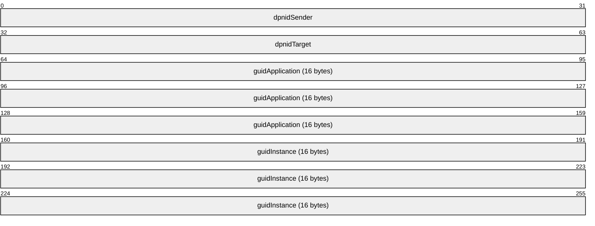
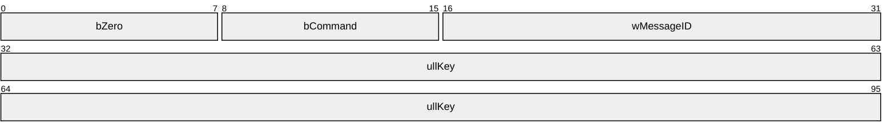
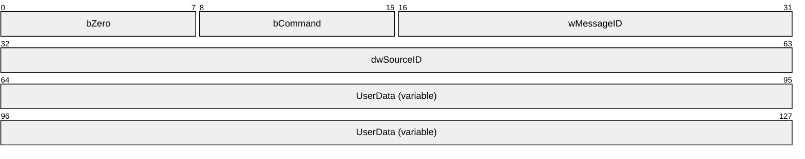
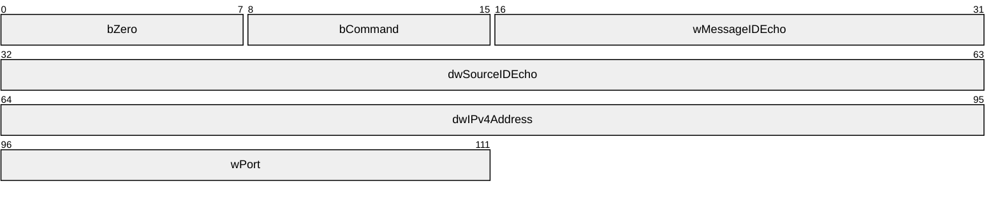
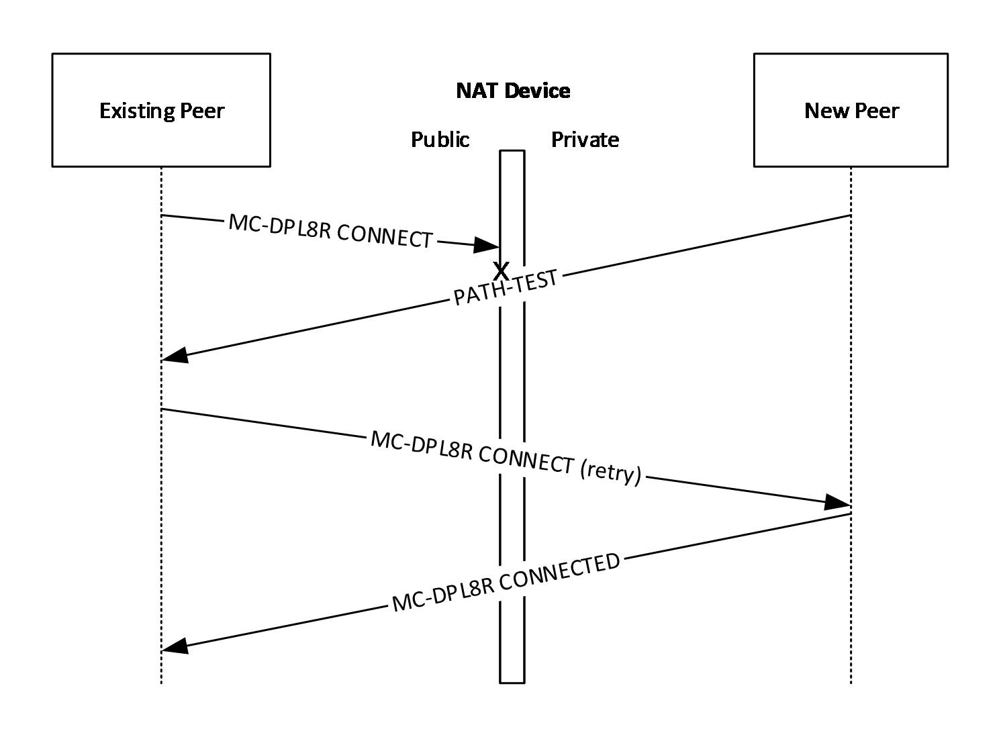

# [MC-DPLNAT]: DirectPlay 8 Protocol: NAT Locator

Table of Contents

1 Introduction

- [1 Introduction](#Section_1)
  - [1.1 Glossary](#Section_1.1)
  - [1.2 References](#Section_1.2)
    - [1.2.1 Normative References](#Section_1.2.1)
    - [1.2.2 Informative References](#Section_1.2.2)
  - [1.3 Overview](#Section_1.3)
  - [1.4 Relationship to Other Protocols](#Section_1.4)
  - [1.5 Prerequisites/Preconditions](#Section_1.5)
  - [1.6 Applicability Statement](#Section_1.6)
  - [1.7 Versioning and Capability Negotiation](#Section_1.7)
  - [1.8 Vendor-Extensible Fields](#Section_1.8)
  - [1.9 Standards Assignments](#Section_1.9)

2 Messages

- [2 Messages](#Section_2)
  - [2.1 Transport](#Section_2.1)
  - [2.2 Message Syntax](#Section_2.2)
    - [2.2.1 PATHTESTKEYDATA](#Section_2.2.1)
    - [2.2.2 PATH_TEST](#Section_2.2.2)
    - [2.2.3 NAT_RESOLVER_QUERY](#Section_2.2.3)
    - [2.2.4 NAT_RESOLVER_RESPONSE](#Section_2.2.4)

3 Protocol Details

- [3 Protocol Details](#Section_3)
  - [3.1 Path Test Details](#Section_3.1)
    - [3.1.1 Abstract Data Model](#Section_3.1.1)
    - [3.1.2 Timers](#Section_3.1.2)
    - [3.1.3 Initialization](#Section_3.1.3)
    - [3.1.4 Higher-Layer Triggered Events](#Section_3.1.4)
    - [3.1.5 Processing Events and Sequencing Rules](#Section_3.1.5)
    - [3.1.6 Timer Events](#Section_3.1.6)
    - [3.1.7 Other Local Events](#Section_3.1.7)
  - [3.2 NAT Resolver Response Server Details](#Section_3.2)
    - [3.2.1 Abstract Data Model](#Section_3.2.1)
    - [3.2.2 Timers](#Section_3.2.2)
    - [3.2.3 Initialization](#Section_3.2.3)
    - [3.2.4 Higher-Layer Triggered Events](#Section_3.2.4)
    - [3.2.5 Processing Events and Sequencing Rules](#Section_3.2.5)
    - [3.2.6 Timer Events](#Section_3.2.6)
    - [3.2.7 Other Local Events](#Section_3.2.7)
  - [3.3 NAT Resolver Query Client Details](#Section_3.3)
    - [3.3.1 Abstract Data Model](#Section_3.3.1)
    - [3.3.2 Timers](#Section_3.3.2)
    - [3.3.3 Initialization](#Section_3.3.3)
    - [3.3.4 Higher-Layer Triggered Events](#Section_3.3.4)
    - [3.3.5 Processing Events and Sequencing Rules](#Section_3.3.5)
    - [3.3.6 Timer Events](#Section_3.3.6)
    - [3.3.7 Other Local Events](#Section_3.3.7)

4 Protocol Examples

- [4 Protocol Examples](#Section_4)
  - [4.1 Example NAT Resolver Query and Response](#Section_4.1)
  - [4.2 Example PATH_TEST Message](#Section_4.2)

5 Security

- [5 Security](#Section_5)
  - [5.1 Security Considerations for Implementers](#Section_5.1)
  - [5.2 Index of Security Parameters](#Section_5.2)

6 Appendix A: Product Behavior

- [6 Appendix A: Product Behavior](#Section_6)

7 Change Tracking

- [7 Change Tracking](#Section_7)

For the legal notice and IP terms, see [LEGAL.md](../LEGAL.md).
Last updated: 4/23/2024.
See [Revision History](#revision-history) for full version history.

# 1 Introduction

This specification pertains to the DirectPlay 8 Protocol and describes technology available for the support of network environments that involve Network Address Translation (NAT). The NAT location functionality consists of extensions to the DirectPlay 8 Core and Service Providers Protocol [MC-DPL8CS](../MC-DPL8CS/MC-DPL8CS.md) to improve NAT [[RFC3022]](https://go.microsoft.com/fwlink/?LinkId=90403) support.

Sections 1.5, 1.8, 1.9, 2, and 3 of this specification are normative. All other sections and examples in this specification are informative.

## 1.1 Glossary

This document uses the following terms:

**DirectPlay**: A network communication library included with the Microsoft DirectX application programming interfaces. [**DirectPlay**](#gt_directplay) is a high-level software interface between applications and communication services that makes it easy to connect games over the Internet, a modem link, or a network.

**DPNID**: A 32-bit identification value assigned to a DirectPlay player as part of its participation in a DirectPlay game session.

**game session**: The metadata associated with the collection of computers participating in a single instance of a computer game.

**globally unique identifier (GUID)**: A term used interchangeably with universally unique identifier (UUID) in Microsoft protocol technical documents (TDs). Interchanging the usage of these terms does not imply or require a specific algorithm or mechanism to generate the value. Specifically, the use of this term does not imply or require that the algorithms described in [[RFC4122]](https://go.microsoft.com/fwlink/?LinkId=90460) or [[C706]](https://go.microsoft.com/fwlink/?LinkId=89824) must be used for generating the [**GUID**](#gt_globally-unique-identifier-guid). See also universally unique identifier (UUID).

**host**: In [**DirectPlay**](#gt_directplay), the computer responsible for responding to [**DirectPlay**](#gt_directplay) game session enumeration requests and maintaining the master copy of all the [**player**](#gt_player) and group lists for the game. One computer is designated as the [**host**](#gt_host) of the [**DirectPlay**](#gt_directplay) game session. All other participants in the [**DirectPlay**](#gt_directplay) game session are called [**peers**](#gt_peer). However, in peer-to-peer mode the name table entry representing the [**host**](#gt_host) of the session is also marked as a [**peer**](#gt_peer).

**Internet Protocol security (IPsec)**: A framework of open standards for ensuring private, secure communications over Internet Protocol (IP) networks through the use of cryptographic security services. IPsec supports network-level peer authentication, data origin authentication, data integrity, data confidentiality (encryption), and replay protection.

**Internet Protocol version 4 (IPv4)**: An Internet protocol that has 32-bit source and destination addresses. IPv4 is the predecessor of IPv6.

**little-endian**: Multiple-byte values that are byte-ordered with the least significant byte stored in the memory location with the lowest address.

**network address translation (NAT)**: The process of converting between IP addresses used within an intranet, or other private network, and Internet IP addresses.

**network byte order**: The order in which the bytes of a multiple-byte number are transmitted on a network, most significant byte first (in big-endian storage). This may or may not match the order in which numbers are normally stored in memory for a particular processor.

**payload**: The data that is transported to and from the application that is using either the DirectPlay 4 protocol or DirectPlay 8 protocol.

**peer**: In [**DirectPlay**](#gt_directplay), a player within a DirectPlay game session that has an established connection with every other peer in the game session, and which is not performing game session management duties. The participant that is managing the game session is called the host.

**player**: A person who is playing a computer game. There can be multiple players on a computer participating in any given game session. See also name table.

**private address**: An [**Internet Protocol version 4 (IPv4)**](#gt_internet-protocol-version-4-ipv4) address that is not globally routable, but is part of the [**private address**](#gt_private-address) space specified in [[RFC1918]](https://go.microsoft.com/fwlink/?LinkId=90298) section 3.

**public address**: An external global address used by a [**network address translation (NAT)**](#gt_network-address-translation-nat).

**User Datagram Protocol (UDP)**: The connectionless protocol within TCP/IP that corresponds to the transport layer in the ISO/OSI reference model.

**MAY, SHOULD, MUST, SHOULD NOT, MUST NOT:** These terms (in all caps) are used as defined in [[RFC2119]](https://go.microsoft.com/fwlink/?LinkId=90317). All statements of optional behavior use either MAY, SHOULD, or SHOULD NOT.

## 1.2 References

Links to a document in the Microsoft Open Specifications library point to the correct section in the most recently published version of the referenced document. However, because individual documents in the library are not updated at the same time, the section numbers in the documents may not match. You can confirm the correct section numbering by checking the [Errata](https://go.microsoft.com/fwlink/?linkid=850906).

### 1.2.1 Normative References

We conduct frequent surveys of the normative references to assure their continued availability. If you have any issue with finding a normative reference, please contact [dochelp@microsoft.com](mailto:dochelp@microsoft.com). We will assist you in finding the relevant information.

[FIPS180] FIPS PUBS, "Secure Hash Standard", FIPS PUB 180-1, April 1995, [https://www.niatec.iri.isu.edu/GetFile.aspx?pid=63](https://go.microsoft.com/fwlink/?LinkId=89867)

[MC-DPL8CS] Microsoft Corporation, "[DirectPlay 8 Protocol: Core and Service Providers](../MC-DPL8CS/MC-DPL8CS.md)".

[MC-DPL8R] Microsoft Corporation, "[DirectPlay 8 Protocol: Reliable](../MC-DPL8R/MC-DPL8R.md)".

[MS-DTYP] Microsoft Corporation, "[Windows Data Types](../MS-DTYP/MS-DTYP.md)".

[RFC2119] Bradner, S., "Key words for use in RFCs to Indicate Requirement Levels", BCP 14, RFC 2119, March 1997, [https://www.rfc-editor.org/info/rfc2119](https://go.microsoft.com/fwlink/?LinkId=90317)

### 1.2.2 Informative References

[RFC3022] Srisuresh, P., and Egevang, K., "Traditional IP Network Address Translator (Traditional NAT)", RFC 3022, January 2001, [https://www.rfc-editor.org/info/rfc3022](https://go.microsoft.com/fwlink/?LinkId=90403)

[RFC4380] Huitema, C., "Teredo: Tunneling IPv6 over UDP through Network Address Translations (NATs)", RFC 4380, February 2006, [https://www.rfc-editor.org/info/rfc4380](https://go.microsoft.com/fwlink/?LinkId=90476)

[RFC768] Postel, J., "User Datagram Protocol", STD 6, RFC 768, August 1980, [https://www.rfc-editor.org/info/rfc768](https://go.microsoft.com/fwlink/?LinkId=90490)

[UPNPWANIP] UPnP Forum, "WANIPConnection:1", November 2001, [http://www.upnp.org/standardizeddcps/documents/UPnP_IGD_WANIPConnection%201.0.pdf](https://go.microsoft.com/fwlink/?LinkId=90556)

## 1.3 Overview

The DirectPlay 8 Protocol: NAT Locator consists of three separate packet types: path tests, [**Network Address Translation (NAT)**](#gt_network-address-translation-nat) resolver queries, and NAT resolver responses. These optional messages are used to modify behavior of the DirectPlay 8 Core and Service Providers Protocol [MC-DPL8CS](../MC-DPL8CS/MC-DPL8CS.md) connection process so as to increase support for network environments that involve NAT. They are not required for operation of the DirectPlay 8 Core and Service Providers Protocol.

Path tests are packets used to augment the DirectPlay 8 Protocol: Core and Service Providers connection process. While an existing participant is initiating a connection to a new [**player**](#gt_player) in response to a DN_MSG_INTERNAL_INSTRUCT_CONNECT message from the [**host**](#gt_host), it can configure itself to accept PATH_TEST messages from the new player. Similarly, the new player can begin to periodically send PATH_TEST messages to the existing players from which it expects to receive connection attempts. These PATH_TEST messages are used to create port mappings in NAT or firewall devices that would otherwise prevent the DirectPlay 8 Protocol: Core and Service Providers connection from succeeding.

NAT resolver queries and responses are part of an out-of-band mechanism to enable DirectPlay 8 Protocol: Core and Service Providers hosts to acquire additional addressing information that they can provide to potential clients to improve connectivity in specific, limited NAT scenarios. They enable hosts to create port mappings in NAT or firewall devices and identify the resulting [**public address**](#gt_public-address) and port. This public address and port can then be advertised instead of the local, [**private address**](#gt_private-address) and port that hosts normally would advertise.

## 1.4 Relationship to Other Protocols

The DirectPlay 8 Protocol: NAT Locator depends on the [**User Datagram Protocol (UDP)**](#gt_user-datagram-protocol-udp) [[RFC768]](https://go.microsoft.com/fwlink/?LinkId=90490) and [**Internet Protocol version 4 (IPv4)**](#gt_internet-protocol-version-4-ipv4). The extensions provided in the DirectPlay 8 Protocol: NAT Locator are implemented in conjunction with the DirectPlay 8 Protocol: Core and Service Providers, and nominally the DirectPlay 8 Protocol: Reliable and the DirectPlay 8 Protocol: Host and Port Enumeration.

No other protocols depend on the presence of the DirectPlay 8 Protocol: NAT Locator extensions.

It is not recommended that [**NAT**](#gt_network-address-translation-nat) resolver queries be performed when a Universal Plug-and-Play (UPnP) Internet Gateway Device (IGD) is configured with a port mapping; instead, the UPnP port mapping takes precedence [[UPNPWANIP]](https://go.microsoft.com/fwlink/?LinkId=90556).

## 1.5 Prerequisites/Preconditions

The DirectPlay 8 Protocol: NAT Locator extensions assume that a DirectPlay 8 Protocol: Core and Service Providers [**game session**](#gt_game-session) has been established, and that a [**peer**](#gt_peer) is attempting to join a game session with the [**host**](#gt_host) and at least one other existing peer.

The [**NAT**](#gt_network-address-translation-nat) resolver query/response client/server transaction requires that the responding server be configured with a public or global Internet address. The server's direct network access is necessary to respond properly to queries from clients that are behind any devices that perform NAT. The NAT resolver query/response exchange can be performed at any time, but typically occurs when a DirectPlay 8 Protocol: Core and Service Providers host has started.

## 1.6 Applicability Statement

[**DirectPlay**](#gt_directplay) is designed for multiplayer gaming scenarios. These extensions can be used when additional [**NAT**](#gt_network-address-translation-nat) traversal support is desired for a DirectPlay 8 Protocol: Core and Service Providers gaming [**game session**](#gt_game-session).

These extensions are used when running over [**IPv4**](#gt_internet-protocol-version-4-ipv4). They are not to be implemented using IPv6. Instead, mechanisms such as the Teredo tunneling specification [[RFC4380]](https://go.microsoft.com/fwlink/?LinkId=90476) address NAT traversal more generically under that protocol.

## 1.7 Versioning and Capability Negotiation

None.

## 1.8 Vendor-Extensible Fields

None.

## 1.9 Standards Assignments

None.

# 2 Messages

This protocol references commonly used data types as defined in [MS-DTYP](../MS-DTYP/MS-DTYP.md).

## 2.1 Transport

DirectPlay 8 Protocol: NAT Locator messages MUST be transported by using [**UDP**](#gt_user-datagram-protocol-udp). The source and destination port numbers are application specific and can be any value.

## 2.2 Message Syntax

This section describes the format of messages and pseudo-structures used in the DirectPlay 8 Protocol: NAT Locator.

This protocol specification uses curly braced [**GUID**](#gt_globally-unique-identifier-guid) strings as specified in [MS-DTYP](../MS-DTYP/MS-DTYP.md) section 2.3.4.3.

### 2.2.1 PATHTESTKEYDATA

The PATHTESTKEYDATA is a pseudo-structure that is hashed to generate 64-bit key values.

**dpnidSender (4 bytes):** The 32-bit [**DPNID**](#gt_dpnid) value identifying the sending [**player**](#gt_player), in [**little-endian**](#gt_little-endian) byte order.

**dpnidTarget (4 bytes):** The 32-bit DPNID value identifying the intended recipient player, in little-endian byte order.

**guidApplication (16 bytes):** The 128-bit [**GUID**](#gt_globally-unique-identifier-guid) value identifying the DirectPlay 8 Protocol: Core and Service Providers application.

**guidInstance (16 bytes):** The 128-bit GUID value identifying the particular DirectPlay 8 Protocol: Core and Service Providers [**game session**](#gt_game-session) instance.

### 2.2.2 PATH_TEST

The PATH_TEST messages are sent to trigger outbound [**NAT**](#gt_network-address-translation-nat) and firewall mappings.

**bZero (1 byte):** An 8-bit identifier used to distinguish this message from DirectPlay 8 Protocol: Reliable messages to the same [**UDP**](#gt_user-datagram-protocol-udp) port. It MUST be set to 0.

**bCommand (1 byte):** An 8-bit command code identifying this message as a path test message. It MUST be set to 0x05, PATH_TEST_DATA_KIND (Path Test message type).

**wMessageID (2 bytes):** A 16-bit value used to uniquely identify an individual PATH_TEST message. This can be any value desired by the sender and MUST be ignored by the receiver. It SHOULD change each time a PATH_TEST message is retried.

**ullKey (8 bytes):** A 64-bit digest value used to validate the PATH_TEST message. This MUST be generated by using the procedure outlined in section [3.1.3](#Section_3.1) and MUST be validated by the receiver prior to acting on it.

### 2.2.3 NAT_RESOLVER_QUERY

The NAT_RESOLVER_QUERY is sent to retrieve translated address information.

**bZero (1 byte):** An 8-bit identifier used to distinguish this message from DirectPlay 8 Protocol: Reliable messages to the same [**UDP**](#gt_user-datagram-protocol-udp) port. It MUST be set to 0.

**bCommand (1 byte):** An 8-bit command code identifying this message as a [**NAT**](#gt_network-address-translation-nat) Resolver Query message. It MUST be set to 0x06, NAT_RESOLVER_QUERY_DATA_KIND (NAT Resolver Query message type).

**wMessageID (2 bytes):** A 16-bit value used by the sender to uniquely identify an individual NAT Resolver Query message. This can be any value desired by the sender and MUST be echoed in the response message by the receiver. It SHOULD change each time a query message is retried.

**dwSourceID (4 bytes):** A 32-bit value used by the sender to identify the source of a NAT Resolver Query message. This can be any value desired by the sender and MUST be echoed in the response message by the receiver.

**UserData (variable):** An optional, variable length field containing an application-specific query [**payload**](#gt_payload). The size of the **UserData** field is determined by the remaining size of the UDP packet. If a receiver determines that there are no more bytes after the complete NAT_RESOLVER_QUERY message header, then the **UserData** field was omitted by the sender.

### 2.2.4 NAT_RESOLVER_RESPONSE

The NAT_RESOLVER_RESPONSE is sent to report translated address information to the sender of a previous query.

**bZero (1 byte):** An 8-bit identifier used to distinguish this message from DirectPlay 8 Protocol: Reliable messages to the same [**UDP**](#gt_user-datagram-protocol-udp) port. It MUST be set to 0.

**bCommand (1 byte):** An 8-bit command code identifying this message as a [**NAT**](#gt_network-address-translation-nat) Resolver Response message. It MUST be set to 0x07, NAT_RESOLVER_RESPONSE_DATA_KIND (NAT Resolver Response message type).

**wMessageIDEcho (2 bytes):** A 16-bit value used to uniquely identify a response to an individual NAT Resolver Query message. This MUST be set to the value of **wMessageID** in the query to which this message is a response.

**dwSourceIDEcho (4 bytes):** A 32-bit value used by the sender to identify the original source to which the NAT resolver response is replying. This MUST be set to the value of **dwSourceID** in the query to which this message is a response.

**dwIPv4Address (4 bytes):** A 32-bit value indicating the public [**IPv4**](#gt_internet-protocol-version-4-ipv4) address of the sender of the NAT resolver query. This value MUST be set to the source IPv4 address of the query UDP packet, in [**Network Byte Order**](#gt_network-byte-order), modified by using the exclusive-or (XOR) bitwise operation with the value of the **dwSourceID** query field.

**wPort (2 bytes):** A 16-bit value indicating the public port number of the sender of the NAT resolver query. This value MUST be set to the source port number of the query UDP packet, in Network Byte Order, modified by using the exclusive-or (XOR) bitwise operation with the value of the **wMessageID** query field.

# 3 Protocol Details

## 3.1 Path Test Details

### 3.1.1 Abstract Data Model

This section describes a conceptual model of possible data organization that an implementation maintains to participate in this protocol. The described organization is provided to facilitate the explanation of how the protocol behaves. This specification does not mandate that implementations adhere to this model as long as their external behavior is consistent with that described in this specification.

**dpnidSender:** The 32-bit [**DPNID**](#gt_dpnid) value identifying the new Path Test-sending [**player**](#gt_player), in [**little-endian**](#gt_little-endian) byte order.

**dpnidTarget:** The 32-bit DPNID value identifying the existing player, in little-endian byte order.

**guidApplication:** The 128-bit [**GUID**](#gt_globally-unique-identifier-guid) value identifying the DirectPlay 8 Protocol: Core and Service Providers application.

**guidInstance:** The 128-bit GUID value identifying the particular DirectPlay 8 Protocol: Core and Service Providers [**game session**](#gt_game-session) instance.

**ullKey:** The 64-bit identification value used to correlate [PATH_TEST](#Section_2.2.2) messages and DirectPlay 8 Protocol: Core and Service Providers connect attempts.

### 3.1.2 Timers

The **Retry Timer** is used to periodically resend [PATH_TEST](#Section_2.2.2) messages to compensate for potential packet loss. It SHOULD retry at intervals of 375 milliseconds with a maximum of 7 attempts, but can use any settings required for the particular application and network circumstances.

### 3.1.3 Initialization

The DirectPlay 8 Protocol: NAT Locator extensions SHOULD be initialized whenever the DirectPlay 8 Protocol: Core and Service Providers begins connecting an existing [**peer**](#gt_peer) to a new peer that is attempting to join the [**game session**](#gt_game-session). For an existing peer, the connection starts when the existing peer receives the DN_INSTRUCT_CONNECT message and responds to the message by initiating the connection. For the new peer, the connection starts when the new peer receives the DN_SEND_CONNECT_INFO message and responds to the message by preparing to accept the connection.

To use Path Tests, both peers MUST fill in a [PATHTESTKEYDATA](#Section_2.2.1) pseudo-structure with the following:

**dpnidSender:** Set to the [**DPNID**](#gt_dpnid) of the new peer, in [**little-endian**](#gt_little-endian) byte order.

**dpnidTarget:** Set to the DPNID of the existing peer, in little-endian byte order. For the new peer, the value of the **dpnidTarget** field is part of the DN_SEND_CONNECT_INFO message described in [MC-DPL8CS](../MC-DPL8CS/MC-DPL8CS.md) section 2.2.1.4.

**guidApplication:** Set to the DirectPlay 8 Protocol: Core and Service Providers application GUID.

**guidInstance:** Set to the DirectPlay 8 Protocol: Core and Service Providers game session instance GUID.

Both peers MUST then generate a SHA-1 digest, as specified in [[FIPS180]](https://go.microsoft.com/fwlink/?LinkId=89867), of the PATHTESTKEYDATA binary data, and use the first 64 bits of the output value as the Path Test key value **ullKey**.

For the existing peer, the value of the calculated **ullKey** ADM element MUST remain associated with the connection attempt that the peer is performing until either the attempt fails, the attempt completes successfully, or the peer receives a valid [PATH_TEST](#Section_2.2.2) message as described in section [3.1.5](#Section_3.1). Also at this time, the existing peer MUST prepare to accept PATH_TEST messages in response to its instructed peer connection, in addition to the standard [MC-DPL8CS] and [MC-DPL8R](../MC-DPL8R/MC-DPL8R.md) connection responses.

For the new peer, this value MUST be used in the periodic transmission of PATH_TEST messages as described in section [3.1.6](#Section_3.2.6). Also at this time, the Path Test **Retry Timer** MUST be initialized. This process SHOULD be repeated for each existing peer as described in the DN_SEND_CONNECT_INFO message ([MC-DPL8CS] section 2.2.1.4).

### 3.1.4 Higher-Layer Triggered Events

The DirectPlay 8 Protocol: Core and Service Providers SHOULD inform the DirectPlay 8 Protocol: NAT Locator when the connection attempt has completed, whether it was successful or not. The existing [**peer**](#gt_peer) MUST stop listening for [PATH_TEST](#Section_2.2.2) messages, and the new peer MUST stop transmitting PATH_TEST messages at that time.

### 3.1.5 Processing Events and Sequencing Rules

When the existing [**peer**](#gt_peer) receives a valid [PATH_TEST](#Section_2.2.2) message, it MUST search all its outstanding [MC-DPL8CS](../MC-DPL8CS/MC-DPL8CS.md) and corresponding [MC-DPL8R](../MC-DPL8R/MC-DPL8R.md) instructed peer connections (described in [MC-DPL8CS] section 3.1.5.2) for one that has a matching **ullKey** value as described in section [3.1.3](#Section_3.1). If found, and the connect attempt has not yet received any packets from the intended target [**IPv4**](#gt_internet-protocol-version-4-ipv4) address and port, the connection target SHOULD be modified to be the source IPv4 address and port of the PATH_TEST message.

If no connect attempt is associated with a matching **ullKey** value, or a matching connect attempt already has received one or more packets, the existing peer MUST ignore the PATH_TEST message.

If the message is not properly formed as described in section 2.2.2, the existing peer MUST ignore the PATH_TEST message.

Figure 1: New peer's PATH_TEST during connect attempt from existing peer

PATH_TEST messages are used to create mappings in NAT and firewall devices so that inbound connect attempts appear to be solicited responses to a previous outbound request through the steps identified in this section. This process assumes that the [**host**](#gt_host) has sent the list of existing peers to the new peer, and that the host instructs the existing peer to connect to the new peer as described in [MC-DPL8CS].

- The existing peer initiates a reliable protocol connection with a CONNECT message as described in [MC-DPL8R] section 2. This can be dropped by the public interface of the NAT or firewall device based on its particular filtering or port assignment policy.
- Simultaneously, the **Retry Timer** of the new peer can elapse and cause transmission of a PATH_TEST message as described in section [3.1.6](#Section_3.2.6). The NAT or firewall device can implicitly create a mapping between the private address of the new peer and the [**public address**](#gt_public-address) it uses to forward the message to the existing peer.
- The existing peer can receive the PATH_TEST message and alter the destination IPv4 address and/or port for future CONNECT message retries, if the NAT device assigned a different port number from that which had originally been tried.
- Because of the NAT or firewall mapping, the retried CONNECT messages can now be properly forwarded to the new peer, and the new peer can proceed with the [MC-DPL8R] CONNECTED response and the rest of the standard connection process.
If the new peer or host receives a PATH_TEST message, it MUST be silently ignored.

### 3.1.6 Timer Events

When the **Retry Timer** elapses, the new [**peer**](#gt_peer) MUST send a new [PATH_TEST](#Section_2.2.2) message to the [**IPv4**](#gt_internet-protocol-version-4-ipv4) address and port of the existing peer for which it is expecting a connection. This message MUST be sent from the same [**UDP**](#gt_user-datagram-protocol-udp) port number on which it is expecting the connection. If fewer than the maximum number of attempts have been made, the timer MUST then be rescheduled so that it can elapse again. Otherwise, the retries have been exhausted and the Path Test operation SHOULD be canceled.

### 3.1.7 Other Local Events

None.

## 3.2 NAT Resolver Response Server Details

### 3.2.1 Abstract Data Model

None.

### 3.2.2 Timers

None.

### 3.2.3 Initialization

None.

### 3.2.4 Higher-Layer Triggered Events

[**NAT**](#gt_network-address-translation-nat) Resolver Response Servers are not required to interact with higher-layers beyond initializing and shutting down.

### 3.2.5 Processing Events and Sequencing Rules

When a [**NAT**](#gt_network-address-translation-nat) Resolver Response server receives a [NAT_RESOLVER_QUERY](#Section_2.2.3) message, it can validate the optional **UserData** field by using application-specific logic. If the query is properly formed as described in section 2.2.3 and application-specific logic accepts the contents of the optional **UserData** field, the NAT Resolver MUST respond with a [NAT_RESOLVER_RESPONSE](#Section_2.2.4) message to the sender's target [**IPv4**](#gt_internet-protocol-version-4-ipv4) address and port. The response MUST contain the query's **wMessageID** and **dwSourceID** fields echoed in the corresponding **wMessageIDEcho** and **dwSourceIDEcho** fields. It MUST also set the source IPv4 address of the query in the dwIPv4Address field, in [**network byte order**](#gt_network-byte-order), and the source port number of the query in the wPort field. Both of these fields MUST also be modified by using **dwSourceID** and **wMessageID**, respectively, with the exclusive-or (XOR) bitwise operation.

If the NAT_RESOLVER_QUERY message is not properly formed as described in section 2.2.3, or application-specific logic rejects the contents of the optional **UserData** field, the server MUST ignore the message.

If the server receives a NAT_RESOLVER_RESPONSE message, it MUST be silently ignored.

### 3.2.6 Timer Events

None.

### 3.2.7 Other Local Events

None.

## 3.3 NAT Resolver Query Client Details

### 3.3.1 Abstract Data Model

None.

### 3.3.2 Timers

The **Retry Timer** is used to periodically resend [NAT_RESOLVER_QUERY](#Section_2.2.3) messages to compensate for potential packet loss. It SHOULD retry at intervals of 1 second with a maximum of four attempts, but can use any settings required for the particular application and network circumstances.

### 3.3.3 Initialization

The [**NAT**](#gt_network-address-translation-nat) Resolver Query client can be initialized whenever the DirectPlay 8 Protocol: Core and Service Providers begins hosting a new [**game session**](#gt_game-session). Initialization consists of scheduling the **Retry Timer**.

### 3.3.4 Higher-Layer Triggered Events

The DirectPlay 8 Protocol: Core and Service Providers SHOULD inform the [**NAT**](#gt_network-address-translation-nat) Resolver Query client when it is no longer the [**host**](#gt_host) of a [**game session**](#gt_game-session). The manner in which the provider notifies the client is implementation-specific and is not influenced by the configuration of this protocol nor the DirectPlay 8 Protocol: Core and Service Providers protocol.

When a client is notified that it is no longer the host in the game session, the client MUST abort any query attempts currently in progress.

### 3.3.5 Processing Events and Sequencing Rules

When a client receives a [NAT_RESOLVER_RESPONSE](#Section_2.2.4) message, it SHOULD validate that **wMessageIDEcho** and **dwSourceIDEcho** correspond to values that it sent in a previous [NAT_RESOLVER_QUERY](#Section_2.2.3) message's **wMessageID** and **dwSourceID** fields. If not, the packet MUST be silently ignored. Otherwise, the client SHOULD reverse the exclusive-or (XOR) bitwise operation performed on the **dwIPv4Address** and **wPort** fields, and save the resulting address and port information for use in advertising the DirectPlay 8 Protocol: Core and Service Providers [**game session**](#gt_game-session). The **Retry Timer** SHOULD then be canceled.

If the NAT_RESOLVER_RESPONSE message is not properly formed as described in section 2.2.4, the client MUST ignore the message.

If a client receives a NAT_RESOLVER_QUERY message, it MUST be silently ignored.

### 3.3.6 Timer Events

When the **Retry Timer** elapses, the client MUST send a new [NAT_RESOLVER_QUERY](#Section_2.2.3) message to the server. This message MUST be sent from the same [**UDP**](#gt_user-datagram-protocol-udp) port number on which it is the [**host**](#gt_host) of the DirectPlay 8 Protocol: Core and Service Providers [**game session**](#gt_game-session). If fewer than the maximum number of attempts have been made, the timer MUST then be rescheduled so that it can elapse again. Otherwise, the retries have been exhausted and the [**NAT**](#gt_network-address-translation-nat) Resolver Query operation SHOULD be canceled.

### 3.3.7 Other Local Events

None.

# 4 Protocol Examples

## 4.1 Example NAT Resolver Query and Response

The following example has two participants:

- The server – [**IPv4**](#gt_internet-protocol-version-4-ipv4) address 65.52.10.10, port 2506.
- The client – IPv4 address 192.168.1.2, port 2302. [**Network Address Translation (NAT)**](#gt_network-address-translation-nat) will remap the client’s packets as IPv4 address 65.52.252.61.
The client issues a [NAT_RESOLVER_QUERY](#Section_2.2.3) message to the server (that is, from 192.168.1.2:2302 to 65.52.10.10:2506) with a value of 54769 (0xD5F1) for the **wMessageID** field and a value of 3125876284 (0xBA51163C) for the **dwSourceID** field, as seen in the following frame contents (Ethernet, IPv4, and [**UDP**](#gt_user-datagram-protocol-udp) headers included):

0000 00 0F B5 95 C3 C8 00 1D 92 37 5E 40 08 00 45 00 ..µ.ÃÈ...7^@..E.

0010 00 24 7E 09 00 00 80 11 A7 EF C0 A8 01 02 41 34 ..~.....§ïÀ¨..A4

0020 0A 0A 08 FE 09 CA 00 10 87 92 00 06 F1 D5 3C 16 ...þ.Ê......ñÕ<.

0030 51 BA Qº

The NAT device remaps the source address and port for the message from 192.168.1.2:2302 to 65.52.252.61:2302. The NAT resolver server receives the message and sends a [NAT_RESOLVER_RESPONSE](#Section_2.2.4) message back to that address. The reply contains the XOR-obfuscated address, as well as the echoed values from the query. The NAT device at 65.52.252.61 maps the destination address and port of the reply to 192.168.1.2:2302 so the client can receive the message, as seen in the following frame contents (Ethernet, IPv4, and UDP headers included):

0000 00 1D 92 37 5E 40 00 0F B5 95 C3 C8 08 00 45 00 ...7^@..µ.ÃÈ..E.

0010 00 2A 42 F2 00 00 7C 11 E7 02 41 34 0A 0A C0 A8 ..Bò..|.ç..ÂA4..¨

0020 01 02 09 CA 08 FE 00 16 1D 45 00 07 F1 D5 3C 16 ...Ê.þ...E..ñÕ<.

0030 51 BA 7D 22 AD 87 F9 2B Qº}"¬.ù+

The client validates the reply and then de-obfuscates the [**public address**](#gt_public-address) and port included in the message. The client can display, advertise, or otherwise use its newly learned public address as appropriate.

## 4.2 Example PATH_TEST Message

The following example has three participants:

- PlayerA – The [**host**](#gt_host), [**IPv4**](#gt_internet-protocol-version-4-ipv4) address 192.168.1.3, port 2505.
- PlayerB – An existing peer, IPv4 address 10.194.72.68, port 2302.
- PlayerC – The joining peer, IPv4 address 192.168.1.2, port 2302. PlayerC has local firewall software installed which prevents unsolicited inbound UDP messages.
For the purposes of this example, the following assumptions are made:

- PlayerA has created a [**game session**](#gt_game-session) that uses an application [**GUID**](#gt_globally-unique-identifier-guid) {02AE835D-9179-485F-8343-901D327CE794} and an instance GUID {C0A65D4F-9CE3-4F70-80DE-3AB4DF6F09B6}, as described in [MC-DPL8CS](../MC-DPL8CS/MC-DPL8CS.md).
- PlayerB has already joined PlayerA's game session and was assigned the DPNID value 0xC0965D4C, as described in [MC-DPL8CS].
- PlayerC is in the process of joining the game session and previously exchanged the following messages with PlayerA as described in [MC-DPL8R](../MC-DPL8R/MC-DPL8R.md) and [MC-DPL8CS]:
Source: 192.168.1.2:2302, Dest: 192.168.1.3:2505,

Type: MC-DPL8R CONNECT

Source: 192.168.1.3:2505, Dest: 192.168.1.2:2302,

Type: MC-DPL8R CONNECTED

Source: 192.168.1.2:2302, Dest: 192.168.1.3:2505,

Type: MC-DPL8R CONNECTED

Source: 192.168.1.2:2302, Dest: 192.168.1.3:2505,

Type: MC-DPL8CS DN_INTERNAL_MESSAGE_PLAYER_CONNECT_INFO

Source: 192.168.1.3:2505, Dest: 192.168.1.2:2302,

Type: MC-DPL8CS DN_SEND_CONNECT_INFO,

assigning DPNID 0xC0F65D4B to PlayerC

Source: 192.168.1.2:2302, Dest: 192.168.1.3:2505,

Type: MC-DPL8CS DN_ACK_CONNECT_INFO

- PlayerA has also already sent the following messages to PlayerB regarding the joining PlayerC as described in [MC-DPL8CS].
Source: 192.168.1.3:2505, Dest: 10.194.72.68:2302,

Type: MC-DPL8CS DN_ADD_PLAYER

Source: 192.168.1.3:2505, Dest: 10.194.72.68:2302,

Type: MC-DPL8CS DN_INSTRUCT_CONNECT

PlayerB now initiates an instructed connect to PlayerC, beginning with the CONNECT packet described in [MC-DPL8R] section 2.2.1.1, as seen in the following frame contents (Ethernet, IPv4, and UDP headers included):

0000 00 1D 92 37 5E 40 00 0F B5 95 C3 C8 08 00 45 00 .. 7^@..µ ÃÈ..E.

0010 00 2C 12 D8 00 00 7C 11 00 00 0A C2 48 44 C0 A8 .P.Ù..|....ÂHDÀ¨

0020 01 02 08 FE 08 FE 00 18 21 EF 88 01 00 00 06 00 ...þ.þ..!ï .....

0030 01 00 E4 1C B0 50 E4 CA 32 00 ..ä.°PäÊ2.

The CONNECT packet arrives at PlayerC, but is rejected by the firewall because it does not have a mapping between local port 2302 and remote address 10.194.72.68:2302.Concurrent with the attempt by PlayerB to connect to PlayerC, PlayerC issues a [PATH_TEST](#Section_2.2.2) message to PlayerB using a message ID 0xD0C1 and key value 0xF9AFE99C92DD82B8 (due to the DNPIDs and GUIDs described above). This results in the following frame contents (Ethernet, IPv4, and UDP headers included):

0000 00 0F B5 95 C3 C8 00 1D 92 37 5E 40 08 00 45 00 ..µ•ÃÈ..'7^@..E.

0010 00 28 1C 45 00 00 80 11 09 D0 C0 A8 01 02 0A C2 .(.E..□..ÐÀ¨...Â

0020 48 44 08 FE 08 FE 00 14 34 4B 00 05 C1 D0 B8 82 HD.þ.þ..4K..Áи‚

0030 DD 92 9C E9 AF F9 Ý'œé¯ù

This outbound packet implicitly establishes a firewall mapping between local port 2302 and remote address 10.194.72.68:2302. PlayerB receives this PATH_TEST message, but PlayerB does not need to perform any of the optional state modifications described in section [3.1.5](#Section_3.1). In this example, there is no [**network address translation**](#gt_network-address-translation-nat) occurring, and therefore, there is no difference between the port to which the CONNECT packet was sent and the actual port that maps back to PlayerC.PlayerB now attempts to resend the CONNECT packet to PlayerC as described in [MC-DPL8R] section 2.2.1.1 (Ethernet, IPv4, and UDP headers included):

0000 00 1D 92 37 5E 40 00 0F B5 95 C3 C8 08 00 45 00 .. 7^@..µ ÃÈ..E.

0010 00 2C 12 D9 00 00 7C 11 00 00 0A C2 48 44 C0 A8 .P.Ù..|....ÂHDÀ¨

0020 01 02 08 FE 08 FE 00 18 21 EF 88 01 01 00 06 00 ...þ.þ..!ï .....

0030 01 00 E4 1C B0 50 E4 CA 32 00 ..ä.°PäÊ2.

This time a firewall mapping exists, and the CONNECT packet is allowed to reach PlayerC. PlayerC responds with a CONNECTED packet as described in [MC-DPL8R] section 2.2.1.1, and continues with the peer connection sequence described in [MC-DPL8R] and [MC-DPL8CS]:

Source: 192.168.1.2, Destination: 10.194.72.68,

Type: MC-DPL8R CONNECTED

Source: 10.194.72.68, Destination: 192.168.1.2,

Type: MC-DPL8R CONNECTED

Source: 10.194.72.68, Destination: 192.168.1.2,

Type: MC-DPL8CS DN_SEND_PLAYER_DPNID

# 5 Security

## 5.1 Security Considerations for Implementers

This protocol uses the SHA-1 hashing algorithm, which has been shown to have weaknesses [[FIPS180]](https://go.microsoft.com/fwlink/?LinkId=89867). However, the protocol is not intended for use in applications that demand robust security without [**Internet Protocol security (IPsec)**](#gt_internet-protocol-security-ipsec) or other lower-level security mechanisms already in place.

## 5.2 Index of Security Parameters

| Security parameter | Section |
| --- | --- |
| SHA-1 digest | [3.1.3](#Section_3.1) |

# 6 Appendix A: Product Behavior

The information in this specification is applicable to the following Microsoft products or supplemental software. References to product versions include updates to those products.

- Windows Vista operating system
- Windows Server 2008 operating system
- Windows 7 operating system
- Windows Server 2008 R2 operating system
- Windows 8 operating system
- Windows Server 2012 operating system
- Windows 8.1 operating system
- Windows Server 2012 R2 operating system
- Windows 10 operating system
- Windows Server 2016 operating system
- Windows Server 2019 operating system
- Windows Server 2022 operating system
- Windows 11 operating system
- Windows Server 2025 operating system
Exceptions, if any, are noted in this section. If an update version, service pack or Knowledge Base (KB) number appears with a product name, the behavior changed in that update. The new behavior also applies to subsequent updates unless otherwise specified. If a product edition appears with the product version, behavior is different in that product edition.

Unless otherwise specified, any statement of optional behavior in this specification that is prescribed using the terms "SHOULD" or "SHOULD NOT" implies product behavior in accordance with the SHOULD or SHOULD NOT prescription. Unless otherwise specified, the term "MAY" implies that the product does not follow the prescription.

# 7 Change Tracking

This section identifies changes that were made to this document since the last release. Changes are classified as Major, Minor, or None.

The revision class **Major** means that the technical content in the document was significantly revised. Major changes affect protocol interoperability or implementation. Examples of major changes are:

- A document revision that incorporates changes to interoperability requirements.
- A document revision that captures changes to protocol functionality.
The revision class **Minor** means that the meaning of the technical content was clarified. Minor changes do not affect protocol interoperability or implementation. Examples of minor changes are updates to clarify ambiguity at the sentence, paragraph, or table level.

The revision class **None** means that no new technical changes were introduced. Minor editorial and formatting changes may have been made, but the relevant technical content is identical to the last released version.

The changes made to this document are listed in the following table. For more information, please contact [dochelp@microsoft.com](mailto:dochelp@microsoft.com).

| Section | Description | Revision class |
| --- | --- | --- |
| [6](#Section_6) Appendix A: Product Behavior | Added Windows Server 2025 to the list of applicable products. | Major |

## Revision History

| Date | Version | Revision Class | Comments |
| --- | --- | --- | --- |
| 8/10/2007 | 0.1 | Major | Initial Availability |
| 9/28/2007 | 0.2 | Minor | Clarified the meaning of the technical content. |
| 10/23/2007 | 0.2.1 | Editorial | Changed language and formatting in the technical content. |
| 11/30/2007 | 1.0 | Major | Updated and revised the technical content. |
| 1/25/2008 | 1.0.1 | Editorial | Changed language and formatting in the technical content. |
| 3/14/2008 | 2.0 | Major | Updated and revised the technical content. |
| 5/16/2008 | 2.0.1 | Editorial | Changed language and formatting in the technical content. |
| 6/20/2008 | 2.1 | Minor | Clarified the meaning of the technical content. |
| 7/25/2008 | 2.2 | Minor | Clarified the meaning of the technical content. |
| 8/29/2008 | 2.2.1 | Editorial | Changed language and formatting in the technical content. |
| 10/24/2008 | 2.3 | Minor | Clarified the meaning of the technical content. |
| 12/5/2008 | 3.0 | Major | Updated and revised the technical content. |
| 1/16/2009 | 3.0.1 | Editorial | Changed language and formatting in the technical content. |
| 2/27/2009 | 4.0 | Major | Updated and revised the technical content. |
| 4/10/2009 | 4.1 | Minor | Clarified the meaning of the technical content. |
| 5/22/2009 | 4.2 | Minor | Clarified the meaning of the technical content. |
| 7/2/2009 | 4.2.1 | Editorial | Changed language and formatting in the technical content. |
| 8/14/2009 | 4.2.2 | Editorial | Changed language and formatting in the technical content. |
| 9/25/2009 | 4.3 | Minor | Clarified the meaning of the technical content. |
| 11/6/2009 | 4.3.1 | Editorial | Changed language and formatting in the technical content. |
| 12/18/2009 | 4.3.2 | Editorial | Changed language and formatting in the technical content. |
| 1/29/2010 | 5.0 | Major | Updated and revised the technical content. |
| 3/12/2010 | 5.0.1 | Editorial | Changed language and formatting in the technical content. |
| 4/23/2010 | 6.0 | Major | Updated and revised the technical content. |
| 6/4/2010 | 7.0 | Major | Updated and revised the technical content. |
| 7/16/2010 | 8.0 | Major | Updated and revised the technical content. |
| 8/27/2010 | 8.1 | Minor | Clarified the meaning of the technical content. |
| 10/8/2010 | 8.1 | None | No changes to the meaning, language, or formatting of the technical content. |
| 11/19/2010 | 8.1 | None | No changes to the meaning, language, or formatting of the technical content. |
| 1/7/2011 | 8.1 | None | No changes to the meaning, language, or formatting of the technical content. |
| 2/11/2011 | 8.1 | None | No changes to the meaning, language, or formatting of the technical content. |
| 3/25/2011 | 8.1 | None | No changes to the meaning, language, or formatting of the technical content. |
| 5/6/2011 | 8.1 | None | No changes to the meaning, language, or formatting of the technical content. |
| 6/17/2011 | 8.2 | Minor | Clarified the meaning of the technical content. |
| 9/23/2011 | 8.2 | None | No changes to the meaning, language, or formatting of the technical content. |
| 12/16/2011 | 9.0 | Major | Updated and revised the technical content. |
| 3/30/2012 | 9.0 | None | No changes to the meaning, language, or formatting of the technical content. |
| 7/12/2012 | 9.0 | None | No changes to the meaning, language, or formatting of the technical content. |
| 10/25/2012 | 9.0 | None | No changes to the meaning, language, or formatting of the technical content. |
| 1/31/2013 | 9.0 | None | No changes to the meaning, language, or formatting of the technical content. |
| 8/8/2013 | 10.0 | Major | Updated and revised the technical content. |
| 11/14/2013 | 10.0 | None | No changes to the meaning, language, or formatting of the technical content. |
| 2/13/2014 | 10.0 | None | No changes to the meaning, language, or formatting of the technical content. |
| 5/15/2014 | 10.0 | None | No changes to the meaning, language, or formatting of the technical content. |
| 6/30/2015 | 11.0 | Major | Significantly changed the technical content. |
| 10/16/2015 | 11.0 | None | No changes to the meaning, language, or formatting of the technical content. |
| 7/14/2016 | 11.0 | None | No changes to the meaning, language, or formatting of the technical content. |
| 6/1/2017 | 11.0 | None | No changes to the meaning, language, or formatting of the technical content. |
| 9/15/2017 | 12.0 | Major | Significantly changed the technical content. |
| 9/12/2018 | 13.0 | Major | Significantly changed the technical content. |
| 4/7/2021 | 14.0 | Major | Significantly changed the technical content. |
| 6/25/2021 | 15.0 | Major | Significantly changed the technical content. |
| 4/23/2024 | 16.0 | Major | Significantly changed the technical content. |
