# [MC-DPLVP]: DirectPlay Voice Protocol

Table of Contents

1 Introduction

- [1 Introduction](#Section_1)
  - [1.1 Glossary](#Section_1.1)
  - [1.2 References](#Section_1.2)
    - [1.2.1 Normative References](#Section_1.2.1)
    - [1.2.2 Informative References](#Section_1.2.2)
  - [1.3 Overview](#Section_1.3)
    - [1.3.1 How DirectPlay Handles Voice Bursts](#Section_1.3.1)
    - [1.3.2 Connection Subprotocol](#Section_1.3.2)
    - [1.3.3 Peer Voice Session Subprotocol](#Section_1.3.3)
      - [1.3.3.1 Host Migration](#Section_1.3.3.1)
    - [1.3.4 Mixing Voice Session Subprotocol](#Section_1.3.4)
    - [1.3.5 Forwarding Voice Session Subprotocol](#Section_1.3.5)
    - [1.3.6 Echo Voice Session Subprotocol](#Section_1.3.6)
    - [1.3.7 Required Codecs](#Section_1.3.7)
  - [1.4 Relationship to Other Protocols](#Section_1.4)
  - [1.5 Prerequisites/Preconditions](#Section_1.5)
  - [1.6 Applicability Statement](#Section_1.6)
  - [1.7 Versioning and Capability Negotiation](#Section_1.7)
  - [1.8 Vendor-Extensible Fields](#Section_1.8)
  - [1.9 Standards Assignments](#Section_1.9)

2 Messages

- [2 Messages](#Section_2)
  - [2.1 Transport](#Section_2.1)
  - [2.2 Message Syntax](#Section_2.2)
    - [2.2.1 The Common Message Header](#Section_2.2.1)
    - [2.2.2 Common Messages](#Section_2.2.2)
      - [2.2.2.1 Session Lost Message](#Section_2.2.2.1)
      - [2.2.2.2 Client Disconnect Request Message](#Section_2.2.2.2)
      - [2.2.2.3 Client Disconnect Confirmation Message](#Section_2.2.2.3)
      - [2.2.2.4 Add Voice Client Message](#Section_2.2.2.4)
      - [2.2.2.5 Set Client Voice Target Message](#Section_2.2.2.5)
      - [2.2.2.6 Speech with Target Message](#Section_2.2.2.6)
      - [2.2.2.7 Speech with Bounce Message](#Section_2.2.2.7)
      - [2.2.2.8 Client Capability Confirmation Message](#Section_2.2.2.8)
    - [2.2.3 Connection Subprotocol Messages](#Section_2.2.3)
      - [2.2.3.1 Connect Request Message](#Section_2.2.3.1)
      - [2.2.3.2 Connect Accept Message](#Section_2.2.3.2)
      - [2.2.3.3 Connect Refuse Message](#Section_2.2.3.3)
    - [2.2.4 Peer Voice Session Subprotocol Messages](#Section_2.2.4)
      - [2.2.4.1 Voice Client List Entry Structure](#Section_2.2.4.1)
      - [2.2.4.2 Voice Client List Message](#Section_2.2.4.2)
      - [2.2.4.3 Remove Voice Client Message](#Section_2.2.4.3)
      - [2.2.4.4 Speech Message](#Section_2.2.4.4)
      - [2.2.4.5 Host Migration Messages](#Section_2.2.4.5)
        - [2.2.4.5.1 Voice Server Exited with Host Migration Message](#Section_2.2.4.5.1)
        - [2.2.4.5.2 Host Migration Complete Message](#Section_2.2.4.5.2)
    - [2.2.5 Forwarding Voice Session Subprotocol Messages](#Section_2.2.5)
      - [2.2.5.1 Speech with From Message](#Section_2.2.5.1)

3 Protocol Details

- [3 Protocol Details](#Section_3)
  - [3.1 Voice Client Details](#Section_3.1)
    - [3.1.1 Abstract Data Model](#Section_3.1.1)
    - [3.1.2 Timers](#Section_3.1.2)
    - [3.1.3 Initialization](#Section_3.1.3)
    - [3.1.4 Higher-Layer Triggered Events](#Section_3.1.4)
    - [3.1.5 Processing Events and Sequencing Rules](#Section_3.1.5)
      - [3.1.5.1 Connection Subprotocol](#Section_3.1.5.1)
        - [3.1.5.1.1 Handling Unrecognized Messages](#Section_3.1.5.1.1)
        - [3.1.5.1.2 Sending Connect Request Message](#Section_3.1.5.1.2)
        - [3.1.5.1.3 Receiving Connect Accept Message](#Section_3.1.5.1.3)
        - [3.1.5.1.4 Receiving Connect Refuse Message](#Section_3.1.5.1.4)
        - [3.1.5.1.5 Sending a Client Capability Confirmation Message](#Section_3.1.5.1.5)
      - [3.1.5.2 Common Messages for All Voice Session Subprotocols](#Section_3.1.5.2)
        - [3.1.5.2.1 Receiving a Session Lost Message](#Section_3.1.5.2.1)
        - [3.1.5.2.2 Receiving a Set Client Voice Target Message](#Section_3.1.5.2.2)
        - [3.1.5.2.3 Sending a Client Disconnect Request Message](#Section_3.1.5.2.3)
        - [3.1.5.2.4 Receiving a Client Disconnect Confirmation Message](#Section_3.1.5.2.4)
        - [3.1.5.2.5 Receiving an Add Voice Client Message](#Section_3.1.5.2.5)
      - [3.1.5.3 Peer Voice Session Subprotocol](#Section_3.1.5.3)
        - [3.1.5.3.1 Handling Unrecognized Message](#Section_3.1.5.3.1)
        - [3.1.5.3.2 Receiving a Voice Client List Message](#Section_3.1.5.3.2)
        - [3.1.5.3.3 Receiving a Remove Voice Client Message](#Section_3.1.5.3.3)
        - [3.1.5.3.4 Sending a Speech Message](#Section_3.1.5.3.4)
        - [3.1.5.3.5 Receiving a Speech Message](#Section_3.1.5.3.5)
        - [3.1.5.3.6 Host Migration](#Section_3.1.5.3.6)
          - [3.1.5.3.6.1 Receiving a Voice Server Exited with Host Migration Message](#Section_3.1.5.3.6.1)
          - [3.1.5.3.6.2 Receiving a Host Migration Complete Message](#Section_3.1.5.3.6.2)
          - [3.1.5.3.6.3 Sending a Client Capability Confirmation Message](#Section_3.1.5.3.6.3)
      - [3.1.5.4 Mixing Voice Session Subprotocol](#Section_3.1.5.4)
        - [3.1.5.4.1 Handling Unrecognized Messages](#Section_3.1.5.4.1)
        - [3.1.5.4.2 Receiving a Speech with Bounce Message](#Section_3.1.5.4.2)
        - [3.1.5.4.3 Sending a Speech with Target Message](#Section_3.1.5.4.3)
      - [3.1.5.5 Forwarding Voice Session Subprotocol](#Section_3.1.5.5)
        - [3.1.5.5.1 Handling Unrecognized Messages](#Section_3.1.5.5.1)
        - [3.1.5.5.2 Receiving a Speech with From Message](#Section_3.1.5.5.2)
        - [3.1.5.5.3 Sending a Speech with Target Message](#Section_3.1.5.5.3)
      - [3.1.5.6 Echo Voice Session Subprotocol](#Section_3.1.5.6)
        - [3.1.5.6.1 Handling Unrecognized Messages](#Section_3.1.5.6.1)
        - [3.1.5.6.2 Sending a Speech Message](#Section_3.1.5.6.2)
        - [3.1.5.6.3 Receiving a Speech with Bounce Message](#Section_3.1.5.6.3)
    - [3.1.6 Timer Events](#Section_3.1.6)
    - [3.1.7 Other Local Events](#Section_3.1.7)
  - [3.2 Voice Server Details](#Section_3.2)
    - [3.2.1 Abstract Data Model](#Section_3.2.1)
    - [3.2.2 Timers](#Section_3.2.2)
    - [3.2.3 Initialization](#Section_3.2.3)
      - [3.2.3.1 Initialization with Host Migration](#Section_3.2.3.1)
    - [3.2.4 Higher-Layer Triggered Events](#Section_3.2.4)
    - [3.2.5 Processing Events and Sequencing Rules](#Section_3.2.5)
      - [3.2.5.1 Connection Subprotocol](#Section_3.2.5.1)
        - [3.2.5.1.1 Handling Unrecognized Messages](#Section_3.2.5.1.1)
        - [3.2.5.1.2 Receiving Connect Request Message](#Section_3.2.5.1.2)
        - [3.2.5.1.3 Sending Connect Accept Message](#Section_3.2.5.1.3)
        - [3.2.5.1.4 Sending Connect Refuse Message](#Section_3.2.5.1.4)
        - [3.2.5.1.5 Receiving a Client Capability Confirmation Message](#Section_3.2.5.1.5)
      - [3.2.5.2 Common Message for All Voice Session Subprotocols](#Section_3.2.5.2)
        - [3.2.5.2.1 Sending a Session Lost Message](#Section_3.2.5.2.1)
        - [3.2.5.2.2 Sending a Set Client Voice Target Message](#Section_3.2.5.2.2)
        - [3.2.5.2.3 Receiving a Client Disconnect Request Message](#Section_3.2.5.2.3)
        - [3.2.5.2.4 Sending a Client Disconnect Confirmation Message](#Section_3.2.5.2.4)
      - [3.2.5.3 Peer Voice Session Subprotocol](#Section_3.2.5.3)
        - [3.2.5.3.1 Handling Unrecognized Messages](#Section_3.2.5.3.1)
        - [3.2.5.3.2 Sending a Voice Client List Message](#Section_3.2.5.3.2)
        - [3.2.5.3.3 Sending an Add Voice Client Message](#Section_3.2.5.3.3)
        - [3.2.5.3.4 Sending a Remove Voice Client Message](#Section_3.2.5.3.4)
        - [3.2.5.3.5 Host Migration](#Section_3.2.5.3.5)
          - [3.2.5.3.5.1 Sending a Voice Server Exited with Host Migration Message](#Section_3.2.5.3.5.1)
          - [3.2.5.3.5.2 Sending a Host Migration Complete Message](#Section_3.2.5.3.5.2)
          - [3.2.5.3.5.3 Receiving a Client Capability Confirmation Message](#Section_3.2.5.3.5.3)
      - [3.2.5.4 Mixing Voice Session Subprotocol](#Section_3.2.5.4)
        - [3.2.5.4.1 Handling Unrecognized Messages](#Section_3.2.5.4.1)
        - [3.2.5.4.2 Sending an Add Voice Client Message](#Section_3.2.5.4.2)
        - [3.2.5.4.3 Sending a Speech with Bounce Message](#Section_3.2.5.4.3)
        - [3.2.5.4.4 Receiving a Speech with Target Message](#Section_3.2.5.4.4)
      - [3.2.5.5 Forwarding Voice Session Subprotocol](#Section_3.2.5.5)
        - [3.2.5.5.1 Handling Unrecognized Messages](#Section_3.2.5.5.1)
        - [3.2.5.5.2 Receiving a Speech with Target Message](#Section_3.2.5.5.2)
        - [3.2.5.5.3 Sending a Speech with From Message](#Section_3.2.5.5.3)
      - [3.2.5.6 Echo Voice Session Subprotocol](#Section_3.2.5.6)
        - [3.2.5.6.1 Handling Unrecognized Messages](#Section_3.2.5.6.1)
        - [3.2.5.6.2 Receiving a Speech Message](#Section_3.2.5.6.2)
        - [3.2.5.6.3 Sending a Speech with Bounce Message](#Section_3.2.5.6.3)
    - [3.2.6 Timer Events](#Section_3.2.6)
    - [3.2.7 Other Local Events](#Section_3.2.7)

4 Protocol Examples

- [4 Protocol Examples](#Section_4)
  - [4.1 Successful Connect Sequence](#Section_4.1)

5 Security

- [5 Security](#Section_5)
  - [5.1 Security Considerations for Implementers](#Section_5.1)
  - [5.2 Index of Security Parameters](#Section_5.2)

6 Appendix A: Product Behavior

- [6 Appendix A: Product Behavior](#Section_6)

7 Change Tracking

- [7 Change Tracking](#Section_7)

For the legal notice and IP terms, see [LEGAL.md](../LEGAL.md).
Last updated: 6/1/2017.
See [Revision History](#revision-history) for full version history.

# 1 Introduction

This specification describes the DirectPlay Voice Protocol. This protocol is used to provide voice communications for applications that use the DirectPlay Protocol to communicate.

Sections 1.5, 1.8, 1.9, 2, and 3 of this specification are normative. All other sections and examples in this specification are informative.

## 1.1 Glossary

This document uses the following terms:

**client**: A computer on which the remote procedure call (RPC) client is executing.

**client/server mode**: A mode that consists of one server with many client connections (one-to-many). From the perspective of each client, there is only one connection: the connection to the server.

**codec**: An algorithm that is used to convert media between digital formats, especially between raw media data and a format that is more suitable for a specific purpose. Encoding converts the raw data to a digital format. Decoding reverses the process.

**compression ID**: A [**GUID**](#gt_globally-unique-identifier-guid) that indicates which [**codec**](#gt_codec) is to be used for encoding and decoding speech data.

**DirectPlay**: A network communication library included with the Microsoft DirectX application programming interfaces. [**DirectPlay**](#gt_directplay) is a high-level software interface between applications and communication services that makes it easy to connect games over the Internet, a modem link, or a network.

**DirectPlay 4**: A programming library that implements the IDirectPlay4 programming interface. [**DirectPlay 4**](#gt_directplay-4) provides peer-to-peer session-layer services to applications, including session lifetime management, data management, and media abstraction. [**DirectPlay 4**](#gt_directplay-4) first shipped with the DirectX 6 multimedia toolkit. Later versions continued to ship up to, and including, DirectX 9. [**DirectPlay 4**](#gt_directplay-4) was subsequently deprecated. The [**DirectPlay 4**](#gt_directplay-4) DLL continues to ship in current versions of Windows operating systems, but the development library is no longer shipping in Microsoft development tools and software development kits (SDKs).

**DirectPlay 4 protocol**: The [**DirectPlay 4 protocol**](#gt_directplay-4-protocol) is used by multiplayer games to perform low-latency communication between two or more computers.

**DirectPlay 8**: A programming library that implements the IDirectPlay8 programming interface. [**DirectPlay 8**](#gt_directplay-8) provides peer-to-peer session-layer services to applications, including session lifetime management, data management, and media abstraction. [**DirectPlay 8**](#gt_directplay-8) first shipped with the DirectX 8 software development toolkit. Later versions continued to ship up to, and including, DirectX 9. [**DirectPlay 8**](#gt_directplay-8) was subsequently deprecated. The [**DirectPlay 8**](#gt_directplay-8) DLL continues to ship in current versions of Windows operating systems, but the development library is no longer shipping in Microsoft development tools and Software Development Kits (SDKs).

**DirectPlay 8 protocol**: The [**DirectPlay 8 protocol**](#gt_directplay-8-protocol) is used by multiplayer games to perform low-latency communication between two or more computers.

**DirectPlay client**: A [**player**](#gt_player) in a [**DirectPlay**](#gt_directplay) client/server game session that has a single established connection with a DirectPlay server and is not performing game session management duties. It also refers to a potential [**player**](#gt_player) that is enumerating available DirectPlay servers to join.

**DirectPlay client/server session**: When the underlying transport is [**DirectPlay 4**](#gt_directplay-4), this is a [**game session**](#gt_game-session) with the DPSESSION_CLIENTSERVER flag set in the Flags field of the DPSESSIONDESC2 field as specified in [MC-DPL4CS](../MC-DPL4CS/MC-DPL4CS.md). When the underlying transport is [**DirectPlay 8**](#gt_directplay-8), this is equivalent to a [**client/server**](#gt_clientserver-mode) [**game session**](#gt_game-session) as specified in [MC-DPL8CS](../MC-DPL8CS/MC-DPL8CS.md).

**DirectPlay host**: The [**player**](#gt_player) in a [**DirectPlay**](#gt_directplay) peer-to-peer game session that is responsible for performing game session management duties, such as responding to game session enumeration requests and maintaining the master copy of all the [**player**](#gt_player) and group lists for the game. It has connections to all DirectPlay peers in the game session.

**DirectPlay peer-to-peer session**: When the underlying transport is [**DirectPlay 4**](#gt_directplay-4), this is a [**game session**](#gt_game-session) without the DPSESSION_CLIENTSERVER flag set in the Flags field of the DPSESSIONDESC2 field as specified in [MC-DPL4CS]. When the underlying transport is [**DirectPlay 8**](#gt_directplay-8), this is equivalent to a [**peer-to-peer**](#gt_peer-to-peer) [**game session**](#gt_game-session) as specified in [MC-DPL8CS].

**DirectPlay protocol**: Refers to either the [**DirectPlay 4**](#gt_directplay-4) or the [**DirectPlay 8**](#gt_directplay-8) protocol.

**DirectPlay protocol voice message type**: In [**DirectPlay 4**](#gt_directplay-4), this is a DPSP_MSG_VOICE message as specified in [MC-DPL4CS]. In [**DirectPlay 8**](#gt_directplay-8), this is a packet whose DFRAME has the PACKET_COMMAND_USER_2 flag set in the bCommand field as specified in [MC-DPL8R](../MC-DPL8R/MC-DPL8R.md).

**DPNID**: A 32-bit identification value assigned to a DirectPlay player as part of its participation in a DirectPlay game session.

**DVID**: A unique 32-bit identifier for an individual [**client**](#gt_client) instance or a group of [**client**](#gt_client) instances in the protocol. The unique identifier is equivalent to the [**player ID**](#gt_player-id) of the [**client**](#gt_client) or [**group**](#gt_group) if the underlying transport is [**DirectPlay 4**](#gt_directplay-4). If the underlying transport is [**DirectPlay 8**](#gt_directplay-8), the identifier is equivalent to the [**DPNID**](#gt_dpnid) of the [**client**](#gt_client) or [**group**](#gt_group). The value of 0x00000000 is reserved to indicate all [**voice clients**](#gt_voice-client) in the [**game session**](#gt_game-session).

**encoded voice stream**: A stream of binary data representing speech encoded by a [**codec**](#gt_codec).

**game session**: The metadata associated with the collection of computers participating in a single instance of a computer game.

**globally unique identifier (GUID)**: A term used interchangeably with universally unique identifier (UUID) in Microsoft protocol technical documents (TDs). Interchanging the usage of these terms does not imply or require a specific algorithm or mechanism to generate the value. Specifically, the use of this term does not imply or require that the algorithms described in [[RFC4122]](https://go.microsoft.com/fwlink/?LinkId=90460) or [[C706]](https://go.microsoft.com/fwlink/?LinkId=89824) must be used for generating the [**GUID**](#gt_globally-unique-identifier-guid). See also universally unique identifier (UUID).

**group**: A collection of [**players**](#gt_player) within a [**game session**](#gt_game-session). Typically, [**players**](#gt_player) are placed in a [**group**](#gt_group) when they serve a common purpose.

**host**: A general-purpose computer that is networking capable.

**host migration**: The protocol-specific procedure that occurs when the DirectPlay peer that is designated as the [**host**](#gt_host) or voice server leaves the [**DirectPlay**](#gt_directplay) game or voice session and another [**peer**](#gt_peer) assumes that role.

**host order ID**: A monotonically increasing 32-bit identifier representing the priority of a [**voice client**](#gt_voice-client) in a [**host migration**](#gt_host-migration) election. The [**voice server**](#gt_voice-server) assigns these to [**voice clients**](#gt_voice-client) as they connect.

**HRESULT**: An integer value that indicates the result or status of an operation. A particular HRESULT can have different meanings depending on the protocol using it. See [MS-ERREF](../MS-ERREF/MS-ERREF.md) section 2.1 and specific protocol documents for further details.

**jitter buffer**: A buffer that is used to reorder [**speech message**](#gt_speech-message) voice data to reconstruct an [**encoded voice stream**](#gt_encoded-voice-stream) in time for playback. All [**speech messages**](#gt_speech-message) are sent unordered and nonguaranteed in order to provide the lowest possible latency. As a result, [**speech messages**](#gt_speech-message) are not guaranteed to arrive, can be duplicated, and are not guaranteed to arrive in order. When two packets are received out of order and there are three packets of [**jitter buffer**](#gt_jitter-buffer), the packets can easily be correctly reordered before they are required for playback. If the packets are not correctly reordered in time, the audio is skipped. The size of a [**jitter buffer**](#gt_jitter-buffer) is implementation-specific. The minimum size is 0 frames and the initial size in the default implementation is 2 frames. Depending on the quality of the connection, the [**jitter buffer**](#gt_jitter-buffer) could be a passthrough.

**little-endian**: Multiple-byte values that are byte-ordered with the least significant byte stored in the memory location with the lowest address.

**message number**: An 8-bit identifier that identifies which [**voice burst**](#gt_voice-burst) a [**speech frame**](#gt_speech-frame) belongs to. This number starts at 0 and can wrap.

**payload**: The data that is transported to and from the application that is using either the [**DirectPlay 4 protocol**](#gt_directplay-4-protocol) or [**DirectPlay 8 protocol**](#gt_directplay-8-protocol).

**peer**: The entity being authenticated by the authenticator.

**peer-to-peer**: A server-less networking technology that allows several participating network devices to share resources and communicate directly with each other.

**player**: A person who is playing a computer game. There can be multiple players on a computer participating in any given game session. See also name table.

**player ID**: A 32-bit integer that uniquely represents a [**player**](#gt_player).

**sequence number**: An 8-bit identifier that specifies the location order of a [**speech frame**](#gt_speech-frame) within a [**voice burst**](#gt_voice-burst), and which is used to reorder [**speech frames**](#gt_speech-frame) upon their receipt. The value of the number starts at 0, increases by one for each [**speech frame**](#gt_speech-frame) within the [**voice burst**](#gt_voice-burst), and may wrap through reuse of older low values that are no longer in the computing system. [**Sequence number**](#gt_sequence-number) wrapping occurs when the transmitting client reuses a [**sequence number**](#gt_sequence-number) that was previously used. For example, after using [**sequence numbers**](#gt_sequence-number) 0x00 through 0xFF, the client transmits a [**speech frame**](#gt_speech-frame) that reuses the [**sequence number**](#gt_sequence-number) 0x00. It is the responsibility of the receiver to be aware that the [**sequence numbers**](#gt_sequence-number) of received [**speech frames**](#gt_speech-frame) may wrap. In order to allow for guaranteed reordering, the receiver must appropriately handle the situation where more than one received [**speech frame**](#gt_speech-frame) uses the same [**sequence number**](#gt_sequence-number).

**server**: A [**DirectPlay**](#gt_directplay) system application that is hosting a [**DirectPlay**](#gt_directplay) game session. In the context of [**DirectPlay 8**](#gt_directplay-8), the term is reserved for [**hosts**](#gt_host) using [**client/server mode**](#gt_clientserver-mode).

**server-controlled targeting**: [**Server-controlled targeting**](#gt_server-controlled-targeting) occurs when a [**voice server**](#gt_voice-server) controls the [**voice target list**](#gt_voice-target-list) for the [**voice clients**](#gt_voice-client). This is enabled when the SessionFlags field of the Connect Accept Message (section 2.2.3.2) contains the DVSESSION_SERVERCONTROLTARGET (0x00000002) value.

**speech frame**: [**Encoded voice streams**](#gt_encoded-voice-stream) are broken into pieces; each piece is called a [**speech frame**](#gt_speech-frame). For the DirectPlay Voice Protocol, the size of each [**speech frame**](#gt_speech-frame) depends on the [**codec**](#gt_codec) selected. This list of [**codecs**](#gt_codec) and their frame sizes is specified in section 1.3.7.

**speech message**: A protocol message that contains at least a single [**speech frame**](#gt_speech-frame), a [**message number**](#gt_message-number), and a [**sequence number**](#gt_sequence-number).

**voice burst**: Individual [**speech frames**](#gt_speech-frame) are grouped together into [**voice bursts**](#gt_voice-burst). A [**voice burst**](#gt_voice-burst) contains a set of [**speech frames**](#gt_speech-frame) during which the timing is preserved by receiving clients. Gaps in the [**voice burst**](#gt_voice-burst) will be filled with silence to preserve the timing of the received packets. Timing is not guaranteed to be preserved between [**voice bursts**](#gt_voice-burst). For more information about [**voice bursts**](#gt_voice-burst), see section 1.3.1.

**voice client**: A [**DirectPlay client**](#gt_directplay-client) or [**DirectPlay host**](#gt_directplay-host) that understands the DirectPlay Voice Protocol and acts in a [**voice client**](#gt_voice-client) role as specified in section 3.1.

**voice message**: A Message object that contains audio content recorded by a calling party.

**voice server**: The [**DirectPlay client**](#gt_directplay-client) that is responsible for coordinating the [**voice session**](#gt_voice-session). This [**DirectPlay client**](#gt_directplay-client) understands the DirectPlay Voice Protocol and acts in a [**voice server**](#gt_voice-server) role as specified in section 3.2.

**voice session**: The collection of [**DirectPlay clients**](#gt_directplay-client) and the [**DirectPlay host**](#gt_directplay-host) that are running either a [**voice client**](#gt_voice-client) and/or a [**voice server**](#gt_voice-server).

**voice session subprotocol**: The type of subprotocol used by the [**voice server**](#gt_voice-server) once the connection subprotocol has completed. See section 1.3 for a complete list of [**voice session subprotocols**](#gt_voice-session-subprotocol).

**voice session type**: The DirectPlay Voice Protocol supports four different [**voice session types**](#gt_voice-session-type). Each [**voice session type**](#gt_voice-session-type) corresponds to a [**voice session**](#gt_voice-session) subprotocol as specified in section 1.3.

**voice target list**: An array of [**DVID**](#gt_dvid) values, each representing a user or [**group**](#gt_group) of users for which the [**speech messages**](#gt_speech-message) from a [**voice client**](#gt_voice-client) are intended.

**MAY, SHOULD, MUST, SHOULD NOT, MUST NOT:** These terms (in all caps) are used as defined in [[RFC2119]](https://go.microsoft.com/fwlink/?LinkId=90317). All statements of optional behavior use either MAY, SHOULD, or SHOULD NOT.

## 1.2 References

Links to a document in the Microsoft Open Specifications library point to the correct section in the most recently published version of the referenced document. However, because individual documents in the library are not updated at the same time, the section numbers in the documents may not match. You can confirm the correct section numbering by checking the [Errata](http://msdn.microsoft.com/en-us/library/dn781092.aspx).

### 1.2.1 Normative References

We conduct frequent surveys of the normative references to assure their continued availability. If you have any issue with finding a normative reference, please contact [dochelp@microsoft.com](mailto:dochelp@microsoft.com). We will assist you in finding the relevant information.

[MC-DPL4CS] Microsoft Corporation, "[DirectPlay 4 Protocol: Core and Service Providers](../MC-DPL4CS/MC-DPL4CS.md)".

[MS-DTYP] Microsoft Corporation, "[Windows Data Types](../MS-DTYP/MS-DTYP.md)".

[MS-ERREF] Microsoft Corporation, "[Windows Error Codes](../MS-ERREF/MS-ERREF.md)".

[RFC2119] Bradner, S., "Key words for use in RFCs to Indicate Requirement Levels", BCP 14, RFC 2119, March 1997, [http://www.rfc-editor.org/rfc/rfc2119.txt](https://go.microsoft.com/fwlink/?LinkId=90317)

### 1.2.2 Informative References

[MSDN-AUDIOFORMAT] Microsoft Corporation, "WAVEFORMATEX", [http://msdn.microsoft.com/en-us/library/ms713497.aspx](https://go.microsoft.com/fwlink/?LinkId=93409)

## 1.3 Overview

The DirectPlay Voice Protocol enables [**DirectPlay clients**](#gt_directplay-client) within a [**game session**](#gt_game-session) to communicate voice. The exchange is coordinated by a [**voice server**](#gt_voice-server) and works independently of the version of [**DirectPlay**](#gt_directplay) in use. The protocol depends on the underlying game session to handle connectivity and transport between the [**voice clients**](#gt_voice-client) and the voice server.

The DirectPlay Voice Protocol provides a virtual game session that exists within the game session. It requires an existing game session to operate, but it maintains its own game session coordinated by the voice server. This means that not every DirectPlay client is required to participate. The voice server maintains the list of voice clients in the game session and coordinates the distribution of this information.

The voice server and voice clients use the [Connection Subprotocol (section 1.3.2)](#Section_1.3.2) to establish initial connectivity, and then the voice server tells the voice clients which [**voice session subprotocol**](#gt_voice-session-subprotocol) to use based on the [**voice session type**](#gt_voice-session-type) determined at initialization of the voice server. The following table shows the list of voice session types and the corresponding [**voice session**](#gt_voice-session) protocol that is used.

| Voice session type | Voice session subprotocol |
| --- | --- |
| [**Peer**](#gt_peer) game session | [Peer Voice Session Subprotocol (section 1.3.3)](#Section_1.3.3) |
| Mixing game session | [Mixing Voice Session Subprotocol (section 1.3.4)](#Section_1.3.4) |
| Forwarding game session | [Forwarding Voice Session Subprotocol (section 1.3.5)](#Section_1.3.5) |
| Echo game session | [Echo Voice Session Subprotocol (section 1.3.6)](#Section_1.3.6) |

The DirectPlay Voice Protocol also provides the ability to perform [**host migration**](#gt_host-migration) as described in section [1.3.3.1](#Section_1.3). Enabling host migration allows game sessions running under the peer voice session subprotocol to elect a new voice server if the existing voice server becomes unavailable.

The upper layer records audio from the user and uses a [**codec**](#gt_codec) to create an [**encoded voice stream**](#gt_encoded-voice-stream). The encoded voice stream is broken into [**voice bursts**](#gt_voice-burst) and then broken further into [**speech messages**](#gt_speech-message). The exact methodology of distributing speech messages varies depending on the type of voice session subprotocol. For more information about voice bursts, see [How DirectPlay Handles Voice Bursts (section 1.3.1)](#Section_1.3.1).

Only a single codec is used for any given game session. When a voice server is started, a codec is chosen to be used by that voice server. In order to connect to the voice server, a voice client is required to support the codec chosen by the voice server.

For a list of codecs required by the DirectPlay Voice Protocol, see [Required Codecs (section 1.3.7)](#Section_1.3.7). For implementation information regarding when the voice client does not support the codec chosen by the voice server, see [Receiving Connect Accept Message (section 3.1.5.1.3)](#Section_2.2.3.2).

### 1.3.1 How DirectPlay Handles Voice Bursts

A [**voice burst**](#gt_voice-burst) occurs when [**DirectPlay**](#gt_directplay) detects voice. Essentially, a single voice burst translates to a "segment of voice recorded sequentially". Multiple voice bursts simply mean that after a burst there is silence. When voice data is transmitted again, that transmittal is the next voice burst.

For example:

- Begin recording
- Two seconds of audio data
- End recording
- One-second pause
- Begin recording
- Three second of audio data
- End recording
The preceding scenario generates two voice bursts. The first voice burst is 2 seconds of audio time and the second is 3 seconds of audio. The timing within an audio segment is preserved. The 1 second between bursts (per the preceding example) is not preserved. As a result, the time between voice bursts can end up being 0.8 seconds, or 1.5 seconds, or some other length, depending on network conditions.

All audio data within a voice burst is continuous. Each voice burst is equivalent to a single, continuous buffer of audio. When no audible audio (silence) is recorded, no transmission is necessary. Silence represents the time "between" voice bursts. DirectPlay continues to record/send audio 400 milliseconds (ms) after a user stops speaking. This allows for up to 400 ms of "silence" audio to be sent between words/sentences that the user speaks. This is not required in any way, but buffering in this manner allows for a more continuous transmission of voice data. The algorithm used to begin/end the recording of audio data can be determined by any implementer writing to the DirectPlay Voice Protocol.

The DirectPlay Voice Protocol analyzes audio data to determine whether it needs to be sent. Essentially, this is accomplished by checking to see if there is any audio data over a certain threshold. Determining when a voice burst needs to start is left to the implementation. This is commonly accomplished by having the user press a button on the computer, such as "Press to Talk". The exact manner in which the start of the voice burst is determined is of no consequence to the DirectPlay Voice Protocol or the implementation. As long as an audio burst is a continuous stream of audio data, the data is considered to be in a voice burst. If two audio samples are appended when they are not sequential, this is not a true voice burst because the audio is not continuous.

A voice burst can be arbitrarily long, even indefinite, as determined by the implementation. However, the longer the voice burst, the more likely that audio data will be lost, resulting in "pops" or "skips" in the playback.

### 1.3.2 Connection Subprotocol

The [**voice client**](#gt_voice-client) and [**voice server**](#gt_voice-server) use the connection subprotocol to establish connectivity and to communicate which [**voice session subprotocol**](#gt_voice-session-subprotocol) and [**codec**](#gt_codec) to use for further communications.

The following illustration shows the connection subprotocol message sequence for a successful connect attempt.

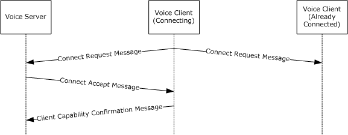

Figure 1: Connection protocol successful connect sequence

### 1.3.3 Peer Voice Session Subprotocol

The peer voice session subprotocol specifies the communication between a [**voice server**](#gt_voice-server) and [**voice clients**](#gt_voice-client) and between individual voice clients when a [**peer**](#gt_peer) [**voice session type**](#gt_voice-session-type) is used. The peer voice session subprotocol requires that the underlying [**game session**](#gt_game-session) is running [**peer-to-peer**](#gt_peer-to-peer). The peer voice session subprotocol is indicated when the **SessionType** field of the [Connect Accept Message (section 2.2.3.2)](#Section_2.2.3.2) is set to DVSESSIONTYPE_PEER (0x00000001).

The roles in this subprotocol are as follows:

- The voice server is responsible for maintaining and distributing the list of voice clients in the [**voice session**](#gt_voice-session).
- The voice clients are responsible for:
- Sending [**speech messages**](#gt_speech-message) directly to any voice clients that they want to send them to.
- Receiving and processing speech messages from other voice clients and converting them back into an [**encoded voice stream**](#gt_encoded-voice-stream). The voice client maintains a [**jitter buffer**](#gt_jitter-buffer) for each voice client in the voice client list.
- Electing and creating a new voice server for voice sessions that enable [**host migration**](#gt_host-migration).
**Note** The voice clients maintain a list of voice clients.

#### 1.3.3.1 Host Migration

Host migration enables a set of [**voice clients**](#gt_voice-client) to elect and create a new [**voice server**](#gt_voice-server) to replace a voice server that has become unavailable.

A voice server can become unavailable either because connectivity is lost or because the voice server has chosen to be shut down. If the voice server chooses to shut down, it informs all [**clients**](#gt_client) that a [**host migration**](#gt_host-migration) needs to take place. The [**DirectPlay**](#gt_directplay) layer is responsible for determining when connectivity has been lost. In either case, the voice clients run a host migration election to determine who will create the new voice server.

Each voice client is assigned a [**host order ID**](#gt_host-order-id), which indicates its priority in determining who creates the new voice server. The voice client that has the lowest host order ID is elected to create the new voice server. The lowest host order ID typically belongs to the oldest voice client in the [**game session**](#gt_game-session), and is therefore most likely to have the most up-to-date list of voice clients. This algorithm enables each voice client to run the algorithm separately. However, all come up with the same answer.

The elected voice client immediately creates the new voice server and initializes it by using the voice client list from the voice client. This new voice server informs everyone that it is ready to accept voice clients. Through the use of host migration, each voice client updates its [Current Voice Server DVID (section 3.1.1)](#Section_3.1.5.2.5) value to equal the [**DVID**](#gt_dvid) of the new voice server.

The following illustration shows the typical message flow of a successful host migration when the voice server has chosen to shut down.

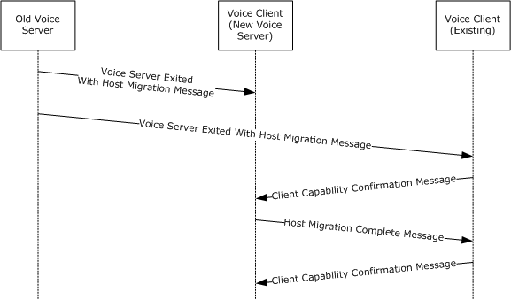

Figure 2: Successful host migration sequence

Host migration needs to be enabled when the protocol is initialized. Voice clients determine that host migration is in use if the peer voice session subprotocol is being used and the **SessionFlags** field in the [Connect Accept Message (section 2.2.3.2)](#Section_2.2.3.2) does not contain the DVSESSION_NOHOSTMIGRATION (0x00000001) flag.

### 1.3.4 Mixing Voice Session Subprotocol

The mixing voice session subprotocol specifies the communication between a [**voice server**](#gt_voice-server) and [**voice clients**](#gt_voice-client) when a mixing [**game session**](#gt_game-session) type is used. The mixing voice session subprotocol requires a game session that provides connectivity between the voice server and the voice clients. Connectivity between individual voice clients is not required. The mixing voice session subprotocol is indicated when the **SessionType** field of the [Connect Accept Message (section 2.2.3.2)](#Section_2.2.3.2) is set to DVSESSIONTYPE_MIXING (0x00000002).

The roles in this subprotocol are as follows:

- The voice server is responsible for the following:
- Maintaining the list of voice clients in the [**voice session**](#gt_voice-session).
- Receiving [**speech messages**](#gt_speech-message) from each of the voice clients and distributing them to each of the voice clients for which they are intended. The voice server distributes the speech messages in a single [**encoded voice stream**](#gt_encoded-voice-stream) to each voice client by mixing together all speech messages intended for each individual voice client. The voice server maintains a [**jitter buffer**](#gt_jitter-buffer) for each voice client in the voice client list.
- The voice clients are responsible for the following:
- Sending voice data and the targets of the data to the voice server.
- Receiving and processing speech messages from the voice server and converting them back into an encoded voice stream. The voice client maintains a single jitter buffer for incoming speech messages from the voice server.
**Note** The voice clients do not maintain a list of voice clients.

### 1.3.5 Forwarding Voice Session Subprotocol

The forwarding voice session subprotocol specifies the communication between a [**voice server**](#gt_voice-server) and [**voice clients**](#gt_voice-client) when a forwarding [**game session**](#gt_game-session) type is used. The forwarding voice session subprotocol requires at a minimum a client/server session, but it will also work with a [**peer-to-peer**](#gt_peer-to-peer) session. Connectivity between individual voice clients is not required. The forwarding voice session subprotocol is indicated when the **SessionType** field of the [Connect Accept Message (section 2.2.3.2)](#Section_2.2.3.2) is set to DVSESSIONTYPE_FORWARDING (0x00000003).

The roles in this subprotocol are as follows:

- The voice server is responsible for:
- Maintaining the list of voice clients in the [**voice session**](#gt_voice-session).
- Receiving [**speech messages**](#gt_speech-message) from each of the voice clients and forwarding them to each of the voice clients for which they are intended. Speech messages intended for each individual voice client.
- The voice clients are responsible for:
- Sending voice data and the targets of the data to the voice server.
- Receiving and processing speech messages from the voice server and converting them back into an [**encoded voice stream**](#gt_encoded-voice-stream). The voice client maintains a [**jitter buffer**](#gt_jitter-buffer) for each voice client in the voice client list.
**Note** The voice clients maintain a list of voice clients.

### 1.3.6 Echo Voice Session Subprotocol

The echo voice session subprotocol specifies the communication between a [**voice server**](#gt_voice-server) and [**voice clients**](#gt_voice-client) when an echo [**game session**](#gt_game-session) type is used. The echo voice session subprotocol requires a [**client/server session**](#gt_5e5c3f01-b31c-447d-9743-a1178fdf4e8b) but it will also operate with a [**peer-to-peer session**](#gt_0abb95b2-6362-411d-a342-7bdfb4640def). The forwarding voice session subprotocol is indicated when the **SessionType** field of the [Connect Accept Message (section 2.2.3.2)](#Section_2.2.3.2) is set to DVSESSIONTYPE_ECHO (0x00000004).

The roles in this subprotocol are as follows:

- The voice server is responsible for maintaining a list of voice clients and forwarding any incoming [**speech messages**](#gt_speech-message) back to the sender.
- The voice clients are responsible for:
- Sending voice data to the [**server**](#gt_server).
- Receiving and processing speech messages from the voice server and converting them back into an [**encoded voice stream**](#gt_encoded-voice-stream). The voice client maintains a single [**jitter buffer**](#gt_jitter-buffer) for incoming speech messages from the voice server.
**Note** The voice clients do not maintain a list of voice clients.

### 1.3.7 Required Codecs

The DirectPlay Voice Protocol requires communication using one of the [**codecs**](#gt_codec) listed in the following table. The codecs are opaque to the DirectPlay Voice Protocol, with the exception that in a [**voice session**](#gt_voice-session), the [**voice client**](#gt_voice-client) and [**voice server**](#gt_voice-server) need to use the same codec. The following table lists the codecs, the frame size used with the protocol, and the approximate amount of time (in milliseconds) that each frame represents.

| Bit Range | Field | Description |
| --- | --- | --- |
| Variable | Voxware VR12 (*) | Variable (Max 21) 90 Variable (max 1822) |
| Variable | Voxware SC03 (*) | 40 100 3200 |
| Variable | Voxware SC06 (*) | 80 100 6400 |
| Variable | Truespeech (*) | 96 90 8536 |
| Variable | Global System for Mobile Communications (GSM) (*) | 130 80 13000 |
| Variable | Microsoft Adaptive Delta Pulse Code Modulation (MS ADPCM) (**) | 256 63 32768 |
| Pulse Code Modulation (PCM) - 8 Kilohertz, 8-bit, and Mono (*) | 394 | 50 64000 |

(*) = This codec is licensed through a third party.

(**) = Microsoft Adaptive Delta Pulse Code Modulation (MS ADPCM) is included with the Microsoft Windows Development Kit (WDK). For more information about the MS ADPCM codec, see [[MSDN-AUDIOFORMAT]](https://go.microsoft.com/fwlink/?LinkId=93409).

## 1.4 Relationship to Other Protocols

The DirectPlay Voice Protocol is embedded in either the [**DirectPlay 4 Protocol**](#gt_directplay-4-protocol) or the [**DirectPlay 8 Protocol**](#gt_directplay-8-protocol). The [**DirectPlay Protocol Voice Message Type**](#gt_directplay-protocol-voice-message-type) is used for all voice extensions to [**DirectPlay Protocols**](#gt_directplay-protocol).

## 1.5 Prerequisites/Preconditions

The DirectPlay Voice Protocol operates only after a [**game session**](#gt_game-session) is established. If the game session is terminated, then the DirectPlay Voice Protocol Specification is also terminated.

There are further restrictions on the [**voice session type**](#gt_voice-session-type) based on whether the specified type of game session is supported, including [**DirectPlay client/server sessions**](#gt_directplay-clientserver-session) and [**DirectPlay peer-to-peer sessions**](#gt_directplay-peer-to-peer-session). The following table illustrates these restrictions.

| Session type | DirectPlay peer-to-peer session | DirectPlay client/server session |
| --- | --- | --- |
| Peer Voice Session Subprotocol (section [1.3.3](#Section_1.3.3)) | Supported | Not Supported |
| Mixing Voice Session Subprotocol (section [1.3.4](#Section_1.3.4)) | Supported | Supported |
| Forwarding Voice Session Subprotocol (section [1.3.5](#Section_1.3.5)) | Supported | Supported |
| Echo Voice Session Subprotocol (section [1.3.6](#Section_1.3.6)) | Supported | Supported |

## 1.6 Applicability Statement

The DirectPlay Voice Protocol is designed to provide voice communications between [**voice clients**](#gt_voice-client) within a [**game session**](#gt_game-session).

The following table describes the characteristics of each game session type based on latency of voice traffic, CPU usage of the voice clients and the [**voice server**](#gt_voice-server), and the bandwidth usage of the [**server**](#gt_server) and [**clients**](#gt_client).

| Voice session type | Latency (voice traffic) | CPU Usage (voice clients) | CPU usage (voice server) | Bandwidth (voice clients) | Bandwidth (voice server) |
| --- | --- | --- | --- | --- | --- |
| [Peer Voice Session Subprotocol](#Section_1.3.3) | Lowest | Scales with the number of people talking to a voice client. | Fixed | Scales with the number of people talking to voice client. Also scales by the number of people the voice client is talking to. | Fixed |
| [Mixing Voice Session Subprotocol](#Section_1.3.4) | Highest | Fixed | Scales with the number of unique mixes and number of people talking. | Fixed | Scales with the number of people receiving voice. |
| [Forwarding Voice Session Subprotocol](#Section_1.3.5) | Medium | Fixed | Fixed | Scales with the number of people talking to the voice client. | Scales with the number of people talking. |
| [Echo Voice Session Subprotocol](#Section_1.3.6) | Medium | Fixed | Fixed | Fixed | Scales with the number of people talking. |

## 1.7 Versioning and Capability Negotiation

This specification covers versioning issues in the following areas:

- **Supported transports**: This protocol can be implemented on top of [**DirectPlay 4**](#gt_directplay-4) and [**DirectPlay 8**](#gt_directplay-8) protocols.
- **Supported codecs**: This protocol supports multiple [**codecs**](#gt_codec) for encoding voice data into [**encoded voice streams**](#gt_encoded-voice-stream). The connection subprotocol is used to inform [**clients**](#gt_client) which codec they are required to use through the [Connect Accept Message (section 2.2.3.2)](#Section_2.2.3.2).
- **Capability negotiation**: This [**voice server**](#gt_voice-server) decides which [**voice session subprotocol**](#gt_voice-session-subprotocol), which codec, and what [**game session**](#gt_game-session) characteristics will be used for the communications. This information is communicated to clients through the connection subprotocol in the Connect Accept Message (section 2.2.3.2).
The DirectPlay Voice Protocol provides version fields in the connection subprotocol, but they are not used.

## 1.8 Vendor-Extensible Fields

This protocol uses [**HRESULT**](#gt_hresult) values as specified in [MS-ERREF](../MS-ERREF/MS-ERREF.md) section 2.1. Vendors can define their own HRESULT values, provided they set the C bit (0x20000000) for each vendor-defined value, indicating that the value is a customer code.

## 1.9 Standards Assignments

None.

# 2 Messages

This protocol references commonly used data types as defined in [MS-DTYP](../MS-DTYP/MS-DTYP.md).

## 2.1 Transport

This protocol is designed to operate over the [**DirectPlay 4**](#gt_directplay-4) or [**DirectPlay 8**](#gt_directplay-8) protocols using the [**voice message**](#gt_voice-message) type.

## 2.2 Message Syntax

The following sections contain DirectPlay Voice Protocol message syntax. All numeric values are transported in [**little-endian**](#gt_little-endian) format.

The following table indicates which messages are used for each [**game session**](#gt_game-session) type subprotocol.

| Message type | Connection subprotocol | Peer voice session subprotocol | Mixing voice session subprotocol | Forwarding voice session subprotocol | Echo voice session subprotocol |
| --- | --- | --- | --- | --- | --- |
| [Add Voice Client Message (section 2.2.2.4)](#Section_2.2.2.4) | No | Yes | Yes | Yes | Yes |
| [Remove Voice Client Message (section 2.2.4.3)](#Section_2.2.4.3) | No | Yes | No | No | No |
| [Session Lost Message (section 2.2.2.1)](#Section_2.2.2.1) | No | Yes | Yes | Yes | Yes |
| [Host Migration Complete Message (section 2.2.4.5.2)](#Section_2.2.4.5.2) | No | Yes (*) | No | No | No |
| [Set Client Voice Target Message (section 2.2.2.5)](#Section_2.2.2.5) | No | Yes (**) | Yes (**) | Yes (**) | Yes (**) |
| [Connect Request Message (section 2.2.3.1)](#Section_2.2.3.1) | Yes | No | No | No | No |
| [Connect Refuse Message (section 2.2.3.3)](#Section_2.2.3.3) | Yes | No | No | No | No |
| [Client Disconnect Request Message (section 2.2.2.2)](#Section_2.2.2.2) | No | Yes | Yes | Yes | Yes |
| [Speech Message (section 2.2.4.4)](#Section_2.2.4.4) | No | Yes | No | No | Yes |
| [Connect Accept Message (section 2.2.3.2)](#Section_2.2.3.2) | Yes | No | No | No | No |
| [Client Capability Confirmation Message (section 2.2.2.8)](#Section_2.2.2.8) | Yes | Yes (*) | No | No | No |
| [Client Disconnect Confirmation Message (section 2.2.2.3)](#Section_2.2.2.3) | No | Yes | Yes | Yes | Yes |
| [Speech with Bounce Message (section 2.2.2.7)](#Section_2.2.2.7) | No | No | Yes | No | Yes |
| [Voice Client List Message (section 2.2.4.2)](#Section_2.2.4.2) | No | Yes | No | No | No |
| [Voice Server Exited with Host Migration Message (section 2.2.4.5.1)](#Section_2.2.4.5.1) | No | Yes (*) | No | No | No |
| [Speech with Target Message (section 2.2.2.6)](#Section_2.2.2.6) | No | No | Yes | Yes | No |
| [Speech with From Message (section 2.2.5.1)](#Section_2.2.5.1) | No | No | No | Yes | No |

(*) = Only when [**host migration**](#gt_host-migration) is enabled. For additional information, see section [1.3.3.1](#Section_1.3) .

(**) = Only when [**server-controlled targeting**](#gt_server-controlled-targeting) is enabled. This is indicated by the value DVSESSION_SERVERCONTROLTARGET (0x00000002) being present in the **SessionFlags** field in the Connect Accept Message (section 2.2.3.2).

**Note** This protocol specification uses curly braced [**GUID**](#gt_globally-unique-identifier-guid) strings as specified in [MS-DTYP](../MS-DTYP/MS-DTYP.md) section 2.3.4.3.

### 2.2.1 The Common Message Header

All messages in the DirectPlay Voice Protocol share a common header, which is followed by a message-specific [**payload**](#gt_payload), as specified in the following sections. Some message types do not have any message-specific payload.

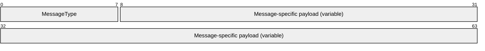

**MessageType (1 byte):** An 8-bit unsigned integer representing a unique packet type that identifies the message. **MessageType** MUST be one of the following values.

| Value | Meaning |
| --- | --- |
| DVMSGID_CREATEVOICEPLAYER 0x01 | [Add Voice Client Message (section 2.2.2.4)](#Section_2.2.2.4) |
| DVMSGID_DELETEVOICEPLAYER 0x02 | [Remove Voice Client Message (section 2.2.4.3)](#Section_2.2.4.3) |
| DVMSGID_SESSIONLOST 0x03 | [Session Lost Message (section 2.2.2.1)](#Section_2.2.2.1) |
| DVMSGID_HOSTMIGRATED 0x0C | [Host Migration Complete Message (section 2.2.4.5.2)](#Section_2.2.4.5.2) |
| DVMSGID_SETTARGETS 0x0D | [Set Client Voice Target Message (section 2.2.2.5)](#Section_2.2.2.5) |
| DVMSGID_CONNECTREQUEST 0x51 | [Connect Request Message (section 2.2.3.1)](#Section_2.2.3.1) |
| DVMSGID_CONNECTREFUSE 0x53 | [Connect Refuse Message (section 2.2.3.3)](#Section_2.2.3.3) |
| DVMSGID_DISCONNECT 0x54 | [Client Disconnect Request Message (section 2.2.2.2)](#Section_2.2.2.2) |
| DVMSGID_SPEECH 0x55 | [Speech Message (section 2.2.4.4)](#Section_2.2.4.4) |
| DVMSGID_CONNECTACCEPT 0x56 | [Connect Accept Message (section 2.2.3.2)](#Section_2.2.3.2) |
| DVMSGID_SETTINGSCONFIRM 0x58 | [Client Capability Confirmation Message (section 2.2.2.8)](#Section_2.2.2.8) |
| DVMSGID_DISCONNECTCONFIRM 0x5A | [Client Disconnect Confirmation Message (section 2.2.2.3)](#Section_2.2.2.3) |
| DVMSGID_SPEECHBOUNCE 0x60 | [Speech with Bounce Message (section 2.2.2.7)](#Section_2.2.2.7) |
| DVMSGID_PLAYERLIST 0x61 | [Voice Client List Message (section 2.2.4.2)](#Section_2.2.4.2) |
| DVMSGID_HOSTMIGRATELEAVE 0x62 | [Voice Server Exited with Host Migration Message (section 2.2.4.5.1)](#Section_2.2.4.5.1) |
| DVMSGID_SPEECHWITHTARGET 0x63 | [Speech with Target Message (section 2.2.2.6)](#Section_2.2.2.6) |
| DVMSGID_SPEECHWITHFROM 0x64 | [Speech with From Message (section 2.2.5.1)](#Section_2.2.5.1) |

**Message-specific payload (variable):** A variable-length field the size of which depends on the type of packet designated in the **MessageType** field.

### 2.2.2 Common Messages

The following are messages that are applicable to more than one session type subprotocol or the connection subprotocol.

#### 2.2.2.1 Session Lost Message

The [**voice server**](#gt_voice-server) sends this message to the [**voice client**](#gt_voice-client) in all [**voice session subprotocols**](#gt_voice-session-subprotocol) to indicate that the [**game session**](#gt_game-session) has ended. This message can also be sent when the new voice server fails to initialize during [**host migration**](#gt_host-migration). These messages are transmitted as ordered and guaranteed with the [**DirectPlay protocol voice message type**](#gt_directplay-protocol-voice-message-type).

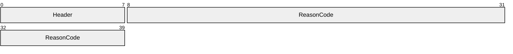

**Header (1 byte):** The common message header (as specified in section [2.2.1](#Section_2.2.1)). The **MessageType** field MUST be set to DVMSGID_SESSIONLOST (0x03).

**ReasonCode (4 bytes):** This MUST be DVERR_SESSIONLOST (0x8015012C).

#### 2.2.2.2 Client Disconnect Request Message

This message is sent by the [**voice client**](#gt_voice-client) in all [**voice session subprotocols**](#gt_voice-session-subprotocol) when they are exiting the [**voice session**](#gt_voice-session) gracefully. These messages are transmitted as ordered and guaranteed with the [**DirectPlay protocol voice message type**](#gt_directplay-protocol-voice-message-type).

**Header (1 byte):** The common message header (as specified in section [2.2.1](#Section_2.2.1)). The **MessageType** field MUST be set to DVMSGID_DISCONNECT (0x54).

#### 2.2.2.3 Client Disconnect Confirmation Message

This message is sent from the [**voice server**](#gt_voice-server) to the [**voice client**](#gt_voice-client) in all [**voice session subprotocols**](#gt_voice-session-subprotocol) when the voice server has successfully removed a voice client from the [**voice session**](#gt_voice-session). These messages are transmitted as ordered and guaranteed with the [**DirectPlay protocol voice message type**](#gt_directplay-protocol-voice-message-type).

**Header (1 byte):** The common message header (as specified in section [2.2.1](#Section_2.2.1)). The **MessageType** field MUST be set to DVMSGID_DISCONNECTCONFIRM (0x5A).

#### 2.2.2.4 Add Voice Client Message

In the [Peer Voice Session Subprotocol (section 1.3.3)](#Section_1.3.3) this message is sent from the [**host**](#gt_host) to all [**voice clients**](#gt_voice-client) in the [**game session**](#gt_game-session) to instruct them to add a voice client to their list of voice clients. In the [Mixing Voice Session Subprotocol (section 1.3.4)](#Section_1.3.4) this message is sent from the host to the voice client to indicate that the voice client has successfully joined the [**voice session**](#gt_voice-session). These messages are transmitted as ordered, guaranteed messages using the [**DirectPlay protocol voice message type**](#gt_directplay-protocol-voice-message-type).

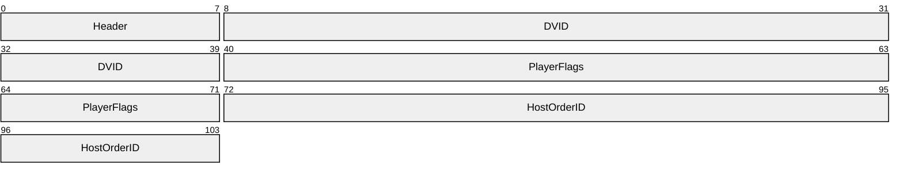

**Header (1 byte):** The common message header (as specified in section [2.2.1](#Section_2.2.1)). The **MessageType** field MUST be set to DVMSGID_CREATEVOICEPLAYER (0x01).

**DVID (4 bytes):** A 32-bit unsigned integer containing the [**DVID**](#gt_dvid) of the voice client that is to be added.

**PlayerFlags (4 bytes):** A 32-bit unsigned integer. This represents a set of bit flags representing voice client audio capabilities. This field MUST be composed of the bitwise OR of zero or more of the following values.

| Value | Meaning |
| --- | --- |
| DVPLAYERCAPS_HALFDUPLEX 0x00000001 | The voice client cannot record audio and will therefore not be transmitting any [**speech messages**](#gt_speech-message). |

**HostOrderID (4 bytes):** A 32-bit unsigned integer representing the [**host order ID**](#gt_host-order-id) of the voice client. When [**host migration**](#gt_host-migration) is enabled as described in section [1.3.3.1](#Section_1.3), this field MUST be set to the host order ID of the voice client to be added. Otherwise, **HostOrderID** SHOULD be set to 0xFFFFFFFF.

#### 2.2.2.5 Set Client Voice Target Message

This message is sent from the [**voice server**](#gt_voice-server) to a [**voice client**](#gt_voice-client) in all [**voice session subprotocols**](#gt_voice-session-subprotocol) to update the voice client's [**voice target list**](#gt_voice-target-list), and is used only when server-controlled targeting is enabled. This message is sent guaranteed and ordered by the [**DirectPlay protocol voice message type**](#gt_directplay-protocol-voice-message-type).

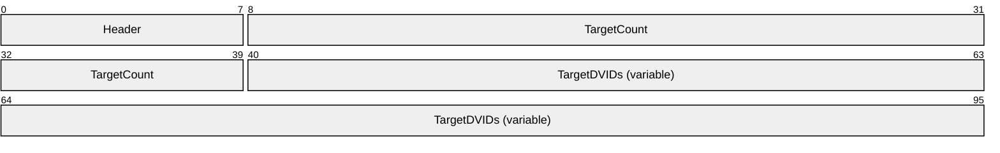

**Header (1 byte):** The common message header (as specified in section [2.2.1](#Section_2.2.1)). The **MessageType** field MUST be set to DVMSGID_SETTARGETS (0x0D).

**TargetCount (4 bytes):** A 32-bit unsigned integer. This value MUST contain the length of the **TargetDVIDs** field in [**DVID**](#gt_dvid) elements, which MUST be greater than or equal to 0. The field MUST be less than or equal to 64.

**TargetDVIDs (variable):** An optional array of DVID values, each representing a user or [**group**](#gt_group) of users that the speech data is intended for. The number of DVIDs in this array MUST be equal to the value of the **TargetCount** field. This field will not contain any data if **TargetCount** is 0. This field cannot contain duplicate DVID values.

#### 2.2.2.6 Speech with Target Message

When using the [Mixing Voice Session Subprotocol (section 1.3.4)](#Section_1.3.4) or the [Forwarding Voice Session Subprotocol (section 1.3.5)](#Section_1.3.5) this [**speech message**](#gt_speech-message) is sent from the [**voice client**](#gt_voice-client) to the [**voice server**](#gt_voice-server). The message contains the required fields of a speech message, in addition to the list of [**DVIDs**](#gt_dvid) it is intended for. This message is sent unordered and nonguaranteed using the [**DirectPlay protocol voice message type**](#gt_directplay-protocol-voice-message-type).

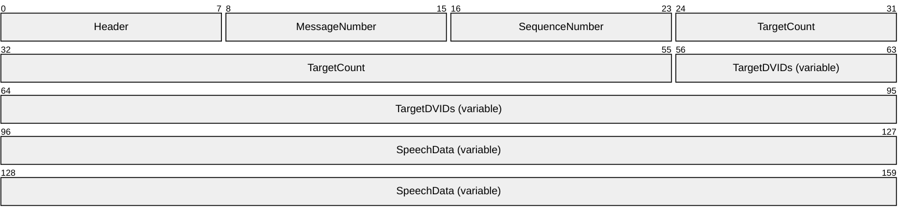

**Header (1 byte):** The common message header (as specified in section [2.2.1](#Section_2.2.1)). The **MessageType** field MUST be set to DVMSGID_SPEECHWITHTARGET (0x63).

**MessageNumber (1 byte):** An 8-bit unsigned integer representing this speech message's [**message number**](#gt_message-number).

**SequenceNumber (1 byte):** An 8-bit unsigned integer representing this speech message's [**sequence number**](#gt_sequence-number).

**TargetCount (4 bytes):** A 32-bit unsigned integer. This value MUST contain the length of the **TargetDVIDs** array in DVID elements. This field MUST be greater than 0 and less than or equal to 64.

**TargetDVIDs (variable):** An array of DVID values, each representing a user or [**group**](#gt_group) of users that the speech data is intended for. The number of DVIDs in this array MUST be equal to the value of the **TargetCount** field and cannot contain duplicates.

**SpeechData (variable):** An array of bytes containing a [**speech frame**](#gt_speech-frame) encoded in the currently selected [**codec**](#gt_codec).

#### 2.2.2.7 Speech with Bounce Message

This message is used in both the [Echo Voice Session Subprotocol (section 1.3.6)](#Section_1.3.6) and the [Mixing Voice Session Subprotocol (section 1.3.4)](#Section_1.3.4). When used in the echo [**voice session subprotocol**](#gt_voice-session-subprotocol) it is used to send a single frame of audio received from the [**voice client**](#gt_voice-client) back to the same voice client. It contains the minimum fields necessary for a [**speech message**](#gt_speech-message). When used in the mixing voice session subprotocol it is used to transmit a single packet of mixed audio to a voice client. This message is sent unordered and nonguaranteed by using the [**DirectPlay protocol voice message type**](#gt_directplay-protocol-voice-message-type).

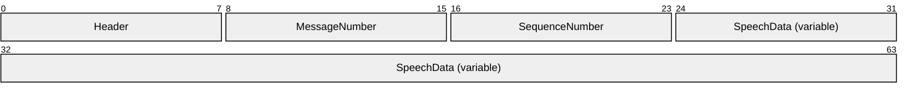

**Header (1 byte):** The common message header (as specified in section [2.2.1](#Section_2.2.1)). The **MessageType** field MUST be set to DVMSGID_SPEECHBOUNCE (0x60).

**MessageNumber (1 byte):** An 8-bit unsigned integer representing this speech message's [**message number**](#gt_message-number).

**SequenceNumber (1 byte):** An 8-bit unsigned integer representing this speech message's [**sequence number**](#gt_sequence-number).

**SpeechData (variable):** An array of bytes containing a [**speech frame**](#gt_speech-frame) encoded in the currently selected [**codec**](#gt_codec).

#### 2.2.2.8 Client Capability Confirmation Message

This message is used by the [Connection Subprotocol (section 1.3.2)](#Section_1.3.2), and for [**host migration**](#gt_host-migration) of the [Peer Voice Session Subprotocol (section 1.3.3)](#Section_1.3.3). For the connection subprotocol, it is sent by the [**voice client**](#gt_voice-client) to complete capability negotiation. For host migration of the Peer Voice Session Subprotocol, it is used by voice clients to communicate capabilities to the new [**host**](#gt_host) when a host migration is complete. This message is sent as an ordered, guaranteed message using the [**DirectPlay protocol voice message type**](#gt_directplay-protocol-voice-message-type).

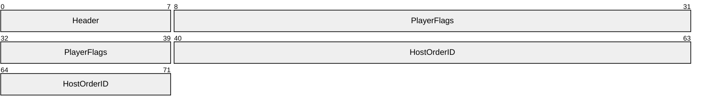

**Header (1 byte):** The common message header (as specified in section [2.2.1](#Section_2.2.1)). The **MessageType** field MUST be set to DVMSGID_SETTINGSCONFIRM (0x58).

**PlayerFlags (4 bytes):** A 32-bit unsigned integer. This represents a set of bit flags representing [**client**](#gt_client) audio capabilities. This field MUST be composed of the bitwise OR of zero or more of the following values.

| Value | Meaning |
| --- | --- |
| DVPLAYERCAPS_HALFDUPLEX 0x00000001 | The voice client cannot record audio and will therefore not be transmitting any encoded audio data. |

**HostOrderID (4 bytes):** A 32-bit unsigned integer representing the [**host order ID**](#gt_host-order-id) of the voice client. When host migration is enabled as described in section [1.3.3.1](#Section_1.3), and the Client Capability Confirmation Message is used during host migration, the **HostOrderID** field MUST be set to the **Current Host Order ID** of the voice client. Otherwise, **HostOrderID** MUST be set to 0xFFFFFFFF. For more information about the **Current Host Order ID**, see sections [3.1.1](#Section_3.1.5.2.5) and [3.1.3](#Section_3.2.3).

### 2.2.3 Connection Subprotocol Messages

The following messages are used only in the connection subprotocol.

#### 2.2.3.1 Connect Request Message

When the underlying [**game session**](#gt_game-session) is [**peer-to-peer**](#gt_peer-to-peer), this message is sent to all [**DirectPlay clients**](#gt_directplay-client). When the underlying game session is [**client/server**](#gt_clientserver-mode), this message is sent to the [**DirectPlay host**](#gt_directplay-host). This message is sent as an ordered, guaranteed message by using the [**DirectPlay protocol voice message type**](#gt_directplay-protocol-voice-message-type).

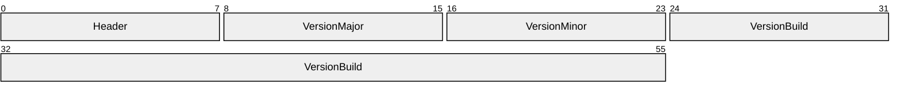

**Header (1 byte):** The common message header (as specified in section [2.2.1](#Section_2.2.1)). The **MessageType** field MUST be set to DVMSGID_CONNECTREQUEST (0x51).

**VersionMajor (1 byte):** An 8-bit unsigned integer. This value MUST be 0x01.

**VersionMinor (1 byte):** An 8-bit unsigned integer. This value MUST be 0x00.

**VersionBuild (4 bytes):** A 32-bit unsigned integer. This value MUST be 0x00000003.

#### 2.2.3.2 Connect Accept Message

This message is sent by the [**voice server**](#gt_voice-server) to inform the [**voice client**](#gt_voice-client) of configuration of the [**game session**](#gt_game-session). This message is sent as an ordered and guaranteed message by using the [**DirectPlay protocol voice message type**](#gt_directplay-protocol-voice-message-type).

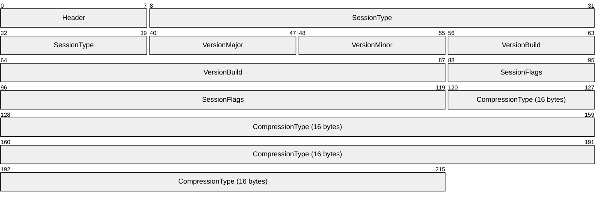

**Header (1 byte):** The common message header (as specified in section [2.2.1](#Section_2.2.1)). The **MessageType** field MUST be set to DVMSGID_CONNECTACCEPT (0x56).

**SessionType (4 bytes):** A 32-bit unsigned integer. This value MUST be one of the following. It indicates which type of [**voice session**](#gt_voice-session) is in use and, therefore, which [**voice session subprotocol**](#gt_voice-session-subprotocol) to use when communicating for this voice session.

| Value | Meaning |
| --- | --- |
| DVSESSIONTYPE_PEER 0x00000001 | The [**peer-to-peer**](#gt_peer-to-peer) [**voice session type**](#gt_voice-session-type). Use the [Peer Voice Session Subprotocol (section 1.3.3)](#Section_1.3.3). |
| DVSESSIONTYPE_MIXING 0x00000002 | The mixing voice session type. Use the [Mixing Voice Session Subprotocol (section 1.3.4)](#Section_1.3.4). |
| DVSESSIONTYPE_FORWARDING 0x00000003 | The forwarding voice session type. Use the [Forwarding Voice Session Subprotocol (section 1.3.5)](#Section_1.3.5). |
| DVSESSIONTYPE_ECHO 0x00000004 | The echo voice session type. Use the [Echo Voice Session Subprotocol (section 1.3.6)](#Section_1.3.6). |

**VersionMajor (1 byte):** An 8-bit, unsigned integer. This value MUST be 0x01.

**VersionMinor (1 byte):** An 8-bit, unsigned integer. This value MUST be 0x00.

**VersionBuild (4 bytes):** A 32-bit, unsigned integer. This value MUST be 0x00000003.

**SessionFlags (4 bytes):** A 32-bit, unsigned integer representing a set of bit flags that indicate the session flags for the voice session. This field SHOULD be composed of the bitwise OR of zero or more of the following.

| Value | Meaning |
| --- | --- |
| DVSESSION_NOHOSTMIGRATION 0x00000001 | [**Host migration**](#gt_host-migration) (section [1.3.3.1](#Section_1.3)) is not enabled in the current voice session. If the voice server leaves the game session, the game session will end. |
| DVSESSION_SERVERCONTROLTARGET 0x00000002 | The target of a voice client's voice data is controlled by the voice server instead of the voice client itself. |

**CompressionType (16 bytes):** A 16-byte [**GUID**](#gt_globally-unique-identifier-guid) value indicating the [**compression ID**](#gt_compression-id) for the [**codec**](#gt_codec) that MUST be used for encoding voice data in this voice session. For a full description of the codecs and required parameters, see [Required Codecs (section 1.3.7)](#Section_1.3.7).

**Note** When the [**client**](#gt_client) receives the Connect Accept Message, it SHOULD check its local capabilities to ensure that it can support the specified codec. If it cannot support the specified codec, then the client will not send any more messages and MUST NOT reply with a [Client Capability Confirmation Message](#Section_2.2.2.8).

This MUST be one of the following values.

| Value | Meaning |
| --- | --- |
| DPVCTGUID_ADPCM 699B52C1-A885-46a8-A308-97172419ADC7 | Microsoft Adaptive Delta Pulse Code Modulation (MS-ADPCM) |
| DPVCTGUID_GSM 24768C60-5A0D-11d3-9BE4-525400D985E7 | Global System for Mobile Communications (GSM) |
| DPVCTGUID_NONE 8DE12FD4-7CB3-48ce-A7E8-9C47A22E8AC5 | Pulse Code Modulation (PCM) |
| DPVCTGUID_SC03 7D82A29B-2242-4f82-8F39-5D1153DF3E41 | Voxware SC03 |
| DPVCTGUID_SC06 53DEF900-7168-4633-B47F-D143916A13C7 | Voxware SC06 |
| DPVCTGUID_TRUESPEECH D7954361-5A0B-11d3-9BE4-525400D985E7 | Truespeech |
| DPVCTGUID_VR12 FE44A9FE-8ED4-48bf-9D66-1B1ADFF9FF6D | Voxware VR12 |

#### 2.2.3.3 Connect Refuse Message

This message is sent by the [**voice server**](#gt_voice-server) if a [**voice client**](#gt_voice-client) requests to connect and the voice server is either shutting down or not yet initialized. This message is sent as an ordered and guaranteed message by using the [**DirectPlay protocol voice message type**](#gt_directplay-protocol-voice-message-type).

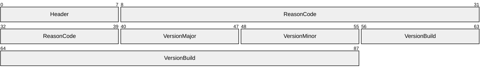

**Header (1 byte):** The common message header (as specified in section [2.2.1](#Section_2.2.1)). The **MessageType** field MUST be set to DVMSGID_CONNECTREFUSE (0x53).

**ReasonCode (4 bytes):** An [**HRESULT**](#gt_hresult) value indicating the reason the connection request was refused. This field MUST be set to DVERR_NOTHOSTING (0x8015017B).

**VersionMajor (1 byte):** An 8-bit unsigned integer. This value MUST be 0x01.

**VersionMinor (1 byte):** An 8-bit unsigned integer. This value MUST be 0x00.

**VersionBuild (4 bytes):** A 32-bit unsigned integer. This value MUST be 0x00000003.

### 2.2.4 Peer Voice Session Subprotocol Messages

The following are messages that are specific to the [Peer Voice Session Subprotocol (section 1.3.3)](#Section_1.3.3).

#### 2.2.4.1 Voice Client List Entry Structure

This structure is used to describe a single [**voice client**](#gt_voice-client).

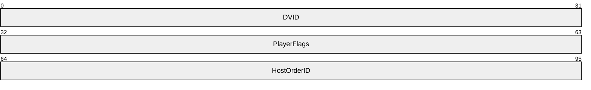

**DVID (4 bytes):** A 32-bit unsigned integer representing the [**DVID**](#gt_dvid) of the voice client.

**PlayerFlags (4 bytes):** A 32-bit unsigned integer. This represents a set of bit flags representing [**client**](#gt_client) audio capabilities. This field MUST be composed of the bitwise OR of zero or more of the following values.

| Value | Meaning |
| --- | --- |
| DVPLAYERCAPS_HALFDUPLEX 0x00000001 | The voice client cannot record audio and will therefore not be transmitting any encoded audio data. |

**HostOrderID (4 bytes):** A 32-bit unsigned integer representing the [**host order ID**](#gt_host-order-id) of the voice client. When [**host migration**](#gt_host-migration) is enabled as described in section [1.3.3.1](#Section_1.3), this field MUST be set to the host order ID of the voice client that is being described. Otherwise, **HostOrderID** SHOULD be set to 0xFFFFFFFF.

#### 2.2.4.2 Voice Client List Message

This message is sent from the [**voice server**](#gt_voice-server) to a [**voice client**](#gt_voice-client) to provide that [**client**](#gt_client) with a list of all voice clients that are currently part of the [**voice session**](#gt_voice-session). If the [**game session**](#gt_game-session) is large, then the [**server**](#gt_server) MAY send more than one of these messages. The message is sent as an ordered, guaranteed message using the [**DirectPlay protocol voice message type**](#gt_directplay-protocol-voice-message-type).

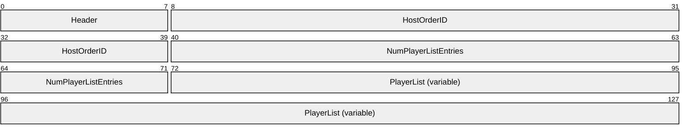

**Header (1 byte):** The common message header (as specified in section [2.2.1](#Section_2.2.1)). The **MessageType** field MUST be set to DVMSGID_PLAYERLIST (0x61).

**HostOrderID (4 bytes):** A 32-bit unsigned integer representing the [**host order ID**](#gt_host-order-id) of the voice client. When [**host migration**](#gt_host-migration) is enabled as described in section [1.3.3.1](#Section_1.3), this field MUST be set to the host order ID of the voice client to which the Voice Client List Message is being sent. Otherwise, **HostOrderID** SHOULD be set to 0xFFFFFFFF.

**NumPlayerListEntries (4 bytes):** A 32-bit unsigned integer. This value MUST indicate the length of the **PlayerList** field in the Voice Client List Message. This field will never be a value greater than 0x00000052. It is possible for this value to be 0.

**PlayerList (variable):** An optional array of [Voice Client List Entry (section 2.2.4.1)](#Section_2.2.4.1) structures. The number of structures present MUST equal the value of **NumPlayerListEntries**. If **NumPlayerListEntries** is 0, then there will be no data in this portion of the message.

#### 2.2.4.3 Remove Voice Client Message

This message is sent from the [**voice server**](#gt_voice-server) to a [**voice client**](#gt_voice-client) to instruct it to remove a specific voice client from its list of voice clients. This message is sent ordered and guaranteed by using the [**DirectPlay protocol voice message type**](#gt_directplay-protocol-voice-message-type).

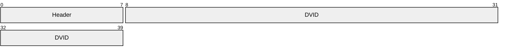

**Header (1 byte):** The common message header (as specified in section [2.2.1](#Section_2.2.1)). The **MessageType** field MUST be set to DVMSGID_DELETEVOICEPLAYER (0x02).

**DVID (4 bytes):** A 32-bit unsigned integer representing the [**DVID**](#gt_dvid) of the voice client to remove.

#### 2.2.4.4 Speech Message

This message is sent from one [**voice client**](#gt_voice-client) to another to send a single [**speech frame**](#gt_speech-frame). It contains the minimum fields needed for a [**speech message**](#gt_speech-message). This message is sent unordered and nonguaranteed by using the [**DirectPlay protocol voice message type**](#gt_directplay-protocol-voice-message-type).

**Header (1 byte):** The common message header (as specified in section [2.2.1](#Section_2.2.1)). The **MessageType** field MUST be set to DVMSGID_SPEECH (0x55).

**MessageNumber (1 byte):** An 8-bit unsigned integer representing this speech message's [**message number**](#gt_message-number).

**SequenceNumber (1 byte):** An 8-bit unsigned integer representing this speech message's [**sequence number**](#gt_sequence-number).

**SpeechData (variable):** An array of bytes containing a speech frame encoded in the currently selected [**codec**](#gt_codec).

#### 2.2.4.5 Host Migration Messages

The following are messages that are specific to the [Peer Voice Session Subprotocol (section 1.3.3)](#Section_1.3.3) when [**host migration**](#gt_host-migration) is enabled as described in section [1.3.3.1](#Section_1.3).

##### 2.2.4.5.1 Voice Server Exited with Host Migration Message

This message is sent by the [**voice server**](#gt_voice-server) when it is exiting the [**voice session**](#gt_voice-session) and [**host migration**](#gt_host-migration) is enabled. The message is sent ordered and guaranteed by using the [**DirectPlay protocol voice message type**](#gt_directplay-protocol-voice-message-type).

**Header (1 byte):** The common message header (as specified in section [2.2.1](#Section_2.2.1)). The **MessageType** field MUST be set to DVMSGID_HOSTMIGRATELEAVE (0x62).

##### 2.2.4.5.2 Host Migration Complete Message

When a [**host migration**](#gt_host-migration) occurs, this message is sent when a new [**voice server**](#gt_voice-server) has been successfully created and initialized. This message is sent by the new voice server to all of the [**voice clients**](#gt_voice-client) in the [**voice session**](#gt_voice-session). This message is sent ordered and guaranteed by using the [**DirectPlay protocol voice message type**](#gt_directplay-protocol-voice-message-type).

**Header (1 byte):** The common message header (as specified in section [2.2.1](#Section_2.2.1)). The **MessageType** field MUST be set to DVMSGID_HOSTMIGRATED (0x0C).

### 2.2.5 Forwarding Voice Session Subprotocol Messages

The following are messages that are specific to the [Forwarding Voice Session Subprotocol (section 1.3.5)](#Section_1.3.5).

#### 2.2.5.1 Speech with From Message

This message is sent from the [**voice server**](#gt_voice-server) to a [**voice client**](#gt_voice-client) to relay a [**speech message**](#gt_speech-message) on behalf of the voice client. It contains the minimum fields needed for a speech message as well as a [**DVID**](#gt_dvid) identifying the original voice client who sent the message. This message is sent unordered and nonguaranteed by using the [**DirectPlay protocol voice message type**](#gt_directplay-protocol-voice-message-type).

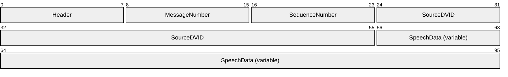

**Header (1 byte):** The common message header (as specified in section [2.2.1](#Section_2.2.1)). The **MessageType** field MUST be set to DVMSGID_SPEECHWITHFROM (0x64).

**MessageNumber (1 byte):** An 8-bit unsigned integer representing this speech message's [**message number**](#gt_message-number).

**SequenceNumber (1 byte):** An 8-bit unsigned integer representing this speech message's [**sequence number**](#gt_sequence-number).

**SourceDVID (4 bytes):** A 32-bit unsigned integer representing the DVID of the original voice client who sent the message.

**SpeechData (variable):** An array of bytes containing a [**speech frame**](#gt_speech-frame) encoded in the currently selected [**codec**](#gt_codec).

# 3 Protocol Details

## 3.1 Voice Client Details

### 3.1.1 Abstract Data Model

This section describes a conceptual model of possible data organization that an implementation maintains to participate in this protocol. The described organization is provided to facilitate the explanation of how the protocol behaves. This specification does not mandate that implementations adhere to this model as long as their external behavior is consistent with that described in this specification.

The following are abstract data items maintained by [**voice clients**](#gt_voice-client):

**Voice Client List:** When the voice client is operating with the [Peer Voice Session Subprotocol (section 1.3.3)](#Section_1.3.3) it maintains a list of other voice clients in the [**voice session**](#gt_voice-session). The **Voice Client List** contains the [**DVID**](#gt_dvid) and [**host order ID**](#gt_host-order-id) of each voice client in the voice session. Voice clients are added and removed from the list in response to messages from the [**voice server**](#gt_voice-server) during connection and throughout the lifetime of the voice session.

When the voice client is operating with the [Forwarding Voice Session Subprotocol (section 1.3.5)](#Section_1.3.5) it maintains a list of other voice clients in the voice session. The **Voice Client List** contains the DVID of each voice client in the voice session. Voice clients are added to the list in response to a [Speech with From Message (section 2.2.5.1)](#Section_2.2.5.1) where the value of the **SourceDVID** field specifies a DVID that is not in the **Voice Client List**. Voice clients are removed from the **Voice Client List** when the voice session ends.

**Current Host Order ID:** When [**host migration**](#gt_host-migration) is enabled as described in section [1.3.3.1](#Section_1.3), the voice client stores the current value of its host order ID.

**Current Voice Server DVID:** The DVID of the current voice server. If a host migration occurs, this value can change.

**Current Voice Target List:** The voice client maintains a [**voice target list**](#gt_voice-target-list). This list is used to target speech messages sent from the voice client. If the voice target list is empty, then [**speech messages**](#gt_speech-message) are discarded rather than sent.

**Jitter Buffers:** When the voice client is using the Peer Voice Session Subprotocol (section 1.3.3) or the Forwarding Voice Session Subprotocol (section 1.3.5) it maintains a [**jitter buffer**](#gt_jitter-buffer) for each voice client in the **Voice Client List**. When the voice client is using any of the other voice session subprotocols, the voice client maintains a single **Jitter Buffer** for incoming speech messages from the voice server.

**Current Message Number:** The [**message number**](#gt_message-number) of the current [**voice burst**](#gt_voice-burst). When a new voice burst is started, this value is incremented by one.

**Current Sequence Number:** The [**sequence number**](#gt_sequence-number) of the next speech message being sent within the current voice burst. When a new voice burst is started, this value is reset to 0.

### 3.1.2 Timers

The **Connection Retry Timer** is created when the [**voice client**](#gt_voice-client) begins its connect sequence. It expires every 1,250 ms or when the voice client completes a successful connection with the [Connection Subprotocol (section 1.3.2)](#Section_1.3.2).

The **Connection Request Timer** is created when the voice client begins its connect sequence. It expires after 30,000 ms or when the voice client completes a successful connection with the Connection Subprotocol.

The **Speech Data Transmission Timer** expires on the period indicated by the currently selected [**codec**](#gt_codec) as described by the Frame Size (milliseconds of data) column in the list of codecs specified in section [1.3.7](#Section_1.3.7).

### 3.1.3 Initialization

The underlying [**game session**](#gt_game-session) MUST be established before the [**voice client**](#gt_voice-client) can begin operation. In addition, the following MUST occur:

- The **Voice Client List** is set to empty.
- **Current Host Order ID** is set to 0xFFFFFFFF.
- **Current Voice Server DVID** is set to 0 if the game session is [**peer-to-peer**](#gt_peer-to-peer) or the [**DVID**](#gt_dvid) of the [**voice server**](#gt_voice-server) if the game session is in [**client/server**](#gt_clientserver-mode) mode.
- **Current Voice Target List** is set to empty.
- **Jitter Buffers** are initialized.
- **Current Message Number** is set to 0.
- **Current Sequence Number** is set to 0.

### 3.1.4 Higher-Layer Triggered Events

The following are events that can be triggered by a higher level:

**Disconnect Request:** The higher level can initiate a disconnection from the [**voice session**](#gt_voice-session). This will cause a [Client Disconnect Confirmation Message (section 2.2.2.3)](#Section_2.2.2.3) to be sent to the [**voice server**](#gt_voice-server). This will also halt the transmission of speech messages.

**Start Voice Burst:** The higher level can start a [**voice burst**](#gt_voice-burst). When a voice burst is started, speech messages are transmitted until the voice burst is stopped. When a voice burst is started, the **Current Message Number** is incremented by one and the **Current Sequence Number** is reset to 0. If the **Current Voice Target List** is empty, starting a voice burst has no effect.

**Stop Voice Burst:** The higher level can stop a voice burst. When a voice burst is stopped, speech messages stop transmitting and the sequence number is no longer incremented.

**Change Voice Client List:** The higher level can modify the **Current Voice Target List**. If the voice target list is emptied by the higher level and a voice burst is being transmitted, the voice burst will stop transmitting.

### 3.1.5 Processing Events and Sequencing Rules

#### 3.1.5.1 Connection Subprotocol

##### 3.1.5.1.1 Handling Unrecognized Messages

If an unrecognized or malformed message is received, it is ignored.

##### 3.1.5.1.2 Sending Connect Request Message

The structure and fields of the [Connect Request Message](#Section_2.2.3.1) are specified in section 2.2.3.1. This message is handled differently depending on the underlying [**game session**](#gt_game-session) type:

**Peer-to-peer:** The message is sent to all [**DirectPlay clients**](#gt_directplay-client).

**Client/server:** The message is sent to the [**DirectPlay session host**](#gt_directplay-host).

The client MUST send this message before any other messages.

##### 3.1.5.1.3 Receiving Connect Accept Message

The structure and fields of the [Connect Accept Message](#Section_2.2.3.2) are specified in section 2.2.3.2.

This MUST be the first message a [**voice client**](#gt_voice-client) receives from a [**voice server**](#gt_voice-server) in the situation where the voice server accepts the connect request from the voice client. The client MUST receive this message only after it has successfully sent a [Connect Request Message](#Section_2.2.3.1). The client processes only the first Connect Accept Message it receives and ignores any others it receives.

When the client receives this message it SHOULD check its local capabilities to ensure that it can support the specified [**codec**](#gt_codec). If it cannot support the specified codec, then the client will not send any more messages. If the client can support the specified codec, it SHOULD reply with a [Client Capability Confirmation Message](#Section_2.2.2.8).

The voice client SHOULD update the value of its **Current Voice Server DVID** to match the [**DVID**](#gt_dvid) of the sender of the Connect Accept Message. The DVID value is determined differently depending on the [**DirectPlay Protocol**](#gt_directplay-protocol) version.<1>

##### 3.1.5.1.4 Receiving Connect Refuse Message

The structure and fields of the [Connect Refuse Message](#Section_2.2.3.3) are specified in section 2.2.3.3.

This message MUST be the first message a [**voice client**](#gt_voice-client) receives from a [**voice server**](#gt_voice-server) in the situation where the voice server refuses the connect request from the voice client. The voice client MUST receive this message only after it has successfully sent a [Connect Request Message](#Section_2.2.3.1). The [**client**](#gt_client) processes only the first Connect Refuse Message it receives and ignores any others it receives.

When the client receives this message, it SHOULD stop communicating. The **ReasonCode** field from the Connect Refuse Message can optionally be passed up to higher layers to indicate the cause of the failure.

##### 3.1.5.1.5 Sending a Client Capability Confirmation Message

The structure and fields of the [Client Capability Confirmation Message](#Section_2.2.2.8) are specified in section 2.2.2.8.

This message MUST be sent only after a [Connect Accept Message](#Section_2.2.3.2) has been received. After sending this message, the [**voice client**](#gt_voice-client) starts using the [**voice session**](#gt_voice-session) subprotocol specified in the **SessionType** field of the Connect Accept Message. In the Client Capability Confirmation Message, the **HostOrderID** field MUST be set to 0xFFFFFFFF.

#### 3.1.5.2 Common Messages for All Voice Session Subprotocols

##### 3.1.5.2.1 Receiving a Session Lost Message

The structure and fields of the [Session Lost Message](#Section_2.2.2.1) are specified in section 2.2.2.1. This message MUST come from the current [**voice server**](#gt_voice-server) that is identified by the **Current Voice Server DVID**.

This message indicates that the [**voice session**](#gt_voice-session) has ended. The [**voice client**](#gt_voice-client) SHOULD ignore all messages after this message is received and stop sending messages. If the voice client is currently awaiting a [Client Disconnect Confirmation Message](#Section_2.2.2.3), this message stops waiting.

##### 3.1.5.2.2 Receiving a Set Client Voice Target Message

The structure and fields of the [Set Client Voice Target Message](#Section_2.2.2.5) are specified in section 2.2.2.5. This message MUST come from the current [**voice server**](#gt_voice-server) that is identified by the current voice server [**DVID**](#gt_dvid).

This message is sent by the voice server to the [**voice client**](#gt_voice-client) to update the **Current Voice Target List**. The message SHOULD be processed only if the [**game session**](#gt_game-session) is running [**Server Controlled Targeting**](#gt_server-controlled-targeting).

When the message is processed the voice client SHOULD replace its **Current Voice Target List** with the list of voice targets in this message. All speech messages transmitted after this point SHOULD use the new set of targets.

##### 3.1.5.2.3 Sending a Client Disconnect Request Message

The structure and fields of the [Client Disconnect Request Message](#Section_2.2.2.2) are specified in section 2.2.2.2.

This message is sent by the [**voice client**](#gt_voice-client) to the [**voice server**](#gt_voice-server) when the higher level indicates that the voice client SHOULD disconnect. When this message is sent, the voice client stops any currently transmitting [**voice bursts**](#gt_voice-burst). The voice client then waits for a [Client Disconnect Confirmation Message](#Section_2.2.2.3). If a [Session Lost Message](#Section_2.2.2.1) or a Client Disconnect Confirmation Message is received while waiting, the voice client stops waiting. If a [Host Migration Complete Message](#Section_2.2.4.5.2) is received while waiting, and [**host migration**](#gt_host-migration) is enabled as described in section [1.3.3.1](#Section_1.3), then the voice client retransmits the Client Disconnect Request Message.

##### 3.1.5.2.4 Receiving a Client Disconnect Confirmation Message

The structure and fields of the [Client Disconnect Confirmation Message](#Section_2.2.2.3) are specified in section 2.2.2.3. This message MUST come from the current [**voice server**](#gt_voice-server) that is identified by the **Current Voice Server DVID**.

This message indicates that the current voice server has received the client's request to disconnect. When this message is received, the [**voice client**](#gt_voice-client) SHOULD cease all communications.

##### 3.1.5.2.5 Receiving an Add Voice Client Message

The structure and fields of the [Add Voice Client Message](#Section_2.2.2.4) are specified in section 2.2.2.4. This message MUST come from the current [**voice server**](#gt_voice-server) that is identified by the **Current Voice Server DVID**.

The [**client**](#gt_client) SHOULD add the [**voice client**](#gt_voice-client) described by the Add Voice Client Message into its **Voice Client List**. Duplicate entries in the **Voice Client List** SHOULD be ignored.

If the [**voice session**](#gt_voice-session) is running the [Mixing Voice Session Subprotocol (section 1.3.4)](#Section_1.3.4), this message is also used to signal the voice client that they can start transmitting speech messages if a [**voice burst**](#gt_voice-burst) is active and there is a nonempty **Current Voice Target List**.

#### 3.1.5.3 Peer Voice Session Subprotocol

The [Peer Voice Session Subprotocol (section 1.3.3)](#Section_1.3.3) is used by the [**voice client**](#gt_voice-client) only after it has received a [Connect Accept Message](#Section_2.2.3.2) and responded with a [Client Capability Confirmation Message](#Section_2.2.2.8). The peer voice session subprotocol is used when the **SessionType** field of the Connect Accept Message is set to DVSESSIONTYPE_PEER (0x00000001).

##### 3.1.5.3.1 Handling Unrecognized Message

If an unrecognized or malformed message is received, it is ignored.

##### 3.1.5.3.2 Receiving a Voice Client List Message

The structure and fields of the [Voice Client List Message](#Section_2.2.4.2) are specified in section 2.2.4.2. This message MUST come from the current [**voice server**](#gt_voice-server) that is identified by the **Current Voice Server DVID**.

The [**client**](#gt_client) SHOULD iterate through the list of [**voice clients**](#gt_voice-client) in the Voice Client List Message and add each of them to the **Voice Client List**. Duplicate entries in the **Voice Client List** SHOULD be ignored.

##### 3.1.5.3.3 Receiving a Remove Voice Client Message

The structure and fields of the [Remove Voice Client Message](#Section_2.2.4.3) are specified in section 2.2.4.3. This message MUST come from the current [**voice server**](#gt_voice-server) that is identified by the **Current Voice Server DVID**.

The [**voice client**](#gt_voice-client) SHOULD remove the voice client identified by the Remove Voice Client Message from its **Voice Client List**. If the specified voice client is already removed, this message will be safely ignored.

##### 3.1.5.3.4 Sending a Speech Message

The structure and fields of the [Speech Message](#Section_2.2.4.4) are specified in section 2.2.4.4.

When the **Speech Data Transmission Timer** expires, if a [**voice burst**](#gt_voice-burst) is active, the next speech message is sent. The Speech Message is sent directly by the [**voice client**](#gt_voice-client) to the voice clients in the **Current Voice Target List**. Speech Message SHOULD NOT be sent before the [Voice Client List Message](#Section_2.2.4.2) is received. [**Speech messages**](#gt_speech-message) SHOULD NOT be sent after the [Client Disconnect Request Message](#Section_2.2.2.2) is sent to the [**voice server**](#gt_voice-server).

##### 3.1.5.3.5 Receiving a Speech Message

The structure and fields of the [Speech Message](#Section_2.2.4.4) are specified in section 2.2.4.4.

A Speech Message is directly received from other [**voice clients**](#gt_voice-client). The speech message SHOULD be placed in the Jitter Buffer of the voice client it came from. The voice client SHOULD ignore [**Speech messages**](#gt_speech-message) from Voice Clients that are not yet present in the Voice Client List.

##### 3.1.5.3.6 Host Migration

###### 3.1.5.3.6.1 Receiving a Voice Server Exited with Host Migration Message

The structure and fields of the [Voice Server Exited with Host Migration Message](#Section_2.2.4.5.1) are specified in section 2.2.4.5.1.

This message indicates that the [**voice server**](#gt_voice-server) is exiting the [**game session**](#gt_game-session) and that [**host migration**](#gt_host-migration) is enabled in the [**voice session**](#gt_voice-session). See section [1.3.3.1](#Section_1.3) for information about what the [**voice client**](#gt_voice-client) SHOULD do in response to the message.

###### 3.1.5.3.6.2 Receiving a Host Migration Complete Message

The structure and fields of the Host Migration Complete Message are specified in section [2.2.4.5.2](#Section_2.2.4.5.2). This message MUST come from the current [**voice server**](#gt_voice-server) that is identified by the **Current Voice Server DVID.**

This message indicates that the voice server has exited the [**game session**](#gt_game-session), a new voice server has been elected, and it has successfully initialized the new voice server. The [**voice client**](#gt_voice-client) MUST respond to this message with a [Client Capability Confirmation Message](#Section_2.2.2.8) sent to the new voice server. If this message is received from a [**client**](#gt_client) that is not the newly elected [**host**](#gt_host), it is ignored.

###### 3.1.5.3.6.3 Sending a Client Capability Confirmation Message

The structure and fields of the [Client Capability Confirmation Message](#Section_2.2.2.8) are specified in section 2.2.2.8. This message MUST be sent to the current [**voice server**](#gt_voice-server) that is identified by the **Current Voice Server DVID**.

The [**voice client**](#gt_voice-client) will send a Client Capability Confirmation Message to the new voice server when either a [Host Migration Complete Message (section 2.2.4.5.2)](#Section_2.2.4.5.2) or a [Voice Server Exited with Host Migration Message (section 2.2.4.5.1)](#Section_2.2.4.5.1) is received. The Client Capability Confirmation Message MUST have the **HostOrderID** field set to the **Current Host Order ID** of the voice client.

#### 3.1.5.4 Mixing Voice Session Subprotocol

##### 3.1.5.4.1 Handling Unrecognized Messages

If an unrecognized or malformed message is received, it is ignored.

##### 3.1.5.4.2 Receiving a Speech with Bounce Message

The structure and fields of the [Speech with Bounce Message](#Section_2.2.2.7) are specified in section 2.2.2.7. This message MUST come from the current [**voice server**](#gt_voice-server), which is identified by the **Current Voice Server DVID**. The [**voice client**](#gt_voice-client) MUST pass the message to the [**jitter buffer**](#gt_jitter-buffer).

##### 3.1.5.4.3 Sending a Speech with Target Message

The structure and fields of the [Speech with Target Message](#Section_2.2.2.6) are specified in section 2.2.2.6. This message MUST be sent to the current [**voice server**](#gt_voice-server) that is identified by the **Current Voice Server DVID**.

When the **Speech Data Transmission Timer** expires, if a [**voice burst**](#gt_voice-burst) is active, the next Speech with Target Message is sent. The Speech with Target Message is sent directly by the [**voice client**](#gt_voice-client) to the voice server and the [**clients**](#gt_client) in the **Current Voice Target List**. Speech with Target Messages SHOULD NOT be sent before the [Client Capability Confirmation Message](#Section_2.2.2.8) is sent. Speech with Target Messages SHOULD NOT be sent after the [Client Disconnect Request Message](#Section_2.2.2.2) is sent to the voice server.

#### 3.1.5.5 Forwarding Voice Session Subprotocol

##### 3.1.5.5.1 Handling Unrecognized Messages

If an unrecognized or malformed message is received, it is ignored.

##### 3.1.5.5.2 Receiving a Speech with From Message

The structure and fields of the [Speech with From Message](#Section_2.2.5.1) are specified in section 2.2.5.1. This message MUST come from the current [**voice server**](#gt_voice-server) that is identified by the **Current Voice Server DVID**.

The [**voice client**](#gt_voice-client) SHOULD take the Speech with From Message and put it into the [**jitter buffer**](#gt_jitter-buffer) for the voice client identified in the **SourceDVID** field. However, if a voice client with the [**DVID**](#gt_dvid) value specified in **SourceDVID** does not exist, the voice client SHOULD add a new voice client entry in the Voice Client List.

##### 3.1.5.5.3 Sending a Speech with Target Message

The structure and fields of the [Speech with Target Message](#Section_2.2.2.6) are specified in section 2.2.2.6. This message MUST be sent to the current [**voice server**](#gt_voice-server) that is identified by the **Current Voice Server DVID**.

When the **Speech Data Transmission Timer** expires, if a [**voice burst**](#gt_voice-burst) is active, the next Speech with Target Message is sent. The Speech with Target Message is sent directly by the [**voice client**](#gt_voice-client) to the voice server and the voice clients in the **Current Voice Target List**. Speech with Target Messages SHOULD NOT be sent before the [Client Capability Confirmation Message](#Section_2.2.2.8) is sent. Speech with Target Messages SHOULD NOT be sent after the [Client Disconnect Request Message](#Section_2.2.2.2) is sent to the voice server.

#### 3.1.5.6 Echo Voice Session Subprotocol

##### 3.1.5.6.1 Handling Unrecognized Messages

If an unrecognized or malformed message is received, it is ignored.

##### 3.1.5.6.2 Sending a Speech Message

The structure and fields of the [Speech Message](#Section_2.2.4.4) are specified in section 2.2.4.4.

When the **Speech Data Transmission Timer** expires, if a voice burst is active, the next [**speech message**](#gt_speech-message) is sent. The speech message is sent directly to the [**voice server**](#gt_voice-server). Speech messages SHOULD NOT be sent after the [Client Disconnect Request Message](#Section_2.2.2.2) is sent to the voice server.

##### 3.1.5.6.3 Receiving a Speech with Bounce Message

The structure and fields of the [Speech with Bounce Message](#Section_2.2.2.7) are specified in section 2.2.2.7. This message MUST come from the current [**voice server**](#gt_voice-server), which is identified by the **Current Voice Server DVID**. The [**voice client**](#gt_voice-client) MUST pass the message to the [**jitter buffer**](#gt_jitter-buffer).

### 3.1.6 Timer Events

When the **Connection Retry Timer** expires, the [**voice client**](#gt_voice-client) will resend the [Connection Request Message (section 2.2.3.1)](#Section_2.2.3.1). If the **Connection Request Timer** expires, the voice client will fail its connection attempt.

When the **Speech Data Transmission Timer** expires, the voice client checks to see whether a [**voice burst**](#gt_voice-burst) is active and if it is, it sends the next [**speech message**](#gt_speech-message). The exact type of message sent to transmit the speech message depends on the [**voice session**](#gt_voice-session) subprotocol.

### 3.1.7 Other Local Events

When the [**DirectPlay protocol**](#gt_directplay-protocol) indicates that a [**DirectPlay client**](#gt_directplay-client) has left the [**voice session**](#gt_voice-session) for any reason, the [**voice clients**](#gt_voice-client) check to see whether the DirectPlay client that left was the voice session [**host**](#gt_host) ([**voice server**](#gt_voice-server)). If the DirectPlay client that left was the voice server and [**host migration**](#gt_host-migration) is enabled, host migration is performed as specified in section [1.3.3.1](#Section_1.3). If the DirectPlay client that left was the voice server and host migration is not enabled, the DirectPlay Voice Protocol will terminate all sending and receiving.

When the DirectPlay protocol indicates that connectivity with the [**DirectPlay**](#gt_directplay) voice session has been lost, the DirectPlay Voice Protocol will terminate all sending and receiving.

## 3.2 Voice Server Details

### 3.2.1 Abstract Data Model

This section describes a conceptual model of possible data organization that an implementation maintains to participate in this protocol. The described organization is provided to facilitate the explanation of how the protocol behaves. This specification does not mandate that implementations adhere to this model as long as their external behavior is consistent with that described in this specification.

**Note** In a [**peer-to-peer**](#gt_peer-to-peer) [**voice session**](#gt_voice-session), the [**voice client**](#gt_voice-client) maintains the abstract data items identified in section [3.1.1](#Section_3.1.5.2.5). In a [**client/server**](#gt_clientserver-mode) voice session, the [**voice server**](#gt_voice-server) maintains both the abstract data items identified in section 3.1.1, as well as those listed in this topic. Although the abstract data items identified in section 3.1.1 use the same names as those listed in this topic, there is no internal conflict. In a client/server configuration, the voice server maintains the abstract data items identified in this topic from the perspective of a voice server, while the items listed in section 3.1.1 are maintained from the perspective of the voice server as a [**player**](#gt_player) in the voice session, and therefore, as a voice client. Differentiation between the similarly named abstract data items is maintained internally by [**DirectPlay**](#gt_directplay).

The following are abstract data items maintained by the voice server:

**Voice Client List:** A list of voice clients in the voice session. The Voice Client List contains the [**DVID**](#gt_dvid) and [**host order ID**](#gt_host-order-id) of each voice client in the voice session.

**Next Host Order ID:** When [**host migration**](#gt_host-migration) is enabled as described in section [1.3.3.1](#Section_1.3), the voice server stores the value of the next host order ID.

**Client Voice Target List:** The voice server maintains a [**voice target list**](#gt_voice-target-list) for each voice client in the voice session when [**server-controlled targeting**](#gt_server-controlled-targeting) is enabled. This list is used to target [**speech messages**](#gt_speech-message) sent from the voice client. If the voice target list is empty, then speech messages are discarded rather than sent.

**Jitter Buffers:** When the voice server is using the [Mixing Voice Session Subprotocol (section 1.3.4)](#Section_1.3.4), it maintains a [**jitter buffer**](#gt_jitter-buffer) for each voice client in the voice session.

**Current Message Number:** When the voice server is using the Mixing Voice Session Subprotocol (section 1.3.4), this contains the [**message number**](#gt_message-number) of the current [**voice burst**](#gt_voice-burst). This value is stored per voice client. When a new voice burst to a voice client is started, this value is incremented by one for the specific voice client.

**Current Sequence Number:** When the voice server is using the Mixing Voice Session Subprotocol (section 1.3.4), this contains the [**sequence number**](#gt_sequence-number) of the next speech message being sent within the current voice burst. This value is stored per voice client. When a new voice burst is started, this value is reset to 0.

### 3.2.2 Timers

When the [**voice server**](#gt_voice-server) is using the [Mixing Voice Session Subprotocol (section 1.3.4)](#Section_1.3.4), a **Speech Data Transmission Timer** is created. It expires on the period indicated by the currently selected [**codec**](#gt_codec) as specified by the Frame Size (ms of data) column in the list of codecs in section [1.3.7](#Section_1.3.7).

### 3.2.3 Initialization

The underlying [**game session**](#gt_game-session) MUST be established before the [**voice client**](#gt_voice-client) can begin operation. In addition, the following MUST occur:

- **Voice Client List** is set to empty.
- **Next Host Order ID** is set to 0 if [**host migration**](#gt_host-migration) is enabled as described in section [1.3.3.1](#Section_1.3).
- **Current Voice Target List** is set to empty for each voice client if [**server-controlled targeting**](#gt_server-controlled-targeting) is enabled.
- **Jitter Buffers** are initialized if the [**voice session**](#gt_voice-session) is using the [Mixing Voice Session Subprotocol (section 1.3.4)](#Section_1.3.4).
- **Current Message Number** is set to 0 for all voice clients if the voice session is using the Mixing Voice Session Subprotocol (section 1.3.4).
- **Current Sequence Number** is set to 0 for all voice clients if the voice session is using the Mixing Voice Session Subprotocol (section 1.3.4).

#### 3.2.3.1 Initialization with Host Migration

When [**host migration**](#gt_host-migration) is enabled as described in section [1.3.3.1](#Section_1.3), a [**voice server**](#gt_voice-server) will be created by a [**voice client**](#gt_voice-client) when host migration occurs. The voice server SHOULD start with the **Voice Client List** containing the list of [**clients**](#gt_client) for the voice client. The voice server SHOULD also initialize the **Next Host Order ID** to the highest [**host order ID**](#gt_host-order-id) in the **Voice Client List** plus 255.

### 3.2.4 Higher-Layer Triggered Events

The following are events that can be triggered by a higher level:

**Shutdown Request:** The higher level can initiate a shutdown for the [**voice session**](#gt_voice-session). This will cause a [Session Lost Message (section 2.2.2.1)](#Section_2.2.2.1) to be sent to all [**voice clients**](#gt_voice-client) if [**host migration**](#gt_host-migration) is disabled. If host migration is enabled as described in section [1.3.3.1](#Section_1.3), then this will cause a [Voice Server Exited with Host Migration (section 2.2.4.5.1)](#Section_2.2.4.5.1). It is also possible to disable host migration before shutdown to cause a voice session to stop without migrating the [**host**](#gt_host).

**Change Voice Client List:** The higher level can modify the **Current Voice Target List** for a specific voice client if [**Server Controlled Targeting**](#gt_server-controlled-targeting) is enabled. This will trigger a [Set Client Voice Target Message (section 2.2.2.5)](#Section_2.2.2.5) to be sent to the voice client.

### 3.2.5 Processing Events and Sequencing Rules

#### 3.2.5.1 Connection Subprotocol

##### 3.2.5.1.1 Handling Unrecognized Messages

If an unrecognized or malformed message is received, it is ignored.

##### 3.2.5.1.2 Receiving Connect Request Message

The structure and fields of the [Connect Request Message](#Section_2.2.3.1) are specified in section 2.2.3.1.

[**Voice clients**](#gt_voice-client) send this message to request that the connection process with the [**voice server**](#gt_voice-server) start. This MUST be the first message sent to a voice server from a new voice client. Voice clients MAY send more than one of these messages during the connection process.

The voice server MUST respond to this message with a [Connect Accept Message (section 2.2.3.2)](#Section_2.2.3.2) if the voice server is ready to communicate with voice clients. If the voice server responds with a Connect Accept Message, it does not need to respond to any further Connect Request Messages received from a voice client. If the voice server is not ready to communicate with voice clients, it SHOULD respond with a [Connect Refuse Message (section 2.2.3.3)](#Section_2.2.3.3).

##### 3.2.5.1.3 Sending Connect Accept Message

The structure and fields of the [Connect Accept Message](#Section_2.2.3.2) are specified in section 2.2.3.2.

The [**voice server**](#gt_voice-server) responds directly to a [**voice client**](#gt_voice-client) with this message after receiving a [Connect Request Message (section 2.2.3.1)](#Section_2.2.3.1) if the voice server is ready to accept connections.

##### 3.2.5.1.4 Sending Connect Refuse Message

The structure and fields of the [Connect Refuse Message](#Section_2.2.3.3) are specified in section 2.2.3.3.

The [**voice server**](#gt_voice-server) responds directly to a [**voice client**](#gt_voice-client) with this message after receiving a [Connect Request Message (section 2.2.3.1)](#Section_2.2.3.1) if the voice server is not ready to accept connections.

##### 3.2.5.1.5 Receiving a Client Capability Confirmation Message

The structure and fields of the [Client Capability Confirmation Message](#Section_2.2.2.8) are specified in section 2.2.2.8.

The [**voice client**](#gt_voice-client) will send the [**voice server**](#gt_voice-server) a Client Capability Confirmation Message when it has confirmed that it can support the type of [**voice session subprotocol**](#gt_voice-session-subprotocol) and [**codec**](#gt_codec) that the voice server is using. Once this message is received from a voice client, the voice server can start talking the specific voice session subprotocol with the voice client. The voice server SHOULD also take the following steps:

- Add the specified voice client to the **Voice Client List**.
- If [**host migration**](#gt_host-migration) is enabled as described in section [1.3.3.1](#Section_1.3):
- Assign the value of the **Next Host Order ID** to the new voice client.
- Increment the **Next Host Order ID**.
- If the voice client presents a [**host order ID**](#gt_host-order-id) that is not equal to 0xFFFFFFFF and exceeds the current value of **Next Host Order ID**, the **Next Host Order ID** is incremented by 255.
- If the voice server is running in [Mixing Voice Session Subprotocol (section 1.3.4)](#Section_1.3.4) it SHOULD initialize the [**jitter buffer**](#gt_jitter-buffer) for the individual voice client.

#### 3.2.5.2 Common Message for All Voice Session Subprotocols

##### 3.2.5.2.1 Sending a Session Lost Message

The structure and fields of the [Session Lost Message](#Section_2.2.2.1) are specified in section 2.2.2.1.

The [**voice server**](#gt_voice-server) sends this message to all [**voice clients**](#gt_voice-client) in the [**voice session**](#gt_voice-session) when the voice server is shutting down and [**host migration**](#gt_host-migration) (section [1.3.3.1](#Section_1.3)) is not enabled. Once this message is sent, the voice server SHOULD no longer respond to messages from voice clients.

##### 3.2.5.2.2 Sending a Set Client Voice Target Message

The structure and fields of the [Set Client Voice Target Message](#Section_2.2.2.5) are specified in section 2.2.2.5.

The [**voice server**](#gt_voice-server) sends a Set Client Voice Target Message when the higher level triggers a **Change Voice Client List** event.

##### 3.2.5.2.3 Receiving a Client Disconnect Request Message

The structure and fields of the [Client Disconnect Request Message](#Section_2.2.2.2) are specified in section 2.2.2.2.

The [**voice client**](#gt_voice-client) sends this message to the [**voice server**](#gt_voice-server) when it wants to disconnect gracefully from the [**voice session**](#gt_voice-session). The voice server SHOULD remove the voice client from the **Voice Client List**. If the voice server is running the [Peer Voice Session Subprotocol (section 1.3.3)](#Section_1.3.3), the voice server will also send a [Remove Voice Client Message (section 2.2.4.3)](#Section_2.2.4.3) to all the voice clients. The voice server will then respond to the sender of this message with a [Client Disconnect Confirmation (section 2.2.2.3)](#Section_2.2.2.3) message.

##### 3.2.5.2.4 Sending a Client Disconnect Confirmation Message

The structure and fields of the [Client Disconnect Confirmation Message](#Section_2.2.2.3) are specified in section 2.2.2.3.

The [**voice server**](#gt_voice-server) sends this message to the [**voice client**](#gt_voice-client) in response to a [Client Disconnect Request Message (section 2.2.2.2)](#Section_2.2.2.2).

#### 3.2.5.3 Peer Voice Session Subprotocol

##### 3.2.5.3.1 Handling Unrecognized Messages

If an unrecognized or malformed message is received, it is ignored.

##### 3.2.5.3.2 Sending a Voice Client List Message

The structure and fields of the [Voice Client List Message](#Section_2.2.4.2) are specified in section 2.2.4.2.

The [**voice server**](#gt_voice-server) sends the [**voice client**](#gt_voice-client) a list of the active voice clients in the [**voice session**](#gt_voice-session) including the voice client this message is sent to. The voice server sends the list using one or more Voice Client List Messages. Each individual message can hold the information for up to 0x52 voice clients. If there are more than 0x52 voice clients, then one Voice Client List Message is also sent for each of the 0x52 voice clients and one for any remaining voice clients. After the voice server has sent the last Voice Client List Message to the voice client needed to provide the full voice client list, an [Add Voice Client Message (section 2.2.2.4)](#Section_2.2.2.4) is sent to all voice clients in the voice session.

##### 3.2.5.3.3 Sending an Add Voice Client Message

The structure and fields of the [Add Voice Client Message](#Section_2.2.2.4) are specified in section 2.2.2.4.

The [**voice server**](#gt_voice-server) sends the Add Voice Client Message to all [**voice clients**](#gt_voice-client) in the [**game session**](#gt_game-session) to indicate that a new voice client has joined the [**voice session**](#gt_voice-session). This message is sent after the [Voice Client List Messages](#Section_2.2.4.2) are sent to the individual voice client.

##### 3.2.5.3.4 Sending a Remove Voice Client Message

The structure and fields of the [Remove Voice Client Message](#Section_2.2.4.3) are specified in section 2.2.4.3.

The [**voice server**](#gt_voice-server) sends the Remove Voice Client Message to all [**voice clients**](#gt_voice-client) in the [**game session**](#gt_game-session) when a voice client has left the game session. If the voice client leaves the game session gracefully by sending a [Client Disconnect Request Message (section 2.2.2.2)](#Section_2.2.2.2), then this message is sent after the [Client Disconnect Confirmation Message (section 2.2.2.3)](#Section_2.2.2.3) is sent to the voice client. If the voice client is removed from the game session through a notification from the [**DirectPlay**](#gt_directplay) layer, then this message is sent after the notification is received.

##### 3.2.5.3.5 Host Migration

###### 3.2.5.3.5.1 Sending a Voice Server Exited with Host Migration Message

The structure and fields of the [Voice Server Exited with Host Migration Message](#Section_2.2.4.5.1) are specified in section 2.2.4.5.1.

The [**voice server**](#gt_voice-server) sends this message to all [**voice clients**](#gt_voice-client) when the voice server shuts down. The voice server can ignore all messages after this message is sent.

###### 3.2.5.3.5.2 Sending a Host Migration Complete Message

The structure and fields of the [Host Migration Complete Message](#Section_2.2.4.5.2) are specified in section 2.2.4.5.2.

When a new [**voice server**](#gt_voice-server) is created by a [**voice client**](#gt_voice-client) and is ready to receive traffic, it sends this message to all voice clients in the [**game session**](#gt_game-session).

###### 3.2.5.3.5.3 Receiving a Client Capability Confirmation Message

The structure and fields of the [Client Capability Confirmation Message](#Section_2.2.2.8) are specified in section 2.2.2.8.

When [**voice clients**](#gt_voice-client) determine that a [**host migration**](#gt_host-migration) is occurring, they send a Client Capability Confirmation Message to the new [**voice server**](#gt_voice-server). If the new voice server does not recognize the voice client, the voice server processes the message as if it were receiving a Client Capability Confirmation Message from the [Connection Subprotocol (section 1.3.2)](#Section_1.3.2).

#### 3.2.5.4 Mixing Voice Session Subprotocol

##### 3.2.5.4.1 Handling Unrecognized Messages

If an unrecognized or malformed message is received, it is ignored.

##### 3.2.5.4.2 Sending an Add Voice Client Message

The structure and fields of the [Add Voice Client Message](#Section_2.2.2.4) are specified in section 2.2.2.4.

The [**voice server**](#gt_voice-server) sends an Add Voice Client Message after they have received the [Client Capability Confirmation Message (section 2.2.2.8)](#Section_2.2.2.8) during the [Connection Subprotocol (section 1.3.2)](#Section_1.3.2).

##### 3.2.5.4.3 Sending a Speech with Bounce Message

The structure and fields of the [Speech with Bounce Message](#Section_2.2.2.7) are specified in section 2.2.2.7.

When the **Speech Data Transmission Timer** expires, the [**voice server**](#gt_voice-server) does the following for each [**voice client**](#gt_voice-client):

- Checks the [**jitter buffer**](#gt_jitter-buffer) for each of the other voice clients to see if any of them have a [**speech message**](#gt_speech-message) to send to the voice client. If no other voice clients have a speech message for the voice client, the voice server moves onto the next voice client.
- Decompresses each of the voice messages that are intended for the voice client using the [**codec**](#gt_codec) in use by this [**game session**](#gt_game-session).
- Mixes the audio to create a single voice message that combines all the voice messages.
- Compresses the combined voice message by using the codec in use by this game session.
- Transmits the combined voice message by using a Speech with Bounce Message to the voice client.

##### 3.2.5.4.4 Receiving a Speech with Target Message

The structure and fields of the [Speech with Target Message](#Section_2.2.2.6) are specified in section 2.2.2.6.

When the [**voice server**](#gt_voice-server) receives a Speech with Target Message from a [**voice client**](#gt_voice-client), it places the enclosed [**speech message**](#gt_speech-message) and the list of targets into the [**jitter buffer**](#gt_jitter-buffer) for the originating voice client.

#### 3.2.5.5 Forwarding Voice Session Subprotocol

##### 3.2.5.5.1 Handling Unrecognized Messages

If an unrecognized or malformed message is received, it is ignored.

##### 3.2.5.5.2 Receiving a Speech with Target Message

The structure and fields of the [Speech with Target Message](#Section_2.2.2.6) are specified in section 2.2.2.6.

When the [**voice server**](#gt_voice-server) receives a Speech with Target Message from a [**voice client**](#gt_voice-client), it creates a new [Speech with From Message (section 2.2.5.1)](#Section_2.2.5.1) and copies the **SpeechData**, **MessageNumber**, and **SequenceNumber** fields from the Speech with Target Message. The voice server then copies the [**DVID**](#gt_dvid) of the voice client that sent the message into the **SourceDVID** field of the new Speech with From Message. The Speech with From Message is then sent to the list of DVIDs from the **TargetDVIDs** field of the Speech with Target Message.

##### 3.2.5.5.3 Sending a Speech with From Message

The structure and fields of the [Speech with From Message](#Section_2.2.5.1) are specified in section 2.2.5.1. See [Receiving a Speech with Target Message (section 3.2.5.5.2)](#Section_3.2.5.5.2) for information about this message.

#### 3.2.5.6 Echo Voice Session Subprotocol

##### 3.2.5.6.1 Handling Unrecognized Messages

If an unrecognized or malformed message is received, it is ignored.

##### 3.2.5.6.2 Receiving a Speech Message

The structure and fields of the [**Speech Message**](#gt_speech-message) are specified in section [2.2.4.4](#Section_2.2.4.4).

When the [**voice server**](#gt_voice-server) receives a **Speech Message** it immediately sends a Speech with Bounce Message (section [2.2.2.7](#Section_2.2.2.7)) back to the originating [**voice client**](#gt_voice-client). The **MessageNumber**, **SequenceNumber**, and **SpeechData** fields are copied from the contents of the Speech Message.

##### 3.2.5.6.3 Sending a Speech with Bounce Message

The structure and fields of the [Speech with Bounce Message](#Section_2.2.2.7) are specified in section 2.2.2.7. See [Receiving a Speech Message (section 3.2.5.6.2)](#Section_3.2.5.6.2) for information about this message.

### 3.2.6 Timer Events

When the [**voice server**](#gt_voice-server) is using the [Mixing Voice Session Subprotocol (section 1.3.4)](#Section_1.3.4) a **Speech Data Transmission Timer** is created. It expires on the period indicated by the currently selected [**codec**](#gt_codec) as specified by the frame size (ms of data) column in the list of codecs in section [1.3.7](#Section_1.3.7).

When the **Speech Data Transmission Timer** expires, the next [Speech with Bounce Message (section 2.2.2.7)](#Section_2.2.2.7) is sent to each [**voice client**](#gt_voice-client) in the [**voice session**](#gt_voice-session) (if there is one). For additional information, see [Sending a Speech with Bounce Message (section 3.2.5.4.3)](#Section_2.2.2.7).

### 3.2.7 Other Local Events

When the [**DirectPlay protocol**](#gt_directplay-protocol) indicates that a [**DirectPlay client**](#gt_directplay-client) has left the [**game session**](#gt_game-session) for any reason, the [**voice server**](#gt_voice-server) will check to see whether the DirectPlay client was one of the [**voice clients**](#gt_voice-client). If the DirectPlay client was one of the voice clients, then the voice server removes it from the voice client list. If the [Peer Voice Session Subprotocol (section 1.3.3)](#Section_1.3.3) is being used, then a [Remove Voice Client Message](#Section_2.2.4.3) is sent to all voice clients.

When the DirectPlay protocol indicates that connectivity with the [**DirectPlay**](#gt_directplay) game session has been lost, the DirectPlay Voice Protocol will terminate all sending and receiving.

# 4 Protocol Examples

## 4.1 Successful Connect Sequence

The following examples demonstrate successful connect sequences.

[Connect Request Message (section 2.2.3.1)](#Section_2.2.3.1)**:**

[**DirectPlay protocol**](#gt_directplay-protocol), [**Client**](#gt_client) to [**Server**](#gt_server), Guaranteed and Ordered

00000000 51 01 00 03 00 00 00

51 -> MessageType = DVMSGID_CONNECTREQUEST = 0x51

01 -> VersionMajor = 0x01

00 -> VersionMinor = 0x00

03 00 00 00 -> VersionBuild = 0x00000003

[Connect Accept Message (section 2.2.3.2)](#Section_2.2.3.2)**:**

DirectPlay protocol, Server to Client, Guaranteed and Ordered

00000000 56 01 00 00 00 01 00 03

00000008 00 00 00 00 00 00 00 9B

00000010 A2 82 7D 42 22 82 4F 8F

00000018 39 5D 11 53 DF 3E 41

56 -> MessageType = DVMSGID_CONNECTACCEPT = 0x56

01 00 00 00 -> SessionType = DVSESSIONTYPE_PEER = 0x00000001

01 -> VersionMajor = 0x01

00 -> VersionMinor = 0x00

03 00 00 00 -> VersionBuild = 0x00000003

00 00 00 00 -> Session Flags = 0x00000000

9B A2 82 7D 42 22 82 4F 8F 39 5D 11 53 DF 3E 41 -> CompressionType =

DPVCTGUID_SC03 {7D82A29B-2242-4F82-8F39-5D1153DF3E41}

[Client Capability Confirmation Message (section 2.2.2.8)](#Section_2.2.2.8)**:**

DirectPlay protocol, Client to Server, Guaranteed and Ordered

00000000 58 00 00 00 00 FF FF FF FF

58 -> MessageType = DVMSGID_SETTINGSCONFIRM = 0x58

00 00 00 00 -> PlayerFlags = 0x00000000

FF FF FF FF -> HostOrderID = 0xFFFFFFFF

At this point the [**voice server**](#gt_voice-server) starts communicating with the [Peer Voice Session Subprotocol (section 1.3.3)](#Section_1.3.3).

[Voice Client List Message (section 2.2.4.2)](#Section_2.2.4.2)**:**

DirectPlay protocol, Server to Client, Guaranteed and Ordered

00000000 61 01 00 00 00 02 00 00

00000008 00 AE F4 42 59 00 00 00

00000010 00 01 00 00 00 AE F4 52

00000018 59 00 00 00 00 00 00 00

00000020 00

61 -> MessageType = DVMSGID_PLAYERLIST = 0x61

01 00 00 00 -> HostOrderID = 0x00000001

02 00 00 00 -> NumPlayerListEntries = 0x00000002

AE F4 42 59 -> Voice Client[0] DVID = 0x5942F4AE

00 00 00 00 -> Voice Client[0] PlayerFlags = 0x00000000

01 00 00 00 -> Voice Client[0] Host Order ID = 0x00000001

AE F4 52 59 -> Voice Client[1] DVID = 0x5952F4AE

00 00 00 00 -> Voice Client[1] PlayerFlags = 0x00000000

00 00 00 00 -> Voice Client[1] Host Order ID = 0x00000000

[Add Voice Client Message (section 2.2.2.4)](#Section_2.2.2.4)**:**

DirectPlay protocol, Server to Server, Guaranteed and Ordered

00000000 01 AE F4 42 59 00 00 00

00000008 00 01 00 00 00

01 -> MessageType = DVMSGID_CREATEVOICEPLAYER = 0x01

AE F4 42 59 -> DVID = 0x5942F4AE

00 00 00 00 -> PlayerFlags = 0x00000000

01 00 00 00 -> HostOrderID = 0x00000001

# 5 Security

## 5.1 Security Considerations for Implementers

The DirectPlay Voice Protocol does not provide any specific security features. Following are some considerations implementers need to be aware of:

- Check all packets to ensure that they are of the proper length and that they contain valid values.
- Do not allocate any resources for a [**voice client**](#gt_voice-client) until a [Client Capability Confirmation Message (section 2.2.2.8)](#Section_2.2.2.8) has been received.

## 5.2 Index of Security Parameters

None.

# 6 Appendix A: Product Behavior

The information in this specification is applicable to the following Microsoft products or supplemental software. References to product versions include released service packs.

- Windows XP operating system
- Windows Server 2003 operating system
Exceptions, if any, are noted below. If a service pack or Quick Fix Engineering (QFE) number appears with the product version, behavior changed in that service pack or QFE. The new behavior also applies to subsequent service packs of the product unless otherwise specified. If a product edition appears with the product version, behavior is different in that product edition.

Unless otherwise specified, any statement of optional behavior in this specification that is prescribed using the terms "SHOULD" or "SHOULD NOT" implies product behavior in accordance with the SHOULD or SHOULD NOT prescription. Unless otherwise specified, the term "MAY" implies that the product does not follow the prescription.

<1> Section 3.1.5.1.3: In [**DirectPlay 4**](#gt_directplay-4), the [Connect Accept Message](#Section_2.2.3.2) arrives as type **DPSP_MSG_VOICE** ([MC-DPL4CS](../MC-DPL4CS/MC-DPL4CS.md) section 2.2.54). This message type includes the **dwIDFrom** field that identifies the [**player ID**](#gt_player-id) of the source for the voice data. The value of the **dwIDFrom** field is passed up to the voice layer of the [**DirectPlay Protocol**](#gt_directplay-protocol) and becomes the [**DVID**](#gt_dvid) of the sender of the Connect Accept Message.

In [**DirectPlay 8**](#gt_directplay-8), whenever any voice message is passed up to the voice layer of the DirectPlay Protocol, the [**DPNID**](#gt_dpnid) of the sender of the message is always included. The value of the DPNID becomes the DVID of the sender of the Connect Accept Message.

# 7 Change Tracking

No table of changes is available. The document is either new or has had no changes since its last release.

## Revision History

| Date | Version | Revision Class | Comments |
| --- | --- | --- | --- |
| 8/10/2007 | 0.1 | Major | Initial Availability |
| 9/28/2007 | 0.2 | Minor | Clarified the meaning of the technical content. |
| 10/23/2007 | 0.3 | Minor | Clarified the meaning of the technical content. |
| 11/30/2007 | 1.0 | Major | Updated and revised the technical content. |
| 1/25/2008 | 2.0 | Major | Updated and revised the technical content. |
| 3/14/2008 | 3.0 | Major | Updated and revised the technical content. |
| 5/16/2008 | 4.0 | Major | Updated and revised the technical content. |
| 6/20/2008 | 5.0 | Major | Updated and revised the technical content. |
| 7/25/2008 | 5.0.1 | Editorial | Changed language and formatting in the technical content. |
| 8/29/2008 | 5.0.2 | Editorial | Changed language and formatting in the technical content. |
| 10/24/2008 | 5.1 | Minor | Clarified the meaning of the technical content. |
| 12/5/2008 | 5.1.1 | Editorial | Editorial Update. |
| 1/16/2009 | 5.1.2 | Editorial | Changed language and formatting in the technical content. |
| 2/27/2009 | 6.0 | Major | Updated and revised the technical content. |
| 4/10/2009 | 6.0.1 | Editorial | Changed language and formatting in the technical content. |
| 5/22/2009 | 6.1 | Minor | Clarified the meaning of the technical content. |
| 7/2/2009 | 6.1.1 | Editorial | Changed language and formatting in the technical content. |
| 8/14/2009 | 7.0 | Major | Updated and revised the technical content. |
| 9/25/2009 | 8.0 | Major | Updated and revised the technical content. |
| 11/6/2009 | 8.0.1 | Editorial | Changed language and formatting in the technical content. |
| 12/18/2009 | 8.0.2 | Editorial | Changed language and formatting in the technical content. |
| 1/29/2010 | 9.0 | Major | Updated and revised the technical content. |
| 3/12/2010 | 10.0 | Major | Updated and revised the technical content. |
| 4/23/2010 | 11.0 | Major | Updated and revised the technical content. |
| 6/4/2010 | 11.1 | Minor | Clarified the meaning of the technical content. |
| 7/16/2010 | 12.0 | Major | Updated and revised the technical content. |
| 8/27/2010 | 12.1 | Minor | Clarified the meaning of the technical content. |
| 10/8/2010 | 12.1 | None | No changes to the meaning, language, or formatting of the technical content. |
| 11/19/2010 | 12.1 | None | No changes to the meaning, language, or formatting of the technical content. |
| 1/7/2011 | 12.1 | None | No changes to the meaning, language, or formatting of the technical content. |
| 2/11/2011 | 12.1 | None | No changes to the meaning, language, or formatting of the technical content. |
| 3/25/2011 | 12.1 | None | No changes to the meaning, language, or formatting of the technical content. |
| 5/6/2011 | 12.1 | None | No changes to the meaning, language, or formatting of the technical content. |
| 6/17/2011 | 12.2 | Minor | Clarified the meaning of the technical content. |
| 9/23/2011 | 12.2 | None | No changes to the meaning, language, or formatting of the technical content. |
| 12/16/2011 | 12.2 | None | No changes to the meaning, language, or formatting of the technical content. |
| 3/30/2012 | 12.2 | None | No changes to the meaning, language, or formatting of the technical content. |
| 7/12/2012 | 12.2 | None | No changes to the meaning, language, or formatting of the technical content. |
| 10/25/2012 | 12.2 | None | No changes to the meaning, language, or formatting of the technical content. |
| 1/31/2013 | 12.2 | None | No changes to the meaning, language, or formatting of the technical content. |
| 8/8/2013 | 12.2 | None | No changes to the meaning, language, or formatting of the technical content. |
| 11/14/2013 | 12.2 | None | No changes to the meaning, language, or formatting of the technical content. |
| 2/13/2014 | 12.2 | None | No changes to the meaning, language, or formatting of the technical content. |
| 5/15/2014 | 12.2 | None | No changes to the meaning, language, or formatting of the technical content. |
| 6/30/2015 | 12.2 | None | No changes to the meaning, language, or formatting of the technical content. |
| 10/16/2015 | 12.2 | None | No changes to the meaning, language, or formatting of the technical content. |
| 7/14/2016 | 12.2 | None | No changes to the meaning, language, or formatting of the technical content. |
| 6/1/2017 | 12.2 | None | No changes to the meaning, language, or formatting of the technical content. |
