# [MC-DRT]: Distributed Routing Table (DRT) Version 1.0

Table of Contents

<details>
<summary>1 Introduction</summary>

- [1 Introduction](#Section_1)
  - [1.1 Glossary](#Section_1.1)
  - [1.2 References](#Section_1.2)
    - [1.2.1 Normative References](#Section_1.2.1)
    - [1.2.2 Informative References](#Section_1.2.2)
  - [1.3 Overview](#Section_1.3)
    - [1.3.1 Identifiers](#Section_1.3.1)
    - [1.3.2 Security](#Section_1.3.2)
      - [1.3.2.1 Authenticated Key Security Mode](#Section_1.3.2.1)
      - [1.3.2.2 Membership Security Mode](#Section_1.3.2.2)
      - [1.3.2.3 Confidential Security Mode](#Section_1.3.2.3)
    - [1.3.3 Modularity](#Section_1.3.3)
    - [1.3.4 Clouds](#Section_1.3.4)
      - [1.3.4.1 Cloud Discovery](#Section_1.3.4.1)
      - [1.3.4.2 Joining a Cloud](#Section_1.3.4.2)
      - [1.3.4.3 Active Participation in the Cloud](#Section_1.3.4.3)
      - [1.3.4.4 Leaving a Cloud](#Section_1.3.4.4)
  - [1.4 Relationship to Other Protocols](#Section_1.4)
  - [1.5 Prerequisites/Preconditions](#Section_1.5)
  - [1.6 Applicability Statement](#Section_1.6)
  - [1.7 Versioning and Capability Negotiation](#Section_1.7)
  - [1.8 Vendor-Extensible Fields](#Section_1.8)
  - [1.9 Standards Assignments](#Section_1.9)
</details>

<details>
<summary>2 Messages</summary>

- [2 Messages](#Section_2)
  - [2.1 Transport](#Section_2.1)
  - [2.2 Message Syntax](#Section_2.2)
    - [2.2.1 DRT Header](#Section_2.2.1)
    - [2.2.2 DRT Messages](#Section_2.2.2)
      - [2.2.2.1 SOLICIT](#Section_2.2.2.1)
      - [2.2.2.2 ADVERTISE](#Section_2.2.2.2)
      - [2.2.2.3 REQUEST](#Section_2.2.2.3)
      - [2.2.2.4 FLOOD](#Section_2.2.2.4)
      - [2.2.2.5 INQUIRE](#Section_2.2.2.5)
      - [2.2.2.6 AUTHORITY](#Section_2.2.2.6)
        - [2.2.2.6.1 AUTHORITY_BUFFER](#Section_2.2.2.6.1)
      - [2.2.2.7 ACK](#Section_2.2.2.7)
      - [2.2.2.8 LOOKUP](#Section_2.2.2.8)
    - [2.2.3 Data Structures](#Section_2.2.3)
      - [2.2.3.1 Security Profile Data Structures](#Section_2.2.3.1)
        - [2.2.3.1.1 Encoded CPA](#Section_2.2.3.1.1)
          - [2.2.3.1.1.1 Encoded CPA Structure](#Section_2.2.3.1.1.1)
        - [2.2.3.1.2 Keytoken](#Section_2.2.3.1.2)
          - [2.2.3.1.2.1 Keytoken Structure](#Section_2.2.3.1.2.1)
        - [2.2.3.1.3 Signature](#Section_2.2.3.1.3)
          - [2.2.3.1.3.1 Signature Structure](#Section_2.2.3.1.3.1)
        - [2.2.3.1.4 Credential](#Section_2.2.3.1.4)
          - [2.2.3.1.4.1 Credential Structure](#Section_2.2.3.1.4.1)
        - [2.2.3.1.5 Key Identifier](#Section_2.2.3.1.5)
          - [2.2.3.1.5.1 Key Identifier Structure](#Section_2.2.3.1.5.1)
            - [2.2.3.1.5.1.1 PUBLIC_KEY](#Section_2.2.3.1.5.1.1)
        - [2.2.3.1.6 PAYLOAD](#Section_2.2.3.1.6)
          - [2.2.3.1.6.1 PAYLOAD Structure](#Section_2.2.3.1.6.1)
        - [2.2.3.1.7 Encrypted Endpoint Array](#Section_2.2.3.1.7)
          - [2.2.3.1.7.1 Encrypted Endpoint Array Structure](#Section_2.2.3.1.7.1)
      - [2.2.3.2 DRT Data Structures](#Section_2.2.3.2)
      - [2.2.3.3 ROUTE_ENTRY](#Section_2.2.3.3)
      - [2.2.3.4 IPV6_ENDPOINT](#Section_2.2.3.4)
      - [2.2.3.5 IPV6_ENDPOINT_ARRAY](#Section_2.2.3.5)
      - [2.2.3.6 FIELD_ARRAY](#Section_2.2.3.6)
</details>

<details>
<summary>3 Protocol Details</summary>

- [3 Protocol Details](#Section_3)
  - [3.1 Resolver Details](#Section_3.1)
    - [3.1.1 Abstract Data Model](#Section_3.1.1)
    - [3.1.2 Timers](#Section_3.1.2)
    - [3.1.3 Initialization](#Section_3.1.3)
    - [3.1.4 Higher-Layer Triggered Events](#Section_3.1.4)
      - [3.1.4.1 Opening a Cloud](#Section_3.1.4.1)
      - [3.1.4.2 Discovering Other Nodes in a Cloud](#Section_3.1.4.2)
      - [3.1.4.3 Initiating a DRT Synchronization Conversation](#Section_3.1.4.3)
      - [3.1.4.4 Resolving a Key](#Section_3.1.4.4)
      - [3.1.4.5 Closing a Cloud](#Section_3.1.4.5)
    - [3.1.5 Message Processing Events and Sequencing Rules](#Section_3.1.5)
      - [3.1.5.1 Receiving a DRT Message](#Section_3.1.5.1)
      - [3.1.5.2 Receiving an ADVERTISE Message](#Section_3.1.5.2)
      - [3.1.5.3 Receiving an ACK Message](#Section_3.1.5.3)
      - [3.1.5.4 Receiving a FLOOD Message](#Section_3.1.5.4)
      - [3.1.5.5 Receiving an AUTHORITY Message](#Section_3.1.5.5)
        - [3.1.5.5.1 Receiving an AUTHORITY_BUFFER](#Section_3.1.5.5.1)
          - [3.1.5.5.1.1 Receiving a Response to an INQUIRE](#Section_3.1.5.5.1.1)
          - [3.1.5.5.1.2 Completing a Route Entry Cache Addition](#Section_3.1.5.5.1.2)
      - [3.1.5.6 Receiving a New ROUTE_ENTRY](#Section_3.1.5.6)
    - [3.1.6 Timer Events](#Section_3.1.6)
      - [3.1.6.1 Maintenance Timer Expiry](#Section_3.1.6.1)
      - [3.1.6.2 Message Retransmission Timer Expiry](#Section_3.1.6.2)
    - [3.1.7 Other Local Events](#Section_3.1.7)
      - [3.1.7.1 Processing Address Change Notifications](#Section_3.1.7.1)
  - [3.2 Publisher Details](#Section_3.2)
    - [3.2.1 Abstract Data Model](#Section_3.2.1)
      - [3.2.1.1 Cache](#Section_3.2.1.1)
    - [3.2.2 Timers](#Section_3.2.2)
    - [3.2.3 Initialization](#Section_3.2.3)
    - [3.2.4 Higher-Layer Triggered Events](#Section_3.2.4)
      - [3.2.4.1 Registering a Key](#Section_3.2.4.1)
      - [3.2.4.2 Unregistering a Key](#Section_3.2.4.2)
    - [3.2.5 Message Processing Events and Sequencing Rules](#Section_3.2.5)
      - [3.2.5.1 Receiving a New ROUTE_ENTRY](#Section_3.2.5.1)
      - [3.2.5.2 Receiving a LOOKUP Message](#Section_3.2.5.2)
      - [3.2.5.3 Receiving a SOLICIT Message](#Section_3.2.5.3)
      - [3.2.5.4 Receiving a REQUEST Message](#Section_3.2.5.4)
      - [3.2.5.5 Receiving a FLOOD Message](#Section_3.2.5.5)
      - [3.2.5.6 Receiving an INQUIRE Message](#Section_3.2.5.6)
      - [3.2.5.7 Sending an AUTHORITY_BUFFER](#Section_3.2.5.7)
      - [3.2.5.8 Receiving an AUTHORITY Message](#Section_3.2.5.8)
        - [3.2.5.8.1 Receiving an AUTHORITY_BUFFER](#Section_3.2.5.8.1)
    - [3.2.6 Timer Events](#Section_3.2.6)
      - [3.2.6.1 Conversation Timer Expiry](#Section_3.2.6.1)
      - [3.2.6.2 Maintenance Timer Expiry](#Section_3.2.6.2)
        - [3.2.6.2.1 Detection of Cloud Splits](#Section_3.2.6.2.1)
          - [3.2.6.2.1.1 Cloud Size Estimation](#Section_3.2.6.2.1.1)
      - [3.2.6.3 Message Retransmission Timer Expiry](#Section_3.2.6.3)
    - [3.2.7 Other Local Events](#Section_3.2.7)
      - [3.2.7.1 Resolving a Key](#Section_3.2.7.1)
      - [3.2.7.2 Processing Address Change Notifications](#Section_3.2.7.2)
</details>

<details>
<summary>4 Protocol Examples</summary>

- [4 Protocol Examples](#Section_4)
  - [4.1 Resolving a Key](#Section_4.1)
    - [4.1.1 Opening a Cloud](#Section_4.1.1)
    - [4.1.2 Cache Synchronization](#Section_4.1.2)
    - [4.1.3 Key Resolution](#Section_4.1.3)
  - [4.2 Registering a Key](#Section_4.2)
  - [4.3 Unregistering a Key](#Section_4.3)
  - [4.4 Flooding a New Leaf Set Member](#Section_4.4)
</details>

<details>
<summary>5 Security</summary>

- [5 Security](#Section_5)
  - [5.1 Security Considerations for Implementers](#Section_5.1)
  - [5.2 Index of Security Parameters](#Section_5.2)
</details>

<details>
<summary>6 Appendix A: Product Behavior</summary>

- [6 Appendix A: Product Behavior](#Section_6)
</details>

<details>
<summary>7 Change Tracking</summary>

- [7 Change Tracking](#Section_7)
</details>

For the legal notice and IP terms, see [LEGAL.md](../LEGAL.md).
Last updated: 6/25/2021.
See [Revision History](#revision-history) for full version history.

<a id="Section_1"></a>
# 1 Introduction

The Distributed Routing Table (DRT) protocol is used for resolving a [**key**](#gt_key) to a set of information, such as IP addresses. This protocol is used to maintain a network of nodes (referred to as a cloud) and to resolve keys to their [**endpoint**](#gt_endpoint) information when requested by a [**node**](#gt_node) within the cloud.

Sections 1.5, 1.8, 1.9, 2, and 3 of this specification are normative. All other sections and examples in this specification are informative.

<a id="Section_1.1"></a>
## 1.1 Glossary

This document uses the following terms:

<a id="gt_asn1"></a>
**ASN.1**: Abstract Syntax Notation One. ASN.1 is used to describe Kerberos datagrams as a sequence of components, sent in messages. ASN.1 is described in the following specifications: [[ITUX660]](https://go.microsoft.com/fwlink/?LinkId=89922) for general procedures; [[ITUX680]](https://go.microsoft.com/fwlink/?LinkId=89923) for syntax specification, and [[ITUX690]](https://go.microsoft.com/fwlink/?LinkId=89924) for the Basic Encoding Rules (BER), Canonical Encoding Rules (CER), and Distinguished Encoding Rules (DER) encoding rules.

<a id="gt_binary-large-object-blob"></a>
**binary large object (BLOB)**: A collection of binary data stored as a single entity in a database.

<a id="gt_certificate-chain"></a>
**certificate chain**: A sequence of certificates, where each certificate in the sequence is signed by the subsequent certificate. The last certificate in the chain is normally a self-signed certificate.

<a id="gt_certified-peer-address-cpa"></a>
**certified peer address (CPA)**: A secured mapping of a [**key**](#gt_key), such as a Peer Name, to a set of network [**endpoints**](#gt_endpoint) and an optional [**extended payload**](#gt_extended-payload). For Secure Peer Names, this also contains the public key and a signed certificate.

<a id="gt_classifier"></a>
**classifier**: A Unicode string used in conjunction with an authority to form a Peer Name.

<a id="gt_cloud"></a>
**cloud**: A group of DRT nodes that communicate with each other to resolve keys into addresses and retrieve the payload data associated with those keys.

<a id="gt_endpoint"></a>
**endpoint**: A tuple (composed of an IP address, port, and protocol number) that uniquely identifies a communication [**endpoint**](#gt_endpoint).

<a id="gt_extended-payload"></a>
**extended payload**: An arbitrary BLOB of data associated with a Peer Name and published by an application.

<a id="gt_internet-protocol-version-6-ipv6"></a>
**Internet Protocol version 6 (IPv6)**: A revised version of the Internet Protocol (IP) designed to address growth on the Internet. Improvements include a 128-bit IP address size, expanded routing capabilities, and support for authentication and privacy.

<a id="gt_key"></a>
**key**: A 256-bit unsigned integer used internally by MC-DRT to identify a resource.

<a id="gt_leaf-set"></a>
**leaf set**: A set of [**keys**](#gt_key) numerically close to a [**node's**](#gt_node) own [**key**](#gt_key), consisting of the five numerically closest [**keys**](#gt_key) that are less than the [**node's**](#gt_node) own [**key**](#gt_key) and the five numerically closest [**keys**](#gt_key) that are greater than the [**node's**](#gt_node) own [**key**](#gt_key).

<a id="gt_little-endian"></a>
**little-endian**: Multiple-byte values that are byte-ordered with the least significant byte stored in the memory location with the lowest address.

<a id="gt_network-endpoint"></a>
**network endpoint**: A tuple (composed of an Ipv6 address and port) that uniquely identifies a protocol communication [**endpoint**](#gt_endpoint).

<a id="gt_node"></a>
**node**: An instance of DRT running on a machine.

<a id="gt_nonce"></a>
**nonce**: A number that is used only once. This is typically implemented as a random number large enough that the probability of number reuse is extremely small. A nonce is used in authentication protocols to prevent replay attacks. For more information, see [[RFC2617]](https://go.microsoft.com/fwlink/?LinkId=90373).

<a id="gt_object-identifier-oid"></a>
**object identifier (OID)**: A variable-length identifier from a namespace administered by the ITU. Objects, protocols, and so on that make use of [**ASN.1**](#gt_asn1) or Basic Encoding Rules (BER), Distinguished Encoding Rules (DER), or Canonical Encoding Rules (CER) encoding format leverage identities from the ITU. For more information, see [ITUX680].

<a id="gt_peer-name-resolution-protocol-pnrp"></a>
**Peer Name Resolution Protocol (PNRP)**: The protocol that is specified in [MS-PNRP](../MS-PNRP/MS-PNRP.md) and is used for registering and resolving a name to a set of information, such as IP addresses.

<a id="gt_public-key"></a>
**public key**: One of a pair of keys used in public-key cryptography. The public key is distributed freely and published as part of a digital certificate. For an introduction to this concept, see [[CRYPTO]](https://go.microsoft.com/fwlink/?LinkId=89841) section 1.8 and [[IEEE1363]](https://go.microsoft.com/fwlink/?LinkId=89899) section 3.1.

<a id="gt_public-key-cryptography-standards-pkcs"></a>
**Public Key Cryptography Standards (PKCS)**: A group of Public Key Cryptography Standards published by RSA Laboratories.

<a id="gt_rivest-shamir-adleman-rsa"></a>
**Rivest-Shamir-Adleman (RSA)**: A system for public key cryptography. [**RSA**](#gt_rivest-shamir-adleman-rsa) is specified in [[RFC8017]](https://go.microsoft.com/fwlink/?linkid=2164409).

<a id="gt_security-provider"></a>
**security provider**: A Component Object Model (COM) object that provides methods that return custom information about the security of a site.

<a id="gt_unicode"></a>
**Unicode**: A character encoding standard developed by the Unicode Consortium that represents almost all of the written languages of the world. The [**Unicode**](#gt_unicode) standard [[UNICODE5.0.0/2007]](https://go.microsoft.com/fwlink/?LinkId=154659) provides three forms (UTF-8, UTF-16, and UTF-32) and seven schemes (UTF-8, UTF-16, UTF-16 BE, UTF-16 LE, UTF-32, UTF-32 LE, and UTF-32 BE).

<a id="gt_unicode-string"></a>
**Unicode string**: A [**Unicode**](#gt_unicode) 8-bit string is an ordered sequence of 8-bit units, a [**Unicode**](#gt_unicode) 16-bit string is an ordered sequence of 16-bit code units, and a [**Unicode**](#gt_unicode) 32-bit string is an ordered sequence of 32-bit code units. In some cases, it could be acceptable not to terminate with a terminating null character. Unless otherwise specified, all [**Unicode strings**](#gt_unicode-string) follow the UTF-16LE encoding scheme with no Byte Order Mark (BOM).

**MAY, SHOULD, MUST, SHOULD NOT, MUST NOT:** These terms (in all caps) are used as defined in [[RFC2119]](https://go.microsoft.com/fwlink/?LinkId=90317). All statements of optional behavior use either MAY, SHOULD, or SHOULD NOT.

<a id="Section_1.2"></a>
## 1.2 References

Links to a document in the Microsoft Open Specifications library point to the correct section in the most recently published version of the referenced document. However, because individual documents in the library are not updated at the same time, the section numbers in the documents may not match. You can confirm the correct section numbering by checking the [Errata](https://go.microsoft.com/fwlink/?linkid=850906).

<a id="Section_1.2.1"></a>
### 1.2.1 Normative References

We conduct frequent surveys of the normative references to assure their continued availability. If you have any issue with finding a normative reference, please contact [dochelp@microsoft.com](mailto:dochelp@microsoft.com). We will assist you in finding the relevant information.

[IANA-PROTO-NUM] IANA, "Protocol Numbers", February 2007, [http://www.iana.org/assignments/protocol-numbers](https://go.microsoft.com/fwlink/?LinkId=89889)

[IANAPORT] IANA, "Service Name and Transport Protocol Port Number Registry", [http://www.iana.org/assignments/service-names-port-numbers/service-names-port-numbers.xhtml](https://go.microsoft.com/fwlink/?LinkId=89888)

[MS-PNRP] Microsoft Corporation, "[Peer Name Resolution Protocol (PNRP) Version 4.0](../MS-PNRP/MS-PNRP.md)".

[RFC2119] Bradner, S., "Key words for use in RFCs to Indicate Requirement Levels", BCP 14, RFC 2119, March 1997, [http://www.rfc-editor.org/rfc/rfc2119.txt](https://go.microsoft.com/fwlink/?LinkId=90317)

[RFC2315] Kaliski, B., "PKCS #7: Cryptographic Message Syntax Version 1.5", RFC 2315, March 1998, [http://www.ietf.org/rfc/rfc2315.txt](https://go.microsoft.com/fwlink/?LinkId=90334)

[RFC2459] Housley, R., Ford, W., Polk, W., and Solo, D., "Internet X.509 Public Key Infrastructure Certificate and CRL Profile", RFC 2459, January 1999, [http://www.rfc-editor.org/rfc/rfc2459.txt](https://go.microsoft.com/fwlink/?LinkId=90356)

[RFC3174] Eastlake III, D., and Jones, P., "US Secure Hash Algorithm 1 (SHA1)", RFC 3174, September 2001, [http://www.ietf.org/rfc/rfc3174.txt](https://go.microsoft.com/fwlink/?LinkId=90408)

[RFC3484] Draves, R., "Default Address Selection for Internet Protocol version 6 (IPv6)", RFC 3484, February 2003, [http://www.ietf.org/rfc/rfc3484.txt](https://go.microsoft.com/fwlink/?LinkId=90424)

[RFC4007] Deering, S., Haberman, B., Jinmei, T., et al., "IPv6 Scoped Address Architecture", RFC 4007, March 2005, [http://www.ietf.org/rfc/rfc4007.txt](https://go.microsoft.com/fwlink/?LinkId=90454)

[RFC768] Postel, J., "User Datagram Protocol", STD 6, RFC 768, August 1980, [http://www.rfc-editor.org/rfc/rfc768.txt](https://go.microsoft.com/fwlink/?LinkId=90490)

[RFC8017] Moriarty, K., Ed., Kaliski, B., Jonsson, J., and Rusch, A., "PKCS #1: RSA Cryptography Specifications Version 2.2", November 2016, [https://www.rfc-editor.org/rfc/rfc8017.txt](https://go.microsoft.com/fwlink/?linkid=2164409)

[X509] ITU-T, "Information Technology - Open Systems Interconnection - The Directory: Public-Key and Attribute Certificate Frameworks", Recommendation X.509, August 2005, [http://www.itu.int/rec/T-REC-X.509/en](https://go.microsoft.com/fwlink/?LinkId=90590)

<a id="Section_1.2.2"></a>
### 1.2.2 Informative References

[FIPS197] FIPS PUBS, "Advanced Encryption Standard (AES)", FIPS PUB 197, November 2001, [https://nvlpubs.nist.gov/nistpubs/FIPS/NIST.FIPS.197.pdf](https://go.microsoft.com/fwlink/?LinkId=89870)

[PAST] Castro, M., Druschel, P., Hu, Y.C., and Rowstron, A., "Proximity Neighbor Selection in Tree-based Structured Peer-to-Peer Overlays", 2003, [http://research.microsoft.com/~antr/PAST/location-msrtr-2003-52.pdf](https://go.microsoft.com/fwlink/?LinkId=90243)

<a id="Section_1.3"></a>
## 1.3 Overview

The Distributed Routing Table (DRT) Protocol uses messages to maintain a [**cloud**](#gt_cloud) of peer [**nodes**](#gt_node), to maintain a distributed cache of [**network endpoint**](#gt_network-endpoint) information, and to transfer requests for key resolutions between nodes. Together these messages allow applications to use registered [**keys**](#gt_key) to obtain corresponding [**endpoint**](#gt_endpoint) information such as IP addresses and ports.

The DRT Protocol does not provide any mechanism for browsing keys and is distributed by other means.

There are two primary roles in a DRT:

**Resolver:** A node seeking to obtain endpoint information for a given key by sending (and, when appropriate, resending) resolution requests to other nodes within a cloud.

**Publisher:** A node that provides endpoint information to a Resolver.

The DRT Protocol registration and resolution mechanism does not rely on the existence of servers, except possibly during initialization.

<a id="Section_1.3.1"></a>
### 1.3.1 Identifiers

The DRT Protocol defines a 256-bit numberspace for DRT [**keys**](#gt_key) and uses DRT keys to refer to resources within the [**cloud**](#gt_cloud).

<a id="Section_1.3.2"></a>
### 1.3.2 Security

The DRT protocol can execute in three security modes:

- [Authenticated Key Security Mode](#Section_1.3.2.1)
- [Membership Security Mode](#Section_1.3.2.2)
- [Confidential Security Mode](#Section_1.3.2.3)
<a id="Section_1.3.2.1"></a>
#### 1.3.2.1 Authenticated Key Security Mode

[**Nodes**](#gt_node) are required to authenticate [**keys**](#gt_key) by providing [**Certified Peer Addresses**](#gt_certified-peer-address-cpa) to peers.

A Certified Peer Address (CPA) is a [**binary large object (BLOB)**](#gt_binary-large-object-blob) that provides authentication protection for a DRT key, and contains application [**endpoint**](#gt_endpoint) information such as addresses, protocol numbers, and port numbers, as specified in [[IANAPORT]](https://go.microsoft.com/fwlink/?LinkId=89888) and [[IANA-PROTO-NUM]](https://go.microsoft.com/fwlink/?LinkId=89889).

<a id="Section_1.3.2.2"></a>
#### 1.3.2.2 Membership Security Mode

In membership security mode, [**nodes**](#gt_node) are required to authenticate themselves when searching for [**keys**](#gt_key). Unauthorized nodes cannot search for keys or retrieve the [**endpoint**](#gt_endpoint) information associated with a key.

<a id="Section_1.3.2.3"></a>
#### 1.3.2.3 Confidential Security Mode

In confidential security mode, [**endpoint**](#gt_endpoint) information is encrypted when transmitted between peers. Unauthorized [**nodes**](#gt_node) cannot obtain endpoint information published in the DRT by intercepting network communication between authorized DRT participants.

<a id="Section_1.3.3"></a>
### 1.3.3 Modularity

The Distributed Routing Table Protocol is a generalization of the Peer Name Resolution Protocol described in [MS-PNRP](../MS-PNRP/MS-PNRP.md). The [**PNRP**](#gt_peer-name-resolution-protocol-pnrp) is a distributed name resolution protocol, where names optionally contain some cryptographic information and are translated into [**keys**](#gt_key) before the name resolution process begins. The DRT protocol leaves it to the upper layer application to determine the meaning of keys, the mechanism by which keys are authenticated and how communication is secured between [**nodes**](#gt_node).

The upper-layer application defines the binary format of several structures carried in DRT messages. These structures are used to protect the integrity of DRT messages, authenticate published keys, authenticate searching nodes, and encrypt certain structures in DRT messages. The DRT protocol calls upon the upper-layer application to complete these structures when sending certain DRT messages and to validate these structures when receiving certain DRT messages. The DRT protocol also calls upon the upper-layer application to encrypt and decrypt certain structures in DRT messages. Section [2](#Section_2) identifies which messages and which structures are completed or encrypted by the upper-layer application.

Together, the definitions of the binary formats of these structures and the encryption scheme chosen by the upper-layer application form a DRT security profile. All nodes participating in a [**cloud**](#gt_cloud) are expected to use the same security profile.

[MS-PNRP] defines a fixed procedure by which nodes discover peers and bootstrap into the system. The DRT protocol relies on the upper-layer application to select for it a mechanism for discovering peers when bootstrapping and providing [**endpoint**](#gt_endpoint) information about these peers to the protocol. A mechanism by which nodes discover peers and bootstrap is known as a bootstrap profile.

<a id="Section_1.3.4"></a>
### 1.3.4 Clouds

A [**cloud**](#gt_cloud) is a group of [**nodes**](#gt_node) that can communicate with each other to resolve DRT [**keys**](#gt_key) into addresses. Each node participates in one and only one cloud; it maintains a cache of DRT key-to-endpoint mappings (called "route entries") that allow it to communicate with other members of the cloud. A node is required to cache its "Leaf Set" (the five DRT keys on each side that are numerically closest to each of its own DRT keys). Messages are exchanged between nodes to distribute information about DRT keys. For purposes of determining numerical closeness, the DRT key numbering space is considered to be circular (for example, 2256-1 is adjacent to 0 in a numberspace of size 2256).

Participation in clouds involves a number of distinct steps:

- Cloud discovery
- Joining a cloud
- Active participation in the cloud
- Leaving a cloud
Each step is discussed in the following sections.

<a id="Section_1.3.4.1"></a>
#### 1.3.4.1 Cloud Discovery

[**Cloud**](#gt_cloud) discovery is the process by which a [**node**](#gt_node) outside the cloud finds an existing node within the cloud. It is the responsibility of the upper-layer application to discover existing nodes in a DRT cloud and provide the [**endpoints**](#gt_endpoint) of these nodes to the DRT protocol.

<a id="Section_1.3.4.2"></a>
#### 1.3.4.2 Joining a Cloud

The joining [**node**](#gt_node) then engages in a "synchronization conversation" with the existing node to obtain an initial set of DRT cache entries. The existing node provides the joining node with a selection of entries from its cache, as specified in section [3.2.5.3](#Section_3.2.5.3). On completion of the synchronization, the joining node can access the [**cloud**](#gt_cloud), and it has enough information to publish and resolve of DRT [**keys**](#gt_key).

The act of cloud discovery and joining a cloud is known as bootstrapping.

<a id="Section_1.3.4.3"></a>
#### 1.3.4.3 Active Participation in the Cloud

After a DRT [**node**](#gt_node) is fully initialized, it has the ability to initiate searches for [**keys**](#gt_key). Messages are sent towards the target key to locate nodes that satisfy the search criteria.

The Resolver picks the node in its cache with the key numerically closest to the target key and then asks that node for an entry numerically closer to the target key, excluding any it consulted previously. As it recognizes nodes numerically closer, it will add them to its own cache and then ask those nodes for even closer nodes.

The resolution continues until it reaches a node with a key satisfying the search criteria of the upper-layer application. An application can initiate several different types of searches. It can accept only nodes publishing keys that match the target exactly, it can accept nodes publishing keys falling within a range, or it can accept the node publishing the key that is numerically closest to the target.

After a publisher is reached, its [**CPA**](#gt_certified-peer-address-cpa) and an authentication token are returned to the original Resolver. The CPA signature and authentication token are then validated.

In addition, a DRT node can optionally participate in the following set of activities. Nodes that do not participate in these activities are known as "resolve-only" nodes.

Register and un-register keys. When a key is registered, the DRT node creates a CPA and enters the CPA and key into a table of locally registered keys. A key resolution is initiated for (published key + 1) to find the closest match. This request is processed by a number of nodes with keys very similar to the registered key. Each recipient that finds that the new key falls within its own [**leaf set**](#gt_leaf-set) adds the entry for the new key to its cache. When the resolve is complete, the registering node will find an existing node that is numerically close to the registered key. From that node, it can get the entries for the five numerically closest keys on either side of the new key (for example, the leaf set for that key).

When a key is unregistered, a Revoke CPA is sent to two entries from the leaf set of the key being unregistered. One entry is the numerically closest key greater than the local key, and the other one is the numerically closest key less than the local key. Each recipient checks its cache to see if an entry exists for the key. If one is found, the recipient removes it from its cache. If the entry is in a leaf set of a locally registered key, the node sends the Revoke CPA message on two other members of its leaf set.

Participate in key resolutions by other nodes. A node will, upon request, compare a target key with entries in its cache to find the entry that is numerically closer to the requested key than any the Resolver has previously used. It then sends a response to the requester with the associated addresses.

Honor cache synchronization requests. Each node responds to requests for cache entries by new nodes joining the cloud, as described in section [1.3.4.2](#Section_1.3.4.2).

Test for cloud splits. Each node occasionally tests for splits in the cloud to ensure that it has not become isolated from the cloud.

<a id="Section_1.3.4.4"></a>
#### 1.3.4.4 Leaving a Cloud

To leave the [**cloud**](#gt_cloud), the [**node**](#gt_node) unregisters all registered [**keys**](#gt_key) and terminates.

<a id="Section_1.4"></a>
## 1.4 Relationship to Other Protocols

The DRT Protocol uses UDP [[RFC768]](https://go.microsoft.com/fwlink/?LinkId=90490) over [**IPv6**](#gt_internet-protocol-version-6-ipv6) as a transport.

<a id="Section_1.5"></a>
## 1.5 Prerequisites/Preconditions

None.

<a id="Section_1.6"></a>
## 1.6 Applicability Statement

The DRT Protocol is only suitable for publishing a limited amount of information about a resource and only when the information to be published is independent of which [**node**](#gt_node) requests the information.

<a id="Section_1.7"></a>
## 1.7 Versioning and Capability Negotiation

The DRT Protocol has no version-negotiation or capability-negotiation behavior. All [**nodes**](#gt_node) that participate in a [**cloud**](#gt_cloud) are expected to be configured to use the same security mode and to use common security and bootstrap profiles. DRT messages do, however, include version numbers. For more information, see section [2.2.1](#Section_2.2.1).

<a id="Section_1.8"></a>
## 1.8 Vendor-Extensible Fields

Application developers can define the structures and encryption schemes defined in the security profile, and they can define their own bootstrap profiles.

<a id="Section_1.9"></a>
## 1.9 Standards Assignments

None.

<a id="Section_2"></a>
# 2 Messages

<a id="Section_2.1"></a>
## 2.1 Transport

DRT messages MUST be transported over the User Datagram Protocol (UDP), as specified in [[RFC768]](https://go.microsoft.com/fwlink/?LinkId=90490). A [**node**](#gt_node) MUST use a UDP port greater than or equal to 1024 [RFC768]. There is no requirement that two DRT nodes use the same port number because the port number is dynamically discovered.

<a id="Section_2.2"></a>
## 2.2 Message Syntax

DRT messages are designed for future extensibility such that each message element (for example, a field or set of fields) of each message is self-describing. As a result, the messages defined in this section have a number of **FieldID** and **Length** pairs that occur throughout the messages. Although each field is specified in the individual messages, it is helpful to explain the convention used.

The pattern used looks similar to the following.

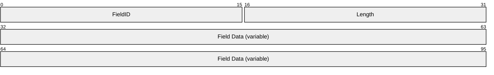

**FieldID (2 bytes):** Constant indicating the kind of field.

| Value | Meaning |
| --- | --- |
| DRT_HEADER 0x0010 | Part of a DRT Header. |
| DRT_HEADER_ACKED 0x0018 | An **Acked MessageID** follows. |
| DRT_ID 0x0030 | A DRT ID follows. |
| TARGET_DRT_ID 0x0038 | A Target DRT ID follows. |
| VALIDATE_DRT_ID 0x0039 | A Validate DRT ID follows. |
| FLAGS_FIELD 0x0040 | A **flags** field follows. The meaning of the individual flags is message-specific. |
| FLOOD_CONTROLS 0x0043 | Flood criteria follows. |
| SOLICIT_CONTROLS 0x0044 | Solicit criteria follows. |
| LOOKUP_CONTROLS 0x0045 | Lookup criteria follows. |
| EXTENDED_PAYLOAD 0x005A | [**Extended payload**](#gt_extended-payload) follows. |
| DRT_ID_ARRAY 0x0060 | An array of DRT IDs follows. |
| CREDENTIAL 0x0080 | A Credential follows. |
| WCHAR 0x0084 | A [**Unicode**](#gt_unicode) character follows. |
| CLASSIFIER 0x0085 | A [**classifier**](#gt_classifier) string follows. |
| HASHED_NONCE 0x0092 | A hashed [**nonce**](#gt_nonce) follows. |
| NONCE 0x0093 | A nonce follows. |
| SPLIT_CONTROLS 0x0098 | Buffer fragmentation information follows. |
| ROUTING_ENTRY 0x009A | A [ROUTE_ENTRY](#Section_2.2.3.3) follows. |
| VALIDATE_CPA 0x009B | An [Encoded CPA](#Section_2.2.3.1.1) structure follows, containing a [**CPA**](#gt_certified-peer-address-cpa) to validate. |
| REVOKE_CPA 0x009C | An Encoded CPA structure follows, containing a CPA to revoke. |
| IPV6_ENDPOINT 0x009D | An [IPV6_ENDPOINT](#Section_2.2.3.4) structure follows. |
| IPV6_ENDPOINT_ARRAY 0x009E | An array of IPV6_ENDPOINT structures follows. |
| KEYTOKEN 0x009F | A [Keytoken](#Section_2.2.3.1.2) structure follows. |
| ENCRYPTED_ENDPOINT_ARRAY 0x00A0 | An encrypted [IPV6_ENDPOINT_ARRAY](#Section_2.2.3.5) field. |
| ENCRYPTED_ROUTING_ENTRY 0x00A1 | An encrypted ROUTE_ENTRY field. |
| ENCRYPTED_CPA 0x00A2 | An encrypted VALIDATE_CPA field. |
| ENCRYPTED_CLASSIFIER 0x00A3 | An encrypted CLASSIFIER field. |
| ENCRYPTED_PAYLOAD 0x00A4 | An encrypted EXTENDED_PAYLOAD field. |
| SIGNATURE 0x00A5 | A signature. |
| KEY_IDENTIFIER 0x00A6 | Used to identify which [**key**](#gt_key) is used to generate the KEYTOKEN. |

**Length (2 bytes):** The length, in bytes, of the **Field Data** field.

**Field Data (variable):** Data comprising the body of this field. This data MUST be present if **Length** is set to a number greater than zero.

The **FieldID** fields in each message defined by DRT always start on a 4-byte boundary from the beginning of the DRT message. Padding fields will be included in a message to ensure this.

Unless otherwise specified, all 2-byte and 4-byte integer fields are defined in network byte order.

<a id="Section_2.2.1"></a>
### 2.2.1 DRT Header

All [DRT Messages](#Section_2.2.2) use the following common header.

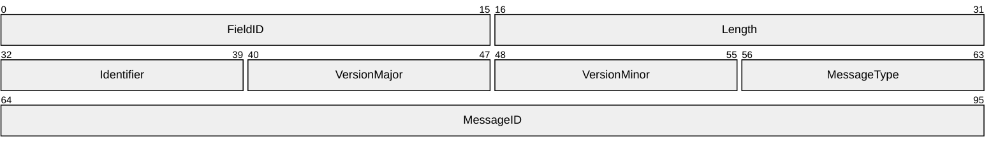

**FieldID (2 bytes):** The type of message. It MUST be set to 0x0010 (DRT_HEADER).

**Length (2 bytes):** The length, in bytes, of the DRT Header. It MUST be set to 0x000C.

**Identifier (1 byte):** MUST be set to 0x51.

**VersionMajor (1 byte):** The major version of protocol, which is defined by the higher-layer application.

**VersionMinor (1 byte):** The minor version of protocol, which is defined by the higher-layer application.

**MessageType (1 byte):** The type of message following the DRT Header. It MUST be one of the following:

| Value | Meaning |
| --- | --- |
| 0x01 | [SOLICIT](#Section_2.2.2.1) |
| 0x02 | [ADVERTISE](#Section_2.2.2.2) |
| 0x03 | [REQUEST](#Section_2.2.2.3) |
| 0x04 | [FLOOD](#Section_2.2.2.4) |
| 0x07 | [INQUIRE](#Section_2.2.2.5) |
| 0x08 | [AUTHORITY](#Section_2.2.2.6) |
| 0x09 | [ACK](#Section_2.2.2.7) |
| 0x0B | [LOOKUP](#Section_2.2.2.8) |

**MessageID (4 bytes):** A random number message identifier used for acknowledgment tracking. This number is generated by the protocol; the algorithm used to generate the MessageID MUST minimize the probability of duplicate MessageIDs within a window of time at least as large as the round-trip latency of a protocol message.

<a id="Section_2.2.2"></a>
### 2.2.2 DRT Messages

<a id="Section_2.2.2.1"></a>
#### 2.2.2.1 SOLICIT

The SOLICIT message is sent by a Resolver to a Publisher so that it can request a list of [**keys**](#gt_key) in a [**cloud**](#gt_cloud).

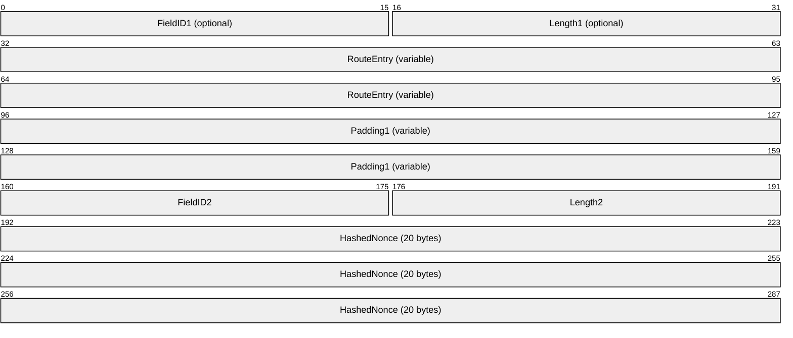

**FieldID1 (2 bytes):** If present, MUST be set to 0x009A (ROUTING_ENTRY). Note that a receiver can tell whether this field is present or absent based on the value at this location. This field MUST NOT be present if the [**node**](#gt_node) has no locally registered key.

**Length1 (2 bytes):** MUST be present if and only if **FieldID1** is present. If present, this field MUST be set to the size, in bytes, of the **RouteEntry** field, plus 4.

**RouteEntry (variable):** Optional. The route entry for a locally registered key on the node sending the SOLICIT message. This field MUST be present if and only if **FieldID1** is present.

**Padding1 (variable):** Optional. A number of bytes between 0 and 3, such that the offset from the start of the message to the end of this field is a multiple of 4. It MUST be present if and only if **FieldID1** is present. This field MUST be set to zero and ignored on receipt.

**FieldID2 (2 bytes):** MUST be set to 0x0092 (HASHED_NONCE).

**Length2 (2 bytes):** MUST be set to 0x0018.

**HashedNonce (20 bytes):** A 20-byte hash of the [**nonce**](#gt_nonce) value for the conversation.

<a id="Section_2.2.2.2"></a>
#### 2.2.2.2 ADVERTISE

The ADVERTISE message is sent by a Publisher to a Resolver in response to a [SOLICIT](#Section_2.2.2.1) message so that it can provide a list of keys in the [**cloud**](#gt_cloud).

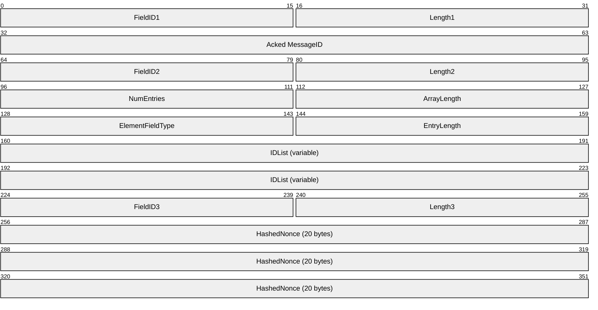

**FieldID1 (2 bytes):** MUST be set to 0x0018 (DRT_HEADER_ACKED).

**Length1 (2 bytes):** MUST be set to 0x0008.

**Acked MessageID (4 bytes):** The value of the **MessageID** field in the [DRT Header](#Section_2.2.1) of the SOLICIT message to which this is a response.

**FieldID2 (2 bytes):** MUST be set to 0x0060 (DRT_ID_ARRAY).

**Length2 (2 bytes):** MUST be set to 12+(**NumEntries*****EntryLength**).

**NumEntries (2 bytes):** The number of keys in the **IDList** field. This field MUST be in the range 0x0000 to 0x7FFF.

**ArrayLength (2 bytes):** The length of the entries in the array. This field MUST be set to 8+(**NumEntries*****EntryLength**).

**ElementFieldType (2 bytes):** The type of entries in the array. This field MUST be set to 0x0030 (DRT_ID).

**EntryLength (2 bytes):** The length, in bytes, of each array element. This field MUST be set to 0x20 (32 bytes).

**IDList (variable):** A set of 32-byte keys.

**FieldID3 (2 bytes):** MUST be set to 0x0092 (HASHED_NONCE).

**Length3 (2 bytes):** MUST be set to 0x0018.

**HashedNonce (20 bytes):** The value of the **HashedNonce** field in the SOLICIT message to which this is a response.

<a id="Section_2.2.2.3"></a>
#### 2.2.2.3 REQUEST

The REQUEST message is sent by a Resolver to a Publisher so that it can request a route entry for a given [**key**](#gt_key) in the Publisher's cache, as seen in an [ADVERTISE](#Section_2.2.2.2) message.

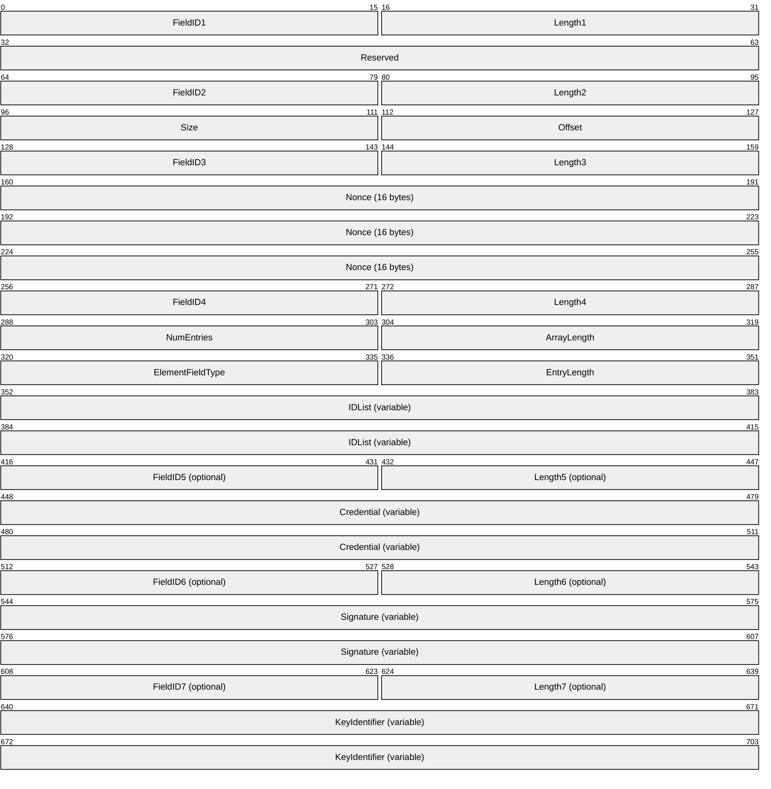

**FieldID1 (2 bytes):** If present, this field MUST be set to 0x0040 (FLAGS_FIELD). MUST be present if and only if the protocol is executing in membership or confidential security mode.

**Length1 (2 bytes):** If present, this field MUST be set to 0x0006. MUST be present if and only if **FieldID1** is present.

**Reserved (4 bytes):** If present, this field MUST be set to zero and ignored on receipt. MUST be present if and only if **FieldID1** is present.

**FieldID2 (2 bytes):** MUST be set to 0x0098 (SPLIT_CONTROLS). MUST be present if and only if the protocol is executing in membership or confidential security mode.

**Length2 (2 bytes):** MUST be set to 0x0008. MUST be present if and only if **FieldID2** is present.

**Size (2 bytes):** Size, in bytes, of the remainder of the message, starting from FieldID3 (inclusive). This field MUST NOT be greater than 0x91E4 (37348), which is large enough to hold a Certificate Chain and a maximum-sized extended payload. MUST be present if and only if **FieldID2** is present.

**Offset (2 bytes):** Byte offset, in network byte order, of the message fragment in the original message. It MUST be a multiple of 1188. MUST be present if and only if **FieldID2** is present.

**FieldID3 (2 bytes):** MUST be set to 0x0093 (NONCE).

**Length3 (2 bytes):** MUST be set to 0x0014 (20 bytes).

**Nonce (16 bytes):** The [**nonce**](#gt_nonce) for the conversation.

**FieldID4 (2 bytes):** MUST be set to 0x0060 (DRT_ID_ARRAY).

**Length4 (2 bytes):** MUST be set to 12+(**NumEntries*****EntryLength**).

**NumEntries (2 bytes):** The number of keys in the **IDList** field. This field MUST be in the range 0x0000 to 0x7FFF.

**ArrayLength (2 bytes):** The length of the array of entries. This field MUST be set to 8+(**NumEntries*****EntryLength**).

**ElementFieldType (2 bytes):** The type of entries in the array. This field MUST be set to 0x0030 (DRT_ID).

**EntryLength (2 bytes):** The length, in bytes, of each array element. This field MUST be set to 0x20 (32 bytes).

**IDList (variable):** A set of 32-byte keys.

**FieldID5 (2 bytes):** Optional. MUST be set to 0x0080 (CREDENTIAL). MUST be present if and only if the protocol is executing in membership or confidential security mode.

**Length5 (2 bytes):** Optional. MUST be present if and only if **FieldID5** is present. If present, it MUST be set to 4 plus the length in bytes of the **Credential** field.

**Credential (variable):** Optional. MUST be present if and only if **FieldID5** is present. Contains a [Credential](#Section_2.2.3.1.4) structure defined in the security profile and provided by the upper-layer application.

**FieldID6 (2 bytes):** Optional. MUST be set to 0x00A5 (SIGNATURE). MUST be present if and only if the protocol is executing in membership or confidential security mode.

**Length6 (2 bytes):** Optional. MUST be present if and only if **FieldID6** is present. If present, it MUST be set to 4 plus the length in bytes of the **Signature** field.

**Signature (variable):** Optional. MUST be present if and only if **FieldID6** is present. Contains a [Signature](#Section_2.2.3.1.3) structure defined in the security profile and provided by the upper-layer application. The signature is calculated over the **IDList** field.

**FieldID7 (2 bytes):** Optional. MUST be set to 0x00A6 (KEY_IDENTIFIER). MUST be present if and only if the protocol is executing in membership or confidential security mode.

**Length7 (2 bytes):** Optional. MUST be present if and only if **FieldID7** is present. If present, it MUST be set to 4 plus the length in bytes of the **KeyIdentifier** field.

**KeyIdentifier (variable):** Optional. MUST be present if and only if **FieldID7** is present. Contains a [Key Identifier](#Section_2.2.3.1.5) structure defined in the security profile and provided by the upper-layer application. This field is used to indicate which portion of the **Credential** field is used to generate the Signature field.

<a id="Section_2.2.2.4"></a>
#### 2.2.2.4 FLOOD

The FLOOD message is sent by a Publisher to a Resolver in response to a [REQUEST](#Section_2.2.2.3) message so that it can provide a route entry or to revoke a [**CPA**](#gt_certified-peer-address-cpa).

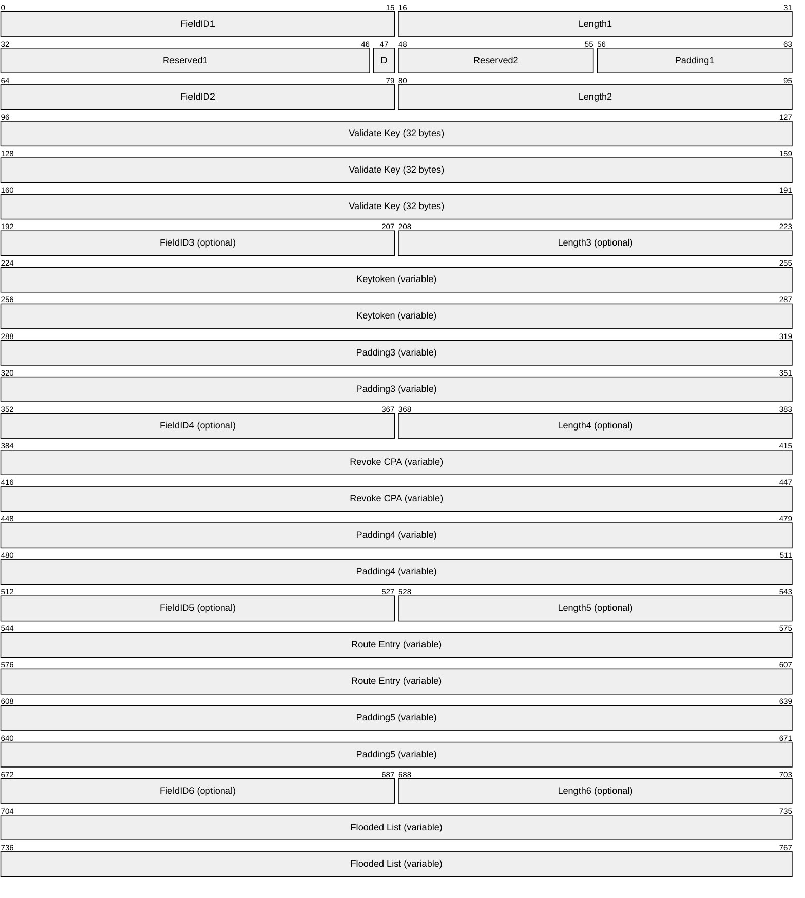

**FieldID1 (2 bytes):** MUST be set to 0x0043 (FLOOD_CONTROLS).

**Length1 (2 bytes):** MUST be set to 0x0007.

**Reserved1 (15 bits):** MUST be set to zero and ignored on receipt.

**D (1 bit):** If set, indicates that the sender does not require the receiver to send an [ACK](#Section_2.2.2.7) message.

If not set, indicates that the sender requires the receiver to send an ACK message.

**Reserved2 (1 byte):** MUST be set to zero and ignored on receipt.

**Padding1 (1 byte):** MUST be set to zero and ignored on receipt.

**FieldID2 (2 bytes):** MUST be set to 0x0039 (VALIDATE_DRT_ID).

**Length2 (2 bytes):** MUST be set to 0x0024.

**Validate Key (32 bytes):** MUST contain a key that the searching [**node**](#gt_node) recognizes as published by the destination node.

**FieldID3 (2 bytes):** If present, MUST be set to 0x009F (KEYTOKEN). This field MUST be present if and only if the protocol is executing in confidential security mode.

**Length3 (2 bytes):** If present, MUST be set to 4 plus the length in bytes of the **Keytoken** field. This field MUST be present if and only if **FieldID3** is present.

**Keytoken (variable):** Optional. Contains a [Keytoken](#Section_2.2.3.1.2) structure defined in the security profile and provided by the upper-layer application. It is used by the recipient of the message to decrypt the encrypted structures in this message. This field MUST be present if and only if **FieldID3** is present.

**Padding3 (variable):** Optional. A number of bytes between 0 and 3, such that the offset from the start of the message to the end of this field is a multiple of 4. This field MUST be present if and only if **FieldID3** is present. This field MUST be set to zero and ignored on receipt.

**FieldID4 (2 bytes):** This field MUST be present if and only if the FLOOD message is sent in the context of unregistering a key. If present, MUST be set to 0x009C (REVOKE_CPA), if and only if the protocol is executing in resolve or membership security mode. This field MUST be set to 0x00A2 (Encrypted CPA), if and only if the protocol is executing in confidential security mode.

**Length4 (2 bytes):** MUST be present if and only if FieldID4 is present. If present, MUST be set to 4 plus the length in bytes of the **Revoke CPA** field.

**Revoke CPA (variable):** Optional. This field MUST be present if and only if the FLOOD message is sent in the context of unregistering a key. If present, an [Encoded CPA](#Section_2.2.3.1.1) structure that contains the CPA to revoke. The Encoded CPA structure MUST be encrypted if and only if the protocol is executing in confidential security mode.

**Padding4 (variable):** Optional. A number of bytes between 0 and 3, such that the offset from the start of the message to the end of this field is a multiple of 4. This field MUST be present if and only if **FieldID4** is present. This field MUST be set to zero and ignored on receipt.

**FieldID5 (2 bytes):** If present, MUST be set to 0x009A (ROUTING_ENTRY). This field MUST be present if the node is flooding a route entry to its neighbors. Note that a receiver can tell whether this field is present or absent based on the value at this location.

**Length5 (2 bytes):** MUST be present if and only if **FieldID5** is present. If present, this field MUST be set to 4 plus the length in bytes of the **Route Entry** field.

**Route Entry (variable):** Optional. A [ROUTE_ENTRY](#Section_2.2.3.3) structure that contains an entry the source node sends to the destination node. This field MUST be present if and only if **FieldID5** is present. The ROUTE_ENTRY structure MUST be encrypted if and only if the protocol is executing in confidential security mode.

**Padding5 (variable):** Optional. A number of bytes between 0 and 3, such that the offset from the start of the message to the end of this field is a multiple of 4. This field MUST be present if and only if **FieldID5** is present. This field MUST be set to zero and ignored on receipt.

**FieldID6 (2 bytes):** If Present, MUST be set to 0x00A0 (ENCRYPTED_ENDPOINT_ARRAY). This field MUST be present if and only if the protocol is executing in confidential security mode.

**Length6 (2 bytes):** MUST be set to length in bytes of the **Flooded List** field. This field MUST be present if and only if FieldID6 is present.

**Flooded List (variable):** Optional. MUST contain an [IPV6_ENDPOINT_ARRAY](#Section_2.2.3.5) structure. The IPV6_ENDPOINT_ARRAY structure MUST be encrypted if and only if the protocol is executing in confidential security mode.

<a id="Section_2.2.2.5"></a>
#### 2.2.2.5 INQUIRE

The INQUIRE message is sent by a Resolver to a Publisher so that it can obtain a [**CPA**](#gt_certified-peer-address-cpa). Or, it can be sent from one Publisher to another so that it can verify that it is still in the [**cloud**](#gt_cloud).

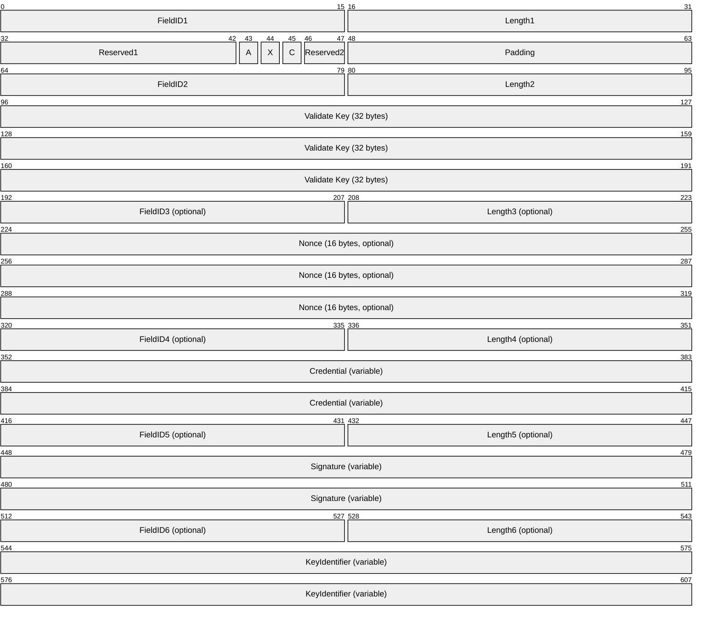

**FieldID1 (2 bytes):** MUST be set to 0x0040 (FLAGS_FIELD).

**Length1 (2 bytes):** MUST be set to 0x0006.

**Reserved1 (11 bits):** MUST be set to zero and ignored on receipt.

**A (1 bit):** If set, the sender is requesting that a CPA appear in the [AUTHORITY](#Section_2.2.2.6) message response. If unset, the sender is requesting that a CPA not appear in the AUTHORITY message response. SHOULD always be set.

**X (1 bit):** If set, the sender is requesting that an **EXTENDED_PAYLOAD** message (if any exists) appear in the AUTHORITY message response. If unset, the sender is requesting that an **EXTENDED_PAYLOAD** not appear. SHOULD be set if the INQUIRE was generated as part of an application-requested resolve.

**C (1 bit):** If set, the sender is requesting that a **Certificate Chain** (if any exists) appear in the AUTHORITY message response. If unset, the sender is requesting that a **Certificate Chain** not appear. SHOULD always be set.

**Reserved2 (2 bits):** MUST be set to zero and ignored on receipt.

**Padding (2 bytes):** MUST be set to zero and ignored on receipt.

**FieldID2 (2 bytes):** MUST be set to 0x0039 (VALIDATE_DRT_ID).

**Length2 (2 bytes):** MUST be set to 0x0024.

**Validate Key (32 bytes):** The key to validate.

**FieldID3 (2 bytes):** It MUST be present if and only if the A bit is set. If present, MUST be set to 0x0093 (NONCE).

**Length3 (2 bytes):** This field MUST be present if and only if **FieldID3** is present. If present, this field MUST be set to 0x0014 (20 bytes).

**Nonce (16 bytes):** A [**nonce**](#gt_nonce) value that the sender copies into a CPA before it is signed in order to prevent replay attacks. This field MUST be present if and only if **FieldID3** is present.

**FieldID4 (2 bytes):** MUST be set to 0x0080 (CREDENTIAL). MUST be present if and only if the protocol is executing in membership or confidential security mode.

**Length4 (2 bytes):** MUST be present if and only if **FieldID4** is present. If present, it MUST be set to 4 plus the length in bytes of the **Credential** field.

**Credential (variable):** MUST be present if and only if FieldID4 is present. Contains a Credential structure defined in the security profile and provided by the upper-layer application.

**FieldID5 (2 bytes):** MUST be set to 0x00A5 (SIGNATURE). MUST be present if and only if the protocol is executing in membership or confidential security mode.

**Length5 (2 bytes):** MUST be present if and only if **FieldID5** is present. If present, it MUST be set to 4 plus the length in bytes of the **Signature** field.

**Signature (variable):** MUST be present if and only if **FieldID5** is present. Contains a [Signature](#Section_2.2.3.1.3) structure defined in the security profile and provided by the upper-layer application. The signature is calculated over the **Validate Key** field.

**FieldID6 (2 bytes):** MUST be set to 0x00A6 (KEY_IDENTIFIER). MUST be present if and only if the protocol is executing in membership or confidential security mode.

**Length6 (2 bytes):** MUST be present if and only if **FieldID6** is present. If present, it MUST be set to 4 plus the length in bytes of the **KeyIdentifier** field.

**KeyIdentifier (variable):** MUST be present if and only if **FieldID6** is present. Contains a [Key Identifier](#Section_2.2.3.1.5) structure defined in the security profile and provided by the upper-layer application. This field is used to indicate which portion of the **Credential** field was used to generate the Signature field.

<a id="Section_2.2.2.6"></a>
#### 2.2.2.6 AUTHORITY

The AUTHORITY message is sent by a Publisher to a Resolver in response to an [INQUIRE](#Section_2.2.2.5) or [LOOKUP](#Section_2.2.2.8) message.

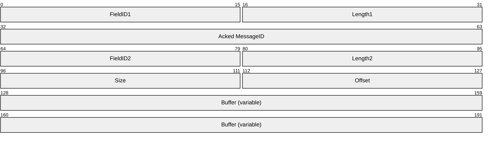

**FieldID1 (2 bytes):** MUST be set to 0x0018 (DRT_HEADER_ACKED).

**Length1 (2 bytes):** MUST be set to 0x0008.

**Acked MessageID (4 bytes):** The value of the **MessageID** field in the [DRT Header](#Section_2.2.1) of the message to which this is a response.

**FieldID2 (2 bytes):** MUST be set to 0x0098 (SPLIT_CONTROLS).

**Length2 (2 bytes):** MUST be set to 0x0008.

**Size (2 bytes):** Size, in bytes, of the original [AUTHORITY_BUFFER](#Section_2.2.2.6.1). This field MUST NOT be greater than 0x91E4 (37348), which is large enough to hold a Certificate Chain and a maximum-sized [**extended payload**](#gt_extended-payload).

**Offset (2 bytes):** Byte offset, in network byte order, of the message fragment in the original message. It MUST be a multiple of 1188.

**Buffer (variable):** The portion of an AUTHORITY_BUFFER starting at a byte offset specified in **Offset**.

<a id="Section_2.2.2.6.1"></a>
##### 2.2.2.6.1 AUTHORITY_BUFFER

The AUTHORITY_BUFFER structure is contained within a logical message containing the [**CPA**](#gt_certified-peer-address-cpa) and [**extended payload**](#gt_extended-payload) information associated with a Key. Parts of this logical message appear in [AUTHORITY](#Section_2.2.2.6) messages.

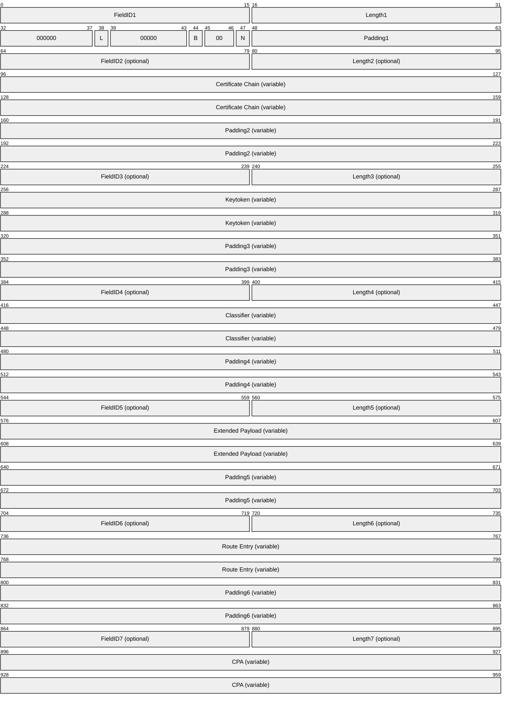

**FieldID1 (2 bytes):** MUST be set to 0x0040 (FLAGS_FIELD).

**Length1 (2 bytes):** MUST be set to 0x0006.

**000000 (6 bits):** These bits are all reserved. MUST be set to zero when sent and MUST be ignored on receipt.

**L (1 bit):** Leaf Set. If set, this flag indicates that the target Key is unknown to the sender, but it is in the sender's Leaf Set if the target Key is known.

**00000 (5 bits):** These bits are all reserved. MUST be set to zero when sent and MUST be ignored on receipt.

**B (1 bit):** Busy. If set, indicates that the sender is too busy to handle a LOOKUP message request.

**00 (2 bits):** These bits are all reserved. MUST be set to zero when sent and MUST be ignored on receipt.

**N (1 bit):** Not Found. If set, indicates that the requested Validate Key in the LOOKUP or INQUIRE message is not known to the sender.

**Padding1 (2 bytes):** MUST be set to zero when sent, and MUST be ignored on receipt.

**FieldID2 (2 bytes):** If present, MUST be set to 0x0080 (CREDENTIAL). Note that a receiver can tell whether this field is present or absent, based on the value at this location.

**Length2 (2 bytes):** MUST be present if and only if FieldID2 is present. If present, it MUST be set to 4 plus the length in bytes of the Certificate Chain field.

**Certificate Chain (variable):** A Certificate Chain containing the public key used to sign the CPA and its Certificate Chain. MUST be present if and only if FieldID2 is present.

**Padding2 (variable):** A number of bytes between 0 and 3, such that the offset from the start of the message to the end of this field is a multiple of 4. MUST be present if and only if FieldID2 is present. MUST be set to zero when sent, and MUST be ignored on receipt.

**FieldID3 (2 bytes):** If present, MUST be set to 0x009F (KEYTOKEN). This field MUST be present if and only if the protocol is executing in confidential security mode.

**Length3 (2 bytes):** If present, MUST be set to 4 plus the length in bytes of the Keytoken field. This field MUST be present if and only if FieldID3 is present.

**Keytoken (variable):** Contains a Keytoken structure defined in the security profile and provided by the upper-layer application. It is used by the recipient of the message to decrypt the encrypted structures in this message. This field MUST be present if and only if FieldID3 is present.

**Padding3 (variable):** A number of bytes between 0 and 3, such that the offset from the start of the message to the end of this field is a multiple of 4. This field MUST be present if and only if FieldID3 is present. This field MUST be set to zero and ignored on receipt.

**FieldID4 (2 bytes):** If present, MUST be set to 0x0085 (CLASSIFIER) if and only if the protocol is not executing in confidential security mode. If present, MUST be set to 0x00A3 (ENCRYPTED_CLASSIFIER) if and only if the protocol is executing in confidential security mode.

**Length4 (2 bytes):** MUST be present if and only if **FieldID4** is present. If present, MUST be set to 4 plus the length, in bytes, of the **Classifier** field.

**Classifier (variable):** MUST contain a FIELD_ARRAY of WCHAR elements representing the classifier string if and only if **FieldID4** is set to 0x0085 (CLASSIFIER). It MUST contain an array of bytes if FieldId4 is set to 0x00A3 (ENCRYPTED_CLASSIFIER). It MUST NOT be present if **FieldID4** is not present.

**Padding4 (variable):** A number of bytes between 0 and 3, such that the offset from the start of the message to the end of this field is a multiple of 4. MUST be present if and only if **FieldID4** is present. MUST be set to zero when sent, and MUST be ignored on receipt.

**FieldID5 (2 bytes):** If present, MUST be set to 0x005A (EXTENDED_PAYLOAD) if and only if the protocol is NOT executing in confidential security mode. If present, MUST be set to 0x00A4 (ENCRYPTED_PAYLOAD) if and only if the protocol is executing in confidential security mode. Note that a receiver can determine whether this field is present or absent, based on the value at this location. This field is present if the X flag is set in the INQUIRE message in response to which this AUTHORITY is generated.

**Length5 (2 bytes):** MUST be present if and only if **FieldID5** is present. If present, MUST be set to 4 plus the length, in bytes, of the **Extended Payload** field.

**Extended Payload (variable):** An EXTENDED_PAYLOAD structure. MUST be present if and only if **FieldID5** is present. The Extended Payload structure MUST be encrypted if and only if the protocol is executing in confidential security mode.

**Padding5 (variable):** A number of bytes between 0 and 3, such that the offset from the start of the message to the end of this field is a multiple of 4. MUST be present if and only if **FieldID5** is present. MUST be set to zero when sent, and MUST be ignored on receipt.

**FieldID6 (2 bytes):** If present, MUST be set to 0x009A (ROUTING_ENTRY) if and only if the protocol is NOT executing in confidential security mode. If present, MUST be set to 0x00A1 (ENCRYPTED_ROUTING_ENTRY) if and only if the protocol is executing in confidential security mode. Note that a receiver can tell whether this field is present or absent, based on the value at this location. This field is present if the sender is responding to a lookup with a next hop routing entry.

**Length6 (2 bytes):** MUST be present if and only if **FieldID6** is present. If present, MUST be set to 4 plus the length, in bytes, of the Route Entry field.

**Route Entry (variable):** A ROUTE_ENTRY structure. MUST be present if and only if **FieldID6** is present. For a response to a LOOKUP message, this MUST be the route entry that is the closest to the target key in the LOOKUP message, as seen by the remote node. The ROUTE_ENTRY structure MUST be encrypted if and only if the protocol is executing in confidential security mode.

**Padding6 (variable):** A number of bytes between 0 and 3, such that the offset from the start of the message to the end of this field is a multiple of 4. MUST be present if and only if **FieldID6** is present. MUST be set to zero when sent, and MUST be ignored on receipt.

**FieldID7 (2 bytes):** If present, MUST be set to 0x009B (VALIDATE_CPA) if and only if the protocol is NOT executing in confidential security mode. If present, MUST be set to 0x00A2 (ENCRYPTED_CPA) if and only if the protocol is executing in confidential security mode. Note that a receiver can tell whether this field is present or absent, based on the value at this location.

**Length7 (2 bytes):** MUST be present if and only if **FieldID7** is present. If present, it MUST be set to 4 plus the length, in bytes, of the **CPA** field.

**CPA (variable):** An Encoded CPA structure. The Encoded CPA structure MUST be encrypted if and only if the protocol is executing in confidential security mode.

<a id="Section_2.2.2.7"></a>
#### 2.2.2.7 ACK

The ACK message is sent from one [**node**](#gt_node) to another to acknowledge receipt of a [REQUEST](#Section_2.2.2.3) or [FLOOD](#Section_2.2.2.4) message.

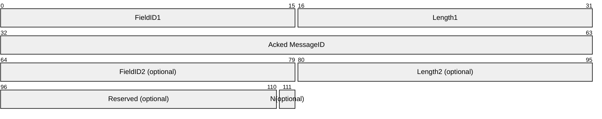

**FieldID1 (2 bytes):** MUST be set to 0x0018 (DRT_HEADER_ACKED).

**Length1 (2 bytes):** MUST be set to 0x0008.

**Acked MessageID (4 bytes):** The value of the **MessageID** field in the [DRT Header](#Section_2.2.1) of the message to which this is a response.

**FieldID2 (2 bytes):** MUST be present if and only if the N flag is set. If present, this field MUST be set to 0x0040 (FLAGS_FIELD).

**Length2 (2 bytes):** MUST be present if and only if FieldID2 is present. If present, this field MUST be set to 0x0006.

**Reserved (15 bits):** MUST be present if and only if the N flag is set. If present, this field MUST be set to zero and ignored on receipt.

**N (1 bit):** Not Found. MUST be present in response to a FLOOD message if and only if there is no key registered on the sender that corresponds to the **Validate Key** field in the FLOOD message to which this ACK message is a response.

<a id="Section_2.2.2.8"></a>
#### 2.2.2.8 LOOKUP

The LOOKUP message is sent by a Resolver to a Publisher to resolve a key.

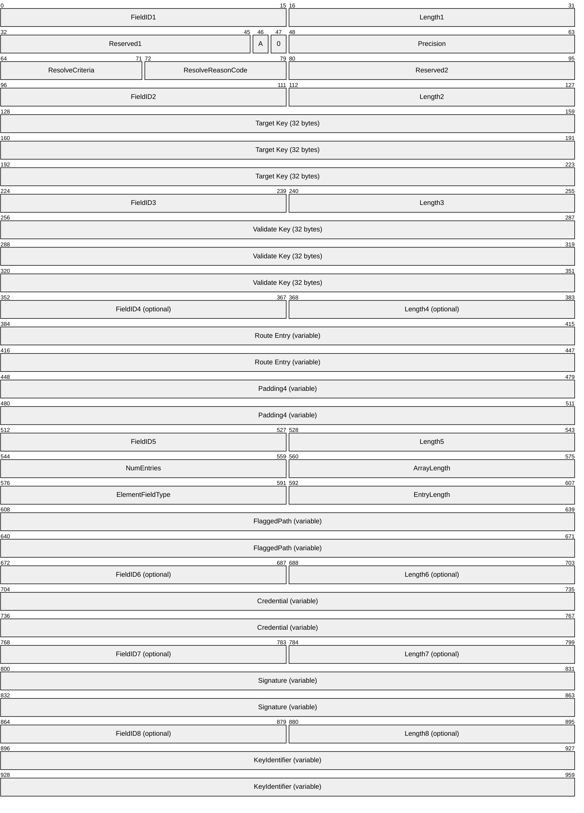

**FieldID1 (2 bytes):** MUST be set to 0x0045 (LOOKUP_CONTROLS).

**Length1 (2 bytes):** MUST be set to 0x000C.

**Reserved1 (14 bits):** Reserved. This field MUST be set to zero and ignored on receipt.

**A (1 bit):** If set, this indicates that the sender is willing to accept returned [**nodes**](#gt_node) that are not closer to the target ID than the **Validate Key**.

**0 (1 bit):** Reserved. This field MUST be set to zero and ignored on receipt.

**Precision (2 bytes):** Number of significant bits to match. When **ResolveCriteria** is not set to SEARCH_OPCODE_UPPER_BITS, this MUST be set to zero and MUST be ignored upon receipt.

**ResolveCriteria (1 byte):** The type of key matching that the sender is requesting. This MUST be one of the following (for example, although the values are powers of two, they are not bits that can be combined):

| Value | Meaning |
| --- | --- |
| SEARCH_OPCODE_NONE 0x00 | Compare all 256 bits of the key. |
| SEARCH_OPCODE_ANY_PEERNAME 0x01 | Compare only the first 128 bits of the key. |
| SEARCH_OPCODE_NEAREST_PEERNAME 0x02 | Compare all 256 bits of the key and return the closest possible match. |
| SEARCH_OPCODE_NEAREST64_PEERNAME 0x04 | Compare only the first 192 bits of the key and return the closest possible match. |
| SEARCH_OPCODE_UPPER_BITS 0x08 | Compare a number of bits equal to the value in the **Precision** field. |

**ResolveReasonCode (1 byte):** The reason for the LOOKUP request. MUST be one of the following:

| Value | Meaning |
| --- | --- |
| REASON_APP_REQUEST 0x00 | The LOOKUP is sent in response to an application request. |
| REASON_REGISTRATION 0x01 | The LOOKUP is sent in response to a completed registration that is being announced. |
| REASON_CACHE_MAINTENANCE 0x02 | The LOOKUP is sent because the node is performing cache maintenance. |
| REASON_SPLIT_DETECTION 0x03 | The LOOKUP is sent because the node is testing for a split [**cloud**](#gt_cloud). |

**Reserved2 (2 bytes):** MUST be set to zero and ignored on receipt.

**FieldID2 (2 bytes):** MUST be set to 0x0038 (TARGET_DRT_ID).

**Length2 (2 bytes):** MUST be set to 0x0024 (36 bytes).

**Target Key (32 bytes):** The key to look up.

**FieldID3 (2 bytes):** MUST be set to 0x0039 (VALIDATE_DRT_ID).

**Length3 (2 bytes):** MUST be set to 0x0024 (36 bytes).

**Validate Key (32 bytes):** A key of the destination machine.

**FieldID4 (2 bytes):** MUST be present if and only if the sender’s CurrentBestMatch is set. If present, MUST be set to 0x009A (ROUTING_ENTRY) if and only if the protocol is NOT executing in confidential security mode; else, if present, MUST be set to 0x00A1 (ENCRYPTED_ROUTING_ENTRY).

**Length4 (2 bytes):** MUST be present if and only if FieldId4 is present. If present, MUST be set to 4 plus the size in bytes of the **Route Entry** field.

**Route Entry (variable):** Optional. MUST be present if and only if FieldId4 is present. If present, a [ROUTE_ENTRY](#Section_2.2.3.3) structure for the best match so far. The ROUTE_ENTRY structure MUST be encrypted if and only if the protocol is executing in confidential security mode.

**Padding4 (variable):** Optional. A number of bytes between 0 and 3, such that the offset from the start of the message to the end of this field is a multiple of 4. This field MUST be present if and only if **FieldID4** is present. It MUST be set to zero and ignored on receipt.

**FieldID5 (2 bytes):** Set to 0x009E (IPV6_ENDPOINT_ARRAY) if and only if the protocol is executing in resolve or membership security mode. This field MUST be set to 0x00A0 (ENCRYPTED_ENDPOINT_ARRAY) if and only if the protocol is executing in confidential security mode.

**Length5 (2 bytes):** Set to 12+(**NumEntries*****EntryLength**) if and only if the protocol is executing in resolve or membership security mode. This field MUST be set to 2 plus the size, in bytes, of the [Encrypted Endpoint Array](#Section_2.2.3.1.7) Blob if and only if the protocol is executing in confidential security mode.

**NumEntries (2 bytes):** Number of entries in the **FlaggedPath** field. This MUST be in the range 1 to 22.

**ArrayLength (2 bytes):** MUST be set to 8+(**NumEntries*****EntryLength**).

**ElementFieldType (2 bytes):** MUST be set to 0x009D ([IPV6_ENDPOINT](#Section_2.2.3.4)).

**EntryLength (2 bytes):** MUST be set to 0x0012 (18 bytes).

**FlaggedPath (variable):** A list of IPV6_ENDPOINT structures for DRT node that have seen this LOOKUP request so far.

**FieldID6 (2 bytes):** MUST be set to 0x0080 (CREDENTIAL). MUST be present if and only if the protocol is executing in membership or confidential security mode.

**Length6 (2 bytes):** MUST be present if and only if **FieldID6** is present. If present, it MUST be set to 4 plus the length in bytes of the **Credential** field.

**Credential (variable):** MUST be present if and only if FieldID6 is present. Contains a [Credential](#Section_2.2.3.1.4) structure defined in the security profile and provided by the upper-layer application.

**FieldID7 (2 bytes):** MUST be set to 0x00A5 (SIGNATURE). MUST be present if and only if the protocol is executing in membership or confidential security mode.

**Length7 (2 bytes):** MUST be present if and only if **FieldID7** is present. If present, it MUST be set to 4 plus the length in bytes of the **Signature** field.

**Signature (variable):** MUST be present if and only if **FieldID7** is present. Contains a [Signature](#Section_2.2.3.1.3) structure defined in the security profile and provided by the upper-layer application. The signature is calculated over the **Validate Key** field.

**FieldID8 (2 bytes):** MUST be set to 0x00A6 (KEY_IDENTIFIER). MUST be present if and only if the protocol is executing in membership or confidential security mode.

**Length8 (2 bytes):** MUST be present if and only if **FieldID8** is present. If present, it MUST be set to 4 plus the length in bytes of the **KeyIdentifier** field.

**KeyIdentifier (variable):** MUST be present if and only if **FieldID8** is present. Contains a [Key Identifier](#Section_2.2.3.1.5) structure defined in the security profile and provided by the upper-layer application. This field is used to indicate which portion of the **Credential** field was used to generate the **Signature** field.

If the protocol is executing in confidential security mode, then the fields following **FieldID5** (**NumEntries**, **ArrayLength**, **ElementFieldType**, **EntryLength**, and **FlaggedPath**) MUST be encrypted into an Encrypted Endpoint Array Blob before being sent out on the wire. Therefore, these fields are not present in confidential security mode. The size of this blob is variable because the [**security provider**](#gt_security-provider) is pluggable.

<a id="Section_2.2.3"></a>
### 2.2.3 Data Structures

<a id="Section_2.2.3.1"></a>
#### 2.2.3.1 Security Profile Data Structures

The upper-layer application is responsible for completing the data structures in this section.

<a id="Section_2.2.3.1.1"></a>
##### 2.2.3.1.1 Encoded CPA

The **encoded CPA** structure contains information that links a DRT service [**endpoint**](#gt_endpoint) to a [**key**](#gt_key). It is specified in section [2.2.3.1.1.1](#Section_2.2.3.1.1.1).

<a id="Section_2.2.3.1.1.1"></a>
###### 2.2.3.1.1.1 Encoded CPA Structure

The **encoded CPA** structure contains information that links a service [**endpoint**](#gt_endpoint) to a [**key**](#gt_key).

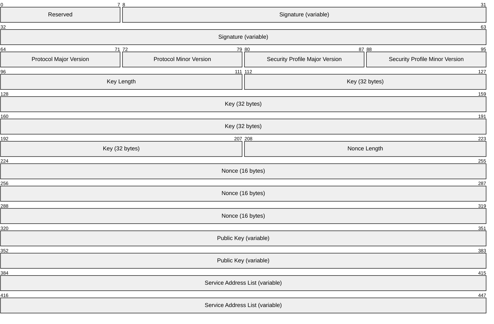

**Reserved (1 byte):** MUST be set to 0x00 and ignored on receipt.

**Signature (variable):** A [SIGNATURE](#Section_2.2.3.1.3) data structure defined in section 2.2.3.1.3 that is calculated over all the subsequent fields in the message.

**Protocol Major Version (1 byte):** The Protocol Major Version defined by the higher-layer application using the DRT.

**Protocol Minor Version (1 byte):** The Protocol Minor Version defined by the higher-layer application using the DRT.

**Security Profile Major Version (1 byte):** The major version number of the security profile. MUST be set to 0x01.

**Security Profile Minor Version (1 byte):** The minor version number of the security profile. MUST be set to 0x00.

**Key Length (2 bytes):** The number of bytes, in [**little-endian**](#gt_little-endian) byte order, of the **Key** field. MUST be set to 32 bytes.

**Key (32 bytes):** The key authenticated by the current message.

**Nonce Length (2 bytes):** The number of bytes, in little-endian byte order, of the **Nonce** field. MUST be set to 16 bytes.

**Nonce (16 bytes):** MUST be set to the [**nonce**](#gt_nonce) value embedded in the [Inquire (section 2.2.2.5)](#Section_2.2.2.5) message that is used to solicit the [Authority (section 2.2.2.6)](#Section_2.2.2.6) message which contains this structure.

**Public Key (variable):** A **PUBLIC_KEY** data structure defined in section [2.2.3.1.5.1.1](#Section_2.2.3.1.5.1.1).

**Service Address List (variable):** A **Service Address List** structure.

<a id="Section_2.2.3.1.2"></a>
##### 2.2.3.1.2 Keytoken

The **keytoken** structure is used to decrypt encrypted structures in a DRT message. It is specified in section [2.2.3.1.2.1](#Section_2.2.3.1.2.1).

<a id="Section_2.2.3.1.2.1"></a>
###### 2.2.3.1.2.1 Keytoken Structure

The **keytoken** structure is used to decrypt encrypted structures in a message.

A keytoken is returned by all invocations of encryption primitive of the [**security provider**](#gt_security-provider) by the Distributed Routing Table (DRT). This keytoken identifies the [**key**](#gt_key) material that is used to decrypt the buffers encrypted specifically for the target node. The following is the unencrypted format of the keytoken.

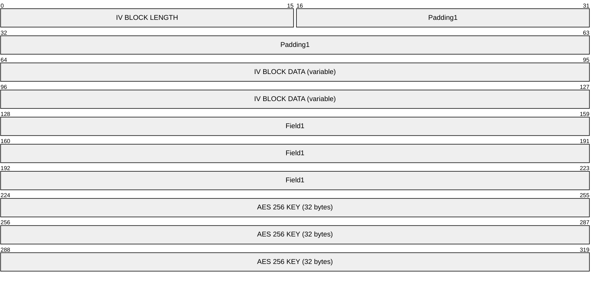

**IV BLOCK LENGTH (2 bytes):** The length of the **IV BLOCK DATA** field.

**Padding1 (6 bytes):** MUST be set to zero and ignored on receipt.

**IV BLOCK DATA (variable):** This is the random initialization vector passed to each encrypt operation. This vector is equal in size to the block size of the encryption algorithm.

**Field1 (12 bytes):** MUST be set to the constant 0x4b44424d0100000020000000.

**AES 256 KEY (32 bytes):** This is the encryption key used to perform AES-256 encryption of the input buffers. AES encryption is described in [[FIPS197]](https://go.microsoft.com/fwlink/?LinkId=89870).

<a id="Section_2.2.3.1.3"></a>
##### 2.2.3.1.3 Signature

The **signature** structure is used to protect the integrity of one or more fields or structures in a DRT message. It is specified in section [2.2.3.1.3.1](#Section_2.2.3.1.3.1).

<a id="Section_2.2.3.1.3.1"></a>
###### 2.2.3.1.3.1 Signature Structure

The **signature** structure carries the encoding of a signature calculated over fields in a message.


**Length (2 bytes):** The number of bytes, in [**little-endian**](#gt_little-endian) byte order, of the structure. MUST be set to 130 bytes.

**Signature Data (128 bytes):** Signature data calculated by using the RSASSA- [PKCS1]-v1_5 algorithm ([[RFC8017]](https://go.microsoft.com/fwlink/?linkid=2164409) section 8.2).

<a id="Section_2.2.3.1.4"></a>
##### 2.2.3.1.4 Credential

The **credential** structure is used to authenticate a [**node**](#gt_node) or authenticate a [**key**](#gt_key). It is specified in section [2.2.3.1.4.1](#Section_2.2.3.1.4.1).

<a id="Section_2.2.3.1.4.1"></a>
###### 2.2.3.1.4.1 Credential Structure

A [**certificate chain**](#gt_certificate-chain) is a [**Public Key Cryptography Standards (PKCS)**](#gt_public-key-cryptography-standards-pkcs) 7 version 1.5 message of type SignedData as specified in [[RFC2315]](https://go.microsoft.com/fwlink/?LinkId=90334) section 9.1. The chain consists of a list of [[X509]](https://go.microsoft.com/fwlink/?LinkId=90590) version 3 certificates.

The total number of certificates in a certificate chain MUST NOT be more than 25.

Each certificate in the chain MUST be formatted as an [X509] version 3 [[RFC2459]](https://go.microsoft.com/fwlink/?LinkId=90356) certificate, with the following constraints on the fields defined in [RFC2459].

The **version** field ([RFC2459] section 4.1.2.1) MUST be set to 2 (version 3).

The **signatureAlgorithm** field ([RFC2459] section 4.1.1.2) MUST be set to the OID 1.2.840.113549.1.1.5.

The **serialNumber** field ([RFC2459] section 4.1.2.2) MUST be present and MUST be exactly 16 bytes long.

The **subjectUniqueID** and **issuerUniqueID** fields ([RFC2459] section 4.1.2.8) MUST be empty with a length of 0 bytes.

The **subjectPublicKeyInfo** field ([RFC2459] section 4.1.2.7) MUST conform to the syntax specified in section [2.2.1](#Section_2.2.1).

The **subject** field ([RFC2459] section 4.1.2.6) MUST be a null-terminated [**Unicode string**](#gt_unicode-string) that MUST NOT be longer than 255 characters.

The **issuer** field ([RFC2459] section 4.1.2.4) MUST be a null-terminated Unicode string that MUST NOT be longer than 255 characters.

<a id="Section_2.2.3.1.5"></a>
##### 2.2.3.1.5 Key Identifier

A **credential** structure MAY contain multiple tokens suitable for authenticating a [**key**](#gt_key) or a [**node**](#gt_node). The **key identifier** structure acts as a differentiator and includes an index into a **credential** structure. It is specified in section [2.2.3.1.5.1](#Section_2.2.3.1.5.1).

<a id="Section_2.2.3.1.5.1"></a>
###### 2.2.3.1.5.1 Key Identifier Structure

The **credential** structure contains multiple certificates forming a chain. The Distributed Routing Table Derived Key Security Profile Specification uses the **key identifier** structure to identify the certificate in the chain used to identify the sender of the message. The Distributed Routing Table Derived Key Security Profile Specification uses the **PUBLIC_KEY** structure to describe the public key in the target certificate. The **PUBLIC_KEY** structure described in section [2.2.3.1.5.1.1](#Section_2.2.3.1.5.1.1) is used.

<a id="Section_2.2.3.1.5.1.1"></a>
PUBLIC_KEY

The PUBLIC_KEY structure contains an encoding of a [**public key**](#gt_public-key).

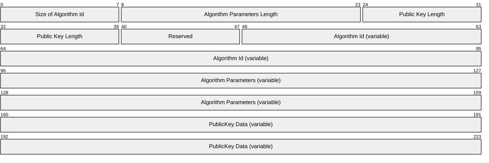

**Size of Algorithm Id (1 byte):** The size, in [**little-endian**](#gt_little-endian) byte order, of the **Algorithm Id** field, in bytes. MUST be set to 20 bytes.

**Algorithm Parameters Length (2 bytes):** The size, in little-endian byte order, of the **Algorithm Parameters** field, in bytes.

**Public Key Length (2 bytes):** The size, in little-endian byte order, of the **PublicKey Data** field, in bytes. MUST be set to 140 bytes.

**Reserved (1 byte):** MUST be set to 0x00 and ignored on receipt.

**Algorithm Id (variable):** An [**ASN.1**](#gt_asn1)-encoded [**object identifier (OID)**](#gt_object-identifier-oid) indicating the public key format. MUST be the same as the rsaEncryption identifier, as specified in [[RFC8017]](https://go.microsoft.com/fwlink/?linkid=2164409) section A.1.

**Algorithm Parameters (variable):** An ASN.1-encoded object identifier (OID) indicating the public key format. MUST be the same as the rsaEncryption, as specified in [RFC8017] section A.1.

**PublicKey Data (variable):** An ASN.1-encoded 1024-bit [**RSA**](#gt_rivest-shamir-adleman-rsa) public key, as specified in [RFC8017] section A.1.1.

<a id="Section_2.2.3.1.6"></a>
##### 2.2.3.1.6 PAYLOAD

The **PAYLOAD** structure carries application data associated with a [**key**](#gt_key). It is specified in section [2.2.3.1.6.1](#Section_2.2.3.1.6.1).

<a id="Section_2.2.3.1.6.1"></a>
###### 2.2.3.1.6.1 PAYLOAD Structure

The **PAYLOAD** structure holds arbitrary binary data supplied by the application associated with a [**key**](#gt_key). This data is carried by the distributed routing table in the **EXTENDED_PAYLOAD** field.

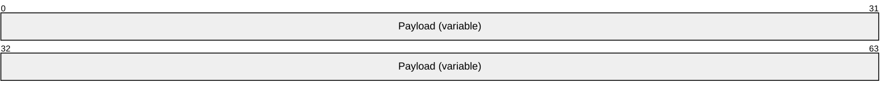

**Payload (variable):** Data supplied by the upper-layer application associated with the published key.

<a id="Section_2.2.3.1.7"></a>
##### 2.2.3.1.7 Encrypted Endpoint Array

An Endpoint Array structure containing one or more [**IPv6**](#gt_internet-protocol-version-6-ipv6) addresses and ports, as specified in [2.2.3.1.7.1](#Section_2.2.3.1.7.1).

<a id="Section_2.2.3.1.7.1"></a>
###### 2.2.3.1.7.1 Encrypted Endpoint Array Structure

The **encrypted endpoint array** is an encoding of [**IPv6**](#gt_internet-protocol-version-6-ipv6) addresses and ports. This structure is used in the [LOOKUP (section 2.2.2.8)](#Section_2.2.2.8) message. This structure is encrypted using the keytoken documented in section [2.2.3.1.2](#Section_2.2.3.1.2) before being transmitted.

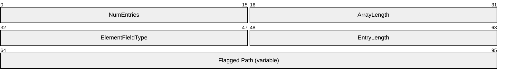

**NumEntries (2 bytes):** The number of entries in the **Flagged Path** field. This value MUST be in the range 1 to 22, inclusive.

**ArrayLength (2 bytes):** The length of the encrypted data. This value MUST be set to 8 + (**NumEntries** * **EntryLength**).

**ElementFieldType (2 bytes):** The type of the elements in the array. MUST be set to 0x009D (IPV6_ENDPOINT).

**EntryLength (2 bytes):** The length of each entry in the array. MUST be set to 0x0012 (18 bytes).

**Flagged Path (variable):** A list of IPV6_ENDPOINT structures for DRT nodes that have encountered this LOOKUP message so far.

<a id="Section_2.2.3.2"></a>
#### 2.2.3.2 DRT Data Structures

The data structures defined in this section are core DRT protocol data structures and are not defined by the upper-layer application.

<a id="Section_2.2.3.3"></a>
#### 2.2.3.3 ROUTE_ENTRY

The ROUTE_ENTRY represents the basic critical information about a [**node**](#gt_node) to the other members of the [**cloud**](#gt_cloud). The key elements are a 32-byte key and an array of **IPv6 Addresses** on which the DRT Protocol on the node is listening.

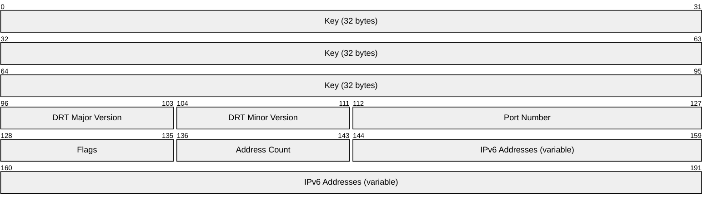

**Key (32 bytes):** A 32-byte key.

**DRT Major Version (1 byte):** The major version of the protocol, which is defined by the higher-layer application.

**DRT Minor Version (1 byte):** The minor version of the protocol, which is defined by the higher-layer application.

**Port Number (2 bytes):** The UDP port number on which the DRT node represented by this route entry is listening. This MUST be greater than or equal to 1024.

**Flags (1 byte):** Reserved. This MUST be set to zero and ignored on receipt.

**Address Count (1 byte):** Number of **IPv6 Addresses** that follow. This MUST be in the range 1 to 20.

**IPv6 Addresses (variable):** An array of **IPv6 Addresses** on which the DRT node represented by this route entry is listening.

<a id="Section_2.2.3.4"></a>
#### 2.2.3.4 IPV6_ENDPOINT

The IPV6_ENDPOINT structure contains information about an IPV6_ENDPOINT of a DRT [**node**](#gt_node).

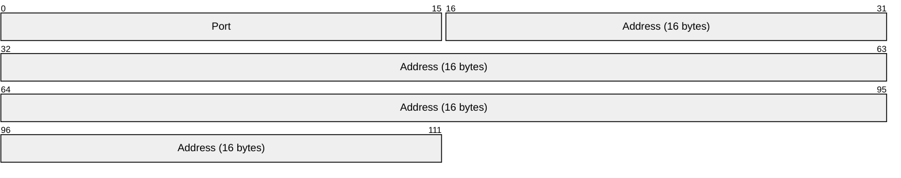

**Port (2 bytes):** IPv6 port. This MUST be greater than or equal to 1024.

**Address (16 bytes):** IPv6 address.

<a id="Section_2.2.3.5"></a>
#### 2.2.3.5 IPV6_ENDPOINT_ARRAY

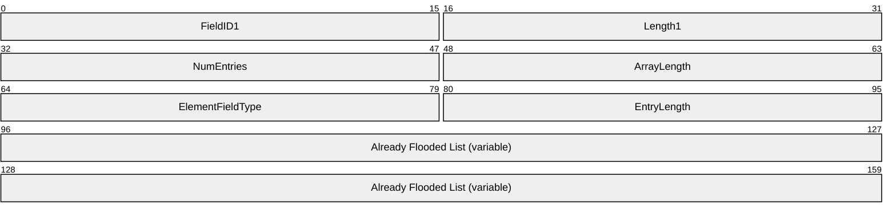

**FieldID1 (2 bytes):** MUST be set to 0x009E.

**Length1 (2 bytes):** MUST be set to 12+(**NumEntries*****EntryLength**).

**NumEntries (2 bytes):** The number of entries in the **Already Flooded** List. This MUST be in the range 1 to 22.

**ArrayLength (2 bytes):** MUST be set to 8+(**NumEntries*****EntryLength**).

**ElementFieldType (2 bytes):** MUST be set to 0x009D ([IPV6_ENDPOINT](#Section_2.2.3.4)).

**EntryLength (2 bytes):** MUST be set to 0x12 (18 bytes).

**Already Flooded List (variable):** A list of IPV6_ENDPOINT structures.

<a id="Section_2.2.3.6"></a>
#### 2.2.3.6 FIELD_ARRAY

The FIELD_ARRAY structure is used to describe an array of elements.

```mermaid
packet-beta
  0-15: "NumEntries"
  16-31: "ArrayLength"
  32-47: "ElementFieldType"
  48-63: "EntryLength"
  64-127: "Array Data (variable)"
```

**NumEntries (2 bytes):** MUST be set to the number of elements in the array.

**ArrayLength (2 bytes):** MUST be set to 8+(**NumEntries*****EntryLength**).

**ElementFieldType (2 bytes):** MUST be a valid **FieldID**.

**EntryLength (2 bytes):** MUST be set to the size, in bytes, of an element of type **ElementFieldType**.

**Array Data (variable):** A list of elements of type **ElementFieldType**.

<a id="Section_3"></a>
# 3 Protocol Details

DRT [**nodes**](#gt_node) use eight specific message types. These messages can be split into two distinctive classes: request messages ([SOLICIT](#Section_2.2.2.1), [REQUEST](#Section_2.2.2.3), [FLOOD](#Section_2.2.2.4), [LOOKUP](#Section_2.2.2.8), and [INQUIRE](#Section_2.2.2.5)) and acknowledge messages ([ADVERTISE](#Section_2.2.2.2), [ACK](#Section_2.2.2.7), and [AUTHORITY_BUFFER](#Section_2.2.2.6.1)). Request messages are initiated by one node and sent to another. Acknowledge messages are sent in reply to request messages.

Specific relationships of messages sent by a Resolver are shown in the following table.

| Message sent by Resolver | Acknowledgment sent by Publisher |
| --- | --- |
| SOLICIT | ADVERTISE |
| REQUEST | ACK |
| LOOKUP | AUTHORITY_BUFFER (contained in an [AUTHORITY](#Section_2.2.2.6)) |
| INQUIRE | AUTHORITY_BUFFER (contained in an AUTHORITY) |

Specific relationships of messages sent to a Resolver are shown in the following table.

| Message sent by Publisher | Acknowledgment sent by Resolver |
| --- | --- |
| FLOOD with **D** flag clear | ACK |

<a id="Section_3.1"></a>
## 3.1 Resolver Details

<a id="Section_3.1.1"></a>
### 3.1.1 Abstract Data Model

This section specifies a conceptual model of a possible data organization that an implementation maintains to participate in this protocol. The described organization is provided to facilitate the explanation of how the protocol behaves. This document does not mandate that implementations adhere to this model as long as their external behavior is consistent with that described in this document.

- **Cloud State:** A set of states for the [**cloud**](#gt_cloud) in which the [**node**](#gt_node) can perform resolutions. The cloud state has the following information:
- **Conversation Table:** A table of state for synchronization conversations in progress, if any. Each entry has the following state:
- **Nonce:** The [**nonce**](#gt_nonce) being used in the current synchronization conversation in progress, if any.
- **SolicitMessageId:MessageID** of the [SOLICIT](#Section_2.2.2.1) message sent.
- **Local Endpoint List:** The list of [**network endpoints**](#gt_network-endpoint) on which this DRT node is listening for messages for the cloud.
- **Outstanding Resolves Table:** A table of state for resolutions in progress. Each entry has the following state:
- **Target Key:** The key being resolved.
- **ResolveReasonCode:** The resolve reason code (section [2.2.2.8](#Section_2.2.2.8)) for this resolve.
- **ResolvePath:** A list of network endpoints of DRT nodes that have already been asked about this request.
- **NextHopStack:** A last-in-first-out stack of entries for nodes that can be consulted to find nearer matches. Each entry contains the following:
- **RouteEntry:** Route entry for the DRT node.
- **UseCount:** A count of the number of times a LOOKUP message has been sent to this node.
- **BestMatchStack:** A last-in-first-out stack of the route entries closest to the target. This maintains a history of route entries stored at CurrentBestMatch.
- **CurrentBestMatch:** The route entry that is the "Best Match" so far.
- **CurrentNextHop:** The entry of the same type as used in the NextHopStack that contains the route entry for the node to which the current LOOKUP message has been sent.
- **NewNextHop:** Temporary storage for a route entry received during [AUTHORITY](#Section_2.2.2.6) message processing.
- **SuspiciousCount:** A count of hops that returned an [AUTHORITY_BUFFER](#Section_2.2.2.6.1) message with the **L** flag set.
- **TotalUsefulHops:** Total number of nodes that LOOKUP messages are sent to and from that, an AUTHORITY_BUFFER message is received in reply.
- **LastSentMessageId:** The **MessageID** of the last sent LOOKUP or [INQUIRE](#Section_2.2.2.5) message sent. Used to match up received AUTHORITY messages.
- **SecurityModule:** A mechanism by which the DRT Protocol can call upon the upper-layer application for activities defined as part of the security profile.
- **BootstrapModule:** A mechanism by which the DRT Protocol can call upon the upper-layer application for activities defined as part of the bootstrap profile.
- **SecurityMode:** The security mode used by nodes participating in this cloud.
- **VersionMajor:** The major version of the DRT Protocol, which is defined by the higher-layer application.
- **VersionMinor:** The minor version of the DRT protocol, which is defined by the higher-layer application.
- **Pending List:** A set of messages that have been sent and are awaiting acknowledgment or retransmission. Each entry in the queue has the following state:
- **Message:** The message buffer.
- **Retry Count:** The number of send attempts remaining for this message before failure is declared.
- **Message Retransmission Timer:** A timer that handles the retransmission of a packet if an acknowledgment is not received within the expiration time. See section [3.1.2](#Section_3.2.2).
- **Pending Route Entry Add List:** A list of route entries in the process of being added to the Route Entry Cache. Each entry has the following state:
- **RouteEntry:** The route entry being pended.
- **NeedCpa:** Flag indicating if a [**CPA**](#gt_certified-peer-address-cpa) is requested.
- **InquireMessageId:MessageID** of the INQUIRE message sent to validate this route entry.
- **Reassembly List:** A list of AUTHORITY_BUFFER messages currently in the process of being reassembled. Each entry has the following state:
- **Message ID:** The **MessageID** value in the [DRT Header](#Section_2.2.1) for the AUTHORITY messages being reassembled.
- **Source IP address and port:** The IP address and port of the peer from which AUTHORITY_BUFFER message fragments are received.
- **Size:** Expected size of the final buffer.
- **Buffer:** A buffer into which fragments are placed.
- **Route Entry Cache:** A cache of route entries. Each route entry in the cache contains a key and a list of network endpoints.
**Note** The preceding conceptual data can be implemented by using a variety of techniques. An implementer is at liberty to implement such data in any way.

<a id="Section_3.1.2"></a>
### 3.1.2 Timers

A DRT Cloud has the following timers:

- **Maintenance Timer:** A periodic timer used to perform periodic cache maintenance. The period SHOULD<1> be 15 seconds to keep the cache functional.
- **Message Retransmission Timer:** This conceptual timer exists for each entry in the Pending List and is used for retransmission. The period SHOULD be 1 second.
<a id="Section_3.1.3"></a>
### 3.1.3 Initialization

The higher-layer application MUST select a security mode, provide minor and major version numbers to be included in the protocol messages, and MUST provide the protocol with security and bootstrap modules.

<a id="Section_3.1.4"></a>
### 3.1.4 Higher-Layer Triggered Events

A Resolver MUST provide to higher-layer applications and protocols the three logical operations that can be invoked: Opening a Cloud, Resolving a Key, and Closing a Cloud.

<a id="Section_3.1.4.1"></a>
#### 3.1.4.1 Opening a Cloud

When a higher-layer application or protocol asks DRT to open a [**cloud**](#gt_cloud), the [**node**](#gt_node) MUST first check whether it already has an opened cloud. If so, it MUST return a failure to the application or higher-layer protocol.

The node MUST carry out the following procedures when initializing.

- Choose one port and a set of four **IPv6 Addresses**, or as many as the local system has, not exceeding four, that the node will use for DRT communication. The addresses MUST all be of the same scope and scope zone (as specified in [[RFC4007]](https://go.microsoft.com/fwlink/?LinkId=90454) section 5). The same port number MUST be used for all addresses. If no addresses are available, the open attempt MUST report a failure. Otherwise, store the chosen addresses in the Local Endpoint List.
- Begin listening for incoming messages on the UDP port and **IPv6 Addresses** chosen.
- Initiate the cloud discovery process as specified in section [3.1.4.2](#Section_3.1.4.2).
- Start the Maintenance Timer for the cloud.
<a id="Section_3.1.4.2"></a>
#### 3.1.4.2 Discovering Other Nodes in a Cloud

The upper-layer application is responsible for discovering other [**nodes**](#gt_node) in the [**cloud**](#gt_cloud) and supplying the DRT service [**endpoints**](#gt_endpoint) of these nodes to the DRT protocol. The DRT protocol MAY call upon the upper-layer application to obtain the DRT service endpoints of other nodes after initialization.<2>

<a id="Section_3.1.4.3"></a>
#### 3.1.4.3 Initiating a DRT Synchronization Conversation

A synchronization conversation allows a [**node**](#gt_node) to exchange resource information in the form of [ROUTE_ENTRY](#Section_2.2.3.3) structures with another given node in a given [**cloud**](#gt_cloud).

The DRT node MUST generate a random 16-byte [**nonce**](#gt_nonce) value, save it in its local Conversation nonce state, and then send to the given node a [SOLICIT](#Section_2.2.2.1) message that includes a SHA-1 [[RFC3174]](https://go.microsoft.com/fwlink/?LinkId=90408) hash of the Conversation nonce in the **Hashed Nonce** field.

The node MUST save the **MessageID** of the SOLICIT message in the entry in the conversation table.

The node MUST also put the SOLICIT message in the Pending List, set its Retry Count to 2, and start its Message Retransmission Timer.

<a id="Section_3.1.4.4"></a>
#### 3.1.4.4 Resolving a Key

In a resolution operation, three inputs are provided by the application or higher-layer protocol:

- A *key* to resolve
- A *ResolveCriteria* corresponding to the OpCode values specified in section [2.2.2.8](#Section_2.2.2.8)
- A *PickBestMatchFromLocalIds* flag indicating whether to consider locally registered [**keys**](#gt_key)
If the [**cloud**](#gt_cloud) has not been opened, the node MUST fail the request.

If there are no addresses in the **Local Endpoint List** abstract data model (ADM) element, the node MUST fail the request.

All nodes taking part in DRT will carry out the resolve process from time to time. Resolve-only nodes use the resolve process to handle requests from higher level applications to resolve a key. The process is also used in cache maintenance operations. Publishers use the resolve operation to advertise published keys to the rest of the cloud. Publishers also use the resolve operation to attempt to detect splits in the cloud.

The following parameters MUST be supplied to the resolving logic:

- *Target Key*, which is mapped to the key provided by the application or higher-layer protocol as specified in section 2.2.2.8.
- *ResolveCriteria*, which maps to the *ResolveCriteria* provided by the application or higher-layer protocol as specified in section 2.2.2.8.
- *PickBestMatchFromLocalIds*, which maps to the *PickBestMatchFromLocalIds* provided by the application or higher-layer protocol as specified in section 3.1.4.4.
- *ResolveReasonCode*, which MUST be set to REASON_APP_REQUEST when the resolve operation is initiated by the application or higher-layer protocol.
and optionally

- *InitialBestMatchRouteEntry*, which is a [ROUTE_ENTRY](#Section_2.2.3.3) structure used by the protocol during key registration. See section [3.2.4.1](#Section_3.2.4.1) for details.
- *InitialNextHopRouteEntry*, which is a ROUTE_ENTRY structure used by the protocol during maintenance. See section [3.2.6.2](#Section_3.1.6.1) for details.
A Resolver MUST then perform the following steps:

- Attempt to create a new entry in the **Outstanding Resolves Table** element, and fail the request if one cannot be created. If one is created, initialize the fields as follows.
- Initialize **SuspiciousCount** element and **TotalUsefulHops** element to 0.
- The resolve entry's **ResolvePath** MUST be initialized to contain any one of the [**endpoints**](#gt_endpoint) in the **Local Endpoint List** element.
- Save the supplied *Target Key* and *ResolveReasonCode* in the corresponding fields of the resolve entry.
- If an *InitialNextHopRouteEntry* is supplied, push it onto the **NextHopStack** element. Otherwise select the route entry from the cache for the key numerically closest to the *Target Key* and push it onto the resolve entry's **NextHopStack** element. In both cases the **UseCount** element for the entry on the stack MUST be set to zero.
- If an *InitialBestMatchRouteEntry* is supplied, push it onto the resolve entry's **BestMatchStack** element. If an **InitialBestMatchRouteEntry** is not supplied, leave **BestMatchStack** element empty.
- If the resolve entry's **CurrentBestMatch** element is not empty and the key of the most recently pushed entry in the **BestMatchStack** element is sufficiently close (per the *ResolveCriteria*) match to the *Target Key*, then:
Create an [INQUIRE](#Section_2.2.2.5) message with the following fields:

- **Validate Key** field set to the key of the **CurrentBestMatch** element.
- **Request CPA**, **Certificate Chain**, **Classifier**, and **Extended Payload** flags set.
- **FieldId3** set to 0x0093 (NONCE).
Set **LastSentMessageID** to the **MessageID** of the INQUIRE message. If the protocol is executing in [membership](#Section_1.3.2.2) or [confidential security mode](#Section_1.3.2.3), call upon the **SecurityModule** element to provide the **Credential**, **Signature**, and **KeyIdentifier** fields of the message. Then choose an address from the **CurrentBestMatch** element route entry's address list by using the algorithm as specified in [[RFC3484]](https://go.microsoft.com/fwlink/?LinkId=90424) section 6, and send the INQUIRE message to that address. Finally, put the INQUIRE message in the **Pending List** element, set its Retry Count to 2, and start its Message Retransmission Timer.

Otherwise (for example, if the resolve entry's **CurrentBestMatch** element is empty or not sufficiently close to the *Target Key*), continue processing as follows:

- Attempt to pop a route entry off of the **NextHopStack** element and store this route entry in the resolve entry's **CurrentNextHop** element. If the **CurrentNextHop** element is empty or **SuspiciousCount** element is greater than 6 or **TotalUsefulHops** element is greater than 22, the Resolver MUST do the following:
If the resolve entry's **CurrentBestMatch** element is not empty, determine whether it meets the minimal match conditions as specified in the *ResolveCriteria*. If it does not, or the **CurrentBestMatch** element is empty, return no results to the caller because no adequate match is found. The Resolve operation is now complete. Otherwise, send an INQUIRE message as in step 7 above.

If the **NextHopStack** element is not empty, **SuspiciousCount** element is less than or equal to 6, and **TotalUsefulHops** element is less than or equal to 22, continue processing as follows:

- Prepare a LOOKUP message with the **Validate Key** field set to the key from the route entry in the **CurrentNextHop** element, and the **FlaggedPath** field filled with the entries from the ResolvePath. If the number of entries in the cache is less than 8, the Resolver SHOULD set the **A** flag in the LOOKUP message. If the protocol is executing in membership or confidential security mode, call upon the **SecurityModule** element to provide the **Credential**, **Signature**, and **KeyIdentifier** fields of the message.
- Choose an address from the list of addresses in the route entry in the **CurrentNextHop** element state, using the algorithm as specified in [RFC3484] section 6, send the LOOKUP message to it, and increment the UseCount in the **CurrentNextHop** element state. Set **LastSentMessageID** to the **MessageID** of the LOOKUP message. Put the LOOKUP message in the **Pending List** element, set its Retry Count to 2, and start its Message Retransmission Timer.
<a id="Section_3.1.4.5"></a>
#### 3.1.4.5 Closing a Cloud

When an application or higher-layer protocol closes a [**cloud**](#gt_cloud), the DRT [**node**](#gt_node) MUST verify that it has a cloud state for the cloud, and fail the request if not. The DRT node MUST delete all state information for the cloud.

<a id="Section_3.1.5"></a>
### 3.1.5 Message Processing Events and Sequencing Rules

<a id="Section_3.1.5.1"></a>
#### 3.1.5.1 Receiving a DRT Message

When a [**node**](#gt_node) receives a [DRT Message](#Section_2.2.2), it MUST first check whether the message starts with a [DRT Header](#Section_2.2.1) that conforms to the syntax as specified in section 2.2.1, and silently drop the message if not. If the UDP source port of the message is less than 1024, it MUST silently drop the message.

The node MUST then determine the [**cloud**](#gt_cloud) to which the message applies (based on the local address and port to which the message is sent). Messages targeted to a cloud different than the node’s opened cloud MUST be dropped.

The node MUST then check the **Message Type** field and handle additional type-specific processing in accordance with its message type. Messages with types other than those specified in this document MUST be dropped.

<a id="Section_3.1.5.2"></a>
#### 3.1.5.2 Receiving an ADVERTISE Message

When a Resolver receives an [ADVERTISE](#Section_2.2.2.2) message, it MUST perform the following steps:

- Match the **Acked Message Id** in the ADVERTISE message against any [SOLICIT](#Section_2.2.2.1) messages in the Pending List. If no match is found, it MUST silently discard the ADVERTISE message. Otherwise, it MUST remove the SOLICIT message from the Pending List and continue processing as follows.
- Use the hashed nonce in the message to verify that a corresponding SOLICIT message was sent.
- Check the array of keys in the ADVERTISE message. If the array is empty (for example, NumEntries is 0x0000), silently discard the message.
- Select a set of keys in the array to request. The [**node**](#gt_node) SHOULD select all keys in the array.
Prepare a [REQUEST](#Section_2.2.2.3) message with the desired keys and send it to the remote node. The node MUST also add the REQUEST message to the Pending List, set its Retry Count to 2, and start its Message Retransmission Timer. If the protocol is executing in membership or confidential security mode, call upon the SecurityModule to provide the **Credential**, **Signature**, and **KeyIdentifier** fields of the message.

<a id="Section_3.1.5.3"></a>
#### 3.1.5.3 Receiving an ACK Message

When an [ACK](#Section_2.2.2.7) message is received, the receiving [**node**](#gt_node) MUST attempt to match the **Acked MessageID** field with the **MessageID** of an entry in the Pending List. If a match is not found, the message MUST be silently discarded with no further action.

If, alternatively, a match is found, the entry in the Pending List MUST be removed.

<a id="Section_3.1.5.4"></a>
#### 3.1.5.4 Receiving a FLOOD Message

Upon receiving a [FLOOD](#Section_2.2.2.4) message, a DRT [**node**](#gt_node) MUST perform the following steps:

- Check whether the FLOOD message conforms to the syntax as specified in section 2.2.2.4 and drop the message if not. Otherwise, continue processing as follows. If the protocol is executing in confidential security mode, pass the message to the SecurityModule for decryption. If decryption fails, silently drop the message.
- If the **D** flag is clear, reply with an [ACK](#Section_2.2.2.7) message to the sending node.
- If a [ROUTE_ENTRY](#Section_2.2.3.3) is supplied in the FLOOD message, begin validating the ROUTE_ENTRY as specified in Receiving a New ROUTE_ENTRY.
- If a **Revoke CPA** is supplied in the FLOOD message, validate the [**CPA**](#gt_certified-peer-address-cpa) as a **Revoke CPA** and, if not valid, discard.
- Extract the CPA and pass it to the SecurityModule for verification and for calculation of the [**key**](#gt_key). Remove the ROUTE_ENTRY (if any) for the key of the **Revoke CPA** from the cache.
<a id="Section_3.1.5.5"></a>
#### 3.1.5.5 Receiving an AUTHORITY Message

On receipt of an [AUTHORITY](#Section_2.2.2.6) message, the DRT [**node**](#gt_node) MUST first check whether the AUTHORITY message conforms to the syntax as specified in section 2.2.2.6, and drop the message if not. Otherwise, it looks in the Pending List for a [LOOKUP](#Section_2.2.2.8) message or [INQUIRE](#Section_2.2.2.5) message whose **MessageID** matches the **Acked MessageID** in the AUTHORITY message. If none is found, drop the message.

The DRT node MUST then check whether the [AUTHORITY_BUFFER](#Section_2.2.2.6.1) message is fragmented by comparing the **Size** field in the AUTHORITY message and the received message size. If the AUTHORITY_BUFFER message is not fragmented, it MUST be processed as specified in section [3.1.5.5.1](#Section_3.1.5.5.1.2). Otherwise, the DRT node MUST start the reassembly process as follows:

To reassemble fragmented packets into the original AUTHORITY message, a DRT node MUST use the **MessageID** from the [DRT Header](#Section_2.2.1) and the **source IP** address and **Port** to look for an existing entry in the Reassembly List. If no entry exists, the node MUST attempt to create one and drop the message if it cannot create one. Otherwise, continue processing as follows.

Check whether the length of the **Buffer** field (as computed from the UDP message size) plus the **Offset** value is greater than the **Size** value, and if so, drop the message and delete the existing reassembly state.

Check if the **Size** in the AUTHORITY message received matches the **Size** in the reassembly entry, and if not, drop the message and delete the existing reassembly state. Otherwise, continue processing as follows:

For all fragments, a DRT node MUST copy the AUTHORITY_BUFFER message at the offset as specified in the AUTHORITY message.

If the AUTHORITY_BUFFER message is still not completely reassembled, no further processing is necessary. After the last fragment is received, processing MUST be done on the reassembled AUTHORITY_BUFFER message.

<a id="Section_3.1.5.5.1"></a>
##### 3.1.5.5.1 Receiving an AUTHORITY_BUFFER

When a DRT [**node**](#gt_node) has a fully formed [AUTHORITY_BUFFER](#Section_2.2.2.6.1) message, the DRT node MUST first check whether the AUTHORITY_BUFFER message conforms to the syntax as specified in section [2.2.2.6](#Section_2.2.2.6), and drop the AUTHORITY message containing the malformed AUTHORITY_BUFFER if not.

Otherwise, the DRT node MUST remove the entry from the Pending List.

The Outstanding Resolves Table MUST then be checked to find whether an entry has sent a [LOOKUP](#Section_2.2.2.8) message during a resolution. The **Acked MessageID** of the AUTHORITY message is compared against the LastSentMessageID in the resolve entries to find a match. If no entry is found, the node MUST follow the steps as specified in section [3.1.5.5.1.1](#Section_3.1.5.5.1.1). If the protocol is executing in confidential security mode, the AUTHORITY_BUFFER MUST be passed to the SecurityModule for decryption. Otherwise, continue processing as follows:

- Add the address used when sending the previous LOOKUP message to the resolve entry's ResolvePath.
- Increment the entry's TotalUsefulHops.
- If the **L** flag in the AUTHORITY_BUFFER message is set, increment the resolve entry's SuspiciousCount.
- If the **N** flag in the AUTHORITY_BUFFER message is clear, begin validating the route entry in the resolve entry's CurrentNextHop as specified in [3.1.5.6](#Section_2.2.3.3). Otherwise clear the CurrentNextHop because the key is no longer registered at that node and remove this node from the cache. In either case, continue processing as follows.
- If CurrentNextHop is not clear and if the key of the route entry in the resolve entry's CurrentNextHop is numerically closer to the Target Key than the key of the resolve entry's CurrentBestMatch, push the CurrentBestMatch onto the BestMatchStack and create a copy of the resolve entry's CurrentNextHop and save it in the resolve entry's CurrentBestMatch.
- If the resolve entry's CurrentNextHop is not empty and the UseCount of the entry is 3, then clear the resolve entry's CurrentNextHop.
- If the **Route Entry** field is present in the AUTHORITY_BUFFER message then create a route entry and store it in the resolve entry's NewNextHop.
- If the resolve entry's CurrentNextHop is not empty, push it back onto NextHopStack and clear the resolve entry's CurrentNextHop.
- If the resolve entry's NewNextHop is not empty, check the addresses in the route entry to ensure that none of them appear in the resolve entry's ResolvePath except for the last entry in the path. If the address appears, clear the resolve entry's NewNextHop.
- If the resolve entry's NewNextHop is not empty, determine whether the resolve entry's NewNextHop is numerically closer to the Target Key than the node from which the NewNextHop is obtained. If the resolve entry's NewNextHop is closer, push it onto the resolve entry's NextHopStack. If it is not closer, but the cache contains fewer than 8 entries, push it onto the resolve entry's NextHopStack. If the cache has more than eight entries, pop the Previous hop off of the resolve entry's NextHopStack if it is pushed on in step 8. Clear the resolve entry's NewNextHop.
- Resume at step 7 in section [3.1.4.4](#Section_3.1.4.4).
<a id="Section_3.1.5.5.1.1"></a>
###### 3.1.5.5.1.1 Receiving a Response to an INQUIRE

The Outstanding Resolve table MUST be checked to find an entry that MAY have sent an [INQUIRE](#Section_2.2.2.5) message during a resolution. If one is not found, see section [3.1.5.5.1.2](#Section_3.1.5.5.1.2). Otherwise, continue processing as follows:

If the [AUTHORITY](#Section_2.2.2.6) message contains a **CPA**, then the [**node**](#gt_node) MUST pass the [AUTHORITY_BUFFER](#Section_2.2.2.6.1) to the SecurityModule for validation.

If validation fails, then the node MUST discard the AUTHORITY message, and attempt to pop a new entry from its BestMatchStack and place it (if any) in its CurrentBestMatch variable. If there is no new CurrentBestMatch, the node MUST return a failure to the higher-layer application or protocol; otherwise, the node MUST repeat the [LOOKUP](#Section_2.2.2.8) message procedure starting at step 7 of section [3.1.4.4](#Section_3.1.4.4).

If the resolve entry's **ResolveReasonCode** is equal to REASON_APP_REQUEST, the node MUST then return the [**endpoints**](#gt_endpoint) information to the higher-layer application or protocol.

<a id="Section_3.1.5.5.1.2"></a>
###### 3.1.5.5.1.2 Completing a Route Entry Cache Addition

The following processing MUST be done when the [AUTHORITY_BUFFER](#Section_2.2.2.6.1) message is acknowledging an [INQUIRE](#Section_2.2.2.5) message sent while adding a route entry to the cache:

- Check the Pending Route Entry Add List. If an entry is not found that has an InquireMessageId corresponding to the **Acked MessageID** of the [AUTHORITY](#Section_2.2.2.6) message, silently discard the AUTHORITY message. Otherwise, continue processing as follows.
- If the AUTHORITY_BUFFER message has the **N** flag set (indicating that the key in the route entry is not currently registered on that [**node**](#gt_node)), then the **Route Entry** MUST be removed from the Pending Route Entry Add List.
- If the entry's **NeedCpa** flag is not set, the check for whether the entry is reachable is complete and the entry SHOULD be stored in the cache. The processing of the Route Entry is complete. Otherwise, continue processing as follows.
- If a [**CPA**](#gt_certified-peer-address-cpa) is requested but one is not included in the AUTHORITY_BUFFER message, the Route Entry MUST be silently discarded.
- The node MUST validate the CPA by passing the AUTHORITY_BUFFER to the SecurityModule. If it fails to validate, or if a required Credential is not received, the Route Entry MUST be silently discarded.
- The key in the Route Entry MUST be compared against the key of the CPA, and the addresses in the Route Entry MUST be compared against the service addresses in the CPA. If they do not match, the Route Entry MUST be silently discarded.
- Add the Route Entry to the Route Entry Cache.
<a id="Section_3.1.5.6"></a>
#### 3.1.5.6 Receiving a New ROUTE_ENTRY

After a [ROUTE_ENTRY](#Section_2.2.3.3) message has been extracted from a received message, the receiving [**node**](#gt_node) MUST follow these steps to submit it to the cache for inclusion. If the **PortNumber** field of the ROUTE_ENTRY message is less than 1024, the entry MUST be ignored.

Otherwise, the node MUST attempt to add the ROUTE_ENTRY message to the **Pending Route Entry Add List** element, with the **NeedCpa** field set to false. If it cannot be added, the ROUTE_ENTRY message MUST be ignored.

The ROUTE_ENTRY message MUST then be tested for return routability by composing an [INQUIRE](#Section_2.2.2.5) message with the **Validate Key** field set to the key in the ROUTE_ENTRY message and **FieldId3** set to 0x0093 (NONCE). The node MUST then select one of the addresses included in the ROUTE_ENTRY message, using the algorithm in [[RFC3484]](https://go.microsoft.com/fwlink/?LinkId=90424) section 6, and send the INQUIRE message to the selected address, using the port indicated in the ROUTE_ENTRY message.

The node MUST then set **InquireMessageId** to the **MessageID** of the INQUIRE message sent, in the entry added to the **Pending Route Entry Add List** element.

<a id="Section_3.1.6"></a>
### 3.1.6 Timer Events

<a id="Section_3.1.6.1"></a>
#### 3.1.6.1 Maintenance Timer Expiry

The [**node**](#gt_node) MUST check to see if it knows of any other members of the [**cloud**](#gt_cloud). If it does not, it MUST invoke the process as specified in section [3.1.4.2](#Section_3.1.4.2) to attempt to discover the cloud.

The DRT node MUST select 10 [**keys**](#gt_key) from the local cache and perform an [INQUIRE](#Section_2.2.2.5) for each of these keys, to help identify and eliminate stale entries from the cache. The 10 keys SHOULD be selected randomly. When inquiring cache entries, an INQUIRE message MUST be sent as follows:

Create an INQUIRE message with the following fields:

- **Validate Key** field set to the key corresponding to the cache entry.
If the protocol is executing in confidential security mode:

- **Request CPA, Certificate Chain, Classifier** flags set.
- **FieldId3** set to 0x0093 (NONCE).
If the protocol is NOT executing in confidential security mode:

- **Request CPA, Certificate Chain, Classifier** flags NOT set.
- **FieldId3** NOT set.
Set **LastSentMessageID** to the **MessageID** of the INQUIRE message. If the protocol is executing in membership or confidential security mode, call upon the **SecurityModule** to provide the [Credential](#Section_2.2.3.1.4), [Signature](#Section_2.2.3.1.3), and [KeyIdentifier](#Section_2.2.3.1.5) fields of the message. Then choose an address from the cache entry’s route entry's address list by using the algorithm as specified in [[RFC3484]](https://go.microsoft.com/fwlink/?LinkId=90424) section 6, and send the INQUIRE message to that address. Finally, put the INQUIRE message in the **Pending List** element, set its Retry Count to 2, and start its Message Retransmission Timer.

In addition, the DRT node MAY<3> resolve any keys to accept additional route entries (for example, to ensure that the Route Cache contains entries roughly evenly distributed across the key numbering space, so as to reduce the time it takes to do a resolve on behalf of an application or higher-layer protocol). If it does so, then the **ResolveReasonCode** element MUST be set to REASON_CACHE_MAINTENANCE.

<a id="Section_3.1.6.2"></a>
#### 3.1.6.2 Message Retransmission Timer Expiry

When the Message Retransmission Timer expires for an entry in the **Pending List**, the DRT [**node**](#gt_node) MUST decrement the entry's Retry Count. If it is still nonzero, it MUST send the message again and restart the timer. If the Retry Count is zero, a failure result MUST be reported to the higher-layer application or protocol, and the entry MUST be removed from the **Pending List**.

Additional actions are required for specific message types, as specified below.

Upon timer expiry, if the message stored is a [LOOKUP](#Section_2.2.2.8) message or an [INQUIRE](#Section_2.2.2.5) message, the DRT node MUST clean up any outstanding reassembly context that matches the **MessageID**. This is done regardless of the entry's **Retry Count**. This will ensure that any reassembly context will not remain longer than 1 second.

<a id="Section_3.1.7"></a>
### 3.1.7 Other Local Events

<a id="Section_3.1.7.1"></a>
#### 3.1.7.1 Processing Address Change Notifications

The DRT [**node**](#gt_node) MUST monitor changes in **IPv6 addresses** available on the host machine. If a change in the set of addresses is detected, then the node MUST construct a new list of addresses following the restrictions as specified in step 1 of section [3.1.4.1](#Section_3.1.4.1). If this is different than the current list in the Local Endpoint List, then the node MUST replace the old list with the new one.

<a id="Section_3.2"></a>
## 3.2 Publisher Details

All Publishers MUST follow the rules for Resolvers as well as the rules for Publishers. This section specifies additional rules beyond those in section [3.1](#Section_3.1).

<a id="Section_3.2.1"></a>
### 3.2.1 Abstract Data Model

This section specifies a conceptual model of possible data organization that an implementation maintains to participate in this protocol. The described organization is provided to facilitate the explanation of how the protocol behaves. This document does not mandate that implementations adhere to this model as long as their external behavior is consistent with that described in this document.

The **Cloud State** data structure (section [3.1.1](#Section_3.1)) is extended by adding two additional subcomponents to the **Conversation Table** component specified in section 3.1.1, **Peer's IP Address and Port** and **Hashed Nonce**, and by adding one additional component, the **Locally Registered Key List**.

- **Conversation Table:** A table of active synchronization conversations from new [**nodes**](#gt_node) in the process of joining the [**cloud**](#gt_cloud). Each entry has the following state:
- **Peer's IP Address and Port:** The IP address and port number of the peer.
- **Hashed Nonce:** The **Hashed Nonce** value received in a [SOLICIT](#Section_2.2.2.1) message from the node.
- **Locally Registered Key List:** A list of all keys registered by the DRT node itself or on behalf of higher-layer applications or protocols publishing Keys. Each entry in the list has the following fields:
- **Key:** The locally registered key.
- **Leaf Set:** A list of the route entries for the five numerically closest keys that are less than the locally registered key and the five numerically closest keys that are greater than the locally registered key.
**Note** The preceding conceptual data can be implemented by using a variety of techniques. An implementer is at liberty to implement such data in any way.

<a id="Section_3.2.1.1"></a>
#### 3.2.1.1 Cache

To respond to [LOOKUP](#Section_2.2.2.8) messages when a neighbor is searching for a particular key, a DRT [**node**](#gt_node) is required to maintain a Route Entry Cache. A DRT [**cloud**](#gt_cloud) has no scale limitation, and could consist of millions of registrations; because it would be prohibitively expensive, in both bandwidth and memory, for every node to cache every single registration in a cloud of this size, the selection of neighbors to cache is of critical importance to ensure a reasonable trade-off between search time, bandwidth, and memory consumption.

The specific cache organization is an implementation detail,<4> but the following are requirements that MUST be met by a cache implementation:

- It MUST be such that a search for a single registration in the cloud can be implemented on the order of Log10(n) LOOKUP message operations, where n is the total number of registrations in the cloud. (For example, the cache structure described in [[PAST]](https://go.microsoft.com/fwlink/?LinkId=90243) has this property.)
- The cache MUST logically include all entries in each of the node's [**leaf sets**](#gt_leaf-set).
This constraint on the cache ensures that there is always a discoverable path to a registered key. DRT nodes, which are also Publishers, also use this constraint to detect and repair partitions in the cloud, section [3.2.6.2.1](#Section_3.2.6.2.1.1).

- A DRT node MUST maintain a cache of at least 10 route entries (or all route entries in the cloud, if there are fewer than 10), of the keys of which are evenly distributed around the number space.
This constraint ensures that when a neighbor is performing a bootstrap operation and sends [SOLICIT](#Section_2.2.2.1) messages for entries for this node's cache, it is possible to [ADVERTISE](#Section_2.2.2.2) an even distribution of candidates.

<a id="Section_3.2.2"></a>
### 3.2.2 Timers

**Conversation Timer:** A one-shot timer per Conversation Table entry, it is used to expire the conversation entry. The timeout value SHOULD be 15 seconds.

<a id="Section_3.2.3"></a>
### 3.2.3 Initialization

The Publisher performs no initialization beyond that specified in section [3.1.3](#Section_3.1).

<a id="Section_3.2.4"></a>
### 3.2.4 Higher-Layer Triggered Events

<a id="Section_3.2.4.1"></a>
#### 3.2.4.1 Registering a Key

To register a [**key**](#gt_key), the application or higher-layer protocol MUST provide:

- The elements required by the **SecurityModule** abstract data model (ADM) element to authenticate the key to peers.
- Optionally a **Payload**.
If there are no addresses currently available in the **Local Endpoint List** element, a failure MUST be returned to the application or higher-layer protocol.

To register a key in a given [**cloud**](#gt_cloud), a [**node**](#gt_node) MUST perform the following steps:

- Verify that an entry for the cloud exists in the **Cloud State** element. If it does not, return a failure.
- The node MUST add the key to its **Locally Registered Key List** element.
The node MUST then initiate the procedure as specified in section [3.1.4.4](#Section_3.1.4.4) to resolve the key equal to the new key + 1. The *ResolveCritera* MUST be set to SEARCH_OPCODE_NONE, *ResolveReasonCode* MUST be set to REASON_REGISTRATION, *PickBestMatchFromLocalIds* MUST be set to FALSE, and the *InitialBestMatchRouteEntry* MUST be a [ROUTE_ENTRY](#Section_2.2.3.3) structure holding the key and the [**endpoints**](#gt_endpoint) in the **Local Endpoint List** element.

(Note that because the above route entry is in each [LOOKUP](#Section_2.2.2.8) message sent, the nodes receiving the LOOKUP will have the opportunity to learn of the existence of the new node.)

<a id="Section_3.2.4.2"></a>
#### 3.2.4.2 Unregistering a Key

To unregister a Key, a [**node**](#gt_node) MUST perform the following steps:

- Call upon the SecurityModule to construct a **Revoke CPA** for the [**key**](#gt_key). This **CPA** MUST have the **R** field set to indicate that this is a revoke CPA.
- The **Revoke CPA** MUST be sent via a [FLOOD](#Section_2.2.2.4) message with the **D** flag clear to the two nodes in the [**leaf set**](#gt_leaf-set) with keys that are closest to the locally registered key. That is, the (numerically) nearest key that is greater than the local key and the (numerically) nearest key that is less than the key MUST be used.
- The node MUST select the node that has the key immediately greater than the Local Key. The node MUST send the key via a FLOOD message (with the **D** flag clear) to the node with a key that is the fifth closest and smaller than the local key. The process is also reversed. The node MUST select the key that is immediately less than the local key. This entry will be sent via a FLOOD message (with the **D** flag clear) to the fifth closest and larger key that the node knows about.
- In this manner, the leaf sets of the nodes at the edge of this node's leaf set will recognize the existing neighbors.
Whenever a FLOOD message with the **D** flag clear is sent, the node MUST also put the FLOOD message in the Pending List, set its Retry Count to 2, and start its Message Retransmission Timer.

<a id="Section_3.2.5"></a>
### 3.2.5 Message Processing Events and Sequencing Rules

<a id="Section_3.2.5.1"></a>
#### 3.2.5.1 Receiving a New ROUTE_ENTRY

[SOLICIT](#Section_2.2.2.1), [LOOKUP](#Section_2.2.2.8), [FLOOD](#Section_2.2.2.4), and [AUTHORITY](#Section_2.2.2.6) messages contain route entries. The processing required when receiving a new [ROUTE_ENTRY](#Section_2.2.3.3) structure is specified in section [3.1.5.6](#Section_2.2.3.3). Publishers MUST follow the same rules, with the following additions:

If the key of the ROUTE_ENTRY message falls within one of the [**node's**](#gt_node) key [**leaf sets**](#gt_leaf-set), it MUST set the **A** and **C** flags in the [INQUIRE](#Section_2.2.2.5) message to request a **CPA** and **Certificate Chain**, and **NeedCpa** MUST be set to true for the entry added to the Pending Route Entry Add List.

<a id="Section_3.2.5.2"></a>
#### 3.2.5.2 Receiving a LOOKUP Message

When a [LOOKUP](#Section_2.2.2.8) message is received, a [**node**](#gt_node) MUST perform the following steps:

- The receiving node MUST parse the received message to ensure that it is properly structured, that all required fields are present, and that all fields are in the correct order. Individual fields MUST also be parsed for correctness. If the message fails validation, it MUST be silently discarded.
- If the LOOKUP message contains a [ROUTE_ENTRY](#Section_2.2.3.3) message, the ROUTE_ENTRY message SHOULD be submitted to the cache (section [3.2.5.1](#Section_3.2.5.1)) for consideration for inclusion.
- If the **Validate Key** field contains a nonzero value, the protocol MUST check the Locally Registered Key List to determine whether or not this key is registered. If the ID is not currently registered, the protocol MUST set a flag to indicate that the **Validate Key** field is not present on this node. This flag is referred to as ValidateNotLocal.
- The node MUST compare the addresses in the [IPV6_ENDPOINT_ARRAY](#Section_2.2.3.5) against the addresses being used by this node. If none of this node's addresses appear in the list, the node MUST search its Locally Registered Key List and select the one numerically closest to the Target Key (a tie can be broken in any implementation-specific manner). This is referred to as the ClosestLocalMatch. If the ValidateNotLocal flag is not set, the returned key MUST be closer to the Target Key than the **Validate Key** field.
- The node MUST search its cache of remote nodes looking for the closest match to the Target Key. The search MUST not return any nodes having addresses that appear in IPV6_ENDPOINT_ARRAY. If the A flag in the LOOKUP message (section 2.2.2.8) is not set, any remote node found MUST also be closer to Target Key than the **Validate Key** field. If multiple nodes are located, the node MUST make a random choice between the nodes, giving more weight to the nodes that are closest to Target Key. The result, if any, will be referred to as ClosestRemoteMatch.
- If no ClosestRemoteMatch is found and the Target Key falls within one the [**leaf set**](#gt_leaf-set) of one of the locally registered IDs, the node SHOULD note this is a flag to be referred to a TargetSuspicious.
- If both a ClosestLocalMatch and a ClosestRemoteMatch are found, the node MUST now prepare an [AUTHORITY_BUFFER](#Section_2.2.2.6.1) message to send back to the sender of the LOOKUP message. If both a ClosestLocalMatch and a ClosestRemoteMatch are found, the one closest to Target Key MUST be placed in the ROUTE_ENTRY message in the [AUTHORITY](#Section_2.2.2.6) message. Otherwise, the match that is found MUST be used.
- If ValidateNotLocal is set, the **N** flag in the AUTHORITY_BUFFER (section 2.2.2.6.1) message MUST be set.
- If TargetSuspicious is set, the **L** flag in the AUTHORITY_BUFFER (section 2.2.2.6.1) message MUST be set.
- The AUTHORITY_BUFFER message MUST now be sent back to the sender of the LOOKUP message, section [3.2.5.7](#Section_2.2.2.6).
<a id="Section_3.2.5.3"></a>
#### 3.2.5.3 Receiving a SOLICIT Message

Upon receiving a [SOLICIT](#Section_2.2.2.1) message for a given [**cloud**](#gt_cloud), a DRT [**node**](#gt_node) MUST perform the following steps:

- Check whether the SOLICIT message conforms to the syntax as specified in section 2.2.2.1, and drop the message if not. Otherwise, continue processing as follows.
- Look for an entry in the cloud's Conversation Table with the same source address and port and Hashed Nonce. If an entry is found in the table, its Conversation Timer MUST be restarted. Otherwise, attempt to create a new entry and start its Conversation Timer. If a new entry cannot be created (or the node deems itself too busy for any other reason), it MUST respond with an [ADVERTISE](#Section_2.2.2.2) message that has a **IDList** containing no keys; otherwise, continue processing as follows.
- The node SHOULD select a set of five keys from its Route Entry Cache, which is roughly evenly spread around the number space. The keys MAY be randomly selected. If the cache does not contain at least five entries, the node MUST include its own locally registered keys as well.
- Construct an ADVERTISE message with the selected keys in the **IDList** and send it to back to the source of the SOLICIT message.
- The node SHOULD also begin validating the [ROUTE_ENTRY](#Section_2.2.3.3) from the SOLICIT message as specified in section [3.2.5.1](#Section_3.2.5.1).
<a id="Section_3.2.5.4"></a>
#### 3.2.5.4 Receiving a REQUEST Message

When the [REQUEST](#Section_2.2.2.3) message is received for a given [**cloud**](#gt_cloud), the receiving [**node**](#gt_node) MUST perform the following steps:

- Check whether the REQUEST message conforms to the syntax as specified in section 2.2.2.3, and drop the message if not. If the protocol is executing in membership or confidential security mode, pass the REQUEST message to the SecurityModule for verification of the Credential and Signature fields. If verification fails, drop the message. Otherwise, continue processing as follows.
- Look for an entry in the cloud's Conversation Table corresponding to the sender's IP address and port. If none is found, ignore the REQUEST message. Otherwise, continue processing as follows.
- Attempt to verify that the value of the **Nonce** field in the REQUEST message is valid. This MUST be done by performing a SHA-1 [[RFC3174]](https://go.microsoft.com/fwlink/?LinkId=90408) hash on the [**nonce**](#gt_nonce) and comparing it with the **Hashed Nonce** stored in the conversation entry. If they do not match, further processing MUST be stopped and the message MUST be silently dropped. Otherwise, continue processing as follows.
- Reply with an [ACK](#Section_2.2.2.7) message to the sender of the REQUEST message to indicate receipt and to avoid retransmission of the REQUEST message.
- The node MUST then send a [FLOOD](#Section_2.2.2.4) message, with the **D** flag set, for each key that is listed in the REQUEST message and delete the entry from the Conversation Table.
<a id="Section_3.2.5.5"></a>
#### 3.2.5.5 Receiving a FLOOD Message

Section [3.1.5.4](#Section_3.2.5.5) specifies the rules for handling received [FLOOD](#Section_2.2.2.4) messages. In addition to those rules, when sending an [ACK](#Section_2.2.2.7) message in response to a FLOOD message with a nonzero **Validate Key** field, a Publisher MUST check its Locally Registered Key List. If the **Validate Key** is not in the list, the Publisher MUST set the **N** flag in the ACK message.

<a id="Section_3.2.5.6"></a>
#### 3.2.5.6 Receiving an INQUIRE Message

When a DRT [**node**](#gt_node) receives an [INQUIRE](#Section_2.2.2.5) message, it MUST perform the following steps:

- Check whether the INQUIRE message conforms to the syntax as specified in section 2.2.2.5, and drop the message if not. If the protocol is executing in membership or confidential security mode, pass the [REQUEST](#Section_2.2.2.3) message to the SecurityModule for verification of the Credential and Signature fields. If verification fails, drop the message. Otherwise, continue processing as follows.
- Check the Locally Registered KEY List for the presence of the KEY in the **Validate KEY** field. If the KEY is not found, the node MUST construct an [AUTHORITY_BUFFER](#Section_2.2.2.6.1) message with the **N** flag set, return it to the sender, and take no further action. Otherwise, continue processing as follows.
- If the KEY is in the Locally Registered KEY List, the node MUST construct an AUTHORITY_BUFFER message.
- If the **A** flag in the INQUIRE message is set, construct a [**CPA**](#gt_certified-peer-address-cpa) (as specified in section [3.2.5.7](#Section_2.2.2.6)) for the locally registered KEY, including the INQUIRE message. If the **NONCE** field is not present in the INQUIRE message, an all-zero **NONCE** SHOULD be used by the receiver when processing the INQUIRE.
- If the **C** flag in the INQUIRE message is set, retrieve the Certificate Chain, if any, for the CPA message and insert it into the AUTHORITY_BUFFER message.
- If the **X** flag in the INQUIRE message is set, retrieve the **Extended Payload**, if any, for the ID and insert it into the AUTHORITY_BUFFER message.
- Send the AUTHORITY_BUFFER message to the source of the INQUIRE message, as specified in section 3.2.5.7.
<a id="Section_3.2.5.7"></a>
#### 3.2.5.7 Sending an AUTHORITY_BUFFER

To send an [AUTHORITY_BUFFER](#Section_2.2.2.6.1) message to a given [**node**](#gt_node), a DRT node MUST construct [AUTHORITY](#Section_2.2.2.6) messages as follows:

If the AUTHORITY_BUFFER message is less than or equal to 1188 bytes long, the DRT node MUST construct a single AUTHORITY message with the **Offset** field set to 0.

If the AUTHORITY_BUFFER message is more than 1188 bytes long, the DRT node MUST fragment the original AUTHORITY_BUFFER message into multiple fragments where every fragment except the last fragment MUST be 1188 bytes long, and the last fragment MUST be less than or equal to 1188 bytes long. Each fragment MUST then be placed into its own AUTHORITY message, where every AUTHORITY message MUST contain the same [DRT Header](#Section_2.2.1) values.

The DRT node MUST then send the AUTHORITY message(s) to the specified node.

<a id="Section_3.2.5.8"></a>
#### 3.2.5.8 Receiving an AUTHORITY Message

Section [3.1.5.5.1.1](#Section_3.1.5.5.1.1) specifies the rules for handling received [AUTHORITY](#Section_2.2.2.6) messages. In addition to those rules, when a [ROUTE_ENTRY](#Section_2.2.3.3) completes validation and is added to the Route Entry Cache (as specified in [3.1.5.5.1.2](#Section_3.1.5.5.1.2)), the Publisher MUST also check, for each locally registered key, whether the key in the ROUTE_ENTRY falls within its [**leaf set**](#gt_leaf-set). If so, it MUST do the following:

- Add the ROUTE_ENTRY to the leaf set (removing the farthest entry on the same side of the locally registered key, if there are already 5 entries in the leaf set on that side).
- Build a list of leaf set neighbors to which the new ROUTE_ENTRY is forwarded. It MUST pick the nearest cached key greater than the route entry's key and the nearest cached key less than the route entry's key. If the ROUTE_ENTRY is being added because of a [FLOOD](#Section_2.2.2.4) message, any [**nodes**](#gt_node) with [**endpoints**](#gt_endpoint) in the Already Flooded List of the FLOOD message MUST be excluded when looking for the nearest key.
- Construct a FLOOD message with the **D** flag clear containing the new ROUTE_ENTRY. The Already Flooded List MUST contain one of the endpoints from each of the two nodes chosen above (the choice of which endpoint can be arbitrary). If the route entry is received in a FLOOD message, then the Already Flooded List MUST also contain any addresses in the Already Flooded List of the original FLOOD message.
- Send the FLOOD message to the two nodes previously chosen.
- If the ROUTE_ENTRY is received from a FLOOD and the source address of the FLOOD message is not in the received ROUTE_ENTRY, the local node MUST send a FLOOD message with the **D** flag clear back to the sender, containing a ROUTE_ENTRY for the local key to add the ROUTE_ENTRY to the leaf set.
Whenever a FLOOD message with the **D** flag clear is sent, the node MUST also put the FLOOD message in the Pending List, set its Retry Count to 2, and start its Message Retransmission Timer.

<a id="Section_3.2.5.8.1"></a>
##### 3.2.5.8.1 Receiving an AUTHORITY_BUFFER

The rules of processing an [AUTHORITY_BUFFER](#Section_2.2.2.6.1) message are as specified in section [3.1.5.5.1.1](#Section_3.1.5.5.1.1), with the following addition at the end. If the **ResolveReasonCode** is REASON_SPLIT_DETECTION, and this AUTHORITY_BUFFER message is received in response to an [INQUIRE](#Section_2.2.2.5) message, then the DRT [**node**](#gt_node) MUST do the following processing to determine if the [**cloud**](#gt_cloud) is split or not.

Below, the "best match key" refers to the key in the [ROUTE_ENTRY](#Section_2.2.3.3) of the AUTHORITY_BUFFER message, and the "Target Key" is the Target Key in the resolve entry.

The following are the three possibilities:

- The best match key exists in the local cache of this node and there are no cache entries with key between the best match key and the Target Key. This means there is no evidence of a cloud split.
- The best match key exists in the local cache of this node and there is at least one Route Entry with a key between the best match key and the Target Key. This tends to suggest that the cloud is split with the local node being part of the bigger cloud.
- The best match key is not part of the local cache of this node. This indicates that the cloud is likely split, because the best match key woud otherwise have been the locally published DRT_ID. If the best match key is closer to the Target Key than any other entry in the local cache, this suggests that the local node is part of the smaller cloud piece. Otherwise, if the local node has a cache entry that is closer to the Target Key than the best match key, this indicates that the local node is part of the bigger cloud piece.
If the indication is that the local node is part of a small cloud, a DRT node SHOULD repeat the split detection process, as specified in section [3.2.6.2.1](#Section_3.2.6.2.1.1), for each locally published key except the Target Key (which it just completed). This will help to get as many parts of the number space merged as possible.

<a id="Section_3.2.6"></a>
### 3.2.6 Timer Events

<a id="Section_3.2.6.1"></a>
#### 3.2.6.1 Conversation Timer Expiry

When a Conversation Timer expires for a given Conversation Table entry, the DRT [**node**](#gt_node) MUST delete the entry.

<a id="Section_3.2.6.2"></a>
#### 3.2.6.2 Maintenance Timer Expiry

When the Maintenance Timer expires, the DRT [**node**](#gt_node) MUST attempt to detect [**cloud**](#gt_cloud) splits (as specified in section [3.2.6.2.1](#Section_3.2.6.2.1.1)).

If a node finds that it has no entries in its cache, it SHOULD also try to resynchronize with the nodes it knows to obtain more entries. Synchronization is initiated when the node sends a [SOLICIT](#Section_2.2.2.1) message, as specified in section [3.1.4.3](#Section_3.1.4.3).

The DRT node MAY<5> also resolve any keys to ensure that the cache requirements continue to be met, as specified in section [3.2.1.1](#Section_3.2.1.1). If it does so, then the **ResolveReasonCode** MUST be set to REASON_CACHE_MAINTENANCE.

<a id="Section_3.2.6.2.1"></a>
##### 3.2.6.2.1 Detection of Cloud Splits

A DRT node MUST periodically test to determine whether they have become isolated or split off from the main cloud. For performance reasons, the frequency of split detections SHOULD be roughly constant over the entire cloud. This prevents tests from occurring too frequently. It means that for a single node, the test frequency is inversely proportional to the cloud's estimated size as specified in [3.2.6.2.1.1](#Section_3.2.6.2.1.1). If, therefore, a node estimates that the cloud is large, that will reduce the probability of that node to initiate the split detection.

To initiate split detection, a DRT node MUST initiate a key resolve process as specified in [3.1.4.4](#Section_3.1.4.4), with the following parameters:

| Parameter | Value |
| --- | --- |
| Target Key | A node MUST randomly select a locally registered key and then add 1 to get a Target Key. |
| ResolveCriteria | SEARCH_OPCODE_NONE. |
| PickBestMatchFromLocalIds | False. |
| ResolveReasonCode | REASON_SPLIT_DETECTION. |
| InitialBestMatchRouteEntry | NULL. |
| InitialNextHopRouteEntry | A Route Entry with the key set to zero and the first address set to an address returned by the BootstrapModule. |

<a id="Section_3.2.6.2.1.1"></a>
###### 3.2.6.2.1.1 Cloud Size Estimation

To calculate the estimated [**cloud**](#gt_cloud) size, a DRT [**node**](#gt_node) SHOULD repeat the following process for every locally registered key.

Select the numerically nearest [**leaf set**](#gt_leaf-set) entry on each side (call their keys A and B). If no such entries exist, skip this locally registered key. Otherwise, compute a cloud size estimate as 2*(2^256)/(B-A). If the cloud size estimate is greater than or equal to 2^32 the node MUST ignore those values.

At the completion of the preceding process for all locally registered keys, a DRT node MUST take the average of all the cloud size estimates that are not ignored. This will be the estimated cloud size in terms of the number of keys in the cloud. To find the estimated cloud size in terms of the number of DRT nodes, a DRT node SHOULD divide the preceding estimated cloud size by the number of locally registered keys.

<a id="Section_3.2.6.3"></a>
#### 3.2.6.3 Message Retransmission Timer Expiry

When the Message Retransmission Timer expires, the DRT [**node**](#gt_node) MUST follow the rules as specified in section [3.1.6.2](#Section_3.2.6.3). In addition to those rules, a Publisher MUST also take additional actions for specific message types, specified as follows.

- If the message stored is an [INQUIRE](#Section_2.2.2.5) message, and the Retry Count is decremented to 0, The [ROUTE_ENTRY](#Section_2.2.3.3) MUST be found in the **Pending Route Entry Add List** element based on the **MessageID** of the timed out INQUIRE message and MUST be silently discarded.
- If the message stored is a [SOLICIT](#Section_2.2.2.1) message, and the Retry Count is decremented to 0, the conversation MUST be located in the **Conversation table** element by using the **SolicitMessageId** field. If found, the conversation state MUST be released.
- If the message stored is a [FLOOD](#Section_2.2.2.4) message, and the Retry Count is decremented to 0, and the Route Entry for the [**key**](#gt_key) in the **Validate Key** field of the FLOOD message is in the route cache, the route MUST be removed to prevent future attempts to send messages to the unresponsive node.
<a id="Section_3.2.7"></a>
### 3.2.7 Other Local Events

<a id="Section_3.2.7.1"></a>
#### 3.2.7.1 Resolving a Key

The rules for resolving a key are specified in section [3.1.4.4](#Section_3.1.4.4). In addition, whenever a Publisher resolves a key and its Locally Registered Key List is not empty, it MUST do the following.

If no InitialBestMatchRouteEntry is supplied and PickBestMatchFromLocalIds is set, the Publisher MUST generate a [ROUTE_ENTRY](#Section_2.2.3.3) for the nearest locally registered key and store it as the CurrentBestMatch when initializing the resolve entry.

The first entry in the ResolvePath MUST be (any) one of the [**network endpoints**](#gt_network-endpoint) in the Publisher's Local Endpoint List. This prevents other [**nodes**](#gt_node) from referring this node back to itself.

<a id="Section_3.2.7.2"></a>
#### 3.2.7.2 Processing Address Change Notifications

A publisher MUST follow the same procedure as specified in section [3.1.7.1](#Section_3.1.7.1) for processing address changes. In addition, for every entry in its Locally Registered Key List, it MUST advertise a [ROUTE_ENTRY](#Section_2.2.3.3) with the new address list via the procedure as specified in step 5 of section [3.2.4.1](#Section_3.2.4.1).

<a id="Section_4"></a>
# 4 Protocol Examples

<a id="Section_4.1"></a>
## 4.1 Resolving a Key

An application asks a DRT [**node**](#gt_node) (hereafter, the Resolver) to resolve a [**key**](#gt_key). The Resolver then performs the steps discussed in the following topics.

<a id="Section_4.1.1"></a>
### 4.1.1 Opening a Cloud

The Resolver, not yet a member of the [**clouds**](#gt_cloud) first joins the cloud by performing the following steps:

- The Resolver creates a new entry. It does this by selecting a port and a set of four **IPv6 Addresses** or as many as the local system has, not exceeding four, to use for DRT communication.
- The Resolver begins listening for incoming UDP messages on the chosen port, looking for messages sent to the chosen **IPv6 Addresses**.
<a id="Section_4.1.2"></a>
### 4.1.2 Cache Synchronization

Having successfully opened a [**cloud**](#gt_cloud), the DRT [**node**](#gt_node) first synchronizes its cache before initiating [**key**](#gt_key) resolution.

The Resolver sends a [SOLICIT](#Section_2.2.2.1) message to another node within the cloud (the discovered node). The two nodes then use keys to negotiate which route entries to exchange. The discovered node returns a Route Entry for each node of interest to the Resolver.

A synchronization conversation includes SOLICIT, [ADVERTISE](#Section_2.2.2.2), [REQUEST](#Section_2.2.2.3), [ACK](#Section_2.2.2.7), and [FLOOD](#Section_2.2.2.4) messages. The following illustration shows the sequence of messages sent between the Resolver and the discovered node.

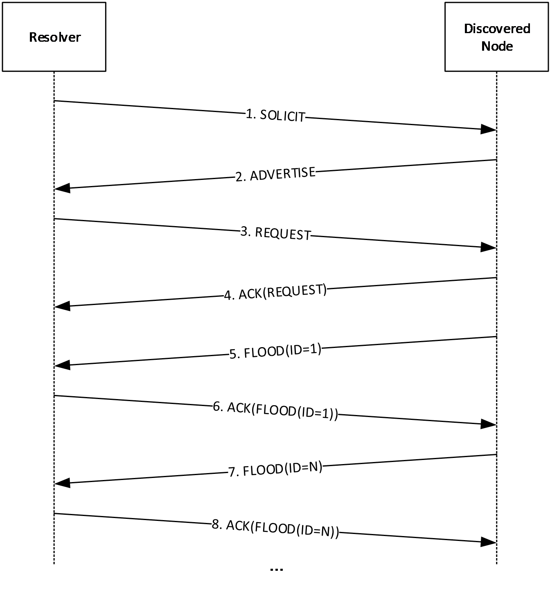

Figure 1: Node Communication with Discovered Node

**Note** The FLOOD messages in this conversation are not synchronous; the discovered node can send a second or third FLOOD message before it has received an ACK message for a previous FLOOD message.

The following is an example of what happens during a sample synchronization conversation:

- The Resolver sends a SOLICIT message to the discovered node to initiate the conversation. The SOLICIT message contains the following data:
- Hashed [**nonce**](#gt_nonce) used to identify the conversation.
- Route Entry for a locally registered key, if any.
- The discovered node responds with an ADVERTISE message that contains an array of node keys that it selected from its own cache.
The discovered node keeps track of the hashed nonce that identifies the conversation.

The discovered node also adds the Route Entry from the SOLICIT message to its own cache.

- When the Resolver receives the ADVERTISE message, it uses the **Acked Message ID** and the hashed nonce in the message to verify that it sent a corresponding SOLICIT message.
The Resolver then goes through the array of keys in the ADVERTISE message and selects the ones to include in its own cache. If it selects all of them, for example, it returns a REQUEST message to specify which keys it would like to obtain.

After the REQUEST message is sent, any state or context information held for the conversation is released.

- When the REQUEST message is received, the discovered node immediately returns an ACK message to indicate receipt and to avoid retransmission of the REQUEST message by the Resolver.
- The discovered node attempts to verify that the nonce in the REQUEST message is valid. This is done by hashing the nonce and comparing it with the state information saved from the SOLICIT message (see step 2). Because they match, the nonce is valid and the receiving node sends a FLOOD message for each key that is listed in the REQUEST message.
- The Resolver inspects each FLOOD message as it is received. If the **D** bit is clear (as specified in section 2.2.2.4) the Resolver returns an ACK message to indicate that it has received the FLOOD message. The Resolver then adds to its cache the [ROUTE_ENTRY](#Section_2.2.3.3) in the message.
<a id="Section_4.1.3"></a>
### 4.1.3 Key Resolution

The Resolver now attempts [**key**](#gt_key) resolution via the following steps:

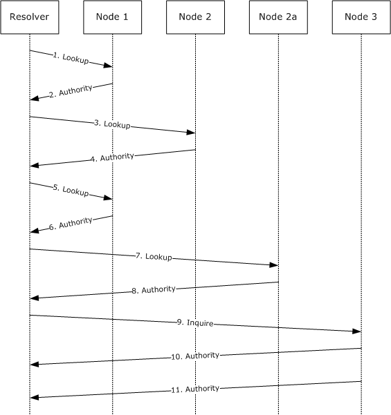

Figure 2: Key resolution

- The Resolver, seeking [**endpoint**](#gt_endpoint) information for a key registered by Node 3, creates a [LOOKUP](#Section_2.2.2.8) message. It first computes a corresponding key (which is named 3 in this example), specifies 3 as the Target Key, and sets itself as the first entry in the path. It then sets the **Validate Key** field to be the (numerically) closest key it has in its cache to the Target Key, and sends the packet to the corresponding [**node**](#gt_node) (in this case, Node 1).
- Upon receiving the LOOKUP message, Node 1 first searches its cache and determines if it contains the key found in the **Validate Key** field. It does not, so it instead finds three route entries that are closer to the Target Key than the Validate Key. It creates an [AUTHORITY](#Section_2.2.2.6) message and randomly selects one of the three route entries to put in the **RouteEntry** field. It then returns the AUTHORITY message to the Resolver.
- The Resolver extracts the key (Node 2) from the **RouteEntry** field in the returned AUTHORITY message, and creates a new LOOKUP message, adding Node 1 to the path. It sets the **Validate Key** field to the DRT found in the **RouteEntry** field of the AUTHORITY message, and sends it to the corresponding node (Node 2).
- Upon receiving the LOOKUP message, Node 2 first searches its cache and determines if it contains the key found in the **Validate Key** field. It does not, and also has no keys in its cache that are closer to the Target Key than the **Validate Key**. It returns an AUTHORITY message with the **RouteEntry** field set to NULL.
- Finding the **RouteEntry** field in the returned AUTHORITY message empty, the Resolver backtracks by creating a new LOOKUP message, adding Node 2 to the path, and sending it to the previous node in the path (Node 1).
- Upon receiving the LOOKUP message, Node 1 responds exactly as it did in step 2, making certain not to return any keys that are already in the path (for example, Node 2 will not be returned). In this case, it returns Node 2a.
- The Resolver extracts the key from the **RouteEntry** field in the returned AUTHORITY message. Since Node 2 is already added to the path in step 7, it is not added to the path a second time. The Resolver creates a LOOKUP message, setting the **Validate Key** field to the key found in the **RouteEntry** field of the AUTHORITY message, and sends it to the corresponding node (Node 2a).
- Upon receiving the LOOKUP message, Node 2a first searches its cache and determines if it contains the key found in the **Validate Key** field. It does, and it creates an AUTHORITY message with the **RouteEntry** field set to the target node (Node 3). It then returns the AUTHORITY message to the Resolver.
- The Resolver, finding the key in the **RouteEntry** field of the returned AUTHORITY message equal to the Target Key, initiates validation by sending an [INQUIRE](#Section_2.2.2.5) message to Node 3.
Node 3 searches its Locally Registered Key List for the presence of the Target Key. When it is found, it constructs an [AUTHORITY_BUFFER](#Section_2.2.2.6.1) calling upon the SecurityModule of the higher-layer application to generate structures to authenticate the target key.

The AUTHORITY_BUFFER message is 2000 bytes (exceeding the 1188 byte limit), sp the buffer is split into two fragments: the first has 1188 bytes, and the second has 812 bytes. Each fragment is sent in a separate AUTHORITY message.

- The Resolver, seeing that the value of the **Size** field (2000) exceeds 1188, knows that the AUTHORITY_BUFFER message will arrive in multiple AUTHORITY messages. After receiving all the AUTHORITY messages, reassembling the AUTHORITY_BUFFER message, and validating that the [**CPA**](#gt_certified-peer-address-cpa) corresponds to the Key of interest, the Resolver reports the endpoint information back to the application.
<a id="Section_4.2"></a>
## 4.2 Registering a Key

To register a Key, a [**node**](#gt_node) performs the resolve operation as specified in section [4.1.3](#Section_4.1.3), with the Target ID set to the key to be registered + 1. For example, if key 6 is being registered, it would perform a resolve operation seeking key 7.

As other nodes receive [LOOKUP](#Section_2.2.2.8) messages from the registering node, they add the registering node's key to their [**leaf sets**](#gt_leaf-set) when appropriate. Likewise, the registering node will populate its own leaf set with the keys it finds in the received [AUTHORITY](#Section_2.2.2.6) messages.

<a id="Section_4.3"></a>
## 4.3 Unregistering a Key

When a key is unregistered, a **Revoke CPA** is sent to two entries from the [**leaf set**](#gt_leaf-set) of the ID being unregistered. One entry is the numerically closest ID greater than the local ID and the other entry is the numerically closest ID less than the local ID. Each recipient checks its cache to determine whether an entry exists for the key. If one is found, the recipient removes it from its cache. If the entry is in a leaf set of a locally registered ID, the [**node**](#gt_node) sends [FLOOD](#Section_2.2.2.4) messages with the **Revoke CPA** on to other members of its leaf set.


Figure 3: DRT Name Revocation Process

- The unregistering node (Node 6) creates a **Revoke CPA** for the Key. The **R** field of the **CPA** is set to indicate that this is a **Revoke CPA**. It puts the **Revoke CPA** in a FLOOD message and sends it to the node in its leaf set with the closest registered key lower than its own (for example, Node 5). Upon receiving the FLOOD message, Node 5 removes the key of the unregistering node from its local cache. If Node 5 has the key of the unregistering node in its leaf set, it forwards the **Revoke CPA** to the node in its leaf set with the closest registered key lower than its own (for example, Node 4), where it is processed exactly as described here. This continues until the **Revoke CPA** reaches a node that does not have the key of the unregistering node in either its cache or its leaf set, at which point possessing (and forwarding) of the **Revoke CPA** ceases.
- Node 6 sends an identical FLOOD message to the node in its leaf set with the closest registered key greater than its own (for example, Node 7). Node 7 processes the **Revoke CPA** exactly as described in step 1, except all **Revoke CPA** forwards will be converted to nodes with numerically greater keys.
- The unregistration of Node 6 produces gaps in the leaf sets of its nearby nodes. Node 6 therefore sends a FLOOD message to the node in its leaf set with the smallest key (for example, Node 1). The FLOOD message informs the recipient of the node with the next greater key than the unregistering node (for example, Node 7). Node 1 will place the Node 7 key in its leaf set where the Node 6 key used to reside.
- Node 6 repeats step 3, notifying the node in its leaf set with the greatest key (for example, Node 11) of the node with the next lower key than the unregistering node (for example, Node 5), allowing Node 11 to repair its leaf set as well.
<a id="Section_4.4"></a>
## 4.4 Flooding a New Leaf Set Member

Assume there is a registered [**node**](#gt_node) with a Local ID of Y, and that its [**leaf set**](#gt_leaf-set) consists of {B, C, D, E, F} on one side and {G, H, I, J, K} on the other. Assume that Node Y learns about a new [ROUTE_ENTRY](#Section_2.2.3.3) with the ID of X, which is closer than G currently is.

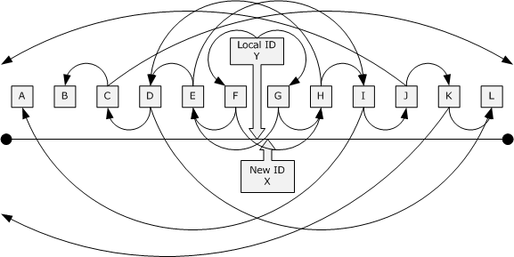

Figure 4: Leaf Set Node arrangement example

**Note** This sequence illustrates the cascading flood activity when a new ID is discovered. Prior to any node propagating a [FLOOD](#Section_2.2.2.4) message, the node will send an [INQUIRE](#Section_2.2.2.5) message to the newly discovered node. It will only propagate the FLOOD message when an [AUTHORITY](#Section_2.2.2.6) message has been received back from the new node.

The following events will take place.

- X displaces K in Y's leaf set.
- This is the first wave of flooding for Node X.
- Y selects the two nearest route entries in its cache with one being less than Y and one being greater than Y. In this case, nodes F and G are chosen.
- Y builds a FLOOD message with an Already Flooded List containing the address that Y is using and the addresses of F and G. The FLOOD message is sent to F and G.
- When F receives the FLOOD message from Y of Node X, Y determines whether it already knows about X. If it does, it drops the FLOOD message with no further action. It does not, it adds X to its leaf set.
- F selects the two nearest route entries to its local ID, which do not have addresses in the Already Flooded List, with one being less than F and one being greater than F. E and H will be chosen.
- F builds a FLOOD message with the Already Flooded List having an address of E and H appended to it. The list now contains {Y, F, G, E, H}.
- F sends the FLOOD message of X to E and H.
- When G receives the FLOOD message from Y of Node X, Y determines whether it already knows about X. If it does, it drops the FLOOD message with no further action. It does not, it adds X to its leaf set.
- G selects the two nearest route entries to its local key, which do not have addresses in the Already Flooded List with one being less than F and one being greater than F. E and H are chosen.
- G will build a FLOOD message with the Already Flooded List having an address of E and H appended to it. The list will now contain {Y, F, G, E, H}.
- G will now send the FLOOD message of X to E and H.
- This begins the second wave of flooding for Node X.
- Node E and Node H both receive two copies of the FLOOD message of X, one forwarded from F and one from G. When processing the second instance of the flood, E and H ignore the second one because X is either in their leaf set or in a list of route entries being checked.
- E and H basically repeat the process FLOOD to D and I. The Already Flooded List contains {Y, F, G, E, H, D, I}.
- This begins the third wave of flooding for Node X.
- Nodes D and I receive the FLOOD message of X. D and I both forward the FLOOD message to two neighbors, but because the Already Flooded List contains all the nodes in half or each node's leaf set, one of the flood targets will likely not be the next nearest neighbor in that direction.
- D forwards to C, which is in its leaf set, but it is not necessarily going to flood to J because J is outside of its leaf set. In this example, it forwards to L because it does not recognize J or K. The Already Flooded List contains {Y, F, G, H, D, I, C, L}.
- I forwards to J, which is in its leaf set, but is not necessarily going to forward to C because C is outside of its leaf set. In this example, it forwards to A because it does not recognize B and C. The Already Flooded List contains {Y, F, G, H, D, I, A, J }.
- This begins the fourth wave of flooding for Node X.
- Nodes A, C, J, and L will receive the FLOOD message of X. A and L will not forward the FLOOD message because X will fall outside their leaf sets.
- Nodes C and J will forward the FLOOD message because X is still in their leaf sets.
- C will FLOOD message to B and to some other node falling outside the leaf set.
- J will FLOOD message to K and some other node falling outside the leaf set.
- This begins the fifth wave of flooding for Node X.
- B does not forward the FLOOD message because X does not fall in its leaf set.
- K will end of forwarding the FLOOD message because X still falls in its leaf set. K will FLOOD to L and some other node that is outside its leaf set.
- This begins the sixth wave of flooding for Node X.
- L does not forward the FLOOD message because X does not fall in its leaf set.
- Any of the other more remote nodes also do not forward the FLOOD message.
- Additionally, all of the nodes that added X to their leaf set will FLOOD message their own route entry back to X. That way X will discover all the nodes that consider X to be in their leaf set. These transactions are not included in the diagram to reduce the clutter.
<a id="Section_5"></a>
# 5 Security

<a id="Section_5.1"></a>
## 5.1 Security Considerations for Implementers

Many Denial-of-Service (DoS) attack mechanisms exist (for example, duplicate address detection or switch port map poisoning) beyond DRT. This makes Dos attacks from on-link [**nodes**](#gt_node) less important. This class of attacks is dealt with at layer 2, or administratively (socially).

Section [3.2.5.3](#Section_3.2.5.3) includes mitigation against denial-of-service attacks where an attacker sends [SOLICIT](#Section_2.2.2.1) messages to cause a DRT node to create state.

Another potential threat is pollution of a node's Route Entry Cache with bad entries. DRT mitigates this by doing a return routability check to ensure that the DRT node with the address that it will use in the [ROUTE_ENTRY](#Section_2.2.3.3) actually claims to be publishing the key in each new route entry, before adding it to the cache.

<a id="Section_5.2"></a>
## 5.2 Index of Security Parameters

None.

<a id="Section_6"></a>
# 6 Appendix A: Product Behavior

The information in this specification is applicable to the following Microsoft products or supplemental software. References to product versions include updates to those products.

- Windows 7 operating system
- Windows Server 2008 R2 operating system
- Windows 8 operating system
- Windows Server 2012 operating system
- Windows 8.1 operating system
- Windows Server 2012 R2 operating system
- Windows 10 operating system
- Windows Server 2016 operating system
- Windows Server operating system
- Windows Server 2019 operating system
- Windows Server 2022 operating system
- Windows 11 operating system
Exceptions, if any, are noted in this section. If an update version, service pack or Knowledge Base (KB) number appears with a product name, the behavior changed in that update. The new behavior also applies to subsequent updates unless otherwise specified. If a product edition appears with the product version, behavior is different in that product edition.

Unless otherwise specified, any statement of optional behavior in this specification that is prescribed using the terms "SHOULD" or "SHOULD NOT" implies product behavior in accordance with the SHOULD or SHOULD NOT prescription. Unless otherwise specified, the term "MAY" implies that the product does not follow the prescription.

<1> Section 3.1.2: Windows performs periodic cache maintenance every 15 seconds when the number of cache entries is more than 2; otherwise, it performs periodic cache maintenance every 10 seconds.

<2> Section 3.1.4.2: Windows picks ten (or as many as exist, if less than ten) randomly chosen [**nodes**](#gt_node) that are in the Route Entry Cache (see sections [3.1.1](#Section_3.1) and [3.2.1.1](#Section_3.2.1.1)).

<3> Section 3.1.6.1: Windows attempts to maintain a cache of at least 10 route entries (or all route entries in the cloud, if there are fewer than 10), the keys of which are evenly distributed around the number space.

<4> Section 3.2.1.1: Windows achieves Requirement 1 by implementing a multi-level cache where each cache level contains a fixed number of keys that covers a progressively smaller fragment of the total key space. The lowest level of the cache (which is the leaf set) is the densest and it is centered on a key published by the local node.

<5> Section 3.2.6.2: Windows attempts to "balance" its cache. Balancing the cache involves checking each cache level to determine that no large gaps exist between entries. The allowable gap size depends on the cache level; it is expected to be smaller for each level down. If a large gap is found, an attempt is made to fill it by sending a [LOOKUP](#Section_2.2.2.8) message for a key in the middle of the gap. The precision level of the LOOKUP message match is set to be just sufficient to fill the gap.

<a id="Section_7"></a>
# 7 Change Tracking

This section identifies changes that were made to this document since the last release. Changes are classified as Major, Minor, or None.

The revision class **Major** means that the technical content in the document was significantly revised. Major changes affect protocol interoperability or implementation. Examples of major changes are:

- A document revision that incorporates changes to interoperability requirements.
- A document revision that captures changes to protocol functionality.
The revision class **Minor** means that the meaning of the technical content was clarified. Minor changes do not affect protocol interoperability or implementation. Examples of minor changes are updates to clarify ambiguity at the sentence, paragraph, or table level.

The revision class **None** means that no new technical changes were introduced. Minor editorial and formatting changes may have been made, but the relevant technical content is identical to the last released version.

The changes made to this document are listed in the following table. For more information, please contact [dochelp@microsoft.com](mailto:dochelp@microsoft.com).

| Section | Description | Revision class |
| --- | --- | --- |
| [2.2.3.1.3.1](#Section_2.2.3.1.3.1) Signature Structure | Updated the reference for RSASSA. | Major |
| [2.2.3.1.5.1.1](#Section_2.2.3.1.5.1.1) PUBLIC_KEY | Updated the reference for RSASSA. | Major |
| [6](#Section_6) Appendix A: Product Behavior | Updated for this version of Windows Client. | Major |

<a id="revision-history"></a>

## Revision History

| Date | Version | Revision Class | Comments |
| --- | --- | --- | --- |
| 12/5/2008 | 0.1 | Major | Initial Availability |
| 1/16/2009 | 1.0 | Major | Updated and revised the technical content. |
| 2/27/2009 | 1.0.1 | Editorial | Changed language and formatting in the technical content. |
| 4/10/2009 | 1.0.2 | Editorial | Changed language and formatting in the technical content. |
| 5/22/2009 | 1.0.3 | Editorial | Changed language and formatting in the technical content. |
| 7/2/2009 | 2.0 | Major | Updated and revised the technical content. |
| 8/14/2009 | 3.0 | Major | Updated and revised the technical content. |
| 9/25/2009 | 3.1 | Minor | Clarified the meaning of the technical content. |
| 11/6/2009 | 3.1.1 | Editorial | Changed language and formatting in the technical content. |
| 12/18/2009 | 3.1.2 | Editorial | Changed language and formatting in the technical content. |
| 1/29/2010 | 4.0 | Major | Updated and revised the technical content. |
| 3/12/2010 | 4.0.1 | Editorial | Changed language and formatting in the technical content. |
| 4/23/2010 | 4.0.2 | Editorial | Changed language and formatting in the technical content. |
| 6/4/2010 | 5.0 | Major | Updated and revised the technical content. |
| 7/16/2010 | 5.0 | None | No changes to the meaning, language, or formatting of the technical content. |
| 8/27/2010 | 6.0 | Major | Updated and revised the technical content. |
| 10/8/2010 | 7.0 | Major | Updated and revised the technical content. |
| 11/19/2010 | 8.0 | Major | Updated and revised the technical content. |
| 1/7/2011 | 9.0 | Major | Updated and revised the technical content. |
| 2/11/2011 | 10.0 | Major | Updated and revised the technical content. |
| 3/25/2011 | 11.0 | Major | Updated and revised the technical content. |
| 5/6/2011 | 11.0 | None | No changes to the meaning, language, or formatting of the technical content. |
| 6/17/2011 | 11.1 | Minor | Clarified the meaning of the technical content. |
| 9/23/2011 | 11.1 | None | No changes to the meaning, language, or formatting of the technical content. |
| 12/16/2011 | 12.0 | Major | Updated and revised the technical content. |
| 3/30/2012 | 12.0 | None | No changes to the meaning, language, or formatting of the technical content. |
| 7/12/2012 | 12.0 | None | No changes to the meaning, language, or formatting of the technical content. |
| 10/25/2012 | 13.0 | Major | Updated and revised the technical content. |
| 1/31/2013 | 13.0 | None | No changes to the meaning, language, or formatting of the technical content. |
| 8/8/2013 | 14.0 | Major | Updated and revised the technical content. |
| 11/14/2013 | 14.0 | None | No changes to the meaning, language, or formatting of the technical content. |
| 2/13/2014 | 15.0 | Major | Updated and revised the technical content. |
| 5/15/2014 | 15.0 | None | No changes to the meaning, language, or formatting of the technical content. |
| 6/30/2015 | 16.0 | Major | Significantly changed the technical content. |
| 10/16/2015 | 16.0 | None | No changes to the meaning, language, or formatting of the technical content. |
| 7/14/2016 | 16.0 | None | No changes to the meaning, language, or formatting of the technical content. |
| 6/1/2017 | 16.0 | None | No changes to the meaning, language, or formatting of the technical content. |
| 9/15/2017 | 17.0 | Major | Significantly changed the technical content. |
| 9/12/2018 | 18.0 | Major | Significantly changed the technical content. |
| 4/7/2021 | 19.0 | Major | Significantly changed the technical content. |
| 6/25/2021 | 20.0 | Major | Significantly changed the technical content. |
