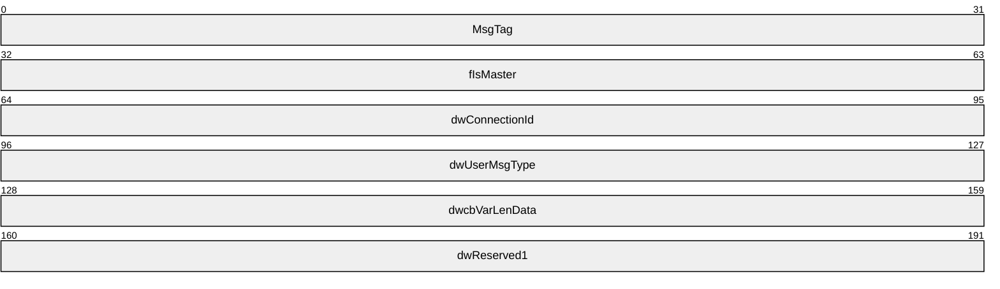
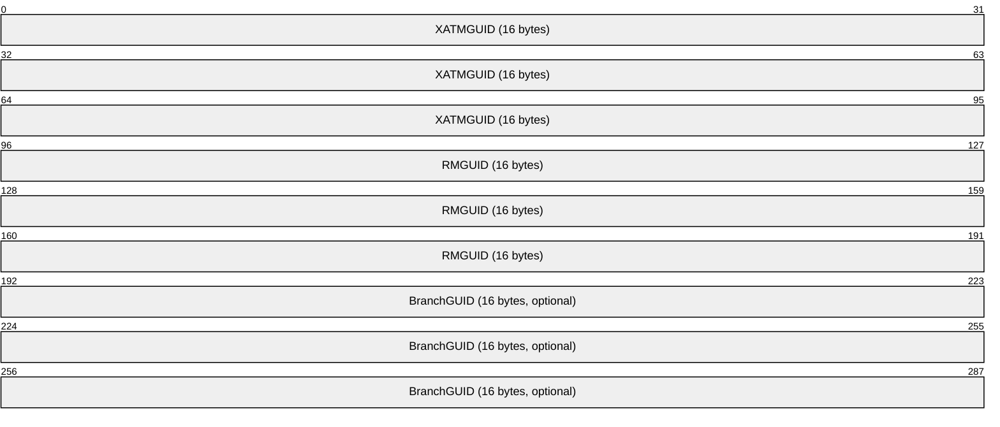
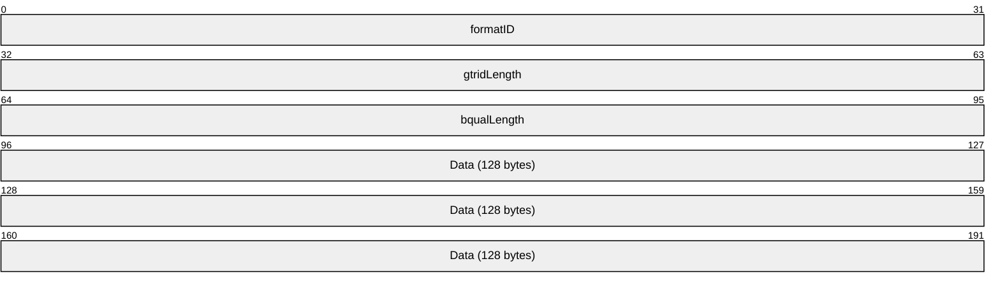
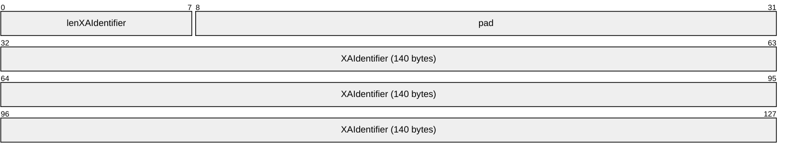
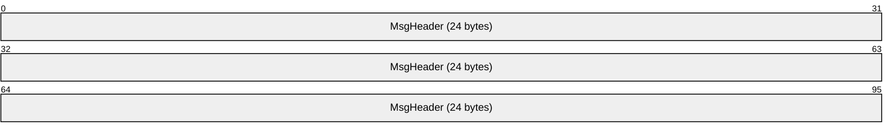
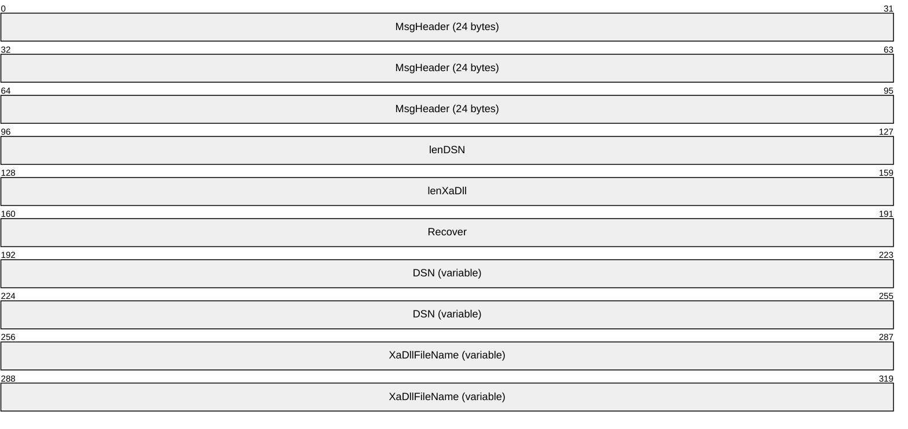
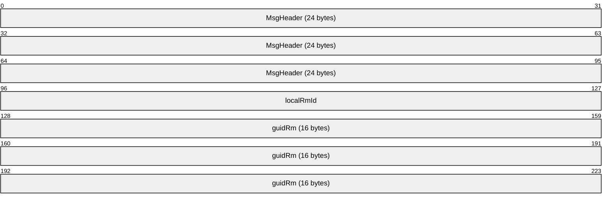
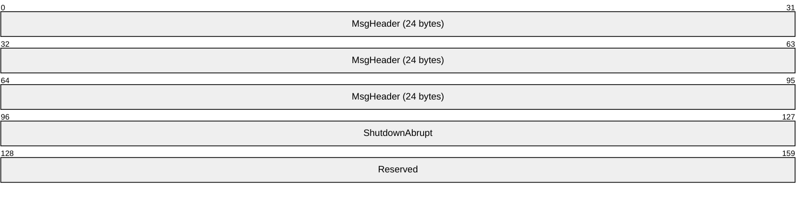

# [MC-DTCXA]: MSDTC Connection Manager: OleTx XA Protocol

Table of Contents

<details>
<summary>1 Introduction</summary>

- [1 Introduction](#Section_1)
  - [1.1 Glossary](#Section_1.1)
  - [1.2 References](#Section_1.2)
    - [1.2.1 Normative References](#Section_1.2.1)
    - [1.2.2 Informative References](#Section_1.2.2)
  - [1.3 Overview](#Section_1.3)
    - [1.3.1 Scenarios](#Section_1.3.1)
      - [1.3.1.1 OleTx Resource Managers Enlisting with XA Transaction Managers](#Section_1.3.1.1)
        - [1.3.1.1.1 Transaction Enlistment and Completion](#Section_1.3.1.1.1)
        - [1.3.1.1.2 Transaction Recovery](#Section_1.3.1.1.2)
      - [1.3.1.2 XA Resource Managers Enlisting with Transaction Managers](#Section_1.3.1.2)
        - [1.3.1.2.1 Transaction Recovery](#Section_1.3.1.2.1)
        - [1.3.1.2.2 Two-Pipe Model](#Section_1.3.1.2.2)
          - [1.3.1.2.2.1 XA Resource Manager Registration and Unregistration](#Section_1.3.1.2.2.1)
          - [1.3.1.2.2.2 Transaction Enlistment and Completion](#Section_1.3.1.2.2.2)
        - [1.3.1.2.3 One-Pipe Model](#Section_1.3.1.2.3)
          - [1.3.1.2.3.1 XA Resource Manager Registration and Unregistration](#Section_1.3.1.2.3.1)
          - [1.3.1.2.3.2 Transaction Enlistment and Completion](#Section_1.3.1.2.3.2)
    - [1.3.2 Roles](#Section_1.3.2)
      - [1.3.2.1 XA Resource Manager Bridge Role](#Section_1.3.2.1)
      - [1.3.2.2 XA Superior Transaction Manager Role](#Section_1.3.2.2)
      - [1.3.2.3 Transaction Manager Role](#Section_1.3.2.3)
        - [1.3.2.3.1 XA Resource Manager Bridge Facet](#Section_1.3.2.3.1)
        - [1.3.2.3.2 XA Subordinate Transaction Manager Facet](#Section_1.3.2.3.2)
  - [1.4 Relationship to Other Protocols](#Section_1.4)
  - [1.5 Prerequisites/Preconditions](#Section_1.5)
  - [1.6 Applicability Statement](#Section_1.6)
  - [1.7 Versioning and Capability Negotiation](#Section_1.7)
  - [1.8 Vendor-Extensible Fields](#Section_1.8)
  - [1.9 Standards Assignments](#Section_1.9)
</details>

<details>
<summary>2 Messages</summary>

- [2 Messages](#Section_2)
  - [2.1 Transport](#Section_2.1)
  - [2.2 Message Syntax](#Section_2.2)
    - [2.2.1 Common Structures](#Section_2.2.1)
      - [2.2.1.1 MESSAGE_PACKET](#Section_2.2.1.1)
      - [2.2.1.2 XA_BQUAL_1](#Section_2.2.1.2)
      - [2.2.1.3 XA_XID](#Section_2.2.1.3)
      - [2.2.1.4 XA_UOW](#Section_2.2.1.4)
    - [2.2.2 Enumeration](#Section_2.2.2)
      - [2.2.2.1 Connection Types](#Section_2.2.2.1)
    - [2.2.3 Connection Types Relevant to XA Resource Manager Bridges and XA Resource Manager Bridge Facets](#Section_2.2.3)
      - [2.2.3.1 Versioning](#Section_2.2.3.1)
      - [2.2.3.2 CONNTYPE_XATM_OPEN](#Section_2.2.3.2)
        - [2.2.3.2.1 XATMUSER_MTAG_E_RMNONEXISTENT](#Section_2.2.3.2.1)
        - [2.2.3.2.2 XATMUSER_MTAG_E_RMNOTAVAILABLE](#Section_2.2.3.2.2)
        - [2.2.3.2.3 XATMUSER_MTAG_E_RMOPENFAILED](#Section_2.2.3.2.3)
        - [2.2.3.2.4 XATMUSER_MTAG_E_RMPROTOCOL](#Section_2.2.3.2.4)
        - [2.2.3.2.5 XATMUSER_MTAG_RMOPEN](#Section_2.2.3.2.5)
        - [2.2.3.2.6 XATMUSER_MTAG_RMOPENOK](#Section_2.2.3.2.6)
      - [2.2.3.3 CONNTYPE_XATM_OPENONEPIPE](#Section_2.2.3.3)
        - [2.2.3.3.1 XATMUSER_MTAG_E_CONFIGLOGWRITEFAILED](#Section_2.2.3.3.1)
        - [2.2.3.3.2 XATMUSER_MTAG_E_RMCLOSEFAILED](#Section_2.2.3.3.2)
        - [2.2.3.3.3 XATMUSER_MTAG_E_RMCLOSERMNOTAVAILABLE](#Section_2.2.3.3.3)
        - [2.2.3.3.4 XATMUSER_MTAG_E_RMCLOSETMERROR](#Section_2.2.3.3.4)
        - [2.2.3.3.5 XATMUSER_MTAG_E_RMCLOSETMNOTAVAILABLE](#Section_2.2.3.3.5)
        - [2.2.3.3.6 XATMUSER_MTAG_E_RMCLOSEUNEXPECTED](#Section_2.2.3.3.6)
        - [2.2.3.3.7 XATMUSER_MTAG_RMCLOSE](#Section_2.2.3.3.7)
        - [2.2.3.3.8 XATMUSER_MTAG_RMCLOSEOK](#Section_2.2.3.3.8)
      - [2.2.3.4 CONNTYPE_XATM_ENLIST](#Section_2.2.3.4)
        - [2.2.3.4.1 XATMUSER_MTAG_E_ENLISTMENTDUPLICATE](#Section_2.2.3.4.1)
        - [2.2.3.4.2 XATMUSER_MTAG_E_ENLISTMENTFAILED](#Section_2.2.3.4.2)
        - [2.2.3.4.3 XATMUSER_MTAG_E_ENLISTMENTIMPFAILED](#Section_2.2.3.4.3)
        - [2.2.3.4.4 XATMUSER_MTAG_E_ENLISTMENTNOMEMORY](#Section_2.2.3.4.4)
        - [2.2.3.4.5 XATMUSER_MTAG_E_ENLISTMENTRMNOTFOUND](#Section_2.2.3.4.5)
        - [2.2.3.4.6 XATMUSER_MTAG_E_ENLISTMENTRMRECOVERING](#Section_2.2.3.4.6)
        - [2.2.3.4.7 XATMUSER_MTAG_E_ENLISTMENTRMUNAVAILABLE](#Section_2.2.3.4.7)
        - [2.2.3.4.8 XATMUSER_MTAG_E_ENLISTMENTTOOLATE](#Section_2.2.3.4.8)
        - [2.2.3.4.9 XATMUSER_MTAG_ENLIST](#Section_2.2.3.4.9)
        - [2.2.3.4.10 XATMUSER_MTAG_ENLISTMENTOK](#Section_2.2.3.4.10)
    - [2.2.4 Connection Types Relevant to XA Superior Transaction Managers and XA Subordinate Transaction Manager Facets](#Section_2.2.4)
      - [2.2.4.1 Versioning](#Section_2.2.4.1)
      - [2.2.4.2 CONNTYPE_XAUSER_CONTROL](#Section_2.2.4.2)
        - [2.2.4.2.1 XAUSER_CONTROL_MTAG_CREATE](#Section_2.2.4.2.1)
        - [2.2.4.2.2 XAUSER_CONTROL_MTAG_CREATE_NO_MEM](#Section_2.2.4.2.2)
        - [2.2.4.2.3 XAUSER_CONTROL_MTAG_CREATED](#Section_2.2.4.2.3)
        - [2.2.4.2.4 XAUSER_CONTROL_MTAG_RECOVER](#Section_2.2.4.2.4)
        - [2.2.4.2.5 XAUSER_CONTROL_MTAG_RECOVER_NO_MEM](#Section_2.2.4.2.5)
        - [2.2.4.2.6 XAUSER_CONTROL_MTAG_RECOVER_REPLY](#Section_2.2.4.2.6)
      - [2.2.4.3 CONNTYPE_XAUSER_XACT_START](#Section_2.2.4.3)
        - [2.2.4.3.1 XAUSER_XACT_MTAG_START](#Section_2.2.4.3.1)
        - [2.2.4.3.2 XAUSER_XACT_MTAG_START_DUPLICATE](#Section_2.2.4.3.2)
        - [2.2.4.3.3 XAUSER_XACT_MTAG_START_LOG_FULL](#Section_2.2.4.3.3)
        - [2.2.4.3.4 XAUSER_XACT_MTAG_START_NO_MEM](#Section_2.2.4.3.4)
        - [2.2.4.3.5 XAUSER_XACT_MTAG_STARTED](#Section_2.2.4.3.5)
      - [2.2.4.4 CONNTYPE_XAUSER_XACT_BRANCH_START](#Section_2.2.4.4)
      - [2.2.4.5 CONNTYPE_XAUSER_XACT_OPEN](#Section_2.2.4.5)
        - [2.2.4.5.1 XAUSER_XACT_MTAG_ABORT](#Section_2.2.4.5.1)
        - [2.2.4.5.2 XAUSER_XACT_MTAG_COMMIT](#Section_2.2.4.5.2)
        - [2.2.4.5.3 XAUSER_XACT_MTAG_OPEN](#Section_2.2.4.5.3)
        - [2.2.4.5.4 XAUSER_XACT_MTAG_OPEN_NOT_FOUND](#Section_2.2.4.5.4)
        - [2.2.4.5.5 XAUSER_XACT_MTAG_OPENED](#Section_2.2.4.5.5)
        - [2.2.4.5.6 XAUSER_XACT_MTAG_PREPARE](#Section_2.2.4.5.6)
        - [2.2.4.5.7 XAUSER_XACT_MTAG_PREPARE_ABORT](#Section_2.2.4.5.7)
        - [2.2.4.5.8 XAUSER_XACT_MTAG_PREPARE_SINGLEPHASE_INDOUBT](#Section_2.2.4.5.8)
        - [2.2.4.5.9 XAUSER_XACT_MTAG_REQUEST_COMPLETED](#Section_2.2.4.5.9)
        - [2.2.4.5.10 XAUSER_XACT_MTAG_REQUEST_FAILED_BAD_PROTOCOL](#Section_2.2.4.5.10)
      - [2.2.4.6 CONNTYPE_XAUSER_XACT_BRANCH_OPEN](#Section_2.2.4.6)
        - [2.2.4.6.1 XAUSER_XACT_MTAG_READONLY](#Section_2.2.4.6.1)
      - [2.2.4.7 CONNTYPE_XAUSER_XACT_MIGRATE](#Section_2.2.4.7)
        - [2.2.4.7.1 XAUSER_XACT_MTAG_RESUME](#Section_2.2.4.7.1)
        - [2.2.4.7.2 XAUSER_XACT_MTAG_RESUME_DONE](#Section_2.2.4.7.2)
        - [2.2.4.7.3 XAUSER_XACT_MTAG_SUSPEND_WITH_MIGRATE](#Section_2.2.4.7.3)
        - [2.2.4.7.4 XAUSER_XACT_MTAG_SUSPEND_WITH_MIGRATE_DONE](#Section_2.2.4.7.4)
        - [2.2.4.7.5 XAUSER_XACT_MTAG_TRANSACTION_NOT_SUSPENDED](#Section_2.2.4.7.5)
      - [2.2.4.8 CONNTYPE_XAUSER_XACT_MIGRATE2](#Section_2.2.4.8)
        - [2.2.4.8.1 XAUSER_XACT_MTAG_RESUME_DONE](#Section_2.2.4.8.1)
</details>

<details>
<summary>3 Protocol Details</summary>

- [3 Protocol Details](#Section_3)
  - [3.1 Common Details](#Section_3.1)
    - [3.1.1 Abstract Data Model](#Section_3.1.1)
    - [3.1.2 Timers](#Section_3.1.2)
    - [3.1.3 Initialization](#Section_3.1.3)
    - [3.1.4 Protocol Versioning Details](#Section_3.1.4)
    - [3.1.5 Higher-Layer Triggered Events](#Section_3.1.5)
    - [3.1.6 Processing Events and Sequencing Rules](#Section_3.1.6)
    - [3.1.7 Timer Events](#Section_3.1.7)
    - [3.1.8 Other Local Events](#Section_3.1.8)
      - [3.1.8.1 Disconnect Connection](#Section_3.1.8.1)
      - [3.1.8.2 Connection Disconnected](#Section_3.1.8.2)
  - [3.2 XA Subordinate Transaction Manager Facet Details](#Section_3.2)
    - [3.2.1 Abstract Data Model](#Section_3.2.1)
      - [3.2.1.1 Versioning](#Section_3.2.1.1)
      - [3.2.1.2 CONNTYPE_XAUSER_CONTROL Acceptor States](#Section_3.2.1.2)
        - [3.2.1.2.1 Idle](#Section_3.2.1.2.1)
        - [3.2.1.2.2 Processing Create Request](#Section_3.2.1.2.2)
        - [3.2.1.2.3 Active](#Section_3.2.1.2.3)
        - [3.2.1.2.4 Ended](#Section_3.2.1.2.4)
        - [3.2.1.2.5 State Diagram](#Section_3.2.1.2.5)
      - [3.2.1.3 CONNTYPE_XAUSER_XACT_START Acceptor States](#Section_3.2.1.3)
        - [3.2.1.3.1 Idle](#Section_3.2.1.3.1)
        - [3.2.1.3.2 Processing Start Request](#Section_3.2.1.3.2)
        - [3.2.1.3.3 Active](#Section_3.2.1.3.3)
        - [3.2.1.3.4 Ended](#Section_3.2.1.3.4)
        - [3.2.1.3.5 State Diagram](#Section_3.2.1.3.5)
      - [3.2.1.4 CONNTYPE_XAUSER_XACT_OPEN Acceptor States](#Section_3.2.1.4)
        - [3.2.1.4.1 Idle](#Section_3.2.1.4.1)
        - [3.2.1.4.2 Processing Open Request](#Section_3.2.1.4.2)
        - [3.2.1.4.3 Active](#Section_3.2.1.4.3)
        - [3.2.1.4.4 Ended](#Section_3.2.1.4.4)
        - [3.2.1.4.5 State Diagram](#Section_3.2.1.4.5)
      - [3.2.1.5 CONNTYPE_XAUSER_XACT_MIGRATE Acceptor States](#Section_3.2.1.5)
        - [3.2.1.5.1 Idle](#Section_3.2.1.5.1)
        - [3.2.1.5.2 Processing Migrate Request](#Section_3.2.1.5.2)
        - [3.2.1.5.3 Ended](#Section_3.2.1.5.3)
        - [3.2.1.5.4 State Diagram](#Section_3.2.1.5.4)
      - [3.2.1.6 CONNTYPE_XAUSER_XACT_BRANCH_START Acceptor States](#Section_3.2.1.6)
        - [3.2.1.6.1 Idle](#Section_3.2.1.6.1)
        - [3.2.1.6.2 Processing Start Request](#Section_3.2.1.6.2)
        - [3.2.1.6.3 Active](#Section_3.2.1.6.3)
        - [3.2.1.6.4 Ended](#Section_3.2.1.6.4)
        - [3.2.1.6.5 State Diagram](#Section_3.2.1.6.5)
      - [3.2.1.7 CONNTYPE_XAUSER_XACT_BRANCH_OPEN Acceptor States](#Section_3.2.1.7)
        - [3.2.1.7.1 Idle](#Section_3.2.1.7.1)
        - [3.2.1.7.2 Processing Open Request](#Section_3.2.1.7.2)
        - [3.2.1.7.3 Active](#Section_3.2.1.7.3)
        - [3.2.1.7.4 Ended](#Section_3.2.1.7.4)
        - [3.2.1.7.5 State Diagram](#Section_3.2.1.7.5)
      - [3.2.1.8 CONNTYPE_XAUSER_XACT_MIGRATE2 Acceptor States](#Section_3.2.1.8)
        - [3.2.1.8.1 Idle](#Section_3.2.1.8.1)
        - [3.2.1.8.2 Processing Migrate2 Request](#Section_3.2.1.8.2)
        - [3.2.1.8.3 Ended](#Section_3.2.1.8.3)
        - [3.2.1.8.4 State Diagram](#Section_3.2.1.8.4)
      - [3.2.1.9 XA Superior Enlistment State Diagram](#Section_3.2.1.9)
    - [3.2.2 Timers](#Section_3.2.2)
    - [3.2.3 Initialization](#Section_3.2.3)
    - [3.2.4 Higher-Layer Triggered Events](#Section_3.2.4)
    - [3.2.5 Processing Events and Sequencing Rules](#Section_3.2.5)
      - [3.2.5.1 CONNTYPE_XAUSER_CONTROL as Acceptor](#Section_3.2.5.1)
        - [3.2.5.1.1 Receiving an XAUSER_CONTROL_MTAG_CREATE Message](#Section_3.2.5.1.1)
        - [3.2.5.1.2 Receiving an XAUSER_CONTROL_MTAG_RECOVER Message](#Section_3.2.5.1.2)
        - [3.2.5.1.3 Connection Disconnected](#Section_3.2.5.1.3)
      - [3.2.5.2 CONNTYPE_XAUSER_XACT_START as Acceptor](#Section_3.2.5.2)
        - [3.2.5.2.1 Receiving an XAUSER_XACT_MTAG_START Message](#Section_3.2.5.2.1)
        - [3.2.5.2.2 Connection Disconnected](#Section_3.2.5.2.2)
      - [3.2.5.3 CONNTYPE_XAUSER_XACT_OPEN as Acceptor](#Section_3.2.5.3)
        - [3.2.5.3.1 Receiving an XAUSER_XACT_MTAG_OPEN Message](#Section_3.2.5.3.1)
        - [3.2.5.3.2 Receiving an XAUSER_XACT_MTAG_PREPARE Message](#Section_3.2.5.3.2)
        - [3.2.5.3.3 Receiving an XAUSER_XACT_MTAG_COMMIT Message](#Section_3.2.5.3.3)
        - [3.2.5.3.4 Receiving an XAUSER_XACT_MTAG_ABORT Message](#Section_3.2.5.3.4)
        - [3.2.5.3.5 Connection Disconnected](#Section_3.2.5.3.5)
      - [3.2.5.4 CONNTYPE_XAUSER_XACT_MIGRATE as Acceptor](#Section_3.2.5.4)
        - [3.2.5.4.1 Receiving an XAUSER_XACT_MTAG_SUSPEND_WITH_MIGRATE Message](#Section_3.2.5.4.1)
        - [3.2.5.4.2 Receiving an XAUSER_XACT_MTAG_RESUME Message](#Section_3.2.5.4.2)
      - [3.2.5.5 CONNTYPE_XAUSER_XACT_BRANCH_START as Acceptor](#Section_3.2.5.5)
        - [3.2.5.5.1 Receiving an XAUSER_XACT_MTAG_START Message](#Section_3.2.5.5.1)
        - [3.2.5.5.2 Connection Disconnected](#Section_3.2.5.5.2)
      - [3.2.5.6 CONNTYPE_XAUSER_XACT_BRANCH_OPEN as Acceptor](#Section_3.2.5.6)
        - [3.2.5.6.1 Receiving an XAUSER_XACT_MTAG_OPEN Message](#Section_3.2.5.6.1)
        - [3.2.5.6.2 Receiving an XAUSER_XACT_MTAG_PREPARE Message](#Section_3.2.5.6.2)
        - [3.2.5.6.3 Receiving an XAUSER_XACT_MTAG_COMMIT Message](#Section_3.2.5.6.3)
        - [3.2.5.6.4 Receiving an XAUSER_XACT_MTAG_ABORT Message](#Section_3.2.5.6.4)
        - [3.2.5.6.5 Connection Disconnected](#Section_3.2.5.6.5)
      - [3.2.5.7 CONNTYPE_XAUSER_XACT_MIGRATE2 as Acceptor](#Section_3.2.5.7)
        - [3.2.5.7.1 Receiving an XAUSER_XACT_MTAG_SUSPEND_WITH_MIGRATE Message](#Section_3.2.5.7.1)
        - [3.2.5.7.2 Receiving an XAUSER_XACT_MTAG_RESUME Message](#Section_3.2.5.7.2)
    - [3.2.6 Timer Events](#Section_3.2.6)
    - [3.2.7 Other Local Events](#Section_3.2.7)
      - [3.2.7.1 Commit Complete](#Section_3.2.7.1)
      - [3.2.7.2 Create Superior Enlistment Success](#Section_3.2.7.2)
      - [3.2.7.3 Create Superior Enlistment Failure](#Section_3.2.7.3)
      - [3.2.7.4 Phase Zero Complete](#Section_3.2.7.4)
      - [3.2.7.5 Phase One Complete](#Section_3.2.7.5)
      - [3.2.7.6 Recover In Doubt Transaction](#Section_3.2.7.6)
      - [3.2.7.7 Rollback Complete](#Section_3.2.7.7)
      - [3.2.7.8 Unilaterally Aborted](#Section_3.2.7.8)
  - [3.3 XA Superior Transaction Manager Details](#Section_3.3)
    - [3.3.1 Abstract Data Model](#Section_3.3.1)
      - [3.3.1.1 Versioning](#Section_3.3.1.1)
      - [3.3.1.2 TM_NOTHREADAFFINITY Flag](#Section_3.3.1.2)
      - [3.3.1.3 CONNTYPE_XAUSER_CONTROL Initiator States](#Section_3.3.1.3)
        - [3.3.1.3.1 Idle](#Section_3.3.1.3.1)
        - [3.3.1.3.2 Awaiting Creation Response](#Section_3.3.1.3.2)
        - [3.3.1.3.3 Active](#Section_3.3.1.3.3)
        - [3.3.1.3.4 Awaiting Recovery Response](#Section_3.3.1.3.4)
        - [3.3.1.3.5 Ended](#Section_3.3.1.3.5)
        - [3.3.1.3.6 State Diagram](#Section_3.3.1.3.6)
      - [3.3.1.4 CONNTYPE_XAUSER_XACT_START Initiator States](#Section_3.3.1.4)
        - [3.3.1.4.1 Idle](#Section_3.3.1.4.1)
        - [3.3.1.4.2 Awaiting Start Response](#Section_3.3.1.4.2)
        - [3.3.1.4.3 Active](#Section_3.3.1.4.3)
        - [3.3.1.4.4 Ended](#Section_3.3.1.4.4)
        - [3.3.1.4.5 State Diagram](#Section_3.3.1.4.5)
      - [3.3.1.5 CONNTYPE_XAUSER_XACT_OPEN Initiator States](#Section_3.3.1.5)
        - [3.3.1.5.1 Idle](#Section_3.3.1.5.1)
        - [3.3.1.5.2 Awaiting Open Response](#Section_3.3.1.5.2)
        - [3.3.1.5.3 Processing Opened Response](#Section_3.3.1.5.3)
        - [3.3.1.5.4 Awaiting Prepare Response](#Section_3.3.1.5.4)
        - [3.3.1.5.5 Awaiting Abort Response](#Section_3.3.1.5.5)
        - [3.3.1.5.6 Awaiting Commit Response](#Section_3.3.1.5.6)
        - [3.3.1.5.7 Ended](#Section_3.3.1.5.7)
        - [3.3.1.5.8 State Diagram](#Section_3.3.1.5.8)
      - [3.3.1.6 CONNTYPE_XAUSER_XACT_MIGRATE Initiator States](#Section_3.3.1.6)
        - [3.3.1.6.1 Idle](#Section_3.3.1.6.1)
        - [3.3.1.6.2 Awaiting Suspension Response](#Section_3.3.1.6.2)
        - [3.3.1.6.3 Awaiting Resumption Response](#Section_3.3.1.6.3)
        - [3.3.1.6.4 Ended](#Section_3.3.1.6.4)
        - [3.3.1.6.5 State Diagram](#Section_3.3.1.6.5)
      - [3.3.1.7 CONNTYPE_XAUSER_XACT_BRANCH_START Initiator States](#Section_3.3.1.7)
        - [3.3.1.7.1 Idle](#Section_3.3.1.7.1)
        - [3.3.1.7.2 Awaiting Start Response](#Section_3.3.1.7.2)
        - [3.3.1.7.3 Active](#Section_3.3.1.7.3)
        - [3.3.1.7.4 Ended](#Section_3.3.1.7.4)
        - [3.3.1.7.5 State Diagram](#Section_3.3.1.7.5)
      - [3.3.1.8 CONNTYPE_XAUSER_XACT_BRANCH_OPEN Initiator States](#Section_3.3.1.8)
        - [3.3.1.8.1 Idle](#Section_3.3.1.8.1)
        - [3.3.1.8.2 Awaiting Open Response](#Section_3.3.1.8.2)
        - [3.3.1.8.3 Processing Opened Response](#Section_3.3.1.8.3)
        - [3.3.1.8.4 Awaiting Prepare Response](#Section_3.3.1.8.4)
        - [3.3.1.8.5 Awaiting Abort Response](#Section_3.3.1.8.5)
        - [3.3.1.8.6 Awaiting Commit Response](#Section_3.3.1.8.6)
        - [3.3.1.8.7 Ended](#Section_3.3.1.8.7)
        - [3.3.1.8.8 State Diagram](#Section_3.3.1.8.8)
      - [3.3.1.9 CONNTYPE_XAUSER_XACT_MIGRATE2 Initiator States](#Section_3.3.1.9)
        - [3.3.1.9.1 Idle](#Section_3.3.1.9.1)
        - [3.3.1.9.2 Awaiting Suspension Response](#Section_3.3.1.9.2)
        - [3.3.1.9.3 Awaiting Resumption Response](#Section_3.3.1.9.3)
        - [3.3.1.9.4 Ended](#Section_3.3.1.9.4)
        - [3.3.1.9.5 State Diagram](#Section_3.3.1.9.5)
    - [3.3.2 Timers](#Section_3.3.2)
    - [3.3.3 Initialization](#Section_3.3.3)
    - [3.3.4 Higher-Layer Triggered Events](#Section_3.3.4)
      - [3.3.4.1 XA Lookup](#Section_3.3.4.1)
      - [3.3.4.2 Xa_close](#Section_3.3.4.2)
      - [3.3.4.3 Xa_commit](#Section_3.3.4.3)
      - [3.3.4.4 Xa_complete](#Section_3.3.4.4)
      - [3.3.4.5 Xa_end](#Section_3.3.4.5)
      - [3.3.4.6 Xa_forget](#Section_3.3.4.6)
      - [3.3.4.7 Xa_open](#Section_3.3.4.7)
      - [3.3.4.8 Xa_prepare](#Section_3.3.4.8)
      - [3.3.4.9 Xa_recover](#Section_3.3.4.9)
      - [3.3.4.10 Xa_rollback](#Section_3.3.4.10)
      - [3.3.4.11 Xa_start](#Section_3.3.4.11)
    - [3.3.5 Processing Events and Sequencing Rules](#Section_3.3.5)
      - [3.3.5.1 CONNTYPE_XAUSER_CONTROL Initiator](#Section_3.3.5.1)
        - [3.3.5.1.1 Receiving an XAUSER_CONTROL_MTAG_CREATE_NO_MEM Message](#Section_3.3.5.1.1)
        - [3.3.5.1.2 Receiving an XAUSER_CONTROL_MTAG_CREATED Message](#Section_3.3.5.1.2)
        - [3.3.5.1.3 Receiving an XAUSER_CONTROL_MTAG_RECOVER_NO_MEM Message](#Section_3.3.5.1.3)
        - [3.3.5.1.4 Receiving an XAUSER_CONTROL_MTAG_RECOVER_REPLY Message](#Section_3.3.5.1.4)
        - [3.3.5.1.5 Connection Disconnected](#Section_3.3.5.1.5)
      - [3.3.5.2 CONNTYPE_XAUSER_XACT_START Initiator](#Section_3.3.5.2)
        - [3.3.5.2.1 Receiving an XAUSER_XACT_MTAG_STARTED Message](#Section_3.3.5.2.1)
        - [3.3.5.2.2 Receiving an XAUSER_XACT_MTAG_START_NO_MEM Message](#Section_3.3.5.2.2)
        - [3.3.5.2.3 Receiving an XAUSER_XACT_MTAG_START_LOG_FULL Message](#Section_3.3.5.2.3)
        - [3.3.5.2.4 Receiving an XAUSER_XACT_MTAG_START_DUPLICATE Message](#Section_3.3.5.2.4)
        - [3.3.5.2.5 Connection Disconnected](#Section_3.3.5.2.5)
      - [3.3.5.3 CONNTYPE_XAUSER_XACT_OPEN Initiator](#Section_3.3.5.3)
        - [3.3.5.3.1 Receiving an XAUSER_XACT_MTAG_OPENED Message](#Section_3.3.5.3.1)
        - [3.3.5.3.2 Receiving an XAUSER_XACT_MTAG_OPEN_NOT_FOUND Message](#Section_3.3.5.3.2)
        - [3.3.5.3.3 Receiving an XAUSER_XACT_MTAG_REQUEST_COMPLETED Message](#Section_3.3.5.3.3)
        - [3.3.5.3.4 Receiving an XAUSER_XACT_MTAG_PREPARE_ABORT Message](#Section_3.3.5.3.4)
        - [3.3.5.3.5 Receiving an XAUSER_XACT_MTAG_PREPARE_SINGLEPHASE_INDOUBT Message](#Section_3.3.5.3.5)
        - [3.3.5.3.6 Receiving an XAUSER_XACT_MTAG_REQUEST_FAILED_BAD_PROTOCOL Message](#Section_3.3.5.3.6)
        - [3.3.5.3.7 Connection Disconnected](#Section_3.3.5.3.7)
      - [3.3.5.4 CONNTYPE_XAUSER_XACT_MIGRATE Initiator](#Section_3.3.5.4)
        - [3.3.5.4.1 Receiving an XAUSER_XACT_MTAG_SUSPEND_WITH_MIGRATE_DONE Message](#Section_3.3.5.4.1)
        - [3.3.5.4.2 Receiving an XAUSER_XACT_MTAG_RESUME_DONE Message](#Section_3.3.5.4.2)
        - [3.3.5.4.3 Receiving an XAUSER_XACT_MTAG_TRANSACTION_NOT_SUSPENDED Message](#Section_3.3.5.4.3)
        - [3.3.5.4.4 Receiving an XAUSER_XACT_MTAG_OPEN_NOT_FOUND Message](#Section_3.3.5.4.4)
        - [3.3.5.4.5 Receiving an XAUSER_XACT_MTAG_START_NO_MEM Message](#Section_3.3.5.4.5)
        - [3.3.5.4.6 Connection Disconnected](#Section_3.3.5.4.6)
      - [3.3.5.5 CONNTYPE_XAUSER_XACT_BRANCH_START Initiator](#Section_3.3.5.5)
        - [3.3.5.5.1 Receiving an XAUSER_XACT_MTAG_STARTED Message](#Section_3.3.5.5.1)
        - [3.3.5.5.2 Receiving an XAUSER_XACT_MTAG_START_NO_MEM Message](#Section_3.3.5.5.2)
        - [3.3.5.5.3 Receiving an XAUSER_XACT_MTAG_START_LOG_FULL Message](#Section_3.3.5.5.3)
        - [3.3.5.5.4 Receiving an XAUSER_XACT_MTAG_START_DUPLICATE Message](#Section_3.3.5.5.4)
        - [3.3.5.5.5 Connection Disconnected](#Section_3.3.5.5.5)
      - [3.3.5.6 CONNTYPE_XAUSER_XACT_BRANCH_OPEN Initiator](#Section_3.3.5.6)
        - [3.3.5.6.1 Receiving an XAUSER_XACT_MTAG_OPENED Message](#Section_3.3.5.6.1)
        - [3.3.5.6.2 Receiving an XAUSER_XACT_MTAG_OPEN_NOT_FOUND Message](#Section_3.3.5.6.2)
        - [3.3.5.6.3 Receiving an XAUSER_XACT_MTAG_REQUEST_COMPLETED Message](#Section_3.3.5.6.3)
        - [3.3.5.6.4 Receiving an XAUSER_XACT_MTAG_PREPARE_ABORT Message](#Section_3.3.5.6.4)
        - [3.3.5.6.5 Receiving an XAUSER_XACT_MTAG_PREPARE_SINGLEPHASE_INDOUBT Message](#Section_3.3.5.6.5)
        - [3.3.5.6.6 Receiving an XAUSER_XACT_MTAG_REQUEST_FAILED_BAD_PROTOCOL Message](#Section_3.3.5.6.6)
        - [3.3.5.6.7 Receiving an XAUSER_XACT_MTAG_READONLY Message](#Section_3.3.5.6.7)
        - [3.3.5.6.8 Connection Disconnected](#Section_3.3.5.6.8)
      - [3.3.5.7 CONNTYPE_XAUSER_XACT_MIGRATE2 Initiator](#Section_3.3.5.7)
        - [3.3.5.7.1 Receiving an XAUSER_XACT_MTAG_SUSPEND_WITH_MIGRATE_DONE Message](#Section_3.3.5.7.1)
        - [3.3.5.7.2 Receiving an XAUSER_XACT_MTAG_RESUME_DONE Message](#Section_3.3.5.7.2)
        - [3.3.5.7.3 Receiving an XAUSER_XACT_MTAG_TRANSACTION_NOT_SUSPENDED Message](#Section_3.3.5.7.3)
        - [3.3.5.7.4 Connection Disconnected](#Section_3.3.5.7.4)
        - [3.3.5.7.5 Receiving an XAUSER_XACT_MTAG_START_NO_MEM Message](#Section_3.3.5.7.5)
        - [3.3.5.7.6 Receiving an MTAG_CONNECTION_REQ_DENIED Message](#Section_3.3.5.7.6)
        - [3.3.5.7.7 Receiving an XAUSER_XACT_MTAG_OPEN_NOT_FOUND Message](#Section_3.3.5.7.7)
    - [3.3.6 Timer Events](#Section_3.3.6)
    - [3.3.7 Other Local Events](#Section_3.3.7)
  - [3.4 XA Resource Manager Bridge Facet Details](#Section_3.4)
    - [3.4.1 Abstract Data Model](#Section_3.4.1)
      - [3.4.1.1 CONNTYPE_XATM_OPEN Acceptor States](#Section_3.4.1.1)
        - [3.4.1.1.1 Idle](#Section_3.4.1.1.1)
        - [3.4.1.1.2 Processing Open Request](#Section_3.4.1.1.2)
        - [3.4.1.1.3 Active](#Section_3.4.1.1.3)
        - [3.4.1.1.4 Ended](#Section_3.4.1.1.4)
        - [3.4.1.1.5 State Diagram](#Section_3.4.1.1.5)
      - [3.4.1.2 CONNTYPE_XATM_OPENONEPIPE Acceptor States](#Section_3.4.1.2)
        - [3.4.1.2.1 Idle](#Section_3.4.1.2.1)
        - [3.4.1.2.2 Processing Open Request](#Section_3.4.1.2.2)
        - [3.4.1.2.3 Active](#Section_3.4.1.2.3)
        - [3.4.1.2.4 Processing Close Request](#Section_3.4.1.2.4)
        - [3.4.1.2.5 Ended](#Section_3.4.1.2.5)
        - [3.4.1.2.6 State Diagram](#Section_3.4.1.2.6)
      - [3.4.1.3 CONNTYPE_XATM_ENLIST Acceptor States](#Section_3.4.1.3)
        - [3.4.1.3.1 Idle](#Section_3.4.1.3.1)
        - [3.4.1.3.2 Processing Enlist Request](#Section_3.4.1.3.2)
        - [3.4.1.3.3 Ended](#Section_3.4.1.3.3)
        - [3.4.1.3.4 State Diagram](#Section_3.4.1.3.4)
    - [3.4.2 Timers](#Section_3.4.2)
      - [3.4.2.1 Recovery Interval Timer](#Section_3.4.2.1)
    - [3.4.3 Initialization](#Section_3.4.3)
      - [3.4.3.1 XA Resource Manager Bridge Facet Initialization](#Section_3.4.3.1)
    - [3.4.4 Higher-Layer Triggered Events](#Section_3.4.4)
      - [3.4.4.1 Recovery Event](#Section_3.4.4.1)
    - [3.4.5 Processing Events and Sequencing Rules](#Section_3.4.5)
      - [3.4.5.1 CONNTYPE_XATM_OPEN as Acceptor](#Section_3.4.5.1)
        - [3.4.5.1.1 Receiving an XATMUSER_MTAG_RMOPEN Message](#Section_3.4.5.1.1)
        - [3.4.5.1.2 Connection Disconnected](#Section_3.4.5.1.2)
      - [3.4.5.2 CONNTYPE_XATM_OPENONEPIPE as Acceptor](#Section_3.4.5.2)
        - [3.4.5.2.1 Receiving an XATMUSER_MTAG_RMOPEN Message](#Section_3.4.5.2.1)
        - [3.4.5.2.2 Receiving an XATMUSER_MTAG_RMCLOSE Message](#Section_3.4.5.2.2)
        - [3.4.5.2.3 Connection Disconnected](#Section_3.4.5.2.3)
      - [3.4.5.3 CONNTYPE_XATM_ENLIST as Acceptor](#Section_3.4.5.3)
        - [3.4.5.3.1 Receiving an XATMUSER_MTAG_ENLIST Message](#Section_3.4.5.3.1)
    - [3.4.6 Timer Events](#Section_3.4.6)
      - [3.4.6.1 Recovery Interval Timer](#Section_3.4.6.1)
    - [3.4.7 Other Local Events](#Section_3.4.7)
      - [3.4.7.1 Begin Commit](#Section_3.4.7.1)
      - [3.4.7.2 Begin Phase One](#Section_3.4.7.2)
      - [3.4.7.3 Begin Rollback](#Section_3.4.7.3)
      - [3.4.7.4 Create Subordinate Enlistment Failure](#Section_3.4.7.4)
      - [3.4.7.5 Create Subordinate Enlistment Success](#Section_3.4.7.5)
      - [3.4.7.6 Recover XA Resource Manager](#Section_3.4.7.6)
  - [3.5 XA Resource Manager Bridge Details](#Section_3.5)
    - [3.5.1 Abstract Data Model](#Section_3.5.1)
      - [3.5.1.1 CONNTYPE_XATM_OPEN Initiator States](#Section_3.5.1.1)
        - [3.5.1.1.1 Idle](#Section_3.5.1.1.1)
        - [3.5.1.1.2 Awaiting Open Response](#Section_3.5.1.1.2)
        - [3.5.1.1.3 Active](#Section_3.5.1.1.3)
        - [3.5.1.1.4 Ended](#Section_3.5.1.1.4)
        - [3.5.1.1.5 State Diagram](#Section_3.5.1.1.5)
      - [3.5.1.2 CONNTYPE_XATM_OPENONEPIPE Initiator States](#Section_3.5.1.2)
        - [3.5.1.2.1 Idle](#Section_3.5.1.2.1)
        - [3.5.1.2.2 Awaiting Open Response](#Section_3.5.1.2.2)
        - [3.5.1.2.3 Active](#Section_3.5.1.2.3)
        - [3.5.1.2.4 Awaiting Close Response](#Section_3.5.1.2.4)
        - [3.5.1.2.5 Ended](#Section_3.5.1.2.5)
        - [3.5.1.2.6 State Diagram](#Section_3.5.1.2.6)
      - [3.5.1.3 CONNTYPE_XATM_ENLIST Initiator States](#Section_3.5.1.3)
        - [3.5.1.3.1 Idle](#Section_3.5.1.3.1)
        - [3.5.1.3.2 Awaiting Enlist Response](#Section_3.5.1.3.2)
        - [3.5.1.3.3 Ended](#Section_3.5.1.3.3)
        - [3.5.1.3.4 State Diagram](#Section_3.5.1.3.4)
    - [3.5.2 Timers](#Section_3.5.2)
    - [3.5.3 Initialization](#Section_3.5.3)
    - [3.5.4 Higher-Layer Triggered Events](#Section_3.5.4)
      - [3.5.4.1 Register Two-Pipe XA Resource Manager](#Section_3.5.4.1)
      - [3.5.4.2 Unregister Two-Pipe XA Resource Manager](#Section_3.5.4.2)
      - [3.5.4.3 Enlist Two-Pipe XA Resource Manager](#Section_3.5.4.3)
      - [3.5.4.4 Register One-Pipe XA Resource Manager](#Section_3.5.4.4)
      - [3.5.4.5 Unregister One-Pipe XA Resource Manager](#Section_3.5.4.5)
      - [3.5.4.6 Enlist One-Pipe XA Resource Manager](#Section_3.5.4.6)
      - [3.5.4.7 Create XID](#Section_3.5.4.7)
    - [3.5.5 Processing Events and Sequencing Rules](#Section_3.5.5)
      - [3.5.5.1 CONNTYPE_XATM_OPEN as Initiator](#Section_3.5.5.1)
        - [3.5.5.1.1 Receiving an XATMUSER_MTAG_RMOPENOK Message](#Section_3.5.5.1.1)
        - [3.5.5.1.2 Receiving Other XATMUSER_MTAG_RMOPEN Messages](#Section_3.5.5.1.2)
        - [3.5.5.1.3 Connection Disconnected](#Section_3.5.5.1.3)
      - [3.5.5.2 CONNTYPE_XATM_OPENONEPIPE as Initiator](#Section_3.5.5.2)
        - [3.5.5.2.1 Receiving an XATMUSER_MTAG_RMOPENOK Message](#Section_3.5.5.2.1)
        - [3.5.5.2.2 Receiving Other XATMUSER_MTAG_RMOPEN Messages](#Section_3.5.5.2.2)
        - [3.5.5.2.3 Receiving an XATMUSER_MTAG_RMCLOSEOK Message](#Section_3.5.5.2.3)
        - [3.5.5.2.4 Receiving Other XATMUSER_MTAG_RMCLOSE Messages](#Section_3.5.5.2.4)
        - [3.5.5.2.5 Connection Disconnected](#Section_3.5.5.2.5)
      - [3.5.5.3 CONNTYPE_XATM_ENLIST as Initiator](#Section_3.5.5.3)
        - [3.5.5.3.1 Receiving an XATMUSER_MTAG_ENLISTMENTOK or an XATMUSER_MTAG_E_ENLISTMENTDUPLICATE Message](#Section_3.5.5.3.1)
        - [3.5.5.3.2 Receiving Other XATMUSER_MTAG_RMENLIST Messages](#Section_3.5.5.3.2)
        - [3.5.5.3.3 Connection Disconnected](#Section_3.5.5.3.3)
    - [3.5.6 Timer Events](#Section_3.5.6)
    - [3.5.7 Other Local Events](#Section_3.5.7)
</details>

<details>
<summary>4 Protocol Examples</summary>

- [4 Protocol Examples](#Section_4)
  - [4.1 XA Superior Scenarios](#Section_4.1)
    - [4.1.1 Opening an XA Superior Connection with an XA Subordinate Transaction Manager Facet Scenario](#Section_4.1.1)
    - [4.1.2 Starting an XA Superior Transaction with an XA Subordinate Transaction Manager Facet Scenario](#Section_4.1.2)
    - [4.1.3 XA Superior Two-Phase Commit Scenario](#Section_4.1.3)
      - [4.1.3.1 Preparing an XA Superior Transaction with an XA Subordinate Transaction Manager Facet](#Section_4.1.3.1)
      - [4.1.3.2 Committing an XA Superior Transaction with an XA Subordinate Transaction Manager Facet](#Section_4.1.3.2)
    - [4.1.4 XA Superior Recovery Scenario](#Section_4.1.4)
      - [4.1.4.1 Obtaining a List of XA Superior Transactions to Recover with an XA Subordinate Transaction Manager Facet](#Section_4.1.4.1)
  - [4.2 XA Resource Manager Bridge Facet Scenarios](#Section_4.2)
    - [4.2.1 Two-Pipe Model](#Section_4.2.1)
      - [4.2.1.1 Registering a Two-Pipe XA Resource Manager](#Section_4.2.1.1)
      - [4.2.1.2 Enlisting a Two-Pipe XA Resource Manager in an OleTx Transaction](#Section_4.2.1.2)
    - [4.2.2 One-Pipe Model](#Section_4.2.2)
      - [4.2.2.1 Registering a One-Pipe XA Resource Manager](#Section_4.2.2.1)
      - [4.2.2.2 Unregistering a One-Pipe XA Resource Manager](#Section_4.2.2.2)
</details>

<details>
<summary>5 Security</summary>

- [5 Security](#Section_5)
  - [5.1 Security Considerations for Implementers](#Section_5.1)
  - [5.2 Index of Security Parameters](#Section_5.2)
</details>

<details>
<summary>6 Appendix A: Product Behavior</summary>

- [6 Appendix A: Product Behavior](#Section_6)
</details>

<details>
<summary>7 Change Tracking</summary>

- [7 Change Tracking](#Section_7)
</details>

For the legal notice and IP terms, see [LEGAL.md](../LEGAL.md).
Last updated: 4/23/2024.
See [Revision History](#revision-history) for full version history.

<a id="Section_1"></a>
# 1 Introduction

The MSDTC Connection Manager: OleTx XA Protocol [MC-DTCXA] specifies extensions to the MSDTC Connection Manager: OleTx Transaction Protocol [MS-DTCO](../MS-DTCO/MS-DTCO.md) to support XA-compliant software components, as specified in [[XOPEN-DTP]](https://go.microsoft.com/fwlink/?LinkId=95800), in an OleTx distributed transaction processing environment. It specifies the syntax and semantics of the new protocol messages. This protocol supports the inclusion of XA-compliant resource managers in a transaction organized by an Ole Tx Transaction manager and provides support for registration, enlistment, two-phase commitment, and recovery. Because this document builds upon and relies heavily on the MSDTC Connection Manager: OleTx Transaction Protocol specification [MS-DTCO], familiarity with its terms and concepts is assumed.

Sections 1.5, 1.8, 1.9, 2, and 3 of this specification are normative. All other sections and examples in this specification are informative.

<a id="Section_1.1"></a>
## 1.1 Glossary

This document uses the following terms:

<a id="gt_application"></a>
**application**: A participant that is responsible for beginning, propagating, and completing an atomic transaction. An application communicates with a transaction manager in order to begin and complete transactions. An application communicates with a transaction manager in order to marshal transactions to and from other applications. An application also communicates in application-specific ways with a resource manager in order to submit requests for work on resources.

<a id="gt_ascii"></a>
**ASCII**: The American Standard Code for Information Interchange (ASCII) is an 8-bit character-encoding scheme based on the English alphabet. ASCII codes represent text in computers, communications equipment, and other devices that work with text. ASCII refers to a single 8-bit ASCII character or an array of 8-bit ASCII characters with the high bit of each character set to zero.

<a id="gt_atomic-transaction"></a>
**atomic transaction**: A shared activity that provides mechanisms for achieving the atomicity, consistency, isolation, and durability (ACID) properties when state changes occur inside participating [**resource managers**](#gt_resource-manager-rm).

<a id="gt_branch"></a>
**branch**: See [**XA Transaction Branch**](#gt_xa-transaction-branch).

<a id="gt_child-branch"></a>
**child branch**: The second or later [**XA Transaction Branch**](#gt_xa-transaction-branch) created on an XA Subordinate Transaction Manager Facet for a given [**XA Global Transaction Identifier**](#gt_xa-global-transaction-identifier) when using [**tight coupling**](#gt_tight-coupling).

<a id="gt_connection"></a>
**connection**: In OleTx, an ordered set of logically related messages. The relationship between the messages is defined by the higher-layer protocol, but they are guaranteed to be delivered exactly one time and in order relative to other messages in the connection.

<a id="gt_core-transaction-manager-facet"></a>
**core transaction manager facet**: The facet that acts as the internal coordinator of each transaction that is inside the transaction manager. The core transaction manager facet communicates with other facets in its transaction manager to ensure that each transaction is processed correctly. To accomplish this, the core transaction manager facet maintains critical transaction state, in both volatile memory and in a durable store, such as in a log file.

<a id="gt_distributed-transaction"></a>
**distributed transaction**: A [**transaction**](#gt_transaction) that updates data on two or more networked computer systems. Distributed transactions extend the benefits of transactions to [**applications**](#gt_application) that have to update distributed data.

<a id="gt_enlistment"></a>
**enlistment**: The relationship between a participant and a [**transaction manager**](#gt_transaction-manager) in an [**atomic transaction**](#gt_atomic-transaction). The term typically refers to the relationship between a [**resource manager**](#gt_resource-manager-rm) and its [**transaction manager**](#gt_transaction-manager), or between a [**subordinate transaction manager**](#gt_subordinate-transaction-manager) facet and its [**superior transaction manager**](#gt_superior-transaction-manager) facet.

<a id="gt_facet"></a>
**facet**: In [**OleTx**](#gt_oletx), a subsystem in a [**transaction manager**](#gt_transaction-manager) that maintains its own per-[**transaction**](#gt_transaction) state and responds to intra-[**transaction manager**](#gt_transaction-manager) events from other [**facets**](#gt_facet). A [**facet**](#gt_facet) can also be responsible for communicating with other participants of a [**transaction**](#gt_transaction).

<a id="gt_globally-unique-identifier-guid"></a>
**globally unique identifier (GUID)**: A term used interchangeably with universally unique identifier (UUID) in Microsoft protocol technical documents (TDs). Interchanging the usage of these terms does not imply or require a specific algorithm or mechanism to generate the value. Specifically, the use of this term does not imply or require that the algorithms described in [[RFC4122]](https://go.microsoft.com/fwlink/?LinkId=90460) or [[C706]](https://go.microsoft.com/fwlink/?LinkId=89824) must be used for generating the [**GUID**](#gt_globally-unique-identifier-guid). See also universally unique identifier (UUID).

<a id="gt_in-doubt-outcome"></a>
**In Doubt outcome**: One of the [**outcomes**](#gt_outcome) of an [**atomic transaction**](#gt_atomic-transaction). The [**In Doubt outcome**](#gt_in-doubt-outcome) indicates that a commit request was issued by the root application but that the [**transaction manager**](#gt_transaction-manager) cannot ascertain the actual commit or abort decision.

<a id="gt_loose-coupling"></a>
**loose coupling**: A scheme for mapping [**XA Transaction Branches**](#gt_xa-transaction-branch) to [**atomic transactions**](#gt_atomic-transaction). Each [**loosely coupled**](#gt_534836b4-05f0-444d-b79a-85842922ead5) [**XA Transaction Branch**](#gt_xa-transaction-branch) is treated as operating under a different [**atomic transaction**](#gt_atomic-transaction) by the XA Subordinate Transaction Manager Facet.

<a id="gt_message"></a>
**message**: A data structure representing a unit of data transfer between distributed applications. A message has message properties, which may include message header properties, a message body property, and message trailer properties.

<a id="gt_message-tag-mtag"></a>
**message tag (MTAG)**: A message that is sent between participants in the context of connections.

<a id="gt_oletx"></a>
**OleTx**: A comprehensive distributed transaction manager processing protocol that uses the protocols specified in the following document(s): [MS-CMPO](../MS-CMPO/MS-CMPO.md), [MS-CMP](../MS-CMP/MS-CMP.md), [MS-DTCLU](../MS-DTCLU/MS-DTCLU.md), [MS-DTCM](../MS-DTCM/MS-DTCM.md), [MS-DTCO](../MS-DTCO/MS-DTCO.md), [MC-DTCXA](#Section_e4c50686e0134cf69515a0e821eb5ed9), [MS-TIPP](../MS-TIPP/MS-TIPP.md), and [MS-CMOM](../MS-CMOM/MS-CMOM.md).

<a id="gt_one-pipe"></a>
**one pipe**: A model of communication between an [**XA Resource Manager Bridge**](#gt_xa-resource-manager-bridge), an [**XA Resource Manager Bridge Facet**](#gt_xa-resource-manager-bridge-facet), a [**Transaction Manager**](#gt_transaction-manager), and an [**XA Resource Manager**](#gt_xa-resource-manager). For more information, see the description in section 1.3.1.2.

<a id="gt_one-pipe-xa-resource-manager"></a>
**one-pipe XA Resource Manager**: An [**XA Resource Manager**](#gt_xa-resource-manager) that uses the [**one-pipe**](#gt_one-pipe) model to communicate with a [**Transaction Manager**](#gt_transaction-manager).

<a id="gt_outcome"></a>
**outcome**: One of the three possible results (Commit, Abort, In Doubt) reachable at the end of a life cycle for an [**atomic transaction**](#gt_atomic-transaction).

<a id="gt_parent-branch"></a>
**parent branch**: The first [**XA Transaction Branch**](#gt_xa-transaction-branch) created on an XA Subordinate Transaction Manager Facet for a given [**XA Global Transaction Identifier**](#gt_xa-global-transaction-identifier) when using [**tight coupling**](#gt_tight-coupling).

<a id="gt_participant"></a>
**participant**: Any of the parties that are involved in an [**atomic transaction**](#gt_atomic-transaction) and that have a stake in the operations that are performed under the [**transaction**](#gt_transaction) or in the [**outcome**](#gt_outcome) of the [**transaction**](#gt_transaction) ([[WSAT10]](https://go.microsoft.com/fwlink/?LinkId=113066), [[WSAT11]](https://go.microsoft.com/fwlink/?LinkId=113067)).

<a id="gt_phase-one"></a>
**Phase One**: The initial phase of a two-phase commit sequence. During this phase, the participants in the transaction are requested to prepare to be committed. This phase is also known as the "Prepare" phase. At the end of Phase One, the outcome of the transaction is known.

<a id="gt_phase-two"></a>
**Phase Two**: The second phase of a two-phase commit sequence. This phase occurs after the decision to commit or abort is determined. During this phase, the participants in the transaction are ordered to either commit or rollback.

<a id="gt_recovery"></a>
**recovery**: The process of reestablishing connectivity and synchronizing views on the outcome of transactions between two participants after a transient failure. Recovery occurs either between a resource manager and a transaction manager, or between a Superior Transaction Manager Facet and a Subordinate Transaction Manager Facet.

<a id="gt_resource-manager-rm"></a>
**resource manager (RM)**: The participant that is responsible for coordinating the state of a resource with the outcome of atomic transactions. For a specified transaction, a resource manager enlists with exactly one transaction manager to vote on that transaction outcome and to obtain the final outcome. A resource manager is either durable or volatile, depending on its resource.

<a id="gt_resource-manager-cookie"></a>
**Resource Manager Cookie**: An identifier used to uniquely identify an [**XA Resource Manager**](#gt_xa-resource-manager) Proxy object between calls to [**XA Resource Manager Bridge**](#gt_xa-resource-manager-bridge) high-level events.

<a id="gt_single-phase-commit"></a>
**single-phase commit**: An optimization of the Two-Phase Commit Protocol in which a [**transaction manager**](#gt_transaction-manager) delegates the right to decide the outcome of a transaction to its only subordinate participant. This optimization can result in an In Doubt outcome.

<a id="gt_subordinate-transaction-manager"></a>
**subordinate transaction manager**: A role taken by a [**transaction manager**](#gt_transaction-manager) that is responsible for voting on the outcome of an [**atomic transaction**](#gt_atomic-transaction). A [**subordinate transaction manager**](#gt_subordinate-transaction-manager) coordinates the voting and notification of its subordinate participants on behalf of its [**superior transaction manager**](#gt_superior-transaction-manager). When communicating with those subordinate participants, the [**subordinate transaction manager**](#gt_subordinate-transaction-manager) acts in the role of [**superior transaction manager**](#gt_superior-transaction-manager). The root [**transaction manager**](#gt_transaction-manager) is never a [**subordinate transaction manager**](#gt_subordinate-transaction-manager). A [**subordinate transaction manager**](#gt_subordinate-transaction-manager) has exactly one [**superior transaction manager**](#gt_superior-transaction-manager).

<a id="gt_superior-transaction-manager"></a>
**superior transaction manager**: A role taken by a [**transaction manager**](#gt_transaction-manager) that is responsible for gathering outcome votes and providing the final transaction outcome. A root [**transaction manager**](#gt_transaction-manager) can act as a [**superior transaction manager**](#gt_superior-transaction-manager) to a number of [**subordinate transaction managers**](#gt_subordinate-transaction-manager). A [**transaction manager**](#gt_transaction-manager) can act as both a [**subordinate transaction manager**](#gt_subordinate-transaction-manager) and a [**superior transaction manager**](#gt_superior-transaction-manager) on the same transaction.

<a id="gt_tight-coupling"></a>
**tight coupling**: A scheme for mapping [**XA Transaction Branches**](#gt_xa-transaction-branch) to [**atomic transactions**](#gt_atomic-transaction). All [**tightly coupled**](#gt_tight-coupling) [**XA Transaction Branches**](#gt_xa-transaction-branch) with the same [**XA Global Transaction Identifier**](#gt_xa-global-transaction-identifier) are treated as operating under one [**atomic transaction**](#gt_atomic-transaction) by the XA Subordinate Transaction Manager Facet.

<a id="gt_transaction"></a>
**transaction**: In OleTx, an [**atomic transaction**](#gt_atomic-transaction).

<a id="gt_transaction-identifier"></a>
**transaction identifier**: The [**GUID**](#gt_globally-unique-identifier-guid) that uniquely identifies an [**atomic transaction**](#gt_atomic-transaction).

<a id="gt_transaction-manager"></a>
**transaction manager**: The party that is responsible for managing and distributing the outcome of [**atomic transactions**](#gt_atomic-transaction). A transaction manager is either a root transaction manager or a subordinate transaction manager for a specified transaction.

<a id="gt_transient-failure"></a>
**transient failure**: Any event that could result in a loss of transport connectivity between [**participants**](#gt_participant), such as a software crash, a software restart, or a temporary problem with network [**connections**](#gt_connection).

<a id="gt_two-pipe"></a>
**two pipe**: A model of communication between an [**XA Resource Manager Bridge**](#gt_xa-resource-manager-bridge), an [**XA Resource Manager Bridge Facet**](#gt_xa-resource-manager-bridge-facet), a [**Transaction Manager**](#gt_transaction-manager), and an [**XA Resource Manager**](#gt_xa-resource-manager). For more information, see the description in section 1.3.1.2.

<a id="gt_two-phase-commit"></a>
**two-phase commit**: An agreement protocol that is used to resolve the outcome of an atomic transaction in response to a commit request from the root application. Phase One and Phase Two are the distinct phases of the Two-Phase Commit Protocol.

<a id="gt_two-pipe-xa-resource-manager"></a>
**two-pipe XA Resource Manager**: An [**XA Resource Manager**](#gt_xa-resource-manager) that uses the [**two-pipe**](#gt_two-pipe) model to communicate with a [**Transaction Manager**](#gt_transaction-manager).

<a id="gt_work"></a>
**work**: The set of state changes that are applied to resources inside an [**atomic transaction**](#gt_atomic-transaction).

<a id="gt_xa-branch-identifier"></a>
**XA Branch Identifier**: The [**globally unique identifier (GUID)**](#gt_globally-unique-identifier-guid) used by an [**XA Resource Manager Bridge**](#gt_xa-resource-manager-bridge) to generate the [**XA Branch Qualifier (BQUAL)**](#gt_xa-branch-qualifier-bqual) of an [**XA Transaction Branch Identifier (XID)**](#gt_xa-transaction-branch-identifier-xid). This [**GUID**](#gt_globally-unique-identifier-guid) uniquely identifies the [**XA Transaction Branch**](#gt_xa-transaction-branch) within an [**XA Resource Manager Bridge Facet**](#gt_xa-resource-manager-bridge-facet) and [**XA Resource Manager**](#gt_xa-resource-manager).

<a id="gt_xa-branch-qualifier-bqual"></a>
**XA Branch Qualifier (BQUAL)**: A field of an [**XID**](#gt_xa-transaction-branch-identifier-xid) that uniquely identifies an [**XA Transaction Branch**](#gt_xa-transaction-branch) within a [**transaction**](#gt_transaction). For more information, see [[XOPEN-DTP]](https://go.microsoft.com/fwlink/?LinkId=95800).

<a id="gt_xa-format-identifier"></a>
**XA Format Identifier**: A format identifier for an [**XID**](#gt_xa-transaction-branch-identifier-xid). For more information, see [XOPEN-DTP].

<a id="gt_xa-global-transaction-identifier"></a>
**XA Global Transaction Identifier**: A field of an [**XID**](#gt_xa-transaction-branch-identifier-xid) that uniquely identifies a [**transaction**](#gt_transaction). For more information, see [XOPEN-DTP].

<a id="gt_xa-interface"></a>
**XA Interface**: A bidirectional interface between a transaction manager and a resource manager. This interface is specified in [XOPEN-DTP].

<a id="gt_xa-protocol"></a>
**XA Protocol**: A protocol used to communicate XA interface calls. This protocol is implemented by an XA Resource Manager and is implementation specific.

<a id="gt_xa-resource-manager"></a>
**XA Resource Manager**: A [**resource manager**](#gt_resource-manager-rm) that uses the XA interface specified in [XOPEN-DTP] to communicate with an [**XA Transaction Manager**](#gt_xa-transaction-manager).

<a id="gt_xa-resource-manager-bridge"></a>
**XA Resource Manager Bridge**: A software component that allows an [**application**](#gt_application) to enlist an [**XA Resource Manager**](#gt_xa-resource-manager) in an [**OleTx**](#gt_oletx) [**Transaction**](#gt_transaction).

<a id="gt_xa-resource-manager-bridge-facet"></a>
**XA Resource Manager Bridge Facet**: A software component that allows a [**Transaction Manager**](#gt_transaction-manager) to communicate with an [**XA Resource Manager Bridge**](#gt_xa-resource-manager-bridge).

<a id="gt_xa-resource-manager-instance-identifier"></a>
**XA Resource Manager Instance Identifier**: An identifier used to uniquely identify an instance of an [**XA Resource Manager**](#gt_xa-resource-manager). It does not persist through failure or software restart.

<a id="gt_xa-superior-transaction-manager-identifier-resource-manager-recovery-guid"></a>
**XA Superior Transaction Manager Identifier (Resource Manager Recovery GUID)**: A [**GUID**](#gt_globally-unique-identifier-guid) used to uniquely identify an XA Superior Transaction Manager to an XA Subordinate Transaction Manager Facet. This identifier must persist through [**transient failure**](#gt_transient-failure) and [**recovery**](#gt_recovery).

<a id="gt_xa-transaction-branch"></a>
**XA Transaction Branch**: Represents a single Unit of Work done under a [**transaction**](#gt_transaction). For more information, see [XOPEN-DTP].

<a id="gt_xa-transaction-branch-identifier-xid"></a>
**XA Transaction Branch Identifier (XID)**: An identifier for an [**XA Transaction Branch**](#gt_xa-transaction-branch).

<a id="gt_xa-transaction-manager"></a>
**XA Transaction Manager**: A [**Superior Transaction Manager**](#gt_superior-transaction-manager) that uses the protocol specified in [XOPEN-DTP] to communicate with [**XA Resource Managers**](#gt_xa-resource-manager).

<a id="gt_xa-transaction-manager-identifier"></a>
**XA Transaction Manager Identifier**: A [**GUID**](#gt_globally-unique-identifier-guid) used by an [**XA Resource Manager Bridge**](#gt_xa-resource-manager-bridge) to generate the [**BQUAL**](#gt_xa-branch-qualifier-bqual) of an [**XID**](#gt_xa-transaction-branch-identifier-xid). This [**GUID**](#gt_globally-unique-identifier-guid) uniquely identifies the [**XA Resource Manager Bridge Facet**](#gt_xa-resource-manager-bridge-facet) with which the [**XID**](#gt_xa-transaction-branch-identifier-xid) is associated.

**MAY, SHOULD, MUST, SHOULD NOT, MUST NOT:** These terms (in all caps) are used as defined in [[RFC2119]](https://go.microsoft.com/fwlink/?LinkId=90317). All statements of optional behavior use either MAY, SHOULD, or SHOULD NOT.

<a id="Section_1.2"></a>
## 1.2 References

Links to a document in the Microsoft Open Specifications library point to the correct section in the most recently published version of the referenced document. However, because individual documents in the library are not updated at the same time, the section numbers in the documents may not match. You can confirm the correct section numbering by checking the [Errata](https://go.microsoft.com/fwlink/?linkid=850906).

<a id="Section_1.2.1"></a>
### 1.2.1 Normative References

We conduct frequent surveys of the normative references to assure their continued availability. If you have any issue with finding a normative reference, please contact [dochelp@microsoft.com](mailto:dochelp@microsoft.com). We will assist you in finding the relevant information.

[C706] The Open Group, "DCE 1.1: Remote Procedure Call", C706, August 1997, [https://publications.opengroup.org/c706](https://go.microsoft.com/fwlink/?LinkId=89824)

**Note** Registration is required to download the document.

[ISO/IEC-8859-1] International Organization for Standardization, "Information Technology -- 8-Bit Single-Byte Coded Graphic Character Sets -- Part 1: Latin Alphabet No. 1", ISO/IEC 8859-1, 1998, [http://www.iso.org/iso/home/store/catalogue_tc/catalogue_detail.htm?csnumber=28245](https://go.microsoft.com/fwlink/?LinkId=90689)

**Note** There is a charge to download the specification.

[MS-CMPO] Microsoft Corporation, "[MSDTC Connection Manager: OleTx Transports Protocol](../MS-CMPO/MS-CMPO.md)".

[MS-CMP] Microsoft Corporation, "[MSDTC Connection Manager: OleTx Multiplexing Protocol](../MS-CMP/MS-CMP.md)".

[MS-DTCO] Microsoft Corporation, "[MSDTC Connection Manager: OleTx Transaction Protocol](../MS-DTCO/MS-DTCO.md)".

[MS-DTYP] Microsoft Corporation, "[Windows Data Types](../MS-DTYP/MS-DTYP.md)".

[MS-ERREF] Microsoft Corporation, "[Windows Error Codes](../MS-ERREF/MS-ERREF.md)".

[RFC2119] Bradner, S., "Key words for use in RFCs to Indicate Requirement Levels", BCP 14, RFC 2119, March 1997, [https://www.rfc-editor.org/info/rfc2119](https://go.microsoft.com/fwlink/?LinkId=90317)

[RFC4122] Leach, P., Mealling, M., and Salz, R., "A Universally Unique Identifier (UUID) URN Namespace", RFC 4122, July 2005, [https://www.rfc-editor.org/info/rfc4122](https://go.microsoft.com/fwlink/?LinkId=90460)

[XOPEN-DTP] The Open Group, "Distributed Transaction Processing: The XA Specification", February 1992, [http://www.opengroup.org/bookstore/catalog/c193.htm](https://go.microsoft.com/fwlink/?LinkId=95800)

<a id="Section_1.2.2"></a>
### 1.2.2 Informative References

[MS-CMOM] Microsoft Corporation, "[MSDTC Connection Manager: OleTx Management Protocol](../MS-CMOM/MS-CMOM.md)".

<a id="Section_1.3"></a>
## 1.3 Overview

The MSDTC Connection Manager: OleTx XA Protocol [MC-DTCXA] supports the inclusion of XA-compliant resource managers in a transaction organized by an OleTx Transaction manager. It specifies extensions to the MSDTC Connection Manager: OleTx Transaction Protocol [MS-DTCO] to support XA-compliant software components and provides support for registration, enlistment, two-phase commitment, and recovery.

The MSDTC Connection Manager: OleTx Transaction Protocol specification [MS-DTCO](../MS-DTCO/MS-DTCO.md) specifies a comprehensive [**distributed transaction**](#gt_distributed-transaction) protocol ([**OleTx**](#gt_oletx)). X/Open [[XOPEN-DTP]](https://go.microsoft.com/fwlink/?LinkId=95800) specifies a distributed transaction processing model, and a bidirectional XA Interface between a [**transaction manager (TM)**](#gt_transaction-manager) and a [**resource manager (RM)**](#gt_resource-manager-rm). There are certain differences (such as a difference in the syntax and semantics of the [**transaction identifiers**](#gt_transaction-identifier)) between the OleTx distributed transaction processing model, and the XA distributed transaction processing model. The protocol extensions defined in this specification bridge those differences, and specifically solve the following problems:

- Enable OleTx Resource Managers to participate in [**transactions**](#gt_transaction) coordinated by [**XA Transaction Managers**](#gt_xa-transaction-manager). In this scenario the OleTx Transaction Manager does not act as the TM as defined in [XOPEN-DTP]. A third-party TM communicates with the OleTx Transaction Manager using the extensions provided in this document, and the OleTx Transaction Manager communicates with the OleTx Resource Manager via the OleTx Transaction Protocol specified in [MS-DTCO]. This scenario is further discussed in [1.3.1.1](#Section_1.3.1.1).
- Enable [**XA Resource Managers**](#gt_xa-resource-manager) to participate in transactions coordinated by OleTx Transaction Managers. In this scenario the OleTx Transaction Manager acts as TM as defined in [XOPEN-DTP]. This scenario is further discussed in [1.3.1.2](#Section_1.3.1.2)
The following diagram illustrates that in a distributed transaction, typically three types of software components are involved:

- An application program (AP) that defines transaction boundaries and specifies actions that constitute a transaction.
- Resource managers (RMs) that provide access to shared resources, such as databases or file access systems.
- A transaction manager (TM), a separate component, that assigns identifiers to transactions, monitors their progress, and takes responsibility for transaction completion and for failure [**recovery**](#gt_recovery).


Figure 1: Software components of a typical distributed transaction

<a id="Section_1.3.1"></a>
### 1.3.1 Scenarios

<a id="Section_1.3.1.1"></a>
#### 1.3.1.1 OleTx Resource Managers Enlisting with XA Transaction Managers

The communications between an XA [**Superior Transaction Manager**](#gt_superior-transaction-manager) and an XA [**Subordinate Transaction Manager**](#gt_subordinate-transaction-manager) [**Facet**](#gt_facet) specified in this document enable OleTx Resource Managers to participate in [**transactions**](#gt_transaction) coordinated by [**XA Transaction Managers**](#gt_xa-transaction-manager). The XA Transaction Manager component in the following diagram corresponds to the [**TM**](#gt_transaction-manager) software component defined in [[XOPEN-DTP]](https://go.microsoft.com/fwlink/?LinkId=95800). In this protocol it represents the higher-layer business logic that signals events on the XA Superior Transaction Manager component (see section [3.3](#Section_3.3)). The XA Superior Transaction Manager component acts as a [**Resource Manager**](#gt_resource-manager-rm) as defined in [XOPEN-DTP]. A subordinate transaction manager software component with an XA Subordinate Transaction Manager Facet facilitates this scenario and bridges the [**XA Protocol**](#gt_xa-protocol) to the [**OleTx**](#gt_oletx) protocol defined in [MS-DTCO](../MS-DTCO/MS-DTCO.md). The following diagram shows components involved in this usage scenario.


Figure 2: OleTx Resource Managers enlisting with XA Transaction Managers topology

The following sections illustrate the interactions that take place between these components in a common scenario drawn from each of the following areas of [**distributed transaction**](#gt_distributed-transaction) processing:

- Transaction [**enlistment**](#gt_enlistment) and completion
- Transaction [**recovery**](#gt_recovery)
<a id="Section_1.3.1.1.1"></a>
##### 1.3.1.1.1 Transaction Enlistment and Completion

The following sequence diagram is a schematic of the interaction that takes place between the various software components involved in the usage scenario when an [**OleTx**](#gt_oletx) [**Resource Manager**](#gt_resource-manager-rm) is enlisted in a [**transaction**](#gt_transaction) coordinated by an [**XA Transaction Manager**](#gt_xa-transaction-manager), and the transaction is committed.


Figure 3: XA Superior Transaction enlistment and completion

The protocols involved are specified as follows:

- The protocol between the XA [**Superior Transaction Manager**](#gt_superior-transaction-manager) and the XA [**Subordinate Transaction Manager**](#gt_subordinate-transaction-manager) [**Facet**](#gt_facet) is specified by this document in [2](#Section_2) and [3](#Section_3).
- The protocol between the XA Subordinate Transaction Manager Facet and the Core Transaction Manager Facet is specified in [MS-DTCO](../MS-DTCO/MS-DTCO.md).
- The protocol between the OleTx Resource Manager and the [**Core Transaction Manager Facet**](#gt_core-transaction-manager-facet) is specified in [MS-DTCO].
- The protocol between the [**application**](#gt_application) and the OleTx Resource Manager is implementation-specific.
The interface between the XA Transaction Manager and the XA Superior Transaction Manager is specified in [[XOPEN-DTP]](https://go.microsoft.com/fwlink/?LinkId=95800), with the following exceptions:

- There is an additional implementation-specific **XA Lookup** event.
- The ax_reg and the ax_unreg APIs are not used.
To enlist the OleTx Resource Managers, the XA Transaction Manager first calls **xa_start** function on the XA Superior Transaction Manager, passing in an [**XID**](#gt_xa-transaction-branch-identifier-xid). This will cause an OleTx transaction to be created in the XA Subordinate Transaction Manager Facet, which will be passed back to the XA Superior Transaction Manager. The XA Transaction Manager then triggers the **XA Lookup** event on the XA Superior Transaction Manager, passing in the **XID**, which will return the OleTx transaction.

The OleTx Resource Managers are then enlisted in the OleTx transaction as specified in [MS-DTCO] section 3.5.

The XA Transaction Manager then follows the [**Two-Phase Commit Protocol**](#gt_two-phase-commit).

<a id="Section_1.3.1.1.2"></a>
##### 1.3.1.1.2 Transaction Recovery

The following sequence is a schematic of the interactions that take place between the various software components involved in the usage scenario when an [**XA Transaction Manager**](#gt_xa-transaction-manager) comes up after a crash, and performs [**recovery**](#gt_recovery) for the [**transactions**](#gt_transaction) that it has not yet completed.


Figure 4: XA Superior Transaction recovery

The protocols involved are specified as follows:

- The protocol between the XA [**Superior Transaction Manager**](#gt_superior-transaction-manager) and the XA [**subordinate transaction manager**](#gt_subordinate-transaction-manager) Facet is specified by this document in section [2](#Section_2) and section [3](#Section_3).
- The protocol between the XA Subordinate Transaction Manager Facet and the [**Core Transaction Manager Facet**](#gt_core-transaction-manager-facet) is specified in [MS-DTCO](../MS-DTCO/MS-DTCO.md).
The interface between the XA Transaction Manager and the XA Superior Transaction Manager is specified in [[XOPEN-DTP]](https://go.microsoft.com/fwlink/?LinkId=95800), with the addition of the implementation-specific **XA Lookup** event.

One of the differences between the [**OleTx**](#gt_oletx) model and the XA model, as far as the recovery process is concerned, is that in the OleTx model the recovery process is initiated by a [**resource manager**](#gt_resource-manager-rm) that re-enlists, whereas in case of the XA model, the recovery process is initiated by an XA Transaction Manager.

The XA Transaction Manager requests a list of all those transactions in need of recovery, and makes calls on the XA Superior Transaction Manager to communicate their results using the [**XA Interface**](#gt_xa-interface) specified in [XOPEN-DTP].

<a id="Section_1.3.1.2"></a>
#### 1.3.1.2 XA Resource Managers Enlisting with Transaction Managers

The communications between an [**XA Resource Manager Bridge**](#gt_xa-resource-manager-bridge) and an [**XA Resource Manager Bridge Facet**](#gt_xa-resource-manager-bridge-facet) specified in this document enable [**XA Resource Managers**](#gt_xa-resource-manager) to participate in [**transactions**](#gt_transaction) coordinated by [**transaction managers**](#gt_transaction-manager). A [**Superior Transaction Manager**](#gt_superior-transaction-manager) software component with an XA Resource Manager Bridge Facet facilitates this scenario. The following figures show the components involved in this scenario.


Figure 5: XA Resource Managers enlisting with Transaction Managers topology (two-pipe model)


Figure 6: XA Resource Managers enlisting with Transaction Managers topology (one-pipe model)

The following sections illustrate the interactions that take place between these components in a common scenario drawn from each of the following areas of a distributed transaction processing:

- Transaction [**recovery**](#gt_recovery)
- XA Resource Manager registration and unregistration
- Transaction [**enlistment**](#gt_enlistment) and completion
The protocol defined in this document supports two models to support the "XA Resource Managers enlisting with transaction managers" scenario:

- [**Two-pipe**](#gt_two-pipe) model
- [**One-pipe**](#gt_one-pipe) model
The two-pipe model is a model of communication between an XA Resource Manager Bridge, an XA Resource Manager Bridge Facet, a Transaction Manager, and an XA Resource Manager, where an XA Resource Manager Bridge Facet makes the [**XA Interface**](#gt_xa-interface) calls associated with [**Two-Phase Commit**](#gt_two-phase-commit) and Recovery to an XA Resource Manager.

The one pipe model is another model of communication between an XA Resource Manager Bridge, an XA Resource Manager Bridge Facet, a Transaction Manager, and an XA Resource Manager. In this model, when an XA Resource Manager is registered with the XA Resource Manager Bridge, the XA Resource Manager Bridge registers an [**OleTx**](#gt_oletx) Resource Manager, as specified in [MS-DTCO](../MS-DTCO/MS-DTCO.md) section 3.5. When a request is made to enlist the XA Resource Manager in an OleTx transaction, the OleTx Resource Manager is enlisted in the OleTx transaction (4). The OleTx Resource Manager enlistment inside the XA Resource Manager Bridge makes the necessary Two-Phase Commit calls of the **XA Interface**, defined by [[XOPEN-DTP]](https://go.microsoft.com/fwlink/?LinkId=95800), to the XA Resource Manager. The only **XA Interface** calls made from the XA Resource Manager Bridge Facet to the XA Resource Manager are those associated with recovery and registration/unregistration.

In both models, the **XA Interface** is implemented by the XA Resource Manager in a third-party component. The XA Resource Manager Bridge Facet or OleTx Resource Manager loads the third-party component and makes **XA Interface** calls using it. The **XA Interface** implementation might generate messages that are implementation-specific and beyond the purview of this document.

In both models, the interactions that take place for transaction recovery between various software components are same. XA Resource Manager registration, unregistration, transaction enlistment, and completion require different interactions in each of the two models. The following subsections discuss interactions involved for transaction recovery, XA Resource Manager registration, unregistration, and transaction enlistment and completion in two-pipe and one-pipe models.

<a id="Section_1.3.1.2.1"></a>
##### 1.3.1.2.1 Transaction Recovery

The [**atomicity**](#gt_atomic-transaction) property of a [**transaction**](#gt_transaction) guarantees that all [**participants**](#gt_participant) in the transaction will receive the same [**outcome**](#gt_outcome). In order to honor this guarantee, [**transaction managers**](#gt_transaction-manager) have to be capable of recovering from [**transient failures**](#gt_transient-failure).

After a transient failure, the transaction manager reloads the **xa_switches** of each of the registered [**XA Resource Managers**](#gt_xa-resource-manager) and polls each one for incomplete transactions. It then proceeds to inform the XA Resource Managers of the outcomes of the transactions.

The following sequence diagram is a schematic of the interactions that take place between the various software components involved when recovering from a transient failure.


Figure 7: XA Resource Manager Transaction recovery

The protocols involved are specified as follows:

- The [**XA Interface**](#gt_xa-interface) between the [**XA Resource Manager Bridge Facet**](#gt_xa-resource-manager-bridge-facet) and the XA Resource Manager is implemented by the XA Resource Manager in a third-party component that is loaded by the XA Resource Manager Bridge Facet. The XA Interface implementation might generate messages that are implementation-specific and beyond the purview of this document.
- The protocol between the XA Resource Manager Bridge Facet and the Core Transaction Manager Facet is specified in [MS-DTCO](../MS-DTCO/MS-DTCO.md).
- The intent of these interactions is similar to that of the Recovery protocol between a Transaction Manager and a Resource Manager as described in [MS-DTCO] section 1.3.4. However, [[XOPEN-DTP]](https://go.microsoft.com/fwlink/?LinkId=95800) specifies that the Transaction Manager is responsible for initiating [**recovery**](#gt_recovery) rather than the Resource Manager.
<a id="Section_1.3.1.2.2"></a>
##### 1.3.1.2.2 Two-Pipe Model

In the two-pipe model, after an [**XA Resource Manager**](#gt_xa-resource-manager) is enlisted in an [**OleTx**](#gt_oletx) [**transaction**](#gt_transaction), the XA Resource Manager Bridge Facet makes the necessary [**XA Interface**](#gt_xa-interface) calls for the [**Two-Phase Commit Protocol**](#gt_two-phase-commit) when communicating with the XA Resource Manager.

If a [**transient failure**](#gt_transient-failure) occurs and [**recovery**](#gt_recovery) is necessary, the [**XA Resource Manager Bridge Facet**](#gt_xa-resource-manager-bridge-facet) drives the recovery process with all the registered XA Resource Managers.

<a id="Section_1.3.1.2.2.1"></a>
###### 1.3.1.2.2.1 XA Resource Manager Registration and Unregistration

The following sequence diagram is a schematic of the interactions that take place between the various software components involved in the usage scenario when a [**Two-Pipe XA Resource Manager**](#gt_two-pipe-xa-resource-manager) is registered with a [**Transaction Manager**](#gt_transaction-manager).


Figure 8: Two-pipe XA Resource Manager registration and unregistration

The protocols involved are specified as follows:

- The protocol between the XA Resource Manager Bridge and the [**XA Resource Manager Bridge Facet**](#gt_xa-resource-manager-bridge-facet) is specified by this document in sections [2](#Section_2) and [3](#Section_3).
- The [**XA Interface**](#gt_xa-interface) between the XA Resource Manager Bridge Facet and the [**XA Resource Manager**](#gt_xa-resource-manager) is implemented by the XA Resource Manager in a third-party component that is loaded by the XA Resource Manager Bridge Facet. The **XA Interface** adheres to the API defined in the [[XOPEN-DTP]](https://go.microsoft.com/fwlink/?LinkId=95800) specification, with the exception that **ax_reg** and **ax_unreg** operations are not supported by the transaction manager and are not used by the extensions defined in this protocol. The **XA Interface** implementation might generate messages that are implementation-specific and beyond the purview of this document.
- The protocol between the [**application**](#gt_application) and the XA Resource Manager Bridge is implementation-specific.
After the third-party component is loaded, the third-party component name is written to the **XA DLL Name** Abstract Data Model element and is used as the *DLL Name* parameter in the XA Resource Manager registration and unregistration.

To register an XA Resource Manager, an application passes the [**XA Resource Manager Bridge**](#gt_xa-resource-manager-bridge) a **DLL Name**, a **Data Source Name**, and a [**Resource Manager cookie**](#gt_resource-manager-cookie) (**RM cookie**). The DLL Name is used by the XA Resource Manager Bridge Facet to load the **xa_switch** of the XA Resource Manager. The Data Source Name, an [**ASCII**](#gt_ascii) string, is passed to the **xa_open** and **xa_close** calls made on this XA Resource Manager. The RM **cookie** is used by the application to identify the XA Resource Manager in future calls.

The XA Resource Manager Bridge passes these parameters to the XA Resource Manager Bridge Facet, which loads the **xa_switch** of the XA Resource Manager and calls **xa_open** on it. If this succeeds it will write the **DLL Name**, the **Data Source Name**, and a **GUID** generated to uniquely identify the XA Resource Manager to a durable log to allow for [**recovery**](#gt_recovery) in case of a [**transient failure**](#gt_transient-failure). The XA Resource Manager Bridge Facet then passes the **GUID** back to the XA Resource Manager Bridge.

The XA Resource Manager Bridge stores the **GUID**, indexed by the **RM cookie**, and returns success.

When all [**Work**](#gt_work) is complete for the XA Resource Manager, it is unregistered by passing the **RM cookie** to the XA Resource Manager Bridge, which calls the XA Resource Manager Bridge Facet on the same MSDTC Connection Manager: OleTx Multiplexing Protocol (as specified in [MS-CMP](../MS-CMP/MS-CMP.md)) [**connection**](#gt_connection) used to register the XA Resource Manager and requests that the XA Resource Manager be unregistered.

The XA Resource Manager Bridge Facet removes the entry for the XA Resource Manager from the durable log and returns success.

<a id="Section_1.3.1.2.2.2"></a>
###### 1.3.1.2.2.2 Transaction Enlistment and Completion

The following sequence diagram is a schematic of the interactions that take place between the various software components involved in the usage scenario when a [**Two-Pipe XA Resource Manager**](#gt_two-pipe-xa-resource-manager) is enlisted in an [**OleTx**](#gt_oletx) [**transaction**](#gt_transaction).


Figure 9: Two-pipe XA Resource Manager Transaction enlistment and completion

The protocols involved are specified as follows:

- The protocol between the [**XA Resource Manager Bridge**](#gt_xa-resource-manager-bridge) and the XA Resource Manager Bridge Facet is specified by this document in section [2](#Section_2) and section [3](#Section_3).
- The protocol between the XA Resource Manager Bridge Facet and the Core Transaction Manager Facet is specified in [MS-DTCO](../MS-DTCO/MS-DTCO.md).
- The protocol between the [**Application**](#gt_application) and the XA Resource Manager Bridge is implementation-specific.
- The [**XA Protocol**](#gt_xa-protocol) between the XA Resource Manager Bridge Facet and the [**XA Resource Manager**](#gt_xa-resource-manager) is implemented by the XA Resource Manager and is implementation-specific. However, the API adheres to the [[XOPEN-DTP]](https://go.microsoft.com/fwlink/?LinkId=95800) specification, with the exception that **ax_reg** and **ax_unreg** operations are not supported by the [**transaction manager**](#gt_transaction-manager) and are not used by the extensions defined in this document.
The process of enlisting an XA Resource Manager in an OleTx transaction is very similar to enlisting an OleTx Resource Manager in an OleTx transaction.

After the XA Resource Manager is enlisted in the OleTx transaction, one calls **Create XID** on the XA Resource Manager Bridge, passing in the OleTx transaction and receiving a corresponding [**XID**](#gt_xa-transaction-branch-identifier-xid). This XID is then used to perform [**Work**](#gt_work) on the XA Resource Manager.

During the [**Two-Phase Commit Protocol**](#gt_two-phase-commit), when the Subordinate Enlistment created by the XA Resource Manager Bridge Facet receives a prepare request, it constructs the **XID** associated with the OleTx transaction and calls **xa_prepare** on the **xa_switch** of the enlisted XA Resource Manager, passing in the **XID**.

When the subordinate [**enlistment**](#gt_enlistment) created by the XA Resource Manager Bridge Facet receives a commit request, it calls **xa_commit** on the **xa_switch** of the enlisted XA Resource Manager, passing in the **XID**.

<a id="Section_1.3.1.2.3"></a>
##### 1.3.1.2.3 One-Pipe Model

In this model, after an [**XA Resource Manager**](#gt_xa-resource-manager) is enlisted in an [**OleTx**](#gt_oletx) [**transaction**](#gt_transaction), an implementation-specific [**enlistment**](#gt_enlistment) in the OleTx transaction makes the calls necessary for the [**Two-Phase Commit Protocol**](#gt_two-phase-commit), using the [**XA Interface**](#gt_xa-interface) specified in [[XOPEN-DTP]](https://go.microsoft.com/fwlink/?LinkId=95800), to the XA Resource Manager.

If a [**transient failure**](#gt_transient-failure) occurs and [**recovery**](#gt_recovery) is necessary, the XA Resource Manager Bridge Facet drives the recovery process with all registered XA Resource Managers.

<a id="Section_1.3.1.2.3.1"></a>
###### 1.3.1.2.3.1 XA Resource Manager Registration and Unregistration

The following sequence diagram is a schematic of the interactions that take place between the various software components involved in the usage scenario when a [**One-Pipe XA Resource Manager**](#gt_one-pipe-xa-resource-manager) is registered with a [**Transaction Manager**](#gt_transaction-manager).


Figure 10: One-pipe XA Resource Manager registration and unregistration

The protocols involved are specified as follows:

- The protocol between the XA Resource Manager Bridge and the XA Resource Manager Bridge Facet is specified by this document in section [2](#Section_2) and section [3](#Section_3).
- The [**XA Protocol**](#gt_xa-protocol) between the XA Resource Manager Bridge Facet and the [**XA Resource Manager**](#gt_xa-resource-manager) is implemented by the XA Resource Manager and is implementation-specific. However, the API follows the [[XOPEN-DTP]](https://go.microsoft.com/fwlink/?LinkId=95800) specification, with the exception that **ax_reg** and **ax_unreg** operations are not supported by the transaction manager and are not used by the extensions defined in this document.
- The protocol between the [**application**](#gt_application) and the XA Resource Manager Bridge is implementation-specific.
To register an XA Resource Manager, an application passes the XA Resource Manager Bridge a **DLL Name**, a **Data Source Name**, and an [**RM**](#gt_resource-manager-rm) **cookie**. The DLL name is used by the XA Resource Manager Bridge Facet to load the **xa_switch** of the XA Resource Manager. The **Data Source Name**, an ASCII string, is passed to the **xa_open** and **xa_close** calls made on this XA Resource Manager. The **RM cookie** is used by the application to identify the XA Resource Manager in future calls.

The XA Resource Manager Bridge passes these parameters to the XA Resource Manager Bridge Facet, which loads the **xa_switch** of the XA Resource Manager and calls **xa_open** and then **xa_close** on it. If this succeeds it will write the **DLL Name**, the **Data Source Name**, and a [**GUID**](#gt_globally-unique-identifier-guid) generated to uniquely identify the XA Resource Manager to a durable log to allow for [**recovery**](#gt_recovery) in case of a [**transient failure**](#gt_transient-failure). The XA Resource Manager Bridge Facet then passes the **GUID** back to the XA Resource Manager Bridge.

The XA Resource Manager Bridge uses the **GUID** to register an OleTx Resource Manager, then stores the **GUID**, indexed by the **RM cookie**, and returns success.

When all [**Work**](#gt_work) is complete for the XA Resource Manager, it is unregistered by passing the **RM cookie** to the XA Resource Manager Bridge along with a flag to indicate whether to initiate recovery on the XA Resource Manager.

If no recovery is necessary, an **RMCLOSE** request is sent on the same CMP [**connection**](#gt_connection) (as specified in [MS-CMP](../MS-CMP/MS-CMP.md)) used to register the XA Resource Manager to unregister XA Resource Manager.

The XA Resource Manager Bridge Facet removes the entry for the XA Resource Manager from the Durable log and returns success.

If recovery is necessary, the **CMP** connection (as specified in [MS-CMP]) used to register the XA Resource Manager is brought down, which will trigger recovery.

<a id="Section_1.3.1.2.3.2"></a>
###### 1.3.1.2.3.2 Transaction Enlistment and Completion

The following sequence diagram is a schematic of the interactions that take place between the various software components involved in the usage scenario when a [**One-Pipe XA Resource Manager**](#gt_one-pipe-xa-resource-manager) is enlisted in an [**OleTx**](#gt_oletx) [**transaction**](#gt_transaction).


Figure 11: One-pipe XA Resource Manager transaction enlistment and completion

The protocols involved are specified as follows:

- The protocol between the [**XA Resource Manager Bridge**](#gt_xa-resource-manager-bridge)/OleTx Resource Manager and the [**Resource Manager**](#gt_resource-manager-rm) Facet is specified in [MS-DTCO](../MS-DTCO/MS-DTCO.md).
- The protocol between the [**Application**](#gt_application) and the XA Resource Manager Bridge is implementation-specific.
- The [**XA Protocol**](#gt_xa-protocol) between the XA Resource Manager Bridge Facet and the [**XA Resource Manager**](#gt_xa-resource-manager) is implemented by the XA Resource Manager and is implementation-specific. However, the API follows the [[XOPEN-DTP]](https://go.microsoft.com/fwlink/?LinkId=95800) specification, with the exception that **ax_reg** and **ax_unreg** operations are not supported by the [**transaction manager**](#gt_transaction-manager) and are not used by the extensions defined in this protocol.
The process of enlisting a One-Pipe XA Resource Manager in an OleTx transaction involves creating an OleTx [**enlistment**](#gt_enlistment) in the OleTx transaction. This enlistment makes the calls on the XA Resource Manager necessary for [**Two-Phase Commit**](#gt_two-phase-commit) according to the [**XA Interface**](#gt_xa-interface).

After the XA Resource Manager is enlisted in the OleTx transaction, the application calls **Create XID** on the XA Resource Manager Bridge, passing in the OleTx transaction and receiving a corresponding [**XID**](#gt_xa-transaction-branch-identifier-xid). This **XID** is then used to perform work on the XA Resource Manager.

<a id="Section_1.3.2"></a>
### 1.3.2 Roles

This protocol specifies two additional roles to those defined in [MS-DTCO](../MS-DTCO/MS-DTCO.md), the [**XA Resource Manager Bridge**](#gt_xa-resource-manager-bridge) role and the XA [**Superior Transaction Manager**](#gt_superior-transaction-manager) role. This protocol also extends the [**Transaction Manager**](#gt_transaction-manager) role specified by [MS-DTCO]. These roles are described in the following sections. Note that although there are some similarities in naming and functionality, the roles defined in the following sections and in [MS-DTCO] are different from the following three software component roles defined in [[XOPEN-DTP]](https://go.microsoft.com/fwlink/?LinkId=95800): AP, RM, and TM.

<a id="Section_1.3.2.1"></a>
#### 1.3.2.1 XA Resource Manager Bridge Role

The [**XA Resource Manager Bridge**](#gt_xa-resource-manager-bridge) role is typically responsible for performing the following tasks:

- Registration of a [**Two-Pipe XA Resource Manager**](#gt_two-pipe-xa-resource-manager).
- Unregistration of a Two-Pipe XA Resource Manager.
- [**Enlistment**](#gt_enlistment) of a Two-Pipe XA Resource Manager on a [**transaction**](#gt_transaction) as a [**Phase One**](#gt_phase-one) and [**Phase Two**](#gt_phase-two) [**participant**](#gt_participant).
- Registration of a [**One-Pipe XA Resource Manager**](#gt_one-pipe-xa-resource-manager).
- Unregistration of a One-Pipe XA Resource Manager.
- Enlistment of a One-Pipe XA Resource Manager on a transaction as a Phase One and Phase-Two participant.
This role acts as the [**RM**](#gt_resource-manager-rm) software component defined in [[XOPEN-DTP]](https://go.microsoft.com/fwlink/?LinkId=95800) and depends on the [XA Resource Manager Bridge Facet(section1.3.2.3.1)](#Section_1.3.2.3.1), which, along with the Core Transaction Manager Facet defined in [MS-DTCO](../MS-DTCO/MS-DTCO.md), acts as the [**TM**](#gt_transaction-manager) software component defined in [XOPEN-DTP].

<a id="Section_1.3.2.2"></a>
#### 1.3.2.2 XA Superior Transaction Manager Role

The XA [**Superior Transaction Manager**](#gt_superior-transaction-manager) role is typically responsible for performing the following tasks:

- Managing a mapping between [**XIDs**](#gt_xa-transaction-branch-identifier-xid) provided by an [**XA Transaction Manager**](#gt_xa-transaction-manager) and the corresponding [**OleTx**](#gt_oletx) [**transactions**](#gt_transaction).
- Participating in the XA Protocol coordinated by an XA Transaction Manager.
- Participating in a [**Two-Phase Commit**](#gt_two-phase-commit) coordinated by an XA Transaction Manager, and mapping to and from the related XA Protocol.
- Notifying a [**Transaction Manager**](#gt_transaction-manager) of [**recovery**](#gt_recovery) initiated by an XA Transaction Manager, and participating in that process.
This role acts as the [**RM**](#gt_resource-manager-rm) software component defined in [[XOPEN-DTP]](https://go.microsoft.com/fwlink/?LinkId=95800). The TM software component defined in [XOPEN-DTP] is represented by an XA Transaction Manager.

<a id="Section_1.3.2.3"></a>
#### 1.3.2.3 Transaction Manager Role

The [**Transaction Manager**](#gt_transaction-manager) role defined in [MS-DTCO](../MS-DTCO/MS-DTCO.md) is extended to include the following [**facets**](#gt_facet):

- [**XA Resource Manager Bridge Facet**](#gt_xa-resource-manager-bridge-facet)
- XA Subordinate Transaction Manager Facet
<a id="Section_1.3.2.3.1"></a>
##### 1.3.2.3.1 XA Resource Manager Bridge Facet

The [**XA Resource Manager Bridge Facet**](#gt_xa-resource-manager-bridge-facet) provides the following services to an [**XA Resource Manager Bridge**](#gt_xa-resource-manager-bridge):

- Registration of a [**Two-Pipe XA Resource Manager**](#gt_two-pipe-xa-resource-manager).
- Unregistration of a Two-Pipe XA Resource Manager.
- [**Enlistment**](#gt_enlistment) of a Two-Pipe XA Resource Manager on a [**transaction**](#gt_transaction) as a Phase-One and [**Phase-Two**](#gt_phase-two) [**participant**](#gt_participant).
- Registration of a [**One-Pipe XA Resource Manager**](#gt_one-pipe-xa-resource-manager).
- Unregistration of a One-Pipe XA Resource Manager.
- Participating in [**recovery**](#gt_recovery) and [**outcome**](#gt_outcome) notification for [**XA Resource Managers**](#gt_xa-resource-manager) enlisted on a transaction
- Participating in a [**Two-Phase Commit**](#gt_two-phase-commit) coordinated by a [**Transaction Manager**](#gt_transaction-manager), and mapping to and from the related XA Protocol.
<a id="Section_1.3.2.3.2"></a>
##### 1.3.2.3.2 XA Subordinate Transaction Manager Facet

The XA Subordinate Transaction Manager Facet provides the following services to an XA Superior Transaction Manager:

- Creation of [**OleTx**](#gt_oletx) [**transactions**](#gt_transaction) mapped to [**XIDs**](#gt_xa-transaction-branch-identifier-xid).
- Participating in the [**Two-Phase Commit Protocol**](#gt_two-phase-commit) coordinated by an [**XA Transaction Manager**](#gt_xa-transaction-manager), and mapping to and from the related XA Protocol.
- Participating in [**Recovery**](#gt_recovery) and [**outcome**](#gt_outcome) notification initiated by an XA Transaction Manager.
<a id="Section_1.4"></a>
## 1.4 Relationship to Other Protocols

This protocol extends the protocol described in [MS-DTCO](../MS-DTCO/MS-DTCO.md). The following list illustrates the protocol layering for this protocol:

- This protocol
- [MS-DTCO]
- [MS-CMP](../MS-CMP/MS-CMP.md)
- [MS-CMPO](../MS-CMPO/MS-CMPO.md)
<a id="Section_1.5"></a>
## 1.5 Prerequisites/Preconditions

This protocol requires that all participating roles possess implementations of the MSDTC Connection Manager: OleTx Transports Protocol (as specified in [MS-CMPO](../MS-CMPO/MS-CMPO.md)) and MSDTC Connection Manager: OleTx Multiplexing Protocol (as specified in [MS-CMP](../MS-CMP/MS-CMP.md)). This protocol also requires that an implementation of the protocol specified in [MS-DTCO](../MS-DTCO/MS-DTCO.md) is accessible using the protocols specified in [MS-CMPO] and [MS-CMP] and an implementation-specific communication mechanism between facets as outlined in [MS-DTCO](section3.2.1.4).

<a id="Section_1.6"></a>
## 1.6 Applicability Statement

This protocol applies to scenarios where an [**XA Resource Manager**](#gt_xa-resource-manager) and an implementation of the protocol specified by [MS-DTCO](../MS-DTCO/MS-DTCO.md) are available.

This protocol applies to scenarios where an [**XA Transaction Manager**](#gt_xa-transaction-manager) and an implementation of the protocol specified by [MS-DTCO] are available.

This protocol requires network topologies where the [MS-CMPO](../MS-CMPO/MS-CMPO.md) and [MS-CMP](../MS-CMP/MS-CMP.md) protocols constitute a viable network transport for establishing many short-lived [**connection**](#gt_connection) exchanges that accomplish specific tasks.

<a id="Section_1.7"></a>
## 1.7 Versioning and Capability Negotiation

This section specifies the versioning and capability aspects of this protocol.

All of the versioning, versioning negotiation, and capability negotiation mechanisms specified in [MS-DTCO](../MS-DTCO/MS-DTCO.md) section 1.7 are applicable to this protocol.

The value chosen for the protocol version determines the implementation's degree of support for specific [**connection**](#gt_connection) and [**message**](#gt_message) types as specified in the following sections:

- Section [2.2.3.1](#Section_2.2.3.1) defines versioning details for connection types and message types specific to the XA Resource Manager Bridge Facet role.
- Section 2.2.3.1 defines versioning details for connection types and message types specific to the XA Resource Manager Bridge role.
- Section [2.2.4.1](#Section_2.2.4.1) defines versioning details for connection types and message types specific to the XA Subordinate Transaction Manager Facet role.
- Section 2.2.4.1 defines versioning details for connection types and message types specific to the XA Superior Transaction Manager role.
<a id="Section_1.8"></a>
## 1.8 Vendor-Extensible Fields

This protocol has no vendor-extensible fields.

<a id="Section_1.9"></a>
## 1.9 Standards Assignments

This protocol has no standards assignments.

<a id="Section_2"></a>
# 2 Messages

The following sections specify the syntax of the messages that are transported, on the wire, by this protocol.

This protocol references commonly used data types as defined in [MS-DTYP](../MS-DTYP/MS-DTYP.md).

Unless otherwise qualified, instances of **GUID** in sections 2 and [3](#Section_3) refer to [MS-DTYP] section 2.3.4.

<a id="Section_2.1"></a>
## 2.1 Transport

An implementation of this protocol uses the transport infrastructure provided by the underlying implementation of the transaction protocol specified in [MS-DTCO](../MS-DTCO/MS-DTCO.md). Therefore, the set of requirements specified in [MS-DTCO] section 2.1 MUST also apply to this protocol.

<a id="Section_2.2"></a>
## 2.2 Message Syntax

<a id="Section_2.2.1"></a>
### 2.2.1 Common Structures

<a id="Section_2.2.1.1"></a>
#### 2.2.1.1 MESSAGE_PACKET

The **MESSAGE_PACKET** structure defines the initial message fields that are contained by all [**MTAGs**](#gt_message-tag-mtag) in this protocol, as specified in [MS-CMP](../MS-CMP/MS-CMP.md) section 2.2.2.



**MsgTag (4 bytes):** A 4-byte integer value that describes the OLE [**transaction**](#gt_transaction) message type. For all uses in this document, this value MUST be MTAG_USER_MESSAGE, as specified in [MS-CMP] section 2.2.8.

**fIsMaster (4 bytes):** A 4-byte value that indicates the direction of the message in the conversation.

This value MUST be one of the following values.

| Value | Meaning |
| --- | --- |
| 0x00000000 | The message is sent by the party that accepted the connection. |
| 0x00000001 | The message is sent by the party that initiated the connection. |

**dwConnectionId (4 bytes):** A 4-byte integer value that MUST contain the unique identifier for the associated [**connection**](#gt_connection).

**dwUserMsgType (4 bytes):** This field contains the message type identifier. Each MTAG that is defined in this section MUST specify a distinct value for this field for a specified [connection type](#Section_2.2.2.1).

**dwcbVarLenData (4 bytes):** An unsigned 4-byte integer value that MUST contain the size, in bytes, of the message buffer that contains the **MESSAGE_HEADER** structure, minus the size, in bytes, of the **MESSAGE_HEADER** structure itself.

**dwReserved1 (4 bytes):** Reserved. This value MUST be set to an implementation-specific value and MUST be ignored on receipt.

<a id="Section_2.2.1.2"></a>
#### 2.2.1.2 XA_BQUAL_1

The **XA_BQUAL_1** structure is used to represent the [**XA Branch Qualifier**](#gt_xa-branch-qualifier-bqual) portion of an [**XA Transaction Branch Identifier**](#gt_xa-transaction-branch-identifier-xid).



**XATMGUID (16 bytes):** This field MUST contain a GUID that specifies the [**XA Transaction Manager Identifier**](#gt_xa-transaction-manager-identifier) for the XA Transaction Manager instance.

**RMGUID (16 bytes):** This field MUST contain a **GUID** that specifies the Resource Manager Identifier for the [**XA Transaction Manager**](#gt_xa-transaction-manager) instance.

**BranchGUID (16 bytes):** This field MAY contain a **GUID** initialized by the AP that specifies the [**XA Branch Identifier**](#gt_xa-branch-identifier) for this [**branch**](#gt_branch). Whether the AP specifies this or not is implementation-specific. The **BranchGUID** is not used by DTC; however, the **bqualLength** field in the **XA_XID** structure MUST be specified accordingly as in section [2.2.1.3](#Section_2.2.1.3).

<a id="Section_2.2.1.3"></a>
#### 2.2.1.3 XA_XID

The **XA_XID** structure is used to represent an [**XA Transaction Branch**](#gt_xa-transaction-branch). This structure follows the format specified by the technical standard, "Distributed Transaction Processing: The XA Specification", as specified in [[XOPEN-DTP]](https://go.microsoft.com/fwlink/?LinkId=95800). The particular format of the XA_XID structure is used when MSDTC creates the [**XID**](#gt_xa-transaction-branch-identifier-xid), which occurs only in the scenario described in section [1.3.1.2](#Section_1.3.1.2). When MSDTC is the [**subordinate transaction manager**](#gt_subordinate-transaction-manager) as in the scenario described in section [1.3.1.1](#Section_1.3.1.1), the **XID** is provided by the superior XA Transaction Manager, and the format of the **XID** can vary.



**formatID (4 bytes):** A 32-bit integer value that MUST contain an [**XA Format Identifier**](#gt_xa-format-identifier) that identifies the format used to interpret the remainder of the **XA_XID**. It MUST be set to the value 0x00445443.

**gtridLength (4 bytes):** An integer value that MUST contain the length in bytes of the [**XA Global Transaction Identifier**](#gt_xa-global-transaction-identifier) portion of an XA Transaction Branch Identifier, as stored in the data array. This value MUST be no greater than 64 bytes.

| Value | Meaning |
| --- | --- |
| 16 | The size in bytes of a GUID structure. This value is used if the value of **formatID** is 0x00445443. |

**bqualLength (4 bytes):** An integer value that MUST contain the length, in bytes, of the [**XA Branch Qualifier**](#gt_xa-branch-qualifier-bqual) portion of an **XA Transaction Branch Identifier**, as stored in the **Data** array. This value MUST be no greater than 64 bytes.

| Value | Meaning |
| --- | --- |
| 32 | The size, in bytes, of a [XA_BQUAL_1](#Section_2.2.1.2) structure. If this value is used, the value of **formatID** MUST be 0x00445443, and the **BranchGUID** field MUST NOT be present in the **XA_BQUAL_1** structure. |
| 48 | The size, in bytes, of a **XA_BQUAL_1** structure. If this value is used, the value of **formatID** MUST be 0x00445443, and the **BranchGUID** field MUST be present in the **XA_BQUAL_1** structure. |

**Data (128 bytes):** An array of bytes that MUST contain both the **XA Global Transaction Identifier** and the **XA Branch Qualifier** portions of an **XA Transaction Branch Identifier**. The array MUST be 128 bytes in length. The **XA Global Transaction Identifier** data MUST begin at the first byte in the array. The **XA Branch Qualifier** data MUST begin at an offset of **gtridLength** bytes into the array. Bytes unused by the **XA Global Transaction Identifier** or the **XA Branch Qualifier** MUST be ignored.

If the value of **formatID** is 0x00445443:

- The **XA Global Transaction Identifier** data MUST contain a GUID that specifies the [**transaction identifier**](#gt_transaction-identifier).
- The **XA Branch Qualifier** data MUST contain an **XA_BQUAL_1** structure.
<a id="Section_2.2.1.4"></a>
#### 2.2.1.4 XA_UOW

The **XA_UOW** structure is used to represent a length-qualified [**XA Transaction Branch Identifier**](#gt_xa-transaction-branch-identifier-xid).



**lenXAIdentifier (1 byte):** An 8-bit unsigned value that MUST contain the length in bytes of the **XAIdentifier** field.

**pad (3 bytes):** A 3-byte padding field to align the following field to the next 4-byte boundary. Any padding bytes MUST be set to an implementation-specific value and MUST be ignored on receipt.

**XAIdentifier (140 bytes):** This field MUST contain an [**XA_XID**](#Section_2.2.1.3) structure that specifies an XA Transaction Branch Identifier.

<a id="Section_2.2.2"></a>
### 2.2.2 Enumeration

<a id="Section_2.2.2.1"></a>
#### 2.2.2.1 Connection Types

The **CONNTYPE** enumeration defines the connection types that are used by this protocol.

typedef enum

{

CONNTYPE_XATM_OPEN = 0x00001001,

CONNTYPE_XATM_ENLIST = 0x00001002,

CONNTYPE_XATM_OPENONEPIPE = 0x00001003,

CONNTYPE_XAUSER_CONTROL = 0x00000040,

CONNTYPE_XAUSER_XACT_START = 0x00000041,

CONNTYPE_XAUSER_XACT_OPEN = 0x00000042,

CONNTYPE_XAUSER_XACT_MIGRATE = 0x00000043,

CONNTYPE_XAUSER_XACT_BRANCH_START = 0x00000050,

CONNTYPE_XAUSER_XACT_BRANCH_OPEN = 0x00000051,

CONNTYPE_XAUSER_XACT_MIGRATE2 = 0x00000052

} CONNTYPE;

<a id="Section_2.2.3"></a>
### 2.2.3 Connection Types Relevant to XA Resource Manager Bridges and XA Resource Manager Bridge Facets

<a id="Section_2.2.3.1"></a>
#### 2.2.3.1 Versioning

The following table shows version-specific aspects for [Connection Types(section2.2.2.1)](#Section_2.2.2.1) that are relevant to XA Resource Manager Bridges and XA Resource Manager Bridge Facets. This table includes Connection Types and messages that are supported on certain versions as well as messages whose size is version-specific. If a Connection Type or message that is relevant to XA Resource Manager Bridge and XA Resource Manager Bridge Facet is omitted from this table, it is not version-specific and MUST be supported on all versions.

| Version-specific aspect | Version 1 | Version 2 | Version 4 | Version 5 | Version 6 |
| --- | --- | --- | --- | --- | --- |
| Version supports [**MTAG**](#gt_message-tag-mtag) XATMUSER_MTAG_E_CONFIGLOGWRITEFAILED. | - | X | X | X | X |

<a id="Section_2.2.3.2"></a>
#### 2.2.3.2 CONNTYPE_XATM_OPEN

The **CONNTYPE_XATM_OPEN** connection type is used to register a [**Two-Pipe XA Resource Manager**](#gt_two-pipe-xa-resource-manager).

For more information about this connection type as an initiator and as an acceptor, see [Protocol Details](#Section_3) section 3.

<a id="Section_2.2.3.2.1"></a>
##### 2.2.3.2.1 XATMUSER_MTAG_E_RMNONEXISTENT

The **XATMUSER_MTAG_E_RMNONEXISTENT** message indicates that the request to register an [**XA Resource Manager**](#gt_xa-resource-manager) failed because the XA Resource Manager was not found.



**MsgHeader (24 bytes):** This field MUST contain a [MESSAGE_PACKET](#Section_2.2.1.1) structure:

- The **dwUserMsgType** field MUST be 0xA0000004.
- The **dwcbVarLenData** field MUST be 0.
<a id="Section_2.2.3.2.2"></a>
##### 2.2.3.2.2 XATMUSER_MTAG_E_RMNOTAVAILABLE

The **XATMUSER_MTAG_E_RMNOTAVAILABLE** message indicates that the request to register an [**XA Resource Manager**](#gt_xa-resource-manager) failed because the XA Resource Manager was unavailable.


**MsgHeader (24 bytes):** This field MUST contain a [MESSAGE_PACKET](#Section_2.2.1.1) structure:

- The **dwUserMsgType** field MUST be 0xA0000005.
- The **dwcbVarLenData** field MUST be 0.
<a id="Section_2.2.3.2.3"></a>
##### 2.2.3.2.3 XATMUSER_MTAG_E_RMOPENFAILED

The **XATMUSER_MTAG_E_RMOPENFAILED** message indicates that the request to register an [**XA Resource Manager**](#gt_xa-resource-manager) failed for an unspecified reason.


**MsgHeader (24 bytes):** This field MUST contain a [MESSAGE_PACKET](#Section_2.2.1.1) structure:

- The **dwUserMsgType** field MUST be 0xA0000003.
- The **dwcbVarLenData** field MUST be 0.
<a id="Section_2.2.3.2.4"></a>
##### 2.2.3.2.4 XATMUSER_MTAG_E_RMPROTOCOL

The **XATMUSER_MTAG_E_RMPROTOCOL** message indicates that the request to register an [**XA Resource Manager**](#gt_xa-resource-manager) failed because either the registration or a previous attempt to recover returned XAER_PROTO, as specified in [[XOPEN-DTP]](https://go.microsoft.com/fwlink/?LinkId=95800).


**MsgHeader (24 bytes):** This field MUST contain a [MESSAGE_PACKET](#Section_2.2.1.1) structure:

- The **dwUserMsgType** field MUST be 0xA0000007.
- The **dwcbVarLenData** field MUST be 0.
<a id="Section_2.2.3.2.5"></a>
##### 2.2.3.2.5 XATMUSER_MTAG_RMOPEN

The **XATMUSER_MTAG_RMOPEN** message requests the registration of an [**XA Resource Manager**](#gt_xa-resource-manager).



**MsgHeader (24 bytes):** This field MUST contain a [MESSAGE_PACKET](#Section_2.2.1.1) structure:

- The **dwUserMsgType** field MUST be 0x20000001.
- The **dwcbVarLenData** field MUST be at least 12.
**lenDSN (4 bytes):** A 32-bit unsigned integer that MUST contain the count of bytes in the **DSN** string that follows this message. It MUST be less than 3072, but it MAY be required to be less than 256.<1>

**lenXaDll (4 bytes):** A 32-bit unsigned integer that MUST contain the count of bytes in the **XaDllFileName** string that follows this message. It MUST be less than 256.

**Recover (4 bytes):** This value MUST be one of the following values.

| Value | Meaning |
| --- | --- |
| 0x00000000 | The [**transaction manager**](#gt_transaction-manager) SHOULD NOT perform [**recovery**](#gt_recovery). |
| 0x00000001 | The transaction manager SHOULD perform recovery. |

**DSN (variable):** A Latin-1 ANSI string that indicates the Data Source Name for the XA Resource Manager. It is not necessarily NULL-terminated. It MUST contain a number of bytes equal to the **lenDSN** field of the message.

**XaDllFileName (variable):** A Latin-1 ANSI string indicating the location of the **XA DLL** that SHOULD be loaded for the [**Resource Manager**](#gt_resource-manager-rm). It is not necessarily NULL-terminated. It MUST contain a number of bytes equal to the **lenXaDll** field of the message.

<a id="Section_2.2.3.2.6"></a>
##### 2.2.3.2.6 XATMUSER_MTAG_RMOPENOK

The **XATMUSER_MTAG_RMOPENOK** message indicates the [**XA Resource Manager**](#gt_xa-resource-manager) has been successfully registered.



**MsgHeader (24 bytes):** This field MUST contain a [MESSAGE_PACKET](#Section_2.2.1.1) structure:

- The **dwUserMsgType** field MUST be 0x20000002.
- The **dwcbVarLenData** field MUST be 20.
**localRmId (4 bytes):** A 32-bit unsigned integer that MUST contain an [**XA Resource Manager Instance Identifier**](#gt_xa-resource-manager-instance-identifier).

**guidRm (16 bytes):** This field MUST contain a GUID that specifies a **Resource Manager Identifier** for the XA Resource Manager.

<a id="Section_2.2.3.3"></a>
#### 2.2.3.3 CONNTYPE_XATM_OPENONEPIPE

The **CONNTYPE_XATM_OPENONEPIPE** connection type is used to register a [**one-pipe**](#gt_one-pipe) [**XA Resource Manager**](#gt_xa-resource-manager).

For more information about this connection type as an initiator and as an acceptor, see section [3](#Section_3).

In addition to the messages listed here, the same set of message types in section [2.2.3.2](#Section_2.2.3.2) is sent on this connection type.

<a id="Section_2.2.3.3.1"></a>
##### 2.2.3.3.1 XATMUSER_MTAG_E_CONFIGLOGWRITEFAILED

The **XATMUSER_MTAG_E_CONFIGLOGWRITEFAILED** packet indicates that the request to register an [**XA Resource Manager**](#gt_xa-resource-manager) failed because the [**Transaction Manager**](#gt_transaction-manager) failed to durably record registration information.


**MsgHeader (24 bytes):** This field MUST contain a [MESSAGE_PACKET](#Section_2.2.1.1) structure:

- The **dwUserMsgType** field MUST be 0xA0000008.
- The **dwcbVarLenData** field MUST be 0.
<a id="Section_2.2.3.3.2"></a>
##### 2.2.3.3.2 XATMUSER_MTAG_E_RMCLOSEFAILED

The **XATMUSER_MTAG_E_RMCLOSEFAILED** message indicates that the request to unregister an [**XA Resource Manager**](#gt_xa-resource-manager) failed because of an unspecified reason.


**MsgHeader (24 bytes):** This field MUST contain a [MESSAGE_PACKET](#Section_2.2.1.1) structure:

- The **dwUserMsgType** field MUST be 0x90000003.
- The **dwcbVarLenData** field MUST be 0.
<a id="Section_2.2.3.3.3"></a>
##### 2.2.3.3.3 XATMUSER_MTAG_E_RMCLOSERMNOTAVAILABLE

The **XATMUSER_MTAG_E_RMCLOSERMNOTAVAILABLE** message indicates that the request to unregister an [**XA Resource Manager**](#gt_xa-resource-manager) failed because the XA Resource Manager was no longer available.


**MsgHeader (24 bytes):** This field MUST contain a [MESSAGE_PACKET](#Section_2.2.1.1) structure:

- The **dwUserMsgType** field MUST be 0x90000004.
- The **dwcbVarLenData** field MUST be 0.
<a id="Section_2.2.3.3.4"></a>
##### 2.2.3.3.4 XATMUSER_MTAG_E_RMCLOSETMERROR

The **XATMUSER_MTAG_E_RMCLOSETMERROR** message indicates that the request to unregister an [**XA Resource Manager**](#gt_xa-resource-manager) failed because the [**Transaction Manager**](#gt_transaction-manager) reported an error.


**MsgHeader (24 bytes):** This field MUST contain a [MESSAGE_PACKET](#Section_2.2.1.1) structure:

- The **dwUserMsgType** field MUST be 0x90000006.
- The **dwcbVarLenData** field MUST be 0.
<a id="Section_2.2.3.3.5"></a>
##### 2.2.3.3.5 XATMUSER_MTAG_E_RMCLOSETMNOTAVAILABLE

The **XATMUSER_MTAG_E_RMCLOSETMNOTAVAILABLE** message indicates that the request to unregister an [**XA Resource Manager**](#gt_xa-resource-manager) failed because the [**Transaction Manager**](#gt_transaction-manager) was no longer available.


**MsgHeader (24 bytes):** This field MUST contain a [MESSAGE_PACKET](#Section_2.2.1.1) structure:

- The **dwUserMsgType** field MUST be 0x90000005.
- The **dwcbVarLenData** field MUST be 0.
<a id="Section_2.2.3.3.6"></a>
##### 2.2.3.3.6 XATMUSER_MTAG_E_RMCLOSEUNEXPECTED

The **XATMUSER_MTAG_E_RMCLOSEUNEXPECTED** message indicates that the request to unregister an [**XA Resource Manager**](#gt_xa-resource-manager) failed due to an unexpected error.


**MsgHeader (24 bytes):** This field MUST contain a [MESSAGE_PACKET](#Section_2.2.1.1) structure:

- The **dwUserMsgType** field MUST be 0x90000007.
- The **dwcbVarLenData** field MUST be 0.
<a id="Section_2.2.3.3.7"></a>
##### 2.2.3.3.7 XATMUSER_MTAG_RMCLOSE

The **XATMUSER_MTAG_RMCLOSE** message requests to unregister an [**XA Resource Manager**](#gt_xa-resource-manager).



**MsgHeader (24 bytes):** This field MUST contain a [MESSAGE_PACKET](#Section_2.2.1.1) structure:

- The **dwUserMsgType** field MUST be 0x10000001.
- The **dwcbVarLenData** field MUST be 8.
**ShutdownAbrupt (4 bytes):** A 32-bit unsigned integer that MUST contain one of the following values to indicate whether this close represents an abrupt termination of the XA Resource Manager.

| Value | Meaning |
| --- | --- |
| 0x00000000 | The shutdown is not abrupt. |
| 0x00000001 | The shutdown is abrupt. |

**Reserved (4 bytes):** Reserved. This value MUST be set to an implementation-specific value and MUST be ignored on receipt.

<a id="Section_2.2.3.3.8"></a>
##### 2.2.3.3.8 XATMUSER_MTAG_RMCLOSEOK

The **XATMUSER_MTAG_RMCLOSEOK** message indicates that the [**XA Resource Manager**](#gt_xa-resource-manager) was unregistered successfully.


**MsgHeader (24 bytes):** This field MUST contain a [MESSAGE_PACKET](#Section_2.2.1.1) structure:

- The **dwUserMsgType** field MUST be 0x10000002.
- The **dwcbVarLenData** field MUST be 0.
<a id="Section_2.2.3.4"></a>
#### 2.2.3.4 CONNTYPE_XATM_ENLIST

The **CONNTYPE_XATM_ENLIST** connection type is used to enlist an XA Resource Manager into a [**transaction**](#gt_transaction).

For more information about this connection type as an initiator and as an acceptor, see section [3](#Section_3).

<a id="Section_2.2.3.4.1"></a>
##### 2.2.3.4.1 XATMUSER_MTAG_E_ENLISTMENTDUPLICATE

The **XATMUSER_MTAG_E_ENLISTMENTDUPLICATE** message indicates that the [**enlistment**](#gt_enlistment) has failed because the specified [**XA Resource Manager**](#gt_xa-resource-manager) is already enlisted on the [**transaction**](#gt_transaction).


**MsgHeader (24 bytes):** This field MUST contain a [MESSAGE_PACKET](#Section_2.2.1.1) structure:

- The **dwUserMsgType** field MUST be 0xC0000006.
- The **dwcbVarLenData** field MUST be 0.
<a id="Section_2.2.3.4.2"></a>
##### 2.2.3.4.2 XATMUSER_MTAG_E_ENLISTMENTFAILED

The **XATMUSER_MTAG_E_ENLISTMENTFAILED** message indicates that the [**enlistment**](#gt_enlistment) has failed for an unspecified reason.


**MsgHeader (24 bytes):** This field MUST contain a [MESSAGE_PACKET](#Section_2.2.1.1) structure:

- The **dwUserMsgType** field MUST be 0xC0000005.
- The **dwcbVarLenData** field MUST be 0.
<a id="Section_2.2.3.4.3"></a>
##### 2.2.3.4.3 XATMUSER_MTAG_E_ENLISTMENTIMPFAILED

The **XATMUSER_MTAG_E_ENLISTMENTIMPFAILED** message indicates that the [**enlistment**](#gt_enlistment) has failed because the [**Transaction Manager**](#gt_transaction-manager) was unable to import the [**transaction**](#gt_transaction) specified by the **ImportCookie** member of the [**XATMUSER_MTAG_ENLIST**](#Section_2.2.3.4.9) message (section 2.2.3.4.9).

```mermaid
packet-beta
  0-95: "MsgHeader (24 bytes)"
```

**MsgHeader (24 bytes):** This field MUST contain a [MESSAGE_PACKET](#Section_2.2.1.1) structure (section 2.2.1.1):

- The **dwUserMsgType** field MUST be 0xC0000004.
- The **dwcbVarLenData** field MUST be 0.
<a id="Section_2.2.3.4.4"></a>
##### 2.2.3.4.4 XATMUSER_MTAG_E_ENLISTMENTNOMEMORY

The **XATMUSER_MTAG_E_ENLISTMENTNOMEMORY** message indicates that the [**enlistment**](#gt_enlistment) has failed because the [**Transaction Manager**](#gt_transaction-manager) was unable to allocate sufficient memory to perform the requested operation.

```mermaid
packet-beta
  1-98: "MsgHeader (24 bytes)"
```

**MsgHeader (24 bytes):** This field MUST contain a [MESSAGE_PACKET](#Section_2.2.1.1) structure:

- The **dwUserMsgType** field MUST be 0xC0000007.
- The **dwcbVarLenData** field MUST be 0.
<a id="Section_2.2.3.4.5"></a>
##### 2.2.3.4.5 XATMUSER_MTAG_E_ENLISTMENTRMNOTFOUND

The **XATMUSER_MTAG_E_ENLISTMENTRMNOTFOUND** message indicates that the [**enlistment**](#gt_enlistment) has failed because the enlisting [**XA Resource Manager**](#gt_xa-resource-manager) was not found.

```mermaid
packet-beta
  0-95: "MsgHeader (24 bytes)"
```

**MsgHeader (24 bytes):** This field MUST contain a [MESSAGE_PACKET](#Section_2.2.1.1) structure:

- The **dwUserMsgType** field MUST be 0xC0000003.
- The **dwcbVarLenData** field MUST be 0.
<a id="Section_2.2.3.4.6"></a>
##### 2.2.3.4.6 XATMUSER_MTAG_E_ENLISTMENTRMRECOVERING

The **XATMUSER_MTAG_E_ENLISTMENTRMRECOVERING** message indicates that the [**enlistment**](#gt_enlistment) has failed because the [**Transaction Manager**](#gt_transaction-manager) is currently performing [**transaction**](#gt_transaction) [**recovery**](#gt_recovery) with the enlisting [**XA Resource Manager**](#gt_xa-resource-manager).

```mermaid
packet-beta
  0-95: "MsgHeader (24 bytes)"
```

**MsgHeader (24 bytes):** This field MUST contain a [MESSAGE_PACKET](#Section_2.2.1.1) structure:

- The **dwUserMsgType** field MUST be 0xC0000009.
- The **dwcbVarLenData** field MUST be 0.
<a id="Section_2.2.3.4.7"></a>
##### 2.2.3.4.7 XATMUSER_MTAG_E_ENLISTMENTRMUNAVAILABLE

The **XATMUSER_MTAG_E_ENLISTMENTRMUNAVAILABLE** message indicates that the enlistment has failed because the enlisting XA Resource Manager is no longer available to complete the enlistment.

```mermaid
packet-beta
  0-95: "MsgHeader (24 bytes)"
```

**MsgHeader (24 bytes):** This field MUST contain a [MESSAGE_PACKET](#Section_2.2.1.1) structure:

- The **dwUserMsgType** field MUST be 0xC000000A.
- The **dwcbVarLenData** field MUST be 0.
<a id="Section_2.2.3.4.8"></a>
##### 2.2.3.4.8 XATMUSER_MTAG_E_ENLISTMENTTOOLATE

The **XATMUSER_MTAG_E_ENLISTMENTTOOLATE** message indicates that the enlistment has failed because the [**transaction**](#gt_transaction) is no longer in the Active or Phase 0 state, and therefore no longer able to accept new enlistments.

```mermaid
packet-beta
  0-95: "MsgHeader (24 bytes)"
```

**MsgHeader (24 bytes):** This field MUST contain a [MESSAGE_PACKET](#Section_2.2.1.1) structure:

- The **dwUserMsgType** field MUST be 0xC0000008.
- The **dwcbVarLenData** field MUST be 0.
<a id="Section_2.2.3.4.9"></a>
##### 2.2.3.4.9 XATMUSER_MTAG_ENLIST

The **XATMUSER_MTAG_ENLIST** message enlists an [**XA Resource Manager**](#gt_xa-resource-manager) into a [**transaction**](#gt_transaction).

```mermaid
packet-beta
  0-95: "MsgHeader (24 bytes)"
  96-191: "guidRm (16 bytes)"
  192-287: "Xid (140 bytes)"
  288-319: "lenImportCookie"
  320-383: "ImportCookie (variable)"
```

**MsgHeader (24 bytes):** This field MUST contain a [MESSAGE_PACKET](#Section_2.2.1.1) structure:

- The **dwUserMsgType** field MUST be 0x40000001.
- The **dwcbVarLenData** field MUST be greater than 160 (160 bytes, plus the amount for the import cookie member).
**guidRm (16 bytes):** This field MUST contain a **GUID** that specifies a resource manager identifier of the XA Resource Manager applying to enlist. There MUST be an open XA Resource Manager that is identified by this resource manager identifier.

**Xid (140 bytes):** This field MUST contain an [**XA_XID**](#Section_2.2.1.3) structure that specifies an [**XA Transaction Branch Identifier**](#gt_xa-transaction-branch-identifier-xid).

**lenImportCookie (4 bytes):** A 32-bit unsigned integer that MUST contain the size, in bytes, of the import cookie, which is used to determine the transaction in which to enlist.

**ImportCookie (variable):** This field MUST be a **STxInfo** structure that specifies the transaction to enlist in. It is present only if the value of the **lenImportCookie** is nonzero.

<a id="Section_2.2.3.4.10"></a>
##### 2.2.3.4.10 XATMUSER_MTAG_ENLISTMENTOK

The **XATMUSER_MTAG_ENLISTMENTOK** message informs the [**XA Resource Manager**](#gt_xa-resource-manager) that the [**enlistment**](#gt_enlistment) has been successfully processed.

```mermaid
packet-beta
  0-95: "MsgHeader (24 bytes)"
```

**MsgHeader (24 bytes):** This field MUST contain a [MESSAGE_PACKET](#Section_2.2.1.1) structure:

- The **dwUserMsgType** field MUST be 0x40000002.
- The **dwcbVarLenData** field MUST be 0.
<a id="Section_2.2.4"></a>
### 2.2.4 Connection Types Relevant to XA Superior Transaction Managers and XA Subordinate Transaction Manager Facets

<a id="Section_2.2.4.1"></a>
#### 2.2.4.1 Versioning

The following table shows version-specific aspects for [Connection Types](#Section_2.2.2.1) that are relevant to [XA Superior Transaction Managers](#Section_2.2.4) and [XA Subordinate Transaction Manager Facets](#Section_2.2.4). This table includes Connection Types and messages that are supported on certain versions as well as messages whose size is version-specific. If a connection type or message that is relevant to XA Superior Transaction Managers and XA Subordinate Transaction Manager Facets is omitted from this table, it is not version-specific and MUST be supported on all versions.<2>

| Version-specific aspect | Version 1 | Version 2 | Version 4 | Version 5 | Version 6 |
| --- | --- | --- | --- | --- | --- |
| Version supports connection type [CONNTYPE_XAUSER_XACT_MIGRATE](#Section_2.2.4.7) | - | X | X | X | X |
| Version supports connection type [CONNTYPE_XAUSER_XACT_MIGRATE2](#Section_2.2.4.8) | - | - | - | X | X |
| Version supports connection type [CONNTYPE_XAUSER_XACT_BRANCH_START](#Section_2.2.4.4) | - | - | - | X | X |
| Version supports connection type [CONNTYPE_XAUSER_XACT_BRANCH_OPEN](#Section_2.2.4.6) | - | - | - | X | X |

<a id="Section_2.2.4.2"></a>
#### 2.2.4.2 CONNTYPE_XAUSER_CONTROL

The **CONNTYPE_XAUSER_CONTROL** connection type is used to create an XA Superior Transaction Manager representation in a [**Transaction Manager**](#gt_transaction-manager) and to read from the Transaction Manager the list of XA [**transactions**](#gt_transaction) to be recovered.

For more information about this connection type as an initiator and as an acceptor, see section [3](#Section_3).

This connection type uses the following message types.

<a id="Section_2.2.4.2.1"></a>
##### 2.2.4.2.1 XAUSER_CONTROL_MTAG_CREATE

The **XAUSER_CONTROL_MTAG_CREATE** message creates an XA Superior Transaction Manager representation in a [**Transaction Manager**](#gt_transaction-manager).

```mermaid
packet-beta
  0-95: "MsgHeader (24 bytes)"
  96-191: "guidXaRm (16 bytes)"
```

**MsgHeader (24 bytes):** This field MUST contain a [MESSAGE_PACKET](#Section_2.2.1.1) structure:

- The **dwUserMsgType** field MUST be 0x00004001.
- The **dwcbVarLenData** field MUST be 16.
**guidXaRm (16 bytes):** This field MUST contain the [**XA Superior Transaction Manager Identifier**](#gt_xa-superior-transaction-manager-identifier-resource-manager-recovery-guid) for the XA Superior Transaction Manager.

<a id="Section_2.2.4.2.2"></a>
##### 2.2.4.2.2 XAUSER_CONTROL_MTAG_CREATE_NO_MEM

The **XAUSER_CONTROL_MTAG_CREATE_NO_MEM** message indicates that the request to create an XA Superior Transaction Manager representation failed due to lack of memory.

```mermaid
packet-beta
  0-95: "MsgHeader (24 bytes)"
```

**MsgHeader (24 bytes):** This field MUST contain a [MESSAGE_PACKET](#Section_2.2.1.1) structure:

- The **dwUserMsgType** field MUST be 0x00004006.
- The **dwcbVarLenData** field MUST be 0.
<a id="Section_2.2.4.2.3"></a>
##### 2.2.4.2.3 XAUSER_CONTROL_MTAG_CREATED

The **XAUSER_CONTROL_MTAG_CREATED** message indicates that the request to create an XA Superior Transaction Manager representation has completed successfully.

```mermaid
packet-beta
  0-95: "MsgHeader (24 bytes)"
```

**MsgHeader (24 bytes):** This field MUST contain a [MESSAGE_PACKET](#Section_2.2.1.1) structure:

- The **dwUserMsgType** field MUST be 0x00004002.
- The **dwcbVarLenData** field MUST be 0.
<a id="Section_2.2.4.2.4"></a>
##### 2.2.4.2.4 XAUSER_CONTROL_MTAG_RECOVER

The **XAUSER_CONTROL_MTAG_RECOVER** message discovers which XA [**transactions**](#gt_transaction) need [**recovery**](#gt_recovery).

```mermaid
packet-beta
  0-95: "MsgHeader (24 bytes)"
  96-127: "RequestFlags"
  128-159: "totalUOWsRequested"
```

**MsgHeader (24 bytes):** This field MUST contain a [MESSAGE_PACKET](#Section_2.2.1.1) structure:

- The **dwUserMsgType** field MUST be 0x00004003.
- The **dwcbVarLenData** field MUST be 8.
**RequestFlags (4 bytes):** Flags that control the scan performed by the Transaction Manager for XA transactions in need of recovery. It MUST be a bitwise **OR** operator of one or more the following flags.

| Value | Meaning |
| --- | --- |
| XARECOVER_START_SCAN 0x00000001 | The Transaction Manager MUST begin a new session to scan for transactions in need of recovery. |
| XARECOVER_END_SCAN 0x00000002 | The Transaction Manager MUST end the current session being used to scan for transactions in need of recovery. |
| XARECOVER_CONTINUE_SCAN 0x00000004 | The Transaction Manager MUST continue the current session being used to scan for transactions in need of recovery. This flag is assumed to be set if no other flag is set. |

**totalUOWsRequested (4 bytes):** A 32-bit unsigned integer that MUST contain the requested number of XA transactions that need recovery. This value SHOULD be less than or equal to 5.<3>

<a id="Section_2.2.4.2.5"></a>
##### 2.2.4.2.5 XAUSER_CONTROL_MTAG_RECOVER_NO_MEM

The **XAUSER_CONTROL_MTAG_RECOVER_NO_MEM** message indicates the [**recovery**](#gt_recovery) request failed due to lack of memory.

```mermaid
packet-beta
  0-95: "MsgHeader (24 bytes)"
```

**MsgHeader (24 bytes):** This field MUST contain a [MESSAGE_PACKET](#Section_2.2.1.1) structure:

- The **dwUserMsgType** field MUST be 0x00004004.
- The **dwcbVarLenData** field MUST be 0.
<a id="Section_2.2.4.2.6"></a>
##### 2.2.4.2.6 XAUSER_CONTROL_MTAG_RECOVER_REPLY

The **XAUSER_CONTROL_MTAG_RECOVER_REPLY** message indicates that the [**recovery**](#gt_recovery) request has completed successfully.

```mermaid
packet-beta
  0-95: "MsgHeader (24 bytes)"
  96-127: "ReplyFlags"
  128-159: "ultotalUOWs"
  160-223: "Uow_Recs (variable)"
```

**MsgHeader (24 bytes):** This field MUST contain a [MESSAGE_PACKET](#Section_2.2.1.1) structure:

- The **dwUserMsgType** field MUST be 0x00004005.
- The **dwcbVarLenData** field MUST be 8 bytes plus the number of bytes in the **Uow_Recs** array.
**ReplyFlags (4 bytes):** Flags that indicate whether more unrecovered [**transactions**](#gt_transaction) remain. It MUST be one of the following flags.

| Value | Meaning |
| --- | --- |
| XARECOVER_MORE_TO_COME 0x00000001 | Not all recovered transactions have been scanned. |
| XARECOVER_END_OF_RECS 0x00000002 | All recovered transactions have been scanned. |

**ultotalUOWs (4 bytes):** A 32-bit unsigned integer that MUST contain the count of elements in the **Uow_Recs** array, each of which represents an XA transaction in need of recovery. This value SHOULD<4> match the **totalUOWsRequested** value in the previous **XAUSER_CONTROL_MTAG_RECOVER** message (section [2.2.4.2.4](#Section_2.2.4.2.4)), unless the scan has completed, in which case the **ultotalUOWs** value could be less, depending on the number of transactions that remain to be recovered.

**Uow_Recs (variable):** An array of [**XA_UOW**](#Section_2.2.1.4) structures. The number of elements in the array MUST be equal to **ultotalUOWs** plus 5. The last 5 elements are reserved, MUST be set to implementation-specific values, and MUST be ignored on receipt.

<a id="Section_2.2.4.3"></a>
#### 2.2.4.3 CONNTYPE_XAUSER_XACT_START

The **CONNTYPE_XAUSER_XACT_START** connection type is used to start a [**loosely-coupled**](#gt_534836b4-05f0-444d-b79a-85842922ead5) [**XA Transaction Branch**](#gt_xa-transaction-branch).

For more information about this connection type as an initiator and as an acceptor, see section [3](#Section_3).

<a id="Section_2.2.4.3.1"></a>
##### 2.2.4.3.1 XAUSER_XACT_MTAG_START

The **XAUSER_XACT_MTAG_START** message creates an [**XA Transaction Branch**](#gt_xa-transaction-branch).

```mermaid
packet-beta
  0-95: "MsgHeader (24 bytes)"
  96-191: "guidXaRm (16 bytes)"
  192-287: "XAUow (144 bytes)"
  288-319: "isoLevel (optional)"
  320-351: "Timeout (optional)"
  352-447: "szDesc (40 bytes, optional)"
  448-479: "isoFlags (optional)"
```

**MsgHeader (24 bytes):** This field MUST contain a [MESSAGE_PACKET](#Section_2.2.1.1) structure:

- The **dwUserMsgType** field MUST be 0x00004010.
- The **dwcbVarLenData** field MUST be one of the following values.
| Value | Meaning |
| --- | --- |
| 160 | The **isoLevel**, **Timeout**, **szDesc**, and **isoFlags** fields are not present in the message. |
| 212 | The **isoLevel**, **Timeout**, **szDesc**, and **isoFlags** fields are present in the message. |

**guidXaRm (16 bytes):** This field MUST contain a GUID that specifies an [**XA Superior Transaction Manager Identifier**](#gt_xa-superior-transaction-manager-identifier-resource-manager-recovery-guid) for the XA Superior [**Transaction Manager**](#gt_transaction-manager).

**XAUow (144 bytes):** This field MUST contain an [XA_UOW](#Section_2.2.1.4) structure that specifies a length-qualified [**XA Transaction Branch Identifier**](#gt_xa-transaction-branch-identifier-xid).

**isoLevel (4 bytes):** This field MUST contain one value from the **OLETX_ISOLATION_LEVEL** enumeration (as specified in [MS-DTCO](../MS-DTCO/MS-DTCO.md)) that specifies the isolation level of the [**transaction**](#gt_transaction). It is present only when the **dwcbVarLenData** field is set to 212.

**Timeout (4 bytes):** A 32-bit unsigned integer value that MUST contain the time-out value, in milliseconds, for the transaction. A value of zero MUST be interpreted as an infinite time-out. A transaction SHOULD NOT abort due to time-out before the time-out that is specified by this value has expired. This field is present only when the **dwcbVarLenData** field is set to 212.<5>

**szDesc (40 bytes):** The description of the transaction, as a fixed-size array of 40 bytes that contains a null-terminated Latin-1 ANSI string, as specified in [[ISO/IEC-8859-1]](https://go.microsoft.com/fwlink/?LinkId=90689). This field MUST be set to an implementation-specific value. Any bytes that follow the first null-terminator character SHOULD be set to zero and MUST be ignored on receipt. It is present only when the **dwcbVarLenData** field is set to 212.

**isoFlags (4 bytes):** The isolation flags for the transaction. This field MUST contain the bitwise **OR** operator of zero or more values from the **OLETX_ISOLATION_FLAGS** enumeration (as specified in [MS-DTCO]). It is present only when the **dwcbVarLenData** field is set to 212.

<a id="Section_2.2.4.3.2"></a>
##### 2.2.4.3.2 XAUSER_XACT_MTAG_START_DUPLICATE

The **XAUSER_XACT_MTAG_START_DUPLICATE** message indicates that the request to create an [**XA Transaction Branch**](#gt_xa-transaction-branch) failed because an XA Transaction Branch with the same [**XA Transaction Branch Identifier**](#gt_xa-transaction-branch-identifier-xid) already exists.

```mermaid
packet-beta
  0-95: "MsgHeader (24 bytes)"
```

**MsgHeader (24 bytes):** This field MUST contain a [MESSAGE_PACKET](#Section_2.2.1.1) structure:

- The **dwUserMsgType** field MUST be 0x00004021.
- The **dwcbVarLenData** field MUST be 0.
<a id="Section_2.2.4.3.3"></a>
##### 2.2.4.3.3 XAUSER_XACT_MTAG_START_LOG_FULL

The **XAUSER_XACT_MTAG_START_LOG_FULL** message indicates that the request to create an [**XA Transaction Branch**](#gt_xa-transaction-branch) failed because of lack of log space.

```mermaid
packet-beta
  0-95: "MsgHeader (24 bytes)"
```

**MsgHeader (24 bytes):** This field MUST contain a [MESSAGE_PACKET](#Section_2.2.1.1) structure:

- The **dwUserMsgType** field MUST be 0x00004020.
- The **dwcbVarLenData** field MUST be 0.
<a id="Section_2.2.4.3.4"></a>
##### 2.2.4.3.4 XAUSER_XACT_MTAG_START_NO_MEM

The **XAUSER_XACT_MTAG_START_NO_MEM** message indicates that the request to create an [**XA Transaction Branch**](#gt_xa-transaction-branch) failed because of lack of memory.

```mermaid
packet-beta
  0-95: "MsgHeader (24 bytes)"
```

**MsgHeader (24 bytes):** This field MUST contain a [MESSAGE_PACKET](#Section_2.2.1.1) structure:

- The **dwUserMsgType** field MUST be 0x00004019.
- The **dwcbVarLenData** field MUST be 0.
<a id="Section_2.2.4.3.5"></a>
##### 2.2.4.3.5 XAUSER_XACT_MTAG_STARTED

The **XAUSER_XACT_MTAG_STARTED** message indicates that the request to create an [**XA Transaction Branch**](#gt_xa-transaction-branch) has completed successfully.

```mermaid
packet-beta
  0-95: "MsgHeader (24 bytes)"
  96-191: "guidTx (16 bytes)"
```

**MsgHeader (24 bytes):** This field MUST contain a [MESSAGE_PACKET](#Section_2.2.1.1) structure:

- The **dwUserMsgType** field MUST be 0x00004011.
- The **dwcbVarLenData** field MUST be 16.
**guidTx (16 bytes):** This field MUST contain a GUID that specifies the [**transaction identifier**](#gt_transaction-identifier).

<a id="Section_2.2.4.4"></a>
#### 2.2.4.4 CONNTYPE_XAUSER_XACT_BRANCH_START

The **CONNTYPE_XAUSER_XACT_BRANCH_START** connection type is used to start a [**tightly-coupled**](#gt_tight-coupling) [**XA Transaction Branch**](#gt_xa-transaction-branch).

For more information about this connection type as an initiator, see section [3.3.5.5](#Section_3.3.5.5), and as an acceptor, see section [3.2.5.5](#Section_3.2.5.5).

The same set of message types in section [2.2.4.3](#Section_2.2.4.3) are sent on this connection type.

<a id="Section_2.2.4.5"></a>
#### 2.2.4.5 CONNTYPE_XAUSER_XACT_OPEN

The **CONNTYPE_XAUSER_XACT_OPEN** connection type is used to open a [**loosely-coupled**](#gt_534836b4-05f0-444d-b79a-85842922ead5) [**XA Transaction Branch**](#gt_xa-transaction-branch) for exchanging transactional information.

For more details on this connection type as an initiator and as an acceptor, see section [3](#Section_3).

<a id="Section_2.2.4.5.1"></a>
##### 2.2.4.5.1 XAUSER_XACT_MTAG_ABORT

The **XAUSER_XACT_MTAG_ABORT** message requests an attempt to abort the [**XA Transaction Branch**](#gt_xa-transaction-branch).

```mermaid
packet-beta
  0-95: "MsgHeader (24 bytes)"
```

**MsgHeader (24 bytes):** This field MUST contain a [MESSAGE_PACKET](#Section_2.2.1.1) structure:

- The **dwUserMsgType** field MUST be 0x00004014.
- The **dwcbVarLenData** field MUST be 0.
<a id="Section_2.2.4.5.2"></a>
##### 2.2.4.5.2 XAUSER_XACT_MTAG_COMMIT

The **XAUSER_XACT_MTAG_COMMIT** message requests an attempt to commit the [**XA Transaction Branch**](#gt_xa-transaction-branch).

```mermaid
packet-beta
  0-95: "MsgHeader (24 bytes)"
```

**MsgHeader (24 bytes):** This field MUST contain a [MESSAGE_PACKET](#Section_2.2.1.1) structure:

- The **dwUserMsgType** field MUST be 0x00004016.
- The **dwcbVarLenData** field MUST be 0.
<a id="Section_2.2.4.5.3"></a>
##### 2.2.4.5.3 XAUSER_XACT_MTAG_OPEN

The **XAUSER_XACT_MTAG_OPEN** message opens an [**XA Transaction Branch**](#gt_xa-transaction-branch) to exchange transactional information.

```mermaid
packet-beta
  0-95: "MsgHeader (24 bytes)"
  96-191: "guidXaRm (16 bytes)"
  192-287: "XAUow (144 bytes)"
```

**MsgHeader (24 bytes):** This field MUST contain a [MESSAGE_PACKET](#Section_2.2.1.1) structure:

- The **dwUserMsgType** field MUST be 0x00004012.
- The **dwcbVarLenData** field MUST be 160.
**guidXaRm (16 bytes):** This field MUST be a GUID that specifies an [**XA Superior Transaction Manager Identifier**](#gt_xa-superior-transaction-manager-identifier-resource-manager-recovery-guid) for the XA Superior [**Transaction Manager**](#gt_transaction-manager).

**XAUow (144 bytes):** This field MUST contain an [XA_UOW](#Section_2.2.1.4) structure that specifies a length-qualified [**XA Transaction Branch Identifier**](#gt_xa-transaction-branch-identifier-xid).

<a id="Section_2.2.4.5.4"></a>
##### 2.2.4.5.4 XAUSER_XACT_MTAG_OPEN_NOT_FOUND

The **XAUSER_XACT_MTAG_OPEN_NOT_FOUND** message indicates that the request to open an [**XA Transaction Branch**](#gt_xa-transaction-branch) failed because the [**transaction**](#gt_transaction) could not be found.

```mermaid
packet-beta
  0-95: "MsgHeader (24 bytes)"
```

**MsgHeader (24 bytes):** This field MUST contain a [MESSAGE_PACKET](#Section_2.2.1.1) structure:

- The **dwUserMsgType** field MUST be 0x00004022.
- The **dwcbVarLenData** field MUST be 0.
<a id="Section_2.2.4.5.5"></a>
##### 2.2.4.5.5 XAUSER_XACT_MTAG_OPENED

The **XAUSER_XACT_MTAG_OPENED** message indicates that the request to open an [**XA Transaction Branch**](#gt_xa-transaction-branch) has completed successfully.

```mermaid
packet-beta
  0-95: "MsgHeader (24 bytes)"
  96-191: "guidTx (16 bytes)"
```

**MsgHeader (24 bytes):** This field MUST contain a [MESSAGE_PACKET](#Section_2.2.1.1) structure:

- The **dwUserMsgType** field MUST be 0x00004013.
- The **dwcbVarLenData** field MUST be 16.
**guidTx (16 bytes):** This field MUST contain a GUID that specifies the [**transaction identifier**](#gt_transaction-identifier).

<a id="Section_2.2.4.5.6"></a>
##### 2.2.4.5.6 XAUSER_XACT_MTAG_PREPARE

The **XAUSER_XACT_MTAG_PREPARE** message requests an attempt to prepare the [**XA Transaction Branch**](#gt_xa-transaction-branch).

```mermaid
packet-beta
  0-95: "MsgHeader (24 bytes)"
  96-127: "fSinglePhase"
```

**MsgHeader (24 bytes):** This field MUST contain a [MESSAGE_PACKET](#Section_2.2.1.1) structure:

- The **dwUserMsgType** field MUST be 0x00004015.
- The **dwcbVarLenData** field MUST be 4.
**fSinglePhase (4 bytes):** A value that indicates whether the XA Superior Transaction Manager wants to do [**Single-Phase Commit**](#gt_single-phase-commit).

It MUST be one of the following values.

| Value | Meaning |
| --- | --- |
| 0x00000000 | Single-Phase Commit is not allowed. |
| 0x00000001 | Single-Phase Commit is allowed. The [**transaction**](#gt_transaction) manager can do a Single-Phase Commit of the XA Transaction Branch. |

<a id="Section_2.2.4.5.7"></a>
##### 2.2.4.5.7 XAUSER_XACT_MTAG_PREPARE_ABORT

The **XAUSER_XACT_MTAG_PREPARE_ABORT** message indicates that the [**Transaction Manager**](#gt_transaction-manager) is preparing to abort the [**XA Transaction Branch**](#gt_xa-transaction-branch).

```mermaid
packet-beta
  0-95: "MsgHeader (24 bytes)"
```

**MsgHeader (24 bytes):** This field MUST contain a [MESSAGE_PACKET](#Section_2.2.1.1) structure:

- The **dwUserMsgType** field MUST be 0x00004023.
- The **dwcbVarLenData** field MUST be 0.
<a id="Section_2.2.4.5.8"></a>
##### 2.2.4.5.8 XAUSER_XACT_MTAG_PREPARE_SINGLEPHASE_INDOUBT

The **XAUSER_XACT_MTAG_PREPARE_SINGLEPHASE_INDOUBT** message indicates that an attempt was made to do a [**Single-Phase Commit**](#gt_single-phase-commit), but there was a failure that has prevented the [**Transaction Manager**](#gt_transaction-manager) from determining the [**outcome**](#gt_outcome) of the [**XA Transaction Branch**](#gt_xa-transaction-branch).

```mermaid
packet-beta
  0-95: "MsgHeader (24 bytes)"
```

**MsgHeader (24 bytes):** This field MUST contain a [MESSAGE_PACKET](#Section_2.2.1.1) structure:

- The **dwUserMsgType** field MUST be 0x00004024.
- The **dwcbVarLenData** field MUST be 0.
<a id="Section_2.2.4.5.9"></a>
##### 2.2.4.5.9 XAUSER_XACT_MTAG_REQUEST_COMPLETED

The **XAUSER_XACT_MTAG_REQUEST_COMPLETED** message indicates that the previous request was completed successfully.

```mermaid
packet-beta
  0-95: "MsgHeader (24 bytes)"
```

**MsgHeader (24 bytes):** This field MUST contain a [MESSAGE_PACKET](#Section_2.2.1.1) structure:

- The **dwUserMsgType** field MUST be 0x00004017.
- The **dwcbVarLenData** field MUST be 0.
<a id="Section_2.2.4.5.10"></a>
##### 2.2.4.5.10 XAUSER_XACT_MTAG_REQUEST_FAILED_BAD_PROTOCOL

The **XAUSER_XACT_MTAG_REQUEST_FAILED_BAD_PROTOCOL** message indicates that the previous request failed because of an error in the protocol.

```mermaid
packet-beta
  0-95: "MsgHeader (24 bytes)"
```

**MsgHeader (24 bytes):** This field MUST contain a [MESSAGE_PACKET](#Section_2.2.1.1) structure:

- The **dwUserMsgType** field MUST be 0x00004018.
- The **dwcbVarLenData** field MUST be 0.
<a id="Section_2.2.4.6"></a>
#### 2.2.4.6 CONNTYPE_XAUSER_XACT_BRANCH_OPEN

The **CONNTYPE_XAUSER_XACT_BRANCH_OPEN** connection type is used to open a [**tightly-coupled**](#gt_tight-coupling) [**XA Transaction Branch**](#gt_xa-transaction-branch) to exchange transactional information.

The **XAUSER_XACT_MTAG_READONLY** message is sent on this connection type, in addition to the set of message types in section [2.2.4.5](#Section_2.2.4.5).

For more information about this connection type as an initiator and as an acceptor, see section [3](#Section_3).

<a id="Section_2.2.4.6.1"></a>
##### 2.2.4.6.1 XAUSER_XACT_MTAG_READONLY

The **XAUSER_XACT_MTAG_READONLY** message indicates that the request to prepare the [**XA Transaction Branch**](#gt_xa-transaction-branch) for commitment was successful and no further involvement in the XA Transaction Branch is required.

```mermaid
packet-beta
  0-95: "MsgHeader (24 bytes)"
```

**MsgHeader (24 bytes):** This field MUST contain a [MESSAGE_PACKET](#Section_2.2.1.1) structure:

- The **dwUserMsgType** field MUST be 0x00004030.
- The **dwcbVarLenData** field MUST be 0.
<a id="Section_2.2.4.7"></a>
#### 2.2.4.7 CONNTYPE_XAUSER_XACT_MIGRATE

The **CONNTYPE_XAUSER_XACT_MIGRATE** connection type is used to migrate an [**XA Transaction Branch**](#gt_xa-transaction-branch) between threads of control. In addition to the messages defined in this section, [**XAUSER_XACT_MTAG_OPEN_NOT_FOUND(section2.2.4.5.4)**](#Section_2.2.4.5.4) message is also sent on this connection type.

For more information about this connection type as an initiator and as an acceptor, see section [3](#Section_3).

<a id="Section_2.2.4.7.1"></a>
##### 2.2.4.7.1 XAUSER_XACT_MTAG_RESUME

The **XAUSER_XACT_MTAG_RESUME** message resumes an [**XA Transaction Branch**](#gt_xa-transaction-branch) on a thread of control.

```mermaid
packet-beta
  0-95: "MsgHeader (24 bytes)"
  96-103: "lenXAIdentifier"
  104-127: "padding"
  128-223: "guidXaRm (16 bytes)"
  224-319: "XAIdentifier (140 bytes)"
  320-351: "dwProcessID"
  352-383: "dwThreadID"
```

**MsgHeader (24 bytes):** This field MUST contain a [MESSAGE_PACKET](#Section_2.2.1.1) structure:

- The **dwUserMsgType** field MUST be 0x00004027.
- The **dwcbVarLenData** field MUST be 168.
**lenXAIdentifier (1 byte):** An 8-bit unsigned value that MUST contain the length in bytes of the **XAIdentifier** field. The end of this field MUST be padded to the next 4-byte boundary.

**padding (3 bytes):** Padding to the next 4-byte boundary. Each padding byte MUST be set to an implementation-specific value, and MUST be ignored on receipt.

**guidXaRm (16 bytes):** This field MUST contain a GUID that specifies an [**XA Superior Transaction Manager Identifier**](#gt_xa-superior-transaction-manager-identifier-resource-manager-recovery-guid) for the XA Superior Transaction Manager.

**XAIdentifier (140 bytes):** This field MUST contain an [XA_XID](#Section_2.2.1.3) structure that specifies an [**XA Transaction Branch Identifier**](#gt_xa-transaction-branch-identifier-xid).

**dwProcessID (4 bytes):** A 32-bit unsigned integer that MUST specify the process identifier of the process that is sending the message and MUST be ignored on receipt.

**dwThreadID (4 bytes):** A 32-bit unsigned integer that MUST specify the thread identifier of the thread of control that is sending the message and MUST be ignored on receipt.

<a id="Section_2.2.4.7.2"></a>
##### 2.2.4.7.2 XAUSER_XACT_MTAG_RESUME_DONE

The **XAUSER_XACT_MTAG_RESUME_DONE** message indicates that the [**XA Transaction Branch**](#gt_xa-transaction-branch) was successfully resumed.

```mermaid
packet-beta
  0-95: "MsgHeader (24 bytes)"
```

**MsgHeader (24 bytes):** This field MUST contain a [MESSAGE_PACKET](#Section_2.2.1.1) structure:

- The **dwUserMsgType** field MUST be 0x00004028.
- The **dwcbVarLenData** field MUST be 0.
<a id="Section_2.2.4.7.3"></a>
##### 2.2.4.7.3 XAUSER_XACT_MTAG_SUSPEND_WITH_MIGRATE

The **XAUSER_XACT_MTAG_SUSPEND_WITH_MIGRATE** message suspends an [**XA Transaction Branch**](#gt_xa-transaction-branch) on a thread of control for migration.

```mermaid
packet-beta
  0-95: "MsgHeader (24 bytes)"
  96-103: "lenXAIdentifier"
  104-127: "padding"
  128-223: "guidXaRm (16 bytes)"
  224-319: "XAIdentifier (140 bytes)"
  320-351: "dwProcessID"
  352-383: "dwThreadID"
```

**MsgHeader (24 bytes):** This field MUST contain a [MESSAGE_PACKET](#Section_2.2.1.1) structure:

- The **dwUserMsgType** field MUST be 0x00004025.
- The **dwcbVarLenData** field MUST be 168.
**lenXAIdentifier (1 byte):** An 8-bit unsigned value that MUST contain the length in bytes of the **XAIdentifier** field. The end of this field MUST be padded to the next 4-byte boundary.

**padding (3 bytes):** Padding to the next 4-byte boundary. Each padding byte MUST be set to an implementation-specific value and MUST be ignored on receipt.

**guidXaRm (16 bytes):** This field MUST contain a GUID that specifies an [**XA Superior Transaction Manager Identifier**](#gt_xa-superior-transaction-manager-identifier-resource-manager-recovery-guid).

**XAIdentifier (140 bytes):** This field MUST contain an [XA_XID](#Section_2.2.1.3) structure that specifies an [**XA Transaction Branch Identifier**](#gt_xa-transaction-branch-identifier-xid).

**dwProcessID (4 bytes):** A 32-bit unsigned integer that MUST specify the process identifier of the process that sends the message and MUST be ignored on receipt.

**dwThreadID (4 bytes):** A 32-bit unsigned integer that MUST specify the thread identifier of the thread of control that sends the message and MUST be ignored on receipt.

<a id="Section_2.2.4.7.4"></a>
##### 2.2.4.7.4 XAUSER_XACT_MTAG_SUSPEND_WITH_MIGRATE_DONE

The **XAUSER_XACT_MTAG_SUSPEND_WITH_MIGRATE_DONE** message indicates that the [**XA Transaction Branch**](#gt_xa-transaction-branch) was successfully suspended for migration.

```mermaid
packet-beta
  0-95: "MsgHeader (24 bytes)"
```

**MsgHeader (24 bytes):** This field MUST contain a [MESSAGE_PACKET](#Section_2.2.1.1) structure:

- The **dwUserMsgType** field MUST be 0x00004026.
- The **dwcbVarLenData** field MUST be 0.
<a id="Section_2.2.4.7.5"></a>
##### 2.2.4.7.5 XAUSER_XACT_MTAG_TRANSACTION_NOT_SUSPENDED

The **XAUSER_XACT_MTAG_TRANSACTION_NOT_SUSPENDED** message indicates that the requested [**XA Transaction Branch**](#gt_xa-transaction-branch) is not currently suspended.

```mermaid
packet-beta
  0-95: "MsgHeader (24 bytes)"
```

**MsgHeader (24 bytes):** This field MUST contain a [MESSAGE_PACKET](#Section_2.2.1.1) structure:

- The **dwUserMsgType** field MUST be 0x00004029.
- The **dwcbVarLenData** field MUST be 0.
<a id="Section_2.2.4.8"></a>
#### 2.2.4.8 CONNTYPE_XAUSER_XACT_MIGRATE2

The **CONNTYPE_XAUSER_XACT_MIGRATE2** connection type is used to migrate an [**XA Transaction Branch**](#gt_xa-transaction-branch) between threads of control.

This connection type supersedes **CONNTYPE_XAUSER_XACT_MIGRATE** connection type.

For more information about this connection type as an initiator and as an acceptor, see section [3](#Section_3).

The same set of message types in section [2.2.4.7](#Section_2.2.4.7) are sent on this connection type. The syntax of **XAUSER_XACT_MTAG_RESUME_DONE** message is different to support cross-processes migration, as specified in section [2.2.4.8.1](#Section_2.2.4.8.1).

<a id="Section_2.2.4.8.1"></a>
##### 2.2.4.8.1 XAUSER_XACT_MTAG_RESUME_DONE

The **XAUSER_XACT_MTAG_RESUME_DONE** message indicates that the [**XA Transaction Branch**](#gt_xa-transaction-branch) was successfully resumed.

```mermaid
packet-beta
  0-95: "MsgHeader (24 bytes)"
  96-191: "guidTx (16 bytes)"
```

**MsgHeader (24 bytes):** This field MUST contain a [MESSAGE_PACKET](#Section_2.2.1.1) structure:

- The **dwUserMsgType** field MUST be 0x00004028.
- The **dwcbVarLenData** field MUST be 16.
**guidTx (16 bytes):** This field MUST contain a GUID that specifies the [**transaction identifier**](#gt_transaction-identifier).

<a id="Section_3"></a>
# 3 Protocol Details

The following sections specify details of the MSDTC Connection Manager: OleTx XA Protocol, including abstract data models, interface method syntax, and message processing rules.

<a id="Section_3.1"></a>
## 3.1 Common Details

This section defines common details for the [**transaction**](#gt_transaction) [**participants**](#gt_participant), as specified in sections [3.2](#Section_3.2) through [3.5](#Section_3.5). Each participant MUST conform to the details as specified in this section.

<a id="Section_3.1.1"></a>
### 3.1.1 Abstract Data Model

This section describes a conceptual model of possible data organization that an implementation maintains to participate in this protocol. The described organization is provided to facilitate the explanation of how the protocol behaves. This document does not mandate that implementations adhere to this model as long as their external behavior is consistent with the behavior that is described in this document.

Note that the abstract data model can be implemented in a variety of ways. This protocol does not prescribe or advocate any specific implementation technique.

A participant MUST maintain all the data elements as specified in [MS-CMP](../MS-CMP/MS-CMP.md) section 3.1.1.

Participants MUST use [MS-CMP] connections as a transport protocol for sending messages. Section [2.1](#Section_2.1) defines the mechanisms by which this protocol initializes and makes use of the [MS-CMP].

A participant MUST extend the definition of a connection object, as specified in [MS-CMP], section 3.1.1.1, to include the following data elements:

- **State:** A state enumeration that represents the current state of the connection.
A **State** enumeration MUST contain a set of values that represent specific states in a logical state machine. For a [**connection**](#gt_connection) type, these values represent the different states to which the connection's logical state machine is set during the lifetime of the connection.

When a participant initiates or accepts a connection, the **State** field of the connection MUST be set initially to the Idle state. When the participant acting as an initiator signals the [**Disconnect Connection**](#Section_3.1.8.1) event the connection state MUST be set to Ended. When a participant is acting as an acceptor, the connection state is set to Ended as part of the [Connection Disconnected](#Section_3.1.8.2) event processing as specified in section 3.1.8.2.

A participant MUST support both initiating and accepting multiple concurrent connections of any type inside the same [MS-DTCO](../MS-DTCO/MS-DTCO.md) session or different [MS-DTCO] sessions, as specified in [MS-CMPO](../MS-CMPO/MS-CMPO.md). Consequently, a participant MUST support the existence of multiple instances of a single connection of the same type. A participant MUST also support initiating multiple concurrent sessions to a number of different endpoints.

A participant MUST maintain the following data elements:

- **XA Transaction Manager GUID:** A [**GUID**](#gt_globally-unique-identifier-guid) used to uniquely identify an [**XA Transaction Manager**](#gt_xa-transaction-manager). This value must be maintained through failure and [**recovery**](#gt_recovery).
<a id="Section_3.1.2"></a>
### 3.1.2 Timers

None.

<a id="Section_3.1.3"></a>
### 3.1.3 Initialization

Initialization occurs as specified in [MS-DTCO](../MS-DTCO/MS-DTCO.md) section 3.1.3.

The [**XA Transaction Manager**](#gt_xa-transaction-manager) [**GUID**](#gt_globally-unique-identifier-guid) MUST be set to a value that is obtained from an implementation-specific source.

<a id="Section_3.1.4"></a>
### 3.1.4 Protocol Versioning Details

The versioning details of the OleTx Transports Protocol messages are specified in [MS-DTCO](../MS-DTCO/MS-DTCO.md) section 3.1.4.

<a id="Section_3.1.5"></a>
### 3.1.5 Higher-Layer Triggered Events

None.

<a id="Section_3.1.6"></a>
### 3.1.6 Processing Events and Sequencing Rules

As specified in [MS-DTCO](../MS-DTCO/MS-DTCO.md) section 3.1.6.

<a id="Section_3.1.7"></a>
### 3.1.7 Timer Events

None.

<a id="Section_3.1.8"></a>
### 3.1.8 Other Local Events

<a id="Section_3.1.8.1"></a>
#### 3.1.8.1 Disconnect Connection

The **Disconnect Connection** event MUST be signaled with the following argument:

- A Connection object.
Set the connection state to Ended and continue processing as specified in [MS-DTCO](../MS-DTCO/MS-DTCO.md) section 3.1.8.2.

<a id="Section_3.1.8.2"></a>
#### 3.1.8.2 Connection Disconnected

The **Connection Disconnected** event MUST be signaled with the following argument:

- A Connection object.
This event for all connection types specified in section [3](#Section_3) MUST be processed as specified in [MS-DTCO](../MS-DTCO/MS-DTCO.md) section 3.1.8.3. If there are extra processing steps necessary for a specific connection type, they are called out in the relevant section.

<a id="Section_3.2"></a>
## 3.2 XA Subordinate Transaction Manager Facet Details

<a id="Section_3.2.1"></a>
### 3.2.1 Abstract Data Model

This section describes a conceptual model of possible data organization that an implementation maintains to participate in this protocol. The described organization is provided to facilitate the explanation of how the protocol behaves. This document does not mandate the implementations adhere to this model as long as their external behavior is consistent with the behavior that is described in this document.

Note that the abstract data model can be implemented in a variety of ways. This protocol does not prescribe or advocate any specific implementation technique.

The [XA Subordinate Transaction Manager Facet](#Section_2.2.4) MUST maintain all the data elements that are specified in section [3.1.1](#Section_3.1.1).

The XA Subordinate Transaction Manager Facet MUST also maintain the following data elements:

- **Wait For All XA Branch Prepares:** A flag that indicates whether the primary branch of a set of [**tightly coupled**](#gt_tight-coupling) [**XA Transaction Branches**](#gt_xa-transaction-branch) will wait for all branches to receive Prepare requests before initiating [**Two-Phase Commit**](#gt_two-phase-commit) processing.
- **XA Superior Table:** A table of **XA Superior Objects** keyed by [**Resource Manager Recovery GUID**](#gt_xa-superior-transaction-manager-identifier-resource-manager-recovery-guid).
- **XA Superior Object:** This object represents an XA Superior Transaction Manager associated with a **Resource Manager Recovery GUID**. An **XA Superior Object** MUST contain the following elements:
- **Open Count:** Specifies how many times **xa_open** function has been called.
- **XA Superior Enlistment Table:** A table of **XA Superior Enlistment Objects** keyed by [**XID**](#gt_xa-transaction-branch-identifier-xid). This table is used to track XA Transactions associated with the **Resource Manager Recove**ry **GUID**.
- **Current Recovery XID:** Specifies the current **XID** to be recovered.
- **XA Superior Enlistment Object:** Specifies an XA Superior Enlistment, which associates the Primary Branch of an XA Transaction with a [**transaction**](#gt_transaction) Object. This extends the **Enlistment Object** defined in [MS-DTCO](../MS-DTCO/MS-DTCO.md). An **XA Superior Enlistment Object** MUST contain the following elements:
- **Coupling:** Indicates the type of coupling between the XA Transaction Branches. This field MUST be set to one of the following values:
- **Tight:** Indicates that different XIDs with the same [**XA Global Transaction Identifier**](#gt_xa-global-transaction-identifier) will be associated with a single Ole Transaction. Also, different XIDs that have different **XA Global Transaction Identifiers** will be associated with their own, different Ole Transactions.
- **Loose:** Indicates that different XIDs will be associated with their own, different Ole Transactions.
- **Resource Manager Recovery GUID:** Associates an [**Enlistment**](#gt_enlistment) with XA Superior Transaction Manager.
- **XID:** Specifies the **XID** associated with the **XA Superior Enlistment Object**.
- **State:** Specifies the current state of the **Enlistment**. This field MUST contain one of the following values:
- **Init: XA Superior Enlistment Object** is not enlisted in a transaction (4) Object.
- **Active: XA Superior Enlistment Object** is enlisted in a **Transaction Object**.
- **Migrate: XA Superior Enlistment Object** has been suspended and MUST be resumed before it can begin Two-Phase Commit processing.
- **Preparing: XA Superior Enlistment Object** is awaiting a response to its Prepare request to the associated **Transaction Object**.
- **Preparing Single Phase: XA Superior Enlistment Object** is awaiting a response to its [**single-phase commit**](#gt_single-phase-commit) to the associated **Transaction Object**.
- **Prepared:** State field of the **Transaction Object** associated with the **XA Superior Enlistment Object** is set to Prepared.
- **In Doubt:** State field of the **Transaction Object** associated with the **XA Superior Enlistment Object** is set to In Doubt.
- **Aborting: XA Superior Enlistment Object** is awaiting a response to its abort request to the associated **Transaction Object**.
- **Aborted:** State field of the **Transaction Object** associated with the **XA Superior Enlistment Object** is set to Aborted.
- **Committing: XA Superior Enlistment Object** is awaiting a response to its commit request to the associated **Transaction Object**.
- **Committed:** State field of the **Transaction Object** associated with the **XA Superior Enlistment Object** is set to Committed.
- **Current Request CMP Connection:** Specifies the CMP Connection associated with the XA Superior Transaction Manager request being processed.
- **Child Branch table:** A table of **XA Superior Child Branch Enlistment Objects** keyed by **XID**.
- **Name:** The **XA Global Transaction Identifier** portion of the data field of the **XID** structure associated with the **XA Superior Enlistment Object**, formatted as a string.
- **Identifier:** The bqual portion of the data field of the **XID** associated with the **XA Superior Enlistment Object**, formatted as a string.
- **Transaction:** A reference to the **Transaction Object** associated with the **XA Superior Enlistment Object**. The **Transaction Object** is defined in [MS-DTCO] sections 3.1.1 and 3.2.1.
- **XA Superior Child Branch Enlistment Object:** Specifies an XA Enlistment, which associates the [**Child Branch**](#gt_child-branch) of an XA Transaction with the Primary Branch. This Object MUST contain the following elements:
- **XID:** Specifies the **XID** associated with the **XA Superior Enlistment Object**.
- **State:** Specifies the current state of the Enlistment. This field MUST contain one of the following values:
- **Init:** This is the initial state.
- **Active:** The request received from the XA Superior Transaction Manager is being processed.
- **Child Branch:** The request to suspend a transaction has been processed.
- **Complete:** This is the final state.
- **Parent XA Superior Enlistment Object:** Specifies the **XA Superior Enlistment Object** associated with the [**Parent Branch**](#gt_parent-branch).
- **Current Request CMP Connection:** Specifies the CMP Connection associated with the XA Superior Transaction Manager request being processed.
- **XA Superior Enlistment CMP Connection:** CMP Connection associated with [CONNTYPE_XAUSER_XACT_START](#Section_2.2.4.3), [CONNTYPE_XAUSER_XACT_OPEN](#Section_2.2.4.5), [CONNTYPE_XAUSER_XACT_MIGRATE](#Section_2.2.4.7), [CONNTYPE_XAUSER_XACT_BRANCH_START](#Section_2.2.4.4), [CONNTYPE_XAUSER_XACT_BRANCH_OPEN](#Section_2.2.4.6), and [CONNTYPE_XAUSER_XACT_MIGRATE2](#Section_2.2.4.8) acceptors. The definition of an [MS-CMP](../MS-CMP/MS-CMP.md) connection Object is extended to include the following elements:
- **State:** A state enumeration that represents the current state of the connection.
- Reference to **XA Superior Enlistment Object** or **XA Superior Child Branch Enlistment Object**.
- **XA Superior CMP Connection:** CMP Connection associated with [CONNTYPE_XAUSER_CONTROL](#Section_2.2.4.2) acceptor. The definition of an [MS-CMP] connection Object is extended to include the following elements:
- **State:** A state enumeration that represents the current state of the connection.
- Reference to **XA Superior Object**.
<a id="Section_3.2.1.1"></a>
#### 3.2.1.1 Versioning

The [XA Subordinate Transaction Manager Facet](#Section_2.2.4) MUST maintain the data that pertains to the branching functionality only on versions where the connection types **CONNTYPE_XAUSER_XACT_BRANCH_START** and **CONNTYPE_XAUSER_XACT_BRANCH_OPEN** are supported as specified in section [2.2.4.1](#Section_2.2.4.1). The following data elements, as specified in [3.2.1](#Section_3.2.1), are affected:

- **Wait For All XA Branch Prepares** flag
- **XA Superior Enlistment Object**
- **Coupling**
- **Child Branch Table**
The XA Subordinate Transaction Manager Facet MUST maintain the data that pertains to the migrate functionality only on versions where the connection type **CONNTYPE_XAUSER_XACT_MIGRATE** or **CONNTYPE_XAUSER_XACT_MIGRATE2** is supported, as specified in section 2.2.4.1. The following data elements, as specified in section 3.2.1, are affected:

- **XA Superior Enlistment Object**
- State
- Migrate
- **XA Child Branch Enlistment Object**
- State
- Migrate
<a id="Section_3.2.1.2"></a>
#### 3.2.1.2 CONNTYPE_XAUSER_CONTROL Acceptor States

The [XA Subordinate Transaction Manager Facet](#Section_2.2.4) MUST act as an acceptor for the **CONNTYPE_XAUSER_CONTROL** connection type. In this role, the XA Subordinate Transaction Manager Facet MUST provide support for the following states:

- [Idle](#Section_3.2.1.2.1)
- [Processing Create Request](#Section_3.2.1.2.2)
- [Active](#Section_3.2.1.2.3)
- [Ended](#Section_3.2.1.2.4)
<a id="Section_3.2.1.2.1"></a>
##### 3.2.1.2.1 Idle

This is the initial state. The following event is processed in this state:

- [Receiving an XAUSER_CONTROL_MTAG_CREATE Message](#Section_3.2.5.1.1)
<a id="Section_3.2.1.2.2"></a>
##### 3.2.1.2.2 Processing Create Request

This is a transient state that is assumed during the synchronous processing of the [XAUSER_CONTROL_MTAG_CREATE](#Section_2.2.4.2.1) request. No events are processed in this state.

<a id="Section_3.2.1.2.3"></a>
##### 3.2.1.2.3 Active

The following events are processed in this state:

- [Receiving an XAUSER_CONTROL_MTAG_RECOVER Message](#Section_3.2.5.1.2)
- Connection Disconnected(section[3.2.5.1.3)](#Section_a1ce2d651eec4d138790deef1a5ac5c2)
<a id="Section_3.2.1.2.4"></a>
##### 3.2.1.2.4 Ended

This is the final state.

<a id="Section_3.2.1.2.5"></a>
##### 3.2.1.2.5 State Diagram

The following figure shows the relationship between the [CONNTYPE_XAUSER_CONTROL](#Section_2.2.4.2) acceptor states.


Figure 12: CONNTYPE_XAUSER_CONTROL acceptor states

<a id="Section_3.2.1.3"></a>
#### 3.2.1.3 CONNTYPE_XAUSER_XACT_START Acceptor States

The [XA Subordinate Transaction Manager Facet](#Section_2.2.4) MUST act as an acceptor for the [CONNTYPE_XAUSER_XACT_START](#Section_2.2.4.3) connection type. In this role, the XA Subordinate Transaction Manager Facet MUST provide support for the following states:

- [Idle](#Section_3.2.1.2.1)
- [Processing Start Request](#Section_3.2.1.3.2)
- [Active](#Section_3.2.1.2.3)
- [Ended](#Section_3.2.1.2.4)
<a id="Section_3.2.1.3.1"></a>
##### 3.2.1.3.1 Idle

This is the initial state. The following event is processed in this state:

- [Receiving an XAUSER_XACT_MTAG_START Message](#Section_3.2.5.2.1)
<a id="Section_3.2.1.3.2"></a>
##### 3.2.1.3.2 Processing Start Request

This is a transient state that is assumed during the synchronous processing of the [XAUSER_XACT_MTAG_START(section2.2.4.3.1)](#Section_2.2.4.3.1) request.

The following events are processed in this state:

- [Create Superior Enlistment Success(section3.2.7.2)](#Section_3.2.7.2).
- [Create Superior Enlistment Failure(section3.2.7.3)](#Section_3.2.7.3).
<a id="Section_3.2.1.3.3"></a>
##### 3.2.1.3.3 Active

The following event is processed in this state:

- [Connection Disconnected(section3.2.5.2.2)](#Section_3.2.5.2.2)
<a id="Section_3.2.1.3.4"></a>
##### 3.2.1.3.4 Ended

This is the final state.

<a id="Section_3.2.1.3.5"></a>
##### 3.2.1.3.5 State Diagram

The following figure shows the relationship between the [CONNTYPE_ XAUSER_XACT_START](#Section_2.2.4.3) acceptor states.


Figure 13: CONNTYPE_XAUSER_XACT_START acceptor states

<a id="Section_3.2.1.4"></a>
#### 3.2.1.4 CONNTYPE_XAUSER_XACT_OPEN Acceptor States

The [XA Subordinate Transaction Manager Facet](#Section_2.2.4) MUST act as an acceptor for the [CONNTYPE_XAUSER_XACT_OPEN](#Section_2.2.4.5) connection type. In this role, the XA Subordinate Transaction Manager Facet MUST provide support for the following states:

- [Idle](#Section_3.2.1.2.1)
- [Active](#Section_3.2.1.2.3)
- [Ended](#Section_3.2.1.2.4)
<a id="Section_3.2.1.4.1"></a>
##### 3.2.1.4.1 Idle

This is the initial state. The following event is processed in this state:

- [Receiving an XAUSER_XACT_MTAG_OPEN Message](#Section_3.2.5.3.1)
<a id="Section_3.2.1.4.2"></a>
##### 3.2.1.4.2 Processing Open Request

This is a transient state that is assumed during the synchronous processing of the [XAUSER_XACT_MTAG_OPEN](#Section_2.2.4.5.3) request. No non-local events are processed in this state.

<a id="Section_3.2.1.4.3"></a>
##### 3.2.1.4.3 Active

The following events are processed in this state:

- Receiving an **XAUSER_XACT_MTAG_PREPARE** Message(section[3.2.5.3.2](#Section_3.2.5.3.2))
- Receiving an **XAUSER_XACT_MTAG_ABORT** Message(section[3.2.5.3.4](#Section_3.2.5.3.4))
- Receiving a **XAUSER_XACT_MTAG_COMMIT** Message(section[3.2.5.3.3](#Section_3.2.5.3.3))
- Connection Disconnected(section[3.2.5.3.5](#Section_3.2.5.3.5))
<a id="Section_3.2.1.4.4"></a>
##### 3.2.1.4.4 Ended

This is the final state.

<a id="Section_3.2.1.4.5"></a>
##### 3.2.1.4.5 State Diagram

The following figure shows the relationship between the [CONNTYPE_ XAUSER_XACT_OPEN](#Section_2.2.4.5) acceptor states.


Figure 14: CONNTYPE_XAUSER_XACT_OPEN acceptor states

<a id="Section_3.2.1.5"></a>
#### 3.2.1.5 CONNTYPE_XAUSER_XACT_MIGRATE Acceptor States

The [XA Subordinate Transaction Manager Facet](#Section_2.2.4) MUST act as an acceptor for the [CONNTYPE_XAUSER_XACT_MIGRATE](#Section_2.2.4.7) connection type. In this role, the XA Subordinate Transaction Manager Facet MUST provide support for the following states:

- [Idle](#Section_3.2.1.2.1)
- [Processing Migrate Request](#Section_3.2.1.5.2)
- [Ended](#Section_3.2.1.2.4)
<a id="Section_3.2.1.5.1"></a>
##### 3.2.1.5.1 Idle

This is the initial state. The following events are processed in this state:

- [Receiving an XAUSER_XACT_MTAG_SUSPEND_WITH_MIGRATE Message](#Section_3.2.5.4.1)
- [Receiving an XAUSER_XACT_MTAG_RESUME Message](#Section_3.2.5.4.2)
<a id="Section_3.2.1.5.2"></a>
##### 3.2.1.5.2 Processing Migrate Request

This is a transient state that is assumed during the synchronous processing of the [XAUSER_XACT_MTAG_SUSPEND_WITH_MIGRATE](#Section_2.2.4.7.3) or [XAUSER_XACT_MTAG_RESUME](#Section_2.2.4.7.1) request. No events are processed in this state.

<a id="Section_3.2.1.5.3"></a>
##### 3.2.1.5.3 Ended

This is the final state.

<a id="Section_3.2.1.5.4"></a>
##### 3.2.1.5.4 State Diagram

The following figure shows the relationship between the [CONNTYPE_ XAUSER_XACT_MIGRATE](#Section_2.2.4.7) acceptor states.


Figure 15: CONNTYPE_XAUSER_XACT_MIGRATE acceptor states

<a id="Section_3.2.1.6"></a>
#### 3.2.1.6 CONNTYPE_XAUSER_XACT_BRANCH_START Acceptor States

The [XA Subordinate Transaction Manager Facet](#Section_2.2.4) MUST act as an acceptor for the [CONNTYPE_XAUSER_XACT_BRANCH_START](#Section_2.2.4.4) connection type. In this role, the XA Subordinate Transaction Manager Facet MUST provide support for the following states:

- [Idle](#Section_3.2.1.2.1)
- [Active](#Section_3.2.1.2.3)
- [Ended](#Section_3.2.1.2.4)
<a id="Section_3.2.1.6.1"></a>
##### 3.2.1.6.1 Idle

This is the initial state. The following events are processed in this state:

- [Receiving an XAUSER_XACT_MTAG_START Message](#Section_3.2.5.2.1).
<a id="Section_3.2.1.6.2"></a>
##### 3.2.1.6.2 Processing Start Request

This is a transient state that is assumed during the synchronous processing of the [XAUSER_XACT_MTAG_START(section2.2.4.3.1)](#Section_2.2.4.3.1) request.

The following events are processed in this state:

- Create Superior Enlistment Success(section[3.2.7.2)](#Section_3.2.7.2).
- Create Superior Enlistment Failure(section[3.2.7.3)](#Section_3.2.7.3).
<a id="Section_3.2.1.6.3"></a>
##### 3.2.1.6.3 Active

The following event is processed in this state:

- [Connection Disconnected(section3.2.5.5.2)](#Section_3.2.5.5.2)
<a id="Section_3.2.1.6.4"></a>
##### 3.2.1.6.4 Ended

This is the final state.

<a id="Section_3.2.1.6.5"></a>
##### 3.2.1.6.5 State Diagram

The following figure shows the relationship between the [CONNTYPE_ XAUSER_XACT_BRANCH_START](#Section_2.2.4.4) acceptor states.


Figure 16: CONNTYPE_XAUSER_XACT_BRANCH_START acceptor states

<a id="Section_3.2.1.7"></a>
#### 3.2.1.7 CONNTYPE_XAUSER_XACT_BRANCH_OPEN Acceptor States

The [XA Subordinate Transaction Manager Facet](#Section_2.2.4) MUST act as an acceptor for the [CONNTYPE_XAUSER_XACT_BRANCH_OPEN](#Section_2.2.4.6) connection type. In this role, the XA Subordinate Transaction Manager Facet MUST provide support for the following states:

- [Idle](#Section_3.2.1.2.1)
- [Active](#Section_3.2.1.2.3)
- [Ended](#Section_3.2.1.2.4)
<a id="Section_3.2.1.7.1"></a>
##### 3.2.1.7.1 Idle

This is the initial state. The following event is processed in this state:

- [Receiving an XAUSER_XACT_MTAG_OPEN Message](#Section_3.2.5.3.1)
<a id="Section_3.2.1.7.2"></a>
##### 3.2.1.7.2 Processing Open Request

This is a transient state that is assumed during the synchronous processing of the [XAUSER_XACT_MTAG_OPEN](#Section_2.2.4.5.3) request. No events are processed in this state.

<a id="Section_3.2.1.7.3"></a>
##### 3.2.1.7.3 Active

The following events are processed in this state:

- Receiving an **XAUSER_XACT_MTAG_PREPARE** Message(section[3.2.5.6.2](#Section_3.2.5.6.2))
- Receiving an **XAUSER_XACT_MTAG_ABORT** Message(section[3.2.5.6.4](#Section_3.2.5.6.4))
- Receiving an **XAUSER_XACT_MTAG_COMMIT** Message(section[3.2.5.6.3](#Section_3.2.5.6.3))
- Connection Disconnected(section[3.2.5.6.5](#Section_3.2.5.6.5))
<a id="Section_3.2.1.7.4"></a>
##### 3.2.1.7.4 Ended

This is the final state.

<a id="Section_3.2.1.7.5"></a>
##### 3.2.1.7.5 State Diagram

The following figure shows the relationship between the [CONNTYPE_ XAUSER_XACT_BRANCH_OPEN](#Section_2.2.4.6) acceptor states.


Figure 17: CONNTYPE_ XAUSER_XACT_BRANCH_OPEN acceptor states

<a id="Section_3.2.1.8"></a>
#### 3.2.1.8 CONNTYPE_XAUSER_XACT_MIGRATE2 Acceptor States

The [XA Subordinate Transaction Manager Facet](#Section_2.2.4) MUST act as an acceptor for the [CONNTYPE_ XAUSER_XACT_MIGRATE2](#Section_2.2.4.8) connection type. In this role, the XA Subordinate Transaction Manager Facet MUST provide support for the following states:

- [Idle](#Section_3.2.1.2.1)
- [Processing Migrate2 Request](#Section_3.2.1.8.2)
- [Ended](#Section_3.2.1.2.4)
<a id="Section_3.2.1.8.1"></a>
##### 3.2.1.8.1 Idle

This is the initial state. The following events are processed in this state:

- Receiving an **XAUSER_XACT_MTAG_SUSPEND_WITH_MIGRATE** Message
- Receiving an **XAUSER_XACT_MTAG_RESUME** Message
<a id="Section_3.2.1.8.2"></a>
##### 3.2.1.8.2 Processing Migrate2 Request

This is a transient state that is assumed during the synchronous processing of the [XAUSER_XACT_MTAG_SUSPEND_WITH_MIGRATE](#Section_2.2.4.7.3) or [XAUSER_XACT_MTAG_RESUME](#Section_2.2.4.7.1) request. No events are processed in this state.

<a id="Section_3.2.1.8.3"></a>
##### 3.2.1.8.3 Ended

This is the final state.

<a id="Section_3.2.1.8.4"></a>
##### 3.2.1.8.4 State Diagram

The following figure shows the relationship between the [CONNTYPE_ XAUSER_XACT_MIGRATE2](#Section_2.2.4.8) acceptor states.


Figure 18: CONNTYPE_XAUSER_XACT_MIGRATE2 acceptor states

<a id="Section_3.2.1.9"></a>
#### 3.2.1.9 XA Superior Enlistment State Diagram

The following figure shows the relationship between the XA Superior Enlistment states.


Figure 19: XA Superior Enlistment Object states

<a id="Section_3.2.2"></a>
### 3.2.2 Timers

None.

<a id="Section_3.2.3"></a>
### 3.2.3 Initialization

When the [XA Subordinate Transaction Manager Facet](#Section_2.2.4) is initialized:

- The **Wait For All XA Branch Prepares** flag is set to an implementation-specific value.
- The XA Subordinate Transaction Manager Facet MUST examine the **Allow XA** flag on the Core Transaction Manager Facet specified in [MS-DTCO](../MS-DTCO/MS-DTCO.md) section 3.2.1 and, if it is not set, perform the following:
- For all of the connection types listed in section [3.2](#Section_3.2), the XA Subordinate Transaction Manager Facet MUST refuse to accept incoming connections from remote machines as specified in [MS-CMP](../MS-CMP/MS-CMP.md) section 3.1.5.5 with the rejection **Reason** set to 0x80070005.
<a id="Section_3.2.4"></a>
### 3.2.4 Higher-Layer Triggered Events

None.

<a id="Section_3.2.5"></a>
### 3.2.5 Processing Events and Sequencing Rules

<a id="Section_3.2.5.1"></a>
#### 3.2.5.1 CONNTYPE_XAUSER_CONTROL as Acceptor

This is an **XA Superior CMP Connection**.

For all messages received in this [Connection Type](#Section_2.2.2.1), the [XA Subordinate Transaction Manager Facet](#Section_2.2.4) MUST process the message as specified in section [3.1](#Section_3.1). The XA Subordinate Transaction Manager Facet MUST also follow the processing rules specified in the following sections.

<a id="Section_3.2.5.1.1"></a>
##### 3.2.5.1.1 Receiving an XAUSER_CONTROL_MTAG_CREATE Message

When the [XA Subordinate Transaction Manager Facet](#Section_2.2.4) receives an [**XAUSER_CONTROL_MTAG_CREATE**](#Section_2.2.4.2.1) message, it MUST perform the following actions:

- If the connection state is Idle:
- Set the connection state to [Processing Create Message](#Section_3.2.1.2.2).
- Attempt to find the **XA Superior Object** in the **XA Superior Table** keyed by the **guidXaRm** field of the message.
- If an Object is found:
- Increment the **Open Count** field of the found **XA Superior Object**.
- Send an [**XAUSER_CONTROL_MTAG_CREATED**](#Section_2.2.4.2.3) message using the connection.
- Set the connection state to Active.
- Set the **XA Superior Object** referenced by the XA Superior CMP Connection to the found **XA Superior Object**.
- Otherwise:
- Attempt to create a new **XA Superior Object** with the following values:
- Set the **Open Count** field to 1.
- If the creation of the new **XA Superior Object** fails:
- Send a [**XAUSER_CONTROL_MTAG_CREATE_NO_MEM**](#Section_2.2.4.2.2) message using the connection.
- Set the connection state to Ended.
- Otherwise:
- Add the new **XA Superior Object** to the **XA Superior Table** referenced by the XA Subordinate Transaction Manager Facet with the **guidXaRm** field of the message as its key.
- Send an **XAUSER_CONTROL_MTAG_CREATED** message using the receiving connection.
- Set the connection state to Active.
- Set the **XA Superior Object** referenced by the **XA Superior CMP Connection** to the newly created **XA Superior Object**.
- Otherwise, the message MUST be processed as an invalid message as specified in section [3.1.6](#Section_3.1.6).
<a id="Section_3.2.5.1.2"></a>
##### 3.2.5.1.2 Receiving an XAUSER_CONTROL_MTAG_RECOVER Message

When the [XA Subordinate Transaction Manager Facet](#Section_2.2.4) receives an [XAUSER_CONTROL_MTAG_RECOVER](#Section_2.2.4.2.4) message, it MUST perform the following actions:

- If the connection state is Active, SHOULD check the following conditions:<6>
- The **totalUOWsRequested** field of the message is less than or equal to an implementation-specific value and greater than 0x00000000.<7>
- If the conditions are not met:
- Stop processing the message. The connection stays in the Active state.
- Otherwise:
- **totalUOWsRequested** SHOULD be set to the minimum between an implementation-specific value and **totalUOWsRequested**.<8>
- Attempt to create a new [**XAUSER_CONTROL_MTAG_RECOVER_REPLY**](#Section_2.2.4.2.6) message:
- The **ultotalUOWs** field is set to 0.
- The **Uow_Recs** field is set to an array of (**totalUOWsRequested** + 5) uninitialized [**XA_UOW**](#Section_2.2.1.4) elements.
- If failed:
- Send a [**XAUSER_CONTROL_MTAG_RECOVER_NO_MEM**](#Section_2.2.4.2.5) message using the receiving connection.
- Otherwise:
- If **RequestFlags** field of the message is set to XARECOVER_START_SCAN:
- Set the **Current Recovery XID** field of the **XA Superior Object** referenced by the receiving connection to a null XID value as defined in [[XOPEN-DTP]](https://go.microsoft.com/fwlink/?LinkId=95800) section 4.2.
- If the **Current Recovery XID** field of the **XA Superior Object** referenced by the receiving connection is set to a null XID value and **XA Superior table** is not empty:
- Set the **Current Recovery XID** field of the **XA Superior Object** referenced by the receiving connection to the **XID** field of the first **XA Superior Enlistment Object** in the **XA Superior Enlistment Table** referenced by the **XA Superior Object** referenced by the receiving connection.
- Perform the following steps until one of the following conditions is TRUE:
- The **Current Recovery XID** field of the **XA Superior Object** referenced by the receiving connection is set to a null XID value.
- The **ultotalUOWs** field of the **XAUSER_CONTROL_MTAG_RECOVER_REPLY** message is equal to **totalUOWsRequested** field of the **XAUSER_CONTROL_MTAG_RECOVER** message.
- SHOULD<9> attempt to find an **XA Superior Enlistment Object** in the **XA Superior Enlistment Table** of the **XA Superior Object** referenced by the receiving connection which meets both of the following conditions:
- The **XID** field is set to the **Current Recovery XID** field of the **XA Superior Object** referenced by the receiving connection.
- The **State** field is set to either **Prepared** or **In Doubt**.
- If one of the conditions is met:
- Set the **lenXAIdentifier** field of the **XA_UOW** structure referenced by the element at the **ultotalUOWs** index in the **Uow_Recs** field of the **XAUSER_CONTROL_MTAG_RECOVER_REPLY** message to the size of an XA_XID structure (section [2.2.1.3](#Section_2.2.1.3)).
- Set the **XAIdentifier** field of the **XA_UOW** structure referenced by the element at the **ultotalUOWs** index in the **Uow_Recs** field of the **XAUSER_CONTROL_MTAG_RECOVER_REPLY** message to the **Current Recovery XID** field of the **XA Superior Object** referenced by the receiving connection.
- Increment the **ultotalUOWs** field of the **XAUSER_CONTROL_MTAG_RECOVER_REPLY** message.
- If the **Current Recovery XID** field of the **XA Superior Object** is not the last **XID** in the **XA Superior Enlistment Table** referenced by the **XA Superior Object**:
- Set the **Current Recovery XID** field of the **XA Superior Object** referenced by the receiving connection to the **XID** field of the next **XA Superior Enlistment Object** in the **XA Superior Enlistment Table** referenced by the **XA Superior Object**.
- Otherwise:
- Set the **Current Recovery XID** field of the **XA Superior Object** to a null XID value.
- Test the following conditions:
- The **Current Recovery XID** field of the **XA Superior Object** is set to a null XID value.
- The **RequestFlags** field of the message is set to XARECOVER_END_SCAN.
- If one of the conditions is met:
- Set the **ReplyFlags** field of the **XAUSER_CONTROL_MTAG_RECOVER_REPLY** message to XARECOVER_END_OF_RECS.
- Otherwise:
- Set the **ReplyFlags** field of the **XAUSER_CONTROL_MTAG_RECOVER_REPLY** message to XARECOVER_MORE_TO_COME.
- Send the **XAUSER_CONTROL_MTAG_RECOVER_REPLY** message using the receiving connection.
- Otherwise, the message MUST be processed as an invalid message as specified in section [3.1.6](#Section_3.1.6).
<a id="Section_3.2.5.1.3"></a>
##### 3.2.5.1.3 Connection Disconnected

When a [CONNTYPE_XAUSER_CONTROL](#Section_2.2.4.2) connection is disconnected, the [XA Subordinate Transaction Manager Facet](#Section_2.2.4) MUST perform the following actions:

- If **XA Superior Object** reference is set:
- Decrement the **Open Count** field of the **XA Superior Object** referenced by the connection.
- If **Open Count** field of the **XA Superior Object** is set to 0 perform the following actions:
- Remove **XA Superior Object** from **XA Superior table**.
- For each **XA Superior Enlistment Object** in the **XA Superior Enlistment Table** of the **XA Superior Object**, if the **State** field is set to Active:
- Signal the Begin Rollback event ([MS-DTCO](../MS-DTCO/MS-DTCO.md) section 3.2.7.6) on the Core Transaction Manager Facet with the following argument:
- The **Transaction Object** referenced by the **XA Superior Enlistment Object**.
- Delete the **XA Superior Object**.
<a id="Section_3.2.5.2"></a>
#### 3.2.5.2 CONNTYPE_XAUSER_XACT_START as Acceptor

This is an **XA Superior Enlistment CMP Connection**.

For all messages received in this [Connection Type](#Section_2.2.2.1), the [XA Subordinate Transaction Manager Facet](#Section_2.2.4) MUST process the message as specified in the section [3.1](#Section_3.1). The XA Subordinate Transaction Manager Facet MUST also follow the processing rules specified in the following sections.

<a id="Section_3.2.5.2.1"></a>
##### 3.2.5.2.1 Receiving an XAUSER_XACT_MTAG_START Message

When the [XA Subordinate Transaction Manager Facet](#Section_2.2.4) receives an [**XAUSER_XACT_MTAG_START**](#Section_2.2.4.3.1) message, it MUST perform the following actions:

- If the **State** field of the receiving XA Superior Enlistment CMP Connection is set to Idle:
- Set the state of the connection to [Processing Start Request](#Section_3.2.1.3.2).
- If the [**transaction manager**](#gt_transaction-manager) does not have sufficient memory available to process the message, it MUST perform the following actions:
- Send an **XAUSER_XACT_MTAG_START_NO_MEM** message (section [2.2.4.3.4](#Section_2.2.4.3.4)).
- Set the connection state to Ended.
- Processing for this event is complete.
- Otherwise:
- Attempt to find the **XA Superior Object** in the **XA Superior Table** keyed by the **guidXaRm** field of the message.
- If an Object is found:
- Use this as the **XA Superior Object** in the remainder of the processing of this event.
- Otherwise:
- Attempt to create a new **XA Superior Object**.
- If the creation of the new **XA Superior Object** fails:
- Send an **XAUSER_XACT_MTAG_START_NO_MEM** message using the connection.
- Set the connection state to Ended.
- Processing for this event is complete.
- Otherwise:
- Set the **Open Count** field of the new **XA Superior Object** to 1.
- Add the new **XA Superior Object** to the **XA Superior Table** referenced by the XA Subordinate Transaction Manager Facet with the **guidXaRm** field of the message as its key.
- Use this as the **XA Superior Object** in the remainder of the processing of this event.
- Attempt to create a new **XA Superior Enlistment Object** with the following values:
- The **Coupling** field is set to Loose.
- The **Resource Manager Recovery GUID** field is set to **guidXaRm** field of the message.
- The **XID** field is set to the value of the **XAIdentifier** field of the [**XA_UOW**](#Section_2.2.1.4) structure (section 2.2.1.4) contained within the **XAUow** field of the message.
- The **State** field is set to Init.
- The **Current Request CMP connection** field is set to the receiving connection.
- If failed:
- Send an **XAUSER_XACT_MTAG_START_NO_MEM** message using the connection.
- Set the connection state to [Ended](#Section_3.2.1.2.4).
- Otherwise:
- Create a new **GUID** as specified in [[RFC4122]](https://go.microsoft.com/fwlink/?LinkId=90460).
- Attempt to create new [**transaction**](#gt_transaction) with the following settings:
- The **Isolation Level** field is set to the **isoLevel** field of the message or 0.
- The **Timeout** field is set to the **Timeout** field of the message or 0.
- The **Description** field is set to the **szDesc** of the message or "".
- The **Isolation Flags** field is set to **isoFlags** field of the message or 0.
- The **Transaction Object.Identifier** field is set to the **GUID** created in the previous step.
- If failed:
- Send an **XAUSER_XACT_MTAG_START_NO_MEM** message using the connection.
- Set the connection state to Ended.
- Otherwise:
- Attempt to find an **XA Superior Enlistment Object** in the **XA Superior Enlistment Table** referenced by the **XA Superior Object** that meets both of the following conditions:
- The **XID** field is set to the value of the **XAIdentifier** field of the **XA_UOW** structure contained within the **XAUow** field of the message.
- The **Coupling** field is set to [**Loose**](#gt_534836b4-05f0-444d-b79a-85842922ead5).
- If found:
- Send an [**XAUSER_XACT_MTAG_START_DUPLICATE**](#Section_2.2.4.3.2) message using the connection.
- Set the connection state to Ended.
- Otherwise:
- Set the **Transaction** field of the **XA Superior Enlistment Object** to the newly-created transaction.
- Signal the Create Superior Enlistment event on the Core Transaction Manager Facet with the following argument:
- The **XA Superior Enlistment Object**.
- Otherwise, the message MUST be processed as an invalid message as specified in section [3.1.6](#Section_3.1.6).
<a id="Section_3.2.5.2.2"></a>
##### 3.2.5.2.2 Connection Disconnected

The **Connection Disconnected** event MUST be signaled with the following argument:

- **XA Superior Enlistment CMP Connection**.
When a [**CONNTYPE_XAUSER_XACT_START**](#Section_2.2.4.3) connection (section 2.2.4.3) is disconnected, the XA Subordinate Transaction Manager Facet(section[1.3.2.3.2](#Section_1.3.2.3.2)) SHOULD perform the following actions:<10>

- If the connection state is set to Active and the **State** field of the **XA Superior Enlistment Object** referenced by the provided **XA Superior Enlistment CMP Connection** is set to either **Active** or **Preparing**:
- Set the **State** field of **XA Superior Enlistment Object** referenced by the provided **XA Superior Enlistment CMP Connection** to **Aborting**.
- If the **Current Request CMP Connection** field of the **XA Superior Enlistment Object** referenced by the provided **XA Superior Enlistment CMP Connection** is set to the provided **XA Superior Enlistment CMP Connection**:
- Remove the reference to the **XA Superior Enlistment CMP Connection** from the **Current Request CMP Connection** field of the **XA Superior Enlistment Object**.
- Signal the Begin Rollback event ([MS-DTCO](../MS-DTCO/MS-DTCO.md) section 3.2.7.6) on the Core Transaction Manager Facet with the following argument:
- The **Transaction Object**, referenced by the **XA Superior Enlistment Object**, referenced by the provided **XA Superior Enlistment CMP Connection**.
<a id="Section_3.2.5.3"></a>
#### 3.2.5.3 CONNTYPE_XAUSER_XACT_OPEN as Acceptor

This is an XA Superior Enlistment CMP Connection.

For all messages received in this [Connection Type](#Section_2.2.2.1), the [XA Subordinate Transaction Manager Facet](#Section_2.2.4) MUST process the message as specified in section [3.1](#Section_3.1). The XA Subordinate Transaction Manager Facet MUST also follow the processing rules specified in the following sections.

<a id="Section_3.2.5.3.1"></a>
##### 3.2.5.3.1 Receiving an XAUSER_XACT_MTAG_OPEN Message

When the [XA Subordinate Transaction Manager Facet](#Section_2.2.4) receives an [**XAUSER_XACT_MTAG_OPEN**](#Section_2.2.4.5.3) message, it MUST perform the following actions:

- If the connection state is Idle:
- Set the connection state to [Processing Open Request](#Section_3.2.1.4.2).
- Attempt to find an **XA Superior Object** in the **XA Superior Table** keyed by the **guidXaRm** field of the message.
- If not found:
- Send an [**XAUSER_XACT_MTAG_OPEN_NOT_FOUND**](#Section_2.2.4.5.4) message using the connection.
- Set the connection state to Ended.
- Otherwise:
- Attempt to find **XA Superior Enlistment Object** in **XA Superior Enlistment Table** referenced by the **XA Superior Object** that meet both of the following criteria:
- The **XID** field is set to the **XAIdentifier** field of the [**XA_UOW**](#Section_2.2.1.4) structure in the **XAUOW** field of the message.
- Coupling set to Loose.
- If not found:
- Send an **XAUSER_XACT_MTAG_OPEN_NOT_FOUND** message using the connection.
- Set the connection state to Ended.
- Otherwise:
- Set the **State** field of receiving connection to **Active**.
- Set the **State** field of the **XA Superior Enlistment Object** to **Active**.
- Set the **XA Superior Enlistment Object** referenced by the receiving XA Superior Enlistment CMP Connection Object to the located **XA Superior Enlistment Object**.
- Send an **XAUSER_XACT_MTAG_OPENED** message with the following arguments:
- [**Transaction Identifier**](#gt_transaction-identifier) of the **Transaction Object** referenced by the located **XA Superior Enlistment Object**.
- Otherwise, the message MUST be processed as an invalid message as specified in section [3.1.6](#Section_3.1.6).
<a id="Section_3.2.5.3.2"></a>
##### 3.2.5.3.2 Receiving an XAUSER_XACT_MTAG_PREPARE Message

When the [XA Subordinate Transaction Manager Facet](#Section_2.2.4) receives an [**XAUSER_XACT_MTAG_PREPARE**](#Section_2.2.4.5.6) message, it MUST perform the following actions:

- If the connection state is set to Active and the State field of the **XA Superior Enlistment Object** referenced by the XA Superior Enlistment CMP Connection is set to Active:
- Set **Current Request CMP Connection** field of **XA Superior Enlistment Object** referenced by the XA Superior Enlistment CMP Connection to receiving connection.
- If the **Single Phase** field of the message is set to 0x00000001:
- Set the **State** field of the **XA Superior Enlistment Object** referenced by the XA Superior Enlistment CMP Connection to Preparing Single Phase.
- Otherwise:
- Set the **State** field of the **XA Superior Enlistment Object** referenced by the XA Superior Enlistment CMP Connection to Preparing.
- Signal the **Begin Phase Zero** event ([MS-DTCO](../MS-DTCO/MS-DTCO.md) section 3.2.7.5) on the Core Transaction Manager Facet with the following argument:
- The **Transaction Object** referenced by the **XA Superior Enlistment Object** referenced by the XA Superior Enlistment CMP Connection.
- Otherwise if the connection state is set to Active and the **State** field of the **XA Superior Enlistment Object** referenced by the XA Superior Enlistment CMP Connection is set to Aborted:
- Send an [**XAUSER_XACT_MTAG_PREPARE_ABORT**](#Section_2.2.4.5.7) message using the connection.
- Remove **XA Superior Enlistment Object** referenced by the XA Superior Enlistment CMP Connection from the **XA Superior Enlistment Table** referenced by the **XA Superior Object** indexed in the **XA Superior Table** by [**Resource Manager Recovery GUID**](#gt_xa-superior-transaction-manager-identifier-resource-manager-recovery-guid) field of the **XA Superior Enlistment Object**.
- Set the connection state to Ended.
- Otherwise:
- Send [**XAUSER_XACT_MTAG_REQUEST_FAILED_BAD_PROTOCOL**](#Section_2.2.4.5.10) message upon receiving connection.
<a id="Section_3.2.5.3.3"></a>
##### 3.2.5.3.3 Receiving an XAUSER_XACT_MTAG_COMMIT Message

When the [XA Subordinate Transaction Manager Facet](#Section_2.2.4) receives an [**XAUSER_XACT_MTAG_COMMIT**](#Section_2.2.4.5.2) message, it MUST perform the following actions:

- If the connection state is set to Active and the **State** field of the **XA Superior Enlistment Object** referenced by the **XA Superior Enlistment CMP Connection** is set to either Prepared or In Doubt:
- Set the **Current Request CMP Connection** field of XA Superior Enlistment referenced by the XA Superior Enlistment CMP Connection to receiving connection.
- Set the **State** field of **XA Superior Enlistment Object** referenced by the **XA Superior Enlistment CMP Connection** to Committing.
- Signal the **Begin Commit** event on the Core Transaction Manager Facet with the following argument:
- The **Transaction** Object referenced by the **XA Superior Enlistment Object** referenced by the **XA Superior Enlistment CMP Connection**.
- Otherwise:
- Send [**XAUSER_XACT_MTAG_REQUEST_FAILED_BAD_PROTOCOL**](#Section_2.2.4.5.10) message upon receiving connection.
<a id="Section_3.2.5.3.4"></a>
##### 3.2.5.3.4 Receiving an XAUSER_XACT_MTAG_ABORT Message

When the [XA Subordinate Transaction Manager Facet](#Section_2.2.4) receives an [XAUSER_XACT_MTAG_ABORT](#Section_2.2.4.5.1) message, it MUST perform the following actions:

- If the connection state is set to Active and the **State** field of the **XA Superior Enlistment Object** referenced by the XA Superior Enlistment CMP Connection is set to Aborted:
- Send an [**XAUSER_XACT_MTAG_REQUEST_COMPLETED**](#Section_2.2.4.5.9) message.
- Remove the **XA Superior Enlistment Object** referenced by the XA Superior Enlistment CMP Connection from the **XA Superior Enlistment Table** of the **XA Superior Object** indexed in the **XA Superior Table** by the [**Resource Manager Recovery GUID**](#gt_xa-superior-transaction-manager-identifier-resource-manager-recovery-guid) of the **XA Superior Enlistment Object**.
- Otherwise, if the connection state is set to **Active** and the **State** field of the **XA Superior Enlistment Object** referenced by the XA Superior Enlistment CMP Connection is set to either Active, Prepared, or In Doubt:
- Set the **Current Request CMP Connection** field of XA Superior Enlistment referenced by the XA Superior Enlistment CMP Connection to receiving connection.
- Set the **State** field of **XA Superior Enlistment Object** referenced by the XA Superior Enlistment CMP Connection to Aborting.
- Signal the Begin Rollback event ([MS-DTCO](../MS-DTCO/MS-DTCO.md) section 3.2.7.6) on the Core Transaction Manager Facet with the following argument:
- The **Transaction Object** referenced by the **XA Superior Enlistment Object** referenced by the XA Superior Enlistment CMP Connection.
- Otherwise:
- Send [**XAUSER_XACT_MTAG_REQUEST_FAILED_BAD_PROTOCOL**](#Section_2.2.4.5.10) message on receiving connection.
<a id="Section_3.2.5.3.5"></a>
##### 3.2.5.3.5 Connection Disconnected

The Connection Disconnected event MUST be signaled with the following argument:

- **XA Superior Enlistment CMP Connection**
When a [**CONNTYPE_XAUSER_XACT_OPEN**](#Section_2.2.4.5) connection (section 2.2.4.5) is disconnected, the XA Subordinate Transaction Manager Facet(section[1.3.2.3.2)](#Section_2.2.4) SHOULD perform the following actions:<11>

- If the **State** field of the provided **XA Superior Enlistment CMP Connection** is set to **Active** and the **State** field of the **XA Superior Enlistment Object** referenced by the provided **XA Superior Enlistment CMP Connection** is set to **Active** or **Preparing**:
- Set the **State** field of the **XA Superior Enlistment Object** referenced by the provided **XA Superior Enlistment CMP Connection** to **Aborting**.
- If the **Current Request CMP Connection** field of the **XA Superior Enlistment Object** referenced by the provided **XA Superior Enlistment CMP Connection** is set to the **provided XA Superior Enlistment CMP Connection**:
- Remove the reference to the **XA Superior Enlistment CMP Connection** from the **Current Request CMP Connection field** of the **XA Superior Enlistment Object**.
- Signal the Begin Rollback ([MS-DTCO](../MS-DTCO/MS-DTCO.md) section 3.2.7.6) event on the Core Transaction Manager Facet with the following argument:
- The **Transaction Object** referenced by the **XA Superior Enlistment Object** referenced by the provided **XA Superior Enlistment CMP Connection**.
<a id="Section_3.2.5.4"></a>
#### 3.2.5.4 CONNTYPE_XAUSER_XACT_MIGRATE as Acceptor

This is an **XA Superior Enlistment CMP Connection**.

For all messages received in this [Connection Type](#Section_2.2.2.1), the [XA Subordinate Transaction Manager Facet](#Section_2.2.4) MUST process the message as specified in section [3.1](#Section_3.1). The XA Subordinate Transaction Manager Facet MUST also follow the processing rules specified in the following sections.

<a id="Section_3.2.5.4.1"></a>
##### 3.2.5.4.1 Receiving an XAUSER_XACT_MTAG_SUSPEND_WITH_MIGRATE Message

When the XA Subordinate Transaction Manager Facet receives an [**XAUSER_XACT_MTAG_SUSPEND_WITH_MIGRATE**](#Section_2.2.4.7.3) message, it MUST perform the following actions:

- If the connection state is [Idle](#Section_3.2.1.2.1):
- Set the connection state to [Processing Migrate Request](#Section_3.2.1.5.2).
- Attempt to find an **XA Superior Object** in the **XA Superior Table** keyed by the **guidXaRm** field of the message.
- If the Object is not found:
- Send an [**XAUSER_XACT_MTAG_OPEN_NOT_FOUND**](#Section_2.2.4.5.4) message using the connection.
- Set the connection state to [Ended](#Section_3.2.1.2.4).
- Otherwise:
- Attempt to find **XA Superior Enlistment Object** in **XA Superior Enlistment Table** referenced by the **XA Superior Object** that meets one of the following conditions:
- The [**XID**](#gt_xa-transaction-branch-identifier-xid) field is set to the **XAIdentifier** field of the message.
- The Coupling field is set to [**Tight**](#gt_tight-coupling) and has a Child Branch Table which contains an **XA Superior Child Branch Enlistment Object** with a **XID** field set to the value of the **XAIdentifier** field of the message.
- If an Object is not found:
- Send an **XAUSER_XACT_MTAG_OPEN_NOT_FOUND** message using the connection.
- Set the connection state to Ended.
- Otherwise:
- If first condition was satisfied:
- If the **State** field of the **XA Superior Enlistment Object** is set to Active:
- Set the **State** field of **XA Superior Enlistment Object** to Migrate.
- Send an [**XAUSER_XACT_MTAG_SUSPEND_WITH_MIGRATE_DONE**](#Section_2.2.4.7.4) message.
- Set the connection state to Ended.
- Otherwise, if second condition was satisfied:
- If the **State** field of the **XA Superior Child Branch Enlistment Object** is set to Active:
- Set the **State** field of **XA Superior Child Branch Enlistment Object** to Migrate.
- Send an **XAUSER_XACT_MTAG_SUSPEND_WITH_MIGRATE_DONE** message.
- Set the connection state to Ended.
- Otherwise, the message MUST be processed as an invalid message as specified in section [3.1.6](#Section_3.1.6).
<a id="Section_3.2.5.4.2"></a>
##### 3.2.5.4.2 Receiving an XAUSER_XACT_MTAG_RESUME Message

When the [XA Subordinate Transaction Manager Facet](#Section_2.2.4) receives an [XAUSER_XACT_MTAG_RESUME](#Section_2.2.4.7.1) message, it MUST perform the following actions:

- If the connection state is [Idle](#Section_3.2.1.2.1):
- Set the connection state to [Processing Migrate Request](#Section_3.2.1.5.2).
- Attempt to find an **XA Superior Object** in the **XA Superior Table** referenced by this connection keyed by the **guidXaRm** field of the message.
- If an Object is not found:
- Send an [**XAUSER_XACT_MTAG_OPEN_NOT_FOUND**](#Section_2.2.4.5.4) message using the connection.
- Set the connection state to [Ended](#Section_3.2.1.2.4).
- Otherwise:
- Attempt to find **XA Superior Enlistment Object** in **XA Superior Enlistment Table** referenced by the **XA Superior Object** that meets one of the following conditions:
- The [**XID**](#gt_xa-transaction-branch-identifier-xid) field is set to the **XAIdentifier** field of the message.
- The **Coupling** field of the **XA Superior Enlistment Object** is set to [**Tight**](#gt_tight-coupling) and has a Child Branch Table which contains an **XA Superior Child Branch Enlistment Object** with a **XID** field set to the value of the **XAIdentifier** field of the message.
- If an Object is not found:
- Send an **XAUSER_XACT_MTAG_OPEN_NOT_FOUND** message using the connection.
- Otherwise:
- If first condition was satisfied:
- If the **State** field of the **XA Superior Enlistment Object** is set to Migrate:
- Set **State** field of the **XA Superior Enlistment Object** to Active.
- Send an **XAUSER_XACT_MTAG_OPEN_NOT_FOUND** message.
- Otherwise:
- Send an [**XAUSER_XACT_MTAG_TRANSACTION_NOT_SUSPENDED**](#Section_2.2.4.7.5) message.
- Otherwise, if second condition was satisfied:
- If the **State** field of the **XA Superior Child Branch Enlistment Object** is set to Migrate:
- Set **State** field of the **XA Superior Child Branch Enlistment Object** to Active.
- Send an [**XAUSER_XACT_MTAG_RESUME_DONE**](#Section_2.2.4.7.2) message.
- Otherwise:
- Send an **XAUSER_XACT_MTAG_TRANSACTION_NOT_SUSPENDED** message.
- Set the connection state to Ended.
- Otherwise, the message MUST be processed as an invalid message as specified in section [3.1.6](#Section_3.1.6).
<a id="Section_3.2.5.5"></a>
#### 3.2.5.5 CONNTYPE_XAUSER_XACT_BRANCH_START as Acceptor

This is an XA Superior Enlistment CMP Connection.

For all messages received in this [Connection Type](#Section_2.2.2.1), the [XA Subordinate Transaction Manager Facet](#Section_2.2.4) MUST process the message as specified in the [Common Details](#Section_3.1) section. The XA Subordinate Transaction Manager Facet MUST also follow the processing rules specified in the following sections.

<a id="Section_3.2.5.5.1"></a>
##### 3.2.5.5.1 Receiving an XAUSER_XACT_MTAG_START Message

When the [XA Subordinate Transaction Manager Facet](#Section_2.2.4) receives an [**XAUSER_XACT_MTAG_START**](#Section_2.2.4.3.1) message, it MUST perform the following actions:

- If the connection state is Idle:
- Set the connection state to Processing Start Request.
- Attempt to find the **XA Superior Object** in the **XA Superior Table** keyed by the **guidXaRm** field of the message.
- If an Object is found:
- Use this as the **XA Superior Object** in the remainder of the processing of this event.
- Otherwise:
- Attempt to create a new **XA Superior Object** with the following values:
- Set the **Open Count** field to 1.
- If the creation of the new **XA Superior Object** fails:
- Send an [**XAUSER_XACT_MTAG_START_NO_MEM**](#Section_2.2.4.3.4) message using the connection.
- Set the connection state to Ended.
- Processing for this event is complete.
- Otherwise:
- Add the new **XA Superior Object** to the **XA Superior Table** referenced by the XA Subordinate Transaction Manager Facet with the **guidXaRm** field of the message as its key.
- Use the created **XA Superior Object** as the **XA Superior Object** in the remainder of the processing of this event.
- Attempt to find the **XA Superior Enlistment Object** in the **XA Superior Enlistment Table** referenced by the **XA Superior Object** that meets both of the following conditions:
- The **XID** field is set to the value of the **XAIdentifier** field of the [**XA_UOW**](#Section_2.2.1.4) structure (section 2.2.1.4) contained within the **XAUow** field of the message.
- The **Coupling** field is set to [**Tight**](#gt_tight-coupling).
- If an Object is found:
- Send an [**XAUSER_XACT_MTAG_START_DUPLICATE**](#Section_2.2.4.3.2) message using the connection.
- Set the connection state to Ended.
- Otherwise:
- Attempt to find the **XA Superior Enlistment Object** in the **XA Superior Enlistment Table** referenced by the **XA Superior Object** that meets all of the following conditions:
- The [**XA Global Transaction Identifier**](#gt_xa-global-transaction-identifier) field of the [**XID**](#gt_xa-transaction-branch-identifier-xid) field of the **XA Superior Enlistment Object** is set to the **XA Global Transaction Identifier** field of the value of the **XAIdentifier** field of the **XA_UOW** structure contained within the **XAUow** field of the message.
- The **Coupling** field is set to Tight.
- The **State** field set to Active or Migrate.
- If an Object is not found:
- Attempt to create a new **XA Superior Enlistment Object** with the following values:
- The **Coupling** field is set to Tight.
- The [**Resource Manager Recovery GUID**](#gt_xa-superior-transaction-manager-identifier-resource-manager-recovery-guid) is set to **guidXaRm** field of the message.
- The XID field is set to the value of the **XAIdentifier** field of the **XA_UOW** structure contained within the **XAUow** field of the message.
- The **State** field is set to Init.
- The **Current Request CMP Connection Object** is set to receiving connection.
- If failed:
- Send an **XAUSER_XACT_MTAG_START_NO_MEM** message using the connection.
- Set the connection state to Ended.
- Otherwise:
- Create a new **GUID** as specified in [[RFC4122]](https://go.microsoft.com/fwlink/?LinkId=90460).
- Attempt to create a new Transaction with the following settings:
- The **Isolation Level** field is set to the **isoLevel** field of the message or 0.
- The **Timeout** field is set to the **Timeout** field of the message or 0.
- The **Description** field is set to the **szDesc** field of the message or "".
- The **Isolation Flags** field is set to the **isoFlags** field of the message or 0.
- The **Transaction Object.Identifier** field is set to the **GUID** created in the previous step.
- If failed:
- Send an **XAUSER_XACT_MTAG_START_NO_MEM** message using the connection.
- Set the connection state to Ended.
- Otherwise:
- Set the **Transaction** field of the **XA Superior Enlistment Object** to the newly created Transaction.
- Signal the Create Superior Enlistment event on the Core Transaction Manager Facet with the following argument:
- The **XA Superior Enlistment Object**.
- Otherwise:
- If the **XA Superior Enlistment Object** has an **XA Superior Child Branch Enlistment Object** in Child Branch table with the XID field set to the value of the **XAIdentifier** field of the **XA_UOW** structure contained within the **XAUow** field of the message:
- Send an **XAUSER_XACT_MTAG_START_DUPLICATE** message using the connection.
- Set the connection state to Ended.
- Otherwise:
- Attempt to create a new **XA Superior Child Branch Enlistment Object** with the following values:
- The **XID** field is set to the value of the **XAIdentifier** field of the **XA_UOW** structure contained within the **XAUow** field of the message.
- The **State** field is set to Active.
- The Parent **XA Superior Enlistment Object** set to found **XA Superior Enlistment Object**.
- If failure:
- Send an **XAUSER_XACT_MTAG_START_NO_MEM** message using the connection.
- Set the connection state to Ended.
- Otherwise:
- Add the **XA Superior Child Branch Enlistment Object** to the **XA Superior Enlistment Object** 's Child Branch Table.
- Set the **State** field of receiving connection to Active.
- Set the **XA Superior Child Branch Enlistment Object** reference of the receiving connection to the new XA Superior Child Branch Enlistment.
- Send an [**XAUSER_XACT_MTAG_STARTED**](#Section_2.2.4.3.5) message with the following arguments:
- [**Transaction Identifier**](#gt_transaction-identifier) of the **Transaction Object** referenced by the found **XA Superior Enlistment Object**.
- Otherwise, the message MUST be processed as an invalid message as specified in section [3.1.6](#Section_3.1.6).
<a id="Section_3.2.5.5.2"></a>
##### 3.2.5.5.2 Connection Disconnected

The **Connection Disconnected** event MUST be signaled with the following argument:

- **XA Superior Enlistment CMP Connection**.
When a [CONNTYPE_XAUSER_XACT_BRANCH_START](#Section_2.2.4.4) connection (section 2.2.4.4) is disconnected, the XA Subordinate Transaction Manager Facet(section[1.3.2.3.2](#Section_1.3.2.3.2)) SHOULD perform the following actions:<12>

- Test if the provided **XA Superior Enlistment CMP Connection** satisfies the following conditions:
- The **State** field of the provided **XA Superior Enlistment CMP Connection** is set to **Active**.
- The **XA Superior Enlistment Object** referenced by the **XA Superior Enlistment CMP Connection** references an **XA Superior Enlistment Object**.
- The **State** field of the **XA Superior Enlistment Object** referenced by the provided **XA Superior Enlistment CMP Connection** is set to either **Active** or **Preparing**.
- If the conditions are met, perform the following actions:
- Set the **State** field of the **XA Superior Enlistment Object** to **Aborting**.
- If the **Current Request CMP Connection** field of the **XA Superior Enlistment Object** referenced by the provided **XA Superior Enlistment CMP Connection** is set to the provided **XA Superior Enlistment CMP Connection**:
- Remove the reference to the **XA Superior Enlistment CMP Connection** from the **Current Request CMP Connection** field of the **XA Superior Enlistment Object**.
- Signal the Begin Rollback event ([MS-DTCO](../MS-DTCO/MS-DTCO.md) section 3.2.7.6) on the Core Transaction Manager Facet with the following argument:
- The **Transaction Object** referenced by the **XA Superior Enlistment Object** referenced by provided **XA Superior Enlistment CMP Connection**.
- Test if the provided **XA Superior Enlistment CMP Connection** satisfies the following conditions:
- The **State** field of the provided **XA Superior Enlistment CMP Connection** is set to **Active**.
- The **XA Superior Enlistment Object** referenced by **XA Superior Enlistment CMP Connection** references an **XA Superior Child Branch Enlistment Object**.
- The **State** field of the **XA Superior Enlistment Object** referenced by the provided **XA Superior Enlistment CMP Connection** is set to **Active**.
- If the conditions are met, perform the following actions:
- Set the **State** field of the **Parent XA Superior Enlistment of XA Child Branch Enlistment** to **Aborting**.
- If the **Current Request CMP Connection** field of the **XA Child Branch Enlistment Object** referenced by the provided **Connection** is set to the provided **XA Superior Enlistment CMP Connection**:
- Remove the reference to the **XA Child Branch Enlistment Object** from the **Current Request CMP Connection** field of the **XA Child Branch Enlistment Object**.
- Signal the Begin Rollback event ([MS-DTCO] section 3.2.7.6) on the Core Transaction Manager Facet with the following argument:
- The **Transaction Object**, referenced by the **Parent XA Superior Enlistment Object**, referenced by the **XA Superior Child Branch Enlistment**.
<a id="Section_3.2.5.6"></a>
#### 3.2.5.6 CONNTYPE_XAUSER_XACT_BRANCH_OPEN as Acceptor

This is an XA Superior Enlistment CMP Connection.

For all messages received in this [Connection Type](#Section_2.2.2.1), the [XA Subordinate Transaction Manager Facet](#Section_2.2.4) MUST process the message as specified in section [3.1](#Section_3.1). The XA Subordinate Transaction Manager Facet MUST also follow the processing rules specified in the following sections.

<a id="Section_3.2.5.6.1"></a>
##### 3.2.5.6.1 Receiving an XAUSER_XACT_MTAG_OPEN Message

When the XA Subordinate Transaction Manager Facet receives an [XAUSER_XACT_MTAG_OPEN](#Section_2.2.4.5.3) message, it MUST perform the following actions:

- If the connection state is Idle:
- Set the connection state to Processing Open Request.
- Attempt to find an **XA Superior Object** in the **XA Superior Table** referenced by this connection keyed by the **guidXaRm** field of the message.
- If an Object is not found:
- Send an [**XAUSER_XACT_MTAG_OPEN_NOT_FOUND**](#Section_2.2.4.5.4) message using the connection.
- Set the connection state to Ended.
- Otherwise:
- Attempt to find **XA Superior Enlistment Object** in **XA Superior Enlistment Table** referenced by the **XA Superior Object** that meets one of the following conditions:
- The [**XID**](#gt_xa-transaction-branch-identifier-xid) field is set to the **XAIdentifier** field of the message.
- The **Coupling** field of the **XA Superior Enlistment Object** is set to [**Tight**](#gt_tight-coupling) and the [**XA Global Transaction Identifier**](#gt_xa-global-transaction-identifier) field of the **XID** field of the **XA Superior Enlistment Object** is set to the GUID structure contained within the **Data** field of the [XA_XID](#Section_2.2.1.3) structure (section 2.2.1.3) contained within the **XAIdentifier** field of the [XA_UOW](#Section_2.2.1.4) structure (section 2.2.1.4) contained within the **XAUow** field of the message.
- If an Object is not found:
- Send an **XAUSER_XACT_MTAG_OPEN_NOT_FOUND** message using the connection.
- Set the connection state to Ended.
- Otherwise:
- If the Child Branch Table referenced by the **XA Superior Enlistment Object** does not contain an **XA Superior Child Branch Enlistment Object** with a **XID** field set to the value of the **XAIdentifier** field of the message.
- Send an XAUSER_XACT_MTAG_REQUEST_FAILED_BAD_PROTOCOL using the connection.
- Otherwise:
- Set the **State** field of receiving connection to Active.
- Set the **State** field of the **XA Superior Child Branch Enlistment Object** to Active.
- Set the **XA Superior Child Branch Enlistment Object** reference of the receiving connection to the found **XA Superior Child Branch Enlistment Object**.
- Send an [**XAUSER_XACT_MTAG_OPENED**](#Section_2.2.4.5.5) message with the following argument:
- [**Transaction Identifier**](#gt_transaction-identifier) of the **Transaction Object** referenced by the found **XA Superior Enlistment Object**.
- Otherwise, the message MUST be processed as an invalid message as specified in section [3.1.6](#Section_3.1.6).
<a id="Section_3.2.5.6.2"></a>
##### 3.2.5.6.2 Receiving an XAUSER_XACT_MTAG_PREPARE Message

When the [XA Subordinate Transaction Manager Facet](#Section_2.2.4) receives an [XAUSER_XACT_MTAG_PREPARE](#Section_2.2.4.5.6) message, it MUST perform the following actions:

- If the **XA Superior Enlistment Object** referenced by the XA Superior Enlistment CMP Connection is set:
- If the connection state is set to Active and the State field of the **XA Superior Enlistment Object** referenced by the XA Superior Enlistment CMP Connection is set to Active:
- If the **fSinglePhase** field of the message is set to 0x00000001:
- If the Child Branch Table referenced by the **XA Superior Enlistment Object** referenced by the receiving connection is not empty:
- Send [**XAUSER_XACT_MTAG_REQUEST_FAILED_BAD_PROTOCOL**](#Section_2.2.4.5.10) message on receiving connection.
- The processing for this message is complete.
- Set the **State** field of the **XA Superior Enlistment Object** referenced by the XA Superior Enlistment CMP Connection to Preparing Single Phase.
- Otherwise:
- Set **State** field of the **XA Superior Enlistment Object** referenced by the XA Superior Enlistment CMP Connection to Preparing.
- Set **Current Request CMP Connection** field of the XA Superior Enlistment referenced by the XA Superior Enlistment CMP Connection to receiving connection.
- If **Wait For All XA Branch Prepares** flag is not set:
- Signal the Begin Phase Zero event on the Core Transaction Manager Facet with the following argument:
- The **Transaction Object**, referenced by the **XA Superior Enlistment Object**, referenced by the XA Superior Enlistment CMP Connection.
- Otherwise, if the connection state is set to Active and the State field of the **XA Superior Enlistment Object** referenced by the XA Superior Enlistment CMP Connection is set to Aborted:
- Send [XAUSER_XACT_MTAG_PREPARE_ABORT](#Section_2.2.4.5.7) message.
- Remove the **XA Superior Enlistment Object** referenced by the XA Superior Enlistment CMP Connection from the **XA Superior Enlistment Table** of the **XA Superior Object** indexed in the **XA Superior Table** by the [**Resource Manager Recovery GUID**](#gt_xa-superior-transaction-manager-identifier-resource-manager-recovery-guid) of the **XA Superior Enlistment Object**.
- Set the connection state to Ended.
- Otherwise, the message MUST be processed as an invalid message as specified in section [3.1.6](#Section_3.1.6).
- Otherwise, if the **XA Superior Child Branch Enlistment Object** referenced by the receiving connection is set:
- If the **fSinglePhase** field of the message is set to 0x00000001:
- Send **XAUSER_XACT_MTAG_REQUEST_FAILED_BAD_PROTOCOL** message on receiving connection.
- The processing for this message is complete.
- If the connection state is set to Active and the State field of the **XA Superior Child Branch Enlistment Object** is set to Active:
- Remove the XA Superior Child Branch Enlistment from the Child Branch Table referenced by its Parent **XA Superior Enlistment Object**.
- Send [**XAUSER_XACT_MTAG_READONLY**](#Section_2.2.4.6.1) message on receiving connection.
- If the Child Branch Table referenced by the Parent **XA Superior Enlistment Object** referenced by the **XA Superior Child Branch Enlistment Object** is empty and **Wait For All XA Branch Prepares** flag is set:
- Signal the Begin Phase Zero event on the Core Transaction Manager Facet with the following argument:
- The **Transaction Object** referenced by the Parent **XA Superior Enlistment Object** referenced by the **XA Superior Child Branch Enlistment Object**.
- Otherwise:
- Send **XAUSER_XACT_MTAG_REQUEST_FAILED_BAD_PROTOCOL** message upon receiving connection.
<a id="Section_3.2.5.6.3"></a>
##### 3.2.5.6.3 Receiving an XAUSER_XACT_MTAG_COMMIT Message

When the [XA Subordinate Transaction Manager Facet](#Section_2.2.4) receives an [XAUSER_XACT_MTAG_COMMIT](#Section_2.2.4.5.2) message, it MUST perform the following actions:

- If the connection state is set to Active and the State field of the **XA Superior Enlistment Object** referenced by the XA Superior Enlistment CMP Connection is set to either Prepared or In Doubt:
- Set **Current Request CMP Connection** field of **XA Superior Enlistment Object** referenced by the XA Superior Enlistment CMP Connection to receiving connection.
- Set State field of the **XA Superior Enlistment Object** referenced by the XA Superior Enlistment CMP Connection to Committing.
- Signal the Begin Commit event ([MS-DTCO](../MS-DTCO/MS-DTCO.md) section 3.2.7.2) on the Core Transaction Manager Facet with the following argument:
- The **Transaction Object**, referenced by the **XA Superior Enlistment Object**, referenced by the XA Superior Enlistment CMP Connection.
- Otherwise:
- Send a [**XAUSER_XACT_MTAG_REQUEST_FAILED_BAD_PROTOCOL**](#Section_2.2.4.5.10) message upon receiving connection.
<a id="Section_3.2.5.6.4"></a>
##### 3.2.5.6.4 Receiving an XAUSER_XACT_MTAG_ABORT Message

When the XA Subordinate Transaction Manager Facet receives an [**XAUSER_XACT_MTAG_ABORT**](#Section_2.2.4.5.1) message, it MUST perform the following actions:

- If the receiving connection references XA Superior Enlistment:
- If the connection state is set to Active and the State field of the **XA Superior Enlistment Object** referenced by the XA Superior Enlistment CMP Connection is set to Aborted:
- Send an [XAUSER_XACT_MTAG_REQUEST_COMPLETED](#Section_2.2.4.5.9) message.
- Remove **XA Superior Enlistment Object** from the **XA Superior Enlistment Table** of the **XA Superior Object** indexed in the **XA Superior Table** by the [**Resource Manager Recovery GUID**](#gt_xa-superior-transaction-manager-identifier-resource-manager-recovery-guid) of the **XA Superior Enlistment Object**.
- Otherwise if the connection state is set to Active and the State field of the **XA Superior Enlistment Object** referenced by the XA Superior Enlistment CMP Connection is set to either Active, Prepared, or In Doubt:
- Set **Current Request CMP Connection** field of **XA Superior Enlistment Object** referenced by the XA Superior Enlistment CMP Connection to receiving connection.
- Set **State** field of **XA Superior Enlistment Object** referenced by the XA Superior Enlistment CMP Connection to Aborting.
- Signal the Begin Rollback event ([MS-DTCO](../MS-DTCO/MS-DTCO.md) section 3.2.7.6) on the Core Transaction Manager Facet with the following argument:
- The **Transaction Object** referenced by the **XA Superior Enlistment Object** referenced by the XA Superior Enlistment CMP Connection.
- Otherwise, if the connection state is set to Active and the State field of the **XA Superior Enlistment Object** referenced by the XA Superior Enlistment CMP Connection is set to Aborting and Current Request CMP Connection referenced by XA Superior Enlistment referenced by the XA Superior Enlistment CMP Connection is not set:
- Set **Current Request CMP Connection** field of XA Superior Enlistment referenced by the XA Superior Enlistment CMP Connection to receiving connection.
- Set the connection state to Ended.
- Otherwise, the message MUST be processed as an invalid message as specified in section [3.1.6](#Section_3.1.6).
- Otherwise, if receiving connection references XA Superior Child Branch Enlistment:
- If the connection state is set to Active and the State field of the Parent **XA Superior Enlistment Object** referenced by XA Superior Child Branch Enlistment referenced by receiving connection is set to Aborted:
- Send XAUSER_XACT_MTAG_REQUEST_COMPLETED message.
- Remove the XA Superior Child Branch Enlistment from the Child Branch table referenced by the Parent **XA Superior Enlistment Object** referenced by the XA Superior Child Branch Enlistment.
- Otherwise, if the connection state is set to Active and the State field of the XA Superior Enlistment is set to either Active, Prepared, or In Doubt:
- Set **Current Request CMP Connection** field of the XA Superior Child Branch Enlistment to receiving connection.
- Set the State field of Parent XA Superior Enlistment referenced by XA Superior Child Branch Enlistment to Aborting.
- Signal the Begin Rollback event ([MS-DTCO] section 3.2.7.6) on the Core Transaction Manager Facet with the following argument:
- The **Transaction Object** referenced by Parent **XA Superior Enlistment Object**.
- Otherwise, if the connection state is set to Active and the State field of the **XA Superior Enlistment Object** is set to Aborting and Current Request CMP Connection referenced by XA Superior Enlistment is not set:
- Set **Current Request CMP Connection** field of XA Superior Child Branch Enlistment to receiving connection.
- Otherwise:
- Send a [**XAUSER_XACT_MTAG_REQUEST_FAILED_BAD_PROTOCOL**](#Section_2.2.4.5.10) message upon receiving connection.
<a id="Section_3.2.5.6.5"></a>
##### 3.2.5.6.5 Connection Disconnected

The Connection Disconnected event MUST be signaled with the following argument:

- **XA Superior Enlistment CMP Connection**.
When a [CONNTYPE_XAUSER_XACT_BRANCH_OPEN](#Section_2.2.4.6) connection (section 2.2.4.6) is disconnected, the **XA Subordinate Transaction Manager Facet** SHOULD perform the following actions:<13>

- If the connection state is set to Active and the **State** field of the **XA Superior Enlistment Object** referenced by the provided **XA Superior Enlistment CMP Connection** is set to either **Active** or **Preparing**:
- Set the **State** field of the **XA Superior Enlistment Object** referenced by the provided **XA Superior Enlistment CMP Connection** to **Aborting**.
- If the **Current Request CMP Connection** field of the **XA Superior Enlistment** referenced by the provided **XA Superior Enlistment CMP Connection** is set to the provided **XA Superior Enlistment CMP Connection**:
- Remove the reference to the **XA Superior Enlistment CMP Connection** from the **Current Request CMP Connection** field of the **XA Superior Enlistment Object**.
- Signal the Begin Rollback event ([MS-DTCO](../MS-DTCO/MS-DTCO.md) section 3.2.7.6) on the Core Transaction Manager Facet with the following argument:
- The **Transaction Object** referenced by the **XA Superior Enlistment Object** referenced by the provided **XA Superior Enlistment CMP Connection**.
- If the connection state is set to **Active** and the **State** field of the **XA Superior Child Branch Enlistment Object** is set to either **Active** or **Preparing**:
- Set the **State** field of the **Parent XA Superior Enlistment Object** of the **XA Superior Child Branch Enlistment** to **Aborting**.
- If the **Current Request CMP Connection** field of the **XA Child Branch Enlistment Object** referenced by the provided **Connection** is set to the provided **XA Superior Enlistment CMP Connection**:
- Remove the reference to the **XA Superior Enlistment CMP Connection** from the **Current Request CMP Connection** field of the **XA Superior Enlistment Object**.
- Signal the Begin Rollback event ([MS-DTCO] section 3.2.7.6) on the Core Transaction Manager Facet with the following argument:
- The **Transaction Object** referenced by the **Parent XA Superior Enlistment** of the **XA Child Branch Enlistment**.
<a id="Section_3.2.5.7"></a>
#### 3.2.5.7 CONNTYPE_XAUSER_XACT_MIGRATE2 as Acceptor

This is an XA Superior Enlistment CMP Connection.

For all messages received in this [Connection Type](#Section_2.2.2.1), the [XA Subordinate Transaction Manager Facet](#Section_2.2.4) MUST process the message as specified in section [3.1](#Section_3.1). The XA Subordinate Transaction Manager Facet MUST also follow the processing rules specified in the following sections.

<a id="Section_3.2.5.7.1"></a>
##### 3.2.5.7.1 Receiving an XAUSER_XACT_MTAG_SUSPEND_WITH_MIGRATE Message

When the [XA Subordinate Transaction Manager Facet](#Section_2.2.4) receives an [XAUSER_XACT_MTAG_SUSPEND_WITH_MIGRATE](#Section_2.2.4.7.3) message, it MUST perform the following actions:

- If the connection state is [Idle](#Section_3.2.1.2.1):
- Set the connection state to [Processing Migrate2 Request](#Section_3.2.1.8.2).
- Attempt to find an **XA Superior Object** in the **XA Superior Table** keyed by the **guidXaRm** field of the message.
- If an Object is not found:
- Send an [**XAUSER_XACT_MTAG_OPEN_NOT_FOUND**](#Section_2.2.4.5.4) message using the connection.
- Otherwise:
- Attempt to find an **XA Superior Enlistment Object** in the **XA Superior Enlistment Table** referenced by the **XA Superior Object** that meets one of the following conditions:
- The [**XID**](#gt_xa-transaction-branch-identifier-xid) field is set to the value of the **XAIdentifier** field in the message.
- The **Coupling** field is set to [**Tight**](#gt_tight-coupling) and has a **Child Branch Table** that contains an **XA Superior Child Branch Enlistment Object** with an **XID** field set to the value of the **XAIdentifier** field of the message.
- If an Object is not found:
- Send an **XAUSER_XACT_MTAG_OPEN_NOT_FOUND** message using the connection.
- Otherwise:
- If first condition was satisfied:
- If the **State** field of the **XA Superior Enlistment Object** is set to Active:
- Set the **State** field of the **XA Superior Enlistment Object** to Migrate.
- Send an [XAUSER_XACT_MTAG_SUSPEND_WITH_MIGRATE_DONE](#Section_2.2.4.7.4) message.
- Otherwise:
- Send an **XAUSER_XACT_MTAG_OPEN_NOT_FOUND** message.
- Otherwise if second condition was satisfied:
- If the **State** field of the XA Superior Child Branch Enlistment is set to Active:
- Set the **State** field of the XA Superior Child Branch Enlistment to Migrate.
- Send an **XAUSER_XACT_MTAG_SUSPEND_WITH_MIGRATE_DONE** message.
- Otherwise:
- Send an **XAUSER_XACT_MTAG_OPEN_NOT_FOUND** message.
- Set the connection state to [Ended](#Section_3.2.1.2.4).
- Otherwise, the message MUST be processed as an invalid message as specified in section [3.1.6](#Section_3.1.6).
<a id="Section_3.2.5.7.2"></a>
##### 3.2.5.7.2 Receiving an XAUSER_XACT_MTAG_RESUME Message

When the [XA Subordinate Transaction Manager Facet](#Section_2.2.4) receives an [XAUSER_XACT_MTAG_RESUME](#Section_2.2.4.7.1) message, it MUST perform the following actions:

- If the connection state is [Idle](#Section_3.2.1.2.1):
- Set the connection state to [Processing Migrate2 Request](#Section_3.2.1.8.2).
- Attempt to find an **XA Superior Object** in the **XA Superior Table** keyed by the **guidXaRm** field of the message.
- If an Object is not found:
- Send an [**XAUSER_XACT_MTAG_OPEN_NOT_FOUND**](#Section_2.2.4.5.4) message using the connection.
- Otherwise:
- Attempt to find **XA Superior Enlistment Object** in **XA Superior Enlistment Table** referenced by the **XA Superior Object** that meets one of the following conditions:
- The [**XID**](#gt_xa-transaction-branch-identifier-xid) field is set to the value of the **XAIdentifier** field of the message.
- The **Coupling** field is set to [**Tight**](#gt_tight-coupling) and has a Child Branch Table which contains an **XA Superior Child Branch Enlistment Object** with a **XID** field set to the value of the **XAIdentifier** field of the message.
- If an Object is not found:
- Send an **XAUSER_XACT_MTAG_OPEN_NOT_FOUND** message using the connection.
- Otherwise:
- If first condition was satisfied:
- If **State** field of the **XA Superior Enlistment Object** is set to Migrate:
- Set the **State** field of the **XA Superior Enlistment Object** to Active.
- Send an [**XAUSER_XACT_MTAG_RESUME_DONE**](#Section_2.2.4.8.1) message with the following value:
- [**Transaction Identifier**](#gt_transaction-identifier) of the **Transaction Object** referenced by the found **XA Superior Enlistment Object**.
- Otherwise:
- Send an [**XAUSER_XACT_MTAG_TRANSACTION_NOT_SUSPENDED**](#Section_2.2.4.7.5) message.
- Otherwise if second condition was satisfied:
- If **State** field of the **XA Superior Child Branch Enlistment Object** is set to Migrate:
- Set the **State** field of the XA Superior Child Branch Enlistment to Active.
- Send an **XAUSER_XACT_MTAG_RESUME_DONE** message with the following argument:
- Transaction Identifier of the **Transaction Object** referenced by the found **XA Superior Enlistment Object**.
- Otherwise:
- Send an **XAUSER_XACT_MTAG_TRANSACTION_NOT_SUSPENDED** message.
- Set the connection state to [Ended](#Section_3.2.1.2.4).
- Otherwise, the message MUST be processed as an invalid message as specified in section [3.1.6](#Section_3.1.6).
<a id="Section_3.2.6"></a>
### 3.2.6 Timer Events

This role has no protocol-specific timer events.

<a id="Section_3.2.7"></a>
### 3.2.7 Other Local Events

<a id="Section_3.2.7.1"></a>
#### 3.2.7.1 Commit Complete

The Commit Complete event MUST be signaled with the following arguments:

- An **XA Superior Enlistment Object**.
If the Commit Complete event is signaled, the [XA Subordinate Transaction Manager Facet](#Section_2.2.4) MUST perform the following actions:

- If the **State** field of the provided **XA Superior Enlistment Object** is set to Committing:
- Set the **State** field of the provided **XA Superior Enlistment Object** to Committed.
- Send an [**XAUSER_XACT_MTAG_REQUEST_COMPLETED**](#Section_2.2.4.5.9) message using the connection referenced by the **Current Request CMP Connection** field of the provided **XA Superior Enlistment Object**.
- Disconnect the **Current Request CMP Connection** field of the provided **XA Superior Enlistment Object**.
- Remove the provided **XA Superior Enlistment Object** from the **XA Superior Enlistment Table**, referenced by the **XA Superior Object** indexed in the **XA Superior Table** by the [**Resource Manager Recovery GUID**](#gt_xa-superior-transaction-manager-identifier-resource-manager-recovery-guid) field of the provided **XA Superior Enlistment Object**.
<a id="Section_3.2.7.2"></a>
#### 3.2.7.2 Create Superior Enlistment Success

The Create Superior Enlistment Success event MUST be signaled with the following arguments:

- An **XA Superior Enlistment Object**.
If the Create Superior Enlistment Success event is signaled, the [XA Subordinate Transaction Manager Facet](#Section_2.2.4) MUST perform the following actions:

- If the **State** field of the provided **XA Superior Enlistment Object** is set to Init:
- Attempt to find **XA Superior Object** in **XA Superior Table** keyed by the **Resource Manager Recovery GUID** field of the provided **XA Superior Enlistment Object**.
- If an Object is not found:
- Attempt to create a new **XA Superior Object** with the following values:
- The **Open Count** field is set to 1.
- The **Current Recovery XID** is set to the **XID** field of the provided **XA Superior Enlistment Object**.
- If creation of the new **XA Superior Object** fails:
- Send an [**XAUSER_XACT_MTAG_START_NO_MEM**](#Section_2.2.4.3.4) message using the connection referenced by the **Current Request CMP connection** field of the **XA Superior Enlistment Object**.
- The processing for this event is complete.
- Add the provided **XA Superior Enlistment Object** to the **XA Superior Enlistment Table** referenced by the **XA Superior Object** indexed in the **XA Superior Table** by the **Resource Manager Recovery GUID** field of **XA Superior Enlistment Object**.
- Set the **State** field of the **Current Request CMP connection** field of the provided **XA Superior Enlistment Object** to Active.
- Set the **State** field of the provided **XA Superior Enlistment Object** to Active.
- Set the **XA Superior Enlistment Object** reference of the XA Superior Enlistment's Current Request CMP Connection to the located **XA Superior Enlistment Object**.
- Send an [**XAUSER_XACT_MTAG_STARTED**](#Section_2.2.4.3.5) message with the following arguments using the connection referenced by the **Current Request CMP connection** field of the **XA Superior Enlistment Object**:
- The [**Transaction Identifier**](#gt_transaction-identifier) of the **Transaction Object** referenced by the provided **XA Superior Enlistment Object**.
- Disconnect the XA Superior Enlistment's **Current Request CMP Connection** Object.
<a id="Section_3.2.7.3"></a>
#### 3.2.7.3 Create Superior Enlistment Failure

The Create Superior Enlistment Failure event MUST be signaled with the following arguments:

- An **XA Superior Enlistment Object**.
- Failure Reason.
If the Create Superior Enlistment Failure event is signaled, the [XA Subordinate Transaction Manager Facet](#Section_2.2.4) MUST perform the following actions:

- If the **State** field of the provided **XA Superior Enlistment Object** is set to Init:
- If Failure Reason is set to Log Full:
- Send an [**XAUSER_XACT_MTAG_START_LOG_FULL**](#Section_2.2.4.3.3) message using the connection referenced by the **Current Request CMP connection** field of the **XA Superior Enlistment Object**.
- Otherwise if Failure Reason is set to Duplicate:
- Send an [**XAUSER_XACT_MTAG_START_DUPLICATE**](#Section_2.2.4.3.2) message using the connection referenced by the **Current Request CMP connection** field of the **XA Superior Enlistment Object**.
- Remove the provided **XA Superior Enlistment Object** from the **XA Superior Enlistment Table** referenced by the **XA Superior Object** indexed in the **XA Superior Table** by the **Resource Manager Recovery GUID** field of the **XA Superior Enlistment Object**.
<a id="Section_3.2.7.4"></a>
#### 3.2.7.4 Phase Zero Complete

The Phase Zero Complete event MUST be signaled with the following arguments:

- An **XA Superior Enlistment Object**.
- [**Outcome**](#gt_outcome).
If the Phase Zero Complete event is signaled, the [XA Subordinate Transaction Manager Facet](#Section_2.2.4) MUST perform the following actions:

- If the provided Outcome is set to Failure and the **Current Request CMP Connection Object** referenced by the provided **XA Superior Enlistment Object** is set:
- Send an [XAUSER_XACT_MTAG_PREPARE_ABORT](#Section_2.2.4.5.7) message.
- Set State of provided **XA Superior Enlistment Object** to ABORTED.
- Disconnect the **Current Request CMP Connection** of the provided **XA Superior Enlistment Object**.
- Remove the provided **XA Superior Enlistment Object** from the **XA Superior Enlistment Table** referenced by the **XA Superior Object** indexed in the **XA Superior Table** by the [**Resource Manager Recovery GUID**](#gt_xa-superior-transaction-manager-identifier-resource-manager-recovery-guid) field of **XA Superior Enlistment Object**.
- Otherwise:
- If the **State** field of the provided **XA Superior Enlistment Object** is set to Preparing Single Phase:
- Signal the Begin Phase One event on the Core Transaction Manager Facet with the following arguments:
- The **Transaction Object** referenced by the provided **XA Superior Enlistment Object**.
- A Single Phase value set to TRUE.
- Otherwise if the **State** field of the provided **XA Superior Enlistment Object** is set to Preparing:
- Signal the Begin Phase One event on the Core Transaction Manager Facet with the following arguments:
- The **Transaction Object** referenced by the provided **XA Superior Enlistment Object**.
- A Single Phase value set to FALSE.
<a id="Section_3.2.7.5"></a>
#### 3.2.7.5 Phase One Complete

The Phase One Complete event MUST be signaled with the following arguments:

- An **XA Superior Enlistment Object**.
- [**Outcome**](#gt_outcome).
If the Phase One Complete event is signaled, the [XA Subordinate Transaction Manager Facet](#Section_2.2.4) MUST perform the following actions:

- If the **Current Request CMP Connection Object** referenced by the provided **XA Superior Enlistment Object** is set:
- If the provided Outcome is set to [**In Doubt**](#gt_in-doubt-outcome):
- Set the **State** field of the provided **XA Superior Enlistment Object** to In Doubt.
- Send an [XAUSER_XACT_MTAG_PREPARE_SINGLEPHASE_INDOUBT](#Section_2.2.4.5.8) message.
- Disconnect the **Current Request CMP Connection Object** referenced by the provided **XA Superior Enlistment Object**.
- Otherwise if the provided Outcome value is set to Committed and the **State** field of the provided **XA Superior Enlistment Object** is set to Preparing Single Phase:
- Set the **State** field of the provided **XA Superior Enlistment Object** to Committed.
- Send an [XAUSER_XACT_MTAG_REQUEST_COMPLETED](#Section_2.2.4.5.9) message.
- Disconnect the **Current Request CMP Connection Object** referenced by the provided **XA Superior Enlistment Object**.
- Remove the provided **XA Superior Enlistment Object** from the **XA Superior Enlistment Table** referenced by the **XA Superior Object** indexed in the **XA Superior Table** by the **Resource Manager Recovery GUID** field of **XA Superior Enlistment Object**.
- Otherwise if Outcome value is set to Aborted:
- Set the **State** field of the provided **XA Superior Enlistment Object** to Aborted.
- Send an [XAUSER_XACT_MTAG_PREPARE_ABORT](#Section_2.2.4.5.7) message.
- Disconnect the **Current Request CMP Connection Object** referenced by the provided **XA Superior Enlistment Object**.
- Remove the provided XA Superior Enlistment from XA Superior's **XA Superior Enlistment Table**.
- Otherwise if the Outcome value is set to Prepared:
- Set the **State** field of the provided **XA Superior Enlistment Object** to Prepared.
- Send an XAUSER_XACT_MTAG_REQUEST_COMPLETED message.
- Disconnect the **Current Request CMP Connection Object** referenced by the provided **XA Superior Enlistment Object**.
- Otherwise if Outcome value is set to ReadOnly:
- The XA Subordinate Transaction Manager Facet will drop the connection.
<a id="Section_3.2.7.6"></a>
#### 3.2.7.6 Recover In Doubt Transaction

If the Recover In Doubt event is signaled, the [XA Subordinate Transaction Manager Facet](#Section_2.2.4) MUST take no action.

<a id="Section_3.2.7.7"></a>
#### 3.2.7.7 Rollback Complete

The Rollback Complete event MUST be signaled with the following arguments:

- An **XA Superior Enlistment Object**.
If the Rollback Complete event is signaled, the [XA Subordinate Transaction Manager Facet](#Section_2.2.4) MUST perform the following actions:

- If the **State** field of the provided **XA Superior Enlistment Object** is set to Aborting:
- Set the **State** field of the provided **XA Superior Enlistment Object** to Aborted.
- If **Current Request CMP Connection Object** of the provided **XA Superior Enlistment Object** is set:
- Send [XAUSER_XACT_MTAG_REQUEST_COMPLETED](#Section_2.2.4.5.9) message.
- Disconnect the **Current Request CMP Connection** of the provided **XA Superior Enlistment Object**.
- Remove the provided **XA Superior Enlistment Object** from the **XA Superior Enlistment Table** referenced by the **XA Superior Object** indexed in the **XA Superior Table** by the [**Resource Manager Recovery GUID**](#gt_xa-superior-transaction-manager-identifier-resource-manager-recovery-guid) field of **XA Superior Enlistment Object**.
- Perform the following actions on each **XA Superior Child Branch Enlistment Object** in the **Child Branch Table** referenced by the **XA Superior Enlistment Object**:
- If **Current Request CMP Connection Object** of **XA Superior Child Branch Enlistment Object** is set:
- Send XAUSER_XACT_MTAG_REQUEST_COMPLETED message.
- Disconnect the **Current Request CMP Connection** of **XA Superior Child Branch Enlistment Object**.
- Remove the **XA Superior Child Branch Enlistment Object** from the Child Branch Table referenced by Parent **XA Superior Enlistment Object**.
<a id="Section_3.2.7.8"></a>
#### 3.2.7.8 Unilaterally Aborted

The Unilaterally Aborted event MUST be signaled with the following arguments:

- An **XA Superior Enlistment Object**.
If the Unilaterally Aborted event is signaled, the [XA Subordinate Transaction Manager Facet](#Section_2.2.4) MUST perform the following actions:

- If the **State** field of the provided **XA Superior Enlistment Object** is set to Active:
- Set the **State** field of the provided **XA Superior Enlistment Object** to Aborted.
<a id="Section_3.3"></a>
## 3.3 XA Superior Transaction Manager Details

<a id="Section_3.3.1"></a>
### 3.3.1 Abstract Data Model

This section describes a conceptual model of possible data organization that an implementation maintains to participate in this protocol. The described organization is provided to facilitate the explanation of how the protocol behaves. This document does not mandate the implementations adhere to this model as long as their external behavior is consistent with the behavior that is described in this document.

Note that the abstract data model can be implemented in a variety of ways. This protocol does not prescribe or advocate any specific implementation technique.

The XA Superior Transaction Manager MUST maintain all the data elements that are specified in section [3.1.1](#Section_3.1.1).

The [**Superior Transaction Manager**](#gt_superior-transaction-manager) MUST also maintain the following data elements:

- **XA Superior Proxy object**: This object represents a Superior [**XA Transaction Manager**](#gt_xa-transaction-manager) associated with a Resource Manager ID. An **XA Superior Proxy object** MUST contain the following elements:
- **Transaction Manager Connection**: A connection object as defined by [MS-CMP](../MS-CMP/MS-CMP.md) to hold the connection with the XA Subordinate Transaction Manager Facet, which has been extended to include a State data element as specified in section 3.1.1.
- **Open Count**: Specifies how many times **xa_open** has been called in association with the current Resource Manager ID.
- **Resource Manager Recovery GUID**: An identifier provided to identify the XA Superior Transaction Manager to the XA Subordinate Transaction Manager Facet. This identifier persists through failure and [**recovery**](#gt_recovery).
- **Resource Manager ID**: A 32-bit unsigned integer that identifies the **XA Superior Proxy object** in the **XA Superior Proxy Table**.
- **Transaction Timeout**: A 32-bit unsigned integer that represents the number of milliseconds to wait before a [**transaction**](#gt_transaction) will time out in the Core Transaction Manager (see [MS-DTCO](../MS-DTCO/MS-DTCO.md) section 3.2.1).
- **Branch Isolation**: A flag specifying whether the associated XA Branches corresponding to the **XA Transaction objects** in the **XA Transaction Table** are [**loosely**](#gt_534836b4-05f0-444d-b79a-85842922ead5) or [**tightly**](#gt_tight-coupling) coupled:
- **Tight**: **Transaction objects** are associated to [**XIDs**](#gt_xa-transaction-branch-identifier-xid) based on the [**XA Global Transaction Identifier**](#gt_xa-global-transaction-identifier) field of the **XID**.
- **Loose**: **Transaction objects** are associated to **XIDs** based on the entire **XID**.
- **TM**: A [**transaction manager**](#gt_transaction-manager) description, used for the **Transaction object**.
- **Recovery Complete {true,false}**: A Boolean flag indicating if the current recovery process is complete. This flag can have one of the two values: TRUE or FALSE. If there was no recovery started or if the recovery process has ended its value will be TRUE otherwise FALSE.
- **XA Transaction Table**: A table of **XA Transaction objects** associated with the resource manager ID keyed by **XID**.
- **Recovery Request Number**: The number of **XIDs** requested from XA Subordinate Transaction Manager Facet in the most recent **XAUSER_CONTROL_MTAG_RECOVER** message.
- **Recovery Max Return**: The maximum number of **XID**s to return to **xa_recover** event triggered on the XA Superior Transaction Manager.
- **Recovery Return Number**: The number of **XIDs** in need of **Recovery** that have been received from the XA Subordinate Transaction Manager Facet.
- **Recovery Array**: A reference to an array of **XIDs** in need of **Recovery** that have been received from the XA Subordinate Transaction Manager Facet.
- **XA Superior Proxy Table**: A table of **XA Superior Proxy objects** that is keyed by **Resource Manager ID**.
- **XA Transaction object**: This object represents an **XA Transactions Branch**. An **XA Transactions object** MUST contain the following elements:
- **XID**: The XID associated with the **XA Transaction**.
- **Transaction Identifier**: The identifier field of the [**OleTx**](#gt_oletx) transaction object associated with the **XA Transaction**.
- **Thread Identifier**: The execution **Thread Identifier** used to ensure thread affinity if required by setting **Require Thread Affinity** attribute to TRUE.
- **Migrate**: A Boolean flag indicating if the **XA Transaction** has been migrated. This flag can take one of the two values: TRUE or FALSE.
- **Require Thread Affinity**: A Boolean flag indicating if additional validation is to be performed to enforce thread affinity for the **XA Transaction**. This flag can take one of the two values: TRUE or FALSE.
- **Parent XA Superior Proxy Object**: A reference to the corresponding **XA Superior Proxy object**.
- **State**: The current state of the **XA Transaction**. This attribute can take of the following values:
- {Idle, Starting, Opening, Preparing, Prepared, Committing, Aborting, Active, Suspended, Complete}.
- **Connection**: A reference to **XA Transaction CMP Connection object**.
- **XA Superior Proxy CMP Connection object: CMP connection** object extended to include the following:
- A reference to an **XA Superior Proxy object**.
- **State**: A state enumeration that represents the current state of the connection.
- **XA Transaction CMP Connection object: CMP Connection** object extended to include the following:
- Reference to an **XA Transaction Object**.
- **Action**:
- {Prepare, Prepare Single Phase, Commit, Rollback, None, Migrate, Resume}.
- **State**: A state enumeration that represents the current state of the connection.
- **XA Switch** object: An instance of the **xa_switch_t** structure as defined in [[XOPEN-DTP]](https://go.microsoft.com/fwlink/?LinkId=95800) chapter 4.3.
<a id="Section_3.3.1.1"></a>
#### 3.3.1.1 Versioning

The XA Superior Transaction Manager MUST maintain the data that pertains to the migrate functionality only on versions where the connection type [CONNTYPE_XAUSER_XACT_MIGRATE](#Section_2.2.4.7) or [CONNTYPE_XAUSER_XACT_MIGRATE2](#Section_2.2.4.8) is supported as specified in [2.2.4.1](#Section_2.2.4.1). The following data elements, as specified in section [3.3.1](#Section_3.3.1), are affected:

- **XA Transaction Object:**
- Migrate
- **XA Transaction CMP Connection Object:**
- Action:
- Migrate
<a id="Section_3.3.1.2"></a>
#### 3.3.1.2 TM_NOTHREADAFFINITY Flag

This is an extension of the flags defined in [[XOPEN-DTP]](https://go.microsoft.com/fwlink/?LinkId=95800) chapter 4.4.

| Value | Meaning |
| --- | --- |
| TM_NOTHREADAFFINITY 0x00040000L | The XA Superior Transaction manager is not required to associate the transaction with a single thread during processing. |

<a id="Section_3.3.1.3"></a>
#### 3.3.1.3 CONNTYPE_XAUSER_CONTROL Initiator States

The XA Superior Transaction Manager MUST act as an initiator for the [CONNTYPE_XAUSER_CONTROL](#Section_2.2.4.2) connection type. In this role, the XA Superior Transaction Manager MUST provide support for the following states:

- [Idle](#Section_3.2.1.2.1)
- [Awaiting Creation Response](#Section_3.3.1.3.2)
- [Active](#Section_3.2.1.2.3)
- [Awaiting Recovery Response](#Section_3.3.1.3.4)
- [Ended](#Section_3.2.1.2.4)
<a id="Section_3.3.1.3.1"></a>
##### 3.3.1.3.1 Idle

This is the initial state. The following event is processed in this state:

- [Xa_open(section3.3.4.7)](#Section_3.3.4.7)
<a id="Section_3.3.1.3.2"></a>
##### 3.3.1.3.2 Awaiting Creation Response

The following events are processed in this state:

- Receiving an **XAUSER_CONTROL_MTAG_CREATED** Message(section[3.3.5.1.2)](#Section_0e879e3a290c471aa1e5c99b4a483425)
- Receiving an **XAUSER_CONTROL_MTAG_CREATE_NO_MEM** Message(section[3.3.5.1.1)](#Section_7821aa9301d846639774e37c63eeae88)
- Connection Disconnected(section[3.3.5.1.5)](#Section_05362354792a4a178b486aa5356efc0c)
<a id="Section_3.3.1.3.3"></a>
##### 3.3.1.3.3 Active

The following events are processed in this state:

- Xa_recover(section[3.3.4.9)](#Section_3.3.4.9)
- Connection Disconnected(section[3.3.5.1.5)](#Section_05362354792a4a178b486aa5356efc0c)
<a id="Section_3.3.1.3.4"></a>
##### 3.3.1.3.4 Awaiting Recovery Response

The following events are processed in this state:

- Receiving an **XAUSER_CONTROL_MTAG_RECOVER_NO_MEM** Message(section[3.3.5.1.3)](#Section_3c16998a0a194df892dd025c0923e4be)
- Receiving an **XAUSER_CONTROL_MTAG_RECOVER_REPLY** Message(section[3.3.5.1.4)](#Section_82d24c69b37640ea89ab71bfe1f2ca12)
- Connection Disconnected(section[3.3.5.1.5)](#Section_05362354792a4a178b486aa5356efc0c)
<a id="Section_3.3.1.3.5"></a>
##### 3.3.1.3.5 Ended

This is the final state.

<a id="Section_3.3.1.3.6"></a>
##### 3.3.1.3.6 State Diagram

The following figure shows the relationships between the CONNTYPE_XAUSER_CONTROL Initiator States(section[3.3.1.3)](#Section_3.3.1.3).


Figure 20: Relationships between the CONNTYPE_XAUSER_CONTROL initiator states

<a id="Section_3.3.1.4"></a>
#### 3.3.1.4 CONNTYPE_XAUSER_XACT_START Initiator States

The XA Superior Transaction Manager MUST act as an initiator for the [CONNTYPE_XAUSER_XACT_START](#Section_2.2.4.3) connection type. In this role, the XA Superior Transaction Manager MUST provide support for the following states:

- [Idle](#Section_3.2.1.2.1)
- [Awaiting Start Response](#Section_3.3.1.4.2)
- [Active](#Section_3.2.1.2.3)
- [Ended](#Section_3.2.1.2.4)
<a id="Section_3.3.1.4.1"></a>
##### 3.3.1.4.1 Idle

This is the initial state. The following event is processed in this state:

- Xa_start(section[3.3.4.11)](#Section_3.3.4.11)
<a id="Section_3.3.1.4.2"></a>
##### 3.3.1.4.2 Awaiting Start Response

The following events are processed in this state:

- Receiving an **XAUSER_XACT_MTAG_STARTED** Message(section[3.3.5.2.1)](#Section_8d3b71965c9e4f60b87c786ec01dbf54)
- Receiving an **XAUSER_XACT_MTAG_START_NO_MEM** Message(section[3.3.5.2.2)](#Section_39d08bfc4ff642528ee5be911054d8c8)
- Receiving an **XAUSER_XACT_MTAG_START_LOG_FULL** Message(section[3.3.5.2.3)](#Section_6c5c6df3f2ea4249a1b72ff035ac0999)
- Receiving an **XAUSER_XACT_MTAG_START_DUPLICATE** Message(section[3.3.5.2.4)](#Section_913761002af141f596b8dd1b67fc63b8)
- Connection Disconnected(section[3.3.5.2.5)](#Section_5fc51f8fdb3f4f91b5102427c17fba64)
<a id="Section_3.3.1.4.3"></a>
##### 3.3.1.4.3 Active

The following event is processed in this state:

- Connection Disconnected(section[3.3.5.2.5)](#Section_5fc51f8fdb3f4f91b5102427c17fba64)
<a id="Section_3.3.1.4.4"></a>
##### 3.3.1.4.4 Ended

This is the final state.

<a id="Section_3.3.1.4.5"></a>
##### 3.3.1.4.5 State Diagram

The following figure shows the relationships between the [CONNTYPE_ XAUSER_XACT_START](#Section_2.2.4.3) initiator states.


Figure 21: CONNTYPE_XAUSER_XACT_START initiator states

<a id="Section_3.3.1.5"></a>
#### 3.3.1.5 CONNTYPE_XAUSER_XACT_OPEN Initiator States

The XA Superior Transaction Manager MUST act as an initiator for the [CONNTYPE_XAUSER_XACT_OPEN](#Section_2.2.4.5) connection type. In this role, the XA Superior Transaction Manager MUST provide support for the following states:

- [Idle](#Section_3.2.1.2.1)
- [Awaiting Open Response](#Section_3.3.1.5.2)
- [Processing Opened Response](#Section_3.3.1.5.3)
- [Awaiting Prepare Response](#Section_3.3.1.5.4)
- [Awaiting Abort Response](#Section_3.3.1.5.5)
- [Awaiting Commit Response](#Section_3.3.1.5.6)
- [Ended](#Section_3.2.1.2.4)
<a id="Section_3.3.1.5.1"></a>
##### 3.3.1.5.1 Idle

This is the initial state. The following events are processed in this state:

- Xa_commit(section[3.3.4.3)](#Section_3.3.4.3)
- Xa_prepare(section[3.3.4.8)](#Section_3.3.4.8)
- Xa_rollback(section[3.3.4.10)](#Section_3.3.4.10)
- Xa_start(section[3.3.4.11)](#Section_3.3.4.11)
<a id="Section_3.3.1.5.2"></a>
##### 3.3.1.5.2 Awaiting Open Response

The following events are processed in this state:

- Receiving an **XAUSER_XACT_MTAG_OPENED** Message(section[3.3.5.3.1)](#Section_40369f80753b4c85a57656262481e882)
- Receiving an **XAUSER_XACT_MTAG_OPEN_NOT_FOUND** Message(section[3.3.5.3.2)](#Section_4b393b317229449eb88d65ae094d7034)
- Connection Disconnected(section[3.3.5.3.7)](#Section_977ab3ec777d4beeb00bc8e9cd20095f)
<a id="Section_3.3.1.5.3"></a>
##### 3.3.1.5.3 Processing Opened Response

This is a transient state that is assumed during the synchronous processing of the [XAUSER_XACT_MTAG_OPENED](#Section_2.2.4.5.5) response (section 2.2.4.5.5). No events are processed in this state.

<a id="Section_3.3.1.5.4"></a>
##### 3.3.1.5.4 Awaiting Prepare Response

The following events are processed in this state:

- Receiving an **XAUSER_XACT_MTAG_REQUEST_COMPLETED** Message(section[3.3.5.3.3)](#Section_fab84a321d4445539622f6edb76adf1e)
- Receiving an **XAUSER_XACT_MTAG_REQUEST_FAILED_BAD_PROTOCOL** Message(section[3.3.5.3.6)](#Section_59c9185e08dd4469b0a1bb0a97663bec)
- Receiving an **XAUSER_XACT_MTAG_PREPARE_ABORT** Message(section[3.3.5.3.4)](#Section_6b422248725643d2825199852e477e9c)
- Receiving an **XAUSER_XACT_MTAG_PREPARE_SINGLEPHASE_INDOUBT**(section[3.3.5.3.5)](#Section_e04b21bc3e8d465a8788741fa53c1203)
- Connection Disconnected(section[3.3.5.3.7)](#Section_977ab3ec777d4beeb00bc8e9cd20095f)
<a id="Section_3.3.1.5.5"></a>
##### 3.3.1.5.5 Awaiting Abort Response

The following events are processed in this state:

- Receiving an **XAUSER_XACT_MTAG_REQUEST_COMPLETED** Message(section[3.3.5.3.3)](#Section_fab84a321d4445539622f6edb76adf1e)
- Receiving an **XAUSER_XACT_MTAG_REQUEST_FAILED_BAD_PROTOCOL** Message(section[3.3.5.3.6)](#Section_59c9185e08dd4469b0a1bb0a97663bec)
- Connection Disconnected(section[3.3.5.3.7)](#Section_977ab3ec777d4beeb00bc8e9cd20095f)
<a id="Section_3.3.1.5.6"></a>
##### 3.3.1.5.6 Awaiting Commit Response

The following events are processed in this state:

- Receiving an **XAUSER_XACT_MTAG_REQUEST_COMPLETED** Message(section[3.3.5.3.3)](#Section_fab84a321d4445539622f6edb76adf1e)
- Receiving an **XAUSER_XACT_MTAG_REQUEST_FAILED_BAD_PROTOCOL** Message(section[3.3.5.3.6)](#Section_59c9185e08dd4469b0a1bb0a97663bec)
- Connection Disconnected(section[3.3.5.3.7)](#Section_977ab3ec777d4beeb00bc8e9cd20095f)
<a id="Section_3.3.1.5.7"></a>
##### 3.3.1.5.7 Ended

This is the final state.

<a id="Section_3.3.1.5.8"></a>
##### 3.3.1.5.8 State Diagram

The following figure shows the relationship between the [CONNTYPE_ XAUSER_XACT_OPEN](#Section_2.2.4.5) initiator states.


Figure 22: CONNTYPE_ XAUSER_XACT_OPEN initiator states

<a id="Section_3.3.1.6"></a>
#### 3.3.1.6 CONNTYPE_XAUSER_XACT_MIGRATE Initiator States

The XA Superior Transaction Manager MUST act as an initiator for the [CONNTYPE_XAUSER_XACT_MIGRATE](#Section_2.2.4.7) connection type. In this role, the XA Superior Transaction Manager MUST provide support for the following states:

- Idle(section[3.3.1.6.1)](#Section_5f05a25d6ef94511802327cd2a4b57b5)
- Awaiting Suspension Response(section[3.3.1.6.2)](#Section_8942e10e3a424345b1840d6bd21654fe)
- Awaiting Resumption Response(section[3.3.1.6.3)](#Section_e0be685911764dfda1af7cd7482a9634)
- Ended(section[3.3.1.6.4)](#Section_d224e6a1827c47b19ec77e7f3d3dd1e5)
<a id="Section_3.3.1.6.1"></a>
##### 3.3.1.6.1 Idle

This is the initial state. The following events are processed in this state:

- **Xa_end**(section[3.3.4.5)](#Section_3.3.4.5)
- **Xa_start**(section[3.3.4.11)](#Section_3.3.4.11)
<a id="Section_3.3.1.6.2"></a>
##### 3.3.1.6.2 Awaiting Suspension Response

The following events are processed in this state:

- Receiving an **XAUSER_XACT_MTAG_SUSPEND_WITH_MIGRATE_DONE** Message
- Receiving an **XAUSER_XACT_MTAG_TRANSACTION_NOT_SUSPENDED** Message
- Connection Disconnected(section[3.3.5.4.6)](#Section_3c95db8ffacb43028785663c92c66cd7)
<a id="Section_3.3.1.6.3"></a>
##### 3.3.1.6.3 Awaiting Resumption Response

The following events are processed in this state:

- Receiving an **XAUSER_XACT_MTAG_RESUME_DONE** Message(section[3.3.5.4.2)](#Section_e3c347888467470d992bd6ade3d71956)
- Receiving an **XAUSER_XACT_MTAG_TRANSACTION_NOT_SUSPENDED** Message(section[3.3.5.4.3)](#Section_4cdbc073a8a94de08792c3ef2bf23b09)
- Connection Disconnected(section[3.3.5.4.6)](#Section_3c95db8ffacb43028785663c92c66cd7)
<a id="Section_3.3.1.6.4"></a>
##### 3.3.1.6.4 Ended

This is the final state.

<a id="Section_3.3.1.6.5"></a>
##### 3.3.1.6.5 State Diagram

The following figure shows the relationship between the [CONNTYPE_XAUSER_XACT_MIGRATE](#Section_2.2.4.7) initiator states.


Figure 23: CONNTYPE_ XAUSER_XACT_MIGRATE initiator states

<a id="Section_3.3.1.7"></a>
#### 3.3.1.7 CONNTYPE_XAUSER_XACT_BRANCH_START Initiator States

The XA Superior Transaction Manager MUST act as an initiator for the [CONNTYPE_XAUSER_XACT_BRANCH_START](#Section_2.2.4.4) connection type. In this role, the XA Superior Transaction Manager MUST provide support for the following states:

- [Idle](#Section_3.2.1.2.1)
- [Awaiting Start Response](#Section_3.3.1.4.2)
- [Active](#Section_3.2.1.2.3)
- [Ended](#Section_3.2.1.2.4)
<a id="Section_3.3.1.7.1"></a>
##### 3.3.1.7.1 Idle

This is the initial state. The following event is processed in this state:

- **Xa_start**(section[3.3.4.11)](#Section_3.3.4.11)
<a id="Section_3.3.1.7.2"></a>
##### 3.3.1.7.2 Awaiting Start Response

The following events are processed in this state:

- Receiving an **XAUSER_XACT_MTAG_STARTED** Message(section[3.3.5.5.1)](#Section_2ee407077bc34e97b964ff17232ea3d7)
- Receiving an **XAUSER_XACT_MTAG_START_NO_MEM** Message(section[3.3.5.5.2)](#Section_d90b0886839747f8bf4cb3fe35ec7b63)
- Receiving an **XAUSER_XACT_MTAG_START_LOG_FULL** Message(section[3.3.5.5.3)](#Section_be64b97076e2495cbf42212fe2468d29)
- Receiving an **XAUSER_XACT_MTAG_START_DUPLICATE** Message(section[3.3.5.5.4)](#Section_dcf8d30d3d47405e90b888d9d50ac0f5)
- Connection Disconnected(section[3.3.5.5.5)](#Section_ac4d99a21f034a17b148037948c24ec5)
<a id="Section_3.3.1.7.3"></a>
##### 3.3.1.7.3 Active

The following event is processed in this state:

- Connection Disconnected(section[3.3.5.5.5)](#Section_ac4d99a21f034a17b148037948c24ec5)
<a id="Section_3.3.1.7.4"></a>
##### 3.3.1.7.4 Ended

This is the final state.

<a id="Section_3.3.1.7.5"></a>
##### 3.3.1.7.5 State Diagram

The following figure shows the relationship between the [CONNTYPE XAUSER_XACT_BRANCH_START](#Section_2.2.4.4) initiator states.


Figure 24: CONNTYPE_ XAUSER_XACT_BRANCH_START initiator states

<a id="Section_3.3.1.8"></a>
#### 3.3.1.8 CONNTYPE_XAUSER_XACT_BRANCH_OPEN Initiator States

The XA Superior Transaction Manager MUST act as an initiator for the [CONNTYPE_XAUSER_XACT_BRANCH_OPEN](#Section_2.2.4.6) connection type. In this role, the XA Superior Transaction Manager MUST provide support for the following states:

- [Idle](#Section_3.2.1.2.1)
- [Awaiting Open Response](#Section_3.3.1.5.2)
- [Processing Opened Response](#Section_3.3.1.5.3)
- [Awaiting Prepare Response](#Section_3.3.1.5.4)
- [Awaiting Abort Response](#Section_3.3.1.5.5)
- [Awaiting Commit Response](#Section_3.3.1.5.6)
- [Ended](#Section_3.2.1.2.4)
<a id="Section_3.3.1.8.1"></a>
##### 3.3.1.8.1 Idle

This is the initial state. The following events are processed in this state:

- **Xa_commit**(section[3.3.4.3)](#Section_3.3.4.3)
- **Xa_prepare**(section[3.3.4.8)](#Section_3.3.4.8)
- **Xa_rollback**(section[3.3.4.10)](#Section_3.3.4.10)
- **Xa_start**(section[3.3.4.11)](#Section_3.3.4.11)
<a id="Section_3.3.1.8.2"></a>
##### 3.3.1.8.2 Awaiting Open Response

The following events are processed in this state:

- Receiving an **XAUSER_XACT_MTAG_OPENED** Message(section[3.3.5.6.1)](#Section_cfa194287285460a8bc4cd90164c44c5)
- Receiving an **XAUSER_XACT_MTAG_OPEN_NOT_FOUND** Message(section[3.3.5.6.2)](#Section_51db3267c6b740798f7c8ff6f3b3591b)
- Connection Disconnected(section[3.3.5.6.8)](#Section_85fe570385ce48ae84fbe6bc78945fe3)
<a id="Section_3.3.1.8.3"></a>
##### 3.3.1.8.3 Processing Opened Response

This is a transient state that is assumed during the synchronous processing of the **XAUSER_XACT_MTAG_OPENED** response (section [2.2.4.5.5](#Section_2.2.4.5.5)). No events are processed in this state.

<a id="Section_3.3.1.8.4"></a>
##### 3.3.1.8.4 Awaiting Prepare Response

The following events are processed in this state:

- Receiving an **XAUSER_XACT_MTAG_REQUEST_COMPLETED** Message(section[3.3.5.6.3)](#Section_ff034bd12fef472880cd6057f70a288e)
- Receiving an **XAUSER_XACT_MTAG_REQUEST_FAILED_BAD_PROTOCOL** Message(section[3.3.5.6.6)](#Section_3ace8e1f701f41c19b6aef6dfd9524ac)
- Receiving an **XAUSER_XACT_MTAG_PREPARE_ABORT** Message(section[3.3.5.6.4)](#Section_31d9e48488c14d0faa722956892df385)
- Receiving an **XAUSER_XACT_MTAG_PREPARE_SINGLEPHASE_INDOUBT** Message(section[3.3.5.6.5)](#Section_28daef418e83411883babb977456f877)
- Receiving an **XAUSER_XACT_MTAG_READONLY** Message(section[3.3.5.6.7)](#Section_8234865985b34dc486ac3811acab037d)
- Connection Disconnected(section[3.3.5.6.8)](#Section_85fe570385ce48ae84fbe6bc78945fe3)
<a id="Section_3.3.1.8.5"></a>
##### 3.3.1.8.5 Awaiting Abort Response

The following events are processed in this state:

- Receiving an **XAUSER_XACT_MTAG_REQUEST_COMPLETED** Message(section[3.3.5.6.3)](#Section_ff034bd12fef472880cd6057f70a288e)
- Receiving an **XAUSER_XACT_MTAG_REQUEST_FAILED_BAD_PROTOCOL** Message(section[3.3.5.6.6)](#Section_3ace8e1f701f41c19b6aef6dfd9524ac)
- Connection Disconnected(section[3.3.5.6.8)](#Section_85fe570385ce48ae84fbe6bc78945fe3)
<a id="Section_3.3.1.8.6"></a>
##### 3.3.1.8.6 Awaiting Commit Response

The following events are processed in this state:

- Receiving an **XAUSER_XACT_MTAG_REQUEST_COMPLETED** Message(section[3.3.5.6.3)](#Section_ff034bd12fef472880cd6057f70a288e)
- Receiving an **XAUSER_XACT_MTAG_REQUEST_FAILED_BAD_PROTOCOL** Message(section[3.3.5.6.6)](#Section_3ace8e1f701f41c19b6aef6dfd9524ac)
- Connection Disconnected(section[3.3.5.6.8)](#Section_85fe570385ce48ae84fbe6bc78945fe3)
<a id="Section_3.3.1.8.7"></a>
##### 3.3.1.8.7 Ended

This is the final state.

<a id="Section_3.3.1.8.8"></a>
##### 3.3.1.8.8 State Diagram

The following figure shows the relationship between the [CONNTYPE XAUSER_XACT_BRANCH_OPEN](#Section_2.2.4.6) initiator states.


Figure 25: CONNTYPE_XAUSER_XACT_BRANCH_OPEN initiator states

<a id="Section_3.3.1.9"></a>
#### 3.3.1.9 CONNTYPE_XAUSER_XACT_MIGRATE2 Initiator States

The XA Superior Transaction Manager MUST act as an initiator for the [CONNTYPE_XAUSER_XACT_MIGRATE2](#Section_2.2.4.8) connection type. In this role, the XA Superior Transaction Manager MUST provide support for the following states:

- [Idle](#Section_3.2.1.2.1)
- [Awaiting Suspension Response](#Section_3.3.1.6.2)
- [Awaiting Resumption Response](#Section_3.3.1.6.3)
- [Ended](#Section_3.2.1.2.4)
<a id="Section_3.3.1.9.1"></a>
##### 3.3.1.9.1 Idle

This is the initial state. The following events are processed in this state:

- **Xa_end**(section[3.3.4.5)](#Section_3.3.4.5)
- **Xa_start**(section[3.3.4.11)](#Section_3.3.4.11)
<a id="Section_3.3.1.9.2"></a>
##### 3.3.1.9.2 Awaiting Suspension Response

The following events are processed in this state:

- Receiving an **XAUSER_XACT_MTAG_OPEN_NOT_FOUND** Message(section[3.3.5.7.7)](#Section_5a53cffb9c3e4f72819fc3b43ac0a881)
- Receiving an **XAUSER_XACT_MTAG_SUSPEND_WITH_MIGRATE_DONE** Message(section[3.3.5.7.1)](#Section_7940c2a2b2ba4e43b768d3fa0159eaf8)
- Connection Disconnected(section[3.3.5.7.4)](#Section_41d1340d7d1f4eff80f78249890e5a49)
<a id="Section_3.3.1.9.3"></a>
##### 3.3.1.9.3 Awaiting Resumption Response

The following events are processed in this state:

- Receiving an **XAUSER_XACT_MTAG_OPEN_NOT_FOUND** Message(section[3.3.5.7.7)](#Section_5a53cffb9c3e4f72819fc3b43ac0a881)
- Receiving an **XAUSER_XACT_MTAG_RESUME_DONE** Message(section[3.3.5.7.2)](#Section_3.3.5.7.2)
- Receiving an **XAUSER_XACT_MTAG_TRANSACTION_NOT_SUSPENDED** Message(section[3.3.5.7.3)](#Section_c09b552443714d54ad29282a1fb227ec)
- Connection Disconnected(section[3.3.5.7.4)](#Section_41d1340d7d1f4eff80f78249890e5a49)
<a id="Section_3.3.1.9.4"></a>
##### 3.3.1.9.4 Ended

This is the final state.

<a id="Section_3.3.1.9.5"></a>
##### 3.3.1.9.5 State Diagram

The following figure shows the relationship between the [CONNTYPE_XAUSER_XACT_MIGRATE2](#Section_2.2.4.8) initiator states.


Figure 26: CONNTYPE_ XAUSER_XACT_MIGRATE2 initiator states

<a id="Section_3.3.2"></a>
### 3.3.2 Timers

No timers apply here.

<a id="Section_3.3.3"></a>
### 3.3.3 Initialization

The XA Superior Transaction Manager SHOULD obtain the Security Configuration of the Transaction Manager as specified in [MS-DTCO](../MS-DTCO/MS-DTCO.md) section 3.3.4.11.<14>

- If the **grfXaTransactions** field of the TXUSER_GETSECURITYFLAGS_MTAG_FETCHED response message defined in [MS-DTCO] section 2.2.8.4.1.1 is set to 0x00000000, then when the following higher-layer events are triggered, the XA Superior Transaction Manager SHOULD return the appropriate error code:
- **Xa_close** returns XAER_PROTO.
- **Xa_commit** returns XAER_RMFAIL.
- **Xa_complete** returns XAER_PROTO.
- **Xa_open** returns XAER_RMERR.
- **Xa_end** returns XAER_RMFAIL.
- **Xa_prepare** returns XAER_RMFAIL.
- **Xa_recover** returns XAER_RMFAIL.
- **Xa_rollback** returns XAER_RMFAIL.
- **Xa_start** returns XAER_RMFAIL.
- **Xa_forget** returns XAER_NOTA.
The XA Superior Transaction Manager MUST construct an **xa_switch_t** structure, as defined in [[XOPEN-DTP]](https://go.microsoft.com/fwlink/?LinkId=95800) chapter 4.3, to provide access to the xa_* routines implemented, and assign it to the **XA Switch** field.

<a id="Section_3.3.4"></a>
### 3.3.4 Higher-Layer Triggered Events

When the processing of these higher-layer events results in a message being sent to the [XA Subordinate Transaction Manager Facet](#Section_2.2.4), it is assumed that the processing waits for a response before continuing. This act of waiting for a response action is also specified in the processing descriptions where applicable. The processing that occurs after a response is received is further defined in [Processing Events and Sequencing Rules(section3.3.5)](#Section_3.3.5).

<a id="Section_3.3.4.1"></a>
#### 3.3.4.1 XA Lookup

The **XA Lookup** event MUST be signaled with the following arguments:

- [**XID**](#gt_xa-transaction-branch-identifier-xid) - The XA Transaction Branch Identifier to look for.
- ***Resource Manager Identifier*** - The resource manager ID to be used to look for the corresponding **XA Superior Proxy object**.
The **XA Lookup** event MUST return the following value:

- [**Transaction Identifier**](#gt_transaction-identifier) - Identifier field of the associated [**OleTx**](#gt_oletx) [**transaction**](#gt_transaction) object. Null indicates a failure.
If the **XA Lookup** event is signaled, the XA Superior Transaction Manager MUST perform the following actions:

- Attempt to find the **XA Superior Proxy** object whose key is set to the provided **Resource Manager Identifier** in the **XA Superior Proxy Table**.
- If the **XA Superior Proxy** object is found:
- Attempt to find **XA Transaction Object** whose key is set to the provided **XID** in the **XA Transaction Table** referenced by the located **XA Superior Proxy** object:
- If the **XA Transaction Object** is found:
- Return the **Transaction Identifier** field of the located **XA Transaction Object**.
- Otherwise:
- Return NULL.
- Otherwise:
- Return NULL.
<a id="Section_3.3.4.2"></a>
#### 3.3.4.2 Xa_close

The **Xa_close** event MUST be signaled with the following arguments:

- ***xa_info*** - String using an implementation-specific format that contains the following fields:
- [**TM**](#gt_transaction-manager) - Transaction Manager description.
- **RM Recovery GUID** - [**Resource Manager Recovery GUID**](#gt_xa-superior-transaction-manager-identifier-resource-manager-recovery-guid).
- **Transaction Timeout** (optional).
- **Branch Isolation** (optional).
- *RMID* - Resource Manager ID to use for identifying the **XA Superior Proxy object** in the **XA Superior Proxy Table**.
- *Flags* - Flags defined in [[XOPEN-DTP]](https://go.microsoft.com/fwlink/?LinkId=95800) Chapter 4.4.
The **Xa_close** event MUST return the following value:

- *XA Result* - Return code defined in [XOPEN-DTP] Chapter 4.5.
If the **Xa_close** event is signaled, the XA Superior Transaction Manager MUST perform the following actions:

- If the TMASYNC is set in the provided *Flags*:
- Return XAER_ASYNC.
- Otherwise, if provided Flags are not equal to TMNOFLAGS:
- Return XAER_INVAL.
- Otherwise:
- Attempt to find an **XA Superior Proxy object** in the **XA Superior Proxy Table** corresponding to the provided *RMID*.
- If the **XA Superior Proxy object** is found:
- Decrement the **Open Count** field of the located **XA Superior Proxy object**.
- If the **Open Count** field of the located **XA Superior Proxy object** is set to 0:
- Disconnect the transaction manager Connection referenced by the **XA Superior Proxy** object.
- Remove the **XA Superior Proxy object** from the **XA Superior Proxy Table**.
- Return XA_OK.
- Otherwise:
- Return XAER_PROTO.
<a id="Section_3.3.4.3"></a>
#### 3.3.4.3 Xa_commit

The **Xa_commit** event MUST be signaled with the following arguments:

- [**XID**](#gt_xa-transaction-branch-identifier-xid) - XA Transaction Branch Identifier.
- *RMID* - Resource Manager ID.
- *Flags* - Flags defined in [[XOPEN-DTP]](https://go.microsoft.com/fwlink/?LinkId=95800) Chapter 4.4 and section [3.3.1.2](#Section_3.3.1.2) of this document.
The **Xa_commit** event MUST return the following value:

- XA Result- Return code defined in [XOPEN-DTP] Chapter 4.5.
If the **Xa_commit** event is signaled, the XA Superior Transaction Manager MUST perform the following actions:

- If *Flags* provided has TMASYNC set:
- Return XAER_ASYNC.
- Otherwise:
- Attempt to find an **XA Superior Proxy object** in the XA Superior Proxy Table corresponding to the provided RMID.
- If the **XA Superior Proxy object** is not found:
- Return XAER_RMFAIL.
- Otherwise:
- Attempt to find an **XA Transaction Object** corresponding to the provided **XID** in the **XA Transaction Table** referenced by the located **XA Superior Proxy object**.
- If the **XA Transaction Object** is found:
- Use this as the XA Transaction for the remaining steps.
- Otherwise:
- Attempt to create a new **XA Transaction Object** with the following values:
- **XID** field set to the provided **XID**.
- **Thread Identifier** field set to the identifier of the current thread of control.
- **Migrate** field set to FALSE.
- **State** field set to Suspended.
- The **Require Thread Affinity** field SHOULD be set to whether Flags does not have TM_NOTHREADAFFINITY set.<15>
- Parent **XA Superior Proxy object** reference set to located **XA Superior Proxy object**.
- If failed:
- Return XAER_RMERR.
- Otherwise:
- Add this **XA Transaction Object** to the **XA Transaction Table** referenced by the located **XA Superior Proxy object**.
- Use this as the XA Transaction for the remaining steps.
- If **Branch Isolation** field of located **XA Superior Proxy object** is set to Tight:
- Attempt to create an **XA Transaction CMP Connection** with the following settings:
- **Connection Type** field set to [CONNTYPE_XAUSER_XACT_BRANCH_OPEN](#Section_2.2.4.6).
- **XA Transaction Object** set to the located or created **XA Transaction Object**.
- **State** field set to Awaiting Open Response.
- If Successful:
- Set **State** field of located or created **XA Transaction Object** to Opening.
- If provided Flags have TMONEPHASE set:
- Set **Action** to Prepare Single Phase.
- Otherwise:
- Set **Action** to Commit.
- Send an [**XAUSER_XACT_MTAG_OPEN**](#Section_2.2.4.5.3) message with the following values:
- The **guidXaRm** field set to the **Resource Manager Recovery GUID** field of the located **XA Superior Proxy object**.
- The **lenXAIdentifier** field of the [**XA_UOW**](#Section_2.2.1.4) structure (section 2.2.1.4) in the **XAUow** field set to the size of an [**XA_XID**](#Section_2.2.1.3) structure (section 2.2.1.3).
- The **XAIdentifier** field of the **XA_UOW** structure in the **XAUow** field set to the provided **XID**.
- Wait for a response and continue with the processing rules defined in **CONNTYPE_XAUSER_XACT_BRANCH_OPEN Initiator**(section[3.3.5.6](#Section_3.3.5.6)).
- Otherwise:
- Return XA_RMFAIL.
- Otherwise:
- Attempt to create an **XA Transaction CMP Connection** with the following settings:
**Connection Type** field set to [CONNTYPE_XAUSER_XACT_OPEN](#Section_2.2.4.5).

**XA Transaction Object** set to the located or created **XA Transaction Object**.

**State** field set to Awaiting Open Response.

- If Successful:
- Set **State** field of located or created **XA Transaction Object** to Opening.
- If provided Flags have TMONEPHASE set:
- Set **Action** to Prepare Single Phase.
- Otherwise:
- Set **Action** to Commit.
- Send an **XAUSER_XACT_MTAG_OPEN** message with the following values:
- The **guidXaRm** field set to the **Resource Manager Recovery GUID** field of the located **XA Superior Proxy object**.
- The **lenXAIdentifier** field of the **XA_UOW** structure (section 2.2.1.4) in the **XAUow** field set to the size of an **XA_XID** structure (section 2.2.1.3).
- The **XAIdentifier** field of the **XA_UOW** structure in the **XAUow** field set to the provided **XID**.
- Wait for a response and continue with the processing rules specified in **CONNTYPE_XAUSER_XACT_OPEN Initiator**(section3.3.5.3).
- Otherwise:
- Return XA_RMFAIL.
<a id="Section_3.3.4.4"></a>
#### 3.3.4.4 Xa_complete

The **Xa_complete** event MUST be signaled with the following arguments:

- *XA Handle* - Ignored on receipt.
- *XA Return Handle* - Ignored on receipt.
- *RMID* - Resource Manager ID.
- *Flags* - Flags defined in [[XOPEN-DTP]](https://go.microsoft.com/fwlink/?LinkId=95800) Chapter 4.4.
The **Xa_complete** event MUST return the following value:

- *XA Result* - Return code defined in [XOPEN-DTP] Chapter 4.5.
If the **Xa_complete** event is signaled, the XA Superior Transaction Manager MUST perform the following actions:

- Return XAER_PROTO.
<a id="Section_3.3.4.5"></a>
#### 3.3.4.5 Xa_end

The **Xa_end** event MUST be signaled with the following arguments:

- [**XID**](#gt_xa-transaction-branch-identifier-xid) - XA Transaction Branch Identifier.
- *RMID* - Resource Manager ID.
- *Flags* - Flags defined [[XOPEN-DTP]](https://go.microsoft.com/fwlink/?LinkId=95800) Chapter 4.4.
The **Xa_end** event MUST return the following value:

- *XA Result* - Return code defined in [XOPEN-DTP] Chapter 4.5.
If the **Xa_end** event is signaled, the XA Superior Transaction Manager MUST perform the following actions:

- If provided *Flags* has TMASYNC set:
- Return XAER_ASYNC.
- If provided *Flags* has TMMIGRATE set:<16>
- SHOULD check if TMSUSPEND flag is not set:
- Return XAER_PROTO.
- Attempt to find an **XA Superior Proxy object** in the **XA Superior Proxy Table** corresponding to the provided *RMID*.
- If not found:
- Return XAER_RMFAIL.
- Otherwise:
- Attempt to find an **XA Transaction object** corresponding to the provided **XID** in the **XA Transaction Table** referenced by **XA Superior Proxy object**.
- If found:
- If Flags has TMSUSPEND set:
- If the **State** field of the located **XA Transaction Object** is set to Active:
- Set the **State** field of the located **XA Transaction** to Suspended.
- If *Flags* has TMMIGRATE set:
- Attempt to create **XA Transaction CMP Connection** with the following settings:
- Connection type SHOULD<17> be set to [CONNTYPE_XAUSER_XACT_MIGRATE2(section2.2.4.8)](#Section_2.2.4.8).
- **XA Transaction Object** set to the located **XA Transaction object**.
- **State** set to Awaiting Suspension Response.
- **XA Transaction object**, **State** set to Suspended.
- **Action** set to Migrate.
- If Successful:
- Send an [**XAUSER_XACT_MTAG_SUSPEND_WITH_MIGRATE**](#Section_2.2.4.7.3) message with the following values:
- **guidXaRm** is set to the **Resource Manager Recovery GUID** field of the located **XA Superior Proxy object**.
- lenXAIdentifier is set to the size of an **XA_XID** structure (section [2.2.1.3](#Section_2.2.1.3)).
- **XAIdentifier** is set to the provided **XID**.
- **dwProcessId** is set to the Current Process Identifier.
- **dwThreadId** set to the Current Thread Identifier.
- Wait for a response and continue with the processing rules defined in [CONNTYPE_XAUSER_XACT_MIGRATE2 Initiator(section3.3.5.7)](#Section_3.3.5.7).
- Otherwise:
- Return XA_RMFAIL.
- Otherwise:
- Return XA_OK.
- Otherwise:
- Return XAER_RMERR.
- Otherwise:
- Verify that the **Thread Identifier** field of the **XA Transaction Object** is set to the Current Thread Identifier.
- If Fail:
- Return XAER_PROTO.
- Otherwise:
- Signal the **Disconnect Connection** event using the connection referenced by the **XA Transaction Object** as the argument.
- Remove the **XA Transaction Object** from the **XA Transaction Table** of the located **XA Superior Proxy**.
- Return XA_OK.
- Otherwise:
- Return XAER_NOTA.
<a id="Section_3.3.4.6"></a>
#### 3.3.4.6 Xa_forget

The **Xa_forget** event MUST be signaled with the following arguments:

- [**XID**](#gt_xa-transaction-branch-identifier-xid) - XA Transaction Branch Identifier.
- RMID - Resource Manager ID.
- Flags - Flags defined in [[XOPEN-DTP]](https://go.microsoft.com/fwlink/?LinkId=95800) Chapter 4.4.
The **Xa_forget** event MUST return the following value:

- XA Result - Return code defined in [XOPEN-DTP] Chapter 4.5.
If the **Xa_forget** event is signaled, the XA Superior Transaction Manager MUST perform the following actions:

- The XA Superior Transaction Manager will return XAER_NOTA.
<a id="Section_3.3.4.7"></a>
#### 3.3.4.7 Xa_open

The **Xa_open** event MUST be signaled with the following arguments:

- ***xa_info*** - String using an implementation-specific format that contains the following fields:
- [**TM**](#gt_transaction-manager) - Transaction Manager description.
- RM Recovery GUID - [**Resource Manager Recovery GUID**](#gt_xa-superior-transaction-manager-identifier-resource-manager-recovery-guid).
- **Transaction Timeout** (optional).<18>
- **Branch Isolation** (optional).<19>
- *RMID* - Resource Manager ID.
- **Flags** - Flags defined in [[XOPEN-DTP]](https://go.microsoft.com/fwlink/?LinkId=95800) Chapter 4.4.
The **Xa_open** event MUST return the following value:

- **XA Result** - Return code defined in [XOPEN-DTP] Chapter 4.5 or an Error Code as defined in [MS-ERREF](../MS-ERREF/MS-ERREF.md) section 2.1.1.
If the **Xa_open** event is signaled, the XA Superior Transaction Manager MUST perform the following actions:

- If the provided Flags field has TMASYNC set:
- Return XAER_ASYNC.
- If the provided **Flags** field is not set to TMNOFLAGS or the **xa_info** argument is not set:
- Return E_INVALIDARG.
- If the **Branch Isolation** argument is set and the value is not equal to Tight:
- Return XAER_INVAL.
- Attempt to find an **XA Superior Proxy object** in the **XA Superior Proxy Table** keyed by the provided RMID.
- If an object is found:
- If the provided **Branch Isolation** is not set and the value of the **Branch Isolation** field of the **XA Superior Proxy object** is not set to Loose:
- Return XAER_INVAL.
- Otherwise, if the value of the provided **Branch Isolation** is not equal to the value of the **Branch Isolation** field of the **XA Superior Proxy object**:
- Return XAER_INVAL.
- Otherwise:
- Increment the **Open Count** field of the **XA Superior Proxy object**.
- The implementation SHOULD check whether **Transaction Timeout** is provided:
- If **Transaction Timeout** is provided, the implementation SHOULD set the **Transaction Timeout** field of the **XA Superior Proxy object** to the provided **Transaction Timeout** converted to a 32-bit unsigned integer.
- Return XA_OK.
- Otherwise:
- Attempt to create a new **XA Superior Proxy object** with the following values:
- The TM field is set to the TM field of the provided **xa_info**.
- The **Resource Manager Recovery GUID** field is set to the provided RM Recovery GUID field.
- The **Resource Manager ID** field is set to the provided RMID.
- **Transaction Timeout** is set if provided.
- The **Branch Isolation** field is set to the **Branch Isolation** field if provided; otherwise set the **Branch Isolation** field to Loose.
- The **Recovery Complete** field is set to FALSE.
- If failed:
- Return XAER_RMERR.
- Otherwise:
- Attempt to create a new **XA Superior Proxy CMP Connection object** with the following values:
- The Connection type field is set to [CONNTYPE_XAUSER_CONTROL](#Section_2.2.4.2).
- The **XA Superior Proxy object** is set to created **XA Superior Proxy object**.
- The **State** is set to Awaiting Creation Response.
- If failed:
- Return XAER_RMERR.
- Otherwise:
- Set the Transaction Manager Connection field of **XA Superior Proxy object** to the newly created **XA Superior Proxy CMP Connection object**.
- Send an [**XAUSER_CONTROL_MTAG_CREATE**](#Section_2.2.4.2.1) message with the following argument:
- The **guidXaRm** field of the message is set to the provided RM Recovery GUID.
- Wait for a response and continue with the processing rules defined in CONNTYPE_XAUSER_CONTROL Initiator(section[3.3.5.1)](#Section_3.3.5.1).
<a id="Section_3.3.4.8"></a>
#### 3.3.4.8 Xa_prepare

The **Xa_prepare** event MUST be signaled with the following arguments:

- [**XID**](#gt_xa-transaction-branch-identifier-xid) - XA Transaction Branch Identifier.
- RMID - Resource Manager ID.
- Flags - Flags defined in [[XOPEN-DTP]](https://go.microsoft.com/fwlink/?LinkId=95800) Chapter 4.4 and section [3.3.1.2](#Section_3.3.1.2) of this document.
The **Xa_prepare** event MUST return the following value:

- XA Result - Return code defined in [XOPEN-DTP] Chapter 4.5.
If the **Xa_prepare** event is signaled, the XA Superior Transaction Manager MUST perform the following actions:

- If the provided Flags field has TMASYNC set:
- Return XAER_ASYNC.
- Otherwise:
- Attempt to find an **XA Superior Proxy object** in the XA Superior Proxy Table keyed by the provided RMID.
- If an object is not found:
- Return XAER_RMFAIL.
- Otherwise:
- Attempt to find an **XA Transaction Object** in the **XA Transaction Table** referenced by the **XA Superior Proxy object** keyed by the provided **XID**.
- If an object is found:
- Use this as the XA Transaction.
- Otherwise:
- Attempt to create a new **XA Transaction Object** with the following values:
- The **XID** field is set to the provided **XID**.
- The **Thread Identifier** field is set to the Current Thread ID.
- The **Migrate** field is set to FALSE.
- The **State** field is set to Suspended.
- If the provided **Flags** field has TM_NOTHREADAFFINITY set:
- Set **Require Thread Affinity** field to TRUE.
- Otherwise:
- SHOULD set **Require Thread Affinity** field to FALSE.<20>
- The Parent **XA Superior Proxy object** is set to the found **XA Superior Proxy object**.
- If failed:
- Return XAER_RMERR.
- Otherwise:
- Use this as the **XA Transaction Object**.
- If the found **XA Superior Proxy object** has the **Branch Isolation** field set to Tight:
- Attempt to create a new XA Transaction CMP Connection with the following values:
- The **Connection Type** field is set to [CONNTYPE_XAUSER_XACT_BRANCH_OPEN](#Section_2.2.4.6).
- The **XA Transaction Object** is set to the created **XA Transaction Object**.
- The **State** field is set to Awaiting Open Response.
- The **State** field of the **XA Transaction Object** is set to Opening.
- The **Action** field is set to Prepare.
- If failed:
- Return XAER_RMERR.
- Send an [**XAUSER_XACT_MTAG_OPEN**](#Section_2.2.4.5.3) message with the following values:
- The **guidXaRm** field set to the [**Resource Manager Recovery GUID**](#gt_xa-superior-transaction-manager-identifier-resource-manager-recovery-guid) field of the found **XA Superior Proxy object**.
- The **lenXAIdentifier** field of the [**XA_UOW**](#Section_2.2.1.4) structure (section 2.2.1.4) in the **XAUow** field set to the size of an [**XA_XID**](#Section_2.2.1.3) structure (section 2.2.1.3).
- The **XAIdentifier** field of the **XA_UOW** structure in the **XAUow** field set to the provided **XID** field.
- Wait for a response and continue with the processing rules defined in CONNTYPE_XAUSER_XACT_BRANCH_OPEN Initiator(section[3.3.5.6)](#Section_3.3.5.6).
- Otherwise:
- Attempt to create a new **XA Transaction CMP Connection object** with the following values:
- The Connection Type is set to [CONNTYPE_XAUSER_XACT_OPEN](#Section_2.2.4.5).
- The **XA Transaction Object** is set to the previously found or created **XA Transaction Object**.
- The **State** field is set to Awaiting Open Response.
- The **Action** field is set to Prepare.
- If failed:
- Return XAER_RMERR.
- Set the **State** field of the **XA Transaction Object** to Opening.
- Send an **XAUSER_XACT_MTAG_OPEN** message with the following values:
- The **guidXaRm** field set to the **Resource Manager Recovery GUID** field of the found **XA Superior Proxy object**.
- The **lenXAIdentifier** field of the **XA_UOW** structure in the **XAUOW** field set to the size an **XA_XID** structure.
- The **XAIdentifier** field of the **XA_UOW** structure in the **XAUOW** field set to the provided **XID** field.
- Wait for a response and continue with the processing rules defined in CONNTYPE_XAUSER_XACT_OPEN Initiator(section[3.3.5.3)](#Section_2a0c8bd0c1dc4934a27af6dd2a8a9d1b).
<a id="Section_3.3.4.9"></a>
#### 3.3.4.9 Xa_recover

The **Xa_recover** event MUST be signaled with the following arguments:

- [**XID**](#gt_xa-transaction-branch-identifier-xid) Array - Array into which recovered **XID**s are to be placed.
- Count - Maximum number of **XID**s to be returned.
- RMID - Resource Manager ID.
- Flags - Flags defined in [[XOPEN-DTP]](https://go.microsoft.com/fwlink/?LinkId=95800) Chapter 4.4.
The **Xa_recover** event MUST return the following value:

- XA Result - If successful, the number of **XID**s being returned. If unsuccessful, a return code defined in [XOPEN-DTP] Chapter 4.5.
If the **Xa_recover** event is signaled, the XA Superior Transaction Manager MUST perform the following actions:

- If the provided **Count** field is less than 1:
- Return XAER_INVAL.
- Attempt to find an **XA Superior Proxy object** in the XA Superior Proxy Table keyed by the provided RMID.
- If an object found:
- If the **State** of the Transaction Manager Connection referenced by the **XA Superior Proxy object** is not set to Active:
- Return XAER_RMFAIL.
- Otherwise:
- Create a RequestFlags variable with no flags set initially.
- SHOULD<21> test if the **Recovery Complete** field of the found **XA Superior Proxy object** is set to TRUE and the provided **Flags** field does not have TMSTARTRSCAN set:
- Return 0.
- If TMSTARTRSCAN is set in the provided Flags field:
- SHOULD<22> set the **Recovery Complete** field of the found **XA Superior Proxy object** to FALSE.
- Set the **Recovery Return Number** field of the found **XA Superior Proxy object** to 0.
- Set the XARECOVER_START_SCAN flag in the RequestFlags variable.
- Otherwise:
- If TMENDRSCAN is set in the provided **Flags** field:
- SHOULD<23> set the **Recovery Complete** field of the found **XA Superior Proxy object** to TRUE.
- MAY<24> set the XARECOVER_END_SCAN flag in the RequestFlags variable.
- Otherwise:
- Set the XARECOVER_CONTINUE_SCAN flag in the RequestFlags variable.
- If the provided Flags field is not set to TMNOFLAGS:
- SHOULD<25> return XAER_INVAL.
- Set the XARECOVER_CONTINUE_SCAN flag in the RequestFlags variable.
- SHOULD set the **Recovery Request Number** field of the found **XA Superior Proxy object** to a minimum value between an implementation-specific value and provided Count.<26>
- Set the Recovery Max Return field of the found **XA Superior Proxy object** to the provided Count field.
- Set the Transaction Manager Connection's **State** to Awaiting Recovery Response.
- Set the Recovery Array field of the found **XA Superior Proxy object** to reference the provided **XID** Array.
- Using the Transaction Manager Connection, send an [**XAUSER_CONTROL_MTAG_RECOVER**](#Section_2.2.4.2.4) message with the following values:
- The **RequestFlags** field is set to the created the RequestFlags variable.
- The **totalUOWsRequested** field SHOULD be set to a minimum value between an implementation-specific value and the provided Count field.<27>
- Wait for a response and continue with the processing rules defined in CONNTYPE_XAUSER_CONTROL Initiator(section[3.3.5.1)](#Section_3.3.5.1).
- Otherwise:
- Return XAER_RMFAIL.
<a id="Section_3.3.4.10"></a>
#### 3.3.4.10 Xa_rollback

The **Xa_rollback** event MUST be signaled with the following arguments:

- [**XID**](#gt_xa-transaction-branch-identifier-xid) - XA Transaction Branch Identifier.
- RMID - Resource Manager ID.
- Flags - Flags defined in Chapter 4.4 of [[XOPEN-DTP]](https://go.microsoft.com/fwlink/?LinkId=95800) and section [3.3.1.2](#Section_3.3.1.2) of this document.
The **Xa_rollback** event MUST return the following value:

- XA Result - Return code defined in [XOPEN-DTP] Chapter 4.5.
If the **Xa_rollback** event is signaled, the XA Superior Transaction Manager MUST perform the following actions:

- If the provided Flags field has TMASYNC set:
- Return XAER_ASYNC.
- Otherwise:
- Attempt to find an **XA Superior Proxy object** in the XA Superior Proxy Table keyed by the provided RMID.
- If an object is not found:
- Return XAER_RMFAIL.
- Otherwise:
- Attempt to find an **XA Transaction Object** in the **XA Transaction Table** referenced by the **XA Superior Proxy object** keyed by the provided **XID**.
- If an object is found:
- Use this as the XA Transaction.
- Otherwise:
- Attempt to create a new **XA Transaction Object** with the following values:
- The **XID** field is set to the provided **XID**.
- The Thread Identifier field is set to the Current Thread ID.
- The Migrate field is set to FALSE.
- The **State** field is set to Suspended.
- If the provided Flags field has TM_NOTHREADAFFINITY set:<28>
- Set the **Require Thread Affinity** field to TRUE.
- Otherwise:
- Set the **Require Thread Affinity** field to FALSE.
- The Parent **XA Superior Proxy object** is set to **XA Superior Proxy object**.
- If failed:
- Return XAER_RMERR.
- Otherwise:
- Use this as the **XA Transaction Object**.
- If the found **XA Superior Proxy object** has **Branch Isolation** field set to Tight:
- Create a new **XA Transaction CMP Connection object** with the following values:
- The connection type field is set to CONNTYPE_XAUSER_XACT_BRANCH_OPEN.
- The **XA Transaction Object** is set to created **XA Transaction Object**.
- The **State** field set to Awaiting Open Response.
- The **State** field of the **XA Transaction Object** is set to Opening.
- The Action field is set to Rollback.
- Send an [**XAUSER_XACT_MTAG_OPEN**](#Section_2.2.4.5.3) message with the following values:
- The **guidXaRm** is set to the [**Resource Manager Recovery GUID**](#gt_xa-superior-transaction-manager-identifier-resource-manager-recovery-guid) field of the found **XA Superior Proxy object**.
- The **lenXAIdentifier** field of the [**XA_UOW**](#Section_2.2.1.4) structure (section 2.2.1.4) in the **XAUow** field is set to size of an [**XA_XID**](#Section_2.2.1.3) structure (section 2.2.1.3).
- The **XAIdentifier** field of the **XA_UOW** structure in the **XAUow** field is set to the provided **XID** field.
- Wait for a response and continue with the processing rules defined in CONNTYPE_XAUSER_XACT_BRANCH_OPEN Initiator(section[3.3.5.6)](#Section_3.3.5.6).
- Otherwise:
- Attempt to create a new **XA Transaction CMP Connection object** with the following values:
- The Connection type field is set to CONNTYPE_XAUSER_XACT_OPEN.
- The **XA Transaction Object** is set to the created **XA Transaction Object**.
- The **State** field is set to Awaiting Open Response.
- The Action field is set to Rollback.
- If failed:
- Return XAER_RMERR.
- The **State** field of the **XA Transaction Object** is set to Opening.
- Send an **XAUSER_XACT_MTAG_OPEN** message with the following values:
- The **guidXaRm** is set to the **Resource Manager Recovery GUID** field of the found **XA Superior Proxy object**.
- The **lenXAIdentifier** field of the **XA_UOW** structure in the **XAUow** field is set to the size of an **XA_XID** structure.
- The **XAIdentifier** field of the **XA_UOW** structure in the **XAUow** field is set to the provided **XID** field.
- Wait for a response and continue with the processing rules defined in CONNTYPE_XAUSER_XACT_OPEN Initiator(section[3.3.5.3)](#Section_2a0c8bd0c1dc4934a27af6dd2a8a9d1b).
<a id="Section_3.3.4.11"></a>
#### 3.3.4.11 Xa_start

The **Xa_start** event MUST be signaled with the following arguments:

- [**XID**](#gt_xa-transaction-branch-identifier-xid) - XA Transaction Branch ID.
- RMID - Resource Manager ID.
- Flags - Flags defined in [[XOPEN-DTP]](https://go.microsoft.com/fwlink/?LinkId=95800) Chapter 4.4 and section [3.3.1.2](#Section_3.3.1.2) of this document.
The **Xa_start** event MUST return the following value:

- XA Result - Return code defined in [XOPEN-DTP] Chapter 4.5.
If the **Xa_start** event is signaled, the XA Superior Transaction Manager MUST perform the following actions:

- If the provided Flags argument has TMASYNC set:
- Return XAER_ASYNC.
- Attempt to find an **XA Superior Proxy object** in the XA Superior Proxy Table keyed by the provided RMID.
- If an object is not found:
- Return XAER_RMFAIL.
- Otherwise:
- Attempt to find an **XA Transaction Object** in the **XA Transaction Table** referenced by the found **XA Superior Proxy object** keyed by the provided **XID**.
- If an object is found:
- If the provided Flags argument has TMRESUME set:
- If the **State** field of the found **XA Transaction Object** is set to Suspended:
- If the **Migrate** field of the found **XA Transaction Object** is set to TRUE:
- Attempt to create a new **XA Transaction CMP Connection object** with the following values:
- The **Connection Type** field SHOULD be set to [CONNTYPE_XAUSER_XACT_MIGRATE2](#Section_2.2.4.8).<29>
- The **XA Transaction Object** is set to the located **XA Transaction Object**.
- The **State** field is set to Awaiting Resumption Response.
- The **State** field of the **XA Transaction Object** is set to Suspended.
- The **Action** field is set to Resume.
- If failed:
- Return XAER_RMERR.
- Send an [**XAUSER_XACT_MTAG_RESUME**](#Section_2.2.4.7.1) message with the following values:
- The **guidXaRm** field is set to the [**Resource Manager Recovery GUID**](#gt_xa-superior-transaction-manager-identifier-resource-manager-recovery-guid) field of the found **XA Superior Proxy object**.
- The **lenXAIdentifier** field is set to the size of an [**XA_XID**](#Section_2.2.1.3) structure (section 2.2.1.3).
- The **XAIdentifier** field is set to the provided **XID**.
- The **dwProcessId** field is set to the Current Process ID.
- The **dwThreadId** field is set to the Current Thread ID.
- Wait for a response and continue with the processing rules defined in CONNTYPE_XAUSER_XACT_MIGRATE2 Initiator(section[3.3.5.7)](#Section_1f90f5b3223645c6bcbba2e71b2a8f40).
- Otherwise:
- Set the **State** of the found **XA Transaction Object** to Active.
- Otherwise:
- Return XAER_RMERR.
- Otherwise:
- If the provided Flags argument does not have TMJOIN set:
- Return XAER_DUPID.
- Otherwise:
- If the **Require Thread Affinity** field of the found **XA Transaction Object** is set to TRUE, check if the Current Thread ID is set to the Thread Identifier of the found **XA Transaction Object**.
- If failed:
- Return XAER_RMERR.
- Otherwise:
- If the **State** field of the found **XA Transaction Object** is set to Suspended:
- SHOULD set the **State** field of the **XA Transaction Object** to Active.<30>
- Return XA_OK.
- Otherwise:
- Return XAER_RMERR.
- Otherwise:
- If the provided Flags argument has TMRESUME set:
- MAY return XAER_NOTA.
- Attempt to create a new **XA Transaction Object** with the following values:
- The **XID** field is set to the provided **XID**.
- The **Thread Identifier** field is set to the Current Thread ID.
- The **Migrate** field is set to FALSE.
- The **State** field is set to Suspended.
- The **Require Thread Affinity** field SHOULD be set to whether the Flags argument does not have TM_NOTHREADAFFINITY set.<31>
- The Parent **XA Superior Proxy object** is set to the found **XA Superior Proxy object**.
- If failed:
- Return XAER_RMERR.
- Otherwise:
- Attempt to create **XA Transaction CMP Connection object** with the following values:
- The Connection type field SHOULD be set to CONNTYPE_XAUSER_XACT_MIGRATE2.<32>
- The **XA Transaction Object** is set to the created **XA Transaction Object**.
- The **State** field is set to Awaiting Resumption Response.
- The **State** field of the created **XA Transaction Object** is set to Suspended.
- The **Action** field is set to Resume.
- If failed:
- Return XAER_RMERR.
- Send an **XAUSER_XACT_MTAG_RESUME** message with the following values:
- The **guidXaRm** field is set to the **Resource Manager Recovery GUID** field of the found **XA Superior Proxy object**.
- The **lenXAIdentifier** field is set to the size of an **XA_XID** structure.
- The **XAIdentifier** field is set to the provided **XID**.
- The **dwProcessId** field is set to the Current Process ID.
- The **dwThreadId** field is set to the Current Thread ID.
- Wait for a response and continue with the processing rules defined in CONNTYPE_XAUSER_XACT_MIGRATE2 Initiator(section3.3.5.7).
- Otherwise:
- Attempt to create a new **XA Transaction Object** with the following values:
- The **XID** field is set to the provided **XID**.
- The **Thread Identifier** field is set to the Current Thread ID.
- The **Migrate** field is set to FALSE.
- The **State** field is set to Idle.
- The **Require Thread Affinity** field SHOULD be set to whether the Flags argument does not have TM_NOTHREADAFFINITY set.<33>
- The Parent **XA Superior Proxy object** is set to the found **XA Superior Proxy object**.
- If failed:
- Return XAER_RMERR.
- Otherwise:
- If the found **XA Superior Proxy object** has the **Branch Isolation** field set to Tight:
- If the provided Flags argument has TMJOIN set:
- Create a new **XA Transaction CMP Connection object** with the following values:
- The Connection type is set to [CONNTYPE_XAUSER_XACT_BRANCH_OPEN](#Section_2.2.4.6).
- The **XA Transaction Object** is set to the created **XA Transaction Object**.
- The **State** field is set to Awaiting Open Response.
- The **State** field of the **XA Transaction Object** is set to Opening.
- The **Action** field is set to None.
- Send an [**XAUSER_XACT_MTAG_OPEN**](#Section_2.2.4.5.3) message with the following values:
- The **guidXaRm** is set to the Resource Manager Recovery GUID field of the found **XA Superior Proxy object**.
- The **lenXAIdentifier** field of the [**XA_UOW**](#Section_2.2.1.4) structure in the **XAUow** field is set to size of an **XA_XID** structure.
- The **XAIdentifier** field of the **XA_UOW** structure in the **XAUow** field is set to the provided **XID** field.
- Wait for a response and continue with the processing rules defined in CONNTYPE_XAUSER_XACT_BRANCH_OPEN Initiator(section[3.3.5.6)](#Section_3.3.5.6).
- Otherwise:
- Attempt to create a new **XA Transaction CMP Connection object** with the following values:
- The Connection Type is set to [CONNTYPE_XAUSER_XACT_BRANCH_START](#Section_2.2.4.4).
- The **XA Transaction Object** is set to the created **XA Transaction Object**.
- The **State** field of the **XA Transaction Object** is set to Starting.
- The **State** field is set to Awaiting Start Response.
- The **Action** field is set to None.
- If failed:
- Return XAER_RMERR.
- Send an [**XAUSER_XACT_MTAG_START**](#Section_2.2.4.3.1) message with the following values:
- The **guidXaRm** field is set to the **Resource Manager Recovery GUID** field of the found **XA Superior Proxy object**.
- The **lenXAIdentifier** field of the **XA_UOW** structure in the **XAUow** field is set to size of an **XA_XID** structure.
- The **XAIdentifier** field of the **XA_UOW** structure in the **XAUow** field is set to the provided **XID** field.
- The **isoLevel** field is set to ISOLATIONLEVEL_ISOLATED.
- The **Timeout** field is set to the **Transaction Timeout** field of the found **XA Superior Proxy object**.
- If the TM field of the found XA Superior Proxy is not set to "":
- Set the **szDesc** field of the message to "Transaction", appended if possible.
- Otherwise:
- Set the **szDesc** field of the message to "XA Transaction".
- The **isoFlags** field is set to 0.
- Wait for a response and continue with the processing rules defined in CONNTYPE_XAUSER_XACT_BRANCH_START Initiator(section[3.3.5.5)](#Section_3.3.5.5).
- Otherwise:
- If the provided Flags argument has TMJOIN set:
- Attempt to create a new **XA Transaction CMP Connection object** with the following values:
- The Connection type is set to CONNTYPE_XAUSER_XACT_OPEN.
- The **XA Transaction Object** is set to the created **XA Transaction Object**.
- The **State** is set to Awaiting Open Response.
- The Action is set to None.
- If failed:
- Return XAER_RMERR.
- Set the **State** of the created **XA Transaction Object** to Opening.
- Send an **XAUSER_XACT_MTAG_OPEN** message with the following values:
- The **guidXaRm** is set to the **Resource Manager Recovery GUID** field of the **found XA Superior Proxy object**.
- The **lenXAIdentifier** field of the **XA_UOW** structure in the **XAUow** field is set to size of an **XA_XID** structure.
- The **XAIdentifier** field of the **XA_UOW** structure in the **XAUow** field is set to the provided **XID** field.
- Wait for a response and continue with the processing rules defined in CONNTYPE_XAUSER_XACT_OPEN Initiator(section[3.3.5.3)](#Section_2a0c8bd0c1dc4934a27af6dd2a8a9d1b).
- Otherwise:
- Attempt to create a new **XA Transaction CMP Connection object** with the following values:
- The Connection type is set to CONNTYPE_XAUSER_XACT_START.
- The **XA Transaction Object** is set to the created **XA Transaction Object**.
- The **State** field is set to Awaiting Start Response.
- The **Action** field is set to None.
- If failed:
- Return XAER_RMERR.
- The **State** of the created **XA Transaction Object** is set to Starting.
- Send an **XAUSER_XACT_MTAG_START** message with the following values:
- The **guidXaRm** field is set to the **Resource Manager Recovery GUID** field of the found **XA Superior Proxy object**.
- The **lenXAIdentifier** field of the **XA_UOW** structure in the **XAUow** field is set to size of an **XA_XID** structure.
- The **XAIdentifier** field of the **XA_UOW** structure in the **XAUow** field is set to the provided **XID** field.
- The **isoLevel** field is set to ISOLATIONLEVEL_ISOLATED.
- The **Timeout** field is set to the **Transaction Timeout** field of the found **XA Superior Proxy object**.
- If the **TM** field of the found **XA Superior Proxy** is not set to "":
- Set the **szDesc** field of the message to "Transaction", appended if possible.
- Otherwise:
- Set the **szDesc** field of the message to "XA Transaction".
- The **isoFlags** field is set to 0.
- Wait for a response and continue with the processing rules defined in CONNTYPE_XAUSER_XACT_START Initiator(section[3.3.5.2)](#Section_3.3.5.2).
<a id="Section_3.3.5"></a>
### 3.3.5 Processing Events and Sequencing Rules

<a id="Section_3.3.5.1"></a>
#### 3.3.5.1 CONNTYPE_XAUSER_CONTROL Initiator

This is an **XA Superior Proxy CMP Connection**.

For all messages received in this [Connection Type](#Section_2.2.2.1), the XA Superior Transaction Manager Facet MUST process the message as specified in section [3.1](#Section_3.1). The XA Superior Transaction Manager Facet MUST also follow the processing rules specified in the following sections.

<a id="Section_3.3.5.1.1"></a>
##### 3.3.5.1.1 Receiving an XAUSER_CONTROL_MTAG_CREATE_NO_MEM Message

When the XA Superior Transaction Manager receives the following:

- [XAUSER_CONTROL_MTAG_CREATE_NO_MEM](#Section_2.2.4.2.2)
It MUST perform the following actions:

- If the **State** field of the receiving **XA Superior Proxy CMP Connection** is set to Awaiting Creation Response:
- Return XAER_RMERR from **xa_open** call.
- Signal the **Disconnect Connection** event using the receiving connection as the argument.
- Otherwise:
- Signal the **Disconnect Connection** event using the receiving connection as the argument.
<a id="Section_3.3.5.1.2"></a>
##### 3.3.5.1.2 Receiving an XAUSER_CONTROL_MTAG_CREATED Message

When the XA Superior Transaction Manager receives an [XAUSER_CONTROL_MTAG_CREATED](#Section_2.2.4.2.3) message, it MUST perform the following actions:

- If the **State** field of receiving XA Superior Proxy CMP Connection is set to Awaiting Creation Response:
- Set the **State** field of receiving XA Superior Proxy CMP Connection to Active.
- Add the **XA Superior Proxy object** referenced by receiving connection to XA Superior Proxy Table with the key set to the value of the Resource Manager ID field of the **XA Superior Proxy object**.
- Return XA_OK from **xa_open** call.
- Otherwise:
- Signal the **Disconnect Connection** event using the receiving connection as the argument.
<a id="Section_3.3.5.1.3"></a>
##### 3.3.5.1.3 Receiving an XAUSER_CONTROL_MTAG_RECOVER_NO_MEM Message

When the XA Superior Transaction Manager receives an [XAUSER_CONTROL_MTAG_RECOVER_NO_MEM](#Section_2.2.4.2.5) message, it MUST perform the following actions:

- If the **State** field of the receiving XA Superior Proxy CMP Connection is set to Awaiting Recovery Response:
- Return XAER_RMFAIL from **xa_recover** call.
- Set the **State** field of the receiving connection to Active.
- Signal the **Disconnect Connection** event using the receiving connection as the argument.
- Remove the **XA Superior Proxy object** referenced by receiving connection from XA Superior Proxy Table.
- Otherwise:
- Signal the **Disconnect Connection** event using the receiving connection as the argument.
- Remove the **XA Superior Proxy object** referenced by receiving connection from XA Superior Proxy Table.
<a id="Section_3.3.5.1.4"></a>
##### 3.3.5.1.4 Receiving an XAUSER_CONTROL_MTAG_RECOVER_REPLY Message

When the XA Superior Transaction Manager receives an XAUSER_CONTROL_MTAG_RECOVER_REPLY message, it MUST perform the following actions:

- If the **State** of the receiving Connection is not set to Awaiting Recovery Response(section[3.3.1.3.4)](#Section_3.3.1.3.4):
- Signal the **Disconnect Connection** event using the receiving connection as the argument.
- Remove the **XA Superior Proxy object** referenced by the receiving connection from the **XA Superior Proxy Table**.
- Otherwise:
- Set the **State** of the receiving connection to Active.
- If the **ulTotalUoWs** field of the message is greater than **Recovery Request Number**, the XA Superior Transaction Manager SHOULD perform the following actions:
- SHOULD<34> return XAER_RMFAIL from an **xa_recover** call.
- Signal the **Disconnect Connection** event using the receiving connection as the argument.
- Remove the **XA Superior Proxy object** referenced by the receiving connection from the **XA Superior Proxy Table**.
- If the **ReplyFlags** field of the message has XARECOVER_END_OF_RECS set:
- Set the **Recovery Complete** field of the **XA Superior Proxy object** referenced by the receiving connection.
- Copy the **ulTotalUoWs** field of the message number of **XIDs** from the **UoW_Recs** field of the message to the **Recovery Array** of the **XA Superior Proxy object** referenced by the receiving connection.
- Increment the **Recovery Return Number** field of the **XA Superior Proxy object** referenced by the receiving connection by the **ulTotalUoWs** field of the message.
- If the **Recovery Return Number** field of the **XA Superior Proxy object** referenced by the receiving connection is set to the value of the **Recovery Max Return** field of the **XA Superior Proxy object** referenced by the receiving connection or the **ulTotalUoWs** field of the message is less than the **Recovery Request Number** field of the **XA Superior Proxy object** referenced by the receiving connection:
- Return the **Recovery Return Number** field of the **XA Superior Proxy object** referenced by the receiving connection from **xa_recover**.
- Signal the **Disconnect Connection** event using the receiving connection as the argument.
- Otherwise:
- Set the **Recovery Request Number** field of the **XA Superior Proxy object** referenced by the receiving connection to the minimum value between an implementation-specific value and the difference between the **Recovery Max Return** field of the **XA Superior Proxy Object** referenced by the receiving connection and the **Recovery Return Number** field of the **XA Superior Proxy Object** referenced by the receiving connection.<35>
- Send an **XAUSER_CONTROL_MTAG_RECOVER** message (section [2.2.4.2.4](#Section_2.2.4.2.4)) with the following values:
- The **RequestFlags** field is set to XARECOVER_CONTINUE_SCAN.
- The **totalUOWsRequested** field is set to the **Recovery Request Number** of the **XA Superior Proxy object** referenced by the receiving connection.
- Set the **State** of the receiving connection to Awaiting Recovery Response(section3.3.1.3.4).
<a id="Section_3.3.5.1.5"></a>
##### 3.3.5.1.5 Connection Disconnected

When a [CONNTYPE_XAUSER_CONTROL](#Section_2.2.4.2) connection (section 2.2.4.2) is disconnected, it MUST perform the following actions:

- If the **State** field of the receiving **XA Superior Proxy CMP Connection** is set to Awaiting Creation Response(section[3.3.1.3.2)](#Section_3.3.1.3.2):
- Return XAER_RMERR from **xa_open** call.
- Signal the **Disconnect Connection** event using the receiving connection as the argument.
- Otherwise, if the **State** field of the receiving **XA Superior Proxy CMP Connection** is set to Awaiting Recovery Response(section[3.3.1.3.4)](#Section_3.3.1.3.4):
- Return XAER_RMFAIL from the **xa_recover** call.
- Signal the **Disconnect Connection** event using the receiving connection as the argument.
- Remove the **XA Superior Proxy object** referenced by the receiving connection from the **XA Superior Proxy Table**.
- Otherwise:
- Signal the **Disconnect Connection** event using the receiving connection as the argument.
<a id="Section_3.3.5.2"></a>
#### 3.3.5.2 CONNTYPE_XAUSER_XACT_START Initiator

This is an **XA Transaction CMP Connection**.

For all messages received in this [Connection Type](#Section_2.2.2.1), the XA Superior Transaction Manager Facet MUST process the message as specified in section [3.1](#Section_3.1). The XA Superior Transaction Manager Facet MUST also follow the processing rules specified in the following sections.

<a id="Section_3.3.5.2.1"></a>
##### 3.3.5.2.1 Receiving an XAUSER_XACT_MTAG_STARTED Message

When the XA Superior Transaction Manager receives an [XAUSER_XACT_MTAG_STARTED](#Section_2.2.4.3.5) message, it MUST perform the following actions:

- If the **State** field of the receiving **XA Transaction CMP Connection object** is set to Awaiting Start Response:
- Set the [**Transaction Identifier**](#gt_transaction-identifier) of **XA Transaction Object** referenced by receiving connection to the **guidTx** field of the message.
- Set the **State** of the receiving connection to Active.
- Set the **State** of **XA Transaction Object** referenced by receiving connection to Active.
- Add the **XA Transaction Object** referenced by receiving connection to **XA Transaction Table** referenced by the Parent XA Superior Proxy referenced by the **XA Transaction Object**.
- Return XA_OK from **xa_start** call.
- Otherwise:
- Signal the **Disconnect Connection** event using the receiving connection as the argument.
<a id="Section_3.3.5.2.2"></a>
##### 3.3.5.2.2 Receiving an XAUSER_XACT_MTAG_START_NO_MEM Message

When the XA Superior Transaction Manager receives an [XAUSER_XACT_MTAG_START_NO_MEM](#Section_2.2.4.3.4) message, it MUST perform the following actions:

- If the **State** field of the receiving XA Transaction CMP Connection is set to Awaiting Start Response:
- Return XAER_RMERR from **xa_start** call.
- Signal the **Disconnect Connection** event using the receiving connection as the argument.
- Otherwise:
- Signal the **Disconnect Connection** event using the receiving connection as the argument.
<a id="Section_3.3.5.2.3"></a>
##### 3.3.5.2.3 Receiving an XAUSER_XACT_MTAG_START_LOG_FULL Message

When the XA Superior Transaction Manager receives an [XAUSER_XACT_MTAG_START_LOG_FULL](#Section_2.2.4.3.3) message, it MUST perform the following actions:

- If the **State** field of the receiving XA Transaction CMP Connection is set to Awaiting Start Response:
- Return XAER_RBTRANSIENT from **xa_start** call.
- Signal the **Disconnect Connection** event using the receiving connection as the argument.
- Otherwise:
- Signal the **Disconnect Connection** event using the receiving connection as the argument.
<a id="Section_3.3.5.2.4"></a>
##### 3.3.5.2.4 Receiving an XAUSER_XACT_MTAG_START_DUPLICATE Message

When the XA Superior Transaction Manager receives an [XAUSER_XACT_MTAG_START_DUPLICATE](#Section_2.2.4.3.2) message, it MUST perform the following actions:

- If the **State** field of the receiving XA Transaction CMP Connection is set to Awaiting Start Response:
- Return XAER_DUPID from **xa_start** call.
- Signal the **Disconnect Connection** event using the receiving connection as the argument.
- Otherwise:
- Signal the **Disconnect Connection** event using the receiving connection as the argument.
<a id="Section_3.3.5.2.5"></a>
##### 3.3.5.2.5 Connection Disconnected

When a [CONNTYPE_XAUSER_XACT_START](#Section_2.2.4.3) connection (section 2.2.4.3) is disconnected, the XA Superior Transaction Manager MUST perform the following actions:

- If the **State** field of the receiving **XA Transaction CMP Connection** is set to Awaiting Start Response(section[3.3.1.4.2)](#Section_3.3.1.4.2):
- Return XAER_RMFAIL from **xa_start** call.
- Disconnect the receiving connection.
<a id="Section_3.3.5.3"></a>
#### 3.3.5.3 CONNTYPE_XAUSER_XACT_OPEN Initiator

<a id="Section_3.3.5.3.1"></a>
##### 3.3.5.3.1 Receiving an XAUSER_XACT_MTAG_OPENED Message

When the XA Superior Transaction Manager receives an [XAUSER_XACT_MTAG_OPENED](#Section_2.2.4.5.5) message, it MUST perform the following actions:

- If the **State** field of the receiving XA Transaction CMP Connection is set to Awaiting Open Response:
- Set the [**Transaction Identifier**](#gt_transaction-identifier) field of the **XA Transaction Object** referenced by receiving connection to the **guidTx** field of the message.
- Set the receiving connection state to Processing Opened Response.
- Set the **State** field of the **XA Transaction Object** referenced by receiving connection to Active.
- Add the **XA Transaction Object** referenced by receiving connection to the **XA Transaction Table** referenced by the Parent XA Superior Proxy referenced by the **XA Transaction Object**.
- If the Action field of the receiving Connection is set to Prepare:
- Set the **State** field of the receiving connection to Awaiting Prepare Response.
- Set the **State** field of **XA Transaction Object** referenced by receiving connection to Preparing.
- Send an [**XAUSER_XACT_MTAG_PREPARE**](#Section_2.2.4.5.6) message with the following values:
- The **fSinglePhase** field set to 0x00000000.
- Otherwise if the Action field of the receiving Connection is set to Prepare Single Phase:
- Set the **State** field of the receiving connection to Awaiting Prepare Response.
- Set the **State** field of the **XA Transaction Object** referenced by receiving connection to Preparing.
- Send an **XAUSER_XACT_MTAG_PREPARE** message with the following values:
- The **fSinglePhase** field set to 0x00000001.
- Otherwise if the Action field of the receiving Connection is set to Commit:
- Set the **State** of the receiving connection to Awaiting Commit Response.
- Set the **State** field of the **XA Transaction Object** referenced by receiving connection to Committing.
- Send an [**XAUSER_XACT_MTAG_COMMIT**](#Section_2.2.4.5.2) message.
- Otherwise if the Action field of the receiving Connection is set to Rollback:
- Set the **State** field of the receiving connection to Awaiting Abort Response.
- Set the **State** field of the **XA Transaction Object** referenced by receiving connection to Aborting.
- Send an [**XAUSER_XACT_MTAG_ABORT**](#Section_2.2.4.5.1) message.
- Otherwise:
- Signal the **Disconnect Connection** event using the receiving connection as the argument.
<a id="Section_3.3.5.3.2"></a>
##### 3.3.5.3.2 Receiving an XAUSER_XACT_MTAG_OPEN_NOT_FOUND Message

When the XA Superior Transaction Manager receives an [**XAUSER_XACT_MTAG_OPEN_NOT_FOUND**](#Section_2.2.4.5.4) message, it MUST perform the following actions:

- If the **State** of receiving XA Transaction CMP Connection is set to Awaiting Open Response:
- Return XAER_NOTA from originating XA call.
- Signal the **Disconnect Connection** event using the receiving connection as the argument.
<a id="Section_3.3.5.3.3"></a>
##### 3.3.5.3.3 Receiving an XAUSER_XACT_MTAG_REQUEST_COMPLETED Message

When the XA Superior Transaction Manager receives an [**XAUSER_XACT_MTAG_REQUEST_COMPLETED**](#Section_2.2.4.5.9) message, it MUST perform the following actions:

- If the **State** field of the receiving Connection is set to Awaiting Prepare Response:
- Set the **State** field of the **XA Transaction Object** to Prepared.
- Signal the **Disconnect Connection** event using the receiving Connection as the argument.
- Return XA_OK from **xa_prepare** call.
- If the **State** field of the receiving Connection is set to Awaiting Commit Response:
- Set the **State** field of the **XA Transaction Object** to Complete.
- Signal the **Disconnect Connection** event using the receiving Connection as the argument.
- Remove the **XA Transaction Object** from the **XA Transaction Table** referenced by the Parent **XA Superior Proxy object** referenced by the **XA Transaction Object**.
- Return XA_OK from **xa_commit** call.
- If the **State** field of the receiving Connection is set to Awaiting Abort Response:
- Set the **State** field of the **XA Transaction Object** to Complete.
- Signal the **Disconnect Connection** event using the receiving Connection as the argument.
- Remove the **XA Transaction Object** from the **XA Transaction Table** referenced by the Parent **XA Superior Proxy object** referenced by the **XA Transaction Object**.
- Return XA_OK from **xa_rollback** call.
<a id="Section_3.3.5.3.4"></a>
##### 3.3.5.3.4 Receiving an XAUSER_XACT_MTAG_PREPARE_ABORT Message

When the XA Superior Transaction Manager receives an [**XAUSER_XACT_MTAG_PREPARE_ABORT**](#Section_2.2.4.5.7) message, it MUST perform the following actions:

- If Receiving connection, **State** is Awaiting Prepare Response:
- Set the **State** field of the **XA Transaction Object** to Complete.
- Signal the **Disconnect Connection** event using the receiving Connection as the argument.
- Remove the **XA Transaction Object** from the **XA Transaction Table** referenced by the Parent **XA Superior Proxy object** referenced by the **XA Transaction Object**.
- Return XA_RBROLLBACK from **xa_prepare** call.
<a id="Section_3.3.5.3.5"></a>
##### 3.3.5.3.5 Receiving an XAUSER_XACT_MTAG_PREPARE_SINGLEPHASE_INDOUBT Message

When the XA Superior Transaction Manager receives an [**XAUSER_XACT_MTAG_PREPARE_SINGLEPHASE_INDOUBT**](#Section_2.2.4.5.8) message, it MUST perform the following actions:

- If the **State** field of the receiving connection is set to Awaiting Prepare Response:
- Set the **State** field of the **XA Transaction Object** to Complete.
- Signal the **Disconnect Connection** event using the receiving Connection as the argument.
- Remove the **XA Transaction Object** from the **XA Transaction Table** referenced by the Parent **XA Superior Proxy object** referenced by the **XA Transaction Object**.
- Return XA_RBPROTO from **xa_prepare** call.
<a id="Section_3.3.5.3.6"></a>
##### 3.3.5.3.6 Receiving an XAUSER_XACT_MTAG_REQUEST_FAILED_BAD_PROTOCOL Message

When the XA Superior Transaction Manager receives an [**XAUSER_XACT_MTAG_REQUEST_FAILED_BAD_PROTOCOL**](#Section_2.2.4.5.10) message, it MUST perform the following actions:

- If the **State** field of the receiving connection is set to Awaiting Prepare Response:
- Set the **State** field of the **XA Transaction Object** to Complete.
- Signal the **Disconnect Connection** event using the receiving Connection as the argument.
- Remove the **XA Transaction Object** from the **XA Transaction Table** referenced by the Parent **XA Superior Proxy object** referenced by the **XA Transaction Object**.
- Return XAER_PROTO from **xa_prepare** call.
- If the **State** field of the receiving connection is set to Awaiting Commit Response:
- Set the **State** field of the **XA Transaction Object** to Complete.
- Signal the **Disconnect Connection** event using the receiving Connection as the argument.
- Remove the **XA Transaction Object** from the **XA Transaction Table** referenced by the Parent **XA Superior Proxy object** referenced by the **XA Transaction Object**.
- Return XAER_PROTO from **xa_commit** call.
- If the **State** field of the receiving connection is set to Awaiting Abort Response:
- Set the **State** field of the **XA Transaction Object** to Complete.
- Signal the **Disconnect Connection** event using the receiving Connection as the argument.
- Remove the **XA Transaction Object** from the **XA Transaction Table** referenced by the Parent **XA Superior Proxy object** referenced by the **XA Transaction Object**.
- Return XAER_PROTO from **xa_rollback** call.
<a id="Section_3.3.5.3.7"></a>
##### 3.3.5.3.7 Connection Disconnected

When a CONNTYPE_XAUSER_XACT_OPEN connection (section [2.2.4.5](#Section_2.2.4.5)) is disconnected, the XA Superior Transaction Manager MUST perform the following actions:

- If the **State** field of the receiving connection is set to Awaiting Open Response:
- Disconnect the receiving Connection.
- Return **XA_**RBCOMMFAIL from the originating XA call.
- If the **State** field of the receiving connection is set to Awaiting Prepare Response:
- Set the **State** field of the **XA Transaction Object** to Complete.
- Disconnect the receiving Connection.
- Remove the **XA Transaction Object** from the **XA Transaction Table** referenced by the Parent **XA Superior Proxy object** referenced by the **XA Transaction Object**.
- Return XA_RBCOMMFAIL from **xa_prepare** call.
- If the **State** field of the receiving connection is set to Awaiting Commit Response:
- Set the **State** field of the **XA Transaction Object** to Complete.
- Disconnect the receiving Connection.
- Remove the **XA Transaction Object** from the **XA Transaction Table** referenced by the Parent **XA Superior Proxy object** referenced by the **XA Transaction Object**.
- SHOULD return XAER_RMFAIL from **xa_commit** call.<36>
- If the **State** field of the receiving connection is set to Awaiting Abort Response:
- Set the **State** field of the **XA Transaction Object** to Complete.
- Disconnect receiving Connection.
- Remove the **XA Transaction Object** from the **XA Transaction Table** referenced by the Parent **XA Superior Proxy object** referenced by the **XA Transaction Object**.
- SHOULD return XAER_RMFAIL from **xa_rollback** call.<37>
<a id="Section_3.3.5.4"></a>
#### 3.3.5.4 CONNTYPE_XAUSER_XACT_MIGRATE Initiator

<a id="Section_3.3.5.4.1"></a>
##### 3.3.5.4.1 Receiving an XAUSER_XACT_MTAG_SUSPEND_WITH_MIGRATE_DONE Message

When the XA Superior Transaction Manager receives an [**XAUSER_XACT_MTAG_SUSPEND_WITH_MIGRATE_DONE**](#Section_2.2.4.7.4) message, it MUST perform the following actions:

- If the **State** field of the **XA Transaction Object** referenced by the receiving connection is set to Suspended:
- Set the Migrate field of the **XA Transaction Object** to TRUE.
- Return XA_OK from **xa_end**.
- Set the connection state to Ended.
<a id="Section_3.3.5.4.2"></a>
##### 3.3.5.4.2 Receiving an XAUSER_XACT_MTAG_RESUME_DONE Message

When the XA Superior Transaction Manager receives an **XAUSER_XACT_MTAG_RESUME_DONE** message (section [2.2.4.7.2](#Section_2.2.4.7.2)), it MUST perform the following actions:

- If the **State** field of the **XA Transaction Object** referenced by the receiving connection is set to Suspended:
- Leave the Transaction Identifier field of the XA Transaction referenced by the receiving connection uninitialized. The behavior is different for the same event on a CONNTYPE_XAUSER_XACT_MIGRATE2 connection (section [3.3.5.7.2](#Section_3.3.5.7.2)).
- Set the **State** field of the **XA Transaction Object** referenced by the receiving connection to Active.
- Insert the **XA Transaction Object** in the **XA Transaction Table** referenced by the Parent **XA Superior Proxy object** referenced by the **XA Transaction Object**.
- Return XA_OK from **xa_start** call.
- Set the connection state to Ended.
- Otherwise:
- Signal the **Disconnect Connection** event using the receiving Connection as the argument.
<a id="Section_3.3.5.4.3"></a>
##### 3.3.5.4.3 Receiving an XAUSER_XACT_MTAG_TRANSACTION_NOT_SUSPENDED Message

When the XA Superior Transaction Manager receives an [XAUSER_XACT_MTAG_TRANSACTION_NOT_SUSPENDED](#Section_2.2.4.7.5) message, it MUST perform the following actions:

- If the **State** field of the **XA Transaction Object** referenced by the receiving connection is set to Suspended:
- Signal the **Disconnect Connection** event using the receiving Connection as the argument.
- Return XAER_PROTO from **xa_start** call.
- Otherwise:
- Signal the **Disconnect Connection** event using the receiving Connection as the argument.
<a id="Section_3.3.5.4.4"></a>
##### 3.3.5.4.4 Receiving an XAUSER_XACT_MTAG_OPEN_NOT_FOUND Message

When the XA Superior Transaction Manager receives an [XAUSER_XACT_MTAG_OPEN_NOT_FOUND](#Section_2.2.4.5.4) message, it MUST perform the following actions:

- If the **State** field of the **XA Transaction Object** referenced by the receiving connection is set to Suspended:
- Signal the **Disconnect Connection** event using the receiving Connection as the argument.
- Return XAER_NOTA from **xa_start** call.
- Otherwise:
- Signal the **Disconnect Connection** event using the receiving Connection as the argument.
<a id="Section_3.3.5.4.5"></a>
##### 3.3.5.4.5 Receiving an XAUSER_XACT_MTAG_START_NO_MEM Message

When the XA Superior Transaction Manager receives an [XAUSER_XACT_MTAG_START_NO_MEM](#Section_2.2.4.3.4) message, it MUST perform the following actions:

- If the **State** field of the **XA Transaction Object** referenced by the receiving connection is set to Suspended:
- Signal the **Disconnect Connection** event using the receiving Connection as the argument.
- Return XAER_RMERR from **xa_start** call.
- Otherwise:
- Signal the **Disconnect Connection** event using the receiving Connection as the argument.
<a id="Section_3.3.5.4.6"></a>
##### 3.3.5.4.6 Connection Disconnected

When a CONNTYPE_XAUSER_XACT_MIGRATE connection (section [2.2.4.7](#Section_2.2.4.7)) is disconnected, the XA Superior Transaction Manager MUST perform the following actions:

- If the **State** field of the **XA Transaction Object** referenced by the receiving connection is set to **Suspended**:
- Disconnect the receiving connection.
- Return XAER_NOTA from **xa_start** call.
- Otherwise:
- Disconnect the receiving connection.
<a id="Section_3.3.5.5"></a>
#### 3.3.5.5 CONNTYPE_XAUSER_XACT_BRANCH_START Initiator

<a id="Section_3.3.5.5.1"></a>
##### 3.3.5.5.1 Receiving an XAUSER_XACT_MTAG_STARTED Message

When the XA Superior Transaction Manager receives an [XAUSER_XACT_MTAG_STARTED](#Section_2.2.4.3.5) message, it MUST perform the following actions:

- If the **State** field of the receiving **XA Transaction CMP Connection object** is set to Awaiting Start Response:
- Set the [**Transaction Identifier**](#gt_transaction-identifier) field of the **XA Transaction Object** referenced by receiving connection to the **guidTx** field of the message.
- Set the **State** field of the receiving connection to Active.
- Set the **State** field of the **XA Transaction Object** referenced by receiving connection to Active.
- Add the **XA Transaction Object** referenced by the receiving connection to the **XA Transaction Table**, referenced by the Parent **XA Superior Proxy object** referenced by the **XA Transaction Object**.
- Return XA_OK from **xa_start** call.
- Otherwise:
- Signal the **Disconnect Connection** event using the receiving Connection as the argument.
<a id="Section_3.3.5.5.2"></a>
##### 3.3.5.5.2 Receiving an XAUSER_XACT_MTAG_START_NO_MEM Message

When the XA Superior Transaction Manager receives an [XAUSER_XACT_MTAG_START_NO_MEM](#Section_2.2.4.3.4) message, it MUST perform the following actions:

- If the **State** field of the receiving **XA Transaction CMP Connection object** is set to Awaiting Start Response:
- Return XAER_RMERR from **xa_start** call.
- Signal the **Disconnect Connection** event using the receiving Connection as the argument.
- Otherwise:
- Signal the **Disconnect Connection** event using the receiving Connection as the argument.
<a id="Section_3.3.5.5.3"></a>
##### 3.3.5.5.3 Receiving an XAUSER_XACT_MTAG_START_LOG_FULL Message

When the XA Superior Transaction Manager receives an [XAUSER_XACT_MTAG_START_LOG_FULL](#Section_2.2.4.3.3) message, it MUST perform the following actions:

- If the **State** field of the receiving **XA Transaction CMP Connection object** is set to Awaiting Start Response:
- Return XA_RBTRANSIENT from **xa_start** call.
- Signal the **Disconnect Connection** event using the receiving Connection as the argument.
- Otherwise:
- Signal the **Disconnect Connection** event using the receiving Connection as the argument.
<a id="Section_3.3.5.5.4"></a>
##### 3.3.5.5.4 Receiving an XAUSER_XACT_MTAG_START_DUPLICATE Message

When the XA Superior Transaction Manager receives an [XAUSER_XACT_MTAG_START_DUPLICATE](#Section_2.2.4.3.2) message, it MUST perform the following actions:

- If the **State** field of the receiving **XA Transaction CMP Connection object** is set to Awaiting Start Response:
- Return XAER_DUPID from **xa_start** call.
- Signal the **Disconnect Connection** event using the receiving Connection as the argument.
- Otherwise:
- Signal the **Disconnect Connection** event using the receiving Connection as the argument.
<a id="Section_3.3.5.5.5"></a>
##### 3.3.5.5.5 Connection Disconnected

When a CONNTYPE_XAUSER_XACT_BRANCH_START connection (section [2.2.4.4](#Section_2.2.4.4)) is disconnected, the XA Superior Transaction Manager MUST perform the following actions:

- If the **State** field of the receiving **XA Transaction CMP Connection object** is set to Awaiting Start Response(section[3.3.1.7.2)](#Section_3.3.1.4.2):
- Return XAER_RMFAIL from **xa_start** call.
- Disconnect the receiving connection.
- Otherwise:
- Disconnect the receiving connection.
<a id="Section_3.3.5.6"></a>
#### 3.3.5.6 CONNTYPE_XAUSER_XACT_BRANCH_OPEN Initiator

<a id="Section_3.3.5.6.1"></a>
##### 3.3.5.6.1 Receiving an XAUSER_XACT_MTAG_OPENED Message

When the XA Superior Transaction Manager receives an [XAUSER_XACT_MTAG_OPENED](#Section_2.2.4.5.5) message, it MUST perform the following actions:

- If the **State** field of the receiving **XA Transaction CMP Connection object** is set to Awaiting Open Response:
- Set [**Transaction Identifier**](#gt_transaction-identifier) of **XA Transaction Object** referenced by receiving connection to the **guidTx** field of the message.
- Set the **State** of the receiving Connection to Processing Opened Response.
- Set the **State** field of the **XA Transaction Object** referenced by receiving connection to Active.
- If the Action field of the receiving Connection is set to Prepare:
- Set the **State** field of the receiving connection to Awaiting Prepare Response.
- Set the **State** field of the **XA Transaction Object** referenced by receiving connection to Preparing.
- Send an [**XAUSER_XACT_MTAG_PREPARE**](#Section_2.2.4.5.6) message with the following values:
- The **fSinglePhase** field is set to 0x00000000.
- Otherwise, if the Action field of the receiving Connection is set to Prepare Single Phase:
- Set the **State** of the receiving connection to Awaiting Prepare Response.
- Set the **State** field of the **XA Transaction Object** referenced by receiving connection to Preparing.
- Send an **XAUSER_XACT_MTAG_PREPARE** message with the following values:
- The **fSinglePhase** field is set to 0x00000001.
- Otherwise, if the Action field of the receiving Connection is set to Commit:
- Set the **State** of the receiving connection to Awaiting Commit Response.
- Set the **State** field of the **XA Transaction Object** referenced by receiving connection to Committing.
- Send an [**XAUSER_XACT_MTAG_COMMIT**](#Section_2.2.4.5.2) message.
- Otherwise, if the Action field of the receiving Connection is set to Rollback:
- Set the **State** of the receiving connection to Awaiting Abort Response.
- Set **State** of **XA Transaction Object** referenced by the receiving Connection to Aborting.
- Send an [**XAUSER_XACT_MTAG_ABORT**](#Section_2.2.4.5.1) message.
- Otherwise:
- Signal the **Disconnect Connection** event using the receiving Connection as the argument.
<a id="Section_3.3.5.6.2"></a>
##### 3.3.5.6.2 Receiving an XAUSER_XACT_MTAG_OPEN_NOT_FOUND Message

When the XA Superior Transaction Manager receives an [XAUSER_XACT_MTAG_OPEN_NOT_FOUND](#Section_2.2.4.5.4) message, it MUST perform the following actions:

- If the **State** field of the receiving **XA Transaction CMP Connection object** is set to Awaiting Open Response:
- Return XAER_NOTA from originating XA call.
- Signal the **Disconnect Connection** event using the receiving Connection as the argument.
<a id="Section_3.3.5.6.3"></a>
##### 3.3.5.6.3 Receiving an XAUSER_XACT_MTAG_REQUEST_COMPLETED Message

When the XA Superior Transaction Manager receives an [XAUSER_XACT_MTAG_REQUEST_COMPLETED](#Section_2.2.4.5.9) message, it MUST perform the following actions:

- If the **State** field of the receiving Connection is set to Awaiting Prepare Response:
- Set the **State** field of the **XA Transaction Object** to Prepared.
- Signal the **Disconnect Connection** event using the receiving Connection as the argument.
- Return **XA_**OK from **xa_prepare** call.
- If the **State** field of the receiving Connection is set to Awaiting Commit Response:
- Set the **State** field of the **XA Transaction Object** to Complete.
- Signal the **Disconnect Connection** event using the receiving Connection as the argument.
- Remove the **XA Transaction Object** from the **XA Transaction Table** referenced by the Parent **XA Superior Proxy object** referenced by the **XA Transaction Object**.
- Return XA_OK from **xa_commit** call.
- If the **State** field of the receiving Connection is set to Awaiting Abort Response:
- Set the **State** field of the **XA Transaction Object** to Complete.
- Signal the **Disconnect Connection** event using the receiving Connection as the argument.
- Remove the **XA Transaction Object** from the **XA Transaction Table** referenced by the Parent **XA Superior Proxy object** referenced by the **XA Transaction Object**.
- Return XA_OK from **xa_rollback** call.
<a id="Section_3.3.5.6.4"></a>
##### 3.3.5.6.4 Receiving an XAUSER_XACT_MTAG_PREPARE_ABORT Message

When the XA Superior Transaction Manager receives an [XAUSER_XACT_MTAG_PREPARE_ABORT](#Section_2.2.4.5.7) message, it MUST perform the following actions:

- If the **State** field of the receiving Connection is set to Awaiting Prepare Response:
- Set the **State** field of the **XA Transaction Object** to Complete.
- Signal the **Disconnect Connection** event using the receiving Connection as the argument.
- Remove the **XA Transaction Object** from the **XA Transaction Table** referenced by the Parent **XA Superior Proxy object** referenced by the **XA Transaction Object**.
- Return XA_RBROLLBACK from **xa_prepare**.
<a id="Section_3.3.5.6.5"></a>
##### 3.3.5.6.5 Receiving an XAUSER_XACT_MTAG_PREPARE_SINGLEPHASE_INDOUBT Message

When the XA Superior Transaction Manager receives an [XAUSER_XACT_MTAG_PREPARE_SINGLEPHASE_INDOUBT](#Section_2.2.4.5.8) message, it MUST perform the following actions:

- If the **State** field of the receiving Connection is set to Awaiting Prepare Response:
- Set the **State** field of the **XA Transaction Object** to Complete.
- Signal the **Disconnect Connection** event using the receiving Connection as the argument.
- Remove the **XA Transaction Object** from the **XA Transaction Table** referenced by the Parent **XA Superior Proxy object** referenced by the **XA Transaction Object**.
- Return XA_RBPROTO from **xa_prepare**.
<a id="Section_3.3.5.6.6"></a>
##### 3.3.5.6.6 Receiving an XAUSER_XACT_MTAG_REQUEST_FAILED_BAD_PROTOCOL Message

When the XA Superior Transaction Manager receives an [XAUSER_XACT_MTAG_REQUEST_FAILED_BAD_PROTOCOL](#Section_2.2.4.5.10) message, it MUST perform the following actions:

- If the **State** field of the receiving Connection is set to Awaiting Prepare Response:
- Set the **State** field of the **XA Transaction Object** to Complete.
- Signal the **Disconnect Connection** event using the receiving Connection as the argument.
- Remove the **XA Transaction Object** from the **XA Transaction Table** referenced by the Parent **XA Superior Proxy object** referenced by the **XA Transaction Object**.
- Return XAER_PROTO from **xa_prepare**.
- If the **State** field of the receiving Connection is set to Awaiting Commit Response:
- Set the **State** field of the **XA Transaction Object** to Complete.
- Signal the **Disconnect Connection** event using the receiving Connection as the argument.
- Remove the **XA Transaction Object** from the **XA Transaction Table** referenced by the Parent **XA Superior Proxy object** referenced by the **XA Transaction Object**.
- Return XAER_PROTO from **xa_commit** call.
- If the **State** field of the receiving Connection is set to Awaiting Abort Response:
- Set the **State** field of the **XA Transaction Object** to Complete.
- Signal the **Disconnect Connection** event using the receiving Connection as the argument.
- Remove the **XA Transaction Object** from the XA Transaction Table referenced by the Parent **XA Superior Proxy object** referenced by the **XA Transaction Object**.
- Return XAER_PROTO from **xa_rollback** call.
<a id="Section_3.3.5.6.7"></a>
##### 3.3.5.6.7 Receiving an XAUSER_XACT_MTAG_READONLY Message

When the XA Superior Transaction Manager receives an [XAUSER_XACT_MTAG_READONLY](#Section_2.2.4.6.1) message, it MUST perform the following actions:

- If the **State** field of the receiving Connection is set to Awaiting Prepare Response:
- Set the **State** field of the **XA Transaction Object** to Complete.
- Signal the **Disconnect Connection** event using the receiving Connection as the argument.
- Remove the **XA Transaction Object** from the XA Transaction Table referenced by the Parent **XA Superior Proxy object** referenced by the **XA Transaction Object**.
- Return XA_RDONLY from **xa_prepare**.
<a id="Section_3.3.5.6.8"></a>
##### 3.3.5.6.8 Connection Disconnected

When a CONNTYPE_XAUSER_XACT_BRANCH_OPEN connection (section [2.2.4.6](#Section_2.2.4.6)) is disconnected, the XA Superior Transaction Manager MUST perform the following actions:

- If the **State** field of the receiving Connection is set to Awaiting Open Response:
- Disconnect the receiving Connection.
- Return **XA_**RBCOMMFAIL from the originating XA call.
- If the **State** field of the receiving Connection is set to Awaiting Prepare Response:
- Set the **State** field of the **XA Transaction Object** to Complete.
- Disconnect the receiving Connection.
- Remove the **XA Transaction Object** from the XA Transaction Table referenced by the Parent **XA Superior Proxy object** referenced by the **XA Transaction Object**.
- Return XA_RBCOMMFAIL from **xa_prepare**.
- If the **State** field of the receiving Connection is set to Awaiting Commit Response:
- Set the **State** field of the **XA Transaction Object** to Complete.
- Disconnect the receiving Connection.
- Remove the **XA Transaction Object** from the XA Transaction Table referenced by the Parent **XA Superior Proxy object** referenced by the **XA Transaction Object**.
- SHOULD return XAER_RMFAIL from **xa_commit** call.<38>
- If the **State** field of the receiving Connection is set to Awaiting Abort Response:
- Set the **State** field of the **XA Transaction Object** to Complete.
- Disconnect the receiving Connection.
- Remove the **XA Transaction Object** from the XA Transaction Table referenced by the Parent **XA Superior Proxy object** referenced by the **XA Transaction Object**.
- SHOULD return XAER_RMFAIL from **xa_rollback** call.<39>
<a id="Section_3.3.5.7"></a>
#### 3.3.5.7 CONNTYPE_XAUSER_XACT_MIGRATE2 Initiator

<a id="Section_3.3.5.7.1"></a>
##### 3.3.5.7.1 Receiving an XAUSER_XACT_MTAG_SUSPEND_WITH_MIGRATE_DONE Message

When the XA Superior Transaction Manager receives an [XAUSER_XACT_MTAG_SUSPEND_WITH_MIGRATE_DONE](#Section_2.2.4.7.4) message, it MUST perform the following actions:

- If the **State** field of the **XA Transaction Object** referenced by receiving connection is set to Suspended:
- Set the **Migrate** field of the **XA Transaction Object** to TRUE.
- Return XA_OK from **xa_end**.
<a id="Section_3.3.5.7.2"></a>
##### 3.3.5.7.2 Receiving an XAUSER_XACT_MTAG_RESUME_DONE Message

When the XA Superior Transaction Manager receives an **XAUSER_XACT_MTAG_RESUME_DONE** message (section [2.2.4.8.1](#Section_2.2.4.8.1)), it MUST perform the following actions:

- If the **State** field of the **XA Transaction Object** referenced by the receiving connection is set to Suspended:
- Set the [**Transaction Identifier**](#gt_transaction-identifier) field of the XA Transaction referenced by the receiving connection to the **guidTx** field of the message.
- Insert the **XA Transaction Object** into the XA Transaction Table referenced by the Parent **XA Superior Proxy object** referenced by the **XA Transaction Object**.
- Set the **State** field of the **XA Transaction Object** to Active.
- Return XA_OK from **xa_start** call.
- Otherwise:
- Signal the **Disconnect Connection** event using the receiving Connection as the argument.
<a id="Section_3.3.5.7.3"></a>
##### 3.3.5.7.3 Receiving an XAUSER_XACT_MTAG_TRANSACTION_NOT_SUSPENDED Message

When the XA Superior Transaction Manager receives an [XAUSER_XACT_MTAG_TRANSACTION_NOT_SUSPENDED](#Section_2.2.4.7.5) message, it MUST perform the following actions:

- If the **State** of XA Transaction referenced by the receiving connection is Suspended:
- Signal the **Disconnect Connection** event using the receiving Connection as the argument.
- Return XAER_PROTO from **xa_start** call.
- Otherwise:
- Signal the **Disconnect Connection** event using the receiving Connection as the argument.
<a id="Section_3.3.5.7.4"></a>
##### 3.3.5.7.4 Connection Disconnected

When a CONNTYPE_XAUSER_XACT_MIGRATE2 connection (section [2.2.4.8](#Section_2.2.4.8)) is disconnected, the XA Superior Transaction Manager MUST perform the following actions:

- If the **State** field of the **XA Transaction Object** referenced by the receiving connection is set to Suspended:
- Disconnect the receiving connection.
- Return XAER_NOTA from **xa_start** call.
- Otherwise:
- Disconnect the receiving connection.
<a id="Section_3.3.5.7.5"></a>
##### 3.3.5.7.5 Receiving an XAUSER_XACT_MTAG_START_NO_MEM Message

When the XA Superior Transaction Manager receives an [XAUSER_XACT_MTAG_START_NO_MEM](#Section_2.2.4.3.4) message, it MUST perform the following actions:

- If the **State** field of the **XA Transaction Object** referenced by the receiving connection is set to Suspended:
- Disconnect the receiving connection.
- Return XAER_RMERR from **xa_start** call.
- Otherwise:
- Disconnect the receiving connection.
<a id="Section_3.3.5.7.6"></a>
##### 3.3.5.7.6 Receiving an MTAG_CONNECTION_REQ_DENIED Message

When the XA Superior Transaction Manager receives an MTAG_CONNECTION_REQ_DENIED message, it MUST perform the following actions:

- If the **State** field of the **XA Transaction Object** referenced by receiving connection is set to Suspended:
- Set the Connection Type field of the XA Transaction CMP Connection object to CONNTYPE_XAUSER_XACT_MIGRATE.<40>
- Send an [**XAUSER_XACT_MTAG_RESUME**](#Section_2.2.4.7.1) message with the following values:
- The **guidXaRm** field is set to the [**Resource Manager Recovery GUID**](#gt_xa-superior-transaction-manager-identifier-resource-manager-recovery-guid) field of the Parent **XA Superior Proxy object** referenced by the **XA Transaction Object** referenced by the receiving connection.
- The **lenXAIdentifier** field is set to size of an [**XA_XID**](#Section_2.2.1.3) structure (section 2.2.1.3).
- The **XAIdentifier** field is set to the [**XID**](#gt_xa-transaction-branch-identifier-xid) field of the **XA Transaction Object** referenced by the receiving connection.
- The **dwProcessId** field is set to the Current Process ID.
- The **dwThreadId** field is set to the Current Thread ID.
<a id="Section_3.3.5.7.7"></a>
##### 3.3.5.7.7 Receiving an XAUSER_XACT_MTAG_OPEN_NOT_FOUND Message

When the XA Superior Transaction Manager receives an [XAUSER_XACT_MTAG_OPEN_NOT_FOUND](#Section_2.2.4.5.4) message, it MUST perform the following actions:

- If the **State** field of the **XA Transaction Object** referenced by the receiving connection is set to Suspended:
- Signal the **Disconnect Connection** event using the receiving Connection as the argument.
- Return XAER_NOTA from **xa_start** call.
- Otherwise:
- Signal the **Disconnect Connection** event using the receiving Connection as the argument.
<a id="Section_3.3.6"></a>
### 3.3.6 Timer Events

None.

<a id="Section_3.3.7"></a>
### 3.3.7 Other Local Events

None.

<a id="Section_3.4"></a>
## 3.4 XA Resource Manager Bridge Facet Details

<a id="Section_3.4.1"></a>
### 3.4.1 Abstract Data Model

This section describes a conceptual model of possible data organization that an implementation maintains to participate in this protocol. The described organization is provided to facilitate the explanation of how the protocol behaves. This document does not mandate the implementations adhere to this model as long as their external behavior is consistent with the behavior that is described in this document.

Note that the abstract data model can be implemented in a variety of ways. This protocol does not prescribe or advocate any specific implementation technique.

The XA Resource Manager Bridge Facet MUST maintain all the data elements that are specified in section [3.1.1](#Section_3.1.1).

The XA Resource Manager Bridge Facet MUST also maintain the following data elements:

- **XA Resource Manager Durable Log:** A durable list of [**XA Resource Manager**](#gt_xa-resource-manager) objects. The contents of this log MUST persist across software restarts or [**transient failures**](#gt_transient-failure).
- **XA Resource Manager Table**: A table of all currently active **XA Resource Manager object**s.
- **XA Resource Manager Identifier Index**: A monotonically increasing counter to provide Resource Manager Identifiers that are unique for the lifetime of an XA Resource Manager.
- **XaTmMinWarmRecoveryInterval**: Specifies minimum time in seconds to wait between Recovery attempts. After each successive failure the wait will be doubled to a maximum of XaTmMaxWarmRecoveryInterval.
- **XaTmMaxWarmRecoveryInterval**: Specifies maximum time in seconds to wait between [**Recovery**](#gt_recovery) attempts.
- **XA Resource Manager object**: Represents a currently active XA Resource Manager. This extends the [**resource manager**](#gt_resource-manager-rm) object defined in [MS-DTCO](../MS-DTCO/MS-DTCO.md):
- When an **XA Resource Manager object** is stored in the XA Resource Manager Durable Log, the XA Resource Manager Bridge Facet MUST record only the following fields:
- **Resource Manager Global Identifier**.
- **Data Source Name**.
- **XA DLL Name**.
- This object MUST contain the following elements:
- **Resource Manager Global Identifier:** Unique identifier associated with XA Resource Manager. Persists through failure and recovery.
- **Data Source Name:** Implementation-specific ASCII string to be passed to **xa_open** and **xa_close** calls on the **XA Switch**.
- **XA Resource Manager Identifier:** Integer identifier to be passed to XA calls. This identifier is unique for the lifetime of the XA Resource Manager instance.
- **State:** Specifies the current state of **XA Resource Manager object**. This field MUST contain one of the following values:
- **Idle:** This is the initial state.
- **Recovering:** The Recovery processing is being carried out.
- **Active:** The **XA Resource Manager object** has been registered.
- **Ended:** The **XA Resource Manager object** has been unregistered.
- **XA Switch:** Interface to XA Resource Manager. For a fuller definition, see [[XOPEN-DTP]](https://go.microsoft.com/fwlink/?LinkId=95800) Chapter 5.
- **Recovery Interval:** Specifies the interval for Recovery timer.
- **XA DLL Name:** Specifies DLL Name used to look up **XA Switch** for XA Resource Manager.
- **Single Pipe:** A flag used to indicate whether XA Resource is Single Pipe or [**Two Pipe**](#gt_two-pipe).
- **XA Subordinate Enlistment Table:** A table of currently existing **XA Subordinate Enlistment objects** in the **XA Resource Manager object**.
- **Call Count:** Specifies number of calls made to register an **XA Resource Manager object** with a given **Data Source Name**.
- **Request Connections Table:** A table containing the XA Resource Manager CMP Connection objects associated with the **XA Resource Manager object**.
- **Pending Open Connections Table:** A Table containing the XA Resource Manager CMP Connection objects associated with registration requests received during recovery.
- **XA Subordinate Enlistment object:** Represents a **XA Subordinate Enlistment** to an [**OleTx**](#gt_oletx) [**transaction**](#gt_transaction). This extends the [**Enlistment**](#gt_enlistment) object specified in [MS-DTCO]. This object MUST contain the following elements:
- **State:** Specifies the current state of **XA Subordinate Enlistment object**. This field MUST contain one of the following values:
- **Idle:** This is the initial state.
- **Enlisted: XA Subordinate Enlistment object** is enlisted in a transaction object.
- **Prepared: State** field of the Transaction object associated with the **XA Subordinate Enlistment object** is set to Prepared.
- **Ended:** The processing for the **XA Subordinate Enlistment object** has been completed.
- **XID**: Specifies the XA Transaction Identifier associated with the Enlistment.
- **Current Request Connection:** Specifies the CMP Connection on which the Enlistment request was received.
- **XA Resource Manager:** Specifies the reference to the **XA Resource Manager object** corresponding to the **XA Subordinate Enlistment object**.
- **Name**: The resource manager identifier field of the Enlistment object, formatted as a string specified in [[C706]](https://go.microsoft.com/fwlink/?LinkId=89824) Appendix A.
- **Identifier**: An empty string.
- **XA Resource Manager CMP Connection object:** CMP Connection associated with CONNTYPE_XATM_OPEN and CONNTYPE_XATM_OPENONEPIPE acceptors. The definition of an [MS-CMP](../MS-CMP/MS-CMP.md) connection object is extended to include the following elements:
- Reference to **XA Resource Manager object**
- **State**: A state enumeration that represents the current state of the connection.
- **XA Subordinate Enlistment CMP Connection object:** CMP Connection associated with CONNTYPE_XATM_ENLIST acceptor. The definition of an [MS-CMP] connection object is extended to include the following elements:
- A reference to an **XA Subordinate Enlistment object**
- **State**: A state enumeration that represents the current state of the connection
- **Transaction Manager Name**: A **Name** object that identifies the [**transaction manager**](#gt_transaction-manager).
<a id="Section_3.4.1.1"></a>
#### 3.4.1.1 CONNTYPE_XATM_OPEN Acceptor States

The XA Resource Manager Bridge Facet MUST act as an acceptor for the CONNTYPE_XATM_OPEN connection type. In this role, the XA Resource Manager Bridge Facet MUST provide support for the following states:

- [Idle](#Section_3.2.1.2.1)
- [Processing Open Request](#Section_3.2.1.4.2)
- [Active](#Section_3.2.1.2.3)
- [Ended](#Section_3.2.1.2.4)
<a id="Section_3.4.1.1.1"></a>
##### 3.4.1.1.1 Idle

This is the initial state. The following event is processed in this state:

- Receiving an **XATMUSER_MTAG_RMOPEN** Message (section [3.4.5.1.1](#Section_3.4.5.1.1))
<a id="Section_3.4.1.1.2"></a>
##### 3.4.1.1.2 Processing Open Request

This is a transient state that is assumed during the synchronous processing of the XATMUSER_MTAG_RMOPEN request (section [2.2.3.2.5](#Section_2.2.3.2.5)). No events are processed in this state.

<a id="Section_3.4.1.1.3"></a>
##### 3.4.1.1.3 Active

The following event is processed in this state:

- Connection Disconnected (section [3.4.5.1.2](#Section_3.4.5.1.2))
<a id="Section_3.4.1.1.4"></a>
##### 3.4.1.1.4 Ended

This is the final state.

<a id="Section_3.4.1.1.5"></a>
##### 3.4.1.1.5 State Diagram

The following figure shows the relationship between the CONNTYPE_XATM_OPEN acceptor states.


Figure 27: CONNTYPE_XATM_OPEN acceptor states

<a id="Section_3.4.1.2"></a>
#### 3.4.1.2 CONNTYPE_XATM_OPENONEPIPE Acceptor States

The XA Resource Manager Bridge Facet MUST act as an acceptor for the CONNTYPE_XATM_OPENONEPIPE connection type. In this role, the XA Resource Manager Bridge Facet MUST provide support for the following states:

- [Idle](#Section_3.2.1.2.1)
- [Processing Open Request](#Section_3.2.1.4.2).
- [Active](#Section_3.2.1.2.3)
- [Processing close Request](#Section_3.4.1.2.4)
- [Ended](#Section_3.2.1.2.4)
<a id="Section_3.4.1.2.1"></a>
##### 3.4.1.2.1 Idle

This is the initial state. The following event is processed in this state:

- Receiving an **XATMUSER_MTAG_RMOPEN** Message (section [3.4.5.1.1](#Section_3.4.5.1.1))
<a id="Section_3.4.1.2.2"></a>
##### 3.4.1.2.2 Processing Open Request

This is a transient state that is assumed during the synchronous processing of the XATMUSER_MTAG_RMOPEN request (section [2.2.3.2.5](#Section_2.2.3.2.5)). No events are processed in this state.

<a id="Section_3.4.1.2.3"></a>
##### 3.4.1.2.3 Active

The following events are processed in this state:

- Receiving an **XATMUSER_MTAG_RMCLOSE** Message (section [3.4.5.2.2](#Section_3.4.5.2.2))
- Connection Disconnected (section [3.4.5.2.3](#Section_3.4.5.2.3))
<a id="Section_3.4.1.2.4"></a>
##### 3.4.1.2.4 Processing Close Request

This is a transient state that is assumed during the synchronous processing of the [XATMUSER_MTAG_RMCLOSE](#Section_2.2.3.3.7) request. No events are processed in this state.

<a id="Section_3.4.1.2.5"></a>
##### 3.4.1.2.5 Ended

This is the final state.

<a id="Section_3.4.1.2.6"></a>
##### 3.4.1.2.6 State Diagram

The following figure shows the relationship between the CONNTYPE_XATM_OPENONEPIPE acceptor states.


Figure 28: CONNTYPE_XATM_OPENONEPIPE acceptor states

<a id="Section_3.4.1.3"></a>
#### 3.4.1.3 CONNTYPE_XATM_ENLIST Acceptor States

The XA Resource Manager Bridge Facet MUST act as an acceptor for the CONNTYPE_XATM_ENLIST connection type. In this role, the XA Resource Manager Bridge Facet MUST provide support for the following states:

- [Idle](#Section_3.2.1.2.1)
- [Processing Enlist Request](#Section_3.4.1.3.2)
- [Ended](#Section_3.2.1.2.4)
<a id="Section_3.4.1.3.1"></a>
##### 3.4.1.3.1 Idle

This is the initial state. The following event is processed in this state:

- [Receiving an XATMUSER_MTAG_ENLIST Message](#Section_3.4.5.3.1)
<a id="Section_3.4.1.3.2"></a>
##### 3.4.1.3.2 Processing Enlist Request

This is a transient state that is assumed during the synchronous processing of the XATMUSER_MTAG_ENLIST request (section [2.2.3.4.9](#Section_2.2.3.4.9)).

The following events are processed in this state:

- Create Subordinate Enlistment Success(section[3.4.7.5)](#Section_3.4.7.5).
- Create Subordinate Enlistment Failure(section[3.4.7.4)](#Section_3.4.7.4).
<a id="Section_3.4.1.3.3"></a>
##### 3.4.1.3.3 Ended

This is the final state.

<a id="Section_3.4.1.3.4"></a>
##### 3.4.1.3.4 State Diagram

The following figure shows the relationship between the CONNTYPE_XATM_ENLIST acceptor states.


Figure 29: CONNTYPE_XATM_ENLIST acceptor states

<a id="Section_3.4.2"></a>
### 3.4.2 Timers

The XA Resource Manager Bridge Facet MUST provide the timer specified in the next section.

<a id="Section_3.4.2.1"></a>
#### 3.4.2.1 Recovery Interval Timer

The default value of the timer is XATmMinWarmRecoveryInterval.

When the timer is initialized, the XA Resource Manager Bridge Facet MUST specify an [**XA Resource Manager**](#gt_xa-resource-manager) object to associate with the timer. When the timer expires, the same **XA Resource Manager object** MUST be provided when triggering the Recovery Interval Timer event. The XA Resource Manager Bridge Facet MUST specify a distinct Recovery Interval Timer instance for each recovering **XA Resource Manager object**.

<a id="Section_3.4.3"></a>
### 3.4.3 Initialization

When the XA Resource Manager Bridge Facet is initialized:

- The XA Resource Manager Bridge Facet MUST examine the Allow XA flag on the Core Transaction Manager Facet specified in [MS-DTCO](../MS-DTCO/MS-DTCO.md) section 3.2.1 and, if it is not set, perform the following actions:
- For all connection types listed in section [3.4](#Section_3.4), the XA Resource Manager Bridge Facet MUST refuse to accept incoming connections as specified in [MS-CMP](../MS-CMP/MS-CMP.md) section 3.1.5.5 with the reject **Reason** set to 0x80070005.
- **XaTmMinWarmRecoveryInterval** SHOULD be set to a value that is obtained from an implementation-specific source.
- **XaTmMaxWarmRecoveryInterval** SHOULD be set to a value that is obtained from an implementation-specific source.
- **XA Resource Manager Identifier** Index MUST be set to an implementation-specific value.
- The **Transaction Manager Name** field SHOULD be set to a value that is obtained from an implementation-specific source. This value MUST remain consistent across multiple software restarts or transient failures.
<a id="Section_3.4.3.1"></a>
#### 3.4.3.1 XA Resource Manager Bridge Facet Initialization

The XA Resource Manager Bridge Facet MUST perform the following initialization steps when the [**facet**](#gt_facet) is initialized:

- **XaTmMinWarmRecoveryInterval** SHOULD be set to an implementation-specific value.<41>
- **XaTmMaxWarmRecoveryInterval** SHOULD be set to an implementation-specific value.<42>
<a id="Section_3.4.4"></a>
### 3.4.4 Higher-Layer Triggered Events

The operation of the XA Resource Manager Bridge Facet MUST be prepared to process the higher-layer events in this section.

<a id="Section_3.4.4.1"></a>
#### 3.4.4.1 Recovery Event

This event is triggered by the higher-layer software hosting infrastructure when it reinitializes the system after a software failure or restart.

When the XA Resource Manager Bridge Facet is asked to recover after a software failure or restart, it MUST perform the following actions:

- For each [**XA Resource Manager**](#gt_xa-resource-manager) object in the XA Resource Manager Durable Log of the XA Resource Manager Bridge Facet:
- Attempt to create a new **XA Resource Manager object** with the following values:
- The **Resource Manager Global Identifier** field is set from XA Resource Manager Durable Log.
- The **XA Resource Manager Identifier** field is generated by incrementing the **XA Resource Manager Identifier** Index field of the XA Resource Manager Bridge Facet.
- The **Data Source Name** field is set from XA Resource Manager Durable Log.
- The **State** field is set to Recovering.
- The **Recovery Interval** field SHOULD be set to XaTmMinWarmRecoveryInterval.<43>
- The **Single Pipe** field is set to FALSE.
- The **Call Count** field is set to 0.
- The **XA DLL Name** is set from the XA Resource Manager Durable Log.
- If the object is created successfully:
- Attempt to load **XA Switch** for **XA Resource Manager object** using the **XA DLL Name** of the **XA Resource Manager object**.
- If successful:
- Set the **XA Switch** field of the **XA Resource Manager object** to the loaded **XA Switch**.
- Add the new **XA Resource Manager object** to the **XA Resource Manager Table** referenced by the XA Resource Manager Bridge Facet.
- Otherwise:
- Discard the newly created **XA Resource Manager Object**.
- Continue for each loop.
- Otherwise:
- Continue for each loop.
- For each **XA Resource Manager object** in the **XA Resource Manager Table** of the XA Resource Manager Bridge Facet:
- Signal [Recover XA Resource Manager](#Section_3.4.7.6) event on XA Resource Manager Bridge Facet with the following argument:
- The **XA Resource Manager object**.
<a id="Section_3.4.5"></a>
### 3.4.5 Processing Events and Sequencing Rules

<a id="Section_3.4.5.1"></a>
#### 3.4.5.1 CONNTYPE_XATM_OPEN as Acceptor

For all messages received in this Connection Type, the XA Resource Manager Bridge Facet MUST process the message as specified in section [3.1](#Section_3.1). The XA Resource Manager Bridge Facet MUST also follow the processing rules specified in the following sections.

<a id="Section_3.4.5.1.1"></a>
##### 3.4.5.1.1 Receiving an XATMUSER_MTAG_RMOPEN Message

When the XA Resource Manager Bridge Facet receives an **XATMUSER_MTAG_RMOPEN** message (section [2.2.3.2.5](#Section_2.2.3.2.5)), it MUST perform the following actions:

- If the **State** field of the receiving Connection is set to Idle:
- Set the **State** field of the receiving Connection to Processing Open Request(section[3.4.1.1.2)](#Section_3.2.1.4.2).
- Otherwise:
- The message MUST be processed as an invalid message as specified in section [3.1.6](#Section_3.1.6) and processing of this message halted.
- Test if all of the following conditions are satisfied:
- SHOULD check if the **lenDSN** field of the message is less than an implementation-specific value.<44>
- SHOULD check if the **lenXaDll** field of the message is less than an implementation-specific value.<45>
- If all the conditions are met:
- Attempt to find an [**XA Resource Manager**](#gt_xa-resource-manager) object in the XA Resource Manager Table that meets the following conditions:
- The **Data Source Name** field is set to the value of the **DSN** field of the message.
- If an **XA Resource Manager object** is found:
- If the **State** field of the found **XA Resource Manager object** is set to Recovering:
- Set the **XA Resource Manager object** referenced by the receiving connection to the located **XA Resource Manager object**.
- Increment the **Call Count** field of the **XA Resource Manager object**.
- Add the receiving connection to the Pending Open Connections Table referenced by the located **XA Resource Manager object**.
- Set the state of the receiving connection to Active.
- Otherwise, if the **State** field of **XA Resource Manager object** is set to Active:
- If the **Call Count** field of the **XA Resource Manager object** is greater than 0:
- Increment the **Call Count** field of the **XA Resource Manager object**.
- Set the **State** field of the Connection to Active.
- Add the receiving connection to **Request Connections Table** referenced by the found **XA Resource Manager object**.
- Set the **XA Resource Manager object** of the receiving connection to the located **XA Resource Manager object**.
- Send an **XATMUSER_MTAG_RMOPENOK** message (section [2.2.3.2.6](#Section_2.2.3.2.6)) on the receiving connection with the following settings:
- **localRmId** is set to the **XA Resource Manager Identifier** field of the located **XA Resource Manager object**.
- **guidRm** is set to the **Resource Manager Global Identifier** field of the located **XA Resource Manager object**.
- Otherwise:
- Send an **XATMUSER_MTAG_RMNONEXISTENT** message (section [2.2.3.2.1](#Section_2.2.3.2.1)) on the receiving connection.
- Set the connection state to Ended.
- Otherwise:
- Send an **XATMUSER_MTAG_E_RMNOTAVAILABLE** message (section [2.2.3.2.2](#Section_2.2.3.2.2)) on the receiving connection.
- Set the connection state to Ended.
- Otherwise:
- Attempt to load **XA Switch** for XA Resource Manager using the **XaDllFileName** field of the message:
- If successful:
- Attempt to create a new **XA Resource Manager object** with the following values:
- The **Resource Manager Global Identifier** field is set to newly created [**GUID**](#gt_globally-unique-identifier-guid).
- The **XA Resource Manager Identifier** field is set to the value of the incremented **XA Resource Manager Identifier Index**.
- The **Data Source Name** field is set to the **DSN** field of the message.
- The **State** field is set to Idle.
- The **XA Switch** set to loaded **XA Switch**.
- The **Recovery Interval** field SHOULD be set to XaTmMinWarmRecoveryInterval.<46>
- The **Single Pipe** field set to FALSE.
- The **Call Count** field is set to 1.
- The **XA DLL Name** field is set to the **XaDllFileName** field of the message.
- If successful:
- Set the XA Resource Manager of the receiving connection to the created **XA Resource Manager object**.
- Call **xa_open** function on the **XA Switch** referenced by the new **XA Resource Manager object** with the following arguments:
- **Data Source Name** of the created **XA Resource Manager object**.
- **XA Resource Manager Identifier** of the created **XA Resource Manager object**.
- TMNOFLAGS.
- If the [**outcome**](#gt_outcome) is set to XA_OK:
- Write the created **XA Resource Manager object** to the XA Resource Manager Durable Log.
- Add the created **XA Resource Manager object** to the XA Resource Manager Table referenced by the XA Resource Manager Bridge Facet.
- Set the **State** field of the **XA Resource Manager object** to Active.
- Add receiving connection to **Request Connections Table** referenced by the **XA Resource Manager object**.
- Set the **State** of Connection to Active.
- Send an **XATMUSER_MTAG_RMOPENOK** message on the receiving connection with the following arguments:
- The **XA Resource Manager Identifier** field of the created XA Resource Manager.
- The **Resource Manager Global Identifier** field of the created XA Resource Manager.
- Otherwise if outcome is set to XAER_PROTO:
- Set the **State** field of the created **XA Resource Manager object** to Ended.
- Send an **XATMUSER_MTAG_E_RMPROTOCOL** message (section [2.2.3.2.4](#Section_2.2.3.2.4)) on the receiving connection.
- Set the connection state to Ended.
- Otherwise:<47>
- Set the **State** field of the created **XA Resource Manager object** to Ended.
- Send an **XATMUSER_MTAG_E_RMOPENFAILED** message (section [2.2.3.2.3](#Section_2.2.3.2.3)) on the receiving connection.
- Set connection state to Ended.
- Otherwise:
- Send an **XATMUSER_MTAG_E_RMOPENFAILED** message using the receiving connection.
- Set connection state to Ended.
- Otherwise:
- Send an **XATMUSER_MTAG_E_RMOPENFAILED** message using the receiving connection.
- Set connection state to Ended.
- Otherwise:
- XA Resource Manager Bridge Facet MAY:<48>
- Send an **XATMUSER_MTAG_E_RMOPENFAILED** message (section 2.2.3.2.3) using the receiving connection.
- Set the connection state to Ended.
<a id="Section_3.4.5.1.2"></a>
##### 3.4.5.1.2 Connection Disconnected

When a **CONNTYPE_ XATM_OPEN** connection is disconnected, the XA Resource Manager Bridge Facet MUST perform the following actions:

- If the **State** of receiving connection is set to Active and the **State** field of the [**XA Resource Manager**](#gt_xa-resource-manager) object referenced by the **XA Resource Manager CMP Connection object** is set to Active:
- Set the **State** of receiving connection to Ended.
- Decrement the **Call Count** field of the **XA Resource Manager object** referenced by the **XA Resource Manager CMP Connection object**.
- Remove the receiving connection from **Request Connections Table** referenced by **XA Resource Manager object** referenced by the **XA Resource Manager CMP Connection object**.
- If the **Call Count** field of the **XA Resource Manager object** referenced by the **XA Resource Manager CMP Connection object** is set to 0:
- Call **xa_close** function on **XA Switch** of **XA Resource Manager object** with the following arguments:
- The **Data Source Name** field of the **XA Resource Manager object** referenced by the **XA Resource Manager CMP Connection object**.
- The **XA Resource Manager Identifier** of the **XA Resource Manager object** referenced by the **XA Resource Manager CMP Connection object**.
- TMNOFLAGS.
- Set the **State** field of the **XA Resource Manager object** referenced by the **XA Resource Manager CMP Connection object** to Ended.
- If the **XA Subordinate Enlistment Table** referenced by the **XA Resource Manager object** referenced by the **XA Resource Manager CMP Connection object** is empty:
- Remove the **XA Resource Manager object** referenced by the **XA Resource Manager CMP Connection object** from the **XA Resource Manager Durable Log**.
- Remove the **XA Resource Manager** referenced by the **XA Resource Manager CMP Connection object** from the **XA Resource Manager Table**.
<a id="Section_3.4.5.2"></a>
#### 3.4.5.2 CONNTYPE_XATM_OPENONEPIPE as Acceptor

For all messages received in this Connection Type, the XA Resource Manager Bridge Facet MUST process the message as specified in section [3.1](#Section_3.1). The XA Resource Manager Bridge Facet MUST also follow the processing rules specified in the following sections.

<a id="Section_3.4.5.2.1"></a>
##### 3.4.5.2.1 Receiving an XATMUSER_MTAG_RMOPEN Message

When the XA Resource Manager Bridge Facet receives an **XATMUSER_MTAG_RMOPEN** message (section [2.2.3.2.5](#Section_2.2.3.2.5)), it MUST perform the following actions:

- If the **State** field of receiving Connection is set to Idle:
- Set the **State** field of the Connection to Processing Open Request.
- Otherwise:
- The message MUST be processed as an invalid message as specified in section [3.1.6](#Section_3.1.6); the implementation SHOULD perform no further processing of the message.
- Test if all of the following conditions are satisfied:
- SHOULD check if the **lenDSN** field of the message is less than an implementation-specific value.<49>
- SHOULD check if the **lenXaDll** field of the message is less than an implementation-specific value.<50>
- If all the conditions are met:
- Attempt to load **XA Switch** for **XA Resource Manager** using the **XaDllFileName** field of the message.
- If successful:
- Call **xa_open** on the **XA Switch** of the **XA Resource Manager object** with the following arguments:
- **DSN** field of the message.
- Randomly generated integer.
- TMNOFLAGS.
- If the [**outcome**](#gt_outcome) of the call to **xa_open** is set to XA_OK:
- Call **xa_close** on the **XA Switch** with the following arguments:
- **DSN** field of the message.
- Previously generated Resource Manager Identifier.
- TMNOFLAGS.
- If the outcome of the call to **xa_close** is set to XA_OK:
- Attempt to create a new **XA Resource Manager object** with the following values:
- The **Resource Manager Global Identifier** field is set to newly created GUID.
- The **XA Resource Manager Identifier** is set to the randomly generated Resource Manager Identifier.
- The **Data Source Name** field is set to the **DSN** field of the message.
- The **State** field is set to Idle.
- The **XA Switch** is set to loaded **XA Switch**.
- The **Recovery Interval** field SHOULD be set to XaTmMinWarmRecoveryInterval.<51>
- The **Single Pipe** field is set to TRUE.
- The **Call Count** field is set to 1.
- The **XA DLL Name** field is set to the **XaDllFileName** field of the message.
- If successful:
- Set the **XA Resource Manager** of the receiving connection to the new **XA Resource Manager**.
- Attempt to write the new **XA Resource Manager** to the **XA Resource Manager Durable Log**.
- If successful:
- Set the **State** of Connection to Active.
- Send an **XATMUSER_MTAG_RMOPENOK** message (section [2.2.3.2.6](#Section_2.2.3.2.6)) on the receiving connection with the following settings:
- **localRmId** set to the **XA Resource Manager Identifier** of the created **XA Resource Manager**.
- **guidRm** set to the **Resource Manager Global Identifier** of the created **XA Resource Manager**.
- Otherwise:
- Send an [**XATMUSER_MTAG_E_CONFIGLOGWRITEFAILED**](#Section_2.2.3.3.1) message on the receiving connection.
- Set the **State** of the receiving connection to Ended.
- Otherwise:
- Send an [**XATMUSER_MTAG_E_RMOPENFAILED**](#Section_2.2.3.2.3) message (section 2.2.3.2.3) on the receiving connection.
- Set the **State** of the receiving connection to Ended.
- Otherwise:
- Send an **XATMUSER_MTAG_E_RMOPENFAILED** message on the receiving connection.
- Set the **State** of the receiving connection to Ended.
- Otherwise:
- Send an **XATMUSER_MTAG_E_RMOPENFAILED** message on the receiving connection.
- Set the **State** of the receiving connection to Ended.
- Otherwise:
- Send an **XATMUSER_MTAG_E_RMOPENFAILED** message on the receiving connection.
- Set the **State** of the receiving connection to Ended.
- Otherwise, the message MUST be processed as an invalid message, as specified in section 3.1.6.
<a id="Section_3.4.5.2.2"></a>
##### 3.4.5.2.2 Receiving an XATMUSER_MTAG_RMCLOSE Message

When the XA Resource Manager Bridge Facet receives a **XATMUSER_MTAG_RMCLOSE** message (section [2.2.3.3.7](#Section_2.2.3.3.7)), it MUST perform the following actions:

- If the **State** field of receiving Connection is set to Active:
- Set the **State** field of the receiving Connection to Processing Close Request:
- Attempt to delete the [**XA Resource Manager**](#gt_xa-resource-manager) object referenced by the **XA Resource Manager CMP Connection** from the **XA Resource Manager Durable Log**.
- If the delete is successful:
- Send an **XATMUSER_MTAG_RMCLOSEOK** message (section [2.2.3.3.8](#Section_2.2.3.3.8)) using the receiving connection.
- Otherwise:
- Send XATMUSER_MTAG_E_RMCLOSEFAILED(section[2.2.3.3.2)](#Section_2.2.3.3.2) to all connections in **Request Connections Table** of XA Resource Manager.
- Set **State** of receiving connection to Ended.
<a id="Section_3.4.5.2.3"></a>
##### 3.4.5.2.3 Connection Disconnected

When a **CONNTYPE_XATM_OPENONEPIPE** connection (section [2.2.3.3](#Section_2.2.3.3)) is disconnected, the XA Resource Manager Bridge Facet MUST perform the following actions:

- If **State** field of the receiving Connection is set to Active:
- Trigger the [Recover XA Resource Manager](#Section_3.4.7.6) event on XA Resource Manager Bridge Facet with the following argument:
- The **XA Resource Manager object** referenced by the **XA Resource Manager CMP Connection object**.
<a id="Section_3.4.5.3"></a>
#### 3.4.5.3 CONNTYPE_XATM_ENLIST as Acceptor

For all messages received in this Connection Type, the XA Resource Manager Bridge Facet MUST process the message as specified in section [3.1](#Section_3.1). The XA Resource Manager Bridge Facet MUST also follow the processing rules specified in the following sections.

<a id="Section_3.4.5.3.1"></a>
##### 3.4.5.3.1 Receiving an XATMUSER_MTAG_ENLIST Message

When the XA Resource Manager Bridge Facet receives a **XATMUSER_MTAG_ENLIST** message (section [2.2.3.4.9](#Section_2.2.3.4.9)), it MUST perform the following actions:

- If the **State** field of the receiving Connection is set to Idle:
- Set the **State** of the receiving Connection to Processing Enlist Request.
- Attempt to find an **XA Resource Manager object** in the **XA Resource Manager Table** that meets the following condition:
- The **Resource Manager Global Identifier** field is set to **guidRM** field of the message.
- If the condition is met:
- If the **State** field of the [**XA Resource Manager**](#gt_xa-resource-manager) object is set to Active:
- Attempt to find an **XA Subordinate Enlistment object** in the **XA Subordinate Enlistment Table** referenced by the found **XA Resource Manager object** that meets the following condition:
- The **XA Global Transaction Identifier** portion of the Data field of the **XA_XID** structure contained in the [**XID**](#gt_xa-transaction-branch-identifier-xid) field of the **XA Subordinate Enlistment object** is set to the **XA Global Transaction Identifier** portion of the Data field of the **XA_XID** structure contained in the **Xid** field of the message.
- If an object is found:
- Send an **XATMUSER_MTAG_E_ENLISTMENTDUPLICATE** message (section [2.2.3.4.1](#Section_2.2.3.4.1)) on the receiving Connection.
- Set the **State** field of the receiving Connection to Ended.
- Otherwise:
- Attempt to create an **XA Subordinate Enlistment object** with the following values:
- The **State** field is set to Idle.
- The Transaction Manager Facet field is set to the XA Resource Manager Bridge Facet.
- The resource manager Identifier field is set to **guidRM** field of the message.
- The **XID** field is set to the **Xid** field of the message.
- The **Current Request Connection** field is set to the receiving Connection.
- If successful:
- Add the newly created **XA Subordinate Enlistment object** to the **XA Subordinate Enlistment Table** referenced by the found **XA Resource Manager object**.
- Acting as an Application Role as specified in [MS-DTCO](../MS-DTCO/MS-DTCO.md) section 3.3 and signaling the event specified in [MS-DTCO] section 3.3.4.6, attempt to import a [**transaction**](#gt_transaction) using the following value:
- The ImportCookie of the received message.
- If successful:
- Set the **XA Subordinate Enlistment object** referenced by the receiving connection to the created **XA Subordinate Enlistment object**.
- Set the Transaction referenced by the created **XA Subordinate Enlistment object** to the Imported Transaction.
- Signal the Create Subordinate Enlistment Success event (section [3.4.7.5](#Section_3.4.7.5)) on the Core Transaction Manager Facet with the following argument:
- The created **XA Subordinate Enlistment object**.
- Otherwise:
- Remove the created **XA Subordinate Enlistment object** from the **XA Subordinate Enlistment Table** referenced by the found **XA Resource Manager object**.
- Send an [**XATMUSER_MTAG_E_ENLISTMENTIMPFAILED**](#Section_2.2.3.4.3) using the receiving connection.
- Set the **State** of receiving connection to Ended.
- Otherwise:
- Send an [**XATMUSER_MTAG_E_ENLISTMENTNOMEMORY**](#Section_2.2.3.4.4) message using the receiving connection.
- Set the **State** of receiving connection to Ended.
- Otherwise, if the **State** field of the **XA Resource Manager object** is set to Ended:
- Send an [**XATMUSER_MTAG_E_ENLISTMENTTOOLATE**](#Section_2.2.3.4.8) message using the receiving connection.
- Set the **State** of receiving connection to Ended.
- Otherwise:
- Send an [**XATMUSER_MTAG_E_ENLISTMENTRMRECOVERING**](#Section_2.2.3.4.6) message using the receiving connection.
- Set the **State** of the receiving connection to Ended.
- Otherwise:
- Send an [**XATMUSER_MTAG_E_ENLISTMENTRMNOTFOUND**](#Section_2.2.3.4.5) message using the receiving connection.
- Set the **State** of receiving connection to Ended.
- Otherwise, the message MUST be processed as an invalid message as specified in section [3.1.6](#Section_3.1.6).
<a id="Section_3.4.6"></a>
### 3.4.6 Timer Events

<a id="Section_3.4.6.1"></a>
#### 3.4.6.1 Recovery Interval Timer

When this timer expires, the XA Resource Manager Bridge Facet MUST perform the following actions:

- Signal the [Recover XA Resource Manager](#Section_3.4.7.6) event on the XA Resource Manager Bridge Facet with the following argument:
- The provided [**XA Resource Manager**](#gt_xa-resource-manager) object.
<a id="Section_3.4.7"></a>
### 3.4.7 Other Local Events

<a id="Section_3.4.7.1"></a>
#### 3.4.7.1 Begin Commit

The **Begin Commit** event MUST be signaled with the following arguments:

- An **XA Subordinate Enlistment object**.
If the **Begin Commit** event is signaled, the XA Resource Manager Bridge Facet MUST perform the following actions:

- If the **State** field of the provided **XA Subordinate Enlistment object** is set to Prepared:
- Call **xa_commit** function on the **XA Switch** of the [**XA Resource Manager**](#gt_xa-resource-manager) object referenced by the provided **XA Subordinate Enlistment object** with the following arguments:
- The [**XID**](#gt_xa-transaction-branch-identifier-xid) field of the provided **XA Subordinate Enlistment object**.
- The **XA Resource Manager Identifier** field of the **XA Resource Manager object** referenced by the provided **XA Subordinate Enlistment object**.
- TMNOFLAGS.
- If the Output is either XAER_RMFAIL, XA_RETRY, XAER_RMERR, XAER_NOTA, XAER_INVAL, or XAER_PROTO:
- Set the **State** field of the provided **XA Subordinate Enlistment object** to Ended.
- Remove the provided **XA Subordinate Enlistment object** from **XA Subordinate Enlistment Table** referenced by **XA Resource Manager object** referenced by the provided **XA Subordinate Enlistment object**.
- Signal the [Recover XA Resource Manager](#Section_3.4.7.6) event on the XA Resource Manager Bridge Facet with the following argument:
- The **XA Resource Manager object** referenced by the **XA Subordinate Enlistment object** provided.
- Otherwise:
- Set the **State** field of the **XA Subordinate Enlistment object** to Ended.
- Remove the provided **XA Subordinate Enlistment object** from the **XA Subordinate Enlistment Table** referenced by **XA Resource Manager object** referenced by provided **XA Subordinate Enlistment object**.
- Signal the Enlistment Commit Complete event on the Core Transaction Manager Facet with the following arguments:
- The provided **XA Subordinate Enlistment object**.
- If the **XA Subordinate Enlistment Table** of XA Resource Manager referenced by the provided **XA Subordinate Enlistment object** is empty and the **State** field of the **XA Resource Manager object** is set to Ended:
- Remove the **XA Resource Manager object** referenced by the provided **XA Subordinate Enlistment object** from the XA Resource Manager Durable Log.
- Remove the XA Resource Manager referenced by the provided **XA Subordinate Enlistment object** from the **XA Resource Manager Table**.
<a id="Section_3.4.7.2"></a>
#### 3.4.7.2 Begin Phase One

The Begin Phase One event MUST be signaled with the following arguments:

- An **XA Subordinate Enlistment object**.
- Single Phase flag.
If the Begin Phase One event is signaled, the XA Resource Manager Bridge Facet MUST perform the following actions:

- If the **State** field of the provided **XA Subordinate Enlistment object** is set to Enlisted:
- If the provided Single Phase flag is set to FALSE:
- Call **xa_prepare** on the **XA Switch** of the [**XA Resource Manager**](#gt_xa-resource-manager) object referenced by the provided **XA Subordinate Enlistment object** with the following arguments:
- The [**XID**](#gt_xa-transaction-branch-identifier-xid) field of the provided **XA Subordinate Enlistment object**.
- The **XA Resource Manager Identifier** field of the **XA Resource Manager object** referenced by the provided **XA Subordinate Enlistment object**.
- TMNOFLAGS.
- If the Output is set to XA_OK:
- Set the **State** field of the **XA Subordinate Enlistment object** to Prepared.
- Signal the Enlistment Phase One Complete event on the Core Transaction Manager Facet with the following arguments:
- The provided **XA Subordinate Enlistment object**.
- The [**Outcome**](#gt_outcome) set to Prepared.
- If the Output is set to XA_RDONLY:
- Signal the Enlistment Phase One event on Core Transaction Manager Facet with the following arguments:
- The provided **XA Subordinate Enlistment object**.
- The Outcome set to Read Only.
- Set the **State** field of the **XA Subordinate Enlistment object** to Ended.
- Remove the provided **XA Subordinate Enlistment object** from the **XA Subordinate Enlistment Table** referenced by the **XA Resource Manager object** referenced by the provided **XA Subordinate Enlistment object**.
- If the Output is set to XAER_RMFAIL or XAER_RMERR:
- Signal the Enlistment Phase One Complete event on the Core Transaction Manager Facet with the following arguments:
- The provided **XA Subordinate Enlistment object**.
- The Outcome set to Aborted.
- Set the **State** of the provided **XA Subordinate Enlistment object** to Ended.
- Remove the provided **XA Subordinate Enlistment object** from **the XA Subordinate Enlistment Table** referenced by the **XA Resource Manager object** referenced by the provided **XA Subordinate Enlistment object**.
- Signal the [Recover XA Resource Manager](#Section_3.4.7.6) event on the XA Resource Manager Bridge Facet with the following argument:
- The **XA Resource Manager object** referenced by the provided **XA Subordinate Enlistment object**.
- Otherwise:
- Signal the Enlistment Phase One Complete event on the Core Transaction Manager Facet with the following arguments:
- The provided **XA Subordinate Enlistment object**.
- The Outcome set to Aborted.
- Set the **State** field of the provided **XA Subordinate Enlistment object** to Ended.
- Remove the provided **XA Subordinate Enlistment object** from the **XA Subordinate Enlistment Table** referenced by **XA Resource Manager object** referenced by the provided **XA Subordinate Enlistment**.
- Otherwise:
- Call **xa_commit** on the **XA Switch** of the **XA Resource Manager object** referenced by the provided **XA Subordinate Enlistment object** with the following arguments:
- The **XID** field of the provided **XA Subordinate Enlistment object**.
- The **XA Resource Manager Identifier** field of the **XA Resource Manager object** referenced by the provided **XA Subordinate Enlistment object**.
- TMONEPHASE.
- If the Output is set to XA_OK:
- Signal the **Enlistment Phase One Complete** event on the Core Transaction Manager Facet with the following arguments:
- The provided **XA Subordinate Enlistment object**.
- The **Outcome** set to Committed.
- Set the **State** field of the **XA Subordinate Enlistment object** to Ended.
- Remove the provided **XA Subordinate Enlistment object** from the **XA Subordinate Enlistment Table** referenced by **XA Resource Manager object** referenced by provided **XA Subordinate Enlistment object**.
- If the **Output** is set to XAER_RMFAIL:
- Signal **Enlistment Phase One Complete** event on the Core Transaction Manager Facet with the following arguments:
- The provided **XA Subordinate Enlistment object**.
- The **Outcome** set to Aborted.
- Set the **State** field of the **XA Subordinate Enlistment object** to Ended.
- Remove the provided **XA Subordinate Enlistment object** from the **XA Subordinate Enlistment Table** referenced by **XA Resource Manager object** referenced by provided **XA Subordinate Enlistment**.
- Signal the Recover XA Resource Manager event on XA Resource Manager Bridge Facet with the following argument:
- The **XA Resource Manager object** referenced by the provided **XA Subordinate Enlistment object**.
- Otherwise:
- Signal **Enlistment Phase One Complete** event on the Core Transaction Manager Facet with the following arguments:
- The provided **XA Subordinate Enlistment object**.
- The **Outcome** set to Aborted.
- Set the **State** field of the provided **XA Subordinate Enlistment object** to Ended.
- Remove the provided **XA Subordinate Enlistment object** from the **XA Subordinate Enlistment Table** referenced by the XA Resource Manager referenced by the provided **XA Subordinate Enlistment object**.
- If the **XA Subordinate Enlistment Table** of the **XA Resource Manager object** referenced by the provided **XA Subordinate Enlistment object** is empty and the **State** field of XA Resource Manager referenced by the provided **XA Subordinate Enlistment object** is set to Ended:
- Remove the XA Resource Manager referenced by the provided **XA Subordinate Enlistment object** from the XA Resource Manager Durable Log.
- Remove the XA Resource Manager referenced by the provided **XA Subordinate Enlistment object** from the XA Resource Manager Table.
<a id="Section_3.4.7.3"></a>
#### 3.4.7.3 Begin Rollback

The Begin Rollback event MUST be signaled with the following arguments:

- An **XA Subordinate Enlistment object**.
If the Begin Rollback event is signaled, the XA Resource Manager Bridge Facet MUST perform the following actions:

- If the **State** field of the provided **XA Subordinate Enlistment object** is set to Enlisted or Prepared:
- Call **xa_rollback** on the **XA Switch** of the [**XA Resource Manager**](#gt_xa-resource-manager) object referenced by the provided **XA Subordinate Enlistment object** with the following arguments:
- The [**XID**](#gt_xa-transaction-branch-identifier-xid) field of the provided **XA Subordinate Enlistment object**.
- The **XA Resource Manager Identifier** field of the **XA Resource Manager object** referenced by the provided **XA Subordinate Enlistment object**.
- TMNOFLAGS.
- If the Output is set to either XAER_RMFAIL, XA_RETRY, XAER_RMERR, XAER_NOTA, XAER_INVAL, or XAER_PROTO:
- Set the **State** field of the **XA Subordinate Enlistment object** to Ended.
- Remove the provided **XA Subordinate Enlistment object** from the **XA Subordinate Enlistment Table** referenced by the **XA Resource Manager object** referenced by provided **XA Subordinate Enlistment object**.
- Signal the [Recover XA Resource Manager](#Section_3.4.7.6) event on XA Resource Manager Bridge Facet with the following argument:
- The **XA Resource Manager object** referenced by the provided **XA Subordinate Enlistment object**.
- Otherwise:
- Set the **State** field of the **XA Subordinate Enlistment object** to Ended.
- Remove the provided **XA Subordinate Enlistment object** from the **XA Subordinate Enlistment Table** referenced by the XA Resource Manager referenced by the provided XA Subordinate Enlistment.
- Signal the Enlistment Rollback Complete event on the Core Transaction Manager Facet with the following argument:
- The Provided **XA Subordinate Enlistment object**.
- If the **XA Subordinate Enlistment Table** referenced by the XA Resource Manager referenced by the provided **XA Subordinate Enlistment object** is empty and **State** of XA Resource Manager referenced by the provided **XA Subordinate Enlistment object** is set to Ended:
- Remove the XA Resource Manager referenced by the provided **XA Subordinate Enlistment object** from the XA Resource Manager Durable Log.
- Remove the XA Resource Manager referenced by the provided **XA Subordinate Enlistment object** from the XA Resource Manager Table.
<a id="Section_3.4.7.4"></a>
#### 3.4.7.4 Create Subordinate Enlistment Failure

The Create Subordinate Enlistment Failure event MUST be signaled with the following arguments:

- An **XA Subordinate Enlistment object**.
If the Create Subordinate Enlistment Failure event is signaled, the XA Resource Manager Bridge Facet MUST perform the following actions:

- Remove the provided **XA Subordinate Enlistment object** from the **XA Subordinate Enlistment Table** referenced by the XA Resource Manager referenced by the provided **XA Subordinate Enlistment object**.
- Set the **State** field of the provided **XA Subordinate Enlistment object** to Ended.
- Send an [**XATMUSER_MTAG_E_ENLISTMENTFAILED**](#Section_2.2.3.4.2) message using the **Current Request Connection** field of the provided **XA Subordinate Enlistment object**.
- Set the **State** of the **Current Request Connection** field of the provided **XA Subordinate Enlistment object** to Ended.
<a id="Section_3.4.7.5"></a>
#### 3.4.7.5 Create Subordinate Enlistment Success

The Create Subordinate Enlistment Success event MUST be signaled with the following arguments:

- An **XA Subordinate Enlistment object**.
If the **Create Subordinate Enlistment Success** event is signaled, the XA Resource Manager Bridge Facet MUST perform the following actions:

- Set the **State** field of the provided **XA Subordinate Enlistment object** to Enlisted.
- Send an [**XATMUSER_MTAG_ENLISTMENTOK**](#Section_2.2.3.4.10) message using the **Current Request Connection** field of the provided **XA Subordinate Enlistment object**.
- Set the **State** of the **Current Request Connection** field of the provided **XA Subordinate Enlistment object** to Ended.
<a id="Section_3.4.7.6"></a>
#### 3.4.7.6 Recover XA Resource Manager

The **Recover XA Resource Manager** event MUST be signaled with the following arguments:

- An [**XA Resource Manager**](#gt_xa-resource-manager) object.
If the **Recover XA Resource Manager** event is signaled, the XA Resource Manager Bridge Facet MUST perform the following actions:

- Set the **State** field of the provided **XA Resource Manager object** to Recovering.
- Create a **local Recovery Flags** variable that is set to TMSTARTRSCAN.
- For each **XA Subordinate Enlistment object** in the **XA Subordinate Enlistment Table** referenced by the provided **XA Resource Manager object**:
- Set the **State** field of the **XA Subordinate Enlistment object** to Ended.
- Remove the **XA Subordinate Enlistment object** from the **XA Subordinate Enlistment Table** referenced by the provided **XA Resource Manager object**.
- Call **xa_open** on the **XA Switch** referenced by the **XA Resource Manager object** with the following arguments:
- The **Data Source Name** field of the provided **XA Resource Manager object**.
- The **XA Resource Manager Identifier** field of the provided **XA Resource Manager object**.
- TMNOFLAGS.
- If the result is set to XA_OK:
- Repeat the following steps until the return value from **xa_recover** is less than 10 or the result of the call is XAER_RMERR, XAER_RMFAIL, XAER_INVAL, or XAER_PROTO. If the value returned is less than 10, follow the steps, but do not repeat them.
- Call **xa_recover** on the **XA Switch** of the provided XA Resource Manager with the following arguments:
- **XA_UOW xidbuffer[10]**
- 10
- **XA Resource Manager Identifier** field of the **XA Resource Manager object**
- **Recovery Flags**
- If the Outcome is not set to XAER_RMERR, XAER_RMFAIL, XAER_INVAL, or XAER_PROTO:
- Set **Recovery Flags** to TMNOFLAGS.
- Repeat the following steps for each of the [**XIDs**](#gt_xa-transaction-branch-identifier-xid) passed back in **xidbuffer**:
- Test if the following set of conditions is met:
- **XID** from **xidbuffer** has [XA_BQUAL_1](#Section_2.2.1.2) with **XATMGUID** set to **XA Transaction Manager GUID**.
- **XID** from **xidbuffer** has XA_BQUAL_1 with **RMguid** set to **Resource Manager Global Identifier** of the **XA Resource Manager object**.
- If the conditions are satisfied:
- Attempt to find a [**transaction**](#gt_transaction) in the Transaction Table referenced by the Core Transaction Manager Facet which has [**Transaction Identifier**](#gt_transaction-identifier) equal to the [**XA Global Transaction Identifier**](#gt_xa-global-transaction-identifier) contained within the **Data** field of the [**XA_XID**](#Section_2.2.1.3) structure (section 2.2.1.3) contained within the **XAIdentifier** field of the [**XA_UOW**](#Section_2.2.1.4) structure (section 2.2.1.4) contained within the **xidbuffer**.
- If found:
- If the **State** of the found Transaction is set to Committed:
- Call **xa_commit** on the **XA Switch** of the provided **XA Resource Manager object** with the following arguments:
- The **XID** from **xidbuffer**.
- The **XA Resource Manager Identifier** field of the provided **XA Resource Manager object**.
- TMNOFLAGS.
- If the [**Outcome**](#gt_outcome) is set to XA_RETRY:
- Initialize a Recovery Interval Timer(section[3.4.2.1)](#Section_3.4.2.1) with a time out of the **Recovery Interval** field of the provided **XA Resource Manager object** and the following argument: The provided **XA Resource Manager object**.
- The **Recovery Interval** field of the provided **XA Resource Manager object** SHOULD be set to double its previous value, with a ceiling of **XaTmMaxWarmRecoveryInterval**.<52>
- Otherwise,if the Outcome is set to either XA_HEURCOM or XA_OK:
- Continue to next **XID** to be recovered.
- Otherwise:
- Set the **State** field of the **XA Resource Manager object** to Ended.
- Remove the provided **XA Resource Manager object** from the **XA Resource Manager Durable Log**.
- Remove the provided **XA Resource Manager object** from the **XA Resource Manager Table**.
- If **Pending Open Connections Table** referenced by the **XA Resource Manager object** is not empty, the following actions MUST be performed on each **XA Resource Manager CMP Connection** in the **Pending Open Connections Table** referenced by the **XA Resource Manager object**: (1) Remove the **XA Resource Manager CMP Connection** from the **Pending Open Connections Table** referenced by the **XA Resource Manager object**. (2) If the **Outcome** of the **xa_commit** call was XAER_PROTO, send an **XATMUSER_MTAG_E_RMPROTOCOL** message on the **XA Resource Manager CMP Connection**; otherwise, send an **XATMUSER_MTAG_E_RMOPENFAILED** message on the **XA Resource Manager CMP Connection**. (3) Set the **State** field of the **XA Resource Manager CMP Connection** to Ended.
- Terminate the processing for this event.
- Otherwise:
- Continue to the next **XID** to be recovered.
- Otherwise:
- Call **xa_rollback** on the **XA Switch** of the provided **XA Resource Manager object** with the following arguments:
- The **XID** from **xidbuffer**.
- The **XA Resource Manager Identifier** field of the provided **XA Resource Manager object**.
- TMNOFLAGS.
- If the **Outcome** is set to either XA_HEURRB, XA_OK, or XA_RB*:
- Continue to next **XID** to be recovered.
- Otherwise:
- Set the **State** field of the **XA Resource Manager object** to Ended.
- Remove the provided **XA Resource Manager object** from the **XA Resource Manager Durable Log**.
- Remove the provided **XA Resource Manager object** from the **XA Resource Manager Table**.
- If **Pending Open Connections Table** referenced by the **XA Resource Manager object** is not empty:
- The following actions MUST be performed on each **XA Resource Manager CMP Connection** in the **Pending Open Connections Table** referenced by the **XA Resource Manager object**: (1) Remove the **XA Resource Manager CMP Connection** from the **Pending Open Connections Table** referenced by the **XA Resource Manager object**. (2) If the Outcome of the **xa_rollback** call was XAER_PROTO, send an **XATMUSER_MTAG_E_RMPROTOCOL** message on the **XA Resource Manager CMP Connection**; otherwise, send an **XATMUSER_MTAG_E_RMOPENFAILED** message on the **XA Resource Manager CMP Connection**. (3) Set the **State** field of the **XA Resource Manager CMP Connection** to Ended.
- Terminate the processing for this event.
- Otherwise:
- Proceed with the following processing.
- Call **xa_close** on the **XA Switch** of the provided **XA Resource Manager object** with the following arguments:
- The **Data Source Name** of the provided **XA Resource Manager object**.
- The **XA Resource Manager Identifier** of the **XA Resource Manager object**.
- TMNOFLAGS.
- If the **Pending Open Connections Table** referenced by the **XA Resource Manager object** is empty:
- Remove the provided **XA Resource Manager object** from the **XA Resource Manager Durable Log**.
- Remove the provided **XA Resource Manager object** from the **XA Resource Manager Table**.
- Set the **State** field of the **XA Resource Manager object** to Ended.
- Otherwise:
- Set the **State** field of the **XA Resource Manager object** to Active.
- If **Pending Open Connections Table** referenced by the **XA Resource Manager object** is not empty:
- The following actions MUST be performed on each **XA Resource Manager CMP Connection** in the **Pending Open Connections Table** referenced by the **XA Resource Manager object**:
- Remove the **XA Resource Manager CMP Connection** from the **Pending Open Connections Table** referenced by the **XA Resource Manager object**.
- Add the **XA Resource Manager CMP Connection** to the **Request Connections Table** referenced by the XA Resource Manager.
- Set the **State** field of the Connection to Active.
- Send an **XATMUSER_MTAG_RMOPENOK** message (section [2.2.3.2.6](#Section_2.2.3.2.6)) on the Connection with the following settings:
- The **localRmId** field is set to the **XA Resource Manager Identifier** field of the **XA Resource Manager object**.
- The guidRm field is set to the **Resource Manager Global Identifier** field of the **XA Resource Manager object**.
- Otherwise if Outcome is XAER_RMERR:
- Initialize a Recovery Interval Timer with a time out of the **Recovery Interval** field of the provided **XA Resource Manager object** and the following argument:
- The provided **XA Resource Manager object**.
- **Recovery Interval** field of the provided **XA Resource Manager** SHOULD be set to double its previous value, with a ceiling of **XaTmMaxWarmRecoveryInterval**.<53>
- Otherwise:
- Remove the provided **XA Resource Manager object** from the **XA Resource Manager Durable Log**.
- Remove the provided **XA Resource Manager object** from the **XA Resource Manager Table**.
- If **Pending Open Connections Table** referenced by the **XA Resource Manager object** is not empty:
- The following actions MUST be performed on each **XA Resource Manager CMP Connection** in the **Pending Open Connections Table** referenced by the **XA Resource Manager object**:
- Remove the **XA Resource Manager CMP Connection** from the **Pending Open Connections Table** referenced by the **XA Resource Manager object**.
- If the Outcome of the **xa_open** call was XAER_PROTO:
- Send an **XATMUSER_MTAG_E_RMPROTOCOL** message on the **XA Resource Manager CMP Connection**.
- Otherwise:
- Send an **XATMUSER_MTAG_E_RMOPENFAILED** message on the **XA Resource Manager CMP Connection**.
- Set the **State** field of the **XA Resource Manager CMP Connection** to Ended.
<a id="Section_3.5"></a>
## 3.5 XA Resource Manager Bridge Details

<a id="Section_3.5.1"></a>
### 3.5.1 Abstract Data Model

This section describes a conceptual model of possible data organization that an implementation maintains to participate in this protocol. The described organization is provided to facilitate the explanation of how the protocol behaves. This document does not mandate the implementations adhere to this model as long as their external behavior is consistent with the behavior that is described in this document.

Note that the abstract data model can be implemented in a variety of ways. This protocol does not prescribe or advocate any specific implementation technique.

The XA Resource Manager Bridge MUST maintain all the data elements that are specified in section [3.1.1](#Section_3.1.1).

The XA Resource Manager Bridge MUST also maintain the following data elements:

- **One-Pipe XA Resource Manager Proxy Table**: A table of the currently active **XA Resource Manager Proxy objects** keyed by the **Resource Manager Cookie** that is passed in from the higher layer.
- **Two-Pipe XA Resource Manager Proxy Table:** A table of the currently active **XA Resource Manager Proxy objects** keyed by the **Resource Manager Cookie** that is passed in from the higher layer.
- **XA Resource Manager Proxy object:** Represents a currently active [**XA Resource Manager**](#gt_xa-resource-manager):
- **Resource Manager Global Identifier:** Specifies a unique identifier associated with an XA Resource Manager.
- **Request Connection:** Specifies the XA Resource Manager Proxy Connection to the XA Resource Manager Bridge Facet.
- **DLL Name:** Specifies the DLL name of an XA Resource Manager.
- **Data Store Name:** Implementation-specific ASCII string to be passed to xa_open and xa_close calls on the **XA Switch**.
- **Pipe:** Identifies whether the XA Resource Manager Proxy is using the [**one pipe**](#gt_one-pipe) or [**Two Pipe**](#gt_two-pipe) protocol:
- **One:** Uses the One-Pipe protocol.
- **Two:** Uses the Two-Pipe protocol.
- **Resource Manager**: Corresponds to the [**resource manager**](#gt_resource-manager-rm) described in [MS-DTCO](../MS-DTCO/MS-DTCO.md) section 3.5. This field is used only when the value of the Pipe field is set to One.
- **XA Resource Manager Bridge Facet Name:** A Name object that identifies the XA Bridge Facet that is associated with the XA Bridge.
- **Transaction Manager Name**: A Name object that identifies the [**transaction manager**](#gt_transaction-manager).
- **XA Resource Manager Bridge CMP Connection object:** CMP Connection associated with CONNTYPE_XATM_OPEN and CONNTYPE_XATM_OPENONEPIPE initiators. The definition of an [MS-CMP](../MS-CMP/MS-CMP.md) connection object is extended to include the following elements:
- Reference to a **XA Resource Manager Proxy object**.
- **State:** A state enumeration that represents the current state of the connection.
<a id="Section_3.5.1.1"></a>
#### 3.5.1.1 CONNTYPE_XATM_OPEN Initiator States

The XA Resource Manager Bridge MUST act as an initiator for the **CONNTYPE_XATM_OPEN** connection type. In this role, the XA Resource Manager Bridge MUST provide support for the following states:

- [Idle](#Section_3.2.1.2.1)
- [Awaiting Open Response](#Section_3.3.1.5.2)
- [Active](#Section_3.2.1.2.3)
- [Ended](#Section_3.2.1.2.4)
<a id="Section_3.5.1.1.1"></a>
##### 3.5.1.1.1 Idle

This is the initial state. The following event is processed in this state:

- Register Two-Pipe XA Resource Manager (section [3.5.4.1](#Section_3.5.4.1))
<a id="Section_3.5.1.1.2"></a>
##### 3.5.1.1.2 Awaiting Open Response

The following events are processed in this state:

- Receiving an **XATMUSER_MTAG_RMOPENOK** Message (section [3.5.5.1.1](#Section_3.5.5.1.1))
- Receiving Other **XATMUSER_MTAG_RMOPEN** Messages (section [3.5.5.1.2](#Section_3.5.5.1.2))
- Connection Disconnected (section [3.5.5.1.3](#Section_3.5.5.1.3))
<a id="Section_3.5.1.1.3"></a>
##### 3.5.1.1.3 Active

The following events are processed in this state:

- Connection Disconnected (section [3.5.5.1.3](#Section_3.5.5.1.3))
<a id="Section_3.5.1.1.4"></a>
##### 3.5.1.1.4 Ended

This is the final state.

<a id="Section_3.5.1.1.5"></a>
##### 3.5.1.1.5 State Diagram

The following figure shows the relationship between the CONNTYPE_XATM_OPEN initiator states.


Figure 30: CONNTYPE_XATM_OPEN initiator states

<a id="Section_3.5.1.2"></a>
#### 3.5.1.2 CONNTYPE_XATM_OPENONEPIPE Initiator States

The XA Resource Manager Bridge MUST act as an initiator for the **CONNTYPE_XATM_OPENONEPIPE** connection type. In this role, the XA Resource Manager Bridge MUST provide support for the following states.

- [Idle](#Section_3.2.1.2.1)
- [Awaiting Open Response](#Section_3.3.1.5.2)
- [Active](#Section_3.2.1.2.3)
- [Awaiting Close Response](#Section_3.5.1.2.4)
- [Ended](#Section_3.2.1.2.4)
The following figure shows the relationship between the CONNTYPE_XATM_OPENONEPIPE initiator states.

<a id="Section_3.5.1.2.1"></a>
##### 3.5.1.2.1 Idle

This is the initial state. The following event is processed in this state:

- Register One-Pipe XA Resource Manager (section [3.5.4.4](#Section_3.5.4.4))
<a id="Section_3.5.1.2.2"></a>
##### 3.5.1.2.2 Awaiting Open Response

The following events are processed in this state:

- Receiving an **XATMUSER_MTAG_RMOPENOK** Message (section [3.5.5.2.1](#Section_3.5.5.2.1))
- Receiving Other **XATMUSER_MTAG_RMOPEN** Messages (section [3.5.5.2.2](#Section_3.5.5.2.2))
- Connection Disconnected (section [3.5.5.2.5](#Section_3.5.5.2.5))
<a id="Section_3.5.1.2.3"></a>
##### 3.5.1.2.3 Active

The following events are processed in this state:

- Unregister One-Pipe XA Resource Manager (section [3.5.4.5](#Section_3.5.4.5))
- Connection Disconnected (section [3.5.5.2.5](#Section_3.5.5.2.5))
<a id="Section_3.5.1.2.4"></a>
##### 3.5.1.2.4 Awaiting Close Response

The following events are processed in this state:

- Receiving an **XATMUSER_MTAG_RMCLOSEOK** Message (section [3.5.5.2.3](#Section_3.5.5.2.3))
- Receiving Other **XATMUSER_MTAG_RMCLOSE** Messages (section [3.5.5.2.4](#Section_3.5.5.2.4))
- Connection Disconnected (section [3.5.5.2.5](#Section_3.5.5.2.5))
<a id="Section_3.5.1.2.5"></a>
##### 3.5.1.2.5 Ended

This is the final state.

<a id="Section_3.5.1.2.6"></a>
##### 3.5.1.2.6 State Diagram

The following figure shows the relationship between the CONNTYPE_XATM_OPENONEPIPE initiator states.


Figure 31: CONNTYPE_XATM_OPENONEPIPE initiator states

<a id="Section_3.5.1.3"></a>
#### 3.5.1.3 CONNTYPE_XATM_ENLIST Initiator States

The XA Resource Manager Bridge MUST act as an initiator for the **CONNTYPE_XATM_ENLIST** connection type. In this role, the XA Resource Manager Bridge MUST provide support for the following states:

- [Idle](#Section_3.2.1.2.1)
- [Awaiting Enlist Response](#Section_3.5.1.3.2)
- [Ended](#Section_3.2.1.2.4)
<a id="Section_3.5.1.3.1"></a>
##### 3.5.1.3.1 Idle

This is the initial state. The following event is processed in this state:

- Enlist Two-Pipe XA Resource Manager(section[3.5.4.3)](#Section_3.5.4.3)
<a id="Section_3.5.1.3.2"></a>
##### 3.5.1.3.2 Awaiting Enlist Response

The following events are processed in this state:

- Receiving Other **XATMUSER_MTAG_RMENLIST** Messages(section[3.5.5.3.2)](#Section_ea7543c9a5db4690bc4de35dae013c0f)
- Receiving an **XATMUSER_MTAG_ENLISTMENTOK** or an **XATMUSER_MTAG_E_ENLISTMENTDUPLICATE** Message(section[3.5.5.3.1)](#Section_4908dc6c852648ea8bf1d139836aabd4)
- Connection Disconnected(section[3.5.5.3.3)](#Section_ea17db6448c14d389726a8f58a2a2c10)
<a id="Section_3.5.1.3.3"></a>
##### 3.5.1.3.3 Ended

This is the final state.

<a id="Section_3.5.1.3.4"></a>
##### 3.5.1.3.4 State Diagram

The following figure shows the relationship between the CONNTYPE_XATM_ENLIST initiator states.


Figure 32: CONNTYPE_XATM_ENLIST initiator states

<a id="Section_3.5.2"></a>
### 3.5.2 Timers

None.

<a id="Section_3.5.3"></a>
### 3.5.3 Initialization

The **XA Resource Manager Bridge Facet Name** field is the Name object of the XA Resource Manager Bridge Facet that MUST be set to a value that is obtained from an implementation-specific source. This value MUST remain consistent across multiple software restarts or transient failures.

The **Transaction Manager Name** field SHOULD be set to a value that is obtained from an implementation-specific source. This value MUST remain consistent across multiple software restarts or transient failures.

The XA Resource Manager Bridge SHOULD obtain the Security Configuration of the Transaction Manager by temporarily acting as an Application Role as specified in [MS-DTCO](../MS-DTCO/MS-DTCO.md) section 3.3 and signaling the event specified in [MS-DTCO] section 3.3.4.11.

- If the **grfXaTransactions** field of the **TXUSER_GETSECURITYFLAGS_MTAG_FETCHED** response message defined in [MS-DTCO] section 2.2.8.4.1.1 is set to 0x00000000, then when higher-layer events are triggered that would cause the XA Resource Manager Bridge to initiate any of the connection types defined in section [3.5](#Section_3.5), the XA Resource Manager Bridge SHOULD refuse to initiate the outgoing connections by returning a failure.
<a id="Section_3.5.4"></a>
### 3.5.4 Higher-Layer Triggered Events

The operation of the XA Resource Manager Bridge MUST be prepared to process the higher-layer events in this section.

<a id="Section_3.5.4.1"></a>
#### 3.5.4.1 Register Two-Pipe XA Resource Manager

This event MUST be signaled by the higher-layer business logic with the following arguments:

- ***Data Store Name***
- ***DLL Name***
- [**Resource Manager Cookie**](#gt_resource-manager-cookie)
If the **Register Two-Pipe XA Resource Manager** event is signaled, the XA Resource Manager Bridge MUST perform the following actions:

- Attempt to find an **XA Resource Manager Proxy object** in the **Two-Pipe XA Resource Manager Proxy Table** referenced by the XA Resource Manager Bridge keyed by the provided **Resource Manager Cookie**.
- If an object is found:
- Return Failure.
- Otherwise:
- Attempt to create a new **XA Resource Manager Proxy object** with the following settings:
- The **Resource Manager Global Identifier** field is set to NULL GUID.
- The **DLL Name** field is set to the provided DLL Name.
- The **Data Store Name** field is set to the provided **Data Store Name**.
- The **Pipe** field is set to 2.
- If Successful:
- Create a new XA Resource Manager Bridge CMP connection using the **XA Resource Manager Bridge Facet Name** field of the [**XA Resource Manager Bridge**](#gt_xa-resource-manager-bridge):
- Set the **Connection Type** to CONNTYPE_XATM_OPEN.
- Set the **Request Connection** field of the **XA Resource Manager Proxy object** to the newly created CONNTYPE_XATM_OPEN connection.
- Set the Connection's XA Resource Manager Proxy reference to the created **XA Resource Manager Proxy object**.
- Add the newly created **XA Resource Manager Proxy** to the **Two-Pipe XA Resource Manager Proxy Table** referenced by the **XA Resource Manager Bridge** keyed by the provided Resource Manager Cookie.
- Send an **XATMUSER_MTAG_RMOPEN** message (section [2.2.3.2.5](#Section_2.2.3.2.5)) with the following settings:
- The **lenDSN** field is set to the length of the provided **Data Store Name**.
- The **lenXaDll** field is set to the length of the provided **DLL** Name.
- The **Recover** field is set to 0x00000000.
- The **DSN** field is set to the provided **Data Store Name**.
- The **XaDllFileName** field is set to the provided **DLL** Name.
- Set the **State** of Connection referenced by the **Request Connection** field of the created **XA Resource Manager Proxy object** to Awaiting Open Response.
- Otherwise:
- Return Failure.
<a id="Section_3.5.4.2"></a>
#### 3.5.4.2 Unregister Two-Pipe XA Resource Manager

This event MUST be signaled by the higher-layer business logic with the following arguments:

- [**Resource Manager Cookie**](#gt_resource-manager-cookie)
If the **Unregister Two-Pipe XA Resource Manager** event is signaled, the XA Resource Manager Bridge MUST perform the following actions:

- Attempt to find an **XA Resource Manager Proxy object** in the **Two-Pipe XA Resource Manager Proxy Table** referenced by the XA Resource Manager Bridge keyed by the provided Resource Manager Cookie.
- If an object is found:
- Remove the **XA Resource Manager Proxy object** from the **Two-Pipe XA Resource Manager Proxy Table** maintained by the XA Resource Manager Bridge.
- If the **State** of Connection referenced by the **Request Connection** field of the **XA Resource Manager Proxy** is set to Active:
- Signal the **Disconnect Connection** event using the connection referenced by the **Request Connection** field of the found **XA Resource Manager Proxy object** as the argument.
- Otherwise:
- Return Failure.
<a id="Section_3.5.4.3"></a>
#### 3.5.4.3 Enlist Two-Pipe XA Resource Manager

This event MUST be signaled by the higher-layer business logic with the following arguments:

- ***Resource Manager Cookie***
- ***Transaction object***
If the Enlist **Two-Pipe XA Resource Manager** event is signaled, the [**XA Resource Manager Bridge**](#gt_xa-resource-manager-bridge) MUST perform the following actions:

- Initiate a new **CONNTYPE_XATM_ENLIST** connection using the **XA Resource Manager Bridge Facet Name** field of the XA Resource Manager Bridge.
- Attempt to find an **XA Resource Manager Proxy object** in the **Two-Pipe XA Resource Manager Proxy Table** referenced by the XA Resource Manager Bridge keyed by the provided **Resource Manager Cookie**.
- If an object is found:
- Construct an [**XA_XID**](#Section_2.2.1.3) by signaling the **Create XID** event and passing the following arguments:
- The specified **Resource Manager Cookie**.
- The specified **Transaction Object**.
- Construct an **STxInfo**, defined in [MS-DTCO](../MS-DTCO/MS-DTCO.md) section 2.2.5.10, using the following settings:
- Set the **guidSignature** field to the binary value representation of the GUID {2adb4463-bd41-11d0-b12e-00c04fc2f3ef}.
- Set **uowTx** field to **Identifier** field of the provided **Transaction object**.
- SHOULD set **tmprotUsed** field to 3.<54>
- Set **cbProtocolSpecificTxInfo** to 0.
- Send [**XATMUSER_MTAG_ENLIST**](#Section_2.2.3.4.9) message to the **CONNTYPE_XATM_ENLIST** connection created previously, with the following arguments:
- The **Resource Manager Global Identifier** field of the found **XA Resource Manager Proxy object**.
- The constructed **XA_XID**.
- **lenImportCookie** set to length of constructed **STxInfo**.
- **ImportCookie** set to the constructed **STxInfo**.
- Set the **State** of the **CONNTYPE_XATM_ENLIST** Connection to Awaiting Enlist Response.
- Otherwise:
- Return Failure.
<a id="Section_3.5.4.4"></a>
#### 3.5.4.4 Register One-Pipe XA Resource Manager

This event MUST be signaled by the higher-layer business logic with the following arguments:

- **Data Store Name**
- **DLL Name**
- [**Resource Manager Cookie**](#gt_resource-manager-cookie)
If the **Register One-Pipe XA Resource Manager** event is signaled, the [**XA Resource Manager Bridge**](#gt_xa-resource-manager-bridge) MUST perform the following actions:

- Attempt to find an **XA Resource Manager Proxy object** in the **One-Pipe XA Resource Manager Proxy Table** referenced by the XA Resource Manager Bridge keyed by the provided **Resource Manager Cookie**.
- If an object is found:
- Return Failure.
- Otherwise:
- Attempt to create a new **XA Resource Manager Proxy object** with the following values:
- The **Resource Manager Global Identifier** field is set to NULL GUID.
- The **DLL Name** field is set to the provided DLL name.
- The **Data Store Name** field is set to the provided Data Store Name.
- The **Pipe** field is set to 1.
- If successful:
- Create a new **XA Resource Manager Bridge CMP** connection using the **XA Resource Manager Bridge Facet Name** field of the XA Resource Manager Bridge:
- Set the **Connection Type** to CONNTYPE_XATM_OPENONEPIPE.
- Set the **Request Connection** field of the **XA Resource Manager Proxy** to the newly created CONNTYPE_XATM_OPENONEPIPE connection.
- Set the **XA Resource Manager Proxy** referenced by the **Connection** to the created **XA Resource Manager Proxy object**.
- Add the newly created **XA Resource Manager Proxy object** to the **One-Pipe XA Resource Manager Proxy Table** referenced by the XA Resource Manager Bridge keyed by the provided **Resource Manager Cookie**.
- Send an **XATMUSER_MTAG_RMOPEN** message (section [2.2.3.2.5](#Section_2.2.3.2.5)) with the following arguments:
- The **lenDSN** field is set to the length of the provided Data Store Name.
- The **lenXaDll** field is set to the length of the provided DLL Name.
- The **Recover** field is set to 0x00000000.
- The **DSN** field is set to the provided Data Store Name.
- The **XaDllFileName** field is set to the provided DLL Name.
- Set the **State** of the Connection referenced by the **Request Connection** field of the created **XA Resource Manager Proxy object** to Awaiting Open Response.
- Otherwise:
- Return Failure.
<a id="Section_3.5.4.5"></a>
#### 3.5.4.5 Unregister One-Pipe XA Resource Manager

This event MUST be signaled by the higher-layer business logic with the following arguments:

- [**Resource Manager Cookie**](#gt_resource-manager-cookie)
- **RecoveryNotNecessary** flag
If the **Unregister One-Pipe XA Resource Manager** event is signaled, the XA Resource Manager Bridge MUST perform the following actions:

- Attempt to find an **XA Resource Manager Proxy object** in the **One-Pipe XA Resource Manager Proxy Table** referenced by the XA Resource Manager Bridge keyed by the provided **Resource Manager Cookie**.
- If an object is found:
- If the **State** of Connection referenced by **XA Resource Manager Proxy object** is set to Active:
- If the provided **RecoveryNotNecessary** flag is set to TRUE:
- Send an [**XATMUSER_MTAG_RMCLOSE**](#Section_2.2.3.3.7) message with the following arguments:
- The **ShutDownAbrupt** field is set to 0x00000000.
- The **Reserved** field is set to an implementation-specific value.
- Set the **State** of the Connection referenced by **XA Resource Manager Proxy object** to Awaiting Close Response.
- Otherwise:
- Signal the **Disconnect Connection** event using the connection referenced by the **Request Connection** field of the **XA Resource Manager Proxy object** as the argument.
- Otherwise:
- Return Failure.
<a id="Section_3.5.4.6"></a>
#### 3.5.4.6 Enlist One-Pipe XA Resource Manager

This event MUST be signaled by the higher-layer business logic with the following arguments:

- [**Resource Manager Cookie**](#gt_resource-manager-cookie)
- Transaction Object
If the **Enlist One-Pipe XA Resource Manager** event is signaled, the XA Resource Manager Bridge MUST perform the following actions:

- Attempt to find an **XA Resource Manager Proxy object** in the One-Pipe **XA Resource Manager Proxy Table** referenced by the XA Resource Manager Bridge keyed by the provided **Resource Manager Cookie**:
- If an object is found:
- Signal the **Enlisting on a Specific Transaction** event ([MS-DTCO](../MS-DTCO/MS-DTCO.md) section 3.5.4.3) on the Resource Manager specified by the **Resource Manager** field of the found **XA Resource Manager Proxy object** with the provided **Transaction object**.
- Otherwise:
- Return Failure.
<a id="Section_3.5.4.7"></a>
#### 3.5.4.7 Create XID

This event MUST be signaled by the higher-layer business logic with the following arguments:

- [**Resource Manager Cookie**](#gt_resource-manager-cookie)
- Transaction object
- BranchIdentifier (optional)  A [**GUID**](#gt_globally-unique-identifier-guid) that can be used by the higher-layer application and the [**XA Resource Manager**](#gt_xa-resource-manager) for defining branches of work that are all associated with the same [**transaction**](#gt_transaction).
This event returns an XA_XID(section[2.2.1.3)](#Section_2.2.1.3).

If the Create XID event is signaled, the XA Resource Manager Bridge MUST perform the following actions:

- Attempt to find an **XA Resource Manager Proxy object** in the Two-Pipe XA Resource Manager Proxy Table maintained by the XA Resource Manager Bridge keyed by the provided Resource Manager Cookie:
- If an object is found:
- Attempt to Create an **XA_XID** object with the following values:
- **formatID** field set to 0x00445443.
- **gtridLength** set to 16.
- **bqualLength** set to 48 if **BranchIdentifier** is set; otherwise, to 32.
- data set to a 128-byte array with the following format:
- The value of the **Identifier** field of the provided **Transaction Object** is copied to the first set of 16 bytes of data (bytes 0 thru 15).
- The value of the **contact identifier (CID)** field of the **XA Resource Manager Bridge Facet Name** is copied to the second set of 16 bytes of data (bytes 16-31).
- The value of the **Resource Manager Global Identifier** field of the found **XA Resource Manager Proxy object** is copied to the third set of 16 bytes of data (bytes 32-47).
- If the **BranchIdentifier** is set:
- The value of the **BranchIdentifier** field is copied to the fourth set of 16 bytes of data (bytes 48-63).
- The remaining 64 bytes of data are not used.
- Otherwise, the remaining 80 bytes of data are not used.
- Return the **XA_XID**.
- If an object is not found or an attempt to Create an **XA_XID** fails:
- Return NULL to indicate failure.
<a id="Section_3.5.5"></a>
### 3.5.5 Processing Events and Sequencing Rules

<a id="Section_3.5.5.1"></a>
#### 3.5.5.1 CONNTYPE_XATM_OPEN as Initiator

For all messages received in this Connection Type, the XA Resource Manager Bridge MUST process the message as specified in section [3.1](#Section_3.1). The XA Resource Manager Bridge MUST also follow the processing rules specified in the following sections.

<a id="Section_3.5.5.1.1"></a>
##### 3.5.5.1.1 Receiving an XATMUSER_MTAG_RMOPENOK Message

When the XA Resource Manager Bridge receives an **XATMUSER_MTAG_RMOPENOK** message (section [2.2.3.2.6](#Section_2.2.3.2.6)), it MUST perform the following actions:

- If the **State** of Connection is set to Awaiting Open Response:
- Set the **Resource Manager Global Identifier** field of the **XA Resource Manager Proxy object** referenced by receiving Connection to the **guidRm** field of the message.
- Set the **State** of receiving Connection to Active.
- Return success to Register Two-Pipe XA Resource Manager event.
- Otherwise, the message MUST be processed as an invalid message as specified in section [3.1.6](#Section_3.1.6).
<a id="Section_3.5.5.1.2"></a>
##### 3.5.5.1.2 Receiving Other XATMUSER_MTAG_RMOPEN Messages

When the XA Resource Manager Bridge receives one of the following messages:

- **XATMUSER_MTAG_E_RMOPENFAILED** (section [2.2.3.2.3](#Section_2.2.3.2.3))
- **XATMUSER_MTAG_E_RMNONEXISTENT** (section [2.2.3.2.1](#Section_2.2.3.2.1))
- **XATMUSER_MTAG_E_RMNOTAVAILABLE** (section [2.2.3.2.2](#Section_2.2.3.2.2))
- **XATMUSER_MTAG_E_RMPROTOCOL** (section [2.2.3.2.4](#Section_2.2.3.2.4))
The XA Resource Manager Bridge MUST perform the following actions:

- If the **State** of Connection is set to Awaiting Open Response:
- Remove the **XA Resource Manager Proxy object** referenced by receiving Connection from the [**two-pipe**](#gt_two-pipe) XA Resource Manager Proxy Table.
- Signal the **Disconnect Connection** event using the receiving Connection as the argument.
- Return failure to [Register Two-Pipe XA Resource Manager](#Section_3.5.4.1) event.
- Otherwise, the message MUST be processed as an invalid message as specified in section [3.1.6](#Section_3.1.6).
<a id="Section_3.5.5.1.3"></a>
##### 3.5.5.1.3 Connection Disconnected

When a [CONNTYPE_XATM_OPEN](#Section_2.2.3.2) connection is disconnected, the XA Resource Manager Bridge MUST perform the following actions:

- If the **State** of Connection is set to Awaiting Open Response:
- Remove the **XA Resource Manager Proxy object** referenced by the receiving Connection from the Two-Pipe XA Resource Manager Proxy Table.
- Set the **State** of the receiving Connection to Ended.
- Return failure to [Register Two-Pipe XA Resource Manager](#Section_3.5.4.1) event.
- Otherwise if the **State** of the Connection is set to Active:
- Remove the **XA Resource Manager Proxy object** referenced by the receiving Connection from the Two-Pipe XA Resource Manager Proxy Table.
- Set the **State** of receiving Connection to Ended.
- Otherwise, this event MUST be processed as specified in section [3.1.8.2](#Section_3.1.8.2).
<a id="Section_3.5.5.2"></a>
#### 3.5.5.2 CONNTYPE_XATM_OPENONEPIPE as Initiator

For all messages received in this Connection Type, the XA Resource Manager Bridge MUST process the message as specified in section [3.1](#Section_3.1). The XA Resource Manager Bridge MUST also follow the processing rules specified in the following sections.

<a id="Section_3.5.5.2.1"></a>
##### 3.5.5.2.1 Receiving an XATMUSER_MTAG_RMOPENOK Message

When the XA Resource Manager Bridge receives an **XATMUSER_MTAG_RMOPENOK** message (section [2.2.3.2.6](#Section_2.2.3.2.6)), it MUST perform the following actions:

- If the **State** of the Connection is set to Awaiting Open Response:
- Set the **Resource Manager Global Identifier** field of the **XA Resource Manager Proxy object** referenced by receiving Connection to the **guidRm** field of the message.
- Set the **State** field of the receiving Connection to Active.
- Create a new [**GUID**](#gt_globally-unique-identifier-guid).
- Attempt to create a new **Resource Manager** object as defined in [MS-DTCO](../MS-DTCO/MS-DTCO.md) section 3.5 using the newly created GUID as the Session Identifier.
- If successful:
- Set the **Resource Manager** field of the **XA Resource Manager Proxy object** to the newly created **Resource Manager** object.
- Return success to the Register One-Pipe XA Resource Manager event (section [3.5.4.4](#Section_3.5.4.4)).
- Otherwise:
- Return failure to the Register One-Pipe XA Resource Manager event.
- Otherwise, the message MUST be processed as an invalid message as specified in section [3.1.6](#Section_3.1.6).
<a id="Section_3.5.5.2.2"></a>
##### 3.5.5.2.2 Receiving Other XATMUSER_MTAG_RMOPEN Messages

When the XA Resource Manager Bridge receives one of the following messages:

- **XATMUSER_MTAG_E_RMOPENFAILED** (section [2.2.3.2.3](#Section_2.2.3.2.3))
- **XATMUSER_MTAG_E_RMNOTAVAILABLE** (section [2.2.3.2.2](#Section_2.2.3.2.2))
- **XATMUSER_MTAG_E_RMPROTOCOL** (section [2.2.3.2.4](#Section_2.2.3.2.4))
- **XATMUSER_MTAG_E_CONFIGLOGWRITEFAILED** (section [2.2.3.3.1](#Section_2.2.3.3.1))
The XA Resource Manager Bridge MUST perform the following actions:

- If the **State** of the Connection is set to Awaiting Open Response:
- Remove the **XA Resource Manager Proxy object** referenced by the receiving Connection from the One-Pipe XA Resource Manager Proxy Table.
- Signal the **Disconnect Connection** event using the receiving Connection as the argument.
- Return failure to [Register One-Pipe XA Resource Manager](#Section_3.5.4.4) event.
- Otherwise, the message MUST be processed as an invalid message as specified in section [3.1.6](#Section_3.1.6).
<a id="Section_3.5.5.2.3"></a>
##### 3.5.5.2.3 Receiving an XATMUSER_MTAG_RMCLOSEOK Message

When the XA Resource Manager Bridge receives a [XATMUSER_MTAG_RMCLOSEOK](#Section_2.2.3.3.8) message, it MUST perform the following actions:

- If the **State** of the Connection is set to Awaiting Close Response:
- Remove the **XA Resource Manager Proxy object** with **Request Connection** field set to the receiving Connection from the One-Pipe XA Resource Manager Proxy Table.
- Signal the **Disconnect Connection** event using the receiving Connection as the argument.
- Return success to [Unregister One-Pipe XA Resource Manager](#Section_3.5.4.5) event.
- Otherwise, the message MUST be processed as an invalid message as specified in section [3.1.6](#Section_3.1.6).
<a id="Section_3.5.5.2.4"></a>
##### 3.5.5.2.4 Receiving Other XATMUSER_MTAG_RMCLOSE Messages

When the XA Resource Manager Bridge receives one of the following messages:

- [XATMUSER_MTAG_E_RMCLOSEFAILED](#Section_2.2.3.3.2)
- [XATMUSER_MTAG_E_RMCLOSERMNOTAVAILABLE](#Section_2.2.3.3.3)
- [XATMUSER_MTAG_E_RMCLOSETMNOTAVAILABLE](#Section_2.2.3.3.5)
- [XATMUSER_MTAG_E_RMCLOSETMERROR](#Section_2.2.3.3.4)
- [XATMUSER_MTAG_E_RMCLOSEUNEXPECTED](#Section_2.2.3.3.6)
The XA Resource Manager Bridge MUST perform the following actions:

- If the **State** of Connection is set to Awaiting Close Response:
- Remove the **XA Resource Manager Proxy object** referenced by the receiving Connection from the One-Pipe XA Resource Manager Proxy Table.
- Signal the **Disconnect Connection** event using the receiving Connection as the argument.
- Return success to [Unregister One-Pipe XA Resource Manager](#Section_3.5.4.5) event.
- Otherwise, the message MUST be processed as an invalid message as specified in section [3.1.6](#Section_3.1.6).
<a id="Section_3.5.5.2.5"></a>
##### 3.5.5.2.5 Connection Disconnected

When a CONNTYPE_XATM_OPENONEPIPE connection (section [2.2.3.3](#Section_2.2.3.3)) is disconnected, the XA Resource Manager Bridge MUST perform the following actions:

- If the **State** of the receiving **Connection** is set to Awaiting Open Response(section[3.5.1.2.2)](#Section_3.3.1.5.2):
- Remove the **XA Resource Manager Proxy object** referenced by the receiving **Connection** from the One-Pipe XA Resource Manager Proxy Table.
- Set the **State** of the receiving **Connection** to **Ended**.
- Return failure to the Register One-Pipe XA Resource Manager event (section [3.5.4.4](#Section_3.5.4.4)).
- Otherwise, if the **State** of the receiving **Connection** is set to Awaiting Close Response(section[3.5.1.2.4)](#Section_3.5.1.2.4):
- Remove the **XA Resource Manager Proxy object** referenced by the receiving **Connection** from the **One-Pipe XA Resource Manager Proxy Table**.
- Set the **State** of the receiving **Connection** to **Ended**.
- Return success to the Unregister One-Pipe XA Resource Manager event (section [3.5.4.5](#Section_3.5.4.5)).
- Otherwise, if the **State** of the **Connection** is set to **Active**:
- Remove the **XA Resource Manager Proxy object** referenced by the receiving **Connection** from the **One-Pipe XA Resource Manager Proxy Table**.
- Set the **State** of the receiving **Connection** to **Ended**.
- Otherwise, this event MUST be processed as specified in section [3.1.8.2](#Section_3.1.8.2).
<a id="Section_3.5.5.3"></a>
#### 3.5.5.3 CONNTYPE_XATM_ENLIST as Initiator

For all messages received in this Connection Type, the XA Resource Manager Bridge MUST process the message as specified in section [3.1](#Section_3.1). The XA Resource Manager Bridge MUST also follow the processing rules specified in the following sections.

<a id="Section_3.5.5.3.1"></a>
##### 3.5.5.3.1 Receiving an XATMUSER_MTAG_ENLISTMENTOK or an XATMUSER_MTAG_E_ENLISTMENTDUPLICATE Message

When the XA Resource Manager Bridge receives a [XATMUSER_MTAG_ENLISTMENTOK](#Section_2.2.3.4.10) or a [XATMUSER_MTAG_E_ENLISTMENTDUPLICATE](#Section_2.2.3.4.1) message, it MUST perform the following actions:

- If the **State** of the Connection is set to Awaiting Enlist Response:
- Set the **State** of receiving Connection to Ended.
- Return success to [Enlist Two-Pipe XA Resource Manager](#Section_3.5.4.3) event.
- Otherwise the message MUST be processed as an invalid message as specified in section [3.1.6](#Section_3.1.6).
<a id="Section_3.5.5.3.2"></a>
##### 3.5.5.3.2 Receiving Other XATMUSER_MTAG_RMENLIST Messages

When the XA Resource Manager Bridge receives one of the following messages:

- [XATMUSER_MTAG_E_ENLISTMENTIMPFAILED](#Section_2.2.3.4.3)
- [XATMUSER_MTAG_E_ENLISTMENTNOMEMORY](#Section_2.2.3.4.4)
- [XATMUSER_MTAG_E_ENLISTMENTFAILED](#Section_2.2.3.4.2)
- [XATMUSER_MTAG_E_ENLISTMENTTOOLATE](#Section_2.2.3.4.8)
- [XATMUSER_MTAG_E_ENLISTMENTRMRECOVERING](#Section_2.2.3.4.6)
- [XATMUSER_MTAG_E_ENLISTMENTRMUNAVAILABLE](#Section_2.2.3.4.7)
- [XATMUSER_MTAG_E_ENLISTMENTRMNOTFOUND](#Section_2.2.3.4.5)
The XA Resource Manager Bridge MUST perform the following actions:

- If the **State** of the Connection is set to Awaiting Enlist Response:
- Signal the **Disconnect Connection** event using the receiving Connection as the argument.
- Return failure to [Enlist Two-Pipe XA Resource Manager](#Section_3.5.4.3) event.
- Otherwise, the message MUST be processed as an invalid message as specified in section [3.1.6](#Section_3.1.6).
<a id="Section_3.5.5.3.3"></a>
##### 3.5.5.3.3 Connection Disconnected

When a CONNTYPE_XATM_ENLIST connection (section [2.2.3.4](#Section_2.2.3.4)) is disconnected, the XA Resource Manager Bridge MUST perform the following actions:

- If the **State** of the Connection is set to Awaiting Enlist Response:
- Set the **State** of receiving Connection to Ended.
- Return failure to the Enlist Two-Pipe XA Resource Manager event (section [3.5.4.3](#Section_3.5.4.3)).
- Otherwise, this event MUST be processed as specified in section [3.1.8.2](#Section_3.1.8.2).
<a id="Section_3.5.6"></a>
### 3.5.6 Timer Events

None.

<a id="Section_3.5.7"></a>
### 3.5.7 Other Local Events

None.

<a id="Section_4"></a>
# 4 Protocol Examples

The following sections describe several examples of common scenarios to illustrate the function of the MSDTC Connection Manager: OleTx XA Transaction Protocol Extension. These protocol examples assume that an [**OleTx**](#gt_oletx) transports session, as specified in [MS-CMPO](../MS-CMPO/MS-CMPO.md), has already been established between the two [**participants**](#gt_participant).

In these examples, the abbreviation "gtrid" is used for "**XA Global Transaction Identifier**" to conserve space.

Participants communicate with each other using OleTx multiplexing connections (as specified in [MS-CMP](../MS-CMP/MS-CMP.md)) that are in turn layered on top of the OleTx transports infrastructure (as specified in [MS-CMPO]). In these examples, messages are sent from one participant to another by submitting a [MESSAGE_PACKET(section2.2.1.1)](#Section_2.2.1.1) to the underlying OleTx multiplexing layer, as specified in [MS-CMP].

<a id="Section_4.1"></a>
## 4.1 XA Superior Scenarios

These scenarios show how an XA Superior Transaction Manager interoperates with an XA Subordinate Transaction Manager Facet.

<a id="Section_4.1.1"></a>
### 4.1.1 Opening an XA Superior Connection with an XA Subordinate Transaction Manager Facet Scenario

This packet sequence is initiated by starting a connection on a transport session between an XA Superior Transaction Manager and an [XA Subordinate Transaction Manager Facet](#Section_2.2.4).

[CONNTYPE_XAUSER_CONTROL](#Section_2.2.4.2): The packet sequence starts when an XA Superior Transaction Manager initiates a connection with an XA Subordinate Transaction Manager Facet using CONNTYPE_XAUSER_CONTROL.

| Bit Range | Field | Description |
| --- | --- | --- |
| Variable | MsgTag | 0x00000005 MTAG_CONNECTION_REQ |
| Variable | fIsMaster | 0x00000001 1 |
| Variable | dwConnectionId | 0x00000001 1 |
| Variable | dwUserMsgType | 0x00000040 CONNTYPE_XAUSER_CONTROLL |
| Variable | dwcbVarLenData | 0x00000000 0 |
| Variable | dwReserved1 | 0x00000000 0 |

The XA Superior Transaction Manager then sends a [**XAUSER_CONTROL_MTAG_CREATE**](#Section_2.2.4.2.1) user message specifying its [**Resource Manager Recovery GUID**](#gt_xa-superior-transaction-manager-identifier-resource-manager-recovery-guid) (guidXaRm: a9b05f39-2368-4c99-94bc-7b5a4bb3f07d).

| Bit Range | Field | Description |
| --- | --- | --- |
| Variable | MsgTag | 0x00000FFF MTAG_USER_MESSAGE |
| Variable | fIsMaster | 0x00000001 1 |
| Variable | dwConnectionId | 0x00000001 1 |
| Variable | dwUserMsgType | 0x00004001 XAUSER_CONTROL_MTAG_CREATE |
| Variable | dwcbVarLenData | 0x00000010 16 |
| dwReserved1: 0xcd64cd64 | dwReserved1 | 0xCD64CD64 |
| a9b05f39-2368-4c99-94bc-7b5a4bb3f07d | guidXaRm | 0xA9B05F39 |
| Variable | - | 0x4C992368 - |
| Variable | - | 0x5A7BBC94 - |
| Variable | - | 0x7DF0B34B - |

When the XA Subordinate Transaction Manager Facet receives the XAUSER_CONTROL_MTAG_CREATE message from the XA Superior Transaction Manager, the XA Subordinate Transaction Manager Facet attempts to add the **Resource Manager Recovery GUID** to its list of known **Resource Manager Recovery GUIDs**. If the **Resource Manager Recovery GUID** is successfully added, then the XA Subordinate Transaction Manager Facet sends a **XAUSER_CONTROL_MTAG_CREATED** user message to the XA Superior Transaction Manager.

| Bit Range | Field | Description |
| --- | --- | --- |
| Variable | MsgTag | 0x00000FFF MTAG_USER_MESSAGE |
| Variable | fIsMaster | 0x00000000 0 |
| Variable | dwConnectionId | 0x00000001 1 |
| Variable | dwUserMsgType | 0x00004002 XAUSER_CONTROL_MTAG_CREATED |
| Variable | dwcbVarLenData | 0x00000000 0 |
| dwReserved1: 0xcd64cd64 | dwReserved1 | 0xCD64CD64 |

When the XA Superior Transaction Manager gets the [**XAUSER_CONTROL_MTAG_CREATED**](#Section_2.2.4.2.3) response from the XA Subordinate Transaction Manager Facet, the XA Superior Transaction Manager maintains this connection to perform [**transaction**](#gt_transaction) [**recovery**](#gt_recovery) and new transactional work with the XA Subordinate Transaction Manager Facet. When the XA Superior Transaction Manager is finished with all transactional work with the XA Subordinate Transaction Manager Facet, it closes the connection by initiating the Disconnect sequence.

<a id="Section_4.1.2"></a>
### 4.1.2 Starting an XA Superior Transaction with an XA Subordinate Transaction Manager Facet Scenario

This packet sequence is initiated by starting a connection on a transport session between an XA Superior Transaction Manager and an XA Subordinate Transaction Manager Facet. This scenario assumes that the XA Superior Transaction Manager is maintaining an XA Superior connection with the XA Subordinate Transaction Manager Facet (see section [4.1.1](#Section_4.1.1)).

**CONNTYPE_XAUSER_XACT_START:** The packet sequence starts when an XA Superior Transaction Manager initiates a connection with an XA Subordinate Transaction Manager Facet using CONNTYPE_XAUSER_XACT_START.

| Bit Range | Field | Description |
| --- | --- | --- |
| Variable | MsgTag | 0x00000005 MTAG_CONNECTION_REQ |
| Variable | fIsMaster | 0x00000001 1 |
| Variable | dwConnectionId | 0x00000002 2 |
| Variable | dwUserMsgType | 0x00000041 CONNTYPE_XAUSER_XACT_START |
| Variable | dwcbVarLenData | 0x00000000 0 |
| dwReserved1: 0xcd64cd64 | dwReserved1 | 0xCD64CD64 |

The XA Superior Transaction Manager then sends a **XAUSER_XACT_MTAG_START** user message. In this example, the XA Superior Transaction Manager specifies its [**Resource Manager Recovery GUID**](#gt_xa-superior-transaction-manager-identifier-resource-manager-recovery-guid) (guidXaRm: a9b05f39-2368-4c99-94bc-7b5a4bb3f07d) and initializes the [**XID**](#gt_xa-transaction-branch-identifier-xid) to a format different from the MSDTC format described in section [2.2.1.3](#Section_2.2.1.3). The XID specified has (formatId:"0x0000cafe";gtrid:"4f1f5346-e4d2-4ae8-9633-5ab7b8440ef8"; bqual:"0") and requests an associated [**transaction**](#gt_transaction) with ISOLATIONLEVEL_SERIALIZABLE, no time out, a description of "sample transaction", and ISOFLAG_RETAIN_DONTCARE.

| Bit Range | Field | Description |
| --- | --- | --- |
| Variable | MsgTag | 0x00000FFF MTAG_USER_MESSAGE |
| Variable | fIsMaster | 0x00000001 1 |
| Variable | dwConnectionId | 0x00000002 2 |
| Variable | dwUserMsgType | 0x00004010 XAUSER_XACT_MTAG_START |
| Variable | dwcbVarLenData | 0x000000D4 212 |
| dwReserved1: 0xcd64cd64 | dwReserved1 | 0xCD64CD64 |
| a9b05f39-2368-4c99-94bc-7b5a4bb3f07d | guidXaRm | 0xA9B05F39 |
| Variable | - | 0x4C992368 - |
| Variable | - | 0x5A7BBC94 - |
| Variable | - | 0x7DF0B34B - |
| Variable | lenXAIdentifier | 0x0000008C 140 (+ 3 bytes of padding) |
| Variable | formatId | 0x0000CAFE formatId: 0x0000cafe |
| Variable | gtridLength | 0x00000024 36 |
| Variable | bqualLength | 0x00000001 1 |
| gtrid:"4f1f5346-e4d2-4ae8-9633-5ab7b8440ef8" | Data | 0x66316634 |
| Variable | - | 0x36343335 - |
| Variable | - | 0x6434652D - |
| Variable | - | 0x61342D32 - |
| Variable | - | 0x392D3865 - |
| Variable | - | 0x2D333336 - |
| Variable | - | 0x37626135 - |
| Variable | - | 0x34343862 - |
| Variable | - | 0x38666530 - |
| Variable | - | 0x00000030 bqual:"0" |
| Variable | - | 0x00000000 - |
| Variable | - | 0x00000000 - |
| Variable | - | 0x00000000 - |
| Variable | - | 0x00000000 - |
| Variable | - | 0x00000000 - |
| Variable | - | 0x00000000 - |
| Variable | - | 0x00000000 - |
| Variable | - | 0x00000000 - |
| Variable | - | 0x00000000 - |
| Variable | - | 0x00000000 - |
| Variable | - | 0x00000000 - |
| Variable | - | 0x00000000 - |
| Variable | - | 0x00000000 - |
| Variable | - | 0x00000000 - |
| Variable | - | 0x00000000 - |
| Variable | - | 0x00000000 - |
| Variable | - | 0x00000000 - |
| Variable | - | 0x00000000 - |
| Variable | - | 0x00000000 - |
| Variable | - | 0x00000000 - |
| Variable | - | 0x00000000 - |
| Variable | - | 0x00000000 - |
| Variable | isoLevel | 0x00100000 ISOLATIONLEVEL_SERIALIZABLE |
| Variable | dwTimeout | 0x00000000 0 |
| Variable | szDesc | 0x706D6173 sample transaction |
| Variable | - | 0x7420656C - |
| Variable | - | 0x736E6172 - |
| Variable | - | 0x69746361 - |
| Variable | - | 0x00006E6F - |
| Variable | - | 0x00000000 - |
| Variable | - | 0x00000000 - |
| Variable | - | 0x00000000 - |
| Variable | - | 0x00000000 - |
| Variable | - | 0x00000000 - |
| Variable | isoFlags | 0x00000005 ISOFLAG_RETAIN_DONTCARE |

When the XA Subordinate Transaction Manager Facet receives the **XAUSER_XACT_MTAG_START** message from the XA Superior Transaction Manager, the XA Subordinate Transaction Manager Facet attempts to add the XID to its list of known XIDs.

In this example, the XID is successfully added. The XA Subordinate Transaction Manager Facet then creates an associated [**OleTx**](#gt_oletx) transaction and send a **XAUSER_XACT_MTAG_STARTED** user message to the XA Superior Transaction Manager specifying the new OleTx [**transaction identifier**](#gt_transaction-identifier) (guidTx: 4046037e-9722-46c9-9883-99062341cb35).

| Bit Range | Field | Description |
| --- | --- | --- |
| Variable | MsgTag | 0x00000FFF MTAG_USER_MESSAGE |
| Variable | fIsMaster | 0x00000000 0 |
| Variable | dwConnectionId | 0x00000002 2 |
| Variable | dwUserMsgType | 0x00004011 XAUSER_XACT_MTAG_STARTED |
| Variable | dwcbVarLenData | 0x00000010 16 |
| dwReserved1: 0xcd64cd64 | dwReserved1 | 0xCD64CD64 |
| 4046037e-9722-46c9-9883-99062341cb35 | guidTx | 0x4046037E |
| Variable | - | 0x46C99722 - |
| Variable | - | 0x06999883 - |
| Variable | - | 0x35CB4123 - |

When the XA Superior Transaction Manager receives the XAUSER_XACT_MTAG_STARTED response from the XA Subordinate Transaction Manager Facet, the XA Superior Transaction Manager maintains this connection to perform work on the transaction. When the XA Superior Transaction Manager is finished with all transactional work associated with the transaction, it closes the connection by initiating the Disconnect sequence.

<a id="Section_4.1.3"></a>
### 4.1.3 XA Superior Two-Phase Commit Scenario

This scenario shows how an XA Superior Transaction Manager performs the [**Two-Phase Commit Protocol**](#gt_two-phase-commit) with an XA Subordinate Transaction Manager Facet. This scenario assumes that the XA Superior Transaction Manager is maintaining an XA Superior connection with the XA Subordinate Transaction Manager Facet (see section [4.1.1](#Section_4.1.1)).

<a id="Section_4.1.3.1"></a>
#### 4.1.3.1 Preparing an XA Superior Transaction with an XA Subordinate Transaction Manager Facet

This packet sequence is initiated by starting a connection on a transport session between an XA Superior Transaction Manager and an [XA Subordinate Transaction Manager Facet](#Section_2.2.4).

[CONNTYPE_XAUSER_XACT_OPEN](#Section_2.2.4.5): The packet sequence starts when an XA Superior Transaction Manager initiates a connection with an XA Subordinate Transaction Manager Facet using CONNTYPE_XAUSER_XACT_OPEN.

| Bit Range | Field | Description |
| --- | --- | --- |
| Variable | MsgTag | 0x00000005 MTAG_CONNECTION_REQ |
| Variable | fIsMaster | 0x00000001 1 |
| Variable | dwConnectionId | 0x00000002 2 |
| Variable | dwUserMsgType | 0x00000042 CONNTYPE_XAUSER_XACT_OPEN |
| Variable | dwcbVarLenData | 0x00000000 0 |
| dwReserved1: 0xcd64cd64 | dwReserved1 | 0xCD64CD64 |

The XA Superior Transaction Manager then sends a [**XAUSER_XACT_MTAG_OPEN**](#Section_2.2.4.5.3) user message. In this example, the XA Superior Transaction Manager specifies its [**Resource Manager Recovery GUID**](#gt_xa-superior-transaction-manager-identifier-resource-manager-recovery-guid) (guidXaRm: a9b05f39-2368-4c99-94bc-7b5a4bb3f07d) and initializes the [**XID**](#gt_xa-transaction-branch-identifier-xid) to a format different from the MSDTC format described in section [2.2.1.3](#Section_2.2.1.3). The XID specified has (formatId: "0x0000cafe"; gtrid:"4f1f5346-e4d2-4ae8-9633-5ab7b8440ef8"; bqual:"0").

| Bit Range | Field | Description |
| --- | --- | --- |
| Variable | MsgTag | 0x00000FFF MTAG_USER_MESSAGE |
| Variable | fIsMaster | 0x00000001 1 |
| Variable | dwConnectionId | 0x00000002 2 |
| Variable | dwUserMsgType | 0x00004012 XAUSER_XACT_MTAG_OPEN |
| Variable | dwcbVarLenData | 0x000000A0 160 |
| dwReserved1: 0xcd64cd64 | dwReserved1 | 0xCD64CD64 |
| a9b05f39-2368-4c99-94bc-7b5a4bb3f07d | guidXaRm | 0xA9B05F39 |
| Variable | - | 0x4C992368 - |
| Variable | - | 0x5A7BBC94 - |
| Variable | - | 0x7DF0B34B - |
| Variable | lenXAIdentifier | 0x0000008C 140 (+ 3 bytes of padding) |
| Variable | formatId | 0x0000CAFE formatId: 0x0000cafe |
| Variable | gtridLength | 0x00000024 36 |
| Variable | bqualLength | 0x00000001 1 |
| gtrid:"4f1f5346-e4d2-4ae8-9633-5ab7b8440ef8" | Data | 0x66316634 |
| Variable | - | 0x36343335 - |
| Variable | - | 0x6434652D - |
| Variable | - | 0x61342D32 - |
| Variable | - | 0x392D3865 - |
| Variable | - | 0x2D333336 - |
| Variable | - | 0x37626135 - |
| Variable | - | 0x34343862 - |
| Variable | - | 0x38666530 - |
| Variable | - | 0x00000030 bqual:"0" |
| Variable | - | 0x00000000 - |
| Variable | - | 0x00000000 - |
| Variable | - | 0x00000000 - |
| Variable | - | 0x00000000 - |
| Variable | - | 0x00000000 - |
| Variable | - | 0x00000000 - |
| Variable | - | 0x00000000 - |
| Variable | - | 0x00000000 - |
| Variable | - | 0x00000000 - |
| Variable | - | 0x00000000 - |
| Variable | - | 0x00000000 - |
| Variable | - | 0x00000000 - |
| Variable | - | 0x00000000 - |
| Variable | - | 0x00000000 - |
| Variable | - | 0x00000000 - |
| Variable | - | 0x00000000 - |
| Variable | - | 0x00000000 - |
| Variable | - | 0x00000000 - |
| Variable | - | 0x00000000 - |
| Variable | - | 0x00000000 - |
| Variable | - | 0x00000000 - |
| Variable | - | 0x00000000 - |

When the XA Subordinate Transaction Manager Facet receives the **XAUSER_XACT_MTAG_OPEN** message from the XA Superior Transaction Manager, the XA Subordinate Transaction Manager Facet attempts to locate the XID to its list of known XIDs.

In this example, the XID is located and the XA Subordinate Transaction Manager Facet sends a **XAUSER_XACT_MTAG_OPENED** user message to the XA Superior Transaction Manager specifying the OleTx transaction identifier (guidTx: 4046037e-9722-46c9-9883-99062341cb35).

| Bit Range | Field | Description |
| --- | --- | --- |
| Variable | MsgTag | 0x00000FFF MTAG_USER_MESSAGE |
| Variable | fIsMaster | 0x00000000 0 |
| Variable | dwConnectionId | 0x00000002 2 |
| Variable | dwUserMsgType | 0x00004013 XAUSER_XACT_MTAG_OPENED |
| Variable | dwcbVarLenData | 0x00000010 16 |
| dwReserved1: 0xcd64cd64 | dwReserved1 | 0xCD64CD64 |
| 4046037e-9722-46c9-9883-99062341cb35 | guidTx | 0x4046037E |
| Variable | - | 0x46C99722 - |
| Variable | - | 0x06999883 - |
| Variable | - | 0x35CB4123 - |

When the XA Superior Transaction Manager receives the **XAUSER_XACT_MTAG_OPENED** response from the XA Subordinate Transaction Manager Facet, the XA Superior Transaction Manager sends a **XAUSER_XACT_MTAG_PREPARE** user message to the XA Subordinate Transaction Manager Facet specifying that this is not a single-phase commit (fSinglePhase: 0).

| Bit Range | Field | Description |
| --- | --- | --- |
| Variable | MsgTag | 0x00000FFF MTAG_USER_MESSAGE |
| Variable | fIsMaster | 0x00000001 1 |
| Variable | dwConnectionId | 0x00000002 2 |
| Variable | dwUserMsgType | 0x00004015 XAUSER_XACT_MTAG_PREPARE |
| Variable | dwcbVarLenData | 0x00000004 4 |
| dwReserved1: 0xcd64cd64 | dwReserved1 | 0xCD64CD64 |
| Variable | fSinglePhase | 0x00000000 FALSE: 0 |

When the XA Subordinate Transaction Manager Facet receives the **XAUSER_XACT_MTAG_PREPARE** message from the XA Superior Transaction Manager, the XA Subordinate Transaction Manager Facet signals the Core Transaction Manager Facet that transaction processing has begun.

In this example, the XA Subordinate Transaction Manager Facet receives Phase One Complete notification from the Core Transaction Manager Facet. In response, the XA Subordinate Transaction Manager Facet sends a **XAUSER_XACT_MTAG_REQUEST_COMPLETED** user message to XA Superior Transaction Manager indicating that the XA Subordinate Transaction Manager Facet is prepared to commit the transaction.

| Bit Range | Field | Description |
| --- | --- | --- |
| Variable | MsgTag | 0x00000FFF MTAG_USER_MESSAGE |
| Variable | fIsMaster | 0x00000000 0 |
| Variable | dwConnectionId | 0x00000002 2 |
| Variable | dwUserMsgType | 0x00004017 XAUSER_XACT_MTAG_REQUEST_COMPLETED |
| Variable | dwcbVarLenData | 0x00000000 0 |
| dwReserved1: 0xcd64cd64 | dwReserved1 | 0xCD64CD64 |

When the XA Superior Transaction Manager receives the **XAUSER_XACT_MTAG_REQUEST_COMPLETED** response from the XA Subordinate Transaction Manager Facet, the XA Superior Transaction Manager closes the connection by initiating the Disconnect sequence.

<a id="Section_4.1.3.2"></a>
#### 4.1.3.2 Committing an XA Superior Transaction with an XA Subordinate Transaction Manager Facet

This packet sequence is initiated by starting a connection on a transport session between an XA Superior Transaction Manager and an [XA Subordinate Transaction Manager Facet](#Section_2.2.4).

**CONNTYPE_XAUSER_XACT_OPEN:** The packet sequence starts when an XA Superior Transaction Manager initiates a connection with an XA Subordinate Transaction Manager Facet using CONNTYPE_XAUSER_XACT_OPEN.

| Bit Range | Field | Description |
| --- | --- | --- |
| Variable | MsgTag | 0x00000005 MTAG_CONNECTION_REQ |
| Variable | fIsMaster | 0x00000001 1 |
| Variable | dwConnectionId | 0x00000002 2 |
| Variable | dwUserMsgType | 0x00000042 CONNTYPE_XAUSER_XACT_OPEN |
| Variable | dwcbVarLenData | 0x00000000 0 |
| dwReserved1: 0xcd64cd64 | dwReserved1 | 0xCD64CD64 |

The XA Superior Transaction Manager then sends a [**XAUSER_XACT_MTAG_OPEN**](#Section_2.2.4.5.3) user message. In this example, the XA Superior Transaction Manager specifies its **Resource Manager Recovery GUID** (guidXaRm: a9b05f39-2368-4c99-94bc-7b5a4bb3f07d) and initializes the XID to a format different from the MSDTC format described in section [2.2.1.3](#Section_2.2.1.3). The XID specified has (formatId: "0x0000cafe"; gtrid:"4f1f5346-e4d2-4ae8-9633-5ab7b8440ef8"; bqual:"0").

| Bit Range | Field | Description |
| --- | --- | --- |
| Variable | MsgTag | 0x00000FFF MTAG_USER_MESSAGE |
| Variable | fIsMaster | 0x00000001 1 |
| Variable | dwConnectionId | 0x00000002 2 |
| Variable | dwUserMsgType | 0x00004012 XAUSER_XACT_MTAG_OPEN |
| Variable | dwcbVarLenData | 0x000000A0 160 |
| dwReserved1: 0xcd64cd64 | dwReserved1 | 0xCD64CD64 |
| a9b05f39-2368-4c99-94bc-7b5a4bb3f07d | guidXaRm | 0xA9B05F39 |
| Variable | - | 0x4C992368 - |
| Variable | - | 0x5A7BBC94 - |
| Variable | - | 0x7DF0B34B - |
| Variable | lenXAIdentifier | 0x0000008C 140 (+ 3 bytes of padding) |
| Variable | formatId | 0x0000CAFE formatId: 0x0000cafe |
| Variable | gtridLength | 0x00000024 36 |
| Variable | bqualLength | 0x00000001 1 |
| gtrid:"4f1f5346-e4d2-4ae8-9633-5ab7b8440ef8" | Data | 0x66316634 |
| Variable | - | 0x36343335 - |
| Variable | - | 0x6434652D - |
| Variable | - | 0x61342D32 - |
| Variable | - | 0x392D3865 - |
| Variable | - | 0x2D333336 - |
| Variable | - | 0x37626135 - |
| Variable | - | 0x34343862 - |
| Variable | - | 0x38666530 - |
| Variable | - | 0x00000030 bqual:"0" |
| Variable | - | 0x00000000 - |
| Variable | - | 0x00000000 - |
| Variable | - | 0x00000000 - |
| Variable | - | 0x00000000 - |
| Variable | - | 0x00000000 - |
| Variable | - | 0x00000000 - |
| Variable | - | 0x00000000 - |
| Variable | - | 0x00000000 - |
| Variable | - | 0x00000000 - |
| Variable | - | 0x00000000 - |
| Variable | - | 0x00000000 - |
| Variable | - | 0x00000000 - |
| Variable | - | 0x00000000 - |
| Variable | - | 0x00000000 - |
| Variable | - | 0x00000000 - |
| Variable | - | 0x00000000 - |
| Variable | - | 0x00000000 - |
| Variable | - | 0x00000000 - |
| Variable | - | 0x00000000 - |
| Variable | - | 0x00000000 - |
| Variable | - | 0x00000000 - |
| Variable | - | 0x00000000 - |

When the XA Subordinate Transaction Manager Facet receives the **XAUSER_XACT_MTAG_OPEN** message from the XA Superior Transaction Manager, the XA Subordinate Transaction Manager Facet attempts to locate the XID to its list of known XIDs.

In this example, the XID is located and the XA Subordinate Transaction Manager Facet sends a **XAUSER_XACT_MTAG_OPENED** user message to the XA Superior Transaction Manager specifying the OleTx transaction identifier (guidTx: 4046037e-9722-46c9-9883-99062341cb35).

| Bit Range | Field | Description |
| --- | --- | --- |
| Variable | MsgTag | 0x00000FFF MTAG_USER_MESSAGE |
| Variable | fIsMaster | 0x00000000 0 |
| Variable | dwConnectionId | 0x00000002 2 |
| Variable | dwUserMsgType | 0x00004013 XAUSER_XACT_MTAG_OPENED |
| Variable | dwcbVarLenData | 0x00000010 16 |
| dwReserved1: 0xcd64cd64 | dwReserved1 | 0xCD64CD64 |
| 4046037e-9722-46c9-9883-99062341cb35 | guidTx | 0x4046037E |
| Variable | - | 0x46C99722 - |
| Variable | - | 0x06999883 - |
| Variable | - | 0x35CB4123 - |

When the XA Superior Transaction Manager receives the **XAUSER_XACT_MTAG_OPENED** response from the XA Subordinate Transaction Manager Facet, the XA Superior Transaction Manager sends an **XAUSER_XACT_MTAG_COMMIT** user message to the XA Subordinate Transaction Manager Facet.

| Bit Range | Field | Description |
| --- | --- | --- |
| Variable | MsgTag | 0x00000FFF MTAG_USER_MESSAGE |
| Variable | fIsMaster | 0x00000001 1 |
| Variable | dwConnectionId | 0x00000002 2 |
| Variable | dwUserMsgType | 0x00004016 XAUSER_XACT_MTAG_COMMIT |
| Variable | dwcbVarLenData | 0x00000000 0 |
| dwReserved1: 0xcd64cd64 | dwReserved1 | 0xCD64CD64 |

When the XA Subordinate Transaction Manager Facet receives the [**XAUSER_XACT_MTAG_COMMIT**](#Section_2.2.4.5.2) message from the XA Superior Transaction Manager, the XA Subordinate Transaction Manager Facet signals the Core Transaction Manager Facet that the transaction has committed.

When the XA Subordinate Transaction Manager Facet receives [Commit Complete](#Section_3.2.7.1) notification from the Core Transaction Manager Facet, the XA Subordinate Transaction Manager Facet sends a [**XAUSER_XACT_MTAG_REQUEST_COMPLETED**](#Section_2.2.4.5.9) user message to XA Superior Transaction Manager indicating that the XA Subordinate Transaction Manager Facet has committed the transaction.

| Bit Range | Field | Description |
| --- | --- | --- |
| Variable | MsgTag | 0x00000FFF MTAG_USER_MESSAGE |
| Variable | fIsMaster | 0x00000000 0 |
| Variable | dwConnectionId | 0x00000002 2 |
| Variable | dwUserMsgType | 0x00004017 XAUSER_XACT_MTAG_REQUEST_COMPLETED |
| Variable | dwcbVarLenData | 0x00000000 0 |
| dwReserved1: 0xcd64cd64 | dwReserved1 | 0xCD64CD64 |

When the XA Superior Transaction Manager receives the **XAUSER_XACT_MTAG_REQUEST_COMPLETED** response from the XA Subordinate Transaction Manager Facet, the XA Superior Transaction Manager closes the connection by initiating the Disconnect sequence.

<a id="Section_4.1.4"></a>
### 4.1.4 XA Superior Recovery Scenario

This scenario shows how an XA Superior Transaction Manager performs XA Recovery with an [XA Subordinate Transaction Manager Facet](#Section_2.2.4). This scenario assumes that the XA Superior Transaction Manager is maintaining an XA Superior connection with the XA Subordinate Transaction Manager Facet (see section [4.1.1](#Section_4.1.1)).

<a id="Section_4.1.4.1"></a>
#### 4.1.4.1 Obtaining a List of XA Superior Transactions to Recover with an XA Subordinate Transaction Manager Facet

This packet sequence uses the XA Superior connection already established with the [XA Subordinate Transaction Manager Facet](#Section_2.2.4) (see section [4.1.1](#Section_4.1.1)).

To initiate recovery, the [XA Superior Transaction Manager](#Section_2.2.4) sends a [**XAUSER_CONTROL_MTAG_RECOVER**](#Section_2.2.4.2.4) user message. In this example, the XA Superior Transaction Manager specifies to start a new scan (RequestFlags: XARECOVER_START_SCAN) and to return a maximum of five XIDs (totalUOWsRequested: 5).

| Bit Range | Field | Description |
| --- | --- | --- |
| Variable | MsgTag | 0x00000FFF MTAG_USER_MESSAGE |
| Variable | fIsMaster | 0x00000001 1 |
| Variable | dwConnectionId | 0x00000001 1 |
| Variable | dwUserMsgType | 0x00004003 XAUSER_CONTROL_MTAG_RECOVER |
| Variable | dwcbVarLenData | 0x00000008 8 |
| dwReserved1: 0xcd64cd64 | dwReserved1 | 0xCD64CD64 |
| Variable | RequestFlags | 0x00000001 XARECOVER_START_SCAN |
| Variable | totalUOWsRequested | 0x00000005 5 |

When the XA Subordinate Transaction Manager Facet receives the **XAUSER_CONTROL_MTAG_RECOVER** message from the XA Superior Transaction Manager, the XA Subordinate Transaction Manager Facet starts a scan through its list of known XIDs for any transactions that are prepared but for which the XA Subordinate Transaction Manager Facet does not know outcome. The scan is halted if the number of transactions needing recovery reaches five (totalUOWsRequested: 5).

In this example, the XA Subordinate Transaction Manager Facet locates a total of one transaction in need of recovery. The XA Subordinate Transaction Manager Facet sends a [**XAUSER_CONTROL_MTAG_RECOVER_REPLY**](#Section_2.2.4.2.6) user message to the XA Superior Transaction Manager specifying that there it has one transaction that needs recovery (ulTotalUOWs: 1) and that there are no more recovery records to scan (ReplyFlags: XARECOVER_END_OF_RECS). The message also contains the list of one XID (formatId: "0x0000cafe"; gtrid:" 4046037e-9722-46c9-9883-99062341cb35"; bqual:"0") in need of outcome.

| Bit Range | Field | Description |
| --- | --- | --- |
| Variable | MsgTag | 0x00000FFF MTAG_USER_MESSAGE |
| Variable | fIsMaster | 0x00000000 0 |
| Variable | dwConnectionId | 0x00000001 1 |
| Variable | dwUserMsgType | 0x00004005 XAUSER_CONTROL_MTAG_RECOVER_REPLY |
| Variable | dwcbVarLenData | 0x00000098 152 |
| dwReserved1: 0xcd64cd64 | dwReserved1 | 0xCD64CD64 |
| Variable | ReplyFlags | 0x00000002 XARECOVER_END_OF_RECS |
| Variable | ulTotalUOWs | 0x00000001 1 |
| Variable | lenXAIdentifier | 0x0000008C 140 (+ 3 bytes of padding) |
| Variable | formatId | 0x0000CAFE formatId: 0x0000cafe |
| Variable | gtridLength | 0x00000024 36 |
| Variable | bqualLength | 0x00000001 1 |
| gtrid:"4046037e-9722-46c9-9883-99062341cb35" | Data | 0x36343034 |
| Variable | - | 0x65373330 - |
| Variable | - | 0x3237392D - |
| Variable | - | 0x36342D32 - |
| Variable | - | 0x392D3963 - |
| Variable | - | 0x2D333838 - |
| Variable | - | 0x36303939 - |
| Variable | - | 0x31343332 - |
| Variable | - | 0x35336263 - |
| Variable | - | 0x00000030 bqual:"0" |
| Variable | - | 0x00000000 - |
| Variable | - | 0x00000000 - |
| Variable | - | 0x00000000 - |
| Variable | - | 0x00000000 - |
| Variable | - | 0x00000000 - |
| Variable | - | 0x00000000 - |
| Variable | - | 0x00000000 - |
| Variable | - | 0x00000000 - |
| Variable | - | 0x00000000 - |
| Variable | - | 0x00000000 - |
| Variable | - | 0x00000000 - |
| Variable | - | 0x00000000 - |
| Variable | - | 0x00000000 - |
| Variable | - | 0x00000000 - |
| Variable | - | 0x00000000 - |
| Variable | - | 0x00000000 - |
| Variable | - | 0x00000000 - |
| Variable | - | 0x00000000 - |
| Variable | - | 0x00000000 - |
| Variable | - | 0x00000000 - |
| Variable | - | 0x00000000 - |
| Variable | - | 0x00000000 - |

When the XA Superior Transaction Manager receives the XAUSER_CONTROL_MTAG_RECOVER_REPLY response from the XA Subordinate Transaction Manager Facet, the XA Superior Transaction Manager iterates through the list of recovery XIDs and locates the corresponding XID to determine the outcome of the transaction.

In this example, the XA Superior Transaction Manager determines that the transaction has aborted and, so it initiates a [CONNTYPE_XAUSER_XACT_OPEN](#Section_2.2.4.5) connection with the XA Subordinate Transaction Manager Facet.

| Bit Range | Field | Description |
| --- | --- | --- |
| Variable | MsgTag | 0x00000005 MTAG_CONNECTION_REQ |
| Variable | fIsMaster | 0x00000001 1 |
| Variable | dwConnectionId | 0x00000002 2 |
| Variable | dwUserMsgType | 0x00000042 CONNTYPE_XAUSER_XACT_OPEN |
| Variable | dwcbVarLenData | 0x00000000 0 |
| dwReserved1: 0xcd64cd64 | dwReserved1 | 0xCD64CD64 |

The XA Superior Transaction Manager then sends a [**XAUSER_XACT_MTAG_OPEN**](#Section_2.2.4.5.3) user message. In this example, the XA Superior Transaction Manager specifies its **Resource Manager Recovery GUID** (guidXaRm: a9b05f39-2368-4c99-94bc-7b5a4bb3f07d) and the XID (formatId: "0x0000cafe"; gtrid:" 4046037e-9722-46c9-9883-99062341cb35"; bqual:"0") that needs recovery.

| Bit Range | Field | Description |
| --- | --- | --- |
| Variable | MsgTag | 0x00000FFF MTAG_USER_MESSAGE |
| Variable | fIsMaster | 0x00000001 1 |
| Variable | dwConnectionId | 0x00000002 2 |
| Variable | dwUserMsgType | 0x00004012 XAUSER_XACT_MTAG_OPEN |
| Variable | dwcbVarLenData | 0x000000A0 160 |
| dwReserved1: 0xcd64cd64 | dwReserved1 | 0xCD64CD64 |
| a9b05f39-2368-4c99-94bc-7b5a4bb3f07d | guidXaRm | 0xA9B05F39 |
| Variable | - | 0x4C992368 - |
| Variable | - | 0x5A7BBC94 - |
| Variable | - | 0x7DF0B34B - |
| Variable | lenXAIdentifier | 0x0000008C 140 (+ 3 bytes of padding) |
| Variable | formatId | 0x0000CAFE formatId: 0x0000cafe |
| Variable | gtridLength | 0x00000024 36 |
| Variable | bqualLength | 0x00000001 1 |
| Variable | formatId | 0x0000CAFE formatId: 0x0000cafe |
| Variable | gtridLength | 0x00000024 36 |
| Variable | bqualLength | 0x00000001 1 |
| gtrid:"4046037e-9722-46c9-9883-99062341cb35" | Data | 0x36343034 |
| Variable | - | 0x65373330 - |
| Variable | - | 0x3237392D - |
| Variable | - | 0x36342D32 - |
| Variable | - | 0x392D3963 - |
| Variable | - | 0x2D333838 - |
| Variable | - | 0x36303939 - |
| Variable | - | 0x31343332 - |
| Variable | - | 0x35336263 - |
| Variable | - | 0x00000030 bqual:"0" |
| Variable | - | 0x00000000 - |
| Variable | - | 0x00000000 - |
| Variable | - | 0x00000000 - |
| Variable | - | 0x00000000 - |
| Variable | - | 0x00000000 - |
| Variable | - | 0x00000000 - |
| Variable | - | 0x00000000 - |
| Variable | - | 0x00000000 - |
| Variable | - | 0x00000000 - |
| Variable | - | 0x00000000 - |
| Variable | - | 0x00000000 - |
| Variable | - | 0x00000000 - |
| Variable | - | 0x00000000 - |
| Variable | - | 0x00000000 - |
| Variable | - | 0x00000000 - |
| Variable | - | 0x00000000 - |
| Variable | - | 0x00000000 - |
| Variable | - | 0x00000000 - |
| Variable | - | 0x00000000 - |

When the XA Subordinate Transaction Manager Facet receives the **XAUSER_XACT_MTAG_OPEN** message from the XA Superior Transaction Manager, the XA Subordinate Transaction Manager Facet attempts to locate the XID to its list of known XIDs.

In this example, the XID is located and the XA Subordinate Transaction Manager Facet sends a [**XAUSER_XACT_MTAG_OPENED**](#Section_2.2.4.5.5) user message to the XA Superior Transaction Manager specifying the OleTx transaction identifier (**guidTx**: 8f5204b3-5fb9-466a-a0b8-2daf3fcbd9aa).

| Bit Range | Field | Description |
| --- | --- | --- |
| Variable | MsgTag | 0x00000FFF MTAG_USER_MESSAGE |
| Variable | fIsMaster | 0x00000000 0 |
| Variable | dwConnectionId | 0x00000002 2 |
| Variable | dwUserMsgType | 0x00004013 XAUSER_XACT_MTAG_OPENED |
| Variable | dwcbVarLenData | 0x00000010 16 |
| dwReserved1: 0xcd64cd64 | dwReserved1 | 0xCD64CD64 |
| 8f5204b3-5fb9-466a-a0b8-2daf3fcbd9aa | guidTx | 0x8F5204B3 |
| Variable | - | 0x466A5FB9 - |
| Variable | - | 0xAF2DA0B8 - |
| Variable | - | 0xAAD9CB3F - |

When the XA Superior Transaction Manager receives the XAUSER_XACT_MTAG_OPENED response from the XA Subordinate Transaction Manager Facet, the XA Superior Transaction Manager sends a [**XAUSER_XACT_MTAG_ABORT**](#Section_2.2.4.5.1) user message to the XA Subordinate Transaction Manager Facet.

| Bit Range | Field | Description |
| --- | --- | --- |
| Variable | MsgTag | 0x00000FFF MTAG_USER_MESSAGE |
| Variable | fIsMaster | 0x00000001 1 |
| Variable | dwConnectionId | 0x00000002 2 |
| Variable | dwUserMsgType | 0x00004014 XAUSER_XACT_MTAG_ABORT |
| Variable | dwcbVarLenData | 0x00000000 0 |
| dwReserved1: 0xcd64cd64 | dwReserved1 | 0xCD64CD64 |

When the XA Subordinate Transaction Manager Facet receives the **XAUSER_XACT_MTAG_ABORT** message from the XA Superior Transaction Manager, the XA Subordinate Transaction Manager Facet signals the Core Transaction Manager Facet that the transaction has aborted.

When the XA Subordinate Transaction Manager Facet receives [Rollback Complete](#Section_3.2.7.7) notification from the Core Transaction Manager Facet, the XA Subordinate Transaction Manager Facet sends a [**XAUSER_XACT_MTAG_REQUEST_COMPLETED**](#Section_2.2.4.5.9) user message to XA Superior Transaction Manager indicating that the XA Subordinate Transaction Manager Facet has aborted the transaction.

| Bit Range | Field | Description |
| --- | --- | --- |
| Variable | MsgTag | 0x00000FFF MTAG_USER_MESSAGE |
| Variable | fIsMaster | 0x00000000 0 |
| Variable | dwConnectionId | 0x00000002 2 |
| Variable | dwUserMsgType | 0x00004017 XAUSER_XACT_MTAG_REQUEST_COMPLETED |
| Variable | dwcbVarLenData | 0x00000000 0 |
| dwReserved1: 0xcd64cd64 | dwReserved1 | 0xCD64CD64 |

When the XA Superior Transaction Manager receives the **XAUSER_XACT_MTAG_REQUEST_COMPLETED** response from the XA Subordinate Transaction Manager Facet, the XA Superior Transaction Manager closes the connection by initiating the Disconnect sequence.

<a id="Section_4.2"></a>
## 4.2 XA Resource Manager Bridge Facet Scenarios

These scenarios show how an XA Resource Manager Bridge Facet interoperates with an XA Resource Manager Bridge.

<a id="Section_4.2.1"></a>
### 4.2.1 Two-Pipe Model

These scenarios show the interactions that take place when a Two-Pipe XA Resource Manager is registered with a Transaction Manager.

<a id="Section_4.2.1.1"></a>
#### 4.2.1.1 Registering a Two-Pipe XA Resource Manager

This scenario is initiated when the higher-level logic signals the [Register Two-Pipe XA Resource Manager](#Section_3.5.4.1) event on an [**XA Resource Manager Bridge**](#gt_xa-resource-manager-bridge), providing a Data Store Name, a DLL Name, and a [**Resource Manager Cookie**](#gt_resource-manager-cookie).

The XA Resource Manager Bridge initiates a connection with the [**XA Resource Manager Bridge Facet**](#gt_xa-resource-manager-bridge-facet) using [CONNTYPE_XATM_OPEN](#Section_2.2.3.2) as follows.

| Bit Range | Field | Description |
| --- | --- | --- |
| Variable | MsgTag | 0x00000005 MTAG_CONNECTION_REQ |
| Variable | fIsMaster | 0x00000001 1 |
| Variable | dwConnectionId | 0x00000002 2 |
| Variable | dwUserMsgType | 0x00001001 CONNTYPE_XATM_OPEN |
| Variable | dwcbVarLenData | 0x00000000 0 |
| dwReserved1: 0xcd64cd64 | dwReserved1 | 0xCD64CD64 |

The XA Resource Manager Bridge then sends an [**XATMUSER_MTAG_RMOPEN**](#Section_2.2.3.2.5) user message specifying the Data Store Name and DLL Name as follows.

| Bit Range | Field | Description |
| --- | --- | --- |
| Variable | MsgTag | 0x00000FFF MTAG_USER_MESSAGE |
| Variable | fIsMaster | 0x00000001 1 |
| Variable | dwConnectionId | 0x00000002 2 |
| Variable | dwUserMsgType | 0x20000001 XATMUSER_MTAG_RMOPEN |
| Variable | dwcbVarLenData | 0x00000024 36 |
| dwReserved1: 0xcd64cd64 | dwReserved1 | 0xCD64CD64 |
| Variable | lenDSN | 0x00000010 16 |
| Variable | lenXaDll | 0x00000008 8 |
| Variable | Recover | 0x00000000 The transaction manager does not perform recovery. |
| Variable | DSN | 0x656D614E "Data Source Name" |
| Variable | - | 0x20656372 - |
| Variable | - | 0x756F5320 - |
| Variable | - | 0x61746144 - |
| Variable | XaDllFileName | 0x6C6C642E "AnXa.dll" |
| Variable | - | 0x61586E41 - |

When the XA Resource Manager Bridge Facet receives the **XATMUSER_MTAG_RMOPEN** message from the XA Resource Manager Bridge, the XA Resource Manager Bridge Facet attempts to find an **XA Resource Manager object** in the **XA Resource Manager Table** that has its **Data Source Name** set to the value of the **DSN** field of the message. In this example, assume such an object was found and its **State** is Active. The XA Resource Manager Bridge Facet then sends an [**XATMUSER_MTAG_RMOPENOK**](#Section_2.2.3.2.6) message to the XA Resource Manager Bridge specifying the **XA Resource Manager Identifier** field (**localRmId**:5) and the **Resource Manager Global Identifier** (**guidRm**: 31d8fe66-7752-4bd5-a2b2-b6c4937e601e) field of the **XA Resource Manager object**.

| Bit Range | Field | Description |
| --- | --- | --- |
| Variable | MsgTag | 0x00000FFF MTAG_USER_MESSAGE |
| Variable | fIsMaster | 0x00000000 0 |
| Variable | dwConnectionId | 0x00000002 2 |
| Variable | dwUserMsgType | 0x20000002 XATMUSER_MTAG_RMOPENOK |
| Variable | dwcbVarLenData | 0x00000014 20 |
| dwReserved1: 0xcd64cd64 | dwReserved1 | 0xCD64CD64 |
| Variable | localRmId | 0x00000005 5 |
| 0x31d8fe66-7752-4bd5-a2b2-b6c4937e601e | guidRm | 0x31D8FE66 |
| Variable | - | 0x4BD57752 - |
| Variable | - | 0xC4B6A2B2 - |
| Variable | - | 0x1E607E93 - |

When the XA Resource Manager Bridge receives the **XATMUSER_MTAG_RMOPEN** message, it sets the **Resource Manager Global Identifier** field of the **XA Resource Manager Proxy object** referenced by the receiving **Connection** to the **guidRm** field of the message, and returns success to the Register Two-Pipe XA Resource Manager event.

<a id="Section_4.2.1.2"></a>
#### 4.2.1.2 Enlisting a Two-Pipe XA Resource Manager in an OleTx Transaction

This scenario is initiated when the higher-level logic signals the [Enlist Two-Pipe XA Resource Manager](#Section_3.5.4.3) event on [**XA Resource Manager Bridge**](#gt_xa-resource-manager-bridge), providing a **Transaction object** and a [**Resource Manager Cookie**](#gt_resource-manager-cookie).

The XA Resource Manager Bridge initiates a connection with the [**XA Resource Manager Bridge Facet**](#gt_xa-resource-manager-bridge-facet) using [CONNTYPE_XATM_ENLIST](#Section_2.2.3.4) as follows.

| Bit Range | Field | Description |
| --- | --- | --- |
| Variable | MsgTag | 0x00000005 MTAG_CONNECTION_REQ |
| Variable | fIsMaster | 0x00000001 1 |
| Variable | dwConnectionId | 0x00000003 3 |
| Variable | dwUserMsgType | 0x00001002 CONNTYPE_XATM_ENLIST |
| Variable | dwcbVarLenData | 0x00000000 0 |
| dwReserved1: 0xcd64cd64 | dwReserved1 | 0xCD64CD64 |

The XA Resource Manager Bridge then attempts to find an **XA Resource Manager Proxy object** in the **Two-Pipe XA Resource Manager Proxy Table** referenced by the XA Resource Manager Bridge keyed by the provided **Resource Manager Cookie**. Assuming such an object is found, the XA Resource Manager Bridge initializes an **XID** as specified in section [2.2.1.3](#Section_2.2.1.3), as follows.

| Bit Range | Field | Description |
| --- | --- | --- |
| Variable | formatId | 0x00445443 formatId: 0x00445443 |
| Variable | gtridLength | 0x00000010 16 |
| Variable | bqualLength | 0x00000020 32 |
| Global Tx Identifier: ce5163b5-61c6-4091-a1d1-e6b5ef55c26f | Data | 0xCE5163B5 |
| Variable | - | 0x409161C6 - |
| Variable | - | 0xB5E6D1A1 - |
| Variable | - | 0x6FC255EF - |
| XATMGUID: c59b5217-c34a-4180-8575-dba2eb499cf2 | - | 0xC59B5217 |
| Variable | - | 0x4180C34A - |
| Variable | - | 0xA2DB7585 - |
| Variable | - | 0xF29C49EB - |
| RMGUID: 31d8fe66-7752-4bd5-a2b2-b6c4937e601e | - | 0x31D8FE66 |
| Variable | - | 0x4BD57752 - |
| Variable | - | 0xC4B6A2B2 - |
| Variable | - | 0x1E607E93 - |
| Variable | - | 0x00000000 - |
| Variable | - | 0x00000000 - |
| Variable | - | 0x00000000 - |
| Variable | - | 0x00000000 - |
| Variable | - | 0x00000000 - |
| Variable | - | 0x00000000 - |
| Variable | - | 0x00000000 - |
| Variable | - | 0x00000000 - |
| Variable | - | 0x00000000 - |
| Variable | - | 0x00000000 - |
| Variable | - | 0x00000000 - |
| Variable | - | 0x00000000 - |
| Variable | - | 0x00000000 - |
| Variable | - | 0x00000000 - |
| Variable | - | 0x00000000 - |
| Variable | - | 0x00000000 - |
| Variable | - | 0x00000000 - |
| Variable | - | 0x00000000 - |
| Variable | - | 0x00000000 - |
| Variable | - | 0x00000000 - |

The XA Resource Manager Bridge then constructs an **STxInfo** (as defined in [MS-DTCO](../MS-DTCO/MS-DTCO.md) section 2.2.5.10) using the following settings.

| Bit Range | Field | Description |
| --- | --- | --- |
| 2adb4463-bd41-11d0-b12e-00c04fc2f3ef | guidSignature | 0x2ADB4463 |
| Variable | - | 0x11D0BD41 - |
| Variable | - | 0xC0002EB1 - |
| Variable | - | 0xEFF3C24F - |
| Global Tx Identifier: ce5163b5-61c6-4091-a1d1-e6b5ef55c26f | uowTx | 0xCE5163B5 |
| Variable | - | 0x409161C6 - |
| Variable | - | 0xB5E6D1A1 - |
| Variable | - | 0x6FC255EF - |
| Variable | tmprotUsed | 0x00000003 3 |
| Variable | cbProtocolSpecificTxInfo | 0x00000000 0 |

The XA Resource Manager Bridge then sends an [**XATMUSER_MTAG_ENLIST**](#Section_2.2.3.4.9) user message specifying the **Data Store Name** and **DLL Name**.

| Bit Range | Field | Description |
| --- | --- | --- |
| Variable | MsgTag | 0x00000FFF MTAG_USER_MESSAGE |
| Variable | fIsMaster | 0x00000001 1 |
| Variable | dwConnectionId | 0x00000003 3 |
| Variable | dwUserMsgType | 0x40000001 XATMUSER_MTAG_ENLIST |
| Variable | dwcbVarLenData | 0x000000C8 200 |
| dwReserved1: 0xcd64cd64 | dwReserved1 | 0xCD64CD64 |
| 31d8fe66-7752-4bd5-a2b2-b6c4937e601e | guidXaRm | 0x31D8FE66 |
| Variable | - | 0x4BD57752 - |
| Variable | - | 0xC4B6A2B2 - |
| Variable | - | 0x1E607E93 - |
| Variable | formatId | 0x00445443 formatId: 0x00445443 |
| Variable | gtridLength | 0x00000010 16 |
| Variable | bqualLength | 0x00000020 32 |
| Global Tx Identifier: ce5163b5-61c6-4091-a1d1-e6b5ef55c26f | Data (XID) | 0xCE5163B5 |
| Variable | - | 0x409161C6 - |
| Variable | - | 0xB5E6D1A1 - |
| Variable | - | 0x6FC255EF - |
| XATMGUID: c59b5217-c34a-4180-8575-dba2eb499cf2 | - | 0xC59B5217 |
| Variable | - | 0x4180C34A - |
| Variable | - | 0xA2DB7585 - |
| Variable | - | 0xF29C49EB - |
| RMGUID: 10cadab6-8120-4409-8650-7395edc6bea0 | - | 0x10CADAB6 |
| Variable | - | 0x44098120 - |
| Variable | - | 0x95735086 - |
| Variable | - | 0xA0BEC6ED - |
| Variable | - | 0x00000000 - |
| Variable | - | 0x00000000 - |
| Variable | - | 0x00000000 - |
| Variable | - | 0x00000000 - |
| Variable | - | 0x00000000 - |
| Variable | - | 0x00000000 - |
| Variable | - | 0x00000000 - |
| Variable | - | 0x00000000 - |
| Variable | - | 0x00000000 - |
| Variable | - | 0x00000000 - |
| Variable | - | 0x00000000 - |
| Variable | - | 0x00000000 - |
| Variable | - | 0x00000000 - |
| Variable | - | 0x00000000 - |
| Variable | - | 0x00000000 - |
| Variable | - | 0x00000000 - |
| Variable | - | 0x00000000 - |
| Variable | - | 0x00000000 - |
| Variable | - | 0x00000000 - |
| Variable | - | 0x00000000 - |
| Variable | (lenImportCookie) | 0x00000028 40 |
| 2adb4463-bd41-11d0-b12e-00c04fc2f3ef | (ImportCookie) | 0x2ADB4463 |
| Variable | - | 0x11D0BD41 - |
| Variable | - | 0xC0002EB1 - |
| Variable | - | 0xEFF3C24F - |
| Global Tx Identifier: ce5163b5-61c6-4091-a1d1-e6b5ef55c26f | - | 0xCE5163B5 |
| Variable | - | 0x409161C6 - |
| Variable | - | 0xB5E6D1A1 - |
| Variable | - | 0x6FC255EF - |
| Variable | - | 0x00000003 3 |
| Variable | - | 0x00000000 0 |

When the XA Resource Manager Bridge Facet receives the **XATMUSER_MTAG_ENLIST** message from the XA Resource Manager Bridge, the XA Resource Manager Bridge Facet attempts to find **an XA Resource Manager object** in the **XA Resource Manager Table** that has its **Resource Manager Global Identifier** field set to the **guidRM** field of the message. In this example, assume such an object was found.

Next, the XA Resource Manager Bridge Facet attempts to find an **XA Subordinate Enlistment object** in the **XA Subordinate Enlistment Table** referenced by the found **XA Resource Manager object** that has an **XID** field that contains an object that has a **Data Field** that contains an **XA Global Transaction identifier** that is set to the **XA Global Transaction Identifier** portion of the **Data** field of the **XA_XID** structure contained in the **Xid** field of the message. In this example, assume such an object was NOT found.

Next, the XA Resource Manager Bridge Facet attempts to create an **XA Subordinate Enlistment object** as outlined in section [3.4.1](#Section_3.4.1) and import a transaction as specified in [MS-DTCO] section 3.3.4.6 using the **ImportCookie** value of the received message. Assume the transaction was imported successfully. The XA Resource Manager Bridge Facet signals the [Create Subordinate Enlistment Success](#Section_3.4.7.5) event (section 3.4.7.5) providing the created **XA Subordinate Enlistment object**.

The Create Subordinate Enlistment Success event sends an [**XATMUSER_MTAG_ENLISTMENTOK**](#Section_2.2.3.4.10) message to the XA Resource Manager Bridge.

| Bit Range | Field | Description |
| --- | --- | --- |
| Variable | MsgTag | 0x00000FFF MTAG_USER_MESSAGE |
| Variable | fIsMaster | 0x00000000 0 |
| Variable | dwConnectionId | 0x00000003 3 |
| Variable | dwUserMsgType | 0x40000002 XATMUSER_MTAG_ENLISTMENTOK |
| Variable | dwcbVarLenData | 0x00000000 0 |

When the XA Resource Manager Bridge receives the **XATMUSER_MTAG_ENLISTMENTOK** message, it returns success to the Enlist Two-Pipe XA Resource Manager event.

<a id="Section_4.2.2"></a>
### 4.2.2 One-Pipe Model

The scenarios in the following subsections show the interactions that take place when a One-Pipe XA Resource Manager is registered (section [3.5.4.4](#Section_3.5.4.4)) with a Transaction Manager.

<a id="Section_4.2.2.1"></a>
#### 4.2.2.1 Registering a One-Pipe XA Resource Manager

This scenario is initiated when the higher-level logic signals the [Register One-Pipe XA Resource Manager](#Section_3.5.4.4) event on [**XA Resource Manager Bridge**](#gt_xa-resource-manager-bridge), providing a **Data Store Name**, a **DLL Name**, and a [**Resource Manager Cookie**](#gt_resource-manager-cookie).

The XA Resource Manager Bridge initiates a connection with the [**XA Resource Manager Bridge Facet**](#gt_xa-resource-manager-bridge-facet) using [CONNTYPE_XATM_OPENONEPIPE](#Section_2.2.3.3).

| Bit Range | Field | Description |
| --- | --- | --- |
| Variable | MsgTag | 0x00000005 MTAG_CONNECTION_REQ |
| Variable | fIsMaster | 0x00000001 1 |
| Variable | dwConnectionId | 0x00000002 2 |
| Variable | dwUserMsgType | 0x00001003 CONNTYPE_XATM_OPENONEPIPE |
| Variable | dwcbVarLenData | 0x00000000 0 |
| dwReserved1: 0xcd64cd64 | dwReserved1 | 0xCD64CD64 |

The XA Resource Manager Bridge then sends an [**XATMUSER_MTAG_RMOPEN**](#Section_2.2.3.2.5) user message specifying the **Data Store Name** and **DLL Name**.

| Bit Range | Field | Description |
| --- | --- | --- |
| Variable | MsgTag | 0x00000FFF MTAG_USER_MESSAGE |
| Variable | fIsMaster | 0x00000001 1 |
| Variable | dwConnectionId | 0x00000002 2 |
| Variable | dwUserMsgType | 0x20000001 XATMUSER_MTAG_RMOPEN |
| Variable | dwcbVarLenData | 0x00000024 36 |
| dwReserved1: 0xcd64cd64 | dwReserved1 | 0xCD64CD64 |
| Variable | lenDSN | 0x00000010 16 |
| Variable | lenXaDll | 0x00000008 8 |
| Variable | Recover | 0x00000000 The transaction manager does not perform recovery. |
| Variable | DSN | 0x656D614E "Data Source Name" |
| Variable | - | 0x20656372 - |
| Variable | - | 0x756F5320 - |
| Variable | - | 0x61746144 - |
| Variable | XaDllFileName | 0x6C6C642E "AnXa.dll" |
| Variable | - | 0x61586E41 - |

When the XA Resource Manager Bridge Facet receives the **XATMUSER_MTAG_RMOPEN** message from the XA Resource Manager Bridge, the XA Resource Manager Bridge Facet calls **xa_open** function on the **XA Switch** of the **XA Resource Manager object** providing the following arguments: the **DSN** field of the message, a randomly generated integer, and TMNOFLAGS. Assuming that the outcome of the **xa_open** function call is XA_OK, the XA Resource Manager Bridge Facet calls **xa_close** function on the **XA Switch** using the same arguments used for the **xa_open** function call. Assuming that the outcome of the **xa_close** function call is XA_OK, the XA Resource Manager Bridge Facet creates a new **XA Resource Manager object** as outlined in section [3.4.5.2.1](#Section_3.4.5.2.1) and writes the new XA Resource Manager to the **XA Resource Manager Durable Log**.

The XA Resource Manager Bridge Facet then sends an [**XATMUSER_MTAG_RMOPENOK**](#Section_2.2.3.2.6) message to the XA Resource Manager Bridge specifying the **XA Resource Manager Identifier** field (**localRmId**:3) and the **Resource Manager Global Identifier** (**guidRm**: e3e6e8e7-f33c-40d7-81bf-fc23bb4e7fc4) field of the **XA Resource Manager object**.

| Bit Range | Field | Description |
| --- | --- | --- |
| Variable | MsgTag | 0x00000FFF MTAG_USER_MESSAGE |
| Variable | fIsMaster | 0x00000000 0 |
| Variable | dwConnectionId | 0x00000002 2 |
| Variable | dwUserMsgType | 0x20000002 XATMUSER_MTAG_RMOPENOK |
| Variable | dwcbVarLenData | 0x00000014 20 |
| dwReserved1: 0xcd64cd64 | dwReserved1 | 0xCD64CD64 |
| Variable | localRmId | 0x00000003 3 |
| e3e6e8e7-f33c-40d7-81bf-fc23bb4e7fc4 | guidRm | 0xE3E6E8E7 |
| Variable | - | 0x40D7F33C - |
| Variable | - | 0x23FCBF81 - |
| Variable | - | 0xC47F4EBB - |

When the XA Resource Manager Bridge receives the **XATMUSER_MTAG_RMOPENOK** message, it sets the **Resource Manager Global Identifier** field of the **XA Resource Manager Proxy object** referenced by receiving the **Connection** to the **guidRm** field of the message. Next, the XA Resource Manager Bridge attempts to create a new **Resource Manager object** as defined in [MS-DTCO](../MS-DTCO/MS-DTCO.md) section 3.5 using a newly created **GUID** as the session identifier. Finally, the XA Resource Manager Bridge returns success to the Register One-Pipe XA Resource Manager event.

<a id="Section_4.2.2.2"></a>
#### 4.2.2.2 Unregistering a One-Pipe XA Resource Manager

This scenario is initiated when the higher-level logic signals the [Unregister One-Pipe XA Resource Manager](#Section_3.5.4.5) event on [**XA Resource Manager Bridge**](#gt_xa-resource-manager-bridge) providing a [**Resource Manager Cookie**](#gt_resource-manager-cookie) and a **RecoveryNotNecessary** flag. Assuming the **RecoveryNotNecessary** flag is set to TRUE, the XA Resource Manager Bridge then sends an [**XATMUSER_MTAG_RMCLOSE**](#Section_2.2.3.3.7) user message with the **ShutDownAbrupt** field set to 0.

| Bit Range | Field | Description |
| --- | --- | --- |
| Variable | MsgTag | 0x00000FFF MTAG_USER_MESSAGE |
| Variable | fIsMaster | 0x00000001 1 |
| Variable | dwConnectionId | 0x00000002 2 |
| Variable | dwUserMsgType | 0x10000001 XATMUSER_MTAG_RMCLOSE |
| Variable | dwcbVarLenData | 0x00000008 8 |
| dwReserved1: 0xcd64cd64 | dwReserved1 | 0xCD64CD64 |
| Variable | ShutdownAbrupt | 0x00000000 The shutdown is not abrupt. |
| Variable | Reserved | 0x00000001 Implementation-specific and to be ignored. |

When the [**XA Resource Manager Bridge Facet**](#gt_xa-resource-manager-bridge-facet) receives the **XATMUSER_MTAG_RMCLOSE** message from the XA Resource Manager Bridge, the XA Resource Manager Bridge Facet attempts to remove the **XA Resource Manager object** referenced by the **XA Resource Manager CMP Connection** from the **XA Resource Manager Durable Log**. Assuming the removal is successful, the XA Resource Manager Bridge Facet sends an [**XATMUSER_MTAG_RMCLOSEOK**](#Section_2.2.3.3.8) message.

| Bit Range | Field | Description |
| --- | --- | --- |
| Variable | MsgTag | 0x00000FFF MTAG_USER_MESSAGE |
| Variable | fIsMaster | 0x00000000 0 |
| Variable | dwConnectionId | 0x00000002 2 |
| Variable | dwUserMsgType | 0x10000002 XATMUSER_MTAG_RMCLOSEOK |
| Variable | dwcbVarLenData | 0x00000000 0 |

When the XA Resource Manager Bridge receives the **XATMUSER_MTAG_RMCLOSEOK** message, it signals the [Disconnect Connection](#Section_3.1.8.1) event using the receiving **Connection** as the argument. Then the XA Resource Manager Bridge returns success to the Unregister One-Pipe XA Resource Manager event.

<a id="Section_5"></a>
# 5 Security

<a id="Section_5.1"></a>
## 5.1 Security Considerations for Implementers

The transaction processing protocol that is defined by this specification is intended for use in an environment where all participants are trusted to collaborate in driving transactions toward a final outcome.

Misuse of this transaction processing protocol can enable participants to perform simple denial of service attacks on their transaction managers. Because transaction managers generally communicate with multiple participants simultaneously, this condition represents a denial of service to other participants.

Consequently, implementers are strongly encouraged to take the following steps to ensure that transaction processing occurs in a secure environment:

- Each participant follows the security level usage outlined in [MS-DTCO](../MS-DTCO/MS-DTCO.md) (section 2.1.2.1).
- No transaction remains In Doubt for a longer period of time than the application's higher-layer business logic accepts.
<a id="Section_5.2"></a>
## 5.2 Index of Security Parameters

None.

<a id="Section_6"></a>
# 6 Appendix A: Product Behavior

The information in this specification is applicable to the following Microsoft products or supplemental software. References to product versions include updates to those products.

- Windows NT operating system
- Windows 2000 operating system
- Windows XP operating system
- Windows Server 2003 operating system
- Windows Vista operating system
- Windows Server 2008 operating system
- Windows 7 operating system
- Windows Server 2008 R2 operating system
- Windows 8 operating system
- Windows Server 2012 operating system
- Windows 8.1 operating system
- Windows Server 2012 R2 operating system
- Windows 10 operating system
- Windows Server 2016 operating system
- Windows Server operating system
- Windows Server 2019 operating system
- Windows Server 2022 operating system
- Windows 11 operating system
- Windows Server 2025 operating system
Exceptions, if any, are noted in this section. If an update version, service pack or Knowledge Base (KB) number appears with a product name, the behavior changed in that update. The new behavior also applies to subsequent updates unless otherwise specified. If a product edition appears with the product version, behavior is different in that product edition.

Unless otherwise specified, any statement of optional behavior in this specification that is prescribed using the terms "SHOULD" or "SHOULD NOT" implies product behavior in accordance with the SHOULD or SHOULD NOT prescription. Unless otherwise specified, the term "MAY" implies that the product does not follow the prescription.

<1> Section 2.2.3.2.5: On Windows Server 2003, Windows Vista, Windows Server 2008, Windows 7, Windows Server 2008 R2, Windows 8, Windows Server 2012, Windows 8.1, and Windows Server 2012 R2, the **lenDSN** field is less than 256.

<2> Section 2.2.4.1: The [CONNTYPE_XAUSER_XACT_MIGRATE](#Section_2.2.4.7) and [CONNTYPE_XAUSER_XACT_MIGRATE2](#Section_2.2.4.8) are not supported by Windows NT 4.0 operating system Option Pack for Windows NT Server or Windows XP. The CONNTYPE_XAUSER_XACT_MIGRATE2 connection type is not supported by Windows 2000, Windows Server 2003, or Windows Vista. CONNTYPE_XAUSER_XACT_MIGRATE connection type is used instead. The [CONNTYPE_XAUSER_XACT_BRANCH_START](#Section_2.2.4.4) and [CONNTYPE_XAUSER_XACT_BRANCH_OPEN](#Section_2.2.4.6) connection types are not supported by Windows NT 4.0 Option Pack, Windows 2000, Windows XP, Windows Server 2003, or Windows Vista.

<3> Section 2.2.4.2.4: When processing an [XAUSER_CONTROL_MTAG_RECOVER](#Section_2.2.4.2.4) message, in Windows NT 4.0 Option Pack, Windows 2000, or Windows XP the value of **totalUOWsRequested** is not verified to be valid and when processing an **Xa_recover** event the count is not minimized by an implementation-specific value. On Windows Server 2003 the value for **totalUOWsRequested** is only verified not to be 0 and the value used is set to the minimum value between the provided value and 10000. When sending the message, Windows limits the value of the **totalUOWsRequested** field and the **Open Count** field of the **XA Superior Proxy** object to a maximum of 5.

<4> Section 2.2.4.2.6: When processing an **XAUSER_CONTROL_MTAG_RECOVER_REPLY** message (section [2.2.4.2.6](#Section_2.2.4.2.6)) on Windows NT 4.0 Option Pack, Windows 2000, Windows XP, and Windows Server 2003, the **ultotalUOWs** field is not validated to be less than the number of requested [**XIDs**](#gt_xa-transaction-branch-identifier-xid) (**totalUOWsRequested**).

<5> Section 2.2.4.3.1: Setting the **Timeout** of a [**transaction**](#gt_transaction) created by an **xa_start** call is not supported on Windows NT 4.0 Option Pack, Windows 2000, Windows XP, and Windows Server 2003. The default value of 0x00000000 is used.

<6> Section 3.2.5.1.2: When processing an **XAUSER_CONTROL_MTAG_RECOVER** message, the value of **totalUOWsRequested** is not verified to be valid on Windows NT 4.0 Option Pack, Windows 2000, or Windows XP. On Windows Server 2003, it is only verified not to be 0.

<7> Section 3.2.5.1.2: When processing an **XAUSER_CONTROL_MTAG_RECOVER** message, the value that Windows uses as a maximum for **totalUOWsRequested** is 10000.

<8> Section 3.2.5.1.2: When processing a **XAUSER_CONTROL_MTAG_RECOVER** message, the value that Windows uses as a maximum for **totalUOWsRequested** is 10000.

<9> Section 3.2.5.1.2: When iterating over available **XA Superior Enlistment Object**s during processing of an **XAUSER_CONTROL_MTAG_RECOVER** message (section 2.2.4.2.4) on Windows NT 4.0 Option Pack, no check is performed, and the actions are taken for all **XA Superior Enlistment Object**s. Under the same conditions, only **XA Superior Enlistment Object**s in the **Preparing State** are returned.

<10> Section 3.2.5.2.2: A [Connection Disconnected](#Section_3.1.8.2) event (section 3.2.5.2.2) on a CONNTYPE_XAUSER_XACT_START(section[2.2.4.3](#Section_2.2.4.3)), CONNTYPE_XAUSER_XACT_OPEN(section[2.2.4.5](#Section_2.2.4.5)), CONNTYPE_XAUSER_XACT_BRANCH_START(section2.2.4.4), or CONNTYPE_XAUSER_XACT_BRANCH_OPEN(section2.2.4.6) connection type is not processed on Windows NT 4.0 Option Pack, Windows 2000, Windows XP, or Windows Server 2003.

<11> Section 3.2.5.3.5: A [Connection Disconnected](#Section_3.2.5.3.5) event (section 3.2.5.3.5) on a CONNTYPE_XAUSER_XACT_START(section2.2.4.3), CONNTYPE_XAUSER_XACT_OPEN(section2.2.4.5), CONNTYPE_XAUSER_XACT_BRANCH_START(section2.2.4.4), or CONNTYPE_XAUSER_XACT_BRANCH_OPEN(section2.2.4.6) connection type is not processed on Windows NT 4.0 Option Pack, Windows 2000, Windows XP, or Windows Server 2003.

<12> Section 3.2.5.5.2: A [Connection Disconnected](#Section_3.1.8.2) event (section 3.2.5.5.2) on a CONNTYPE_XAUSER_XACT_START(section2.2.4.3), CONNTYPE_XAUSER_XACT_OPEN(section2.2.4.5), CONNTYPE_XAUSER_XACT_BRANCH_START(section2.2.4.4), or CONNTYPE_XAUSER_XACT_BRANCH_OPEN(section2.2.4.6) connection type is not processed on Windows NT 4.0 Option Pack, Windows 2000, Windows XP, or Windows Server 2003.

<13> Section 3.2.5.6.5: A [Connection Disconnected](#Section_3.2.5.6.5) event (section 3.2.5.6.5) on a CONNTYPE_XAUSER_XACT_START(section2.2.4.3), CONNTYPE_XAUSER_XACT_OPEN(section2.2.4.5), CONNTYPE_XAUSER_XACT_BRANCH_START(section2.2.4.4), or CONNTYPE_XAUSER_XACT_BRANCH_OPEN(section2.2.4.6) connection type is not processed on Windows NT 4.0 Option Pack, Windows 2000, Windows XP, or Windows Server 2003.

<14> Section 3.3.3: The **XATransactions** registry key, defined in [MS-CMOM](../MS-CMOM/MS-CMOM.md) section 3.3.1.2.1, is not supported on Windows NT 4.0 Option Pack, Windows 2000, and Windows XP.

<15> Section 3.3.4.3: Disabling **Require Thread Affinity** is not supported on Windows NT 4.0 Option Pack and Windows XP, and thus **Require Thread Affinity** is always set to TRUE.

<16> Section 3.3.4.5: CONNTYPE_XAUSER_XACT_MIGRATE2 connection type is not supported by Windows 2000, Windows Server 2003 or, Windows Vista. CONNTYPE_XAUSER_XACT_MIGRATE connection type is used instead. CONNTYPE_XAUSER_XACT_MIGRATE2 and CONNTYPE_XAUSER_XACT_MIGRATE are not supported by Windows NT 4.0 Option Pack or Windows XP.

<17> Section 3.3.4.5: The CONNTYPE_XAUSER_XACT_MIGRATE2 connection type (section 2.2.4.8) is not supported by Windows 2000, Windows Server 2003, or Windows Vista; the CONNTYPE_XAUSER_XACT_MIGRATE connection type (section 2.2.4.7) is used instead. The CONNTYPE_XAUSER_XACT_MIGRATE2 and CONNTYPE_XAUSER_XACT_MIGRATE connection types are not supported by the Windows NT 4.0 Option Pack or Windows XP; a result of XA_RMFAIL is returned when attempting to connect.

<18> Section 3.3.4.7: Setting the Timeout of a transaction created by an **xa_open** call is not supported on Windows NT 4.0 Option Pack, Windows 2000, Windows XP, and Windows Server 2003. The default value of INFINITE is used.

<19> Section 3.3.4.7: CONNTYPE_XAUSER_XACT_BRANCH_START and CONNTYPE_XAUSER_XACT_BRANCH_OPEN connection types are not supported by Windows NT 4.0 Option Pack, Windows 2000, Windows XP, Windows Server 2003, or Windows Vista.

<20> Section 3.3.4.8: Disabling **Require Thread Affinity** is not supported on Windows NT 4.0 Option Pack and Windows XP, and thus **Require Thread Affinity** is always set to TRUE.

<21> Section 3.3.4.9: On Windows NT 4.0 Option Pack, Windows 2000, and Windows XP, the **Recovery Complete** field is not supported.

<22> Section 3.3.4.9: On Windows NT 4.0 Option Pack, Windows 2000, and Windows XP, the **Recovery Complete** field is not supported.

<23> Section 3.3.4.9: On Windows NT 4.0 Option Pack, Windows 2000, and Windows XP, the **Recovery Complete** field is not supported.

<24> Section 3.3.4.9: On Windows Server 2003, Windows Vista, Windows Server 2008, Windows 7, Windows Server 2008 R2 operating system, Windows 8, Windows Server 2012, Windows 8.1, and Windows Server 2012 R2 operating system, the XARECOVER_END_SCAN flag is not set.

<25> Section 3.3.4.9: The Flags argument provided for the xa_recover event is not validated on Windows NT 4.0 Option Pack, Windows 2000, and Windows XP; therefore, in these releases, XAER_INVAL is not returned if TMSTARTSCAN is not set, AND TMENDSCAN is not set, but the provided Flags argument is not TMNOFLAGS.

<26> Section 3.3.4.9: The value provided to the **Recovery Request Number** field will not be minimized between the provided Count value and an implementation-specific value when processing an xa_recover event on Windows NT 4.0 Option Pack, Windows 2000, and Windows XP.

<27> Section 3.3.4.9: The value provided to the **Recovery Request Number** field will not be minimized between the provided Count value and an implementation-specific value when processing an xa_recover event on Windows NT 4.0 Option Pack, Windows 2000, and Windows XP.

<28> Section 3.3.4.10: Disabling **Require Thread Affinity** is not supported on Windows NT 4.0 Option Pack and Windows XP, and thus **Require Thread Affinity** is always set to TRUE.

<29> Section 3.3.4.11: The CONNTYPE_XAUSER_XACT_MIGRATE2 connection type is not supported by Windows 2000, Windows Server 2003, or Windows Vista. The CONNTYPE_XAUSER_XACT_MIGRATE connection type is used instead. The CONNTYPE_XAUSER_XACT_MIGRATE2 and CONNTYPE_XAUSER_XACT_MIGRATE connection types are not supported by the Windows NT 4.0 Option Pack or Windows XP.

<30> Section 3.3.4.11: Calling Xa_start with TMJOIN will not resume a Suspended transaction on Windows NT 4.0 Option Pack and Windows XP.

<31> Section 3.3.4.11: Disabling **Require Thread Affinity** is not supported on Windows NT 4.0 Option Pack or Windows XP, and thus **Require Thread Affinity** is always set to TRUE.

<32> Section 3.3.4.11: The CONNTYPE_XAUSER_XACT_MIGRATE2 connection type is not supported by Windows 2000, Windows Server 2003, or Windows Vista. The CONNTYPE_XAUSER_XACT_MIGRATE connection type is used instead. The CONNTYPE_XAUSER_XACT_MIGRATE2 and CONNTYPE_XAUSER_XACT_MIGRATE connection types are not supported by the Windows NT 4.0 Option Pack or Windows XP.

<33> Section 3.3.4.11: Disabling **Require Thread Affinity** is not supported on Windows NT 4.0 Option Pack or Windows XP, and thus **Require Thread Affinity** is always set to TRUE.

<34> Section 3.3.5.1.4: On Windows NT 4.0 Option Pack and Windows 2000 if the connection is disconnected while waiting for an Abort or a Commit response, a result of XA_RBCOMMFAIL is returned.

<35> Section 3.3.5.1.4: When sending an **XAUSER_CONTROL_MTAG_RECOVER** message (section 2.2.4.2.4), Windows limits the values of the **totalUOWsRequested** field and the **Open Count** field of the **XA Superior Proxy object** to a maximum of 5.

<36> Section 3.3.5.3.7: Losing connection when waiting for an Abort or Commit response will result in a result of XA_RBCOMMFAIL being returned on Windows NT 4.0 Option Pack and Windows 2000.

<37> Section 3.3.5.3.7: Losing connection when waiting for an Abort or Commit response will result in a result of XA_RBCOMMFAIL being returned on Windows NT 4.0 Option Pack and Windows 2000.

<38> Section 3.3.5.6.8: Losing connection when waiting for an Abort or Commit response will cause a result of XA_RBCOMMFAIL being returned on Windows NT 4.0 Option Pack and Windows 2000.

<39> Section 3.3.5.6.8: Losing connection when waiting for an Abort or Commit response will cause a result of XA_RBCOMMFAIL being returned on Windows NT 4.0 Option Pack and Windows 2000.

<40> Section 3.3.5.7.6: The CONNTYPE_XAUSER_XACT_MIGRATE2 connection type is not supported by Windows 2000, Windows Server 2003, or Windows Vista. If the Transaction Manager does not support this connection type and a MTAG_CONNECTION_REQ_DENIED is returned, the connection type will be converted to CONNTYPE_XAUSER_XACT_MIGRATE and processing continues.

<41> Section 3.4.3.1: In applicable Windows releases, except Windows NT, the **XaTmMinWarmRecoveryInterval** is initialized to 15 seconds and is configurable to a positive number of seconds.

<42> Section 3.4.3.1: In applicable Windows releases, except Windows NT, the **XaTmMaxWarmRecoveryInterval** is initialized to 600 seconds and is configurable to a positive number of seconds.

<43> Section 3.4.4.1: The Recovery Interval of all [**XA resource managers**](#gt_xa-resource-manager) is set to 60 seconds on Windows NT 4.0 Option Pack.

<44> Section 3.4.5.1.1: On Windows Server 2003, Windows Vista, Windows Server 2008, Windows 7, Windows Server 2008 R2, Windows 8, Windows Server 2012, Windows 8.1, and Windows Server 2012 R2, the **lenDSN** field in an **XATMUSER_MTAG_RMOPEN** message (section [2.2.3.2.5](#Section_2.2.3.2.5)) is less than 256. On Windows 10 and Windows Server 2016, the **lenDSN** field in an **XATMUSER_MTAG_RMOPEN** message is less than 3072.

<45> Section 3.4.5.1.1: On Windows Server 2003, Windows Vista, Windows Server 2008, Windows 7, Windows Server 2008 R2, Windows 8, Windows Server 2012, Windows 8.1, Windows Server 2012 R2, Windows 10, and Windows Server 2016, the **lenXaDll** field in an **XATMUSER_MTAG_RMOPEN** message (section 2.2.3.2.5) is less than 256.

<46> Section 3.4.5.1.1: The Recovery Interval of all XA resource managers is set to 60 seconds on Windows NT 4.0 Option Pack.

<47> Section 3.4.5.1.1: When an error condition other than those specified occurs during the processing of an **XATMUSER_MTAG_RMOPEN** message (section 2.2.3.2.5), a message with an invalid [**MTAG**](#gt_message-tag-mtag) is sent back on Windows NT 4.0 Option Pack.

<48> Section 3.4.5.1.1: On Windows NT, Windows 2000, and Windows XP, the message is ignored, and the connection state remains at Processing Open Request.

On Windows Server 2003, Windows Vista, Windows Server 2008, Windows 7, Windows Server 2008 R2, Windows 8, Windows Server 2012, Windows 8.1, and Windows Server 2012 R2, if the value of the **lenDSN** field or the **lenXaDll** field in an **XATMUSER_MTAG_RMOPEN** message (section 2.2.3.2.5) is greater than or equal to 256, an **XATMUSER_MTAG_E_RMOPENFAILED** response message (section [2.2.3.2.3](#Section_2.2.3.2.3)) is sent, and the connection state is set to Ended.

On Windows 10 and Windows Server 2016, if the value of the **lenDSN** field in an **XATMUSER_MTAG_RMOPEN** message is greater than or equal to 3072 or the **lenXaDll** field in an **XATMUSER_MTAG_RMOPEN**message is greater than or equal to 256, an **XATMUSER_MTAG_E_RMOPENFAILED** response message is sent, and the connection state is set to Ended.

<49> Section 3.4.5.2.1: In Windows Server 2003, Windows Vista, Windows Server 2008, Windows 7, Windows Server 2008 R2, Windows 8, Windows Server 2012, Windows 8.1, and Windows Server 2012 R2, the **lenDSN** field in an **XATMUSER_MTAG_RMOPEN** message (section 2.2.3.2.5) is less than 256. In Windows 10, and Windows Server 2016, the **lenDSN** field in an **XATMUSER_MTAG_RMOPEN** message is less than 3072.

<50> Section 3.4.5.2.1: In applicable Windows releases, except Windows NT and Windows 2000, the **lenXaDll** field in an **XATMUSER_MTAG_RMOPEN** message (section 2.2.3.2.5) is less than 256.

<51> Section 3.4.5.2.1: The Recovery Interval of all XA resource managers is set to 60 seconds on Windows NT 4.0 Option Pack.

<52> Section 3.4.7.6: The Recovery Interval of an XA resource manager is not increased after signaling the Recovery Interval Timer(section[3.4.2.1)](#Section_3.4.2.1) on Windows NT 4.0 Option Pack.

<53> Section 3.4.7.6: The Recovery Interval of an XA resource manager is not increased after signaling the Recovery Interval Timer(section3.4.2.1) on Windows NT 4.0 Option Pack.

<54> Section 3.5.4.3: On Windows NT 4.0 Option Pack, the value of **tmprotUsed** field of an **STxInfo** is set to 2.

<a id="Section_7"></a>
# 7 Change Tracking

This section identifies changes that were made to this document since the last release. Changes are classified as Major, Minor, or None.

The revision class **Major** means that the technical content in the document was significantly revised. Major changes affect protocol interoperability or implementation. Examples of major changes are:

- A document revision that incorporates changes to interoperability requirements.
- A document revision that captures changes to protocol functionality.
The revision class **Minor** means that the meaning of the technical content was clarified. Minor changes do not affect protocol interoperability or implementation. Examples of minor changes are updates to clarify ambiguity at the sentence, paragraph, or table level.

The revision class **None** means that no new technical changes were introduced. Minor editorial and formatting changes may have been made, but the relevant technical content is identical to the last released version.

The changes made to this document are listed in the following table. For more information, please contact [dochelp@microsoft.com](mailto:dochelp@microsoft.com).

| Section | Description | Revision class |
| --- | --- | --- |
| [6](#Section_6) Appendix A: Product Behavior | Added Windows Server 2025 to the list of applicable products. | Major |

<a id="revision-history"></a>

## Revision History

| Date | Version | Revision Class | Comments |
| --- | --- | --- | --- |
| 8/10/2007 | 0.1 | Major | Initial Availability |
| 9/28/2007 | 0.2 | Minor | Clarified the meaning of the technical content. |
| 10/23/2007 | 0.2.1 | Editorial | Changed language and formatting in the technical content. |
| 11/30/2007 | 0.2.2 | Editorial | Changed language and formatting in the technical content. |
| 1/25/2008 | 0.2.3 | Editorial | Changed language and formatting in the technical content. |
| 3/14/2008 | 0.2.4 | Editorial | Changed language and formatting in the technical content. |
| 5/16/2008 | 0.2.5 | Editorial | Changed language and formatting in the technical content. |
| 6/20/2008 | 1.0 | Major | Updated and revised the technical content. |
| 7/25/2008 | 1.1 | Minor | Clarified the meaning of the technical content. |
| 8/29/2008 | 2.0 | Major | Updated and revised the technical content. |
| 10/24/2008 | 2.1 | Minor | Clarified the meaning of the technical content. |
| 12/5/2008 | 2.1.1 | Editorial | Changed language and formatting in the technical content. |
| 1/16/2009 | 2.2 | Minor | Clarified the meaning of the technical content. |
| 2/27/2009 | 2.3 | Minor | Clarified the meaning of the technical content. |
| 4/10/2009 | 3.0 | Major | Updated and revised the technical content. |
| 5/22/2009 | 4.0 | Major | Updated and revised the technical content. |
| 7/2/2009 | 5.0 | Major | Updated and revised the technical content. |
| 8/14/2009 | 6.0 | Major | Updated and revised the technical content. |
| 9/25/2009 | 7.0 | Major | Updated and revised the technical content. |
| 11/6/2009 | 8.0 | Major | Updated and revised the technical content. |
| 12/18/2009 | 9.0 | Major | Updated and revised the technical content. |
| 1/29/2010 | 9.1 | Minor | Clarified the meaning of the technical content. |
| 3/12/2010 | 9.1.1 | Editorial | Changed language and formatting in the technical content. |
| 4/23/2010 | 9.2 | Minor | Clarified the meaning of the technical content. |
| 6/4/2010 | 10.0 | Major | Updated and revised the technical content. |
| 7/16/2010 | 11.0 | Major | Updated and revised the technical content. |
| 8/27/2010 | 12.0 | Major | Updated and revised the technical content. |
| 10/8/2010 | 13.0 | Major | Updated and revised the technical content. |
| 11/19/2010 | 14.0 | Major | Updated and revised the technical content. |
| 1/7/2011 | 14.1 | Minor | Clarified the meaning of the technical content. |
| 2/11/2011 | 15.0 | Major | Updated and revised the technical content. |
| 3/25/2011 | 16.0 | Major | Updated and revised the technical content. |
| 5/6/2011 | 16.0 | None | No changes to the meaning, language, or formatting of the technical content. |
| 6/17/2011 | 16.1 | Minor | Clarified the meaning of the technical content. |
| 9/23/2011 | 16.1 | None | No changes to the meaning, language, or formatting of the technical content. |
| 12/16/2011 | 17.0 | Major | Updated and revised the technical content. |
| 3/30/2012 | 17.0 | None | No changes to the meaning, language, or formatting of the technical content. |
| 7/12/2012 | 17.0 | None | No changes to the meaning, language, or formatting of the technical content. |
| 10/25/2012 | 17.0 | None | No changes to the meaning, language, or formatting of the technical content. |
| 1/31/2013 | 17.0 | None | No changes to the meaning, language, or formatting of the technical content. |
| 8/8/2013 | 17.1 | Minor | Clarified the meaning of the technical content. |
| 11/14/2013 | 17.1 | None | No changes to the meaning, language, or formatting of the technical content. |
| 2/13/2014 | 17.1 | None | No changes to the meaning, language, or formatting of the technical content. |
| 5/15/2014 | 17.1 | None | No changes to the meaning, language, or formatting of the technical content. |
| 6/30/2015 | 18.0 | Major | Significantly changed the technical content. |
| 10/16/2015 | 18.0 | None | No changes to the meaning, language, or formatting of the technical content. |
| 7/14/2016 | 19.0 | Major | Significantly changed the technical content. |
| 6/1/2017 | 20.0 | Major | Significantly changed the technical content. |
| 9/15/2017 | 21.0 | Major | Significantly changed the technical content. |
| 9/12/2018 | 22.0 | Major | Significantly changed the technical content. |
| 4/7/2021 | 23.0 | Major | Significantly changed the technical content. |
| 6/25/2021 | 24.0 | Major | Significantly changed the technical content. |
| 4/23/2024 | 25.0 | Major | Significantly changed the technical content. |
